# 听力 1000 题逐题解析索引（全十套完整版）

本索引将所有听力题目按 Test 01 ~ Test 10、每套题按 Q1 ~ Q100 重新排版整理。去除了原 PDF 繁杂的页码标题，合并了题目、选项、中译、原文及解析，并对图画/图表题直接嵌入了对应的图片，以提供极佳的阅读和刷题体验。

# TEST 01

## 答案速查表

| 题号 | 答案 | 题号 | 答案 | 题号 | 答案 | 题号 | 答案 | 题号 | 答案 | 题号 | 答案 | 题号 | 答案 | 题号 | 答案 | 题号 | 答案 | 题号 | 答案 |
| :---: | :---: | :---: | :---: | :---: | :---: | :---: | :---: | :---: | :---: | :---: | :---: | :---: | :---: | :---: | :---: | :---: | :---: | :---: | :---: |
| **1** | A | **11** | C | **21** | A | **31** | A | **41** | A | **51** | B | **61** | A | **71** | B | **81** | C | **91** | D |
| **2** | D | **12** | C | **22** | C | **32** | C | **42** | B | **52** | A | **62** | A | **72** | A | **82** | A | **92** | B |
| **3** | B | **13** | C | **23** | B | **33** | D | **43** | C | **53** | C | **63** | C | **73** | C | **83** | D | **93** | B |
| **4** | D | **14** | A | **24** | B | **34** | A | **44** | D | **54** | B | **64** | D | **74** | B | **84** | C | **94** | C |
| **5** | D | **15** | A | **25** | A | **35** | A | **45** | B | **55** | B | **65** | B | **75** | A | **85** | A | **95** | C |
| **6** | D | **16** | C | **26** | B | **36** | C | **46** | C | **56** | D | **66** | B | **76** | B | **86** | D | **96** | D |
| **7** | A | **17** | A | **27** | A | **37** | D | **47** | A | **57** | D | **67** | C | **77** | A | **87** | A | **97** | B |
| **8** | B | **18** | A | **28** | C | **38** | C | **48** | B | **58** | B | **68** | C | **78** | D | **88** | D | **98** | C |
| **9** | C | **19** | B | **29** | A | **39** | A | **49** | C | **59** | B | **69** | C | **79** | D | **89** | B | **99** | B |
| **10** | B | **20** | C | **30** | B | **40** | B | **50** | A | **60** | A | **70** | B | **80** | B | **90** | A | **100** | B |

## Part 1: 照片描述 (Q1 - Q6)

### Q1 (正确答案：A)

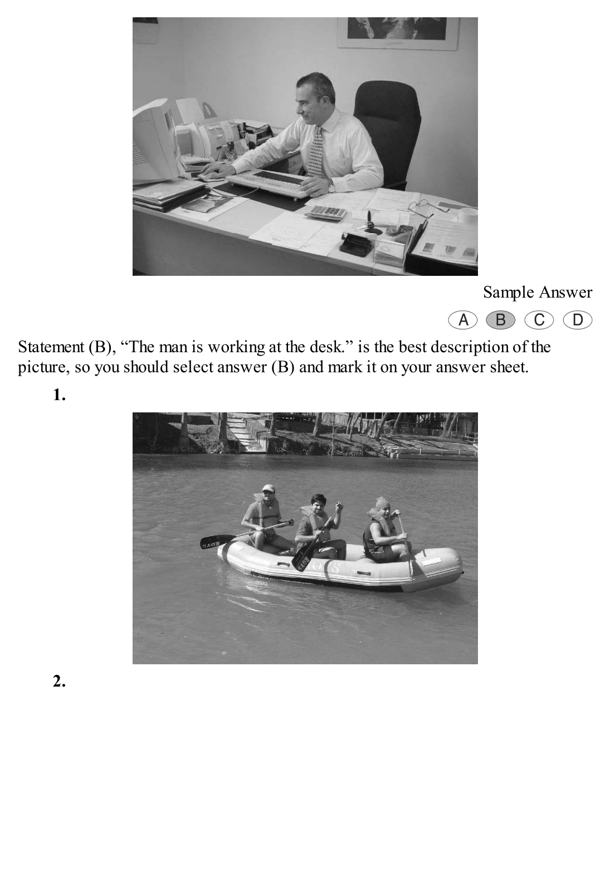

**听力原文与选项：**
- (A) They're rowing the boat together. (他们正在一起划船。)
- (B) They're lifting the rubber boat. (他们正抬起橡皮艇。)
- (C) They're sitting at the water's edge. (他们正坐在水边。)
- (D) They're swimming in the lake. (他们正在湖里游泳。)

**其他可能表达：**
- They're riding in a boat. (他们正在乘船。)
- They're wearing life jackets. (他们穿着救生衣。)
- They're sitting in a boat. (他们正坐在船上。)

### Q2 (正确答案：D)

**听力原文与选项：**
- (A) Passengers are waiting at the airport. (乘客正在机场等候。)
- (B) There are planes flying overhead. (空中有飞机飞过。)
- (C) The airplanes are parked at the gate. (飞机停在登机口门前。)
- (D) The planes have already landed. (飞机已经降落了。)

**其他可能表达：**
- The planes are waiting at the airport. (飞机在机场等候。)
- There are no planes flying over the area. (这个地区没有飞机飞过。)
- There are a few planes on the ground. (地面上有几架飞机。)

### Q3 (正确答案：B)

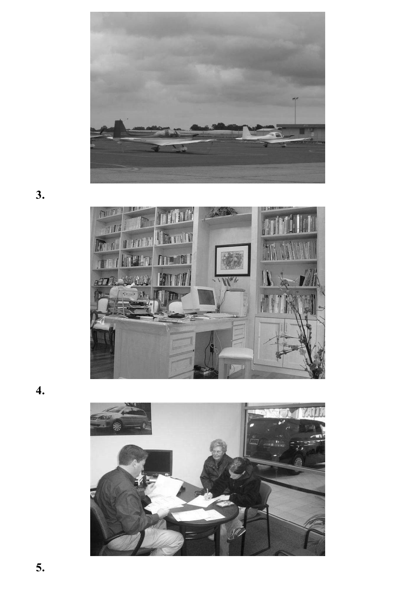

**听力原文与选项：**
- (A) The computer monitor is under the desk. (电脑显示器在书桌下面。)
- (B) The shelves are filled with books. (书架上摆满了书。)
- (C) There are books neatly arranged on top of the desk. (书整齐地摆放在书桌上面。)
- (D) Papers are stacked on the floor. (文件堆放在地板上。)

**其他可能表达：**
- The shelves are positioned against one wall. (书架放在靠墙的位置。)
- The shelves are stocked with books. (书架上放满了书。)
- There are reading materials placed on the shelves. (书架上有阅读材料。)

### Q4 (正确答案：D)

**听力原文与选项：**
- (A) One woman is leaning back in her chair. (一位女士倚靠在椅子上。)
- (B) The man is handing some documents to the woman. (男士正递给女士一些文件。)
- (C) The people are sorting out the documents together. (人们正在一起分拣文件。)
- (D) The man is looking over some papers. (男士正在查看一些文件。)

**其他可能表达：**
- They are sitting around a table. (他们围坐在桌旁。)
- One woman is signing a document. (一位女士正在签署文件。)
- They are seated across from each other. (他们面对面地坐着。)

### Q5 (正确答案：D)

**听力原文与选项：**
- (A) They are serving food to the others. (他们正在给其他人供应食物。)
- (B) They are preparing food in the kitchen. (他们正在厨房里准备食物。)
- (C) They are arranging the plates on the table. (他们正在往桌上摆放盘子。)
- (D) They are helping themselves to some food. (他们正在自己取用食物。)

**其他可能表达：**
- The people are standing around a buffet table. (人们围绕着站在自助餐桌旁。)
- One woman is holding a plate with one hand. (一位女士正用一只手端着盘子。)
- Some food has been prepared on the table. (桌上已经有一些准备好的食物。)

### Q6 (正确答案：D)

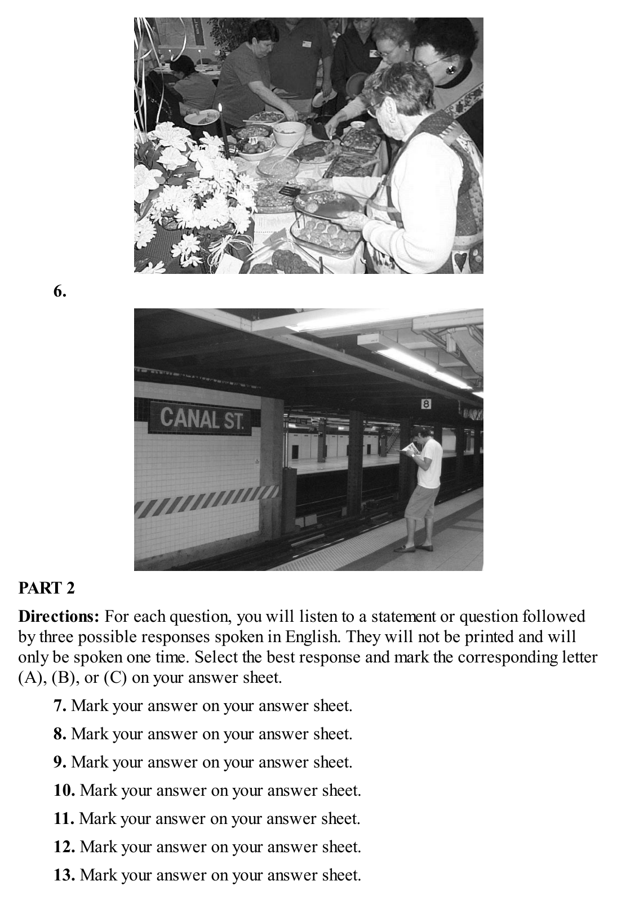

**听力原文与选项：**
- (A) He's getting on the subway. (他正在上地铁。)
- (B) He's reading a notice on the wall of the train station. (他在看车站墙上的一则通知。)
- (C) He's strolling along the track. (他正沿着铁轨闲逛。)
- (D) He's standing alone on the platform. (他一个人站在站台上。)

**其他可能表达：**
- The man is reading while waiting for the train. (男士正一边等车一边读书。)
- The man is standing alone on the platform. (男士正一个人站在站台上。)
- He is waiting for the train to arrive. (他在等列车到站。)
- 注：在Part 1中，每道试题都添加了3种可能的正确表达方式，考生可
- 以了解对于同样的照片可能出现的不同表达。

## Part 2: 应答测试 (Q7 - Q31)

### Q7 (正确答案：A)

**听力对话文本：**
- **Q:** Why did you come back from your trip so fast? (你为什么这么快就旅行回来了？)
- **A:** The meeting ended earlier than expected. (会议结束得比预计的早。)

**听力原文与选项：**
- **问题：** Why did you get back from your trip so early? (你为什么这么早就旅行回来了？)
- **选项：**
  - (A) Because the meeting got canceled. (因为会议取消了。)
  - (B) Next Friday at the earliest. (最早下周五。)
  - (C) I'll be taking the train. (我会乘火车。)

### Q8 (正确答案：B)

**听力对话文本：**
- **Q:** Are you going to the seminar, or will you stay here to work? (你是要去参加讨论会，还是留在这里工作？)
- **A:** I should catch up on my work. (我应该把工作补上。)

**听力原文与选项：**
- **问题：** Will you be attending the seminar, or do you have too much work? (你是要去参加讨论会，还是你有很多工作要做？)
- **选项：**
  - (A) No, I will attend to it later. (不，我过会儿再处理。)
  - (B) I will definitely be there. (我一定会去。)
  - (C) Sorry, but I didn't see it. (抱歉，我没有看到。)

### Q9 (正确答案：C)

**听力对话文本：**
- **Q:** How about asking John to your party? (邀请约翰参加你的聚会怎么样？)
- **A:** I've already invited him. (我已经邀请他了。)

**听力原文与选项：**
- **问题：** Why don't you invite John to your party? (邀请约翰来参加你的聚会怎么样？)
- **选项：**
  - (A) No, he isn't. (不，他不是。)
  - (B) Sure, I will be there. (当然，我会去的。)
  - (C) That's a good idea. (那是个好主意。)

### Q10 (正确答案：B)

**听力对话文本：**
- **Q:** Where can I find the men's clothing section? (男士服装区在哪儿？)
- **A:** Take a look in aisle 7. (到7号通道看一看。)

**听力原文与选项：**
- **问题：** Could you show me where the men's sportswear section is? (你能否告诉我男士运动服装区在哪儿？)
- **选项：**
  - (A) I like sports, too. (我也喜欢运动。)
  - (B) Go up to the next floor. (到楼上去。)
  - (C) At 2 o'clock. (在 2 点钟。)

### Q11 (正确答案：C)

**听力对话文本：**
- **Q:** How far is Tokyo by car? (开车到东京有多远？)
- **A:** It's around an hour from here. (从这儿走大概一个小时。注：在Part 2中，为帮助考生提高听懂题目的能力，添加了和试题相同或相似的表达方法。)

**听力原文与选项：**
- **问题：** How long is the drive to Tokyo from here? (从这里开车到东京需要多长时间？)
- **选项：**
  - (A) Every other week. (每隔一周。)
  - (B) It's a great place. (那儿是个好地方。)
  - (C) Roughly an hour. (大约一个小时。)

### Q12 (正确答案：C)

**听力对话文本：**
- **Q:** Who is not coming to the retirement party for Mr. McKenzie? (谁不会来参加麦肯齐先生的退休聚会？)
- **A:** Ralph can't make it. (拉尔夫来不了。)

**听力原文与选项：**
- **问题：** Who is going to attend the Mr. McKenzie's retirement party? (谁会去参加麦肯齐先生的退休聚会？)
- **选项：**
  - (A) He has not arrived yet. (他还没有到。)
  - (B) Let's go right now. (咱们这就走吧。)
  - (C) Everyone except Jill. (所有人，除了吉尔。)

### Q13 (正确答案：C)

**听力对话文本：**
- **Q:** How about reserving a bigger hall for the party? (给这次聚会预订一个大一些的会堂怎么样？)
- **A:** No, I think the smaller hall will do. (没必要，我认为小一点儿的就可以了。)

**听力原文与选项：**
- **问题：** Would you like to reserve the larger hall for the event? (你想要为这次活动预订大一些的会堂吗？)
- **选项：**
  - (A) Yes, I've already completed it. (是的，我已经做完了。)
  - (B) It's bigger than the others. (它比其他的大一些。)
  - (C) Yes, that would be fine. (行，那样可以。)

### Q14 (正确答案：A)

**听力对话文本：**
- **Q:** We will receive a bonus this month, won't we? (我们这个月会拿到奖金，是吗？)
- **A:** Yes, I think so. (是的，我认为是这样。)

**听力原文与选项：**
- **问题：** The bonuses will be paid this month, won't they? (奖金会在这个月发放，是吗？)
- **选项：**
  - (A) Yes, they will. (是的，会的。)
  - (B) No, I paid the bill last month. (不，我上个月付了账单。)
  - (C) Payday is this Friday. (发工资日是在本周五。)

### Q15 (正确答案：A)

**听力对话文本：**
- **Q:** Do you think it will be necessary to read over the material again before presenting it to the client? (你觉得在把材料交给客户之前有必要再读一遍吗？)
- **A:** It wouldn't hurt to do that. (这么做没什么不好。)

**听力原文与选项：**
- **问题：** Should I go over the material once again before showing it to the client? (我应该在把材料给客户之前把它再看一遍吗？)
- **选项：**
  - (A) That'd be a wise thing to do. (那是个明智之举。)
  - (B) He is expected to show up soon. (他应该很快就来了。)
  - (C) It's about our new product. (它是关于我们的新产品的。)

### Q16 (正确答案：C)

**听力对话文本：**
- **Q:** What is his occupation? (他的职业是什么？)
- **A:** He's an engineer. (他是一位工程师。)

**听力原文与选项：**
- **问题：** What does he do for a living? (他以什么谋生？)
- **选项：**
  - (A) No, he moved last week. (不，他上周搬走了。)
  - (B) He does it all the time. (他总是这样做。)
  - (C) He's an accountant. (他是一名会计。)

### Q17 (正确答案：A)

**听力对话文本：**
- **Q:** Will you get in touch with the travel agency now or in the afternoon? (你要现在联系旅行社还是下午联系？)
- **A:** I'll try calling right now. (我现在就打电话。)

**听力原文与选项：**
- **问题：** Will you call the travel agency now or later? (你要现在给旅行社打电话还是待会儿打？)
- **选项：**
  - (A) Actually, I called them yesterday. (事实上，我昨天给他们打过电话了。)
  - (B) Yes, I travel a lot. (是的，我经常旅行。)
  - (C) The flight should arrive soon. (航班应该马上就到了。)

### Q18 (正确答案：A)

**听力对话文本：**
- **Q:** Won't you be needing this note to make your presentation? (你做报告不需要这份笔记吗？)
- **A:** Thanks, I was looking for that. (谢谢，我一直在找它呢。)

**听力原文与选项：**
- **问题：** Don't you need this note for your presentation? (你做报告的时候不需要这份笔记吗？)
- **选项：**
  - (A) Thanks, I almost forgot about it. (谢谢，我几乎把它忘了。)
  - (B) Actually, there was nobody present. (事实上，没人到场。)
  - (C) No, I didn't take notes during the speech. (不，我在演讲时没做笔记。)

### Q19 (正确答案：B)

**听力对话文本：**
- **Q:** Is there a particular place where you want me to put this box, Ms. Fujimoto? (藤本女士，你想让我把这个箱子放在什么地方呢？)
- **A:** Just leave it there, please. (请你把它就放在那里吧。)

**听力原文与选项：**
- **问题：** Where should I put this box of ink cartridges, Ms. Fujimoto? (藤本女士，我应该把这箱墨盒放在哪儿？)
- **选项：**
  - (A) At the local stationery store. (在当地的文具店。)
  - (B) Put it in the next room. (把它放到隔壁房间。)
  - (C) She is the receptionist. (她是接待员。)

### Q20 (正确答案：C)

**听力对话文本：**
- **Q:** Who knows anything about computers around here? (这里谁懂电脑？)
- **A:** Ralph is the expert here. (拉尔夫是这儿的专家。)

**听力原文与选项：**
- **问题：** Who is good with computers? (谁擅长使用电脑？)
- **选项：**
  - (A) Yes, it is very good. (是的，它很好。)
  - (B) The software came with it. (这个软件是配套的。)
  - (C) John is the person you are looking for. (约翰就是你要找的人。)

### Q21 (正确答案：A)

**听力对话文本：**
- **Q:** Will we be using the overhead projector at the meeting? (我们开会时要用投影仪吗？)
- **A:** Yes, please ask Jeff to get it ready. (是的，请让杰夫把它准备好。)

**听力原文与选项：**
- **问题：** Won't we have to use the overhead projector at the meeting? (我们开会时不会用到投影仪吗？)
- **选项：**
  - (A) Yes, I will set it up soon. (是的，我会马上把它装好。)
  - (B) It is a big project. (那是一个大工程。)
  - (C) I'll head over right now. (我会马上过去。)

### Q22 (正确答案：C)

**听力对话文本：**
- **Q:** Where can I find the sales report? (我在哪儿能找到销售报告？)
- **A:** Take a look in the filing cabinet. (到文件柜看一看。)

**听力原文与选项：**
- **问题：** Where do you keep the sales report? (你把销售报告放在哪儿了？)
- **选项：**
  - (A) Yes, I will. (是的，我会的。)
  - (B) To the manager. (给经理。)
  - (C) In the filing cabinet. (在文件柜里。)

### Q23 (正确答案：B)

**听力对话文本：**
- **Q:** Would you rather read this proposal or type up the summary? (你愿意阅读这份提议还是输入这份总结？)
- **A:** What do you want me to do? (你想让我做什么？)

**听力原文与选项：**
- **问题：** Do you want to proofread this proposal, or would you prefer typing up the summary? (你是想校对这份提议，还是想输入这份总结？)
- **选项：**
  - (A) Thank you. That would be very nice of you. (谢谢你。你真好。)
  - (B) Either is okay with me. (两样都可以。)
  - (C) Yes, I read it over twice. (是的，我读过两遍了。)

### Q24 (正确答案：B)

**听力对话文本：**
- **Q:** Didn't you save a copy of your work on your computer? (你没有把你的工作在电脑上备份吗？)
- **A:** No, I didn't think it was necessary. (没有，我觉得没有必要。)

**听力原文与选项：**
- **问题：** Didn't you back up the work on your computer? (你没有在电脑上把工作备份吗？)
- **选项：**
  - (A) No, I came through the front door. (不，我从前门过来的。)
  - (B) No, I forgot all about it. (没有，我全忘了。)
  - (C) I will give it back to you today. (我今天会把它还给你。)

### Q25 (正确答案：A)

**听力对话文本：**
- **Q:** How about calling me later to let me know how you decided? (过一会儿给我打电话，告诉我你的决定，好吗？)
- **A:** I'll phone you before I go home. (我回家之前会给你打电话。)

**听力原文与选项：**
- **问题：** Could you let me know your decision later today? (今天晚些时候能告诉我你的决定吗？)
- **选项：**
  - (A) I will give you a ring by 5 o'clock. (我会在 5 点之前给你打电话。)
  - (B) I'm sure it will not be too late. (我肯定不会太晚的。)
  - (C) It could go either way. (两种办法都可以。)

### Q26 (正确答案：B)

**听力对话文本：**
- **Q:** That is where the new mall is going to go up, isn't it? (那里是新商场的建造地点，是吗？)
- **A:** Yes, that's what I heard. (是的，我听说是这样。)

**听力原文与选项：**
- **问题：** Isn't that where the new mall is going to be built? (那不是要建造新商场的地方吗？)
- **选项：**
  - (A) You will be going there this afternoon. (你今天下午会到那儿去。)
  - (B) I think you might be right. (我想你也许是对的。)
  - (C) Yes, the mall is close to here. (是的，商场离这里很近。)

### Q27 (正确答案：A)

**听力对话文本：**
- **Q:** Who looks after the receipts here? (这里谁负责收据？)
- **A:** John looks after the books here. (约翰在这儿负责账本。)

**听力原文与选项：**
- **问题：** To whom should I be handing these receipts? (我应该把这些收据交给谁？)
- **选项：**
  - (A) John will take them off your hands. (约翰会从你那里把它们拿走。)
  - (B) She gave them to me today. (她今天把它们给我了。)
  - (C) To get a tax break. (为了减免税。)

### Q28 (正确答案：C)

**听力对话文本：**
- **Q:** How did you like the movie we just saw? (你觉得我们刚才看的电影怎么样？)
- **A:** I thought it was quite good. (我觉得非常好。)

**听力原文与选项：**
- **问题：** What did you think of the movie we just saw? (你觉得我们刚才看的电影怎么样？)
- **选项：**
  - (A) I'll see it this weekend. (这个周末我会去看。)
  - (B) At the theater in the mall. (在商厦的剧场。)
  - (C) It was very exciting. (非常精彩。)

### Q29 (正确答案：A)

**听力对话文本：**
- **Q:** Do I have to take it down in person? (我必须亲自把它送到吗？)
- **A:** No, you can mail it if you'd like. (不，如果你愿意，可以邮寄。)

**听力原文与选项：**
- **问题：** Do I have to deliver it in person? (我必须本人送过来吗？)
- **选项：**
  - (A) No, you can mail it in instead. (不用，你可以邮寄过来。)
  - (B) Yes, he works at the post office. (是的，他在邮局工作。)
  - (C) On the first basement floor. (在地下一层。)

### Q30 (正确答案：B)

**听力对话文本：**
- **Q:** Should I put you down for two o'clock today? (我可以把你安排在今天2点吗？)
- **A:** Sure, that is fine. (当然可以。)

**听力原文与选项：**
- **问题：** Should I schedule you for two this afternoon? (我可以把你安排在今天下午 2 点吗？)
- **选项：**
  - (A) Yes, I have a full schedule today. (是的，我今天的安排很满。)
  - (B) That would suit me fine. (那对我来说很合适。)
  - (C) No, there will be three of us. (不，我们一共三个人。)

### Q31 (正确答案：A)

**听力对话文本：**
- **Q:** Let me know your decision as soon as possible. (尽快告诉我你的决定。)
- **A:** I'll let you know after lunch today. (我会在今天午饭后告诉你。Questions 32 through 34 refer to the following conversation.M1:Have you decided on whether you are going to apply for the jobthat's opened up in marketing？（)

**听力原文与选项：**
- **问题：** Please give me an answer as soon as you can. (请你尽快给我答复。)
- **选项：**
  - (A) I will call you this afternoon. (我今天下午会给你打电话。)
  - (B) Sorry, I am late. (抱歉，我迟到了。)
  - (C) He will give it to me there. (他会在那儿交给我。)

## Part 3: 简短对话 (Q32 - Q70)

### Questions 32 - 34

**听力独白/对话原文：**
**M1:** Have you decided on whether you are going to apply for the job that's opened up in marketing? (32)
**M2:** I thought it over, and I don't think I am going to apply for it because the position doesn't pay as much as I had thought. (33)
**M1:** That's true, but there is a great chance for a quick promotion there. If I were you, I'd think it over again because in a couple of years you'll be in much better situation than you would have been if you had stayed here.
**M2:** Hmm... I think you have a point there. Maybe I should try to see if I can get the position first. After all, I might not even be considered for it. (34)

**中文对照：**
> **M1：**你是否已经决定要不要申请市场营销部的空缺职位了？
> **M2：**我考虑过了，我不打算申请，因为这份工作的报酬比我想象的低。
> **M1：**确实，但是到那儿会有机会很快升职。如果我是你，我会再考虑一下，因为几年之后，你的境况会比你留在这儿好很多。
> **M2：**嗯…我觉得你说得有道理。也许我应该先试试看能不能得到这个职位。毕竟，人家可能还不会考虑我呢。

**核心词汇与短语：**
- **apply for ~**：申请
- **think over**：考虑
- **You have a point there**：你说得有道理
- **be reluctant to do ~**：不愿意做，勉强做
- **be qualified for**：胜任
- **open position**：空缺的职位
- **face**：面对
- **outcome**：结果

#### Q32 (正确答案：C)
**问题：** Who most likely are they? (他们最有可能是谁？)
- (A) A job candidate and an interviewer. (职位候选人和面试官。)
- (B) A marketing manager and a personnel manager. (市场部经理和人事部经理。)
- (C) Co-workers who work in the same department of a company. (在公司同一个部门工作的同事。)
- (D) A client and a shop employee. (客户和店员。)

#### Q33 (正确答案：D)
**问题：** Why is the man reluctant to transfer to another department? (为什么男士不愿意调到另一个部门？)
- (A) He is happy with his current job. (他对现在的工作很满意。)
- (B) He feels that he is not qualified for the open position. (他觉得自己不能胜任这个空缺职位。)
- (C) He doesn't like the people in the Marketing Department. (他不喜欢市场部的员工。)
- (D) He would have to accept a pay cut if he got hired. (他如果被聘用的话，就得接受降薪。)

#### Q34 (正确答案：A)
**问题：** What will the man probably do? (男士很可能怎么做？)
- (A) Put in his application and face the outcome. (递交他的申请，等待结果。)
- (B) Talk to his boss about getting more details about the position. (和老板谈谈，获取关于这个职位的更多信息。)
- (C) Disregard the opportunity and wait for another time. (不理会这次机会，等待下次。)
- (D) Work harder to be considered for the next promotion. (更加努力地工作，以便获得下一次提拔。)

**延伸表达与补充：**
- **Have you decided on ～ ? = Have you come to a conclusion in regards to ～ ? = Have you made up your mind about ～ ?** (你决定…了吗？)
  - *例句：Have you decided on which type of car you will buy?* (你决定要买哪种汽车了吗？)
- **that's opened up = that's available = that's vacant = that's empty** (空缺的)
  - *例句：Let's go check out the new record store that's opened up in the mall.* (咱们去看看商厦里那家新开的唱片店吧。)
- **I'd think it over again. = I'd reconsider it. = I'd put more thought into it.** (我会再考虑一下的。)
  - *例句：I'd think it over again to make sure there are no mistakes. 注：在Part 3和Part 4中，笔者将篇章和题目中出现频率高的重要词* (我会再考虑一下，确保没有错误。汇、短语和句子截取出来，又补充了一些类似的表达。)

### Questions 35 - 37

**听力独白/对话原文：**
**W:** I have an appointment to meet with Mr. Ewing at 2. (35) Where can I park?
**M:** I'm sorry, but our underground parking lot is under renovation at the moment. There is free parking two blocks north of here, but there is a good chance that it might be a full house today because of the art exhibit. Your best bet is to turn your car around and drive back down this street to the intersection. (36) There is a pay lot there.
**W:** That's quite a distance to walk back here. Do you think I would get a ticket if I just parked somewhere along this street? (37)
**M:** You can try, but I wouldn't if I were you. I saw a car being towed away a few days ago. (37)

**中文对照：**
> **W：**我和尤因先生约好了2点见面。在哪儿能停车？
> **M：**抱歉，我们的地下停车场现在正在整修。从这儿往北两个街区有一个免费停车场，不过今天有艺术展，很有可能没有空车位了。最好的办法是掉头沿着这条街往回开，开到十字路口。那儿有一个收费停车场。
> **W：**从那儿走过来挺远的。我如果把车停在街边，会不会被开罚单？
> **M：**你可以试试，但是如果我是你，就不会这样做。几天前我见过一辆车被拖走了。

**核心词汇与短语：**
- **renovation**：修缮，改建
- **bet**：（最好的）办法
- **intersection**：十字路口
- **pay lot**：收费停车场
- **get a ticket**：被开罚单
- **be towed away**：被拖走
- **garage**：车库

#### Q35 (正确答案：A)
**问题：** Who is the woman? (这位女士是谁？)
- (A) A visitor. (访客。)
- (B) A building security guard. (大楼保安。)
- (C) A parking attendant. (停车场服务员。)
- (D) An artist. (艺术家。)

#### Q36 (正确答案：C)
**问题：** What suggestion does the woman receive from the man? (女士从男士那里得到了什么建议？)
- (A) See the art exhibit. (观看艺术展。)
- (B) Park in the underground garage. (在地下车库停车。)
- (C) Turn back and drive down to the intersection. (掉头，开到十字路口。)
- (D) Walk back to her house. (走回家。)

#### Q37 (正确答案：D)
**问题：** What does the man imply when he says, “You can try, but I wouldn't if I were you”? (男士说 “ 你可以试试，但是如果我是你，就不会这样做 ” ，他在暗示什么？)
- (A) The woman should drive back home. (女士应该开车回家。)
- (B) The woman should buy a ticket to the exhibit. (女士应该买一张展会门票。)
- (C) The woman should pay for the towing fee. (女士应该付拖车费。)
- (D) The woman should park her car somewhere else. (女士应该把车停在别的地方。)

**延伸表达与补充：**
- **I have an appointment to meet ～ = I am scheduled to meet ～ = I am planning to meet ～** (我约好和…见面。)
  - *例句：I have an appointment to meet the boss in one hour.* (我约好一小时后见老板。)
- **There is a good chance that ~ = There is every opportunity to do ～ = There is a good probability of doing ～** (很有可能…)
  - *例句：There is a good chance that I will get promoted this year.* (我今年很有可能被提拔。)
- **It might be a full house today. = It might be packed today.** (今天可能车（客）满了。)
  - *例句：It might be a full house today, so you'd better check before heading down to the theater.* (剧院今天可能客满了，所以你最好去那儿之前核实一下。)
- **Your best bet is to ～ = It would be best for you to ～ = It would be a good idea for you to ～** (你最好的办法是…)
  - *例句：Your best bet is to take the local road at this time of the day.* (这个时间段，你最好的办法是走市政道路。)

### Questions 38 - 40

**听力独白/对话原文：**
**M:** Hello, Ms. Mercer. This is James Murdock from Speedy Auto Mechanics. The work on your vehicle has been completed. (38)
**W:** That's excellent news. Unfortunately, I'm going to be in meetings all day, so I can't pick it up until tomorrow.
**M:** If you give me your office address, I can have someone drop it off there. (39)
**W:** Would you do that for me? I'd really appreciate it. I work at 983 Emerson Lane.
**M:** All right, your car should be there in around an hour. I'll have the driver call you when he arrives.
**W:** Great. And if he can give me the bill then, I'd appreciate it. (40)

**中文对照：**
> **M：**您好，默瑟女士。我是快速汽车维修公司的詹姆斯·默多克。您的汽车已修好。
> **W：**太好了。遗憾的是，我一天都需要开会，所以明天才能去取车。
> **M：**如果您可以提供您的办公室地址，我可以让人顺便送过去。
> **W：**你愿意帮我这个忙吗？真是太感谢了。我的办公地址是艾默生巷983号。
> **M：**好的，您的车应该会在一小时内送达。司机到了，我让他给您打电话。
> **W：**太棒了。如果司机可以把账单一并带来，我将感激不尽。

**核心词汇与短语：**
- **vehicle**：车辆，交通工具
- **complete**：完成
- **excellent**：极好的；卓越的
- **unfortunately**：不幸地，遗憾地
- **appreciate**：感激
- **bill**：账单

#### Q38 (正确答案：C)
**问题：** Why does the man call the woman? (男士为什么给女士打电话？)
- (A) To ask for permission to do something. (请求允许做某事。)
- (B) To invite her to visit his shop. (邀请她参观他的商店。)
- (C) To tell her that some work is done. (告诉她某些工作已经完成。)
- (D) To explain what he did. (解释他的行为。)

#### Q39 (正确答案：A)
**问题：** What does the man offer to do? (男士主动提出做什么？)
- (A) Have a car delivered. (把车送过去。)
- (B) Lower a price. (降低价格。)
- (C) Call the woman again later. (稍后再给这位女士打电话。)
- (D) Reschedule an appointment. (重新安排一次会面。)

#### Q40 (正确答案：B)
**问题：** What does the woman request? (女士要求什么？)
- (A) A refund. (退款。)
- (B) The bill. (账单。)
- (C) A discount coupon. (一张打折券。)
- (D) An itinerary. (一个旅行计划。)

**延伸表达与补充：**
- **pick sth. up = fetch I've got to pick up my coat from the laundry.** (我得到洗衣店去取大衣了。)
- **drop sb./sth. off** (让某人下车；中途顺便将某物送交某处扩展表达：)
  - *例句：drop in (on sb.) Could you drop me off near the park?* (顺便拜访（某人）你可以让我在公园附近下车吗？)
- **have sb. call you = let sb. call you** (让某人给你打电话)
  - *例句：Can you have John call me when he arrives at home?* (约翰到家后，你可否让他打电话给我？)

### Questions 41 - 43

**听力独白/对话原文：**
**M:** I am wondering if you carry men's shirts in extra large here. (41) I've been looking through all the stores on this entire block for the last hour, but I haven't had any luck with finding anything that fits me properly.
**W:** You're in luck because we not only carry them but we also have clothes that are fashionable for people who need large-sized clothing here in the back section of the store.Follow me, and I am quite certain that you will be able to find something you like. （ 42, 43 ）
**M:** This is great. I am sure that many oversized people would find your store useful. It's not easy for us big people to find clothes that we like. Have you been in business for long?
**W:** Yes, we've been around for a couple of years now, and we have a steady stream of customers coming into the store regularly.

**中文对照：**
> **M：**不知道你这里有没有男士超大号的衬衫。我在整个街区的所有商店里找了一个小时了，可是没找到合适我的衬衫。
> **W：**您运气好，我们不光出售这样的衬衫，而且还有为需要大号服装的人士准备的时尚服装，就在商店的后面。跟我来，我确定您能找到喜欢的衣服。
> **M：**太好了。肯定有很多体胖的人会觉得你们的商店有用的。对于我们这些大块头而言，要找到喜欢的衣服很不容易。你们经营很久了吗？
> **W：**是的，我们已经开店几年了，有定期光顾的稳定客流。

**核心词汇与短语：**
- **carry**：备有（货品），有出售
- **extra**：额外的，特别的
- **look through**：审核，浏览
- **fashionable**：时尚的
- **oversized**：体胖的，大号的
- **be in business**：营业，经商
- **stream**：（人）流，（车）流

#### Q41 (正确答案：A)
**问题：** What is the man doing? (男士在做什么？)
- (A) He is trying to buy some clothing. (他在试图买衣服。)
- (B) He is looking for a bank. (他在寻找一家银行。)
- (C) He is preparing to start a business. (他在准备开一家公司。)
- (D) He is serving a customer. (他在为一位顾客服务。)

#### Q42 (正确答案：B)
**问题：** Where will the man most likely go next? (男士下一步最有可能去哪儿？)
- (A) To another store. (去另一家商店。)
- (B) To the back part of the store. (到这家商店的后面去。)
- (C) To a fashion show. (去参加一个时装展。)
- (D) To see a customer. (去见一个顾客。)

#### Q43 (正确答案：C)
**问题：** What is special about this place? (这家店的特别之处是什么？)
- (A) The items are reasonably priced. (商品的价格合理。)
- (B) It is located close to the man's place. (它离男士的住处很近。)
- (C) It carries items that other stores don't have. (它有其他商店没有的商品。)
- (D) It has been in business for many years. (它经营好多年了。)

**延伸表达与补充：**
- **I am wondering if you carry ～ = I am wondering if you have ～ in stock = I am wondering if you have ～** (不知道你有没有…)
  - *例句：I was wondering if you carry carry-on bags here.* (不知道你这里有没有手提行李箱。)
- **It's not easy for us big people to ~ = It's difficult for us heavy people to ~ = It is hard for big people like us to ~** (我们这些块头大的人很难…)
  - *例句：It's not easy for us big people to watch movies in theaters that have very narrow seats.* (我们这些块头大的人很难在座位很窄的电影院看电影。)
- **Have you been in business for long?** (你们经营很久了吗？扩展表达：)
  - *例句：How long have you had your business? When did you start your business?* (你们做生意多久了？你们什么时候开业的？)
- **We have a steady stream of customers coming into the store regularly. = We have built a regular customer base for this store. = We have regular customers coming into the store.** (我们有定期光顾商店的顾客流。)

### Questions 44 - 46

**听力独白/对话原文：**
**M:** Why didn't you take care of the electricity bill? I gave you my share of the bill and told you to pay it last Wednesday. We just got a second notice in the mail today. (44)
**W:** You are kidding me. I was busy on the day you asked me because I had to run an important errand for my boss, so I just couldn't get to the bank on time. And then I completely forgot all about it on Thursday because of the seminar I had to attend. I only remembered it after lunch on Friday and went straight to the bank and paid it. (45)
**M:** I guess they must have sent out the notice before you paid then. I'll call them and straighten this out. (46)
**W:** I am sorry, but I couldn't help it. I'll remember to take care of the bills early from now on.

**中文对照：**
> **M：**你为什么没有交电费呢？我上周三就把我的那部分电费给你了，还让你去交费。我们今天收到第二次邮件通知了。
> **W：**你开玩笑吧。你让我交电费那天我很忙，因为我要给老板办一件重要的事，没法按时到银行去。周四我把这事完全忘记了，因为我必须参加一个研讨会。我到周五午饭后才想起来，就直接去银行把电费交了。
> **M：**我猜他们肯定是在你付费之前寄的通知单。我要给他们打个电话弄清楚。
> **W：**抱歉，但我也没有办法。以后我会记得早点付账单的。

**核心词汇与短语：**
- **take care of**：应付，处理；关注
- **electricity bill**：电费单
- **notice**：通知
- **run an errand**：办事，跑腿
- **straighten out**：改正；澄清

#### Q44 (正确答案：D)
**问题：** What is the man asking the woman about? (男士在问女士什么？)
- (A) An error made in his paycheck. (他工资支票上的一个错误。)
- (B) A warning he had received at work. (他在工作中收到的一个警告。)
- (C) The lunch menu at a restaurant he wants to go to. (他想去的一家饭店的午餐菜单。)
- (D) A notification of an unpaid bill. (一个未付账单的通知单。)

#### Q45 (正确答案：B)
**问题：** What will the man do? (男士会做什么？)
- (A) Drop by the bank. (顺便去趟银行。)
- (B) Take care of a misunderstanding. (处理一个误会。)
- (C) Call another electrician. (给另一个电工打电话。)
- (D) Go on an errand. (去办事。)

#### Q46 (正确答案：C)
**问题：** When was the bill taken care of? (账单的费用是什么时候交的？)
- (A) Wednesday. (周三。)
- (B) Thursday. (周四。)
- (C) Friday. (周五。)
- (D) This morning. (今天上午。)

**延伸表达与补充：**
- **Why didn't you take care of the electricity bill? = Why didn't you pay the electricity bill? = Why wasn't the electricity bill paid?** (你为什么没有交电费？)
- **I gave you my share of the bill. = I gave you the money for my part of the bill. = I already chipped in for my share.** (我把我那部分费用给你了。)
- **We just got a second notice. = We received another notice.** (我们收到了二次通知。扩展表达：)
  - *例句：We received a warning notice.* (我们收到了警告通知。)
- **I had to run an important errand for my boss.** (我必须给我的老板办一件重要的事。扩展表达：)
  - *例句：I had to do something for my boss. My boss sent me out to take care of something.* (我必须帮老板做点儿事。老板让我出去办点儿事。)
- **I am sorry, but I couldn't help it.** (抱歉，我也无能为力。扩展表达：)
  - *例句：I apologize but I had no choice but to do that. I'm sorry but I had no control over the situation.* (抱歉我只能那样做。抱歉我无法控制局面。)

### Questions 47 - 49

**听力独白/对话原文：**
**W1:** I can't believe how busy we've been. We've received so many orders in the past few days.
**W2:** Because it's the holiday season, we probably won't get much of a break for the next couple of months. (47)
**W1:** Everyone has been at the office long after normal working hours have finished this week, so I've heard several complaints. (48) Can't we hire any more workers? (49)
**W2:** I'd love to, but I'm not sure if that's possible. What do you think, Greg?
**M:** That's already been taken care of. You'll be training fifteen temporary employees in your department tomorrow. (49)
**W1:** Wow, I'm impressed. I've never seen management work this fast before.

**中文对照：**
> **W1：**真不敢相信我们过去这段时间这么忙！过去的这几天，我们收到了这么多订单。
> **W2：**因为是节假日旺季，在接下来的几个月中，我们可能没有太多的休息时间。
> **W1：**本周，正常工作时间结束后，每个人都在办公室待了很长时间，所以我也听到了一些抱怨声。我们不能再多雇用一些员工吗？
> **W2：**我也很想，但我不确定这是否有可能。格雷格，你怎么想？
> **M：**这个已经安排好了。明天，你将要在你们部门培训15名临时员工。
> **W1：**哇！真是令人刮目相看！从未见过管理工作做得如此之快。

**核心词汇与短语：**
- **holiday season**：休假（旅游）的旺季；节日季节
- **complaint**：抱怨
- **hire**：（短期）雇用
- **I'd love to~**：我很愿意很乐意
- **normal working hours**：正常的工作时间
- **temporary**：短期的；临时的
- **employee**：雇员
- **management work**：管理工作

#### Q47 (正确答案：A)
**问题：** Why have the speakers been very busy? (为何说话者一直这么忙？)
- (A) It is a busy time of the year. (这是一年中的繁忙时期。)
- (B) A sale has been going on. (特价销售一直在进行。)
- (C) Several workers resigned recently. (近期有几位员工辞职。)
- (D) The company is expanding. (这家公司在扩张。)

#### Q48 (正确答案：B)
**问题：** What are some employees unhappy about? (一些员工不满意什么？)
- (A) Receiving low salaries. (领取低薪。)
- (B) Working overtime. (超时工作。)
- (C) Having their vacations canceled. (取消休假。)
- (D) Losing their bonuses. (失去奖金。)

#### Q49 (正确答案：C)
**问题：** What does the man imply when he says, “That's already been taken care of”? (当这位男士说 “That's already been taken care of” ，他是在暗示什么？)
- (A) An orientation session has been scheduled. (新员工培训已经安排好。)
- (B) A manager has been replaced. (经理已被替代。)
- (C) New workers have been hired. (已经雇用了新员工。)
- (D) Hourly wages have been increased. (时薪上涨了。)

**延伸表达与补充：**
- **couple of** (几个扩展表达：)
  - *例句：a couple of a couple There are a couple of girls waiting for you. I just need to make a couple more calls.* (一对，一双一些，几个有两个女孩在等你。我还要打几个电话。)
- **That's already been taken care of. = That's already been arranged.** (已安排好。)
  - *例句：— I haven't been able to book into a hotel yet. —— — That's all right, we've already taken care of all that. ——* (我还没来得及在旅馆订房间呢！不要紧，我们把一切都安排好了。)
- **I'm impressed.** (真是令人刮目相看！/令人印象深刻！表示吃惊)

### Questions 50 - 52

**听力独白/对话原文：**
**W:** How did your team make out in the baseball tournament over the weekend?
**M:** You're not going to believe this, but we made it all the way to the finals by beating the marketing team and then played the sales team in the finals. (50) You know, if it weren't for John, our best player, leaving the game because of a sprained ankle, we could've won the whole thing. By the way, why didn't you guys compete? We were expecting to play you guys.
**W:** Oh, our manager Susan is not a very big fan of baseball. She thinks that it's a waste of time spending our weekends playing sports. (51)
**M:** You've got to be kidding. I can understand that she is not a big fan of baseball, but she should be thinking about the employees' morale. I don't know about you guys, but our guys were all pumped up after the weekend game. I guess some of the bosses don't feel that company spirit is all that important. (52)

**中文对照：**
> **W：**你们队在周末的棒球比赛中表现怎么样？
> **M：**你一定不会相信，我们打败了市场队，一路杀入和销售队的决赛。你知道，如果不是我们最好的球员约翰因为扭伤脚踝退出了比赛，我们就会大获全胜的。对了，你们为什么没参加比赛啊？我们还想和你们比一比呢。
> **W：**哦，我们的经理苏珊对棒球不太感兴趣。她认为在周末参加体育运动是在浪费时间。
> **M：**你在开玩笑吧。她不是铁杆棒球迷我能理解，但是她应该考虑员工的士气。我不知道你们怎么样，反正我们周末活动完之后士气大振。我想是有些领导觉得公司活力不那么重要吧。

**核心词汇与短语：**
- **sprain**：扭伤
- **pump up**：打气，使精力充沛
- **spirit**：精神，活力
- **defeat =beat**：）打败
- **compete in**：参加比赛

#### Q50 (正确答案：A)
**问题：** How far did the man's team go in the tournament? (男士的球队在比赛中表现如何？)
- (A) They reached the finals before getting defeated. (他们打入决赛，最后输了。)
- (B) They got into the semifinals after beating the sales team. (他们打败销售队后进入了半决赛。)
- (C) They were defeated in the first round of the tournament. (他们在比赛的第一回合就被打败了。)
- (D) They went all the way to the finals and won. (他们一路打到决赛，最后赢了。)

#### Q51 (正确答案：B)
**问题：** According to the woman, why didn't her team compete in the tournament? (根据女士所说，她们队为什么没有参加比赛？)
- (A) Many of her staff members were out of town on business. (她的很多同事都去外地出差了。)
- (B) Her boss does not like baseball very much. (她的老板不太喜欢棒球。)
- (C) She fell down the stairs and broke her ankle. (她从楼梯上摔下来，扭伤了脚。)
- (D) Her team members were too busy with work. (她的队员工作太忙了。)

#### Q52 (正确答案：A)
**问题：** What does the man mention about some of the managers in the company? (男士提到公司的一些经理时是怎么说的？)
- (A) They don't consider company morale to be very important. (他们认为公司士气不是非常重要。)
- (B) They stress winning the tournament too much. (他们太注重赢得比赛了。)
- (C) They worked very hard preparing for the tournament. (他们努力准备这次比赛。)
- (D) They waste too much time talking about sports. (他们把太多时间浪费在谈论体育上。)

**延伸表达与补充：**
- **How did your team make out ～ ? = How did your team do ～ ? = How far did your team go ～ ?** (你们队表现得怎么样？)
  - *例句：How did your team make out in the tournament?* (你们队在比赛中表现如何？)
- **She is not a very big fan of ～ = She is not very fond of ～** (她不太喜欢…)
  - *例句：Jeff is not a very big fan of jazz music.* (杰夫不太喜欢爵士乐。)
- **It's a waste of time v-ing ～ = It's not worth our time v-ing ～ = It's not a good idea to spend time on ～** (做…是在浪费时间。)
  - *例句：I think it's a waste of time driving all the way to Buffalo this weekend.* (我认为周末开车去布法罗是浪费时间。)

### Questions 53 - 55

**听力独白/对话原文：**
**M:** We seem to have already gone over our budget on travel expenses this quarter. Do you know the reason?
**W:** Well, the main reason is because the airline we deal with has raised their fares. (53) On top of that, we had to change the hotel we use because many of our staff complained about being robbed during their trips. So, we signed a contract with another chain, and they are a bit more expensive. (53)
**M:** Well, we are going to have to do something to tighten up around here. Tell you what; from now on I want you to make sure you allow only those staff members who must take trips to go on them. (54) This way, we should be able to keep down the cost a bit.
**W:** Actually, we have been doing that, but it's hard to judge which trips should be allowed or not because everyone seems to have legitimate reasons for taking the trips. (55) I think we need to find other ways to cut costs. I'm meeting with the other managers today. Why don't I bring up the issue at the meeting?

**中文对照：**
> **M：**我们这个季度的差旅费好像超出预算了。你知道是什么原因吗？
> **W：**哦，主要原因是我们合作的航空公司提高了票价。除此之外的一个原因是，我们不得不更换以前用的宾馆，因为很多员工都抱怨在旅行途中遭抢劫。所以我们和另一家连锁旅店签了合同，他们收费高一些。
> **M：**好吧，我们要采取措施紧缩开支。跟你说吧，从现在起，我想让你确保只允许必须出差的人出差。这样一来，我们应该能减少一点儿花销。
> **W：**实际上，我们一直都是这么做的，但是很难判断哪些出差应该批准，哪些不应该批准，因为每个人似乎都有出差的正当理由。我认为我们需要找别的办法降低成本。我今天要和其他经理开会。我何不在会上提出这个问题呢？

**核心词汇与短语：**
- **on top of ~**：除之外，在之上
- **rob**：抢劫
- **sign a contract with ~**：和签订合同
- **tighten up**：使变紧；使更严格，使更有效
- **tell you what**：告诉你吧
- **allow sb. to do**：允许某人做
- **judge**：判断
- **legitimate**：合理的，正当的
- **bring up**：提出
- **shot up**：猛涨
- **work from one's home**：在家办公
- **discriminate against**：区别对待

#### Q53 (正确答案：C)
**问题：** According to the woman, why has the company gone over its travel expenses budget this quarter? (根据女士所说，为什么公司这个季度的差旅费预算超支了？)
- (A) Many employees are making unnecessary trips. (很多员工的出差是不必要的。)
- (B) The staff members are staying at very expensive hotels. (员工住非常昂贵的宾馆。)
- (C) The airline the company deal with has raised their fares. (该公司合作的航空公司提高了票价。)
- (D) The cost of insurance has more than doubled. (保险的价格翻了一倍还多。)

#### Q54 (正确答案：B)
**问题：** What does the man suggest they do to solve the problem? (男士建议他们怎样解决这个问题？)
- (A) Have more people work from their homes. (让更多的人在家办公。)
- (B) Discriminate against those planning to travel. (区别对待那些计划出差的人。)
- (C) Work out a better deal with the airline company. (和航空公司达成一个更好的合作方案。)
- (D) Get the workers to pay for their own meals. (让员工自己负担餐费。)

#### Q55 (正确答案：B)
**问题：** What does the woman say is the reason why the man's suggestion won't work? (女士为什么认为男士的提议不会起作用？)
- (A) People tend to get lazy working at home. (人们在家工作会变懒。)
- (B) The management cannot judge which trips are absolutely necessary. (管理者没法判断哪些出差是完全必要的。)
- (C) They are already getting a special rate from the airline company they deal with. (他们已经从合作的航空公司那里得到了优惠价。)
- (D) The rest of the managers at the company don't think it's a good idea. (公司其他的经理认为这个主意不好。)

**延伸表达与补充：**
- **We deal with ~ = We do business with ~ = We have relationship with ~** (我们和…有合作。)
  - *例句：We deal with many small businesses in town.* (我们和城里的很多小公司有合作。)

### Questions 56 - 58

**听力独白/对话原文：**
**W:** How is your newest employee working out?
**M:** Do you mean Ted? He's doing really well. Thanks so much for recommending him to me. (56)
**W:** We both worked at Lensman Technology a couple of years ago, so I'm familiar with the quality of the work he does. (57)
**M:** He definitely works harder than anyone else in my department. In fact, he'll probably get a promotion pretty soon. (58)
**W:** Already? That's rather fast, isn't it?
**M:** Somewhat, but he should be rewarded for doing such good work. And it might inspire the others in my department to try a bit harder as well.

**中文对照：**
> **W：**你的那位新员工工作怎么样？
> **M：**你是说泰德？他干得很好。多谢你把他推荐给我。
> **W：**几年前，我们两个人都在兰斯曼科技公司工作，所以我对他的工作质量很了解。
> **M：**他绝对比我们部门里任何一个人都更努力。事实上，他可能很快会得到晋升。
> **W：**已经确定了？太快了，对吧？
> **M：**是有点，不过他工作表现优异，值得奖励。而且这样做也可能会激励部门其他同事更加努力工作。

**核心词汇与短语：**
- **employee**：雇员
- **work out**：发展，产生结果
- **recommend**：推荐
- **definitely**：确切地，肯定地
- **promotion**：晋升
- **reward**：奖赏，奖励
- **inspire**：激励，鼓舞

#### Q56 (正确答案：D)
**问题：** Why does the man thank the woman? (男士为何感谢女士？)
- (A) She finished some work on time. (她按时完成了一些工作。)
- (B) She worked hard on a project. (她为一个项目努力工作。)
- (C) She assisted him with an interview. (她协助他进行面试。)
- (D) She introduced a person to him. (她给他介绍了一个人。)

#### Q57 (正确答案：D)
**问题：** How does the woman know Ted? (女士是如何认识泰德的？)
- (A) They attended the same college. (他们是同一所大学的。)
- (B) They are childhood friends. (他们是儿时的朋友。)
- (C) They met at their current job. (他们是在现在的工作中认识的。)
- (D) They worked together before. (他们以前在一起工作。)

#### Q58 (正确答案：B)
**问题：** What does the man say about Ted? (关于泰德，男士说了什么？)
- (A) He has inspired other workers. (他激励了其他同事。)
- (B) He is likely to get a better position. (他可能会得到更好的职位。)
- (C) He is considering a transfer. (他正考虑调职。)
- (D) He needs to start working harder. (他需要开始更努力地工作。)

**延伸表达与补充：**
- **a couple of = a few** (几个)
  - *例句：He jogs a couple of miles every morning.* (他每天早上要慢跑几英里。)
- **be familiar with = be acquainted with** (熟悉)
  - *例句：He is very familiar with Shakespeare's works.* (他非常熟悉莎士比亚的作品。)
- **pretty soon = before long** (很快，不久之后)
  - *例句：His book will be published pretty soon.* (他的书很快就会出版。)
- **a bit = a little** (略微，有点儿扩展表达：)
  - *例句：quite a bit She has done quite a bit of work over the past year.* (许多，大量，不少过去一年里她做了不少工作。)

### Questions 59 - 61

**听力独白/对话原文：**
**W:** Hello, sir, how can I be of service to you today?
**M:** Hi, my name is John Smith, and I am here to check in. I made a reservation for a single room for two nights three days ago. (59)
**W:** Ah... yes, Mr. Smith. We've been expecting you. I can see here that you requested a non-smoking room overlooking Lake Huron. You've also asked for your breakfast meal to be served in your room at 7 a.m. sharp, right? (60)
**M:** Yes, that is correct. I have to make a presentation at a business seminar at 9, (61) so I want to have some time to read over the materials beforehand.

**中文对照：**
> **W：**先生您好，我能为您做些什么？
> **M：**你好，我叫约翰·史密斯，我来办理入住登记。三天前我预订了一个单人间，住两个晚上。
> **W：**啊…是的，史密斯先生。我们在等您。我看到您要求预订一个能俯瞰休伦湖的无烟房间。您还要求7点整送早餐，对吗？
> **M：**是的，没错。我9点钟要在一个商务会议上作报告，所以我想提前留些时间通读资料。

**核心词汇与短语：**
- **check in**：登记入住
- **make a reservation**：预订
- **overlook**：俯视，眺望
- **meal**：餐，饭
- **make a presentation**：做报告
- **beforehand**：事先，提前
- **give a speech**：作演讲

#### Q59 (正确答案：B)
**问题：** For how many nights will the man stay at the hotel? (男士将在宾馆住几个晚上？)
- (A) One. (一个晚上。)
- (B) Two. (两个晚上。)
- (C) Three. (三个晚上。)
- (D) Seven. (七个晚上。)

#### Q60 (正确答案：A)
**问题：** What did the man request? (男士要求了什么？)
- (A) Room service. (客房服务。)
- (B) A wake up call. (叫醒服务。)
- (C) Valet parking. (代客停车。)
- (D) Cleaning service. (保洁服务。)

#### Q61 (正确答案：A)
**问题：** What will the man most likely be doing at 9 in the morning? (男士上午 9 点最有可能在做什么？)
- (A) Giving a speech. (做演讲。)
- (B) Having a meal. (吃饭。)
- (C) Swimming in the lake. (在湖里游泳。)
- (D) Taking a flight out. (乘飞机外出。)

**延伸表达与补充：**
- **How can I be of service to you today? = How can I help you today? = What can I do for you today?** (今天我能为您做些什么？)
- **read over the materials beforehand = look over the materials ahead of time = go over the materials in advance** (提前通读材料)
  - *例句：Please make sure to read over the materials beforehand.* (请保证提前通读一遍材料。)

### Questions 62 - 64

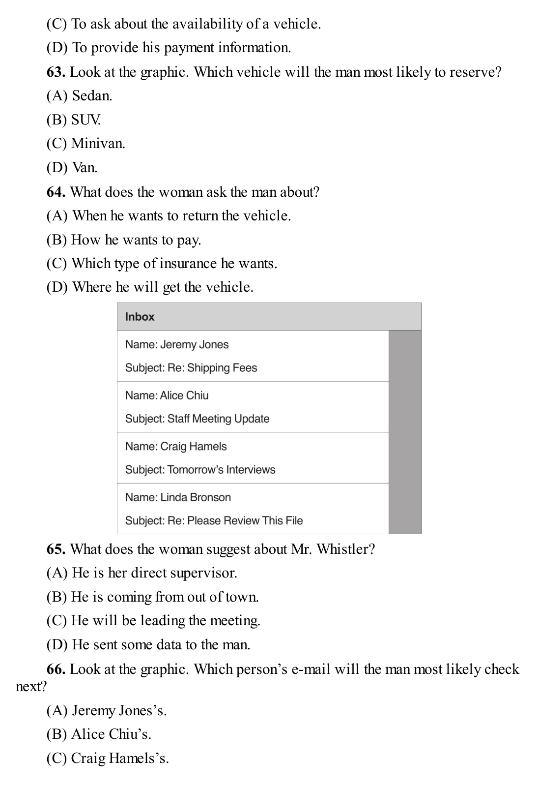

**听力独白/对话原文：**
**W:** Thank you for calling Wendigo Rental Cars. How may I be of assistance?
**M:** Hello. My name is Maurice Dumond. I made a reservation with the booking code 8570-49AA, but I'd like to change it. (62)
**W:** Of course, Mr. Dumond. You're listed as having reserved a sedan from July 10 to 15. What would you like to alter?
**M:** I need a larger vehicle that can fit seven people, but I'm not permitted to spend more than $65 a day. (63)
**W:** Good news. We have one type of vehicle that fits your request. Will you be picking it up at the airport? (64)
**M:** That's correct. My flight's arriving at 10 a.m., so I'll probably get the car around noon.

**中文对照：**
> **W：**欢迎致电温迪戈租车公司，请问有什么可以帮您？
> **M：**您好，我叫莫里斯·杜蒙德。我之前预约了一辆车，预订代码是8570-49AA，但我现在想换一款车。
> **W：**当然可以，杜蒙德先生。您预订了7月10日至15日的轿车，请问您想换哪款车？
> **M：**我需要一辆大一点的车，可以乘载7个人，但一天的租金不要超过65美元。
> **W：**很幸运，我们正好有一款车符合您的要求。您要在机场取车吗？
> **M：**没错，我上午10点到达机场，所以大约中午的时候取车。

**核心词汇与短语：**
- **be of assistance**：有帮助，有好处
- **reservation**：预订
- **booking**：预订；预约
- **reserve**：保留；预约
- **sedan**：轿车
- **alter**：改变，更改
- **vehicle**：车辆；工具；交通工具
- **fit**：适合
- **permit**：许可；允许

#### Q62 (正确答案：A)
**问题：** Why did the man call the woman? (男士为什么要给女士打电话？)
- (A) To change a booking. (更改预约。)
- (B) To check on a price. (核实价格。)
- (C) To ask about the availability of a vehicle. (咨询可用的车辆。)
- (D) To provide his payment information. (提供他的付款信息。)

#### Q63 (正确答案：C)
**问题：** Look at the graphic. Which vehicle will the man most likely to reserve? (请看图表，对话中的男士最有可能预订哪一款车？)
- (A) Sedan. (轿车。)
- (B) SUV. (运动型多功能车。)
- (C) Minivan. (小客车。)
- (D) Van. (面包车。)

#### Q64 (正确答案：D)
**问题：** What does the woman ask the man about? (对话中的女士询问了男士什么？)
- (A) When he wants to return the vehicle. (他什么时候还车。)
- (B) How he wants to pay. (他如何付款。)
- (C) Which type of insurance he wants. (他想要哪种保险。)
- (D) Where he will get the vehicle. (他在哪里取车。)

**延伸表达与补充：**
- **be of assistance = be of help = to the good** (有帮助，有好处)
  - *例句：I will be of assistance where I can, my friend.* (我会尽一切可能协助你，我的朋友。)
- **make a reservation = make a booking** (预订（房间、票等），预约)
  - *例句：I'll call the restaurant and make a reservation.* (我要给饭店打个电话预订座位。)
- **fit one's request = meet one's demand** (符合某人的需要/请求)
  - *例句：I believe our new packing will meet your demand.* (我相信我们的新包装一定会满足您的要求。)
- **pick up = collect** (领取；接走)
  - *例句：She was going over to her parents' house to pick up some clean clothes for Oskar.* (她正要去父母家为奥斯卡取几件干净的衣服。)

### Questions 65 - 67

**听力独白/对话原文：**
**M:** Laurie, don't we have a meeting to attend at 3:30 p.m.?
**W:** You didn't read your e-mail yet, Steve? We were all notified that it has been postponed until tomorrow because Mr. Whistler's flight was canceled this morning. (65)
**M:** Oh, I haven't checked my inbox all day long.
**W:** You'd better take a look at it then. That e-mail contains some important information relevant to the meeting. (66)
**M:** Thanks for letting me know about that. You know, since we have some free time now, we ought to finish doing the employee evaluations. (67)
**W:** I agree. I'll collect the files from my office and be back soon.

**中文对照：**
> **M：**劳丽，下午三点半我们是不是要开会？
> **W：**你没看到邮件吗，史蒂夫？邮件通知我们会议推迟到明天了，因为惠斯勒先生的航班今早被取消了。
> **M：**噢，我一整天没有查看收件箱了。
> **W：**你最好看一下，邮件里有一些和会议相关的重要信息。
> **M：**谢谢你提醒我。对了，趁我们现在有空，我们去完成员工绩效评估吧。
> **W：**好的，我去办公室拿一下文件，马上回来。

**核心词汇与短语：**
- **attend**：参加，出席，到场
- **notify**：通告，通知
- **postpone**：延缓，延迟
- **inbox**：收件箱
- **evaluation**：评价；评估

#### Q65 (正确答案：B)
**问题：** What does the woman suggest about Mr. Whistler? (从女士的话中可以了解惠斯勒先生什么？)
- (A) He is her direct supervisor. (他是她的直属上级。)
- (B) He is coming from out of town. (他将从外地赶来。)
- (C) He will be leading the meeting. (他将主持会议。)
- (D) He sent some data to the man. (他给对话中的男士发送了一些数据。)

#### Q66 (正确答案：B)
**问题：** Look at the graphic. Which person's e-mail will the man most likely check next? (请看图表，对话中的男士接下来最有可能查看谁发的邮件？)
- (A) Jeremy Jones's. (杰里米 · 琼斯的邮件。)
- (B) Alice Chiu's. (爱丽丝 · 赵的邮件。)
- (C) Craig Hamels's. (克雷格 · 哈梅尔斯的邮件。)
- (D) Linda Bronson's. (琳达 · 布朗森的邮件。)

#### Q67 (正确答案：C)
**问题：** What does the man suggest doing? (对话中的男士建议做什么？)
- (A) Meeting in the woman's office. (在女士的办公室里见面。)
- (B) Checking over some contracts. (检查一些合同。)
- (C) Evaluating some workers. (评估一些员工。)
- (D) Looking at job applications. (查看求职申请。)

**延伸表达与补充：**
- **take a look at = have a look at** (看一看；检查)
  - *例句：Let's take a look at the tools available for each phase of this cycle.* (让我们来看看在这个周期的各个阶段可以使用的一些工具。)
- **relevant to = related to** (与…有关的)
  - *例句：A paper relevant to this research was published by him.* (与本研究相关的一篇论文是他发表的。)

### Questions 68 - 70

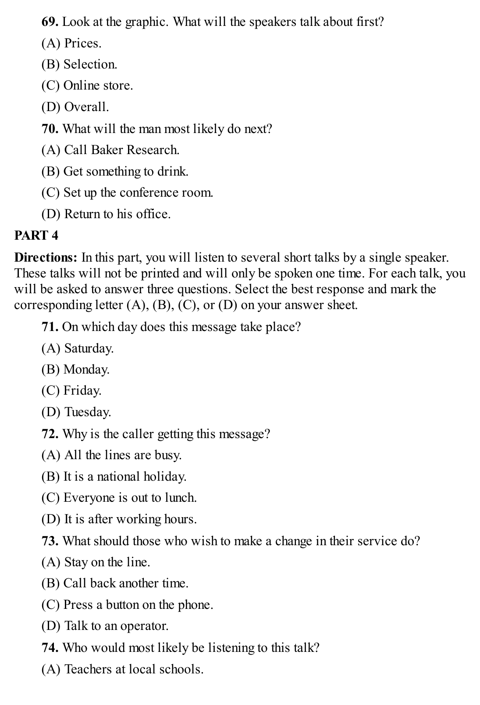

**听力独白/对话原文：**
**W:** You look somewhat disappointed. Is there something wrong?
**M:** Baker Research sent us the results of the customer satisfaction survey we conducted last month. As you can see, the numbers are less than stellar. (68)
**W:** Wow, we got low marks on nearly everything. I think we'd better review the information together.
**M:** I agree. But let's examine the top-rated one first to try to figure out what we're doing correctly. (69)
**W:** That makes sense. Nobody's using the conference room, so we can discuss the matter in there.
**M:** Okay. Let me grab a cup of coffee first. (70) This is probably going to be a lengthy meeting. Rosemary's Survey Results

**中文对照：**
> **W：**你看上去有点沮丧，是不是出了什么事情？
> **M：**贝克研究所给我们发了上个月做的客户满意度调查的结果。你看，这些数据不是那么理想。
> **W：**啊，我们几乎每一项得分都很低。我觉得我们最好再研究一下这份结果。
> **M：**我赞同。但我们先来看看排名最高的那个，看看我们有什么是做对了的。
> **W：**有道理。现在会议室里没人，我们可以在那里讨论一下。
> **M：**好，我先去冲杯咖啡。这可能会是一个很长的会。罗斯玛丽公司调查结果

**核心词汇与短语：**
- **disappointed**：失望的，沮丧的
- **conduct**：进行；实施
- **stellar**：一流的
- **review**：检查；复审
- **figure out**：解决；想出
- **make sense**：讲得通，言之有理
- **grab**：抓住；获取
- **lengthy**：漫长的，冗长的

#### Q68 (正确答案：C)
**问题：** Why is the man unhappy? (对话中的男士为什么不开心？)
- (A) A fee was higher than expected. (某项费用比预期的高。)
- (B) Employees are being fired. (员工们将被解雇。)
- (C) Some results were negative. (一些结果不太理想。)
- (D) His performance review was bad. (他的业绩评价不好。)

#### Q69 (正确答案：C)
**问题：** Look at the graphic. What will the speakers talk about first? (请看图表，讲话者们会先谈论什么？)
- (A) Prices. (价格。)
- (B) Selection. (精选品。)
- (C) Online store. (在线商店。)
- (D) Overall. (综合。)

#### Q70 (正确答案：B)
**问题：** What will the man most likely do next? (对话中的男士接下来最有可能做什么？)
- (A) Call Baker Research. (给贝克研究所打电话。)
- (B) Get something to drink. (去拿喝的东西。)
- (C) Set up the conference room. (布置会议室。)
- (D) Return to his office. (返回他的办公室。)

**延伸表达与补充：**
- **figure out = work out** (解决；想出)
  - *例句：We need to work together to figure out what the data means.* (我们需要一起来找出这些数据意味着什么。)
- **make sense = be reasonable** (讲得通，言之有理)
  - *例句：On the face of it that seems to make sense. But the figures don't add up.* (乍一看，似乎讲得通，但这些数字对不起来。)

## Part 4: 简短独白 (Q71 - Q100)

### Questions 71 - 73

**听力独白/对话原文：**
Thank you for calling TC Telecom on this beautiful September Monday morning. (71) Currently, all of our operators are busy with other calls, (72) however, if you'd be kind enough to wait on the line, one of our operators will be with you very shortly. In the meantime, if you know the extension of the person you wish to contact, please press it on your phone now. If you are calling to check your account profile, please press 1. If you wish to delete or change a service, please press 2. (73) If you would like to get in touch with our billing services, press 3. If this is a call that needs the attention of a customer service representative, please continue holding, and talk to the operator.Thank you and we hope you have a great day. Remember, we here at TC Telecom value every call.

**中文对照：**
> 感谢您在九月的周一这个美好的早上致电TC电信公司。现在我们所有的话务员都在忙于接听电话，不过，如果您愿意等候，很快会有一位话务员与您联系。在此期间，如果您知道联系人的分机号，请现在拨号。如果您想查询账户详情，请按1。如果您想取消或更改服务，请按2。如果您想联络账单服务人员，请按3。如果您想找客服代表，请继续等待，然后告知话务员。谢谢，祝您愉快。请记住，我们TC电信公司重视您的每一个电话。

**核心词汇与短语：**
- **currently**：目前
- **if you would be kind enough to do ~**：如果您能
- **wait on the line**：继续等待
- **shortly**：很快
- **extension**：分机
- **get in touch with ~**：与取得联系
- **value**：重视

#### Q71 (正确答案：B)
**问题：** On which day does this message take place? (这条信息是周几发出的？)
- (A) Saturday. (周六。)
- (B) Monday. (周一。)
- (C) Friday. (周五。)
- (D) Tuesday. (周二。)

#### Q72 (正确答案：A)
**问题：** Why is the caller getting this message? (打电话者为什么会收到这条信息？)
- (A) All the lines are busy. (所有的线路都忙。)
- (B) It is a national holiday. (今天是国家法定假日。)
- (C) Everyone is out to lunch. (所有人都出去吃午饭了。)
- (D) It is after working hours. (现在是下班时间。)

#### Q73 (正确答案：C)
**问题：** What should those who wish to make a change in their service do? (那些想更改服务的人应该怎么做？)
- (A) Stay on the line. (继续等待。)
- (B) Call back another time. (换个时间再打。)
- (C) Press a button on the phone. (拨一个电话键。)
- (D) Talk to an operator. (与话务员通话。)

**延伸表达与补充：**
- **get in touch with ~ = get in contact with ~ = get through to ~** (与…取得联系)
  - *例句：Did you get in touch with your old school friend?* (你与老同学取得联系了吗？)
- **Please continue holding. = Please don't hang up. = Please wait on the line.** (请继续等待。)
  - *例句：Please continue holding until an operator comes on the line.* (在话务员接听您的电话之前请继续等待。)

### Questions 74 - 76

**听力独白/对话原文：**
I'd like to welcome everyone to our special community event here on this Children's Day. As I look around, I cannot help but say how wonderful it is to see many children from our community holding the hands of their parents and grandparents. (74) It provides me with great pleasure to see you all. Now, before we begin with the main attraction of the day, I'd like to remind all the parents that we will be holding classes every Thursday for those who wish to do a little extra for their children. (75) As most of you the parents know and agree, it is vital that we instill in our children the special qualities each and every single one of them possesses. We as parents should help our children achieve their dreams and visions. And for this reason, we have set up special classes for the parents to learn how to bring out the best in their children. If any parents are interested, please talk to us today. (76) Now, let's get back to today's agenda and bring out the person everyone here is waiting for. Would everyone give a big hand of applause for “Teddy the Clown”?

**中文对照：**
> 欢迎大家来这里参加我们社区今年的儿童节特别活动。环顾一下四周，我忍不住想说，看到社区这么多的孩子拉着爸爸妈妈和爷爷奶奶的手来到这里真是太好了。非常高兴见到大家。现在，在我们开始今天的主要节目之前，我要提醒所有的父母，我们会在每周四给想为孩子多做点事的父母开办课程。有一点大多数父母都知道，也都同意，那就是培养孩子们特别的品质非常重要，这是每一个孩子都需要拥有的。我们做父母的应该帮助孩子实现梦想。正因为如此，我们给父母们开设了专门课程，学习如何发掘孩子的潜能。如果您对此感兴趣，请今天告诉我们。现在，让我们回到今天的议程上来，请出大家等候已久的那个人。请大家用热烈的掌声欢迎“小丑泰迪”。

**核心词汇与短语：**
- **look around**：看一看，环视
- **It provides ~ with great pleasure to do ~**：非常高兴做
- **attraction**：有趣的东西
- **vital**：非常重要的，必不可少的
- **instill**：灌输
- **give a big hand of applause for ~**：对报以热烈的掌声
- **clown**：小丑
- **community center**：社区中心
- **coordinator**：课程协调人

#### Q74 (正确答案：B)
**问题：** Who would most likely be listening to this talk? (谁最有可能在听这个讲话？)
- (A) Teachers at local schools. (当地学校的教师。)
- (B) Community residents. (社区居民。)
- (C) Students from out of town. (外地的学生。)
- (D) Entertainers. (演员。)

#### Q75 (正确答案：A)
**问题：** How often will the class mentioned be held? (被提到的课程多久举办一次？)
- (A) Once a week. (一周一次。)
- (B) Twice a week. (一周两次。)
- (C) Three times a week. (一周三次。)
- (D) Everyday. (每天。)

#### Q76 (正确答案：B)
**问题：** What are those interested in the class asked to do? (那些对这个课程感兴趣的人应该怎么做？)
- (A) Sign up today at the community center. (在社区中心登记。)
- (B) Speak with the coordinators after the talk. (在讲话结束后找课程协调人。)
- (C) Deposit a check into the bank account. (在银行账户里存一张支票。)
- (D) Take an admissions test after the talk. (在讲话结束后参加一项入学测试。)

**延伸表达与补充：**
- **I cannot help but say ~ = I am forced to say ~** (我忍不住想说…扩展表达：)
  - *例句：I really want to mention ~ I cannot help but say how hard he has been working lately.* (我真的想说…我忍不住想说他最近工作太辛苦了。)
- **do a little extra = do a little more = go out of the way to help** (多做一些)
  - *例句：I will go and do a little extra for the kids.* (我要去为孩子们多做些事。)
- **Let's get back to today's agenda. = Let's return to the day's schedule. = Let's get back to our program today.** (让我们回到今天的日程安排上来。)
  - *例句：Now, let's get back to today's agenda and talk about the issue.* (现在，让我们回到今天的议程上来，谈一谈这个问题。)

### Questions 77 - 79

**听力独白/对话原文：**
That was Mr. Smith with his insightful information about the types of investments out on the market today. Now, it is my pleasure to introduce the next speaker of the day, Mr. Sam Rowe. Mr. Rowe, who has been at the center of attention in the business world lately as the youngest person ever to become the Chief Executive Officer at Livetalk Communications, (77) credits the teachings of his father, Mark Rowe, for success. (78) According to Mr. Rowe, the work ethics and positive attitude displayed by his father during his childhood set the standards for the way he works today. He stresses the importance of our everyday attitude toward work and will give us some tips on how to make them become part of us. (79) Anyway, at the age of 35, he is the youngest person ever to hold the head position at Livetalk Communications. Here is Mr. Rowe.

**中文对照：**
> 刚才史密斯先生所做的关于当前市场上投资类型的演讲，见解非常深刻。现在，我很高兴地介绍今天的下一位演讲人，萨姆·罗先生。罗先生作为Livetalk通信公司有史以来最年轻的首席执行官，最近成了商业界关注的焦点。罗先生把自己的成功归功于父亲马克·罗对他的教导。罗先生认为，在他儿时，父亲展示出的职业道德和积极态度为他今天的工作方式设定了标准。他强调日常工作态度的重要性，并将告诉我们如何使之成为我们的一部分。总之，35岁的他是在Livetalk通信公司担任领导职位的最年轻的一位。现在有请罗先生。

**核心词汇与短语：**
- **insightful**：富有洞察力的，见解深刻的
- **credit**：归功于
- **work ethics**：职业道德
- **attitude**：态度
- **display**：展示
- **stress**：强调

#### Q77 (正确答案：A)
**问题：** What does the speaker mention is special about Mr. Rowe? (讲话者提到罗先生的特别之处是什么？)
- (A) He is the youngest person to head a company. (他是最年轻的公司领导。)
- (B) He has followed in the footsteps of his great father. (他一直追随他伟大父亲的足迹。)
- (C) He made a lot of money by investing in stocks. (他通过投资股票赚了很多钱。)
- (D) He is related to the company president. (他和公司总裁是亲戚。)

#### Q78 (正确答案：D)
**问题：** Who does Sam credit his success to? (萨姆把自己的成功归功于谁？)
- (A) Mr. Smith. (史密斯先生。)
- (B) One of the investors. (一位投资者。)
- (C) The company CEO. (公司的首席执行官。)
- (D) His father. (他的父亲。)

#### Q79 (正确答案：D)
**问题：** What will Mr. Rowe talk about? (罗先生会讲到什么内容？)
- (A) How to get in on the good investments. (如何参与赚钱的投资。)
- (B) How to make good business contacts. (如何建立良好的业务关系。)
- (C) How to climb up the corporate ladder. (如何在公司里步步高升。)
- (D) How to become optimistic about work. (如何对工作保持乐观的心态。)

**延伸表达与补充：**
- **center of attention = center of focus = main issue** (关注的焦点)
  - *例句：The firing of our president has been the center of attention for everyone.* (我们总裁被解雇已经成为每个人关注的焦点。)
- **set the standards = set the rules = set the guidelines** (设定标准)
  - *例句：Mr. King set the standards for everyone to follow.* (金先生设定了每个人都要遵循的标准。)
- **stress the importance = point out the importance = show the importance** (强调重要性)
  - *例句：This article stresses the importance of the role each one of us has toward environmental issues.* (这篇文章强调了我们每个人在环境问题上的重要作用。)

### Questions 80 - 82

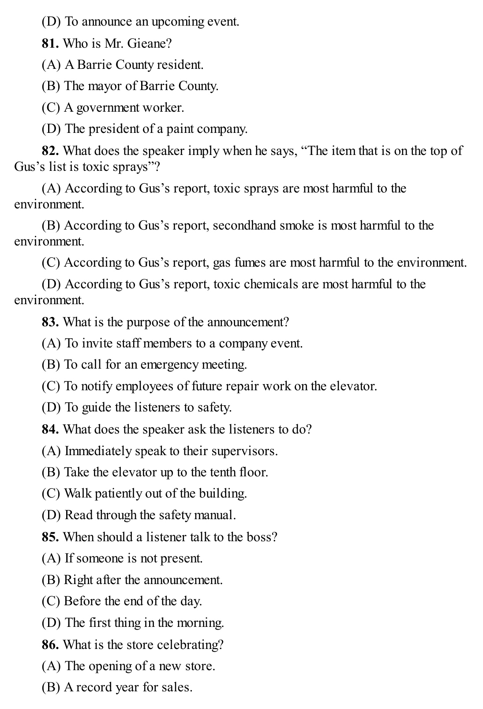

**听力独白/对话原文：**
I'd like to thank the concerned citizens of Barrie County for coming to today's environmental committee meeting. Like you, all council members here, including myself, take environmental safety seriously, which is why we have taken the time to arrange this public meeting and have also invited Gus Gieane, from the Ministry of Health, to our meeting to answer any questions or to discuss further any concerns you may have. （ 80, 81 ） Gus, the Director of Public Environmental Health and Safety at the Ministry, has brought with him today a list of things people can do to lower the levels of risk of public environmental health. (82) In recent times, the Ministry of Health has seen the status of the environment deteriorate, which in turn has had an adverse health affect on the citizens of Barrie County. The item that is on the top of Gus's list is toxic sprays. (82) More and more, people are using toxic sprays to paint their cars and homes. However, after the toxic spray cans are used, they are irresponsibly tossed into the garbage without undergoing separate detoxification measures before they are thrown out. Mr. Gieane will now tell us more in detail about what we can do to help the environment.

**中文对照：**
> 感谢各位巴里县热心的居民来参加今天的环境委员会会议。包括我在内的所有委员会成员都和大家一样，非常重视环境安全，因此我们花时间安排了这次公开会议，并且还邀请了卫生部的格斯·基尼来参加我们的会议，解答疑问或者进一步讨论大家关注的话题。格斯是卫生部公共环境卫生和安全的负责人，他今天带来一份清单，人们可以照清单去做，来降低公共环境卫生的危险水平。近期，卫生部发现环境恶化，该情况对巴里县居民的健康造成了有害影响。清单上排在第一位的是有毒喷雾。人们开始越来越多地使用有毒喷雾给汽车和房屋喷涂料。然而，使用过的毒喷雾罐没有经过单独的解毒处理就被不负责任地扔到了垃圾箱里。现在基尼先生会为大家详细讲解我们应该怎样做才能保护环境。

**核心词汇与短语：**
- **take ~ seriously**：认真对待
- **arrange**：安排
- **public meeting**：公开会议
- **lower**：降低
- **risk**：危险
- **status**：情况，状态
- **deteriorate**：使恶化，弄坏
- **adverse**：不利的，有害的
- **toxic**：有毒的
- **irresponsibly**：不负责任地
- **garbage**：垃圾箱
- **undergo**：经历
- **separate**：单独的
- **detoxification**：解毒
- **throw out**：扔掉

#### Q80 (正确答案：B)
**问题：** What is the purpose of the speech? (这个讲话的目的何在？)
- (A) To invite people to a charitable function. (邀请人们参加一个慈善活动。)
- (B) To introduce the next speaker. (介绍下一位演讲者。)
- (C) To give thanks for the donations. (感谢捐赠行动。)
- (D) To announce an upcoming event. (宣布一个即将举行的活动。)

#### Q81 (正确答案：C)
**问题：** Who is Mr. Gieane? (基尼先生是谁？)
- (A) A Barrie County resident. (巴里县的一位居民。)
- (B) The mayor of Barrie County. (巴里县县长。)
- (C) A government worker. (一位政府工作人员。)
- (D) The president of a paint company. (涂料公司的总裁。)

#### Q82 (正确答案：A)
**问题：** What does the speaker imply when he says,“The item that is on the top of Gus's list is toxic sprays”? (讲话者说 “ 在清单上排第一位的是有毒喷雾 ” ，他在暗示什么？)
- (A) According to Gus's report, toxic sprays are most harmful to the environment. (根据格斯的报告，有毒喷雾对环境最有害。)
- (B) According to Gus's report, secondhand smoke is most harmful to the environment. (根据格斯的报告，二手烟对环境最有害。)
- (C) According to Gus's report, gas fumes are most harmful to the environment. (根据格斯的报告，汽车尾气对环境最有害。)
- (D) According to Gus's report, toxic chemicals are most harmful to the environment. (根据格斯的报告，有毒化学物质对环境最有害。)

**延伸表达与补充：**
- **in recent times = lately = nowadays** (近期)
- **be tossed into the garbage = be thrown into the garbage** (被扔进垃圾箱)
  - *例句：The used items were tossed into the garbage.* (用过的物品被扔进了垃圾箱。)

### Questions 83 - 85

**听力独白/对话原文：**
Could I have your attention everyone? An emergency situation has occurred on the tenth floor, and I ask everyone at this time to leave what you are doing and proceed toward the nearest exit out of the building. (83) This situation does not pose any immediate danger, but as a safety precaution, we are asking everyone to evacuate the building. So, please do not panic, but walk calmly to the nearest staircase out of the building. (84) Please do not take the elevators. Now, once you are outside, please make sure all the members of your department have arrived safely. If by any chance anyone is missing, please report the missing person to your immediate supervisors. (85) Thank you, and we will let you know the progress of the situation as it occurs.

**中文对照：**
> 请大家注意。在10层出现了紧急情况，现在请所有人停下手中的工作，到最近的大楼出口去。这一情况不会立刻造成危险，但是为了安全，我们要求所有人撤离大楼。因此，大家不必惊慌，冷静地走到最近的楼梯离开大楼。请不要使用电梯。现在，一旦你到达楼外，请确保你所在部门的全部成员安全抵达楼外。如果万一有人失踪，请把失踪人员上报给你的直接主管领导。谢谢，我们会向大家通报事件的进展。

**核心词汇与短语：**
- **emergency**：紧急情况
- **occur**：发生
- **proceed toward ~**：前往
- **pose a danger**：造成危险
- **safety precaution**：安全预防措施
- **evacuate**：撤离
- **panic**：恐慌
- **staircase**：楼梯
- **by any chance**：万一
- **immediate supervisor**：直接主管领导
- **progress**：进展

#### Q83 (正确答案：D)
**问题：** What is the purpose of the announcement? (这个通知的目的是什么？)
- (A) To invite staff members to a company event. (邀请员工参加一个公司活动。)
- (B) To call for an emergency meeting. (召集一个紧急会议。)
- (C) To notify employees of future repair work on the elevator. (通知员工未来的电梯维修工作。)
- (D) To guide the listeners to safety. (引导听众抵达安全地带。)

#### Q84 (正确答案：C)
**问题：** What does the speaker ask the listeners to do? (讲话者让听众做什么？)
- (A) Immediately speak to their supervisors. (立刻和他们的主管联系。)
- (B) Take the elevator up to the tenth floor. (乘坐电梯到 10 层。)
- (C) Walk patiently out of the building. (耐心地走到楼外。)
- (D) Read through the safety manual. (读一遍安全手册。)

#### Q85 (正确答案：A)
**问题：** When should a listener talk to the boss? (听众在什么时候应该向领导报告？)
- (A) If someone is not present. (如果有人不在。)
- (B) Right after the announcement. (通知播放完毕后。)
- (C) Before the end of the day. (今天的工作结束之前。)
- (D) The first thing in the morning. (一大早。)

**延伸表达与补充：**
- **pose** (造成扩展表达：)
  - *例句：suggest reflect The gas leak poses an immediate threat to the people living in the apartment complex.* (显示反映燃气泄漏会给住在公寓里的人们造成威胁。)
- **evacuate** (撤离扩展表达：)
  - *例句：leave escape In case of an emergency, people are asked to evacuate the building through the nearest exit.* (离开逃离如果发生紧急情况，人们应该从最近的出口撤离大楼。)

### Questions 86 - 88

**听力独白/对话原文：**
Home Furnishings is celebrating its 25th year in business with sales on all items throughout the store. (86) Starting from today lasting until Sunday, (87) we are slashing prices on carpets, beds, tables, drapes, and just about everything that you would find in your home. With up to 50% off the regular prices, you won't want to miss this opportunity of a lifetime. So, if you are in the market for home furnishing items, don't miss our sale of a lifetime. We're located on 35 Main Street. We are open from 8 to 7 on weekdays and 9 to 6 on weekends. (88)

**中文对照：**
> 家居装饰店正在庆祝开业25周年，店内所有商品让利出售。从今天开始到周日，地毯、床、桌子、窗帘，以及您能在家中找到的一切物品都降价销售，折扣最高达原价的50%。请别错过这个千载难逢的机会。所以，如果您想购买家居饰品，请抓住这次宝贵的促销机会。我们店位于主街35号。工作日营业时间为8点到7点，周末营业时间为9点到6点。

**核心词汇与短语：**
- **celebrate**：庆祝
- **slash**：降低（价格），砍
- **drape**：帘（尤指窗帘）
- **up to**：高达
- **regular**：正常的
- **price**：价格
- **miss**：错过
- **opportunity**：机会
- **lifetime**：有生之年
- **be in the market for ~**：想购买
- **be located ~**：位于
- **weekend**：周末

#### Q86 (正确答案：D)
**问题：** What is the store celebrating? (这家店在庆祝什么？)
- (A) The opening of a new store. (一家新店开张。)
- (B) A record year for sales. (年销售创纪录。)
- (C) The retirement of a staff member. (一位员工退休。)
- (D) An important anniversary. (一个重要的周年纪念日。)

#### Q87 (正确答案：A)
**问题：** When does the sale begin? (促销活动什么时候开始？)
- (A) Today. (今天。)
- (B) Friday. (周五。)
- (C) Saturday. (周六。)
- (D) Sunday. (周日。)

#### Q88 (正确答案：D)
**问题：** When does the store open this Saturday? (本周六商店几点开门？)
- (A) 6 a.m. (上午 6 点。)
- (B) 7 a.m. (上午 7 点。)
- (C) 8 a.m. (上午 8 点。)
- (D) 9 a.m. (上午 9 点。)

**延伸表达与补充：**
- **slash prices = cut prices = reduce prices** (降低价格)
  - *例句：The new bargain store is slashing prices on everything in the store.* (新开的折扣商店正在对店里的全部商品降价销售。)
- **if you are in the market for ~ = if you are looking for ~ = if you are thinking of buying ~** (如果您想购买…)
  - *例句：If you are in the market for a house, now is the time to buy.* (如果您想买房子，现在时机到了。)

### Questions 89 - 91

**听力独白/对话原文：**
Attention, everyone! The parking lot on the west side of our building will be closed starting from this Friday, January 25, until March 15, due to construction. (89) Therefore, those employees who enter the building from Midland Avenue must use the south entrance from Jane Street. Also, we ask everyone to please park your cars in our underground garage (91) to allow our customers access to the parking spots on the ground floor. I know this will cause some inconvenience to our salespeople, (90) who come in and out of our building throughout the day. However, we do ask you to bear with this situation until the construction comes to its completion. Also, we'd like to make a suggestion for those employees who live near the office to leave their cars at home and take public transportation to work. One other option is to start carpooling. (91) Anyway, think about it, and if you have any great ideas, please go and speak with our receptionist Janice anytime.

**中文对照：**
> 大家请注意！由于施工，我们大楼西侧的停车场将从1月25日（本周五）起到3月15日关闭。因此，从麦德兰大道进入大楼的员工必须从简大街上的南面入口进入。另外，所有的员工请把车停在我们的地下车库，以便我们的顾客可以使用一楼的停车场。我知道这会给我们的销售人员带来一些不便，因为他们每天经常进出大楼。但是，我们还是要请大家忍耐，等待施工结束。我们还建议住在公司附近的员工把车留在家里，乘坐公共交通工具上班。另一个选择就是拼车上班。总之，考虑一下，如果您有什么好的想法，请随时告诉我们的接待员贾尼丝。

**核心词汇与短语：**
- **parking lot**：停车场
- **due to**：由于
- **construction**：施工
- **entrance**：入口
- **garage**：车库
- **access to**：有机会使用
- **cause inconvenience to ~**：给造成不便
- **throughout the day**：整天
- **bear with**：宽容，忍受
- **come to one's completion**：结束
- **leave**：留下
- **carpool**：搭车，拼车
- **make a suggestion**：提建议

#### Q89 (正确答案：B)
**问题：** When will the construction start? (施工什么时候开始？)
- (A) January 15. (1 月 15 日。)
- (B) January 25. (1 月 25 日。)
- (C) March 15. (3 月 15 日。)
- (D) March 25. (3 月 25 日。)

#### Q90 (正确答案：A)
**问题：** According to the speaker, who will be mostly affected by the construction? (根据讲话者的说法，谁受施工的影响最大？)
- (A) Sales staff. (销售人员。)
- (B) Receptionists. (接待员。)
- (C) Customers. (顾客。)
- (D) Staff members without cars. (没有车的员工。)

#### Q91 (正确答案：D)
**问题：** Which of the following is NOT mentioned by the speaker? (下面哪一项讲话者没有提到？)
- (A) All staff members should park in a specific place. (所有员工都应该把车停在一个确定的位置。)
- (B) Some of the employees should commute by bus. (一些员工应该乘公交车上班。)
- (C) People who live close to the office should share a ride. (住在公司附近的人应该拼车上班。)
- (D) Sales reps should speak with the receptionist. (销售代表应该去找接待员。)

**延伸表达与补充：**
- **bear with this situation = withstand the situation** (忍受这种情况扩展表达：)
  - *例句：cope with the situation In order to become stronger, one must bear with this unfortunate situation.* (应对这种情况为了变得更坚强，人们应该忍受这种不幸的境遇。)
- **One other option is to ~ = Another choice is to ~ = Another alternative might be ~** (另一个选择是…)
  - *例句：One other option is to go back to school to get a degree.* (另一个选择是回学校拿一个学位。)

### Questions 92 - 94

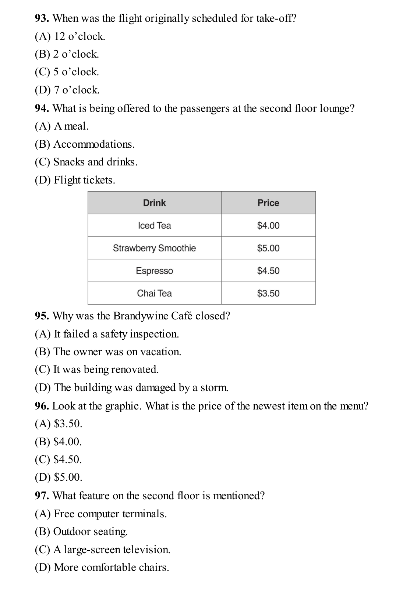

**听力独白/对话原文：**
May I have your attention please? This announcement is for all passengers waiting for Flight 705, scheduled to depart for London at 2 o'clock. (93) We have just been informed by Heathrow Airport that airplanes are being suspended for traveling to and from the airport due to heavy fog passing through the region (92) and planes that are scheduled for arrival are being re-routed to other nearby airports. This, unfortunately, will also delay our flights scheduled to take off for London until further notice. In the meantime, the passengers that are affected are asked to take advantage of the refreshments we have set up in the lounge on the second floor. (94) Please show your ticket to the lounge attendant as you enter. For further announcements regarding the Heathrow situation, please check with the bulletin board display set up throughout the terminal. Thank you for your kind understanding.

**中文对照：**
> 请大家注意。现在对2点飞往伦敦的705号航班的所有候机乘客播报通知。我们刚刚接到希思罗机场的通知，进出该机场的航班因为该地区出现大雾而被暂时取消。原定抵达的航班改道飞往附近的其他机场。很不巧，我们原定飞往伦敦的航班也被推迟，需等待进一步通知。同时，受影响的乘客可以享用我们在二楼休息室安排的茶点。请在入口处向休息室服务员出示您的机票。关于希思罗机场的进一步通知可以查看候机大厅内的公告牌显示屏。感谢大家的理解。

**核心词汇与短语：**
- **depart for**：飞往
- **inform**：通知
- **suspend**：推迟
- **re-route**：改变航线
- **nearby**：附近的
- **unfortunately**：不幸地
- **delay**：推迟
- **affect**：影响
- **until further notice**：另候通知
- **take advantage of**：利用，使用
- **refreshment**：茶点
- **check with**：查看
- **bulletin board display**：公告牌显示屏
- **set up**：设置

#### Q92 (正确答案：B)
**问题：** What is causing the flight delays at Heathrow Airport? (希思罗机场的航班延误是什么原因？)
- (A) A flight accident. (一次飞行事故。)
- (B) The local weather. (当地的天气。)
- (C) A security alert. (一个安全警告。)
- (D) The overbooking of flights. (航班超额预订。)

#### Q93 (正确答案：B)
**问题：** When was the flight originally scheduled for take-off? (这个航班原定几点起飞？)
- (A) 12 o'clock. (12 点。)
- (B) 2 o'clock. (2 点。)
- (C) 5 o'clock. (5 点。)
- (D) 7 o'clock. (7 点。)

#### Q94 (正确答案：C)
**问题：** What is being offered to the passengers at the second floor lounge? (二楼休息室向乘客供应什么？)
- (A) A meal. (一顿饭。)
- (B) Accommodations. (住宿。)
- (C) Snacks and drinks. (点心和饮料。)
- (D) Flight tickets. (机票。)

**延伸表达与补充：**
- **We have just been informed ~ = We have just been told ~ = We have just heard the news ~** (我们刚刚接到通知，…)
  - *例句：I have just been informed of the good news.* (我刚刚接到好消息。)
- **be suspended = be stopped = be frozen** (暂时取消；使停职)
  - *例句：Jack is being suspended from work without pay for not abiding by the company policy regarding a safety rule at the site.* (杰克因为不遵守公司有关厂房安全的规定而被停薪停职。)

### Questions 95 - 97

**听力独白/对话原文：**
The Brandywine Café is pleased to announce that the renovations on the building are complete, so we'll be reopening for business this Saturday. (95) All weekend long, if you buy any type of beverage, you'll get a free snack of your choice. So come to the corner of Madison Road and Lancaster Street and check out the new and improved Brandywine Café. We've even added fruit drinks to our menu since summer is rapidly approaching. Cool off by ordering a strawberry smoothie or other similar drink. (96) You can enjoy your drink at a table on the outdoor patio we added on the second floor. (97) Our hours are from 8 a.m. to 10 p.m. every day.

**中文对照：**
> 白兰地咖啡店很高兴地宣布，店铺的翻新工作已完成，因此我们将于本周六重新开门营业。在周末期间购买任意一款饮料，均可免费任选一款小吃。我们的店铺位于麦迪逊街和兰卡斯特街交叉的转角处，来光顾新改进的白兰地咖啡店吧。由于夏季热浪迅速袭来，我们也将果汁饮料加入了菜单。点一杯草莓冰沙或类似的饮料让自己清凉一下吧。您可以在我们店铺二层增设的露天平台享用您的饮料。我们的营业时间是每天早上8点至晚上10点。

**核心词汇与短语：**
- **renovation**：翻新，修复
- **reopen for business**：重新开业
- **beverage**：饮料；酒水
- **check out**：检验；通过考核
- **cool off**：凉快；冷静
- **strawberry smoothie**：草莓冰沙
- **outdoor patio**：露天平台

#### Q95 (正确答案：C)
**问题：** Why was the Brandywine Café closed? (白兰地咖啡店为什么歇业？)
- (A) It failed a safety inspection. (它未通过安全检查。)
- (B) The owner was on vacation. (店主去度假了。)
- (C) It was being renovated. (它进行了整修。)
- (D) The building was damaged by a storm. (它所在的建筑被暴风雨摧毁了。)

#### Q96 (正确答案：D)
**问题：** Look at the graphic. What is the price of the newest item on the menu? (请看图表。菜单上的最新产品是什么价格？)
- (A) $3.50. (3.50 美元。)
- (B) $4.00. (4.00 美元。)
- (C) $4.50. (4.50 美元。)
- (D) $5.00. (5.00 美元。)

#### Q97 (正确答案：B)
**问题：** What feature on the second floor is mentioned? (讲话中提及了二层的什么特征？)
- (A) Free computer terminals. (免费的电脑终端设备。)
- (B) Outdoor seating. (露天座位。)
- (C) A large-screen television. (一台大屏电视机。)
- (D) More comfortable chairs. (更加舒适的座椅。)

**延伸表达与补充：**
- **be pleased to~ = be happy to~** (乐于做/很高兴做…)
  - *例句：He is pleased to announce that he graduated from university.* (他很高兴地宣布自己大学毕业了。)
- **add~to~ = ~ plus~** (将…加入…)
  - *例句：Please add more ice to the drink.* (请在饮料中多加些冰。)

### Questions 98 - 100

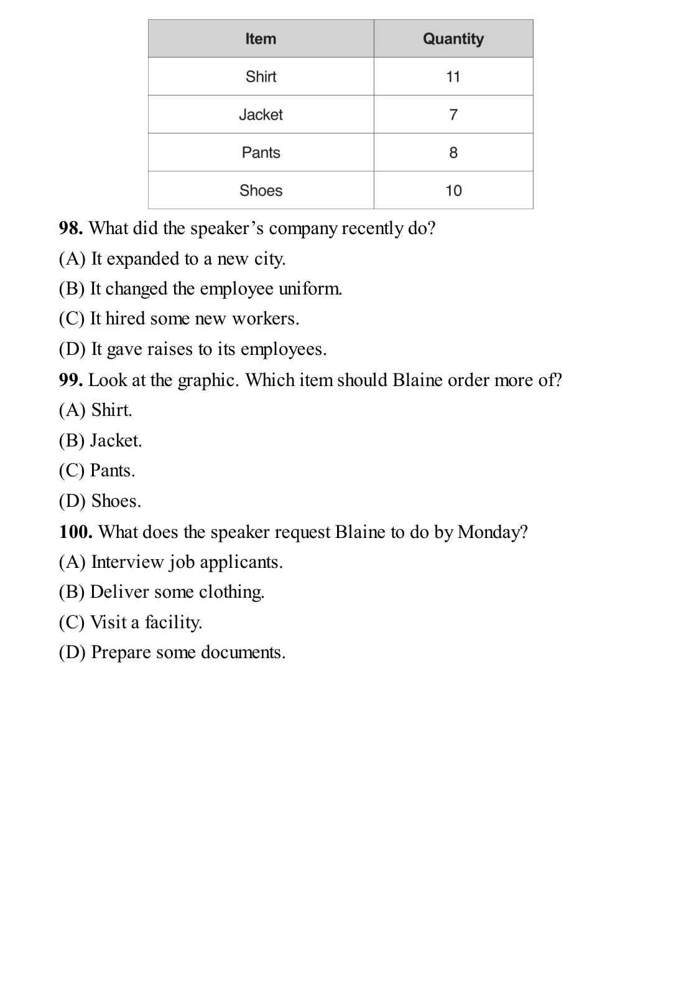

**听力独白/对话原文：**
Hi, Blaine. This is Samantha. I just received word that we've hired some new employees, (98) so we need to prepare uniforms for each of them. As you know, the uniform consists of a shirt, a jacket, a pair of pants, and a pair of shoes. We've got eight employees who will be starting next week. (99) Please check to make sure that we have enough of each item. If we don't, go ahead and order whatever we need from our regular supplier. Then, have the items delivered to me no later than Monday morning. (100) If you've got any questions, please let me know.

**中文对照：**
> 你好，布莱恩。我是萨曼莎。我刚刚得到消息称我们招来了一些新员工，所以我们需要为他们每位准备制服。如你所知，一套制服包含一件衬衫、一件夹克、一条裤子和一双鞋。有八名新员工下周到岗。请检查一下，确保我们制服中的每件物品都有足够的数量。如果数量不够，那么无论缺什么，都可向我们的固定供货商进行订购。下周一之前将所有的衣物转交给我。如果你还有任何问题，请联系我。

**核心词汇与短语：**
- **hire**：雇用
- **employee**：雇员
- **uniform**：制服
- **consist of**：由组成
- **item**：项目；一件商品（物品）
- **go ahead**：开始做；前进
- **regular supplier**：固定供货商
- **deliver**：转交；传送

#### Q98 (正确答案：C)
**问题：** What did the speaker's company recently do? (讲话者的公司最近发生了什么？)
- (A) It expanded to a new city. (它扩展到一座新的城市。)
- (B) It changed the employee uniform. (它更换了员工的制服。)
- (C) It hired some new workers. (它招募了一批新员工。)
- (D) It gave raises to its employees. (它给员工加薪了。)

#### Q99 (正确答案：B)
**问题：** Look at the graphic. Which item should Blaine order more of? (请看图表。布莱恩需要订购更多哪种物品？)
- (A) Shirt. (衬衫。)
- (B) Jacket. (夹克。)
- (C) Pants. (裤子。)
- (D) Shoes. (鞋。)

#### Q100 (正确答案：B)
**问题：** What does the speaker request Blaine to do by Monday? (讲话者要求布莱恩周一之前做什么？)
- (A) Interview job applicants. (面试求职者。)
- (B) Deliver some clothing. (转交一些衣物。)
- (C) Visit a facility. (查看一件设备。)
- (D) Prepare some documents. (准备一些文件。)

**延伸表达与补充：**
- **I just received word that~ = I heard that~** (我刚听说/得到消息称…)
  - *例句：I just received word that tomorrow would snow.* (我刚听说明天会下雪。)
- **no later than = before** (不晚于/在…之前)
  - *例句：You should hand in the homework no later than next Monday.* (你应于下周一之前上交作业。)

# TEST 02

## 答案速查表

| 题号 | 答案 | 题号 | 答案 | 题号 | 答案 | 题号 | 答案 | 题号 | 答案 | 题号 | 答案 | 题号 | 答案 | 题号 | 答案 | 题号 | 答案 | 题号 | 答案 |
| :---: | :---: | :---: | :---: | :---: | :---: | :---: | :---: | :---: | :---: | :---: | :---: | :---: | :---: | :---: | :---: | :---: | :---: | :---: | :---: |
| **1** | A | **11** | A | **21** | A | **31** | B | **41** | A | **51** | A | **61** | B | **71** | B | **81** | A | **91** | C |
| **2** | C | **12** | C | **22** | A | **32** | C | **42** | B | **52** | A | **62** | A | **72** | A | **82** | D | **92** | A |
| **3** | D | **13** | C | **23** | A | **33** | B | **43** | B | **53** | A | **63** | B | **73** | A | **83** | B | **93** | B |
| **4** | A | **14** | A | **24** | A | **34** | C | **44** | C | **54** | B | **64** | C | **74** | A | **84** | B | **94** | D |
| **5** | A | **15** | C | **25** | A | **35** | D | **45** | D | **55** | B | **65** | A | **75** | D | **85** | B | **95** | A |
| **6** | B | **16** | B | **26** | B | **36** | A | **46** | B | **56** | A | **66** | C | **76** | C | **86** | B | **96** | C |
| **7** | C | **17** | A | **27** | C | **37** | A | **47** | A | **57** | D | **67** | C | **77** | B | **87** | B | **97** | A |
| **8** | C | **18** | C | **28** | C | **38** | B | **48** | C | **58** | C | **68** | C | **78** | B | **88** | C | **98** | C |
| **9** | A | **19** | C | **29** | A | **39** | B | **49** | C | **59** | C | **69** | B | **79** | B | **89** | B | **99** | D |
| **10** | C | **20** | A | **30** | C | **40** | C | **50** | A | **60** | A | **70** | A | **80** | A | **90** | B | **100** | B |

## Part 1: 照片描述 (Q1 - Q6)

### Q1 (正确答案：A)

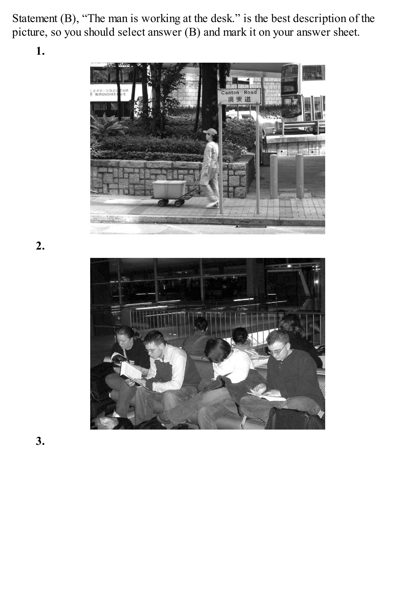

**听力原文与选项：**
- (A) She's guiding the cart. (她正在推手推车。)
- (B) She's ready to cross the road. (她准备过马路。)
- (C) She's loading a box onto the cart. (她正在把一个箱子装到手推车上。)
- (D) She's sweeping the sidewalk. (她正在清扫人行道。)

**其他可能表达：**
- She's transporting the cart. (她正在运送手推车。)
- She's moving the cart. (她正在移动手推车。)
- She's pushing the cart. (她正在推手推车。)

### Q2 (正确答案：C)

**听力原文与选项：**
- (A) The people are moving the seats. (那些人正在移动座位。)
- (B) They are waiting to board the plane. (他们正在等待登机。)
- (C) Most of them are concentrating on reading. (他们中的大多数人正在聚精会神地读书。)
- (D) The travelers are looking in the same direction. (旅行者们正在朝同一个方向看。)

**其他可能表达：**
- They are reading something on the bench. (他们正在长椅上读书。)
- The people are absorbed in reading. (那些人专心致志地读书。)
- The people are looking at reading materials. (那些人正在看阅读材料。)

### Q3 (正确答案：D)

**听力原文与选项：**
- (A) The fruit is displayed on the stand. (水果被放在架子上展示。)
- (B) Some food is being cooked in the kitchen. (厨房里正在烹饪一些食物。)
- (C) The apples are being picked. (苹果正在被采摘。)
- (D) There is a basket full of fruit on the table. (桌子上有一个装满水果的篮子。)

**其他可能表达：**
- Some fruits have been placed in a basket. (一些水果已经被放到篮子里了。)
- An assortment of fruit has been put in a basket. (各式各样的水果被放到一个篮子里了。)
- Various types of fruits are in a basket. (篮子里有各种水果。)

### Q4 (正确答案：A)

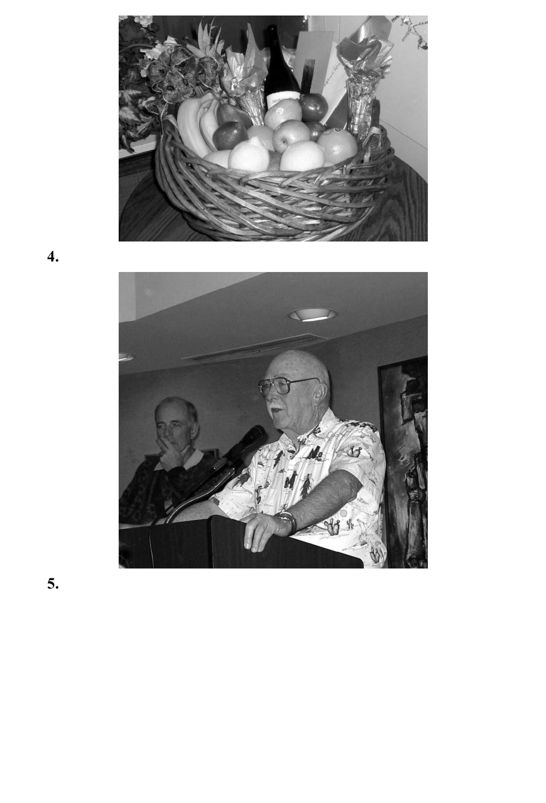

**听力原文与选项：**
- (A) There is a microphone near the speaker. (演讲者旁边有一个麦克风。)
- (B) They're speaking to one another. (他们正在互相交谈。)
- (C) He's ready to take off his shirt. (他准备脱掉衬衫。)
- (D) He's admiring the picture on the wall. (他正在欣赏墙上的画。)

**其他可能表达：**
- The speaker is standing at the podium. (演讲者正站在讲台上。)
- The speaker is talking into the microphone. (演讲者正在对着麦克风讲话。)
- The speaker is using the microphone. (演讲者正在使用麦克风。)

### Q5 (正确答案：A)

**听力原文与选项：**
- (A) They're playing the same musical instrument. (他们在演奏同一种乐器。)
- (B) The musicians are performing in front of an audience. (乐师正在观众面前表演。)
- (C) They are about to finish their performance. (他们的表演快要结束了。)
- (D) They are walking off the stage. (他们正往舞台下走。)

**其他可能表达：**
- They are performing together. (他们正在一起表演。)
- The musicians are performing indoors. (乐师正在室内表演。)
- They're making music together. (他们正在一起演奏音乐。)

### Q6 (正确答案：B)

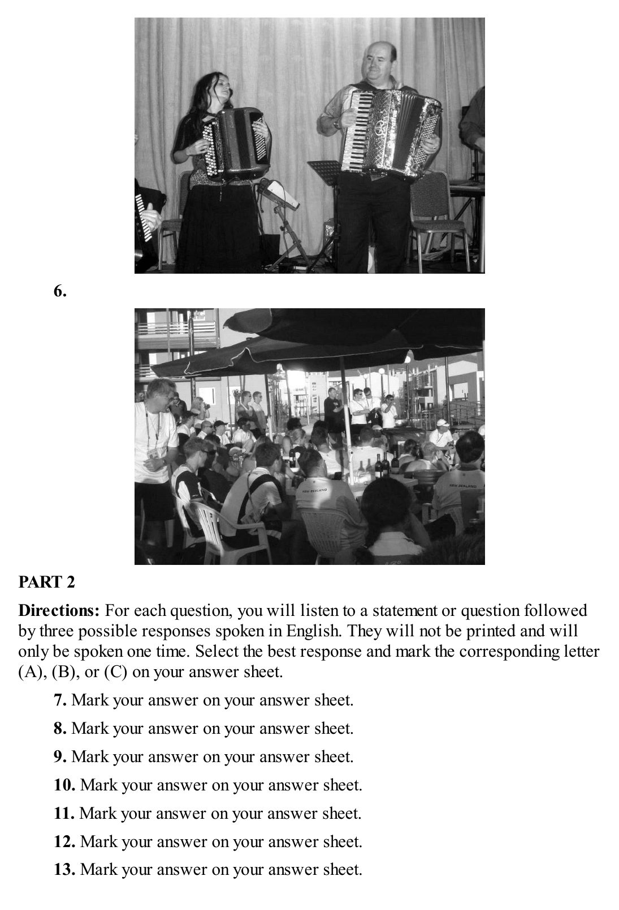

**听力原文与选项：**
- (A) They have all taken seats outside. (他们都已经在外面入座了。)
- (B) They have assembled together outdoors. (他们已经在室外聚在了一起。)
- (C) The people are enjoying a game together. (大家正在一起欣赏比赛。)
- (D) The people are laughing at a joke. (大家因为一个笑话正在大笑。)

**其他可能表达：**
- The people have gathered outdoors. (大家已经聚到了室外。)
- Many of the people have taken seats outdoors. (许多人已经在外面坐下了。)
- There are parasols set up outdoors. (室外架起了遮阳伞。)
- 注：在Part 1中，每道试题都添加了3种可能的正确表达方式，考生可
- 以了解对于同样的照片可能出现的不同表达。

## Part 2: 应答测试 (Q7 - Q31)

### Q7 (正确答案：C)

**听力对话文本：**
- **Q:** When are you leaving for Paris? (你什么时候出发去巴黎？)
- **A:** That depends on when I can book a seat on the plane. (那要看我什么时候能订到机票了。)

**听力原文与选项：**
- **问题：** When will you take off for Paris? (你什么时候飞往巴黎？)
- **选项：**
  - (A) No, she left a while ago. (不，她刚走一会儿。)
  - (B) I'd rather go to London. (我更愿意去伦敦。)
  - (C) On Tuesday afternoon. (星期二下午。)

### Q8 (正确答案：C)

**听力对话文本：**
- **Q:** Where do they sell raincoats around here? (这附近有卖雨衣的吗？)
- **A:** Try the neighborhood mall. (试试附近的商场。)

**听力原文与选项：**
- **问题：** Where can I pick up a raincoat? (我在哪里能买到雨衣？)
- **选项：**
  - (A) Yes, it might be all right. (是的，没问题。)
  - (B) Around three o'clock. (3 点左右。)
  - (C) Probably at the mall. (商场里很可能有。)

### Q9 (正确答案：A)

**听力对话文本：**
- **Q:** Didn't you find the speech a bit dull? (你不觉得这个演讲有点儿枯燥吗？)
- **A:** Yes, I couldn't keep myself awake. (是的，我无法让自己保持清醒。)

**听力原文与选项：**
- **问题：** Didn't you think the speech was a bit slow? (你不觉得这个演讲的节奏有点儿慢吗？)
- **选项：**
  - (A) No, I found it to be quite stimulating. (不，我觉得这个演讲很令人兴奋。)
  - (B) It's quite a distance from here. (那儿离这儿很远。)
  - (C) All right, I think it's a good idea. (好吧，我觉得这是个好主意。)

### Q10 (正确答案：C)

**听力对话文本：**
- **Q:** Good afternoon. I was wondering if there is a single room available for this weekend? (下午好，我想问本周末有没有单间？)
- **A:** Sure, may I have your name, please? (当然有，请问您叫什么名字？)

**听力原文与选项：**
- **问题：** Hello, I'd like to book a single room for this weekend. (你好，我想预订一个单间，这周末住。)
- **选项：**
  - (A) The bookstore is down the street. (书店就在这条街上。)
  - (B) You should have made a reservation. (你本来应该预约的。)
  - (C) Sure, will this be for one night? (没问题，是住一晚吗？)

### Q11 (正确答案：A)

**听力对话文本：**
- **Q:** When did I last talk to Jack? (我上次和杰克谈话是在什么时候？)
- **A:** The day before yesterday. (前天。注：在Part 2中，为帮助考生提高听懂题目的能力，添加了和试题相同或相似的表达方法。)

**听力原文与选项：**
- **问题：** Do you recall which day I spoke to Jack? (你记得我是哪天和杰克谈话的吗？)
- **选项：**
  - (A) Yes, it was a day before you left for New York. (记得，是在你出发去纽约的前一天。)
  - (B) Tuesday would be a good day to meet. (星期二见面挺好的。)
  - (C) No, I am not sure what it is called. (不，我不确定它叫什么。)

### Q12 (正确答案：C)

**听力对话文本：**
- **Q:** How would you like to try on a pair of these sneakers instead? (试试这双运动鞋怎么样？)
- **A:** They seem a bit too small. (这双鞋看起来有点儿小。)

**听力原文与选项：**
- **问题：** Would you be interested in trying a pair of these sneakers here instead? (你有没有兴趣试试这边的一双运动鞋？)
- **选项：**
  - (A) I saw it on the news, too. (我也在新闻里看到它了。)
  - (B) Yes, it is quite interesting. (是的，这很有意思。)
  - (C) Don't you think they're a bit too small? (你不觉得这双鞋有点儿太小了吗？)

### Q13 (正确答案：C)

**听力对话文本：**
- **Q:** How did you ever manage to get those tickets? (你怎么弄到那些票的？)
- **A:** I know someone who works at the theater. (我认识一个在剧院工作的人。)

**听力原文与选项：**
- **问题：** Where did you ever get a hold of those tickets? (你在哪儿弄到那些票的？)
- **选项：**
  - (A) Yes, I got in touch with him. (是的，我联系到他了。)
  - (B) They're for the three o'clock show. (这是 3 点钟演出的票。)
  - (C) From a friend who works at the theater. (从一个在剧院工作的朋友那里。)

### Q14 (正确答案：A)

**听力对话文本：**
- **Q:** Do you want sugar or cream with your coffee? (你的咖啡里加糖还是奶油？)
- **A:** Neither. I like mine black. (都不加。我喜欢喝清咖啡。)

**听力原文与选项：**
- **问题：** Would you prefer sugar with your tea or just cream? (你想在茶里加糖还是奶油？)
- **选项：**
  - (A) I'll take both please. (我想两个都加。)
  - (B) Yes, I will do just that. (是的，我想那样做。)
  - (C) No, he likes it that way. (不，他喜欢那样。)

### Q15 (正确答案：C)

**听力对话文本：**
- **Q:** Is there a reason why you show up to work so early in the morning? (为什么你今天早上这么早来上班？)
- **A:** I come early to avoid the morning rush hour traffic. (我早来是为了避开早上的交通高峰期。)

**听力原文与选项：**
- **问题：** Why do you show up to work at such an early hour? (为什么你这么早来上班？)
- **选项：**
  - (A) I did call her this morning. (我今天早上的确给她打电话了。)
  - (B) No, she is working at home today. (不，她今天在家里工作。)
  - (C) I hate being caught in traffic. (我讨厌堵车。)

### Q16 (正确答案：B)

**听力对话文本：**
- **Q:** How did you manage to meet the deadline? (你是怎样赶在最后期限之前完成的？)
- **A:** I've been working really hard. (我一直工作得非常努力。)

**听力原文与选项：**
- **问题：** How did you manage to get the project done on time? (你是怎样做到按时完成那个项目的？)
- **选项：**
  - (A) It might be a little too late. (可能有点儿太迟了。)
  - (B) I work with a great staff. (我和一个很棒的团队一起工作。)
  - (C) Let's do it tomorrow instead. (咱们明天再做吧。)

### Q17 (正确答案：A)

**听力对话文本：**
- **Q:** Could you lower the volume of the music just a bit? (你能把音乐的音量调小一点儿吗？)
- **A:** No problem. I'll take care of it right away. (没问题。我这就调一下。)

**听力原文与选项：**
- **问题：** Could you turn down the music just a notch? (你能把音乐声调小点儿吗？)
- **选项：**
  - (A) I'm sorry. I didn't know it was bothering you. (对不起。我不知道打扰到你了。)
  - (B) Please turn it in as soon as possible. (请尽快把它交上来。)
  - (C) Yes, right around the corner from here. (是的，就在前面拐弯的地方。)

### Q18 (正确答案：C)

**听力对话文本：**
- **Q:** Why don't you finish this work by three and go home for the day? (你为什么不在3点之前完成工作，然后下班回家呢？)
- **A:** Yes, I was planning on doing that. (是的，我正计划那样做。)

**听力原文与选项：**
- **问题：** If you get this work done by three, I think you should call it a day. (如果你 3 点前能把这项工作完成，你就可以下班了。)
- **选项：**
  - (A) I will go home and get them. (我会回家取它们。)
  - (B) I'll call him back later. (我稍后会给他回电话。)
  - (C) That's what I am planning to do. (那正是我计划的。)

### Q19 (正确答案：C)

**听力对话文本：**
- **Q:** Who is in charge of arranging the tables and chairs for the meeting? (谁负责给会议安排桌椅？)
- **A:** The maintenance staff. (维护人员。)

**听力原文与选项：**
- **问题：** Who's responsible for setting up the tables and chairs for the meeting? (谁负责为会议摆放桌椅？)
- **选项：**
  - (A) There are plenty of tables. (有很多桌子。)
  - (B) It is scheduled to start at ten. (会议定于 10 点开始。)
  - (C) The Facilities Department, why? (设备部门，怎么了？)

### Q20 (正确答案：A)

**听力对话文本：**
- **Q:** Did you get a chance to get the tax sheets ready? (你有可能把税单准备好吗？)
- **A:** Yes, I left them on your desk. (是的，我已经把它们放在你桌上了。)

**听力原文与选项：**
- **问题：** Aren't the tax sheets ready yet? (税单还没有准备好吗？)
- **选项：**
  - (A) Yes, they are just about ready. (不，刚刚准备好。)
  - (B) I didn't call a taxi yet. (我还没有叫出租车。)
  - (C) It might be two sheets actually. (事实上可能是有两张单子。)

### Q21 (正确答案：A)

**听力对话文本：**
- **Q:** Maybe it would be more personal if I wrote the letter by hand. (如果我的信件是手写的话，那会更私人化。)
- **A:** Yes, that would definitely be more personal. (是的，那肯定会更私人化。)

**听力原文与选项：**
- **问题：** I could always handwrite the letter. (我通常会手写信件。)
- **选项：**
  - (A) That would seem more personal. (那会显得更私人化。)
  - (B) Mary wrote the letter this morning. (玛丽今天早上写信了。)
  - (C) I will hand it to her when I get there. (我到那里后会把这个给她。)

### Q22 (正确答案：A)

**听力对话文本：**
- **Q:** How would you like to grab some lunch after we finish here? (你觉得我们完工后去吃午饭怎么样？)
- **A:** Okay, I'll take you to a South Korean restaurant. (好，我带你去一家韩国餐馆。)

**听力原文与选项：**
- **问题：** Would you be interested in having lunch after we are done here? (你愿意在我们干完活儿之后去吃午餐吗？)
- **选项：**
  - (A) Yes, let's check out a South Korean restaurant. (好的，咱们去一家韩国餐馆看看吧。)
  - (B) Sorry, I have never been interested in it. (对不起，我对此来从不感兴趣。)
  - (C) Yes, I went there a few days ago. (是的，我几天前去过那儿。)

### Q23 (正确答案：A)

**听力对话文本：**
- **Q:** How can I get the reception desk from here? (我怎么从这儿和服务台通电话？)
- **A:** Just dial 34. (拨34就行。)

**听力原文与选项：**
- **问题：** What do I press to get the reception desk? (我按什么能和服务台通电话？)
- **选项：**
  - (A) Try extension 34. (试试分机号 34 。)
  - (B) She's the receptionist. (她就是服务员。)
  - (C) I will get it. (我会拿到它。)

### Q24 (正确答案：A)

**听力对话文本：**
- **Q:** Why did Mr. Lee cancel this morning's meeting? (为什么李先生取消了今天早上的会议？)
- **A:** He had something important to take care of. (他有重要的事要办。)

**听力原文与选项：**
- **问题：** Do you know why Mr. Lee called off the meeting this morning? (你知道李先生为什么取消今天早上的会议吗？)
- **选项：**
  - (A) Something urgent came up. (发生了紧急的事。)
  - (B) He will be back by then. (他到时候会回来。)
  - (C) No, I forgot to call him. (不知道，我忘记给他打电话了。)

### Q25 (正确答案：A)

**听力对话文本：**
- **Q:** It's sizzling outside. (外面热极了。)
- **A:** Yes, it's really a hot day today. (是的，今天真是炎热的一天。)

**听力原文与选项：**
- **问题：** It's really hot out there. (外面真的很热。)
- **选项：**
  - (A) Yes, the humidity level is unbelievable. (是的，湿度高得让人难以相信。)
  - (B) He went over there an hour ago. (他一小时前去那儿了。)
  - (C) Why don't you turn down the heat then? (你为什么不把暖气调小一点儿？)

### Q26 (正确答案：B)

**听力对话文本：**
- **Q:** Who will fill in for Leslie when she takes her leave of absence? (谁会在莱斯莉请假期间接替她？)
- **A:** They're searching for someone now. (他们现在正在寻找人选。)

**听力原文与选项：**
- **问题：** Do you know who will be taking over Leslie's position while she takes her leave of absence? (你知不知道莱斯莉请假期间谁来接替她的工作？)
- **选项：**
  - (A) Yes, she will be taking it with her. (是的，她会随身带着。)
  - (B) Mr. Lee has not made up his mind yet. (李先生还没有决定好。)
  - (C) To a little island in the Pacific somewhere. (去太平洋上的一个小岛。)

### Q27 (正确答案：C)

**听力对话文本：**
- **Q:** Jenny was asked to forward this invoice to the home office, wasn't she? (珍妮被要求把这张发票转寄到总公司，是吗？)
- **A:** Yes, Mr. Smith asked her to do that. (是的，史密斯先生让她这么做的。)

**听力原文与选项：**
- **问题：** Jenny's got to mail this invoice to the head office, doesn't she? (珍妮必须把这张发票寄到总公司，是吗？)
- **选项：**
  - (A) Yes, she does have a nice voice. (是的，她的嗓音确实很好。)
  - (B) It's not very far from where she lives. (那儿离她住的地方不太远。)
  - (C) I don't think she is required to do that this time. (我认为她这次不需要那样做。)

### Q28 (正确答案：C)

**听力对话文本：**
- **Q:** Where is a good place to get some great Greek food near here? (这附近哪儿有好吃的希腊菜？)
- **A:** Try Mr. Greeks on Pape Road. (试试佩普路的希腊先生饭店。)

**听力原文与选项：**
- **问题：** Where do you recommend I go to have some good Greek food around here? (你推荐我到附近哪家饭店吃好吃的希腊菜？)
- **选项：**
  - (A) Yes, the service there is really good. (是的，那儿的服务的确很好。)
  - (B) I heard the food is quite tasty there. (我听说那儿的菜很好吃。)
  - (C) I always go to George's on Pape Road. (我经常去佩普路的乔治饭店。)

### Q29 (正确答案：A)

**听力对话文本：**
- **Q:** Didn't we update this program a while ago? (我们此前没有给这个程序升级吗？)
- **A:** We were supposed to. (我们本来应该这么做的。)

**听力原文与选项：**
- **问题：** Isn't there an updated version of this program? (这个程序没有升级版吗？)
- **选项：**
  - (A) Not that I am aware of. (据我所知，没有。)
  - (B) Yes, it is a great program. (是的，它是一个很棒的程序。)
  - (C) Let's do it another day. (咱们改天再做。)

### Q30 (正确答案：C)

**听力对话文本：**
- **Q:** How is the new guy on your team doing? (你组里那个新来的小伙子干得怎么样？)
- **A:** He's coming along fine. (他干得不错。)

**听力原文与选项：**
- **问题：** Is the new guy on your team doing okay? (你组里那个新来的小伙子干得好吗？)
- **选项：**
  - (A) I might join the team as well. (我也会加入这个组。)
  - (B) No, I don't know him that well. (不，我不太了解他。)
  - (C) Yes, he's just becoming used to his job now. (是的，他现在越来越习惯他的工作了。)

### Q31 (正确答案：B)

**听力对话文本：**
- **Q:** Do you want me to send the papers, or are you going to come and get them? (你想让我把文件给你送过去，还是你来取？)
- **A:** I will stop by later today. (我今天晚些时候过去。Questions 32 through 34 refer to the following conversation.M:I really need to get a new computer.（34）W: Why？ What's the problem？M: Well，I've had this computer for eight years. It's so slow to downloadanything， it drives me crazy.（)

**听力原文与选项：**
- **问题：** Should I get one of my staff members to bring you the papers, or are you planning to make a trip out here? (我是找一个员工把文件带给你，还是你来这边一趟？)
- **选项：**
  - (A) No, my plane takes off at nine. (不，我的飞机 9 点起飞。)
  - (B) I'll drop by this afternoon. (我今天下午顺路过去。)
  - (C) I had a great vacation, thanks. (我度过了一个愉快的假期，谢谢。)

## Part 3: 简短对话 (Q32 - Q70)

### Questions 32 - 34

**听力独白/对话原文：**
**M:** I really need to get a new computer. (34)
**W:** Why? What's the problem?
**M:** Well, I've had this computer for eight years. It's so slow to download anything, it drives me crazy. (32) And it often freezes completely, and then I have to restart it. I really need a faster computer, so I can work more efficiently.
**W:** Why don't you go to A&T Computers? I've used them for years. They use quality components, and they really know how to set up systems properly. I've always found their technicians friendly and helpful. (33)

**中文对照：**
> **M：**我真的需要买一台新电脑了。
> **W：**怎么了？出了什么问题？
> **M：**哦，这台电脑我用了8年了。它下载东西太慢了，我快疯了。它还经常彻底死机，然后我就得重启。我真的需要一台速度更快的电脑，这样我能更有效率地工作。
> **W：**为什么不试试A&T电脑？我用这个品牌的电脑好多年了。他们用的是高质量的配件，而且他们很懂得如何恰当地搭建系统。我发现他们的技术员挺友好，而且乐于助人。

**核心词汇与短语：**
- **drive ~ crazy**：使发疯，逼疯
- **freeze**：（电脑）死机
- **restart**：重启（电脑）
- **efficiently**：效率高地，有效地
- **component**：元件，组件
- **set up**：安装（电脑系统），建立
- **properly**：适当地
- **helpful**：有帮助的，乐于助人的
- **access**：访问，使用
- **be frustrated with**：因为而感到沮丧，烦恼
- **have a sale**：促销

#### Q32 (正确答案：C)
**问题：**  (出了什么问题？)
- (A) The man can't access something on his computer. (男士无法访问他电脑上的某个文档了。)
- (B) The woman does not know how to use the program. (女士不知道怎样使用程序。)
- (C) The man is frustrated with his computer. (男士的电脑让他很烦恼。)
- (D) The woman's work is not going very efficiently. (女士的工作效率不太高。)

#### Q33 (正确答案：B)
**问题：** Why does the woman recommend A&T store? (女士为什么推荐 A&T 商店？)
- (A) She has known the owner for years. (她好多年前就认识这家店的店主。)
- (B) It provides great service. (它提供很好的服务。)
- (C) The technician is her brother. (技术员是她的兄弟。)
- (D) The store is having a sale now. (商店现在正在促销。)

#### Q34 (正确答案：C)
**问题：** What are they talking about? (她们在谈论什么？)
- (A) The man's company. (男士的公司。)
- (B) The woman's job. (女士的工作。)
- (C) The man's computer. (男士的电脑。)
- (D) The woman's car. (女士的汽车。)

**延伸表达与补充：**
- **get a computer = buy a computer = purchase a computer = pick up a computer** (买一台电脑)
  - *例句：I need to get a new computer soon.* (我需要尽快买一台新电脑。)
- **What's the problem? = What's the matter? = Is something wrong?** (出什么问题了？出什么事了吗？)
- **It drives me crazy. = It makes me mad.** (这件事把我逼疯了。扩展表达：)
  - *例句：It is so frustrating. It drives me crazy to see how slow the work is progressing.* (这件事很令人沮丧。看到工作进展得如此慢，我快疯了。)

### Questions 35 - 37

**听力独白/对话原文：**
**M:** Lucy, a client of mine is arriving in a few minutes for a consultation, but Mr. Woods just requested to see me immediately. (35)
**W:** What's the name of the person coming to visit?
**M:** Alexander Sullivan. Would you mind talking to him for a few minutes? (36) I should be back by a quarter after eleven.
**W:** Okay, but please be sure the meeting doesn't run too long. Derrick and I are going to the Watertown facility, and we're planning to leave at half past eleven. (37)
**M:** I'm positive I'll be done before then.
**W:** In that case, I'll speak with Mr. Sullivan until you return.

**中文对照：**
> **M：**露西，我的一个客户几分钟后要过来咨询事情，但是伍兹先生刚刚要求马上见我。
> **W：**来访的客户叫什么？
> **M：**亚历山大·沙利文。你介意跟他谈几分钟吗？我应该会在11点15分回来。
> **W：**没问题，但是请确保会议不要持续太长时间。德里克和我要去沃特顿工厂，我们计划11点半出发。
> **M：**我确定在那之前会结束的。
> **W：**那样的话，在你回来之前，我会跟沙利文先生谈的。

**核心词汇与短语：**
- **client**：客户
- **consultation**：咨询
- **request**：请求，要求
- **immediately**：立即，立刻
- **facility**：设备；场所
- **plan to**：计划，打算
- **positive**：确信的，肯定的
- **in that case**：如果那样的话

#### Q35 (正确答案：D)
**问题：** What is the man's problem? (男士遇到的问题是什么？)
- (A) He is unable to visit Watertown before noon. (他无法在中午之前访问沃特顿。)
- (B) He scheduled two meetings for the same time. (他同时安排了两个会议。)
- (C) He is unprepared for his meeting with his supervisor. (对于跟主管的会议，他毫无准备。)
- (D) He cannot meet a person at an appointed time. (他无法在约定好的时间见一个人。)

#### Q36 (正确答案：A)
**问题：** What does the man request the woman to do? (男士请求女士做什么？)
- (A) Speak with his client. (和他的客户交谈。)
- (B) Look over a form for him. (为他检查一份表格。)
- (C) Speak to Derrick. (跟德里克谈话。)
- (D) Give him some documents. (给他一些文件。)

#### Q37 (正确答案：A)
**问题：** What will the woman do at 11:30? (女士打算在 11 点半做什么？)
- (A) Go to another location. (去另一个地方。)
- (B) Conduct a consultation. (进行一次咨询。)
- (C) Meet a client for lunch. (与一个客户见面共进午餐。)
- (D) Speak with Mr. Sullivan. (跟沙利文先生谈话。)

**延伸表达与补充：**
- **would you mind~ = do you mind~** (（用于委婉请求）你介意…吗？)
  - *例句：Would you mind my opening the window?* (你介意我打开窗户吗？)
- **be sure = be certain** (肯定扩展表达：)
  - *例句：make sure Can we be sure that she's honest?* (查明；弄清楚；设法确保我们能确保她是诚实的吗？)

### Questions 38 - 40

**听力独白/对话原文：**
**M:** I've just heard on the radio that all flights from the domestic air terminal will be delayed by two hours. (38) There's been a security alert and they're searching all the bags. (39)
**W:** Oh, no! That's going to cause us a serious problem. Our clients are expecting us and we won't be able to make it for the meeting.
**M:** That shouldn't be a big problem. I am expecting a call from them this afternoon to talk about the seminar. I'll see if I can postpone the meeting until tomorrow morning. (40)

**中文对照：**
> **M：**我刚才听广播说国内航站的所有航班将被延迟两个小时。刚才拉响了安全警报，他们正在搜查所有的行李。
> **W：**哦，不！那会给我们带来严重的问题。客户在等我们呢，我们没法参加会议了。
> **M：**那不算是个大问题。我在等他们的电话，今天下午他们会和我谈研讨会的事情。我看看能不能把会议推迟到明天上午。

**核心词汇与短语：**
- **flight**：航班
- **domestic**：国内的
- **delay**：推迟，延后
- **security alert**：安全警报
- **postpone**：推迟
- **condition**：条件；情况
- **security**：安全
- **complication**：难题，困难
- **occur**：发生
- **make a mistake**：出错
- **booking**：（机票）预订

#### Q38 (正确答案：B)
**问题：** How long has the flight been delayed? (航班被推迟了多长时间？)
- (A) 1 hour. (一个小时。)
- (B) 2 hours. (两个小时。)
- (C) 3 hours. (三个小时。)
- (D) 4 hours. (四个小时。)

#### Q39 (正确答案：B)
**问题：** What is the reason for the delay? (推迟的原因是什么？)
- (A) The weather condition is bad. (天气情况很差。)
- (B) There's a security complication. (出现了一个安全问题。)
- (C) An engine problem has occurred. (发动机出了问题。)
- (D) The airline staff made a booking mistake. (航空公司的工作人员在预订机票时出错了。)

#### Q40 (正确答案：C)
**问题：** What does the man mean when he says,“That shouldn't be a big problem”? (男士说 “ 那不算是个大问题 ” 时是什么意思？)
- (A) He will use another mode of transportation. (他将使用另一种交通工具。)
- (B) He will ask the client to come to the office. (他将让客户来办公室。)
- (C) He will schedule the meeting for a later time. (他将把会议安排在晚一点的时间。)
- (D) He will attend the seminar a little early. (他将早一点参加研讨会。)

**延伸表达与补充：**
- **be delayed by two hours = be postponed for two hours = be held up for two hours** (被推迟了两个小时)
  - *例句：The meeting will be delayed by two hours because some of the guests have not arrived.* (因为有一些客人还没到，所以会议将推迟两个小时。)
- **make it for the meeting = get to the meeting = attend the meeting** (参加会议)
  - *例句：John said he might not be able to make it for the meeting.* (约翰说他也许不能参加会议了。)

### Questions 41 - 43

**听力独白/对话原文：**
**M:** Good afternoon. I'm from Waldorf Taxi Trucks with the items you requested.
**W:** Oh, really? I wasn't aware that we were expecting any deliveries. Who did you speak to?
**M:** Her name was Sylvie James. She called us just before lunch today and requested a special order. (41) Let's see I should have the phone order form here somewhere. Ah. Here it is.
**W:** Okay, but Sylvie's out showing some of our clients around our plant site (42) and is not due back for another two hours. (43) Why don't you leave the boxes here and I will sign for it?

**中文对照：**
> **M：**下午好。我是瓦尔多夫出租卡车公司的，来送你们需要的东西。
> **W：**哦，是吗？我不知道有人在等送货。你和谁通的电话？
> **M：**塞尔维·詹姆斯。她今天午饭前给我们打电话，下了一个特殊订单。我看看，我应该把电话订单表放在什么地方了。啊，在这儿。
> **W：**好的，但是塞尔维带我们的一些客户到工厂参观去了，而且两小时之内不会回来。你把箱子放在这儿吧，我来签收。

**核心词汇与短语：**
- **be aware that**：意识到，知道
- **delivery**：交货
- **lunch**：午饭
- **order**：订单
- **site**：地方，场所
- **be due back**：（到时间）回来

#### Q41 (正确答案：A)
**问题：** What has Sylvie done this morning? (塞尔维今天上午做什么了？)
- (A) Placed an order. (下了一个订单。)
- (B) Ordered lunch. (订了午饭。)
- (C) Met with a client. (会见了一个客户。)
- (D) Paid her phone bill. (支付了她的电话费。)

#### Q42 (正确答案：B)
**问题：** Where is Sylvie? (塞尔维在哪儿？)
- (A) At lunch. (在吃午餐。)
- (B) At the factory. (在工厂。)
- (C) In a meeting. (在开会。)
- (D) In her office. (在她的办公室。)

#### Q43 (正确答案：B)
**问题：** When is Sylvie expected to return? (塞尔维预计什么时候回来？)
- (A) In an hour. (一个小时之后。)
- (B) In two hours. (两个小时之后。)
- (C) In three hours. (三个小时之后。)
- (D) In four hours. (四个小时之后。)

**延伸表达与补充：**
- **I wasn't aware that (of) ~ = I was not informed about ~ = I didn't know about ~** (我不知道…)
  - *例句：I wasn't aware of the fact that some parts of the company policy had changed.* (我不知道公司政策有一部分已经变化了。)
- **be due back = return = come back** (回来)
  - *例句：He is due back the day after tomorrow.* (他后天回来。)

### Questions 44 - 46

**听力独白/对话原文：**
**W:** I've got some outstanding news. The inspector gave my new café a passing grade, so now I have permission to open it for business. (44)
**M:** I'm so happy for you. When is the grand opening scheduled for?
**W:** This Friday. Why don't you stop by if you have some time? (45) Drinks will be half off, and there will be live entertainment all day long.
**M:** Okay. I'll visit sometime after work. Where exactly is it located? (46)
**W:** It's on the corner of Macon Street and Bedford Drive. It's right beside the big drugstore.
**M:** Oh, I know exactly where it is.

**中文对照：**
> **W：**我有个特别好的消息告诉你。督察员给我新开的咖啡馆打了及格分，所以现在我得到开门营业的许可了。
> **M：**真心为你感到高兴。正式营业安排在什么时候？
> **W：**本周五。你有时间的话，为什么不顺便过来坐坐？那天饮料全部五折，而且全天都有现场表演可以看。
> **M：**好的。我下班后过去。具体地址在哪里？
> **W：**在梅肯大街和贝德福德大道的拐角处，就在那个大药房的旁边。
> **M：**哦，我知道它的确切位置了。

**核心词汇与短语：**
- **outstanding**：杰出的，优秀的
- **inspector**：督察员
- **café**：咖啡馆
- **passing grade**：及格分数
- **permission**：许可，允许
- **grand opening**：盛大开业，正式开业
- **schedule**：安排，计划
- **stop by**：顺便访问，偶然拜访
- **live entertainment**：现场表演
- **locate**：坐落于，位于
- **Drive**：大道

#### Q44 (正确答案：C)
**问题：** Why is the woman pleased? (女士为什么很高兴？)
- (A) A contract was signed. (签署了一份合同。)
- (B) A business was opened. (公司开业了。)
- (C) An inspection was passed. (通过审查了。)
- (D) A profit was made. (获得利润了。)

#### Q45 (正确答案：D)
**问题：** What does the woman advise the man to do? (女士建议男士做什么？)
- (A) Speak with her friend. (和她的朋友交谈。)
- (B) Contact a supplier. (联系一位供货商。)
- (C) Perform at a venue. (在一个地方表演。)
- (D) Visit a café. (到一家咖啡馆去。)

#### Q46 (正确答案：B)
**问题：** What does the man ask about? (男士问了什么？)
- (A) The type of entertainment. (表演类型。)
- (B) The location of a business. (店铺的地址。)
- (C) The discounts on beverages. (饮料的折扣。)
- (D) The hours of operation. (营业时间。)

**延伸表达与补充：**
- **Why don't you~ = Why not~** (（表示建议）你为什么不…？)
  - *例句：Why don't you join us for lunch?* (你何不跟我们一起吃午餐呢？)
- **all day long = a whole day** (一整天)
  - *例句：They chatted and enjoyed themselves at the party all day long.* (在派对上，他们一整天都在攀谈，玩得很尽兴。)
- **right beside = right near** (紧挨)
  - *例句：I was standing right beside her at the time.* (当时，我正好站在她的身边。)

### Questions 47 - 49

**听力独白/对话原文：**
**M:** Is this the right counter for opening a new account? （ 47, 48 ）
**W:** Sure, I can do that for you right here. What kind of account were you thinking of?
**M:** I need to open a checking account. (48) I already have a savings account here. (47)
**W:** Great, in that case we can open a checking account for you very quickly. Would you do me a favor and fill out this form? I will also need your identification card with a picture. (49)

**中文对照：**
> **M：**在这个柜台可以开新账户吗？
> **W：**当然可以，我在这儿就能给您办理。您想开什么账户？
> **M：**我想开一个活期存款账户。我在这儿已经开过一个储蓄存款账户了。
> **W：**太好了，那样的话我们就能很快为您开一个活期账户了。您能帮忙填一下这张表格吗？我还需要您带照片的身份证。

**核心词汇与短语：**
- **counter**：柜台
- **open**：开，办理
- **checking account**：活期存款账户
- **savings account**：储蓄存款账户
- **fill out**：填写
- **identification card**：身份证
- **write out**：写出，开出
- **cash**：现金

#### Q47 (正确答案：A)
**问题：** Where is the conversation taking place? (对话发生在哪儿？)
- (A) In a bank. (银行。)
- (B) At a photo studio. (照相馆。)
- (C) In an accounting office. (会计办公室。)
- (D) At a store opening. (商店开业仪式上。)

#### Q48 (正确答案：C)
**问题：** What does the man want to do? (男士想做什么？)
- (A) Write out a check. (开一张支票。)
- (B) Make an ID card. (制作一张身份证。)
- (C) Open a bank account. (开一个银行账户。)
- (D) Take a picture. (照一张照片。)

#### Q49 (正确答案：C)
**问题：** What does the woman request from the man? (女士向男士要什么东西？)
- (A) Some cash. (一些现金。)
- (B) A discount coupon. (一张打折券。)
- (C) A picture ID. (一张带照片的身份证。)
- (D) Some forms. (一些表格。)

**延伸表达与补充：**
- **What kind of account were you thinking of? = What type of account do you want to open? = What kind of account are you thinking of opening up?** (您想要开哪种账户？)
- **in that case = if that's the situation = if that's what's happening** (如果是那样的话)
  - *例句：In that case, why don't you take over the job?* (如果是那样的话，你为什么不接手那份工作？)

### Questions 50 - 52

**听力独白/对话原文：**
**M:** Hi, Suzie. I'm just ringing to see if you got the job.
**W:** Oh, hi John. Well, actually, I'm not sure. But I do have to go for a second interview this afternoon. (50)
**M:** That's great! I guess you must be excited. Where is your second meeting supposed to happen anyway?
**W:** At the big building next to the art gallery downtown. Hey, do you think we can meet up for lunch today before I go to my interview? (51) I really could use some inside information about your supervisor. (52) He is going to interview me today.

**中文对照：**
> **M：**嗨，苏茜，我打电话来看看你是否找到工作了。
> **W：**哦，嗨，约翰。嗯，事实上，我不太确定。不过我今天下午确实要去参加第二次面试。
> **M：**太好了！我猜你一定很兴奋。你的第二场面试在哪里呢？
> **W：**在市中心艺术馆旁边的大楼。嘿，咱们今天在我去面试前一起吃午饭，你觉得怎么样？我真能用上一些关于你的上司的内部信息。他今天将对我进行面试。

**核心词汇与短语：**
- **ring**：打电话
- **be supposed to do ~**：应该，被期望做
- **meet up ~**：会见，与见面
- **inside information**：内部信息
- **infer**：推测
- **apply to**：申请
- **avid**：渴望的，热切的
- **get along with**：与相处得好

#### Q50 (正确答案：A)
**问题：** What will the woman most likely do today? (女士今天最有可能做什么？)
- (A) Go for a job interview. (去参加一个工作面试。)
- (B) Visit the art gallery. (参观艺术馆。)
- (C) Ring up an old friend. (给一位老朋友打电话。)
- (D) Meet with her brother. (见她的兄弟。)

#### Q51 (正确答案：A)
**问题：** On which part of the day is the conversation most likely taking place? (这篇对话最有可能发生在一天中的哪段时间？)
- (A) In the morning. (上午。)
- (B) During lunch. (午饭时。)
- (C) In the afternoon. (下午。)
- (D) In the evening. (晚上。)

#### Q52 (正确答案：A)
**问题：** What can be inferred about the man? (关于男士可以推断出什么？)
- (A) He works at the company the woman is applying to. (他在女士应聘的公司上班。)
- (B) He is an avid art lover. (他是一个热忱的艺术爱好者。)
- (C) He doesn't get along with his supervisor. (他与上司相处得不好。)
- (D) He is looking for a better opportunity. (他在寻找更好的机会。)

**延伸表达与补充：**
- **I'm ringing to see ~ = I'm calling to find out ~ = I'm phoning to ask ~** (我打电话来看看…)
  - *例句：I'm ringing to see if you would be interested in having lunch together.* (我打电话来看看你想不想一起吃午饭。)
- **Where is your second meeting supposed to happen anyway? = Where will the next meeting take place?** (你的第二次面试到底在什么地方？)
- **meet up for lunch = get together for lunch = gather for lunch** (见面一起吃午饭)
  - *例句：Let's meet up for lunch this week.* (咱们这周见个面一起吃午饭吧。)

### Questions 53 - 55

**听力独白/对话原文：**
**M:** Hi, Susan. This is Mike. Listen, could you do me a huge favor? (53)
**W:** Well, I'll try. What is it?
**M:** I have an appointment with a new client this afternoon, but I can't make it. Could you do it for me? (53) Another important client has called me in for an emergency meeting. (54) I really have to be out of the office this afternoon, and I can't get back here before 3:00 p.m.
**W:** Well, in that case, of course I'll be happy to take over for you. Why don't you drop by the office later so I can tell you how it went? (55)

**中文对照：**
> **M：**嗨，苏珊，我是迈克。你能不能帮我一个大忙？
> **W：**好，我试试吧。什么忙？
> **M：**我今天下午约见了一个新客户，但是我不能去了。你能替我去吗？另一个重要客户叫我去参加一个紧急会议。我今天下午确实不能在办公室，而且我三点之前回不来。
> **W：**好吧，如果是那样，我当然很乐意替你。你晚些时顺道来办公室一趟，我给你讲讲事情的进展如何。

**核心词汇与短语：**
- **favor**：恩惠，帮助
- **emergency**：紧急情况，突发事件
- **out of ~**：在外面
- **get back**：返回
- **take over**：接管，接收
- **drop by**：顺路拜访
- **on one's behalf**：为的利益，代表
- **take care of**：负责；处理
- **tie up**：占用，阻碍
- **attend to**：处理，注意

#### Q53 (正确答案：A)
**问题：** What does the man ask the woman to do? (男士要女士做什么？)
- (A) Attend a meeting on his behalf. (代表他参加一次会面。)
- (B) Take care of an existing client. (负责一位现有的客户。)
- (C) Drive him to his client's office. (开车带他去他客户的办公室。)
- (D) Pick him at 5 o'clock. (5 点时去接他。)

#### Q54 (正确答案：B)
**问题：** Why is the man asking for a favor? (男士为什么要人帮忙？)
- (A) He is tied up at his office. (他在办公室走不开。)
- (B) He has to attend to something else. (他得去处理别的事。)
- (C) He doesn't like working alone. (他不喜欢一个人工作。)
- (D) He has a family emergency to take care of. (他家里有急事要办。)

#### Q55 (正确答案：B)
**问题：** When will Susan meet with Mike? (苏珊什么时候与迈克见面？)
- (A) Before she goes on her appointment. (在她去会见客户之前。)
- (B) After she meets with the new client. (在她会见新客户之后。)
- (C) At three o'clock in the afternoon. (在今天下午 3 点。)
- (D) After she finishes with the emergency meeting. (在她开完紧急会议之后。)

**延伸表达与补充：**
- **Could you do me a huge favor?** (你能帮我一个大忙吗？扩展表达：)
  - *例句：Can I ask you to do something for me? = Can you do something for me?* (你能帮我做件事情吗？)
- **take over for ~ = take one's place = fill in for ~** (接管，顶替…)
  - *例句：I will take over for you while you are away.* (我会在你不在的时候接替你工作。)
- **Why don't you drop by ~? = Why don't you stop by ~? = Why don't you come by ~?** (你顺道来…怎么样？)
  - *例句：Why don't you drop by on your way back from work today?* (你何不在下班路上顺道来一下？)

### Questions 56 - 58

**听力独白/对话原文：**
**W:** I was just informed we'll be getting a new assignment. We're scheduled to go to 83 Lambert Street.
**M1:** What kind of work will we be doing there?
**W:** We've got to take care of the lawn and plant some trees and flowers. (56) The job starts tomorrow. (57)
**M1:** Okay, but I heard it's supposed to rain then. Mr. Myers, can we delay the work next week if it rains?
**M2:** In that case, you'll have the day off, but you'll need to come on the weekend to handle the job. (58) It's for a new client, and we don't want to lose him. (57) Is that okay, Tim?
**M1:** I sure hope it doesn't rain. I'm planning to visit my parents. (58)

**中文对照：**
> **W：**我刚接到通知，我们将有一个新任务。我们计划去兰伯特街83号。
> **M1：**我们将在那里做什么工作？
> **W：**我们要在那里打理草坪，种植一些树和花。明天开始工作。
> **M1：**好吧。但我听说明天可能会下雨。梅尔斯先生，如果下雨，我们可以把工作推迟到下周吗？
> **M2：**如果那样的话，你可以休息一天，但是你需要周末过来处理这项工作。这是一位新客户，我们不想失去他。这样可以吗，提姆？
> **M1：**我真希望明天不要下雨。我打算去看望我的父母。

**核心词汇与短语：**
- **inform**：通知，告知（某人）
- **assignment**：（分配的）任务
- **take care of**：打理；照顾
- **lawn**：草坪，草地
- **delay**：推迟
- **handle**：处理（工作）
- **client**：客户，顾客

#### Q56 (正确答案：A)
**问题：** Where do the speakers most likely work? (讲话者们最可能在哪里工作？)
- (A) At a landscaping firm. (在一家园林绿化公司。)
- (B) At a construction company. (在一家建筑公司。)
- (C) At an interior design company. (在一家室内设计公司。)
- (D) At a city park. (在一个城市公园。)

#### Q57 (正确答案：D)
**问题：** What are the speakers supposed to do tomorrow? (讲话者们明天应该做什么？)
- (A) Submit some documents. (提交一些文件。)
- (B) Provide an estimate to a customer. (向顾客提供报价。)
- (C) Purchase some supplies. (购买一些必需品。)
- (D) Do some work for a new client. (为新客户做些工作。)

#### Q58 (正确答案：C)
**问题：** What most likely does Tim mean when he says, “I sure hope it doesn't rain”? (当提姆说 “ 我真希望明天不要下雨 ” 的时候，最有可能意味着什么？)
- (A) He plans to go to the beach tomorrow. (他计划明天去海滩。)
- (B) He forgot to bring his umbrella to work. (他忘记带雨伞去上班了。)
- (C) He does not want to work on the weekend. (他不想周末上班。)
- (D) He wants to do some yardwork at home. (他想在家做些庭院杂活。)

**延伸表达与补充：**
- **We're scheduled to go to 83 Lambert Street. = We plan to go to 83 Lambert Street.** (我们计划去兰伯特街83号。)
  - *例句：We're scheduled to meet the reporter this afternoon.* (我们计划今天下午与记者见面。)
- **be supposed to do/be sth.** (应该做某事/是某事)
  - *例句：We're supposed to check out of the hotel by 11o'clock.* (我们应该11点半从酒店退房。)
- **In that case, you'll have the day off. = If that happens, you'll have the day off. = In that case, you'll take the day.** (如果那样的话，你可以休息一天。)
  - *例句：In that case, we won't wait any longer.* (如果那样的话，我们就不再等了。)
- **I sure hope it doesn't rain. = I really wish it doesn't rain.** (我真希望明天不要下雨。)
  - *例句：I sure hope you can help me.* (我真希望你可以帮助我。)

### Questions 59 - 61

**听力独白/对话原文：**
**M:** Have you been to any good restaurants lately? I'm looking for somewhere special to take my wife on her birthday. (59)
**W:** Well...My fiancé and I tried Clancy's Seafood Bar last weekend.
**M:** Oh, really? I read in the local paper (60) last week that the food and atmosphere there are superb but the price is a bit on the steep side.
**W:** It's true that the food is really very good, (61) and the price is a bit on the expensive side. However, the place is a bit too formal for my liking: I couldn't really relax there.

**中文对照：**
> **M：**你最近去过不错的饭店吗？我正在找一个能带我妻子过生日的特别的饭店。
> **W：**哦…我和未婚夫上周末到克兰西海鲜酒吧了。
> **M：**噢，真的吗？我上周在本地报纸上看到，那里的饭菜和气氛都是一流的，但是价格有点儿贵。
> **W：**是的，那里的菜确实很好吃，价格稍贵一点儿。可是，那里的气氛对我来说太正式了：在那儿我没法放松。

**核心词汇与短语：**
- **lately**：最近，近来
- **look for**：寻找
- **fiancé**：未婚夫
- **atmosphere**：气氛，氛围
- **superb**：极好的，超级棒的
- **a bit**：有点儿，稍微
- **steep**：（价格）过高的
- **formal**：正式的，正规的
- **liking**：爱好，嗜好
- **propose**：求婚
- **affordable**：可支付得起的，价廉的
- **rather**：相当地，非常

#### Q59 (正确答案：C)
**问题：** What are they talking about? (他们在谈论什么？)
- (A) An article the woman read in the local newspaper. (女士在当地报纸上看到的一篇文章。)
- (B) A plan for a surprise birthday party of a co-worker. (为同事举办一个惊喜生日派对的计划。)
- (C) A place where the man can take his wife on a special day. (男士可以在特殊的日子带妻子去的一个地方。)
- (D) How the woman was proposed by her fiancé. (女士的未婚夫是如何向她求婚的。)

#### Q60 (正确答案：A)
**问题：** How does the man know of the place the woman had gone over the weekend? (男士怎么知道女士周末去过的饭店？)
- (A) He read it in the local paper. (他在当地报纸上看到过。)
- (B) His friend had mentioned it. (他的朋友提到过。)
- (C) He went there before. (他以前去过。)
- (D) He lives nearby. (他住在那家饭店附近。)

#### Q61 (正确答案：B)
**问题：** Which of the following does the woman mention about the place? (关于这个饭店，女士提到了下面哪条？)
- (A) The price is very affordable. (价格低廉。)
- (B) The food is rather good. (饭菜很好。)
- (C) It has a relaxing atmosphere. (气氛轻松。)
- (D) It is her favorite restaurant. (这是她最喜欢的饭店。)

**延伸表达与补充：**
- **The price is a bit on the steep side. = The price is a little high. = The price is a bit ridiculous.** (价格有一点儿贵。)
- **The place is a bit too formal for my liking.** (这个地方对于我来说太正式了。扩展表达：)
  - *例句：I don't like the place because there is a dress code. I didn't like the atmosphere there.* (我不喜欢这个地方，因为这里有穿衣规则。我不喜欢那儿的气氛。)

### Questions 62 - 64

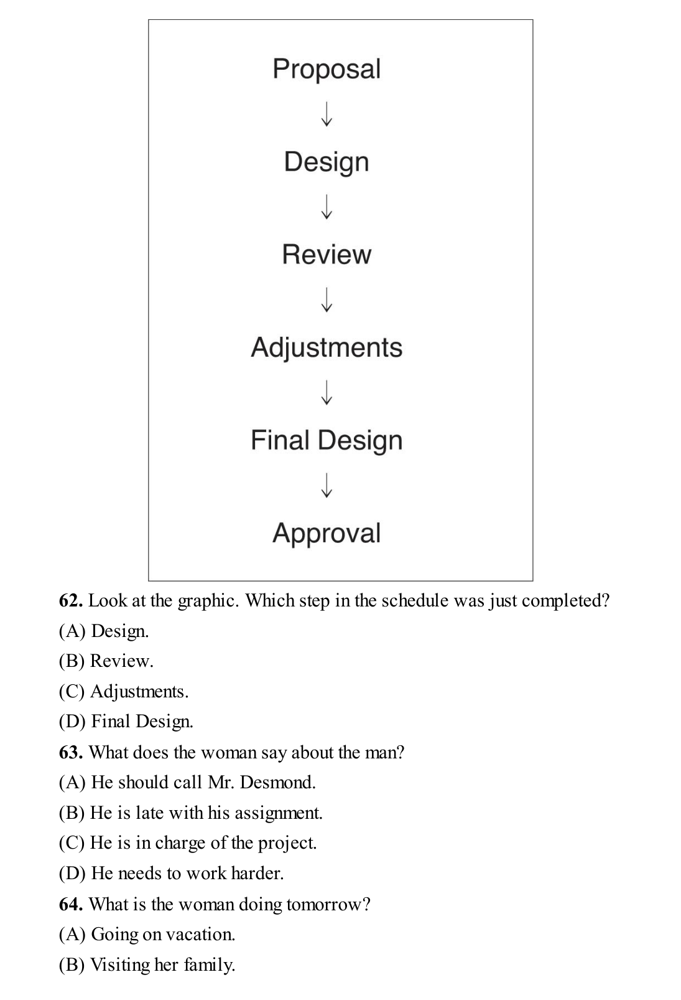

**听力独白/对话原文：**
**M:** Ms. Hutchinson, here are the blueprints for the Desmond Building. Catie and I finished them a moment ago. (62) We hope you like them.
**W:** I'm glad you finished, but you're running way behind schedule, Hans. (63) The final design is due a week from today, and we've only completed the second stage.
**M:** I'm terribly sorry. I'm sure that if we work hard, we can finish on schedule though.
**W:** Well, it's my job to examine the plans, but I'm flying to Toronto on business tomorrow. (64) I have no choice but to call the client to request an extension.
**M:** When are you returning?
**W:** Three days from now. So we can't initiate the next step until then.

**中文对照：**
> **M：**哈钦森女士，这是我和凯蒂刚刚完成的德斯蒙德大厦的设计蓝图，希望您能满意。
> **W：**我很高兴你们完成了，但是汉斯，你们的进度还是落后于计划。一周后的今天要完成最终的设计，我们只完成了第二阶段。
> **M：**非常抱歉。我相信如果我们努力工作，我们能按时完成任务。
> **W：**嗯，检查计划是我的工作，但我明天要飞往多伦多出差。我别无选择，只能打电话给客户请求延期。
> **M：**您什么时候回来？
> **W：**三天以后。所以只能等我回来，我们才能开始下一步。

**核心词汇与短语：**
- **blueprint**：蓝图，设计图；计划
- **schedule**：进度表，计划表
- **due**：到期的
- **extension**：延期
- **initiate**：开始，创始；发起

#### Q62 (正确答案：A)
**问题：** Look at the graphic. Which step in the schedule was just completed? (请看图表，计划表中的哪一步刚被完成？)
- (A) Design. (设计。)
- (B) Review. (检查。)
- (C) Adjustments. (调整。)
- (D) Final Design. (最终设计。)

#### Q63 (正确答案：B)
**问题：** What does the woman say about the man? (对话中的女士对男士说什么？)
- (A) He should call Mr. Desmond. (他应该给德斯蒙德先生打电话。)
- (B) He is late with his assignment. (他的任务完成得晚了。)
- (C) He is in charge of the project. (他负责这个项目。)
- (D) He needs to work harder. (他需要更努力地工作。)

#### Q64 (正确答案：C)
**问题：** What is the woman doing tomorrow? (对话中的女士明天要去做什么？)
- (A) Going on vacation. (去度假。)
- (B) Visiting her family. (去看望她的家人。)
- (C) Taking a business trip. (去出差。)
- (D) Attending a marketing conference. (去参加一个市场营销会议。)

**延伸表达与补充：**
- **on schedule = to schedule** (按照预定时间；按时)
  - *例句：Once the program starts, the producer makes sure it stays on schedule.* (一旦节目开播，制作人要确保节目按照预定时间进行。)

### Questions 65 - 67

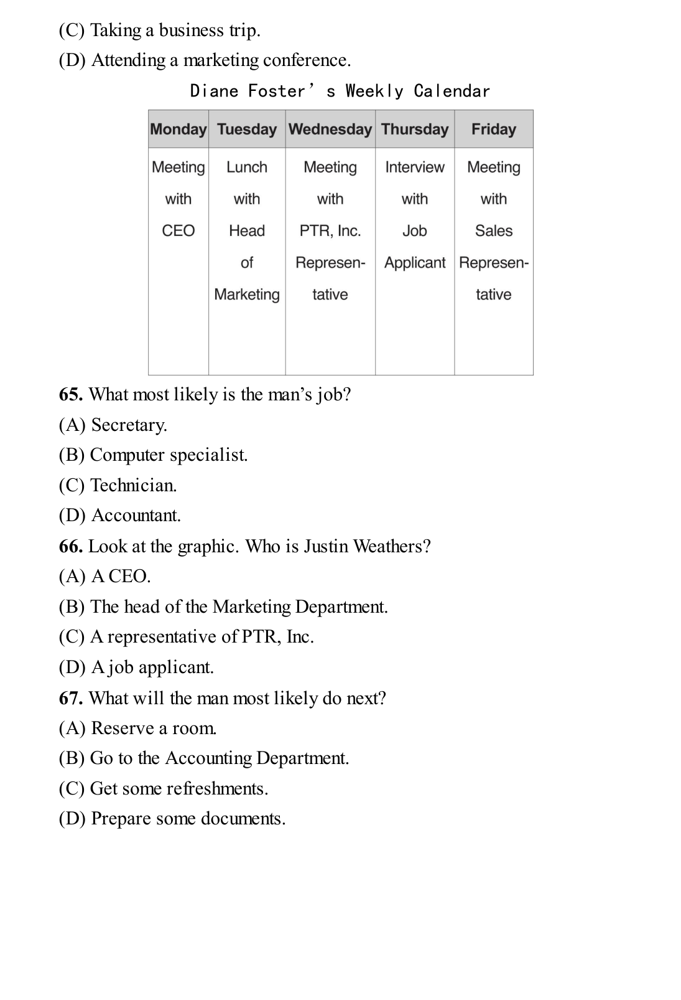

**听力独白/对话原文：**
**W:** Max, I received a telephone call from Justin Weathers this morning. He wants to see me next Tuesday instead of next Wednesday. (66)
**M:** I'm pretty sure you have some open space in your sche-dule then. (65) Why don't you request that he visit at 3p.m.?
**W:** Okay, I'll send an e-mail to inform him of that. Would you make the adjustment to my calendar, please?
**M:** Of course. Is there anything else you'd like me to do?
**W:** Three people from Accounting are visiting my office in ten minutes. How about preparing some drinks and snacks for us? (67)
**M:** I'll get right on it. Diane Foster's Weekly Calendar

**中文对照：**
> **W：**马克斯，今天早上贾斯汀·韦瑟斯给我打电话。他想下周二而不是下周三见我。
> **M：**我很确定您的日程安排中有一些空闲时间。您为什么不要求他下午3点过来呢？
> **W：**好的，我会发邮件通知他的。请你调整一下我的日程安排好吗？
> **M：**当然可以。您还有其他事情要我做吗？
> **W：**十分钟后会计部有三位同事要来我的办公室，给我们准备些饮料和点心吧。
> **M：**我马上去办。黛安·福斯特每周日程表

**核心词汇与短语：**
- **receive**：收到；接收
- **pretty**：相当地；很
- **inform**：通知；告诉
- **adjustment**：调整，调节
- **calendar**：日程表
- **snack**：小吃，点心

#### Q65 (正确答案：A)
**问题：** What most likely is the man's job? (对话中的男士最有可能做什么工作？)
- (A) Secretary. (秘书。)
- (B) Computer specialist. (电脑专家。)
- (C) Technician. (技术员。)
- (D) Accountant. (会计。)

#### Q66 (正确答案：C)
**问题：** Look at the graphic. Who is Justin Weathers? (请看图表，贾斯汀 · 韦瑟斯是谁？)
- (A) A CEO. (首席执行官。)
- (B) The head of the Marketing Department. (市场营销主管。)
- (C) A representative of PTR, Inc. (中石油公司代表。)
- (D) A job applicant. (求职者。)

#### Q67 (正确答案：C)
**问题：** What will the man most likely do next? (对话中的男士接下来最有可能做什么？)
- (A) Reserve a room. (预订房间。)
- (B) Go to the Accounting Department. (去会计部。)
- (C) Get some refreshments. (拿一些点心。)
- (D) Prepare some documents. (准备一些文件。)

**延伸表达与补充：**
- **make the adjustment to = adjust to = take some changes** (调整；适应于)
  - *例句：Some institutions have begun to make the adjustment to the new age.* (一些机构开始调整以适应新时代。)

### Questions 68 - 70

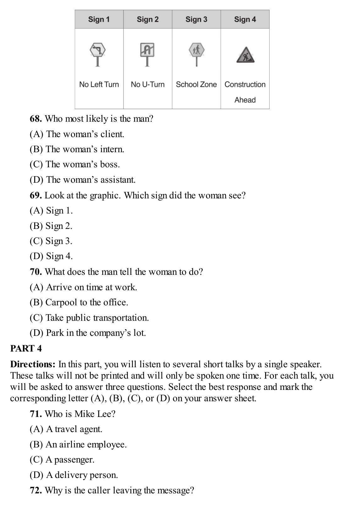

**听力独白/对话原文：**
**M:** Samantha, you're running a bit late this morning. (68)
**W:** I had trouble driving here. I normally do a U-turn at the intersection of Maple Street and Forest Avenue, but there was a sign indicating it's not permitted anymore. (69)
**M:** Oh, yeah, the city put it up because several accidents have happened at that intersection in the past few months.
**W:** I wasn't aware of that, so I had to drive straight until I could find a place to turn around, and that was when traffic got bad.
**M:** Well, it's okay to be late today since you didn't know about the sign, but make sure that it doesn't happen again. （ 68, 70 ）
**W:** Thanks for understanding.

**中文对照：**
> **M：**萨曼莎，你今天早上来得有点晚了。
> **W：**我开车遇到点麻烦。平时我在枫树街和森林大道的交叉口掉头，但今天放了一个指示牌写着不让在这里掉头了。
> **M：**噢，对，因为过去几个月那个十字路口发生了好几起交通事故，所以市里在那里搭建了一个指示牌。
> **W：**我没注意到这一点，所以我不得不一直开，直到我能找到一个掉头的地方，那时候交通变得很堵。
> **M：**嗯，今天晚到没关系，因为你不知道那个标志，但要确保以后不会再发生。
> **W：**谢谢您的理解。

**核心词汇与短语：**
- **intersection**：交叉；十字路口
- **sign**：指示牌
- **indicate**：表明；指出
- **permit**：许可；允许
- **aware**：意识到的；知道的
- **turn around**：转向反方向

#### Q68 (正确答案：C)
**问题：** Who most likely is the man? (对话中的男士最有可能是谁？)
- (A) The woman's client. (女士的客户。)
- (B) The woman's intern. (女士的实习生。)
- (C) The woman's boss. (女士的上司。)
- (D) The woman's assistant. (女士的助理。)

#### Q69 (正确答案：B)
**问题：** Look at the graphic. Which sign did the woman see? (请看图表，对话中的女士看到的是哪个指示牌？)
- (A) Sign 1. (指示牌 1 。)
- (B) Sign 2. (指示牌 2 。)
- (C) Sign 3. (指示牌 3 。)
- (D) Sign 4. (指示牌 4 。)

#### Q70 (正确答案：A)
**问题：** What does the man tell the woman to do? (对话中的男士告诉女士要做什么？)
- (A) Arrive on time at work. (准时上班。)
- (B) Carpool to the office. (拼车来上班。)
- (C) Take public transportation. (乘坐公交车。)
- (D) Park in the company's lot. (把车停在公司停车场。)

**延伸表达与补充：**
- **be running a bit late = arrived a little late = be a little late** (晚到一会)
  - *例句：He might be running a bit late, but he'll be here soon.* (他可能会晚到一会儿，但是他很快会到的。)
- **have trouble = get into trouble = be in trouble** (遇到麻烦)
  - *例句：I have trouble understanding it.* (我理解起来有困难。)
- **be not permitted = be prohibited** (被禁止)
  - *例句：Knotted rope or tape slings shall not be permitted.* (打结的绳环或扁带环是禁止使用的。)
- **put it up = build/construct it** (建造)
  - *例句：Protesters have been putting up barricades across a number of major intersections.* (抗议者们已在许多主要十字路口搭建了路障。)

## Part 4: 简短独白 (Q71 - Q100)

### Questions 71 - 73

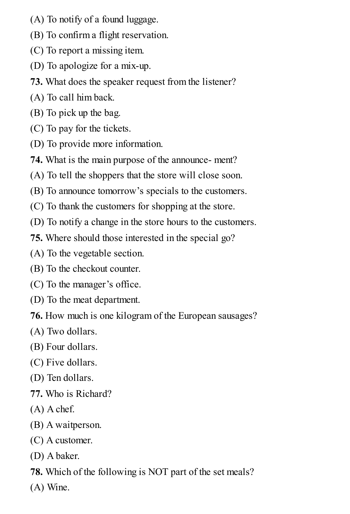

**听力独白/对话原文：**
Hello, Ms. Brown, my name is Mike Lee and I'm calling from Burma Airways London office about your missing baggage. (71) I just want to let you know that we have located the whereabouts of your lost baggage, (72) and we can have it delivered to your house tomorrow. Or if you prefer, you can come into our office at the airport anytime between 9:00 a.m. and 6:00 p.m. to pick it up. Could you please contact me at 777-2213, during office hours today? (73) Please let us know as soon as possible, so that we can make the best arrangement for you. And please accept our apologies for the mix-up.

**中文对照：**
> 您好，布朗女士，我叫迈克·李，是缅甸航空公司伦敦办事处的工作人员，想谈谈有关您丢失行李的事。我想告诉您我们找到您丢失的行李了，而且我们明天就可以请人把它递送到您家。或者如果您愿意，您也可以在上午9∶00到下午6∶00之间的任何时间来我们的机场办公室领取。请您今天在办公时间给我回电话，号码是777-2213。请尽快告知我们，以便我们为您做最合适的安排。并请接受我们对这个失误的道歉。

**核心词汇与短语：**
- **missing/lost baggage**：丢失的行李
- **whereabouts**：下落，所在之处
- **locate whereabouts**：找到的下落
- **make arrangements**：做安排
- **accept**：接受
- **apology**：道歉
- **mix-up**：混乱，失误
- **notify**：通知
- **confirm a reservation**：确认一个预订
- **apologize**：道歉

#### Q71 (正确答案：B)
**问题：** Who is Mike Lee? (迈克 · 李是谁？)
- (A) A travel agent. (旅行代理人。)
- (B) An airline employee. (航空公司职员。)
- (C) A passenger. (乘客。)
- (D) A delivery person. (快递公司的工作人员。)

#### Q72 (正确答案：A)
**问题：** Why is the caller leaving the message? (打电话者为什么留言？)
- (A) To notify of a found luggage. (告知找到行李。)
- (B) To confirm a flight reservation. (确认预订的航班。)
- (C) To report a missing item. (报告一件丢失的物品。)
- (D) To apologize for a mix-up. (为一个失误道歉。)

#### Q73 (正确答案：A)
**问题：** What does the speaker request from the listener? (讲话者向听话者提出什么要求？)
- (A) To call him back. (给他回电话。)
- (B) To pick up the bag. (领取包裹。)
- (C) To pay for the tickets. (付机票钱。)
- (D) To provide more information. (提供更多信息。)

**延伸表达与补充：**
- **pick it up = get it = come and take it** (过来领取)
  - *例句：You should come by my place to pick it up.* (你应该到我这里来领取。)
- **during office hours = during business hours = between 9:00 a.m. and 6:00 p.m.** (在办公时间)
  - *例句：You may pick it up during office hours.* (你可以在办公时间来领取。)
- **mix-up = confusion = screw-up** (混乱)
  - *例句：The mix-up will be cleared up soon.* (混乱马上会被消除。)

### Questions 74 - 76

**听力独白/对话原文：**
Attention all shoppers. We will be closing in thirty minutes time (74) so please finalize your purchases. We'd also like to advise you about some very special closing time prices. All meat in the fresh meat department must be sold tonight, before we close. Make your way to the meat department for some fabulous specials. (75) Here's just a sample of what's on offer: T-bone and fillet steak, only ten dollars a kilo; 100% beef mince for only four dollars a kilo; a selection of quality Europeanstyle sausages for only five dollars a kilo. (76) Be quick, customers! You'll be able to fill up your freezers.

**中文对照：**
> 所有的顾客请注意。我们再过30分钟就要闭店了，所以请结束您的购物。我们还想向您推荐一些非常特殊的闭店优惠价格。鲜肉区的肉今晚闭店前必须全部卖掉。到鲜肉区看一看吧，有很棒的特价商品。出售的商品包括：丁骨牛排和里脊牛排每公斤仅售10美元；100%纯牛肉馅每公斤仅售4美元；精选的优质欧洲风味香肠每公斤仅售5美元。顾客们，抓紧时间吧。您一定会满载而归的。

**核心词汇与短语：**
- **finalize**：结束
- **closing time**：下班时间，闭店时间
- **make one's way to ~**：前往，向走
- **fabulous**：绝妙的，很棒的
- **special**：特价商品
- **be on offer**：待出售
- **fillet**：里脊肉（片）
- **mince**：肉馅
- **fill up**：装满
- **freezer**：冰箱
- **vegetable**：蔬菜
- **counter**：柜台

#### Q74 (正确答案：A)
**问题：** What is the main purpose of the announcement? (通知的主要目的是什么？)
- (A) To tell the shoppers that the store will close soon. (告知顾客商店马上要关门了。)
- (B) To announce tomorrow's specials to the customers. (向顾客通告明天的特价商品。)
- (C) To thank the customers for shopping at the store. (感谢顾客在商店购物。)
- (D) To notify a change in the store hours to the customers. (向顾客通告营业时间的变化。)

#### Q75 (正确答案：D)
**问题：** Where should those interested in the special go? (那些对特价商品感兴趣的人应该去哪里？)
- (A) To the vegetable section. (去蔬菜区。)
- (B) To the checkout counter. (去收银台。)
- (C) To the manager's office. (去经理办公室。)
- (D) To the meat department. (去鲜肉区。)

#### Q76 (正确答案：C)
**问题：** How much is one kilogram of the European sausages? (一公斤欧洲香肠卖多少钱？)
- (A) Two dollars. (2 美元。)
- (B) Four dollars. (4 美元。)
- (C) Five dollars. (5 美元。)
- (D) Ten dollars. (10 美元。)

**延伸表达与补充：**
- **Please finalize your purchases. = Please make your last minute purchases. = Please finish your shopping soon.** (请（尽快）结束您的购物。)
  - *例句：Please finalize your purchases because the store will close in five minutes.* (请尽快结束您的购物，因为商店5分钟后就要关门了。)
- **fill up = stock up = pack up** (装满，存满)
  - *例句：I need to fill up the shelves.* (我需要装满这些架子。)

### Questions 77 - 79

**听力独白/对话原文：**
Good evening, and welcome to The Bay View Restaurant. I'm Richard, and I'll be looking after you this evening. (77) I should tell you that you may dine àla carte, or choose from our range of special set meals. The set meals have been designed by our head chef to provide an exquisite dining experience. Starters, all main courses come with a choice of our finest desserts and wines. (78) Set A is for lovers of red meats, and rich red wine for a low price of fifteen dollars; Set B is for those who are fond of fish and white wine for a price of twelve dollars. (79) For dessert, you may choose from our cake selection. Oh, and fresh filtered coffee is also included in these meals. (78)

**中文对照：**
> 晚上好，欢迎来到海景饭店。我叫理查德，今晚由我来为大家服务。我想告诉大家，你们可以按照菜单点菜，或者选择我们的特价套餐。所有套餐均由我们的厨师长设计，希望大家能有一次美好的用餐体验。开胃菜和所有主菜都配有各种精美的甜点和葡萄酒。

**核心词汇与短语：**
- **A**：套餐只有美元，适合喜欢红肉和香浓红葡萄酒的客人；
- **B**：套餐美元，适合喜欢鱼肉和白葡萄酒的客人。甜点可以从我们的蛋糕里选。哦，这些套餐还包括新鲜的过滤咖啡。
- **look after**：照看，服务
- **dine à la carte**：按照菜单点菜
- **chef**：厨师
- **exquisite**：精致的，制作精良的
- **starter**：开胃菜
- **lover**：爱好者
- **be fond of**：喜欢
- **filtered coffee**：过滤咖啡
- **waitperson**：侍者，服务员

#### Q77 (正确答案：B)
**问题：** Who is Richard? (理查德是谁？)
- (A) A chef. (厨师。)
- (B) A waitperson. (服务员。)
- (C) A customer. (顾客。)
- (D) A baker. (面包师。)

#### Q78 (正确答案：B)
**问题：** Which of the following is NOT part of the set meals? (下面哪个不是套餐的一部分？)
- (A) Wine. (葡萄酒。)
- (B) Ice cream. (冰激凌。)
- (C) Coffee. (咖啡。)
- (D) Cake. (蛋糕。)

#### Q79 (正确答案：B)
**问题：** How much does fish dinner cost? (鱼肉套餐多少钱？)
- (A) Five dollars. (5 美元。)
- (B) Twelve dollars. (12 美元。)
- (C) Fifteen dollars. (15 美元。)
- (D) Twenty dollars. (20 美元。)

**延伸表达与补充：**
- **look after = take care of = serve** (为…服务，照顾)
  - *例句：The manager will be looking after you.* (经理会为您服务。)
- **be fond of = like = be into** (喜欢)
  - *例句：He is fond of fish.* (他喜欢鱼肉。)

### Questions 80 - 82

**听力独白/对话原文：**
Hello, everyone. As CEO of this company, I am happy to make this great announcement. (80) I have been informed by the sales manager this morning that the sales division has just reported on its sales figures for the first half of the year, and they are well beyond expectations. (81) They have also surveyed customer satisfaction, and, there again, the results are excellent. The combination of lower costs and higher sales means that we are heading for the highest profit figures ever. So, what does all this mean? Yes, you guessed it. This means that you guys are due for a fat bonus at the end of this year. (82) All you have to do is just continue doing what you have been doing so far.

**中文对照：**
> 大家好，作为本公司的CEO，我很高兴做这次发言。今天早上销售经理告诉我，销售部刚刚上报了上半年的销量，比预期销量要好得多。他们还调查了消费者满意度，结果同样出色。更低的成本和更大的销量说明我们正向最大的利润额迈进。那么，这些意味着什么？是的，你们猜对了。这意味着你们今年年底将会获得丰厚的奖金。你们唯一需要做的就是把现在的状态保持下去。

**核心词汇与短语：**
- **figure**：数字
- **the first half of the year**：上半年
- **beyond**：超过，超越
- **expectation**：预料，预期
- **survey**：调查
- **customer**：顾客
- **satisfaction**：满意
- **combination**：组合
- **head for**：出发，前往
- **profit**：利润
- **due**：应得的
- **fat**：丰厚的
- **so far**：到目前为止
- **surpass**：超越
- **quota**：定额；指标
- **be satisfied with ~**：对满意
- **promotion**：升职

#### Q80 (正确答案：A)
**问题：** Who is speaking? (谁在讲话？)
- (A) The company president. (公司总裁。)
- (B) The sales manager. (销售经理。)
- (C) A satisfied customer. (一位满意的顾客。)
- (D) An accountant. (一名会计。)

#### Q81 (正确答案：A)
**问题：** According to the speaker, what did the sales manager say? (根据讲话者所说，销售经理说了什么？)
- (A) The sales have surpassed everyone's expectation. (销售量超过了所有人的预期。)
- (B) The sales reps are working hard to meet their quotas. (销售代表们正在努力工作，以完成他们的定额。)
- (C) The customers are not very satisfied with their service. (顾客对他们的服务不太满意。)
- (D) They need to increase the price of their products. (他们需要提高产品的价格。)

#### Q82 (正确答案：D)
**问题：** What does the speaker imply when he says,“Yes, you guessed it”? (讲话者说 “ 是的，你猜对了 ” ，他在暗示什么？)
- (A) The company will introduce a new product. (公司会引进一种新产品。)
- (B) The sales manager will get a promotion. (销售经理会得到晋升。)
- (C) They will get the result of the survey. (他们会得到调查结果。)
- (D) The workers will receive a big bonus. (员工会得到一笔不菲的奖金。)

**延伸表达与补充：**
- **CEO** (首席执行官)
  - *例句：president boss Mr. Lee is the CEO of our company.* (总裁老板李先生是我们公司的首席执行官。)
- **the first half of the year = the first six months of the year = from January until June** (上半年)
  - *例句：We need to make a lot of sales in the first half of the year.* (我们需要在上半年完成很多销售额。)
- **be due for a fat bonus = be due for a big bonus = expect a large bonus** (即将获得一笔丰厚的奖金)
  - *例句：I think we are due for a fat bonus at the end of this year.* (我认为我们今年年底会获得一笔丰厚的奖金。)

### Questions 83 - 85

**听力独白/对话原文：**
Good evening, Radio National listeners, and welcome to “Your Live Concert Hour” with Jill Boothby. (83) Tonight we have something very special in store for you—a two-part program featuring two of Asia's premier folk music acts performing live for you in our studio. In the first part of the program we'll be listening to the Young Asia Ensemble. This is one of Asia's most innovative groups, with performers from four different Asian countries who blend a variety of folk styles. (84) In the second half, we'll hear the Japanese ensemble, Kaito, who specialize in natural acoustic sounds. And don't forget that both of these groups will be performing this weekend at the World Folk Festival. (85)

**中文对照：**
> 国家广播电台的听众们，晚上好，欢迎收听由吉尔·布思比主持的“你的现场音乐会”节目。今晚我们为您准备了非常特别的节目——这个节目由两段组成，包含两场亚洲最著名的民乐表演，我们将在演播室里为您现场直播。在节目的上半段，我们将听到亚洲青年乐团的演奏，这是亚洲最富创意的乐团，成员来自四个不同的亚洲国家，他们在表演中融合了多种民乐风格。在节目的下半段，我们会听到日本乐团Kaito的演奏，他们擅长演奏自然原声态音乐。还有，别忘了这两个乐团都会于本周末在世界民歌节上演出。

**核心词汇与短语：**
- **feature**：以为特色
- **premier**：最著名的
- **folk**：民间的
- **act**：幕，场
- **perform**：表演，演出
- **ensemble**：乐团
- **innovative**：有创意的
- **performer**：表演者，演奏者
- **blend**：混合，融合
- **a variety of**：各种各样的
- **specialize in ~**：以为专长，擅长
- **acoustic**：声音的；音响的
- **host**：主持人
- **conductor**：（乐队）指挥
- **put together**：把组合在一起
- **nationality**：国籍
- **tour**：旅行，巡回演出

#### Q83 (正确答案：B)
**问题：** Who is Ms. Boothby? (布思比女士是谁？)
- (A) A folk singer. (民歌歌手。)
- (B) The host. (节目主持人。)
- (C) An engineer. (工程师。)
- (D) A conductor. (乐队指挥。)

#### Q84 (正确答案：B)
**问题：** Which of the following is mentioned about the Young Asia Ensemble? (关于亚洲青年乐团广播中，提到了下面的哪一条内容？)
- (A) The musical group was put together only recently. (乐队只是最近才组建的。)
- (B) All the members do not share the same nationality. (成员的国籍不都一样。)
- (C) The group is currently on a tour around Asia. (乐队目前正在亚洲巡回演出。)
- (D) They specialize in natural acoustic sounds. (他们擅长自然原声态的音乐。)

#### Q85 (正确答案：B)
**问题：** When will the mentioned groups perform at the festival? (提到的两个乐队何时会在音乐节上表演？)
- (A) Today. (今天。)
- (B) This weekend. (本周末。)
- (C) Next week. (下周。)
- (D) Next month. (下个月。)

**延伸表达与补充：**
- **in store for you = coming your way = waiting for you …** (等着你)
  - *例句：We have something very special in store for you.* (我们为您准备了非常特别的东西。)
- **a two-part program = a two-part series program** (两集节目，上下集节目)
  - *例句：This documentary will be aired as a two-part program with the first program being telecast this evening.* (这个纪录片会作为一个上下集的节目播出，上集将在今晚播出。)

### Questions 86 - 88

**听力独白/对话原文：**
Good evening, ladies and gentlemen, and welcome to the biennial Shipbuilding Research Convention. (86) I'm very pleased and proud, as the convener of this convention, to introduce to you one of the world's leading research scientists in the field of shipbuilding, Professor Nathan Davidson. (87) Professor Davidson's speech, entitled “Shipbuilding: the next twenty years”, will form the basis of a book to be published later this year. (88) I'm sure that you're all aware that whatever Professor Davidson has to say is not only fascinating and original, but also extremely pertinent. So, please welcome Professor Davidson.

**中文对照：**
> 女士们先生们，晚上好，欢迎参加两年一届的船舶制造研究大会。作为大会的召集人，我非常高兴和自豪地向大家介绍船舶制造领域的一位世界顶级科学家——内森·戴维森教授。戴维森教授演讲的题目是“船舶制造：下一个二十年”。以此演讲内容为基础的一本著作将在今年晚些时候出版。我肯定你们都会意识到，戴维森教授演讲的内容不但引人入胜、见解独到，而且同时也极为切题。因此，请大家欢迎戴维森教授演讲。

**核心词汇与短语：**
- **biennial**：两年一次的
- **shipbuilding**：造船业
- **convention**：大会，集会
- **convener**：会议召集人
- **leading**：处于领先地位的
- **entitle**：把命名为
- **be aware that ~**：意识到，明白
- **whatever**：无论什么
- **original**：新颖的，有独创性的
- **pertinent**：切题的，贴切的
- **shipbuilder**：造船者，造船公司

#### Q86 (正确答案：B)
**问题：** How often is the event held? (该会议多久举办一次？)
- (A) Once a year. (一年一次。)
- (B) Once every two years. (两年一次。)
- (C) Once every five years. (五年一次。)
- (D) Once every ten years. (十年一次。)

#### Q87 (正确答案：B)
**问题：** Who is Nathan Davidson? (内森 · 戴维森是谁？)
- (A) A shipbuilder. (造船者。)
- (B) A scientist. (科学家。)
- (C) The convener. (会议召集人。)
- (D) A publisher. (出版商。)

#### Q88 (正确答案：C)
**问题：** According to the speaker, what is expected to happen toward the end of the year? (根据讲话者所说，今年年底会有什么事发生？)
- (A) Another seminar will take place. (将会举行另一个研讨会。)
- (B) The research project will be completed. (这个研究计划将完成。)
- (C) A book will be published. (一本书将出版。)
- (D) The world's largest ship will be built. (世界上最大的船将造好。)

**延伸表达与补充：**
- **biennial = every two years = every second year** (每两年，两年一次的)
  - *例句：This is a biennial meeting.* (这是一个两年一届的会议。)
- **You're all aware ~ = You all know ~ = You are all familiar with ~** (你们都知道…)
  - *例句：I'm sure that you're all aware of the next guest I am going to introduce to you.* (我肯定你们都知道我将介绍给你们的下一位来宾。)

### Questions 89 - 91

**听力独白/对话原文：**
Welcome to tonight's “At the Movies”. My name is Michael Sanderson, (89) and it's my great pleasure to bring you all the latest movie news, plus previews of this week's blockbuster movie releases. And, if you're an action movie fan, this is going to be a great week. The long-awaited sequel to Dangerous Mission, starring Danny Jackson, will finally be released this week. The movie, which is called Dangerous Mission II: In Enemy Territory, is expected to break all box-office records. (90) We'll be showing an extended interview with Danny Jackson and the director, Jacky Lee. But first, let's have a look at some of the incredible action scenes, plus some of the action on the set during the making of In Enemy Territory. (91)

**中文对照：**
> 欢迎收看今晚的“看电影”。我是迈克尔·桑德森，很高兴为大家带来所有最新的电影资讯，还有本周上映的票房大片的预告片。另外，如果您是动作片迷，本周将是激动人心的一周，因为期待已久的由丹尼·杰克逊主演的《危险任务》续集终于将在本周上映了。这部名为《危险任务2敌占区》的电影将有望打破所有票房纪录。我们还会播放一段对丹尼·杰克逊和导演杰克·李的专访。不过，我们首先还是来看一下部分精彩的电影片断，以及《敌占区》拍摄现场的一些动作画面。

**核心词汇与短语：**
- **preview**：〈美〉预告片
- **release**：发行，（电影）上映
- **sequel**：续集，续篇
- **star**：由主演
- **enemy**：敌人，敌军
- **territory**：领地，领土
- **have a look at**：看一看
- **incredible**：难以置信的；极妙的
- **host**：主持人
- **critic**：评论家
- **air**：播出
- **commercial break**：插播广告
- **behind the scene**：幕后

#### Q89 (正确答案：B)
**问题：** Who is Michael Sanderson? (迈克尔 · 桑德森是谁？)
- (A) An actor. (演员。)
- (B) The host. (主持人。)
- (C) A critic. (评论家。)
- (D) The director. (导演。)

#### Q90 (正确答案：B)
**问题：** What is Dangerous Mission? (《危险任务》是什么？)
- (A) A radio show. (一个广播节目。)
- (B) A film. (一部电影。)
- (C) A book. (一本书。)
- (D) A play. (一部戏剧。)

#### Q91 (正确答案：C)
**问题：** What will be aired first? (最先播出的将是什么？)
- (A) An interview with the stars. (对明星的专访。)
- (B) Commercial breaks. (插播广告。)
- (C) Behind the scene stories. (幕后故事。)
- (D) The critic's opinion. (评论家的观点。)

**延伸表达与补充：**
- **break all box-office records** (打破所有票房纪录扩展表达：)
  - *例句：record the highest sales make the most profits The newly released movie is expected to break all box-office records.* (创最高的销售纪录创造最大利润新发行的影片预计能打破所有票房纪录。)
- **Let's have a look at ~ = Let's take a look at ~** (我们来看一看…)
  - *例句：Let's take a look at the problem together.* (我们一起来看一看这个问题。)

### Questions 92 - 94

**听力独白/对话原文：**
Audio World is opening a new store and we're celebrating. (92) Yes, it's party time at Audio World, and you're invited! Come on down for the opening of the spacious new store in exciting downtown George St. Festivities will begin at 9:00 a.m. on Saturday morning, (93) with free performances, balloons and face- painting for your children. And of course, there'll be some incredible opening specials. (94) Here's an example: complete hi-fi sound systems for as little as $500. (92) At last you can get that surround sound system you've been dreaming of! And that's not all: all day there will be specials, with discounts of as much as 50%. See you all on Saturday morning, at our new George St. superstore!

**中文对照：**
> 音响世界的新店铺就要开张了，我们将为此举办庆祝活动。是的，这是音响世界的欢聚时刻，我们邀请您来参加！请到市中心热闹的乔治大街来参加我们宽敞的新店铺的开张典礼。庆祝活动将于星期六上午9点开始。我们给孩子们准备了免费演出、气球、还有脸部油彩。当然，还会有令人难以置信的开张特价商品等着您。比如，完全高保真音响系统只卖五百美元。您终于可以得到梦寐以求的环绕音响系统了！这还不是全部，全天都会有特价商品，折扣低至五折。周六上午在乔治大街我们的新店见吧！

**核心词汇与短语：**
- **come on down**：（快点儿）到
- **spacious**：宽敞的
- **downtown**：城里，市中心
- **free**：免费的
- **performance**：表演，演出
- **balloon**：气球
- **incredible**：难以置信的
- **special**：特价商品
- **at last**：终于
- **surround sound system**：环绕音响系统
- **superstore**：超市
- **giveaway**：赠品

#### Q92 (正确答案：A)
**问题：** What is being advertised? (这个广告是关于什么的？)
- (A) Electronics store. (电子产品商店。)
- (B) Supermarket. (超市。)
- (C) Record shop. (唱片商店。)
- (D) Painting store. (绘画商店。)

#### Q93 (正确答案：B)
**问题：** When will the event take place? (活动在什么时候举行？)
- (A) Today. (今天。)
- (B) This weekend. (本周末。)
- (C) Next week. (下周。)
- (D) Next month. (下个月。)

#### Q94 (正确答案：D)
**问题：** Which of the following will NOT be part of the day's event? (当天活动不包括下面的哪一项？)
- (A) Price discounts. (打折。)
- (B) Face paintings. (脸部油彩。)
- (C) Performances. (演出。)
- (D) Free giveaways. (发放赠品。)

**延伸表达与补充：**
- **You've been dreaming of ~ = You've been hoping for ~ = You've been aching for ~** (你一直梦寐以求得到…)
  - *例句：I know how much you've been dreaming of buying your own home.* (我知道你多么梦想买自己的房子。)
- **And that's not all. = And there is more. = And to top it off.** (而且不止如此。)
  - *例句：And that's not all, folks! We have something special for you next.* (朋友们，不止这些！我们下面还有特别的东西带给你们。)

### Questions 95 - 97

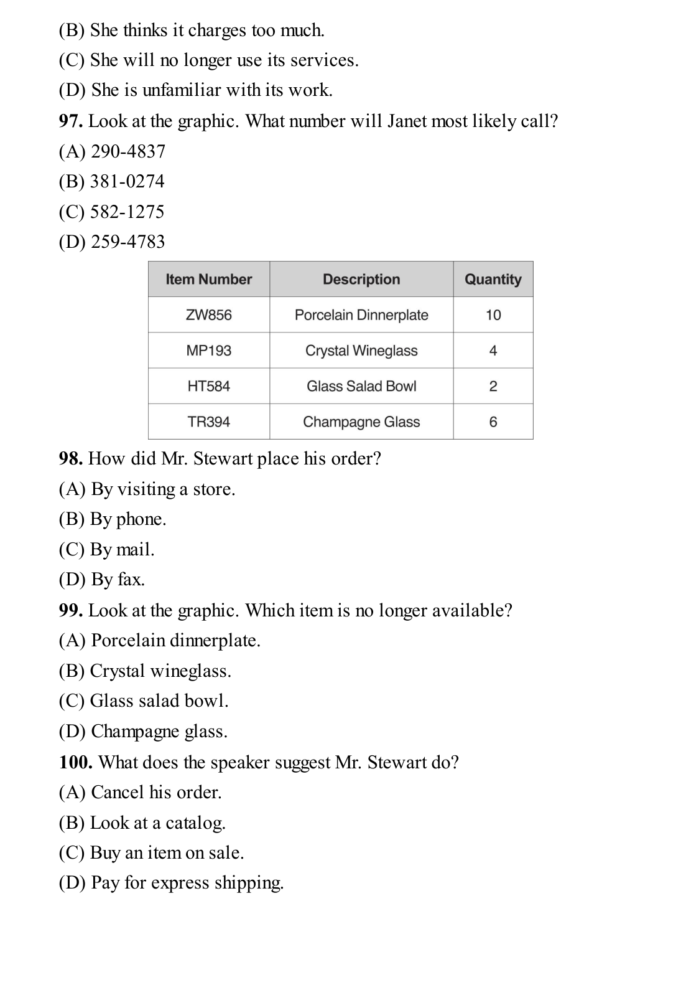

**听力独白/对话原文：**
It's come to my attention that our latest advertising campaign isn't doing well. In fact, sales of several of our items declined right after our newest TV commercials started airing. (95) According to customer feedback, the ads are extremely unappealing and make people not want to purchase our products. As such, I'm canceling the ad campaign and firing Walters Media. (96) We need to start a new media campaign to make up for the damage that has been done at once. I've decided to use Pembroke Advertising. (97) Janet, I want you to contact the company at once and request that a representative be sent here. Ideally, someone should arrive tomorrow morning.

**中文对照：**
> 我注意到我们最近的广告宣传活动做得不好。实际上，自从最新的电视广告片播出之后，我们几种货品的销量都下降了。根据顾客的反馈，我们的广告非常没有吸引力，看了之后不想购买我们的商品。基于此种情况，我取消了这次广告宣传活动并与沃尔斯特传媒解约。我们需要立即开展一场新的媒体宣传活动来弥补已经造成的损失。我已经决定与彭波洛克广告公司合作。珍妮特，请你迅速联系这家公司并要求其派一名代表过来。如果理想的话，明天一早应该有人过来。

**核心词汇与短语：**
- **advertising campaign**：广告宣传活动
- **in fact**：实际上，事实上
- **commercial**：（商业）广告
- **feedback**：反馈，回馈
- **purchase**：购买
- **cancel**：取消；消除
- **make up for**：补偿，弥补
- **representative**：代表；典型

#### Q95 (正确答案：A)
**问题：** What is the problem? (（讲话中的）问题是什么？)
- (A) Sales have decreased. (销量下降了。)
- (B) A company is behind schedule. (一家公司落后于预定计划。)
- (C) A budget has been exceeded. (超过预算了。)
- (D) Some stores have closed. (一些商店关门了。)

#### Q96 (正确答案：C)
**问题：** What does the woman say about Walters Media? (女士说了沃尔斯特传媒公司的什么信息？)
- (A) She likes the work it does. (她欣赏这家公司所做的工作。)
- (B) She thinks it charges too much. (她认为这家公司收费太高。)
- (C) She will no longer use its services. (她不会再使用这家公司的服务了。)
- (D) She is unfamiliar with its work. (她不熟悉这家公司的工作内容。)

#### Q97 (正确答案：A)
**问题：** Look at the graphic. What number will Janet most likely call? (请看图表。珍妮特最可能拨打哪个电话？)
- (A) 290-4837 (290-4837)
- (B) 381-0274 (381-0274)
- (C) 582-1275 (582-1275)
- (D) 259-4783 (259-4783)

**延伸表达与补充：**
- **It's come to my attention that ~ = I notice that ~** (我注意到…)
  - *例句：It's come to my attention that autumn is coming.* (我注意到秋天来了。)
- **I've decided to ~ = I've made my mind to ~** (我决定…)
  - *例句：I've decided to go travelling tomorrow.* (我已经决定明天去旅行了。)

### Questions 98 - 100

**听力独白/对话原文：**
Good morning, Mr. Stewart. This is Chuck Pierson from Holloway Housewares calling. We received the order form which you mailed to us and are currently working on filling it. (98) Unfortunately, we no longer stock item number TR394. (99) If you want, we can give you your money back, or we can replace it with a similar item. If you look at page 38 of your catalog, you can see several items which are nearly identical to it. (100) They are roughly the same price, too. Why don't you call me back at 493-9373 to let me know what you decide to do? Thanks. Goodbye.

**中文对照：**
> 斯图尔特先生，早上好。我是霍洛威家居用品的查克·皮尔森。我们收到了您邮寄过来的订单，目前正在给您配货。不巧的是，我们目前没有TR394这一货品的存货了。如果您同意，我们可以将钱款退还给您，或者我们用一件类似的货品代替。如果您方便查看目录的38页，就可以看到几种跟TR394几乎相同的货品。它们的价格也基本一致。请致电493-9373告知我们您的决定。非常感谢。再见。

**核心词汇与短语：**
- **houseware**：家居用品
- **order form**：订（购）单
- **no longer**：不再
- **stock**：库存；股票
- **catalog**：目录
- **identical**：同一的；完全相同的
- **roughly**：粗野地；大致上

#### Q98 (正确答案：C)
**问题：** How did Mr. Stewart place his order? (斯图尔特先生是用什么方式下的订单？)
- (A) By visiting a store. (通过拜访门店。)
- (B) By phone. (通过电话。)
- (C) By mail. (通过邮寄。)
- (D) By fax. (通过传真。)

#### Q99 (正确答案：D)
**问题：** Look at the graphic. Which item is no longer available? (请看图表。哪些货品已经没有了？)
- (A) Porcelain dinnerplate. (陶瓷餐盘。)
- (B) Crystal wineglass. (水晶葡萄酒杯。)
- (C) Glass salad bowl. (玻璃沙拉碗。)
- (D) Champagne glass. (香槟酒杯。)

#### Q100 (正确答案：B)
**问题：** What does the speaker suggest Mr. Stewart do? (讲话者建议斯图尔特先生做什么？)
- (A) Cancel his order. (取消他的订单。)
- (B) Look at a catalog. (看一看目录。)
- (C) Buy an item on sale. (买一件打折商品。)
- (D) Pay for express shipping. (支付快递费用。)

**延伸表达与补充：**
- **no longer = not any longer = not any more** (不再/再也不)
  - *例句：She was no longer a child.* (她不再是个孩子了。)
- **give ~ back = return ~ back** (将…归还/返还)
  - *例句：Please give the book back to him when he comes back.* (他回来时请把这本书还给他。)

# TEST 03

## 答案速查表

| 题号 | 答案 | 题号 | 答案 | 题号 | 答案 | 题号 | 答案 | 题号 | 答案 | 题号 | 答案 | 题号 | 答案 | 题号 | 答案 | 题号 | 答案 | 题号 | 答案 |
| :---: | :---: | :---: | :---: | :---: | :---: | :---: | :---: | :---: | :---: | :---: | :---: | :---: | :---: | :---: | :---: | :---: | :---: | :---: | :---: |
| **1** | B | **11** | A | **21** | B | **31** | C | **41** | B | **51** | C | **61** | B | **71** | D | **81** | A | **91** | A |
| **2** | B | **12** | A | **22** | A | **32** | C | **42** | B | **52** | D | **62** | B | **72** | B | **82** | D | **92** | D |
| **3** | C | **13** | B | **23** | B | **33** | A | **43** | B | **53** | D | **63** | D | **73** | C | **83** | D | **93** | B |
| **4** | C | **14** | B | **24** | B | **34** | C | **44** | B | **54** | C | **64** | D | **74** | A | **84** | C | **94** | D |
| **5** | D | **15** | A | **25** | B | **35** | C | **45** | B | **55** | D | **65** | B | **75** | C | **85** | B | **95** | B |
| **6** | C | **16** | C | **26** | B | **36** | A | **46** | B | **56** | C | **66** | A | **76** | B | **86** | B | **96** | A |
| **7** | C | **17** | A | **27** | C | **37** | C | **47** | C | **57** | A | **67** | B | **77** | A | **87** | A | **97** | D |
| **8** | B | **18** | A | **28** | B | **38** | C | **48** | D | **58** | B | **68** | B | **78** | C | **88** | B | **98** | B |
| **9** | C | **19** | C | **29** | C | **39** | A | **49** | A | **59** | C | **69** | C | **79** | B | **89** | A | **99** | C |
| **10** | B | **20** | C | **30** | A | **40** | C | **50** | B | **60** | A | **70** | C | **80** | D | **90** | A | **100** | B |

## Part 1: 照片描述 (Q1 - Q6)

### Q1 (正确答案：B)

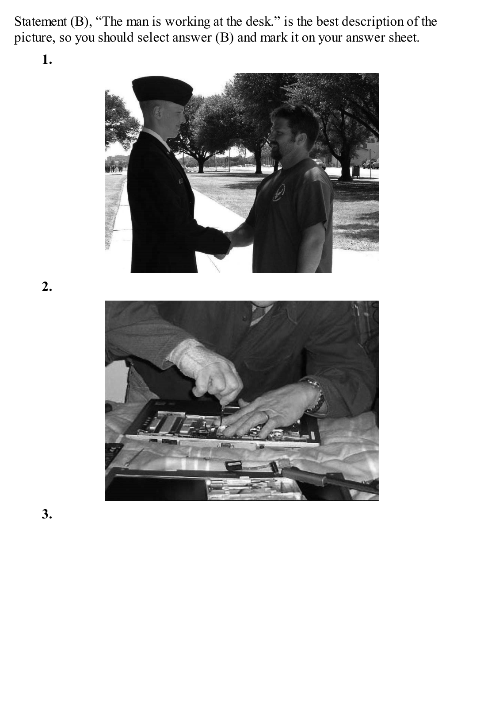

**听力原文与选项：**
- (A) They're clapping their hands. (他们正在鼓掌。)
- (B) They're facing one another. (他们正面对着面。)
- (C) They're waving their hands. (他们正在挥手。)
- (D) They're pacing around the place. (他们正在附近慢慢地走着。)

**其他可能表达：**
- They are shaking hands. (他们正在握手。)
- The men are looking at each other. (两个人在相互看着对方。)
- They are greeting one another. (他们在相互问候。)

### Q2 (正确答案：B)

**听力原文与选项：**
- (A) A piece of furniture is being repaired. (一件家具正在被修理。)
- (B) A machine is being worked on. (一台机器正在被修理。)
- (C) A toolbox is being opened. (一个工具箱正在被打开。)
- (D) A desk drawer is being closed. (一个书桌抽屉正在被关上。)

**其他可能表达：**
- The machine has been taken
- apart. (机器已经被拆开了。)
- The machine is being fixed. (机器正在被修理。)
- The machine is being put together. (机器正在被组装。)

### Q3 (正确答案：C)

**听力原文与选项：**
- (A) She has finished talking on the phone. (她已经打完电话了。)
- (B) A notice is being posted on the door. (一张通知正被人往门上贴。)
- (C) She has the receiver held up to her ear. (她把听筒举到耳朵边。)
- (D) A coin is being placed into the slot. (一枚硬币正被放进投币口。)

**其他可能表达：**
- She's speaking into a phone. (她正在打电话。)
- She's involved in a phone conversation. (她正在通话当中。)
- A public phone is in use. (一部公用电话正在被使用。)

### Q4 (正确答案：C)

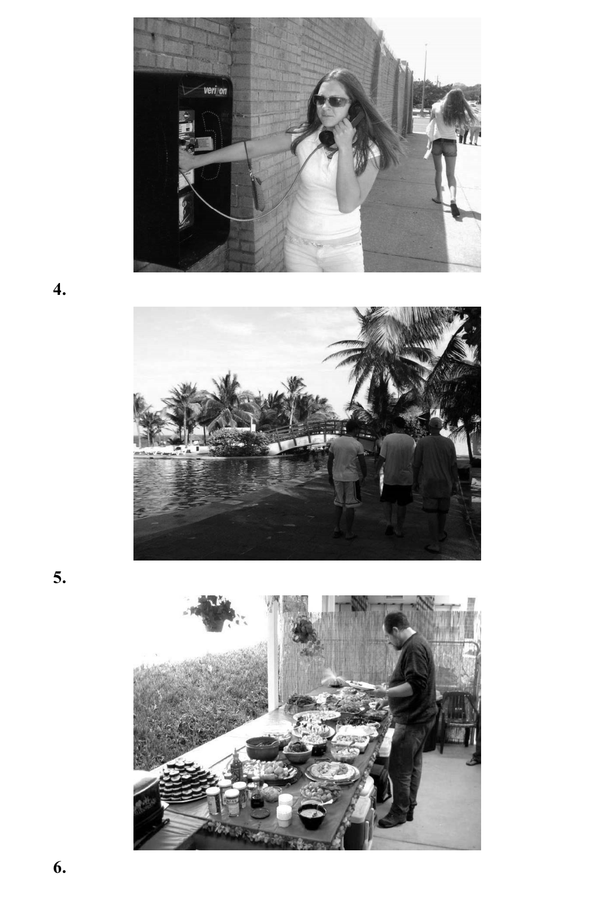

**听力原文与选项：**
- (A) Some people are sunbathing near the lake. (一些人正在湖边沐日光浴。)
- (B) Some people are ready to go for a swim. (一些人准备好了去游泳。)
- (C) Some people are strolling near the water. (一些人正在水边闲逛。)
- (D) Some people have put their feet in the water. (一些人已经把脚放入了水中。)

**其他可能表达：**
- Some men are walking along the water. (几个人正在水边散步。)
- The people are walking toward a bridge. (人们正朝一座桥走去。)
- There are no swimmers in the water. (水中没有人在游泳。)

### Q5 (正确答案：D)

**听力原文与选项：**
- (A) He's serving food to the others. (他正在为别人上菜。)
- (B) He's holding a plastic cup in his hand. (他的手中正拿着一个塑料杯。)
- (C) He's arranging the plates on the table. (他正往桌上摆放盘子。)
- (D) He's helping himself to some food. (他正在随便吃些东西。)

**其他可能表达：**
- A man is putting food onto his plate. (男士正在把食物放到自己的盘子里。)
- A variety of food has been laid out on the table. (各种食物已经被摆在桌子上了。)
- Some food has been prepared on the table. (一些食物已经准备好了，放在)
- 桌子上。

### Q6 (正确答案：C)

**听力原文与选项：**
- (A) The house is undergoing renovations. (房子正在被整修。)
- (B) The bushes are being trimmed. (小树丛正在被修剪。)
- (C) Some furniture has been set out in the yard. (一些家具已经被放到院子里了。)
- (D) People are relaxing in the backyard. (人们正在后院里放松。)

**其他可能表达：**
- A portion of the area has been shaded. (一部分地方被树荫遮住了。)
- The seats have been positioned in the shaded area. (座椅已经被放在了阴凉处。)
- The grass has been neatly trimmed. (草坪已经被整齐地修剪过了。)
- 注：在Part 1中，每道试题都添加了3种可能的正确表达方式，考生可
- 以了解对于同样的照片可能出现的不同表达。

## Part 2: 应答测试 (Q7 - Q31)

### Q7 (正确答案：C)

**听力对话文本：**
- **Q:** Who is going to write the letter? (谁将会写这封信？)
- **A:** Jane will. (简。)

**听力原文与选项：**
- **问题：** Who will draft the letter? (谁将会起草这封信？)
- **选项：**
  - (A) He will come by later. (他会晚一点来。)
  - (B) Yes, he left it there. (是的，他把它留在那儿了。)
  - (C) Jane is working on it now. (简正在写。)

### Q8 (正确答案：B)

**听力对话文本：**
- **Q:** When will they announce the result of the report? (他们什么时候会宣布报告结果？)
- **A:** Before the end of the day. (今天下班之前。)

**听力原文与选项：**
- **问题：** When are they going to release the report? (他们什么时候发布这个报告？)
- **选项：**
  - (A) By fax. (用传真。)
  - (B) At two o'clock. (在 2 点。)
  - (C) In Room 15. (在 15 号房间。)

### Q9 (正确答案：C)

**听力对话文本：**
- **Q:** Where is the bus stop for the bus to downtown? (到市中心的公交车站在哪儿？)
- **A:** Across the street. (街对面。)

**听力原文与选项：**
- **问题：** Do you know where I can catch a bus to downtown? (你知道在哪儿能坐公交车去市中心吗？)
- **选项：**
  - (A) He just left a minute ago. (他一分钟前刚走。)
  - (B) Sure, I will catch you later. (当然，我晚点儿再跟你谈。)
  - (C) Try the stop over there. (去那边的车站看看。)

### Q10 (正确答案：B)

**听力对话文本：**
- **Q:** Did you manage to find the books you were looking for? (你找到你一直在找的书了吗？)
- **A:** No, they didn't have them in stock. (没有，这些书他们没货了。)

**听力原文与选项：**
- **问题：** Were you able to pick up the books you need? (你买到需要的书了吗？)
- **选项：**
  - (A) I booked it this morning. (我今天上午预订了。)
  - (B) No, they were all sold out. (没有，都卖完了。)
  - (C) Can you pick me up at 5? (你能 5 点来接我吗？)

### Q11 (正确答案：A)

**听力对话文本：**
- **Q:** How long will you be gone for today? (你今天要离开多久？)
- **A:** I should be back by noon. (我应该中午之前回来。注：在Part 2中，为帮助考生提高听懂题目的能力，添加了和试题相同或相似的表达方法。)

**听力原文与选项：**
- **问题：** How long will you be on the road today? (你今天在路上会花多长时间？)
- **选项：**
  - (A) I'll be back around three. (我会在三点左右回来。)
  - (B) Roughly an hour ago. (大约一个小时之前。)
  - (C) Yes, I will be driving there. (是的，我会开车去那儿。)

### Q12 (正确答案：A)

**听力对话文本：**
- **Q:** Were you able to get through to him, or do you want me to try calling him? (你能打通他的电话吗，还是你想让我试着给他打电话？)
- **A:** Could you try calling him again? (你能给他再打一遍试试吗？)

**听力原文与选项：**
- **问题：** Did you get in touch with him, or should I try calling? (你和他联系上了没有，要我打电话试试看吗？)
- **选项：**
  - (A) I just got off the phone with him. (我刚和他讲完电话。)
  - (B) He is sitting on the couch. (他正在长椅上坐着。)
  - (C) I'll get it for you later. (我过一会儿把它带给你。)

### Q13 (正确答案：B)

**听力对话文本：**
- **Q:** Shouldn't you be leaving for your appointment with your lawyer now? (你不是应该出发去见你的律师了吗？)
- **A:** No, I am seeing him later today. (不，我今天晚些时候见他。)

**听力原文与选项：**
- **问题：** Don't you have to go to your appointment with your lawyer soon? (你不是马上就得去见你的律师吗？)
- **选项：**
  - (A) To discuss some legal matters. (去讨论一些法律事宜。)
  - (B) Yes, right after I am done with this. (是的，我做完这个马上就去。)
  - (C) No, he made a point not to do that. (不，他强调不能那样做。)

### Q14 (正确答案：B)

**听力对话文本：**
- **Q:** Who is going to drive you to the software exhibition? (谁将开车带你去软件展览？)
- **A:** I'm supposed to go with Mr. Smith later. (我稍后应该会和史密斯先生一起去。)

**听力原文与选项：**
- **问题：** Who's planning to take you to the software exhibition? (谁计划带你去软件展览？)
- **选项：**
  - (A) He will take his car. (他会用他的车。)
  - (B) Jack said he will. (杰克说他会。)
  - (C) To get some information. (去获得一些信息。)

### Q15 (正确答案：A)

**听力对话文本：**
- **Q:** Why is Suki quitting the firm? (苏琪为什么放弃公司的工作？)
- **A:** She wants to study more. (她想学习更多的知识。)

**听力原文与选项：**
- **问题：** Why is Suki leaving the company? (苏琪为什么离开公司？)
- **选项：**
  - (A) She decided to go back to school. (她决定重返校园。)
  - (B) Sure, just leave it right here. (当然，就把它放在这儿吧。)
  - (C) Yes, she doesn't get along with her boss. (是的，她和老板相处得不好。)

### Q16 (正确答案：C)

**听力对话文本：**
- **Q:** David Wells gave a great speech today, didn't he? (戴维·韦尔斯今天做了一个很棒的演讲，是吧？)
- **A:** Yes, it was one of his best speeches ever. (是的，这次是他最好的演讲之一。)

**听力原文与选项：**
- **问题：** David Wells did a good job delivering his speech today, didn't he? (戴维 · 韦尔斯今天的演讲做得很好，是吧？)
- **选项：**
  - (A) He took it to a wrong address. (他把它送到了错误的地址。)
  - (B) No, the job is quite interesting. (不，这个工作很有趣。)
  - (C) Yes, he did a great job. (是的，他表现得非常好。)

### Q17 (正确答案：A)

**听力对话文本：**
- **Q:** Isn't it a bit cold with the air conditioner on? (空调开着不冷吗？)
- **A:** It is a bit chilly, isn't it? (有点儿冷，是吧？)

**听力原文与选项：**
- **问题：** Don't you feel a bit chilly with the air conditioner on? (你不觉得开着空调有点儿冷吗？)
- **选项：**
  - (A) Yes, it's freezing in here. (是的，这里非常冷。)
  - (B) No, I don't feel too well. (不，我感觉不太好。)
  - (C) He is a bit silly. (他有点儿蠢。)

### Q18 (正确答案：A)

**听力对话文本：**
- **Q:** Where do you think I can buy the things on the list? (你认为我在哪儿能买到清单上的东西？)
- **A:** Probably in that supermarket over there. (在那边的超市可能会买到。)

**听力原文与选项：**
- **问题：** Where do you suppose I could pick up the items on the list? (你认为我在哪儿能买到清单上的东西？)
- **选项：**
  - (A) Try looking in the store over there. (去那边的商店试试看。)
  - (B) It's too heavy to pick it up alone. (它太沉了，我一个人拿不起来。)
  - (C) Yes, I think you can do it. (是的，我认为你能行。)

### Q19 (正确答案：C)

**听力对话文本：**
- **Q:** Will you be going to this afternoon's meeting? (你会参加今天下午的会议吗？)
- **A:** Yes, but I have to leave early. (是的，但是我得早些离开。)

**听力原文与选项：**
- **问题：** Are you planning to attend the meeting this afternoon? (你计划参加今天下午的会议吗？)
- **选项：**
  - (A) Yes, I need to do it now. (是的，我需要现在做。)
  - (B) Is Tuesday okay with you? (星期二你可以吗？)
  - (C) Yes, but only for a while. (是的，但是只能参加一会儿。)

### Q20 (正确答案：C)

**听力对话文本：**
- **Q:** Mr. Suzuki is expecting a package to be delivered, isn't he? (铃木先生在等一个邮递包裹，是吗？)
- **A:** Yes, he asked me to call him when it arrives. (是的，他让我在包裹送到的时候给他打电话。)

**听力原文与选项：**
- **问题：** Mr. Suzuki is waiting for the delivery, isn't he? (铃木先生在等邮件送来，是吗？)
- **选项：**
  - (A) He will be here shortly. (他很快就到这儿了。)
  - (B) No, I don't know him well. (不，我不太了解他。)
  - (C) Yes, he's downstairs at the lobby now. (是的，他现在在楼下的休息室。)

### Q21 (正确答案：B)

**听力对话文本：**
- **Q:** How would you like to join our entertainment committee? (你愿意参加我们的娱乐委员会吗？)
- **A:** I would love to but I can't spare the time nowadays. (我很愿意，但是现在我抽不出时间来。)

**听力原文与选项：**
- **问题：** Would you be interested in joining our entertainment committee? (你有兴趣加入我们的娱乐委员会吗？)
- **选项：**
  - (A) He is a very interesting person. (他是个很有趣的人。)
  - (B) Yes, but I don't have time these days. (是的，不过我最近没有时间。)
  - (C) When I was at the movies. (当我在电影院的时候。)

### Q22 (正确答案：A)

**听力对话文本：**
- **Q:** Isn't it more expensive to use express mail service? (用特快专递服务不是更贵吗？)
- **A:** No, there is no difference in the price. (不，价格没有区别。)

**听力原文与选项：**
- **问题：** Isn't there an additional charge to send it by express mail? (用特快专递邮寄没有额外收费吗？)
- **选项：**
  - (A) No, everything is included in the cost. (没有，所有费用都已经包括在内。)
  - (B) I will charge it on my credit card. (我要用信用卡付费。)
  - (C) Yes, there will be a couple more people. (是的，还会再来几个人。)

### Q23 (正确答案：B)

**听力对话文本：**
- **Q:** Where do you want me to sign, on the first page, or the last page? (你想让我在哪儿签字，第一页还是最后一页？)
- **A:** Please sign on the last page. (请在最后一页签字。)

**听力原文与选项：**
- **问题：** Should I sign my name on the first page or all the pages? (我应当在第一页签名，还是每一页都签？)
- **选项：**
  - (A) I already told you his name. (我已经告诉你他的名字了。)
  - (B) Just sign the last one. (只需在最后一页签。)
  - (C) The sign is rather noticeable. (标记很明显。)

### Q24 (正确答案：B)

**听力对话文本：**
- **Q:** Did the contractor let you know when the completion date will be? (承包人告诉你完成日期是什么时候了吗？)
- **A:** I received his phone call this morning. (我今天上午接到他的电话了。)

**听力原文与选项：**
- **问题：** Did the contractor give you the completion date? (承包人告诉你完成日期了吗？)
- **选项：**
  - (A) I will finish it by then. (我到时候就会完成。)
  - (B) He said sometime in May. (他说五月份的某个时候。)
  - (C) He will make the suggestion. (他会提出建议。)

### Q25 (正确答案：B)

**听力对话文本：**
- **Q:** Don't you think we need to work on this design a bit more? (你不觉得我们需要把这个设计再加工一下吗？)
- **A:** Yes, I was thinking the same thing. (是的，我正是这么想的。)

**听力原文与选项：**
- **问题：** Don't you think this design could be improved more? (你不认为这个设计还可以再改进吗？)
- **选项：**
  - (A) To the designated area. (去指定的区域。)
  - (B) Why? Don't you think it looks nice? (为什么？你不认为它看起来很漂亮吗？)
  - (C) Yes, we decided to proofread it again. (是的，我们决定再校对一遍。)

### Q26 (正确答案：B)

**听力对话文本：**
- **Q:** Do you want to get together for lunch or after lunch? (你想中午见面一起吃饭还是午饭后见面？)
- **A:** I'm meeting someone for lunch today. (我今天要和一个人共进午餐。)

**听力原文与选项：**
- **问题：** Would you rather meet over lunch or after two today? (你愿意今天午饭时见面还是两点以后？)
- **选项：**
  - (A) That sounds fine by me. (我觉得那听起来不错。)
  - (B) I have to meet a client at noon. (我中午得见一个客户。)
  - (C) How is the Italian place? (意大利风味的地方怎么样？)

### Q27 (正确答案：C)

**听力对话文本：**
- **Q:** Would it be possible for you to help me move the sofa? (你能帮我挪一下这个沙发吗？)
- **A:** Sure, I'll be with you in a second. (当然可以，我一会儿就来帮你。)

**听力原文与选项：**
- **问题：** Can you give me a hand moving the couch, please? (你能帮我挪一下这个长椅吗？)
- **选项：**
  - (A) To the second floor. (到二层去。)
  - (B) That is a great offer. (那是一个很好的提议。)
  - (C) Sure, give me a second first. (当然可以，稍等我一会儿。)

### Q28 (正确答案：B)

**听力对话文本：**
- **Q:** Why don't you put in a transfer request to work at the branch near your place? (你为什么不提交一个调动申请，到离你家近些的分公司工作呢？)
- **A:** I submitted the form yesterday. (我昨天提交了申请表。)

**听力原文与选项：**
- **问题：** Why don't you see if you can get a transfer to a branch office closer to your place? (你为什么不考虑看看能否调到离家近一些的分公司呢？)
- **选项：**
  - (A) I live about twenty minutes from here. (我住在离这儿二十分钟远的地方。)
  - (B) Yes, I was planning on doing that. (是的，我正打算那样做。)
  - (C) Two of my friends live there. (我的两个朋友住在那儿。)

### Q29 (正确答案：C)

**听力对话文本：**
- **Q:** Does anybody know where the director is this morning? (有人知道主管今天上午在哪儿吗？)
- **A:** He went to see a client. (他去见客户了。)

**听力原文与选项：**
- **问题：** Has anyone heard where the director went this morning? (有人知道主管今天上午去哪儿了吗？)
- **选项：**
  - (A) Mr. Sellers is coming this morning. (塞勒斯先生今天上午要来。)
  - (B) I've been hearing it a lot lately, too. (关于这件事，我最近也听说了很多。)
  - (C) No, but Judy should know where he is. (不知道，但是朱迪应该知道他在哪儿。)

### Q30 (正确答案：A)

**听力对话文本：**
- **Q:** What do you think about the Johnson project? (你觉得约翰逊的项目怎么样？)
- **A:** It will be our best project ever. (这将是我们有史以来最好的项目。)

**听力原文与选项：**
- **问题：** What is your opinion regarding Johnson's project? (你对约翰逊的项目怎么看？)
- **选项：**
  - (A) It is going to be very profitable. (它会非常赚钱的。)
  - (B) Yes, John will be here today. (是的，约翰今天会来。)
  - (C) Sure, I will put you in charge of it. (当然，我会让你来负责它。)

### Q31 (正确答案：C)

**听力对话文本：**
- **Q:** How about having our meeting here, or is this room already taken? (在这里开会怎么样，还是这个房间已经被预订了？)
- **A:** I'll go and check with Sarah. (我去找萨拉核实一下。Questions 32 through 34 refer to the following conversation.W:Pardon me， but are you giving any more tours of the gallery thisafternoon？（)

**听力原文与选项：**
- **问题：** Shall we get together here, or is this room already reserved? (我们在这里聚会吗，还是这个房间已经被预订了？)
- **选项：**
  - (A) There should still be some room. (应该还有地方。)
  - (B) I'll call the restaurant later. (我过一会儿给饭店打电话。)
  - (C) It's available as far as I know. (据我所知，它可以用。)

## Part 3: 简短对话 (Q32 - Q70)

### Questions 32 - 34

**听力独白/对话原文：**
**W:** Pardon me, but are you giving any more tours of the gallery this afternoon? (32)
**M:** Yes, there's one more, but it won't start until twenty minutes from now. Would you like to go on it?
**W:** Definitely. I guess I can browse around the gift shop while I wait for it to start. Where do I need to be when the tour begins?
**M:** Come right back here. Would you please sign your name on the sheet so that you can reserve a spot on the tour? (33)
**W:** I need to do that? How come?
**M:** This tour is limited to twenty people since it's being given by the curator. He doesn't often do that. (34)

**中文对照：**
> **W：**对不起，请问你今天下午会再安排参观美术馆吗？
> **M：**是的，还有一次游览，但是20分钟之后开始。你想继续参加吗？
> **W：**当然。我想我在等待的这段时间可以随意逛逛礼品店。游览开始时，我需要在哪里集合呢？
> **M：**回到这里就行。请在表格上签名好吗？这样就可以为此次游览预订一个名额。
> **W：**需要这样做吗？为什么？
> **M：**游览只限20人，因为这次是由美术馆馆长当向导。他平时很少这样做。

**核心词汇与短语：**
- **tour**：游览
- **gallery**：美术馆；画廊
- **go on**：继续
- **browse around**：闲逛
- **gift shop**：礼品店
- **sign one's name**：签某人的名字
- **reserve**：预订
- **curator**：（美术馆、博物馆）馆长

#### Q32 (正确答案：C)
**问题：** Where does the conversation most likely take place? (对话最有可能发生在哪儿？)
- (A) In a gift shop. (在礼品店。)
- (B) In a museum. (在博物馆。)
- (C) In a gallery. (在美术馆。)
- (D) In a palace. (在宫殿。)

#### Q33 (正确答案：A)
**问题：** What does the man ask the woman to do? (男士要求女士做什么？)
- (A) Sign her name. (签下她的名字。)
- (B) Pay a fee. (支付费用。)
- (C) Show an ID card. (出示身份证。)
- (D) Wait by a store. (在一家商店旁边等候。)

#### Q34 (正确答案：C)
**问题：** What is suggested about the tour? (关于此次游览，文章暗示了什么？)
- (A) It will last around twenty minutes. (它将持续 20 分钟左右。)
- (B) It only covers the first two floors. (它只参观一二层楼。)
- (C) It will have a different guide than normal. (与平常相比，它将有一位不同的导游。)
- (D) It will be conducted in a foreign language. (它将使用外语解说。)

**延伸表达与补充：**
- **pardon me = excuse me** (对不起，打扰一下)
  - *例句：Pardon me, could you tell me where the super market is?* (打扰一下，您能告诉我超市在哪里吗？)
- **Would you please = Could you please** (（用于礼貌的请求）能否麻烦您…？)
  - *例句：Would you please lend me your bike?* (能借用一下你的自行车吗？)
- **so that = in order that** (以便，为了)
  - *例句：Please write down your phone number so that we can inform you of latest information.* (请写下您的手机号码，以便我们可以通知您最新消息。)
- **How come (~)? = How does/did it happen （ that ）** (？（口语）…怎么回事？)
  - *例句：How come you never visit me any more?* (你究竟为什么总不来看我呢？)

### Questions 35 - 37

**听力独白/对话原文：**
**W:** Hi, is there anything I can help you with today, sir?
**M:** Yes, I was told by a shopkeeper down the road that you specialize in clothes for big people. (35) I've been looking around this entire area for the last hour, but I have not had any luck yet. I really do hope you have what I am looking for.
**W:** Yes, I think we may be able to help you out. In fact, the entire second floor completely caters to people who are considered big. (36) If you walk up to the second floor, (37) you will see there are many fashionable clothes to choose from at very reasonable prices.
**M:** Wow, this is wonderful. I don't understand why I've never heard of this place before.

**中文对照：**
> **W：**您好，先生，我能帮您什么吗？
> **M：**是的，街那头的一个店主告诉我，你们这里专营为身材高大的顾客设计的服装。我在这一带已经找了一个小时了，可是一点儿也不走运。我真希望你这里有我要找的东西。
> **W：**是的，我想我们也许能帮上忙。事实上，整个二层完全都是为身材高大的顾客准备的。您上了二楼，就会看到有很多时髦的衣服可供选择，而且价格实惠。
> **M：**哇，太好了。我真不明白为什么我以前没听说过这个地方。

**核心词汇与短语：**
- **shopkeeper**：店主，老板
- **down**：沿着往前，顺着
- **specialize in**：专门从事
- **look around**：在附近查看，寻找
- **entire**：完整的，整个的
- **cater to someone**：满足某人的需要
- **walk up to ~**：走上
- **fashionable**：时尚的
- **at a reasonable price**：以合理的价格
- **ad advertisement**：）广告
- **close**：紧密的，亲近的
- **refer**：指点，使求助于
- **carry**：备有（货品），有出售
- **conveniently**：方便地，便利地
- **be known**：知名，闻名
- **try on**：穿上试一试

#### Q35 (正确答案：C)
**问题：** How did the man learn of this place? (男士如何知道这个地方的？)
- (A) He saw an ad in the paper. (他在报纸上看到了广告。)
- (B) He was told about it by a close friend. (一个好朋友告诉他的。)
- (C) He was referred there by someone. (有人告诉他去那儿。)
- (D) He found it by luck. (他靠运气找到的。)

#### Q36 (正确答案：A)
**问题：** What does the woman mention is special about this place? (女士提到，这个地方的特别之处是什么？)
- (A) They carry clothes for heavy people. (他们有适合体重较重的顾客穿的衣服。)
- (B) They are very conveniently located. (他们所处的位置交通便利。)
- (C) They sell the cheapest clothing in town. (他们卖的衣服是城里最便宜的。)
- (D) They are very well known in the area. (他们在这个地区非常有名。)

#### Q37 (正确答案：C)
**问题：** What will the man do next? (男士下一步会做什么？)
- (A) Pay for his purchase. (为所购商品付账。)
- (B) Go to another store. (去另一家商店。)
- (C) Walk up to the next floor. (到二楼去。)
- (D) Try on some clothes. (试几件衣服。)

**延伸表达与补充：**
- **look around = search around** (在附近查看，寻找)
  - *例句：I've been looking around the place for an hour.* (我已经在这附近寻找了一个小时了。)
- **I have not had any luck yet.** (我一点儿也不走运。扩展表达：)
  - *例句：I have not found it yet. I have not been successful yet.* (我还没找到它。我还没有成功。)
- **look for = search for = try to find** (寻找，搜寻)
  - *例句：I've been looking for your place for an hour.* (我找你家找了一个小时了。)
- **cater to** (满足…的需要)
  - *例句：The new boss caters to every need of his staff members.* (新老板尽量满足员工的每一个需要。)
- **reasonable prices = affordable prices = low prices** (合理的、实惠的价格)
  - *例句：The items on the list had reasonable prices.* (清单上的物品价格实惠。)

### Questions 38 - 40

**听力独白/对话原文：**
**M:** Jane, can you spare an hour this afternoon? I need you to explain some of the figures you put down on the report I got from you last week. （ 38, 39 ）
**W:** I'm terribly sorry, Jack, but could that wait until tomorrow? I have to step out of the office right after lunch to meet with a very important client downtown. I have a great chance to land a big contract today.
**M:** Oh, is that right? I really do hope you get it. Anyway, could you do me a favor and drop by my office first thing tomorrow morning? (40) I really need you to explain some of the parts I don't understand in the report.
**W:** Sure thing, Jack. I will be in your office at 9 o'clock sharp. (40)

**中文对照：**
> **M：**简，你今天下午能抽出一个小时的时间吗？我需要你解释一下你上周交给我的那份报告里的一些数据。
> **W：**非常抱歉，杰克。这事能等到明天吗？我午饭后得马上出门，去市中心见一个非常重要的客户。我今天很有可能签下一个大合同。
> **M：**哦，真的吗？我真希望你能成功。不管怎样，你能帮我这个忙吗，明天早上顺道先来我办公室一趟？我非常需要你解释一下报告里我不太明白的几个地方。
> **W：**没问题，杰克。我九点准时到你的办公室。

**核心词汇与短语：**
- **spare**：抽出（时间）
- **figure**：数字
- **put down**：记下，写下
- **step out of ~**：从出去
- **land**：赢得，获得
- **favor**：恩惠，好意
- **drop by**：顺便拜访
- **sharp**：（用于表时间的词后）整
- **clarify**：澄清，阐明
- **personal**：个人的，私人的

#### Q38 (正确答案：C)
**问题：** When was the report submitted? (报告是什么时间提交的？)
- (A) Today. (今天。)
- (B) Yesterday. (昨天。)
- (C) Last week. (上周。)
- (D) Two weeks ago. (两周以前。)

#### Q39 (正确答案：A)
**问题：** Why does the man want to meet with the woman? (男士为什么要约见女士？)
- (A) To ask her to clarify something he does not understand. (让她解释一些他不明白的问题。)
- (B) To ask for her help in preparing for the presentation. (让她帮忙准备报告。)
- (C) To discuss a personal problem with her. (和她商讨一个私人问题。)
- (D) To ask her to talk to his client. (让她和他的客户谈谈。)

#### Q40 (正确答案：C)
**问题：** When will the speakers most likely meet? (对话双方最有可能在什么时候见面？)
- (A) This afternoon. (今天下午。)
- (B) This evening. (今天晚上。)
- (C) Tomorrow morning. (明天早上。)
- (D) Tomorrow afternoon. (明天下午。)

**延伸表达与补充：**
- **Can you spare an hour? = Can I have an hour of your time? = Are you free for an hour?** (你能抽出一个小时吗？)
- **step out of ~ = go out of ~ = walk out of ~** (从…出去)
  - *例句：I need to step out of the office for a little bit.* (我需要离开办公室出去一会儿。)
- **land a big contract = sign a big deal = finalize a huge contract** (赢得一个大合同，签下一笔大买卖)
  - *例句：I am going to land a big contract soon.* (我快要签下一笔大买卖了。)
- **drop by = stop by = swing by** (顺道拜访)
  - *例句：Let's drop by the office first.* (咱们先顺道去一趟办公室。)

### Questions 41 - 43

**听力独白/对话原文：**
**W:** Aren't you ready yet? We have to take off soon, you know. The rain out there is starting to really come down hard, and the traffic on the road is probably going to be chaotic. (41)
**M:** I know. Just give me a second. I have to take this paper up to Mr. Kim's office before we take off. (42) Tell you what: why don't I meet you in the lobby in five minutes? This way, I can go back to my office to get my coat as well.
**W:** All right, Bob, but hurry up, please. This is our first meeting with Mr. Rowe, and I don't want to give him the wrong impression by being late.
**M:** Don't worry. We still have plenty of time. Besides, we are going to take the subway, so you don't have to worry about getting stuck in traffic. (43)

**中文对照：**
> **W：**你还没准备好吗？我们得马上出发。外面雨越下越大了，路上的交通很可能会变得很混乱。
> **M：**我知道。就等我一小会儿。我得在出发前把这份材料送到金先生的办公室。我跟你说，我五分钟后在大厅和你见面。这样，我还能回办公室去拿我的外套。
> **W：**好吧，鲍勃，不过请抓紧时间。这是我们第一次见罗先生，我不想因为迟到给他留下不好的印象。
> **M：**别担心。我们还有很多时间。另外，我们坐地铁去，所以你不用担心交通堵塞。

**核心词汇与短语：**
- **take off**：出发，离开
- **come down**：落下，降落
- **traffic**：交通
- **chaotic**：混乱的，无秩序的
- **tell you what**：我跟你说
- **impression**：印象
- **plenty of**：很多
- **get stuck in traffic**：堵车
- **congested**：堵塞的
- **get a lift**：搭车

#### Q41 (正确答案：B)
**问题：** According to the woman, what will most likely cause the traffic to be congested? (根据女士所说，什么最有可能造成交通堵塞？)
- (A) Rush hour. (高峰时间。)
- (B) Bad weather. (坏天气。)
- (C) Accidents. (事故。)
- (D) Road construction. (修路。)

#### Q42 (正确答案：B)
**问题：** What will the man do first? (男士首先要做什么？)
- (A) Walk down to the lobby. (走到大厅。)
- (B) Drop by Mr. Kim's office. (顺道去金先生办公室。)
- (C) Put on his coat. (穿上外套。)
- (D) Buy a train ticket. (买一张火车票。)

#### Q43 (正确答案：B)
**问题：** How will they get to Mr. Rowe's office? (他们怎么去罗先生的办公室？)
- (A) They will drive there. (他们会开车去。)
- (B) They will use public transportation. (他们会乘坐公共交通工具。)
- (C) They will get a lift from the woman. (他们会搭女士的车。)
- (D) They will walk there. (他们会走过去。)

**延伸表达与补充：**
- **The rain out there is starting to really come down hard. = The rain is pouring outside. = It's soaking wet outside.** (外面雨下得越来越大。)
- **be stuck in traffic = be caught in traffic = be held up in traffic** (堵车)
  - *例句：John is stuck in traffic and will be late to work.* (约翰遇到交通堵塞，上班要迟到了。)

### Questions 44 - 46

**听力独白/对话原文：**
**M:** Is there anything else I can get you, ma'am?
**W:** Yes, I would like to have this coffee refilled. Also, could you bring me the menu again? (44) I want to take a look at your choice of pies. (45) I overheard a couple saying how good your pies are here.
**M:** You must be from out of town if you don't know about our pies. In fact, most of our customers come here for our apple pie. (46) Of course that doesn't mean that our food is not good, it's just that our pies are out of this world. You have to try it.
**W:** Is that right? I guess you leave me no choice but to try it. I'll have the apple pie, please. (45)

**中文对照：**
> **M：**您还想点些什么，女士？
> **W：**好的，我想加满这杯咖啡。还有，你能再把菜单拿过来吗？我想看一下你们有哪些可选择的派。我无意中听到一对夫妇说你们这里的派特别好吃。
> **M：**如果您不知道我们的派，您肯定是从外地来的。事实上，大部分的顾客都是冲着我们的苹果派来这里的。当然，并不是说我们的菜不好吃，只是说我们的派太完美了。您一定要尝一尝。
> **W：**真的吗？我想你让我别无选择，只能尝尝看了。我点苹果派。

**核心词汇与短语：**
- **refill**：再装满，补充
- **take a look at**：看一下
- **overhear**：无意中听到
- **out of this world**：十全十美的，无与伦比的
- **regular customer**：老顾客，回头客
- **conveniently**：方便地

#### Q44 (正确答案：B)
**问题：** Where is the conversation taking place? (对话发生在哪里？)
- (A) In a copy store. (在一家复印店里。)
- (B) In a restaurant. (在一家饭店里。)
- (C) At an airport. (在机场。)
- (D) At a post office. (在邮局。)

#### Q45 (正确答案：B)
**问题：** What does the woman ask for? (女士要了什么？)
- (A) Extra copies. (额外的复印件。)
- (B) Some dessert. (一些甜点。)
- (C) The receipt. (收据。)
- (D) A few stamps. (几张邮票。)

#### Q46 (正确答案：B)
**问题：** What does the man mean when he says, “most of our customers come here for our apple pie”? (男士说 “ 大部分的顾客都是冲着我们的苹果派来这里的 ” ，是想表达什么意思？)
- (A) The place can hold many people at one time. (该地方一次可以容纳很多人。)
- (B) The place has many regular customers. (该地方有很多老顾客。)
- (C) The place closes early during weekdays. (该地方在工作日关门很早。)
- (D) The place is conveniently located in the center of town. (该地方位于市中心，交通便利。)

**延伸表达与补充：**
- **Is there anything else I can get you, ma'am? = Would you like something else, ma'am? = Will that be all, ma'am?** (您还想点些什么吗，女士？)
- **Our pies are out of this world.** (我们的派无与伦比。扩展表达：)
  - *例句：Our pies are really good. Our pies are the best in town.* (我们的派真是不错。我们的派是镇上最棒的。)

### Questions 47 - 49

**听力独白/对话原文：**
**M:** As you can see, the kitchen has been redone, and the living room is spacious as well.
**W:** You're right. I really like the large backyard with the swimming pool, too. But what about the price?
**M:** The owner is asking for $220,000. What do you think? Shall I set up a meeting with him? (47)
**W:** I don't think so. That's out of my price range. (48)
**M:** All right, then I can show you something a bit cheaper if you'd like. (49)
**W:** Yes, that would be great. We can go there right now if you have time.
**M:** Sure. It's only about ten minutes away from here by car.

**中文对照：**
> **M：**如您所见，厨房已重新装修，且客厅也很宽敞。
> **W：**你说得对。我真的很喜欢带泳池的宽敞后院。但是价钱怎么样呢？
> **M：**房东要价22万美元。你觉得怎么样？需要我给你们安排会面吗？
> **W：**我认为不用了。这个价格超出了我可以接受的范围。
> **M：**好吧。如果你愿意，我可以带你看稍微便宜一些的。
> **W：**嗯，那真是太好了。如果你有时间的话，我们现在就可以过去。
> **M：**好的。从这里开车过去也就10分钟左右。

**核心词汇与短语：**
- **as you can see**：如你所见；你知道的
- **redo**：重做
- **spacious**：宽敞的
- **as well**：也；同样地
- **swimming pool**：游泳池，游泳馆
- **owner**：所有者
- **set up**：安排；建立
- **away from**：距离

#### Q47 (正确答案：C)
**问题：** Who most likely is the man? (这个人很有可能是什么身份？)
- (A) An interior decorator. (室内设计师。)
- (B) A home builder. (开发商。)
- (C) A real estate agent. (房产经纪人。)
- (D) An architect. (建筑师。)

#### Q48 (正确答案：D)
**问题：** What does the woman most likely mean when she says,“I don't think so”? (当女士说 “ 我认为不用了 ” 的时候，她很有可能是什么意思？)
- (A) She does not have more time today. (她今天没更多时间。)
- (B) She does not want to take a tour. (她不想去旅游。)
- (C) She does not want to make a new offer. (她不想提供新的报价。)
- (D) She does not want to meet a homeowner. (她不想跟房主见面。)

#### Q49 (正确答案：A)
**问题：** What does the man suggest doing? (这位男士建议做什么？)
- (A) Visiting another location. (去另一个地方看看。)
- (B) Going back to his office. (回他的办公室。)
- (C) Swimming in the pool. (在泳池里游泳。)
- (D) Looking at a Web site. (浏览一个网站。)

**延伸表达与补充：**
- **What about ~? = How about ~? …** (怎么样？)
  - *例句：What about going out for dinner?* (出去吃晚饭怎么样？)
- **out of one's price range = one cannot afford to buy = too expensive to buy I really like that new house, but the thing is, it's out of my price range!** (我很喜欢那栋新房子，但重点是，它超出了我能承受的价格范围！)
- **a bit = a little = a little bit** (一点儿；有点儿)
  - *例句：The weather is a bit unusual these days.* (最近天气有点儿反常。)

### Questions 50 - 52

**听力独白/对话原文：**
**M:** I picked up a cell phone here the other day, but there is something the matter with the screen. It keeps blinking out all the time. I would like an exchange on it, please. (50)
**W:** Of course, sir. Why don't you give that to me, and I can get you a new one from the back room right away?
**M:** Actually, I was wondering if I could take another model instead? I was told that the new X-100 model has far more functions than the one I got. (51) Do you have it in stock today?
**W:** Yes, we do, and I think you have made a wise choice. This particular model was only released a week ago, and they're selling like hot cakes. Of course it is a bit more expensive, （ 51,52 ） and you will have to pay for the difference, but I think it will be well worth your money.

**中文对照：**
> **M：**我前几天在这里买了一部手机，但是屏幕有些问题，它总是在不停地闪。我想换一部。
> **W：**当然可以，先生。您把它给我吧，我马上到里屋给您拿一部新的。
> **M：**其实，我在想我能不能换另一个型号的？有人告诉我X-100型号的新款手机比我买的这个功能更多。这个型号今天有货吗？
> **W：**是的，有货。我想您做了一个明智的选择。这款特别的型号一周前才上市，现在卖得很火。当然它的价格贵一些，您还需要支付差价，不过我认为它物有所值。

**核心词汇与短语：**
- **the other day**：几天前
- **blink**：闪烁
- **I was wondering if ~**：我在想，是不是
- **function**：功能
- **have ~ in stock**：有的存货
- **wise**：明智的
- **particular**：特别的，专门的
- **release**：发行，上市
- **be worth ~**：值
- **sell like hot cakes**：十分畅销，卖得很火
- **application**：用途，应用

#### Q50 (正确答案：B)
**问题：** What does the man want to do? (男士想做什么？)
- (A) Get his money back. (拿回他的钱。)
- (B) Take another product. (换另外一款商品。)
- (C) Buy a cellular phone. (买一部手机。)
- (D) Try some cakes. (尝尝蛋糕。)

#### Q51 (正确答案：C)
**问题：** What is NOT mentioned about the X-100 model? (关于 X-100 ，哪一点没有提到？)
- (A) Its applications. (它的用途。)
- (B) Its price. (它的价格。)
- (C) Its quality. (它的质量。)
- (D) Its popularity. (它的热销程度。)

#### Q52 (正确答案：D)
**问题：** Who is the man speaking with? (男士在和谁说话？)
- (A) A co-worker. (同事。)
- (B) A bank teller. (银行职员。)
- (C) A baker. (面包师。)
- (D) A salesperson. (售货员。)

**延伸表达与补充：**
- **I picked up a cell phone here the other day. = I bought a mobile phone a few days ago. = I got a portable phone a couple of days ago.** (我几天前在这儿买了一部手机。)
- **Do you have it in stock today? = Do you have it in today?** (你这里今天有货吗？)
- **You have made a wise choice. = You have made a smart choice. = You have made a good choice.** (您做了一个明智的选择。)
- **sell like hot cakes = sell very well = sell like there is no tomorrow** (十分畅销，卖得很火)
  - *例句：The new product is selling like hot cakes.* (这款新产品十分畅销。)

### Questions 53 - 55

**听力独白/对话原文：**
**M:** Hi, I saw a for-rent sign on your lobby window. (53) I am looking for a two-bedroom apartment.
**W:** You are in luck. We do have an available apartment for rent on the fifth floor, and I think it may be exactly what you're looking for. It has two bedrooms, and the rent is quite reasonable. In fact, I don't think you will be able to find a place like this for a price this low anywhere near here. (54)
**M:** Really? Do you think I can take a look at it right now? I really am in a hurry to find a place.
**W:** Of course. Just give me a second, and I will get the key. (55)

**中文对照：**
> **M：**你好，我看到你在门厅窗户上贴的出租标志了。我正在找一套两居室的公寓。
> **W：**你真走运。我们在五层的确有一套出租的套间，我想可能就是你想找的。它有两个卧室，房租很便宜。事实上，我认为你在这附近很难以如此的低价找到类似这样的房子了。
> **M：**真的吗？我现在能看看房子吗？我真的着急找房。
> **W：**当然可以。稍等片刻，我去取钥匙。

**核心词汇与短语：**
- **for-rent**：出租
- **be in luck**：运气好
- **reasonable**：合理的，（价格）公道的
- **take a look at**：看一看
- **be in a hurry**：匆忙，着急
- **real estate agent**：房地产经纪人，房地产经纪公司
- **affordable**：买得起的，能负担的
- **remove**：移动，撤掉
- **lease**：租赁
- **retrieve**：取回，找回

#### Q53 (正确答案：D)
**问题：** How did the man find this place? (男士如何找到这里的？)
- (A) He read about it in a newspaper ad. (他在报纸的广告上看到的。)
- (B) He heard about it through a person he knows. (他从一个认识的人那儿听说的。)
- (C) It was referred to him by a real estate agent. (一个房地产经纪人告诉他的。)
- (D) He saw an ad posted on the window. (他看到了窗户上贴的广告。)

#### Q54 (正确答案：C)
**问题：** According to the woman, what is special about this place? (根据女士所说，这套房子有什么特别之处？)
- (A) It is conveniently located. (它的位置便利。)
- (B) It has many rooms. (它有很多房间。)
- (C) It is very affordable. (它价格便宜。)
- (D) It opens with a special key. (它的钥匙很特别。)

#### Q55 (正确答案：D)
**问题：** What will the woman do first? (女士要先做什么？)
- (A) Remove the for-rent sign. (撤掉出租标志。)
- (B) Walk up to the fifth floor. (走上五楼。)
- (C) Bring out a lease agreement. (拿出一份租赁合同。)
- (D) Retrieve the key. (取钥匙。)

**延伸表达与补充：**
- **I saw a for-rent sign on your lobby window.** (我看到你在门厅窗户上贴的出租标志了。扩展表达：)
  - *例句：I am here to see if there is an apartment available for rent. I'd like to rent a two-bedroom apartment.* (我来看看有没有可租的公寓。我想租一套两居室的公寓。)
- **You are in luck. = It's your lucky day.** (你很幸运。扩展表达：)
  - *例句：I think I can help you out.* (我想我可以帮你解决问题。)

### Questions 56 - 58

**听力独白/对话原文：**
**M:** Hey, congratulations. I just heard from Mr. Shaw that the directors have come to a decision regarding the proposal you gave at this morning's meeting. (56)
**W:** Yes, I just heard the news myself, and you wouldn't believe how relieved I am. I mean, considering the number of days and nights the guys on our team worked to prepare for this morning's presentation, I had to get the approval. I was so afraid that I would not be able to convince the directors. But, I guess I did all right.
**M:** Are you kidding? It was perfect. I thought it was one of the best speeches you have ever given. (57) In fact, I wasn't too sure about the possibility of the project myself until I heard your speech. You really did a good job.
**W:** Thanks. I owe it all to my staff. (58) This calls for a celebration.

**中文对照：**
> **M：**嘿，祝贺你。我刚听肖先生说董事们对你今天上午在会议上提出的建议做出决定了。
> **W：**是的，我自己也是刚听说这个消息。你肯定不会相信我有多欣慰。我的意思是，考虑到我们的团队为了准备今天上午的报告而努力工作的日日夜夜，建议就必须获得通过。我特别担心说服不了董事们。不过，我想我表现得不错。
> **M：**你开玩笑吧？表现得很完美。我认为这是你做过的最好的发言了。实际上，我自己最初不太肯定这个项目能否做下去，直到我听了你的发言才相信。你做得真的很不错。
> **W：**谢谢你。这一切都要归功于我的同事。要庆祝一下才行。

**核心词汇与短语：**
- **come to**：达成，得出
- **regarding**：关于
- **relieve**：使宽慰，使放心
- **approval**：赞成，通过
- **convince**：说服
- **give a speech**：发言
- **owe ~ to**：把归功于
- **compliment**：称赞，恭维
- **promote**：升职
- **accept**：接纳，接受
- **positive**：积极的，肯定的
- **keynote**：基调，主题

#### Q56 (正确答案：C)
**问题：** Why is the woman being complimented? (女士为什么被称赞？)
- (A) She was promoted to the director's position. (她被提升为主管。)
- (B) She convinced Mr. Shaw to sign a contract. (她说服肖先生签了一个合同。)
- (C) Her proposal was accepted by the directors. (她的建议被董事们采纳了。)
- (D) Her co-workers have positive feelings for her. (她的同事对她有积极的评价。)

#### Q57 (正确答案：A)
**问题：** What does the man say? (男士说了什么？)
- (A) She gave a great talk. (她的发言很棒。)
- (B) She should work a bit harder. (她应该更努力地工作。)
- (C) She will have to give a speech. (她将不得不做一个演讲。)
- (D) She won't get the contract. (她将得不到这个合同。)

#### Q58 (正确答案：B)
**问题：** Who does the woman say is responsible for the outcome? (女士说这个成果归功于谁？)
- (A) The keynote speaker. (主题发言者。)
- (B) Her team members. (她的团队成员。)
- (C) The directors. (董事们。)
- (D) The man. (男士。)

**延伸表达与补充：**
- **I wasn't too sure about ~ = I was not totally convinced about ~ = I was not totally fixed on ~** (我对…不太确定)
  - *例句：I wasn't too sure about going to New York this weekend.* (我不确定这周末去不去纽约。)

### Questions 59 - 61

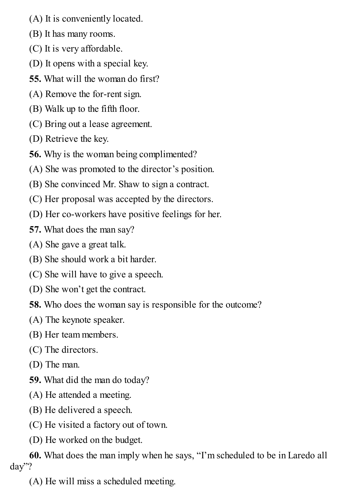

**听力独白/对话原文：**
**M:** Cindy, did you happen to attend the staff meeting today? I was at the factory in Dunham and got back to the office just now. (59)
**W1:** Sorry, Albert, but I missed it as well.
**M:** That's too bad. I was hoping to find out if next year's budget was discussed. Do you know, Joanie?
**W2:** It wasn't. Mr. Richards said discussions regarding it are still ongoing, but it should be covered at this Friday's meeting.
**M:** Oh, no. I'm scheduled to be in Laredo all day. I'll be giving a speech at a marketing conference there. (60)
**W1:** Don't worry about it. I'll take notes and fill you in on anything important you miss. (61)
**M:** Thanks, Cindy.

**中文对照：**
> **M：**辛迪，今天你碰巧参加了这次员工会议吗？我当时在邓纳姆的工厂，刚刚回到办公室。
> **W1：**对不起，艾伯特，我也错过了这次会议。
> **M：**那太糟糕了。我想知道会议是否讨论了明年的预算。乔安妮，你知道吗？
> **W2：**并没有讨论。理查兹说，关于此事的讨论仍在进行中，但是应该会在本周五的会议中讨论。
> **M：**哦，不！那天我将一整天都在拉雷多。我将在那里的营销会议上发表演讲。
> **W1：**不用担心。我会记下你所错过的任何重要的事并告诉你。
> **M：**谢谢你，辛迪。

**核心词汇与短语：**
- **attend**：参加，出席
- **miss**：错过（想去的地方或想做的事情）
- **regard**：关于
- **ongoing**：继续进行的
- **cover**：包含，涉及
- **marketing**：营销；促销
- **conference**：（大型、正式的）会议
- **fill sb. in**：向提供最新消息

#### Q59 (正确答案：C)
**问题：** What did the man do today? (这位男士今天做了什么？)
- (A) He attended a meeting. (他参加了一个会议。)
- (B) He delivered a speech. (他发表了一次演说。)
- (C) He visited a factory out of town. (他参观了镇外的一个工厂。)
- (D) He worked on the budget. (他做了预算。)

#### Q60 (正确答案：A)
**问题：** What does the man imply when he says, “I'm scheduled to be in Laredo all day”? (当这位男士说 “ 我将一整天都在拉雷多 ” 时，是在暗示什么？)
- (A) He will miss a scheduled meeting. (他将错过这次安排好的会议。)
- (B) He cannot submit the budget on time. (他不能按时提交预算。)
- (C) He hopes an event will be rescheduled. (他希望重新安排一次活动。)
- (D) He wants the women to accompany him to go to the meeting. (他希望这位女士可以陪他一起参加会议。)

#### Q61 (正确答案：B)
**问题：** What does Cindy offer to do for the man? (辛迪为这位男士主动提供什么帮助？)
- (A) Contact Mr. Richards. (联系理查兹先生。)
- (B) Provide him with information. (为他提供信息。)
- (C) Review the numbers in the budget. (检查预算中的数据。)
- (D) Help him write a speech. (帮他写演讲稿。)

**延伸表达与补充：**
- **happen to do sth.** (碰巧（凑巧）做某事)
  - *例句：I happened to see James in town.* (我碰巧在镇上看见了詹姆斯。)
- **I'll be giving a speech at a marketing conference there. = I'll be making/delivering a speech at a marketing conference there.** (我将在那里的营销会议上发表演讲。)
  - *例句：Each child had to give a short speech to the rest of the class.* (每个小孩都必须在班里作一个简短的演讲。)
- **take notes** (做笔记扩展表达：)
  - *例句：take note （ of sth. ） I read the first chapter and take notes.* (注意（到某事），留意（到某事）我阅读了第一章并做了笔记。)

### Questions 62 - 64

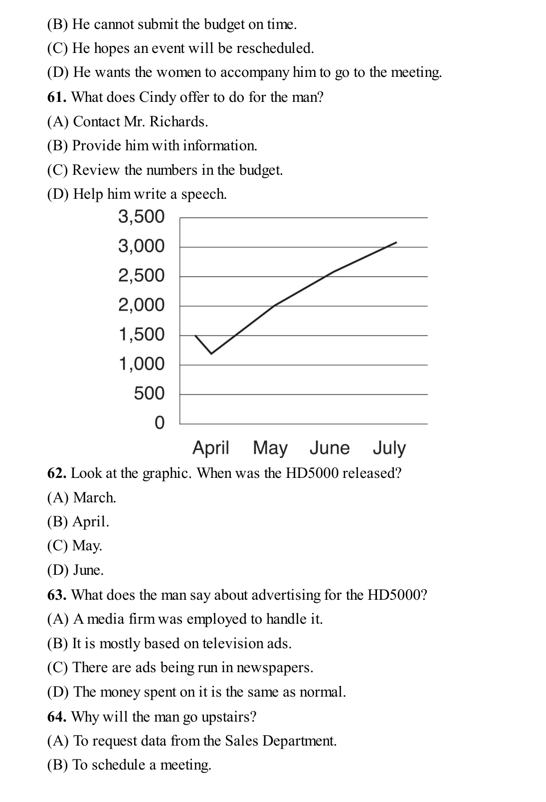

**听力独白/对话原文：**
**W:** Television sales have increased dramatically recently.
**M:** All the credit for that goes to our newest TV, the HD5000. TV sales reached their lowest point during the month it came out, but they've been going up ever since. (62)
**W:** I had no idea. Are we running any special ads?
**M:** Not really. We're advertising on TV, radio, and the Internet, but we aren't spending more money than usual. (63) Mostly, people are purchasing the HD5000 because it's so well made.
**W:** That's excellent news. Could you copy that sales report for me?
**M:** No problem, but I'll need to run upstairs because our copier is out of toner. (64) TV Sales by Month

**中文对照：**
> **W：**最近电视销量有了很大的增长。
> **M：**所有的功劳都要归功于我们最新型号的电视HD5000。电视销量在HD5000发布当月跌到了最低点，但之后就一直在上升。
> **W：**我不太明白。我们有登什么特别的广告吗？
> **M：**并没有。我们在电视、广播和互联网上做广告，但花的钱并没有比平时多。大多数情况下，人们购买HD5000是因为它制作精良。
> **W：**这是个好消息。你能帮我复印一下那份销售报告吗？
> **M：**没问题，不过我得去楼上，因为我们的复印机没有墨粉了。

**核心词汇与短语：**
- **TV Sales by Month**：每月电视销量
- **increase**：增加，增大
- **dramatically**：显著地，剧烈地
- **credit**：信誉；声望；赞扬
- **advertise**：做广告，登广告；作宣传
- **purchase**：购买
- **copier**：复印机
- **toner**：调色剂，增色剂；（打印机等用的）墨粉，色粉

#### Q62 (正确答案：B)
**问题：** Look at the graphic. When was the HD5000 released? (请看图表， HD5000 是几月份推出的？)
- (A) March. (三月。)
- (B) April. (四月。)
- (C) May. (五月。)
- (D) June. (六月。)

#### Q63 (正确答案：D)
**问题：** What does the man say about advertising for the HD5000? (关于 HD5000 的广告，对话中的男士说了什么？)
- (A) A media firm was employed to handle it. (聘请了一家媒体公司来负责广告。)
- (B) It is mostly based on television ads. (主要以电视广告为基础。)
- (C) There are ads being run in newspapers. (报纸上正在刊登广告。)
- (D) The money spent on it is the same as normal. (花在广告上的钱和平常一样多。)

#### Q64 (正确答案：D)
**问题：** Why will the man go upstairs? (对话中的男士为什么去楼上？)
- (A) To request data from the Sales Department. (向销售部要数据资料。)
- (B) To schedule a meeting. (安排一次会议。)
- (C) To attend a conference call. (参加一次电话会议。)
- (D) To make some photocopies. (去复印。)

**延伸表达与补充：**
- **reach the lowest point = be at rock bottom = tumble to its lowest level** (跌到最低点)
  - *例句：As l struggled through the snowdrifts, l had just about reached the lowest point in my life.* (处在人生低谷的我在暴风雪中艰难地行走着。)
- **be out = run out of** (没有了；用完)
  - *例句：Young people were several times more likely to be out of work than older members of the workforce.* (在劳动人口中，年轻人失业的可能性是年长者的好几倍。)

### Questions 65 - 67

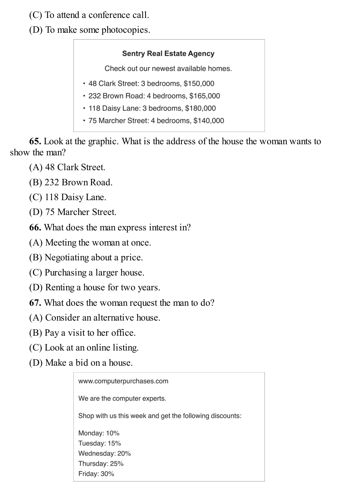

**听力独白/对话原文：**
**W:** Hello, Mr. Rutherford. I have some good news for you. A house that fits your requirements has just come on the market.
**M:** Really? What is the asking price for it?
**W:** It's got four bedrooms, and the owners are only asking for $165,000. (65) It's quite a good deal. If you'd like to see it, I can show it to you.
**M:** I've got time right now, so if you let me know the address, I can meet you there. (66)
**W:** It's actually one block away from my office, so how about driving here around 4:00? (67) We can walk there together.
**M:** All right, I'll see you then. Thank you.

**中文对照：**
> **W：**您好，卢瑟福先生。我有个好消息要告诉您，一套符合您的要求的房子正在出售。
> **M：**真的吗？它的要价是多少？
> **W：**它是四居室的，房主只要16.5万美元，很划算。如果您想看房，我可以带您去看看。
> **M：**我现在有时间，所以如果你告诉我地址，我们可以在那里见。
> **W：**那里离我的办公室只有一个街区，您4点左右开车过来怎么样？我们可以一起走过去。
> **M：**好的，到时候见。谢谢你！

**核心词汇与短语：**
- **fit**：符合，适合
- **requirement**：要求
- **asking price**：要价；索价
- **deal**：交易
- **block**：街区；大厦

#### Q65 (正确答案：B)
**问题：** Look at the graphic. What is the address of the house the woman wants to show the man? (请看图表，对话中的女士想带男士去哪里看房子？)
- (A) 48 Clark Street. (克拉克街道 48 号。)
- (B) 232 Brown Road. (布朗路 232 号。)
- (C) 118 Daisy Lane. (黛西巷 118 号。)
- (D) 75 Marcher Street. (马尔谢街道 75 号。)

#### Q66 (正确答案：A)
**问题：** What does the man express interest in? (对话中的男士对什么感兴趣？)
- (A) Meeting the woman at once. (马上和女士见面。)
- (B) Negotiating about a price. (谈价格。)
- (C) Purchasing a larger house. (买更大的房子。)
- (D) Renting a house for two years. (租两年的房子。)

#### Q67 (正确答案：B)
**问题：** What does the woman request the man to do? (对话中的女士要求男士做什么？)
- (A) Consider an alternative house. (考虑换一个房子。)
- (B) Pay a visit to her office. (去她的办公室。)
- (C) Look at an online listing. (查看在线列表。)
- (D) Make a bid on a house. (出价买房子。)

**延伸表达与补充：**
- **fit one's requirements = fit one's requests = meet one's demands** (符合某人的需要/请求)
  - *例句：He earns enough to fit his requirements.* (他赚得的钱足够满足他的要求。)
- **come on the market = be on sale** (出售)
  - *例句：This house will probably come on the market next month. Sentry Real Estate Agency Check out our newest available homes.* (这幢房子可能下个月要出售。)

### Questions 68 - 70

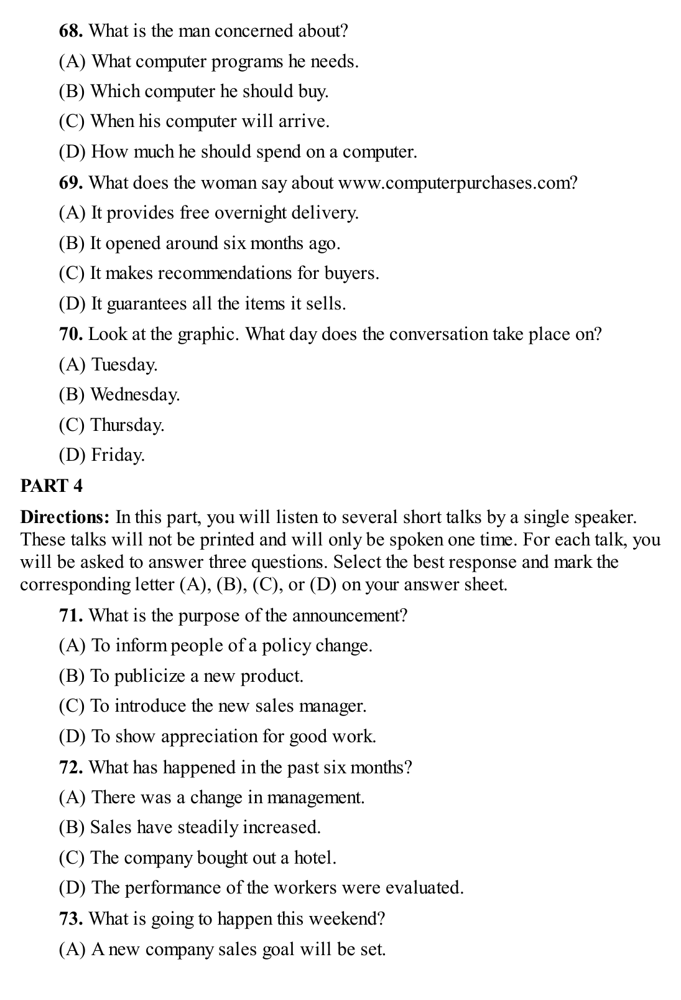

**听力独白/对话原文：**
**M:** Jennifer, I've been planning to buy a new computer, but there are so many models available. Do you have any advice for me? (68)
**W:** Why don't you check out this Web site called www.computerpurchases.com? All you have to do is explain how you'll use your computer, and it will make suggestions for you. (69)
**M:** That sounds like something I should do at once. How are the prices there?
**W:** They're quite reasonable. Even better, I've got a coupon you can use. But you should wait to make your purchase tomorrow because then you can get 30% off. (70)
**M:** Wow, what a deal. Thanks for the assistance, Jennifer.
**W:** You're welcome.

**中文对照：**
> **M：**珍妮弗，我一直想买一台新电脑，但是现在市面上有很多型号的电脑。你有什么建议吗？
> **W：**你为什么不查一下

**核心词汇与短语：**
- **www.computepurchases.com**：这个网站呢？你只需要说一下你将如何使用你的电脑，它会为你提供建议。
- **M**：：听起来我应该马上去查一下。那里的价格怎么样？
- **W**：：非常合理。更好的是，我有一张优惠券，你可以用。但是你应该等到明天再买，因为明天你就可以享受七折优惠了。
- **M**：：哇，真划算。谢谢你的帮助，珍妮弗。
- **W**：：不用客气。
- **available**：可获得的；可购得的
- **check out**：调查；检查
- **reasonable**：合理的
- **coupon**：优惠券，折价券
- **assistance**：帮助

#### Q68 (正确答案：B)
**问题：** What is the man concerned about? (对话中的男士在忧虑什么？)
- (A) What computer programs he needs. (他需要什么电脑程序。)
- (B) Which computer he should buy. (他应该买哪种电脑。)
- (C) When his computer will arrive. (他的电脑什么时候到。)
- (D) How much he should spend on a computer. (他应该花多少钱买一台电脑。)

#### Q69 (正确答案：C)
**问题：** What does the woman say about www.computerpurchases.com? (关于 www.computerpurchases.com 网站，对话中的女士说了什么？)
- (A) It provides free overnight delivery. (它提供免费的隔夜送达服务。)
- (B) It opened around six months ago. (它大约 6 个月前营业。)
- (C) It makes recommendations for buyers. (它为买家提供建议。)
- (D) It guarantees all the items it sells. (它保修所售的所有商品。)

#### Q70 (正确答案：C)
**问题：** Look at the graphic. What day does the conversation take place on? (请看图表，对话发生在哪一天？)
- (A) Tuesday. (星期二。)
- (B) Wednesday. (星期三。)
- (C) Thursday. (星期四。)
- (D) Friday. (星期五。)

**延伸表达与补充：**
- **make a purchase = do the shopping** (购物，购买)
  - *例句：Each can make a purchase with the touch of a button.* (只需触摸一个按钮即可进行购物。)
- **what a deal = a real bargain** (好便宜，多合算)
  - *例句：Two meals for the price of one: What a deal!* (花一顿饭的钱吃两顿饭：多合算！)

## Part 4: 简短独白 (Q71 - Q100)

### Questions 71 - 73

**听力独白/对话原文：**
First I want to inform you of the good news that we have doubled our sales over the last 6 months. (72) Yes, we have more than fulfilled our growth target, and it is with great pleasure that I congratulate you for your effort and the care you have taken in making this happen. (71) In order to recognize this achievement and your performance, we have decided to invite all employees and their families to a special thank-you buffet lunch at the Criterion Hotel. Please join us this Saturday for some excellent food and wine. (73) I hope to see you all there!

**中文对照：**
> 首先我想告诉大家一个好消息，在过去的六个月中我们的销量翻了一番。是的，我们超额完成了增长目标，我很高兴地对大家表示祝贺，因为你们的努力和用心，才能有这样的结果。为了表彰你们的成绩和表现，我们决定邀请所有员工及其家属参加一个特别感谢午宴，地点在Criterion饭店。请在本周六与我们一起享用美食和美酒。希望大家都能光临！

**核心词汇与短语：**
- **double**：使加倍
- **sales**：销售，销量
- **fulfill**：完成，实现
- **growth**：增长，成长
- **effort**：努力
- **care**：用心；努力
- **recognize**：表彰；赏识
- **achievement**：成绩，成就
- **performance**：表现
- **publicize**：公开，发布
- **appreciation**：感激；欣赏
- **steadily**：稳定地
- **buy out**：买下
- **luncheon**：午宴

#### Q71 (正确答案：D)
**问题：** What is the purpose of the announcement? (本通知的目的是什么？)
- (A) To inform people of a policy change. (告知人们一项政策的变化。)
- (B) To publicize a new product. (发布一个新产品。)
- (C) To introduce the new sales manager. (介绍新任销售经理。)
- (D) To show appreciation for good work. (对出色的工作表示感谢。)

#### Q72 (正确答案：B)
**问题：** What has happened in the past six months? (过去的六个月中发生了什么？)
- (A) There was a change in management. (管理部门发生了变动。)
- (B) Sales have steadily increased. (销量稳步增长。)
- (C) The company bought out a hotel. (公司买下了一家酒店。)
- (D) The performance of the workers were evaluated. (员工的表现被考核。)

#### Q73 (正确答案：C)
**问题：** What is going to happen this weekend? (本周末会发生什么？)
- (A) A new company sales goal will be set. (将会制定一个新的公司销售目标。)
- (B) The staff members will go on a trip. (工作人员会去旅行。)
- (C) There will be a luncheon party. (会举行一个午宴。)
- (D) A family get together will take place. (会举行一个家庭聚会。)

**延伸表达与补充：**
- **inform you of ~ = let you know ~ = tell you ~** (通知你们…)
  - *例句：I'd like to inform you of the upcoming party we will be holding for Mr. Smith.* (我想通知大家，我们即将为史密斯先生举行一个聚会。)
- **We have more than fulfilled our growth target. = We have surpassed our growth goal. = We have achieved beyond our growth goal.** (我们超额完成了增长目标。)

### Questions 74 - 76

**听力独白/对话原文：**
It is reported in the business news column today that Susan Bartlett, CEO of Tasty Foods, (74) will leave her position at the end of December. (75) It is well known that the success of Tasty Foods' expansion into Asia was due to Ms. Bartlett's personal dynamism and commitment. A committee, which includes Ms. Bartlett, who will remain with the company as a consultant, is currently searching for the next CEO. (76)

**中文对照：**
> 今天的商业新闻专栏报道说，美味食品公司的首席执行官苏珊·巴特利特将在12月底离职。众所周知，美味食品公司向亚洲的成功进军离不开巴特利特女士个人的推动和投入。巴特利特女士将继续留在公司担任顾问。包括她在内的公司委员会正在寻找下一任首席执行官。

**核心词汇与短语：**
- **leave one's position**：离职
- **well known**：知名的，出名的
- **expansion**：扩张，扩大
- **dynamism**：推动力
- **commitment**：奉献，投入
- **consultant**：顾问
- **critic**：评论家

#### Q74 (正确答案：A)
**问题：** What is Ms. Bartlett's current position? (巴特利特女士目前的职位是什么？)
- (A) Chief executive officer. (首席执行官。)
- (B) Consultant. (顾问。)
- (C) News reporter. (新闻记者。)
- (D) Food critic. (食品评论家。)

#### Q75 (正确答案：C)
**问题：** When will Susan leave her job? (苏珊会在何时离职？)
- (A) At the end of this week. (本周末。)
- (B) Sometime next month. (下个月的某个时候。)
- (C) Later this year. (今年年末。)
- (D) Early next year. (明年年初。)

#### Q76 (正确答案：B)
**问题：** What has the company started doing? (公司已经开始做什么了？)
- (A) Importing food from Asia. (从亚洲进口食品。)
- (B) Seeking a new leader. (寻找新领导。)
- (C) Hiring more consultants. (聘请更多的顾问。)
- (D) Reporting business news. (报道商业新闻。)

**延伸表达与补充：**
- **leave one's position = quit one's job = resign from one's job** (离职)
  - *例句：Jane will leave her position to go back to school.* (简离职后会回到学校。)
- **remain with the company = stay with the company = don't go to another company** (留在公司)
  - *例句：Ralph will remain with the company for another year.* (拉尔夫会留在公司再工作一年。)
- **search for = look for = seek** (寻找)
  - *例句：We are searching for the right person to take over for Mr. Wang.* (我们在寻找合适的人选接替王先生。)

### Questions 77 - 79

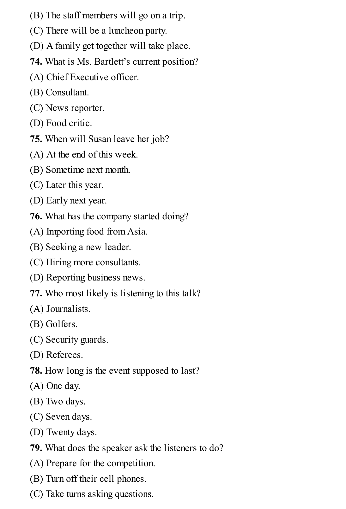

**听力独白/对话原文：**
I'd like to welcome you all to the annual golf championship, and I hope that you enjoy the week you will be spending with us. (78) I would like to remind you that, due to security arrangements, it is essential to have your press identification cards with you at all times. If you forget your card, you will not be allowed to enter any press area. Press conferences will be held at the end of play every day. All reporters will be able to question the selected competitors in the press room. (77) Please indicate that you have a question by raising your hand. A tournament official will pass you a microphone when it is your turn. And please ensure that your mobile phones are off during question sessions. (79)

**中文对照：**
> 欢迎大家来到年度高尔夫锦标赛，我希望你们能和我们一起度过愉快的一周。我想提醒大家，根据安全措施的要求，您需要把记者证随时带在身上。假如您忘记带记者证，那么将无法进入任何采访区域。新闻发布会将在每天比赛结束后举行，所有的记者都可以在新闻室里选择选手提问。请您在想要提问的时候举手示意。比赛官员会在轮到您的时候向您传递话筒。请您确保手机在提问环节处于关机状态。

**核心词汇与短语：**
- **annual**：每年的，年度的
- **championship**：锦标赛
- **security**：安全
- **press**：新闻界，记者
- **identification card**：身份证
- **allow**：允许
- **hold**：举行
- **selected**：选出的
- **indicate**：指出，指示
- **tournament**：比赛，锦标赛
- **turn off**：关闭
- **referee**：裁判
- **take turns**：轮流

#### Q77 (正确答案：A)
**问题：** Who most likely is listening to this talk? (谁最有可能在听这段话？)
- (A) Journalists. (记者。)
- (B) Golfers. (高尔夫球手。)
- (C) Security guards. (保安。)
- (D) Referees. (裁判。)

#### Q78 (正确答案：C)
**问题：** How long is the event supposed to last? (这次赛事会持续多久？)
- (A) One day. (一天。)
- (B) Two days. (两天。)
- (C) Seven days. (七天。)
- (D) Twenty days. (二十天。)

#### Q79 (正确答案：B)
**问题：** What does the speaker ask the listeners to do? (讲话者要求听众做什么？)
- (A) Prepare for the competition. (为比赛做准备。)
- (B) Turn off their cell phones. (关闭手机。)
- (C) Take turns asking questions. (轮流提问。)
- (D) Talk to the security guard. (与保安谈话。)

**延伸表达与补充：**
- **annual = yearly** (每年一次的，年度的)
  - *例句：The annual meeting will be held this Friday.* (年度会议将在本周五举行。)
- **pass = hand = give** (传递)
  - *例句：Would you please wait until I pass you a microphone?* (您能等我把话筒递给您吗？)
- **mobile phone = cellular phone = portable phone** (手机)
  - *例句：There are various types of mobile phones out on the market today.* (目前市场上有很多种类的手机。)

### Questions 80 - 82

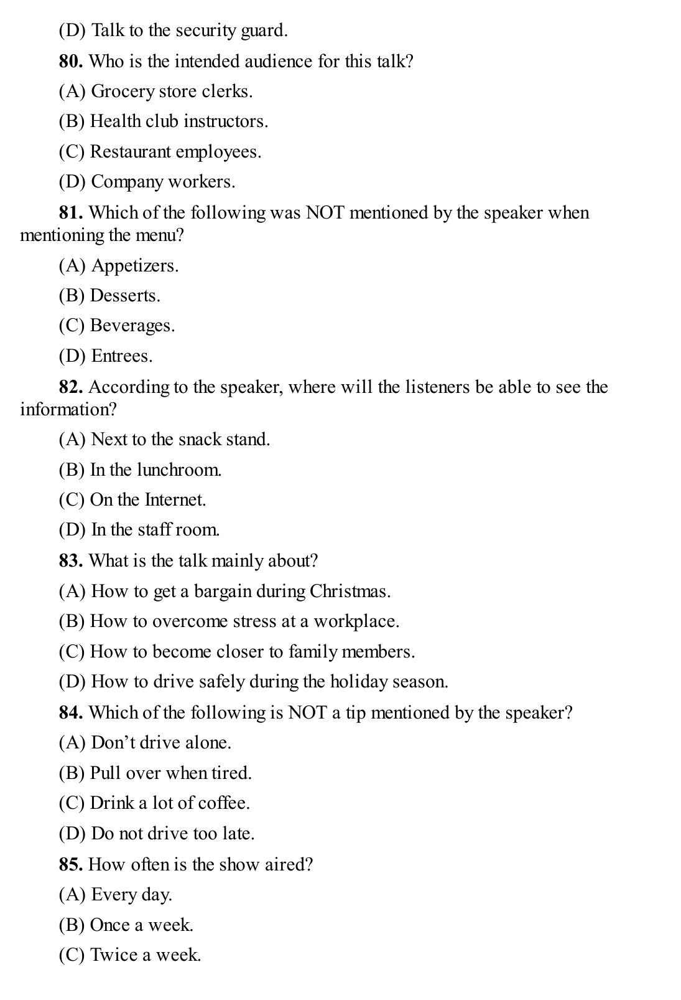

**听力独白/对话原文：**
We would like all employees to note that our management has decided to expand the snack bar into a full lunchroom service. (80) There will be several hot main courses, salads, desserts, and hot and cold drinks on offer every day. (81) Prices will be kept to a minimum. We trust that our employees will not only enjoy the food and atmosphere but also the convenience of having healthy and tasty meals available in the building. A daily menu will be posted on the notice board in the staff room. (82) We hope that you will appreciate this expansion of our services to our valued employees.

**中文对照：**
> 我们想告诉所有员工，管理部门决定把快餐厅扩建成一个午餐餐厅，提供完善的服务。届时每天将有各种热菜、沙拉、甜品、冷热饮品供应。价格会保持在最低水平。我们相信员工们不仅能享受到美食和温馨的气氛，还能享受到在楼内享用健康美味午餐的便利。每日菜单会张贴在员工活动室的通告栏内。希望大家能够体会我们为尊敬的员工提供的这种延伸服务。

**核心词汇与短语：**
- **management**：管理人员，管理部门
- **expand**：发展；扩大
- **lunchroom**：午餐厅
- **be on offer**：供应，提供
- **atmosphere**：气氛，氛围
- **convenience**：便利
- **healthy**：健康的
- **tasty**：美味的
- **post**：张贴
- **notice board**：通告栏
- **appreciate**：体会，领会
- **valued**：珍贵的，受到重视的
- **instructor**：教练
- **appetizer**：开胃菜
- **entree**：主菜
- **stand**：摊位

#### Q80 (正确答案：D)
**问题：** Who is the intended audience for this talk? (谁应该是这段讲话的听众？)
- (A) Grocery store clerks. (杂货店的店员。)
- (B) Health club instructors. (健身俱乐部的教练。)
- (C) Restaurant employees. (饭店员工。)
- (D) Company workers. (公司职员。)

#### Q81 (正确答案：A)
**问题：** Which of the following was NOT mentioned by the speaker when mentioning the menu? (讲话者在讲到菜单时没有提到下面的哪一项？)
- (A) Appetizers. (开胃菜。)
- (B) Desserts. (甜品。)
- (C) Beverages. (饮料。)
- (D) Entrees. (主菜。)

#### Q82 (正确答案：D)
**问题：** According to the speaker, where will the listeners be able to see the information? (根据讲话者所说，听众在哪儿能看到相关信息？)
- (A) Next to the snack stand. (快餐摊位的旁边。)
- (B) In the lunchroom. (午餐厅里。)
- (C) On the Internet. (网上。)
- (D) In the staff room. (员工活动室里。)

**延伸表达与补充：**
- **on offer** (供应)
  - *例句：on sale on display There will be many types of sales on offer this weekend.* (出售展示本周末将会有多种降价商品出售。)
- **Prices will be kept to a minimum.** (价格会保持在最低价位。扩展表达：)
  - *例句：Prices will be kept low. Prices will be kept to a minimum to attract more customers into the store.* (价格会保持在低位。价格会保持在最低水平，从而吸引更多顾客来到店里。)

### Questions 83 - 85

**听力独白/对话原文：**
I'm Jack Thompson, presenting another edition of “Tips for Your Trip”. Christmas time is here again, so it's important for all of you making that long drive home to be extra careful on the road. (83) So listen carefully. Firstly, there will be many tired and stressed drivers on the road, so you will need to be extra careful. Secondly, try to share the driving with a friend or relative or two if possible. (84) That way there will always be someone who can take over the steering wheel when you're tired.Thirdly, take a break when you start to notice the effects of drowsiness—drifting, blurry vision, and yawning. (84) And finally, remember that drinking a lot of coffee can only help you fight drowsiness for a short time. Learn to recognize the signs of sleepiness, and stop. (84) Have a good sleep. Don't drive after midnight if you can possibly avoid it. (84) That's all, but please listen again next week for more“Tips for Your Trip”. (85)

**中文对照：**
> 我是杰克·汤普森，为您带来新一期的“旅途小贴士”节目。圣诞节又到了，对每个人都很重要的就是确保在开车回家的漫长旅程中格外小心。所以，请您认真收听。首先，道路上将会有很多疲惫、紧张的司机，所以你需要多加小心。第二，如果可能的话，尽量和一两个亲友共同开车。这样在你疲劳的时候总能有人接过你手中的方向盘。第三，在你开始感觉到睡意的时候，比如摇晃、视线模糊、打哈欠，马上休息一下。最后，记住大量喝咖啡只能帮你在短时间内抵御睡意。要学会识别瞌睡的信号，然后停车。睡个好觉。如果可能的话，就不要后半夜开车。今天的节目就到这儿，请您下周继续收听“旅途小贴士”。

**核心词汇与短语：**
- **present**：展示
- **tips**：小贴士，小窍门
- **extra**：额外的
- **share**：分享，分担
- **relative**：亲戚
- **take over**：接替，接管
- **steering wheel**：方向盘
- **take a break**：休息
- **effect**：作用，影响
- **drowsiness**：睡意
- **drift**：晃动
- **blurry**：模糊的
- **vision**：视力
- **yawn**：打哈欠
- **sleepiness**：瞌睡
- **bargain**：便宜货，减价品
- **overcome**：战胜，克服
- **pull over**：（把车）开到路边，靠在路边

#### Q83 (正确答案：D)
**问题：** What is the talk mainly about? (这段话主要是关于什么内容？)
- (A) How to get a bargain during Christmas. (圣诞节期间如何买到便宜货。)
- (B) How to overcome stress at a workplace. (如何克服工作压力。)
- (C) How to become closer to family members. (如何与家人变得更加亲密。)
- (D) How to drive safely during the holiday season. (假期里如何安全驾驶。)

#### Q84 (正确答案：C)
**问题：** Which of the following is NOT a tip mentioned by the speaker? (下列哪一项不是讲话者提到的旅途小窍门？)
- (A) Don't drive alone. (不要单独驾驶。)
- (B) Pull over when tired. (劳累时就要停车。)
- (C) Drink a lot of coffee. (多喝咖啡。)
- (D) Do not drive too late. (开车不要开到太晚。)

#### Q85 (正确答案：B)
**问题：** How often is the show aired? (这个节目多久播一次？)
- (A) Every day. (每天。)
- (B) Once a week. (一周一次。)
- (C) Twice a week. (一周两次。)
- (D) Only on weekdays. (只在周末播出。)

**延伸表达与补充：**
- **take over = relieve = substitute for** (接替，接管)
  - *例句：Paul will take over my shift at five o'clock.* (保罗下午5点接我的班。)
- **take a break = rest a little** (休息一会儿)
  - *例句：Why don't you take a break for five minutes?* (为什么不休息5分钟？)

### Questions 86 - 88

**听力独白/对话原文：**
Welcome all of you. And thank you for making the effort to come so promptly. As all of you know, we have to move out of this building by the end of the month （ 86, 87 ） because the owner is asking too much money for rent. And you also know how difficult it is to rent a place in this city at an affordable price. The head chef and I have spent a lot of time trying to find premises that are both in the right location and have the character we need to maintain the tradition of our restaurant. (88) Well, you'll be happy to hear that we've found the ideal location. (86) After weeks of fruitless searching, we heard of a first floor site which was originally a French restaurant near the local theater. We contacted the agents immediately and inspected the site. It's great, and we've signed a 3- year contract. (86) So let's get busy; we have a lot of work to do! Thanks again for your commitment.

**中文对照：**
> 欢迎大家。感谢大家设法如此迅速地赶来。正如大家所知，我们必须在月底之前搬出这栋大楼，因为房东索要的房租太贵了。大家也知道在这个城市很难租到价格合适的房子。我和主厨花了很多时间寻找位置合适又具备我们需要的能够保留我们饭店传统特色的店面。哦，你们听到这个消息会很高兴，我们找到了理想的地方。几周毫无收获的寻找之后，我们听说本地剧院附近的一处店面，在一楼，那里原来是一家法国餐馆。我们马上联系房产经纪人并去看了店面。那里很棒，我们签下了三年的合同。所以我们得忙起来了，有很多工作要做！再次感谢大家的支持。

**核心词汇与短语：**
- **effort**：努力
- **promptly**：敏捷地，迅速地
- **affordable price**：负担得起的价格
- **premises**：房产，房屋
- **character**：特征，个性
- **maintain**：保持，维持
- **tradition**：传统
- **fruitless**：没有结果的
- **agent**：经纪人，代理人
- **commitment**：支持
- **alert**：使注意
- **gather**：收集，聚集
- **renegotiate**：重新谈判，再协商

#### Q86 (正确答案：B)
**问题：** What is the purpose of the talk? (这个讲话的目的是什么？)
- (A) To alert customers about a new dish. (让消费者注意新添的菜品。)
- (B) To notify the staff about the new location of the restaurant. (通知员工饭店的新址。)
- (C) To gather suggestions about a new menu for the place. (收集关于本店新菜单的建议。)
- (D) To announce a new chef for the restaurant. (宣布饭店来了一位新厨师。)

#### Q87 (正确答案：A)
**问题：** What is going to happen at the end of the month? (月底会发生什么？)
- (A) They will move out to a new place. (他们会搬到一个新地方。)
- (B) The chef will renegotiate his contract. (厨师会重新协商合同。)
- (C) A French restaurant will open next door. (一家法国餐馆会在隔壁开业。)
- (D) The theater will hold its first Broadway play. (剧院会首次上演百老汇戏剧。)

#### Q88 (正确答案：B)
**问题：** What does the speaker imply when he says, “maintain the tradition of our restaurant”? (讲话者说 “ 保持我们饭店的传统 ” ，他在暗示什么？)
- (A) The restaurant has recently opened. (该饭店最近才开张。)
- (B) The restaurant has a long history. (该饭店有很悠久的历史。)
- (C) The restaurant has the best food in town. (该饭店的饭菜是城里最好吃的。)
- (D) The restaurant is very busy. (该饭店非常繁忙。)

**延伸表达与补充：**
- **come so promptly = come right away = come at once** (如此迅速地到来)
  - *例句：I appreciate you making the effort to come so promptly.* (我感谢你们能设法如此迅速地赶到。)
- **after weeks of fruitless searching = after weeks of endless searching = after searching for weeks without having any luck** (经过了几周毫无结果的寻找)
  - *例句：After weeks of fruitless searching, we have finally found the right person for the job.* (经过了几周毫无结果的寻找，我们终于找到了适合这项工作的人。)

### Questions 89 - 91

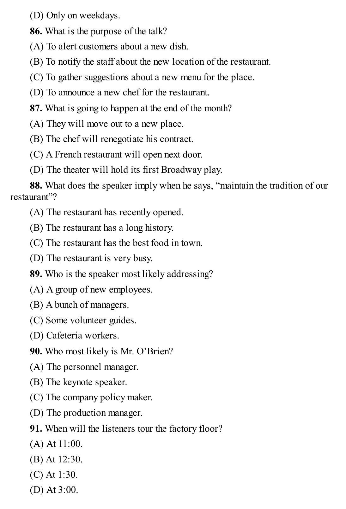

**听力独白/对话原文：**
Hello, everybody. I'm Wendy Raynford, and I'd like to welcome you to our company's orientation program. (89) Firstly, let me tell you about the schedule for this week's training. One of our personnel officers, Tim O'Brien, (90) will hand out envelopes containing some forms for you as well as company information. We'll look over the forms together, and then you can fill them out. This will be followed by a tea break and a chance to talk informally with members of the personnel staff. At 11:00 a.m. we will break into 3 groups for a tour of the production facilities, (91) with our volunteer guides who are keen to meet you. This will be followed by lunch at 12:30. You will then have free time to visit the grounds before the start of the afternoon program at 1:30 p.m. This will begin with a company promotional and training video, lasting 1 hour.

**中文对照：**
> 大家好，我是温迪·雷恩福德，欢迎大家参加我们公司的“新员工培训计划”。首先，让我来告诉大家本周培训的日程安排。我们的人事专员之一，蒂姆·奥布赖恩，会发给大家装有表格和公司信息的信封。我们将一起浏览这些表格，然后你们要把表格填好。之后是茶点和休息时间，在此期间大家将有机会和人事部的同事进行非正式的交谈。到了11点，我们会分成三组，由志愿导游陪同大家参观生产设施。我们的导游非常想见到大家。12点半是午餐时间。午餐后到下午1点半培训之前是自由活动时间，大家可以参观厂区。培训开始时会播放一段时长为1小时的公司宣传及培训录像。

**核心词汇与短语：**
- **orientation**：（任职等前的）培训
- **personnel**：人事部门；员工
- **hand out**：下发，分发
- **look over**：查看，看一遍
- **fill out**：填写
- **tea break**：享用茶点的休息时间
- **volunteer**：志愿者
- **ground**：空地，庭院
- **promotional**：推广的，促销的
- **last**：持续
- **bunch**：束，串，群

#### Q89 (正确答案：A)
**问题：** Who is the speaker most likely addressing? (说话者最有可能在对谁讲话？)
- (A) A group of new employees. (一群新员工。)
- (B) A bunch of managers. (一批经理。)
- (C) Some volunteer guides. (一些志愿导游。)
- (D) Cafeteria workers. (咖啡厅员工。)

#### Q90 (正确答案：A)
**问题：** Who most likely is Mr. O'Brien? (奥布赖恩先生最有可能是谁？)
- (A) The personnel manager. (人事经理。)
- (B) The keynote speaker. (主题发言人。)
- (C) The company policy maker. (公司的政策制定者。)
- (D) The production manager. (生产经理。)

#### Q91 (正确答案：A)
**问题：** When will the listeners tour the factory floor? (听众会在什么时间参观车间？)
- (A) At 11:00. (11 点。)
- (B) At 12:30. (12 点半。)
- (C) At 1:30. (1 点半。)
- (D) At 3:00. (3 点。)

**延伸表达与补充：**
- **hand out = distribute = give out** (下发，分发)
  - *例句：We are planning to hand out some business cards at the exhibition.* (我们计划在展会上分发一些名片。)
- **look over = review = go over** (查看，看一遍)
  - *例句：Let's look over the contract once more.* (咱们再查看一遍合同。)
- **be keen to meet = be eager to meet = be anxious to meet** (急切地想见到)
  - *例句：Mr. Miller is keen to meet you.* (米勒先生急切地想见到你。)

### Questions 92 - 94

**听力独白/对话原文：**
Good morning. As I'm sure you're aware, the gallery's management committee has requested an engineering survey of the site and its facilities. The aim of this survey is twofold: first, to find remedies for certain serious problems which have resulted in damage to the building (92) and parts of the collection; secondly, to consider how the facilities can be improved. I have to report to you that the structure of the building requires immediate attention. Neglect has resulted in serious damage. (93) I know that the necessary renovations will be expensive and funding is a problem. But my consultants are certain that, if we act now, far more serious and expensive repairs can be avoided. (94)

**中文对照：**
> 上午好。我相信大家一定知道，美术馆的管理委员会要求针对馆址及其设施进行一次工程勘察。勘察的目的有两方面：一、找到损坏建筑物和部分藏品的严重问题的补救措施；二、考虑如何改善设施。我必须告诉大家，我们需要立即关注这座建筑物的结构。疏忽已经造成了严重的损坏。我知道必要的修缮会很贵，资金是个问题。但是我的顾问们确信，如果我们现在就行动，能免去更多重大而昂贵的维修。

**核心词汇与短语：**
- **be aware**：知道，意识到
- **engineering**：工程的
- **survey**：调查，勘察
- **facility**：设施
- **twofold**：两方面的
- **remedy**：补救（法）；纠正（法）
- **damage**：破坏，损坏
- **collection**：收集品，收藏
- **structure**：结构；建筑物
- **immediate attention**：立即关注
- **neglect**：疏忽，玩忽
- **funding**：资金
- **beyond**：超过
- **due**：到期的
- **suitable**：合适的
- **auction**：拍卖会
- **recruit**：招募

#### Q92 (正确答案：D)
**问题：** According to the speaker, what is the goal of the survey? (根据讲话人所说，本次勘察的目的是什么？)
- (A) To see if they can collect more money. (看他们能否募集到更多钱。)
- (B) To find collections of old art. (找到古代艺术藏品。)
- (C) To look into the cause of the damages. (调查损坏的原因。)
- (D) To find ways to fix the damages. (寻找维修的方法。)

#### Q93 (正确答案：B)
**问题：** What does the result of the survey report? (勘察结果是什么？)
- (A) The place is beyond repairs. (那个地方无法维修。)
- (B) The building is in need of repairs. (这座建筑需要维修。)
- (C) The structure is in good condition. (（建筑的）结构状况较好。)
- (D) The gallery is due for paint job. (美术馆该粉刷了。)

#### Q94 (正确答案：D)
**问题：** What does the consultant advise? (顾问的建议是什么？)
- (A) To move to another more suitable place. (搬到另一个更合适的地方。)
- (B) To buy more art at the auction. (在拍卖会上购买更多的艺术品。)
- (C) To recruit more volunteers to help out. (招募更多志愿者帮忙。)
- (D) To respond right away to reduce future costs. (立即应对以减少未来的损失。)

**延伸表达与补充：**
- **twofold = double** (两方面的)
  - *例句：The purpose of today's questionnaire is twofold.* (今天的问卷有两方面的目的。)
- **remedies = solutions = cures** (补救办法)
  - *例句：We need to find remedies for the problems quickly.* (我们需要马上找到这些问题的补救办法。)
- **if we act now = if we do something right now = if we move now** (如果我们现在就行动)
  - *例句：If we act now, we may still be able to fix the problem.* (如果我们现在就行动，或许仍然能够解决问题。)

### Questions 95 - 97

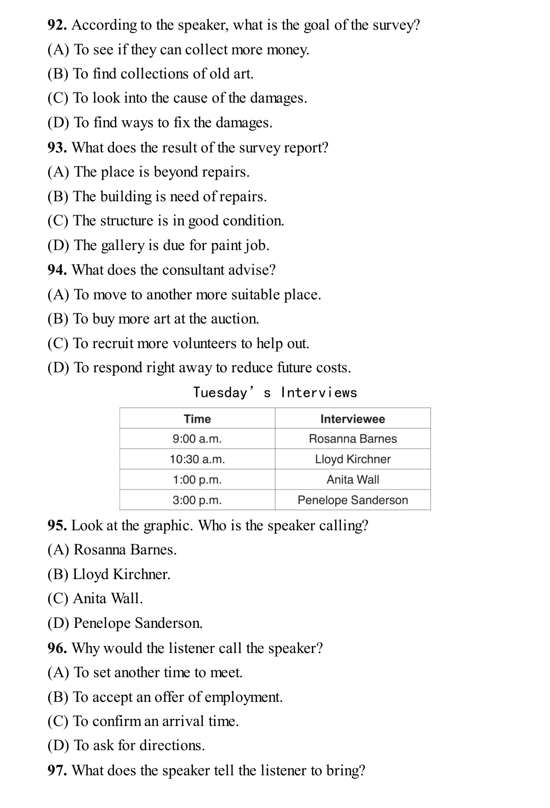

**听力独白/对话原文：**
Hello. This is Ryan Rogers from the Murdoch Corporation. I'm calling to let you know that you have been selected for an interview for the position you applied for. Your interview has been scheduled for next Tuesday morning at 10:30. (95) If this doesn't work for you, please call me back at 874-8432 no later than this Thursday so that we can reschedule it. (96) In addition, you must bring three letters of recommendation from current or previous employers with you. (97) You failed to include those in the application packet you submitted, and we won't be able to hire you without them. Tuesday's Interviews

**中文对照：**
> 您好，我是默多克公司的赖安·罗杰斯。我打电话是想通知您，您已入选了所申请职位的面试。您的面试时间安排在下周二上午10点半。如果这个时间对您来说不方便的话，请于本周四前致电874-8432以便我们能重新安排面试时间。另外，请您务必携带三封当前或者以前雇主的推荐信。您提交的申请信息包中如果没有附上这些推荐信，您将不能被我公司录取。周二的面试

**核心词汇与短语：**
- **corporation**：公司；社团
- **select**：挑选，选拔
- **position**：职位；位置
- **schedule**：安排；时间表
- **reschedule**：重新排定日程
- **recommendation**：推荐（信）；建议
- **current**：现在的，当前的
- **previous**：以前的
- **submit**：提交，递交

#### Q95 (正确答案：B)
**问题：** Look at the graphic. Who is the speaker calling? (请看图表，讲话者在给谁打电话？)
- (A) Rosanna Barnes. (罗莎娜 · 巴尔内斯。)
- (B) Lloyd Kirchner. (罗伊德 · 柯克纳。)
- (C) Anita Wall. (安妮塔 · 沃尔。)
- (D) Penelope Sanderson. (佩内洛普 · 桑德森。)

#### Q96 (正确答案：A)
**问题：** Why would the listener call the speaker? (接电话的人为什么会致电讲话者？)
- (A) To set another time to meet. (另外约定面试时间。)
- (B) To accept an offer of employment. (接受录用通知。)
- (C) To confirm an arrival time. (确定到达时间。)
- (D) To ask for directions. (询问（公司）地址。)

#### Q97 (正确答案：D)
**问题：** What does the speaker tell the listener to bring? (讲话者要求对方携带什么？)
- (A) An application sheet. (一张申请表。)
- (B) A résumé. (一份简历。)
- (C) A portfolio. (一份作品集。)
- (D) Some documents. (一些文件。)

**延伸表达与补充：**
- **let ~ know = tell ~** (告知/告诉…)
  - *例句：Please let me know when you will come back.* (请告知我你何时回来。)
- **schedule for = plan for** (为…制定/安排（行程）)
  - *例句：Let's schedule for each goal of this year.* (我们来为今年的每个目标制定计划吧。)

### Questions 98 - 100

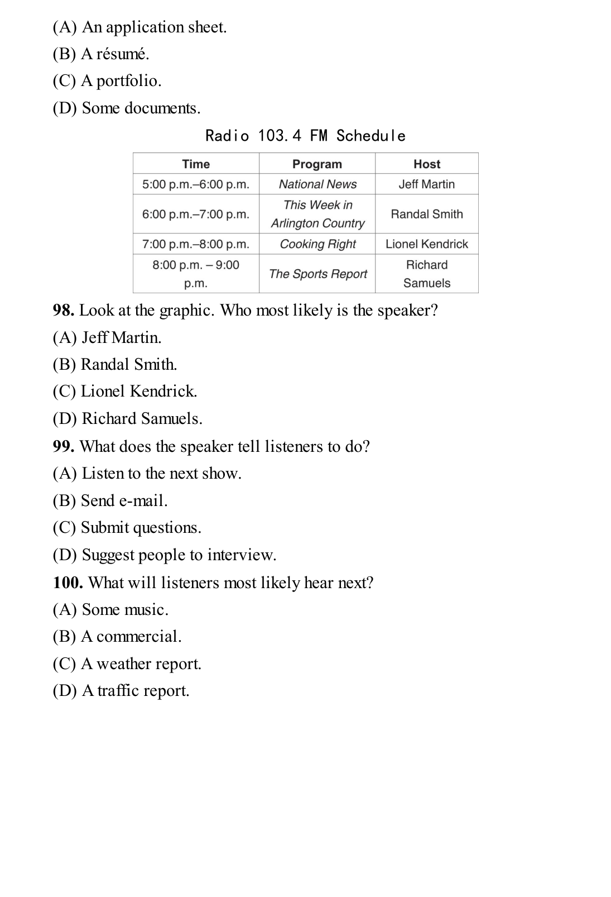

**听力独白/对话原文：**
That's all we have time for today, listeners. Thanks for stopping by Radio 103.4 FM, the top radio station in Arlington County. I hope you enjoyed my interview with Brandon Meyers today. (98) If you have any questions or comments about our city's leading businessman, send them to me, and I'll do my best to have them answered by tomorrow's show. (99) You can get my e- mail address on the radio station's homepage. All right, it's time for me to go off the air. Before you listen to our next program, it's time for a few words from our sponsors. (100) I'll be back at the same time tomorrow with a report on our area's schools. (98) Radio 103.4 FM Schedule

**中文对照：**
> 听众们，以上就是今天全部的放送时间。感谢您锁定收听阿灵顿县一流的无线电台——调频103.4。希望大家喜欢今天我对布兰登·迈耶斯所做的访谈。如果您对本市杰出的企业家有任何问题或者评价，请发送给我，我将尽可能在明天的节目当中回答。您可以在无线电台的主页找到我的电子邮件地址。好了，我今天的播送即将结束。在您收听下面的节目之前，将播放我台赞助商的几句话。我将于明天同一时间与您再会，届时将带来关于本地区学校的报道。调频103.4 节目时间表

**核心词汇与短语：**
- **comment**：评论；意见
- **leading**：主要的；领导的
- **businessman**：企业家，商人
- **e- mail address**：电子邮件地址
- **homepage**：主页
- **program**：节目；项目；程序
- **sponsor**：赞助商；发起者

#### Q98 (正确答案：B)
**问题：** Look at the graphic. Who most likely is the speaker? (请看图表，讲话者很可能是谁？)
- (A) Jeff Martin. (杰夫 · 马丁。)
- (B) Randal Smith. (兰德尔 · 史密斯。)
- (C) Lionel Kendrick. (莱昂内尔 · 肯德里克。)
- (D) Richard Samuels. (理查德 · 塞缪尔斯。)

#### Q99 (正确答案：C)
**问题：** What does the speaker tell listeners to do? (讲话者请听众做什么？)
- (A) Listen to the next show. (收听下一期节目。)
- (B) Send e-mail. (发送电子邮件。)
- (C) Submit questions. (提交问题。)
- (D) Suggest people to interview. (推荐接受采访的人。)

#### Q100 (正确答案：B)
**问题：** What will listeners most likely hear next? (听众们接下来最可能听到什么节目？)
- (A) Some music. (一些音乐。)
- (B) A commercial. (一则广告。)
- (C) A weather report. (天气预报。)
- (D) A traffic report. (一份交通报道。)

**延伸表达与补充：**
- **enjoy = have a good time** (享受；过得愉快)
  - *例句：I enjoyed staying in Canada last summer vacation.* (我享受去年暑假在加拿大的日子。)
- **do my best to ~ = try my best to ~** (尽我最大的努力)
  - *例句：I will do my best to help you.* (我会尽最大的努力帮助你。)

# TEST 04

## 答案速查表

| 题号 | 答案 | 题号 | 答案 | 题号 | 答案 | 题号 | 答案 | 题号 | 答案 | 题号 | 答案 | 题号 | 答案 | 题号 | 答案 | 题号 | 答案 | 题号 | 答案 |
| :---: | :---: | :---: | :---: | :---: | :---: | :---: | :---: | :---: | :---: | :---: | :---: | :---: | :---: | :---: | :---: | :---: | :---: | :---: | :---: |
| **1** | C | **11** | A | **21** | A | **31** | B | **41** | A | **51** | B | **61** | A | **71** | A | **81** | A | **91** | A |
| **2** | A | **12** | A | **22** | C | **32** | C | **42** | A | **52** | A | **62** | A | **72** | B | **82** | C | **92** | A |
| **3** | D | **13** | A | **23** | C | **33** | C | **43** | C | **53** | B | **63** | D | **73** | A | **83** | D | **93** | A |
| **4** | C | **14** | B | **24** | A | **34** | B | **44** | C | **54** | A | **64** | C | **74** | D | **84** | D | **94** | C |
| **5** | B | **15** | B | **25** | C | **35** | A | **45** | A | **55** | B | **65** | B | **75** | C | **85** | C | **95** | A |
| **6** | D | **16** | A | **26** | B | **36** | A | **46** | A | **56** | A | **66** | A | **76** | A | **86** | C | **96** | D |
| **7** | B | **17** | C | **27** | C | **37** | B | **47** | C | **57** | C | **67** | B | **77** | B | **87** | D | **97** | C |
| **8** | A | **18** | B | **28** | B | **38** | A | **48** | B | **58** | C | **68** | C | **78** | C | **88** | C | **98** | B |
| **9** | B | **19** | C | **29** | C | **39** | B | **49** | C | **59** | B | **69** | B | **79** | C | **89** | B | **99** | D |
| **10** | B | **20** | C | **30** | B | **40** | B | **50** | B | **60** | A | **70** | B | **80** | A | **90** | B | **100** | B |

## Part 1: 照片描述 (Q1 - Q6)

### Q1 (正确答案：C)

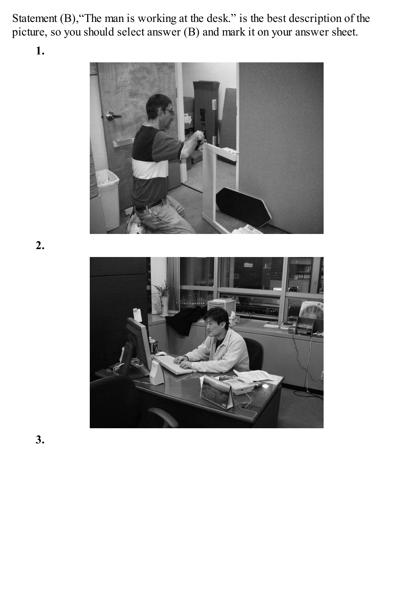

**听力原文与选项：**
- (A) He's opening the door. (他正在开门。)
- (B) He's sitting upright in a chair. (他正笔直地坐在椅子上。)
- (C) He's working with a tool. (他正在使用一个工具。)
- (D) He's taking off his running shoes. (他正在脱下他的跑鞋。)

**其他可能表达：**
- He's using a hammer. (他正在使用锤子。)
- He's holding a tool. (他正拿着一个工具。)
- He's concentrating on his work. (他正专心于他的工作。)

### Q2 (正确答案：A)

**听力原文与选项：**
- (A) He has taken a seat at a workstation. (他已经坐在工作区里了。)
- (B) He is tidying up his work area. (他正在清理他的工作区域。)
- (C) He's turning on the computer. (他正在开电脑。)
- (D) He's about to sit in the chair. (他正要坐到椅子上。)

**其他可能表达：**
- The man is working at the computer. (男士正在使用电脑。)
- He's gathering information from the monitor. (他正在从显示器上收集信息。)
- The man is looking at the computer screen. (男士正看着电脑屏幕。)

### Q3 (正确答案：D)

**听力原文与选项：**
- (A) They're entering the gallery. (他们正走进美术馆。)
- (B) They're hanging up some pictures. (他们正在挂几张画。)
- (C) They're sketching some art. (他们正在绘制一些艺术作品。)
- (D) They're closely examining a picture. (他们正在仔细地审视一幅画。)

**其他可能表达：**
- They're admiring the painting
- on the wall. (他们正在欣赏墙上的画。)
- Some paintings are hanging in a gallery. (几幅画正挂在美术馆里。)
- A painting has been hung next to the women. (一幅画已经被挂在了女士的旁边。)

### Q4 (正确答案：C)

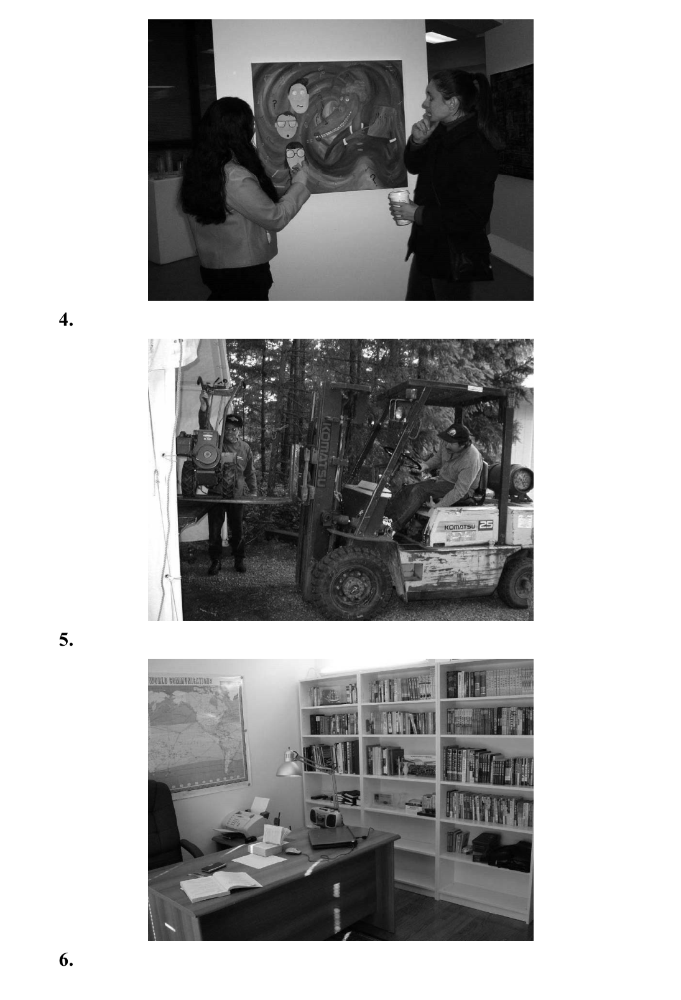

**听力原文与选项：**
- (A) The people are loading goods onto a truck. (人们正在往卡车上装货物。)
- (B) A man is closing up the storage room. (一位男士正在关闭储物间。)
- (C) One of the people is handling heavy machinery. (他们中的一个人正在操作沉重的机器。)
- (D) One man is directing the other man. (一位男士正在指挥另一个人。)

**其他可能表达：**
- A man is operating heavy machinery. (一位男士正在操作沉重的机器。)
- Heavy machinery is being used. (沉重的机器正在被使用。)
- There is heavy machinery in use at the moment. (现在有一台沉重的机器正)
- 在被使用中。

### Q5 (正确答案：B)

**听力原文与选项：**
- (A) A worker is organizing the shelves. (一个工人正在整理书架。)
- (B) The shelves are lined up against one side of the wall. (书架靠着一面墙排成一排。)
- (C) There are books neatly arranged on top of the desk. (书在书桌上整齐地排放着。)
- (D) The map is being taken down at the moment. (地图现在正被取下来。)

**其他可能表达：**
- The shelves are stocked with reading materials. (书架上放满了读物。)
- There are bookshelves against one side of the wall. (一面墙上靠着几个书架。)
- Some books have been filled in the shelves. (一些书已经被放到书架上了。)

### Q6 (正确答案：D)

**听力原文与选项：**
- (A) A man is escorting the woman into the car. (男士正在护送女士上汽车。)
- (B) The woman is backing the car out of the driveway. (女士正把车倒出车道。)
- (C) Several passengers are seated in the backseat of the car. (几名乘客坐在汽车的后座上。)
- (D) The door of the vehicle is open. (车门是开着的。)

**其他可能表达：**
- The woman is about to get in the car. (女士正要上车。)
- The passenger door is wide open. (乘客门大开着。)
- They are dressed in formal wear. (他们穿着正装。)
- 注：在Part 1中，每道试题都添加了3种可能的正确表达方式，考生可
- 以了解对于同样的照片可能出现的不同表达。

## Part 2: 应答测试 (Q7 - Q31)

### Q7 (正确答案：B)

**听力对话文本：**
- **Q:** Did you have any difficulties in finding this place? (你找这个地方有没有遇到困难？)
- **A:** No, I've been here several times in the past. (没有，我过去来过这里几次。)

**听力原文与选项：**
- **问题：** Did you have a hard time finding this place? (你觉得这个地方难找吗？)
- **选项：**
  - (A) Why don't you take a look at the map? (你为什么不看一看地图呢？)
  - (B) No, I've been here once before. (不难，我以前来过这里一次。)
  - (C) This job is easier than you think. (这个工作比你想的简单一些。)

### Q8 (正确答案：A)

**听力对话文本：**
- **Q:** What's the weather going to be like this weekend? (这周末的天气怎么样？)
- **A:** I think rain is in the forecast. (我记得天气预报说有雨。)

**听力原文与选项：**
- **问题：** What's in the forecast for the weekend? (天气预报说周末的天气怎么样？)
- **选项：**
  - (A) I heard it's going to rain. (我听说要下雨。)
  - (B) Probably on Saturday. (很可能在周六。)
  - (C) Yes, at the local park. (是的，在本地公园。)

### Q9 (正确答案：B)

**听力对话文本：**
- **Q:** How did you enjoy the play we just saw? (你觉得我们刚才看的戏剧怎么样？)
- **A:** I really liked it a lot. (我真的很喜欢。)

**听力原文与选项：**
- **问题：** Did you like the play you just saw? (你喜欢刚才看的戏剧吗？)
- **选项：**
  - (A) No, I saw her today. (不，我今天见到她了。)
  - (B) Yes, it was very nice. (喜欢，非常好。)
  - (C) Yes, all work and no play. (是的，只工作，不娱乐。)

### Q10 (正确答案：B)

**听力对话文本：**
- **Q:** Do you want to let John know that you dropped by today? (你想让约翰知道你今天来过吗？)
- **A:** I will tell him myself later. (晚些时候我自己告诉他吧。)

**听力原文与选项：**
- **问题：** Can I tell John that you came by today? (我能告诉约翰你今天来过吗？)
- **选项：**
  - (A) Yes, I will drop by at six. (是的，我会在 6 点顺道过来。)
  - (B) That won't be necessary. (那没有必要。)
  - (C) No, I forgot to call him. (不，我忘记给他打电话了。)

### Q11 (正确答案：A)

**听力对话文本：**
- **Q:** Why did you come by today? (你今天为什么来？)
- **A:** I am here to meet with Mr. Lee. (我来这儿见李先生。注：在Part 2中，为帮助考生提高听懂题目的能力，添加了和试题相同或相似的表达方法。)

**听力原文与选项：**
- **问题：** What is the main reason for your visit? (你来访的主要原因是什么？)
- **选项：**
  - (A) I'm here on business. (我来这里是因为公事。)
  - (B) This is my third time here. (这是我第三次来这里。)
  - (C) To the third floor office. (到三层的办公室去。)

### Q12 (正确答案：A)

**听力对话文本：**
- **Q:** How much is the total? (总共多少钱？)
- **A:** That will be twenty dollars. (总共是20美元。)

**听力原文与选项：**
- **问题：** How much does all this come to? (这些一共多少钱？)
- **选项：**
  - (A) Twenty dollars. (20 美元。)
  - (B) No, I won't. (不，我不会。)
  - (C) With a credit card. (用信用卡。)

### Q13 (正确答案：A)

**听力对话文本：**
- **Q:** What are the chances of Mr. Chen showing up tonight? (陈先生今晚出现的可能性有多大？)
- **A:** Next to none. (几乎没有可能。)

**听力原文与选项：**
- **问题：** Is Mr. Chen likely going to show up this evening? (陈先生今晚会出现吗？)
- **选项：**
  - (A) Most likely not. (很可能不会。)
  - (B) Yes, it went up. (是的，增加了。)
  - (C) He will show it to me. (他会把它给我看。)

### Q14 (正确答案：B)

**听力对话文本：**
- **Q:** When will the test result be announced? (考试成绩什么时候公布？)
- **A:** This Friday at the latest. (最晚本周五。)

**听力原文与选项：**
- **问题：** When will I get the result of my test? (我什么时候能拿到考试成绩？)
- **选项：**
  - (A) I acted it. (我假装的。)
  - (B) By this Friday. (本周五之前。)
  - (C) Yes, I know. (是的，我知道。)

### Q15 (正确答案：B)

**听力对话文本：**
- **Q:** Would you like a ride to the bus station? (你想搭车去公交车站吗？)
- **A:** Thanks. I really appreciate it. (谢谢。真的非常感谢。)

**听力原文与选项：**
- **问题：** Do you want a lift to the bus terminal? (你想要搭车去公交车终点站吗？)
- **选项：**
  - (A) It's a bit too heavy for me. (它对我来说有点儿太重了。)
  - (B) That would be very nice of you. (你太好了。)
  - (C) To see my in-laws in New York. (去见我纽约的姻亲。)

### Q16 (正确答案：A)

**听力对话文本：**
- **Q:** Do you accept personal checks here, or do I have to pay in cash? (你这里接受个人支票吗，还是我必须交现金？)
- **A:** Either way is fine. (怎么都行。)

**听力原文与选项：**
- **问题：** Can I give you a check, or would you prefer cash? (我可以给你支票吗，还是你更想要现金？)
- **选项：**
  - (A) It doesn't matter to me. (对我来说没关系。)
  - (B) Yes, I checked it twice. (是的，我检查过两遍。)
  - (C) No, I don't have any money on me. (不，我身上没钱。)

### Q17 (正确答案：C)

**听力对话文本：**
- **Q:** I am curious to know whom the next project is going to be assigned to. (我很好奇下一个项目会分配给谁。)
- **A:** I heard Jake is going to get it. (我听说杰克会承担那个项目。)

**听力原文与选项：**
- **问题：** I wonder who is going to take on the next project, don't you? (我想知道谁会承担下一个项目，你不想知道吗？)
- **选项：**
  - (A) Sure, I can take it with me today. (当然，我今天能带着它。)
  - (B) Sorry, but I am not going that way. (抱歉，我不走那边。)
  - (C) It will most likely be Jake. (很有可能是杰克。)

### Q18 (正确答案：B)

**听力对话文本：**
- **Q:** Are there any tickets left for this evening's show? (今晚的演出还有剩余的票吗？)
- **A:** Sorry, but all the tickets are sold out. (抱歉，所有的票都卖光了。)

**听力原文与选项：**
- **问题：** Are there any seats left for tonight's performance? (今晚的演出还有剩余的座位吗？)
- **选项：**
  - (A) It is going to be very expensive. (票会非常贵。)
  - (B) Sorry, but it's a full house today. (抱歉，今天满座了。)
  - (C) Sure, here is my ticket. (当然，这是我的票。)

### Q19 (正确答案：C)

**听力对话文本：**
- **Q:** How far is the hotel you are staying at from here? (你住的宾馆离这里有多远？)
- **A:** It's just around the corner. (就在前面拐角处。)

**听力原文与选项：**
- **问题：** How far is your hotel from here? (你的宾馆离这里多远？)
- **选项：**
  - (A) I'm staying in Room 1204. (我住在 1204 房间。)
  - (B) At the Prince Hotel. (在王子酒店。)
  - (C) About ten minutes on foot. (步行大约 10 分钟。)

### Q20 (正确答案：C)

**听力对话文本：**
- **Q:** Did you not like the talk? (你不喜欢这个讲话吗？)
- **A:** No, it was a little too slow. (不喜欢，有点儿太慢了。)

**听力原文与选项：**
- **问题：** Didn't you enjoy the speech? (你难道不喜欢这个演讲吗？)
- **选项：**
  - (A) He speaks two languages. (他讲两种语言。)
  - (B) Yes, it's much better. (是的，好多了。)
  - (C) No, it was a bit boring. (不喜欢，有点儿枯燥。)

### Q21 (正确答案：A)

**听力对话文本：**
- **Q:** Were there enough forms to go around for everybody at the workshop? (讨论会上有足够的表格分发给每个人吗？)
- **A:** Yes, I think everyone had a copy. (是的，我想每个人都有一份。)

**听力原文与选项：**
- **问题：** Were there plenty of forms for everyone at the workshop? (有很多表格发给讨论会上的每个人吗？)
- **选项：**
  - (A) There were just enough. (正好有足够的表格。)
  - (B) He works until six today. (他今天一直工作到 6 点。)
  - (C) I already went shopping. (我已经去购物了。)

### Q22 (正确答案：C)

**听力对话文本：**
- **Q:** Are you up for shopping today, or do you want to do it another time? (你今天打算去买东西吗，还是想改天再去？)
- **A:** I am a bit worn out today. (我今天有点儿累了。)

**听力原文与选项：**
- **问题：** Do you feel like shopping today, or would you prefer going another time? (你想今天购物还是改天？)
- **选项：**
  - (A) I bought a T-shirt. (我买了一件 T 恤。)
  - (B) I feel quite good. (我感觉很好。)
  - (C) I'm a bit tired today. (我今天有点儿累。)

### Q23 (正确答案：C)

**听力对话文本：**
- **Q:** Would you happen to know where I could get some good coffee around here? (你知道我在附近哪儿能买到好喝的咖啡？)
- **A:** The café on the second floor is good. (二层的咖啡厅很不错。)

**听力原文与选项：**
- **问题：** Do you know where to go to get a nice cup of coffee around here? (你知道这儿附近哪里能喝到好喝的咖啡吗？)
- **选项：**
  - (A) They make a great couple. (他们是很棒的一对。)
  - (B) Sure, I could use a cup. (当然，我可以用茶杯。)
  - (C) Try the café on the second floor. (试试看二层的咖啡厅。)

### Q24 (正确答案：A)

**听力对话文本：**
- **Q:** Would you care for a game of tennis after we finish work today? (今天下班后你想一起打一局网球吗？)
- **A:** I'd love to, but I can't today. (我很想去，可是今天去不了。)

**听力原文与选项：**
- **问题：** Do you want to join me for a game of tennis after work? (你想下班后和我一起打一局网球吗？)
- **选项：**
  - (A) Thanks, but I'll pass this time. (谢谢，这次我就不去了。)
  - (B) I learned the game a week ago. (我一周前学了这项运动。)
  - (C) There will be three of us going. (我们会有三个人去。)

### Q25 (正确答案：C)

**听力对话文本：**
- **Q:** You have a moment to spare this morning, don't you? (你今天上午能抽出一点儿时间，是吧？)
- **A:** Sure, what's up? (当然可以，怎么啦？)

**听力原文与选项：**
- **问题：** You have some spare time this morning, don't you? (你今天上午有空，是吗？)
- **选项：**
  - (A) It is ten o'clock now. (现在 10 点了。)
  - (B) Yes, in my office. (是的，在我的办公室。)
  - (C) I think so. (我想是的。)

### Q26 (正确答案：B)

**听力对话文本：**
- **Q:** Would you by chance know of a good restaurant to take Mr. Lee? (你知道有什么好饭店可以带李先生去吗？)
- **A:** Well, what does he like to eat? (哦，他喜欢吃什么？)

**听力原文与选项：**
- **问题：** Could you recommend a nice place to take Mr. Lee? (你能推荐一个可以带李先生去的好地方吗？)
- **选项：**
  - (A) I recommended him to the boss. (我向老板推荐了他。)
  - (B) What type of food does he like? (他喜欢哪种食物？)
  - (C) He will be here for a week. (他会在这里待一周。)

### Q27 (正确答案：C)

**听力对话文本：**
- **Q:** Don't you think it would be okay to go over after we finish work first? (你不觉得我们先做完工作之后再过去就行吗？)
- **A:** Yes, let's leave right at five o'clock. (是的，咱们5点整走。)

**听力原文与选项：**
- **问题：** Couldn't we just head over after work? (难道我们下班后再过去不好吗？)
- **选项：**
  - (A) He works on the first floor. (他在一层工作。)
  - (B) No, let's look it over now. (不，咱们现在就检查。)
  - (C) Sure, let's take off at five. (当然，咱们 5 点出发。)

### Q28 (正确答案：B)

**听力对话文本：**
- **Q:** The construction work is making a lot of noise. (建筑工作产生了很多噪音。)
- **A:** You should close the windows. (你应当关上窗户。)

**听力原文与选项：**
- **问题：** The renovation work they're doing is very loud. (他们正在做的修缮工作很吵。)
- **选项：**
  - (A) It will be completed next year. (明年能结束。)
  - (B) Why don't you shut the windows? (你为什么不关上窗户呢？)
  - (C) There will be plenty of work. (会有很多工作。)

### Q29 (正确答案：C)

**听力对话文本：**
- **Q:** Don't you have to set up the tables for this evening's meeting? (你难道不用为今晚的会议安排桌子吗？)
- **A:** I asked Jack to take care of it. (我让杰克负责这件事了。)

**听力原文与选项：**
- **问题：** Don't you have to prepare the tables for the meeting tonight? (你难道不需要为今晚的会议准备桌子吗？)
- **选项：**
  - (A) A table for four, please. (请准备一张四人桌。)
  - (B) We are meeting today. (我们今天见面。)
  - (C) No, Jack will do it later. (不，过一会儿杰克会准备。)

### Q30 (正确答案：B)

**听力对话文本：**
- **Q:** Why don't you take it easy and take a few days off? (你为什么不放松点儿，休几天假？)
- **A:** I wish I could, but I have to finish this project first. (我也希望这样，但是我得先完成这个项目。)

**听力原文与选项：**
- **问题：** Why don't you take a break and stay home for a few days? (你为什么不休息一下，在家待几天呢？)
- **选项：**
  - (A) Thanks, I had a great vacation. (谢谢，我的假期很愉快。)
  - (B) I wish I could, but I have too much work. (我也希望这样，但是我的工作太多了。)
  - (C) The one here is much stronger. (这里的这个强壮多了。)

### Q31 (正确答案：B)

**听力对话文本：**
- **Q:** You can make the copies tomorrow, can't you? (你可以明天复印，是吧？)
- **A:** Yes, I have time until noon tomorrow. (是的，我到明天中午都有时间。Questions 32 through 34 refer to the following conversation.M:The boss wants me to change the setting of our office before thepresident's visit next month. He wants me to utilize the space here by movingthe furniture around.（)

**听力原文与选项：**
- **问题：** You don't have to make copies today, do you? (你今天不必复印，是吧？)
- **选项：**
  - (A) I already had two cups, thanks. (我已经喝了两杯了，谢谢。)
  - (B) No, I could do it tomorrow morning. (是的，我可以明天上午做。)
  - (C) I should be able to make it there. (我应该能准时到那儿。)

## Part 3: 简短对话 (Q32 - Q70)

### Questions 32 - 34

**听力独白/对话原文：**
**M:** The boss wants me to change the setting of our office before the president's visit next month. He wants me to utilize the space here by moving the furniture around. (32) I am not very good at this, so I need your expert advice. Can you spare some time to discuss the office layout?
**W:** Well, I am kind of busy today. Let me see... this Thursday or next Monday is good for me. What about you? (33)
**M:** I have to leave town for a week on Friday. (34) I think we'd better get together before I leave. (33) Is that okay with you?
**W:** That will be fine as long as it's in the morning. I have to leave early for a dentist appointment in the afternoon.

**中文对照：**
> **M：**老板想让我在总裁下个月来参观之前改变一下我们办公室的布局。他想让我挪动这些家具，把这里的空间利用起来。我不擅长干这个，所以我需要你这个专家的建议。你能抽点时间和我讨论一下办公室的布局吗？
> **W：**嗯，我今天有点儿忙。我想想…这周四或者下周一我可以。你呢？
> **M：**我周五得去外地，要去一周。我想我们最好在我走之前见面。你方便吗？
> **W：**只要在上午就行。我下午得早走，约好了去看牙医。

**核心词汇与短语：**
- **setting**：环境，布置
- **utilize**：利用
- **expert**：专家
- **spare**：抽（时间）
- **layout**：布局
- **get together**：见面
- **rearrange**：重新安排

#### Q32 (正确答案：C)
**问题：** What does the man's boss want him to do? (男士的老板想让他做什么？)
- (A) Cancel his dental appointment. (取消他跟牙医的约会。)
- (B) Move closer to the workplace. (搬到工作地点附近。)
- (C) Rearrange the furniture in the office. (重新安排办公室里的家具。)
- (D) Pick up the president from the airport. (到机场接总裁。)

#### Q33 (正确答案：C)
**问题：** When will they get together to discuss the issue? (他们会在什么时间见面讨论这个问题？)
- (A) Monday. (周一。)
- (B) Tuesday. (周二。)
- (C) Thursday. (周四。)
- (D) Friday. (周五。)

#### Q34 (正确答案：B)
**问题：** What does the man say he will do Friday? (男士说他周五会做什么？)
- (A) Attend a meeting with the boss. (和老板一起参加一个会议。)
- (B) Go on a business trip. (出差。)
- (C) Visit his dentist's office. (去看牙医。)
- (D) Work in his office. (在办公室里工作。)

**延伸表达与补充：**
- **change the setting of our office** (改变我们办公室的布局扩展表达：)
  - *例句：rearrange the furniture in our office change things around in our office We need to change the setting of our office to make space for the newly hired employees.* (重新布置办公室的家具改变我们办公室的陈设我们需要改变一下办公室的格局，给新来的员工腾出地方。)
- **utilize the space = make （ best ） use of the space** (（充分）利用空间)
  - *例句：We should call a professional to utilize the space we have in the office.* (我们应该找一位专业人士帮我们利用办公室的空间。)
- **get together = meet = gather** (见面)
  - *例句：We should get together to discuss the possibilities.* (我们应该见面讨论各种可能性。)

### Questions 35 - 37

**听力独白/对话原文：**
**W:** I think I am going to have to take a trip to Chicago tomorrow to talk to Mr. Shaw in person. I spoke to him on the phone just now, but he didn't sound too convinced about our offer. (35)
**M:** Well, if that's what's needed, then you'd better get yourself over there. I don't think I have to stress the fact to you again how important it is that we get this deal. Please go out of your way to get this contract. In other words, do what you have to do to get it.
**W:** Yes sir, I will try my best. By the way, can you tell me where the bus station is? I have never gone out of the city, and I am not sure where the bus station is. (36)
**M:** You've got to be kidding me. Tell you what, I will come and pick you up tomorrow and drive you to the station. (37) It's the least I can do to get your day started off right.

**中文对照：**
> **W：**我想我明天要去一趟芝加哥和肖先生当面谈一谈。我刚才和他通过电话了，但是听起来他对我们的报价不太确信。
> **M：**哦，如果需要这样，那你最好设法去那儿一趟。我想我不用再向你强调达成这笔交易有多重要了。请你想方设法拿到合同。换句话说，需要做什么就做什么，把合同拿下。
> **W：**好的，先生，我会尽力的。顺便说一下，你知道公交车站在哪儿吗？我还没离开过这座城市，我不确定公交车站在哪儿。
> **M：**你肯定是在开玩笑。告诉你吧，明天我会开车来接你，送你去车站。为了你明天顺利地动身，这是我最起码能做的事。

**核心词汇与短语：**
- **in person**：亲自，当面
- **convinced**：确信的，信服的
- **get over**：克服
- **stress**：强调
- **go out of one's way**：想方设法
- **in other words**：换句话说
- **tell you what**：告诉你吧
- **least**：最少的
- **persuade**：说服
- **travel**：旅行
- **give a lift/ride**：让搭车

#### Q35 (正确答案：A)
**问题：** Why is the woman thinking of taking a trip to Chicago? (为什么女士考虑要去芝加哥一趟？)
- (A) To persuade someone. (去说服某个人。)
- (B) To take a vacation. (去度假。)
- (C) To visit a friend. (去看望一个朋友。)
- (D) To accept an offer. (去接受一个报价。)

#### Q36 (正确答案：A)
**问题：** How will the woman travel? (女士会怎么去？)
- (A) By bus. (乘公共汽车。)
- (B) By subway. (乘地铁。)
- (C) By car. (乘汽车。)
- (D) On foot. (步行。)

#### Q37 (正确答案：B)
**问题：** What does the man imply when he says, “You've got to be kidding me”? (男士说 “ 你肯定是在开玩笑 ” ，他在暗示什么？)
- (A) He will buy the woman a ticket. (他会给女士买一张票。)
- (B) He will give the woman a lift to the station. (他会开车送女士去车站。)
- (C) He will go with the woman on her trip. (他会和女士一起去。)
- (D) He will talk to the woman's client. (他会和女士的客户谈话。)

**延伸表达与补充：**
- **talk to Mr. Shaw in person = see Mr. Shaw face to face** (当面和肖先生谈谈扩展表达：)
  - *例句：discuss it over a cup of coffee with Mr. Shaw In order to resolve this situation, I have to talk to Mr. Shaw in person.* (和肖先生边喝咖啡边讨论为了解决这个问题，我必须和肖先生当面谈谈。)
- **He didn't sound too convinced about our offer.** (听起来他对我们的报价不太确信。扩展表达：)
  - *例句：He didn't seem very interested in our offer. = He didn't show any signs of interest in our offer.* (他对我们的报价不太感兴趣。)
- **I don't think I have to stress the fact to you again.** (我认为我不必再向你强调这个事实了。扩展表达：)
  - *例句：I don't have to tell you again. = I don't have to repeat it to you again. I don't have to stress the fact to you again that it is vital for us to launch this product in August.* (我不用再跟你重复了。我不必再向你强调8月份发布这个产品的重要性了。)

### Questions 38 - 40

**听力独白/对话原文：**
**W:** Did you cancel your trip? I thought you were supposed to take off today.
**M:** I was, but I got a great deal on a plane ticket from a friend of mine who works at a travel agency. (40) So I decided to fly to New York next Monday instead. (38)
**W:** Wow! That is great. What about your hotel reservation? Were you able to change it? I heard it's very hard to get any rooms this week because of the film festival there. (39)
**M:** Actually, I ended up canceling it. It turns out that another friend of mine has a condominium there, and he said I could use it while I am staying there. (40) He recently moved out here from New York because of his new job, and he hasn't had enough time to get rid of it yet.

**中文对照：**
> **W：**你取消旅行了吗？我以为你应该今天出发呢。
> **M：**原定是今天出发，但是我从一个在旅行社工作的朋友那里买到一张很值的机票。所以我决定下周一再飞往纽约。
> **W：**哇，太棒了！那你预订的宾馆怎么办？你能调换一下吗？我听说因为那儿正举办电影节，这周很难订到房间。
> **M：**其实，我最后把房间取消了。原来我的另一个朋友在那儿有一套公寓，他说我在那儿时可以住在里面。他近期要搬出纽约，因为他找到了一份新工作，但还没来得及卖掉这套房子。

**核心词汇与短语：**
- **be supposed to**：应该，被期望
- **take off**：出发；起飞
- **great deal**：划算的买卖
- **end up**：结果，最后
- **turn out**：结果是，证明是
- **condominium**：公寓
- **get rid of**：摆脱
- **postpone**：推迟
- **on time**：按时
- **strike**：罢工
- **swarm**：聚集，云集
- **deposit**：押金
- **infer**：推测，推断

#### Q38 (正确答案：A)
**问题：** Why did the man delay his trip? (男士为什么推迟了旅行？)
- (A) He got a discount on a later flight. (他买到了晚些时候航班的打折机票。)
- (B) His meeting got postponed. (他的会议推迟了。)
- (C) His friend could not make it on time. (他的朋友没能按时出发。)
- (D) He couldn't book a hotel room. (他订不到房间。)

#### Q39 (正确答案：B)
**问题：** According to the woman, why is it hard to reserve a room in New York this week? (根据女士所说，为什么这周在纽约很难订到房间？)
- (A) The hotel workers have gone on a strike. (宾馆员工罢工了。)
- (B) Many visitors have swarmed the city. (很多观光者涌入了这座城市。)
- (C) Some of the hotels aren't accepting bookings. (一些宾馆不接受预订。)
- (D) A large deposit is required for reservations. (预订需要一大笔押金。)

#### Q40 (正确答案：B)
**问题：** What can be inferred about the man? (关于男士，可以推测出什么？)
- (A) He is a good businessman. (他是个优秀的商人。)
- (B) He has some good contacts. (他有一些好朋友。)
- (C) He travels a lot. (他经常旅行。)
- (D) He has a lot of money. (他有很多钱。)

**延伸表达与补充：**
- **Did you cancel your trip? = Did you call off your trip?** (你取消旅行了吗？扩展表达：)
  - *例句：Did you say you have decided not to go away?* (你说你决定不走了吗？)
- **I got a great deal. = I got a great bargain. = I managed to get a good price.** (我得到一个优惠价。)
  - *例句：I got a great deal on a pair of sunglasses.* (我以优惠价买了一副太阳镜。)
- **It turned out that ~ = It ended up that ~ = It worked out that ~** (结果…)
  - *例句：It turned out that Jeff went to the same college as I did.* (结果杰夫和我去了同一所大学。)

### Questions 41 - 43

**听力独白/对话原文：**
**W:** Hello. This is Carol Dunning from Huntington Consulting. I need to talk to someone about the order we placed this morning. (41)
**M:** Good afternoon, Ms. Dunning. I can handle that. Do you want to add something to your order?
**W:** That's correct. Would it be possible to double the amount of copy paper we ordered?
**M:** Totally. Should I send you an updated bill by e-mail? (42)
**W:** That won't be necessary. Just attach it to the invoice you send us every month.
**M:** Okay, I can do that. You can expect to receive everything by Friday morning. (43)

**中文对照：**
> **W：**您好。我是亨廷顿咨询公司的卡罗尔·邓宁。我需要和某个人谈一下我们今天早上下的订单。
> **M：**下午好，邓宁女士。我可以处理。您想在您的订单里添加些物品是吗？
> **W：**是的。我们订购的复印纸数量可以增加一倍吗？
> **M：**完全可以。需要我把更新后的账单发到您邮箱吗？
> **W：**不必了。请把它附在你每月寄给我们的发票上就可以了。
> **M：**好的，我能做到。您在星期五早上就能收到所有东西。

**核心词汇与短语：**
- **handle**：处理
- **add~to~**：把增加到
- **double**：两倍；加倍
- **order**：订单
- **totally**：完全地
- **attach~to~**：将依附于；附属于

#### Q41 (正确答案：A)
**问题：** Why did the woman call the man? (女士为什么给男士打电话？)
- (A) To change an order. (更改订单。)
- (B) To ask for a discount. (要求折扣。)
- (C) To cancel an order. (取消订单。)
- (D) To alter her address. (更改她的地址。)

#### Q42 (正确答案：A)
**问题：** Why does the woman say, “That won't be necessary”? (为什么女士说 “ 不必了 ” ？)
- (A) She does not need a new bill. (她不需要一个新账单。)
- (B) She is not interested in a different item. (她对不同的物品不感兴趣。)
- (C) She does not want express delivery. (她不想要快递。)
- (D) She has no need for an itemized list. (她不需要逐项清单。)

#### Q43 (正确答案：C)
**问题：** When will the items be delivered? (物品什么时候可以送达？)
- (A) Later in the day. (当天晚些时候。)
- (B) Tomorrow. (明天。)
- (C) This Friday. (本周五。)
- (D) Next week. (下周。)

**延伸表达与补充：**
- **Would it be possible to do sth.? = Is there any possibility that~?** (有可能…吗？)
  - *例句：Would it be possible to postpone the party?* (聚会有可能推迟吗？)
- **the amount of = the number of …** (的数量)
  - *例句：The number of pages is set by the amount of advertising space they sell. the number of the amount of* (报纸的页数由他们出售的广告空间来决定的。（知识扩展：一般情况下，用来修饰可数名词，而则用来修饰不可数名词）)
- **send sb. sth. = send sth. to sb.** (送给某人某物)
  - *例句：I will send my mom a purse as her birthday gift.* (我会送我妈妈一个钱包当她的生日礼物。)

### Questions 44 - 46

**听力独白/对话原文：**
**W:** I overheard you mentioning to the sales manager that you and your wife are into watching movies. Will you be seeing one this weekend by any chance?
**M:** Yes, I was thinking of checking out the Sunday matinée at the Imperial Six Cinema. (44) They are playing Mary Poppins there this weekend. You see, I am a real big fan of classical flicks.
**W:** Oh, that's perfect. I got these two complimentary tickets that you can use at that theater. (45) My brother works there, (46) and he gave them to me, but I have to go out of town this weekend. Why don't you put them to good use?
**M:** Really? That's very nice of you. I really appreciate it.

**中文对照：**
> **W：**我无意中听到你跟销售经理说你和妻子喜欢看电影。你们这周末要去看吗？
> **M：**是的，我正想着查一下第六帝国电影院星期天的日场安排。那儿本周末正在上映《欢乐满人间》。你知道，我是古典电影的超级影迷。
> **W：**哦，太好了。我有两张你们可以在那个电影院用的赠票。我的弟弟在那儿工作，是他给我的，不过我这周末要去外地。你们好好利用一下这两张票吧。
> **M：**真的吗？你太好了。非常感谢。

**核心词汇与短语：**
- **overhear**：无意中听说
- **by any chance**：正好，碰巧
- **matinée**：日场
- **you see**：你瞧，你知道
- **classical flick**：古典电影
- **complimentary**：免费的，赠送的
- **go out of**：离开
- **appreciate**：感激
- **theatrical**：剧院的，戏剧的
- **check out**：〈口〉试试，看看

#### Q44 (正确答案：C)
**问题：** What will the man do this weekend? (男士这周末会做什么？)
- (A) Go to his brother's place. (去他弟弟那里。)
- (B) Watch a theatrical play. (看一部舞台剧。)
- (C) Check out a film. (看一部电影。)
- (D) Attend a musical performance. (参加一个音乐演出。)

#### Q45 (正确答案：A)
**问题：** What does the woman offer the man? (女士给了男士什么东西？)
- (A) Free tickets. (免费电影票。)
- (B) A videotape. (一盘录影带。)
- (C) Some popcorn. (一些爆米花。)
- (D) A classical book. (一本古典作品。)

#### Q46 (正确答案：A)
**问题：** Where does the woman's brother work? (女士的弟弟在哪儿工作？)
- (A) At a theater. (电影院。)
- (B) At a bookstore. (书店。)
- (C) At a travel agency. (旅行社。)
- (D) At a hotel. (宾馆。)

**延伸表达与补充：**
- **I overheard you mentioning ~ = I couldn't help but hear you say ~ = I heard you talking to someone about ~** (我无意中听你提起…)
  - *例句：I overheard you mentioning to Ralph about the apartment you are trying to rent.* (我无意中听到你向拉尔夫提起你要租的房子。)
- **be into watching movies = like going to the movies = be movie buffs** (喜欢看电影)
  - *例句：Jeff is into watching classical films.* (杰夫喜欢看古典电影。)
- **complimentary tickets = free tickets = tickets at no charge** (赠票)
  - *例句：I got two complimentary tickets to the play.* (我有这场表演的两张赠票。)

### Questions 47 - 49

**听力独白/对话原文：**
**M:** Hello, Ms. Wilson. This is Mark Daniels. I regret to inform you that I'll be a few minutes late for our meeting.
**W:** What's the problem? Are you stuck in traffic?
**M:** No, but I missed the exit for your office, so I had to drive for ten minutes until I could turn around. (47) I should be there in fifteen minutes.
**W:** Okay, but please be aware that I have to leave by 2:30. I'm meeting with the CEO of my firm then. (48) Will you have enough time for the demonstration? (49)
**M:** More than enough. (49) You'll be able to see everything our new laptop can do.
**W:** Great. I'm looking forward to it.

**中文对照：**
> **M：**您好，威尔逊女士。我是马克·丹尼尔斯。很遗憾告知您，我们的会议我可能要晚几分钟。
> **W：**遇到了什么问题？您堵车了吗？
> **M：**没有。但是我错过了去你办公室的出口，所以不得不再开十分钟才能转弯。我十五分钟内到。
> **W：**好的，但是要知道我必须在2点半前离开。我要去见我们公司的首席执行官。你有足够的时间来演示吗？
> **M：**足够了。您可以看到我们的新笔记本电脑的一切功能。
> **W：**太好了。我很期待。

**核心词汇与短语：**
- **regret to inform**：很遗憾的告知
- **stuck in**：陷入
- **exit**：出口；通道
- **more than enough**：远远多于；富裕的
- **be able to**：能；会
- **laptop**：笔记本电脑
- **look forward to do sth**：期待着做

#### Q47 (正确答案：C)
**问题：** What is the man's problem? (男士遇到了什么问题？)
- (A) He left his office late. (他离开办公室有点晚。)
- (B) He did not bring a map. (他没有带地图来。)
- (C) He went the wrong way. (他走错路了。)
- (D) He got caught in traffic. (他遇到了交通拥堵。)

#### Q48 (正确答案：B)
**问题：** What will the woman do later in the afternoon? (下午晚些时候女士要做什么事？)
- (A) Negotiate a price. (商谈价格。)
- (B) Meet an executive. (会见一位高管。)
- (C) Make an offer. (报价。)
- (D) Sign a contract. (签合同。)

#### Q49 (正确答案：C)
**问题：** What does the man most likely mean when he says, “More than enough”? (当男人说 “ 足够了 ” 时，最有可能是什么意思？)
- (A) The woman's counteroffer is acceptable. (女士的还价是可以接受的。)
- (B) He brought several products with him. (他带了好几件产品。)
- (C) He can finish the demonstration by 2:30. (他可以在 2 点半之前完成演示。)
- (D) The room he will use is the right size. (他需要用的房间大小合适。)

**延伸表达与补充：**
- **a few = a little** (一点，一些)
  - *例句：He has a few friends.* (他有一些朋友。)
- **I'm meeting ~ = I'm going to meet ~** (我要去见…)
  - *例句：I am meeting Peter tonight and he is bringing me to see a movie.* (今晚我要见彼得，他带我去看电影。)

### Questions 50 - 52

**听力独白/对话原文：**
**W:** I completely forgot that today is Rick's housewarming party. (50) I forgot to get him a gift, and I don't think I'll have enough time after work to go shopping. I'm going to run over to the mall during lunch. (51) Do you want to go together?
**M:** Sorry, Jean, but I am meeting someone for lunch today. Plus, I already picked up something a couple of nights ago.
**W:** I see. I guess I have no choice but to go alone then. Anyway, will you be taking your car to the party tonight?
**M:** No, I'm getting a lift with Eric. My car conked out on me last night, and it is in the garage today. (52) I had to take the bus to work this morning.

**中文对照：**
> **W：**我把里克今天的乔迁聚会忘得干干净净。我忘记给他买礼物了，我想下班后我也没有足够的时间去商店了。我只能午饭时跑去商场看一下。你想和我一起去吗？
> **M：**抱歉，琼，我今天要和别人一起吃午饭。另外，我几天前已经买好礼物了。
> **W：**我明白了。我想除了自己去我没有其他选择了。对了，你今晚会开车去聚会吗？
> **M：**不会，我要搭埃里克的车去。我的车昨晚突然出故障了，今天被送去修车厂了。我今早不得不乘公交车来上班。

**核心词汇与短语：**
- **housewarming**：乔迁庆宴
- **run over**：（跑）过去
- **get a lift**：搭车
- **conk out**：突然出故障，失灵
- **garage**：车库；修车厂
- **publicize**：公布
- **auto repair shop**：修车厂
- **afford**：买得起，支付得起

#### Q50 (正确答案：B)
**问题：** Why is Rick having a party? (里克为什么要办聚会？)
- (A) To celebrate his birthday. (为了庆祝他的生日。)
- (B) To welcome people to his new place. (为了欢迎大家去他的新家。)
- (C) To publicize his recent promotion. (为了公布他最近升迁的消息。)
- (D) To entertain an important client. (为了招待一位重要的客户。)

#### Q51 (正确答案：B)
**问题：** What will the woman be doing during lunch? (女士在午饭时会做什么？)
- (A) Meet with Eric. (见埃里克。)
- (B) Shop for a gift. (去买一个礼物。)
- (C) Attend a party. (参加一个聚会。)
- (D) Pick up her car. (取她的车。)

#### Q52 (正确答案：A)
**问题：** Why does the man say, “I'm getting a lift with Eric”? (男士为什么说 “ 我要搭埃里克的车去 ” ？)
- (A) His car is in the auto repair shop. (他的车在汽车修理厂。)
- (B) He can't afford the price of gas anymore. (他再也付不起汽油费了。)
- (C) His usual ride was not available. (他平时搭的车今天不能用。)
- (D) He got rid of his car. (他把车扔掉了。)

**延伸表达与补充：**
- **I completely forgot it. = It completely slipped my mind. = I didn't remember it at all.** (我把它彻底忘记了。)
- **run over = head over = go over** (到…去)
  - *例句：I think I will run over to the store now.* (我想我现在要去商店了。)
- **pick up = buy = get** (买)
  - *例句：I picked up the drinks.* (我买了饮料。)
- **get a lift = get a ride = ask someone to drive me** (搭车)
  - *例句：I'm getting a lift with a co-worker.* (我在搭一个同事的车。)
- **My car conked out on me. = My car broke down on me. = My car stopped running.** (我的车突然出故障了。)
- **It is in the garage today. = It is in the auto repair shop today.** (它今天在修车厂里。)

### Questions 53 - 55

**听力独白/对话原文：**
**W:** I know that you've worked very hard the last couple of weeks preparing for the presentation, and I am sure that you will do an excellent job today. (53) I just wanted to wish you good luck.
**M:** Thanks. I am a bit nervous right now, but at the same time I am quite confident. (54) I have worked very hard, and I really know my material inside out. So, don't worry. I will do my best.
**W:** Actually, I feel very relieved to hear that from you. I was a bit worried that you might not be ready. Anyway, where is Mark? The traffic is quite bad at this time of the day, and I don't want to take any chances of being late.
**M:** Don't worry, Ms. Wang. It usually only takes about fifteen minutes to get there from here. If worst comes to worst, I can always get off and run there. (55)

**中文对照：**
> **W：**我知道你这几周一直在很努力地准备这次演讲，我相信你今天一定会表现得特别好。我只想祝你好运。
> **M：**谢谢。我现在有点儿紧张，但是我也很自信。我非常努力地准备，对要讲的内容了如指掌。所以别担心，我会尽力的。
> **W：**听你这么说我真的很欣慰。我原来还有点儿担心你可能没准备好。对了，马克在哪儿？每天的这个时候交通都很糟糕，我可不想迟到。
> **M：**别担心，王女士。从这里到那里一般只需要15分钟。如果遇到最坏的情况，我也能下车，跑着过去。

**核心词汇与短语：**
- **excellent**：非常好
- **a bit**：一点儿
- **nervous**：紧张的
- **at the same time**：同时
- **quite**：非常
- **confident**：自信
- **inside out**：彻底地
- **relieve**：放心，宽慰
- **get off**：下车
- **self-assured**：自信的
- **self-conscious**：害羞的
- **get caught in traffic**：遇到交通堵塞

#### Q53 (正确答案：B)
**问题：** What will the man do today? (男士今天会做什么？)
- (A) Prepare for a presentation. (准备演讲。)
- (B) Make a speech. (发表演讲。)
- (C) Look for a job. (找工作。)
- (D) Compete in a race. (参加赛跑。)

#### Q54 (正确答案：A)
**问题：** How does the man feel? (男士的感觉如何？)
- (A) Self-assured. (自信。)
- (B) Self-conscious. (害羞。)
- (C) Fortunate. (幸运。)
- (D) Terrible. (害怕。)

#### Q55 (正确答案：B)
**问题：** What does the man say he will do if they get caught in traffic? (男士说如果遇到交通堵塞他会怎么做？)
- (A) Take another road. (走另外一条路。)
- (B) Run to the meeting place. (跑到会场。)
- (C) Call and delay the meeting. (打电话，推迟会议。)
- (D) Have someone else attend the meeting. (让别人参加会议。)

**延伸表达与补充：**
- **I really know my material inside out. = I really know my work well. = I really have the material memorized.** (我确实对我的材料了如指掌。)
- **If worst comes to worst ~ = If I have no options left ~ = If I am backed in a corner ~** (如果遇到最坏的情况…)
  - *例句：If worst comes to worst, I will just ask my parents for help.* (如果遇到最坏的情况，我会让父母帮忙的。)

### Questions 56 - 58

**听力独白/对话原文：**
**M1:** What was your impression of the first candidate we met? (56)
**W:** You're talking about Leslie Wheeler, right? I thought she was extremely competent and would make a great addition to the company. (57) How about you, Joe?
**M2:** I agree with you completely.
**M1:** Honestly, I wasn't very impressed with her. But if you both disagree, I suppose we can invite her back for a second interview.
**W:** In my opinion, that would be the best thing to do. Shall I give her a call before lunch? (58)
**M1:** I don't think we should do that. Let's wait a couple of days until the interviews are all over.

**中文对照：**
> **M1：**你们对我们见到的第一位申请人的印象如何？
> **W：**你是说莱利斯·惠勒吗？我认为她非常能干，将会是公司一个很好的新生力量。乔，你觉得呢？
> **M2：**我完全赞同。
> **M1：**老实说，我对她不是很满意。但是，如果你们都不同意，我想可以邀请她参加第二次面试。
> **W：**在我看来，那将是最好的办法了。我要不要午饭前给她打个电话？
> **M1：**我认为我们不应该那样做。让我们再等几天，直到面试全部结束。

**核心词汇与短语：**
- **impression**：印象
- **candidate**：申请人，候选者
- **competent**：能干的，胜任的
- **completely**：完全地
- **interview**：面试
- **a couple of**：几，一些

#### Q56 (正确答案：A)
**问题：** What are the speakers mainly discussing? (讲话者们主要在谈论什么？)
- (A) A job applicant. (一位求职者。)
- (B) Upcoming interviews. (即将到来的面试。)
- (C) Their job duties. (他们的工作职责。)
- (D) A new hire. (一名新员工。)

#### Q57 (正确答案：C)
**问题：** What does Joe mean when he says, “I agree with you completely”? (当乔说 “ 我完全赞同 ” 时，是在暗示什么？)
- (A) He is in favor of speaking with more candidates. (他赞同与更多的申请者交谈。)
- (B) The applicants have been very impressive. (申请者们给人留下非常深刻的印象。)
- (C) Leslie Wheeler would be a good worker. (莱利斯 · 惠勒将会是一位好员工。)
- (D) The woman ought to apply for a transfer. (这位女士应申请工作调动。)

#### Q58 (正确答案：C)
**问题：** What does the woman suggest doing? (这位女士建议做什么？)
- (A) Waiting for a while. (再等一等。)
- (B) Going to lunch early. (早点去吃午饭。)
- (C) Calling Leslie Wheeler. (给莱利斯)
- (D) Sending out invitations.

**延伸表达与补充：**
  - *例句：D* (）发出邀请函。)
- **would make a great addition to the company** (将会是公司一个很好的新生力量)
- **I agree with you completely. = I agree with you entirely./I totally agree with you.** (我完全同意。)
  - *例句：I completely forget that it's her birthday today.* (我完全忘记了今天是她生日。)
- **Honestly, I wasn't very impressed with her. = Honestly, I wasn't very satisfied with her.** (说实话，我对她不是很满意。)
  - *例句：I think the chief exec was favorably impressed by your presentation.* (我认为总经理对你的汇报相当满意。)

### Questions 59 - 61

**听力独白/对话原文：**
**M:** There seems to be some mistakes on this bill. You charged me for a movie I didn't watch. And this charge here...what is it? (60)
**W:** That's for the room service you had this morning, sir. (59)
**M:** Room service? What room service? You'd better check your computer again because I think you're mistaking me for someone else. I met a client for breakfast at a restaurant this morning. (61)
**W:** Oh, is that right? Let me straighten this mistake out right away.

**中文对照：**
> **M：**这个账单上好像有些错误。我并没有看的一场电影，你们却向我收费了。还有这项收费…这是什么？
> **W：**这是您今天早上的房间服务费，先生。
> **M：**房间服务费？什么房间服务？你最好再查一下你的电脑，因为我认为你把我和别人弄混了。我今天早上在饭店和客户一起吃的早餐。
> **W：**哦，是吗？我马上纠正这个错误。

**核心词汇与短语：**
- **mistake**：错误
- **charge**：收费
- **straighten out**：改正；澄清

#### Q59 (正确答案：B)
**问题：** Where is the conversation taking place? (对话发生在哪里？)
- (A) At a movie theater. (电影院。)
- (B) At a hotel front desk. (宾馆的前台。)
- (C) In a computer store. (电脑商店。)
- (D) In a restaurant. (饭店。)

#### Q60 (正确答案：A)
**问题：** What seems to be the problem? (出了什么问题？)
- (A) A mistake has occurred in the bill. (账单上出现了错误。)
- (B) The service at the restaurant was slow. (饭店的服务太慢了。)
- (C) The food was delivered to the wrong room. (饭菜被送错了房间。)
- (D) The computer is not working properly. (电脑不能正常工作。)

#### Q61 (正确答案：A)
**问题：** What did the man do in the morning? (男士早上做了什么？)
- (A) He met a client. (他见了一个客户。)
- (B) He watched a movie. (他看了一场电影。)
- (C) He stayed in his room. (他待在自己的房间里。)
- (D) He was taking care of a problem. (他那时正在解决问题。)

**延伸表达与补充：**
- **You charged me for a movie I didn't watch. = I was charged for a movie I didn't see. = I have been billed for a movie I did not watch.** (我并没有看的一场电影，你们却向我收费了。)
- **I think you're mistaking me for someone else. = You must be confusing me with someone else. = I am not the person you think I am.** (我认为你把我和别人弄混了。)
- **Let me straighten this mistake out right away. = Let me correct the mistakes for you right now.** (我马上纠正这个错误。)

### Questions 62 - 64

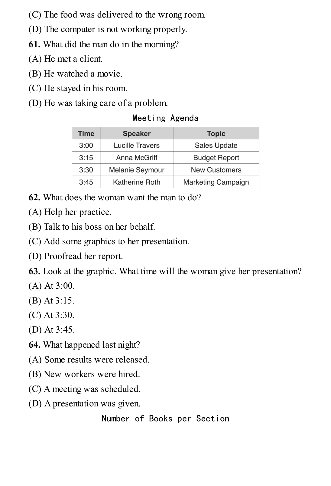

**听力独白/对话原文：**
**W:** Lars, would you mind listening to me rehearse my presentation for this afternoon's meeting. (62) I want to make sure I get everything right.
**M:** Can you wait a few minutes? I have to write an e-mail to my boss about the department's budget.
**W:** Sure, it's fine for me to wait.
**M:** What are you going to be talking about anyway? I wasn't even aware there's a meeting later today. (64)
**W:** It was called last night after almost everyone had gone home for the day. (64) I'll be talking about the effects of the new marketing campaign. (63)
**M:** Oh, I heard things are going well. I trust you have good news for everyone. Meeting Agenda

**中文对照：**
> **W：**拉尔斯，你介意听我排练一下今天下午的会议报告吗？我想确保一切顺利。
> **M：**稍等几分钟可以吗？我得给老板写一封关于部门预算的电子邮件。
> **W：**没问题，我可以等。
> **M：**对了，你要谈什么内容？我都不知道今天晚些时候有个会议。
> **W：**昨天晚上，几乎所有人都回家了，才有人打电话通知。我要谈一下新的营销活动的效果。
> **M：**噢，我听说一切都很顺利。我相信你会给大家带来好消息。

**核心词汇与短语：**
- **rehearse**：排练；预演
- **presentation**：描述，陈述
- **budget**：预算，预算费
- **effect**：影响；效果；作用
- **campaign**：运动；活动会议议程

#### Q62 (正确答案：A)
**问题：** What does the woman want the man to do? (对话中的女士想要男士做什么？)
- (A) Help her practice. (帮她排练。)
- (B) Talk to his boss on her behalf. (代表她去和上司谈话。)
- (C) Add some graphics to her presentation. (给她的报告加一些图表。)
- (D) Proofread her report. (检查她的报告。)

#### Q63 (正确答案：D)
**问题：** Look at the graphic. What time will the woman give her presentation? (请看图表。对话中的女士几点作报告？)
- (A) At 3:00. (3 点。)
- (B) At 3:15. (3 点 15 分。)
- (C) At 3:30. (3 点 30 分。)
- (D) At 3:45. (3 点 45 分。)

#### Q64 (正确答案：C)
**问题：** What happened last night? (昨晚发生了什么？)
- (A) Some results were released. (公布了一些结果。)
- (B) New workers were hired. (雇用了新员工。)
- (C) A meeting was scheduled. (安排了一次会议。)
- (D) A presentation was given. (作了一个报告。)

**延伸表达与补充：**
- **get everything right = get everything ready** (把一切准备好)
  - *例句：Get everything right before it's too late.* (把一切准备好，免得太迟来不及。)

### Questions 65 - 67

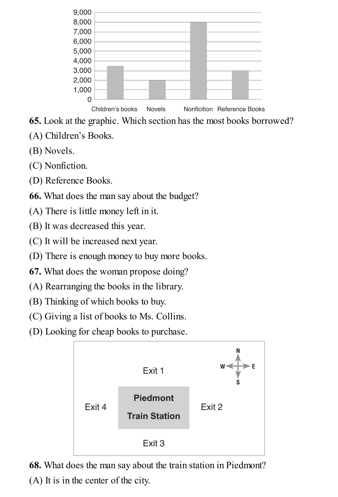

**听力独白/对话原文：**
**M:** Ms. Collins is considering restructuring the manner in which we acquire books for the library.
**W:** Why is that? Is there a problem?
**M:** Sort of. Take a look at this graph. The section with the least number of books is also the busiest because patrons are checking them out so much. (65)
**W:** Hmm...We should definitely be spending more money in that case. How soon can we start purchasing more books?
**M:** We've almost spent the money allocated for acquisitions for the year, (66) so we should wait two more months before buying anything new.
**W:** Well, meanwhile, let's compile a list of which books we want to acquire. (67)

**中文对照：**
> **M：**科林斯女士正在考虑调整我们为图书馆采购书的策略。
> **W：**这是为什么呢？有什么问题吗？
> **M：**有点问题。看一下这张图表。图书数量最少的区域却是最忙碌的，这是因为顾客经常去那里借书。
> **W：**嗯…那样的话，我们确实应该花更多的钱。我们多久之后开始购买新书？
> **M：**我们几乎用光了今年分配给我们购买图书的资金，所以我们应该再等两个月才能去买新书。
> **W：**好吧。与此同时，我们整理一张想要购买的图书的清单吧。

**核心词汇与短语：**
- **restructure**：调整；重组
- **patron**：顾客
- **check out**：查看
- **purchase**：购买
- **allocate**：拨给
- **compile**：编写

#### Q65 (正确答案：B)
**问题：** Look at the graphic. Which section has the most books borrowed? (请看图表。借书最多的是哪一个区域？)
- (A) Children's Books. (童书。)
- (B) Novels. (小说。)
- (C) Nonfiction. (非虚构类图书。)
- (D) Reference Books. (参考书。)

#### Q66 (正确答案：A)
**问题：** What does the man say about the budget? (关于预算，男士说了什么？)
- (A) There is little money left in it. (预算没剩多少钱了。)
- (B) It was decreased this year. (今年的预算减少了。)
- (C) It will be increased next year. (明年的预算将会增加。)
- (D) There is enough money to buy more books. (有足够的钱买更多的书。)

#### Q67 (正确答案：B)
**问题：** What does the woman propose doing? (女士建议做什么？)
- (A) Rearranging the books in the library. (重新整理图书馆的书籍。)
- (B) Thinking of which books to buy. (考虑买什么书。)
- (C) Giving a list of books to Ms. Collins. (给科林斯女士一张书单。)
- (D) Looking for cheap books to purchase. (寻找廉价书。各区域图书的数量)

**延伸表达与补充：**
- **sort of = a little bit** (有点)
  - *例句：Excuse me, I seem to be a little bit lost.* (对不起，我似乎有点迷路了。)
- **take a look at = have a look at** (看一看)
  - *例句：Can you take a look at my paper?* (你能看一下我的论文吗？)
- **two more months = another two months** (再两个月)
  - *例句：We need two more months to complete the task.* (我们还需两个月才能完成任务。)

### Questions 68 - 70

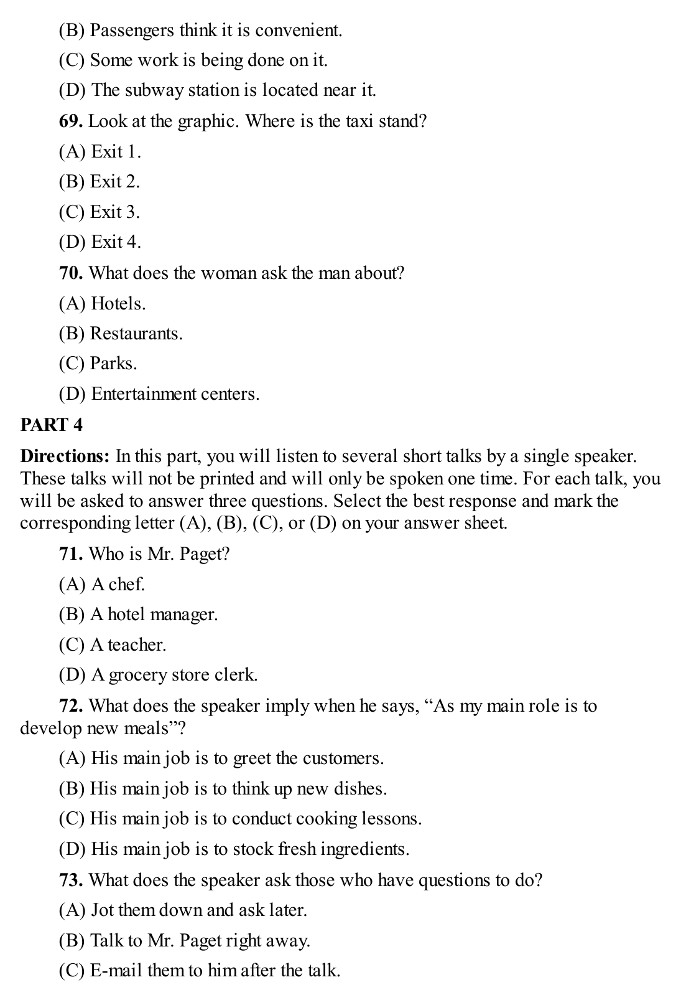

**听力独白/对话原文：**
**W:** Dennis, I'm taking the train to Piedmont tomorrow. Do you happen to know where the taxi stand at the station is?
**M:** It used to be in front of the exit on the northern side of the building, but it's being renovated. (68) So head to the eastern side instead. (69)
**W:** Thanks for the information. I need to catch a cab to get to my client's office.
**M:** Will you spend the night there or take the train back after your meeting's done?
**W:** I'll probably stay there for the night. You wouldn't happen to know any good places to eat there, would you? (70)
**M:** I know some. I'll e-mail you the details when I get back to my office.

**中文对照：**
> **W：**丹尼斯，我明天要乘火车去皮埃蒙特。你知道火车站的出租车站点在哪里吗？
> **M：**以前在火车站北出口的前面，但是现在正在整修。所以还是去东出口吧。
> **W：**谢谢你提供的信息。我需要乘出租车去见一个客户。
> **M：**你在那过夜还是在会议结束后乘火车回来？
> **W：**我有可能在那里过夜。你不会碰巧知道那里有哪些美食吧？
> **M：**我知道一些。我到办公室后发邮件给你详细的信息。

**核心词汇与短语：**
- **taxi stand**：出租车站点
- **renovate**：修整，修复
- **head to**：前往
- **catch a cab**：乘出租车
- **client**：客户
- **detail**：细节

#### Q68 (正确答案：C)
**问题：** What does the man say about the train station in Piedmont? (关于皮埃蒙特火车站，男士说了什么？)
- (A) It is in the center of the city. (它在市中心。)
- (B) Passengers think it is convenient. (乘客认为它很便利。)
- (C) Some work is being done on it. (它现在正在施工中。)
- (D) The subway station is located near it. (地铁站就在它附近。)

#### Q69 (正确答案：B)
**问题：** Look at the graphic. Where is the taxi stand? (请看图表。出租车车站在哪里？)
- (A) Exit 1. (出口 1 。)
- (B) Exit 2. (出口 2 。)
- (C) Exit 3. (出口 3 。)
- (D) Exit 4. (出口 4 。)

#### Q70 (正确答案：B)
**问题：** What does the woman ask the man about? (女士问了男士关于什么的问题？)
- (A) Hotels. (旅店。)
- (B) Restaurants. (餐厅。)
- (C) Parks. (公园。)
- (D) Entertainment centers. (娱乐中心。)

**延伸表达与补充：**
- **take the train = by train** (乘火车)
  - *例句：I'd like to take the train to go to Beijing.* (我想乘火车去北京。)
- **catch a cab = take a taxi** (乘出租车)
  - *例句：It is very hard to catch a cab in the rush hour.* (很难在高峰期搭上出租车。)
- **get to = arrive at = reach** (到达)
  - *例句：I'll give you a call as soon as get to Beijing.* (我一到北京就给你打电话。)

## Part 4: 简短独白 (Q71 - Q100)

### Questions 71 - 73

**听力独白/对话原文：**
Hi. It's nice to see you all. Before we begin the cooking course, let me tell you who I am. Luke Paget is my name. For the past 3 years I've been the leader of a team of innovative chefs working for Holiday Time Resorts. (71) As my main role is to develop new meals, (72) it's a great pleasure to be here and have the opportunity to meet people, especially those who are passionate about food and cooking. Please watch and listen carefully. Should you have any questions, make a note, and then ask them later during the discussion period. (73)

**中文对照：**
> 嗨，很高兴见到大家。在我们开始烹饪课之前，让我先自我介绍一下。我是卢克·佩吉特。过去的三年里我一直在假日时光度假村领导创意厨师团队。因为我的主要职责是开发新菜肴，所以我很高兴有机会在这里见到大家，尤其是热衷于美食和烹饪的朋友们。请大家仔细地看、仔细地听。如果有什么问题，请记录下来，然后在后面的讨论时间里提问。

**核心词汇与短语：**
- **cooking course**：烹饪课
- **innovative**：创新的，有革新精神的
- **chef**：厨师
- **role**：作用，任务
- **develop**：开发
- **opportunity**：机会
- **passionate**：热情的
- **make a note**：做记录
- **think up**：想出
- **conduct**：指导
- **ingredient**：调味品
- **jot down**：草草记下

#### Q71 (正确答案：A)
**问题：** Who is Mr. Paget? (佩吉特先生是谁？)
- (A) A chef. (厨师。)
- (B) A hotel manager. (酒店经理。)
- (C) A teacher. (教师。)
- (D) A grocery store clerk. (杂货店店员。)

#### Q72 (正确答案：B)
**问题：** What does the speaker imply when he says, “As my main role is to develop new meals”? (讲话者说 “ 因为我的主要职责是开发新菜品 ” ，他在暗示什么？)
- (A) His main job is to greet the customers. (他的主要工作是迎接顾客。)
- (B) His main job is to think up new dishes. (他的主要工作是想出新菜品。)
- (C) His main job is to conduct cooking lessons. (他的主要工作是指导烹饪课。)
- (D) His main job is to stock fresh ingredients. (他的主要工作是贮备新鲜调味品。)

#### Q73 (正确答案：A)
**问题：** What does the speaker ask those who have questions to do? (讲话者让有问题要问的人做什么？)
- (A) Jot them down and ask later. (记下问题，过一会儿再提问。)
- (B) Talk to Mr. Paget right away. (立刻和佩吉特先生探讨。)
- (C) E-mail them to him after the talk. (讲座结束后把问题用邮件发给他。)
- (D) Approach him before the talk. (讲座开始之前来找他。)

**延伸表达与补充：**
- **the leader of a team = the head of a team = the person who is in charge in a team** (团队的负责人)
  - *例句：You will one day become a leader of a team.* (你有一天会成为团队的领导的。)
- **main role = main job = main duty** (主要任务)
  - *例句：My main role is to make sales.* (我的主要任务是推销商品。)
- **make a note = write down** (做记录扩展表达：)
  - *例句：jot down Did you make a note of that?* (草草记下；匆匆记下你把它记录下来了吗？)

### Questions 74 - 76

**听力独白/对话原文：**
This brings us to the final stage of our tour and a most welcome one: it's the company café. (74) We hope that you will be pleasantly surprised by the quality and range of food and coffee on offer here. Why don't we all sit down and sample the coffee and cakes while I explain to you how the system works? The café opens at eight for hot drinks and light snacks. (75) Full food service is offered from midday until one thirty. On our right, you can see the cafeteria section, where you can choose your main meal at lunchtime. Sandwiches and cakes may be purchased at all times from the cafe section on your left. (76) In order to take advantage of this excellent service, simply show your employee identity card to the cashier. Are there any questions?

**中文对照：**
> 现在我们来到了本次参观的最后一站，也是最受欢迎的一个地方：公司的餐厅。我们希望这里供应的各种美食和咖啡能给大家带来惊喜。我们都坐下来品尝一下咖啡和糕点吧，同时，我可以给大家讲讲餐厅的营业情况。餐厅8点开始营业，供应热饮和简单的快餐。全面的食品供应是从中午12点到1点半。我们的右手边是自助餐厅区，大家在午餐时可以在这儿选择主餐。三明治和糕点在我们左手边的咖啡厅区域全天供应。如果想享受这里优良的服务，只需向收款台出示工作证即可。还有什么问题吗？

**核心词汇与短语：**
- **final stage**：最后阶段
- **welcome**：受欢迎的
- **pleasantly**：愉快地
- **range**：一系列
- **sample**：品尝；体验
- **snack**：快餐
- **midday**：中午，正午
- **cafeteria**：自助餐厅
- **section**：区域
- **at all times**：任何时候，一直
- **take advantage of**：利用
- **employee identify card**：工作证
- **cashier**：收银台；收银员

#### Q74 (正确答案：D)
**问题：** Who most likely is giving the talk? (讲这段话的人最有可能是谁？)
- (A) A tour guide. (导游。)
- (B) A cafeteria worker. (自助餐厅工作人员。)
- (C) A waiter. (服务生。)
- (D) A company employee. (公司员工。)

#### Q75 (正确答案：C)
**问题：** What time does the place open? (这里几点开始营业？)
- (A) At ten. (10 点。)
- (B) At nine. (9 点。)
- (C) At eight. (8 点。)
- (D) At seven. (7 点。)

#### Q76 (正确答案：A)
**问题：** What is available throughout the day? (什么是全天供应的？)
- (A) Sandwiches. (三明治。)
- (B) Hot meals. (热菜。)
- (C) Hot coffee. (热咖啡。)
- (D) Light snacks. (简单的快餐。)

**延伸表达与补充：**
- **This brings us to the final stage of our tour. = This brings us to the end of our tour. = This brings us to the last part of the tour.** (现在我们来到了本次参观的最后一站。)
- **In order to take advantage of this excellent service ~ = In order to make the best use of this service ~ = In order to make full use of this service ~** (为了好好利用这里优良的服务…)

### Questions 77 - 79

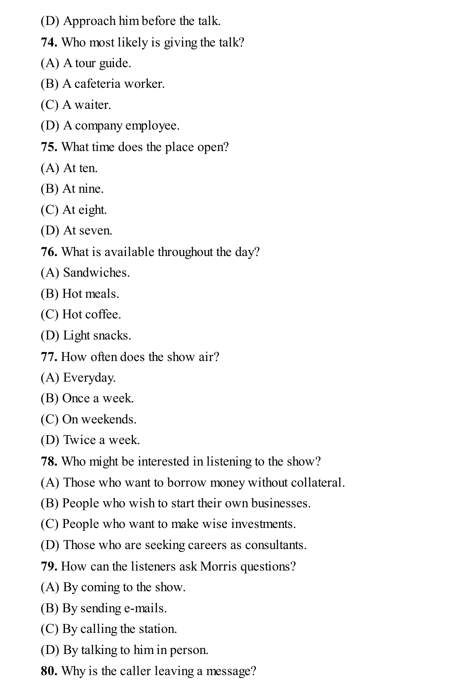

**听力独白/对话原文：**
Hello to all our listeners out there. This is Rachel Lee from your number one weekly investment advice program “Investment Matters”. （ 77, 78 ） Don't miss tomorrow's program. We're going to give you all the information you need to choose the best deals in banking. Be sure to have your pens and notebooks ready— you could save thousands with just a little common sense and good advice, of course. This will be followed by our regular panel session but this time with an extra special guest—it's investment superstar Morris Stevenson, a freelance financial consultant and multi-millionaire, and of course, the author of the best- selling book You Can Be Rich! Call our hotline number if you want to speak to Morris. (79) Until tomorrow, everybody, goodbye from Rachel.

**中文对照：**
> 听众朋友们，大家好。这里是最棒的每周投资指南节目《投资要点》，我是雷切尔·李。明天的节目千万不要错过。我们将会向您提供关于如何在银行业务中选择最佳交易的全部信息。注意准备好纸和笔——靠一点常识，当然还有好的建议，你就能节省几千块钱。在这之后是我们例行的专家讨论环节，不过这次的专家是一位特别嘉宾——投资明星莫里斯·史蒂文森，他从事自由职业的财务顾问，也是一位千万富翁，当然他还是畅销书《你能成为富翁！》的作者。假如你想和莫里斯对话，请拨打我们的热线电话吧。我是雷切尔，听众朋友们，明天见。

**核心词汇与短语：**
- **weekly**：每周一次的
- **investment**：投资
- **miss**：错过
- **deal**：交易
- **banking**：银行业务
- **common sense**：常识
- **follow**：跟随
- **panel**：专家
- **session**：会议
- **freelance**：自由职业（者）的
- **multi-millionaire**：千万富翁
- **best-selling**：畅销的
- **hotline**：热线
- **collateral**：抵押
- **station**：电台

#### Q77 (正确答案：B)
**问题：** How often does the show air? (这个节目多久播出一次？)
- (A) Everyday. (每天。)
- (B) Once a week. (一周一次。)
- (C) On weekends. (每个周末。)
- (D) Twice a week. (一周两次。)

#### Q78 (正确答案：C)
**问题：** Who might be interested in listening to the show? (谁可能会对这个节目感兴趣？)
- (A) Those who want to borrow money without collateral. (不想通过抵押来贷款的人。)
- (B) People who wish to start their own businesses. (想自己开办公司的人。)
- (C) People who want to make wise investments. (想要明智地投资的人。)
- (D) Those who are seeking careers as consultants. (想以顾问为职业的人。)

#### Q79 (正确答案：C)
**问题：** How can the listeners ask Morris questions? (听众如何向莫里斯提问？)
- (A) By coming to the show. (参与到节目中来。)
- (B) By sending e-mails. (发送电子邮件。)
- (C) By calling the station. (给电台打电话。)
- (D) By talking to him in person. (当面和他对话。)

**延伸表达与补充：**
- **Don't miss tomorrow's program.** (不要错过明天的节目。扩展表达：)
  - *例句：Please tune in again tomorrow. We will be back again tomorrow.* (欢迎明天继续收听。明天再见。)
- **You could save thousands.** (你能节省几千块钱。扩展表达：)
  - *例句：You can save a lot of money. You can cut costs.* (你能节省不少钱。你可以削减成本。)

### Questions 80 - 82

**听力独白/对话原文：**
Hello, Mr. Duvall. This is Tony from the Reservations Department at the National Opera. I received your message, and I want to answer your queries regarding the performance tomorrow. (80) As you know, Thursday is a popular night, so I suggest that you book immediately and pay for your tickets before 5 p.m. this evening. (81) As for a group booking, at present, there are fifteen seats available to your group, but unfortunately they are not all together. I am hoping that this will be okay. Anyway, if you do decide to take these tickets, I can offer you a generous group discount of 20 percent. All you need to do is call me to confirm (82) and then come in to the reservations office to pick up your tickets. I hope you have a nice evening.

**中文对照：**
> 您好，杜瓦尔先生。我是国家剧院预订部的托尼。我收到了您的留言，想解答一下您关于明晚演出的疑问。您也知道，周四晚上很火，所以我建议您马上预订，并且在今晚5点之前支付票款。关于团体预订，目前有15个座位可以提供给您的团体，不过很不巧它们不都在一块儿。我希望这没有大碍。总之，如果您决定买这些票，我可以给您八折的团队优惠折扣。您需要做的就是打电话给我确认并来预订办公室取票。希望您度过一个愉快的夜晚。

**核心词汇与短语：**
- **reservation**：预订
- **query**：询问，疑问
- **regarding**：关于
- **performance**：演出
- **suggest**：建议
- **book**：预订
- **immediately**：立刻，马上
- **generous**：优惠的
- **show up**：出席，露面
- **in cash**：用现金

#### Q80 (正确答案：A)
**问题：** Why is the caller leaving a message? (打电话的人为什么留言？)
- (A) He is returning a phone call. (他在回复一个来电。)
- (B) He wants to books tickets to the opera. (他想预订该剧院的票。)
- (C) He hopes to get a discount on future tickets. (他希望以后买票能拿到折扣。)
- (D) He can't attend the performance tomorrow. (他不能参加明天的演出。)

#### Q81 (正确答案：A)
**问题：** According to the speaker, what should Mr. Duvall do by 5 p.m.? (根据讲话者所说，杜瓦尔先生在 5 点之前应该做什么？)
- (A) Pay for the tickets. (支付票款。)
- (B) Reserve seats. (预订座位。)
- (C) Join a group. (加入一个团体。)
- (D) Show up at the theater. (到剧院去。)

#### Q82 (正确答案：C)
**问题：** How can Mr. Duvall get the discount? (杜瓦尔先生怎样能拿到折扣？)
- (A) By showing up at the theater early. (早点儿到剧院。)
- (B) By paying for the tickets in cash. (用现金支付票款。)
- (C) By making a phone call. (打一个电话。)
- (D) By becoming a member. (成为会员。)

**延伸表达与补充：**
- **Thursday is a popular night. = Thursday is a busy night. = Thursday night will be crowded.** (周四晚上的演出很火。)
- **I suggest that you book immediately. = I recommend you reserve it right away. = I advise you to book now.** (我建议您马上预订。)

### Questions 83 - 85

**听力独白/对话原文：**
Good evening, everybody. I'd just like to say a few words before officially opening the exhibition. (83) I'm very pleased to see so many faces here tonight. It seems that many people share my interest in the history of the Old Town. And it is a fascinating history! These documents, photographs, artworks, and other historical items vividly reflect the life of the Old Town, (84) from its Roman beginnings until modern times. My special thanks to the local library and museum for all their work and also to our many private contributors. (85)

**中文对照：**
> 大家晚上好。我想在展览正式开幕之前讲几句话。很高兴今晚在这里见到了这么多来宾。看起来很多人都和我一样对老城的历史有着浓厚的兴趣，而且它的历史又是这样引人入胜！这些文件、照片、工艺品和其他历史文物生动地展现了老城从罗马开创时期到现代的生活面貌。我要特别感谢地方图书馆和博物馆所做的工作，并感谢众多的个人捐赠者。

**核心词汇与短语：**
- **officially**：正式地
- **exhibition**：展览
- **share**：分享
- **fascinating**：引人入胜的
- **vividly**：生动地
- **artwork**：艺术品
- **historical**：历史的
- **reflect**：再现，反映
- **beginning**：开始
- **contributor**：捐赠者
- **community**：社区
- **mayor**：市长

#### Q83 (正确答案：D)
**问题：** Where is the speech taking place? (这段讲话发生在哪儿？)
- (A) In a classroom. (在教室里。)
- (B) In a library. (在图书馆里。)
- (C) At a museum. (在博物馆。)
- (D) At an exhibition. (在展览会上。)

#### Q84 (正确答案：D)
**问题：** According to the speaker, which of the following is NOT mentioned as a reflection of life of the Old Town? (根据讲话者所说，下列哪项没有被作为老城的生活写照而提到？)
- (A) Pictures. (照片。)
- (B) Papers. (文件。)
- (C) Artworks. (艺术品。)
- (D) Books. (书籍。)

#### Q85 (正确答案：C)
**问题：** Who helped make this exhibition happen? (谁协助举办了这个展览？)
- (A) A local bookstore. (当地的书店。)
- (B) An art gallery. (美术馆。)
- (C) A community library. (社区图书馆。)
- (D) The town mayor. (市长。)

**延伸表达与补充：**
- **I'd just like to say a few words. = I'd like to make an announcement. = I'd like to address everyone.** (我想讲几句话。)
- **I'm very pleased to see so many faces here tonight. = I'm happy to see so many familiar faces here this evening. = I'm glad to see so many friends here tonight.** (很高兴今晚在这里见到这么多来宾。)

### Questions 86 - 88

**听力独白/对话原文：**
Hello, Mr. Jackson, this is Jane Erickson from the Port Project Committee at N.P.U. Architectural Services. I hope you remember me. Anyway, the committee was very impressed by your presentation today, and we'd like to encourage you to submit a formal quote as soon as possible. (86) I know that the closing date is in six weeks, (87) but would it be possible for you to submit your documents in three weeks? The committee needs as much time as possible to evaluate each proposal and make a recommendation. Should you have any inquiries at all, please don't hesitate to call me at 781-2213. (88)

**中文对照：**
> 杰克逊先生，您好！我是N.P.U.建筑服务公司港口项目委员会的简·埃里克森。希望您还记得我。不管怎样，您今天的演讲给委员会留下了很深的印象，我们想鼓励您尽快提交一份正式的报价。我知道截止日期是六周之后，但是您能否在三周之内提交材料呢？委员会需要尽可能多的时间评估每一份提案并给出建议。您如果有疑问，请随时给我打电话，号码是781-2213。

**核心词汇与短语：**
- **architectural**：建筑的
- **impress**：给留下印象
- **encourage**：鼓励
- **formal**：正式的
- **quote**：报价
- **closing date**：截止日期
- **evaluate**：评估
- **make a recommendation**：提出建议
- **inquiry**：询问
- **hesitate**：犹豫
- **make a presentation**：发言
- **architect**：建筑师，设计师

#### Q86 (正确答案：C)
**问题：** Why is the caller leaving the message? (打电话的人为什么要留言？)
- (A) To invite Mr. Jackson to make a presentation. (为了邀请杰克逊先生做一次演讲。)
- (B) To respond back to a call made earlier. (为了回复之前的一个电话。)
- (C) To ask the receiver to send a quote. (为了让接电话者发来报价。)
- (D) To ask questions about a proposal. (为了对一个提案提问。)

#### Q87 (正确答案：D)
**问题：** When is the closing date? (截止日期是什么时候？)
- (A) In two weeks. (两周后。)
- (B) In three weeks. (三周后。)
- (C) In five weeks. (五周后。)
- (D) In six weeks. (六周后。)

#### Q88 (正确答案：C)
**问题：** What should Mr. Jackson do if he has any questions? (如果杰克逊先生有任何疑问，他应该做什么？)
- (A) Refer to the guide. (求助于向导。)
- (B) Look on the website. (查看网站。)
- (C) Phone Ms. Erickson. (给埃里克森女士打电话。)
- (D) Call the head architect. (给首席建筑师打电话。)

**延伸表达与补充：**
- **a formal quote = an official quote** (一份正式的报价)
  - *例句：Please submit a formal quote by this Friday.* (请在本周五之前提交一份正式的报价。)
- **The closing date is in six weeks. = The due date is in six weeks.** (截止日期是六周之后。)
- **Should you have any inquiries... = If you have any questions... = If you have anything you want to know...** (如果您有任何疑问…)
  - *例句：Should you have any inquiries, please don't hesitate to call me at my office.* (如果您有任何疑问，请随时打我的办公电话。)

### Questions 89 - 91

**听力独白/对话原文：**
Well, as you can see, I am surprised and overwhelmed by this award. (89) I'd especially like to dedicate the “Young Entrepreneur of the Year” trophy to my mother, who has always supported me. Actually, it was in my mother's garage that I developed my hobby into a successful business. I started as a child, building the electronic project kits that she bought me. (90) I soon began making modifications, and from there I moved on to design. Now I provide secure computer networks for large corporations all over North America. Well, I'm one of those lucky people who have become rich doing what they love! (91) Thanks again to everybody who has made it possible. (89)

**中文对照：**
> 哦，大家都看到了，我得到这个奖特别惊喜，都有些不知所措了。我特别想把这个“年度青年企业家”奖杯献给一直以来都在支持我的母亲，实际上，我就是在母亲的车库里把兴趣发展成了成功的事业。我从小便开始装配她给我买的电气工程套件。后来我开始进行改进，然后又开始设计。现在我给遍布北美的大型公司提供安全的电脑网络服务。是的，我是一个幸运的人，靠做自己喜欢的事致富！再次感谢所有让这一切成为可能的人。

**核心词汇与短语：**
- **overwhelm**：使不知所措，使吃惊
- **dedicate**：献给
- **trophy**：奖品，奖杯
- **support**：支持
- **garage**：车库
- **electronic**：电子的
- **kit**：成套部件
- **modification**：修改，改变
- **secure**：安全的，可靠的
- **all over**：遍及，到处
- **achieve**：达到
- **launch**：发布
- **gadget**：装置
- **reveal**：泄露，透露

#### Q89 (正确答案：B)
**问题：** What is the purpose of the speech? (这篇讲话的目的是什么？)
- (A) To congratulate his mother on achieving her goal. (祝贺他母亲实现她的目标。)
- (B) To thank those who helped him win the award. (感谢那些帮助他获奖的人。)
- (C) To launch a new electronic gadget. (发布一种新的电子装置。)
- (D) To reveal the secret to making money. (透露赚钱的秘密。)

#### Q90 (正确答案：B)
**问题：** How did the speaker first become interested in his field of work? (讲话者最初是如何对他所从事的行业产生兴趣的？)
- (A) He took a class in school. (他在学校上了一门课。)
- (B) His mother introduced him to it. (他的母亲向他介绍的。)
- (C) His friend got him a job. (他的朋友给他找了一份工作。)
- (D) He read about it in a magazine. (他在杂志上读到的。)

#### Q91 (正确答案：A)
**问题：** Why does the speaker say, “I'm one of those lucky people who have become rich doing what they love”? (讲话者为什么说 “ 我是一个幸运的人，靠做自己喜欢做的事致富 ” ？)
- (A) He makes a living doing what he likes. (他以自己的爱好为生。)
- (B) He has a very wealthy mother. (他有一个非常富有的母亲。)
- (C) He travels all over America. (他到美国各处旅游。)
- (D) He has enough time for his hobbies. (他有足够的时间留给自己的兴趣爱好。)

**延伸表达与补充：**
- **who has always supported me = who has always been with me** (一向支持我的人扩展表达：)
  - *例句：who has always believed in me I'd like to thank those who have always supported me through thick and thin.* (一向信任我的人我要感谢一直以来不管艰难困苦都在支持我的人。)
- **move on to = go forward** (开始做（别的事）)
  - *例句：I moved on to design to better my career opportunities.* (我开始做设计，使自己有更好的职业机遇。)

### Questions 92 - 94

**听力独白/对话原文：**
Welcome, everybody, to the “City at Night” tour. My name's Barbara, and I'll be your guide (92) and host this evening. I know that many of you know Blackburn well, but I hope that you are going to enjoy seeing a different side of this city. First, we'll be visiting Blackburn's medieval fortress. And I should warn you that we will be visiting the dungeons and torture chamber. Then we'll go to historic Wetherby Mansion. There are rumors that it is haunted by the ghost of Lady Wetherby, (93) who disappeared mysteriously five hundred years ago. And finally, to finish on a happier note, there will be a champagne supper in Blackburn Tower Park, which has a splendid view of the sparkling city lights and the surrounding hills. (94)

**中文对照：**
> 欢迎大家参加“城市之夜”的旅行。我叫芭芭拉，是今晚的导游和接待员。我知道你们中有很多人已经非常了解布莱克本，不过，我希望大家可以愉快地领略这个城市的另一面。首先，我们将会参观布莱克本的中世纪城堡。我要提醒大家的是我们还会参观地牢和刑讯室。然后我们会去历史上著名的韦瑟比庄园。有传闻说那里有韦瑟比夫人的鬼魂出没，五百年前她在那儿神秘地消失了。最后，我们可以高兴一点儿，在布莱克本的塔楼公园里将举行一场香槟晚宴，在那里我们可以观赏城市璀璨的灯火和环绕的群山。

**核心词汇与短语：**
- **host**：接待员
- **medieval**：中世纪的
- **fortress**：堡垒，城堡
- **warn**：警告，忠告
- **dungeon**：地牢
- **torture**：折磨
- **chamber**：室，房间
- **mansion**：大宅，庄园
- **haunt**：（鬼魂等）出没于
- **mysteriously**：神秘地
- **supper**：晚餐
- **splendid**：美妙的

#### Q92 (正确答案：A)
**问题：** Who most likely is giving the talk? (讲话者最有可能是谁？)
- (A) A tour guide. (导游。)
- (B) Mr. Blackburn. (布莱克本先生。)
- (C) A history teacher. (历史教师。)
- (D) A restaurant host. (饭店老板。)

#### Q93 (正确答案：A)
**问题：** What does the speaker say about historic Wetherby Mansion? (关于历史上著名的韦瑟比庄园，讲话者说了什么？)
- (A) It is haunted. (那里有鬼魂出没。)
- (B) It is very old. (它很古老。)
- (C) It is traditional. (它是一座传统建筑。)
- (D) It is in the city. (它在市内。)

#### Q94 (正确答案：C)
**问题：** Which of the following best describes Blackburn Tower Park? (下列哪项最好地描述了布莱克本塔楼公园？)
- (A) It is located on the outskirts of the city. (它位于市郊。)
- (B) The place has become a landmark of the city. (这里已经成为该市的标志性建筑。)
- (C) There are hills near the place. (这里周围有山。)
- (D) It is owned by the famous Lady Wetherby. (它归著名的韦瑟比夫人所有。)

**延伸表达与补充：**
- **I hope that you are going to enjoy seeing a different side of this city. = I hope that you will be looking forward to experiencing a different side of the city. = I expect that you will appreciate a different part of the city.** (希望大家可以愉快地领略这个城市的另一面。)
- **There are rumors that ~ = There are false beliefs that ~ = There are misconceptions that ~** (有传闻说…)
  - *例句：There are rumors that our company is in financial trouble.* (有传闻说，我们公司陷入了财务危机。)

### Questions 95 - 97

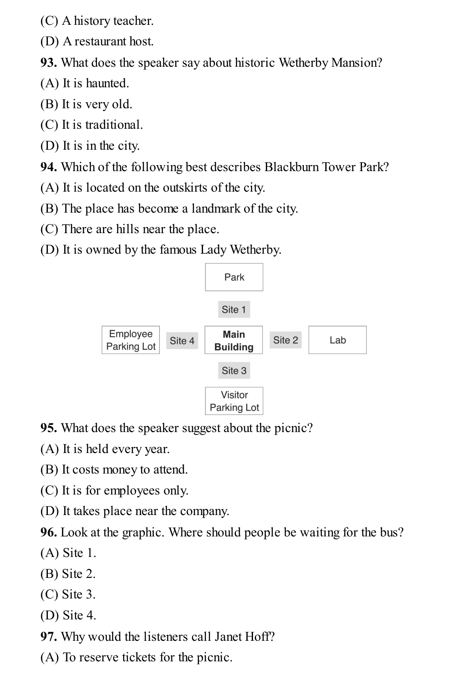

**听力独白/对话原文：**
Before I end this meeting, let me remind everyone that the annual summer picnic will take place this Saturday. (95) It'll be at Griswold Park from 11 a.m. to 4:00 p.m. If you need a ride there, a bus is going to be picking people up here at 10:30 in the morning. Just wait between the employee parking lot and the western entrance to the main building. (96) As for the picnic, we'll have the usual food, and we'll also play a wide variety of games and do other activities. Your family members are welcome to attend, but please contact Janet Hoff at extension 584 to inform her of how many people will be accompanying you. (97)

**中文对照：**
> 在这次会议结束之前，请允许我提醒大家一年一度的夏季野餐将于本周六举办。本次活动的具体时间为上午11点至下午4点，地点在斯伍德公园。如果您需要接送，当天10点30分将会有大巴车在那里等候。只需在员工停车场和主楼西门之间的位置等待即可。关于野餐，我们将准备常规的食物，也会组织一系列的游戏和其他活动。我们也欢迎您的家庭成员参与，但是请拨打分机584联系珍妮特·霍夫，告知其有多少人随行。

**核心词汇与短语：**
- **remind**：提醒；使想起
- **annual**：年度的
- **picnic**：野餐
- **pick sb. up**：接某人
- **parking lot**：停车场
- **entrance**：入口
- **activity**：活动
- **family member**：家庭成员
- **attend**：出席；参与；照料
- **contact**：联系；接触
- **accompany**：陪伴，伴随

#### Q95 (正确答案：A)
**问题：** What does the speaker suggest about the picnic? (关于野餐，讲话者表明了什么？)
- (A) It is held every year. (它每年都会举办。)
- (B) It costs money to attend. (参加需要交费。)
- (C) It is for employees only. (只有员工可以参加。)
- (D) It takes place near the company. (它在公司附近举办。)

#### Q96 (正确答案：D)
**问题：** Look at the graphic. Where should people be waiting for the bus? (请看图表。人们应该在哪里等待大巴车？)
- (A) Site 1. (位置 1 。)
- (B) Site 2. (位置 2 。)
- (C) Site 3. (位置 3 。)
- (D) Site 4. (位置 4 。)

#### Q97 (正确答案：C)
**问题：** Why would the listeners call Janet Hoff? (听者会因为什么给珍妮特)
- (A) To reserve tickets for the picnic.
- (B) To ask for seats on the bus.
- (C) To state how many guests they will have.
- (D) To mention which food they will bring.

**延伸表达与补充：**
  - *例句：A B C D* (）为了进行野餐预约。（）为了预定大巴车上的座位。（）为了告知他们会有几名随行客人。（）为了告知他们将带什么食物。)
- **take place = hold/happen** (举行；发生)
  - *例句：The concert will take place the day after tomorrow.* (音乐会将于后天举行。)
- **a wide variety of = all kinds of** (各种各样的)
  - *例句：There are a wide variety of flowers in Uncle Wang's garden.* (王叔叔的花园里有各种各样的花。)

### Questions 98 - 100

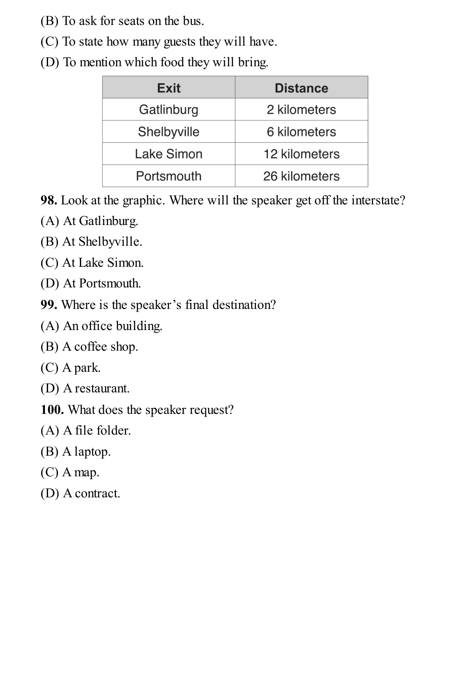

**听力独白/对话原文：**
Hello, Jason. This is Steve Meyers. I'd like to inform you that I'm getting close to where you are right now. I just passed a sign indicating that I need to get off the interstate in six kilometers. (98) I know the restaurant we're meeting at is close to the exit, so I estimate that I'll be there in about ten minutes. (99) If you want to go ahead and order drinks and appetizers, please be my guest. You know what I like. I hope you brought your laptop with you. (100) I need to show you some files, but mine is in the shop, so I wasn't able to bring it.

**中文对照：**
> 你好，杰森。我是史蒂夫·迈耶斯。我想告知你，我正在接近你目前所在的位置。我刚通过一个指示牌，表明我需要在六公里后驶离州际公路。我了解到我们约见的餐厅离公路出口很近，所以我估计十分钟之内就能到达那里。如果你想提前去并点上饮料和开胃菜，那么请别客气。你知道我喜欢什么。我希望你带着笔记本电脑，因为我需要给你展示一些文件，我的落在店里了，所以我没法带。

**核心词汇与短语：**
- **sign**：指示牌；记号
- **indicate**：表明；预示
- **get off**：从下来；脱下
- **interstate**：州际公路
- **exit**：出口；通道
- **estimate**：估计，估价
- **go ahead**：先走；前进
- **appetizer**：开胃菜；前菜
- **be my guest**：别客气，请便
- **laptop**：笔记本电脑
- **file**：文件；档案

#### Q98 (正确答案：B)
**问题：** Look at the graphic. Where will the speaker get off the interstate? (请看图表。讲话者会在哪里驶离州际公路？)
- (A) At Gatlinburg. (在加特林堡。)
- (B) At Shelbyville. (在谢尔比维尔。)
- (C) At Lake Simon. (在西蒙湖。)
- (D) At Portsmouth. (在朴茨茅斯。)

#### Q99 (正确答案：D)
**问题：** Where is the speaker's final destination? (讲话者的最终目的地是哪里？)
- (A) An office building. (一栋办公大楼。)
- (B) A coffee shop. (一间咖啡馆。)
- (C) A park. (一座公园。)
- (D) A restaurant. (一家餐馆。)

#### Q100 (正确答案：B)
**问题：** What does the speaker request? (讲话者要求什么？)
- (A) A file folder. (一个文件夹。)
- (B) A laptop. (一台笔记本电脑。)
- (C) A map. (一张地图。)
- (D) A contract. (一份合同。)

**延伸表达与补充：**
- **would like to do ~ = want to do~** (想要做…)
  - *例句：I would like to practice my oral English with native speakers.* (我想和母语人士一起练习英语口语。)
- **close to = next to** (接近，在附近)
  - *例句：The office building is right close to a big shopping mall.* (那栋办公大楼正好在一家大型购物中心附近。)

# TEST 05

## 答案速查表

| 题号 | 答案 | 题号 | 答案 | 题号 | 答案 | 题号 | 答案 | 题号 | 答案 | 题号 | 答案 | 题号 | 答案 | 题号 | 答案 | 题号 | 答案 | 题号 | 答案 |
| :---: | :---: | :---: | :---: | :---: | :---: | :---: | :---: | :---: | :---: | :---: | :---: | :---: | :---: | :---: | :---: | :---: | :---: | :---: | :---: |
| **1** | C | **11** | B | **21** | B | **31** | A | **41** | D | **51** | A | **61** | B | **71** | C | **81** | C | **91** | D |
| **2** | A | **12** | B | **22** | A | **32** | A | **42** | B | **52** | D | **62** | A | **72** | B | **82** | A | **92** | B |
| **3** | D | **13** | A | **23** | B | **33** | B | **43** | C | **53** | B | **63** | A | **73** | A | **83** | A | **93** | A |
| **4** | C | **14** | A | **24** | B | **34** | D | **44** | C | **54** | B | **64** | C | **74** | A | **84** | C | **94** | B |
| **5** | D | **15** | B | **25** | A | **35** | A | **45** | C | **55** | B | **65** | C | **75** | D | **85** | B | **95** | B |
| **6** | D | **16** | A | **26** | A | **36** | B | **46** | A | **56** | C | **66** | A | **76** | B | **86** | A | **96** | C |
| **7** | C | **17** | B | **27** | C | **37** | C | **47** | A | **57** | A | **67** | B | **77** | A | **87** | C | **97** | C |
| **8** | A | **18** | B | **28** | C | **38** | B | **48** | C | **58** | A | **68** | D | **78** | C | **88** | B | **98** | B |
| **9** | A | **19** | A | **29** | A | **39** | B | **49** | D | **59** | C | **69** | C | **79** | B | **89** | A | **99** | C |
| **10** | C | **20** | C | **30** | A | **40** | A | **50** | B | **60** | D | **70** | B | **80** | B | **90** | A | **100** | A |

## Part 1: 照片描述 (Q1 - Q6)

### Q1 (正确答案：C)

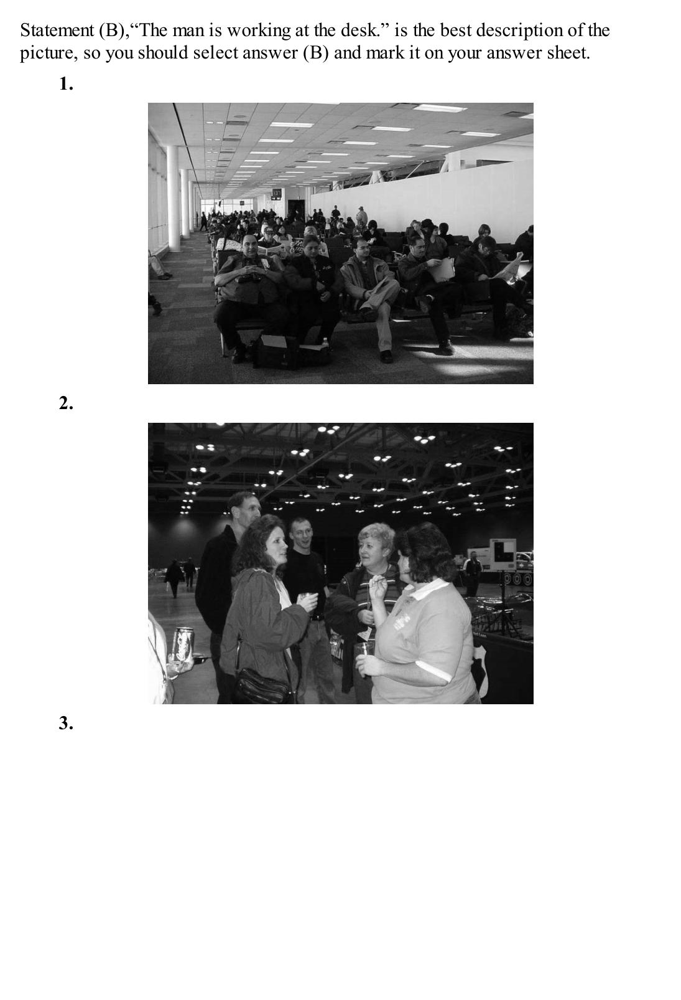

**听力原文与选项：**
- (A) They're waiting for their bags. (他们在等自己的行李。)
- (B) They're about to board the plane. (他们即将登机。)
- (C) They're relaxing in a waiting area. (他们正在等候区休息。)
- (D) They're sitting in a conference hall. (他们正坐在会议厅内。)

**其他可能表达：**
- The people are sitting in a waiting area. (他们坐在等候区内。)
- Many of the seats are occupied. (很多座位都有人。)
- Most of the people have taken seats. (大多数人都有座位。)

### Q2 (正确答案：A)

**听力原文与选项：**
- (A) They have gathered in a small group. (他们聚集成一小群。)
- (B) They are taking a break from work. (他们暂停工作，正在休息。)
- (C) The people are getting ready to leave for the day. (人们正准备下班了。)
- (D) They are waiting to be seated in a restaurant. (他们在餐厅等位。)

**其他可能表达：**
- They are talking in a group. (他们正聚集在一起谈话。)
- The place is bright and spacious. (这里明亮而宽敞。)
- The room is brightly lit. (房间的灯光很明亮。)

### Q3 (正确答案：D)

**听力原文与选项：**
- (A) She's fixing the wheel of the cart. (她正在修理手推车的轮子。)
- (B) She's pushing the cart toward the construction area. (她正在推手推车去工地。)
- (C) She's pouring cement onto the ground. (她正朝地上浇水泥。)
- (D) She's moving some construction materials. (她正在运送一些建筑材料。)

**其他可能表达：**
- The woman is pushing a wheelbarrow. (女士正在推独轮车。)
- She is transporting some dirt. (她正在运一些土。)
- The wheelbarrow is full of dirt. (独轮车装满了土。)

### Q4 (正确答案：C)

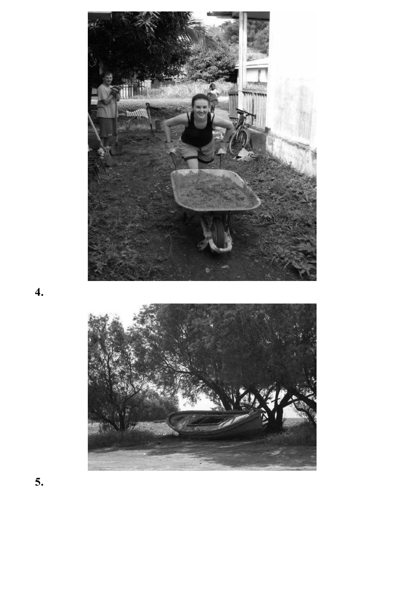

**听力原文与选项：**
- (A) The boat has stopped at sea. (船停在海上。)
- (B) The sailboat is being pushed into the water. (帆船正被推进水中。)
- (C) The boat is resting under the trees. (船正停在树下。)
- (D) The trees are being cut down at the moment. (树木现在正在被砍倒。)

**其他可能表达：**
- The boat is shaded by the trees. (船在树荫下。)
- A boat has been left under the trees. (一艘船被留在树下。)
- The boat has been taken out of the water. (船被人从水里拉出来了。)

### Q5 (正确答案：D)

**听力原文与选项：**
- (A) The bed is being made right now. (有人正在铺床。)
- (B) The window blinds have been drawn to keep the lights out. (窗帘被拉下来了，以便遮挡阳光。)
- (C) The television has been placed in the middle of the room. (电视机被放在房间的中间。)
- (D) The windows have been left unclosed. (窗户一直没关。)

**其他可能表达：**
- All the windows are open. (所有的窗户都开着。)
- Light is shining through the windows. (阳光透过窗户照进来。)
- The television has been placed in the corner of the room. (电视在房间的角落里。)

### Q6 (正确答案：D)

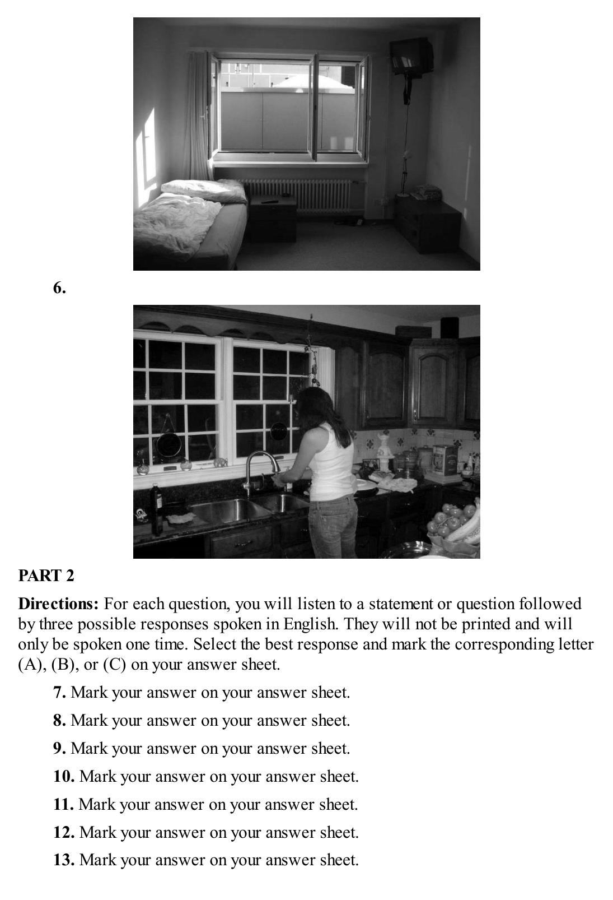

**听力原文与选项：**
- (A) She's preparing dinner for her family. (她在为家人准备晚餐。)
- (B) She's wiping off the kitchen counter. (她在擦洗厨房的操作台。)
- (C) She's washing some vegetables. (她在洗一些蔬菜。)
- (D) She's standing near the sink. (她站在水槽旁边。)

**其他可能表达：**
- She's working in the kitchen. (她正在厨房里干活。)
- She's standing at the kitchen sink. (她正站在厨房的水槽旁边。)
- She's washing her hands. (她正在洗手。)
- 注：在Part 1中，每道试题都添加了3种可能的正确表达方式，考生可
- 以了解对于同样的照片可能出现的不同表达。

## Part 2: 应答测试 (Q7 - Q31)

### Q7 (正确答案：C)

**听力对话文本：**
- **Q:** Do you know the person who was standing next to Mr. Thomson at the conference? (你认识会上站在汤普森先生旁边的那个人吗？)
- **A:** She's the new receptionist. (她是新来的接待员。)

**听力原文与选项：**
- **问题：** Who was that talking to Mr. Thompson at the conference? (会上和汤普森先生说话的人是谁？)
- **选项：**
  - (A) In an hour. (一个小时之后。)
  - (B) I'll go with you. (我会和你一起去。)
  - (C) Our new receptionist. (我们的新接待员。)

### Q8 (正确答案：A)

**听力对话文本：**
- **Q:** Where do I go to catch the bus that's coming in from Detroit? (我应该在哪儿等从底特律来的公交车？)
- **A:** Line up at Platform 7. (在7号站台排队。)

**听力原文与选项：**
- **问题：** Where does the bus to Detroit stop? (开往底特律的公交车停在哪里？)
- **选项：**
  - (A) At Platform 7. (在 7 号站台。)
  - (B) In ten minutes. (10 分钟后。)
  - (C) On a business trip. (出公差。)

### Q9 (正确答案：A)

**听力对话文本：**
- **Q:** What type of car do you want to get? (你想买哪种汽车？)
- **A:** Something that's good on gas. (省油的汽车。)

**听力原文与选项：**
- **问题：** What kind of car are you thinking of getting? (你想买哪种汽车？)
- **选项：**
  - (A) I want something with good mileage. (我想买油耗低的车。)
  - (B) I didn't drive today. (我今天没开车。)
  - (C) No, I take the bus to work. (不，我乘公交车去上班的。)

### Q10 (正确答案：C)

**听力对话文本：**
- **Q:** Do you think I need to take my umbrella with me? (你觉得我需要带上雨伞吗？)
- **A:** You should. It's going to pour today. (你应该带。今天会下大雨。)

**听力原文与选项：**
- **问题：** Do you think I should pack my umbrella? (你认为我应该带上雨伞吗？)
- **选项：**
  - (A) Yes, I think he will do it. (是的，我认为他会这么做。)
  - (B) It is scheduled to stop soon. (按计划它就要停止了。)
  - (C) Yes, I heard rain is in the forecast. (是的，我听天气预报说有雨。)

### Q11 (正确答案：B)

**听力对话文本：**
- **Q:** Should we continue working until we finish this or get some lunch first? (我们应该继续把工作做完还是先吃午饭？)
- **A:** Why don't we finish what we are doing first? (我们为什么不先把手头的事做完呢？注：在Part 2中，为帮助考生提高听懂题目的能力，添加了和试题相同或相似的表达方法。)

**听力原文与选项：**
- **问题：** Should we finish what we're doing or go for lunch first? (我们是应该先做完手头的事，还是先去吃午饭？)
- **选项：**
  - (A) They're doing it now. (他们正在做这个。)
  - (B) Let's get this over with first. (让我们先做完这个吧。)
  - (C) Some sandwiches and drinks. (几块三明治，几杯饮料。)

### Q12 (正确答案：B)

**听力对话文本：**
- **Q:** When do you think the delivery trucks will take off? (你认为送货车几点会出发？)
- **A:** Just after 9 o'clock. (—9点以后。)

**听力原文与选项：**
- **问题：** When do you suppose the delivery trucks will leave? (你觉得送货车什么时候会出发？)
- **选项：**
  - (A) He's coming by bus. (他乘公交车来。)
  - (B) Probably before ten. (很可能在 10 点之前。)
  - (C) Sure, I will take it there. (当然，我会把它带到那儿。)

### Q13 (正确答案：A)

**听力对话文本：**
- **Q:** Let's just take my car to the Chinese place on Spadina Road. (咱们就坐我的车去斯帕迪纳路的中国饭店吧。)
- **A:** Sure, that sounds like a good idea. (好啊，这个主意听上去不错。)

**听力原文与选项：**
- **问题：** Why don't we drive to the new Chinese restaurant on Spadina Road? (我们为什么不开车去斯帕迪纳路上新开的那家中餐馆呢？)
- **选项：**
  - (A) Sure, I've been craving Chinese food lately. (当然，我最近一直盼着吃中国菜呢。)
  - (B) Lunch with the rest of the staff members. (和其他同事一起吃午饭。)
  - (C) He lived in Hong Kong for a while. (他在香港住过一段时间。)

### Q14 (正确答案：A)

**听力对话文本：**
- **Q:** Where do I line up for tickets? (我在哪儿排队买票？)
- **A:** Window Number 5. (—5号窗口。)

**听力原文与选项：**
- **问题：** Where do I go to pick up the tickets? (我去哪儿取票？)
- **选项：**
  - (A) Try that window over there. (去那边的窗口试试看。)
  - (B) Sure, I will pick you up at seven. (当然，我 7 点钟来接你。)
  - (C) You need to get up a little earlier. (你需要早一点儿起床。)

### Q15 (正确答案：B)

**听力对话文本：**
- **Q:** Aren't you in the mood to go to the art gallery after work today? (你今天下班后想去美术馆吗？)
- **A:** Sorry, I have to work overtime this evening. (抱歉，我今晚得加班。)

**听力原文与选项：**
- **问题：** Don't you feel like going over to the art gallery after work? (难道你不想下班后去美术馆吗？)
- **选项：**
  - (A) Yes, he teaches art for a living. (是的，他靠教美术谋生。)
  - (B) Yes, but I don't think I can tonight. (想去，但是我今晚去不了。)
  - (C) Okay, I could hang the picture in my room. (好的，我可以把这幅画挂在我的房间里。)

### Q16 (正确答案：A)

**听力对话文本：**
- **Q:** Who didn't attend this morning's meeting? (谁没来参加今天上午的会议？)
- **A:** Lynn is sick at home. (林恩生病在家。)

**听力原文与选项：**
- **问题：** Who didn't show up to this morning's meeting? (谁没来参加今天上午的会议？)
- **选项：**
  - (A) Lynn called in sick this morning. (林恩今天一早打电话请病假了。)
  - (B) To show it to the client. (把它拿给客户看。)
  - (C) Yes, we signed the contract. (是的，我们签了合同。)

### Q17 (正确答案：B)

**听力对话文本：**
- **Q:** Your house is walking distance from the office, isn't it? (你家离单位只有几步路的距离，是吗？)
- **A:** Yes, I live a block away from here. (是的，我家离这儿只有一条街的距离。)

**听力原文与选项：**
- **问题：** You walk to the office every morning, don't you? (你每天步行去上班，是吗？)
- **选项：**
  - (A) Sorry, but he has not shown up to work yet. (抱歉，可是他还没来上班。)
  - (B) Yes, I live five minutes away from here. (是的，从这里到我住的地方只要 5 分钟。)
  - (C) Did you try calling him at home? (你试过给他家里打电话了吗？)

### Q18 (正确答案：B)

**听力对话文本：**
- **Q:** I don't know why the phone is not ringing much today. (我不知道为什么今天的电话不多。)
- **A:** Let's wait and see. The ad we took out should take effect soon. (咱们等等看。我们发布的广告应该会很快见效的。)

**听力原文与选项：**
- **问题：** I don't understand why we are not getting many calls today. (我不明白为什么今天电话不多。)
- **选项：**
  - (A) I didn't call him either. (我也没有给他打电话。)
  - (B) Give it some time. The ad only went out this morning. (等等看。广告今天早上才发布。)
  - (C) Why don't you study a little more? (你为什么不多学习一点儿？)

### Q19 (正确答案：A)

**听力对话文本：**
- **Q:** How about asking Mr. Harris to take us around the factory site? (让哈里斯先生带我们参观一下厂房好吗？)
- **A:** I'll call and ask him. (我会打电话问他的。)

**听力原文与选项：**
- **问题：** Why don't you ask Mr. Harris to give us a tour of the plant floor? (你为何不请哈里斯先生带我们参观一下厂房？)
- **选项：**
  - (A) I'll make the necessary arrangements. (必要的话，我会安排的。)
  - (B) Yes, he gave me the ticket this morning. (是的，他今天上午把票给我了。)
  - (C) The factory supervisor is here now. (工厂的主管现在在这儿。)

### Q20 (正确答案：C)

**听力对话文本：**
- **Q:** Did you get a chance to meet the new designer? (你见到新来的设计师了吗？)
- **A:** Not yet. I've been too busy. (还没有。我一直特别忙。)

**听力原文与选项：**
- **问题：** Have you had a chance to say hello to our new designer? (你和我们的新设计师打过招呼了吗？)
- **选项：**
  - (A) She was recruited from another company. (她是从另一个公司招聘来的。)
  - (B) That's great. Thank you very much. (太好了。非常感谢。)
  - (C) No, but I would like to meet her. (没有，不过我很愿意见见她。)

### Q21 (正确答案：B)

**听力对话文本：**
- **Q:** Are you going to the picnic this weekend? (这周末你去野餐吗？)
- **A:** I don't have a way to get there. (我搭不到车。)

**听力原文与选项：**
- **问题：** You are planning on going to the weekend picnic, aren't you? (你正计划周末去野餐，是吗？)
- **选项：**
  - (A) No, I will be going with Sarah instead. (不，我要和萨拉一起去。)
  - (B) That depends on if I can get a ride. (那要看我能不能搭到车。)
  - (C) Well, I could pick you up at ten. (哦，我可以 10 点去接你。)

### Q22 (正确答案：A)

**听力对话文本：**
- **Q:** When are you coming? (你什么时候来？)
- **A:** I'll be there this Friday. (我这周五到那儿。)

**听力原文与选项：**
- **问题：** When should I be expecting you? (你什么时候来？)
- **选项：**
  - (A) How's Friday for you? (星期五怎么样？)
  - (B) I should be there. (我会到那儿。)
  - (C) Yes, he is expecting you. (是的，他在等你。)

### Q23 (正确答案：B)

**听力对话文本：**
- **Q:** Ask the manager to draft a letter of recommendation for you. (请老板给你起草一封推荐信吧。)
- **A:** I already asked him. (我已经请他写了。)

**听力原文与选项：**
- **问题：** Why don't you ask the boss to write a letter of recommendation for you? (你为什么不让老板给你写一封推荐信？)
- **选项：**
  - (A) At the post office. (在邮局。)
  - (B) I already did. (我已经这么做了。)
  - (C) From a college friend. (从一个大学的朋友那里。)

### Q24 (正确答案：B)

**听力对话文本：**
- **Q:** Did you by chance see a bank machine near the hotel? (你有没有在宾馆附近见到银行取款机？)
- **A:** Yes, there is one at the corner. (见到了，拐角那儿有一个。)

**听力原文与选项：**
- **问题：** You didn't happen to see a bank machine near this hotel, did you? (你没在这家宾馆附近看到银行取款机，是吧？)
- **选项：**
  - (A) There is one on the corner. (拐角处有一个。)
  - (B) No, it didn't happen that way. (不，事情不是那样的。)
  - (C) The machine is out of order. (机器出故障了。)

### Q25 (正确答案：A)

**听力对话文本：**
- **Q:** When does the ticket expire? (票什么时候到期？)
- **A:** Take a look on the back of the ticket. (看一看票的背面。)

**听力原文与选项：**
- **问题：** How long is the ticket valid for? (票的有效期到什么时候？)
- **选项：**
  - (A) Check the expiration date. (查一下到期日。)
  - (B) It's valued at two dollars. (它的估价是两美元。)
  - (C) Not too much longer, I hope. (我希望不会太久。)

### Q26 (正确答案：A)

**听力对话文本：**
- **Q:** Do you have any idea why Ms. O'Brien booked her appointment on Monday? (你知道为什么欧布赖恩女士把见面日期定在周一吗？)
- **A:** She's planning to go away on Tuesday. (她计划周二走。)

**听力原文与选项：**
- **问题：** Do you know why Ms. O'Brien made her appointment for Monday? (你知道欧布赖恩女士为什么把会面定在周一吗？)
- **选项：**
  - (A) I'll call to make a reservation. (我会打电话预约的。)
  - (B) She's leaving town on Tuesday. (她周二要去外地。)
  - (C) For three o'clock this afternoon. (今天下午 3 点。)

### Q27 (正确答案：C)

**听力对话文本：**
- **Q:** There are many errors on this paper. (这份材料里有很多错误。)
- **A:** I'll ask John to proofread it again. (我会让约翰再校对一遍。)

**听力原文与选项：**
- **问题：** There are far too many errors on this draft. (这份草案里的错误太多了。)
- **选项：**
  - (A) He mistakenly put it there. (他错把它放在那儿了。)
  - (B) Yes, it is a bit too far. (是的，有点儿太远了。)
  - (C) Let me get John to edit it again. (我让约翰把它再校订一遍吧。)

### Q28 (正确答案：C)

**听力对话文本：**
- **Q:** How would you like to join me for a cup of coffee after the meeting? (你想不想会后和我们一起喝杯咖啡？)
- **A:** Sure, I would like that very much. (当然，我非常愿意。)

**听力原文与选项：**
- **问题：** Would you care for a cup of coffee after the meeting? (你想在会后喝杯咖啡吗？)
- **选项：**
  - (A) No, I didn't meet him today. (不，我今天没见到他。)
  - (B) Yes, she does care about it. (是的，她确实关心这个。)
  - (C) Sure, that would be very nice. (当然，那太好了。)

### Q29 (正确答案：A)

**听力对话文本：**
- **Q:** Didn't she appear on the show before? (她以前没在这个演出中出场吗？)
- **A:** Yes, she came on the show last year. (出过场，她去年演过这个节目。)

**听力原文与选项：**
- **问题：** Hasn't she been on the show before? (她以前没参加过这个演出吗？)
- **选项：**
  - (A) Yes, about a year ago. (参加过，大约一年前。)
  - (B) Okay, I will show it to you later. (好的，我过一会儿拿给你看。)
  - (C) It will air this Tuesday. (这周二播出。)

### Q30 (正确答案：A)

**听力对话文本：**
- **Q:** What's your number of vacation days this year? (今年你的假期有几天？)
- **A:** I believe it's two weeks. (我想是两周。)

**听力原文与选项：**
- **问题：** How many paid vacation days do you get this year? (你今年有几天带薪假期？)
- **选项：**
  - (A) As far as I know, it's two weeks. (据我所知，有两周。)
  - (B) I will be going to Mexico for two weeks. (我会去墨西哥待两周。)
  - (C) Yes, I am thinking of doing that as well. (是的，我也正在考虑那样做。)

### Q31 (正确答案：A)

**听力对话文本：**
- **Q:** Today is the grand opening of our new branch office, isn't it? (今天是我们新的分公司盛大开业的日子，是吗？)
- **A:** Yes, and I have to be there soon. (是的，我一会儿得到那儿去。Questions 32 through 34 refer to the following conversation.W:Tom， isn't it about time that you should have heard something aboutyour promotion？（)

**听力原文与选项：**
- **问题：** The new branch office is scheduled to have its grand opening today, isn't it? (新的分公司定在今天盛大开业，是吗？)
- **选项：**
  - (A) Yes, and I have to leave soon to get there. (是的，我得马上到那儿去。)
  - (B) You shouldn't worry too much. It'll be all right. (你不应该太担心了。不会有事的。)
  - (C) They are not as big as we had hoped. (它们不像我们希望的那么大。)

## Part 3: 简短对话 (Q32 - Q70)

### Questions 32 - 34

**听力独白/对话原文：**
**W:** Tom, isn't it about time that you should have heard something about your promotion? (32) It's been a couple of weeks since the boss first mentioned it to you, hasn't it?
**M:** The announcement will be posted on the company notice board after lunch today. (33) I am starting to feel a bit nervous.
**W:** Yeah, I guess you would. But you know what? Don't worry too much. I am certain that you will get the position. I mean, realistically speaking, there isn't anyone in our office who can do the job that you do. (34)
**M:** You are too kind. Let's just hope that management feels the same way as you do.

**中文对照：**
> **W：**汤姆，到现在你应该已经听说你升职的消息了吧？自从经理第一次向你提起这件事，到现在已经有几周了，对吗？
> **M：**通知会在今天午饭后张贴在公司的公告栏上。我开始觉得有些紧张了。
> **W：**是的，我猜你也会紧张。但是你知道吗，别太担心了。我肯定你会得到这个职位的。我的意思是，实事求是地说，咱们办公室里没有谁能做得了你这份工作。
> **M：**你太好了。希望管理层和你想的一样。

**核心词汇与短语：**
- **promotion**：升职
- **post**：张贴
- **notice board**：公告栏
- **nervous**：紧张的
- **position**：职位
- **realistically**：实际地，现实地
- **management**：管理人员
- **slack off**：松懈，偷懒

#### Q32 (正确答案：A)
**问题：** What is the man waiting to hear? (男士在等着听什么消息？)
- (A) The result of his promotion. (他升职的结果。)
- (B) The date of his next business trip. (他下一次出差的日期。)
- (C) The announcement of his next job. (他下一份工作的通知。)
- (D) The location of his new office. (他新办公室的位置。)

#### Q33 (正确答案：B)
**问题：** How will the man hear about the news? (男士会从哪里得到消息？)
- (A) From his boss. (从他的老板那里。)
- (B) From a display board. (从公告栏。)
- (C) From the company newsletter. (从公司的通讯。)
- (D) From a phone call from his manager. (从他经理的电话那里。)

#### Q34 (正确答案：D)
**问题：** What does the woman think of the man? (女士怎么看男士？)
- (A) He should get along with his boss better. (他应该更好地和他的老板相处。)
- (B) He has been slacking off lately. (他最近偷懒了。)
- (C) He is an excellent speaker. (他是一个出色的演讲者。)
- (D) He is good at what he does. (他很擅长他的工作。)

**延伸表达与补充：**
- **It's been a couple of weeks since ~ = It's been a few weeks since ~ = It's been several weeks since ~** (自从…已经有几个星期了。)
  - *例句：It's been a couple of weeks since you started working here.* (自从你来这儿工作已经有几个星期了。)
- **I am certain that you will get the position. = I am confident that you will get the job.** (我肯定你会得到这个职位。扩展表达：)
  - *例句：I am sure that you are going to be promoted.* (我确信你会升职的。)

### Questions 35 - 37

**听力独白/对话原文：**
**M:** Do you know why Ms. Sato called a meeting for 11? (36) I thought she was leaving for Chicago this morning.
**W:** She was, but she delayed her trip a couple of days. She apparently is not happy with the proposal we put together, and she said she couldn't possibly present that in Chicago today. (35) So, she called a meeting this morning to talk to us about it. Anyway, we'd better get going, or we are going to be late. It's almost eleven o'clock.
**M:** I hope the meeting will be short. I have to meet a client at 12:00 for lunch on the other side of town, and I have to leave the office by 11:30 at the latest. (37)
**W:** Well, I am sure that Ms. Sato will let you go early if you tell her about the situation before the meeting starts. (37)

**中文对照：**
> **M：**你知道佐藤女士为什么召集大家在11点开会吗？我原以为她今天上午要出发去芝加哥呢。
> **W：**她本来要去，但是她把行程推迟了几天。她显然对我们整理出来的提案不满意，还说她不可能今天去芝加哥提交这份提案。所以她今天上午召集开会，要和我们讨论这个提案。不管怎样，我们得走了，不然要迟到了。马上就11点了。
> **M：**我希望这个会议不会太长。我12点得到城那边和一个客户吃午饭，最晚11点半就得从办公室出发。
> **W：**哦，我肯定如果你开会前对佐藤女士讲明情况的话，她会让你早点儿走的。

**核心词汇与短语：**
- **call a meeting**：举行会议，召集会议
- **delay**：推迟
- **apparently**：显然地
- **put together**：整理
- **present**：提交
- **get going**：出发，开始行动
- **at the latest**：最晚，最迟

#### Q35 (正确答案：A)
**问题：** Why did Ms. Sato postpone her trip? (佐藤女士为什么推迟了出行？)
- (A) She was not satisfied with her presentation material. (她对提案材料不满意。)
- (B) She suddenly had to attend to other business. (她突然必须处理别的事情。)
- (C) She woke up late and missed her early flight. (她起晚了，错过了早班飞机。)
- (D) She could not get a plane ticket to Chicago. (她买不到去芝加哥的机票。)

#### Q36 (正确答案：B)
**问题：** When will the speakers attend the meeting? (讲话者将于几点参加会议？)
- (A) 10:00. (10 点。)
- (B) 11:00. (11 点。)
- (C) 11:30. (11 点半。)
- (D) 12:00. (12 点。)

#### Q37 (正确答案：C)
**问题：** What will the man most likely do before the meeting? (开会前男士最有可能做什么？)
- (A) Call his client. (给他的客户打电话。)
- (B) Make a plane reservation. (预订机票。)
- (C) Speak to Ms. Sato. (和佐藤女士谈话。)
- (D) Make copies of the proposal. (复印提案。)

**延伸表达与补充：**
- **leave for Chicago = take off to Chicago = go to Chicago** (动身去芝加哥)
  - *例句：Our team members will be leaving for Chicago to attend a conference.* (我们团队成员将要去芝加哥参加一个会议。)
- **She delayed her trip a couple of days. = She put off her trip for a few days. = She postponed her trip a couple of days.** (她把出行推迟了几天。)
- **is not happy with ~ = is not satisfied with ~ = is not content with ~** (对…不满意)
  - *例句：She is not happy with her job.* (她对自己的工作不满意。)
- **I hope the meeting will be short. = I hope the meeting will end early. = I hope the meeting will not last long.** (我希望会议不会太长。)

### Questions 38 - 40

**听力独白/对话原文：**
**W:** Hi, my name is Sarah Ferguson, and I made a reservation for a non- smoking room with a view of the river for two nights. (38)
**M:** I'm terribly sorry, Ms. Ferguson, but our staff must have made a mistake (39) , because according to the information in the computer, your room is facing the park, not the river.
**W:** That's terrible. I was hoping to have a nice view of the river from my room. Oh well, I guess mistakes happen. I'll just take the room facing the park then.
**M:** Thank you. And to make up for our mistake, we would like to offer you a free dinner coupon for two at our hotel restaurant located on the basement floor. (40)

**中文对照：**
> **W：**你好，我是萨拉·弗格森，我预订了两晚无烟河景房。
> **M：**非常抱歉，弗格森女士，我们的工作人员一定是弄错了，因为根据电脑里的信息，您的房间是朝向公园的，不是河畔。
> **W：**那太糟糕了。我本来希望能从我的房间看到河畔的好景色。唉，好吧，应该是哪儿出错了吧。那我就要朝公园的房间吧。
> **M：**谢谢。为了弥补我们的过错，我们想向您提供一张我们宾馆餐厅的免费双人晚餐券，餐厅在地下一层。

**核心词汇与短语：**
- **make a reservation**：预订
- **non-smoking room**：无烟房间
- **view**：景色
- **make a mistake**：出错
- **according to**：根据，按照
- **face**：面向，面对
- **make up for**：补偿，弥补
- **basement floor**：地下一层
- **riverside**：河畔

#### Q38 (正确答案：B)
**问题：** Where are they? (他们在哪里？)
- (A) At a riverside. (在河畔。)
- (B) At a hotel. (在宾馆。)
- (C) At a restaurant. (在饭店。)
- (D) At a park. (在公园。)

#### Q39 (正确答案：B)
**问题：** Why is the man apologizing to the woman? (男士为什么向女士道歉？)
- (A) He forgot to make a reservation. (他忘记预订了。)
- (B) One of his staff members made a mistake. (他的一个员工出了一点儿差错。)
- (C) He does not know how to use the computer. (他不知道怎么使用电脑。)
- (D) The restaurant is closed for business today. (餐厅今天停业。)

#### Q40 (正确答案：A)
**问题：** What does the man offer the woman? (男士向女士提供了什么？)
- (A) A free meal coupon. (一张免费的餐券。)
- (B) A discount on the room. (房价打折。)
- (C) A walk in the park. (到公园散步。)
- (D) Internet access. (互联网接入。)

**延伸表达与补充：**
- **I made a reservation for a non-smoking room. = I booked a non-smoking room. = I called in advance for a non-smoking room.** (我预订了一个无烟房间。)
- **make up for our mistake = compensate you for our mistake** (弥补我们的过错)
  - *例句：We are going to give you a 25% discount on your meal to make up for our mistake.* (为了弥补我们的过错，我们将给您的餐费打75折。)
- **a free dinner coupon for two = a complimentary dinner coupon for two people** (一张免费的双人晚餐券)
  - *例句：The room comes with a free dinner coupon for two at our hotel restaurant.* (这个房间附送一张我们饭店餐厅的免费两人晚餐券。)

### Questions 41 - 43

**听力独白/对话原文：**
**W:** Hey, David, I just dropped off my car to get an oil change at George's Garage, (41) and I didn't see your car there. Didn't you say that you were going to take your car in to get your winter tires put on this morning?
**M:** Oh, I didn't take my car there. I ended up taking it to another place.
**W:** Really? Why did you do that? I thought you said you were happy with the work they did to your car the last time you took it in.
**M:** I know, but I found a better and cheaper place near my apartment. (42) Plus, the mechanic that used to take care of my car at George's Garage doesn't work there anymore. He apparently started his own shop downtown somewhere. (43)

**中文对照：**
> **W：**嘿，戴维，我刚刚把车开到乔治修车行去换油了，我没在那儿看到你的车。你不是说要今天上午开车去装冬季轮胎吗？
> **M：**哦，我没把车开到那儿。我后来开到另一个地方了。
> **W：**是吗？为什么？我以为你说过你上次到那儿对他们的工作满意呢。
> **M：**我知道，但是我在我家附近发现一个更好更便宜的地方。另外，乔治修车行那个过去经常给我修车的机修工不在那儿干了。他显然是在城里某个地方自己开店了。

**核心词汇与短语：**
- **garage**：修车行
- **end up**：结果
- **be happy with**：对满意
- **mechanic**：机修工，技工
- **take care of**：处理
- **apparently**：显然地，明显地

#### Q41 (正确答案：D)
**问题：** Why did the woman drop by George's Garage? (女士为什么去乔治修车行？)
- (A) To put on some new tires. (去装一些新轮胎。)
- (B) To talk to George. (去和乔治聊天。)
- (C) To take care of a bill. (去付账单。)
- (D) To get an oil change. (去换油。)

#### Q42 (正确答案：B)
**问题：** Why did the man take his car somewhere else? (为什么男士把车送到别的地方去了？)
- (A) He was not happy with the service at George's Garage. (他对乔治修车行的服务不满意。)
- (B) He found a cheaper place close to his apartment. (他发现他家附近有一个更便宜的地方。)
- (C) The mechanic who took care of his car did a terrible job. (给他修车的机修工干得很糟糕。)
- (D) The woman had recommended another place to him. (女士向他推荐了另一个地方。)

#### Q43 (正确答案：C)
**问题：** According to the man, what happened to the mechanic he knows at George's Garage? (根据男士所说，他认识的那个乔治修车行的机修工后来怎么了？)
- (A) He got fired. (他被开除了。)
- (B) He was promoted. (他升职了。)
- (C) He started his own business. (他自己开店了。)
- (D) He went to work for another shop. (他去另一家店工作了。)

**延伸表达与补充：**
- **I just dropped off my car. = I just left my car.** (我刚刚从我的车上下来。)
  - *例句：I just dropped off my car at my mom's place.* (我刚刚把车停在妈妈那儿了。)
- **He apparently started his own shop. = He apparently started his own business. = He apparently opened up his own place.** (他显然自己开店了。)

### Questions 44 - 46

**听力独白/对话原文：**
**M:** Marcia, would you be interested in switching shifts with me tomorrow?
**W:** Not particularly. I specifically requested the morning shift so that I could attend a concert in the evening. (44)
**M:** That's too bad. I need to finish by four to take my wife to the airport.
**W:** I'd love to help you out, but I've already got tickets, and they aren't refundable. You know, Tina mentioned that she's not busy tomorrow.
**M:** Really? I ought to talk to her in that case. (45) Do you happen to know where she is? (46)
**W:** She ran out to get a drink from the café downstairs. She should return here in twenty minutes. (46)

**中文对照：**
> **M：**玛西亚，你明天有兴趣和我换班吗？
> **W：**并不是特别想。我专门要求上早班，就是为了晚上去听音乐会。
> **M：**那太糟了。我需要在四点之前下班，然后送我妻子去机场。
> **W：**我很乐意帮你，但是我已经买了票，而且不能退。你知道，蒂娜说她明天不忙。
> **M：**真的吗？那样的话我应该和她谈谈。你知道她在哪儿吗？
> **W：**她跑到楼下的咖啡馆去喝东西了。应该会在二十分钟内回来。

**核心词汇与短语：**
- **be interested in**：对感兴趣
- **switch shifts with sb**：与某人交换轮班
- **particularly**：特别，尤其
- **specifically**：特别地；明确地
- **request**：要求；请求
- **attend a concert**：听音乐会
- **refundable**：可退费的；可偿还的
- **mention**：提到；说起

#### Q44 (正确答案：C)
**问题：** What does the woman say she is going to do tomorrow evening? (女士说她明天晚上要做什么？)
- (A) Going to the airport. (去机场。)
- (B) Meeting a family member. (去见家人。)
- (C) Going to see a concert. (去听音乐会。)
- (D) Working in the evening. (去工作。)

#### Q45 (正确答案：C)
**问题：** What does the woman imply when she says, “Tina mentioned that she's not busy tomorrow”? (当女士说 “ 蒂娜说她明天不忙 ” 时暗含的是什么意思？)
- (A) Tina needs a new work assignment. (蒂娜需要一项新的工作任务。)
- (B) She has been working on a project with Tina. (她一直在和蒂娜一起做项目。)
- (C) The man should ask Tina for help. (男士应该向蒂娜寻求帮助。)
- (D) The office will be closed tomorrow. (明天办公室会关门。)

#### Q46 (正确答案：A)
**问题：** What will the man most likely do next? (男士下一步很可能会做什么？)
- (A) Wait for a colleague to return. (等待一位同事回来。)
- (B) Call Tina on his phone. (给蒂娜打电话。)
- (C) Go to a café with the woman. (和女士一起去咖啡馆。)
- (D) Take a short break. (休息一小会儿。)

**延伸表达与补充：**
- **take sb. to the airport = accompany sb. to the airport** (送某人去机场)
  - *例句：John took us to the airport.* (约翰把我们送到飞机场。)
- **I'd love to do sth. = I'd like to do sth.** (我很乐意做…)
  - *例句：I'd love to buy some apples.* (我想买一些苹果。)
- **ought to do sth. = should do sth.** (应该做某事)
  - *例句：You ought to work harder.* (你工作应该再努力一些。)

### Questions 47 - 49

**听力独白/对话原文：**
**W:** The copier has been on the blink for a few days. （ 48,49 ） I called you guys last week to come and take a look. (47) What took you so long?
**M:** I'm terribly sorry, but some of our technicians have suddenly come down with terrible colds, and I have been terribly busy running around. (48) Anyway, did you check and see if any paper is jammed inside? (49)
**W:** Yes, that's the first thing I did, and that's not the problem. And it's not the toner either. I'm afraid the problem may be more serious. (49)
**M:** All right. Let me take a look and see what the problem is.

**中文对照：**
> **W：**这个复印机坏了好几天了。我上周给你们打过电话，叫你们来看一下。怎么现在才来？
> **M：**非常抱歉，我们有几个技术员突然得重感冒病倒了，我一直忙着东奔西跑。不管怎样，你检查过吗？是不是有纸卡在里面了？
> **W：**是的，我首先检查的就是这个，但是问题不在这儿。也不是墨粉的问题。我觉得问题可能更严重。
> **M：**好吧，我看一看是什么问题。

**核心词汇与短语：**
- **on the blink**：（机器）出毛病，坏了
- **technician**：技术员
- **come down with**：因为病倒了
- **cold**：感冒
- **jam**：卡住
- **serious**：严重的
- **take a look**：看一看

#### Q47 (正确答案：A)
**问题：** When did the woman first make the call? (女士最早是在什么时候打的电话？)
- (A) Last week. (上周。)
- (B) A few days ago. (几天前。)
- (C) Yesterday. (昨天。)
- (D) Today. (今天。)

#### Q48 (正确答案：C)
**问题：** Who most likely is the man? (男士最有可能是谁？)
- (A) A doctor. (医生。)
- (B) A weather reporter. (天气预报员。)
- (C) A photocopier technician. (复印机维修员。)
- (D) A newspaper employee. (报社员工。)

#### Q49 (正确答案：D)
**问题：** What is the problem? (问题是什么？)
- (A) The weather has suddenly gotten very cold. (天气突然变得特别冷。)
- (B) The man has come down with a cold. (男士因为感冒病倒了。)
- (C) Some important papers are missing. (几份重要的文件丢了。)
- (D) The copier is not working properly. (复印机不能正常工作了。)

**延伸表达与补充：**
- **The copier has been on the blink. = The photocopy machine is broken. = The copy machine is not working.** (复印机坏了。)
- **come down with terrible colds = catch bad colds** (患感冒病倒了)
  - *例句：Many of the guys didn't show up because they have suddenly come down with terrible colds.* (好几个人没来，因为他们突然得重感冒病倒了。)
- **run around = go around** (奔忙)
  - *例句：I'm going to be busy running around tomorrow.* (我明天要东奔西跑了。)
- **be jammed = be stuck = be clogged** (堵住，卡住)
  - *例句：The water pipe is jammed right now.* (水管现在堵住了。)

### Questions 50 - 52

**听力独白/对话原文：**
**W:** Jason, what are you planning to do this evening? Some of us are going to see a movie together. (50)
**M:** I've got tickets to see a baseball game tonight. (50)
**W:** Oh, that sounds like a lot of fun. I hope you enjoy it. By the way, have you finished the report yet?
**M:** I've written everything and checked it for mistakes, but I need to insert a couple of graphs. I should be done with that in ten minutes. (51)
**W:** Great. Would you e-mail me a copy when you're finished, please? (52)
**M:** Of course. That's not a problem at all.

**中文对照：**
> **W：**杰森，你今晚打算做什么？我们几个人打算一起去看电影。
> **M：**我有今晚棒球赛的票。
> **W：**哦，听起来很有趣。希望你玩得愉快。顺便问一下，你的报告完成了吗？
> **M：**我写好了所有东西并检查了错误，但是我需要插入一些图表，应该十分钟内就能做完。
> **W：**太好了。你写完后发到我邮箱一份好吗？
> **M：**当然可以。完全没问题。

**核心词汇与短语：**
- **plan to do sth**：计划做某事
- **be going to**：将要；打算
- **baseball game**：棒球比赛
- **by the way**：顺便问一下
- **check**：检查；选中
- **yet**：仍然；然而
- **insert**：插入；嵌入
- **not ... at all**：一点也不；别客气
- **a couple of**：三两个；一对

#### Q50 (正确答案：B)
**问题：** Why does the man say, “I've got tickets to see a baseball game tonight”? (男士为什么说 “ 我有今晚棒球赛的票 ” ？)
- (A) To request some time off from work. (要求休息一段时间。)
- (B) To turn down an invitation. (拒绝邀请。)
- (C) To ask the woman to go with him. (邀请女士和他一起去。)
- (D) To explain why he is leaving early. (解释他为什么要提前离开。)

#### Q51 (正确答案：A)
**问题：** What does the man suggest about the report? (关于这份报告男士有什么暗示？)
- (A) It is nearly finished. (快完成了。)
- (B) He wrote it with a co-worker. (他和一位同事一起写的。)
- (C) It is several pages long. (它有好几页。)
- (D) He needs some help with it. (他需要一些帮助。)

#### Q52 (正确答案：D)
**问题：** What does the woman ask the man to do? (女士让男士做什么？)
- (A) E-mail her the updated budget. (把更新后的预算发到她邮箱。)
- (B) Begin working on a new project. (开始做一个新项目。)
- (C) Speak to someone in the Graphics Department. (与制图部门的人交谈。)
- (D) Send her a copy of a completed assignment. (把完成后的作业发一份到她邮箱。)

**延伸表达与补充：**
- **be going to = will** (将要)
  - *例句：We are going to the cinema tonight.* (我们今晚打算去看电影。)
- **That sounds like a lot of fun. = That sounds like so much fun.** (听起来很有趣。)
  - *例句：Wow! That sounds like a lot of fun. I'm sorry I missed it.* (哇，听起来很有趣。真是遗憾，我错过了。)

### Questions 53 - 55

**听力独白/对话原文：**
**W:** I noticed you walking out of the subway station this morning (53) when I was driving to work. Where is your car?
**M:** Oh, I left it at home. I've decided to take the subway to work from today (53) because I can't afford to drive it every day.
**W:** I know what you mean. The prices of gas and parking are way too high these days. And insurance, that's another story. In fact, it's so bad that I have been seriously thinking of selling my car. (54)
**M:** Well, you should think about taking the subway to work too (55) then, because it's not as bad as you think it is. In fact, I kind of enjoy reading the paper and not having to worry about driving.

**中文对照：**
> **W：**今天早晨我开车上班时看到你从地铁站出来。你的车呢？
> **M：**噢，我把它放家里了。我已经决定从今天开始乘地铁上班了，因为每天开车我负担不起了。
> **W：**我明白你的意思。最近油价和停车费都太贵了，而且保险也是个问题。实际上，情况太糟了，我一直在认真地考虑要不要把车卖了。
> **M：**那么，你应该也考虑一下乘地铁上班，因为乘地铁并不像你想像的那么糟糕。其实，我有点儿喜欢上在地铁里读报纸的感觉了，而且不用为开车担心。

**核心词汇与短语：**
- **notice**：注意到
- **drive to work**：开车上班
- **take the subway**：乘地铁
- **afford**：买得起
- **insurance**：保险
- **seriously**：认真地，严肃地
- **get rid of**：摆脱

#### Q53 (正确答案：B)
**问题：** How did the man get to work this morning? (男士今天早上怎么去上班的？)
- (A) He drove his car. (他开车去的。)
- (B) He took public transportation. (他乘坐公共交通工具去的。)
- (C) He got a ride with a co-worker. (他搭同事的车去的。)
- (D) He walked. (他步行去的。)

#### Q54 (正确答案：B)
**问题：** What has the woman been thinking of doing? (女士一直在考虑什么？)
- (A) Taking the bus to work. (乘公交车上班。)
- (B) Getting rid of her car. (把她的车处理掉。)
- (C) Catch up on her reading. (把落下的书读完。)
- (D) Changing her insurance company. (换一家保险公司。)

#### Q55 (正确答案：B)
**问题：** What does the man mean when he says, “because it's not as bad as you think it is”? (男士说 “ 因为乘地铁并不像你想象的那么糟糕 ” ，是想表达什么意思？)
- (A) The woman should sell her car. (女士应该卖掉她的车。)
- (B) The woman should take the subway. (女士应该乘坐地铁。)
- (C) The woman should read more books. (女士应该读更多的书。)
- (D) The woman should buy more insurance. (女士应该买更多的保险。)

**延伸表达与补充：**
- **I noticed you walking out of the subway station. = I saw you walking out of the subway station.** (我看到你从地铁站走出来。)
- **I can't afford to drive it every day. = It costs too much to drive my car every day. = It is too expensive to bring my car every day.** (每天开车我负担不起。)
- **I know what you mean. = I understand you.** (我明白你的意思。)

### Questions 56 - 58

**听力独白/对话原文：**
**M:** Mr. Sanchez is coming in to take a look around our factory (57) to see if it's big enough to suit his demands. If he is satisfied, there is a good chance that he will sign a deal with us today. (56)
**W:** I really hope that will happen. The business this deal will bring is huge. Let's just keep our fingers crossed.
**M:** Don't worry too much. I'm sure we will get it. After all, we have everything he requested over the phone. Anyway, let's take off a bit early to pick him up at the airport. (58)
**W:** That sounds like a good idea. We don't want to get stuck in rush hour traffic and be late for his arrival. (58)

**中文对照：**
> **M：**桑切斯先生要来参观我们的工厂，看一看工厂的规模是不是符合他的需求。如果他满意，今天我们就有机会和他签下一份合同。
> **W：**真希望能那样。这次交易是一笔大生意，但愿我们能成功。
> **M：**别太担心了，我们肯定会得到的。毕竟他在电话中要求的一切我们都有。不管怎样，我们还是早点儿出发去机场接他吧。
> **W：**听起来是个好主意。我们别赶上高峰时间堵车，免得迟到。

**核心词汇与短语：**
- **take a look**：看一看，参观
- **suit one's demands**：符合某人的需求
- **demand**：需要，需求
- **be satisfied**：满意
- **keep one's fingers crossed**：祝好运，祝成功
- **pick up**：接（机）
- **get stuck in traffic**：堵车
- **rush hour**：交通的高峰时间

#### Q56 (正确答案：C)
**问题：** What are they discussing? (他们在讨论什么？)
- (A) Problems at their factory. (他们工厂的问题。)
- (B) One of their loyal customers. (他们的一位忠实客户。)
- (C) The possibility of a big deal. (一笔大生意的可能性。)
- (D) Their upcoming business trip. (他们近期的一次商务旅行。)

#### Q57 (正确答案：A)
**问题：** Why is Mr. Sanchez coming? (桑切斯先生为什么要来？)
- (A) To check out the plant. (查看工厂。)
- (B) To present a deal. (谈合作。)
- (C) To make a sale. (出售商品。)
- (D) To give a speech. (做演讲。)

#### Q58 (正确答案：A)
**问题：** Why does the man want to take off early? (为什么男士要早走？)
- (A) To avoid heavy traffic. (避开拥挤的交通。)
- (B) To catch an early flight. (赶一趟早班飞机。)
- (C) To meet a client at the factory. (到工厂见一个客户。)
- (D) To close a deal. (完成一笔交易。)

**延伸表达与补充：**
- **if he is satisfied = if he is content = if he is happy with it** (如果他满意的话)
  - *例句：If he is satisfied, he will come back again.* (如果他满意，他会再回来的。)
- **He will sign a deal. = He will agree to a deal. = He will consent to a deal.** (他会签下一份合同。)
- **Let's just keep our fingers crossed. = Let's just hope for the best. = Let's just wait and hope that everything will be okay.** (但愿我们能成功。)

### Questions 59 - 61

**听力独白/对话原文：**
**W1:** Have you submitted your nomination for the employee of the quarter? (59) It's due by 5:00 today.
**M:** Thanks for the reminder. I've been so busy these days. Who did you nominate? (60)
**W1:** I thought Kevin Schroeder did a great job during the past couple of months. (59)
**W2:** You can say that again, Lisa. He managed to bring in several new clients, four of whom are from Europe. (61)
**M:** I had no idea he was doing such a great job. Isn't he relatively new?
**W1:** Not really. He's been employed here for three years, but he's rarely in the office, so that's why you don't see him too often.

**中文对照：**
> **W1：**你提交本季度的员工推荐表了吗？截止时间到今天5点。
> **M：**谢谢提醒。这些天我实在是太忙了。你推荐的是谁？
> **W1：**我认为在过去的几个月，凯文·施罗德工作很出色。
> **W2：**你说的没错，丽萨。他成功地引进了几位新客户，其中有四位来自欧洲。
> **M：**没想到他工作这么出色。他不是刚来不久吗？
> **W1：**其实不算是。他在这里已经工作三年了。但是他很少在办公室，所以你才没有经常见到他。

**核心词汇与短语：**
- **submit**：提交，呈递
- **nomination**：推荐，提名
- **quarter**：季度
- **reminder**：提醒
- **relatively**：相对地
- **rarely**：很少

#### Q59 (正确答案：C)
**问题：** What are the speakers mainly discussing? (讲话者们主要在讨论什么？)
- (A) An award winner. (一位获奖者。)
- (B) A new contract. (一份新合同。)
- (C) One of their co-workers. (他们的一位同事。)
- (D) Their European branch. (他们的欧洲分部。)

#### Q60 (正确答案：D)
**问题：** What does the man imply when he says, “Thanks for the reminder”? (当这位男士说 “ 谢谢提醒 ” 时，是在暗指什么？)
- (A) He forgot about an upcoming meeting. (他忘记了即将召开的会议。)
- (B) He has not asked Lisa a question yet. (他还没有问丽萨一个问题。)
- (C) He needs to speak with his boss soon. (他需要尽快和老板谈一谈。)
- (D) He has not nominated anyone for an award. (他还没有提名任何一位获奖人员。)

#### Q61 (正确答案：B)
**问题：** What is suggested about Kevin Schroeder? (关于凯文)
- (A) He is planning to resign from his job.
- (B) He works in the Sales Department.
- (C) He is the man's supervisor.
- (D) He is transferring to a branch in Europe.

**延伸表达与补充：**
  - *例句：A B C D* (）他计划从他的工作岗位辞职。（）他在销售部门工作。（）他是这位男士的主管。（）他将调任到欧洲分部。)
- **You can say that again, Lisa. = You are right, Lisa.** (你说得没错，丽萨。)
- **manage to do sth.** (设法做成，努力完成（困难的事）)
  - *例句：I finally managed to push the huge animal away.* (我们最后终于把这个庞大的动物推走了。)
- **bring in** (吸引（顾客）)
  - *例句：We've got to bring in more business if we want the restaurant to survive.* (餐馆若要生存下去，我们必须招徕更多的生意。)

### Questions 62 - 64

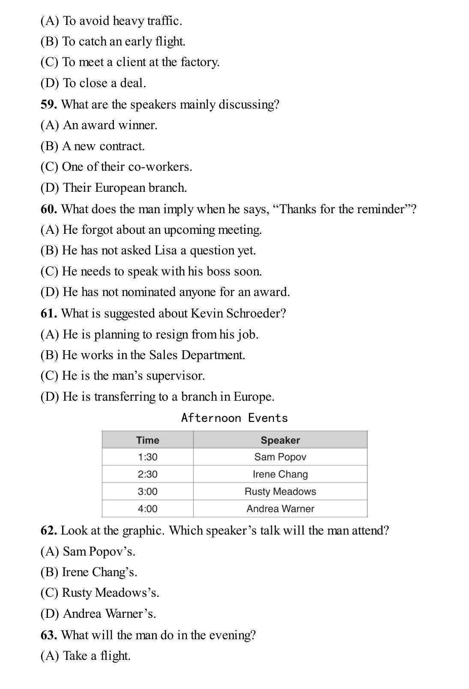

**听力独白/对话原文：**
**M:** That workshop conducted by Matthew Carter was outstanding. I'm glad we decided to attend it.
**W:** I couldn't agree more. So what are your plans for the remainder of the day?
**M:** The only other event I'm interested in attending starts at 1:30. (62) It should be pretty interesting.
**W:** You're not staying for the speech being given at 4:00?
**M:** I'd love to listen to Andrea Warner talk, but I've got to catch a plane to Dublin this evening. (63) Anyway, why don't we have lunch together and then return to the convention center?
**W:** Sounds good. We can discuss a couple of those ideas for projects you mentioned on the phone last week. (64) Afternoon Events

**中文对照：**
> **M：**马修·卡特主持的研讨会非常出色。我很高兴我们来参加了。
> **W：**我非常同意。那么你今天剩下的时间有什么计划？
> **M：**我唯一感兴趣的另一个活动是在1点半开始。这个活动应该很有趣。
> **W：**你不准备留下来听4点的演讲吗？
> **M：**我很想去听安德里亚·华纳的演讲，但是我今晚要赶飞机去都柏林。不管怎样，我们一起吃午饭，然后再回会议中心怎么样？
> **W：**听起来不错。我们可以讨论一下你上周在电话里提到的几个想法。下午活动

**核心词汇与短语：**
- **workshop**：研讨会
- **conduct**：组织并实施
- **outstanding**：出色的
- **remainder**：剩余部分
- **pretty**：相当地
- **convention center**：会议中心
- **project**：项目

#### Q62 (正确答案：A)
**问题：** Look at the graphic. Which speaker's talk will the man attend? (请看图表。男士将参加哪位发言人的演讲？)
- (A) Sam Popov's. (山姆 · 波波夫的演讲。)
- (B) Irene Chang's. (艾琳 · 常的演讲。)
- (C) Rusty Meadows's. (鲁斯蒂 · 梅多斯的演讲。)
- (D) Andrea Warner's. (安德烈亚 · 沃纳的演讲。)

#### Q63 (正确答案：A)
**问题：** What will the man do in the evening? (男士晚上将要做什么？)
- (A) Take a flight. (乘飞机。)
- (B) Return to his home. (回家。)
- (C) Ride on a train. (乘火车。)
- (D) Meet a potential client. (会见潜在客户。)

#### Q64 (正确答案：C)
**问题：** What does the woman suggest doing? (女士建议做什么？)
- (A) Ordering food for lunch. (订午餐。)
- (B) Talking to a guest speaker. (与客座发言人交谈。)
- (C) Discussing some work matters. (讨论一些工作事项。)
- (D) Sharing the notes they took. (分享他们的笔记。)

**延伸表达与补充：**
- **be interested in = take an interest in** (对…感兴趣)
  - *例句：I'm interested in playing football.* (我喜欢踢足球。)
- **catch a cab = take a taxi** (乘出租车)
  - *例句：It is very hard to catch a cab in the rush hour in this city.* (这座城市在高峰时间很难打到出租车。)
- **Why don't you do = Why not do** (为什么不做…？)
  - *例句：Why don't you do some exercise to lose weight?* (你为什么不通过锻炼减肥呢？)
- **a couple of = several** (几个)
  - *例句：I've got a couple of questions to ask you.* (我有几个问题想要问你。)

### Questions 65 - 67

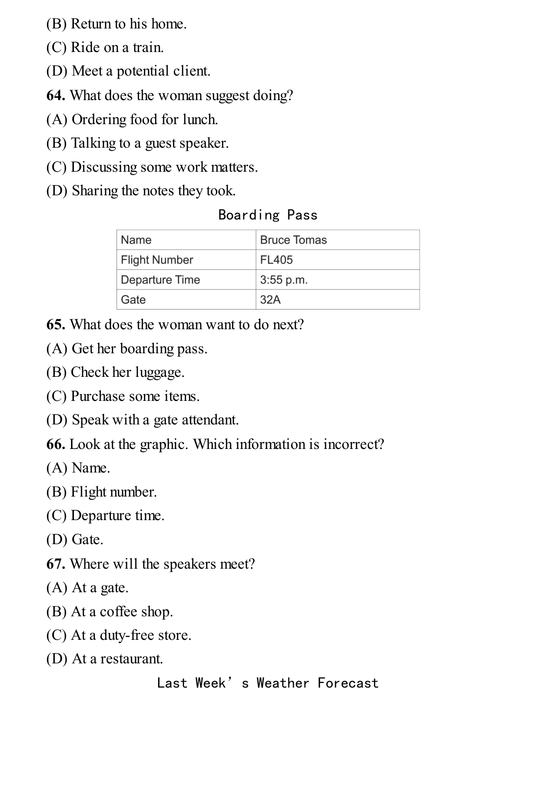

**听力独白/对话原文：**
**W:** Before we board our plane, do you mind if we do some shopping at the duty-free stores? I need to buy some souvenirs for my friends. (65)
**M:** Be my guest. But I've got to head to the gate to speak with somebody there. Take a look at my boarding pass.
**W:** Oh, I can't believe one of the letters in Thomas is missing. (66)
**M:** Yeah, I want to make sure there aren't any problems when it's time to board. Where shall we meet when I'm done?
**W:** How about at that coffee shop over there? After I finish shopping, I'd like something to drink. (67)
**M:** Great. I'll see you in a few minutes. Boarding Pass

**中文对照：**
> **W：**在登机前，你介意我们去免税店买点东西吗？我需要给我的朋友买一些纪念品。
> **M：**请自便。但是我需要去登机口跟那里的人谈谈。你看一下我的登机牌。
> **W：**哦，我简直不敢相信“Thomas”竟然丢了一个字母。
> **M：**是的，我想确保登机时没有任何问题。我完事之后我们在哪里见面呢？
> **W：**在那边的咖啡店如何？我买完东西之后想喝些东西。
> **M：**好的。几分钟之后见。登机牌

**核心词汇与短语：**
- **board the plane**：登机
- **duty-free store**：免税店
- **souvenir**：纪念品
- **be my guest**：请自便
- **boarding pass**：登机牌

#### Q65 (正确答案：C)
**问题：** What does the woman want to do next? (女士接下来想做什么？)
- (A) Get her boarding pass. (取登机牌。)
- (B) Check her luggage. (检查行李。)
- (C) Purchase some items. (买一些东西。)
- (D) Speak with a gate attendant. (和登机口的服务员谈谈。)

#### Q66 (正确答案：A)
**问题：** Look at the graphic. Which information is incorrect? (请看图表。下列哪项信息是不正确的？)
- (A) Name. (姓名。)
- (B) Flight number. (航班号。)
- (C) Departure time. (出发时间。)
- (D) Gate. (登机口。)

#### Q67 (正确答案：B)
**问题：** Where will the speakers meet? (说话人要在哪里见面？)
- (A) At a gate. (在登机口。)
- (B) At a coffee shop. (在咖啡店。)
- (C) At a duty-free store. (在免税店。)
- (D) At a restaurant. (在餐厅。)

**延伸表达与补充：**
- **buy sth. for sb. = buy sb. sth.** (给某人买某物)
  - *例句：I want to buy a coat for my mother as her birthday present.* (我想给我妈妈买一件大衣作为她的生日礼物。)
- **Be my guest. = Help yourself.** (请自便。)
  - *例句：If anyone wants to use my apartment during the summer, be my guest.* (如果有人想在暑假住我的公寓，请自便吧。)
- **How about doing = What about doing** (做某事如何？)
  - *例句：How about having lunch after the meeting is over?* (会议结束后一起吃午饭如何？)
- **in a few minutes = a few minutes later** (几分钟之后)
  - *例句：I'll be back in a few minutes.* (我几分钟之后就回来。)

### Questions 68 - 70

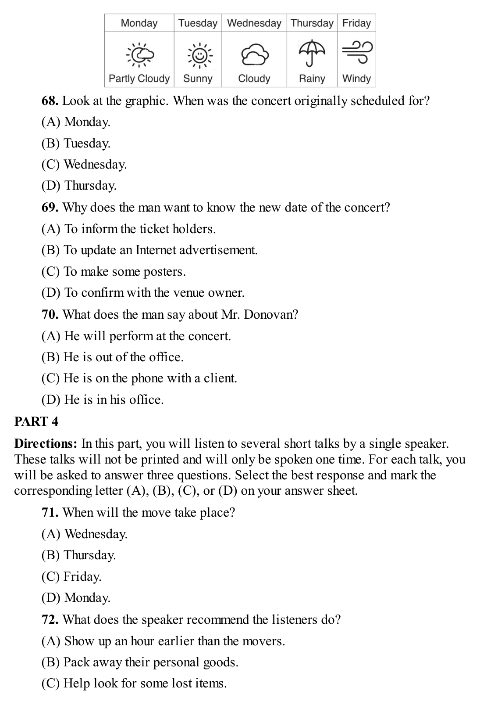

**听力独白/对话原文：**
**M:** Have we made arrangements to reschedule last week's outdoor concert which was canceled due to rain? (68)
**W:** I was informed by Travis Donovan that it will be held next Tuesday at 6:00 in the evening.
**M:** Are you positive? I want to print some posters to advertise it and don't want to get the date wrong. (69)
**W:** Why don't you call Mr. Donovan at extension 584 and confirm it with him?
**M:** Thanks for the number. But I have to wait to call him because I just saw him leave the office with a client. (70)
**W:** Oh, I wasn't aware he had any meetings scheduled for today. Last Week's Weather Forecast

**中文对照：**
> **M：**上周由于下雨而取消的户外演唱会是否已经重新做了安排？
> **W：**特拉维斯·多诺万通知我说演唱会将于下周二晚上6点举行。
> **M：**你确定吗？我想印一些海报来做宣传，所以我不想弄错时间。
> **W：**你为什么不打多诺万先生的分机号584去和他确认一下呢？
> **M：**谢谢你告诉我他的号码。但是我必须得等一会才能给他打电话，因为我刚看见他和一位客户离开了办公室。
> **W：**哦，我还没注意到他今天有什么会议安排。上周的天气预报

**核心词汇与短语：**
- **arrangement**：安排
- **cancel**：取消
- **inform**：通知
- **positive**：确定的
- **poster**：海报
- **extension**：电话分机
- **confirm**：确认
- **aware**：知道的

#### Q68 (正确答案：D)
**问题：** Look at the graphic. When was the concert originally scheduled for? (请看图表，音乐会原计划什么时候举办？)
- (A) Monday. (星期一。)
- (B) Tuesday. (星期二。)
- (C) Wednesday. (星期三。)
- (D) Thursday. (星期四。)

#### Q69 (正确答案：C)
**问题：** Why does the man want to know the new date of the concert? (为什么男士想要知道演唱会新的日期？)
- (A) To inform the ticket holders. (为了通知观众。)
- (B) To update an Internet advertisement. (为了更新网络广告。)
- (C) To make some posters. (为了制作一些海报。)
- (D) To confirm with the venue owner. (为了与场馆业主确认。)

#### Q70 (正确答案：B)
**问题：** What does the man say about Mr. Donovan? (关于多诺万先生，男士说了什么？)
- (A) He will perform at the concert. (他将在演唱会演出。)
- (B) He is out of the office. (他现在不在办公室。)
- (C) He is on the phone with a client. (他正在和一位客户打电话。)
- (D) He is in his office. (他在办公室。)

**延伸表达与补充：**
- **due to = because of** (因为，由于)
  - *例句：I asked a leave due to illness.* (我因为生病请假了。)
- **be aware = know** (知道)
  - *例句：Everyone is aware that smoking is harmful to health.* (每个人都知道吸烟有害健康。)

## Part 4: 简短独白 (Q71 - Q100)

### Questions 71 - 73

**听力独白/对话原文：**
Attention, all warehouse staff. This is an important notice, so please listen carefully. As you all know, Friday is the day of the big move. (71) Packing will begin on Thursday morning, and the movers will arrive at eight o'clock Friday morning. We strongly advise you to remove your personal belongings no later than Wednesday night. (72) If you don't, there is a good chance they will be lost or damaged in the move. Please arrive by seven o'clock tomorrow morning, dressed in comfortable clothes. I know Thursday and Friday will be long and busy days, but an excellent lunch will be provided for all of you, (73) and there will be a special “housewarming” party on the following Monday night.

**中文对照：**
> 库房全体工作人员请注意，现在宣布一条重要通知，请仔细听。大家都知道，周五那天要搬家。打包工作从周四上午开始，搬运工人会在周五早上8点到。我们强烈建议大家在周三晚上之前取走个人物品，否则物品很可能在搬家过程中丢失或损坏。请大家明天早上7点之前到库房，穿上舒适的衣服。我知道周四和周五会漫长而繁忙，不过我们会给大家提供丰盛的午餐，而且在下周一晚上还会专门举行一个乔迁晚宴。

**核心词汇与短语：**
- **warehouse**：库房，仓库
- **notice**：通知
- **carefully**：仔细地
- **move**：搬家
- **mover**：搬运工人
- **personal**：个人的，私人的
- **belongings**：所有物，财产
- **no later than**：不迟于
- **damage**：损坏
- **comfortable**：舒适的
- **housewarming**：乔迁庆宴
- **following**：接着的
- **formally**：正式地
- **occasion**：场合

#### Q71 (正确答案：C)
**问题：** When will the move take place? (搬家安排在什么时候？)
- (A) Wednesday. (周三。)
- (B) Thursday. (周四。)
- (C) Friday. (周五。)
- (D) Monday. (周一。)

#### Q72 (正确答案：B)
**问题：** What does the speaker recommend the listeners do? (讲话者建议听众做什么？)
- (A) Show up an hour earlier than the movers. (比搬运工人早一个小时到。)
- (B) Pack away their personal goods. (把个人物品打包拿走。)
- (C) Help look for some lost items. (帮忙寻找几件丢失的物品。)
- (D) Dress formally for the occasion. (穿正装。)

#### Q73 (正确答案：A)
**问题：** What will be provided to the listeners on the day of the move? (搬家那天会向听众提供什么？)
- (A) A free meal. (免费餐食。)
- (B) Extra pay. (额外的报酬。)
- (C) A ride home. (开车送他们回家。)
- (D) A party. (宴会。)

**延伸表达与补充：**
- **Friday is the day of the big move. = We will move on Friday. = The moving date is Friday.** (搬家的日子是在周五。)
- **no later than Wednesday night = before Wednesday night = Wednesday night is the deadline** (周三晚上之前)
  - *例句：You have to finish this report no later than Wednesday night.* (你必须在周三晚上之前完成这个报告。)
- **dressed in comfortable clothes** (穿上舒适的衣服扩展表达：)
  - *例句：dressed in casual wear dressed in your normal, everyday wear Mr. King was dressed in comfortable clothes at the company picnic.* (穿上便装穿日常的普通服装金先生参加公司的野餐时穿了舒适的衣服。)

### Questions 74 - 76

**听力独白/对话原文：**
Hi, this is Sharon Star calling. I tried several times to get through to you at the cell number you gave me, but it has been busy for the last twenty minutes. Anyway, Mr. Trent, I hope you get this message. I'd like to say I'm sorry, but I won't be able to get to the interview on time. We'll have to make it some other time. (74) Unfortunately, there's been a major accident on St. Kilda Road, and traffic is at a complete standstill. There is absolutely no chance of me making it this afternoon. (75) I hope this won't be a major inconvenience to you. I'm available for an interview any time tomorrow or even this evening if you have the time. (76) Let me give you my mobile phone number again. It's 777-0045. Thanks.

**中文对照：**
> 您好，我是莎伦·斯塔尔。我按照您给我的号码给您打了几次电话，但是打了20分钟一直占线。不管怎样，特伦特先生，希望您能收到这条留言。我想说很抱歉，我不能按时参加面试了。我们得换个时间。很遗憾，希尔达路上发生了一起重大交通事故，交通完全瘫痪了。我今天下午根本不可能到那儿。希望这不会给您造成很大的不便。如果您有时间的话，明天的任何时间或者即使今天晚上我都可以参加面试。我把我的手机号码再告诉您一遍，是777-0045。谢谢。

**核心词汇与短语：**
- **get through to**：与联系，通电话
- **on time**：按时
- **unfortunately**：不走运地，不巧地
- **major**：重要的
- **standstill**：停滞
- **absolutely**：完全地
- **inconvenience**：不便
- **available**：有空的
- **report**：报告

#### Q74 (正确答案：A)
**问题：** Why is the speaker leaving the message? (讲话者为什么留言？)
- (A) To postpone her appointment. (推迟会面。)
- (B) To set up a job interview. (约定一个工作面试。)
- (C) To report an accident on the road. (报告路上的一起交通事故。)
- (D) To get the number of a co-worker. (要一位同事的电话号码。)

#### Q75 (正确答案：D)
**问题：** Where most likely is the caller now? (打电话的人现在最有可能在哪儿？)
- (A) At her office. (在她的办公室。)
- (B) On the subway. (在地铁里。)
- (C) At a hospital. (在医院。)
- (D) In her car. (在她的汽车里。)

#### Q76 (正确答案：B)
**问题：** When does the caller say that she will be available? (打电话的人说她什么时间有空？)
- (A) Right now. (现在。)
- (B) This evening. (今天晚上。)
- (C) Next week. (下周。)
- (D) This weekend. (这周末。)

**延伸表达与补充：**
- **I tried several times to get through to you. = I called you many times. = I tried phoning you a few times.** (我给您打了几次电话。)
  - *例句：I tried several times to get through to you the other night, but you didn't answer your phone.* (我前几天晚上给您打了几次电话，但是您都没有接。)
- **We'll have to make it some other time.** (我们得换个时间。)
  - *例句：I'm going to have to put it off for another day. I have no choice but to see you another time.* (我不得不将其推迟到其他时间。扩展表达：我只好换个时间再跟您见面了。)
- **Traffic is at a complete standstill. = Traffic is not moving at all. = Traffic is backed up for miles.** (交通完全瘫痪了。)

### Questions 77 - 79

**听力独白/对话原文：**
You have called Academic Enterprises, Australia's leading providers of school and home-based educational programs and materials. (77) Unfortunately, all of our operators are occupied at the present. We value your call, so please wait, and one of our staff members will speak to you shortly. If your inquiry has to do with Academic Enterprises' after-school or vacation educational programs, please press “1”; if you have an inquiry regarding the availability of textbooks or other educational materials, please press “2”. For packaging, dispatch, or billing inquiries, please press “3”. (78) For franchising inquiries, please press “4”. Or simply hold, and one of our operators will be with you as soon as possible. (79)

**中文对照：**
> 欢迎致电澳大利亚一流的学校和家庭教育课程和教材供应商学术公司。很不巧，我们所有的接线员都在通话中。您的来电对我们来说很重要，请稍候，我们的工作人员很快会和您通话。如果您想咨询我公司的课外或假期教育课程，请按“1”；如果您想咨询课本或其他教材的供应情况，请按“2”；关于包装、送货或付款的咨询，请按“3”；关于特许经营的咨询，请按“4”。或者您可以稍候，我们的接线员会尽快和您通话。

**核心词汇与短语：**
- **leading**：领导的，主要的
- **provider**：供应商
- **home-based**：基于家庭的，在家的
- **educational**：教育的
- **operator**：接线员
- **occupy**：使从事，使忙碌
- **value**：重视
- **shortly**：很快地
- **inquiry**：询问，打听
- **after-school**：课后的
- **textbook**：课本
- **dispatch**：派送
- **franchise**：特许经营

#### Q77 (正确答案：A)
**问题：** What does Academic Enterprises provide? (学术公司提供什么？)
- (A) Educational books. (教育类图书。)
- (B) Free consultations. (免费咨询。)
- (C) Free delivery services. (免费送货服务。)
- (D) Training classes. (培训课程。)

#### Q78 (正确答案：C)
**问题：** What should a caller with a question about a delivery do? (如果想打电话咨询送货方面的问题，问询人应该怎么做？)
- (A) Press 1. (按 1 。)
- (B) Press 2. (按 2 。)
- (C) Press 3. (按 3 。)
- (D) Press 4. (按 4 。)

#### Q79 (正确答案：B)
**问题：** Who should wait on the line? (谁应该在线等待？)
- (A) Those who are already customers. (那些已经成为顾客的人。)
- (B) Those who do not want to deal with a machine. (那些不想和机器打交道的人。)
- (C) Those who don't have touch-tone phones. (那些没有按键式电话的人。)
- (D) Those who do not know the extension number. (那些不知道分机号的人。)

**延伸表达与补充：**
- **All of our operators are occupied at the present. = All of our operators are on the phone now. = Every one of our operators is on the line at the moment.** (我们所有的接线员现在都在通话中。)
- **We value your call. = Your call is important to us.** (您的来电对我们来说很重要。)
- **Our staff member will speak to you shortly. = Our staff will talk to you as soon as possible. = Our staff will be right with you.** (我们的工作人员很快会和您通话。)

### Questions 80 - 82

**听力独白/对话原文：**
Good evening. Perhaps some of you don't know me. I'm Dr. Cummins, the principal of St. Michael's Elementary School. （ 80, 81 ） It's a great pleasure to welcome you to tonight's special performance. I hope that you, like me, will be overwhelmed by the sheer talent and enthusiasm of our young break dancers. I have personally attended three of the rehearsals, so I can assure you that they have sacrificed hours of personal time and buckets of sweat to bring you this exciting production. (82) This is a group production, choreographed by the performers themselves, with the help of our wonderful musical arts teacher, Ms. Wang. So, without further ado, sit back, and enjoy our fabulous young dancers.

**中文对照：**
> 晚上好。也许你们中有些人不认识我，我是卡明斯博士，圣米歇尔小学的校长。欢迎大家观看今晚的特别演出。希望你们能像我一样，被我们年轻的霹雳舞演员的才华和热情征服。我本人已经参加过三次彩排，所以我可以向你们保证，他们为了带给大家精彩的节目，牺牲了很多个人时间，洒下无数辛勤的汗水。这是一个集体表演，舞蹈设计由他们自己完成，我们出色的音乐美术教师王女士在一旁协助。那么，闲话少说，让我们坐好，开始欣赏年轻舞蹈演员们的精彩表演吧。

**核心词汇与短语：**
- **principal**：校长
- **performance**：表演
- **overwhelm**：倾倒，征服
- **sheer**：真正的，纯粹的
- **enthusiasm**：热情
- **assure**：保证
- **sacrifice**：牺牲
- **bucket**：大量
- **sweat**：汗水
- **choreograph**：设计舞蹈动作
- **without further ado**：不费周折地，干脆痛快地
- **sit back**：放松，坐好
- **fabulous**：极好的

#### Q80 (正确答案：B)
**问题：** Where is the talk most likely taking place? (讲话最有可能发生在哪儿？)
- (A) At a hospital. (在医院。)
- (B) At a public school. (在公办学校。)
- (C) At a theater. (在剧院。)
- (D) At an art gallery. (在美术馆。)

#### Q81 (正确答案：C)
**问题：** Who is Dr. Cummins? (卡明斯博士是谁？)
- (A) A dancer. (舞蹈演员。)
- (B) An artist. (艺术家。)
- (C) The headmaster. (校长。)
- (D) The producer. (制作人。)

#### Q82 (正确答案：A)
**问题：** Which of the following was mentioned by the speaker? (下面哪一项被讲话者提到过？)
- (A) The performers spent hours putting together the show. (演员们花了很多时间排练节目。)
- (B) Ms. Wang is the leading dancer of tonight's performance. (王女士是今晚表演的领舞。)
- (C) The theater is a full house for the first time since its opening. (自开业以来，剧院第一次全场坐满。)
- (D) All of the dancers are up-and-coming professionals. (所有舞蹈演员都是很有前途的专业演员。)

**延伸表达与补充：**
- **sheer talent = pure talent** (高超的才能)
  - *例句：He has a sheer talent for making sales.* (他拥有极高的销售才能。)
- **without further ado = without further delay = without further trouble** (干脆痛快地)
  - *例句：Now, without further ado, let's bring on the next speaker, Mr. Steve Shaw.* (现在，闲话少说，让我们有请下一位演讲人，史蒂夫)

### Questions 83 - 85

**听力独白/对话原文：**
Well, everybody, the History Society Functions Committee welcomes you all. I must say that I am surprised. There are so many people here tonight and so many new faces! (83) Let me say that I believe you have made an excellent decision to attend this meeting. Our speaker tonight will be one of the world's leading experts on Anglo-Saxon issues. He's Professor Michael Sutherland, who has kindly consented to come all the way from the University of Essex to speak to us. Professor Sutherland is not only an expert on the Anglo-Saxon period but also one of the most interesting speakers I have ever met. (84) So please welcome Professor Michael Sutherland. (85)

**中文对照：**
> 大家好，历史社会功能委员会欢迎大家的到来。我不得不说我非常惊讶。今晚有这么多人，这么多新面孔！我相信大家来参加这次会议是一个很棒的决定。我们今晚的发言人是世界领先的盎格鲁—撒克逊问题专家之一，米歇尔·萨瑟兰教授。他欣然同意从艾塞克斯大学远道赶来，为我们作演讲。萨瑟兰教授不仅是盎格鲁—撒克逊时代的研究专家，还是我见过的最风趣的演讲人之一。所以，请大家欢迎米歇尔·萨瑟兰教授。

**核心词汇与短语：**
- **make a decision**：做决定
- **excellent**：极好的
- **leading**：主要的，领先的
- **expert**：专家
- **consent**：同意
- **all the way**：从远道
- **anticipate**：预料，期待
- **put on**：举办，举行

#### Q83 (正确答案：A)
**问题：** What is implied about today's event? (关于今天的活动，以上讲话中有何暗示？)
- (A) There are more people in the audience than anticipated. (听众比预期的多。)
- (B) Today's event is one of the best events ever put on. (今天的活动是举办过的最好的一次。)
- (C) The audience members have waited a long time for it. (听众已经等待很久了。)
- (D) It was very difficult to get tonight's guest speaker. (很难见到今晚的特邀演讲者。)

#### Q84 (正确答案：C)
**问题：** What does the speaker mention about today's guest speaker? (关于今晚的特邀演讲者，讲话者提到了什么？)
- (A) He is a university student. (他是大学学生。)
- (B) He is a history teacher. (他是历史教师。)
- (C) He is a very good talker. (他是很棒的演讲者。)
- (D) He is very famous worldwide. (他在国际上都很知名。)

#### Q85 (正确答案：B)
**问题：** What will happen next? (下面要发生什么？)
- (A) The audience members will take an intermission break. (听众将中场休息。)
- (B) The guest speaker will take the stand. (特邀演讲人上台讲话。)
- (C) The speaker will give a brief introduction of the day's event. (讲话者对今天的活动做简要介绍。)
- (D) The day's event will come to an end. (今天的活动会结束。)

**延伸表达与补充：**
- **who has kindly consented to do = who has kindly given permission to do = who has kindly agreed to do** (（他）欣然同意…)
  - *例句：I'd like to thank Ms. Harris, who has kindly consented us to use her house for our next meeting.* (我想感谢哈里斯女士，她欣然同意我们用她的房子举办下一次会议。)
- **one of the most interesting speakers** (最风趣的演讲者之一扩展表达：)
  - *例句：one of the best speakers one of the most striking speakers Susan Davis is one of the most interesting speakers I have ever met.* (最优秀的演讲者之一最吸引人的演讲者之一苏珊)

### Questions 86 - 88

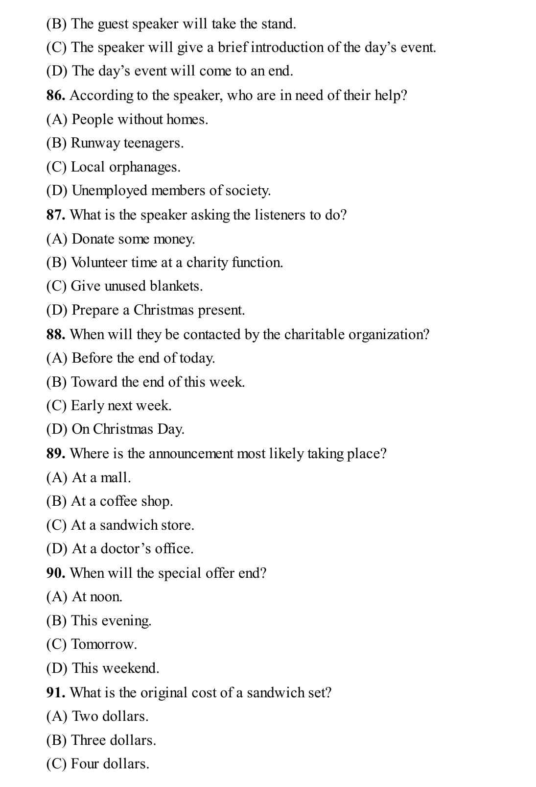

**听力独白/对话原文：**
Could everybody please stop working for a minute and listen carefully? As you know, there are only four days until Christmas. Our company has been approached by the St. Vincent de Paul Society with an urgent request. St. Vincent's Christmas Appeal aims to provide blankets and hot meals to all of the city's homeless on Christmas Day. (86) However, this year they have not received a sufficient number of blankets. Could all of you please check your cupboards to see if you have any warm blankets to spare? Please only bring clean blankets in good condition. (87) Collectors from St. Vincent's will be calling tomorrow and Friday, (88) so I hope you all can help out.

**中文对照：**
> 请大家把工作停一会儿，听仔细了。大家都知道，离圣诞节只有4天了。圣文森特·保罗教会找到我们公司商量一个紧急请求。圣文森特的圣诞倡议是要在圣诞节当天为全城无家可归的人提供毯子和热的饭菜。可是，今年他们没有收到足够数量的毯子。请大家查看一下你们的衣柜，看看有没有多余的、暖和的毯子腾出来。请把干净、完好的毯子带来。圣文森特收毯子的人会在明天和周五打电话来，所以我希望大家都能帮忙。

**核心词汇与短语：**
- **approach**：接洽，找商量
- **society**：协会，团体；教会
- **urgent**：紧急的
- **aim to**：目标是
- **blanket**：毯子
- **homeless**：无家可归的人
- **sufficient**：足够的，充分的
- **cupboard**：橱柜，衣柜
- **spare**：拨出；腾出
- **orphanage**：孤儿
- **unemployed**：失业者
- **donate**：捐献
- **volunteer**：志愿者
- **charity**：慈善机构
- **function**：盛大的集会，宴会

#### Q86 (正确答案：A)
**问题：** According to the speaker, who are in need of their help? (根据讲话者所说，谁需要他们的帮助？)
- (A) People without homes. (无家可归者。)
- (B) Runaway teenagers. (离家出走的青少年。)
- (C) Local orphanages. (当地的孤儿。)
- (D) Unemployed members of society. (社会失业者。)

#### Q87 (正确答案：C)
**问题：** What is the speaker asking the listeners to do? (讲话者要求听众做什么？)
- (A) Donate some money. (捐款。)
- (B) Volunteer time at a charity function. (在一个慈善活动上做志愿者。)
- (C) Give unused blankets. (提供闲置的毯子。)
- (D) Prepare a Christmas present. (准备一份圣诞礼物。)

#### Q88 (正确答案：B)
**问题：** When will they be contacted by the charitable organization? (慈善组织什么时候联系他们？)
- (A) Before the end of today. (今天下班前。)
- (B) Toward the end of this week. (这周末。)
- (C) Early next week. (下周早些时候。)
- (D) On Christmas Day. (圣诞节当天。)

**延伸表达与补充：**
- **If you have any warm blankets to spare** (如果你有多余的、暖和的毯子腾出来扩展表达：)
  - *例句：If you have any extra blankets If you have any blankets you are not using at the moment If you have any warm blankets to spare, please bring them in tomorrow.* (如果你有多余的毯子如果你有暂时不用的毯子如果你有多余的、暖和的毯子腾出来，请明天带来。)
- **I hope you all can help out. = I hope all of you can lend a hand. = I hope all of you can contribute.** (我希望你们都能帮上忙。)

### Questions 89 - 91

**听力独白/对话原文：**
Attention, all shoppers! (89) Rush now to Tim Holton's for a very special offer. Yes, shoppers, from now until noon you can enjoy the special taste of Tim's many varieties of donuts or a delicious sandwich or one of their aromatic coffees at very special prices. (90) Why don't you sit down, and rest your weary legs? Your choice of coffee and donut will cost you only two dollars. The sandwich and donut set is only three dollars. Yes, shoppers, up until twelve o'clock, (90) a delicious cup of the best-brewed coffee and a donut set will cost you only two dollars, and a sandwich set will cost only three dollars. That's half the original price, shoppers. (91) Don't miss out!

**中文对照：**
> 全体顾客请注意！现在赶快到蒂姆·霍尔顿店吧，那里有特价优惠商品。是的，顾客们，从现在开始到中午，你能以特价享受到蒂姆店各种各样的炸面包圈或美味三明治或香浓咖啡。为什么不坐下来让疲惫的双腿休息一下呢？咖啡和炸面包圈只需2美元。三明治和炸面包圈套餐只需3美元。是的，顾客们，12点之前，一杯美味的煮咖啡加一个炸面包圈的套餐只卖2美元，一份三明治套餐只卖3美元。这是原价的一半，顾客们。千万不要错过！

**核心词汇与短语：**
- **rush**：冲，奔，赶紧
- **a variety of**：各种各样的
- **aromatic**：香浓的；芬芳的
- **weary**：疲惫的，劳累的
- **brewed coffee**：煮好的咖啡
- **original price**：原价

#### Q89 (正确答案：A)
**问题：** Where is the announcement most likely taking place? (这条广播最有可能在哪儿播放？)
- (A) At a mall. (在商场。)
- (B) At a coffee shop. (在咖啡厅。)
- (C) At a sandwich store. (在三明治店。)
- (D) At a doctor's office. (在医生办公室。)

#### Q90 (正确答案：A)
**问题：** When will the special offer end? (特价供应到什么时候结束？)
- (A) At noon. (中午。)
- (B) This evening. (今天晚上。)
- (C) Tomorrow. (明天。)
- (D) This weekend. (本周末。)

#### Q91 (正确答案：D)
**问题：** What is the original cost of a sandwich set? (一份三明治套餐的原价是多少？)
- (A) Two dollars. (2 美元。)
- (B) Three dollars. (3 美元。)
- (C) Four dollars. (4 美元。)
- (D) Six dollars. (6 美元。)

**延伸表达与补充：**
- **up until twelve o'clock = right through to noon = just before twelve o'clock** (直到12点)
  - *例句：The sale will last up until twelve o'clock today.* (特价销售会持续到今天12点。)
- **half the original price = 50% off the regular price** (半价)
  - *例句：That shirt is half the original price today only.* (那件衬衫半价销售，仅限今日。)

### Questions 92 - 94

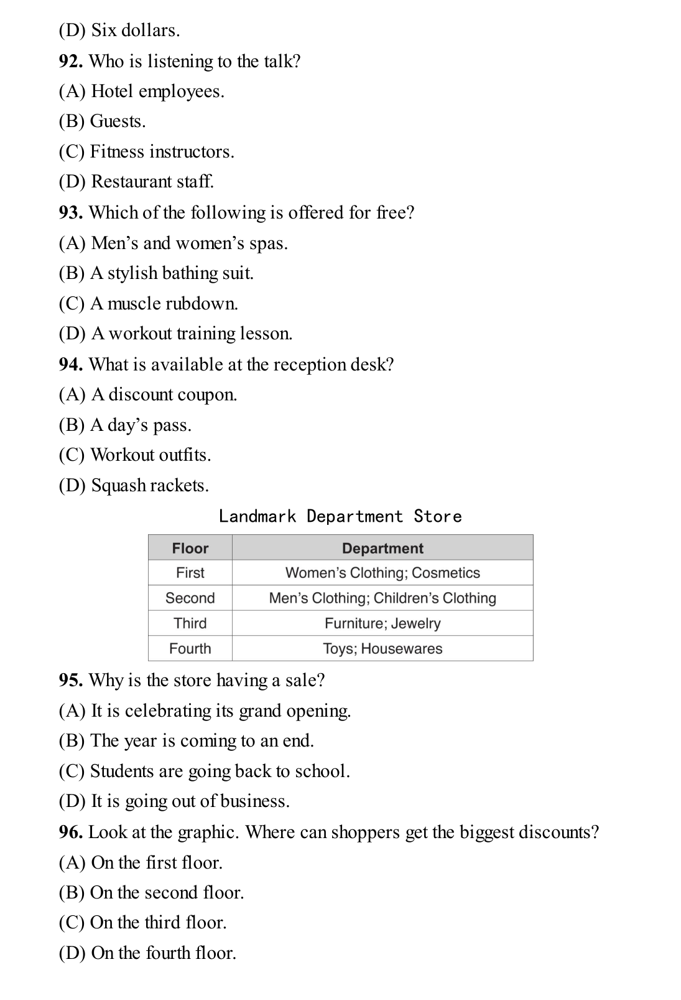

**听力独白/对话原文：**
Now that you've checked in, I'd like to let you know about some of the hotel's facilities. (92) First, on the second floor, there are separate gentlemen's and ladies' saunas. These are provided free to our guests (93) and are open from seven o'clock in the morning until ten in the evening. They are a wonderful way of relaxing after a long day. Second, the basement sports center offers a lap swimming pool, two squash courts, a weight room, and a relaxation center where you can enjoy yoga, massages, and aromatherapy. You can buy daily discount entry cards at the reception desk. (94) And finally, on behalf of the hotel, I'd like to offer you a free drink coupon, which can be used at the hotel restaurant. We hope you enjoy your stay!

**中文对照：**
> 既然大家已经登记入住了，我想给大家介绍宾馆的一些设施。首先，在二层有男女桑拿浴室各一间，免费向客人开放，时间是早上7点到晚上10点。漫长的一天结束后，可以到那里好好放松一下。第二，地下室的运动中心提供一个及膝深的游泳池、两个壁球场、一个举重房和一个放松中心，在那里你可以做瑜伽、接受按摩和芳香疗法。在前台可以买到每日优惠入场卡。最后，我想代表宾馆给大家发放一张免费饮品券，本券可以在宾馆的餐厅使用。希望大家入住愉快！

**核心词汇与短语：**
- **facility**：设施
- **separate**：单独的，分开的
- **wonderful**：非常好的
- **basement**：地下室
- **lap**：膝盖
- **weight room**：举重房
- **aromatherapy**：芳香疗法
- **entry card**：入场卡
- **on behalf of**：代表
- **stylish**：时髦的，漂亮的
- **bathing suit**：泳衣
- **rubdown**：按摩
- **outfit**：全套用品；全套装备

#### Q92 (正确答案：B)
**问题：** Who is listening to the talk? (谁在听这段讲话？)
- (A) Hotel employees. (宾馆的员工。)
- (B) Guests. (客人。)
- (C) Fitness instructors. (健身教练。)
- (D) Restaurant staff. (餐厅工作人员。)

#### Q93 (正确答案：A)
**问题：** Which of the following is offered for free? (下面哪一项是免费提供的？)
- (A) Men's and women's spas. (男女桑拿浴室。)
- (B) A stylish bathing suit. (时髦的泳衣。)
- (C) A muscle rubdown. (肌肉按摩。)
- (D) A workout training lesson. (健身训练课程。)

#### Q94 (正确答案：B)
**问题：** What is available at the reception desk? (前台提供什么？)
- (A) A discount coupon. (打折券。)
- (B) A day's pass. (每日入场卡。)
- (C) Workout outfits. (健身的全套装备。)
- (D) Squash rackets. (壁球球拍。)

**延伸表达与补充：**
- **after a long day** (漫长的一天结束后扩展表达：)
  - *例句：after a hard day after a tiring day I went straight to bed after a long day at the office.* (艰苦的一天结束后疲惫的一天结束后在办公室度过漫长的一天之后，我直接上床睡觉了。)
- **and finally = and lastly = in conclusion** (最后)
  - *例句：And finally, we will end the meeting.* (最后，我们将结束会议。)
- **on behalf of the hotel = as a representative of the hotel = to speak for the hotel** (代表宾馆)
  - *例句：I'd like to make this very important announcement on behalf of the hotel.* (我想代表宾馆发布这则重要通知。)

### Questions 95 - 97

**听力独白/对话原文：**
Welcome, shoppers, to the Landmark Department Store's special year- end sale. (95) Nearly every item here is being offered at a discount. However, if you want to find the best deals in the entire store, drop by the jewelry department, where you can get savings of up to fifty percent. (96) Make sure you sign up for a special shopper's card before you check out, too. (97) Doing that will give you ten percent off on future purchases and make you eligible for all kinds of special offers throughout the year. If you need assistance, speak to one of our customer service representatives. You can find them on every floor. Landmark Department Store

**中文对照：**
> 各位顾客，欢迎大家参加地标百货公司的年终特别促销活动。这里几乎每一件商品都有折扣。然而，如果您想在商场找到最优的价格，那么请去珠宝柜台看看吧，在那里您可以节省将近百分之五十的花费。在您结账之前也请确保已经注册了特别折扣卡。注册这张卡之后您将在未来的购物中享受九折优惠并且可以参与全年各式特别优惠活动。如果您需要帮助，请联系任何一位客服代表即可。这些代表您在每层都可找到。地标百货公司

**核心词汇与短语：**
- **landmark**：地标；里程碑
- **year-end sale**：年终促销
- **discount**：（打）折扣
- **best deal**：最优价格
- **entire**：全部的；整个的
- **drop by**：顺道拜访
- **jewelry**：珠宝
- **sign up**：注册；登记
- **check out**：结账；检验
- **assistance**：帮助；援助
- **representative**：代表；典型

#### Q95 (正确答案：B)
**问题：** Why is the store having a sale? (这家商场为什么促销？)
- (A) It is celebrating its grand opening. (为了庆祝它的正式营业。)
- (B) The year is coming to an end. (一年行将结束。)
- (C) Students are going back to school. (学生们正在返校。)
- (D) It is going out of business. (它面临倒闭。)

#### Q96 (正确答案：C)
**问题：** Look at the graphic. Where can shoppers get the biggest discounts? (请看图表。顾客们可以在哪里获得最高折扣？)
- (A) On the first floor. (在一层。)
- (B) On the second floor. (在二层。)
- (C) On the third floor. (在三层。)
- (D) On the fourth floor. (在四层。)

#### Q97 (正确答案：C)
**问题：** What does the speaker recommend listeners do? (讲话者建议听众们做什么？)
- (A) Use the coupons they were given. (使用他们领的优惠券。)
- (B) Try on items before buying them. (购买货品之前先试戴。)
- (C) Apply for a special discount card. (申请一张特别折扣卡。)
- (D) Check out before the store closes. (在商场打烊之前结账。)

**延伸表达与补充：**
- **up to = no less than = as many as** (多达；相当于)
  - *例句：The Olympic Stadium will hold up to 80,000 spectators.* (奥林匹克将可容纳多达80 000名观众。)
- **eligible for = qualify for** (有资格；能胜任)
  - *例句：He is eligible for this position.* (他能够胜任这一职位。)

### Questions 98 - 100

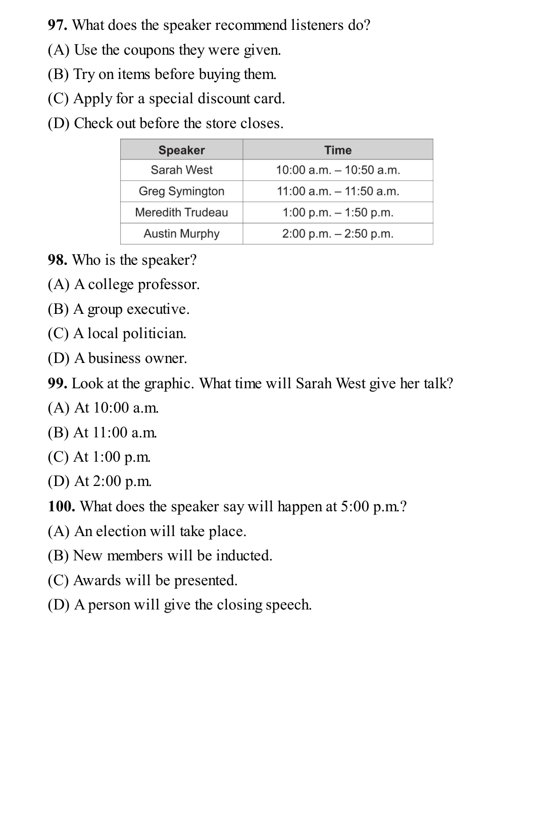

**听力独白/对话原文：**
Welcome, everyone, to the thirteenth annual conference being hosted by the International Society of Electrical Engineers. My name is Kate Daniels, and I'm the current president of the society. (98) Before we get started with the keynote speech by Dr. Lyndon Schafer, I should inform you of a couple of things. First, Sarah West will be a bit late, so she'll be changing speaking times with Meredith Trudeau. (99) In addition, we'll be holding the election for a new president today at 5:00 in the evening. (100) Only current members of the society are eligible to vote. You must show your membership card prior to receiving a ballot.

**中文对照：**
> 欢迎大家参加由电机工程学国际社团主办的第十三届年度会议。我叫凯特·丹尼尔斯，目前担任本社团的主席。在林登·莎菲尔博士开始主题演讲之前，我宣布几件事情。首先，萨拉·韦斯特会晚些到场，因此她将和梅雷德斯·特鲁多交换出场演讲的顺序。另外，今晚5点我们将会选举新的主席。只有社团的现任成员可以参选。请务必于收到选票之前出示您的会员卡。

**核心词汇与短语：**
- **host**：主持（人）
- **international**：国际的，世界的
- **society**：社团；社会
- **engineer**：工程师
- **current**：现在的，最近的
- **president**：主席；校长；董事长
- **keynote speech**：主题演讲；专题报告
- **inform**：通知，告知
- **election**：选举；当选
- **ballot**：选票；投票

#### Q98 (正确答案：B)
**问题：** Who is the speaker? (这位讲话是谁？)
- (A) A college professor. (一名大学教授。)
- (B) A group executive. (一名团队管理者。)
- (C) A local politician. (一名当地的政治家。)
- (D) A business owner. (一名企业负责人。)

#### Q99 (正确答案：C)
**问题：** Look at the graphic. What time will Sarah West give her talk? (请看图表。萨拉 · 韦斯特将于什么时间开始她的演讲？)
- (A) At 10:00 a.m. (上午 10 点。)
- (B) At 11:00 a.m. (上午 11 点。)
- (C) At 1:00 p.m. (下午 1 点。)
- (D) At 2:00 p.m. (下午 2 点。)

#### Q100 (正确答案：A)
**问题：** What does the speaker say will happen at 5:00 p.m.? (讲话者说下午 5 点将会发生什么？)
- (A) An election will take place. (将会举行一场选举。)
- (B) New members will be inducted. (会有新成员入会。)
- (C) Awards will be presented. (会有人致闭幕词。)
- (D) A person will give the closing speech.

**延伸表达与补充：**
- **a couple of = several = some = a number of** (几个；一些)
  - *例句：There are a couple of things to be finished before this weekend.* (在这周末之前有几件事情要完成。)
- **prior to = before = precede = ahead of** (在…之前)
  - *例句：All the plans should be completed prior to our departure.* (我们出发之前所有计划都应完成。)

# TEST 06

## 答案速查表

| 题号 | 答案 | 题号 | 答案 | 题号 | 答案 | 题号 | 答案 | 题号 | 答案 | 题号 | 答案 | 题号 | 答案 | 题号 | 答案 | 题号 | 答案 | 题号 | 答案 |
| :---: | :---: | :---: | :---: | :---: | :---: | :---: | :---: | :---: | :---: | :---: | :---: | :---: | :---: | :---: | :---: | :---: | :---: | :---: | :---: |
| **1** | D | **11** | A | **21** | C | **31** | A | **41** | B | **51** | C | **61** | A | **71** | B | **81** | C | **91** | B |
| **2** | C | **12** | C | **22** | B | **32** | B | **42** | A | **52** | A | **62** | D | **72** | B | **82** | A | **92** | A |
| **3** | D | **13** | C | **23** | A | **33** | A | **43** | D | **53** | A | **63** | C | **73** | C | **83** | C | **93** | C |
| **4** | B | **14** | B | **24** | B | **34** | C | **44** | D | **54** | C | **64** | B | **74** | A | **84** | C | **94** | A |
| **5** | A | **15** | B | **25** | A | **35** | B | **45** | C | **55** | C | **65** | A | **75** | D | **85** | A | **95** | A |
| **6** | C | **16** | A | **26** | B | **36** | B | **46** | D | **56** | C | **66** | B | **76** | B | **86** | B | **96** | B |
| **7** | C | **17** | C | **27** | C | **37** | B | **47** | D | **57** | D | **67** | A | **77** | C | **87** | D | **97** | D |
| **8** | A | **18** | B | **28** | C | **38** | B | **48** | B | **58** | B | **68** | D | **78** | A | **88** | B | **98** | A |
| **9** | B | **19** | A | **29** | A | **39** | D | **49** | A | **59** | B | **69** | D | **79** | D | **89** | D | **99** | C |
| **10** | C | **20** | A | **30** | B | **40** | C | **50** | B | **60** | D | **70** | B | **80** | B | **90** | B | **100** | A |

## Part 1: 照片描述 (Q1 - Q6)

### Q1 (正确答案：D)

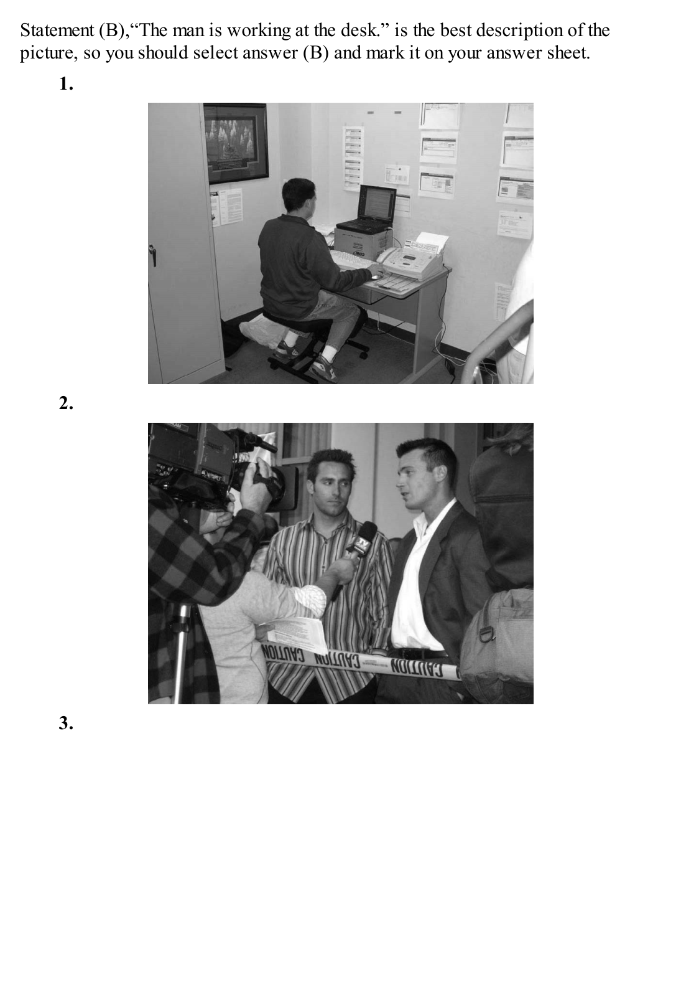

**听力原文与选项：**
- (A) He's clearing off the desk. (他在清理桌子。)
- (B) He's e-mailing a friend. (他在给朋友发邮件。)
- (C) He's putting up notices on the wall. (他正把通知贴到墙上去。)
- (D) He's sitting in front of the fax machine. (他坐在传真机前面。)

**其他可能表达：**
- He is sitting at the desk. (他坐在书桌旁。)
- He is working at the keyboard. (他正在使用键盘。)
- He is working with a computer. (他正在使用电脑。)

### Q2 (正确答案：C)

**听力原文与选项：**
- (A) One man is giving a speech in a conference hall. (一位男士正在会议厅里做演讲。)
- (B) All of the men are watching television. (所有的人都在看电视。)
- (C) One of the men is talking into the microphone. (其中一个人在对着话筒讲话。)
- (D) They are holding a conversation over coffee. (他们一边交谈一边喝咖啡。)

**其他可能表达：**
- One man is being interviewed. (一位男士正在被采访。)
- An interview is taking place at the moment. (现在正在进行一场采访。)
- The man being interviewed is speaking into a microphone. (被采访的男士正对着话筒讲话。)

### Q3 (正确答案：D)

**听力原文与选项：**
- (A) The women are waiting for the bus to arrive. (女士们正在等公交车。)
- (B) They're lining up to board the bus. (她们正在排队上公交车。)
- (C) Some of them are walking toward the bus. (她们中的一些人正走向公交车。)
- (D) The people have already gotten off the bus. (人们已经下了公交车。)

**其他可能表达：**
- They are walking away from the bus. (她们正从公交车那里走开。)
- The women are dressed for warm weather. (女士们都穿着暖和天气里穿的衣服。)
- Some of them are carrying bags. (她们中的一些人拿着包。)

### Q4 (正确答案：B)

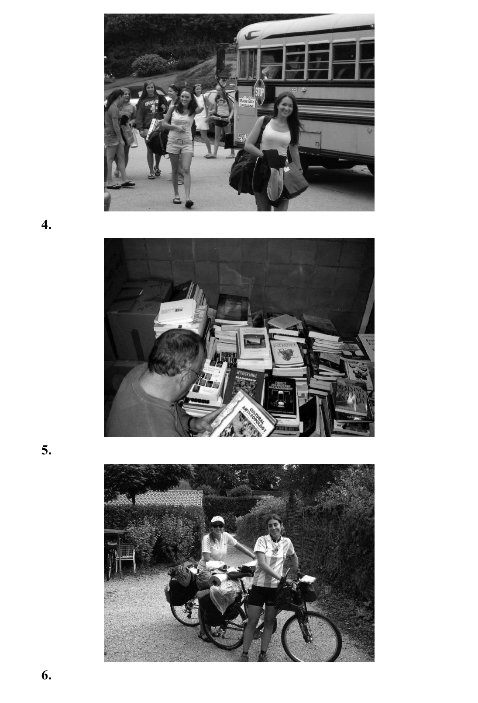

**听力原文与选项：**
- (A) The man is leaning over the long table. (男士正靠在长桌上。)
- (B) The man is sorting through the pile of books. (男士正在整理一堆书。)
- (C) The man is stacking the books on the shelves. (男士正把书堆放到书架上。)
- (D) The man is looking to make a purchase. (男士正在浏览，打算购买。)

**其他可能表达：**
- Some books have been stacked up in front of the man. (一些书已经堆放在男士面前。)
- The man is holding a book in front of him. (男士在他面前举着一本书。)
- He has picked up a book from the pile. (他从一堆书中拿起一本。)

### Q5 (正确答案：A)

**听力原文与选项：**
- (A) One of the women has a hat on. (其中一位女士戴着帽子。)
- (B) The women are riding their bicycles. (女士们在骑自行车。)
- (C) The bicyclists are locking up their bikes. (骑自行车的人正在锁车。)
- (D) They have stopped to get something from the store. (她们停下来到商店买东西。)

**其他可能表达：**
- The women have gotten off their bicycles. (女士们已经从自行车上下来了。)
- They are standing next to the bicycles. (她们正站在自行车旁边。)
- The bicycles are loaded with some goods. (自行车上载着一些货物。)

### Q6 (正确答案：C)

**听力原文与选项：**
- (A) Some customers are entering the store. (一些顾客正往商店里走。)
- (B) The store clerk is cleaning the store with a broom. (店员正在用扫帚清扫商店。)
- (C) Some goods have been hung on a rack outside of the store. (一些商品被挂在商店外面的架子上了。)
- (D) The floor of the store is being mopped. (有人正在拖商店的地板。)

**其他可能表达：**
- Some items are on display outside the store. (商店外面展示了一些物品。)
- The brooms have been put on a rack. (扫帚被放到架子上了。)
- There is a rack full of goods. (有一个装满货物的架子。)
- 注：在Part 1中，每道试题都添加了3种可能的正确表达方式，考生可
- 以了解对于同样的照片可能出现的不同表达。

## Part 2: 应答测试 (Q7 - Q31)

### Q7 (正确答案：C)

**听力对话文本：**
- **Q:** How much will it cost me to get to the airport by bus? (坐大巴去机场要花多少钱？)
- **A:** It's five dollars one way. (单程是5美元。)

**听力原文与选项：**
- **问题：** How much is the bus ride to the airport? (坐大巴到机场需要多少钱？)
- **选项：**
  - (A) Thirty minutes from here. (从这里走 30 分钟。)
  - (B) One will be leaving soon. (一辆车马上要出发了。)
  - (C) Five dollars for adults. (成人票 5 美元。)

### Q8 (正确答案：A)

**听力对话文本：**
- **Q:** Is there a place you regularly go to get your hair done? (你定期到某个地方做头发吗？)
- **A:** Yes, to a hair salon near my house. (是的，到我家附近的一个美发店。)

**听力原文与选项：**
- **问题：** Where do you usually get your hair done? (你通常在哪里做头发？)
- **选项：**
  - (A) From a hairstylist I know. (在一个我认识的发型师那里。)
  - (B) I don't like my hair long. (我不喜欢留长发。)
  - (C) Usually once a month. (一般是一个月一次。)

### Q9 (正确答案：B)

**听力对话文本：**
- **Q:** When are you thinking of returning to work? (你想什么时候回去上班？)
- **A:** I should recover in a couple of weeks. (我应该过几周就会康复。)

**听力原文与选项：**
- **问题：** When do you plan to go back to work? (你计划什么时候回去工作？)
- **选项：**
  - (A) I'll go back with you. (我会和你一起回去。)
  - (B) My doctor says in two weeks. (我的医生说两周之后。)
  - (C) I get off at five o'clock today. (我今天 5 点下车的。)

### Q10 (正确答案：C)

**听力对话文本：**
- **Q:** Where is Michelle's birthplace? (米歇尔的出生地是哪里？)
- **A:** She was born in Paris. (她出生在巴黎。)

**听力原文与选项：**
- **问题：** Where did Michelle say she was born? (米歇尔说她是在哪里出生的？)
- **选项：**
  - (A) She doesn't know it yet. (她还不知道。)
  - (B) Yes, she grew up there. (是的，她在那儿长大。)
  - (C) I think she is French. (我想她是法国人。)

### Q11 (正确答案：A)

**听力对话文本：**
- **Q:** Who is going to show up to the party this evening? (谁会出现在今晚的聚会上？)
- **A:** Everyone should be coming. (每个人都会来。注：在Part 2中，为帮助考生提高听懂题目的能力，添加了和试题相同或相似的表达方法。)

**听力原文与选项：**
- **问题：** Who is going to be at the party tonight? (今晚谁要去参加聚会？)
- **选项：**
  - (A) Everyone will be there. (每个人都会到那儿。)
  - (B) The party is going to be great. (聚会将会非常棒。)
  - (C) To celebrate our tenth anniversary. (为了庆祝我们的十周年纪念日。)

### Q12 (正确答案：C)

**听力对话文本：**
- **Q:** When are you going to finish the report? (你什么时候能完成这个报告？)
- **A:** I'll get it to you before lunch. (我会在午饭前拿给你。)

**听力原文与选项：**
- **问题：** When will you have the report ready? (你什么时候能把报告准备好？)
- **选项：**
  - (A) I report directly to Mr. Singh. (我直接向辛格先生报告。)
  - (B) Yes, you can give it to me. (是的，你可以把它给我。)
  - (C) I'll have it on your desk by noon. (我会在中午之前把它放到你桌上。)

### Q13 (正确答案：C)

**听力对话文本：**
- **Q:** Can you work the Saturday shift, or do you want me to ask John to come in instead? (你能上周六的班吗，还是你想要我让约翰来替你？)
- **A:** I can come in. (我可以来。)

**听力原文与选项：**
- **问题：** Do you want to work this Saturday, or should I get John to fill in for you? (你想这周六上班，还是我让约翰代替你？)
- **选项：**
  - (A) The work is not too bad. (这份工作不错。)
  - (B) This weekend is perfect. (这周末就很好。)
  - (C) I'll come in if you'd like. (如果你想要我来，我就来。)

### Q14 (正确答案：B)

**听力对话文本：**
- **Q:** Who dropped in to see me while I was on the road? (我在路上的时候谁来拜访过我？)
- **A:** Your insurance rep, Julie. (你的保险代理人，朱莉。)

**听力原文与选项：**
- **问题：** Who came by while I was out? (我出去的时候谁来过？)
- **选项：**
  - (A) I'll take it for you. (我会替你拿着它。)
  - (B) Julie, your insurance agent. (朱莉，你的保险经纪人。)
  - (C) I am expecting him today. (我今天在等他。)

### Q15 (正确答案：B)

**听力对话文本：**
- **Q:** Could you please shut the window a bit? (你能把窗户关上一点儿吗？)
- **A:** Yes, of course. (好的，当然可以。)

**听力原文与选项：**
- **问题：** Could you do me a favor and close the window a little? (你能帮我个忙把窗户关上一点儿吗？)
- **选项：**
  - (A) Next to the window, thanks. (窗户旁边，谢谢。)
  - (B) Sure, I can do that. (当然，我可以这么做。)
  - (C) Yes, they are very close. (好的，它们离得很近。)

### Q16 (正确答案：A)

**听力对话文本：**
- **Q:** Did Bill come in to the office today? (比尔今天来办公室了吗？)
- **A:** He is at home in bed. (他今天卧床在家。)

**听力原文与选项：**
- **问题：** Has anyone seen Bill today? (今天有人看见比尔吗？)
- **选项：**
  - (A) He called in sick. (他打电话请病假了。)
  - (B) I saw it many times. (我看见它许多次了。)
  - (C) Today is not a good day. (今天是糟糕的一天。)

### Q17 (正确答案：C)

**听力对话文本：**
- **Q:** How do you feel about our new receptionist? (你觉得咱们新来的接待员怎么样？)
- **A:** I didn' t get a chance to talk to her yet. (我还没有机会和她说话呢。)

**听力原文与选项：**
- **问题：** What do you think of our new receptionist? (你觉得咱们的新接待员怎么样？)
- **选项：**
  - (A) At the reception desk. (在前台。)
  - (B) I'll think it over tonight. (我今晚会仔细考虑。)
  - (C) I have not met her yet. (我还没有见过她。)

### Q18 (正确答案：B)

**听力对话文本：**
- **Q:** Did your meeting with your client go okay? (你和客户的会面进行得顺利吗？)
- **A:** Yes, it went very smoothly. (是的，进行得很顺利。)

**听力原文与选项：**
- **问题：** How did your meeting with your client go? (你和客户的会面进行得如何？)
- **选项：**
  - (A) Yes, let's take off. (是的，咱们出发吧。)
  - (B) It went better than I expected. (进行得比我预计的要好。)
  - (C) He left an hour ago. (他一个小时前走的。)

### Q19 (正确答案：A)

**听力对话文本：**
- **Q:** I spoke to the manager at last. (我终于和经理谈话了。)
- **A:** How did you manage that? (你怎么做到的？)

**听力原文与选项：**
- **问题：** I finally got a hold of the manager. (我最后找到经理了。)
- **选项：**
  - (A) How did you pull that off? (你怎么做到的？)
  - (B) They hold it for a month. (他们将其保存了一个月。)
  - (C) He doesn't work there anymore. (他再也不在那儿工作了。)

### Q20 (正确答案：A)

**听力对话文本：**
- **Q:** What time is the game scheduled to begin? (比赛计划什么时候开始？)
- **A:** As soon as the rain stops. (雨一停就开始。)

**听力原文与选项：**
- **问题：** When is the game supposed to start? (比赛什么时候开始？)
- **选项：**
  - (A) When the rain lets up a little. (雨小一点儿的时候。)
  - (B) The game is going to be great. (比赛将会很精彩。)
  - (C) Between Boston and New York. (在波士顿队和纽约队之间。)

### Q21 (正确答案：C)

**听力对话文本：**
- **Q:** Weren't you a little worried about Jack not showing up to work today? (杰克今天没来上班，你一点儿也不担心吗？)
- **A:** No, he phoned me this morning. (不担心，他今天早上给我打电话了。)

**听力原文与选项：**
- **问题：** Weren't you a bit concerned about Jack being absent today? (杰克今天没来，你一点儿也不担心吗？)
- **选项：**
  - (A) That's too bad. (那太糟糕了。)
  - (B) He is worried. (他很担心。)
  - (C) No, he called in. (不担心，他打过电话了。)

### Q22 (正确答案：B)

**听力对话文本：**
- **Q:** Would you be willing to go to Mexico if the company paid for your trip? (如果公司出钱，你愿意去墨西哥出差吗？)
- **A:** Sure, but why do you want me to take the trip? (当然，但是你为什么想让我出差呢？)

**听力原文与选项：**
- **问题：** Would you be willing to take a trip to Mexico on company expense? (公司出钱的话，你愿意出差去一趟墨西哥吗？)
- **选项：**
  - (A) Was it that expensive? (会花很多钱吗？)
  - (B) What's the occasion? (是什么事情呢？)
  - (C) He is well trained. (他受了很好的训练。)

### Q23 (正确答案：A)

**听力对话文本：**
- **Q:** Where can I get this authorized? (我到哪儿能获得授权呢？)
- **A:** John is the person you are looking for. (约翰是你要找的人。)

**听力原文与选项：**
- **问题：** Where should I go to get this approved? (我应该到哪儿去获得批准呢？)
- **选项：**
  - (A) Your best bet is to speak to John. (你最好去和约翰谈谈。)
  - (B) You have to prove it first. (你必须先证明它。)
  - (C) I could get it for you. (我可以为你拿到它。)

### Q24 (正确答案：B)

**听力对话文本：**
- **Q:** Do you get along with your manager okay? (你和老板相处得好吗？)
- **A:** Yes, he's very nice to me. (是的，他对我很好。)

**听力原文与选项：**
- **问题：** How do you get along with your boss? (你和老板相处得怎么样？)
- **选项：**
  - (A) I will bring it along tomorrow. (我明天会把它带来。)
  - (B) He is very kind to me. (他对我非常好。)
  - (C) Yes, he's my manager. (是的，他是我的经理。)

### Q25 (正确答案：A)

**听力对话文本：**
- **Q:** When do you plan to leave? (你打算几点走？)
- **A:** When Terry shows up to take over. (特里来接替我的时候。)

**听力原文与选项：**
- **问题：** What time are you thinking of taking off? (你想几点出发？)
- **选项：**
  - (A) As soon as Terry comes to replace me. (特里一来接替我，我就出发。)
  - (B) It's five after six right now. (现在是 6:05 。)
  - (C) I still need a little more time. (我还需要一点儿时间。)

### Q26 (正确答案：B)

**听力对话文本：**
- **Q:** Where is your manager? (你的经理在哪儿？)
- **A:** He's not here right now. (他现在不在这儿。)

**听力原文与选项：**
- **问题：** Where can I find the person in charge around here? (我在哪儿能找到负责人？)
- **选项：**
  - (A) We can charge it on his account. (我们可以把这个记在他的账上。)
  - (B) He stepped out for a moment. (他暂时出去了。)
  - (C) I will get it for you in a second. (我马上把它拿来给你。)

### Q27 (正确答案：C)

**听力对话文本：**
- **Q:** I'm thinking of skipping this conference, how about you? (我在想不去参加这个会议了，你呢？)
- **A:** I'm a bit busy with work, so I'm thinking of doing the same thing. (我工作有点儿忙，所以我也想这么办。)

**听力原文与选项：**
- **问题：** I'd rather go to the conference next time, wouldn't you? (我宁愿下次再去开会，你呢？)
- **选项：**
  - (A) Yes, I am really looking forward to it. (是的，我盼望的就是这个。)
  - (B) There will be so many people there. (那儿会有很多人。)
  - (C) Yes, I have too many things to do this week. (是的，这个礼拜我有太多事要做。)

### Q28 (正确答案：C)

**听力对话文本：**
- **Q:** Will you be making the trip to our head office, or is Mr. King supposed to come here? (你会出差去我们的总部，还是金先生应该到这儿来？)
- **A:** I made an appointment to see him at his office. (我约好在他的办公室见面。)

**听力原文与选项：**
- **问题：** Were you planning on making a trip to our head office, or is Mr. King coming here? (你计划出差到我们的总部去，还是金先生到这儿来？)
- **选项：**
  - (A) We are going to plan it soon. (我们马上就会做计划。)
  - (B) Mr. King might be the person to talk to. (或许可以和金先生谈谈。)
  - (C) I'm supposed to meet him at his office. (我应该去他的办公室见他。)

### Q29 (正确答案：A)

**听力对话文本：**
- **Q:** How about stopping by the store on our way back? (何不在回去的路上去一趟商店？)
- **A:** Okay, let's do that. (好，咱们就这么办。)

**听力原文与选项：**
- **问题：** Don't you want to drop by the store before heading back? (你不想回来之前顺路去一趟商店吗？)
- **选项：**
  - (A) Sure, that sounds good to me. (当然，我觉得听起来不错。)
  - (B) No, I'm not the one who dropped it. (不，不是我把它扔掉的。)
  - (C) I will need it back soon. (我需要它马上回来。)

### Q30 (正确答案：B)

**听力对话文本：**
- **Q:** You can call anytime if you need any assistance. (如果需要帮助，你可以随时打电话。)
- **A:** Thanks, I really appreciate it. (谢谢，非常感谢。)

**听力原文与选项：**
- **问题：** Please don't hesitate to ask me if you need something. (如果你需要什么，不必犹豫，问我就可以。)
- **选项：**
  - (A) He often hesitates. (他经常犹豫不决。)
  - (B) I'll keep that in mind, thanks. (我会记住的，谢谢。)
  - (C) Sure, I will give you an answer soon. (当然，我会很快给你一个答复。)

### Q31 (正确答案：A)

**听力对话文本：**
- **Q:** Do you want to come in the morning or after lunch? (你想上午来，还是午饭后来？)
- **A:** I would prefer the afternoon. (我想下午来。Questions 32 through 34 refer to the following conversation.M: Hello， Ms. Loomis. This is Brandon Carter calling.The items youordered from us on Monday have just arrived.（33）W:That's surprising news. They weren't supposed to arrive untilsometime next week.（33）M: One of our employees visited the warehouse this morning， so he picked upall the items and brought everything back in his truck.W:Wonderful. You even got the couch and armchair I ordered？（)

**听力原文与选项：**
- **问题：** Should I put you down for the morning or the afternoon? (我要登记一下时间，你是上午来还是下午来？)
- **选项：**
  - (A) Three o'clock would be okay with me. (三点就可以。)
  - (B) Yes, I'd like a morning call, please. (是的，我想要早晨叫醒服务。)
  - (C) Sure ， I could drive down to get you. (当然，我可以开车去接你。)

## Part 3: 简短对话 (Q32 - Q70)

### Questions 32 - 34

**听力独白/对话原文：**
**M:** Hello, Ms. Loomis. This is Brandon Carter calling. The items you ordered from us on Monday have just arrived. (33)
**W:** That's surprising news. They weren't supposed to arrive until sometime next week. (33)
**M:** One of our employees visited the warehouse this morning, so he picked up all the items and brought everything back in his truck.
**W:** Wonderful. You even got the couch and armchair I ordered? (32)
**M:** Of course. If you're at home today, we can deliver the shipment to you anytime between two and six. (34)
**W:** I'll be home by five o'clock. (34)
**M:** Great. I'll make the arrangements. (34)

**中文对照：**
> **M：**您好，鲁姆斯女士。我是布兰登·卡特。您周一从我们这里订购的货物刚刚已到货。
> **W：**这真是令人惊喜的消息。它们原本要下周才能到。
> **M：**今天早上我们的一个员工去了库房，所以他把所有东西都装到他的卡车中带回来了。
> **W：**太棒了。你们甚至还拿到了我订的沙发和扶手椅？
> **M：**当然。如果您今天在家，我们可以在2点到6点之间的任何时间把货送去。
> **W：**我五点钟之前会到家。
> **M：**太好了。我来安排。

**核心词汇与短语：**
- **surprising**：令人惊讶的
- **warehouse**：仓库；货栈
- **pick up**：捡起；获得；收拾；（汽车、飞机）乘载；不费力地学会
- **bring back**：拿回来；使恢复
- **armchair**：扶手椅，单人沙发
- **deliver**：交付；发表；递送
- **shipment**：装货；出货量

#### Q32 (正确答案：B)
**问题：** Where most likely does the man work? (男士很有可能在哪里工作？)
- (A) At the post office. (在邮局。)
- (B) At a furniture store. (在家具店。)
- (C) At an appliance store. (在电器商店。)
- (D) At a stationery store. (在文具店。)

#### Q33 (正确答案：A)
**问题：** Why is the woman surprised? (为什么女士感到很惊喜？)
- (A) Ordered items arrived early. (订购的物品提前到了。)
- (B) A price is lower than expected. (价格低于预期。)
- (C) A rare item is available. (一件稀有物品在售。)
- (D) Delivery will be made for free. (免费送货。)

#### Q34 (正确答案：C)
**问题：** What does the man imply when he says, “I'll make the arrangements”? (当男士说 “ 我来安排 ” 时，他暗含了什么意思？)
- (A) He will obtain all the items the woman wants. (他会拿到女士需要的所有东西。)
- (B) Some items will be installed in the woman's home. (会在女士的家里安装一些东西。)
- (C) The woman's items will be delivered in the evening. (女士的物品将会在晚上送到。)
- (D) He can have some items returned to the warehouse. (他可以把一些物品退回库房。)

**延伸表达与补充：**
- **be supposed to do ~ = be expected to do ~** (应该…；被期望做…)
  - *例句：You're supposed to ask the teacher if you want to leave the classroom.* (如果你要离开教室，应该先问问老师。)
- **of course = sure = certainly** (当然)
  - *例句：You're not really seriously considering this thing, are you? — No, of course not.* (你不是真的在认真考虑这件事，是吧？——没有，当然没有。)

### Questions 35 - 37

**听力独白/对话原文：**
**M1:** The date of the computer conference has been set for next Tuesday. (35) Could you do me a favor and call the hotel we deal with to make reservations for two rooms?
**M2:** Sure, Paul, I will take care of it right away. But what are you going to do about the meeting you had scheduled with Mr. Nolan? Do you want me to call him and cancel? (36)
**M1:** Oh, I completely forgot all about him. You know, I can't miss this meeting with him. It's too important. On second thought, I think I'd better send Sally to New York to attend the conference with you. She has been working on the presentation, and she should be able to make the presentation in my place. (37)
**M2:** You're right, but Sally might not be too happy to hear about this. I think she has a trip scheduled the week after with Mr. Singh.

**中文对照：**
> **M1：**电脑会议的日期定在下周二了。你能帮我给咱们的合作宾馆打电话预订两个房间吗？
> **M2：**当然可以，保罗。我马上就去办。但是你已经和诺兰先生定好的会面怎么办？你要我给他打电话把会面取消吗？
> **M1：**哦，我完全把他的事忘了。你知道，我不能不和他会面，这很重要。重新考虑的话，我想我最好派萨莉和你一起去纽约参加会议。她一直在准备这次讲话，她应该能替我发言。
> **M2：**你说得对，可是萨莉知道以后也许不会高兴。我想她定好下周和辛格先生出差的。

**核心词汇与短语：**
- **set**：确定；制定
- **deal with**：做生意，打交道
- **make a reservation**：预订（房间）
- **take care of**：操心；处理
- **miss**：错过；失去
- **on second thought**：重新考虑
- **make a presentation**：讲话，发言
- **mistakenly**：错误地
- **conflicting**：冲突的

#### Q35 (正确答案：B)
**问题：** When is the date of the conference? (会议的日期是什么时候？)
- (A) This Monday. (本周一。)
- (B) Next week. (下周。)
- (C) In two weeks. (两周以后。)
- (D) Next month. (下个月。)

#### Q36 (正确答案：B)
**问题：** What is the problem? (出了什么问题？)
- (A) Mr. Nolan cannot attend the conference. (诺兰先生不能参加会议了。)
- (B) Paul mistakenly made two conflicting plans. (保罗错误地做了两个有冲突的计划。)
- (C) Sally forgot to book the rooms. (萨莉忘记预订房间了。)
- (D) Mr. Singh has not returned from his trip. (辛格先生出差还没回来。)

#### Q37 (正确答案：B)
**问题：** Who most likely is going to make the presentation in New York? (谁最有可能去纽约讲话？)
- (A) Mr. Nolan. (诺兰先生。)
- (B) Sally. (萨莉。)
- (C) Paul. (保罗。)
- (D) Mr. Singh. (辛格先生。)

**延伸表达与补充：**
- **I will take care of it right away. = I will look after it at once. = I will look into it immediately.** (我会立刻处理这件事。)
- **on second thought = to think about it again** (重新考虑一下)
  - *例句：On second thought, let's just stay in instead.* (经过重新考虑，我们还是留下来吧。)
- **in my place = instead of me = take over my position** (代替我)
  - *例句：You should go there in my place.* (你应该代替我到那儿去。)
- **Sally might not be too happy to hear about this. = Sally will be angry about this. = Sally probably won't be very pleased to hear about this.** (萨莉知道以后也许会不高兴。)

### Questions 38 - 40

**听力独白/对话原文：**
**M:** After searching for weeks, I'm so relieved to say that we have finally found a person to take over John's position. His name is Henry Chow. (38)
**W:** You see, I told you not to worry too much about it. I knew it was only a matter of time before we found someone. Anyway, where did you ever find this guy?
**M:** Well, we took out ads in the local paper and on Internet sites without much luck. We even contacted several job agencies but got nothing. But to our surprise, we found this guy from one of our branch offices. (39) Mr. Taylor went to see Ms. Simpson in our North Town branch office and saw Henry and liked him right away. After talking with him for several minutes, he decided to hire him right there and then. Anyway, he is going to start next Monday. (40)
**W:** Wow, that's quite a story. I can't wait to meet him.

**中文对照：**
> **M：**找了几个星期，我们终于找到接替约翰的人了，这下我就放心了。他叫亨利·乔。
> **W：**你瞧，我告诉过你别太担忧了。我就知道这只是时间问题，我们最后会找到人的。对了，你们在哪儿找到这个人的？
> **M：**哦，我们在当地报纸上和网站上登了广告，都没有收获。我们甚至还联系了几家职业介绍所，但也没有结果。我们很意外地在一个分公司找到了这个人。泰勒先生到我们的北城分公司见辛普森女士的时候看到了亨利，立刻就喜欢上他了。和他谈了几分钟以后，他当场就决定聘用他。不管怎么说，他下周一开始上班。
> **W：**哇，这真令人难以置信。我等不及要见他了。

**核心词汇与短语：**
- **relieve**：放心；缓和（不快或痛苦）
- **take over**：接管，接替
- **matter of time**：时间的问题
- **to one's surprise**：令人惊奇的是
- **replacement**：代替者

#### Q38 (正确答案：B)
**问题：** Why does the man say, “I'm so relieved”? (男士为什么说 “ 我放心了 ” ？)
- (A) John has finally returned from his vacation. (约翰终于度假回来了。)
- (B) A replacement for a vacant position has been found. (空缺岗位的代替者找到了。)
- (C) The ads Henry took out are bringing in results. (亨利登的广告有效果了。)
- (D) A high-paying job has been offered to him. (他获得了一份高薪工作。)

#### Q39 (正确答案：D)
**问题：** Where did Henry work before? (亨利以前在哪里工作？)
- (A) At a newspaper company. (在报社。)
- (B) At a computer Internet company. (在电脑网络公司。)
- (C) At a job recruiting agency. (在职业介绍所。)
- (D) At the company's branch office. (在该公司的分公司。)

#### Q40 (正确答案：C)
**问题：** What will happen next Monday? (下周一会发生什么事？)
- (A) The company ad will be printed. (公司的广告会被印刷出来。)
- (B) A branch office will open. (一家分公司将开业。)
- (C) A new employee will start a job. (一名新员工会开始上班。)
- (D) There will be a retirement party for John. (会为约翰举办一个退休宴会。)

**延伸表达与补充：**
- **after searching for weeks = after looking around for weeks** (寻找了几个星期以后扩展表达：)
  - *例句：after having no luck for weeks After searching for weeks, we finally managed to find out where Mr. Sellar lives.* (在几个星期都没有结果以后寻找了几个星期以后，我们终于成功找到塞勒先生的住处了。)
- **take over John's position = take on John's work = fill in for John at work** (接替约翰的工作)
  - *例句：Larry was asked to take over John's position for a while.* (拉里被要求接替约翰的工作一段时间。)
- **but to our surprise = but surprisingly = unlike what we had expected** (但是令我们惊奇的是)
  - *例句：But to our surprise, Sally came in first in our last sales campaign.* (但是让我们惊奇的是，萨莉在我们最近的一次促销活动中得了第一名。)
- **Wow, that's quite a story. = Wow, that's pretty hard to believe. = Wow, that is pretty wild.** (哇，这真令人难以置信。)
- **I can't wait to meet him. = I am looking forward to meeting him. = I am so eager to meet him.** (我等不及要见他了。)

### Questions 41 - 43

**听力独白/对话原文：**
**M:** Do we still have far to go? This carry-on bag is really hurting my shoulder. （ 41, 42 ）
**W:** We're almost there. The gate is just up those stairs there. (41) What do you have in your bag anyway?
**M:** Oh, I picked up some CDs and toys for my kids. The prices are unbelievably cheap here.
**W:** This must be your first trip here. I remember picking up things when I first came here. After a while, you forget that everything here is cheaper than things back home. (43)

**中文对照：**
> **M：**我们还要走很远吗？这个手提包弄得我的肩膀真疼。
> **W：**我们就快到了。那些楼梯上面就是登机口了。你的包里到底有什么？
> **M：**哦，我给孩子买了一些CD和玩具。这儿的价格太便宜了，让人难以置信。
> **W：**你一定是第一次来这儿吧。我记得我第一次到这儿来时买了东西。过不了多久，你就会忘记这里的所有东西都比家里的便宜。

**核心词汇与短语：**
- **carry-on**：手提的
- **hurt**：弄疼
- **unbelievably**：难以置信地
- **cheap**：便宜的
- **pick up**：获得；买

#### Q41 (正确答案：B)
**问题：** Where is the conversation most likely taking place? (对话最有可能是在哪里发生的？)
- (A) At a toy store. (在玩具店。)
- (B) At an airport. (在机场。)
- (C) At a record store. (在唱片商店。)
- (D) At a travel agency. (在旅行社。)

#### Q42 (正确答案：A)
**问题：** What does the man complain about? (男士抱怨什么？)
- (A) How heavy his bag is. (他的包太重了。)
- (B) How far the airport is. (机场太远了。)
- (C) How expensive the tickets are. (票太贵了。)
- (D) How difficult it is to get home. (回家太困难了。)

#### Q43 (正确答案：D)
**问题：** What can be inferred about the woman? (关于女士可以推测出什么？)
- (A) She does not like to travel. (她不喜欢旅行。)
- (B) She only buys expensive things. (她只买贵的东西。)
- (C) She has many children. (她有很多孩子。)
- (D) She has been here many times. (她来这儿很多次了。)

**延伸表达与补充：**
- **Do we still have far to go? = Are we close? = How much more before we get there?** (我们还要走很远吗？)
- **The prices are unbelievably cheap here.** (这儿的价格太便宜了，让人难以置信。扩展表达：)
  - *例句：The cost of things is really low here. Everything is a bargain.* (这儿的东西真是太便宜了。每样东西都很便宜。)

### Questions 44 - 46

**听力独白/对话原文：**
**W:** Hey, I heard you finally landed yourself a job. How did you manage to do that? (44)
**M:** Well, it's a bit funny how I got this job. I mean, I searched all the employment agencies and had been reading the classified ads section of the newspaper every day for the last few weeks without having any luck. Then, I got this phone call from a friend of mine I hadn't talked to since I graduated from college. He told me that he started a company and he wanted me to help him out. (45)
**W:** Wow, that is a bit far-fetched. How long has it been since you graduated?
**M:** It's been four years. (46) I guess I am really lucky to get this chance since the job market is terrible nowadays.

**中文对照：**
> **W：**嘿，听说你终于找到工作了。你是怎么找到的？
> **M：**哦，我找到这个工作的过程挺有意思的。我是说，我找了所有的职业介绍所，几周以来每天都读报纸上的分类广告栏，但是毫无结果。后来，我接到一个电话，是我大学毕业后一直没联系过的一个朋友打来的。他告诉我他开了一家公司，想让我去帮忙。
> **W：**哇，那真有点儿不可思议。你毕业多久了？
> **M：**四年了。我想我得到这个机会真的很幸运，因为当前的就业市场太不景气了。

**核心词汇与短语：**
- **land a job**：得到一份工作
- **manage to**：设法
- **employment**：职业
- **classified ad**：分类广告
- **section**：栏目
- **far-fetched**：离奇的，不可思议的

#### Q44 (正确答案：D)
**问题：** What are they talking about? (他们在谈论什么？)
- (A) The college the woman had attended. (女士上过的大学。)
- (B) A newspaper article the woman had read. (女士读过的报纸上的一篇文章。)
- (C) The economic situation of the nation. (国家的经济形势。)
- (D) The man's new employment opportunity. (男士的新工作机会。)

#### Q45 (正确答案：C)
**问题：** According to the man, what did his friend recently do? (根据男士所说，他的朋友最近做了什么？)
- (A) Graduate from school. (从学校毕业了。)
- (B) Land a new job. (找到一份新工作。)
- (C) Start a business. (开了一家公司。)
- (D) Write a newspaper article. (给报纸写了一篇文章。)

#### Q46 (正确答案：D)
**问题：** When did the man graduate from college? (男士什么时候大学毕业的？)
- (A) A year ago. (一年前。)
- (B) Two years ago. (两年前。)
- (C) Three years ago. (三年前。)
- (D) Four years ago. (四年前。)

**延伸表达与补充：**
- **How did you manage to do that? = How did you do that? = How did you pull that off?** (你是怎么做到的？)
- **It's a bit funny how I got this job.** (我找到这个工作的过程挺有意思的。扩展表达：)
  - *例句：I didn't expect to get the job this way. I got this job by a fluke.* (我没料到会以这种方法找到工作。我侥幸得到这份工作。)
- **without having any luck = without much success = without having any results** (没有任何结果)
- **That is a bit far-fetched. = That's a bit unusual. = That's somewhat strange.** (那真有点儿不可思议。)

### Questions 47 - 49

**听力独白/对话原文：**
**M1:** Dave, hasn't the shipment of computer monitors gone out to the electronics shops yet? (47)
**M2:** The truck left here five minutes ago, (47) Mr. Curtis. Why do you ask?
**M1:** I just received a call from Mr. Brown, the manager of the Bad Boys Electronics Store, and he said that he was in a hurry to receive the goods. (48) I think you'd better call the truck driver and ask him to drop by there first.
**M2:** I don't think I have to do that. As far as I am concerned, Bad Boys is first on his list. (49)

**中文对照：**
> **M1：**戴夫，电脑显示器还没送往电子产品商店吗？
> **M2：**卡车5分钟前走的，柯蒂斯先生。你为什么问这个？
> **M1：**我刚才接到坏小子电子产品商店的经理布朗先生的电话，他说他急需这批货。我想你最好给卡车司机打一个电话，让他先到那儿去。
> **M2：**我觉得不必给他打电话。据我所知，坏小子电子产品商店是他第一个要去的地方。

**核心词汇与短语：**
- **shipment**：装运
- **go out**：出发
- **electronics**：电子产品
- **in a hurry**：匆忙，赶紧
- **drop by**：顺道拜访，路过
- **as far as I am concerned**：在我看来；据我所知

#### Q47 (正确答案：D)
**问题：** Where most likely is the conversation taking place? (对话最有可能发生在哪里？)
- (A) At an electronics store. (在电子产品商店。)
- (B) In a truck. (在卡车里。)
- (C) At a city port. (在城市的港口。)
- (D) In a warehouse. (在仓库。)

#### Q48 (正确答案：B)
**问题：** Why did Mr. Brown call? (布朗先生为什么打电话？)
- (A) To place an order. (他要下订单。)
- (B) To request a quick delivery. (他要求尽快送货。)
- (C) To change his order. (他要更改订单。)
- (D) To talk to the truck driver. (他要和卡车司机讲话。)

#### Q49 (正确答案：A)
**问题：** According to Dave, where will the truck driver first go? (根据戴夫所说，卡车司机最先会去哪儿？)
- (A) To the Bad Boys Electronics Store. (去坏小子电子产品商店。)
- (B) To the company warehouse. (去公司的库房。)
- (C) To the computer department. (去电脑部。)
- (D) To his truck. (去他的卡车那儿。)

**延伸表达与补充：**
- **drop by = stop by = swing by** (顺道拜访，路过)
  - *例句：We have to drop by there first before heading to the airport.* (我们去机场之前得先顺道去那里一趟。)
- **as far as I am concerned = in my point of view = in my opinion** (据我所知，我认为)
  - *例句：As far as I am concerned, he is not the right person for this project.* (我认为他不适合做这个项目。)
- **first on his list = first thing to do = first thing on his agenda** (他要做的第一件事)
  - *例句：Picking up some drinks is first on his list of things to do today.* (他今天要做的第一件事就是买一些喝的。)

### Questions 50 - 52

**听力独白/对话原文：**
**M:** I was at the mall and saw this beautiful laptop. I couldn't help but pick it up. Don't you think it's nice? (50)
**W:** Yes, it's a very nice laptop, but why did you buy it? I thought you just picked up a new one a few weeks ago.
**M:** I know, but I was not happy with the keyboard, so I gave it to my brother, and he gave me the money to buy this one. (51)
**W:** You guys must have a lot of money. These laptops cost an arm and a leg. (52)

**中文对照：**
> **M：**我在商场看到这台漂亮的手提电脑忍不住就买下来了。你不觉得这台电脑很棒吗？
> **W：**是的，是台很好的手提电脑，但是你为什么要买呢？我想你几星期前刚刚买了一台新的。
> **M：**我知道，但是我不喜欢那个键盘，所以我把它转给我弟弟了，我用他给我的钱买了这台。
> **W：**你们肯定有很多钱。这些手提电脑要花好多钱呢。

**核心词汇与短语：**
- **pick up**：获得，购买
- **be happy with ~**：对满意
- **cost an arm and a leg**：花费很大
- **show off**：炫耀

#### Q50 (正确答案：B)
**问题：** What is the man doing? (男士在做什么？)
- (A) Buying a computer. (买电脑。)
- (B) Showing off his new purchase. (炫耀他新买的东西。)
- (C) Typing up some work. (把一些工作打字打出来。)
- (D) Introducing his brother. (介绍他的弟弟。)

#### Q51 (正确答案：C)
**问题：** What happened to the man's old computer? (男士的旧电脑怎么了？)
- (A) He lost it. (他把它弄丢了。)
- (B) He broke it. (他把它弄坏了。)
- (C) He sold it. (他把它卖了。)
- (D) He returned it. (他把它还了。)

#### Q52 (正确答案：A)
**问题：** What does the woman imply when she says, “These laptops cost an arm and a leg”? (女士说 “ 这些手提电脑要花好多钱呢 ” ，她在暗示什么？)
- (A) These laptops are very expensive. (这些手提电脑非常贵。)
- (B) These laptops don't weigh very much. (这些手提电脑的重量较轻。)
- (C) These laptops have gotten smaller. (这些手提电脑越来越小。)
- (D) These laptops are well designed. (这些手提电脑设计得很好。)

**延伸表达与补充：**
- **I couldn't help but pick it up. = I had to get it. = I couldn't stop myself from buying it.** (我忍不住把它买下来了。)
- **These laptops cost an arm and a leg. = These laptops are very expensive. = These laptops are very pricey.** (这些手提电脑非常贵。)

### Questions 53 - 55

**听力独白/对话原文：**
**M:** Ms. Sanchez, I heard that the boss hired someone for the open position. Do you know who this person is?
**W:** Yes, I just got the word from Mr. Miller, and he said that the general manager's position was going to go to Mr. Lee because of his experience. （ 53, 54 ） According to him, it was a tough call because both Mr. Lee and Mr. Harris have excellent qualifications.
**M:** They are both excellent candidates. But I am a bit surprised that Ms. Simpson was not included in the race. I was sure that she would be considered.
**W:** She was in the running, but I heard she pulled out of the race because getting a promotion means working longer hours, and she just was not interested in doing that. (55)

**中文对照：**
> **M：**桑切斯女士，我听说老板为那个空缺的职位聘到一个人。你知道那个人是谁吗？
> **W：**知道，我刚刚听米勒先生说，总经理的职位给了李先生，因为他的经验丰富。照他所说，那是个艰难的决定，因为李先生和哈里斯先生条件都很优越。
> **M：**他们都是出色的候选人，不过我有点儿惊讶，辛普森女士没有参加此次竞选。我本来很肯定她会被考虑进去的。
> **W：**她曾参加了竞选，不过我听说她退出了，因为升职意味着工作时间更长，而她不喜欢那样。

**核心词汇与短语：**
- **open position**：空缺的职位
- **excellent**：出色的
- **qualification**：资格，条件
- **consider**：考虑
- **running**：竞选；比赛
- **pull out of**：退出
- **race**：比赛；竞争
- **lead to**：导致，引起
- **ethics**：道德，伦理
- **drop out of**：退出

#### Q53 (正确答案：A)
**问题：** What led to the decision made by the boss? (什么促使老板做出这个决定？)
- (A) The experience of the candidates. (候选人的经验。)
- (B) The words of advice from Mr. Lee. (李先生的建议。)
- (C) The work ethics of Ms. Simpson. (辛普森女士的职业道德。)
- (D) The interest shown by the employees. (员工显示出的兴趣。)

#### Q54 (正确答案：C)
**问题：** Who got the position? (谁得到了这个职位？)
- (A) Ms. Sanchez. (桑切斯女士。)
- (B) Mr. Miller. (米勒先生。)
- (C) Mr. Lee. (李先生。)
- (D) Mr. Harris. (哈里斯先生。)

#### Q55 (正确答案：C)
**问题：** According to the woman, why did Ms. Simpson drop out of the race? (根据女士所说，辛普森女士为什么退出竞争？)
- (A) She felt that she was not qualified. (她觉得自己不够格。)
- (B) She was not feeling well. (她感觉不舒服。)
- (C) She is not interested in working harder. (她不想工作太辛苦。)
- (D) She has other things to do. (她有其他事情要做。)

**延伸表达与补充：**
- **open position = vacant position = available position** (空缺的职位)
  - *例句：An open position has come up in our department.* (我们部门出现了一个空缺的职位。)
- **I just got the word that ~ = I just heard that ~ = I was just told that ~** (我刚刚听说…)
  - *例句：I just got the word from my manager that I was going to get the promotion.* (我刚刚听经理说我要被提拔了。)
- **a tough call = a difficult decision = a hard decision** (一个棘手的问题；一个艰难的决定)
  - *例句：It was a tough call, but someone had to make it.* (这是个艰难的决定，但是总要有人做这个决定。)
- **in the race = in the running** (参加竞选)
  - *例句：Mr. Jackson is in the race for the next election.* (杰克逊先生将参加下届竞选。)
- **pull out of the race = quit the race = drop out of the race** (退出比赛；退出竞争)
  - *例句：David pulled out of the race to concentrate his time on his family.* (戴维退出竞争，以便把时间投入到家庭中。)

### Questions 56 - 58

**听力独白/对话原文：**
**W:** The sale is going to start tomorrow. Has everything that's being discounted been put out on display? (56)
**M:** Not yet. We still need to set up a few racks in the men's clothing section. I can take care of that after my break. (57)
**W:** Do you think you can handle it by yourself? (57)
**M:** You have my word. (57)
**W:** That's good to hear. I'm going to tell Rick and Stephanie to set up the signs so that all of our shoppers know about the sale.
**M:** Excellent. We should also leave flyers by the cash registers for customers to take. (58)

**中文对照：**
> **W：**促销活动明天开始。所有打折商品都陈列好了吗？
> **M：**还没有。我们还要在男装区装几个货架。休息过后我来搞定。
> **W：**你觉得你一个人可以搞定吗？
> **M：**我向你保证。
> **W：**很高兴听你这么说。我去让里克和斯蒂芬妮放几个指示牌，让顾客知道促销的事。
> **M：**太棒了。我们还可以在收银机旁放一些宣传单让顾客自取。

**核心词汇与短语：**
- **sale**：大减价，甩卖
- **discount**：打折
- **put out**：熄灭；把摆好
- **on display**：展览；公开展出
- **not yet**：还没有
- **handle**：处理；操作
- **set up**：建立；装配；开业
- **rack**：货架；行李架
- **tell sb. to do sth**：告诉某人做某事
- **cash register**：收银机

#### Q56 (正确答案：C)
**问题：** What are the speakers mainly discussing? (对话者主要在谈论什么事情？)
- (A) Tomorrow's work schedule. (明天的工作计划。)
- (B) Their coworkers' duties. (他们同事的职责。)
- (C) Preparations for a sale. (促销活动的准备。)
- (D) A strategy for selling products. (销售产品的一个策略。)

#### Q57 (正确答案：D)
**问题：** What does the man mean when he says, “You have my word”? (男士说 “ 我向你保证 ” 是什么意思？)
- (A) He completed a task the woman assigned. (他完成了女士布置的一项任务。)
- (B) He has spoken with some of his colleagues. (他已经和几位同事谈过。)
- (C) He is able to operate a cash register. (他能操作收银机。)
- (D) He can set up some items by himself. (他可以自己陈列好物品。)

#### Q58 (正确答案：B)
**问题：** What does the man suggest doing? (男士建议做什么事情？)
- (A) Working with Rick and Stephanie. (跟里克和斯蒂芬妮一起工作。)
- (B) Providing customers with flyers. (向顾客提供一些传单。)
- (C) Displaying more women's clothes. (展示更多的女士服装。)
- (D) Giving coupons to more shoppers. (给顾客更多的优惠券。)

**延伸表达与补充：**
- **take care of ~ = be responsible for ~** (负责…)
  - *例句：Will you take care of buying foods for tonight's party?* (你负责买今晚聚会吃的食物好吗？)
- **You have my word. = I promise you.** (我向你保证。)
  - *例句：The work will be finished by the end of this week; you have my word.* (这项工作一定会在周末之前完成，我向你保证！)
- **That's good to hear. = That's glad to hear.** (很高兴听到你这么说。)
  - *例句：That's good to hear. Would you mind telling me a little bit about your present job?* (很高兴听到你这么说。你不介意给我介绍一下你现在的工作吧？)

### Questions 59 - 61

**听力独白/对话原文：**
**M1:** Dave, were you able to download that app you were telling me about? I'm having some issues getting it on my phone. (59)
**M2:** Are you referring to the one which monitors all public transportation in the city, Jeff? (60)
**M1:** Yeah, that's the one I'm talking about.
**M2:** I tried downloading it last night, but I had a problem as well. I'm not sure what's going on.
**W:** According to Susan, there were some bugs in the programming, so the city has made it unavailable for a while. It should be ready three days from now. (61)
**M1:** Great. I'm looking forward to being able to use it.

**中文对照：**
> **M1：**戴夫，你能下载你告诉我的那个

**核心词汇与短语：**
- **app**：吗？我的手机下载它有些问题。
- **M2:**：杰夫，你指的是监测全市所有公共交通的那个
- **app**：吗？
- **M1:**：对，我说的是那个。
- **M2:**：昨晚我也尝试着下载，但也遇到了一些小问题。我也不知道是怎么回事。
- **W:**：据苏珊说，之前该软件中有一些漏洞，所以市里短期内停止了它的使用。应该三天之后就可以了。
- **M1:**：太好了！我很期待使用它。
- **download**：下载
- **issue**：问题
- **refer to**：提到，谈到
- **monitor**：监测，监视
- **bug**：（计算机程序等的）故障，毛病
- **unavailable**：不可用的

#### Q59 (正确答案：B)
**问题：** What does Jeff mean when he says, “I'm having some issues”? (当杰夫说 “ 我遇到点问题 ” 时，意味着什么？)
- (A) He cannot follow the instructions. (他看不懂说明书。)
- (B) He cannot download the app. (他不能下载这款 app 。)
- (C) He cannot pay with his credit card. (他不能用信用卡付款。)
- (D) He cannot use his phone. (他不能使用他的手机。)

#### Q60 (正确答案：D)
**问题：** What is the app used for? (这款 app 被用来做什么？)
- (A) Monitoring the weather. (监测天气。)
- (B) Playing games. (打游戏。)
- (C) Doing bank transactions. (进行银行交易。)
- (D) Checking on public transportation. (查看公共交通。)

#### Q61 (正确答案：A)
**问题：** What will happen in three days? (三天后将会发生什么？)
- (A) The app will be fixed. (app 将会被修复。)
- (B) A sale will be held. (将举行一场拍卖。)
- (C) A repairperson will arrive. (一位修理工将会到达。)
- (D) An office will be opened. (一家公司将开业。)

**延伸表达与补充：**
- **I'm having some issues ~ = I'm having some problems ~** (我的…出了些问题。)
  - *例句：I'm having issues inputting a name.* (我在输入名字的时候遇到了问题。)

### Questions 62 - 64

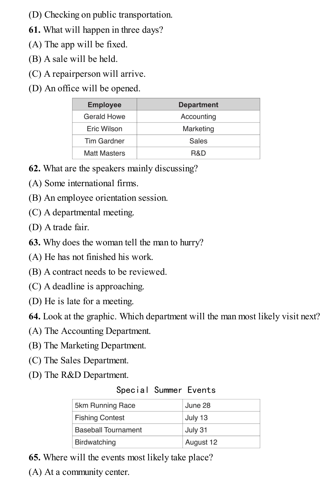

**听力独白/对话原文：**
**M:** I heard we're going to be sending some employees to the trade fair next week. (62)
**W:** That's right. Mr. Wilson decided to rent a booth since so many international firms will be represented there. (64)
**M:** I'd love to go. I've been to several trade fairs in the past, so I'm familiar with what happens at them.
**W:** You'd better drop by his department and talk to him soon in that case. (64) All attendees must be registered by the end of the day tomorrow. (63)
**M:** I wasn't aware of that. Thanks for letting me know.
**W:** No problem.

**中文对照：**
> **M：**我听说下周我们要派一些员工去参加商品交易会。
> **W：**是的。威尔逊先生决定租一个展位，因为有非常多的跨国公司都将派人出席这次交易会。
> **M：**我想去。以前我去过好几次商品交易会了，所以我对商品交易会上的一切情况都很了解。
> **W：**那样的话，你最好去一下他的部门，和他谈谈。所有的参会者都必须在明天结束之前报名。
> **M：**我还不知道这一点。谢谢你告诉我。
> **W：**不客气。

**核心词汇与短语：**
- **trade fair**：商品交易会
- **booth**：摊位
- **represent**：作为的代表
- **attendee**：参加者，出席者
- **register**：登记；注册
- **be aware of**：明白，意识到

#### Q62 (正确答案：D)
**问题：** What are the speakers mainly discussing? (对话者主要在讨论什么？)
- (A) Some international firms. (一些跨国企业。)
- (B) An employee orientation session. (员工岗前培训会。)
- (C) A departmental meeting. (部门会议。)
- (D) A trade fair. (商品交易会。)

#### Q63 (正确答案：C)
**问题：** Why does the woman tell the man to hurry? (女士为何告诉男士要抓紧时间？)
- (A) He has not finished his work. (他尚未完成工作。)
- (B) A contract needs to be reviewed. (合同需要审核。)
- (C) A deadline is approaching. (很快要到截止时间了。)
- (D) He is late for a meeting. (他开会迟到了。)

#### Q64 (正确答案：B)
**问题：** Look at the graphic. Which department will the man most likely visit next? (对照图表，男士接下来最有可能将要去哪个部门？)
- (A) The Accounting Department. (财会部。)
- (B) The Marketing Department. (市场部。)
- (C) The Sales Department. (销售部。)
- (D) The R&D Department. (研发部。)

**延伸表达与补充：**
- **be familiar with = know ~ well** (对…很熟悉拓展表达：)
  - *例句：be familiar to sb. I am not very familiar with the dialect that the tour guide is speaking.* (对某人来说是熟悉的我不太熟悉这个导游所说的方言。)
- **drop by = visit** (拜访拓展表达：)
  - *例句：drop in （ on sb. ） I just dropped by to see how you were getting on.* (拜访（某人）我只是过来看看你们过得怎么样。)
- **be aware of = know** (知道)
  - *例句：The children are aware of the danger of taking drugs.* (孩子们知道吸毒的危险性。)

### Questions 65 - 67

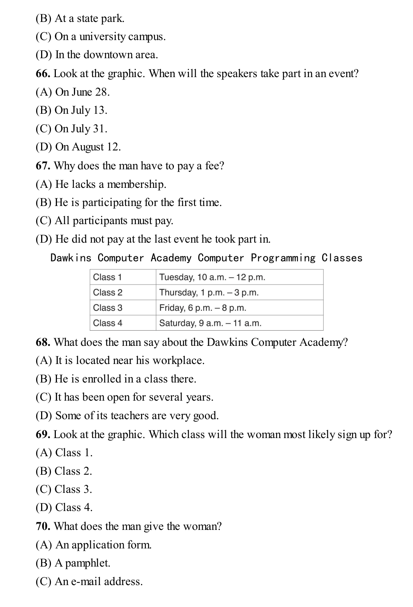

**听力独白/对话原文：**
**W:** Did you see the list of activities taking place at the community center that was released today? (65)
**M:** Not yet. Is there anything on there that looks interesting? I'd love to do some fun activities this summer.
**W:** I'm thinking of taking part in the fishing contest. Would you like to join me? We can be on the same team. (66)
**M:** Okay, that sounds good to me. Do we have to pay a fee to enter?
**W:** I don't, because I'm a member of the community center, but since you don't belong to it, it will cost you $15 to enter. (67)
**M:** Okay, I don't mind paying that amount of money. Special Summer Events

**中文对照：**
> **W：**你看到今天公布的社区活动中心开展的活动了吗？
> **M：**还没有。有什么看起来有趣的活动吗？今年夏天我想参加一些有意思的活动。
> **W：**我正在考虑参加钓鱼比赛。你愿意和我一起吗？我们可以加入同一个队。
> **M：**好啊，那听上去不错。参加活动需要付费吗？
> **W：**我不需要，因为我是社区活动中心的成员，但是由于你不是社区活动中心的成员，参加的话需要交15美元。
> **M：**好吧。我不介意付那笔费用。夏日特别活动

**核心词汇与短语：**
- **the list of**：的名单列表
- **release**：公布，发布
- **not yet**：还没有，尚未
- **fishing contest**：钓鱼比赛
- **pay a fee**：付费
- **amount**：数量

#### Q65 (正确答案：A)
**问题：** Where will the events most likely take place? (这些活动将在哪里举办？)
- (A) At a community center. (在一个社区活动中心。)
- (B) At a state park. (在一个国家公园。)
- (C) On a university campus. (在一个大学校园。)
- (D) In the downtown area. (在市中心区域。)

#### Q66 (正确答案：B)
**问题：** Look at the graphic. When will the speakers take part in an event? (请看图表，对话双方将在什么时候参加活动？)
- (A) On June 28. (6 月 28 日。)
- (B) On July 13. (7 月 13 日。)
- (C) On July 31. (7 月 31 日。)
- (D) On August 12. (8 月 12 日。)

#### Q67 (正确答案：A)
**问题：** Why does the man have to pay a fee? (为什么这位男士需要付费？)
- (A) He lacks a membership. (他不是会员。)
- (B) He is participating for the first time. (他初次参加。)
- (C) All participants must pay. (所有参与者都必须付费。)
- (D) He did not pay at the last event he took part in. (上次参加的比赛，他没有付费。)

**延伸表达与补充：**
- **take part in = participate in** (参加)
  - *例句：The small country took part in the FIFA World Cup for the first time but gave a memorable performance.* (这个小国虽然首次参加国际足联世界杯，却有着不俗的表现。)
- **belong to = be a member of** (属于，是…的成员)
  - *例句：Tom belongs to the golf club.* (汤姆是高尔夫俱乐部的成员。)

### Questions 68 - 70

**听力独白/对话原文：**
**M:** I heard you're considering taking a class in computer programming.
**W:** That's right. If I ever want to be promoted, I need to acquire some more skills.
**M:** Did you see that the Dawkins Computer Academy just opened? Apparently, it has some outstanding instructors. (68) You might want to consider taking a class there.
**W:** I'd love to, but I only have time on the weekend in the morning. (69) Are there any classes available then?
**M:** I'm pretty sure there's one you can take. Why don't you visit the Web page and find out? Here's a brochure with the information you need. (70)
**W:** Thanks a lot. I think I'll do that right now. Dawkins Computer Academy Computer Programming Classes

**中文对照：**
> **M：**我听说你在考虑参加计算机编程课程。
> **W：**是的。如果我想晋升，我需要学习更多的技能。
> **M：**你知道吗？道金斯计算机学院刚刚成立了。显然，那里有一些很出色的教师。你或许可以考虑去那里报班。
> **W：**我想去，但是我只有周末上午有时间。那个时间有课程吗？
> **M：**我敢肯定那里有你可以参加的课程。你为什么不浏览一下该校网站找找看？这里有个宣传册，上面有你要的信息。
> **W：**多谢！我想我现在就要去查查。道金斯计算机学院计算机编程班

**核心词汇与短语：**
- **consider**：考虑
- **computer programming**：计算机编程
- **promote**：晋升，提拔
- **apparently**：显然
- **outstanding**：杰出的，出色的
- **instructor**：老师；指导员
- **available**：可得到的
- **brochure**：小册子

#### Q68 (正确答案：D)
**问题：** What does the man say about the Dawkins Computer Academy? (关于道金斯计算机学院，男士说了什么？)
- (A) It is located near his workplace. (它就在他的工作地点附近。)
- (B) He is enrolled in a class there. (他在那里报了一个班。)
- (C) It has been open for several years. (它开办好几年了。)
- (D) Some of its teachers are very good. (那里的一些老师很出色。)

#### Q69 (正确答案：D)
**问题：** Look at the graphic. Which class will the woman most likely sign up for? (请看图表，女士最可能参加哪个班？)
- (A) Class 1. (1 班。)
- (B) Class 2. (2 班。)
- (C) Class 3. (3 班。)
- (D) Class 4. (4 班。)

#### Q70 (正确答案：B)
**问题：** What does the man give the woman? (男士给了女士什么？)
- (A) An application form. (申请表。)
- (B) A pamphlet. (宣传册。)
- (C) An e-mail address. (邮件地址。)
- (D) A phone number. (电话号码。)

**延伸表达与补充：**
- **I'm pretty sure that ~ = I'm quite sure that ~** (我敢肯定…)
  - *例句：I'm pretty sure that he will come back and return the lost wallet.* (我敢肯定他一定会回来，把那个丢失的钱包还回来。)

## Part 4: 简短独白 (Q71 - Q100)

### Questions 71 - 73

**听力独白/对话原文：**
Hello, this is Rob McKenzie here at FM-99.99 with the morning traffic report. We're happy to report that there are no major holdups. There was a minor accident on Highway 7 near Steeles Avenue, but traffic is flowing smoothly (71) now that the road has been cleared up. We do however anticipate that traffic will start to slow on the freeway, both northbound and southbound, within the next twenty minutes up till 9:30. So if you are beginning your journey now, we advise you to take Kennedy Road and avoid the freeway until 9:30. (72) We'll be back again in an hour at 9 to bring you more traffic updates! (73)

**中文对照：**
> 大家好，我是调频99.99兆赫的罗布·麦肯齐，为您带来早晨的路况信息。很高兴地告诉您，目前没有重大交通堵塞。在7号公路斯蒂尔斯大街附近有一起小事故，在道路清理之后，车辆开始平稳通行。不过，我们预计在接下来的20分钟时间里高速公路上向北行驶和向南行驶的车流速度都会减慢，一直到9点半情况才会有所好转。因此如果您要现在出发，我们建议您在9点半之前走肯尼迪路，避开高速公路。一小时后的9点整我们会回来，继续为您带来更多最新的路况信息！

**核心词汇与短语：**
- **traffic**：交通
- **major**：主要的，重大的
- **hold up**：交通堵塞
- **minor**：较小的
- **flow**：流动
- **smoothly**：平稳地，流畅地
- **clear up**：清理
- **anticipate**：预计
- **freeway**：高速公路
- **northbound**：向北行驶的
- **southbound**：向南行驶的
- **avoid**：避开
- **update**：最新的信息
- **standstill**：停滞
- **pace**：速度
- **close**：关闭
- **alternative**：替代的，供选择的
- **keep one's ears open**：注意，留心

#### Q71 (正确答案：B)
**问题：** According to the speaker, what is the current road condition of Highway 7? (根据讲话者所说， 7 号公路当前的路况怎么样？)
- (A) It is at a complete standstill. (交通完全停滞了。)
- (B) It is moving without much trouble. (交通没有太多阻碍。)
- (C) It is moving at a very slow pace. (车流速度非常缓慢。)
- (D) It is closed off due to the accident. (由于交通事故，道路禁止通行了。)

#### Q72 (正确答案：B)
**问题：** What does the speaker advise the motorists to do? (讲话者建议开车人做什么？)
- (A) Leave their cars at home today. (今天不开车。)
- (B) Take alternative roads. (换别的道路。)
- (C) Keep their ears open for any changes. (留心所有的情况变化。)
- (D) Make sure to have their insurance cards with them. (确保随身携带保险卡。)

#### Q73 (正确答案：C)
**问题：** When will the next update be aired? (下一次的更新播报是在什么时间？)
- (A) In ten minutes. (10 分钟以后。)
- (B) At 7 o'clock. (7 点整。)
- (C) In an hour. (1 小时以后。)
- (D) At 9:30. (9 点半。)

**延伸表达与补充：**
- **major hold ups = major backups = major traffic congestion** (重大交通堵塞)
  - *例句：This heavy rain is causing major hold ups on most of the city's highways.* (这场大雨造成城市中多条公路的重大交通堵塞。)
- **Traffic is flowing smoothly. = Traffic is moving along. = Traffic is free.** (车辆在平稳地通行。)
  - *例句：The traffic is flowing smoothly in most parts of the city now.* (现在，这座城市大部分地区车流平稳。)
- **If you are beginning your journey now = If you are taking off now = If you are embarking on a journey now** (如果你要现在出发)
  - *例句：If you are beginning your journey now, please avoid Highway 15, as it is backed up for miles.* (如果你要现在出发，请避开15号公路，因为那里有数英里的交通堵塞。)

### Questions 74 - 76

**听力独白/对话原文：**
Attention, all maintenance staff. (74) Please listen carefully to the following important announcement. As you know, today is the day of the special meeting for all maintenance and engineering staff. The meeting will be held at the advertised time of 10:00 a.m. However, there has been a change of venue due to the damage to Building 5 caused by last night's storm. The meeting will now be held in the cafeteria. I repeat, today's meeting will not be held in the Building 5 conference room but has been moved to the cafeteria. (75) That should please many of you because coffee will be available! (76) The meeting time will, however, be shortened in order to allow the repair teams to continue working on the Building 5 roof. Thanks.

**中文对照：**
> 所有的维修人员注意了，请仔细听好下面的重要通知。正如大家所知，今天所有维修和工程人员要开一个特别会议。会议将在通知过的时间——上午10点举行。但是会议地点有变，因为昨晚的暴雨给5号楼造成了损坏。现在会议将在餐厅举行。我重复一下，今天的会议不在5号楼的会议室而是改在餐厅举行。这样一来你们很多人都会高兴，因为那里提供咖啡！不过，会议时间会缩短，给维修组留出时间继续处理5号楼的楼顶。谢谢。

**核心词汇与短语：**
- **maintenance**：维修，保养
- **advertise**：通知，公布
- **venue**：地点
- **damage**：损坏
- **cause**：造成
- **cafeteria**：餐厅，食堂
- **available**：可用的，可以得到的
- **shorten**：缩短
- **eatery**：餐厅，餐馆

#### Q74 (正确答案：A)
**问题：** Who is the intended audience of this announcement? (这则通知的目标听众是谁？)
- (A) The caretakers. (（公寓等的）管理员。)
- (B) The new workers. (新员工。)
- (C) The advertisement staff. (广告部的员工。)
- (D) The cafeteria workers. (餐厅员工。)

#### Q75 (正确答案：D)
**问题：** Where will the meeting take place? (会议将在哪里举行？)
- (A) In the engineering building. (在工程楼。)
- (B) At the Advertising Department. (在广告部。)
- (C) At Building 5. (在 5 号楼。)
- (D) In the company eatery. (在公司餐厅。)

#### Q76 (正确答案：B)
**问题：** What does the speaker say will be available at the meeting? (讲话者说会议上会提供什么？)
- (A) Engineering information. (工程方面的信息。)
- (B) Some beverages. (一些饮品。)
- (C) Advertising tips. (广告策略。)
- (D) Some snacks. (一些小吃。)

**延伸表达与补充：**
- **a change of venue = a change of setting = a change of scene** (地点变化)
  - *例句：We need a change of venue to accommodate all the guests coming from out of town.* (我们需要改变地点，以安排外地来的所有客人。)
- **That should please many of you. = That should make many of you happy. = That should put a smile on many of your faces.** (这样的话你们很多人会感到高兴。)
- **be shortened = cut short = come to an end early** (缩短（时间）)
  - *例句：Today's meeting will be shortened because some of them have to catch a plane to New York.* (今天的会议会缩短，因为他们有几个人得赶飞机去纽约。)

### Questions 77 - 79

**听力独白/对话原文：**
Today we have a wonderful walking tour of the sights of this fascinating place. We will begin with a breakfast together at the Orchid Café. (77) We suggest that you take advantage of the buffet offerings because you will need all of your energy for all the activities we have planned this morning. (78) Directly after breakfast, we will be walking up Jacob's Ladder to King's Park. It's quite a steep climb. From Rotary Lookout, you will get a stunning view across the city and the river and up to the hills. We will then continue through the gorgeous natural trail deep into the park to the wild herb garden. Here you will find a unique collection of native foods and flowers. So please enjoy a hearty breakfast, and then we can get started. (79)

**中文对照：**
> 今天我们要进行一次很棒的徒步旅行，观赏这里的美景。首先我们一起在兰花餐厅吃早餐。建议大家好好享用自助餐供应的食物，因为今天上午我们为你们安排的所有活动会让你们用上所有的能量。早饭后，我们直接沿雅各布长梯到国王公园。长梯非常陡。在旋转看台上，大家可以观赏到城市、河流以及群山的美景。然后我们继续沿着美妙的天然小径去往公园深处的野生植物园。在这里大家会看到当地各种各样独特的食品和鲜花。所以，请大家享用丰盛的早餐，然后开始我们的旅程。

**核心词汇与短语：**
- **wonderful**：精彩的，很棒的
- **walking tour**：徒步旅行
- **sight**：景色
- **fascinating**：引人入胜的
- **take advantage of**：好好利用
- **offering**：供应的物品
- **activity**：活动
- **directly**：直接地
- **steep**：陡峭的
- **stunning**：〈口〉极漂亮的，绝色的
- **gorgeous**：美丽的，灿烂的
- **trail**：小径
- **deep**：位于深处的
- **wild**：野生的
- **unique**：独特的
- **hearty**：丰盛的

#### Q77 (正确答案：C)
**问题：** What will they most likely do at the Orchid Café? (他们在兰花餐厅最有可能做什么？)
- (A) Have some coffee. (喝咖啡。)
- (B) Meet all the participants. (会见所有参加者。)
- (C) Fill their stomachs. (填饱肚子。)
- (D) Take an hour break. (休息一个小时。)

#### Q78 (正确答案：A)
**问题：** What does the speaker imply when he says, “We suggest that you take advantage of the buffet offerings”? (讲话者说 “ 建议大家好好享用自助餐供应的食物 ” ，他在暗示什么？)
- (A) The day is going to be a physical day. (今天会是消耗体力的一天。)
- (B) There will be different types of food available. (将会有不同种类的食物供应。)
- (C) The day will be perfect for the walk. (今天的天气非常适合步行。)
- (D) The hiking trip will be somewhat dangerous. (徒步旅行会有点儿危险。)

#### Q79 (正确答案：D)
**问题：** What will they do next? (他们下一步会做什么？)
- (A) Visit Rotary Lookout. (参观旋转看台。)
- (B) Walk up the natural trail. (沿着天然小径走。)
- (C) Enjoy the beautiful flowers. (欣赏美丽的鲜花。)
- (D) Enter the café. (进入餐厅。)

**延伸表达与补充：**
- **directly after breakfast = right after breakfast = as soon as breakfast is over** (早餐一结束)
  - *例句：Directly after breakfast, we will head over to the mall.* (早餐一结束，我们就去购物中心。)
- **a stunning view = a breathtaking view = a fantastic view** (美丽的景色)
  - *例句：My house sits on top of a hill with a stunning view of the river below.* (我的房子坐落在山顶，可以看到山下河水的美景。)
- **a hearty breakfast = a sound breakfast** (一顿丰盛的早餐扩展表达：)
  - *例句：a healthy breakfast I like to start my day with a hearty breakfast every morning.* (一顿健康的早餐我喜欢每天早上以一顿丰盛的早餐作为一天的开始。)

### Questions 80 - 82

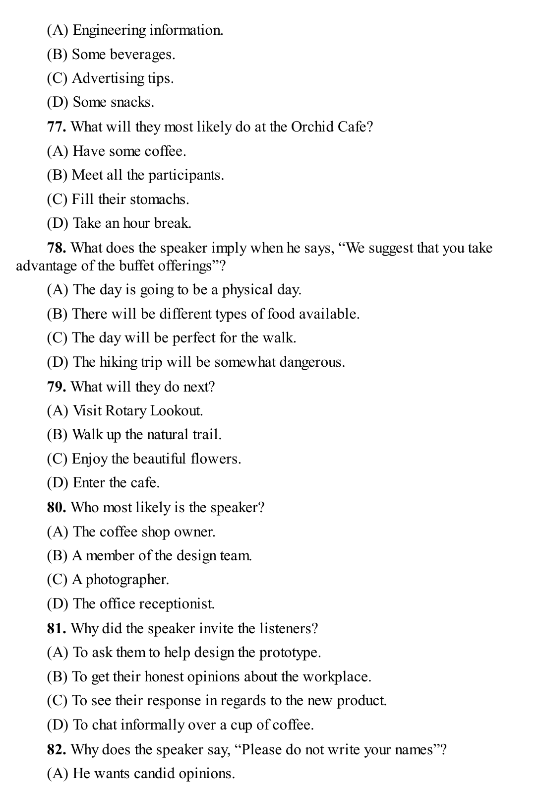

**听力独白/对话原文：**
Welcome to this special meeting. You have all been invited here by the design committee for a very important reason. (80) I am sure that you are aware that a first prototype model has been completed. The purpose of this meeting is to obtain your reactions to the look of the prototype in an informal way. (81) You will be asked to note your reactions down quickly, fold your paper, and place it in an envelope. Please do not write your names. We want honest and frank comments. (82) So let's take a few minutes to finish our coffee, then we'll move into the studio for the unveiling of Prototype A.

**中文对照：**
> 欢迎参加这次特别会议。大家受邀参加这个设计委员会有一个非常重要的原因。我确信，大家知道第一个样品模型已经完成了。这次会议的目的就是以一种非正式的方式了解大家对这个样品的反应。请大家快速记录下你们的感受，把纸折好，装入信封。请不要写姓名，我们需要诚实坦率的评价。那么，我们用几分钟时间把咖啡喝完，然后到工作室看样品A的发布。

**核心词汇与短语：**
- **be aware that**：知道，意识到
- **prototype**：样品
- **obtain**：获得
- **reaction**：反应
- **note down**：记下
- **fold**：折叠
- **honest**：诚实的
- **frank**：坦率的
- **comment**：评价
- **unveil**：揭幕，为揭开面纱
- **candid**：坦率的，直白的
- **embarrass**：使尴尬

#### Q80 (正确答案：B)
**问题：** Who most likely is the speaker? (讲话者最有可能是谁？)
- (A) The coffee shop owner. (咖啡店老板。)
- (B) A member of the design team. (设计小组成员。)
- (C) A photographer. (摄影师。)
- (D) The office receptionist. (办公室接待员。)

#### Q81 (正确答案：C)
**问题：** Why did the speaker invite the listeners? (讲话者为什么邀请这些听众？)
- (A) To ask them to help design the prototype. (为了让他们帮助设计样品。)
- (B) To get their honest opinions about the workplace. (为了获得他们对工作场所的真实意见。)
- (C) To see their response in regards to the new product. (为了看一看他们对新产品的反应。)
- (D) To chat informally over a cup of coffee. (为了边喝咖啡边闲聊。)

#### Q82 (正确答案：A)
**问题：** Why does the speaker say, “Please do not write your names”? (讲话者为什么说 “ 请不要写姓名 ” ？)
- (A) He wants candid opinions. (他想要坦率的意见。)
- (B) He doesn't want to embarrass them. (他不想让他们尴尬。)
- (C) He is not interested in knowing them. (他对认识他们不感兴趣。)
- (D) He doesn't know any of their names. (他不知道他们任何人的姓名。)

**延伸表达与补充：**
- **obtain your reactions = get your feedback = gather your opinions** (收集你们的意见)
  - *例句：We are here to obtain your reactions to the big news.* (我们来这里收集你们对这些重大新闻的意见。)
- **in an informal way = in a casual way = in an unofficial manner** (用一种非正式的方式)
  - *例句：The boss asked me to do something in an informal way.* (老板让我们用一种非正式的方式做事。)

### Questions 83 - 85

**听力独白/对话原文：**
Good morning, everybody. Last night was the annual general meeting of our shareholders, (84) and the topic of discussion was about the future of this enterprise. (83) As you know, our profits have fallen dramatically. However, the good news is that nobody doubts that the company can be turned around. The meeting decided on a course of action aimed at reducing costs and increasing sales. In order to achieve this, a team of consultants will be visiting the company's operations over the next five days. They will then write a report recommending specific actions. (85) We trust that you will give them your full cooperation. Thank You.

**中文对照：**
> 大家早上好。昨晚召开了我们的年度全体股东大会，讨论的话题是我们企业的未来。大家知道，我们的利润下降得很厉害。但是，好消息是所有人都相信公司能够渡过难关。会议决定采取一系列措施降低成本，增加销售量。为了达到这个目标，一个顾问组会在未来五天内视察公司的运营情况。他们随后会撰写一份报告，提出具体的行动建议。我们相信大家会全力配合他们。谢谢。

**核心词汇与短语：**
- **annual**：一年一次的
- **general meeting**：全体大会
- **shareholder**：股东
- **topic**：主题
- **enterprise**：企业
- **dramatically**：剧烈地
- **doubt**：怀疑
- **turn around**：回转，复原
- **course**：过程，做法
- **action**：行动
- **aim at ~**：目的是
- **in order to ~**：为了
- **achieve**：达到，实现
- **consultant**：顾问，咨询者
- **operation**：运营
- **cooperation**：合作
- **scrutinize**：仔细检查

#### Q83 (正确答案：C)
**问题：** What is the purpose of the talk? (这个讲话的目的是什么？)
- (A) To introduce an investment opportunity. (为了介绍一个投资机会。)
- (B) To educate the staff to work more efficiently. (为了教育员工更加高效地工作。)
- (C) To notify people about the results of a meeting. (为了告知大家一次会议的结果。)
- (D) To announce the date of a future meeting. (为了通知未来一次会议的日期。)

#### Q84 (正确答案：C)
**问题：** What took place yesterday? (昨天发生了什么？)
- (A) The company's annual sale. (公司的年度促销。)
- (B) A distribution of the company's stock shares. (公司的股票发行。)
- (C) A shareholder's meeting. (股东会议。)
- (D) A visit to the plant floor. (厂房参观。)

#### Q85 (正确答案：A)
**问题：** How will they change the course of action? (他们会怎样改变行动方案？)
- (A) By asking a team of consultants to scrutinize their operations. (让顾问组仔细检查他们的运营情况。)
- (B) By distributing the company's stock shares among the employees. (在员工内部发行公司股票。)
- (C) By having a meeting to find solutions. (开会寻找解决方法。)
- (D) By hiring more workers to run their operations more smoothly. (雇用更多员工使公司运营更平稳。)

**延伸表达与补充：**
- **Our profits have fallen dramatically. = Our profits have dropped significantly. = Our profits have plummeted.** (我们的利润下降得很厉害。)
  - *例句：Our profits have fallen dramatically after losing a couple of our best salespeople.* (在失去几个最好的销售员后，我们的利润下降得很厉害。)
- **Nobody doubts ~ = No one thinks otherwise ~ = No one denies ~** (没有人怀疑…)
  - *例句：Nobody doubts the fact that you can do it.* (没有人怀疑你能做到这个事实。)
- **turn around = bounce back = recover** (回转，复原)
  - *例句：The team owner strongly feels that his team can be turned around after he makes some management changes.* (球队所有者有一种强烈的感觉，他的球队在做一些管理方面的调整之后可以复原。)

### Questions 86 - 88

**听力独白/对话原文：**
In addition to our regular menu, I would like to point out the day's Chef Special. (86) All of the menu items are part of a set including a choice of salad or vegetables, (87) a glass of house red or white wine, and a cup of brewed coffee. Chicken, veal, and lamb are all on offer today. The chicken is served in an oven-baked casserole (88) with Middle-Eastern flavors. The veal is pan-fried in olive oil richly flavored with garlic, capers and red peppers. The chef's Tunisian lamb has been marinated overnight in a special sauce and then char grilled to perfection. The vegetables today are new potatoes, carrots and zucchini with butter and fresh herbs. Would you care to order now?

**中文对照：**
> 除了我们的常规菜单之外，我想提一下今天的厨师特色菜单。这个菜单上所有的菜品各选一种可以拼成一份套餐，包括色拉或者蔬菜，一杯本店的红葡萄酒或白葡萄酒，和一杯现煮的咖啡。鸡肉、小牛肉、羊羔肉今天都有供应。鸡肉是中东风味的烘焙砂锅菜。小牛肉是橄榄油煎制的，配料有大量的大蒜、香叶和红辣椒。厨师的突尼斯羊羔肉在一种特制酱料里腌制了一整夜，之后用炭烤得恰到好处。今天的蔬菜有新鲜的土豆、胡萝卜和西葫芦，配有黄油和鲜香草。您现在想点菜吗？

**核心词汇与短语：**
- **veal**：小牛肉
- **lamb**：羊羔肉
- **casserole**：砂锅菜
- **flavor**：风味，口味
- **richly**：丰富地，浓厚地
- **garlic**：大蒜
- **caper**：香叶
- **red pepper**：红辣椒
- **Tunisian**：突尼斯的
- **overnight**：通宵
- **char**：炭
- **grill**：烤
- **perfection**：完美，恰到好处
- **zucchini**：西葫芦
- **connoisseur**：鉴赏家

#### Q86 (正确答案：B)
**问题：** Who most likely is giving the talk? (谁最有可能讲了这段话？)
- (A) A chef. (厨师。)
- (B) A waiter. (服务员。)
- (C) A wine connoisseur. (品酒师。)
- (D) A grocery store clerk. (杂货店店员。)

#### Q87 (正确答案：D)
**问题：** What is mentioned about the day's special? (关于今天的特色菜，讲话人提到了什么？)
- (A) It is offered at a discounted price. (打折供应。)
- (B) It is available only for a limited time. (限时供应。)
- (C) It has just been added to their menu. (已经被添加到他们的菜单里。)
- (D) It comes with a choice of vegetables. (配有各种蔬菜可供选择。)

#### Q88 (正确答案：B)
**问题：** How is the chicken dish prepared? (鸡肉菜是如何烹制的？)
- (A) It is fried. (炸的。)
- (B) It is baked. (烘焙的。)
- (C) It is char grilled. (炭烤的。)
- (D) It is steamed. (蒸的。)

**延伸表达与补充：**
- **in addition to = apart from = to say further** (除了…之外)
  - *例句：In addition to the work I have given you, I need you to run an errand for me.* (除了我已经交给你的工作之外，我还需要你为我办一件事。)
- **I would like to point out ~ = I would like to stress ~ = I would like to pinpoint ~** (我想要指出…)
  - *例句：I would like to point out the fact that our team is lagging behind in sales.* (我想指出的是，我们组的销售额已经落后了。)
- **Would you care to order now? = Are you ready to make your order? = Have you decided what you want?** (您现在想点菜吗？)

### Questions 89 - 91

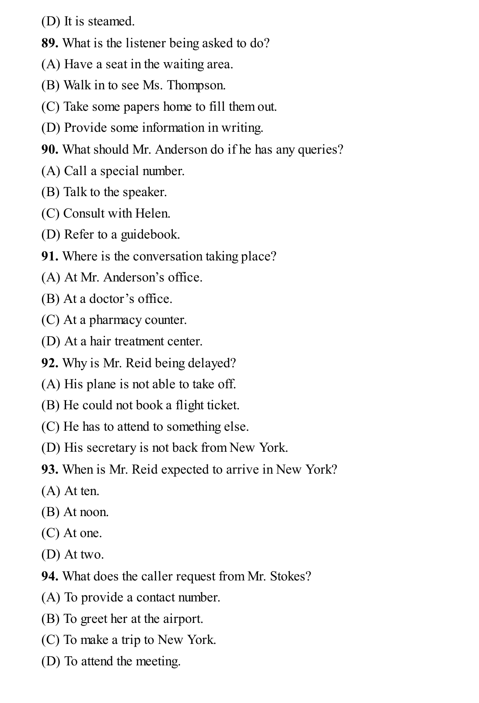

**听力独白/对话原文：**
I can see that this is your first time for treatment here in our office, Mr. Anderson. Would you please take this form to the counter and fill it out as best as you can? (89) If you have any questions, come back to me. (90) We need this information to give you the best treatment possible. After you are done, bring it back to me, and I will place you in the queue to see Dr. Helen Thompson. (91) She should be available in around thirty minutes.

**中文对照：**
> 我能看出来您是第一次来我们办公室做治疗，安德森先生。请您把这张表格拿到柜台，并尽可能地填充完整。如果您有什么问题，再来找我。我们需要这些信息以便尽可能给您最好的治疗。您填完之后把表格拿回我这里，我会把您排到等候见海伦·汤普森医生的名单里。她大约会在30分钟后见您。

**核心词汇与短语：**
- **treatment**：治疗
- **counter**：柜台
- **fill out**：填写
- **queue**：队列

#### Q89 (正确答案：D)
**问题：** What is the listener being asked to do? (听话者正被要求做什么？)
- (A) Have a seat in the waiting area. (在等候区找一个座位坐。)
- (B) Walk in to see Ms. Thompson. (进去见汤普森女士。)
- (C) Take some papers home to fill them out. (把一些文件拿回家填写。)
- (D) Provide some information in writing. (提供一些书面信息。)

#### Q90 (正确答案：B)
**问题：** What should Mr. Anderson do if he has any queries? (如果安德森先生有疑问，他应该做什么？)
- (A) Call a special number. (给一个特别号码打电话。)
- (B) Talk to the speaker. (向讲话者询问。)
- (C) Consult with Helen. (咨询海伦。)
- (D) Refer to a guidebook. (查看说明书。)

#### Q91 (正确答案：B)
**问题：** Where is the conversation taking place? (对话是在哪儿发生的？)
- (A) At Mr. Anderson's office. (在安德森先生的办公室。)
- (B) At a doctor's office. (在医生的办公室。)
- (C) At a pharmacy counter. (在药店柜台。)
- (D) At a hair treatment center. (在头发护理中心。)

**延伸表达与补充：**
- **After you are done = After you are finished = When you are done** (你完成以后)
  - *例句：After you are done, bring it back to me.* (你完成以后，把它拿回我这里。)
- **I will place you in the queue. = I will put you on the waiting list. = I will jot your name down on the list.** (我会把你排在等候名单里。)
  - *例句：I will place you in the queue to see the doctor.* (我会把你排在等候见医生的名单里。)

### Questions 92 - 94

**听力独白/对话原文：**
Good morning. This is Karen Holmes, Mr. Reid's secretary. I'm sorry to disturb you Mr. Stokes, but Mr. Reid just called from the airport to tell me that his plane has been delayed by fog. (92) The airport anticipates that the fog will lift sufficiently by ten o'clock for planes to be able to take off. So there will be a delay of at least two hours in Mr. Reid's itinerary. He could well arrive in New York at one o'clock in the afternoon. (93) That would mean that he will miss lunch but should have no problem arriving in time for the afternoon meeting. I will call you back after ten to let you know the situation. Oh, and do you have a cell phone number on which you can be contacted? (94) Thanks. I'll speak to you later, Mr. Stokes.

**中文对照：**
> 早上好，我是里德先生的秘书卡伦·霍姆斯。斯托克斯先生，很抱歉打扰您，里德先生刚刚从机场打电话说他的航班因为大雾推迟了。机场预测大雾会在10点之前散尽，那时飞机才能起飞。所以里德先生的行程会延迟至少两个小时，他会在下午1点到达纽约。这意味着他会错过午饭，不过按时参加下午的会议应该没有问题。我会在10点以后再给您打电话告诉您最新情况。哦，您有可以联系到您的手机号吗？谢谢。斯托克斯先生，我过一会儿打给您。

**核心词汇与短语：**
- **disturb**：打扰
- **delay**：推迟，延误
- **fog**：雾
- **anticipate**：预期，预料
- **lift**：（云、雾等）消散
- **sufficiently**：足够地，充分地
- **take off**：起飞
- **at least**：至少
- **itinerary**：旅程，行程
- **in time**：及时
- **contact**：联系

#### Q92 (正确答案：A)
**问题：** Why is Mr. Reid being delayed? (里德先生为什么被耽搁了？)
- (A) His plane is not able to take off. (他的飞机没能起飞。)
- (B) He could not book a flight ticket. (他无法预订机票。)
- (C) He has to attend to something else. (他必须处理其他事情。)
- (D) His secretary is not back from New York. (他的秘书还没有从纽约回来。)

#### Q93 (正确答案：C)
**问题：** When is Mr. Reid expected to arrive in New York? (里德先生预计几点到达纽约？)
- (A) At ten. (10 点。)
- (B) At noon. (中午 12 点。)
- (C) At one. (1 点。)
- (D) At two. (2 点。)

#### Q94 (正确答案：A)
**问题：** What does the caller request from Mr. Stokes? (打电话的人向斯托克斯先生请求什么？)
- (A) To provide a contact number. (提供一个联系电话。)
- (B) To greet her at the airport. (到机场迎接她。)
- (C) To make a trip to New York. (到纽约一趟。)
- (D) To attend the meeting. (参加这个会议。)

**延伸表达与补充：**
- **I'm sorry to disturb you. = I'm sorry to bother you.** (很抱歉打扰您。扩展表达：)
  - *例句：Could I have a moment of your time? I'm sorry to disturb you, but could you tell me how to get to City Hall from here?* (我能耽误您一点时间吗？很抱歉打扰您，您能告诉我从这里怎么去市政厅吗？)
- **I'll speak to you later. = I will see you later. = I will talk to you soon.** (我过一会儿和您联系。)

### Questions 95 - 97

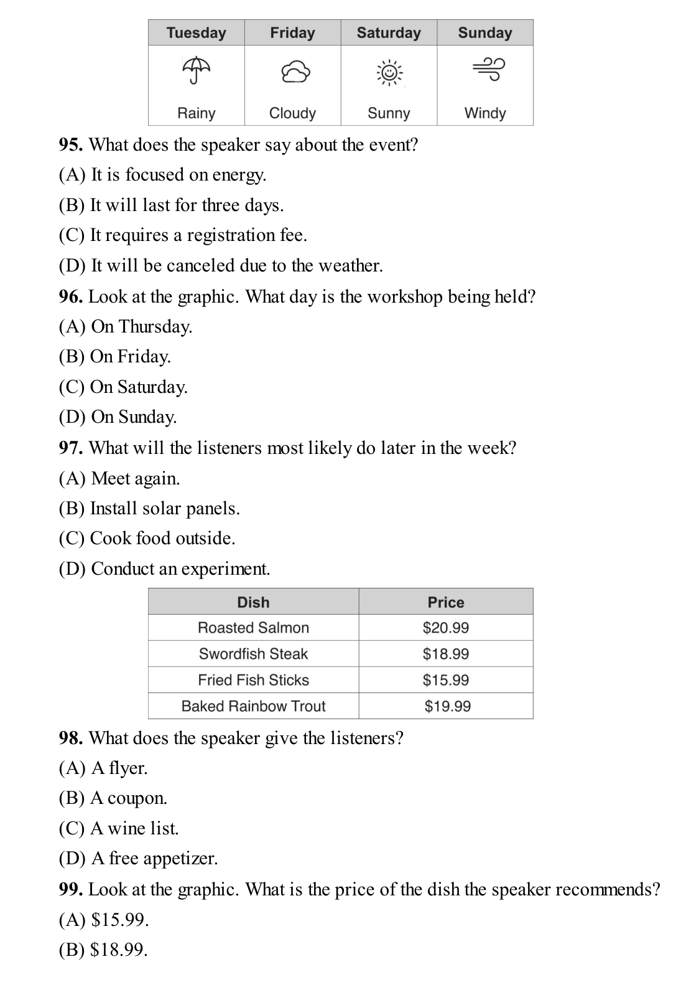

**听力独白/对话原文：**
Thank you, everybody, for coming to my workshop. Because the theme of this summer's event is alternative energy, (95) we're going to do a hands-on activity which I'm pretty sure you will enjoy. We're going to spend the next hour or so making solar ovens. That's right. One hour from now, you'll have made an oven that doesn't require electricity or gas to operate. It only needs the light of the sun. Unfortunately, since the weather is overcast today, (96) we can't go outside to use them, but as soon as there's a sunny day, you'll be able to test them yourselves. (97) So let's get started.

**中文对照：**
> 谢谢大家来参加我的研讨会。鉴于本次夏季活动的主题是新能源，所以我们今天要请大家一起来做个动手实践活动，相信大家会喜欢的。接下来的一个小时左右，我们要做一台太阳能灶。大家没听错，从现在开始，一个小时后，你们就能做出一台不需要电或天然气也能发电的太阳能灶。只要有太阳光，它就能发电。遗憾的是，今天是阴天，所以我们不能去户外实验了。但只要天一晴，大家就能亲手测试自己的成果了。好啦，大家开始吧。

**核心词汇与短语：**
- **workshop**：研讨会
- **alternative energy**：新能源
- **a hands-on activity**：动手实践活动
- **solar oven**：太阳能灶
- **overcast**：阴天的；多云的
- **as soon as**：一就

#### Q95 (正确答案：A)
**问题：** What does the speaker say about the event? (说话人说了什么和活动有关的事情？)
- (A) It is focused on energy. (活动主要和能源有关。)
- (B) It will last for three days. (活动会持续三天。)
- (C) It requires a registration fee. (活动需要交报名费。)
- (D) It will be canceled due to the weather. (活动可能会因为天气原因取消。)

#### Q96 (正确答案：B)
**问题：** Look at the graphic. What day is the workshop being held? (请看图表，研讨会在哪天举办？)
- (A) On Thursday. (周四。)
- (B) On Friday. (周五。)
- (C) On Saturday. (周六。)
- (D) On Sunday. (周日。)

#### Q97 (正确答案：D)
**问题：** What will the listeners most likely do later in the week? (听众接下来的一周最有可能做什么？)
- (A) Meet again. (再次见面。)
- (B) Install solar panels. (安装太阳能电池板。)
- (C) Cook food outside. (在户外做饭。)
- (D) Conduct an experiment. (进行实验。)

**延伸表达与补充：**
- **sb. spend ~ time （ in ） doing sth. = It takes ~ time to do sth.** (花…时间做某事)
  - *例句：She spent most of her time in caring for others.* (她大部分的时间都用来照顾别人了。)

### Questions 98 - 100

**听力独白/对话原文：**
Welcome to the Fishing Hole. I'm Natalie, and it's my great pleasure to be your server this evening. I know that you've got your menus already, but I'd like to give you this little flyer featuring the specials of the day. (98) You can see that it has four dishes on it, all of which are outstanding. However, if you ask me, the baked rainbow trout is the best of those four items. (99) You can't go wrong ordering it. I'll be back with some bread in a moment, (100) but if you're ready to order drinks, I can take your order right now.

**中文对照：**
> 欢迎来到钓鱼点。我叫纳塔莉，很高兴今晚能为大家服务。我知道大家都看过菜单了，不过我还是想给大家看下这个小传单，上面都是我们今天的特色菜。大家可以看到，这上面一共有四道菜，每一道菜都很美味。不过，如果你问我，我认为其中最美味的当属这道烤虹鳟鱼了，点这道菜保您不会后悔。等下我先去给大家拿点儿面包过来，如果有人想好了要喝什么饮料的话，现在也可以立即下单。

**核心词汇与短语：**
- **It's my great pleasure to**：很高兴能
- **flyer**：传单
- **feature**：以为特色；特色
- **outstanding**：杰出的
- **rainbow trout**：虹鳟鱼
- **take your order**：点餐

#### Q98 (正确答案：A)
**问题：** What does the speaker give the listeners? (说话人给了听话人什么东西？)
- (A) A flyer. (传单。)
- (B) A coupon. (优惠券。)
- (C) A wine list. (酒水单。)
- (D) A free appetizer. (免费开胃菜。)

#### Q99 (正确答案：C)
**问题：** Look at the graphic. What is the price of the dish the speaker recommends? (请看图表，说话人推荐的那道菜的价格是多少？)
- (A) $ 15.99. (15.99 美元。)
- (B) $ 18.99. (18.99 美元。)
- (C) $ 19.99. (19.99 美元。)
- (D) $ 20.99. (20.99 美元。)

#### Q100 (正确答案：A)
**问题：** What does the speaker say she will bring the listeners? (说话人说她要给听话人拿什么？)
- (A) Some bread. (一些面包。)
- (B) Some salads. (一些沙拉。)
- (C) New utensils. (新餐具。)
- (D) The drinks they ordered. (他们点的饮料。)

**延伸表达与补充：**
- **It's my great pleasure to = I'm very honored to** (非常荣幸能…)
  - *例句：It's my great pleasure to have a picture with you.* (很高兴能和您一起合照。)
- **If you're ready to = If you are prepared to** (如果你准备好…)
  - *例句：If you're ready to come back, I'll pick you up in the airport.* (如果你准备好要回来了，我就会去机场接你。)

# TEST 07

## 答案速查表

| 题号 | 答案 | 题号 | 答案 | 题号 | 答案 | 题号 | 答案 | 题号 | 答案 | 题号 | 答案 | 题号 | 答案 | 题号 | 答案 | 题号 | 答案 | 题号 | 答案 |
| :---: | :---: | :---: | :---: | :---: | :---: | :---: | :---: | :---: | :---: | :---: | :---: | :---: | :---: | :---: | :---: | :---: | :---: | :---: | :---: |
| **1** | C | **11** | C | **21** | A | **31** | A | **41** | C | **51** | C | **61** | A | **71** | D | **81** | B | **91** | C |
| **2** | B | **12** | B | **22** | B | **32** | D | **42** | D | **52** | B | **62** | A | **72** | C | **82** | D | **92** | A |
| **3** | C | **13** | A | **23** | B | **33** | A | **43** | C | **53** | A | **63** | C | **73** | A | **83** | B | **93** | B |
| **4** | A | **14** | A | **24** | A | **34** | B | **44** | B | **54** | C | **64** | B | **74** | B | **84** | D | **94** | C |
| **5** | D | **15** | B | **25** | C | **35** | B | **45** | C | **55** | B | **65** | A | **75** | A | **85** | B | **95** | A |
| **6** | B | **16** | A | **26** | A | **36** | C | **46** | B | **56** | D | **66** | C | **76** | B | **86** | C | **96** | C |
| **7** | C | **17** | C | **27** | A | **37** | A | **47** | B | **57** | A | **67** | C | **77** | B | **87** | A | **97** | B |
| **8** | A | **18** | B | **28** | C | **38** | B | **48** | A | **58** | D | **68** | D | **78** | A | **88** | A | **98** | B |
| **9** | B | **19** | A | **29** | C | **39** | A | **49** | B | **59** | B | **69** | C | **79** | B | **89** | B | **99** | B |
| **10** | C | **20** | B | **30** | A | **40** | D | **50** | A | **60** | B | **70** | C | **80** | C | **90** | D | **100** | A |

## Part 1: 照片描述 (Q1 - Q6)

### Q1 (正确答案：C)

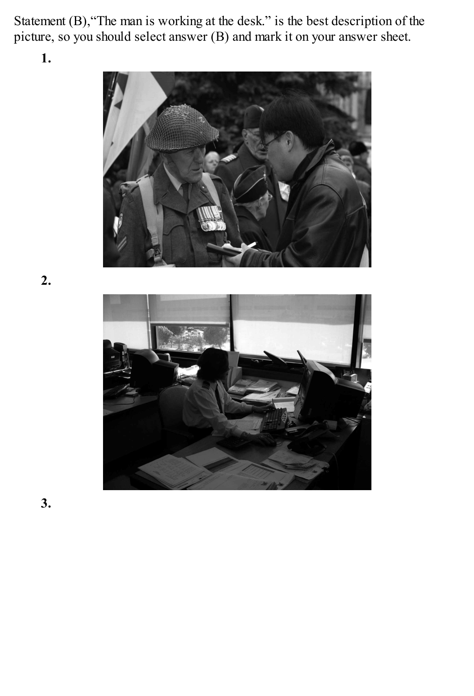

**听力原文与选项：**
- (A) They're discussing something serious. (他们正在讨论某个严肃的问题。)
- (B) They're putting on their hats. (他们正在戴帽子。)
- (C) They're conversing with one another. (他们正在相互交谈。)
- (D) They're turning to face in the opposite direction. (他们把脸转向相反的方向。)

**其他可能表达：**
- They're involved in a conversa-tion. (他们正在讨论中。)
- One man is jotting something down on a note. (一位男士正在笔记本上草草记录着一些东西。)
- They are looking at each other. (他们在互相看着对方。)

### Q2 (正确答案：B)

**听力原文与选项：**
- (A) She's putting down the receiver. (她正在放下听筒。)
- (B) She's gazing at the monitor. (她正盯着显示器。)
- (C) She's handing over her paper. (她正在交付文件。)
- (D) She's taking the computer off the table. (她正在将电脑从桌上搬走。)

**其他可能表达：**
- She's working in the office. (她正在办公室工作。)
- The woman is concentrating on her work. (这位女士正在专心工作。)
- There are papers sorted on the desk. (桌子上有分好类的文件。)

### Q3 (正确答案：C)

**听力原文与选项：**
- (A) The paper is being put away. (文件正在被收起。)
- (B) The paper is being cut in half. (这张纸正被一裁为二。)
- (C) Someone is stapling the papers together. (有人正在把文件装订到一起。)
- (D) Someone is looking over the paper. (有人正在浏览文件。)

**其他可能表达：**
- A stapler is being used. (一个订书机正在被使用。)
- Some papers are being stapled together. (一些文件正在被装订在一起。)
- The stapler is in use at the moment. (订书机现在正在使用中。)

### Q4 (正确答案：A)

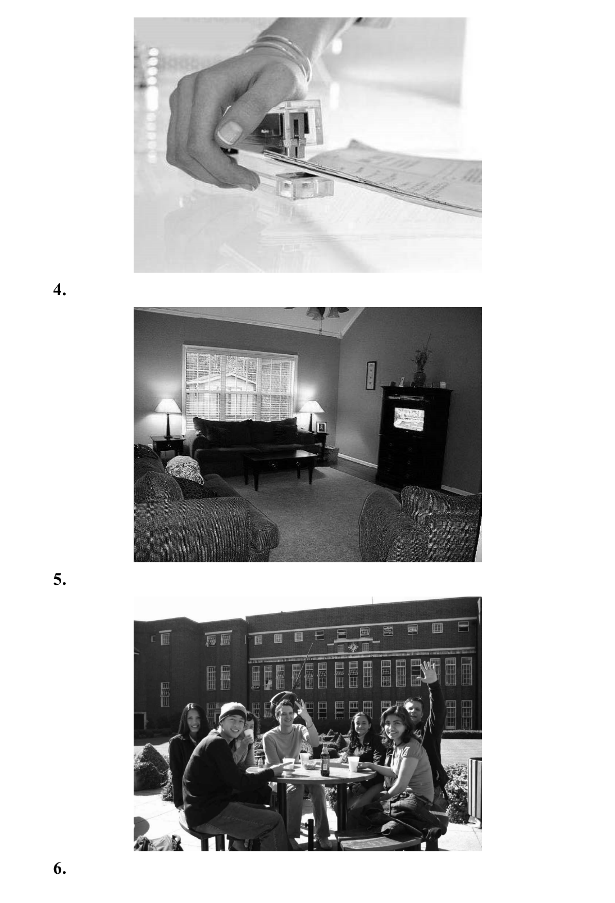

**听力原文与选项：**
- (A) A lamp has been positioned on either side of the sofa. (沙发的两侧都安装了一盏灯。)
- (B) The television is being turned on. (电视正在被打开。)
- (C) The sofa is occupied at the moment. (沙发现在有人坐。)
- (D) The carpet is being laid on the floor. (地毯正被铺到地板上。)

**其他可能表达：**
- There is a lamp on each side of the sofa. (沙发的两侧各有一盏灯。)
- The lamps are brightly lit. (这些灯都被点亮了。)
- The sofas have been positioned around the room. (这些沙发已被放置在房间各处。)

### Q5 (正确答案：D)

**听力原文与选项：**
- (A) They're sitting on a park bench. (他们正坐在公园的长椅上。)
- (B) They're crowding into an outdoor café. (他们正涌向一个露天咖啡馆。)
- (C) They're all pointing toward the man. (他们都在指着那位男士。)
- (D) They're seated in a small group. (他们正坐在一起。)

**其他可能表达：**
- They are sitting around a table outdoors. (他们正围坐在屋外的一张桌子旁。)
- The people are seated at a table. (人们坐在一张桌子旁边。)
- The table is occupied at the moment. (这张桌子现在有人在用。)

### Q6 (正确答案：B)

**听力原文与选项：**
- (A) The bakery is full of customers today. (面包店今天挤满了顾客。)
- (B) Some baked goods are stacked on the stand. (一些烤好的食品正码放在柜台上。)
- (C) The man is putting bread on the stand. (这位男士正在往柜台上摆放面包。)
- (D) The bread has just been taken out of the oven. (面包刚被从烤箱里取出来。)

**其他可能表达：**
- Some baked goods are displayed on the stand. (一些烤好的食品陈列在柜台上。)
- Different kinds of bread have been laid out on the stand. (各种各样的面包已)
- 被摆放在了柜台上。
- An assortment of bread is on display here. (各类面包被摆在这里。)
- 注：在Part 1中，每道试题都添加了3种可能的正确表达方式，考生可
- 以了解对于同样的照片可能出现的不同表达。

## Part 2: 应答测试 (Q7 - Q31)

### Q7 (正确答案：C)

**听力对话文本：**
- **Q:** Are you going to leave early today? (你今天打算早点儿走吗？)
- **A:** No, I have to work overtime tonight. (不，我今晚还得加班。)

**听力原文与选项：**
- **问题：** Aren't you taking off early today? (你今天不早点回去吗？)
- **选项：**
  - (A) Yes, I usually take it home with me. (是的，我通常会把它带回家。)
  - (B) The traffic is very heavy today. (今天交通非常拥堵。)
  - (C) No, I have some things to finish off. (不，我有点事情需要完成。)

### Q8 (正确答案：A)

**听力对话文本：**
- **Q:** What made Mr. Owens quit the company? (是什么让欧文斯先生离开公司的？)
- **A:** He found a better paying job. (他找到了一份薪水更高的工作。)

**听力原文与选项：**
- **问题：** Why did Mr. Owens decide to leave? (为什么欧文斯先生决定离开？)
- **选项：**
  - (A) He got a better offer elsewhere. (他在别处得到了更好的工作。)
  - (B) Mr. Owens will be here soon. (欧文斯先生很快就会到这里来。)
  - (C) Okay, I will give him a call. (好的，我会给他打个电话。)

### Q9 (正确答案：B)

**听力对话文本：**
- **Q:** What time is the get-together? (什么时候碰头？)
- **A:** Six this evening. (今晚6点。)

**听力原文与选项：**
- **问题：** When are we getting together? (我们什么时候碰头呢？)
- **选项：**
  - (A) At John's house. (在约翰家。)
  - (B) After work at six. (下班以后 6 点钟。)
  - (C) For his birthday. (为了他的生日。)

### Q10 (正确答案：C)

**听力对话文本：**
- **Q:** The new guy will start coming in to work next Monday. (这个新人将从下周一开始来工作。)
- **A:** I wonder what he's like. (我想知道他怎么样。)

**听力原文与选项：**
- **问题：** The new guy we hired is going to start Monday. (我们新雇用的这个家伙将会在周一开始工作。)
- **选项：**
  - (A) He will be driving here. (他会开车过来。)
  - (B) We could start today too. (我们也能今天开始。)
  - (C) I can't wait to meet the guy. (我等不及要见那个人了。)

### Q11 (正确答案：C)

**听力对话文本：**
- **Q:** Did you just get back from your overseas business trip? (你是刚从国外出差回来？)
- **A:** No, my plane landed early this morning. (不是，我坐的飞机今天一大早就到了。注：在Part 2中，为帮助考生提高听懂题目的能力，添加了和试题相同或相似的表达方法。)

**听力原文与选项：**
- **问题：** You just returned from your overseas trip, didn't you? (你刚从国外旅游回来，是吗？)
- **选项：**
  - (A) Yes, I will be leaving today. (是的，我将于今天离开。)
  - (B) I had some business to take care of. (我有一些生意需要料理。)
  - (C) No, I got back early this morning. (不，我是今天一大早回来的。)

### Q12 (正确答案：B)

**听力对话文本：**
- **Q:** Who called the supplier for the printing paper? (是谁给打印纸的供货商打了电话？)
- **A:** Mr. Williams takes care of that every month. (威廉姆斯先生每个月都负责此项工作。)

**听力原文与选项：**
- **问题：** Who placed an order for the box of printing paper? (是谁下了这盒打印纸的订单？)
- **选项：**
  - (A) Later this afternoon. (今天下午晚些时候。)
  - (B) Ms. Williams did. (威廉姆斯女士下的订单。)
  - (C) Yes, a new printer. (是的，一台新打印机。)

### Q13 (正确答案：A)

**听力对话文本：**
- **Q:** When did Mr. Lewis's assistant start working with him? (路易斯先生的助理是什么时候开始与他一起工作的呢？)
- **A:** Some time last year. (去年的某个时候。)

**听力原文与选项：**
- **问题：** When did Mr. Lewis hire his assistant? (路易斯先生什么时候雇用了他的助理呢？)
- **选项：**
  - (A) About a year ago. (大约一年前。)
  - (B) At our home office. (在我们的总公司。)
  - (C) Because he is going to leave. (因为他要离开了。)

### Q14 (正确答案：A)

**听力对话文本：**
- **Q:** Where are they going to hold the awards ceremony? (他们将在哪里举行颁奖典礼？)
- **A:** It'll take place at the Prince Hotel. (典礼将在普林斯宾馆举行。)

**听力原文与选项：**
- **问题：** Where will the awards ceremony take place? (颁奖典礼将在哪里举行？)
- **选项：**
  - (A) It'll be at the Prince Hotel. (典礼将在普林斯宾馆举行。)
  - (B) To reward the best employees. (是为了奖赏最优秀的雇员。)
  - (C) Lots of cash prizes. (许多现金奖励。)

### Q15 (正确答案：B)

**听力对话文本：**
- **Q:** Do you know when the next bus to the airport departs from this hotel? (你知道从这个宾馆去机场的下一趟班车什么时候发车吗？)
- **A:** In ten minutes. (十分钟后。)

**听力原文与选项：**
- **问题：** Do you know what time the next shuttle bus leaves from the hotel? (你知道下一趟班车什么时候从宾馆出发吗？)
- **选项：**
  - (A) The bus stop is around the corner. (公共汽车站在拐角处。)
  - (B) There is a bus every ten minutes. (每十分钟有一趟班车。)
  - (C) Yes, to the airport terminal. (是的，到机场候机楼。)

### Q16 (正确答案：A)

**听力对话文本：**
- **Q:** You did get a chance to discuss the weekly report with Ms. Williams, didn't you? (你确实是得到了和威廉姆斯女士讨论周报的机会，不是吗？)
- **A:** Yes, we met over lunch today. (是的，我们今天午饭的时候已经见面了。)

**听力原文与选项：**
- **问题：** You've already talked to Ms. Williams about the weekly report, haven't you? (你已经和威廉姆斯女士讨论过周报了，是吗？)
- **选项：**
  - (A) Yes, I just finished talking to her. (是的，我刚刚和她谈完。)
  - (B) No, I can't talk to her this week. (不，我这周不能和她谈。)
  - (C) Because it's due this Friday. (因为本周五到期。)

### Q17 (正确答案：C)

**听力对话文本：**
- **Q:** Why is she so late? (她为什么这么晚？)
- **A:** She's caught in traffic. (她遇上了交通堵塞。)

**听力原文与选项：**
- **问题：** What's taking her so long? (是什么让她花了这么长时间？)
- **选项：**
  - (A) It's longer than that. (这个比那个长。)
  - (B) At three o'clock. (在三点钟。)
  - (C) She's held up in traffic. (她被交通耽搁了。)

### Q18 (正确答案：B)

**听力对话文本：**
- **Q:** When is your out-of-town guest arriving? (你外地的客人什么时候来？)
- **A:** I have to pick him up at the airport tomorrow morning. (我明天早上要去机场接他。)

**听力原文与选项：**
- **问题：** When are you expecting your guest from out of town? (你和外地的那位客人约的什么时候来？)
- **选项：**
  - (A) For a week. (有一星期了。)
  - (B) Early tomorrow morning. (明天一大早。)
  - (C) At the Hilton Hotel downtown. (在市中心的希尔顿酒店。)

### Q19 (正确答案：A)

**听力对话文本：**
- **Q:** Do you have any blue binders in stock here? (你这里有蓝色活页夹的存货吗？)
- **A:** Sorry, but we are sold out of that color. (抱歉，那种颜色的我们已经卖光了。)

**听力原文与选项：**
- **问题：** Does your store carry blue binders? (你的商店出售蓝色活页夹吗？)
- **选项：**
  - (A) I'm afraid we are out of that color. (恐怕那种颜色的我们已经卖完了。)
  - (B) No, I will bring it over right now. (不，我现在就去把它拿过来。)
  - (C) No, the blue is a bit too dark. (不，蓝色有点太暗了。)

### Q20 (正确答案：B)

**听力对话文本：**
- **Q:** How did Karen get the client to sign on the dotted line? (卡伦是怎样让客户同意签字的呢？)
- **A:** She's a very good saleswoman. (她是一位非常优秀的推销员。)

**听力原文与选项：**
- **问题：** How did Karen manage to get the contract? (卡伦是如何设法拿到那个合同的呢？)
- **选项：**
  - (A) I heard it's a big deal. (我听说那是笔大买卖。)
  - (B) She is a very smooth talker. (她口齿很伶俐。)
  - (C) She likes to manage people. (她喜欢管理人。)

### Q21 (正确答案：A)

**听力对话文本：**
- **Q:** Mr. Park gave us a few more days to finish the report. (帕克先生又给了我们几天时间以便完成报告。)
- **A:** I am so glad to hear that. (我很高兴听到这个消息。)

**听力原文与选项：**
- **问题：** Mr. Park has given us an extension on the report. (帕克先生允许我们延期完成报告。)
- **选项：**
  - (A) That's a relief. (现在我放心了。)
  - (B) For three days. (有三天了。)
  - (C) From the reporter. (从报告者那里。)

### Q22 (正确答案：B)

**听力对话文本：**
- **Q:** Who reads over the work again? (谁再通读一下这部著作？)
- **A:** We're still looking for someone who can do that. (我们仍在寻找能够做这项工作的人。)

**听力原文与选项：**
- **问题：** Who's taking care of the proofreading? (谁负责校对？)
- **选项：**
  - (A) As soon as I finish with this book. (我一完成这本书的时候。)
  - (B) It hasn't been assigned yet. (这个任务还没有分配。)
  - (C) Yes, I've read all of his books. (是的，我已经读过了他所有的书。)

### Q23 (正确答案：B)

**听力对话文本：**
- **Q:** Where did Ms. Kato go to school? (嘉户女士在哪里上的学？)
- **A:** She went to a local college in her hometown. (她在家乡一个地方院校上的学。)

**听力原文与选项：**
- **问题：** Where did Ms. Kato graduate from? (嘉户女士是哪里毕业的？)
- **选项：**
  - (A) She has a class in half an hour. (她半小时后有课。)
  - (B) A small college in the east, I think. (我记得是东部的一个小学院。)
  - (C) She has some colleagues there. (她在那里有一些同事。)

### Q24 (正确答案：A)

**听力对话文本：**
- **Q:** Why is John so excited? (约翰为什么那么兴奋？)
- **A:** He got a raise. (他被提拔了。)

**听力原文与选项：**
- **问题：** Why is John smiling like that? (约翰为什么笑成那样？)
- **选项：**
  - (A) He just heard that he got promoted. (他刚听说自己被提拔了。)
  - (B) So that he can take off early today. (这样他今天可以早点儿动身。)
  - (C) It's usually like that, I guess. (我想情况经常是那样的。)

### Q25 (正确答案：C)

**听力对话文本：**
- **Q:** Did Robert Cunningham respond to your offer yet? (罗伯特·坎宁安回复你的提议了吗？)
- **A:** He said he'll get back to me by the end of the day. (他说他将在今晚给我回电话。)

**听力原文与选项：**
- **问题：** Has Robert Cunningham gotten back to you with an answer yet? (罗伯特 · 坎宁安有没有将回复反馈给你？)
- **选项：**
  - (A) Yes, he was correct. (是的，他是正确的。)
  - (B) I'll get back to him. (我过会儿给他回电话。)
  - (C) He'll call this evening. (今晚他会来电话。)

### Q26 (正确答案：A)

**听力对话文本：**
- **Q:** This model came out on the market only a year ago. (这种样式一年前才在市场上出现。)
- **A:** Yes, and it has become a household product. (是的，而且它已经变成了家喻户晓的产品。)

**听力原文与选项：**
- **问题：** This particular model was only released last year. (这种特别的样式是去年刚刚上市的。)
- **选项：**
  - (A) Yes, it has become very popular in such a short time. (是的，它在这么短的时间内就变得非常流行了。)
  - (B) We are thinking of a name for this product. (我们正在为这个产品想名称。)
  - (C) No, there are several models available. (不，几个样式都可以用。)

### Q27 (正确答案：A)

**听力对话文本：**
- **Q:** Who looks after your taxes? (谁在处理你的税务问题？)
- **A:** My personal accountant. (我的私人会计。)

**听力原文与选项：**
- **问题：** Who takes care of your taxes? (谁在处理你的税务问题？)
- **选项：**
  - (A) My accountant handles them. (我的会计负责此事。)
  - (B) I'll pay for it with my credit card. (我将用信用卡来付款。)
  - (C) No, I can't afford to take a taxi. (不，我打不起出租车。)

### Q28 (正确答案：C)

**听力对话文本：**
- **Q:** Is there anything else you want, sir? (您还想要别的什么吗，先生？)
- **A:** Could I read over the menu again? (可否让我再看一下菜单？)

**听力原文与选项：**
- **问题：** Will that be all, sir? (就这些了吗，先生？)
- **选项：**
  - (A) No, I shouldn't. (不，我不应该。)
  - (B) Yes, you can take it. (是的，你可以拿走它。)
  - (C) I'd like to see the menu again, please. (我想再看一下菜单。)

### Q29 (正确答案：C)

**听力对话文本：**
- **Q:** When was the last time we went to a theater together? (我们上次一起去电影院是什么时候？)
- **A:** The last time we went together was two years ago. (我们上次一起去是两年前了。)

**听力原文与选项：**
- **问题：** Do you recall when we last saw a movie together? (你记得我们上次一起看电影是什么时候吗？)
- **选项：**
  - (A) Let's go and check it out this weekend. (让我们这周末一起去看看吧。)
  - (B) Yes, that sounds like a great idea. (是的，那听起来是个不错的主意。)
  - (C) It must've been at least a couple of years ago. (那至少是两年前的事情了。)

### Q30 (正确答案：A)

**听力对话文本：**
- **Q:** You are not actually going to wear that to the concert, are you? (你不会真的要穿这身去音乐会吧？)
- **A:** No, I'll get changed at home first. (不，我要先回家换衣服。)

**听力原文与选项：**
- **问题：** That is not what you are going to wear to the concert, is it? (那不是你去音乐会要穿的衣服，对吧？)
- **选项：**
  - (A) No, I have to go home and get changed. (不是，我还得回家换衣服。)
  - (B) Yes, I am a little worn out. (是的，我有点累了。)
  - (C) It is scheduled to start at 7. (这个定在 7 点开始。)

### Q31 (正确答案：A)

**听力对话文本：**
- **Q:** Do you have time to help out Ron, or do you have to go somewhere else today? (你有时间帮助罗恩吗，还是说你今天必须去什么别的地方？)
- **A:** I am okay until later this afternoon. (黄昏之前我都有空。Questions 32 through 34 refer to the following conversation.W: Is anything the matter？ You don't look well.M:My tooth is bothering me. I think I'd better get it checked out. Do youthink it would be okay if I leave the office a bit early this afternoon to drop bya dentist's office near my place？（)

**听力原文与选项：**
- **问题：** Can you give Ron a hand with his work, or do you have to leave for your appointment? (你可以帮助罗恩完成他的工作吗，还是你必须要出发赴约呢？)
- **选项：**
  - (A) I don't have to leave until after lunch. (我可以午饭以后出发。)
  - (B) Yes, Ron is very helpful to me. (是的，罗恩对我很有帮助。)
  - (C) I will take him with me to my appointment. (我将会带他一起去赴约。)

## Part 3: 简短对话 (Q32 - Q70)

### Questions 32 - 34

**听力独白/对话原文：**
**W:** Is anything the matter? You don't look well.
**M:** My tooth is bothering me. I think I'd better get it checked out. Do you think it would be okay if I leave the office a bit early this afternoon to drop by a dentist's office near my place? (32)
**W:** Sure, that will be fine as long as you finish the weekly report before you take off. (33) Remember, the meeting with the general manager is scheduled to start tomorrow morning at 9 o'clock, and I've asked Ted Bradley to look over the figures to make sure there aren't any errors in them. (34)
**M:** Sure thing. I am just about done here, so he should get it before lunch. (34)

**中文对照：**
> **W：**出什么事情了吗？你看起来气色不大好。
> **M：**牙很疼。我想我得赶紧检查一下。如果我今天下午稍微早一点离开办公室，顺道到我家附近的诊所看一下牙医，你觉得可以吗？
> **W：**好的，只要你在动身前把周报完成就行。记住，与总经理的会议安排在明天早上9点，而且我已经让特德·布拉德利去检查数字以确保没有什么错误。
> **M：**好的。我这里马上就完成了，所以他可以在午饭前来取。

**核心词汇与短语：**
- **bother**：困扰，烦扰
- **a bit**：有点，稍微
- **drop by**：顺路拜访
- **as long as**：只要
- **weekly**：每周的，一星期一次的
- **take off**：离开
- **be scheduled to do sth**：按计划应该做某事
- **look over**：检查

#### Q32 (正确答案：D)
**问题：** Why is the man asking the woman if he can take off early today? (为什么男士问女士他今天是否可以早点儿离开？)
- (A) He wants to meet a client for lunch. (他想和一位客户一起吃午餐。)
- (B) He wants to go home and relax. (他想回家休息。)
- (C) He wants to look for a place to stay. (他想找个地方待一会儿。)
- (D) He wants to get his tooth looked at. (他想去检查牙齿。)

#### Q33 (正确答案：A)
**问题：** What does the woman ask the man to do before he leaves? (女士要求男士在离开之前做什么？)
- (A) Finish writing a report. (把报告写完。)
- (B) Schedule an appointment with her dentist. (与她的牙医安排一次会面。)
- (C) Attend the meeting with the general manager. (与总经理一起参加会议。)
- (D) Read over the report to check the figures. (再读一遍报告以便核对数字。)

#### Q34 (正确答案：B)
**问题：** Who will the man see before he takes off? (男士在离开之前会见谁？)
- (A) The general manager. (总经理。)
- (B) Ted Bradley. (特德)
- (C) The woman.
- (D) His client.

**延伸表达与补充：**
  - *例句：C D* (）女士。（）他的客户。)
- **Is anything the matter? = What's wrong?** (出什么事了？扩展表达：)
  - *例句：Is everything okay?* (一切都还好吗？)
- **You don't look well. = You look ill. = You're looking a bit sick.** (你看起来气色不大好。)
- **My tooth is bothering me. = I have a bad toothache.** (我牙疼。扩展表达：)
  - *例句：I think I have a cavity.* (我有颗蛀牙。)
- **I think I'd better get it checked out. = I'd better go and see a doctor. = I should have it looked at.** (我觉得我最好去检查一下。)

### Questions 35 - 37

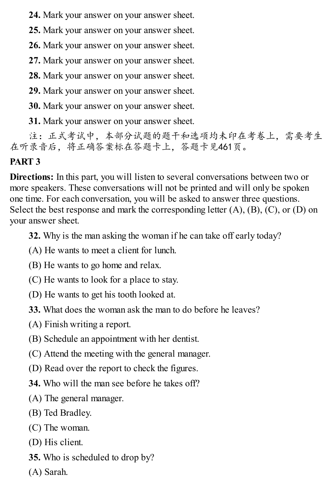

**听力独白/对话原文：**
**W1:** Sarah, I overheard Mr. Denver saying that Mr. Rodriguez is coming for a visit next Monday. （ 35, 36 ）
**W2:** Oh, no. I hope he's not bringing us bad news again. I mean, he seldom makes a trip out here, but when he does, he usually brings us bad news. (37) The last time he came he told us about the budget cut, and that really affected a lot of our salespeople here.
**W1:** I know, but let's just hope that it'll be something good this time. Who knows? He could be coming here to tell us that we will be getting a bonus or something.
**W2:** I doubt that very much.

**中文对照：**
> **W1：**萨拉，我无意间听到丹佛先生说罗德里格斯先生下周一将来参观。
> **W2：**噢，不。我希望他不要再给我们带来坏消息。我的意思是，他很少来这边，但每次他来的时候，常常会给我们带来坏消息。上次他来的时候告诉我们削减预算，而那对我们这里的销售人员确实影响很大。
> **W1：**我知道，但让我们来期待他这次带来的是好消息吧。谁知道呢？他也许会过来说要给我们发奖金或其他东西。
> **W2：**我对此非常怀疑。

**核心词汇与短语：**
- **overhear**：偶然听到
- **seldom**：很少，不常
- **make a trip**：旅行，出行
- **budget cut**：削减预算
- **affect**：对产生影响
- **salespeople**：销售人员

#### Q35 (正确答案：B)
**问题：** Who is scheduled to drop by? (按计划谁将来访？)
- (A) Sarah. (萨拉。)
- (B) Mr. Rodriguez. (罗德里格斯先生。)
- (C) Mr. Denver. (丹佛先生。)
- (D) The sales manager. (销售经理。)

#### Q36 (正确答案：C)
**问题：** When will the visitor come? (来访者什么时候会来？)
- (A) Today. (今天。)
- (B) This weekend. (这周末。)
- (C) Next week. (下星期。)
- (D) Next month. (下个月。)

#### Q37 (正确答案：A)
**问题：** What does the woman imply when she says, “I hope he's not bringing us bad news again”? (女士说 “ 我希望他不要再给我们带来坏消息 ” ，她在暗示什么？)
- (A) The person coming for a visit always brings bad news. (这位要来拜访的人总是带来一些坏消息。)
- (B) The bonus they will receive is not as much as they had hoped. (他们将要得到的奖金没有期望的那么多。)
- (C) The budget has been reduced too much. (预算被大幅度削减了。)
- (D) Some of the salespeople will be let go. (一些销售人员将被辞退。)

**延伸表达与补充：**
- **I overheard Mr. Denver saying ~ = I couldn't help but hear Mr. Denver say ~ = I didn't mean to eavesdrop, but I overheard Mr. Denver saying ~** (我无意间听到丹佛先生说…)
- **He seldom makes a trip out here. = He rarely comes here. = He hardly ever pops in on us.** (他很少来这边。)
- **I doubt that very much. = I don't believe that. = I don't think that's possible.** (我对此非常怀疑/我不相信。)

### Questions 38 - 40

**听力独白/对话原文：**
**W:** What do you think of this item? This is one of the nicest in our collection.
**M:** The style is really attractive, and I like the fact that it's made of gold, but it's somewhat more than I'm willing to spend.
**W:** What would you say if I offered it to you at twenty percent off the sticker price? (39)
**M:** I can do that.
**W:** Wonderful. Would you like for me to wrap this necklace up for you? (38)
**M:** That would be perfect. I'm going to give it to my wife at dinner tonight. We're celebrating our tenth anniversary. (40)

**中文对照：**
> **W：**你觉得这件怎么样？这是我们这系列中最好的一件。
> **M：**款式很吸引人，并且我也喜欢金饰。但是我觉得稍微有点贵。
> **W：**我给您按标价打八折，您觉得怎么样？
> **M：**我可以接受。
> **W：**太棒了。需要我帮您把这条项链包起来吗？
> **M：**那太好了。我打算今晚在晚餐时把它送给我太太。我们要庆祝我们的十周年纪念日。

**核心词汇与短语：**
- **collection**：（为季节性推出的）系列时装、珠宝等；聚集；税收；收藏品；募捐
- **attractive**：吸引人的；有魅力的；引人注目的
- **be made of**：由组成
- **somewhat**：有点；多少；几分；稍微
- **twenty percent off**：打八折
- **sticker price**：标签价；定价
- **wrap up**：包裹；圆满完成
- **celebrate**：庆祝，祝贺

#### Q38 (正确答案：B)
**问题：** Where does the conversation most likely take place? (这段对话最有可能发生在哪里？)
- (A) At a clothing store. (在一家服装店。)
- (B) At a jewelry store. (在一家珠宝店。)
- (C) At a gift shop. (在一家礼品店。)
- (D) At a grocery store. (在一家杂货店。)

#### Q39 (正确答案：A)
**问题：** Why does the man say, “I can do that”? (男士为什么要说 “ 我可以接受 ” ？)
- (A) To accept an offer. (接受报价。)
- (B) To agree to pay with cash. (同意用现金支付。)
- (C) To say he will return later. (说他稍后会退货。)
- (D) To indicate the woman should wrap an item. (表明女士应该把商品包起来。)

#### Q40 (正确答案：D)
**问题：** What will the man most likely do tonight? (男士今晚很可能做什么事情？)
- (A) Return to the store. (回到商店。)
- (B) See an event at a theater. (去剧院看剧。)
- (C) Celebrate a birthday. (庆祝生日。)
- (D) Have dinner with his wife. (和他的妻子共进晚餐。)

**延伸表达与补充：**
- **what do you think of~? = how do you like ~?** (你觉得…怎么样？)
  - *例句：What do you think of my new car?* (你觉得我的新车怎么样？)
- **be willing to sth. = want to do sth.** (愿意做某事)
  - *例句：You must be willing to do whatever it takes to make this goal happen, withstanding all life trials.* (你必须心甘情愿地为实现这个目标付出一切代价，并经受生活中的所有磨难。)

### Questions 41 - 43

**听力独白/对话原文：**
**M:** We need to come up with a catchy name for our new line of digital cameras that is soon to be released on the market. （ 41, 42 ） Do you have any suggestions of what we should do?
**W:** Well, we could use a professional consulting company like we have always done in the past, but I think we would have more luck trying something new, like asking the consumers directly. (43)
**M:** You mean like having a contest? You know, I think you have a good idea there. This way we can get the consumers directly involved, and at the same time it would save us a lot of money. (43)
**W:** Yes, it's like killing two birds with one stone. Let's bring it up at our meeting today.

**中文对照：**
> **M：**我们需要为我们即将上市的新品数码相机取一个吸引人的名字。你对此有什么建议吗？
> **W：**噢，我们可以像以往那样用专业的咨询公司，但我认为尝试一下新的方式也许会更有效果，比如直接问问我们的顾客。
> **M：**你的意思是像举办竞赛一样吗？我认为你的主意不错。用这个方法我们可以让顾客直接参与进来，同时我们也可以省好多钱。
> **W：**是啊，一举两得。咱们在今天的会议上把它提出来吧。

**核心词汇与短语：**
- **come up with**：想出，提出
- **catchy**：引人注目的，容易记住的
- **new line**：新的，新生产的
- **release**：公布；发布
- **consulting**：咨询的，商议的
- **consumer**：顾客，消费者
- **contest**：比赛，竞赛
- **at the same time**：与此同时
- **kill two birds with one stone**：一石二鸟，一举两得

#### Q41 (正确答案：C)
**问题：** According to the man, what do they have to do soon? (根据男士所说，他们将要做什么？)
- (A) Respond to the demands of the consumers. (回应顾客的需求。)
- (B) Participate in the company contest. (参与公司竞赛。)
- (C) Come up with a name for their new product. (为他们的新产品取名字。)
- (D) Find ways to save money for the company. (为公司找出省钱的方法。)

#### Q42 (正确答案：D)
**问题：** Where do they most likely work? (他们最有可能是在哪里工作？)
- (A) An electronics shop. (一家电子产品商店。)
- (B) A consulting firm. (一家咨询公司。)
- (C) A photo store. (一家图片店。)
- (D) A camera manufacturing company. (一家相机制造公司。)

#### Q43 (正确答案：C)
**问题：** What does the woman suggest they do? (女士建议他们做什么？)
- (A) Use a professional company. (选择一家专业的公司。)
- (B) Release a new product on the market. (在市场上推出一款新产品。)
- (C) Get the customers involved. (让顾客参与进来。)
- (D) Provide discounts to the consumers. (向顾客提供折扣。)

**延伸表达与补充：**
- **a catchy name = a name that catches the attention of others** (吸引人的名字)
  - *例句：We need a catchy name to attract new customers.* (我们需要一个吸引人的名字来吸引新顾客。)
- **We would have more luck trying something new. = We would get better results by doing something new. = We would get more responses by trying something new.** (我们尝试一下新的方式也许会更有效果。)
- **killing two birds with one stone = taking care of two things with one action = solving two problems at the same time** (一石二鸟，一举两得)

### Questions 44 - 46

**听力独白/对话原文：**
**W:** I need to step out for a moment because I parked my car on Peterson Road this morning, but there is no parking there between the hours of 2 and 4 on weekdays. (45) I am going to have to drive all the way to Jane Road and park there. (44)
**M:** You know, instead of trying to find a spot on Jane Road, you should just park your car in the lot at the supermarket on College Street. It's free, (46) and it's not too far to walk here from there.
**W:** I guess you are right. I could leave my car there and not have to worry about moving it again.
**M:** You should. I always do, and I haven't had any problems yet.

**中文对照：**
> **W：**我得出去一下，因为我今天上午把车停在彼得森路了，但工作日下午2点到4点那里不准停车。我必须大老远地开车到简路，把车停到那里。
> **M：**其实与其到简路寻找车位，你还不如把车停到学院街的超市停车点呢。那里是免费的，而且从这里到那儿走路也不太远。
> **W：**我认为你是对的。我可以把车停在那里，而且不用担心再去挪动它了。
> **M：**你应该这么做。我就一直这样，而且我从来都没有遇到任何问题。

**核心词汇与短语：**
- **step out**：出门，出去
- **instead of**：而不是，代替
- **spot**：地点，场所
- **lot**：一块地方
- **worry about**：担心，担忧

#### Q44 (正确答案：B)
**问题：** Where is the woman going? (女士要去哪里？)
- (A) To pick up her car from the garage. (从车库把她的车提出来。)
- (B) To move her car to another place. (把她的车停到另一个地方。)
- (C) To buy something at the supermarket. (到超市买一些东西。)
- (D) To go for a stroll in the park. (到公园散步。)

#### Q45 (正确答案：C)
**问题：** What time is it most likely now? (现在最有可能是什么时间？)
- (A) Around twelve o'clock. (12 点左右。)
- (B) Just after one o'clock. (刚过 1 点钟。)
- (C) Just before two o'clock. (就要到 2 点了。)
- (D) Exactly four o'clock. (4 点整。)

#### Q46 (正确答案：B)
**问题：** What does the man mention about the supermarket? (关于超市，男士提到了什么？)
- (A) It is having a sale now. (现在正在大甩卖。)
- (B) It is free to park there. (在那里停车是免费的。)
- (C) It is too far from the office. (离办公室太远了。)
- (D) It is located on Jane Road. (位于简路。)

**延伸表达与补充：**
- **I need to step out for a moment. = I have to go out for a while.** (我得出去一下。扩展表达：)
  - *例句：I will be right back.* (我一会儿就回来。)
- **It's free. = It's on the house. = There is no charge.** (这是免费的。)
- **I guess you are right. = I suppose you may be right. = I would suspect that you are correct.** (我认为你是对的。)

### Questions 47 - 49

**听力独白/对话原文：**
**M:** Have you gotten used to the new software John installed on your computer yet? （ 47, 48 ） It's supposed to be faster and easier to use than the program that was originally there.
**W:** I don't know because I haven't had the time to use it yet. (48) I've been away on a business trip and just got back this morning. Tell you what, I will try it out this morning and let you know how it is at lunch. (49) I just hope it won't take long for me to learn how to use the program.
**M:** You shouldn't have any problems with it. The command keys are exactly the same as the old program.
**W:** Is that right? I guess I won't have any problems using it then.

**中文对照：**
> **M：**约翰装在你电脑上的新软件你现在用习惯了吗？它应该比原先的程序用起来更快捷、更容易。
> **W：**不知道，因为我还没有时间去用它。我一直在外出差，今天早上才刚回来。告诉你吧，我打算今天上午尝试一下，然后午饭的时候告诉你它怎么样。我只希望学习使用这个程序不会费太长时间。
> **M：**你应该不会有什么问题的。命令按键和旧程序是完全一样的。
> **W：**真的吗？那样的话，我就不会有什么问题啦。

**核心词汇与短语：**
- **get used to ~**：习惯于
- **install**：安装
- **be supposed to**：应该，被期待
- **tell you what**：告诉你吧，你猜怎么着
- **command**：命令

#### Q47 (正确答案：B)
**问题：** What are they talking about? (他们在谈论什么？)
- (A) The woman's business trip. (女士出差的情况。)
- (B) A new computer software. (一款新的电脑软件。)
- (C) The lunch menu. (午饭菜单。)
- (D) A co-worker. (一位同事。)

#### Q48 (正确答案：A)
**问题：** What does the man want to know? (男士想知道什么？)
- (A) Whether the woman tried out the computer. (女士是否试用过电脑。)
- (B) If John installed the program on her computer. (约翰是否在她的电脑上安装了程序。)
- (C) How fast the new computer is. (新电脑运行有多快。)
- (D) How different the command keys are. (命令按键有多么不同。)

#### Q49 (正确答案：B)
**问题：** Why does the woman say, “I will try it out this morning”? (女士为什么说 “ 我打算今天上午尝试一下 ” ？)
- (A) She wants to drive to a nearby restaurant. (她想要开车去附近的一家餐厅。)
- (B) She wants to provide the man with an answer. (她想要给男士回复。)
- (C) She wants to pick up some software for her computer. (她想要为她的电脑挑选一些软件。)
- (D) She wants to leave for her business trip. (她想要动身去出差。)

**延伸表达与补充：**
- **Have you gotten used to the new software?** (你习惯用这款新软件了吗？扩展表达：)
  - *例句：Are you familiar with the new software? Do you know how to operate the new software?* (你熟悉这款新软件吗？你知道如何操作新软件吗？)
- **I haven't had the time to use it yet. = I have not tried it out yet. = I have not tested it yet.** (我还没有（时间）试用它。)

### Questions 50 - 52

**听力独白/对话原文：**
**M:** Hello. This is Jerod Townshend calling from Arbor Rental Car. May I speak with Ms. Murray, please?
**W:** This is she. Are you calling about the car I booked online this morning?
**M:** That's correct, Ms. Murray. Unfortunately, we've been having problems with our computer system all day, (51) so your reservation was only partially saved. I therefore have to confirm some information. (50) You need a car starting on the tenth of this month, right?
**W:** That's correct. And I requested an SUV.
**M:** Oh, I'm really glad I called you...Let me write that down. (52)
**W:** Sure. Is there anything else you'd like to know?

**中文对照：**
> **M：**您好。我是阿波租车公司的杰罗德·汤曾德。请问可以让默里女士接电话吗？
> **W：**我就是。你打电话是关于我今天早上在网上预订的车吗？
> **M：**没错，默里女士。很不幸，我们的电脑系统今天一天都有问题，您的预订信息只保存了一部分。因此，我必须跟您确认一些信息。您从本月十号开始用车，对吧？
> **W：**是的。我订的是一辆越野车。
> **M：**哦，幸亏我给您打了电话。我把它记下来。
> **W：**可以。你还有什么想了解的吗？

**核心词汇与短语：**
- **book**：预订；登记
- **unfortunately**：不幸地
- **reservation**：预约，预订；保留
- **partially**：部分地
- **therefore**：因此；所以
- **confirm**：确认；确定；证实
- **write sth. down**：（在纸上）记下，写下

#### Q50 (正确答案：A)
**问题：** What is the purpose of the call? (这通电话的目的是什么？)
- (A) To obtain correct information. (获得正确信息。)
- (B) To apologize for a mistake. (为一个错误道歉。)
- (C) To confirm a flight schedule. (为了确认一个班机行程。)
- (D) To make a special offer. (为了一个特殊报价。)

#### Q51 (正确答案：C)
**问题：** What does the man say about his employer's computer system? (关于雇主的电脑系统，男士说了什么？)
- (A) It was recently installed. (它是最近刚安装的。)
- (B) It sends automatic e-mails to customers. (它会自动给顾客发邮件。)
- (C) It is not working properly. (它不能正常工作了。)
- (D) It was being upgraded this morning. (它今天早上正在更新。)

#### Q52 (正确答案：B)
**问题：** What does the man imply when he says, “Oh, I'm really glad I called you”? (男士说 “ 哦，幸亏我给您打了电话 ” 暗示了什么？)
- (A) The woman's address has changed. (这名女士的地址有变动。)
- (B) Some data was improperly recorded. (一些信息记录有误。)
- (C) The woman's booking was not saved. (这位女士的订单未保存。)
- (D) No cars are available on the tenth. (十号没有车辆可用。)

**延伸表达与补充：**
- **have problems with sth. = have trouble/difficulty in (doing) sth.** (做某事有困难)
  - *例句：We have no problem with education, it's the curriculums that we have problems with.* (对于教育，我们没有问题，有问题的是学习的课程。)
- **I requested ~ = I asked/ordered ~** (我要求…)
  - *例句：I requested them to stop making such a noise.* (我要求他们别这样吵闹。)

### Questions 53 - 55

**听力独白/对话原文：**
**W:** I'm getting a lift with Ms. Wilson tonight to go to Steve's housewarming party. (53) How are you getting there?
**M:** I was going to drive there, but my car conked out on me this morning on the way to work. I ended up towing my car into a garage, and I had to take the bus to work. Do you think it's possible for me to get a ride with you tonight?
**W:** I'm sure that it will be fine, but I'll ask Ms. Wilson to make sure. She's in a meeting now, so I'll ask her when she comes out. (54) I'll let you know during lunch. (55)
**M:** All right. I will see you at the cafeteria then. (55)

**中文对照：**
> **W：**我打算今晚搭威尔逊女士的车去参加史蒂夫先生的乔迁派对。你打算怎么去那里呢？
> **M：**我本打算开车过去的，但上午上班的路上我的车发生了故障。我最后把车拖到了一个修理厂，然后我只好坐公交车上班。你觉得我今晚可以搭你的车过去吗？
> **W：**我相信一定可以的，不过我得问问威尔逊女士，确认一下。她现在正在开会，所以她出来时我再问她。我午饭时候会告诉你的。
> **M：**好的。到时我们在自助餐厅见。

**核心词汇与短语：**
- **get a lift/ride**：搭车
- **housewarming party**：乔迁派对
- **conk out**：发生故障
- **end up V-ing ~**：结束做
- **tow**：拖，拉
- **come out**：出来
- **cafeteria**：自助餐厅，食堂

#### Q53 (正确答案：A)
**问题：** How will the woman get to the party? (女士将怎样去参加派对？)
- (A) By getting a ride with someone. (搭某个人的车去。)
- (B) By driving her own car. (开她自己的车。)
- (C) By taking public transportation. (搭乘公共交通工具。)
- (D) By walking there. (走过去。)

#### Q54 (正确答案：C)
**问题：** Where is Ms. Wilson now? (威尔逊女士现在在哪里？)
- (A) At the auto repair shop. (在汽车修理店。)
- (B) At her house. (在她自己家。)
- (C) At a conference. (在参加会议。)
- (D) At the cafeteria. (在自助餐厅。)

#### Q55 (正确答案：B)
**问题：** When will they meet? (他们什么时候见面？)
- (A) Before they go to the meeting. (在他们参加会议之前。)
- (B) During lunch hour. (在午饭期间。)
- (C) Early tomorrow morning. (明天一大早。)
- (D) Right after work today. (今天一下班。)

**延伸表达与补充：**
- **How are you getting there?** (你打算怎么到那儿？扩展表达：)
  - *例句：Are you taking your car there? Do you have a lift there?* (你打算开车去那儿吗？你搭便车过去吗？)
- **I was going to drive there. = I was going to take my car.** (我打算开车过去。)
- **make sure = double check = look again** (确认，证实)

### Questions 56 - 58

**听力独白/对话原文：**
**M:** I want to start investing some money toward my retirement years, but I am not sure what would be best. (56) Didn't you tell me that you know of someone who was working in the field? (57)
**W:** Yes, my brother is an investment manager. He helps people make the right investment choices. Do you want me to call him and set up an appointment for you? (57)
**M:** Yes. Can you? I would really appreciate it if you could do it right away. In fact, I am going to be in my office all day today, so do you think you could have him call me directly here?
**W:** Sorry, Jack, but he went out of town on business and won't be coming back until late this evening. I will give him a shout the first thing tomorrow morning. (58)

**中文对照：**
> **M：**我想开始投资一部分钱退休后养老用，但我不知道投资什么最好。你是不是告诉过我，你认识在这个领域工作的人？
> **W：**是的，我哥哥是一位投资经理，他帮助人们做出正确的投资选择。你想让我给他打电话，跟你约个时间见面吗？
> **M：**是的。可以吗？如果你现在就联系的话我将感激不尽。事实上，我今天一天都会待在办公室，所以你看可以让他直接打到这里吗？
> **W：**抱歉，杰克，他今天出城办事了，到晚上很晚才能回来。我明天一早就给他打电话。

**核心词汇与短语：**
- **invest**：投资
- **retirement**：退休
- **field**：领域，行业
- **appreciate**：感谢，感激
- **directly**：直接地
- **give a shout**：打电话

#### Q56 (正确答案：D)
**问题：** What does the man want to do? (男士想做什么？)
- (A) Retire from his job. (从他的岗位上退休。)
- (B) Work in another field. (在另一个领域工作。)
- (C) Go on a business trip. (去出差。)
- (D) Save money for his future. (为将来存点钱。)

#### Q57 (正确答案：A)
**问题：** How will the woman help the man? (女士将如何帮助男士？)
- (A) By referring him to someone she knows. (帮他联系她认识的某个人。)
- (B) By getting him a job interview. (给他一次工作面试的机会。)
- (C) By lending him some money. (借给他一些钱。)
- (D) By working overtime. (加班。)

#### Q58 (正确答案：D)
**问题：** When will the man most likely receive a phone call? (男士最有可能在什么时候接到电话？)
- (A) Right away. (马上。)
- (B) This afternoon. (今天下午。)
- (C) This evening. (今天晚上。)
- (D) Tomorrow morning. (明天早晨。)

**延伸表达与补充：**
- **set up an appointment = arrange an appointment** (安排一次会面扩展表达：)
  - *例句：make a plan I want to set up an appointment for two o'clock today.* (制定一个计划我想安排一次今天2点钟的会面。)
- **I will give him a shout. = I will give him a call. = I will phone him.** (我会给他打电话。)
  - *例句：I will give him a shout later to ask him a question.* (一会儿我要给他打个电话问个问题。)

### Questions 59 - 61

**听力独白/对话原文：**
**M:** Excuse me, but I'd like to exchange this shirt I bought last night. (59)
**W1:** Of course, sir. Do you mind my asking what the problem is?
**M:** Not at all. When I arrived home and took it out of the packaging, I noticed this huge tear in it. (60)
**W1:** Wow, I'm terribly sorry about that. You're free to exchange it for anything of equal or lesser value here. May I see your receipt, please? (61)
**M:** I didn't realize you were going to request it.
**W2:** You can let him exchange it, Danielle. I sold him the item yesterday, so I can confirm he bought it here.
**M:** Thanks for your assistance.

**中文对照：**
> **M：**不好意思，打扰下。我想更换一下我昨天买的这件衬衫。
> **W1：**当然可以，先生。您若不介意，我想问一下是什么问题？
> **M：**当然不介意。当我回到家，把衣服从包装袋取出来的时候，发现衣服上破了个大口子。
> **W1：**呀，对此我表示非常抱歉！您可以免费换取任何等价或低点价格的商品。请问我可以看下您的收据吗？
> **M：**我不知道你们需要收据。
> **W2：**丹尼尔，可以让他换。这件衣服是我昨天卖给他的，所以我可以确定他是在这买的。
> **M：**谢谢您的帮助。

**核心词汇与短语：**
- **exchange**：调换，更换
- **packaging**：包装盒，包装袋
- **equal**：（大小、数量、价值等）相等的
- **item**：一件商品（或物品）
- **assistance**：帮助，援助

#### Q59 (正确答案：B)
**问题：** Where does the conversation most likely take place? (这段对话最可能是在哪里发生的？)
- (A) At a bookstore. (在一家书店。)
- (B) At a clothing store. (在一家服装店。)
- (C) At a music store. (在一家音乐用品店。)
- (D) At an electronics store. (在一家电器店。)

#### Q60 (正确答案：B)
**问题：** Why does the man want to return the item? (男士为何想退这件衣服？)
- (A) He dislikes the color. (他不喜欢这种颜色。)
- (B) The item is ripped. (这件衣服被撕破了。)
- (C) He found something else cheaper. (他找到了更便宜的物品。)
- (D) The item cost too much. (这件衣服太贵了。)

#### Q61 (正确答案：A)
**问题：** What does the man imply when he says, “I didn't realize you were going to request it”? (当男士说 “ 我不知道你们需要收据 ” 时，暗示了什么？)
- (A) He did not bring the receipt. (他没带收据。)
- (B) He forgot the original packaging. (他忘记带原包装了。)
- (C) He does not have a coupon. (他没有优惠券。)
- (D) He cannot remember the price he paid. (他记不得所支付的价格了。)

**延伸表达与补充：**
- **I didn't realize you were going to request it. = I didn't know you were going to request it.** (我不知道你们需要收据。)
  - *例句：I didn't realize you were going to leave.* (我不知道你会离开。)
- **anything of equal or lesser value** (任何等价或低价的扩展表达：)
  - *例句：equal or lesser than The second picture shows that the multiplier of skylight is equal or lesser than downlights.* (小于或等于图二是天光的倍增系数等于或小于射灯的结果。)

### Questions 62 - 64

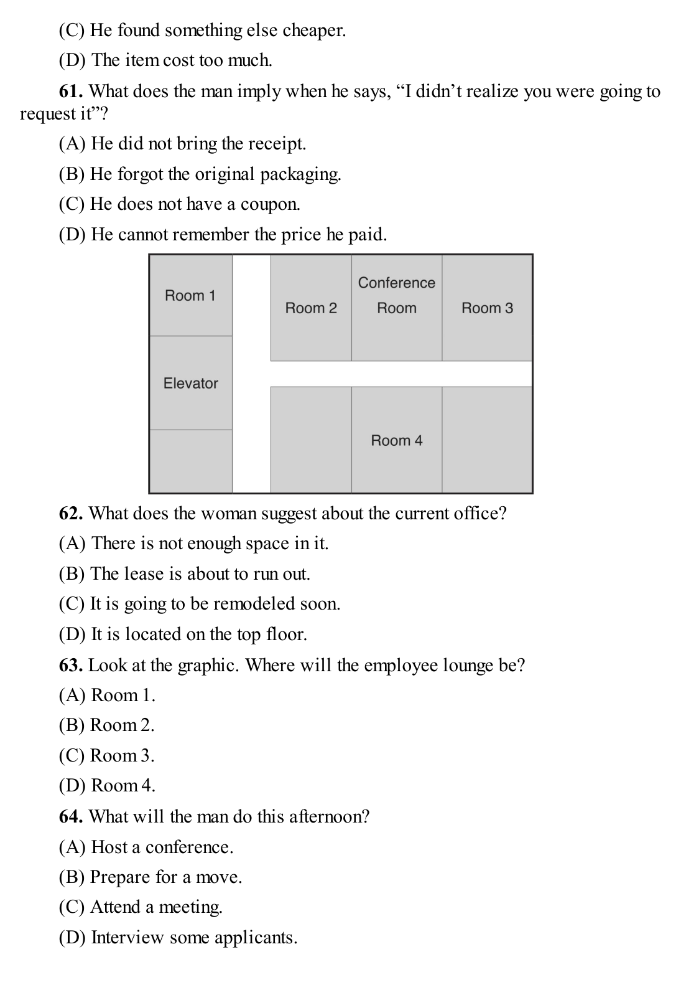

**听力独白/对话原文：**
**W:** I'm pleased that we're moving to a bigger office this week. We've been expanding a lot lately, so this office has become a bit cramped. (62)
**M:** I couldn't agree more. By the way, where do you think we should put the employee lounge? (63)
**W:** The room next to the elevator is empty, isn't it? How about it? (63)
**M:** Actually, Ms. Logan intends to use it for her office. Why don't we put the lounge at the end of the hall next to the conference room?
**W:** That's fine with me. Have you packed everything in your office for the move? (64)
**M:** Not yet. I'm planning to take care of that after lunch though. (64)

**中文对照：**
> **W：**我很高兴我们本周就要搬到大一点的办公室了。最近我们的规模扩大了很多，所以这个办公室有些拥挤了。
> **M：**我完全赞同。顺便问一句，你觉得员工休息区应该被安排在哪里？
> **W：**电梯旁边的房间是空的，不是吗？那里如何？
> **M：**事实上，罗根女士打算使用那间屋子作个人办公室。为什么我们不把员工休息区安排在挨着会议室的大厅的最里边。
> **W：**那对我来说很不错。这次搬迁，你打包好办公室里的所有物品了吗？
> **M：**还没有，但我打算吃过午饭后就去打包。

**核心词汇与短语：**
- **expand**：扩大
- **by the way**：顺便问一句，顺便说一声
- **lounge**：大厅，休息室
- **elevator**：电梯
- **conference room**：会议室

#### Q62 (正确答案：A)
**问题：** What does the woman suggest about the current office? (关于当前的办公室，女士说了什么？)
- (A) There is not enough space in it. (办公室地方不够用了。)
- (B) The lease is about to run out. (租期即将到了。)
- (C) It is going to be remodeled soon. (办公室很快就要重新改造了。)
- (D) It is located on the top floor. (办公室在顶层。)

#### Q63 (正确答案：C)
**问题：** Look at the graphic. Where will the employee lounge be? (请看图表，员工休息区将在什么地方？)
- (A) Room 1. (1 号房间。)
- (B) Room 2. (2 号房间。)
- (C) Room 3. (3 号房间。)
- (D) Room 4. (4 号房间。)

#### Q64 (正确答案：B)
**问题：** What will the man do this afternoon? (今天下午，男士要做什么？)
- (A) Host a conference. (举办一个会议。)
- (B) Prepare for a move. (准备搬迁。)
- (C) Attend a meeting. (出席一个会议。)
- (D) Interview some applicants. (面试一些求职者。)

**延伸表达与补充：**
- **I couldn't agree more. = I totally agree with.** (我完全赞同。)
  - *例句：—I think the movie is really fantastic. The plot and the music are pretty good. —I couldn't agree more.* (我觉得这部电影真的太棒了。剧情和音乐真的太好了。我完全赞同。)
- **intend to do sth. = be going to do sth.** (打算做某事)
  - *例句：Mary intends to do a part-time job and earn some extra money.* (玛丽打算做份兼职，赚些外快。)

### Questions 65 - 67

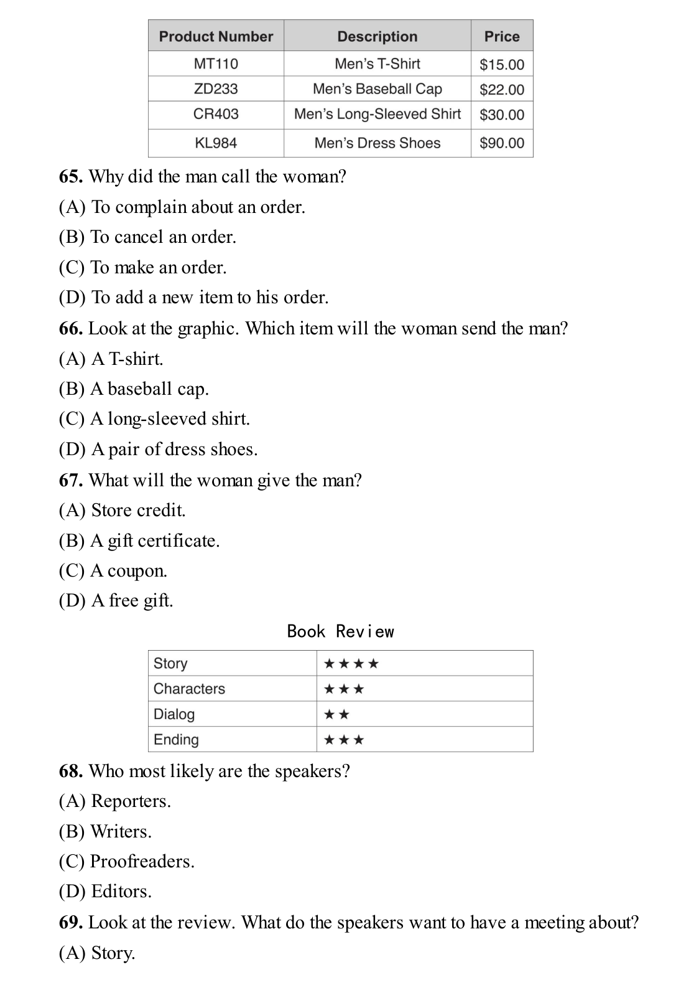

**听力独白/对话原文：**
**M:** Hello. This morning, I received a box of clothes I ordered from your company, but there's a slight problem. When I opened the box, one of the items I ordered was missing. (65)
**W:** I'm terribly sorry to hear that, sir. Could you give me your personal information, please?
**M:** My name is Ian Caldwell, and my order number was 98449-12. The missing item was product number CR403. (66)
**W:** All right. We're going to send you the item by express mail. (66) It should arrive by Thursday.
**M:** Excellent. I really appreciate it.
**W:** I'll also include a coupon good for twenty percent off your next order as our way of apologizing. (67)

**中文对照：**
> **W：**您好，今天早上，我收到了从你们公司订购的一包衣服，但是有个小问题。我打开包裹的时候，发现少了一件衣物。
> **M：**非常抱歉听到这个消息，先生。您能提供一下个人信息吗？
> **W：**我的名字是伊恩·考德威尔，我的订单号是98449-12。缺少的衣物的产品货码是CR403。
> **M：**好的。我们将会以快件的方式把衣物发给您，快件会周四送到。
> **W：**太好了。非常感谢。
> **M：**我还会为您提供一张8折优惠券，以表达我们的歉意。

**核心词汇与短语：**
- **slight**：微小的
- **item**：（一件）物品
- **personal information**：个人信息
- **express mail**：快件
- **appreciate**：感激
- **coupon**：赠券，优惠券

#### Q65 (正确答案：A)
**问题：** Why did the man call the woman? (男士为什么打电话给女士？)
- (A) To complain about an order. (投诉一个订单。)
- (B) To cancel an order. (取消订单。)
- (C) To make an order. (下订单。)
- (D) To add a new item to his order. (为其订单添加一个新商品。)

#### Q66 (正确答案：C)
**问题：** Look at the graphic. Which item will the woman send the man? (请看图表，女士将会给男士寄送哪一件物品？)
- (A) A T-shirt. (一件 T 恤衫。)
- (B) A baseball cap. (一个棒球帽。)
- (C) A long-sleeved shirt. (一件长袖衬衫。)
- (D) A pair of dress shoes. (一双正装鞋。)

#### Q67 (正确答案：C)
**问题：** What will the woman give the man? (女士将送给男士什么？)
- (A) Store credit. (一张代金券。)
- (B) A gift certificate. (一张礼品券。)
- (C) A coupon. (一张优惠券。)
- (D) A free gift. (一个免费礼品。)

**延伸表达与补充：**
- **terribly sorry = much to one's regret** (很抱歉)
  - *例句：I'm terribly sorry to tell you that the train will arrive late.* (我很抱歉地告诉你，火车晚点了。)

### Questions 68 - 70

**听力独白/对话原文：**
**W:** Did you see Nate Houseman's newest book was reviewed in the Peterson Daily today? (68)
**M:** Really? How did the reviewer like it? (68)
**W:** He enjoyed the story, but he pointed out a few problems with the book. Here, take a look at his ratings.
**M:** Hmm...Check out this two-star rating. You know, Nate's already working on the third book in the series. He said he'd submit it for review in two months. （ 68, 69 ）
**W:** We'd better have a meeting to discuss this issue. (69) If he can make it better, the entire series will be improved.
**M:** I agree. I'll contact him and find out when he can fly up here. (70) Book Review

**中文对照：**
> **W：**你看到内特·豪斯曼最新的书在今天的《彼得森日报》上的书评了吗？
> **M：**真的吗？评论家觉得这本书怎么样？
> **W：**他喜欢这个故事，但他指出了这本书存在的几个问题。看这儿，他的评分。
> **M：**嗯…仔细看看这个两颗星的评价。你知道，内特已经在创作该系列书的第三本了。他说他会在两个月之后提交送审这本书。
> **W：**我们最好开会讨论一下这个问题。如果他能把作品完善一下，整套书（的质量）就会得到提升。
> **M：**我赞同。我和他联系一下，看看他什么时候能够坐飞机过来一趟。书评

**核心词汇与短语：**
- **review**：评论
- **rating**：评分，评级
- **check out**：检查
- **submit**：提交
- **series**：系列
- **entire**：整个的
- **contact**：联系

#### Q68 (正确答案：D)
**问题：** Who most likely are the speakers? (讲话人最有可能从事什么职业？)
- (A) Reporters. (记者。)
- (B) Writers. (作者。)
- (C) Proofreaders. (校对。)
- (D) Editors. (编辑。)

#### Q69 (正确答案：C)
**问题：** Look at the review. What do the speakers want to have a meeting about? (请看书评，讲话人开会想要讨论什么？)
- (A) Story. (故事。)
- (B) Characters. (角色。)
- (C) Dialog. (对白。)
- (D) Ending. (结局。)

#### Q70 (正确答案：C)
**问题：** What does the man say he will do? (男士称他要做什么？)
- (A) Speak with the reviewer. (和评论家谈谈。)
- (B) Read a newspaper article. (阅读报纸文章。)
- (C) Get in touch with Nate Houseman. (联系内特)
- (D) Purchase some books.

**延伸表达与补充：**
  - *例句：D* (）买些书。)
- **How do you like it? = What do you think about it?** (你觉得它怎么样？)
  - *例句：—I've seen that new movie directed by Wu Jing. —Really? How do you like it?* (我看过吴京导演的那部新片了。真的吗？你觉得怎么样？)

## Part 4: 简短独白 (Q71 - Q100)

### Questions 71 - 73

**听力独白/对话原文：**
A benefit concert for the Blue Hills Animal Shelter will be held Friday July 17th at the Orion Theater. (71) Many of your favorite artists, performers, and musicians will be there. We are also proud to announce that the event will be recorded as part of CBS Television's special concert series and will be released on CD and DVD. (72) All proceeds will be donated to the animal shelter so that it can continue its great work. (73) So don't be late! Buy your tickets today, and you can be part of this historic event.

**中文对照：**
> 为蓝山动物保护所举办的慈善音乐会将于7月17日，即周五在奥赖恩剧院举行。许多你特别喜爱的艺术家、表演家和音乐家将到场。我们也很荣幸地宣布，这场盛宴将作为CBS电视台特别音乐会系列的一部分被录制下来，而且将以CD和DVD形式发行。所有收入将捐赠给动物保护所，以便它能继续它伟大的事业。所以不要迟到！今天就去买票吧，你将成为这一历史性活动的一份子。

**核心词汇与短语：**
- **benefit**：义演，义卖
- **shelter**：保护所，庇护所
- **favorite**：特别喜爱的
- **performer**：表演家，演员
- **proud**：自豪的
- **release**：发行，发表
- **proceeds**：收入，所得
- **donate**：捐赠
- **historic**：有重大历史意义的

#### Q71 (正确答案：D)
**问题：** What is being advertised? (正在宣传的是什么？)
- (A) An animal hospital. (一家动物医院。)
- (B) A theater. (一家剧院。)
- (C) A music store. (一家音乐商店。)
- (D) A charity concert. (一场慈善音乐会。)

#### Q72 (正确答案：C)
**问题：** What does the speaker mention about the event? (关于这次活动，讲话人提到了什么？)
- (A) It will be televised live. (它将被电视直播。)
- (B) They expect a full house. (他们期待满座。)
- (C) The event will be recorded on CD. (这次活动将会录制到 CD 上。)
- (D) The tickets will go on sale soon. (门票很快将会甩卖。)

#### Q73 (正确答案：A)
**问题：** Who will benefit the most from this event? (谁将从这次活动中受益最多？)
- (A) The animal shelter. (动物保护所。)
- (B) The local artists. (当地的艺术家。)
- (C) The musicians. (音乐家。)
- (D) The record stores. (唱片店。)

**延伸表达与补充：**
- **All proceeds will be donated.** (所有收入都将被捐出。扩展表达：)
  - *例句：All earnings will be given to charity. All profits will go to help the poor. All proceeds from this evening's event will be donated to charity.* (所有收入都将捐给慈善团体。所有利润都将用于帮助穷人。今晚活动的全部收入都将被捐赠给慈善事业。)
- **So don't be late!** (所以不要迟到！扩展表达：)
  - *例句：So come early! So be on time!* (所以早点来！所以按时来！)
- **be part of this historic event = get involved in this historic event** (参加这次有历史意义的活动扩展表达：)
  - *例句：be active in this historic event Please come out and be part of this historic event this weekend.* (积极参与此次历史事件请出来，参加本周末这一有历史意义的活动。)

### Questions 74 - 76

**听力独白/对话原文：**
Attention, all passengers. Love Boat Cruiselines has an important announcement about tonight's entertainment. (74) There will be a slight change of schedule. All of you looking forward to tonight's quiz night will have to be patient. Due to some technical problems with the sound system, quiz night has been postponed until tomorrow. (75) We sincerely apologize for this delay. We are working to remedy the situation as soon as possible. However, we do have a surprise for you. The well-known magician John Sanders and his Magic Bus Revue will join us directly from their successful tour of Hawaii. So please join us this evening: (76) we are sure you won't be disappointed.

**中文对照：**
> 所有乘客请注意。爱之船邮轮要发布一项关于今晚娱乐活动的重要通知。时间安排有一处细微的调整。所有期待今晚竞猜之夜的人得有耐心了。由于音响系统出现一些技术故障，竞猜之夜推迟到明天了。我们为此致以诚挚的歉意，并在努力尽快补救。不过，我们为您准备了一个惊喜。著名的魔术师约翰·桑德斯和他的魔幻巴士里威玉将在他们成功的夏威夷之旅后直接加入到我们的行列中。所以今晚请加入我们，我们保证您绝不会失望。

**核心词汇与短语：**
- **entertainment**：娱乐，招待
- **slight**：轻微的，略微的
- **look forward to**：盼望，期待
- **patient**：耐心的
- **technical**：技术上的
- **postpone**：推迟
- **sincerely**：真诚地
- **apologize**：道歉
- **delay**：推迟，延误
- **remedy**：补救，修复

#### Q74 (正确答案：B)
**问题：** Who is the intended audience of this announcement? (这则通知的目标听众是谁？)
- (A) The crew of the ocean liner. (邮轮上的船员。)
- (B) The passengers of the ship. (船上的乘客。)
- (C) The evening's entertainers. (晚会的专业演员。)
- (D) Mr. John Sanders. (约翰 · 桑德斯先生。)

#### Q75 (正确答案：A)
**问题：** Why does the speaker say,“quiz night has been postponed until tomorrow”? (讲话人为什么说 “ 竞猜之夜推迟到明天了 ” ？)
- (A) A problem with the sound system has occurred. (音响系统出现了故障。)
- (B) There were not enough participants. (没有足够的参与者。)
- (C) The host is not feeling well today. (主持人今天不舒服。)
- (D) There was a bigger demand for the magic show. (要求魔术表演的呼声更高。)

#### Q76 (正确答案：B)
**问题：** Who is Mr. Sanders? (桑德斯先生是谁？)
- (A) The captain of the ship. (这艘船的船长。)
- (B) This evening's entertainer. (今晚的表演者。)
- (C) The technician. (技师。)
- (D) The host of the quiz show. (竞猜表演的主持人。)

**延伸表达与补充：**
- **There will be a slight change of schedule. = A slight change in the schedule has been made.** (时间安排有一处细微的调整。)
- **We do have a surprise for you. = We do have something special for you. = We prepared something you won't ever guess.** (我们为您准备了一个惊喜。)
- **You won't be disappointed. = You won't be let down.** (您不会失望的。扩展表达：)
  - *例句：You will be glad.* (您会很开心的。)

### Questions 77 - 79

**听力独白/对话原文：**
Attention! We are now beginning a fire drill. (77) Would all staff designated as fire wardens please make your way to your positions immediately? And all employees should now make their way out of the building. (78) Do not run. Do not use the elevators. If you are in the center of the building, you may use the escalators. (79) If you are close to the entrance doors, use the emergency stairs. Please follow the instructions from the fire wardens, who will be wearing orange vests. Thank you for your attention. You may re-enter the building when the all-clear signal is given.

**中文对照：**
> 请注意！我们现在要进行一次消防演习。所有被指派做消防员的工作人员请马上各就各位。所有员工应立即离开大楼。不要奔跑，也不要使用电梯。如果你们在大楼的中心，可以使用自动扶梯。如果你们离入口处近的话，可以使用疏散楼梯。请按身穿橘黄色马甲的消防员的指示来做。谢谢大家。你们可以在警报解除后再次进入大楼。

**核心词汇与短语：**
- **fire drill**：消防演习
- **designate**：指派
- **fire warden**：消防员
- **immediately**：立即
- **entrance**：入口
- **emergency**：紧急情况
- **instruction**：命令，指示
- **vest**：马甲，背心
- **all- clear signal**：警报解除信号

#### Q77 (正确答案：B)
**问题：** What is being announced? (正在宣布什么内容？)
- (A) The closing of the store. (闭店。)
- (B) An emergency evacuation drill. (一次紧急撤退演习。)
- (C) The sale of the day. (当天的大甩卖。)
- (D) The upcoming company holidays. (即将到来的公司休假。)

#### Q78 (正确答案：A)
**问题：** What does the speaker ask the workers to do? (讲话人要求员工们怎么做？)
- (A) Calmly exit the building. (冷静地撤出大楼。)
- (B) Pay for their purchases. (为他们买的商品付款。)
- (C) Put on the orange vests. (穿上橘黄色的马甲。)
- (D) Talk to the fire wardens. (与消防员谈话。)

#### Q79 (正确答案：B)
**问题：** What does the speaker advise those who are in the middle of the building to do? (讲话人建议那些在大楼中心的人做什么？)
- (A) Take the elevators. (使用电梯。)
- (B) Take the escalators. (使用自动扶梯。)
- (C) Run out of the building. (跑出大楼。)
- (D) Use the emergency stairs. (使用疏散楼梯。)

**延伸表达与补充：**
- **And all employees should now make their way out of the building. = And all staff should go out of the building. = And all workers should leave the building.** (所有员工应立即离开大楼。)
- **when the all-clear signal is given = when you get the word that everything has been cleared** (当警报解除时扩展表达：)
  - *例句：when you hear that everything is okay Only when the all-clear signal is given can you come back into the building.* (当你们听到一切正常时只有当警报解除后，你们才能回到楼里。)

### Questions 80 - 82

**听力独白/对话原文：**
In a sensational development, a spokesperson for the giant steel-making corporation IZH, (80) which until recently has been considered one of the driving forces behind Canada's industrial growth, announced that IZH's board of directors has suspended the Chief Executive Officer and the head of financial services. (80) The spokesperson declined to answer questions or go into details regarding the suspension. However, we have learned of several relevant facts. Our senior business and finance editor has contacted a senior member of IZH's Accounting Department. This person, who wishes to remain anonymous at present, has provided details of an alleged large-scale accounting fraud. (81) Federal police and tax agents have begun an investigation which may take months, if not years, to complete. (82)

**中文对照：**
> 在事态发展造成轰动之际，钢铁制造巨头IZH的发言人宣布公司董事会对其首席执行官和财务总监进行了停职处理，该公司一直被认为是推动加拿大工业增长的主要动力之一。发言人拒绝回答关于停职的任何问题或详述其中的细节。但是，我们了解到几项相关的事实。我们的资深商业及金融编辑现已与IZH财务部的一位高层人士取得了联系。这位目前不愿透露身份的人士提供了一桩被称作是大规模会计欺诈的具体细节。联邦警方和税务代理人已经着手开始了一项调查，完成这项调查可能会耗时数月乃至数年。

**核心词汇与短语：**
- **sensational**：轰动性的
- **spokesperson**：发言人
- **giant**：巨大的
- **driving force**：动力
- **board of directors**：董事会
- **suspend**：停职
- **decline**：拒绝
- **go into details**：提供细节
- **regarding ~**：关于
- **relevant**：相关的
- **senior**：级别或地位高的
- **editor**：编辑
- **anonymous**：匿名的
- **alleged**：据称的，声称的
- **fraud**：诈骗
- **investigation**：调查

#### Q80 (正确答案：C)
**问题：** What did the representative of IZH announce? (的代表宣布了什么？)
- (A) The growth of the company stocks. (公司股票的上涨。)
- (B) The resignation of its chief executive officer. (其首席执行官的辞职。)
- (C) The suspension of its senior members. (其高层人员的停职。)
- (D) The amount of money in taxes the company pays. IZH (公司缴付的税款总额。)

#### Q81 (正确答案：B)
**问题：** How did they learn of several facts? (他们是如何了解到那几项事实的？)
- (A) From the company spokesperson. (通过公司发言人。)
- (B) From an undisclosed informant. (通过一位未透露姓名的知情者。)
- (C) From the chief executive officer. (通过首席执行官。)
- (D) From the local police. (通过当地警察。)

#### Q82 (正确答案：D)
**问题：** According to the speaker, how long will the investigation last? (根据发言人所说，调查将持续多长时间？)
- (A) A month. (一个月。)
- (B) A few months. (几个月。)
- (C) One year. (一年。)
- (D) It's unknown. (未知。)

**延伸表达与补充：**
- **go into details = provide details** (提供细节)
  - *例句：tell you the details He didn't want to go into details about his personal affairs.* (告诉你细节他不想提供有关自己私人事务的细节。)
- **who wishes to remain anonymous = who doesn't want his/her name revealed = who does not want others to know his / her name** (不想透露姓名的人)
  - *例句：I admire those people who want to remain anonymous after doing good deeds.* (我钦佩那些做好事不留名的人。)

### Questions 83 - 85

**听力独白/对话原文：**
Our special guest this evening is the philosopher and author of several novels, Nathan Boyce. (83) Nathan, or, I should say, Doctor Boyce—he has a Ph. D. in history from one of Ireland's most respected universities—is not going to talk you about philosophy tonight. He will talk to you about the subject of his latest historical novel, (84) which is set in Ireland in 1916. As you all know, that was a time of dramatic historical events. Dr. Boyce has just returned from a lengthy research trip to Ireland and Europe. I have learned that Dr. Boyce has been able to uncover some surprising and fascinating new details about those tragic events. (85) So would you please welcome Dr. Boyce for some insight into the creation of his new novel?

**中文对照：**
> 我们今晚的特别来宾是哲学家和多部小说的作者——内森·博伊斯。内森，或者我应该称呼为博伊斯博士，在爱尔兰最负盛名的一所大学取得了历史学博士学位，不过今晚他不会和大家讨论哲学。他将和大家谈谈他的最新历史小说的主题。这部小说的背景设在1916年的爱尔兰。正如大家所知，很多戏剧性的历史事件都发生在那个时期。博伊斯博士刚刚结束了对爱尔兰及欧洲的长期研究访问回国。我了解到博伊斯博士发现了一些关于这些悲剧事件的惊人的、吸引人的新细节。请大家欢迎博伊斯博士来谈谈他创作新小说时的一些深入见解。

**核心词汇与短语：**
- **philosopher**：哲学家
- **author**：作者
- **subject**：主题
- **latest**：最新的
- **historical**：有关历史的
- **dramatic**：戏剧性的
- **lengthy**：长期的
- **uncover**：发现，揭露
- **fascinating**：吸引人的
- **tragic**：悲剧性的
- **insight**：见解
- **creation**：创作，创造

#### Q83 (正确答案：B)
**问题：** Who is Nathan Boyce? (内森 · 博伊斯是谁？)
- (A) A university professor. (一位大学教授。)
- (B) A writer. (一位作家。)
- (C) A physician. (一位医师。)
- (D) A history teacher. (一位历史老师。)

#### Q84 (正确答案：D)
**问题：** What will Nathan discuss today? (内森今天将讨论什么？)
- (A) His time at his university. (他的大学时代。)
- (B) European history. (欧洲历史。)
- (C) His philosophical views of life. (他对于生命的哲学观点。)
- (D) His latest book. (他的最新著作。)

#### Q85 (正确答案：B)
**问题：** What did Nathan learn during his trip to Ireland? (内森在爱尔兰访问期间了解到什么？)
- (A) He will be leading a new research project. (他将领导一项新的研究项目。)
- (B) Some new findings about history. (一些关于历史的新发现。)
- (C) The university has named him an honorary professor. (这所大学任命他为荣誉教授。)
- (D) There will be a book written about him. (将会有一本写他的书。)

**延伸表达与补充：**
- **I have learned that ~** (我了解到…扩展表达：)
  - *例句：I have experienced that ~ I have realized that ~ I have learned that my boss is a respectable person.* (我经历了…我认识到…我了解到我的老板是一个值得尊敬的人。)
- **able to uncover = able to discover = able to find out** (得以发现)
  - *例句：I was able to uncover many secrets during my research.* (在调查过程中，我发现了许多秘密。)

### Questions 86 - 88

**听力独白/对话原文：**
Today your community radio station is very pleased to invite you to the fifth CCR Veteran and Vintage Car Rally. (86) Fifty-four absolutely beautiful, fully-restored vehicles from the beginning of the twentieth century will make their way from the rally point, in Federation Square, down to Exhibition Palace in Victoria Gardens. Cars will be arriving at Federation Square at 9:00 a. m. and will leave for Victoria Gardens at eleven o'clock. If you arrive at around 9:00 a. m., you will have a chance not only to inspect the cars but also to meet their owners. (87) Entry into the Exhibition Building will cost five dollars for adults and two dollars for seniors (88) and children under twelve years old. Don't miss this fabulous occasion!

**中文对照：**
> 今天我们社团广播站非常高兴地邀请您来参加第五届CCR老式汽车拉力赛。20世纪初生产的54辆绝对漂亮，经过全新改装的车辆将从位于联邦广场的拉力赛起点，驶向位于维多利亚花园的展览宫。车辆将于上午9点到达联邦广场，并于11点出发前往维多利亚花园。如果您在上午9点左右到达，您将不仅有机会观看车辆，还能遇到它们的主人。成年人进入展馆需要花费5美元，老年人和12岁以下的儿童须交纳2美元。请不要错过这次绝佳的机会！

**核心词汇与短语：**
- **community**：社区，社团
- **absolutely**：绝对地，毫无疑问地
- **restore**：恢复，修复
- **rally**：（汽车）拉力赛
- **inspect**：检查，审视
- **entry**：进入
- **senior**：老年人
- **fabulous**：绝佳的
- **occasion**：时机，机会

#### Q86 (正确答案：C)
**问题：** For how many years has the event been taking place? (这项赛事已经举办多久了？)
- (A) One year. (1 年。)
- (B) Two years. (2 年。)
- (C) Five years. (5 年。)
- (D) Ten years. (10 年。)

#### Q87 (正确答案：A)
**问题：** What would those arriving before 9 get a chance to do? (那些 9 点之前到达的人们有机会做什么呢？)
- (A) Meet with the drivers. (与车手们见面。)
- (B) Take the cars for a test drive. (试驾赛车。)
- (C) Get the autographs of the drivers. (得到车手们的签名。)
- (D) Receive a discount on the entry fee. (获得入场费打折。)

#### Q88 (正确答案：A)
**问题：** How much would a 65-year-old man have to pay to get into the place? (一位 65 岁的人进入场地要花多少钱？)
- (A) Two dollars. (2 美元。)
- (B) Three dollars. (3 美元。)
- (C) Five dollars. (5 美元。)
- (D) Twelve dollars. (12 美元。)

**延伸表达与补充：**
- **You will have a chance to do ~ = You will have the opportunity to do ~ = You will have the possibility of ~** (你将有机会去做…)
  - *例句：You will have a chance to learn new skills.* (你将有机会学习新技巧。)
- **Entry into the Exhibition Building will cost five dollars. = Admission to the Exhibition Building will cost five dollars. = It costs five dollars to enter the Exhibition Building.** (进入展馆的费用是5美元。)

### Questions 89 - 91

**听力独白/对话原文：**
This is Michael from Ace Tours. (89) We have to advise you that the unexpected heavy rain last night has made it impossible to continue with our plans for rafting today. The water level has risen beyond the safe zone. (90) But let's look on the bright side! As you probably know, our specialist guides are always prepared for moments like this. We propose four different activities today. (91) For the morning session, you can choose between rock-climbing and hiking, and in the afternoon, there will be a choice between windsurfing and jet skiing. (91) This is a rare opportunity to learn from our experts, so by no means will this be a wasted day.

**中文对照：**
> 我是来自埃斯旅行社的迈克尔。我们不得不通知你们：由于昨晚突如其来的一场大雨，我们今天的漂流不能按计划进行了。水位线已经上升并超出了安全区域。不过让我们来看看好的一面！正如你可能知道的，我们的专业导游往往会为这种情况做准备。我们今天计划了四种不同的活动。上午这段时间，你们可以选择攀岩或者徒步旅行，下午可以选择帆板运动或是喷气式滑水。这是一次向专家们学习的宝贵机会，所以这一天绝不会虚度。

**核心词汇与短语：**
- **unexpected**：没有料到的，突如其来的
- **rafting**：漂流
- **beyond**：超出
- **safe zone**：安全区域
- **propose**：计划，提出
- **activity**：活动
- **session**：一段时间
- **rock climbing**：攀岩
- **hiking**：徒步旅行，远足
- **windsurfing**：帆板运动
- **jet skiing**：喷气式滑水
- **rare**：宝贵的，难得的
- **by no means**：不可能
- **wasted**：虚度的，浪费的

#### Q89 (正确答案：B)
**问题：** Who most likely is giving the talk? (讲话人最有可能是谁？)
- (A) The rafting instructor. (漂流的指导者。)
- (B) A tour guide. (导游。)
- (C) A rock climber. (攀岩者。)
- (D) A windsurfer. (帆板运动员。)

#### Q90 (正确答案：D)
**问题：** Why has the plan been changed? (为什么计划变了？)
- (A) Rain is coming down hard outside. (外面正下着倾盆大雨。)
- (B) The rafting instructor could not make it. (漂流指导者做不到。)
- (C) The listeners voted to do something else. (听众投票表示要做其他事情。)
- (D) The water level has risen beyond what is safe. (水位线超过了安全高度。)

#### Q91 (正确答案：C)
**问题：** Which of the following activities is NOT a part of the day's events? (下面哪一项不是当天安排的活动？)
- (A) Hiking. (徒步旅行。)
- (B) Windsurfing. (帆板运动。)
- (C) Swimming. (游泳。)
- (D) Jet skiing. (喷气式滑水。)

**延伸表达与补充：**
- **We have to advise you ~** (我们不得不通知你们…扩展表达：)
  - *例句：We have to warn you ~ = We have to caution you ~ We have to advise you to read over the materials thoroughly before meeting with your bosses.* (我们不得不警告你们…我们不得不告知你们，在会见你们的老板之前需要认真仔细地阅读材料。)
- **But let's look on the bright side! = But let's be positive about it! = But let's be optimistic about it!** (但让我们来看看好的（乐观的）一面！)
- **This is a rare opportunity.** (这是一次难得的机会。扩展表达：)
  - *例句：This opportunity doesn't come often. This is a unique opportunity.* (这种机会并不常有。这是一次特别的机会。)
- **So by no means will this be a wasted day. = This day will definitely be worth it. = You will gain so much this day.** (这一天绝不会虚度。)

### Questions 92 - 94

**听力独白/对话原文：**
Hello everyone, and welcome to the tenth Summer Teachers' Training Camp. (92) The tight schedule we have planned for the week may be exhausting, but it will also be very rewarding. In the mornings before breakfast, we have special group activities, such as yoga, calligraphy, journal reading, and jogging. After breakfast, there will be lectures in teaching techniques by some of our guest teachers. (93) Then, we will take a long break for lunch and resume at 3:00 p.m. for the last formal session, which is a short talk followed by a discussion on various topics. Finally, there is dinner, which we will take turns preparing in teams, (94) and this will be followed by informal club activities such as music and chess. As you can see, our days are busy but rewarding.

**中文对照：**
> 大家好！欢迎大家来到第十期暑期教师训练营。我们这周的日程安排得很满，也许大家会觉得疲惫，但也会非常有收获。在早晨吃饭前，我们有特别小组活动，比如瑜伽、书法、期刊阅读和慢跑。早饭后，会由几位客座教师带来教学法讲座。然后，我们将度过一段很长的午餐时光。下午3点，我们会回来进行最后一次正式会议。会上将有简短的讲话，然后是关于各种话题的讨论。最后是晚餐，我们将分组轮流进行筹备，此后会是非正式的社团活动，比如音乐和象棋。正如你们所见，我们这几天非常忙，但也会很有收获。

**核心词汇与短语：**
- **tight**：紧的，填满的
- **exhausting**：使人筋疲力尽的
- **rewarding**：有益的，有收获的
- **calligraphy**：书法
- **resume**：重新开始，继续
- **formal**：正式的
- **various**：不同的
- **finally**：最后
- **take turns V-ing ~**：轮流做某事

#### Q92 (正确答案：A)
**问题：** Who is the intended audience of this talk? (这次讲话的目标听众是谁？)
- (A) Teachers. (教师。)
- (B) Students. (学生。)
- (C) Yoga trainers. (瑜伽教练。)
- (D) Chess players. (下象棋的人。)

#### Q93 (正确答案：B)
**问题：** What will the participants do in the mornings after breakfast? (早饭后，参加者上午将会做什么？)
- (A) Learn the art of handwriting. (学习书法。)
- (B) Listen to their colleagues talk. (听他们同事的讲话。)
- (C) Go for a short walk. (散一小会儿步。)
- (D) Read some journals. (阅读一些期刊。)

#### Q94 (正确答案：C)
**问题：** What does the speaker mention about dinner? (关于晚餐，讲话者提到了什么？)
- (A) It will be served exactly at six o'clock. (晚餐将于六点整供应。)
- (B) There is going to be a variety of dishes to choose from. (将会有各式各样的饭菜供选择。)
- (C) The participants will prepare it themselves. (参加者将自行准备晚餐。)
- (D) It will be held after the informal activities. (晚餐将会在非正式的活动之后开始。)

**延伸表达与补充：**
- **the tight schedule = the busy schedule** (排得很满的日程)
  - *例句：This tight schedule will not allow us to do any personal things.* (日程排得太满，我们没有时间做任何私人的事情。)
- **We will take a long break for lunch. = We will have a lot of time for lunch.** (我们将度过一段很长的午餐时光。)

### Questions 95 - 97

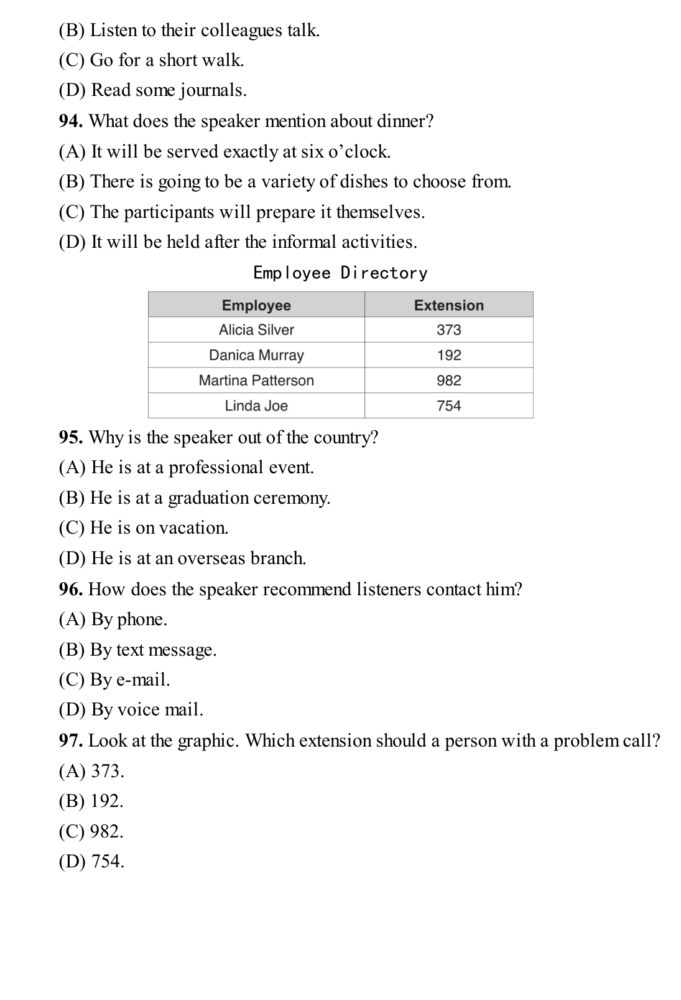

**听力独白/对话原文：**
Hello. This is Brian Peterson. Thank you for calling. Unfortunately, I can not take your call right now because I'm out of the country attending a seminar in Rome. (95) I'm going to be back in the office on Monday, June 10. I don't have my cell phone with me, so you can't get in touch with me that way. You can send me an e-mail though as I'll be checking it twice a day. (96) If there is an urgent matter which must be discussed, you are welcome to contact Danica Murray. (97) She should be able to solve any issues. Thank you. Goodbye. Employee Directory

**中文对照：**
> 您好，我是布赖恩·彼得森。感谢您的来电。但很抱歉，我现在无法接听您的电话，因为我不在国内，正在罗马参加研讨会。我暂定于6月10日（星期一）回去上班。我没带手机，所以通过手机您联系不上我。不过，您可以给我发邮件，因为我一天会查看两次邮箱。如若有紧急事件需要商讨，请联系达妮卡·墨里。她会解决所有问题。谢谢您的配合！再会！员工目录

**核心词汇与短语：**
- **attend**：参加
- **have sth. with sb**：某人随身携带某物
- **be back in the office**：回去上班
- **get in touch with**：与取得联系
- **urgent**：紧急的
- **employee**：雇员
- **extension**：分机号

#### Q95 (正确答案：A)
**问题：** Why is the speaker out of the country? (讲话者为什么出国了？)
- (A) He is at a professional event. (他在参加一个专业活动。)
- (B) He is at a graduation ceremony. (他在参加毕业典礼。)
- (C) He is on vacation. (他在度假。)
- (D) He is at an overseas branch. (他去国外分公司了。)

#### Q96 (正确答案：C)
**问题：** How does the speaker recommend listeners contact him? (讲话者建议听者通过什么方式和他联系？)
- (A) By phone. (通过电话。)
- (B) By text message. (通过短信。)
- (C) By e-mail. (通过邮件。)
- (D) By voice mail. (通过语音。)

#### Q97 (正确答案：B)
**问题：** Look at the graphic. Which extension should a person with a problem call? (请看图表，如果有事情需要商议，需要拨打哪个分机号？)
- (A) 373. (373 。)
- (B) 192. (192 。)
- (C) 982. (982 。)
- (D) 754. (754 。)

**延伸表达与补充：**
- **get in touch with = make contact with** (与…取得联系)
  - *例句：You might get in touch with him.* (你不妨和他联系一下。)

### Questions 98 - 100

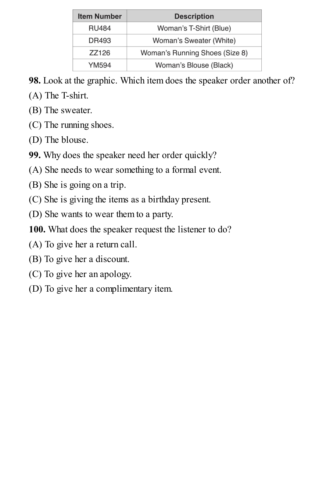

**听力独白/对话原文：**
Good morning. This is Clarice Meadows. I ordered several items by phone about an hour ago. My order number is 6547-MD23. After looking at your catalog, I've decided that I'd like to make an adjustment to my order. I ordered one of item number DR493, but I'd like to increase that number to two, please. (98) In addition, I'd like to have the entire order sent by express mail because I need to have everything two days from now as I'm going on vacation in three days. (99) Please call me back at the number you have on file for me to confirm everything. (100) Thank you.

**中文对照：**
> 早上好，我是克拉丽斯·梅多斯。一个小时之前，我通过电话预订了几件商品，订单号是6547-MD23。但是，看完您家的商品目录后，我想修改一下订单。我之前预订的商品中有件货号是DR493的商品，现在我想将该商品追加成两件。另外，我希望订单中的所有商品都能通过特快专递的方式配送，因为我三天后要外出度假，所以必须在两天之内收到才行。如果您有任何疑问，请根据订单上的收件人信息与我联系，谢谢！

**核心词汇与短语：**
- **order by phone**：通过电话预定
- **catalog**：产品目录
- **make an adjustment to**：对做出调整
- **increase ~ to ~**：将增加至
- **express mail**：特快专递
- **go on vacation**：去度假
- **confirm**：确认

#### Q98 (正确答案：B)
**问题：** Look at the graphic. Which item does the speaker order another of? (请看图表，讲话人想追加的商品是什么？)
- (A) The T-shirt. (T 恤。)
- (B) The sweater. (运动衫。)
- (C) The running shoes. (运动鞋。)
- (D) The blouse. (衬衫。)

#### Q99 (正确答案：B)
**问题：** Why does the speaker need her order quickly? (为什么讲话人要尽快收到她的商品？)
- (A) She needs to wear something to a formal event. (商品里有她出席正式场合要穿的衣服。)
- (B) She is going on a trip. (她要外出旅行。)
- (C) She is giving the items as a birthday present. (商品里有她要送人的生日礼物。)
- (D) She wants to wear them to a party. (商品里有她参加派对需要穿的衣服。)

#### Q100 (正确答案：A)
**问题：** What does the speaker request the listener to do? (讲话人要求听者做什么？)
- (A) To give her a return call. (给她回电。)
- (B) To give her a discount. (给她打折。)
- (C) To give her an apology. (给她道歉。)
- (D) To give her a complimentary item. (给她赠品。)

**延伸表达与补充：**
- **I'd like to = I want to = I'd love to** (我想…)
  - *例句：I'd like to cash this cheque in, please.* (我想把这张支票换成现金，谢谢。)
- **go on vacation = go on a trip = take a vacation = go on holiday** (外出旅行)
  - *例句：I wonder if you would care to go on holiday with us.* (我想请问你是否愿意和我们一起去度假。)

# TEST 08

## 答案速查表

| 题号 | 答案 | 题号 | 答案 | 题号 | 答案 | 题号 | 答案 | 题号 | 答案 | 题号 | 答案 | 题号 | 答案 | 题号 | 答案 | 题号 | 答案 | 题号 | 答案 |
| :---: | :---: | :---: | :---: | :---: | :---: | :---: | :---: | :---: | :---: | :---: | :---: | :---: | :---: | :---: | :---: | :---: | :---: | :---: | :---: |
| **1** | D | **11** | C | **21** | B | **31** | A | **41** | C | **51** | B | **61** | A | **71** | A | **81** | B | **91** | A |
| **2** | C | **12** | A | **22** | C | **32** | C | **42** | A | **52** | D | **62** | B | **72** | B | **82** | A | **92** | B |
| **3** | A | **13** | A | **23** | B | **33** | C | **43** | B | **53** | A | **63** | C | **73** | A | **83** | A | **93** | D |
| **4** | D | **14** | A | **24** | A | **34** | C | **44** | B | **54** | C | **64** | A | **74** | D | **84** | B | **94** | A |
| **5** | D | **15** | A | **25** | A | **35** | C | **45** | B | **55** | A | **65** | D | **75** | C | **85** | B | **95** | C |
| **6** | A | **16** | B | **26** | C | **36** | A | **46** | C | **56** | B | **66** | D | **76** | B | **86** | A | **96** | C |
| **7** | B | **17** | C | **27** | A | **37** | A | **47** | B | **57** | A | **67** | B | **77** | C | **87** | B | **97** | C |
| **8** | B | **18** | C | **28** | C | **38** | A | **48** | A | **58** | A | **68** | B | **78** | B | **88** | B | **98** | D |
| **9** | B | **19** | C | **29** | C | **39** | D | **49** | D | **59** | C | **69** | C | **79** | A | **89** | C | **99** | C |
| **10** | A | **20** | A | **30** | B | **40** | B | **50** | D | **60** | C | **70** | A | **80** | C | **90** | B | **100** | A |

## Part 1: 照片描述 (Q1 - Q6)

### Q1 (正确答案：D)

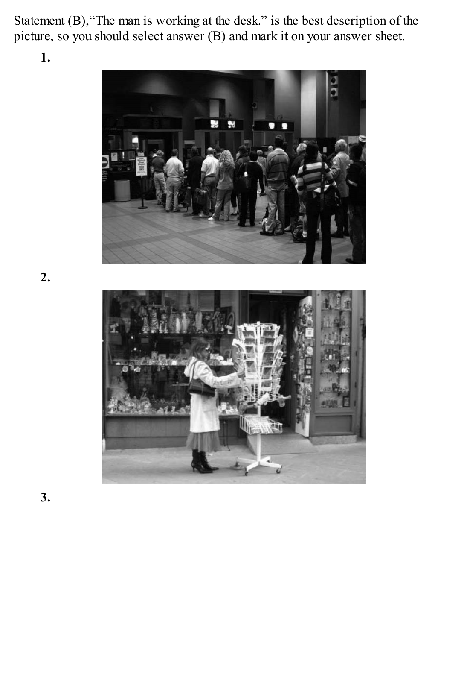

**听力原文与选项：**
- (A) They're hurrying to catch a plane. (他们正在匆匆忙忙赶飞机。)
- (B) They're being led to the airplane. (他们正在被带向机场。)
- (C) They're waiting for their luggage. (他们在等待自己的行李。)
- (D) They're standing in line with their bags. (他们正拿着包站成一排。)

**其他可能表达：**
- The people are waiting in a row. (人们正在排队等候。)
- There are many passengers lined up at the airport gate. (有许多乘客在机场大门处排队。)
- The airport is busy with passengers today. (今天机场繁忙，有很多乘客。)

### Q2 (正确答案：C)

**听力原文与选项：**
- (A) She has stopped to chat with some others. (她停了下来去和其他人聊天。)
- (B) She is looking into the store window. (她正在朝商店的橱窗里张望。)
- (C) She is checking out some items in the rack. (她正在查看架子上的一些商品。)
- (D) She has placed her bag down next to her. (她把包放在自己旁边。)

**其他可能表达：**
- A woman is looking at some goods outdoors. (一位女士正在看屋外的一些商品。)
- She is browsing through the rack. (她正在浏览货架。)
- She is standing with her bag on her shoulder. (她正站着，肩上背着包。)

### Q3 (正确答案：A)

**听力原文与选项：**
- (A) The cabinet doors are open. (橱柜的门开着。)
- (B) The woman is fixing a dish. (女士在做菜。)
- (C) The woman is drinking some water. (女士在喝水。)
- (D) There are dishes piled up in the sink. (许多盘子堆放在洗碗池里。)

**其他可能表达：**
- The woman is at the kitchen sink. (女士正在厨房的洗碗池边。)
- She is holding something in her hand. (她手里正拿着东西。)
- There are bowls placed on the kitchen counter. (厨房的台子上放着一些碗。)

### Q4 (正确答案：D)

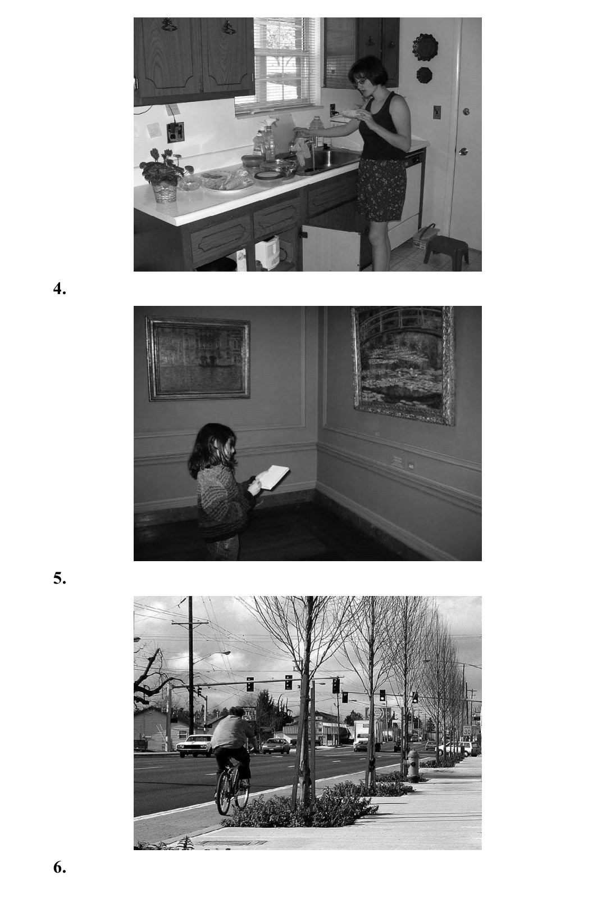

**听力原文与选项：**
- (A) She's reading to a large audience. (她正对一大群听众朗读。)
- (B) She's standing in front of the art gallery. (她正站在艺术画廊前。)
- (C) She's looking for a place to sit. (她正在找坐的地方。)
- (D) She's by herself in the gallery. (她独自在画廊。)

**其他可能表达：**
- She is holding a notepad in front of her. (她面前放着一个笔记本。)
- There are paintings hung on the walls. (墙上挂着很多画。)
- The girl is standing in an art gallery. (女孩正站在一个艺术画廊里。)

### Q5 (正确答案：D)

**听力原文与选项：**
- (A) The man is locking up his bicycle. (男士正在锁他的自行车。)
- (B) Some cars are parked near the curb. (路边停着一些汽车。)
- (C) The man is waiting for the traffic light to change. (男士正在等交通灯变色。)
- (D) There are trees along the road. (沿路有许多树。)

**其他可能表达：**
- A man is riding his bicycle along the road. (一位男士正沿着马路骑自行车。)
- The traffic is flowing very smoothly. (交通非常顺畅。)
- There are cars on the road today. (今天路上有汽车。)

### Q6 (正确答案：A)

**听力原文与选项：**
- (A) People are looking into the aquarium. (人们在朝水族馆里看。)
- (B) People are waiting to go into the pool. (人们在等着进入游泳池。)
- (C) People are swimming in a pool. (人们在游泳池里游泳。)
- (D) People are watching a movie. (人们在看电影。)

**其他可能表达：**
- They are looking at the same thing. (他们在看同样的东西。)
- The people are standing next to the aquarium. (人们正站在水族馆旁边。)
- A couple of the women are carrying bags on their shoulders. (一些女士肩上背着包。)
- 注：在Part 1中，每道试题都添加了3种可能的正确表达方式，考生可
- 以了解对于同样的照片可能出现的不同表达。

## Part 2: 应答测试 (Q7 - Q31)

### Q7 (正确答案：B)

**听力对话文本：**
- **Q:** Where does the train for Chicago stop? (开往芝加哥的火车停在哪里？)
- **A:** Go line up at Gate 6. (到6号站台去排队。)

**听力原文与选项：**
- **问题：** Where can I catch the train for Chicago? (我在哪里能搭到开往芝加哥的火车？)
- **选项：**
  - (A) In one hour. (在一小时内。)
  - (B) At Stop 6. (在 6 号站台。)
  - (C) Yes, you can. (是的，你可以。)

### Q8 (正确答案：B)

**听力对话文本：**
- **Q:** Have the boxes been shipped out yet? (那些箱子已经用船运走了吗？)
- **A:** Yes, they went out this morning. (是的，它们是今早发走的。)

**听力原文与选项：**
- **问题：** Have the boxes been sent out yet? (那些箱子发送出去了吗？)
- **选项：**
  - (A) Once a day. (一天一次。)
  - (B) Yes, they've been delivered. (是的，它们已经被运走了。)
  - (C) In the storage room. (在储物间里。)

### Q9 (正确答案：B)

**听力对话文本：**
- **Q:** Who is due to give a speech now? (现在应该谁演讲？)
- **A:** Linda Evans is scheduled to go up. (按计划琳达·埃文斯应该上去。)

**听力原文与选项：**
- **问题：** Who is scheduled to speak first? (按计划谁应该先发言？)
- **选项：**
  - (A) He is the keynote speaker. (他是主讲人。)
  - (B) Linda Evans is the first on the list. (琳达 · 埃文斯是名单上的第一个人。)
  - (C) They are scheduled to arrive soon. (按计划他们很快就会到了。)

### Q10 (正确答案：A)

**听力对话文本：**
- **Q:** Where do these dishes go? (这些菜放在哪里？)
- **A:** Put them here beside me. (把它们放在我旁边。)

**听力原文与选项：**
- **问题：** Where do you want me to put these dishes? (你想让我把这些菜放在哪儿？)
- **选项：**
  - (A) Just place them next to me. (把它们放我旁边就行。)
  - (B) Yes, it is my favorite. (是的，它是我最喜欢的。)
  - (C) We're going to the restaurant. (我们打算去餐馆。)

### Q11 (正确答案：C)

**听力对话文本：**
- **Q:** Is sales tax included in this bill? (这个账单里包括营业税吗？)
- **A:** Yes, it's included in the total. (是的，它包含在总额中了。注：在Part 2中，为帮助考生提高听懂题目的能力，添加了和试题相同或相似的表达方法。)

**听力原文与选项：**
- **问题：** Does this total include sales tax? (这个总额包括营业税吗？)
- **选项：**
  - (A) Yes, we're taking a taxi. (是的，我们打算打车。)
  - (B) No, they don't sell it there. (不，他们不在那里出售它。)
  - (C) Yes, I believe it does. (是的，我认为是这样的。)

### Q12 (正确答案：A)

**听力对话文本：**
- **Q:** When will you leave? (你将在什么时候离开？)
- **A:** At the end of this week. (这周末。)

**听力原文与选项：**
- **问题：** When do you plan on taking off? (你打算什么时候动身？)
- **选项：**
  - (A) This Friday. (这周五。)
  - (B) Yes, of course. (好的，当然可以。)
  - (C) No, turn it on. (不，把它打开。)

### Q13 (正确答案：A)

**听力对话文本：**
- **Q:** Could you lend me a hand with something in the meeting room, or are you tied up at the moment? (你现在时间紧吗？可以到会议室帮我个忙吗？)
- **A:** I'm free until ten o'clock. (我10点以前都有空。)

**听力原文与选项：**
- **问题：** Can you come into the meeting room to give us a hand, or are you too busy right now? (如果你不是太忙的话，可以到会议室来给我们帮下忙吗？)
- **选项：**
  - (A) I could spare a few minutes. (我可以腾出几分钟。)
  - (B) I think there is plenty of room. (我觉得有足够的空间。)
  - (C) Yes, I can lend you one. (好的，我可以借给你一个。)

### Q14 (正确答案：A)

**听力对话文本：**
- **Q:** Caroline did accept the offer she got from New York, didn't she? (卡罗琳确实接受了纽约那份工作，是吗？)
- **A:** She is still thinking it over. (她仍在仔细考虑。)

**听力原文与选项：**
- **问题：** Caroline is planning to take the job in New York, isn't she? (卡罗琳打算接受纽约的那份工作，是吗？)
- **选项：**
  - (A) I think she's still considering her options. (我认为她现在仍在考虑她的选择。)
  - (B) It was not planned properly to begin with. (还没有合理地计划好来实施它。)
  - (C) They're yours, aren't they? (它们是你的，不是吗？)

### Q15 (正确答案：A)

**听力对话文本：**
- **Q:** What is happening with the food we ordered? (我们点的食物怎么样了？)
- **A:** It's probably on its way now. (也许正被送过来。)

**听力原文与选项：**
- **问题：** Why is it taking such a long time for the food to get here? (为什么这么久才把食物送过来？)
- **选项：**
  - (A) We only ordered ten minutes ago. (我们 10 分钟前才点的餐。)
  - (B) The chicken is their best dish. (鸡肉是他们最好的菜。)
  - (C) Let's just eat here and go. (我们就在这里吃完再走吧。)

### Q16 (正确答案：B)

**听力对话文本：**
- **Q:** We do know each other, don't we? (我们的确认识彼此，不是吗？)
- **A:** Yes, I'm quite sure we've met somewhere before. (是的，我非常确定我们以前在哪里见过。)

**听力原文与选项：**
- **问题：** I'm quite certain that we've met somewhere, haven't we? (我很确信我们在什么地方见过，对吗？)
- **选项：**
  - (A) I know where it is, too. (我也知道它在哪里。)
  - (B) Yes, you do look familiar. (是的，你确实看起来面熟。)
  - (C) He is sure about it. (他对此很确信。)

### Q17 (正确答案：C)

**听力对话文本：**
- **Q:** Do you know why the big boss postponed the meeting? (你知道大老板为什么将会议推迟了吗？)
- **A:** He was needed elsewhere. (其他地方需要他。)

**听力原文与选项：**
- **问题：** Why did the president put off the meeting for another day? (为什么总裁把会议推迟到了另一天？)
- **选项：**
  - (A) No, I have not met with him yet. (不，我还没有见到他。)
  - (B) The conference room is on this floor. (会议室在这一层。)
  - (C) He had to attend to something urgent. (他不得不处理紧急事件。)

### Q18 (正确答案：C)

**听力对话文本：**
- **Q:** Would you like more food, or are you okay? (你吃饱了吗？还需要更多食物吗？)
- **A:** I can't eat another bite, thanks. (我已经吃得很饱了，谢谢。)

**听力原文与选项：**
- **问题：** Are you full, or would you like seconds? (你吃饱了吗，要不要再来一些？)
- **选项：**
  - (A) No, I'll take the first one. (不，我要吃第一个。)
  - (B) That would be all right. (那将很好。)
  - (C) Thanks, but I'm full. (谢谢，我已经吃饱了。)

### Q19 (正确答案：C)

**听力对话文本：**
- **Q:** When are we expecting Paul? (保罗什么时候过来？)
- **A:** I'll phone and ask him. (我会打电话问他的。)

**听力原文与选项：**
- **问题：** When is Paul due to arrive here? (保罗应该什么时候到这里？)
- **选项：**
  - (A) No, he has not handed it in yet. (不，他还没有把它交上来。)
  - (B) Next month is the deadline. (下个月是最后期限。)
  - (C) Let me call him to find out. (让我给他打电话问清楚吧。)

### Q20 (正确答案：A)

**听力对话文本：**
- **Q:** Could you please hold this door open? (你可以帮我扶下门让它开着吗？)
- **A:** Yes, of course. (好的，当然可以。)

**听力原文与选项：**
- **问题：** Would you mind holding the door open for me? (你介意帮我扶下门让它开着吗？)
- **选项：**
  - (A) Of course. Here you go. (当然可以，您这边请。)
  - (B) Oh, it's probably closed. (噢，它可能关了。)
  - (C) No, it's being held another time. (不，它将在其他时间举行。)

### Q21 (正确答案：B)

**听力对话文本：**
- **Q:** There is rain in the forecast for this weekend, isn't there? (天气预报说这周末会下雨，是吗？)
- **A:** Yes, but I am going away. (是的，不过我要离开了。)

**听力原文与选项：**
- **问题：** The rain is expected to come down hard this weekend, isn't it? (这周末会下大雨，是吗？)
- **选项：**
  - (A) Yes, he is waiting for it now. (是的，他现在正在等它。)
  - (B) Yes, but I won't be here. (是的，不过到时我不在这里。)
  - (C) To get away for a while. (离开一会儿。)

### Q22 (正确答案：C)

**听力对话文本：**
- **Q:** Could you please repeat that again, Mr. Carlson? (卡尔森先生，您可以重复一遍吗？)
- **A:** Mail a check to his address. (往他的地址邮寄一张支票。)

**听力原文与选项：**
- **问题：** What was that you said again, Mr. Carlson? (卡尔森先生，您刚才又说了一遍什么？)
- **选项：**
  - (A) Sorry, I am not sure where Mr. Carlson is. (抱歉，我不清楚卡尔森先生在哪里。)
  - (B) Yes, she said it several times already. (是的，她已经说过几遍了。)
  - (C) I said you should send them a check. (我说你应该给他们寄一张支票。)

### Q23 (正确答案：B)

**听力对话文本：**
- **Q:** How did your staff do in the game at the company picnic? (你的员工在公司野餐时举行的比赛中表现如何？)
- **A:** We didn't play because it rained. (下雨了，我们就没玩。)

**听力原文与选项：**
- **问题：** Did your staff win the game at the company picnic? (你的员工在公司野餐时赢得比赛了吗？)
- **选项：**
  - (A) We have been doing fine. (我们一直做得很好。)
  - (B) It got rained out. (那时外面下雨了。)
  - (C) That's what he said. (那正是他所说的。)

### Q24 (正确答案：A)

**听力对话文本：**
- **Q:** Didn't you think the movie was very emotional? (难道你不认为这部电影很感人吗？)
- **A:** Yes, I nearly cried. (是啊，我都快哭了。)

**听力原文与选项：**
- **问题：** I thought the movie was very moving, didn't you? (我觉得这部电影很感人，你不这么认为吗？)
- **选项：**
  - (A) Yes, it was very touching. (是的，电影非常感人。)
  - (B) Let's go to the theater later. (咱们待会儿一起去电影院吧。)
  - (C) We're moving out next week. (我们下周搬家。)

### Q25 (正确答案：A)

**听力对话文本：**
- **Q:** I heard that you have old comic books in stock here. (我听说你们这里有旧连环画的存货。)
- **A:** Yes, the clerk over there will help you find them. (是的，那边的店员会帮你找到它们。)

**听力原文与选项：**
- **问题：** I was told by a friend of mine that you carry old comic books here. (我的一个朋友告诉我，你这里有旧的连环漫画册出售。)
- **选项：**
  - (A) Go and speak to that man wearing the cap. (去和那位戴帽子的男士说吧。)
  - (B) I'm sorry, but those are too heavy to be carried. (我很抱歉，那些东西太重了，搬不动。)
  - (C) Yes, the bookstore is across the road. (是的，书店在马路对面。)

### Q26 (正确答案：C)

**听力对话文本：**
- **Q:** How do you get to work every morning? (你每天早晨怎么去上班？)
- **A:** I bought a car recently. (我最近买了一部车。)

**听力原文与选项：**
- **问题：** How do you commute to work from your place? (你怎么从住处去上班？)
- **选项：**
  - (A) Yes, I am doing great. (是的，我做得很棒。)
  - (B) I'm not familiar with the area. (我对这个地方不熟悉。)
  - (C) I usually drive my car. (我通常自己开车去。)

### Q27 (正确答案：A)

**听力对话文本：**
- **Q:** Should we study the map before taking off? (我们在出发前应该研究一下地图吧？)
- **A:** It's okay. I've been there many times before. (没问题。我已经去过那里很多次了。)

**听力原文与选项：**
- **问题：** Don't you think you should study the map before we leave? (难道你不认为你应该在我们离开之前研究一下地图吗？)
- **选项：**
  - (A) Don't worry, I know the area well. (不用担心，我对该地区很熟悉。)
  - (B) I've already studied for the test. (我已经为这次考试学习过了。)
  - (C) Why don't we take off soon? (为什么我们不尽快离开？)

### Q28 (正确答案：C)

**听力对话文本：**
- **Q:** Could you ask John to step in here when he shows up? (约翰露面的时候你可以让他来这里吗？)
- **A:** He is not coming back to the office today. (他今天不会回办公室了。)

**听力原文与选项：**
- **问题：** Can you tell John to come and see me when he steps into the office? (约翰到办公室的时候你让他过来找我好吗？)
- **选项：**
  - (A) Yes, he stepped out a minute ago. (是的，他刚刚出去。)
  - (B) I think he went to see his doctor. (我想他是去看医生了。)
  - (C) I don't think he's coming back today. (我想他今天不会回来了。)

### Q29 (正确答案：C)

**听力对话文本：**
- **Q:** Who is the head of our Hong Kong branch office? (谁是我们香港分公司的负责人呢？)
- **A:** I'll look into it for you. (我会帮你查一下。)

**听力原文与选项：**
- **问题：** Who is the person in charge of our Hong Kong branch? (谁主管我们香港分公司呢？)
- **选项：**
  - (A) Yes, Ms. Wong was born there. (是的，翁女士出生在那里。)
  - (B) To learn how to speak Chinese. (学习如何讲汉语。)
  - (C) Let me find out for you. (我帮你查一下。)

### Q30 (正确答案：B)

**听力对话文本：**
- **Q:** Maybe we should make reservations before heading down. (也许我们应该在过去之前先预订。)
- **A:** Yes, it would be safer that way. (是的，那样会更保险。)

**听力原文与选项：**
- **问题：** Perhaps we should call to reserve the tables for this evening. (也许我们应该打电话预订今晚的席位。)
- **选项：**
  - (A) Thank you. It was a delicious meal. (谢谢你，这顿饭真可口啊。)
  - (B) I think that may be a wise thing to do. (我想那样做可能是明智的。)
  - (C) That would be a table for a party of six. (那会是一张六人桌。)

### Q31 (正确答案：A)

**听力对话文本：**
- **Q:** Don't you need to confirm your flight? (你不需要确认你的航班吗？)
- **A:** I already called the airport earlier. (我早些时候已经给机场打过电话了。Questions 32 through 34 refer to the following conversation.M:Susan， I need you to make a dozen copies of these reports fortomorrow's meeting with the board members before you take off today.（32，33）W: I'm sorry， Mr. Brown， but we are completely out of paper right now. Icalled our supplier and made the order last night， but it has not arrived yet.M: Okay， I will call and find out what's happening.In the meanwhile， sendPeter down to the stationery store to buy some paper right away.（34）Thereare a lot of pages to copy， so you'd better get started if you don't want to stay latetonight.W: All right. I will take care of the matter right away.M：苏珊，我需要你在今天下班前把报告复印几十份，为明天的董事会用。W：很抱歉，布朗先生，我们的纸现在都已经用光了。我昨晚就给供货商打过电话订货，但纸还没有送来。M：好吧，我会打电话看看是怎么回事。同时，让彼得现在去文具店买一些纸。需要复印的文件有很多页，所以你如果不想加班的话就赶紧行动吧。W：好的。我会立刻着手处理的。dozen几十，许多board委员会，董事会take off离开completely完全地，彻底地supplier供货商make an order下订单in the meanwhile与此同时，在此期间stationery文具店take care of处理)

**听力原文与选项：**
- **问题：** Don't you have to call the airport to confirm your flight today? (你今天不用给机场打电话确认你的航班吗？)
- **选项：**
  - (A) I already took care of it this morning. (我今早已经确认过了。)
  - (B) We are still considering which firm to go with. (我们仍在考虑与哪家公司合作。)
  - (C) I am taking the seven o'clock flight out. (我将乘 7 点的飞机过去。)

## Part 3: 简短对话 (Q32 - Q70)

### Questions 32 - 34

**听力独白/对话原文：**
**M:** Susan, I need you to make a dozen copies of these reports for tomorrow's meeting with the board members before you take off today. （ 32, 33 ）
**W:** I'm sorry, Mr. Brown, but we are completely out of paper right now. I called our supplier and made the order last night, but it has not arrived yet.
**M:** Okay, I will call and find out what's happening. In the meanwhile, send Peter down to the stationery store to buy some paper right away. (34) There are a lot of pages to copy, so you'd better get started if you don't want to stay late tonight.
**W:** All right. I will take care of the matter right away.

**中文对照：**
> **M：**苏珊，我需要你在今天下班前把报告复印几十份，为明天的董事会用。
> **W：**很抱歉，布朗先生，我们的纸现在都已经用光了。我昨晚就给供货商打过电话订货，但纸还没有送来。
> **M：**好吧，我会打电话看看是怎么回事。同时，让彼得现在去文具店买一些纸。需要复印的文件有很多页，所以你如果不想加班的话就赶紧行动吧。
> **W：**好的。我会立刻着手处理的。

**核心词汇与短语：**
- **dozen**：几十，许多
- **board**：委员会，董事会
- **take off**：离开
- **completely**：完全地，彻底地
- **supplier**：供货商
- **make an order**：下订单
- **in the meanwhile**：与此同时，在此期间
- **stationery**：文具店
- **take care of**：处理

#### Q32 (正确答案：C)
**问题：** What does the man ask the woman to do? (男士要求女士做什么？)
- (A) Pick up today's newspaper at the store. (到商店去取今天的报纸。)
- (B) Place an order with the supplier. (向供货商下订单。)
- (C) Make duplicates of some documents. (复印一些文件。)
- (D) Get Peter to come into his office. (让彼得到他的办公室来。)

#### Q33 (正确答案：C)
**问题：** When will the man meet with the board members? (男士什么时候与董事会成员见面？)
- (A) Right away. (马上。)
- (B) This evening. (今天晚上。)
- (C) Tomorrow morning. (明天上午。)
- (D) Later this week. (本周晚些时候。)

#### Q34 (正确答案：C)
**问题：** What will the woman do first? (女士会先做什么？)
- (A) Use the photocopier. (使用复印机。)
- (B) Run down to the stationery store. (跑去文具店。)
- (C) Talk to a co-worker. (与一位同事交谈。)
- (D) Call their supplier. (打电话给供货商。)

**延伸表达与补充：**
- **I will call and find out what's happening. = I will phone and see what the problem is. = I will call and look into the problem.** (我会打电话看看是怎么回事。)
- **If you don't want to stay late tonight. = If you want to leave early today. = If you don't want to work overtime today.** (如果你今天不想加班的话)
- **I will take care of the matter right away. = I will handle the situation right now. = I will look after the matter right now.** (我会立刻着手处理的。)

### Questions 35 - 37

**听力独白/对话原文：**
**M:** Hello, Ms. Maxwell. You wanted me to visit to talk about something?
**W:** That's correct. I need to talk about the tenants upstairs in the unit above me. They keep making too much noise late at night. (35)
**M:** I see. Have you spoken with them in person to request that they be quieter?
**W:** I have, but that didn't work. They still listen to music and play the guitar at all hours of the day and night. (36)
**M:** Okay, I'd better pay a visit to 4C and have a talk with them. (37) When I'm done, I'll come back down here.
**W:** Thanks. I really appreciate your assistance.

**中文对照：**
> **M：**您好，马克斯韦尔女士。您是想让我过去谈点事情吗？
> **W：**是的。我需要和你谈谈住在我楼上的这户租客。他们在深夜不停地制造噪音。
> **M：**我明白了。您有没有亲自跟他们谈过，要求他们安静一些呢？
> **W：**我谈过，但是没有用。他们依旧昼夜不停地听歌、弹吉他。
> **M：**好的，我最好去4C和他们谈谈。谈完回来告诉您。
> **W：**谢谢。我真的很感激你的帮助。

**核心词汇与短语：**
- **visit**：参观；拜访
- **talk about**：谈论
- **tenant**：房客；居住者
- **in person**：亲自
- **request**：要求；请求
- **play the guitar**：弹吉他
- **pay a visit to sb**：拜访某人；去看望某人
- **come back**：回来；记起

#### Q35 (正确答案：C)
**问题：** Who most likely is the man? (男士很可能是做什么的？)
- (A) An office supervisor. (办公室主管。)
- (B) A real estate agent. (房产经纪人。)
- (C) An apartment manager. (公寓管理者。)
- (D) A building repairperson. (大楼修理工。)

#### Q36 (正确答案：A)
**问题：** What does the woman mean when she says, “That didn't work”? (女士说 “ 没有用 ” 是什么意思？)
- (A) Her neighbors did not become quieter. (她的邻居并没有变得更安静。)
- (B) Her kitchen sink did not stop leaking. (她的厨房水槽并没有停止漏水。)
- (C) She could not get her rent reduced. (她的租金并没有减少。)
- (D) She was unable to repair a broken window. (她不能修好坏了的窗户。)

#### Q37 (正确答案：A)
**问题：** What will the man most likely do next? (男士下一步很可能会做什么？)
- (A) Go upstairs. (去楼上。)
- (B) Listen to some music. (听音乐。)
- (C) Make a phone call. (打电话。)
- (D) Examine the woman's kitchen. (检查女士的厨房。)

**延伸表达与补充：**
- **I see. = I understand.** (我明白了。)
  - *例句：I see what you mean.* (我明白你的意思。)
- **At all hours of the day and night. = All the day and night.** (不分昼夜)
  - *例句：She thinks she can call me at all hours of the day and night.* (她以为她可以不分昼夜随时给我打电话。)
- **I really appreciate ~ = I am very grateful for ~** (我很感激…)
  - *例句：I really appreciate your dedication to this project.* (我非常感激你对这一项目的付出。)

### Questions 38 - 40

**听力独白/对话原文：**
**M:** I'm terribly sorry, but I won't be able to show you the house you mentioned over the phone this morning. The owner went away for the weekend and was supposed to be back this morning, but he just called and said he won't be back until tomorrow because his flight got canceled. （ 38,39 ）
**W:** That's terrible. I got off work an hour early and drove all the way across town to see this house. Isn't there any possible chance that I could at least take a look around the yard? (40)
**M:** Well, I am sure that the owner won't mind if we checked out the house. Give me a second. I will call his hotel and ask for his permission. In the meantime, would you like some coffee?
**W:** Yes, that would be nice. I take mine black, please.

**中文对照：**
> **M：**非常抱歉，我不能带你参观今天早晨你在电话里提到的房子了。房主出去度周末了，本来是要今天早晨回来的，但是他刚刚打来电话说因为航班取消了，他要到明天才能回来。
> **W：**那太糟了。我提前一小时下班，然后开车穿越了整个城镇来看他的房子。有没有可能让我至少看看院子呢？
> **M：**嗯，我确定房主一定不会介意我们看看房子的。请等我一下。我去给他住的宾馆打个电话征得他的同意。在此期间，你想喝点咖啡吗？
> **W：**嗯，好的。我喝清咖啡。

**核心词汇与短语：**
- **be supposed to**：应该，被期待
- **get off work**：下班
- **at least**：至少
- **take a look**：看一下
- **mind**：介意
- **permission**：许可
- **in the meantime**：在此期间

#### Q38 (正确答案：A)
**问题：** Who most likely is the man? (男士最有可能是谁？)
- (A) A real estate agent. (房地产代理人。)
- (B) The owner of the house. (房子的主人。)
- (C) A coffee shop attendant. (咖啡店服务员。)
- (D) A hotel worker. (旅店工作人员。)

#### Q39 (正确答案：D)
**问题：** What does the man imply when he says, “he won't be back until tomorrow because his flight got canceled”? (男士说 “ 因为航班取消了，他要到明天才回来 ” ，他在暗示什么？)
- (A) The woman does not have an appointment. (女士没有预约。)
- (B) The man cannot get on the next flight. (男士赶不上下一班飞机。)
- (C) The owner of the house cannot be reached. (联系不上房主。)
- (D) The woman's appointment got canceled. (女士的预约被取消了。)

#### Q40 (正确答案：B)
**问题：** What does the woman request? (女士请求什么？)
- (A) To go for a drive. (去开车兜风。)
- (B) To see the house. (去看房子。)
- (C) To travel by plane. (去乘飞机旅行。)
- (D) To drink some coffee. (去喝咖啡。)

**延伸表达与补充：**
- **I won't be able to show you the house. = I won't be able to take you around the house. = I won't be able to take you to the house.** (我不能带你参观房子了。)
- **Isn't there any possible chance ~? = Isn't there a possible way ~? = Couldn't we somehow ~?** (还有没有可能…？)
  - *例句：Isn't there any possible chance that I can come and see the doctor today?* (今天还有没有可能让医生给我看病呢？)
- **Would you like some coffee? = Would you care for some coffee? = How about some coffee?** (你想喝点咖啡吗？)

### Questions 41 - 43

**听力独白/对话原文：**
**W:** Do you know if enough people have registered for the computer class? I have to let Mr. Terrance know whether the class is going to open or not. (42)
**M:** I checked the list earlier, and there were many who had already registered. I think it's safe to tell Mr. Terrance that the class is going to be held. In fact, ask him if he would be interested in opening an extra class? (41) Registration lasts until this Friday, and I think there is a good chance that we could fill another class. (43)
**W:** I think he would be happy to hear that. I will call him right away to see what he says.
**M:** Thanks, and could you also do me a favor and see how many people have registered for the cooking class?

**中文对照：**
> **W：**是否有足够多的人注册了计算机课，你知道吗？我需要让特伦斯先生知道这门课是否要开。
> **M：**我之前查看过名单，已经有不少人注册了。我认为可以告诉特伦斯先生这门课要开。事实上，问问他是否乐意再额外开一个班？注册到本周五才结束，我认为我们很有可能再招满一个班。
> **W：**我想他听到这个消息一定会高兴的。我会立刻给他打电话看他怎么说。
> **M：**谢谢，你可否也帮我查查有多少人注册了烹饪课？

**核心词汇与短语：**
- **register**：注册
- **safe**：安全的，保险的
- **extra**：额外的，另外的
- **fill**：完成，填满

#### Q41 (正确答案：C)
**问题：** Who is Mr. Terrance? (特伦斯先生是谁？)
- (A) A computer technician. (电脑技术员。)
- (B) A student. (学生。)
- (C) An instructor. (讲师。)
- (D) A chef. (厨师。)

#### Q42 (正确答案：A)
**问题：** What does Mr. Terrance want to know? (特伦斯先生想知道什么？)
- (A) If enough students have enrolled. (是否招收了足够多的学生。)
- (B) How fast the computers will be set up. (电脑多快能装好。)
- (C) How good the food is. (这些食物有多好。)
- (D) When the registration ends. (注册什么时候结束。)

#### Q43 (正确答案：B)
**问题：** What will happen this Friday? (这周五将发生什么事情？)
- (A) The man will buy a new computer. (男士将买一台新电脑。)
- (B) The registration period will come to an end. (注册期将截止。)
- (C) The woman will receive her diploma. (女士将取得学位证书。)
- (D) They will dine in a fine restaurant. (他们将在一个很好的餐馆用餐。)

**延伸表达与补充：**
- **I think it's safe to tell Mr. Terrance ~ = I think it's all right to tell Mr. Terrance ~ = I don't think anyone would mind if you told Mr. Terrance ~** (我认为我们可以告诉特伦斯先生…)
  - *例句：I think it's safe to tell Mr. Terrance about the deal.* (我认为我们可以告诉特伦斯先生这笔交易。)
- **opening an extra class = opening an additional class = having another class become available** (另外开一个班)
  - *例句：We are planning on opening another class next week.* (我们正计划下星期再开一个班。)
- **Registration lasts until this Friday. = The registration period ends this Friday. = Registration ends this Friday.** (注册持续到本周五。)

### Questions 44 - 46

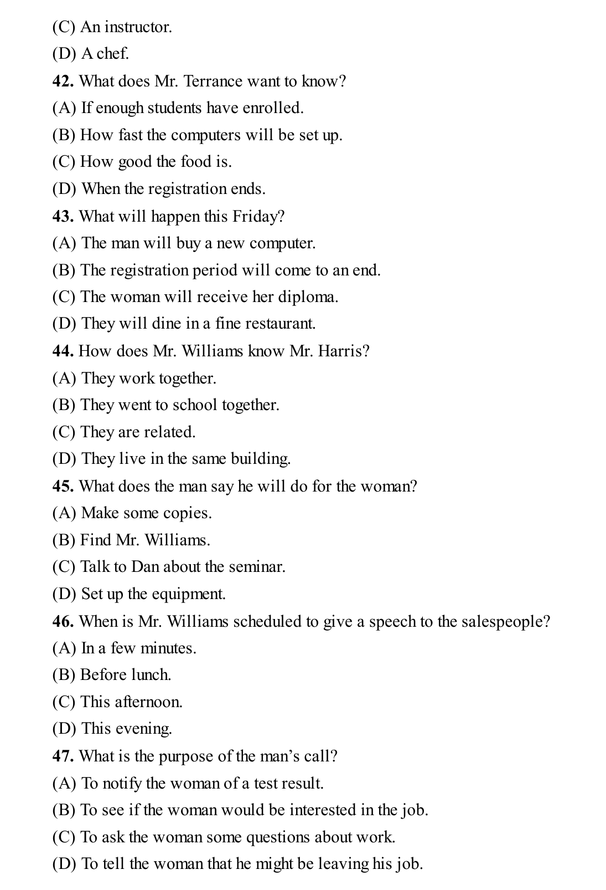

**听力独白/对话原文：**
**W:** There is a person here by the name of Steven Harris to see Mr. Williams, John. He says he is a school friend from college. (44) Could you do me a favor and see if he is in his office?
**M:** Mr. Williams stepped out a minute ago, Lisa. He said he was going to talk to Dan about next week's seminar. Do you want me to go and check for you? (45) I was just about to go and make copies of this report anyway.
**W:** Yes, could you do that for me? If he is not there, try the second floor conference room. He is scheduled to give a talk to the sales staff about next week's seminar after lunch today. (46) He might have gone there early to test the equipment he will be using.
**M:** Okay, I will find him for you.

**中文对照：**
> **W：**约翰，这儿有一位叫史蒂文·哈里斯的人想见威廉姆斯先生。他说是威廉姆斯先生的大学校友。你能不能帮我看一下他在不在办公室？
> **M：**丽莎，威廉姆斯先生刚出去。他说他打算和丹商谈下周的研讨会。你想让我去帮你看看吗？反正我也正打算出去复印这份报告呢。
> **W：**好的，那你能帮我去看一下吗？如果他不在那里，去二层的会议室看看。他定在今天午饭后去就下周的研讨会给销售人员讲话。也许他会提前到那里测试将用到的设备。
> **M：**好的，我会帮你找他。

**核心词汇与短语：**
- **step out**：出去
- **make a copy**：复印
- **give a talk**：讲话
- **equipment**：设备

#### Q44 (正确答案：B)
**问题：** How does Mr. Williams know Mr. Harris? (威廉姆斯先生是怎样认识哈里斯先生的？)
- (A) They work together. (他们一起工作。)
- (B) They went to school together. (他们曾经一起上过学。)
- (C) They are related. (他们是亲戚。)
- (D) They live in the same building. (他们住在一座楼里。)

#### Q45 (正确答案：B)
**问题：** What does the man say he will do for the woman? (男士说他将为女士做什么？)
- (A) Make some copies. (复印几份文件。)
- (B) Find Mr. Williams. (找到威廉姆斯先生。)
- (C) Talk to Dan about the seminar. (与丹商谈研讨会。)
- (D) Set up the equipment. (安装设备。)

#### Q46 (正确答案：C)
**问题：** When is Mr. Williams scheduled to give a speech to the salespeople? (按计划，威廉姆斯先生应该什么时候给销售人员讲话？)
- (A) In a few minutes. (几分钟后。)
- (B) Before lunch. (午饭前。)
- (C) This afternoon. (今天下午。)
- (D) This evening. (今天晚上。)

**延伸表达与补充：**
- **a school friend from college = a college buddy = a friend I went to college with** (一位大学校友)
  - *例句：I know John because he is a school friend from college.* (我认识约翰，因为他是我大学时期的校友。)
- **try the second floor conference room** (试一下二层的会议室扩展表达：)
  - *例句：go to the second floor conference room take a look at the conference room on the second floor* (去二层的会议室看看二层的会议室)
- **test the equipment = try out the equipment = inspect the equipment** (测试设备)
  - *例句：We have to test the equipment before the guests arrive.* (我们必须在客人们到达之前测试一下设备。)

### Questions 47 - 49

**听力独白/对话原文：**
**M:** Ms. Lee, I'm calling to let you know about the results of the interview you had with us on Monday. I've gotten the word from my boss that the position is yours if you're still interested. (47)
**W:** Are you kidding? I mean, of course I am still interested.
**M:** That's great. When do you think you will be able to start your new position? Is next Monday okay?
**W:** I'm sorry, but I have not had a chance to inform my current boss about my quitting here, and I think I have to give him two-week's notice to find a replacement. (48) How about the first of June? (49)

**中文对照：**
> **M：**李女士，我打电话是要通知您周一参加我们面试的结果。我得到了老板的确认，如果您还对这个职位感兴趣的话，那它就是您的了。
> **W：**您不是在开玩笑吧？我的意思是，我当然还对它感兴趣。
> **M：**太好了。您认为您什么时候能够开始这项新工作呢？下周一可以吗？
> **W：**很抱歉，我一直还没找到机会将辞职的事通知我的现任经理，而且我觉得我应该给他两周的时间去物色替代的人选。6月1日怎么样？

**核心词汇与短语：**
- **quit**：离开
- **notice**：通知
- **replacement**：替代者，接替者
- **candidate**：候选人

#### Q47 (正确答案：B)
**问题：** What is the purpose of the man's call? (男士打电话的目的是什么？)
- (A) To notify the woman of a test result. (告知女士一项考核的结果。)
- (B) To see if the woman would be interested in the job. (确认女士是否对这项工作感兴趣。)
- (C) To ask the woman some questions about work. (询问女士一些关于工作的问题。)
- (D) To tell the woman that he might be leaving his job. (告诉女士他可能要离职了。)

#### Q48 (正确答案：A)
**问题：** What does the woman say she has to do? (女士说她必须做什么？)
- (A) Notify her manager about her quitting her job. (通知她的经理她要辞职。)
- (B) Inform the candidate about the results of his job interview. (通知应聘者的面试结果。)
- (C) Ask the candidate how soon he can start his new position. (询问应聘者什么时候可以开始这项新工作。)
- (D) Tell her boss about the interview set for the day. (告诉她的老板今天的面试安排情况。)

#### Q49 (正确答案：D)
**问题：** When does Ms. Lee say she will be available to start? (李女士说她什么时候可以开始新工作呢？)
- (A) Today. (今天。)
- (B) This week. (本周。)
- (C) In two weeks. (两周后。)
- (D) Next month. (下个月。)

**延伸表达与补充：**
- **I've gotten the word from my boss. = I received the confirmation from my boss. = I got the go-ahead sign from my boss.** (我得到了老板的确认。)
- **Are you kidding?** (不会是在开玩笑吧？扩展表达：)
  - *例句：No way! Get out of here!* (没门！滚出去)
- **the first of June = June 1st = at the beginning of June 6** (月1日)
  - *例句：The new accountant will join us from the first of June.* (新会计6月1日就会加入我们了。)

### Questions 50 - 52

**听力独白/对话原文：**
**M:** As you can see, Ms. Bright, the Emerald Room has space for fifty people, so that should be large enough for the seminar you're hosting. (50)
**W:** Actually, we've had more than seventy people sign up so far. It appears as though we may have more than 100 attendees.
**M:** The Diamond Room has a capacity of 150. It's our biggest room, but it's rented out on December 11.
**W:** How about on the tenth?
**M:** It's available the entire day. Perhaps it would be better to book it on an alternative date. (51)
**W:** I pretty much have to, don't I? But I need to speak with my supervisor first to get confirmation. (52)

**中文对照：**
> **M：**正如您所看到的，布赖特女士，翡翠厅可容纳

#### Q50 (正确答案：D)
**问题：** 人，场地大小应该适 合您将主办的研讨会。 W: 实际上，到目前为止，我们已经有 70 多个人报名了。看来我们可能 有 100 多名参会者。 M: 钻石厅可以容纳 150 人，是我们这最大的厅，但在 12 月 11 号租出去 了。 W: 可以预订 10 号吗？ M: 那天一整天都可以。可能更改预订日期比较好。 W: 我确实只能这样做了，是吧？但是我得先和我的主管沟通确认一 下。 seminar 研讨会 sign up 报名 appear 似乎，出现 as though 好像 attendee 出 席者 capacity 容量 rent out 租出 available 可用的 alternative 供选择的 supervisor 主管人 confirmation 确认 50 What does the man say about the Emerald Room? (关于翡翠厅，男士说了什么？)
- (A) It is available on the tenth. (可预订十号的。)
- (B) It costs more than the Diamond Room. (它比钻石厅更贵。)
- (C) It has already been rented out. (它已经租出去了。)
- (D) It can hold up to fifty people. (它可以容纳 50 人。)

#### Q51 (正确答案：B)
**问题：** What does the man suggest doing? (男士建议如何做？)
- (A) Booking the Emerald Room. (预订翡翠厅。)
- (B) Changing the date of an event. (更改研讨会日期。)
- (C) Visiting a different venue. (去另一个会场。)
- (D) Restricting the number of attendees. (限制参会者人数。)

#### Q52 (正确答案：D)
**问题：** What will the woman most likely do next? (接下来女士最有可能做什么？)
- (A) Sign a contract. (签合同。)
- (B) Contact the attendees. (联系参会者。)
- (C) Pay a deposit. (付订金。)
- (D) Talk to her boss. (和她的上司谈谈。)

**延伸表达与补充：**
- **It appears as though = It appears as if** (看起来，似乎，好像)
  - *例句：It appears as if you are very tired.* (你看起来好像很累。)
- **It would be better to book it on an alternative date. = You had better book it on another day.** (更改预订日期比较好。)
  - *例句：It would be better to make a decision now.* (最好现在做决定。)

### Questions 53 - 55

**听力独白/对话原文：**
**W:** Jonathan, if you have not reserved your flight tickets yet, you'd better do it soon. (53) I was just told by Sarah that it was going to be difficult to get seats from next week. (54)
**M:** Oh? Why is that?
**W:** Well, the International Film Festival is being held in New York during the same week as our conference. This event apparently attracts thousands of people from all walks of life into the city, and all the flights and hotel rooms get booked. (55)
**M:** Is that right? In that case, I'd better call right now and book a seat. I don't want to miss the conference.

**中文对照：**
> **W：**乔纳森，如果你还没有预订机票，那你得赶紧了。萨拉刚刚告诉我，从下周开始将会很难订到座位。
> **M：**喔？为什么会那样呢？
> **W：**哦，国际电影节和我们的会议都是下周在纽约举行。这一活动肯定会吸引成千上万各行各业的人到这个城市去，所有的航班和宾馆房间都会被预订。
> **M：**是那样吗？如果那样的话，我最好现在就打电话订个座位。我不想错过这次会议。

**核心词汇与短语：**
- **reserve**：预订
- **apparently**：明显地
- **attract**：吸引
- **all walks of life**：各行各业

#### Q53 (正确答案：A)
**问题：** What does the woman advise the man to do? (女士建议男士做什么？)
- (A) Book airline tickets. (订机票。)
- (B) Postpone the trip. (推迟旅行。)
- (C) Attend the film festival. (参加电影节。)
- (D) Skip the conference. (不去参加会议。)

#### Q54 (正确答案：C)
**问题：** What did Sarah say to the woman? (萨拉对女士说过什么？)
- (A) She finished booking the hotel rooms. (她预订了宾馆房间。)
- (B) The staff will attend the film festival. (员工们将参加电影节。)
- (C) It might be hard to get a seat on the plane. (飞机座位可能很难订到。)
- (D) They will make a speech at the conference. (他们将会在会议上发言。)

#### Q55 (正确答案：A)
**问题：** What will happen in New York during the week the speakers are there? (说话人在纽约的那一周将会发生什么事情？)
- (A) A big crowd from all over the world will gather. (来自世界各地的人都会聚在那里。)
- (B) The closing ceremony of the Film Festival will be held. (将举行电影节的闭幕式。)
- (C) Many hotels will be offering discounts. (许多宾馆将提供折扣。)
- (D) The company will hold its annual conference. (公司将举行年度会议。)

**延伸表达与补充：**
- **It is going to be difficult to get seats. = It is not going to be easy to get seats. = It is going to be next to impossible to get seats.** (将很难订到座位了。)
  - *例句：It is going to be difficult to get seats to the play.* (将很难订到这场演出的座位了。)
- **Why is that?** (为什么会那样呢？扩展表达：)
  - *例句：Why do you say that? = Is there any reason why you are saying that?* (你为什么那么说呢？)
- **people from all walks of life** (来自各行各业的人扩展表达：)
  - *例句：people from everywhere people from different backgrounds There will be people from all walks of life at the event.* (来自各地的人有着不同背景的人将会有来自各行各业的人参与这一活动。)

### Questions 56 - 58

**听力独白/对话原文：**
**M:** I was just reading over the sales report and realized that our numbers have taken quite a dip compared to this time last year. (56) What do you think the problem is?
**W:** Well, there are several reasons, but one of the main reasons is that we have lost some of our main players to our competitors. (57) I brought the issue up at our last meeting, but no one really thought that it was all that important. I, on the other hand, feel that we really need to focus our attention on keeping those talented people here.
**M:** In your opinion, what is the main reason people are leaving us?
**W:** It's obvious. We need to compensate them with higher pay and benefits. (58)

**中文对照：**
> **M：**我刚刚读了一遍销售报告，发觉我们的数字与去年同期相比下降幅度很大。你认为问题出在哪里？
> **W：**哦，有几个原因，但主要原因之一是我们的一些主要成员跳槽到了竞争对手那里。我在上次会议上曾提出过这个问题，但是没有人认为这有多么重要。另一方面，我觉得我们真的需要集中精力把那些人才留下。
> **M：**在你看来，人才离开我们公司的主要原因是什么？
> **W：**原因显而易见。我们需要提供更高的薪水和更好的福利作为他们的报酬。

**核心词汇与短语：**
- **read over ~**：把读一遍
- **realize**：意识到，发觉
- **number**：数字
- **dip**：下降
- **compared to ~**：与相比
- **main player**：主力
- **competitor**：竞争者，对手
- **on the other hand**：在另一方面
- **focus**：集中
- **attention**：注意力
- **talented**：有才华的
- **obvious**：明显的
- **compensate**：付报酬

#### Q56 (正确答案：B)
**问题：** What does the man imply when he says, “our numbers have taken quite a dip compared to this time last year”? (男士说 “ 我们的数字与去年同期相比下降幅度很大 ” ，他在暗示什么？)
- (A) The company's sales have slightly increased. (公司的销售额稍微增长了。)
- (B) The company's sales took a big dive. (公司的销售额大幅下降。)
- (C) The company's sales remain unchanged. (公司的销售额没有什么变化。)
- (D) The company's sales have broken all the sales record. (公司的销售额打破了所有的销售纪录。)

#### Q57 (正确答案：A)
**问题：** What does the woman think is the main reason for the problem mentioned? (女士认为导致提到的问题的主要原因是什么？)
- (A) The loss of their best staff. (最优秀的员工的流失。)
- (B) The increased price of the products. (产品价格的上涨。)
- (C) The stress of working long hours. (长时间工作造成的压力。)
- (D) The lack of talented people. (人才的缺乏。)

#### Q58 (正确答案：A)
**问题：** According to the woman, how can the problem be solved? (根据女士所说，这一问题将如何解决？)
- (A) By offering more pay. (通过提供更高的工资。)
- (B) By providing a better working environment. (通过提供更好的工作环境。)
- (C) By reducing the employee's work hours. (通过缩短员工的工作时间。)
- (D) By offering incentives. (通过提供奖励。)

**延伸表达与补充：**
- **take quite a dip = take a big plunge = take a big fall** (急剧下降)
  - *例句：The temperature has taken quite a dip in the last few days.* (在过去几天里气温急剧下降。)
- **It's obvious. = It's clear. = It's right there.** (这很明显。)
- **We need to compensate them with higher pay and benefits. = We need to provide them with higher pay and benefits. = We need to satisfy them with higher pay and benefits.** (我们需要提供更高的薪水和更好的福利作为他们的报酬。)

### Questions 59 - 61

**听力独白/对话原文：**
**W1:** Mr. Sullivan is going to take everyone in the department out to dinner tonight to celebrate our highly profitable month. (59)
**M:** That's great news. Where will we be dining?
**W1:** He wants us to choose between Tino's and the Roadhouse. Personally, I prefer Tino's. (60)
**W2:** You can't go wrong with it. What do you think, Josh?
**M:** That's fine with me, Stacy. (60) Would you like me to call and book a table, Amy? (61)
**W1:** Yes, please. (61) We need a table for twenty at six thirty. I'm pretty sure private rooms are available, so why don't you request one of those, Josh?

**中文对照：**
> **W1：**沙利文先生今晚要请我们部门所有人吃饭，来庆祝本月盈利丰厚。
> **M：**这是个好消息。我们在哪里吃饭？
> **W1：**他想让我们在Tino's餐厅和Roadhouse餐厅之间做选择。就我个人而言，我更喜欢Tino's餐厅。
> **W2：**你的选择不错。乔希，你觉得呢？
> **M：**我没问题，史黛西。艾米，你想让我电话预订餐位吗？
> **W1：**好的，谢谢。我们需要预订六点半的一张20人的餐位。乔希，我确信肯定是有包间的，所以你为何不申请一间呢？

**核心词汇与短语：**
- **personally**：就个人而言
- **prefer**：更喜欢
- **book**：预定，预约
- **private room**：包间，包房
- **available**：可用的，可获得的
- **pretty**：相当，十分

#### Q59 (正确答案：C)
**问题：** Why will the speakers go out to dinner? (讲话者们为什么要出去吃饭？)
- (A) They will meet some foreign clients. (他们将要见一些外国客户。)
- (B) They just hired some new employees. (他们刚刚雇用了一些新员工。)
- (C) They made a lot of money recently. (他们最近赚了很多钱。)
- (D) They have a business project to discuss. (他们有一个商业项目要讨论。)

#### Q60 (正确答案：C)
**问题：** Why does Stacy say, “You can't go wrong with it”? (史黛西为什么说 “ 你的选择不错 ” ？)
- (A) To agree with the day they will go out. (同意他们那天外出。)
- (B) To state her preference for a dish. (说出她喜爱的一道菜。)
- (C) To indicate she likes the restaurant. (表明她喜欢这家餐厅。)
- (D) To admit that she agrees with the man. (承认她同意男士的观点。)

#### Q61 (正确答案：A)
**问题：** What will the man probably do next? (男士接下来将要做什么？)
- (A) Contact a restaurant. (联系一家餐厅。)
- (B) E-mail Mr. Sullivan. (给沙利文先生发邮件。)
- (C) Speak with his coworkers. (和他的同事们讲话。)
- (D) Visit a client. (拜访一位顾客。)

**延伸表达与补充：**
- **You can't go wrong with it. = Your choice is good.** (你的选择不错。)
  - *例句：You can not go wrong with black trousers.* (黑色裤子不错。)

### Questions 62 - 64

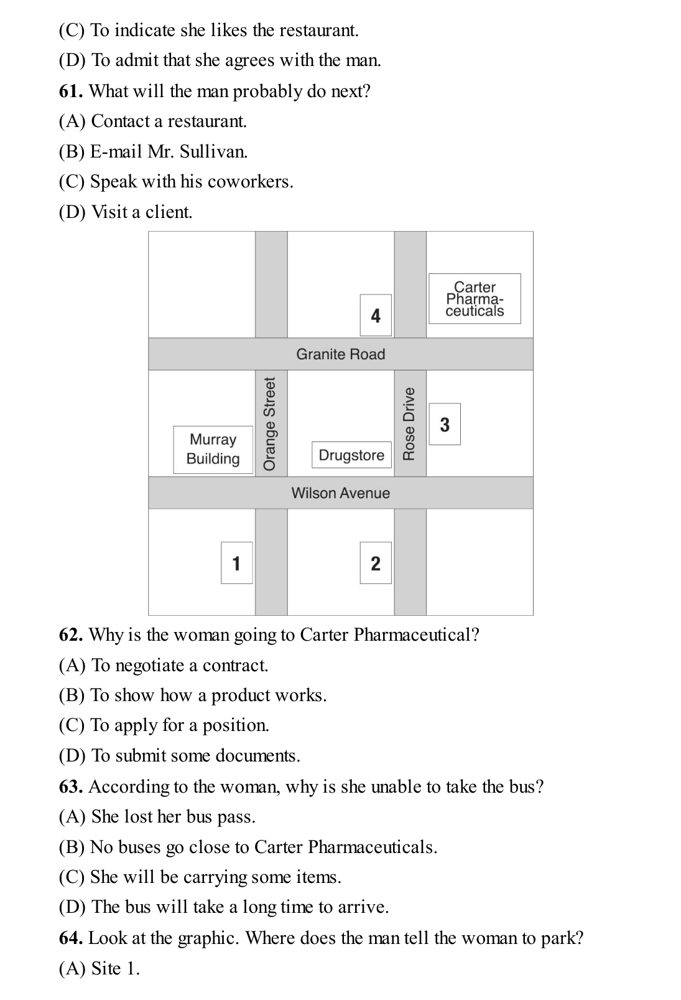

**听力独白/对话原文：**
**W:** Craig, I'm driving to Carter Pharmaceuticals to give a product demonstration today. (62) I know you've been there before. Do you happen to know where I can park?
**M:** You'd be better off taking the bus. Parking in that area is hard to find.
**W:** I know, but I'll be bringing a couple of boxes with me, so there's no way I can take them on the bus. (63)
**M:** In that case, you'd better park in the pay lot on Wilson Avenue. It's across from the Murray Building. (64)
**W:** That's sort of far from Carter Pharmaceuticals, isn't it?
**M:** It's two blocks away, but it's the closest lot to where you're heading.

**中文对照：**
> **W：**克雷格，我今天要开车去卡特药业公司做产品展示。我知道你之前去过。你知不知道我可以把车停在哪里？
> **M：**你最好乘坐公交车。那块区域很难找到停车的地方。
> **W：**我知道，但是我要带上几个箱子，所以我没法把它们带上公交车。
> **M：**那样的话，你最好把车停在威尔逊大道的收费停车场。它就在穆瑞大厦对面。
> **W：**那儿离卡特药业公司有些远，是不是？
> **M：**隔着两个街区，但那是离你的目的地最近的停车场了。

**核心词汇与短语：**
- **pharmaceutical**：药物
- **demonstration**：演示，展示
- **a couple of**：几个
- **pay lot**：付费停车场
- **sort of**：有点儿，有些
- **block**：街区
- **head**：朝某方向行进

#### Q62 (正确答案：B)
**问题：** Why is the woman going to Carter Pharmaceutical? (女士为什么要去卡特药业公司？)
- (A) To negotiate a contract. (谈判合同。)
- (B) To show how a product works. (演示产品。)
- (C) To apply for a position. (应聘职位。)
- (D) To submit some documents. (提交一些文件。)

#### Q63 (正确答案：C)
**问题：** According to the woman, why is she unable to take the bus? (根据女士所说，她为什么不能够乘坐公交车？)
- (A) She lost her bus pass. (她弄丢了公交车卡。)
- (B) No buses go close to Carter Pharmaceuticals. (没有公交车距离卡特药业公司很近。)
- (C) She will be carrying some items. (她要带些物品。)
- (D) The bus will take a long time to arrive. (公交车需要很长时间抵达。)

#### Q64 (正确答案：A)
**问题：** Look at the graphic. Where does the man tell the woman to park? (请看图表，男士告诉女士在哪里停车？)
- (A) Site 1. (地点 1 。)
- (B) Site 2. (地点 2 。)
- (C) Site 3. (地点 3 。)
- (D) Site 4. (地点 4 。)

**延伸表达与补充：**
- **be better off (doing sth.) = be wiser (to do sth.)** (（对于做某事来说）是较为明智的)
  - *例句：You'd be better off going there by air.* (你最好乘飞机去那里。)

### Questions 65 - 67

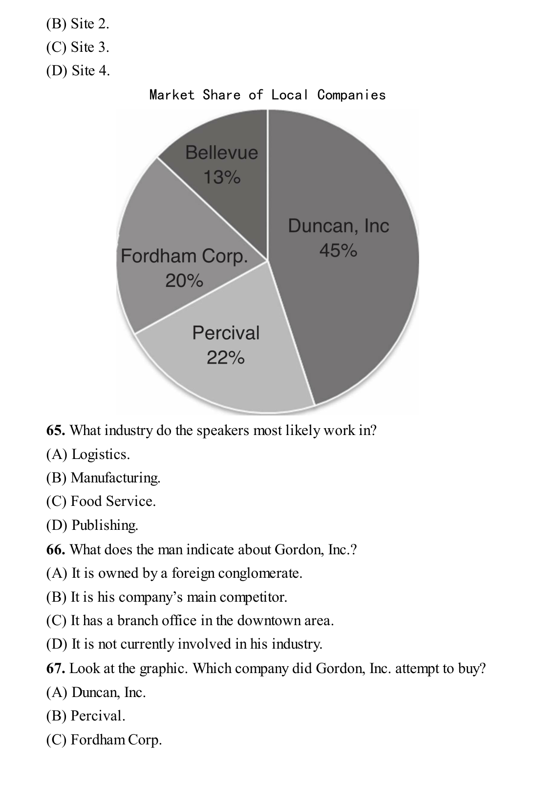

**听力独白/对话原文：**
**M:** I heard an alarming report from Mr. Davis a few minutes ago. He mentioned that Gordon, Inc. has made a bid for one of our competitors.
**W:** So the rumors that Gordon is thinking of getting involved in our industry are true. （ 65, 66 ）
**M:** It appears that way. We've known for a long time that Gordon wants to own a publishing company. (65)
**W:** Anyway, which company is it bidding on? Is it bigger or smaller than us?
**M:** It's the second-largest company in the region according to market share. (67)
**W:** Oh, that will make it just a bit larger than us since we're the third-largest company. Market Share of Local Companies

**中文对照：**
> **M：**几分钟前我听到了戴维斯先生的一份惊人的报告。他提到，戈登公司已经出价要收购我们的一个竞争对手了。
> **W：**所以，戈登公司正在考虑涉足我们行业的小道消息已经坐实了。
> **M：**看起来是这样的。我们很早就知道戈登公司想要拥有一个出版公司。
> **W：**不管怎么说，它正在收购的是哪家公司呢？比我们公司大还是小？
> **M：**依据市场份额来看，它是本地区第二大公司。
> **W：**哦，那它比我们公司大一点儿，因为我们是第三大的公司。本地公司市场份额

**核心词汇与短语：**
- **alarming**：惊人的，令人恐怖的
- **mention**：提到
- **make a bid for**：出价购买，收购
- **get involved in**：涉足，涉入
- **anyway**：不管怎么说
- **region**：地区
- **market share**：市场份额

#### Q65 (正确答案：D)
**问题：** What industry do the speakers most likely work in? (讲话人最有可能从事哪一行业？)
- (A) Logistics. (物流。)
- (B) Manufacturing. (制造业。)
- (C) Food Service. (餐饮业。)
- (D) Publishing. (出版业。)

#### Q66 (正确答案：D)
**问题：** What does the man indicate about Gordon, Inc.? (关于戈登集团，男士暗示了什么？)
- (A) It is owned by a foreign conglomerate. (它归属于国外一家大企业集团。)
- (B) It is his company's main competitor. (它是男士所在公司主要的竞争对手。)
- (C) It has a branch office in the downtown area. (它在市中心拥有一家分公司。)
- (D) It is not currently involved in his industry. (它目前尚未涉足男士所在的行业。)

#### Q67 (正确答案：B)
**问题：** Look at the graphic. Which company did Gordon, Inc. attempt to buy? (请看图表，戈登公司试图购买哪家公司？)
- (A) Duncan, Inc. (邓肯集团。)
- (B) Percival. (珀西瓦尔公司。)
- (C) Fordham Corp. (福德姆集团。)
- (D) Bellevue. (贝尔维公司。)

**延伸表达与补充：**
- **It appears that ~ = It seems that ~** (似乎…)
  - *例句：It appears that it is going to rain because there is thick black cloud over the sky.* (看起来要下雨了，因为天空乌云密布。)

### Questions 68 - 70

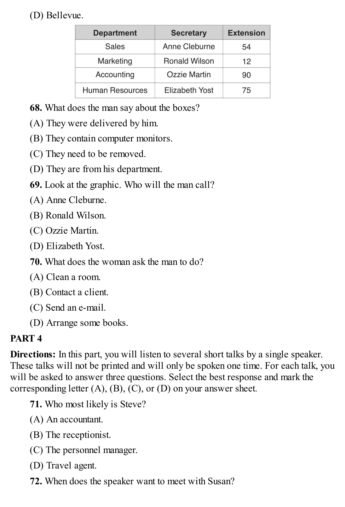

**听力独白/对话原文：**
**W:** What are all of these boxes doing here in the office?
**M:** I was at lunch when they arrived, so I'm not sure, but it appears as if the computer monitors the Accounting Department ordered have arrived. (68)
**W:** Well, we have some clients coming momentarily, so they have to be removed at once.
**M:** Okay, I'll call the secretary there and make sure someone comes here to take them away. (69)
**W:** Thanks, Fred. After doing that, would you mind straightening up the conference room? I noticed it was a bit messy. (70)
**M:** No problem. I'll get right on it as soon as I make the call.

**中文对照：**
> **W：**办公室里的这些箱子都是干什么的？
> **M：**它们送来的时候，我在吃午餐，所以我也不清楚，但是看起来是会计部门订购的电脑显示器到了。
> **W：**哦，我们的一些客户马上就要来了，所以现在必须把这些显示器挪走。
> **M：**好的，我给那儿的秘书打个电话，确保有人来把它们搬走。
> **W：**谢谢，弗雷德。做完这件事后，你介意把会议室收拾一下吗？我注意到它有些乱。
> **M：**没问题。我打完电话后就立刻去收拾。

**核心词汇与短语：**
- **at lunch**：吃午餐
- **monitor**：显示器
- **accounting**：会计
- **client**：客户
- **momentarily**：立刻，一会儿，随时
- **remove**：移动，搬开
- **straighten up**：使整洁，收拾
- **conference room**：会议室
- **messy**：凌乱的

#### Q68 (正确答案：B)
**问题：** What does the man say about the boxes? (关于那些箱子，男士说了什么？)
- (A) They were delivered by him. (它们是由他派送的。)
- (B) They contain computer monitors. (它们装的是电脑显示器。)
- (C) They need to be removed. (它们需要被搬走。)
- (D) They are from his department. (它们来自他所在的部门。)

#### Q69 (正确答案：C)
**问题：** Look at the graphic. Who will the man call? (请看图表，男士将会给谁打电话？)
- (A) Anne Cleburne. (安娜 · 克利伯恩。)
- (B) Ronald Wilson. (罗纳德 · 威尔逊。)
- (C) Ozzie Martin. (奥齐 · 马丁。)
- (D) Elizabeth Yost. (伊丽莎白 · 约斯特。)

#### Q70 (正确答案：A)
**问题：** What does the woman ask the man to do? (女士要求男士做什么？)
- (A) Clean a room. (清洁房屋。)
- (B) Contact a client. (联系客户。)
- (C) Send an e-mail. (发送电子邮件。)
- (D) Arrange some books. (整理一些书。)

**延伸表达与补充：**
- **make sure = make certain** (确保，确定)
  - *例句：First, make sure the printer has enough paper in it.* (首先，要确保打印机里面的纸张充足。)
- **Would you mind doing sth.? = Do you mind if ~** (您介意做…吗？)
  - *例句：Would you mind lending me your car tomorrow?* (您介意明天把车借我一下吗？)

## Part 4: 简短独白 (Q71 - Q100)

### Questions 71 - 73

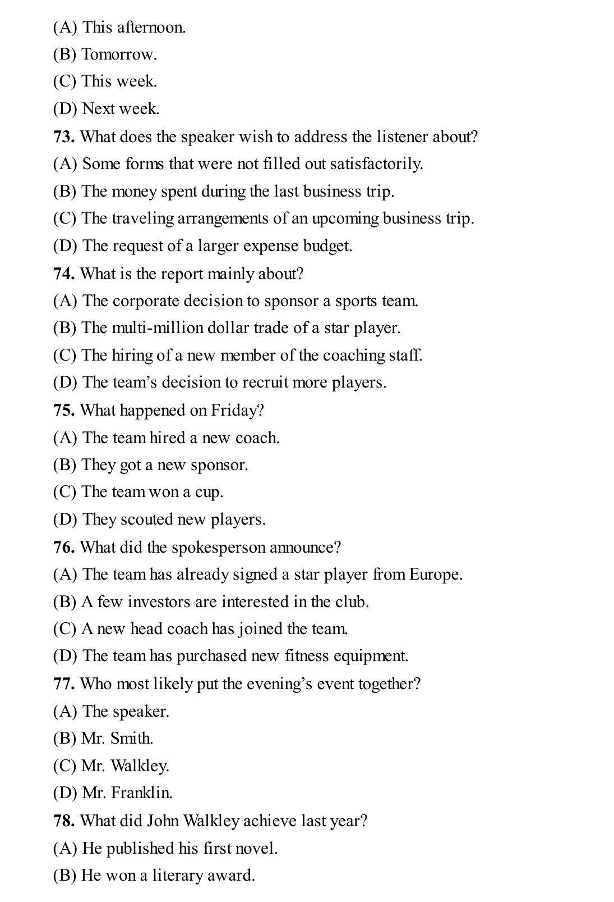

**听力独白/对话原文：**
Hi, Susan. This is Steve from the Accounting Department. (71) I heard from the receptionist that you are very busy today because of job interviews, but I have to bring some urgent, outstanding financial matters to your attention. Would it be possible for us to get together in my office, say, tomorrow morning at ten? (72) The particular items I would like to discuss with you relate to claims for travel expenses made by members of the Personnel Department after the conference last September. There are no serious problems with these claims, but in many cases the claims forms haven't been completed satisfactorily. (73) I'm sure we can clear this up quickly. Let me know if you can't make it tomorrow.

**中文对照：**
> 苏珊，你好，我是会计部门的史蒂夫。接待员告诉我因为面试的事情你今天会很忙，但我必须提醒你注意一些紧急的、还未解决的财务问题。明天上午10点钟你能到我办公室来吗？我想与你讨论的具体事情是关于一项旅行费用报销的，旅行费是人事部门成员参加去年九月份的会议后产生的。关于这些报销并没有严重的问题，但在许多情况下，报销表格填写得并不令人满意。我相信我们可以很快就把这件事解决好。如果你明天不能过来的话，请告诉我。

**核心词汇与短语：**
- **accounting**：会计
- **receptionist**：接待员，前台
- **urgent**：紧急的
- **outstanding**：还未解决的
- **financial**：财务的
- **matter**：问题
- **attention**：注意
- **get together**：在一起
- **particular**：细致的，详细的
- **relate to ~**：与有关
- **claim**：报销
- **travel expense**：旅行费用
- **in many cases**：在许多情况下
- **complete**：使完整
- **satisfactorily**：令人满意地
- **clear up**：解决，消除

#### Q71 (正确答案：A)
**问题：** Who most likely is Steve? (史蒂夫最有可能是什么人？)
- (A) An accountant. (会计。)
- (B) The receptionist. (接待员。)
- (C) The personnel manager. (人事经理。)
- (D) Travel agent. (旅行代理商。)

#### Q72 (正确答案：B)
**问题：** When does the speaker want to meet with Susan? (讲话人想什么时候和苏珊见面？)
- (A) This afternoon. (今天下午。)
- (B) Tomorrow. (明天。)
- (C) This week. (本周。)
- (D) Next week. (下周。)

#### Q73 (正确答案：A)
**问题：** What does the speaker wish to address the listener about? (讲话人想和听话人谈论什么？)
- (A) Some forms that were not filled out satisfactorily. (一些填写得不太令人满意的表格。)
- (B) The money spent during the last business trip. (上次差旅的花费情况。)
- (C) The traveling arrangements of an upcoming business trip. (即将开始的差旅的行程安排。)
- (D) The request of a larger expense budget. (一项金额更大的支出预算请求。)

**延伸表达与补充：**
- **Would it be possible to ~? = Do you think it's possible to ~? = Could it be possible to ~?** (可以…吗？)
  - *例句：Would it be possible to take your car?* (可以搭你的车吗？)
- **in many cases = in many situations = in many incidents** (在许多情况下)
  - *例句：The company bus is available, but in many cases the workers do not make use of it.* (公司的车可以用，但在许多情况下，工人们都不用。)
- **I'm sure we can clear this up quickly. = I'm sure we can straighten this up quickly. = I'm quite certain that we can smooth this thing over quickly.** (我确信我们可以很快解决这件事。)

### Questions 74 - 76

**听力独白/对话原文：**
In sports news today, Blackburn United announced their intention to recruit new players and expand their facilities after their historic Cup Final win on Friday night. （ 74, 75 ） Their win has attracted the attention of major new sponsors and investors from the corporate world. (76) There are rumors that two star strikers now playing with European teams have signed or are close to signing. New coaching staff members will also be recruited, and training facilities and clubrooms will be upgraded, a club spokesperson announced today.

**中文对照：**
> 在今天的体育新闻中，周五晚上历史性地赢得决赛冠军的布莱克本联队宣布，他们打算招募新球员并增加设施。他们的胜利吸引了商业界新兴的大赞助商和投资商的注意。有传言说，目前正在欧洲球队效力的两位明星前锋已经或将要与其签约。一位俱乐部发言人今天表示，他们还将招募新的教练组成员，并升级训练设备和俱乐部聚会室。

**核心词汇与短语：**
- **intention**：意图
- **recruit**：招募，吸收（新成员）
- **expand**：扩充
- **facility**：设施
- **Cup Final**：决赛杯
- **attract**：吸引
- **attention**：注意力
- **major**：大的，主要的
- **corporate**：公司的
- **striker**：前锋
- **clubroom**：俱乐部聚会室
- **upgrade**：更新，升级

#### Q74 (正确答案：D)
**问题：** What is the report mainly about? (这则报道主要是关于什么的？)
- (A) The corporate decision to sponsor a sports team. (公司赞助一个运动队的决定。)
- (B) The multi-million dollar trade of a star player. (一位球星几百万美元的转会交易。)
- (C) The hiring of a new member of the coaching staff. (聘用一位新的教练组成员。)
- (D) The team's decision to recruit more players. (球队招募更多球员的决定。)

#### Q75 (正确答案：C)
**问题：** What happened on Friday? (周五发生了什么事情？)
- (A) The team hired a new coach. (球队聘用了一位新教练。)
- (B) They got a new sponsor. (他们有了一个新的赞助商。)
- (C) The team won a cup. (球队赢得了一个奖杯。)
- (D) They scouted new players. (他们物色到了新球员。)

#### Q76 (正确答案：B)
**问题：** What did the spokesperson announce? (发言人宣布了什么？)
- (A) The team has already signed a star player from Europe. (球队已经和一名欧洲球星签约。)
- (B) A few investors are interested in the club. (一些投资商对俱乐部感兴趣。)
- (C) A new head coach has joined the team. (一位新的主教练加入了球队。)
- (D) The team has purchased new fitness equipment. (球队购买了新的健身器材。)

**延伸表达与补充：**
- **recruit new players = gather new players = find new players** (招募新球员)
  - *例句：The team has decided to recruit new players from the minor league.* (球队已决定从小联盟中招募新球员。)
- **will be upgraded = will be improved = will be advanced** (将被升级)
  - *例句：Most of the equipment we use will be upgraded by the end of this year.* (我们使用的绝大多数设备将在今年年底之前升级。)

### Questions 77 - 79

**听力独白/对话原文：**
I'd like to welcome you all to this creative writing seminar. We have some wonderful activities for you this evening. The program tonight has been developed by our special guest, John Walkley, (77) the author of that wonderful novel The Smiths and the winner of the Franklin Award for Literature last year. (78) Before John begins the session, I'd like to say a few words about his life. Born in a small, country town in the southwest, he had difficulty finding friends. He began writing at an early age and was soon winning prizes for his poetry and short stories. I can't think of a better person to speak to us tonight about creativity. (79) So please welcome John Walkley.

**中文对照：**
> 欢迎大家来参加这次创意写作研讨会。今晚我们为大家准备了许多精彩的活动。今晚的节目是由我们的特别来宾约翰·沃克利策划的，他就是那部精彩小说《史密斯一家》的作者，也是去年富兰克林文学奖的获得者。在约翰开始这次会议之前，我想先介绍一下他的生平。他出生在西南部的一个乡村小镇，在那里他很难找到朋友。他很早就开始写作了，并且他的诗歌和短篇小说很快就为他赢得不少奖项。我想不出今晚还有谁能比他更适合给我们讲创意。那么让我们欢迎约翰·沃克利。

**核心词汇与短语：**
- **creative**：创造性的
- **develop**：策划
- **session**：会议
- **poetry**：诗歌
- **creativity**：创造性，创意

#### Q77 (正确答案：C)
**问题：** Who most likely put the evening's event together? (谁最有可能组织晚上的活动？)
- (A) The speaker. (讲话人。)
- (B) Mr. Smith. (史密斯先生。)
- (C) Mr. Walkley. (沃克利先生。)
- (D) Mr. Franklin. (富兰克林先生。)

#### Q78 (正确答案：B)
**问题：** What did John Walkley achieve last year? (约翰 · 沃克利去年取得了什么成就？)
- (A) He published his first novel. (他出版了自己的第一部小说。)
- (B) He won a literary award. (他获得了一项文学奖。)
- (C) He wrote a poem for his mother. (他为自己的母亲写了一首诗。)
- (D) He developed a computer program. (他开发了一个电脑程序。)

#### Q79 (正确答案：A)
**问题：** What does the speaker mean when he says, “I can't think of a better person to speak to us tonight about creativity”? (讲话者说 “ 我想不出今晚还有谁能比他更适合给我们讲创意 ” ，是想表达什么意思？)
- (A) John is an imaginative person. (约翰是一个富有想象力的人。)
- (B) John is not a very sociable person. (约翰不是一个很喜欢社交的人。)
- (C) John recently moved to a small country town. (约翰最近搬到了一个乡村小镇。)
- (D) John began writing right after college. (约翰大学毕业后就开始写作。)

**延伸表达与补充：**
- **I'd like to say a few words about his life. = I'd like to express a few words in regards to his life. = I'd like to tell you a bit about his life.** (我想先介绍一下他的生平。)
- **I can't think of ~ = I can't come up with ~ = I can't imagine ~** (我想不出…)
  - *例句：I can't imagine anyone who can replace Mr. King after he retires.* (我想不出在金先生退休后有谁能替代他。)
- **So please welcome John Walkley. = So, let's all put our hands together for John Walkley. = So, let's all give a big round of applause for John Walkely.** (那么让我们欢迎约翰)
  - *例句：So please welcome John Walkley to the stage.* (那么让我们欢迎约翰)

### Questions 80 - 82

**听力独白/对话原文：**
Hello, everyone. I have been invited to your organization to advise you about increasing your sales. (80) I have observed your operations with a great deal of care, and I must say that I have enjoyed my time here. I should also say that I've been impressed with the dedication and enthusiasm I've seen here. Your organization provides a valuable service and performs very well. And the staff is effective and efficient and clearly likes working here. It is possible, however, to improve your service and your sales. (81) One of the ways we are going to start doing that is by encouraging staff participation and creativity. So let's break into small groups and think about ways that we can improve the store. (82)

**中文对照：**
> 各位好！我被邀请到贵公司来，就提高销售量的问题提供咨询。我非常认真地考察了你们的经营状况，我得说我很喜欢待在这里，而且我还要说，这里的奉献精神和热情给我留下了深刻的印象。你们公司提供了有价值的服务，并且经营出色。另外，员工很得力、很高效，看得出他们很喜欢在这里工作。但是，继续提升你们的服务和销售量还是有可能的。要做到这些，我们将开始采用的方法之一是激发员工的参与度和创造性。那么就让我们分成若干小组，然后想想怎样才能让店铺变得更好。

**核心词汇与短语：**
- **organization**：组织，公司
- **observe**：观察
- **a great deal of**：大量的，许多
- **be impressed with ~**：对有深刻印象
- **dedication**：奉献
- **enthusiasm**：热情
- **valuable**：有用的，有价值的
- **perform**：执行
- **effective**：有效的，得力的
- **efficient**：有效率的
- **clearly**：显然地，无疑地
- **improve**：提高
- **encourage**：鼓励，促进
- **participation**：参与
- **creativity**：创造性
- **break into**：化整为零

#### Q80 (正确答案：C)
**问题：** What is the main role of the speaker? (讲话人的主要任务是什么？)
- (A) To make operations run smoother. (让工作进行得更顺畅。)
- (B) To think of ways to improve employee job satisfaction. (想办法提高员工的工作满意度。)
- (C) To help increase sales. (帮助提高销售量。)
- (D) To upgrade the skills of the workers. (提高工人的技能。)

#### Q81 (正确答案：B)
**问题：** What does the speaker say could be improved? (讲话人说可以提高什么？)
- (A) The attitude of the employees. (员工的态度。)
- (B) The service they provide. (他们提供的服务。)
- (C) The flow of their operations. (他们的工作流程。)
- (D) The working conditions. (工作条件。)

#### Q82 (正确答案：A)
**问题：** What will they do next? (他们接下来将做什么？)
- (A) Gather into small groups. (组成若干小组。)
- (B) Talk about the upcoming sales. (谈论接下来的销售量。)
- (C) Walk around the operations area. (绕着工作区转一转。)
- (D) Take a break for lunch. (休息一下吃午餐。)

**延伸表达与补充：**
- **I have observed your operations. = I have looked at your operations. = I have checked out your operations.** (我已经考察了你们的经营状况。)
- **So let's break into small groups. = So let's divide ourselves into small groups. = So let's all get into small groups.** (那么就让我们分成若干小组。)

### Questions 83 - 85

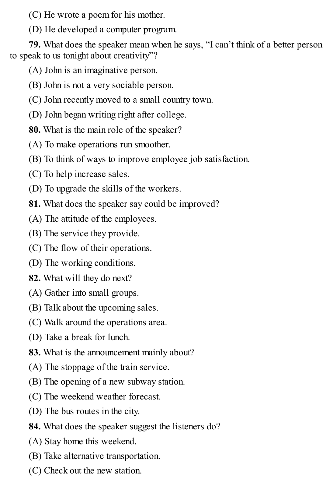

**听力独白/对话原文：**
Attention, all passengers. The City Hall Subway Station is now closed due to flooding. (83) All subway trains on north- and south-bound routes have been halted. Passengers who are in City Hall Station are at present being assisted in leaving the building by emergency teams. We advise all commuters to take buses that will be running along both routes at approximately ten-minute intervals. (84) We estimate that normal operations at City Hall Station will resume in two hours. (85) We apologize for any inconvenience.

**中文对照：**
> 所有乘客请注意。由于洪水的缘故，地铁市政厅站现在已经关闭。所有南北双向行驶的地铁列车均已停驶。在地铁市政厅站的乘客现在正在紧急救援队的协助下离开地铁站。我们建议所有通勤者乘坐公交车，公交车大约每隔10分钟发一趟，两条路线均有车辆运行。我们估计地铁市政厅站将在两小时后恢复正常运行。由此带来的不便，我们深表歉意。

**核心词汇与短语：**
- **flooding**：洪水
- **halt**：停止，终止
- **assist**：协助
- **emergency**：紧急情况，紧急事件
- **commuter**：通勤者
- **approximately**：大约
- **interval**：间隔
- **estimate**：估计
- **resume**：恢复
- **apologize**：道歉
- **inconvenience**：不便
- **subside**：退落；消退

#### Q83 (正确答案：A)
**问题：** What is the announcement mainly about? (这则通告主要是关于什么的？)
- (A) The stoppage of the train service. (列车服务停止。)
- (B) The opening of a new subway station. (新开了一个地铁站。)
- (C) The weekend weather forecast. (周末天气预报。)
- (D) The bus routes in the city. (城市内的公交车线路。)

#### Q84 (正确答案：B)
**问题：** What does the speaker suggest the listeners do? (讲话人建议听众做什么？)
- (A) Stay home this weekend. (本周末待在家里。)
- (B) Take alternative transportation. (选择其他的交通工具。)
- (C) Check out the new station. (看看新站。)
- (D) Wait until the rain subsides. (等到雨变小。)

#### Q85 (正确答案：B)
**问题：** According to the speaker, when will the situation be resolved? (根据讲话人所说，这一情况什么时候能得以解决？)
- (A) In an hour. (1 小时后。)
- (B) In two hours. (2 小时后。)
- (C) In three hours. (3 小时后。)
- (D) In four hours. (4 小时后。)

**延伸表达与补充：**
- **have been halted = have been stopped = have been terminated** (已经被停止了)
  - *例句：All operations have been halted after the workers walked off their jobs.* (工人们罢工后，所有的运营都被停止了。)
- **We advise all commuters to take buses. = We ask all commuters to take buses.** (我们建议所有通勤者乘坐公交车。)
  - *例句：We advise all travelers to take public transportation.* (我们建议所有的旅行者使用公共交通工具。)
- **We estimate that ~ = We predict that ~ = We guess that ~** (我们估计…)
  - *例句：We estimate that many of the workers will be happy to hear the news.* (我们估计许多工人听到这则消息都会感到高兴。)

### Questions 86 - 88

**听力独白/对话原文：**
This is Francis Kelly live from Collins Street with an update on the annual St. Patrick's Day parade. Right now I can see the first floats of the parade proceeding down Collins Street (86) between George and Pitt Street. The warm and sunny conditions today have drawn out the crowds in record numbers. (87) Police have estimated the crowd to be more than 100,000. Police have warned that anyone coming to the parade should not approach via either George or Pitt Streets. These roads are now completely blocked, and the police are no longer letting anybody pass the barriers. Police advise that any spectators arriving now should proceed towards Federation Square, (88) which is not yet completely filled.

**中文对照：**
> 这是弗朗西斯·凯利从柯林斯街发回的有关年度圣帕特里克节游行的最新现场报道。现在我可以看到游行的第一批花车沿着柯林斯街在乔治街和皮特街之间行进。今天阳光充足且温暖，这种天气吸引的游行人数创下了历史纪录。警方估计游行人数超过了10万人。警方警告参加游行的人不要经由乔治街或皮特街到达那里。这些街道现在已经完全堵塞，警方也不再让任何人通过路障。他们建议现在到达的观众朝联盟广场行进，这个广场现在还没有爆满。

**核心词汇与短语：**
- **live**：现场的
- **update**：最新报道
- **annual**：年度的，每年的
- **parade**：游行
- **float**：花车
- **proceed**：行进
- **draw out**：吸引，使来
- **crowd**：人群
- **estimate**：估计
- **warn**：警告
- **approach**：靠近
- **via**：经由，通过
- **completely**：完全地；彻底地
- **block**：阻塞
- **barrier**：路障，障碍物
- **spectator**：（观看比赛或表演的）观众

#### Q86 (正确答案：A)
**问题：** Where is the parade now? (游行队伍现在在哪里？)
- (A) On Collins Street. (在柯林斯街。)
- (B) On George Street. (在乔治街。)
- (C) On Pitt Street. (在皮特街。)
- (D) At Federation Square. (在联盟广场。)

#### Q87 (正确答案：B)
**问题：** What is attracting people to the parade in record-breaking numbers? (是什么吸引了数量上创历史纪录的游行者？)
- (A) The television exposure. (电视报道。)
- (B) The beautiful weather. (宜人的天气。)
- (C) The convenient location. (方便的地点。)
- (D) The size of the parade. (游行的规模。)

#### Q88 (正确答案：B)
**问题：** According to the police, what should those coming to the parade do? (根据警方的要求，那些即将参加游行的人应该怎么做？)
- (A) Enter through George Street. (由乔治街进入。)
- (B) Head toward Federation Square. (朝联盟广场前进。)
- (C) Take the subway to Pitt Street. (乘坐地铁去皮特街。)
- (D) Park their cars on Collins Street. (将他们的车停在柯林斯街。)

**延伸表达与补充：**
- **have drawn out the crowds = have brought out many people = have attracted many people** (吸引了很多人)
  - *例句：The shows at the film festival have drawn out the crowds we did not expect.* (电影节的表演吸引的观众之多超出了我们的想象。)
- **These roads are now completely blocked. = These roads are not accessible at the moment. = These roads are unapproachable now.** (这些道路现在已经完全堵塞了。)

### Questions 89 - 91

**听力独白/对话原文：**
We'd like to start our evening news bulletin with a special report. The weather bureau has issued a special warning regarding an approaching dust storm. The unusually dry weather which we've been experiencing over the last three months has combined with strong northeasterly winds to produce a massive dust storm, which is moving steadily towards our city. The thick clouds should hit the northwestern suburbs by about 9:00 a.m. tomorrow morning (89) and then gradually move across the city in a southeasterly direction. The weather bureau advises all residents to make no unnecessary trips tomorrow, as visibility will be extremely reduced. (90) Schools and government offices will, however, be open tomorrow. Anyone with asthma or any other breathing disorder should remain indoors (91) and keep doors and windows tightly closed.

**中文对照：**
> 我们想以一则特别报道来开始晚间新闻快报。气象局对即将到来的沙尘暴发布了特别警告。过去三个月来，我们一直经历的不寻常的干燥天气与强劲的东北风一同形成了一场巨大的沙尘暴，这场沙尘暴现在正在平稳地朝我市移动。乌云将在明天上午9点到达西北部郊区，然后会逐步向东南方向移动并穿过城市。因为空气能见度将大大降低，所以气象局建议所有居民取消不必要的出行。但学校和政府部门仍将开放。有哮喘及其他呼吸系统疾病的人应该待在室内，并且将门窗紧闭。

**核心词汇与短语：**
- **bulletin**：新闻快报
- **weather bureau**：气象局
- **warning**：警告
- **approach**：接近
- **dust storm**：沙尘暴
- **unusually**：不同寻常地
- **combine**：结合
- **massive**：巨大的
- **steadily**：平稳地
- **thick**：浓的，浓厚的
- **suburb**：郊区
- **gradually**：逐步地
- **unnecessary**：不必要的
- **visibility**：能见度
- **extremely**：极度地
- **asthma**：哮喘
- **disorder**：病症，紊乱
- **tightly**：紧紧地

#### Q89 (正确答案：C)
**问题：** When is the dust storm expected to hit the city? (预计沙尘暴将在何时袭击这座城市？)
- (A) This afternoon. (今天下午。)
- (B) This evening. (今天晚上。)
- (C) Tomorrow morning. (明天上午。)
- (D) Tomorrow afternoon. (明天下午。)

#### Q90 (正确答案：B)
**问题：** Why does the speaker say, “The weather bureau advises all residents to make no unnecessary trips tomorrow”? (讲话者为什么说 “ 气象局建议所有居民取消不必要的出行 ” ？)
- (A) Many of the roads will be closed to traffic. (许多道路将禁止车辆通行。)
- (B) The drivers will have a hard time seeing the roads. (司机将很难看清道路。)
- (C) There is the possibility of a tornado coming. (可能会有龙卷风来袭。)
- (D) Some of the roads will be very slippery. (一些街道将会很滑。)

#### Q91 (正确答案：A)
**问题：** According to the speaker, who should stay indoors tomorrow? (根据讲话者所说，什么样的人明天应该待在室内呢？)
- (A) People with respiratory problems. (有呼吸系统疾病的人。)
- (B) School children under the age of 12. (不满 12 岁的在校学生。)
- (C) Seniors with heart problems. (有心脏病的老年人。)
- (D) Those who live in the southern part of the city. (那些生活在城市南部的人们。)

**延伸表达与补充：**
- **move steadily = move gradually = move step by step** (平稳地移动)
  - *例句：The newly released book by Stephenie Meyer is moving steadily up the best seller's list.* (斯蒂芬妮)
- **should hit the northwestern suburbs** (将袭击西北部郊区扩展表达：)
  - *例句：should reach the northwestern suburbs = should arrive at the northwestern suburbs The storm should hit the northwestern suburbs by late this afternoon.* (将到达西北部郊区风暴将在今天下午晚些时候袭击西北部郊区。)

### Questions 92 - 94

**听力独白/对话原文：**
Welcome, everybody, to this staff meeting. (92) I have to add a new item to the agenda since I received several complaints yesterday about the state of the lunchroom. I'm not going to name anybody at this meeting, but I have to say that I, too, am also disappointed by the behavior of certain staff members. (94) The lunchroom is a shared facility and one which provides all of us with a valuable service. Let's keep it clean! (93) If you make a mess, clean it up. If you read the newspaper, return it to the table folded neatly when you have finished with it. If you use the sink, make sure you leave it clean. This is a question of basic good manners, and I hope I never have to speak to anybody here again about it! (94)

**中文对照：**
> 欢迎大家来参加这次员工会议。昨天我收到了几份关于餐厅状况的投诉，所以我必须在议程中增加一项新内容。在这次会议上我不会点任何人的名字，但是我也不得不说，我本人也对某些员工的表现感到失望。餐厅是一个公用设施，它为我们所有人提供了重要的服务。让我们保持餐厅的清洁吧！如果你把它弄脏了，那就应该打扫干净。如果你阅读了报纸，读完之后你应该将它叠整齐放回到桌上。如果你用了水槽，要保证用完时它也是干净的。这是一个基本的礼貌问题，我希望以后再也不用和在座的诸位谈这件事情！

**核心词汇与短语：**
- **add**：增加
- **agenda**：议程
- **state**：状况
- **lunchroom**：餐厅
- **disappointed**：失望的
- **behavior**：表现
- **certain**：某些
- **valuable**：重要的，有价值的
- **make a mess**：弄脏，弄乱
- **neatly**：整洁地
- **manner**：礼貌；礼仪

#### Q92 (正确答案：B)
**问题：** Who most likely is the speaker addressing? (讲话人最有可能在向什么人发言？)
- (A) Cafeteria workers. (餐厅工人。)
- (B) Staff members. (员工。)
- (C) The cleaning staff. (清洁工。)
- (D) The facility manager. (设备经理。)

#### Q93 (正确答案：D)
**问题：** What is the talk mainly about? (这则讲话主要是关于什么的？)
- (A) To welcome people to the meeting. (欢迎人们参加会议。)
- (B) To notify a new regulation at the company. (宣布公司的一项新规定。)
- (C) To ask the staff to deal with customers' complaints. (让员工处理顾客投诉。)
- (D) To ask the employees to better take care of the eating area. (让雇员们更好地维护就餐区。)

#### Q94 (正确答案：A)
**问题：** What is implied about some of the workers at the company? (关于公司的某些员工可以推断出什么？)
- (A) They are inconsiderate of others. (他们不为别人着想。)
- (B) They seldom make any complaints. (他们很少抱怨。)
- (C) They usually eat in the cafeteria. (他们通常在餐厅吃饭。)
- (D) They don't talk to one another very much. (他们不怎么和别人说话。)

**延伸表达与补充：**
- **I'm not going to name anybody.** (我不会点任何人的名字。扩展表达：)
  - *例句：I'm not going to point any fingers at anyone. I'm not going to blame anyone in particular.* (我不想指出任何人。我不想特别批评任何人。)

### Questions 95 - 97

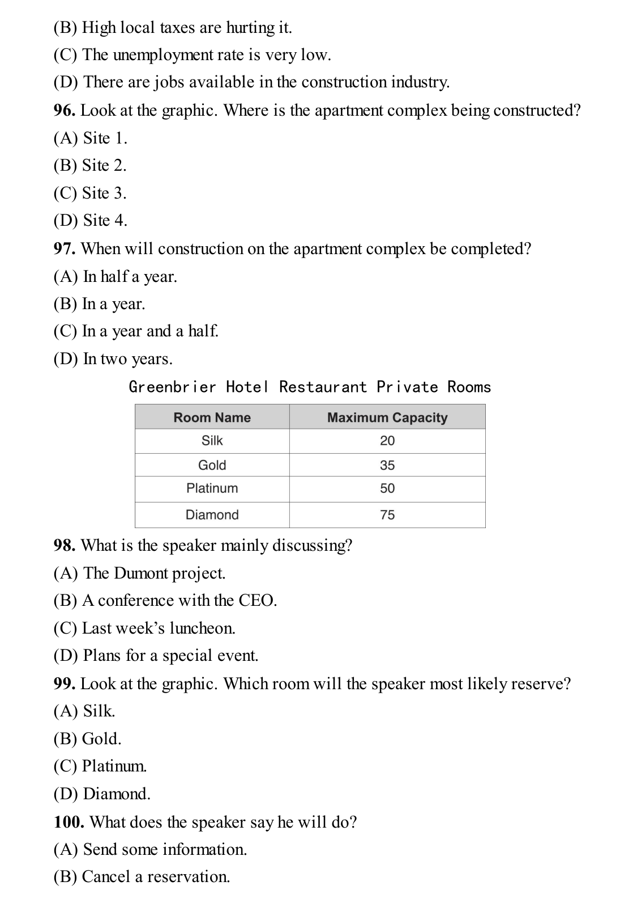

**听力独白/对话原文：**
It's time for an update on the local economy. Thanks to the efforts of Mayor Crawford, several companies have opened branches in Richmond during the past year. That's been great for the economy as unemployment is at a record low. (95) However, there's a housing shortage now, so the average price of a house has risen by more than twenty percent this year. This morning, Carter Construction announced it's building an apartment complex on the eastern side of the Mohawk River. It will be adjacent to the Danforth Bridge. (96) Construction won't be complete until eighteen months from now, (97) but when it's done, more than 600 family-sized units will be available for rent or purchase.

**中文对照：**
> 是时候给当地经济注入新动力了。得益于克劳福德市长的努力，过去一年来，很多企业都在里士满开设了分支机构。这对于经济来说意义重大，因为失业率创下历史最低点。然而，由于当下住房紧张，今年的房价平均上涨了20%以上。就在今天早上，卡特建设公司宣布要在莫华克河东岸建一栋公寓大楼。大楼将与丹福斯大桥毗邻。整个建设工期将历时18个月，且大楼一经建成，将有多套家庭住宅可供租赁或购买。

**核心词汇与短语：**
- **unemployment**：失业
- **at a record low**：创历史新低
- **housing shortage**：住房紧张
- **announce**：宣布
- **apartment complex**：公寓大楼
- **be available for**：有效；对有用
- **purchase**：购买

#### Q95 (正确答案：C)
**问题：** What does the speaker say about the local economy? (关于当地经济，讲话者说了什么？)
- (A) It should start to improve next month. (当地经济状况预计下个月会有所改善。)
- (B) High local taxes are hurting it. (当地经济因税收过高而遭到损害。)
- (C) The unemployment rate is very low. (失业率非常低。)
- (D) There are jobs available in the construction industry. (建筑行业有工作机会。)

#### Q96 (正确答案：C)
**问题：** Look at the graphic. Where is the apartment complex being constructed? (请看图表，公寓大楼将被建立在哪个地点？)
- (A) Site 1. (地点 1 。)
- (B) Site 2. (地点 2 。)
- (C) Site 3. (地点 3 。)
- (D) Site 4. (地点 4 。)

#### Q97 (正确答案：C)
**问题：** When will construction on the apartment complex be completed? (公寓大楼的建设什么时候可以竣工？)
- (A) In half a year. (半年后。)
- (B) In a year. (一年后。)
- (C) In a year and a half. (一年半以后。)
- (D) In two years. (两年后。)

**延伸表达与补充：**
- **It's time for ~ = It's high time that ~ It's time for you to be boarding.** (你是时候登机了。)
- **Thanks to the efforts of ~ = Due to the efforts of ~ = Given the efforts of ~** (得益于…的努力)
  - *例句：Thanks to the efforts of note-taking, we learned a lot.* (由于努力记笔记，我们学到了很多。)

### Questions 98 - 100

**听力独白/对话原文：**
I've got a quick update on the luncheon—we're going to be having to celebrate the successful completion of the Dumont project. (98) I reserved a room at the restaurant at the Greenbrier Hotel, but I was informed by Ms. Anderson that CEO Richards and ten members of his staff intend to be at the luncheon. I'll be calling the hotel back to arrange a private room big enough for forty-five people. (99) We'll also be increasing the budget since we'll have so many more people there. As soon as I make the necessary arrangements, I'll send an e-mail to each of you to provide you with the relevant data. (100) Greenbrier Hotel Restaurant Private Rooms

**中文对照：**
> 我收到了午宴的最新消息——午宴是为了庆祝杜蒙特工程成功竣工而举办的。我之前在绿蔷薇酒店预订好了一间包间，可后来安德森女士通知我说理查德总裁会带十名员工出席宴会。现在我要给酒店打电话，让他们安排一个能容纳45人的大包间。我们也会增加预算，毕竟现在人数增多了。待我一切安排妥当后，会给每个人发一封邮件告知具体细节。绿蔷薇酒店餐厅包间名录

**核心词汇与短语：**
- **update**：最新消息
- **luncheon**：午宴
- **reserve**：预定
- **be informed by**：被告知
- **intend to**：打算
- **call back**：回电
- **make the necessary arrangements**：一切安排妥当
- **private room**：包间

#### Q98 (正确答案：D)
**问题：** What is the speaker mainly discussing? (讲话者主要在讨论什么？)
- (A) The Dumont project. (杜蒙特项目。)
- (B) A conference with the CEO. (和总裁的会议。)
- (C) Last week's luncheon. (上周的午宴。)
- (D) Plans for a special event. (一项特殊活动计划。)

#### Q99 (正确答案：C)
**问题：** Look at the graphic. Which room will the speaker most likely reserve? (请看图表，讲话者最有可能预订哪个房间？)
- (A) Silk. (丝绸厅。)
- (B) Gold. (黄金厅。)
- (C) Platinum. (铂金厅。)
- (D) Diamond. (钻石厅。)

#### Q100 (正确答案：A)
**问题：** What does the speaker say he will do? (讲话者说他将要做什么？)
- (A) Send some information. (发送一些信息。)
- (B) Cancel a reservation. (取消预定。)
- (C) Request more money. (申请增加预算。)
- (D) Read his e-mail. (查阅他的邮件。)

**延伸表达与补充：**
- **be informed by = be told = be brought in on** (被…告知拓展表达：)
  - *例句：inform sb. of sth. inform on sb. I have been reliably informed that the couple will marry next year.* (告知某人某事告发某人我得到可靠消息说他俩明年会再婚。)

# TEST 09

## 答案速查表

| 题号 | 答案 | 题号 | 答案 | 题号 | 答案 | 题号 | 答案 | 题号 | 答案 | 题号 | 答案 | 题号 | 答案 | 题号 | 答案 | 题号 | 答案 | 题号 | 答案 |
| :---: | :---: | :---: | :---: | :---: | :---: | :---: | :---: | :---: | :---: | :---: | :---: | :---: | :---: | :---: | :---: | :---: | :---: | :---: | :---: |
| **1** | D | **11** | A | **21** | B | **31** | B | **41** | A | **51** | A | **61** | D | **71** | D | **81** | D | **91** | C |
| **2** | A | **12** | C | **22** | A | **32** | B | **42** | C | **52** | A | **62** | C | **72** | D | **82** | A | **92** | C |
| **3** | D | **13** | A | **23** | B | **33** | A | **43** | B | **53** | B | **63** | A | **73** | B | **83** | D | **93** | A |
| **4** | C | **14** | A | **24** | A | **34** | B | **44** | C | **54** | A | **64** | D | **74** | D | **84** | B | **94** | D |
| **5** | C | **15** | C | **25** | A | **35** | C | **45** | C | **55** | C | **65** | B | **75** | C | **85** | A | **95** | C |
| **6** | B | **16** | B | **26** | A | **36** | B | **46** | A | **56** | A | **66** | B | **76** | B | **86** | A | **96** | A |
| **7** | A | **17** | A | **27** | C | **37** | A | **47** | B | **57** | A | **67** | A | **77** | B | **87** | A | **97** | C |
| **8** | A | **18** | A | **28** | B | **38** | D | **48** | C | **58** | B | **68** | A | **78** | A | **88** | A | **98** | B |
| **9** | A | **19** | B | **29** | C | **39** | B | **49** | D | **59** | C | **69** | B | **79** | B | **89** | A | **99** | C |
| **10** | A | **20** | A | **30** | A | **40** | B | **50** | C | **60** | A | **70** | C | **80** | A | **90** | D | **100** | C |

## Part 1: 照片描述 (Q1 - Q6)

### Q1 (正确答案：D)

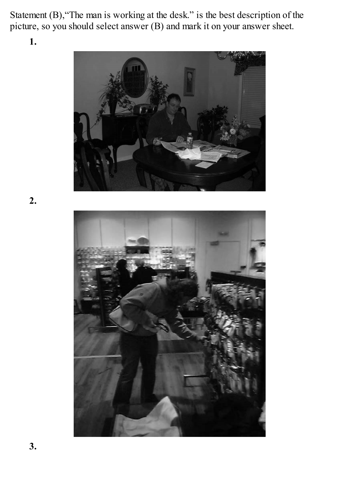

**听力原文与选项：**
- (A) He's drinking some water. (他正在喝水。)
- (B) He's checking his reflection in the mirror. (他正在查看自己在镜中的影像。)
- (C) He's enjoying a meal at the table. (他正在餐桌旁吃饭。)
- (D) He's reading a paper in a dining area. (他正在就餐区读报纸。)

**其他可能表达：**
- He is looking over the paper. (他正在查看报纸。)
- He is studying the newspaper. (他正在研究报纸。)
- He is leafing through the paper. (他正在浏览报纸。)

### Q2 (正确答案：A)

**听力原文与选项：**
- (A) The woman is picking out an item. (女士正在挑选商品。)
- (B) The woman is cleaning the floor. (女士正在扫地。)
- (C) The woman is helping a customer. (女士正在为顾客服务。)
- (D) The woman is trying on a jacket. (女士正在试穿夹克。)

**其他可能表达：**
- The woman is choosing an item. (女士正在挑选商品。)
- The woman is about to select an item on the rack. (女士正打算从货架上挑选一件商品。)
- She has reached out to pick out an item from the rack. (她已经伸出手去从货架上拿商品。)

### Q3 (正确答案：D)

**听力原文与选项：**
- (A) The aircraft is about to land at the airport. (这架飞机正要在机场着陆。)
- (B) The people are boarding the plane. (人们正在登机。)
- (C) The cargo is being loaded onto the plane. (货物正在被装上飞机。)
- (D) The plane landed a short while ago. (飞机刚着陆一小会儿。)

**其他可能表达：**
- The woman is stepping down from the plane. (女士正在走下飞机。)
- An exit ramp extends up to the door of the plane. (出舱舷梯伸到了飞机门口。)
- The passengers are walking away from the plane. (乘客们正在离开飞机。)

### Q4 (正确答案：C)

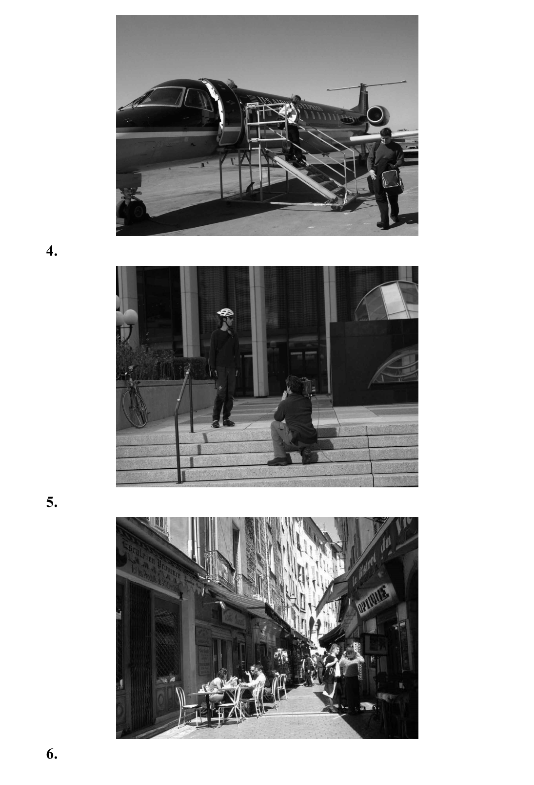

**听力原文与选项：**
- (A) One man is standing at the door. (一位男士正站在门口。)
- (B) The men are walking up the stairs. (男士正在上楼梯。)
- (C) One man is filming the other. (一位男士正在给另一位男士拍照。)
- (D) The men are being interviewed. (男士正在接受采访。)

**其他可能表达：**
- One man has crouched down. (一位男士已经蹲下了。)
- One man is holding a camera on his shoulder. (一位男士肩上正扛着摄像机。)
- The man being filmed is wearing a safety helmet. (正被拍摄的男士戴着安全头盔。)

### Q5 (正确答案：C)

**听力原文与选项：**
- (A) The tables have been set up indoors. (餐桌已经在室内摆好了。)
- (B) A waiter is serving the customers. (一位服务员正在为顾客服务。)
- (C) Some people are seated outside. (一些人在室外就座了。)
- (D) The area is entirely shaded. (整块区域都是阴凉地。)

**其他可能表达：**
- There are tables and chairs set up outdoors. (室外摆放着餐桌和椅子。)
- There are buildings on both sides of the street. (街道两边都有建筑。)
- There are still seats available. (还有座位空着。)

### Q6 (正确答案：B)

**听力原文与选项：**
- (A) The cars are parked on the road. (汽车停在路上。)
- (B) There are vehicles in the driveway. (车道上有车辆。)
- (C) The windows are being cleaned. (有人正在擦窗户。)
- (D) A man is getting into the car. (一位男士正在上车。)

**其他可能表达：**
- There are trees growing around the house. (房子周围种着树。)
- The vehicles are parked next to each other. (这些车辆并排停放着。)
- The cars are parked facing the same direction. (这些汽车都朝一个方向停放。)
- 注：在Part 1中，每道试题都添加了3种可能的正确表达方式，考生可
- 以了解对于同样的照片可能出现的不同表达。

## Part 2: 应答测试 (Q7 - Q31)

### Q7 (正确答案：A)

**听力对话文本：**
- **Q:** When are you going? (你什么时候走呢？)
- **A:** When I get this work done. (当我把这项工作做完的时候。)

**听力原文与选项：**
- **问题：** When are you thinking of taking off? (你想什么时候动身呢？)
- **选项：**
  - (A) As soon as I get this done. (我一把这个做完（就动身）。)
  - (B) He took it with him. (他把它带在身上。)
  - (C) At around 3 last night. (昨天夜里 3 点左右。)

### Q8 (正确答案：A)

**听力对话文本：**
- **Q:** What part of Canada do you come from? (你是加拿大哪个地方的人？)
- **A:** I grew up in Kingston. (我在金士顿长大。)

**听力原文与选项：**
- **问题：** Where in Canada are you from? (你是加拿大哪个地方的人呢？)
- **选项：**
  - (A) I was born in Kingston. (我出生在金士顿。)
  - (B) Early tomorrow morning. (明天一大早。)
  - (C) No, I don't feel like it. (不，我不喜欢它。)

### Q9 (正确答案：A)

**听力对话文本：**
- **Q:** Excuse me, but may I use your phone? (打扰一下，我可以用你的电话吗？)
- **A:** Be my guest. (请不要客气。)

**听力原文与选项：**
- **问题：** Pardon me, but would it be possible for me to use your phone? (不好意思，我可以用你的电话吗？)
- **选项：**
  - (A) Sure, but you have to dial 9 to call out. (可以，不过你打电话前要先拨 9 。)
  - (B) The phone directory is on the lower shelf. (电话姓名簿在下面的架子上。)
  - (C) There is one on the first floor of this building. (这栋楼的一层有一个。)

### Q10 (正确答案：A)

**听力对话文本：**
- **Q:** How much is the entrance fee? (入场费是多少？)
- **A:** It's ten dollars. (—10美元。)

**听力原文与选项：**
- **问题：** How much is it to get into the place? (进那里要多少钱？)
- **选项：**
  - (A) There is a ten-dollar cover charge. (需要 10 美元的服务费。)
  - (B) Sure, we can go there if you'd like. (好的，如果你乐意的话，我们可以去那里。)
  - (C) How about going this Saturday? (这周六去怎么样？)

### Q11 (正确答案：A)

**听力对话文本：**
- **Q:** Why don't we grab a cab? (我们为什么不打车呢？)
- **A:** I'd rather walk. (我更想走路。注：在Part 2中，为帮助考生提高听懂题目的能力，添加了和试题相同或相似的表达方法。)

**听力原文与选项：**
- **问题：** Why don't we flag down a cab? (我们为什么不乘出租车？)
- **选项：**
  - (A) Let's just go for a walk instead. (我们还是散散步吧。)
  - (B) It's about an hour from here. (从这里过去要一个小时左右。)
  - (C) Because it's a national holiday. (因为是全国性的假日。)

### Q12 (正确答案：C)

**听力对话文本：**
- **Q:** How are you planning to get to Chicago? (你打算怎么去芝加哥？)
- **A:** I'll be taking my car. (我打算自己开车去。)

**听力原文与选项：**
- **问题：** Are you going to take the bus to Chicago? (你打算乘坐巴士去芝加哥吗？)
- **选项：**
  - (A) The boss told me to. (老板让我去做。)
  - (B) To pick up someone. (去接某人。)
  - (C) No, I am going to drive. (不，我打算开车去。)

### Q13 (正确答案：A)

**听力对话文本：**
- **Q:** Who's planning to come to the party? (谁打算来参加这次派对？)
- **A:** As far as I know, everyone will be there. (据我所知，每个人都会过去。)

**听力原文与选项：**
- **问题：** Who is supposed to show up at the party? (谁应该在派对上露面呢？)
- **选项：**
  - (A) Everyone said they'll be there. (每个人都说要来。)
  - (B) He's holding it at a banquet hall. (他正在宴会厅举行派对。)
  - (C) Yes, I had a great time there. (是的，我在那里度过了愉快的时光。)

### Q14 (正确答案：A)

**听力对话文本：**
- **Q:** How long are you planning to be away? (你计划离开多久？)
- **A:** I'm thinking of spending a year abroad. (我在考虑在国外待一年。)

**听力原文与选项：**
- **问题：** How long are you thinking of going? (你想离开多久？)
- **选项：**
  - (A) For about a year or so. (大约一年。)
  - (B) What's with the long face? (为什么愁容满面？)
  - (C) Yes, I will be going with John. (是的，我将和约翰一起去。)

### Q15 (正确答案：C)

**听力对话文本：**
- **Q:** Why don't we have lunch together? (我们一起吃午饭怎么样？)
- **A:** Can we do it another time instead? (我们可以改天吗？)

**听力原文与选项：**
- **问题：** Would you like to go for lunch together? (你想一起去吃午饭吗？)
- **选项：**
  - (A) At the company cafeteria. (在公司食堂。)
  - (B) There are four people in our group. (我们组有四个人。)
  - (C) Thank you, but I am too busy today. (谢谢，不过我今天太忙了。)

### Q16 (正确答案：B)

**听力对话文本：**
- **Q:** Would you like to meet in my office or at a coffee shop somewhere? (你想在我的办公室碰面呢，还是在什么地方的咖啡店呢？)
- **A:** The coffee shop on Main Street sounds good. (主街的咖啡店听起来不错。)

**听力原文与选项：**
- **问题：** Where do you feel like meeting, here in my office or somewhere outside? (你想在什么地方见面，是我办公室这里，还是外面什么地方？)
- **选项：**
  - (A) Okay, that sounds like a good place to meet. (可以，那听起来是个不错的见面地点。)
  - (B) How about the little coffee shop on Main Street? (主街的小咖啡店怎么样？)
  - (C) Yes, I think I can spare the time to see you. (是的，我想我可以抽时间见见你。)

### Q17 (正确答案：A)

**听力对话文本：**
- **Q:** When is your first day at the main office? (你什么时候开始在总公司上班？)
- **A:** I'll start going there from next month. (我下个月开始去那里上班。)

**听力原文与选项：**
- **问题：** When will you start your new position at the head office? (你什么时候开始到总公司的新岗位上班呢？)
- **选项：**
  - (A) The first of next month. (下个月的 1 号。)
  - (B) At the downtown office. (在位于市中心的办公室。)
  - (C) I'm heading this one. (我正负责这个。)

### Q18 (正确答案：A)

**听力对话文本：**
- **Q:** Wasn't Peter's presentation impressive? (彼得的演讲难道不令人难忘吗？)
- **A:** Yes, it was quite inspiring. (是的，确实很鼓舞人心。)

**听力原文与选项：**
- **问题：** Didn't you think Peter gave a great presentation? (你难道不认为彼得的演讲很棒吗？)
- **选项：**
  - (A) Yes, he was very impressive. (是的，他给人留下了很深刻的印象。)
  - (B) Yes, for three hours. (是的，三个小时。)
  - (C) I already got the present. (我已经收到礼物了。)

### Q19 (正确答案：B)

**听力对话文本：**
- **Q:** How about having Greek food this evening? (今晚吃希腊餐如何？)
- **A:** That sounds very delicious. (听起来很好吃。)

**听力原文与选项：**
- **问题：** Should we try Greek food tonight? (今晚我们尝尝希腊菜怎么样？)
- **选项：**
  - (A) Yes, he is from Greece. (是的，他是从希腊来的。)
  - (B) Sure, I'd love to try it. (好的，我乐意去试试。)
  - (C) I didn't go there tonight. (我今晚没有去那里。)

### Q20 (正确答案：A)

**听力对话文本：**
- **Q:** How did Mr. Smith respond to the project? (史密斯先生是如何回应这个项目的？)
- **A:** He seemed very positive about it. (他似乎对它很有信心。)

**听力原文与选项：**
- **问题：** What did Mr. Smith say about the new project? (史密斯先生对于新项目说了些什么？)
- **选项：**
  - (A) He made some great comments. (他给予了很高的评价。)
  - (B) The projector is in the meeting room. (投影仪在会议室。)
  - (C) Yes, he mentioned it to me. (是的，他向我提起过。)

### Q21 (正确答案：B)

**听力对话文本：**
- **Q:** How would you like to go for a stroll? (你觉得出去遛个弯怎么样？)
- **A:** Sure, let me put on my jacket first. (好的，让我先穿上夹克。)

**听力原文与选项：**
- **问题：** Would you rather stay here or go for a walk with me? (你是想待在这里，还是想和我出去散散步呢？)
- **选项：**
  - (A) I've been waiting for an hour. (我已经等了一个小时了。)
  - (B) Let me get my jacket. (让我去拿夹克。)
  - (C) Yes, I think so. (是的，我认为是这样。)

### Q22 (正确答案：A)

**听力对话文本：**
- **Q:** Who's responsible for putting together the event? (谁负责组织这次活动？)
- **A:** Larry is heading this one. (拉里负责本次活动。)

**听力原文与选项：**
- **问题：** Who put the event together? (谁组织了这次活动？)
- **选项：**
  - (A) Larry's the one in charge. (拉里是负责人。)
  - (B) I will put it there later. (我一会儿会把它放到那里。)
  - (C) Sorry, I can't go today. (抱歉，我今天不能去。)

### Q23 (正确答案：B)

**听力对话文本：**
- **Q:** Do you think it'd be better to drive or take the bus? (你觉得是开车还是坐公交车更好呢？)
- **A:** It's probably faster to take a cab. (可能打车会快一点。)

**听力原文与选项：**
- **问题：** Should I take my car, or do you think it would be wiser to take the bus? (我应该自己开车吗，或者你觉得乘公交车是不是更明智一点？)
- **选项：**
  - (A) The boss is a wise man. (老板是个精明人。)
  - (B) Let's just hop in a cab instead. (我们还是打车吧。)
  - (C) It shouldn't take over an hour. (不会超过一小时的。)

### Q24 (正确答案：A)

**听力对话文本：**
- **Q:** Did you not drive to work today? (你今天没有开车来上班吗？)
- **A:** No, I left my car at home. (没有，我把车放在家里了。)

**听力原文与选项：**
- **问题：** Didn't you bring your car to work this morning? (你今天早晨不是开车来上班的吗？)
- **选项：**
  - (A) No, I took the bus today. (不，我今天是坐公交车来的。)
  - (B) Yes, I will drive you there. (是的，我会开车把你送到那里。)
  - (C) She might be working today. (她今天也许在工作。)

### Q25 (正确答案：A)

**听力对话文本：**
- **Q:** Should I let John know that you came by? (我可以告诉约翰你过来了吗？)
- **A:** Yes, could you? (好的，有劳了。)

**听力原文与选项：**
- **问题：** Can I tell John that you are here? (我可以告诉约翰你在这里吗？)
- **选项：**
  - (A) Sure, that would be okay. (好的，没问题。)
  - (B) Yes, he is here today. (是的，他今天在这里。)
  - (C) No, we are not leaving yet. (不，我们现在还不走。)

### Q26 (正确答案：A)

**听力对话文本：**
- **Q:** This is great weather to just wander around the beach. (今天天气不错，适合去海边散步。)
- **A:** Yes, I agree with you. (是的，我同意你的说法。)

**听力原文与选项：**
- **问题：** Today is a great day to go for a walk by the beach. (今天是去海边散步的好日子。)
- **选项：**
  - (A) Yes, it is a beautiful day. (是的，今天天气很好。)
  - (B) I didn't know it was raining. (我不知道在下雨。)
  - (C) I went swimming the other day. (我前几天去游泳了。)

### Q27 (正确答案：C)

**听力对话文本：**
- **Q:** Where do you take your car to get it repaired? (你在哪里修的车？)
- **A:** What's wrong with it? (它出了什么毛病？)

**听力原文与选项：**
- **问题：** Where do you get your car fixed? (你的车是在哪里修的？)
- **选项：**
  - (A) I park my car in the underground garage. (我把我的车停在地下车库了。)
  - (B) From a grocery store near my house. (从我家附近的一家杂货店。)
  - (C) Why? Are you having car problems? (怎么了？你的车出毛病了吗？)

### Q28 (正确答案：B)

**听力对话文本：**
- **Q:** Are you going to make the speech today, or will Mr. Smith do it? (今天是你还是史密斯先生要作报告呢？)
- **A:** He's away on a business trip. (他出差了。)

**听力原文与选项：**
- **问题：** Are you making the presentation today, or is Mr. Smith going to do it? (今天是你还是史密斯先生要作报告呢？)
- **选项：**
  - (A) He is going to be here any minute now. (他现在随时都可能到这里。)
  - (B) He told me to take care of it today. (他让我今天负责这次报告。)
  - (C) It is supposed to last until three. (它应该会持续到 3 点。)

### Q29 (正确答案：C)

**听力对话文本：**
- **Q:** What part of the design do you not like? (这个设计的哪个部分您不喜欢？)
- **A:** The color is not right. (颜色不合适。)

**听力原文与选项：**
- **问题：** What is it about the design that you don't like? (您不喜欢这个设计的什么地方？)
- **选项：**
  - (A) Yes, I need your signature. (是的，我需要您的签名。)
  - (B) That's very kind of you. (您真是太好了。)
  - (C) The color seems to be a bit off. (好像有点掉色。)

### Q30 (正确答案：A)

**听力对话文本：**
- **Q:** Is Peter aware of the fact that Mr. Kim knows why he was late to the meeting? (彼得知道金先生了解他开会迟到的原因吗？)
- **A:** Yes, I told him. (知道，我告诉他了。)

**听力原文与选项：**
- **问题：** Does Peter know that Mr. Kim knows why he was late to the meeting? (彼得知道金先生了解他开会迟到的原因吗？)
- **选项：**
  - (A) He's been informed. (他已经被告知了。)
  - (B) I was five minutes late. (我迟到了五分钟。)
  - (C) He was stuck in traffic. (他被堵在路上了。)

### Q31 (正确答案：B)

**听力对话文本：**
- **Q:** Did you speak to Cindy today or yesterday? (你是今天还是昨天和辛迪谈的？)
- **A:** She called this morning, but I wasn't here. (她今天上午打电话了，但我当时不在这儿。Questions 32 through 34 refer to the following conversation.M:I can't believe this， but I managed to book a ticket to Singapore.（)

**听力原文与选项：**
- **问题：** Did you talk to Cindy this morning or last night? (你是今天上午还是昨天晚上和辛迪谈的？)
- **选项：**
  - (A) I'm thinking of taking off today. (我想今天请假。)
  - (B) She left a message on my machine. (她在我的电话答录机上留言了。)
  - (C) It may not last that long. (也许不会持续那么久。)

## Part 3: 简短对话 (Q32 - Q70)

### Questions 32 - 34

**听力独白/对话原文：**
**M:** I can't believe this, but I managed to book a ticket to Singapore. (32) I will be on the seven o'clock flight tomorrow morning.
**W:** That's great. Does that mean that you will get to see your friend who moved out there a few years back after you are finished meeting with Mr. Wang? (33)
**M:** I am not sure because Mr. Wang will probably want to take me around the plant site on the day I arrive there. I am hoping that I will be able to see my friend the day after, but he mentioned that he might have to leave town that day. He said he would try to rearrange his trip, but I have not spoken to him for a few days. I will call him tonight to see if he is able to do that.
**W:** You should just take your vacation early and spend a week there after you take care of your business. (34) It's not like you get to travel to the Far East all the time, you know.

**中文对照：**
> **M：**真是难以置信，我成功地订了一张去新加坡的机票。我将乘坐明天早上7点的飞机。
> **W：**太好了。那是不是意味着你与王先生会面后就会去拜访你几年前搬到那儿的朋友？
> **M：**我还不能确定，因为我到达的当天王先生很可能会带我去看厂址。我希望第二天能去拜访我的朋友，但是我的朋友说过他那天也许得离开新加坡。他说他会尽量重新安排旅程，但是我已经几天没和他联系了。我今晚给他打电话，看看他能否重新安排。
> **W：**你处理完事情后应该早点儿去度假，在那儿待上一个星期。你知道，你不是一直可以去远东旅行的。

**核心词汇与短语：**
- **manage to do**：成功做（某事）
- **rearrange**：重新安排
- **Far East**：远东
- **overseas**：国外的
- **attend to**：处理
- **matter**：事情，事务

#### Q32 (正确答案：B)
**问题：** What will the man do tomorrow? (男士明天将会做什么？)
- (A) Help his friend move into a new place. (帮他的朋友搬到新家。)
- (B) Leave on an overseas business trip. (出发到国外出差。)
- (C) Take Mr. Wang to the factory site. (带王先生去工厂。)
- (D) Prepare for his vacation to the Far East. (为去远东度假做准备。)

#### Q33 (正确答案：A)
**问题：** What does the woman want to know? (女士想知道什么？)
- (A) Whether the man will have enough time to attend to personal matters. (男士是否有足够的时间来处理个人事务。)
- (B) If the man is going to make the sale. (男士是否能做成这笔买卖。)
- (C) How much the new business is going to cost. (新生意将花费多少钱。)
- (D) How long he has known Mr. Wang. (他认识王先生多久了。)

#### Q34 (正确答案：B)
**问题：** What does the woman suggest the man do? (女士建议男士做什么？)
- (A) Go on the trip another time. (改天再去旅行。)
- (B) Take his vacation early. (早点儿去度假。)
- (C) Talk to Mr. Wang right away. (立刻和王先生谈话。)
- (D) Book his ticket early. (早点儿订票。)

**延伸表达与补充：**
- **I managed to book a ticket.** (我成功地订了一张票。扩展表达：)
  - *例句：I was able to reserve a ticket. I reserved a seat on the plane.* (我订到了一张票。我订了一张飞机票。)
- **I have not spoken to him for a few days.** (我已经几天没和他讲话了。扩展表达：)
  - *例句：I have not seen him for a couple of days. I have not talked to him for a while.* (我已经几天没看到他了。我有好一会儿没跟他讲话了。)
- **take care of your business = look after your matters = tend to your affairs** (管好你自己的事情)
  - *例句：John will go with you to Seattle to help take care of your business.* (约翰将与你一起去西雅图，帮你照看生意。)

### Questions 35 - 37

**听力独白/对话原文：**
**W:** Welcome back to the office, Greg. How was your trip to Milan?
**M:** It didn't go quite as well as I had expected. I had been hoping the client would sign a contract, but he wants to negotiate more. (35)
**W:** It sounds like you'll be returning there soon.
**M:** Yeah, I'm scheduled to meet Mr. Roberts next Thursday. But I've got to visit Frankfurt before I go back to Milan. (36)
**W:** Good luck. If there's anything I can do to help, all you have to do is ask.
**M:** I'll probably take you up on that offer. I've got two other international customers who need to be visited, but I don't have time. (37)

**中文对照：**
> **W：**欢迎回到办公室，格雷格。你的米兰之行怎么样？
> **M：**没有我预期的那么顺利。我本来希望那位客户能签合同，但是他想要进一步谈判。
> **W：**听起来你很快还会再去米兰。
> **W：**是的。我定好了下个星期四和罗伯茨先生会面。但是去米兰之前我得先去趟法兰克福。
> **W：**祝你好运。如果有什么我能帮忙的，尽管开口。
> **M：**我可能需要你的帮助。我还需要拜访另外两位国际客户，但是我没有时间。

**核心词汇与短语：**
- **client**：客户
- **sign a contract**：签订合同
- **negotiate**：谈判
- **schedule**：安排，预定
- **take sb. up on sth**：接受或采纳某人的
- **international**：国际的

#### Q35 (正确答案：C)
**问题：** What is the conversation mainly about? (这段对话主要是关于什么的？)
- (A) The woman's assignment. (女士的任务。)
- (B) The branch in Milan. (米兰的分店。)
- (C) The man's client. (男士的客户。)
- (D) A complete negotiation. (一次完整的谈判。)

#### Q36 (正确答案：B)
**问题：** What will the man do before visiting Milan? (在去米兰前，男士会做什么？)
- (A) Sign a contract. (签合同。)
- (B) Travel to Frankfurt. (去法兰克福。)
- (C) Negotiate with Mr. Roberts. (和罗伯茨先生谈判。)
- (D) Train the woman. (培训女士。)

#### Q37 (正确答案：A)
**问题：** What does the man suggest about the woman? (从男士的话语中可以推断出女士的什么信息？)
- (A) She will take a trip abroad soon. (她很快将要去国外出差。)
- (B) She needs more work experience. (她需要更多的工作经验。)
- (C) She knows Mr. Roberts personally. (她认识罗伯茨先生本人。)
- (D) She lived in Milan in the past. (她过去住在米兰。)

**延伸表达与补充：**
- **I'm scheduled to meet Mr. Roberts next Thursday. = I plan to meet Mr. Roberts next Thursday.** (我定好了下个星期四和罗伯茨先生会面。)
  - *例句：The abandoned building is scheduled to be torn down this afternoon.* (这栋废弃大楼计划好了今天下午被拆除。)
- **I'll probably take you up on that offer. = I'll probably accept your offer.** (我可能需要你的帮助。)
  - *例句：We will take you up on your invitation.* (我们会接受你的邀请。)

### Questions 38 - 40

**听力独白/对话原文：**
**M:** When do you think you will be able to wrap up the deal with the retail shop owners? (38) I hope it will be soon because we have to start the construction work as soon as possible.
**W:** Well, I had a meeting with them this morning, and things went quite smoothly. If everything goes as planned, I should have all of their signatures by the end of this week. (39)
**M:** Well, I hope so. Otherwise, we will not be able to start the construction work on time, and there is a good chance that we will not be able to have the building ready for the exposition next January.
**W:** Don't worry. I will get the approval this week. And I will make sure the construction work gets underway by next Monday. (40)

**中文对照：**
> **M：**你觉得什么时候可以和零售店的店主们签订协议呢？我希望能快点儿，因为我们得尽快开始施工。
> **W：**我今天上午和他们开了一个会，事情进展得很顺利。如果一切按计划进行，到这个周末我就会拿到他们所有人的签字。
> **M：**嗯，我希望如此。否则，我们就不能按时开始施工，而且很可能我们无法为明年1月份的博览会准备好这栋楼。
> **W：**不要担心。这个周末我会拿到批准，而且我保证下星期一之前工程就会开始。

**核心词汇与短语：**
- **wrap up**：最终或成功地解决
- **retail shop**：零售店
- **construction work**：施工
- **smoothly**：顺利地
- **otherwise**：否则
- **on time**：按时
- **exposition**：博览会
- **approval**：同意，批准
- **underway**：在进行中
- **grand opening**：隆重开张
- **let go**：解雇；开除

#### Q38 (正确答案：D)
**问题：** What does the man want to know? (男士想知道什么？)
- (A) When the exposition is going to start. (博览会将于什么时候开始。)
- (B) How long the construction will take. (工程将花费多长时间。)
- (C) Where the stores are located. (商店位于哪里。)
- (D) How soon the woman will close the deal. (女士多快能签订合同。)

#### Q39 (正确答案：B)
**问题：** According to the woman, what might happen by the end of this week? (根据女士所说，这周末前可能会有什么事情发生？)
- (A) The shop will have its grand opening. (商店将隆重开张。)
- (B) All of the signatures will be collected. (将收集完所有的签字。)
- (C) Some of the workers will be let go. (一些工人将被解雇。)
- (D) The exposition will open to the general public. (博览会将对大众开放。)

#### Q40 (正确答案：B)
**问题：** According to the woman, when will the construction most likely begin? (根据女士所说，工程最有可能何时开工？)
- (A) This week. (这星期。)
- (B) Next week. (下星期。)
- (C) Before the winter. (在冬季之前。)
- (D) Next year. (明年。)

**延伸表达与补充：**
- **wrap up the deal = close the deal = finalize the deal** (签订协议)
  - *例句：We really need to wrap up the deal today.* (我们确实需要在今天签订协议。)
- **Things went quite smoothly. = Things went without any problems. = Things went very well.** (事情进展得很顺利。)
  - *例句：I was told that things went quite smoothly last night.* (我被告知昨晚事情进展得很顺利。)
- **if everything goes as planned = if all things go as scheduled** (如果一切按计划进行扩展表达：)
  - *例句：if the entire thing goes as we had anticipated We could be sitting at a beach this time next week if everything goes as planned.* (如果一切按我们预期的进行如果一切按计划进行，下星期的这个时候我们应该会坐在海滩上。)

### Questions 41 - 43

**听力独白/对话原文：**
**W:** Jack, I'm sorry to tell you this, but you and I are going to have to work late this evening. The brochures we ordered came in this morning, but there is a problem. Can you believe they forgot to attach our company logo to them? (41)
**M:** You've got to be kidding me. How many brochures are there?
**W:** Well, there are 12 boxes that need to go out first thing tomorrow morning, (43) so you and I are going to have to get them done tonight. （ 41, 42 ）
**M:** Are you kidding me? Couldn't we just send them back and have the printing company do the work?

**中文对照：**
> **W：**杰克，很抱歉地告诉你，今天晚上我们俩得加班了。我们订购的小册子今天早上已经到了，但是有一个问题。你能相信吗，他们居然忘记把我们公司的新商标贴在小册子上了。
> **M：**你在开玩笑吧。一共有多少本小册子？
> **W：**嗯，一共有12箱小册子明天一早就需要发出去。所以我们俩今天晚上得把它们弄好。
> **M：**你在开玩笑吧？难道我们不能直接把它们退回去让印刷公司来做吗？

**核心词汇与短语：**
- **work late**：加班
- **brochure**：小册子
- **attach**：贴上
- **send back**：退回
- **immediate**：立即的，即刻的
- **attention**：注意
- **extra**：额外的

#### Q41 (正确答案：A)
**问题：** What does the woman say to the man? (女士对男士说什么？)
- (A) An error needs their immediate attention. (有个错误需要他们立刻注意。)
- (B) They have been working too hard lately. (他们最近工作太辛苦了。)
- (C) The design of their new company logo is bad. (他们公司的新商标设计得很差。)
- (D) An order they placed has not arrived yet. (他们下的一个订单还没有送到。)

#### Q42 (正确答案：C)
**问题：** How will they solve the problem? (他们将如何解决这个问题？)
- (A) By ordering extra boxes. (订购额外的箱子。)
- (B) By returning the products. (退还商品。)
- (C) By doing the work themselves. (他们自己做这项工作。)
- (D) By finding another company. (找另一家公司。)

#### Q43 (正确答案：B)
**问题：** What will happen tomorrow morning? (明天早晨会发生什么事？)
- (A) A new shipment will arrive. (一批新的货物将到达。)
- (B) Some goods will be sent out. (一些商品将被发出。)
- (C) The boxes will be sent back. (箱子将被退回。)
- (D) They will find a new printing company. (他们将找到一家新的印刷公司。)

**延伸表达与补充：**
- **There are 12 boxes that need to go out first thing tomorrow morning. = There are a dozen boxes that must be sent out first thing tomorrow morning. = There are 12 boxes that have to go out first thing tomorrow morning.** (一共有12箱小册子明天一早就需要发出去。)
- **get them done tonight = finish them this evening = complete them by the end of the day** (今天晚上把它们弄好)
  - *例句：It is crucial that we get them done tonight.* (今天晚上我们要把它们弄好，这一点很重要。)
- **Couldn't we just send them back? = Can't we just return them? = Couldn't we just have them taken back?** (难道我们不能直接把它们退回去吗？)

### Questions 44 - 46

**听力独白/对话原文：**
**M:** I just received a call from Larry from our head office, and he said Mr. Wang can't give the presentation tomorrow at our company's annual conference being held at the Prince Hotel because of a sudden illness in his family. (44) He asked me to take his place at the conference. (45) Would you happen to know if there is a bus or subway that goes directly from here?
**W:** I didn't know that you were going to give a speech there. In fact, Mr. Singh and I are going to be in attendance, and we are planning to drive. If you'd like, you can ride along with us. (46)
**M:** That sounds wonderful. What time will you be taking off?
**W:** We will meet here at 7 since it only takes about an hour to get there. We might even have time for breakfast once we get there.

**中文对照：**
> **M：**我刚刚接到总部的拉里打来的电话，他说王先生因为家人突然生病，明天不能在我公司于王子宾馆举办的年会上作报告了。王先生让我替他在会上作报告。你知道有从这儿直达那里的公交车或地铁吗？
> **W：**我不知道你要去那里作报告。事实上，辛格先生和我也将出席，我们打算开车去。如果你愿意的话，可以坐我们的车一起去。
> **M：**太棒了。你们什么时候出发？
> **W：**因为开车到那里一个小时左右，所以我们打算7点在这儿集合。我们到了那儿甚至还有时间吃早饭呢。

**核心词汇与短语：**
- **give a presentation**：做演讲
- **annual**：每年的
- **sudden**：突然的
- **take one's place**：代替某人
- **give a speech**：发言，作报告
- **come down with**：得，染上（病）
- **unexpected**：没有料到的

#### Q44 (正确答案：C)
**问题：** Why won't Mr. Wang be able to give the speech? (王先生为什么不能去做报告？)
- (A) He suddenly came down with an illness. (他突然病倒了。)
- (B) He does not have a way to get to the hotel. (他没法到宾馆。)
- (C) He has to attend to a family member. (他必须去照顾一位家庭成员。)
- (D) He has to make an unexpected trip. (他必须参加一次意料之外的旅行。)

#### Q45 (正确答案：C)
**问题：** What does the man imply when he says, “He asked me to take his place at the conference”? (男士说 “ 王先生让我替他在会上作报告 ” ，他在暗示什么？)
- (A) He will drive the woman to the conference. (他会开车把女士送到会场。)
- (B) He will visit Mr. Wang at the hospital. (他会到医院探望王先生。)
- (C) He will fill in for Mr. Wang. (他会代替王先生（作报告）。)
- (D) He will make breakfast for the guests. (他会为客人们做早餐。)

#### Q46 (正确答案：A)
**问题：** How will the man get to the conference? (男士将如何到达会场？)
- (A) By car. (乘小汽车。)
- (B) By train. (乘火车。)
- (C) By bus. (乘公交车。)
- (D) By airplane. (乘飞机。)

**延伸表达与补充：**
- **He asked me to take his place. = He asked me to fill in for him. = He asked me to do it instead.** (他让我代替他。)
  - *例句：He asked me to take his place at the meeting because something urgent has come up.* (因为有紧急的事情发生，他让我代替他参加会议。)
- **be going to be in attendance = will be present = be going to be there** (将出席)
  - *例句：Most of the people I know are going to be in attendance.* (我认识的大部分人都将出席。)
- **You can ride along with us.** (你可以坐我们的车一起去。扩展表达：)
  - *例句：You can come with us. = You can tag along with us. If you don't have a way to get there, you can ride along with us.* (你可以和我们一起来。如果你没法去那里，可以坐我们的车一起去。)

### Questions 47 - 49

**听力独白/对话原文：**
**W:** We are short of staff today. Why don't you call up some of the part-time workers and see if they can work today? We are expecting a massive crowd to swarm us tonight since a great review got printed in today's local paper.
**M:** Is that why we are getting so many calls? I couldn't figure out why the phone was ringing off the hook.
**W:** I didn't know about it either, but one of the customers told me that he came after reading the review. (48) He also complimented us on the great food we serve here. (47)
**M:** That's good to hear. All the renovation work we did here and hiring the new chef we scouted from France are really paying off. (49)

**中文对照：**
> **W：**我们今天缺人手。你为什么不打电话通知一些兼职员工，看看他们能不能今天来工作？因为今天的地方报纸上有一篇很棒的评论，所以我们预计今晚会有大量顾客蜂拥而来。
> **M：**那就是我们接到这么多电话的原因吗？我想不通为什么电话总是响个不停。
> **W：**我也不知道为什么。但是其中有一位顾客告诉我他是读完这篇评论后过来的。他也称赞了我们所提供的美味食物。
> **M：**听起来不错。我们在这儿做的所有整修以及聘请从法国找来的新厨师真是物有所值啊。

**核心词汇与短语：**
- **be short of staff**：缺人手
- **call up**：打电话
- **massive**：大量的
- **swarm**：蜂拥
- **review**：评论
- **figure out**：想明白
- **ring off the hook**：电话响个不停
- **compliment**：称赞
- **renovation**：整修
- **scout**：寻找
- **pay off**：物有所值，取得成功

#### Q47 (正确答案：B)
**问题：** Where do they most likely work? (他们最有可能在哪里工作？)
- (A) A newspaper company. (报社。)
- (B) A restaurant. (餐馆。)
- (C) A phone company. (电话公司。)
- (D) A travel agency. (旅行社。)

#### Q48 (正确答案：C)
**问题：** How did the woman learn about the news? (女士是怎么知道消息的？)
- (A) By reading it in a paper. (在报纸上读到的。)
- (B) From a co-worker. (从同事那里获知的。)
- (C) One of the customers told her. (一位顾客告诉她的。)
- (D) She overheard the chef talking. (她无意中从厨师那里听说的。)

#### Q49 (正确答案：D)
**问题：** What have they done to improve their business? (他们做了什么来改善他们的生意？)
- (A) They took out an ad in the local paper. (他们在当地报纸上登了广告。)
- (B) They contacted their existing customers. (他们联系了已有的顾客。)
- (C) They provided food samples to their guests. (他们向客人们提供了食物样品。)
- (D) They hired a new professional cook. (他们雇了一位新的专业厨师。)

**延伸表达与补充：**
- **We are short of staff today. = We don't have enough people today. = We are lacking staff today.** (我们今天缺人手。)
- **We are expecting a massive crowd to swarm us tonight. = We are anticipating a lot of people to come tonight. = We are predicting a large number of people to turn out this evening.** (我们预计今晚会有大量顾客蜂拥而来。)
- **I couldn't figure out why the phone was ringing off the hook. = I couldn't understand why there were so many calls. = I couldn't make out the reason why the phone was ringing so much.** (我想不通为什么电话总是响个不停。)

### Questions 50 - 52

**听力独白/对话原文：**
**M:** Will you be making the trip out to Los Angeles next Monday?
**W:** I was planning to, but something has come up, (50) so I was contemplating whether or not I should delay my trip to the week after. Why do you ask?
**M:** My brother who moved to France five years ago is coming to LA next week on a business trip, so I was thinking of going out there to see him. (51) And since I heard you are going, I thought maybe we could drive down together.
**W:** That sounds like a good idea. I do have to make a trip there, and it would be nice to have some company. Hmm...tell you what, I will see what I can do to take the trip next week after all. (52) Let me give you a shout with the details after lunch today.

**中文对照：**
> **M：**下星期一你要去洛杉矶旅行吗？
> **W：**原本打算去的，但发生了一些事情，所以我正在考虑是否应该将旅行推迟到一周以后。你为什么这么问呢？
> **M：**我有个五年前移居法国的哥哥下星期出差去洛杉矶，所以我想去那儿看望他。因为听说你要去，所以我原想我们可以一起开车去。
> **W：**这个主意听起来不错。我是得去那儿旅行，而且能有同伴一起去很好。嗯…我说，我看看能做些什么以便下个星期能出发。今天午饭后我再和你细谈吧。

**核心词汇与短语：**
- **come up**：发生
- **contemplate**：考虑
- **drive down**：开车过去
- **company**：同伴
- **tell you what**：（用以提出建议）我说
- **keep ~ company**：与相伴，陪
- **accompany**：陪伴

#### Q50 (正确答案：C)
**问题：** Why is the woman thinking of postponing her trip? (为什么女士在考虑推迟她的旅行？)
- (A) She is not feeling well. (她觉得不舒服。)
- (B) Her car is in need of repairs. (她的汽车需要修理。)
- (C) She has something else to attend to. (她需要处理其他事情。)
- (D) Her brother is coming to see her. (她哥哥要来看她。)

#### Q51 (正确答案：A)
**问题：** Why will the man take the trip? (男士为什么要去旅行？)
- (A) To meet his brother. (去看望他的哥哥。)
- (B) To attend an important meeting. (去参加一次重要的会议。)
- (C) To keep the woman company. (去陪伴女士。)
- (D) To meet his client. (去会见他的客户。)

#### Q52 (正确答案：A)
**问题：** What does the woman say she will let the man know about? (女士说她会告诉男士什么？)
- (A) If she can go away with the man or not. (她是否可以和男士一起去。)
- (B) When she will be able to get back from LA. (她什么时候可以从洛杉矶回来。)
- (C) How many people she will be going on the trip with. (她将和多少人一起去旅行。)
- (D) Who will be accompanying her on the trip. (谁将陪伴她一起去旅行。)

**延伸表达与补充：**
- **I was planning to do = I was thinking to do = I was meaning to do** (我原本打算做)
  - *例句：I was planning to drive there.* (我原本打算开车到那里。)
- **I was contemplating ~ = I was thinking about ~ = I was pondering about ~** (我正在考虑…)
  - *例句：I was contemplating the situation, and I think I have figured out the answer.* (我正在考虑这个情况，并觉得我已经想出答案了。)
- **It would be nice to have some company. = It would be nice to have someone beside me.** (能有同伴一起去很好。扩展表达：)
  - *例句：It would be nice to have somebody to talk to. It would be nice to have some company for a change.* (能有人一起聊聊天很好。改变一下，有同伴一起去很好。)

### Questions 53 - 55

**听力独白/对话原文：**
**M:** Wilma, are you planning to e-mail me those documents anytime soon? The staff meeting is thirty minutes from now. (54)
**W:** I sent them to you more than two hours ago. Didn't you get them?
**M:** Apparently not. I just checked my e-mail, and nothing has arrived all morning. (53)
**W:** We could be having problems with the company-wide computer server. I'll give someone in the Maintenance Department a call right now.
**M:** Okay, but before you do that, how about printing the documents and then bringing them to me? (55) I need to look over them at once.
**W:** No problem. You'll have them in two minutes.

**中文对照：**
> **M：**威尔玛，你会尽快将那些文件发到我电子邮箱吗？三十分钟后员工会议就开始了。
> **W：**我两个多小时前就发给你了。你没收到吗？
> **M：**显然没有收到。我刚查看了邮箱，整个早上没收到任何邮件。
> **W：**我们公司内部的计算机服务器可能出问题了。我马上给维修部的工作人员打个电话。
> **M：**好的，但是在你打电话前，你先把文件打印了拿给我怎么样？我需要马上看一下。
> **W：**没问题。两分钟之后给你。

**核心词汇与短语：**
- **document**：文件
- **staff meeting**：员工会议
- **apparently**：显然地
- **server**：服务器
- **Maintenance Department**：维修部
- **look over**：检查

#### Q53 (正确答案：B)
**问题：** What is the man's problem? (男士的问题是什么？)
- (A) He cannot log on to his computer. (他无法登录他的电脑。)
- (B) An e-mail has not arrived. (一封电子邮件尚未收到。)
- (C) An appointment was just canceled. (刚刚取消了一个预约。)
- (D) He forgot about a staff meeting. (他忘记了员工会议。)

#### Q54 (正确答案：A)
**问题：** Why does the man need some documents? (为什么男士需要一些文件？)
- (A) He has a meeting to attend. (他将要参加一个会议。)
- (B) He needs to check them for mistakes. (他需要检查文件是否有错。)
- (C) He has to mail them to a customer. (他必须把文件邮寄给客户。)
- (D) He needs to sign them. (他需要在文件上签字。)

#### Q55 (正确答案：C)
**问题：** What does the man request the woman to do first? (男士请女士先做什么？)
- (A) Repair some machinery. (修理一些机器。)
- (B) Contact a technician. (联系一位技术人员。)
- (C) Print some papers. (打印一些文件。)
- (D) Schedule a meeting. (安排一场会议。)

**延伸表达与补充：**
- **How about ~ = What about ~ …** (怎么样)
  - *例句：How about going out for a walk?* (出去散步怎么样？)
- **I need to look over them at once. = I need to examine them at once.** (我需要马上看一下。扩展表达：)
  - *例句：look through* (浏览)

### Questions 56 - 58

**听力独白/对话原文：**
**M:** You didn't forget to call the Maintenance Department to take a look at our machine, did you? (56)
**W:** I made the call to Jack as soon as I got into work at 9 this morning, (56) but he said he had many rounds to make today. (57) According to him, the earliest he can come is around 4.
**M:** That's a bit late. I have an appointment with Mr. Smith at 5, and it will take me at least an hour to get there. (58) We need someone here to explain the problem to him.
**W:** My meeting with my client got canceled. I'll stick around and tell Jack about the problem. You go right ahead and meet Mr. Smith.

**中文对照：**
> **M：**你没忘记给维修部打电话让他们来检查我们的机器吧？
> **W：**我今天早上9点钟一上班的时候就给杰克打了电话，但是他说他今天要去巡查很多地方。按他的意思，他最早下午4点左右能来。
> **M：**那有点儿晚了。我和史密斯先生约好5点钟碰面，去那儿路上至少要花一个小时。我们需要找人留在这里把问题解释给杰克听。
> **W：**我和客户的会面取消了。我会待在这儿和杰克谈这个问题。你去见史密斯先生吧。

**核心词汇与短语：**
- **maintenance**：维护，维修
- **take a look at ~**：检查
- **at least**：至少
- **stick around**：逗留
- **go right ahead**：请便
- **drop by**：顺道拜访
- **take care of**：处理

#### Q56 (正确答案：A)
**问题：** Who most likely is Jack? (杰克最有可能是谁？)
- (A) A co-worker. (一位同事。)
- (B) A client. (一位客户。)
- (C) The mechanic. (机械师。)
- (D) The department head. (部门领导。)

#### Q57 (正确答案：A)
**问题：** Why will Jack come late? (杰克为什么会迟到？)
- (A) He has many places to visit. (他得去很多地方。)
- (B) He has a long way to drive to get there. (他到那里要开很久的车。)
- (C) He has to drop by a client's office first. (他得先顺道去一位客户的办公室。)
- (D) He has a personal problem to take care of. (他有件私事需要处理。)

#### Q58 (正确答案：B)
**问题：** When will the man most likely leave for his appointment? (男士最有可能在什么时候动身赴约？)
- (A) At 1. (1 点。)
- (B) At 4. (4 点。)
- (C) At 5. (5 点。)
- (D) At 9. (9 点。)

**延伸表达与补充：**
- **You didn't forget to call ~ = You remembered to call ~** (你没忘记给…打电话)
  - *例句：You didn't forget to call the client about the order, did you?* (你没忘记给客户打电话说定单的事，对吧？)
- **has many rounds to make today** (今天要去巡查很多地方扩展表达：)
  - *例句：has many places to go has many deliveries to make Jack is out because he has many rounds to make today.* (有许多地方要去有许多货物要投递杰克出去了，因为他今天要去巡查很多地方。)
- **I'll stick around. = I'll hang around. = I'll wait around.** (我会待在这里。)
  - *例句：I'll stick around here until Ms. Taylor shows up.* (我会待在这儿直到泰勒女士露面。)

### Questions 59 - 61

**听力独白/对话原文：**
**M1:** Wendy, are you still planning to order some items from the office supply store? (59)
**W:** That's correct. Do you need me to add anything to the list? You'd better do it by three.
**M1:** Okay. I noticed we're out of file folders and could use some ink for the printer, too. I'll e-mail the details to you. (59)
**W:** Thanks, Brian. I'll check my inbox before I submit the order form.
**M2:** Oh, I could use a few things as well, (59) but I've got to attend a meeting. It's not going to finish until four. (60)
**W:** I suppose I can wait until then, Mr. Lopez. Just get me the list as quickly as you can. (61)

**中文对照：**
> **M1：**温迪，你还在计划从办公用品店订购一些东西吗？
> **W：**是的。你还有什么需要添加到清单上吗？你最好三点之前完成。
> **M1：**好的。我注意到我们的文件夹用完了，还需要一些打印机的墨水。我会把具体信息用邮件发给你。
> **W：**谢谢，布瑞恩。在提交订单之前，我会查看我的收件箱。
> **M2：**哎呀，我也想要一些东西。但是我得参加一个会议，要到四点才能结束。
> **W：**我想我可以等到那时候，洛佩兹先生。只要尽快把清单给我就行。

**核心词汇与短语：**
- **item**：（尤指清单上的）一项，一条
- **supply store**：供应商店
- **file folder**：文件夹
- **inbox**：收件箱
- **submit**：上交，呈交
- **attend**：出席，到场

#### Q59 (正确答案：C)
**问题：** What do the men want the woman to do? (两位男士想让这位女士做什么？)
- (A) Give them some folders. (给他们一些文件夹。)
- (B) Go to a store with them. (和他们一起去商店。)
- (C) Order some items for them. (帮他们订购一些商品。)
- (D) Tell them about the budget. (告诉他们预算。)

#### Q60 (正确答案：A)
**问题：** What will Mr. Lopez do at four? (洛佩兹先生要在四点做什么？)
- (A) Finish a meeting. (结束会议。)
- (B) Visit a website. (访问一个网站。)
- (C) Check his inbox. (查看他的收件箱。)
- (D) Print some copies. (打印一些副本。)

#### Q61 (正确答案：D)
**问题：** Why does the woman say, “I suppose I can wait until then”? (这位女士为何说 “ 我想我可以等到那时候 ”？)
- (A) To ask Brian to e-mail her later. (让布瑞恩稍后给她发邮件。)
- (B) To express her desire to hurry. (表达她的急切之情。)
- (C) To mention when she will leave. (提及她离开的时间。)
- (D) To tell Mr. Lopez to send her a list. (告诉洛佩兹先生给她发清单。)

**延伸表达与补充：**
- **I could use a few things as well = I also want a few things.** (我也想要一些东西。)
  - *例句：I could use a drink.* (我先要瓶饮料。)
- **be out of sth.** (没了，用完了)
  - *例句：We're out of milk.* (我们的牛奶喝完了。)

### Questions 62 - 64

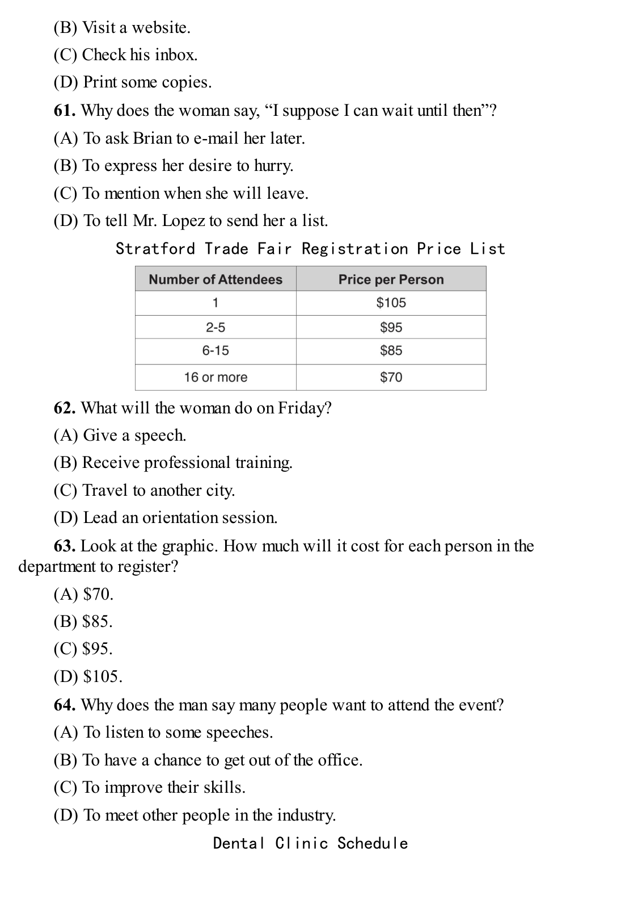

**听力独白/对话原文：**
**M:** Mr. Venters has granted everyone in our department permission to attend the trade fair this Friday. (62)
**W:** That's wonderful news. I'll be out of town, so I can't make it, (62) but I'm sure many people are eager to go.
**M:** That's right. I already asked around, and seventeen people indicated they'll be going. (63) I'll be registering everyone later today.
**W:** I don't think we've ever had that many people attend a professional event.
**M:** More people are focusing on networking these days, and trade fairs are some of the best places to do that. (64)
**W:** I suppose you're right. In that case, it's a real shame I can't go. Stratford Trade Fair Registration Price List

**中文对照：**
> **M：**文特斯先生允许我们部门所有人参加本周五的商品交易会。
> **W：**这个消息太棒了。我要去趟其他城市，所以我去不了，但是我确信很多人都想去。
> **M：**对。我已经问了一圈人，17个人表示他们要去。今天晚些时候，我会为每个人报名。
> **W：**我想我们之前从来没有那么多人参加过一次专业的活动。
> **M：**如今更多人关注建立人际关系，商品交易会是建立人际关系的最佳场所之一。
> **W：**我想你是对的。那样的话，我无法去真的是个遗憾。斯特拉福德商品交易会报名价格表

**核心词汇与短语：**
- **grant**：给予，授予
- **permission**：许可，允许
- **make it**：成功做到
- **indicate**：表示，指出
- **register**：报名，注册
- **professional**：专业的，职业的
- **focus on**：专注于，关注
- **networking**：建立人际关系

#### Q62 (正确答案：C)
**问题：** What will the woman do on Friday? (周五女士要做什么？)
- (A) Give a speech. (发表演讲。)
- (B) Receive professional training. (接受专业培训。)
- (C) Travel to another city. (去另外一个城市。)
- (D) Lead an orientation session. (主持岗前培训会。)

#### Q63 (正确答案：A)
**问题：** Look at the graphic. How much will it cost for each person in the department to register? (请看图表，部门每个人的报名费是多少？)
- (A) $70. (70 美元。)
- (B) $85. (85 美元。)
- (C) $95. (95 美元。)
- (D) $105. (105 美元。)

#### Q64 (正确答案：D)
**问题：** Why does the man say many people want to attend the event? (根据男士所说，为什么有许多人想要参加这次商品交易会？)
- (A) To listen to some speeches. (为了听一些演讲。)
- (B) To have a chance to get out of the office. (为了有机会离开办公室。)
- (C) To improve their skills. (为了提高技能。)
- (D) To meet other people in the industry. (为了见行业中的其他人。)

**延伸表达与补充：**
- **it's a shame ~ = it's a pity ~** (很遗憾…)
  - *例句：It's a shame that you missed the marvelous concert tonight.* (你错过了今天晚上精彩的音乐会，真的很可惜。)

### Questions 65 - 67

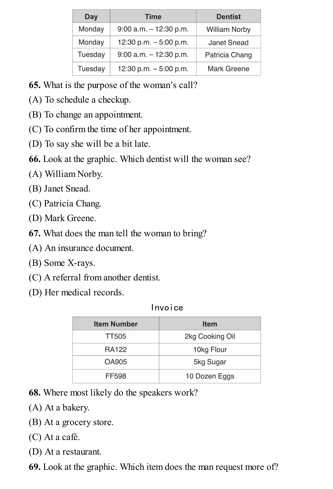

**听力独白/对话原文：**
**W:** Hello. This is Cindy Wells. I've got an appointment with a dentist tomorrow at 3:30 p.m., but I'm in lots of pain. Is it possible to see someone today? (65)
**M:** I'm sorry to hear that, Ms. Wells. According to the schedule, we have one open slot today. It's at 1:00 p.m. (66) However, it won't be with your regular dentist.
**W:** That's fine. I don't believe I can wait until tomorrow.
**M:** Okay, I'll go ahead and cancel your Tuesday appointment then. (66) Oh, could you please bring your insurance card? (67)
**W:** Why do you need it? I thought you already had my records.
**M:** We're upgrading the computer system today, so we can't go online until tomorrow. Dental Clinic Schedule

**中文对照：**
> **W：**您好。我是辛迪·维尔斯。我预约了明天下午3点半看牙医，但是我现在疼得厉害，今天有可能看医生吗？
> **M：**听到这个消息，我表示很同情，维尔斯女士。根据日程安排，今天我们还有个时间段没有约满，时间是下午1点。不过，出诊的不是您平时的牙医。
> **W：**可以的。我觉得我等不到明天了。
> **M：**好的，我这就把您周二的预约取消。哦，请把您的医保卡带上。
> **W：**为什么需要医保卡？我想你们已经有我的医保记录了。
> **M：**今天我们的电脑正在升级系统，所以，我们明天才能上网。牙医诊所日程安排

**核心词汇与短语：**
- **appointment**：安排，预约
- **dentist**：牙医
- **slot**：（节目或时间表里的）时间段
- **regular**：常规的，经常的
- **cancel**：取消
- **insurance**：保险
- **upgrade**：升级

#### Q65 (正确答案：B)
**问题：** What is the purpose of the woman's call? (女士打电话的目的是什么？)
- (A) To schedule a checkup. (预约体检。)
- (B) To change an appointment. (更改预约。)
- (C) To confirm the time of her appointment. (确认预约时间。)
- (D) To say she will be a bit late. (表示她要晚到一会儿。)

#### Q66 (正确答案：B)
**问题：** Look at the graphic. Which dentist will the woman see? (请看图表，女士将会看哪一位牙医？)
- (A) William Norby. (威廉姆 · 诺比。)
- (B) Janet Snead. (珍妮特 · 斯尼德。)
- (C) Patricia Chang. (帕特丽夏 · 张。)
- (D) Mark Greene. (马克 · 格林尼。)

#### Q67 (正确答案：A)
**问题：** What does the man tell the woman to bring? (男士告诉女士带上什么？)
- (A) An insurance document. (医保证件。)
- (B) Some X-rays. (一些 X 光片。)
- (C) A referral from another dentist. (另一位牙医的诊断参考。)
- (D) Her medical records. (她的就诊记录。)

**延伸表达与补充：**
- **make an appointment = have an appointment** (预约)
  - *例句：You should phone his secretary if you want to make an appointment.* (如果你想预约，你应当给他的秘书打电话。)

### Questions 68 - 70

**听力独白/对话原文：**
**M:** Deanna, you picked up the order from the grocery store, right?
**W:** That's correct. I went in the morning before I showed up for work. Is there a problem?
**M:** Yeah, it looks like we didn't get enough flour. There were only ten kilograms in the box. (69) That's not enough to bake all the cakes and cookies which our customers ordered today. (68)
**W:** Keith told me that was how much we needed. I guess he made a mistake.
**M:** Actually, we need double that amount. (69) Would you mind going back and purchasing some more? Be sure to get a receipt so I can pay you back. (70)
**W:** All right. I should return in half an hour. Invoice

**中文对照：**
> **M：**迪安娜，你从杂货店提取了订购的货物，是吧？
> **W：**是的。我早上上班之前去了趟那里，有什么问题吗？
> **M：**对，我们的面粉好像不够了。箱子里只剩下10公斤，不够烤制今天顾客订购的所有蛋糕和饼干。
> **W：**基思跟我说我们就需要那么多。我猜他弄错了。
> **M：**其实，我们需要双倍的量。你介意回去一趟，再多买一些吗？记着要收据，我好给你报销。
> **W：**好的。我半个小时后就回来。发票

**核心词汇与短语：**
- **pick up**：取，拿
- **grocery store**：杂货店
- **show up**：露面
- **bake**：烤，烘焙
- **cookie**：饼干
- **customer**：顾客，客户
- **purchase**：购买
- **receipt**：收据

#### Q68 (正确答案：A)
**问题：** Where most likely do the speakers work? (说话者们最可能在哪里工作？)
- (A) At a bakery. (面包店。)
- (B) At a grocery store. (杂货店。)
- (C) At a café. (咖啡馆。)
- (D) At a restaurant. (餐馆。)

#### Q69 (正确答案：B)
**问题：** Look at the graphic. Which item does the man request more of? (对照图表，男士要求多买一些的是哪一种商品？)
- (A) TT505. (TT505 。)
- (B) RA122. (RA122 。)
- (C) OA905. (OA905 。)
- (D) FF598. (FF598 。)

#### Q70 (正确答案：C)
**问题：** What does the man tell the woman to do? (男士告诉女士要做什么？)
- (A) Call the grocery store. (给杂货店打电话。)
- (B) Order something online. (在网上订购一些物品。)
- (C) Ask for a receipt. (要收据。)
- (D) Pay with a credit card. (用信用卡付款。)

**延伸表达与补充：**
- **make a mistake = make an error** (犯错，弄错)
  - *例句：It is hard not to make a mistake in any test.* (在任何考试中，不犯错是很难的。)

## Part 4: 简短独白 (Q71 - Q100)

### Questions 71 - 73

**听力独白/对话原文：**
Welcome to Yellow Submarine Apartments. We are going to give you a guided tour of this new seaside apartment complex, which incorporates many radical new architectural and lifestyle innovations. Whether you are interested in buying a retirement or holiday home, a main residence, or even an investment property, we at the Yellow Submarine Consortium can offer you some stunning properties at excellent prices. (71) Let's move into the foyer. Here and in the basement car park, friendly security staff members ensure your complete security twenty-four hours a day. (72) As you can see from the foyer, only the finest quality materials have been used in combination with the superb design. All the apartments, even on the first floor, have views over the ocean. (72) Okay, let's take the elevator to our display apartment on the eighth floor. (73)

**中文对照：**
> 欢迎来到黄色潜艇公寓。我们将带您参观一下这座新建的海滨公寓楼，它融入了许多重大的且新颖的建筑和生活方式上的创新。不管您是想买养老房还是度假房，主要居所还是投资性房产，我们黄色潜艇财团都能为您提供一些价格优惠的绝佳房产。让我们进入大厅。在这里以及地下停车场，友好的保安们会保证您一天24小时的绝对安全。您从大厅可以看得出来，我们只用最优质的材料，并使之与一流的设计相结合。所有的公寓（即使是在一楼），都可以看到海景。好的，现在让我们乘电梯去8层的样板公寓。

**核心词汇与短语：**
- **guided tour**：有导游的参观
- **seaside**：海滨的
- **incorporate**：融入
- **radical**：激进的；重大的
- **architectural**：建筑的
- **innovation**：创新，革新
- **retirement home**：养老房
- **holiday home**：度假房
- **property**：房产
- **stunning**：极好的
- **foyer**：大厅
- **friendly**：友好的
- **security**：安全
- **ensure**：确保
- **combination**：结合，联合
- **superb**：极好的，一流的
- **architect**：建筑师
- **tenant**：租户
- **round-the-clock 24**：小时的，全天候的
- **breathtaking**：惊人的，心旷神怡的
- **first-rate**：一流的
- **unit**：单元

#### Q71 (正确答案：D)
**问题：** Who is the intended audience of this talk? (讲话的目标听众是谁？)
- (A) The architects. (建筑师。)
- (B) The security staff. (保安。)
- (C) The apartment tenants. (公寓的房客。)
- (D) Would-be homebuyers. (潜在的购房者。)

#### Q72 (正确答案：D)
**问题：** Which of the following is NOT part of the new apartment complex? (下列哪项不是新公寓楼的一部分？)
- (A) Round-the-clock security. (24 小时保安。)
- (B) A breathtaking view of the sea. (令人心旷神怡的海景。)
- (C) A first-rate design. (一流的设计。)
- (D) A large balcony in each unit. (每个单元的大阳台。)

#### Q73 (正确答案：B)
**问题：** Where will they head next? (他们将前往哪里？)
- (A) To the ground-floor lobby. (到底层的大厅。)
- (B) To the eighth-floor apartment. (到 8 层的公寓。)
- (C) To the basement garage. (到地下车库。)
- (D) To the front yard. (到前院。)

**延伸表达与补充：**
- **can offer you some stunning properties at excellent prices = can provide you with some excellent properties at amazing prices = can propose some great properties at very reasonable prices** (能为您提供一些价格优惠的绝佳房产)
  - *例句：You are very lucky because we can offer you some stunning properties at excellent prices.* (您非常幸运，因为我们能为您提供一些价格优惠的绝佳房产。)
- **Only the finest quality materials have been used. = Only the best quality materials have been used. = Only the top quality materials have been used.** (只有最优质的材料才会被使用。)
  - *例句：You will be glad to know that only the finest quality materials have been used to make the products.* (你将会很高兴地得知，只有最优质的材料才会被用来制造这些产品。)

### Questions 74 - 76

**听力独白/对话原文：**
The CTV annual speech contest is a prestige competition with a tradition going back twenty-five years. (74) The winner of the first competition, held in 1981, was Brian McAdams, (75) now a well-known television journalist and anchorman for CTV. We'd like to remind you that the highest standards will be expected of all contestants at all times. However, we'd also like to say that the benefits of participating are enormous even if you don't win. A pre-competition round of selections will be held here next Monday—that's June the sixth— beginning at 8:00 p.m. So, please fill in your entry form, and we'll see you back here next Monday. (76) Thanks! CTV

**中文对照：**
> 年度演讲比赛是一个享有盛誉的比赛，有着25年的传统。布赖恩·麦克亚当斯是1981年第一届比赛的冠军，他现在是CTV著名的电视记者和新闻节目主播。我们想提醒大家，所有的参赛者在任何时候都要表现出最高的水准。不过，我们也还是想说，即使你在比赛中不能获胜，参加这项比赛的收获还是很多的。赛前选拔环节将于下星期一——也就是6月6日在这里举行，选拔从晚上8点开始。所以请填写报名表，下星期一在这里见。谢谢！

**核心词汇与短语：**
- **prestige**：威望，声望
- **competition**：比赛，竞赛
- **tradition**：传统
- **journalist**：记者
- **anchorman**：新闻节目（男）主播
- **contestant**：选手
- **at all times**：一直
- **enormous**：巨大的
- **round**：环节
- **entry form**：报名表
- **judge**：评委
- **compete in ~**：参加比赛
- **in person**：亲自

#### Q74 (正确答案：D)
**问题：** How old is the speech contest? (这项演讲比赛有多久的历史了？)
- (A) One year old. (1 年。)
- (B) Five years old. (5 年。)
- (C) Ten years old. (10 年。)
- (D) Twenty-five years old. (25 年。)

#### Q75 (正确答案：C)
**问题：** What does the speaker imply when he says, “The winner of the first competition, held in 1981, was Brian McAdams”? (讲话者说 “ 布赖恩 · 麦克亚当斯是 1981 年第一届比赛的冠军 ” ，他在暗示什么？)
- (A) Brain's dream is to become a news anchor. (布莱恩的梦想是成为一名新闻节目主持。)
- (B) Brain will be one of the judges at the contest. (布莱恩将成为比赛的评委之一。)
- (C) Brain competed in the first ever contest. (布莱恩参加了第一届比赛。)
- (D) Brain has been the host of the contest since the first show. (从第一期节目开始，布赖恩就是这项比赛的主持人。)

#### Q76 (正确答案：B)
**问题：** What should those who wish to participate in the contest do? (那些想参加比赛的人应该做什么？)
- (A) Come down to the station in person. (亲自到电视台来。)
- (B) Fill out a document. (填写一份文件。)
- (C) Call the television station. (给电视台打电话。)
- (D) Log on to the website. (登录网站。)

**延伸表达与补充：**
- **with a tradition going back twenty-five years = with a tradition dating back twenty-five years = with a twenty-five year tradition** (有着25年的传统)
- **a well-known television journalist and anchorman for CTV = a famous television journalist and anchorman for CTV = an acclaimed television journalist and anchorman for CTV** (中视著名的电视记者和新闻节目主播)

### Questions 77 - 79

**听力独白/对话原文：**
Hi, Mark. I've been trying to contact you by e-mail, but for some reason you have not responded. (77) This is Julie, the secretary of the Choral Society. I hope you receive this message in time. We've had to cancel tonight's rehearsal at the last minute. (78) If for some reason you don't get this message tonight, I apologize—there won't be anybody else at the hall this evening. I hope you understand that our conductor is unable to attend because of some urgent family business, (79) and we've decided to postpone the rehearsal until next week. I can't really give you any more details at the moment, but I'll let you know in the next few days. See you soon.

**中文对照：**
> 你好，马克。我一直试着通过电子邮件联系你，但是由于某种原因你还没有回复。我是合唱协会的秘书朱莉。我希望你能及时收到这条留言。在最后一刻我们不得不取消今天晚上的排练。如果出于某种原因今晚你没收到这条信息，我向你道歉——今天晚上大厅里不会有其他人的。我希望你能理解，我们的指挥因为一些紧急的家事无法来了。我们已经决定把排练推迟到下星期。现在我真的不能提供更多的详情，但是过几天我会让你知道的。再见。

**核心词汇与短语：**
- **respond**：回复
- **in time**：及时
- **at the last minute**：在最后一刻
- **conductor**：指挥
- **urgent**：紧急的
- **postpone**：推迟
- **detail**：细节
- **whereabouts**：行踪，下落
- **affair**：事情

#### Q77 (正确答案：B)
**问题：** How did the woman first try to get in contact with Mark? (女士一开始试图通过什么方式联系马克？)
- (A) By phone. (通过电话。)
- (B) By e-mail. (通过电子邮件。)
- (C) By mail. (通过信件。)
- (D) By fax. (通过传真。)

#### Q78 (正确答案：A)
**问题：** What is the message mainly about? (这则留言主要是关于什么的？)
- (A) The cancellation of their meeting tonight. (取消他们今晚的集会。)
- (B) A new addition to their choral group. (他们合唱团的一个新成员。)
- (C) The conductor's wish to meet more regularly. (指挥希望他们能更频繁地见面。)
- (D) The last minute details before the performance. (演出前最后的细节。)

#### Q79 (正确答案：B)
**问题：** What happened to the conductor? (指挥遇到什么事情？)
- (A) No one knows his whereabouts. (没有人知道他的行踪。)
- (B) He had to attend to some personal affairs. (他必须去处理一些个人事务。)
- (C) He has been waiting in the hall for a long time. (他在大厅里等了很长时间。)
- (D) He has not attended any of the rehearsals. (他从来没有参加过任何排练。)

**延伸表达与补充：**
- **For some reason you have not responded. = For an unknown reason you have not provided an answer. = For a certain reason you have not gotten back to me.** (由于某种原因你还没有回复。)
  - *例句：I have left several messages on your answering machine regarding the order, but for some reason you have not responded yet.* (关于订单，我在你的电话答录机上留了几次言，但是由于某种原因你还没有回复。)
- **at the last minute = at the last second = at the last moment** (在最后一刻)
  - *例句：I changed my mind at the last minute.* (我在最后一刻改变了主意。)
- **We've decided to postpone the rehearsal.** (我们已经决定推迟排练。扩展表达：)
  - *例句：We've decided to hold off the rehearsal for a while. We've decided to put off the rehearsal until another time.* (我们已经决定暂时推迟排练。我们已经决定把排练推迟到其他时间。)

### Questions 80 - 82

**听力独白/对话原文：**
Tonight truly marks a milestone in the history of this association. When it was created 100 years ago with the intention of encouraging the conservation of English culture, (80) who would have thought that it would not only survive but also prosper until the present day? From one club with 36 members meeting in one venue in England, we have grown into a nationwide association of 50 clubs with over 600 members. (81) And the annual prize for a special contribution to English culture, which has been made possible by the generosity of our local businessmen, has become one of the nation's most prestigious awards. (82)

**中文对照：**
> 今晚的确是本协会历史上里程碑式的时刻。当100年前为鼓励保护英国文化创建本协会时，谁会想到这个协会不仅能存活到今天，而且还一直在蓬勃发展？它从最初拥有36名会员、在英格兰某处聚会的俱乐部，发展成为拥有超过600名会员、50个俱乐部的全国性协会。由我们本地商人慷慨资助的年度英国文化特别贡献奖已经成为国家最有声望的奖项之一。

**核心词汇与短语：**
- **truly**：确实地，的确
- **mark**：标志
- **milestone**：里程碑
- **association**：协会
- **intention**：目的
- **encourage**：鼓励
- **conservation**：保护
- **survive**：活下来
- **prosper**：繁荣，昌盛
- **venue**：集合地
- **nationwide**：全国性的
- **contribution**：贡献
- **generosity**：慷慨
- **prestigious**：有声望的
- **preserve**：保护
- **custom**：（社会）习俗
- **playtime**：娱乐时间

#### Q80 (正确答案：A)
**问题：** What was the original purpose in creating this club? (创建这个俱乐部的最初目的是什么？)
- (A) To preserve English custom. (保护英国的社会习俗。)
- (B) To provide playtime for the rich. (为富人提供娱乐。)
- (C) To encourage people to compete. (鼓励人们相互竞争。)
- (D) To introduce businessmen to each other. (介绍商人们相互认识。)

#### Q81 (正确答案：D)
**问题：** How many members does the club now have? (俱乐部现在有多少名会员？)
- (A) 36. (36 名。)
- (B) 50. (50 名。)
- (C) 100. (100 名。)
- (D) Over 600. (超过 600 名。)

#### Q82 (正确答案：A)
**问题：** Who sponsors the nation's most prestigious awards? (赞助这一全国最具声望的奖项的是谁？)
- (A) Local businessmen. (当地的商人。)
- (B) The government. (政府。)
- (C) The club president. (俱乐部主席。)
- (D) The members. (会员们。)

**延伸表达与补充：**
- **Tonight truly marks a milestone in the history of this association.** (今晚的确是本协会历史上里程碑式的时刻。扩展表达：)
  - *例句：Tonight is really special in the association's long history. This evening clearly characterizes the achievements we have made in our association's long history.* (今晚的确是本协会悠久历史上一个特别的时刻。无疑，今晚体现了我们协会在其悠久历史中所取得的成就。)
- **with the intention of ~ = with the meaning to ~ = with the purpose of ~** (为了…，怀着…的目的)
  - *例句：I came here with the intention of winning your vote today.* (我今天来的目的是为了赢得你们的选票。)
- **Who would have thought that ~? = Who could have guessed that ~? = Who could have imagined that ~?** (谁能想到…？)
  - *例句：Who would have thought that I would be standing here talking about my achievements in front of all of you?* (谁能想到我会站在你们所有人面前谈论我的成就呢？)

### Questions 83 - 85

**听力独白/对话原文：**
Welcome to the Goldfields Tour! We have about a one-hour bus trip through beautiful rolling hills before we reach the first stop on our tour, (83) the picturesque and historic town of Daylesford. When we reach Daylesford, I suggest that we simply stroll around the old town for around thirty minutes to an hour. Daylesford was founded at the time of the first gold rush and is largely unchanged (84) since the boom period of the 1880s. Why don't you stop at one of the famous bakeries on the main street for some delicious coffee and cakes? (85) Return to the bus by 11:00 a.m., and we will proceed with the rest of the tour. Thank you.

**中文对照：**
> 欢迎参加金地之旅！旅途的第一站是风景如画、历史悠久的戴尔斯福德城，在此之前，我们要坐约一个小时的巴士，沿途可以欣赏连绵起伏的美丽丘陵。到了戴尔斯福德，我建议大家围绕这座老城逛30分钟到1小时左右。戴尔斯福德建造于第一次淘金热的时候，从19世纪80年代的繁荣时期以来大体上就没有什么变化。你们为什么不顺便去主街上一家有名的面包店品尝美味的咖啡和蛋糕呢？上午11点之前请回到巴士，我们将继续下面的旅程。谢谢。

**核心词汇与短语：**
- **rolling**：连绵起伏的
- **picturesque**：风景如画的
- **stroll**：闲逛，溜达
- **gold rush**：淘金热
- **boom**：繁荣，景气
- **proceed**：继续
- **destination**：目的地，终点
- **bottom**：底部
- **resemble**：像，类似
- **seclude**：使隔离，使孤立

#### Q83 (正确答案：D)
**问题：** When will they arrive at their first destination? (他们将于什么时候到达第一个目的地？)
- (A) In ten minutes. (10 分钟后。)
- (B) In twenty minutes. (20 分钟后。)
- (C) In thirty minutes. (30 分钟后。)
- (D) In about sixty minutes. (大约 1 小时后。)

#### Q84 (正确答案：B)
**问题：** What does the speaker mention about Daylesford? (关于戴尔斯福德，讲话人提到了什么？)
- (A) It is at the bottom of a hill. (它在一座山的山脚下。)
- (B) It still resembles the gold rush days. (它依然很像淘金热时代的样子。)
- (C) It has become a large city. (它已经变成了一座大城市。)
- (D) It is secluded from other cities. (它与其他城市隔绝。)

#### Q85 (正确答案：A)
**问题：** What does the speaker mean when he says, “Why don't you stop at one of the famous bakeries”? (讲话者说 “ 你们为什么不顺便去一家有名的面包店呢 ” ，是想表达什么意思？)
- (A) The listeners should drop by the bakeries. (听众应该顺便去一下面包店。)
- (B) The listeners should check out the hills. (听众应该看看这里的丘陵。)
- (C) The listeners should buy some cheap gold. (听众应该买一些便宜的金子。)
- (D) The listeners should check out the historical building. (听众应该看看历史建筑。)

**延伸表达与补充：**
- **simply stroll around = casually walk around = freely get around** (在周围随意逛逛)
  - *例句：You will have an hour to simply stroll around the museum at your leisure.* (空闲时你有1个小时的时间在博物馆周围随意逛逛。)
- **We will proceed with the rest of the tour. = We will continue on with the rest of the tour. = We will go ahead with the rest of the tour.** (我们将继续下面的旅程。)

### Questions 86 - 88

**听力独白/对话原文：**
Excuse me, ladies and gentlemen. I hope you enjoyed your meal. Personally, I found it to be an absolute feast, and I'd like to thank the organizers for their marvelous work. It's time to move on to the more formal part of the evening, which comprises the awards for journalist and photojournalist of the year. (86) This year has been a particularly dark and dangerous one for journalists working in war zones. (87) I can only say how much I admire and respect those courageous writers and photographers who have risked death and even torture in order to bring the truth to the world. Would everyone please give a big round of applause for our chief editor? He is going to present our first award. (88)

**中文对照：**
> 女士们，先生们，打扰一下。我希望这顿饭菜能合你们的胃口。就我个人而言，我觉得这绝对是一次盛宴，我要谢谢筹办方了不起的工作。现在该进行今晚较为正式的环节了，包括为年度记者和摄影记者颁奖。今年对于在战区工作的记者们来说是极其黑暗和危险的一年。我只能说我有多么钦佩和尊重那些勇敢的记者和摄影师们，他们为了把真相告诉世人，冒着死亡甚至酷刑的危险。大家可以用热烈的掌声欢迎我们的主编吗？他将给颁发我们的第一个奖项。

**核心词汇与短语：**
- **personally**：就个人而言
- **absolute**：绝对的
- **feast**：盛宴
- **organizer**：组织者
- **marvelous**：了不起的
- **formal**：正式的
- **comprise**：包含，包括
- **journalist**：记者
- **photojournalist**：摄影记者
- **particularly**：格外地
- **courageous**：勇敢的
- **torture**：酷刑，折磨

#### Q86 (正确答案：A)
**问题：** What is the purpose of the talk? (这次讲话的目的是什么？)
- (A) To present awards to the best journalists. (给最优秀的记者颁奖。)
- (B) To thank the organizer for preparing the event. (感谢筹办方为这一活动所作的筹备工作。)
- (C) To welcome the listeners to a company dinner function. (欢迎听众参加公司的盛宴。)
- (D) To reveal the truth about some war secrets. (揭示一些战争机密的真相。)

#### Q87 (正确答案：A)
**问题：** Why does the speaker say that this year has been particularly tough? (为什么讲话人说今年格外艰难？)
- (A) Many of the journalists had to go to war. (许多记者不得不赶赴战场。)
- (B) He lost some of his closest colleagues. (他失去了一些最亲密的同事。)
- (C) The newspaper company had a hard time. (报刊公司经历了困难时期。)
- (D) The writers could not write freely. (作者们不能自由地写作。)

#### Q88 (正确答案：A)
**问题：** Who is going to make the first presentation? (谁将会颁发第一个奖项？)
- (A) The head editor. (主编。)
- (B) The speaker. (讲话人。)
- (C) The event organizer. (活动的筹办方。)
- (D) One of the journalists. (其中的一位记者。)

**延伸表达与补充：**
- **Excuse me, ladies and gentlemen.** (女士们，先生们，打扰一下。扩展表达：)
  - *例句：May I have your attention, ladies and gentlemen? = Attention, ladies and gentlemen.* (女士们，先生们，请注意。)
- **It's time to move on to the more formal part of the evening. = It's time to move on to the official part of the night.** (现在该进行今晚更为正式的环节了。扩展表达：)
  - *例句：It's time to get on with the night's events.* (现在该进行今晚的活动了。)

### Questions 89 - 91

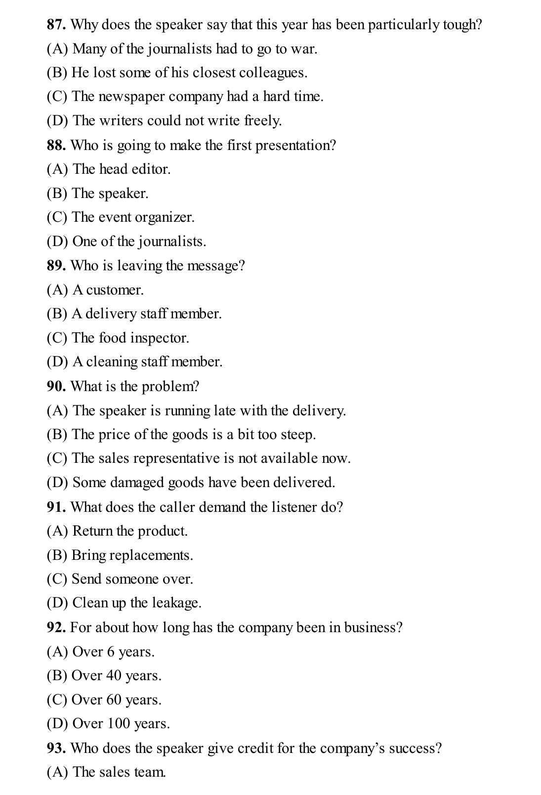

**听力独白/对话原文：**
Hello, this is Michael Kruger from Kruger's Family Delicatessen. We've just received a delivery from your company, (89) but on inspection we have found that an entire pallet of tinned anchovies has been damaged. (90) It looks like they fell at some time during transportation. Some of the tins have broken and are leaking oil. Many others are dented. We can't possibly accept them at the agreed price. We've already spent two hours cleaning up dripping oil. Either we can return them to you and you can deduct the costs from your next invoice, or we'll accept them at a substantial discount. Why don't you send a sales representative? (91) We need to sort this out as soon as possible. Thanks.

**中文对照：**
> 您好，我是克鲁格家庭熟食店的迈克尔·克鲁格。我们刚刚收到从贵公司发来的一批货。但是在检查时我们发现一整托盘的凤尾鱼罐头都已经坏掉了。看起来它们在运输的时候掉下来过。一些罐头盒已经摔坏了，正在漏油。许多其他的罐头盒凹了下去。我们不能按原来商定的价格接受它们。我们已经花了两个小时清洗滴下来的油。要么我们把货物寄回给你们，你们可以在下一次的发票上扣除这次的成本，要么给我们多打些折扣以便我们接受。你们为什么不派一个销售代表过来呢？我们需要尽快解决这件事情。谢谢。

**核心词汇与短语：**
- **delicatessen**：熟食店
- **inspection**：检查
- **entire**：全部的
- **pallet**：（装卸、搬运货物用的）托盘，货板，集装架
- **tinned**：罐头的，听装的
- **anchovy**：凤尾鱼
- **transportation**：运输
- **leak**：泄漏
- **dent**：凹陷
- **clean up**：清理
- **drip**：滴下
- **deduct**：扣除
- **substantial**：大量的
- **sort out**：解决
- **steep**：（价格等）过高的，不合理的
- **replacement**：替代品
- **leakage**：泄漏物

#### Q89 (正确答案：A)
**问题：** Who is leaving the message? (谁在留言？)
- (A) A customer. (顾客。)
- (B) A delivery staff member. (货运工。)
- (C) The food inspector. (食品检查员。)
- (D) A cleaning staff member. (清洁工。)

#### Q90 (正确答案：D)
**问题：** What is the problem? (问题是什么？)
- (A) The speaker is running late with the delivery. (讲话人送货晚点了。)
- (B) The price of the goods is a bit too steep. (货物的价格有点过高了。)
- (C) The sales representative is not available now. (销售代表现在不在。)
- (D) Some damaged goods have been delivered. (一些损坏的货物被运了过来。)

#### Q91 (正确答案：C)
**问题：** What does the caller demand the listener do? (打电话的人让听者做什么？)
- (A) Return the product. (退回商品。)
- (B) Bring replacements. (拿来替代品。)
- (C) Send someone over. (派人过来。)
- (D) Clean up the leakage. (把泄漏物清理掉。)

**延伸表达与补充：**
- **We've just received a delivery from your company. = We've just gotten the products delivered from your firm. = We just got the order delivered from your company.** (我们刚刚收到从贵公司发来的一批货。)
- **but on inspection = but while checking = but when we were looking over** (但是（我们）在检查时)
  - *例句：The products were delivered but on inspection we found some broken items.* (产品被送过来了，但是我们在检查时发现其中一些已经破损。)
- **We need to sort this out as soon as possible. = We need to solve this as soon as possible. = We need to find a solution for this as soon as possible.** (我们需要尽快解决这件事情。)

### Questions 92 - 94

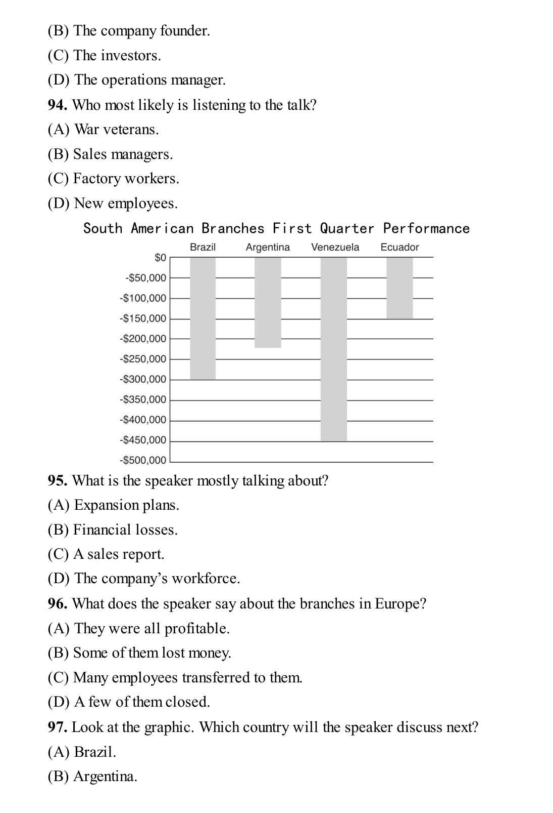

**听力独白/对话原文：**
Our Sales Department has a particularly proud record since the founding of the company in 1946. (92) Starting out just after the Second World War, our company employed three traveling salesmen and a national sales manager to expand our operations aggressively throughout North America. Of course, we couldn't have done that without top quality products to sell. On the other hand, without sales and a hungry sales staff, the company would not have been able to survive, let alone expand as it has done in the last sixty years. (93) You have been chosen from a field of sixty applicants to continue that tradition, (94) and we have faith that through your energy and positive attitude we will be able to continue our expansion to markets all over the world.

**中文对照：**
> 从公司1946年成立以来，我们销售部取得了特别值得骄傲的成绩。我们公司在二战结束不久创建的时候，雇用了三名旅行推销员和一名全国销售经理，将我们的经营范围扩张到整个北美洲。当然，没有最优质的产品出售，我们也不会取得这样的成绩。但从另外一方面来说，如果没有销售部和积极的销售人员，公司根本就不可能生存下来，更不用说在过去60年间所做的扩张了。我们从60名应聘者中挑了你们去延续这一传统。我们相信通过你们的努力和积极的态度我们一定能将市场扩大到全世界。

**核心词汇与短语：**
- **particularly**：特别地
- **proud**：骄傲的
- **traveling**：旅行的
- **national**：全国的
- **operation**：经营；营运
- **aggressively**：积极地，有闯劲地
- **top quality**：一流的质量
- **on the other hand**：另一方面
- **survive**：生存
- **applicant**：应聘者
- **tradition**：传统，惯例
- **faith**：信心，信念
- **positive**：积极的
- **attitude**：态度
- **credit**：功劳
- **founder**：缔造者，创造人
- **veteran**：老兵

#### Q92 (正确答案：C)
**问题：** For about how long has the company been in business? (公司已经运营多久了？)
- (A) Over 6 years. (6 年多。)
- (B) Over 40 years. (40 多年。)
- (C) Over 60 years. (60 多年。)
- (D) Over 100 years. (100 多年。)

#### Q93 (正确答案：A)
**问题：** Who does the speaker give credit for the company's success? (谁最有可能在听这个讲话？)
- (A) The sales team. (退伍军人。)
- (B) The company founder. (销售经理。)
- (C) The investors. (工厂工人。)
- (D) The operations manager. (新雇员。)

#### Q94 (正确答案：D)
**问题：** Who most likely is listening to the talk? (讲话者把公司的成功归功于谁？)
- (A) War veterans. (销售团队。)
- (B) Sales managers. (公司的创始人。)
- (C) Factory workers. (投资人。)
- (D) New employees. (运营经理。)

**延伸表达与补充：**
- **on the other hand** (另一方面扩展表达：)
  - *例句：on the contrary = in opposition On the other hand, we could always come back a day earlier.* (与此相反，反之另一方面，我们总是可以早一天回来。)
- **We have faith that ~ = We believe that ~ = We trust that ~** (我们相信…)
  - *例句：We have faith that you will do well at your assigned job.* (我们相信你会做好分配给你的工作。)

### Questions 95 - 97

**听力独白/对话原文：**
Thank you for coming to this meeting, everyone. We need to discuss the sales data from the first quarter which was released this morning. (95) Our branches in Europe and Asia did exceptionally well. Every single one of them turned a profit in the last three months. (96) As for our American and Canadian branches, they were mostly profitable as only a couple places lost money. Now, as for our South American branches, we didn't do as well as we had hoped. Take a look at this chart here. I'd like to discuss each country individually, starting with the one which lost the greatest amount of money. (97) South American Branches First Quarter Performance

**中文对照：**
> 感谢大家来出席本次会议。下面，我们需要讨论一下今天早上公布的第一季度销售数据。集团在欧洲和亚洲的分公司做得非常出色。过去三个月以来，欧洲和亚洲的每一家分公司都处于盈利状态。同时，位于美国和加拿大的分公司基本上也处于盈利状态，仅在少数地区公司存在亏损。相比之下，我们在南美洲的分公司则表现得有些不尽人意。我们不妨来看一下下列图表。我想逐一讨论和这几个国家的情况，先从亏损最严重的开始吧。南美国家分公司第一季度销售情况

**核心词汇与短语：**
- **the first quarter**：第一季度
- **release**：公布
- **branch**：分公司
- **exceptionally**：极其，非常
- **profitable**：盈利的
- **individually**：单独地

#### Q95 (正确答案：C)
**问题：** What is the speaker mostly talking about? (说话人主要在说什么？)
- (A) Expansion plans. (扩张计划。)
- (B) Financial losses. (经济损失。)
- (C) A sales report. (销售报告。)
- (D) The company's workforce. (公司的全体人员。)

#### Q96 (正确答案：A)
**问题：** What does the speaker say about the branches in Europe? (关于欧洲的分公司，说话者说了什么？)
- (A) They were all profitable. (全部处于盈利状态。)
- (B) Some of them lost money. (有些处于亏损状态。)
- (C) Many employees transferred to them. (很多员工调到了那里。)
- (D) A few of them closed. (一些关门了。)

#### Q97 (正确答案：C)
**问题：** Look at the graphic. Which country will the speaker discuss next? (请看图表，说话人接下来要讨论哪一个国家？)
- (A) Brazil. (巴西。)
- (B) Argentina. (阿根廷。)
- (C) Venezuela. (委内瑞拉。)
- (D) Ecuador. (厄瓜多尔。)

**延伸表达与补充：**
- **take a look at = have a look at = have a glance at = get a load of** (看一下)
  - *例句：She was greatly tempted to take a look at it.* (她非常想看一看。)

### Questions 98 - 100

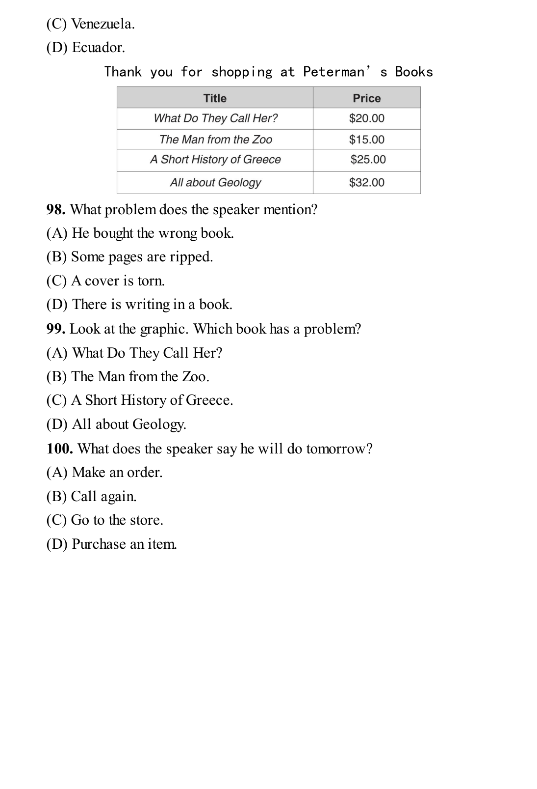

**听力独白/对话原文：**
Hello. My name is Richard Armstrong. You may recall that I picked up a few books at your store this afternoon. I need to report a slight problem with one. When I opened the plastic wrapper to read the book, I noticed that several pages in it were torn. (98) Since it cost me $25, (99) I'd really like to have my money refunded or receive a brand-new copy. I'll be visiting the store again tomorrow with the book, (100) but I thought that I ought to call ahead of time so that you'll be expecting me. Thanks a lot. Goodbye. Thank you for shopping at Peterman's Books

**中文对照：**
> 您好，我叫理查德·阿姆斯特朗。或许您还记得，我今天下午在您的店里挑了几本书。其中一本书有点儿小问题。我打开塑料包装想要看书的时候，注意到里面有几页破损了。毕竟这本书是我花了25美元买的，所以非常希望您能全额退款或者再给我一本全新的书。明天我会把这本书带到店里，不过在此之前，我想还是应该先给您打个电话，这样您会知道我要过去。谢谢您，明天见。感谢您光临彼得曼书店

**核心词汇与短语：**
- **recall**：回忆起
- **pick up**：买到；捡起
- **plastic wrapper**：塑料包装
- **refund**：退款
- **brand-new**：全新的
- **ahead of time**：提前

#### Q98 (正确答案：B)
**问题：** What problem does the speaker mention? (说话人提到了什么问题？)
- (A) He bought the wrong book. (他买错书了。)
- (B) Some pages are ripped. (有些页撕破了。)
- (C) A cover is torn. (封皮有破损。)
- (D) There is writing in a book. (书中有字迹。)

#### Q99 (正确答案：C)
**问题：** Look at the graphic. Which book has a problem? (对照图表，哪本书有问题？)
- (A) What Do They Call Her? (《他们叫她什么？》。)
- (B) The Man from the Zoo. (《这个男人来自动物园》。)
- (C) A Short History of Greece. (《希腊简史》。)
- (D) All about Geology. (《地质学大发现》。)

#### Q100 (正确答案：C)
**问题：** What does the speaker say he will do tomorrow? (说话人说他明天会做什么？)
- (A) Make an order. (下订单。)
- (B) Call again. (再打一次电话。)
- (C) Go to the store. (去书店。)
- (D) Purchase an item. (买一件东西。)

**延伸表达与补充：**
- **ahead of time = in advance** (提前)
  - *例句：If there is any change about the time of the meeting, please notify us in advance.* (开会时间如有变，请提前告知我们。)

# TEST 10

## 答案速查表

| 题号 | 答案 | 题号 | 答案 | 题号 | 答案 | 题号 | 答案 | 题号 | 答案 | 题号 | 答案 | 题号 | 答案 | 题号 | 答案 | 题号 | 答案 | 题号 | 答案 |
| :---: | :---: | :---: | :---: | :---: | :---: | :---: | :---: | :---: | :---: | :---: | :---: | :---: | :---: | :---: | :---: | :---: | :---: | :---: | :---: |
| **1** | A | **11** | B | **21** | A | **31** | B | **41** | B | **51** | B | **61** | A | **71** | B | **81** | B | **91** | B |
| **2** | B | **12** | C | **22** | C | **32** | B | **42** | A | **52** | B | **62** | C | **72** | A | **82** | D | **92** | D |
| **3** | D | **13** | A | **23** | C | **33** | A | **43** | C | **53** | A | **63** | B | **73** | C | **83** | A | **93** | B |
| **4** | A | **14** | B | **24** | A | **34** | B | **44** | C | **54** | A | **64** | D | **74** | B | **84** | C | **94** | C |
| **5** | B | **15** | C | **25** | C | **35** | A | **45** | B | **55** | C | **65** | D | **75** | A | **85** | C | **95** | B |
| **6** | C | **16** | B | **26** | C | **36** | A | **46** | B | **56** | D | **66** | B | **76** | D | **86** | C | **96** | A |
| **7** | B | **17** | C | **27** | A | **37** | B | **47** | D | **57** | B | **67** | C | **77** | A | **87** | C | **97** | A |
| **8** | A | **18** | A | **28** | C | **38** | A | **48** | C | **58** | B | **68** | A | **78** | A | **88** | D | **98** | A |
| **9** | C | **19** | B | **29** | A | **39** | D | **49** | C | **59** | C | **69** | C | **79** | A | **89** | C | **99** | C |
| **10** | C | **20** | C | **30** | A | **40** | A | **50** | B | **60** | B | **70** | D | **80** | A | **90** | B | **100** | A |

## Part 1: 照片描述 (Q1 - Q6)

### Q1 (正确答案：A)

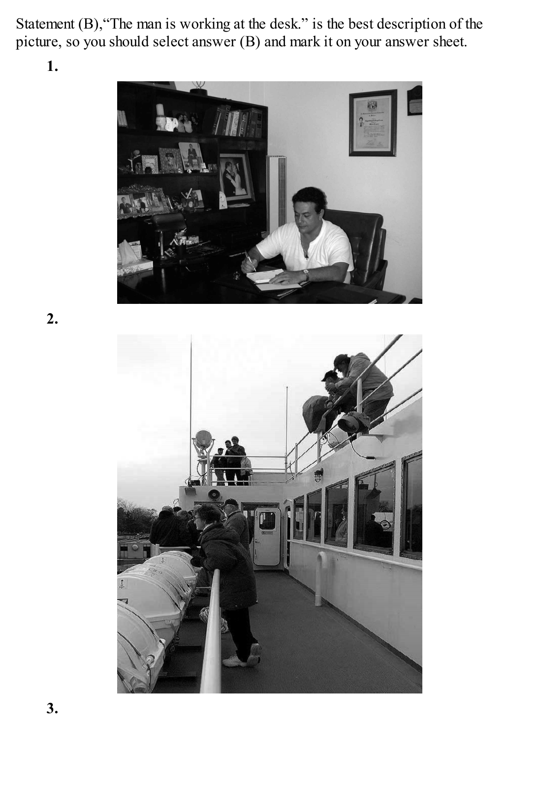

**听力原文与选项：**
- (A) He is sitting near the corner. (他正坐在角落附近。)
- (B) He is wearing a long-sleeved shirt. (他穿着一件长袖衬衫。)
- (C) He is riding in his car. (他在开他的汽车。)
- (D) He is folding the paper in half. (他在将纸对折。)

**其他可能表达：**
- He is writing in his notebook. (他在他的笔记本上写字。)
- He is using a pen to jot something down. (他正用钢笔记录着什么。)
- The man is busy writing in his notepad. (男士正忙着在他的笔记本上写字。)

### Q2 (正确答案：B)

**听力原文与选项：**
- (A) She's fishing off the edge of the boat. (女士正在船边钓鱼。)
- (B) She's leaning against a railing. (女士正靠在栏杆上。)
- (C) She's out for a walk on a trail. (女士正在小路上散步。)
- (D) She's bending over to pick up something. (女士正在弯腰捡东西。)

**其他可能表达：**
- She is holding on to the railing. (她正抓着栏杆。)
- Some people are standing close to the railing. (一些人正站在栏杆附近。)
- The people have boarded a ship. (人们已经上了船。)

### Q3 (正确答案：D)

**听力原文与选项：**
- (A) One woman is reserving a room at the hotel. (一位女士正在宾馆订房间。)
- (B) The guests are checking out of their rooms. (客人们正在退房。)
- (C) The hotel clerks are standing in front of the hotel. (宾馆服务员正站在宾馆的前面。)
- (D) The lamps have been turned on. (灯已经被打开了。)

**其他可能表达：**
- The hotel clerks are helping some customers. (宾馆服务员正在为一些客人服务。)
- They're standing at the hotel front desk. (他们正站在宾馆前台旁边。)
- The room is brightly lit. (房间被照得很亮。)

### Q4 (正确答案：A)

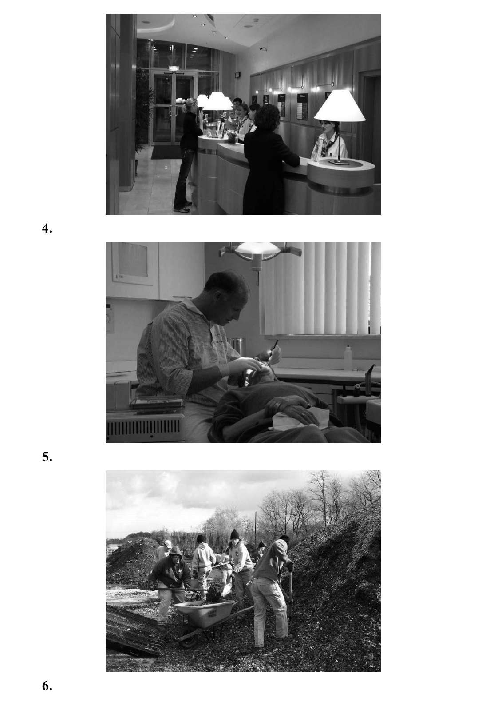

**听力原文与选项：**
- (A) The man is attending to a patient. (男士正在照顾病人。)
- (B) The patient is getting up from the chair. (病人正在从椅子上起来。)
- (C) The man is putting on his gloves. (男士正在戴手套。)
- (D) The patient is looking out the window. (病人正在朝窗外看。)

**其他可能表达：**
- The dentist is treating a patient. (牙医正在为病人治疗。)
- The patient is being worked on. (病人正在接受治疗。)
- The man is seeing a patient. (男士正在为病人看病。)

### Q5 (正确答案：B)

**听力原文与选项：**
- (A) The workers have finished for the day. (工人们做完了一天的工作。)
- (B) The men are working outdoors. (男士们正在户外工作。)
- (C) One man is pushing the wheelbarrow. (一位男士正在推手推车。)
- (D) One man is planting trees by the hillside. (一位男士正在山坡上种树。)

**其他可能表达：**
- The men are digging the earth. (男士们正在挖土。)
- The men are using shovels. (男士们正在用铲子。)
- The men are loading dirt into the wheelbarrow. (男士们正在往手推车上装土。)

### Q6 (正确答案：C)

**听力原文与选项：**
- (A) They're setting the table. (他们正在布置餐桌。)
- (B) They're ready to order their meals. (他们准备好要点餐了。)
- (C) They're conversing over a meal. (他们正在边吃边聊。)
- (D) They're talking about their colleagues. (他们正在谈论他们的同事。)

**其他可能表达：**
- They are enjoying a meal together. (他们正在一起用餐。)
- The woman is gesturing with her hands. (女士正在做手势。)
- They are both wearing eyeglasses. (他们都戴着眼镜。)
- 注：在Part 1中，每道试题都添加了3种可能的正确表达方式，考生可
- 以了解对于同样的照片可能出现的不同表达。

## Part 2: 应答测试 (Q7 - Q31)

### Q7 (正确答案：B)

**听力对话文本：**
- **Q:** Would you care for something to drink while you wait? (你在等待的时候想喝点什么吗？)
- **A:** Sure, I'll have a cup of coffee, please. (当然，请给我一杯咖啡。)

**听力原文与选项：**
- **问题：** Would you like some coffee while you wait? (你在等待的时候想喝点咖啡吗？)
- **选项：**
  - (A) Yes, two copies please. (好的，请给我两份。)
  - (B) Yes, if it's not too much trouble. (好的，如果不太麻烦的话。)
  - (C) No, I only got here five minutes ago. (不，我刚到这里五分钟。)

### Q8 (正确答案：A)

**听力对话文本：**
- **Q:** Who is handling the overseas assignment? (谁负责处理海外的工作？)
- **A:** Mr. Simpson has been put in charge of it. (辛普森先生被安排负责这项工作。)

**听力原文与选项：**
- **问题：** Who got the overseas assignment? (谁得到了海外的工作？)
- **选项：**
  - (A) Ms. Simpson did. (辛普森女士得到了。)
  - (B) That's great. (那太好了。)
  - (C) A day after tomorrow. (明天之后的某一天。)

### Q9 (正确答案：C)

**听力对话文本：**
- **Q:** When do you want me to go? (你想让我什么时候走呢？)
- **A:** How about after lunch? (吃完午饭怎么样？)

**听力原文与选项：**
- **问题：** When should I leave? (我应该什么时候动身？)
- **选项：**
  - (A) Let's say goodbye here. (我们就在这里道别吧。)
  - (B) He is on his way over. (他在过来的路上。)
  - (C) Take off right after lunch. (吃完午饭就走吧。)

### Q10 (正确答案：C)

**听力对话文本：**
- **Q:** Would you happen to have an extra key to the storage room? (你有没有多余的储藏室钥匙？)
- **A:** The caretaker should have a spare. (门房应该有备用钥匙。)

**听力原文与选项：**
- **问题：** Do you have a spare key to the storage room? (你有储藏室的备用钥匙吗？)
- **选项：**
  - (A) He usually keeps it there. (他通常把它放在那里。)
  - (B) There is plenty of room now. (现在有足够的空间。)
  - (C) Go and ask the caretaker. (去问问门房。)

### Q11 (正确答案：B)

**听力对话文本：**
- **Q:** Which do you think would be a quicker way to travel, the bus or the subway? (你觉得乘公交车或地铁哪个更快一点呢？)
- **A:** Probably the subway. (也许是地铁吧。注：在Part 2中，为帮助考生提高听懂题目的能力，添加了和试题相同或相似的表达方法。)

**听力原文与选项：**
- **问题：** Would it be faster to take the subway or bus at this time of the day? (在一天的这个时段，是乘地铁快呢，还是乘公交车快？)
- **选项：**
  - (A) I know the way there. (我知道怎么去那里。)
  - (B) I'd say the subway. (我认为是地铁快。)
  - (C) He's an hour late. (他迟到了一个小时。)

### Q12 (正确答案：C)

**听力对话文本：**
- **Q:** Which bus goes to the planetarium? (哪路公交车去天文馆呢？)
- **A:** Bus Number 12. (—12路车。)

**听力原文与选项：**
- **问题：** Where can I catch a bus to the planetarium? (我从哪里可以坐去天文馆的公交车呢？)
- **选项：**
  - (A) It will arrive in ten minutes. (它将在 10 分钟后到达。)
  - (B) He went there yesterday. (他昨天去那里了。)
  - (C) At the stop over there. (在那边的车站。)

### Q13 (正确答案：A)

**听力对话文本：**
- **Q:** Why didn't you ask for a hand? (你为什么没找人帮忙呢？)
- **A:** I wanted to do it myself. (我曾想自己做。)

**听力原文与选项：**
- **问题：** Why didn't you get some help? (你为什么不让别人帮你呢？)
- **选项：**
  - (A) I thought I could handle it on my own. (我原以为自己能处理。)
  - (B) No, but I might be able to help you out. (不，不过我也许可以帮你。)
  - (C) He didn't say anything to me. (他什么都没对我说。)

### Q14 (正确答案：B)

**听力对话文本：**
- **Q:** Are you going to Mr. Brown's retirement party? (你打算去布朗先生的退休晚会吗？)
- **A:** I'll be there an hour late. (我会晚去一小时。)

**听力原文与选项：**
- **问题：** Are you planning to go to Mr. Brown's retirement party this evening? (你打算去参加今晚布朗先生的退休晚会吗？)
- **选项：**
  - (A) He retired a year ago. (他去年退休的。)
  - (B) Yes, but I will be late. (是的，不过我可能会晚去一会儿。)
  - (C) At the big plant. (在大工厂那里。)

### Q15 (正确答案：C)

**听力对话文本：**
- **Q:** When are you thinking of asking your boss to give you a raise? (你打算什么时候和老板谈加薪的事？)
- **A:** I'll talk to him after lunch. (我会在午饭后和他谈。)

**听力原文与选项：**
- **问题：** When are you going to talk to the general manager about the raise? (你打算什么时候和总经理谈加薪的事情？)
- **选项：**
  - (A) It's generally done this way. (通常是这么做的。)
  - (B) In his big office. (在他的大办公室。)
  - (C) When he comes back from lunch. (当他吃完午饭回来时。)

### Q16 (正确答案：B)

**听力对话文本：**
- **Q:** Did you submit your report? (你交报告了吗？)
- **A:** No, I have not finished writing it. (没呢，我还没写完呢。)

**听力原文与选项：**
- **问题：** Did you turn in your report? (你交报告了吗？)
- **选项：**
  - (A) She reports directly to me. (她直接向我报告的。)
  - (B) No, I am still working on it. (没有，我还在写呢。)
  - (C) I will turn it off when I leave. (我离开的时候会把它关掉的。)

### Q17 (正确答案：C)

**听力对话文本：**
- **Q:** What do you feel like doing, watching a movie or just driving around the city? (你想做什么，看电影还是开车绕城转转？)
- **A:** I have not seen a movie in a while. (我好久没有看电影了。)

**听力原文与选项：**
- **问题：** Would you like to check out a movie or go for a drive somewhere? (你想去看电影还是想开车出去兜风呢？)
- **选项：**
  - (A) I didn't see him anyway. (我没有看到他。)
  - (B) He drove all the way here. (他一路开车过来的。)
  - (C) A movie sounds inviting. (电影听起来很吸引人。)

### Q18 (正确答案：A)

**听力对话文本：**
- **Q:** Didn't Ms. Antonio call Mark from the main office to help her reorganize the Sales Division? (安东尼奥女士是不是打电话给总公司的马克，叫他来帮她重组销售部了呢？)
- **A:** Yes, and he's been a great help. (是的，而且他帮了很大的忙。)

**听力原文与选项：**
- **问题：** Ms. Antonio brought Mark from the head office to help her reorganize the Sales Division, didn't she? (安东尼奥女士把马克从总公司请来帮她重组销售部，是吧？)
- **选项：**
  - (A) Yes, and he is doing a great job. (是的，而且他做得很出色。)
  - (B) Yes, she is the one who made the sale. (是的，她是做成这笔买卖的人。)
  - (C) We might be able to help them out. (我们也许能帮助他们。)

### Q19 (正确答案：B)

**听力对话文本：**
- **Q:** Where do you know Jeff Miller from? (你在哪儿认识杰夫·米勒的呢？)
- **A:** He was my roommate in college. (上大学时他是我的室友。)

**听力原文与选项：**
- **问题：** How do you know Jeff Miller? (你是怎么认识杰夫 · 米勒的呢？)
- **选项：**
  - (A) Since my high school days. (自从我上中学以来。)
  - (B) We went to the same college. (我们上的同一所大学。)
  - (C) He says he knows you, too. (他说他也认识你。)

### Q20 (正确答案：C)

**听力对话文本：**
- **Q:** Where is a good restaurant around here? (这附近哪里有不错的餐馆呢？)
- **A:** I only moved here a short while ago myself. (我自己也刚刚搬来不久。)

**听力原文与选项：**
- **问题：** Can you suggest a nice place to eat in this town? (你能推荐一处这镇上吃饭的好地方吗？)
- **选项：**
  - (A) He suggested two options. (他提出了两种选择。)
  - (B) Yes, I need to go there, too. (是的，我也需要去那里。)
  - (C) Sorry, I recently moved here myself. (抱歉，我自己也是刚搬过来的。)

### Q21 (正确答案：A)

**听力对话文本：**
- **Q:** Are you taking a computer class at the college? (你在大学上电脑课吗？)
- **A:** Yes, I'm learning so much. (是的，我学到了很多东西。)

**听力原文与选项：**
- **问题：** You took computer classes at the local college, didn't you? (你在本地大学上的电脑课程，是吧？)
- **选项：**
  - (A) Yes, I learned so much. (是的，我学到了很多。)
  - (B) Yes, I know where the college is. (是的，我知道那所大学在哪里。)
  - (C) No, I don't think I'll have time for that. (不，我觉得没有时间去上课。)

### Q22 (正确答案：C)

**听力对话文本：**
- **Q:** When is Harry coming? (哈里什么时候来呢？)
- **A:** In the afternoon. (下午。)

**听力原文与选项：**
- **问题：** When is Harry going to arrive? (哈里会在什么时候到达呢？)
- **选项：**
  - (A) He had a great time. (他玩得很开心。)
  - (B) At Terminal Two. (在 2 号终点站。)
  - (C) At about four. (在 4 点左右。)

### Q23 (正确答案：C)

**听力对话文本：**
- **Q:** How many people will need a copy of the manuscript? (有多少人需要拿到手稿的复印件呢？)
- **A:** There will be 12 people. (将会有12个人。)

**听力原文与选项：**
- **问题：** How many copies should I make of the manuscript? (这份手稿我应该复印多少份？)
- **选项：**
  - (A) The sooner the better. (越快越好。)
  - (B) He's coughing a bit. (他稍微有点咳嗽。)
  - (C) Have a dozen ready. (准备 12 份。)

### Q24 (正确答案：A)

**听力对话文本：**
- **Q:** When are we going out for lunch? (我们什么时候出去吃午饭呢？)
- **A:** Let's take off when Jeff gets here. (杰夫一到这里，我们就出发。)

**听力原文与选项：**
- **问题：** What time are we going for lunch? (我们什么时候去吃午饭？)
- **选项：**
  - (A) As soon as Jeff gets here. (杰夫一到这里就去。)
  - (B) Four of us are going. (我们中有 4 个人要去。)
  - (C) How about some fast food? (吃些快餐怎么样？)

### Q25 (正确答案：C)

**听力对话文本：**
- **Q:** Why don't you join us at the executive lounge for some tea? (为什么不和我们一起到经理休息室喝点茶呢？)
- **A:** Sure, give me a second first. (好的，先等我一下。)

**听力原文与选项：**
- **问题：** Would you care to join us for some tea at the executive lounge? (你愿意和我们一起在经理休息室喝茶吗？)
- **选项：**
  - (A) Sure, I can teach you later. (好的，我一会儿可以教你。)
  - (B) Normally, at this time. (通常在这个时候。)
  - (C) I will be right with you. (我马上就来。)

### Q26 (正确答案：C)

**听力对话文本：**
- **Q:** What's delaying the meeting? (会议为什么推迟了？)
- **A:** A guest speaker is late. (一位特邀发言人迟到了。)

**听力原文与选项：**
- **问题：** Why is the meeting being delayed? (会议为什么推迟了？)
- **选项：**
  - (A) Yes, it's being delayed an hour. (是的，被推迟了一个小时。)
  - (B) In the large conference room. (在大会议室。)
  - (C) One of the speakers is not here. (有一位发言人不在这里。)

### Q27 (正确答案：A)

**听力对话文本：**
- **Q:** Wasn't David Richardson a customer of ours? (难道戴维·理查森以前不是我们的顾客吗？)
- **A:** Yes, but he moved out of the city. (是的，不过他搬到其他城市去了。)

**听力原文与选项：**
- **问题：** David Richardson used to be one of our customers, wasn't he? (戴维 · 理查森过去是我们的一位顾客，是吧？)
- **选项：**
  - (A) Yes, until he moved to another city. (是的，直到他搬到另一个城市。)
  - (B) He often uses it at the workplace. (他经常在工作场所使用它。)
  - (C) Yes, at the Customs Office. (是的，在海关办公室。)

### Q28 (正确答案：C)

**听力对话文本：**
- **Q:** Do you have enough time to prepare the copies, or should I ask Susan to take care of them? (你有时间去复印吗，要不我让苏珊去做吧？)
- **A:** I'll take care of them now. (我现在就去办。)

**听力原文与选项：**
- **问题：** Have you had a chance to get the copies ready, or should I get Susan to do it? (你能去复印吗，要不我让苏珊去做吧？)
- **选项：**
  - (A) Sure, I'll bring you a cup. (好的，我会给你拿个杯子过来。)
  - (B) I had many opportunities. (我有很多机会。)
  - (C) I'll make them right away. (我这就去办。)

### Q29 (正确答案：A)

**听力对话文本：**
- **Q:** Did Mr. Newton call? (牛顿先生打电话了吗？)
- **A:** Yes, I left the message on your desk. (打了，我把留言放到你的桌子上了。)

**听力原文与选项：**
- **问题：** Didn't Mr. Newton leave a message? (牛顿先生没有留言吗？)
- **选项：**
  - (A) Yes, it's on your desk. (有的，在你的桌子上。)
  - (B) He left an hour ago. (他一个小时之前走的。)
  - (C) I will pass it on to him. (我会把这个转交给他。)

### Q30 (正确答案：A)

**听力对话文本：**
- **Q:** Did we find someone to replace Mr. Peterson? (我们找到接替彼得森先生的人了吗？)
- **A:** No, we're still searching. (没有，我们还在寻找。)

**听力原文与选项：**
- **问题：** Do you know if we hired anyone to take over Mr. Peterson's job? (你知道我们是否雇人去接手彼得森先生的工作了？)
- **选项：**
  - (A) The position is still up for grabs. (这个职位现在还空缺。)
  - (B) I heard he is going into retirement. (我听说他要退休了。)
  - (C) I'll take it over to him myself. (我会亲自把这个给他送过去。)

### Q31 (正确答案：B)

**听力对话文本：**
- **Q:** Why don't we send Jenny a card to thank her for everything she has done for us? (我们为什么不送珍妮一张贺卡来感谢她为我们所做的一切呢？)
- **A:** That is very thoughtful. (你考虑得很周到。Questions 32 through 34 refer to the following conversation.M: I couldn't attend the meeting this morning.Do you know when we aresupposed to show up at the restaurant this evening？（)

**听力原文与选项：**
- **问题：** How about showing our appreciation by sending Jenny a thank-you card? (送珍妮一张感谢贺卡来表达我们的感激，怎么样？)
- **选项：**
  - (A) Thank you. I appreciate it. (谢谢你。我很感激。)
  - (B) That's a wonderful gesture. (那是一个很棒的举动。)
  - (C) The post office is not far. (邮局不太远。)

## Part 3: 简短对话 (Q32 - Q70)

### Questions 32 - 34

**听力独白/对话原文：**
**M:** I couldn't attend the meeting this morning. Do you know when we are supposed to show up at the restaurant this evening? (32)
**W:** Well, Jack told everyone to be there by 7:00. (32) He also said for any of us to call him if we are going to be late.
**M:** Is that right? I have been asked to drop off some packages at our head office by Mr. Johnson, and I am not sure if I will be able to make it there on time. (33)
**W:** You know, if you are driving out there now, your best bet is to call Jack. (34) Highway 10 usually gets pretty jammed during the time you come back.

**中文对照：**
> **M：**我今天上午不能参加会议了。你知道今晚我们应该什么时候到达饭店吗？
> **W：**嗯，杰克说所有人应该在7∶00前到那里。他还说如果我们当中谁要晚到的话就给他打电话。
> **M：**是吗？约翰逊先生让我到总公司送些包裹，我不确定能否准时赶到饭店。
> **W：**哦，如果你要现在开车过去的话，最好还是给杰克打个电话吧。你回来的时段，10号路通常会很拥堵。

**核心词汇与短语：**
- **be supposed to do**：应该
- **show up**：出现，露面
- **package**：包裹
- **on time**：准时
- **the best bet**：上策，最佳选择
- **jam**：塞满，堵塞
- **prompt**：准时的
- **errand**：差事
- **in advance**：提前

#### Q32 (正确答案：B)
**问题：** What did Jack say? (杰克说什么了？)
- (A) Everyone must attend the meeting. (每个人都必须出席会议。)
- (B) Be prompt in arriving at the restaurant. (要准时到达饭店。)
- (C) Think about what they want to eat. (想想他们要吃些什么。)
- (D) Leave early to avoid terrible traffic. (早点出发以避开交通堵塞。)

#### Q33 (正确答案：A)
**问题：** What does the man have to do? (男士得做什么？)
- (A) Run an errand. (替人跑腿。)
- (B) Buy a gift. (买件礼物。)
- (C) Call the head office. (给总公司打电话。)
- (D) Head over to the restaurant. (赶往饭店。)

#### Q34 (正确答案：B)
**问题：** What does the woman suggest the man do? (女士建议男士做什么？)
- (A) Go to the head office another time. (换个时间再去总公司。)
- (B) Call Jack in advance. (提前给杰克打电话。)
- (C) Attend the earlier meeting. (参加再早一点的会议。)
- (D) Take public transportation. (乘坐公共交通工具。)

**延伸表达与补充：**
- **when we are supposed to show up = when we have to be there = when they are expecting us** (我们应该到达的时间)
- **I will be able to make it there on time. = I will most likely be there on time. = I won't be late.** (我能准时赶到那里。)
- **get pretty jammed = get pretty crowded = get quite congested** (变得非常拥堵)
  - *例句：The highway gets pretty jammed during rush hour.* (在高峰时段，公路会非常拥堵。)

### Questions 35 - 37

**听力独白/对话原文：**
**W:** Okay, let me see if I have everything straight here. Your flight is due to arrive next Tuesday on June 20 at 4:50 p. m. You will spend one night at the Hilton Hills and be on the 11 o'clock flight out to London, right?
**M:** That's correct. I will spend a night in Paris (35) to meet with Mr. Chretien the first thing Wednesday morning to settle a couple of things before I set out to London to close a deal with Mr. Charles Connery. (37) I need you to make sure you have all the documents ready for me when I get there. (36)
**W:** No problem. I've also called Mr. Chretien and told him that you would be coming to see him, and he said he would have all the necessary documents ready for you as well.
**M:** That's great. I have a gut feeling that I am going to land this contract. I feel very good about it.

**中文对照：**
> **W：**好的，让我看看我是否把一切都弄清楚了。您的航班定于下星期二，也就是6月20日下午4∶50抵达。您将在希尔顿山庄度过一晚，然后乘坐11点的航班到伦敦，是吧？
> **M：**对的。我将在巴黎度过一个晚上，周三上午第一件事情是与克雷蒂安先生解决一些事情，然后我将动身去伦敦与查尔斯·康纳里先生达成一项交易。我需要你确保在我到达那里的时候，你能够把所有文件都准备好。
> **W：**没问题。我也给克雷蒂安先生打过电话了，我告诉他您将去见他，他说他也会准备好您需要的所有文件。
> **M：**很好。我有种直觉，我将能签订这份合同。我对此感觉很好。

**核心词汇与短语：**
- **due (to)**：预定的，应到的
- **correct**：正确的
- **settle**：完成，解决
- **set out**：动身
- **necessary**：必要的
- **as well**：也
- **gut feeling**：直觉，感应
- **land a contract**：得到合同，签订合同

#### Q35 (正确答案：A)
**问题：** How many nights will the man spend in France? (男士将在法国度过几个晚上？)
- (A) One. (一个。)
- (B) Two. (两个。)
- (C) Three. (三个。)
- (D) Four. (四个。)

#### Q36 (正确答案：A)
**问题：** What does the man mean when he says, “I need you to make sure you have all the documents ready for me when I get there”? (男士说 “ 我需要你确保在我到达那里的时候，你能够把所有文件都准备好 ” ，是想表达什么意思？)
- (A) The woman should prepare all the necessary papers in advance. (女士应该提前准备所有的文件。)
- (B) The woman should call Mr. Connery to make an appointment. (女士应该给康纳里先生打电话预约。)
- (C) The woman should book a flight ticket to London. (女士应该预订去伦敦的机票。)
- (D) The woman should reserve a room at the Hilton Hills. (女士应该在希尔顿山庄预订一个房间。)

#### Q37 (正确答案：B)
**问题：** Why is the man making the trip to London? (男士为什么要去伦敦？)
- (A) To meet up an old friend. (去会见一位老朋友。)
- (B) To close a deal. (去达成一项交易。)
- (C) To find his parents' land. (去找他父母的住处。)
- (D) To pick up some documents. (去取一些文件。)

**延伸表达与补充：**
- **settle = finalize = make things right** (完成，解决)
  - *例句：I have to settle the dispute once and for all.* (我必须彻底解决这次争执。)
- **set out to London to close a deal** (去伦敦达成一项交易扩展表达：)
  - *例句：leave for London to finalize a contract take off for London to get the agreement in writing I have to set out to London to close a deal this afternoon.* (去伦敦敲定一项合同去伦敦签订书面协议今天下午我必须去伦敦达成一项交易。)
- **I have a gut feeling that I am going to land this contract.** (我有种直觉，我将能签订这项合同。扩展表达：)
  - *例句：I am sure that I will be able to sign this contract. I have a gut feeling that ... = I have an inner feeling that ...* (我确信我能够签订这份合同。我有种直觉…)

### Questions 38 - 40

**听力独白/对话原文：**
**W:** We're impressed with your prior experience and feel that you have a great deal of potential, so we'd like to hire you for the open position in the Research Department. (38)
**M:** Will I receive both the salary and the benefits we discussed when we met previously?
**W:** That's correct. You'll also get an annual performance bonus. We'd like you to start working on February 1.
**M:** I think that should be possible, but it depends upon my being able to find an apartment since I'll be coming from Cleveland. (39)
**W:** We have an employee who assists new workers who have to move from out of town.
**M:** Could you give me that person's telephone number, please? (40)

**中文对照：**
> **W：**我们对您以前的经验印象深刻，觉得您有很大的潜力，所以我们想聘请您去研究部门任职。
> **M：**我的薪水和福利是之前我们面谈的那样吗？
> **W：**是的。您还会有年度绩效奖金。我们希望您能于2月1日开始上班。
> **M：**我想应该没问题，但是得看我是否能找到公寓，因为我要从克利夫兰搬过来。
> **W：**我们有工作人员负责帮助从外地搬过来的新员工。
> **M：**您能给我那个人的电话号码吗？

**核心词汇与短语：**
- **be impressed with**：对印象深刻
- **prior**：先前的
- **potential**：潜力
- **open position**：空缺的职位
- **Research Department**：研究部门
- **previously**：先前地
- **annual**：年度的
- **performance bonus**：绩效奖金

#### Q38 (正确答案：A)
**问题：** What does the woman offer the man? (女士给男士提供了什么？)
- (A) A job. (工作。)
- (B) A pay raise. (加薪。)
- (C) A subsidized home. (安家补贴。)
- (D) Improved benefits. (更好的福利。)

#### Q39 (正确答案：D)
**问题：** What does the man say about Cleveland? (关于克利夫兰，男士说了什么？)
- (A) He has traveled there in the past. (他曾去过那里。)
- (B) He was born there. (他出生于那里。)
- (C) He does not mind working there. (他不介意在那里工作。)
- (D) He currently lives there. (目前他住在那里。)

#### Q40 (正确答案：A)
**问题：** What does the man request? (男士需要什么？)
- (A) Some contact information. (一些联系信息。)
- (B) A written contract. (一份书面合同。)
- (C) Assistance finding a home. (帮助找房子。)
- (D) A performance bonus. (绩效奖金。)

**延伸表达与补充：**
- **a great deal of = a lot of = plenty of** (很多（修饰不可数名词）)
  - *例句：He has given me a great deal of help. a great number of* (他给了我很多帮助。扩展表达:很多（修饰可数名词）)
- **depend upon = depend on** (依赖，取决于)
  - *例句：Remember, happiness doesn't depend upon who you are or what you have; it depends solely upon what you think.* (请记住，幸福不在于你是谁或者你拥有什么，而仅仅取决于你的心态。)

### Questions 41 - 43

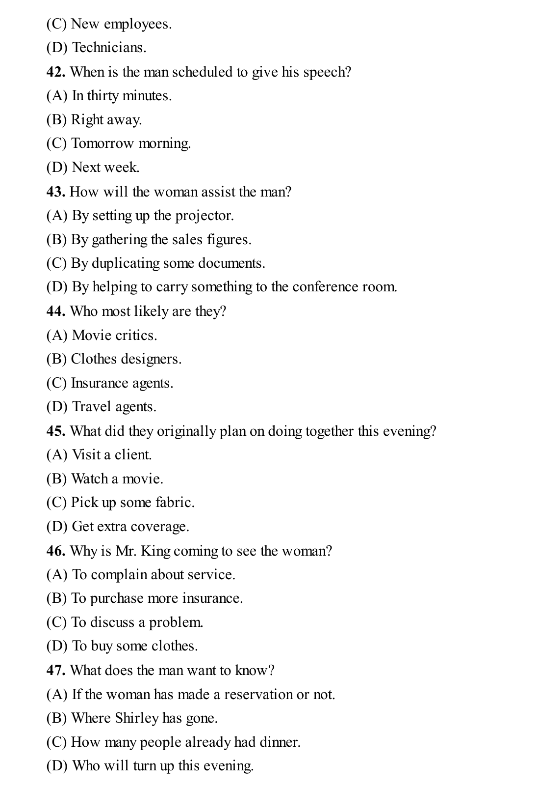

**听力独白/对话原文：**
**M:** I am expected to give a speech in front of all the directors in half an hour. （ 41, 42 ） I'd better go upstairs to the conference room and get all the necessary equipment ready.
**W:** Do you need any help? I could probably give you a hand setting up the projector or something.
**M:** That's very nice of you, Jan. In fact, I could use more copies of these figures. (43) Do you mind?
**W:** No, not at all. I will get them ready and bring them up to the conference room right away. (43)

**中文对照：**
> **M：**半小时后，我要在所有的主任前面作报告。我最好上楼去会议室，调试好所有必需的设备。
> **W：**你需要帮忙吗？我也许可以帮你装好投影仪或者其他设备。
> **M：**你太好了，简。实际上，我可能会用到更多份这些数据的复印件。你介意帮我复印吗？
> **W：**不，一点都不介意。我这就去准备，然后立刻把它们送到楼上会议室。

**核心词汇与短语：**
- **give a speech**：作报告，发言
- **necessary**：必需的
- **equipment**：设备
- **give a hand**：帮忙
- **set up**：装配，调试
- **mind**：介意
- **not at all**：一点也不
- **upper-level**：更高级别的
- **assist**：协助
- **duplicate**：复印

#### Q41 (正确答案：B)
**问题：** Who will most likely attend the meeting? (谁最有可能参加这次会议？)
- (A) Clients. (客户们。)
- (B) Upper-level managers. (更高级别的经理们。)
- (C) New employees. (新雇员们。)
- (D) Technicians. (技术人员们。)

#### Q42 (正确答案：A)
**问题：** When is the man scheduled to give his speech? (男士定于什么时间作报告？)
- (A) In thirty minutes. (30 分钟以后。)
- (B) Right away. (立刻。)
- (C) Tomorrow morning. (明天早上。)
- (D) Next week. (下星期。)

#### Q43 (正确答案：C)
**问题：** How will the woman assist the man? (女士将如何协助男士？)
- (A) By setting up the projector. (安装投影仪。)
- (B) By gathering the sales figures. (收集销售数据。)
- (C) By duplicating some documents. (复印一些文档。)
- (D) By helping to carry something to the conference room. (帮他往会议室搬些东西。)

**延伸表达与补充：**
- **Do you need any help? = Would you like a hand?** (你需要帮忙吗？扩展表达：)
  - *例句：Can you handle it yourself?* (你能自己处理这件事吗？)
- **I'll give you a hand. = I'll help you. = I'll assist you.** (我会帮你的。)
  - *例句：I'll give you a hand with the boxes.* (我会帮你搬这些箱子。)
- **Do you mind?** (你介意吗？扩展表达：)
  - *例句：Would it be okay? Can you?* (这样可以吗？你可以吗？)

### Questions 44 - 46

**听力独白/对话原文：**
**W:** I'm terribly sorry, Henry, but I am going to have to cancel the meeting tonight. I just received a call from Mr. King, a very important client of mine, and he says that he is in the area and he wants to come over to the office at 6 to talk to me about something. Do you think we can get together another time?
**M:** Sure, we can always catch a flick this weekend. (45) Who is this Mr. King guy anyway?
**W:** Oh, he is the owner of a fabric manufacturing firm that I recently sold a group policy to. (44) He mentioned something about wanting to increase the size of his group policy. (46)
**M:** Wow, that's great. I wish more of my customers would come and visit me to buy extra coverage.

**中文对照：**
> **W：**亨利，我很抱歉，今晚的见面不得不取消了。我刚接到了金先生的电话，他是我的非常重要的客户，他说他现在就在附近，想在6点钟到办公室和我谈一些事情。你觉得我们可以换个时间再聚吗？
> **M：**好的，我们这周末总能抽空去看场电影的。对了，这位金先生是什么人呢？
> **W：**哦，他是一家织造厂的厂主，我最近刚卖给他一份团体保险。他提出想要增加团体保险的数额。
> **M：**哇，那很好。我希望更多的客户能来找我买其他的保险项目。

**核心词汇与短语：**
- **come over**：过来
- **get together**：相聚
- **flick**：电影
- **fabric**：织物，织品
- **group policy**：团体保险
- **coverage**：投保范围，投保项目
- **critic**：批评家

#### Q44 (正确答案：C)
**问题：** Who most likely are they? (他们最有可能是什么人？)
- (A) Movie critics. (电影评论家。)
- (B) Clothes designers. (服装设计师。)
- (C) Insurance agents. (保险代理人。)
- (D) Travel agents. (旅行代理人。)

#### Q45 (正确答案：B)
**问题：** What did they originally plan on doing together this evening? (他们原计划今天晚上一起做什么？)
- (A) Visit a client. (拜访一位客户。)
- (B) Watch a movie. (看场电影。)
- (C) Pick up some fabric. (挑选织物。)
- (D) Get extra coverage. (获取额外的保额。)

#### Q46 (正确答案：B)
**问题：** Why is Mr. King coming to see the woman? (为什么金先生来拜访女士？)
- (A) To complain about service. (来投诉服务。)
- (B) To purchase more insurance. (来购买更多的保险。)
- (C) To discuss a problem. (来讨论问题。)
- (D) To buy some clothes. (来买一些衣服。)

**延伸表达与补充：**
- **Do you think we can get together another time?** (你觉得我们可以换个时间再聚吗？扩展表达：)
  - *例句：Would it be okay if I postponed our meeting today? Can we meet at a later date?* (推迟一下我们今天的会议好吗？我们过些天再碰面好吗？)
- **We can always catch a flick this weekend. = We can always watch a movie this weekend. = We can always go to the theater this weekend.** (这周末我们总能抽空去看场电影的。)
- **Wow, that's great. = Wow, that's amazing. = Wow, that is wonderful.** (哇，那很好。)

### Questions 47 - 49

**听力独白/对话原文：**
**M:** Do you know how many people are going to show up this evening? (47) I need to call the restaurant to make a reservation.
**W:** There will be about 10, including me and you. (48) Why don't you check with Shirley just to make sure? She is the one who knows exactly who will be showing up.
**M:** All right, but she stepped out for a moment to mail something at the post office. (49) I will drop by her office after I come back from lunch. Do you want to join me in the cafeteria?
**W:** Sure, I will be right with you. Just give me a second to make a call to a client first.

**中文对照：**
> **M：**你知道今天晚上会有多少人到场吗？我需要给饭店打电话订餐。
> **W：**包括你和我在内大约将会有10人。你为什么不和雪莉确认一下呢？她很清楚谁将会到场。
> **M：**好的，但她出去到邮局寄东西了。我吃完午饭后会顺路到她的办公室。你想和我一起去餐厅吗？
> **W：**好的，我一会儿过去。我得先给一位客户打个电话。

**核心词汇与短语：**
- **show up**：到场
- **make a reservation**：预订
- **exactly**：确切地
- **step out**：出去
- **drop by**：顺路拜访
- **turn up**：出现，到场

#### Q47 (正确答案：D)
**问题：** What does the man want to know? (男士想知道什么？)
- (A) If the woman has made a reservation or not. (女士是否已经预订了。)
- (B) Where Shirley has gone. (雪莉去哪里了。)
- (C) How many people already had dinner. (多少人已经用过餐。)
- (D) Who will turn up this evening. (今天晚上谁会来。)

#### Q48 (正确答案：C)
**问题：** According to the woman, how many people are expected to show up this evening? (根据女士所说，今晚将有多少人出席？)
- (A) Six. (6 位。)
- (B) Eight. (8 位。)
- (C) Ten. (10 位。)
- (D) Twelve. (12 位。)

#### Q49 (正确答案：C)
**问题：** What is Shirley most likely doing now? (雪莉现在最有可能在做什么？)
- (A) Having lunch at the company cafeteria. (在公司餐厅吃午饭。)
- (B) Booking seats at a nearby restaurant. (在附近的餐馆预订座位。)
- (C) Sending something at the post office. (在邮局寄东西。)
- (D) Talking to a client in the meeting room. (在会议室和一位客户谈话。)

**延伸表达与补充：**
- **Why don't you check with Shirley just to make sure? = Why don't you ask Shirley again to make sure? = You should ask Shirley to double check.** (你为什么不和雪莉确认一下呢？)
- **She stepped out for a moment. = She went out for a while.** (她出去一会儿了。)
  - *例句：Janice was here, but she just stepped out for a moment.* (贾尼丝是来过这里，但她刚出去一会儿。)
- **Just give me a second. = Just give me a moment. = Just give me a minute.** (稍等我一下。)

### Questions 50 - 52

**听力独白/对话原文：**
**W:** I must have eaten too much last night at the buffet restaurant because my stomach still feels bloated. I'm just going to settle for coffee this morning. What are you going to have? (50)
**M:** I am starved. I am going to order the continental breakfast.
**W:** Wow, you really do have an appetite, don't you? I mean, I don't understand how you can eat as much as you do yet keep yourself so thin like that. You are so lucky. (51)
**M:** Well, I guess I have always digested my food very fast. (52) I've been thin for as long as I can remember. Actually, when I was younger, my wish was to gain some weight. In fact, I remember eating 5 meals a day during high school just to gain some weight, but I didn't have any luck.

**中文对照：**
> **W：**我昨晚在自助餐馆一定是吃多了，胃到现在还觉得胀。今天早晨我就勉强喝点咖啡吧。你打算吃点什么？
> **M：**我饿极了。我打算去点欧式早餐。
> **W：**哇，你很有胃口嘛，是吧？我是说，我不理解为什么你吃这么多，还能保持那么瘦。你真是幸运。
> **M：**嗯，我想也许是因为我总是消化得非常快。我打记事儿起就一直很瘦。实际上，当我更年轻的时候，我的愿望是增加点儿体重。事实上，我记得在高中时一天吃五顿饭来增肥，但我没那么幸运。

**核心词汇与短语：**
- **bloated**：饮食过度的，胃胀的
- **settle for**：勉强接受
- **be starved**：挨饿
- **continental breakfast**：欧式早餐
- **appetite**：食欲，胃口
- **thin**：瘦的
- **digest**：消化
- **gain weight**：增肥
- **envy**：羡慕
- **metabolize**：新陈代谢

#### Q50 (正确答案：B)
**问题：** Where is the conversation most likely taking place? (这则对话最有可能发生在哪里？)
- (A) At a doctor's office. (在医生的诊室。)
- (B) At a restaurant. (在饭店。)
- (C) At a health club. (在健身俱乐部。)
- (D) At a public school. (在公立学校。)

#### Q51 (正确答案：B)
**问题：** Why does the woman envy the man? (为什么女士羡慕男士？)
- (A) He did very well in school. (他在学校表现很棒。)
- (B) He does not have a weight problem. (他没有体重的问题。)
- (C) He is going to eat something delicious. (他将吃一些美味的食物。)
- (D) He gets coffee at a very good price. (他以很实惠的价格买了咖啡。)

#### Q52 (正确答案：B)
**问题：** What can be inferred about the man? (关于男士可以推论出什么？)
- (A) He does not like to eat much. (他不喜欢吃太多。)
- (B) He metabolizes food quickly. (他消化食物很快。)
- (C) He keeps himself in shape. (他保持着好身材。)
- (D) He recently graduated from high school. (他最近高中毕业了。)

**延伸表达与补充：**
- **What are you going to have? = What are you going to eat? = Have you decided what you want to eat?** (你打算吃点什么？)
- **I am starved. = I am hungry. = I could use something to eat.** (我饿极了。)
- **I've been thin for as long as I can remember. = I've been skinny since I was very young. = I've always been thin.** (我打记事儿起就一直很瘦。)

### Questions 53 - 55

**听力独白/对话原文：**
**M:** Aren't you supposed to be in Boston right now? I thought you left to attend the business conference yesterday? (53)
**W:** I did, and I came back late last night. It was only a day affair, and I took the last flight out because I have a meeting with Mr. Jones this afternoon. (54) I could have taken a flight out this morning, but I have some things to prepare before I meet with him. (55)
**M:** You know, if I had known that it was only a day affair, I would have taken the trip with you. I also have a meeting with a very important client today, and that's why I didn't make the trip.
**W:** You should've talked to me about it. We could've made the trip together.

**中文对照：**
> **M：**你现在难道不应该在波士顿吗？我以为你昨天出发去参加商务会议了啊？
> **W：**我去了，昨晚很晚回来的。会议只开一天，然后我搭了末班飞机，因为我今天下午要约见琼斯先生。我本来可以坐今天上午的飞机，但是我在见他之前需要准备一些东西。
> **M：**嗯，如果我早知道会议只开一天的话，我就和你一起去出差了。我今天也约见了一位非常重要的客户，所以就没有出差。
> **W：**你真应该和我谈谈的。我们本可以一起出差的。

**核心词汇与短语：**
- **take a flight**：乘飞机

#### Q53 (正确答案：A)
**问题：** Why did the woman make a trip to Boston? (为什么女士出差去波士顿？)
- (A) To participate in a meeting. (参加会议。)
- (B) To meet with a client. (会见一位客户。)
- (C) To show the city to Mr. Jones. (带琼斯先生在市里逛逛。)
- (D) To spend some time with the man. (与男士共度一段时光。)

#### Q54 (正确答案：A)
**问题：** For how many days did the woman go away? (女士离开几天了？)
- (A) One. (一天。)
- (B) Two. (两天。)
- (C) Three. (三天。)
- (D) Four. (四天。)

#### Q55 (正确答案：C)
**问题：** Why did the woman come back early? (为什么女士早早回来了？)
- (A) She forgot to take some important documents. (她忘记带一些重要的文件了。)
- (B) She was not happy with the conference. (她对会议不满意。)
- (C) She needed to get ready for a meeting. (她需要为一个会议做准备。)
- (D) She couldn't convince Mr. Jones to stay longer. (她没能说服琼斯先生多待一会儿。)

**延伸表达与补充：**
- **I came back late last night. = I returned late last night. = I got back late last night.** (我昨晚很晚回来的。)
- **It was only a day affair. = It was only a day event. = It was only for one day.** (那只是一天的事。)
- **I would have taken the trip with you. = I would have gone on the trip with you. = I would have accompanied you on the trip.** (我本可以和你一起去出差的。)

### Questions 56 - 58

**听力独白/对话原文：**
**M:** Hello. My name is Eric Farmer. I received a bill in the mail today, but that shouldn't have happened. (56) I signed up for the automatic payment system two months ago, so the bill should have already been paid.
**W:** Let me check on that, Mr. Farmer. May I have your address, please? (57)
**M:** I live at 382 Washington Avenue.
**W:** Hmm...According to the computer, the money was withdrawn from your account yesterday, so you were sent the bill in error.
**M:** I can disregard it, right?
**W:** That's correct. And thanks for bringing this to our attention. (58) We'll check the computer system for other problems like this.

**中文对照：**
> **M：**您好，我是埃里克·法默，今天我收到一张账单，但是这不应该啊。两个月前我注册了自动支付系统，所以这张账单应该已经付了。
> **W：**我来查一下，法默先生。请问您能告诉我您的地址吗？
> **M：**我住在华盛顿大街382号。
> **W：**嗯....根据电脑记录，钱昨天从您的账户扣除了，所以给您发错账单了。
> **M：**我可以忽略这封邮件，是吗？
> **W：**是的。谢谢您将此事告诉我们。我们会检查电脑系统，查找类似的问题。

**核心词汇与短语：**
- **sign up for**：报名参加
- **automatic**：自动的
- **according to**：根据
- **withdraw**：取（钱）；收回
- **in error**：错误地
- **disregard**：忽视
- **bring sth to one's attention**：使某人注意某事

#### Q56 (正确答案：D)
**问题：** What is the purpose of the man's call? (男士打电话的目的是什么？)
- (A) To find out if his payment was processed. (弄清楚他是否付款了。)
- (B) To say that he was charged too much. (表示他扣费太多了。)
- (C) To change his mailing address. (更改邮寄地址。)
- (D) To ask why he received a bill. (询问为什么他收到了一张账单。)

#### Q57 (正确答案：B)
**问题：** What does the woman ask the man for? (女士需要男士提供什么？)
- (A) His name. (他的名字。)
- (B) His mailing address. (他的邮寄地址。)
- (C) His phone number. (他的电话号码。)
- (D) His e-mail address. (他的邮箱地址。)

#### Q58 (正确答案：B)
**问题：** Why does the woman thank the man? (为什么女士要感谢男士？)
- (A) For not getting upset. (因为他没有生气。)
- (B) For reporting a problem. (因为他报告了一个问题。)
- (C) For paying a bill on time. (因为他及时支付账单。)
- (D) For upgrading his cable package. (因为他升级了有线电视套餐。)

**延伸表达与补充：**
- **The money was withdrawn from your account yesterday. = The money was taken out of your account yesterday.** (钱昨天从您的账户里扣除了。)
  - *例句：I'd like to withdraw $500 from my current account.* (我想从活期账户中取出500美元。)
- **in error = by mistake** (错误地)
  - *例句：The letter was sent to you in error.* (信被错误地寄送给了你。)
- **bring sth. to one's attention = make someone aware of sth.** (使某人注意某事)
  - *例句：She wants to bring environmental problems to the world's attention. pay attention to do sth.* (她想让环境问题引起世界的关注。扩展表达：注意做某事)

### Questions 59 - 61

**听力独白/对话原文：**
**W:** Thank you for visiting the site, Mr. Murphy. I thought you'd like to see how construction is progressing. (59)
**M1:** There aren't any problems right now, are there?
**W:** Some supplies we ordered haven't arrived yet, but they won't be needed until tomorrow.
**M1:** That's good to hear. My associate, Mr. Vernon, has a question he'd like to ask you.
**M2:** That's right. When do you anticipate finishing the work? The deadline for the project is two weeks from today. (60)
**W:** We're going to make it. There's no reason for you to be concerned.
**M2:** Okay, I'll report back to the clients to let them know what you said. (61)

**中文对照：**
> **W：**墨菲先生，感谢您来工地现场参观。我想您是想看下工程进展如何。
> **M1：**现在没有任何问题吧？
> **W：**我们订购的一些物资暂未送达，但是明天才需要这些。
> **M1：**很高兴听到这个消息。我的同事，弗农先生想问您个问题。
> **M2：**是的。您预期什么时候完成这项工作？从今天算起，该项目的截止日期是两周后。
> **W：**我们将会准时完成。您不用担心。
> **M2：**好的。我会向顾客汇报，让他们知道所说的情况。

**核心词汇与短语：**
- **supply**：供给物；必需品
- **associate**：同事；伙伴
- **anticipate**：预期；预料
- **deadline**：截止日期；最后期限
- **concerned**：担忧的；关心的

#### Q59 (正确答案：C)
**问题：** Where does the conversation take place? (该对话在哪发生的？)
- (A) At a shopping center. (在一个购物中心。)
- (B) In an office. (在办公室。)
- (C) At a construction site. (在一个建筑工地。)
- (D) In a restaurant. (在一家餐厅。)

#### Q60 (正确答案：B)
**问题：** What does the woman most likely mean when she says, “We're going to make it”? (当这位女士说 “ 我们将会准时完成 ” 时，最可能意味着什么？)
- (A) A meeting will be attended. (将出席一个会议。)
- (B) A deadline will be met. (将在截止日期之前完成。)
- (C) An item will be manufactured. (将制造一个商品。)
- (D) A goal will be set. (将会设定一个目标。)

#### Q61 (正确答案：A)
**问题：** What will Mr. Vernon probably do next? (接下来，弗农先生很可能做什么？)
- (A) Speak with some clients. (和一些客户交谈。)
- (B) Make a purchase. (完成一笔购买。)
- (C) Contact a delivery company. (联系快递公司。)
- (D) Work with the woman. (和那位女士一起工作。)

**延伸表达与补充：**
- **make it** (准时到达，赶上；获得成功；渡过难关)
  - *例句：If we run, we should make it. He came to the U.S. and not only made it but made it big. Frank was ill, and doctors didn't think he'd make it.* (如果我们跑快点的话，应该来得及。他来到美国，不仅仅成功了，而且发达了。弗兰克病的很重，医生认为他挺不过来了。)

### Questions 62 - 64

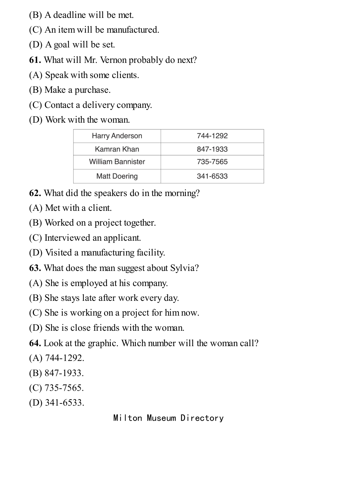

**听力独白/对话原文：**
**W:** I was impressed with the interviewee we met this morning. He has plenty of experience and should be easy to collaborate with. (62)
**M:** The only problem is that Matt Doering can't start working until two months from now. (64)
**W:** Do you think we can afford to wait that long? I suppose we could hire Harry Anderson instead, but he's not as qualified.
**M:** I'm in favor of waiting until Matt can start. (64) In the meantime, we can give extra work to Sylvia. She doesn't mind working overtime. (63)
**W:** All right, then do you want to make the call, or should I? (64)
**M:** Go ahead and do it. Let me know if our offer is accepted. (64)

**中文对照：**
> **W：**我对今天上午我们见的那位面试者印象深刻。他经验丰富，应该很容易共事。
> **M：**唯一的问题是马特·德林两个月以后才能就职。
> **W：**你觉得我们能等那么长时间吗？我认为我们应该录用哈里·安德森，但他不如马特·德林那么称职。
> **M：**我赞成等马特就职。在这期间，我们可以给西维亚额外分配工作。她不介意加班。
> **W：**好的，那么你来打这个电话还是我来打？
> **M：**你来打吧。告诉我他是否接受我们的工作邀请就好。

**核心词汇与短语：**
- **be impressed with**：对印象深刻
- **interviewee**：面试者
- **collaborate with**：与共事、合作
- **afford**：负担得起
- **qualified**：称职的
- **work overtime**：加班

#### Q62 (正确答案：C)
**问题：** What did the speakers do in the morning? (讲话人早上做了什么？)
- (A) Met with a client. (见了客户。)
- (B) Worked on a project together. (一起做项目。)
- (C) Interviewed an applicant. (面试了一位应聘者。)
- (D) Visited a manufacturing facility. (参观了一个生产设施。)

#### Q63 (正确答案：B)
**问题：** What does the man suggest about Sylvia? (关于西维亚，男士暗示了什么？)
- (A) She is employed at his company. (她被他的公司聘用了。)
- (B) She stays late after work every day. (每天下班之后她都会待到很晚。)
- (C) She is working on a project for him now. (她目前在为他做项目。)
- (D) She is close friends with the woman. (她是女士的亲密朋友。)

#### Q64 (正确答案：D)
**问题：** Look at the graphic. Which number will the woman call? (请看图表，女士会拨打哪个电话号码？)
- (A) 744-1292. (744-1292 。)
- (B) 847-1933. (847-1933 。)
- (C) 735-7565. (735-7565 。)
- (D) 341-6533. (341-6533 。)

**延伸表达与补充：**
- **be in favor of = agree with** (赞成，支持)
  - *例句：Mr. Green spoke in favour of my proposal.* (格林先生表示支持我的提议。)
- **in the meantime = meanwhile** (与此同时，在…期间)
  - *例句：The next subway will be arriving in ten minutes: in the meantime, I'll go to the man's room.* (下一班地铁十分钟后来，在这期间，我要去趟卫生间。)

### Questions 65 - 67

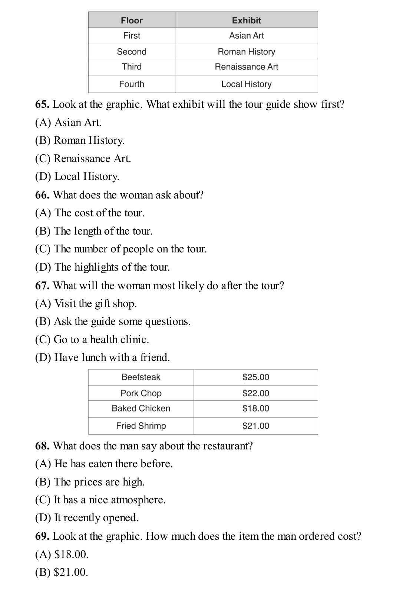

**听力独白/对话原文：**
**M:** Thank you all for joining today's tour. As you know, there are four floors in the building, so we're going to start at the top floor and head down. (65) Are there any questions before we begin?
**W:** Yes, about how long will the tour last? (66)
**M:** If you stay for the entire tour, it will take approximately one and a half hours to see the entire museum.
**W:** Unfortunately, I have to leave for a doctor's appointment in an hour, so how much of the museum will I see? (67)
**M:** You'll be able to see everything except for the first floor.
**W:** Thank you so much for letting me know. Milton Museum Directory

**中文对照：**
> **M：**谢谢各位参加今天的观光。大家知道，这座大楼有四层，所以我们要从顶层开始参观，然后一层一层往下看。在我们参观之前，你们有问题要问吗？
> **W：**是的，这次参观会持续多长时间？
> **M：**如果全程参观，大约要用一个半小时参观完整个博物馆。
> **W：**真不巧，我一个小时后约好了看医生，所以我能参观博物馆多少部分呢？
> **M：**除了一层，其余层都可以看到。
> **W：**感谢你告诉我这么多。弥尔顿博物馆指南

**核心词汇与短语：**
- **tour**：观光，游览，参观
- **head down**：向下走
- **approximately**：大约
- **unfortunately**：不幸地是，不巧的是
- **leave for**：前往
- **appointment**：安排，预约
- **except**：除了之外

#### Q65 (正确答案：D)
**问题：** Look at the graphic. What exhibit will the tour guide show first? (请看图表，导游首先会介绍什么展品？)
- (A) Asian Art. (亚洲艺术。)
- (B) Roman History. (罗马历史。)
- (C) Renaissance Art. (文艺复兴艺术。)
- (D) Local History. (当地历史。)

#### Q66 (正确答案：B)
**问题：** What does the woman ask about? (女士问了什么问题？)
- (A) The cost of the tour. (参观费用。)
- (B) The length of the tour. (参观时长。)
- (C) The number of people on the tour. (参观人数。)
- (D) The highlights of the tour. (参观重点。)

#### Q67 (正确答案：C)
**问题：** What will the woman most likely do after the tour? (参观之后，女士最有可能做什么？)
- (A) Visit the gift shop. (去礼品店。)
- (B) Ask the guide some questions. (询问导游一些问题。)
- (C) Go to a health clinic. (去诊所。)
- (D) Have lunch with a friend. (和朋友吃午餐。)

**延伸表达与补充：**
- **It takes sb. some time to do sth. = sb. spends some time doing sth.** (某人花时间做某事)
  - *例句：It took me about two months to finish the research paper.* (我花了大约两个月的时间完成了这篇研究论文。)

### Questions 68 - 70

**听力独白/对话原文：**
**W:** Welcome to the Hatfield House. Have you had the opportunity to look over the menu?
**M:** I have, but I'm not sure what to order. It's been several months since I dined here. (68) What do you recommend?
**W:** Why don't you try our newest item? You can get a pork chop with a baked potato and sautéed vegetables. I've had it before and highly recommend it. (69)
**M:** All right, I think I'll go with your suggestion. (69)
**W:** Excellent. In the meantime, would you care for a soup or salad as an appetizer?
**M:** No thanks, but I would like some iced tea. (70)
**W:** Sure, I'll bring you a glass in a couple of minutes. (70)

**中文对照：**
> **W：**欢迎来到哈特菲尔德餐厅，您看过菜单了吗？
> **M：**我看过了，但我不太清楚应该点些什么。上次来这里吃饭已经是几个月前的事了。你推荐些什么呢？
> **W：**为什么不尝尝我们的新品？您可以来一份土豆猪排煎蔬菜，我吃过，强烈推荐它。
> **M：**好的，我觉得就按照你的建议来。
> **W：**太好了。同时，您要来一份汤或沙拉作为开胃菜吗？
> **M：**不用了，谢谢，但我想点杯冰茶。
> **W：**好的，我几分钟后就给您端来一杯。

**核心词汇与短语：**
- **opportunity**：机会
- **look over**：浏览，翻阅
- **recommend**：推荐
- **chop**：排骨
- **sauté**：煎
- **go with**：顺从，听从
- **appetizer**：开胃菜

#### Q68 (正确答案：A)
**问题：** What does the man say about the restaurant? (关于这家餐厅，男士说了什么？)
- (A) He has eaten there before. (他之前来这里吃过。)
- (B) The prices are high. (价格高。)
- (C) It has a nice atmosphere. (环境很好。)
- (D) It recently opened. (新开业。)

#### Q69 (正确答案：C)
**问题：** Look at the graphic. How much does the item the man ordered cost? (请看图表，男士点的菜的费用是多少？)
- (A) $18.00. (18 美元。)
- (B) $21.00. (21 美元。)
- (C) $22.00. (22 美元。)
- (D) $25.00. (25 美元。)

#### Q70 (正确答案：D)
**问题：** What will the woman bring the man next? (女士接下来要给男士拿来什么？)
- (A) A bowl of soup. (一份汤。)
- (B) A salad. (一份沙拉。)
- (C) An appetizer. (一份开胃菜。)
- (D) A cold beverage. (一杯冷饮。)

**延伸表达与补充：**
- **Why don't you ~? = Why not ~?** (为什么不…？)
  - *例句：—Where should we spend our summer vacation, Mary? —Why don't we fly to Hawaii? It's a very nice place.* (玛丽，我们到哪过暑假呢？为什么不飞去夏威夷，那是个很棒的地方。)

## Part 4: 简短独白 (Q71 - Q100)

### Questions 71 - 73

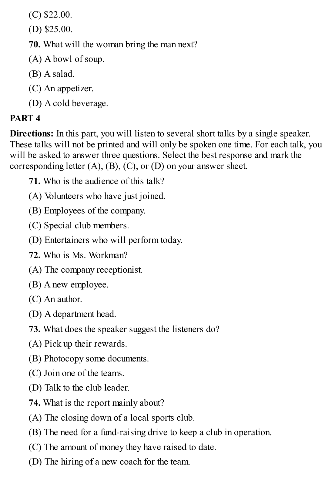

**听力独白/对话原文：**
Today is the first workday of the new year, and we'd like to start off with a very positive resolution, especially as we have twenty new staff members beginning today. (71) Our company has always been heavily involved in volunteer work. We have several teams of volunteers, each of which specializes in a different area. Please join one of the clubs and participate in their special activities. (73) We'd like all members to remember that service to others can be surprisingly fun and rewarding. Our receptionist, Jo Workman, (72) who is also the leader of the environmental action team, has prepared a handbook on volunteering and other social activities. Please get a copy, and don't hesitate to join. (73)

**中文对照：**
> 今天是新年的第一个工作日，我们想以一项非常积极的决定来作为开始，特别是我们将有20名新员工从今天开始工作。我们公司向来都积极参加志愿者工作。我们有几个志愿者小组，每个小组都专注于不同的领域。请加入其中一个俱乐部，并参加他们的特别活动。我们希望所有的成员都能记住为别人服务会获得惊人的乐趣和回报。我们的接待员乔·沃克曼是环境行动组的领导，她准备了一本关于志愿活动及其他社会活动的手册。请拿一本，不要犹豫，赶紧加入吧。

**核心词汇与短语：**
- **positive**：积极的
- **resolution**：决定
- **especially**：特别，尤其
- **heavily**：极大地，大量地
- **involve**：参加
- **volunteer**：志愿者
- **specialize in ~**：专攻
- **participate in ~**：参与
- **surprisingly**：惊人地
- **rewarding**：有益的，有回报的
- **environmental**：环境的
- **handbook**：手册
- **hesitate**：犹豫
- **entertainer**：专业演员；表演者
- **perform**：表演
- **reward**：报答，报酬
- **guidebook**：指导手册

#### Q71 (正确答案：B)
**问题：** Who is the audience of this talk? (这次讲话的听众是谁？)
- (A) Volunteers who have just joined. (刚加入的志愿者们。)
- (B) Employees of the company. (公司的雇员们。)
- (C) Special club members. (俱乐部特别会员。)
- (D) Entertainers who will perform today. (今天将进行表演的演员们。)

#### Q72 (正确答案：A)
**问题：** Who is Ms. Workman? (沃克曼女士是谁？)
- (A) The company receptionist. (公司的接待员。)
- (B) A new employee. (一位新雇员。)
- (C) An author. (一位作家。)
- (D) A department head. (一位部门领导。)

#### Q73 (正确答案：C)
**问题：** What does the speaker suggest the listeners do? (讲话者建议听众做什么？)
- (A) Pick up their rewards. (领取他们的酬金。)
- (B) Photocopy some documents. (影印一些文件。)
- (C) Join one of the teams. (加入其中的一组。)
- (D) Talk to the club leader. (与俱乐部的领导谈谈。)

**延伸表达与补充：**
- **heavily involved in = heavily absorbed in = deeply involved in** (积极投入，深入参与)
  - *例句：Everyone on our team is heavily involved in this project.* (我们小组的每个人都积极投身于这个项目之中。)
- **which specializes in a different area** (专攻不同的领域扩展表达：)
  - *例句：which caters to a different market which concentrates on a different market We have a team which specializes in a different area.* (适合不同的市场专注于不同的市场我们有一个小组专注于不同的领域。)
- **Don't hesitate to join. = Don't think twice about joining. = Don't even consider not joining.** (不要犹豫，赶紧加入吧。)
  - *例句：Please don't hesitate in joining us for dinner this evening.* (不要犹豫，今晚和我们一起用餐吧。)

### Questions 74 - 76

**听力独白/对话原文：**
The East York Juniors Soccer Club is launching a membership and fund- raising drive to start off the new season. (74) The club's secretary has told our local sports reporter that the club may be forced to close this year due to financial problems. (75) He would like to encourage all parents to consider the benefits to children and the community by supporting the local soccer club, which has been working in this community for the last sixty years. The annual membership fee has been raised to forty dollars in order to cover the cost of maintaining club facilities. The club is also seeking volunteers to work as officials and umpires. Anyone with first aid or coaching experience is most welcome to join the coaching team. (76)

**中文对照：**
> 东约克青少年足球俱乐部正在发展会员制和进行筹款活动来开始新的赛季。俱乐部秘书告诉我们当地的体育记者，由于财政问题，俱乐部今年也许会被迫关闭。他鼓励所有的家长考虑孩子们及社区的利益，支持这个已经在该社区服务60年的地方足球俱乐部。年会费增加了40美元，以便支付维护和保养俱乐部设施的费用。俱乐部也在寻找志愿者们来做职员和裁判员。热烈欢迎任何有急救或教练经验的人加入教练队。

**核心词汇与短语：**
- **launch**：开展
- **membership**：会员制
- **fund-raising**：筹募资金
- **force**：迫使
- **encourage**：鼓励
- **community**：社区
- **support**：支持
- **membership fee**：会费
- **cover**：支付
- **maintain**：维修，保养
- **official**：职员，办公人员
- **umpire**：裁判员
- **first aid**：急救
- **close down**：关闭
- **in operation**：运行
- **to date**：到此为止
- **on the brink of ~**：在的边缘
- **shut down**：关闭

#### Q74 (正确答案：B)
**问题：** What is the report mainly about? (这则报道主要是关于什么的？)
- (A) The closing down of a local sports club. (一家当地体育俱乐部的关闭。)
- (B) The need for a fund-raising drive to keep a club in operation. (需要筹募资金来维持一家俱乐部的运营。)
- (C) The amount of money they have raised to date. (迄今他们筹集的钱款总额。)
- (D) The hiring of a new coach for the team. (为球队雇一名新教练。)

#### Q75 (正确答案：A)
**问题：** What does the speaker say about the club? (关于俱乐部，讲话人谈了些什么？)
- (A) It is on the brink of shutting down. (它正处在被关闭的边缘。)
- (B) It is only available to local residents. (它只对当地居民开放。)
- (C) It has hired a new coaching staff. (它雇了一名新教练。)
- (D) It encourages parents to join the team. (它鼓励家长加入球队。)

#### Q76 (正确答案：D)
**问题：** Who would most likely be considered for the position? (谁最有可能获得这一职位？)
- (A) A person who had played for a professional team. (曾经为专业球队踢球的人。)
- (B) Parents who have children of their own. (有孩子的家长们。)
- (C) Anyone who wishes to exercise on a regular basis. (任何想定期锻炼的人。)
- (D) Those who have knowledge of first-aid. (那些有急救知识的人。)

**延伸表达与补充：**
- **He would like to encourage all parents to do ~ = He would like to ask all parents to do ~ = He would like to urge all parents to do ~** (他想鼓励所有的家长去做…)
  - *例句：He would like to encourage all parents to participate in the upcoming parent- teacher meeting.* (他想鼓励所有的家长参加即将召开的家长会。)
- **The annual membership fee has been raised. = The yearly membership fee has gone up. = The cost of the yearly membership has increased.** (年会费已经增长了。)
- **cover the cost of maintaining** (支付维护的费用扩展表达：)
  - *例句：handle the cost of operating = include the cost of running We have to raise ticket prices to cover the cost of maintaining the stadium.* (支付运营所需要的费用我们需要提高票价来支付维护体育馆的费用。)

### Questions 77 - 79

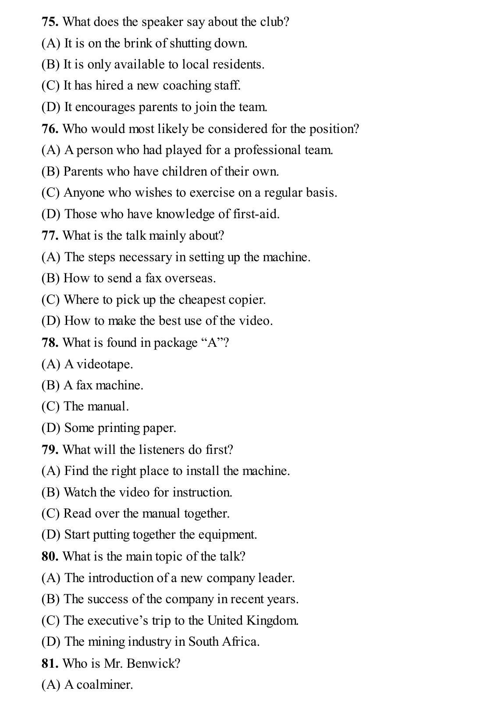

**听力独白/对话原文：**
Congratulations on your choice of a Xenox PDP-alpha laser fax, copier and printer. All Xenox products incorporate the latest technology into attractive, versatile, and durable office equipment. This instruction manual will demonstrate clearly how to assemble, install, and use your new Xenox-alpha. As a first step, (77) please ensure that you have a clear space that is large enough and has electrical and computer cable access. (79) Next, in the package labeled ‘A’, you will find a training video, warranty documents, and after-sales service information. (78) The video is designed for staff training. Please take the time to view it in order to get the best out of your new copier and to avoid costly damage due to incorrect use. Now, let's open package ‘B’, and begin assembly.

**中文对照：**
> 恭喜您选择了Xenox PDP-alpha激光传真机、复印机和打印机。所有Xenox产品都吸收了最新的技术，成为具有吸引力的、多功能且耐用的办公设备。这一安装手册将清楚地说明如何组装、安装及使用您的新Xenox-

**核心词汇与短语：**
- **alpha**：。第一步，请保证您有足够大的畅通空间，并有电源和电脑接线。接下来，在
- **A**：包裹里面，您将找到一盘培训录像带、保修单以及售后服务信息。录像带是为员工培训设计的。请您花点时间来观看，以便能够最有效地利用您的新打印机，并且避免由于不正确使用引起的重大损失。现在，让我们打开
- **B**：包裹，然后开始组装。
- **incorporate**：包含；吸收
- **latest**：最新的
- **attractive**：有吸引力的
- **versatile**：多功能的，万用的
- **durable**：经久的，耐用的
- **instruction manual**：安装手册
- **demonstrate**：说明
- **clearly**：清楚地
- **assemble**：组装
- **install**：安装
- **ensure**：确保
- **clear space**：畅通空间
- **access**：接入
- **warranty document**：保修单
- **after-sales service**：售后服务
- **costly**：昂贵的；重大的
- **incorrect**：不正确的
- **set up**：安装
- **read over**：通读，细读
- **manual**：手册
- **put together**：组装

#### Q77 (正确答案：A)
**问题：** What is the talk mainly about? (这则谈话主要是关于什么的？)
- (A) The steps necessary in setting up the machine. (组装机器的必要步骤。)
- (B) How to send a fax overseas. (如何往国外发传真。)
- (C) Where to pick up the cheapest copier. (从哪里可以获取最便宜的复印机。)
- (D) How to make the best use of the video. (如何最有效地利用这盘录像带。)

#### Q78 (正确答案：A)
**问题：** What is found in package “A”? (在 A 包裹中找到了什么？)
- (A) A videotape. (一盘录像带。)
- (B) A fax machine. (一台传真机。)
- (C) The manual. (手册。)
- (D) Some printing paper. (一些打印纸。)

#### Q79 (正确答案：A)
**问题：** What will the listeners do first? (听众将首先做什么？)
- (A) Find the right place to install the machine. (找到合适的地方安装这台机器。)
- (B) Watch the video for instruction. (观看录像以获得指导。)
- (C) Read over the manual together. (一起通读手册。)
- (D) Start putting together the equipment. (开始组装设备。)

**延伸表达与补充：**
- **Please take the time to view it.** (请花些时间观看它。扩展表达：)
  - *例句：Please look at it carefully. Please read it over thoroughly.* (请仔细看它。请从头至尾阅读它。)
- **get the best out of your new copier = make the best use of your new copy machine** (最有效地使用您的新复印机扩展表达：)
  - *例句：understand how to use your new copier fully Everyone should study the manual carefully to get the best out of your new copier.* (完全清楚如何使用您的新复印机每个人都应该仔细学习这本手册，以便能够最有效地利用新复印机。)
- **avoid costly damage = avoid heavy damage = avoid a lot of damage** (避免重大损失)
  - *例句：Let's think about all the possibilities to avoid costly damage.* (让我们把所有的情况都考虑到，以避免重大损失。)

### Questions 80 - 82

**听力独白/对话原文：**
In an important move today, the Board of Directors announced that their search for a new CEO has been successful. (80) We are pleased to announce that Mr. Michael Benwick, one of the most respected business leaders in Europe, has accepted the position. (81) Mr. Benwick has had a far-ranging and highly successful career in industry in South Africa and the United Kingdom. After graduating from Oxford in 1965, he took a middle management position in South Africa's mining industry. From there he has never looked back. (82) We welcome him not only for his dynamism and charisma but also for his wealth of experience.

**中文对照：**
> 在今天的一项重要提议中，董事会宣布他们成功地找到了新首席执行官。我们很高兴地宣布迈克尔·本维克先生接受了这一职位，他是欧洲最受尊敬的商业领袖之一。本维克先生在南非和英国的职业生涯涉及范围很广泛，而且非常成功。1965年从牛津毕业以后，他在南非煤矿业获得了一个中层管理职位。从那开始他一直蒸蒸日上。我们欢迎他的到来，不仅仅是因为他的干劲儿和领袖魅力，也是因为他拥有非常丰富的经验。

**核心词汇与短语：**
- **move**：提议
- **successful**：成功的
- **respected**：受人尊敬的
- **accept**：接受
- **career**：职业；生涯
- **management**：管理
- **mining industry**：煤矿业
- **never look back**：一帆风顺；蒸蒸日上
- **dynamism**：干劲，活力
- **charisma**：领袖魅力
- **wealth**：丰富，大量
- **executive**：执行官
- **coalminer**：煤矿工人
- **graduate student**：研究生
- **field**：领域

#### Q80 (正确答案：A)
**问题：** What is the main topic of the talk? (这则讲话的主题是什么？)
- (A) The introduction of a new company leader. (介绍公司的一位新领导。)
- (B) The success of the company in recent years. (近年来公司的成就。)
- (C) The executive's trip to the United Kingdom. (经理的英国之旅。)
- (D) The mining industry in South Africa. (南非的煤矿业。)

#### Q81 (正确答案：B)
**问题：** Who is Mr. Benwick? (本维克先生是谁？)
- (A) A coalminer. (一名煤矿工人。)
- (B) The new president. (新任总裁。)
- (C) One of the board members. (董事会的一位成员。)
- (D) A university professor. (一位大学教授。)

#### Q82 (正确答案：D)
**问题：** What does the speaker imply when he says, “We welcome him not only for his dynamism and charisma but also for his wealth of experience”? (讲话人说 “ 我们欢迎他的到来，不仅仅是因为他的干劲和领袖魅力，也是因为他拥有非常丰富的经验 ” ，是在暗示什么？)
- (A) Michael is a graduate student at Oxford. (迈克尔是牛津大学的研究生。)
- (B) Michael currently works in South Africa. (迈克尔目前在南非工作。)
- (C) Michael has become a very wealthy man. (迈克尔已经成为一个非常富有的人。)
- (D) Michael is very knowledgeable in his field of work. (迈克尔在其工作领域知识非常渊博。)

**延伸表达与补充：**
- **We are pleased to announce that ~ = We are happy to let you know that ~ = We are excited to tell you that ~** (我们很高兴地宣布…)
  - *例句：We are pleased to announce that everyone will get a bonus this year.* (我们很高兴地宣布，每个人今年都将得到奖金。)
- **accept the position = (decide to) take the job = (make up one's mind to) come aboard** (（决定）接受这个职位)
  - *例句：I was told by the president that Mr. Lee has accepted the position we offered.* (总裁告诉我，李先生接受了我们提供的职位。)
- **From there he has never looked back. = From there he went forward.** (从那以后，他一直蒸蒸日上。扩展表达：)
  - *例句：From there he never regretted.* (从那以后，他从未后悔过。)

### Questions 83 - 85

**听力独白/对话原文：**
Welcome to Earthbeat, your top-rated, environmental radio program. (83) First, let's go to the news. We have some sad news to announce today. The federal government has decided to discontinue funding for environmental science on ABC Radio. This will mean that Earthbeat will no longer be broadcast after the last program in this series airs in November. (84) A government spokesperson said, however, that funding will be increased for pure science and business reporting. Let's move to our first special report. We have in our studio a very special guest: it's Amy McIntyre, (85) the distinguished botanist and author of several prize-winning books on the flora of New Guinea. She'll be talking to our reporter, Jim Cross.

**中文对照：**
> 欢迎收看最受大家欢迎的环境类广播节目——“地球的心跳”。首先，我们来看新闻。今天我们要播报一些令人沮丧的新闻。联邦政府决定停止资助ABC广播的环境科学类节目。这将意味着“地球的心跳”将在11月系列广播的最后一期结束之后停播。一位政府发言人说，尽管如此，对于纯理论科学和商业报道的资助将增加。让我们进入第一条特别报道。我们的演播室里来了一位非常特别的嘉宾：艾米·麦金太尔，她是著名的植物学家，也是几部关于新几内亚植物群的获奖著作的作者。她将与我们的记者吉姆·克罗斯对话。

**核心词汇与短语：**
- **top-rated**：第一流的
- **environmental**：环境的
- **federal**：联邦的
- **discontinue**：停止，中断
- **funding**：提供资金
- **no longer**：不再
- **air**：广播
- **pure science**：纯理论科学
- **distinguished**：著名的
- **botanist**：植物学家
- **prize-winning**：获奖的
- **flora**：植物群
- **rating**：评级
- **take over**：接管

#### Q83 (正确答案：A)
**问题：** What is Earthbeat? (地球的心跳 ” 是什么？)
- (A) A radio program. (一档广播节目。)
- (B) An environmental group. (一个环境团体。)
- (C) A ratings system. (一个评级系统。)
- (D) A science research team. “ (一个科研小组。)

#### Q84 (正确答案：C)
**问题：** What is going to happen in November? (月将有什么事情发生？)
- (A) The show will receive more funding. (这个节目将获得更多的资助。)
- (B) An environmental seminar will be held. (将会举行一场环境研讨会。)
- (C) The program will air its last show. (这个节目将播出最后一期。)
- (D) A new host will take over the show. 11 (一位新主持人将接管这个节目。)

#### Q85 (正确答案：C)
**问题：** Who is Ms. McIntyre? (麦金太尔女士是什么人？)
- (A) A reporter. (一名记者。)
- (B) The radio host. (一名广播主持人。)
- (C) A guest. (一位来宾。)
- (D) The show's producer. (这个节目的制作人。)

**延伸表达与补充：**
- **First, let's go to the news. = Let's start with (the day's) news. = Let's begin with (today's) news.** (首先，我们来看（今天的）新闻。)
- **We have some sad news to announce today. = We have some unpleasant news to tell you today. = We have some unfortunate news to announce today.** (今天我们要宣布一些令人沮丧的新闻。)
- **no longer be broadcast = no longer be aired = no longer be shown** (停播)
  - *例句：The show will no longer be broadcast next week.* (这个节目从下周起将停播。)

### Questions 86 - 88

**听力独白/对话原文：**
Hi, Jen. It's Brian calling. Could you please pass on this important message to Jack Burbery in the Dispatch Office? (86) Last night I tried to contact Jack about the return of some items from the Continental Café. The chef at the Continental is not happy about the quality of yesterday's delivery of fresh fruit and vegetables. As you know, the Continental Café has been a particularly important client of ours, so it's important that we provide it with good service. The Continental would like us to discount that delivery. (87) Could Jack send a representative to the Continental to check on the produce (88) and to arrange the details? And please tell him that this is urgent.

**中文对照：**
> 你好，珍。我是布赖恩。你可以将这条重要的信息转达给送货部的杰克·伯伯里吗？昨天晚上我试着与杰克联系，讨论从大陆咖啡厅退回的一些货物。那儿的主厨对于昨天送去的新鲜水果和蔬菜的质量很不满意。你也知道，大陆咖啡厅一直是我们特别重要的客户，所以我们为它提供优质的服务很重要。大陆咖啡厅想让我们给那次送的货打折扣。杰克能派一位代表去大陆咖啡厅核查一下货物并安排细节吗？请告诉杰克这件事非常紧急。

**核心词汇与短语：**
- **dispatch**：送货，派送
- **chef**：主厨
- **delivery**：交货，交付
- **particularly**：特别地
- **representative**：代表
- **arrange**：安排
- **detail**：细节
- **urgent**：紧急的
- **convey**：传达
- **deduction**：折扣
- **replace**：更换

#### Q86 (正确答案：C)
**问题：** Why is the caller leaving the message? (打电话的人为什么留言？)
- (A) To request a return on an item. (为了请求退回一件货物。)
- (B) To see if a new delivery of fresh fruit has arrived. (为了查看新送的一批新鲜水果是否送到。)
- (C) To ask the listener to convey a message. (为了让听话者转达一个信息。)
- (D) To check and see if a discount is available. (为了查看是否可以打折。)

#### Q87 (正确答案：C)
**问题：** What does the staff from the Continental want? (大陆咖啡厅的员工想怎么样？)
- (A) Faster delivery. (送货更快一些。)
- (B) Fresher products. (货物更新鲜些。)
- (C) A deduction in price. (价格折扣。)
- (D) A return call. (回个电话。)

#### Q88 (正确答案：D)
**问题：** What is asked of Jack? (杰克被要求做什么？)
- (A) To send an apology letter right away. (立刻发一封道歉信。)
- (B) To replace the wrong items sent. (更换送错的货物。)
- (C) To thank the chef for a great meal. (谢谢主厨的盛宴。)
- (D) To send someone to check on a product. (派人去核查货物。)

**延伸表达与补充：**
- **pass on this important message to ~ = give this important message to ~ = hand over this important message to ~** (将这条重要的信息转达给…)
  - *例句：Could you please pass on this important message to Mr. Kim when you make your trip to the head office?* (当你去总公司出差的时候，可否将这条重要的信息转达给金先生？)
- **be not happy about ~ = be not pleased with ~ = be not too keen about ~** (对…不开心)
  - *例句：John is not happy about working the night shift.* (约翰对于值夜班很不开心。)
- **arrange the details** (安排细节扩展表达：)
  - *例句：take care of the details = set up the details I will call the restaurant and arrange the details.* (处理细节我会给饭店打电话并安排细节。)

### Questions 89 - 91

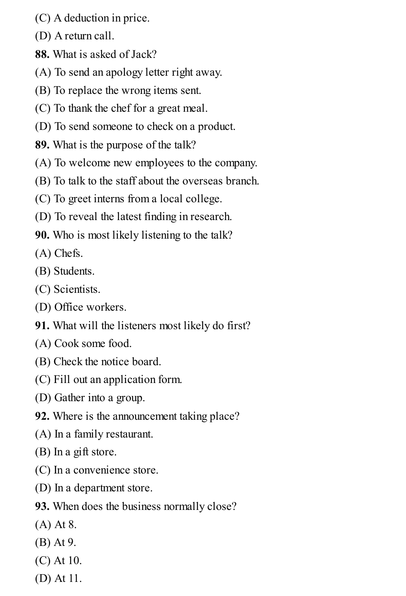

**听力独白/对话原文：**
Good morning. I would like to welcome all of the 8 trainee chefs from the Food Science and Technology College this morning. (89) We hope your stay here will be profitable. I should also mention that our chain of restaurants regularly employs young graduates from your college. (90) So, we'll be watching you, and if any of you are interested in future employment with us, please let us know. You may not be aware that our chain has restaurants in all the major cities of England and Europe. We have also recently opened restaurants in India, Southeast Asia, China, and Japan. We encourage overseas work experience as a way of developing exciting cooking styles. So working with us can be a fabulous experience if you have the right attitude. So, let's get busy. Please check the notice board to find out which team you have been assigned to. (91)

**中文对照：**
> 早上好。我要欢迎今天早上从食品科学和技术学院过来的八位实习厨师。我希望你们在这里会有所收获。另外我也要提一下，我们的连锁餐馆定期雇用你们学院的年轻毕业生。所以，我们将观察你们，如果你们中的任何人对于将来受雇在此工作感兴趣的话，可以告诉我们。你们也许不知道，我们的连锁店在英国和欧洲所有的主要城市都有分布。最近我们还在印度、东南亚、中国和日本也开设了餐馆。我们鼓励大家去海外工作，以便开发令人兴奋的菜系。所以，如果你有端正的态度，和我们一起工作是一次绝佳的机会。让我们开始工作吧。请看告示牌以便确认你们被分在哪个组。

**核心词汇与短语：**
- **trainee**：实习生
- **profitable**：有益的
- **regularly**：定期地
- **employ**：雇用
- **be aware that**：知道
- **encourage**：鼓励
- **overseas**：海外的，国外的
- **develop**：开发
- **fabulous**：极好的，绝妙的
- **attitude**：态度
- **notice board**：告示牌
- **find out**：找出
- **assign**：分配
- **intern**：实习生
- **greet**：会面
- **reveal**：揭示
- **latest**：最新的
- **finding**：发现

#### Q89 (正确答案：C)
**问题：** What is the purpose of the talk? (这则讲话的目的是什么？)
- (A) To welcome new employees to the company. (欢迎新雇员来到公司。)
- (B) To talk to the staff about the overseas branch. (和员工谈论海外分支机构。)
- (C) To greet interns from a local college. (欢迎从当地学院来的实习生。)
- (D) To reveal the latest finding in research. (展示研究中的最新发现。)

#### Q90 (正确答案：B)
**问题：** Who is most likely listening to the talk? (谁最有可能在听这则讲话？)
- (A) Chefs. (主厨。)
- (B) Students. (学生。)
- (C) Scientists. (科学家。)
- (D) Office workers. (办公室职员。)

#### Q91 (正确答案：B)
**问题：** What will the listeners most likely do first? (听众最有可能首先做什么？)
- (A) Cook some food. (烹饪一些食物。)
- (B) Check the notice board. (查看告示牌。)
- (C) Fill out an application form. (填写一张申请表。)
- (D) Gather into a group. (组成一个小组。)

**延伸表达与补充：**
- **Please let us know. = Please talk to us. = Please speak to us.** (请告诉我们。)
  - *例句：I would appreciate it if you could please let us know what you want today.* (如果你能告诉我们你今天想要什么的话，我将会很感激。)
- **You may not be aware that ~ = You may not know that ~ = You may not have heard that ~** (你也许不知道…)
  - *例句：You may not be aware, but Larry is going to leave us soon.* (你也许不知道，拉里将很快离开我们。)
- **So, let's get busy. = So, let's get on it. = So, let's start working on it.** (那么，让我们开始工作吧。)

### Questions 92 - 94

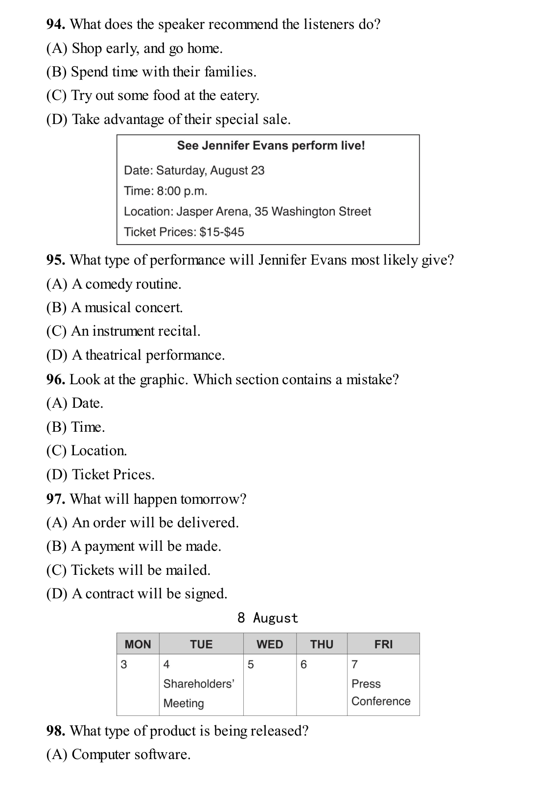

**听力独白/对话原文：**
Good afternoon, shoppers. The management here at the Maytag Department Store would like to wish everyone a very happy Christmas. (92) For your convenience, this store has extended its opening hours. We will be closing at 10:00 p. m. this evening instead of 9 like we always do. (93) This will allow all those last-minute shoppers to buy their family the presents which they so richly deserve. In fact, why don't you make an evening of it and invite your loved ones to dinner at the basement gourmet cafeteria, (94) which will be open until 8? Thank you, and merry Christmas.

**中文对照：**
> 各位顾客，大家好。美态格百货商店的经理在这里祝大家圣诞快乐。为方便各位购物，商店已经延长了营业时间。我们今晚将于10点关门，而不是以往的9点。这会让所有那些最后进来的顾客能够为他们的家人买到礼物，这些礼物是他们完全应该得到的。事实上，您为什么不花一个晚上的时间来这里逛逛，带着心爱的人在底层的美味咖啡厅用餐呢？咖啡厅将营业到8点。谢谢，圣诞快乐。

**核心词汇与短语：**
- **management**：管理
- **convenience**：方便
- **extend**：延长
- **last-minute**：最后的
- **richly**：完全地
- **deserve**：应得
- **gourmet**：美味，美食
- **normally**：通常地
- **eatery**：餐馆
- **take advantage of ~**：利用

#### Q92 (正确答案：D)
**问题：** Where is the announcement taking place? (这则通告是在哪里宣布的？)
- (A) In a family restaurant. (在家族餐馆。)
- (B) In a gift store. (在礼品店。)
- (C) In a convenience store. (在便利店。)
- (D) In a department store. (在百货商店。)

#### Q93 (正确答案：B)
**问题：** When does the business normally close? (商店通常几点关门？)
- (A) At 8. (8 点。)
- (B) At 9. (9 点。)
- (C) At 10. (10 点。)
- (D) At 11. (11 点。)

#### Q94 (正确答案：C)
**问题：** What does the speaker recommend the listeners do? (讲话人建议听众做什么？)
- (A) Shop early, and go home. (早点儿购物，然后回家。)
- (B) Spend time with their families. (与他们的家人一起分享时光。)
- (C) Try out some food at the eatery. (在餐馆尝试一些食品。)
- (D) Take advantage of their special sale. (利用他们的特别促销。)

**延伸表达与补充：**
- **for your convenience = for your comfort = for your pleasure** (为了方便您)
  - *例句：For your convenience, we have upgraded all the computers over the weekend.* (为了方便您，我们已经在周末将所有的电脑都升级了。)
- **We will be closing at 10:00 p. m. = We will be open until 10:00 p. m. = We will end our day at 10:00 p. m.** (我们将于晚上10点关门。)
- **This will allow ~ = This will let ~ = This will provide ~** (这将让…)
  - *例句：This will allow the visitors to park on the first floor.* (这将使参观者可以在一层停车。)

### Questions 95 - 97

**听力独白/对话原文：**
I'm pleased to report that tickets are selling rapidly, and we should sell the remaining 450 tickets by the end of the week. It appears as though everyone in town is eager to hear Jennifer Evans sing. (95) Just so you know, the posters haven't arrived yet. Eric happened to notice a mistake as the number 23 was written on the posters instead of 13. (96) So the printer had to make a change and threw away the posters which had already been printed. I've been informed that the posters will arrive tomorrow, (97) so we'll send a few of you out to post them in places around town then. See Jennifer Evans perform live!

**中文对照：**
> 很高兴能告诉大家我们的票卖得很快，预计本周结束时可将余下的450张票全部售完。好像镇上的每个人都想到现场听珍妮弗·埃文斯唱歌。正如大家所知道的，海报尚未寄到。因为艾瑞克无意中发现海报上的数字13被错写成了23。于是印刷部门那边不得不加以修改，并将已经印好的海报搁置一旁。我这边得到消息，说海报将于明天寄达。届时我们会将海报分发给各位，请大家帮忙按地点将海报贴在镇上显眼之处。观看珍妮弗·埃文斯现场表演！

**核心词汇与短语：**
- **be pleased to**：很高兴
- **remaining**：余下的
- **by the end of**：截止到
- **just so you know**：正如你所知道的那样
- **happen to**：偶然发生
- **instead of**：代替
- **throw away**：扔掉，丢弃
- **be informed that**：被告知
- **send out**：派遣；发送

#### Q95 (正确答案：B)
**问题：** What type of performance will Jennifer Evans most likely give? (珍妮弗 · 埃文斯最有可能带来什么表演？)
- (A) A comedy routine. (喜剧表演。)
- (B) A musical concert. (音乐会。)
- (C) An instrument recital. (乐器独奏会。)
- (D) A theatrical performance. (戏剧表演。)

#### Q96 (正确答案：A)
**问题：** Look at the graphic. Which section contains a mistake? (请看图表，哪个地方出现了错误？)
- (A) Date. (日期。)
- (B) Time. (时间。)
- (C) Location. (地点。)
- (D) Ticket Prices. (票价。)

#### Q97 (正确答案：A)
**问题：** What will happen tomorrow? (明天会发生什么？)
- (A) An order will be delivered. (交付订单。)
- (B) A payment will be made. (付款。)
- (C) Tickets will be mailed. (邮寄票据。)
- (D) A contract will be signed. (签署合约。)

**延伸表达与补充：**
- **I'm pleased to = I'm glad to = I feel happy to** (很高兴…)
  - *例句：I'm pleased to know that you are coming.* (很高兴知道你要来了。)
- **It appears as though = It seems as if** (看起来好像)
  - *例句：It appears as though a new chapter has begun to take shape.* (看起来新章节好像正在慢慢成形。)

### Questions 98 - 100

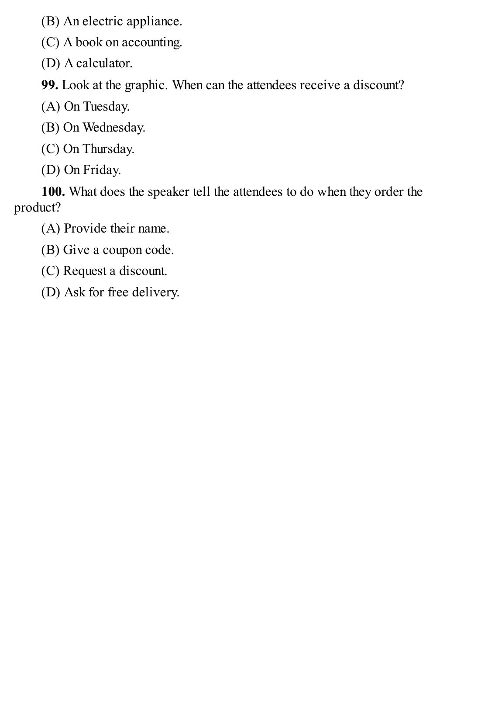

**听力独白/对话原文：**
Thank you for attending this demonstration of my firm's newest software. (98) As I hope you noticed, the software does exactly what it's supposed to. We believe the accountants who utilize it will find they become more efficient in their work. I'd like to inform everybody of a special deal that's only for people in this room. We intend to release the software at a press conference next week. If you order it the day before, you can purchase it for fifty percent off the regular price. (99) We know everyone who's here, so simply give the operator your name when you order, and the discount will be applied. (100) 8 August

**中文对照：**
> 感谢大家出席我公司最新款软件的发布会。不知道大家是否注意到，本款软件执行指令的效果堪称完美。相信会计人员用完后会发现自己的工作效率大大提高。我在这里有个好消息要告诉大家，在座的每一位均可享受特别优惠。我们预计在下周的新闻发布会上正式公布此款软件。如若您在发布会的前一天订购，即可享受五折优惠。我们认识在座的每一位，您到时候下单时告诉客服人员您的姓名，则会自动享受该折扣。八月

**核心词汇与短语：**
- **demonstration**：演示；证明
- **accountant**：会计人员
- **utilize**：利用，使用
- **press conference**：新闻发布会
- **purchase**：购买
- **discount**：折扣
- **shareholder**：股东

#### Q98 (正确答案：A)
**问题：** What type of product is being released? (正在发布的是哪类产品？)
- (A) Computer software. (计算机软件。)
- (B) An electric appliance. (家用电器。)
- (C) A book on accounting. (会计相关图书。)
- (D) A calculator. (计算器。)

#### Q99 (正确答案：C)
**问题：** Look at the graphic. When can the attendees receive a discount? (请看图表，出席人员什么时候可以享受折扣？)
- (A) On Tuesday. (星期二。)
- (B) On Wednesday. (星期三。)
- (C) On Thursday. (星期四。)
- (D) On Friday. (星期五。)

#### Q100 (正确答案：A)
**问题：** What does the speaker tell the attendees to do when they order the product? (讲话人告诉参会者，预订产品的时候要做什么？)
- (A) Provide their name. (提供姓名。)
- (B) Give a coupon code. (提供优惠券密码。)
- (C) Request a discount. (申请打折。)
- (D) Ask for free delivery. (要求免费配送。)

**延伸表达与补充：**
- **intend to = plan to = mean to = want to** (打算)
  - *例句：How do you intend to carry out this strategy?* (你打算如何将这一观念付诸实践？)
