# 阅读1000题原题全文与解析（PDF 文本抽取版）

- 来源 PDF：`【2019版新东方】阅读全真模拟1000题.pdf`
- 抽取方式：按 PDF 页码逐页保留原文文本、题干、选项、阅读材料、答案与解析。
- 说明：图片、照片、图表等非文本内容无法可靠转成 Markdown；对应页会保留页码，请回 PDF 对照版面。

## 目录

- [PDF 第 1 页](#pdf-第-1-页)：772
- [PDF 第 2 页](#pdf-第-2-页)：版权信息
- [PDF 第 3 页](#pdf-第-3-页)：目录
- [PDF 第 4 页](#pdf-第-4-页)：前言
- [PDF 第 5 页](#pdf-第-5-页)：考生在做题之后进行系统地学习，打好语言基础，查缺补漏。
- [PDF 第 6 页](#pdf-第-6-页)：How to study
- [PDF 第 7 页](#pdf-第-7-页)：Part 6
- [PDF 第 8 页](#pdf-第-8-页)：这一部分主要是语法题和词汇题，
- [PDF 第 9 页](#pdf-第-9-页)：Part 7
- [PDF 第 10 页](#pdf-第-10-页)：781
- [PDF 第 11 页](#pdf-第-11-页)：782
- [PDF 第 12 页](#pdf-第-12-页)：783
- [PDF 第 13 页](#pdf-第-13-页)：How to use this book
- [PDF 第 14 页](#pdf-第-14-页)：Part 7
- [PDF 第 15 页](#pdf-第-15-页)：试题册
- [PDF 第 16 页](#pdf-第-16-页)：(A) her
- [PDF 第 17 页](#pdf-第-17-页)：(A) determine
- [PDF 第 18 页](#pdf-第-18-页)：(A) negotiate
- [PDF 第 19 页](#pdf-第-19-页)：(B) founded
- [PDF 第 20 页](#pdf-第-20-页)：(B) opener
- [PDF 第 21 页](#pdf-第-21-页)：(C) economy
- [PDF 第 22 页](#pdf-第-22-页)：(D) confirmation
- [PDF 第 23 页](#pdf-第-23-页)：Part
- [PDF 第 24 页](#pdf-第-24-页)：(D) surplus
- [PDF 第 25 页](#pdf-第-25-页)：couple! (138) --------.
- [PDF 第 26 页](#pdf-第-26-页)：An essential element of the transportation system in many of
- [PDF 第 27 页](#pdf-第-27-页)：142.
- [PDF 第 28 页](#pdf-第-28-页)：(B) It was a pleasure meeting all of you and
- [PDF 第 29 页](#pdf-第-29-页)：Questions 147-150
- [PDF 第 30 页](#pdf-第-30-页)：(A) To provide information about the club’s history
- [PDF 第 31 页](#pdf-第-31-页)：Holly Samuels [3:31 P.M.]
- [PDF 第 32 页](#pdf-第-32-页)：(B) Send Ms. Samuels an e-mail
- [PDF 第 33 页](#pdf-第-33-页)：• In case you are lost and cannot get in touch with your hos
- [PDF 第 34 页](#pdf-第-34-页)：(D) [4]
- [PDF 第 35 页](#pdf-第-35-页)：T: 755-3422 W: pumpitclub.com
- [PDF 第 36 页](#pdf-第-36-页)：159.
- [PDF 第 37 页](#pdf-第-37-页)：(C) Getting medicine for a cold
- [PDF 第 38 页](#pdf-第-38-页)：Everyone is encouraged to submit comments and ideas to the M
- [PDF 第 39 页](#pdf-第-39-页)：(D) The subway and bus strikes will affect the company.
- [PDF 第 40 页](#pdf-第-40-页)：Regular hours of operation: Monday to Friday: 9 a.m. to 6 p.
- [PDF 第 41 页](#pdf-第-41-页)：CREDIT PROBLEM?
- [PDF 第 42 页](#pdf-第-42-页)：168.
- [PDF 第 43 页](#pdf-第-43-页)：Lisa and Mark, pack your bags. You’re flying abroad to Munic
- [PDF 第 44 页](#pdf-第-44-页)：(B) They have worked with Ms. Francona before.
- [PDF 第 45 页](#pdf-第-45-页)：Special
- [PDF 第 46 页](#pdf-第-46-页)：Suite 58, 107 Morris Circle
- [PDF 第 47 页](#pdf-第-47-页)：Subject:
- [PDF 第 48 页](#pdf-第-48-页)：(B) Manufacturing automobiles
- [PDF 第 49 页](#pdf-第-49-页)：Estate Agency is pleased to announce the availability of the
- [PDF 第 50 页](#pdf-第-50-页)：Dear Mr. Connor,
- [PDF 第 51 页](#pdf-第-51-页)：(D) None of them
- [PDF 第 52 页](#pdf-第-52-页)：To: Lucian Ball <lball@gregorson.com>
- [PDF 第 53 页](#pdf-第-53-页)：Date: June 30
- [PDF 第 54 页](#pdf-第-54-页)：(A) Brian Stephenson
- [PDF 第 55 页](#pdf-第-55-页)：To: Carol Manning <carolm@fultoncounty.org>
- [PDF 第 56 页](#pdf-第-56-页)：get my money refunded. I’ll be visiting the community center
- [PDF 第 57 页](#pdf-第-57-页)：(D) He was in Pensacola when it happened.
- [PDF 第 58 页](#pdf-第-58-页)：To: Regina Paul <rpaul@vanderhouse.com>
- [PDF 第 59 页](#pdf-第-59-页)：be open to reconsidering my response.
- [PDF 第 60 页](#pdf-第-60-页)：(C) She failed to follow the company’s new policy.
- [PDF 第 61 页](#pdf-第-61-页)：Test 02
- [PDF 第 62 页](#pdf-第-62-页)：(D) charges
- [PDF 第 63 页](#pdf-第-63-页)：107
- [PDF 第 64 页](#pdf-第-64-页)：111
- [PDF 第 65 页](#pdf-第-65-页)：predicted that the cost of fruits and vegetables will be ---
- [PDF 第 66 页](#pdf-第-66-页)：a service representative is enough to make them not want to
- [PDF 第 67 页](#pdf-第-67-页)：(A) Advancement
- [PDF 第 68 页](#pdf-第-68-页)：(A) indifferently
- [PDF 第 69 页](#pdf-第-69-页)：Directions
- [PDF 第 70 页](#pdf-第-70-页)：(C) The useful information you requested is mentioned above.
- [PDF 第 71 页](#pdf-第-71-页)：135
- [PDF 第 72 页](#pdf-第-72-页)：things most liked about city life.
- [PDF 第 73 页](#pdf-第-73-页)：Questions 143-146
- [PDF 第 74 页](#pdf-第-74-页)：(B) gain
- [PDF 第 75 页](#pdf-第-75-页)：Due to seasonal demands, the availability of rooms may be su
- [PDF 第 76 页](#pdf-第-76-页)：according to industry experts. —[1]— What is behind this tre
- [PDF 第 77 页](#pdf-第-77-页)：(D) Women will resort to marriage for emotional security.
- [PDF 第 78 页](#pdf-第-78-页)：valued at only $99, comes with a dietary guide and recipe bo
- [PDF 第 79 页](#pdf-第-79-页)：(B) To report the finding of a study conducted by a magazine
- [PDF 第 80 页](#pdf-第-80-页)：sign a contract this month, so we’ll get the place a month e
- [PDF 第 81 页](#pdf-第-81-页)：(A) It is currently for sale.
- [PDF 第 82 页](#pdf-第-82-页)：personal information about any judges will be provided by th
- [PDF 第 83 页](#pdf-第-83-页)：1 Constitution Place
- [PDF 第 84 页](#pdf-第-84-页)：(D) The scent of the flowers
- [PDF 第 85 页](#pdf-第-85-页)：101 Lawrence Avenue East, Chicago
- [PDF 第 86 页](#pdf-第-86-页)：(A) The seminar date
- [PDF 第 87 页](#pdf-第-87-页)：169
- [PDF 第 88 页](#pdf-第-88-页)：Margaret,
- [PDF 第 89 页](#pdf-第-89-页)：Questions 174-175
- [PDF 第 90 页](#pdf-第-90-页)：(C) The copier will not be fixed soon.
- [PDF 第 91 页](#pdf-第-91-页)：Dear Jason,
- [PDF 第 92 页](#pdf-第-92-页)：(A) To request an overdue payment
- [PDF 第 93 页](#pdf-第-93-页)：Tickets are on sale now and are available for $10 (adults) a
- [PDF 第 94 页](#pdf-第-94-页)：(A) $5.00
- [PDF 第 95 页](#pdf-第-95-页)：Become a member of our VIP Drivers’ Club
- [PDF 第 96 页](#pdf-第-96-页)：Please be advised that you’re not eligible for any discounts
- [PDF 第 97 页](#pdf-第-97-页)：Regards,
- [PDF 第 98 页](#pdf-第-98-页)：(D) A sports car
- [PDF 第 99 页](#pdf-第-99-页)：Hi, Deborah. Anything to report?
- [PDF 第 100 页](#pdf-第-100-页)：remain at his branch as he’s replacing Erwin Peters, who’s r
- [PDF 第 101 页](#pdf-第-101-页)：195
- [PDF 第 102 页](#pdf-第-102-页)：From: Melvin Hubbard <mhubbard@edisonmanufacturing.com>
- [PDF 第 103 页](#pdf-第-103-页)：Sylvia Wayne
- [PDF 第 104 页](#pdf-第-104-页)：(D) He has several years of work experience.
- [PDF 第 105 页](#pdf-第-105-页)：Test 03
- [PDF 第 106 页](#pdf-第-106-页)：(D) next to
- [PDF 第 107 页](#pdf-第-107-页)：107.
- [PDF 第 108 页](#pdf-第-108-页)：pleasantly surprised by an increase in the size of their pay
- [PDF 第 109 页](#pdf-第-109-页)：(A) compensate
- [PDF 第 110 页](#pdf-第-110-页)：(B) efficiency
- [PDF 第 111 页](#pdf-第-111-页)：(B) prediction
- [PDF 第 112 页](#pdf-第-112-页)：(C) collaboration
- [PDF 第 113 页](#pdf-第-113-页)：Questions 131-134
- [PDF 第 114 页](#pdf-第-114-页)：(C) during
- [PDF 第 115 页](#pdf-第-115-页)：(136) -------- . Simply proceed to counters A16 or B16 (Park
- [PDF 第 116 页](#pdf-第-116-页)：(D) charge
- [PDF 第 117 页](#pdf-第-117-页)：141.
- [PDF 第 118 页](#pdf-第-118-页)：143.
- [PDF 第 119 页](#pdf-第-119-页)：145.
- [PDF 第 120 页](#pdf-第-120-页)：Chris Ernst [1:08 P.M.]
- [PDF 第 121 页](#pdf-第-121-页)：services will resume on the following Monday, the 29th of De
- [PDF 第 122 页](#pdf-第-122-页)：(A) The payments will have to be mailed out.
- [PDF 第 123 页](#pdf-第-123-页)：Further Comments:
- [PDF 第 124 页](#pdf-第-124-页)：432 Wilberforce Road, Victoria, V8W 3R3, the executors of th
- [PDF 第 125 页](#pdf-第-125-页)：(D) The appointment of the executor of the will is going to
- [PDF 第 126 页](#pdf-第-126-页)：(A) Goods must be brought back in their original form.
- [PDF 第 127 页](#pdf-第-127-页)：Dear colleagues,
- [PDF 第 128 页](#pdf-第-128-页)：(D) It will be delivered the next day.
- [PDF 第 129 页](#pdf-第-129-页)：to explore and develop northern oil fields until 2025. The c
- [PDF 第 130 页](#pdf-第-130-页)：Amy Wilson [11:05 A.M.]
- [PDF 第 131 页](#pdf-第-131-页)：(B) At a building
- [PDF 第 132 页](#pdf-第-132-页)：Chicago IL. 60637
- [PDF 第 133 页](#pdf-第-133-页)：(D) To get the printer serviced by a technician
- [PDF 第 134 页](#pdf-第-134-页)：(B) Talk to the hotel maid
- [PDF 第 135 页](#pdf-第-135-页)：343 Prince Highway
- [PDF 第 136 页](#pdf-第-136-页)：178.
- [PDF 第 137 页](#pdf-第-137-页)：I received the bill for my August account on September 5, 20
- [PDF 第 138 页](#pdf-第-138-页)：Julie London
- [PDF 第 139 页](#pdf-第-139-页)：185.
- [PDF 第 140 页](#pdf-第-140-页)：changes, so I can’t approve everything at this moment. I was
- [PDF 第 141 页](#pdf-第-141-页)：187.
- [PDF 第 142 页](#pdf-第-142-页)：is having a special sale on coffee beans this week only
- [PDF 第 143 页](#pdf-第-143-页)：Delivery Date: March 6
- [PDF 第 144 页](#pdf-第-144-页)：(D) It sells coffee beans from many places.
- [PDF 第 145 页](#pdf-第-145-页)：Powell Hospital to Open Soon
- [PDF 第 146 页](#pdf-第-146-页)：Powell Hospital Open
- [PDF 第 147 页](#pdf-第-147-页)：(A) He worked at the Watertown Health Clinic.
- [PDF 第 148 页](#pdf-第-148-页)：Test 04
- [PDF 第 149 页](#pdf-第-149-页)：(D) To place
- [PDF 第 150 页](#pdf-第-150-页)：107.
- [PDF 第 151 页](#pdf-第-151-页)：111.
- [PDF 第 152 页](#pdf-第-152-页)：115.
- [PDF 第 153 页](#pdf-第-153-页)：confidential ------- and place them in the boxes provided be
- [PDF 第 154 页](#pdf-第-154-页)：(A) but
- [PDF 第 155 页](#pdf-第-155-页)：(B) individually
- [PDF 第 156 页](#pdf-第-156-页)：correctly completes the text and mark the corresponding lett
- [PDF 第 157 页](#pdf-第-157-页)：(B) employs
- [PDF 第 158 页](#pdf-第-158-页)：137.
- [PDF 第 159 页](#pdf-第-159-页)：140.
- [PDF 第 160 页](#pdf-第-160-页)：143.
- [PDF 第 161 页](#pdf-第-161-页)：Questions 147-148
- [PDF 第 162 页](#pdf-第-162-页)：(C) [3]
- [PDF 第 163 页](#pdf-第-163-页)：I look forward to your positive response to this very import
- [PDF 第 164 页](#pdf-第-164-页)：Our Design and Testing Unit now has an extra engineer. Her n
- [PDF 第 165 页](#pdf-第-165-页)：Space for living
- [PDF 第 166 页](#pdf-第-166-页)：156.
- [PDF 第 167 页](#pdf-第-167-页)：storage system?
- [PDF 第 168 页](#pdf-第-168-页)：Possibly. Rupert Frost said he’d be willing to do it, but he
- [PDF 第 169 页](#pdf-第-169-页)：(B) Mr. Pauley’s co-worker
- [PDF 第 170 页](#pdf-第-170-页)：164.
- [PDF 第 171 页](#pdf-第-171-页)：Questions 168-170
- [PDF 第 172 页](#pdf-第-172-页)：168.
- [PDF 第 173 页](#pdf-第-173-页)：encouraged to apply. One of the principal tasks will be to g
- [PDF 第 174 页](#pdf-第-174-页)：(A) By calling the school
- [PDF 第 175 页](#pdf-第-175-页)：(B) He is willing to change shifts.
- [PDF 第 176 页](#pdf-第-176-页)：Wayne Forman
- [PDF 第 177 页](#pdf-第-177-页)：(B) To show his appreciation for the friendly reception and
- [PDF 第 178 页](#pdf-第-178-页)：(C) Arrange flight details and accommodation for the guests
- [PDF 第 179 页](#pdf-第-179-页)：years and would definitely be continuing my subscription if
- [PDF 第 180 页](#pdf-第-180-页)：(D) She wants a little time to think about renewing.
- [PDF 第 181 页](#pdf-第-181-页)：Cormack Convention Center
- [PDF 第 182 页](#pdf-第-182-页)：However, we would like to offer you a payment of $250 for pa
- [PDF 第 183 页](#pdf-第-183-页)：(A) He recently became a farmer.
- [PDF 第 184 页](#pdf-第-184-页)：Dear Ms. Dunn,
- [PDF 第 185 页](#pdf-第-185-页)：191.
- [PDF 第 186 页](#pdf-第-186-页)：(C) She works in the Accounting Department at her firm.
- [PDF 第 187 页](#pdf-第-187-页)：Thank you for staying with us.
- [PDF 第 188 页](#pdf-第-188-页)：We thank you for bringing this matter to our attention. We i
- [PDF 第 189 页](#pdf-第-189-页)：(C) $18.00
- [PDF 第 190 页](#pdf-第-190-页)：Test 05
- [PDF 第 191 页](#pdf-第-191-页)：(C) for
- [PDF 第 192 页](#pdf-第-192-页)：(C) risen
- [PDF 第 193 页](#pdf-第-193-页)：(C) rewards
- [PDF 第 194 页](#pdf-第-194-页)：(D) Having been recognized
- [PDF 第 195 页](#pdf-第-195-页)：119.
- [PDF 第 196 页](#pdf-第-196-页)：satisfy both their needs and tastes.
- [PDF 第 197 页](#pdf-第-197-页)：listen to all stake-holders, and flexibility.
- [PDF 第 198 页](#pdf-第-198-页)：Part
- [PDF 第 199 页](#pdf-第-199-页)：(D) The folk superstar Judith Bachman is more famous than th
- [PDF 第 200 页](#pdf-第-200-页)：(C) comparing
- [PDF 第 201 页](#pdf-第-201-页)：By increasing the wire thickness in the outer two rows, Drea
- [PDF 第 202 页](#pdf-第-202-页)：The Mitel Limited
- [PDF 第 203 页](#pdf-第-203-页)：(D) him
- [PDF 第 204 页](#pdf-第-204-页)：Hello, Tyrell. Have you reviewed the letter I e-mailed you e
- [PDF 第 205 页](#pdf-第-205-页)：Date:
- [PDF 第 206 页](#pdf-第-206-页)：150.
- [PDF 第 207 页](#pdf-第-207-页)：(A) A few nearby buildings near the hotel will be torn down.
- [PDF 第 208 页](#pdf-第-208-页)：Customers have complained to us that the locking ring simply
- [PDF 第 209 页](#pdf-第-209-页)：already had 3 returns.”
- [PDF 第 210 页](#pdf-第-210-页)：(A) The guest gets added to the hotel’s mailing list.
- [PDF 第 211 页](#pdf-第-211-页)：This is an awful attempt at a“romantic drama.” Young Hearts
- [PDF 第 212 页](#pdf-第-212-页)：(D) It is based on a true story.
- [PDF 第 213 页](#pdf-第-213-页)：(D) To apologize for sending the wrong item
- [PDF 第 214 页](#pdf-第-214-页)：inspection.
- [PDF 第 215 页](#pdf-第-215-页)：Don’t we have some on file? Can’t we use them?
- [PDF 第 216 页](#pdf-第-216-页)：(D) The company opened for business last year.
- [PDF 第 217 页](#pdf-第-217-页)：____________________________________________________________
- [PDF 第 218 页](#pdf-第-218-页)：174.
- [PDF 第 219 页](#pdf-第-219-页)：• Sales Manager
- [PDF 第 220 页](#pdf-第-220-页)：Webstarters is a company that was established in 1990 with t
- [PDF 第 221 页](#pdf-第-221-页)：(B) To find out about the results of a job interview
- [PDF 第 222 页](#pdf-第-222-页)：our newest members of our company. During the two days in No
- [PDF 第 223 页](#pdf-第-223-页)：181.
- [PDF 第 224 页](#pdf-第-224-页)：(C) He has been with the company for less than a year.
- [PDF 第 225 页](#pdf-第-225-页)：This schedule is subject to change. In case of rain, concert
- [PDF 第 226 页](#pdf-第-226-页)：187.
- [PDF 第 227 页](#pdf-第-227-页)：To:
- [PDF 第 228 页](#pdf-第-228-页)：Date:
- [PDF 第 229 页](#pdf-第-229-页)：Your order has been charged to the following credit card num
- [PDF 第 230 页](#pdf-第-230-页)：(C) AMT42
- [PDF 第 231 页](#pdf-第-231-页)：http://www.cromptonsemiconductors.com
- [PDF 第 232 页](#pdf-第-232-页)：Sincerely,
- [PDF 第 233 页](#pdf-第-233-页)：(D) She will be traveling often at her job.
- [PDF 第 234 页](#pdf-第-234-页)：Test 06
- [PDF 第 235 页](#pdf-第-235-页)：(D) feature
- [PDF 第 236 页](#pdf-第-236-页)：107.
- [PDF 第 237 页](#pdf-第-237-页)：logbook clearly and accurately every time you enter this bui
- [PDF 第 238 页](#pdf-第-238-页)：(A) Followed
- [PDF 第 239 页](#pdf-第-239-页)：(B) financially
- [PDF 第 240 页](#pdf-第-240-页)：(C) off
- [PDF 第 241 页](#pdf-第-241-页)：(D) That
- [PDF 第 242 页](#pdf-第-242-页)：Questions 131-134
- [PDF 第 243 页](#pdf-第-243-页)：(B) More coupons will be distributed to families participati
- [PDF 第 244 页](#pdf-第-244-页)：135.
- [PDF 第 245 页](#pdf-第-245-页)：consultants and other general office management duties. (140
- [PDF 第 246 页](#pdf-第-246-页)：(C) The position is open to both part-time and full-time app
- [PDF 第 247 页](#pdf-第-247-页)：145.
- [PDF 第 248 页](#pdf-第-248-页)：—[3]— Anybody interested in working overtime please approach
- [PDF 第 249 页](#pdf-第-249-页)：Art in Nature
- [PDF 第 250 页](#pdf-第-250-页)：(A) Beverages are only allowed on the patio.
- [PDF 第 251 页](#pdf-第-251-页)：* by a licensed masseur or therapist
- [PDF 第 252 页](#pdf-第-252-页)：(D) Couple massage
- [PDF 第 253 页](#pdf-第-253-页)：156.
- [PDF 第 254 页](#pdf-第-254-页)：675 Oxford Street.
- [PDF 第 255 页](#pdf-第-255-页)：160.
- [PDF 第 256 页](#pdf-第-256-页)：products despite its heavy spending on R&D. This has caused
- [PDF 第 257 页](#pdf-第-257-页)：166.
- [PDF 第 258 页](#pdf-第-258-页)：(B) A bank transaction record
- [PDF 第 259 页](#pdf-第-259-页)：• First name:______________
- [PDF 第 260 页](#pdf-第-260-页)：170.
- [PDF 第 261 页](#pdf-第-261-页)：I can be there either at two or at four thirty.
- [PDF 第 262 页](#pdf-第-262-页)：April, July, October)
- [PDF 第 263 页](#pdf-第-263-页)：MEMO
- [PDF 第 264 页](#pdf-第-264-页)：I am sure that I can be of assistance if you still need some
- [PDF 第 265 页](#pdf-第-265-页)：179.
- [PDF 第 266 页](#pdf-第-266-页)：I can also provide transport for the bulky items listed abov
- [PDF 第 267 页](#pdf-第-267-页)：(A) He plans to replace them with new furniture.
- [PDF 第 268 页](#pdf-第-268-页)：564 Magnolia Drive
- [PDF 第 269 页](#pdf-第-269-页)：Subscribers will also be alerted to special offers from our
- [PDF 第 270 页](#pdf-第-270-页)：(C) To promote a brand-new magazine
- [PDF 第 271 页](#pdf-第-271-页)：Questions 191-195
- [PDF 第 272 页](#pdf-第-272-页)：www.addisonsportinggoods.com
- [PDF 第 273 页](#pdf-第-273-页)：191.
- [PDF 第 274 页](#pdf-第-274-页)：(A) Item number 345345
- [PDF 第 275 页](#pdf-第-275-页)：To: Melanie Ng <melanieng@sandersontech.com>
- [PDF 第 276 页](#pdf-第-276-页)：company and become acquainted with the premises. They will i
- [PDF 第 277 页](#pdf-第-277-页)：(D) He helped Ms. Abernathy find a home.
- [PDF 第 278 页](#pdf-第-278-页)：Test 07
- [PDF 第 279 页](#pdf-第-279-页)：(D) administrable
- [PDF 第 280 页](#pdf-第-280-页)：107.
- [PDF 第 281 页](#pdf-第-281-页)：expected to deliver a preliminary judgment sometime today.
- [PDF 第 282 页](#pdf-第-282-页)：(A) like
- [PDF 第 283 页](#pdf-第-283-页)：(B) in
- [PDF 第 284 页](#pdf-第-284-页)：(C) what
- [PDF 第 285 页](#pdf-第-285-页)：(C) compiled
- [PDF 第 286 页](#pdf-第-286-页)：Questions 131-134
- [PDF 第 287 页](#pdf-第-287-页)：(D) test
- [PDF 第 288 页](#pdf-第-288-页)：college.
- [PDF 第 289 页](#pdf-第-289-页)：Reviews by Elisa Reigns
- [PDF 第 290 页](#pdf-第-290-页)：(D) The plot was too obvious to receive a good rating.
- [PDF 第 291 页](#pdf-第-291-页)：(C) every
- [PDF 第 292 页](#pdf-第-292-页)：from November 25 until December 2, everything in the store w
- [PDF 第 293 页](#pdf-第-293-页)：Oil
- [PDF 第 294 页](#pdf-第-294-页)：(A) [1]
- [PDF 第 295 页](#pdf-第-295-页)：That’s another good tip, Ed. I’ll be sure to come up with a
- [PDF 第 296 页](#pdf-第-296-页)：(C) She is not likely to do very well.
- [PDF 第 297 页](#pdf-第-297-页)：Andrew Kennedy
- [PDF 第 298 页](#pdf-第-298-页)：Questions 160-162
- [PDF 第 299 页](#pdf-第-299-页)：(D) Dispose of it after 30 days
- [PDF 第 300 页](#pdf-第-300-页)：Sports Today. —[3]— We have attached a self-addressed, posta
- [PDF 第 301 页](#pdf-第-301-页)：sentence best belong?
- [PDF 第 302 页](#pdf-第-302-页)：167.
- [PDF 第 303 页](#pdf-第-303-页)：event that your camera becomes wet, you should stop using it
- [PDF 第 304 页](#pdf-第-304-页)：Questions 172-173
- [PDF 第 305 页](#pdf-第-305-页)：(C) City Condo
- [PDF 第 306 页](#pdf-第-306-页)：(A) She is eager to start earning a salary.
- [PDF 第 307 页](#pdf-第-307-页)：below the age of 5 get in for free. Please contact us at Mor
- [PDF 第 308 页](#pdf-第-308-页)：(B) Immediately after they receive a booklet
- [PDF 第 309 页](#pdf-第-309-页)：John Waikinson
- [PDF 第 310 页](#pdf-第-310-页)：20% off the regular price. Unfortunately, I discovered that
- [PDF 第 311 页](#pdf-第-311-页)：(B) To make a complaint about a defective item
- [PDF 第 312 页](#pdf-第-312-页)：http://www.harpermanufacturing.com
- [PDF 第 313 页](#pdf-第-313-页)：(C) It is possible to learn to ride a horse there.
- [PDF 第 314 页](#pdf-第-314-页)：BID FOR PROPOSALS
- [PDF 第 315 页](#pdf-第-315-页)：Can start on April 15 but can finish by April 29. Made a bid
- [PDF 第 316 页](#pdf-第-316-页)：(B) Interviewed companies that made bids
- [PDF 第 317 页](#pdf-第-317-页)：donated by local residents and businesses.
- [PDF 第 318 页](#pdf-第-318-页)：Upon arriving at Pecan Lake Park, go to the west gate to pic
- [PDF 第 319 页](#pdf-第-319-页)：(C) She can work for more than four hours on Saturday.
- [PDF 第 320 页](#pdf-第-320-页)：Test 08
- [PDF 第 321 页](#pdf-第-321-页)：(D) still
- [PDF 第 322 页](#pdf-第-322-页)：(D) consider
- [PDF 第 323 页](#pdf-第-323-页)：111.
- [PDF 第 324 页](#pdf-第-324-页)：have been let down by our quality assurance section.
- [PDF 第 325 页](#pdf-第-325-页)：(A) connected
- [PDF 第 326 页](#pdf-第-326-页)：(B) due to
- [PDF 第 327 页](#pdf-第-327-页)：(C) business
- [PDF 第 328 页](#pdf-第-328-页)：(D) on the answer sheet.
- [PDF 第 329 页](#pdf-第-329-页)：(B) inflated
- [PDF 第 330 页](#pdf-第-330-页)：(B) paid
- [PDF 第 331 页](#pdf-第-331-页)：(B) could
- [PDF 第 332 页](#pdf-第-332-页)：“The market has kind of positioned (146) -------- for the Fe
- [PDF 第 333 页](#pdf-第-333-页)：answer and mark the corresponding letter (A), (B), (C), or (
- [PDF 第 334 页](#pdf-第-334-页)：(C) Many could not actually attend the seminar.
- [PDF 第 335 页](#pdf-第-335-页)：Enjoy the rest of your trip, and say hello to Mary and the k
- [PDF 第 336 页](#pdf-第-336-页)：industries.
- [PDF 第 337 页](#pdf-第-337-页)：(D) The Internet will be accessible anywhere and anytime.
- [PDF 第 338 页](#pdf-第-338-页)：(D) In an office building
- [PDF 第 339 页](#pdf-第-339-页)：Toronto, ON M2M 2P3
- [PDF 第 340 页](#pdf-第-340-页)：(C) Jennifer Ward
- [PDF 第 341 页](#pdf-第-341-页)：• To invest in our people and our talent offering to increas
- [PDF 第 342 页](#pdf-第-342-页)：(D) It uses a large portion of its profits educating its emp
- [PDF 第 343 页](#pdf-第-343-页)：(B) How to work effectively in short time
- [PDF 第 344 页](#pdf-第-344-页)：So will I. I’ve heard that the company provides free housing
- [PDF 第 345 页](#pdf-第-345-页)：(C) Workers at them do not pay for their accommodations.
- [PDF 第 346 页](#pdf-第-346-页)：By following our rules, you and the rest of the group will e
- [PDF 第 347 页](#pdf-第-347-页)：Sylvia Standish [12:56 P.M.]
- [PDF 第 348 页](#pdf-第-348-页)：Dear Mr. Warner,
- [PDF 第 349 页](#pdf-第-349-页)：Dear Mr. Martin,
- [PDF 第 350 页](#pdf-第-350-页)：(A) Workers didn’t show up to work on time.
- [PDF 第 351 页](#pdf-第-351-页)：1. Please describe your working relationship style with your
- [PDF 第 352 页](#pdf-第-352-页)：Analysis
- [PDF 第 353 页](#pdf-第-353-页)：(D) Question 4
- [PDF 第 354 页](#pdf-第-354-页)：Customers at Anderson Bank can open various accounts:
- [PDF 第 355 页](#pdf-第-355-页)：concluded that I agree with them. I live in the Goldenrod ne
- [PDF 第 356 页](#pdf-第-356-页)：Susan Meeks
- [PDF 第 357 页](#pdf-第-357-页)：(D) Online banking is a new option there.
- [PDF 第 358 页](#pdf-第-358-页)：NOTICE
- [PDF 第 359 页](#pdf-第-359-页)：(C) Mayberry Avenue
- [PDF 第 360 页](#pdf-第-360-页)：Questions 196-200
- [PDF 第 361 页](#pdf-第-361-页)：We’ll be in the city one week from today. If you can identif
- [PDF 第 362 页](#pdf-第-362-页)：(B) 743 Rockefeller Road
- [PDF 第 363 页](#pdf-第-363-页)：Test 09
- [PDF 第 364 页](#pdf-第-364-页)：(D) another
- [PDF 第 365 页](#pdf-第-365-页)：107.
- [PDF 第 366 页](#pdf-第-366-页)：receipt of the goods and invoice.
- [PDF 第 367 页](#pdf-第-367-页)：(A) caution
- [PDF 第 368 页](#pdf-第-368-页)：(A) bidding
- [PDF 第 369 页](#pdf-第-369-页)：(B) impressive
- [PDF 第 370 页](#pdf-第-370-页)：(C) impulsively
- [PDF 第 371 页](#pdf-第-371-页)：Questions 131-134
- [PDF 第 372 页](#pdf-第-372-页)：(B) expected
- [PDF 第 373 页](#pdf-第-373-页)：135.
- [PDF 第 374 页](#pdf-第-374-页)：Specializing in Professional Condominium Property Management
- [PDF 第 375 页](#pdf-第-375-页)：To (144) --------, please send an e-mail to entertowin@tor.c
- [PDF 第 376 页](#pdf-第-376-页)：Directions
- [PDF 第 377 页](#pdf-第-377-页)：(B) She cannot see the deliveryman.
- [PDF 第 378 页](#pdf-第-378-页)：(D) To recruit people interested in participating in a speci
- [PDF 第 379 页](#pdf-第-379-页)：February 14 – Air France departure point: New York, New York
- [PDF 第 380 页](#pdf-第-380-页)：(A) They will be meeting in France for the first time.
- [PDF 第 381 页](#pdf-第-381-页)：(D) A business school
- [PDF 第 382 页](#pdf-第-382-页)：multilateral source of loan and equity financing for private
- [PDF 第 383 页](#pdf-第-383-页)：Questions 160-163
- [PDF 第 384 页](#pdf-第-384-页)：160.
- [PDF 第 385 页](#pdf-第-385-页)：conclusion. Talks between each side’s legal representatives
- [PDF 第 386 页](#pdf-第-386-页)：(A) A new policy regarding the licensing of new medicines
- [PDF 第 387 页](#pdf-第-387-页)：joining six months ago, I have already lost 25 pounds and my
- [PDF 第 388 页](#pdf-第-388-页)：From:
- [PDF 第 389 页](#pdf-第-389-页)：(B) By phone
- [PDF 第 390 页](#pdf-第-390-页)：tribute that night.
- [PDF 第 391 页](#pdf-第-391-页)：Vancouver, British Columbia,
- [PDF 第 392 页](#pdf-第-392-页)：by the airline, which best suits the airline staff. And, if
- [PDF 第 393 页](#pdf-第-393-页)：(A) An airline company
- [PDF 第 394 页](#pdf-第-394-页)：trip, please call me at my office during business hours. Als
- [PDF 第 395 页](#pdf-第-395-页)：(B) Each day begins at the same time.
- [PDF 第 396 页](#pdf-第-396-页)：Saturday, July 21: The Pauline Group (7:00 P.M. – 9:00 P.M.)
- [PDF 第 397 页](#pdf-第-397-页)：I appreciate your generous offer to provide your services at
- [PDF 第 398 页](#pdf-第-398-页)：(B) It is the most expensive available.
- [PDF 第 399 页](#pdf-第-399-页)：The Book Depot has more than 20 million used books for sale
- [PDF 第 400 页](#pdf-第-400-页)：will receive an e-mail from each bookseller regarding the st
- [PDF 第 401 页](#pdf-第-401-页)：(C) By spending a certain amount of money
- [PDF 第 402 页](#pdf-第-402-页)：We at Emerson Motors encourage our staffers to be physically
- [PDF 第 403 页](#pdf-第-403-页)：We’re from different departments, so it’s likely that we hav
- [PDF 第 404 页](#pdf-第-404-页)：200.
- [PDF 第 405 页](#pdf-第-405-页)：Test 10
- [PDF 第 406 页](#pdf-第-406-页)：(D) wrongness
- [PDF 第 407 页](#pdf-第-407-页)：107.
- [PDF 第 408 页](#pdf-第-408-页)：more productive in the afternoon.
- [PDF 第 409 页](#pdf-第-409-页)：(A) separation
- [PDF 第 410 页](#pdf-第-410-页)：(B) his
- [PDF 第 411 页](#pdf-第-411-页)：(C) courteously
- [PDF 第 412 页](#pdf-第-412-页)：(D) has been offered
- [PDF 第 413 页](#pdf-第-413-页)：Questions 131-134
- [PDF 第 414 页](#pdf-第-414-页)：(C) additional
- [PDF 第 415 页](#pdf-第-415-页)：(B) reducing
- [PDF 第 416 页](#pdf-第-416-页)：139.
- [PDF 第 417 页](#pdf-第-417-页)：smoking for over 10 years are the best candidates for this s
- [PDF 第 418 页](#pdf-第-418-页)：advertisements, articles, instant messages, or examples of b
- [PDF 第 419 页](#pdf-第-419-页)：Questions 149-
- [PDF 第 420 页](#pdf-第-420-页)：(D) At a phone booth
- [PDF 第 421 页](#pdf-第-421-页)：152.
- [PDF 第 422 页](#pdf-第-422-页)：Questions 156-158
- [PDF 第 423 页](#pdf-第-423-页)：(D) To ask to review the work that has been completed
- [PDF 第 424 页](#pdf-第-424-页)：159.
- [PDF 第 425 页](#pdf-第-425-页)：Melania Carter [2:57 P.M.]
- [PDF 第 426 页](#pdf-第-426-页)：163.
- [PDF 第 427 页](#pdf-第-427-页)：some war journals, pictures, and trophies.
- [PDF 第 428 页](#pdf-第-428-页)：(A) [1]
- [PDF 第 429 页](#pdf-第-429-页)：169.
- [PDF 第 430 页](#pdf-第-430-页)：Dear Ms. Wong:
- [PDF 第 431 页](#pdf-第-431-页)：172.
- [PDF 第 432 页](#pdf-第-432-页)：be at your office by three.
- [PDF 第 433 页](#pdf-第-433-页)：selected a few nearby movie theaters and attached the schedu
- [PDF 第 434 页](#pdf-第-434-页)：Snakes and Monsters
- [PDF 第 435 页](#pdf-第-435-页)：178.
- [PDF 第 436 页](#pdf-第-436-页)：Write-up of Presentations
- [PDF 第 437 页](#pdf-第-437-页)：5
- [PDF 第 438 页](#pdf-第-438-页)：(A) Enterprises that want to keep up with the current change
- [PDF 第 439 页](#pdf-第-439-页)：September
- [PDF 第 440 页](#pdf-第-440-页)：schedule a time to get together to discuss the matter in mor
- [PDF 第 441 页](#pdf-第-441-页)：(D) To negotiate the price of an item
- [PDF 第 442 页](#pdf-第-442-页)：To:
- [PDF 第 443 页](#pdf-第-443-页)：Bill paid in full.
- [PDF 第 444 页](#pdf-第-444-页)：(C) Call the hotel if she is going to check in late
- [PDF 第 445 页](#pdf-第-445-页)：Subject:
- [PDF 第 446 页](#pdf-第-446-页)：196.
- [PDF 第 447 页](#pdf-第-447-页)：(B) On November 7
- [PDF 第 448 页](#pdf-第-448-页)：答案册
- [PDF 第 449 页](#pdf-第-449-页)：(A) If
- [PDF 第 450 页](#pdf-第-450-页)：(A) use (B) used
- [PDF 第 451 页](#pdf-第-451-页)：face
- [PDF 第 452 页](#pdf-第-452-页)：▶
- [PDF 第 453 页](#pdf-第-453-页)：leisure time
- [PDF 第 454 页](#pdf-第-454-页)：▶
- [PDF 第 455 页](#pdf-第-455-页)：respond
- [PDF 第 456 页](#pdf-第-456-页)：时，至少要知道名词的词义，才能作出正确选择。
- [PDF 第 457 页](#pdf-第-457-页)：fitness center
- [PDF 第 458 页](#pdf-第-458-页)：选择具有“开始”意义的(A)starting on。show up to work是“上班”的
- [PDF 第 459 页](#pdf-第-459-页)：此横线处所填单词在引导名词性从句的同时，还要作are的宾语，故答案为
- [PDF 第 460 页](#pdf-第-460-页)：▶
- [PDF 第 461 页](#pdf-第-461-页)：imply(包含，意味，暗示)，根据句意，选择(D)necessarily(必定，必然
- [PDF 第 462 页](#pdf-第-462-页)：126
- [PDF 第 463 页](#pdf-第-463-页)：go off
- [PDF 第 464 页](#pdf-第-464-页)：▶
- [PDF 第 465 页](#pdf-第-465-页)：(A) decide (B) deciding
- [PDF 第 466 页](#pdf-第-466-页)：mortgage
- [PDF 第 467 页](#pdf-第-467-页)：万美元
- [PDF 第 468 页](#pdf-第-468-页)：(C) yet
- [PDF 第 469 页](#pdf-第-469-页)：do one’s job
- [PDF 第 470 页](#pdf-第-470-页)：目的是鼓励市民多使用自行车，以获得与其他大都市一样的效果，例如减
- [PDF 第 471 页](#pdf-第-471-页)：(B) Cycling is beneficial to environmental protection.
- [PDF 第 472 页](#pdf-第-472-页)：experience
- [PDF 第 473 页](#pdf-第-473-页)：主题：访问全球物流公司
- [PDF 第 474 页](#pdf-第-474-页)：→横线处所填单词修饰facility，故形容词(A)secure为正确答案。
- [PDF 第 475 页](#pdf-第-475-页)：的将来
- [PDF 第 476 页](#pdf-第-476-页)：本周五我们所有的会员都能放松心情，好好享受。
- [PDF 第 477 页](#pdf-第-477-页)：(C)
- [PDF 第 478 页](#pdf-第-478-页)：→所给句子是说“将要继承我们的传统的新会员应该听一听老会员的想
- [PDF 第 479 页](#pdf-第-479-页)：151
- [PDF 第 480 页](#pdf-第-480-页)：→麦迪逊先生虽然说他今天本不打算去办公室，但后一句提到他可以顺
- [PDF 第 481 页](#pdf-第-481-页)：·
- [PDF 第 482 页](#pdf-第-482-页)：(A) Americans prefer to address each other formally.
- [PDF 第 483 页](#pdf-第-483-页)：适当的，合适的
- [PDF 第 484 页](#pdf-第-484-页)：157
- [PDF 第 485 页](#pdf-第-485-页)：案为(D)。
- [PDF 第 486 页](#pdf-第-486-页)：→表格最下端写有FOR MORE INFORMATION ASK AT FRONT DESK。答案是
- [PDF 第 487 页](#pdf-第-487-页)：→机场大巴每10分钟一趟，故排除(A)，信息中未提及熨衣服务，从房
- [PDF 第 488 页](#pdf-第-488-页)：(A) To recruit talented people to work on an advertising pro
- [PDF 第 489 页](#pdf-第-489-页)：从这个备忘录中可以推断出什么？
- [PDF 第 490 页](#pdf-第-490-页)：周六上午
- [PDF 第 491 页](#pdf-第-491-页)：(A)
- [PDF 第 492 页](#pdf-第-492-页)：Questions 168-169
- [PDF 第 493 页](#pdf-第-493-页)：这则广告的受众是哪些人？
- [PDF 第 494 页](#pdf-第-494-页)：Questions 170-173
- [PDF 第 495 页](#pdf-第-495-页)：(A) In the office
- [PDF 第 496 页](#pdf-第-496-页)：间。答案是(C)。
- [PDF 第 497 页](#pdf-第-497-页)：→在线对话的最后伯克先生要求三人讨论一下计划，然后给他发邮件汇
- [PDF 第 498 页](#pdf-第-498-页)：简路
- [PDF 第 499 页](#pdf-第-499-页)：(C)
- [PDF 第 500 页](#pdf-第-500-页)：不便之处深表歉意。请您尽快联系我。
- [PDF 第 501 页](#pdf-第-501-页)：ergonomic
- [PDF 第 502 页](#pdf-第-502-页)：(B)
- [PDF 第 503 页](#pdf-第-503-页)：罗杰斯女士和鲁宾逊先生见面后可能会发生什么？
- [PDF 第 504 页](#pdf-第-504-页)：圣罗莎
- [PDF 第 505 页](#pdf-第-505-页)：丽莎
- [PDF 第 506 页](#pdf-第-506-页)：(B) A real estate agent
- [PDF 第 507 页](#pdf-第-507-页)：184
- [PDF 第 508 页](#pdf-第-508-页)：accommodate an art studio and possibly hold private exhibiti
- [PDF 第 509 页](#pdf-第-509-页)：(libby_w@florentineengineering.com)
- [PDF 第 510 页](#pdf-第-510-页)：186
- [PDF 第 511 页](#pdf-第-511-页)：188
- [PDF 第 512 页](#pdf-第-512-页)：克丹尼尔是工程师职务的最佳人选。故答案为(C)。
- [PDF 第 513 页](#pdf-第-513-页)：商品一经售出，概不退换。
- [PDF 第 514 页](#pdf-第-514-页)：了几件商品。不幸的是，我买的桌子有点问题。回到家以后，我把桌子安
- [PDF 第 515 页](#pdf-第-515-页)：(A) budgets
- [PDF 第 516 页](#pdf-第-516-页)：(A) It took place in the month of June.
- [PDF 第 517 页](#pdf-第-517-页)：收件人：全体员工
- [PDF 第 518 页](#pdf-第-518-页)：另外，我想让你知道马可尼项目的工作进展顺利。我要求法院提供的
- [PDF 第 519 页](#pdf-第-519-页)：policy?
- [PDF 第 520 页](#pdf-第-520-页)：198
- [PDF 第 521 页](#pdf-第-521-页)：交的休假申请须在下个周一的中午之前给出答复。保罗女士周一收到克拉丽
- [PDF 第 522 页](#pdf-第-522-页)：1293
- [PDF 第 523 页](#pdf-第-523-页)：Test 02
- [PDF 第 524 页](#pdf-第-524-页)：▶
- [PDF 第 525 页](#pdf-第-525-页)：due to
- [PDF 第 526 页](#pdf-第-526-页)：▶
- [PDF 第 527 页](#pdf-第-527-页)：booklet is _____ to any student interested in receiving help
- [PDF 第 528 页](#pdf-第-528-页)：along with
- [PDF 第 529 页](#pdf-第-529-页)：(C) Enrolling
- [PDF 第 530 页](#pdf-第-530-页)：triple
- [PDF 第 531 页](#pdf-第-531-页)：predicted that the cost of fruits and vegetables will be ---
- [PDF 第 532 页](#pdf-第-532-页)：rank
- [PDF 第 533 页](#pdf-第-533-页)：▶
- [PDF 第 534 页](#pdf-第-534-页)：raise
- [PDF 第 535 页](#pdf-第-535-页)：(A) by
- [PDF 第 536 页](#pdf-第-536-页)：undergo
- [PDF 第 537 页](#pdf-第-537-页)：126
- [PDF 第 538 页](#pdf-第-538-页)：valued
- [PDF 第 539 页](#pdf-第-539-页)：129
- [PDF 第 540 页](#pdf-第-540-页)：persist
- [PDF 第 541 页](#pdf-第-541-页)：→that we _____ in our last meeting修饰前面的the copy of our
- [PDF 第 542 页](#pdf-第-542-页)：reception
- [PDF 第 543 页](#pdf-第-543-页)：《
- [PDF 第 544 页](#pdf-第-544-页)：(C) The person must be able to work to the pressure of stric
- [PDF 第 545 页](#pdf-第-545-页)：highly
- [PDF 第 546 页](#pdf-第-546-页)：另一方面，市中心的交通堵塞
- [PDF 第 547 页](#pdf-第-547-页)：(C) a few
- [PDF 第 548 页](#pdf-第-548-页)：character
- [PDF 第 549 页](#pdf-第-549-页)：143
- [PDF 第 550 页](#pdf-第-550-页)：▼ Vocabulary Check
- [PDF 第 551 页](#pdf-第-551-页)：popular
- [PDF 第 552 页](#pdf-第-552-页)：(D)
- [PDF 第 553 页](#pdf-第-553-页)：(B)
- [PDF 第 554 页](#pdf-第-554-页)：150
- [PDF 第 555 页](#pdf-第-555-页)：→专家分析自己买房的女性会越来越多，故答案是(C)。
- [PDF 第 556 页](#pdf-第-556-页)：把赠券放入这个盒子你就可能获奖！
- [PDF 第 557 页](#pdf-第-557-页)：(B) It is not very difficult to clean.
- [PDF 第 558 页](#pdf-第-558-页)：155
- [PDF 第 559 页](#pdf-第-559-页)：157
- [PDF 第 560 页](#pdf-第-560-页)：太好了。现在我们能开自己的咖啡馆了。是我们提出的那个价格吗？
- [PDF 第 561 页](#pdf-第-561-页)：▼ Vocabulary Check
- [PDF 第 562 页](#pdf-第-562-页)：(A)
- [PDF 第 563 页](#pdf-第-563-页)：(A)
- [PDF 第 564 页](#pdf-第-564-页)：(iii)
- [PDF 第 565 页](#pdf-第-565-页)：(C) The members of the Tampa City Council
- [PDF 第 566 页](#pdf-第-566-页)：(C) They must submit a photo of their gardens.
- [PDF 第 567 页](#pdf-第-567-页)：海云投资
- [PDF 第 568 页](#pdf-第-568-页)：海云投资
- [PDF 第 569 页](#pdf-第-569-页)：plait的缩写，相当于please respond(请答复)。
- [PDF 第 570 页](#pdf-第-570-页)：→本题要求回答邀请函中未提及的内容，因此要仔细阅读所有信息。文
- [PDF 第 571 页](#pdf-第-571-页)：琼斯女士最近做了些什么？
- [PDF 第 572 页](#pdf-第-572-页)：(D) [4]
- [PDF 第 573 页](#pdf-第-573-页)：多伦多。如果他们那天有时间，我希望能有机会见见他们，亲眼看看他们
- [PDF 第 574 页](#pdf-第-574-页)：(C) Singapore
- [PDF 第 575 页](#pdf-第-575-页)：拉里
- [PDF 第 576 页](#pdf-第-576-页)：(B)
- [PDF 第 577 页](#pdf-第-577-页)：贾森
- [PDF 第 578 页](#pdf-第-578-页)：的，过期的
- [PDF 第 579 页](#pdf-第-579-页)：→根据第一封信第一段末尾处的I will ensure that payment is in
- [PDF 第 580 页](#pdf-第-580-页)：→信中提到We would be pleased to offer our services should you
- [PDF 第 581 页](#pdf-第-581-页)：供更多信息。
- [PDF 第 582 页](#pdf-第-582-页)：(A)
- [PDF 第 583 页](#pdf-第-583-页)：(A)
- [PDF 第 584 页](#pdf-第-584-页)：(A) 9
- [PDF 第 585 页](#pdf-第-585-页)：奥列尔大道
- [PDF 第 586 页](#pdf-第-586-页)：还车：
- [PDF 第 587 页](#pdf-第-587-页)：(D) To solve a problem
- [PDF 第 588 页](#pdf-第-588-页)：(C) A luxury car
- [PDF 第 589 页](#pdf-第-589-页)：rental
- [PDF 第 590 页](#pdf-第-590-页)：在过去的两天里，我一直在和斯科菲尔德的代表会面。他们对我们正
- [PDF 第 591 页](#pdf-第-591-页)：(B) To ask about her trip
- [PDF 第 592 页](#pdf-第-592-页)：(A) It will complete some work too late.
- [PDF 第 593 页](#pdf-第-593-页)：195
- [PDF 第 594 页](#pdf-第-594-页)：是几个必须招聘人员的职位：
- [PDF 第 595 页](#pdf-第-595-页)：人力资源部
- [PDF 第 596 页](#pdf-第-596-页)：排
- [PDF 第 597 页](#pdf-第-597-页)：(D)
- [PDF 第 598 页](#pdf-第-598-页)：(C)
- [PDF 第 599 页](#pdf-第-599-页)：1370
- [PDF 第 600 页](#pdf-第-600-页)：Test 03
- [PDF 第 601 页](#pdf-第-601-页)：▶
- [PDF 第 602 页](#pdf-第-602-页)：▼ Vocabulary Check
- [PDF 第 603 页](#pdf-第-603-页)：(A) satisfying (B) satisfied
- [PDF 第 604 页](#pdf-第-604-页)：▶
- [PDF 第 605 页](#pdf-第-605-页)：compose
- [PDF 第 606 页](#pdf-第-606-页)：due to。
- [PDF 第 607 页](#pdf-第-607-页)：boom
- [PDF 第 608 页](#pdf-第-608-页)：▶
- [PDF 第 609 页](#pdf-第-609-页)：be entitled to
- [PDF 第 610 页](#pdf-第-610-页)：词。which可作修饰名词的限定词和疑问代词。答案是(B)。
- [PDF 第 611 页](#pdf-第-611-页)：make up one’s mind
- [PDF 第 612 页](#pdf-第-612-页)：可数名词复数或不可数名词。other后接名词复数。another表示“另一
- [PDF 第 613 页](#pdf-第-613-页)：serious
- [PDF 第 614 页](#pdf-第-614-页)：permanent
- [PDF 第 615 页](#pdf-第-615-页)：(A) enlarged (B) reached
- [PDF 第 616 页](#pdf-第-616-页)：collaboratively
- [PDF 第 617 页](#pdf-第-617-页)：state one’s opinion
- [PDF 第 618 页](#pdf-第-618-页)：131
- [PDF 第 619 页](#pdf-第-619-页)：▼ Vocabulary Check
- [PDF 第 620 页](#pdf-第-620-页)：afterward
- [PDF 第 621 页](#pdf-第-621-页)：科里
- [PDF 第 622 页](#pdf-第-622-页)：▼ Vocabulary Check
- [PDF 第 623 页](#pdf-第-623-页)：credit
- [PDF 第 624 页](#pdf-第-624-页)：______ on time，符合句意的是(C)always。
- [PDF 第 625 页](#pdf-第-625-页)：baggage
- [PDF 第 626 页](#pdf-第-626-页)：发件人：辛迪
- [PDF 第 627 页](#pdf-第-627-页)：→上句说发货次数，下句询问对方能否承担此项工作。可知，横线处应
- [PDF 第 628 页](#pdf-第-628-页)：handle
- [PDF 第 629 页](#pdf-第-629-页)：艾丽丝
- [PDF 第 630 页](#pdf-第-630-页)：(A)
- [PDF 第 631 页](#pdf-第-631-页)：(C) Drivers (D) Security guards
- [PDF 第 632 页](#pdf-第-632-页)：(A)
- [PDF 第 633 页](#pdf-第-633-页)：苏菲之家
- [PDF 第 634 页](#pdf-第-634-页)：(B) Mr. Williams liked the food he had today.
- [PDF 第 635 页](#pdf-第-635-页)：来源
- [PDF 第 636 页](#pdf-第-636-页)：156
- [PDF 第 637 页](#pdf-第-637-页)：(D) The appointment of the executor of the will is going to
- [PDF 第 638 页](#pdf-第-638-页)：那些来欢乐市场退换作为礼品收到的商品的顾客应该在申请时提供有
- [PDF 第 639 页](#pdf-第-639-页)：(C) In situations where the boxes have been opened and used
- [PDF 第 640 页](#pdf-第-640-页)：policy
- [PDF 第 641 页](#pdf-第-641-页)：162
- [PDF 第 642 页](#pdf-第-642-页)：164
- [PDF 第 643 页](#pdf-第-643-页)：叶夫根尼之星和一些相关行业和不相关行业，尤其是能源和造船业的
- [PDF 第 644 页](#pdf-第-644-页)：166
- [PDF 第 645 页](#pdf-第-645-页)：(D) [4]
- [PDF 第 646 页](#pdf-第-646-页)：你好，威尔逊女士。你到了之后打电话找我，号码是
- [PDF 第 647 页](#pdf-第-647-页)：→对话开始威尔逊女士就说：“我乘坐的航班落地了，我正在行李认领
- [PDF 第 648 页](#pdf-第-648-页)：(D)
- [PDF 第 649 页](#pdf-第-649-页)：芝加哥
- [PDF 第 650 页](#pdf-第-650-页)：→因朱莉找不到收据，商家拒绝更换问题墨盒。她写信对此事表达不
- [PDF 第 651 页](#pdf-第-651-页)：保持清洁，保护环境
- [PDF 第 652 页](#pdf-第-652-页)：(B) It is trying to cut down on its cleaning costs.
- [PDF 第 653 页](#pdf-第-653-页)：网站
- [PDF 第 654 页](#pdf-第-654-页)：(A) An insurance company
- [PDF 第 655 页](#pdf-第-655-页)：(A) To apply to an overseas company
- [PDF 第 656 页](#pdf-第-656-页)：(A) Door2Door has a business relationship in the country Rob
- [PDF 第 657 页](#pdf-第-657-页)：你们能查一下账目并找出问题所在吗？我的收入是固定的，所以一张
- [PDF 第 658 页](#pdf-第-658-页)：代替；替换的人
- [PDF 第 659 页](#pdf-第-659-页)：(C)
- [PDF 第 660 页](#pdf-第-660-页)：(C)
- [PDF 第 661 页](#pdf-第-661-页)：收件人：赛拉斯
- [PDF 第 662 页](#pdf-第-662-页)：策。
- [PDF 第 663 页](#pdf-第-663-页)：187
- [PDF 第 664 页](#pdf-第-664-页)：午4点去他的办公室，并告知他们一些注意事项。答案为(A)。
- [PDF 第 665 页](#pdf-第-665-页)：(D)
- [PDF 第 666 页](#pdf-第-666-页)：洛杉矶，加利福尼亚州，邮编：
- [PDF 第 667 页](#pdf-第-667-页)：诉我。
- [PDF 第 668 页](#pdf-第-668-页)：(D)
- [PDF 第 669 页](#pdf-第-669-页)：(C)
- [PDF 第 670 页](#pdf-第-670-页)：Questions 196-200
- [PDF 第 671 页](#pdf-第-671-页)：鲍威尔医院开业了
- [PDF 第 672 页](#pdf-第-672-页)：院的创办人，答案选(D)。
- [PDF 第 673 页](#pdf-第-673-页)：→波特兰先生在邮件中说对聘用条件满意，并且期待在医院开业当天就
- [PDF 第 674 页](#pdf-第-674-页)：(D)
- [PDF 第 675 页](#pdf-第-675-页)：1446
- [PDF 第 676 页](#pdf-第-676-页)：Test 04
- [PDF 第 677 页](#pdf-第-677-页)：▶
- [PDF 第 678 页](#pdf-第-678-页)：▼ Vocabulary Check
- [PDF 第 679 页](#pdf-第-679-页)：▶
- [PDF 第 680 页](#pdf-第-680-页)：muddy
- [PDF 第 681 页](#pdf-第-681-页)：(C) inherently (D) increasingly
- [PDF 第 682 页](#pdf-第-682-页)：cost
- [PDF 第 683 页](#pdf-第-683-页)：114
- [PDF 第 684 页](#pdf-第-684-页)：(D)present(出示，呈现)。
- [PDF 第 685 页](#pdf-第-685-页)：production lines(从我们的生产线上生产出来的)可知，横线处应填入名
- [PDF 第 686 页](#pdf-第-686-页)：且)。故答案为(B)。
- [PDF 第 687 页](#pdf-第-687-页)：(A) assuring
- [PDF 第 688 页](#pdf-第-688-页)：(C) replaced (D) produced
- [PDF 第 689 页](#pdf-第-689-页)：expense allowance
- [PDF 第 690 页](#pdf-第-690-页)：▶
- [PDF 第 691 页](#pdf-第-691-页)：achieve
- [PDF 第 692 页](#pdf-第-692-页)：▶
- [PDF 第 693 页](#pdf-第-693-页)：关于招聘广告的通知
- [PDF 第 694 页](#pdf-第-694-页)：(C) employment
- [PDF 第 695 页](#pdf-第-695-页)：income
- [PDF 第 696 页](#pdf-第-696-页)：respond accurately, leading to the gross under-reporting of
- [PDF 第 697 页](#pdf-第-697-页)：gross
- [PDF 第 698 页](#pdf-第-698-页)：(C) could
- [PDF 第 699 页](#pdf-第-699-页)：affect
- [PDF 第 700 页](#pdf-第-700-页)：with...，介词with后接礼物或奖项等名词。横线后并没有人称代词，因此
- [PDF 第 701 页](#pdf-第-701-页)：accomplishment
- [PDF 第 702 页](#pdf-第-702-页)：主题：假期
- [PDF 第 703 页](#pdf-第-703-页)：(A) [1]
- [PDF 第 704 页](#pdf-第-704-页)：2018
- [PDF 第 705 页](#pdf-第-705-页)：(C) The itinerary
- [PDF 第 706 页](#pdf-第-706-页)：(A) Marketing
- [PDF 第 707 页](#pdf-第-707-页)：(B) She used to teach at a university.
- [PDF 第 708 页](#pdf-第-708-页)：和我们一起参加这个让人激动的活动就能得到一份特别的礼物。您可
- [PDF 第 709 页](#pdf-第-709-页)：(A) It will be held only one time.
- [PDF 第 710 页](#pdf-第-710-页)：consultant
- [PDF 第 711 页](#pdf-第-711-页)：→本文对网上数据存储系统的优缺点进行了论述。答案是(A)。
- [PDF 第 712 页](#pdf-第-712-页)：(D)
- [PDF 第 713 页](#pdf-第-713-页)：斯图尔特
- [PDF 第 714 页](#pdf-第-714-页)：(D)
- [PDF 第 715 页](#pdf-第-715-页)：(B)
- [PDF 第 716 页](#pdf-第-716-页)：放
- [PDF 第 717 页](#pdf-第-717-页)：日通票中不包括以下哪项？
- [PDF 第 718 页](#pdf-第-718-页)：(C) [3]
- [PDF 第 719 页](#pdf-第-719-页)：第一大道
- [PDF 第 720 页](#pdf-第-720-页)：→弗雷泽先生已缴纳的电费被误认为未缴纳。答案是(D)。
- [PDF 第 721 页](#pdf-第-721-页)：误；误解
- [PDF 第 722 页](#pdf-第-722-页)：(D) Having a related degree can be beneficial in getting the
- [PDF 第 723 页](#pdf-第-723-页)：(D) By visiting the school in person
- [PDF 第 724 页](#pdf-第-724-页)：我为什么不两班都来呢？我想存钱买一辆车。
- [PDF 第 725 页](#pdf-第-725-页)：(D) Meet with Ms. Olivetti
- [PDF 第 726 页](#pdf-第-726-页)：联系我。下周早些时候我将会联系您。
- [PDF 第 727 页](#pdf-第-727-页)：hospitality
- [PDF 第 728 页](#pdf-第-728-页)：(B) He has made up his mind to work with Adventure Media Ser
- [PDF 第 729 页](#pdf-第-729-页)：(B) Set up a meeting with the lawyers to discuss the contrac
- [PDF 第 730 页](#pdf-第-730-页)：亲爱的劳伦斯女士：
- [PDF 第 731 页](#pdf-第-731-页)：莉娅
- [PDF 第 732 页](#pdf-第-732-页)：(B) A savings of 80% off the cover price will be provided.
- [PDF 第 733 页](#pdf-第-733-页)：(C) She is not very happy with the stories.
- [PDF 第 734 页](#pdf-第-734-页)：国家农业工程协会
- [PDF 第 735 页](#pdf-第-735-页)：时间：
- [PDF 第 736 页](#pdf-第-736-页)：(D) It will take place for an entire week.
- [PDF 第 737 页](#pdf-第-737-页)：(C) Robert Paulson
- [PDF 第 738 页](#pdf-第-738-页)：(C) ask about
- [PDF 第 739 页](#pdf-第-739-页)：过来，我们同意您只参加下午的会议。但是，您依然必须像定期参加德弗
- [PDF 第 740 页](#pdf-第-740-页)：的
- [PDF 第 741 页](#pdf-第-741-页)：(D)
- [PDF 第 742 页](#pdf-第-742-页)：(C)
- [PDF 第 743 页](#pdf-第-743-页)：日期：
- [PDF 第 744 页](#pdf-第-744-页)：用。
- [PDF 第 745 页](#pdf-第-745-页)：根据发票内容，关于坎贝尔先生的什么信息是对的
- [PDF 第 746 页](#pdf-第-746-页)：(D) $52.00
- [PDF 第 747 页](#pdf-第-747-页)：(D) Complimentary Wi-Fi
- [PDF 第 748 页](#pdf-第-748-页)：1519
- [PDF 第 749 页](#pdf-第-749-页)：Test 05
- [PDF 第 750 页](#pdf-第-750-页)：▶
- [PDF 第 751 页](#pdf-第-751-页)：运输成本。
- [PDF 第 752 页](#pdf-第-752-页)：historic
- [PDF 第 753 页](#pdf-第-753-页)：线处需填入不及物动词。因横线前有表示现在完成时的have，故选 (C)
- [PDF 第 754 页](#pdf-第-754-页)：exclusively
- [PDF 第 755 页](#pdf-第-755-页)：109
- [PDF 第 756 页](#pdf-第-756-页)：practices which, at first sight, may seem strange.
- [PDF 第 757 页](#pdf-第-757-页)：court case
- [PDF 第 758 页](#pdf-第-758-页)：who recently retired after 30 years of service.
- [PDF 第 759 页](#pdf-第-759-页)：production line worker
- [PDF 第 760 页](#pdf-第-760-页)：▶
- [PDF 第 761 页](#pdf-第-761-页)：site
- [PDF 第 762 页](#pdf-第-762-页)：(A) Complicating
- [PDF 第 763 页](#pdf-第-763-页)：ensure
- [PDF 第 764 页](#pdf-第-764-页)：开工。
- [PDF 第 765 页](#pdf-第-765-页)：▶
- [PDF 第 766 页](#pdf-第-766-页)：in ------- that his company had always operated within stric
- [PDF 第 767 页](#pdf-第-767-页)：orient
- [PDF 第 768 页](#pdf-第-768-页)：132
- [PDF 第 769 页](#pdf-第-769-页)：stand-up (
- [PDF 第 770 页](#pdf-第-770-页)：135
- [PDF 第 771 页](#pdf-第-771-页)：ranking
- [PDF 第 772 页](#pdf-第-772-页)：在过去的
- [PDF 第 773 页](#pdf-第-773-页)：→本文介绍造梦者Plus为美国人带来舒适睡眠的方法。上句介绍其螺旋
- [PDF 第 774 页](#pdf-第-774-页)：ensure
- [PDF 第 775 页](#pdf-第-775-页)：先对您表示感谢，您提供的任何信息我都会严格保密。
- [PDF 第 776 页](#pdf-第-776-页)：(C) services
- [PDF 第 777 页](#pdf-第-777-页)：responsibility
- [PDF 第 778 页](#pdf-第-778-页)：我和一位客户有一个午餐会议。你何不
- [PDF 第 779 页](#pdf-第-779-页)：(A)
- [PDF 第 780 页](#pdf-第-780-页)：你们认为这样安排如何？请今天把意见告诉我。你们都有我的电子邮
- [PDF 第 781 页](#pdf-第-781-页)：(A) Monday, January 25
- [PDF 第 782 页](#pdf-第-782-页)：dinnerware
- [PDF 第 783 页](#pdf-第-783-页)：(D)
- [PDF 第 784 页](#pdf-第-784-页)：(D)
- [PDF 第 785 页](#pdf-第-785-页)：真诚的，
- [PDF 第 786 页](#pdf-第-786-页)：(B)
- [PDF 第 787 页](#pdf-第-787-页)：送；船运
- [PDF 第 788 页](#pdf-第-788-页)：(C)
- [PDF 第 789 页](#pdf-第-789-页)：(C)
- [PDF 第 790 页](#pdf-第-790-页)：对主角有过多的关注！不推荐。
- [PDF 第 791 页](#pdf-第-791-页)：(A)
- [PDF 第 792 页](#pdf-第-792-页)：票房极差
- [PDF 第 793 页](#pdf-第-793-页)：(A)
- [PDF 第 794 页](#pdf-第-794-页)：瑞奇蒙德
- [PDF 第 795 页](#pdf-第-795-页)：→本文是面向有意购房者的售房广告。答案是 (B)。would-be与
- [PDF 第 796 页](#pdf-第-796-页)：时间不是很充裕。他有没有说要什么样子的？
- [PDF 第 797 页](#pdf-第-797-页)：168
- [PDF 第 798 页](#pdf-第-798-页)：170
- [PDF 第 799 页](#pdf-第-799-页)：→墨菲先生说30分钟后开会，温特斯先生回复说他刚在客户的办公室那
- [PDF 第 800 页](#pdf-第-800-页)：congratulation
- [PDF 第 801 页](#pdf-第-801-页)：(B)
- [PDF 第 802 页](#pdf-第-802-页)：in your new position over there.”
- [PDF 第 803 页](#pdf-第-803-页)：送到
- [PDF 第 804 页](#pdf-第-804-页)：董事长
- [PDF 第 805 页](#pdf-第-805-页)：(C)
- [PDF 第 806 页](#pdf-第-806-页)：(C)
- [PDF 第 807 页](#pdf-第-807-页)：新员工培训会
- [PDF 第 808 页](#pdf-第-808-页)：我们小组的以上四位员工将参加这次培训。至于兰尼
- [PDF 第 809 页](#pdf-第-809-页)：(B) Two
- [PDF 第 810 页](#pdf-第-810-页)：(B) James Conway
- [PDF 第 811 页](#pdf-第-811-页)：弗雷德里克斯堡春天节
- [PDF 第 812 页](#pdf-第-812-页)：亲爱的蒂娜：
- [PDF 第 813 页](#pdf-第-813-页)：(A)
- [PDF 第 814 页](#pdf-第-814-页)：世界著名乐队最有可能什么时候开始表演？
- [PDF 第 815 页](#pdf-第-815-页)：(D) A few performances were canceled.
- [PDF 第 816 页](#pdf-第-816-页)：请回复这封邮件告诉我您的决定。
- [PDF 第 817 页](#pdf-第-817-页)：认
- [PDF 第 818 页](#pdf-第-818-页)：(A)
- [PDF 第 819 页](#pdf-第-819-页)：(C) AMT42
- [PDF 第 820 页](#pdf-第-820-页)：(A) He will receive his items the day after he ordered them.
- [PDF 第 821 页](#pdf-第-821-页)：康普顿半导体公司将来到我市
- [PDF 第 822 页](#pdf-第-822-页)：劳蕾尔：
- [PDF 第 823 页](#pdf-第-823-页)：(C) The prices in the city
- [PDF 第 824 页](#pdf-第-824-页)：(A) Prior experience
- [PDF 第 825 页](#pdf-第-825-页)：200
- [PDF 第 826 页](#pdf-第-826-页)：1597
- [PDF 第 827 页](#pdf-第-827-页)：Test 06
- [PDF 第 828 页](#pdf-第-828-页)：▶
- [PDF 第 829 页](#pdf-第-829-页)：▶
- [PDF 第 830 页](#pdf-第-830-页)：arouse
- [PDF 第 831 页](#pdf-第-831-页)：应该被允许自由地表达其想法。
- [PDF 第 832 页](#pdf-第-832-页)：make a request
- [PDF 第 833 页](#pdf-第-833-页)：(A) cause (B) contact
- [PDF 第 834 页](#pdf-第-834-页)：place an emphasis on
- [PDF 第 835 页](#pdf-第-835-页)：Thursday at the latest (最晚周四下午5点) 是提交期限，因此最恰当的
- [PDF 第 836 页](#pdf-第-836-页)：regulation
- [PDF 第 837 页](#pdf-第-837-页)：118
- [PDF 第 838 页](#pdf-第-838-页)：rapidly
- [PDF 第 839 页](#pdf-第-839-页)：(A) regard (B) regards
- [PDF 第 840 页](#pdf-第-840-页)：(C) situate
- [PDF 第 841 页](#pdf-第-841-页)：125
- [PDF 第 842 页](#pdf-第-842-页)：128
- [PDF 第 843 页](#pdf-第-843-页)：creativity
- [PDF 第 844 页](#pdf-第-844-页)：resolution
- [PDF 第 845 页](#pdf-第-845-页)：持公园的发展，支持你们将是我的荣幸。如果贵公司有任何问题或者建
- [PDF 第 846 页](#pdf-第-846-页)：→发件人一直在表达对收件方的感谢之情，选项 (D)“你们选择支持这
- [PDF 第 847 页](#pdf-第-847-页)：distribute
- [PDF 第 848 页](#pdf-第-848-页)：(C) then
- [PDF 第 849 页](#pdf-第-849-页)：revive
- [PDF 第 850 页](#pdf-第-850-页)：PowerPoint
- [PDF 第 851 页](#pdf-第-851-页)：(B) The applicant must be independent and is able to deal wi
- [PDF 第 852 页](#pdf-第-852-页)：proficient
- [PDF 第 853 页](#pdf-第-853-页)：The Tongue
- [PDF 第 854 页](#pdf-第-854-页)：▼ Vocabulary Check
- [PDF 第 855 页](#pdf-第-855-页)：availability
- [PDF 第 856 页](#pdf-第-856-页)：(C)
- [PDF 第 857 页](#pdf-第-857-页)：(A) [1]
- [PDF 第 858 页](#pdf-第-858-页)：还有什么比在这片
- [PDF 第 859 页](#pdf-第-859-页)：(A)
- [PDF 第 860 页](#pdf-第-860-页)：Questions 153-155
- [PDF 第 861 页](#pdf-第-861-页)：现在就拨打
- [PDF 第 862 页](#pdf-第-862-页)：(B) Aromatherapy treatment
- [PDF 第 863 页](#pdf-第-863-页)：格兰特
- [PDF 第 864 页](#pdf-第-864-页)：→格斯说他已经清理了厨房的地面，但还没清理到烤箱；约兰达一直忙
- [PDF 第 865 页](#pdf-第-865-页)：(A) Leave their workplace (B) Sweep the floor
- [PDF 第 866 页](#pdf-第-866-页)：我早在
- [PDF 第 867 页](#pdf-第-867-页)：(A) 12 years ago
- [PDF 第 868 页](#pdf-第-868-页)：snail
- [PDF 第 869 页](#pdf-第-869-页)：(D) GEM
- [PDF 第 870 页](#pdf-第-870-页)：(D)
- [PDF 第 871 页](#pdf-第-871-页)：▼ Vocabulary Check
- [PDF 第 872 页](#pdf-第-872-页)：的，有关联的
- [PDF 第 873 页](#pdf-第-873-页)：(D) 805.25
- [PDF 第 874 页](#pdf-第-874-页)：(D)
- [PDF 第 875 页](#pdf-第-875-页)：(1) _________________________ (2) _________________________
- [PDF 第 876 页](#pdf-第-876-页)：(D) Yearly income
- [PDF 第 877 页](#pdf-第-877-页)：珍妮弗
- [PDF 第 878 页](#pdf-第-878-页)：(D) To mention when she will leave her home
- [PDF 第 879 页](#pdf-第-879-页)：2.
- [PDF 第 880 页](#pdf-第-880-页)：(D) The increased value of a property
- [PDF 第 881 页](#pdf-第-881-页)：生来本市的这
- [PDF 第 882 页](#pdf-第-882-页)：的；口语的
- [PDF 第 883 页](#pdf-第-883-页)：(B) He is not very fond of traveling to North America.
- [PDF 第 884 页](#pdf-第-884-页)：(C) He is familiar with the client.
- [PDF 第 885 页](#pdf-第-885-页)：本人公寓内所有物品和家具以超低价出售：
- [PDF 第 886 页](#pdf-第-886-页)：▼ Vocabulary Check
- [PDF 第 887 页](#pdf-第-887-页)：(C) He is in need of money right away.
- [PDF 第 888 页](#pdf-第-888-页)：(C) Saturday afternoon
- [PDF 第 889 页](#pdf-第-889-页)：卡丽
- [PDF 第 890 页](#pdf-第-890-页)：续订者仅需支付
- [PDF 第 891 页](#pdf-第-891-页)：(A)
- [PDF 第 892 页](#pdf-第-892-页)：根据该则广告，《密西西比的家园与花园》杂志的订阅者不会享受什么
- [PDF 第 893 页](#pdf-第-893-页)：(C) She is unable to access the magazine’s Web site.
- [PDF 第 894 页](#pdf-第-894-页)：自行车、三轮车、浮板和滑板打
- [PDF 第 895 页](#pdf-第-895-页)：您的订单将在
- [PDF 第 896 页](#pdf-第-896-页)：(C)
- [PDF 第 897 页](#pdf-第-897-页)：(B)
- [PDF 第 898 页](#pdf-第-898-页)：(A)
- [PDF 第 899 页](#pdf-第-899-页)：真诚地，
- [PDF 第 900 页](#pdf-第-900-页)：大卫
- [PDF 第 901 页](#pdf-第-901-页)：(B)
- [PDF 第 902 页](#pdf-第-902-页)：(A)
- [PDF 第 903 页](#pdf-第-903-页)：Test 06
- [PDF 第 904 页](#pdf-第-904-页)：Test 07
- [PDF 第 905 页](#pdf-第-905-页)：▶
- [PDF 第 906 页](#pdf-第-906-页)：▼ Vocabulary Check
- [PDF 第 907 页](#pdf-第-907-页)：105
- [PDF 第 908 页](#pdf-第-908-页)：▶
- [PDF 第 909 页](#pdf-第-909-页)：(C) obtain (D) consider
- [PDF 第 910 页](#pdf-第-910-页)：是 (C) enviable (令人羡慕的)。
- [PDF 第 911 页](#pdf-第-911-页)：113
- [PDF 第 912 页](#pdf-第-912-页)：(C) reminding (D) returning
- [PDF 第 913 页](#pdf-第-913-页)：existing
- [PDF 第 914 页](#pdf-第-914-页)：(C) on (D) to
- [PDF 第 915 页](#pdf-第-915-页)：keep the business running
- [PDF 第 916 页](#pdf-第-916-页)：▶
- [PDF 第 917 页](#pdf-第-917-页)：traffic accident
- [PDF 第 918 页](#pdf-第-918-页)：做了辩护。
- [PDF 第 919 页](#pdf-第-919-页)：▼ Vocabulary Check
- [PDF 第 920 页](#pdf-第-920-页)：disappointed
- [PDF 第 921 页](#pdf-第-921-页)：component
- [PDF 第 922 页](#pdf-第-922-页)：(B) You have accumulated a lot of work experience.
- [PDF 第 923 页](#pdf-第-923-页)：resume
- [PDF 第 924 页](#pdf-第-924-页)：装、产品和使用领域有成熟的咨询服务的个人或公司。
- [PDF 第 925 页](#pdf-第-925-页)：→由下句内容“上面声明他们目前不隶属于任何……”可知，横线处应
- [PDF 第 926 页](#pdf-第-926-页)：proven
- [PDF 第 927 页](#pdf-第-927-页)：自魁北克的不守规矩的街头警察
- [PDF 第 928 页](#pdf-第-928-页)：(C) It was a movie that boasted wonderful performances of it
- [PDF 第 929 页](#pdf-第-929-页)：obvious
- [PDF 第 930 页](#pdf-第-930-页)：故选名词 (A) value (价值；重要性)。
- [PDF 第 931 页](#pdf-第-931-页)：privilege
- [PDF 第 932 页](#pdf-第-932-页)：当您在商店购物时，花一点时间加入我们第一折扣俱乐部吧。入会免
- [PDF 第 933 页](#pdf-第-933-页)：(C) By signing up for a special membership card
- [PDF 第 934 页](#pdf-第-934-页)：(B) The troubled airlines and its revival plan
- [PDF 第 935 页](#pdf-第-935-页)：“Adding to that, the domestic travel industry is being hit b
- [PDF 第 936 页](#pdf-第-936-页)：爱德华
- [PDF 第 937 页](#pdf-第-937-页)：152
- [PDF 第 938 页](#pdf-第-938-页)：hadn’t considered that (我没想到这点) ”，可见她原本是不打算穿正
- [PDF 第 939 页](#pdf-第-939-页)：→菲尔茨女士让奥尔特曼女士就其在行业内的经验展开来谈，而奥尔特
- [PDF 第 940 页](#pdf-第-940-页)：apology
- [PDF 第 941 页](#pdf-第-941-页)：(B)
- [PDF 第 942 页](#pdf-第-942-页)：(A)
- [PDF 第 943 页](#pdf-第-943-页)：(C) Mr. Chow
- [PDF 第 944 页](#pdf-第-944-页)：(C) The number of items
- [PDF 第 945 页](#pdf-第-945-页)：并对您的来信表示感谢。我们已经调查了这件事并发现您应该收到
- [PDF 第 946 页](#pdf-第-946-页)：(B)
- [PDF 第 947 页](#pdf-第-947-页)：(B)
- [PDF 第 948 页](#pdf-第-948-页)：新员工培训
- [PDF 第 949 页](#pdf-第-949-页)：(D)
- [PDF 第 950 页](#pdf-第-950-页)：以确保最大限度地使用您的摄像机：
- [PDF 第 951 页](#pdf-第-951-页)：的顾客表示了感谢。答案是 (C)。
- [PDF 第 952 页](#pdf-第-952-页)：→使用指南的最后一项提醒顾客不要自行拆卸摄像机。答案是 (A)。
- [PDF 第 953 页](#pdf-第-953-页)：每月仅
- [PDF 第 954 页](#pdf-第-954-页)：(B)
- [PDF 第 955 页](#pdf-第-955-页)：太棒了。咱们六点半在老地方聚一聚。我请客。
- [PDF 第 956 页](#pdf-第-956-页)：(C)
- [PDF 第 957 页](#pdf-第-957-页)：收件人：
- [PDF 第 958 页](#pdf-第-958-页)：(B) A description of the invention process
- [PDF 第 959 页](#pdf-第-959-页)：(B) To request information about the facilities
- [PDF 第 960 页](#pdf-第-960-页)：(A) improvement
- [PDF 第 961 页](#pdf-第-961-页)：2018
- [PDF 第 962 页](#pdf-第-962-页)：clarify
- [PDF 第 963 页](#pdf-第-963-页)：(D) 285
- [PDF 第 964 页](#pdf-第-964-页)：(D)
- [PDF 第 965 页](#pdf-第-965-页)：8
- [PDF 第 966 页](#pdf-第-966-页)：(A) People stay there for personal and business reasons.
- [PDF 第 967 页](#pdf-第-967-页)：188
- [PDF 第 968 页](#pdf-第-968-页)：→第二篇文章中提到，两天前，销售团队从每年一次的卡姆登广场旅行
- [PDF 第 969 页](#pdf-第-969-页)：道路维修招标
- [PDF 第 970 页](#pdf-第-970-页)：▼ Vocabulary Check
- [PDF 第 971 页](#pdf-第-971-页)：(A)
- [PDF 第 972 页](#pdf-第-972-页)：关于道路维修项目，哪一项最有可能是正确的？
- [PDF 第 973 页](#pdf-第-973-页)：山核桃湖公园
- [PDF 第 974 页](#pdf-第-974-页)：志愿者通知
- [PDF 第 975 页](#pdf-第-975-页)：(B)
- [PDF 第 976 页](#pdf-第-976-页)：(B)
- [PDF 第 977 页](#pdf-第-977-页)：(A)
- [PDF 第 978 页](#pdf-第-978-页)：1749
- [PDF 第 979 页](#pdf-第-979-页)：Test 08
- [PDF 第 980 页](#pdf-第-980-页)：▶
- [PDF 第 981 页](#pdf-第-981-页)：▼ Vocabulary Check
- [PDF 第 982 页](#pdf-第-982-页)：sparsely
- [PDF 第 983 页](#pdf-第-983-页)：108
- [PDF 第 984 页](#pdf-第-984-页)：flexibility
- [PDF 第 985 页](#pdf-第-985-页)：合句意的是 (A) intended。be intended for表示“为…准备，打算为…使
- [PDF 第 986 页](#pdf-第-986-页)：unless
- [PDF 第 987 页](#pdf-第-987-页)：为“因此决定…”，答案是 (A) so。
- [PDF 第 988 页](#pdf-第-988-页)：▼ Vocabulary Check
- [PDF 第 989 页](#pdf-第-989-页)：▶
- [PDF 第 990 页](#pdf-第-990-页)：▼ Vocabulary Check
- [PDF 第 991 页](#pdf-第-991-页)：in a professional manner
- [PDF 第 992 页](#pdf-第-992-页)：(C) in spite of (D) in place of
- [PDF 第 993 页](#pdf-第-993-页)：rise
- [PDF 第 994 页](#pdf-第-994-页)：(C) over
- [PDF 第 995 页](#pdf-第-995-页)：replace
- [PDF 第 996 页](#pdf-第-996-页)：▶
- [PDF 第 997 页](#pdf-第-997-页)：紧急疏散流程
- [PDF 第 998 页](#pdf-第-998-页)：(A) principle (B) value
- [PDF 第 999 页](#pdf-第-999-页)：make a decision
- [PDF 第 1000 页](#pdf-第-1000-页)：大奖：免费法国巴黎双人游。此外，
- [PDF 第 1001 页](#pdf-第-1001-页)：(C) Don’t miss the chance to become rich.
- [PDF 第 1002 页](#pdf-第-1002-页)：馆举行的
- [PDF 第 1003 页](#pdf-第-1003-页)：(B) Astronomers are most interested in these images.
- [PDF 第 1004 页](#pdf-第-1004-页)：预期利率将于本周大幅提高
- [PDF 第 1005 页](#pdf-第-1005-页)：(C) since
- [PDF 第 1006 页](#pdf-第-1006-页)：fear
- [PDF 第 1007 页](#pdf-第-1007-页)：(D) There were many points not discussed.
- [PDF 第 1008 页](#pdf-第-1008-页)：▼ Vocabulary Check
- [PDF 第 1009 页](#pdf-第-1009-页)：(C) To congratulate a co-worker on a new business venture
- [PDF 第 1010 页](#pdf-第-1010-页)：(C) An adjustment within the company
- [PDF 第 1011 页](#pdf-第-1011-页)：152
- [PDF 第 1012 页](#pdf-第-1012-页)：提高
- [PDF 第 1013 页](#pdf-第-1013-页)：注意每个楼层最近的紧急出口在什么位置，这一点很重要。然后，请
- [PDF 第 1014 页](#pdf-第-1014-页)：156
- [PDF 第 1015 页](#pdf-第-1015-页)：▼ Vocabulary Check
- [PDF 第 1016 页](#pdf-第-1016-页)：迄今，我们已经连续
- [PDF 第 1017 页](#pdf-第-1017-页)：→这封信是为了感谢艾伦先生对此次募捐活动的鼎力相助。答案是
- [PDF 第 1018 页](#pdf-第-1018-页)：→这个机构向300所学校及3000多名儿童提供帮助已有8年之久。答案是
- [PDF 第 1019 页](#pdf-第-1019-页)：·
- [PDF 第 1020 页](#pdf-第-1020-页)：(A) The company’s mission
- [PDF 第 1021 页](#pdf-第-1021-页)：mandate
- [PDF 第 1022 页](#pdf-第-1022-页)：(B) Relationships with co-workers correlate with work produc
- [PDF 第 1023 页](#pdf-第-1023-页)：(B) Refreshments
- [PDF 第 1024 页](#pdf-第-1024-页)：邓肯
- [PDF 第 1025 页](#pdf-第-1025-页)：(A) He has never been to Dubai.
- [PDF 第 1026 页](#pdf-第-1026-页)：(A) Workers at them get more paid than at other places.
- [PDF 第 1027 页](#pdf-第-1027-页)：Questions 172-173
- [PDF 第 1028 页](#pdf-第-1028-页)：(D)
- [PDF 第 1029 页](#pdf-第-1029-页)：嗨，西尔维娅。会议几分钟后就要开始了。你一小时前就应该到这里
- [PDF 第 1030 页](#pdf-第-1030-页)：(D)
- [PDF 第 1031 页](#pdf-第-1031-页)：托尼
- [PDF 第 1032 页](#pdf-第-1032-页)：主题：服务终止
- [PDF 第 1033 页](#pdf-第-1033-页)：alongside
- [PDF 第 1034 页](#pdf-第-1034-页)：(A)
- [PDF 第 1035 页](#pdf-第-1035-页)：(A)
- [PDF 第 1036 页](#pdf-第-1036-页)：A)
- [PDF 第 1037 页](#pdf-第-1037-页)：当然，我们将提议努力提高每个人在所有人际关系中的总体满意度。
- [PDF 第 1038 页](#pdf-第-1038-页)：(B)
- [PDF 第 1039 页](#pdf-第-1039-页)：→有47%的员工选择了希望被领导看作“同事”，可见很多员工希望受
- [PDF 第 1040 页](#pdf-第-1040-页)：Questions 186-190
- [PDF 第 1041 页](#pdf-第-1041-页)：我决定采纳同事的建议。我住在麒麟草街区，因此想要知道距离我最近的
- [PDF 第 1042 页](#pdf-第-1042-页)：客户服务代表
- [PDF 第 1043 页](#pdf-第-1043-页)：(C)
- [PDF 第 1044 页](#pdf-第-1044-页)：(B)
- [PDF 第 1045 页](#pdf-第-1045-页)：林肯车站
- [PDF 第 1046 页](#pdf-第-1046-页)：日期：
- [PDF 第 1047 页](#pdf-第-1047-页)：(D)
- [PDF 第 1048 页](#pdf-第-1048-页)：(C)
- [PDF 第 1049 页](#pdf-第-1049-页)：(C)
- [PDF 第 1050 页](#pdf-第-1050-页)：是，我的孩子每人能有一个自己的房间，购房预算不超过
- [PDF 第 1051 页](#pdf-第-1051-页)：(B) It prefers to be reached by phone.
- [PDF 第 1052 页](#pdf-第-1052-页)：(B) Suggest some homes to look at
- [PDF 第 1053 页](#pdf-第-1053-页)：(B) Introduce a real estate agency
- [PDF 第 1054 页](#pdf-第-1054-页)：1825
- [PDF 第 1055 页](#pdf-第-1055-页)：Test 09
- [PDF 第 1056 页](#pdf-第-1056-页)：▶
- [PDF 第 1057 页](#pdf-第-1057-页)：满意度调查结果”的句意最恰当。答案是 (C) results。
- [PDF 第 1058 页](#pdf-第-1058-页)：105
- [PDF 第 1059 页](#pdf-第-1059-页)：continue to receive their pay during the time they are absen
- [PDF 第 1060 页](#pdf-第-1060-页)：evaluate
- [PDF 第 1061 页](#pdf-第-1061-页)：111
- [PDF 第 1062 页](#pdf-第-1062-页)：receipt
- [PDF 第 1063 页](#pdf-第-1063-页)：▶
- [PDF 第 1064 页](#pdf-第-1064-页)：qualification
- [PDF 第 1065 页](#pdf-第-1065-页)：(C) discussing (D) discussion
- [PDF 第 1066 页](#pdf-第-1066-页)：线处应填入介词或介词短语。答案是 (D) because of。
- [PDF 第 1067 页](#pdf-第-1067-页)：because of
- [PDF 第 1068 页](#pdf-第-1068-页)：anywhere within the city limits within an hour of pickup.
- [PDF 第 1069 页](#pdf-第-1069-页)：flexible
- [PDF 第 1070 页](#pdf-第-1070-页)：(A) mutually (B) generously
- [PDF 第 1071 页](#pdf-第-1071-页)：devote
- [PDF 第 1072 页](#pdf-第-1072-页)：▶
- [PDF 第 1073 页](#pdf-第-1073-页)：星期六
- [PDF 第 1074 页](#pdf-第-1074-页)：▼ Vocabulary Check
- [PDF 第 1075 页](#pdf-第-1075-页)：运营经理一职，但是我们需要您的反馈作为参考。
- [PDF 第 1076 页](#pdf-第-1076-页)：(D) If you do know anything about her, your reference will b
- [PDF 第 1077 页](#pdf-第-1077-页)：do business with
- [PDF 第 1078 页](#pdf-第-1078-页)：其他奖项的获得者”，故选 (C) recipients。
- [PDF 第 1079 页](#pdf-第-1079-页)：constant
- [PDF 第 1080 页](#pdf-第-1080-页)：144
- [PDF 第 1081 页](#pdf-第-1081-页)：submission
- [PDF 第 1082 页](#pdf-第-1082-页)：147
- [PDF 第 1083 页](#pdf-第-1083-页)：→格拉布斯先生说快递员会送包裹到办公室，并请求迪肯女士，如果她
- [PDF 第 1084 页](#pdf-第-1084-页)：(C)
- [PDF 第 1085 页](#pdf-第-1085-页)：(C)
- [PDF 第 1086 页](#pdf-第-1086-页)：我们会搭乘法国航空的航班到法国，三天后我们会继续搭火车到瑞士，因
- [PDF 第 1087 页](#pdf-第-1087-页)：(C)
- [PDF 第 1088 页](#pdf-第-1088-页)：(D)
- [PDF 第 1089 页](#pdf-第-1089-页)：(B) A book
- [PDF 第 1090 页](#pdf-第-1090-页)：“Watch your savings grow from a small hill to a large mounta
- [PDF 第 1091 页](#pdf-第-1091-页)：2018
- [PDF 第 1092 页](#pdf-第-1092-页)：(C) A resume
- [PDF 第 1093 页](#pdf-第-1093-页)：transaction
- [PDF 第 1094 页](#pdf-第-1094-页)：损的砖拉走。
- [PDF 第 1095 页](#pdf-第-1095-页)：(A) He is using bricks made by Martin, Inc.
- [PDF 第 1096 页](#pdf-第-1096-页)：163
- [PDF 第 1097 页](#pdf-第-1097-页)：164
- [PDF 第 1098 页](#pdf-第-1098-页)：166
- [PDF 第 1099 页](#pdf-第-1099-页)：Questions 167-169
- [PDF 第 1100 页](#pdf-第-1100-页)：(A) Person training by a specialist
- [PDF 第 1101 页](#pdf-第-1101-页)：(A) She can work out with her children.
- [PDF 第 1102 页](#pdf-第-1102-页)：主题：索要鞋子的目录
- [PDF 第 1103 页](#pdf-第-1103-页)：→根据邮件主题以及邮件的第一段内容可知，此邮件是应顾客的请求，
- [PDF 第 1104 页](#pdf-第-1104-页)：▼ Vocabulary Check
- [PDF 第 1105 页](#pdf-第-1105-页)：Jones
- [PDF 第 1106 页](#pdf-第-1106-页)：(C) They are planning to expand their workforce in the near
- [PDF 第 1107 页](#pdf-第-1107-页)：加拿大
- [PDF 第 1108 页](#pdf-第-1108-页)：▼ Vocabulary Check
- [PDF 第 1109 页](#pdf-第-1109-页)：(D)
- [PDF 第 1110 页](#pdf-第-1110-页)：(C)
- [PDF 第 1111 页](#pdf-第-1111-页)：(C)
- [PDF 第 1112 页](#pdf-第-1112-页)：181
- [PDF 第 1113 页](#pdf-第-1113-页)：以下哪项不是行程的一部分？
- [PDF 第 1114 页](#pdf-第-1114-页)：邮件中提到夹克衫会在哪天用到？
- [PDF 第 1115 页](#pdf-第-1115-页)：威廉斯女士没有在电子邮件中提到什么？
- [PDF 第 1116 页](#pdf-第-1116-页)：韦弗利公园位于克兰斯顿大街
- [PDF 第 1117 页](#pdf-第-1117-页)：真诚的，
- [PDF 第 1118 页](#pdf-第-1118-页)：(B)
- [PDF 第 1119 页](#pdf-第-1119-页)：(B)
- [PDF 第 1120 页](#pdf-第-1120-页)：收件人：丹尼斯
- [PDF 第 1121 页](#pdf-第-1121-页)：若您同时在几家书店购书下单，商品会分别寄送给您。书店会给您发
- [PDF 第 1122 页](#pdf-第-1122-页)：(A) It is the owner of several bookstores.
- [PDF 第 1123 页](#pdf-第-1123-页)：(A) It took too long to arrive.
- [PDF 第 1124 页](#pdf-第-1124-页)：(A) Price and Hamels
- [PDF 第 1125 页](#pdf-第-1125-页)：我们爱默生汽车公司鼓励员工培养强健的体魄，因此，公司将组建员
- [PDF 第 1126 页](#pdf-第-1126-页)：196
- [PDF 第 1127 页](#pdf-第-1127-页)：198
- [PDF 第 1128 页](#pdf-第-1128-页)：案是 (A)。
- [PDF 第 1129 页](#pdf-第-1129-页)：1900
- [PDF 第 1130 页](#pdf-第-1130-页)：Test 10
- [PDF 第 1131 页](#pdf-第-1131-页)：▶
- [PDF 第 1132 页](#pdf-第-1132-页)：▼ Vocabulary Check
- [PDF 第 1133 页](#pdf-第-1133-页)：(D) arrived，可理解为“从另一个地方来到这个地方”。
- [PDF 第 1134 页](#pdf-第-1134-页)：▼ Vocabulary Check
- [PDF 第 1135 页](#pdf-第-1135-页)：▶
- [PDF 第 1136 页](#pdf-第-1136-页)：▼ Vocabulary Check
- [PDF 第 1137 页](#pdf-第-1137-页)：▶
- [PDF 第 1138 页](#pdf-第-1138-页)：▶
- [PDF 第 1139 页](#pdf-第-1139-页)：native
- [PDF 第 1140 页](#pdf-第-1140-页)：employee facilities such as the sports center.
- [PDF 第 1141 页](#pdf-第-1141-页)：reduce
- [PDF 第 1142 页](#pdf-第-1142-页)：▶
- [PDF 第 1143 页](#pdf-第-1143-页)：discontinue
- [PDF 第 1144 页](#pdf-第-1144-页)：(A) Beyond (B) Around
- [PDF 第 1145 页](#pdf-第-1145-页)：corresponding
- [PDF 第 1146 页](#pdf-第-1146-页)：▶
- [PDF 第 1147 页](#pdf-第-1147-页)：日许可证
- [PDF 第 1148 页](#pdf-第-1148-页)：(交通罚单)。
- [PDF 第 1149 页](#pdf-第-1149-页)：presentable
- [PDF 第 1150 页](#pdf-第-1150-页)：137
- [PDF 第 1151 页](#pdf-第-1151-页)：tablet
- [PDF 第 1152 页](#pdf-第-1152-页)：yesterday.
- [PDF 第 1153 页](#pdf-第-1153-页)：give an outline of
- [PDF 第 1154 页](#pdf-第-1154-页)：如果您准备戒烟或者正在寻找能帮您戒烟的方法，那么今天就给露辛
- [PDF 第 1155 页](#pdf-第-1155-页)：▼ Vocabulary Check
- [PDF 第 1156 页](#pdf-第-1156-页)：(D) A car
- [PDF 第 1157 页](#pdf-第-1157-页)：别辅导
- [PDF 第 1158 页](#pdf-第-1158-页)：(A)
- [PDF 第 1159 页](#pdf-第-1159-页)：(A) 15
- [PDF 第 1160 页](#pdf-第-1160-页)：(C) Employees
- [PDF 第 1161 页](#pdf-第-1161-页)：(C) Waste paper
- [PDF 第 1162 页](#pdf-第-1162-页)：▼ Vocabulary Check
- [PDF 第 1163 页](#pdf-第-1163-页)：(B) To hire a programmer to make some new software
- [PDF 第 1164 页](#pdf-第-1164-页)：(B) The packaging of the product.
- [PDF 第 1165 页](#pdf-第-1165-页)：投资者们目前正在这些科技公司中寻找良好的运营模式。同时，这个
- [PDF 第 1166 页](#pdf-第-1166-页)：(D)
- [PDF 第 1167 页](#pdf-第-1167-页)：史蒂夫
- [PDF 第 1168 页](#pdf-第-1168-页)：▼ Vocabulary Check
- [PDF 第 1169 页](#pdf-第-1169-页)：(B)
- [PDF 第 1170 页](#pdf-第-1170-页)：(A)
- [PDF 第 1171 页](#pdf-第-1171-页)：(A) He is a war veteran.
- [PDF 第 1172 页](#pdf-第-1172-页)：(C) [3]
- [PDF 第 1173 页](#pdf-第-1173-页)：贵公司能否告知我这款
- [PDF 第 1174 页](#pdf-第-1174-页)：(C) The availability date of the product
- [PDF 第 1175 页](#pdf-第-1175-页)：克里斯蒂娜
- [PDF 第 1176 页](#pdf-第-1176-页)：category
- [PDF 第 1177 页](#pdf-第-1177-页)：(C)
- [PDF 第 1178 页](#pdf-第-1178-页)：查德
- [PDF 第 1179 页](#pdf-第-1179-页)：(C) She is not sure if she can attend the demonstration.
- [PDF 第 1180 页](#pdf-第-1180-页)：多数时间我都在去拜访客户的路上。
- [PDF 第 1181 页](#pdf-第-1181-页)：淡滨尼影院
- [PDF 第 1182 页](#pdf-第-1182-页)：(B)
- [PDF 第 1183 页](#pdf-第-1183-页)：(B)
- [PDF 第 1184 页](#pdf-第-1184-页)：(B)
- [PDF 第 1185 页](#pdf-第-1185-页)：们的研讨会吧，届时露西将和我们分享激发员工的方法和建立良好工作关
- [PDF 第 1186 页](#pdf-第-1186-页)：(B)
- [PDF 第 1187 页](#pdf-第-1187-页)：(B)
- [PDF 第 1188 页](#pdf-第-1188-页)：(B)
- [PDF 第 1189 页](#pdf-第-1189-页)：您可以观看里士满本土旅行家斯图尔特
- [PDF 第 1190 页](#pdf-第-1190-页)：(C) To introduce foreign food to Richmond residents
- [PDF 第 1191 页](#pdf-第-1191-页)：(B) It was screened in the RCI conference room.
- [PDF 第 1192 页](#pdf-第-1192-页)：(B) On September 12
- [PDF 第 1193 页](#pdf-第-1193-页)：航班号：
- [PDF 第 1194 页](#pdf-第-1194-页)：房型：双人间
- [PDF 第 1195 页](#pdf-第-1195-页)：→贝鲁西女士预订的房型是单人间，入住1人，故排除 (A)。登记表中
- [PDF 第 1196 页](#pdf-第-1196-页)：(D)
- [PDF 第 1197 页](#pdf-第-1197-页)：(D)
- [PDF 第 1198 页](#pdf-第-1198-页)：如果您收到该邮件，那么您之前表示过有意参加后天举行的为克莱本
- [PDF 第 1199 页](#pdf-第-1199-页)：196
- [PDF 第 1200 页](#pdf-第-1200-页)：→通知的最后说，如果您想凑钱为埃里克买礼物，请找研发部门的乔纳
- [PDF 第 1201 页](#pdf-第-1201-页)：→邮件中提到，后天克莱本先生的庆祝晚宴就要开始了，现在才发邮件
- [PDF 第 1202 页](#pdf-第-1202-页)：1973

## PDF 第 1 页

```text
772
```

## PDF 第 2 页

```text
版权信息
书名：托业阅读全真模拟
1000
题
作者：【韩】
Jim Lee Park Byung-jae
编著
出版社：群言出版社
出版日期：
2019-01-01
ISBN
：
978-7-8025-6099-4
773
```

## PDF 第 3 页

```text
目录
CONTENTS
前言
试题册
Test 01
Test 02
Test 03
Test 04
Test 05
Test 06
Test 07
Test 08
Test 09
Test 10
答案册
Test 01
Test 02
Test 03
Test 04
Test 05
Test 06
Test 07
Test 08
Test 09
Test 10
774
```

## PDF 第 4 页

```text
前言
TOEIC
考试（
Test of English for International Communication
）是
ETS
（美
国教育考试服务中心）专为母语非英语人士设计的英语能力考试。它是目前
全球规模最大的职场英语能力考试，在全球
90
多个国家和地区实施，拥有
9000
个以上的超大型企业客户，年考试量超过
500
万人次。
TOEIC
在企业界
被广泛使用，作为英语培训绩效标准、员工招募、外派或驻外人员筛选标准
及晋升的必要条件。优秀的
TOEIC
考试成绩已经成为进入外企的一块敲门
砖。
新
TOEIC
考试的听力包含四部分内容，共
100
题，考试时间为
45
分钟。
题型包括：照片描述、应答问题、简短对话及简短文章。阅读包含三部分内
容，共
100
题，考试时间为
75
分钟。题型包括：完成句子、短文填空、阅读
理解。新
TOEIC
阅读及听力考试除了维持既有的信度和效度水准外，更能体
现并贴近实际沟通情景的测试理念。
TOEIC
考试并没有所谓的
“
通过
”
或
“
不通过
”
，而是将考生的英语能力以
听力
5~495
分、阅读
5~495
分，总分
10~990
分的分数来呈现。考生可以由此
得知自己的英语能力，也可以为自己设定目标分数。
为了帮助广大考生更好地了解
TOEIC
考试的要求和特点，迅速夯实语言
基础，提高应试技能，我们推出了一系列与
TOEIC
考试相关的辅导用书。这
些图书均由具有多年
TOEIC
考试培训经验的专家编写，主要包括：《托业词
汇词根
 +
联想记忆法》、《托业实战训练
1000
题（一）》、《托业实战训
练
1000
题（二）》、《托业听力专项突破》、《托业阅读专项突破》、《托
业听力全真模拟
1000
题》《托业阅读全真模拟
1000
题》等。这些图书一经出
版，就获得了各地考生的广泛赞誉，成为备战
TOEIC
考试的实用复习资料。
其中《托业听力全真模拟
1000
题》和《托业阅读全真模拟
1000
题》是我们从
韩国多乐园出版社引进的。这两本习题集均由在韩国执教托业考试培训多年
的辅导专家执笔编写，是韩国较畅销的托业书之一。
《托业听力全真模拟
1000
题》包含
10
套高度仿真的听力题目，涵盖了托
业听力经常考查的句式、话题和场景。解析部分不仅附有听力原文及选项的
全文翻译，而且还针对其中出现的重点词汇、短语和句型进行了系统归纳和
扩展，以帮助考生达到举一反三的学习效果。
《托业阅读全真模拟
1000
题》包含
10
套高度仿真的阅读题目，涵盖了托
业阅读经常考查的核心语法、词汇及篇章类型。解析部分不仅有答案讲解，
还提供了文章及题目的翻译，以及从篇章中提炼出的大量词汇和短语，方便
775
```

## PDF 第 5 页

```text
考生在做题之后进行系统地学习，打好语言基础，查缺补漏。
考生既可以用这两本习题集在
TOEIC
备考的初始阶段进行自测练习，以
了解自己当前的英语水平，找出不足之处，从而进行有针对性的学习，也可
以在考前冲刺阶段进行强化训练和模考练习。
希望这两本高品质的习题集能够帮助广大考生取得优异的托业成绩！
776
```

## PDF 第 6 页

```text
How to study
如何准备托业阅读
Part 5
准确又迅速
Part 5
的题型可归类为：
1
）语法题：测试对日常生活或商业活动中常用
到的基本语法知识的掌握程度；
2
）词汇题：测试是否能够正确分析全句，
进行基本的交流；
3
）语法
+
词汇题：不仅要正确理解句子结构，而且需要
掌握句意。
学习方法
语法题：分析句子结构即可解决大部分问题。但是，当选项中含有
2
个
以上同词性的词时，需要一一代入后，分析全句。这就需要具备准确又迅速
的分析能力。
词汇题：有时候，只分析部分内容就能找出答案。但是为了做题的准确
性，最好分析并理解全句。这就需要有一定的语法知识和词汇量。
语法
+
词汇题：分析句子结构后，排除选项中不符合要求的，再选出符
合句意的选项。
777
```

## PDF 第 7 页

```text
Part 6
通往
Part 7
的桥梁
Part 5
主要测试分析句子结构和理解句意所需的语法知识和词汇量，而
Part 7
主要评价对长篇文章的分析及理解能力。连接这两个
Part
的桥梁就是
Part 6
。乍一看，
Part 6
像是
Part 7
文章和
Part 5
提问的结合体。实际上，在这
一部分中，有很多题是必须根据上下文才能找出正确答案的。因此，除了具
备语法知识和词汇量外，还得具备较快的阅读速度和优秀的阅读理解能力。
778
```

## PDF 第 8 页

```text
这一部分主要是语法题和词汇题，
2018
年题型改革新增了选句填空题，
考生要理解全篇文章的内容，因此也需要一定的阅读能力。就算语法知识和
词汇量稍有欠缺，如果把握好文章脉络，再进行推理判断，也能达到理想的
效果。
学习方法
不要针对个别句子寻找答案，学会纵观全局，把握文章脉络，提高推断
能力。
779
```

## PDF 第 9 页

```text
Part 7
准确、迅速地把握文章内容是关键
TOEIC
拿到
900
分以上的高手也会觉得阅读部分
100
题只给
75
分钟的解题
时间远远不够用。这是因为
Part 7
的文章和问题数有所增加，且
Part 6
也是阅
读题，加之间接性的提问越来越多，若没有准确、迅速的阅读能力，
Part 7
还没答一半，考试结束的铃声就响了。为避免这种情况发生，我们必须研究
出一些新的战术。
以前我们认为，先读题目，然后在文中找出相应信息是最有效的解题方
法。但现在，因为一篇阅读文章后的题目数量有所增加（最多的有五道
题），又新增了
Text Message Chain
（短信组合）、
Online Chat
Discussion
（在线对话）和
Triple Passage
（三篇短文的组合）的题型，若还
以这种方法解题，耗时较长。不如先快速过一遍文章，掌握基本的文章内
容，记住几个关键点，然后再依次进行解答。
另外，根据
2018
年题型改革，
Part 7
还新增了一种题型，要求考生将一
个句子归纳到正确的段落。
学习方法
提高词汇量
Part 7
考查的核心是阅读能力，其奠基石就是掌握的词汇量。不仅要掌
握单词本身的含义，也要掌握其常用词组。
Part 5
就是巩固词汇用法的最佳
练习题，因为
Part 5
句子的集合便是
Part 7
的阅读文章。
同义替换的表达练习
Part 7
中，备选答案一般不会直接引用原文，而是运用同义词、反义词
等将原文换一种方式来表述。因此我们在背单词时，还要了解其同义词、反
义词。新托业的
Part 7
中经常出现有关同义词的词汇题，因此，多进行同义
替换的表达练习能起到不小的作用。
780
```

## PDF 第 10 页

```text
781
```

## PDF 第 11 页

```text
782
```

## PDF 第 12 页

```text
783
```

## PDF 第 13 页

```text
How to use this book
使用说明
Part 5
Part 6
784
```

## PDF 第 14 页

```text
Part 7
785
```

## PDF 第 15 页

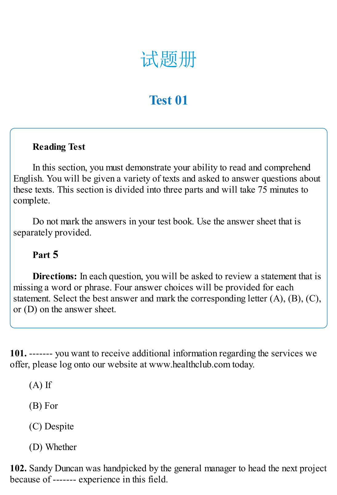


```text
试题册
Test 01
Reading Test
In this section, you must demonstrate your ability to read and comprehend
English. You will be given a variety of texts and asked to answer questions about
these texts. This section is divided into three parts and will take 75 minutes to
complete.
Do not mark the answers in your test book. Use the answer sheet that is
separately provided.
Part
5
Directions:
 In each question, you will be asked to review a statement that is
missing a word or phrase. Four answer choices will be provided for each
statement. Select the best answer and mark the corresponding letter (A), (B), (C),
or (D) on the answer sheet.
101.
 ------- you want to receive additional information regarding the services we
offer, please log onto our website at www.healthclub.com today.
(A) If
(B) For
(C) Despite
(D) Whether
102.
 Sandy Duncan was handpicked by the general manager to head the next project
because of ------- experience in this field.
786
```

## PDF 第 16 页

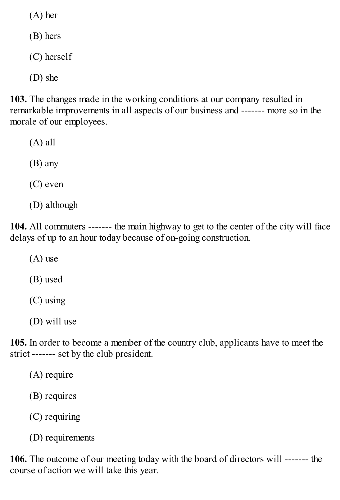


```text
(A) her
(B) hers
(C) herself
(D) she
103.
 The changes made in the working conditions at our company resulted in
remarkable improvements in all aspects of our business and ------- more so in the
morale of our employees.
(A) all
(B) any
(C) even
(D) although
104.
 All commuters ------- the main highway to get to the center of the city will face
delays of up to an hour today because of on-going construction.
(A) use
(B) used
(C) using
(D) will use
105.
 In order to become a member of the country club, applicants have to meet the
strict ------- set by the club president.
(A) require
(B) requires
(C) requiring
(D) requirements
106.
 The outcome of our meeting today with the board of directors will ------- the
course of action we will take this year.
787
```

## PDF 第 17 页

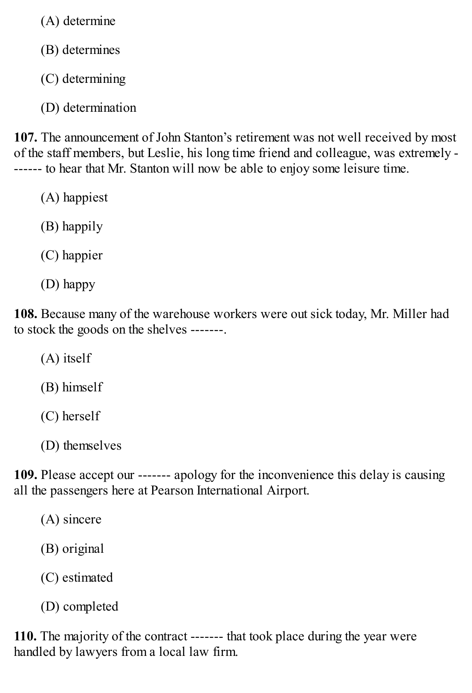


```text
(A) determine
(B) determines
(C) determining
(D) determination
107.
 The announcement of John Stanton’s retirement was not well received by most
of the staff members, but Leslie, his long time friend and colleague, was extremely -
------ to hear that Mr. Stanton will now be able to enjoy some leisure time.
(A) happiest
(B) happily
(C) happier
(D) happy
108.
 Because many of the warehouse workers were out sick today, Mr. Miller had
to stock the goods on the shelves -------.
(A) itself
(B) himself
(C) herself
(D) themselves
109.
 Please accept our ------- apology for the inconvenience this delay is causing
all the passengers here at Pearson International Airport.
(A) sincere
(B) original
(C) estimated
(D) completed
110.
 The majority of the contract ------- that took place during the year were
handled by lawyers from a local law firm.
788
```

## PDF 第 18 页

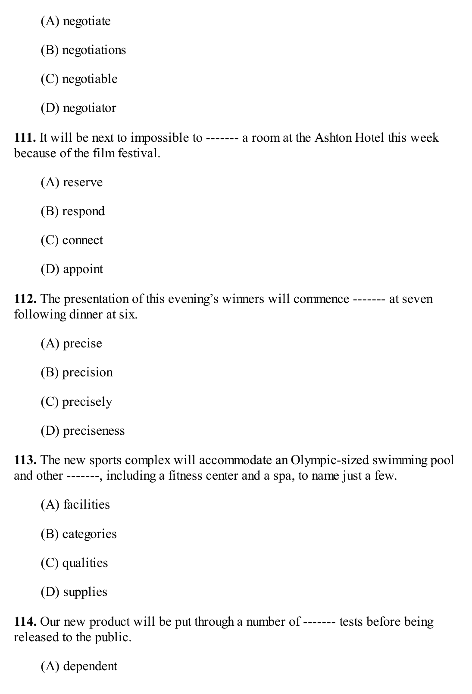


```text
(A) negotiate
(B) negotiations
(C) negotiable
(D) negotiator
111.
 It will be next to impossible to ------- a room at the Ashton Hotel this week
because of the film festival.
(A) reserve
(B) respond
(C) connect
(D) appoint
112.
 The presentation of this evening’s winners will commence ------- at seven
following dinner at six.
(A) precise
(B) precision
(C) precisely
(D) preciseness
113.
 The new sports complex will accommodate an Olympic-sized swimming pool
and other -------, including a fitness center and a spa, to name just a few.
(A) facilities
(B) categories
(C) qualities
(D) supplies
114.
 Our new product will be put through a number of ------- tests before being
released to the public.
(A) dependent
789
```

## PDF 第 19 页

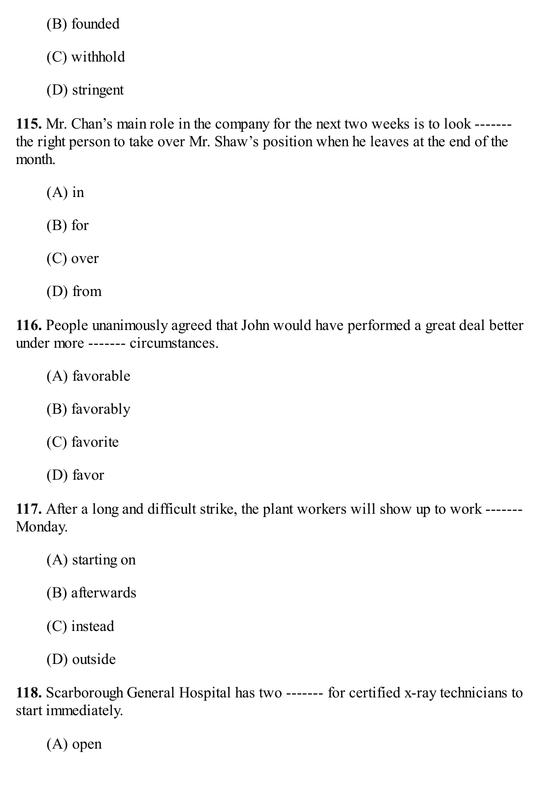


```text
(B) founded
(C) withhold
(D) stringent
115.
 Mr. Chan’s main role in the company for the next two weeks is to look -------
the right person to take over Mr. Shaw’s position when he leaves at the end of the
month.
(A) in
(B) for
(C) over
(D) from
116.
 People unanimously agreed that John would have performed a great deal better
under more ------- circumstances.
(A) favorable
(B) favorably
(C) favorite
(D) favor
117.
 After a long and difficult strike, the plant workers will show up to work -------
Monday.
(A) starting on
(B) afterwards
(C) instead
(D) outside
118.
 Scarborough General Hospital has two ------- for certified x-ray technicians to
start immediately.
(A) open
790
```

## PDF 第 20 页

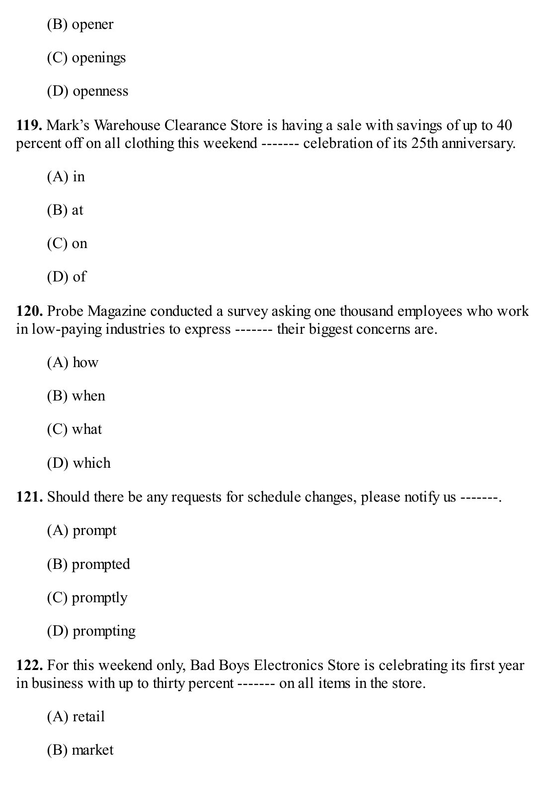


```text
(B) opener
(C) openings
(D) openness
119.
 Mark’s Warehouse Clearance Store is having a sale with savings of up to 40
percent off on all clothing this weekend ------- celebration of its 25th anniversary.
(A) in
(B) at
(C) on
(D) of
120.
 Probe Magazine conducted a survey asking one thousand employees who work
in low-paying industries to express ------- their biggest concerns are.
(A) how
(B) when
(C) what
(D) which
121.
 Should there be any requests for schedule changes, please notify us -------.
(A) prompt
(B) prompted
(C) promptly
(D) prompting
122.
 For this weekend only, Bad Boys Electronics Store is celebrating its first year
in business with up to thirty percent ------- on all items in the store.
(A) retail
(B) market
791
```

## PDF 第 21 页

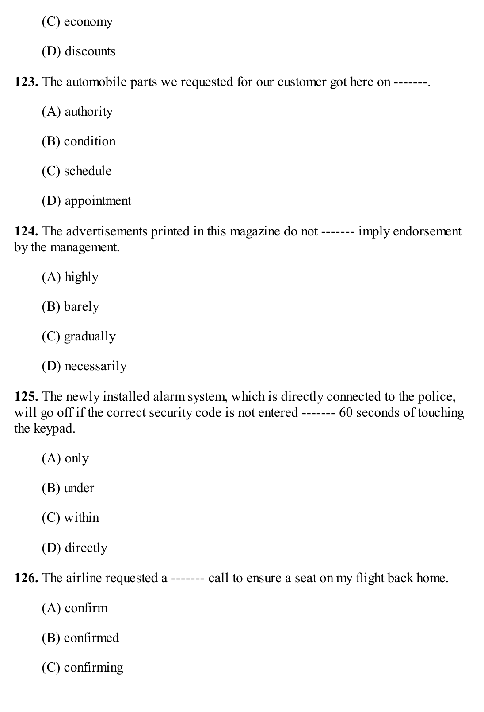


```text
(C) economy
(D) discounts
123.
 The automobile parts we requested for our customer got here on -------.
(A) authority
(B) condition
(C) schedule
(D) appointment
124.
 The advertisements printed in this magazine do not ------- imply endorsement
by the management.
(A) highly
(B) barely
(C) gradually
(D) necessarily
125.
 The newly installed alarm system, which is directly connected to the police,
will go off if the correct security code is not entered ------- 60 seconds of touching
the keypad.
(A) only
(B) under
(C) within
(D) directly
126.
 The airline requested a ------- call to ensure a seat on my flight back home.
(A) confirm
(B) confirmed
(C) confirming
792
```

## PDF 第 22 页

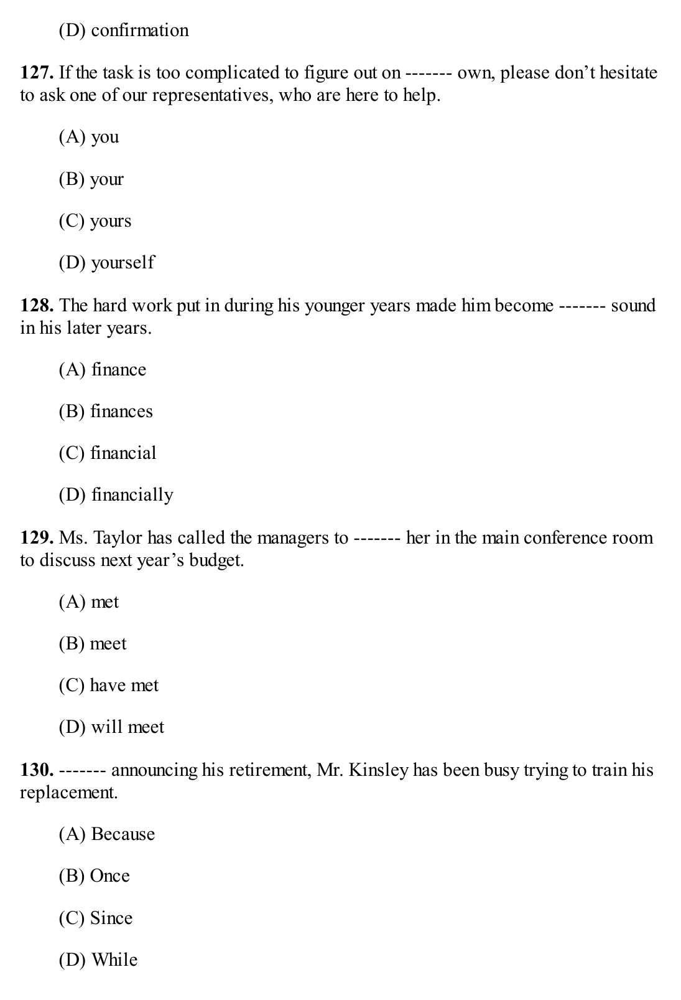


```text
(D) confirmation
127
.
 If the task is too complicated to figure out on ------- own, please don’t hesitate
to ask one of our representatives, who are here to help.
(A) you
(B) your
(C) yours
(D) yourself
128.
 The hard work put in during his younger years made him become ------- sound
in his later years.
(A) finance
(B) finances
(C) financial
(D) financially
129.
 Ms. Taylor has called the managers to ------- her in the main conference room
to discuss next year’s budget.
(A) met
(B) meet
(C) have met
(D) will meet
130.
 ------- announcing his retirement, Mr. Kinsley has been busy trying to train his
replacement.
(A) Because
(B) Once
(C) Since
(D) While
793
```

## PDF 第 23 页

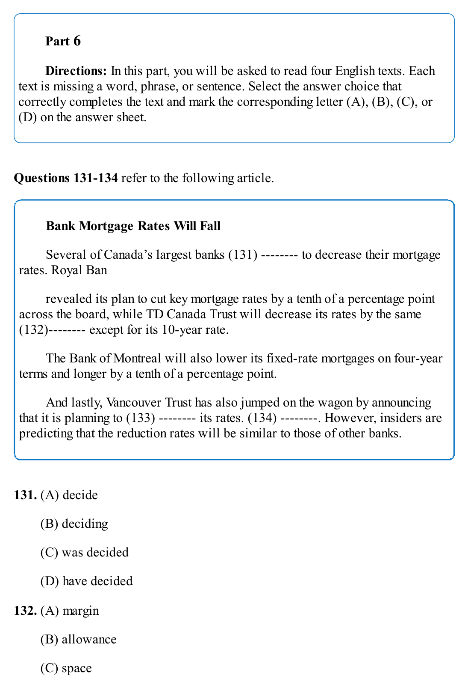


```text
Part
6
Directions:
 In this part, you will be asked to read four English texts. Each
text is missing a word, phrase, or sentence. Select the answer choice that
correctly completes the text and mark the corresponding letter (A), (B), (C), or
(D) on the answer sheet.
Questions 131-134
 refer to the following article.
Bank Mortgage Rates Will Fall
Several of Canada’s largest banks (131) -------- to decrease their mortgage
rates. Royal Ban
revealed its plan to cut key mortgage rates by a tenth of a percentage point
across the board, while TD Canada Trust will decrease its rates by the same
(132)-------- except for its 10-year rate.
The Bank of Montreal will also lower its fixed-rate mortgages on four-year
terms and longer by a tenth of a percentage point.
And lastly, Vancouver Trust has also jumped on the wagon by announcing
that it is planning to (133) -------- its rates. (134) --------. However, insiders are
predicting that the reduction rates will be similar to those of other banks.
131.
 (A) decide
(B) deciding
(C) was decided
(D) have decided
132.
 (A) margin
(B) allowance
(C) space
794
```

## PDF 第 24 页

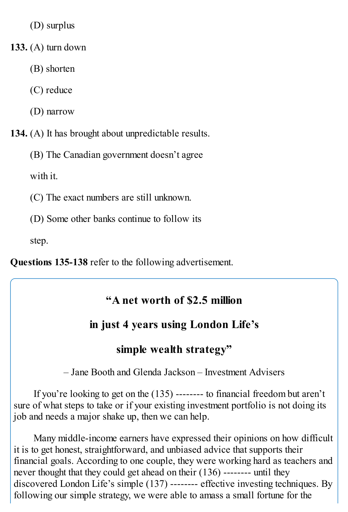


```text
(D) surplus
133.
 (A) turn down
(B) shorten
(C) reduce
(D) narrow
134.
 (A) It has brought about unpredictable results.
(B) The Canadian government doesn’t agree
with it.
(C) The exact numbers are still unknown.
(D) Some other banks continue to follow its
step.
Questions 135-138
 refer to the following advertisement.
“A net worth of $2.5 million
in just 4 years using London Life’s
simple wealth strategy”
– Jane Booth and Glenda Jackson – Investment Advisers
If you’re looking to get on the (135) -------- to financial freedom but aren’t
sure of what steps to take or if your existing investment portfolio is not doing its
job and needs a major shake up, then we can help.
Many middle-income earners have expressed their opinions on how difficult
it is to get honest, straightforward, and unbiased advice that supports their
financial goals. According to one couple, they were working hard as teachers and
never thought that they could get ahead on their (136) -------- until they
discovered London Life’s simple (137) -------- effective investing techniques. By
following our simple strategy, we were able to amass a small fortune for the
795
```

## PDF 第 25 页

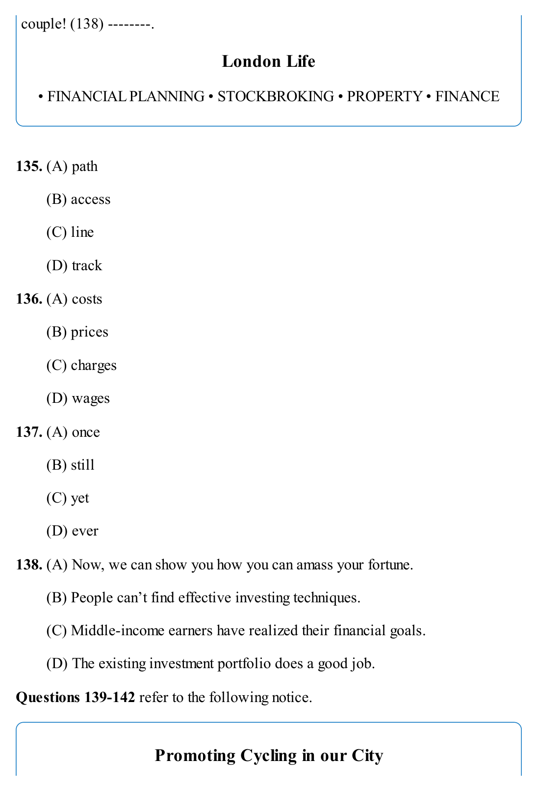


```text
couple! (138) --------.
London Life
• FINANCIAL PLANNING • STOCKBROKING • PROPERTY • FINANCE
135.
 (A) path
(B) access
(C) line
(D) track
136.
 (A) costs
(B) prices
(C) charges
(D) wages
137.
 (A) once
(B) still
(C) yet
(D) ever
138.
 (A) Now, we can show you how you can amass your fortune.
(B) People can’t find effective investing techniques.
(C) Middle-income earners have realized their financial goals.
(D) The existing investment portfolio does a good job.
Questions 139-142
 refer to the following notice.
Promoting Cycling in our City
796
```

## PDF 第 26 页

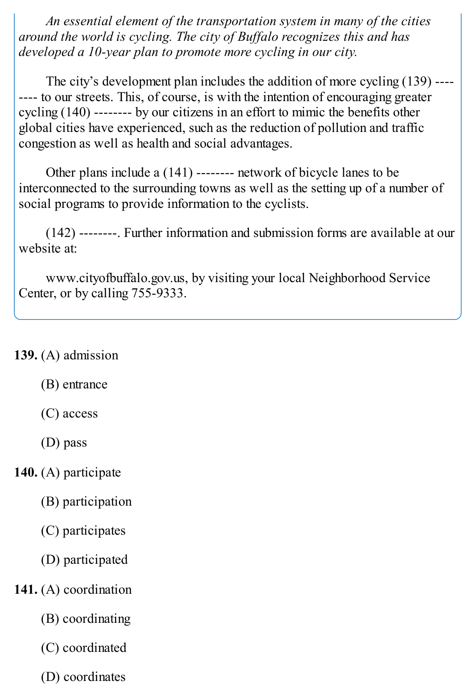


```text
An essential element of the transportation system in many of the cities
around the world is cycling. The city of Buffalo recognizes this and has
developed a 10-year plan to promote more cycling in our city.
The city’s development plan includes the addition of more cycling (139) ----
---- to our streets. This, of course, is with the intention of encouraging greater
cycling (140) -------- by our citizens in an effort to mimic the benefits other
global cities have experienced, such as the reduction of pollution and traffic
congestion as well as health and social advantages.
Other plans include a (141) -------- network of bicycle lanes to be
interconnected to the surrounding towns as well as the setting up of a number of
social programs to provide information to the cyclists.
(142) --------. Further information and submission forms are available at our
website at:
www.cityofbuffalo.gov.us, by visiting your local Neighborhood Service
Center, or by calling 755-9333.
139.
 (A) admission
(B) entrance
(C) access
(D) pass
140.
 (A) participate
(B) participation
(C) participates
(D) participated
141.
 (A) coordination
(B) coordinating
(C) coordinated
(D) coordinates
797
```

## PDF 第 27 页

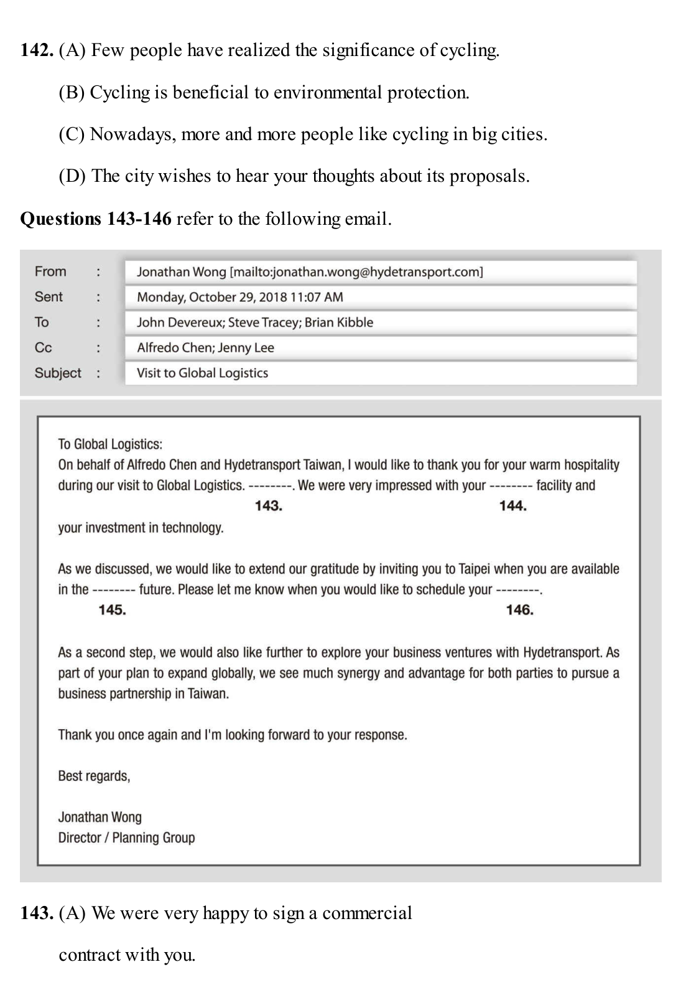


```text
142.
 (A) Few people have realized the significance of cycling.
(B) Cycling is beneficial to environmental protection.
(C) Nowadays, more and more people like cycling in big cities.
(D) The city wishes to hear your thoughts about its proposals.
Questions 143-146
 refer to the following email.
143.
 (A) We were very happy to sign a commercial
contract with you.
798
```

## PDF 第 28 页

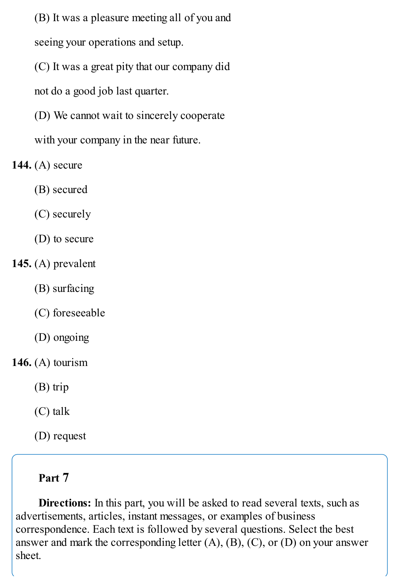


```text
(B) It was a pleasure meeting all of you and
seeing your operations and setup.
(C) It was a great pity that our company did
not do a good job last quarter.
(D) We cannot wait to sincerely cooperate
with your company in the near future.
144.
 (A) secure
(B) secured
(C) securely
(D) to secure
145.
 (A) prevalent
(B) surfacing
(C) foreseeable
(D) ongoing
146.
 (A) tourism
(B) trip
(C) talk
(D) request
Part
7
Directions:
 In this part, you will be asked to read several texts, such as
advertisements, articles, instant messages, or examples of business
correspondence. Each text is followed by several questions. Select the best
answer and mark the corresponding letter (A), (B), (C), or (D) on your answer
sheet.
799
```

## PDF 第 29 页

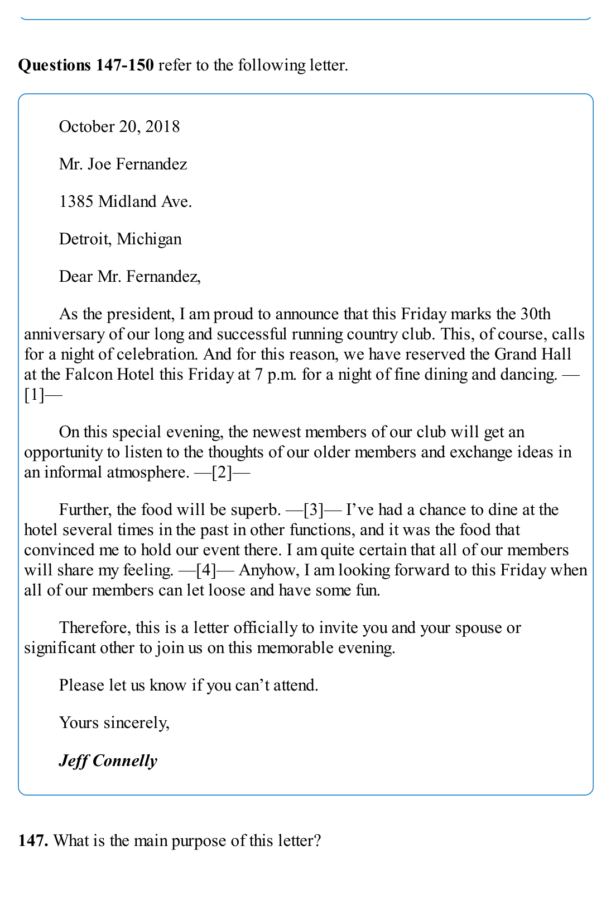


```text
Questions 147-150
 refer to the following letter.
October 20, 2018
Mr. Joe Fernandez
1385 Midland Ave.
Detroit, Michigan
Dear Mr. Fernandez,
As the president, I am proud to announce that this Friday marks the 30th
anniversary of our long and successful running country club. This, of course, calls
for a night of celebration. And for this reason, we have reserved the Grand Hall
at the Falcon Hotel this Friday at 7 p.m. for a night of fine dining and dancing. —
[1]—
On this special evening, the newest members of our club will get an
opportunity to listen to the thoughts of our older members and exchange ideas in
an informal atmosphere. —[2]—
Further, the food will be superb. —[3]— I’ve had a chance to dine at the
hotel several times in the past in other functions, and it was the food that
convinced me to hold our event there. I am quite certain that all of our members
will share my feeling. —[4]— Anyhow, I am looking forward to this Friday when
all of our members can let loose and have some fun.
Therefore, this is a letter officially to invite you and your spouse or
significant other to join us on this memorable evening.
Please let us know if you can’t attend.
Yours sincerely,
Jeff Connelly
147.
 What is the main purpose of this letter?
800
```

## PDF 第 30 页

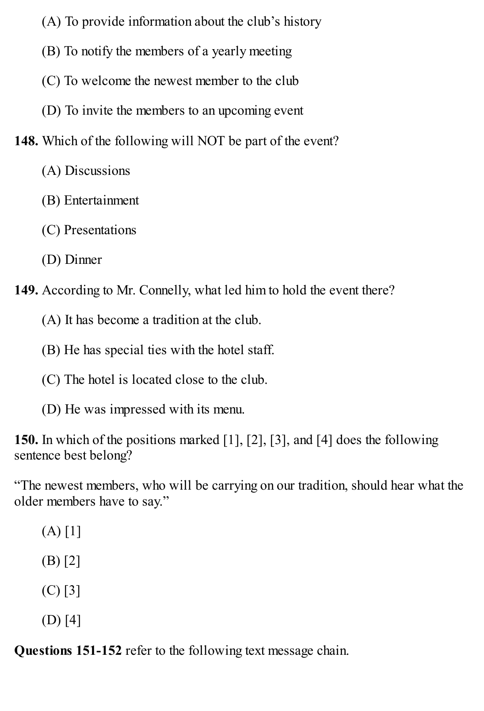


```text
(A) To provide information about the club’s history
(B) To notify the members of a yearly meeting
(C) To welcome the newest member to the club
(D) To invite the members to an upcoming event
148.
 Which of the following will NOT be part of the event?
(A) Discussions
(B) Entertainment
(C) Presentations
(D) Dinner
149.
 According to Mr. Connelly, what led him to hold the event there?
(A) It has become a tradition at the club.
(B) He has special ties with the hotel staff.
(C) The hotel is located close to the club.
(D) He was impressed with its menu.
150.
 In which of the positions marked [1], [2], [3], and [4] does the following
sentence best belong?
“The newest members, who will be carrying on our tradition, should hear what the
older members have to say.”
(A) [1]
(B) [2]
(C) [3]
(D) [4]
Questions 151-152
 refer to the following text message chain.
801
```

## PDF 第 31 页

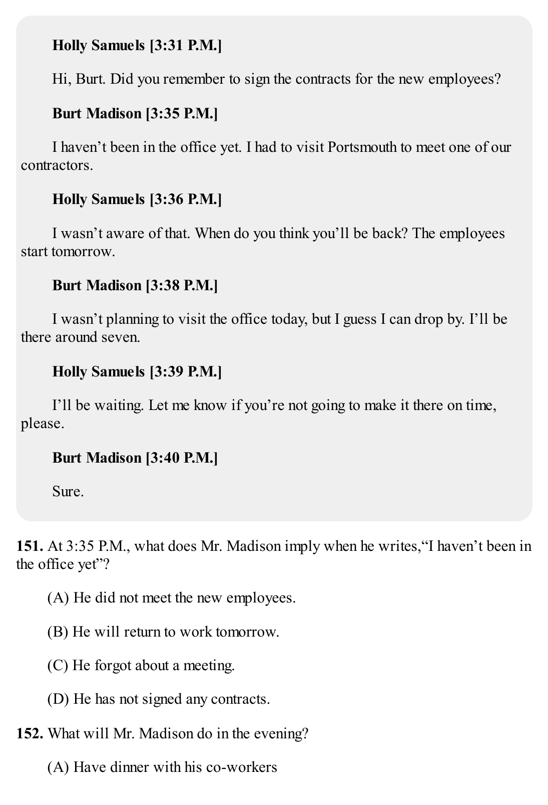


```text
Holly Samuels [3:31 P.M.]
Hi, Burt. Did you remember to sign the contracts for the new employees?
Burt Madison [3:35 P.M.]
I haven’t been in the office yet. I had to visit Portsmouth to meet one of our
contractors.
Holly Samuels [3:36 P.M.]
I wasn’t aware of that. When do you think you’ll be back? The employees
start tomorrow.
Burt Madison [3:38 P.M.]
I wasn’t planning to visit the office today, but I guess I can drop by. I’ll be
there around seven.
Holly Samuels [3:39 P.M.]
I’ll be waiting. Let me know if you’re not going to make it there on time,
please.
Burt Madison [3:40 P.M.]
Sure.
151.
 At 3:35 P.M., what does Mr. Madison imply when he writes,“I haven’t been in
the office yet”?
(A) He did not meet the new employees.
(B) He will return to work tomorrow.
(C) He forgot about a meeting.
(D) He has not signed any contracts.
152.
 What will Mr. Madison do in the evening?
(A) Have dinner with his co-workers
802
```

## PDF 第 32 页

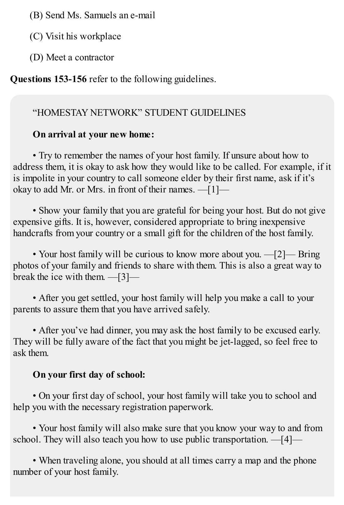


```text
(B) Send Ms. Samuels an e-mail
(C) Visit his workplace
(D) Meet a contractor
Questions 153-156
 refer to the following guidelines.
“HOMESTAY NETWORK” STUDENT GUIDELINES
On arrival at your new home:
• Try to remember the names of your host family. If unsure about how to
address them, it is okay to ask how they would like to be called. For example, if it
is impolite in your country to call someone elder by their first name, ask if it’s
okay to add Mr. or Mrs. in front of their names. —[1]—
• Show your family that you are grateful for being your host. But do not give
expensive gifts. It is, however, considered appropriate to bring inexpensive
handcrafts from your country or a small gift for the children of the host family.
• Your host family will be curious to know more about you. —[2]— Bring
photos of your family and friends to share with them. This is also a great way to
break the ice with them. —[3]—
• After you get settled, your host family will help you make a call to your
parents to assure them that you have arrived safely.
• After you’ve had dinner, you may ask the host family to be excused early.
They will be fully aware of the fact that you might be jet-lagged, so feel free to
ask them.
On your first day of school:
• On your first day of school, your host family will take you to school and
help you with the necessary registration paperwork.
• Your host family will also make sure that you know your way to and from
school. They will also teach you how to use public transportation. —[4]—
• When traveling alone, you should at all times carry a map and the phone
number of your host family.
803
```

## PDF 第 33 页

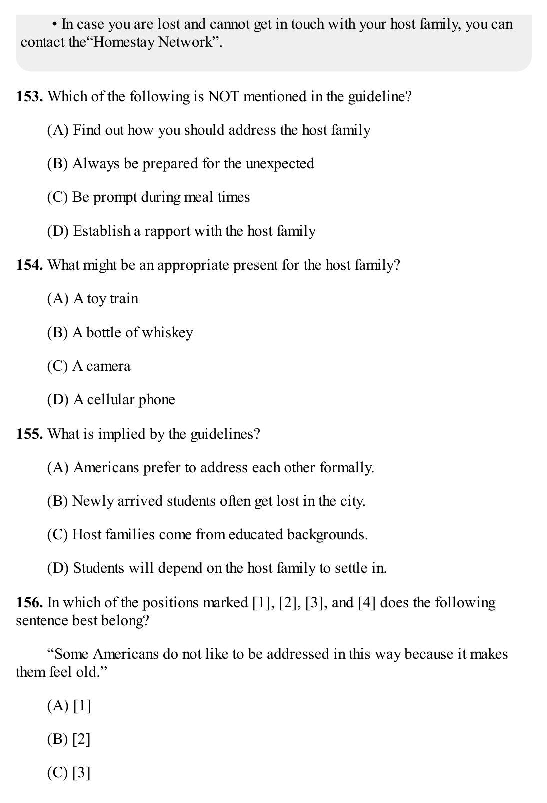


```text
• In case you are lost and cannot get in touch with your host family, you can
contact the“Homestay Network”.
153.
 Which of the following is NOT mentioned in the guideline?
(A) Find out how you should address the host family
(B) Always be prepared for the unexpected
(C) Be prompt during meal times
(D) Establish a rapport with the host family
154.
 What might be an appropriate present for the host family?
(A) A toy train
(B) A bottle of whiskey
(C) A camera
(D) A cellular phone
155.
 What is implied by the guidelines?
(A) Americans prefer to address each other formally.
(B) Newly arrived students often get lost in the city.
(C) Host families come from educated backgrounds.
(D) Students will depend on the host family to settle in.
156.
 In which of the positions marked [1], [2], [3], and [4] does the following
sentence best belong?
“Some Americans do not like to be addressed in this way because it makes
them feel old.”
(A) [1]
(B) [2]
(C) [3]
804
```

## PDF 第 34 页

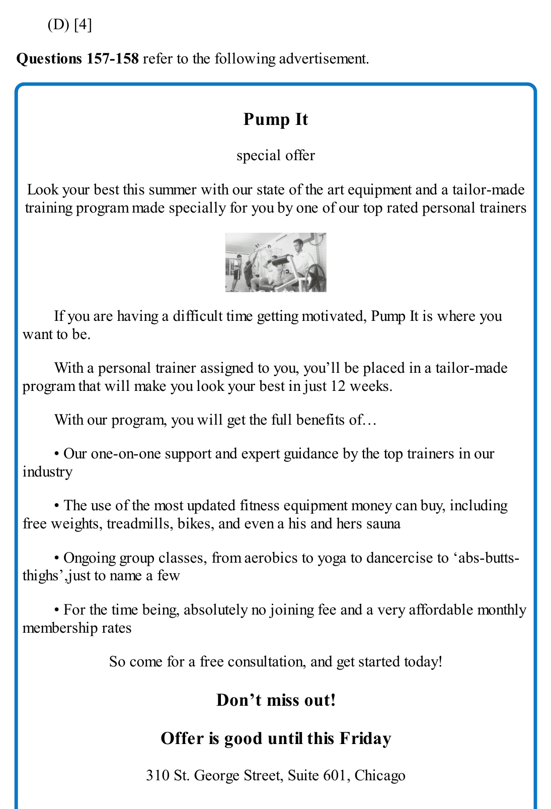


```text
(D) [4]
Questions 157-158
 refer to the following advertisement.
Pump It
special offer
Look your best this summer with our state of the art equipment and a tailor-made
training program made specially for you by one of our top rated personal trainers
If you are having a difficult time getting motivated, Pump It is where you
want to be.
With a personal trainer assigned to you, you’ll be placed in a tailor-made
program that will make you look your best in just 12 weeks.
With our program, you will get the full benefits of…
• Our one-on-one support and expert guidance by the top trainers in our
industry
• The use of the most updated fitness equipment money can buy, including
free weights, treadmills, bikes, and even a his and hers sauna
• Ongoing group classes, from aerobics to yoga to dancercise to ‘abs-butts-
thighs’,just to name a few
• For the time being, absolutely no joining fee and a very affordable monthly
membership rates
So come for a free consultation, and get started today!
Don’t miss out!
Offer is good until this Friday
310 St. George Street, Suite 601, Chicago
805
```

## PDF 第 35 页

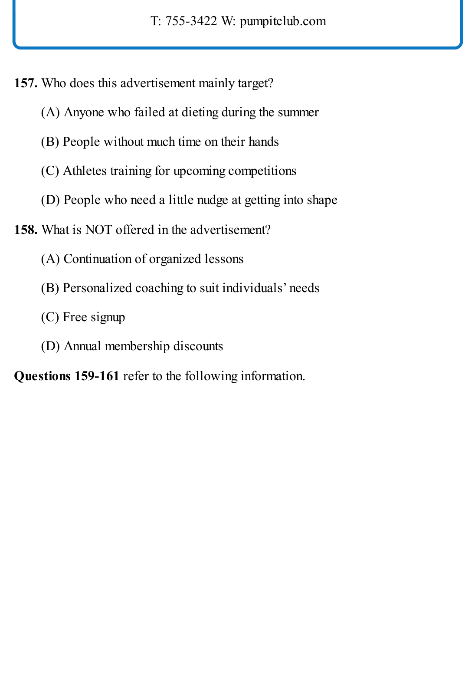


```text
T: 755-3422 W: pumpitclub.com
157.
 Who does this advertisement mainly target?
(A) Anyone who failed at dieting during the summer
(B) People without much time on their hands
(C) Athletes training for upcoming competitions
(D) People who need a little nudge at getting into shape
158.
 What is NOT offered in the advertisement?
(A) Continuation of organized lessons
(B) Personalized coaching to suit individuals’ needs
(C) Free signup
(D) Annual membership discounts
Questions 159-161
 refer to the following information.
806
```

## PDF 第 36 页

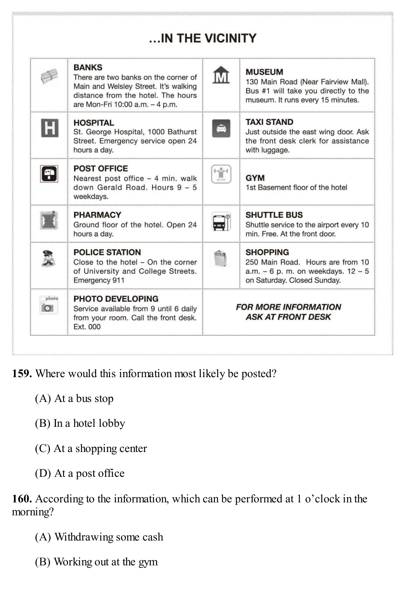


```text
159.
 Where would this information most likely be posted?
(A) At a bus stop
(B) In a hotel lobby
(C) At a shopping center
(D) At a post office
160.
 According to the information, which can be performed at 1 o’clock in the
morning?
(A) Withdrawing some cash
(B) Working out at the gym
807
```

## PDF 第 37 页

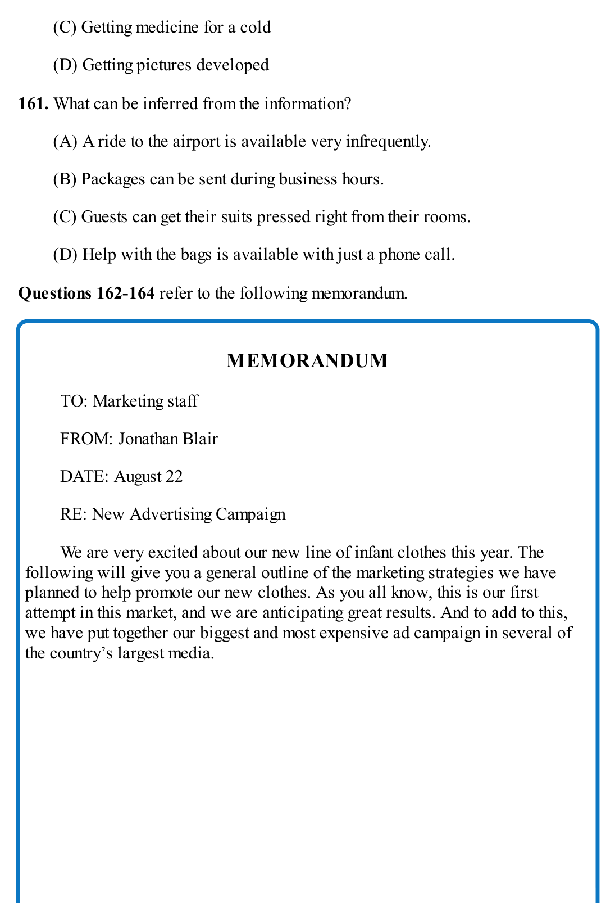


```text
(C) Getting medicine for a cold
(D) Getting pictures developed
161.
 What can be inferred from the information?
(A) A ride to the airport is available very infrequently.
(B) Packages can be sent during business hours.
(C) Guests can get their suits pressed right from their rooms.
(D) Help with the bags is available with just a phone call.
Questions 162-164
 refer to the following memorandum.
MEMORANDUM
TO: Marketing staff
FROM: Jonathan Blair
DATE: August 22
RE: New Advertising Campaign
We are very excited about our new line of infant clothes this year. The
following will give you a general outline of the marketing strategies we have
planned to help promote our new clothes. As you all know, this is our first
attempt in this market, and we are anticipating great results. And to add to this,
we have put together our biggest and most expensive ad campaign in several of
the country’s largest media.
808
```

## PDF 第 38 页

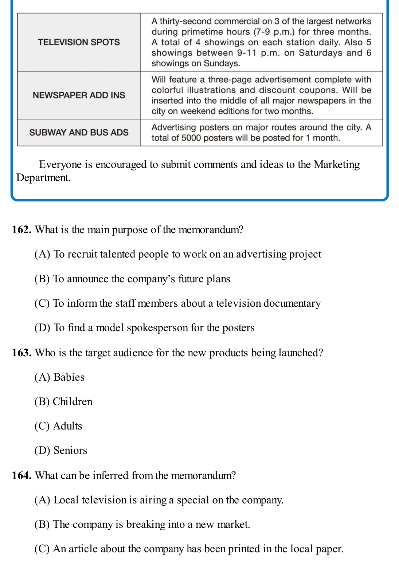


```text
Everyone is encouraged to submit comments and ideas to the Marketing
Department.
162.
 What is the main purpose of the memorandum?
(A) To recruit talented people to work on an advertising project
(B) To announce the company’s future plans
(C) To inform the staff members about a television documentary
(D) To find a model spokesperson for the posters
163.
 Who is the target audience for the new products being launched?
(A) Babies
(B) Children
(C) Adults
(D) Seniors
164.
 What can be inferred from the memorandum?
(A) Local television is airing a special on the company.
(B) The company is breaking into a new market.
(C) An article about the company has been printed in the local paper.
809
```

## PDF 第 39 页

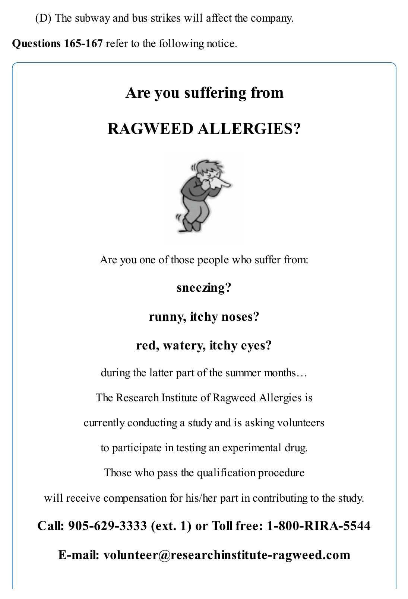


```text
(D) The subway and bus strikes will affect the company.
Questions 165-167
 refer to the following notice.
Are you suffering from
RAGWEED ALLERGIES?
Are you one of those people who suffer from:
sneezing?
runny, itchy noses?
red, watery, itchy eyes?
during the latter part of the summer months…
The Research Institute of Ragweed Allergies is
currently conducting a study and is asking volunteers
to participate in testing an experimental drug.
Those who pass the qualification procedure
will receive compensation for his/her part in contributing to the study.
Call: 905-629-3333 (ext. 1) or Toll free: 1-800-RIRA-5544
E-mail: volunteer@researchinstitute-ragweed.com
810
```

## PDF 第 40 页

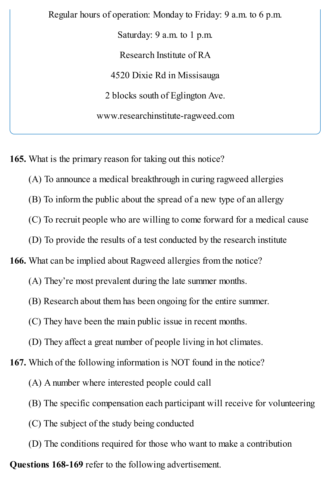


```text
Regular hours of operation: Monday to Friday: 9 a.m. to 6 p.m.
Saturday: 9 a.m. to 1 p.m.
Research Institute of RA
4520 Dixie Rd in Missisauga
2 blocks south of Eglington Ave.
www.researchinstitute-ragweed.com
165.
 What is the primary reason for taking out this notice?
(A) To announce a medical breakthrough in curing ragweed allergies
(B) To inform the public about the spread of a new type of an allergy
(C) To recruit people who are willing to come forward for a medical cause
(D) To provide the results of a test conducted by the research institute
166.
 What can be implied about Ragweed allergies from the notice?
(A) They’re most prevalent during the late summer months.
(B) Research about them has been ongoing for the entire summer.
(C) They have been the main public issue in recent months.
(D) They affect a great number of people living in hot climates.
167.
 Which of the following information is NOT found in the notice?
(A) A number where interested people could call
(B) The specific compensation each participant will receive for volunteering
(C) The subject of the study being conducted
(D) The conditions required for those who want to make a contribution
Questions 168-169
 refer to the following advertisement.
811
```

## PDF 第 41 页


```text
CREDIT PROBLEM?
CREDIT DENIED?
WE CAN HELP!
( COLLECTION AGENCIES)
• LATE PAYMENTS • REPOSSESSIONS
• BANKRUPTCIES • BIG DEBTS
ICR’S Exclusive $15-million Computer Search Program.
The only one of its kind in the world
How credit agencies may not in compliance
With the Canadian Consumer Reporting Act and what
you can do about it.
“WE REPAIR CREDIT… LEGALLY”
“All information is strictly confidential.”
Consolidate debts into lower monthly payments!
Call for an appointment:
416-755-7898
812
```

## PDF 第 42 页

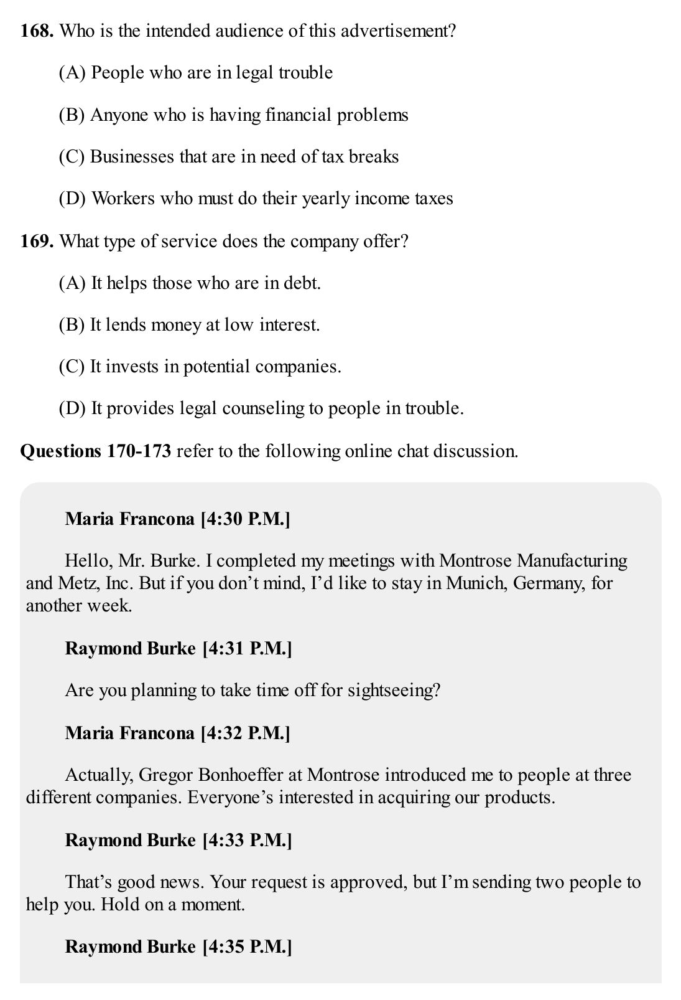


```text
168.
 Who is the intended audience of this advertisement?
(A) People who are in legal trouble
(B) Anyone who is having financial problems
(C) Businesses that are in need of tax breaks
(D) Workers who must do their yearly income taxes
169.
 What type of service does the company offer?
(A) It helps those who are in debt.
(B) It lends money at low interest.
(C) It invests in potential companies.
(D) It provides legal counseling to people in trouble.
Questions 170-173
 refer to the following online chat discussion.
Maria Francona [4:30 P.M.]
Hello, Mr. Burke. I completed my meetings with Montrose Manufacturing
and Metz, Inc. But if you don’t mind, I’d like to stay in Munich, Germany, for
another week.
Raymond Burke [4:31 P.M.]
Are you planning to take time off for sightseeing?
Maria Francona [4:32 P.M.]
Actually, Gregor Bonhoeffer at Montrose introduced me to people at three
different companies. Everyone’s interested in acquiring our products.
Raymond Burke [4:33 P.M.]
That’s good news. Your request is approved, but I’m sending two people to
help you. Hold on a moment.
Raymond Burke [4:35 P.M.]
813
```

## PDF 第 43 页

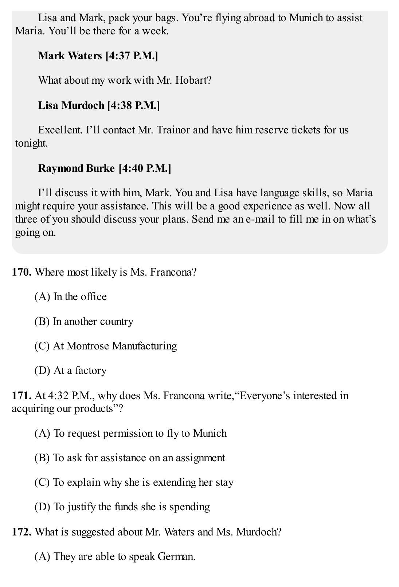


```text
Lisa and Mark, pack your bags. You’re flying abroad to Munich to assist
Maria. You’ll be there for a week.
Mark Waters [4:37 P.M.]
What about my work with Mr. Hobart?
Lisa Murdoch [4:38 P.M.]
Excellent. I’ll contact Mr. Trainor and have him reserve tickets for us
tonight.
Raymond Burke [4:40 P.M.]
I’ll discuss it with him, Mark. You and Lisa have language skills, so Maria
might require your assistance. This will be a good experience as well. Now all
three of you should discuss your plans. Send me an e-mail to fill me in on what’s
going on.
170.
 Where most likely is Ms. Francona?
(A) In the office
(B) In another country
(C) At Montrose Manufacturing
(D) At a factory
171.
 At 4:32 P.M., why does Ms. Francona write,“Everyone’s interested in
acquiring our products”?
(A) To request permission to fly to Munich
(B) To ask for assistance on an assignment
(C) To explain why she is extending her stay
(D) To justify the funds she is spending
172.
 What is suggested about Mr. Waters and Ms. Murdoch?
(A) They are able to speak German.
814
```

## PDF 第 44 页

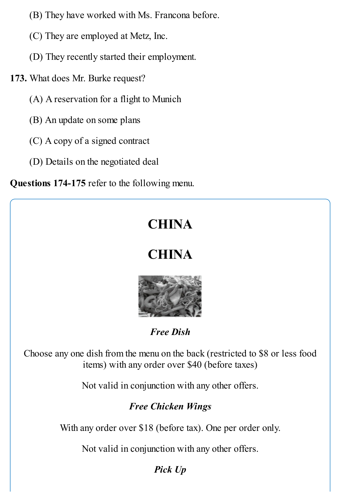


```text
(B) They have worked with Ms. Francona before.
(C) They are employed at Metz, Inc.
(D) They recently started their employment.
173.
 What does Mr. Burke request?
(A) A reservation for a flight to Munich
(B) An update on some plans
(C) A copy of a signed contract
(D) Details on the negotiated deal
Questions 174-175
 refer to the following menu.
CHINA
CHINA
Free Dish
Choose any one dish from the menu on the back (restricted to $8 or less food
items) with any order over $40 (before taxes)
Not valid in conjunction with any other offers.
Free Chicken Wings
With any order over $18 (before tax). One per order only.
Not valid in conjunction with any other offers.
Pick Up
815
```

## PDF 第 45 页

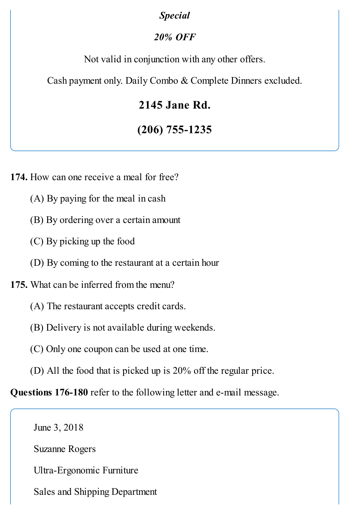


```text
Special
20% OFF
Not valid in conjunction with any other offers.
Cash payment only. Daily Combo & Complete Dinners excluded.
2145 Jane Rd.
(206) 755-1235
174.
 How can one receive a meal for free?
(A) By paying for the meal in cash
(B) By ordering over a certain amount
(C) By picking up the food
(D) By coming to the restaurant at a certain hour
175.
 What can be inferred from the menu?
(A) The restaurant accepts credit cards.
(B) Delivery is not available during weekends.
(C) Only one coupon can be used at one time.
(D) All the food that is picked up is 20% off the regular price.
Questions 176-180
 refer to the following letter and e-mail message.
June 3, 2018
Suzanne Rogers
Ultra-Ergonomic Furniture
Sales and Shipping Department
816
```

## PDF 第 46 页

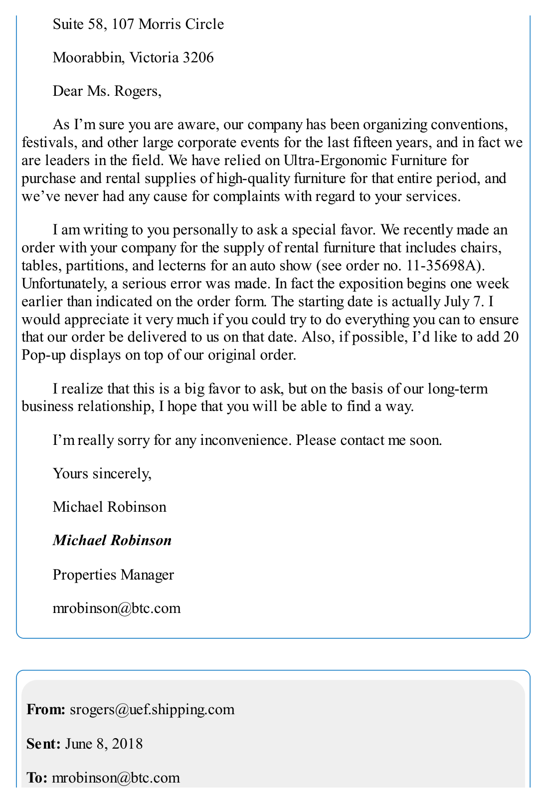


```text
Suite 58, 107 Morris Circle
Moorabbin, Victoria 3206
Dear Ms. Rogers,
As I’m sure you are aware, our company has been organizing conventions,
festivals, and other large corporate events for the last fifteen years, and in fact we
are leaders in the field. We have relied on Ultra-Ergonomic Furniture for
purchase and rental supplies of high-quality furniture for that entire period, and
we’ve never had any cause for complaints with regard to your services.
I am writing to you personally to ask a special favor. We recently made an
order with your company for the supply of rental furniture that includes chairs,
tables, partitions, and lecterns for an auto show (see order no. 11-35698A).
Unfortunately, a serious error was made. In fact the exposition begins one week
earlier than indicated on the order form. The starting date is actually July 7. I
would appreciate it very much if you could try to do everything you can to ensure
that our order be delivered to us on that date. Also, if possible, I’d like to add 20
Pop-up displays on top of our original order.
I realize that this is a big favor to ask, but on the basis of our long-term
business relationship, I hope that you will be able to find a way.
I’m really sorry for any inconvenience. Please contact me soon.
Yours sincerely,
Michael Robinson
Michael Robinson
Properties Manager
mrobinson@btc.com
From:
 srogers@uef.shipping.com
Sent:
 June 8, 2018
To:
 mrobinson@btc.com
817
```

## PDF 第 47 页

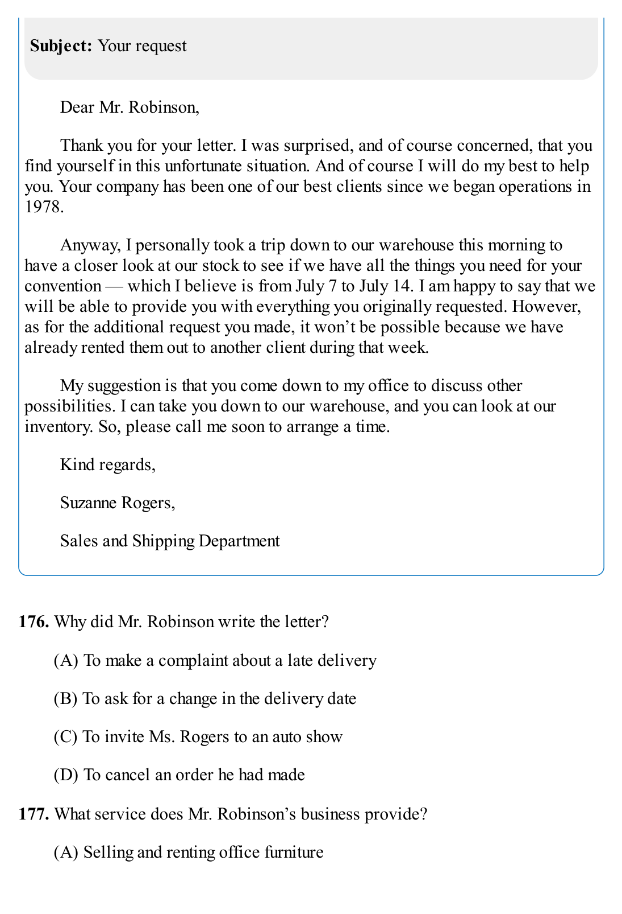


```text
Subject:
 Your request
Dear Mr. Robinson,
Thank you for your letter. I was surprised, and of course concerned, that you
find yourself in this unfortunate situation. And of course I will do my best to help
you. Your company has been one of our best clients since we began operations in
1978.
Anyway, I personally took a trip down to our warehouse this morning to
have a closer look at our stock to see if we have all the things you need for your
convention — which I believe is from July 7 to July 14. I am happy to say that we
will be able to provide you with everything you originally requested. However,
as for the additional request you made, it won’t be possible because we have
already rented them out to another client during that week.
My suggestion is that you come down to my office to discuss other
possibilities. I can take you down to our warehouse, and you can look at our
inventory. So, please call me soon to arrange a time.
Kind regards,
Suzanne Rogers,
Sales and Shipping Department
176.
 Why did Mr. Robinson write the letter?
(A) To make a complaint about a late delivery
(B) To ask for a change in the delivery date
(C) To invite Ms. Rogers to an auto show
(D) To cancel an order he had made
177.
 What service does Mr. Robinson’s business provide?
(A) Selling and renting office furniture
818
```

## PDF 第 48 页

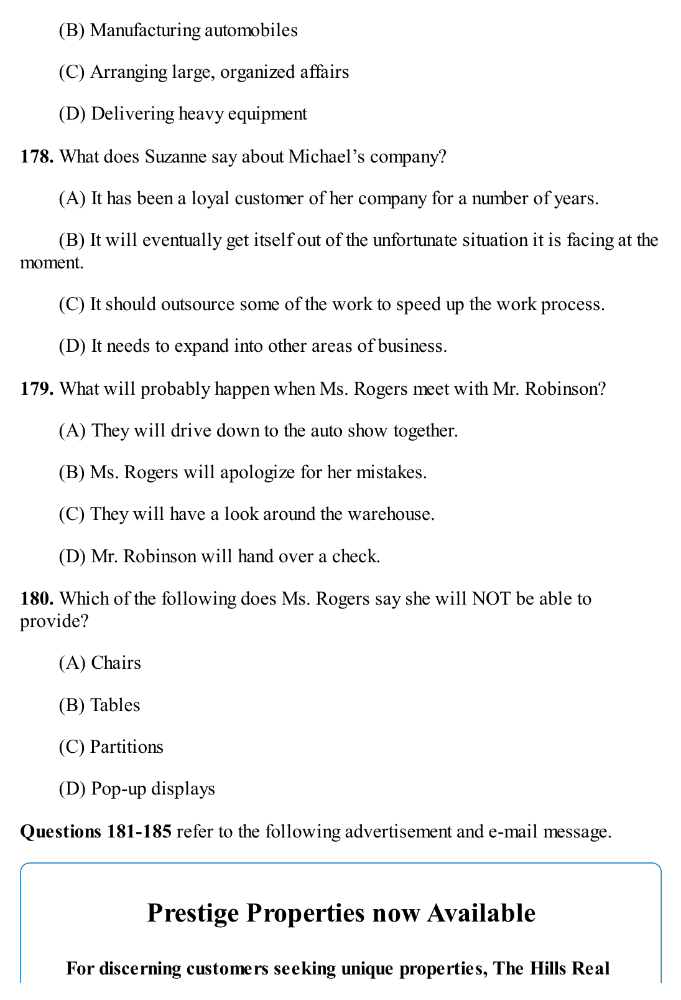


```text
(B) Manufacturing automobiles
(C) Arranging large, organized affairs
(D) Delivering heavy equipment
178.
 What does Suzanne say about Michael’s company?
(A) It has been a loyal customer of her company for a number of years.
(B) It will eventually get itself out of the unfortunate situation it is facing at the
moment.
(C) It should outsource some of the work to speed up the work process.
(D) It needs to expand into other areas of business.
179.
 What will probably happen when Ms. Rogers meet with Mr. Robinson?
(A) They will drive down to the auto show together.
(B) Ms. Rogers will apologize for her mistakes.
(C) They will have a look around the warehouse.
(D) Mr. Robinson will hand over a check.
180.
 Which of the following does Ms. Rogers say she will NOT be able to
provide?
(A) Chairs
(B) Tables
(C) Partitions
(D) Pop-up displays
Questions 181-185
 refer to the following advertisement and e-mail message.
Prestige Properties now Available
For discerning customers seeking unique properties, The Hills Real
819
```

## PDF 第 49 页

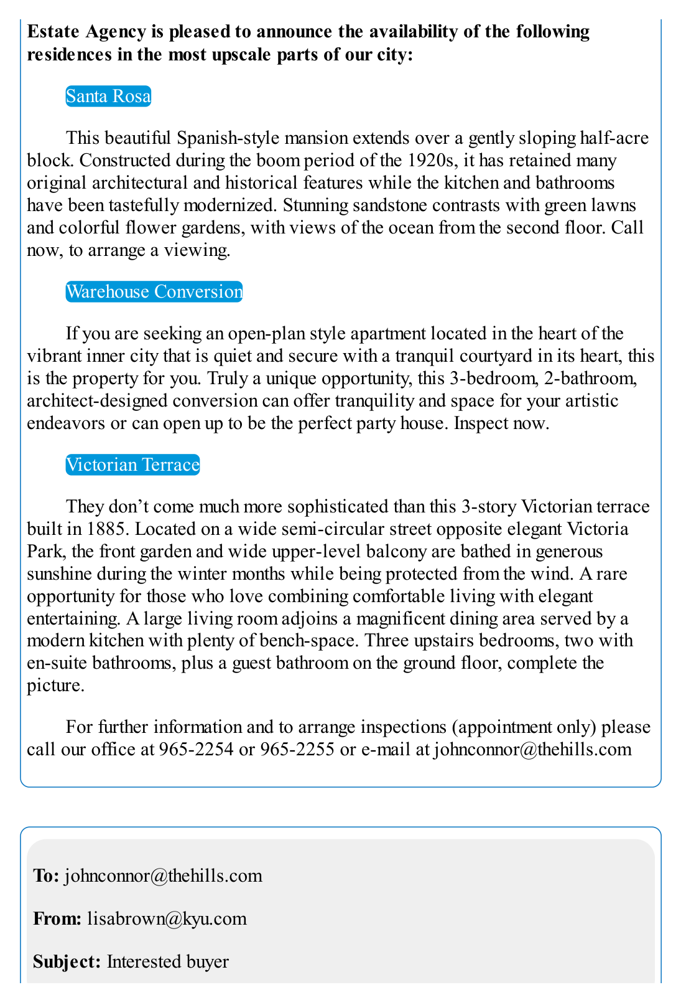


```text
Estate Agency is pleased to announce the availability of the following
residences in the most upscale parts of our city:
Santa Rosa
This beautiful Spanish-style mansion extends over a gently sloping half-acre
block. Constructed during the boom period of the 1920s, it has retained many
original architectural and historical features while the kitchen and bathrooms
have been tastefully modernized. Stunning sandstone contrasts with green lawns
and colorful flower gardens, with views of the ocean from the second floor. Call
now, to arrange a viewing.
Warehouse Conversion
If you are seeking an open-plan style apartment located in the heart of the
vibrant inner city that is quiet and secure with a tranquil courtyard in its heart, this
is the property for you. Truly a unique opportunity, this 3-bedroom, 2-bathroom,
architect-designed conversion can offer tranquility and space for your artistic
endeavors or can open up to be the perfect party house. Inspect now.
Victorian Terrace
They don’t come much more sophisticated than this 3-story Victorian terrace
built in 1885. Located on a wide semi-circular street opposite elegant Victoria
Park, the front garden and wide upper-level balcony are bathed in generous
sunshine during the winter months while being protected from the wind. A rare
opportunity for those who love combining comfortable living with elegant
entertaining. A large living room adjoins a magnificent dining area served by a
modern kitchen with plenty of bench-space. Three upstairs bedrooms, two with
en-suite bathrooms, plus a guest bathroom on the ground floor, complete the
picture.
For further information and to arrange inspections (appointment only) please
call our office at 965-2254 or 965-2255 or e-mail at johnconnor@thehills.com
To:
 johnconnor@thehills.com
From:
 lisabrown@kyu.com
Subject:
 Interested buyer
820
```

## PDF 第 50 页

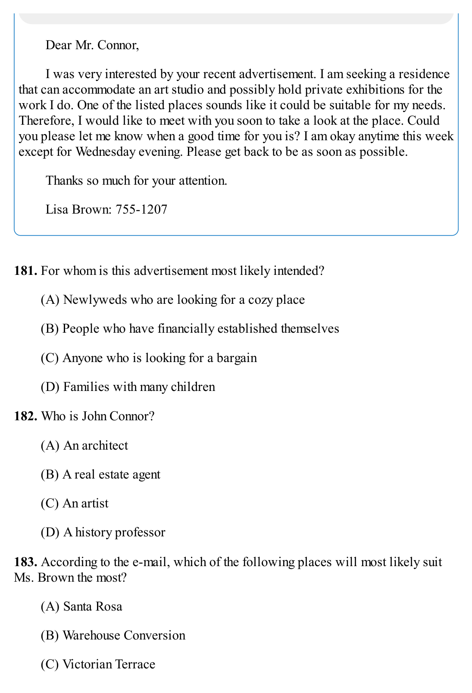


```text
Dear Mr. Connor,
I was very interested by your recent advertisement. I am seeking a residence
that can accommodate an art studio and possibly hold private exhibitions for the
work I do. One of the listed places sounds like it could be suitable for my needs.
Therefore, I would like to meet with you soon to take a look at the place. Could
you please let me know when a good time for you is? I am okay anytime this week
except for Wednesday evening. Please get back to be as soon as possible.
Thanks so much for your attention.
Lisa Brown: 755-1207
181.
 For whom is this advertisement most likely intended?
(A) Newlyweds who are looking for a cozy place
(B) People who have financially established themselves
(C) Anyone who is looking for a bargain
(D) Families with many children
182.
 Who is John Connor?
(A) An architect
(B) A real estate agent
(C) An artist
(D) A history professor
183.
 According to the e-mail, which of the following places will most likely suit
Ms. Brown the most?
(A) Santa Rosa
(B) Warehouse Conversion
(C) Victorian Terrace
821
```

## PDF 第 51 页

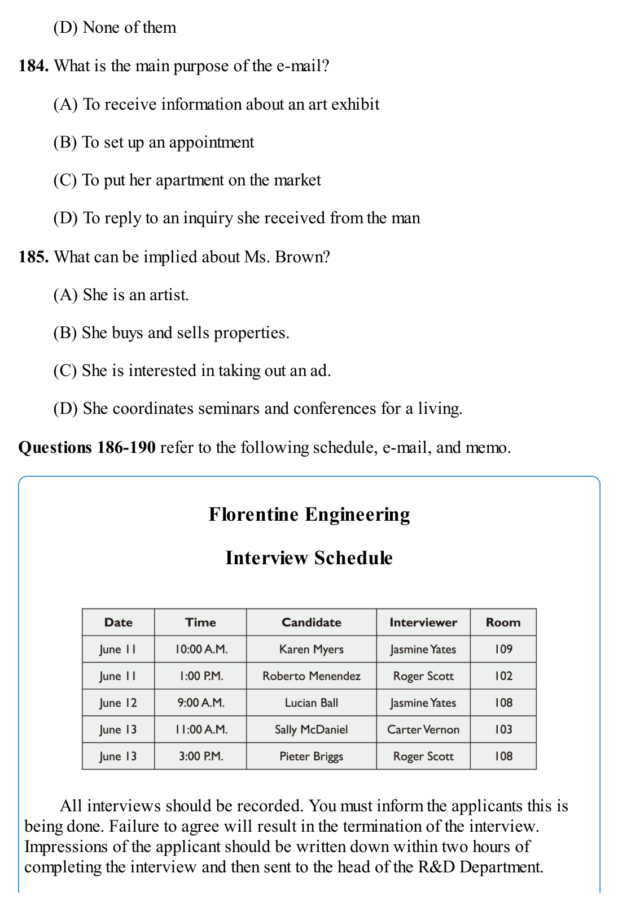


```text
(D) None of them
184.
 What is the main purpose of the e-mail?
(A) To receive information about an art exhibit
(B) To set up an appointment
(C) To put her apartment on the market
(D) To reply to an inquiry she received from the man
185.
 What can be implied about Ms. Brown?
(A) She is an artist.
(B) She buys and sells properties.
(C) She is interested in taking out an ad.
(D) She coordinates seminars and conferences for a living.
Questions 186-190
 refer to the following schedule, e-mail, and memo.
Florentine Engineering
Interview Schedule
All interviews should be recorded. You must inform the applicants this is
being done. Failure to agree will result in the termination of the interview.
Impressions of the applicant should be written down within two hours of
completing the interview and then sent to the head of the R&D Department.
822
```

## PDF 第 52 页

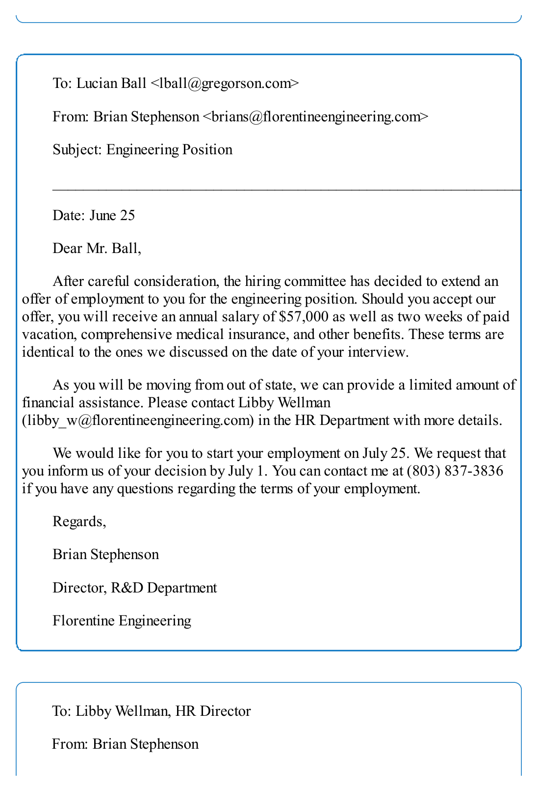


```text
To: Lucian Ball <lball@gregorson.com>
From: Brian Stephenson <brians@florentineengineering.com>
Subject: Engineering Position
_____________________________________________________________________
Date: June 25
Dear Mr. Ball,
After careful consideration, the hiring committee has decided to extend an
offer of employment to you for the engineering position. Should you accept our
offer, you will receive an annual salary of $57,000 as well as two weeks of paid
vacation, comprehensive medical insurance, and other benefits. These terms are
identical to the ones we discussed on the date of your interview.
As you will be moving from out of state, we can provide a limited amount of
financial assistance. Please contact Libby Wellman
(libby_w@florentineengineering.com) in the HR Department with more details.
We would like for you to start your employment on July 25. We request that
you inform us of your decision by July 1. You can contact me at (803) 837-3836
if you have any questions regarding the terms of your employment.
Regards,
Brian Stephenson
Director, R&D Department
Florentine Engineering
To: Libby Wellman, HR Director
From: Brian Stephenson
823
```

## PDF 第 53 页

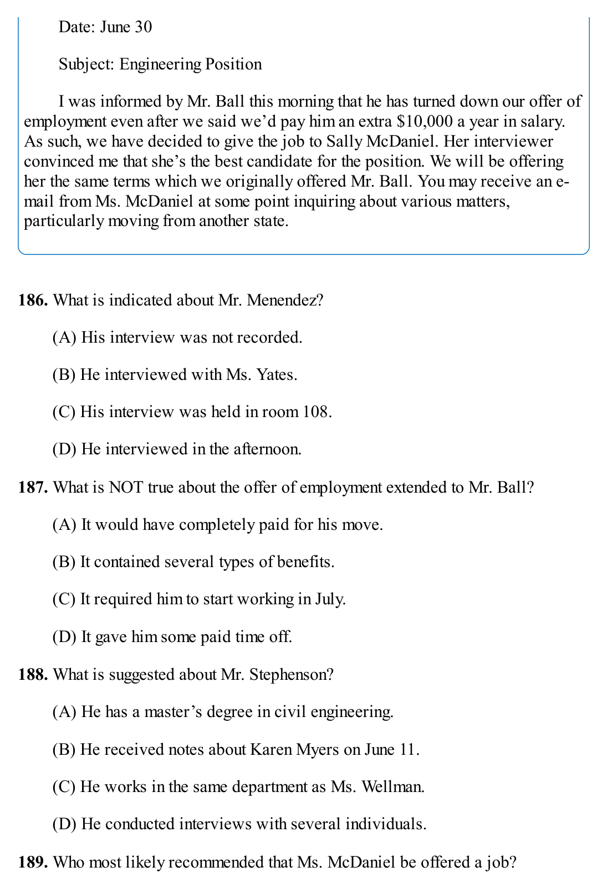


```text
Date: June 30
Subject: Engineering Position
I was informed by Mr. Ball this morning that he has turned down our offer of
employment even after we said we’d pay him an extra $10,000 a year in salary.
As such, we have decided to give the job to Sally McDaniel. Her interviewer
convinced me that she’s the best candidate for the position. We will be offering
her the same terms which we originally offered Mr. Ball. You may receive an e-
mail from Ms. McDaniel at some point inquiring about various matters,
particularly moving from another state.
186.
 What is indicated about Mr. Menendez?
(A) His interview was not recorded.
(B) He interviewed with Ms. Yates.
(C) His interview was held in room 108.
(D) He interviewed in the afternoon.
187.
 What is NOT true about the offer of employment extended to Mr. Ball?
(A) It would have completely paid for his move.
(B) It contained several types of benefits.
(C) It required him to start working in July.
(D) It gave him some paid time off.
188.
 What is suggested about Mr. Stephenson?
(A) He has a master’s degree in civil engineering.
(B) He received notes about Karen Myers on June 11.
(C) He works in the same department as Ms. Wellman.
(D) He conducted interviews with several individuals.
189.
 Who most likely recommended that Ms. McDaniel be offered a job?
824
```

## PDF 第 54 页

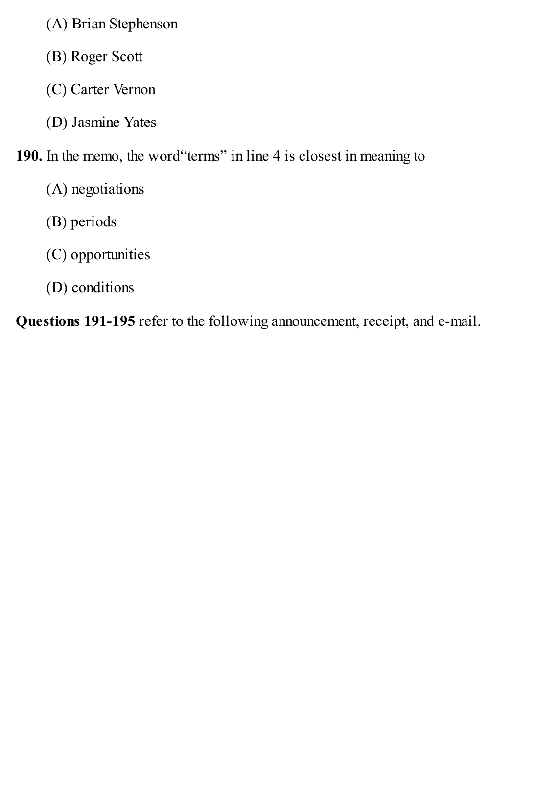


```text
(A) Brian Stephenson
(B) Roger Scott
(C) Carter Vernon
(D) Jasmine Yates
190.
 In the memo, the word“terms” in line 4 is closest in meaning to
(A) negotiations
(B) periods
(C) opportunities
(D) conditions
Questions 191-195
 refer to the following announcement, receipt, and e-mail.
825
```

## PDF 第 55 页

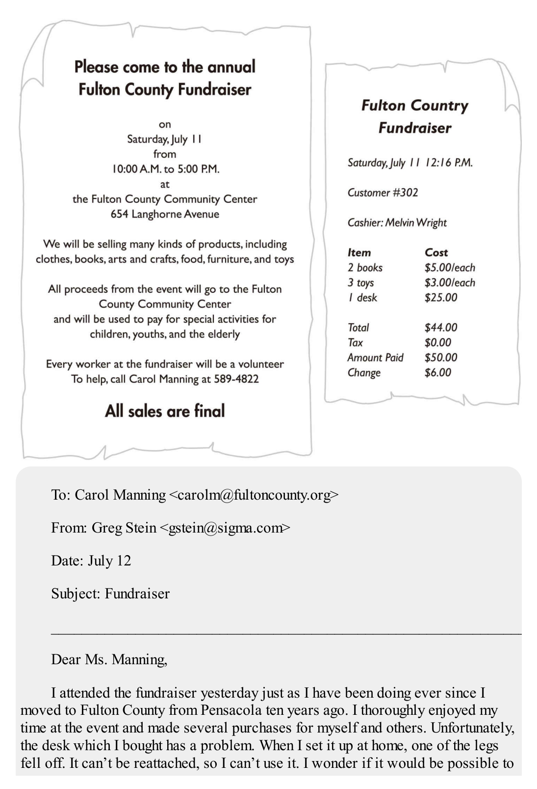


```text
To: Carol Manning <carolm@fultoncounty.org>
From: Greg Stein <gstein@sigma.com>
Date: July 12
Subject: Fundraiser
_____________________________________________________________________
Dear Ms. Manning,
I attended the fundraiser yesterday just as I have been doing ever since I
moved to Fulton County from Pensacola ten years ago. I thoroughly enjoyed my
time at the event and made several purchases for myself and others. Unfortunately,
the desk which I bought has a problem. When I set it up at home, one of the legs
fell off. It can’t be reattached, so I can’t use it. I wonder if it would be possible to
826
```

## PDF 第 56 页

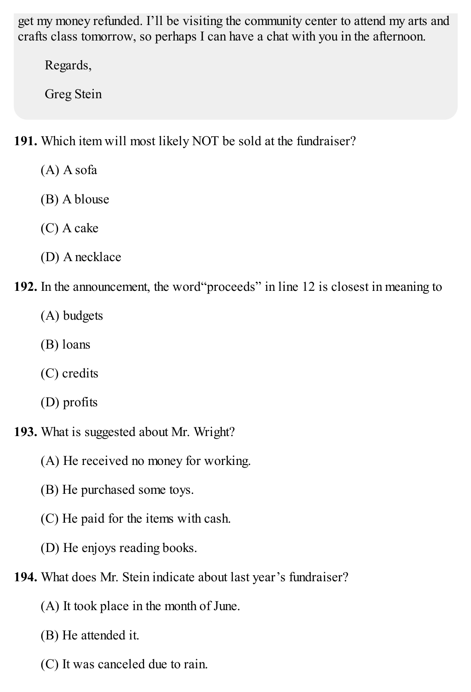


```text
get my money refunded. I’ll be visiting the community center to attend my arts and
crafts class tomorrow, so perhaps I can have a chat with you in the afternoon.
Regards,
Greg Stein
191.
 Which item will most likely NOT be sold at the fundraiser?
(A) A sofa
(B) A blouse
(C) A cake
(D) A necklace
192.
 In the announcement, the word“proceeds” in line 12 is closest in meaning to
(A) budgets
(B) loans
(C) credits
(D) profits
193.
 What is suggested about Mr. Wright?
(A) He received no money for working.
(B) He purchased some toys.
(C) He paid for the items with cash.
(D) He enjoys reading books.
194.
 What does Mr. Stein indicate about last year’s fundraiser?
(A) It took place in the month of June.
(B) He attended it.
(C) It was canceled due to rain.
827
```

## PDF 第 57 页

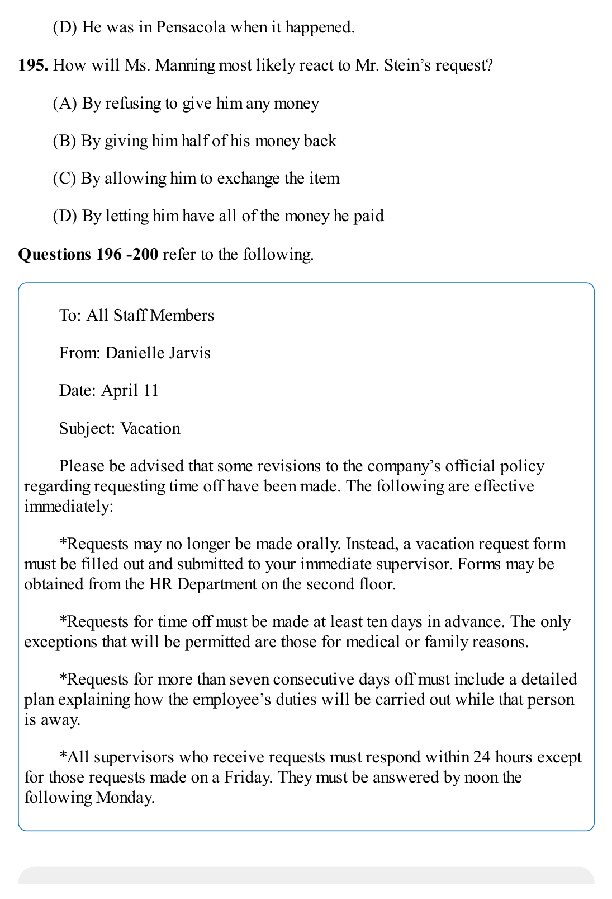


```text
(D) He was in Pensacola when it happened.
195.
 How will Ms. Manning most likely react to Mr. Stein’s request?
(A) By refusing to give him any money
(B) By giving him half of his money back
(C) By allowing him to exchange the item
(D) By letting him have all of the money he paid
Questions 196 -200
 refer to the following.
To: All Staff Members
From: Danielle Jarvis
Date: April 11
Subject: Vacation
Please be advised that some revisions to the company’s official policy
regarding requesting time off have been made. The following are effective
immediately:
*Requests may no longer be made orally. Instead, a vacation request form
must be filled out and submitted to your immediate supervisor. Forms may be
obtained from the HR Department on the second floor.
*Requests for time off must be made at least ten days in advance. The only
exceptions that will be permitted are those for medical or family reasons.
*Requests for more than seven consecutive days off must include a detailed
plan explaining how the employee’s duties will be carried out while that person
is away.
*All supervisors who receive requests must respond within 24 hours except
for those requests made on a Friday. They must be answered by noon the
following Monday.
828
```

## PDF 第 58 页

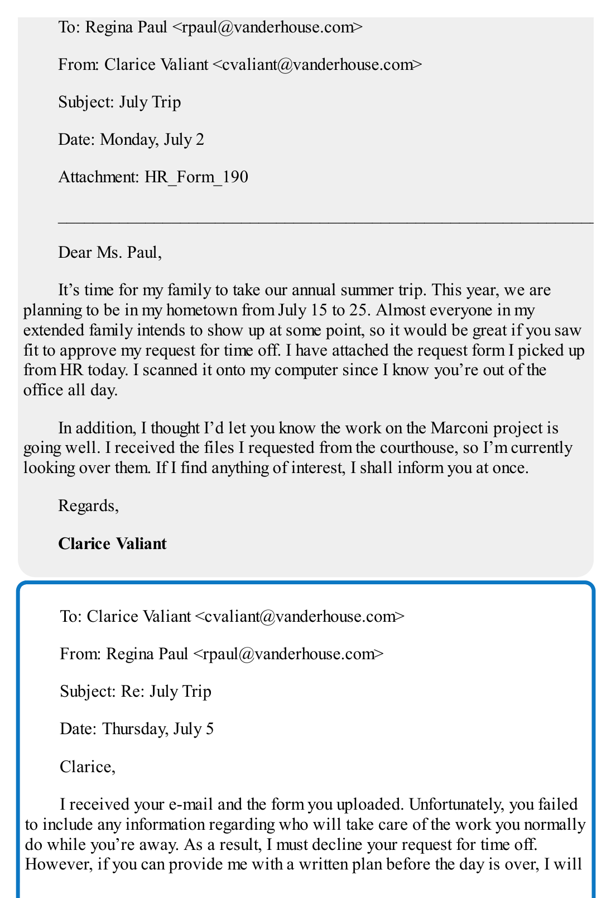


```text
To: Regina Paul <rpaul@vanderhouse.com>
From: Clarice Valiant <cvaliant@vanderhouse.com>
Subject: July Trip
Date: Monday, July 2
Attachment: HR_Form_190
_____________________________________________________________________
Dear Ms. Paul,
It’s time for my family to take our annual summer trip. This year, we are
planning to be in my hometown from July 15 to 25. Almost everyone in my
extended family intends to show up at some point, so it would be great if you saw
fit to approve my request for time off. I have attached the request form I picked up
from HR today. I scanned it onto my computer since I know you’re out of the
office all day.
In addition, I thought I’d let you know the work on the Marconi project is
going well. I received the files I requested from the courthouse, so I’m currently
looking over them. If I find anything of interest, I shall inform you at once.
Regards,
Clarice Valiant
To: Clarice Valiant <cvaliant@vanderhouse.com>
From: Regina Paul <rpaul@vanderhouse.com>
Subject: Re: July Trip
Date: Thursday, July 5
Clarice,
I received your e-mail and the form you uploaded. Unfortunately, you failed
to include any information regarding who will take care of the work you normally
do while you’re away. As a result, I must decline your request for time off.
However, if you can provide me with a written plan before the day is over, I will
829
```

## PDF 第 59 页

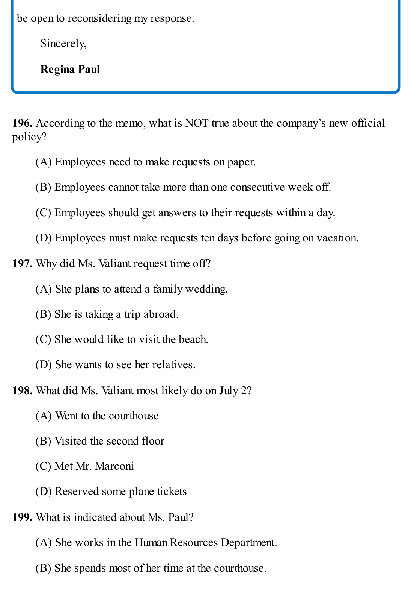


```text
be open to reconsidering my response.
Sincerely,
Regina Paul
196.
 According to the memo, what is NOT true about the company’s new official
policy?
(A) Employees need to make requests on paper.
(B) Employees cannot take more than one consecutive week off.
(C) Employees should get answers to their requests within a day.
(D) Employees must make requests ten days before going on vacation.
197.
 Why did Ms. Valiant request time off?
(A) She plans to attend a family wedding.
(B) She is taking a trip abroad.
(C) She would like to visit the beach.
(D) She wants to see her relatives.
198.
 What did Ms. Valiant most likely do on July 2?
(A) Went to the courthouse
(B) Visited the second floor
(C) Met Mr. Marconi
(D) Reserved some plane tickets
199.
 What is indicated about Ms. Paul?
(A) She works in the Human Resources Department.
(B) She spends most of her time at the courthouse.
830
```

## PDF 第 60 页

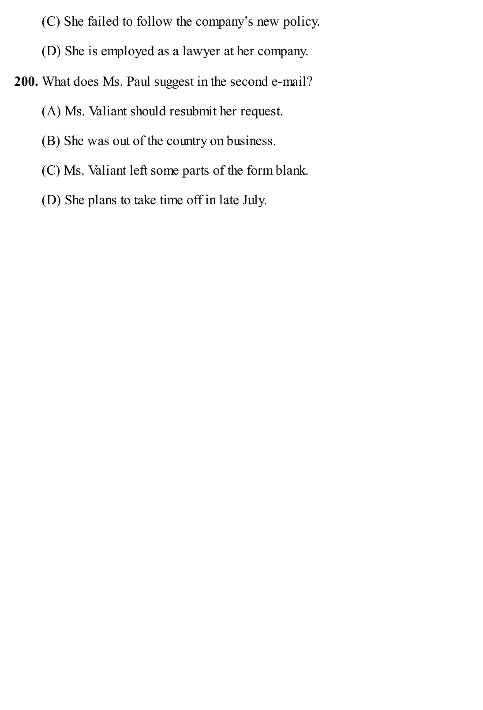


```text
(C) She failed to follow the company’s new policy.
(D) She is employed as a lawyer at her company.
200.
 What does Ms. Paul suggest in the second e-mail?
(A) Ms. Valiant should resubmit her request.
(B) She was out of the country on business.
(C) Ms. Valiant left some parts of the form blank.
(D) She plans to take time off in late July.
831
```

## PDF 第 61 页

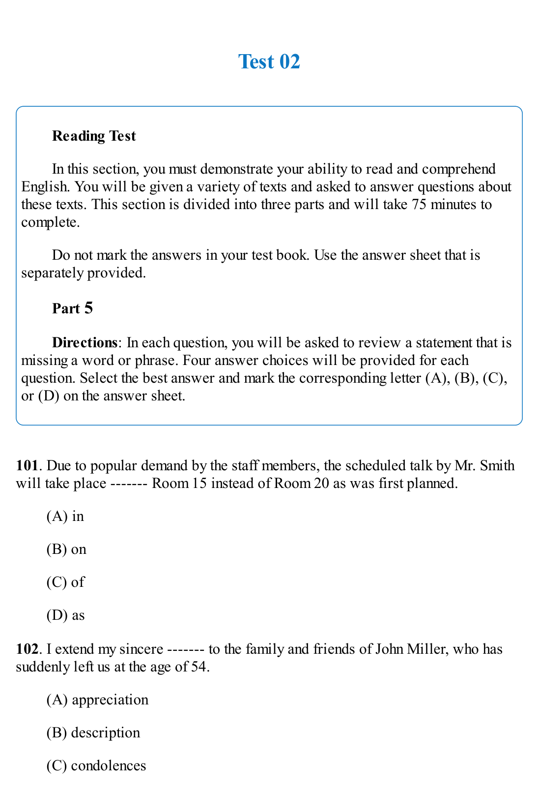


```text
Test 02
Reading Test
In this section, you must demonstrate your ability to read and comprehend
English. You will be given a variety of texts and asked to answer questions about
these texts. This section is divided into three parts and will take 75 minutes to
complete.
Do not mark the answers in your test book. Use the answer sheet that is
separately provided.
Part
5
Directions
: In each question, you will be asked to review a statement that is
missing a word or phrase. Four answer choices will be provided for each
question. Select the best answer and mark the corresponding letter (A), (B), (C),
or (D) on the answer sheet.
101
. Due to popular demand by the staff members, the scheduled talk by Mr. Smith
will take place ------- Room 15 instead of Room 20 as was first planned.
(A) in
(B) on
(C) of
(D) as
102
. I extend my sincere ------- to the family and friends of John Miller, who has
suddenly left us at the age of 54.
(A) appreciation
(B) description
(C) condolences
832
```

## PDF 第 62 页

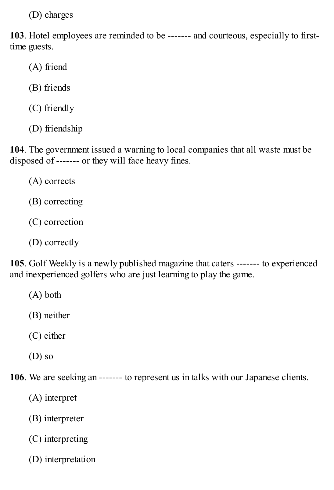


```text
(D) charges
103
. Hotel employees are reminded to be ------- and courteous, especially to first-
time guests.
(A) friend
(B) friends
(C) friendly
(D) friendship
104
. The government issued a warning to local companies that all waste must be
disposed of ------- or they will face heavy fines.
(A) corrects
(B) correcting
(C) correction
(D) correctly
105
. Golf Weekly is a newly published magazine that caters ------- to experienced
and inexperienced golfers who are just learning to play the game.
(A) both
(B) neither
(C) either
(D) so
106
. We are seeking an ------- to represent us in talks with our Japanese clients.
(A) interpret
(B) interpreter
(C) interpreting
(D) interpretation
833
```

## PDF 第 63 页

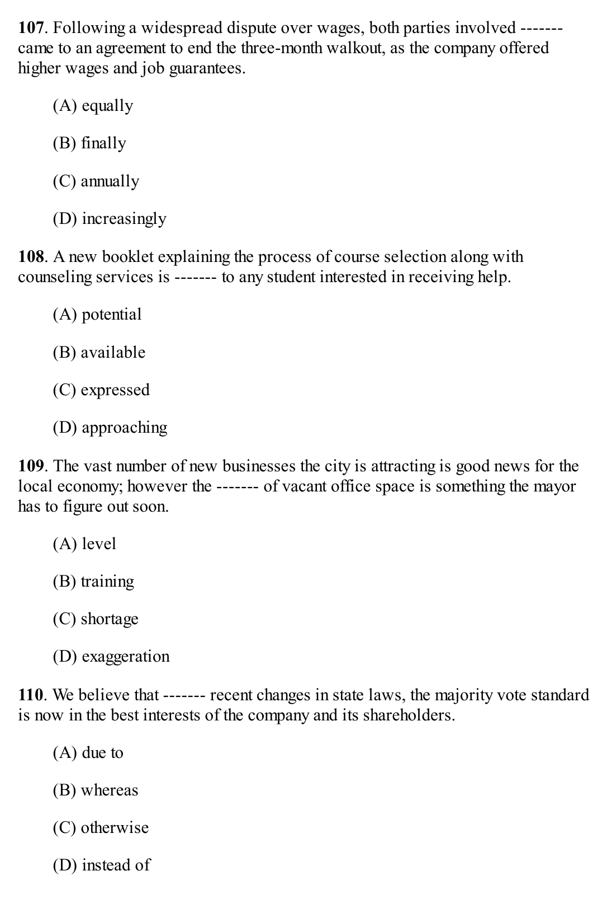


```text
107
. Following a widespread dispute over wages, both parties involved -------
came to an agreement to end the three-month walkout, as the company offered
higher wages and job guarantees.
(A) equally
(B) finally
(C) annually
(D) increasingly
108
. A new booklet explaining the process of course selection along with
counseling services is ------- to any student interested in receiving help.
(A) potential
(B) available
(C) expressed
(D) approaching
109
. The vast number of new businesses the city is attracting is good news for the
local economy; however the ------- of vacant office space is something the mayor
has to figure out soon.
(A) level
(B) training
(C) shortage
(D) exaggeration
110
. We believe that ------- recent changes in state laws, the majority vote standard
is now in the best interests of the company and its shareholders.
(A) due to
(B) whereas
(C) otherwise
(D) instead of
834
```

## PDF 第 64 页

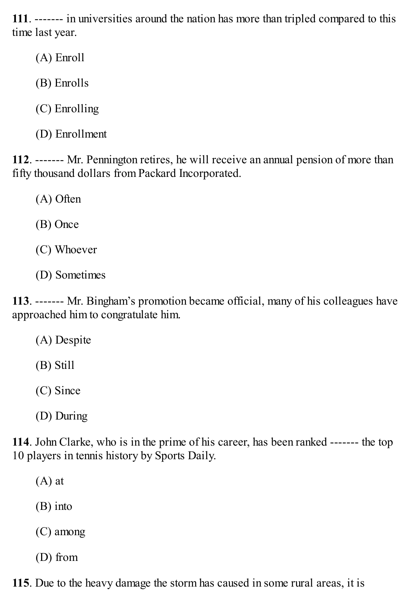


```text
111
. ------- in universities around the nation has more than tripled compared to this
time last year.
(A) Enroll
(B) Enrolls
(C) Enrolling
(D) Enrollment
112
. ------- Mr. Pennington retires, he will receive an annual pension of more than
fifty thousand dollars from Packard Incorporated.
(A) Often
(B) Once
(C) Whoever
(D) Sometimes
113
. ------- Mr. Bingham’s promotion became official, many of his colleagues have
approached him to congratulate him.
(A) Despite
(B) Still
(C) Since
(D) During
114
. John Clarke, who is in the prime of his career, has been ranked ------- the top
10 players in tennis history by Sports Daily.
(A) at
(B) into
(C) among
(D) from
115
. Due to the heavy damage the storm has caused in some rural areas, it is
835
```

## PDF 第 65 页

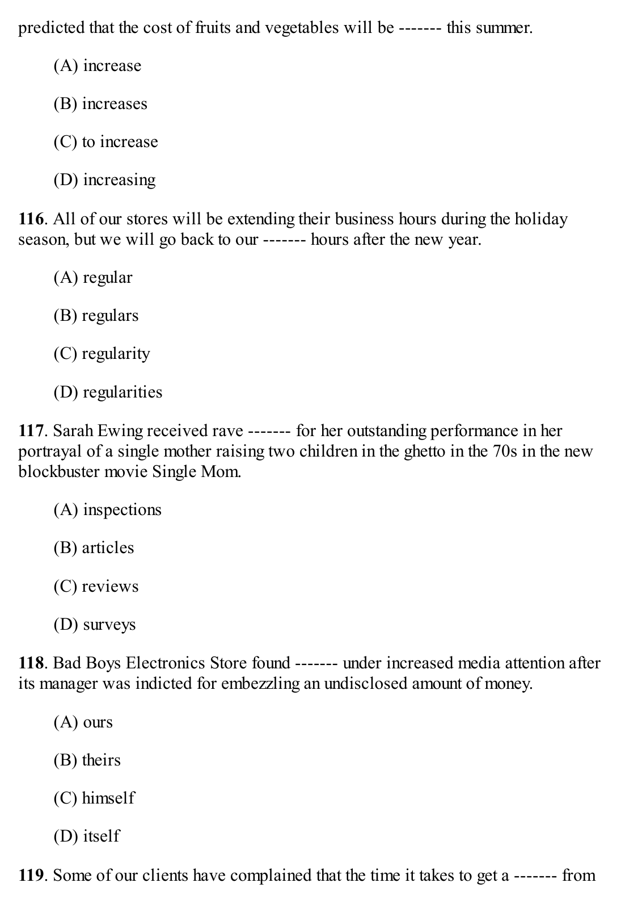


```text
predicted that the cost of fruits and vegetables will be ------- this summer.
(A) increase
(B) increases
(C) to increase
(D) increasing
116
. All of our stores will be extending their business hours during the holiday
season, but we will go back to our ------- hours after the new year.
(A) regular
(B) regulars
(C) regularity
(D) regularities
117
. Sarah Ewing received rave ------- for her outstanding performance in her
portrayal of a single mother raising two children in the ghetto in the 70s in the new
blockbuster movie Single Mom.
(A) inspections
(B) articles
(C) reviews
(D) surveys
118
. Bad Boys Electronics Store found ------- under increased media attention after
its manager was indicted for embezzling an undisclosed amount of money.
(A) ours
(B) theirs
(C) himself
(D) itself
119
. Some of our clients have complained that the time it takes to get a ------- from
836
```

## PDF 第 66 页

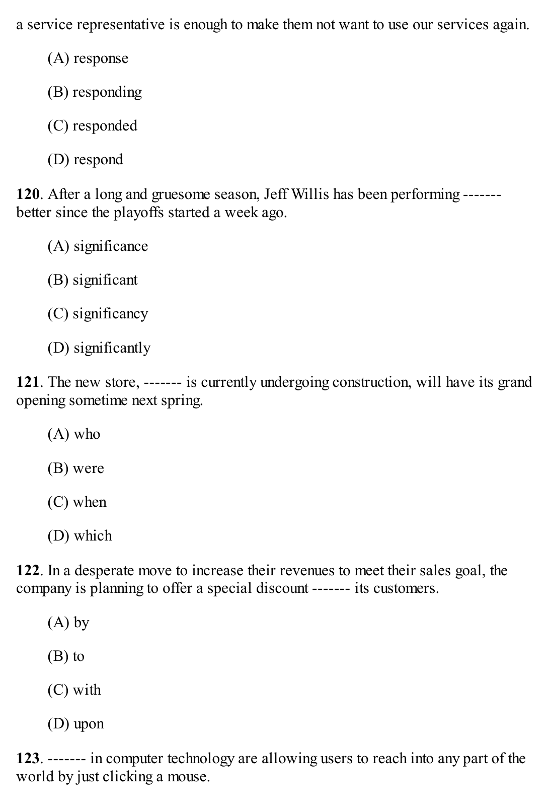


```text
a service representative is enough to make them not want to use our services again.
(A) response
(B) responding
(C) responded
(D) respond
120
. After a long and gruesome season, Jeff Willis has been performing -------
better since the playoffs started a week ago.
(A) significance
(B) significant
(C) significancy
(D) significantly
121
. The new store, ------- is currently undergoing construction, will have its grand
opening sometime next spring.
(A) who
(B) were
(C) when
(D) which
122
. In a desperate move to increase their revenues to meet their sales goal, the
company is planning to offer a special discount ------- its customers.
(A) by
(B) to
(C) with
(D) upon
123
. ------- in computer technology are allowing users to reach into any part of the
world by just clicking a mouse.
837
```

## PDF 第 67 页

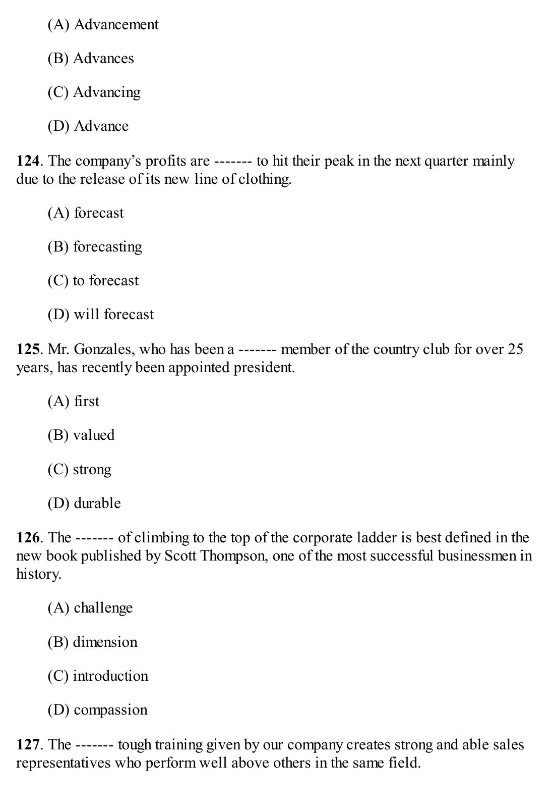


```text
(A) Advancement
(B) Advances
(C) Advancing
(D) Advance
124
. The company’s profits are ------- to hit their peak in the next quarter mainly
due to the release of its new line of clothing.
(A) forecast
(B) forecasting
(C) to forecast
(D) will forecast
125
. Mr. Gonzales, who has been a ------- member of the country club for over 25
years, has recently been appointed president.
(A) first
(B) valued
(C) strong
(D) durable
126
. The ------- of climbing to the top of the corporate ladder is best defined in the
new book published by Scott Thompson, one of the most successful businessmen in
history.
(A) challenge
(B) dimension
(C) introduction
(D) compassion
127
. The ------- tough training given by our company creates strong and able sales
representatives who perform well above others in the same field.
838
```

## PDF 第 68 页

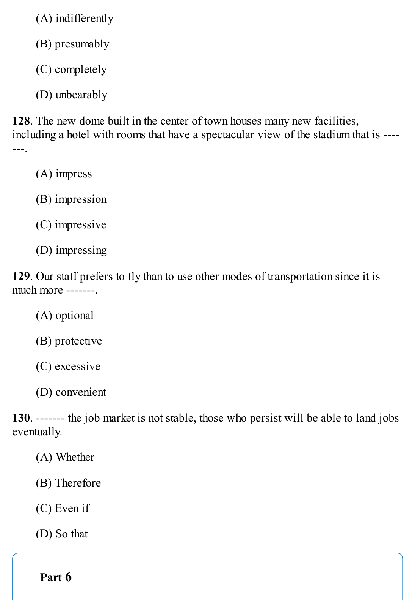


```text
(A) indifferently
(B) presumably
(C) completely
(D) unbearably
128
. The new dome built in the center of town houses many new facilities,
including a hotel with rooms that have a spectacular view of the stadium that is ----
---.
(A) impress
(B) impression
(C) impressive
(D) impressing
129
. Our staff prefers to fly than to use other modes of transportation since it is
much more -------.
(A) optional
(B) protective
(C) excessive
(D) convenient
130
. ------- the job market is not stable, those who persist will be able to land jobs
eventually.
(A) Whether
(B) Therefore
(C) Even if
(D) So that
Part
6
839
```

## PDF 第 69 页

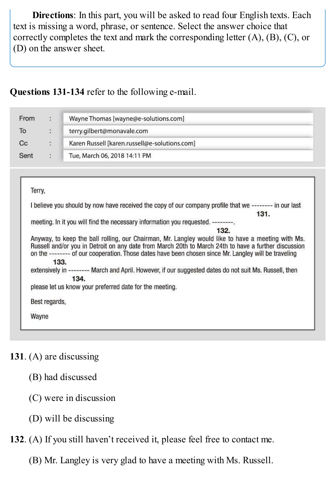


```text
Directions
: In this part, you will be asked to read four English texts. Each
text is missing a word, phrase, or sentence. Select the answer choice that
correctly completes the text and mark the corresponding letter (A), (B), (C), or
(D) on the answer sheet.
Questions 131-134
 refer to the following e-mail.
131
. (A) are discussing
(B) had discussed
(C) were in discussion
(D) will be discussing
132
. (A) If you still haven’t received it, please feel free to contact me.
(B) Mr. Langley is very glad to have a meeting with Ms. Russell.
840
```

## PDF 第 70 页

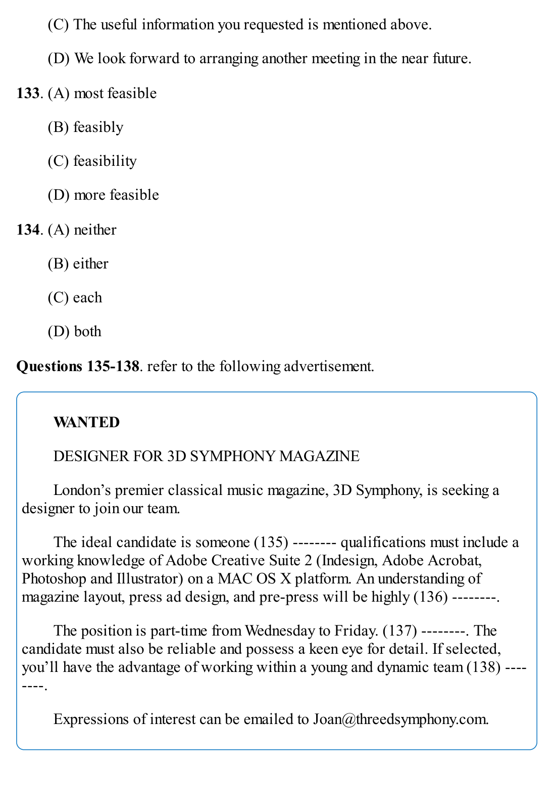


```text
(C) The useful information you requested is mentioned above.
(D) We look forward to arranging another meeting in the near future.
133
. (A) most feasible
(B) feasibly
(C) feasibility
(D) more feasible
134
. (A) neither
(B) either
(C) each
(D) both
Questions 135-138
. refer to the following advertisement.
WANTED
DESIGNER FOR 3D SYMPHONY MAGAZINE
London’s premier classical music magazine, 3D Symphony, is seeking a
designer to join our team.
The ideal candidate is someone (135) -------- qualifications must include a
working knowledge of Adobe Creative Suite 2 (Indesign, Adobe Acrobat,
Photoshop and Illustrator) on a MAC OS X platform. An understanding of
magazine layout, press ad design, and pre-press will be highly (136) --------.
The position is part-time from Wednesday to Friday. (137) --------. The
candidate must also be reliable and possess a keen eye for detail. If selected,
you’ll have the advantage of working within a young and dynamic team (138) ----
----.
Expressions of interest can be emailed to Joan@threedsymphony.com.
841
```

## PDF 第 71 页

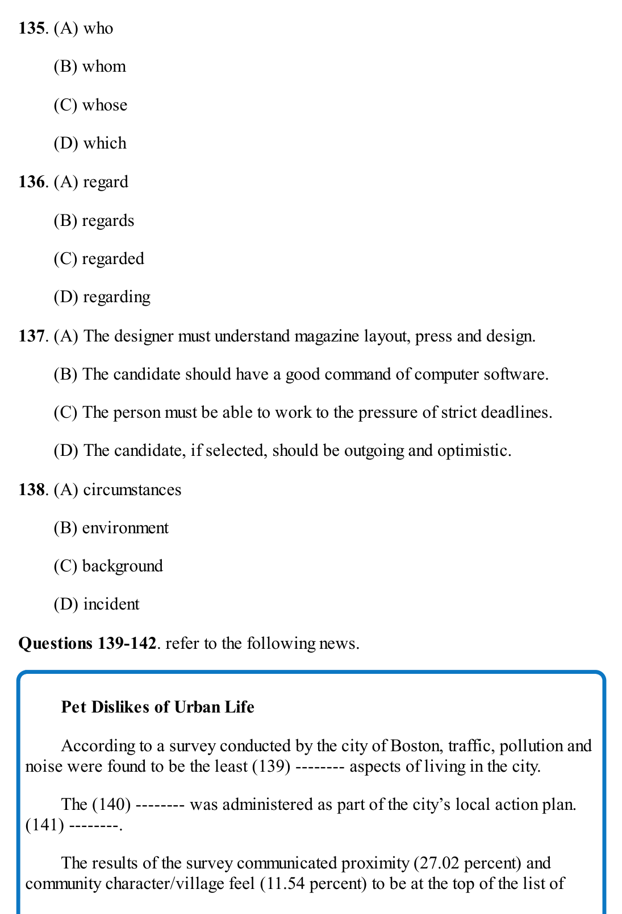


```text
135
. (A) who
(B) whom
(C) whose
(D) which
136
. (A) regard
(B) regards
(C) regarded
(D) regarding
137
. (A) The designer must understand magazine layout, press and design.
(B) The candidate should have a good command of computer software.
(C) The person must be able to work to the pressure of strict deadlines.
(D) The candidate, if selected, should be outgoing and optimistic.
138
. (A) circumstances
(B) environment
(C) background
(D) incident
Questions 139-142
. refer to the following news.
Pet Dislikes of Urban Life
According to a survey conducted by the city of Boston, traffic, pollution and
noise were found to be the least (139) -------- aspects of living in the city.
The (140) -------- was administered as part of the city’s local action plan.
(141) --------.
The results of the survey communicated proximity (27.02 percent) and
community character/village feel (11.54 percent) to be at the top of the list of
842
```

## PDF 第 72 页

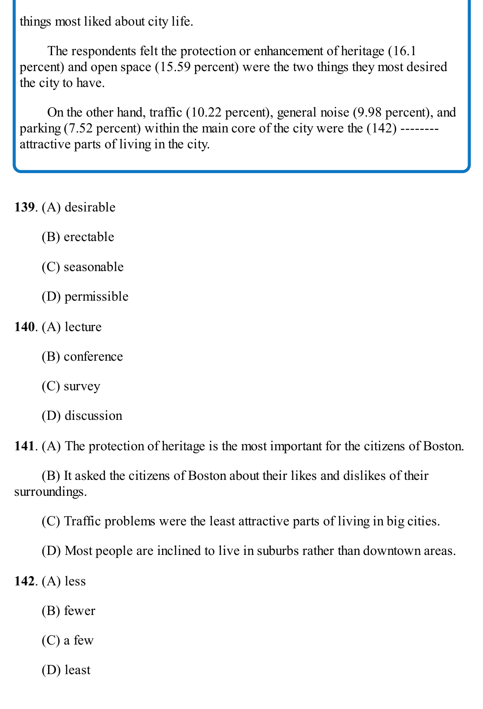


```text
things most liked about city life.
The respondents felt the protection or enhancement of heritage (16.1
percent) and open space (15.59 percent) were the two things they most desired
the city to have.
On the other hand, traffic (10.22 percent), general noise (9.98 percent), and
parking (7.52 percent) within the main core of the city were the (142) --------
attractive parts of living in the city.
139
. (A) desirable
(B) erectable
(C) seasonable
(D) permissible
140
. (A) lecture
(B) conference
(C) survey
(D) discussion
141
. (A) The protection of heritage is the most important for the citizens of Boston.
(B) It asked the citizens of Boston about their likes and dislikes of their
surroundings.
(C) Traffic problems were the least attractive parts of living in big cities.
(D) Most people are inclined to live in suburbs rather than downtown areas.
142
. (A) less
(B) fewer
(C) a few
(D) least
843
```

## PDF 第 73 页

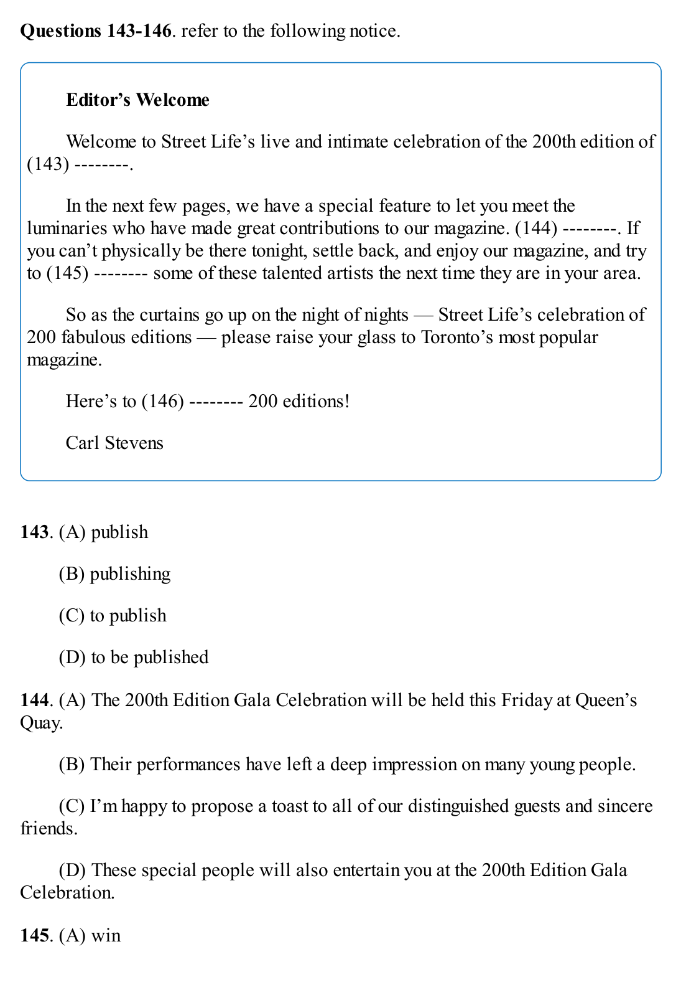


```text
Questions 143-146
. refer to the following notice.
Editor’s Welcome
Welcome to Street Life’s live and intimate celebration of the 200th edition of
(143) --------.
In the next few pages, we have a special feature to let you meet the
luminaries who have made great contributions to our magazine. (144) --------. If
you can’t physically be there tonight, settle back, and enjoy our magazine, and try
to (145) -------- some of these talented artists the next time they are in your area.
So as the curtains go up on the night of nights — Street Life’s celebration of
200 fabulous editions — please raise your glass to Toronto’s most popular
magazine.
Here’s to (146) -------- 200 editions!
Carl Stevens
143
. (A) publish
(B) publishing
(C) to publish
(D) to be published
144
. (A) The 200th Edition Gala Celebration will be held this Friday at Queen’s
Quay.
(B) Their performances have left a deep impression on many young people.
(C) I’m happy to propose a toast to all of our distinguished guests and sincere
friends.
(D) These special people will also entertain you at the 200th Edition Gala
Celebration.
145
. (A) win
844
```

## PDF 第 74 页

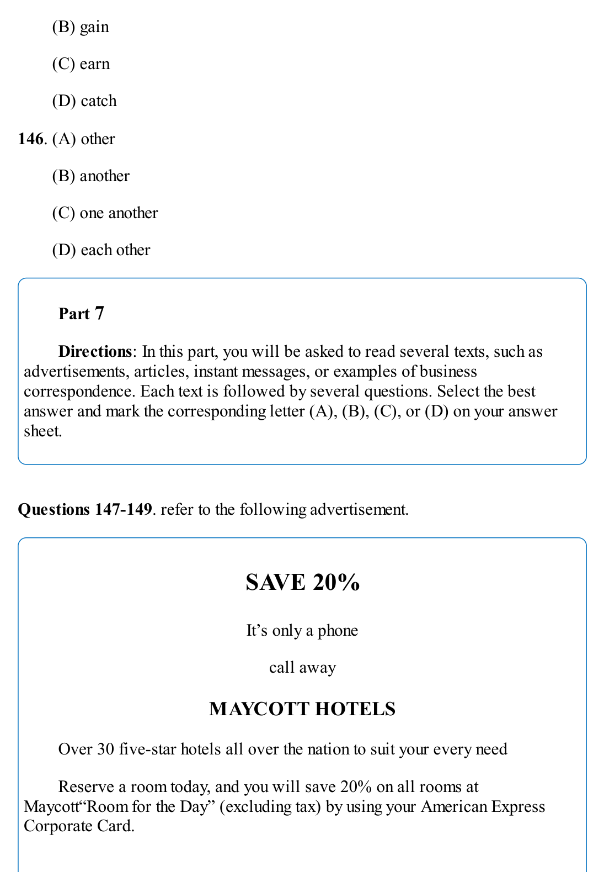


```text
(B) gain
(C) earn
(D) catch
146
. (A) other
(B) another
(C) one another
(D) each other
Part
7
Directions
: In this part, you will be asked to read several texts, such as
advertisements, articles, instant messages, or examples of business
correspondence. Each text is followed by several questions. Select the best
answer and mark the corresponding letter (A), (B), (C), or (D) on your answer
sheet.
Questions 147-149
. refer to the following advertisement.
SAVE 20%
It’s only a phone
call away
MAYCOTT HOTELS
Over 30 five-star hotels all over the nation to suit your every need
Reserve a room today, and you will save 20% on all rooms at
Maycott“Room for the Day” (excluding tax) by using your American Express
Corporate Card.
845
```

## PDF 第 75 页

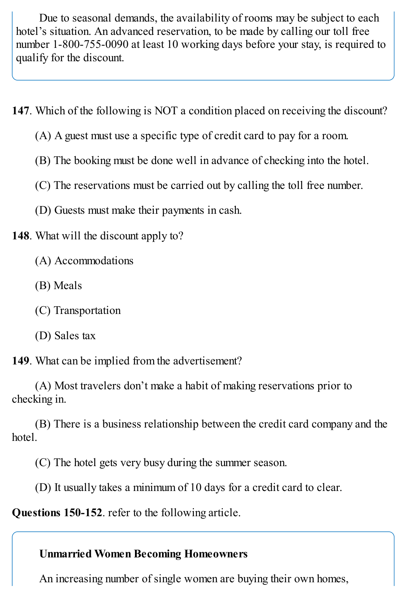


```text
Due to seasonal demands, the availability of rooms may be subject to each
hotel’s situation. An advanced reservation, to be made by calling our toll free
number 1-800-755-0090 at least 10 working days before your stay, is required to
qualify for the discount.
147
. Which of the following is NOT a condition placed on receiving the discount?
(A) A guest must use a specific type of credit card to pay for a room.
(B) The booking must be done well in advance of checking into the hotel.
(C) The reservations must be carried out by calling the toll free number.
(D) Guests must make their payments in cash.
148
. What will the discount apply to?
(A) Accommodations
(B) Meals
(C) Transportation
(D) Sales tax
149
. What can be implied from the advertisement?
(A) Most travelers don’t make a habit of making reservations prior to
checking in.
(B) There is a business relationship between the credit card company and the
hotel.
(C) The hotel gets very busy during the summer season.
(D) It usually takes a minimum of 10 days for a credit card to clear.
Questions 150-152
. refer to the following article.
Unmarried Women Becoming Homeowners
An increasing number of single women are buying their own homes,
846
```

## PDF 第 76 页

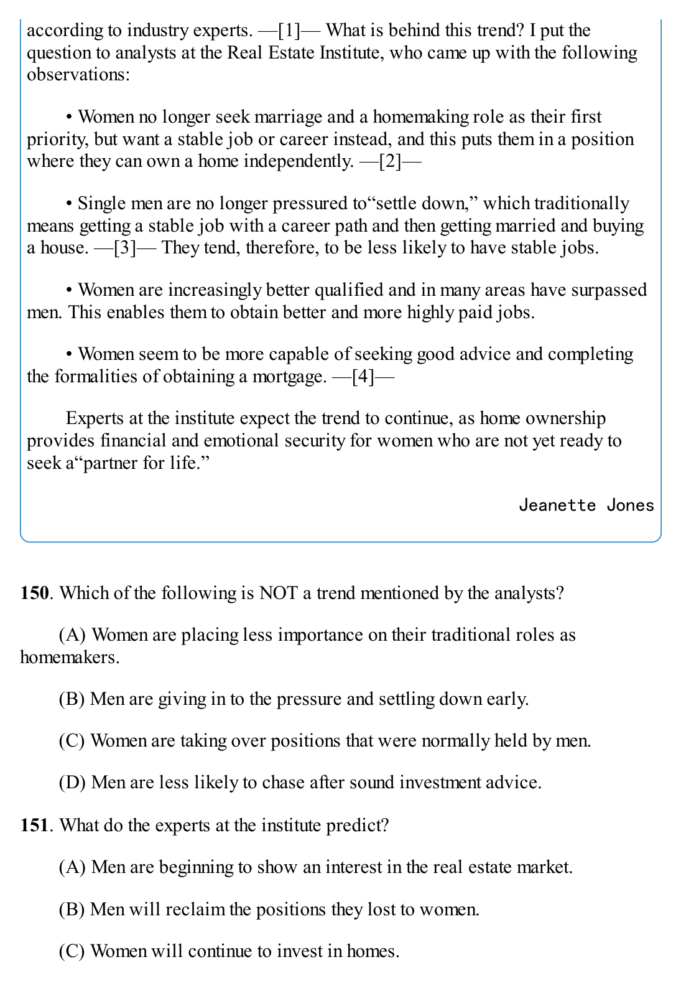


```text
according to industry experts. —[1]— What is behind this trend? I put the
question to analysts at the Real Estate Institute, who came up with the following
observations:
• Women no longer seek marriage and a homemaking role as their first
priority, but want a stable job or career instead, and this puts them in a position
where they can own a home independently. —[2]—
• Single men are no longer pressured to“settle down,” which traditionally
means getting a stable job with a career path and then getting married and buying
a house. —[3]— They tend, therefore, to be less likely to have stable jobs.
• Women are increasingly better qualified and in many areas have surpassed
men. This enables them to obtain better and more highly paid jobs.
• Women seem to be more capable of seeking good advice and completing
the formalities of obtaining a mortgage. —[4]—
Experts at the institute expect the trend to continue, as home ownership
provides financial and emotional security for women who are not yet ready to
seek a“partner for life.”
Jeanette Jones
150
. Which of the following is NOT a trend mentioned by the analysts?
(A) Women are placing less importance on their traditional roles as
homemakers.
(B) Men are giving in to the pressure and settling down early.
(C) Women are taking over positions that were normally held by men.
(D) Men are less likely to chase after sound investment advice.
151
. What do the experts at the institute predict?
(A) Men are beginning to show an interest in the real estate market.
(B) Men will reclaim the positions they lost to women.
(C) Women will continue to invest in homes.
847
```

## PDF 第 77 页

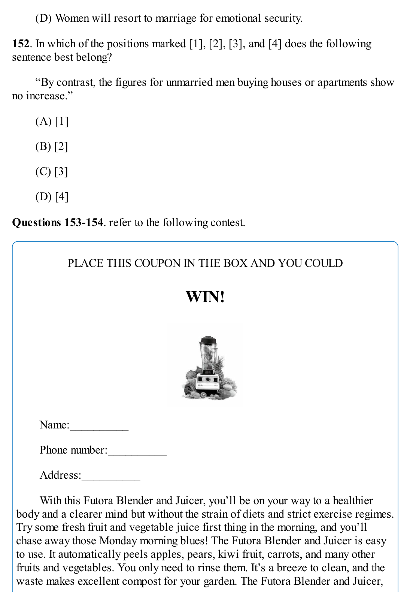


```text
(D) Women will resort to marriage for emotional security.
152
. In which of the positions marked [1], [2], [3], and [4] does the following
sentence best belong?
“By contrast, the figures for unmarried men buying houses or apartments show
no increase.”
(A) [1]
(B) [2]
(C) [3]
(D) [4]
Questions 153-154
. refer to the following contest.
PLACE THIS COUPON IN THE BOX AND YOU COULD
WIN!
Name:__________
Phone number:__________
Address:__________
With this Futora Blender and Juicer, you’ll be on your way to a healthier
body and a clearer mind but without the strain of diets and strict exercise regimes.
Try some fresh fruit and vegetable juice first thing in the morning, and you’ll
chase away those Monday morning blues! The Futora Blender and Juicer is easy
to use. It automatically peels apples, pears, kiwi fruit, carrots, and many other
fruits and vegetables. You only need to rinse them. It’s a breeze to clean, and the
waste makes excellent compost for your garden. The Futora Blender and Juicer,
848
```

## PDF 第 78 页

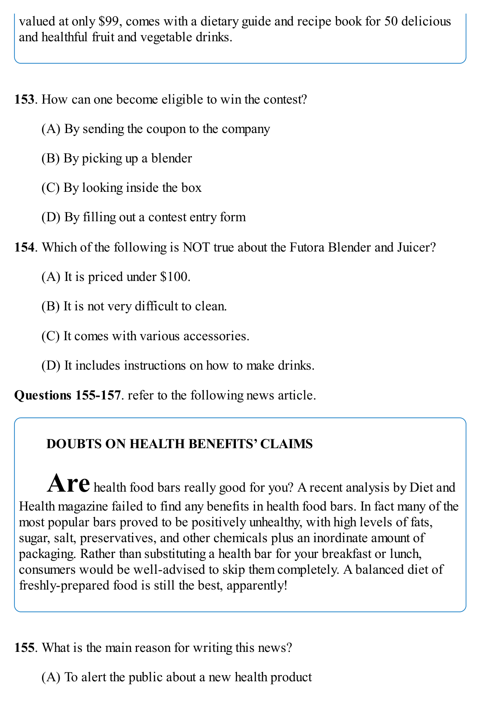


```text
valued at only $99, comes with a dietary guide and recipe book for 50 delicious
and healthful fruit and vegetable drinks.
153
. How can one become eligible to win the contest?
(A) By sending the coupon to the company
(B) By picking up a blender
(C) By looking inside the box
(D) By filling out a contest entry form
154
. Which of the following is NOT true about the Futora Blender and Juicer?
(A) It is priced under $100.
(B) It is not very difficult to clean.
(C) It comes with various accessories.
(D) It includes instructions on how to make drinks.
Questions 155-157
. refer to the following news article.
DOUBTS ON HEALTH BENEFITS’ CLAIMS
Are
 health food bars really good for you? A recent analysis by Diet and
Health magazine failed to find any benefits in health food bars. In fact many of the
most popular bars proved to be positively unhealthy, with high levels of fats,
sugar, salt, preservatives, and other chemicals plus an inordinate amount of
packaging. Rather than substituting a health bar for your breakfast or lunch,
consumers would be well-advised to skip them completely. A balanced diet of
freshly-prepared food is still the best, apparently!
155
. What is the main reason for writing this news?
(A) To alert the public about a new health product
849
```

## PDF 第 79 页

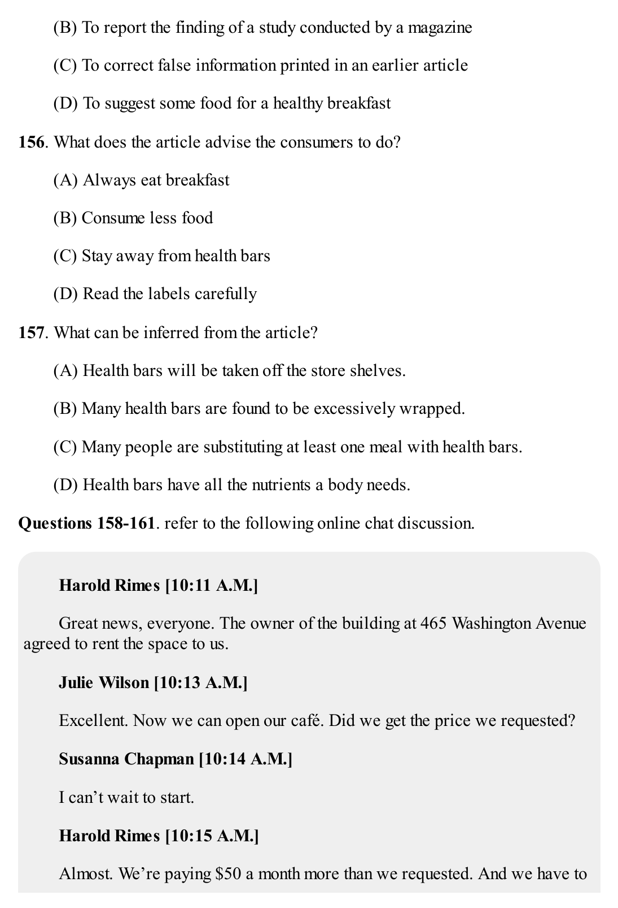


```text
(B) To report the finding of a study conducted by a magazine
(C) To correct false information printed in an earlier article
(D) To suggest some food for a healthy breakfast
156
. What does the article advise the consumers to do?
(A) Always eat breakfast
(B) Consume less food
(C) Stay away from health bars
(D) Read the labels carefully
157
. What can be inferred from the article?
(A) Health bars will be taken off the store shelves.
(B) Many health bars are found to be excessively wrapped.
(C) Many people are substituting at least one meal with health bars.
(D) Health bars have all the nutrients a body needs.
Questions 158-161
. refer to the following online chat discussion.
Harold Rimes [10:11 A.M.]
Great news, everyone. The owner of the building at 465 Washington Avenue
agreed to rent the space to us.
Julie Wilson [10:13 A.M.]
Excellent. Now we can open our café. Did we get the price we requested?
Susanna Chapman [10:14 A.M.]
I can’t wait to start.
Harold Rimes [10:15 A.M.]
Almost. We’re paying $50 a month more than we requested. And we have to
850
```

## PDF 第 80 页

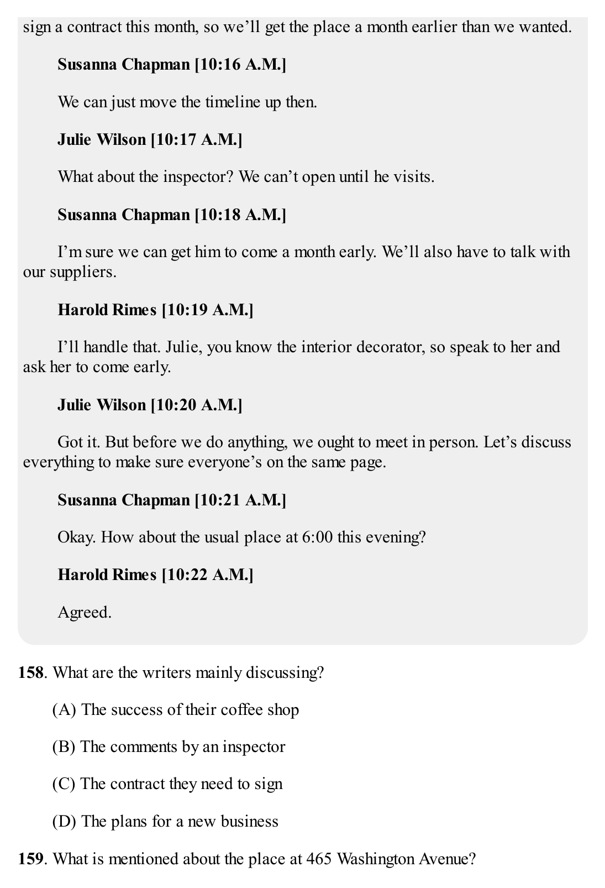


```text
sign a contract this month, so we’ll get the place a month earlier than we wanted.
Susanna Chapman [10:16 A.M.]
We can just move the timeline up then.
Julie Wilson [10:17 A.M.]
What about the inspector? We can’t open until he visits.
Susanna Chapman [10:18 A.M.]
I’m sure we can get him to come a month early. We’ll also have to talk with
our suppliers.
Harold Rimes [10:19 A.M.]
I’ll handle that. Julie, you know the interior decorator, so speak to her and
ask her to come early.
Julie Wilson [10:20 A.M.]
Got it. But before we do anything, we ought to meet in person. Let’s discuss
everything to make sure everyone’s on the same page.
Susanna Chapman [10:21 A.M.]
Okay. How about the usual place at 6:00 this evening?
Harold Rimes [10:22 A.M.]
Agreed.
158
. What are the writers mainly discussing?
(A) The success of their coffee shop
(B) The comments by an inspector
(C) The contract they need to sign
(D) The plans for a new business
159
. What is mentioned about the place at 465 Washington Avenue?
851
```

## PDF 第 81 页

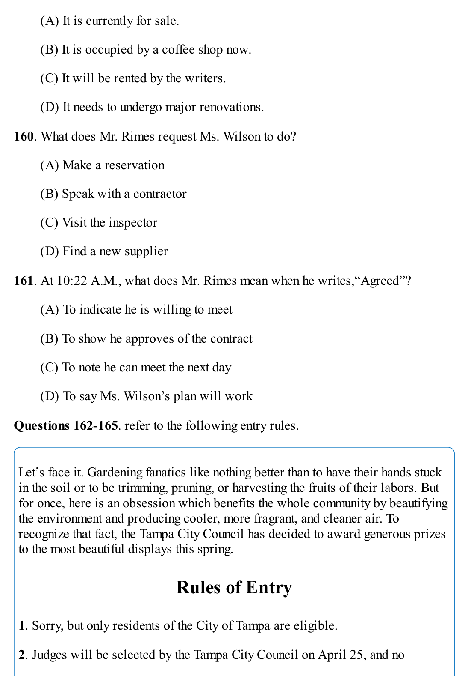


```text
(A) It is currently for sale.
(B) It is occupied by a coffee shop now.
(C) It will be rented by the writers.
(D) It needs to undergo major renovations.
160
. What does Mr. Rimes request Ms. Wilson to do?
(A) Make a reservation
(B) Speak with a contractor
(C) Visit the inspector
(D) Find a new supplier
161
. At 10:22 A.M., what does Mr. Rimes mean when he writes,“Agreed”?
(A) To indicate he is willing to meet
(B) To show he approves of the contract
(C) To note he can meet the next day
(D) To say Ms. Wilson’s plan will work
Questions 162-165
. refer to the following entry rules.
Let’s face it. Gardening fanatics like nothing better than to have their hands stuck
in the soil or to be trimming, pruning, or harvesting the fruits of their labors. But
for once, here is an obsession which benefits the whole community by beautifying
the environment and producing cooler, more fragrant, and cleaner air. To
recognize that fact, the Tampa City Council has decided to award generous prizes
to the most beautiful displays this spring.
Rules of Entry
1
. Sorry, but only residents of the City of Tampa are eligible.
2
. Judges will be selected by the Tampa City Council on April 25, and no
852
```

## PDF 第 82 页

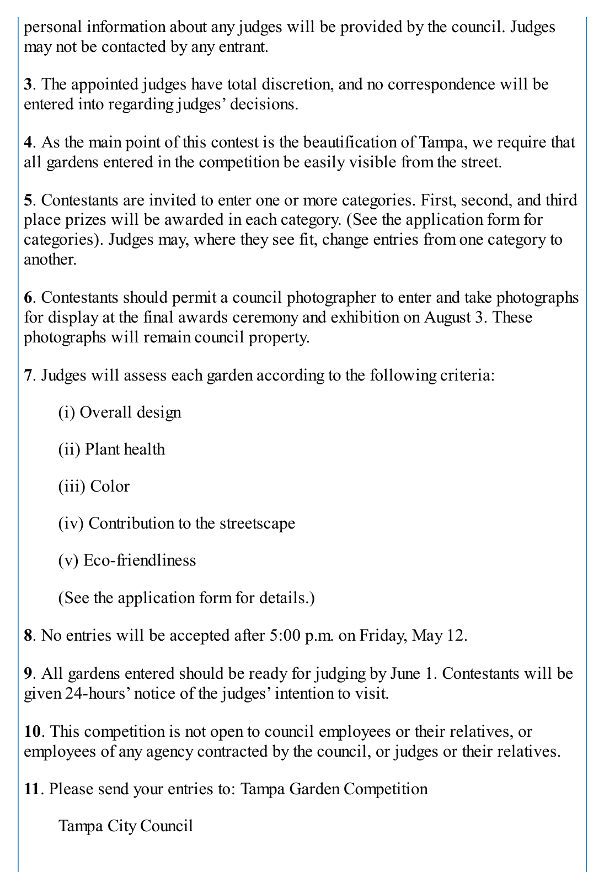


```text
personal information about any judges will be provided by the council. Judges
may not be contacted by any entrant.
3
. The appointed judges have total discretion, and no correspondence will be
entered into regarding judges’ decisions.
4
. As the main point of this contest is the beautification of Tampa, we require that
all gardens entered in the competition be easily visible from the street.
5
. Contestants are invited to enter one or more categories. First, second, and third
place prizes will be awarded in each category. (See the application form for
categories). Judges may, where they see fit, change entries from one category to
another.
6
. Contestants should permit a council photographer to enter and take photographs
for display at the final awards ceremony and exhibition on August 3. These
photographs will remain council property.
7
. Judges will assess each garden according to the following criteria:
(i) Overall design
(ii) Plant health
(iii) Color
(iv) Contribution to the streetscape
(v) Eco-friendliness
(See the application form for details.)
8
. No entries will be accepted after 5:00 p.m. on Friday, May 12.
9
. All gardens entered should be ready for judging by June 1. Contestants will be
given 24-hours’ notice of the judges’ intention to visit.
10
. This competition is not open to council employees or their relatives, or
employees of any agency contracted by the council, or judges or their relatives.
11
. Please send your entries to: Tampa Garden Competition
Tampa City Council
853
```

## PDF 第 83 页

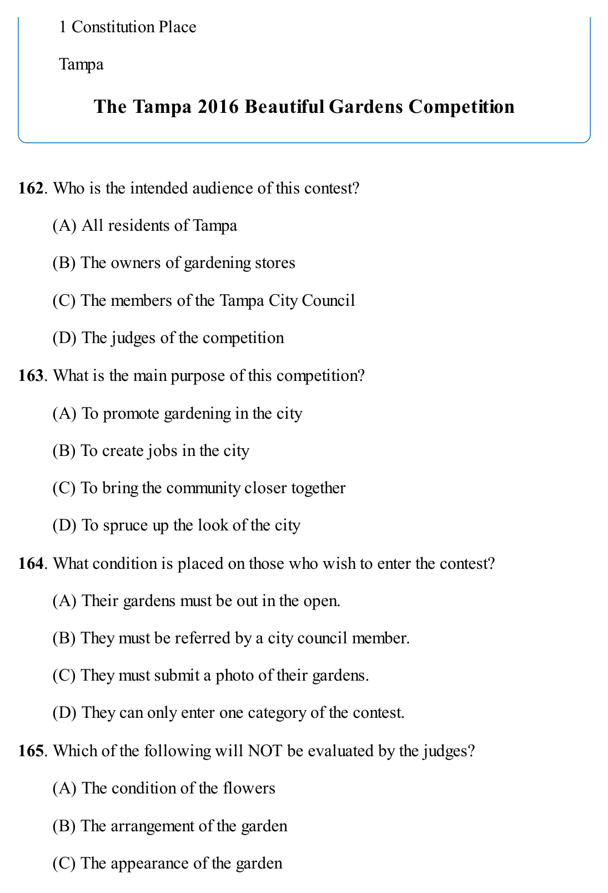


```text
1 Constitution Place
Tampa
The Tampa 2016 Beautiful Gardens Competition
162
. Who is the intended audience of this contest?
(A) All residents of Tampa
(B) The owners of gardening stores
(C) The members of the Tampa City Council
(D) The judges of the competition
163
. What is the main purpose of this competition?
(A) To promote gardening in the city
(B) To create jobs in the city
(C) To bring the community closer together
(D) To spruce up the look of the city
164
. What condition is placed on those who wish to enter the contest?
(A) Their gardens must be out in the open.
(B) They must be referred by a city council member.
(C) They must submit a photo of their gardens.
(D) They can only enter one category of the contest.
165
. Which of the following will NOT be evaluated by the judges?
(A) The condition of the flowers
(B) The arrangement of the garden
(C) The appearance of the garden
854
```

## PDF 第 84 页

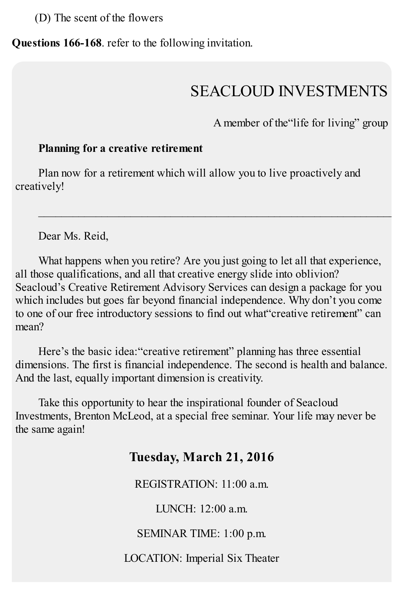


```text
(D) The scent of the flowers
Questions 166-168
. refer to the following invitation.
SEACLOUD INVESTMENTS
A member of the“life for living” group
Planning for a creative retirement
Plan now for a retirement which will allow you to live proactively and
creatively!
_____________________________________________________________________
Dear Ms. Reid,
What happens when you retire? Are you just going to let all that experience,
all those qualifications, and all that creative energy slide into oblivion?
Seacloud’s Creative Retirement Advisory Services can design a package for you
which includes but goes far beyond financial independence. Why don’t you come
to one of our free introductory sessions to find out what“creative retirement” can
mean?
Here’s the basic idea:“creative retirement” planning has three essential
dimensions. The first is financial independence. The second is health and balance.
And the last, equally important dimension is creativity.
Take this opportunity to hear the inspirational founder of Seacloud
Investments, Brenton McLeod, at a special free seminar. Your life may never be
the same again!
Tuesday, March 21, 2016
REGISTRATION: 11:00 a.m.
LUNCH: 12:00 a.m.
SEMINAR TIME: 1:00 p.m.
LOCATION: Imperial Six Theater
855
```

## PDF 第 85 页

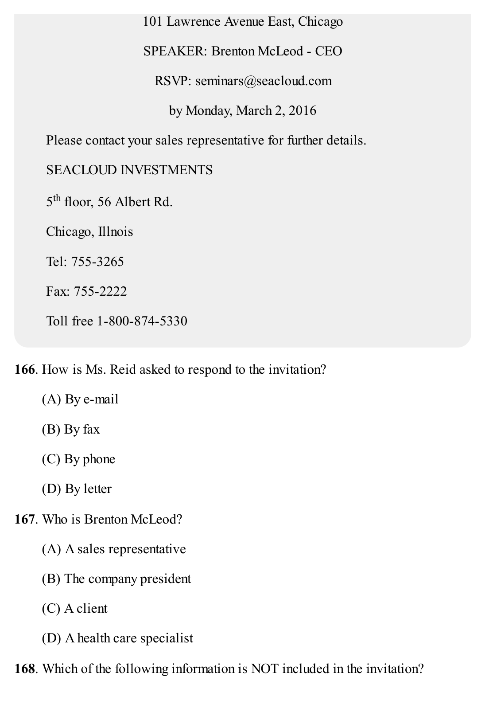


```text
101 Lawrence Avenue East, Chicago
SPEAKER: Brenton McLeod - CEO
RSVP: seminars@seacloud.com
by Monday, March 2, 2016
Please contact your sales representative for further details.
SEACLOUD INVESTMENTS
5
th
 floor, 56 Albert Rd.
Chicago, Illnois
Tel: 755-3265
Fax: 755-2222
Toll free 1-800-874-5330
166
. How is Ms. Reid asked to respond to the invitation?
(A) By e-mail
(B) By fax
(C) By phone
(D) By letter
167
. Who is Brenton McLeod?
(A) A sales representative
(B) The company president
(C) A client
(D) A health care specialist
168
. Which of the following information is NOT included in the invitation?
856
```

## PDF 第 86 页

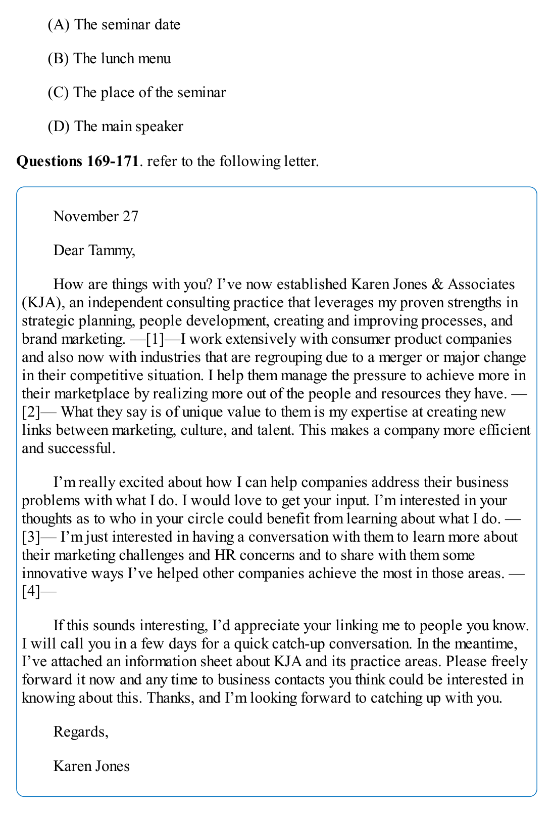


```text
(A) The seminar date
(B) The lunch menu
(C) The place of the seminar
(D) The main speaker
Questions 169-171
. refer to the following letter.
November 27
Dear Tammy,
How are things with you? I’ve now established Karen Jones & Associates
(KJA), an independent consulting practice that leverages my proven strengths in
strategic planning, people development, creating and improving processes, and
brand marketing. —[1]—I work extensively with consumer product companies
and also now with industries that are regrouping due to a merger or major change
in their competitive situation. I help them manage the pressure to achieve more in
their marketplace by realizing more out of the people and resources they have. —
[2]— What they say is of unique value to them is my expertise at creating new
links between marketing, culture, and talent. This makes a company more efficient
and successful.
I’m really excited about how I can help companies address their business
problems with what I do. I would love to get your input. I’m interested in your
thoughts as to who in your circle could benefit from learning about what I do. —
[3]— I’m just interested in having a conversation with them to learn more about
their marketing challenges and HR concerns and to share with them some
innovative ways I’ve helped other companies achieve the most in those areas. —
[4]—
If this sounds interesting, I’d appreciate your linking me to people you know.
I will call you in a few days for a quick catch-up conversation. In the meantime,
I’ve attached an information sheet about KJA and its practice areas. Please freely
forward it now and any time to business contacts you think could be interested in
knowing about this. Thanks, and I’m looking forward to catching up with you.
Regards,
Karen Jones
857
```

## PDF 第 87 页

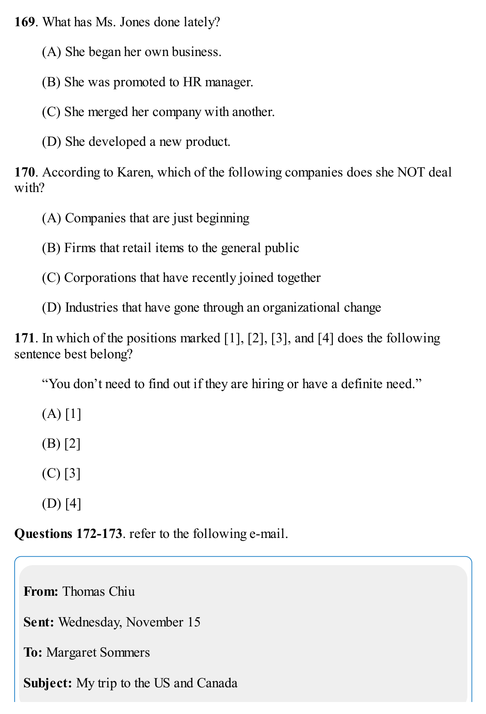


```text
169
. What has Ms. Jones done lately?
(A) She began her own business.
(B) She was promoted to HR manager.
(C) She merged her company with another.
(D) She developed a new product.
170
. According to Karen, which of the following companies does she NOT deal
with?
(A) Companies that are just beginning
(B) Firms that retail items to the general public
(C) Corporations that have recently joined together
(D) Industries that have gone through an organizational change
171
. In which of the positions marked [1], [2], [3], and [4] does the following
sentence best belong?
“You don’t need to find out if they are hiring or have a definite need.”
(A) [1]
(B) [2]
(C) [3]
(D) [4]
Questions 172-173
. refer to the following e-mail.
From:
 Thomas Chiu
Sent:
 Wednesday, November 15
To:
 Margaret Sommers
Subject:
 My trip to the US and Canada
858
```

## PDF 第 88 页

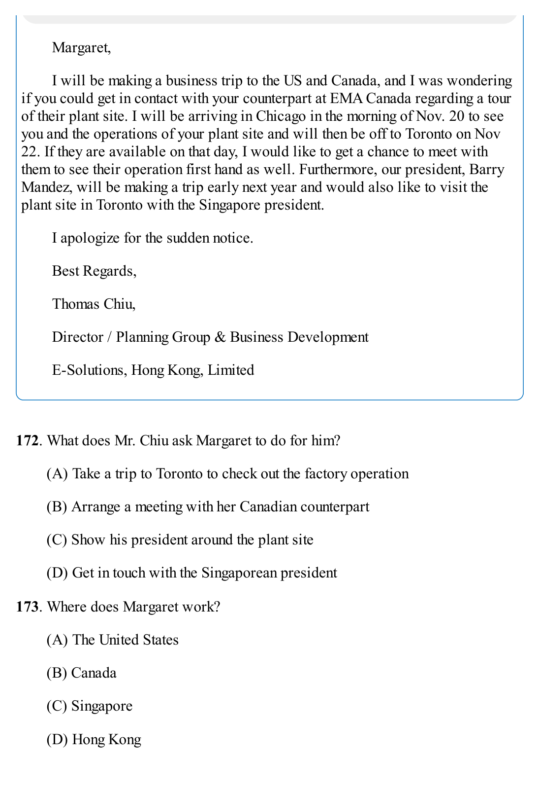


```text
Margaret,
I will be making a business trip to the US and Canada, and I was wondering
if you could get in contact with your counterpart at EMA Canada regarding a tour
of their plant site. I will be arriving in Chicago in the morning of Nov. 20 to see
you and the operations of your plant site and will then be off to Toronto on Nov
22. If they are available on that day, I would like to get a chance to meet with
them to see their operation first hand as well. Furthermore, our president, Barry
Mandez, will be making a trip early next year and would also like to visit the
plant site in Toronto with the Singapore president.
I apologize for the sudden notice.
Best Regards,
Thomas Chiu,
Director / Planning Group & Business Development
E-Solutions, Hong Kong, Limited
172
. What does Mr. Chiu ask Margaret to do for him?
(A) Take a trip to Toronto to check out the factory operation
(B) Arrange a meeting with her Canadian counterpart
(C) Show his president around the plant site
(D) Get in touch with the Singaporean president
173
. Where does Margaret work?
(A) The United States
(B) Canada
(C) Singapore
(D) Hong Kong
859
```

## PDF 第 89 页

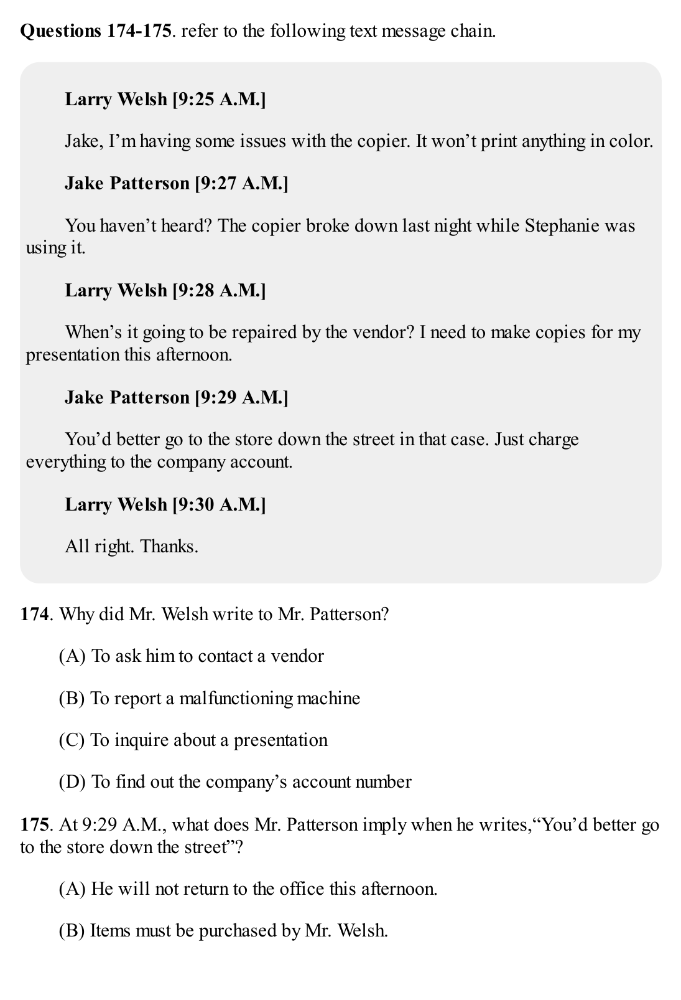


```text
Questions 174-175
. refer to the following text message chain.
Larry Welsh [9:25 A.M.]
Jake, I’m having some issues with the copier. It won’t print anything in color.
Jake Patterson [9:27 A.M.]
You haven’t heard? The copier broke down last night while Stephanie was
using it.
Larry Welsh [9:28 A.M.]
When’s it going to be repaired by the vendor? I need to make copies for my
presentation this afternoon.
Jake Patterson [9:29 A.M.]
You’d better go to the store down the street in that case. Just charge
everything to the company account.
Larry Welsh [9:30 A.M.]
All right. Thanks.
174
. Why did Mr. Welsh write to Mr. Patterson?
(A) To ask him to contact a vendor
(B) To report a malfunctioning machine
(C) To inquire about a presentation
(D) To find out the company’s account number
175
. At 9:29 A.M., what does Mr. Patterson imply when he writes,“You’d better go
to the store down the street”?
(A) He will not return to the office this afternoon.
(B) Items must be purchased by Mr. Welsh.
860
```

## PDF 第 90 页

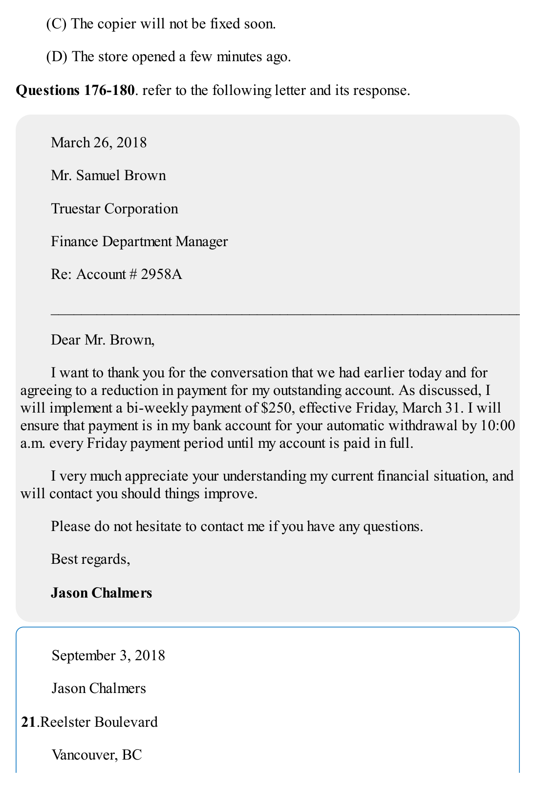


```text
(C) The copier will not be fixed soon.
(D) The store opened a few minutes ago.
Questions 176-180
. refer to the following letter and its response.
March 26, 2018
Mr. Samuel Brown
Truestar Corporation
Finance Department Manager
Re: Account # 2958A
_____________________________________________________________________
Dear Mr. Brown,
I want to thank you for the conversation that we had earlier today and for
agreeing to a reduction in payment for my outstanding account. As discussed, I
will implement a bi-weekly payment of $250, effective Friday, March 31. I will
ensure that payment is in my bank account for your automatic withdrawal by 10:00
a.m. every Friday payment period until my account is paid in full.
I very much appreciate your understanding my current financial situation, and
will contact you should things improve.
Please do not hesitate to contact me if you have any questions.
Best regards,
Jason Chalmers
September 3, 2018
Jason Chalmers
21
.Reelster Boulevard
Vancouver, BC
861
```

## PDF 第 91 页

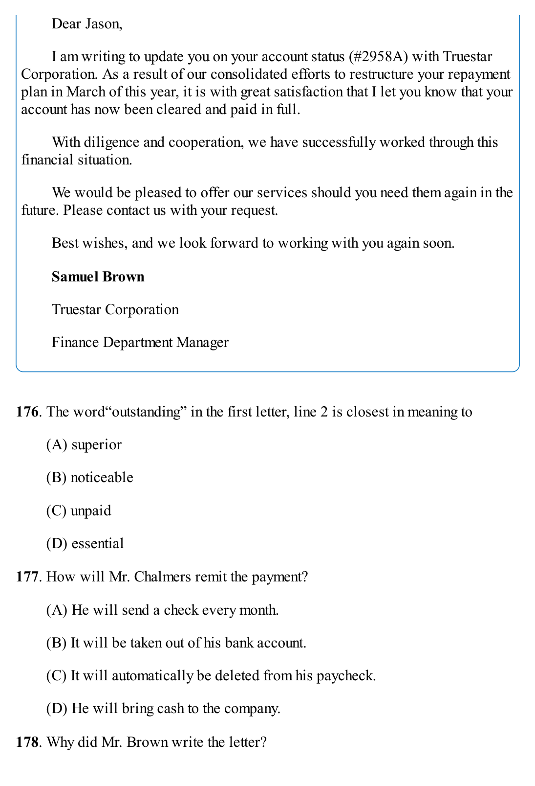


```text
Dear Jason,
I am writing to update you on your account status (#2958A) with Truestar
Corporation. As a result of our consolidated efforts to restructure your repayment
plan in March of this year, it is with great satisfaction that I let you know that your
account has now been cleared and paid in full.
With diligence and cooperation, we have successfully worked through this
financial situation.
We would be pleased to offer our services should you need them again in the
future. Please contact us with your request.
Best wishes, and we look forward to working with you again soon.
Samuel Brown
Truestar Corporation
Finance Department Manager
176
. The word“outstanding” in the first letter, line 2 is closest in meaning to
(A) superior
(B) noticeable
(C) unpaid
(D) essential
177
. How will Mr. Chalmers remit the payment?
(A) He will send a check every month.
(B) It will be taken out of his bank account.
(C) It will automatically be deleted from his paycheck.
(D) He will bring cash to the company.
178
. Why did Mr. Brown write the letter?
862
```

## PDF 第 92 页

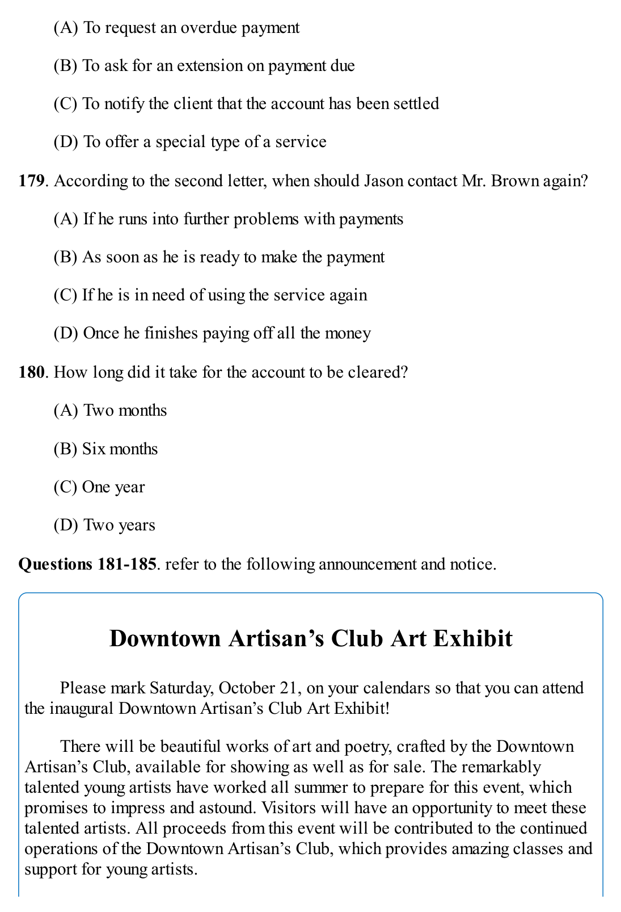


```text
(A) To request an overdue payment
(B) To ask for an extension on payment due
(C) To notify the client that the account has been settled
(D) To offer a special type of a service
179
. According to the second letter, when should Jason contact Mr. Brown again?
(A) If he runs into further problems with payments
(B) As soon as he is ready to make the payment
(C) If he is in need of using the service again
(D) Once he finishes paying off all the money
180
. How long did it take for the account to be cleared?
(A) Two months
(B) Six months
(C) One year
(D) Two years
Questions 181-185
. refer to the following announcement and notice.
Downtown Artisan’s Club Art Exhibit
Please mark Saturday, October 21, on your calendars so that you can attend
the inaugural Downtown Artisan’s Club Art Exhibit!
There will be beautiful works of art and poetry, crafted by the Downtown
Artisan’s Club, available for showing as well as for sale. The remarkably
talented young artists have worked all summer to prepare for this event, which
promises to impress and astound. Visitors will have an opportunity to meet these
talented artists. All proceeds from this event will be contributed to the continued
operations of the Downtown Artisan’s Club, which provides amazing classes and
support for young artists.
863
```

## PDF 第 93 页

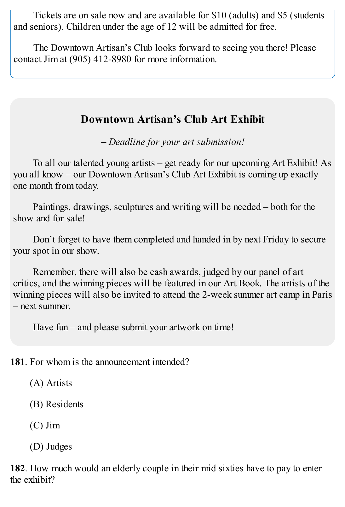


```text
Tickets are on sale now and are available for $10 (adults) and $5 (students
and seniors). Children under the age of 12 will be admitted for free.
The Downtown Artisan’s Club looks forward to seeing you there! Please
contact Jim at (905) 412-8980 for more information.
Downtown Artisan’s Club Art Exhibit
–
Deadline for your art submission!
To all our talented young artists – get ready for our upcoming Art Exhibit! As
you all know – our Downtown Artisan’s Club Art Exhibit is coming up exactly
one month from today.
Paintings, drawings, sculptures and writing will be needed – both for the
show and for sale!
Don’t forget to have them completed and handed in by next Friday to secure
your spot in our show.
Remember, there will also be cash awards, judged by our panel of art
critics, and the winning pieces will be featured in our Art Book. The artists of the
winning pieces will also be invited to attend the 2-week summer art camp in Paris
– next summer.
Have fun – and please submit your artwork on time!
181
. For whom is the announcement intended?
(A) Artists
(B) Residents
(C) Jim
(D) Judges
182
. How much would an elderly couple in their mid sixties have to pay to enter
the exhibit?
864
```

## PDF 第 94 页

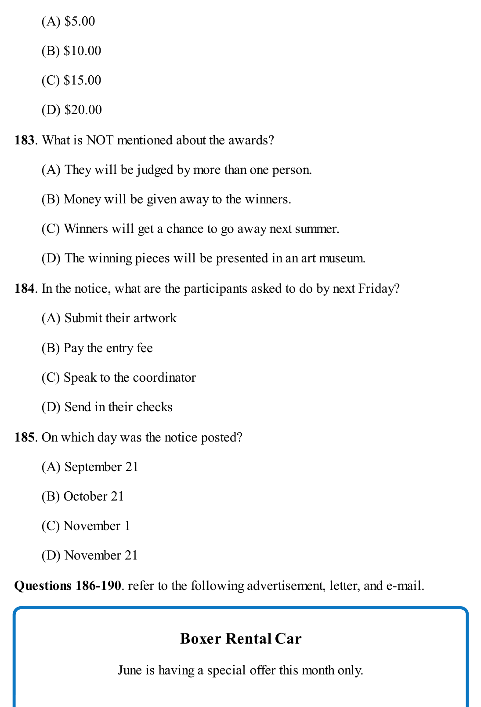


```text
(A) $5.00
(B) $10.00
(C) $15.00
(D) $20.00
183
. What is NOT mentioned about the awards?
(A) They will be judged by more than one person.
(B) Money will be given away to the winners.
(C) Winners will get a chance to go away next summer.
(D) The winning pieces will be presented in an art museum.
184
. In the notice, what are the participants asked to do by next Friday?
(A) Submit their artwork
(B) Pay the entry fee
(C) Speak to the coordinator
(D) Send in their checks
185
. On which day was the notice posted?
(A) September 21
(B) October 21
(C) November 1
(D) November 21
Questions 186-190
. refer to the following advertisement, letter, and e-mail.
Boxer Rental Car
June is having a special offer this month only.
865
```

## PDF 第 95 页

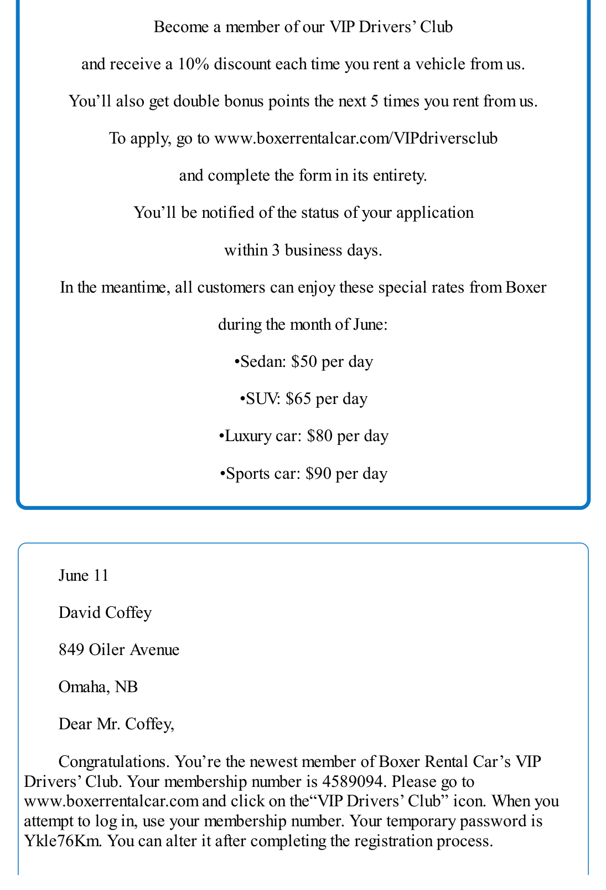


```text
Become a member of our VIP Drivers’ Club
and receive a 10% discount each time you rent a vehicle from us.
You’ll also get double bonus points the next 5 times you rent from us.
To apply, go to www.boxerrentalcar.com/VIPdriversclub
and complete the form in its entirety.
You’ll be notified of the status of your application
within 3 business days.
In the meantime, all customers can enjoy these special rates from Boxer
during the month of June:
•Sedan: $50 per day
•SUV: $65 per day
•Luxury car: $80 per day
•Sports car: $90 per day
June 11
David Coffey
849 Oiler Avenue
Omaha, NB
Dear Mr. Coffey,
Congratulations. You’re the newest member of Boxer Rental Car’s VIP
Drivers’ Club. Your membership number is 4589094. Please go to
www.boxerrentalcar.com and click on the“VIP Drivers’ Club” icon. When you
attempt to log in, use your membership number. Your temporary password is
Ykle76Km. You can alter it after completing the registration process.
866
```

## PDF 第 96 页

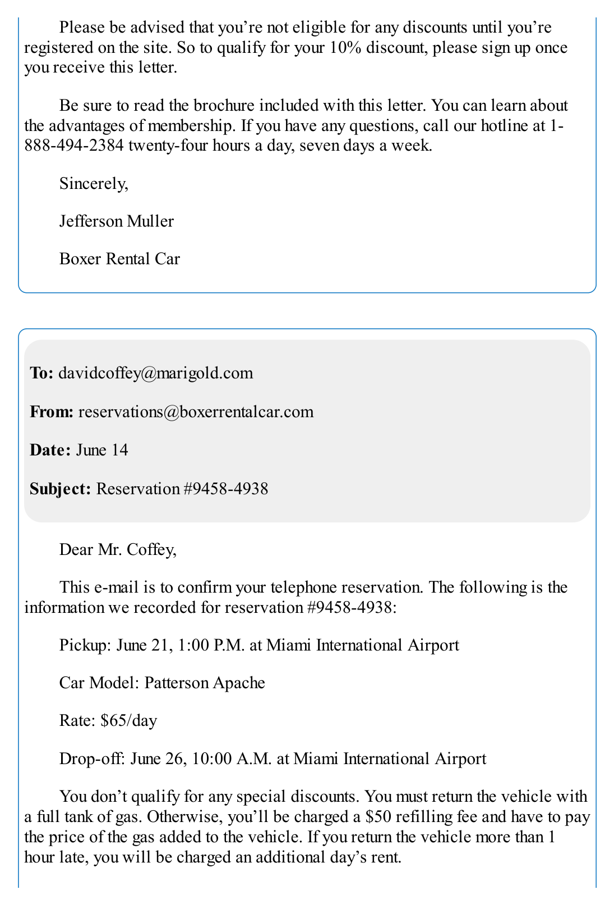


```text
Please be advised that you’re not eligible for any discounts until you’re
registered on the site. So to qualify for your 10% discount, please sign up once
you receive this letter.
Be sure to read the brochure included with this letter. You can learn about
the advantages of membership. If you have any questions, call our hotline at 1-
888-494-2384 twenty-four hours a day, seven days a week.
Sincerely,
Jefferson Muller
Boxer Rental Car
To:
 davidcoffey@marigold.com
From:
 reservations@boxerrentalcar.com
Date:
 June 14
Subject:
 Reservation #9458-4938
Dear Mr. Coffey,
This e-mail is to confirm your telephone reservation. The following is the
information we recorded for reservation #9458-4938:
Pickup: June 21, 1:00 P.M. at Miami International Airport
Car Model: Patterson Apache
Rate: $65/day
Drop-off: June 26, 10:00 A.M. at Miami International Airport
You don’t qualify for any special discounts. You must return the vehicle with
a full tank of gas. Otherwise, you’ll be charged a $50 refilling fee and have to pay
the price of the gas added to the vehicle. If you return the vehicle more than 1
hour late, you will be charged an additional day’s rent.
867
```

## PDF 第 97 页

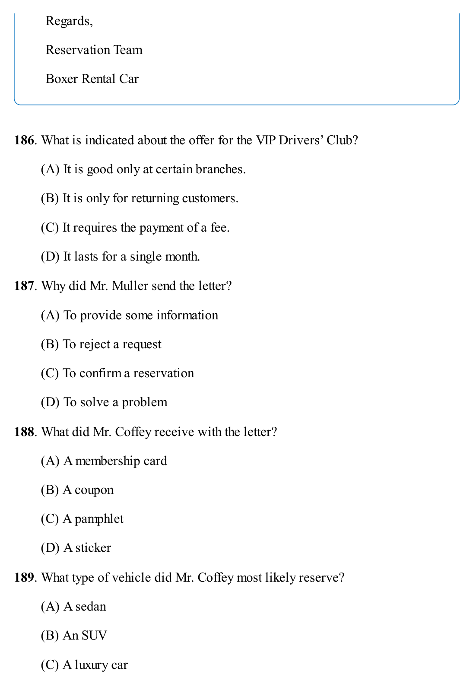


```text
Regards,
Reservation Team
Boxer Rental Car
186
. What is indicated about the offer for the VIP Drivers’ Club?
(A) It is good only at certain branches.
(B) It is only for returning customers.
(C) It requires the payment of a fee.
(D) It lasts for a single month.
187
. Why did Mr. Muller send the letter?
(A) To provide some information
(B) To reject a request
(C) To confirm a reservation
(D) To solve a problem
188
. What did Mr. Coffey receive with the letter?
(A) A membership card
(B) A coupon
(C) A pamphlet
(D) A sticker
189
. What type of vehicle did Mr. Coffey most likely reserve?
(A) A sedan
(B) An SUV
(C) A luxury car
868
```

## PDF 第 98 页

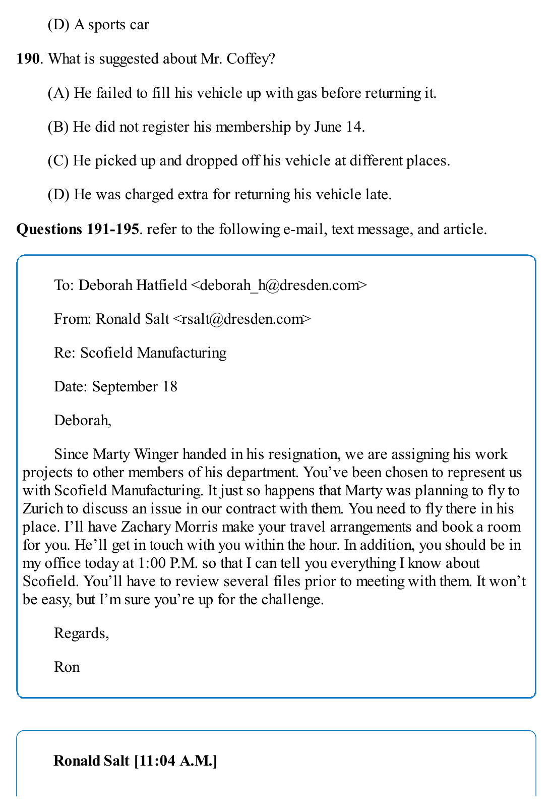


```text
(D) A sports car
190
. What is suggested about Mr. Coffey?
(A) He failed to fill his vehicle up with gas before returning it.
(B) He did not register his membership by June 14.
(C) He picked up and dropped off his vehicle at different places.
(D) He was charged extra for returning his vehicle late.
Questions 191-195
. refer to the following e-mail, text message, and article.
To: Deborah Hatfield <deborah_h@dresden.com>
From: Ronald Salt <rsalt@dresden.com>
Re: Scofield Manufacturing
Date: September 18
Deborah,
Since Marty Winger handed in his resignation, we are assigning his work
projects to other members of his department. You’ve been chosen to represent us
with Scofield Manufacturing. It just so happens that Marty was planning to fly to
Zurich to discuss an issue in our contract with them. You need to fly there in his
place. I’ll have Zachary Morris make your travel arrangements and book a room
for you. He’ll get in touch with you within the hour. In addition, you should be in
my office today at 1:00 P.M. so that I can tell you everything I know about
Scofield. You’ll have to review several files prior to meeting with them. It won’t
be easy, but I’m sure you’re up for the challenge.
Regards,
Ron
Ronald Salt [11:04 A.M.]
869
```

## PDF 第 99 页

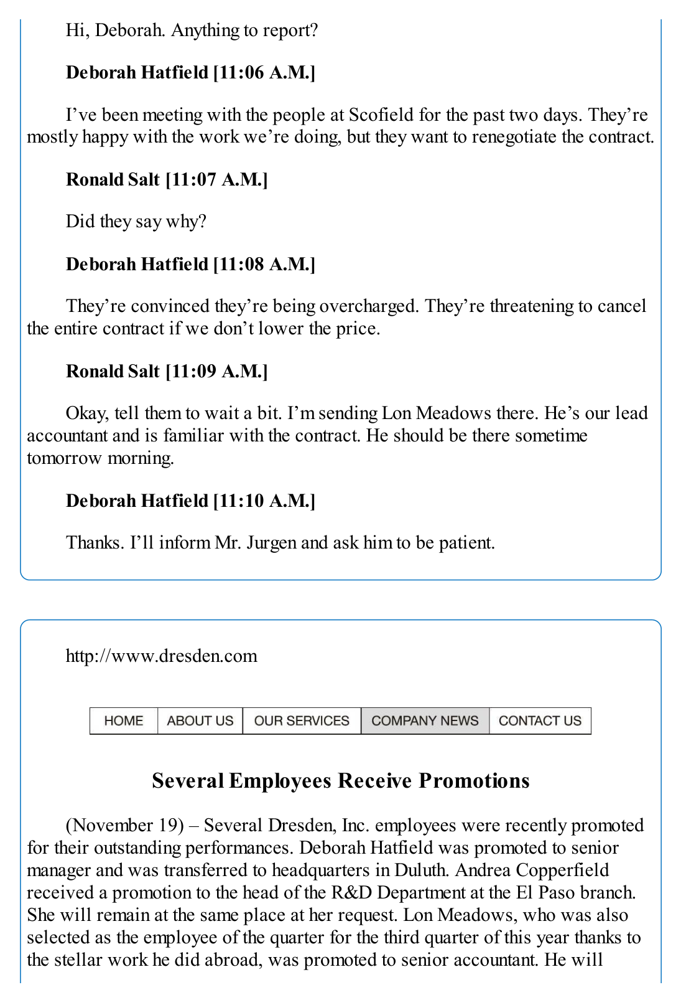


```text
Hi, Deborah. Anything to report?
Deborah Hatfield [11:06 A.M.]
I’ve been meeting with the people at Scofield for the past two days. They’re
mostly happy with the work we’re doing, but they want to renegotiate the contract.
Ronald Salt [11:07 A.M.]
Did they say why?
Deborah Hatfield [11:08 A.M.]
They’re convinced they’re being overcharged. They’re threatening to cancel
the entire contract if we don’t lower the price.
Ronald Salt [11:09 A.M.]
Okay, tell them to wait a bit. I’m sending Lon Meadows there. He’s our lead
accountant and is familiar with the contract. He should be there sometime
tomorrow morning.
Deborah Hatfield [11:10 A.M.]
Thanks. I’ll inform Mr. Jurgen and ask him to be patient.
http://www.dresden.com
Several Employees Receive Promotions
(November 19) – Several Dresden, Inc. employees were recently promoted
for their outstanding performances. Deborah Hatfield was promoted to senior
manager and was transferred to headquarters in Duluth. Andrea Copperfield
received a promotion to the head of the R&D Department at the El Paso branch.
She will remain at the same place at her request. Lon Meadows, who was also
selected as the employee of the quarter for the third quarter of this year thanks to
the stellar work he did abroad, was promoted to senior accountant. He will
870
```

## PDF 第 100 页

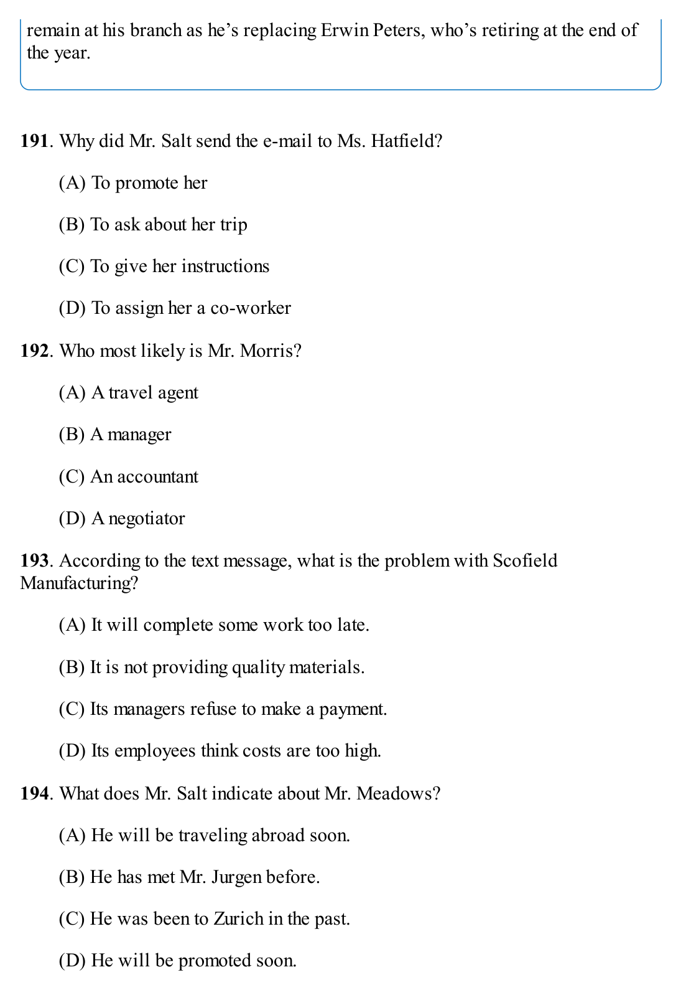


```text
remain at his branch as he’s replacing Erwin Peters, who’s retiring at the end of
the year.
191
. Why did Mr. Salt send the e-mail to Ms. Hatfield?
(A) To promote her
(B) To ask about her trip
(C) To give her instructions
(D) To assign her a co-worker
192
. Who most likely is Mr. Morris?
(A) A travel agent
(B) A manager
(C) An accountant
(D) A negotiator
193
. According to the text message, what is the problem with Scofield
Manufacturing?
(A) It will complete some work too late.
(B) It is not providing quality materials.
(C) Its managers refuse to make a payment.
(D) Its employees think costs are too high.
194
. What does Mr. Salt indicate about Mr. Meadows?
(A) He will be traveling abroad soon.
(B) He has met Mr. Jurgen before.
(C) He was been to Zurich in the past.
(D) He will be promoted soon.
871
```

## PDF 第 101 页

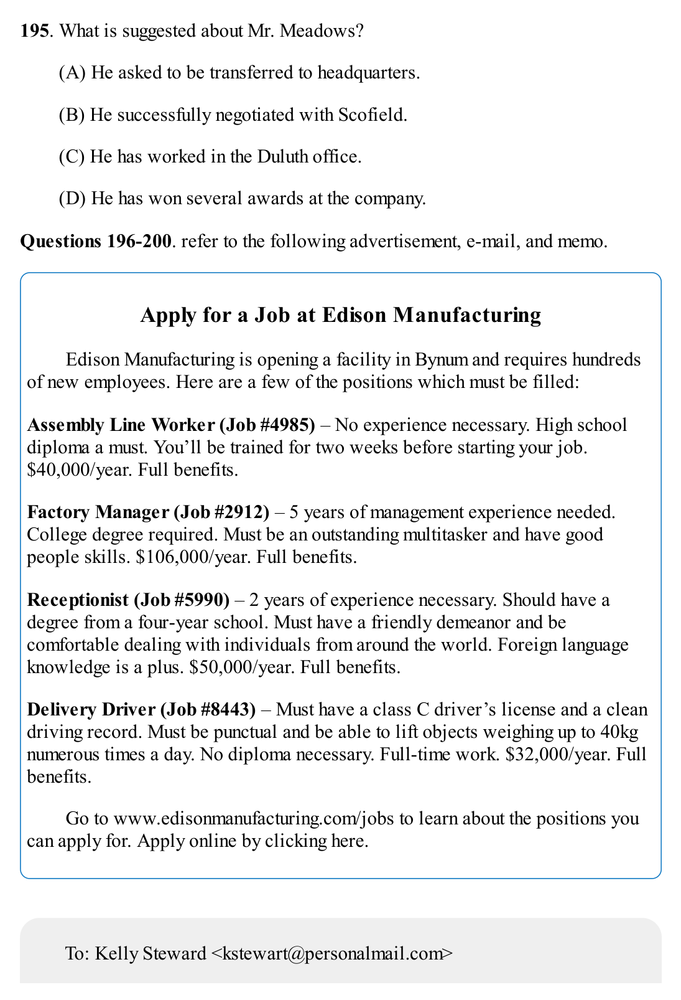


```text
195
. What is suggested about Mr. Meadows?
(A) He asked to be transferred to headquarters.
(B) He successfully negotiated with Scofield.
(C) He has worked in the Duluth office.
(D) He has won several awards at the company.
Questions 196-200
. refer to the following advertisement, e-mail, and memo.
Apply for a Job at Edison Manufacturing
Edison Manufacturing is opening a facility in Bynum and requires hundreds
of new employees. Here are a few of the positions which must be filled:
Assembly Line Worker (Job #4985)
 – No experience necessary. High school
diploma a must. You’ll be trained for two weeks before starting your job.
$40,000/year. Full benefits.
Factory Manager (Job #2912)
 – 5 years of management experience needed.
College degree required. Must be an outstanding multitasker and have good
people skills. $106,000/year. Full benefits.
Receptionist (Job #5990)
 – 2 years of experience necessary. Should have a
degree from a four-year school. Must have a friendly demeanor and be
comfortable dealing with individuals from around the world. Foreign language
knowledge is a plus. $50,000/year. Full benefits.
Delivery Driver (Job #8443)
 – Must have a class C driver’s license and a clean
driving record. Must be punctual and be able to lift objects weighing up to 40kg
numerous times a day. No diploma necessary. Full-time work. $32,000/year. Full
benefits.
Go to www.edisonmanufacturing.com/jobs to learn about the positions you
can apply for. Apply online by clicking here.
To: Kelly Steward <kstewart@personalmail.com>
872
```

## PDF 第 102 页

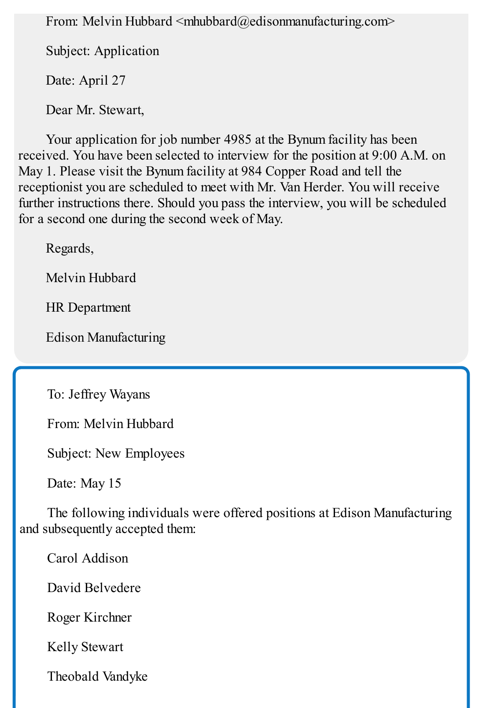


```text
From: Melvin Hubbard <mhubbard@edisonmanufacturing.com>
Subject: Application
Date: April 27
Dear Mr. Stewart,
Your application for job number 4985 at the Bynum facility has been
received. You have been selected to interview for the position at 9:00 A.M. on
May 1. Please visit the Bynum facility at 984 Copper Road and tell the
receptionist you are scheduled to meet with Mr. Van Herder. You will receive
further instructions there. Should you pass the interview, you will be scheduled
for a second one during the second week of May.
Regards,
Melvin Hubbard
HR Department
Edison Manufacturing
To: Jeffrey Wayans
From: Melvin Hubbard
Subject: New Employees
Date: May 15
The following individuals were offered positions at Edison Manufacturing
and subsequently accepted them:
Carol Addison
David Belvedere
Roger Kirchner
Kelly Stewart
Theobald Vandyke
873
```

## PDF 第 103 页

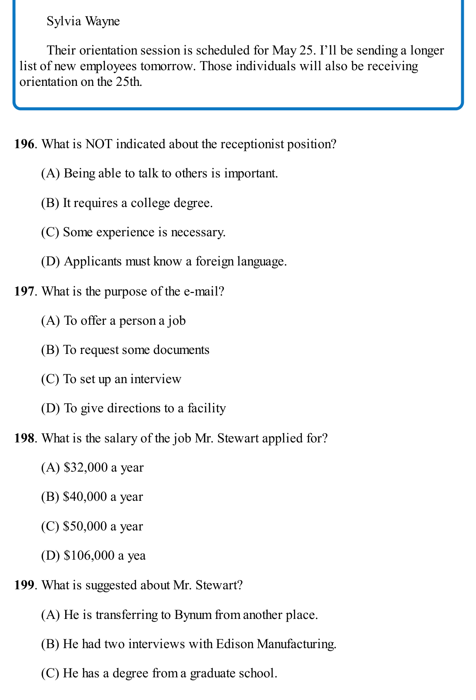


```text
Sylvia Wayne
Their orientation session is scheduled for May 25. I’ll be sending a longer
list of new employees tomorrow. Those individuals will also be receiving
orientation on the 25th.
196
. What is NOT indicated about the receptionist position?
(A) Being able to talk to others is important.
(B) It requires a college degree.
(C) Some experience is necessary.
(D) Applicants must know a foreign language.
197
. What is the purpose of the e-mail?
(A) To offer a person a job
(B) To request some documents
(C) To set up an interview
(D) To give directions to a facility
198
. What is the salary of the job Mr. Stewart applied for?
(A) $32,000 a year
(B) $40,000 a year
(C) $50,000 a year
(D) $106,000 a yea
199
. What is suggested about Mr. Stewart?
(A) He is transferring to Bynum from another place.
(B) He had two interviews with Edison Manufacturing.
(C) He has a degree from a graduate school.
874
```

## PDF 第 104 页

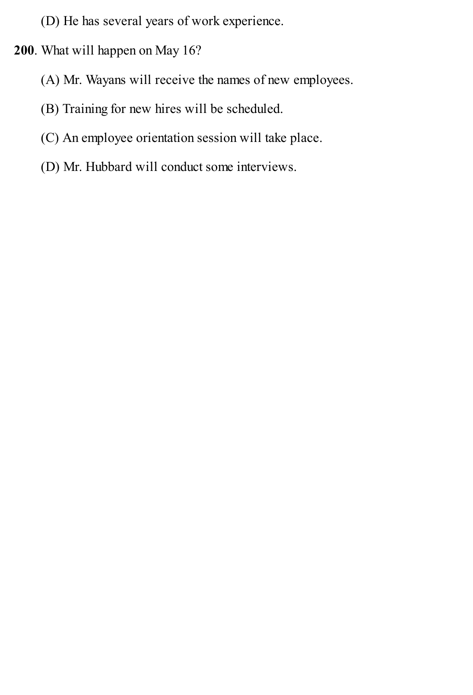


```text
(D) He has several years of work experience.
200
. What will happen on May 16?
(A) Mr. Wayans will receive the names of new employees.
(B) Training for new hires will be scheduled.
(C) An employee orientation session will take place.
(D) Mr. Hubbard will conduct some interviews.
875
```

## PDF 第 105 页

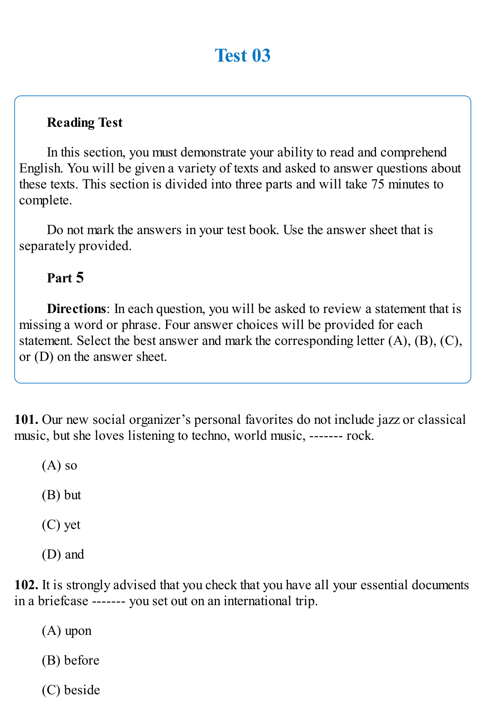


```text
Test 03
Reading Test
In this section, you must demonstrate your ability to read and comprehend
English. You will be given a variety of texts and asked to answer questions about
these texts. This section is divided into three parts and will take 75 minutes to
complete.
Do not mark the answers in your test book. Use the answer sheet that is
separately provided.
Part
5
Directions
: In each question, you will be asked to review a statement that is
missing a word or phrase. Four answer choices will be provided for each
statement. Select the best answer and mark the corresponding letter (A), (B), (C),
or (D) on the answer sheet.
101.
 Our new social organizer’s personal favorites do not include jazz or classical
music, but she loves listening to techno, world music, ------- rock.
(A) so
(B) but
(C) yet
(D) and
102.
 It is strongly advised that you check that you have all your essential documents
in a briefcase ------- you set out on an international trip.
(A) upon
(B) before
(C) beside
876
```

## PDF 第 106 页

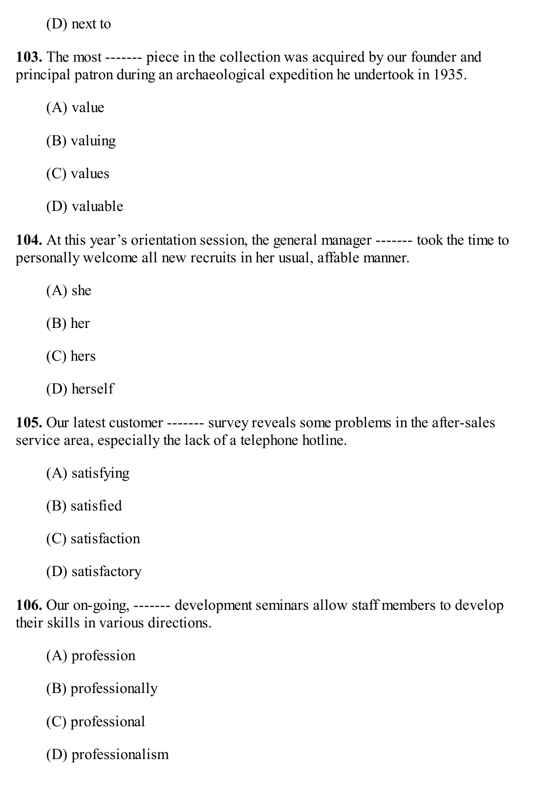


```text
(D) next to
103.
 The most ------- piece in the collection was acquired by our founder and
principal patron during an archaeological expedition he undertook in 1935.
(A) value
(B) valuing
(C) values
(D) valuable
104.
 At this year’s orientation session, the general manager ------- took the time to
personally welcome all new recruits in her usual, affable manner.
(A) she
(B) her
(C) hers
(D) herself
105.
 Our latest customer ------- survey reveals some problems in the after-sales
service area, especially the lack of a telephone hotline.
(A) satisfying
(B) satisfied
(C) satisfaction
(D) satisfactory
106.
 Our on-going, ------- development seminars allow staff members to develop
their skills in various directions.
(A) profession
(B) professionally
(C) professional
(D) professionalism
877
```

## PDF 第 107 页

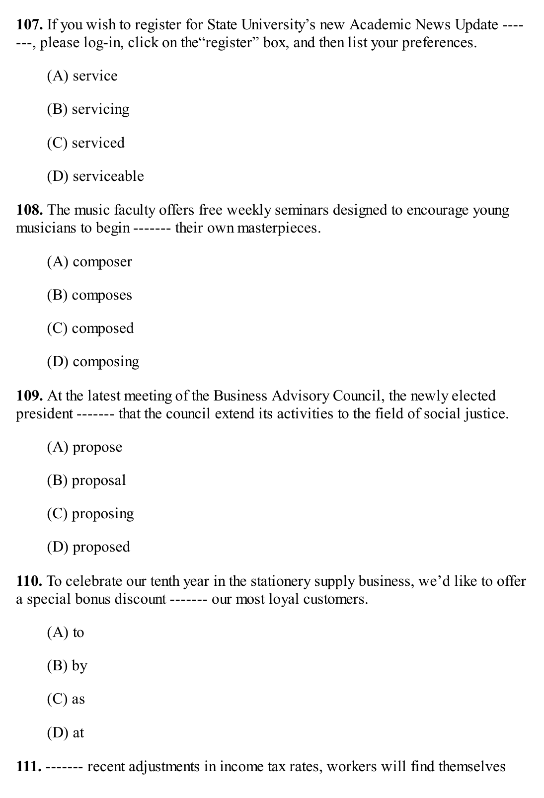


```text
107.
 If you wish to register for State University’s new Academic News Update ----
---, please log-in, click on the“register” box, and then list your preferences.
(A) service
(B) servicing
(C) serviced
(D) serviceable
108.
 The music faculty offers free weekly seminars designed to encourage young
musicians to begin ------- their own masterpieces.
(A) composer
(B) composes
(C) composed
(D) composing
109.
 At the latest meeting of the Business Advisory Council, the newly elected
president ------- that the council extend its activities to the field of social justice.
(A) propose
(B) proposal
(C) proposing
(D) proposed
110.
 To celebrate our tenth year in the stationery supply business, we’d like to offer
a special bonus discount ------- our most loyal customers.
(A) to
(B) by
(C) as
(D) at
111.
 ------- recent adjustments in income tax rates, workers will find themselves
878
```

## PDF 第 108 页

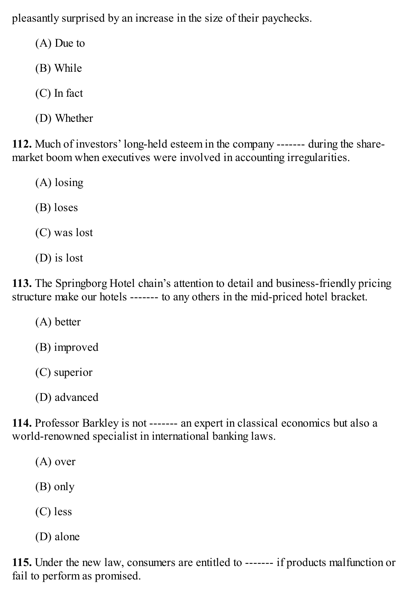


```text
pleasantly surprised by an increase in the size of their paychecks.
(A) Due to
(B) While
(C) In fact
(D) Whether
112.
 Much of investors’ long-held esteem in the company ------- during the share-
market boom when executives were involved in accounting irregularities.
(A) losing
(B) loses
(C) was lost
(D) is lost
113.
 The Springborg Hotel chain’s attention to detail and business-friendly pricing
structure make our hotels ------- to any others in the mid-priced hotel bracket.
(A) better
(B) improved
(C) superior
(D) advanced
114.
 Professor Barkley is not ------- an expert in classical economics but also a
world-renowned specialist in international banking laws.
(A) over
(B) only
(C) less
(D) alone
115.
 Under the new law, consumers are entitled to ------- if products malfunction or
fail to perform as promised.
879
```

## PDF 第 109 页

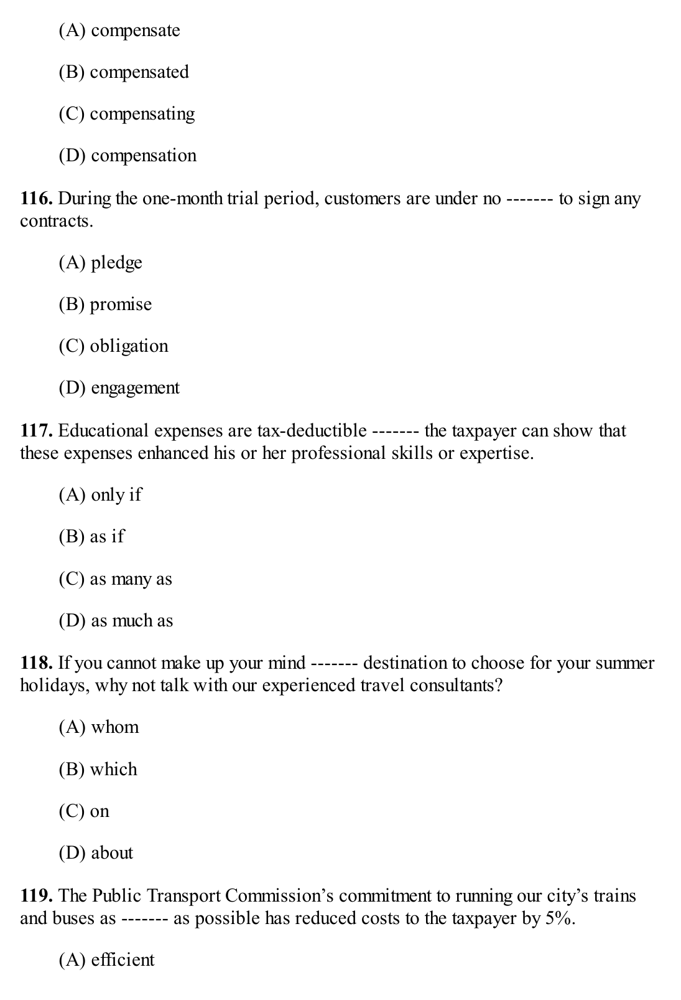


```text
(A) compensate
(B) compensated
(C) compensating
(D) compensation
116.
 During the one-month trial period, customers are under no ------- to sign any
contracts.
(A) pledge
(B) promise
(C) obligation
(D) engagement
117.
 Educational expenses are tax-deductible ------- the taxpayer can show that
these expenses enhanced his or her professional skills or expertise.
(A) only if
(B) as if
(C) as many as
(D) as much as
118.
 If you cannot make up your mind ------- destination to choose for your summer
holidays, why not talk with our experienced travel consultants?
(A) whom
(B) which
(C) on
(D) about
119.
 The Public Transport Commission’s commitment to running our city’s trains
and buses as ------- as possible has reduced costs to the taxpayer by 5%.
(A) efficient
880
```

## PDF 第 110 页

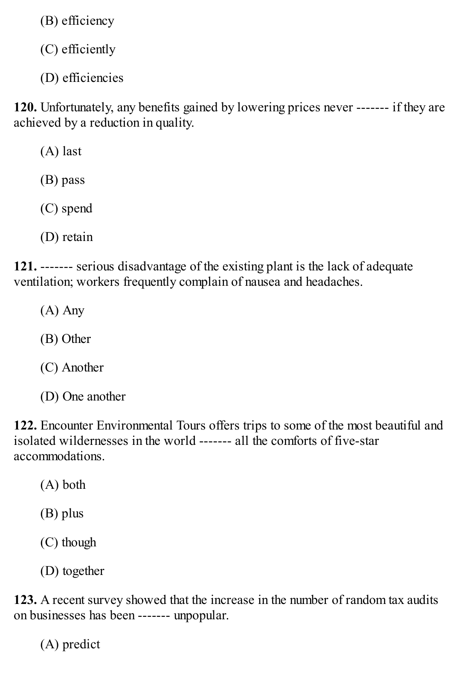


```text
(B) efficiency
(C) efficiently
(D) efficiencies
120.
 Unfortunately, any benefits gained by lowering prices never ------- if they are
achieved by a reduction in quality.
(A) last
(B) pass
(C) spend
(D) retain
121.
 ------- serious disadvantage of the existing plant is the lack of adequate
ventilation; workers frequently complain of nausea and headaches.
(A) Any
(B) Other
(C) Another
(D) One another
122.
 Encounter Environmental Tours offers trips to some of the most beautiful and
isolated wildernesses in the world ------- all the comforts of five-star
accommodations.
(A) both
(B) plus
(C) though
(D) together
123.
 A recent survey showed that the increase in the number of random tax audits
on businesses has been ------- unpopular.
(A) predict
881
```

## PDF 第 111 页

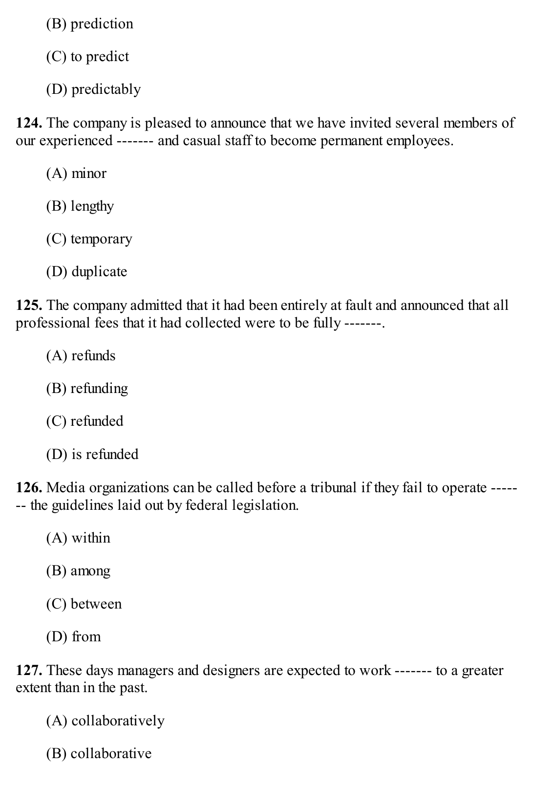


```text
(B) prediction
(C) to predict
(D) predictably
124.
 The company is pleased to announce that we have invited several members of
our experienced ------- and casual staff to become permanent employees.
(A) minor
(B) lengthy
(C) temporary
(D) duplicate
125.
 The company admitted that it had been entirely at fault and announced that all
professional fees that it had collected were to be fully -------.
(A) refunds
(B) refunding
(C) refunded
(D) is refunded
126.
 Media organizations can be called before a tribunal if they fail to operate -----
-- the guidelines laid out by federal legislation.
(A) within
(B) among
(C) between
(D) from
127.
 These days managers and designers are expected to work ------- to a greater
extent than in the past.
(A) collaboratively
(B) collaborative
882
```

## PDF 第 112 页

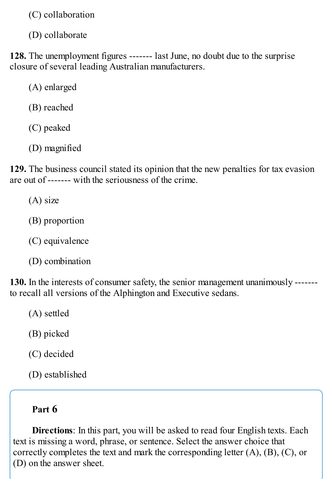


```text
(C) collaboration
(D) collaborate
128.
 The unemployment figures ------- last June, no doubt due to the surprise
closure of several leading Australian manufacturers.
(A) enlarged
(B) reached
(C) peaked
(D) magnified
129.
 The business council stated its opinion that the new penalties for tax evasion
are out of ------- with the seriousness of the crime.
(A) size
(B) proportion
(C) equivalence
(D) combination
130.
 In the interests of consumer safety, the senior management unanimously -------
to recall all versions of the Alphington and Executive sedans.
(A) settled
(B) picked
(C) decided
(D) established
Part
6
Directions
: In this part, you will be asked to read four English texts. Each
text is missing a word, phrase, or sentence. Select the answer choice that
correctly completes the text and mark the corresponding letter (A), (B), (C), or
(D) on the answer sheet.
883
```

## PDF 第 113 页

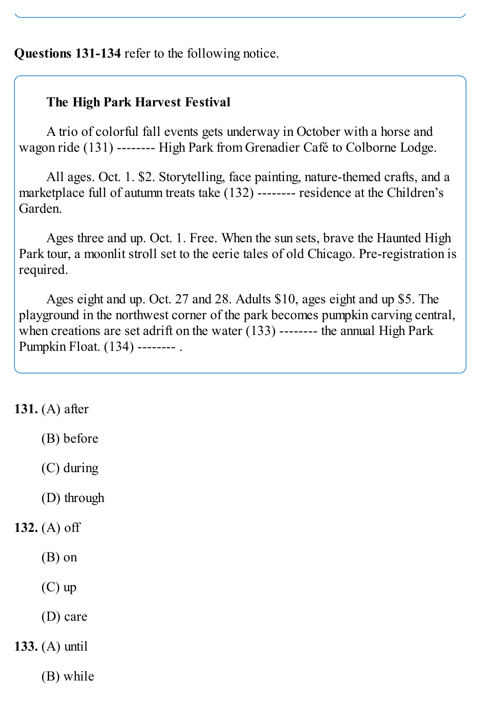


```text
Questions 131-134
 refer to the following notice.
The High Park Harvest Festival
A trio of colorful fall events gets underway in October with a horse and
wagon ride (131) -------- High Park from Grenadier Café to Colborne Lodge.
All ages. Oct. 1. $2. Storytelling, face painting, nature-themed crafts, and a
marketplace full of autumn treats take (132) -------- residence at the Children’s
Garden.
Ages three and up. Oct. 1. Free. When the sun sets, brave the Haunted High
Park tour, a moonlit stroll set to the eerie tales of old Chicago. Pre-registration is
required.
Ages eight and up. Oct. 27 and 28. Adults $10, ages eight and up $5. The
playground in the northwest corner of the park becomes pumpkin carving central,
when creations are set adrift on the water (133) -------- the annual High Park
Pumpkin Float. (134) -------- .
131.
 (A) after
(B) before
(C) during
(D) through
132.
 (A) off
(B) on
(C) up
(D) care
133.
 (A) until
(B) while
884
```

## PDF 第 114 页

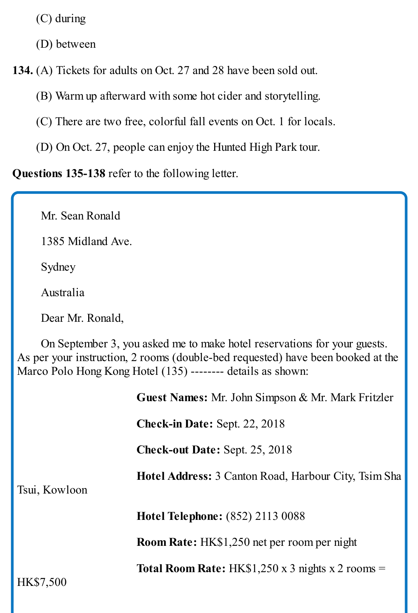


```text
(C) during
(D) between
134.
 (A) Tickets for adults on Oct. 27 and 28 have been sold out.
(B) Warm up afterward with some hot cider and storytelling.
(C) There are two free, colorful fall events on Oct. 1 for locals.
(D) On Oct. 27, people can enjoy the Hunted High Park tour.
Questions 135-138
 refer to the following letter.
Mr. Sean Ronald
1385 Midland Ave.
Sydney
Australia
Dear Mr. Ronald,
On September 3, you asked me to make hotel reservations for your guests.
As per your instruction, 2 rooms (double-bed requested) have been booked at the
Marco Polo Hong Kong Hotel (135) -------- details as shown:
Guest Names:
 Mr. John Simpson & Mr. Mark Fritzler
Check-in Date:
 Sept. 22, 2018
Check-out Date:
 Sept. 25, 2018
Hotel Address:
 3 Canton Road, Harbour City, Tsim Sha
Tsui, Kowloon
Hotel Telephone:
 (852) 2113 0088
Room Rate:
 HK$1,250 net per room per night
Total Room Rate:
 HK$1,250 x 3 nights x 2 rooms =
HK$7,500
885
```

## PDF 第 115 页

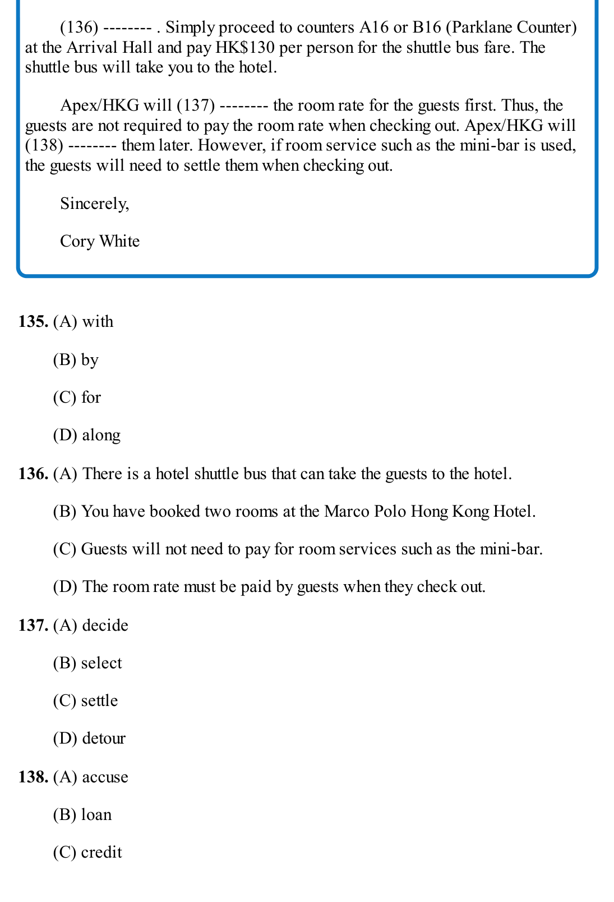


```text
(136) -------- . Simply proceed to counters A16 or B16 (Parklane Counter)
at the Arrival Hall and pay HK$130 per person for the shuttle bus fare. The
shuttle bus will take you to the hotel.
Apex/HKG will (137) -------- the room rate for the guests first. Thus, the
guests are not required to pay the room rate when checking out. Apex/HKG will
(138) -------- them later. However, if room service such as the mini-bar is used,
the guests will need to settle them when checking out.
Sincerely,
Cory White
135.
 (A) with
(B) by
(C) for
(D) along
136.
 (A) There is a hotel shuttle bus that can take the guests to the hotel.
(B) You have booked two rooms at the Marco Polo Hong Kong Hotel.
(C) Guests will not need to pay for room services such as the mini-bar.
(D) The room rate must be paid by guests when they check out.
137.
 (A) decide
(B) select
(C) settle
(D) detour
138.
 (A) accuse
(B) loan
(C) credit
886
```

## PDF 第 116 页

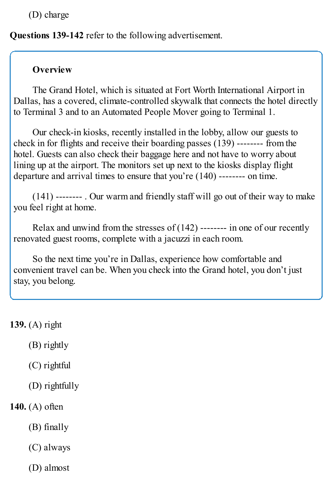


```text
(D) charge
Questions 139-142
 refer to the following advertisement.
Overview
The Grand Hotel, which is situated at Fort Worth International Airport in
Dallas, has a covered, climate-controlled skywalk that connects the hotel directly
to Terminal 3 and to an Automated People Mover going to Terminal 1.
Our check-in kiosks, recently installed in the lobby, allow our guests to
check in for flights and receive their boarding passes (139) -------- from the
hotel. Guests can also check their baggage here and not have to worry about
lining up at the airport. The monitors set up next to the kiosks display flight
departure and arrival times to ensure that you’re (140) -------- on time.
(141) -------- . Our warm and friendly staff will go out of their way to make
you feel right at home.
Relax and unwind from the stresses of (142) -------- in one of our recently
renovated guest rooms, complete with a jacuzzi in each room.
So the next time you’re in Dallas, experience how comfortable and
convenient travel can be. When you check into the Grand hotel, you don’t just
stay, you belong.
139.
 (A) right
(B) rightly
(C) rightful
(D) rightfully
140.
 (A) often
(B) finally
(C) always
(D) almost
887
```

## PDF 第 117 页

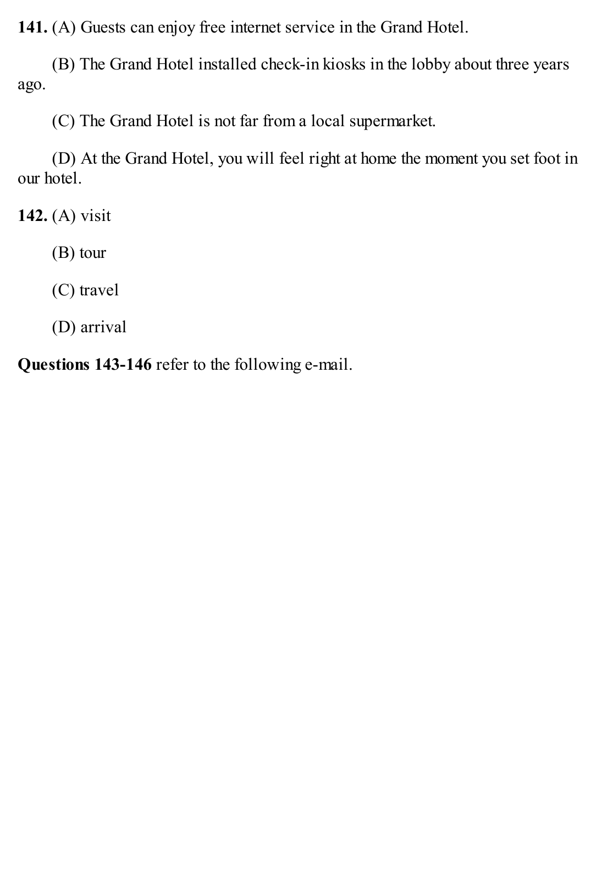


```text
141.
 (A) Guests can enjoy free internet service in the Grand Hotel.
(B) The Grand Hotel installed check-in kiosks in the lobby about three years
ago.
(C) The Grand Hotel is not far from a local supermarket.
(D) At the Grand Hotel, you will feel right at home the moment you set foot in
our hotel.
142.
 (A) visit
(B) tour
(C) travel
(D) arrival
Questions 143-146
 refer to the following e-mail.
888
```

## PDF 第 118 页

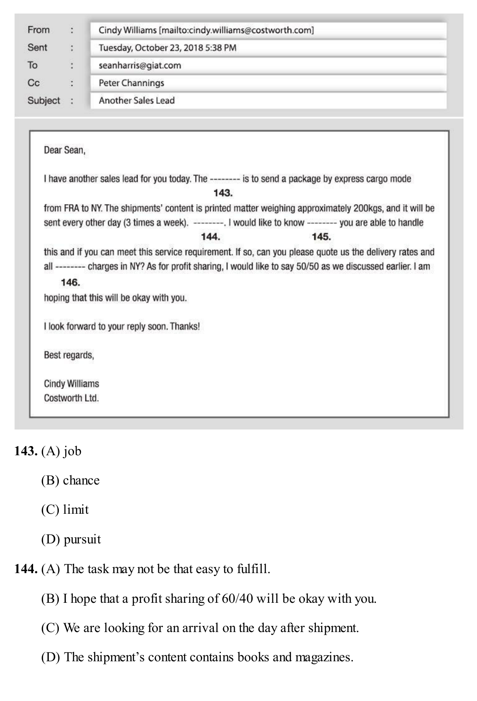


```text
143.
 (A) job
(B) chance
(C) limit
(D) pursuit
144.
 (A) The task may not be that easy to fulfill.
(B) I hope that a profit sharing of 60/40 will be okay with you.
(C) We are looking for an arrival on the day after shipment.
(D) The shipment’s content contains books and magazines.
889
```

## PDF 第 119 页

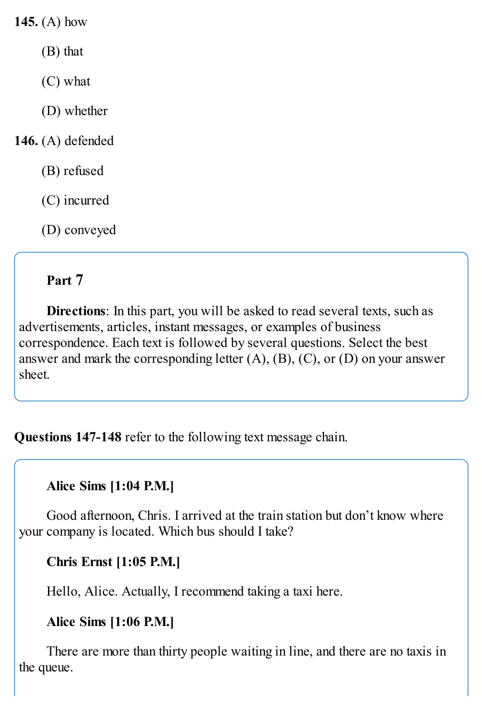


```text
145.
 (A) how
(B) that
(C) what
(D) whether
146.
 (A) defended
(B) refused
(C) incurred
(D) conveyed
Part
7
Directions
: In this part, you will be asked to read several texts, such as
advertisements, articles, instant messages, or examples of business
correspondence. Each text is followed by several questions. Select the best
answer and mark the corresponding letter (A), (B), (C), or (D) on your answer
sheet.
Questions 147-148
 refer to the following text message chain.
Alice Sims [1:04 P.M.]
Good afternoon, Chris. I arrived at the train station but don’t know where
your company is located. Which bus should I take?
Chris Ernst [1:05 P.M.]
Hello, Alice. Actually, I recommend taking a taxi here.
Alice Sims [1:06 P.M.]
There are more than thirty people waiting in line, and there are no taxis in
the queue.
890
```

## PDF 第 120 页

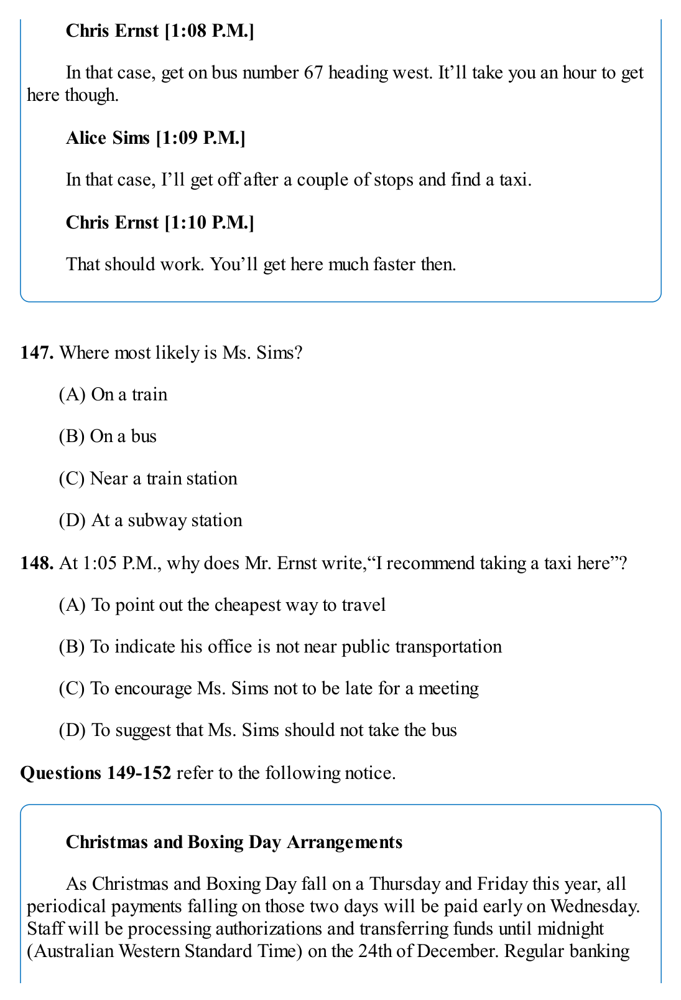


```text
Chris Ernst [1:08 P.M.]
In that case, get on bus number 67 heading west. It’ll take you an hour to get
here though.
Alice Sims [1:09 P.M.]
In that case, I’ll get off after a couple of stops and find a taxi.
Chris Ernst [1:10 P.M.]
That should work. You’ll get here much faster then.
147.
 Where most likely is Ms. Sims?
(A) On a train
(B) On a bus
(C) Near a train station
(D) At a subway station
148.
 At 1:05 P.M., why does Mr. Ernst write,“I recommend taking a taxi here”?
(A) To point out the cheapest way to travel
(B) To indicate his office is not near public transportation
(C) To encourage Ms. Sims not to be late for a meeting
(D) To suggest that Ms. Sims should not take the bus
Questions 149-152
 refer to the following notice.
Christmas and Boxing Day Arrangements
As Christmas and Boxing Day fall on a Thursday and Friday this year, all
periodical payments falling on those two days will be paid early on Wednesday.
Staff will be processing authorizations and transferring funds until midnight
(Australian Western Standard Time) on the 24th of December. Regular banking
891
```

## PDF 第 121 页

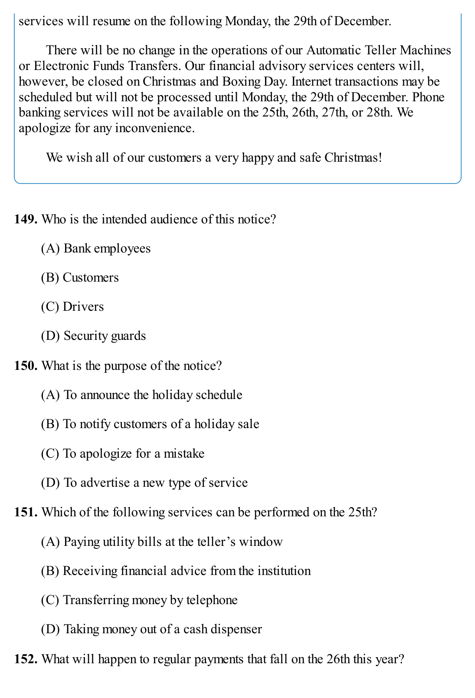


```text
services will resume on the following Monday, the 29th of December.
There will be no change in the operations of our Automatic Teller Machines
or Electronic Funds Transfers. Our financial advisory services centers will,
however, be closed on Christmas and Boxing Day. Internet transactions may be
scheduled but will not be processed until Monday, the 29th of December. Phone
banking services will not be available on the 25th, 26th, 27th, or 28th. We
apologize for any inconvenience.
We wish all of our customers a very happy and safe Christmas!
149.
 Who is the intended audience of this notice?
(A) Bank employees
(B) Customers
(C) Drivers
(D) Security guards
150.
 What is the purpose of the notice?
(A) To announce the holiday schedule
(B) To notify customers of a holiday sale
(C) To apologize for a mistake
(D) To advertise a new type of service
151.
 Which of the following services can be performed on the 25th?
(A) Paying utility bills at the teller’s window
(B) Receiving financial advice from the institution
(C) Transferring money by telephone
(D) Taking money out of a cash dispenser
152.
 What will happen to regular payments that fall on the 26th this year?
892
```

## PDF 第 122 页

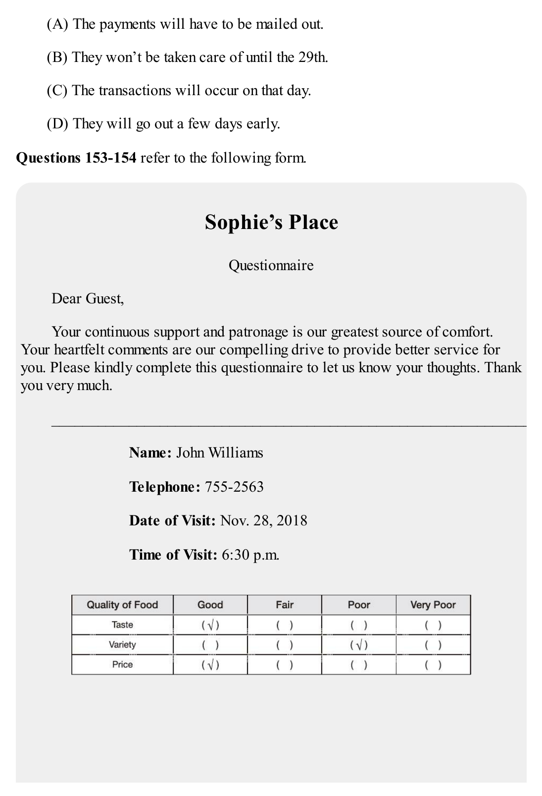


```text
(A) The payments will have to be mailed out.
(B) They won’t be taken care of until the 29th.
(C) The transactions will occur on that day.
(D) They will go out a few days early.
Questions 153-154
 refer to the following form.
Sophie’s Place
Questionnaire
Dear Guest,
Your continuous support and patronage is our greatest source of comfort.
Your heartfelt comments are our compelling drive to provide better service for
you. Please kindly complete this questionnaire to let us know your thoughts. Thank
you very much.
_____________________________________________________________________
Name:
 John Williams
Telephone:
 755-2563
Date of Visit:
 Nov. 28, 2018
Time of Visit:
 6:30 p.m.
893
```

## PDF 第 123 页

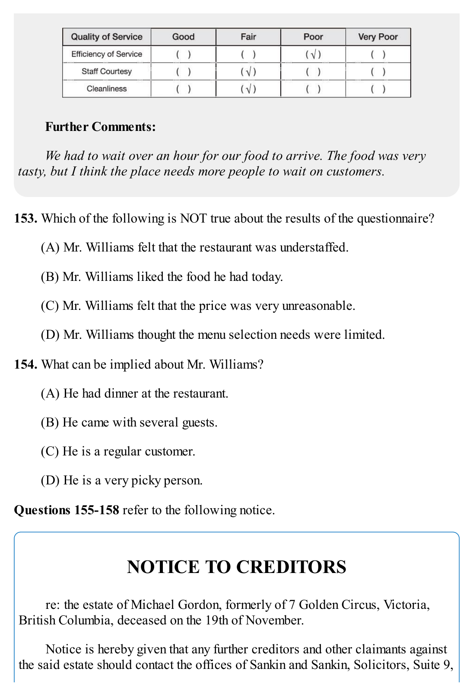


```text
Further Comments:
We had to wait over an hour for our food to arrive. The food was very
tasty, but I think the place needs more people to wait on customers.
153.
 Which of the following is NOT true about the results of the questionnaire?
(A) Mr. Williams felt that the restaurant was understaffed.
(B) Mr. Williams liked the food he had today.
(C) Mr. Williams felt that the price was very unreasonable.
(D) Mr. Williams thought the menu selection needs were limited.
154.
 What can be implied about Mr. Williams?
(A) He had dinner at the restaurant.
(B) He came with several guests.
(C) He is a regular customer.
(D) He is a very picky person.
Questions 155-158
 refer to the following notice.
NOTICE TO CREDITORS
re: the estate of Michael Gordon, formerly of 7 Golden Circus, Victoria,
British Columbia, deceased on the 19th of November.
Notice is hereby given that any further creditors and other claimants against
the said estate should contact the offices of Sankin and Sankin, Solicitors, Suite 9,
894
```

## PDF 第 124 页

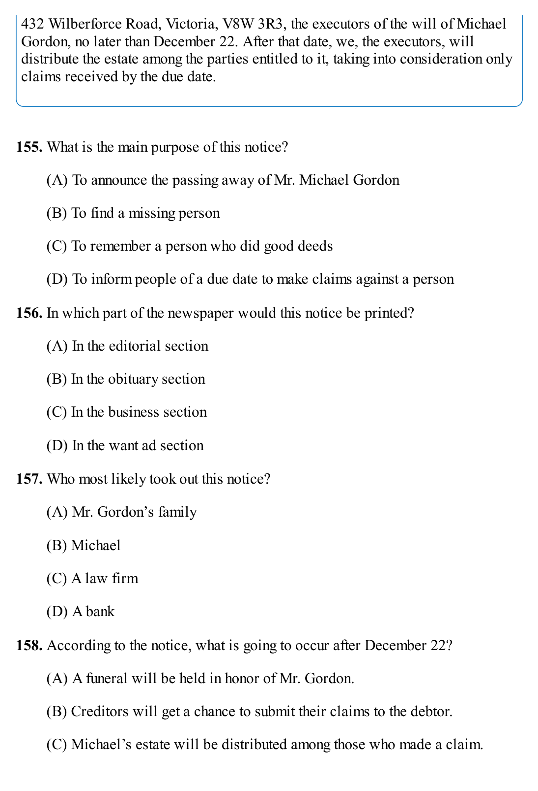


```text
432 Wilberforce Road, Victoria, V8W 3R3, the executors of the will of Michael
Gordon, no later than December 22. After that date, we, the executors, will
distribute the estate among the parties entitled to it, taking into consideration only
claims received by the due date.
155.
 What is the main purpose of this notice?
(A) To announce the passing away of Mr. Michael Gordon
(B) To find a missing person
(C) To remember a person who did good deeds
(D) To inform people of a due date to make claims against a person
156.
 In which part of the newspaper would this notice be printed?
(A) In the editorial section
(B) In the obituary section
(C) In the business section
(D) In the want ad section
157.
 Who most likely took out this notice?
(A) Mr. Gordon’s family
(B) Michael
(C) A law firm
(D) A bank
158.
 According to the notice, what is going to occur after December 22?
(A) A funeral will be held in honor of Mr. Gordon.
(B) Creditors will get a chance to submit their claims to the debtor.
(C) Michael’s estate will be distributed among those who made a claim.
895
```

## PDF 第 125 页

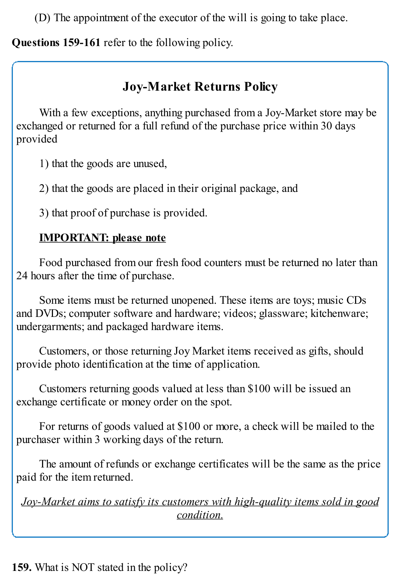


```text
(D) The appointment of the executor of the will is going to take place.
Questions 159-161
 refer to the following policy.
Joy-Market Returns Policy
With a few exceptions, anything purchased from a Joy-Market store may be
exchanged or returned for a full refund of the purchase price within 30 days
provided
1) that the goods are unused,
2) that the goods are placed in their original package, and
3) that proof of purchase is provided.
IMPORTANT: please note
Food purchased from our fresh food counters must be returned no later than
24 hours after the time of purchase.
Some items must be returned unopened. These items are toys; music CDs
and DVDs; computer software and hardware; videos; glassware; kitchenware;
undergarments; and packaged hardware items.
Customers, or those returning Joy Market items received as gifts, should
provide photo identification at the time of application.
Customers returning goods valued at less than $100 will be issued an
exchange certificate or money order on the spot.
For returns of goods valued at $100 or more, a check will be mailed to the
purchaser within 3 working days of the return.
The amount of refunds or exchange certificates will be the same as the price
paid for the item returned.
Joy-Market aims to satisfy its customers with high-quality items sold in good
condition.
159.
 What is NOT stated in the policy?
896
```

## PDF 第 126 页

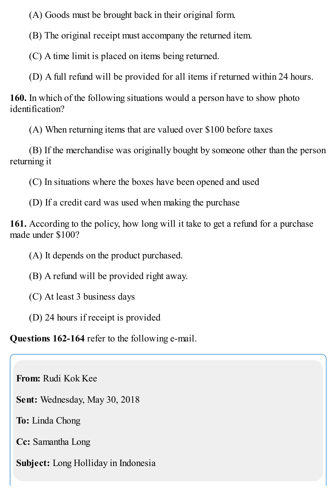


```text
(A) Goods must be brought back in their original form.
(B) The original receipt must accompany the returned item.
(C) A time limit is placed on items being returned.
(D) A full refund will be provided for all items if returned within 24 hours.
160.
 In which of the following situations would a person have to show photo
identification?
(A) When returning items that are valued over $100 before taxes
(B) If the merchandise was originally bought by someone other than the person
returning it
(C) In situations where the boxes have been opened and used
(D) If a credit card was used when making the purchase
161.
 According to the policy, how long will it take to get a refund for a purchase
made under $100?
(A) It depends on the product purchased.
(B) A refund will be provided right away.
(C) At least 3 business days
(D) 24 hours if receipt is provided
Questions 162-164
 refer to the following e-mail.
From:
 Rudi Kok Kee
Sent:
 Wednesday, May 30, 2018
To:
 Linda Chong
Cc:
 Samantha Long
Subject:
 Long Holliday in Indonesia
897
```

## PDF 第 127 页

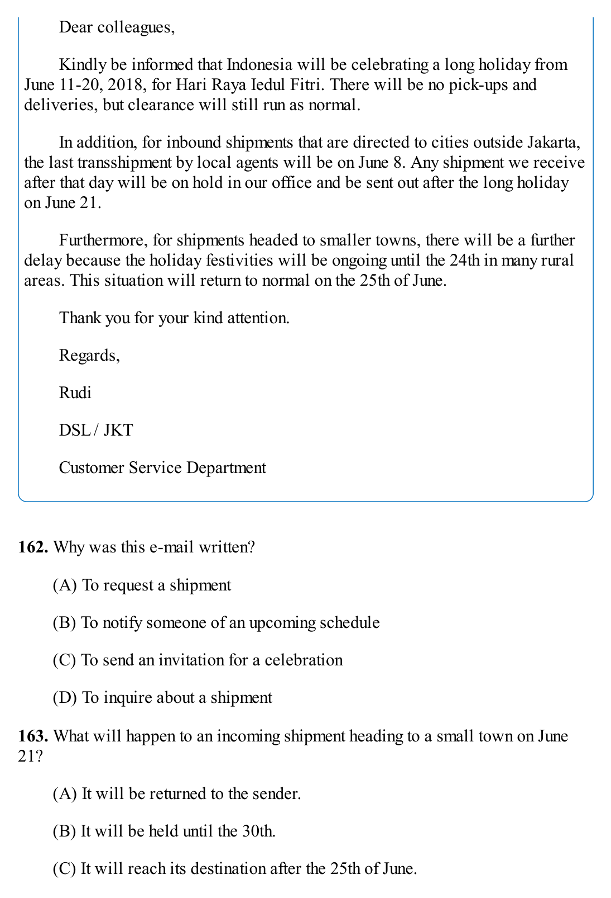


```text
Dear colleagues,
Kindly be informed that Indonesia will be celebrating a long holiday from
June 11-20, 2018, for Hari Raya Iedul Fitri. There will be no pick-ups and
deliveries, but clearance will still run as normal.
In addition, for inbound shipments that are directed to cities outside Jakarta,
the last transshipment by local agents will be on June 8. Any shipment we receive
after that day will be on hold in our office and be sent out after the long holiday
on June 21.
Furthermore, for shipments headed to smaller towns, there will be a further
delay because the holiday festivities will be ongoing until the 24th in many rural
areas. This situation will return to normal on the 25th of June.
Thank you for your kind attention.
Regards,
Rudi
DSL / JKT
Customer Service Department
162.
 Why was this e-mail written?
(A) To request a shipment
(B) To notify someone of an upcoming schedule
(C) To send an invitation for a celebration
(D) To inquire about a shipment
163.
 What will happen to an incoming shipment heading to a small town on June
21?
(A) It will be returned to the sender.
(B) It will be held until the 30th.
(C) It will reach its destination after the 25th of June.
898
```

## PDF 第 128 页

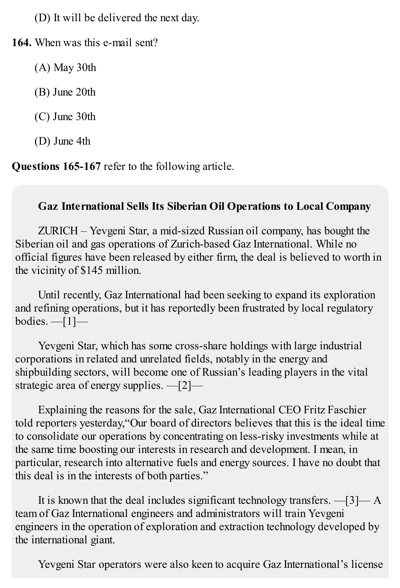


```text
(D) It will be delivered the next day.
164.
 When was this e-mail sent?
(A) May 30th
(B) June 20th
(C) June 30th
(D) June 4th
Questions 165-167
 refer to the following article.
Gaz International Sells Its Siberian Oil Operations to Local Company
ZURICH – Yevgeni Star, a mid-sized Russian oil company, has bought the
Siberian oil and gas operations of Zurich-based Gaz International. While no
official figures have been released by either firm, the deal is believed to worth in
the vicinity of $145 million.
Until recently, Gaz International had been seeking to expand its exploration
and refining operations, but it has reportedly been frustrated by local regulatory
bodies. —[1]—
Yevgeni Star, which has some cross-share holdings with large industrial
corporations in related and unrelated fields, notably in the energy and
shipbuilding sectors, will become one of Russian’s leading players in the vital
strategic area of energy supplies. —[2]—
Explaining the reasons for the sale, Gaz International CEO Fritz Faschier
told reporters yesterday,“Our board of directors believes that this is the ideal time
to consolidate our operations by concentrating on less-risky investments while at
the same time boosting our interests in research and development. I mean, in
particular, research into alternative fuels and energy sources. I have no doubt that
this deal is in the interests of both parties.”
It is known that the deal includes significant technology transfers. —[3]— A
team of Gaz International engineers and administrators will train Yevgeni
engineers in the operation of exploration and extraction technology developed by
the international giant.
Yevgeni Star operators were also keen to acquire Gaz International’s license
899
```

## PDF 第 129 页

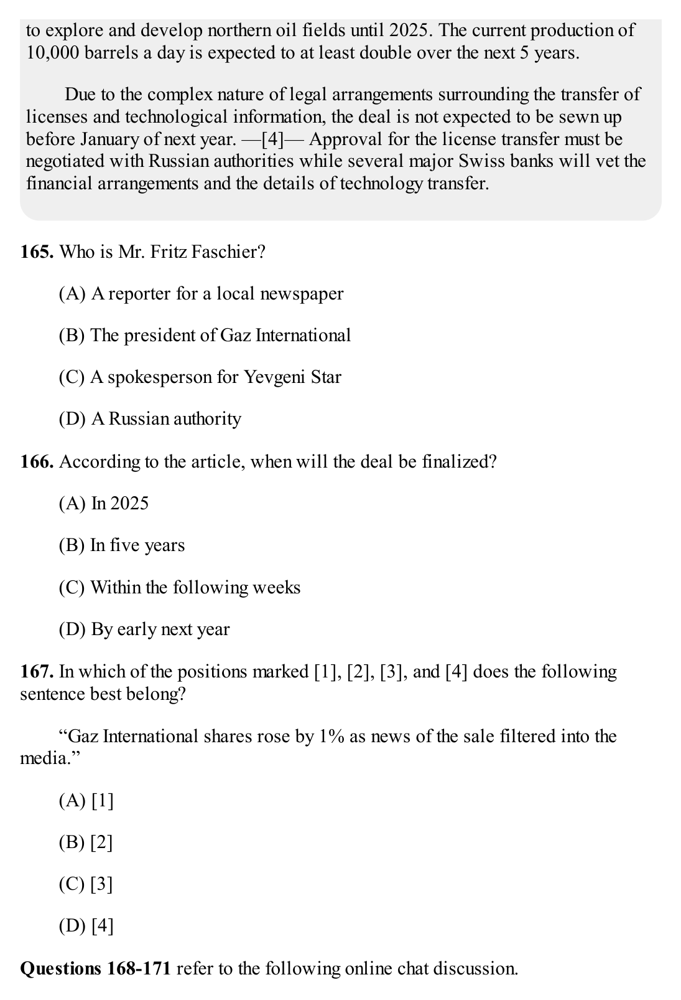


```text
to explore and develop northern oil fields until 2025. The current production of
10,000 barrels a day is expected to at least double over the next 5 years.
Due to the complex nature of legal arrangements surrounding the transfer of
licenses and technological information, the deal is not expected to be sewn up
before January of next year. —[4]— Approval for the license transfer must be
negotiated with Russian authorities while several major Swiss banks will vet the
financial arrangements and the details of technology transfer.
165.
 Who is Mr. Fritz Faschier?
(A) A reporter for a local newspaper
(B) The president of Gaz International
(C) A spokesperson for Yevgeni Star
(D) A Russian authority
166.
 According to the article, when will the deal be finalized?
(A) In 2025
(B) In five years
(C) Within the following weeks
(D) By early next year
167.
 In which of the positions marked [1], [2], [3], and [4] does the following
sentence best belong?
“Gaz International shares rose by 1% as news of the sale filtered into the
media.”
(A) [1]
(B) [2]
(C) [3]
(D) [4]
Questions 168-171
 refer to the following online chat discussion.
900
```

## PDF 第 130 页

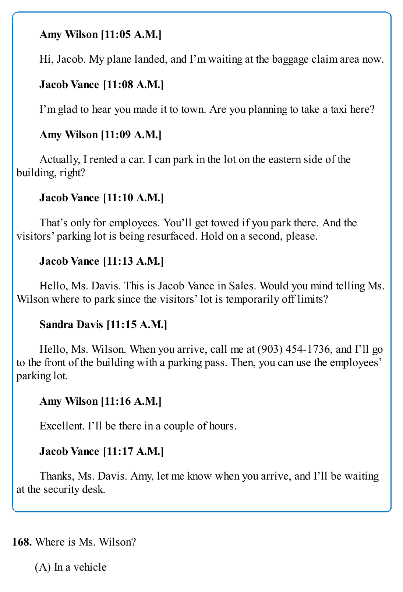


```text
Amy Wilson [11:05 A.M.]
Hi, Jacob. My plane landed, and I’m waiting at the baggage claim area now.
Jacob Vance [11:08 A.M.]
I’m glad to hear you made it to town. Are you planning to take a taxi here?
Amy Wilson [11:09 A.M.]
Actually, I rented a car. I can park in the lot on the eastern side of the
building, right?
Jacob Vance [11:10 A.M.]
That’s only for employees. You’ll get towed if you park there. And the
visitors’ parking lot is being resurfaced. Hold on a second, please.
Jacob Vance [11:13 A.M.]
Hello, Ms. Davis. This is Jacob Vance in Sales. Would you mind telling Ms.
Wilson where to park since the visitors’ lot is temporarily off limits?
Sandra Davis [11:15 A.M.]
Hello, Ms. Wilson. When you arrive, call me at (903) 454-1736, and I’ll go
to the front of the building with a parking pass. Then, you can use the employees’
parking lot.
Amy Wilson [11:16 A.M.]
Excellent. I’ll be there in a couple of hours.
Jacob Vance [11:17 A.M.]
Thanks, Ms. Davis. Amy, let me know when you arrive, and I’ll be waiting
at the security desk.
168.
 Where is Ms. Wilson?
(A) In a vehicle
901
```

## PDF 第 131 页

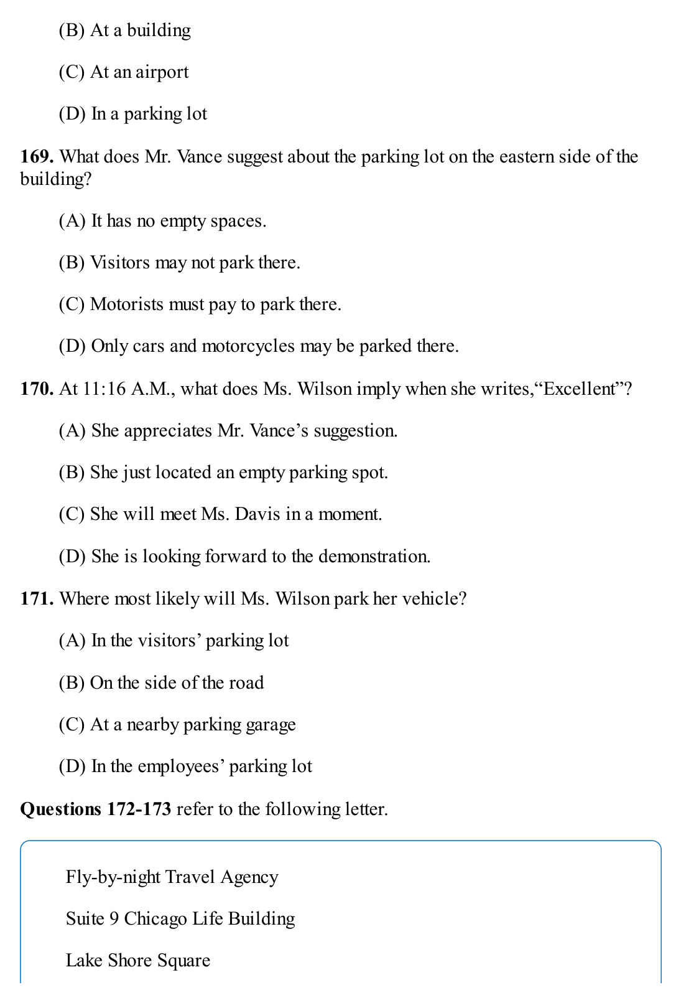


```text
(B) At a building
(C) At an airport
(D) In a parking lot
169.
 What does Mr. Vance suggest about the parking lot on the eastern side of the
building?
(A) It has no empty spaces.
(B) Visitors may not park there.
(C) Motorists must pay to park there.
(D) Only cars and motorcycles may be parked there.
170.
 At 11:16 A.M., what does Ms. Wilson imply when she writes,“Excellent”?
(A) She appreciates Mr. Vance’s suggestion.
(B) She just located an empty parking spot.
(C) She will meet Ms. Davis in a moment.
(D) She is looking forward to the demonstration.
171.
 Where most likely will Ms. Wilson park her vehicle?
(A) In the visitors’ parking lot
(B) On the side of the road
(C) At a nearby parking garage
(D) In the employees’ parking lot
Questions 172-173
 refer to the following letter.
Fly-by-night Travel Agency
Suite 9 Chicago Life Building
Lake Shore Square
902
```

## PDF 第 132 页

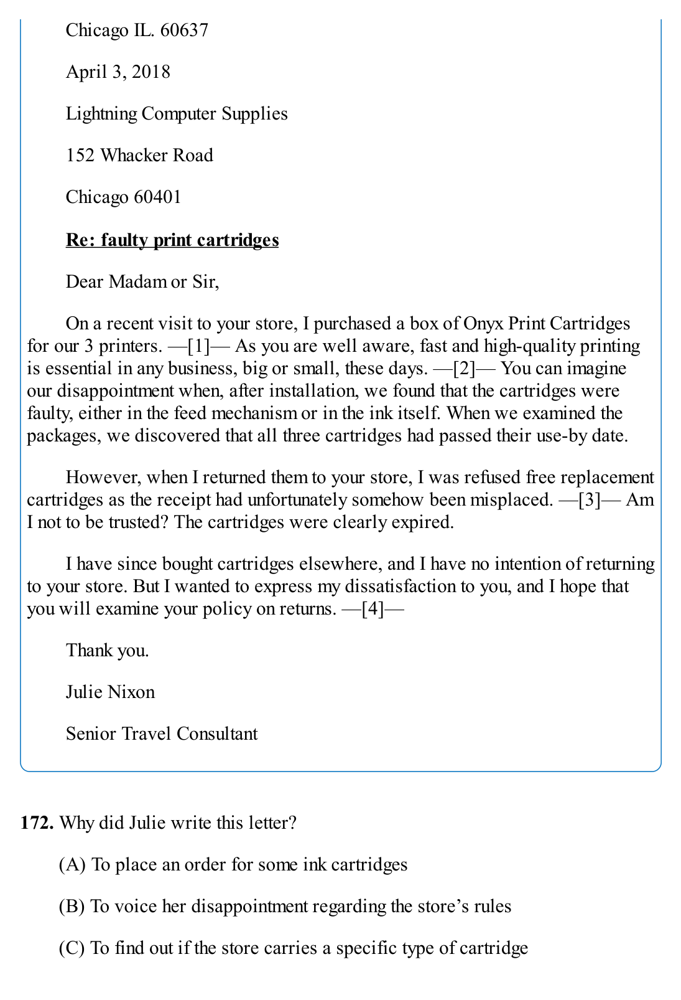


```text
Chicago IL. 60637
April 3, 2018
Lightning Computer Supplies
152 Whacker Road
Chicago 60401
Re: faulty print cartridges
Dear Madam or Sir,
On a recent visit to your store, I purchased a box of Onyx Print Cartridges
for our 3 printers. —[1]— As you are well aware, fast and high-quality printing
is essential in any business, big or small, these days. —[2]— You can imagine
our disappointment when, after installation, we found that the cartridges were
faulty, either in the feed mechanism or in the ink itself. When we examined the
packages, we discovered that all three cartridges had passed their use-by date.
However, when I returned them to your store, I was refused free replacement
cartridges as the receipt had unfortunately somehow been misplaced. —[3]— Am
I not to be trusted? The cartridges were clearly expired.
I have since bought cartridges elsewhere, and I have no intention of returning
to your store. But I wanted to express my dissatisfaction to you, and I hope that
you will examine your policy on returns. —[4]—
Thank you.
Julie Nixon
Senior Travel Consultant
172.
 Why did Julie write this letter?
(A) To place an order for some ink cartridges
(B) To voice her disappointment regarding the store’s rules
(C) To find out if the store carries a specific type of cartridge
903
```

## PDF 第 133 页

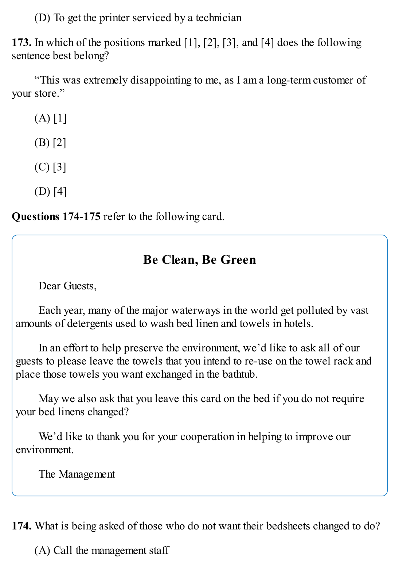


```text
(D) To get the printer serviced by a technician
173.
 In which of the positions marked [1], [2], [3], and [4] does the following
sentence best belong?
“This was extremely disappointing to me, as I am a long-term customer of
your store.”
(A) [1]
(B) [2]
(C) [3]
(D) [4]
Questions 174-175
 refer to the following card.
Be Clean, Be Green
Dear Guests,
Each year, many of the major waterways in the world get polluted by vast
amounts of detergents used to wash bed linen and towels in hotels.
In an effort to help preserve the environment, we’d like to ask all of our
guests to please leave the towels that you intend to re-use on the towel rack and
place those towels you want exchanged in the bathtub.
May we also ask that you leave this card on the bed if you do not require
your bed linens changed?
We’d like to thank you for your cooperation in helping to improve our
environment.
The Management
174.
 What is being asked of those who do not want their bedsheets changed to do?
(A) Call the management staff
904
```

## PDF 第 134 页

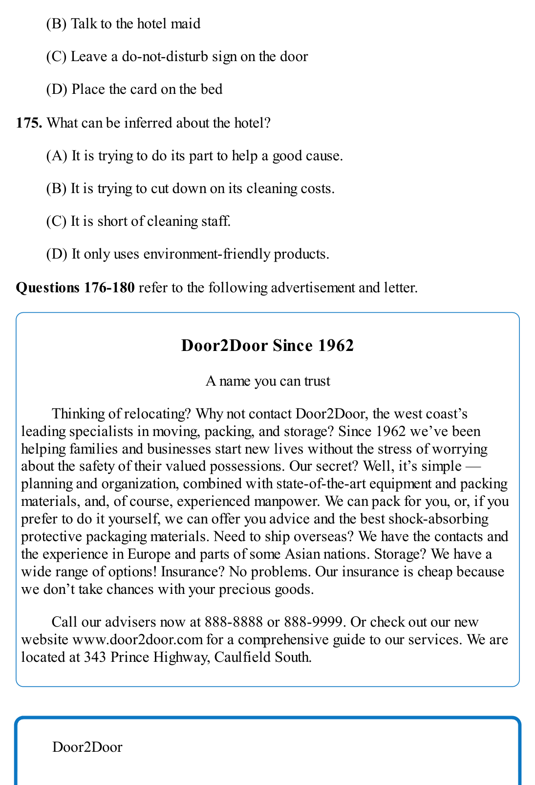


```text
(B) Talk to the hotel maid
(C) Leave a do-not-disturb sign on the door
(D) Place the card on the bed
175.
 What can be inferred about the hotel?
(A) It is trying to do its part to help a good cause.
(B) It is trying to cut down on its cleaning costs.
(C) It is short of cleaning staff.
(D) It only uses environment-friendly products.
Questions 176-180
 refer to the following advertisement and letter.
Door2Door Since 1962
A name you can trust
Thinking of relocating? Why not contact Door2Door, the west coast’s
leading specialists in moving, packing, and storage? Since 1962 we’ve been
helping families and businesses start new lives without the stress of worrying
about the safety of their valued possessions. Our secret? Well, it’s simple —
planning and organization, combined with state-of-the-art equipment and packing
materials, and, of course, experienced manpower. We can pack for you, or, if you
prefer to do it yourself, we can offer you advice and the best shock-absorbing
protective packaging materials. Need to ship overseas? We have the contacts and
the experience in Europe and parts of some Asian nations. Storage? We have a
wide range of options! Insurance? No problems. Our insurance is cheap because
we don’t take chances with your precious goods.
Call our advisers now at 888-8888 or 888-9999. Or check out our new
website www.door2door.com for a comprehensive guide to our services. We are
located at 343 Prince Highway, Caulfield South.
Door2Door
905
```

## PDF 第 135 页

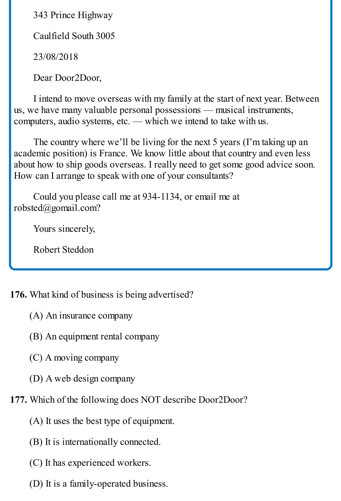


```text
343 Prince Highway
Caulfield South 3005
23/08/2018
Dear Door2Door,
I intend to move overseas with my family at the start of next year. Between
us, we have many valuable personal possessions — musical instruments,
computers, audio systems, etc. — which we intend to take with us.
The country where we’ll be living for the next 5 years (I’m taking up an
academic position) is France. We know little about that country and even less
about how to ship goods overseas. I really need to get some good advice soon.
How can I arrange to speak with one of your consultants?
Could you please call me at 934-1134, or email me at
robsted@gomail.com?
Yours sincerely,
Robert Steddon
176.
 What kind of business is being advertised?
(A) An insurance company
(B) An equipment rental company
(C) A moving company
(D) A web design company
177.
 Which of the following does NOT describe Door2Door?
(A) It uses the best type of equipment.
(B) It is internationally connected.
(C) It has experienced workers.
(D) It is a family-operated business.
906
```

## PDF 第 136 页

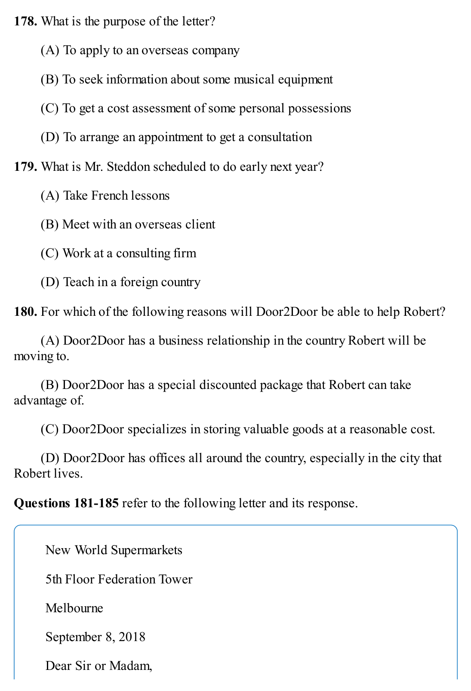


```text
178.
 What is the purpose of the letter?
(A) To apply to an overseas company
(B) To seek information about some musical equipment
(C) To get a cost assessment of some personal possessions
(D) To arrange an appointment to get a consultation
179.
 What is Mr. Steddon scheduled to do early next year?
(A) Take French lessons
(B) Meet with an overseas client
(C) Work at a consulting firm
(D) Teach in a foreign country
180.
 For which of the following reasons will Door2Door be able to help Robert?
(A) Door2Door has a business relationship in the country Robert will be
moving to.
(B) Door2Door has a special discounted package that Robert can take
advantage of.
(C) Door2Door specializes in storing valuable goods at a reasonable cost.
(D) Door2Door has offices all around the country, especially in the city that
Robert lives.
Questions 181-185
 refer to the following letter and its response.
New World Supermarkets
5th Floor Federation Tower
Melbourne
September 8, 2018
Dear Sir or Madam,
907
```

## PDF 第 137 页

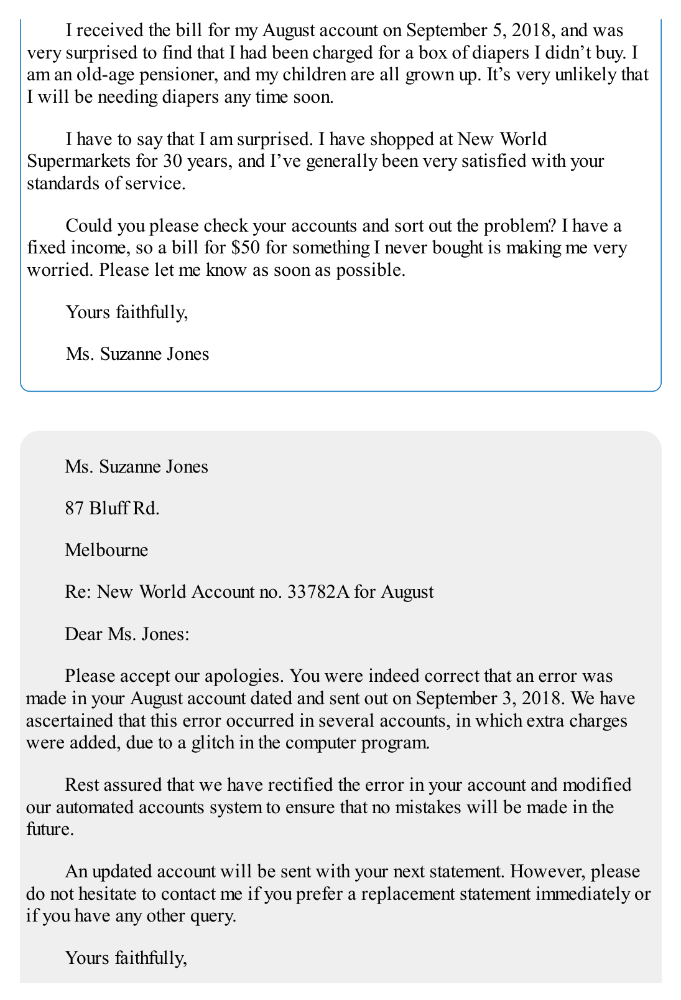


```text
I received the bill for my August account on September 5, 2018, and was
very surprised to find that I had been charged for a box of diapers I didn’t buy. I
am an old-age pensioner, and my children are all grown up. It’s very unlikely that
I will be needing diapers any time soon.
I have to say that I am surprised. I have shopped at New World
Supermarkets for 30 years, and I’ve generally been very satisfied with your
standards of service.
Could you please check your accounts and sort out the problem? I have a
fixed income, so a bill for $50 for something I never bought is making me very
worried. Please let me know as soon as possible.
Yours faithfully,
Ms. Suzanne Jones
Ms. Suzanne Jones
87 Bluff Rd.
Melbourne
Re: New World Account no. 33782A for August
Dear Ms. Jones:
Please accept our apologies. You were indeed correct that an error was
made in your August account dated and sent out on September 3, 2018. We have
ascertained that this error occurred in several accounts, in which extra charges
were added, due to a glitch in the computer program.
Rest assured that we have rectified the error in your account and modified
our automated accounts system to ensure that no mistakes will be made in the
future.
An updated account will be sent with your next statement. However, please
do not hesitate to contact me if you prefer a replacement statement immediately or
if you have any other query.
Yours faithfully,
908
```

## PDF 第 138 页

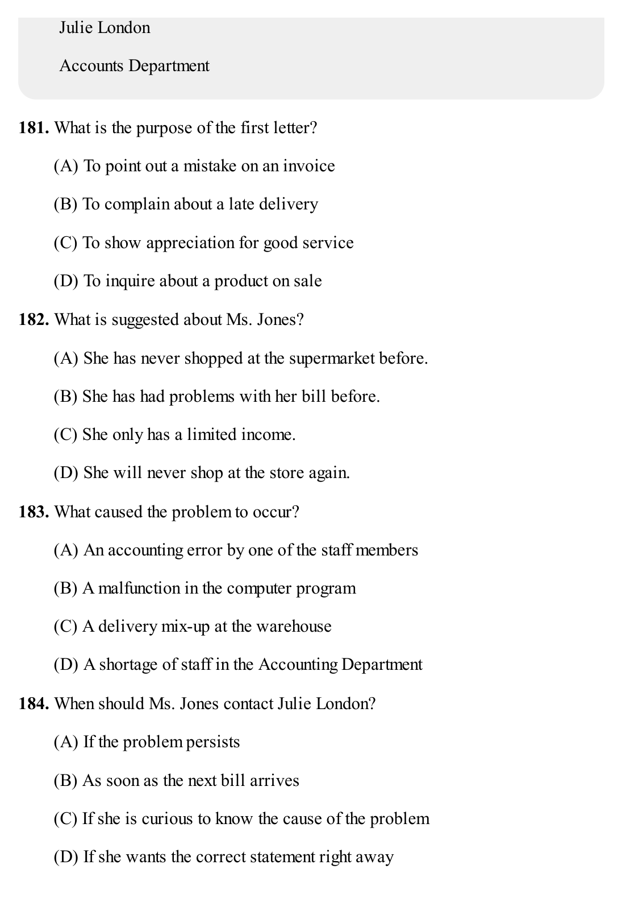


```text
Julie London
Accounts Department
181.
 What is the purpose of the first letter?
(A) To point out a mistake on an invoice
(B) To complain about a late delivery
(C) To show appreciation for good service
(D) To inquire about a product on sale
182.
 What is suggested about Ms. Jones?
(A) She has never shopped at the supermarket before.
(B) She has had problems with her bill before.
(C) She only has a limited income.
(D) She will never shop at the store again.
183.
 What caused the problem to occur?
(A) An accounting error by one of the staff members
(B) A malfunction in the computer program
(C) A delivery mix-up at the warehouse
(D) A shortage of staff in the Accounting Department
184.
 When should Ms. Jones contact Julie London?
(A) If the problem persists
(B) As soon as the next bill arrives
(C) If she is curious to know the cause of the problem
(D) If she wants the correct statement right away
909
```

## PDF 第 139 页

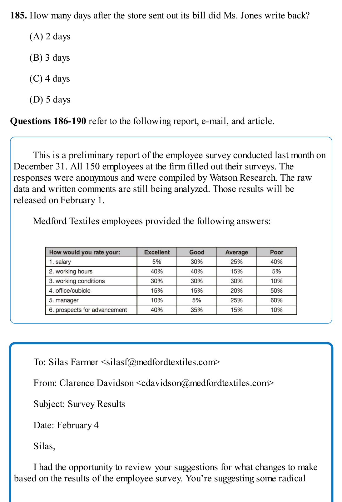


```text
185.
 How many days after the store sent out its bill did Ms. Jones write back?
(A) 2 days
(B) 3 days
(C) 4 days
(D) 5 days
Questions 186-190
 refer to the following report, e-mail, and article.
This is a preliminary report of the employee survey conducted last month on
December 31. All 150 employees at the firm filled out their surveys. The
responses were anonymous and were compiled by Watson Research. The raw
data and written comments are still being analyzed. Those results will be
released on February 1.
Medford Textiles employees provided the following answers:
To: Silas Farmer <silasf@medfordtextiles.com>
From: Clarence Davidson <cdavidson@medfordtextiles.com>
Subject: Survey Results
Date: February 4
Silas,
I had the opportunity to review your suggestions for what changes to make
based on the results of the employee survey. You’re suggesting some radical
910
```

## PDF 第 140 页

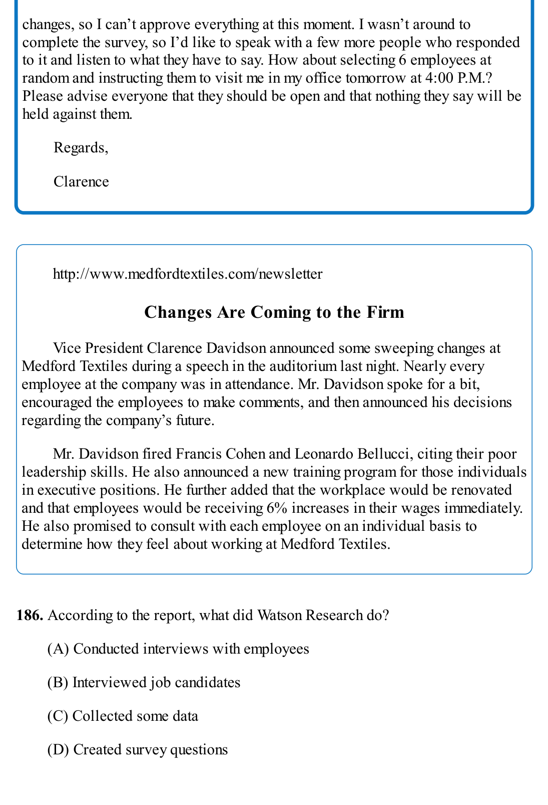


```text
changes, so I can’t approve everything at this moment. I wasn’t around to
complete the survey, so I’d like to speak with a few more people who responded
to it and listen to what they have to say. How about selecting 6 employees at
random and instructing them to visit me in my office tomorrow at 4:00 P.M.?
Please advise everyone that they should be open and that nothing they say will be
held against them.
Regards,
Clarence
http://www.medfordtextiles.com/newsletter
Changes Are Coming to the Firm
Vice President Clarence Davidson announced some sweeping changes at
Medford Textiles during a speech in the auditorium last night. Nearly every
employee at the company was in attendance. Mr. Davidson spoke for a bit,
encouraged the employees to make comments, and then announced his decisions
regarding the company’s future.
Mr. Davidson fired Francis Cohen and Leonardo Bellucci, citing their poor
leadership skills. He also announced a new training program for those individuals
in executive positions. He further added that the workplace would be renovated
and that employees would be receiving 6% increases in their wages immediately.
He also promised to consult with each employee on an individual basis to
determine how they feel about working at Medford Textiles.
186.
 According to the report, what did Watson Research do?
(A) Conducted interviews with employees
(B) Interviewed job candidates
(C) Collected some data
(D) Created survey questions
911
```

## PDF 第 141 页

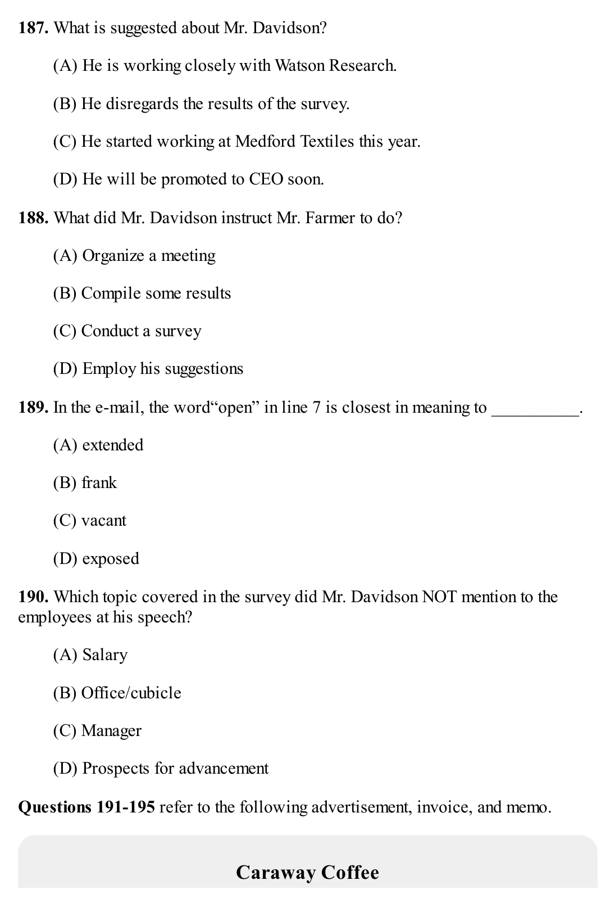


```text
187.
 What is suggested about Mr. Davidson?
(A) He is working closely with Watson Research.
(B) He disregards the results of the survey.
(C) He started working at Medford Textiles this year.
(D) He will be promoted to CEO soon.
188.
 What did Mr. Davidson instruct Mr. Farmer to do?
(A) Organize a meeting
(B) Compile some results
(C) Conduct a survey
(D) Employ his suggestions
189.
 In the e-mail, the word“open” in line 7 is closest in meaning to __________.
(A) extended
(B) frank
(C) vacant
(D) exposed
190.
 Which topic covered in the survey did Mr. Davidson NOT mention to the
employees at his speech?
(A) Salary
(B) Office/cubicle
(C) Manager
(D) Prospects for advancement
Questions 191-195
 refer to the following advertisement, invoice, and memo.
Caraway Coffee
912
```

## PDF 第 142 页

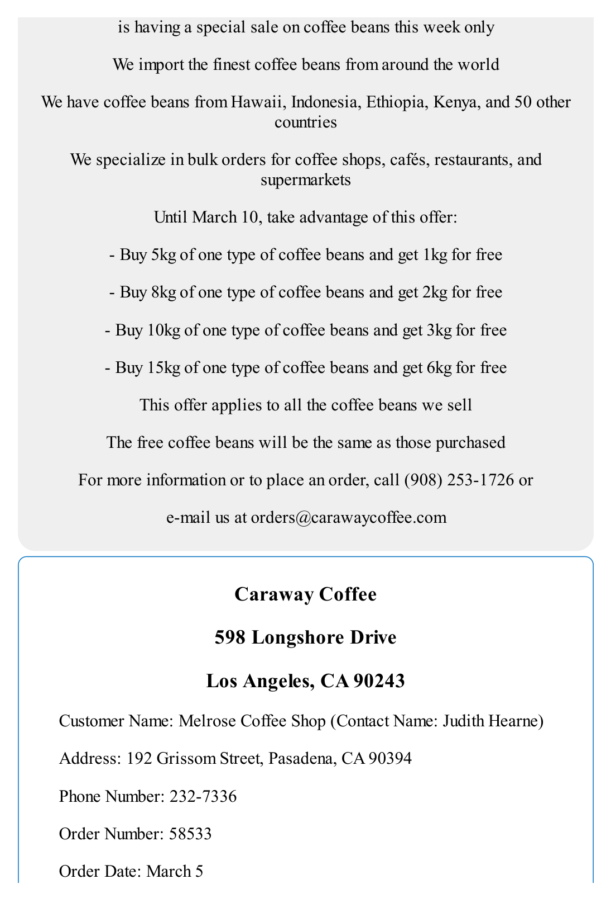


```text
is having a special sale on coffee beans this week only
We import the finest coffee beans from around the world
We have coffee beans from Hawaii, Indonesia, Ethiopia, Kenya, and 50 other
countries
We specialize in bulk orders for coffee shops, cafés, restaurants, and
supermarkets
Until March 10, take advantage of this offer:
- Buy 5kg of one type of coffee beans and get 1kg for free
- Buy 8kg of one type of coffee beans and get 2kg for free
- Buy 10kg of one type of coffee beans and get 3kg for free
- Buy 15kg of one type of coffee beans and get 6kg for free
This offer applies to all the coffee beans we sell
The free coffee beans will be the same as those purchased
For more information or to place an order, call (908) 253-1726 or
e-mail us at orders@carawaycoffee.com
Caraway Coffee
598 Longshore Drive
Los Angeles, CA 90243
Customer Name: Melrose Coffee Shop (Contact Name: Judith Hearne)
Address: 192 Grissom Street, Pasadena, CA 90394
Phone Number: 232-7336
Order Number: 58533
Order Date: March 5
913
```

## PDF 第 143 页

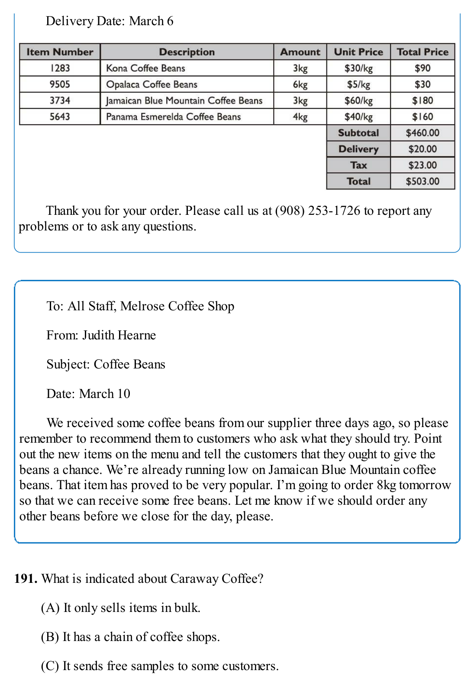


```text
Delivery Date: March 6
Thank you for your order. Please call us at (908) 253-1726 to report any
problems or to ask any questions.
To: All Staff, Melrose Coffee Shop
From: Judith Hearne
Subject: Coffee Beans
Date: March 10
We received some coffee beans from our supplier three days ago, so please
remember to recommend them to customers who ask what they should try. Point
out the new items on the menu and tell the customers that they ought to give the
beans a chance. We’re already running low on Jamaican Blue Mountain coffee
beans. That item has proved to be very popular. I’m going to order 8kg tomorrow
so that we can receive some free beans. Let me know if we should order any
other beans before we close for the day, please.
191.
 What is indicated about Caraway Coffee?
(A) It only sells items in bulk.
(B) It has a chain of coffee shops.
(C) It sends free samples to some customers.
914
```

## PDF 第 144 页

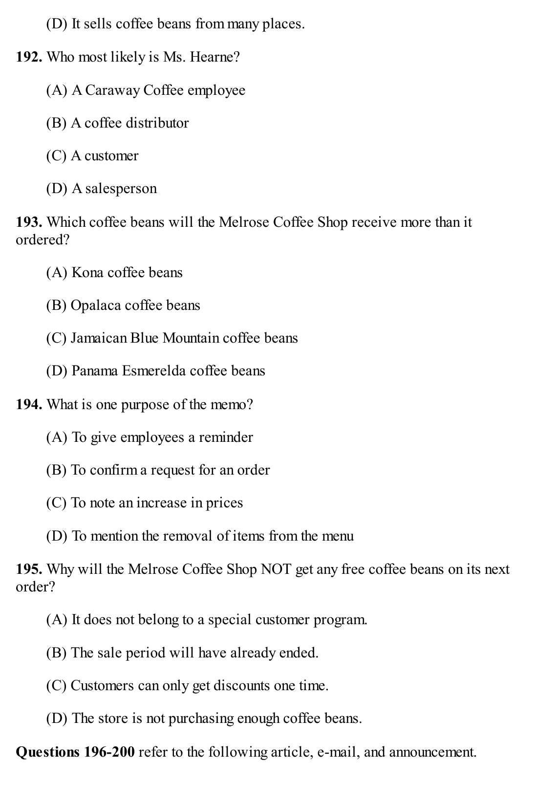


```text
(D) It sells coffee beans from many places.
192.
 Who most likely is Ms. Hearne?
(A) A Caraway Coffee employee
(B) A coffee distributor
(C) A customer
(D) A salesperson
193.
 Which coffee beans will the Melrose Coffee Shop receive more than it
ordered?
(A) Kona coffee beans
(B) Opalaca coffee beans
(C) Jamaican Blue Mountain coffee beans
(D) Panama Esmerelda coffee beans
194.
 What is one purpose of the memo?
(A) To give employees a reminder
(B) To confirm a request for an order
(C) To note an increase in prices
(D) To mention the removal of items from the menu
195.
 Why will the Melrose Coffee Shop NOT get any free coffee beans on its next
order?
(A) It does not belong to a special customer program.
(B) The sale period will have already ended.
(C) Customers can only get discounts one time.
(D) The store is not purchasing enough coffee beans.
Questions 196-200
 refer to the following article, e-mail, and announcement.
915
```

## PDF 第 145 页

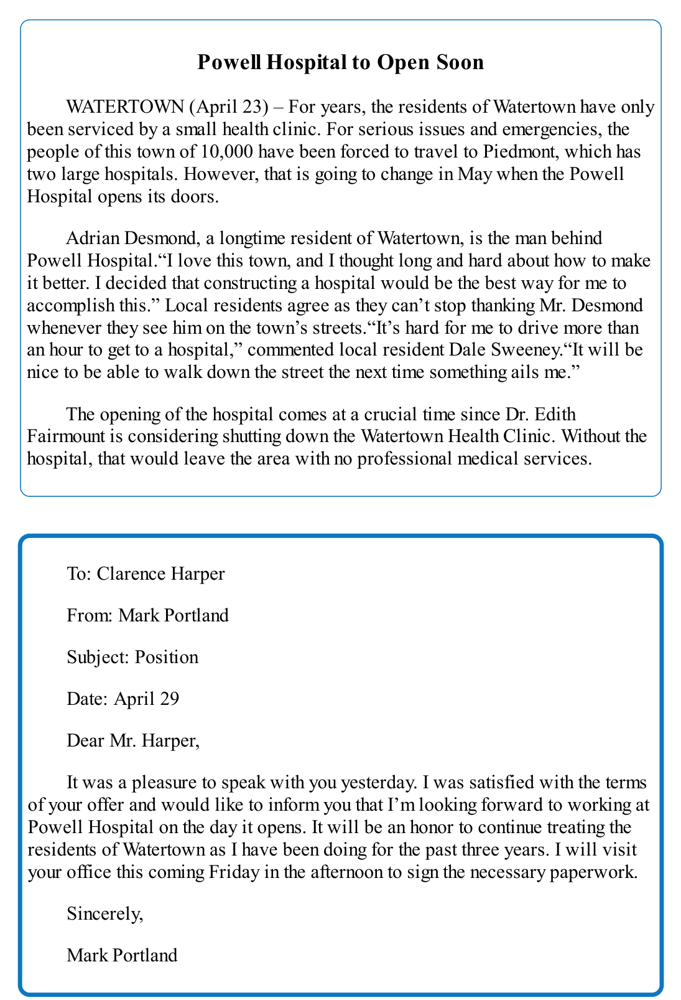


```text
Powell Hospital to Open Soon
WATERTOWN (April 23) – For years, the residents of Watertown have only
been serviced by a small health clinic. For serious issues and emergencies, the
people of this town of 10,000 have been forced to travel to Piedmont, which has
two large hospitals. However, that is going to change in May when the Powell
Hospital opens its doors.
Adrian Desmond, a longtime resident of Watertown, is the man behind
Powell Hospital.“I love this town, and I thought long and hard about how to make
it better. I decided that constructing a hospital would be the best way for me to
accomplish this.” Local residents agree as they can’t stop thanking Mr. Desmond
whenever they see him on the town’s streets.“It’s hard for me to drive more than
an hour to get to a hospital,” commented local resident Dale Sweeney.“It will be
nice to be able to walk down the street the next time something ails me.”
The opening of the hospital comes at a crucial time since Dr. Edith
Fairmount is considering shutting down the Watertown Health Clinic. Without the
hospital, that would leave the area with no professional medical services.
To: Clarence Harper
From: Mark Portland
Subject: Position
Date: April 29
Dear Mr. Harper,
It was a pleasure to speak with you yesterday. I was satisfied with the terms
of your offer and would like to inform you that I’m looking forward to working at
Powell Hospital on the day it opens. It will be an honor to continue treating the
residents of Watertown as I have been doing for the past three years. I will visit
your office this coming Friday in the afternoon to sign the necessary paperwork.
Sincerely,
Mark Portland
916
```

## PDF 第 146 页

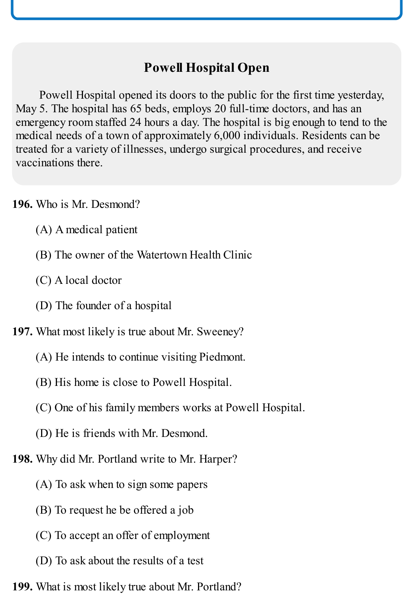


```text
Powell Hospital Open
Powell Hospital opened its doors to the public for the first time yesterday,
May 5. The hospital has 65 beds, employs 20 full-time doctors, and has an
emergency room staffed 24 hours a day. The hospital is big enough to tend to the
medical needs of a town of approximately 6,000 individuals. Residents can be
treated for a variety of illnesses, undergo surgical procedures, and receive
vaccinations there.
196.
 Who is Mr. Desmond?
(A) A medical patient
(B) The owner of the Watertown Health Clinic
(C) A local doctor
(D) The founder of a hospital
197.
 What most likely is true about Mr. Sweeney?
(A) He intends to continue visiting Piedmont.
(B) His home is close to Powell Hospital.
(C) One of his family members works at Powell Hospital.
(D) He is friends with Mr. Desmond.
198.
 Why did Mr. Portland write to Mr. Harper?
(A) To ask when to sign some papers
(B) To request he be offered a job
(C) To accept an offer of employment
(D) To ask about the results of a test
199.
 What is most likely true about Mr. Portland?
917
```

## PDF 第 147 页

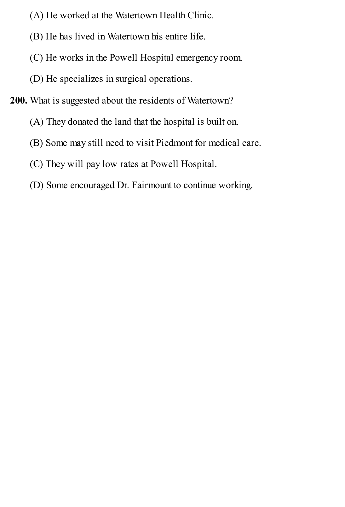


```text
(A) He worked at the Watertown Health Clinic.
(B) He has lived in Watertown his entire life.
(C) He works in the Powell Hospital emergency room.
(D) He specializes in surgical operations.
200.
 What is suggested about the residents of Watertown?
(A) They donated the land that the hospital is built on.
(B) Some may still need to visit Piedmont for medical care.
(C) They will pay low rates at Powell Hospital.
(D) Some encouraged Dr. Fairmount to continue working.
918
```

## PDF 第 148 页

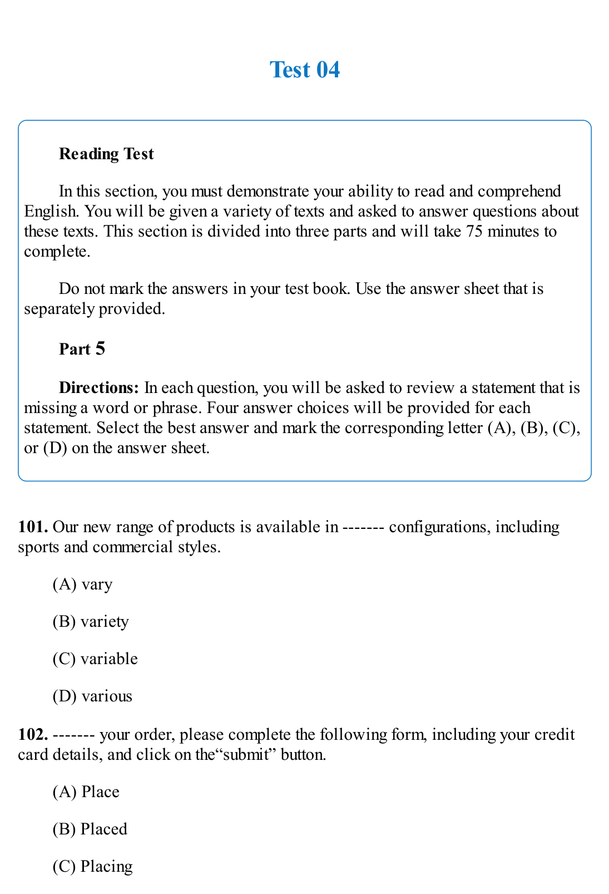


```text
Test 04
Reading Test
In this section, you must demonstrate your ability to read and comprehend
English. You will be given a variety of texts and asked to answer questions about
these texts. This section is divided into three parts and will take 75 minutes to
complete.
Do not mark the answers in your test book. Use the answer sheet that is
separately provided.
Part
5
Directions:
 In each question, you will be asked to review a statement that is
missing a word or phrase. Four answer choices will be provided for each
statement. Select the best answer and mark the corresponding letter (A), (B), (C),
or (D) on the answer sheet.
101.
 Our new range of products is available in ------- configurations, including
sports and commercial styles.
(A) vary
(B) variety
(C) variable
(D) various
102.
 ------- your order, please complete the following form, including your credit
card details, and click on the“submit” button.
(A) Place
(B) Placed
(C) Placing
919
```

## PDF 第 149 页

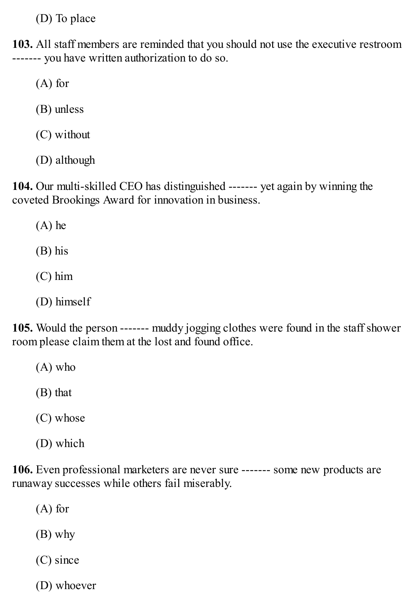


```text
(D) To place
103.
 All staff members are reminded that you should not use the executive restroom
------- you have written authorization to do so.
(A) for
(B) unless
(C) without
(D) although
104.
 Our multi-skilled CEO has distinguished ------- yet again by winning the
coveted Brookings Award for innovation in business.
(A) he
(B) his
(C) him
(D) himself
105.
 Would the person ------- muddy jogging clothes were found in the staff shower
room please claim them at the lost and found office.
(A) who
(B) that
(C) whose
(D) which
106.
 Even professional marketers are never sure ------- some new products are
runaway successes while others fail miserably.
(A) for
(B) why
(C) since
(D) whoever
920
```

## PDF 第 150 页

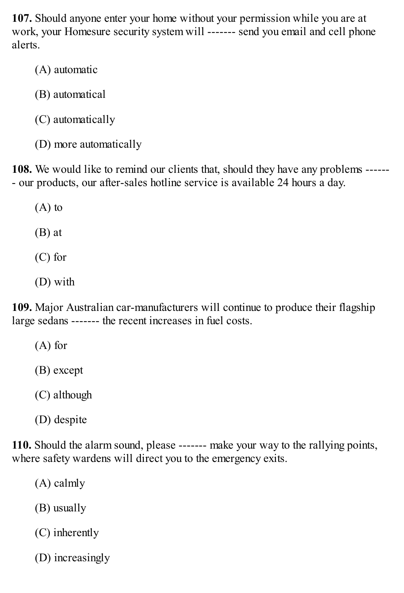


```text
107.
 Should anyone enter your home without your permission while you are at
work, your Homesure security system will ------- send you email and cell phone
alerts.
(A) automatic
(B) automatical
(C) automatically
(D) more automatically
108.
 We would like to remind our clients that, should they have any problems ------
- our products, our after-sales hotline service is available 24 hours a day.
(A) to
(B) at
(C) for
(D) with
109.
 Major Australian car-manufacturers will continue to produce their flagship
large sedans ------- the recent increases in fuel costs.
(A) for
(B) except
(C) although
(D) despite
110.
 Should the alarm sound, please ------- make your way to the rallying points,
where safety wardens will direct you to the emergency exits.
(A) calmly
(B) usually
(C) inherently
(D) increasingly
921
```

## PDF 第 151 页

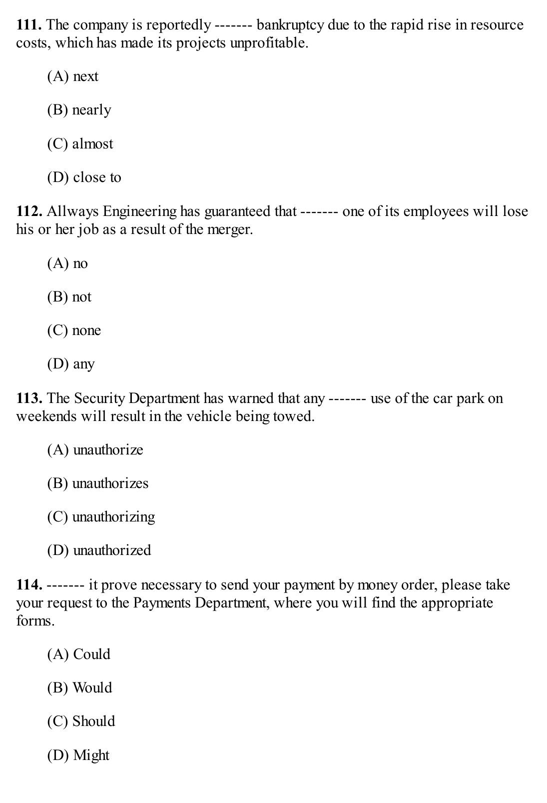


```text
111.
 The company is reportedly ------- bankruptcy due to the rapid rise in resource
costs, which has made its projects unprofitable.
(A) next
(B) nearly
(C) almost
(D) close to
112.
 Allways Engineering has guaranteed that ------- one of its employees will lose
his or her job as a result of the merger.
(A) no
(B) not
(C) none
(D) any
113.
 The Security Department has warned that any ------- use of the car park on
weekends will result in the vehicle being towed.
(A) unauthorize
(B) unauthorizes
(C) unauthorizing
(D) unauthorized
114.
 ------- it prove necessary to send your payment by money order, please take
your request to the Payments Department, where you will find the appropriate
forms.
(A) Could
(B) Would
(C) Should
(D) Might
922
```

## PDF 第 152 页

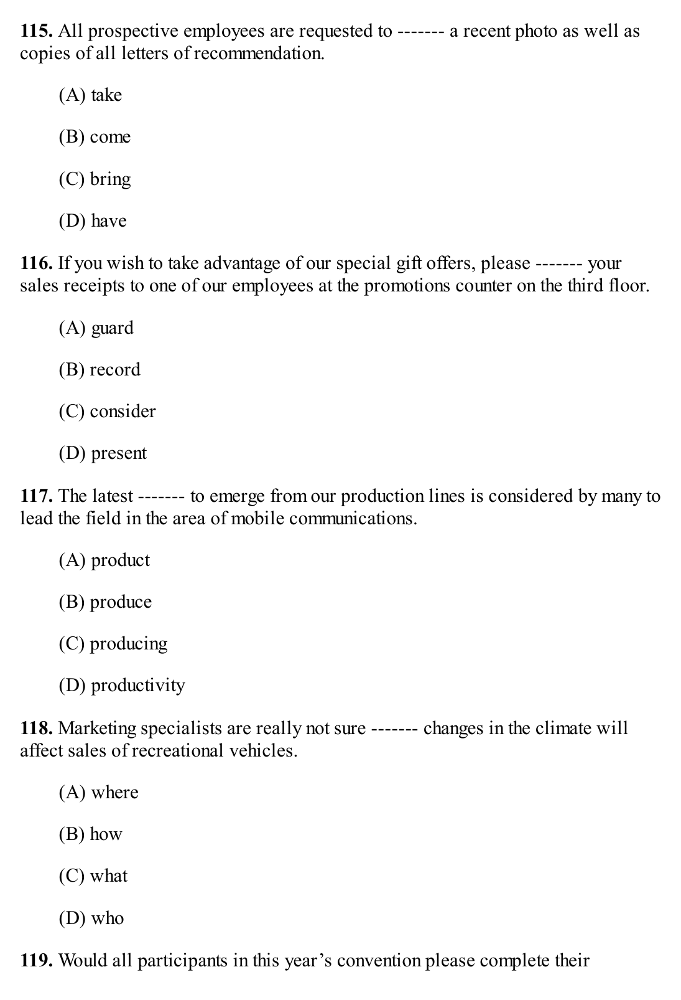


```text
115.
 All prospective employees are requested to ------- a recent photo as well as
copies of all letters of recommendation.
(A) take
(B) come
(C) bring
(D) have
116.
 If you wish to take advantage of our special gift offers, please ------- your
sales receipts to one of our employees at the promotions counter on the third floor.
(A) guard
(B) record
(C) consider
(D) present
117.
 The latest ------- to emerge from our production lines is considered by many to
lead the field in the area of mobile communications.
(A) product
(B) produce
(C) producing
(D) productivity
118.
 Marketing specialists are really not sure ------- changes in the climate will
affect sales of recreational vehicles.
(A) where
(B) how
(C) what
(D) who
119.
 Would all participants in this year’s convention please complete their
923
```

## PDF 第 153 页

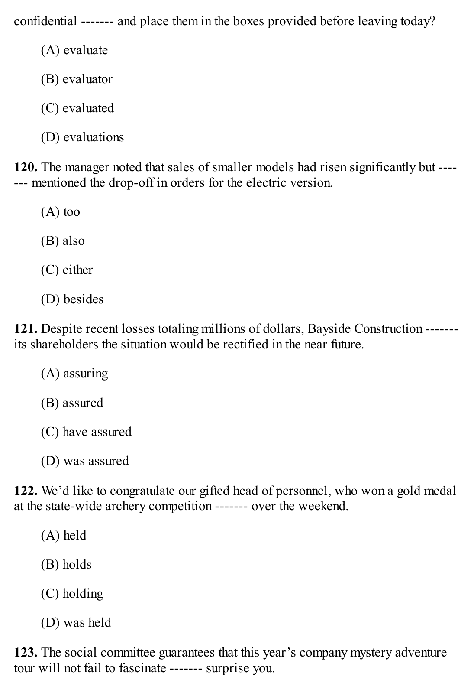


```text
confidential ------- and place them in the boxes provided before leaving today?
(A) evaluate
(B) evaluator
(C) evaluated
(D) evaluations
120.
 The manager noted that sales of smaller models had risen significantly but ----
--- mentioned the drop-off in orders for the electric version.
(A) too
(B) also
(C) either
(D) besides
121.
 Despite recent losses totaling millions of dollars, Bayside Construction -------
its shareholders the situation would be rectified in the near future.
(A) assuring
(B) assured
(C) have assured
(D) was assured
122.
 We’d like to congratulate our gifted head of personnel, who won a gold medal
at the state-wide archery competition ------- over the weekend.
(A) held
(B) holds
(C) holding
(D) was held
123.
 The social committee guarantees that this year’s company mystery adventure
tour will not fail to fascinate ------- surprise you.
924
```

## PDF 第 154 页

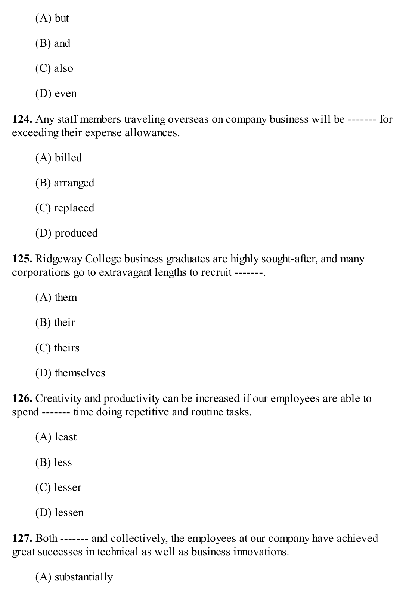


```text
(A) but
(B) and
(C) also
(D) even
124.
 Any staff members traveling overseas on company business will be ------- for
exceeding their expense allowances.
(A) billed
(B) arranged
(C) replaced
(D) produced
125.
 Ridgeway College business graduates are highly sought-after, and many
corporations go to extravagant lengths to recruit -------.
(A) them
(B) their
(C) theirs
(D) themselves
126.
 Creativity and productivity can be increased if our employees are able to
spend ------- time doing repetitive and routine tasks.
(A) least
(B) less
(C) lesser
(D) lessen
127.
 Both ------- and collectively, the employees at our company have achieved
great successes in technical as well as business innovations.
(A) substantially
925
```

## PDF 第 155 页

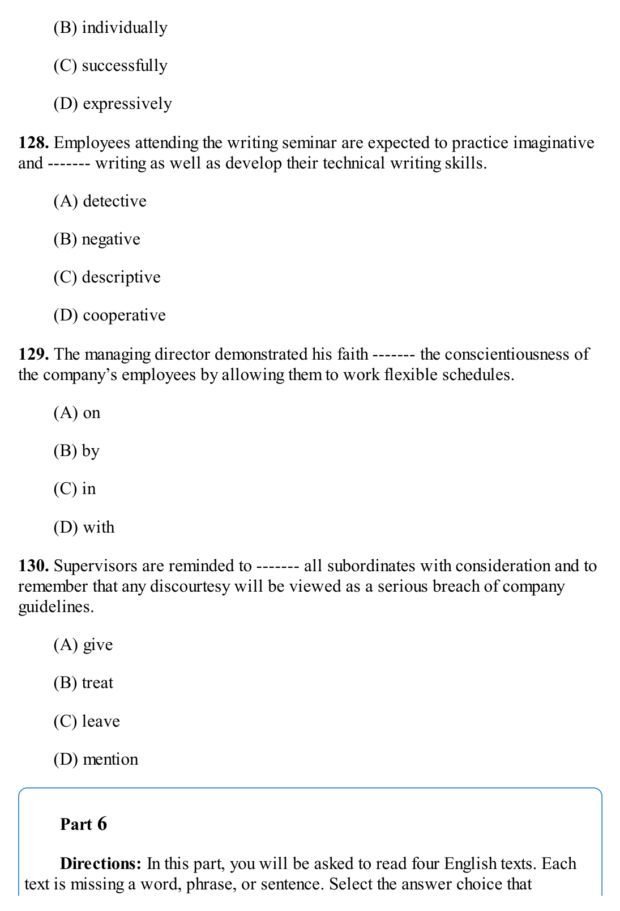


```text
(B) individually
(C) successfully
(D) expressively
128.
 Employees attending the writing seminar are expected to practice imaginative
and ------- writing as well as develop their technical writing skills.
(A) detective
(B) negative
(C) descriptive
(D) cooperative
129.
 The managing director demonstrated his faith ------- the conscientiousness of
the company’s employees by allowing them to work flexible schedules.
(A) on
(B) by
(C) in
(D) with
130.
 Supervisors are reminded to ------- all subordinates with consideration and to
remember that any discourtesy will be viewed as a serious breach of company
guidelines.
(A) give
(B) treat
(C) leave
(D) mention
Part
6
Directions:
 In this part, you will be asked to read four English texts. Each
text is missing a word, phrase, or sentence. Select the answer choice that
926
```

## PDF 第 156 页

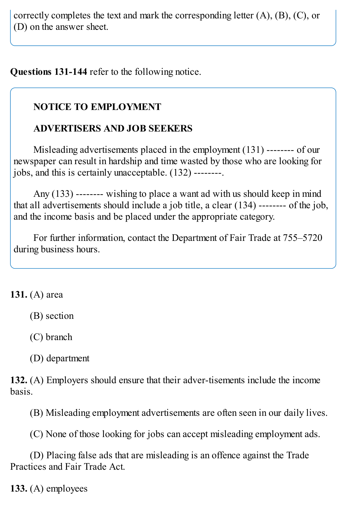


```text
correctly completes the text and mark the corresponding letter (A), (B), (C), or
(D) on the answer sheet.
Questions 131-144
 refer to the following notice.
NOTICE TO EMPLOYMENT
ADVERTISERS AND JOB SEEKERS
Misleading advertisements placed in the employment (131) -------- of our
newspaper can result in hardship and time wasted by those who are looking for
jobs, and this is certainly unacceptable. (132) --------.
Any (133) -------- wishing to place a want ad with us should keep in mind
that all advertisements should include a job title, a clear (134) -------- of the job,
and the income basis and be placed under the appropriate category.
For further information, contact the Department of Fair Trade at 755–5720
during business hours.
131.
 (A) area
(B) section
(C) branch
(D) department
132.
 (A) Employers should ensure that their adver-tisements include the income
basis.
(B) Misleading employment advertisements are often seen in our daily lives.
(C) None of those looking for jobs can accept misleading employment ads.
(D) Placing false ads that are misleading is an offence against the Trade
Practices and Fair Trade Act.
133.
 (A) employees
927
```

## PDF 第 157 页

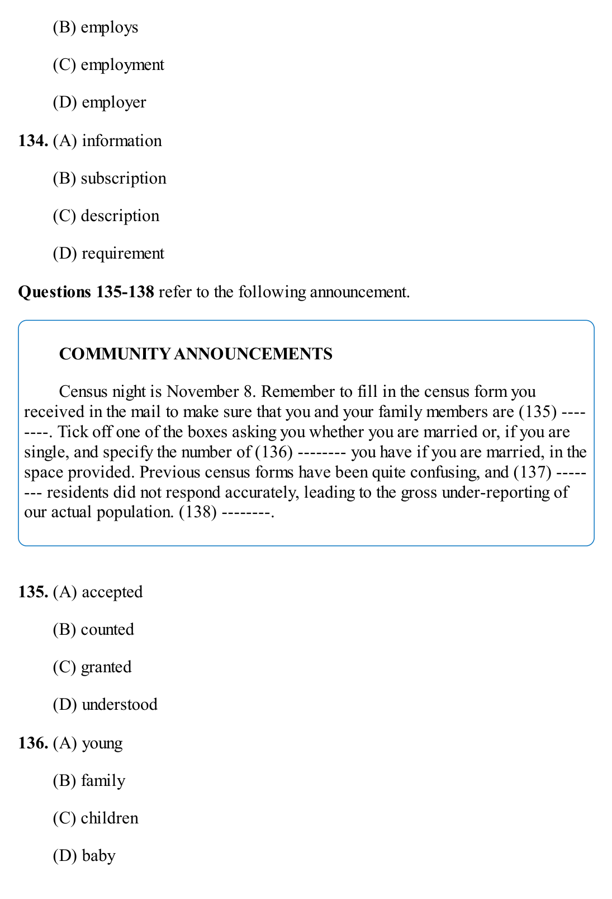


```text
(B) employs
(C) employment
(D) employer
134.
 (A) information
(B) subscription
(C) description
(D) requirement
Questions 135-138
 refer to the following announcement.
COMMUNITY ANNOUNCEMENTS
Census night is November 8. Remember to fill in the census form you
received in the mail to make sure that you and your family members are (135) ----
----. Tick off one of the boxes asking you whether you are married or, if you are
single, and specify the number of (136) -------- you have if you are married, in the
space provided. Previous census forms have been quite confusing, and (137) -----
--- residents did not respond accurately, leading to the gross under-reporting of
our actual population. (138) --------.
135.
 (A) accepted
(B) counted
(C) granted
(D) understood
136.
 (A) young
(B) family
(C) children
(D) baby
928
```

## PDF 第 158 页

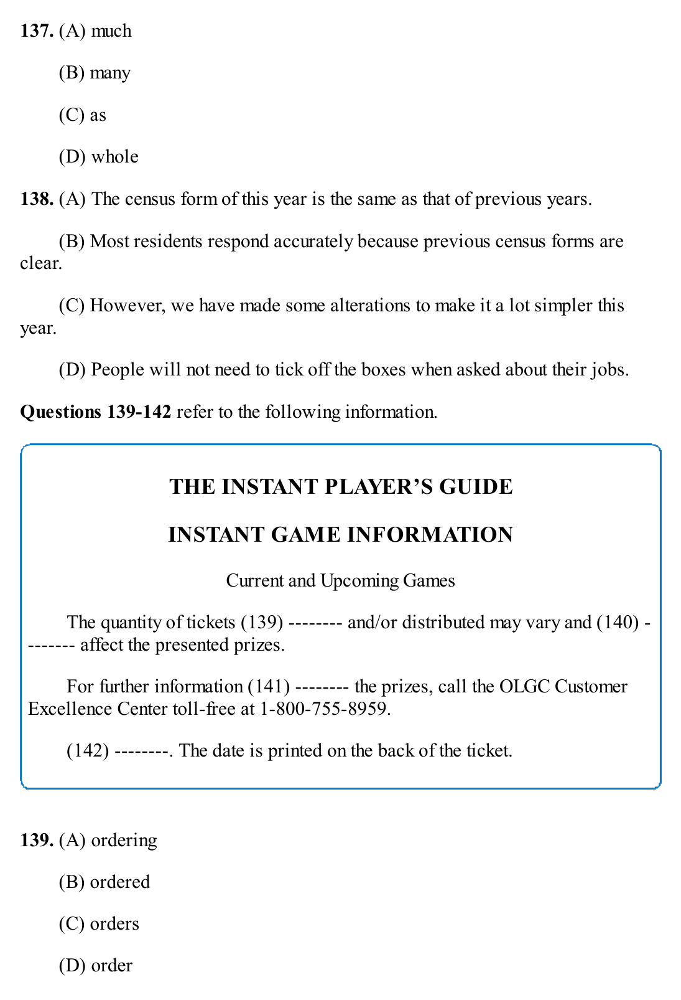


```text
137.
 (A) much
(B) many
(C) as
(D) whole
138.
 (A) The census form of this year is the same as that of previous years.
(B) Most residents respond accurately because previous census forms are
clear.
(C) However, we have made some alterations to make it a lot simpler this
year.
(D) People will not need to tick off the boxes when asked about their jobs.
Questions 139-142
 refer to the following information.
THE INSTANT PLAYER’S GUIDE
INSTANT GAME INFORMATION
Current and Upcoming Games
The quantity of tickets (139) -------- and/or distributed may vary and (140) -
------- affect the presented prizes.
For further information (141) -------- the prizes, call the OLGC Customer
Excellence Center toll-free at 1-800-755-8959.
(142) --------. The date is printed on the back of the ticket.
139.
 (A) ordering
(B) ordered
(C) orders
(D) order
929
```

## PDF 第 159 页

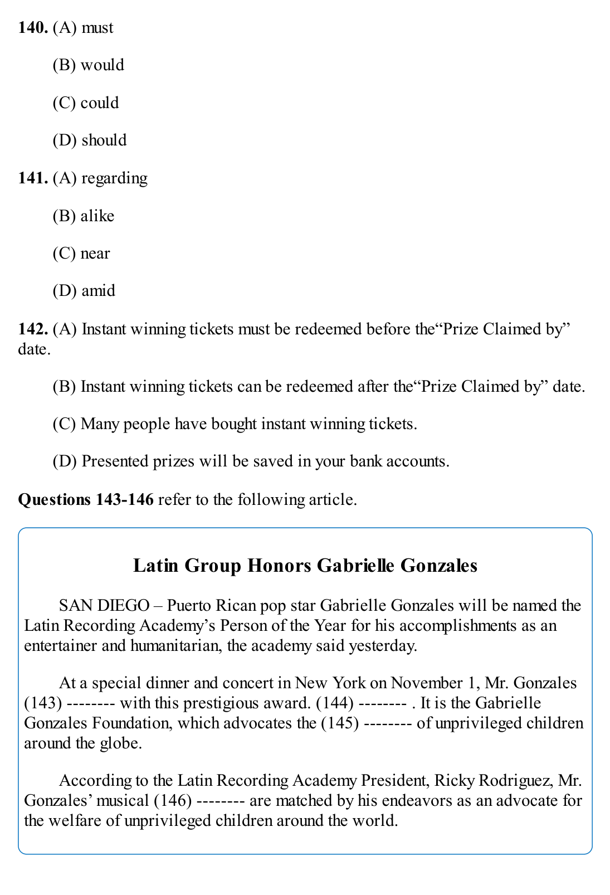


```text
140.
 (A) must
(B) would
(C) could
(D) should
141.
 (A) regarding
(B) alike
(C) near
(D) amid
142.
 (A) Instant winning tickets must be redeemed before the“Prize Claimed by”
date.
(B) Instant winning tickets can be redeemed after the“Prize Claimed by” date.
(C) Many people have bought instant winning tickets.
(D) Presented prizes will be saved in your bank accounts.
Questions 143-146
 refer to the following article.
Latin Group Honors Gabrielle Gonzales
SAN DIEGO – Puerto Rican pop star Gabrielle Gonzales will be named the
Latin Recording Academy’s Person of the Year for his accomplishments as an
entertainer and humanitarian, the academy said yesterday.
At a special dinner and concert in New York on November 1, Mr. Gonzales
(143) -------- with this prestigious award. (144) -------- . It is the Gabrielle
Gonzales Foundation, which advocates the (145) -------- of unprivileged children
around the globe.
According to the Latin Recording Academy President, Ricky Rodriguez, Mr.
Gonzales’ musical (146) -------- are matched by his endeavors as an advocate for
the welfare of unprivileged children around the world.
930
```

## PDF 第 160 页

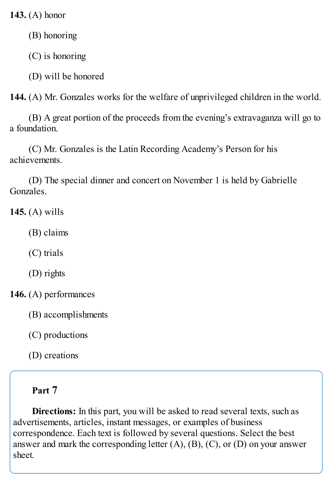


```text
143.
 (A) honor
(B) honoring
(C) is honoring
(D) will be honored
144.
 (A) Mr. Gonzales works for the welfare of unprivileged children in the world.
(B) A great portion of the proceeds from the evening’s extravaganza will go to
a foundation.
(C) Mr. Gonzales is the Latin Recording Academy’s Person for his
achievements.
(D) The special dinner and concert on November 1 is held by Gabrielle
Gonzales.
145.
 (A) wills
(B) claims
(C) trials
(D) rights
146.
 (A) performances
(B) accomplishments
(C) productions
(D) creations
Part
7
Directions:
 In this part, you will be asked to read several texts, such as
advertisements, articles, instant messages, or examples of business
correspondence. Each text is followed by several questions. Select the best
answer and mark the corresponding letter (A), (B), (C), or (D) on your answer
sheet.
931
```

## PDF 第 161 页

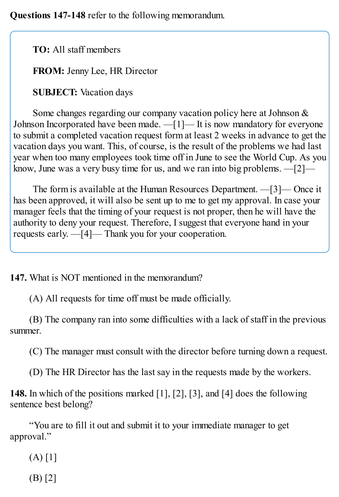


```text
Questions 147-148
 refer to the following memorandum.
TO:
 All staff members
FROM:
 Jenny Lee, HR Director
SUBJECT:
 Vacation days
Some changes regarding our company vacation policy here at Johnson &
Johnson Incorporated have been made. —[1]— It is now mandatory for everyone
to submit a completed vacation request form at least 2 weeks in advance to get the
vacation days you want. This, of course, is the result of the problems we had last
year when too many employees took time off in June to see the World Cup. As you
know, June was a very busy time for us, and we ran into big problems. —[2]—
The form is available at the Human Resources Department. —[3]— Once it
has been approved, it will also be sent up to me to get my approval. In case your
manager feels that the timing of your request is not proper, then he will have the
authority to deny your request. Therefore, I suggest that everyone hand in your
requests early. —[4]— Thank you for your cooperation.
147.
 What is NOT mentioned in the memorandum?
(A) All requests for time off must be made officially.
(B) The company ran into some difficulties with a lack of staff in the previous
summer.
(C) The manager must consult with the director before turning down a request.
(D) The HR Director has the last say in the requests made by the workers.
148.
 In which of the positions marked [1], [2], [3], and [4] does the following
sentence best belong?
“You are to fill it out and submit it to your immediate manager to get
approval.”
(A) [1]
(B) [2]
932
```

## PDF 第 162 页

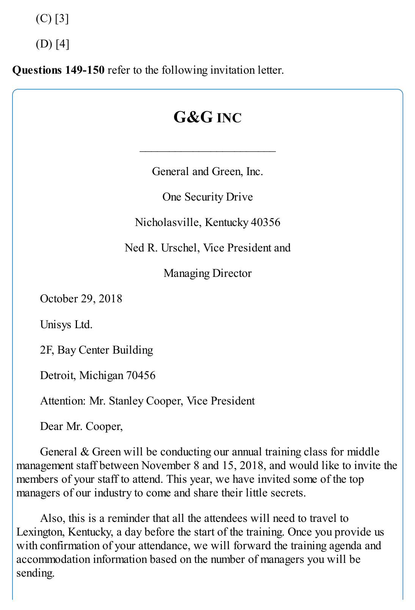


```text
(C) [3]
(D) [4]
Questions 149-150
 refer to the following invitation letter.
G&G
 INC
_______________________
General and Green, Inc.
One Security Drive
Nicholasville, Kentucky 40356
Ned R. Urschel, Vice President and
Managing Director
October 29, 2018
Unisys Ltd.
2F, Bay Center Building
Detroit, Michigan 70456
Attention: Mr. Stanley Cooper, Vice President
Dear Mr. Cooper,
General & Green will be conducting our annual training class for middle
management staff between November 8 and 15, 2018, and would like to invite the
members of your staff to attend. This year, we have invited some of the top
managers of our industry to come and share their little secrets.
Also, this is a reminder that all the attendees will need to travel to
Lexington, Kentucky, a day before the start of the training. Once you provide us
with confirmation of your attendance, we will forward the training agenda and
accommodation information based on the number of managers you will be
sending.
933
```

## PDF 第 163 页

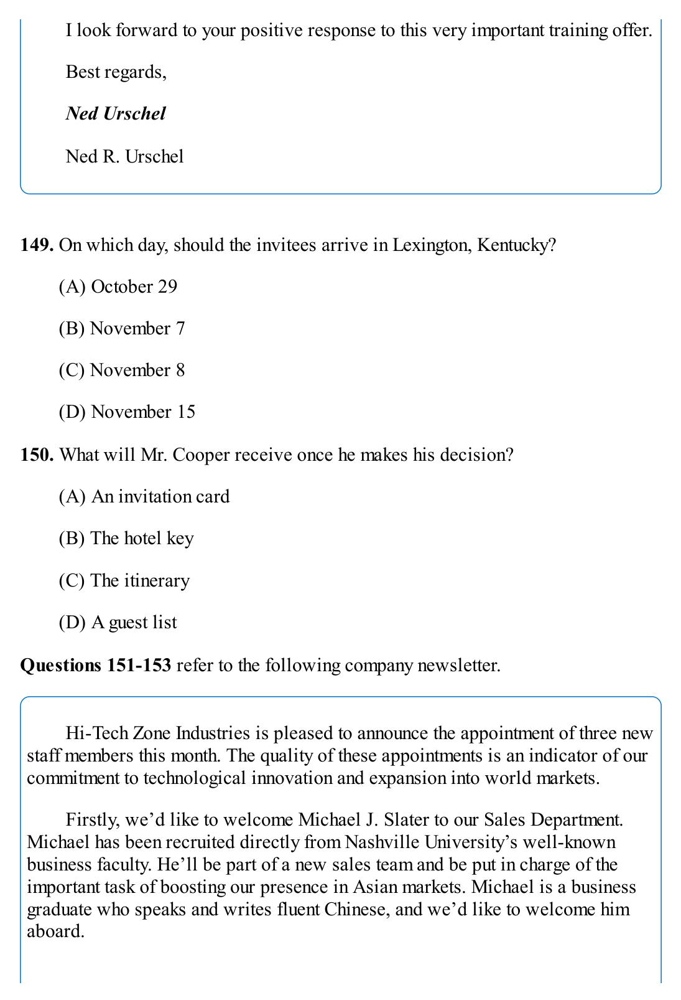


```text
I look forward to your positive response to this very important training offer.
Best regards,
Ned Urschel
Ned R. Urschel
149.
 On which day, should the invitees arrive in Lexington, Kentucky?
(A) October 29
(B) November 7
(C) November 8
(D) November 15
150.
 What will Mr. Cooper receive once he makes his decision?
(A) An invitation card
(B) The hotel key
(C) The itinerary
(D) A guest list
Questions 151-153
 refer to the following company newsletter.
Hi-Tech Zone Industries is pleased to announce the appointment of three new
staff members this month. The quality of these appointments is an indicator of our
commitment to technological innovation and expansion into world markets.
Firstly, we’d like to welcome Michael J. Slater to our Sales Department.
Michael has been recruited directly from Nashville University’s well-known
business faculty. He’ll be part of a new sales team and be put in charge of the
important task of boosting our presence in Asian markets. Michael is a business
graduate who speaks and writes fluent Chinese, and we’d like to welcome him
aboard.
934
```

## PDF 第 164 页

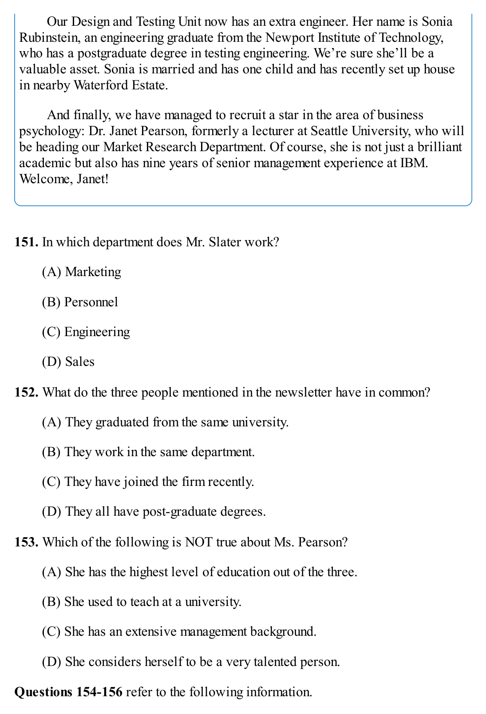


```text
Our Design and Testing Unit now has an extra engineer. Her name is Sonia
Rubinstein, an engineering graduate from the Newport Institute of Technology,
who has a postgraduate degree in testing engineering. We’re sure she’ll be a
valuable asset. Sonia is married and has one child and has recently set up house
in nearby Waterford Estate.
And finally, we have managed to recruit a star in the area of business
psychology: Dr. Janet Pearson, formerly a lecturer at Seattle University, who will
be heading our Market Research Department. Of course, she is not just a brilliant
academic but also has nine years of senior management experience at IBM.
Welcome, Janet!
151.
 In which department does Mr. Slater work?
(A) Marketing
(B) Personnel
(C) Engineering
(D) Sales
152.
 What do the three people mentioned in the newsletter have in common?
(A) They graduated from the same university.
(B) They work in the same department.
(C) They have joined the firm recently.
(D) They all have post-graduate degrees.
153.
 Which of the following is NOT true about Ms. Pearson?
(A) She has the highest level of education out of the three.
(B) She used to teach at a university.
(C) She has an extensive management background.
(D) She considers herself to be a very talented person.
Questions 154-156
 refer to the following information.
935
```

## PDF 第 165 页

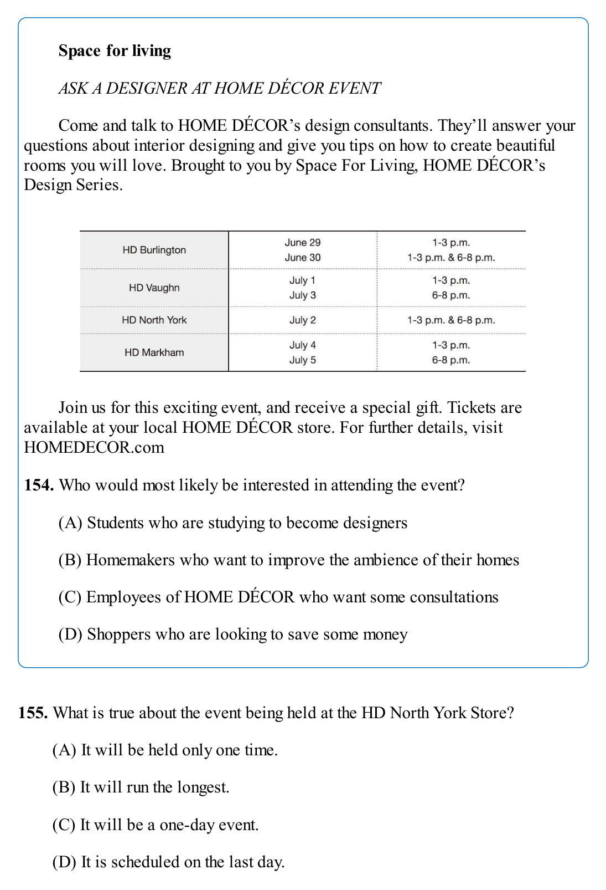


```text
Space for living
ASK A DESIGNER AT HOME DÉCOR EVENT
Come and talk to HOME DÉCOR’s design consultants. They’ll answer your
questions about interior designing and give you tips on how to create beautiful
rooms you will love. Brought to you by Space For Living, HOME DÉCOR’s
Design Series.
Join us for this exciting event, and receive a special gift. Tickets are
available at your local HOME DÉCOR store. For further details, visit
HOMEDECOR.com
154.
 Who would most likely be interested in attending the event?
(A) Students who are studying to become designers
(B) Homemakers who want to improve the ambience of their homes
(C) Employees of HOME DÉCOR who want some consultations
(D) Shoppers who are looking to save some money
155.
 What is true about the event being held at the HD North York Store?
(A) It will be held only one time.
(B) It will run the longest.
(C) It will be a one-day event.
(D) It is scheduled on the last day.
936
```

## PDF 第 166 页

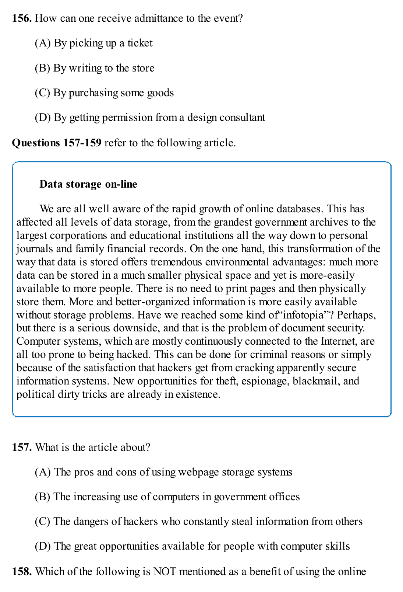


```text
156.
 How can one receive admittance to the event?
(A) By picking up a ticket
(B) By writing to the store
(C) By purchasing some goods
(D) By getting permission from a design consultant
Questions 157-159
 refer to the following article.
Data storage on-line
We are all well aware of the rapid growth of online databases. This has
affected all levels of data storage, from the grandest government archives to the
largest corporations and educational institutions all the way down to personal
journals and family financial records. On the one hand, this transformation of the
way that data is stored offers tremendous environmental advantages: much more
data can be stored in a much smaller physical space and yet is more-easily
available to more people. There is no need to print pages and then physically
store them. More and better-organized information is more easily available
without storage problems. Have we reached some kind of“infotopia”? Perhaps,
but there is a serious downside, and that is the problem of document security.
Computer systems, which are mostly continuously connected to the Internet, are
all too prone to being hacked. This can be done for criminal reasons or simply
because of the satisfaction that hackers get from cracking apparently secure
information systems. New opportunities for theft, espionage, blackmail, and
political dirty tricks are already in existence.
157.
 What is the article about?
(A) The pros and cons of using webpage storage systems
(B) The increasing use of computers in government offices
(C) The dangers of hackers who constantly steal information from others
(D) The great opportunities available for people with computer skills
158.
 Which of the following is NOT mentioned as a benefit of using the online
937
```

## PDF 第 167 页

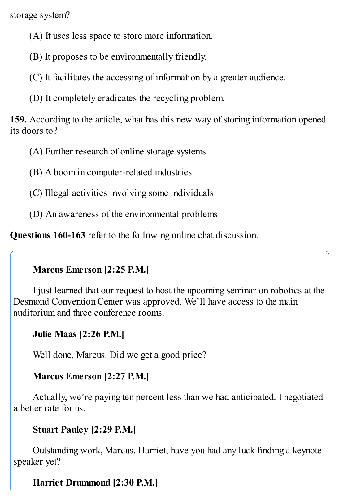


```text
storage system?
(A) It uses less space to store more information.
(B) It proposes to be environmentally friendly.
(C) It facilitates the accessing of information by a greater audience.
(D) It completely eradicates the recycling problem.
159.
 According to the article, what has this new way of storing information opened
its doors to?
(A) Further research of online storage systems
(B) A boom in computer-related industries
(C) Illegal activities involving some individuals
(D) An awareness of the environmental problems
Questions 160-163
 refer to the following online chat discussion.
Marcus Emerson [2:25 P.M.]
I just learned that our request to host the upcoming seminar on robotics at the
Desmond Convention Center was approved. We’ll have access to the main
auditorium and three conference rooms.
Julie Maas [2:26 P.M.]
Well done, Marcus. Did we get a good price?
Marcus Emerson [2:27 P.M.]
Actually, we’re paying ten percent less than we had anticipated. I negotiated
a better rate for us.
Stuart Pauley [2:29 P.M.]
Outstanding work, Marcus. Harriet, have you had any luck finding a keynote
speaker yet?
Harriet Drummond [2:30 P.M.]
938
```

## PDF 第 168 页

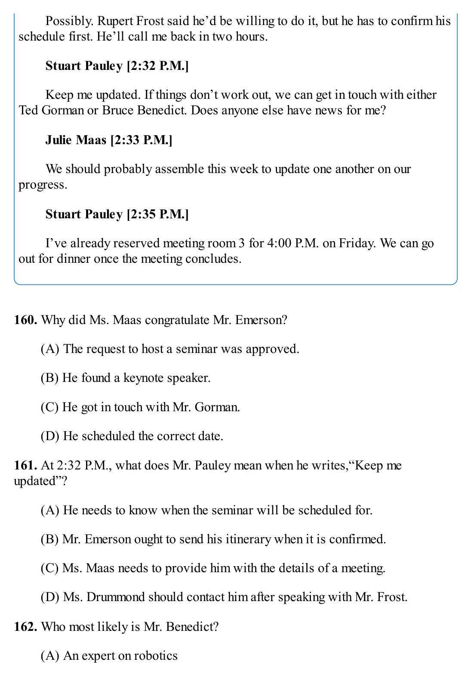


```text
Possibly. Rupert Frost said he’d be willing to do it, but he has to confirm his
schedule first. He’ll call me back in two hours.
Stuart Pauley [2:32 P.M.]
Keep me updated. If things don’t work out, we can get in touch with either
Ted Gorman or Bruce Benedict. Does anyone else have news for me?
Julie Maas [2:33 P.M.]
We should probably assemble this week to update one another on our
progress.
Stuart Pauley [2:35 P.M.]
I’ve already reserved meeting room 3 for 4:00 P.M. on Friday. We can go
out for dinner once the meeting concludes.
160.
 Why did Ms. Maas congratulate Mr. Emerson?
(A) The request to host a seminar was approved.
(B) He found a keynote speaker.
(C) He got in touch with Mr. Gorman.
(D) He scheduled the correct date.
161.
 At 2:32 P.M., what does Mr. Pauley mean when he writes,“Keep me
updated”?
(A) He needs to know when the seminar will be scheduled for.
(B) Mr. Emerson ought to send his itinerary when it is confirmed.
(C) Ms. Maas needs to provide him with the details of a meeting.
(D) Ms. Drummond should contact him after speaking with Mr. Frost.
162.
 Who most likely is Mr. Benedict?
(A) An expert on robotics
939
```

## PDF 第 169 页

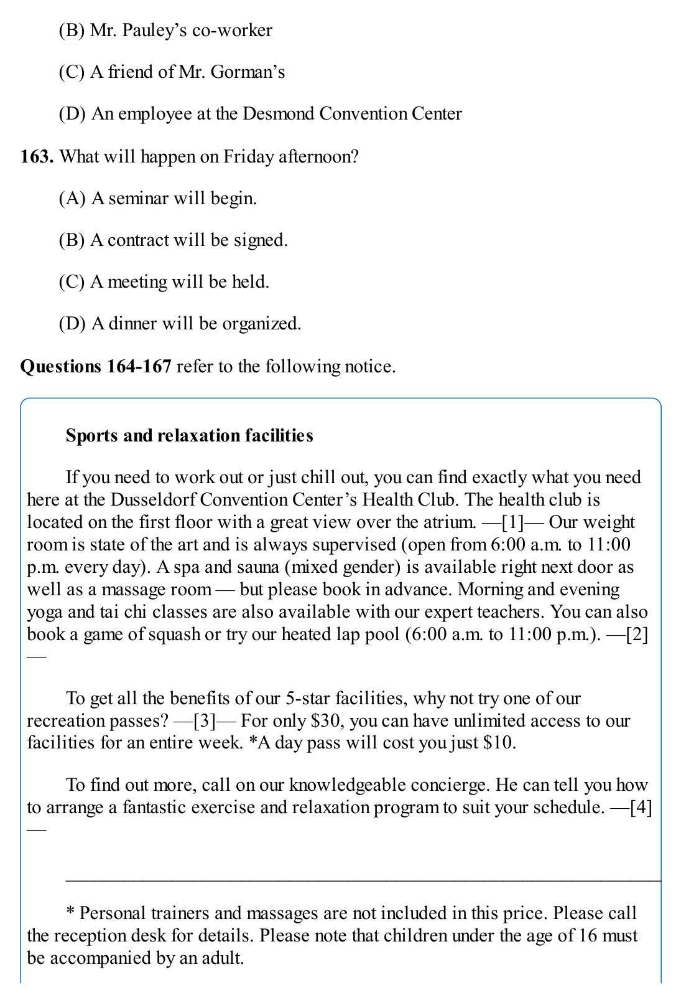


```text
(B) Mr. Pauley’s co-worker
(C) A friend of Mr. Gorman’s
(D) An employee at the Desmond Convention Center
163.
 What will happen on Friday afternoon?
(A) A seminar will begin.
(B) A contract will be signed.
(C) A meeting will be held.
(D) A dinner will be organized.
Questions 164-167
 refer to the following notice.
Sports and relaxation facilities
If you need to work out or just chill out, you can find exactly what you need
here at the Dusseldorf Convention Center’s Health Club. The health club is
located on the first floor with a great view over the atrium. —[1]— Our weight
room is state of the art and is always supervised (open from 6:00 a.m. to 11:00
p.m. every day). A spa and sauna (mixed gender) is available right next door as
well as a massage room — but please book in advance. Morning and evening
yoga and tai chi classes are also available with our expert teachers. You can also
book a game of squash or try our heated lap pool (6:00 a.m. to 11:00 p.m.). —[2]
—
To get all the benefits of our 5-star facilities, why not try one of our
recreation passes? —[3]— For only $30, you can have unlimited access to our
facilities for an entire week. *A day pass will cost you just $10.
To find out more, call on our knowledgeable concierge. He can tell you how
to arrange a fantastic exercise and relaxation program to suit your schedule. —[4]
—
_____________________________________________________________________
* Personal trainers and massages are not included in this price. Please call
the reception desk for details. Please note that children under the age of 16 must
be accompanied by an adult.
940
```

## PDF 第 170 页

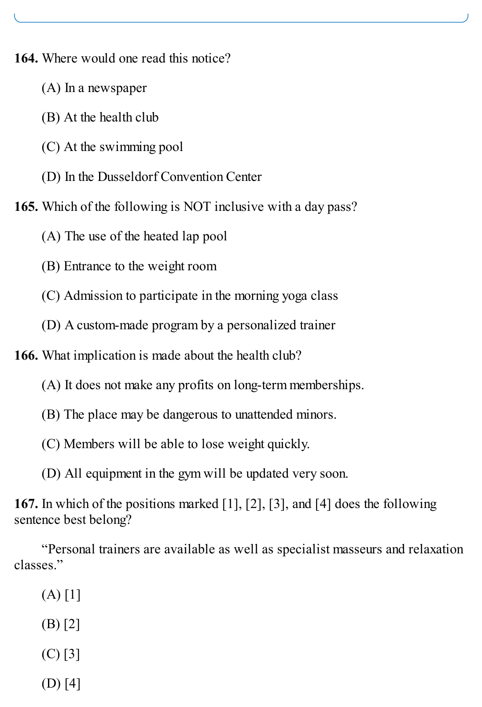


```text
164.
 Where would one read this notice?
(A) In a newspaper
(B) At the health club
(C) At the swimming pool
(D) In the Dusseldorf Convention Center
165.
 Which of the following is NOT inclusive with a day pass?
(A) The use of the heated lap pool
(B) Entrance to the weight room
(C) Admission to participate in the morning yoga class
(D) A custom-made program by a personalized trainer
166.
 What implication is made about the health club?
(A) It does not make any profits on long-term memberships.
(B) The place may be dangerous to unattended minors.
(C) Members will be able to lose weight quickly.
(D) All equipment in the gym will be updated very soon.
167.
 In which of the positions marked [1], [2], [3], and [4] does the following
sentence best belong?
“Personal trainers are available as well as specialist masseurs and relaxation
classes.”
(A) [1]
(B) [2]
(C) [3]
(D) [4]
941
```

## PDF 第 171 页

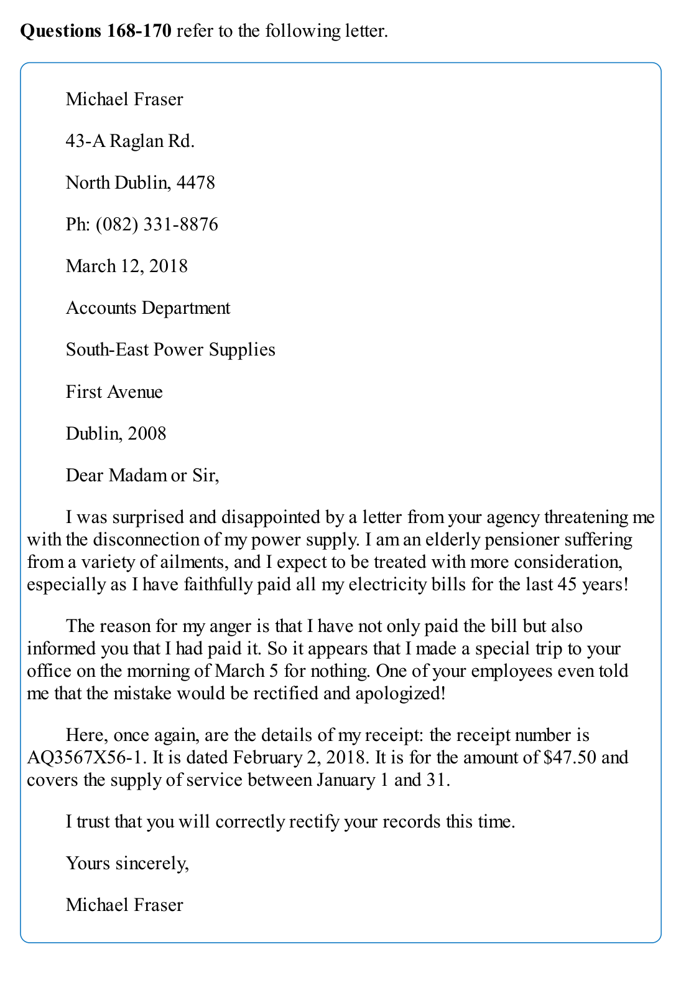


```text
Questions 168-170
 refer to the following letter.
Michael Fraser
43-A Raglan Rd.
North Dublin, 4478
Ph: (082) 331-8876
March 12, 2018
Accounts Department
South-East Power Supplies
First Avenue
Dublin, 2008
Dear Madam or Sir,
I was surprised and disappointed by a letter from your agency threatening me
with the disconnection of my power supply. I am an elderly pensioner suffering
from a variety of ailments, and I expect to be treated with more consideration,
especially as I have faithfully paid all my electricity bills for the last 45 years!
The reason for my anger is that I have not only paid the bill but also
informed you that I had paid it. So it appears that I made a special trip to your
office on the morning of March 5 for nothing. One of your employees even told
me that the mistake would be rectified and apologized!
Here, once again, are the details of my receipt: the receipt number is
AQ3567X56-1. It is dated February 2, 2018. It is for the amount of $47.50 and
covers the supply of service between January 1 and 31.
I trust that you will correctly rectify your records this time.
Yours sincerely,
Michael Fraser
942
```

## PDF 第 172 页

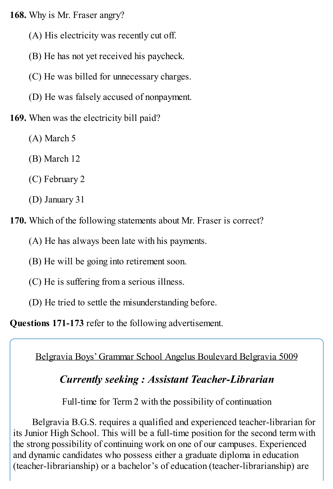


```text
168.
 Why is Mr. Fraser angry?
(A) His electricity was recently cut off.
(B) He has not yet received his paycheck.
(C) He was billed for unnecessary charges.
(D) He was falsely accused of nonpayment.
169.
 When was the electricity bill paid?
(A) March 5
(B) March 12
(C) February 2
(D) January 31
170.
 Which of the following statements about Mr. Fraser is correct?
(A) He has always been late with his payments.
(B) He will be going into retirement soon.
(C) He is suffering from a serious illness.
(D) He tried to settle the misunderstanding before.
Questions 171-173
 refer to the following advertisement.
Belgravia Boys’ Grammar School Angelus Boulevard Belgravia 5009
Currently seeking : Assistant Teacher-Librarian
Full-time for Term 2 with the possibility of continuation
Belgravia B.G.S. requires a qualified and experienced teacher-librarian for
its Junior High School. This will be a full-time position for the second term with
the strong possibility of continuing work on one of our campuses. Experienced
and dynamic candidates who possess either a graduate diploma in education
(teacher-librarianship) or a bachelor’s of education (teacher-librarianship) are
943
```

## PDF 第 173 页

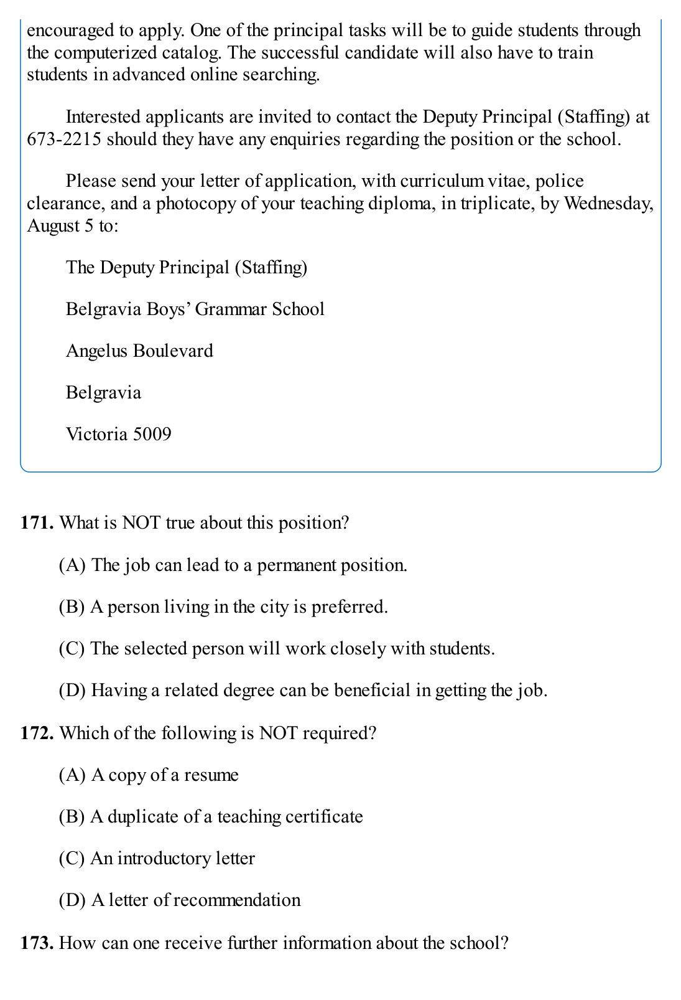


```text
encouraged to apply. One of the principal tasks will be to guide students through
the computerized catalog. The successful candidate will also have to train
students in advanced online searching.
Interested applicants are invited to contact the Deputy Principal (Staffing) at
673-2215 should they have any enquiries regarding the position or the school.
Please send your letter of application, with curriculum vitae, police
clearance, and a photocopy of your teaching diploma, in triplicate, by Wednesday,
August 5 to:
The Deputy Principal (Staffing)
Belgravia Boys’ Grammar School
Angelus Boulevard
Belgravia
Victoria 5009
171.
 What is NOT true about this position?
(A) The job can lead to a permanent position.
(B) A person living in the city is preferred.
(C) The selected person will work closely with students.
(D) Having a related degree can be beneficial in getting the job.
172.
 Which of the following is NOT required?
(A) A copy of a resume
(B) A duplicate of a teaching certificate
(C) An introductory letter
(D) A letter of recommendation
173.
 How can one receive further information about the school?
944
```

## PDF 第 174 页

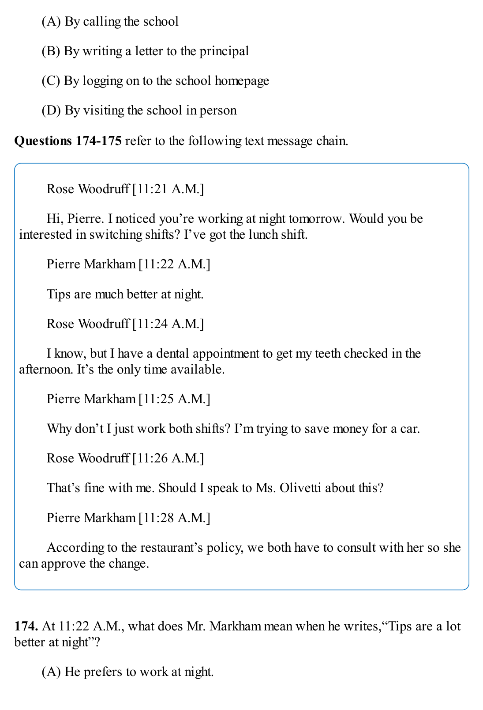


```text
(A) By calling the school
(B) By writing a letter to the principal
(C) By logging on to the school homepage
(D) By visiting the school in person
Questions 174-175
 refer to the following text message chain.
Rose Woodruff [11:21 A.M.]
Hi, Pierre. I noticed you’re working at night tomorrow. Would you be
interested in switching shifts? I’ve got the lunch shift.
Pierre Markham [11:22 A.M.]
Tips are much better at night.
Rose Woodruff [11:24 A.M.]
I know, but I have a dental appointment to get my teeth checked in the
afternoon. It’s the only time available.
Pierre Markham [11:25 A.M.]
Why don’t I just work both shifts? I’m trying to save money for a car.
Rose Woodruff [11:26 A.M.]
That’s fine with me. Should I speak to Ms. Olivetti about this?
Pierre Markham [11:28 A.M.]
According to the restaurant’s policy, we both have to consult with her so she
can approve the change.
174.
 At 11:22 A.M., what does Mr. Markham mean when he writes,“Tips are a lot
better at night”?
(A) He prefers to work at night.
945
```

## PDF 第 175 页

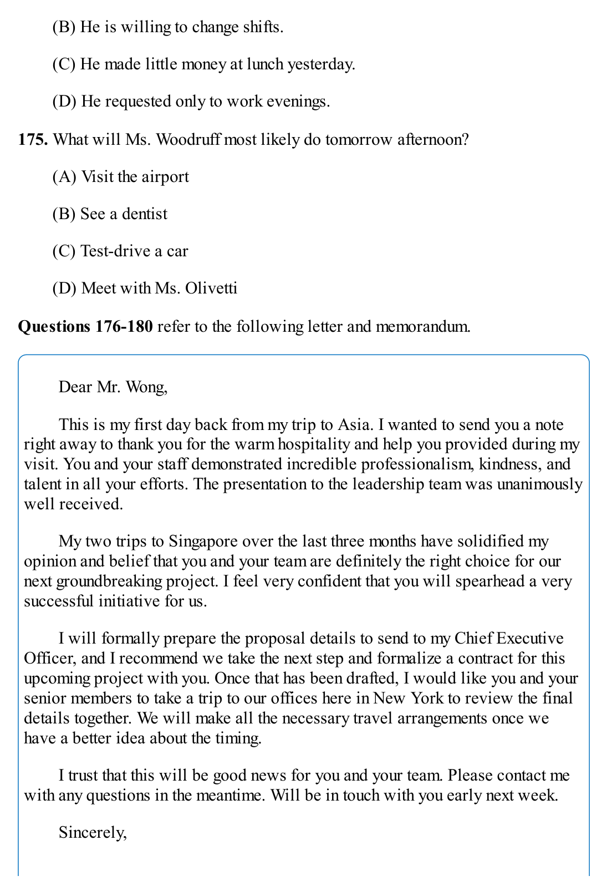


```text
(B) He is willing to change shifts.
(C) He made little money at lunch yesterday.
(D) He requested only to work evenings.
175.
 What will Ms. Woodruff most likely do tomorrow afternoon?
(A) Visit the airport
(B) See a dentist
(C) Test-drive a car
(D) Meet with Ms. Olivetti
Questions 176-180
 refer to the following letter and memorandum.
Dear Mr. Wong,
This is my first day back from my trip to Asia. I wanted to send you a note
right away to thank you for the warm hospitality and help you provided during my
visit. You and your staff demonstrated incredible professionalism, kindness, and
talent in all your efforts. The presentation to the leadership team was unanimously
well received.
My two trips to Singapore over the last three months have solidified my
opinion and belief that you and your team are definitely the right choice for our
next groundbreaking project. I feel very confident that you will spearhead a very
successful initiative for us.
I will formally prepare the proposal details to send to my Chief Executive
Officer, and I recommend we take the next step and formalize a contract for this
upcoming project with you. Once that has been drafted, I would like you and your
senior members to take a trip to our offices here in New York to review the final
details together. We will make all the necessary travel arrangements once we
have a better idea about the timing.
I trust that this will be good news for you and your team. Please contact me
with any questions in the meantime. Will be in touch with you early next week.
Sincerely,
946
```

## PDF 第 176 页

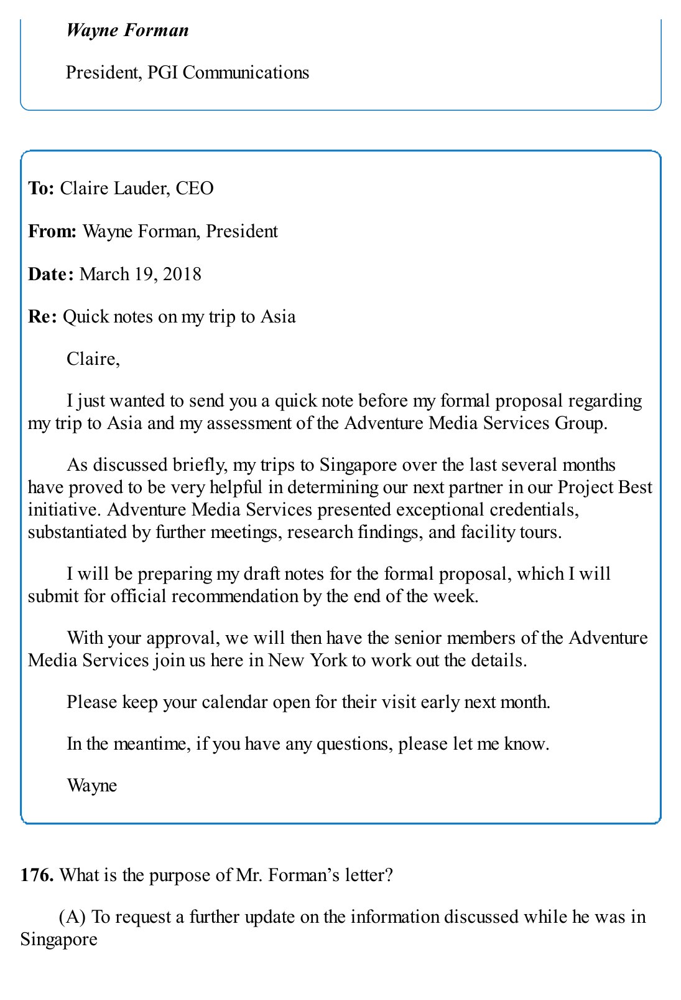


```text
Wayne Forman
President, PGI Communications
To:
 Claire Lauder, CEO
From:
 Wayne Forman, President
Date:
 March 19, 2018
Re:
 Quick notes on my trip to Asia
Claire,
I just wanted to send you a quick note before my formal proposal regarding
my trip to Asia and my assessment of the Adventure Media Services Group.
As discussed briefly, my trips to Singapore over the last several months
have proved to be very helpful in determining our next partner in our Project Best
initiative. Adventure Media Services presented exceptional credentials,
substantiated by further meetings, research findings, and facility tours.
I will be preparing my draft notes for the formal proposal, which I will
submit for official recommendation by the end of the week.
With your approval, we will then have the senior members of the Adventure
Media Services join us here in New York to work out the details.
Please keep your calendar open for their visit early next month.
In the meantime, if you have any questions, please let me know.
Wayne
176.
 What is the purpose of Mr. Forman’s letter?
(A) To request a further update on the information discussed while he was in
Singapore
947
```

## PDF 第 177 页

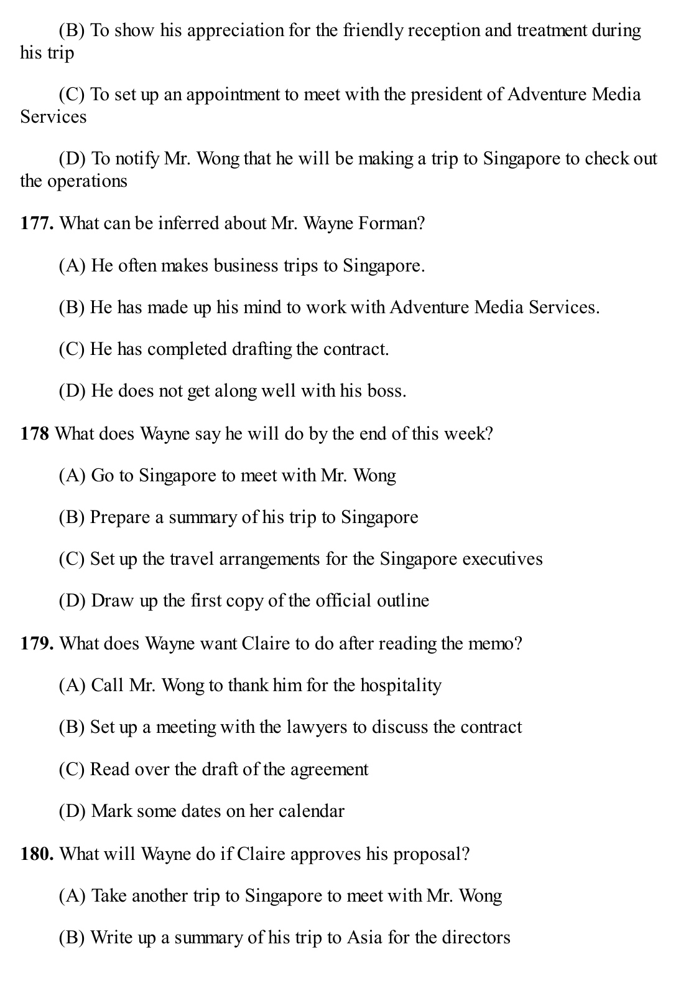


```text
(B) To show his appreciation for the friendly reception and treatment during
his trip
(C) To set up an appointment to meet with the president of Adventure Media
Services
(D) To notify Mr. Wong that he will be making a trip to Singapore to check out
the operations
177.
 What can be inferred about Mr. Wayne Forman?
(A) He often makes business trips to Singapore.
(B) He has made up his mind to work with Adventure Media Services.
(C) He has completed drafting the contract.
(D) He does not get along well with his boss.
178
 What does Wayne say he will do by the end of this week?
(A) Go to Singapore to meet with Mr. Wong
(B) Prepare a summary of his trip to Singapore
(C) Set up the travel arrangements for the Singapore executives
(D) Draw up the first copy of the official outline
179.
 What does Wayne want Claire to do after reading the memo?
(A) Call Mr. Wong to thank him for the hospitality
(B) Set up a meeting with the lawyers to discuss the contract
(C) Read over the draft of the agreement
(D) Mark some dates on her calendar
180.
 What will Wayne do if Claire approves his proposal?
(A) Take another trip to Singapore to meet with Mr. Wong
(B) Write up a summary of his trip to Asia for the directors
948
```

## PDF 第 178 页

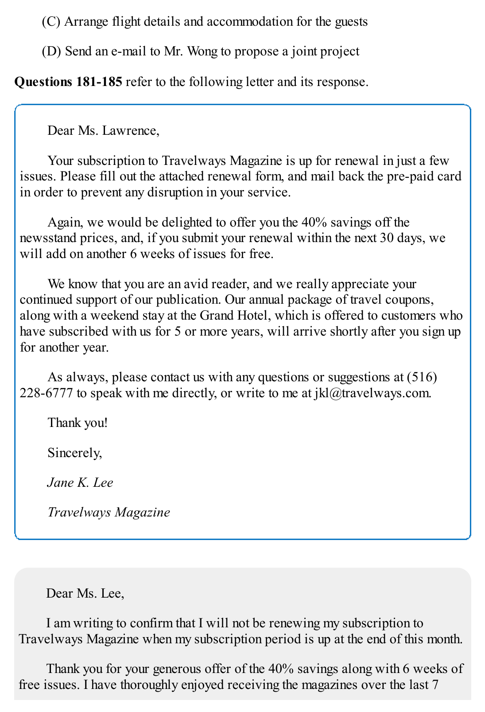


```text
(C) Arrange flight details and accommodation for the guests
(D) Send an e-mail to Mr. Wong to propose a joint project
Questions 181-185
 refer to the following letter and its response.
Dear Ms. Lawrence,
Your subscription to Travelways Magazine is up for renewal in just a few
issues. Please fill out the attached renewal form, and mail back the pre-paid card
in order to prevent any disruption in your service.
Again, we would be delighted to offer you the 40% savings off the
newsstand prices, and, if you submit your renewal within the next 30 days, we
will add on another 6 weeks of issues for free.
We know that you are an avid reader, and we really appreciate your
continued support of our publication. Our annual package of travel coupons,
along with a weekend stay at the Grand Hotel, which is offered to customers who
have subscribed with us for 5 or more years, will arrive shortly after you sign up
for another year.
As always, please contact us with any questions or suggestions at (516)
228-6777 to speak with me directly, or write to me at jkl@travelways.com.
Thank you!
Sincerely,
Jane K. Lee
Travelways Magazine
Dear Ms. Lee,
I am writing to confirm that I will not be renewing my subscription to
Travelways Magazine when my subscription period is up at the end of this month.
Thank you for your generous offer of the 40% savings along with 6 weeks of
free issues. I have thoroughly enjoyed receiving the magazines over the last 7
949
```

## PDF 第 179 页

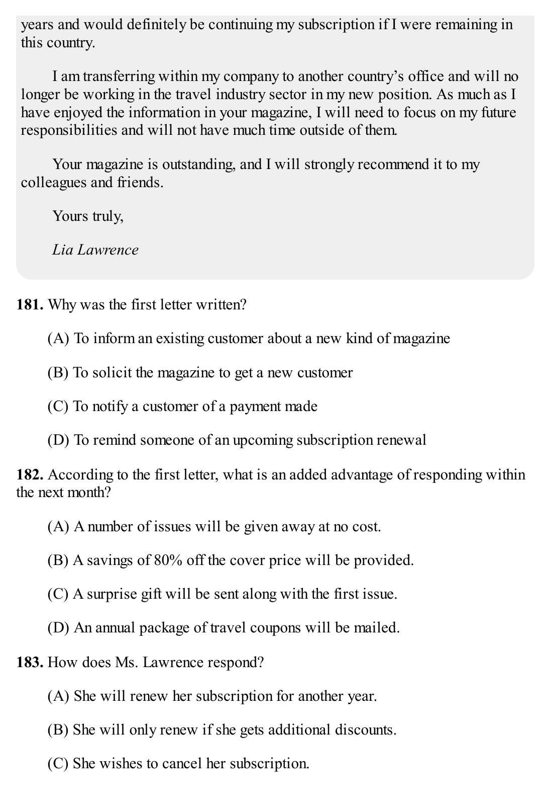


```text
years and would definitely be continuing my subscription if I were remaining in
this country.
I am transferring within my company to another country’s office and will no
longer be working in the travel industry sector in my new position. As much as I
have enjoyed the information in your magazine, I will need to focus on my future
responsibilities and will not have much time outside of them.
Your magazine is outstanding, and I will strongly recommend it to my
colleagues and friends.
Yours truly,
Lia Lawrence
181.
 Why was the first letter written?
(A) To inform an existing customer about a new kind of magazine
(B) To solicit the magazine to get a new customer
(C) To notify a customer of a payment made
(D) To remind someone of an upcoming subscription renewal
182.
 According to the first letter, what is an added advantage of responding within
the next month?
(A) A number of issues will be given away at no cost.
(B) A savings of 80% off the cover price will be provided.
(C) A surprise gift will be sent along with the first issue.
(D) An annual package of travel coupons will be mailed.
183.
 How does Ms. Lawrence respond?
(A) She will renew her subscription for another year.
(B) She will only renew if she gets additional discounts.
(C) She wishes to cancel her subscription.
950
```

## PDF 第 180 页

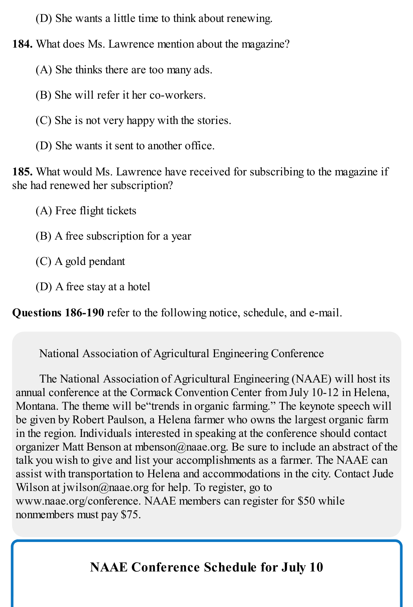


```text
(D) She wants a little time to think about renewing.
184.
 What does Ms. Lawrence mention about the magazine?
(A) She thinks there are too many ads.
(B) She will refer it her co-workers.
(C) She is not very happy with the stories.
(D) She wants it sent to another office.
185.
 What would Ms. Lawrence have received for subscribing to the magazine if
she had renewed her subscription?
(A) Free flight tickets
(B) A free subscription for a year
(C) A gold pendant
(D) A free stay at a hotel
Questions 186-190
 refer to the following notice, schedule, and e-mail.
National Association of Agricultural Engineering Conference
The National Association of Agricultural Engineering (NAAE) will host its
annual conference at the Cormack Convention Center from July 10-12 in Helena,
Montana. The theme will be“trends in organic farming.” The keynote speech will
be given by Robert Paulson, a Helena farmer who owns the largest organic farm
in the region. Individuals interested in speaking at the conference should contact
organizer Matt Benson at mbenson@naae.org. Be sure to include an abstract of the
talk you wish to give and list your accomplishments as a farmer. The NAAE can
assist with transportation to Helena and accommodations in the city. Contact Jude
Wilson at jwilson@naae.org for help. To register, go to
www.naae.org/conference. NAAE members can register for $50 while
nonmembers must pay $75.
NAAE Conference Schedule for July 10
951
```

## PDF 第 181 页

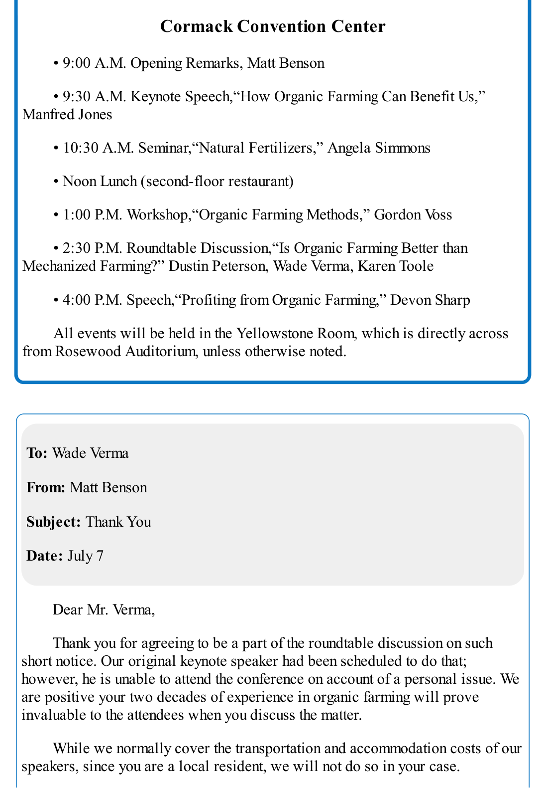


```text
Cormack Convention Center
• 9:00 A.M. Opening Remarks, Matt Benson
• 9:30 A.M. Keynote Speech,“How Organic Farming Can Benefit Us,”
Manfred Jones
• 10:30 A.M. Seminar,“Natural Fertilizers,” Angela Simmons
• Noon Lunch (second-floor restaurant)
• 1:00 P.M. Workshop,“Organic Farming Methods,” Gordon Voss
• 2:30 P.M. Roundtable Discussion,“Is Organic Farming Better than
Mechanized Farming?” Dustin Peterson, Wade Verma, Karen Toole
• 4:00 P.M. Speech,“Profiting from Organic Farming,” Devon Sharp
All events will be held in the Yellowstone Room, which is directly across
from Rosewood Auditorium, unless otherwise noted.
To:
 Wade Verma
From:
 Matt Benson
Subject:
 Thank You
Date:
 July 7
Dear Mr. Verma,
Thank you for agreeing to be a part of the roundtable discussion on such
short notice. Our original keynote speaker had been scheduled to do that;
however, he is unable to attend the conference on account of a personal issue. We
are positive your two decades of experience in organic farming will prove
invaluable to the attendees when you discuss the matter.
While we normally cover the transportation and accommodation costs of our
speakers, since you are a local resident, we will not do so in your case.
952
```

## PDF 第 182 页

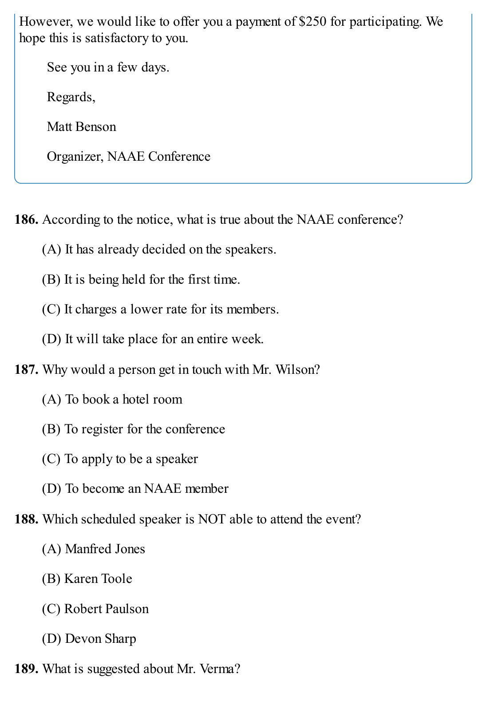


```text
However, we would like to offer you a payment of $250 for participating. We
hope this is satisfactory to you.
See you in a few days.
Regards,
Matt Benson
Organizer, NAAE Conference
186.
 According to the notice, what is true about the NAAE conference?
(A) It has already decided on the speakers.
(B) It is being held for the first time.
(C) It charges a lower rate for its members.
(D) It will take place for an entire week.
187.
 Why would a person get in touch with Mr. Wilson?
(A) To book a hotel room
(B) To register for the conference
(C) To apply to be a speaker
(D) To become an NAAE member
188.
 Which scheduled speaker is NOT able to attend the event?
(A) Manfred Jones
(B) Karen Toole
(C) Robert Paulson
(D) Devon Sharp
189.
 What is suggested about Mr. Verma?
953
```

## PDF 第 183 页

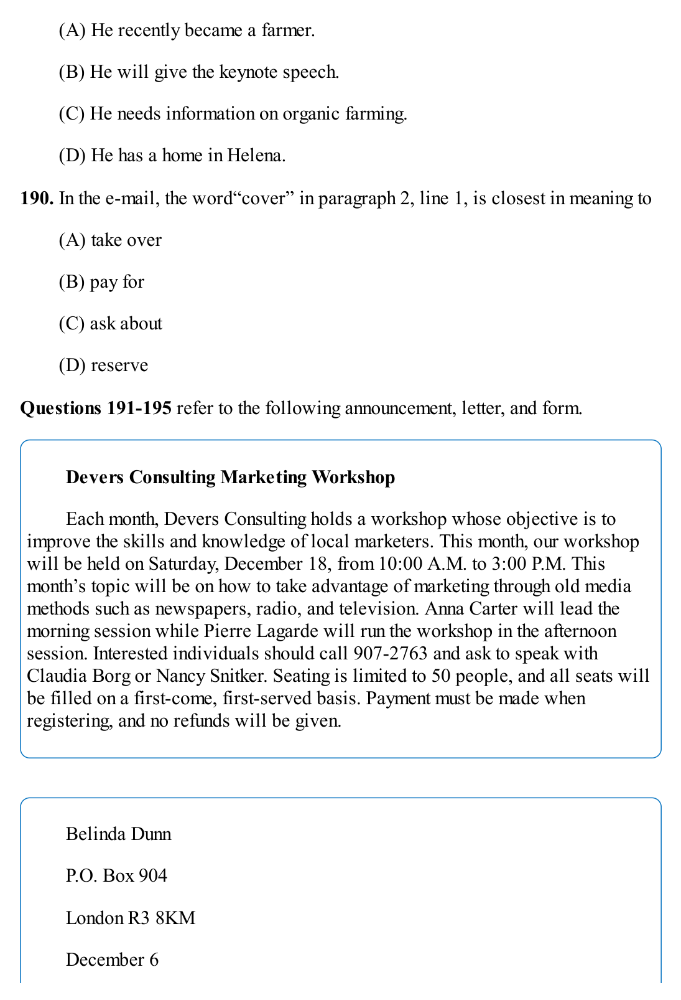


```text
(A) He recently became a farmer.
(B) He will give the keynote speech.
(C) He needs information on organic farming.
(D) He has a home in Helena.
190.
 In the e-mail, the word“cover” in paragraph 2, line 1, is closest in meaning to
(A) take over
(B) pay for
(C) ask about
(D) reserve
Questions 191-195
 refer to the following announcement, letter, and form.
Devers Consulting Marketing Workshop
Each month, Devers Consulting holds a workshop whose objective is to
improve the skills and knowledge of local marketers. This month, our workshop
will be held on Saturday, December 18, from 10:00 A.M. to 3:00 P.M. This
month’s topic will be on how to take advantage of marketing through old media
methods such as newspapers, radio, and television. Anna Carter will lead the
morning session while Pierre Lagarde will run the workshop in the afternoon
session. Interested individuals should call 907-2763 and ask to speak with
Claudia Borg or Nancy Snitker. Seating is limited to 50 people, and all seats will
be filled on a first-come, first-served basis. Payment must be made when
registering, and no refunds will be given.
Belinda Dunn
P.O. Box 904
London R3 8KM
December 6
954
```

## PDF 第 184 页

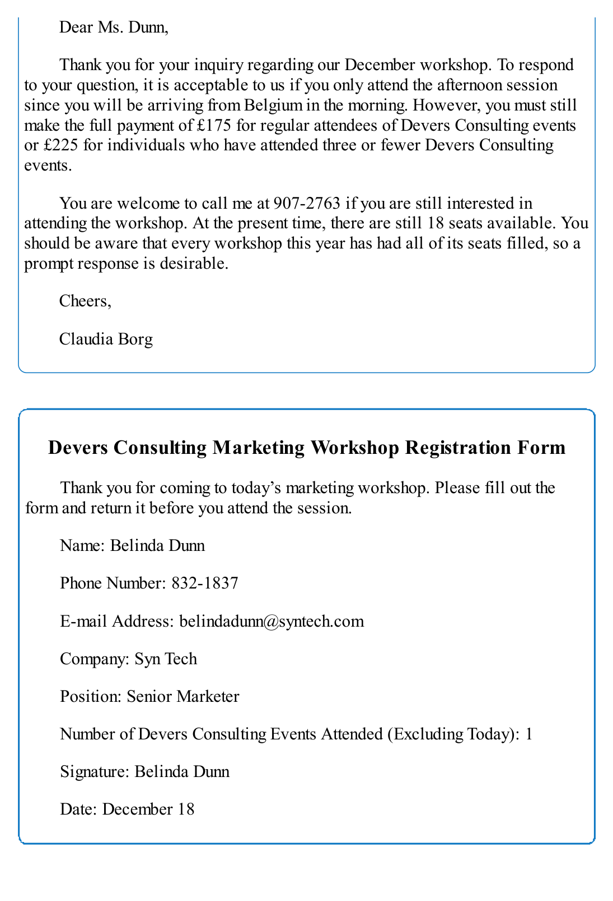


```text
Dear Ms. Dunn,
Thank you for your inquiry regarding our December workshop. To respond
to your question, it is acceptable to us if you only attend the afternoon session
since you will be arriving from Belgium in the morning. However, you must still
make the full payment of £175 for regular attendees of Devers Consulting events
or £225 for individuals who have attended three or fewer Devers Consulting
events.
You are welcome to call me at 907-2763 if you are still interested in
attending the workshop. At the present time, there are still 18 seats available. You
should be aware that every workshop this year has had all of its seats filled, so a
prompt response is desirable.
Cheers,
Claudia Borg
Devers Consulting Marketing Workshop Registration Form
Thank you for coming to today’s marketing workshop. Please fill out the
form and return it before you attend the session.
Name: Belinda Dunn
Phone Number: 832-1837
E-mail Address: belindadunn@syntech.com
Company: Syn Tech
Position: Senior Marketer
Number of Devers Consulting Events Attended (Excluding Today): 1
Signature: Belinda Dunn
Date: December 18
955
```

## PDF 第 185 页

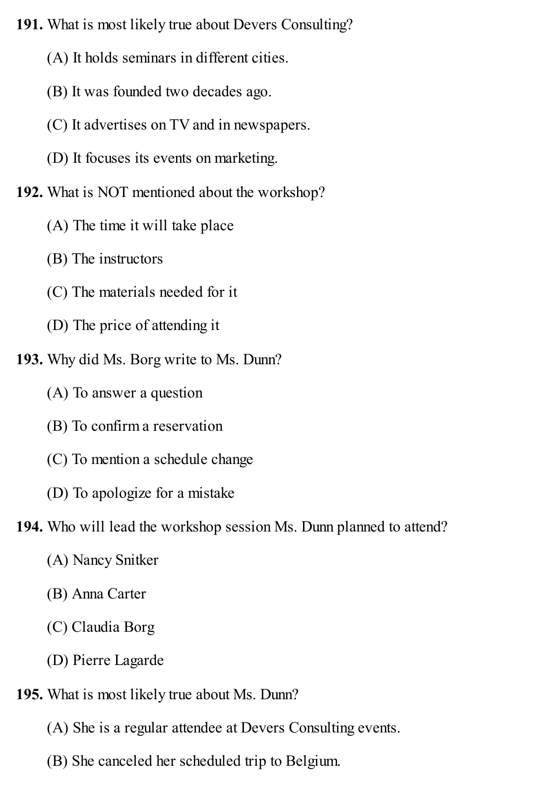


```text
191.
 What is most likely true about Devers Consulting?
(A) It holds seminars in different cities.
(B) It was founded two decades ago.
(C) It advertises on TV and in newspapers.
(D) It focuses its events on marketing.
192.
 What is NOT mentioned about the workshop?
(A) The time it will take place
(B) The instructors
(C) The materials needed for it
(D) The price of attending it
193.
 Why did Ms. Borg write to Ms. Dunn?
(A) To answer a question
(B) To confirm a reservation
(C) To mention a schedule change
(D) To apologize for a mistake
194.
 Who will lead the workshop session Ms. Dunn planned to attend?
(A) Nancy Snitker
(B) Anna Carter
(C) Claudia Borg
(D) Pierre Lagarde
195.
 What is most likely true about Ms. Dunn?
(A) She is a regular attendee at Devers Consulting events.
(B) She canceled her scheduled trip to Belgium.
956
```

## PDF 第 186 页

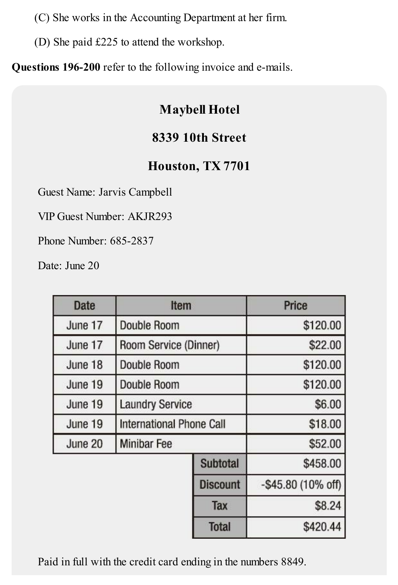


```text
(C) She works in the Accounting Department at her firm.
(D) She paid £225 to attend the workshop.
Questions 196-200
 refer to the following invoice and e-mails.
Maybell Hotel
8339 10th Street
Houston, TX 7701
Guest Name: Jarvis Campbell
VIP Guest Number: AKJR293
Phone Number: 685-2837
Date: June 20
Paid in full with the credit card ending in the numbers 8849.
957
```

## PDF 第 187 页

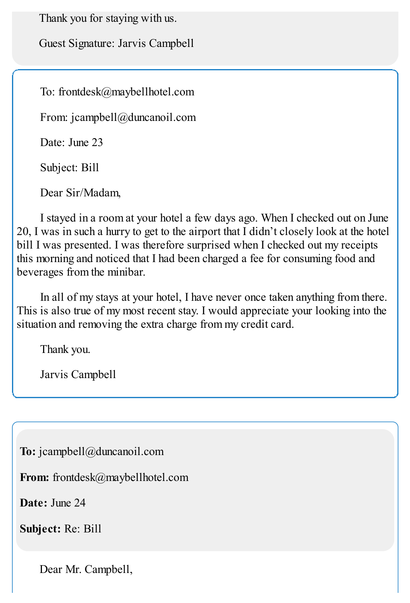


```text
Thank you for staying with us.
Guest Signature: Jarvis Campbell
To: frontdesk@maybellhotel.com
From: jcampbell@duncanoil.com
Date: June 23
Subject: Bill
Dear Sir/Madam,
I stayed in a room at your hotel a few days ago. When I checked out on June
20, I was in such a hurry to get to the airport that I didn’t closely look at the hotel
bill I was presented. I was therefore surprised when I checked out my receipts
this morning and noticed that I had been charged a fee for consuming food and
beverages from the minibar.
In all of my stays at your hotel, I have never once taken anything from there.
This is also true of my most recent stay. I would appreciate your looking into the
situation and removing the extra charge from my credit card.
Thank you.
Jarvis Campbell
To:
 jcampbell@duncanoil.com
From:
 frontdesk@maybellhotel.com
Date:
 June 24
Subject:
 Re: Bill
Dear Mr. Campbell,
958
```

## PDF 第 188 页

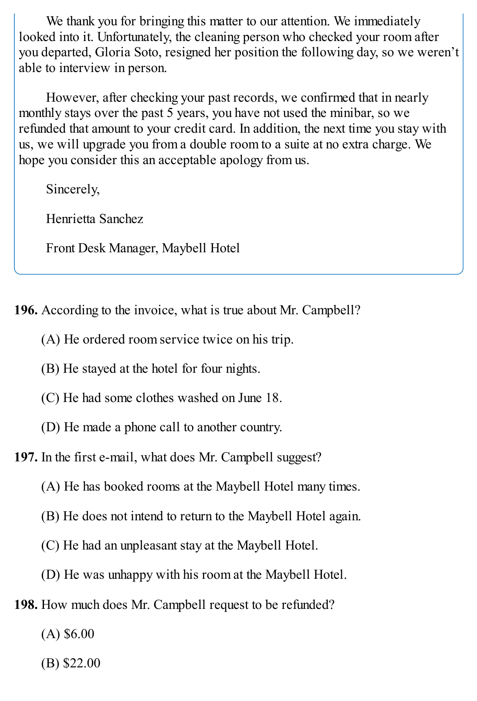


```text
We thank you for bringing this matter to our attention. We immediately
looked into it. Unfortunately, the cleaning person who checked your room after
you departed, Gloria Soto, resigned her position the following day, so we weren’t
able to interview in person.
However, after checking your past records, we confirmed that in nearly
monthly stays over the past 5 years, you have not used the minibar, so we
refunded that amount to your credit card. In addition, the next time you stay with
us, we will upgrade you from a double room to a suite at no extra charge. We
hope you consider this an acceptable apology from us.
Sincerely,
Henrietta Sanchez
Front Desk Manager, Maybell Hotel
196.
 According to the invoice, what is true about Mr. Campbell?
(A) He ordered room service twice on his trip.
(B) He stayed at the hotel for four nights.
(C) He had some clothes washed on June 18.
(D) He made a phone call to another country.
197.
 In the first e-mail, what does Mr. Campbell suggest?
(A) He has booked rooms at the Maybell Hotel many times.
(B) He does not intend to return to the Maybell Hotel again.
(C) He had an unpleasant stay at the Maybell Hotel.
(D) He was unhappy with his room at the Maybell Hotel.
198.
 How much does Mr. Campbell request to be refunded?
(A) $6.00
(B) $22.00
959
```

## PDF 第 189 页

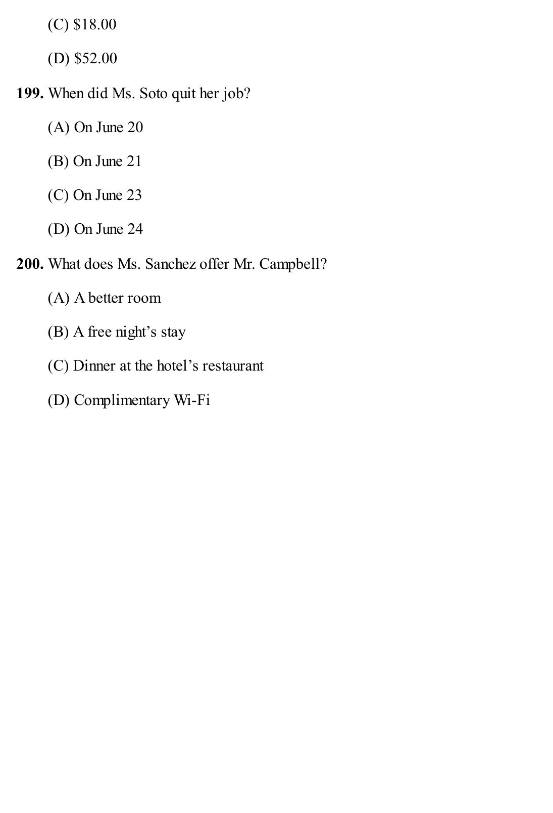


```text
(C) $18.00
(D) $52.00
199.
 When did Ms. Soto quit her job?
(A) On June 20
(B) On June 21
(C) On June 23
(D) On June 24
200.
 What does Ms. Sanchez offer Mr. Campbell?
(A) A better room
(B) A free night’s stay
(C) Dinner at the hotel’s restaurant
(D) Complimentary Wi-Fi
960
```

## PDF 第 190 页

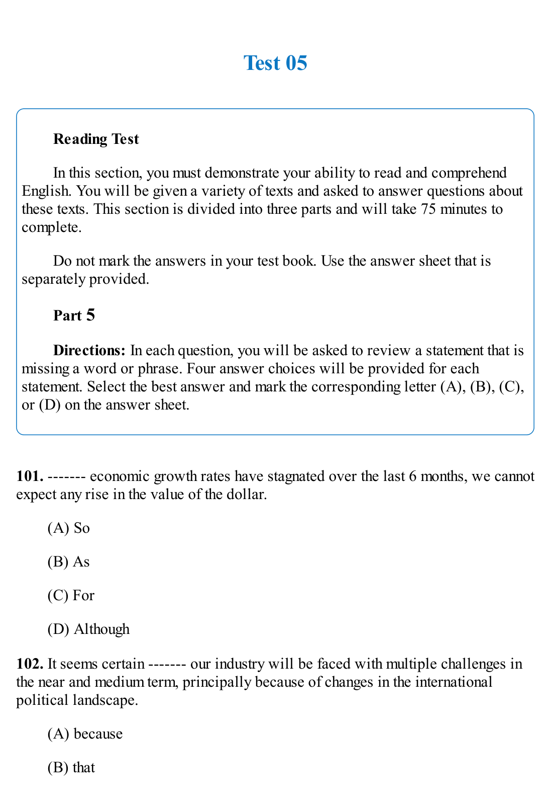


```text
Test 05
Reading Test
In this section, you must demonstrate your ability to read and comprehend
English. You will be given a variety of texts and asked to answer questions about
these texts. This section is divided into three parts and will take 75 minutes to
complete.
Do not mark the answers in your test book. Use the answer sheet that is
separately provided.
Part
5
Directions:
 In each question, you will be asked to review a statement that is
missing a word or phrase. Four answer choices will be provided for each
statement. Select the best answer and mark the corresponding letter (A), (B), (C),
or (D) on the answer sheet.
101.
 ------- economic growth rates have stagnated over the last 6 months, we cannot
expect any rise in the value of the dollar.
(A) So
(B) As
(C) For
(D) Although
102.
 It seems certain ------- our industry will be faced with multiple challenges in
the near and medium term, principally because of changes in the international
political landscape.
(A) because
(B) that
961
```

## PDF 第 191 页

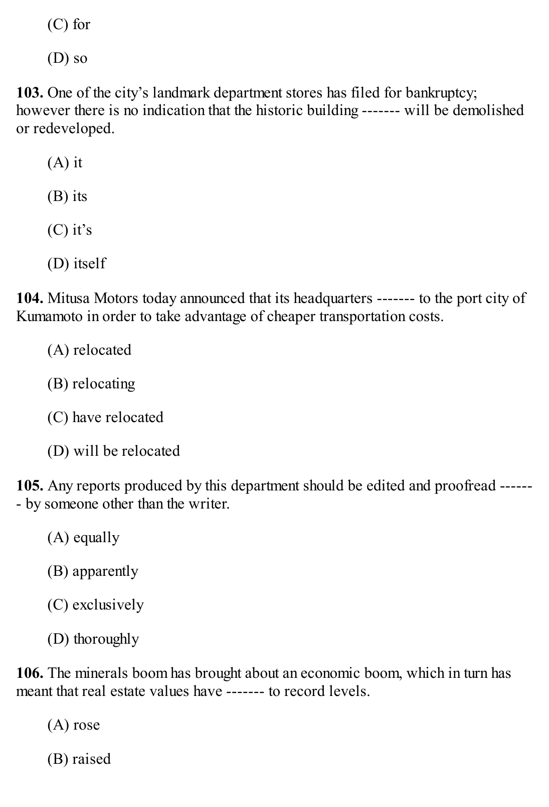


```text
(C) for
(D) so
103.
 One of the city’s landmark department stores has filed for bankruptcy;
however there is no indication that the historic building ------- will be demolished
or redeveloped.
(A) it
(B) its
(C) it’s
(D) itself
104.
 Mitusa Motors today announced that its headquarters ------- to the port city of
Kumamoto in order to take advantage of cheaper transportation costs.
(A) relocated
(B) relocating
(C) have relocated
(D) will be relocated
105.
 Any reports produced by this department should be edited and proofread ------
- by someone other than the writer.
(A) equally
(B) apparently
(C) exclusively
(D) thoroughly
106.
 The minerals boom has brought about an economic boom, which in turn has
meant that real estate values have ------- to record levels.
(A) rose
(B) raised
962
```

## PDF 第 192 页

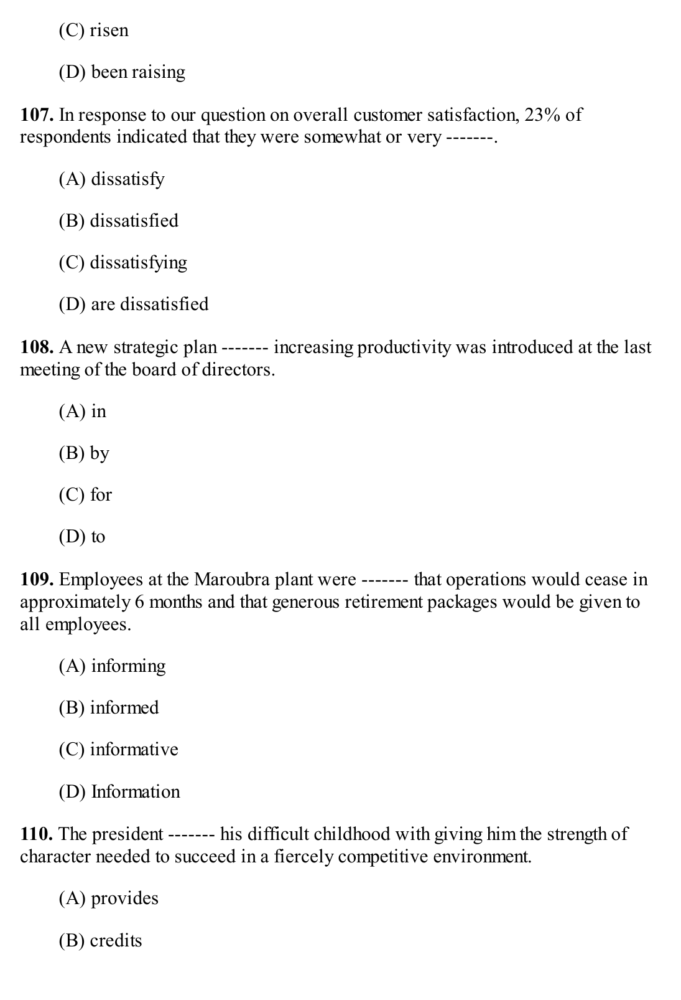


```text
(C) risen
(D) been raising
107.
 In response to our question on overall customer satisfaction, 23% of
respondents indicated that they were somewhat or very -------.
(A) dissatisfy
(B) dissatisfied
(C) dissatisfying
(D) are dissatisfied
108.
 A new strategic plan ------- increasing productivity was introduced at the last
meeting of the board of directors.
(A) in
(B) by
(C) for
(D) to
109.
 Employees at the Maroubra plant were ------- that operations would cease in
approximately 6 months and that generous retirement packages would be given to
all employees.
(A) informing
(B) informed
(C) informative
(D) Information
110.
 The president ------- his difficult childhood with giving him the strength of
character needed to succeed in a fiercely competitive environment.
(A) provides
(B) credits
963
```

## PDF 第 193 页

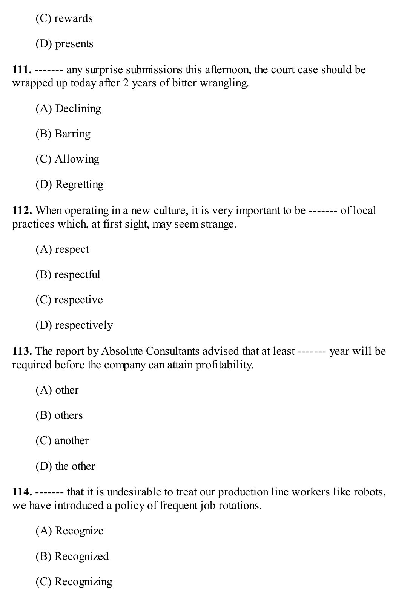


```text
(C) rewards
(D) presents
111.
 ------- any surprise submissions this afternoon, the court case should be
wrapped up today after 2 years of bitter wrangling.
(A) Declining
(B) Barring
(C) Allowing
(D) Regretting
112.
 When operating in a new culture, it is very important to be ------- of local
practices which, at first sight, may seem strange.
(A) respect
(B) respectful
(C) respective
(D) respectively
113.
 The report by Absolute Consultants advised that at least ------- year will be
required before the company can attain profitability.
(A) other
(B) others
(C) another
(D) the other
114.
 ------- that it is undesirable to treat our production line workers like robots,
we have introduced a policy of frequent job rotations.
(A) Recognize
(B) Recognized
(C) Recognizing
964
```

## PDF 第 194 页

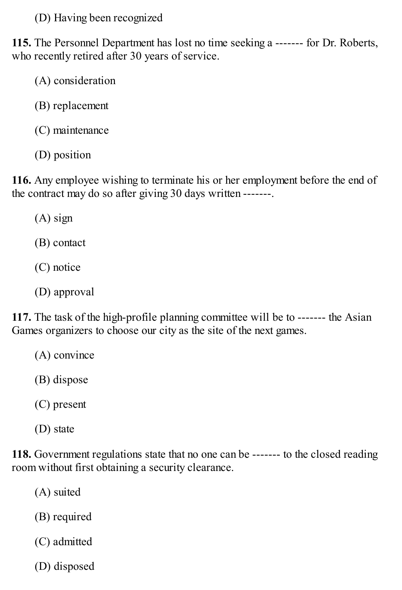


```text
(D) Having been recognized
115.
 The Personnel Department has lost no time seeking a ------- for Dr. Roberts,
who recently retired after 30 years of service.
(A) consideration
(B) replacement
(C) maintenance
(D) position
116.
 Any employee wishing to terminate his or her employment before the end of
the contract may do so after giving 30 days written -------.
(A) sign
(B) contact
(C) notice
(D) approval
117.
 The task of the high-profile planning committee will be to ------- the Asian
Games organizers to choose our city as the site of the next games.
(A) convince
(B) dispose
(C) present
(D) state
118.
 Government regulations state that no one can be ------- to the closed reading
room without first obtaining a security clearance.
(A) suited
(B) required
(C) admitted
(D) disposed
965
```

## PDF 第 195 页

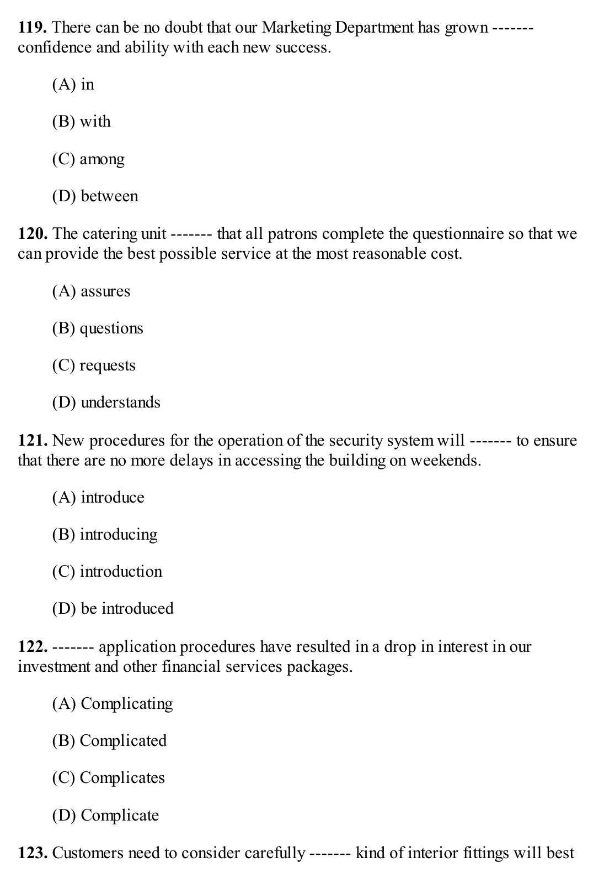


```text
119.
 There can be no doubt that our Marketing Department has grown -------
confidence and ability with each new success.
(A) in
(B) with
(C) among
(D) between
120.
 The catering unit ------- that all patrons complete the questionnaire so that we
can provide the best possible service at the most reasonable cost.
(A) assures
(B) questions
(C) requests
(D) understands
121.
 New procedures for the operation of the security system will ------- to ensure
that there are no more delays in accessing the building on weekends.
(A) introduce
(B) introducing
(C) introduction
(D) be introduced
122.
 ------- application procedures have resulted in a drop in interest in our
investment and other financial services packages.
(A) Complicating
(B) Complicated
(C) Complicates
(D) Complicate
123.
 Customers need to consider carefully ------- kind of interior fittings will best
966
```

## PDF 第 196 页

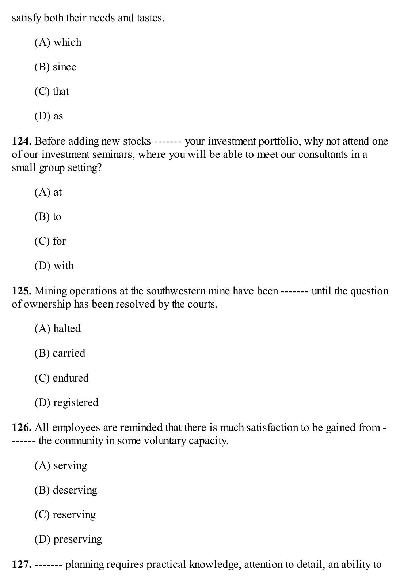


```text
satisfy both their needs and tastes.
(A) which
(B) since
(C) that
(D) as
124.
 Before adding new stocks ------- your investment portfolio, why not attend one
of our investment seminars, where you will be able to meet our consultants in a
small group setting?
(A) at
(B) to
(C) for
(D) with
125.
 Mining operations at the southwestern mine have been ------- until the question
of ownership has been resolved by the courts.
(A) halted
(B) carried
(C) endured
(D) registered
126.
 All employees are reminded that there is much satisfaction to be gained from -
------ the community in some voluntary capacity.
(A) serving
(B) deserving
(C) reserving
(D) preserving
127.
 ------- planning requires practical knowledge, attention to detail, an ability to
967
```

## PDF 第 197 页

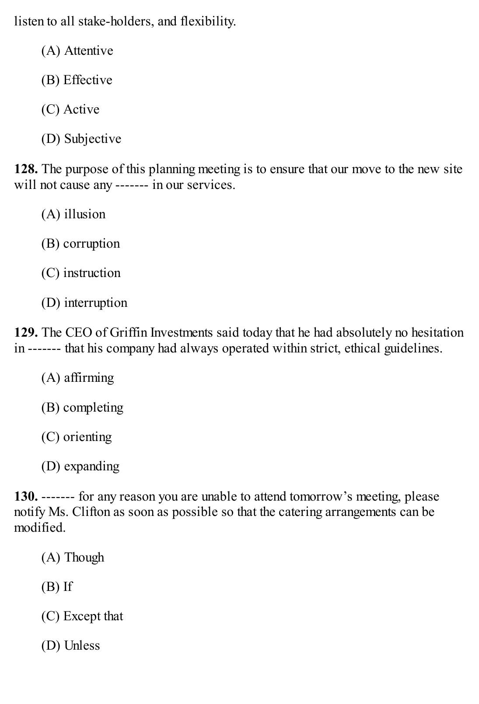


```text
listen to all stake-holders, and flexibility.
(A) Attentive
(B) Effective
(C) Active
(D) Subjective
128.
 The purpose of this planning meeting is to ensure that our move to the new site
will not cause any ------- in our services.
(A) illusion
(B) corruption
(C) instruction
(D) interruption
129.
 The CEO of Griffin Investments said today that he had absolutely no hesitation
in ------- that his company had always operated within strict, ethical guidelines.
(A) affirming
(B) completing
(C) orienting
(D) expanding
130.
 ------- for any reason you are unable to attend tomorrow’s meeting, please
notify Ms. Clifton as soon as possible so that the catering arrangements can be
modified.
(A) Though
(B) If
(C) Except that
(D) Unless
968
```

## PDF 第 198 页

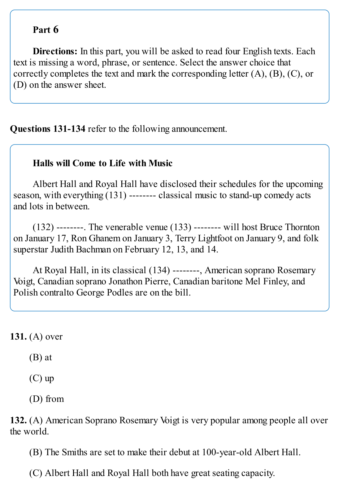


```text
Part
6
Directions:
 In this part, you will be asked to read four English texts. Each
text is missing a word, phrase, or sentence. Select the answer choice that
correctly completes the text and mark the corresponding letter (A), (B), (C), or
(D) on the answer sheet.
Questions 131-134
 refer to the following announcement.
Halls will Come to Life with Music
Albert Hall and Royal Hall have disclosed their schedules for the upcoming
season, with everything (131) -------- classical music to stand-up comedy acts
and lots in between.
(132) --------. The venerable venue (133) -------- will host Bruce Thornton
on January 17, Ron Ghanem on January 3, Terry Lightfoot on January 9, and folk
superstar Judith Bachman on February 12, 13, and 14.
At Royal Hall, in its classical (134) --------, American soprano Rosemary
Voigt, Canadian soprano Jonathon Pierre, Canadian baritone Mel Finley, and
Polish contralto George Podles are on the bill.
131.
 (A) over
(B) at
(C) up
(D) from
132.
 (A) American Soprano Rosemary Voigt is very popular among people all over
the world.
(B) The Smiths are set to make their debut at 100-year-old Albert Hall.
(C) Albert Hall and Royal Hall both have great seating capacity.
969
```

## PDF 第 199 页

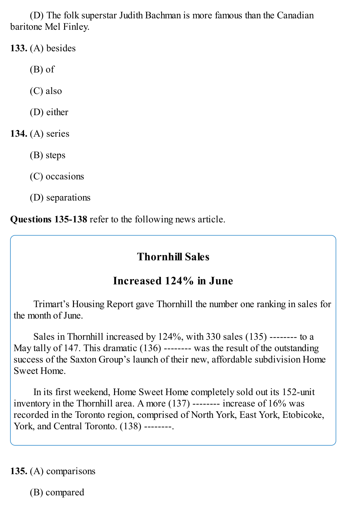


```text
(D) The folk superstar Judith Bachman is more famous than the Canadian
baritone Mel Finley.
133.
 (A) besides
(B) of
(C) also
(D) either
134.
 (A) series
(B) steps
(C) occasions
(D) separations
Questions 135-138
 refer to the following news article.
Thornhill Sales
Increased 124% in June
Trimart’s Housing Report gave Thornhill the number one ranking in sales for
the month of June.
Sales in Thornhill increased by 124%, with 330 sales (135) -------- to a
May tally of 147. This dramatic (136) -------- was the result of the outstanding
success of the Saxton Group’s launch of their new, affordable subdivision Home
Sweet Home.
In its first weekend, Home Sweet Home completely sold out its 152-unit
inventory in the Thornhill area. A more (137) -------- increase of 16% was
recorded in the Toronto region, comprised of North York, East York, Etobicoke,
York, and Central Toronto. (138) --------.
135.
 (A) comparisons
(B) compared
970
```

## PDF 第 200 页

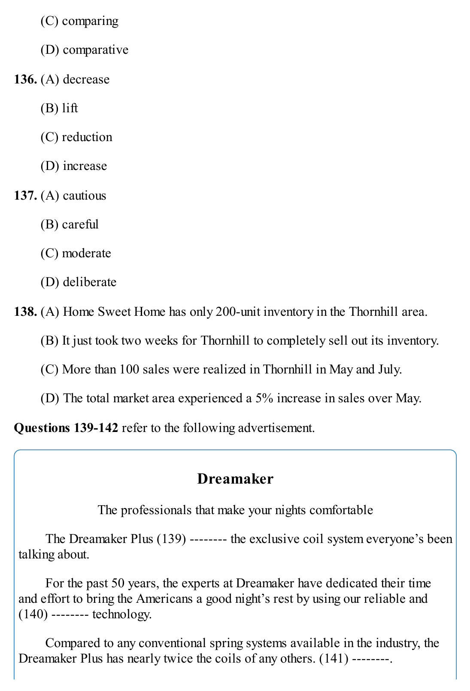


```text
(C) comparing
(D) comparative
136.
 (A) decrease
(B) lift
(C) reduction
(D) increase
137.
 (A) cautious
(B) careful
(C) moderate
(D) deliberate
138.
 (A) Home Sweet Home has only 200-unit inventory in the Thornhill area.
(B) It just took two weeks for Thornhill to completely sell out its inventory.
(C) More than 100 sales were realized in Thornhill in May and July.
(D) The total market area experienced a 5% increase in sales over May.
Questions 139-142
 refer to the following advertisement.
Dreamaker
The professionals that make your nights comfortable
The Dreamaker Plus (139) -------- the exclusive coil system everyone’s been
talking about.
For the past 50 years, the experts at Dreamaker have dedicated their time
and effort to bring the Americans a good night’s rest by using our reliable and
(140) -------- technology.
Compared to any conventional spring systems available in the industry, the
Dreamaker Plus has nearly twice the coils of any others. (141) --------.
971
```

## PDF 第 201 页

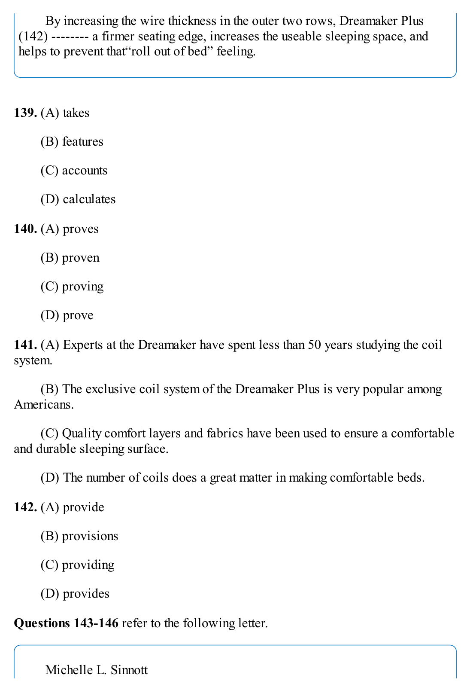


```text
By increasing the wire thickness in the outer two rows, Dreamaker Plus
(142) -------- a firmer seating edge, increases the useable sleeping space, and
helps to prevent that“roll out of bed” feeling.
139.
 (A) takes
(B) features
(C) accounts
(D) calculates
140.
 (A) proves
(B) proven
(C) proving
(D) prove
141.
 (A) Experts at the Dreamaker have spent less than 50 years studying the coil
system.
(B) The exclusive coil system of the Dreamaker Plus is very popular among
Americans.
(C) Quality comfort layers and fabrics have been used to ensure a comfortable
and durable sleeping surface.
(D) The number of coils does a great matter in making comfortable beds.
142.
 (A) provide
(B) provisions
(C) providing
(D) provides
Questions 143-146
 refer to the following letter.
Michelle L. Sinnott
972
```

## PDF 第 202 页

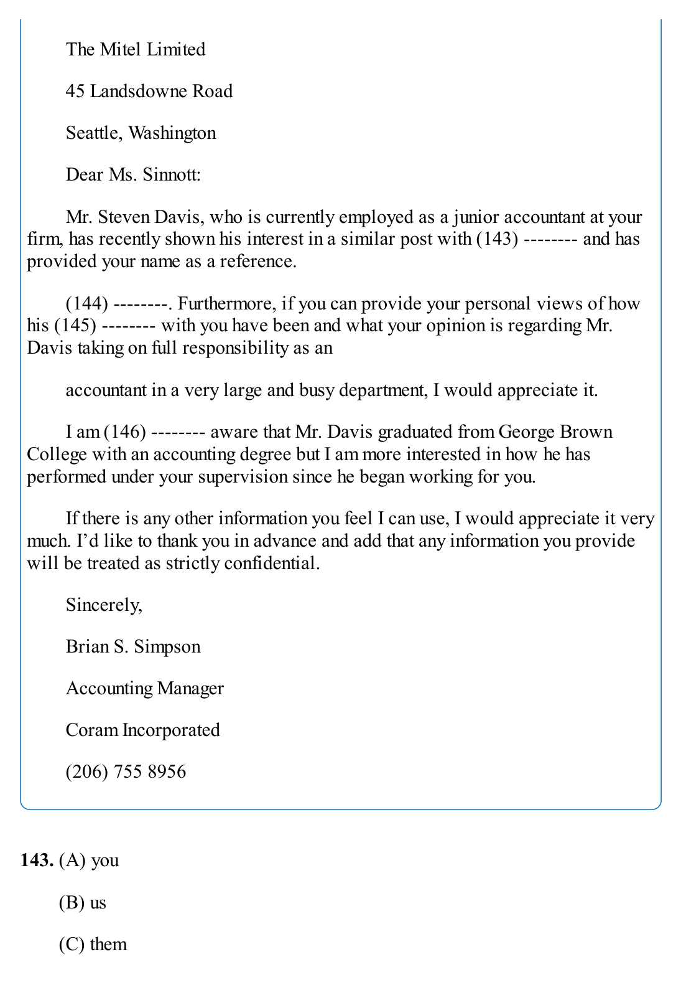


```text
The Mitel Limited
45 Landsdowne Road
Seattle, Washington
Dear Ms. Sinnott:
Mr. Steven Davis, who is currently employed as a junior accountant at your
firm, has recently shown his interest in a similar post with (143) -------- and has
provided your name as a reference.
(144) --------. Furthermore, if you can provide your personal views of how
his (145) -------- with you have been and what your opinion is regarding Mr.
Davis taking on full responsibility as an
accountant in a very large and busy department, I would appreciate it.
I am (146) -------- aware that Mr. Davis graduated from George Brown
College with an accounting degree but I am more interested in how he has
performed under your supervision since he began working for you.
If there is any other information you feel I can use, I would appreciate it very
much. I’d like to thank you in advance and add that any information you provide
will be treated as strictly confidential.
Sincerely,
Brian S. Simpson
Accounting Manager
Coram Incorporated
(206) 755 8956
143.
 (A) you
(B) us
(C) them
973
```

## PDF 第 203 页

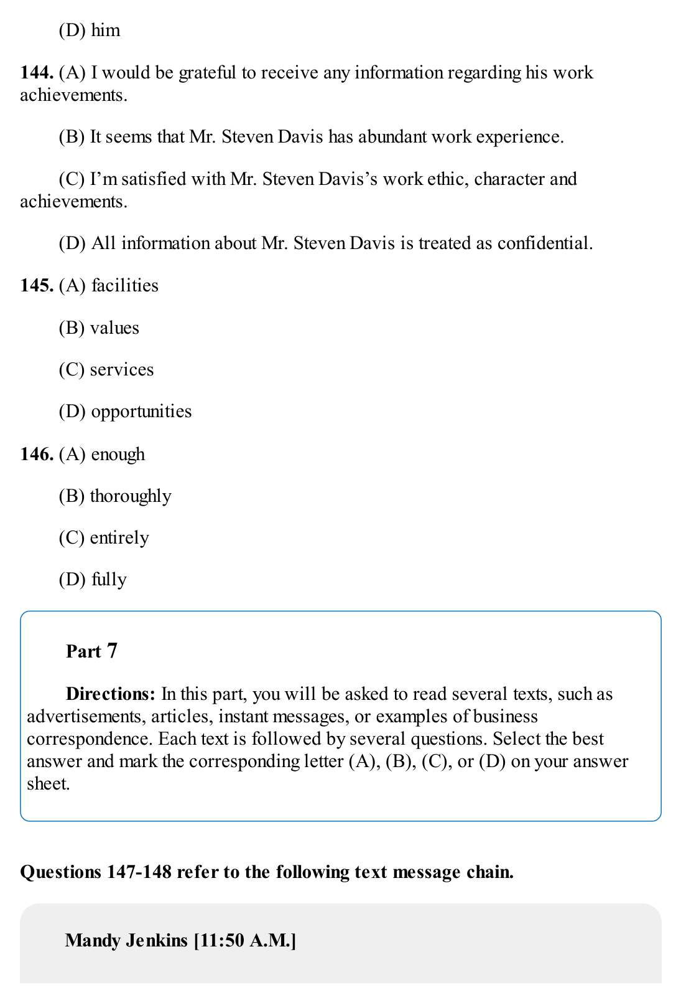


```text
(D) him
144.
 (A) I would be grateful to receive any information regarding his work
achievements.
(B) It seems that Mr. Steven Davis has abundant work experience.
(C) I’m satisfied with Mr. Steven Davis’s work ethic, character and
achievements.
(D) All information about Mr. Steven Davis is treated as confidential.
145.
 (A) facilities
(B) values
(C) services
(D) opportunities
146.
 (A) enough
(B) thoroughly
(C) entirely
(D) fully
Part
7
Directions:
 In this part, you will be asked to read several texts, such as
advertisements, articles, instant messages, or examples of business
correspondence. Each text is followed by several questions. Select the best
answer and mark the corresponding letter (A), (B), (C), or (D) on your answer
sheet.
Questions 147-148 refer to the following text message chain.
Mandy Jenkins [11:50 A.M.]
974
```

## PDF 第 204 页

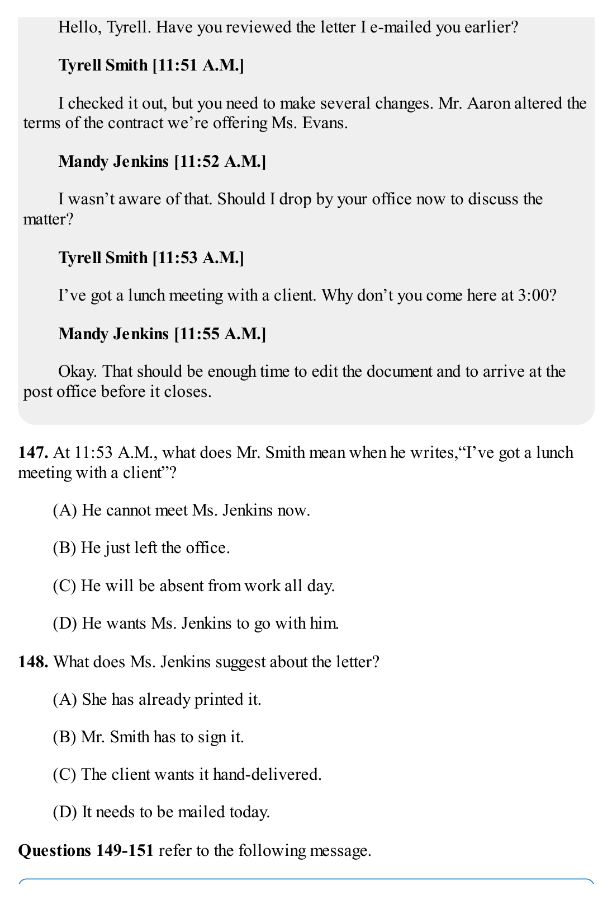


```text
Hello, Tyrell. Have you reviewed the letter I e-mailed you earlier?
Tyrell Smith [11:51 A.M.]
I checked it out, but you need to make several changes. Mr. Aaron altered the
terms of the contract we’re offering Ms. Evans.
Mandy Jenkins [11:52 A.M.]
I wasn’t aware of that. Should I drop by your office now to discuss the
matter?
Tyrell Smith [11:53 A.M.]
I’ve got a lunch meeting with a client. Why don’t you come here at 3:00?
Mandy Jenkins [11:55 A.M.]
Okay. That should be enough time to edit the document and to arrive at the
post office before it closes.
147.
 At 11:53 A.M., what does Mr. Smith mean when he writes,“I’ve got a lunch
meeting with a client”?
(A) He cannot meet Ms. Jenkins now.
(B) He just left the office.
(C) He will be absent from work all day.
(D) He wants Ms. Jenkins to go with him.
148.
 What does Ms. Jenkins suggest about the letter?
(A) She has already printed it.
(B) Mr. Smith has to sign it.
(C) The client wants it hand-delivered.
(D) It needs to be mailed today.
Questions 149-
151
 refer to the following message.
975
```

## PDF 第 205 页

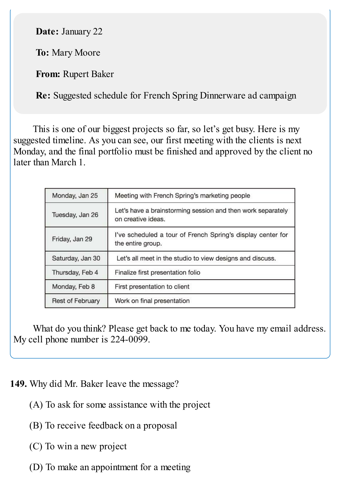


```text
Date:
 January 22
To:
 Mary Moore
From:
 Rupert Baker
Re:
 Suggested schedule for French Spring Dinnerware ad campaign
This is one of our biggest projects so far, so let’s get busy. Here is my
suggested timeline. As you can see, our first meeting with the clients is next
Monday, and the final portfolio must be finished and approved by the client no
later than March 1.
What do you think? Please get back to me today. You have my email address.
My cell phone number is 224-0099.
149.
 Why did Mr. Baker leave the message?
(A) To ask for some assistance with the project
(B) To receive feedback on a proposal
(C) To win a new project
(D) To make an appointment for a meeting
976
```

## PDF 第 206 页

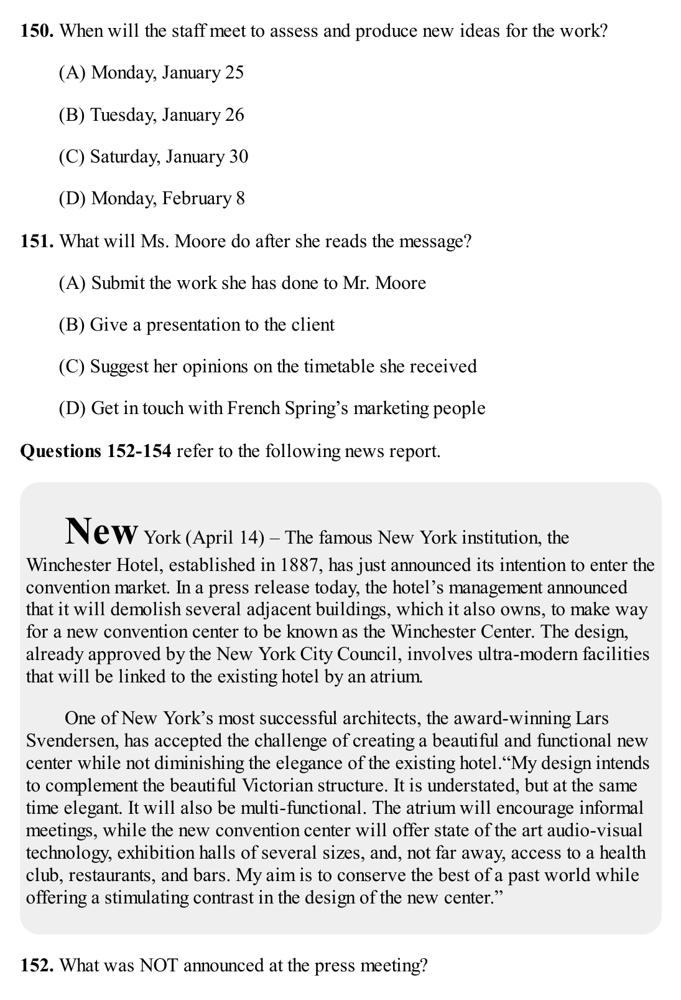


```text
150.
 When will the staff meet to assess and produce new ideas for the work?
(A) Monday, January 25
(B) Tuesday, January 26
(C) Saturday, January 30
(D) Monday, February 8
151.
 What will Ms. Moore do after she reads the message?
(A) Submit the work she has done to Mr. Moore
(B) Give a presentation to the client
(C) Suggest her opinions on the timetable she received
(D) Get in touch with French Spring’s marketing people
Questions 152-154
 refer to the following news report.
New
 York (April 14) – The famous New York institution, the
Winchester Hotel, established in 1887, has just announced its intention to enter the
convention market. In a press release today, the hotel’s management announced
that it will demolish several adjacent buildings, which it also owns, to make way
for a new convention center to be known as the Winchester Center. The design,
already approved by the New York City Council, involves ultra-modern facilities
that will be linked to the existing hotel by an atrium.
One of New York’s most successful architects, the award-winning Lars
Svendersen, has accepted the challenge of creating a beautiful and functional new
center while not diminishing the elegance of the existing hotel.“My design intends
to complement the beautiful Victorian structure. It is understated, but at the same
time elegant. It will also be multi-functional. The atrium will encourage informal
meetings, while the new convention center will offer state of the art audio-visual
technology, exhibition halls of several sizes, and, not far away, access to a health
club, restaurants, and bars. My aim is to conserve the best of a past world while
offering a stimulating contrast in the design of the new center.”
152.
 What was NOT announced at the press meeting?
977
```

## PDF 第 207 页

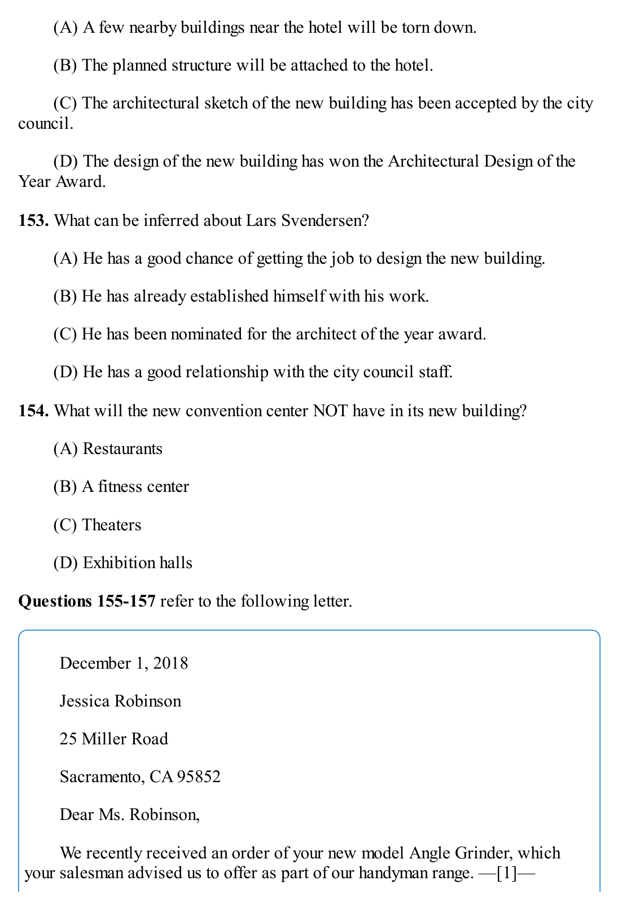


```text
(A) A few nearby buildings near the hotel will be torn down.
(B) The planned structure will be attached to the hotel.
(C) The architectural sketch of the new building has been accepted by the city
council.
(D) The design of the new building has won the Architectural Design of the
Year Award.
153.
 What can be inferred about Lars Svendersen?
(A) He has a good chance of getting the job to design the new building.
(B) He has already established himself with his work.
(C) He has been nominated for the architect of the year award.
(D) He has a good relationship with the city council staff.
154.
 What will the new convention center NOT have in its new building?
(A) Restaurants
(B) A fitness center
(C) Theaters
(D) Exhibition halls
Questions 155-157
 refer to the following letter.
December 1, 2018
Jessica Robinson
25 Miller Road
Sacramento, CA 95852
Dear Ms. Robinson,
We recently received an order of your new model Angle Grinder, which
your salesman advised us to offer as part of our handyman range. —[1]—
978
```

## PDF 第 208 页

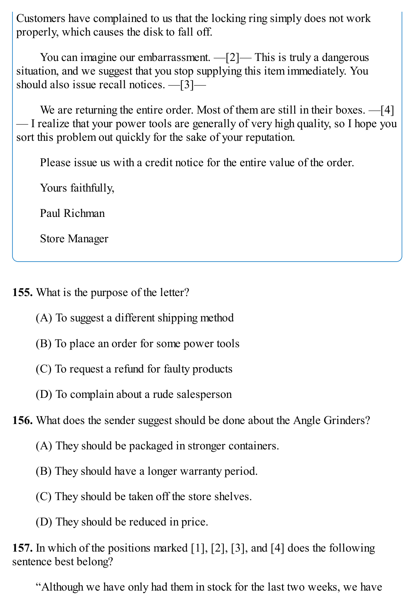


```text
Customers have complained to us that the locking ring simply does not work
properly, which causes the disk to fall off.
You can imagine our embarrassment. —[2]— This is truly a dangerous
situation, and we suggest that you stop supplying this item immediately. You
should also issue recall notices. —[3]—
We are returning the entire order. Most of them are still in their boxes. —[4]
— I realize that your power tools are generally of very high quality, so I hope you
sort this problem out quickly for the sake of your reputation.
Please issue us with a credit notice for the entire value of the order.
Yours faithfully,
Paul Richman
Store Manager
155.
 What is the purpose of the letter?
(A) To suggest a different shipping method
(B) To place an order for some power tools
(C) To request a refund for faulty products
(D) To complain about a rude salesperson
156.
 What does the sender suggest should be done about the Angle Grinders?
(A) They should be packaged in stronger containers.
(B) They should have a longer warranty period.
(C) They should be taken off the store shelves.
(D) They should be reduced in price.
157.
 In which of the positions marked [1], [2], [3], and [4] does the following
sentence best belong?
“Although we have only had them in stock for the last two weeks, we have
979
```

## PDF 第 209 页

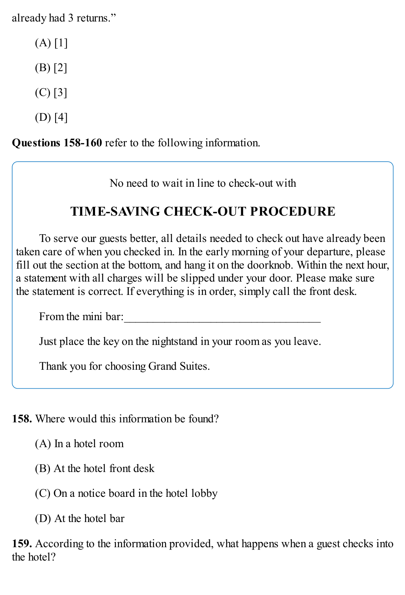


```text
already had 3 returns.”
(A) [1]
(B) [2]
(C) [3]
(D) [4]
Questions 158-160
 refer to the following information.
No need to wait in line to check-out with
TIME-SAVING CHECK-OUT PROCEDURE
To serve our guests better, all details needed to check out have already been
taken care of when you checked in. In the early morning of your departure, please
fill out the section at the bottom, and hang it on the doorknob. Within the next hour,
a statement with all charges will be slipped under your door. Please make sure
the statement is correct. If everything is in order, simply call the front desk.
From the mini bar:__________________________________
Just place the key on the nightstand in your room as you leave.
Thank you for choosing Grand Suites.
158.
 Where would this information be found?
(A) In a hotel room
(B) At the hotel front desk
(C) On a notice board in the hotel lobby
(D) At the hotel bar
159.
 According to the information provided, what happens when a guest checks into
the hotel?
980
```

## PDF 第 210 页

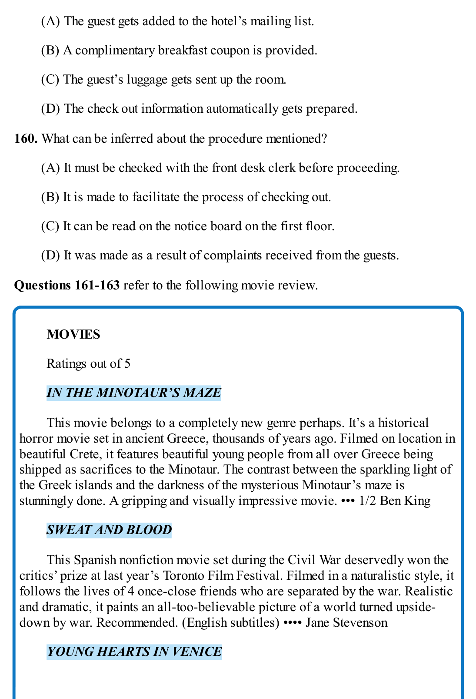


```text
(A) The guest gets added to the hotel’s mailing list.
(B) A complimentary breakfast coupon is provided.
(C) The guest’s luggage gets sent up the room.
(D) The check out information automatically gets prepared.
160.
 What can be inferred about the procedure mentioned?
(A) It must be checked with the front desk clerk before proceeding.
(B) It is made to facilitate the process of checking out.
(C) It can be read on the notice board on the first floor.
(D) It was made as a result of complaints received from the guests.
Questions 161-163
 refer to the following movie review.
MOVIES
Ratings out of 5
IN THE MINOTAUR’S MAZE
This movie belongs to a completely new genre perhaps. It’s a historical
horror movie set in ancient Greece, thousands of years ago. Filmed on location in
beautiful Crete, it features beautiful young people from all over Greece being
shipped as sacrifices to the Minotaur. The contrast between the sparkling light of
the Greek islands and the darkness of the mysterious Minotaur’s maze is
stunningly done. A gripping and visually impressive movie. ••• 1/2 Ben King
SWEAT AND BLOOD
This Spanish nonfiction movie set during the Civil War deservedly won the
critics’ prize at last year’s Toronto Film Festival. Filmed in a naturalistic style, it
follows the lives of 4 once-close friends who are separated by the war. Realistic
and dramatic, it paints an all-too-believable picture of a world turned upside-
down by war. Recommended. (English subtitles) •••• Jane Stevenson
YOUNG HEARTS IN VENICE
981
```

## PDF 第 211 页

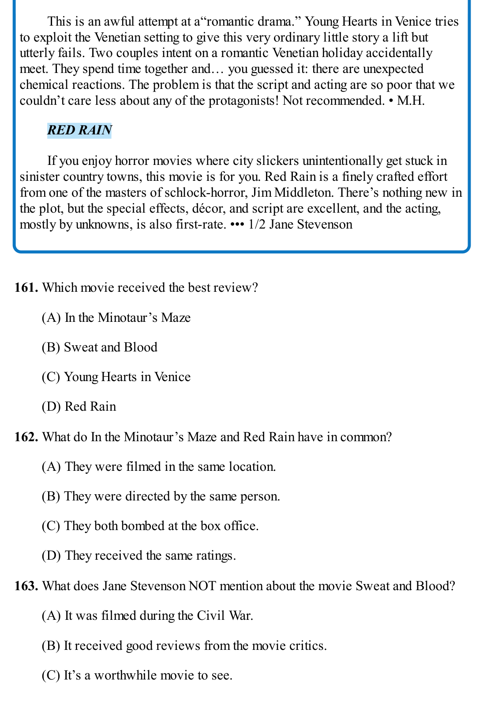


```text
This is an awful attempt at a“romantic drama.” Young Hearts in Venice tries
to exploit the Venetian setting to give this very ordinary little story a lift but
utterly fails. Two couples intent on a romantic Venetian holiday accidentally
meet. They spend time together and… you guessed it: there are unexpected
chemical reactions. The problem is that the script and acting are so poor that we
couldn’t care less about any of the protagonists! Not recommended. • M.H.
RED RAIN
If you enjoy horror movies where city slickers unintentionally get stuck in
sinister country towns, this movie is for you. Red Rain is a finely crafted effort
from one of the masters of schlock-horror, Jim Middleton. There’s nothing new in
the plot, but the special effects, décor, and script are excellent, and the acting,
mostly by unknowns, is also first-rate. ••• 1/2 Jane Stevenson
161.
 Which movie received the best review?
(A) In the Minotaur’s Maze
(B) Sweat and Blood
(C) Young Hearts in Venice
(D) Red Rain
162.
 What do In the Minotaur’s Maze and Red Rain have in common?
(A) They were filmed in the same location.
(B) They were directed by the same person.
(C) They both bombed at the box office.
(D) They received the same ratings.
163.
 What does Jane Stevenson NOT mention about the movie Sweat and Blood?
(A) It was filmed during the Civil War.
(B) It received good reviews from the movie critics.
(C) It’s a worthwhile movie to see.
982
```

## PDF 第 212 页

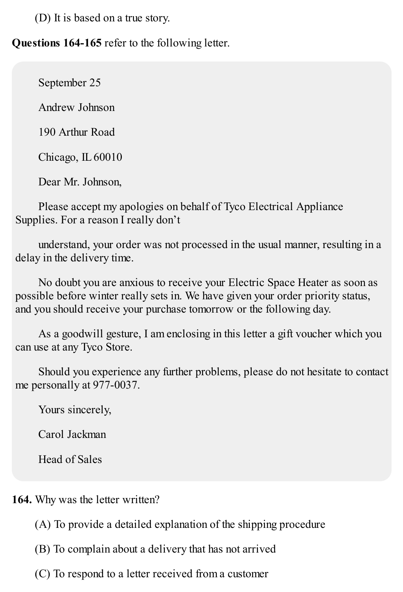


```text
(D) It is based on a true story.
Questions 164-165
 refer to the following letter.
September 25
Andrew Johnson
190 Arthur Road
Chicago, IL 60010
Dear Mr. Johnson,
Please accept my apologies on behalf of Tyco Electrical Appliance
Supplies. For a reason I really don’t
understand, your order was not processed in the usual manner, resulting in a
delay in the delivery time.
No doubt you are anxious to receive your Electric Space Heater as soon as
possible before winter really sets in. We have given your order priority status,
and you should receive your purchase tomorrow or the following day.
As a goodwill gesture, I am enclosing in this letter a gift voucher which you
can use at any Tyco Store.
Should you experience any further problems, please do not hesitate to contact
me personally at 977-0037.
Yours sincerely,
Carol Jackman
Head of Sales
164.
 Why was the letter written?
(A) To provide a detailed explanation of the shipping procedure
(B) To complain about a delivery that has not arrived
(C) To respond to a letter received from a customer
983
```

## PDF 第 213 页

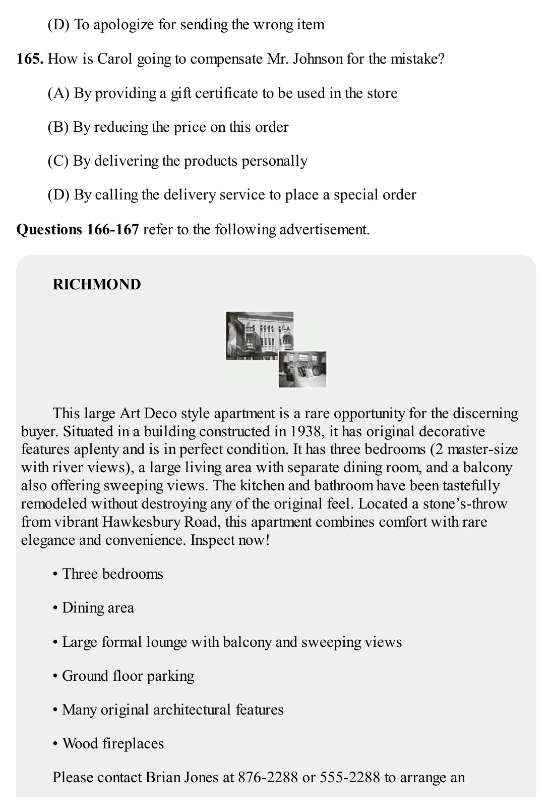


```text
(D) To apologize for sending the wrong item
165.
 How is Carol going to compensate Mr. Johnson for the mistake?
(A) By providing a gift certificate to be used in the store
(B) By reducing the price on this order
(C) By delivering the products personally
(D) By calling the delivery service to place a special order
Questions 166-167
 refer to the following advertisement.
RICHMOND
This large Art Deco style apartment is a rare opportunity for the discerning
buyer. Situated in a building constructed in 1938, it has original decorative
features aplenty and is in perfect condition. It has three bedrooms (2 master-size
with river views), a large living area with separate dining room, and a balcony
also offering sweeping views. The kitchen and bathroom have been tastefully
remodeled without destroying any of the original feel. Located a stone’s-throw
from vibrant Hawkesbury Road, this apartment combines comfort with rare
elegance and convenience. Inspect now!
• Three bedrooms
• Dining area
• Large formal lounge with balcony and sweeping views
• Ground floor parking
• Many original architectural features
• Wood fireplaces
Please contact Brian Jones at 876-2288 or 555-2288 to arrange an
984
```

## PDF 第 214 页

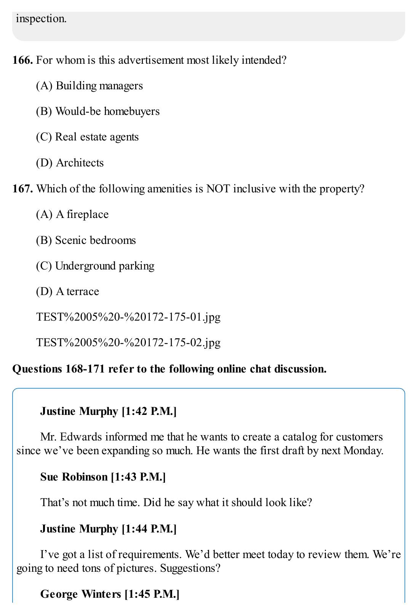


```text
inspection.
166.
 For whom is this advertisement most likely intended?
(A) Building managers
(B) Would-be homebuyers
(C) Real estate agents
(D) Architects
167.
 Which of the following amenities is NOT inclusive with the property?
(A) A fireplace
(B) Scenic bedrooms
(C) Underground parking
(D) A terrace
TEST%2005%20-%20172-175-01.jpg
TEST%2005%20-%20172-175-02.jpg
Questions 168-171 refer to the following online chat discussion.
Justine Murphy [1:42 P.M.]
Mr. Edwards informed me that he wants to create a catalog for customers
since we’ve been expanding so much. He wants the first draft by next Monday.
Sue Robinson [1:43 P.M.]
That’s not much time. Did he say what it should look like?
Justine Murphy [1:44 P.M.]
I’ve got a list of requirements. We’d better meet today to review them. We’re
going to need tons of pictures. Suggestions?
George Winters [1:45 P.M.]
985
```

## PDF 第 215 页

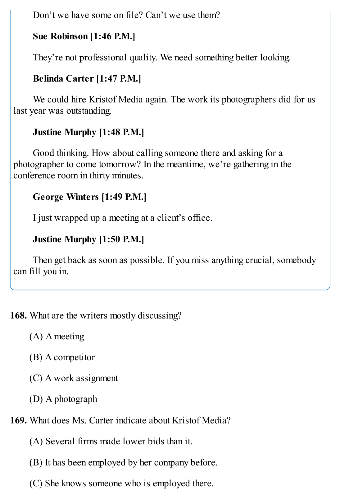


```text
Don’t we have some on file? Can’t we use them?
Sue Robinson [1:46 P.M.]
They’re not professional quality. We need something better looking.
Belinda Carter [1:47 P.M.]
We could hire Kristof Media again. The work its photographers did for us
last year was outstanding.
Justine Murphy [1:48 P.M.]
Good thinking. How about calling someone there and asking for a
photographer to come tomorrow? In the meantime, we’re gathering in the
conference room in thirty minutes.
George Winters [1:49 P.M.]
I just wrapped up a meeting at a client’s office.
Justine Murphy [1:50 P.M.]
Then get back as soon as possible. If you miss anything crucial, somebody
can fill you in.
168.
 What are the writers mostly discussing?
(A) A meeting
(B) A competitor
(C) A work assignment
(D) A photograph
169.
 What does Ms. Carter indicate about Kristof Media?
(A) Several firms made lower bids than it.
(B) It has been employed by her company before.
(C) She knows someone who is employed there.
986
```

## PDF 第 216 页

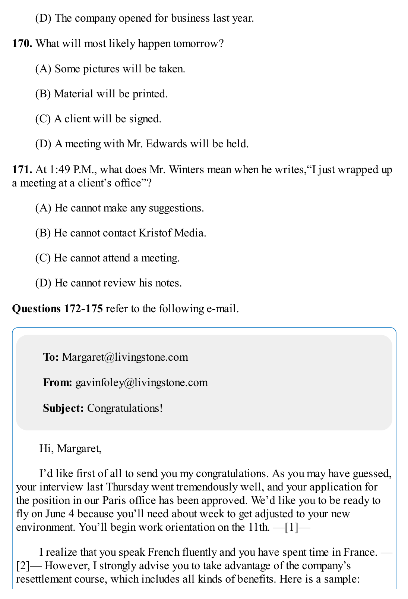


```text
(D) The company opened for business last year.
170.
 What will most likely happen tomorrow?
(A) Some pictures will be taken.
(B) Material will be printed.
(C) A client will be signed.
(D) A meeting with Mr. Edwards will be held.
171.
 At 1:49 P.M., what does Mr. Winters mean when he writes,“I just wrapped up
a meeting at a client’s office”?
(A) He cannot make any suggestions.
(B) He cannot contact Kristof Media.
(C) He cannot attend a meeting.
(D) He cannot review his notes.
Questions 172-175
 refer to the following e-mail.
To:
 Margaret@livingstone.com
From:
 gavinfoley@livingstone.com
Subject:
 Congratulations!
Hi, Margaret,
I’d like first of all to send you my congratulations. As you may have guessed,
your interview last Thursday went tremendously well, and your application for
the position in our Paris office has been approved. We’d like you to be ready to
fly on June 4 because you’ll need about week to get adjusted to your new
environment. You’ll begin work orientation on the 11th. —[1]—
I realize that you speak French fluently and you have spent time in France. —
[2]— However, I strongly advise you to take advantage of the company’s
resettlement course, which includes all kinds of benefits. Here is a sample:
987
```

## PDF 第 217 页

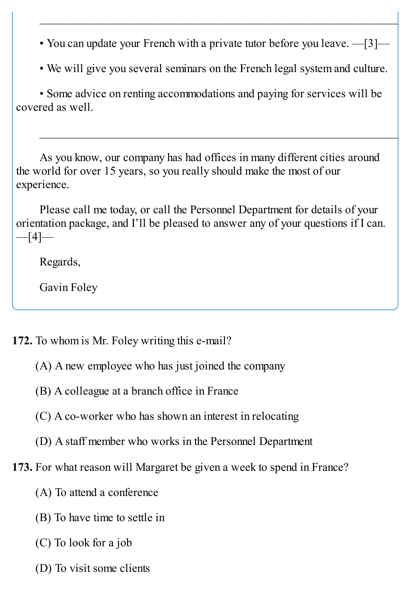


```text
_____________________________________________________________________
• You can update your French with a private tutor before you leave. —[3]—
• We will give you several seminars on the French legal system and culture.
• Some advice on renting accommodations and paying for services will be
covered as well.
_____________________________________________________________________
As you know, our company has had offices in many different cities around
the world for over 15 years, so you really should make the most of our
experience.
Please call me today, or call the Personnel Department for details of your
orientation package, and I’ll be pleased to answer any of your questions if I can.
—[4]—
Regards,
Gavin Foley
172.
 To whom is Mr. Foley writing this e-mail?
(A) A new employee who has just joined the company
(B) A colleague at a branch office in France
(C) A co-worker who has shown an interest in relocating
(D) A staff member who works in the Personnel Department
173.
 For what reason will Margaret be given a week to spend in France?
(A) To attend a conference
(B) To have time to settle in
(C) To look for a job
(D) To visit some clients
988
```

## PDF 第 218 页

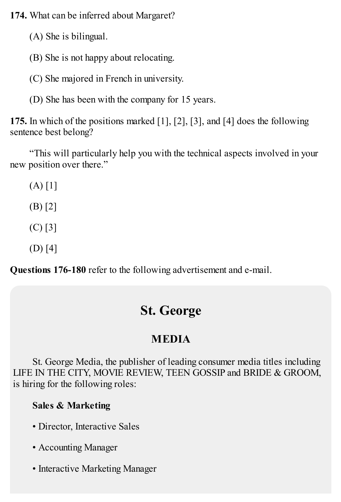


```text
174.
 What can be inferred about Margaret?
(A) She is bilingual.
(B) She is not happy about relocating.
(C) She majored in French in university.
(D) She has been with the company for 15 years.
175.
 In which of the positions marked [1], [2], [3], and [4] does the following
sentence best belong?
“This will particularly help you with the technical aspects involved in your
new position over there.”
(A) [1]
(B) [2]
(C) [3]
(D) [4]
Questions 176-180
 refer to the following advertisement and e-mail.
St. George
MEDIA
St. George Media, the publisher of leading consumer media titles including
LIFE IN THE CITY, MOVIE REVIEW, TEEN GOSSIP and BRIDE & GROOM,
is hiring for the following roles:
Sales & Marketing
• Director, Interactive Sales
• Accounting Manager
• Interactive Marketing Manager
989
```

## PDF 第 219 页

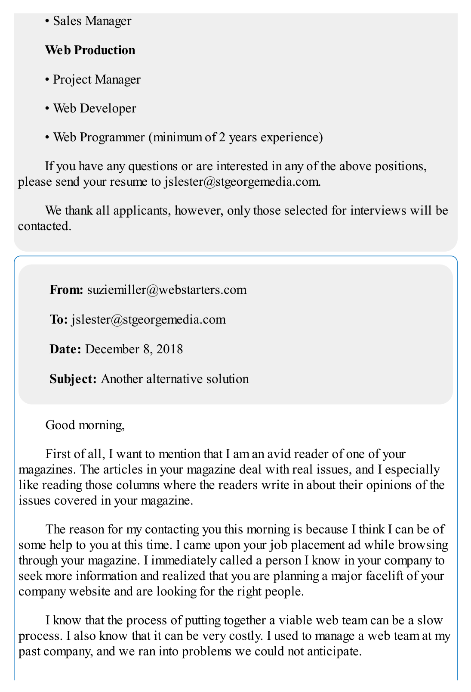


```text
• Sales Manager
Web Production
• Project Manager
• Web Developer
• Web Programmer (minimum of 2 years experience)
If you have any questions or are interested in any of the above positions,
please send your resume to jslester@stgeorgemedia.com.
We thank all applicants, however, only those selected for interviews will be
contacted.
From:
 suziemiller@webstarters.com
To:
 jslester@stgeorgemedia.com
Date:
 December 8, 2018
Subject:
 Another alternative solution
Good morning,
First of all, I want to mention that I am an avid reader of one of your
magazines. The articles in your magazine deal with real issues, and I especially
like reading those columns where the readers write in about their opinions of the
issues covered in your magazine.
The reason for my contacting you this morning is because I think I can be of
some help to you at this time. I came upon your job placement ad while browsing
through your magazine. I immediately called a person I know in your company to
seek more information and realized that you are planning a major facelift of your
company website and are looking for the right people.
I know that the process of putting together a viable web team can be a slow
process. I also know that it can be very costly. I used to manage a web team at my
past company, and we ran into problems we could not anticipate.
990
```

## PDF 第 220 页

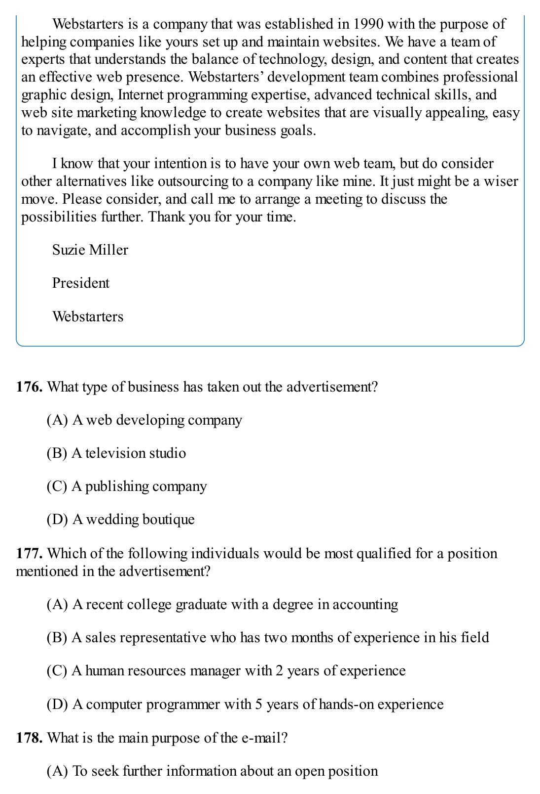


```text
Webstarters is a company that was established in 1990 with the purpose of
helping companies like yours set up and maintain websites. We have a team of
experts that understands the balance of technology, design, and content that creates
an effective web presence. Webstarters’ development team combines professional
graphic design, Internet programming expertise, advanced technical skills, and
web site marketing knowledge to create websites that are visually appealing, easy
to navigate, and accomplish your business goals.
I know that your intention is to have your own web team, but do consider
other alternatives like outsourcing to a company like mine. It just might be a wiser
move. Please consider, and call me to arrange a meeting to discuss the
possibilities further. Thank you for your time.
Suzie Miller
President
Webstarters
176.
 What type of business has taken out the advertisement?
(A) A web developing company
(B) A television studio
(C) A publishing company
(D) A wedding boutique
177.
 Which of the following individuals would be most qualified for a position
mentioned in the advertisement?
(A) A recent college graduate with a degree in accounting
(B) A sales representative who has two months of experience in his field
(C) A human resources manager with 2 years of experience
(D) A computer programmer with 5 years of hands-on experience
178.
 What is the main purpose of the e-mail?
(A) To seek further information about an open position
991
```

## PDF 第 221 页

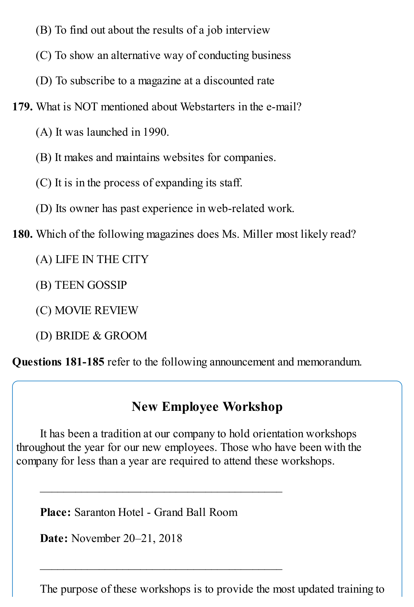


```text
(B) To find out about the results of a job interview
(C) To show an alternative way of conducting business
(D) To subscribe to a magazine at a discounted rate
179.
 What is NOT mentioned about Webstarters in the e-mail?
(A) It was launched in 1990.
(B) It makes and maintains websites for companies.
(C) It is in the process of expanding its staff.
(D) Its owner has past experience in web-related work.
180.
 Which of the following magazines does Ms. Miller most likely read?
(A) LIFE IN THE CITY
(B) TEEN GOSSIP
(C) MOVIE REVIEW
(D) BRIDE & GROOM
Questions 181-185
 refer to the following announcement and memorandum.
New Employee Workshop
It has been a tradition at our company to hold orientation workshops
throughout the year for our new employees. Those who have been with the
company for less than a year are required to attend these workshops.
_________________________________________
Place:
 Saranton Hotel - Grand Ball Room
Date:
 November 20–21, 2018
_________________________________________
The purpose of these workshops is to provide the most updated training to
992
```

## PDF 第 222 页

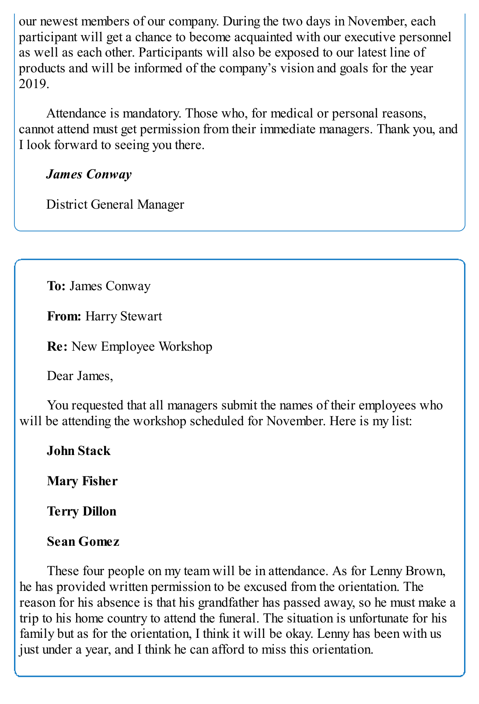


```text
our newest members of our company. During the two days in November, each
participant will get a chance to become acquainted with our executive personnel
as well as each other. Participants will also be exposed to our latest line of
products and will be informed of the company’s vision and goals for the year
2019.
Attendance is mandatory. Those who, for medical or personal reasons,
cannot attend must get permission from their immediate managers. Thank you, and
I look forward to seeing you there.
James Conway
District General Manager
To:
 James Conway
From:
 Harry Stewart
Re:
 New Employee Workshop
Dear James,
You requested that all managers submit the names of their employees who
will be attending the workshop scheduled for November. Here is my list:
John Stack
Mary Fisher
Terry Dillon
Sean Gomez
These four people on my team will be in attendance. As for Lenny Brown,
he has provided written permission to be excused from the orientation. The
reason for his absence is that his grandfather has passed away, so he must make a
trip to his home country to attend the funeral. The situation is unfortunate for his
family but as for the orientation, I think it will be okay. Lenny has been with us
just under a year, and I think he can afford to miss this orientation.
993
```

## PDF 第 223 页

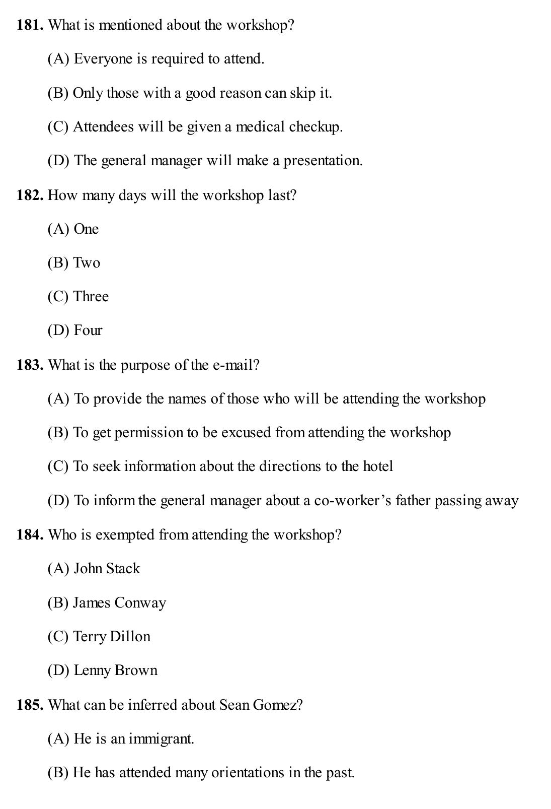


```text
181.
 What is mentioned about the workshop?
(A) Everyone is required to attend.
(B) Only those with a good reason can skip it.
(C) Attendees will be given a medical checkup.
(D) The general manager will make a presentation.
182.
 How many days will the workshop last?
(A) One
(B) Two
(C) Three
(D) Four
183.
 What is the purpose of the e-mail?
(A) To provide the names of those who will be attending the workshop
(B) To get permission to be excused from attending the workshop
(C) To seek information about the directions to the hotel
(D) To inform the general manager about a co-worker’s father passing away
184.
 Who is exempted from attending the workshop?
(A) John Stack
(B) James Conway
(C) Terry Dillon
(D) Lenny Brown
185.
 What can be inferred about Sean Gomez?
(A) He is an immigrant.
(B) He has attended many orientations in the past.
994
```

## PDF 第 224 页

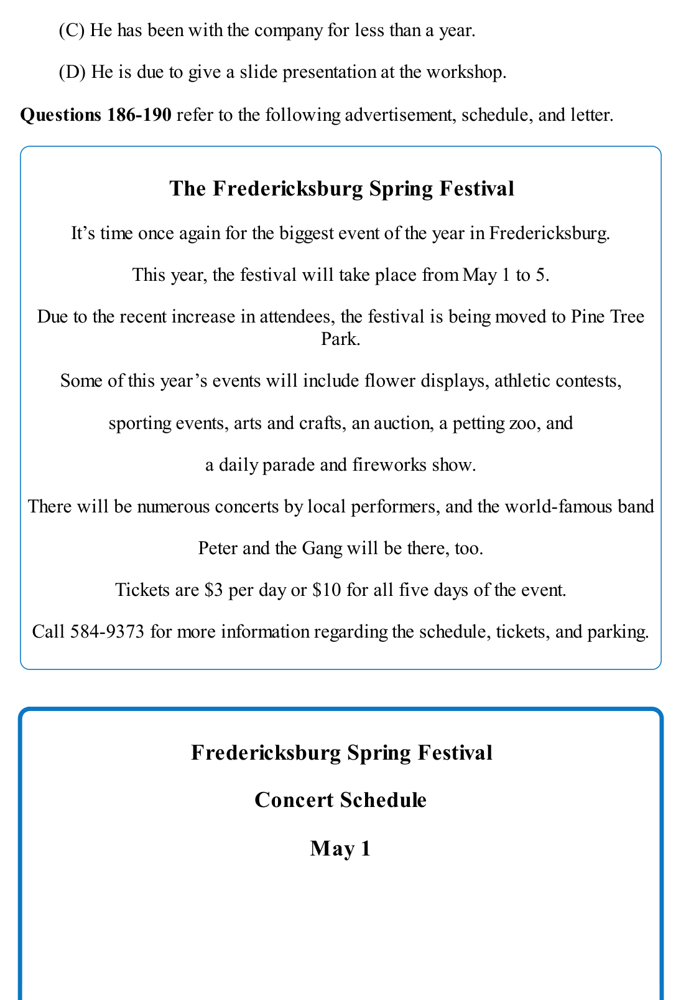


```text
(C) He has been with the company for less than a year.
(D) He is due to give a slide presentation at the workshop.
Questions 186-190
 refer to the following advertisement, schedule, and letter.
The Fredericksburg Spring Festival
It’s time once again for the biggest event of the year in Fredericksburg.
This year, the festival will take place from May 1 to 5.
Due to the recent increase in attendees, the festival is being moved to Pine Tree
Park.
Some of this year’s events will include flower displays, athletic contests,
sporting events, arts and crafts, an auction, a petting zoo, and
a daily parade and fireworks show.
There will be numerous concerts by local performers, and the world-famous band
Peter and the Gang will be there, too.
Tickets are $3 per day or $10 for all five days of the event.
Call 584-9373 for more information regarding the schedule, tickets, and parking.
Fredericksburg Spring Festival
Concert Schedule
May 1
995
```

## PDF 第 225 页

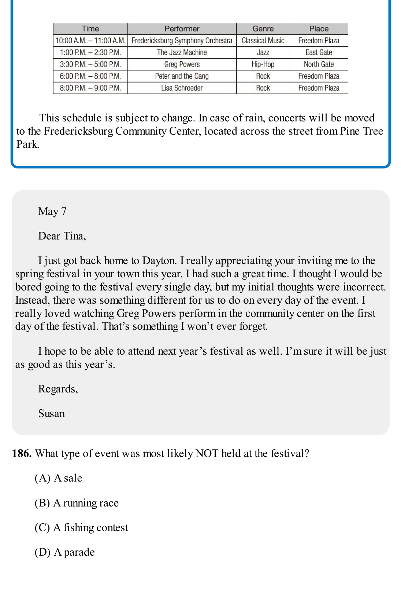


```text
This schedule is subject to change. In case of rain, concerts will be moved
to the Fredericksburg Community Center, located across the street from Pine Tree
Park.
May 7
Dear Tina,
I just got back home to Dayton. I really appreciating your inviting me to the
spring festival in your town this year. I had such a great time. I thought I would be
bored going to the festival every single day, but my initial thoughts were incorrect.
Instead, there was something different for us to do on every day of the event. I
really loved watching Greg Powers perform in the community center on the first
day of the festival. That’s something I won’t ever forget.
I hope to be able to attend next year’s festival as well. I’m sure it will be just
as good as this year’s.
Regards,
Susan
186.
 What type of event was most likely NOT held at the festival?
(A) A sale
(B) A running race
(C) A fishing contest
(D) A parade
996
```

## PDF 第 226 页

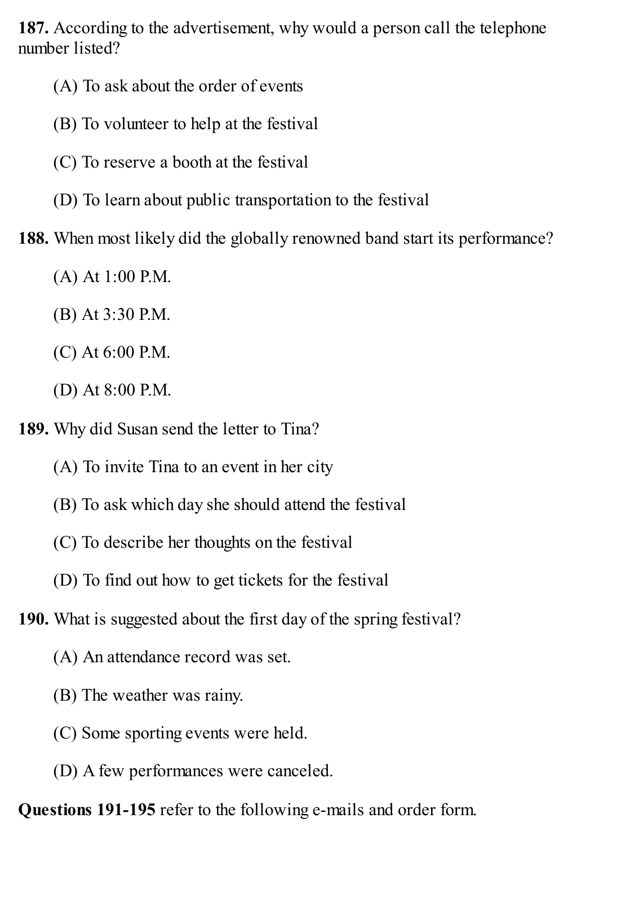


```text
187.
 According to the advertisement, why would a person call the telephone
number listed?
(A) To ask about the order of events
(B) To volunteer to help at the festival
(C) To reserve a booth at the festival
(D) To learn about public transportation to the festival
188.
 When most likely did the globally renowned band start its performance?
(A) At 1:00 P.M.
(B) At 3:30 P.M.
(C) At 6:00 P.M.
(D) At 8:00 P.M.
189.
 Why did Susan send the letter to Tina?
(A) To invite Tina to an event in her city
(B) To ask which day she should attend the festival
(C) To describe her thoughts on the festival
(D) To find out how to get tickets for the festival
190.
 What is suggested about the first day of the spring festival?
(A) An attendance record was set.
(B) The weather was rainy.
(C) Some sporting events were held.
(D) A few performances were canceled.
Questions 191-195
 refer to the following e-mails and order form.
997
```

## PDF 第 227 页

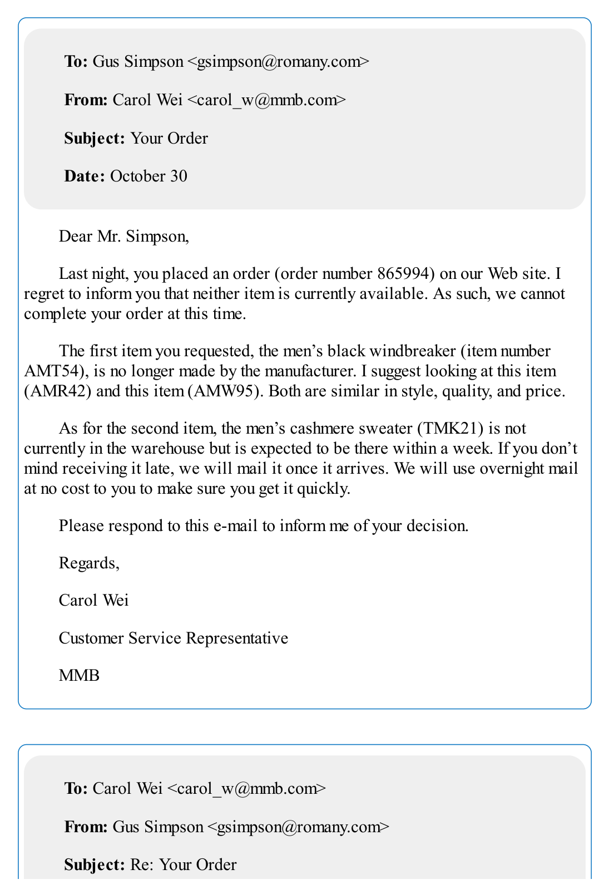


```text
To:
 Gus Simpson <gsimpson@romany.com>
From:
 Carol Wei <carol_w@mmb.com>
Subject:
 Your Order
Date:
 October 30
Dear Mr. Simpson,
Last night, you placed an order (order number 865994) on our Web site. I
regret to inform you that neither item is currently available. As such, we cannot
complete your order at this time.
The first item you requested, the men’s black windbreaker (item number
AMT54), is no longer made by the manufacturer. I suggest looking at this item
(AMR42) and this item (AMW95). Both are similar in style, quality, and price.
As for the second item, the men’s cashmere sweater (TMK21) is not
currently in the warehouse but is expected to be there within a week. If you don’t
mind receiving it late, we will mail it once it arrives. We will use overnight mail
at no cost to you to make sure you get it quickly.
Please respond to this e-mail to inform me of your decision.
Regards,
Carol Wei
Customer Service Representative
MMB
To:
 Carol Wei <carol_w@mmb.com>
From:
 Gus Simpson <gsimpson@romany.com>
Subject:
 Re: Your Order
998
```

## PDF 第 228 页

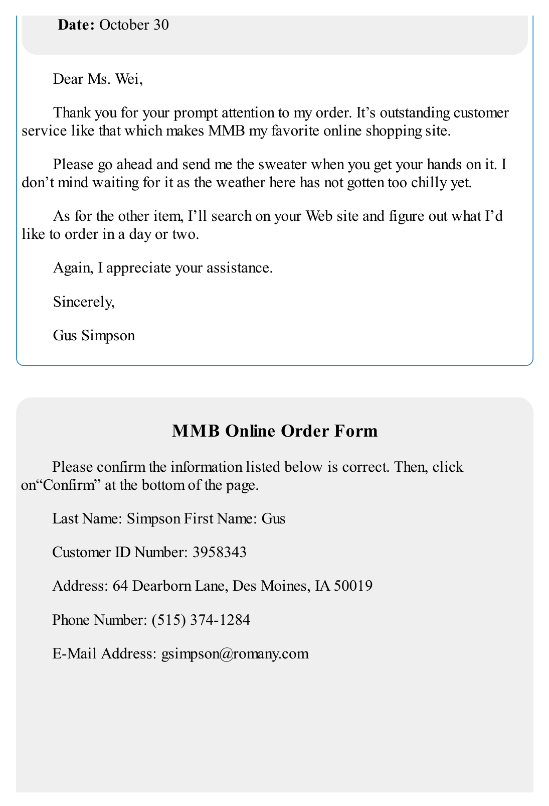


```text
Date:
 October 30
Dear Ms. Wei,
Thank you for your prompt attention to my order. It’s outstanding customer
service like that which makes MMB my favorite online shopping site.
Please go ahead and send me the sweater when you get your hands on it. I
don’t mind waiting for it as the weather here has not gotten too chilly yet.
As for the other item, I’ll search on your Web site and figure out what I’d
like to order in a day or two.
Again, I appreciate your assistance.
Sincerely,
Gus Simpson
MMB Online Order Form
Please confirm the information listed below is correct. Then, click
on“Confirm” at the bottom of the page.
Last Name: Simpson First Name: Gus
Customer ID Number: 3958343
Address: 64 Dearborn Lane, Des Moines, IA 50019
Phone Number: (515) 374-1284
E-Mail Address: gsimpson@romany.com
999
```

## PDF 第 229 页

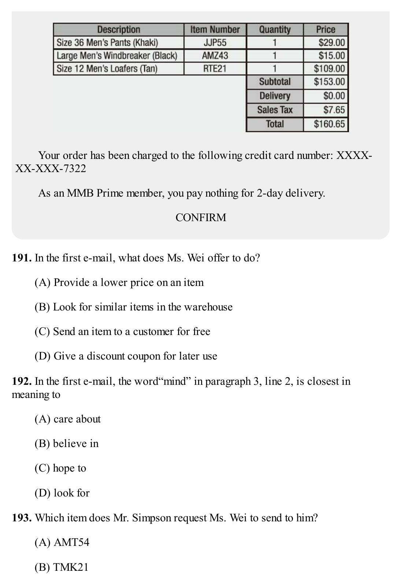


```text
Your order has been charged to the following credit card number: XXXX-
XX-XXX-7322
As an MMB Prime member, you pay nothing for 2-day delivery.
CONFIRM
191.
 In the first e-mail, what does Ms. Wei offer to do?
(A) Provide a lower price on an item
(B) Look for similar items in the warehouse
(C) Send an item to a customer for free
(D) Give a discount coupon for later use
192.
 In the first e-mail, the word“mind” in paragraph 3, line 2, is closest in
meaning to
(A) care about
(B) believe in
(C) hope to
(D) look for
193.
 Which item does Mr. Simpson request Ms. Wei to send to him?
(A) AMT54
(B) TMK21
1000
```

## PDF 第 230 页

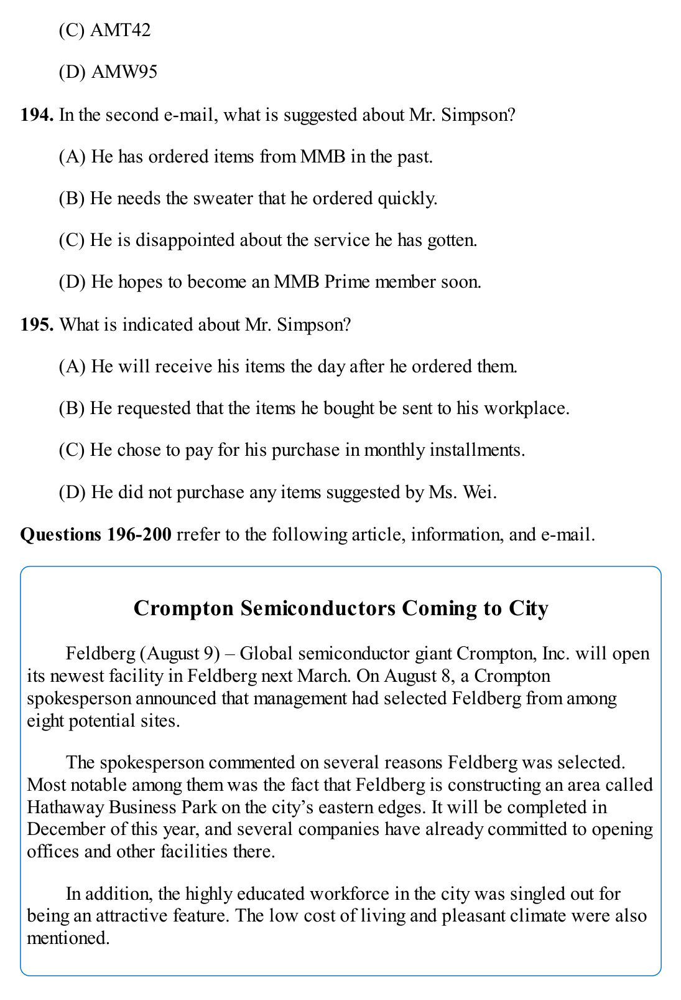


```text
(C) AMT42
(D) AMW95
194.
 In the second e-mail, what is suggested about Mr. Simpson?
(A) He has ordered items from MMB in the past.
(B) He needs the sweater that he ordered quickly.
(C) He is disappointed about the service he has gotten.
(D) He hopes to become an MMB Prime member soon.
195.
 What is indicated about Mr. Simpson?
(A) He will receive his items the day after he ordered them.
(B) He requested that the items he bought be sent to his workplace.
(C) He chose to pay for his purchase in monthly installments.
(D) He did not purchase any items suggested by Ms. Wei.
Questions 196-200
 rrefer to the following article, information, and e-mail.
Crompton Semiconductors Coming to City
Feldberg (August 9) – Global semiconductor giant Crompton, Inc. will open
its newest facility in Feldberg next March. On August 8, a Crompton
spokesperson announced that management had selected Feldberg from among
eight potential sites.
The spokesperson commented on several reasons Feldberg was selected.
Most notable among them was the fact that Feldberg is constructing an area called
Hathaway Business Park on the city’s eastern edges. It will be completed in
December of this year, and several companies have already committed to opening
offices and other facilities there.
In addition, the highly educated workforce in the city was singled out for
being an attractive feature. The low cost of living and pleasant climate were also
mentioned.
1001
```

## PDF 第 231 页

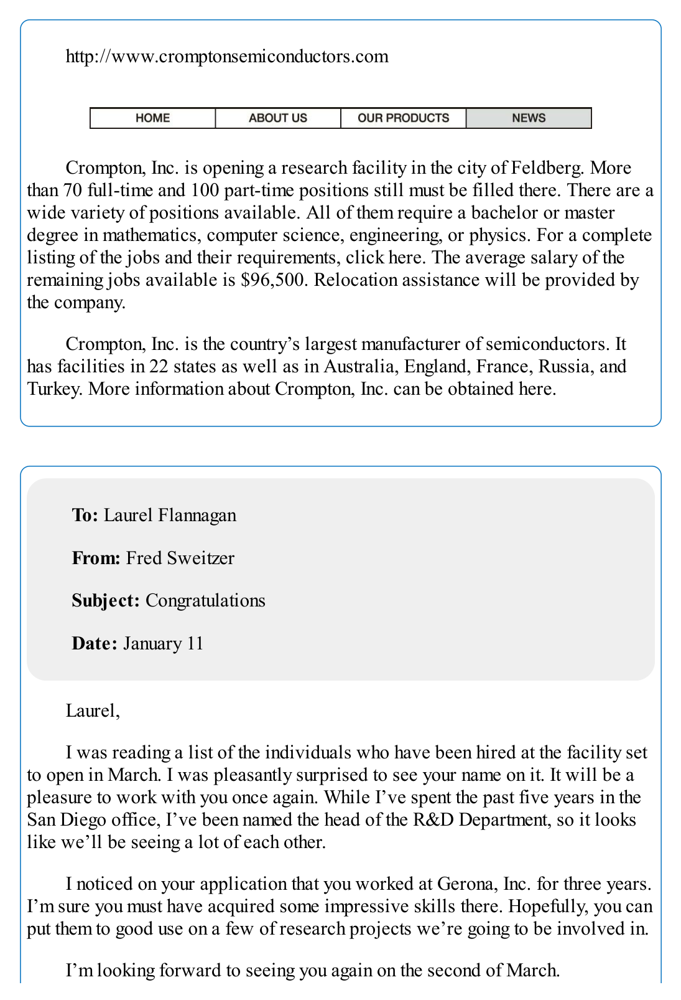


```text
http://www.cromptonsemiconductors.com
Crompton, Inc. is opening a research facility in the city of Feldberg. More
than 70 full-time and 100 part-time positions still must be filled there. There are a
wide variety of positions available. All of them require a bachelor or master
degree in mathematics, computer science, engineering, or physics. For a complete
listing of the jobs and their requirements, click here. The average salary of the
remaining jobs available is $96,500. Relocation assistance will be provided by
the company.
Crompton, Inc. is the country’s largest manufacturer of semiconductors. It
has facilities in 22 states as well as in Australia, England, France, Russia, and
Turkey. More information about Crompton, Inc. can be obtained here.
To:
 Laurel Flannagan
From:
 Fred Sweitzer
Subject:
 Congratulations
Date:
 January 11
Laurel,
I was reading a list of the individuals who have been hired at the facility set
to open in March. I was pleasantly surprised to see your name on it. It will be a
pleasure to work with you once again. While I’ve spent the past five years in the
San Diego office, I’ve been named the head of the R&D Department, so it looks
like we’ll be seeing a lot of each other.
I noticed on your application that you worked at Gerona, Inc. for three years.
I’m sure you must have acquired some impressive skills there. Hopefully, you can
put them to good use on a few of research projects we’re going to be involved in.
I’m looking forward to seeing you again on the second of March.
1002
```

## PDF 第 232 页

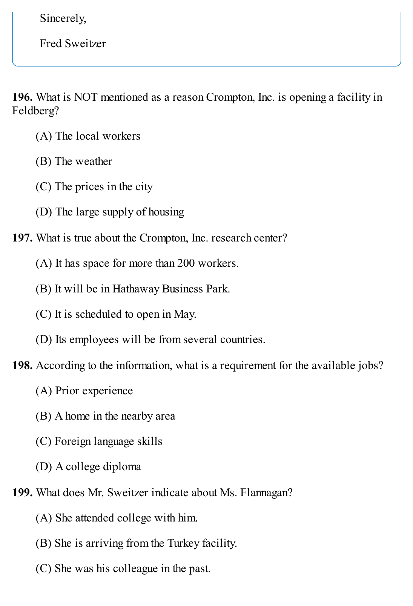


```text
Sincerely,
Fred Sweitzer
196.
 What is NOT mentioned as a reason Crompton, Inc. is opening a facility in
Feldberg?
(A) The local workers
(B) The weather
(C) The prices in the city
(D) The large supply of housing
197.
 What is true about the Crompton, Inc. research center?
(A) It has space for more than 200 workers.
(B) It will be in Hathaway Business Park.
(C) It is scheduled to open in May.
(D) Its employees will be from several countries.
198.
 According to the information, what is a requirement for the available jobs?
(A) Prior experience
(B) A home in the nearby area
(C) Foreign language skills
(D) A college diploma
199.
 What does Mr. Sweitzer indicate about Ms. Flannagan?
(A) She attended college with him.
(B) She is arriving from the Turkey facility.
(C) She was his colleague in the past.
1003
```

## PDF 第 233 页

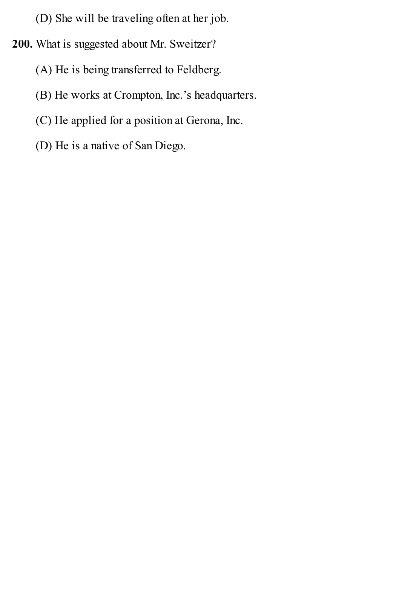


```text
(D) She will be traveling often at her job.
200.
 What is suggested about Mr. Sweitzer?
(A) He is being transferred to Feldberg.
(B) He works at Crompton, Inc.’s headquarters.
(C) He applied for a position at Gerona, Inc.
(D) He is a native of San Diego.
1004
```

## PDF 第 234 页

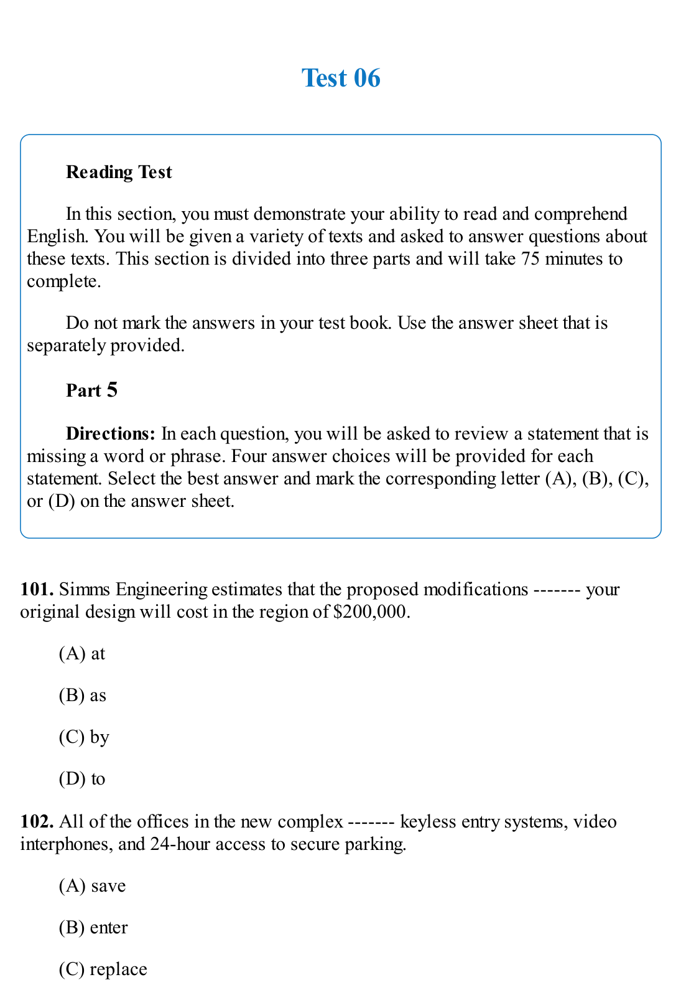


```text
Test 06
Reading Test
In this section, you must demonstrate your ability to read and comprehend
English. You will be given a variety of texts and asked to answer questions about
these texts. This section is divided into three parts and will take 75 minutes to
complete.
Do not mark the answers in your test book. Use the answer sheet that is
separately provided.
Part
5
Directions:
 In each question, you will be asked to review a statement that is
missing a word or phrase. Four answer choices will be provided for each
statement. Select the best answer and mark the corresponding letter (A), (B), (C),
or (D) on the answer sheet.
101.
 Simms Engineering estimates that the proposed modifications ------- your
original design will cost in the region of $200,000.
(A) at
(B) as
(C) by
(D) to
102.
 All of the offices in the new complex ------- keyless entry systems, video
interphones, and 24-hour access to secure parking.
(A) save
(B) enter
(C) replace
1005
```

## PDF 第 235 页

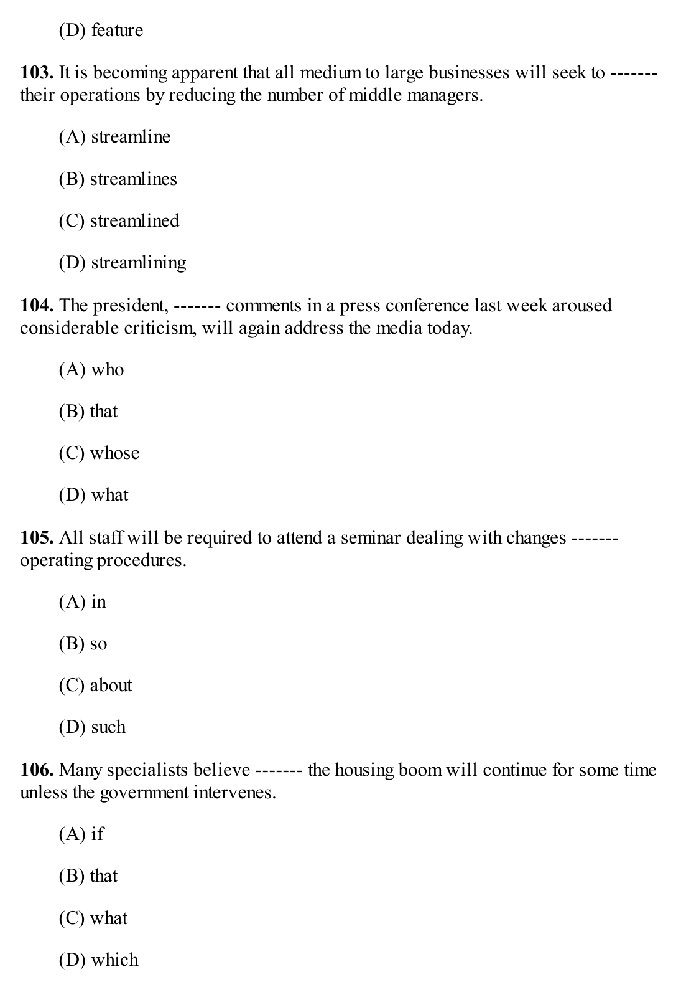


```text
(D) feature
103.
 It is becoming apparent that all medium to large businesses will seek to -------
their operations by reducing the number of middle managers.
(A) streamline
(B) streamlines
(C) streamlined
(D) streamlining
104.
 The president, ------- comments in a press conference last week aroused
considerable criticism, will again address the media today.
(A) who
(B) that
(C) whose
(D) what
105.
 All staff will be required to attend a seminar dealing with changes -------
operating procedures.
(A) in
(B) so
(C) about
(D) such
106.
 Many specialists believe ------- the housing boom will continue for some time
unless the government intervenes.
(A) if
(B) that
(C) what
(D) which
1006
```

## PDF 第 236 页

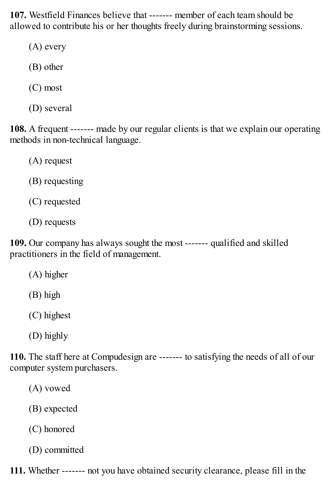


```text
107.
 Westfield Finances believe that ------- member of each team should be
allowed to contribute his or her thoughts freely during brainstorming sessions.
(A) every
(B) other
(C) most
(D) several
108.
 A frequent ------- made by our regular clients is that we explain our operating
methods in non-technical language.
(A) request
(B) requesting
(C) requested
(D) requests
109.
 Our company has always sought the most ------- qualified and skilled
practitioners in the field of management.
(A) higher
(B) high
(C) highest
(D) highly
110.
 The staff here at Compudesign are ------- to satisfying the needs of all of our
computer system purchasers.
(A) vowed
(B) expected
(C) honored
(D) committed
111.
 Whether ------- not you have obtained security clearance, please fill in the
1007
```

## PDF 第 237 页

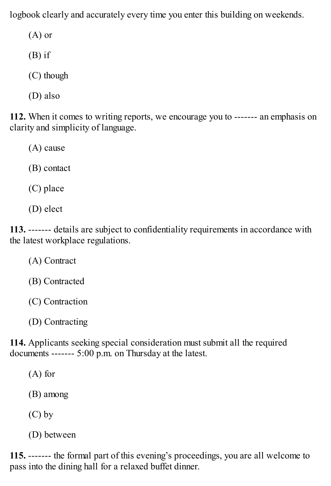


```text
logbook clearly and accurately every time you enter this building on weekends.
(A) or
(B) if
(C) though
(D) also
112.
 When it comes to writing reports, we encourage you to ------- an emphasis on
clarity and simplicity of language.
(A) cause
(B) contact
(C) place
(D) elect
113.
 ------- details are subject to confidentiality requirements in accordance with
the latest workplace regulations.
(A) Contract
(B) Contracted
(C) Contraction
(D) Contracting
114.
 Applicants seeking special consideration must submit all the required
documents ------- 5:00 p.m. on Thursday at the latest.
(A) for
(B) among
(C) by
(D) between
115.
 ------- the formal part of this evening’s proceedings, you are all welcome to
pass into the dining hall for a relaxed buffet dinner.
1008
```

## PDF 第 238 页

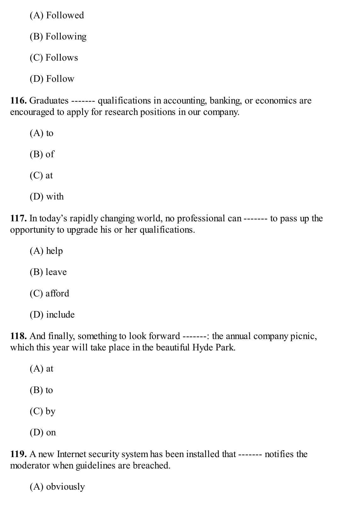


```text
(A) Followed
(B) Following
(C) Follows
(D) Follow
116.
 Graduates ------- qualifications in accounting, banking, or economics are
encouraged to apply for research positions in our company.
(A) to
(B) of
(C) at
(D) with
117.
 In today’s rapidly changing world, no professional can ------- to pass up the
opportunity to upgrade his or her qualifications.
(A) help
(B) leave
(C) afford
(D) include
118.
 And finally, something to look forward -------: the annual company picnic,
which this year will take place in the beautiful Hyde Park.
(A) at
(B) to
(C) by
(D) on
119.
 A new Internet security system has been installed that ------- notifies the
moderator when guidelines are breached.
(A) obviously
1009
```

## PDF 第 239 页

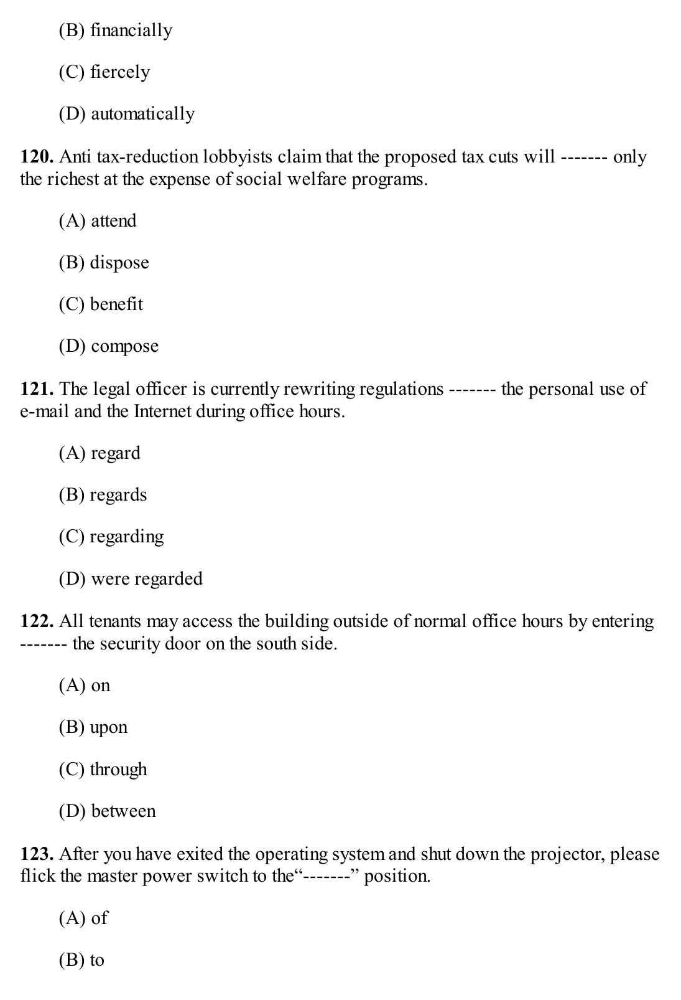


```text
(B) financially
(C) fiercely
(D) automatically
120.
 Anti tax-reduction lobbyists claim that the proposed tax cuts will ------- only
the richest at the expense of social welfare programs.
(A) attend
(B) dispose
(C) benefit
(D) compose
121.
 The legal officer is currently rewriting regulations ------- the personal use of
e-mail and the Internet during office hours.
(A) regard
(B) regards
(C) regarding
(D) were regarded
122.
 All tenants may access the building outside of normal office hours by entering
------- the security door on the south side.
(A) on
(B) upon
(C) through
(D) between
123.
 After you have exited the operating system and shut down the projector, please
flick the master power switch to the“-------” position.
(A) of
(B) to
1010
```

## PDF 第 240 页

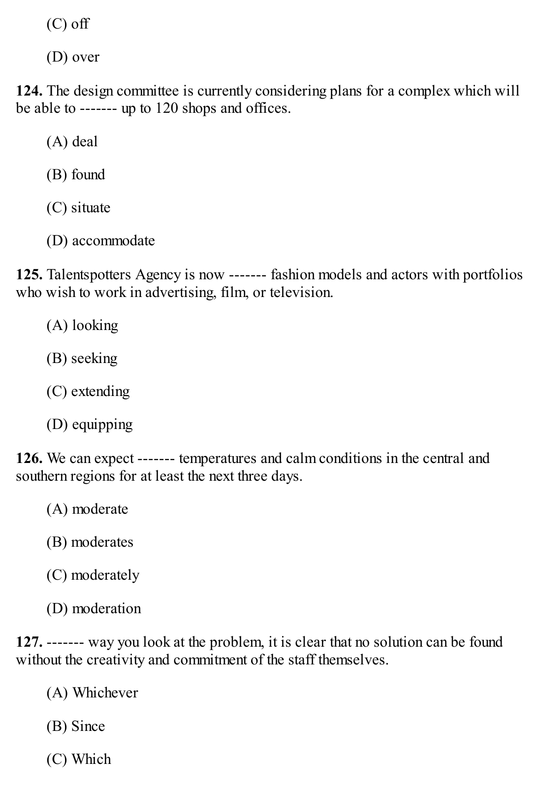


```text
(C) off
(D) over
124.
 The design committee is currently considering plans for a complex which will
be able to ------- up to 120 shops and offices.
(A) deal
(B) found
(C) situate
(D) accommodate
125.
 Talentspotters Agency is now ------- fashion models and actors with portfolios
who wish to work in advertising, film, or television.
(A) looking
(B) seeking
(C) extending
(D) equipping
126.
 We can expect ------- temperatures and calm conditions in the central and
southern regions for at least the next three days.
(A) moderate
(B) moderates
(C) moderately
(D) moderation
127.
 ------- way you look at the problem, it is clear that no solution can be found
without the creativity and commitment of the staff themselves.
(A) Whichever
(B) Since
(C) Which
1011
```

## PDF 第 241 页

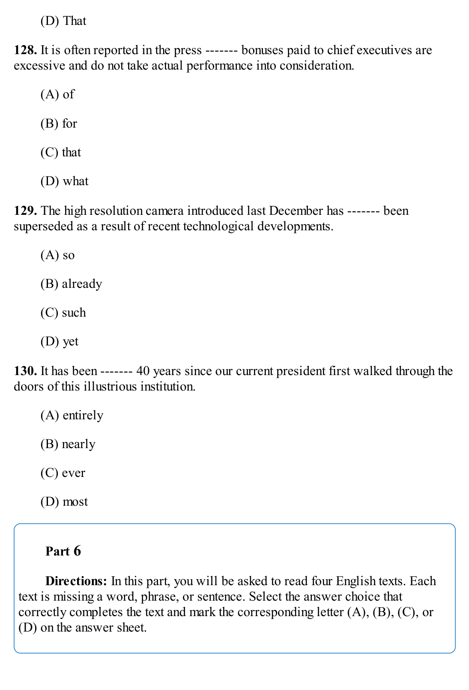


```text
(D) That
128
.
 It is often reported in the press ------- bonuses paid to chief executives are
excessive and do not take actual performance into consideration.
(A) of
(B) for
(C) that
(D) what
129.
 The high resolution camera introduced last December has ------- been
superseded as a result of recent technological developments.
(A) so
(B) already
(C) such
(D) yet
130.
 It has been ------- 40 years since our current president first walked through the
doors of this illustrious institution.
(A) entirely
(B) nearly
(C) ever
(D) most
Part
6
Directions:
 In this part, you will be asked to read four English texts. Each
text is missing a word, phrase, or sentence. Select the answer choice that
correctly completes the text and mark the corresponding letter (A), (B), (C), or
(D) on the answer sheet.
1012
```

## PDF 第 242 页

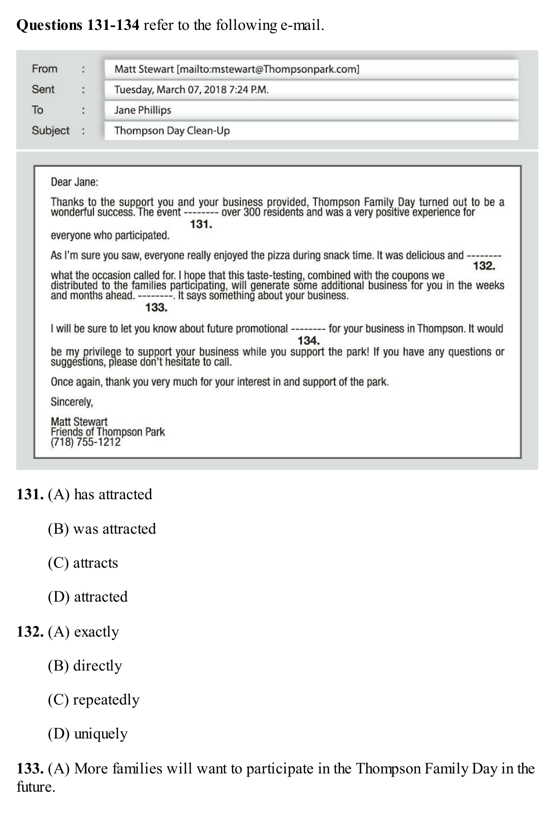


```text
Questions 131-134
 refer to the following e-mail.
131.
 (A) has attracted
(B) was attracted
(C) attracts
(D) attracted
132.
 (A) exactly
(B) directly
(C) repeatedly
(D) uniquely
133.
 (A) More families will want to participate in the Thompson Family Day in the
future.
1013
```

## PDF 第 243 页

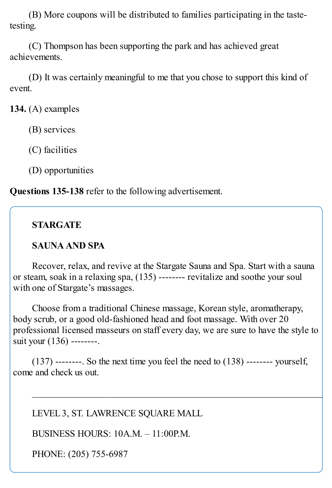


```text
(B) More coupons will be distributed to families participating in the taste-
testing.
(C) Thompson has been supporting the park and has achieved great
achievements.
(D) It was certainly meaningful to me that you chose to support this kind of
event.
134.
 (A) examples
(B) services
(C) facilities
(D) opportunities
Questions 135-138
 refer to the following advertisement.
STARGATE
SAUNA AND SPA
Recover, relax, and revive at the Stargate Sauna and Spa. Start with a sauna
or steam, soak in a relaxing spa, (135) -------- revitalize and soothe your soul
with one of Stargate’s massages.
Choose from a traditional Chinese massage, Korean style, aromatherapy,
body scrub, or a good old-fashioned head and foot massage. With over 20
professional licensed masseurs on staff every day, we are sure to have the style to
suit your (136) --------.
(137) --------. So the next time you feel the need to (138) -------- yourself,
come and check us out.
_____________________________________________________________________
LEVEL 3, ST. LAWRENCE SQUARE MALL
BUSINESS HOURS: 10A.M. – 11:00P.M.
PHONE: (205) 755-6987
1014
```

## PDF 第 244 页

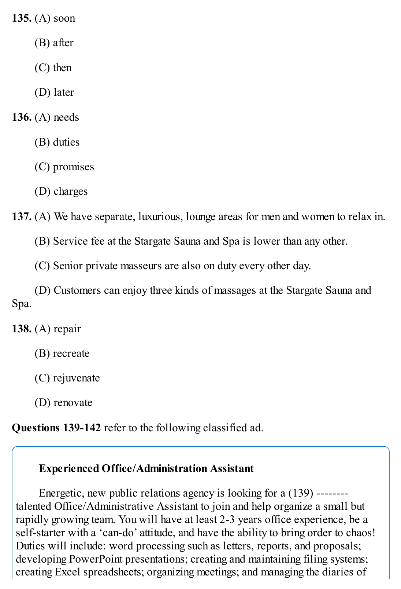


```text
135.
 (A) soon
(B) after
(C) then
(D) later
136.
 (A) needs
(B) duties
(C) promises
(D) charges
137.
 (A) We have separate, luxurious, lounge areas for men and women to relax in.
(B) Service fee at the Stargate Sauna and Spa is lower than any other.
(C) Senior private masseurs are also on duty every other day.
(D) Customers can enjoy three kinds of massages at the Stargate Sauna and
Spa.
138.
 (A) repair
(B) recreate
(C) rejuvenate
(D) renovate
Questions 139-142
 refer to the following classified ad.
Experienced Office/Administration Assistant
Energetic, new public relations agency is looking for a (139) --------
talented Office/Administrative Assistant to join and help organize a small but
rapidly growing team. You will have at least 2-3 years office experience, be a
self-starter with a ‘can-do’ attitude, and have the ability to bring order to chaos!
Duties will include: word processing such as letters, reports, and proposals;
developing PowerPoint presentations; creating and maintaining filing systems;
creating Excel spreadsheets; organizing meetings; and managing the diaries of
1015
```

## PDF 第 245 页

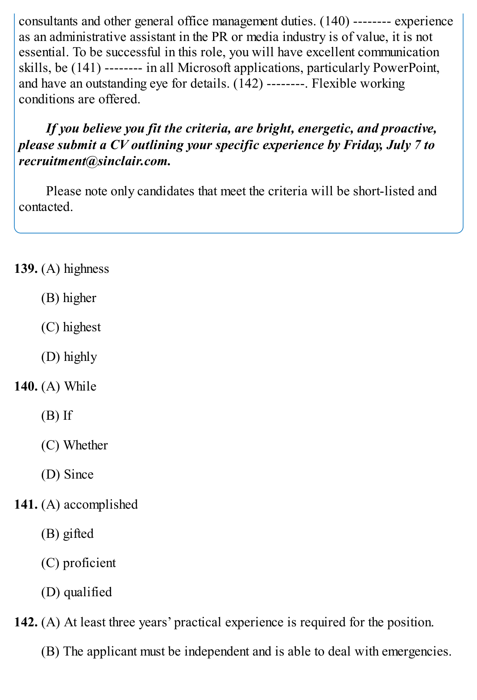


```text
consultants and other general office management duties. (140) -------- experience
as an administrative assistant in the PR or media industry is of value, it is not
essential. To be successful in this role, you will have excellent communication
skills, be (141) -------- in all Microsoft applications, particularly PowerPoint,
and have an outstanding eye for details. (142) --------. Flexible working
conditions are offered.
If you believe you fit the criteria, are bright, energetic, and proactive,
please submit a CV outlining your specific experience by Friday, July 7 to
recruitment@sinclair.com.
Please note only candidates that meet the criteria will be short-listed and
contacted.
139.
 (A) highness
(B) higher
(C) highest
(D) highly
140.
 (A) While
(B) If
(C) Whether
(D) Since
141.
 (A) accomplished
(B) gifted
(C) proficient
(D) qualified
142.
 (A) At least three years’ practical experience is required for the position.
(B) The applicant must be independent and is able to deal with emergencies.
1016
```

## PDF 第 246 页

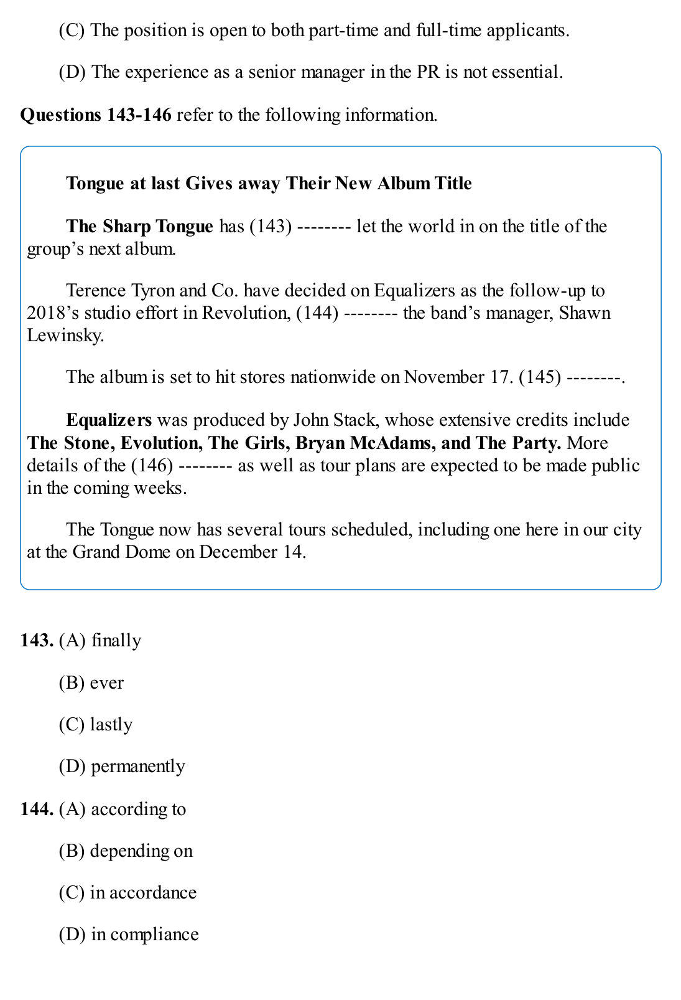


```text
(C) The position is open to both part-time and full-time applicants.
(D) The experience as a senior manager in the PR is not essential.
Questions 143-146
 refer to the following information.
Tongue at last Gives away Their New Album Title
The Sharp Tongue
 has (143) -------- let the world in on the title of the
group’s next album.
Terence Tyron and Co. have decided on Equalizers as the follow-up to
2018’s studio effort in Revolution, (144) -------- the band’s manager, Shawn
Lewinsky.
The album is set to hit stores nationwide on November 17. (145) --------.
Equalizers
 was produced by John Stack, whose extensive credits include
The Stone, Evolution, The Girls, Bryan McAdams, and The Party.
 More
details of the (146) -------- as well as tour plans are expected to be made public
in the coming weeks.
The Tongue now has several tours scheduled, including one here in our city
at the Grand Dome on December 14.
143.
 (A) finally
(B) ever
(C) lastly
(D) permanently
144.
 (A) according to
(B) depending on
(C) in accordance
(D) in compliance
1017
```

## PDF 第 247 页

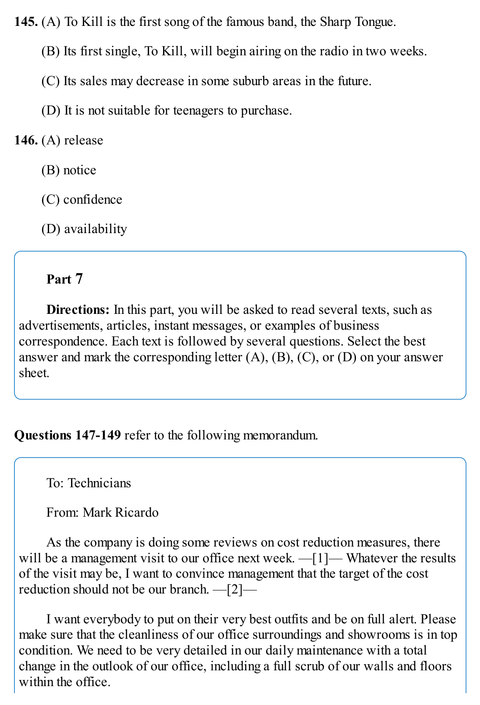


```text
145.
 (A) To Kill is the first song of the famous band, the Sharp Tongue.
(B) Its first single, To Kill, will begin airing on the radio in two weeks.
(C) Its sales may decrease in some suburb areas in the future.
(D) It is not suitable for teenagers to purchase.
146.
 (A) release
(B) notice
(C) confidence
(D) availability
Part
7
Directions:
 In this part, you will be asked to read several texts, such as
advertisements, articles, instant messages, or examples of business
correspondence. Each text is followed by several questions. Select the best
answer and mark the corresponding letter (A), (B), (C), or (D) on your answer
sheet.
Questions 147-
149
 refer to the following memorandum.
To: Technicians
From: Mark Ricardo
As the company is doing some reviews on cost reduction measures, there
will be a management visit to our office next week. —[1]— Whatever the results
of the visit may be, I want to convince management that the target of the cost
reduction should not be our branch. —[2]—
I want everybody to put on their very best outfits and be on full alert. Please
make sure that the cleanliness of our office surroundings and showrooms is in top
condition. We need to be very detailed in our daily maintenance with a total
change in the outlook of our office, including a full scrub of our walls and floors
within the office.
1018
```

## PDF 第 248 页

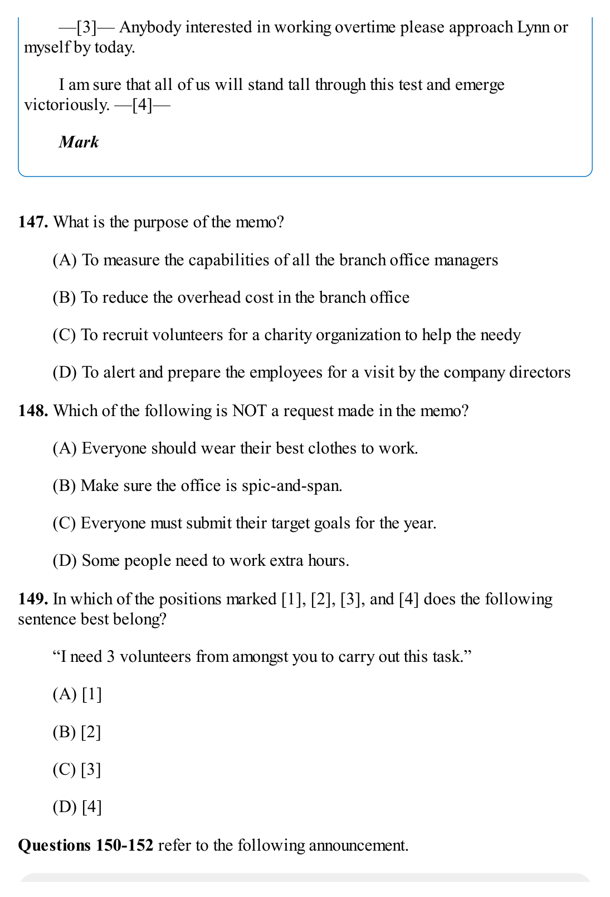


```text
—[3]— Anybody interested in working overtime please approach Lynn or
myself by today.
I am sure that all of us will stand tall through this test and emerge
victoriously. —[4]—
Mark
147.
 What is the purpose of the memo?
(A) To measure the capabilities of all the branch office managers
(B) To reduce the overhead cost in the branch office
(C) To recruit volunteers for a charity organization to help the needy
(D) To alert and prepare the employees for a visit by the company directors
148.
 Which of the following is NOT a request made in the memo?
(A) Everyone should wear their best clothes to work.
(B) Make sure the office is spic-and-span.
(C) Everyone must submit their target goals for the year.
(D) Some people need to work extra hours.
149.
 In which of the positions marked [1], [2], [3], and [4] does the following
sentence best belong?
“I need 3 volunteers from amongst you to carry out this task.”
(A) [1]
(B) [2]
(C) [3]
(D) [4]
Questions 150-
152
 refer to the following announcement.
1019
```

## PDF 第 249 页

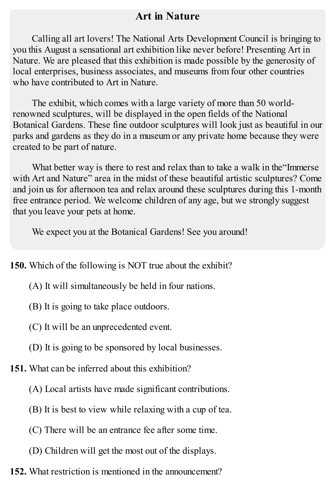


```text
Art in Nature
Calling all art lovers! The National Arts Development Council is bringing to
you this August a sensational art exhibition like never before! Presenting Art in
Nature. We are pleased that this exhibition is made possible by the generosity of
local enterprises, business associates, and museums from four other countries
who have contributed to Art in Nature.
The exhibit, which comes with a large variety of more than 50 world-
renowned sculptures, will be displayed in the open fields of the National
Botanical Gardens. These fine outdoor sculptures will look just as beautiful in our
parks and gardens as they do in a museum or any private home because they were
created to be part of nature.
What better way is there to rest and relax than to take a walk in the“Immerse
with Art and Nature” area in the midst of these beautiful artistic sculptures? Come
and join us for afternoon tea and relax around these sculptures during this 1-month
free entrance period. We welcome children of any age, but we strongly suggest
that you leave your pets at home.
We expect you at the Botanical Gardens! See you around!
150.
 Which of the following is NOT true about the exhibit?
(A) It will simultaneously be held in four nations.
(B) It is going to take place outdoors.
(C) It will be an unprecedented event.
(D) It is going to be sponsored by local businesses.
151.
 What can be inferred about this exhibition?
(A) Local artists have made significant contributions.
(B) It is best to view while relaxing with a cup of tea.
(C) There will be an entrance fee after some time.
(D) Children will get the most out of the displays.
152.
 What restriction is mentioned in the announcement?
1020
```

## PDF 第 250 页

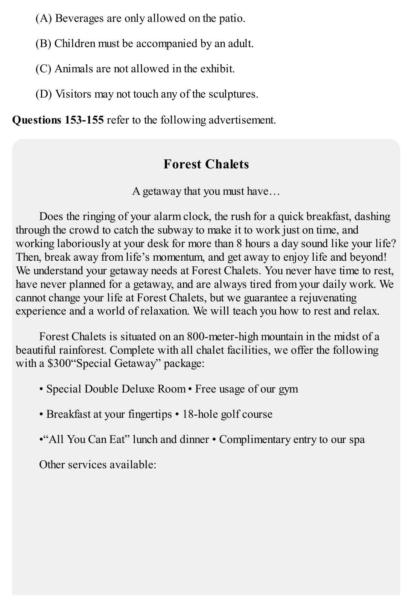


```text
(A) Beverages are only allowed on the patio.
(B) Children must be accompanied by an adult.
(C) Animals are not allowed in the exhibit.
(D) Visitors may not touch any of the sculptures.
Questions 153-155
 refer to the following advertisement.
Forest Chalets
A getaway that you must have…
Does the ringing of your alarm clock, the rush for a quick breakfast, dashing
through the crowd to catch the subway to make it to work just on time, and
working laboriously at your desk for more than 8 hours a day sound like your life?
Then, break away from life’s momentum, and get away to enjoy life and beyond!
We understand your getaway needs at Forest Chalets. You never have time to rest,
have never planned for a getaway, and are always tired from your daily work. We
cannot change your life at Forest Chalets, but we guarantee a rejuvenating
experience and a world of relaxation. We will teach you how to rest and relax.
Forest Chalets is situated on an 800-meter-high mountain in the midst of a
beautiful rainforest. Complete with all chalet facilities, we offer the following
with a $300“Special Getaway” package:
• Special Double Deluxe Room • Free usage of our gym
• Breakfast at your fingertips • 18-hole golf course
•“All You Can Eat” lunch and dinner • Complimentary entry to our spa
Other services available:
1021
```

## PDF 第 251 页

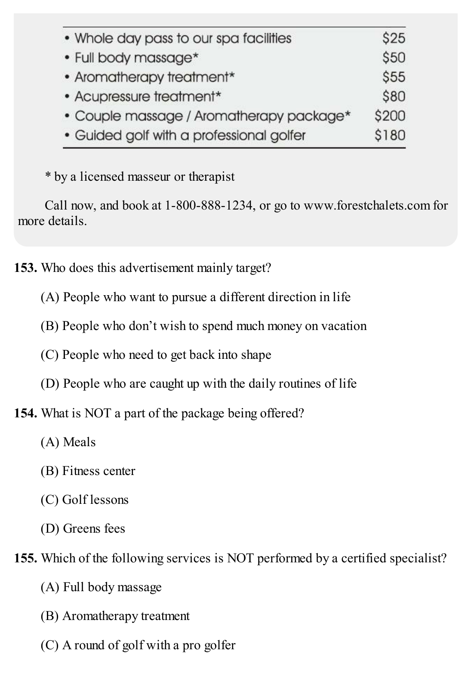


```text
* by a licensed masseur or therapist
Call now, and book at 1-800-888-1234, or go to www.forestchalets.com for
more details.
153.
 Who does this advertisement mainly target?
(A) People who want to pursue a different direction in life
(B) People who don’t wish to spend much money on vacation
(C) People who need to get back into shape
(D) People who are caught up with the daily routines of life
154.
 What is NOT a part of the package being offered?
(A) Meals
(B) Fitness center
(C) Golf lessons
(D) Greens fees
155.
 Which of the following services is NOT performed by a certified specialist?
(A) Full body massage
(B) Aromatherapy treatment
(C) A round of golf with a pro golfer
1022
```

## PDF 第 252 页

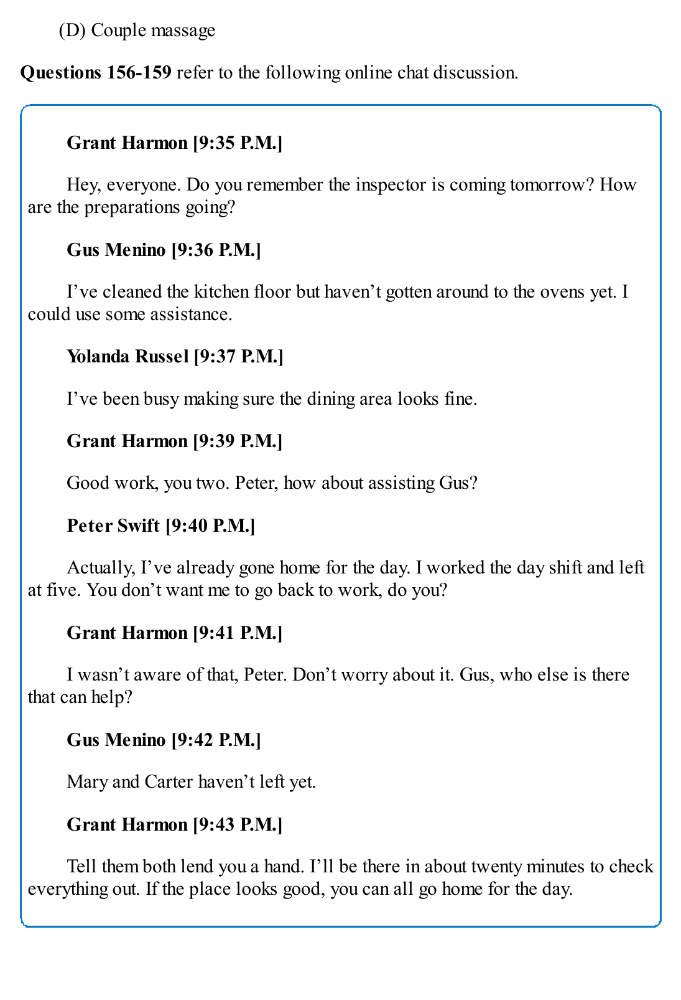


```text
(D) Couple massage
Questions 156-159
 refer to the following online chat discussion.
Grant Harmon [9:35 P.M.]
Hey, everyone. Do you remember the inspector is coming tomorrow? How
are the preparations going?
Gus Menino [9:36 P.M.]
I’ve cleaned the kitchen floor but haven’t gotten around to the ovens yet. I
could use some assistance.
Yolanda Russel [9:37 P.M.]
I’ve been busy making sure the dining area looks fine.
Grant Harmon [9:39 P.M.]
Good work, you two. Peter, how about assisting Gus?
Peter Swift [9:40 P.M.]
Actually, I’ve already gone home for the day. I worked the day shift and left
at five. You don’t want me to go back to work, do you?
Grant Harmon [9:41 P.M.]
I wasn’t aware of that, Peter. Don’t worry about it. Gus, who else is there
that can help?
Gus Menino [9:42 P.M.]
Mary and Carter haven’t left yet.
Grant Harmon [9:43 P.M.]
Tell them both lend you a hand. I’ll be there in about twenty minutes to check
everything out. If the place looks good, you can all go home for the day.
1023
```

## PDF 第 253 页

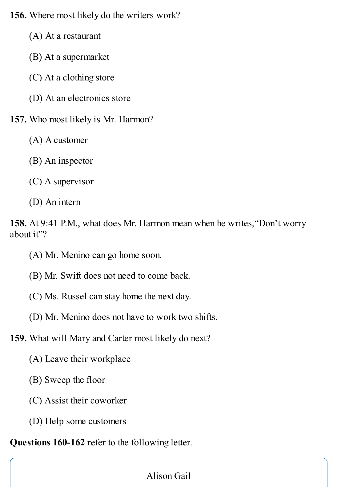


```text
156.
 Where most likely do the writers work?
(A) At a restaurant
(B) At a supermarket
(C) At a clothing store
(D) At an electronics store
157.
 Who most likely is Mr. Harmon?
(A) A customer
(B) An inspector
(C) A supervisor
(D) An intern
158.
 At 9:41 P.M., what does Mr. Harmon mean when he writes,“Don’t worry
about it”?
(A) Mr. Menino can go home soon.
(B) Mr. Swift does not need to come back.
(C) Ms. Russel can stay home the next day.
(D) Mr. Menino does not have to work two shifts.
159.
 What will Mary and Carter most likely do next?
(A) Leave their workplace
(B) Sweep the floor
(C) Assist their coworker
(D) Help some customers
Questions 160-162
 refer to the following letter.
Alison Gail
1024
```

## PDF 第 254 页

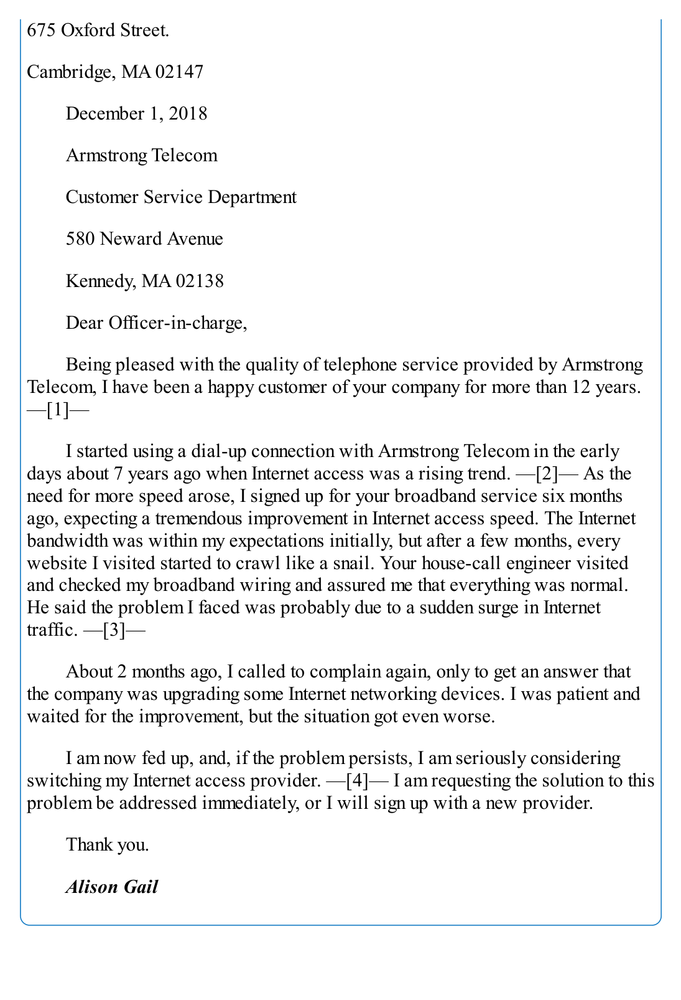


```text
675 Oxford Street.
Cambridge, MA 02147
December 1, 2018
Armstrong Telecom
Customer Service Department
580 Neward Avenue
Kennedy, MA 02138
Dear Officer-in-charge,
Being pleased with the quality of telephone service provided by Armstrong
Telecom, I have been a happy customer of your company for more than 12 years.
—[1]—
I started using a dial-up connection with Armstrong Telecom in the early
days about 7 years ago when Internet access was a rising trend. —[2]— As the
need for more speed arose, I signed up for your broadband service six months
ago, expecting a tremendous improvement in Internet access speed. The Internet
bandwidth was within my expectations initially, but after a few months, every
website I visited started to crawl like a snail. Your house-call engineer visited
and checked my broadband wiring and assured me that everything was normal.
He said the problem I faced was probably due to a sudden surge in Internet
traffic. —[3]—
About 2 months ago, I called to complain again, only to get an answer that
the company was upgrading some Internet networking devices. I was patient and
waited for the improvement, but the situation got even worse.
I am now fed up, and, if the problem persists, I am seriously considering
switching my Internet access provider. —[4]— I am requesting the solution to this
problem be addressed immediately, or I will sign up with a new provider.
Thank you.
Alison Gail
1025
```

## PDF 第 255 页

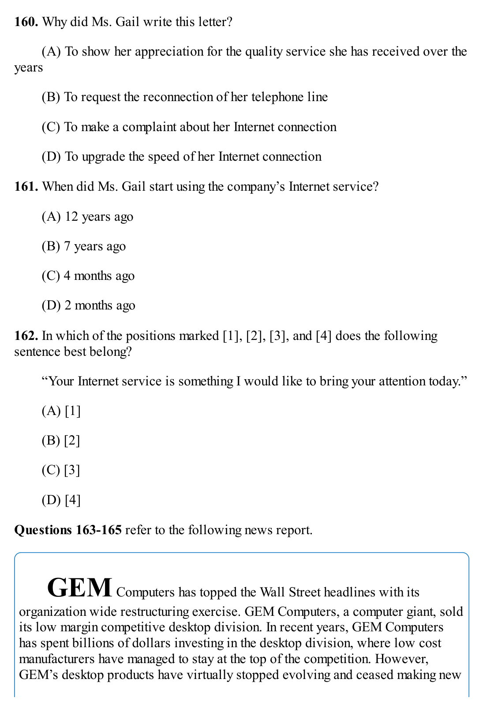


```text
160.
 Why did Ms. Gail write this letter?
(A) To show her appreciation for the quality service she has received over the
years
(B) To request the reconnection of her telephone line
(C) To make a complaint about her Internet connection
(D) To upgrade the speed of her Internet connection
161.
 When did Ms. Gail start using the company’s Internet service?
(A) 12 years ago
(B) 7 years ago
(C) 4 months ago
(D) 2 months ago
162.
 In which of the positions marked [1], [2], [3], and [4] does the following
sentence best belong?
“Your Internet service is something I would like to bring your attention today.”
(A) [1]
(B) [2]
(C) [3]
(D) [4]
Questions 163-165
 refer to the following news report.
GEM
 Computers has topped the Wall Street headlines with its
organization wide restructuring exercise. GEM Computers, a computer giant, sold
its low margin competitive desktop division. In recent years, GEM Computers
has spent billions of dollars investing in the desktop division, where low cost
manufacturers have managed to stay at the top of the competition. However,
GEM’s desktop products have virtually stopped evolving and ceased making new
1026
```

## PDF 第 256 页

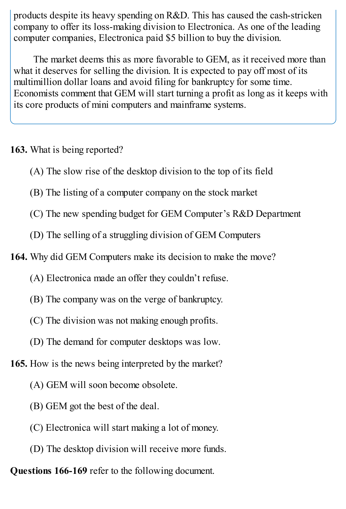


```text
products despite its heavy spending on R&D. This has caused the cash-stricken
company to offer its loss-making division to Electronica. As one of the leading
computer companies, Electronica paid $5 billion to buy the division.
The market deems this as more favorable to GEM, as it received more than
what it deserves for selling the division. It is expected to pay off most of its
multimillion dollar loans and avoid filing for bankruptcy for some time.
Economists comment that GEM will start turning a profit as long as it keeps with
its core products of mini computers and mainframe systems.
163.
 What is being reported?
(A) The slow rise of the desktop division to the top of its field
(B) The listing of a computer company on the stock market
(C) The new spending budget for GEM Computer’s R&D Department
(D) The selling of a struggling division of GEM Computers
164.
 Why did GEM Computers make its decision to make the move?
(A) Electronica made an offer they couldn’t refuse.
(B) The company was on the verge of bankruptcy.
(C) The division was not making enough profits.
(D) The demand for computer desktops was low.
165.
 How is the news being interpreted by the market?
(A) GEM will soon become obsolete.
(B) GEM got the best of the deal.
(C) Electronica will start making a lot of money.
(D) The desktop division will receive more funds.
Questions 166-169
 refer to the following document.
1027
```

## PDF 第 257 页

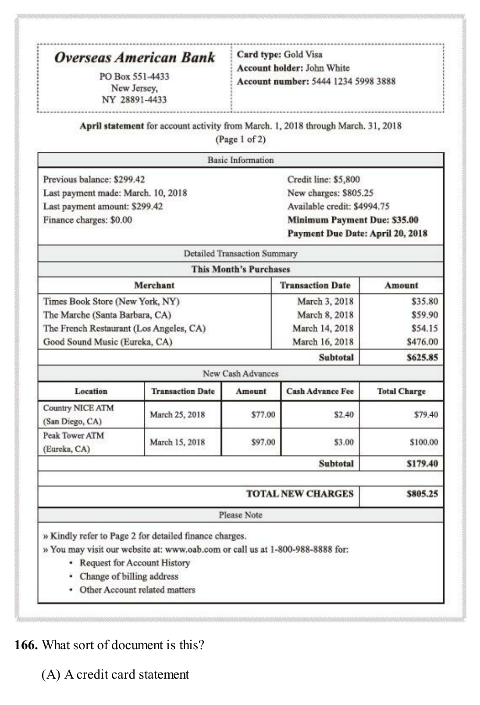


```text
166.
 What sort of document is this?
(A) A credit card statement
1028
```

## PDF 第 258 页

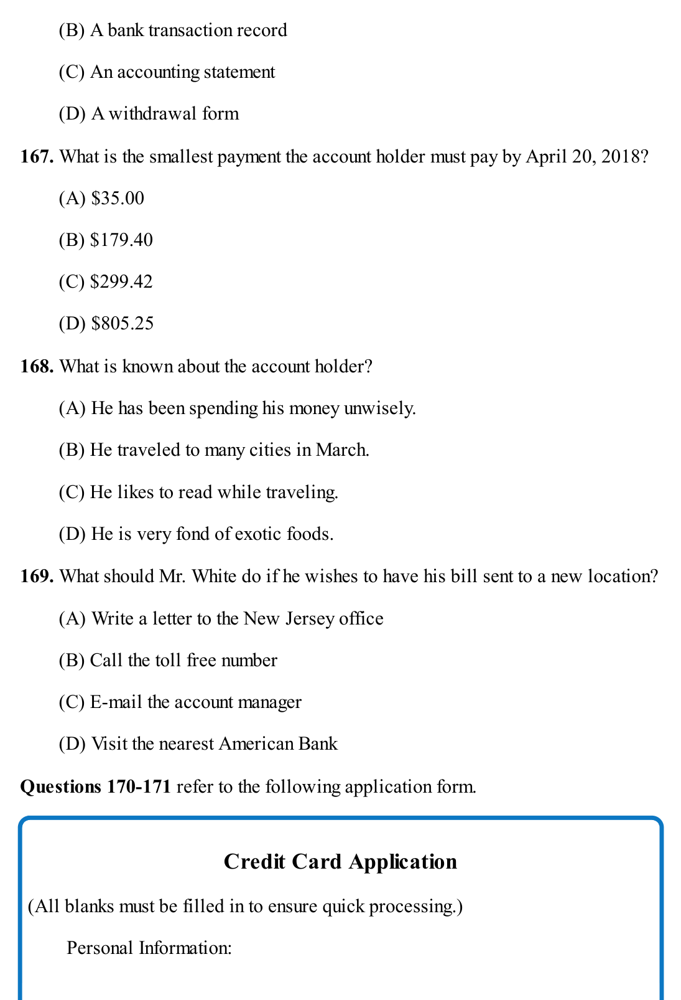


```text
(B) A bank transaction record
(C) An accounting statement
(D) A withdrawal form
167.
 What is the smallest payment the account holder must pay by April 20, 2018?
(A) $35.00
(B) $179.40
(C) $299.42
(D) $805.25
168.
 What is known about the account holder?
(A) He has been spending his money unwisely.
(B) He traveled to many cities in March.
(C) He likes to read while traveling.
(D) He is very fond of exotic foods.
169.
 What should Mr. White do if he wishes to have his bill sent to a new location?
(A) Write a letter to the New Jersey office
(B) Call the toll free number
(C) E-mail the account manager
(D) Visit the nearest American Bank
Questions 170-171
 refer to the following application form.
Credit Card Application
(All blanks must be filled in to ensure quick processing.)
Personal Information:
1029
```

## PDF 第 259 页

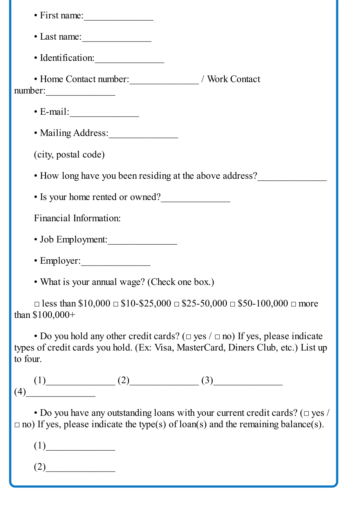


```text
• First name:______________
• Last name:______________
• Identification:______________
• Home Contact number:______________ / Work Contact
number:______________
• E-mail:______________
• Mailing Address:______________
(city, postal code)
• How long have you been residing at the above address?______________
• Is your home rented or owned?______________
Financial Information:
• Job Employment:______________
• Employer:______________
• What is your annual wage? (Check one box.)
□ less than $10,000 □ $10-$25,000 □ $25-50,000 □ $50-100,000 □ more
than $100,000+
• Do you hold any other credit cards? (□ yes / □ no) If yes, please indicate
types of credit cards you hold. (Ex: Visa, MasterCard, Diners Club, etc.) List up
to four.
(1)______________ (2)______________ (3)______________
(4)______________
• Do you have any outstanding loans with your current credit cards? (□ yes /
□ no) If yes, please indicate the type(s) of loan(s) and the remaining balance(s).
(1)______________
(2)______________
1030
```

## PDF 第 260 页

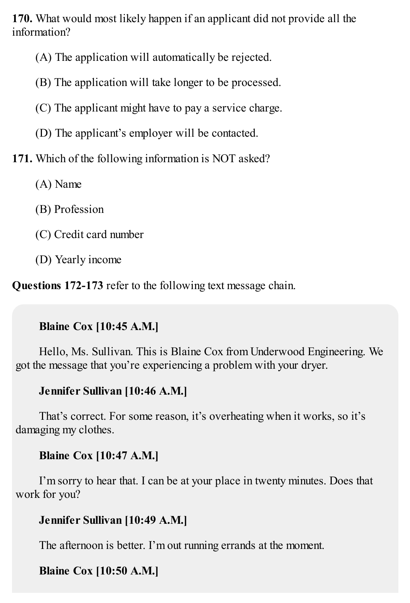


```text
170.
 What would most likely happen if an applicant did not provide all the
information?
(A) The application will automatically be rejected.
(B) The application will take longer to be processed.
(C) The applicant might have to pay a service charge.
(D) The applicant’s employer will be contacted.
171.
 Which of the following information is NOT asked?
(A) Name
(B) Profession
(C) Credit card number
(D) Yearly income
Questions 172-173
 refer to the following text message chain.
Blaine Cox [10:45 A.M.]
Hello, Ms. Sullivan. This is Blaine Cox from Underwood Engineering. We
got the message that you’re experiencing a problem with your dryer.
Jennifer Sullivan [10:46 A.M.]
That’s correct. For some reason, it’s overheating when it works, so it’s
damaging my clothes.
Blaine Cox [10:47 A.M.]
I’m sorry to hear that. I can be at your place in twenty minutes. Does that
work for you?
Jennifer Sullivan [10:49 A.M.]
The afternoon is better. I’m out running errands at the moment.
Blaine Cox [10:50 A.M.]
1031
```

## PDF 第 261 页

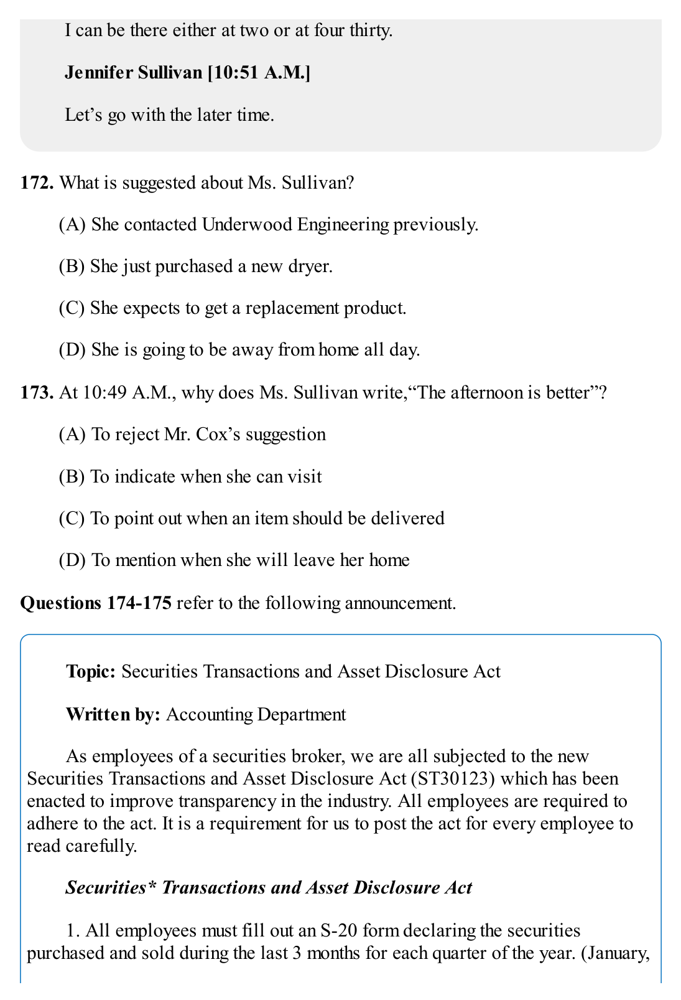


```text
I can be there either at two or at four thirty.
Jennifer Sullivan [10:51 A.M.]
Let’s go with the later time.
172.
 What is suggested about Ms. Sullivan?
(A) She contacted Underwood Engineering previously.
(B) She just purchased a new dryer.
(C) She expects to get a replacement product.
(D) She is going to be away from home all day.
173.
 At 10:49 A.M., why does Ms. Sullivan write,“The afternoon is better”?
(A) To reject Mr. Cox’s suggestion
(B) To indicate when she can visit
(C) To point out when an item should be delivered
(D) To mention when she will leave her home
Questions 174-175
 refer to the following announcement.
Topic:
 Securities Transactions and Asset Disclosure Act
Written by:
 Accounting Department
As employees of a securities broker, we are all subjected to the new
Securities Transactions and Asset Disclosure Act (ST30123) which has been
enacted to improve transparency in the industry. All employees are required to
adhere to the act. It is a requirement for us to post the act for every employee to
read carefully.
Securities* Transactions and Asset Disclosure Act
1. All employees must fill out an S-20 form declaring the securities
purchased and sold during the last 3 months for each quarter of the year. (January,
1032
```

## PDF 第 262 页

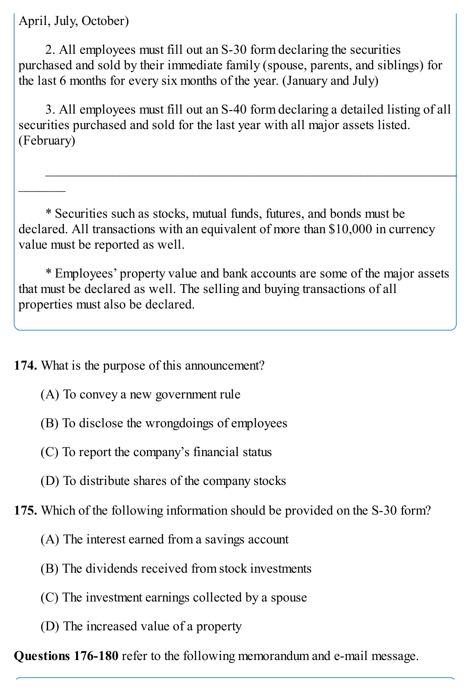


```text
April, July, October)
2. All employees must fill out an S-30 form declaring the securities
purchased and sold by their immediate family (spouse, parents, and siblings) for
the last 6 months for every six months of the year. (January and July)
3. All employees must fill out an S-40 form declaring a detailed listing of all
securities purchased and sold for the last year with all major assets listed.
(February)
______________________________________________________________
_______
* Securities such as stocks, mutual funds, futures, and bonds must be
declared. All transactions with an equivalent of more than $10,000 in currency
value must be reported as well.
* Employees’ property value and bank accounts are some of the major assets
that must be declared as well. The selling and buying transactions of all
properties must also be declared.
174.
 What is the purpose of this announcement?
(A) To convey a new government rule
(B) To disclose the wrongdoings of employees
(C) To report the company’s financial status
(D) To distribute shares of the company stocks
175.
 Which of the following information should be provided on the S-30 form?
(A) The interest earned from a savings account
(B) The dividends received from stock investments
(C) The investment earnings collected by a spouse
(D) The increased value of a property
Questions 176-180
 refer to the following memorandum and e-mail message.
1033
```

## PDF 第 263 页

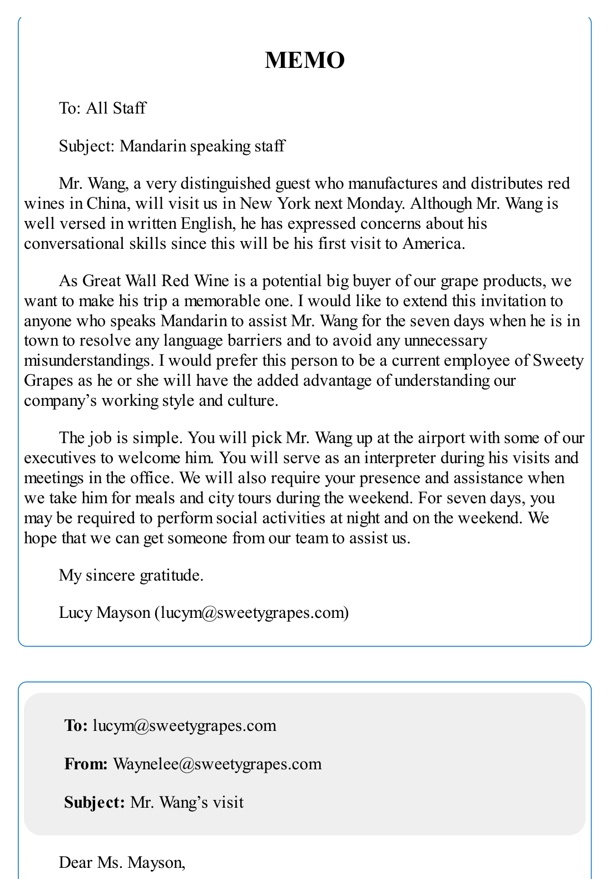


```text
MEMO
To: All Staff
Subject: Mandarin speaking staff
Mr. Wang, a very distinguished guest who manufactures and distributes red
wines in China, will visit us in New York next Monday. Although Mr. Wang is
well versed in written English, he has expressed concerns about his
conversational skills since this will be his first visit to America.
As Great Wall Red Wine is a potential big buyer of our grape products, we
want to make his trip a memorable one. I would like to extend this invitation to
anyone who speaks Mandarin to assist Mr. Wang for the seven days when he is in
town to resolve any language barriers and to avoid any unnecessary
misunderstandings. I would prefer this person to be a current employee of Sweety
Grapes as he or she will have the added advantage of understanding our
company’s working style and culture.
The job is simple. You will pick Mr. Wang up at the airport with some of our
executives to welcome him. You will serve as an interpreter during his visits and
meetings in the office. We will also require your presence and assistance when
we take him for meals and city tours during the weekend. For seven days, you
may be required to perform social activities at night and on the weekend. We
hope that we can get someone from our team to assist us.
My sincere gratitude.
Lucy Mayson (lucym@sweetygrapes.com)
To:
 lucym@sweetygrapes.com
From:
 Waynelee@sweetygrapes.com
Subject:
 Mr. Wang’s visit
Dear Ms. Mayson,
1034
```

## PDF 第 264 页

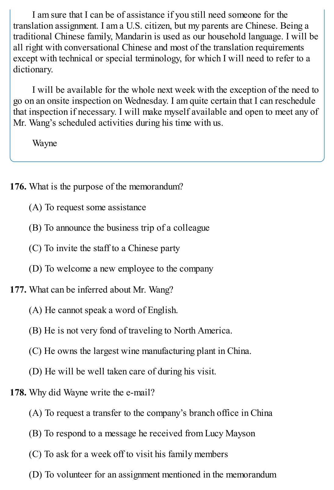


```text
I am sure that I can be of assistance if you still need someone for the
translation assignment. I am a U.S. citizen, but my parents are Chinese. Being a
traditional Chinese family, Mandarin is used as our household language. I will be
all right with conversational Chinese and most of the translation requirements
except with technical or special terminology, for which I will need to refer to a
dictionary.
I will be available for the whole next week with the exception of the need to
go on an onsite inspection on Wednesday. I am quite certain that I can reschedule
that inspection if necessary. I will make myself available and open to meet any of
Mr. Wang’s scheduled activities during his time with us.
Wayne
176.
 What is the purpose of the memorandum?
(A) To request some assistance
(B) To announce the business trip of a colleague
(C) To invite the staff to a Chinese party
(D) To welcome a new employee to the company
177.
 What can be inferred about Mr. Wang?
(A) He cannot speak a word of English.
(B) He is not very fond of traveling to North America.
(C) He owns the largest wine manufacturing plant in China.
(D) He will be well taken care of during his visit.
178.
 Why did Wayne write the e-mail?
(A) To request a transfer to the company’s branch office in China
(B) To respond to a message he received from Lucy Mayson
(C) To ask for a week off to visit his family members
(D) To volunteer for an assignment mentioned in the memorandum
1035
```

## PDF 第 265 页

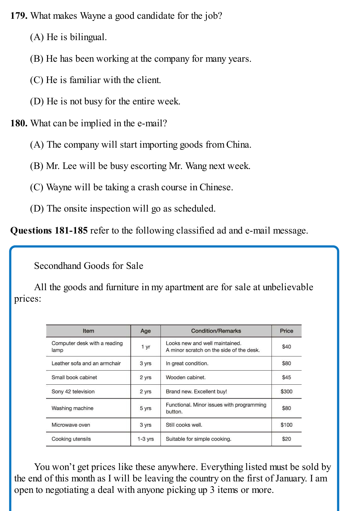


```text
179.
 What makes Wayne a good candidate for the job?
(A) He is bilingual.
(B) He has been working at the company for many years.
(C) He is familiar with the client.
(D) He is not busy for the entire week.
180.
 What can be implied in the e-mail?
(A) The company will start importing goods from China.
(B) Mr. Lee will be busy escorting Mr. Wang next week.
(C) Wayne will be taking a crash course in Chinese.
(D) The onsite inspection will go as scheduled.
Questions 181-185
 refer to the following classified ad and e-mail message.
Secondhand Goods for Sale
All the goods and furniture in my apartment are for sale at unbelievable
prices:
You won’t get prices like these anywhere. Everything listed must be sold by
the end of this month as I will be leaving the country on the first of January. I am
open to negotiating a deal with anyone picking up 3 items or more.
1036
```

## PDF 第 266 页

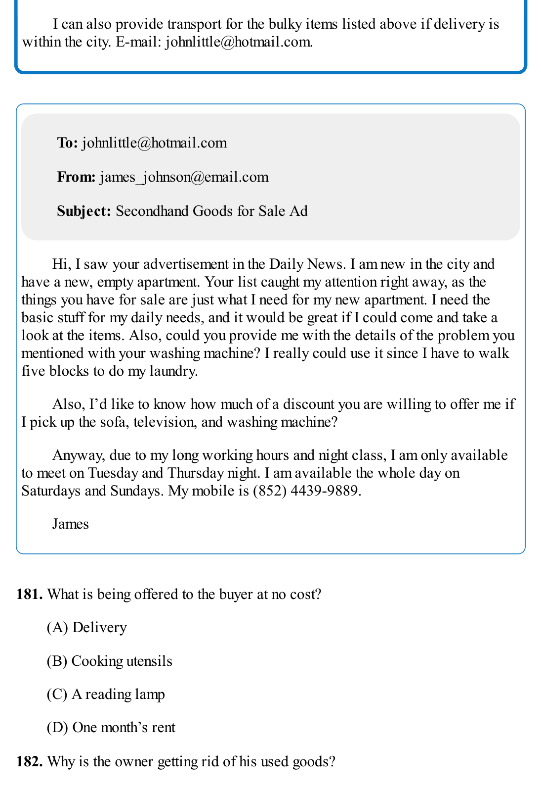


```text
I can also provide transport for the bulky items listed above if delivery is
within the city. E-mail: johnlittle@hotmail.com.
To:
 johnlittle@hotmail.com
From:
 james_johnson@email.com
Subject:
 Secondhand Goods for Sale Ad
Hi, I saw your advertisement in the Daily News. I am new in the city and
have a new, empty apartment. Your list caught my attention right away, as the
things you have for sale are just what I need for my new apartment. I need the
basic stuff for my daily needs, and it would be great if I could come and take a
look at the items. Also, could you provide me with the details of the problem you
mentioned with your washing machine? I really could use it since I have to walk
five blocks to do my laundry.
Also, I’d like to know how much of a discount you are willing to offer me if
I pick up the sofa, television, and washing machine?
Anyway, due to my long working hours and night class, I am only available
to meet on Tuesday and Thursday night. I am available the whole day on
Saturdays and Sundays. My mobile is (852) 4439-9889.
James
181.
 What is being offered to the buyer at no cost?
(A) Delivery
(B) Cooking utensils
(C) A reading lamp
(D) One month’s rent
182.
 Why is the owner getting rid of his used goods?
1037
```

## PDF 第 267 页

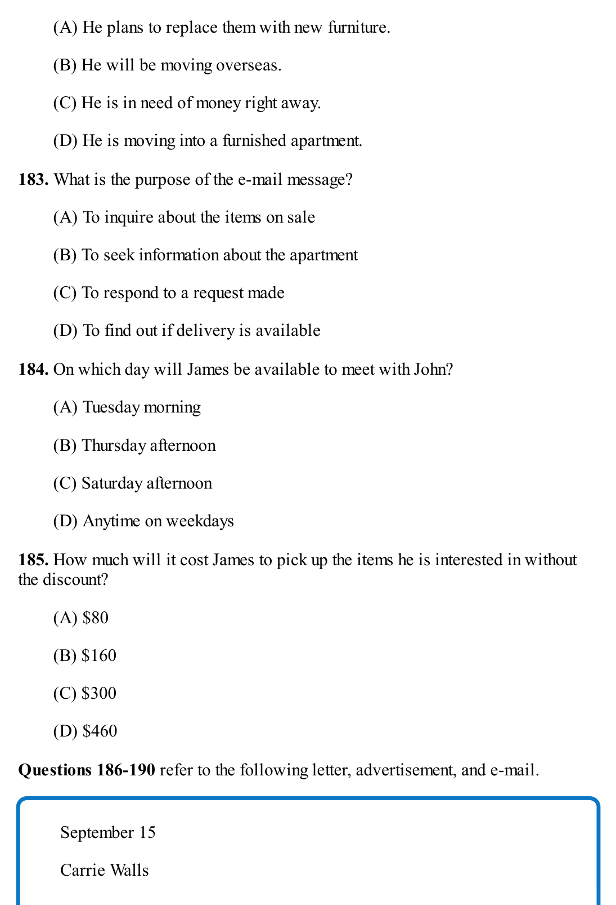


```text
(A) He plans to replace them with new furniture.
(B) He will be moving overseas.
(C) He is in need of money right away.
(D) He is moving into a furnished apartment.
183.
 What is the purpose of the e-mail message?
(A) To inquire about the items on sale
(B) To seek information about the apartment
(C) To respond to a request made
(D) To find out if delivery is available
184.
 On which day will James be available to meet with John?
(A) Tuesday morning
(B) Thursday afternoon
(C) Saturday afternoon
(D) Anytime on weekdays
185.
 How much will it cost James to pick up the items he is interested in without
the discount?
(A) $80
(B) $160
(C) $300
(D) $460
Questions 186-190
 refer to the following letter, advertisement, and e-mail.
September 15
Carrie Walls
1038
```

## PDF 第 268 页

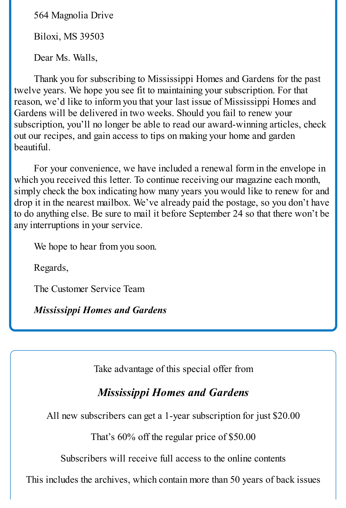


```text
564 Magnolia Drive
Biloxi, MS 39503
Dear Ms. Walls,
Thank you for subscribing to Mississippi Homes and Gardens for the past
twelve years. We hope you see fit to maintaining your subscription. For that
reason, we’d like to inform you that your last issue of Mississippi Homes and
Gardens will be delivered in two weeks. Should you fail to renew your
subscription, you’ll no longer be able to read our award-winning articles, check
out our recipes, and gain access to tips on making your home and garden
beautiful.
For your convenience, we have included a renewal form in the envelope in
which you received this letter. To continue receiving our magazine each month,
simply check the box indicating how many years you would like to renew for and
drop it in the nearest mailbox. We’ve already paid the postage, so you don’t have
to do anything else. Be sure to mail it before September 24 so that there won’t be
any interruptions in your service.
We hope to hear from you soon.
Regards,
The Customer Service Team
Mississippi Homes and Gardens
Take advantage of this special offer from
Mississippi Homes and Gardens
All new subscribers can get a 1-year subscription for just $20.00
That’s 60% off the regular price of $50.00
Subscribers will receive full access to the online contents
This includes the archives, which contain more than 50 years of back issues
1039
```

## PDF 第 269 页

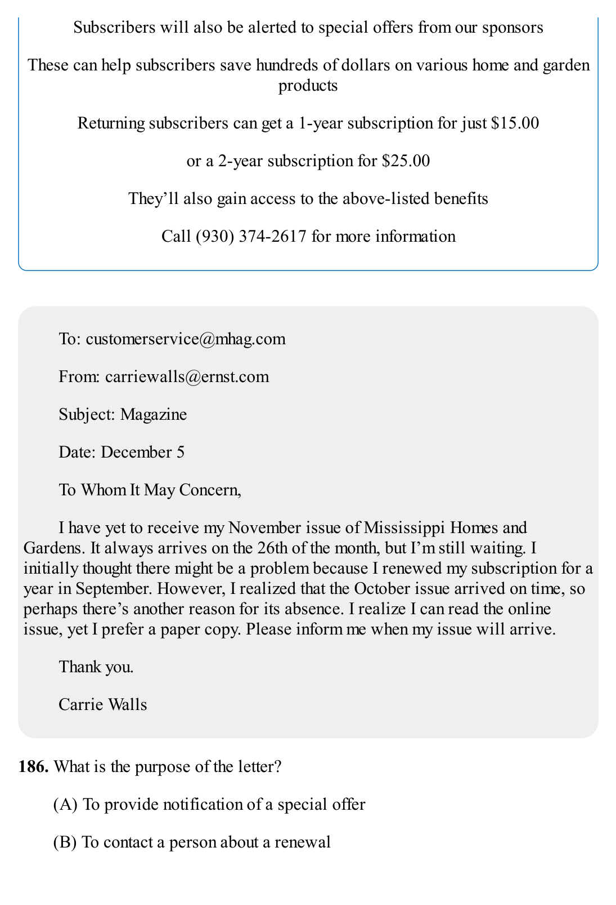


```text
Subscribers will also be alerted to special offers from our sponsors
These can help subscribers save hundreds of dollars on various home and garden
products
Returning subscribers can get a 1-year subscription for just $15.00
or a 2-year subscription for $25.00
They’ll also gain access to the above-listed benefits
Call (930) 374-2617 for more information
To: customerservice@mhag.com
From: carriewalls@ernst.com
Subject: Magazine
Date: December 5
To Whom It May Concern,
I have yet to receive my November issue of Mississippi Homes and
Gardens. It always arrives on the 26th of the month, but I’m still waiting. I
initially thought there might be a problem because I renewed my subscription for a
year in September. However, I realized that the October issue arrived on time, so
perhaps there’s another reason for its absence. I realize I can read the online
issue, yet I prefer a paper copy. Please inform me when my issue will arrive.
Thank you.
Carrie Walls
186.
 What is the purpose of the letter?
(A) To provide notification of a special offer
(B) To contact a person about a renewal
1040
```

## PDF 第 270 页

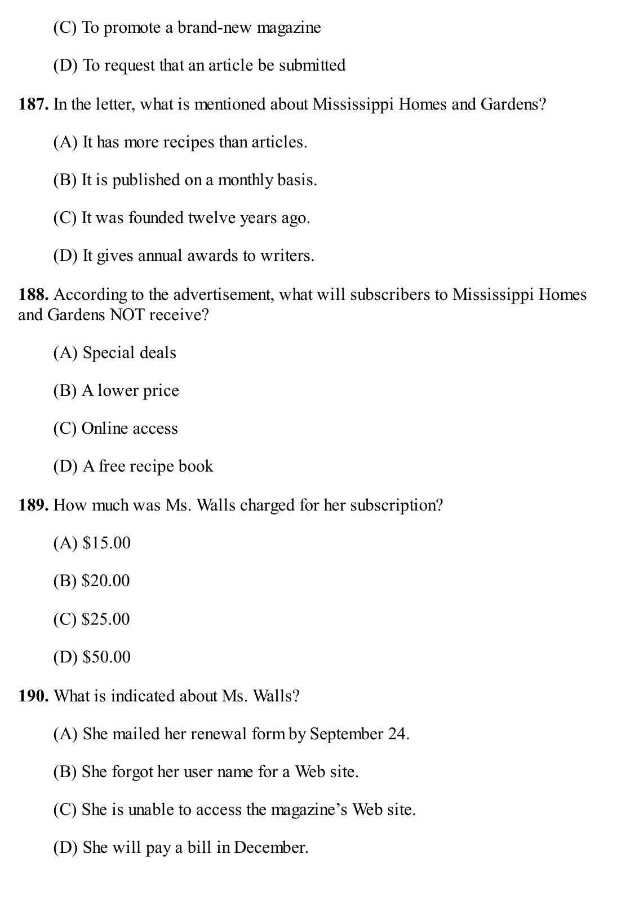


```text
(C) To promote a brand-new magazine
(D) To request that an article be submitted
187.
 In the letter, what is mentioned about Mississippi Homes and Gardens?
(A) It has more recipes than articles.
(B) It is published on a monthly basis.
(C) It was founded twelve years ago.
(D) It gives annual awards to writers.
188.
 According to the advertisement, what will subscribers to Mississippi Homes
and Gardens NOT receive?
(A) Special deals
(B) A lower price
(C) Online access
(D) A free recipe book
189.
 How much was Ms. Walls charged for her subscription?
(A) $15.00
(B) $20.00
(C) $25.00
(D) $50.00
190.
 What is indicated about Ms. Walls?
(A) She mailed her renewal form by September 24.
(B) She forgot her user name for a Web site.
(C) She is unable to access the magazine’s Web site.
(D) She will pay a bill in December.
1041
```

## PDF 第 271 页

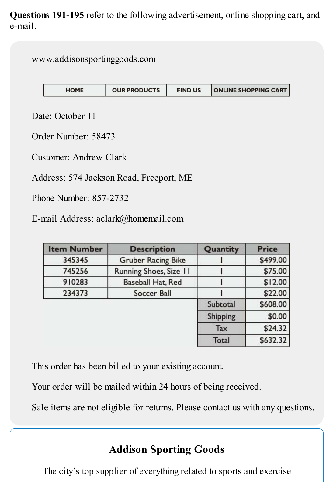


```text
Questions 191-195
 refer to the following advertisement, online shopping cart, and
e-mail.
www.addisonsportinggoods.com
Date: October 11
Order Number: 58473
Customer: Andrew Clark
Address: 574 Jackson Road, Freeport, ME
Phone Number: 857-2732
E-mail Address: aclark@homemail.com
This order has been billed to your existing account.
Your order will be mailed within 24 hours of being received.
Sale items are not eligible for returns. Please contact us with any questions.
Addison Sporting Goods
The city’s top supplier of everything related to sports and exercise
1042
```

## PDF 第 272 页

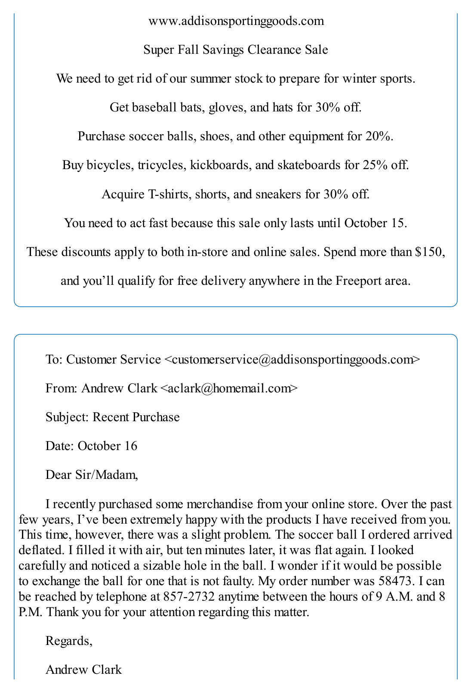


```text
www.addisonsportinggoods.com
Super Fall Savings Clearance Sale
We need to get rid of our summer stock to prepare for winter sports.
Get baseball bats, gloves, and hats for 30% off.
Purchase soccer balls, shoes, and other equipment for 20%.
Buy bicycles, tricycles, kickboards, and skateboards for 25% off.
Acquire T-shirts, shorts, and sneakers for 30% off.
You need to act fast because this sale only lasts until October 15.
These discounts apply to both in-store and online sales. Spend more than $150,
and you’ll qualify for free delivery anywhere in the Freeport area.
To: Customer Service <customerservice@addisonsportinggoods.com>
From: Andrew Clark <aclark@homemail.com>
Subject: Recent Purchase
Date: October 16
Dear Sir/Madam,
I recently purchased some merchandise from your online store. Over the past
few years, I’ve been extremely happy with the products I have received from you.
This time, however, there was a slight problem. The soccer ball I ordered arrived
deflated. I filled it with air, but ten minutes later, it was flat again. I looked
carefully and noticed a sizable hole in the ball. I wonder if it would be possible
to exchange the ball for one that is not faulty. My order number was 58473. I can
be reached by telephone at 857-2732 anytime between the hours of 9 A.M. and 8
P.M. Thank you for your attention regarding this matter.
Regards,
Andrew Clark
1043
```

## PDF 第 273 页

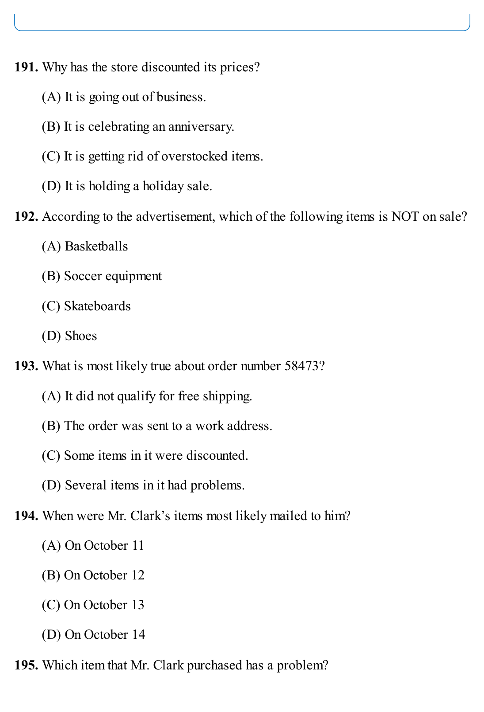


```text
191.
 Why has the store discounted its prices?
(A) It is going out of business.
(B) It is celebrating an anniversary.
(C) It is getting rid of overstocked items.
(D) It is holding a holiday sale.
192.
 According to the advertisement, which of the following items is NOT on sale?
(A) Basketballs
(B) Soccer equipment
(C) Skateboards
(D) Shoes
193.
 What is most likely true about order number 58473?
(A) It did not qualify for free shipping.
(B) The order was sent to a work address.
(C) Some items in it were discounted.
(D) Several items in it had problems.
194.
 When were Mr. Clark’s items most likely mailed to him?
(A) On October 11
(B) On October 12
(C) On October 13
(D) On October 14
195.
 Which item that Mr. Clark purchased has a problem?
1044
```

## PDF 第 274 页

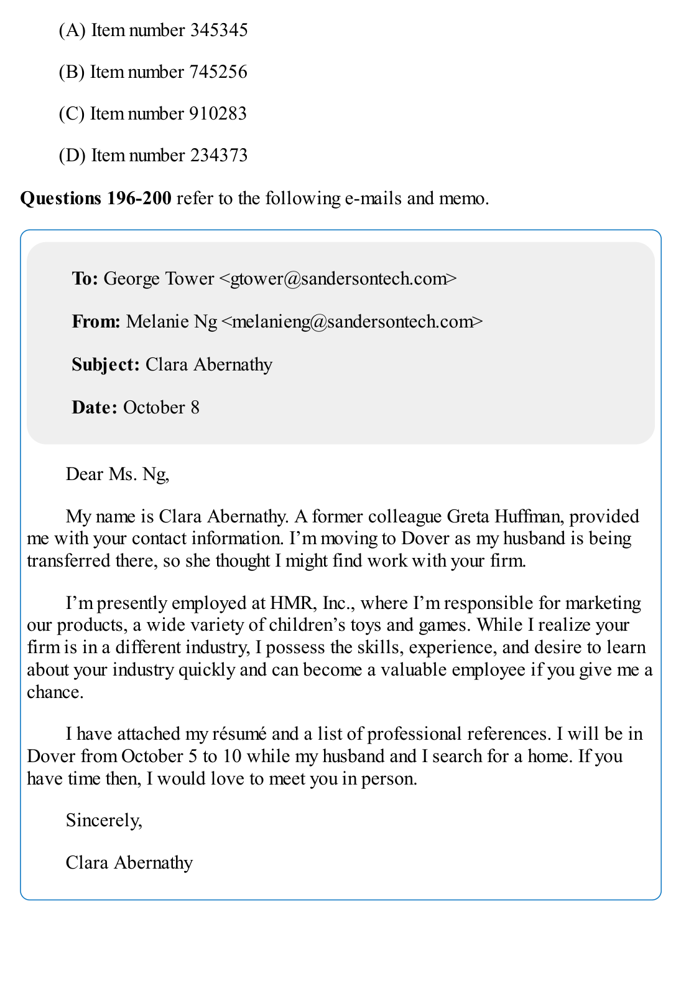


```text
(A) Item number 345345
(B) Item number 745256
(C) Item number 910283
(D) Item number 234373
Questions 196-200
 refer to the following e-mails and memo.
To:
 George Tower <gtower@sandersontech.com>
From:
 Melanie Ng <melanieng@sandersontech.com>
Subject:
 Clara Abernathy
Date:
 October 8
Dear Ms. Ng,
My name is Clara Abernathy. A former colleague Greta Huffman, provided
me with your contact information. I’m moving to Dover as my husband is being
transferred there, so she thought I might find work with your firm.
I’m presently employed at HMR, Inc., where I’m responsible for marketing
our products, a wide variety of children’s toys and games. While I realize your
firm is in a different industry, I possess the skills, experience, and desire to learn
about your industry quickly and can become a valuable employee if you give me a
chance.
I have attached my résumé and a list of professional references. I will be in
Dover from October 5 to 10 while my husband and I search for a home. If you
have time then, I would love to meet you in person.
Sincerely,
Clara Abernathy
1045
```

## PDF 第 275 页

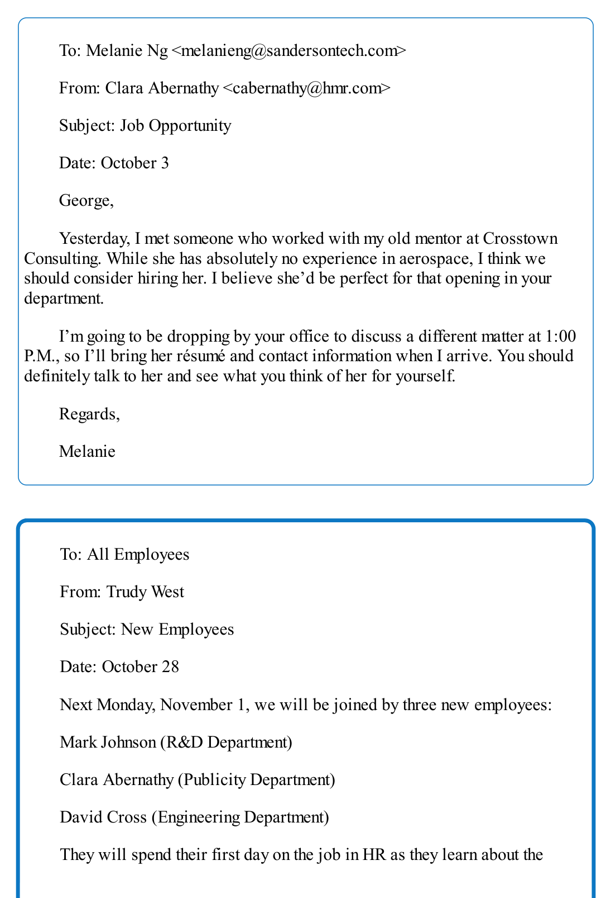


```text
To: Melanie Ng <melanieng@sandersontech.com>
From: Clara Abernathy <cabernathy@hmr.com>
Subject: Job Opportunity
Date: October 3
George,
Yesterday, I met someone who worked with my old mentor at Crosstown
Consulting. While she has absolutely no experience in aerospace, I think we
should consider hiring her. I believe she’d be perfect for that opening in your
department.
I’m going to be dropping by your office to discuss a different matter at 1:00
P.M., so I’ll bring her résumé and contact information when I arrive. You should
definitely talk to her and see what you think of her for yourself.
Regards,
Melanie
To: All Employees
From: Trudy West
Subject: New Employees
Date: October 28
Next Monday, November 1, we will be joined by three new employees:
Mark Johnson (R&D Department)
Clara Abernathy (Publicity Department)
David Cross (Engineering Department)
They will spend their first day on the job in HR as they learn about the
1046
```

## PDF 第 276 页

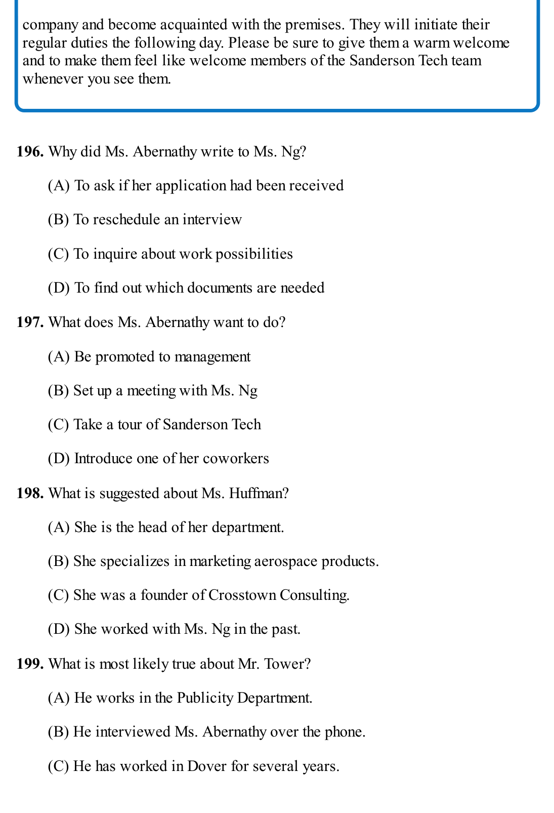


```text
company and become acquainted with the premises. They will initiate their
regular duties the following day. Please be sure to give them a warm welcome
and to make them feel like welcome members of the Sanderson Tech team
whenever you see them.
196.
 Why did Ms. Abernathy write to Ms. Ng?
(A) To ask if her application had been received
(B) To reschedule an interview
(C) To inquire about work possibilities
(D) To find out which documents are needed
197.
 What does Ms. Abernathy want to do?
(A) Be promoted to management
(B) Set up a meeting with Ms. Ng
(C) Take a tour of Sanderson Tech
(D) Introduce one of her coworkers
198.
 What is suggested about Ms. Huffman?
(A) She is the head of her department.
(B) She specializes in marketing aerospace products.
(C) She was a founder of Crosstown Consulting.
(D) She worked with Ms. Ng in the past.
199.
 What is most likely true about Mr. Tower?
(A) He works in the Publicity Department.
(B) He interviewed Ms. Abernathy over the phone.
(C) He has worked in Dover for several years.
1047
```

## PDF 第 277 页

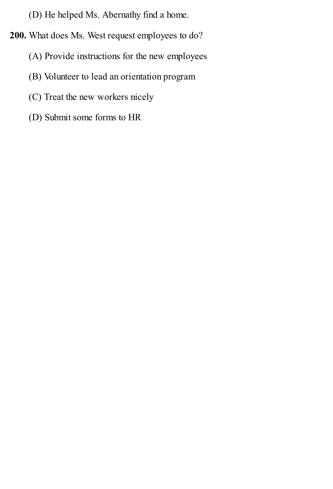


```text
(D) He helped Ms. Abernathy find a home.
200.
 What does Ms. West request employees to do?
(A) Provide instructions for the new employees
(B) Volunteer to lead an orientation program
(C) Treat the new workers nicely
(D) Submit some forms to HR
1048
```

## PDF 第 278 页

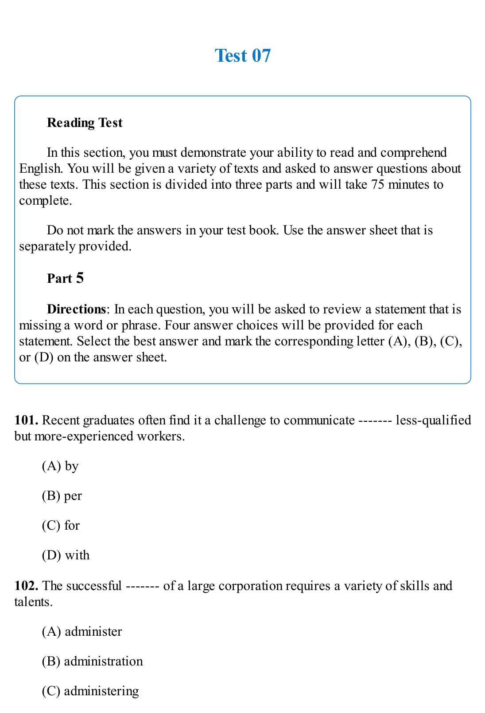


```text
Test 07
Reading Test
In this section, you must demonstrate your ability to read and comprehend
English. You will be given a variety of texts and asked to answer questions about
these texts. This section is divided into three parts and will take 75 minutes to
complete.
Do not mark the answers in your test book. Use the answer sheet that is
separately provided.
Part
5
Directions
: In each question, you will be asked to review a statement that is
missing a word or phrase. Four answer choices will be provided for each
statement. Select the best answer and mark the corresponding letter (A), (B), (C),
or (D) on the answer sheet.
101.
 Recent graduates often find it a challenge to communicate ------- less-qualified
but more-experienced workers.
(A) by
(B) per
(C) for
(D) with
102.
 The successful ------- of a large corporation requires a variety of skills and
talents.
(A) administer
(B) administration
(C) administering
1049
```

## PDF 第 279 页

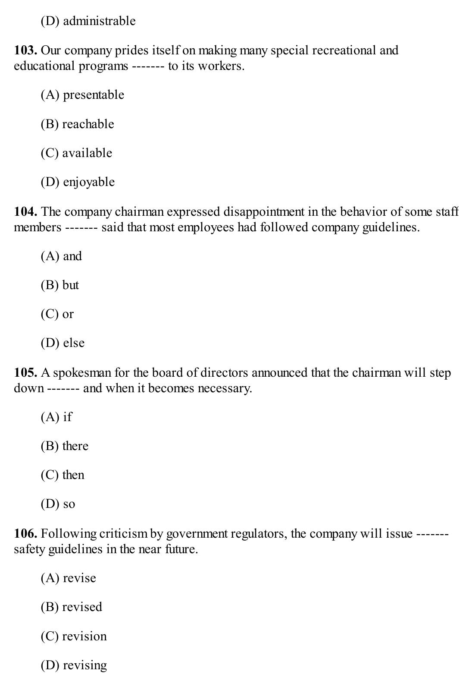


```text
(D) administrable
103.
 Our company prides itself on making many special recreational and
educational programs ------- to its workers.
(A) presentable
(B) reachable
(C) available
(D) enjoyable
104.
 The company chairman expressed disappointment in the behavior of some staff
members ------- said that most employees had followed company guidelines.
(A) and
(B) but
(C) or
(D) else
105.
 A spokesman for the board of directors announced that the chairman will step
down ------- and when it becomes necessary.
(A) if
(B) there
(C) then
(D) so
106.
 Following criticism by government regulators, the company will issue -------
safety guidelines in the near future.
(A) revise
(B) revised
(C) revision
(D) revising
1050
```

## PDF 第 280 页

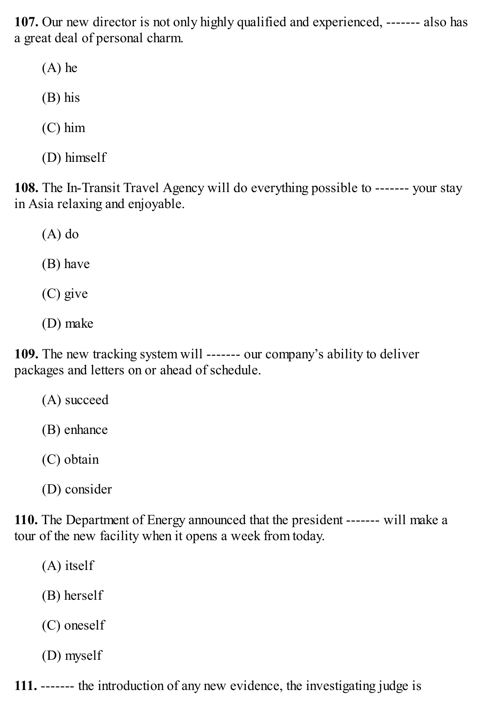


```text
107.
 Our new director is not only highly qualified and experienced, ------- also has
a great deal of personal charm.
(A) he
(B) his
(C) him
(D) himself
108.
 The In-Transit Travel Agency will do everything possible to ------- your stay
in Asia relaxing and enjoyable.
(A) do
(B) have
(C) give
(D) make
109.
 The new tracking system will ------- our company’s ability to deliver
packages and letters on or ahead of schedule.
(A) succeed
(B) enhance
(C) obtain
(D) consider
110.
 The Department of Energy announced that the president ------- will make a
tour of the new facility when it opens a week from today.
(A) itself
(B) herself
(C) oneself
(D) myself
111.
 ------- the introduction of any new evidence, the investigating judge is
1051
```

## PDF 第 281 页

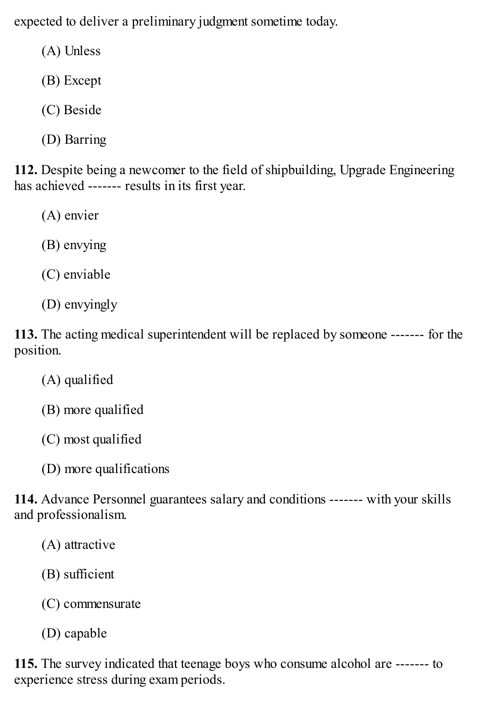


```text
expected to deliver a preliminary judgment sometime today.
(A) Unless
(B) Except
(C) Beside
(D) Barring
112.
 Despite being a newcomer to the field of shipbuilding, Upgrade Engineering
has achieved ------- results in its first year.
(A) envier
(B) envying
(C) enviable
(D) envyingly
113.
 The acting medical superintendent will be replaced by someone ------- for the
position.
(A) qualified
(B) more qualified
(C) most qualified
(D) more qualifications
114.
 Advance Personnel guarantees salary and conditions ------- with your skills
and professionalism.
(A) attractive
(B) sufficient
(C) commensurate
(D) capable
115.
 The survey indicated that teenage boys who consume alcohol are ------- to
experience stress during exam periods.
1052
```

## PDF 第 282 页

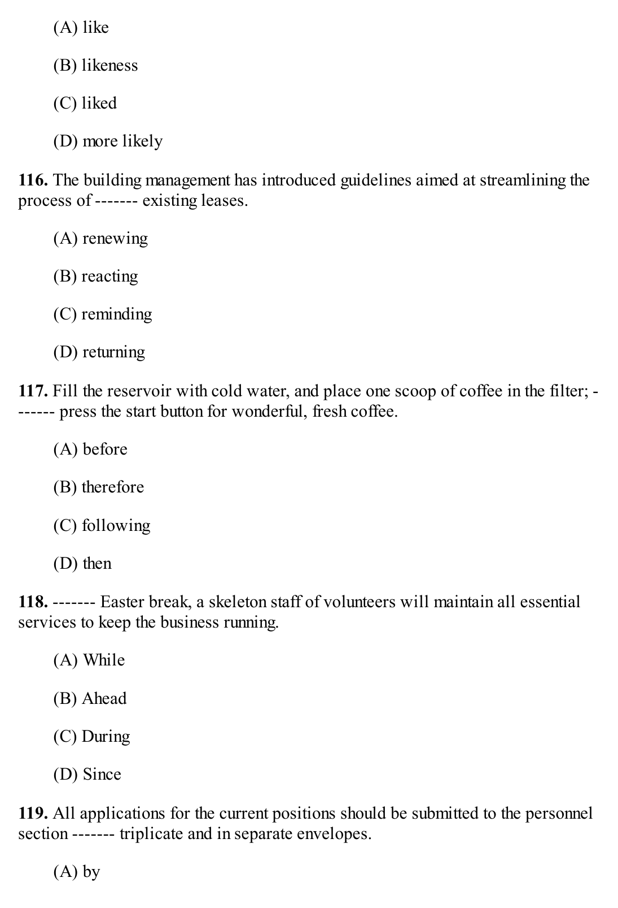


```text
(A) like
(B) likeness
(C) liked
(D) more likely
116.
 The building management has introduced guidelines aimed at streamlining the
process of ------- existing leases.
(A) renewing
(B) reacting
(C) reminding
(D) returning
117.
 Fill the reservoir with cold water, and place one scoop of coffee in the filter; -
------ press the start button for wonderful, fresh coffee.
(A) before
(B) therefore
(C) following
(D) then
118.
 ------- Easter break, a skeleton staff of volunteers will maintain all essential
services to keep the business running.
(A) While
(B) Ahead
(C) During
(D) Since
119.
 All applications for the current positions should be submitted to the personnel
section ------- triplicate and in separate envelopes.
(A) by
1053
```

## PDF 第 283 页

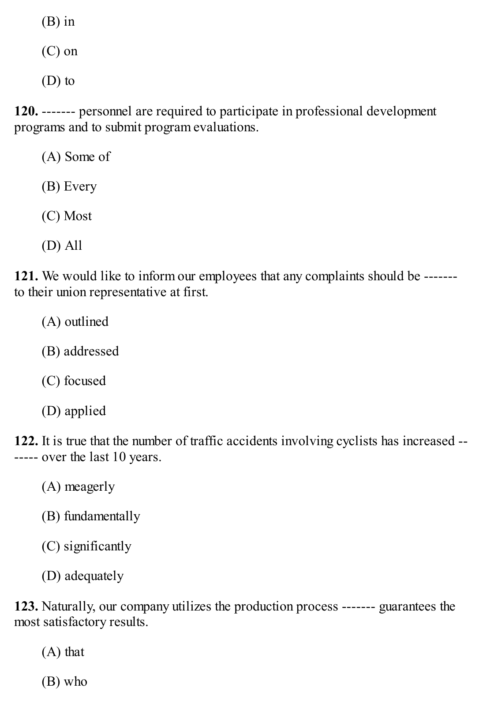


```text
(B) in
(C) on
(D) to
120.
 ------- personnel are required to participate in professional development
programs and to submit program evaluations.
(A) Some of
(B) Every
(C) Most
(D) All
121.
 We would like to inform our employees that any complaints should be -------
to their union representative at first.
(A) outlined
(B) addressed
(C) focused
(D) applied
122.
 It is true that the number of traffic accidents involving cyclists has increased --
----- over the last 10 years.
(A) meagerly
(B) fundamentally
(C) significantly
(D) adequately
123.
 Naturally, our company utilizes the production process ------- guarantees the
most satisfactory results.
(A) that
(B) who
1054
```

## PDF 第 284 页

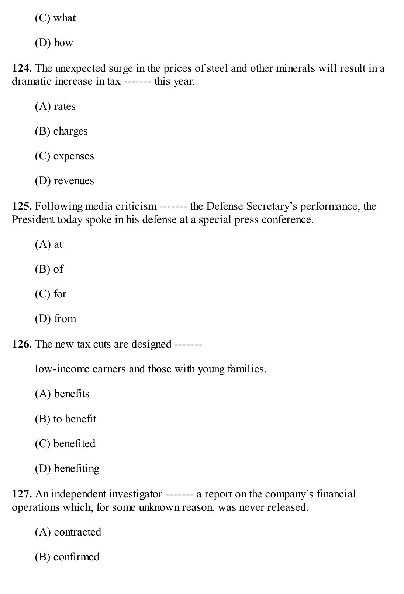


```text
(C) what
(D) how
124.
 The unexpected surge in the prices of steel and other minerals will result in a
dramatic increase in tax ------- this year.
(A) rates
(B) charges
(C) expenses
(D) revenues
125.
 Following media criticism ------- the Defense Secretary’s performance, the
President today spoke in his defense at a special press conference.
(A) at
(B) of
(C) for
(D) from
126.
 The new tax cuts are designed -------
low-income earners and those with young families.
(A) benefits
(B) to benefit
(C) benefited
(D) benefiting
127.
 An independent investigator ------- a report on the company’s financial
operations which, for some unknown reason, was never released.
(A) contracted
(B) confirmed
1055
```

## PDF 第 285 页

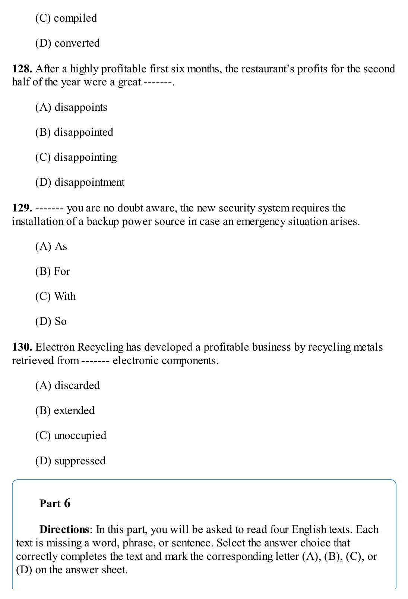


```text
(C) compiled
(D) converted
128.
 After a highly profitable first six months, the restaurant’s profits for the second
half of the year were a great -------.
(A) disappoints
(B) disappointed
(C) disappointing
(D) disappointment
129.
 ------- you are no doubt aware, the new security system requires the
installation of a backup power source in case an emergency situation arises.
(A) As
(B) For
(C) With
(D) So
130.
 Electron Recycling has developed a profitable business by recycling metals
retrieved from ------- electronic components.
(A) discarded
(B) extended
(C) unoccupied
(D) suppressed
Part
6
Directions
: In this part, you will be asked to read four English texts. Each
text is missing a word, phrase, or sentence. Select the answer choice that
correctly completes the text and mark the corresponding letter (A), (B), (C), or
(D) on the answer sheet.
1056
```

## PDF 第 286 页

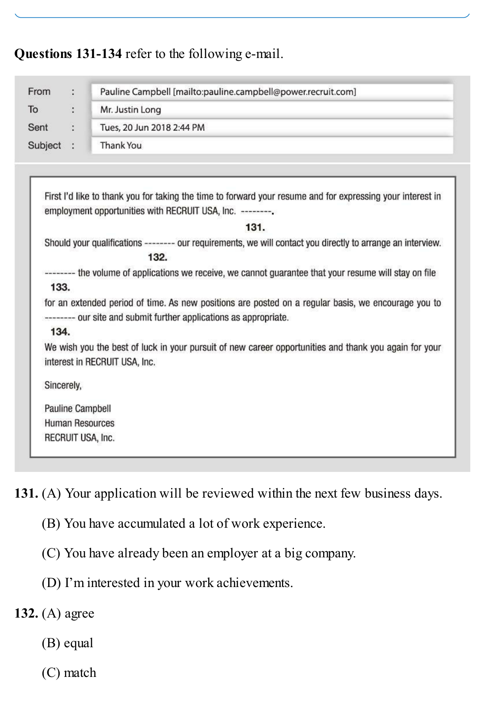


```text
Questions 131-134
 refer to the following e-mail.
131.
 (A) Your application will be reviewed within the next few business days.
(B) You have accumulated a lot of work experience.
(C) You have already been an employer at a big company.
(D) I’m interested in your work achievements.
132.
 (A) agree
(B) equal
(C) match
1057
```

## PDF 第 287 页

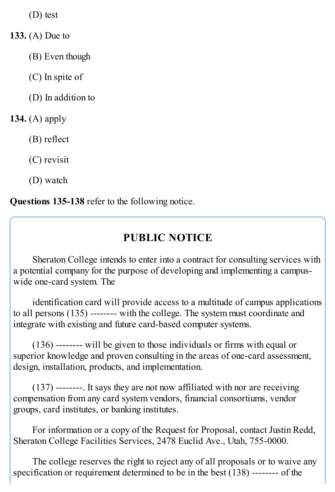


```text
(D) test
133.
 (A) Due to
(B) Even though
(C) In spite of
(D) In addition to
134.
 (A) apply
(B) reflect
(C) revisit
(D) watch
Questions 135-138
 refer to the following notice.
PUBLIC NOTICE
Sheraton College intends to enter into a contract for consulting services with
a potential company for the purpose of developing and implementing a campus-
wide one-card system. The
identification card will provide access to a multitude of campus applications
to all persons (135) -------- with the college. The system must coordinate and
integrate with existing and future card-based computer systems.
(136) -------- will be given to those individuals or firms with equal or
superior knowledge and proven consulting in the areas of one-card assessment,
design, installation, products, and implementation.
(137) --------. It says they are not now affiliated with nor are receiving
compensation from any card system vendors, financial consortiums, vendor
groups, card institutes, or banking institutes.
For information or a copy of the Request for Proposal, contact Justin Redd,
Sheraton College Facilities Services, 2478 Euclid Ave., Utah, 755-0000.
The college reserves the right to reject any of all proposals or to waive any
specification or requirement determined to be in the best (138) -------- of the
1058
```

## PDF 第 288 页

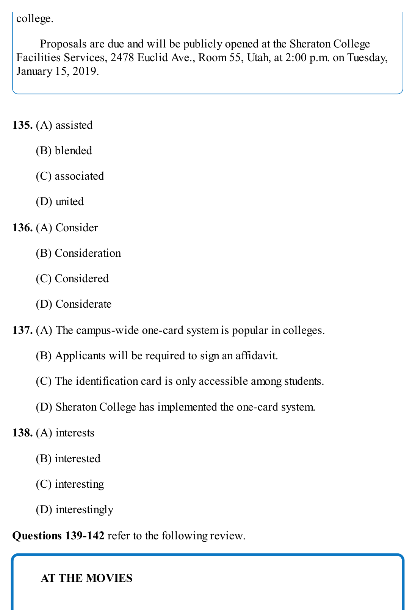


```text
college.
Proposals are due and will be publicly opened at the Sheraton College
Facilities Services, 2478 Euclid Ave., Room 55, Utah, at 2:00 p.m. on Tuesday,
January 15, 2019.
135.
 (A) assisted
(B) blended
(C) associated
(D) united
136.
 (A) Consider
(B) Consideration
(C) Considered
(D) Considerate
137.
 (A) The campus-wide one-card system is popular in colleges.
(B) Applicants will be required to sign an affidavit.
(C) The identification card is only accessible among students.
(D) Sheraton College has implemented the one-card system.
138.
 (A) interests
(B) interested
(C) interesting
(D) interestingly
Questions 139-142
 refer to the following review.
AT THE MOVIES
1059
```

## PDF 第 289 页


```text
Reviews by Elisa Reigns
Ratings out of 5
STRAIGHT COP CROOKED COP
Canada’s two official cultures clash (139) -------- an uptight, by-the-book
police officer (Jerry Kirkland) from Vancouver hooks up with a rule-breaking
street cop from Quebec (Bruce Huard) for a drug-related murder investigation.
The chemistry (140) -------- the lead actors is good, but the outdated Canadian
clichés displayed throughout the movie sometimes were a bit too much for the
audience. The story line begins (141) -------- but starts to lag on toward the latter
half of the movie. (142) --------. •• Elisa Reigns
139.
 (A) despite
(B) when
(C) because of
(D) until
140.
 (A) within
(B) over
(C) between
(D) along
141.
 (A) fairly
(B) directly
(C) exactly
(D) quickly
142.
 (A) The audience could well understand clichés in the movie.
(B) The movie was about Canada’s two official cultures clash.
(C) It was a movie that boasted wonderful performances of its actors.
1060
```

## PDF 第 290 页

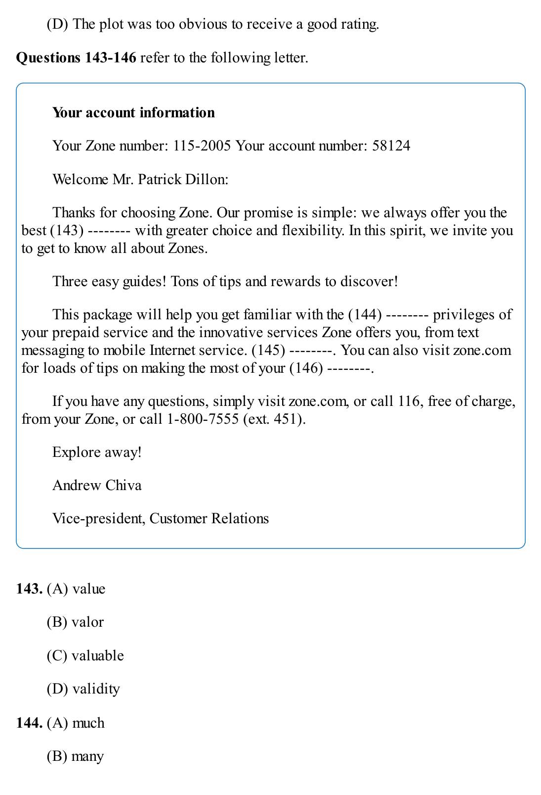


```text
(D) The plot was too obvious to receive a good rating.
Questions 143-146
 refer to the following letter.
Your account information
Your Zone number: 115-2005 Your account number: 58124
Welcome Mr. Patrick Dillon:
Thanks for choosing Zone. Our promise is simple: we always offer you the
best (143) -------- with greater choice and flexibility. In this spirit, we invite you
to get to know all about Zones.
Three easy guides! Tons of tips and rewards to discover!
This package will help you get familiar with the (144) -------- privileges of
your prepaid service and the innovative services Zone offers you, from text
messaging to mobile Internet service. (145) --------. You can also visit zone.com
for loads of tips on making the most of your (146) --------.
If you have any questions, simply visit zone.com, or call 116, free of charge,
from your Zone, or call 1-800-7555 (ext. 451).
Explore away!
Andrew Chiva
Vice-president, Customer Relations
143.
 (A) value
(B) valor
(C) valuable
(D) validity
144.
 (A) much
(B) many
1061
```

## PDF 第 291 页

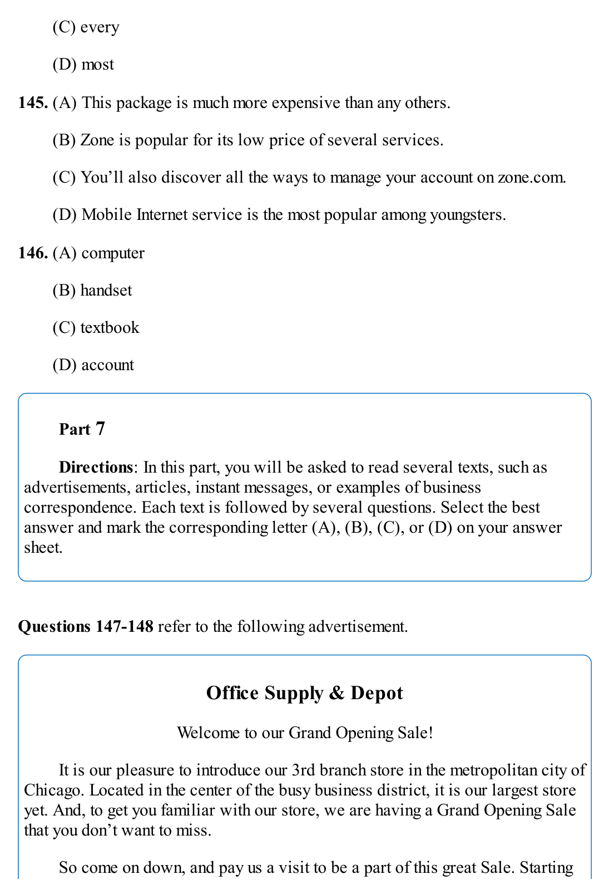


```text
(C) every
(D) most
145.
 (A) This package is much more expensive than any others.
(B) Zone is popular for its low price of several services.
(C) You’ll also discover all the ways to manage your account on zone.com.
(D) Mobile Internet service is the most popular among youngsters.
146.
 (A) computer
(B) handset
(C) textbook
(D) account
Part
7
Directions
: In this part, you will be asked to read several texts, such as
advertisements, articles, instant messages, or examples of business
correspondence. Each text is followed by several questions. Select the best
answer and mark the corresponding letter (A), (B), (C), or (D) on your answer
sheet.
Questions 147-
148
 refer to the following advertisement.
Office Supply & Depot
Welcome to our Grand Opening Sale!
It is our pleasure to introduce our 3rd branch store in the metropolitan city of
Chicago. Located in the center of the busy business district, it is our largest store
yet. And, to get you familiar with our store, we are having a Grand Opening Sale
that you don’t want to miss.
So come on down, and pay us a visit to be a part of this great Sale. Starting
1062
```

## PDF 第 292 页

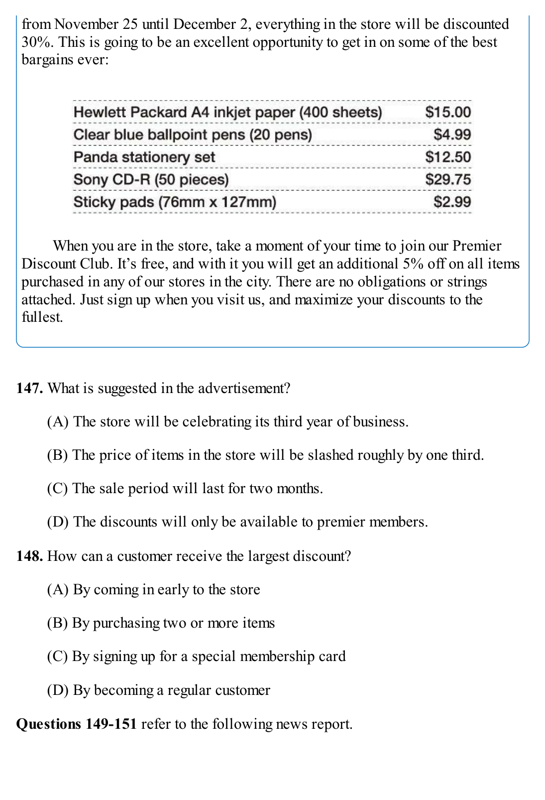


```text
from November 25 until December 2, everything in the store will be discounted
30%. This is going to be an excellent opportunity to get in on some of the best
bargains ever:
When you are in the store, take a moment of your time to join our Premier
Discount Club. It’s free, and with it you will get an additional 5% off on all items
purchased in any of our stores in the city. There are no obligations or strings
attached. Just sign up when you visit us, and maximize your discounts to the
fullest.
147.
 What is suggested in the advertisement?
(A) The store will be celebrating its third year of business.
(B) The price of items in the store will be slashed roughly by one third.
(C) The sale period will last for two months.
(D) The discounts will only be available to premier members.
148.
 How can a customer receive the largest discount?
(A) By coming in early to the store
(B) By purchasing two or more items
(C) By signing up for a special membership card
(D) By becoming a regular customer
Questions 149-
151
 refer to the following news report.
1063
```

## PDF 第 293 页

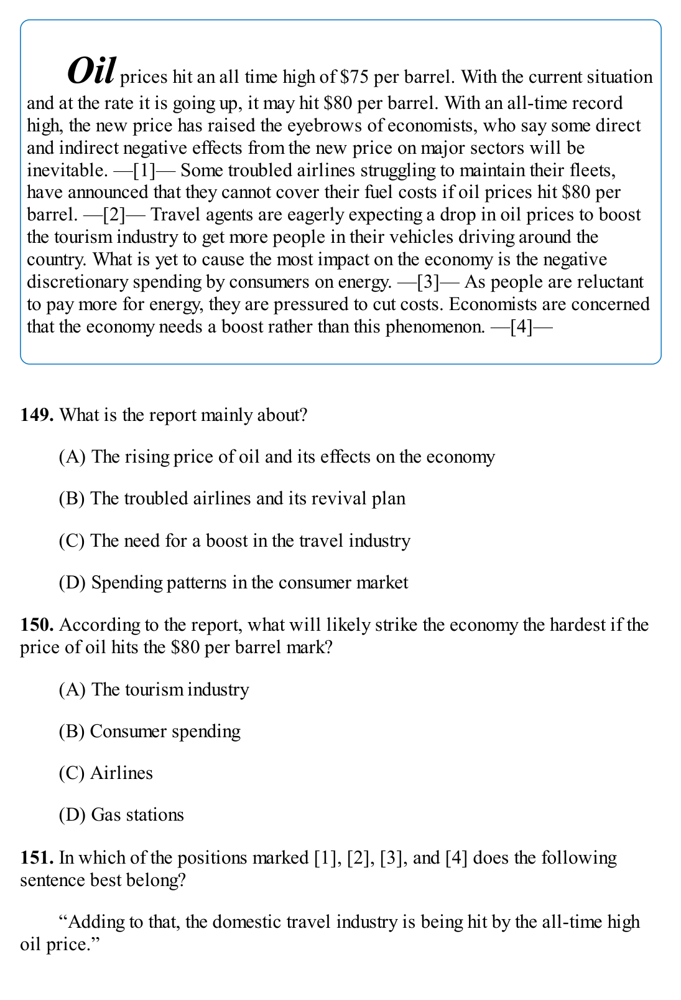


```text
Oil
 prices hit an all time high of $75 per barrel. With the current situation
and at the rate it is going up, it may hit $80 per barrel. With an all-time record
high, the new price has raised the eyebrows of economists, who say some direct
and indirect negative effects from the new price on major sectors will be
inevitable. —[1]— Some troubled airlines struggling to maintain their fleets,
have announced that they cannot cover their fuel costs if oil prices hit $80 per
barrel. —[2]— Travel agents are eagerly expecting a drop in oil prices to boost
the tourism industry to get more people in their vehicles driving around the
country. What is yet to cause the most impact on the economy is the negative
discretionary spending by consumers on energy. —[3]— As people are reluctant
to pay more for energy, they are pressured to cut costs. Economists are concerned
that the economy needs a boost rather than this phenomenon. —[4]—
149.
 What is the report mainly about?
(A) The rising price of oil and its effects on the economy
(B) The troubled airlines and its revival plan
(C) The need for a boost in the travel industry
(D) Spending patterns in the consumer market
150.
 According to the report, what will likely strike the economy the hardest if the
price of oil hits the $80 per barrel mark?
(A) The tourism industry
(B) Consumer spending
(C) Airlines
(D) Gas stations
151.
 In which of the positions marked [1], [2], [3], and [4] does the following
sentence best belong?
“Adding to that, the domestic travel industry is being hit by the all-time high
oil price.”
1064
```

## PDF 第 294 页

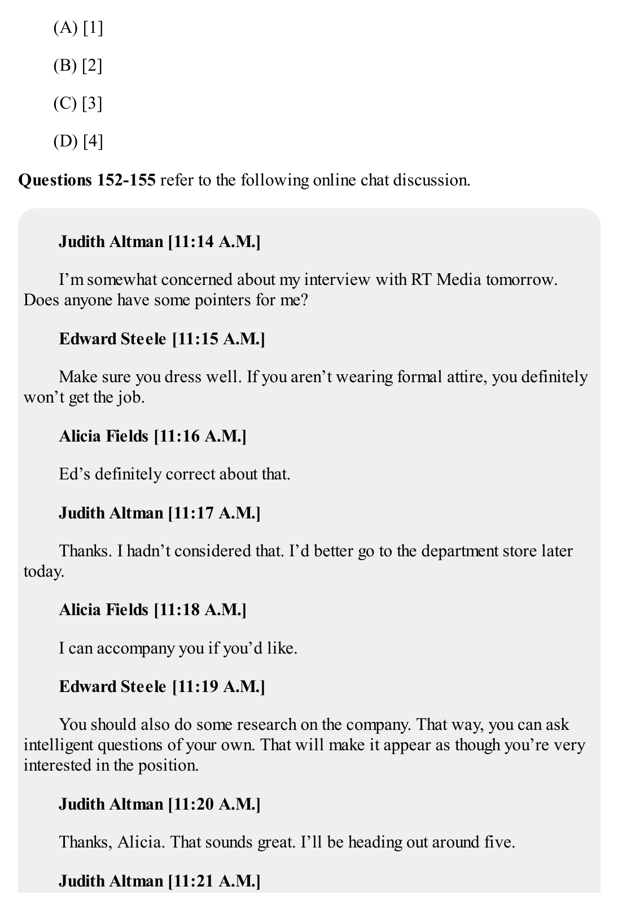


```text
(A) [1]
(B) [2]
(C) [3]
(D) [4]
Questions 152-155
 refer to the following online chat discussion.
Judith Altman [11:14 A.M.]
I’m somewhat concerned about my interview with RT Media tomorrow.
Does anyone have some pointers for me?
Edward Steele [11:15 A.M.]
Make sure you dress well. If you aren’t wearing formal attire, you definitely
won’t get the job.
Alicia Fields [11:16 A.M.]
Ed’s definitely correct about that.
Judith Altman [11:17 A.M.]
Thanks. I hadn’t considered that. I’d better go to the department store later
today.
Alicia Fields [11:18 A.M.]
I can accompany you if you’d like.
Edward Steele [11:19 A.M.]
You should also do some research on the company. That way, you can ask
intelligent questions of your own. That will make it appear as though you’re very
interested in the position.
Judith Altman [11:20 A.M.]
Thanks, Alicia. That sounds great. I’ll be heading out around five.
Judith Altman [11:21 A.M.]
1065
```

## PDF 第 295 页

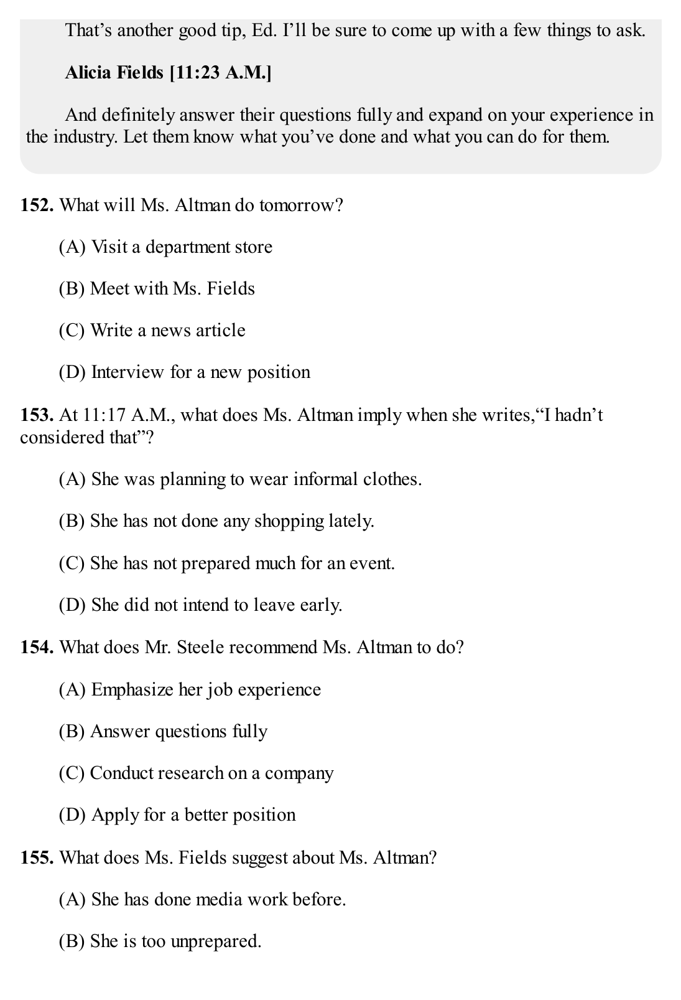


```text
That’s another good tip, Ed. I’ll be sure to come up with a few things to ask.
Alicia Fields [11:23 A.M.]
And definitely answer their questions fully and expand on your experience in
the industry. Let them know what you’ve done and what you can do for them.
152.
 What will Ms. Altman do tomorrow?
(A) Visit a department store
(B) Meet with Ms. Fields
(C) Write a news article
(D) Interview for a new position
153.
 At 11:17 A.M., what does Ms. Altman imply when she writes,“I hadn’t
considered that”?
(A) She was planning to wear informal clothes.
(B) She has not done any shopping lately.
(C) She has not prepared much for an event.
(D) She did not intend to leave early.
154.
 What does Mr. Steele recommend Ms. Altman to do?
(A) Emphasize her job experience
(B) Answer questions fully
(C) Conduct research on a company
(D) Apply for a better position
155.
 What does Ms. Fields suggest about Ms. Altman?
(A) She has done media work before.
(B) She is too unprepared.
1066
```

## PDF 第 296 页

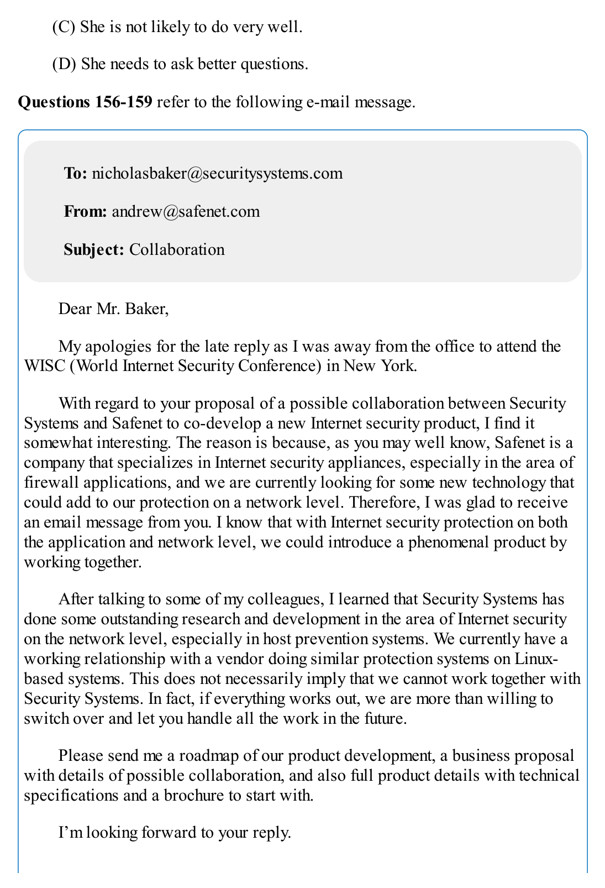


```text
(C) She is not likely to do very well.
(D) She needs to ask better questions.
Questions 156-159
 refer to the following e-mail message.
To:
 nicholasbaker@securitysystems.com
From:
 andrew@safenet.com
Subject:
 Collaboration
Dear Mr. Baker,
My apologies for the late reply as I was away from the office to attend the
WISC (World Internet Security Conference) in New York.
With regard to your proposal of a possible collaboration between Security
Systems and Safenet to co-develop a new Internet security product, I find it
somewhat interesting. The reason is because, as you may well know, Safenet is a
company that specializes in Internet security appliances, especially in the area of
firewall applications, and we are currently looking for some new technology that
could add to our protection on a network level. Therefore, I was glad to receive
an email message from you. I know that with Internet security protection on both
the application and network level, we could introduce a phenomenal product by
working together.
After talking to some of my colleagues, I learned that Security Systems has
done some outstanding research and development in the area of Internet security
on the network level, especially in host prevention systems. We currently have a
working relationship with a vendor doing similar protection systems on Linux-
based systems. This does not necessarily imply that we cannot work together with
Security Systems. In fact, if everything works out, we are more than willing to
switch over and let you handle all the work in the future.
Please send me a roadmap of our product development, a business proposal
with details of possible collaboration, and also full product details with technical
specifications and a brochure to start with.
I’m looking forward to your reply.
1067
```

## PDF 第 297 页

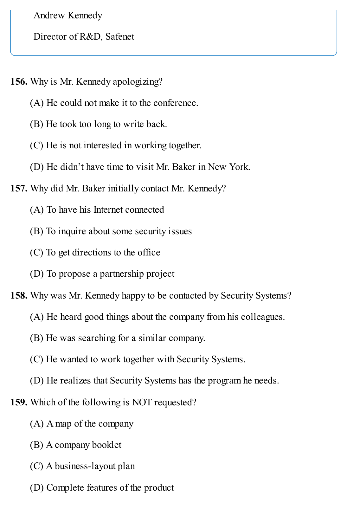


```text
Andrew Kennedy
Director of R&D, Safenet
156.
 Why is Mr. Kennedy apologizing?
(A) He could not make it to the conference.
(B) He took too long to write back.
(C) He is not interested in working together.
(D) He didn’t have time to visit Mr. Baker in New York.
157.
 Why did Mr. Baker initially contact Mr. Kennedy?
(A) To have his Internet connected
(B) To inquire about some security issues
(C) To get directions to the office
(D) To propose a partnership project
158.
 Why was Mr. Kennedy happy to be contacted by Security Systems?
(A) He heard good things about the company from his colleagues.
(B) He was searching for a similar company.
(C) He wanted to work together with Security Systems.
(D) He realizes that Security Systems has the program he needs.
159.
 Which of the following is NOT requested?
(A) A map of the company
(B) A company booklet
(C) A business-layout plan
(D) Complete features of the product
1068
```

## PDF 第 298 页

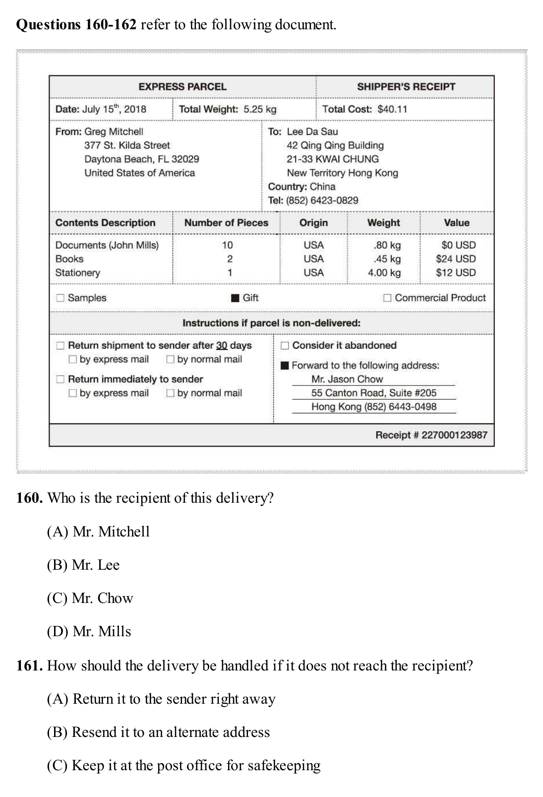


```text
Questions 160-162
 refer to the following document.
160.
 Who is the recipient of this delivery?
(A) Mr. Mitchell
(B) Mr. Lee
(C) Mr. Chow
(D) Mr. Mills
161.
 How should the delivery be handled if it does not reach the recipient?
(A) Return it to the sender right away
(B) Resend it to an alternate address
(C) Keep it at the post office for safekeeping
1069
```

## PDF 第 299 页

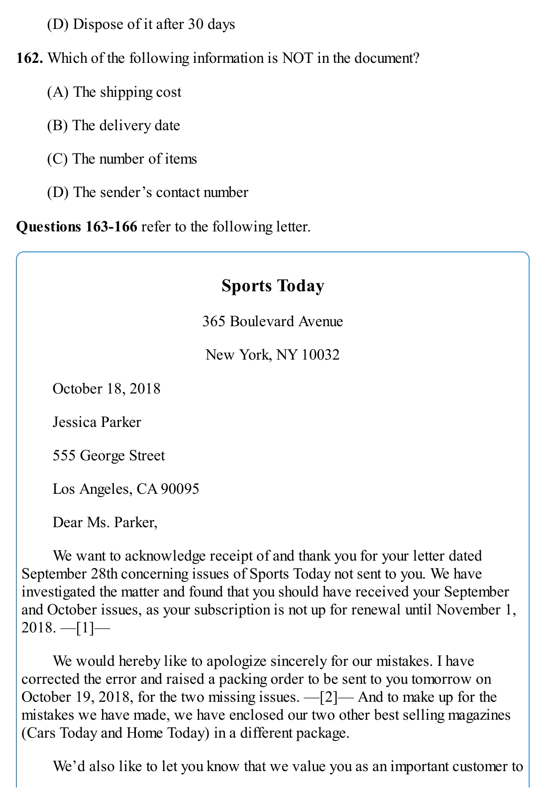


```text
(D) Dispose of it after 30 days
162.
 Which of the following information is NOT in the document?
(A) The shipping cost
(B) The delivery date
(C) The number of items
(D) The sender’s contact number
Questions 163-166
 refer to the following letter.
Sports Today
365 Boulevard Avenue
New York, NY 10032
October 18, 2018
Jessica Parker
555 George Street
Los Angeles, CA 90095
Dear Ms. Parker,
We want to acknowledge receipt of and thank you for your letter dated
September 28th concerning issues of Sports Today not sent to you. We have
investigated the matter and found that you should have received your September
and October issues, as your subscription is not up for renewal until November 1,
2018. —[1]—
We would hereby like to apologize sincerely for our mistakes. I have
corrected the error and raised a packing order to be sent to you tomorrow on
October 19, 2018, for the two missing issues. —[2]— And to make up for the
mistakes we have made, we have enclosed our two other best selling magazines
(Cars Today and Home Today) in a different package.
We’d also like to let you know that we value you as an important customer to
1070
```

## PDF 第 300 页

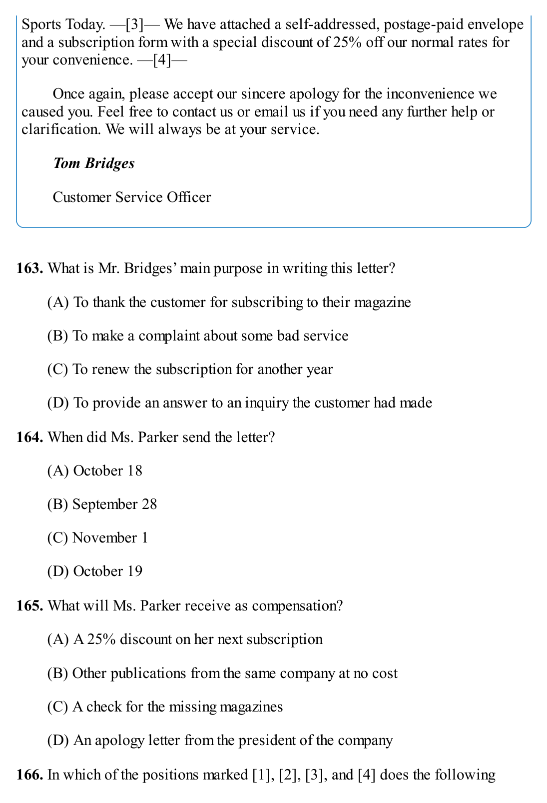


```text
Sports Today. —[3]— We have attached a self-addressed, postage-paid envelope
and a subscription form with a special discount of 25% off our normal rates for
your convenience. —[4]—
Once again, please accept our sincere apology for the inconvenience we
caused you. Feel free to contact us or email us if you need any further help or
clarification. We will always be at your service.
Tom Bridges
Customer Service Officer
163.
 What is Mr. Bridges’ main purpose in writing this letter?
(A) To thank the customer for subscribing to their magazine
(B) To make a complaint about some bad service
(C) To renew the subscription for another year
(D) To provide an answer to an inquiry the customer had made
164.
 When did Ms. Parker send the letter?
(A) October 18
(B) September 28
(C) November 1
(D) October 19
165.
 What will Ms. Parker receive as compensation?
(A) A 25% discount on her next subscription
(B) Other publications from the same company at no cost
(C) A check for the missing magazines
(D) An apology letter from the president of the company
166.
 In which of the positions marked [1], [2], [3], and [4] does the following
1071
```

## PDF 第 301 页

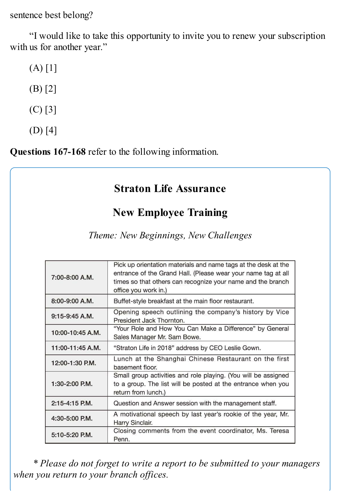


```text
sentence best belong?
“I would like to take this opportunity to invite you to renew your subscription
with us for another year.”
(A) [1]
(B) [2]
(C) [3]
(D) [4]
Questions 167-168
 refer to the following information.
Straton Life Assurance
New Employee Training
Theme: New Beginnings, New Challenges
* Please do not forget to write a report to be submitted to your managers
when you return to your branch offices.
1072
```

## PDF 第 302 页

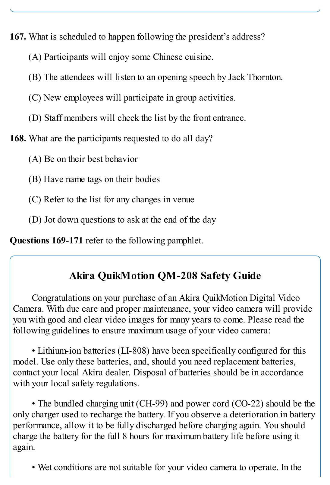


```text
167.
 What is scheduled to happen following the president’s address?
(A) Participants will enjoy some Chinese cuisine.
(B) The attendees will listen to an opening speech by Jack Thornton.
(C) New employees will participate in group activities.
(D) Staff members will check the list by the front entrance.
168.
 What are the participants requested to do all day?
(A) Be on their best behavior
(B) Have name tags on their bodies
(C) Refer to the list for any changes in venue
(D) Jot down questions to ask at the end of the day
Questions 169-171
 refer to the following pamphlet.
Akira QuikMotion QM-208 Safety Guide
Congratulations on your purchase of an Akira QuikMotion Digital Video
Camera. With due care and proper maintenance, your video camera will provide
you with good and clear video images for many years to come. Please read the
following guidelines to ensure maximum usage of your video camera:
• Lithium-ion batteries (LI-808) have been specifically configured for this
model. Use only these batteries, and, should you need replacement batteries,
contact your local Akira dealer. Disposal of batteries should be in accordance
with your local safety regulations.
• The bundled charging unit (CH-99) and power cord (CO-22) should be the
only charger used to recharge the battery. If you observe a deterioration in battery
performance, allow it to be fully discharged before charging again. You should
charge the battery for the full 8 hours for maximum battery life before using it
again.
• Wet conditions are not suitable for your video camera to operate. In the
1073
```

## PDF 第 303 页

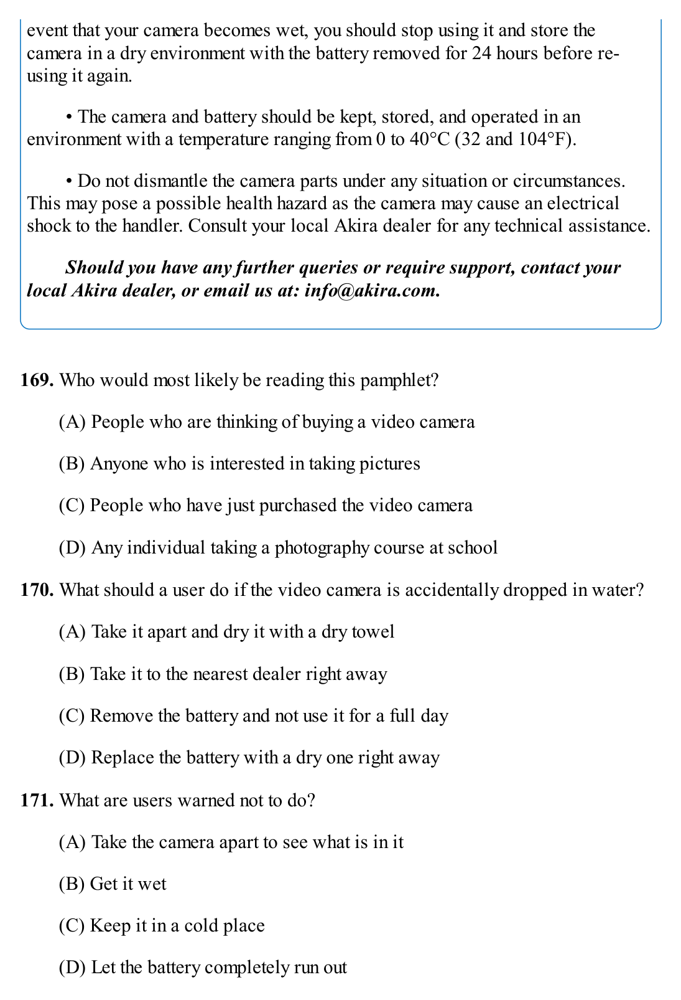


```text
event that your camera becomes wet, you should stop using it and store the
camera in a dry environment with the battery removed for 24 hours before re-
using it again.
• The camera and battery should be kept, stored, and operated in an
environment with a temperature ranging from 0 to 40°C (32 and 104°F).
• Do not dismantle the camera parts under any situation or circumstances.
This may pose a possible health hazard as the camera may cause an electrical
shock to the handler. Consult your local Akira dealer for any technical assistance.
Should you have any further queries or require support, contact your
local Akira dealer, or email us at: info@akira.com.
169.
 Who would most likely be reading this pamphlet?
(A) People who are thinking of buying a video camera
(B) Anyone who is interested in taking pictures
(C) People who have just purchased the video camera
(D) Any individual taking a photography course at school
170.
 What should a user do if the video camera is accidentally dropped in water?
(A) Take it apart and dry it with a dry towel
(B) Take it to the nearest dealer right away
(C) Remove the battery and not use it for a full day
(D) Replace the battery with a dry one right away
171.
 What are users warned not to do?
(A) Take the camera apart to see what is in it
(B) Get it wet
(C) Keep it in a cold place
(D) Let the battery completely run out
1074
```

## PDF 第 304 页

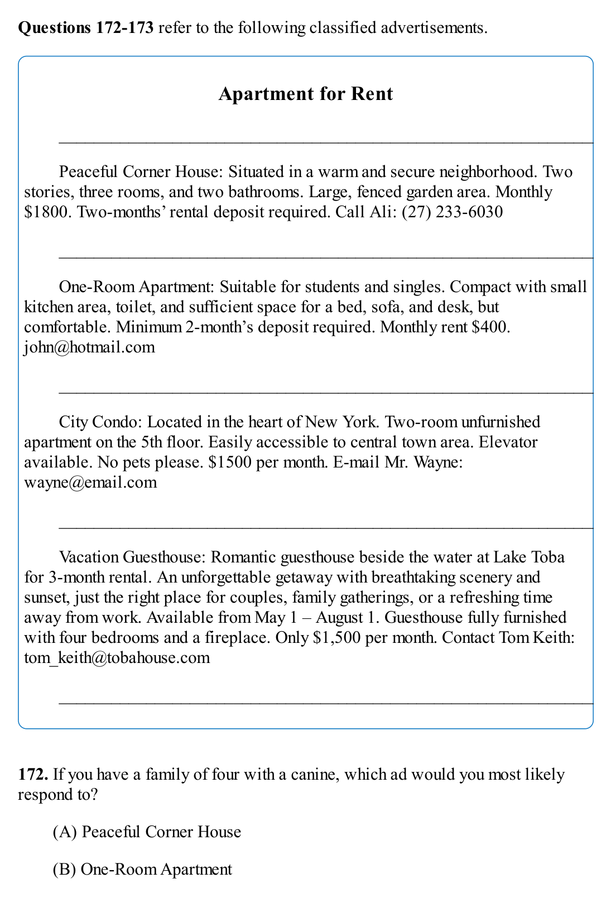


```text
Questions 172-173
 refer to the following classified advertisements.
Apartment for Rent
_______________________________________________________________
Peaceful Corner House: Situated in a warm and secure neighborhood. Two
stories, three rooms, and two bathrooms. Large, fenced garden area. Monthly
$1800. Two-months’ rental deposit required. Call Ali: (27) 233-6030
_______________________________________________________________
One-Room Apartment: Suitable for students and singles. Compact with small
kitchen area, toilet, and sufficient space for a bed, sofa, and desk, but
comfortable. Minimum 2-month’s deposit required. Monthly rent $400.
john@hotmail.com
_______________________________________________________________
City Condo: Located in the heart of New York. Two-room unfurnished
apartment on the 5th floor. Easily accessible to central town area. Elevator
available. No pets please. $1500 per month. E-mail Mr. Wayne:
wayne@email.com
_______________________________________________________________
Vacation Guesthouse: Romantic guesthouse beside the water at Lake Toba
for 3-month rental. An unforgettable getaway with breathtaking scenery and
sunset, just the right place for couples, family gatherings, or a refreshing time
away from work. Available from May 1 – August 1. Guesthouse fully furnished
with four bedrooms and a fireplace. Only $1,500 per month. Contact Tom Keith:
tom_keith@tobahouse.com
_______________________________________________________________
172.
 If you have a family of four with a canine, which ad would you most likely
respond to?
(A) Peaceful Corner House
(B) One-Room Apartment
1075
```

## PDF 第 305 页

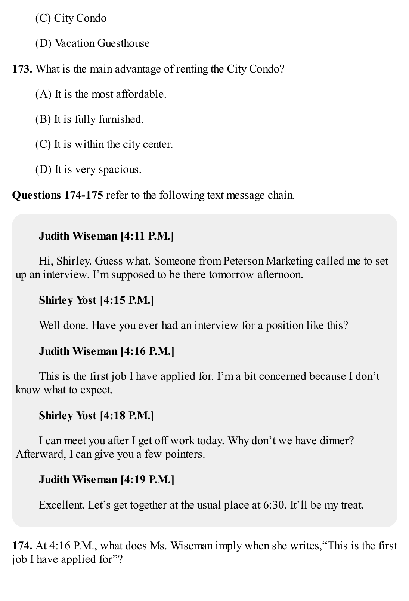


```text
(C) City Condo
(D) Vacation Guesthouse
173.
 What is the main advantage of renting the City Condo?
(A) It is the most affordable.
(B) It is fully furnished.
(C) It is within the city center.
(D) It is very spacious.
Questions 174-175
 refer to the following text message chain.
Judith Wiseman [4:11 P.M.]
Hi, Shirley. Guess what. Someone from Peterson Marketing called me to set
up an interview. I’m supposed to be there tomorrow afternoon.
Shirley Yost [4:15 P.M.]
Well done. Have you ever had an interview for a position like this?
Judith Wiseman [4:16 P.M.]
This is the first job I have applied for. I’m a bit concerned because I don’t
know what to expect.
Shirley Yost [4:18 P.M.]
I can meet you after I get off work today. Why don’t we have dinner?
Afterward, I can give you a few pointers.
Judith Wiseman [4:19 P.M.]
Excellent. Let’s get together at the usual place at 6:30. It’ll be my treat.
174.
 At 4:16 P.M., what does Ms. Wiseman imply when she writes,“This is the first
job I have applied for”?
1076
```

## PDF 第 306 页

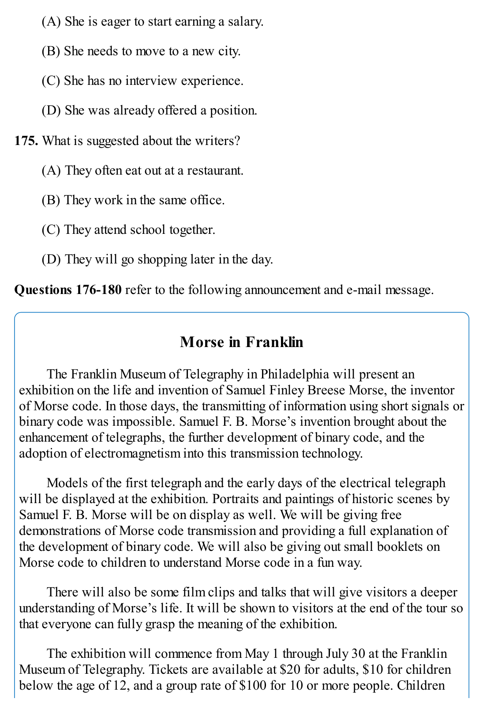


```text
(A) She is eager to start earning a salary.
(B) She needs to move to a new city.
(C) She has no interview experience.
(D) She was already offered a position.
175.
 What is suggested about the writers?
(A) They often eat out at a restaurant.
(B) They work in the same office.
(C) They attend school together.
(D) They will go shopping later in the day.
Questions 176-180
 refer to the following announcement and e-mail message.
Morse in Franklin
The Franklin Museum of Telegraphy in Philadelphia will present an
exhibition on the life and invention of Samuel Finley Breese Morse, the inventor
of Morse code. In those days, the transmitting of information using short signals or
binary code was impossible. Samuel F. B. Morse’s invention brought about the
enhancement of telegraphs, the further development of binary code, and the
adoption of electromagnetism into this transmission technology.
Models of the first telegraph and the early days of the electrical telegraph
will be displayed at the exhibition. Portraits and paintings of historic scenes by
Samuel F. B. Morse will be on display as well. We will be giving free
demonstrations of Morse code transmission and providing a full explanation of
the development of binary code. We will also be giving out small booklets on
Morse code to children to understand Morse code in a fun way.
There will also be some film clips and talks that will give visitors a deeper
understanding of Morse’s life. It will be shown to visitors at the end of the tour so
that everyone can fully grasp the meaning of the exhibition.
The exhibition will commence from May 1 through July 30 at the Franklin
Museum of Telegraphy. Tickets are available at $20 for adults, $10 for children
below the age of 12, and a group rate of $100 for 10 or more people. Children
1077
```

## PDF 第 307 页

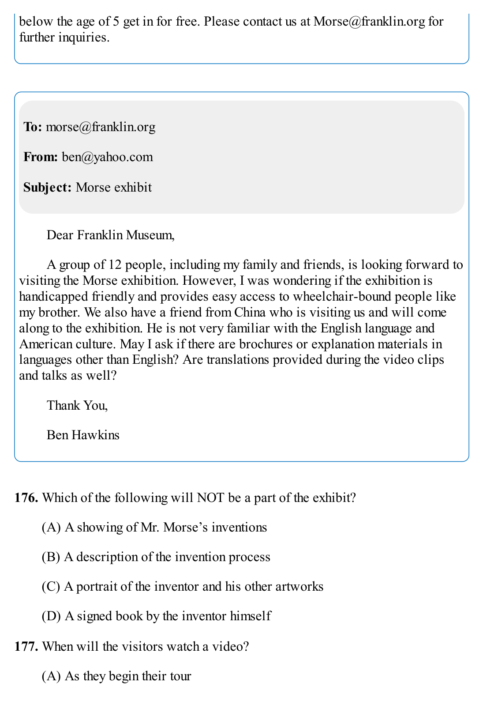


```text
below the age of 5 get in for free. Please contact us at Morse@franklin.org for
further inquiries.
To:
 morse@franklin.org
From:
 ben@yahoo.com
Subject:
 Morse exhibit
Dear Franklin Museum,
A group of 12 people, including my family and friends, is looking forward to
visiting the Morse exhibition. However, I was wondering if the exhibition is
handicapped friendly and provides easy access to wheelchair-bound people like
my brother. We also have a friend from China who is visiting us and will come
along to the exhibition. He is not very familiar with the English language and
American culture. May I ask if there are brochures or explanation materials in
languages other than English? Are translations provided during the video clips
and talks as well?
Thank You,
Ben Hawkins
176.
 Which of the following will NOT be a part of the exhibit?
(A) A showing of Mr. Morse’s inventions
(B) A description of the invention process
(C) A portrait of the inventor and his other artworks
(D) A signed book by the inventor himself
177.
 When will the visitors watch a video?
(A) As they begin their tour
1078
```

## PDF 第 308 页

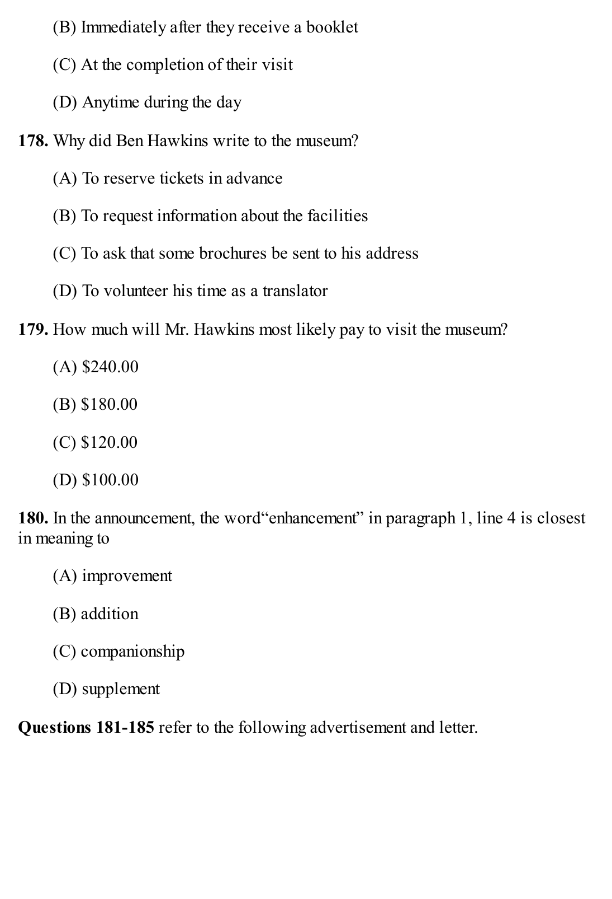


```text
(B) Immediately after they receive a booklet
(C) At the completion of their visit
(D) Anytime during the day
178.
 Why did Ben Hawkins write to the museum?
(A) To reserve tickets in advance
(B) To request information about the facilities
(C) To ask that some brochures be sent to his address
(D) To volunteer his time as a translator
179.
 How much will Mr. Hawkins most likely pay to visit the museum?
(A) $240.00
(B) $180.00
(C) $120.00
(D) $100.00
180.
 In the announcement, the word“enhancement” in paragraph 1, line 4 is closest
in meaning to
(A) improvement
(B) addition
(C) companionship
(D) supplement
Questions 181-185
 refer to the following advertisement and letter.
1079
```

## PDF 第 309 页

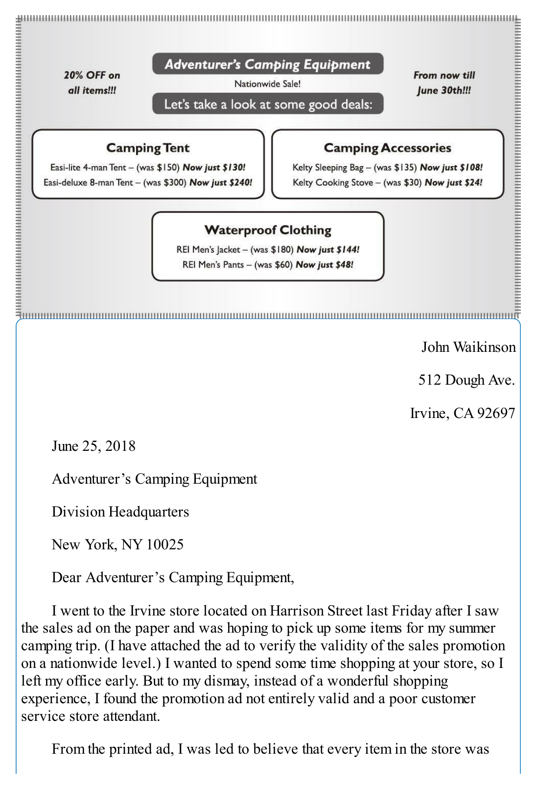


```text
John Waikinson
512 Dough Ave.
Irvine, CA 92697
June 25, 2018
Adventurer’s Camping Equipment
Division Headquarters
New York, NY 10025
Dear Adventurer’s Camping Equipment,
I went to the Irvine store located on Harrison Street last Friday after I saw
the sales ad on the paper and was hoping to pick up some items for my summer
camping trip. (I have attached the ad to verify the validity of the sales promotion
on a nationwide level.) I wanted to spend some time shopping at your store, so I
left my office early. But to my dismay, instead of a wonderful shopping
experience, I found the promotion ad not entirely valid and a poor customer
service store attendant.
From the printed ad, I was led to believe that every item in the store was
1080
```

## PDF 第 310 页

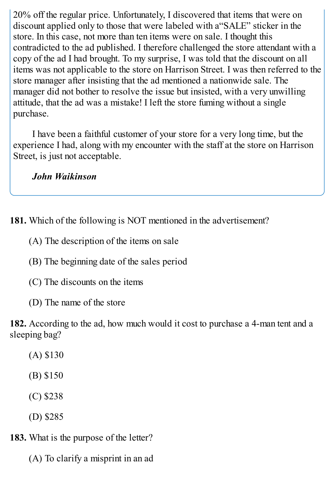


```text
20% off the regular price. Unfortunately, I discovered that items that were on
discount applied only to those that were labeled with a“SALE” sticker in the
store. In this case, not more than ten items were on sale. I thought this
contradicted to the ad published. I therefore challenged the store attendant with a
copy of the ad I had brought. To my surprise, I was told that the discount on all
items was not applicable to the store on Harrison Street. I was then referred to the
store manager after insisting that the ad mentioned a nationwide sale. The
manager did not bother to resolve the issue but insisted, with a very unwilling
attitude, that the ad was a mistake! I left the store fuming without a single
purchase.
I have been a faithful customer of your store for a very long time, but the
experience I had, along with my encounter with the staff at the store on Harrison
Street, is just not acceptable.
John Waikinson
181.
 Which of the following is NOT mentioned in the advertisement?
(A) The description of the items on sale
(B) The beginning date of the sales period
(C) The discounts on the items
(D) The name of the store
182.
 According to the ad, how much would it cost to purchase a 4-man tent and a
sleeping bag?
(A) $130
(B) $150
(C) $238
(D) $285
183.
 What is the purpose of the letter?
(A) To clarify a misprint in an ad
1081
```

## PDF 第 311 页

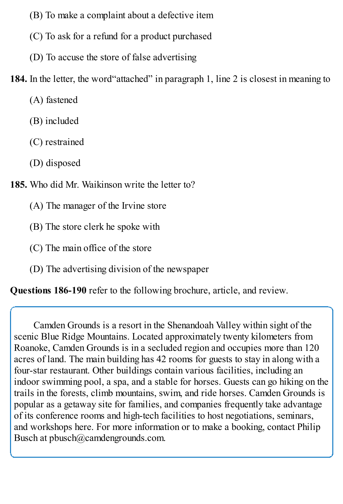


```text
(B) To make a complaint about a defective item
(C) To ask for a refund for a product purchased
(D) To accuse the store of false advertising
184.
 In the letter, the word“attached” in paragraph 1, line 2 is closest in meaning to
(A) fastened
(B) included
(C) restrained
(D) disposed
185.
 Who did Mr. Waikinson write the letter to?
(A) The manager of the Irvine store
(B) The store clerk he spoke with
(C) The main office of the store
(D) The advertising division of the newspaper
Questions 186-190
 refer to the following brochure, article, and review.
Camden Grounds is a resort in the Shenandoah Valley within sight of the
scenic Blue Ridge Mountains. Located approximately twenty kilometers from
Roanoke, Camden Grounds is in a secluded region and occupies more than 120
acres of land. The main building has 42 rooms for guests to stay in along with a
four-star restaurant. Other buildings contain various facilities, including an
indoor swimming pool, a spa, and a stable for horses. Guests can go hiking on the
trails in the forests, climb mountains, swim, and ride horses. Camden Grounds is
popular as a getaway site for families, and companies frequently take advantage
of its conference rooms and high-tech facilities to host negotiations, seminars,
and workshops here. For more information or to make a booking, contact Philip
Busch at pbusch@camdengrounds.com.
1082
```

## PDF 第 312 页

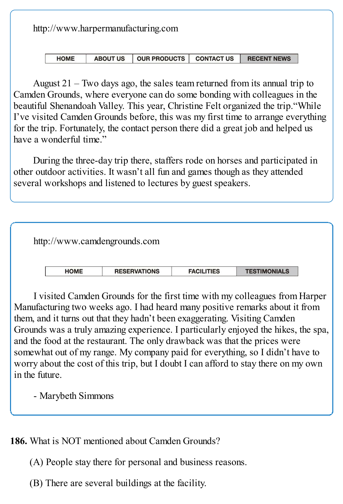


```text
http://www.harpermanufacturing.com
August 21 – Two days ago, the sales team returned from its annual trip to
Camden Grounds, where everyone can do some bonding with colleagues in the
beautiful Shenandoah Valley. This year, Christine Felt organized the trip.“While
I’ve visited Camden Grounds before, this was my first time to arrange everything
for the trip. Fortunately, the contact person there did a great job and helped us
have a wonderful time.”
During the three-day trip there, staffers rode on horses and participated in
other outdoor activities. It wasn’t all fun and games though as they attended
several workshops and listened to lectures by guest speakers.
http://www.camdengrounds.com
I visited Camden Grounds for the first time with my colleagues from Harper
Manufacturing two weeks ago. I had heard many positive remarks about it from
them, and it turns out that they hadn’t been exaggerating. Visiting Camden
Grounds was a truly amazing experience. I particularly enjoyed the hikes, the spa,
and the food at the restaurant. The only drawback was that the prices were
somewhat out of my range. My company paid for everything, so I didn’t have to
worry about the cost of this trip, but I doubt I can afford to stay there on my own
in the future.
- Marybeth Simmons
186.
 What is NOT mentioned about Camden Grounds?
(A) People stay there for personal and business reasons.
(B) There are several buildings at the facility.
1083
```

## PDF 第 313 页

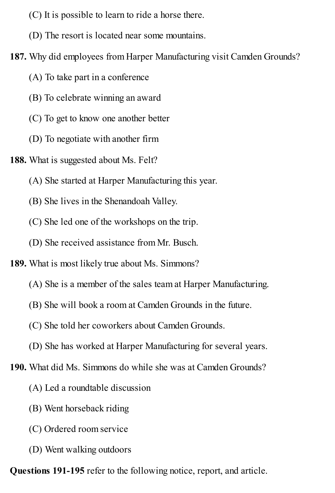


```text
(C) It is possible to learn to ride a horse there.
(D) The resort is located near some mountains.
187.
 Why did employees from Harper Manufacturing visit Camden Grounds?
(A) To take part in a conference
(B) To celebrate winning an award
(C) To get to know one another better
(D) To negotiate with another firm
188.
 What is suggested about Ms. Felt?
(A) She started at Harper Manufacturing this year.
(B) She lives in the Shenandoah Valley.
(C) She led one of the workshops on the trip.
(D) She received assistance from Mr. Busch.
189.
 What is most likely true about Ms. Simmons?
(A) She is a member of the sales team at Harper Manufacturing.
(B) She will book a room at Camden Grounds in the future.
(C) She told her coworkers about Camden Grounds.
(D) She has worked at Harper Manufacturing for several years.
190.
 What did Ms. Simmons do while she was at Camden Grounds?
(A) Led a roundtable discussion
(B) Went horseback riding
(C) Ordered room service
(D) Went walking outdoors
Questions 191-195
 refer to the following notice, report, and article.
1084
```

## PDF 第 314 页

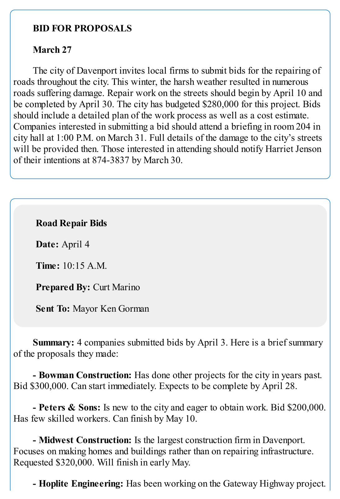


```text
BID FOR PROPOSALS
March 27
The city of Davenport invites local firms to submit bids for the repairing of
roads throughout the city. This winter, the harsh weather resulted in numerous
roads suffering damage. Repair work on the streets should begin by April 10 and
be completed by April 30. The city has budgeted $280,000 for this project. Bids
should include a detailed plan of the work process as well as a cost estimate.
Companies interested in submitting a bid should attend a briefing in room 204 in
city hall at 1:00 P.M. on March 31. Full details of the damage to the city’s streets
will be provided then. Those interested in attending should notify Harriet Jenson
of their intentions at 874-3837 by March 30.
Road Repair Bids
Date:
 April 4
Time:
 10:15 A.M.
Prepared By:
 Curt Marino
Sent To:
 Mayor Ken Gorman
Summary:
 4 companies submitted bids by April 3. Here is a brief summary
of the proposals they made:
- Bowman Construction:
 Has done other projects for the city in years past.
Bid $300,000. Can start immediately. Expects to be complete by April 28.
- Peters & Sons:
 Is new to the city and eager to obtain work. Bid $200,000.
Has few skilled workers. Can finish by May 10.
- Midwest Construction:
 Is the largest construction firm in Davenport.
Focuses on making homes and buildings rather than on repairing infrastructure.
Requested $320,000. Will finish in early May.
- Hoplite Engineering:
 Has been working on the Gateway Highway project.
1085
```

## PDF 第 315 页

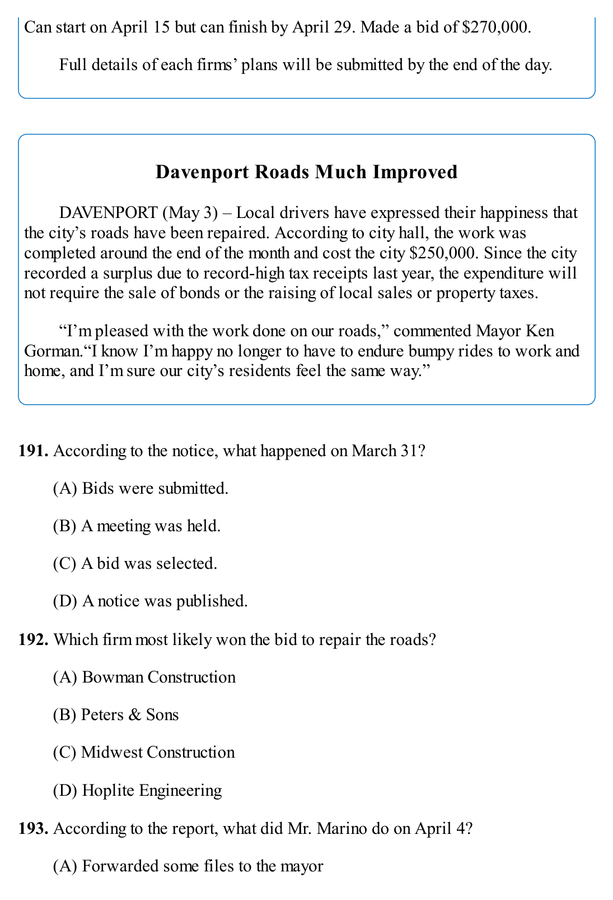


```text
Can start on April 15 but can finish by April 29. Made a bid of $270,000.
Full details of each firms’ plans will be submitted by the end of the day.
Davenport Roads Much Improved
DAVENPORT (May 3) – Local drivers have expressed their happiness that
the city’s roads have been repaired. According to city hall, the work was
completed around the end of the month and cost the city $250,000. Since the city
recorded a surplus due to record-high tax receipts last year, the expenditure will
not require the sale of bonds or the raising of local sales or property taxes.
“I’m pleased with the work done on our roads,” commented Mayor Ken
Gorman.“I know I’m happy no longer to have to endure bumpy rides to work and
home, and I’m sure our city’s residents feel the same way.”
191.
 According to the notice, what happened on March 31?
(A) Bids were submitted.
(B) A meeting was held.
(C) A bid was selected.
(D) A notice was published.
192.
 Which firm most likely won the bid to repair the roads?
(A) Bowman Construction
(B) Peters & Sons
(C) Midwest Construction
(D) Hoplite Engineering
193.
 According to the report, what did Mr. Marino do on April 4?
(A) Forwarded some files to the mayor
1086
```

## PDF 第 316 页

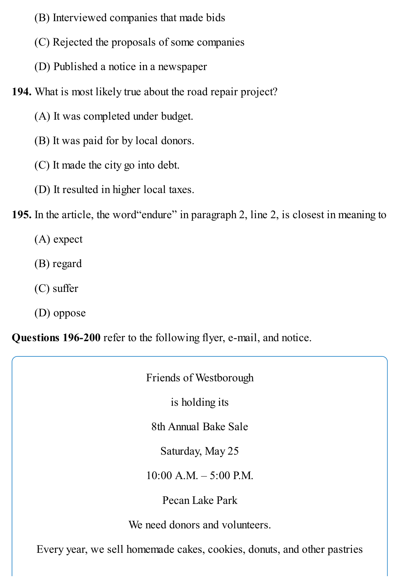


```text
(B) Interviewed companies that made bids
(C) Rejected the proposals of some companies
(D) Published a notice in a newspaper
194.
 What is most likely true about the road repair project?
(A) It was completed under budget.
(B) It was paid for by local donors.
(C) It made the city go into debt.
(D) It resulted in higher local taxes.
195.
 In the article, the word“endure” in paragraph 2, line 2, is closest in meaning to
(A) expect
(B) regard
(C) suffer
(D) oppose
Questions 196-200
 refer to the following flyer, e-mail, and notice.
Friends of Westborough
is holding its
8th Annual Bake Sale
Saturday, May 25
10:00 A.M. – 5:00 P.M.
Pecan Lake Park
We need donors and volunteers.
Every year, we sell homemade cakes, cookies, donuts, and other pastries
1087
```

## PDF 第 317 页

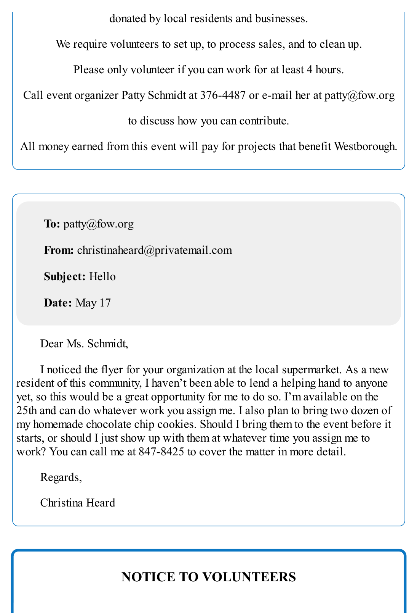


```text
donated by local residents and businesses.
We require volunteers to set up, to process sales, and to clean up.
Please only volunteer if you can work for at least 4 hours.
Call event organizer Patty Schmidt at 376-4487 or e-mail her at patty@fow.org
to discuss how you can contribute.
All money earned from this event will pay for projects that benefit Westborough.
To:
 patty@fow.org
From:
 christinaheard@privatemail.com
Subject:
 Hello
Date:
 May 17
Dear Ms. Schmidt,
I noticed the flyer for your organization at the local supermarket. As a new
resident of this community, I haven’t been able to lend a helping hand to anyone
yet, so this would be a great opportunity for me to do so. I’m available on the
25th and can do whatever work you assign me. I also plan to bring two dozen of
my homemade chocolate chip cookies. Should I bring them to the event before it
starts, or should I just show up with them at whatever time you assign me to
work? You can call me at 847-8425 to cover the matter in more detail.
Regards,
Christina Heard
NOTICE TO VOLUNTEERS
1088
```

## PDF 第 318 页

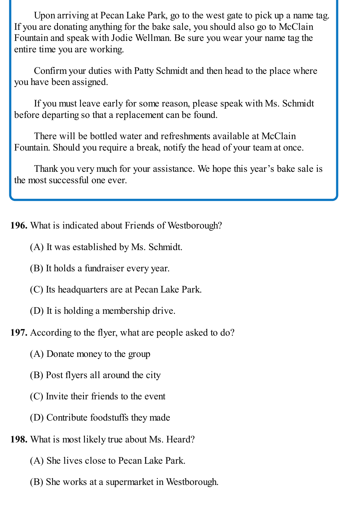


```text
Upon arriving at Pecan Lake Park, go to the west gate to pick up a name tag.
If you are donating anything for the bake sale, you should also go to McClain
Fountain and speak with Jodie Wellman. Be sure you wear your name tag the
entire time you are working.
Confirm your duties with Patty Schmidt and then head to the place where
you have been assigned.
If you must leave early for some reason, please speak with Ms. Schmidt
before departing so that a replacement can be found.
There will be bottled water and refreshments available at McClain
Fountain. Should you require a break, notify the head of your team at once.
Thank you very much for your assistance. We hope this year’s bake sale is
the most successful one ever.
196.
 What is indicated about Friends of Westborough?
(A) It was established by Ms. Schmidt.
(B) It holds a fundraiser every year.
(C) Its headquarters are at Pecan Lake Park.
(D) It is holding a membership drive.
197.
 According to the flyer, what are people asked to do?
(A) Donate money to the group
(B) Post flyers all around the city
(C) Invite their friends to the event
(D) Contribute foodstuffs they made
198.
 What is most likely true about Ms. Heard?
(A) She lives close to Pecan Lake Park.
(B) She works at a supermarket in Westborough.
1089
```

## PDF 第 319 页

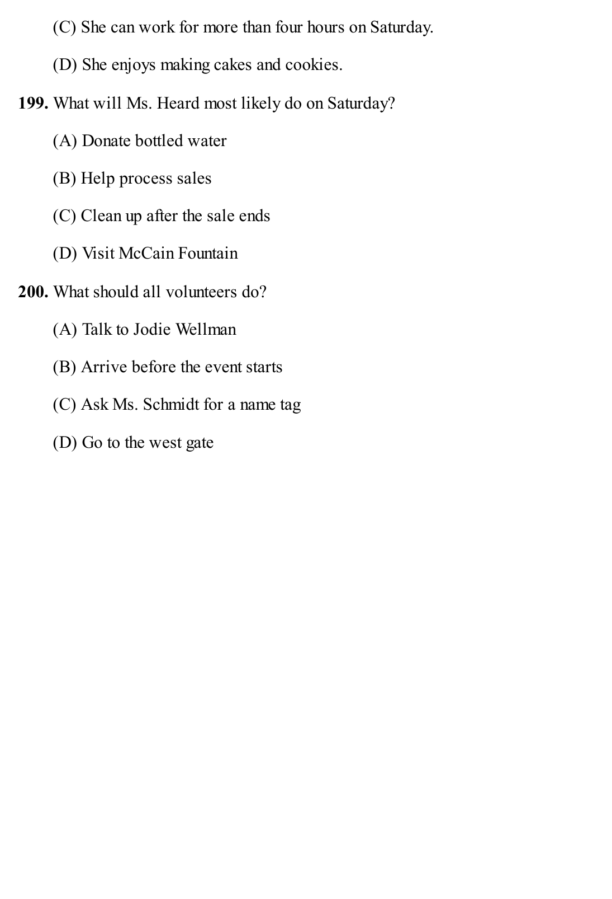


```text
(C) She can work for more than four hours on Saturday.
(D) She enjoys making cakes and cookies.
199.
 What will Ms. Heard most likely do on Saturday?
(A) Donate bottled water
(B) Help process sales
(C) Clean up after the sale ends
(D) Visit McCain Fountain
200.
 What should all volunteers do?
(A) Talk to Jodie Wellman
(B) Arrive before the event starts
(C) Ask Ms. Schmidt for a name tag
(D) Go to the west gate
1090
```

## PDF 第 320 页

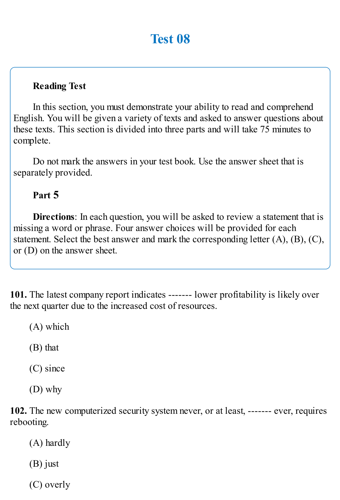


```text
Test 08
Reading Test
In this section, you must demonstrate your ability to read and comprehend
English. You will be given a variety of texts and asked to answer questions about
these texts. This section is divided into three parts and will take 75 minutes to
complete.
Do not mark the answers in your test book. Use the answer sheet that is
separately provided.
Part
5
Directions
: In each question, you will be asked to review a statement that is
missing a word or phrase. Four answer choices will be provided for each
statement. Select the best answer and mark the corresponding letter (A), (B), (C),
or (D) on the answer sheet.
101.
 The latest company report indicates ------- lower profitability is likely over
the next quarter due to the increased cost of resources.
(A) which
(B) that
(C) since
(D) why
102.
 The new computerized security system never, or at least, ------- ever, requires
rebooting.
(A) hardly
(B) just
(C) overly
1091
```

## PDF 第 321 页

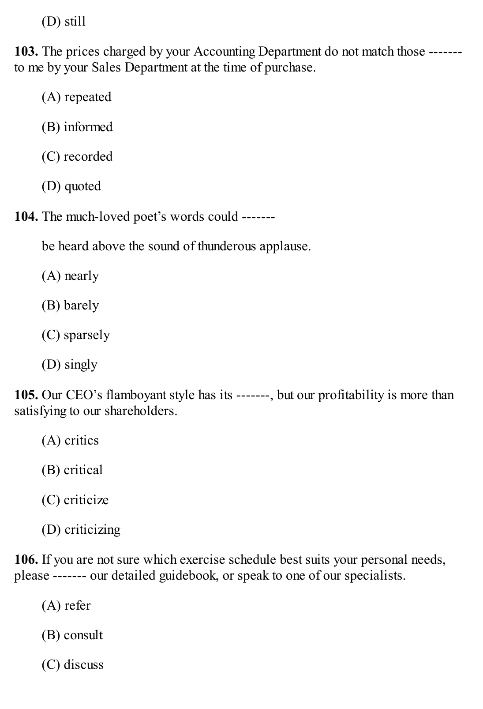


```text
(D) still
103.
 The prices charged by your Accounting Department do not match those -------
to me by your Sales Department at the time of purchase.
(A) repeated
(B) informed
(C) recorded
(D) quoted
104.
 The much-loved poet’s words could -------
be heard above the sound of thunderous applause.
(A) nearly
(B) barely
(C) sparsely
(D) singly
105.
 Our CEO’s flamboyant style has its -------, but our profitability is more than
satisfying to our shareholders.
(A) critics
(B) critical
(C) criticize
(D) criticizing
106.
 If you are not sure which exercise schedule best suits your personal needs,
please ------- our detailed guidebook, or speak to one of our specialists.
(A) refer
(B) consult
(C) discuss
1092
```

## PDF 第 322 页

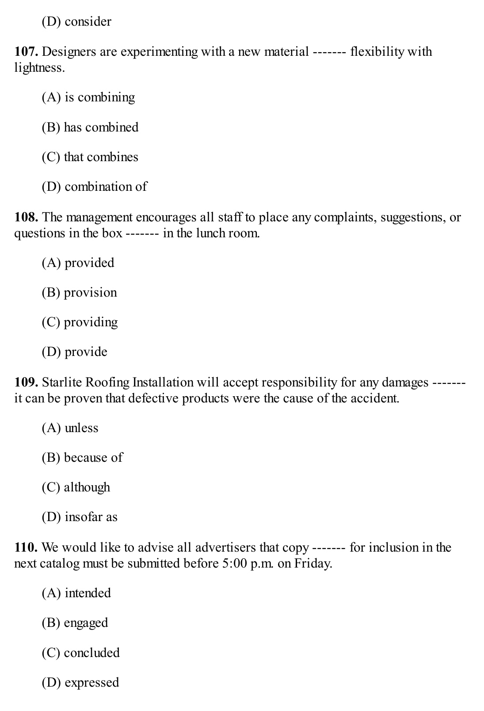


```text
(D) consider
107.
 Designers are experimenting with a new material ------- flexibility with
lightness.
(A) is combining
(B) has combined
(C) that combines
(D) combination of
108.
 The management encourages all staff to place any complaints, suggestions, or
questions in the box ------- in the lunch room.
(A) provided
(B) provision
(C) providing
(D) provide
109.
 Starlite Roofing Installation will accept responsibility for any damages -------
it can be proven that defective products were the cause of the accident.
(A) unless
(B) because of
(C) although
(D) insofar as
110.
 We would like to advise all advertisers that copy ------- for inclusion in the
next catalog must be submitted before 5:00 p.m. on Friday.
(A) intended
(B) engaged
(C) concluded
(D) expressed
1093
```

## PDF 第 323 页

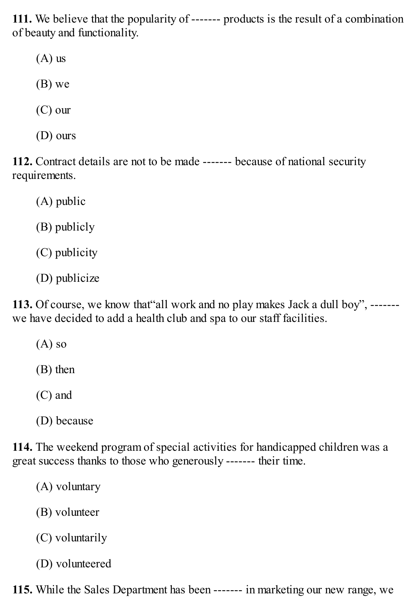


```text
111.
 We believe that the popularity of ------- products is the result of a combination
of beauty and functionality.
(A) us
(B) we
(C) our
(D) ours
112.
 Contract details are not to be made ------- because of national security
requirements.
(A) public
(B) publicly
(C) publicity
(D) publicize
113.
 Of course, we know that“all work and no play makes Jack a dull boy”, -------
we have decided to add a health club and spa to our staff facilities.
(A) so
(B) then
(C) and
(D) because
114.
 The weekend program of special activities for handicapped children was a
great success thanks to those who generously ------- their time.
(A) voluntary
(B) volunteer
(C) voluntarily
(D) volunteered
115.
 While the Sales Department has been ------- in marketing our new range, we
1094
```

## PDF 第 324 页

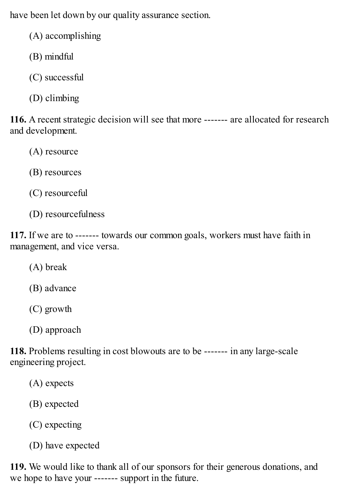


```text
have been let down by our quality assurance section.
(A) accomplishing
(B) mindful
(C) successful
(D) climbing
116.
 A recent strategic decision will see that more ------- are allocated for research
and development.
(A) resource
(B) resources
(C) resourceful
(D) resourcefulness
117.
 If we are to ------- towards our common goals, workers must have faith in
management, and vice versa.
(A) break
(B) advance
(C) growth
(D) approach
118.
 Problems resulting in cost blowouts are to be ------- in any large-scale
engineering project.
(A) expects
(B) expected
(C) expecting
(D) have expected
119.
 We would like to thank all of our sponsors for their generous donations, and
we hope to have your ------- support in the future.
1095
```

## PDF 第 325 页

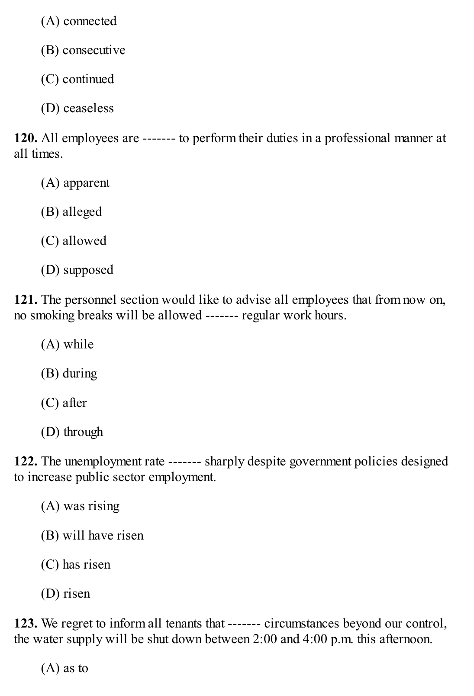


```text
(A) connected
(B) consecutive
(C) continued
(D) ceaseless
120.
 All employees are ------- to perform their duties in a professional manner at
all times.
(A) apparent
(B) alleged
(C) allowed
(D) supposed
121.
 The personnel section would like to advise all employees that from now on,
no smoking breaks will be allowed ------- regular work hours.
(A) while
(B) during
(C) after
(D) through
122.
 The unemployment rate ------- sharply despite government policies designed
to increase public sector employment.
(A) was rising
(B) will have risen
(C) has risen
(D) risen
123.
 We regret to inform all tenants that ------- circumstances beyond our control,
the water supply will be shut down between 2:00 and 4:00 p.m. this afternoon.
(A) as to
1096
```

## PDF 第 326 页

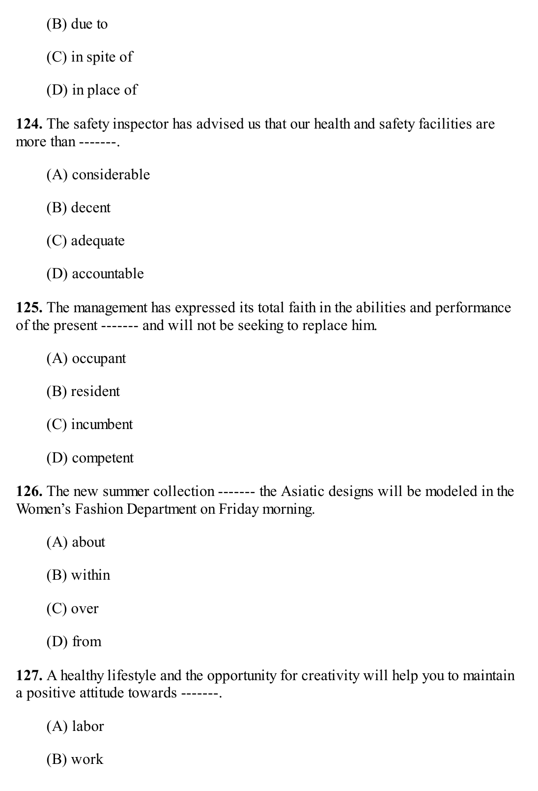


```text
(B) due to
(C) in spite of
(D) in place of
124.
 The safety inspector has advised us that our health and safety facilities are
more than -------.
(A) considerable
(B) decent
(C) adequate
(D) accountable
125.
 The management has expressed its total faith in the abilities and performance
of the present ------- and will not be seeking to replace him.
(A) occupant
(B) resident
(C) incumbent
(D) competent
126.
 The new summer collection ------- the Asiatic designs will be modeled in the
Women’s Fashion Department on Friday morning.
(A) about
(B) within
(C) over
(D) from
127.
 A healthy lifestyle and the opportunity for creativity will help you to maintain
a positive attitude towards -------.
(A) labor
(B) work
1097
```

## PDF 第 327 页

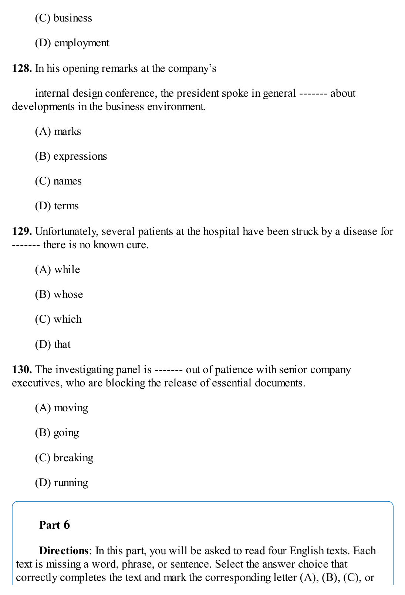


```text
(C) business
(D) employment
128.
 In his opening remarks at the company’s
internal design conference, the president spoke in general ------- about
developments in the business environment.
(A) marks
(B) expressions
(C) names
(D) terms
129.
 Unfortunately, several patients at the hospital have been struck by a disease for
------- there is no known cure.
(A) while
(B) whose
(C) which
(D) that
130.
 The investigating panel is ------- out of patience with senior company
executives, who are blocking the release of essential documents.
(A) moving
(B) going
(C) breaking
(D) running
Part
6
Directions
: In this part, you will be asked to read four English texts. Each
text is missing a word, phrase, or sentence. Select the answer choice that
correctly completes the text and mark the corresponding letter (A), (B), (C), or
1098
```

## PDF 第 328 页

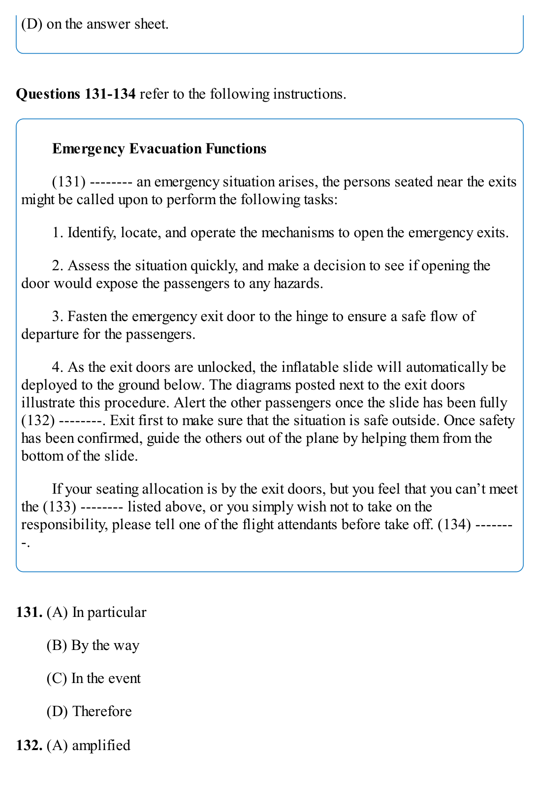


```text
(D) on the answer sheet.
Questions 131-134
 refer to the following instructions.
Emergency Evacuation Functions
(131) -------- an emergency situation arises, the persons seated near the exits
might be called upon to perform the following tasks:
1. Identify, locate, and operate the mechanisms to open the emergency exits.
2. Assess the situation quickly, and make a decision to see if opening the
door would expose the passengers to any hazards.
3. Fasten the emergency exit door to the hinge to ensure a safe flow of
departure for the passengers.
4. As the exit doors are unlocked, the inflatable slide will automatically be
deployed to the ground below. The diagrams posted next to the exit doors
illustrate this procedure. Alert the other passengers once the slide has been fully
(132) --------. Exit first to make sure that the situation is safe outside. Once safety
has been confirmed, guide the others out of the plane by helping them from the
bottom of the slide.
If your seating allocation is by the exit doors, but you feel that you can’t meet
the (133) -------- listed above, or you simply wish not to take on the
responsibility, please tell one of the flight attendants before take off. (134) -------
-.
131.
 (A) In particular
(B) By the way
(C) In the event
(D) Therefore
132.
 (A) amplified
1099
```

## PDF 第 329 页

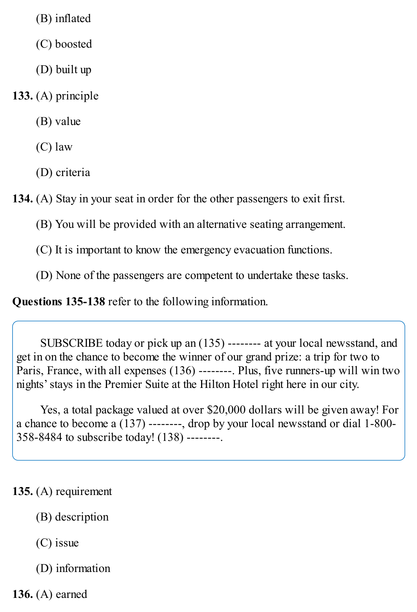


```text
(B) inflated
(C) boosted
(D) built up
133.
 (A) principle
(B) value
(C) law
(D) criteria
134.
 (A) Stay in your seat in order for the other passengers to exit first.
(B) You will be provided with an alternative seating arrangement.
(C) It is important to know the emergency evacuation functions.
(D) None of the passengers are competent to undertake these tasks.
Questions 135-138
 refer to the following information.
SUBSCRIBE today or pick up an (135) -------- at your local newsstand, and
get in on the chance to become the winner of our grand prize: a trip for two to
Paris, France, with all expenses (136) --------. Plus, five runners-up will win two
nights’ stays in the Premier Suite at the Hilton Hotel right here in our city.
Yes, a total package valued at over $20,000 dollars will be given away! For
a chance to become a (137) --------, drop by your local newsstand or dial 1-800-
358-8484 to subscribe today! (138) --------.
135.
 (A) requirement
(B) description
(C) issue
(D) information
136.
 (A) earned
1100
```

## PDF 第 330 页

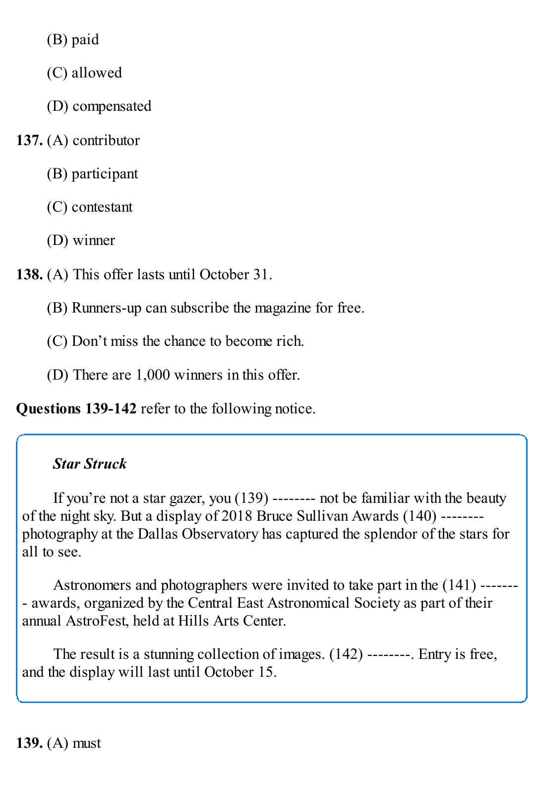


```text
(B) paid
(C) allowed
(D) compensated
137.
 (A) contributor
(B) participant
(C) contestant
(D) winner
138.
 (A) This offer lasts until October 31.
(B) Runners-up can subscribe the magazine for free.
(C) Don’t miss the chance to become rich.
(D) There are 1,000 winners in this offer.
Questions 139-142
 refer to the following notice.
Star Struck
If you’re not a star gazer, you (139) -------- not be familiar with the beauty
of the night sky. But a display of 2018 Bruce Sullivan Awards (140) --------
photography at the Dallas Observatory has captured the splendor of the stars for
all to see.
Astronomers and photographers were invited to take part in the (141) -------
- awards, organized by the Central East Astronomical Society as part of their
annual AstroFest, held at Hills Arts Center.
The result is a stunning collection of images. (142) --------. Entry is free,
and the display will last until October 15.
139.
 (A) must
1101
```

## PDF 第 331 页

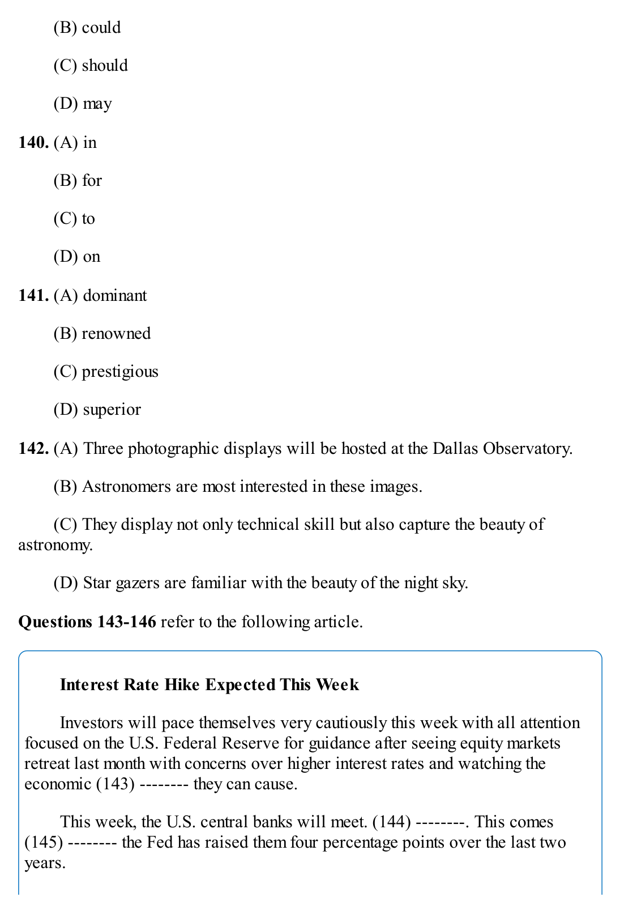


```text
(B) could
(C) should
(D) may
140.
 (A) in
(B) for
(C) to
(D) on
141.
 (A) dominant
(B) renowned
(C) prestigious
(D) superior
142.
 (A) Three photographic displays will be hosted at the Dallas Observatory.
(B) Astronomers are most interested in these images.
(C) They display not only technical skill but also capture the beauty of
astronomy.
(D) Star gazers are familiar with the beauty of the night sky.
Questions 143-146
 refer to the following article.
Interest Rate Hike Expected This Week
Investors will pace themselves very cautiously this week with all attention
focused on the U.S. Federal Reserve for guidance after seeing equity markets
retreat last month with concerns over higher interest rates and watching the
economic (143) -------- they can cause.
This week, the U.S. central banks will meet. (144) --------. This comes
(145) -------- the Fed has raised them four percentage points over the last two
years.
1102
```

## PDF 第 332 页

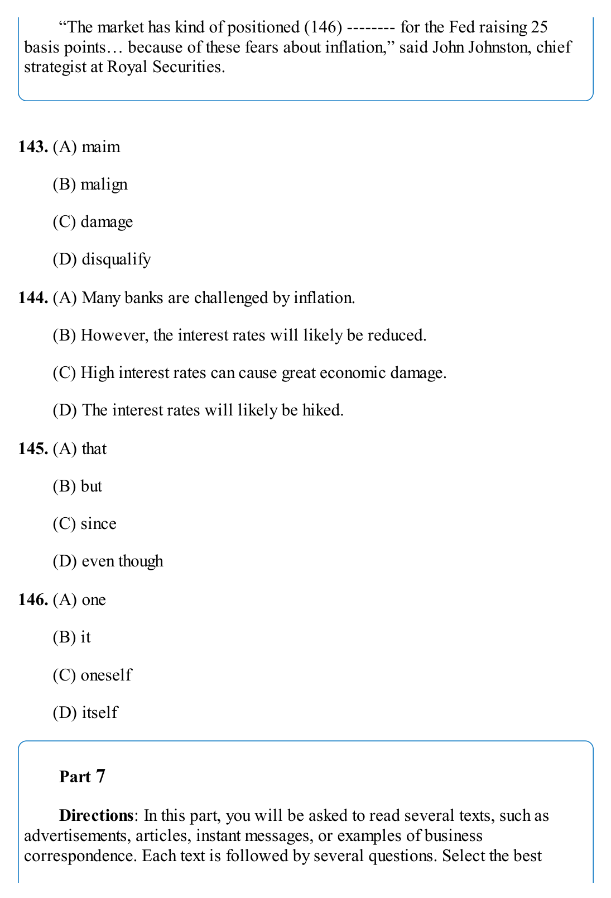


```text
“The market has kind of positioned (146) -------- for the Fed raising 25
basis points… because of these fears about inflation,” said John Johnston, chief
strategist at Royal Securities.
143.
 (A) maim
(B) malign
(C) damage
(D) disqualify
144.
 (A) Many banks are challenged by inflation.
(B) However, the interest rates will likely be reduced.
(C) High interest rates can cause great economic damage.
(D) The interest rates will likely be hiked.
145.
 (A) that
(B) but
(C) since
(D) even though
146.
 (A) one
(B) it
(C) oneself
(D) itself
Part
7
Directions
: In this part, you will be asked to read several texts, such as
advertisements, articles, instant messages, or examples of business
correspondence. Each text is followed by several questions. Select the best
1103
```

## PDF 第 333 页

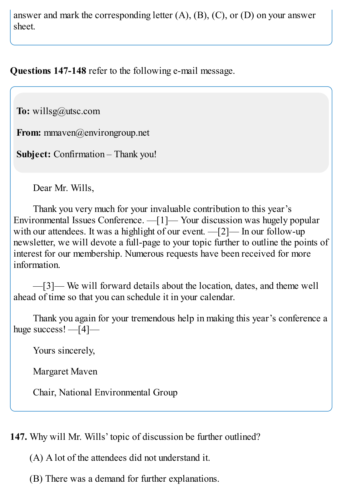


```text
answer and mark the corresponding letter (A), (B), (C), or (D) on your answer
sheet.
Questions 147-
148
 refer to the following e-mail message.
To:
 willsg@utsc.com
From:
 mmaven@environgroup.net
Subject:
 Confirmation – Thank you!
Dear Mr. Wills,
Thank you very much for your invaluable contribution to this year’s
Environmental Issues Conference. —[1]— Your discussion was hugely popular
with our attendees. It was a highlight of our event. —[2]— In our follow-up
newsletter, we will devote a full-page to your topic further to outline the points of
interest for our membership. Numerous requests have been received for more
information.
—[3]— We will forward details about the location, dates, and theme well
ahead of time so that you can schedule it in your calendar.
Thank you again for your tremendous help in making this year’s conference a
huge success! —[4]—
Yours sincerely,
Margaret Maven
Chair, National Environmental Group
147.
 Why will Mr. Wills’ topic of discussion be further outlined?
(A) A lot of the attendees did not understand it.
(B) There was a demand for further explanations.
1104
```

## PDF 第 334 页

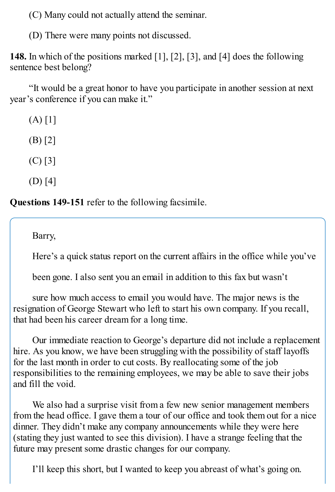


```text
(C) Many could not actually attend the seminar.
(D) There were many points not discussed.
148.
 In which of the positions marked [1], [2], [3], and [4] does the following
sentence best belong?
“It would be a great honor to have you participate in another session at next
year’s conference if you can make it.”
(A) [1]
(B) [2]
(C) [3]
(D) [4]
Questions 149-
151
 refer to the following facsimile.
Barry,
Here’s a quick status report on the current affairs in the office while you’ve
been gone. I also sent you an email in addition to this fax but wasn’t
sure how much access to email you would have. The major news is the
resignation of George Stewart who left to start his own company. If you recall,
that had been his career dream for a long time.
Our immediate reaction to George’s departure did not include a replacement
hire. As you know, we have been struggling with the possibility of staff layoffs
for the last month in order to cut costs. By reallocating some of the job
responsibilities to the remaining employees, we may be able to save their jobs
and fill the void.
We also had a surprise visit from a few new senior management members
from the head office. I gave them a tour of our office and took them out for a nice
dinner. They didn’t make any company announcements while they were here
(stating they just wanted to see this division). I have a strange feeling that the
future may present some drastic changes for our company.
I’ll keep this short, but I wanted to keep you abreast of what’s going on.
1105
```

## PDF 第 335 页

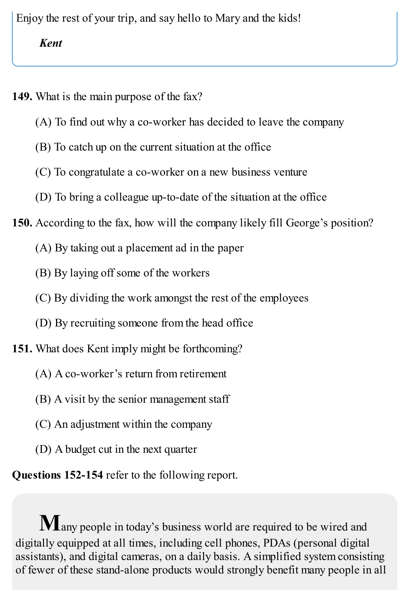


```text
Enjoy the rest of your trip, and say hello to Mary and the kids!
Kent
149.
 What is the main purpose of the fax?
(A) To find out why a co-worker has decided to leave the company
(B) To catch up on the current situation at the office
(C) To congratulate a co-worker on a new business venture
(D) To bring a colleague up-to-date of the situation at the office
150.
 According to the fax, how will the company likely fill George’s position?
(A) By taking out a placement ad in the paper
(B) By laying off some of the workers
(C) By dividing the work amongst the rest of the employees
(D) By recruiting someone from the head office
151.
 What does Kent imply might be forthcoming?
(A) A co-worker’s return from retirement
(B) A visit by the senior management staff
(C) An adjustment within the company
(D) A budget cut in the next quarter
Questions 152-154
 refer to the following report.
M
any people in today’s business world are required to be wired and
digitally equipped at all times, including cell phones, PDAs (personal digital
assistants), and digital cameras, on a daily basis. A simplified system consisting
of fewer of these stand-alone products would strongly benefit many people in all
1106
```

## PDF 第 336 页

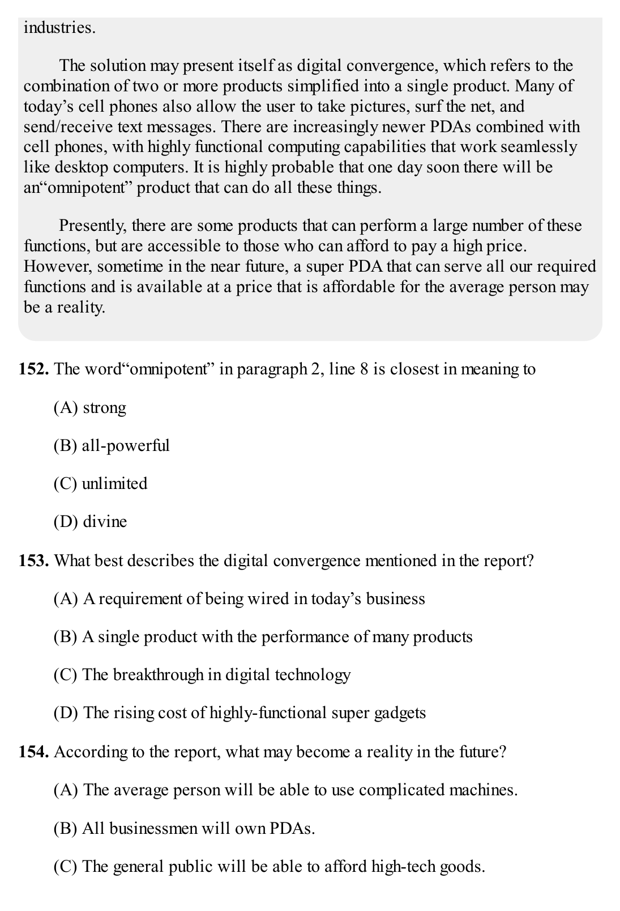


```text
industries.
The solution may present itself as digital convergence, which refers to the
combination of two or more products simplified into a single product. Many of
today’s cell phones also allow the user to take pictures, surf the net, and
send/receive text messages. There are increasingly newer PDAs combined with
cell phones, with highly functional computing capabilities that work seamlessly
like desktop computers. It is highly probable that one day soon there will be
an“omnipotent” product that can do all these things.
Presently, there are some products that can perform a large number of these
functions, but are accessible to those who can afford to pay a high price.
However, sometime in the near future, a super PDA that can serve all our required
functions and is available at a price that is affordable for the average person may
be a reality.
152.
 The word“omnipotent” in paragraph 2, line 8 is closest in meaning to
(A) strong
(B) all-powerful
(C) unlimited
(D) divine
153.
 What best describes the digital convergence mentioned in the report?
(A) A requirement of being wired in today’s business
(B) A single product with the performance of many products
(C) The breakthrough in digital technology
(D) The rising cost of highly-functional super gadgets
154.
 According to the report, what may become a reality in the future?
(A) The average person will be able to use complicated machines.
(B) All businessmen will own PDAs.
(C) The general public will be able to afford high-tech goods.
1107
```

## PDF 第 337 页

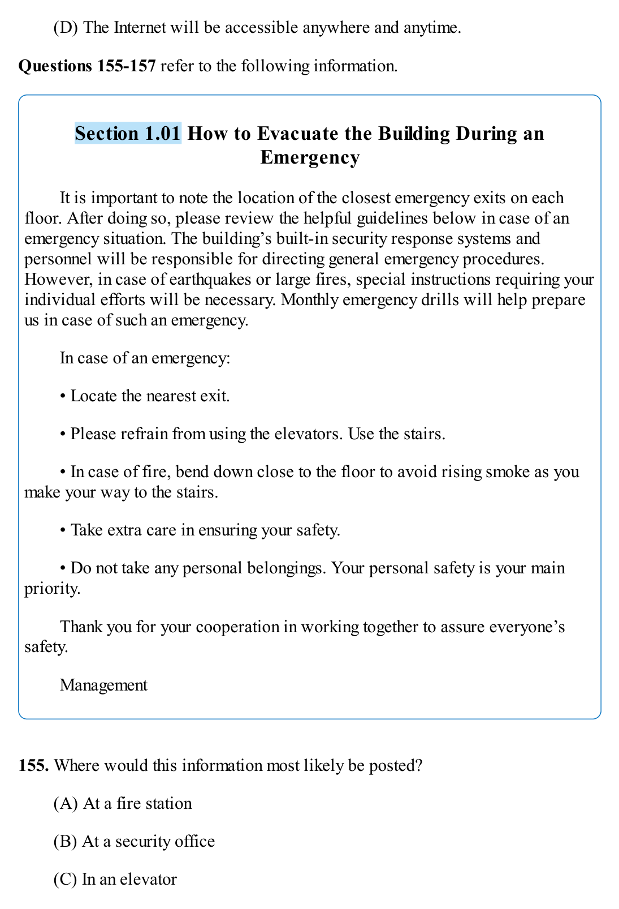


```text
(D) The Internet will be accessible anywhere and anytime.
Questions 155-157
 refer to the following information.
Section 1.01
 How to Evacuate the Building During an
Emergency
It is important to note the location of the closest emergency exits on each
floor. After doing so, please review the helpful guidelines below in case of an
emergency situation. The building’s built-in security response systems and
personnel will be responsible for directing general emergency procedures.
However, in case of earthquakes or large fires, special instructions requiring your
individual efforts will be necessary. Monthly emergency drills will help prepare
us in case of such an emergency.
In case of an emergency:
• Locate the nearest exit.
• Please refrain from using the elevators. Use the stairs.
• In case of fire, bend down close to the floor to avoid rising smoke as you
make your way to the stairs.
• Take extra care in ensuring your safety.
• Do not take any personal belongings. Your personal safety is your main
priority.
Thank you for your cooperation in working together to assure everyone’s
safety.
Management
155.
 Where would this information most likely be posted?
(A) At a fire station
(B) At a security office
(C) In an elevator
1108
```

## PDF 第 338 页

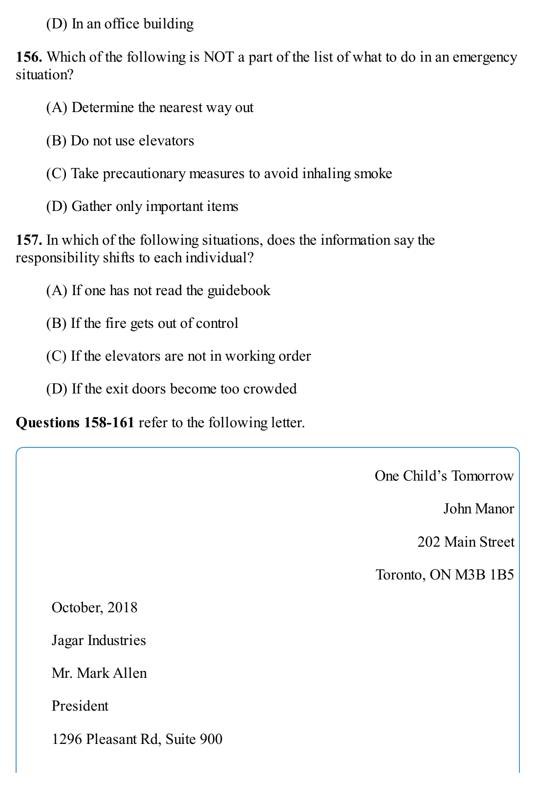


```text
(D) In an office building
156.
 Which of the following is NOT a part of the list of what to do in an emergency
situation?
(A) Determine the nearest way out
(B) Do not use elevators
(C) Take precautionary measures to avoid inhaling smoke
(D) Gather only important items
157.
 In which of the following situations, does the information say the
responsibility shifts to each individual?
(A) If one has not read the guidebook
(B) If the fire gets out of control
(C) If the elevators are not in working order
(D) If the exit doors become too crowded
Questions 158-161
 refer to the following letter.
One Child’s Tomorrow
John Manor
202 Main Street
Toronto, ON M3B 1B5
October, 2018
Jagar Industries
Mr. Mark Allen
President
1296 Pleasant Rd, Suite 900
1109
```

## PDF 第 339 页

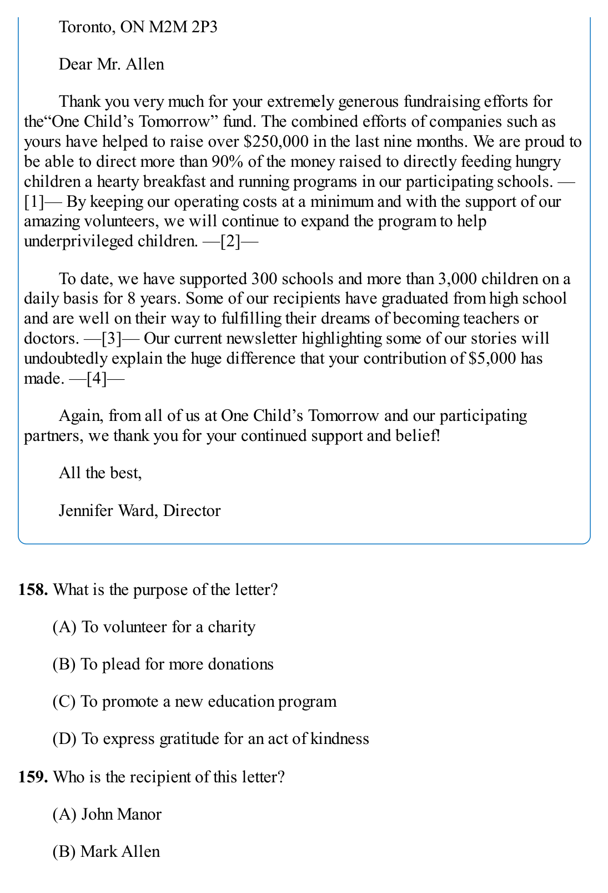


```text
Toronto, ON M2M 2P3
Dear Mr. Allen
Thank you very much for your extremely generous fundraising efforts for
the“One Child’s Tomorrow” fund. The combined efforts of companies such as
yours have helped to raise over $250,000 in the last nine months. We are proud to
be able to direct more than 90% of the money raised to directly feeding hungry
children a hearty breakfast and running programs in our participating schools. —
[1]— By keeping our operating costs at a minimum and with the support of our
amazing volunteers, we will continue to expand the program to help
underprivileged children. —[2]—
To date, we have supported 300 schools and more than 3,000 children on a
daily basis for 8 years. Some of our recipients have graduated from high school
and are well on their way to fulfilling their dreams of becoming teachers or
doctors. —[3]— Our current newsletter highlighting some of our stories will
undoubtedly explain the huge difference that your contribution of $5,000 has
made. —[4]—
Again, from all of us at One Child’s Tomorrow and our participating
partners, we thank you for your continued support and belief!
All the best,
Jennifer Ward, Director
158.
 What is the purpose of the letter?
(A) To volunteer for a charity
(B) To plead for more donations
(C) To promote a new education program
(D) To express gratitude for an act of kindness
159.
 Who is the recipient of this letter?
(A) John Manor
(B) Mark Allen
1110
```

## PDF 第 340 页

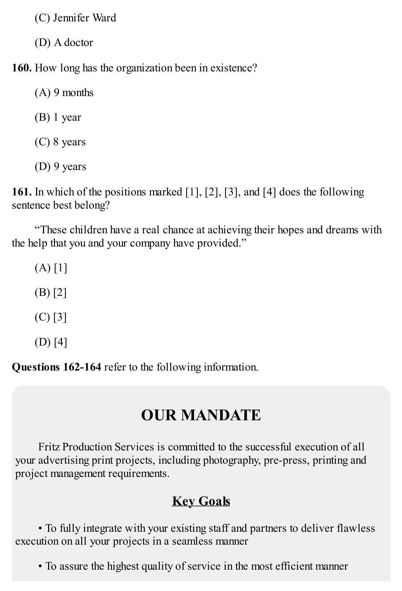


```text
(C) Jennifer Ward
(D) A doctor
160.
 How long has the organization been in existence?
(A) 9 months
(B) 1 year
(C) 8 years
(D) 9 years
161.
 In which of the positions marked [1], [2], [3], and [4] does the following
sentence best belong?
“These children have a real chance at achieving their hopes and dreams with
the help that you and your company have provided.”
(A) [1]
(B) [2]
(C) [3]
(D) [4]
Questions 162-164
 refer to the following information.
OUR MANDATE
Fritz Production Services is committed to the successful execution of all
your advertising print projects, including photography, pre-press, printing and
project management requirements.
Key Goals
• To fully integrate with your existing staff and partners to deliver flawless
execution on all your projects in a seamless manner
• To assure the highest quality of service in the most efficient manner
1111
```

## PDF 第 341 页

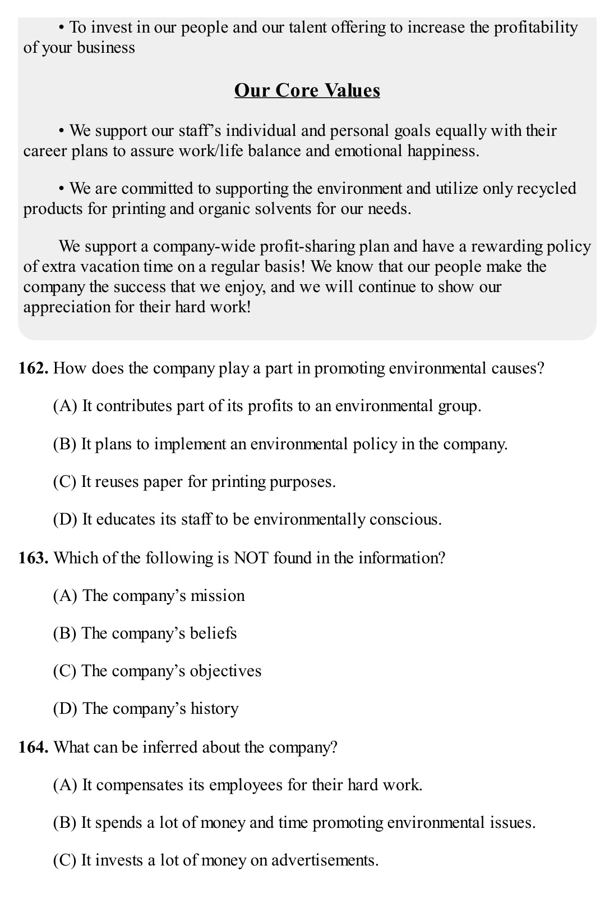


```text
• To invest in our people and our talent offering to increase the profitability
of your business
Our Core Values
• We support our staff’s individual and personal goals equally with their
career plans to assure work/life balance and emotional happiness.
• We are committed to supporting the environment and utilize only recycled
products for printing and organic solvents for our needs.
We support a company-wide profit-sharing plan and have a rewarding policy
of extra vacation time on a regular basis! We know that our people make the
company the success that we enjoy, and we will continue to show our
appreciation for their hard work!
162.
 How does the company play a part in promoting environmental causes?
(A) It contributes part of its profits to an environmental group.
(B) It plans to implement an environmental policy in the company.
(C) It reuses paper for printing purposes.
(D) It educates its staff to be environmentally conscious.
163.
 Which of the following is NOT found in the information?
(A) The company’s mission
(B) The company’s beliefs
(C) The company’s objectives
(D) The company’s history
164.
 What can be inferred about the company?
(A) It compensates its employees for their hard work.
(B) It spends a lot of money and time promoting environmental issues.
(C) It invests a lot of money on advertisements.
1112
```

## PDF 第 342 页

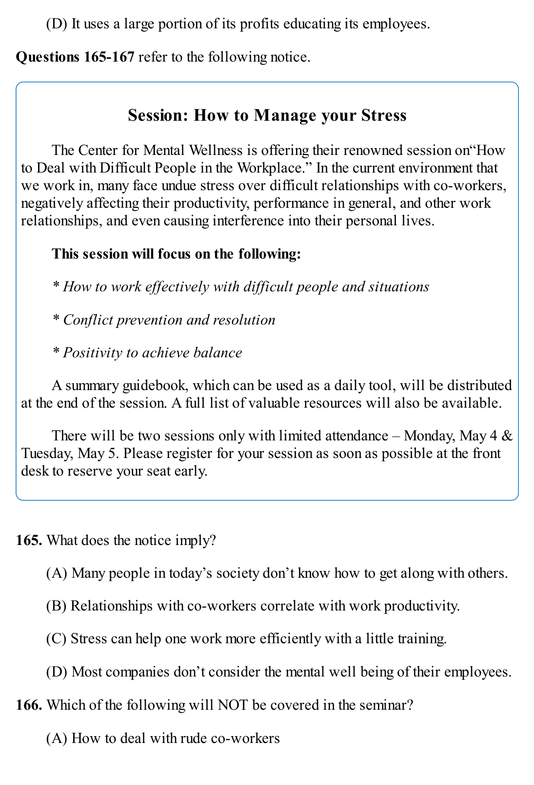


```text
(D) It uses a large portion of its profits educating its employees.
Questions 165-167
 refer to the following notice.
Session: How to Manage your Stress
The Center for Mental Wellness is offering their renowned session on“How
to Deal with Difficult People in the Workplace.” In the current environment that
we work in, many face undue stress over difficult relationships with co-workers,
negatively affecting their productivity, performance in general, and other work
relationships, and even causing interference into their personal lives.
This session will focus on the following:
* How to work effectively with difficult people and situations
* Conflict prevention and resolution
* Positivity to achieve balance
A summary guidebook, which can be used as a daily tool, will be distributed
at the end of the session. A full list of valuable resources will also be available.
There will be two sessions only with limited attendance – Monday, May 4 &
Tuesday, May 5. Please register for your session as soon as possible at the front
desk to reserve your seat early.
165.
 What does the notice imply?
(A) Many people in today’s society don’t know how to get along with others.
(B) Relationships with co-workers correlate with work productivity.
(C) Stress can help one work more efficiently with a little training.
(D) Most companies don’t consider the mental well being of their employees.
166.
 Which of the following will NOT be covered in the seminar?
(A) How to deal with rude co-workers
1113
```

## PDF 第 343 页

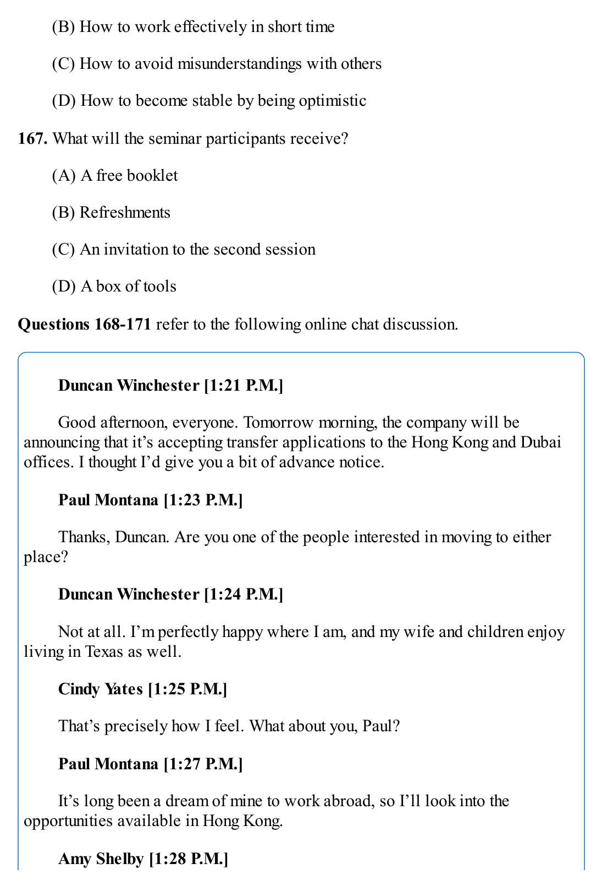


```text
(B) How to work effectively in short time
(C) How to avoid misunderstandings with others
(D) How to become stable by being optimistic
167.
 What will the seminar participants receive?
(A) A free booklet
(B) Refreshments
(C) An invitation to the second session
(D) A box of tools
Questions 168-171
 refer to the following online chat discussion.
Duncan Winchester [1:21 P.M.]
Good afternoon, everyone. Tomorrow morning, the company will be
announcing that it’s accepting transfer applications to the Hong Kong and Dubai
offices. I thought I’d give you a bit of advance notice.
Paul Montana [1:23 P.M.]
Thanks, Duncan. Are you one of the people interested in moving to either
place?
Duncan Winchester [1:24 P.M.]
Not at all. I’m perfectly happy where I am, and my wife and children enjoy
living in Texas as well.
Cindy Yates [1:25 P.M.]
That’s precisely how I feel. What about you, Paul?
Paul Montana [1:27 P.M.]
It’s long been a dream of mine to work abroad, so I’ll look into the
opportunities available in Hong Kong.
Amy Shelby [1:28 P.M.]
1114
```

## PDF 第 344 页

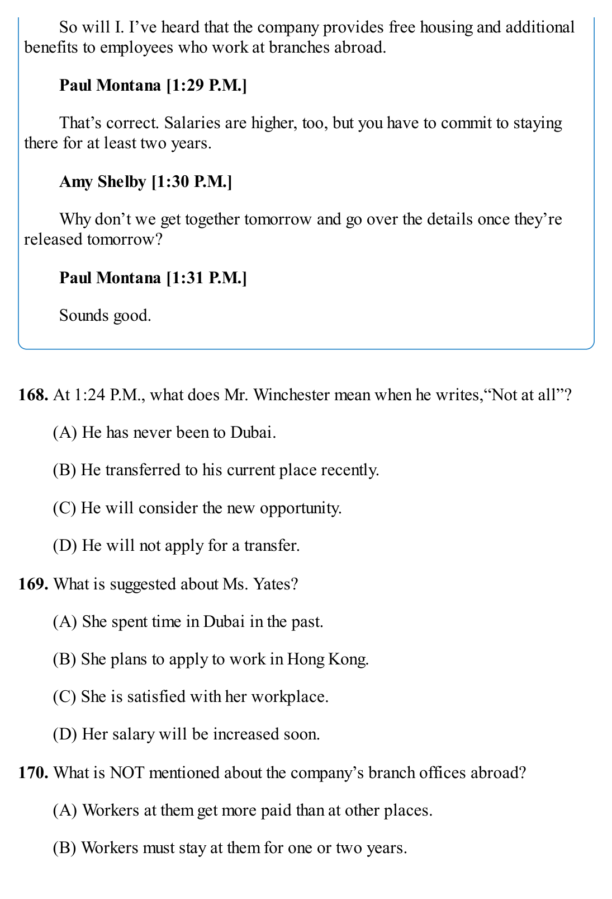


```text
So will I. I’ve heard that the company provides free housing and additional
benefits to employees who work at branches abroad.
Paul Montana [1:29 P.M.]
That’s correct. Salaries are higher, too, but you have to commit to staying
there for at least two years.
Amy Shelby [1:30 P.M.]
Why don’t we get together tomorrow and go over the details once they’re
released tomorrow?
Paul Montana [1:31 P.M.]
Sounds good.
168.
 At 1:24 P.M., what does Mr. Winchester mean when he writes,“Not at all”?
(A) He has never been to Dubai.
(B) He transferred to his current place recently.
(C) He will consider the new opportunity.
(D) He will not apply for a transfer.
169.
 What is suggested about Ms. Yates?
(A) She spent time in Dubai in the past.
(B) She plans to apply to work in Hong Kong.
(C) She is satisfied with her workplace.
(D) Her salary will be increased soon.
170.
 What is NOT mentioned about the company’s branch offices abroad?
(A) Workers at them get more paid than at other places.
(B) Workers must stay at them for one or two years.
1115
```

## PDF 第 345 页

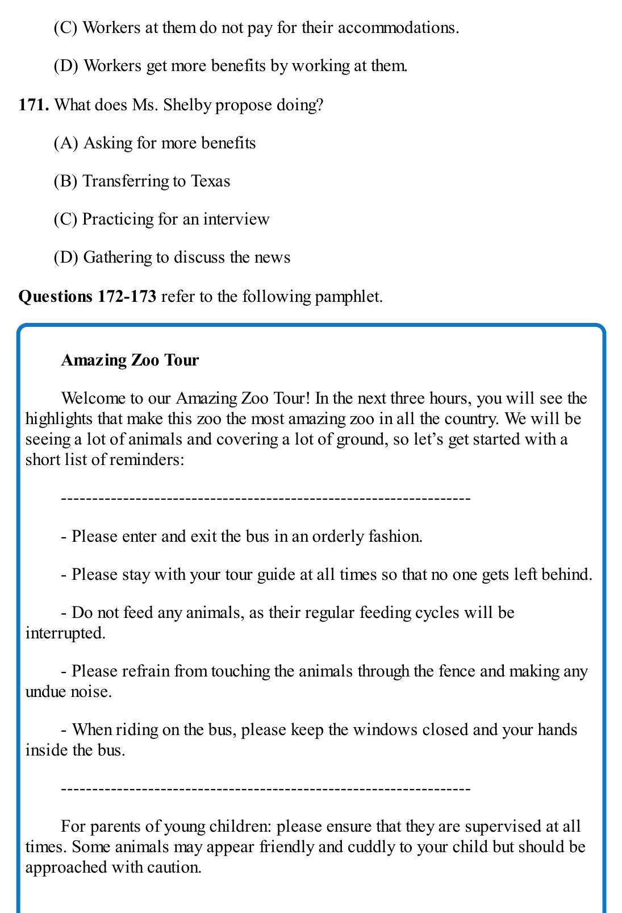


```text
(C) Workers at them do not pay for their accommodations.
(D) Workers get more benefits by working at them.
171.
 What does Ms. Shelby propose doing?
(A) Asking for more benefits
(B) Transferring to Texas
(C) Practicing for an interview
(D) Gathering to discuss the news
Questions 172-173
 refer to the following pamphlet.
Amazing Zoo Tour
Welcome to our Amazing Zoo Tour! In the next three hours, you will see the
highlights that make this zoo the most amazing zoo in all the country. We will be
seeing a lot of animals and covering a lot of ground, so let’s get started with a
short list of reminders:
------------------------------------------------------------------
- Please enter and exit the bus in an orderly fashion.
- Please stay with your tour guide at all times so that no one gets left behind.
- Do not feed any animals, as their regular feeding cycles will be
interrupted.
- Please refrain from touching the animals through the fence and making any
undue noise.
- When riding on the bus, please keep the windows closed and your hands
inside the bus.
------------------------------------------------------------------
For parents of young children: please ensure that they are supervised at all
times. Some animals may appear friendly and cuddly to your child but should be
approached with caution.
1116
```

## PDF 第 346 页

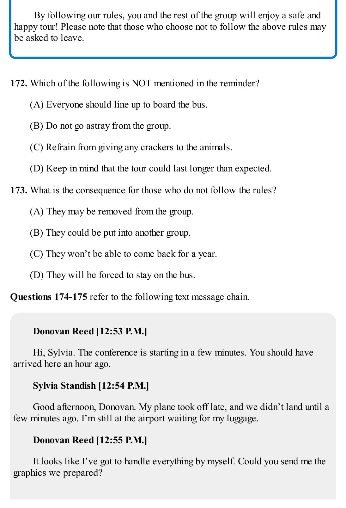


```text
By following our rules, you and the rest of the group will enjoy a safe and
happy tour! Please note that those who choose not to follow the above rules may
be asked to leave.
172.
 Which of the following is NOT mentioned in the reminder?
(A) Everyone should line up to board the bus.
(B) Do not go astray from the group.
(C) Refrain from giving any crackers to the animals.
(D) Keep in mind that the tour could last longer than expected.
173.
 What is the consequence for those who do not follow the rules?
(A) They may be removed from the group.
(B) They could be put into another group.
(C) They won’t be able to come back for a year.
(D) They will be forced to stay on the bus.
Questions 174-175
 refer to the following text message chain.
Donovan Reed [12:53 P.M.]
Hi, Sylvia. The conference is starting in a few minutes. You should have
arrived here an hour ago.
Sylvia Standish [12:54 P.M.]
Good afternoon, Donovan. My plane took off late, and we didn’t land until a
few minutes ago. I’m still at the airport waiting for my luggage.
Donovan Reed [12:55 P.M.]
It looks like I’ve got to handle everything by myself. Could you send me the
graphics we prepared?
1117
```

## PDF 第 347 页

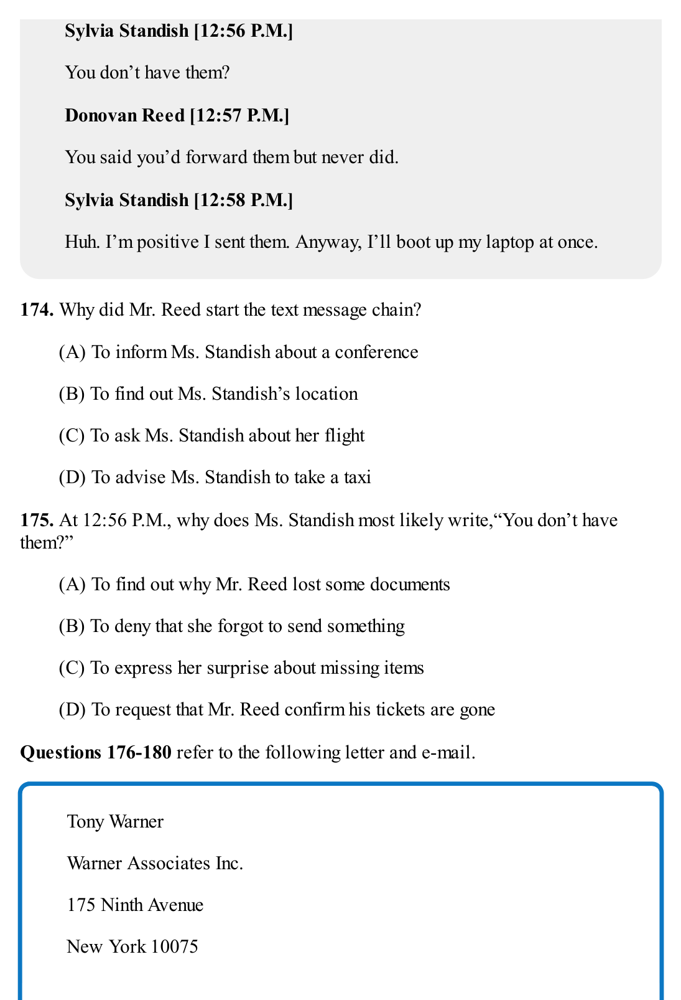


```text
Sylvia Standish [12:56 P.M.]
You don’t have them?
Donovan Reed [12:57 P.M.]
You said you’d forward them but never did.
Sylvia Standish [12:58 P.M.]
Huh. I’m positive I sent them. Anyway, I’ll boot up my laptop at once.
174.
 Why did Mr. Reed start the text message chain?
(A) To inform Ms. Standish about a conference
(B) To find out Ms. Standish’s location
(C) To ask Ms. Standish about her flight
(D) To advise Ms. Standish to take a taxi
175.
 At 12:56 P.M., why does Ms. Standish most likely write,“You don’t have
them?”
(A) To find out why Mr. Reed lost some documents
(B) To deny that she forgot to send something
(C) To express her surprise about missing items
(D) To request that Mr. Reed confirm his tickets are gone
Questions 176-180
 refer to the following letter and e-mail.
Tony Warner
Warner Associates Inc.
175 Ninth Avenue
New York 10075
1118
```

## PDF 第 348 页

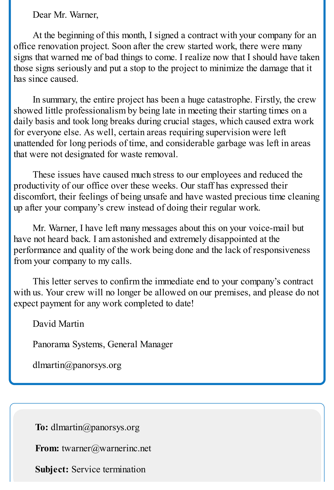


```text
Dear Mr. Warner,
At the beginning of this month, I signed a contract with your company for an
office renovation project. Soon after the crew started work, there were many
signs that warned me of bad things to come. I realize now that I should have taken
those signs seriously and put a stop to the project to minimize the damage that it
has since caused.
In summary, the entire project has been a huge catastrophe. Firstly, the crew
showed little professionalism by being late in meeting their starting times on a
daily basis and took long breaks during crucial stages, which caused extra work
for everyone else. As well, certain areas requiring supervision were left
unattended for long periods of time, and considerable garbage was left in areas
that were not designated for waste removal.
These issues have caused much stress to our employees and reduced the
productivity of our office over these weeks. Our staff has expressed their
discomfort, their feelings of being unsafe and have wasted precious time cleaning
up after your company’s crew instead of doing their regular work.
Mr. Warner, I have left many messages about this on your voice-mail but
have not heard back. I am astonished and extremely disappointed at the
performance and quality of the work being done and the lack of responsiveness
from your company to my calls.
This letter serves to confirm the immediate end to your company’s contract
with us. Your crew will no longer be allowed on our premises, and please do not
expect payment for any work completed to date!
David Martin
Panorama Systems, General Manager
dlmartin@panorsys.org
To:
 dlmartin@panorsys.org
From:
 twarner@warnerinc.net
Subject:
 Service termination
1119
```

## PDF 第 349 页

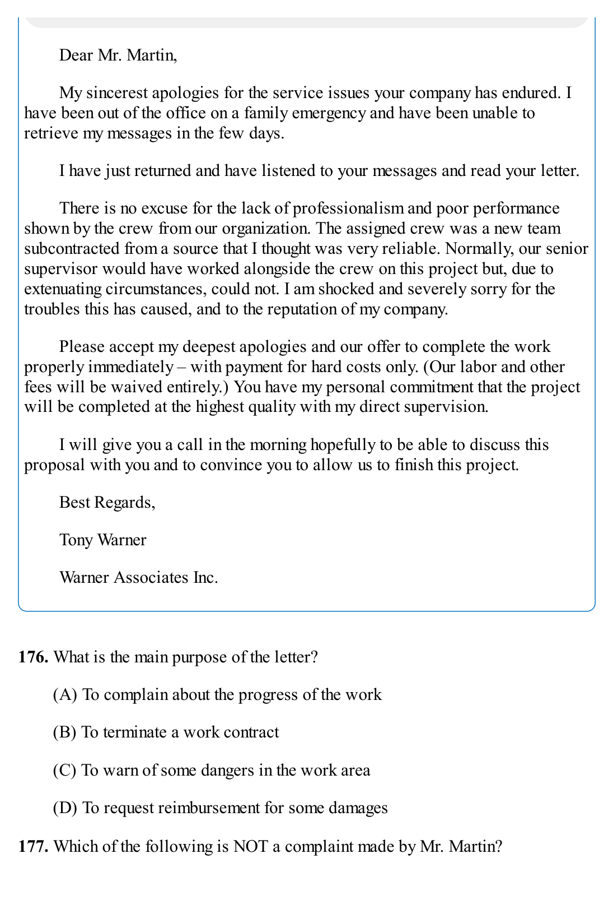


```text
Dear Mr. Martin,
My sincerest apologies for the service issues your company has endured. I
have been out of the office on a family emergency and have been unable to
retrieve my messages in the few days.
I have just returned and have listened to your messages and read your letter.
There is no excuse for the lack of professionalism and poor performance
shown by the crew from our organization. The assigned crew was a new team
subcontracted from a source that I thought was very reliable. Normally, our senior
supervisor would have worked alongside the crew on this project but, due to
extenuating circumstances, could not. I am shocked and severely sorry for the
troubles this has caused, and to the reputation of my company.
Please accept my deepest apologies and our offer to complete the work
properly immediately – with payment for hard costs only. (Our labor and other
fees will be waived entirely.) You have my personal commitment that the project
will be completed at the highest quality with my direct supervision.
I will give you a call in the morning hopefully to be able to discuss this
proposal with you and to convince you to allow us to finish this project.
Best Regards,
Tony Warner
Warner Associates Inc.
176.
 What is the main purpose of the letter?
(A) To complain about the progress of the work
(B) To terminate a work contract
(C) To warn of some dangers in the work area
(D) To request reimbursement for some damages
177.
 Which of the following is NOT a complaint made by Mr. Martin?
1120
```

## PDF 第 350 页

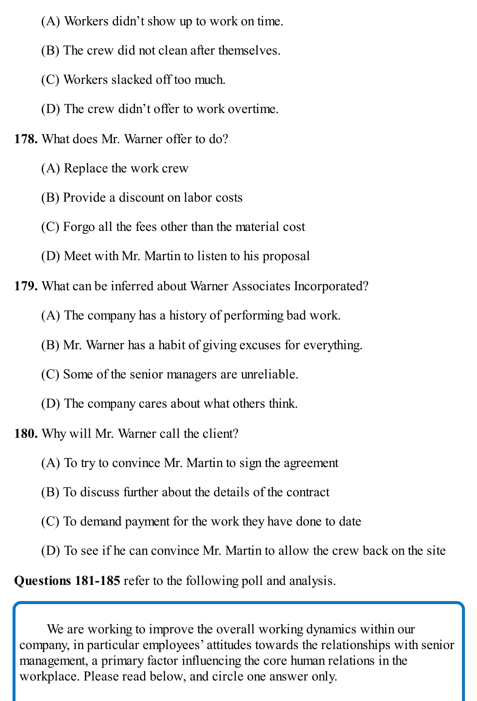


```text
(A) Workers didn’t show up to work on time.
(B) The crew did not clean after themselves.
(C) Workers slacked off too much.
(D) The crew didn’t offer to work overtime.
178.
 What does Mr. Warner offer to do?
(A) Replace the work crew
(B) Provide a discount on labor costs
(C) Forgo all the fees other than the material cost
(D) Meet with Mr. Martin to listen to his proposal
179.
 What can be inferred about Warner Associates Incorporated?
(A) The company has a history of performing bad work.
(B) Mr. Warner has a habit of giving excuses for everything.
(C) Some of the senior managers are unreliable.
(D) The company cares about what others think.
180.
 Why will Mr. Warner call the client?
(A) To try to convince Mr. Martin to sign the agreement
(B) To discuss further about the details of the contract
(C) To demand payment for the work they have done to date
(D) To see if he can convince Mr. Martin to allow the crew back on the site
Questions 181-185
 refer to the following poll and analysis.
We are working to improve the overall working dynamics within our
company, in particular employees’ attitudes towards the relationships with senior
management, a primary factor influencing the core human relations in the
workplace. Please read below, and circle one answer only.
1121
```

## PDF 第 351 页

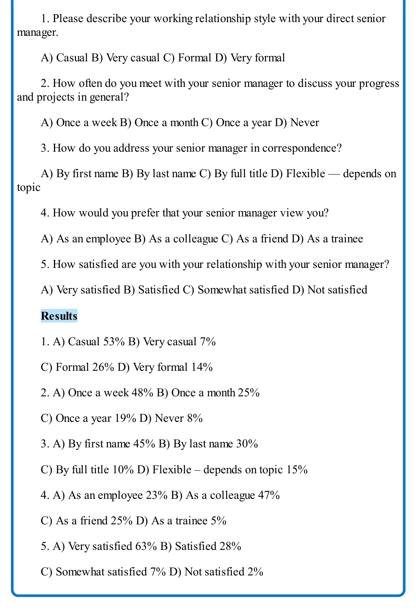


```text
1. Please describe your working relationship style with your direct senior
manager.
A) Casual B) Very casual C) Formal D) Very formal
2. How often do you meet with your senior manager to discuss your progress
and projects in general?
A) Once a week B) Once a month C) Once a year D) Never
3. How do you address your senior manager in correspondence?
A) By first name B) By last name C) By full title D) Flexible — depends on
topic
4. How would you prefer that your senior manager view you?
A) As an employee B) As a colleague C) As a friend D) As a trainee
5. How satisfied are you with your relationship with your senior manager?
A) Very satisfied B) Satisfied C) Somewhat satisfied D) Not satisfied
Results
1. A) Casual 53% B) Very casual 7%
C) Formal 26% D) Very formal 14%
2. A) Once a week 48% B) Once a month 25%
C) Once a year 19% D) Never 8%
3. A) By first name 45% B) By last name 30%
C) By full title 10% D) Flexible – depends on topic 15%
4. A) As an employee 23% B) As a colleague 47%
C) As a friend 25% D) As a trainee 5%
5. A) Very satisfied 63% B) Satisfied 28%
C) Somewhat satisfied 7% D) Not satisfied 2%
1122
```

## PDF 第 352 页

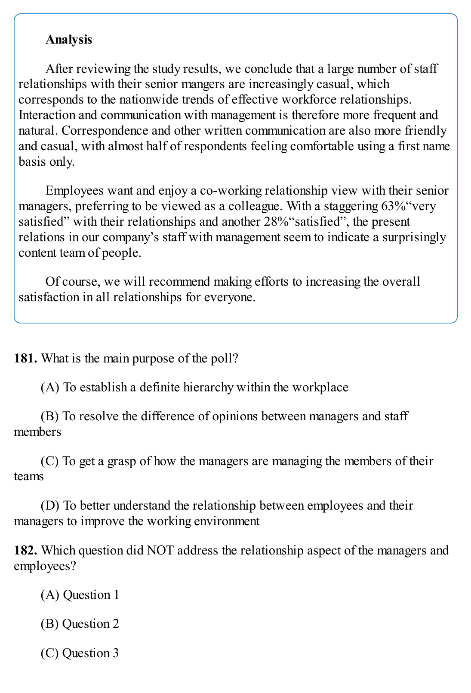


```text
Analysis
After reviewing the study results, we conclude that a large number of staff
relationships with their senior mangers are increasingly casual, which
corresponds to the nationwide trends of effective workforce relationships.
Interaction and communication with management is therefore more frequent and
natural. Correspondence and other written communication are also more friendly
and casual, with almost half of respondents feeling comfortable using a first name
basis only.
Employees want and enjoy a co-working relationship view with their senior
managers, preferring to be viewed as a colleague. With a staggering 63%“very
satisfied” with their relationships and another 28%“satisfied”, the present
relations in our company’s staff with management seem to indicate a surprisingly
content team of people.
Of course, we will recommend making efforts to increasing the overall
satisfaction in all relationships for everyone.
181.
 What is the main purpose of the poll?
(A) To establish a definite hierarchy within the workplace
(B) To resolve the difference of opinions between managers and staff
members
(C) To get a grasp of how the managers are managing the members of their
teams
(D) To better understand the relationship between employees and their
managers to improve the working environment
182.
 Which question did NOT address the relationship aspect of the managers and
employees?
(A) Question 1
(B) Question 2
(C) Question 3
1123
```

## PDF 第 353 页

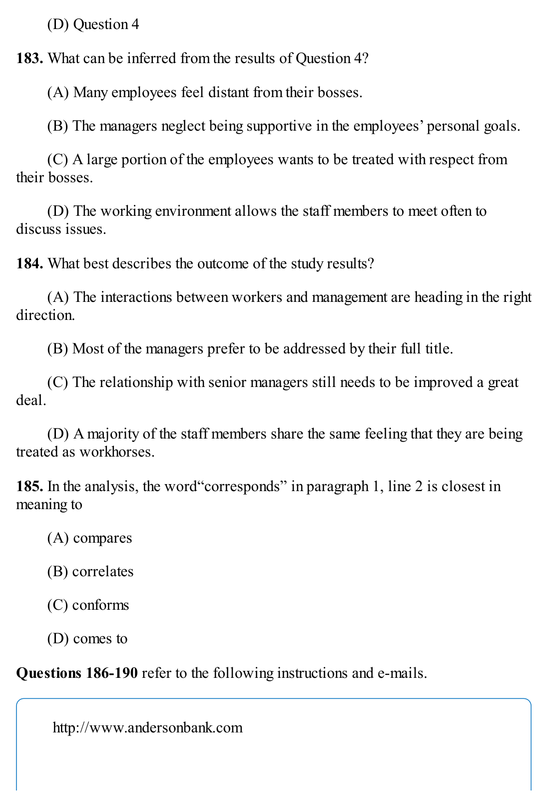


```text
(D) Question 4
183.
 What can be inferred from the results of Question 4?
(A) Many employees feel distant from their bosses.
(B) The managers neglect being supportive in the employees’ personal goals.
(C) A large portion of the employees wants to be treated with respect from
their bosses.
(D) The working environment allows the staff members to meet often to
discuss issues.
184.
 What best describes the outcome of the study results?
(A) The interactions between workers and management are heading in the right
direction.
(B) Most of the managers prefer to be addressed by their full title.
(C) The relationship with senior managers still needs to be improved a great
deal.
(D) A majority of the staff members share the same feeling that they are being
treated as workhorses.
185.
 In the analysis, the word“corresponds” in paragraph 1, line 2 is closest in
meaning to
(A) compares
(B) correlates
(C) conforms
(D) comes to
Questions 186-190
 refer to the following instructions and e-mails.
http://www.andersonbank.com
1124
```

## PDF 第 354 页


```text
Customers at Anderson Bank can open various accounts:
Silver Savings Account: Must maintain a minimum balance of $100. Pays
2.1% interest. Yearly fee of $15.
Gold Savings Account: Must maintain a minimum balance of $1,000. Pays
2.4% interest. Yearly fee of $20.
Platinum Savings Account: Must maintain a minimum balance of $5,000.
Pays 2.8% interest. No yearly fee.
Silver Checking Account: Requires a minimum balance of $200. Provides
20 free checks per year. Annual fee of $25.
Gold Checking Account: Requires a minimum balance of $1,000. Provides
50 free checks per year. Annual fee of $30.
Combined Savings-Checking Account: Requires a minimum balance of
$6,000. Pays 3.0% interest. Provides 100 free checks per year. No yearly fee.
To open an account, visit any branch in the Detroit area. Don’t forget to
inquire about our online banking options.
To: Susan Meeks <smeeks@andersonbank.com>
From: David Rowe <davidrowe@fostertrade.com>
Subject: Bank Accounts
Date: January 28
Dear Ms. Meeks,
I moved to Detroit in December and wish to open an account with a local
bank. I checked with several of my colleagues, and most recommended utilizing
the services at your establishment. After reading your bank’s Web site, I
1125
```

## PDF 第 355 页

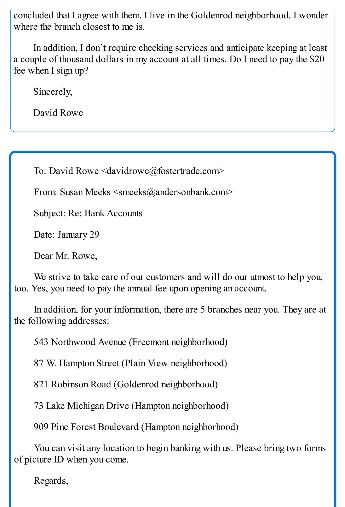


```text
concluded that I agree with them. I live in the Goldenrod neighborhood. I wonder
where the branch closest to me is.
In addition, I don’t require checking services and anticipate keeping at least
a couple of thousand dollars in my account at all times. Do I need to pay the $20
fee when I sign up?
Sincerely,
David Rowe
To: David Rowe <davidrowe@fostertrade.com>
From: Susan Meeks <smeeks@andersonbank.com>
Subject: Re: Bank Accounts
Date: January 29
Dear Mr. Rowe,
We strive to take care of our customers and will do our utmost to help you,
too. Yes, you need to pay the annual fee upon opening an account.
In addition, for your information, there are 5 branches near you. They are at
the following addresses:
543 Northwood Avenue (Freemont neighborhood)
87 W. Hampton Street (Plain View neighborhood)
821 Robinson Road (Goldenrod neighborhood)
73 Lake Michigan Drive (Hampton neighborhood)
909 Pine Forest Boulevard (Hampton neighborhood)
You can visit any location to begin banking with us. Please bring two forms
of picture ID when you come.
Regards,
1126
```

## PDF 第 356 页

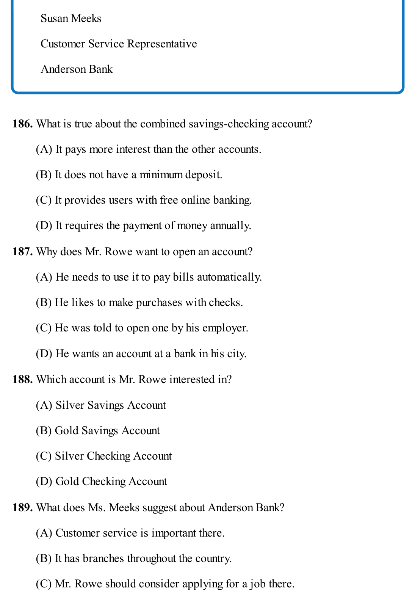


```text
Susan Meeks
Customer Service Representative
Anderson Bank
186.
 What is true about the combined savings-checking account?
(A) It pays more interest than the other accounts.
(B) It does not have a minimum deposit.
(C) It provides users with free online banking.
(D) It requires the payment of money annually.
187.
 Why does Mr. Rowe want to open an account?
(A) He needs to use it to pay bills automatically.
(B) He likes to make purchases with checks.
(C) He was told to open one by his employer.
(D) He wants an account at a bank in his city.
188.
 Which account is Mr. Rowe interested in?
(A) Silver Savings Account
(B) Gold Savings Account
(C) Silver Checking Account
(D) Gold Checking Account
189.
 What does Ms. Meeks suggest about Anderson Bank?
(A) Customer service is important there.
(B) It has branches throughout the country.
(C) Mr. Rowe should consider applying for a job there.
1127
```

## PDF 第 357 页

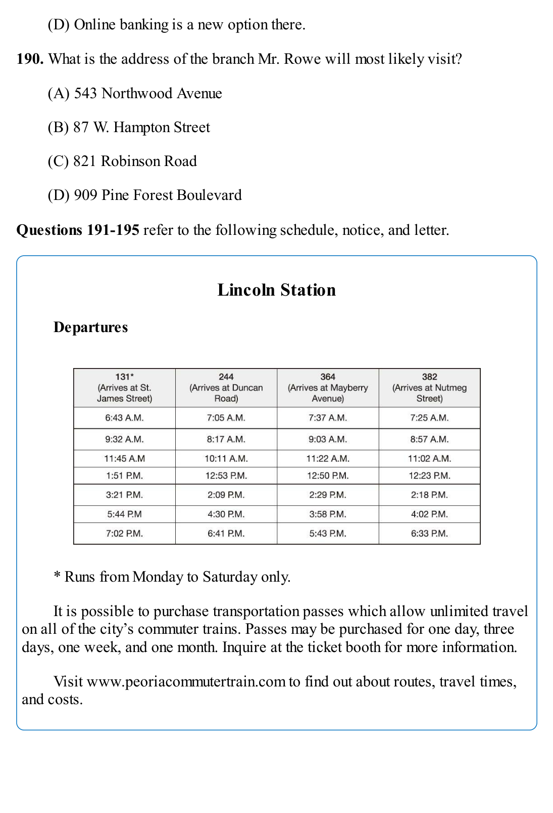


```text
(D) Online banking is a new option there.
190.
 What is the address of the branch Mr. Rowe will most likely visit?
(A) 543 Northwood Avenue
(B) 87 W. Hampton Street
(C) 821 Robinson Road
(D) 909 Pine Forest Boulevard
Questions 191-195
 refer to the following schedule, notice, and letter.
Lincoln Station
Departures
* Runs from Monday to Saturday only.
It is possible to purchase transportation passes which allow unlimited travel
on all of the city’s commuter trains. Passes may be purchased for one day, three
days, one week, and one month. Inquire at the ticket booth for more information.
Visit www.peoriacommutertrain.com to find out about routes, travel times,
and costs.
1128
```

## PDF 第 358 页

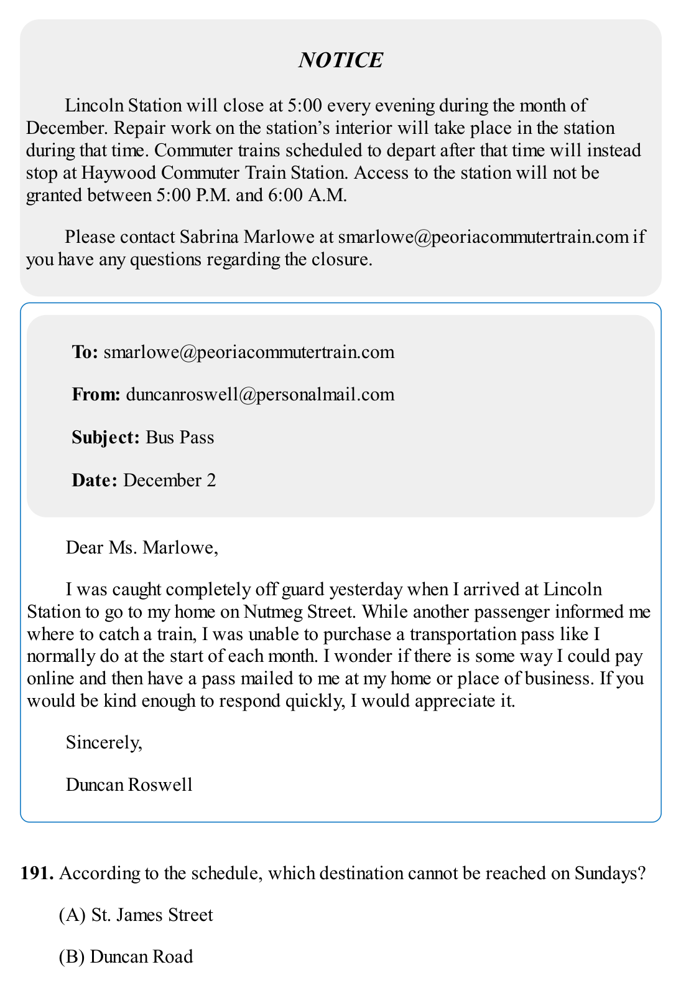


```text
NOTICE
Lincoln Station will close at 5:00 every evening during the month of
December. Repair work on the station’s interior will take place in the station
during that time. Commuter trains scheduled to depart after that time will instead
stop at Haywood Commuter Train Station. Access to the station will not be
granted between 5:00 P.M. and 6:00 A.M.
Please contact Sabrina Marlowe at smarlowe@peoriacommutertrain.com if
you have any questions regarding the closure.
To:
 smarlowe@peoriacommutertrain.com
From:
 duncanroswell@personalmail.com
Subject:
 Bus Pass
Date:
 December 2
Dear Ms. Marlowe,
I was caught completely off guard yesterday when I arrived at Lincoln
Station to go to my home on Nutmeg Street. While another passenger informed me
where to catch a train, I was unable to purchase a transportation pass like I
normally do at the start of each month. I wonder if there is some way I could pay
online and then have a pass mailed to me at my home or place of business. If you
would be kind enough to respond quickly, I would appreciate it.
Sincerely,
Duncan Roswell
191.
 According to the schedule, which destination cannot be reached on Sundays?
(A) St. James Street
(B) Duncan Road
1129
```

## PDF 第 359 页

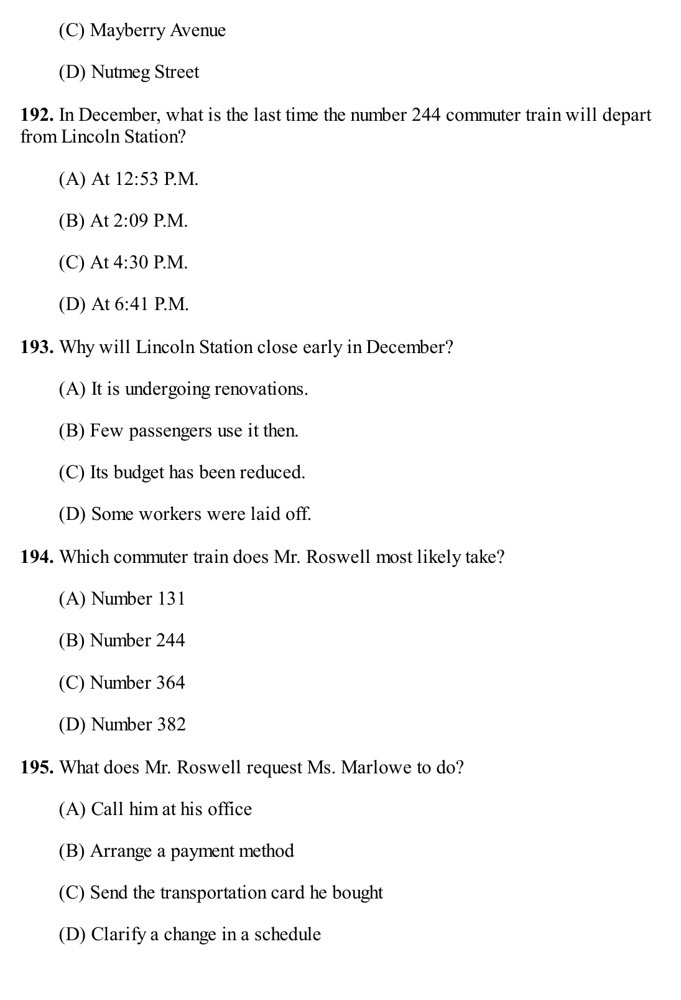


```text
(C) Mayberry Avenue
(D) Nutmeg Street
192.
 In December, what is the last time the number 244 commuter train will depart
from Lincoln Station?
(A) At 12:53 P.M.
(B) At 2:09 P.M.
(C) At 4:30 P.M.
(D) At 6:41 P.M.
193.
 Why will Lincoln Station close early in December?
(A) It is undergoing renovations.
(B) Few passengers use it then.
(C) Its budget has been reduced.
(D) Some workers were laid off.
194.
 Which commuter train does Mr. Roswell most likely take?
(A) Number 131
(B) Number 244
(C) Number 364
(D) Number 382
195.
 What does Mr. Roswell request Ms. Marlowe to do?
(A) Call him at his office
(B) Arrange a payment method
(C) Send the transportation card he bought
(D) Clarify a change in a schedule
1130
```

## PDF 第 360 页

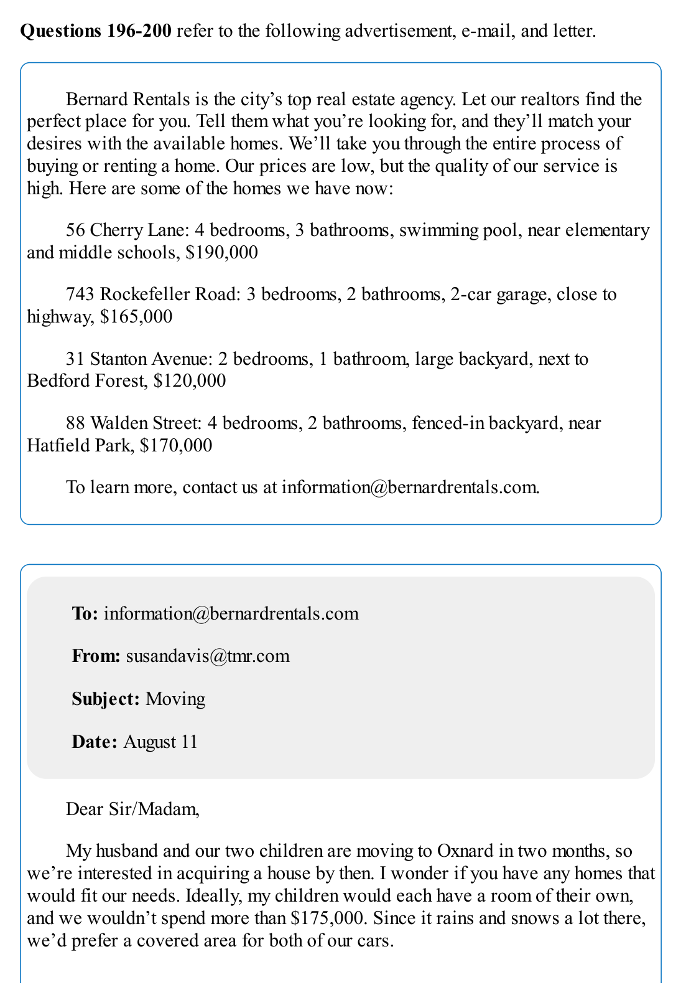


```text
Questions 196-200
 refer to the following advertisement, e-mail, and letter.
Bernard Rentals is the city’s top real estate agency. Let our realtors find the
perfect place for you. Tell them what you’re looking for, and they’ll match your
desires with the available homes. We’ll take you through the entire process of
buying or renting a home. Our prices are low, but the quality of our service is
high. Here are some of the homes we have now:
56 Cherry Lane: 4 bedrooms, 3 bathrooms, swimming pool, near elementary
and middle schools, $190,000
743 Rockefeller Road: 3 bedrooms, 2 bathrooms, 2-car garage, close to
highway, $165,000
31 Stanton Avenue: 2 bedrooms, 1 bathroom, large backyard, next to
Bedford Forest, $120,000
88 Walden Street: 4 bedrooms, 2 bathrooms, fenced-in backyard, near
Hatfield Park, $170,000
To learn more, contact us at information@bernardrentals.com.
To:
 information@bernardrentals.com
From:
 susandavis@tmr.com
Subject:
 Moving
Date:
 August 11
Dear Sir/Madam,
My husband and our two children are moving to Oxnard in two months, so
we’re interested in acquiring a house by then. I wonder if you have any homes that
would fit our needs. Ideally, my children would each have a room of their own,
and we wouldn’t spend more than $175,000. Since it rains and snows a lot there,
we’d prefer a covered area for both of our cars.
1131
```

## PDF 第 361 页

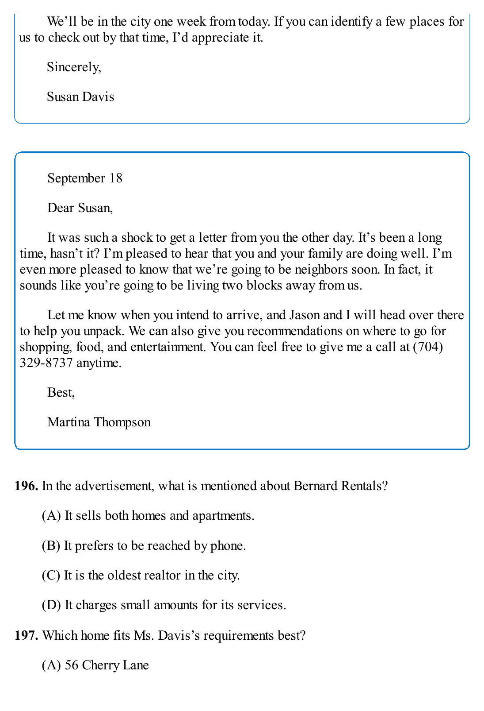


```text
We’ll be in the city one week from today. If you can identify a few places for
us to check out by that time, I’d appreciate it.
Sincerely,
Susan Davis
September 18
Dear Susan,
It was such a shock to get a letter from you the other day. It’s been a long
time, hasn’t it? I’m pleased to hear that you and your family are doing well. I’m
even more pleased to know that we’re going to be neighbors soon. In fact, it
sounds like you’re going to be living two blocks away from us.
Let me know when you intend to arrive, and Jason and I will head over there
to help you unpack. We can also give you recommendations on where to go for
shopping, food, and entertainment. You can feel free to give me a call at (704)
329-8737 anytime.
Best,
Martina Thompson
196.
 In the advertisement, what is mentioned about Bernard Rentals?
(A) It sells both homes and apartments.
(B) It prefers to be reached by phone.
(C) It is the oldest realtor in the city.
(D) It charges small amounts for its services.
197.
 Which home fits Ms. Davis’s requirements best?
(A) 56 Cherry Lane
1132
```

## PDF 第 362 页

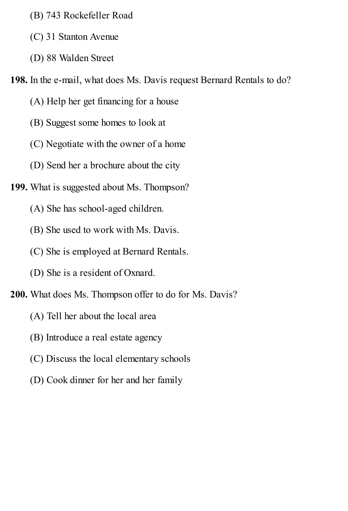


```text
(B) 743 Rockefeller Road
(C) 31 Stanton Avenue
(D) 88 Walden Street
198.
 In the e-mail, what does Ms. Davis request Bernard Rentals to do?
(A) Help her get financing for a house
(B) Suggest some homes to look at
(C) Negotiate with the owner of a home
(D) Send her a brochure about the city
199.
 What is suggested about Ms. Thompson?
(A) She has school-aged children.
(B) She used to work with Ms. Davis.
(C) She is employed at Bernard Rentals.
(D) She is a resident of Oxnard.
200.
 What does Ms. Thompson offer to do for Ms. Davis?
(A) Tell her about the local area
(B) Introduce a real estate agency
(C) Discuss the local elementary schools
(D) Cook dinner for her and her family
1133
```

## PDF 第 363 页

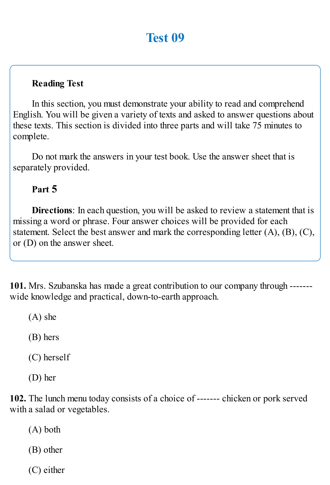


```text
Test 09
Reading Test
In this section, you must demonstrate your ability to read and comprehend
English. You will be given a variety of texts and asked to answer questions about
these texts. This section is divided into three parts and will take 75 minutes to
complete.
Do not mark the answers in your test book. Use the answer sheet that is
separately provided.
Part
5
Directions
: In each question, you will be asked to review a statement that is
missing a word or phrase. Four answer choices will be provided for each
statement. Select the best answer and mark the corresponding letter (A), (B), (C),
or (D) on the answer sheet.
101.
 Mrs. Szubanska has made a great contribution to our company through -------
wide knowledge and practical, down-to-earth approach.
(A) she
(B) hers
(C) herself
(D) her
102.
 The lunch menu today consists of a choice of ------- chicken or pork served
with a salad or vegetables.
(A) both
(B) other
(C) either
1134
```

## PDF 第 364 页

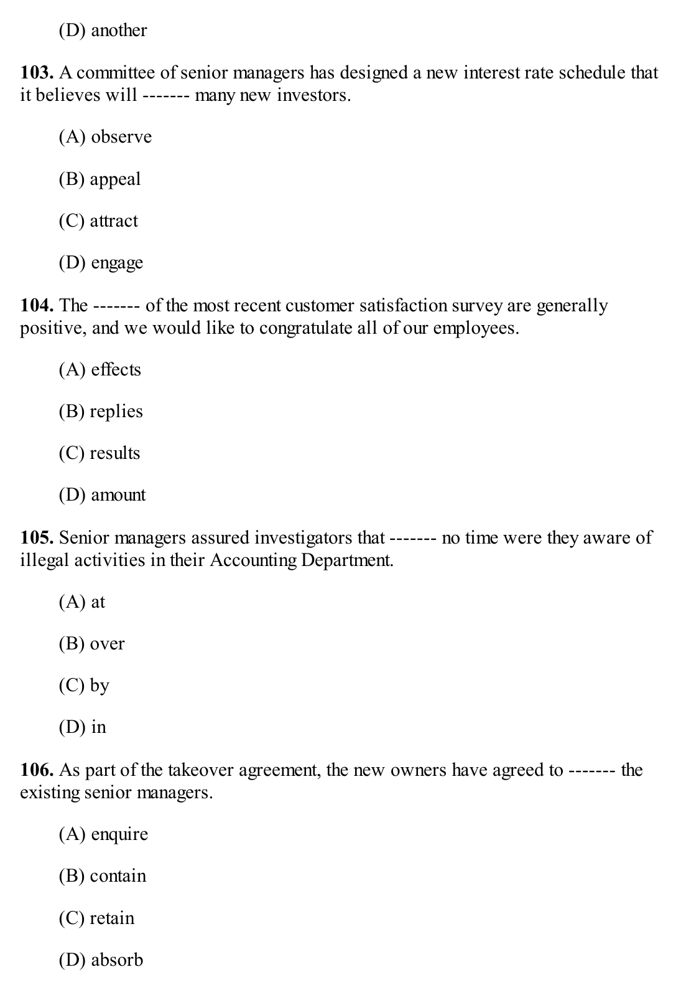


```text
(D) another
103.
 A committee of senior managers has designed a new interest rate schedule that
it believes will ------- many new investors.
(A) observe
(B) appeal
(C) attract
(D) engage
104.
 The ------- of the most recent customer satisfaction survey are generally
positive, and we would like to congratulate all of our employees.
(A) effects
(B) replies
(C) results
(D) amount
105.
 Senior managers assured investigators that ------- no time were they aware of
illegal activities in their Accounting Department.
(A) at
(B) over
(C) by
(D) in
106.
 As part of the takeover agreement, the new owners have agreed to ------- the
existing senior managers.
(A) enquire
(B) contain
(C) retain
(D) absorb
1135
```

## PDF 第 365 页

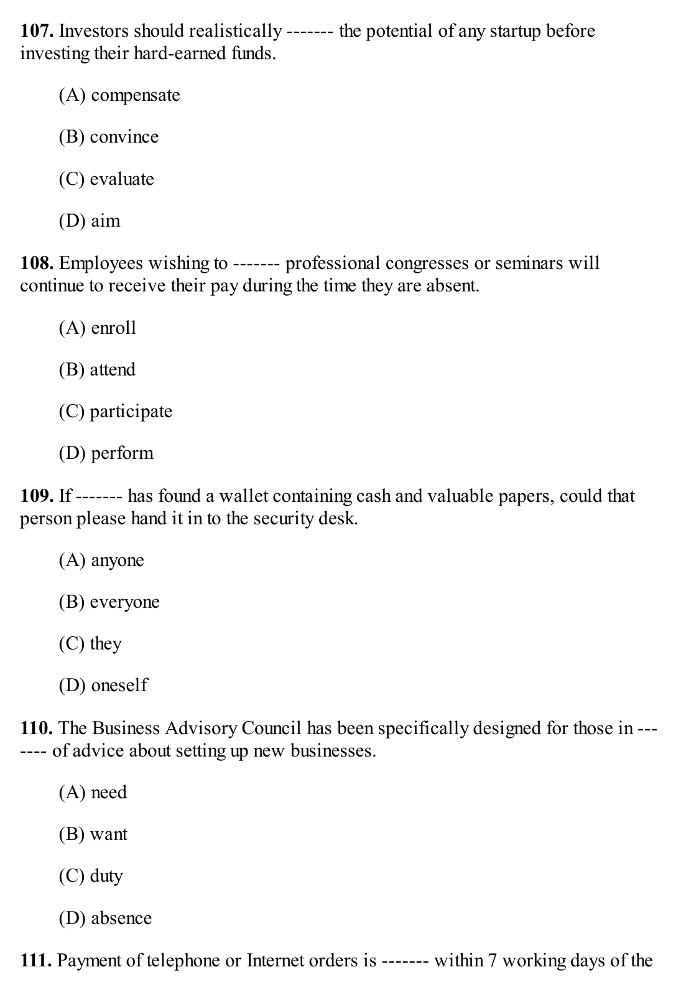


```text
107.
 Investors should realistically ------- the potential of any startup before
investing their hard-earned funds.
(A) compensate
(B) convince
(C) evaluate
(D) aim
108.
 Employees wishing to ------- professional congresses or seminars will
continue to receive their pay during the time they are absent.
(A) enroll
(B) attend
(C) participate
(D) perform
109.
 If ------- has found a wallet containing cash and valuable papers, could that
person please hand it in to the security desk.
(A) anyone
(B) everyone
(C) they
(D) oneself
110.
 The Business Advisory Council has been specifically designed for those in ---
---- of advice about setting up new businesses.
(A) need
(B) want
(C) duty
(D) absence
111.
 Payment of telephone or Internet orders is ------- within 7 working days of the
1136
```

## PDF 第 366 页

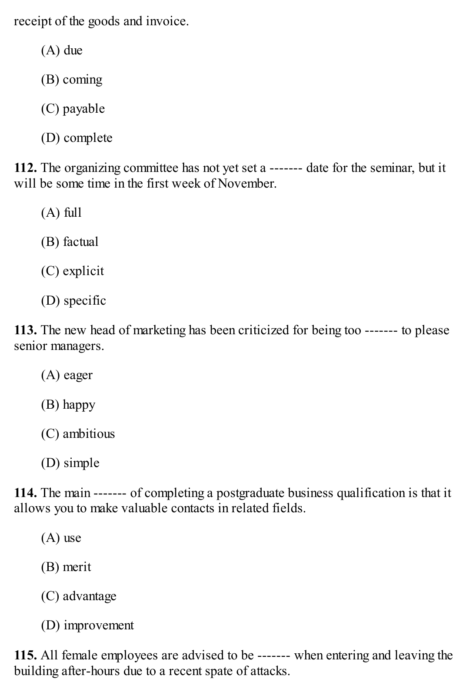


```text
receipt of the goods and invoice.
(A) due
(B) coming
(C) payable
(D) complete
112.
 The organizing committee has not yet set a ------- date for the seminar, but it
will be some time in the first week of November.
(A) full
(B) factual
(C) explicit
(D) specific
113.
 The new head of marketing has been criticized for being too ------- to please
senior managers.
(A) eager
(B) happy
(C) ambitious
(D) simple
114.
 The main ------- of completing a postgraduate business qualification is that it
allows you to make valuable contacts in related fields.
(A) use
(B) merit
(C) advantage
(D) improvement
115.
 All female employees are advised to be ------- when entering and leaving the
building after-hours due to a recent spate of attacks.
1137
```

## PDF 第 367 页

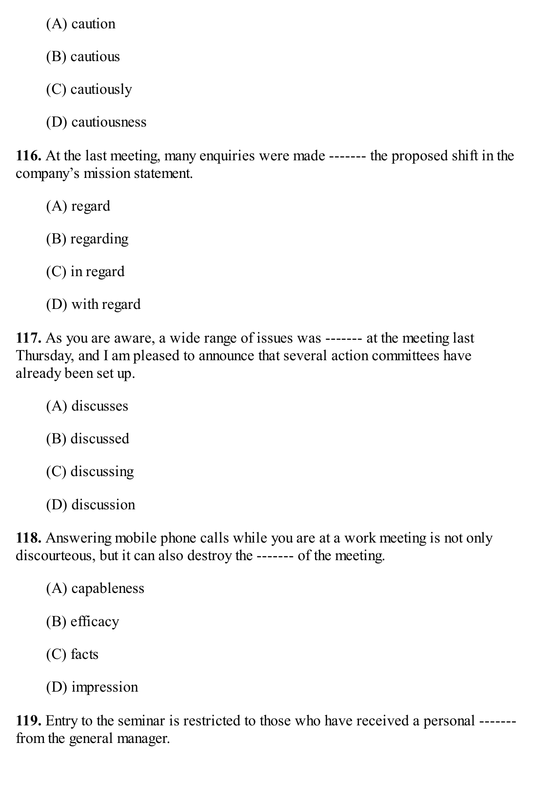


```text
(A) caution
(B) cautious
(C) cautiously
(D) cautiousness
116.
 At the last meeting, many enquiries were made ------- the proposed shift in the
company’s mission statement.
(A) regard
(B) regarding
(C) in regard
(D) with regard
117.
 As you are aware, a wide range of issues was ------- at the meeting last
Thursday, and I am pleased to announce that several action committees have
already been set up.
(A) discusses
(B) discussed
(C) discussing
(D) discussion
118.
 Answering mobile phone calls while you are at a work meeting is not only
discourteous, but it can also destroy the ------- of the meeting.
(A) capableness
(B) efficacy
(C) facts
(D) impression
119.
 Entry to the seminar is restricted to those who have received a personal -------
from the general manager.
1138
```

## PDF 第 368 页

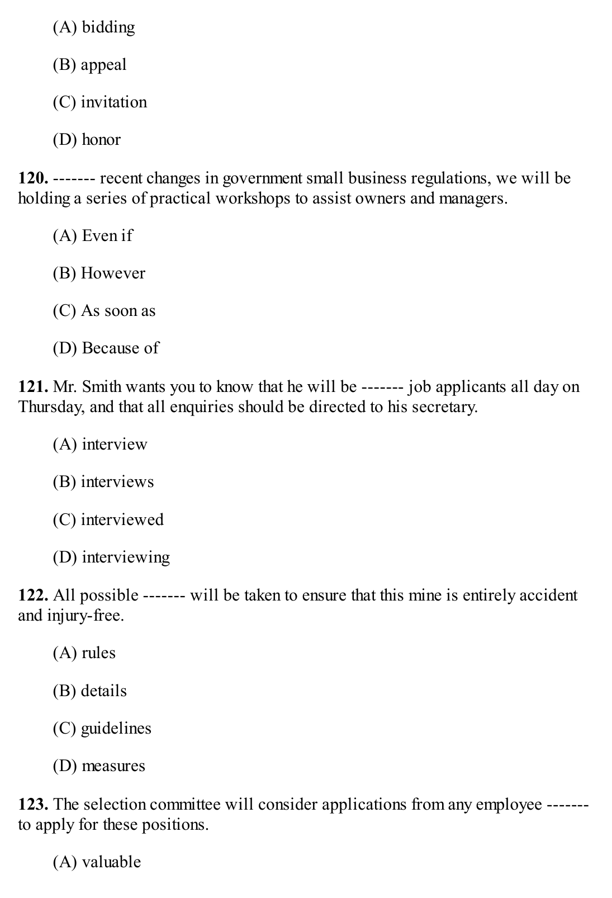


```text
(A) bidding
(B) appeal
(C) invitation
(D) honor
120.
 ------- recent changes in government small business regulations, we will be
holding a series of practical workshops to assist owners and managers.
(A) Even if
(B) However
(C) As soon as
(D) Because of
121.
 Mr. Smith wants you to know that he will be ------- job applicants all day on
Thursday, and that all enquiries should be directed to his secretary.
(A) interview
(B) interviews
(C) interviewed
(D) interviewing
122.
 All possible ------- will be taken to ensure that this mine is entirely accident
and injury-free.
(A) rules
(B) details
(C) guidelines
(D) measures
123.
 The selection committee will consider applications from any employee -------
to apply for these positions.
(A) valuable
1139
```

## PDF 第 369 页

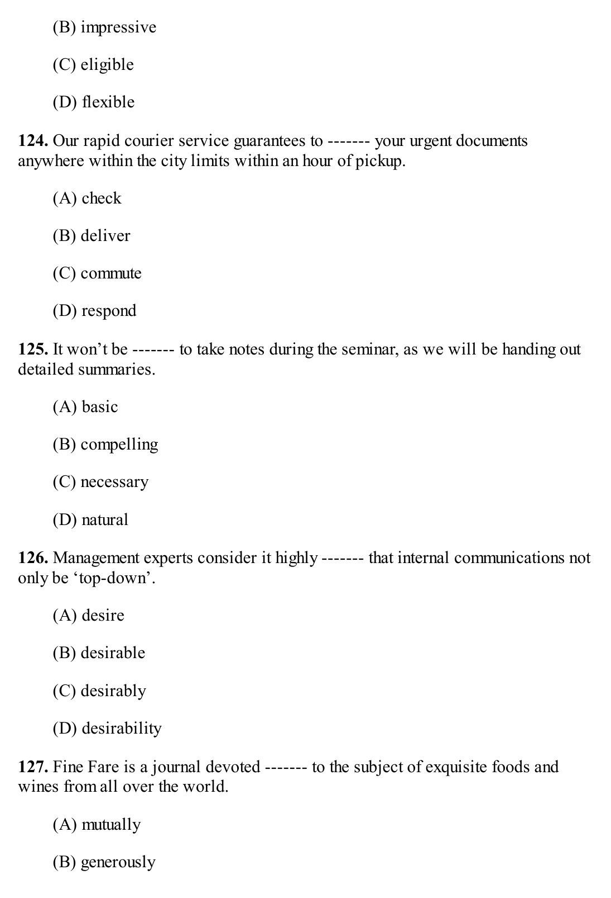


```text
(B) impressive
(C) eligible
(D) flexible
124.
 Our rapid courier service guarantees to ------- your urgent documents
anywhere within the city limits within an hour of pickup.
(A) check
(B) deliver
(C) commute
(D) respond
125.
 It won’t be ------- to take notes during the seminar, as we will be handing out
detailed summaries.
(A) basic
(B) compelling
(C) necessary
(D) natural
126
.
 Management experts consider it highly ------- that internal communications not
only be ‘top-down’.
(A) desire
(B) desirable
(C) desirably
(D) desirability
127.
 Fine Fare is a journal devoted ------- to the subject of exquisite foods and
wines from all over the world.
(A) mutually
(B) generously
1140
```

## PDF 第 370 页

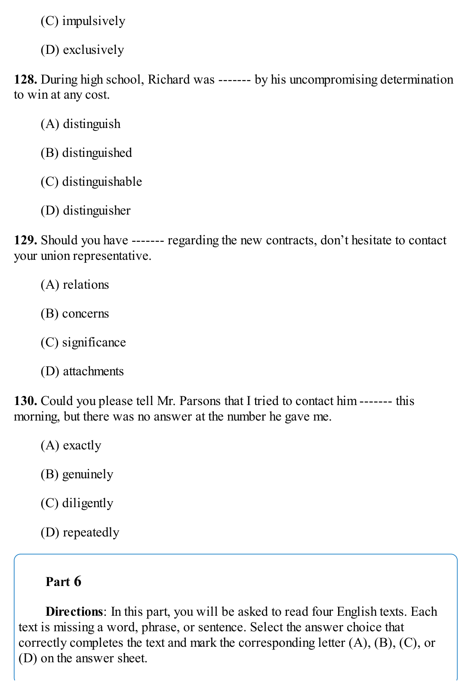


```text
(C) impulsively
(D) exclusively
128.
 During high school, Richard was ------- by his uncompromising determination
to win at any cost.
(A) distinguish
(B) distinguished
(C) distinguishable
(D) distinguisher
129.
 Should you have ------- regarding the new contracts, don’t hesitate to contact
your union representative.
(A) relations
(B) concerns
(C) significance
(D) attachments
130.
 Could you please tell Mr. Parsons that I tried to contact him ------- this
morning, but there was no answer at the number he gave me.
(A) exactly
(B) genuinely
(C) diligently
(D) repeatedly
Part
6
Directions
: In this part, you will be asked to read four English texts. Each
text is missing a word, phrase, or sentence. Select the answer choice that
correctly completes the text and mark the corresponding letter (A), (B), (C), or
(D) on the answer sheet.
1141
```

## PDF 第 371 页

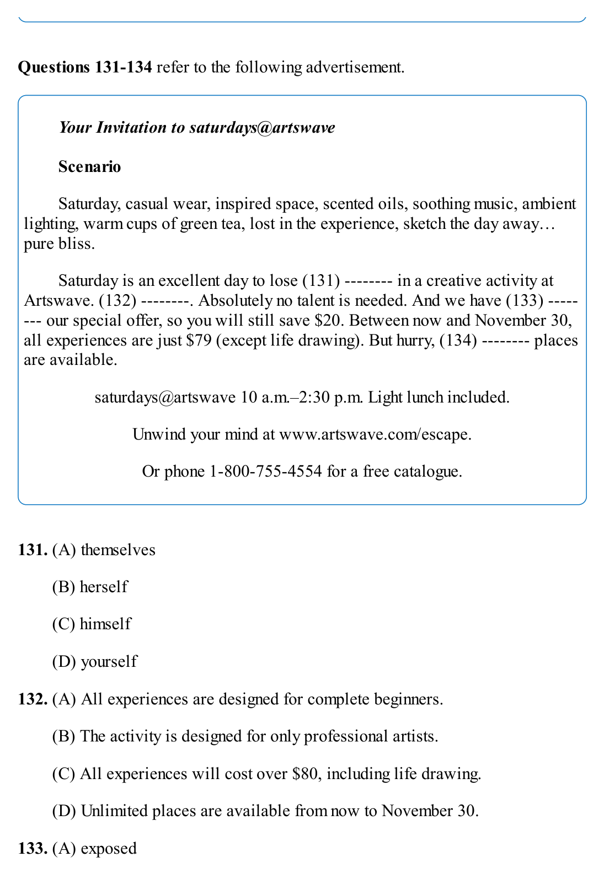


```text
Questions 131-134
 refer to the following advertisement.
Your Invitation to saturdays@artswave
Scenario
Saturday, casual wear, inspired space, scented oils, soothing music, ambient
lighting, warm cups of green tea, lost in the experience, sketch the day away…
pure bliss.
Saturday is an excellent day to lose (131) -------- in a creative activity at
Artswave. (132) --------. Absolutely no talent is needed. And we have (133) -----
--- our special offer, so you will still save $20. Between now and November 30,
all experiences are just $79 (except life drawing). But hurry, (134) -------- places
are available.
saturdays@artswave 10 a.m.–2:30 p.m. Light lunch included.
Unwind your mind at www.artswave.com/escape.
Or phone 1-800-755-4554 for a free catalogue.
131.
 (A) themselves
(B) herself
(C) himself
(D) yourself
132.
 (A) All experiences are designed for complete beginners.
(B) The activity is designed for only professional artists.
(C) All experiences will cost over $80, including life drawing.
(D) Unlimited places are available from now to November 30.
133.
 (A) exposed
1142
```

## PDF 第 372 页

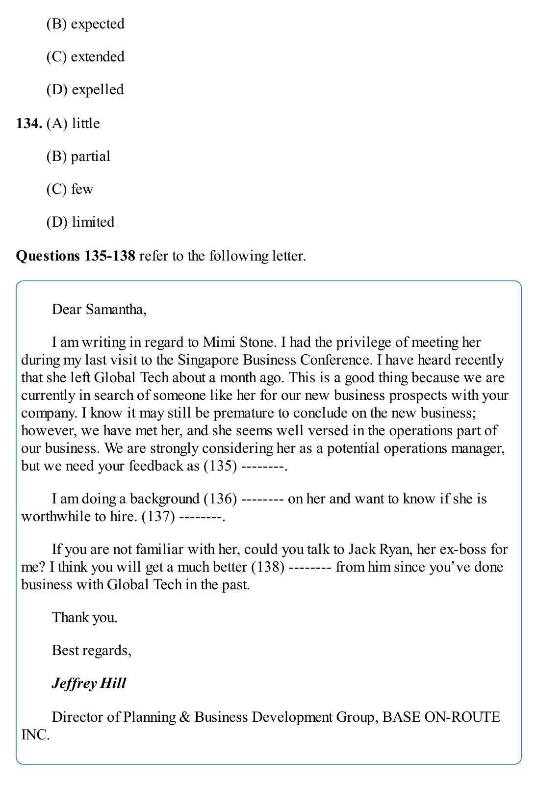


```text
(B) expected
(C) extended
(D) expelled
134.
 (A) little
(B) partial
(C) few
(D) limited
Questions 135-138
 refer to the following letter.
Dear Samantha,
I am writing in regard to Mimi Stone. I had the privilege of meeting her
during my last visit to the Singapore Business Conference. I have heard recently
that she left Global Tech about a month ago. This is a good thing because we are
currently in search of someone like her for our new business prospects with your
company. I know it may still be premature to conclude on the new business;
however, we have met her, and she seems well versed in the operations part of
our business. We are strongly considering her as a potential operations manager,
but we need your feedback as (135) --------.
I am doing a background (136) -------- on her and want to know if she is
worthwhile to hire. (137) --------.
If you are not familiar with her, could you talk to Jack Ryan, her ex-boss for
me? I think you will get a much better (138) -------- from him since you’ve done
business with Global Tech in the past.
Thank you.
Best regards,
Jeffrey Hill
Director of Planning & Business Development Group, BASE ON-ROUTE
INC.
1143
```

## PDF 第 373 页

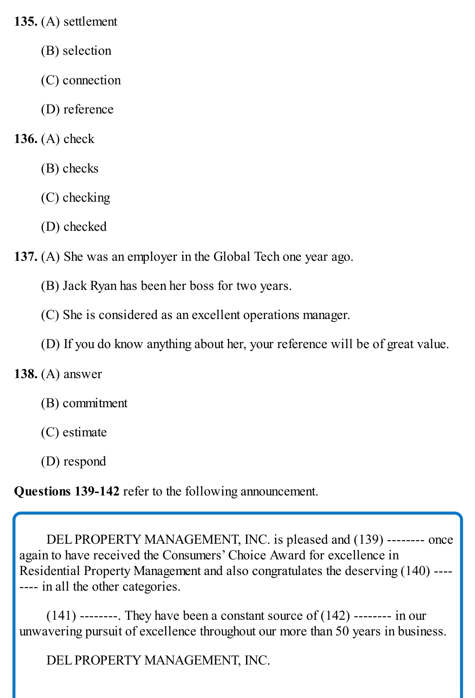


```text
135.
 (A) settlement
(B) selection
(C) connection
(D) reference
136.
 (A) check
(B) checks
(C) checking
(D) checked
137.
 (A) She was an employer in the Global Tech one year ago.
(B) Jack Ryan has been her boss for two years.
(C) She is considered as an excellent operations manager.
(D) If you do know anything about her, your reference will be of great value.
138.
 (A) answer
(B) commitment
(C) estimate
(D) respond
Questions 139-142
 refer to the following announcement.
DEL PROPERTY MANAGEMENT, INC. is pleased and (139) -------- once
again to have received the Consumers’ Choice Award for excellence in
Residential Property Management and also congratulates the deserving (140) ----
---- in all the other categories.
(141) --------. They have been a constant source of (142) -------- in our
unwavering pursuit of excellence throughout our more than 50 years in business.
DEL PROPERTY MANAGEMENT, INC.
1144
```

## PDF 第 374 页

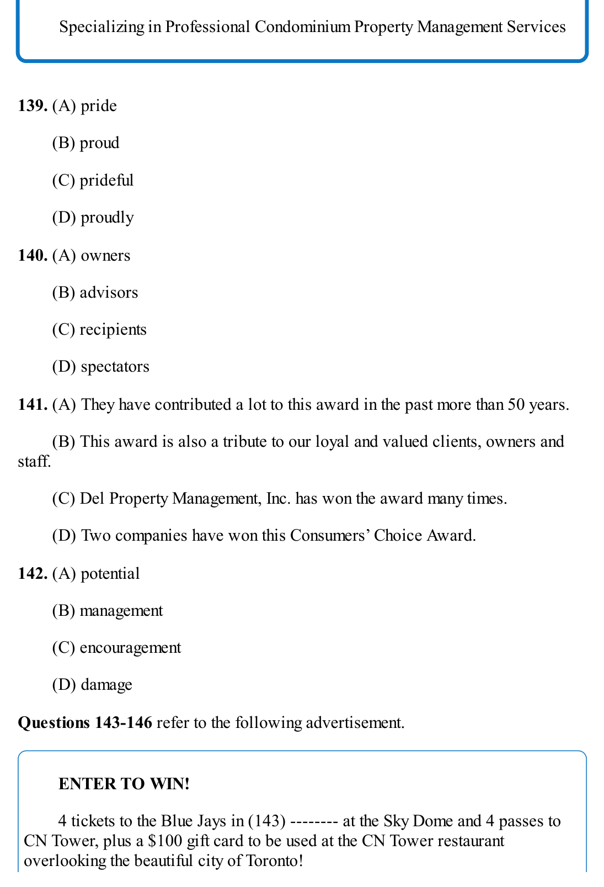


```text
Specializing in Professional Condominium Property Management Services
139.
 (A) pride
(B) proud
(C) prideful
(D) proudly
140.
 (A) owners
(B) advisors
(C) recipients
(D) spectators
141.
 (A) They have contributed a lot to this award in the past more than 50 years.
(B) This award is also a tribute to our loyal and valued clients, owners and
staff.
(C) Del Property Management, Inc. has won the award many times.
(D) Two companies have won this Consumers’ Choice Award.
142.
 (A) potential
(B) management
(C) encouragement
(D) damage
Questions 143-146
 refer to the following advertisement.
ENTER TO WIN!
4 tickets to the Blue Jays in (143) -------- at the Sky Dome and 4 passes to
CN Tower, plus a $100 gift card to be used at the CN Tower restaurant
overlooking the beautiful city of Toronto!
1145
```

## PDF 第 375 页

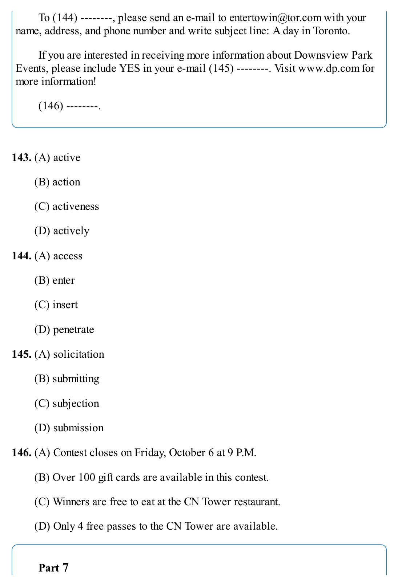


```text
To (144) --------, please send an e-mail to entertowin@tor.com with your
name, address, and phone number and write subject line: A day in Toronto.
If you are interested in receiving more information about Downsview Park
Events, please include YES in your e-mail (145) --------. Visit www.dp.com for
more information!
(146) --------.
143.
 (A) active
(B) action
(C) activeness
(D) actively
144.
 (A) access
(B) enter
(C) insert
(D) penetrate
145.
 (A) solicitation
(B) submitting
(C) subjection
(D) submission
146.
 (A) Contest closes on Friday, October 6 at 9 P.M.
(B) Over 100 gift cards are available in this contest.
(C) Winners are free to eat at the CN Tower restaurant.
(D) Only 4 free passes to the CN Tower are available.
Part
7
1146
```

## PDF 第 376 页

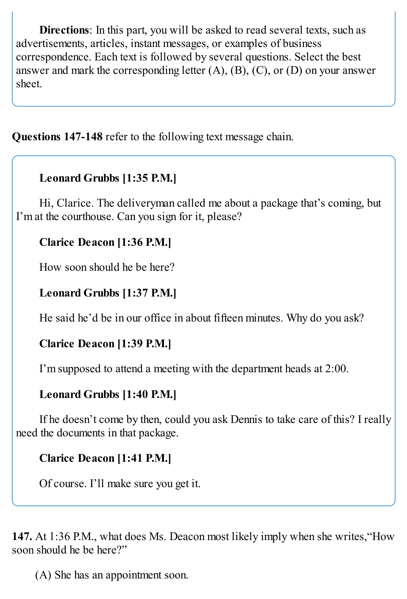


```text
Directions
: In this part, you will be asked to read several texts, such as
advertisements, articles, instant messages, or examples of business
correspondence. Each text is followed by several questions. Select the best
answer and mark the corresponding letter (A), (B), (C), or (D) on your answer
sheet.
Questions 147-
148
 refer to the following text message chain.
Leonard Grubbs [1:35 P.M.]
Hi, Clarice. The deliveryman called me about a package that’s coming, but
I’m at the courthouse. Can you sign for it, please?
Clarice Deacon [1:36 P.M.]
How soon should he be here?
Leonard Grubbs [1:37 P.M.]
He said he’d be in our office in about fifteen minutes. Why do you ask?
Clarice Deacon [1:39 P.M.]
I’m supposed to attend a meeting with the department heads at 2:00.
Leonard Grubbs [1:40 P.M.]
If he doesn’t come by then, could you ask Dennis to take care of this? I really
need the documents in that package.
Clarice Deacon [1:41 P.M.]
Of course. I’ll make sure you get it.
147.
 At 1:36 P.M., what does Ms. Deacon most likely imply when she writes,“How
soon should he be here?”
(A) She has an appointment soon.
1147
```

## PDF 第 377 页

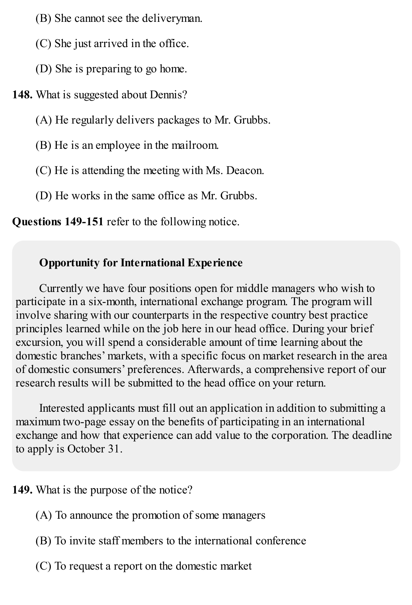


```text
(B) She cannot see the deliveryman.
(C) She just arrived in the office.
(D) She is preparing to go home.
148.
 What is suggested about Dennis?
(A) He regularly delivers packages to Mr. Grubbs.
(B) He is an employee in the mailroom.
(C) He is attending the meeting with Ms. Deacon.
(D) He works in the same office as Mr. Grubbs.
Questions 149-
151
 refer to the following notice.
Opportunity for International Experience
Currently we have four positions open for middle managers who wish to
participate in a six-month, international exchange program. The program will
involve sharing with our counterparts in the respective country best practice
principles learned while on the job here in our head office. During your brief
excursion, you will spend a considerable amount of time learning about the
domestic branches’ markets, with a specific focus on market research in the area
of domestic consumers’ preferences. Afterwards, a comprehensive report of our
research results will be submitted to the head office on your return.
Interested applicants must fill out an application in addition to submitting a
maximum two-page essay on the benefits of participating in an international
exchange and how that experience can add value to the corporation. The deadline
to apply is October 31.
149.
 What is the purpose of the notice?
(A) To announce the promotion of some managers
(B) To invite staff members to the international conference
(C) To request a report on the domestic market
1148
```

## PDF 第 378 页

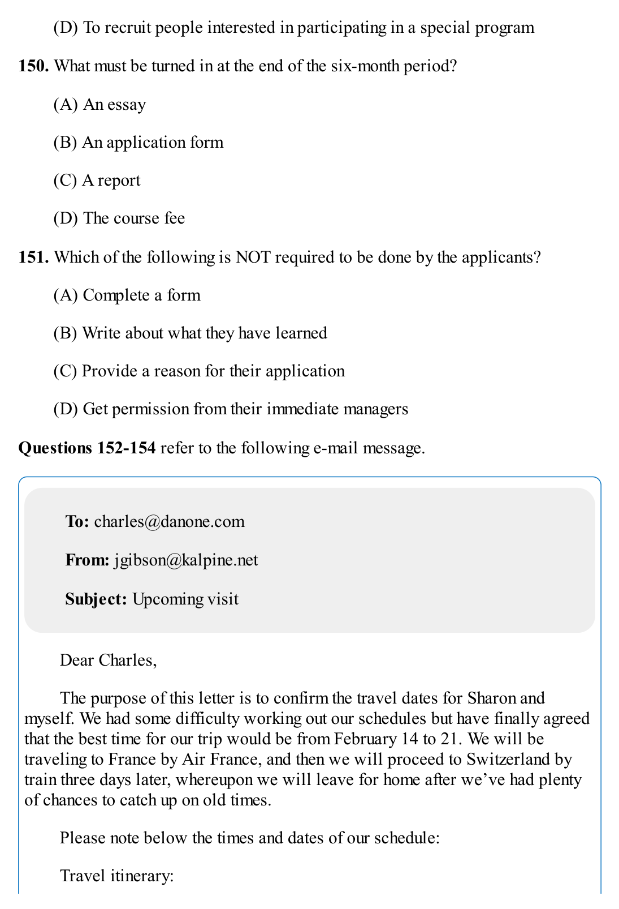


```text
(D) To recruit people interested in participating in a special program
150.
 What must be turned in at the end of the six-month period?
(A) An essay
(B) An application form
(C) A report
(D) The course fee
151.
 Which of the following is NOT required to be done by the applicants?
(A) Complete a form
(B) Write about what they have learned
(C) Provide a reason for their application
(D) Get permission from their immediate managers
Questions 152-154
 refer to the following e-mail message.
To:
 charles@danone.com
From:
 jgibson@kalpine.net
Subject:
 Upcoming visit
Dear Charles,
The purpose of this letter is to confirm the travel dates for Sharon and
myself. We had some difficulty working out our schedules but have finally agreed
that the best time for our trip would be from February 14 to 21. We will be
traveling to France by Air France, and then we will proceed to Switzerland by
train three days later, whereupon we will leave for home after we’ve had plenty
of chances to catch up on old times.
Please note below the times and dates of our schedule:
Travel itinerary:
1149
```

## PDF 第 379 页

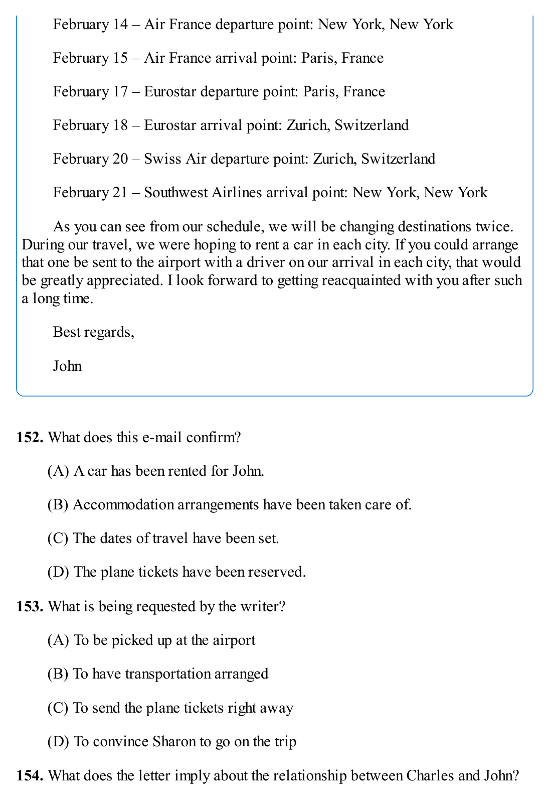


```text
February 14 – Air France departure point: New York, New York
February 15 – Air France arrival point: Paris, France
February 17 – Eurostar departure point: Paris, France
February 18 – Eurostar arrival point: Zurich, Switzerland
February 20 – Swiss Air departure point: Zurich, Switzerland
February 21 – Southwest Airlines arrival point: New York, New York
As you can see from our schedule, we will be changing destinations twice.
During our travel, we were hoping to rent a car in each city. If you could arrange
that one be sent to the airport with a driver on our arrival in each city, that would
be greatly appreciated. I look forward to getting reacquainted with you after such
a long time.
Best regards,
John
152.
 What does this e-mail confirm?
(A) A car has been rented for John.
(B) Accommodation arrangements have been taken care of.
(C) The dates of travel have been set.
(D) The plane tickets have been reserved.
153.
 What is being requested by the writer?
(A) To be picked up at the airport
(B) To have transportation arranged
(C) To send the plane tickets right away
(D) To convince Sharon to go on the trip
154.
 What does the letter imply about the relationship between Charles and John?
1150
```

## PDF 第 380 页

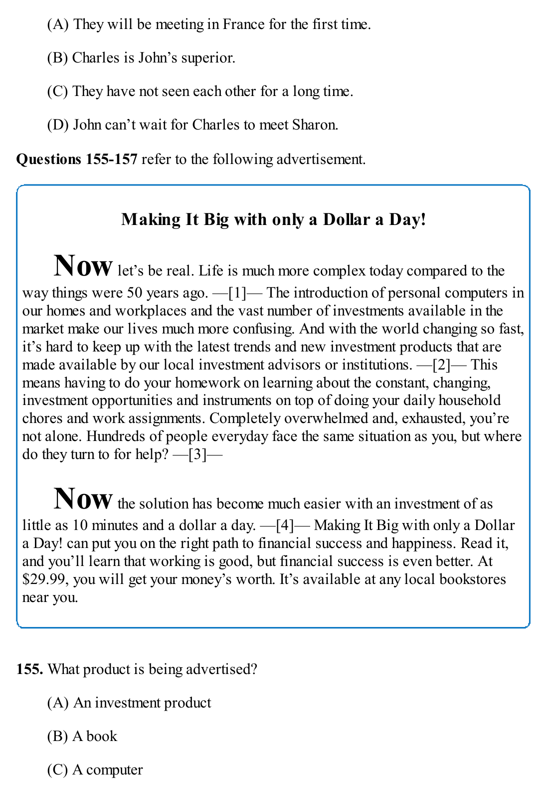


```text
(A) They will be meeting in France for the first time.
(B) Charles is John’s superior.
(C) They have not seen each other for a long time.
(D) John can’t wait for Charles to meet Sharon.
Questions 155-157
 refer to the following advertisement.
Making It Big with only a Dollar a Day!
Now
 let’s be real. Life is much more complex today compared to the
way things were 50 years ago. —[1]— The introduction of personal computers in
our homes and workplaces and the vast number of investments available in the
market make our lives much more confusing. And with the world changing so fast,
it’s hard to keep up with the latest trends and new investment products that are
made available by our local investment advisors or institutions. —[2]— This
means having to do your homework on learning about the constant, changing,
investment opportunities and instruments on top of doing your daily household
chores and work assignments. Completely overwhelmed and, exhausted, you’re
not alone. Hundreds of people everyday face the same situation as you, but where
do they turn to for help? —[3]—
Now
 the solution has become much easier with an investment of as
little as 10 minutes and a dollar a day. —[4]— Making It Big with only a Dollar
a Day! can put you on the right path to financial success and happiness. Read it,
and you’ll learn that working is good, but financial success is even better. At
$29.99, you will get your money’s worth. It’s available at any local bookstores
near you.
155.
 What product is being advertised?
(A) An investment product
(B) A book
(C) A computer
1151
```

## PDF 第 381 页

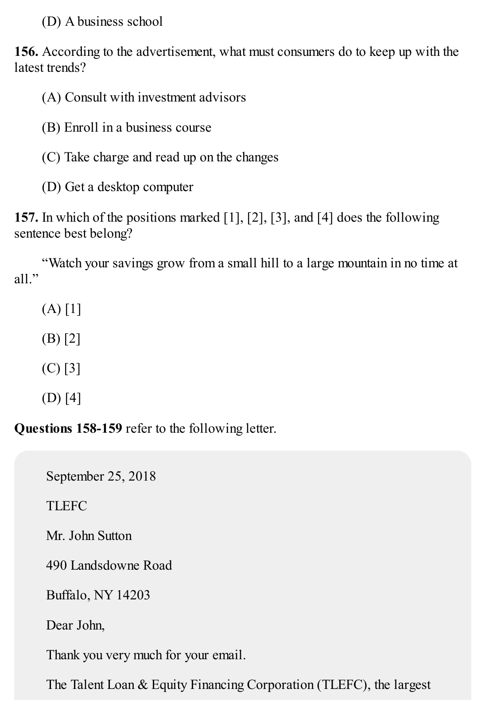


```text
(D) A business school
156.
 According to the advertisement, what must consumers do to keep up with the
latest trends?
(A) Consult with investment advisors
(B) Enroll in a business course
(C) Take charge and read up on the changes
(D) Get a desktop computer
157.
 In which of the positions marked [1], [2], [3], and [4] does the following
sentence best belong?
“Watch your savings grow from a small hill to a large mountain in no time at
all.”
(A) [1]
(B) [2]
(C) [3]
(D) [4]
Questions 158-159
 refer to the following letter.
September 25, 2018
TLEFC
Mr. John Sutton
490 Landsdowne Road
Buffalo, NY 14203
Dear John,
Thank you very much for your email.
The Talent Loan & Equity Financing Corporation (TLEFC), the largest
1152
```

## PDF 第 382 页

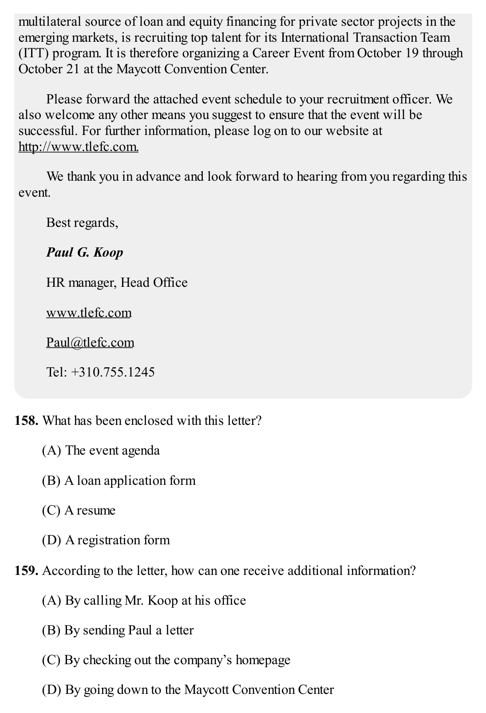


```text
multilateral source of loan and equity financing for private sector projects in the
emerging markets, is recruiting top talent for its International Transaction Team
(ITT) program. It is therefore organizing a Career Event from October 19 through
October 21 at the Maycott Convention Center.
Please forward the attached event schedule to your recruitment officer. We
also welcome any other means you suggest to ensure that the event will be
successful. For further information, please log on to our website at
http://www.tlefc.com.
We thank you in advance and look forward to hearing from you regarding this
event.
Best regards,
Paul G. Koop
HR manager, Head Office
www.tlefc.com
Paul@tlefc.com
Tel: +310.755.1245
158.
 What has been enclosed with this letter?
(A) The event agenda
(B) A loan application form
(C) A resume
(D) A registration form
159.
 According to the letter, how can one receive additional information?
(A) By calling Mr. Koop at his office
(B) By sending Paul a letter
(C) By checking out the company’s homepage
(D) By going down to the Maycott Convention Center
1153
```

## PDF 第 383 页

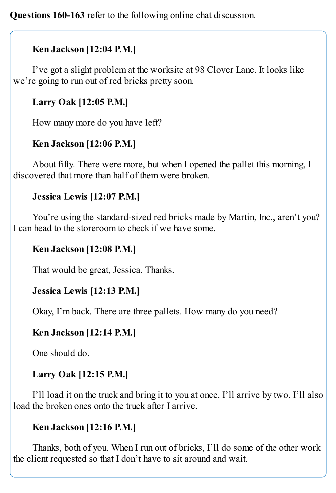


```text
Questions 160-163
 refer to the following online chat discussion.
Ken Jackson [12:04 P.M.]
I’ve got a slight problem at the worksite at 98 Clover Lane. It looks like
we’re going to run out of red bricks pretty soon.
Larry Oak [12:05 P.M.]
How many more do you have left?
Ken Jackson [12:06 P.M.]
About fifty. There were more, but when I opened the pallet this morning, I
discovered that more than half of them were broken.
Jessica Lewis [12:07 P.M.]
You’re using the standard-sized red bricks made by Martin, Inc., aren’t you?
I can head to the storeroom to check if we have some.
Ken Jackson [12:08 P.M.]
That would be great, Jessica. Thanks.
Jessica Lewis [12:13 P.M.]
Okay, I’m back. There are three pallets. How many do you need?
Ken Jackson [12:14 P.M.]
One should do.
Larry Oak [12:15 P.M.]
I’ll load it on the truck and bring it to you at once. I’ll arrive by two. I’ll also
load the broken ones onto the truck after I arrive.
Ken Jackson [12:16 P.M.]
Thanks, both of you. When I run out of bricks, I’ll do some of the other work
the client requested so that I don’t have to sit around and wait.
1154
```

## PDF 第 384 页

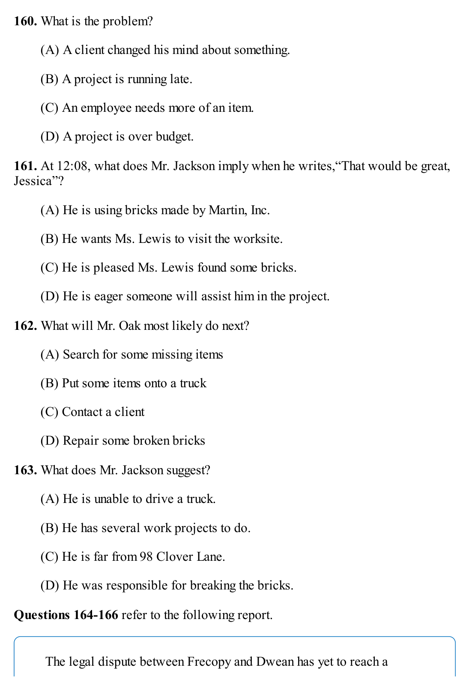


```text
160.
 What is the problem?
(A) A client changed his mind about something.
(B) A project is running late.
(C) An employee needs more of an item.
(D) A project is over budget.
161.
 At 12:08, what does Mr. Jackson imply when he writes,“That would be great,
Jessica”?
(A) He is using bricks made by Martin, Inc.
(B) He wants Ms. Lewis to visit the worksite.
(C) He is pleased Ms. Lewis found some bricks.
(D) He is eager someone will assist him in the project.
162.
 What will Mr. Oak most likely do next?
(A) Search for some missing items
(B) Put some items onto a truck
(C) Contact a client
(D) Repair some broken bricks
163.
 What does Mr. Jackson suggest?
(A) He is unable to drive a truck.
(B) He has several work projects to do.
(C) He is far from 98 Clover Lane.
(D) He was responsible for breaking the bricks.
Questions 164-166
 refer to the following report.
The legal dispute between Frecopy and Dwean has yet to reach a
1155
```

## PDF 第 385 页

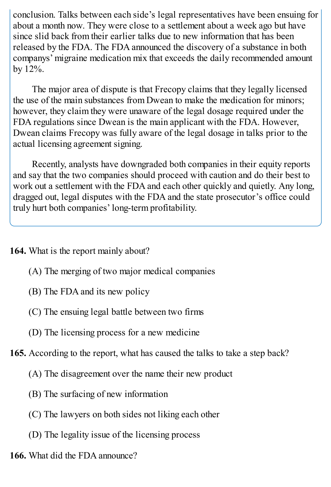


```text
conclusion. Talks between each side’s legal representatives have been ensuing for
about a month now. They were close to a settlement about a week ago but have
since slid back from their earlier talks due to new information that has been
released by the FDA. The FDA announced the discovery of a substance in both
companys’ migraine medication mix that exceeds the daily recommended amount
by 12%.
The major area of dispute is that Frecopy claims that they legally licensed
the use of the main substances from Dwean to make the medication for minors;
however, they claim they were unaware of the legal dosage required under the
FDA regulations since Dwean is the main applicant with the FDA. However,
Dwean claims Frecopy was fully aware of the legal dosage in talks prior to the
actual licensing agreement signing.
Recently, analysts have downgraded both companies in their equity reports
and say that the two companies should proceed with caution and do their best to
work out a settlement with the FDA and each other quickly and quietly. Any long,
dragged out, legal disputes with the FDA and the state prosecutor’s office could
truly hurt both companies’ long-term profitability.
164.
 What is the report mainly about?
(A) The merging of two major medical companies
(B) The FDA and its new policy
(C) The ensuing legal battle between two firms
(D) The licensing process for a new medicine
165.
 According to the report, what has caused the talks to take a step back?
(A) The disagreement over the name their new product
(B) The surfacing of new information
(C) The lawyers on both sides not liking each other
(D) The legality issue of the licensing process
166.
 What did the FDA announce?
1156
```

## PDF 第 386 页

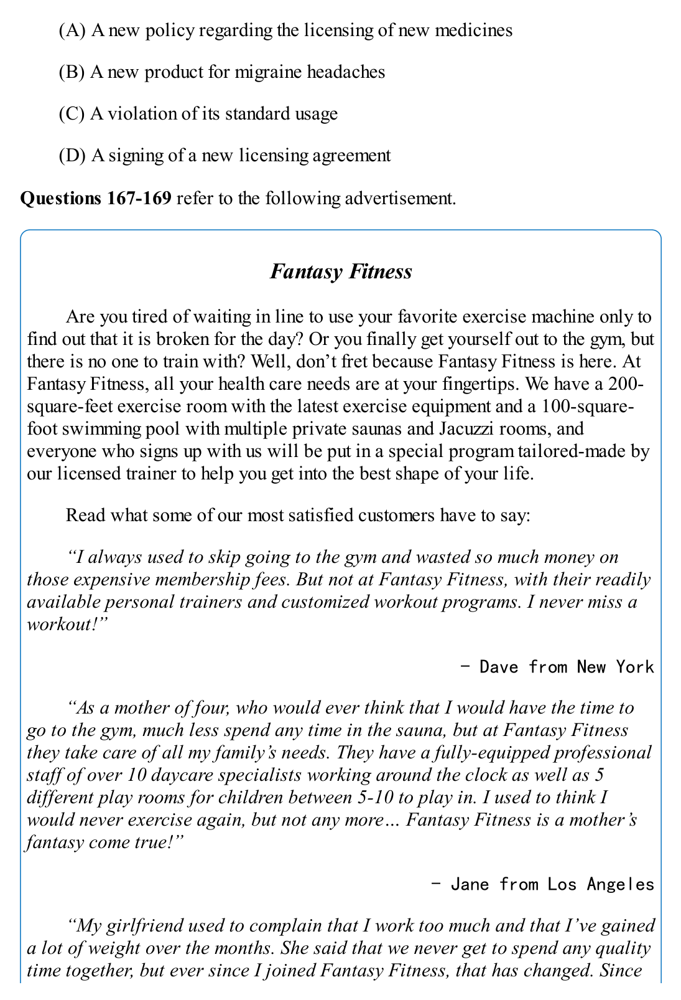


```text
(A) A new policy regarding the licensing of new medicines
(B) A new product for migraine headaches
(C) A violation of its standard usage
(D) A signing of a new licensing agreement
Questions 167-169
 refer to the following advertisement.
Fantasy Fitness
Are you tired of waiting in line to use your favorite exercise machine only to
find out that it is broken for the day? Or you finally get yourself out to the gym, but
there is no one to train with? Well, don’t fret because Fantasy Fitness is here. At
Fantasy Fitness, all your health care needs are at your fingertips. We have a 200-
square-feet exercise room with the latest exercise equipment and a 100-square-
foot swimming pool with multiple private saunas and Jacuzzi rooms, and
everyone who signs up with us will be put in a special program tailored-made by
our licensed trainer to help you get into the best shape of your life.
Read what some of our most satisfied customers have to say:
“I always used to skip going to the gym and wasted so much money on
those expensive membership fees. But not at Fantasy Fitness, with their readily
available personal trainers and customized workout programs. I never miss a
workout!”
- Dave from New York
“As a mother of four, who would ever think that I would have the time to
go to the gym, much less spend any time in the sauna, but at Fantasy Fitness
they take care of all my family’s needs. They have a fully-equipped professional
staff of over 10 daycare specialists working around the clock as well as 5
different play rooms for children between 5-10 to play in. I used to think I
would never exercise again, but not any more… Fantasy Fitness is a mother’s
fantasy come true!”
- Jane from Los Angeles
“My girlfriend used to complain that I work too much and that I’ve gained
a lot of weight over the months. She said that we never get to spend any quality
time together, but ever since I joined Fantasy Fitness, that has changed. Since
1157
```

## PDF 第 387 页

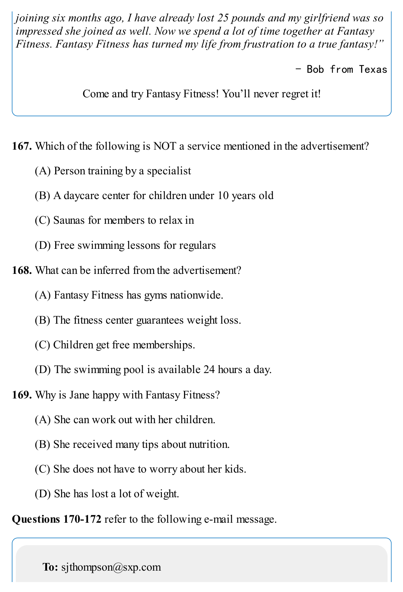


```text
joining six months ago, I have already lost 25 pounds and my girlfriend was so
impressed she joined as well. Now we spend a lot of time together at Fantasy
Fitness. Fantasy Fitness has turned my life from frustration to a true fantasy!”
- Bob from Texas
Come and try Fantasy Fitness! You’ll never regret it!
167.
 Which of the following is NOT a service mentioned in the advertisement?
(A) Person training by a specialist
(B) A daycare center for children under 10 years old
(C) Saunas for members to relax in
(D) Free swimming lessons for regulars
168.
 What can be inferred from the advertisement?
(A) Fantasy Fitness has gyms nationwide.
(B) The fitness center guarantees weight loss.
(C) Children get free memberships.
(D) The swimming pool is available 24 hours a day.
169.
 Why is Jane happy with Fantasy Fitness?
(A) She can work out with her children.
(B) She received many tips about nutrition.
(C) She does not have to worry about her kids.
(D) She has lost a lot of weight.
Questions 170-172
 refer to the following e-mail message.
To:
 sjthompson@sxp.com
1158
```

## PDF 第 388 页

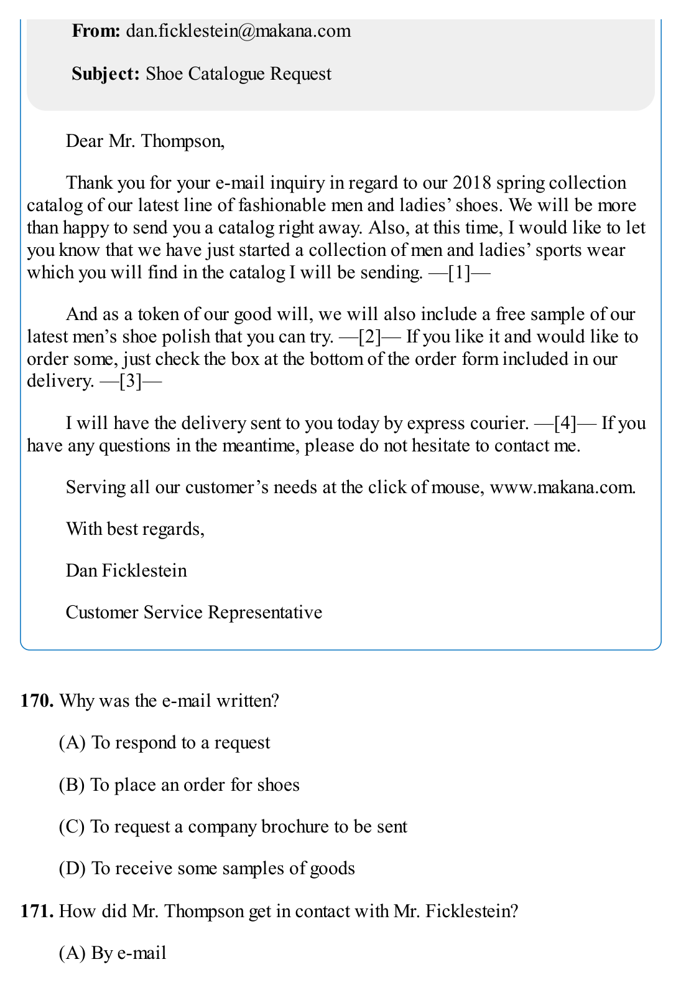


```text
From:
 dan.ficklestein@makana.com
Subject:
 Shoe Catalogue Request
Dear Mr. Thompson,
Thank you for your e-mail inquiry in regard to our 2018 spring collection
catalog of our latest line of fashionable men and ladies’ shoes. We will be more
than happy to send you a catalog right away. Also, at this time, I would like to let
you know that we have just started a collection of men and ladies’ sports wear
which you will find in the catalog I will be sending. —[1]—
And as a token of our good will, we will also include a free sample of our
latest men’s shoe polish that you can try. —[2]— If you like it and would like to
order some, just check the box at the bottom of the order form included in our
delivery. —[3]—
I will have the delivery sent to you today by express courier. —[4]— If you
have any questions in the meantime, please do not hesitate to contact me.
Serving all our customer’s needs at the click of mouse, www.makana.com.
With best regards,
Dan Ficklestein
Customer Service Representative
170.
 Why was the e-mail written?
(A) To respond to a request
(B) To place an order for shoes
(C) To request a company brochure to be sent
(D) To receive some samples of goods
171.
 How did Mr. Thompson get in contact with Mr. Ficklestein?
(A) By e-mail
1159
```

## PDF 第 389 页

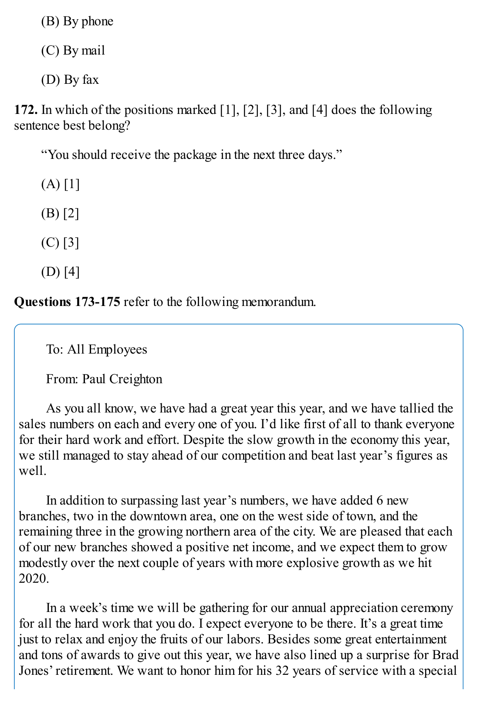


```text
(B) By phone
(C) By mail
(D) By fax
172.
 In which of the positions marked [1], [2], [3], and [4] does the following
sentence best belong?
“You should receive the package in the next three days.”
(A) [1]
(B) [2]
(C) [3]
(D) [4]
Questions 173-175
 refer to the following memorandum.
To: All Employees
From: Paul Creighton
As you all know, we have had a great year this year, and we have tallied the
sales numbers on each and every one of you. I’d like first of all to thank everyone
for their hard work and effort. Despite the slow growth in the economy this year,
we still managed to stay ahead of our competition and beat last year’s figures as
well.
In addition to surpassing last year’s numbers, we have added 6 new
branches, two in the downtown area, one on the west side of town, and the
remaining three in the growing northern area of the city. We are pleased that each
of our new branches showed a positive net income, and we expect them to grow
modestly over the next couple of years with more explosive growth as we hit
2020.
In a week’s time we will be gathering for our annual appreciation ceremony
for all the hard work that you do. I expect everyone to be there. It’s a great time
just to relax and enjoy the fruits of our labors. Besides some great entertainment
and tons of awards to give out this year, we have also lined up a surprise for Brad
Jones’ retirement. We want to honor him for his 32 years of service with a special
1160
```

## PDF 第 390 页

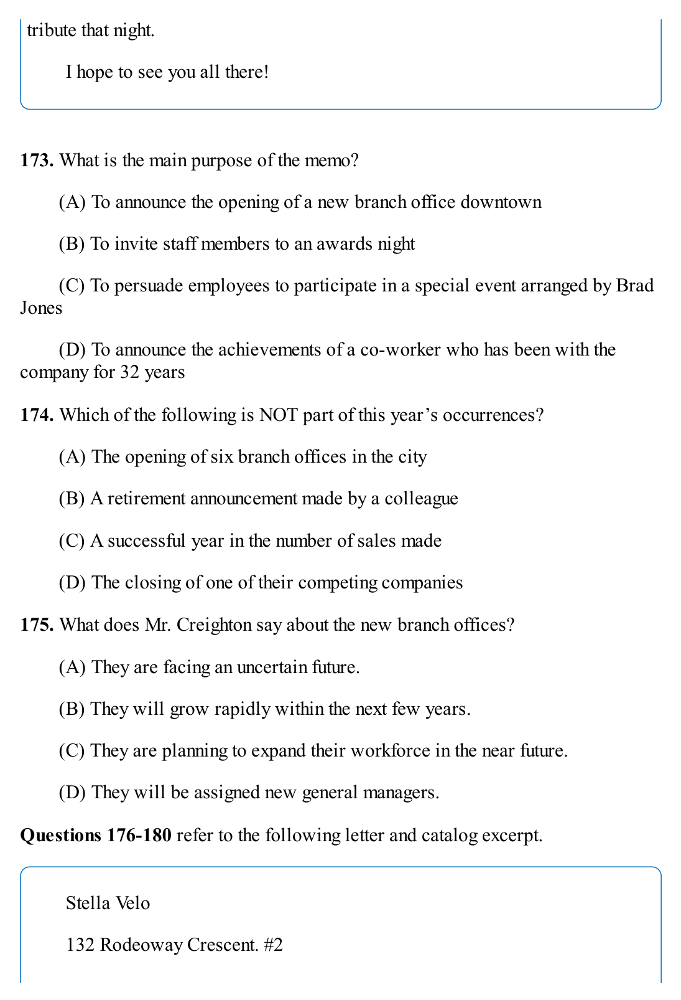


```text
tribute that night.
I hope to see you all there!
173.
 What is the main purpose of the memo?
(A) To announce the opening of a new branch office downtown
(B) To invite staff members to an awards night
(C) To persuade employees to participate in a special event arranged by Brad
Jones
(D) To announce the achievements of a co-worker who has been with the
company for 32 years
174.
 Which of the following is NOT part of this year’s occurrences?
(A) The opening of six branch offices in the city
(B) A retirement announcement made by a colleague
(C) A successful year in the number of sales made
(D) The closing of one of their competing companies
175.
 What does Mr. Creighton say about the new branch offices?
(A) They are facing an uncertain future.
(B) They will grow rapidly within the next few years.
(C) They are planning to expand their workforce in the near future.
(D) They will be assigned new general managers.
Questions 176-180
 refer to the following letter and catalog excerpt.
Stella Velo
132 Rodeoway Crescent. #2
1161
```

## PDF 第 391 页

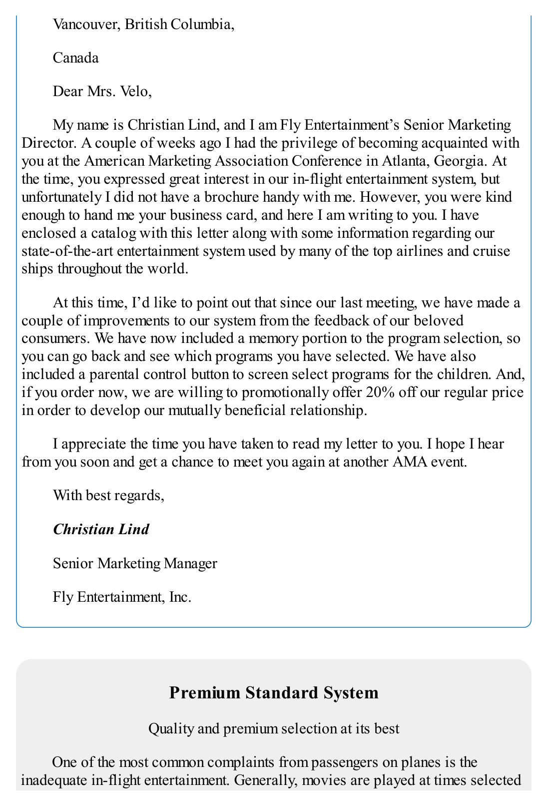


```text
Vancouver, British Columbia,
Canada
Dear Mrs. Velo,
My name is Christian Lind, and I am Fly Entertainment’s Senior Marketing
Director. A couple of weeks ago I had the privilege of becoming acquainted with
you at the American Marketing Association Conference in Atlanta, Georgia. At
the time, you expressed great interest in our in-flight entertainment system, but
unfortunately I did not have a brochure handy with me. However, you were kind
enough to hand me your business card, and here I am writing to you. I have
enclosed a catalog with this letter along with some information regarding our
state-of-the-art entertainment system used by many of the top airlines and cruise
ships throughout the world.
At this time, I’d like to point out that since our last meeting, we have made a
couple of improvements to our system from the feedback of our beloved
consumers. We have now included a memory portion to the program selection, so
you can go back and see which programs you have selected. We have also
included a parental control button to screen select programs for the children. And,
if you order now, we are willing to promotionally offer 20% off our regular price
in order to develop our mutually beneficial relationship.
I appreciate the time you have taken to read my letter to you. I hope I hear
from you soon and get a chance to meet you again at another AMA event.
With best regards,
Christian Lind
Senior Marketing Manager
Fly Entertainment, Inc.
Premium Standard System
Quality and premium selection at its best
One of the most common complaints from passengers on planes is the
inadequate in-flight entertainment. Generally, movies are played at times selected
1162
```

## PDF 第 392 页

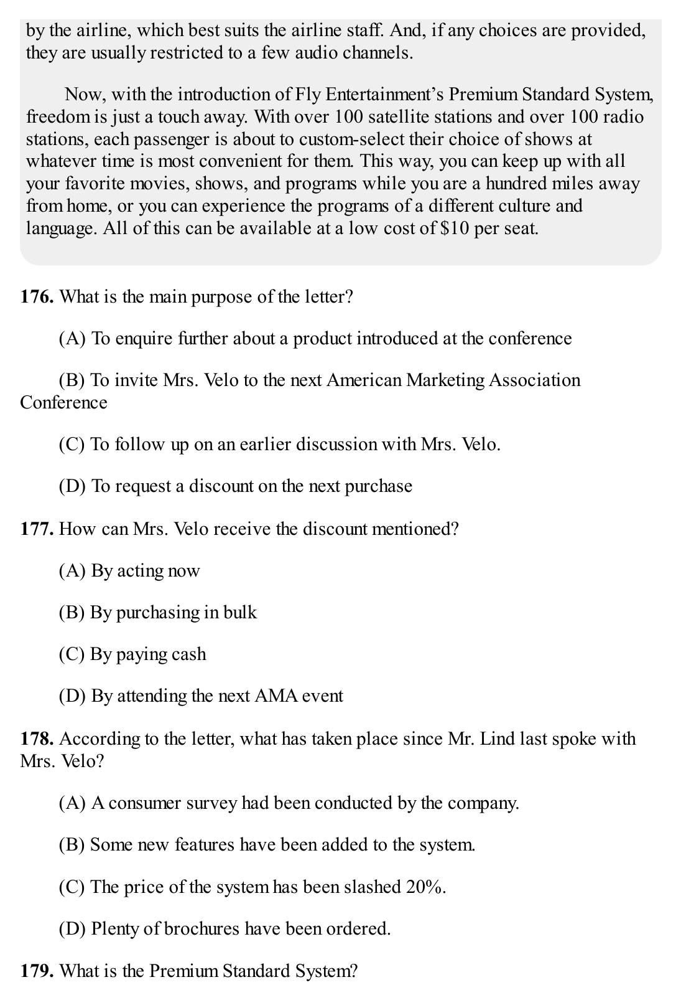


```text
by the airline, which best suits the airline staff. And, if any choices are provided,
they are usually restricted to a few audio channels.
Now, with the introduction of Fly Entertainment’s Premium Standard System,
freedom is just a touch away. With over 100 satellite stations and over 100 radio
stations, each passenger is about to custom-select their choice of shows at
whatever time is most convenient for them. This way, you can keep up with all
your favorite movies, shows, and programs while you are a hundred miles away
from home, or you can experience the programs of a different culture and
language. All of this can be available at a low cost of $10 per seat.
176.
 What is the main purpose of the letter?
(A) To enquire further about a product introduced at the conference
(B) To invite Mrs. Velo to the next American Marketing Association
Conference
(C) To follow up on an earlier discussion with Mrs. Velo.
(D) To request a discount on the next purchase
177.
 How can Mrs. Velo receive the discount mentioned?
(A) By acting now
(B) By purchasing in bulk
(C) By paying cash
(D) By attending the next AMA event
178.
 According to the letter, what has taken place since Mr. Lind last spoke with
Mrs. Velo?
(A) A consumer survey had been conducted by the company.
(B) Some new features have been added to the system.
(C) The price of the system has been slashed 20%.
(D) Plenty of brochures have been ordered.
179.
 What is the Premium Standard System?
1163
```

## PDF 第 393 页

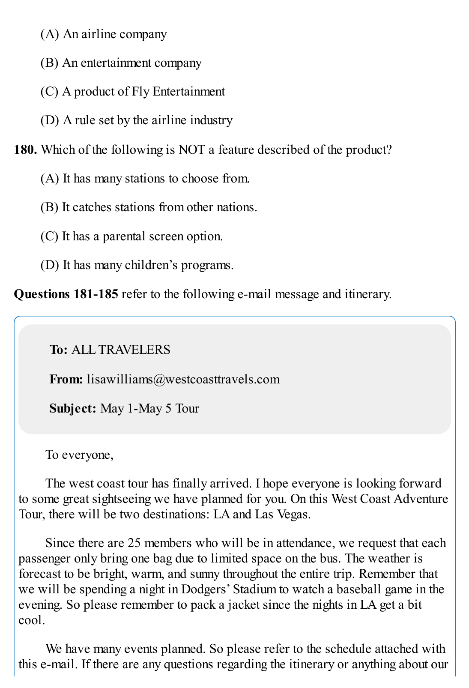


```text
(A) An airline company
(B) An entertainment company
(C) A product of Fly Entertainment
(D) A rule set by the airline industry
180.
 Which of the following is NOT a feature described of the product?
(A) It has many stations to choose from.
(B) It catches stations from other nations.
(C) It has a parental screen option.
(D) It has many children’s programs.
Questions 181-185
 refer to the following e-mail message and itinerary.
To:
 ALL TRAVELERS
From:
 lisawilliams@westcoasttravels.com
Subject:
 May 1-May 5 Tour
To everyone,
The west coast tour has finally arrived. I hope everyone is looking forward
to some great sightseeing we have planned for you. On this West Coast Adventure
Tour, there will be two destinations: LA and Las Vegas.
Since there are 25 members who will be in attendance, we request that each
passenger only bring one bag due to limited space on the bus. The weather is
forecast to be bright, warm, and sunny throughout the entire trip. Remember that
we will be spending a night in Dodgers’ Stadium to watch a baseball game in the
evening. So please remember to pack a jacket since the nights in LA get a bit
cool.
We have many events planned. So please refer to the schedule attached with
this e-mail. If there are any questions regarding the itinerary or anything about our
1164
```

## PDF 第 394 页

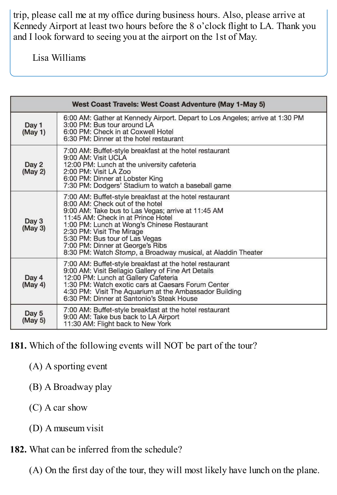


```text
trip, please call me at my office during business hours. Also, please arrive at
Kennedy Airport at least two hours before the 8 o’clock flight to LA. Thank you
and I look forward to seeing you at the airport on the 1st of May.
Lisa Williams
181.
 Which of the following events will NOT be part of the tour?
(A) A sporting event
(B) A Broadway play
(C) A car show
(D) A museum visit
182.
 What can be inferred from the schedule?
(A) On the first day of the tour, they will most likely have lunch on the plane.
1165
```

## PDF 第 395 页

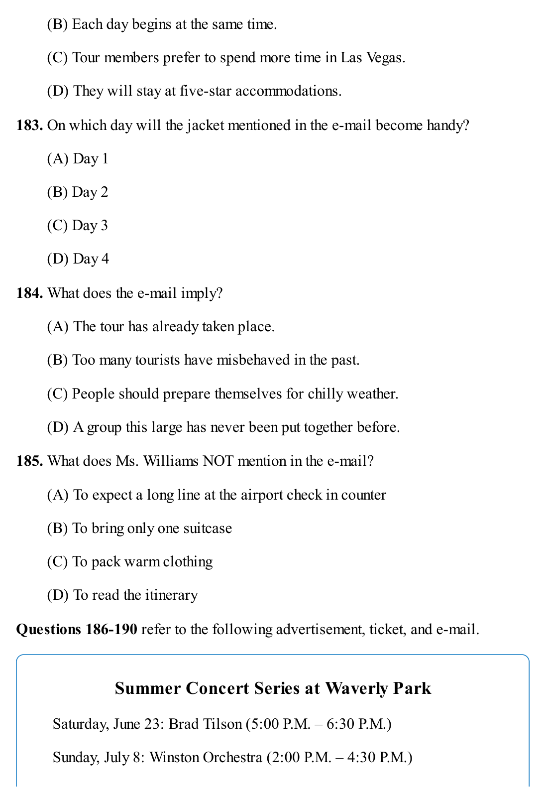


```text
(B) Each day begins at the same time.
(C) Tour members prefer to spend more time in Las Vegas.
(D) They will stay at five-star accommodations.
183.
 On which day will the jacket mentioned in the e-mail become handy?
(A) Day 1
(B) Day 2
(C) Day 3
(D) Day 4
184.
 What does the e-mail imply?
(A) The tour has already taken place.
(B) Too many tourists have misbehaved in the past.
(C) People should prepare themselves for chilly weather.
(D) A group this large has never been put together before.
185.
 What does Ms. Williams NOT mention in the e-mail?
(A) To expect a long line at the airport check in counter
(B) To bring only one suitcase
(C) To pack warm clothing
(D) To read the itinerary
Questions 186-190
 refer to the following advertisement, ticket, and e-mail.
Summer Concert Series at Waverly Park
Saturday, June 23: Brad Tilson (5:00 P.M. – 6:30 P.M.)
Sunday, July 8: Winston Orchestra (2:00 P.M. – 4:30 P.M.)
1166
```

## PDF 第 396 页

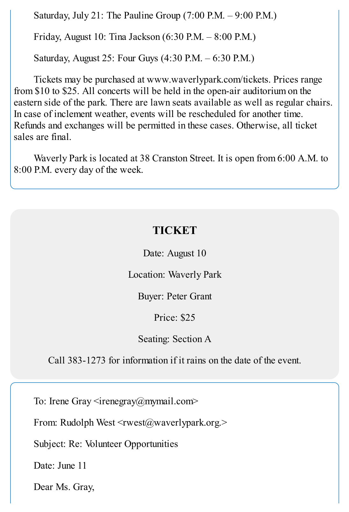


```text
Saturday, July 21: The Pauline Group (7:00 P.M. – 9:00 P.M.)
Friday, August 10: Tina Jackson (6:30 P.M. – 8:00 P.M.)
Saturday, August 25: Four Guys (4:30 P.M. – 6:30 P.M.)
Tickets may be purchased at www.waverlypark.com/tickets. Prices range
from $10 to $25. All concerts will be held in the open-air auditorium on the
eastern side of the park. There are lawn seats available as well as regular chairs.
In case of inclement weather, events will be rescheduled for another time.
Refunds and exchanges will be permitted in these cases. Otherwise, all ticket
sales are final.
Waverly Park is located at 38 Cranston Street. It is open from 6:00 A.M. to
8:00 P.M. every day of the week.
TICKET
Date: August 10
Location: Waverly Park
Buyer: Peter Grant
Price: $25
Seating: Section A
Call 383-1273 for information if it rains on the date of the event.
To: Irene Gray <irenegray@mymail.com>
From: Rudolph West <rwest@waverlypark.org.>
Subject: Re: Volunteer Opportunities
Date: June 11
Dear Ms. Gray,
1167
```

## PDF 第 397 页

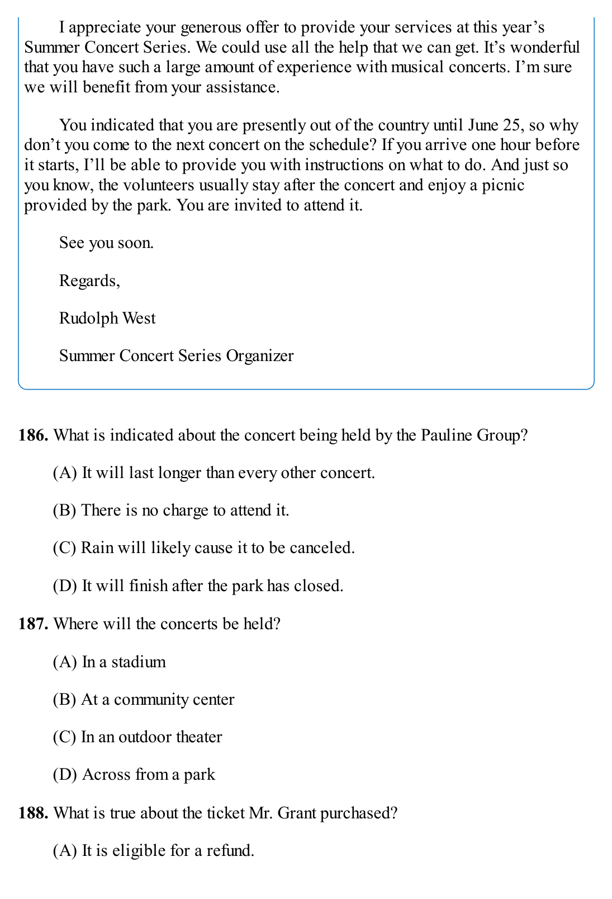


```text
I appreciate your generous offer to provide your services at this year’s
Summer Concert Series. We could use all the help that we can get. It’s wonderful
that you have such a large amount of experience with musical concerts. I’m sure
we will benefit from your assistance.
You indicated that you are presently out of the country until June 25, so why
don’t you come to the next concert on the schedule? If you arrive one hour before
it starts, I’ll be able to provide you with instructions on what to do. And just so
you know, the volunteers usually stay after the concert and enjoy a picnic
provided by the park. You are invited to attend it.
See you soon.
Regards,
Rudolph West
Summer Concert Series Organizer
186.
 What is indicated about the concert being held by the Pauline Group?
(A) It will last longer than every other concert.
(B) There is no charge to attend it.
(C) Rain will likely cause it to be canceled.
(D) It will finish after the park has closed.
187.
 Where will the concerts be held?
(A) In a stadium
(B) At a community center
(C) In an outdoor theater
(D) Across from a park
188.
 What is true about the ticket Mr. Grant purchased?
(A) It is eligible for a refund.
1168
```

## PDF 第 398 页

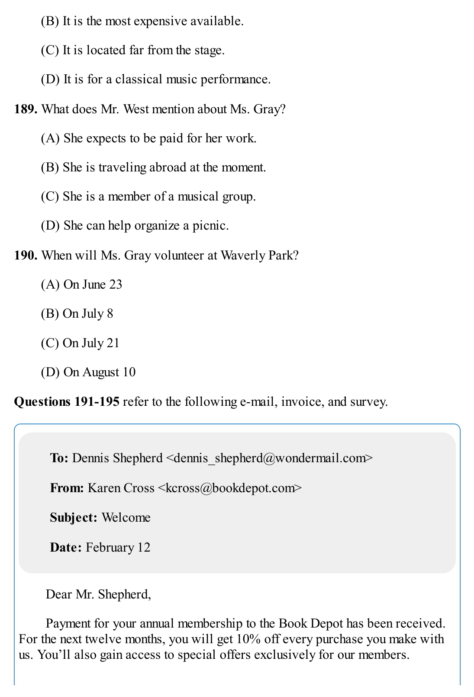


```text
(B) It is the most expensive available.
(C) It is located far from the stage.
(D) It is for a classical music performance.
189.
 What does Mr. West mention about Ms. Gray?
(A) She expects to be paid for her work.
(B) She is traveling abroad at the moment.
(C) She is a member of a musical group.
(D) She can help organize a picnic.
190.
 When will Ms. Gray volunteer at Waverly Park?
(A) On June 23
(B) On July 8
(C) On July 21
(D) On August 10
Questions 191-195
 refer to the following e-mail, invoice, and survey.
To:
 Dennis Shepherd <dennis_shepherd@wondermail.com>
From:
 Karen Cross <kcross@bookdepot.com>
Subject:
 Welcome
Date:
 February 12
Dear Mr. Shepherd,
Payment for your annual membership to the Book Depot has been received.
For the next twelve months, you will get 10% off every purchase you make with
us. You’ll also gain access to special offers exclusively for our members.
1169
```

## PDF 第 399 页

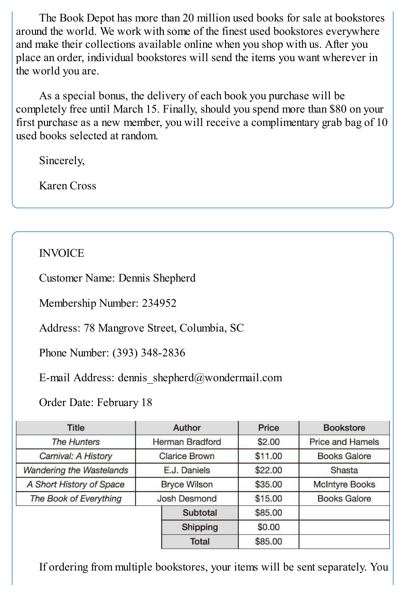


```text
The Book Depot has more than 20 million used books for sale at bookstores
around the world. We work with some of the finest used bookstores everywhere
and make their collections available online when you shop with us. After you
place an order, individual bookstores will send the items you want wherever in
the world you are.
As a special bonus, the delivery of each book you purchase will be
completely free until March 15. Finally, should you spend more than $80 on your
first purchase as a new member, you will receive a complimentary grab bag of 10
used books selected at random.
Sincerely,
Karen Cross
INVOICE
Customer Name: Dennis Shepherd
Membership Number: 234952
Address: 78 Mangrove Street, Columbia, SC
Phone Number: (393) 348-2836
E-mail Address: dennis_shepherd@wondermail.com
Order Date: February 18
If ordering from multiple bookstores, your items will be sent separately. You
1170
```

## PDF 第 400 页

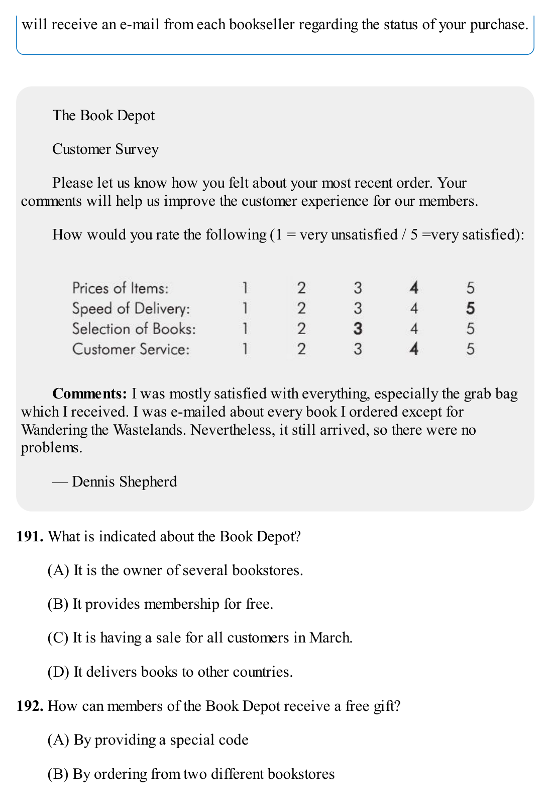


```text
will receive an e-mail from each bookseller regarding the status of your purchase.
The Book Depot
Customer Survey
Please let us know how you felt about your most recent order. Your
comments will help us improve the customer experience for our members.
How would you rate the following (1 = very unsatisfied / 5 =very satisfied):
Comments:
 I was mostly satisfied with everything, especially the grab bag
which I received. I was e-mailed about every book I ordered except for
Wandering the Wastelands. Nevertheless, it still arrived, so there were no
problems.
— Dennis Shepherd
191.
 What is indicated about the Book Depot?
(A) It is the owner of several bookstores.
(B) It provides membership for free.
(C) It is having a sale for all customers in March.
(D) It delivers books to other countries.
192.
 How can members of the Book Depot receive a free gift?
(A) By providing a special code
(B) By ordering from two different bookstores
1171
```

## PDF 第 401 页

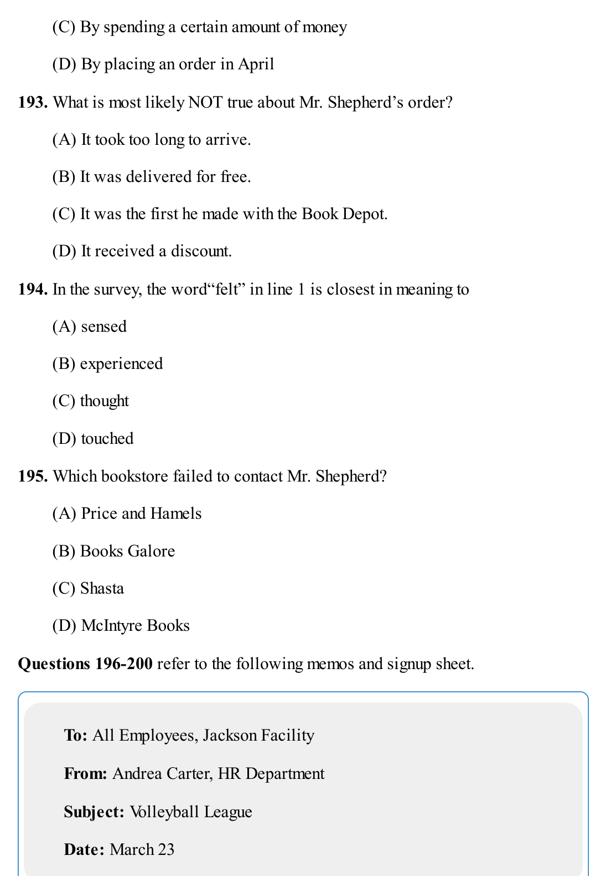


```text
(C) By spending a certain amount of money
(D) By placing an order in April
193.
 What is most likely NOT true about Mr. Shepherd’s order?
(A) It took too long to arrive.
(B) It was delivered for free.
(C) It was the first he made with the Book Depot.
(D) It received a discount.
194.
 In the survey, the word“felt” in line 1 is closest in meaning to
(A) sensed
(B) experienced
(C) thought
(D) touched
195.
 Which bookstore failed to contact Mr. Shepherd?
(A) Price and Hamels
(B) Books Galore
(C) Shasta
(D) McIntyre Books
Questions 196-200
 refer to the following memos and signup sheet.
To:
 All Employees, Jackson Facility
From:
 Andrea Carter, HR Department
Subject:
 Volleyball League
Date:
 March 23
1172
```

## PDF 第 402 页

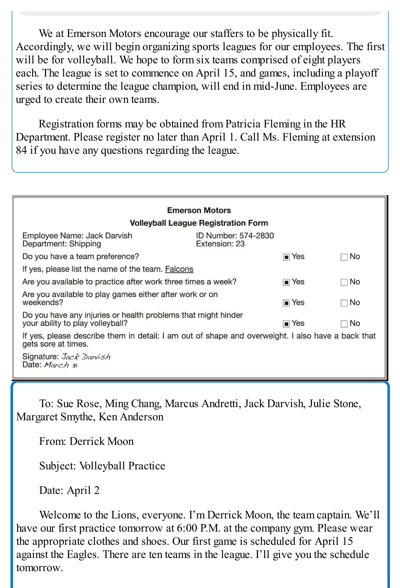


```text
We at Emerson Motors encourage our staffers to be physically fit.
Accordingly, we will begin organizing sports leagues for our employees. The first
will be for volleyball. We hope to form six teams comprised of eight players
each. The league is set to commence on April 15, and games, including a playoff
series to determine the league champion, will end in mid-June. Employees are
urged to create their own teams.
Registration forms may be obtained from Patricia Fleming in the HR
Department. Please register no later than April 1. Call Ms. Fleming at extension
84 if you have any questions regarding the league.
To: Sue Rose, Ming Chang, Marcus Andretti, Jack Darvish, Julie Stone,
Margaret Smythe, Ken Anderson
From: Derrick Moon
Subject: Volleyball Practice
Date: April 2
Welcome to the Lions, everyone. I’m Derrick Moon, the team captain. We’ll
have our first practice tomorrow at 6:00 P.M. at the company gym. Please wear
the appropriate clothes and shoes. Our first game is scheduled for April 15
against the Eagles. There are ten teams in the league. I’ll give you the schedule
tomorrow.
1173
```

## PDF 第 403 页

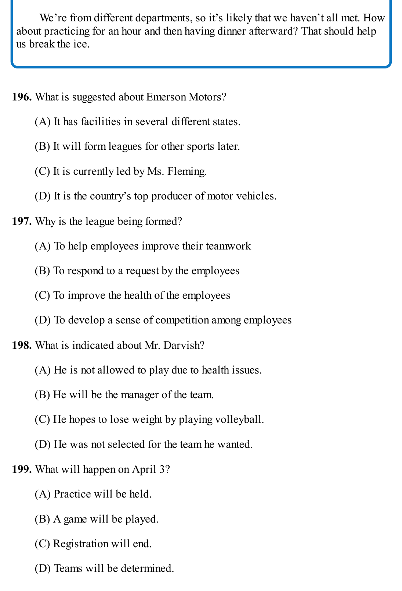


```text
We’re from different departments, so it’s likely that we haven’t all met. How
about practicing for an hour and then having dinner afterward? That should help
us break the ice.
196.
 What is suggested about Emerson Motors?
(A) It has facilities in several different states.
(B) It will form leagues for other sports later.
(C) It is currently led by Ms. Fleming.
(D) It is the country’s top producer of motor vehicles.
197.
 Why is the league being formed?
(A) To help employees improve their teamwork
(B) To respond to a request by the employees
(C) To improve the health of the employees
(D) To develop a sense of competition among employees
198.
 What is indicated about Mr. Darvish?
(A) He is not allowed to play due to health issues.
(B) He will be the manager of the team.
(C) He hopes to lose weight by playing volleyball.
(D) He was not selected for the team he wanted.
199.
 What will happen on April 3?
(A) Practice will be held.
(B) A game will be played.
(C) Registration will end.
(D) Teams will be determined.
1174
```

## PDF 第 404 页

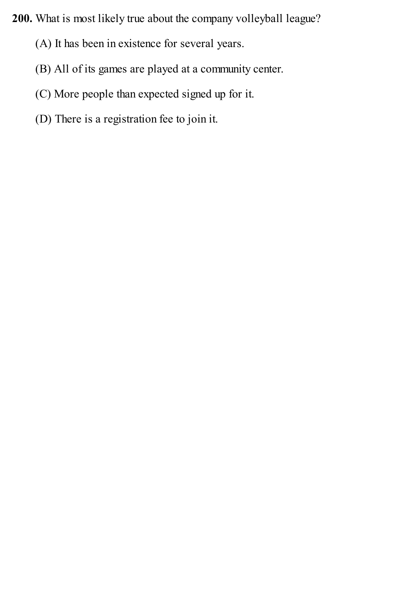


```text
200.
 What is most likely true about the company volleyball league?
(A) It has been in existence for several years.
(B) All of its games are played at a community center.
(C) More people than expected signed up for it.
(D) There is a registration fee to join it.
1175
```

## PDF 第 405 页

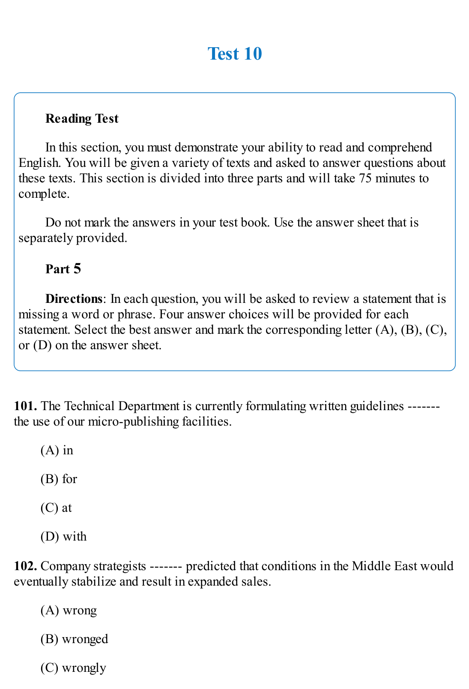


```text
Test 10
Reading Test
In this section, you must demonstrate your ability to read and comprehend
English. You will be given a variety of texts and asked to answer questions about
these texts. This section is divided into three parts and will take 75 minutes to
complete.
Do not mark the answers in your test book. Use the answer sheet that is
separately provided.
Part
5
Directions
: In each question, you will be asked to review a statement that is
missing a word or phrase. Four answer choices will be provided for each
statement. Select the best answer and mark the corresponding letter (A), (B), (C),
or (D) on the answer sheet.
101.
 The Technical Department is currently formulating written guidelines -------
the use of our micro-publishing facilities.
(A) in
(B) for
(C) at
(D) with
102.
 Company strategists ------- predicted that conditions in the Middle East would
eventually stabilize and result in expanded sales.
(A) wrong
(B) wronged
(C) wrongly
1176
```

## PDF 第 406 页

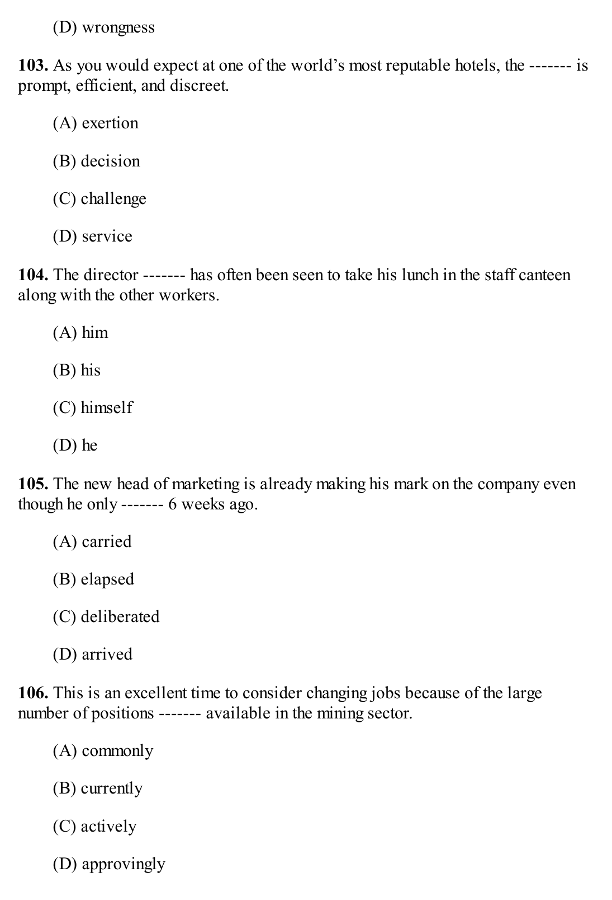


```text
(D) wrongness
103.
 As you would expect at one of the world’s most reputable hotels, the ------- is
prompt, efficient, and discreet.
(A) exertion
(B) decision
(C) challenge
(D) service
104.
 The director ------- has often been seen to take his lunch in the staff canteen
along with the other workers.
(A) him
(B) his
(C) himself
(D) he
105.
 The new head of marketing is already making his mark on the company even
though he only ------- 6 weeks ago.
(A) carried
(B) elapsed
(C) deliberated
(D) arrived
106.
 This is an excellent time to consider changing jobs because of the large
number of positions ------- available in the mining sector.
(A) commonly
(B) currently
(C) actively
(D) approvingly
1177
```

## PDF 第 407 页

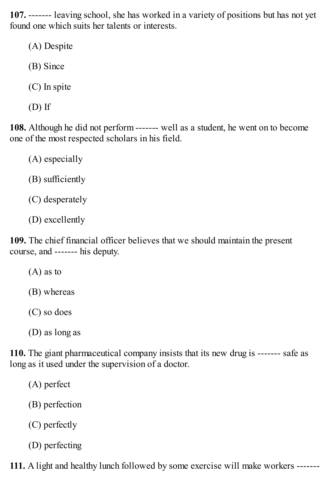


```text
107.
 ------- leaving school, she has worked in a variety of positions but has not yet
found one which suits her talents or interests.
(A) Despite
(B) Since
(C) In spite
(D) If
108.
 Although he did not perform ------- well as a student, he went on to become
one of the most respected scholars in his field.
(A) especially
(B) sufficiently
(C) desperately
(D) excellently
109.
 The chief financial officer believes that we should maintain the present
course, and ------- his deputy.
(A) as to
(B) whereas
(C) so does
(D) as long as
110.
 The giant pharmaceutical company insists that its new drug is ------- safe as
long as it used under the supervision of a doctor.
(A) perfect
(B) perfection
(C) perfectly
(D) perfecting
111.
 A light and healthy lunch followed by some exercise will make workers -------
1178
```

## PDF 第 408 页

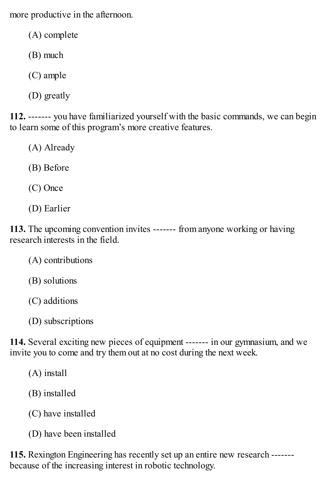


```text
more productive in the afternoon.
(A) complete
(B) much
(C) ample
(D) greatly
112.
 ------- you have familiarized yourself with the basic commands, we can begin
to learn some of this program’s more creative features.
(A) Already
(B) Before
(C) Once
(D) Earlier
113.
 The upcoming convention invites ------- from anyone working or having
research interests in the field.
(A) contributions
(B) solutions
(C) additions
(D) subscriptions
114.
 Several exciting new pieces of equipment ------- in our gymnasium, and we
invite you to come and try them out at no cost during the next week.
(A) install
(B) installed
(C) have installed
(D) have been installed
115.
 Rexington Engineering has recently set up an entire new research -------
because of the increasing interest in robotic technology.
1179
```

## PDF 第 409 页

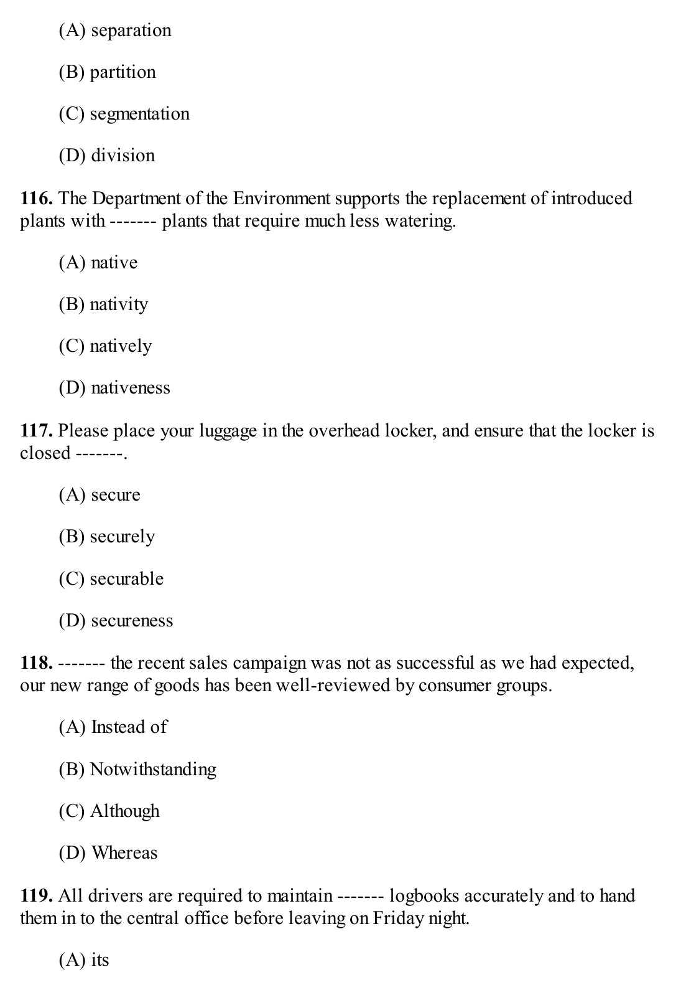


```text
(A) separation
(B) partition
(C) segmentation
(D) division
116.
 The Department of the Environment supports the replacement of introduced
plants with ------- plants that require much less watering.
(A) native
(B) nativity
(C) natively
(D) nativeness
117.
 Please place your luggage in the overhead locker, and ensure that the locker is
closed -------.
(A) secure
(B) securely
(C) securable
(D) secureness
118.
 ------- the recent sales campaign was not as successful as we had expected,
our new range of goods has been well-reviewed by consumer groups.
(A) Instead of
(B) Notwithstanding
(C) Although
(D) Whereas
119.
 All drivers are required to maintain ------- logbooks accurately and to hand
them in to the central office before leaving on Friday night.
(A) its
1180
```

## PDF 第 410 页

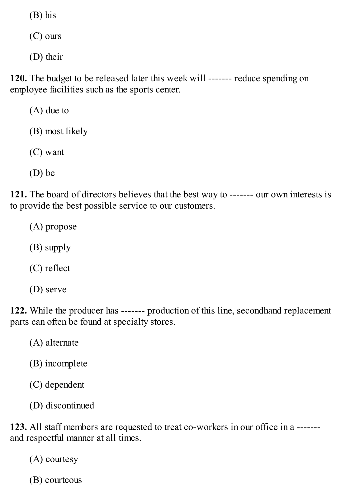


```text
(B) his
(C) ours
(D) their
120.
 The budget to be released later this week will ------- reduce spending on
employee facilities such as the sports center.
(A) due to
(B) most likely
(C) want
(D) be
121.
 The board of directors believes that the best way to ------- our own interests is
to provide the best possible service to our customers.
(A) propose
(B) supply
(C) reflect
(D) serve
122.
 While the producer has ------- production of this line, secondhand replacement
parts can often be found at specialty stores.
(A) alternate
(B) incomplete
(C) dependent
(D) discontinued
123.
 All staff members are requested to treat co-workers in our office in a -------
and respectful manner at all times.
(A) courtesy
(B) courteous
1181
```

## PDF 第 411 页

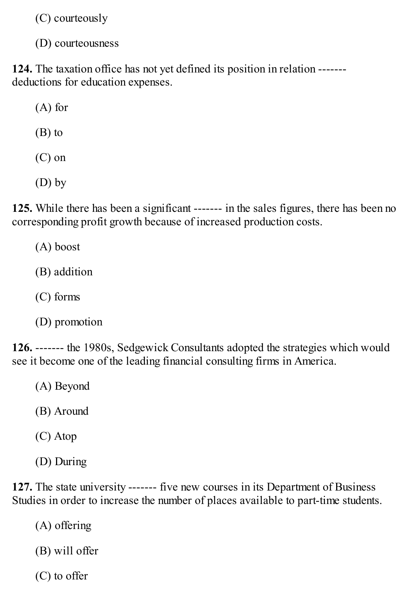


```text
(C) courteously
(D) courteousness
124.
 The taxation office has not yet defined its position in relation -------
deductions for education expenses.
(A) for
(B) to
(C) on
(D) by
125.
 While there has been a significant ------- in the sales figures, there has been no
corresponding profit growth because of increased production costs.
(A) boost
(B) addition
(C) forms
(D) promotion
126
.
 ------- the 1980s, Sedgewick Consultants adopted the strategies which would
see it become one of the leading financial consulting firms in America.
(A) Beyond
(B) Around
(C) Atop
(D) During
127.
 The state university ------- five new courses in its Department of Business
Studies in order to increase the number of places available to part-time students.
(A) offering
(B) will offer
(C) to offer
1182
```

## PDF 第 412 页

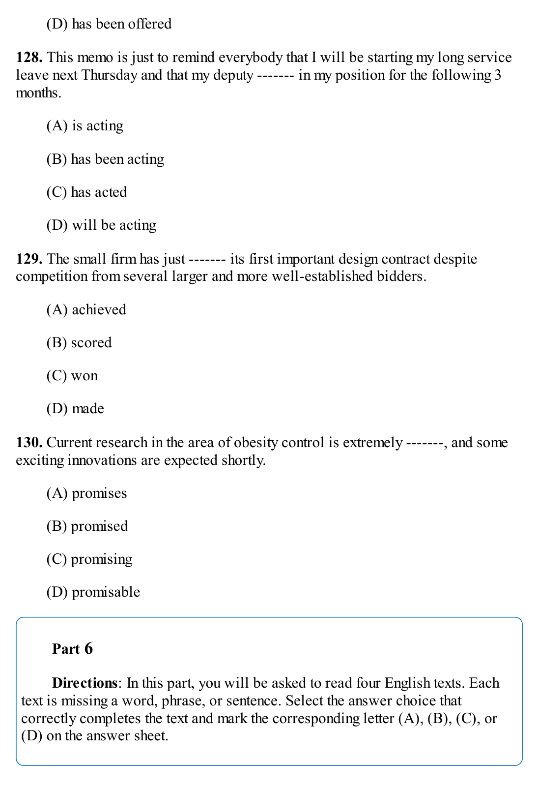


```text
(D) has been offered
128.
 This memo is just to remind everybody that I will be starting my long service
leave next Thursday and that my deputy ------- in my position for the following 3
months.
(A) is acting
(B) has been acting
(C) has acted
(D) will be acting
129.
 The small firm has just ------- its first important design contract despite
competition from several larger and more well-established bidders.
(A) achieved
(B) scored
(C) won
(D) made
130.
 Current research in the area of obesity control is extremely -------, and some
exciting innovations are expected shortly.
(A) promises
(B) promised
(C) promising
(D) promisable
Part
6
Directions
: In this part, you will be asked to read four English texts. Each
text is missing a word, phrase, or sentence. Select the answer choice that
correctly completes the text and mark the corresponding letter (A), (B), (C), or
(D) on the answer sheet.
1183
```

## PDF 第 413 页

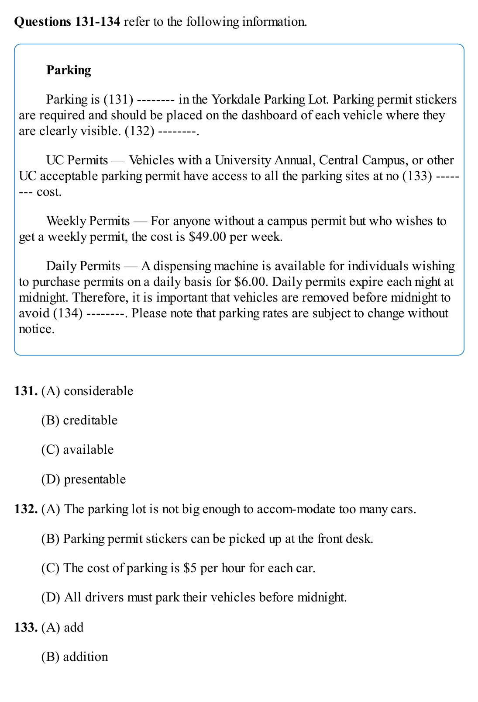


```text
Questions 131-134
 refer to the following information.
Parking
Parking is (131) -------- in the Yorkdale Parking Lot. Parking permit stickers
are required and should be placed on the dashboard of each vehicle where they
are clearly visible. (132) --------.
UC Permits — Vehicles with a University Annual, Central Campus, or other
UC acceptable parking permit have access to all the parking sites at no (133) -----
--- cost.
Weekly Permits — For anyone without a campus permit but who wishes to
get a weekly permit, the cost is $49.00 per week.
Daily Permits — A dispensing machine is available for individuals wishing
to purchase permits on a daily basis for $6.00. Daily permits expire each night at
midnight. Therefore, it is important that vehicles are removed before midnight to
avoid (134) --------. Please note that parking rates are subject to change without
notice.
131.
 (A) considerable
(B) creditable
(C) available
(D) presentable
132.
 (A) The parking lot is not big enough to accom-modate too many cars.
(B) Parking permit stickers can be picked up at the front desk.
(C) The cost of parking is $5 per hour for each car.
(D) All drivers must park their vehicles before midnight.
133.
 (A) add
(B) addition
1184
```

## PDF 第 414 页

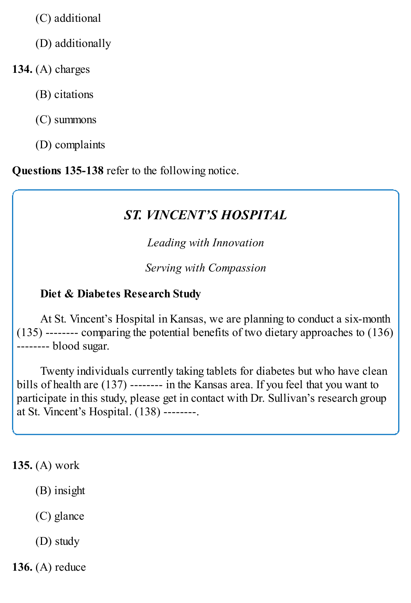


```text
(C) additional
(D) additionally
134.
 (A) charges
(B) citations
(C) summons
(D) complaints
Questions 135-138
 refer to the following notice.
ST. VINCENT’S HOSPITAL
Leading with Innovation
Serving with Compassion
Diet & Diabetes Research Study
At St. Vincent’s Hospital in Kansas, we are planning to conduct a six-month
(135) -------- comparing the potential benefits of two dietary approaches to (136)
-------- blood sugar.
Twenty individuals currently taking tablets for diabetes but who have clean
bills of health are (137) -------- in the Kansas area. If you feel that you want to
participate in this study, please get in contact with Dr. Sullivan’s research group
at St. Vincent’s Hospital. (138) --------.
135.
 (A) work
(B) insight
(C) glance
(D) study
136.
 (A) reduce
1185
```

## PDF 第 415 页

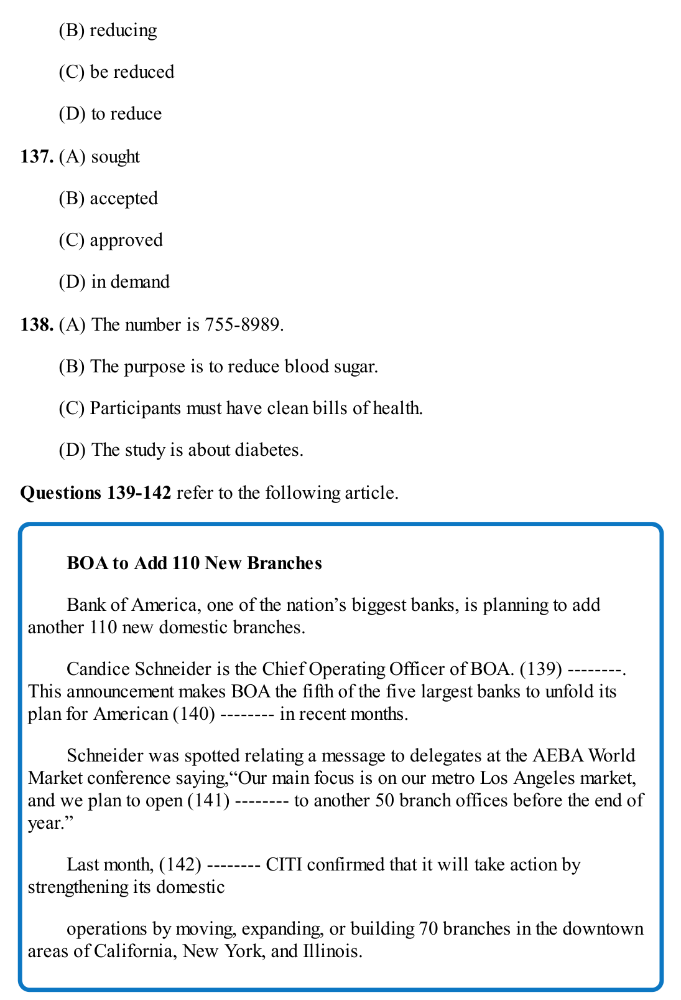


```text
(B) reducing
(C) be reduced
(D) to reduce
137.
 (A) sought
(B) accepted
(C) approved
(D) in demand
138.
 (A) The number is 755-8989.
(B) The purpose is to reduce blood sugar.
(C) Participants must have clean bills of health.
(D) The study is about diabetes.
Questions 139-142
 refer to the following article.
BOA to Add 110 New Branches
Bank of America, one of the nation’s biggest banks, is planning to add
another 110 new domestic branches.
Candice Schneider is the Chief Operating Officer of BOA. (139) --------.
This announcement makes BOA the fifth of the five largest banks to unfold its
plan for American (140) -------- in recent months.
Schneider was spotted relating a message to delegates at the AEBA World
Market conference saying,“Our main focus is on our metro Los Angeles market,
and we plan to open (141) -------- to another 50 branch offices before the end of
year.”
Last month, (142) -------- CITI confirmed that it will take action by
strengthening its domestic
operations by moving, expanding, or building 70 branches in the downtown
areas of California, New York, and Illinois.
1186
```

## PDF 第 416 页

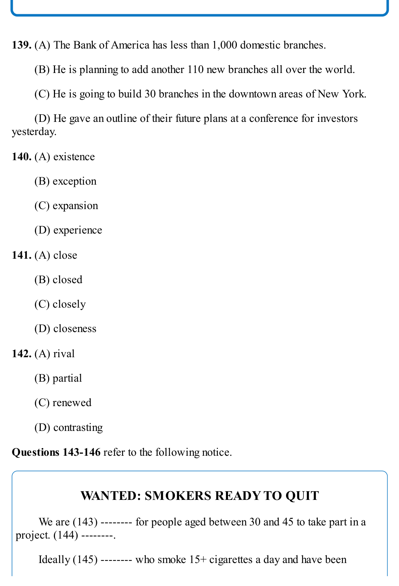


```text
139.
 (A) The Bank of America has less than 1,000 domestic branches.
(B) He is planning to add another 110 new branches all over the world.
(C) He is going to build 30 branches in the downtown areas of New York.
(D) He gave an outline of their future plans at a conference for investors
yesterday.
140.
 (A) existence
(B) exception
(C) expansion
(D) experience
141.
 (A) close
(B) closed
(C) closely
(D) closeness
142.
 (A) rival
(B) partial
(C) renewed
(D) contrasting
Questions 143-146
 refer to the following notice.
WANTED: SMOKERS READY TO QUIT
We are (143) -------- for people aged between 30 and 45 to take part in a
project. (144) --------.
Ideally (145) -------- who smoke 15+ cigarettes a day and have been
1187
```

## PDF 第 417 页

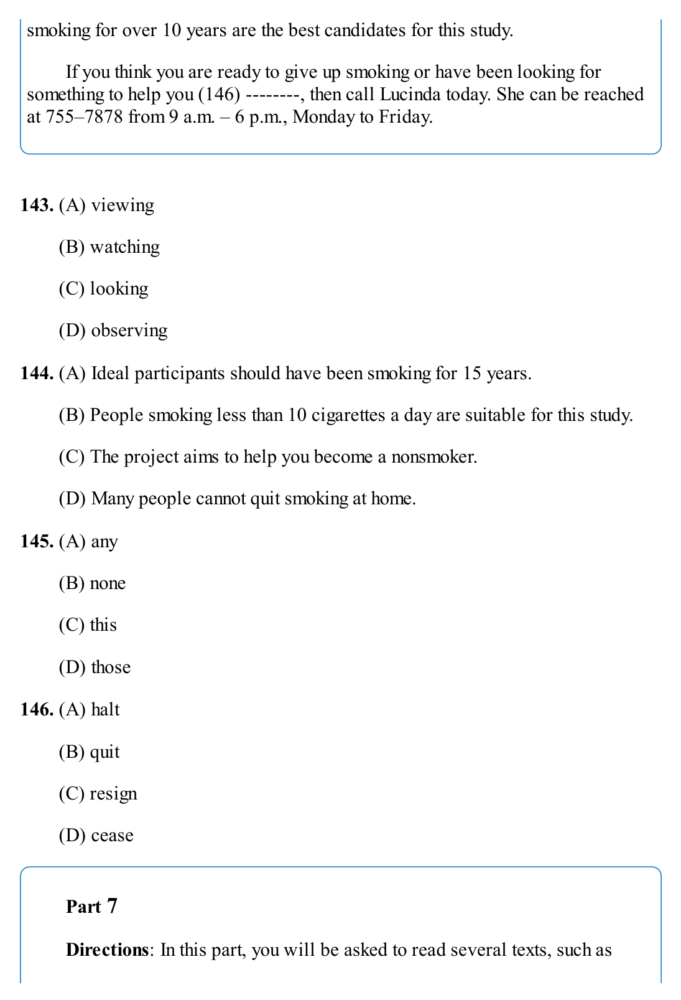


```text
smoking for over 10 years are the best candidates for this study.
If you think you are ready to give up smoking or have been looking for
something to help you (146) --------, then call Lucinda today. She can be reached
at 755–7878 from 9 a.m. – 6 p.m., Monday to Friday.
143.
 (A) viewing
(B) watching
(C) looking
(D) observing
144.
 (A) Ideal participants should have been smoking for 15 years.
(B) People smoking less than 10 cigarettes a day are suitable for this study.
(C) The project aims to help you become a nonsmoker.
(D) Many people cannot quit smoking at home.
145.
 (A) any
(B) none
(C) this
(D) those
146.
 (A) halt
(B) quit
(C) resign
(D) cease
Part
7
Directions
: In this part, you will be asked to read several texts, such as
1188
```

## PDF 第 418 页

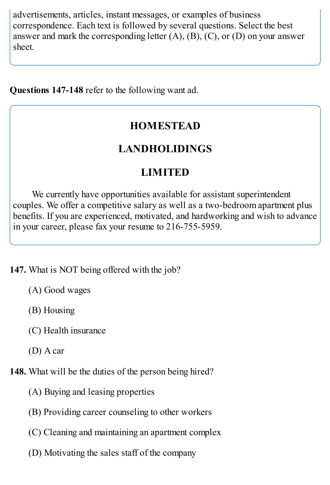


```text
advertisements, articles, instant messages, or examples of business
correspondence. Each text is followed by several questions. Select the best
answer and mark the corresponding letter (A), (B), (C), or (D) on your answer
sheet.
Questions 147-
148
 refer to the following want ad.
HOMESTEAD
LANDHOLIDINGS
LIMITED
We currently have opportunities available for assistant superintendent
couples. We offer a competitive salary as well as a two-bedroom apartment plus
benefits. If you are experienced, motivated, and hardworking and wish to advance
in your career, please fax your resume to 216-755-5959.
147.
 What is NOT being offered with the job?
(A) Good wages
(B) Housing
(C) Health insurance
(D) A car
148.
 What will be the duties of the person being hired?
(A) Buying and leasing properties
(B) Providing career counseling to other workers
(C) Cleaning and maintaining an apartment complex
(D) Motivating the sales staff of the company
1189
```

## PDF 第 419 页

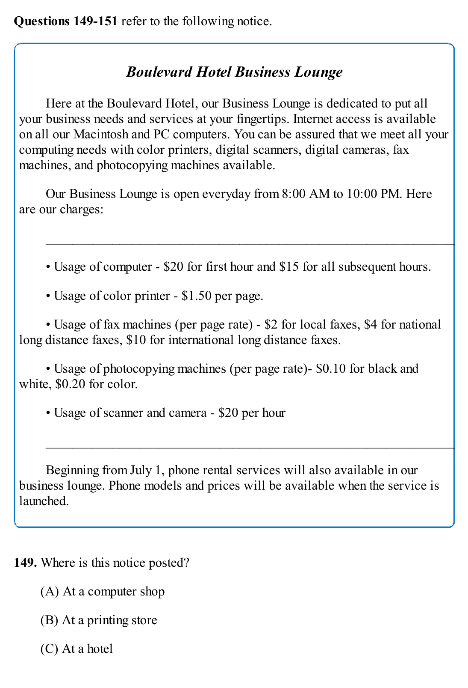


```text
Questions 149-
151
 refer to the following notice.
Boulevard Hotel Business Lounge
Here at the Boulevard Hotel, our Business Lounge is dedicated to put all
your business needs and services at your fingertips. Internet access is available
on all our Macintosh and PC computers. You can be assured that we meet all your
computing needs with color printers, digital scanners, digital cameras, fax
machines, and photocopying machines available.
Our Business Lounge is open everyday from 8:00 AM to 10:00 PM. Here
are our charges:
_____________________________________________________________________
• Usage of computer - $20 for first hour and $15 for all subsequent hours.
• Usage of color printer - $1.50 per page.
• Usage of fax machines (per page rate) - $2 for local faxes, $4 for national
long distance faxes, $10 for international long distance faxes.
• Usage of photocopying machines (per page rate)- $0.10 for black and
white, $0.20 for color.
• Usage of scanner and camera - $20 per hour
_____________________________________________________________________
Beginning from July 1, phone rental services will also available in our
business lounge. Phone models and prices will be available when the service is
launched.
149.
 Where is this notice posted?
(A) At a computer shop
(B) At a printing store
(C) At a hotel
1190
```

## PDF 第 420 页

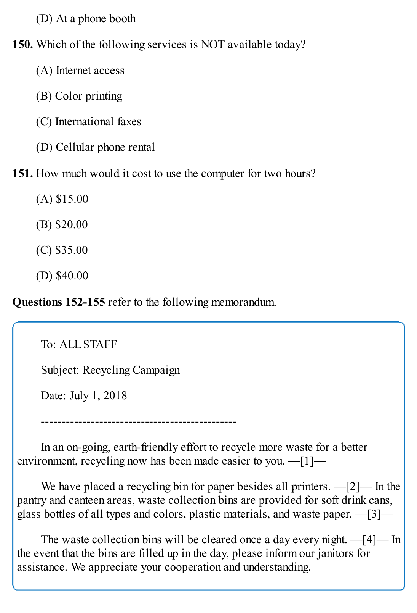


```text
(D) At a phone booth
150.
 Which of the following services is NOT available today?
(A) Internet access
(B) Color printing
(C) International faxes
(D) Cellular phone rental
151.
 How much would it cost to use the computer for two hours?
(A) $15.00
(B) $20.00
(C) $35.00
(D) $40.00
Questions 152-155
 refer to the following memorandum.
To: ALL STAFF
Subject: Recycling Campaign
Date: July 1, 2018
-----------------------------------------------
In an on-going, earth-friendly effort to recycle more waste for a better
environment, recycling now has been made easier to you. —[1]—
We have placed a recycling bin for paper besides all printers. —[2]— In the
pantry and canteen areas, waste collection bins are provided for soft drink cans,
glass bottles of all types and colors, plastic materials, and waste paper. —[3]—
The waste collection bins will be cleared once a day every night. —[4]— In
the event that the bins are filled up in the day, please inform our janitors for
assistance. We appreciate your cooperation and understanding.
1191
```

## PDF 第 421 页

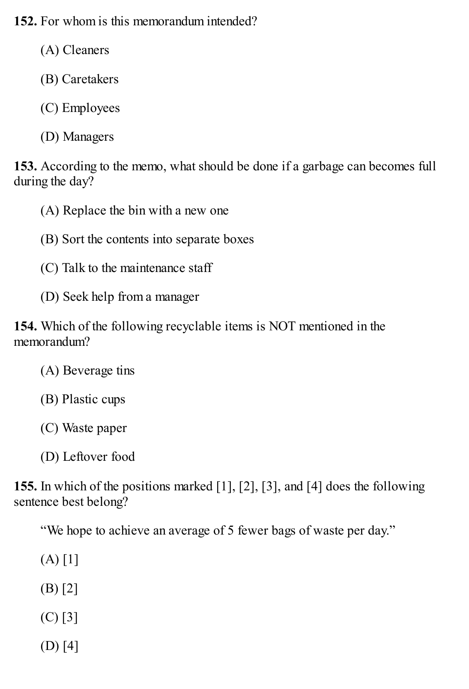


```text
152.
 For whom is this memorandum intended?
(A) Cleaners
(B) Caretakers
(C) Employees
(D) Managers
153.
 According to the memo, what should be done if a garbage can becomes full
during the day?
(A) Replace the bin with a new one
(B) Sort the contents into separate boxes
(C) Talk to the maintenance staff
(D) Seek help from a manager
154.
 Which of the following recyclable items is NOT mentioned in the
memorandum?
(A) Beverage tins
(B) Plastic cups
(C) Waste paper
(D) Leftover food
155.
 In which of the positions marked [1], [2], [3], and [4] does the following
sentence best belong?
“We hope to achieve an average of 5 fewer bags of waste per day.”
(A) [1]
(B) [2]
(C) [3]
(D) [4]
1192
```

## PDF 第 422 页

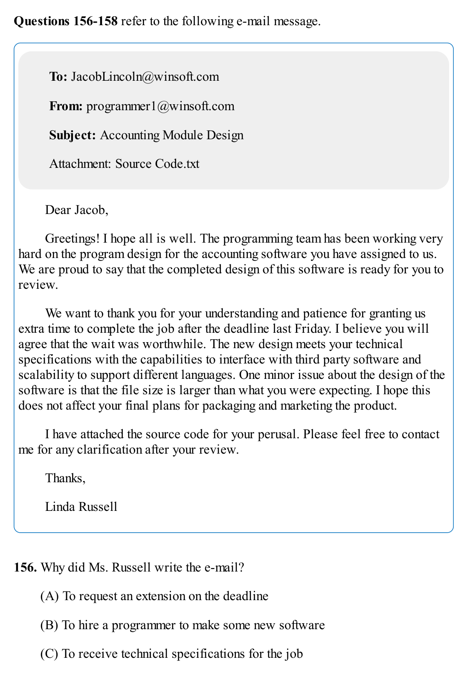


```text
Questions 156-158
 refer to the following e-mail message.
To:
 JacobLincoln@winsoft.com
From:
 programmer1@winsoft.com
Subject:
 Accounting Module Design
Attachment: Source Code.txt
Dear Jacob,
Greetings! I hope all is well. The programming team has been working very
hard on the program design for the accounting software you have assigned to us.
We are proud to say that the completed design of this software is ready for you to
review.
We want to thank you for your understanding and patience for granting us
extra time to complete the job after the deadline last Friday. I believe you will
agree that the wait was worthwhile. The new design meets your technical
specifications with the capabilities to interface with third party software and
scalability to support different languages. One minor issue about the design of the
software is that the file size is larger than what you were expecting. I hope this
does not affect your final plans for packaging and marketing the product.
I have attached the source code for your perusal. Please feel free to contact
me for any clarification after your review.
Thanks,
Linda Russell
156.
 Why did Ms. Russell write the e-mail?
(A) To request an extension on the deadline
(B) To hire a programmer to make some new software
(C) To receive technical specifications for the job
1193
```

## PDF 第 423 页

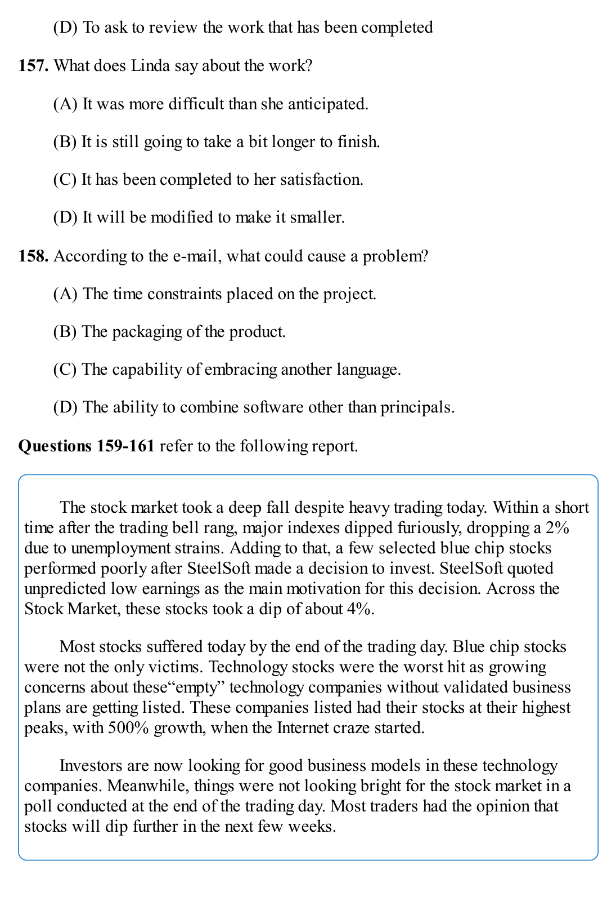


```text
(D) To ask to review the work that has been completed
157.
 What does Linda say about the work?
(A) It was more difficult than she anticipated.
(B) It is still going to take a bit longer to finish.
(C) It has been completed to her satisfaction.
(D) It will be modified to make it smaller.
158.
 According to the e-mail, what could cause a problem?
(A) The time constraints placed on the project.
(B) The packaging of the product.
(C) The capability of embracing another language.
(D) The ability to combine software other than principals.
Questions 159-161
 refer to the following report.
The stock market took a deep fall despite heavy trading today. Within a short
time after the trading bell rang, major indexes dipped furiously, dropping a 2%
due to unemployment strains. Adding to that, a few selected blue chip stocks
performed poorly after SteelSoft made a decision to invest. SteelSoft quoted
unpredicted low earnings as the main motivation for this decision. Across the
Stock Market, these stocks took a dip of about 4%.
Most stocks suffered today by the end of the trading day. Blue chip stocks
were not the only victims. Technology stocks were the worst hit as growing
concerns about these“empty” technology companies without validated business
plans are getting listed. These companies listed had their stocks at their highest
peaks, with 500% growth, when the Internet craze started.
Investors are now looking for good business models in these technology
companies. Meanwhile, things were not looking bright for the stock market in a
poll conducted at the end of the trading day. Most traders had the opinion that
stocks will dip further in the next few weeks.
1194
```

## PDF 第 424 页

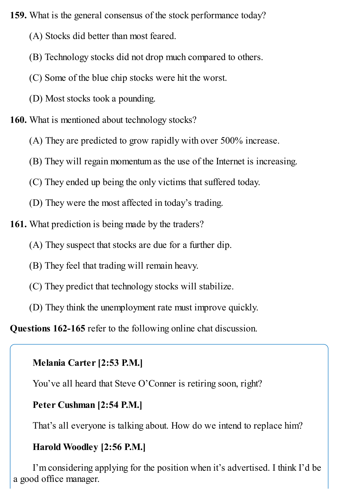


```text
159.
 What is the general consensus of the stock performance today?
(A) Stocks did better than most feared.
(B) Technology stocks did not drop much compared to others.
(C) Some of the blue chip stocks were hit the worst.
(D) Most stocks took a pounding.
160.
 What is mentioned about technology stocks?
(A) They are predicted to grow rapidly with over 500% increase.
(B) They will regain momentum as the use of the Internet is increasing.
(C) They ended up being the only victims that suffered today.
(D) They were the most affected in today’s trading.
161.
 What prediction is being made by the traders?
(A) They suspect that stocks are due for a further dip.
(B) They feel that trading will remain heavy.
(C) They predict that technology stocks will stabilize.
(D) They think the unemployment rate must improve quickly.
Questions 162-165
 refer to the following online chat discussion.
Melania Carter [2:53 P.M.]
You’ve all heard that Steve O’Conner is retiring soon, right?
Peter Cushman [2:54 P.M.]
That’s all everyone is talking about. How do we intend to replace him?
Harold Woodley [2:56 P.M.]
I’m considering applying for the position when it’s advertised. I think I’d be
a good office manager.
1195
```

## PDF 第 425 页

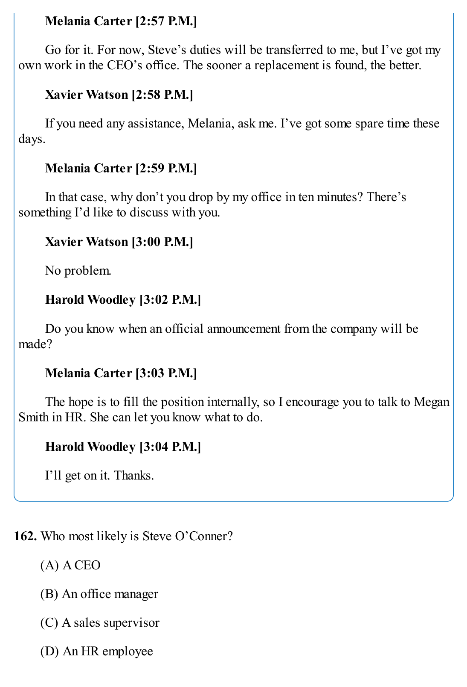


```text
Melania Carter [2:57 P.M.]
Go for it. For now, Steve’s duties will be transferred to me, but I’ve got my
own work in the CEO’s office. The sooner a replacement is found, the better.
Xavier Watson [2:58 P.M.]
If you need any assistance, Melania, ask me. I’ve got some spare time these
days.
Melania Carter [2:59 P.M.]
In that case, why don’t you drop by my office in ten minutes? There’s
something I’d like to discuss with you.
Xavier Watson [3:00 P.M.]
No problem.
Harold Woodley [3:02 P.M.]
Do you know when an official announcement from the company will be
made?
Melania Carter [3:03 P.M.]
The hope is to fill the position internally, so I encourage you to talk to Megan
Smith in HR. She can let you know what to do.
Harold Woodley [3:04 P.M.]
I’ll get on it. Thanks.
162.
 Who most likely is Steve O’Conner?
(A) A CEO
(B) An office manager
(C) A sales supervisor
(D) An HR employee
1196
```

## PDF 第 426 页

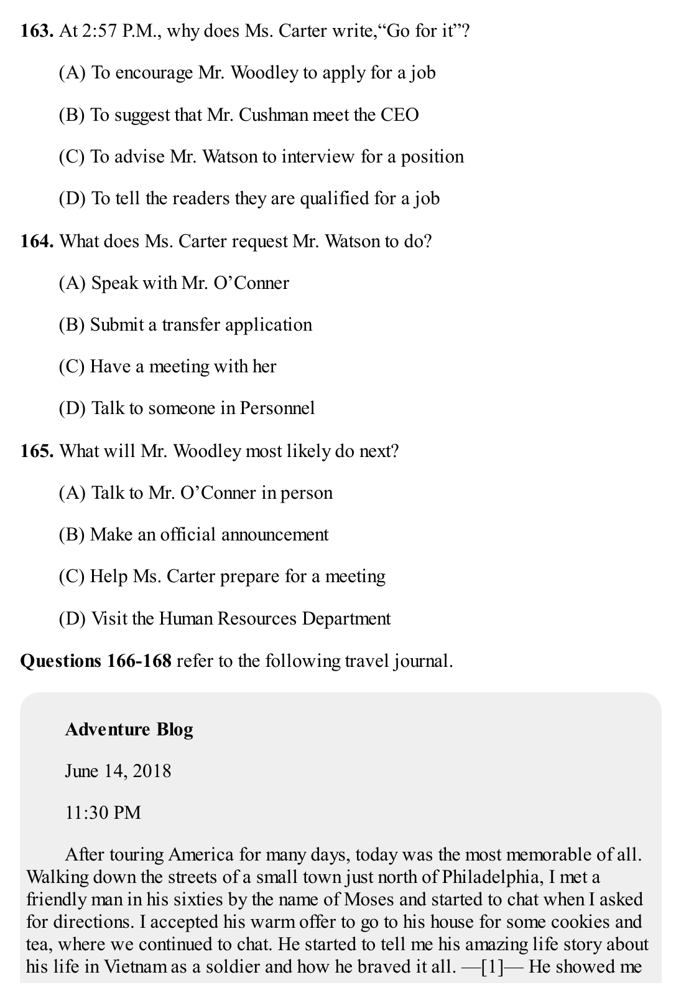


```text
163.
 At 2:57 P.M., why does Ms. Carter write,“Go for it”?
(A) To encourage Mr. Woodley to apply for a job
(B) To suggest that Mr. Cushman meet the CEO
(C) To advise Mr. Watson to interview for a position
(D) To tell the readers they are qualified for a job
164.
 What does Ms. Carter request Mr. Watson to do?
(A) Speak with Mr. O’Conner
(B) Submit a transfer application
(C) Have a meeting with her
(D) Talk to someone in Personnel
165.
 What will Mr. Woodley most likely do next?
(A) Talk to Mr. O’Conner in person
(B) Make an official announcement
(C) Help Ms. Carter prepare for a meeting
(D) Visit the Human Resources Department
Questions 166-168
 refer to the following travel journal.
Adventure Blog
June 14, 2018
11:30 PM
After touring America for many days, today was the most memorable of all.
Walking down the streets of a small town just north of Philadelphia, I met a
friendly man in his sixties by the name of Moses and started to chat when I asked
for directions. I accepted his warm offer to go to his house for some cookies and
tea, where we continued to chat. He started to tell me his amazing life story about
his life in Vietnam as a soldier and how he braved it all. —[1]— He showed me
1197
```

## PDF 第 427 页

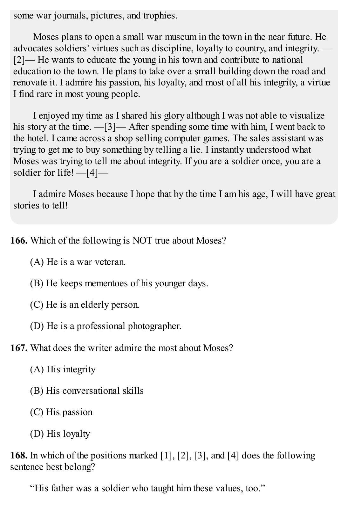


```text
some war journals, pictures, and trophies.
Moses plans to open a small war museum in the town in the near future. He
advocates soldiers’ virtues such as discipline, loyalty to country, and integrity. —
[2]— He wants to educate the young in his town and contribute to national
education to the town. He plans to take over a small building down the road and
renovate it. I admire his passion, his loyalty, and most of all his integrity, a virtue
I find rare in most young people.
I enjoyed my time as I shared his glory although I was not able to visualize
his story at the time. —[3]— After spending some time with him, I went back to
the hotel. I came across a shop selling computer games. The sales assistant was
trying to get me to buy something by telling a lie. I instantly understood what
Moses was trying to tell me about integrity. If you are a soldier once, you are a
soldier for life! —[4]—
I admire Moses because I hope that by the time I am his age, I will have great
stories to tell!
166.
 Which of the following is NOT true about Moses?
(A) He is a war veteran.
(B) He keeps mementoes of his younger days.
(C) He is an elderly person.
(D) He is a professional photographer.
167.
 What does the writer admire the most about Moses?
(A) His integrity
(B) His conversational skills
(C) His passion
(D) His loyalty
168.
 In which of the positions marked [1], [2], [3], and [4] does the following
sentence best belong?
“His father was a soldier who taught him these values, too.”
1198
```

## PDF 第 428 页

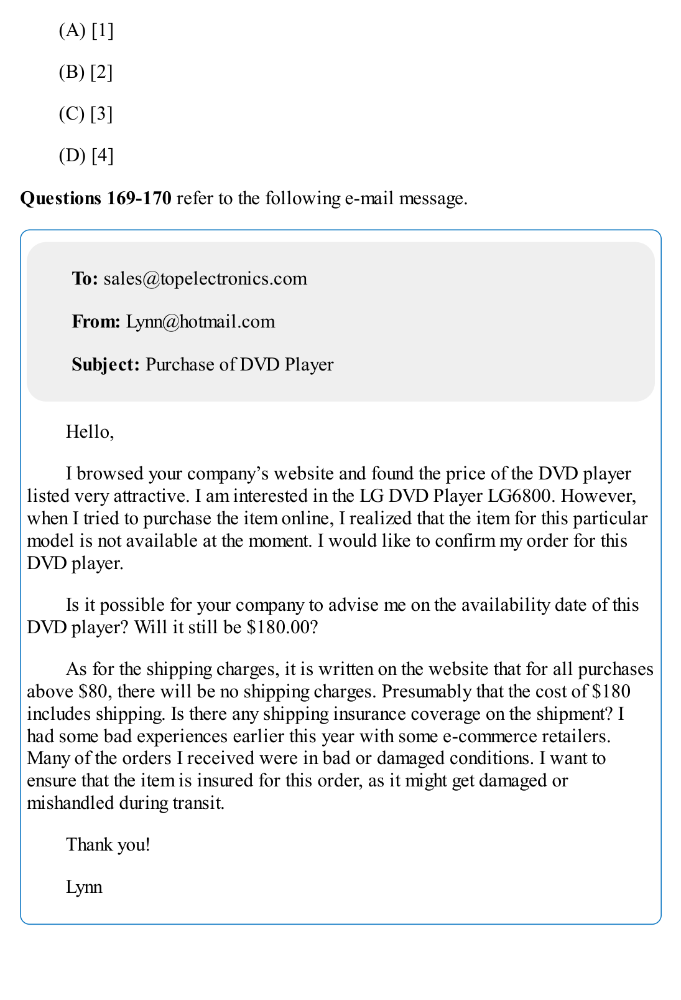


```text
(A) [1]
(B) [2]
(C) [3]
(D) [4]
Questions 169-170
 refer to the following e-mail message.
To:
 sales@topelectronics.com
From:
 Lynn@hotmail.com
Subject:
 Purchase of DVD Player
Hello,
I browsed your company’s website and found the price of the DVD player
listed very attractive. I am interested in the LG DVD Player LG6800. However,
when I tried to purchase the item online, I realized that the item for this particular
model is not available at the moment. I would like to confirm my order for this
DVD player.
Is it possible for your company to advise me on the availability date of this
DVD player? Will it still be $180.00?
As for the shipping charges, it is written on the website that for all purchases
above $80, there will be no shipping charges. Presumably that the cost of $180
includes shipping. Is there any shipping insurance coverage on the shipment? I
had some bad experiences earlier this year with some e-commerce retailers.
Many of the orders I received were in bad or damaged conditions. I want to
ensure that the item is insured for this order, as it might get damaged or
mishandled during transit.
Thank you!
Lynn
1199
```

## PDF 第 429 页

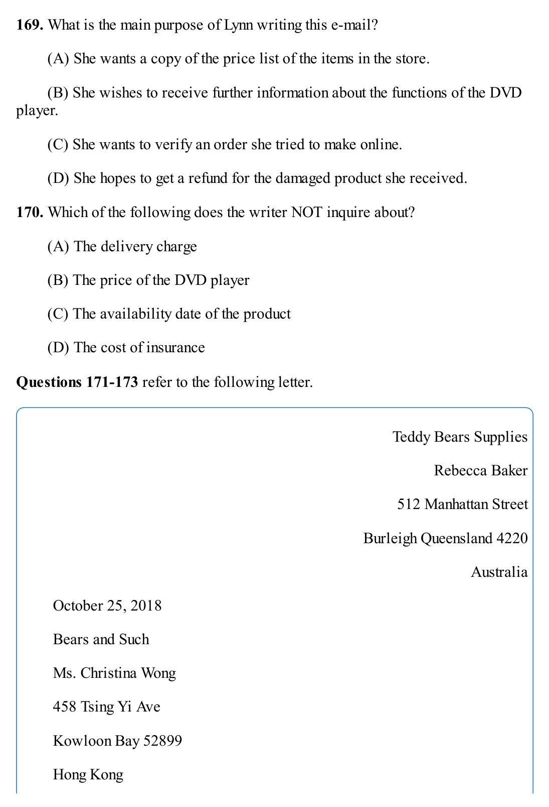


```text
169.
 What is the main purpose of Lynn writing this e-mail?
(A) She wants a copy of the price list of the items in the store.
(B) She wishes to receive further information about the functions of the DVD
player.
(C) She wants to verify an order she tried to make online.
(D) She hopes to get a refund for the damaged product she received.
170.
 Which of the following does the writer NOT inquire about?
(A) The delivery charge
(B) The price of the DVD player
(C) The availability date of the product
(D) The cost of insurance
Questions 171-173
 refer to the following letter.
Teddy Bears Supplies
Rebecca Baker
512 Manhattan Street
Burleigh Queensland 4220
Australia
October 25, 2018
Bears and Such
Ms. Christina Wong
458 Tsing Yi Ave
Kowloon Bay 52899
Hong Kong
1200
```

## PDF 第 430 页

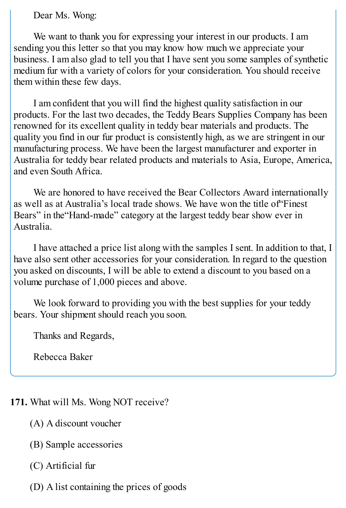


```text
Dear Ms. Wong:
We want to thank you for expressing your interest in our products. I am
sending you this letter so that you may know how much we appreciate your
business. I am also glad to tell you that I have sent you some samples of synthetic
medium fur with a variety of colors for your consideration. You should receive
them within these few days.
I am confident that you will find the highest quality satisfaction in our
products. For the last two decades, the Teddy Bears Supplies Company has been
renowned for its excellent quality in teddy bear materials and products. The
quality you find in our fur product is consistently high, as we are stringent in our
manufacturing process. We have been the largest manufacturer and exporter in
Australia for teddy bear related products and materials to Asia, Europe, America,
and even South Africa.
We are honored to have received the Bear Collectors Award internationally
as well as at Australia’s local trade shows. We have won the title of“Finest
Bears” in the“Hand-made” category at the largest teddy bear show ever in
Australia.
I have attached a price list along with the samples I sent. In addition to that, I
have also sent other accessories for your consideration. In regard to the question
you asked on discounts, I will be able to extend a discount to you based on a
volume purchase of 1,000 pieces and above.
We look forward to providing you with the best supplies for your teddy
bears. Your shipment should reach you soon.
Thanks and Regards,
Rebecca Baker
171.
 What will Ms. Wong NOT receive?
(A) A discount voucher
(B) Sample accessories
(C) Artificial fur
(D) A list containing the prices of goods
1201
```

## PDF 第 431 页

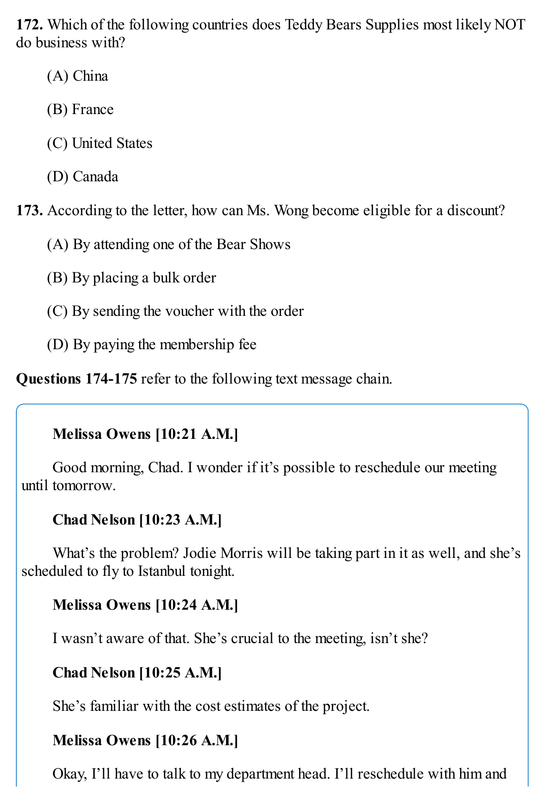


```text
172.
 Which of the following countries does Teddy Bears Supplies most likely NOT
do business with?
(A) China
(B) France
(C) United States
(D) Canada
173.
 According to the letter, how can Ms. Wong become eligible for a discount?
(A) By attending one of the Bear Shows
(B) By placing a bulk order
(C) By sending the voucher with the order
(D) By paying the membership fee
Questions 174-175
 refer to the following text message chain.
Melissa Owens [10:21 A.M.]
Good morning, Chad. I wonder if it’s possible to reschedule our meeting
until tomorrow.
Chad Nelson [10:23 A.M.]
What’s the problem? Jodie Morris will be taking part in it as well, and she’s
scheduled to fly to Istanbul tonight.
Melissa Owens [10:24 A.M.]
I wasn’t aware of that. She’s crucial to the meeting, isn’t she?
Chad Nelson [10:25 A.M.]
She’s familiar with the cost estimates of the project.
Melissa Owens [10:26 A.M.]
Okay, I’ll have to talk to my department head. I’ll reschedule with him and
1202
```

## PDF 第 432 页

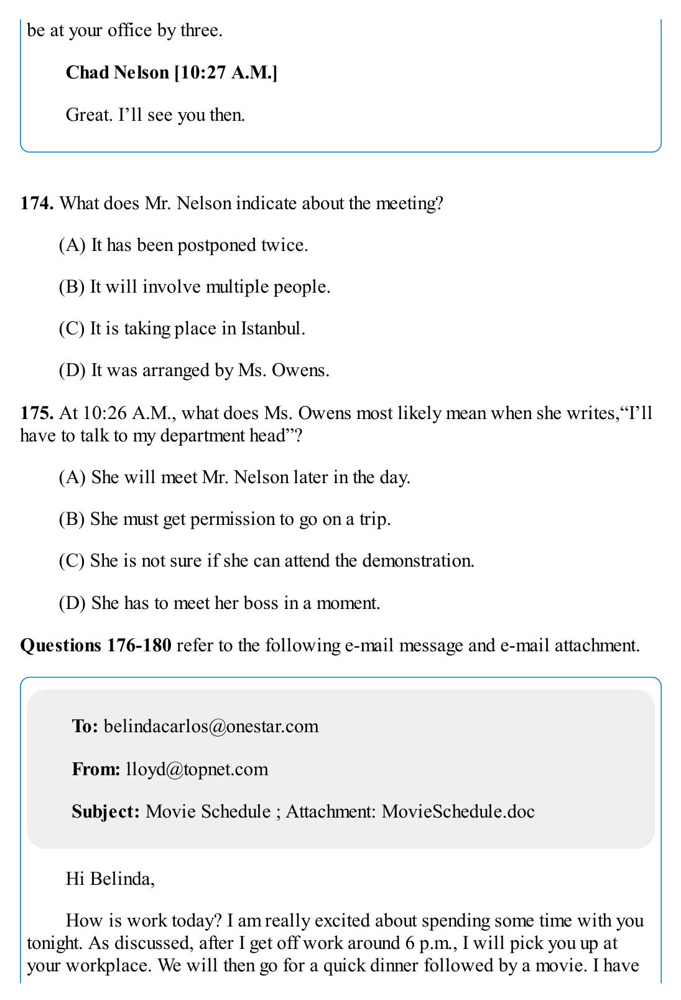


```text
be at your office by three.
Chad Nelson [10:27 A.M.]
Great. I’ll see you then.
174.
 What does Mr. Nelson indicate about the meeting?
(A) It has been postponed twice.
(B) It will involve multiple people.
(C) It is taking place in Istanbul.
(D) It was arranged by Ms. Owens.
175.
 At 10:26 A.M., what does Ms. Owens most likely mean when she writes,“I’ll
have to talk to my department head”?
(A) She will meet Mr. Nelson later in the day.
(B) She must get permission to go on a trip.
(C) She is not sure if she can attend the demonstration.
(D) She has to meet her boss in a moment.
Questions 176-180
 refer to the following e-mail message and e-mail attachment.
To:
 belindacarlos@onestar.com
From:
 lloyd@topnet.com
Subject:
 Movie Schedule ; Attachment: MovieSchedule.doc
Hi Belinda,
How is work today? I am really excited about spending some time with you
tonight. As discussed, after I get off work around 6 p.m., I will pick you up at
your workplace. We will then go for a quick dinner followed by a movie. I have
1203
```

## PDF 第 433 页

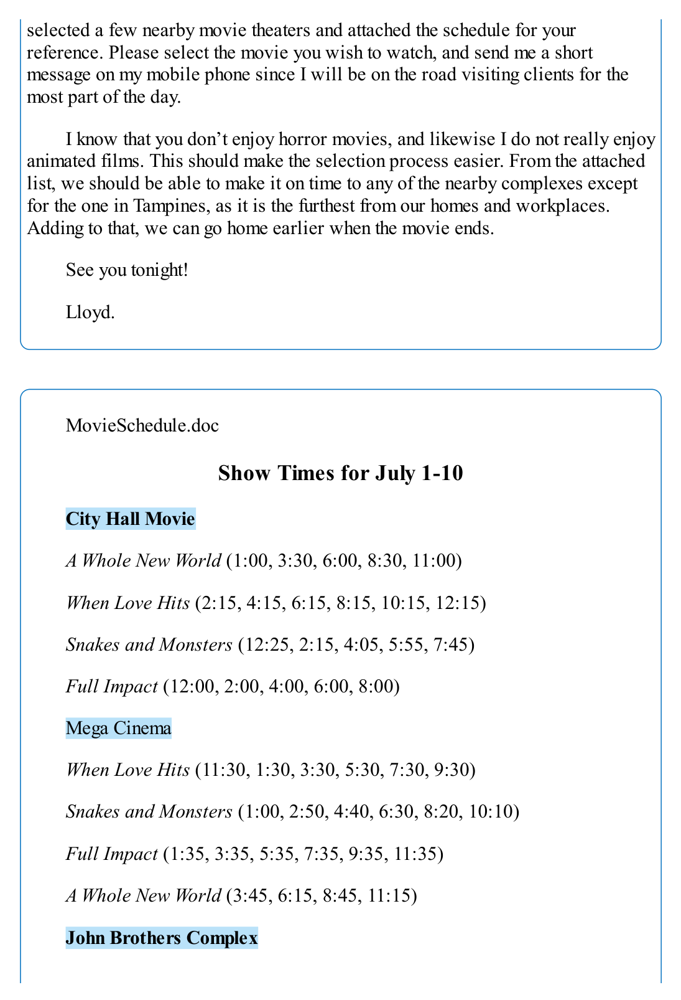


```text
selected a few nearby movie theaters and attached the schedule for your
reference. Please select the movie you wish to watch, and send me a short
message on my mobile phone since I will be on the road visiting clients for the
most part of the day.
I know that you don’t enjoy horror movies, and likewise I do not really enjoy
animated films. This should make the selection process easier. From the attached
list, we should be able to make it on time to any of the nearby complexes except
for the one in Tampines, as it is the furthest from our homes and workplaces.
Adding to that, we can go home earlier when the movie ends.
See you tonight!
Lloyd.
MovieSchedule.doc
Show Times for July 1-10
City Hall Movie
A Whole New World
 (1:00, 3:30, 6:00, 8:30, 11:00)
When Love Hits
 (2:15, 4:15, 6:15, 8:15, 10:15, 12:15)
Snakes and Monsters
 (12:25, 2:15, 4:05, 5:55, 7:45)
Full Impact
 (12:00, 2:00, 4:00, 6:00, 8:00)
Mega Cinema
When Love Hits
 (11:30, 1:30, 3:30, 5:30, 7:30, 9:30)
Snakes and Monsters
 (1:00, 2:50, 4:40, 6:30, 8:20, 10:10)
Full Impact
 (1:35, 3:35, 5:35, 7:35, 9:35, 11:35)
A Whole New World
 (3:45, 6:15, 8:45, 11:15)
John Brothers Complex
1204
```

## PDF 第 434 页

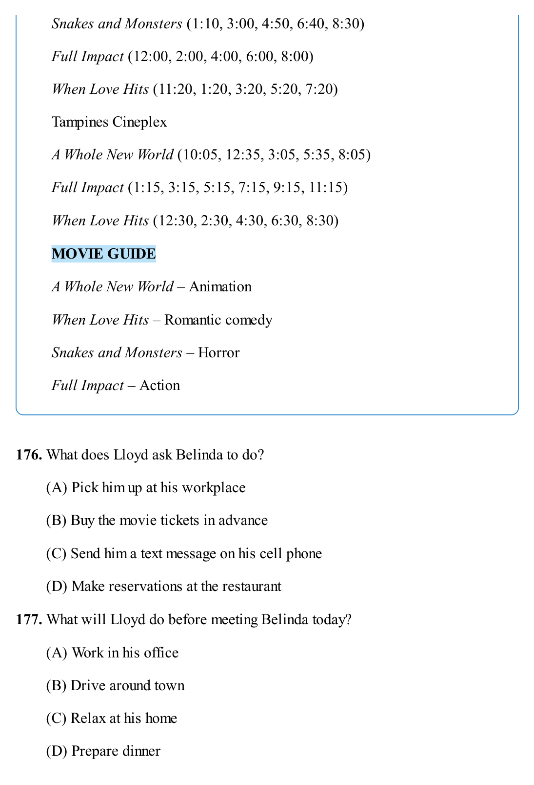


```text
Snakes and Monsters
 (1:10, 3:00, 4:50, 6:40, 8:30)
Full Impact
 (12:00, 2:00, 4:00, 6:00, 8:00)
When Love Hits
 (11:20, 1:20, 3:20, 5:20, 7:20)
Tampines Cineplex
A Whole New World
 (10:05, 12:35, 3:05, 5:35, 8:05)
Full Impact
 (1:15, 3:15, 5:15, 7:15, 9:15, 11:15)
When Love Hits
 (12:30, 2:30, 4:30, 6:30, 8:30)
MOVIE GUIDE
A Whole New World
 – Animation
When Love Hits
 – Romantic comedy
Snakes and Monsters
 – Horror
Full Impact
 – Action
176.
 What does Lloyd ask Belinda to do?
(A) Pick him up at his workplace
(B) Buy the movie tickets in advance
(C) Send him a text message on his cell phone
(D) Make reservations at the restaurant
177.
 What will Lloyd do before meeting Belinda today?
(A) Work in his office
(B) Drive around town
(C) Relax at his home
(D) Prepare dinner
1205
```

## PDF 第 435 页

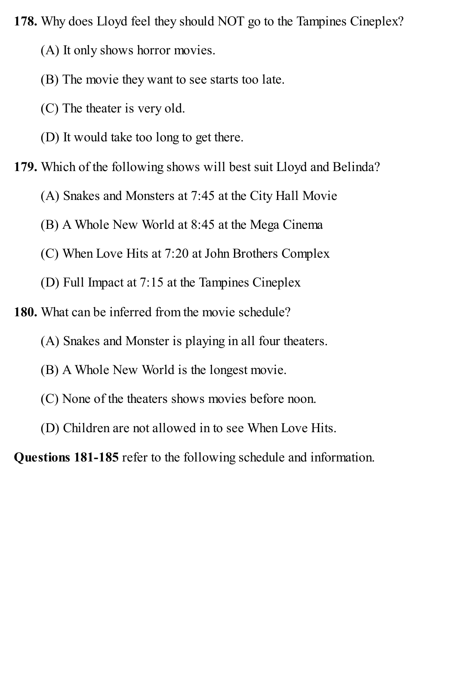


```text
178.
 Why does Lloyd feel they should NOT go to the Tampines Cineplex?
(A) It only shows horror movies.
(B) The movie they want to see starts too late.
(C) The theater is very old.
(D) It would take too long to get there.
179.
 Which of the following shows will best suit Lloyd and Belinda?
(A) Snakes and Monsters at 7:45 at the City Hall Movie
(B) A Whole New World at 8:45 at the Mega Cinema
(C) When Love Hits at 7:20 at John Brothers Complex
(D) Full Impact at 7:15 at the Tampines Cineplex
180.
 What can be inferred from the movie schedule?
(A) Snakes and Monster is playing in all four theaters.
(B) A Whole New World is the longest movie.
(C) None of the theaters shows movies before noon.
(D) Children are not allowed in to see When Love Hits.
Questions 181-185
 refer to the following schedule and information.
1206
```

## PDF 第 436 页

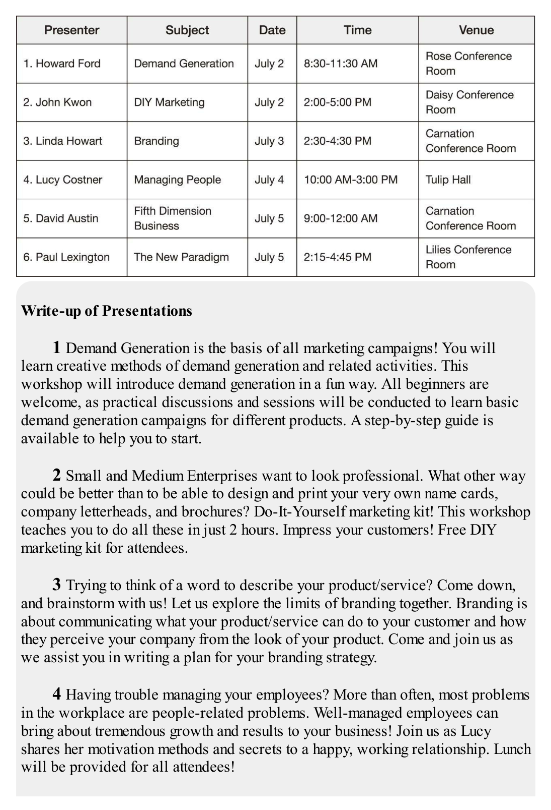


```text
Write-up of Presentations
1
 Demand Generation is the basis of all marketing campaigns! You will
learn creative methods of demand generation and related activities. This
workshop will introduce demand generation in a fun way. All beginners are
welcome, as practical discussions and sessions will be conducted to learn basic
demand generation campaigns for different products. A step-by-step guide is
available to help you to start.
2
 Small and Medium Enterprises want to look professional. What other way
could be better than to be able to design and print your very own name cards,
company letterheads, and brochures? Do-It-Yourself marketing kit! This workshop
teaches you to do all these in just 2 hours. Impress your customers! Free DIY
marketing kit for attendees.
3
 Trying to think of a word to describe your product/service? Come down,
and brainstorm with us! Let us explore the limits of branding together. Branding is
about communicating what your product/service can do to your customer and how
they perceive your company from the look of your product. Come and join us as
we assist you in writing a plan for your branding strategy.
4
 Having trouble managing your employees? More than often, most problems
in the workplace are people-related problems. Well-managed employees can
bring about tremendous growth and results to your business! Join us as Lucy
shares her motivation methods and secrets to a happy, working relationship. Lunch
will be provided for all attendees!
1207
```

## PDF 第 437 页

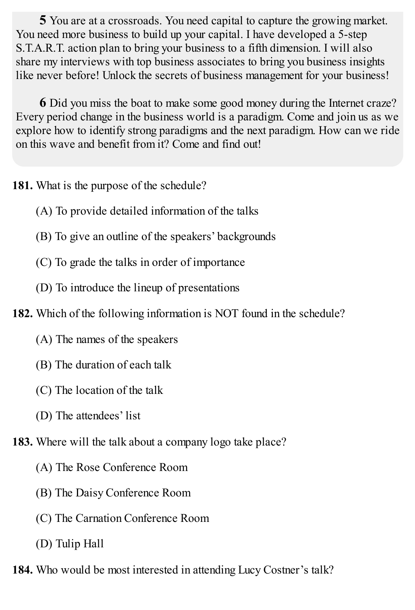


```text
5
 You are at a crossroads. You need capital to capture the growing market.
You need more business to build up your capital. I have developed a 5-step
S.T.A.R.T. action plan to bring your business to a fifth dimension. I will also
share my interviews with top business associates to bring you business insights
like never before! Unlock the secrets of business management for your business!
6
 Did you miss the boat to make some good money during the Internet craze?
Every period change in the business world is a paradigm. Come and join us as we
explore how to identify strong paradigms and the next paradigm. How can we ride
on this wave and benefit from it? Come and find out!
181.
 What is the purpose of the schedule?
(A) To provide detailed information of the talks
(B) To give an outline of the speakers’ backgrounds
(C) To grade the talks in order of importance
(D) To introduce the lineup of presentations
182.
 Which of the following information is NOT found in the schedule?
(A) The names of the speakers
(B) The duration of each talk
(C) The location of the talk
(D) The attendees’ list
183.
 Where will the talk about a company logo take place?
(A) The Rose Conference Room
(B) The Daisy Conference Room
(C) The Carnation Conference Room
(D) Tulip Hall
184.
 Who would be most interested in attending Lucy Costner’s talk?
1208
```

## PDF 第 438 页

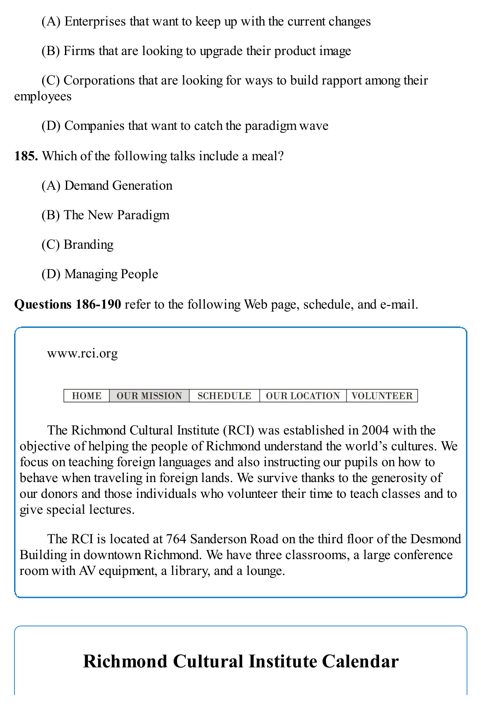


```text
(A) Enterprises that want to keep up with the current changes
(B) Firms that are looking to upgrade their product image
(C) Corporations that are looking for ways to build rapport among their
employees
(D) Companies that want to catch the paradigm wave
185.
 Which of the following talks include a meal?
(A) Demand Generation
(B) The New Paradigm
(C) Branding
(D) Managing People
Questions 186-190
 refer to the following Web page, schedule, and e-mail.
www.rci.org
The Richmond Cultural Institute (RCI) was established in 2004 with the
objective of helping the people of Richmond understand the world’s cultures. We
focus on teaching foreign languages and also instructing our pupils on how to
behave when traveling in foreign lands. We survive thanks to the generosity of
our donors and those individuals who volunteer their time to teach classes and to
give special lectures.
The RCI is located at 764 Sanderson Road on the third floor of the Desmond
Building in downtown Richmond. We have three classrooms, a large conference
room with AV equipment, a library, and a lounge.
Richmond Cultural Institute Calendar
1209
```

## PDF 第 439 页

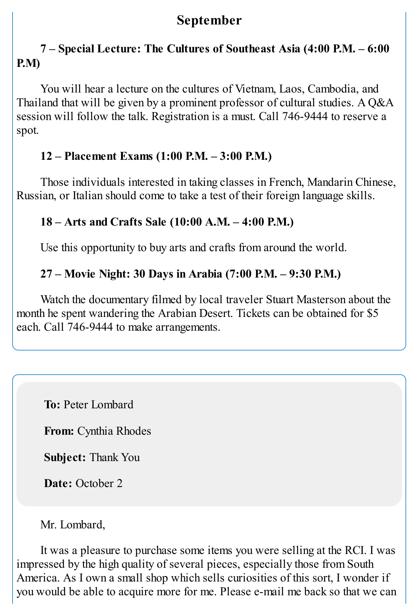


```text
September
7 – Special Lecture: The Cultures of Southeast Asia (4:00 P.M. – 6:00
P.M)
You will hear a lecture on the cultures of Vietnam, Laos, Cambodia, and
Thailand that will be given by a prominent professor of cultural studies. A Q&A
session will follow the talk. Registration is a must. Call 746-9444 to reserve a
spot.
12 – Placement Exams (1:00 P.M. – 3:00 P.M.)
Those individuals interested in taking classes in French, Mandarin Chinese,
Russian, or Italian should come to take a test of their foreign language skills.
18 – Arts and Crafts Sale (10:00 A.M. – 4:00 P.M.)
Use this opportunity to buy arts and crafts from around the world.
27 – Movie Night: 30 Days in Arabia (7:00 P.M. – 9:30 P.M.)
Watch the documentary filmed by local traveler Stuart Masterson about the
month he spent wandering the Arabian Desert. Tickets can be obtained for $5
each. Call 746-9444 to make arrangements.
To:
 Peter Lombard
From:
 Cynthia Rhodes
Subject:
 Thank You
Date:
 October 2
Mr. Lombard,
It was a pleasure to purchase some items you were selling at the RCI. I was
impressed by the high quality of several pieces, especially those from South
America. As I own a small shop which sells curiosities of this sort, I wonder if
you would be able to acquire more for me. Please e-mail me back so that we can
1210
```

## PDF 第 440 页

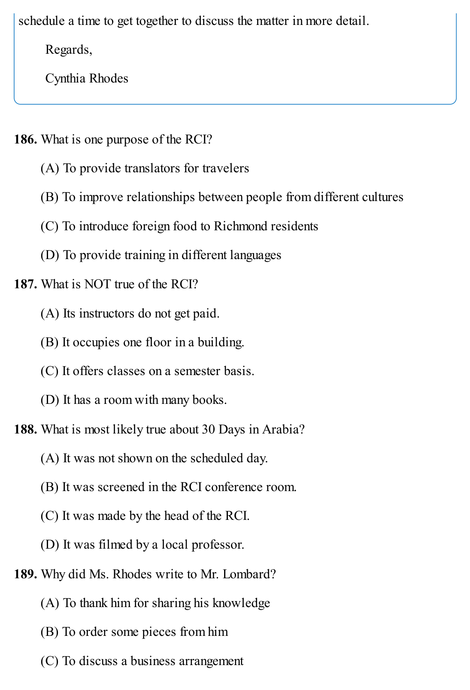


```text
schedule a time to get together to discuss the matter in more detail.
Regards,
Cynthia Rhodes
186.
 What is one purpose of the RCI?
(A) To provide translators for travelers
(B) To improve relationships between people from different cultures
(C) To introduce foreign food to Richmond residents
(D) To provide training in different languages
187.
 What is NOT true of the RCI?
(A) Its instructors do not get paid.
(B) It occupies one floor in a building.
(C) It offers classes on a semester basis.
(D) It has a room with many books.
188.
 What is most likely true about 30 Days in Arabia?
(A) It was not shown on the scheduled day.
(B) It was screened in the RCI conference room.
(C) It was made by the head of the RCI.
(D) It was filmed by a local professor.
189.
 Why did Ms. Rhodes write to Mr. Lombard?
(A) To thank him for sharing his knowledge
(B) To order some pieces from him
(C) To discuss a business arrangement
1211
```

## PDF 第 441 页

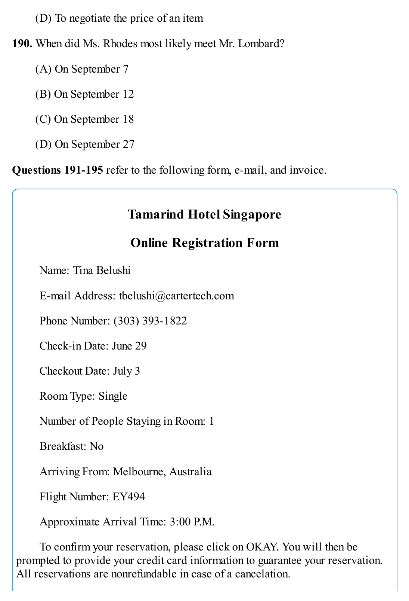


```text
(D) To negotiate the price of an item
190.
 When did Ms. Rhodes most likely meet Mr. Lombard?
(A) On September 7
(B) On September 12
(C) On September 18
(D) On September 27
Questions 191-195
 refer to the following form, e-mail, and invoice.
Tamarind Hotel Singapore
Online Registration Form
Name: Tina Belushi
E-mail Address: tbelushi@cartertech.com
Phone Number: (303) 393-1822
Check-in Date: June 29
Checkout Date: July 3
Room Type: Single
Number of People Staying in Room: 1
Breakfast: No
Arriving From: Melbourne, Australia
Flight Number: EY494
Approximate Arrival Time: 3:00 P.M.
To confirm your reservation, please click on OKAY. You will then be
prompted to provide your credit card information to guarantee your reservation.
All reservations are nonrefundable in case of a cancelation.
1212
```

## PDF 第 442 页

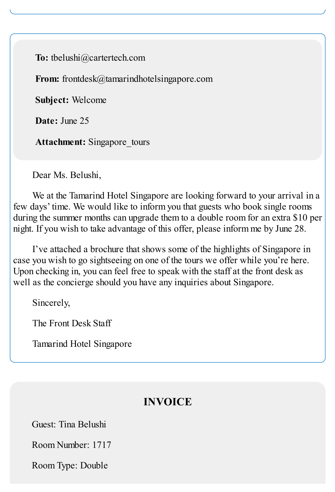


```text
To:
 tbelushi@cartertech.com
From:
 frontdesk@tamarindhotelsingapore.com
Subject:
 Welcome
Date:
 June 25
Attachment:
 Singapore_tours
Dear Ms. Belushi,
We at the Tamarind Hotel Singapore are looking forward to your arrival in a
few days’ time. We would like to inform you that guests who book single rooms
during the summer months can upgrade them to a double room for an extra $10 per
night. If you wish to take advantage of this offer, please inform me by June 28.
I’ve attached a brochure that shows some of the highlights of Singapore in
case you wish to go sightseeing on one of the tours we offer while you’re here.
Upon checking in, you can feel free to speak with the staff at the front desk as
well as the concierge should you have any inquiries about Singapore.
Sincerely,
The Front Desk Staff
Tamarind Hotel Singapore
INVOICE
Guest: Tina Belushi
Room Number: 1717
Room Type: Double
1213
```

## PDF 第 443 页

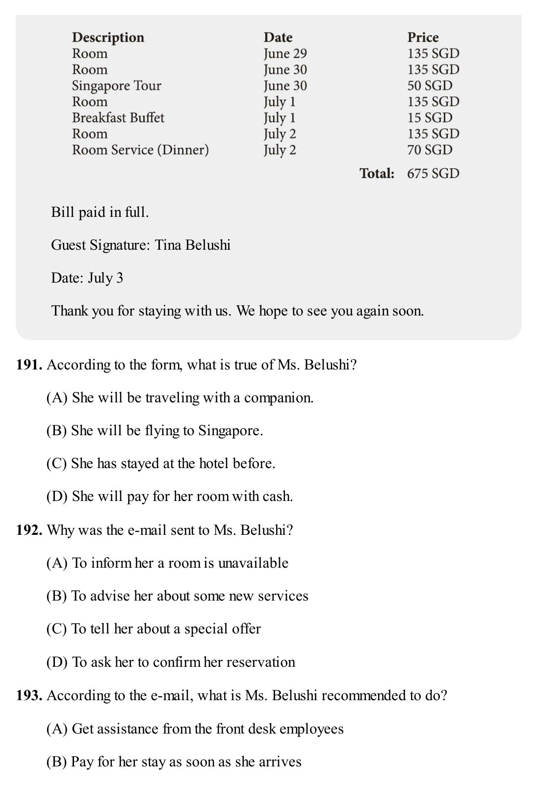


```text
Bill paid in full.
Guest Signature: Tina Belushi
Date: July 3
Thank you for staying with us. We hope to see you again soon.
191.
 According to the form, what is true of Ms. Belushi?
(A) She will be traveling with a companion.
(B) She will be flying to Singapore.
(C) She has stayed at the hotel before.
(D) She will pay for her room with cash.
192.
 Why was the e-mail sent to Ms. Belushi?
(A) To inform her a room is unavailable
(B) To advise her about some new services
(C) To tell her about a special offer
(D) To ask her to confirm her reservation
193.
 According to the e-mail, what is Ms. Belushi recommended to do?
(A) Get assistance from the front desk employees
(B) Pay for her stay as soon as she arrives
1214
```

## PDF 第 444 页

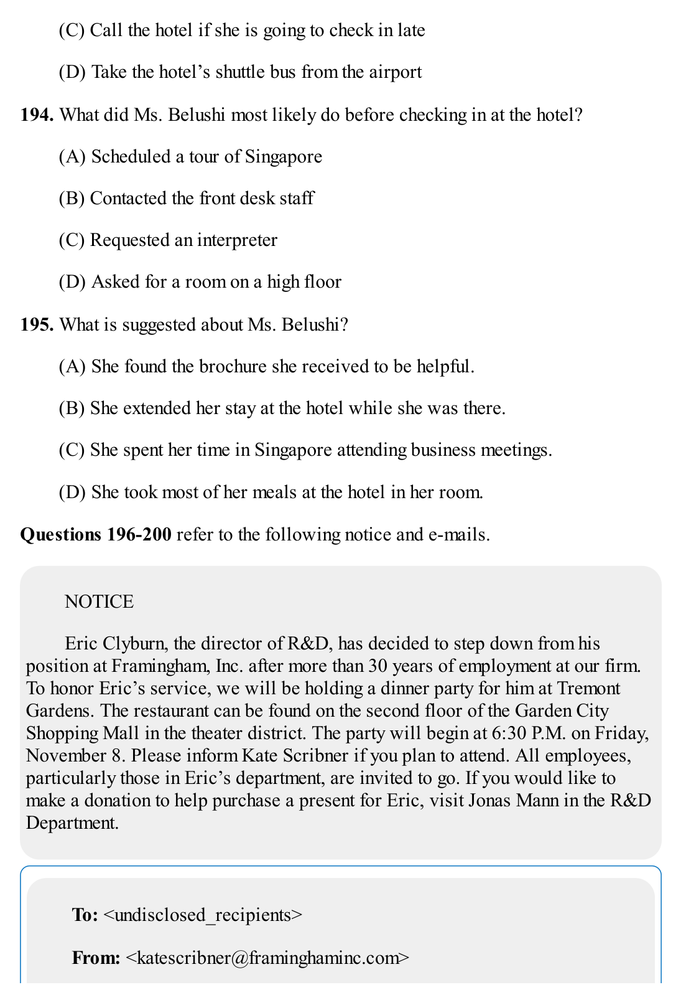


```text
(C) Call the hotel if she is going to check in late
(D) Take the hotel’s shuttle bus from the airport
194.
 What did Ms. Belushi most likely do before checking in at the hotel?
(A) Scheduled a tour of Singapore
(B) Contacted the front desk staff
(C) Requested an interpreter
(D) Asked for a room on a high floor
195.
 What is suggested about Ms. Belushi?
(A) She found the brochure she received to be helpful.
(B) She extended her stay at the hotel while she was there.
(C) She spent her time in Singapore attending business meetings.
(D) She took most of her meals at the hotel in her room.
Questions 196-200
 refer to the following notice and e-mails.
NOTICE
Eric Clyburn, the director of R&D, has decided to step down from his
position at Framingham, Inc. after more than 30 years of employment at our firm.
To honor Eric’s service, we will be holding a dinner party for him at Tremont
Gardens. The restaurant can be found on the second floor of the Garden City
Shopping Mall in the theater district. The party will begin at 6:30 P.M. on Friday,
November 8. Please inform Kate Scribner if you plan to attend. All employees,
particularly those in Eric’s department, are invited to go. If you would like to
make a donation to help purchase a present for Eric, visit Jonas Mann in the R&D
Department.
To:
 <undisclosed_recipients>
From:
 <katescribner@framinghaminc.com>
1215
```

## PDF 第 445 页

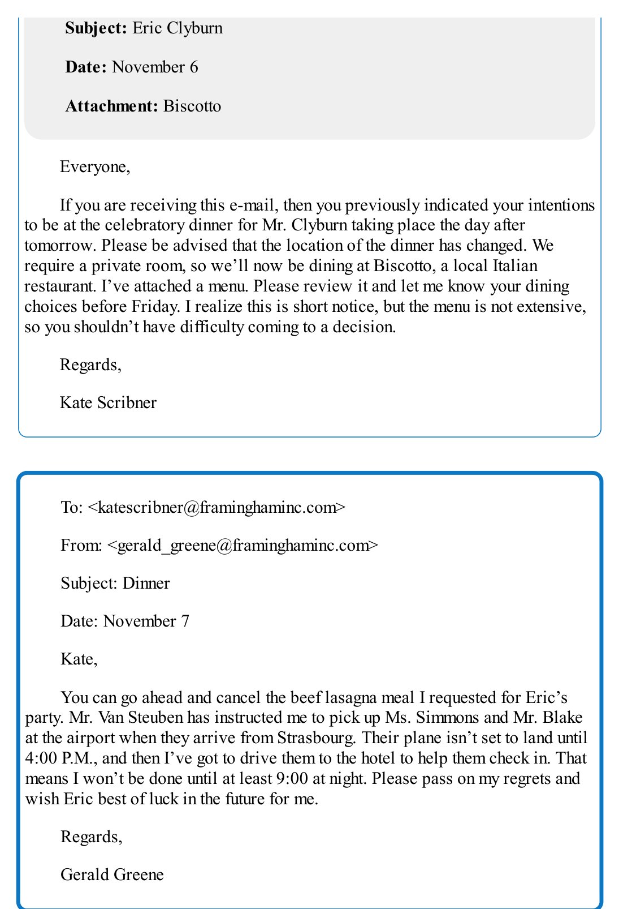


```text
Subject:
 Eric Clyburn
Date:
 November 6
Attachment:
 Biscotto
Everyone,
If you are receiving this e-mail, then you previously indicated your intentions
to be at the celebratory dinner for Mr. Clyburn taking place the day after
tomorrow. Please be advised that the location of the dinner has changed. We
require a private room, so we’ll now be dining at Biscotto, a local Italian
restaurant. I’ve attached a menu. Please review it and let me know your dining
choices before Friday. I realize this is short notice, but the menu is not extensive,
so you shouldn’t have difficulty coming to a decision.
Regards,
Kate Scribner
To: <katescribner@framinghaminc.com>
From: <gerald_greene@framinghaminc.com>
Subject: Dinner
Date: November 7
Kate,
You can go ahead and cancel the beef lasagna meal I requested for Eric’s
party. Mr. Van Steuben has instructed me to pick up Ms. Simmons and Mr. Blake
at the airport when they arrive from Strasbourg. Their plane isn’t set to land until
4:00 P.M., and then I’ve got to drive them to the hotel to help them check in. That
means I won’t be done until at least 9:00 at night. Please pass on my regrets and
wish Eric best of luck in the future for me.
Regards,
Gerald Greene
1216
```

## PDF 第 446 页

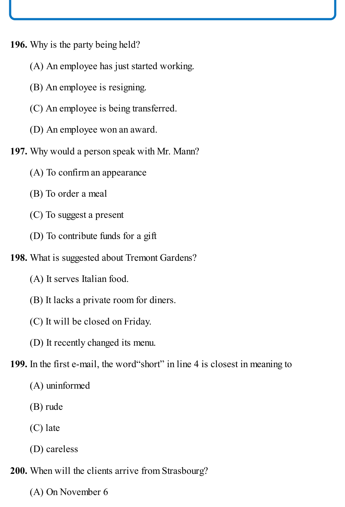


```text
196.
 Why is the party being held?
(A) An employee has just started working.
(B) An employee is resigning.
(C) An employee is being transferred.
(D) An employee won an award.
197.
 Why would a person speak with Mr. Mann?
(A) To confirm an appearance
(B) To order a meal
(C) To suggest a present
(D) To contribute funds for a gift
198.
 What is suggested about Tremont Gardens?
(A) It serves Italian food.
(B) It lacks a private room for diners.
(C) It will be closed on Friday.
(D) It recently changed its menu.
199.
 In the first e-mail, the word“short” in line 4 is closest in meaning to
(A) uninformed
(B) rude
(C) late
(D) careless
200.
 When will the clients arrive from Strasbourg?
(A) On November 6
1217
```

## PDF 第 447 页

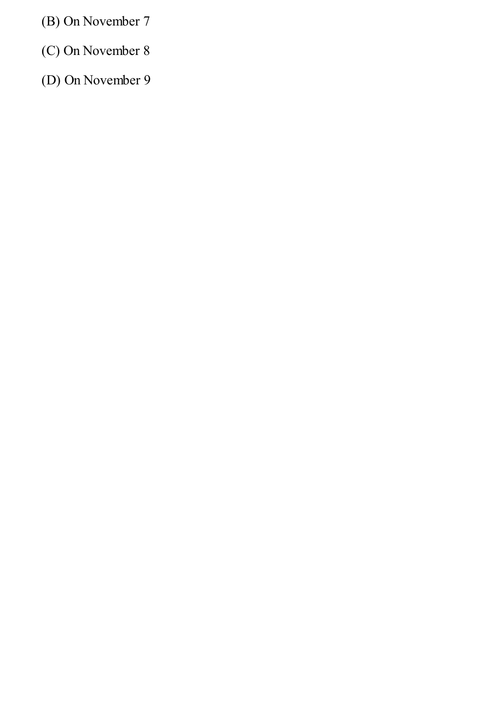


```text
(B) On November 7
(C) On November 8
(D) On November 9
1218
```

## PDF 第 448 页

```text
答案册
Test 01
101. (A) 102. (A) 103. (C) 104. (C) 105. (D) 106. (A) 107. (D) 108. (B) 109.
(A) 110. (B)
111. (A) 112. (C) 113. (A) 114. (D) 115. (B) 116. (A) 117. (A) 118. (C) 119.
(A) 120. (C)
121. (C) 122. (D) 123. (C) 124. (D) 125. (C) 126. (D) 127. (B) 128. (D) 129.
(B) 130. (C)
131. (D) 132. (A) 133. (C) 134. (C) 135. (A) 136. (D) 137. (C) 138. (A) 139.
(C) 140. (B)
141. (C) 142. (D) 143. (B) 144. (A) 145. (C) 146. (B) 147. (D) 148. (C) 149.
(D) 150. (B)
151. (D) 152. (C) 153. (C) 154. (A) 155. (D) 156. (A) 157. (D) 158. (D) 159.
(B) 160. (C)
161. (B) 162. (B) 163. (A) 164. (B) 165. (C) 166. (A) 167. (B) 168. (B) 169.
(A) 170. (B)
171. (C) 172. (A) 173. (B) 174. (B) 175. (C) 176. (B) 177. (C) 178. (A) 179.
(C) 180. (D)
181. (B) 182. (B) 183. (B) 184. (B) 185. (A) 186. (D) 187. (A) 188. (B) 189.
(C) 190. (D)
191. (D) 192. (D) 193. (A) 194. (B) 195. (A) 196. (B) 197. (D) 198. (B) 199.
(C) 200. (A)
101
 ------- you want to receive additional information regarding the services we
offer, please log onto our website at www.healthclub.com today.
1219
```

## PDF 第 449 页

```text
(A) If
 (B) For
(C) Despite (D) Whether
▶
想要获取更多有关我们所提供服务的信息，请于今天登录我们的网站
www.healthclub.com。
▶
解析
 横线处需填入在句首引导状语从句的从属连词。(B)for和
(C)despite为介词，故排除。(D)whether与主句(please log onto...
today)在语意上不连贯。因please log onto...today为“请…”的祈使
句，加上从句是有关特定条件的描述，故(A)if最恰当。
102
 Sandy Duncan was handpicked by the general manager to head the next project
because of ------- experience in this field.
(A) her
 (B) hers
(C) herself (D) she
▶
桑迪·邓肯被总经理特意选去执行下一个项目，因为在这个领域她的
经验很丰富。
▶
解析
 横线处需填入修饰名词experience的形容词性物主代词，故
选(A)。若备选答案为人称代词的不同形式，可根据上下文结构，直接选择
其适当形态，以节省解题时间。
103
 The changes made in the working conditions at our company resulted in
remarkable improvements in all aspects of our business and ------- more so in the
morale of our employees.
(A) all (B) any
(C) even
 (D) although
▶
我公司工作条件的改善使得我们的经营在各个方面显著提高，甚至连
员工的士气也提高了。
▶
解析
 横线后的more在解题时起决定性作用。横线位于比较级前，
由此可以判断应填入修饰比较级的副词，故选(C)。此类副词还有even，
much，a lot等。
104
 All commuters ------- the main highway to get to the center of the city will face
delays of up to an hour today because of on-going construction.
1220
```

## PDF 第 450 页

```text
(A) use (B) used
(C) using
 (D) will use
▶
所有走主路去市中心的通勤者今天都会因为正在进行的施工建设耽误
长达1小时。
▶
解析
 这是一道关于现在分词的问题。现在分词在保持动词特性的
同时，还起到形容词的作用，可修饰名词。横线前的commuters是整个句子
的主语，也是备选答案中use的主语。因句子的谓语动词是will face，横线
处应填入以the main highway为宾语、修饰commuters的动词。故现在分词
(C)using最恰当。
▼ Vocabulary Check
additional
附加的，另外的
regarding
关于
offer
提供
handpick
精选
head
领导，带领
experience
经验；经历
field
领域；场地
working conditions
工作条件
result in
导致，引起
remarkable
显著的；值得注意的
improvement
改进，改善
aspect
方面
morale
士气，民心
commuter
使用月、季票上下班者，通勤者
get to...
到达某地
1221
```

## PDF 第 451 页

```text
face
面临，面对
delay
耽搁，延迟
on-going
持续的；正在进行的
construction
建设
105
 In order to become a member of the country club, applicants have to meet the
strict ------- set by the club president.
(A) require (B) requires
(C) requiring
(D) requirements
▶
为了成为乡村俱乐部的会员，申请人必须满足俱乐部主席制订的严格
要求。
▶
解析
 横线处所填单词被形容词strict修饰，且充当meet的宾语，
故名词(D)requirements为正确答案。
106
 The outcome of our meeting today with the board of directors will ------- the
course of action we will take this year.
(A) determine
 (B) determines
(C) determining (D) determination
▶
今天我们和董事会的会议结果将决定我们今年的行动方案。
▶
解析
 本题需选择适当的词形。助动词will后应跟动词原形，以the
course of action为宾语。故(A)determine为正确答案。
107
 The announcement of John Stanton’s retirement was not well received by most
of the staff members, but Leslie, his long time friend and colleague, was extremely -
------ to hear that Mr. Stanton will now be able to enjoy some leisure time.
(A) happiest (B) happily
(C) happier
(D) happy
▶
大多数员工不太能接受约翰·斯坦顿退休的消息，但是他的老朋友兼
同事莱斯利在听说他很快就能享受空闲时间时却非常高兴。
1222
```

## PDF 第 452 页

```text
▶
解析
 本题需选择适当的词形。横线处所填单词被副词extremely修
饰，且充当was的表语，故选形容词(D)happy。be happy to do sth.为固定
句型。
108
 Because many of the warehouse workers were out sick today, Mr. Miller had
to stock the goods on the shelves -------.
(A) itself
(B) himself
(C) herself (D) themselves
▶
因为今天仓库里好多工人都请了病假，米勒先生不得不自己把货物摆
到货架上。
▶
解析
 备选答案均为反身代词，需要选出正确的人称。主句就算没
有横线处所需的反身代词也能构成完整的句子，这就意味着这里的反身代词
仅起到了强调主语行为的作用。因此，根据主语Mr. Miller，选择
(B)himself。
▼ Vocabulary Check
in order to do
为了做（某事）
applicant
申请者
meet the strict requirements
满足严格的要求
strict
严格的；严厉的
requirement
要求；需求
outcome
结果
determine
决定
the course of action
行动方针
announcement
宣布，宣告
retirement
退休
extremely
非常，很，极端地
1223
```

## PDF 第 453 页

```text
leisure time
空闲时间
warehouse
仓库
be out sick
请病假
stock
备货；贮存
goods
货物
109
 Please accept our ------- apology for the inconvenience this delay is causing all
the passengers here at Pearson International Airport.
(A) sincere
 (B) original
(C) estimated (D) completed
▶
此次班机延误造成所有乘客都滞留在皮尔森国际机场，为此我们表示
真诚的歉意。
▶
解析
 本题需选择修饰名词apology的恰当形容词。真诚的道歉才能
使对方容易接受，故(A)sincere(真诚的)最恰当。
110
 The majority of the contract ------- that took place during the year were handled
by lawyers from a local law firm.
(A) negotiate
(B) negotiations
(C) negotiable (D) negotiator
▶
今年的大部分合同谈判都是由一家当地律师事务所的律师处理的。
▶
解析
 the majority of...后应接名词或名词性短语，因此横线处
应填入名词。备选答案中有两个名词，因此要把握句意，选择适当的名词。
从“是由当地律师事务所的律师处理的”中可看出，(B)negotiations(谈
判)为正确答案。
111
 It will be next to impossible to ------- a room at the Ashton Hotel this week
because of the film festival.
(A) reserve
 (B) respond
(C) connect (D) appoint
1224
```

## PDF 第 454 页

```text
▶
因为电影节，本周想在阿士顿酒店预订房间几乎不可能。
▶
解析
 四个备选答案都是动词，因此本题是一道动词词义辨析题。
从a room at the Ashton Hotel可以看出，要选有“预订”意义的动词，故
选(A)。next to impossible是almost impossible(几乎不可能)的意思。
112
 The presentation of this evening’s winners will commence ------- at seven
following dinner at six.
(A) precise (B) precision
(C) precisely
 (D) preciseness
▶
6点的晚宴后，今晚的优胜者的演讲将于7点整开始。
▶
解析
 本题需选择适当的词形。commence既是及物动词，也是不及
物动词。根据主语the presentation和commence的关系，可判断出这里的
commence是不及物动词。因此横线处应选择可修饰动词的副词，故选(C)。
▼ Vocabulary Check
accept
接受
apology
道歉
inconvenience
不便；困难
cause
引起，使产生，成为
…
的原因
majority
多数，大多数
contract
合同
negotiation
谈判，磋商
take place
发生
handle
处理，操作
next to impossible(= almost impossible)
几乎不可能
reserve
预订
1225
```

## PDF 第 455 页

```text
respond
回答，响应
connect
连接；联系
appoint
任命，指派；分配
presentation
陈述，介绍
winner
胜利者，优胜者
commence
开始；倡导
precisely
正好；精确地；明确地
follow
接着；跟随
113
 The new sports complex will accommodate an Olympic-sized swimming pool
and other -------, including a fitness center and a spa, to name just a few.
(A) facilities
 (B) categories
(C) qualities (D) supplies
▶
新体育场将设有一个奥运会规格的游泳池和其他设施，包括健身中
心、温泉浴场等。
▶
解析
 本题需选择适当的名词。应选择词义上能包含swimming
pool，fitness center和spa的名词。故答案为(A)facilities(设施，设
备)。
114
 Our new product will be put through a number of ------- tests before being
released to the public.
(A) dependent (B) founded
(C) withhold
(D) stringent
▶
我们的新产品在投放市场前将通过一系列严格测试。
▶
解析
 备选答案主要由过去分词和形容词组成，因此本题是一道选
择适当形容词的题。横线处所填单词修饰名词tests，形容词
(D)stringent(严格的)符合语境，故为正确答案。选择修饰名词的形容词
1226
```

## PDF 第 456 页

```text
时，至少要知道名词的词义，才能作出正确选择。
115
 Mr. Chan’s main role in the company for the next two weeks is to look -------
the right person to take over Mr. Shaw’s position when he leaves at the end of the
month.
(A) in
(B) for
(C) over (D) from
▶
未来两周里，陈先生在公司的主要职责就是寻找一个合适的人选在本
月末肖先生离职时接管他的工作。
▶
解析
 备选答案均为介词，横线前有动词look，应选择可与look搭
配的介词。句意要表达“找”的意思。故答案是(B)for，look for意为“寻
找”。
116
 People unanimously agreed that John would have performed a great deal better
under more ------- circumstances.
(A) favorable
 (B) favorably
(C) favorite (D) favor
▶
人们一致认为，如果情况更有利的话，约翰会表现得更好。
▶
解析
 本题需选择适当的词形。横线位于比较级more和名词
circumstances之间，可判断出答案应为形容词。favorable(有利的)和
favorite(特别喜爱的)都是形容词，但根据上下文，“更有利的情况”更加
符合句意，故答案是(A)favorable。
▼ Vocabulary Check
sports complex
体育中心
accommodate
容纳
Olympic-sized
奥运会规格的
facility
设施
include
包括
1227
```

## PDF 第 457 页

```text
fitness center
健身中心
spa
温泉浴场
to name just a few
举些例子
put through
使通过；使经受
a number of
若干，一些，许多
stringent
严格的，严厉的
release
发售
role
作用；角色
look for
寻找
right
合适的；正确的
take over
接管，接替
leave
离职；离开
unanimously
无异议地，全体一致地
perform
执行，完成
favorable
有利的；良好的
circumstance
情况，形势；环境
117
 After a long and difficult strike, the plant workers will show up to work -------
Monday.
(A) starting on
 (B) afterwards
(C) instead (D) outside
▶
经过长期、艰苦的罢工，工厂的工人将从下周一开始上班。
▶
解析
 本题根据备选答案很难把握题型，这时就需要仔细分析句
子。状语after a long and difficult strike(经过长期、艰苦的罢工)是
重要依据，句意是“长期的罢工后工人们将从星期一开始正常上班”，因此
1228
```

## PDF 第 458 页

```text
选择具有“开始”意义的(A)starting on。show up to work是“上班”的
意思。
118
 Scarborough General Hospital has two ------- for certified x-ray technicians to
start immediately.
(A) open (B) opener
(C) openings
 (D) openness
▶
斯卡伯勒综合医院有两个注册X光技术员的职位空缺，马上就可以入
职。
▶
解析
 考查词形和词义。has需要一个宾语，因此横线处应填入被
two修饰的名词。除了(A)open外，其他选项均为名词，可一一代入后分析全
句，选择意思适当的名词。“斯卡伯勒综合医院有两个注册X光技术员的职
位空缺”最为恰当，故答案是(C)openings。
119
 Mark’s Warehouse Clearance Store is having a sale with savings of up to 40
percent off on all clothing this weekend ------- celebration of its 25th anniversary.
(A) in
 (B) at
(C) on (D) of
▶
在25周年店庆之际，马克清仓商店本周末所有的衣服都将打折，最高
能打六折。
▶
解析
 本题需选择常用词组中的介词。“纪念…”的表达方式是in
celebration of...，要留意介词in。想提高有关常用词组的题目的正确
率，需要具备一定的语法知识和词汇量。
120
 Probe Magazine conducted a survey asking one thousand employees who work
in low-paying industries to express ------- their biggest concerns are.
(A) how (B) when
(C) what
 (D) which
▶
《布罗伯杂志》对1000名低收入行业中的雇员进行了调查，调查他们
最关心的是什么。
▶
解析
 ______ their biggest concerns are是及物动词express的
宾语。their biggest concerns are是“主语＋be动词”的不完整结构，因
1229
```

## PDF 第 459 页

```text
此横线处所填单词在引导名词性从句的同时，还要作are的宾语，故答案为
(C)what。how和when后必须跟完整的句子，which虽然与what类似，但一般
用于限定的某个范围内的事物。
▼ Vocabulary Check
strike
罢工
plant
工厂
show up to work
上班
afterwards
然后，后来
general hospital
综合医院；总医院
opening (
职位
)
空缺
certified
被鉴定的
immediately
立刻，马上
have a sale
廉价出售
with savings of up to
节省到
clothing
衣服
in celebration of
为庆祝
…
anniversary
周年纪念日
conduct a survey
做调查
low-paying
工资低的
concern
关心的事
121
 Should there be any requests for schedule changes, please notify us -------.
(A) prompt (B) prompted
(C) promptly
 (D) prompting
1230
```

## PDF 第 460 页

```text
▶
如果有任何改变计划的要求，请迅速通知我们。
▶
解析
 notify是及物动词，意为“通知”。表示“通知某人某
事”时使用双宾语结构，即“notify +通知内容(直接宾语) +通知对象(间
接宾语)”。但若可根据上下文推出直接宾语的内容，如本题，则可省略直
接宾语。横线前please notify us已构成完整的句子，故横线处应填入修饰
动词的副词，故选(C)。
122
 For this weekend only, Bad Boys Electronics Store is celebrating its first year
in business with up to thirty percent ------- on all items in the store.
(A) retail (B) market
(C) economy
(D) discounts
▶
本周末，“坏男孩”电子商店一周年店庆，店内所有商品打折，折扣
高达30%。
▶
解析
 本题需选择符合句意的名词。留意横线前后的thirty
percent 和on all items，将备选答案的名词一一代入，选择和它们最匹配
的(D)discounts(折扣)。
123
 The automobile parts we requested for our customer got here on -------.
(A) authority (B) condition
(C) schedule
 (D) appointment
▶
客户需要的汽车零件已经按时到货。
▶
解析
 本题需选择适当的名词。句子的主干为the automobile
parts got here(汽车零件到达此地)，显然on _____ 修饰got。分别代入备
选答案，可以看出on schedule(按照预定时间，准时)最恰当，故选(C)。
124
 The advertisements printed in this magazine do not ------- imply endorsement
by the management.
(A) highly (B) barely
(C) gradually
(D) necessarily
▶
印在这本杂志上的广告不一定意味着管理者的认可。
▶
解析
 本题需选择符合句意的副词。横线处所填副词修饰动词
1231
```

## PDF 第 461 页

```text
imply(包含，意味，暗示)，根据句意，选择(D)necessarily(必定，必然
地)。
▼ Vocabulary Check
notify
通知，通告
celebrate
庆祝，祝贺
retail
零售
(
的
)
part
零件
request
要求，请求
authority
权力；当局；权威
appointment
任命，选派；约定
imply
暗示，意指；必然包含
endorsement
赞同，认可；宣传；背书
necessarily
必然地；必须地；必要地
barely
仅仅，几乎没有；赤裸裸地
125
 The newly installed alarm system, which is directly connected to the police,
will go off if the correct security code is not entered ------- 60 seconds of touching
the keypad.
(A) only (B) under
(C) within
 (D) directly
▶
新安装的报警系统直接连着警察局，如果在接触键盘后60秒内不能输
入正确的安全密码，它就会报警。
▶
解析
 备选答案为副词和介词。首先应分析句子结构，判断横线处
应填入介词还是副词。乍一看应填入副词修饰被动结构is not entered，实
际上if从句是被动语态，_____ 60 seconds of touching the keypad应作
状语。因此横线处应填入介词，从而构成介宾短语作状语，故选(C)。
1232
```

## PDF 第 462 页

```text
126
 The airline requested a ------- call to ensure a seat on my flight back home.
(A) confirm (B) confirmed
(C) confirming
(D) confirmation
▶
航空公司要求打一个确认电话，以确保我返家的航班有座位。
▶
解析
 本题需选择适当的词形。因a _____ call 是requested的宾
语，横线处应填入修饰call的形容词或与call共同构成名词短语的名
词。“确认电话”是一个复合名词，故(D)confirmation正确。
127
 If the task is too complicated to figure out on ------- own, please don’t hesitate
to ask one of our representatives, who are here to help.
(A) you
(B) your
(C) yours (D) yourself
▶
如果这个任务太复杂，你不能独立完成，请不要客气，找一位我们的
代表帮忙。
▶
解析
 本题需选择适当的代词。on ______ own是“介词+…+名
词”结构的介词短语，横线处应填入修饰名词own的物主代词，故选(B)。on
one’s own表示“独立地”。
128
 The hard work put in during his younger years made him become ------- sound
in his later years.
(A) finance (B) finances
(C) financial
(D) financially
▶
他年轻时的努力使他晚年的经济状况很好。
▶
解析
 本题需选择适当的词形。横线处应填入副词，修饰become的
表语sound(殷实的)，故选(D)。
▼ Vocabulary Check
install
安装
alarm system
警报系统
1233
```

## PDF 第 463 页

```text
go off
发出响声
enter
输入
(
信息
)
；进入
request
请求，要求
ensure
确保；保证
confirmation call
确认电话
task
任务，作业
complicated
复杂的
figure out
解决；计算出
on one’s own
独立地，独自地
hesitate
犹豫，踌躇
hard
艰苦的；困难的
sound
殷实的，资金充实的；健全的
129
 Ms. Taylor has called the managers to ------- her in the main conference room
to discuss next year’s budget.
(A) met
(B) meet
(C) have met (D) will meet
▶
泰勒女士已经叫经理去主会议室见她，讨论明年的预算。
▶
解析
 本题需选择适当的动词。横线前有不定式符号to，应选择动
词原形，故选(B)meet。
130
 ------- announcing his retirement, Mr. Kinsley has been busy trying to train his
replacement.
(A) Because (B) Once
(C) Since
 (D) While
▶
自从宣布退休，金斯利先生就忙于培训他的接班人。
1234
```

## PDF 第 464 页

```text
▶
解析
 备选答案均为连词，可一一代入后选择最符合句意的选项。
根据前一分句内容(宣布退休)和后一分句内容(忙于培训他的接班人)，
(C)since(自…以来)最恰当。since announcing his retirement在意思上
相当于since he announced his retirement，前者使用现在分词来表达，
后者使用从句来表达。
▼ Vocabulary Check
conference room
会议室
discuss
讨论
budget
预算
announce
宣布
retirement
退休
be busy ~ing
忙于做某事
train
训练
replacement
接替者
Questions 131-134
 refer to the following article.
银行按揭利率将降低
加拿大最大的银行中有几家已经决定降低它们的按揭利率。皇家银行
透露，将全面降低主要按揭利率十分之一个百分点，同时道明加拿大信托
银行将对除了十年期贷款以外的按揭采取相同幅度的降息。蒙特利尔银行
也将降低四年期及更长期限的混合利率按揭十分之一个百分点。
最后，温哥华信托银行也已经加入行列，宣布计划降低利率。确切的
数字尚未公布。尽管如此，知情人预计降息幅度会和其他银行相同。
131
 Several of Canada’s largest banks ------- to decrease their mortgage rates.
1235
```

## PDF 第 465 页

```text
(A) decide (B) deciding
(C) was decided
(D) have decided
→本题需选择decide的适当形态。实施“决定”行为的主体是银行，应
使用主动语态。主语several of...banks是复数形式，为保持主谓一致，应
选(D)have decided。
132
 Royal Bank revealed its plan to cut key mortagage rates by a tenth of a
percentage point across the board, while TD Canada Trust will decrease its rates
by the same ------- except for its 10-year rate.
(A) margin
 (B) allowance
(C) space (D) surplus
→本题需选择符合句意的名词。本文主要是讲几个银行下调按揭利率的
内容，应选(A)margin(幅度)。
133
 Vancouver Trust has also jumped on the wagon by announcing that it is
planning to ------- its rates.
(A) turn down (B) shorten
(C) reduce
 (D) narrow
→本题需选择符合句意的动词。根据银行下调按揭利率的报道内容，应
选择具有“减少，缩减”词义的及物动词，且可以与后面的rates搭配，故
选(C)reduce。
134
 (A) It has brought about unpredictable results.
(B) The Canadian government doesn’t agree with it.
(C) The exact numbers are still unknown.
(D) Some other banks continue to follow its step.
→上句说的是温哥华信托银行降低利率的举措。下句以however开头，
指出“尽管如此，知情人预计降息幅度会和其他银行相同”。可知，本题应
选择描述降息幅度的选项(C)。
▼ Vocabulary Check
1236
```

## PDF 第 466 页

```text
mortgage
抵押，按揭
rate
利率，率
reveal
透露，泄露
cut
削减，降低
key
重要的，关键的
across the board
全面地
decrease
减少，减小
except for
除
…
以外
lower
降低
jump on the wagon
随波逐流
announce
宣布
plan to do
计划做某事
reduce
减少，降低
exact
确切的；准确的
unknown
未知的
insider
知情人，了解内幕者
predict
预计，预言
reduction
减少，降低
similar to
类似于
…
，与
…
相似
surplus
剩余，盈余
Questions 135-138
 refer to the following advertisement.
“
用伦敦人寿保险公司的简单财富策略在仅仅四年内净赚
250
1237
```

## PDF 第 467 页

```text
万美元
”
——
投资顾问简
·
布思和格伦达
·
杰克逊
如果你在寻找通往财务自由的方法但是不确定该怎么办，或者你现有
的投资项目没有好好运作且需要一次大规模重组，我们能助你一臂之力。
很多中等收入者表示过很难得到一个坦率、明确、没有偏见的意见来
实现他们的财务目标。有一对工作努力的夫妇以教书为生，在他们发现伦
敦生活的简单而有效的投资技术前，从未想过他们能从工资中获得更多的
好处。按照我们简单的策略去做，这对夫妇能积累起一小笔财富！现在，
我们也可以告诉你怎样积累财富。
伦敦人寿保险公司
·
金融计划
·
股票经纪业务
·
资产
·
金融
135
 If you’re looking to get on the ------- to financial freedom but aren’t sure of
what steps to take or if your existing investment portfolio is not doing its job and
needs a major shake up, then we can help.
(A) path
 (B) access
(C) line (D) track
→“寻找通往财务自由的方法”最恰当，故选(A)path。path除了可以
表示“小路”之外，还可表示“(实现某事所需要的)计划，成功的途
径”等。
136
 According to one couple, they were working hard as teachers and never
thought that they could get ahead on their ------- until they discovered...
(A) costs (B) prices
(C) charges
(D) wages
→根据前文可推断出这里应该是要描述“从他们的所得(工资)中…”，
故选(D)wages。
137
 ...London Life’s simple ------- effective investing techniques.
(A) once (B) still
1238
```

## PDF 第 468 页

```text
(C) yet
 (D) ever
→simple和effective是具有相对意义的形容词，故选择可作并列连词
的(C)yet。
138
 (A) Now, we can show you how you can amass your fortune.
(B) People can’t find effective investing techniques.
(C) Middle-income earners have realized their financial goals.
(D) The existing investment portfolio does a good job.
→上句说该公司使用简单的策略就能解决文中夫妇面临的困境，帮助他
们积累财富。可知，横线处说“现在，我们也可以告诉你怎样积累财富”最
合适，以达到宣传目的，故选(A)。
▼ Vocabulary Check
net
净的
wealth
财富
strategy
策略，战略
investment
投资
adviser
顾问
look to
寻找
get on the path to
通往
…
的道路
financial
金融的，财务的
be sure of
对
…
有把握，确信
…
take steps
采取步骤，采取措施
existing
现有的
investment portfolio
投资业务，投资
组合
1239
```

## PDF 第 469 页

```text
do one’s job
运作；做好自己的工作
shake up
重大调整，重组
middle-income earners
中等收入者
express one’s opinion on
就
…
发表
自己的意见
honest
诚实的，坦率的
straightforward
明确的，直接的
unbiased
没有偏见的
support
帮助，支持
financial goals
财务目标
get ahead on
从
…
中受益；获得成功
effective
有效的
investing technique
投资技术
follow
遵循；跟随
amass
收集，积聚
fortune
财富
property
资产
Questions 139-142
 refer to the following notice.
促进本市自行车运动
自行车是世界上很多城市交通运输系统的重要组成部分。布法罗市认
识到这一点并制订了一个十年计划来促进本市的自行车运动。
这项城市发展计划包括为街道增设更多的自行车道。当然，这样做的
1240
```

## PDF 第 470 页

```text
目的是鼓励市民多使用自行车，以获得与其他大都市一样的效果，例如减
少污染和交通堵塞，同时也有益于市民的健康和社会的进步。
其他计划包括和周边城镇的自行车专用通道连接成网，以及建立一系
列公共项目，为骑车的人提供信息。
我们期待听到您对这些提议的建议。您可以登录我们的网站
www.
cityofbuffalo.gov.us
，或者去当地社区服务中心，或者拨打电话
755-9333
了
解更多信息并提交意见表。
139
 The city’s development plan includes the addition of more cycling ------- to our
streets.
(A) admission (B) entrance
(C) access
 (D) pass
→“更多的自行车道”最符合句意，故选(C)access。access除了“接
近”的意思之外，还包括“入口，通路”的意思，此时主要与to 连用。
140
 This, of course, is with the intention of encouraging greater cycling ------- by
our citizens in an effort to mimic the benefits other global cities have experienced...
(A) participate
(B) participation
(C) participates (D) participated
→横线处所填单词受形容词比较级greater修饰，充当encouraging的宾
语，故选名词(B)participation。
141
 Other plans include a ------ network of bicycle lanes to be interconnected to
the surrounding towns as well as the setting up of a number of social programs to
provide information to the cyclists.
(A) coordination (B) coordinating
(C) coordinated
 (D) coordinates
→横线处所填单词修饰名词network，应填用作形容词的过去分词，故
选(C)。
142
 (A) Few people have realized the significance of cycling.
1241
```

## PDF 第 471 页

```text
(B) Cycling is beneficial to environmental protection.
(C) Nowadays, more and more people like cycling in big cities.
(D) The city wishes to hear your thoughts about its proposals.
→下句提到“提交表格”，可知，横线处应填与“搜集公众建议”有关
的信息，故选(D)。
▼ Vocabulary Check
promote
促进
cycling
自行车运动
essential
必要的，必不可少的
element
组成部分，成分
transportation
运输，交通
recognize
认识到
develop
发展，开发
development plan
发展计划
include
包括，包含
addition
增加，添加
access
通路，进入
intention
目的，意图
encourage
鼓励，支持，激励
participation
参与，参加
in an effort to do
努力做某事
mimic
模仿；像，似
benefit
好处，益处
1242
```

## PDF 第 472 页

```text
experience
经历
such as
例如
reduction
缩小，减少，降低
pollution
污染
traffic congestion
交通堵塞
advantage
优点，优势；有利条件
coordinate
使协调，使搭配
interconnect
使互相连接
surrounding
周围的
setting up
建立，创立
a number of
若干，一些，许多
provide
提供
proposal
建议，提议
further
更多的，进一步的
submission
提交，递呈
form
表单，表格
available
可获得的
Questions 143-146
 refer to the following e-mail.
发件人：乔纳森
·
王［
mailto:jonathan.wong@hydetransport.com
］
发送时间：
2018
年
10
月
29
日，周一，上午
11:07
收件人：约翰
·
德弗罗；史蒂夫
·
特雷西；布雷恩
·
基布尔
抄送：阿尔弗莱德
·
陈；珍妮
·
李
1243
```

## PDF 第 473 页

```text
主题：访问全球物流公司
致全球物流公司：
我谨代表阿尔弗莱德
·
陈和台湾海德物流，对我们在访问全球物流公
司期间所受到的热情款待表示感谢。很荣幸能与你们见面并见识了你们的
运作和设备。你们的安全设备和技术投资给我们留下了深刻印象。
正如之前所谈到的，为了表示感谢，我们真诚地邀请你们在不久的将
来能访问台北。请在确定行程之后通知我。
第二步，我公司也希望进一步探索和贵公司的商业合作机会。作为你
们全球扩展计划的一部分，我们若能在台湾成为商业合作伙伴，双方都能
获得增效和利益。
再次感谢贵公司，期待你们的回信。
祝好！
计划部主任
乔纳森
·
王
143
 (A) We were very happy to sign a commercial contract with you.
(B) It was a pleasure meeting all of you and seeing your operations and setup.
(C) It was a great pity that our company did not do a good job last quarter.
(D) We cannot wait to sincerely cooperate with your company in the near
future.
→上句描述发件人作为宾客表达对招待方的感激之情，下句赞美招待方
的安全设备和技术投资。故横线处说“很荣幸能与你们见面并见识了你们的
运作和设备”最恰当。选项(B)为正确答案。
144
 We were very impressed with your ------- facility and your investment in
technology.
(A) secure
 (B) secured
(C) securely (D) to secure
1244
```

## PDF 第 474 页

```text
→横线处所填单词修饰facility，故形容词(A)secure为正确答案。
145
 As we discussed, we would like to extend our gratitude by inviting you to
Taipei when you are available in the ------- future.
(A) prevalent (B) surfacing
(C) foreseeable
 (D) ongoing
→选择可与future搭配的形容词，故选(C)foreseeable。in the
foreseeable future = in the near future(在不久的将来，近期)。
146
 Please let me know when you would like to schedule your -------.
(A) tourism
(B) trip
(C) talk (D) request
→上一句已经提示了想邀请对方到台北的想法，故横线处选择(B)trip
与其对应。tourism指“旅游业”。
▼ Vocabulary Check
on behalf of
代表
…
would like to do
愿意
/
意欲做某事
hospitality
款待；亲切，殷勤
operation
运转，运作
setup
设备，装备
be impressed with
对
…
印象深刻
secure
安全的；可靠的
facility
设施，设备
investment
投资
extend one’s gratitude
表达某人的感激之情
in the foreseeable future(=in the near future)
在可以预见的未来，在不久
1245
```

## PDF 第 475 页

```text
的将来
explore
探索
expand
扩展，发展
(
业务
)
synergy
增效作用，协同作用
advantage
利益；有利条件，优势
pursue
追求，致力于
business partnership
商业伙伴关系
look forward to
期待，盼望
response
回答，答复
Questions 147-150
 refer to the following letter.
2018
年
10
月
20
日
乔
·
费尔南德斯

先生
米德兰大街
1385
号
底特律，密歇根
亲爱的乔
·
费尔南德斯先生：
作为董事长，我很自豪地宣布本周五是我们乡村俱乐部成立
30
周年纪
念日，在过去的
30
年中，我们取得了巨大成功。所以，我们将为此举办一
个庆祝晚会。我们已经在猎鹰酒店预订了大堂，本周五晚
7
点将在那里举
办晚宴和舞会。
在这个特殊的夜晚，新会员将有机会聆听老会员的意见，并和老会员
在轻松的氛围中交流想法。将要继承我们的传统的新会员应该听一听老会
员的想法。
此外，晚餐将会非常丰盛。过去参加其他宴会时，我曾有幸在这家酒
店用过几次餐，这里的美味佳肴让我决定在这里举办我们的晚宴。我深信
我们所有的会员都会和我一样对这里的美食赞不绝口。不管怎样，我希望
1246
```

## PDF 第 476 页

```text
本周五我们所有的会员都能放松心情，好好享受。
因此，写这封信是为了正式邀请您和您的配偶或其他贵宾能出席这个
值得纪念的庆祝会。
若您不能出席，请通知我们。
真诚的，
杰夫
·
康奈利
147
 What is the main purpose of this letter?
(A) To provide information about the club’s history
(B) To notify the members of a yearly meeting
(C) To welcome the newest member to the club
(D) To invite the members to an upcoming event
这封信的主要目的是什么？
(A)
介绍俱乐部的历史
(B)
通知会员参加年会
(C)
欢迎新会员入会
(D)
邀请会员参加一个即将举行的庆典
→一般在信件的开头和结尾都会叙述写信的目的。此信件为乡村俱乐部
30周年庆的邀请函。故答案为(D)。
148
 Which of the following will NOT be part of the event?
(A) Discussions (B) Entertainment
(C) Presentations (D) Dinner
以下哪一项不属于本次庆典的活动？
(A)
讨论
 (B)
娱乐
1247
```

## PDF 第 477 页

```text
(C)
报告
 (D)
晚宴
→庆祝会的内容包括：在轻松的氛围中分享会员的意见及建议(A)、舞
会(B)和聚餐(D)。故答案为(C)。
149
 According to Mr. Connelly, what led him to hold the event there?
(A) It has become a tradition at the club.
(B) He has special ties with the hotel staff.
(C) The hotel is located close to the club.
(D) He was impressed with its menu.
根据康奈利先生的说法，是什么让他在猎鹰酒店举办此次庆典的？
(A)
这已成为俱乐部的传统。
(B)
他和酒店员工有特殊关系。
(C)
酒店离俱乐部很近。
(D)
他对酒店的美食印象深刻。
→康奈利先生以前参加别的活动时发现这里的菜非常棒，所以将这家酒
店定为这次的庆典地点。故答案为(D)。
150
 In which of the positions marked [1], [2], [3], and [4] does the following
sentence best belong?
“The newest members, who will be carrying on our tradition, should hear
what the older members have to say.”
(A) [1]
(B) [2]
(C) [3] (D) [4]
以下句子
“The newest members, who will be carrying on our tradition, should
hear what the older members have to say.”
位于标有
[1], [2], [3]
和
[4]
的哪处最合
适？
(A) [1] (B) [2]
(C) [3] (D) [4]
1248
```

## PDF 第 478 页

```text
→所给句子是说“将要继承我们的传统的新会员应该听一听老会员的想
法。”信中作者提到新会员和老会员的内容是在第二段。故答案为(B)。
▼ Vocabulary Check
celebration
庆祝，庆祝会
 reserve
预订
 opportunity
机会，机遇
 exchange
交换
 informal
非正式的，不拘礼的
 atmosphere
气氛
 tradition
传统，惯例
superb
极好的
 functions
社交聚会，宴会
 convince
说服
 officially
正式地
spouse
配偶，夫妻
 significant
重要的
 memorable
值得纪念的，难忘的
 notify
通知，通告
 yearly
每年的，一年一次的
 upcoming
即将来临的
 be impressed
with
对
…
印象深刻
Questions 151-152
 refer to the following text message chain.
霍莉
·
塞缪尔斯
 [
下午
3:31]
嗨，伯特。你记得要给新员工签合同吗？
伯特
·
麦迪逊
 [
下午
3:35]
我还没到办公室。我得去朴茨茅斯，去见我们的一位承包商。
霍莉
·
塞缪尔斯
 [
下午
3:36]
我都不知道。你觉得自己什么时候能回来？员工们明天就开始上班
了。
伯特
·
麦迪逊
 [
下午
3:38]
我今天本不打算去办公室，但我想我可以顺便去一趟。我
7
点左右
到。
霍莉
·
塞缪尔斯
 [
下午
3:39]
我会一直等你。如果你不能准时赶到，请告诉我一下。
伯特
·
麦迪逊
 [
下午
3:40]
当然。
1249
```

## PDF 第 479 页

```text
151
 At 3:35 P.M., what does Mr. Madison imply when he writes,“I haven’t been in
the office yet”?
(A) He did not meet the new employees.
(B) He will return to work tomorrow.
(C) He forgot about a meeting.
(D) He has not signed the contracts.
下午
3
点
35
分，麦迪逊先生写道
“
我一直没在办公室
”
，他暗示了什么？
(A)
他没有见到新员工。
(B)
他明天回来上班。
(C)
他忘记开会了。
(D)
他还没有签署合同。
→塞缪尔斯女士询问麦迪逊先生是否已经给新员工签了合同，麦迪逊先
生回复说他还没到办公室，言外之意就是还没有给新入职的员工签合同。答
案是(D)。
152
 What will Mr. Madison do in the evening?
(A) Have dinner with his co-workers
(B) Send Ms. Samuels an e-mail
(C) Visit his workplace
(D) Meet a contractor
麦迪逊先生将在晚上干什么？
(A)
和他的同事共进晚餐
(B)
给塞缪尔斯女士发电子邮件
(C)
到他的工作场所
(D)
见一位承包商
1250
```

## PDF 第 480 页

```text
→麦迪逊先生虽然说他今天本不打算去办公室，但后一句提到他可以顺
便去一趟，并和塞缪尔斯女士约好了时间——7点左右。答案为(C)。
▼ Vocabulary Check
sign
签署；在
…
上签字
 contract
合同；协议
 employee
雇员，受雇者
 yet
(
用于否定句和疑问句
)
尚
(
未
)
，还
 contractor
立约人；承包商
 be aware of
意
识到
 drop by
顺道拜访；造访
 make it
赶上
 on time
按时
 imply
暗示
 co-worker
同事
 workplace
工作场所
Questions 153-156
 refer to the following guidelines.
“
寄宿家庭网
”
学生指南
到达你新家的那一刻：
·
尽量记住寄宿家庭主人的名字。如果不知道该怎么称呼，可以大胆
地问他们。比如，如果在你的祖国直呼长辈的名字是不礼貌的，那就问问
是不是可以在名字前加上
“
先生
”
或
“
太太
”
。一些美国人不喜欢人们这样称
呼自己，因为这种称呼方式让他们觉得自己很老。
·
向寄宿家庭表达你的感激之情。但是不要送昂贵的礼物。尽管如
此，送他们一些你们国家有特色但不昂贵的手工艺品或者给主人家孩子们
一些小礼物是比较得体的做法。
·
寄宿家庭会比较好奇，想更多地了解你。带上你家人和朋友的照片
和他们分享。这也是打破僵局、拉近彼此距离的一种好方法。
·
在你安顿下来之后，寄宿家庭会帮你给你父母打电话报平安。
·
用完晚餐后，你可以早点跟主人道晚安。他们会很理解你由于长途
飞行和时差原因需要休息，所以不要犹豫。
第一天上学：
·
第一天上学时，寄宿家庭的主人会带你去学校，并帮你做好必要的
入学注册手续。
·
寄宿家庭的主人还会确保你认识上学和回家的路。他们会教你怎样
搭乘公共交通工具。
·
独自出门时，你应该一直带着地图和寄宿家庭的电话号码。
1251
```

## PDF 第 481 页

```text
·
万一迷路了并且无法联系到寄宿家庭，你可以联系
“
寄宿家庭网
”
。
153
 Which of the following is NOT mentioned in the guideline?
(A) Find out how you should address the host family
(B) Always be prepared for the unexpected
(C) Be prompt during meal times
(D) Establish a rapport with the host family
下列哪一项指南中没有提及？
(A)
弄明白该怎样称呼寄宿家庭的主人
(B)
时刻为未知的情况做好准备
(C)
吃饭要迅速
(D)
和寄宿家庭建立起融洽的关系
→指南中提到了询问如何称呼寄宿家庭中的成员(A)，外出时要携带地
图和电话号码(B)，给寄宿家庭的家庭成员一些小礼物，或准备一些能一起
分享的照片，以便和他们拉近距离(D)。故答案为(C)。
154
 What might be an appropriate present for the host family?
(A) A toy train
 (B) A bottle of whiskey
(C) A camera (D) A cellular phone
给寄宿家庭什么礼物合适？
(A)
一辆玩具火车
 (B)
一瓶威士忌
(C)
一部照相机
 (D)
一部手机
→文中提到，不太贵的手工艺品或给小孩的小礼物比较适合。故答案为
(A)。
155
 What is implied by the guidelines?
1252
```

## PDF 第 482 页

```text
(A) Americans prefer to address each other formally.
(B) Newly arrived students often get lost in the city.
(C) Host families come from educated backgrounds.
(D) Students will depend on the host family to settle in.
指南暗示了什么？
(A)
美国人更喜欢正式地称呼彼此。
(B)
刚到的学生总是在城里迷路。
(C)
寄宿家庭有良好的教育背景。
(D)
学生要依靠寄宿家庭安顿下来。
→弄清楚寄宿家庭中成员的称呼、为拉近距离而送一些小礼物等行为，
都能说明借宿学生需要主人家的帮助。故答案为(D)。
156
 In which of the positions marked [1], [2], [3], and [4] does the following
sentence best belong?
“Some Americans do not like to be addressed in this way because it makes
them feel old.”
(A) [1]
 (B) [2]
(C) [3] (D) [4]
以下句子
“Some Americans do not like to be addressed in this way because it
makes them feel old.”
位于标有
[1], [2], [3]
和
[4]
的哪处最合适？
(A) [1] (B) [2]
(C) [3] (D) [4]
→所给句子是说“一些美国人不喜欢人们这样称呼自己，因为这种称呼
方式让他们觉得自己很老。”指南中提到有关如何称呼寄宿家庭主人名字的
内容是在第一段。故答案为(A)。
▼ Vocabulary Check
guideline
指南，指导
 address
称呼
 grateful
感谢的，感激的
 appropriate
1253
```

## PDF 第 483 页

```text
适当的，合适的
 handcraft
手工艺品
 assure
使确信
 jet-lagged
有时差反应的
registration
登记，注册
 paperwork
文书工作
 prompt
迅速的，敏捷的
 rapport
融洽
(
关系
) settle in
安顿下来，适应
(
新环境
)
Questions 157-158
 refer to the following advertisement.
Pump It
特价
这个夏季用我们最先进的设备以及由我们的高级个人教练为你量身打
造的训练课程展示你最好的形象
如果你无法调动积极性，那么，
Pump It
就是你应该来的地方。
我们会为你安排一位私人教练，你将会进行有针对性的训练，在仅仅
12
个星期内得到完美身材。
在我们的训练中，你会得到以下所有好处：
·
业内顶尖教练的一对一帮助和专业指导
·
使用目前能买到的最先进的健身设备，包括重量训练器材、跑步
机、自行车，甚至还有男女分开的桑拿
·
各种连续的小组课程，比如有氧健身操、瑜伽、舞蹈健身操，以及
瘦腹、美臀、美腿训练等
·
目前不需要入会费并且每月的会员费价格合理
赶快来免费咨询吧，就从今天开始！
机不可失！
特价只到本周五
芝加哥圣乔治大街
310
号
601
室
电话：
755-3422
网站：
pumpitclub.com
1254
```

## PDF 第 484 页

```text
157
 Who does this advertisement mainly target?
(A) Anyone who failed at dieting during the summer
(B) People without much time on their hands
(C) Athletes training for upcoming competitions
(D) People who need a little nudge at getting into shape
这个广告主要针对哪些顾客？
(A)
任何在夏季节食失败的人
(B)
没有很多业余时间的人
(C)
为即将到来的比赛做准备的运动员
(D)
一些需要敦促去强身健体的人
→广告中提到，这是面向无法积极坚持健身运动的一类人的针对性培训
项目。故答案为(D)。。
158
 What is NOT offered in the advertisement?
(A) Continuation of organized lessons
(B) Personalized coaching to suit individuals’ needs
(C) Free signup
(D) Annual membership discounts
广告中没有提供下列哪一项？
(A)
延续有组织的课程
(B)
针对不同需求的个人训练
(C)
免费入会
(D)
会员年费的折扣
→广告中提到，有连续进行的有氧健身操、瑜伽和舞蹈健身操等课程
(A)，专业教练进行一对一指导(B)，无需入会费，会员费也不贵(C)。故答
1255
```

## PDF 第 485 页

```text
案为(D)。
▼ Vocabulary Check
equipment
设备，装备
 tailor-made
定做的
 motivated
有积极性的
 assigned
指定的
 benefit
好处，益处
 guidance
指导
 treadmill
跑步机
 absolutely
完全地；
绝对地
 affordable
付得起的
 membership
会员资格
 consultation
咨询，请教
athlete
运动员
 competition
比赛
 nudge
推进，敦促
 continuation
延续，继续
lesson
课程
 personalized
个人化的
Questions 159-161
 refer to the following information.
159
 Where would this information most likely be posted?
(A) At a bus stop
(B) In a hotel lobby
(C) At a shopping center (D) At a post office
这些信息最可能张贴在哪里？
(A)
公交车站
 (B)
酒店大厅
(C)
购物中心
 (D)
邮局
1256
```

## PDF 第 486 页

```text
→表格最下端写有FOR MORE INFORMATION ASK AT FRONT DESK。答案是
(B)。
160
 According to the information, which can be performed at 1 o’clock in the
morning?
(A) Withdrawing some cash
(B) Working out at the gym
(C) Getting medicine for a cold
(D) Getting pictures developed
根据提供的信息，凌晨
1
点钟能进行下列哪项活动？
(A)
取现金
(B)
去健身房锻炼
(C)
买感冒药
(D)
冲印照片
→药店24小时营业。答案是(C)。
161
 What can be inferred from the information?
(A) A ride to the airport is available very infrequently.
(B) Packages can be sent during business hours.
(C) Guests can get their suits pressed right from their rooms.
(D) Help with the bags is available with just a phone call.
提供的信息暗示了什么？
(A)
去机场的班车班次很少。
(B)
营业时间可以邮寄包裹。
(C)
顾客能从他们的房间叫熨衣服务。
(D)
打电话就能有人帮忙提行李。
1257
```

## PDF 第 487 页

```text
→机场大巴每10分钟一趟，故排除(A)，信息中未提及熨衣服务，从房
间可叫的服务是冲洗照片，故排除(C)，可以叫前台帮忙搬运行李，而不是
打电话就有人帮忙，故排除(D)。答案是(B)。
▼ Vocabulary Check
vicinity
邻近；接近
 emergency
紧急情况，突然事件
 developing (
照片
)
冲印，显影
 ext.(=extension)
分机号码
 assistance
帮助，援助
 luggage
行李
gym
健身房
 basement
地下室
 perform
执行，完成
 withdraw
取
(
款
)
Questions 162-164
 refer to the following memorandum.
备忘录
致：销售人员
自：乔纳森
·
布莱尔
日期：
8
月
22
日
回复：新广告活动
今年的新婴儿服生产线让我们很激动。下面的内容是我们计划促销新
服装的市场策略总纲要。众所周知，这是我们第一次踏入这一市场，我们
期望得到良好的效益。此外，我们已经在全国最大的几家媒体发起了最大
型、最昂贵的广告活动。
欢迎各位同仁向市场营销部提出意见和想法。
162
 What is the main purpose of the memorandum?
1258
```

## PDF 第 488 页

```text
(A) To recruit talented people to work on an advertising project
(B) To announce the company’s future plans
(C) To inform the staff members about a television documentary
(D) To find a model spokesperson for the posters
这个备忘录的主要目的是什么？
(A)
招募英才参加广告项目
(B)
宣布公司的未来计划
(C)
通知员工收看电视纪录片
(D)
寻找一位海报代言人
→备忘录介绍了即将上市的婴儿服的销售策略。答案是(B)。
163
 Who is the target audience for the new products being launched?
(A) Babies
 (B) Children
(C) Adults (D) Seniors
即将发售的新产品是针对哪些顾客的？
(A)
婴儿
 (B)
儿童
(C)
成年人
 (D)
老年人
→新上市的产品是婴儿服，infant是a baby or very young child的意
思。答案是(A)。
164
 What can be inferred from the memorandum?
(A) Local television is airing a special on the company.
(B) The company is breaking into a new market.
(C) An article about the company has been printed in the local paper.
(D) The subway and bus strikes will affect the company.
1259
```

## PDF 第 489 页

```text
从这个备忘录中可以推断出什么？
(A)
当地电视台为公司提供了特别服务。
(B)
公司正在进军新市场。
(C)
一篇关于该公司的报道已刊登在当地的报纸上。
(D)
地铁和公交员工的罢工会影响到该公司。
→这是该公司在婴儿服行业的第一次尝试。答案是(B)。
▼ Vocabulary Check
memorandum
备忘录，便笺
 advertising
广告
 infant
婴儿，幼儿
 promote
宣传，推销
 attempt
尝试
 anticipate
期望，盼望
 commercial
广告节目
 showing
放映
 feature
特载
 illustration
插图
 discount
折扣
 encourage
鼓励，支持
 recruit
征募
 documentary
纪录片
 spokesperson
代言人
 target
目标
 product
产品
 launch
上市
 strike
罢工
 affect
影响
Questions 165-167
 refer to the following notice.
你是否对豚草过敏？
你是否在夏末出现以下症状：
打喷嚏？
流鼻涕，鼻子痒？
眼睛红肿、流泪、发痒？
豚草过敏研究所正在进行一项研究并招募志愿者来参加药物实验测试。
通过资格审查程序的志愿者将获得补偿金。
联系电话：
905-629-3333(
分机
1)
或拨打免费电话
1-800-RIRA-5544
电子邮箱：
volunteer@researchinstitute-ragweed.com
正常工作时间：周一到周五上午
9
点至下午
6
点
1260
```

## PDF 第 490 页

```text
周六上午
9
点至下午
1
点
豚草过敏研究所
密西少哥市迪协路
4520
号
艾格零顿大街往南两个街区
www.researchinstitute-ragweed.com
165
 What is the primary reason for taking out this notice?
(A) To announce a medical breakthrough in curing ragweed allergies
(B) To inform the public about the spread of a new type of an allergy
(C) To recruit people who are willing to come forward for a medical cause
(D) To provide the results of a test conducted by the research institute
发出这个通知的主要原因是什么？
(A)
宣布治疗豚草过敏的一项医学突破
(B)
通知公众一种新的过敏在蔓延
(C)
招募愿意参加医学测试的志愿者
(D)
提供研究所组织的一项测试的结果
→研究所为了进行新药物的临床试验，正在招募志愿者。答案是(C)。
166
 What can be implied about Ragweed allergies from the notice?
(A) They’re most prevalent during the late summer months.
(B) Research about them has been ongoing for the entire summer.
(C) They have been the main public issue in recent months.
(D) They affect a great number of people living in hot climates.
从通知中能推断出有关豚草过敏的什么信息？
1261
```

## PDF 第 491 页

```text
(A)
它们在夏末很流行。
(B)
对它们的研究已经持续了整个夏天。
(C)
它们成为最近几个月的主要公共问题。
(D)
它们影响了很多居住在气候炎热地区的人们。
→根据通知开头可以推断出该过敏症在夏末盛行。答案是(A)。
167
 Which of the following information is NOT found in the notice?
(A) A number where interested people could call
(B) The specific compensation each participant will receive for volunteering
(C) The subject of the study being conducted
(D) The conditions required for those who want to make a contribution
以下哪条信息通知中没有包括？
(A)
感兴趣的人们可拨打的电话号码
(B)
参加测试的志愿者能领到的补偿金的具体金额
(C)
研究的主题
(D)
想为研究作贡献的志愿者需要符合的条件
→通知中有联系电话和免费电话(A)，通知的内容与抗过敏药物的临床
试验有关(C)，满足一定条件的志愿者才能参加临床试验(D)。答案是(B)。
▼ Vocabulary Check
ragweed
豚草
 allergy
过敏
 suffer
患病，受病痛折磨
 sneeze
打喷嚏
 runny
流鼻涕的
 itchy
痒的
 watery (
眼睛
)
泪汪汪的
 institute
研究所，协会
 volunteer
志愿者
 participate
参加，参与
 experimental
实验的
 qualification
资格
procedure
程序，步骤
 compensation
补偿金
 contribute
贡献
 regular
正常的
medical
医学的
 breakthrough
突破，突破性进展
 cure
治疗，治愈
 spread
传
播，蔓延
 come forward
自告奋勇，自愿
 cause
事业，目标
 provide
提供
conduct
进行，实施
 prevalent
普遍的，流行的
 ongoing
持续进行的，进行中
的
 climate
气候
 specific
具体的
 participant
参加者，参与者
 condition
条件，
状况
 contribution
贡献
1262
```

## PDF 第 492 页

```text
Questions 168-169
 refer to the following advertisement.
信用有问题？
信用卡被拒？
我们可以帮你！
(
收账代理
)
·
逾期付款
·
收回资产
·
破产
·
高额债务
ICR
独家价值
1500
万美元的计算机搜索程序
世界上独一无二
信用调查机构会怎样不遵从加拿大消费报告法案，以及对此你能做些什
么。
“
我们合法地恢复你的信用。
”
“
所有的信息都会严格保密。
”
合并债务，每月低额偿还！
预约电话：
416-755-7898
168
 Who is the intended audience of this advertisement?
(A) People who are in legal trouble
(B) Anyone who is having financial problems
(C) Businesses that are in need of tax breaks
(D) Workers who must do their yearly income taxes
1263
```

## PDF 第 493 页

```text
这则广告的受众是哪些人？
(A)
有法律麻烦的人
(B)
任何有经济问题的人
(C)
需要减税的企业
(D)
必须每年交个人所得税的工人
→根据广告内容，可联想到因信用问题经济活动受制约的一类人。答案
是(B)。
169
 What type of service does the company offer?
(A) It helps those who are in debt.
(B) It lends money at low interest.
(C) It invests in potential companies.
(D) It provides legal counseling to people in trouble.
这家公司提供什么类型的服务？
(A)
它帮助那些债务缠身的人。
(B)
它提供低息贷款。
(C)
它投资有潜力的公司。
(D)
它为有困难的人提供法律咨询。
→文章中提到了逾期还款、破产等内容，而且提到合并债务以减少月偿
还额。答案是(A)。
▼ Vocabulary Check
deny
拒绝
 agency
代理，机构
 bankruptcy
破产，倒闭
 debt
债，债务
exclusive
独家的，专有的
 compliance
按照，遵照
 repair
恢复，修复
 legally
合法地
 strictly
严格地
 confidential
秘密的，机密的
 consolidate
合并
appointment
预约，约定
 tax breaks
减税，税额优惠
 income tax
所得税
 invest
投资
 potential
潜在的，可能的
 counseling
咨询服务
1264
```

## PDF 第 494 页

```text
Questions 170-173
 refer to the following online chat discussion.
玛丽亚
·
弗兰克纳
 [
下午
4:30]
你好，伯克先生。我与蒙特罗斯制造公司以及梅茨有限公司的会谈已
经结束。但如果您不介意，我想在德国的慕尼黑再待一个星期。
雷蒙德
·
伯克
 [
下午
4:31]
你打算休假去观光吗？
玛丽亚
·
弗兰克纳
 [
下午
4:32]
其实，蒙特罗斯制造公司的格雷戈尔
·
邦赫费尔将我介绍给了三个来
自不同公司的人员。他们都对购买我们的产品感兴趣。
雷蒙德
·
伯克
 [
下午
4:33]
这是个好消息。我同意你的请求，但是我会再派两个人过去帮你。稍
等一下。
雷蒙德
·
伯克
 [
下午
4:35]
莉萨和马克，收拾下你们的行李。你们要飞往国外的慕尼黑去帮玛丽
亚。你们会在那里待一个星期。
马克
·
沃特斯
 [
下午
4:37]
那我对接霍巴特先生的工作怎么办？
莉萨
·
默多克
 [
下午
4:38]
太好了。我会联系特雷纳先生，请他帮我们订今晚的机票。
雷蒙德
·
伯克
 [
下午
4:40]
我会和霍巴特先生商量的，马克。你和莉萨有语言技能（懂德语），
所以玛丽亚可能会需要你们的协助。这也将是一次不错的经历。现在，你
们三个讨论一下计划。给我发邮件汇报进展。
170
 Where most likely is Ms. Francona?
1265
```

## PDF 第 495 页

```text
(A) In the office
(B) In another country
(C) At Montrose Manufacturing
(D) At a factory
弗兰克纳女士现在最有可能在哪里
?
(A)
在办公室
(B)
在另外一个国家
(C)
在蒙特罗斯制造公司
(D)
在一家工厂
→弗兰克纳女士在下午4:30提到，她想在德国慕尼黑再多待一个星期。
答案是(B)。
171
 At 4:32 P.M., why does Ms. Francona write,“Everyone’s interested in
acquiring our products”?
(A) To request permission to fly to Munich
(B) To ask for assistance on an assignment
(C) To explain why she is extending her stay
(D) To justify the funds she is spending
在下午
4:32
，弗兰克纳女士为什么写道
“
他们都对购买我们的产品感兴
趣
”
？
(A)
为了请求允许她飞往慕尼黑
(B)
为了请求在一项任务上获得帮助
(C)
为了解释她为什么要求多待一段时间
(D)
为她的花销做出合理解释
→伯克先生以为弗兰克纳女士申请在慕尼黑再待一个星期是为了旅游观
光，弗兰克纳女士在回复中提到此句，是为了解释她为什么要多待一段时
1266
```

## PDF 第 496 页

```text
间。答案是(C)。
172
 What is suggested about Mr. Waters and Ms. Murdoch?
(A) They are able to speak German.
(B) They have worked with Ms. Francona before.
(C) They are employed at Metz, Inc.
(D) They recently started their employment.
文中关于沃特斯先生和默多克女士暗示了哪些信息？
(A)
他们会说德语。
(B)
他们曾经和弗兰克纳女士合作过。
(C)
他们是梅茨有限公司的员工。
(D)
他们刚刚入职不久。
→伯克先生在下午4:40提到沃特斯和默多克有语言技能，言外之意是他
们懂德语。答案是(A)。
173
 What does Mr. Burke request?
(A) A reservation for a flight to Munich
(B) An update on some plans
(C) A copy of a signed contract
(D) Details on the negotiated deal
伯克先生要求什么？
(A)
订飞往慕尼黑的机票
(B)
得知一些计划的最新进展
(C)
签署完毕的合同复印件
(D)
生意谈判细节
1267
```

## PDF 第 497 页

```text
→在线对话的最后伯克先生要求三人讨论一下计划，然后给他发邮件汇
报进展。答案是(B)。
▼ Vocabulary Check
manufacturing
制造业
 take time off
休假，请假
 sightseeing
观光
 acquire
得到，购得
 reserve
预订
 language skills
语言能力
 assistance
帮助
 experience
经历
 permission
许可
 extend
延长
 justify
对
…
做出解释，证明
…
是正当的
update
最新信息
 negotiate
谈判
Questions 174-175
 refer to the following menu.
中国
中国
免费菜肴
消费超过
40
美元
(
税前
)
可以免费得到菜单背后任意一道菜
(
限
8
美元或低于
8
美元的菜
)
此优惠不能和其他优惠同时使用。
免费鸡翅
消费超过
18
美元
(
税前
)
。一份订单只送一次。
此优惠不能和其他优惠同时使用。
点餐外带
特价
八折
此优惠不能和其他优惠同时使用。
只收现金。每日组合餐和套餐除外。
1268
```

## PDF 第 498 页

```text
简路
2145
号
(206) 755-1235
174
 How can one receive a meal for free?
(A) By paying for the meal in cash
(B) By ordering over a certain amount
(C) By picking up the food
(D) By coming to the restaurant at a certain hour
怎样才能得到一份免费的食物？
(A)
用现金支付
(B)
消费超过一定数目
(C)
订餐自取
(D)
在某一时间去餐馆
→点餐总额超过40美元(税前)，可赠送菜单背面列出的任意一种菜品。
答案是(B)。
175
 What can be inferred from the menu?
(A) The restaurant accepts credit cards.
(B) Delivery is not available during weekends.
(C) Only one coupon can be used at one time.
(D) All the food that is picked up is 20% off the regular price.
从菜单里能推断出什么信息？
(A)
餐馆接受信用卡付账。
(B)
周末不能送餐。
1269
```

## PDF 第 499 页

```text
(C)
一次只能用一张优惠券。
(D)
外带的所有食物都能打八折。
→not valid in conjunction with... 是“没有重复折扣”的意思。
答案是(C)。
▼ Vocabulary Check
valid
有效的
 in conjunction with
与
…
一起
 exclude
把
…
排除在外
 in cash
用现金付账
 regular price
正常价格
Questions 176-180
 refer to the following letter and e-mail message.
2018
年
6
月
3
日
苏珊娜
·
罗杰斯
超人体工学家具公司
销售和运输部门
莫里斯圈
107
号
58
室
摩拉宾，维多利亚

邮编：
3206
亲爱的罗杰斯女士：
我相信您知道我们公司从事组织会议、节日活动和其他大型公司活动
已有
15
年了，事实上，我们是这个行业的龙头。我们在过去
15
年里一直从
超人体工学家具公司购买和租用高级家具。而且我们从来没有对你们的服
务有过任何投诉。
我现在以个人名义写信给您，请您帮个忙。我们最近在贵公司下了一
个租用家具的订单
(
订单号
11-35698A)
，包括车展需要的椅子、桌子、隔板
和讲台。不幸的是，这个订单里有一个严重的错误。事实上这个展览的起
始日期要比订单里写的时间早一个星期。展会的开始日期实际上是
7
月
7
日。如果您能想办法把我们订的货在
7
号之前送到，我们将非常感激。如
果可能的话，我想在原订单的基础上增加
20
个易拉宝。
我知道这件事比较为难，但是鉴于我们长期合作的关系，我希望您能
帮我们这个忙。
1270
```

## PDF 第 500 页

```text
不便之处深表歉意。请您尽快联系我。
真诚的，
迈克尔
·
鲁宾逊
物业经理
mrobinson@btc.com
发件人：
srogers@uef.shipping.com
发送时间：
2018
年
6
月
8
日
收件人：
mrobinson@btc.com
主题：您的要求
亲爱的鲁宾逊先生：
感谢您的来信。我对您的不幸处境感到惊讶和担忧。当然，我会尽我
所能来帮助您。贵公司是我们自
1978
年营业以来最好的客户之一。
今天上午我亲自去了一趟我们的仓库，查看库存是否有您在
7
月
7
日到
7
月
14
日的展会上所需的所有物品。我很高兴地告诉您，我们能提供您原
订单上的所有物品。但是，您后来要求的物品我们恐怕没有办法租给您
了，因为另一个客户已订了在那个星期租用。
我建议您来我办公室讨论一下其他办法。我可以带您去我们的仓库，
您可以看看我们的存货清单。请尽快给我打电话安排时间。
祝好！
苏珊娜
·
罗杰斯
销售和运输部门
▼ Vocabulary Check
1271
```

## PDF 第 501 页

```text
ergonomic
人体工学的
 shipping (
货物的
)
运输
 organize
组织
 convention
大会，会议
 festival
节日；庆祝
 corporate
公司的
 purchase
购买
 complaint
投
诉，抱怨
 lectern
讲台
 exposition
博览会，展览会
 pop-up
有弹起装置的
inconvenience
不便，困难
 property
不动产，所有物
 unfortunate
不幸的
warehouse
仓库
 originally
本来，原来
 suggestion
建议，提议
 inventory
存货
清单，详细目录
 eventually
终于，最后
 outsource
外包
 process
进程，过程
apologize
道歉，认错
176
 Why did Mr. Robinson write the letter?
(A) To make a complaint about a late delivery
(B) To ask for a change in the delivery date
(C) To invite Ms. Rogers to an auto show
(D) To cancel an order he had made
鲁宾逊先生为什么写这封信？
(A)
为了投诉货运延误
(B)
为了要求改变送货日期
(C)
为了邀请罗杰斯女士参加车展
(D)
为了取消他下的订单
→第一封信中提到，展会比订单中写的预定日期要提前一周，因此请求
提前配送。答案是(B)。
177
 What service does Mr. Robinson’s business provide?
(A) Selling and renting office furniture
(B) Manufacturing automobiles
(C) Arranging large, organized affairs
(D) Delivering heavy equipment
鲁宾逊先生的公司提供什么服务？
(A)
销售和出租办公家具
1272
```

## PDF 第 502 页

```text
(B)
生产汽车
(C)
组织大型活动
(D)
运送沉重的设备
→第一封信第一段中提到，鲁宾逊先生的公司是一家组织会议、节日活
动和其他大型公司活动的公司。答案是(C)。
178
 What does Suzanne say about Michael’s company?
(A) It has been a loyal customer of her company for a number of years.
(B) It will eventually get itself out of the unfortunate situation it is facing at the
moment.
(C) It should outsource some of the work to speed up the work process.
(D) It needs to expand into other areas of business.
苏珊娜提及了有关迈克尔的公司的什么内容？
(A)
它是她所在公司多年来的忠实客户。
(B)
它最终能走出目前面临的困境。
(C)
它应该将一些工作外包出去以加快工作进程。
(D)
它需要开拓其他领域的业务。
→本题与苏珊娜提及的内容有关，因此要在苏珊娜的邮件中寻找答案。
苏珊娜对迈克尔的公司是这样评价的：Your company has been one of our
best clients since...in 1978。答案是(A)。选项中one of our best
clients换成了a loyal customer of her company，since we began
operations in 1978换成了for a number of years。
179
 What will probably happen when Ms. Rogers meet with Mr. Robinson?
(A) They will drive down to the auto show together.
(B) Ms. Rogers will apologize for her mistakes.
(C) They will have a look around the warehouse.
(D) Mr. Robinson will hand over a check.
1273
```

## PDF 第 503 页

```text
罗杰斯女士和鲁宾逊先生见面后可能会发生什么？
(A)
他们会一起驾车去看车展。
(B)
罗杰斯女士会为她的失误道歉。
(C)
他们会一起去查看仓库。
(D)
鲁宾逊先生会支付一张支票。
→第二封邮件中提到，追加的物品因租给了其他顾客故不能提供，他们
可以到仓库查看存货后再协商。答案是(C)。
180
 Which of the following does Ms. Rogers say she will NOT be able to provide?
(A) Chairs
(B) Tables
(C) Partitions
(D) Pop-up displays
以下哪一项是罗杰斯女士说她没法提供的？
(A)
椅子
(B)
桌子
(C)
隔板
(D)
易拉宝
→鲁宾逊先生在第一封信中写道：I’d like to add 20 pop-up
displays...，罗杰斯女士在回信中写道：However, as for the
additional request you made, it won’t be possible。答案是(D)。
Questions 181-185
 refer to the following advertisement and e-mail message.
出售高级住宅
针对那些寻找独特房产的有眼光的客户，希尔房地产公司很高兴宣布
出售以下住宅，它们全部位于我市高档地区。
1274
```

## PDF 第 504 页

```text
圣罗莎
这套西班牙风情的美丽官邸建在一个缓坡上，占地半英亩。建于上世
纪二十年代的繁荣时期，它保留了很多原汁原味的建筑和历史特点，而厨
房和浴室的现代装潢很有品位。美丽的砂岩和绿草、鲜花相映成趣，在二
楼能看到海景。现在就打电话安排看房吧。
仓库改建公寓
如果你正在寻找一处坐落于繁华市区内安静、安全、中间带宁静庭院
的开放式公寓，那么，仓库改建公寓就是你理想的选择。机会不容错过。
这个三室两卫、设计出众的公寓能为你提供安静的环境和艺术空间，也可
以成为完美的聚会场所。现在就来看房吧。
维多利亚联排别墅
再也没有比这个建于
1885
年的三层维多利亚联排别墅更完美的了。它
坐落于宽敞的半圆形街道，与高雅的维多利亚公园相对，前院和高空露台
在冬日里不仅阳光充足而且避风。对于那些喜爱将舒适生活和高雅娱乐相
结合的人来说，这是绝佳的选择。宽敞的客厅连着一个华丽的餐厅和装修
现代的大厨房。整套别墅有三间楼上的卧室，其中两间自带卫生间，一层
还有一个供客人使用的卫生间。
若需详细信息及安排看房
(
需预约
)
，请拨打我们的办公电话
965-2254
或
965-2255
，或者发电子邮件到
johnconnor@thehills.com
。
收件人：
johnconnor@thehills.com
发件人：
lisabrown@kyu.com
主题：有兴趣的买家
亲爱的康纳先生：
我对你们最近的广告非常感兴趣。我在找一处能容纳我的艺术工作室
且有可能在里面举行我的私人作品展的房子。广告上列出的一处房子听上
去好像符合我的需求。因此我想尽快和你会面去看房。你能安排一个合适
的时间吗？这周除了周三晚上，其他时间我都可以。请尽快给我回信。
非常感谢您的关注。
1275
```

## PDF 第 505 页

```text
丽莎
·
布朗：
755-1207
▼ Vocabulary Check
prestige
名贵的，讲究派头的
 property
房地产，不动产
 discerning
有识
别力的；敏锐的
 real estate
房地产
 residence
住宅，宅邸
 upscale
高消费阶层
的，迎合高层次消费者的
 mansion
公寓
 sloping
倾斜的，有坡度的
 tastefully
风雅地，高雅地
 stunning
漂亮的
 sandstone
砂岩
 conversion
建筑
 vibrant
充满
活力的
 tranquil
安静的
 courtyard
庭院，天井
 endeavor
努力
 sophisticated
不
落俗套的
 semi-circular
半圆的
 adjoin
毗邻，邻接
 inspection
参观，视察
accommodate
容纳
 exhibition
展览
 attention
注意，关注
 architect
建筑师
coordinate
协调
181
 For whom is this advertisement most likely intended?
(A) Newlyweds who are looking for a cozy place
(B) People who have financially established themselves
(C) Anyone who is looking for a bargain
(D) Families with many children
这则广告主要针对哪些顾客？
(A)
寻找舒适住所的新婚夫妇
(B)
有良好经济基础的人
(C)
任何在寻找特价房的人
(D)
有很多孩子的家庭
→第一篇文章是一则广告，主要是面向寻找独特房产的顾客介绍高级地
段的售房信息。答案是(B)。
182
 Who is John Connor?
(A) An architect
1276
```

## PDF 第 506 页

```text
(B) A real estate agent
(C) An artist
(D) A history professor
约翰
·
康纳是做什么的？
(A)
建筑师
(B)
房地产经纪人
(C)
艺术家
(D)
历史教授
→广告的最后一句for further information... or e-mail at
johnconnor@thehills.com中提到了咨询地点和咨询方法等信息，而且第二
篇文章是一封向康纳咨询的邮件，因此可以推断康纳是房地产经纪人。
183
 According to the e-mail, which of the following places will most likely suit
Ms. Brown the most?
(A) Santa Rosa
(B) Warehouse Conversion
(C) Victorian Terrace
(D) None of them
根据这封电子邮件，下列哪处房子最适合布朗女士？
(A)
圣罗莎
(B)
仓库改建公寓
(C)
维多利亚联排别墅
(D)
以上都不是
→布朗女士在邮件中提到需要一个能够实现美术工作室和展览室功能的
住宅。根据广告中描述的售房信息可知，仓库改建公寓最适合。答案是
(B)。
1277
```

## PDF 第 507 页

```text
184
 What is the main purpose of the e-mail?
(A) To receive information about an art exhibit
(B) To set up an appointment
(C) To put her apartment on the market
(D) To reply to an inquiry she received from the man
这封电子邮件的主要目的是什么？
(A)
为了获得一个艺术展的信息
(B)
为了预约
(C)
为了出售她的公寓
(D)
为了回复男士的请求
→在书信和电子邮件中描述写信目的时常用Could you please..., Can
you..., I’d like to..., I was wondering if..., Is it possible...
等，而信中提到了想要约定看房时间。答案是(B)。
185
 What can be implied about Ms. Brown?
(A) She is an artist.
(B) She buys and sells properties.
(C) She is interested in taking out an ad.
(D) She coordinates seminars and conferences for a living.
能推断出有关布朗女士的什么信息？
(A)
她是一个艺术家。
(B)
她买卖房产。
(C)
她有兴趣索取一份广告。
(D)
她靠协调研讨会和会议谋生。
→布朗女士邮件中提到：I am seeking a residence that can
1278
```

## PDF 第 508 页

```text
accommodate an art studio and possibly hold private exhibitions
for the work I do，可见她是位艺术家。答案是(A)。
Questions 186-190
 refer to the following schedule, e-mail, and memo.
佛罗伦萨工程公司
面试安排
所有面试须录音。须事先通知求职者面试是要录音的。如果求职者不
同意被录音，应终止面试。在面试结束后的两个小时内应以书面形式记录
下对于求职者的印象，然后送交到研发部门负责人手中。
收件人：卢西恩
·
鲍尔
<lball@gregorson.com>
发件人：布莱恩
·
斯蒂芬森
<brians@florentineengineering.com>
主题：工程师职位
日期：
6
月
25
日
亲爱的鲍尔先生：
经过慎重考虑，公司招聘委员会决定录用您，职位是工程师。如果接
受该职位，您将享有
57,000
美元的年薪、两周带薪年假、综合医疗保险以
及其他福利。薪资和福利与我们面试当天沟通的一致。
由于您需要从其他州搬过来住，我们会为您提供一定的经济支持。如
需了解更多细节，请联系人力资源部的利比
·
韦尔曼
1279
```

## PDF 第 509 页

```text
(libby_w@florentineengineering.com)
。
我们希望您能于
7
月
25
日入职。请在
7
月
1
日之前告知我们您的决定。
如果您对入职条件有任何疑问，请与我联系，我的电话号码是
 (803) 837-
3836
。
祝好！
布莱恩
·
斯蒂芬森
研发部总监
佛罗伦萨工程公司
收件人：利比
·
韦尔曼，人力资源部总监
发件人：布莱恩
·
斯蒂芬森
日期：
6
月
30
日
主题：工程师职位
鲍尔先生今天早上通知我，他拒绝接受我们为其提供的职位，虽然我
们又为其增加了
10,000
美元的年薪。既然如此，我们决定将此职位提供给
萨莉
·
麦克丹尼尔。她的面试官使我相信她是这一职位的最佳人选。我们
将为她提供和之前提供给鲍尔先生的一样的入职条件。您可能会收到一封
来自麦克丹尼尔女士的电子邮件，询问各种相关事项，尤其是要从其他州
搬过来这件事。
▼ Vocabulary Check
candidate
求职者，候选人
 interviewer
面试官
 record
录音
 inform
通知
applicant
申请人
 termination
终止
 impression
印象
 R&D Department
研发部门
consideration
考虑
 committee
委员会
 annual salary
年薪
 paid vacation
带薪假
期
 comprehensive
综合的，全面的
 identical
相同的，一致的
 financial
assistance
经济支持
 turn down
拒绝
 convince
说服
 terms
条件；项目
1280
```

## PDF 第 510 页

```text
186
 What is indicated about Mr. Menendez?
(A) His interview was not recorded.
(B) He interviewed with Ms. Yates.
(C) His interview was held in room 108.
(D) He interviewed in the afternoon.
关于梅内德斯先生，文章暗示了什么？
(A)
他的面试没有被录音。
(B)
他与耶茨女士进行了面谈。
(C)
他的面试是在
108
号房间进行的。
(D)
他的面试是在下午进行的。
→从面试安排表中可以看出，梅内德斯先生的面试时间是6月11日下午
1:00。故答案为(D)。
187
 What is NOT true about the offer of employment extended to Mr. Ball?
(A) It would have completely paid for his move.
(B) It contained several types of benefits.
(C) It required him to start working in July.
(D) It gave him some paid time off.
关于提供给鲍尔先生的职位，下面哪项表述是错误的
?
(A)
公司将承担他搬家的全部费用。
(B)
入职条件中包含好几项福利。
(C)
入职条件中要求他
7
月开始工作。
(D)
该职位提供带薪假期。
→邮件中提到，由于鲍尔先生需要从其他州搬过来住，所以公司会为他
提供一定的经济支持，但不是为其承担全部费用。故答案为(A)。
1281
```

## PDF 第 511 页

```text
188
 What is suggested about Mr. Stephenson?
(A) He has a master’s degree in civil engineering.
(B) He received notes about Karen Myers on June 11.
(C) He works in the same department as Ms. Wellman.
(D) He conducted interviews with several individuals.
关于斯蒂芬森先生，文章暗示了什么？
(A)
他获得了土木工程专业的硕士学位。
(B)
他
6
月
11
日收到了有关凯伦
·
迈尔斯的信息。
(C)
他和韦尔曼女士在一个部门工作。
(D)
他面试了好几个求职者。
→面试安排表中显示，凯伦·迈尔斯在6月11日进行了面试，而面试结
束后的两小时内，对凯伦·迈尔斯的书面评价会被送到研发部的总监手中，
即斯蒂芬森先生那里。故答案为(B)。
189
 Who most likely recommended that Ms. McDaniel be offered a job?
(A) Brian Stephenson
(B) Roger Scott
(C) Carter Vernon
(D) Jasmine Yates
谁最有可能建议公司为麦克丹尼尔女士提供一个职位？
(A)
布莱恩
·
斯蒂芬森
(B)
罗杰
·
斯科特
(C)
卡特
·
弗农
(D)
贾思敏
·
耶茨
→卡特·弗农是萨莉·麦克丹尼尔的面试官，他使斯蒂芬森先生相信麦
1282
```

## PDF 第 512 页

```text
克丹尼尔是工程师职务的最佳人选。故答案为(C)。
190
 In the memo, the word“terms” in line 4 is closest in meaning to
(A) negotiations
(B) periods
(C) opportunities
(D) conditions
与备忘录中第
4
行的
“terms”
一词意思最接近的是
(A)
谈判
(B)
周期
(C)
机会
(D)
条件
→“terms”一词指的是提供给两位申请人的年薪、带薪假期、综合医
疗保险以及其他福利。故答案为(D)。
Questions 191-195
 refer to the following announcement, receipt, and e-mail.
请来参加富尔顿县年度资金筹集活动
日期：
7
月
11
日，周六
时间：上午
10:00
至下午
5:00
地点：兰霍恩大道
654
号富尔顿县社区中心
我们将出售多种商品，包括衣服、图书、工艺美术品、食品、家具和
玩具。
此次活动所得善款将归富尔顿县社区中心所有，并将被用于支付儿
童、青年和老人的特殊活动。
此次资金筹集活动的所有工作人员均为志愿者。
如需帮助，请致电卡洛
·
曼宁，电话号码为
 589-4822
。
1283
```

## PDF 第 513 页

```text
商品一经售出，概不退换。
富尔顿县资金筹集活动
7
月
11
日，周六，下午
12:16
302
号顾客
收银员：梅尔文
·
赖特
商品

价钱
两本书
 5
美元
/
本
3
个玩具
 3
美元
/
个
1
张桌子
 25
美元
合计
 44
美元
含税
 0
美元
付款金额
 50
美元
找零
 6
美元
收件人：卡洛
·
曼宁
 <carolm@fultoncounty.org>
发件人：格雷格
·
斯坦
 <gstein@sigma.com>
日期：
 7
月
12
日
主题：资金筹集活动
亲爱的曼宁女士：
我昨天参加了资金筹集活动。自从
10
年前从彭萨科拉搬到富尔顿县，
我每年都参加资金筹集活动。我非常喜欢此次活动，并且为自己和他人买
1284
```

## PDF 第 514 页

```text
了几件商品。不幸的是，我买的桌子有点问题。回到家以后，我把桌子安
装上，其中一条桌腿掉了，没法重新安上了，所以我没法使用这张桌子。
我想知道是否有可能为我退款。我明天会去社区中心上工艺美术品课，所
以也许我能下午去找您聊聊这事儿。
祝好！
格雷格
·
斯坦
▼ Vocabulary Check
annual
一年一次的
 fundraiser
资金募集活动，募捐
 proceeds
收入，收益
community
社区
 the elderly
老人
 volunteer
志愿者
 cashier
收银员
 item
商品
total
总计，总数
 amount
数额
 change
零钱，找头
 thoroughly
完全地，非常
purchase
购买
 reattach
重新安装
 refund
退款
 have a chat with sb.
与某人聊天
191
 Which item will most likely NOT be sold at the fundraiser?
(A) A sofa
(B) A blouse
(C) A cake
(D) A necklace
哪种商品最不可能在资金筹集活动中出售？
(A)
一个沙发
(B)
一件罩衫
(C)
一块蛋糕
(D)
一条项链
→资金筹集活动中出售的商品包括衣服、图书、工艺美术品、食品、家
具和玩具，不包括珠宝首饰。故答案为(D)。
192
 In the announcement, the word“proceeds” in line 12 is closest in meaning to
1285
```

## PDF 第 515 页

```text
(A) budgets
(B) loans
(C) credits
(D) profits
在通告中，第
12
行的
“proceeds”
一词的意思最接近
(A)
预算
(B)
贷款
(C)
存款
(D)
收益
→“proceeds”一词在此处是指“收入，获利”。故答案为(D)。
193
 What is suggested about Mr. Wright?
(A) He received no money for working.
(B) He purchased some toys.
(C) He paid for the items with cash.
(D) He enjoys reading books.
关于赖特先生，文章暗示了什么？
(A)
他免费工作。
(B)
他买了一些玩具。
(C)
他用现金购买商品。
(D)
他喜欢读书。
→赖特先生是这次活动的收银员，而这次活动的所有工作人员都是志愿
者，即都是不赚钱的。故答案为(A)。
194
 What does Mr. Stein indicate about last year’s fundraiser?
1286
```

## PDF 第 516 页

```text
(A) It took place in the month of June.
(B) He attended it.
(C) It was canceled due to rain.
(D) He was in Pensacola when it happened.
关于去年的资金募集活动，斯坦先生暗示了什么？
(A)
去年的资金募集活动是在
6
月进行的。
(B)
他参加了去年的资金募集活动。
(C)
去年的资金募集活动因为下雨取消了。
(D)
去年举办资金募集活动时，他在彭萨科拉。
→斯坦先生提到，“自从10年前从彭萨科拉搬到富尔顿县，我每年都参
加资金筹集活动。”故答案为(B)。
195
 How will Ms. Manning most likely react to Mr. Stein’s request?
(A) By refusing to give him any money
(B) By giving him half of his money back
(C) By allowing him to exchange the item
(D) By letting him have all of the money he paid
曼宁女士将最有可能如何回应斯坦先生的请求？
(A)
拒绝给他退款
(B)
给他退一半的款
(C)
允许他调换商品
(D)
给他全额退款
→资金募集活动中的商品“一经售出，概不退换”，所以曼宁女士很有
可能不会给斯坦先生退款。故答案为(A)。
Questions 196-200
 refer to the following memo and e-mails.
1287
```

## PDF 第 517 页

```text
收件人：全体员工
发件人：丹妮尔
·
贾维斯
日期：
4
月
11
日
主题：休假
请注意，公司对于有关休假的政策做了一些调整。以下规定即刻生
效：
●
口头请假无效。休假须填写休假申请单，并提交给直接上级。休假
申请单可以从二楼的人力资源部获取。
●
休假申请须提前至少
10
天提交。因生病或家庭原因不能提前申请的
情况除外。
●
如连续休假
7
天以上，休假申请单上须说明请假人不在岗期间的详
细工作安排。
●
所有主管须在收到休假申请的
24
小时内给出答复，周五提交的除
外。周五提交的休假申请须在下个周一的中午之前给出答复。
收件人：雷吉娜
·
保罗
 <rpaul@vanderhouse.com>
发件人：克拉丽斯
·
瓦利恩特
 <cvaliant@vanderhouse.com>
主题：七月旅行
日期：
7
月
2
日，星期一
附件：人力资源部表格
190
亲爱的保罗女士：
又到了我和家人每年一次的夏季旅行时间了。今年，我们计划
7
月
15
日到
7
月
25
日期间去我的家乡旅行。我们这个大家庭里几乎所有人都会在
期间某个时候出现，因此如果你能批准我的休假请求就太好了。附件中是
我的休假申请单，我今天从人力资源部领取的。我将其扫描到了电脑里，
因为我知道你今天一天都不在办公室。
1288
```

## PDF 第 518 页

```text
另外，我想让你知道马可尼项目的工作进展顺利。我要求法院提供的
文件均已收到，目前我正在翻阅。如果我发现什么值得关注的事情，我会
立即通知你的。
祝好！
克拉丽斯
·
瓦利恩特
收件人：克拉丽斯
·
瓦利恩特
 <cvaliant@vanderhouse.com>
发件人：雷吉娜
·
保罗
 <rpaul@vanderhouse.com>
主题：答复：七月旅行
日期：
7
月
5
日，星期四
克拉丽斯：
我收到了你的邮件和你上传的休假申请单。遗憾的是，你在邮件中没
有写明在你休假期间由谁来接替你的工作。因此，我必须拒绝你的休假请
求。不过，如果你能在今天提供给我一个书面计划，我愿意重新考虑我的
答复。
真诚的，
雷吉娜
·
保罗
▼ Vocabulary Check
staff
员工
 revision
修订
 regarding
关于
 time off
休假
 immediately
立刻，
马上
 orally
口头上地
 form
表格
 fill out
填写
 submit
提交
 immediate supervisor
直接上级，直接领导
 obtain
获得
 department
部门
 in advance
提前
consecutive
连续的
 carry out
执行，完成
 extended family
大家庭
 attach
附上
scan
扫描
 courthouse
法院
 currently
目前
 look over
翻阅
 upload
上传
 normally
通常地
 decline
婉拒
 written plan
书面计划
 reconsider
重新考虑
196
 According to the memo, what is NOT true about the company’s new official
1289
```

## PDF 第 519 页

```text
policy?
(A) Employees need to make requests on paper.
(B) Employees cannot take more than one consecutive week off.
(C) Employees should get answers to their requests within a day.
(D) Employees must make requests ten days before going on vacation.
根据备忘录，关于公司的新政策，下列哪项是不正确的？
(A)
员工需要以书面形式请假。
(B)
员工请假不能超过连续一周。
(C)
员工应在一天内得到假期申请的答复。
(D)
员工必须提前
10
天申请休假。
→备忘录中说如连续休假7天以上，休假申请单上须说明请假人不在岗
期间的详细工作安排。而不是说不能请假超过一周，故答案为(B)。
197
 Why did Ms. Valiant request time off?
(A) She plans to attend a family wedding.
(B) She is taking a trip abroad.
(C) She would like to visit the beach.
(D) She wants to see her relatives.
瓦利恩特女士为什么要休假？
(A)
她计划参加一场家人的婚礼。
(B)
她要出国旅行。
(C)
她想去海滩。
(D)
她想见亲戚。
→瓦利恩特女士在邮件中提到“我们这个大家庭里几乎所有人都会在期
间某个时候出现”，由此可知，她休假是想要见亲戚。故答案为(D)。
1290
```

## PDF 第 520 页

```text
198
 What did Ms. Valiant most likely do on July 2?
(A) Went to the courthouse
(B) Visited the second floor
(C) Met Mr. Marconi
(D) Reserved some plane tickets
瓦利恩特女士
7
月
2
日最有可能做了什么？
(A)
去了法院
(B)
去了二楼
(C)
见了马可尼先生
(D)
订了几张飞机票
→瓦利恩特女士是在7月2日发的邮件，其中提到，“附件中是我的休假
申请单，我今天从人力资源部领取的”，而人力资源部在二楼。故答案为
(B)。
199
 What is indicated about Ms. Paul?
(A) She works in the Human Resources Department.
(B) She spends most of her time at the courthouse.
(C) She failed to follow the company’s new policy.
(D) She is employed as a lawyer at her company.
关于保罗女士，文章暗示了什么？
(A)
她在人力资源部工作。
(B)
她大多数时间都在法院。
(C)
她没有遵守公司的新政策。
(D)
她是公司的律师。
→公司规定，所有主管须在收到休假申请的24小时内给出答复，周五提
1291
```

## PDF 第 521 页

```text
交的休假申请须在下个周一的中午之前给出答复。保罗女士周一收到克拉丽
斯·瓦利恩特的休假申请，周四才给予回复，由此可知，她没有遵守公司的
新规定。故答案为(C)。
200
 What does Ms. Paul suggest in the second e-mail?
(A) Ms. Valiant should resubmit her request.
(B) She was out of the country on business.
(C) Ms. Valiant left some parts of the form blank.
(D) She plans to take time off in late July.
在第二封电子邮件中，保罗女士暗示了什么？
(A)
瓦利恩特女士应该重新提交申请。
(B)
她因公外出，不在国内。
(C)
瓦利恩特女士的休假申请表有一些地方没填。
(D)
她计划
7
月底休假。
→保罗女士拒绝了瓦利恩特的休假申请，因为瓦利恩特在邮件中没有写
明在她休假期间由谁来接替她的工作。所以瓦利恩特应该重新提交申请。故
答案选(A)。
Answer Sheet
Test 01
1292
```

## PDF 第 522 页

```text
1293
```

## PDF 第 523 页

```text
Test 02
101. (A) 102. (C) 103. (C) 104. (D) 105. (A) 106. (B) 107. (B) 108. (B) 109.
(C) 110. (A)
111. (D) 112. (B) 113. (C) 114. (C) 115. (D) 116. (A) 117. (C) 118. (D) 119.
(A) 120. (D)
121. (D) 122. (B) 123. (B) 124. (A) 125. (B) 126. (A) 127. (D) 128. (C) 129.
(D) 130. (C)
131. (B) 132. (A) 133. (C) 134. (D) 135. (C) 136. (C) 137. (C) 138. (B) 139.
(A) 140. (C)
141. (B) 142. (D) 143. (B) 144. (D) 145. (D) 146. (B) 147. (D) 148. (A) 149.
(B) 150. (B)
151. (C) 152. (A) 153. (D) 154. (C) 155. (B) 156. (C) 157. (B) 158. (D) 159.
(C) 160. (B)
161. (A) 162. (A) 163. (D) 164. (A) 165. (D) 166. (A) 167. (B) 168. (B) 169.
(A) 170. (A)
171. (C) 172. (B) 173. (A) 174. (B) 175. (C) 176. (C) 177. (B) 178. (C) 179.
(C) 180. (B)
181. (B) 182. (B) 183. (D) 184. (A) 185. (A) 186. (D) 187. (A) 188. (C) 189.
(B) 190. (B)
191. (C) 192. (A) 193. (D) 194. (A) 195. (B) 196. (D) 197. (C) 198. (B) 199.
(B) 200. (A)
101
 Due to popular demand by the staff members, the scheduled talk by Mr. Smith
will take place ------- Room 15 instead of Room 20 as was first planned.
(A) in
 (B) on
(C) of (D) as
▶
应广大员工的要求，史密斯先生原定在20号房间进行的演讲将改在15
号房间进行。
1294
```

## PDF 第 524 页

```text
▶
解析
 本题需选择适当的介词。会议室、办公室等密闭场所前用介
词in。故答案为(A)。
102
 I extend my sincere ------- to the family and friends of John Miller, who has
suddenly left us at the age of 54.
(A) appreciation (B) description
(C) condolences
 (D) charges
▶
54岁的约翰·米勒突然辞世，我对他的家人和朋友致以诚挚的哀悼。
▶
解析
 横线处填入的词被形容词sincere(真诚的)修饰，用来表示向
54岁突然辞世的约翰·米勒的朋友和家人致以哀悼，故(C)condolences(哀
悼)最恰当。
103
 Hotel employees are reminded to be ------- and courteous, especially to first-
time guests.
(A) friend (B) friends
(C) friendly
 (D) friendship
▶
我们提醒饭店员工要礼貌谦恭，尤其是对第一次到访的客人。
▶
解析
 横线处需要填入be动词的表语。并列连词and后是形容词
courteous，故应选择同样是形容词的(C)friendly。
104
 The government issued a warning to local companies that all waste must be
disposed of ------- or they will face heavy fines.
(A) corrects (B) correcting
(C) correction
(D) correctly
▶
政府向当地企业发出警告：所有废弃物必须妥善处理，否则企业将被
处以大量罚金。
▶
解析
 all waste must be disposed of语法结构完整，横线处应选
择修饰be disposed of的副词，故(D)correctly为正确答案。
▼ Vocabulary Check
1295
```

## PDF 第 525 页

```text
due to
由于
…
，归因于
…
popular
普遍的；民众的
demand
要求，需要
take place
发生；举行
instead of
代替，而不是
…
extend one’s sincere condolence
致以诚挚的哀悼
condolence
哀悼，吊唁
appreciation
赏识；感激
description
描写，描述
remind
提醒，使想起
courteous
彬彬有礼的，谦恭的
issue
发布；发行
warning
警告，告诫
waste
废弃物，垃圾
be disposed of
处置，处理
face
面临
fine
罚款，罚金
105
 Golf Weekly is a newly published magazine that caters ------- to experienced
and inexperienced golfers who are just learning to play the game.
(A) both
 (B) neither
(C) either (D) so
▶
《高尔夫周刊》是一本新出版的杂志，可以同时迎合经验丰富的和刚
开始学打高尔夫、没有经验的高尔夫爱好者。
1296
```

## PDF 第 526 页

```text
▶
解析
 当both, neither, either这三个词同时作为选项出现时，题
目一般考查的问题是连词。根据句意，可以看出这里是both A and B的结
构，故选(A)。
106
 We are seeking an ------- to represent us in talks with our Japanese clients.
(A) interpret
(B) interpreter
(C) interpreting (D) interpretation
▶
我们正在寻找一名翻译，代表我们和日本客户谈判。
▶
解析
 横线处应填入seek的宾语。在备选的两个名词
(B)interpreter和(D)interpretation中，(B)interpreter(口译员，翻译)
在词义上符合题意。
107
 Following a widespread dispute over wages, both parties involved -------
came to an agreement to end the three-month walkout, as the company offered
higher wages and job guarantees.
(A) equally
(B) finally
(C) annually (D) increasingly
▶
这场工资纠纷牵连甚广，双方最终达成一致，同意结束为期三个月的
罢工，因为公司提高了工资，加强了工作保障。
▶
解析
 横线处需要填入适当的副词。状语following a widespread
dispute over wages提供了解题的线索。句子大意是：一番争论过后，双方
达成共识，因此(B)finally(最终，终于)最为恰当。
108
 A new booklet explaining the process of course selection along with
counseling services is ------- to any student interested in receiving help.
(A) potential
(B) available
(C) expressed (D) approaching
▶
任何需要帮助的学生都可以得到一本解释选课过程和辅导服务的新小
册子。
▶
解析
 将备选答案一一代入后分析全句，选出适当的形容词。现在
分词短语explaining the process of course selection along with
counseling services是修饰主语booklet的后置定语，因此只分析A new
1297
```

## PDF 第 527 页

```text
booklet is _____ to any student interested in receiving help即可。
句子大意是，想接受帮助的学生可以获得一本新的小册子，故答案是
(B)available(可获得的，可利用的)。
▼ Vocabulary Check
cater to
迎合
experienced
经验丰富的，老练的
inexperienced
无经验的，不熟练的
seek
寻求，寻找
represent
代表
interpret
翻译；口译
interpreter
译员
interpretation
翻译；解释
widespread
普遍的；广泛的
dispute
争论，争执
wage
薪水，工资
involve
牵涉
come to an agreement
达成一致
end
结束
walkout
罢工
offer
提供
booklet
小册子
process
程序；过程
selection
选择，挑选
1298
```

## PDF 第 528 页

```text
along with
连同
…
一起
potential
可能的，潜在的
express
表达
approach
向
…
靠近
109
 The vast number of new businesses the city is attracting is good news for the
local economy; however the ------- of vacant office space is something the mayor
has to figure out soon.
(A) level (B) training
(C) shortage
 (D) exaggeration
▶
本市吸引来的新企业数目之大对本地经济来说是个好消息，但办公空
间不足是市长急需解决的问题。
▶
解析
 横线处应选择适当的名词。however(但是)在这里是转折副
词，因此横线处应填入与vast number含义相反的名词。故选
(C)shortage(不足)。
110
 We believe that ------- recent changes in state laws, the majority vote standard
is now in the best interests of the company and its shareholders.
(A) due to
 (B) whereas
(C) otherwise (D) instead of
▶
我们认为由于最近国家法律的改变，多数票决标准现在是对公司和股
东最有利的。
▶
解析
 recent changes in state laws是名词短语，因此横线处应
填入介词。先排除备选答案中的非介词选项(B)whereas和(C)otherwise。
recent changes in state laws是the majority vote standard is now in
the best interests of...的原因，故选(A)due to。
111
 ------- in universities around the nation has more than tripled compared to this
time last year.
(A) Enroll (B) Enrolls
1299
```

## PDF 第 529 页

```text
(C) Enrolling
(D) Enrollment
▶
全国大学的入学人数已经是去年同期的三倍多了。
▶
解析
 本题要求选择enroll的适当词形。横线处缺少主语，谓语是
has more than tripled，因此排除动词(A)enroll和(B)enrolls。动名词
(C)enrolling可以作主语，但表示的是“报名”这个行为，与has more
than tripled(是三倍多)在意义上无法衔接，故答案是名词
(D)enrollment(入学人数)。
112
 ------- Mr. Pennington retires, he will receive an annual pension of more than
fifty thousand dollars from Packard Incorporated.
(A) Often
(B) Once
(C) Whoever (D) Sometimes
▶
彭宁顿先生一旦退休，每年将从帕卡德股份有限公司获得超过5万美
元的退休金。
▶
解析
 Mr. Pennington retires是“主语+不及物动词”的完整结
构，横线处应填入引导状语从句的连词。备选答案中只有(B)Once(一旦)符
合句意。
▼ Vocabulary Check
vast
大量的
attract
吸引
vacant
空的；空闲的
something
某事；某物
figure out
解决；计算出
exaggeration
夸张；夸大之词
majority vote standard
多数票决标准
be in the best interests of
对
…
最有利
shareholder
股东
1300
```

## PDF 第 530 页

```text
triple
使成三倍
compare to
与
…
相比
enroll
登记，注册
enrollment
入学人数；登记，注册
retire
退休
annual
每年的，一年一次的
pension
退休金
113
 ------- Mr. Bingham’s promotion became official, many of his colleagues have
approached him to congratulate him.
(A) Despite (B) Still
(C) Since
 (D) During
▶
宾厄姆先生晋升通知正式发布后，很多同事都来向他表示祝贺。
▶
解析
 Mr. Bingham’s promotion became official结构完整，因
此横线处应填入从属连词。备选答案中只有(C)Since(自从)是从属连词。当
备选答案既有介词也有连词时，可观察横线后跟的是名词短语还是具有完整
结构的句子，用排除法判断答案，可以节约解题时间。
114
 John Clarke, who is in the prime of his career, has been ranked ------- the top
10 players in tennis history by Sports Daily.
(A) at (B) into
(C) among
 (D) from
▶
约翰·克拉克正处在他职业生涯的鼎盛时期，被《体育日报》评为网
球史上的十佳选手。
▶
解析
 由备选答案可以看出，本题考查介词。谓语has been ranked
后用the top 10 players in tennis history(网球史上的十佳选手)限制了
具体范围，因此(C)among(在…之中)最恰当。
115
 Due to the heavy damage the storm has caused in some rural areas, it is
1301
```

## PDF 第 531 页

```text
predicted that the cost of fruits and vegetables will be ------- this summer.
(A) increase (B) increases
(C) to increase
(D) increasing
▶
由于这次暴风雨给部分乡村地区带来的严重破坏，预计今年夏天水果
和蔬菜的价格都会上涨。
▶
解析
 横线后没有动词出现，由横线前面的be动词可以判断横线处
应填入动词的现在分词或过去分词。主语the cost of fruits and
vegetables和动词increase之间是主动关系，因此只有(D)increasing符合
要求。
116
 All of our stores will be extending their business hours during the holiday
season, but we will go back to our ------- hours after the new year.
(A) regular
 (B) regulars
(C) regularity (D) regularities
▶
在休假旺季，我们所有的商店都会延长营业时间，但是新年过后我们
会恢复正常的营业时间。
▶
解析
 横线处修饰hours，故应选择形容词(A)regular。holiday
season指从感恩节到元旦的这段时间。
▼ Vocabulary Check
promotion
晋升，提升
official
正式的，官方的
colleague
同事
approach
靠近，接近
congratulate
祝贺，贺喜
be in the prime of
在
…
的鼎盛时期
career
职业生涯
1302
```

## PDF 第 532 页

```text
rank
排列；排名
damage
破坏
cause
引起，产生
rural
乡村的
predict
预测
cost
价钱
extend
延长
business hours
营业时间，上班时间
holiday season
休假旺季
117
 Sarah Ewing received rave ------- for her outstanding performance in her
portrayal of a single mother raising two children in the ghetto in the 70s in the new
blockbuster movie Single Mom.
(A) inspections (B) articles
(C) reviews
 (D) surveys
▶
莎拉·尤因因在新上映的大片《单身妈妈》中出色地扮演了七十年代
贫民区的一位独自抚养两个孩子的单亲妈妈而受到好评。
▶
解析
 横线处需填入被形容词rave修饰的名词。根据for her
outstanding performance(对她的出色表演)和rave(赞扬的)，应选
(C)reviews(评论，评价)。receive rave reviews是“受到好评”的意思。
118
 Bad Boys Electronics Store found ------- under increased media attention after
its manager was indicted for embezzling an undisclosed amount of money.
(A) ours (B) theirs
(C) himself
(D) itself
▶
在其经理被指控挪用一笔未透露数目的公款后，“坏男孩”电器商店
越来越受媒体关注。
1303
```

## PDF 第 533 页

```text
▶
解析
 本题需选择适当形式的代词。横线处充当found的宾语，而四
个备选答案都能作宾语，因此需要判断横线处指代的是哪个名词。主句内容
为“‘坏男孩’电器商店越来越受媒体关注”，因此横线处需要填入指代主
语Bad Boys Electronics Store的代词。故选择反身代词(D)itself。
119
 Some of our clients have complained that the time it takes to get a ------- from a
service representative is enough to make them not want to use our services again.
(A) response
 (B) responding
(C) responded (D) respond
▶
我们的一些客户投诉说，从服务人员处得到答复的时间足以让他们不
想再使用我们的服务。
▶
解析
 本题需选择适当的词形。横线处被from a service
representative(从服务人员)修饰，充当get的宾语。因此名词
(A)response(回复)最恰当。
120
 After a long and gruesome season, Jeff Willis has been performing -------
better since the playoffs started a week ago.
(A) significance (B) significant
(C) significancy
(D) significantly
▶
经过一个漫长而可怕的赛季，杰夫·威利斯自上周开始的季后赛以
来，一直表现得非常出色。
▶
解析
 横线处需要填入修饰形容词比较级better的副词，因此答案
是(D)significantly(显著地，明显地)。
▼ Vocabulary Check
rave
赞扬的
receive rave reviews
受到好评，受到极力赞美
outstanding
杰出的
performance
表演
portrayal
饰演
1304
```

## PDF 第 534 页

```text
raise
养育
ghetto
贫民区
attention
关注，注意
indict
控告，指控
embezzle
盗用，挪用
undisclosed
未透露的
complain
抱怨，埋怨
take
需要；花费
response
答复，回答
gruesome
可怕的
perform
表现
significance
意义，含义；重要性
significant
重要的
significantly
显著地，明显地
121
 The new store, ------- is currently undergoing construction, will have its grand
opening sometime next spring.
(A) who (B) were
(C) when (
D) which
▶
那个目前正在建设中的新商场将于明年春天隆重开业。
▶
解析
 _____ is currently undergoing construction是补充说明
主语the new store的非限定性定语从句，因此横线处应填入指代store并充
当从句主语的关系代词。故选(D)which。
122
 In a desperate move to increase their revenues to meet their sales goal, the
company is planning to offer a special discount ------- its customers.
1305
```

## PDF 第 535 页

```text
(A) by
(B) to
(C) with (D) upon
▶
为了增加收入达到销售目标，那家公司铤而走险，计划给他们的顾客
提供特殊的折扣。
▶
解析
 本题乍一看像是考查介词，实际上是在考查动词offer的用法
搭配。及物动词offer一般用于双宾语结构，即“offer + 间接宾语+直接宾
语”的结构，两个宾语的位置可对调，对调时需在间接宾语前加介词to，形
成“offer + 直接宾语 + to + 间接宾语”的结构，故答案是(B)to。
123
 ------- in computer technology are allowing users to reach into any part of the
world by just clicking a mouse.
(A) Advancement
(B) Advances
(C) Advancing (D) Advance
▶
电脑技术的进步使用户轻轻点击鼠标就能触及世界上的任何地方。
▶
解析
 横线处需要填入全句的主语。谓语动词are allowing是复数
形式，遵循“主谓一致”的原则，应选择复数形式的名词(B)advances。
124
 The company’s profits are ------- to hit their peak in the next quarter mainly due
to the release of its new line of clothing.
(A) forecast
 (B) forecasting
(C) to forecast (D) will forecast
▶
由于新款服装的发售，公司的利润预计将在下个季度达到顶峰。
▶
解析
 本题需选择适当形式的动词。根据横线前的are，首先排除
(C)to forecast和(D)will forecast。forecast的过去分词有两种写法，即
forecast和forecasted。因此(A)可能是动词原形，也可能是过去分词。主
语the company’s profits(公司的利润)并非动作forecast的发出者，而是
承受者，故应使用被动语态，正确答案是过去分词(A)forecast。
▼ Vocabulary Check
currently
目前，现在
1306
```

## PDF 第 536 页

```text
undergo
经历
construction
建设，施工
grand opening
隆重开业
desperate
孤注一掷的；拼死的
move
措施，对策
revenue
收入
meet one’s goal
达到某人的目标
allow... to do
允许
…
做某事
advancement
前进，进步
advance
发展，进步
profit
利润，赢利
peak
顶点
release
发售，发布
forecast
预测
125
 Mr. Gonzales, who has been a ------- member of the country club for over 25
years, has recently been appointed president.
(A) first
(B) valued
(C) strong (D) durable
▶
冈萨雷斯先生25年多来一直是乡村俱乐部的尊贵会员，最近他被选为
会长。
▶
解析
 横线处需要填入修饰member的形容词或过去分词。根据状语
for over 25 years，可首先排除(A)first。(D)durable(经久的，持久的)
是修饰事物的形容词，故也可排除。(B)valued(重要的，地位尊贵的)和
(C)strong(强大的)相比，“25年多来一直是乡村俱乐部的尊贵会员”意思
更加合理，故选(B)valued。
1307
```

## PDF 第 537 页

```text
126
 The ------- of climbing to the top of the corporate ladder is best defined in the
new book published by Scott Thompson, one of the most successful businessmen in
history.
(A) challenge
 (B) dimension
(C) introduction (D) compassion
▶
历史上最成功的商人之一——斯科特·汤普森在其出版的新书中对晋
升到公司最高职位的挑战给出了最完美的定义。
▶
解析
 本题需选择适当的名词。横线后的介词短语of climbing to
the top of the corporate ladder(晋升到公司最高职位)表明晋升过程不
可能很轻松，因此选择词义为“挑战”的(A)challenge。
127
 The ------- tough training given by our company creates strong and able sales
representatives who perform well above others in the same field.
(A) indifferently (B) presumably
(C) completely
(D) unbearably
▶
我们公司组织的难以忍受的高强度培训培养出了能干的销售代表，他
们在销售领域独领风骚。
▶
解析
 本题需选择可与tough搭配的副词。tough training(高强度
培训)令人难以忍受，故(D)unbearably(难以忍受地)符合题意。
128
 The new dome built in the center of town houses many new facilities, including
a hotel with rooms that have a spectacular view of the stadium that is -------.
(A) impress (B) impression
(C) impressive
 (D) impressing
▶
市中心新建的圆顶建筑提供了很多新的便利设施，其中包括一家酒
店，从这家酒店的房间可以看到露天体育场的壮观景象。
▶
解析
 横线处所填的词充当is的表语，且补充说明横线前的
stadium。动词原形(A)impress和现在进行时(D)impressing不能作is的表
语；(B)impression在语意上不通；只有形容词(C)impressive符合题意。
▼ Vocabulary Check
1308
```

## PDF 第 538 页

```text
valued
尊贵的
appoint
任命，委派
durable
经久的，持久的
corporate ladder
公司的晋升制度
define
定义；解释
challenge
挑战
dimension
尺寸；规模
compassion
同情，怜悯
tough
困难的，艰苦的
sales representatives
销售代表
perform
表现
field
领域
indifferently
不关心地，冷淡地
presumably
据推测；大概
completely
完全地，十分
unbearably
难以忍受地
facility
设施
include
包括，包含
spectacular
壮观的
view
视野，风景
impress
使有印象
impressive
给人深刻印象的
1309
```

## PDF 第 539 页

```text
129
 Our staff prefers to fly than to use other modes of transportation since it is
much more -------.
(A) optional (B) protective
(C) excessive
(D) convenient
▶
我们的员工更喜欢坐飞机而不是搭乘其他交通工具，因为坐飞机更方
便。
▶
解析
 之所以选择飞机作为交通工具，是因为它比其他交通工具更
便利、更快捷。根据句意，(D)convenient(便利的，方便的)符合题意。
130
 ------- the job market is not stable, those who persist will be able to land jobs
eventually.
(A) Whether (B) Therefore
(C) Even if
 (D) So that
▶
尽管就业市场不稳定，但那些坚持不懈的人最终会找到工作的。
▶
解析
 the job market is not stable(就业市场不稳定)和those
who persist will be able to land jobs eventually(坚持不懈的人最终
会找到工作)的意思相反，故引导让步状语从句的(C)even if(即使)最恰
当。
▼ Vocabulary Check
prefer
更喜欢
modes of transportation
交通工具
optional
可选择的
protective
给予保护的，保护的
excessive
格外的；极端的
convenient
便利的，方便的
stable
稳定的
1310
```

## PDF 第 540 页

```text
persist
坚持
land jobs
落实工作
eventually
终于，最后
even if
即使，尽管
Questions 131-134
 refer to the following e-mail.
发件人：韦恩
·
托马斯［
wayne@e-solutions.com
］
收件人：
terry.gilbert@monavale.com
抄送：卡伦
·
拉塞尔［
karen.russell@e-solutions.com
］
发送日期：
2018
年
3
月
6
日，星期二，下午
14
∶
11
特里：
我想您应该已经收到了我们在上次会议中讨论过的我公司简介的复印
件。您可以在里面找到您需要的信息。如果您还未收到，请随时联系我。
不管怎样，为了推动合作的进程，我们的主席兰利先生希望在
3
月
20
日至
24
日中的任意一天在底特律与拉塞尔女士和
/
或您见面，进一步商讨我
们之间继续合作的可能性。因为兰利先生
3
月和
4
月要频繁出差，所以只能
选定在这几天。不过，如果这几天拉塞尔女士不方便会面，请通知我们适
合您那边的会面日期。
祝好！
韦恩
131
 I believe you should by now have received the copy of our company profile
that we -------- in our last meeting.
(A) are discussing
(B) had discussed
(C) were in discussion (D) will be discussing
1311
```

## PDF 第 541 页

```text
→that we _____ in our last meeting修饰前面的the copy of our
company profile，“在上次会议中已经讨论过的”符合句意，故答案是
(B)had discussed。
132

(A) If you still haven’t received it, please feel free to contact me.
(B) Mr. Langley is very glad to have a meeting with Ms. Russell.
(C) The useful information you requested is mentioned above.
(D) We look forward to arranging another meeting in the near future.
→第一句说相信对方已收到公司简介的复印件，选项(A)“如果您还未
收到，请随时联系我”刚好与之呼应，为正确答案。
133
 Anyway, to keep the ball rolling, our Chairman, Mr. Langley would like to
have a meeting with Ms. Russell and/or you in Detroit on any date from March 20th
to March 24th to have a further discussion on the -------- of our cooperation.
(A) most feasible (B) feasibly
(C) feasibility
 (D) more feasible
→横线前有定冠词the，再加上介词短语of our cooperation在后面起
修饰作用，故答案是名词(C)feasibility(可行性)。
134
 Those dates have been chosen since Mr. Langley will be traveling extensively
in -------- March and April.
(A) neither (B) either
(C) each
(D) both
→从March and April可以看出，应该是both A and B的结构，故答案
是(D)both。
▼ Vocabulary Check
by now
这时，到此刻为止
receive
收到
cf. receipt
收据
1312
```

## PDF 第 542 页

```text
reception
接待；接待处

 receptacle
容器；插座

 recipient
接受者
copy
副本；拷贝
profile
简介，概况
necessary
必要的，必需的
request
要求，请求
still
仍然，依旧
feel free to
随时
contact
联系
keep the ball rolling
继续某事
have a meeting with
与
…
会面
have a further discussion on
进一步讨论
…
feasibility
可能性，可行性
cooperation
合作
choose
选择
extensively
广泛地
suit
适合
let A know B
让
A
知道
B
prefer
更倾向于
Questions 135-138
 refer to the following advertisement.
招聘
1313
```

## PDF 第 543 页

```text
《
3D
交响乐》杂志美编
伦敦最著名的古典音乐杂志《
3D
交响乐》，正在寻找一位美编加入我
们的团队。
理想的候选人必须能够在
MAC OS X
平台上操作
Adobe Creative Suite
2(
包括
Indesign
、
Adobe Acrobat
、
Photoshop
和
Illustrator)
。了解杂志排版、
印刷广告设计和印前工作的应聘者将被优先考虑。
这个职位是兼职，每周从周三工作到周五。同时，应聘者必须能承受
严格的截止日期下的压力。应聘者也必须值得信赖并且对细节有敏锐的洞
察力。如果应聘成功，你将会有幸在一个年轻、有活力的团队氛围中工
作。
有意应聘者可发邮件至
Joan@threedsymp-hony. com
。
135
 The ideal candidate is someone -------- qualifications must include a working
knowledge of Adobe Creative Suite 2 (Indesign, Adobe Acrobat, Photoshop and
Illustrator) on a MAC OS X platform.
(A) who (B) whom
(C) whose
 (D) which
→备选答案由关系代词组成，横线后从句的语序是“主语+谓语动
词”，该关系代词在从句中充当定语，因此横线处应填入关系代词
(C)whose。
136
 An understanding of magazine layout, press ad design, and pre-press will be
highly --------.
(A) regard (B) regards
(C) regarded
 (D) regarding
→横线处被副词highly修饰，应填入形容词、现在分词或过去分词。句
意为“了解杂志排版、印刷广告设计和印前工作的应聘者将被优先考虑”，
因此应是被动语态。故答案是(C)regarded。
137
 (A) The designer must understand magazine layout, press and design.
(B) The candidate should have a good command of computer software.
1314
```

## PDF 第 544 页

```text
(C) The person must be able to work to the pressure of strict deadlines.
(D) The candidate, if selected, should be outgoing and optimistic.
→上句介绍该职位的工作时间，下句介绍求职者必须具备的能力。选项
(C)“应聘者必须能承受严格的截止日期下的压力”能与上下文呼应，故为
正确答案。
138
 If selected, you’ll have the advantage of working within a young and dynamic
team --------.
(A) circumstances
(B) environment
(C) background (D) incident
→与team语意上最连贯的是(B)environment。team environment指“团
队氛围”。
▼ Vocabulary Check
premier
最著名的；第一的
seek
寻找，寻求
join
参加
ideal
理想的
candidate
候选人，应聘者
qualification
合格条件，资格
include
包括，包含
working knowledge
工作知识
understanding
理解，领会
layout
版面设计
press
印刷
ad
广告
1315
```

## PDF 第 545 页

```text
highly
高度地；极其
regard
注重；考虑
position
职位
pressure
压力
strict
严格的；严厉的
deadline
截止日期
reliable
可靠的，可信赖的
possess
拥有
keen eye for detail
对细节的敏锐洞察力
advantage
优点，好处
environment
环境
expression
表达
interest
兴趣
Questions 139-142
 refer to the following news.
都市生活中最令人厌恶的方面
根据波士顿的一项调查，交通、污染和噪音已成为都市生活中最不理
想的方面。
该调查是城市本地行动计划的一部分，调查了波士顿市民对周边状况
的好恶。
调查结果显示，近距离交流
(27.02%)
和社区特征
/
乡村情怀
(11.54%)
被
列在城市生活最令人向往的事物之首。
被调查者觉得他们最希望城市拥有的是文化遗产
(16.1%)
以及露天场所
(15.59%)
的保护和加强。
1316
```

## PDF 第 546 页

```text
另一方面，市中心的交通堵塞
(10.22%)
、公共噪音
(9.98%)
和停车问题
(7.52%)
是都市生活中最不吸引人的地方。
139
 According to a survey conducted by the city of Boston, traffic, pollution and
noise were found to be the least -------- aspects of living in the city.
(A) desirable
 (B) erectable
(C) seasonable (D) permissible
→little的最高级the least具有否定意义，且traffic, pollution
and noise是主语，“最不理想的，最不满意的”放在此处最为恰当。答案
是(A)desirable。
140
 The -------- was administered as part of the city’s local action plan.
(A) lecture (B) conference
(C) survey
 (D) discussion
→文章开头提到了according to a survey conducted by the city of
Boston，故(C)survey最恰当。
141
 (A) The protection of heritage is the most important for the citizens of
Boston.
(B) It asked the citizens of Boston about their likes and dislikes of their
surroundings.
(C) Traffic problems were the least attractive part of living in big cities.
(D) Most people are inclined to live in suburbs rather than downtown areas.
→第一段首先介绍了一项调查反映的问题，第三段介绍了调查的结果。
可知，横线处应是介绍与这项调查有关的内容，故选(B)。
142
 On the other hand, traffic (10.22 percent), general noise (9.98 percent), and
parking (7.52 percent) within the main core of the city were the -------- attractive
parts of living in the city.
(A) less (B) fewer
1317
```

## PDF 第 547 页

```text
(C) a few
(D) least
→横线前有定冠词the，故选最高级(D)least。
▼ Vocabulary Check
pet dislike
特别讨厌的事物
according to
根据
survey
调查
conduct
进行，实施
cf. conduct a survey
做调查
traffic
交通
pollution
污染
noise
噪音
be found to
被发现
…
desirable
理想的，中意的
aspect
方面
administer
执行，实施
action plan
行动计划
likes and dislikes
好恶
surroundings
周围的事物；环境
result
结果
communicate
交流
proximity
接近
cf. in close proximity
极其接近
1318
```

## PDF 第 548 页

```text
character
特征
respondent (
社会调查的
)
应答者
protection
保护
enhancement
增加，提高
heritage
遗产
open space
露天场所，空地
desire
渴望
on the other hand
另一方面
general
普遍的
parking
停车
core
核心
attractive
有吸引力的
Questions 143-146
 refer to the following notice.
编辑致欢迎辞
欢迎来到为庆祝《街道生活》出版第
200
期而举办的生动而亲切的庆
典。
在接下来的几页中，我们会在本刊特稿中让那些为我们杂志作出杰出
贡献的名人与大家见面。这些特别嘉宾也将会在第
200
期发行庆典上让你
们开怀大笑。如果你今晚不能亲临现场，就靠在舒服的地方享受我们的杂
志吧。下次这些才华横溢的艺术家出现在你居住的地区时，一定要一睹他
们的风采。
夜幕在这个特别的夜晚降临，《街道生活》第
200
期盛大出版庆典即
将拉开帷幕。请为多伦多最受欢迎的杂志干杯。为有下一个
200
期干杯！
卡尔
·
史蒂文斯
1319
```

## PDF 第 549 页

```text
143
 Welcome to Street Life’s live and intimate celebration of the 200th edition of --
------.
(A) publish
(B) publishing
(C) to publish (D) to be published
→横线前有介词of，因此横线处应填入名词、动名词或名词短语。答案
是(B)publishing。
144
 (A) The 200th Edition Gala Celebration will be held this Friday at Queen’s
Quay.
(B) Their performances have left a deep impression on many young people.
(C) I’m happy to propose a toast to all of our distinguished guests and sincere
friends.
(D) These special people will also entertain you at the 200th Edition Gala
Celebration.
→下句说今晚不能亲临现场的观众可下次目睹这些名人的风采，而且上
句中提到luminaries。故横线处应选有关名人或嘉宾到场信息的选项(D)。
145
 If you can’t physically be there tonight, settle back, and enjoy our magazine,
and try to -------- some of these talented artists the next time they are in your area.
(A) win (B) gain
(C) earn
(D) catch
→句意为“下次这些才华横溢的艺术家出现在你居住的地区时，一定要
一睹他们的风采”，故选(D)catch。catch最常用的词义是“捕获，捉
住”，但也有“看”的意思，如catch a movie(看电影)。
146
 Here’s to -------- 200 editions!
(A) other
(B) another
(C) one another (D) each other
→句子想要表达“希望今后再接再厉，发行期数再突破200”的意思。
答案是(B)another。
1320
```

## PDF 第 550 页

```text
▼ Vocabulary Check
welcome
欢迎；欢迎辞
live
生动的
intimate
亲切的；亲密的
celebration
庆祝会，典礼
edition
版
publishing
出版
feature
特别报道，特写
luminary
名人
make contributions to
对
…
作出贡献
entertain
使娱乐；招待，款待
gala
庆祝，聚会
physically
身体上
settle back
仰靠在椅背上
cf. settle a dispute
解决争端
settle a lawsuit
结案
settle a conflict
解决冲突
talented
有天赋的；有才能的
go up
上升
the night of nights
特别的一夜
cf. the king of kings
王中之王
fabulous
极好的，惊人的
raise one’s glass
举杯
1321
```

## PDF 第 551 页

```text
popular
受欢迎的
here’s to...
为
…
干杯
another
另一个
Questions 147-149
 refer to the following advertisement.
八折
只要打个电话就可以
梅科特酒店
全国有超过
30
家五星级酒店满足您的所有要求
今天用美国运通卡在梅科特酒店预订任何房间都能享受
“
每日特价房
间
”
八折优惠
(
不含税
)
。
由于季节需求不同，每个酒店的客房入住情况可能会有所不同。如欲
享受优惠，请务必在您入住前至少
10
个工作日拨打我们的免费电话
1-800-
755-0090
进行预订。
147
 Which of the following is NOT a condition placed on receiving the discount?
(A) A guest must use a specific type of credit card to pay for a room.
(B) The booking must be done well in advance of checking into the hotel.
(C) The reservations must be carried out by calling the toll free number.
(D) Guests must make their payments in cash.
以下哪种情况不是享受优惠的条件？
(A)
旅客必须使用某种信用卡来支付房费。
(B)
入住前必须预订好房间。
(C)
必须拨打免费电话预订房间。
1322
```

## PDF 第 552 页

```text
(D)
旅客必须用现金付账。
→广告中提到，使用American Express Corporate Card(美国运通卡)
的顾客可享受八折优惠(A)，需至少提前10个工作日预订(B)，可拨打指定的
免费电话预订(C)。以上三项均为打折的条件，只有(D)是文中未提到的，故
答案是(D)。
148
 What will the discount apply to?
(A) Accommodations
(B) Meals
(C) Transportation
(D) Sales tax
哪项可以打折？
(A)
住宿
(B)
用餐
(C)
交通
(D)
消费税
→文中提到you will save 20% on all rooms...，故答案是表示rooms
的(A)accommodations。
149
 What can be implied from the advertisement?
(A) Most travelers don’t make a habit of making reservations prior to
checking in.
(B) There is a business relationship between the credit card company and the
hotel.
(C) The hotel gets very busy during the summer season.
(D) It usually takes a minimum of 10 days for a credit card to clear.
从这则广告中可以推断出什么？
(A)
大多数游客没有在入住前预订房间的习惯。
1323
```

## PDF 第 553 页

```text
(B)
信用卡公司和酒店有业务关系。
(C)
夏季酒店非常繁忙。
(D)
用信用卡支付通常至少需要
10
天才能到账。
→由you will save 20% on all rooms... by using your American
Express Corporate Card可知，酒店和信用卡公司在业务上有战略合作关
系。
▼ Vocabulary Check
reserve
预订
 corporate
公司
 seasonal
季节的，季节性的
 demand
要求，
需要
 availability
可用性
 situation
情况
 advanced
提前的
 qualify
使有资格
condition
条件；情况，状况
 booking
预订，预约
Questions 150-152
 refer to the following article.
未婚女性成为房主
房地产专家指出，自己买房的单身女性人数不断增长。与此形成对比
的是，买房子或公寓的未婚男性人数却未见增长。这种趋势说明了什么？
我向房产研究所的分析人士请教了这个问题，他给出了以下评述：
·
女性不再把结婚和做家庭主妇作为她们的首要任务，取而代之的是
稳定的工作和事业，这使她们能独立拥有房产。
·
单身男性已不再有
“
成家立业
”
的压力。在传统意义上，成家立业就
意味着有稳定的工作和职业生涯，然后结婚买房。因此，他们不那么倾向
于有稳定工作了。
·
女性的从业能力日益提高，并在很多领域已经超越了男性。这使她
们能获得更好、收入更高的工作。
·
女性似乎更有能力寻求好建议并完成按揭贷款的手续。
研究所的专家认为这种趋势将继续下去，因为拥有房产给那些还未准
备好寻找
“
生活伴侣
”
的女性提供了经济和情感上的安全感。
珍妮特·琼斯
1324
```

## PDF 第 554 页

```text
150
 Which of the following is NOT a trend mentioned by the analysts?
(A) Women are placing less importance on their traditional roles as
homemakers.
(B) Men are giving in to the pressure and settling down early.
(C) Women are taking over positions that were normally held by men.
(D) Men are less likely to chase after sound investment advice.
以下哪项不是分析人士提及的趋势？
(A)
女性对扮演其传统角色
——
家庭主妇已经不那么重视了。
(B)
男性向压力屈服并早日成家立业。
(C)
女性正在接替通常由男性担当的职位。
(D)
男性不大可能寻求良好的投资建议。
→本题需要将专家分析的内容和备选答案进行比较。(B)项中的内容和
文章的第二条分析内容相反。
151
 What do the experts at the institute predict?
(A) Men are beginning to show an interest in the real estate market.
(B) Men will reclaim the positions they lost to women.
(C) Women will continue to invest in homes.
(D) Women will resort to marriage for emotional security.
研究所的专家预测了什么？
(A)
男性开始对房地产市场表现出兴趣。
(B)
男性会收回他们让给女性的职位。
(C)
女性会继续投资房产。
(D)
女性会通过婚姻寻求情感上的安全感。
1325
```

## PDF 第 555 页

```text
→专家分析自己买房的女性会越来越多，故答案是(C)。
152
 In which of the positions marked [1], [2], [3], and [4] does the following
sentence best belong?
“By contrast, the figures for unmarried men buying houses or apartments show
no increase.”
(A) [1]
(B) [2]
(C) [3]
(D) [4]
以下句子
“By contrast, the figures for unmarried men buying houses or
apartments show no increase.”
位于标有
[1], [2], [3]
和
[4]
的哪处最合适？
(A) [1]
(B) [2]
(C) [3]
(D) [4]
→所给句子是说“与此形成对比的是，买房子或公寓的未婚男性人数却
未见增长。”文章描述未婚人士买房现状的内容是在第一段。答案为(A)。
▼ Vocabulary Check
unmarried
未婚的，单身的
 homeowner
自己拥有住房者
 analyst
分析家
observation
评论，意见
 stable
稳定的
 independently
独立地
 pressure
对
…
施
加压力，迫使；压力
 settle down
安顿下来
 qualified
有资格的
 surpass
超
越，胜过
 enable
使能够
 capable
能
…
的
 formality
程序，正式手续
 mortgage
抵押贷款
 traditional
传统的
 give in to
屈服于
… investment
投资
 predict
预测
interest
兴趣
 real estate
房地产
 reclaim
收回
 resort to
诉诸于
…
，求助于
…
Questions 153-154
 refer to the following contest.
1326
```

## PDF 第 556 页

```text
把赠券放入这个盒子你就可能获奖！
姓名：
______________________
电话号码：
______________________
地址：
 ____________________________________________
有了这款浮特拉搅拌和榨汁机，你将走上更加健康的道路，头脑变得
更清醒，不用再为节食和严格运动训练而紧张。早上起来先喝一点新鲜水
果和蔬菜汁，这样就能赶走星期一早上的忧郁！浮特拉搅拌和榨汁机很容
易操作。它能自动给苹果、梨、猕猴桃、胡萝卜等众多蔬菜、水果削皮，
你只需清洗它们。它易于清洁，而且食物残渣能为你的花园提供极好的肥
料。浮特拉搅拌和榨汁机仅售
99
美元，并附送一本饮食指南及食谱，里面
介绍了
50
种美味、健康的果蔬饮品。
153
 How can one become eligible to win the contest?
(A) By sending the coupon to the company
(B) By picking up a blender
(C) By looking inside the box
(D) By filling out a contest entry form
人们怎样才能有资格赢得竞赛？
(A)
把赠券寄去公司
(B)
买走一个搅拌机
(C)
看盒子里面
(D)
填写一张参赛表
→填入相关信息后将优惠券放进盒子里即可，故答案是(D)。
154
 Which of the following is NOT true about the Futora Blender and Juicer?
(A) It is priced under $100.
1327
```

## PDF 第 557 页

```text
(B) It is not very difficult to clean.
(C) It comes with various accessories.
(D) It includes instructions on how to make drinks.
以下关于浮特拉搅拌和榨汁机的描述中，哪一项是不正确的？
(A)
它的价格低于
100
美元。
(B)
它不太难清洗。
(C)
它有各种配件。
(D)
它包含制作饮品的指南。
→文中提到的三处内容在选项中都换成了另一种表达方式：...valued
at only $99换成了(A)It is priced under $100；It’s a breeze to
clean...换成了(B)It is not very difficult to clean；...comes with
a dietary guide and recipe book for 50 delicious and healthful
fruit and vegetable drinks换成了(D)It includes instructions on how
to make drinks。只有(C)选项的内容文中没有提到，故答案为(C)。
▼ Vocabulary Check
blender
混合器，搅拌器
 juicer
榨汁机
 strain
极度紧张，过度劳累
regime
饮食起居制度，养生法
 chase away
赶走，驱逐
 automatically
自动地
peel
削
…
皮
 rinse
清洗
 breeze
轻松的事情
 compost
混合肥料
 dietary
饮食的
recipe
食谱
 accessory
配件
Questions 155-157
 refer to the following news article.
怀疑所谓的有益健康论
健康食品棒真的对你有好处吗？《饮食和健康》杂志最近的一项分析
并没有发现健康食品棒对健康有什么益处。事实上，很多大受欢迎的食品
棒被证实毫不健康，不仅含有过量脂肪、糖、盐、防腐剂和其他化学添加
剂，还包装过度。强烈建议消费者不要用这些健康棒代替早餐或午餐，永
远不要吃健康棒。显然，营养均衡的新鲜食物才是最佳选择！
1328
```

## PDF 第 558 页

```text
155
 What is the main reason for writing this news?
(A) To alert the public about a new health product
(B) To report the finding of a study conducted by a magazine
(C) To correct false information printed in an earlier article
(D) To suggest some food for a healthy breakfast
写这篇新闻的主要原因是什么？
(A)
使公众对一种新的健康食品引起警惕
(B)
报道一本杂志的研究结果
(C)
纠正之前发表的文章中的错误信息
(D)
推荐一些健康早餐食物
→文章一开始就指出，《饮食和健康》杂志最近的分析发现，所谓的健
康食品棒对人体健康并无益处，故选项(B)正确。
156
 What does the article advise the consumers to do?
(A) Always eat breakfast
(B) Consume less food
(C) Stay away from health bars
(D) Read the labels carefully
这篇文章劝消费者怎么做？
(A)
坚持吃早餐
(B)
少食
(C)
远离健康食品棒
(D)
仔细阅读标签
→consumers would be well-advised to skip them completely的另
一种表达方式即(C)Stay away from health bars。。
1329
```

## PDF 第 559 页

```text
157
 What can be inferred from the article?
(A) Health bars will be taken off the store shelves.
(B) Many health bars are found to be excessively wrapped.
(C) Many people are substituting at least one meal with health bars.
(D) Health bars have all the nutrients a body needs.
从这篇文章中可以推断出什么？
(A)
健康食品棒将从商店里下架。
(B)
很多健康食品棒被发现包装过度。
(C)
很多人用健康食品棒来代替至少一顿饭。
(D)
健康食品棒含有人体所需的所有营养。
→文中an inordinate amount of packaging的另一种表达方式是(B)，
故其为正确答案。inordinate(过度的)和excessive是同义词，package(包
装)和wrap(裹)具有相似的词义。
▼ Vocabulary Check
doubt
怀疑，疑问
 claim
主张，声称
 analysis
分析
 prove
证明
 positively
确实地
 preservatives
防腐剂
 chemicals
化学添加剂；化学药品
 inordinate
过
度的
 packaging
包装
 substitute
代替，取代
 skip
放弃，跳过
 completely
完全
地，十分
 balanced
平衡的，均衡的
 freshly
新，新近
 apparently
显然
 alert
警
示
 carefully
仔细地
 excessively
过分地
 wrap
包装
 nutrient
营养
(
物质
)
Questions 158-161
 refer to the following online chat discussion.
哈罗德
·
莱姆斯
[
上午
10:11]
各位，有好消息。华盛顿大街
465
号那栋大楼的业主同意将地方租给
我们了。
朱莉
·
威尔逊
[
上午
10:13]
1330
```

## PDF 第 560 页

```text
太好了。现在我们能开自己的咖啡馆了。是我们提出的那个价格吗？
苏珊娜
·
查普曼
[
上午
10:14]
我已经等不及要开业了。
哈罗德
·
莱姆斯
[
上午
10:15]
基本上是那个价格。价格要比我们提出的每个月再多付
50
美元。并且
这个月我们就要签合同，因此我们要比预想的早一个月拿到房子。
苏珊娜
·
查普曼
[
上午
10:16]
那么我们就可以将时间计划提前了。
朱莉
·
威尔逊
[
上午
10:17]
检查员什么时候来？我们必须得他来了才能开业。
苏珊娜
·
查普曼
[
上午
10:18]
我确定我们能让他提前一个月过来。我们还得和供货商谈谈。
哈罗德
·
莱姆斯
[
上午
10:19]
我会负责那件事。朱莉，你认识那个室内装潢师，跟她联系一下，请
她早点来。
朱莉
·
威尔逊
[
上午
10:20]
明白。但是在所有工作开始之前，我们得先见一面。我们将所有细节
讨论一下，确保大家意见一致。
苏珊娜
·
查普曼
[
上午
10:21]
好的。今晚
6:00
老地方见，怎么样？
哈罗德
·
莱姆斯
[
上午
10:22]
同意。
1331
```

## PDF 第 561 页

```text
▼ Vocabulary Check
rent...to
将
…
租给
 request
要求
 sign a contract
签合同
 timeline
时间线
inspector
检查员
 supplier
供应商
 interior decorator
室内装潢师
 in person
亲自
for sale
出售
 occupy
占据
 undergo
经历
 major
重大的
 renovation
翻新
reservation
预订
 contractor
承包商
 indicate
表明
 be willing to
愿意
 approve of
同意，批准
 work
奏效，管用
158
 What are the writers mainly discussing?
(A) The success of their coffee shop
(B) The comments by an inspector
(C) The contract they need to sign
(D) The plans for a new business
这些人主要在讨论什么？
(A)
他们的咖啡店的成功
(B)
一名检查员的评论
(C)
他们需要签的合同
(D)
开新店的计划
→朱莉在10:13提到“现在我们能开自己的咖啡馆了。”所以答案是
(D)。
159
 What is mentioned about the place at 465 Washington Avenue?
(A) It is currently for sale.
(B) It is occupied by a coffee shop now.
(C) It will be rented by the writers.
(D) It needs to undergo major renovations.
关于华盛顿大街
465
号，文中提到了什么？
1332
```

## PDF 第 562 页

```text
(A)
它正在出售。
(B)
它现在正被一个咖啡店占用着。
(C)
它将会被谈话者们租用。
(D)
它需要经历大力度的翻新。
→哈罗德提到，业主已经同意把地方租给他们，这个月就签合同。所以
答案是(C)。
160
 What does Mr. Rimes request Ms. Wilson to do?
(A) Make a reservation
(B) Speak with a contractor
(C) Visit the inspector
(D) Find a new supplier
莱姆斯先生要求威尔逊女士做什么？
(A)
进行预订
(B)
与一名承包商联系
(C)
拜访检查员
(D)
开发一个新的供货商
→哈罗德在10:19请朱莉与室内装潢师联系，请她早点来。所以答案是
(B)。
161
 At 10:22 A.M., what does Mr. Rimes mean when he writes,“Agreed”?
(A) To indicate he is willing to meet
(B) To show he approves of the contract
(C) To note he can meet the next day
(D) To say Ms. Wilson’s plan will work
上午
10:22
，莱姆斯先生发消息说
“
同意
”
是什么意思？
1333
```

## PDF 第 563 页

```text
(A)
为了表示他愿意见面
(B)
为了表示他批准那份合同
(C)
为了提出他可以在第二天见面
(D)
为了表明他认为威尔逊女士的计划会奏效
→朱莉提出在所有工作开始之前大家先见一面，莱姆斯先生回复说“同
意”，表明他同意见面。所以答案是 (A)。
Questions 162-165
 refer to the following entry rules.
让我们面对这样一个事实。园艺狂人最喜欢的莫过于忙于挖土或修枝
剪叶，或采摘果实。但这种沉迷能令整个社区受益，如美化环境，创造更
加清新、芳香、洁净的空气。坦帕市市政府考虑到这个事实，决定颁发一
笔大奖给这个春天最美的作品。
参赛规则
1.
很抱歉，这次比赛只允许坦帕市的市民参加。
2.
坦帕市市政府将于
4
月
25
日选出评委，市政府不会透露评委的个人
信息。参赛者不能联系评委。
3.
指定的评委有完全的决定自由权，我们拒绝接受评论评委决定的来
信。
4.
鉴于此次竞赛的主旨是美化坦帕市，我们要求所有参加此次竞赛的
花园都能很容易地从街道上观赏到。
5.
参赛者可以参加一个或多个类别的比赛。每个类别都设置前三名
(
比赛类别详见报名表
)
。评委们可以根据情况调整参赛者的比赛类别。
6.
参赛者应允许政府摄影师进入花园，拍摄用于颁奖典礼和
8
月
3
日展
览的照片。这些照片将归属市政府所有。
7.
评委将以以下标准评定每个花园：
(i)
整体设计
(ii)
植物健康状况
1334
```

## PDF 第 564 页

```text
(iii)
颜色
(iv)
对街道景观的贡献
(v)
对生态环境的有益程度
(
详情请见申请表。
)
8.
申请截止日期为
5
月
12
日
(
周五
)
下午
5
点，逾期不受。
9.
所有参赛花园必须在
6
月
1
日前准备好。参赛者会在评委拜访前
24
小
时收到通知。
10.
市政府员工及其家属、市政府相关机构的职员、评委及其家属不
能参加此次竞赛。
11.
请把参赛申请寄至：坦帕市市政府宪法广场
1
号
坦帕市园艺竞赛

收
坦帕市
2016
年园艺竞赛
▼ Vocabulary Check
gardening
园艺
 trim
修剪
 prune
修整
(
枝条
) harvest
收获，收割
 obsession
着迷
 benefit
对
…
有益
 beautify
美化
 environment
环境
 fragrant
芳香的，馥郁
的
 recognize
认识到
 council
委员会，理事会
 generous
丰富的，慷慨的
 entry
参赛
 resident
居民
 eligible
有资格的
 judge
裁判；评委
 entrant
参加者
discretion
斟酌决定的自由
 correspondence
通信
 competition
比赛
 contestant
参赛者
 photograph
照片
 property
财产，所有权
 assess
评判
 criteria
标准
overall
整体的
 contribution
贡献
 streetscape
街景
 eco-friendliness
对环境有利
relatives
亲戚
 agency
机构
 contract
签订合同
 promote
推广，促进；发起；推
销
 spruce up
装饰，打扮
 out in the open
露天的
 refer
提及
 evaluate
评估，评
价
 arrangement
安排，布置
 appearance
外表
 scent
气味
162
 Who is the intended audience of this contest?
(A) All residents of Tampa
(B) The owners of gardening stores
1335
```

## PDF 第 565 页

```text
(C) The members of the Tampa City Council
(D) The judges of the competition
这个竞赛是针对哪些人群的？
(A)
坦帕市的所有市民
(B)
园艺店店主
(C)
坦帕市市政府的职员
(D)
比赛的评委
→第1项规定已表明只有坦帕市市民才能参加本次比赛，故答案是(A)。
163
 What is the main purpose of this competition?
(A) To promote gardening in the city
(B) To create jobs in the city
(C) To bring the community closer together
(D) To spruce up the look of the city
此次竞赛的主要目的是什么？
(A)
在本市推广园艺
(B)
为本市创造就业机会
(C)
让社区关系更紧密
(D)
装扮市容
→第4项规定已说明：the main point of this contest is the
beautification of Tampa，故答案是(D)。spruce up是“打扮，装饰”的
意思。
164
 What condition is placed on those who wish to enter the contest?
(A) Their gardens must be out in the open.
(B) They must be referred by a city council member.
1336
```

## PDF 第 566 页

```text
(C) They must submit a photo of their gardens.
(D) They can only enter one category of the contest.
那些想参加本次竞赛的申请人必须满足怎样的条件？
(A)
他们的花园必须是露天的。
(B)
他们必须由政府工作人员提名。
(C)
他们必须上交花园的照片。
(D)
他们只能参加其中一个类别的比赛。
→其中第4项规定表明：we require that all gardens entered in
the competition be easily visible from the street。它的另一种表达
方式(A)为正确答案。
165
 Which of the following will NOT be evaluated by the judges?
(A) The condition of the flowers
(B) The arrangement of the garden
(C) The appearance of the garden
(D) The scent of the flowers
以下哪一项不会作为评审标准？
(A)
花的状况
(B)
花园的规划
(C)
花园的外观
(D)
花的香味
→第7项规定中列出了五个评审标准，找出不在评审标准中的一项，故
答案是(D)。
Questions 166-168
 refer to the following invitation.
1337
```

## PDF 第 567 页

```text
海云投资
“
为生存而生活
”
集团的一员
规划有创意的退休生活
现在规划退休生活能让你活得主动而有创意！
——————————————————————————————————————————————————
亲爱的里德女士：
当您退休时会发生什么呢？您会让那些经验、资格和所有的创造力不
知不觉地被遗忘吗？海云创造性退休咨询服务公司能为您设计一套包括经
济独立和其他更多内容的方案。为什么不去我们的免费介绍会了解一下什
么是
“
创造性退休
”
呢？
基本理念是这样的：
“
创造性退休
”
计划有三个主要层面。第一个是经
济独立。第二个是健康平衡。最后一个同样重要的层面是创造力。
借此机会在这个特别的免费讲座中听听海云投资富有灵感的创始人
——
布伦顿
·
麦克劳德的建议。您的生活会从此改变！
2016
年
3
月
21
日

星期二
签到：上午
11:00
午餐：中午
12:00
讲座时间：下午
1:00
地点：皇家第六剧院
芝加哥东劳伦斯大街
101
号
主讲人：首席执行官

布伦顿
·
麦克劳德
请于
2016
年
3
月
2
日
(
周一
)
前回信至：
seminars@seacloud.com
请联系您的销售代表咨询详情。
1338
```

## PDF 第 568 页

```text
海云投资
伊利诺伊州芝加哥市阿尔伯特路
56
号
5
层
电话：
755-3265
传真：
755-2222
免费电话：
1-800-874-5330
▼ Vocabulary Check
invitation
邀请，请帖
 investment
投资
 retirement
退休
 proactively
主动地
qualification
资格
 oblivion
遗忘
 independence
独立
 introductory
介绍的
session
会议
 essential
重要的
 dimension
方面
 creativity
创造力
 opportunity
机
会
 inspirational
有灵感的
 founder
创立者
 RSVP(Respondez s’il vous plait)
请
回复
166
 How is Ms. Reid asked to respond to the invitation?
(A) By e-mail
(B) By fax
(C) By phone
(D) By letter
里德女士需要通过什么方式回复这个邀请？
(A)
发电子邮件
(B)
发传真
(C)
打电话
(D)
写信
→研讨会日程详细信息中提到的RSVP: seminars@seacloud.com by
Monday, March 2, 2016是联系方式。RSVP是法语respondez s’il vous
1339
```

## PDF 第 569 页

```text
plait的缩写，相当于please respond(请答复)。
167
 Who is Brenton McLeod?
(A) A sales representative
(B) The company president
(C) A client
(D) A health care specialist
布伦顿
·
麦克劳德是谁？
(A)
销售代表
(B)
公司董事长
(C)
客户
(D)
保健专家
→文中写道SPEAKER: Brenton McLeod-CEO。(B)The company
president就是CEO (=Chief Executive Officer，首席执行官)。
168
 Which of the following information is NOT included in the invitation?
(A) The seminar date
(B) The lunch menu
(C) The place of the seminar
(D) The main speaker
以下哪一项邀请函中没有提到？
(A)
讲座日期
(B)
午餐菜单
(C)
讲座地点
(D)
主讲人
1340
```

## PDF 第 570 页

```text
→本题要求回答邀请函中未提及的内容，因此要仔细阅读所有信息。文
中并没有提到午餐菜单，故答案为(B)。
Questions 169-171
 refer to the following letter.
11
月
27
日
亲爱的塔米：
你最近怎样？我如今已经成立了卡伦琼斯联合公司
(KJA)
，它是一个
独立的咨询实体，平衡了我在策划、人力资源发展、创造和改善工序、品
牌营销方面已得到证实的实力。我和消费品制造公司广泛合作，也和目前
因兼并或竞争环境发生巨变而重组的工厂合作。我帮助他们通过从已有人
力、物力资源中挖掘更多的潜力来缓解压力，取得更多的市场份额。他们
认为对他们有特殊价值的，是我建立市场、文化和人才之间新联系的专业
技能。这使公司更有效率、更成功。
我对自己能帮助公司解决他们的业务问题感到非常激动。我希望从你
那里得到一些信息。我对你的想法很感兴趣，想知道你圈子里的哪些人能
从我目前的工作上得到启发。你不必去打听他们是否正要聘请咨询公司或
者有确切的需求。我只想跟他们谈谈更多有关他们市场和人力资源方面的
问题，并和他们分享一些我曾为其他公司提供的有创意的方法，这些方法
帮助这些公司在这两个领域获得了最大程度的成功。
如果你对此感兴趣的话，我将很感激你帮我联系这些人。我过几天会
给你打电话跟进。同时，我已附上关于
KJA
及其经营范围的信息单页。请
随时转发给你认为对此感兴趣的商业伙伴。谢谢。期盼你的回复。
祝好！
卡伦
·
琼斯
169
 What has Ms. Jones done lately?
(A) She began her own business.
(B) She was promoted to HR manager.
(C) She merged her company with another.
(D) She developed a new product.
1341
```

## PDF 第 571 页

```text
琼斯女士最近做了些什么？
(A)
她开始自己做生意了。
(B)
她被提升为人力资源经理。
(C)
她把自己的公司和另一家公司合并了。
(D)
她研发了一种新产品。
→信的开头提到，琼斯女士最近创办了一家咨询公司，故答案是(A)。
170
 According to Karen, which of the following companies does she NOT deal
with?
(A) Companies that are just beginning
(B) Firms that retail items to the general public
(C) Corporations that have recently joined together
(D) Industries that have gone through an organizational change
根据卡伦的介绍，她没有跟以下哪类公司合作？
(A)
刚成立的公司
(B)
面向公众的零售公司
(C)
刚刚合并的公司
(D)
经历过重组的企业
→文中并没有提到向新成立的企业提供相关咨询服务，故答案是(A)。
171
 In which of the positions marked [1], [2], [3], and [4] does the following
sentence best belong?
“You don’t need to find out if they are hiring or have a definite need.”
(A) [1]
(B) [2]
(C) [3]
1342
```

## PDF 第 572 页

```text
(D) [4]
以下句子
“You don’t need to find out if they are hiring or have a definite
need.”
位于标有
[1], [2], [3]
和
[4]
的哪处最合适？
(A) [1]
(B) [2]
(C) [3]
(D) [4]
→所给句子是说“你不必去打听他们是否正要聘请咨询公司或者有确切
的需求。”由此可知，发件人在寻求帮助。文中提及“寻求帮助”的是第二
段，而选项(C)前后两个句子分别提到了who in your circle和them，和本
句中的they呼应，故为正确答案。
▼ Vocabulary Check
establish
建立
 independent
独立的
 consulting
咨询的
 practice
工作，业务
活动
 leverage
平衡
 strategic
战略的，策略的
 development
开发
 process
工序
extensively
广泛地
 merger
合并
 expertise
专业技能
 efficient
效率高的
conversation
会话，谈话
 concern
关注的事
 innovative
创新的
 appreciate
感谢
attach
附上
 forward
转寄
Questions 172-173
 refer to the following e-mail.
发件人：托马斯
·
赵
发送时间：
11
月
15
日，星期三
收件人：玛格丽特
·
萨默斯
主题：我去美国和加拿大的行程
玛格丽特：
我即将去美国和加拿大出差，我想知道你能否帮我联系一下你在加拿
大
EMA
公司的联系人，安排一下参观他们工厂的行程。我将于
11
月
20
日上
午抵达芝加哥与你会面，并参观你们工厂的运作，之后我将于
11
月
22
日去
1343
```

## PDF 第 573 页

```text
多伦多。如果他们那天有时间，我希望能有机会见见他们，亲眼看看他们
工厂的运作情况。此外，我们的董事长巴里
·
曼德兹明年年初会出差，也
希望到时候能和新加坡方面的董事长一起参观多伦多的工厂。
通知仓促，请见谅。
祝好！
托马斯
·
赵
计划部和业务发展部主任
香港电子商务解决方案有限公司
172
 What does Mr. Chiu ask Margaret to do for him?
(A) Take a trip to Toronto to check out the factory operation
(B) Arrange a meeting with her Canadian counterpart
(C) Show his president around the plant site
(D) Get in touch with the Singaporean president
赵先生让玛格丽特为他做什么？
(A)
出差去多伦多检查那儿的工厂运作情况
(B)
和她在加拿大的联系人安排一次会面
(C)
带他的董事长参观工厂
(D)
联系新加坡的董事长
→赵先生写信告诉玛格丽特有关考察加拿大合作商工厂的具体日程，为
的是让她帮忙安排一次会面，故答案为(B)。
173
 Where does Margaret work?
(A) The United States
(B) Canada
1344
```

## PDF 第 574 页

```text
(C) Singapore
(D) Hong Kong
玛格丽特在哪里工作？
(A)
美国
(B)
加拿大
(C)
新加坡
(D)
中国香港
→赵先生要去美国和加拿大出差，先到芝加哥与玛格丽特会合，考察工
厂后再去加拿大，故答案是(A)。
▼ Vocabulary Check
make a business trip
出差
 counterpart
对应的人
 regarding
关于
 operation
运转
 furthermore
而且，此外
 apologize
道歉
 sudden
突然的
Questions 174-175
 refer to the following text message chain.
拉里
·
韦尔什
 [
上午
9:25]
杰克，我发现复印机有点问题。它复印出的文件都没有颜色。
杰克
·
帕特森
 [
上午
9:27]
你没听说吗？斯蒂芬妮昨天晚上使用时，复印机坏了。
拉里
·
韦尔什
 [
上午
9:28]
供应商什么时候能修好？我需要复印今天下午展示会要用的文件。
杰克
·
帕特森
 [
上午
9:29]
如果那样的话，你最好去街上的那家商店复印，把所有费用都记在公
司账户上就行。
1345
```

## PDF 第 575 页

```text
拉里
·
韦尔什
 [
上午
9:30]
好的。谢谢。
174
 Why did Mr. Welsh write to Mr. Patterson?
(A) To ask him to contact a vendor.
(B) To report a malfunctioning machine.
(C) To inquire about a presentation.
(D) To find out the company’s account number.
韦尔什先生为什么发消息给帕特森先生？
(A)
为了让他联系一名供应商。
(B)
为了汇报一台机器有故障。
(C)
为了询问关于展示会的事情。
(D)
为了查明公司的账号。
→韦尔什先生向帕特森先生提到复印机出了问题，并且询问供应商什么
时候能修好，因此他是要告知帕特森先生复印机出了故障。答案是(B)。
175
 At 9:29 A.M., what does Mr. Patterson imply when he writes,“You’d better go
to the store down the street”?
(A) He will not return to the office this afternoon.
(B) Items must be purchased by Mr. Welsh.
(C) The copier will not be fixed soon.
(D) The store opened a few minutes ago.
上午
9
点
29
分，帕特森先生写道：
“
你最好去街上的那家商店复印
”
，他
暗示了什么？
(A)
他今天下午不会回办公室。
1346
```

## PDF 第 576 页

```text
(B)
物品必须由韦尔什先生购买。
(C)
复印机不会很快被修好。
(D)
商店几分钟前就开门了。
→韦尔什先生询问帕特森先生复印机什么时候能修好，他要复印下午展
示会上用的文件，即韦尔什先生着急使用复印机。帕特森先生告诉他最好去
街上的商店复印，意思就是复印机不会很快被修好。答案是(C)。
▼ Vocabulary Check
issue
问题
 copier
复印机
 break down
出毛病，损坏
 repair
修理；修补
vendor
供应商；卖主
 presentation
报告会，介绍会，展示会
 down the street
沿街
 in that case
在那种情况下
 charge...to...
把
…
记在
…
的账上
 account
账
户；账目
 contact
联系，联络
 malfunction
出故障，（机器）失灵
 inquire
打
听；询问
 find out
发现；查明，弄清楚
Questions 176-180
 refer to the following letter and its response.
2018
年
3
月
26
日
塞缪尔
·
布朗先生
真星公司
财务部经理
主题：账户
# 2958A
亲爱的布朗先生：
我想感谢您今天和我商讨并同意减少我的未清账目。正如我们谈好
的，我将每两周支付
250
美元，从
3
月
31
日
(
周五
)
开始生效。我保证在完全
付清前，我的银行账户会在每周五上午
10
点的付账时段自动划账给您。
我很感激您能谅解我目前的经济状况，如情况有好转我会联系您。
有任何问题请随时联系我。
祝好！
1347
```

## PDF 第 577 页

```text
贾森
·
查默斯
2018
年
9
月
3
日
贾森
·
查默斯
瑞尔斯特大道
21
号
温哥华市，不列颠哥伦比亚省
亲爱的贾森：
我写信通知您与真星公司目前的账户状态
(#2958A)
。我们在今年
3
月
一起努力重新调整您的付款计划后，我很满意地通知您：您的账目已付
清。
通过我们的勤奋与合作，我们终于成功地解决了这一经济状况。
如果您日后有需求，我们将很荣幸再次为您提供服务。如果您有需求
请联系我们。
祝好，期待不久之后能与您再次合作。
塞缪尔
·
布朗
真星公司
财务部经理
▼ Vocabulary Check
reduction
减少，降低
 payment
支付的款项
 outstanding
未偿付的
 account
账目；账户
 implement
使生效；执行
 bi-weekly
两周一次的，双周的
effective
有效的
 ensure
保证
 automatic
自动的
 withdrawal
提款
 appreciate
感
谢
 current
现在的，最近的
 hesitate
犹豫，踌躇
 consolidated
团结的，统一的
restructure
调整
 repayment
偿还
 satisfaction
满意
 diligence
勤奋
 cooperation
合
作，协力
 superior
优秀的；上层的
 noticeable
明显的；值得注意的
 essential
基本的；本质的；必要的
 remit
汇款
 paycheck
付薪水的支票
 overdue
延误
1348
```

## PDF 第 578 页

```text
的，过期的
 extension
延长
176
 The word“outstanding” in the first letter, line 2 is closest in meaning to
(A) superior
(B) noticeable
(C) unpaid
(D) essential
与第一封信第二行中的
“outstanding”
一词意思最接近的是
(A)
优秀的
(B)
明显的
(C)
未付款的
(D)
基本的
→outstanding除了有“显著的，著名的；杰出的”之意外，还有“未
偿付的，未解决的，未完成的”之意，所以答案是(C)。
177
 How will Mr. Chalmers remit the payment?
(A) He will send a check every month.
(B) It will be taken out of his bank account.
(C) It will automatically be deleted from his paycheck.
(D) He will bring cash to the company.
查默斯先生将通过怎样的方式汇款？
(A)
他会每个月寄一张支票。
(B)
会从他的账户里扣除。
(C)
会从他的付薪支票上自动扣除。
(D)
他会去公司交现金。
1349
```

## PDF 第 579 页

```text
→根据第一封信第一段末尾处的I will ensure that payment is in
my bank account for your automatic withdrawal by 10:00 a.m.可知，
答案为(B)。
178
 Why did Mr. Brown write the letter?
(A) To request an overdue payment
(B) To ask for an extension on payment due
(C) To notify the client that the account has been settled
(D) To offer a special type of a service
布朗先生为什么要写这封信？
(A)
要求逾期付款
(B)
要求延长付款期限
(C)
通知客户账目已付清
(D)
提供一种特别的服务
→第二封信的第一段中提到了写信理由，所以答案为(C)。
179
 According to the second letter, when should Jason contact Mr. Brown again?
(A) If he runs into further problems with payments
(B) As soon as he is ready to make the payment
(C) If he is in need of using the service again
(D) Once he finishes paying off all the money
根据第二封信，贾森什么时候会再次联系布朗先生？
(A)
如果他有进一步的支付问题
(B)
一旦他准备好付款
(C)
如果他再次需要这种服务
(D)
一旦他付清所有的款项
1350
```

## PDF 第 580 页

```text
→信中提到We would be pleased to offer our services should you
need them again in the future，故答案是(C)。
180
 How long did it take for the account to be cleared?
(A) Two months
(B) Six months
(C) One year
(D) Two years
这笔账用了多久才付清？
(A)
两个月
(B)
六个月
(C)
一年
(D)
两年
→根据两封信的内容和时间可知3月31日起开始支付，到9月3日付清，
故答案是(B)。
Questions 181-185
 refer to the following announcement and notice.
市区工匠俱乐部艺术展
请在你的日历上标出
10
月
21
日
(
星期六
)
，这样你就不会错过即将举办
的市区工匠俱乐部艺术展了！
这次展览将展出并出售市区工匠俱乐部制作的美丽艺术品和陶器。才
华横溢的年轻艺术家们为了这次展览准备了整整一夏天，保证让人难以忘
怀、为之惊叹。参观者将有机会见到这些出色的艺术家。这次展览的所有
收入将全部用于市区工匠俱乐部今后的运营，以便其提供精彩的课程并帮
助年轻的艺术家。
门票正在出售中，价格分别为
10
美元
(
成年人
)
和
5
美元
(
学生和老人
)
。
12
岁以下的儿童可以免费入场。
市区工匠俱乐部期待您的光临！请致电
(905)412-8980
，吉姆会为您提
1351
```

## PDF 第 581 页

```text
供更多信息。
市区工匠俱乐部艺术展
——
提交作品的截止日期！
致我们所有才华横溢的年轻艺术家们
——
准备好参加我们即将到来的
艺术展吧！众所周知，距离艺术展开幕还有一个月的时间。
此次展览和出售的作品包括油画、素描、雕塑和书法作品。
别忘了在下周五之前完成并提交作品，以保证它们能在展览中展出。
记住，我们还会根据艺术评论家的评审颁发奖金，获奖作品同时也会
被刊载在我们的艺术册上。获奖艺术家还将被邀请参加明年夏天在巴黎举
行的为期两周的夏季艺术营会。
祝你们玩得开心。请按时提交你们的作品！
▼ Vocabulary Check
artisan
工匠，技工
 inaugural
开幕的
 craft
精心制作
 remarkably
引人注目
地
 astound
使惊骇，使大吃一惊
 proceeds (
售物或演出等的
)
收入，收益
submission
提交
 drawing
素描；绘图
 sculpture
雕塑，雕刻
 secure
保证
participant
参加者，参与者
 coordinator
协调者
181
 For whom is the announcement intended?
(A) Artists
(B) Residents
(C) Jim
(D) Judges
这个布告的对象是谁？
1352
```

## PDF 第 582 页

```text
(A)
艺术家
(B)
市民
(C)
吉姆
(D)
评委
→这是面向普通市民的宣传。答案是(B)。
182
 How much would an elderly couple in their mid sixties have to pay to enter the
exhibit?
(A) $5.00
(B) $10.00
(C) $15.00
(D) $20.00
一对
65
岁左右的夫妇去参观艺术展要花多少钱？
(A) 5
美元
(B) 10
美元
(C) 15
美元
(D) 20
美元
→第一篇文中提到学生和老人的票价是5美元。答案是(B)。
183
 What is NOT mentioned about the awards?
(A) They will be judged by more than one person.
(B) Money will be given away to the winners.
(C) Winners will get a chance to go away next summer.
(D) The winning pieces will be presented in an art museum.
关于奖励，以下哪一项没有提及？
1353
```

## PDF 第 583 页

```text
(A)
评审不止一个人。
(B)
获奖者能得到一笔奖金。
(C)
获奖者将有机会在来年夏天外出参加活动。
(D)
获奖作品会在一家艺术博物馆里展出。
→文章中提到由艺术评论家担任评审(A)，有奖金(B)，获奖者可参加明
年夏天在巴黎举办的艺术营会(C)。文中没有提到的是(D)，故为答案。
184
 In the notice, what are the participants asked to do by next Friday?
(A) Submit their artwork
(B) Pay the entry fee
(C) Speak to the coordinator
(D) Send in their checks
通知要求参加者在下周五前做什么？
(A)
提交他们的作品
(B)
交入场费
(C)
和协调者谈话
(D)
提交他们的支票
→第二篇文中提到，提交参展作品的截止日期为下周五，故答案是
(A)。
185
 On which day was the notice posted?
(A) September 21
(B) October 21
(C) November 1
(D) November 21
通知是在哪天贴出来的？
1354
```

## PDF 第 584 页

```text
(A) 9
月
21
日
(B) 10
月
21
日
(C) 11
月
1
日
(D) 11
月
21
日
→第一篇文中提到艺术展将在10月21日开幕，第二篇文中提到距展览会
开幕还有一个月的时间。因此答案是(A)September 21。
Questions 186-190
 refer to the following advertisement, letter, and e-mail.
博克瑟汽车租赁
6
月特惠活动，仅限本月。
加入我们的
VIP
司机俱乐部，每次租车可享受九折优惠。
前五次租车还可以获得双倍积分。
登录
 www.boxerrentalcar.com/VIPdriversclub
完整填写表格，即可申请成为
会员。
我们将会在
3
个工作日内通知您申请状态。
同时，
6
月博克瑟汽车租赁公司的所有顾客均可以享受以下特价优惠：
·
轿车：
50
美元
/
天
· SUV
：
65
美元
/
天
·
豪华轿车：
80
美元
/
天
·
跑车：
90
美元
/
天
6
月
11
日
戴维
·
科菲
1355
```

## PDF 第 585 页

```text
奥列尔大道
849
号
奥马哈，内布拉斯加州
亲爱的科菲先生：
恭喜您成为博克瑟汽车租赁
VIP
司机俱乐部的最新会员。您的会员卡
号为
4589094
。请登录
www.boxerrentalcar.com
，点击
“VIP
司机俱乐部
”
图
标。登录时，请输入您的会员卡号。您的临时密码为
Ykle76Km
。完成注册
之后您可以更改密码。
请注意，您在网站上完成注册后才有资格享受折扣。请您在收到这封
邮件后立即完成注册，以享受九折优惠。
请您一定要阅读随信收到的宣传册，以便了解会员的权益。如果您有
任何疑问，请拨打我们的
 24
小时热线电话
1-888-494-2384
，每周
7
天在线。
真诚的，
杰斐逊
·
马勒
博克瑟汽车租赁
收件人：
davidcoffey@marigold.com
发件人：
reservations@boxerrentalcar.com
日期：
6
月
14
日
主题：预订
 #9458-4938
亲爱的科菲先生：
我们发这封邮件是为了跟您确认电话预订的信息。以下是我们所记录
的
#9458-4938
车辆预订信息：
取车：
6
月
21
日下午
1:00
，迈阿密国际机场
车型：帕特森
·
阿帕奇
租金：
65
美元
/
天
1356
```

## PDF 第 586 页

```text
还车：
6
月
26
日上午
 10:00
，迈阿密国际机场
您不享受任何特殊折扣。还车时，油箱必须要加满。否则，您将被收
取
50
美元的补给费，并且必须支付汽车加油的费用。如果推迟归还车辆超
过
1
小时，您将被额外收取一天的租金。
诚挚问候，
预订团队
博克瑟汽车租赁
186
 What is indicated about the offer for the VIP Drivers’ Club?
(A) It is good only at certain branches.
(B) It is only for returning customers.
(C) It requires the payment of a fee.
(D) It lasts for a single month.
有关
VIP
司机俱乐部特惠活动，文中表明了什么信息？
(A)
特惠活动只适用于特定的分公司。
(B)
特惠活动只针对回头客。
(C)
特惠活动要求支付费用。
(D)
特惠活动将持续一个月。
→广告开头提到“6月特惠活动，仅限本月”，末尾又提到“6月博克瑟
汽车租赁公司的所有顾客均可以享受以下优惠折扣”，由此可知特惠活动将
持续一个月。故答案为(D)。
187
 Why did Mr. Muller send the letter?
(A) To provide some information
(B) To reject a request
(C) To confirm a reservation
1357
```

## PDF 第 587 页

```text
(D) To solve a problem
马勒先生为什么要写这封信
?
(A)
为了提供一些信息
(B)
为了拒绝一个请求
(C)
为了确认预订信息
(D)
为了解决一个问题
→马勒先生给科菲先生写信，告诉科菲先生如何在网站完成注册以享受
会员权益，是为了给科菲先生提供信息。故答案为(A)。
188
 What did Mr. Coffey receive with the letter?
(A) A membership card
(B) A coupon
(C) A pamphlet
(D) A sticker
科菲先生在收到信的同时还收到了什么？
(A)
一张会员卡
(B)
一张优惠券
(C)
一个小册子
(D)
一张贴纸
→在信中，马勒先生提醒科菲先生“一定要阅读随信收到的宣传册”，
由此可知，科菲先生在收到信的同时还收到了一个宣传册。brochure与
pamphlet同义，指“宣传册”。故答案为(C)。
189
 What type of vehicle did Mr. Coffey most likely reserve?
(A) A sedan
(B) An SUV
1358
```

## PDF 第 588 页

```text
(C) A luxury car
(D) A sports car
科菲先生最有可能预订了什么车型？
(A)
一辆小轿车
(B)
一辆
SUV
(C)
一辆豪华轿车
(D)
一辆跑车
→从邮件中可知，科菲先生要支付的租金是每天65美元。而从广告中可
以看到，SUV的租金是每天65美元。因此，科菲先生最有可能预订的是一辆
SUV。故答案为(B)。
190
 What is suggested about Mr. Coffey?
(A) He failed to fill his vehicle up with gas before returning it.
(B) He did not register his membership by June 14.
(C) He picked up and dropped off his vehicle at different places.
(D) He was charged extra for returning his vehicle late.
关于科菲先生，文中表明了什么信息？
(A)
他在还车之前没有给油箱加满油。
(B)
他没有在
6
月
14
日之前完成会员注册。
(C)
他取车和还车的地方不同。
(D)
他因还车晚了而被额外收费。
→信中提到，科菲先生在网站上完成会员注册后才能享受折扣。而邮件
中显示“您不享受任何特殊折扣”。由此可知，科菲先生在邮件发出时(也
就是6月14日)还没有完成会员注册。故答案为(B)。
▼ Vocabulary Check
1359
```

## PDF 第 589 页

```text
rental
租赁
 special offer
特别优惠
 discount
折扣
 bonus
奖金，红利
 in its
entirety
完整地
 notify
通知
 special rates
特价优惠
 sedan
轿车
 luxury car
豪华
轿车
 sports car
跑车
 membership
会员
 temporary
暂时的
 password
密码
 be
eligible for
有
…
资格
 register
注册
 qualify
取得资格
 sign up
注册
 brochure
小
册子
 hotline
热线
(
电话
) confirm
确认
 pickup
取车
 rate
费用，价格
 drop-off
还
车
 tank
油箱
 gas
汽油
 charge
收费
 additional
额外的
 branch
分公司，分支
returning customers
回头客
 coupon
优惠券
 pamphlet
小册子
 sticker
贴纸
Questions 191-195
 refer to the following e-mail, text message, and article.
收件人：德博拉
·
哈特菲尔德
<deborah_h@dresden.com>
发件人：罗纳德
·
索尔特
<rsalt@dresden.com>
回复：斯科菲尔德制造公司
日期：
9
月
18
日
德博拉：
自从马蒂
·
温格递交辞呈以来，我们正在将其负责的工作项目分配给
部门的其他同事。你被选来代表我们与斯科菲尔德制造公司进行接洽。恰
巧马蒂本来计划飞往苏黎世与对方商讨合同中的一个问题，而现在需要你
代替他前往。我会让扎卡里
·
莫里斯安排你的行程并为你预订酒店。他会
在一个小时之内与你取得联系。另外，请你今天下午
1
点来我办公室，我
会把我所了解的关于斯科菲尔德的一切都告诉你。在与对方接洽之前，你
必须审阅几份文件。这不是件容易的事，但我相信你一定准备好去迎接这
个挑战了。
真诚的，
罗纳德
罗纳德
·
索尔特
[
上午
11:04]
嗨，德博拉。有什么要汇报的吗？
德博拉
·
哈特菲尔德
[
上午
11:06]
1360
```

## PDF 第 590 页

```text
在过去的两天里，我一直在和斯科菲尔德的代表会面。他们对我们正
在做的工作大体上很满意，但是他们想就合约重新进行协商。
罗纳德
·
索尔特
[
上午
11:07]
他们说明原因了吗？
德博拉
·
哈特菲尔德
[
上午
11:08]
他们认为我们对其要价过高，并威胁说，如果我们不降低价格，就取
消整个合同。
罗纳德
·
索尔特
[
上午
11:09]
好的，告诉他们再等一等。我会派朗
·
梅多斯去那里。他是我们的财
务主管，熟悉合同。他应该在明天早上的某个时间到那里。
德博拉
·
哈特菲尔德
[
上午
11:10]
谢谢。我会通知于尔根先生并请他耐心等待。
http://www.dresden.com
几名员工得到晋升
(11
月
19
日
)——
近期，德累斯顿股份有限公司的几名员工因其出色的
表现得到晋升。德博拉
·
哈特菲尔德晋升为高级经理并调到德卢斯总部。
安德烈亚
·
科珀菲尔德晋升为埃尔帕索分公司的研发部主管。按照她的要
求，她将留在分公司。朗
·
梅多斯因其在国外工作中的出色表现也被选为
今年第三季度的
“
季度雇员
”
，并晋升为高级会计。他将留在他所在的分公
司，以取代年底即将退休的欧文
·
彼得斯。
191
 Why did Mr. Salt send the e-mail to Ms. Hatfield?
(A) To promote her
1361
```

## PDF 第 591 页

```text
(B) To ask about her trip
(C) To give her instructions
(D) To assign her a co-worker
索尔特先生为什么给哈特菲尔德女士发电子邮件？
(A)
为了给她升职
(B)
为了询问她的行程
(C)
为了给她做工作指示
(D)
为了给她指派一名同事
→一般在邮件的开头和结尾会叙述写邮件的目的。此邮件为领导给员工
下达的工作指示。答案为(C)。
192
 Who most likely is Mr. Morris?
(A) A travel agent
(B) A manager
(C) An accountant
(D) A negotiator
莫里斯先生最可能是什么职务？
(A)
一名旅行社代理人
(B)
一位经理
(C)
一名会计
(D)
一名谈判代表
→莫里斯先生会为哈特菲尔德女士安排行程并预订酒店，所以他可能是
一名旅行社代理人。答案为(A)。
193
 According to the text message, what is the problem with Scofield
Manufacturing?
1362
```

## PDF 第 592 页

```text
(A) It will complete some work too late.
(B) It is not providing quality materials.
(C) Its managers refuse to make a payment.
(D) Its employees think costs are too high.
根据短信信息，斯科菲尔德制造公司有什么问题？
(A)
它将来不及完成一些工作。
(B)
它不提供优质的材料。
(C)
其经理拒绝支付款项。
(D)
其员工认为成本过高。
→哈特菲尔德女士在短信中提到“他们认为我们对其要价过高”，即他
们认为成本过高。答案为(D)。
194
 What does Mr. Salt indicate about Mr. Meadows?
(A) He will be traveling abroad soon.
(B) He has met Mr. Jurgen before.
(C) He was been to Zurich in the past.
(D) He will be promoted soon.
关于梅多斯先生，索尔特先生表明了什么？
(A)
他将会很快出国。
(B)
他以前见过于尔根先生。
(C)
他过去曾去过苏黎世。
(D)
他很快就会升职。
→索尔特先生要派梅多斯先生去苏黎世与对方进行谈判，梅多斯先生将
于明天早上到达。最后一篇文章提到，梅多斯先生因其在国外工作中的出色
表现而被晋升为高级会计，但并不是索尔特先生暗示的。答案为(A)。
1363
```

## PDF 第 593 页

```text
195
 What is suggested about Mr. Meadows?
(A) He asked to be transferred to headquarters.
(B) He successfully negotiated with Scofield.
(C) He has worked in the Duluth office.
(D) He has won several awards at the company.
关于梅多斯先生，文中暗示了什么？
(A)
他要求调到总部。
(B)
他与斯科菲尔德制造公司谈判成功。
(C)
他曾在德卢斯办事处工作。
(D)
他在公司赢得了好几个奖项。
→梅多斯先生得到晋升是由于其在国外工作中的出色表现，即与对方谈
判成功。答案为(B)。
▼ Vocabulary Check
hand in
上交，提交
 resignation
辞呈
 assign
分配；指派
 represent
代表
travel arrangements
行程安排
 get in touch with sb.
与某人取得联系
 in addition
除此之外
 review
审查，检查
 prior to sth.
在某事之前
 be up for sth.
为
…
做好
准备
 renegotiate
重新谈判
 overcharge
对
…
索价过高
 threaten
威胁
 lower
降低
lead accountant
财务主管
 be familiar with sth.
通晓某事，熟悉某事
 inform
告
知，通知
 promote
提升，晋升
 senior
高级的
 transfer (
使
)
调动；
(
使
)
换岗
R&D Department (Research and Development Department)
研发部
 branch
分支
机构，分部，分店
 at sb.’s request
应某人的要求
 quarter
季度
 stellar
优秀
的，出色的
 instruction
命令，指示
 co-worker
同事
 travel agent
旅行社代理人
indicate
表明，指出
 travel abroad
出国旅行
Questions 196-200
 refer to the following advertisement, e-mail, and memo.
申请爱迪生制造公司的工作吧
爱迪生制造公司在拜纳姆开办了一家工厂，需要数百名新员工。以下
1364
```

## PDF 第 594 页

```text
是几个必须招聘人员的职位：
装配线工人
(
职位编号
#4985)
——
无需工作经验。要求高中及以上文
化程度。上岗之前将接受为期两周的培训。享有
4
万美元的年薪以及全部
福利。
工厂经理
(
职位编号
#2912)
——
需要有五年的管理经验。拥有大学及
以上学历。必须能很好地同时处理多个任务并具有良好的人际交往能力。
享有
10.6
万美元的年薪以及全部福利。
接待员
(
职位编号
#5990)
——
需要有两年的工作经验。拥有四年制大
学学位。必须举止友好，并能与来自世界各地的人相处融洽。有外语知识
者优先。享有
5
万美元的年薪以及全部福利。
送货司机
(
职位编号
#8443)
——
必须持有
C
级驾驶执照并且无不良驾驶
记录。必须拥有良好的时间概念，每天能够多次搬运重达
40
公斤的货物。
不需要文凭。全职工作。享有
3.2
万美元的年薪以及全部福利。
您可以登录
www.edisonmanufacturing.com/jobs
网站了解申请的职位。
点击此处进行在线申请。
收件人：凯利
·
斯图尔德
<kstewart@personalmail.com>
发件人：梅尔文
·
哈伯德
<mhubbard@edisonmanufacturing.com>
主题：申请书
日期：
4
月
27
日
亲爱的斯图尔德先生：
我方已收到您对拜纳姆工厂
4985
号职位的申请书。您被选中来参加面
试，面试时间是
5
月
1
日上午
9
点。请前往位于科珀路
984
号的拜纳姆工厂并
告知接待人员您已和范赫德先生约好了见面。在那里您将获得进一步的指
示。如果您通过了此次面试，您将在
5
月份的第二个星期参加下一轮面
试。
真诚的，
梅尔文
·
哈伯德
1365
```

## PDF 第 595 页

```text
人力资源部
爱迪生制造公司
收件人：杰弗里
·
韦恩斯
发件人：梅尔文
·
哈伯德
主题：新员工
日期：
5
月
15
日
以下是获得爱迪生制造公司的职位并在后来接受职位的人员名单：
　　卡罗尔
·
艾迪生
　　大卫
·
贝尔韦代雷
　　罗杰
·
柯克纳
　　凯利
·
斯图尔德
　　西奥博尔德
·
范戴克
　　西尔维娅
·
韦恩
新员工岗前培训会议定于
5
月
25
日开展。明天我将发给你一份较长的
新员工名单。那些人也将参加
25
日的岗前培训。
▼ Vocabulary Check
apply for
申请
 facility
供特定用途的场所；设施，设备
 assembly line
装
配线；流水线
 diploma
毕业文凭
 benefit
福利
 multitasker
同时处理多个任务
的人
 receptionist
接待员
 demeanor
举止，风度
 plus
优势，长处
 delivery
运
送
 driver’s license (
汽车
)
驾驶执照
 driving record
行驶记录
 punctual
准时
的，守时的
 lift
提；抬；举
 weigh
重量为
 up to
多达
 numerous
无数次的
 full-
time
全职的
 schedule
安排；预定
 instruction
命令，指示
 subsequently
后来，
随后
 orientation (
岗前等的
)
培训，训练
 indicate
表明；暗示
 set up
创建；安
1366
```

## PDF 第 596 页

```text
排
 transfer (
使
)
调动；
(
使
)
换岗
 take place
发生
 conduct
进行；组织
196
 What is NOT indicated about the receptionist position?
(A) Being able to talk to others is important.
(B) It requires a college degree.
(C) Some experience is necessary.
(D) Applicants must know a foreign language.
接待员的职位说明中未提到什么？
(A)
能够和别人交谈是很重要的。
(B)
它需要大学学位。
(C)
需要一些工作经验。
(D)
申请人必须懂一门外语。
→接待员的职位要求是：两年工作经验、四年制大学学位、举止友好并
能与人相处融洽、有外语知识者优先，并未要求必须懂一门外语。答案为
(D)。
197
 What is the purpose of the e-mail?
(A) To offer a person a job
(B) To request some documents
(C) To set up an interview
(D) To give directions to a facility
这封电子邮件的目的是什么？
(A)
给某人提供一份工作
(B)
索要一些文件
(C)
安排一场面试
1367
```

## PDF 第 597 页

```text
(D)
介绍去某个场所的旅行指南
→一般在邮件的开头和结尾会叙述写邮件的目的。发送此邮件是为了给
申请人安排面试事宜。答案为(C)。
198
 What is the salary of the job Mr. Stewart applied for?
(A) $32,000 a year
(B) $40,000 a year
(C) $50,000 a year
(D) $106,000 a year
斯图尔德先生所申请职位的薪资是多少？
(A)
年薪
3.2
万美元
(B)
年薪
4
万美元
(C)
年薪
5
万美元
(D)
年薪
10.6
万美元
→4985号、2912号、5990号、8443号职位的年薪分别为4万美元、10.6
万美元、5万美元、3.2万美元。邮件中提到斯图尔德申请的是4985号职位，
故答案为(B)。
199
 What is suggested about Mr. Stewart?
(A) He is transferring to Bynum from another place.
(B) He had two interviews with Edison Manufacturing.
(C) He has a degree from a graduate school.
(D) He has several years of work experience.
关于斯图尔德先生，文中表明了什么？
(A)
他即将从另一个地方调往拜纳姆。
(B)
他参加了爱迪生制造公司的两次面试。
1368
```

## PDF 第 598 页

```text
(C)
他拥有研究生学位。
(D)
他拥有多年的工作经验。
→邮件中提到，如果通过了第一轮面试，则需再次参加第二轮面试；备
忘录中的录取人员名单中有斯图尔德先生。由此可知，斯图尔德先生参加了
爱迪生制造公司的两次面试。答案为(B)。
200
 What will happen on May 16?
(A) Mr. Wayans will receive the names of new employees.
(B) Training for new hires will be scheduled.
(C) An employee orientation session will take place.
(D) Mr. Hubbard will conduct some interviews.
5
月
16
日将会发生什么？
(A)
韦恩斯先生将收到新员工的名单。
(B)
将安排新员工的培训。
(C)
将举行新员工岗前培训会议。
(D)
哈伯德先生将进行一些面试。
→5月15日哈伯德先生发给韦恩斯先生的邮件中提到“明天我将发给你
一份较长的新员工名单”。也就是说，5月16日韦恩斯先生将收到新员工的
名单。答案为(A)。
Answer Sheet
Test 02
1369
```

## PDF 第 599 页

```text
1370
```

## PDF 第 600 页

```text
Test 03
101. (D) 102. (B) 103. (D) 104. (D) 105. (C) 106. (C) 107. (A) 108. (D) 109.
(D) 110. (A)
111. (A) 112. (C) 113. (C) 114. (B) 115. (D) 116. (C) 117. (A) 118. (B) 119.
(C) 120. (A)
121. (C) 122. (B) 123. (D) 124. (C) 125. (C) 126. (A) 127. (A) 128. (C) 129.
(B) 130. (C)
131. (D) 132. (C) 133. (C) 134. (B) 135. (A) 136. (A) 137. (C) 138. (D) 139.
(A) 140. (C)
141. (D) 142. (C) 143. (A) 144. (C) 145. (D) 146. (C) 147. (C) 148. (D) 149.
(B) 150. (A)
151. (D) 152. (D) 153. (C) 154. (A) 155. (D) 156. (B) 157. (C) 158. (C) 159.
(D) 160. (B)
161. (B) 162. (B) 163. (C) 164. (A) 165. (B) 166. (D) 167. (A) 168. (C) 169.
(B) 170. (C)
171. (D) 172. (B) 173. (C) 174. (D) 175. (A) 176. (C) 177. (D) 178. (D) 179.
(D) 180. (A)
181. (A) 182. (C) 183. (B) 184. (D) 185. (D) 186. (C) 187. (C) 188. (A) 189.
(B) 190. (D)
191. (D) 192. (C) 193. (B) 194. (A) 195. (B) 196. (D) 197. (B) 198. (C) 199.
(A) 200. (B)
101
 Our new social organizer’s personal favorites do not include jazz or classical
music, but she loves listening to techno, world music, ------- rock.
(A) so (B) but
(C) yet
(D) and
▶
我们的新社交组织者的个人爱好不包括爵士乐或古典音乐，但是她喜
欢听电子音乐、世界风音乐和摇滚乐。
1371
```

## PDF 第 601 页

```text
▶
解析
 列出几项有并列关系的语句时，在最后一项前加and，其他项
用逗号分开。文中列出了techno、world music、rock三个音乐种类，因此
要在最后一项rock前使用并列连词(D) and。
102
 It is strongly advised that you check that you have all your essential documents
in a briefcase ------- you set out on an international trip.
(A) upon
(B) before
(C) beside (D) next to
▶
我们强烈建议你在开始国际旅行前检查一下你所有的重要文件是否都
在公文包里。
▶
解析
 横线前后都是完整的结构，因此横线处需填入连词。答案是
(B) before，其余选项均为介词。
103
 The most ------- piece in the collection was acquired by our founder and
principal patron during an archaeological expedition he undertook in 1935.
(A) value (B) valuing
(C) values
(D) valuable
▶
这件最有价值的藏品是我们的创立者及最重要的赞助人在1935年参加
的一次考古探险中得到的。
▶
解析
 横线前有表示最高级的the most，横线后有名词piece，因此
横线处应填入形容词。答案是(D) valuable。
104
 At this year’s orientation session, the general manager ------- took the time to
personally welcome all new recruits in her usual, affable manner.
(A) she (B) her
(C) hers
(D) herself
▶
在今年的新员工培训会上，总经理以她一贯的和蔼态度亲自对所有新
员工表示了欢迎。
▶
解析
 反身代词可作主语或宾语的同位语表示强调，一般置于所强
调词的后面。本句中反身代词(D) herself强调的是句子的主语。
1372
```

## PDF 第 602 页

```text
▼ Vocabulary Check
social
社交的
organizer
组织者
favorite
最喜欢的事物
include
包括，包含
strongly
强烈地
advise
建议
essential
非常重要的
briefcase
公文包
set out
出发
acquire
获得
founder
创立者，建立者
principal
最重要的
patron
赞助人
archaeological
考古学的
expedition
探险，远征
undertake
从事
valuable
有价值的
recruit
新成员
affable
和蔼可亲的
105
 Our latest customer ------- survey reveals some problems in the after-sales
service area, especially the lack of a telephone hotline.
1373
```

## PDF 第 603 页

```text
(A) satisfying (B) satisfied
(C) satisfaction
 (D) satisfactory
▶
我们最近的一次顾客满意度调查显示出售后服务方面的一些问题，尤
其是没有热线电话。
▶
解析
 late的最高级latest修饰名词短语customer ______
survey，横线处应填入名词。答案是(C)satisfaction。customer
satisfaction survey(顾客满意度调查)常出现在托业考试中，须熟记。
106
 Our on-going, ------- development seminars allow staff members to develop
their skills in various directions.
(A) profession (B) professionally
(C) professional
 (D) professionalism
▶
我们正在进行的职业发展讲座能让员工在各个方面发展他们的技能。
▶
解析
 on-going后是逗号，说明横线处所填单词和on-going一起修
饰development seminars，因此横线处应填入形容词。故选
(C)professional。
107
 If you wish to register for State University’s new Academic News Update -----
--, please log-in, click on the“register” box, and then list your preferences.
(A) service
 (B) servicing
(C) serviced (D) serviceable
▶
如果你希望注册州立大学新开设的学术动态信息服务，请登录，点
击“注册”框，然后列出你的喜好。
▶
解析
 Academic News Update ______是被形容词new修饰的名词短
语，因此横线处应填入名词。答案是(A) service。
108
 The music faculty offers free weekly seminars designed to encourage young
musicians to begin ------- their own masterpieces.
(A) composer (B) composes
(C) composed
(D) composing
1374
```

## PDF 第 604 页

```text
▶
音乐学院每周提供免费的讲座，鼓励年轻的音乐家开始创作他们自己
的杰作。
▶
解析
 begin后可以接动名词或不定式作宾语，故选(D)
composing。
▼ Vocabulary Check
customer satisfaction survey
顾客满意度调查
reveal
显示
after-sales service
售后服务
especially
尤其，特别
lack
缺乏，没有
on-going
正在进行的
development
发展，开发
allow... to do
允许
…
做某事
develop
发展，开发
skill
技能
direction
方面
register
注册
preference
偏爱，喜好
faculty
学院
free
免费的
design
专为某种目的做某事
encourage... to do
鼓励
…
做某事
masterpiece
杰作
1375
```

## PDF 第 605 页

```text
compose
作曲
109
 At the latest meeting of the Business Advisory Council, the newly elected
president ------- that the council extend its activities to the field of social justice.
(A) propose (B) proposal
(C) proposing
(D) proposed
▶
在最近的一次商业咨询委员会会议上，新当选的主席提议委员会拓展
社会正义活动。
▶
解析
 that the council extend its activities to the field
of social justice是宾语，而且主语the newly elected president是第三
人称单数形式，因此在动词(A) propose和(D) proposed中选择(D)。填入
(B) proposal或(C) proposing都不能构成完整的句子。
110
 To celebrate our tenth year in the stationery supply business, we’d like to offer
a special bonus discount ------- our most loyal customers.
(A) to
 (B) by
(C) as (D) at
▶
为了庆祝我们的文具供应业务进入第十年，我们将对最忠实的客户提
供特别的折扣。
▶
解析
 本题乍一看像是一道介词题，实际上是在考查动词offer的用
法。接双宾语的及物动词offer一般使用“offer+间接宾语+直接宾语”的结
构，但两个宾语的位置可对调，对调时需在间接宾语前加介词to，形
成“offer+直接宾语+to+间接宾语”的结构。答案是(A) to。
111
 ------- recent adjustments in income tax rates, workers will find themselves
pleasantly surprised by an increase in the size of their paychecks.
(A) Due to
 (B) While
(C) In fact (D) Whether
▶
由于最近所得税税率的调整，工人们将惊喜于他们的薪金有所增长。
▶
解析
 横线处需填入介词，与recent adjustments in income tax
rates(最近所得税税率的调整)构成介宾短语，作全句的状语。答案是(A)
1376
```

## PDF 第 606 页

```text
due to。
112
 Much of investors’ long-held esteem in the company ------- during the share-
market boom when executives were involved in accounting irregularities.
(A) losing (B) loses
(C) was lost
 (D) is lost
▶
当领导层卷入做假账事件后，大多数投资者失去了在股票市场繁荣时
期建立起来的对公司的尊敬。
▶
解析
 横线处需填入句子的谓语。lose是及物动词，但横线后并没
有宾语，因此应为被动语态。状语从句when executives were involved in
accounting irregularities是过去时，按照句意主句也应是过去时，故选
(C) was lost。
▼ Vocabulary Check
elect
选举
extend
扩展，延伸
social justice
社会正义
celebrate
庆祝
stationery
文具
supply
供给，供应
loyal customer
忠实客户
adjustment
调整
income tax
所得税
rate
率
paycheck
薪水
esteem
尊敬，尊重
share-market
股票市场的
1377
```

## PDF 第 607 页

```text
boom
繁荣
executive
领导层，管理人员
be involved in
被卷入，参与
accounting
会计，清算账目
irregularity
违法
113
 The Springborg Hotel chain’s attention to detail and business-friendly pricing
structure make our hotels ------- to any others in the mid-priced hotel bracket.
(A) better (B) improved
(C) superior
 (D) advanced
▶
斯普林堡连锁酒店注重细节和利于经营的价格结构使我们的酒店在中
档价位酒店中处于优势地位。
▶
解析
 any others in the mid-priced hotel bracket(中档价位的
其他酒店)是比较对象，横线后有介词to，因此表示比较意义的形容词(C)
superior最恰当。
114
 Professor Barkley is not ------- an expert in classical economics but also a
world-renowned specialist in international banking laws.
(A) over
(B) only
(C) less (D) alone
▶
巴克利教授不仅是古典经济学专家，而且还是世界闻名的国际银行法
专家。
▶
解析
 根据横线前的not和横线后的but also，应该马上联想到not
only...but also... 这一结构。故正确答案为(B) only。
115
 Under the new law, consumers are entitled to ------- if products malfunction or
fail to perform as promised.
(A) compensate (B) compensated
(C) compensating
(D) compensation
1378
```

## PDF 第 608 页

```text
▶
在新法律下，如果产品有质量问题或者不能像商家承诺的那样使用，
消费者有获得补偿的权利。
▶
解析
 be entitled to +名词/动名词/动词原形，故排除(B)。
compensate是及物动词，需要后接宾语，故排除(A)和(C)。答案是名词(D)
compensation。
116
 During the one-month trial period, customers are under no ------- to sign any
contracts.
(A) pledge (B) promise
(C) obligation
 (D) engagement
▶
在一个月的试用期内，客户没有义务签订任何合同。
▶
解析
 一般在trial period(试用期)内不会让客户承担任何责任或
义务，因此(C) obligation(义务)最恰当。
▼ Vocabulary Check
attention
注意；注意力
detail
细节，详情
business-friendly
利于经营的，利于商业运作的
superior (
在品质上
)
更好的
bracket
同等级的人
(
或事
)
improve
改善，增进
advance
进步，提高
expert
专家
world-renowned
举世闻名的，名扬海内外的
specialist
专家
international banking law
国际银行法
consumer
消费者，用户
1379
```

## PDF 第 609 页

```text
be entitled to
有
…
的资格
(
或权利
)
malfunction
失灵，发生故障
fail to do
未能做某事，没能做某事
trial period
试用期
pledge
保证，承诺
obligation
义务，责任
cf. under no obligation to do
没有义务做某事
engagement
约定；婚约；约会
117
 Educational expenses are tax-deductible ------- the taxpayer can show that
these expenses enhanced his or her professional skills or expertise.
(A) only if
 (B) as if
(C) as many as (D) as much as
▶
只要纳税人表示这些费用提高了他或她的职业技能或专长，那么教育
费用就不必交税了。
▶
解析
 the taxpayer can show that... skills or expertise可看
作educational expenses are tax-deductible的条件，因此(A) only if最
恰当。
118
 If you cannot make up your mind ------- destination to choose for your summer
holidays, why not talk with our experienced travel consultants?
(A) whom
(B) which
(C) on (D) about
▶
如果你无法决定暑假度假的目的地，为什么不和我们经验丰富的旅游
顾问谈谈呢？
▶
解析
 介词(C) on和(D) about都是“关于”的意思，用法比较相
似，因此在这种单选题中不可能是正确答案。whom是疑问代词，不能修饰名
1380
```

## PDF 第 610 页

```text
词。which可作修饰名词的限定词和疑问代词。答案是(B)。
119
 The Public Transport Commission’s commitment to running our city’s trains
and buses as ------- as possible has reduced costs to the taxpayer by 5%.
(A) efficient (B) efficiency
(C) efficiently
 (D) efficiencies
▶
公共交通委员会承诺使我市的火车和公交车尽可能高效地运营，这使
纳税人可以少交5%的税。
▶
解析
 横线处需要填入形容词或副词。填入形容词可修饰前面的名
词或充当表语，填入副词则修饰动词。根据本句结构，横线处所填单词需要
修饰running。故选副词(C) efficiently。
120
 Unfortunately, any benefits gained by lowering prices never ------- if they are
achieved by a reduction in quality.
(A) last
 (B) pass
(C) spend (D) retain
▶
不幸的是，通过偷工减料削减价格而获得的利益从来不会持久。
▶
解析
 句中没有谓语动词，if they are achieved by a reduction
in quality是条件状语从句，因此全句无宾语，横线处应填入不及物动词。
(D) retain(保留)是及物动词。(B) pass(经过，通过)虽然是不及物动词，
但是要后接表示场所的状语。(C) spend(消耗，花费)与句意不符。故选择
(A) last(持久)。
▼ Vocabulary Check
expense
花费，开支，经费
tax-deductible
可免税的
taxpayer
纳税人
enhance
提高，加强
expertise
专长
1381
```

## PDF 第 611 页

```text
make up one’s mind
下定决心
destination
目的地
experienced
经验丰富的，老练的
commitment
承诺，许诺
run
运营，管理
reduce
减少，降低
efficiently
有效率地
unfortunately
不幸地
benefit
利益，好处
gain
获得
lower
削减
achieve
实现；达到，完成
reduction
减少，降低
last
持久
pass
通过；传递；及格
retain
保持，保留
121
 ------- serious disadvantage of the existing plant is the lack of adequate
ventilation; workers frequently complain of nausea and headaches.
(A) Any (B) Other
(C) Another
 (D) One another
▶
现有工厂的另一个严重缺陷是缺乏足够的通风；工人们经常抱怨会觉
得恶心和头痛。
▶
解析
 本题考查限定词(修饰名词的非形容词，如a、the、this、
any、your、what等)。any表示“一些”，主要用于疑问句和否定句，后接
1382
```

## PDF 第 612 页

```text
可数名词复数或不可数名词。other后接名词复数。another表示“另一
个”，后接单数名词。disadvantage是单数，故选(C) another。
122
 Encounter Environmental Tours offers trips to some of the most beautiful and
isolated wildernesses in the world ------- all the comforts of five-star
accommodations.
(A) both
(B) plus
(C) though (D) together
▶
“相约自然旅行”为您提供世界上最美丽、最与世隔绝的荒野之旅，
以及全程五星级的舒适住宿。
▶
解析
 横线前后是两个名词短语，因此横线处应填入并列连词或介
词。只有(B) plus符合要求。这里的plus = and also。
123
 A recent survey showed that the increase in the number of random tax audits on
businesses has been ------- unpopular.
(A) predict (B) prediction
(C) to predict
(D) predictably
▶
近期的一项调查显示，商业税务随机监察的增加预计不会受欢迎。
▶
解析
 has been _____ unpopular已经是完整的结构，因此横线处
需要填入修饰unpopular的副词。故选(D) predictably。
124
 The company is pleased to announce that we have invited several members of
our experienced ------- and casual staff to become permanent employees.
(A) minor (B) lengthy
(C) temporary
 (D) duplicate
▶
公司很高兴地宣布我们已经邀请了几位有经验的临时工和非正式员工
成为正式员工。
▶
解析
 并列连词and一般用于列举相同词性的词汇，因此应选择和
casual(非正规的)意思相近的形容词。答案是(C) temporary(临时的)。
▼ Vocabulary Check
1383
```

## PDF 第 613 页

```text
serious
严重的；严肃的
disadvantage
缺点，不利条件
existing
现有的
lack
缺乏
adequate
足够的；适当的
ventilation
通风
frequently
屡次，经常
complain of
抱怨
nausea
恶心，作呕
isolated
与世隔绝的
wilderness
荒野，荒地
comfort
舒适
accommodation
膳宿；住处
survey
调查
random
随机的，任意的
tax audit
税务监察
unpopular
不受欢迎的；不流行的
predict
预知，预报
prediction
预言，预报
predictably
可预见地
be pleased to do
乐于做某事
announce
宣布
casual
非正式的，临时的
1384
```

## PDF 第 614 页

```text
permanent
永久的；不变的
125
 The company admitted that it had been entirely at fault and announced that all
professional fees that it had collected were to be fully -------.
(A) refunds (B) refunding
(C) refunded
 (D) is refunded
▶
公司承认自己负完全责任，并宣布之前收到的所有职业培训费用将如
数退还。
▶
解析
 本题需选择动词的适当词形。横线前为were to be fully，
为被动语态结构，故选择(C) refunded(退还)。
126
 Media organizations can be called before a tribunal if they fail to operate ------
- the guidelines laid out by federal legislation.
(A) within
 (B) among
(C) between (D) from
▶
如果媒体机构没有依循联邦立法方针运作，可能会被法院传唤。
▶
解析
 根据guidelines laid out by federal legislation(联邦立
法的方针)，可推测句意应为“媒体机构的运作不遵守联邦立法的方针时，
可能会被法庭传唤”，因此(A) within(在…之内)最恰当。
127
 These days managers and designers are expected to work ------- to a greater
extent than in the past.
(A) collaboratively
 (B) collaborative
(C) collaboration (D) collaborate
▶
如今，经理和设计师被希望能比以前更广泛地协作。
▶
解析
 to a greater extent than in the past(比以前更广泛地)
是全句的状语，因此横线处应填入修饰work的副词。答案是(A)
collaboratively(协作地)。
128
 The unemployment figures ------- last June, no doubt due to the surprise closure
of several leading Australian manufacturers.
1385
```

## PDF 第 615 页

```text
(A) enlarged (B) reached
(C) peaked
 (D) magnified
▶
去年6月，失业人数达到最高点，这无疑是因为澳大利亚几家最主要
的制造厂商突然倒闭。
▶
解析
 the unemployment figures(失业人数)是主语，横线后没有
宾语，因此横线处应填入表示“增加”或“减少”的不及物动词，先排除及
物动词(D) magnified(放大)和(B) reached(达到)。(A) enlarged表示体积
或规模的扩大。(C) peaked表示数值或水平达到最高点，是不及物动词，因
此(C)是正确答案。
▼ Vocabulary Check
admit
承认
entirely
完全，一概
be at fault
有过失，应受责备
fully
完全地
refund
偿还，付还
organization
组织，机构
tribunal
法院，法庭
fail to do
未能做某事，没能做某事
operate
操作，运转
guideline
指导方针，准则
lay out
制定；安排，布置，规划
federal
联邦的
legislation
立法，法律
be expected to do
被期望做某事
to a great extent
在很大程度上
1386
```

## PDF 第 616 页

```text
collaboratively
合作地，协作地
unemployment figures
失业人数
no doubt
无疑，毋庸置疑
closure (
永久的
)
停业，关闭
leading
最主要的，最重要的
manufacturer
制造商，制造厂
129
 The business council stated its opinion that the new penalties for tax evasion
are out of ------- with the seriousness of the crime.
(A) size
(B) proportion
(C) equivalence (D) combination
▶
商业委员会表达了他们的意见，认为对逃税的最新处罚措施与其罪行
的严重程度不相称。
▶
解析
 本题需选择符合句意的名词。将备选答案一一代入后分析全
句。(B) proportion(比率，均衡)和new penalties for tax evasion(对逃
税的最新处罚措施)以及the seriousness of the crime(犯罪的严重性)语
意搭配最连贯，又能和横线前后的out of和with构成固定搭配be out of
proportion with(与…不相称)，故正确答案是(B)。
130
 In the interests of consumer safety, the senior management unanimously -------
to recall all versions of the Alphington and Executive sedans.
(A) settled (B) picked
(C) decided
 (D) established
▶
为了消费者的安全起见，高层管理人员一致决定召回阿尔法顿和埃克
斯特夫所有类型的小轿车。
▶
解析
 unanimously decided(一致决定)最符合句意，故答案是(C)
decided。
▼ Vocabulary Check
1387
```

## PDF 第 617 页

```text
state one’s opinion
发表某人的意见
penalty
处罚，惩罚
tax evasion
逃税，漏税
be out of proportion with
与
…
不相称，与
…
不成比例
in the interests of
为
…
起见，为了
…
的利益
consumer
消费者，用户
safety
安全；保险
senior management
高层管理人员
unanimously
全体一致地，无异议地
recall
召回；回忆
settle
安放；使定居；解决
establish
建立；安置
Questions 131-134
 refer to the following notice.
高地公园丰收节
伴随着马车从戈兰娜迪亚咖啡店穿过高地公园到达科尔伯恩旅馆，
10
月的三场精彩秋季活动拉开了帷幕。
所有年龄段的市民均可参加。
10
月
1
日。门票
2
美元。讲故事、脸部彩
绘、自然主题的手工艺品和秋季时令食物市场等活动在儿童花园举行。
3
岁及以上市民参加。
10
月
1
日。免费。当太阳落山时，加入高地公园
幽灵探险之旅吧，在月光下漫步，感受古老芝加哥的诡异传说。此项活动
需要提前登记。
8
岁及以上市民参加。
10
月
27
日和
28
日。成年人
10
美元，
8
岁及以上儿
童
5
美元。公园西北角的操场会成为南瓜雕刻中心，届时，在高地公园年
度南瓜漂流活动中南瓜雕刻品将放到水面上漂流。在之后的热身活动中会
供应热苹果汁，还有讲故事活动。
1388
```

## PDF 第 618 页

```text
131
 A trio of colorful fall events gets underway in October with a horse and wagon
ride -------- High Park from Grenadier Café to Colborne Lodge.
(A) after (B) before
(C) during
(D) through
→句意应为“从戈兰娜迪亚咖啡店穿过高地公园到达科尔伯恩旅馆”，
因此答案是(D)through。
132
 All ages. Oct. 1. $2. Storytelling, face painting, nature-themed crafts, and a
marketplace full of autumn treats take -------- residence at the Children’s Garden.
(A) off (B) on
(C) up
 (D) care
→按照句意，take ______ residence应表示“发生，举行”，因此选
择(C)up。take up residence = take place(发生，进行，举行)。
133
 The playground in the northwest corner of the park becomes pumpkin carving
central, when creations are set adrift on the water -------- the annual High Park
Pumpkin Float.
(A) until (B) while
(C) during
 (D) between
→the annual High Park Pumpkin Float是在特定时间举行的活动的名
称，故横线处应填入表示时间段的介词(C)during。
134
 (A) Tickets for adults on Oct. 27 and 28 have been sold out.
(B) Warm up afterward with some hot cider and storytelling.
(C) There are two free, colorful fall events on Oct. 1 for locals.
(D) On Oct. 27, people can enjoy the Haunted High Park tour.
→上句介绍了有关南瓜漂流活动的内容。横线处填“在之后的热身活动
中会供应热苹果汁，还有讲故事活动”能与上文呼应，故选(B) 。
1389
```

## PDF 第 619 页

```text
▼ Vocabulary Check
harvest
收获
trio
三重奏
colorful
多姿多彩的，富有趣味的
event
公众活动；事件
get underway
开始进行
wagon
四轮马车
ride
骑乘旅行，搭乘旅行
through
穿过，通过
storytelling
讲故事
craft
工艺品
marketplace
市场
autumn treats
秋季时令食品
take up residence
发生，进行
brave
勇敢地面对；挑战
haunted
闹鬼的
stroll
闲逛，漫步
eerie
怪诞的，可怕的
tale
传说
registration
登记，注册
require
需要，要求
creation
作品；创造物
adrift
漂流的
(
地
)
1390
```

## PDF 第 620 页

```text
afterward
然后，后来
cider
苹果汁
Questions 135-138
 refer to the following letter.
肖恩
·
罗纳德先生
米德兰大街
1385
号
悉尼
澳大利亚
亲爱的罗纳德先生：
您
9
月
3
日让我为您的客人在酒店预订了房间。根据您的指示，我已在
马可波罗香港酒店预订了两间客房
(
按照要求订的标准间
)
，以下是详细信
息：
客人姓名：约翰
·
辛普森先生和马克
·
弗里茨纳先生
入住时间：
2018
年
9
月
22
日
退房时间：
2018
年
9
月
25
日
酒店地址：九龙尖沙咀海港城广东路
3
号
酒店电话：
(852) 2113 0088
房间价格：每个房间每晚
1250
港币
房间总价：
1250
港币
 × 3
晚
 × 2
个房间
= 7500
港币
酒店有大巴接送客人。从机场大厅的
A16
或
B16
出口
(
公园大道出口
)
出
来，每人付
130
港币的车费。机场大巴会把您送到酒店。
Apex/HKG
会先为客人支付房间费用。因此客人不必在退房时结算房
费。
Apex/HKG
会在以后再向他们收取房费。但是，如果使用了房间服
务，比如说小冰箱，客人则需要在退房时付清该笔费用。
真诚的，
1391
```

## PDF 第 621 页

```text
科里
·
怀特
135
 As per your instruction, 2 rooms (double-bed requested) have been booked at
the Marco Polo Hong Kong Hotel -------- details as shown:
(A) with
 (B) by
(C) for (D) along
→按照句意，______ details as shown应表示“详细信息如下”，故
(A)with最恰当。
136
 (A) There is a hotel shuttle bus that can take the guests to the hotel.
(B) You have booked two rooms at the Marco Polo Hong Kong Hotel.
(C) Guests will not need to pay for room services such as the mini-bar.
(D) The room rate must be paid by guests when they check out.
→下句介绍如何乘坐大巴到达酒店。可知，横线处应填入与大巴有关的
信息，故选(A)。
137
 Apex/HKG will -------- the room rate for the guests first.
(A) decide (B) select
(C) settle
 (D) detour
→横线处应填入词义为“支付”的动词。(C)settle除了有“解决”的
意思之外，还可表示“支付，结算”，故为正确答案。
138
 Apex/HKG will -------- them later.
(A) accuse (B) loan
(C) credit
(D) charge
→解答本题需仔细阅读并理解文章内容。文中提到，因Apex/HKG会先代
付酒店费用，故客人在办理退房手续时不需要支付相关费用，因
此“Apex/HKG会在以后向客人收费”的句意最恰当。答案是(D)charge。
1392
```

## PDF 第 622 页

```text
▼ Vocabulary Check
make reservations
预订
as per
根据，按照
instruction
指示；说明
book
预订
detail
细节，详情
room rate
酒店按每日计算的房费
total
总的
take A to B
把
A
带到
B
simply
仅仅
proceed
前进，行进
pay
支付
per
每
bus fare
公交车费
settle
支付，结算；解决
be required to
被要求做某事
charge
收费
cf. free of charge
免费
in charge of
负责，管理，掌管
such as
例如
…
，像这种的
accuse
指责，指控
loan
借出
1393
```

## PDF 第 623 页

```text
credit
把
…
记入贷方
Questions 139-142
 refer to the following advertisement.
概
要
格兰德酒店位于达拉斯的福特沃斯国际机场，拥有一个封闭的、有空
调的人行天桥，天桥连接着酒店和
3
号航站楼以及通往
1
号航站楼的自动行
人电梯。
我们最近在大厅安装了登机亭，以便我们的客人能在酒店直接办理登
机手续，拿到登机牌。客人还能在这里托运行李，不必担心到机场排队托
运。登机亭旁边的显示屏会显示航班的起飞和降落时间以保证您能准时出
行。
一踏入格兰德酒店，您就会觉得像回到家里一样。我们热情、友善的
服务人员会尽全力让您有宾至如归的感觉。到我们最近翻新的带按摩浴缸
的客房缓解一下旅行的压力吧。
所以下次您来达拉斯，体验一下旅行可以多么舒适和方便吧。当您入
住格兰德酒店时，您不是在此暂住，而是这里的一员。
139
 Our check-in kiosks, recently installed in the lobby, allow our guests to check
in for flights and receive their boarding passes -------- from the hotel.
(A) right
 (B) rightly
(C) rightful (D) rightfully
→此处修饰from the hotel，应选副词(A)right。right from是“直接
从…”的意思。
140
 The monitors set up next to the kiosks display flight departure and arrival times
to ensure that you’re -------- on time.
(A) often (B) finally
(C) always
 (D) almost
→显示屏显示飞机起飞和降落时间的目的是to ensure that you’re
1394
```

## PDF 第 624 页

```text
______ on time，符合句意的是(C)always。
141
 (A) Guests can enjoy free internet service in the Grand Hotel.
(B) The Grand Hotel installed check-in kiosks in the lobby about three years
ago.
(C) The Grand Hotel is not far from a local supermarket.
(D) At the Grand Hotel, you will feel right at home the moment you set foot in
our hotel.
→下句说酒店服务带给人的感受。可知，横线处所填句子内容也应与此
相关，故选(D)。
142
 Relax and unwind from the stresses of -------- in one of our recently renovated
guest rooms, complete with a jacuzzi in each room.
(A) visit (B) tour
(C) travel
 (D) arrival
→这则广告主要是在宣传机场旁的酒店，因此(C)travel最恰当。
▼ Vocabulary Check
be situated at
位于
…
climate-controlled
空调控制的
cf. climate control
空调控制
skywalk
人行天桥
directly
径直地
automated
自动的
kiosk
亭；售货亭；报摊
flight
航班，班机
boarding pass
登机牌
1395
```

## PDF 第 625 页

```text
baggage
行李
cf. baggage claim area
行李领取处
worry about
为
…
担心
line up
排队
set up
设立
display
显示
departure time
起飞时间
arrival time
降落时间
ensure
保证，确保
on time
准时，按时
set foot in
踏进，进入
go out of one’s way
尽心尽力地，不怕麻烦地
feel right at home
感到宾至如归
relax
放松，休息
unwind
使
(
心情、大脑
)
放松
complete with
备有；连同，以及
jacuzzi
按摩浴缸
experience
体验；经历
comfortable
舒服的
convenient
便利的，方便的
belong
属于，是
…
的成员
Questions 143-146
 refer to the following e-mail.
1396
```

## PDF 第 626 页

```text
发件人：辛迪
·
威廉斯［
mailto:cindy.williams@costworth.com
］
发送时间：
2018
年
10
月
23
日，星期二，下午
5:38
收件人：
seanharris@giat.com
抄送：彼得
·
钱宁斯
主题：另一个销售机会
亲爱的肖恩：
今天我要给你另外一个销售机会。这项工作是把包裹用特快货运的方
式从法兰克福运到纽约。这批货物是印刷品，重量约
200
千克，每隔一天
发一次货
(
每周三次
)
。我们希望货物能在次日送达。我想知道你能否承担
这项运输工作，并达到我们的要求。可以的话，你能否给我们报一下运输
费和所有在纽约所需的费用？至于分红，我希望是我们之前谈过的五五
分。我希望你能对此满意。
期待你的回复。谢谢！
祝好！
辛迪
·
威廉斯
考斯特沃斯有限公司
143
 The -------- is to send a package by express cargo mode from FRA to NY.
(A) job
 (B) chance
(C) limit (D) pursuit
→由前一句内容“有一个销售机会”和表语to send a package by
express cargo mode from FRA to NY判断，(A)job最恰当。
144
 (A) The task may not be that easy to fulfill.
(B) I hope that a profit sharing of 60/40 will be okay with you.
(C) We are looking for an arrival on the day after shipment.
(D) The shipment’s content contains books and magazines.
1397
```

## PDF 第 627 页

```text
→上句说发货次数，下句询问对方能否承担此项工作。可知，横线处应
继续描述运货要求，故选(C)。
145
 I would like to know -------- you are able to handle this and if you can meet
this service requirement.
(A) how (B) that
(C) what
(D) whether
→______ you are able to handle this是宾语从句，且you are able
to handle this已构成完整的结构，故先排除(C)what。句意应为“想知道
你能否承担这一工作”，故选(D)whether。
146
 If so, can you please quote us the delivery rates and all -------- charges in NY?
(A) defended (B) refused
(C) incurred
 (D) conveyed
→和charges(费用)语意连贯的是(C)incurred(引发的)。
▼ Vocabulary Check
sales lead
销售机会
express cargo
特快货运
shipment
一批货物；装船，出货
content
内容
weigh
重达；称
…
重量
approximately
大约，近乎
every other day
每隔一天
look for
希望；寻找
arrival
到达
whether
是否，是不是
1398
```

## PDF 第 628 页

```text
handle
处理，操作
meet
满足
(
条件
)
requirement
要求，规定
quote
报价
delivery rates
运输费
incur
引发，带来
(
成本、花费等
)
charge
费用
as for
关于，就
…
而言
profit sharing
分红
be okay with
对
…
满意
look forward to
期待，盼望
reply
回答，答复
Questions 147-148
 refer to the following text message chain.
艾丽丝
·
西姆斯
 [
下午
1:04]
下午好，克里斯。我到了火车站，但不知道你们公司在哪里。我该坐
哪路车？
克里斯
·
欧内斯特
 [
下午
1:05]
你好，艾丽丝。事实上，我建议你坐出租车来这儿。
艾丽丝
·
西姆斯
 [
下午
1:06]
这里有
30
多个人在排队等候，然而并没有出租车队列。
克里斯
·
欧内斯特
 [
下午
1:08]
那样的话，坐
67
路车向西走。不过你要花一个小时才能到这里。
1399
```

## PDF 第 629 页

```text
艾丽丝
·
西姆斯
 [
下午
1:09]
那样的话，我坐几站后就下车，然后打一辆出租车。
克里斯
·
欧内斯特
 [
下午
1:10]
那应该管用。那样你能更快到这里。
147
 Where most likely is Ms. Sims?
(A) On a train
(B) On a bus
(C) Near a train station
(D) At a subway station
西姆斯女士最有可能在哪里？
(A)
在火车上
(B)
在公交车上
(C)
在火车站附近
(D)
在地铁站
→西姆斯女士告知欧内斯特先生自己到了火车站，并询问他该坐哪路公
交车到公司。由此可知她在火车站附近，而不是在火车上、公交车上或是地
铁站。答案是(C)。
148
 At 1:05 P.M., why does Mr. Ernst write,“I recommend taking a taxi here”?
(A) To point out the cheapest way to travel
(B) To indicate his office is not near public transportation
(C) To encourage Ms. Sims not to be late for a meeting
(D) To suggest that Ms. Sims should not take the bus
下午
1:05
，欧内斯特先生为什么写道
“
我建议你坐出租车来这儿
”
？
1400
```

## PDF 第 630 页

```text
(A)
为了指明最便宜的出行方式
(B)
为了表明他的办公室附近没有公共交通
(C)
为了劝说西姆斯女士开会不要迟到
(D)
为了建议西姆斯女士不要乘公交车
→欧内斯特先生建议西姆斯女士坐出租车来公司，西姆斯女士解释说出
租车很难打到，于是欧内斯特先生告诉她应乘坐67路公交车，并告诉她要花
一个小时才能到，由此可知欧内斯特先生建议西姆斯女士乘坐出租车是因为
乘坐公交车的话路上的时间比较长，所以不要乘坐公交车。答案是(D)。
▼ Vocabulary Check
arrive
到达
 station (
火车、公共汽车
)
站
 locate
位于；把
…
安置在
(
或建
造于
) recommend
推荐
 in line
成一队；成一直线
 queue
长队，长列
 head
朝
…
移动
 a couple of
几个，一些
 stop
停车站
 stand (
出租车、公共汽车的
)
停
车候客处
 point out
指明；说出
 indicate
表明；指出
 public transportation
公共
交通
 encourage
劝说；鼓励
 suggest
建议
Questions 149-152
 refer to the following notice.
圣诞节和节礼日安排
由于今年的圣诞节和节礼日分别是周四和周五，所有要在这两天支付
的定期缴付款项会在周三提前办理。员工会在
12
月
24
日午夜
(
澳大利亚西
部标准时间
)
前进行授权及转账。银行
12
月
29
日
(
周一
)
恢复正常营业。
我们的自动提款机和电子资金转账操作不受影响。但是我们的金融咨
询服务中心会在圣诞节和节礼日停业。可以安排网上交易，但是要到
12
月
29
日
(
周一
)
才处理。
12
月
25
日、
26
日、
27
日和
28
日电话银行服务将暂停。
我们对由此带来的不便之处深表歉意。
祝所有客户度过一个愉快、安全的圣诞节！
149
 Who is the intended audience of this notice?
(A) Bank employees
(B) Customers
1401
```

## PDF 第 631 页

```text
(C) Drivers (D) Security guards
这个通知是针对谁的？
(A)
银行职员
 (B)
客户
(C)
司机
 (D)
保安
→本通知旨在向顾客公示圣诞节期间银行相关业务的运营情况。故答案
是(B)。
150
 What is the purpose of the notice?
(A) To announce the holiday schedule
(B) To notify customers of a holiday sale
(C) To apologize for a mistake
(D) To advertise a new type of service
这个通知的目的是什么？
(A)
宣布假期安排
(B)
通知客户假期减价活动
(C)
为失误道歉
(D)
为新服务做广告
→本通知公示了圣诞假期期间银行的业务变动及安排。故答案是(A)。
151
 Which of the following services can be performed on the 25th?
(A) Paying utility bills at the teller’s window
(B) Receiving financial advice from the institution
(C) Transferring money by telephone
(D) Taking money out of a cash dispenser
以下哪项服务能在
25
日办理？
1402
```

## PDF 第 632 页

```text
(A)
在出纳窗口交水电费
(B)
在银行咨询金融服务
(C)
用电话转账
(D)
从自动提款机取钱
→节日期间自动提款机和电子资金转账业务不受影响。Automatic
Teller Machines=cash dispenser。故答案是(D)。
152
 What will happen to regular payments that fall on the 26th this year?
(A) The payments will have to be mailed out.
(B) They won’t be taken care of until the 29th.
(C) The transactions will occur on that day.
(D) They will go out a few days early.
在今年
12
月
26
日要支付的定期缴付款项会怎么处理？
(A)
缴付款项将需要寄出。
(B)
到
29
日再处理。
(C)
在当天转账。
(D)
会提前几天支付。
→原定在25日和26日自动扣除的定期支付金额会在星期三提前扣除。答
案是(D)。
▼ Vocabulary Check
Boxing Day
节礼日
(
圣诞节后的第一个工作日，是英国的法定假日
)
periodical
定期的，周期的
 process
处理
 authorization
授权，认可
 transfer
转
账，转移
 midnight
午夜
 electronic
电子的
 advisory
咨询的
 transaction
交易
apologize
道歉
 inconvenience
不便
 security guard
保安
 advertise
做广告，宣
传
 cash dispenser
自动提款机
Questions 153-154
 refer to the following form.
1403
```

## PDF 第 633 页

```text
苏菲之家
调查问卷
亲爱的顾客：
您长久以来的支持和光顾是我们最大的安慰。您真诚的评价是我们为
您提供更好的服务的动力。请完成这张表格让我们了解您的想法。非常感
谢。
—————————————————
姓名：约翰
·
威廉斯
电话：
755-2563
光顾日期：
2018
年
11
月
28
日
光顾时间：下午
6:30
其他意见：我们等了一个多小时才上菜。食物味道很不错，但是我认
为餐厅需要更多人员为顾客服务。
153
 Which of the following is NOT true about the results of the questionnaire?
(A) Mr. Williams felt that the restaurant was understaffed.
1404
```

## PDF 第 634 页

```text
(B) Mr. Williams liked the food he had today.
(C) Mr. Williams felt that the price was very unreasonable.
(D) Mr. Williams thought the menu selection needs were limited.
以下关于调查问卷的结果哪项不正确？
(A)
威廉斯先生觉得餐厅人手不够。
(B)
威廉斯先生喜欢今天的食物。
(C)
威廉斯先生觉得菜价很不合理。
(D)
威廉斯先生觉得菜品种类有限。
→威廉斯先生对价格的评价是Good，这说明价格很合理。unreasonable
表示“不合理，(价格等)过高的”。
154
 What can be implied about Mr. Williams?
(A) He had dinner at the restaurant.
(B) He came with several guests.
(C) He is a regular customer.
(D) He is a very picky person.
可以推断出有关威廉斯先生的什么信息？
(A)
他在这家餐厅用过晚餐。
(B)
他和几位客人一起去的。
(C)
他是一位常客。
(D)
他是一个很挑剔的人。
→威廉斯先生下午6:30光顾的这家店。答案是(A)。
▼ Vocabulary Check
questionnaire
调查表，问卷
 support
支持
 patronage
光顾；赞助
 source
1405
```

## PDF 第 635 页

```text
来源
 comfort
安慰
 heartfelt
真诚的，衷心的
 comment
评论
 compelling
非常强
烈的；不可抗拒的
 quality
质量，品质
 variety
种类，多样化
 efficiency
效率
courtesy
礼貌
 cleanliness
清洁，干净
 further
更多的
 understaffed
人员不足的
unreasonable
不合理的
 selection
选择
 limited
有限的
 picky
吹毛求疵的，挑
剔的
Questions 155-158
 refer to the following notice.
给债权人的通知
主题：
11
月
19
日，迈克尔
·
戈登去世，其生前在英属哥伦比亚维多利亚
高尔顿广场
7
号的地产成为遗产。
特此通知上述地产的债权人和其他索赔人应于
12
月
22
日前联系桑金事
务所
(
维多利亚威尔布福斯路
432
号
9
号公寓，邮编：
V8W 3R3)
，桑金律师
是迈克尔
·
戈登的遗嘱执行人。此日期之后，我们将把地产分配给在此日
期前提出索赔的各方。
155
 What is the main purpose of this notice?
(A) To announce the passing away of Mr. Michael Gordon
(B) To find a missing person
(C) To remember a person who did good deeds
(D) To inform people of a due date to make claims against a person
该通知的主要目的是什么？
(A)
宣布迈克尔
·
戈登先生去世
(B)
寻找一位失踪的人
(C)
纪念一位做过好事的人
(D)
通知索赔人索赔截止日期
→该通知告知债权人索赔的有效期限截止到12月22日。故答案是(D)。
1406
```

## PDF 第 636 页

```text
156
 In which part of the newspaper would this notice be printed?
(A) In the editorial section
(B) In the obituary section
(C) In the business section
(D) In the want ad section
此通知会刊登在报纸的什么版面？
(A)
社论版
(B)
讣告版
(C)
商业版
(D)
招聘广告版
→本通知向债权人通报迈克尔·戈登的死亡消息，讣告栏最适当。答案
是(B)。
157
 Who most likely took out this notice?
(A) Mr. Gordon’s family (B) Michael
(C) A law firm
 (D) A bank
谁最有可能发出这个通知？
(A)
戈登先生的家人
 (B)
迈克尔
(C)
律师事务所
 (D)
银行
→债权人需要和遗嘱执行方——桑金律师事务所取得联系。答案是
(C)。
158
 According to the notice, what is going to occur after December 22?
(A) A funeral will be held in honor of Mr. Gordon.
(B) Creditors will get a chance to submit their claims to the debtor.
(C) Michael’s estate will be distributed among those who made a claim.
1407
```

## PDF 第 637 页

```text
(D) The appointment of the executor of the will is going to take place.
根据通知内容，
12
月
22
日后将发生什么？
(A)
举行纪念戈登先生的葬礼。
(B)
债权人将有机会向债务人提出索赔。
(C)
迈克尔的地产将分给那些提出索赔的人。
(D)
将任命遗嘱执行人。
→根据文章的最后一句，答案应为(C)。
▼ Vocabulary Check
creditor
债权人
 estate
不动产，地产
 formerly
从前
 decease
死亡
 hereby
以此，特此
 claimant
索要者
 solicitor
律师
 executor
执行者
 distribute
分配
entitled
有资格的
 pass away
去世
 missing
失踪的
 deed
行为
 editorial
社论
section
部分；章节
 obituary
讣告
 funeral
葬礼
 debtor
债务人
 appointment
任命
Questions 159-161
 refer to the following policy.
欢乐市场退货须知
除一些特例商品外，在欢乐市场的商店里购买的任何商品均可在
30
天
内全额退款或调换，只要
1)
商品未被使用过；
2)
商品放在原包装内；
3)
提供购买凭证。
重点：请注意
从我们新鲜食品柜台购买的食物必须在购买之后的
24
小时内退换。
以下要退换的商品不能拆封：玩具、音乐
CD
和
DVD
、电脑软件和硬
件、录像带、玻璃器皿、厨具、内衣和五金工具套装。
1408
```

## PDF 第 638 页

```text
那些来欢乐市场退换作为礼品收到的商品的顾客应该在申请时提供有
照片的证件。
退价值低于
100
美元的商品的顾客会当场拿到兑换券或汇票。
退价值不低于
100
美元的商品，我们会在退货日起的三个工作日内给
顾客寄出支票。
退款额或兑换券的面值将与已退商品的价格相等。
欢乐市场旨在用高质量、高品质的商品让客户满意。
159
 What is NOT stated in the policy?
(A) Goods must be brought back in their original form.
(B) The original receipt must accompany the returned item.
(C) A time limit is placed on items being returned.
(D) A full refund will be provided for all items if returned within 24 hours.
以下哪项退货须知中未提及？
(A)
退换商品必须放在原包装内。
(B)
退货必须凭购物凭证。
(C)
退货有时间限制。
(D) 24
小时内退货将得到全额退款。
→退货须知中提到了新鲜食品可在24小时之内退货，(D)项属于曲解原
意。答案是(D)。
160
 In which of the following situations would a person have to show photo
identification?
(A) When returning items that are valued over $100 before taxes
(B) If the merchandise was originally bought by someone other than the person
returning it
1409
```

## PDF 第 639 页

```text
(C) In situations where the boxes have been opened and used
(D) If a credit card was used when making the purchase
以下哪种情况顾客须出示有照片的证件？
(A)
退价值
100
美元
(
税前
)
以上的商品时
(B)
如果商品不是退货人买的，而是别人买的
(C)
在商品包装被打开过和使用过的情况下
(D)
如果买东西时使用了信用卡付账
→若顾客退换的商品是别人购买后当礼物赠送的，则退货时需要出示有
照片的证件。答案是(B)。
161
 According to the policy, how long will it take to get a refund for a purchase
made under $100?
(A) It depends on the product purchased.
(B) A refund will be provided right away.
(C) At least 3 business days
(D) 24 hours if a receipt is provided
根据规定，如果所购买的商品低于
100
美元，多长时间能得到退款？
(A)
视所买商品的情况而定。
(B)
马上就能退款。
(C)
至少
3
个工作日
(D)
如果提供购买凭证，需要
24
小时
→商品退换须知中提到：Customers returning goods valued at less
than $100 will be issued an exchange certificate or money order on
the spot。故答案为(B)。
▼ Vocabulary Check
1410
```

## PDF 第 640 页

```text
policy
政策，方针，原则
 exception
例外
 purchase
购买
 exchange
交换，
调换
 return
返回，归还
 refund
偿还，付还
 original
最初的，原始的
 proof
证
据，证明
 counter
柜台
 glassware
玻璃器皿
 kitchenware
厨具
 undergarment
内
衣
 identification
身份证明
 application
申请
 issue
发给
 certificate
证明，证明
书
 money order
汇票
 on the spot
当场
 amount
总数，总额
 satisfy
使满意
accompany
陪伴，伴随
 merchandise
商品
Questions 162-164
 refer to the following e-mail.
发件人：鲁迪
·
国基
发送日期：
2018
年
5
月
30
日，星期三
收件人：琳达
·
张
抄送：萨曼莎
·
龙
主题：印度尼西亚的长假
亲爱的同事们：
很高兴通知你们，在
2018
年
6
月
11
日到
20
日期间，印度尼西亚将放长
假庆祝开斋节。这期间不提供接货和送货服务，但是清仓照旧进行。
另外，直接运至雅加达以外城市的内陆运输，由当地代理转运的最后
时间是
6
月
8
日。任何在此之后收到的货物会由我们暂时保管，等
6
月
21
日
长假结束后送出。
此外，在很多乡村，节假日会持续到
6
月
24
日，所以那些运往小镇的
货物会被推迟更长时间。
6
月
25
日起所有运输都会恢复正常。
感谢您的关注。
祝好！
鲁迪
DSL / JKT
客户服务部
1411
```

## PDF 第 641 页

```text
162
 Why was this e-mail written?
(A) To request a shipment
(B) To notify someone of an upcoming schedule
(C) To send an invitation for a celebration
(D) To inquire about a shipment
写这封电子邮件的目的是什么？
(A)
请求装运
(B)
通知某人未来的安排
(C)
为一次庆典发出邀请
(D)
询问一批货物
→邮件的目的是转告员工在印度尼西亚国内长假期间的货运安排。答案
是(B)。
163
 What will happen to an incoming shipment heading to a small town on June 21?
(A) It will be returned to the sender.
(B) It will be held until the 30th.
(C) It will reach its destination after the 25th of June.
(D) It will be delivered the next day.
6
月
21
日发往小镇的货物会如何处理？
(A)
会退给发货人。
(B)
会拖延到
30
日发货。
(C)
会在
6
月
25
日之后到达目的地。
(D)
会在第二天寄出。
→6月8日后的货物将临时保管在公司里，休假结束后的6月21日开始恢
复配送，但是送往小镇的业务要等到6月25日才能恢复。答案应为(C)。
1412
```

## PDF 第 642 页

```text
164
 When was this e-mail sent?
(A) May 30th
(B) June 20th
(C) June 30th
(D) June 4th
这封电子邮件是什么时候发出的？
(A) 5
月
30
日
(B) 6
月
20
日
(C) 6
月
30
日
(D) 6
月
4
日
→查看邮件的发送日期即可。答案是(A)。
▼ Vocabulary Check
colleague
同事
 celebrate
庆祝
 delivery
运送，递送
 clearance
清仓
inbound shipment
内陆运输
 transshipment
转运
 festivity
欢庆
 ongoing
进行的，
持续存在的
 rural
乡下的
 invitation
邀请
 inquire
询问
 destination
目的地
Questions 165-167
 refer to the following article.
嘎斯国际把西伯利亚石油业务
出售给当地公司
苏黎世
——
一家名叫叶夫根尼之星的俄罗斯中型石油公司已经买下苏
黎世嘎斯国际公司的西伯利亚石油和天然气业务。尽管双方都没有透露购
买价格，但是成交价估计在
1.45
亿左右。
直到最近，嘎斯国际公司一直想扩大勘探和炼油业务，但是有报道称
这一切受到了当地管理机构的阻挠。这笔交易被媒体曝光后，嘎斯国际的
股票涨了
1%
。
1413
```

## PDF 第 643 页

```text
叶夫根尼之星和一些相关行业和不相关行业，尤其是能源和造船业的
大型企业相互持股，它将成为俄罗斯能源供给关键战略领域的领头企业之
一。
昨天，嘎斯国际的首席执行官弗里茨
·
法谢尔向记者解释了出售原
因：
“
董事会认为现在是通过专注于低风险投资项目同时促进研发领域的
利益来巩固我们的业务的最佳时机。我的意思是，主要研究可替代燃料和
能源。我深信这是一次双赢的交易。
”
据悉，此次交易还包括了重要技术的转让。嘎斯国际的工程师和管理
层将对叶夫根尼公司的工程师进行由这家大型企业研发的勘探和提炼技术
方面的培训。
叶夫根尼之星的经营者也希望从嘎斯国际那里获得勘探和开发北部油
田至
2025
年的执照。目前每日
1
万桶的产量有望在接下来的五年内至少翻
一番。
由于执照和技术转让的法律程序繁复，交易预计会在明年
1
月以后完
成。转让执照的批准必须和俄罗斯政府谈判，同时瑞士几家主要银行也将
审查其财务安排和技术转让的细节。
165
 Who is Mr. Fritz Faschier?
(A) A reporter for a local newspaper
(B) The president of Gaz International
(C) A spokesperson for Yevgeni Star
(D) A Russian authority
弗里茨
·
法谢尔先生是谁？
(A)
当地报纸的记者
(B)
嘎斯国际的董事长
(C)
叶夫根尼之星的发言人
(D)
俄罗斯官员
→弗里茨·法谢尔先生是嘎斯国际的CEO。答案是(B)。
1414
```

## PDF 第 644 页

```text
166
 According to the article, when will the deal be finalized?
(A) In 2025
(B) In five years
(C) Within the following weeks
(D) By early next year
根据文章，此次交易将在什么时候完成？
(A) 2025
年
(B)
五年之内
(C)
在接下来的几周内
(D)
明年年初
→文章最后一段提到了明年1月以后有望完成相关交易。答案是(D)。
167
 In which of the positions marked [1], [2], [3], and [4] does the following
sentence best belong?
“Gaz International shares rose by 1% as news of the sale filtered into the
media.”
(A) [1]
(B) [2]
(C) [3]
(D) [4]
以下句子
“Gaz International shares rose by 1% as news of the sale filtered
into the media.”
位于标有
[1], [2], [3]
和
[4]
的哪处最合适？
(A) [1]
(B) [2]
(C) [3]
1415
```

## PDF 第 645 页

```text
(D) [4]
→所给句子是说“这笔交易被媒体曝光后，嘎斯国际的股票涨了
1%。”介绍嘎斯国际发展状况的内容是在第二段。答案为(A)。
▼ Vocabulary Check
Siberian
西伯利亚的
 operation
经营业务；运转，运作
 in the vicinity of
…
左右，大约；在
…
附近
 recently
最近
 expand
扩大，展开
 exploration
勘
探，探测
 refining
提炼
 frustrate
阻挠
 regulatory
管理的；控制的
 filter (
消息
)
渐为人知，渐渐传开
 cross-share holding
相互持股
 consolidate
巩固
concentrate
集中
 boost
促进
 alternative
可选择的
 significant
重要的
administrator
管理者
 train sb. in...
对某人进行
…
方面的培训
 acquire
获得
arrangement
安排，布置
 surround
与
…
有关
 sew up
解决，安排
 authority
当
局，当权者
 vet
审查
 spokesperson
发言人
Questions 168-171
 refer to the following online chat discussion.
埃米
·
威尔逊
[
上午
11:05]
嗨，雅各布。我乘坐的航班落地了，我正在行李认领处等着拿行李。
雅各布
·
万斯
[
上午
11:08]
听说你来到镇上我很高兴。你打算乘出租车来我这里吗？
埃米
·
威尔逊
[
上午
11:09]
事实上，我租了辆车。我可以把车停在大楼东侧的停车场，对吧？
雅各布
·
万斯
[
上午
11:10]
那是员工专用停车场。你停在那里，车会被拖走的。访客专用停车场
正在重铺路面。请稍等一下。
雅各布
·
万斯
[
上午
11:13]
你好，戴维丝女士。我是销售部的雅各布
·
万斯。你能否告诉威尔逊
女士在哪里停车？因为访客专用停车场暂时关闭了。
桑德拉
·
戴维丝
[
上午
11:15]
1416
```

## PDF 第 646 页

```text
你好，威尔逊女士。你到了之后打电话找我，号码是
(903) 454-1736
。
我会拿着停车通行证去大楼前面。这样你就可以停在员工专用停车场了。
埃米
·
威尔逊
[
上午
11:16]
太好了。我几个小时以后到。
雅各布
·
万斯
[
上午
11:17]
谢谢，戴维丝女士。埃米，到了之后通知我。我去安检台等你。
▼ Vocabulary Check
land
登陆，
(
飞机
)
落地
 the baggage claim area
行李认领处
 make it
成功
做到
 employee
员工
 tow
拖，牵引
 parking lot
停车场
 resurface
重新铺路
 hold
on a second
稍等
 mind
介意
 temporarily
暂时地
 off limits
禁止入内
 parking
pass
停车通行证
 a couple of
几个
 security desk
安检台
 empty spaces
空位
motorcycle
摩托车
 appreciate
感激；欣赏
 locate
找到
…
的准确地点
 in a
moment
立刻，不久
 look forward to
期待
 demonstration
演示
 parking garage
停
车库
168
 Where is Ms. Wilson?
(A) In a vehicle
(B) At a building
(C) At an airport
(D) In a parking lot
威尔逊女士现在在哪里？
(A)
在一辆车里
(B)
在一栋大楼里
(C)
在机场
(D)
在停车场
1417
```

## PDF 第 647 页

```text
→对话开始威尔逊女士就说：“我乘坐的航班落地了，我正在行李认领
处等着拿行李。”因此她在机场，答案是(C)。
169
 What does Mr. Vance suggest about the parking lot on the eastern side of the
building?
(A) It has no empty spaces.
(B) Visitors may not park there.
(C) Motorists must pay to park there.
(D) Only cars and motorcycles may be parked there.
关于大楼东侧的停车场，万斯先生暗示了什么？
(A)
那里没有空位。
(B)
访客不可以在那里停车。
(C)
汽车司机必须要交停车费。
(D)
只有轿车和摩托车能停在那里。
→万斯先生说:“那是员工专用停车场。你停在那里，车会被拖走
的。”也就是说，访客不可以在那里停车，答案是(B)。
170
 At 11:16 A.M., what does Ms. Wilson imply when she writes,“Excellent”?
(A) She appreciates Mr. Vance’s suggestion.
(B) She just located an empty parking spot.
(C) She will meet Ms. Davis in a moment.
(D) She is looking forward to the demonstration.
上午
11:16
，威尔逊女士写道
“
太好了
”
，隐含了什么意思？
(A)
她感谢万斯先生的建议。
(B)
她刚刚找到了一个空车位。
(C)
她不久后会见到戴维丝女士。
1418
```

## PDF 第 648 页

```text
(D)
她很期待这次的演示。
→威尔逊女士在说完“太好了”后又说“我几个小时以后到”，意思是
说她不久后会和戴维丝女士见面。答案是(C)。
171
 Where most likely will Ms. Wilson park her vehicle?
(A) In the visitors’ parking lot
(B) On the side of the road
(C) At a nearby parking garage
(D) In the employees’ parking lot
威尔逊女士最可能将把车停在哪里？
(A)
在访客专用停车场
(B)
在马路边
(C)
在附近的停车库
(D)
在员工专用停车场
→戴维丝女士让威尔逊女士到达以后给她打电话，她会拿着停车通行证
下楼去，这样威尔逊女士就能使用员工专用停车场了。答案是(D)。
Questions 172-173
 refer to the following letter.
晚间航行旅行社
芝加哥生活大厦
9
室
湖滨广场
芝加哥

伊利诺伊州

邮编：
60637
2018
年
4
月
3
日
闪电电脑用品公司
瓦克路
152
号
1419
```

## PDF 第 649 页

```text
芝加哥

邮编：
60401
回复：有问题的墨盒
亲爱的女士或先生：
最近光顾贵店时，我为我们的三台打印机买了一盒奥尼克斯打印墨
盒。你们应该很清楚，如今迅速和高质量的打印在任何规模的企业中都是
极为重要的。我们装上墨盒后发现墨盒型号和墨水都有问题，你们可以想
象我们当时有多失望。我们检查包装时发现三个墨盒都已经过期了。
但当我去店里退货时，不幸的是，因为我找不到收据，店员拒绝了我
免费更换墨盒的要求。这让我很失望，因为我是贵店的老客户。难道不能
相信我吗？这些墨盒明显已经过期了。
我已经从别处购买了墨盒，而且以后不打算再光顾贵店了。但是我还
是想向您表达我的不满，我希望你们能检查一下你们的退货规定。
谢谢。
朱莉
·
尼克松
高级旅游顾问
172
 Why did Julie write this letter?
(A) To place an order for some ink cartridges
(B) To voice her disappointment regarding the store’s rules
(C) To find out if the store carries a specific type of cartridge
(D) To get the printer serviced by a technician
朱莉为什么写这封信？
(A)
为了订一些墨盒
(B)
为了表达对商店规定的失望
(C)
为了查明商店是否有某种墨盒
(D)
为了找技术员检修打印机
1420
```

## PDF 第 650 页

```text
→因朱莉找不到收据，商家拒绝更换问题墨盒。她写信对此事表达不
满。答案是(B)。
173
 In which of the positions marked [1], [2], [3], and [4] does the following
sentence best belong?
“This was extremely disappointing to me, as I am a long-term customer of
your store.”
(A) [1]
(B) [2]
(C) [3]
(D) [4]
以下句子
“This was extremely dis-appointing to me, as I am a long-term
customer of your store.”
位于标有
[1], [2], [3]
和
[4]
的哪处最合适？
(A) [1]
(B) [2]
(C) [3]
(D) [4]
→所给句子是说“这让我很失望，因为我是贵店的老客户。”由此可
知，朱莉是在将自己的不幸遭遇说完才说了这句话。第二段提到，她去店里
退货时，因为找不到收据，店员拒绝了她免费更换墨盒的要求。后面接这句
话意思连贯，故答案为(C)。
▼ Vocabulary Check
faulty
有问题的，有缺点的
 aware
明白的，意识到的
 essential
非常重要
的，必要的
 disappointment
失望
 installation
安装
 examine
检查
 discover
发现
use-by date
有效期
 replacement
更换
 unfortunately
不幸的是
 extremely
极端
地；非常
 disappointing
令人失望的
 elsewhere
在别处
 dissatisfaction
不满
consultant
顾问
 specific
特定的
Questions 174-175
 refer to the following card.
1421
```

## PDF 第 651 页

```text
保持清洁，保护环境
亲爱的顾客：
每年世界上很多主要河道都会被酒店用来清洁床单和毛巾的大量清洁
剂污染。
为了保护环境，我们恳请所有的客人把您打算继续使用的毛巾挂在毛
巾架上，把您希望更换的毛巾放在浴缸里。
如果不需要更换床单，您能否将这张卡片放在床上？
感谢您能与我们一起保护环境。
管理部
174
 What is being asked of those who do not want their bedsheets changed to do?
(A) Call the management staff
(B) Talk to the hotel maid
(C) Leave a do-not-disturb sign on the door
(D) Place the card on the bed
那些不想换床单的客人被要求做什么？
(A)
给管理人员打电话
(B)
告诉酒店服务员
(C)
在门上挂上
“
请勿打扰
”
的标牌
(D)
把这张卡片放在床上
→不需要更换床单的顾客将卡片放在床上即可。答案是(D)。
175
 What can be inferred about the hotel?
(A) It is trying to do its part to help a good cause.
1422
```

## PDF 第 652 页

```text
(B) It is trying to cut down on its cleaning costs.
(C) It is short of cleaning staff.
(D) It only uses environment-friendly products.
从文中能推断出关于这家酒店的什么信息？
(A)
它正为公益事业作出自己的贡献。
(B)
它正试图降低清洁成本。
(C)
它缺少清洁工。
(D)
它只使用环保产品。
→控制清洁剂使用量可减少环境污染。答案是(A)。
▼ Vocabulary Check
waterway
水路，航道
 polluted
被污染的
 detergent
清洁剂
 preserve
保护
environment
环境
 bathtub
浴缸
 cooperation
合作，协力
 disturb
打扰
 cause
事
业
 product
产品；成果
Questions 176-180
 refer to the following advertisement and letter.
始于
1962
年的
Door2Door
值得信赖的品牌
正在考虑搬家？为什么不联系
Door2Door——
西海岸搬家、打包、储
藏的领头专家？自
1962
年起我们就帮助家庭和公司开始他们的新生活，并
且为顾客免去了贵重财产安全问题带来的烦恼。我们有什么秘诀？很简
单，就是制订计划和组织，结合最先进的设备和包装材料，当然，还有经
验丰富的工作人员。我们可以为您打包，或者如果您更喜欢自己打包的
话，我们能为您提供建议和最好的防震保护包装材料。需要运到国外？我
们在欧洲和亚洲一些国家有联络点和运输经验。储藏？我们为您提供丰富
的选择！保险？没问题。我们的保险很便宜，因为我们不会拿您珍爱的物
品来冒险。
现在就拨打我们的咨询电话
888-8888
或
888-9999
，或者登录我们的新
1423
```

## PDF 第 653 页

```text
网站
 www.door2door.com
查看详细服务指南。我们公司位于南考菲尔德王
子公路
 343
号。
Door2Door
王子公路
343
号
南考菲尔德

邮编：
3005
2018
年
8
月
23
日
亲爱的
Door2Door
公司负责人：
我和我的家人打算明年年初移居海外。我们有许多贵重的个人财产
——
乐器、电脑、音响设备等，想带到国外。
未来五年我们将住在法国
(
我要在那里从事教学工作
)
。我们对法国一
无所知，更不知道要怎样把东西运过去。我真的迫切需要一些好建议。我
要怎样与你们的咨询顾问商谈呢？
你们能给我回电到
934-1134
或者发邮件至
robsted@gomail.com
吗？
真诚的，
罗伯特
·
斯代顿
▼ Vocabulary Check
relocate
迁至新地点
 specialist
专家
 safety
安全
 valued
贵重的
 possession
财产
 planning
制订计划
 organization
组织
 state-of-the-art
最先进的
 equipment
设备
 packing
包装
 material
材料
 experienced
经验丰富的
 manpower
人力
shock-absorbing
减震的
 protective
给予保护的
 overseas
在
(
或向
)
国外
precious
宝贵的，珍爱的
 comprehensive
全面的，广泛的
 instrument
乐器
consultant
顾问
 connect
连接
 operate
经营，管理
 consultation
咨询
176
 What kind of business is being advertised?
1424
```

## PDF 第 654 页

```text
(A) An insurance company
(B) An equipment rental company
(C) A moving company
(D) A web design company
广告中介绍了什么公司？
(A)
保险公司
(B)
设备租赁公司
(C)
搬家公司
(D)
网页设计公司
→这是一则有关搬家、打包及储藏业务的宣传广告。答案是(C)。
177
 Which of the following does NOT describe Door2Door?
(A) It uses the best type of equipment.
(B) It is internationally connected.
(C) It has experienced workers.
(D) It is a family-operated business.
以下哪项不是描述
Door2Door
公司的？
(A)
它使用最好的设备。
(B)
它有国际业务。
(C)
它有经验丰富的员工。
(D)
它是家族企业。
→广告中提到，该公司拥有最先进的设备及包装材料(A)，在欧洲和亚
洲地区有业务经验(B)，员工经验丰富(C)，文中没有提到的是(D)。
178
 What is the purpose of the letter?
1425
```

## PDF 第 655 页

```text
(A) To apply to an overseas company
(B) To seek information about some musical equipment
(C) To get a cost assessment of some personal possessions
(D) To arrange an appointment to get a consultation
这封信的目的是什么？
(A)
申请海外公司
(B)
寻找关于某种乐器的信息
(C)
获得个人资产评估
(D)
安排一次咨询
→斯代顿先生写信是为了咨询移居法国时贵重物品的搬运方法。答案是
(D)。
179
 What is Mr. Steddon scheduled to do early next year?
(A) Take French lessons
(B) Meet with an overseas client
(C) Work at a consulting firm
(D) Teach in a foreign country
斯代顿先生明年年初的计划是什么？
(A)
上法语课
(B)
见海外客户
(C)
在咨询公司工作
(D)
在国外任教
→斯代顿先生移居法国后会从事教学工作。答案是(D)。
180
 For which of the following reasons will Door2Door be able to help Robert?
1426
```

## PDF 第 656 页

```text
(A) Door2Door has a business relationship in the country Robert will be
moving to.
(B) Door2Door has a special discounted package that Robert can take
advantage of.
(C) Door2Door specializes in storing valuable goods for a reasonable cost.
(D) Door2Door has offices all around the country, especially in the city that
Robert lives.
Door2Door
公司因以下哪个原因能帮助罗伯特？
(A) Door2Door
公司在罗伯特要搬去的国家有商业关系。
(B)
罗伯特能享受
Door2Door
公司特别的优惠套餐服务。
(C) Door2Door
公司专营贵重物品储藏而且价格合理。
(D) Door2Door
公司在全国各地都有办事处，特别是在罗伯特居住的城
市。
→Door2Door业务范围覆盖欧洲地区，可帮助罗伯特搬到法国。答案是
(A)。
Questions 181-185
 refer to the following letter and its response.
新世界超市
联邦大厦
5
层
墨尔本
2018
年
9
月
8
日
亲爱的先生或女士：
我于
2018
年
9
月
5
日收到了我
8
月的账单，我很惊讶地发现我被收取了
一箱尿布的钱，但是我根本没有买过。我是领取退休金的老年人，儿女都
已经长大成人了。我近期也不可能用到尿布。
我只能说我感到非常惊讶。我在新世界超市购物已有
30
年，而且大多
数时候我对你们的服务水平还是很满意的。
1427
```

## PDF 第 657 页

```text
你们能查一下账目并找出问题所在吗？我的收入是固定的，所以一张
我从未消费过的
50
美元的账单让我很不安。请尽快联系我。
真诚的，
苏珊娜
·
琼斯女士
苏珊娜
·
琼斯女士
巴福路
87
号
墨尔本
回复：新世界账号
33782A 8
月的账单
亲爱的琼斯女士：
请接受我们的道歉。您是正确的，
2018
年
9
月
3
日寄出的您在
8
月份的
消费明细的确出错了。我们查明这个错误发生在一些账户中，因为电脑程
序故障，这些账户均被多收了钱。
请放心，我们已经更正了您账目中这个错误并且修改了我们的自动财
务系统，保证以后不会再出现错误。
新的账目明细会和下个月的账目明细一起寄出。虽然如此，如果您马
上需要新的账目明细或者有其他疑问，请尽管联系我们。
真诚的，
朱莉
·
伦敦
财务部
▼ Vocabulary Check
account
账目
 charge
收费
 diaper
尿布
 pensioner
领退休金的人
 apology
道
歉
 indeed
确实，实际上
 ascertain
查明，弄清
 occur
发生，存在
 glitch
小故
障
 rectify
订正，校正
 modify
变更
 automated
自动的
 hesitate
犹豫
 replacement
1428
```

## PDF 第 658 页

```text
代替；替换的人
(
或物
) invoice
结算清单；发票
 appreciation
感谢
 inquire
询
问
 limited
有限的
 accounting
会计
 malfunction
故障
 mix-up
混乱，错误
warehouse
仓库
 shortage
缺乏，不足
 persist
持续存在
 curious
好奇的
statement
结算单
181
 What is the purpose of the first letter?
(A) To point out a mistake on an invoice
(B) To complain about a late delivery
(C) To show appreciation for good service
(D) To inquire about a product on sale
第一封信的目的是什么？
(A)
指出结算清单上的一处错误
(B)
投诉运送延迟
(C)
对高质量的服务表示感谢
(D)
询问一个减价产品
→8月份的结算清单中，误结算了并未购买的一箱尿布的钱。答案是
(A)。
182
 What is suggested about Ms. Jones?
(A) She has never shopped at the supermarket before.
(B) She has had problems with her bill before.
(C) She only has a limited income.
(D) She will never shop at the store again.
可以推断出有关琼斯女士的什么信息？
(A)
她以前从来没有在这家超市购过物。
(B)
她的账单以前就出过错。
1429
```

## PDF 第 659 页

```text
(C)
她收入有限。
(D)
她再也不会去那家商店购物了。
→琼斯女士收入有限，想尽量减少不必要的支出。答案是(C)。
183
 What caused the problem to occur?
(A) An accounting error by one of the staff members
(B) A malfunction in the computer program
(C) A delivery mix-up at the warehouse
(D) A shortage of staff in the Accounting Department
这个问题是由什么引起的？
(A)
某位员工的计算错误
(B)
电脑程序错误
(C)
仓库发错货
(D)
财务部人手不足
→其他几个账户也有类似情况发生，被查出是因为计算机程序的问题。
答案是(B)。
184
 When should Ms. Jones contact Julie London?
(A) If the problem persists
(B) As soon as the next bill arrives
(C) If she is curious to know the cause of the problem
(D) If she wants the correct statement right away
琼斯女士应什么时候联系朱莉
·
伦敦？
(A)
如果问题还存在
(B)
收到下个月的账单时
1430
```

## PDF 第 660 页

```text
(C)
如果她对引起问题的原因感兴趣
(D)
如果她马上需要正确的账目明细
→更正的清单会在下个月寄出，若想尽快拿到，可马上联系朱莉·伦
敦。答案是(D)。
185
 How many days after the store sent out its bill did Ms. Jones write back?
(A) 2 days
(B) 3 days
(C) 4 days
(D) 5 days
琼斯女士是在商店寄出账单后多少天回的信？
(A)
两天
(B)
三天
(C)
四天
(D)
五天
→新世界超市在9月3日寄出的账单，苏珊娜·琼斯女士在9月5日收到的
账单，9月8日写的信。答案是(D)。
Questions 186-190
 refer to the following report, e-mail, and article.
这是上个月
(12
月
)31
日进行的员工调查的初步报告。公司的所有
150
名
员工填写了调查报告。调查报告是不记名的，由沃森研究所汇编。原始数
据和书面评论仍在分析中。这些结果将于
2
月
1
日公布。
梅德福纺织公司的员工提供了以下答案：
1431
```

## PDF 第 661 页

```text
收件人：赛拉斯
·
法默
<silasf@medfordtextiles.com>
发件人：克拉伦斯
·
戴维森
<cdavidson@medfordtextiles.com>
主题：调查结果
日期：
2
月
4
日
赛拉斯：
根据员工调查的结果，对于我们要做什么改变这个问题，我有机会重
新考虑了你的建议。你建议进行一些彻底的变革，我现在并不完全赞同。
我并未参加此次调查，所以我想与更多答过问卷的人谈谈，听听他们的意
见。你觉得随机挑选
6
名员工并通知他们明天下午
4
点来我办公室怎么样？
请告知每位员工，他们应该敞开心扉，而且他们说什么都不会对自己造成
不利。
祝好，
克拉伦斯
http://www.medfordtextiles.com/newsletter
公司正在发生变化
昨晚，副董事长克拉伦斯
·
戴维森在礼堂的演讲中宣布了对梅德福纺
织公司进行的一些全面改革。公司几乎每一位员工都出席了会议。戴维森
先生讲了几句话，他鼓励员工发表意见，然后宣布了他对公司未来的决
1432
```

## PDF 第 662 页

```text
策。
戴维森解雇了弗朗西斯
·
科恩和莱昂纳多
·
贝卢奇，理由是他们的领导
能力很差。他还宣布了一个为管理人员准备的新的培训计划。他进一步补
充说，工作场所将被翻新，员工的薪水将很快会增加
6%
。他还承诺以个
人身份与每位员工进行谈话，以了解他们在梅德福纺织公司工作的感受。
▼ Vocabulary Check
preliminary
初步的
 fill out
填写
 anonymous
匿名的，不记名的
 compile
汇编；编制
 raw data
原始数据
 comment
评论，意见
 analyze
分析
 release
公
布
 cubicle
小房间，隔间
 prospect
前景
 advancement
发展，提升
 opportunity
机会
 review
回顾；重新考虑
 radical
根本的，彻底的
 approve
赞成，同意
 at
random
任意地，随机
 instruct
告知，通知
 hold sth. against sb.
因某事对某人
怀恨在心
 announce
宣布
 sweeping
巨大的，影响深远的
 auditorium
会堂，礼
堂
 in attendance
出席
 encourage
鼓励
 make comments
发表意见
 regarding
涉及
executive
管理的；执行的
 renovate
翻新
 promise
承诺
 consult
商讨，商议
 on
an individual basis
以个人身份
186
 According to the report, what did Watson Research do?
(A) Conducted interviews with employees
(B) Interviewed job candidates
(C) Collected some data
(D) Created survey questions
根据报告，沃森研究所做了什么？
(A)
与员工进行面谈
(B)
面试求职者
(C)
收集一些数据
(D)
创建调研问题
→沃森研究所负责将调查报告进行汇编。答案为(C)。
1433
```

## PDF 第 663 页

```text
187
 What is suggested about Mr. Davidson?
(A) He is working closely with Watson Research.
(B) He disregards the results of the survey.
(C) He started working at Medford Textiles this year.
(D) He will be promoted to CEO soon.
关于戴维森先生，文中表明了什么？
(A)
他正在与沃森研究所紧密合作。
(B)
他不理会该调查的结果。
(C)
他今年开始在梅德福纺织公司工作。
(D)
他很快就会晋升为首席执行官。
→调查报告中提到公司所有员工参与了12月31日的调查，而戴维森先生
在邮件中提到他未参加那次调查，由此可知，戴维森先生是12月31日之后，
即今年才到梅德福纺织公司工作的。答案为(C)。
188
 What did Mr. Davidson instruct Mr. Farmer to do?
(A) Organize a meeting
(B) Compile some results
(C) Conduct a survey
(D) Employ his suggestions
戴维森先生要求法默先生去做什么？
(A)
组织一次会议
(B)
汇编一些结果
(C)
进行一项调查
(D)
采用他的建议
→戴维森先生在邮件中让法默先生随机挑选6名员工并通知他们明天下
1434
```

## PDF 第 664 页

```text
午4点去他的办公室，并告知他们一些注意事项。答案为(A)。
189
 In the e-mail, the word“open” in line 7 is closest in meaning to
(A) extended
(B) frank
(C) vacant
(D) exposed
在这封电子邮件中，与第
7
行的
“open”
一词意思最相近的是
(A)
延伸的
(B)
坦白的
(C)
空缺的
(D)
暴露的
→戴维森先生想与更多答过问卷的人谈谈，听听他们的意见，希望他们
能够畅所欲言。答案为(B)。
190
 Which topic covered in the survey did Mr. Davidson NOT mention to the
employees at his speech?
(A) Salary
(B) Office/cubicle
(C) Manager
(D) Prospects for advancement
关于调查中涉及的话题，哪项是戴维森先生在其演讲中未向员工提及
的？
(A)
薪资
(B)
办公室
/
工位
(C)
经理
1435
```

## PDF 第 665 页

```text
(D)
发展前景
→戴维森先生在其演讲中提到了鼓励员工发表意见、对公司未来的决
策、为管理人员提供新的培训计划、翻新工作场所、为员工涨薪、解雇两名
管理者等，未提及员工的发展前景。答案为(D)。
Questions 191-195
 refer to the following advertisement, invoice, and memo.
葛缕子咖啡店
特价销售咖啡豆，活动仅限本周
我们进口世界上最好的咖啡豆。
我们有来自夏威夷、印度尼西亚、埃塞俄比亚、肯尼亚以及其他
50
个国家
的咖啡豆。
我们专门承接咖啡店、咖啡厅、餐馆和超市的大宗订单。
以下优惠活动将持续到
3
月
10
日：
-
同一种咖啡豆购买
5
公斤，将免费获得
1
公斤。
-
同一种咖啡豆购买
8
公斤，将免费获得
2
公斤。
-
同一种咖啡豆购买
10
公斤，将免费获得
3
公斤。
-
同一种咖啡豆购买
15
公斤，将免费获得
6
公斤。
此优惠适用于我们出售的所有种类的咖啡豆。
免费赠送的咖啡豆将与所购买的咖啡豆一样。
想要了解更多信息或进行订购，请致电
(908) 253-1726
或发邮件至
orders@carawaycoffee.com
。
葛缕子咖啡店
沿岸大道
598
号
1436
```

## PDF 第 666 页

```text
洛杉矶，加利福尼亚州，邮编：
90243
客户名称：梅尔罗斯咖啡店
(
联系人姓名：朱迪思
·
赫恩
)
地址：加利福尼亚州，帕萨迪纳，格里索姆大街
192
号，邮编：
90394
电话号码：
232-7336
订单编号：
58533
订货日期：
3
月
5
日
交货日期：
3
月
6
日
感谢您的订购。如遇任何问题或有任何疑问，请致电
(908)253-1726
。
收件人：梅尔罗斯咖啡店全体员工
发件人：朱迪思
·
赫恩
主题：咖啡豆
日期：
3
月
10
日
三天前，我们从供应商那里收到了一些咖啡豆，所以请记得把它们推
荐给那些询问自己应该尝试什么新品的顾客。指出菜单上的新品种，告诉
顾客他们应该尝试一下这些咖啡豆。我们的牙买加蓝山咖啡豆不多了。事
实证明，这个品种很受欢迎。我明天要订购
8
公斤，这样我们可以收到一
些免费的咖啡豆。如需订购一些其他的咖啡豆，请在今天结束营业之前告
1437
```

## PDF 第 667 页

```text
诉我。
191
 What is indicated about Caraway Coffee?
(A) It only sells items in bulk.
(B) It has a chain of coffee shops.
(C) It sends free samples to some customers.
(D) It sells coffee beans from many places.
文中表明了有关葛缕子咖啡店的什么信息？
(A)
它只大批量出售咖啡。
(B)
它有咖啡连锁店。
(C)
它向一些顾客赠送免费试吃品。
(D)
它出售来自许多地方的咖啡豆。
→葛缕子咖啡店有来自夏威夷、印度尼西亚、埃塞俄比亚、肯尼亚以及
其他50个国家的咖啡豆，即它出售来自许多地方的咖啡豆。答案为(D)。
192
 Who most likely is Ms. Hearne?
(A) A Caraway Coffee employee
(B) A coffee distributor
(C) A customer
(D) A salesperson
赫恩女士最有可能是什么身份？
(A)
一位葛缕子咖啡店的员工
(B)
一位咖啡分销商
(C)
一位顾客
1438
```

## PDF 第 668 页

```text
(D)
一位售货员
→葛缕子咖啡店订单的联系人是朱迪思·赫恩，即赫恩女士是葛缕子咖
啡店的一位顾客。答案为(C)。
193
 Which coffee beans will the Melrose Coffee Shop receive more than it
ordered?
(A) Kona coffee beans
(B) Opalaca coffee beans
(C) Jamaican Blue Mountain coffee beans
(D) Panama Esmerelda coffee beans
梅尔罗斯咖啡店收到的哪种咖啡豆将比其预订的要多？
(A)
科纳咖啡豆
(B)
奥帕拉卡咖啡豆
(C)
牙买加蓝山咖啡豆
(D)
巴拿马艾斯梅尔达咖啡豆
→3月10日之前葛缕子咖啡店会提供一些优惠活动，即只要购买5公斤及
以上数量的咖啡豆，都会获得一些免费的咖啡豆。发票上显示，梅尔罗斯咖
啡店订购了6公斤的奥帕拉卡咖啡豆，故答案为(B)。
194
 What is one purpose of the memo?
(A) To give employees a reminder
(B) To confirm a request for an order
(C) To note an increase in prices
(D) To mention the removal of items from the menu
这份备忘录的目的是什么？
(A)
给员工提个醒
(B)
确认订单需求
1439
```

## PDF 第 669 页

```text
(C)
记录价格上涨
(D)
提及从菜单上删除的品种
→一般在备忘录的开头和结尾会叙述写备忘录的目的。此备忘录提醒员
工向顾客推荐菜单上的新品种，并在今天结束营业之前反馈是否有需要订购
的咖啡豆。答案为(A)。
195
 Why will the Melrose Coffee Shop NOT get any free coffee beans on its next
order?
(A) It does not belong to a special customer program.
(B) The sale period will have already ended.
(C) Customers can only get discounts one time.
(D) The store is not purchasing enough coffee beans.
为什么梅尔罗斯咖啡店在下一个订单中不会得到免费咖啡豆？
(A)
它不属于一个特殊的客户计划。
(B)
特价销售期将会结束。
(C)
顾客只能享受一次打折优惠。
(D)
商店没有购买足够的咖啡豆。
→3月10日之前葛缕子咖啡店会提供一些优惠活动，而梅尔罗斯咖啡店
在3月11日才会订购咖啡豆。答案为(B)。
▼ Vocabulary Check
coffee beans
咖啡豆
 import
进口
 specialize in
专门从事，专门经营
 bulk
order
大宗订单
 café
咖啡馆
 take advantage of sth.
利用某物
 apply to
适用，适
合
 purchase
购买
 place an order
订购
 longshore
沿岸
 drive
大道
 description
种
类；描述
 subtotal
部分合计，小计
 supplier
供应商
 recommend
推荐
 menu
菜
单
 give...a chance
给
…
一个机会
 run low (on sth.)
某物短缺，将耗尽某物
 in
bulk
大批，大量
 chain
连锁店
 sample
样品
 distributor
分销商
 salesperson
售
货员，推销员
 reminder
提醒
 confirm
确认
 removal
消除，去除
 belong to
属
于
 discount
减价，折扣
1440
```

## PDF 第 670 页

```text
Questions 196-200
 refer to the following article, e-mail, and announcement.
鲍威尔医院即将开业
沃特镇
 (4
月
23
日
)——
多年来，沃特镇的居民们只能到一家小型卫生
诊所就诊。如果是重症和急诊，这个万人小镇的居民们就不得不前往皮埃
蒙特，那里有两家大医院。然而，
5
月份鲍威尔医院开业后，这样的情况
就会得到改善。
沃特镇的常住居民阿德里安
·
德斯蒙德是鲍威尔医院的创办人。
“
我爱
这座小镇，我一直在努力思考如何使它变得更好。我认为修建一家医院是
让我实现这一目标的最佳途径。
”
当地居民表示赞同，他们无论什么时候
在小镇的街道上见到德斯蒙德先生，都会不停地对他表示感谢。
“
驱车一
个多小时才能到达医院，这对我来说很困难。
”
当地居民戴尔
·
斯威尼评论
道。
“
下次生病时能沿街走到医院真是太好了。
”
医院的开业解决了燃眉之急，因为伊迪斯
·
费尔蒙特医生正考虑关闭
沃特镇卫生诊所。如果没有这家医院，该地区就没有专业的医疗服务机构
了。
收件人：克拉伦斯
·
哈珀
发件人：马克
·
波特兰
主题：职位
时间：
4
月
29
日
亲爱的哈珀先生：
昨天与您谈话很愉快。我对于你们给出的聘用条件表示满意，我想告
诉您，我期待在鲍威尔医院开业当天就开始工作。我很荣幸能像过去三年
那样继续为沃特镇的居民诊治。本周五下午我将到您的办公室签署必要的
文书。
真诚的
,
马克
·
波特兰
1441
```

## PDF 第 671 页

```text
鲍威尔医院开业了
昨天，即
5
月
5
日，鲍威尔医院首次向公众开放。医院有
65
张病床，雇
用了
20
名全职医生，有能够
24
小时接诊的急诊室。医院足够大，能满足镇
上大约
6000
人的医疗需求。居民在那里可以治疗各种疾病，接受外科手
术，以及接种疫苗。
▼ Vocabulary Check
resident
居民
 health clinic
卫生诊所
 emergency
紧急情况；急诊
 longtime
长时间的
 construct
建设，建造
 accomplish
完成，实现
 comment
评论，发表
意见
 ail
使患病
 crucial
重要的；决定性的
 shut down
关闭
 professional
专业
的；职业的
 be satisfied with
对
…
满意
 inform
通知，告诉
 look forward to
盼
望，期待
 treat
治疗
 paperwork
文书
 employ
雇用
 staff
给
…
配备职员
approximately
大约
 a variety of
各种各样的
 undergo
经历，经受
 surgical
procedures
手术治疗
 receive vaccinations
接种疫苗
196
 Who is Mr. Desmond?
(A) A medical patient
(B) The owner of the Watertown Health Clinic
(C) A local doctor
(D) The founder of a hospital
德斯蒙德先生是什么身份
?
(A)
一位病人
(B)
沃特镇卫生诊所的老板
(C)
一位当地的医生
(D)
一家医院的创办人
→由文章中的the man behind the hospital可知，德斯蒙德先生是医
1442
```

## PDF 第 672 页

```text
院的创办人，答案选(D)。
197
 What most likely is true about Mr. Sweeney?
((A) He intends to continue visiting Piedmont.
(B) His home is close to Powell Hospital.
(C) One of his family members works at Powell Hospital.
(D) He is friends with Mr. Desmond.
关于斯威尼先生，以下哪项最有可能是对的
?
(A)
他想继续参观皮埃蒙特。
(B)
他的家距离鲍威尔医院很近。
(C)
他的一个家人在鲍威尔医院工作。
(D)
他和德斯蒙德先生是朋友。
→斯威尼先生说，以后再生病可以沿街走到医院去，可以推断出他的家
距离鲍威尔医院很近，答案选(B)。
198
 Why did Mr. Portland write to Mr. Harper?
(A) To ask when to sign some papers
(B) To request he be offered a job
(C) To accept an offer of employment
(D) To ask about the results of a test
波特兰先生为什么要写邮件给哈珀先生
?
(A)
询问何时签署一些文件
(B)
要求对方提供一份工作
(C)
接受聘用
(D)
询问一项考试的结果
1443
```

## PDF 第 673 页

```text
→波特兰先生在邮件中说对聘用条件满意，并且期待在医院开业当天就
能去工作，所以答案选(C)。
199
 What is most likely true about Mr. Portland?
(A) He worked at the Watertown Health Clinic.
(B) He has lived in Watertown his entire life.
(C) He works in the Powell Hospital emergency room.
(D) He specializes in surgical operations.
关于波特兰先生，以下哪项最有可能是对的
?
(A)
他曾在沃特镇卫生诊所工作。
(B)
他一生都在沃特镇居住。
(C)
他在鲍威尔医院急诊室工作。
(D)
他专门做外科手术。
→波特兰先生在邮件中说自己能延续三年来的工作，继续为小镇居民提
供医疗服务，说明他之前在镇上唯一的诊所(沃特镇卫生诊所)工作。答案选
(A)。
200
 What is suggested about the residents of Watertown?
(A) They donated the land that the hospital is built on.
(B) Some may still need to visit Piedmont for medical care.
(C) They will pay low rates at Powell Hospital.
(D) Some encouraged Dr. Fairmount to continue working.
关于沃特镇居民，文中表明了什么
?
(A)
他们捐赠了用于建造医院的土地。
(B)
一些人可能仍需到皮埃蒙特就诊。
(C)
他们在鲍威尔医院的花费将很低。
1444
```

## PDF 第 674 页

```text
(D)
一些人鼓励费尔蒙特医生继续工作。
→以前小镇居民经常开车到皮埃蒙特的大医院就诊，虽然鲍威尔医院开
业，但只能满足镇上大约6000人的医疗需求，而小镇上有1万名居民，所以
镇上的一些人可能仍然需要到皮埃蒙特的大医院就医，因此答案选(B)。
Answer Sheet
Test 03
1445
```

## PDF 第 675 页

```text
1446
```

## PDF 第 676 页

```text
Test 04
101. (D) 102. (D) 103. (B) 104. (D) 105. (C) 106. (B) 107. (C) 108. (D) 109.
(D) 110. (A)
111. (D) 112. (B) 113. (D) 114. (C) 115. (C) 116. (D) 117. (A) 118. (B) 119.
(D) 120. (B)
121. (B) 122. (A) 123. (B) 124. (A) 125. (A) 126. (B) 127. (B) 128. (C) 129.
(C) 130. (B)
131. (B) 132. (D) 133. (D) 134. (C) 135. (B) 136. (C) 137. (B) 138. (C) 139.
(B) 140. (C)
141. (A) 142. (A) 143. (D) 144. (B) 145. (D) 146. (B) 147. (C) 148. (C) 149.
(B) 150. (C)
151. (D) 152. (C) 153. (D) 154. (B) 155. (C) 156. (A) 157. (A) 158. (D) 159.
(C) 160. (A)
161. (D) 162. (A) 163. (C) 164. (D) 165. (D) 166. (B) 167. (A) 168. (D) 169.
(C) 170. (D)
171. (B) 172. (D) 173. (A) 174. (A) 175. (B) 176. (B) 177. (B) 178. (D) 179.
(D) 180. (C)
181. (D) 182. (A) 183. (C) 184. (B) 185. (D) 186. (C) 187. (A) 188. (C) 189.
(D) 190. (B)
191. (D) 192. (C) 193. (A) 194. (D) 195. (D) 196. (D) 197. (A) 198. (D) 199.
(B) 200. (A)
101
 Our new range of products is available in ------- configurations, including
sports and commercial styles.
(A) vary (B) variety
(C) variable
(D) various
▶
我们的新产品有各种规格，包括运动类和商业类。
1447
```

## PDF 第 677 页

```text
▶
解析
 横线处需要填入修饰名词configurations的形容词。答案是
(D)various(各种各样的)。
102
 ------- your order, please complete the following form, including your credit
card details, and click on the“submit” button.
(A) Place (B) Placed
(C) Placing
(D) To place
▶
请填写以下表格，包括您的信用卡信息，然后按“提交”按钮提交您
的订单。
▶
解析
 祈使句please complete the... and click on
the“submit” button构成完整结构，因此______ your order应该作状
语。现在分词短语、过去分词短语和不定式都可作状语。此处表目的，最符
合句意的是(D)to place。
103
 All staff members are reminded that you should not use the executive restroom
------- you have written authorization to do so.
(A) for
(B) unless
(C) without (D) although
▶
提醒所有员工注意，你们不能使用主管休息室，除非有书面批准。
▶
解析
 横线前后都是完整结构，故横线处应填入连词。先排除介词
(C)without，将其他备选答案一一代入后分析全句。you have written
authorization to do so(有书面批准)是use the executive restroom(使
用主管休息室)的条件，故答案是(B)unless。
104
 Our multi-skilled CEO has distinguished ------- yet again by winning the
coveted Brookings Award for innovation in business.
(A) he (B) his
(C) him
(D) himself
▶
我们多才多艺的首席执行官赢得了人人向往的商界创新奖布鲁金斯
奖，再一次证明了他自身的杰出能力。
▶
解析
 横线处所填代词指代主语CEO，故选反身代词(D)himself。
distinguish oneself是“使自身杰出”的意思。
1448
```

## PDF 第 678 页

```text
▼ Vocabulary Check
range
范围；延伸
available
可获得的；可用的
configuration
规格；结构，形态
commercial
商业的，商用的
place an order
下订单，订购，订货
complete
填写；完成；完全的
form
表格；形式
remind
提醒；使想起
executive
行政人员，主管；执行的
restroom
公共休息室；更衣室
written authorization
书面授权书；核准书
multi-skilled
多才多艺的；有多元化才能的
distinguish oneself
使自身杰出
win
赢得；获胜
covet
向往；渴望；觊觎，垂涎
innovation
创新；改革
105
 Would the person ------- muddy jogging clothes were found in the staff shower
room please claim them at the lost and found office.
(A) who (B) that
(C) whose
 (D) which
▶
请那位把脏跑步服挂在员工浴室的人来失物招领处领取衣服。
1449
```

## PDF 第 679 页

```text
▶
解析
 横线位于两个名词短语之间，而且备选答案全是关系代词。
前后名词为所属关系，横线处应填入所有格关系代词。答案是(C)whose。
106
 Even professional marketers are never sure ------- some new products are
runaway successes while others fail miserably.
(A) for
(B) why
(C) since (D) whoever
▶
甚至连专业市场分析员也不能确定为什么一些新产品能迅速获得成功
而另一些却惨遭失败。
▶
解析
 sure的用法为be sure of / about sth. 或be sure +从句。
答案是(B)why。
107
 Should anyone enter your home without your permission while you are at work,
your Homesure security system will ------- send you email and cell phone alerts.
(A) automatic (B) automatical
(C) automatically
 (D) more automatically
▶
如果任何人在您上班时未经您允许进入您家，您的家庭安全保障系统
会自动给您发邮件和手机警报。
▶
解析
 will ______ send是“情态动词+______+谓语动词”的结
构，横线处应填入修饰动词的副词。故(C)automatically为正确答案。
108
 We would like to remind our clients that, should they have any problems -------
our products, our after-sales hotline service is available 24 hours a day.
(A) to (B) at
(C) for
(D) with
▶
我们想提醒客户，如果他们对我们的产品有任何疑问，可以拨打我们
的24小时售后服务热线。
▶
解析
 选择与problems搭配的介词。have (any) problems with 结
构表示“对…有疑问”。答案是(D)with。
▼ Vocabulary Check
1450
```

## PDF 第 680 页

```text
muddy
肮脏的；泥泞的
clothes
衣服，服装
claim
认领；索赔；声称
lost and found office
失物招领处
runaway
迅速的；轻易的
miserably
悲惨地；非常不幸地
permission
准许；许可证
alert
警报；警惕；警觉的
remind
提醒；使想起
have problems with
对
…
有疑问
after-sales hotline service
售后热线服务
available
可用的；可获得的；有空的
109
 Major Australian car-manufacturers will continue to produce their flagship
large sedans ------- the recent increases in fuel costs.
(A) for (B) except
(C) although
(D) despite
▶
尽管最近燃油费上涨，澳大利亚主要的汽车制造商将继续生产旗舰大
型轿车。
▶
解析
 the recent increases in fuel costs(最近燃油费上涨)是
名词短语，因此横线处应填入介词。此名词短语和will continue to
produce(会继续生产)语意互相矛盾，故(D)despite(不顾，尽管)最恰当。
在TOEIC考试中，同时列出连词although和介词despite作为备选答案时，两
者之一为正确答案的概率很高。
110
 Should the alarm sound, please ------- make your way to the rallying points,
where safety wardens will direct you to the emergency exits.
(A) calmly
 (B) usually
1451
```

## PDF 第 681 页

```text
(C) inherently (D) increasingly
▶
警报响起的时候，请镇定地前往聚集点，安全督导员将指引你们到紧
急出口。
▶
解析
 选择符合句意的副词。根据条件状语从句should the alarm
sound，可判断(A)calmly(镇定地，冷静地)最恰当。向对方郑重地命令或指
示时，一般用“please + 动词原形”。
111
 The company is reportedly ------- bankruptcy due to the rapid rise in resource
costs, which has made its projects unprofitable.
(A) next (B) nearly
(C) almost
(D) close to
▶
据悉这家公司临近破产，因为原料成本剧增使其项目无利可图。
▶
解析
 副词reportedly修饰动词或形容词，因此横线处需填入形容
词表语。排除副词(B)nearly和(C)almost。(A)next是限定词，不能充当表
语。(D)close to(接近于)是介词短语，可充当表语，且符合句意。
112
 Allways Engineering has guaranteed that ------- one of its employees will lose
his or her job as a result of the merger.
(A) no
(B) not
(C) none (D) any
▶
百达工程公司保证其任何一位员工都不会因为兼并而失业。
▶
解析
 (A)no表示not one，与横线后的one重复。(C)none表示not a
single one (of)，也与one重复。(D)any可与one 连用，但一般用于否定句
和疑问句，且不符合句意。(B)not是副词，一般用于not one of...的常用
结构。答案是(B)。no，not，none的用法容易混淆，要学会正确区分。
▼ Vocabulary Check
car-manufacturer
汽车制造商
flagship
旗舰
fuel
燃料；加燃料
1452
```

## PDF 第 682 页

```text
cost
成本；代价；花费
alarm
警报；惊慌
make one’s way to
去；前往；前进
rallying point
聚集点；号召力
warden
督导员；管理员；看守人
reportedly
据报道
bankruptcy
破产，倒闭；缺乏
due to
由于
…
rapid
迅速的，急促的
rise in...
的上升，
…
的增加
resource
资源，财力
unprofitable
不赚钱的，无利可图的
guarantee
保证，担保
as a result of
作为
…
的结果；由于
merger
合并，兼并
113
 The Security Department has warned that any ------- use of the car park on
weekends will result in the vehicle being towed.
(A) unauthorize (B) unauthorizes
(C) unauthorizing
(D) unauthorized
▶
保安部警告任何未经批准在周末使用停车位的车子都会被拖走。
▶
解析
 use被介词短语of the...weekends修饰，是that引导的宾语
从句的主语。横线处应填入修饰use的形容词或能和use构成复合词的名词。
备选答案中没有名词选项，因此横线处应填入形容词、现在分词或过去分
词。再根据句意，选择过去分词(D)unauthorized(未经批准的)。
1453
```

## PDF 第 683 页

```text
114
 ------- it prove necessary to send your payment by money order, please take
your request to the Payments Department, where you will find the appropriate
forms.
(A) Could (B) Would
(C) Should
 (D) Might
▶
如果结果表明需要用汇票付款，请去支付处领取相关表格办理。
▶
解析
 主句是please take... forms，从句是______ it prove...
by money order。按照主句内容，从句应为条件从句。可以看出这里省略了
从属连词if。省略if时，须进行部分倒装。在本句中，横线后依然是“主语
(it)+ 动词(prove)”的结构，这说明这个从句应该是虚拟条件句。若虚拟
条件句中含有were、had或should等助动词或情态动词时，倒装时将were、
had、should提到前面。答案是(C)should。
115
 All prospective employees are requested to ------- a recent photo as well as
copies of all letters of recommendation.
(A) take (B) come
(C) bring
 (D) have
▶
所有准雇员都要求带一张近照和所有推荐信的复印件。
▶
解析
 横线处需要填入以a recent photo为宾语的动词。(B)come和
宾语在语意上不连贯，故排除。(D)have单纯地表示“有，拿”等状态。
(A)take表示将人或物带走或拿走。(C)bring表示从别处把人或物带来或拿
来。最符合句意的是(C)bring。
116
 If you wish to take advantage of our special gift offers, please ------- your sales
receipts to one of our employees at the promotions counter on the third floor.
(A) guard (B) record
(C) consider
(D) present
▶
如果您希望获得我们发送特别赠品的机会，请到三层的促销柜台向我
们的员工出示您的购物小票。
▶
解析
 宾语是your sales receipts(您的购物小票)，状语是to one
of our employees... on the third floor(向三层的促销柜台职员)。按照
句意，横线处应填入具有“提供”“出示”等词义的动词。答案是
1454
```

## PDF 第 684 页

```text
(D)present(出示，呈现)。
▼ Vocabulary Check
warn
警告；注意
result in... being p.p.
导致
/
使得
…
被
…
prove
结果表明；证明
payment
付款，支付；偿还
money order
汇票
appropriate
相关的；适当的，合适的
form
表格；形式
prospective
将来的；有希望的；预期的
be requested to do
被要求做某事
A as well as B
不仅
A
而且
B
letter of recommendation
推荐信
take advantage of
利用
sales receipt
销售凭据，购物小票
promotion
促销；晋升
117
 The latest ------- to emerge from our production lines is considered by many to
lead the field in the area of mobile communications.
(A) product
 (B) produce
(C) producing (D) productivity
▶
从我们的生产线上生产出来的最新产品被很多人认为是引导移动通信
领域的产品。
▶
解析
 根据横线前的the latest和横线后的to emerge from our
1455
```

## PDF 第 685 页

```text
production lines(从我们的生产线上生产出来的)可知，横线处应填入名
词。(A)、(B)、(D)都是名词，其中最符合句意的是(A)product(产品，制
品，产物)。
118
 Marketing specialists are really not sure ------- changes in the climate will
affect sales of recreational vehicles.
(A) where
(B) how
(C) what (D) who
▶
市场专家真的不能确定气候变化会怎样影响野营车的销售。
▶
解析
 sure 的用法有be sure of / about sth.或be sure +从句。
答案是(B)how。本题与第106题题型相同。
119
 Would all participants in this year’s convention please complete their
confidential ------- and place them in the boxes provided before leaving today?
(A) evaluate (B) evaluator
(C) evaluated
(D) evaluations
▶
参加今年会议的人请填完保密评估后于今天离开前把它们放入我们提
供的盒子里，好吗？
▶
解析
 横线处需要填入充当complete(完成)宾语的名词。
(B)evaluator和(D)evaluations都是名词，将它们一一代入后分析全句。与
complete语意最连贯的是(D)evaluations(评估)。其实，只要清楚them指代
的是横线处所填的名词，就能判断答案是复数形式的(D)。
120
 The manager noted that sales of smaller models had risen significantly but -----
-- mentioned the drop-off in orders for the electric version.
(A) too
(B) also
(C) either (D) besides
▶
经理指出小型产品的销售量上涨显著，但同时也提到电子版订单的减
少。
▶
解析
 本题需选择适当的副词。连词but前后的had risen
significantly(显著上涨)和the drop-off in orders for the electric
version(电子版的订单减少)形成对比，因此符合句意的是but also(并
1456
```

## PDF 第 686 页

```text
且)。故答案为(B)。
▼ Vocabulary Check
emerge from
产生于，来自
production line
生产线
consider
认为；考虑
lead
领导，领先；致使
mobile communications
移动通信
specialist
专家
climate
气候
affect
影响
recreational vehicle
野营车；活动房屋旅游车；家庭旅游车
participant
参与者，参加者
convention
会议；公约；习俗
confidential
机密的
place
放置；任命；地点
note
指出；注意；笔记；注解
rise
上升，上涨
significantly
显著地；在相当大的程度上；意味深长地
mention
提到，言及
drop-off
下降，减少
121
 Despite recent losses totaling millions of dollars, Bayside Construction -------
its shareholders the situation would be rectified in the near future.
1457
```

## PDF 第 687 页

```text
(A) assuring
(B) assured
(C) have assured (D) was assured
▶
尽管最近一共损失了数百万美元，海湾建筑向它的股东保证情况会在
近期有所改善。
▶
解析
 名词短语its shareholders是间接宾语，名词性从句the
situation... in the near future是直接宾语，因此横线处应填入及物动
词的主动语态。(A)assuring不能作全句的谓语，(D)was assured是被动语
态，(C)have assured与主语的人称不一致。答案是(B)assured。
122
 We’d like to congratulate our gifted head of personnel, who won a gold medal
at the state-wide archery competition ------- over the weekend.
(A) held
 (B) holds
(C) holding (D) was held
▶
我们祝贺有才华的人事部主任在周末举行的全国箭术比赛中获得金
牌。
▶
解析
 横线处所填单词修饰competition。能够修饰名词的动词词形
只能是现在分词或过去分词。名词和分词之间如果是被动关系，用过去分
词；如果是主动关系，用现在分词。competition(比赛)和hold(举行)之间
是被动关系，因此选择过去分词(A)held。
123
 The social committee guarantees that this year’s company mystery adventure
tour will not fail to fascinate ------- surprise you.
(A) but
(B) and
(C) also (D) even
▶
社区委员会保证今年公司的神秘探险旅行一定会让人着迷和惊讶的。
▶
解析
 横线前后的fascinate和surprise都以句尾的you为宾语，且
语义为并列关系，因此横线处应填入连词(B)and。
124
 Any staff members traveling overseas on company business will be ------- for
exceeding their expense allowances.
(A) billed
 (B) arranged
1458
```

## PDF 第 688 页

```text
(C) replaced (D) produced
▶
员工因公去国外出差，超出费用津贴的部分都将由公司支付。
▶
解析
 由traveling overseas(海外出差)和exceeding their
expense allowances(超出费用津贴)可判断，答案应该是跟“费用”有关的
动词。主语是any staff members，动词为被动语态。根据句意，最恰当的
是(A)billed。
▼ Vocabulary Check
despite
尽管，不管
total
总计；全体的，总的
shareholder
股东
rectify
转变；订正，校正
in the near future
在不久的未来
assure
向
…
保证；使放心
congratulate
祝贺，贺喜
gifted
有天赋的，有才华的
head of personnel
人事部主任
archery
箭术
competition
比赛；竞争
guarantee
保证；担保
fail to do
未能做某事，没能做某事
fascinate
令人入神，入迷
surprise
令人惊奇；使感到意外
overseas
去海外，在国外
exceed
超过；胜过
1459
```

## PDF 第 689 页

```text
expense allowance
费用津贴
arrange
安排；排列
replace
替换；把
…
放回原处
125
 Ridgeway College business graduates are highly sought-after, and many
corporations go to extravagant lengths to recruit -------.
(A) them
 (B) their
(C) theirs (D) themselves
▶
瑞奇威学院的商学毕业生非常吃香，很多公司不遗余力地招募他们。
▶
解析
 横线处应填入recruit(招聘)的宾语。指代招聘对象Ridgeway
College business graduates的宾格人称代词(A)them是正确答案。
126
 Creativity and productivity can be increased if our employees are able to
spend ------- time doing repetitive and routine tasks.
(A) least
(B) less
(C) lesser (D) lessen
▶
如果我们的员工能少做些重复性日常工作，那么他们的创造力和生产
效率就能提高。
▶
解析
 横线处应填入修饰time的形容词。先排除动词(D)lessen(缩
小，减轻)。(A)least是最高级，前面应该有定冠词the。(C)lesser是表
示“较少的，较小的，次要的”的形容词，也可以构成复合词，如lesser-
known(不大知名)。表示“量少”的little的比较级(B)less为答案。
127
 Both ------- and collectively, the employees at our company have achieved
great successes in technical as well as business innovations.
(A) substantially
(B) individually
(C) successfully (D) expressively
▶
不论从个人还是集体方面，我们公司的员工在技术和商业创新上都取
得了很大的成功。
1460
```

## PDF 第 690 页

```text
▶
解析
 在both A and B(A和B都)的结构中，A和B在形式、时态等方
面都必须保持一致，词义也要有对等关系。因此最恰当的是
(B)individually(个人地)。
128
 Employees attending the writing seminar are expected to practice imaginative
and ------- writing as well as develop their technical writing skills.
(A) detective (B) negative
(C) descriptive
 (D) cooperative
▶
参加写作讲座的员工在练习创意性写作和描写性写作的同时还可以加
强他们的科技文写作技巧。
▶
解析
 横线处所填词语和imaginative(富有创意的)一起修饰
writing(写作)，词义上最恰当的是(C)descriptive(描写的)。
▼ Vocabulary Check
graduate
毕业生；毕业
sought-after
很吃香的，广受欢迎的
corporation
公司，企业
extravagant
浪费的，奢侈的
go to extravagant lengths to do
不遗
余力地做某事；竭尽全力地做某事
recruit
招募
creativity
创造力
productivity
生产力；生产率
repetitive
重复的，反复性的
routine
日常工作；惯例
task
工作；任务；作业
collectively
集体地；共同地
1461
```

## PDF 第 691 页

```text
achieve
取得，获得；完成；实现
substantially
实质上；相当多地
successfully
成功地
expressively
意味深长地；富有表情地
attend
参加，出席
be expected to do
被期望做某事
practice
实践，练习
imaginative
有创意的；富有想象力的
develop
加强，提高；开发
writing skill
写作技巧
129
 The managing director demonstrated his faith ------- the conscientiousness of
the company’s employees by allowing them to work flexible schedules.
(A) on (B) by
(C) in
 (D) with
▶
总经理允许员工采用灵活工作制，这显示出他对公司员工责任心的信
任。
▶
解析
 和faith搭配的介词有in和with。常用结构是have faith in
sth.(对…有信心，信任)和keep/break faith with sth.(守信/失信)。表
示信任对象时用in，强调与信任对象的关系时用with。the
conscientiousness of... employees(公司员工的责任心)是信任对象，故
选(C)in。
130
 Supervisors are reminded to ------- all subordinates with consideration and to
remember that any discourtesy will be viewed as a serious breach of company
guidelines.
(A) give
(B) treat
(C) leave (D) mention
1462
```

## PDF 第 692 页

```text
▶
公司主管被提醒要为所有的下属着想，并且记住任何鲁莽行为都将被
看作是严重违反公司指导方针的。
▶
解析
 本题需选择符合句意的动词。将选项一一代入后，分析横线
后的语句结构，排除在结构上不恰当的动词，可以节省时间。(A)give的常
用结构是“give +间接宾语+直接宾语”或“give +直接宾语+ to +间接宾
语”。(D)mention的一般用法为mention A to B或mention + that 从
句。“对待下属…”的句意最恰当，故选(B)treat(对待，看待)。
▼ Vocabulary Check
managing director
总经理；常务董事
demonstrate
显示，表现；论证
faith
信任；信仰；忠诚
conscientiousness
认真；尽责
allow... to do
允许
…
做某事
flexible
灵活的；柔韧的
supervisor
主管；监督者；指导者
remind
提醒；使想起
subordinate
属下；附属物；次要的
consideration
关心，体谅；思考
discourtesy
粗鲁的言行
view
看待；观看，查看
breach
违背；破坏；裂口
guideline
指导方针；行动纲领；准则
Questions 131-144
 refer to the following notice.
1463
```

## PDF 第 693 页

```text
关于招聘广告的通知
刊登广告者和求职者
登在我们报纸招聘板块中的误导广告会给那些求职者带来困难并浪费
他们的时间。这显然无法让人接受。刊登有误导性的虚假广告是违反贸易
惯例和公平交易法案的。
任何想要在我们报纸上刊登招聘广告的雇主应该牢记，所有的广告都
应包含职务名称、明确的岗位描述和基本收入，并且应归入合适的类别。
如需详细信息，请在营业时间联系公平交易部，电话：
755-5720
。
131
 Misleading advertisements placed in the employment -------- of our newspaper
can result in hardship and time wasted by those who are looking for jobs, and this
is certainly unacceptable.
(A) area
(B) section
(C) branch (D) department
→按照句意，应该是指报纸的“广告栏”，答案是(B)section。
(C)branch是“树枝；分支，分店，分公司”的意思。
132
 (A) Employers should ensure that their advertisements include the income
basis.
(B) Misleading employment advertisements are often seen in our daily lives.
(C) None of those looking for jobs can accept misleading employment ads.
(D) Placing false ads that are misleading is an offence against the Trade
Practices and Fair Trade Act.
→第一段主要介绍刊登“虚假广告”的危害。故选(D)。
133
 Any -------- wishing to place a want ad with us should keep in mind that all
advertisements should include a job title...
(A) employees (B) employs
1464
```

## PDF 第 694 页

```text
(C) employment
(D) employer
→横线处被wishing to place a want ad修饰，充当句子的主语，想刊
登招聘广告的应该是雇主，故选(D)employer。
134
 ...all advertisements should include a job title, a clear -------- of the job, and
the income basis and be placed under the appropriate category.
(A) information (B) subscription
(C) description
 (D) requirement
→文章的第二段主要介绍了招聘广告中应包含哪些内容。a clear
______ of the job应表示“对职位的具体说明”。答案是
(C)description。
▼ Vocabulary Check
employment
雇用；工作，职业
misleading
误导的；使人产生误解的
result in
导致，引起
hardship
困难；苦难
unacceptable
无法接受的；不合意的
place ads
刊登广告
false
假的；错误的；虚伪的
offence against
违反；冒犯
Trade Practices and Fair Trade Act
贸易惯例和公平交易法案
want ad
征聘广告
keep in mind
记住，牢记
include
包括，包含
description
描绘，描写
1465
```

## PDF 第 695 页

```text
income
收入，收益；所得
appropriate
适当的
category
种类，类项
business hours
营业时间
Questions 135-138
 refer to the following announcement.
社区通知
11
月
8
日是人口统计日。请记得填写您邮件收到的人口统计表以确保
您和您的家人都被统计到了。请根据您的状况勾选婚姻状况；如果您已
婚，请在空格处注明您有几个孩子。先前的人口统计表格有些不清楚，很
多居民没有准确地填写，以致严重少报了我们的实际人口数量。然而，今
年我们对表格做了一些改动，使其变得更加简单易懂。
135
 Remember to fill in the census form you received in the mail to make sure that
you and your family members are --------.
(A) accepted
(B) counted
(C) granted (D) understood
→census是“人口普查”的意思。人口普查是指政府对全国人口普遍
地、逐户逐人地进行的一次性调查登记。符合句意的是(B)counted。
136
 Tick off one of the boxes asking you whether you are married or, if you are
single, and specify the number of -------- you have if you are married, in the space
provided.
(A) young (B) family
(C) children
 (D) baby
→根据if you are married(如果您已婚)的条件，(C)children最符合
句意。
137
 Previous census forms have been quite confusing, and -------- residents did not
1466
```

## PDF 第 696 页

```text
respond accurately, leading to the gross under-reporting of our actual population.
(A) much
(B) many
(C) as (D) whole
→residents是可数名词的复数形式，故选(B)many。much修饰不可数名
词。whole(整个的)须与定冠词the连用。
138
 (A) The census form of this year is the same as that of previous years.
(B) Most residents respond accurately because previous census forms are
clear.
(C) However, we have made some alterations to make it a lot simpler this
year.
(D) People will not need to tick off the boxes when asked about their jobs.
→上句说由于之前的人口统计表格有些不太清楚，导致人口数量统计有
误。可知，横线处说“对今年的表格进行了改动”符合上下文语义，故选
(C)。
▼ Vocabulary Check
census
人口统计，人口普查
fill in
填写，填满
make sure
确保；查明
tick off
用记号勾出；列举
specify
详细说明
previous
早先的；前面的
confusing
混乱的，令人困惑的
resident
居民，居住者
respond
回答；有反应
accurately
准确地，精确地
1467
```

## PDF 第 697 页

```text
gross
严重的；重大的
under-report
少报
(
收入、人口等
)
population
人口
make alterations
做改变
accept
接受；相信
grant
提供；承认
Questions 139-142
 refer to the following information.
即开型彩票玩家指南
即开型彩票相关信息
最近的和将要发布的彩票
预订和
/
或发行的彩票数量可能会有所变动并可能影响到颁发的奖金。
关于奖金的详细信息请拨打
OLGC
顾客卓越中心的免费电话
1-800-755-
8959
。
即开型兑奖彩票必须在兑奖截止日期前兑现。兑奖截止日期印在彩票
背面。
139
 The quantity of tickets ------- and/or distributed may vary...
(A) ordering
(B) ordered
(C) orders (D) order
→并列连词and/or前后词性应保持一致。可知，横线处应填跟
distributed一样的过去分词，故选(B)。
140
 ...may vary and -------- affect the presented prizes.
(A) must (B) would
1468
```

## PDF 第 698 页

```text
(C) could
 (D) should
→句意应为“…会影响到奖金”，因此表示可能性的(C)could最恰当。
141
 For further information -------- the prizes, call the OLGC Customer Excellence
Center toll-free at 1-800-755-8959.
(A) regarding
 (B) alike
(C) near (D) amid
→按照句意，for further information ______ the prizes应表
示“有关奖金的详细信息”。答案是(A)regarding(有关，关于)。(D)amid
是“在…当中”的意思。regarding的同义词有concerning，about。
142

(A) Instant winning tickets must be redeemed before the“Prize
Claimed by” date.
(B) Instant winning tickets can be redeemed after the“Prize Claimed by” date.
(C) Many people have bought instant winning tickets.
(D) Presented prizes will be saved in your bank accounts.
→下句介绍彩票背面印有兑奖截止日期。可知，横线处介绍彩票必须在
兑奖截止日期前兑现最合适，故选(A)。
▼ Vocabulary Check
instant player
即开型彩票玩家
instant game
即开型彩票
current
现在的，最近的；流通的
upcoming
即将来临的，预定将要的
quantity
数量
distribute
分配；分发
vary
改变；呈现不同；使多样化
1469
```

## PDF 第 699 页

```text
affect
影响；妨害
prize
奖金；奖赏；奖品
for further information
为了
(
了解
)
进一步的信息
regarding
关于
toll-free
免费的
redeem
兑现，兑换；挽回；恢复
claim
索取；认领；要求；声称
amid
在其间，在其中
Questions 143-146
 refer to the following article.
拉丁协会授予加布里尔
·
冈萨雷斯荣誉称号
圣地亚哥
——
拉丁录音协会昨日宣布，波多黎各流行音乐巨星加布里
尔
·
冈萨雷斯将被提名拉丁录音协会年度人物，以表彰他的音乐成就和对
慈善所作的贡献。
在
11
月
1
日纽约举行的一个特别的晚宴和音乐会上，冈萨雷斯先生将
被授予这项享有盛誉的奖项。当晚华丽演出所得的大部分筹款将会捐给一
个基金会。此基金是加布里尔
·
冈萨雷斯基金，旨在维护全球社会底层儿
童的权利。
根据拉丁录音协会主席瑞奇
·
罗德里格斯的说法，冈萨雷斯先生的音
乐成就和他对全世界底层儿童的福祉所作的贡献一样突出。
143
 At a special dinner and concert in New York on November 1, Mr. Gonzales ---
----- with this prestigious award.
(A) honor (B) honoring
(C) is honoring
(D) will be honored
→honor作动词时表示“尊敬；授予荣誉”，常用结构为 honor sb.
1470
```

## PDF 第 700 页

```text
with...，介词with后接礼物或奖项等名词。横线后并没有人称代词，因此
应为被动语态。答案是(D)will be honored。
144
 (A) Mr. Gonzales works for the welfare of unprivileged children in the world.
(B) A great portion of the proceeds from the evening’s extravaganza will go to
a foundation.
(C) Mr. Gonzales is the Latin Recording Academy’s Person for his achieve-
ments.
(D) The special dinner and concert on November 1 is held by Gabrielle
Gonzales.
→下句说“此基金是加布里尔·冈萨雷斯基金”。可知，横线处句子内
容应与foundation有关，故选(B)。
145
 It is the Gabrielle Gonzales Foundation, which advocates the ------ of
unprivileged children around the globe.
(A) wills (B) claims
(C) trials
(D) rights
→横线处所填单词充当advocate的宾语，被of unprivileged children
around the globe(全世界底层儿童的)修饰，语意连贯的是(D)rights。
146
 According to the Latin Recording Academy President, Ricky Rodriguez, Mr.
Gonzales’ musical -------- are matched by his endeavors as an advocate for the
welfare of unprivileged children around the world.
(A) performances
(B) accomplishments
(C) productions (D) creations
→本题需选择适当词义的名词。句意应为“冈萨雷斯先生的音乐成就和
他对全世界底层儿童的福祉所作的贡献一样突出”，答案是
(B)accomplishments。
▼ Vocabulary Check
name
提名；任命；姓名，名字
1471
```

## PDF 第 701 页

```text
accomplishment
成就
humanitarian
人道主义者
honor
授予
…
荣誉；荣誉，头衔
be honored with
被授予
…
的荣誉
prestigious
享有声望的，声望很高的
proceeds
筹集的钱；收益
extravaganza
铺张华丽的娱乐表演
foundation
基金；基础
advocate
倡导；拥护；主张；支持
unprivileged
处于社会底层的；无特权的；贫穷的
around the globe
全世界
according to
根据，按照
match
相同，相一致；匹配
endeavor
努力；尽力
welfare
福祉；安宁
will
遗嘱；意愿
trial
审判；试验；艰苦
performance
表演；表现
production
生产；产品
Questions 147-148
 refer to the following memorandum.
致：全体员工
自：珍妮
·
李，人力资源部主任
1472
```

## PDF 第 702 页

```text
主题：假期
我们强生公司的休假制度有所调整。现在每个人必须在休假前至少两
周提交一张完整的请假报告表格。当然，这是由去年很多员工在
6
月请假
看世界杯引起的。众所周知，
6
月是我们的业务繁忙期，这给我们带来了
很大的麻烦。
人力资源部会提供表格。大家要把表格填写完整并提交给上级领导审
批。如果批准通过，表格会送到我这里，由我来审批。如果你的领导认为
请假时间不合适，他有权拒绝请假要求。因此，我建议每个人尽早提交请
假报告。谢谢合作。
147
 What is NOT mentioned in the memorandum?
(A) All requests for time off must be made officially.
(B) The company ran into some difficulties with a lack of staff in the previous
summer.
(C) The manager must consult with the director before turning down a request.
(D) The HR Director has the last say in the requests made by the workers.
以下哪项备忘录里没有提及？
(A)
所有请假必须通过正式手续办理。
(B)
去年夏天公司因为缺少人手遇到了一些问题。
(C)
拒批休假前经理必须和人力资源部主任商议。
(D)
人力资源部主任有批准员工休假的最终权力。
→备忘录中提到，至少提前两周提交休假申请书(A)，去年6月份世界杯
期间，休假的员工过多(B)，员工休假首先要得到上级领导的批准，然后还
要经人力资源部主任同意(D)。备忘录中没有提到的是(C)。
148
 In which of the positions marked [1], [2], [3], and [4] does the following
sentence best belong?
“You are to fill it out and submit it to your immediate manager to get
approval.”
1473
```

## PDF 第 703 页

```text
(A) [1]
(B) [2]
(C) [3]
(D) [4]
以下句子
“You are to fill it out and submit it to your immediate manager to get
approval.”
位于标有
[1], [2], [3]
和
[4]
的哪处最合适？
(A) [1]
(B) [2]
(C) [3]
(D) [4]
→所给句子是说“大家要把表格填写完整并提交给上级领导审批。”提
到“表格”的内容在第二段前半部分。答案为(C)。
▼ Vocabulary Check
mandatory
命令的；强制性的
 submit
递交
 completed
完整的
 employee
职
员，员工
 immediate
直属的；立即的
 approval
批准；赞成，同意
 proper
合
适的，适当的
 authority
权力；权威
 cooperation
合作，协力
 officially
正式
地；官方地
 previous
早先的；前面的
 consult
商议；交换意见
Questions 149-150
 refer to the following invitation letter.
G
＆
G
公司
杰纳勒尔和格林公司
第一安全车道
尼古拉斯威乐，肯塔基州

邮编：
40356
内德
· R·
尤谐尔，副总裁兼总经理
1474
```

## PDF 第 704 页

```text
2018
年
10
月
29
日
尤利西斯有限公司
海湾中心大楼
2
层
底特律，密歇根州

邮编：
70456
致：副总裁斯坦利
·
库珀先生
亲爱的库珀先生：
杰纳勒尔和格林公司将于
2018
年
11
月
8
日至
15
日来对我们的中层领导
进行年度培训，借此机会我想邀请您的职员出席这次活动。今年，我们邀
请了业界的顶级管理人士来分享他们的小秘密。
还要提醒一下，所有参加者需要在培训前一天到达肯塔基州的莱克星
顿。一旦您确定了参加者并把名单提交给我们后，我们会根据您提供的参
加培训的经理人数把培训日程和膳宿安排信息发给您。
期待您对这次重要培训邀请给予肯定的回复。
祝好！
内德
 ·R·
尤谐尔
149
 On which day, should the invitees arrive in Lexington, Kentucky?
(A) October 29
(B) November 7
(C) November 8 (D) November 15
受邀请人应在哪天到达肯塔基州的莱克星顿？
(A) 10
月
29
日
 (B) 11
月
7
日
(C) 11
月
8
日
 (D) 11
月
15
日
→培训课程11月8日开始，需要提前一天到达。答案是(B)。
150
 What will Mr. Cooper receive once he makes his decision?
(A) An invitation card (B) The hotel key
1475
```

## PDF 第 705 页

```text
(C) The itinerary
 (D) A guest list
库珀先生一旦作出决定会收到什么？
(A)
邀请函
 (B)
酒店钥匙
(C)
行程安排
 (D)
客人名单
→如果决定参加这次培训，将会收到有关培训日程和住宿的详细信息。
答案是(C)。
▼ Vocabulary Check
reminder
起提醒作用的东西
 attendee
出席者
 confirmation
确认；证实
attendance
出席
 forward
发送；转寄
 agenda
日程表，议事日程
accommodation
膳宿；容纳
 invitee
被邀请者
 itinerary
行程安排；旅程
Questions 151-153
 refer to the following company newsletter.
高科技区企业很荣幸地宣布本月将任命三位新员工。这次任命显示了
我们投身科技发明和进军全球市场的决心。
首先，我们欢迎迈克尔
·J·
斯莱特加盟我们的销售部。迈克尔是我们直
接从纳什维尔大学著名的商学院招聘来的。他将成为我们新销售组的成员
并负责推广我们在亚洲的市场这个重要任务。迈克尔是位商科毕业生，他
精通汉语口语和写作，让我们欢迎他的加盟。
我们的设计和测试组如今有了一位新工程师。她就是索尼娅
·
鲁宾斯
坦，新港科技学院工程学毕业生，拥有测试工程学硕士学位。我们深信她
将是我们公司珍贵的资产。索尼娅已结婚并有一个孩子，她刚在附近的沃
特福德房产买了房子。
最后，我们成功地招募了商业心理学领域的一位明星：詹妮特
·
皮尔
逊博士。她原是西雅图大学的讲师，如今将领导我们的市场研究部。当
然，她不仅在学术上卓有成就，而且曾在
IBM
公司担任过九年的高层经
理。让我们欢迎詹妮特！
151
 In which department does Mr. Slater work?
1476
```

## PDF 第 706 页

```text
(A) Marketing
(B) Personnel
(C) Engineering
(D) Sales
斯莱特先生将在哪个部门工作？
(A)
市场部
(B)
人力资源部
(C)
工程部
(D)
销售部
→斯莱特被销售部录用。答案是(D)。
152
 What do the three people mentioned in the newsletter have in common?
(A) They graduated from the same university.
(B) They work in the same department.
(C) They have joined the firm recently.
(D) They all have post-graduate degrees.
简讯里提到的三个人有什么共同点？
(A)
他们毕业于同一所大学。
(B)
他们在同一个部门工作。
(C)
他们都是最近加入公司的。
(D)
他们都有硕士学位。
→高科技区企业共招聘了三名新员工。答案是(C)。
153
 Which of the following is NOT true about Ms. Pearson?
(A) She has the highest level of education out of the three.
1477
```

## PDF 第 707 页

```text
(B) She used to teach at a university.
(C) She has an extensive management background.
(D) She considers herself to be a very talented person.
关于皮尔逊女士，以下哪项不正确？
(A)
她在三人中学历最高。
(B)
她曾在大学任教。
(C)
她有丰富的管理背景。
(D)
她认为自己很有才华。
→皮尔逊女士拥有博士学位，曾在西雅图大学任讲师，有九年的管理经
验。文中没有提到的是(D)。
▼ Vocabulary Check
appointment
任命；约会
 indicator
显示；指示器
 commitment
投入，献身
innovation
改革，创新
 expansion
扩张，膨胀
 in charge of
负责，管理
 boost
推进；提高
 presence
存在；出席
 postgraduate
研究生的
 asset
资产
 nearby
附
近的
 formerly
以前，从前
 brilliant
卓越的，才华横溢的
 extensive
大量的；
广泛的
 talented
有才能的；多才的
Questions 154-156
 refer to the following information.
生活空间
来家居装饰的活动咨询设计师吧
来家居装饰和我们的设计咨询师谈谈吧。他们会回答您关于室内设计
的问题，向您传授如何把房间装饰得美丽、称心的秘密。
“
生活空间
”
将带
给您家居装饰的设计系列。
1478
```

## PDF 第 708 页

```text
和我们一起参加这个让人激动的活动就能得到一份特别的礼物。您可
以在当地的家居装饰店得到门票。详细信息请登录网站
HOMEDECOR.com
。
154
 Who would most likely be interested in attending the event?
(A) Students who are studying to become designers
(B) Homemakers who want to improve the ambience of their homes
(C) Employees of HOME DÉCOR who want some consultations
(D) Shoppers who are looking to save some money
谁最可能有兴趣参加此次活动？
(A)
想成为设计师的学生
(B)
想改善家居环境的主妇们
(C)
想得到一些咨询意见的家居装饰的员工
(D)
想省钱的购物者
→家居装饰的设计师会向大家介绍怎样把房间装饰得很漂亮。答案是
(B)。
155
 What is true about the event being held at the HD North York Store?
1479
```

## PDF 第 709 页

```text
(A) It will be held only one time.
(B) It will run the longest.
(C) It will be a one-day event.
(D) It is scheduled on the last day.
关于将在家居装饰北约克店举行的活动，哪一项是正确的？
(A)
只举行一次。
(B)
举行的时间最长。
(C)
是一天的活动。
(D)
被安排在最后一天。
→根据文中的图表可知，7月2日这一天在北约克店举行两次活动。答案
是(C)。
156
 How can one receive admittance to the event?
(A) By picking up a ticket
(B) By writing to the store
(C) By purchasing some goods
(D) By getting permission from a design consultant
怎样才能参加这次活动？
(A)
领取门票
(B)
写信给商店
(C)
购买一些商品
(D)
从设计咨询师那里获得准许
→想参加此次活动的人可在当地的家居装饰店领取门票。答案是(A)。
▼ Vocabulary Check
1480
```

## PDF 第 710 页

```text
consultant
顾问；咨询师
 homemaker
主妇
 ambience
周围环境
consultation
咨询；请教
 shopper
购物者
 schedule
安排，排定
 admittance
允许
进入
 permission
允许，许可
Questions 157-159
 refer to the following article.
网上数据存储
我们都清楚地意识到网上数据库的飞速发展。这影响到了各个层面的
数据存储，从最重要的政府档案到大型公司和教育机构的数据，再到个人
日志和家庭财务记录。一方面，这种数据储存方式质的转变也带来了巨大
的环保优势：更多的数据可以储存在一个更小的物理空间里，而且更方便
让更多人使用。没有必要打印出来后以实体形式储存。更多、更有序的信
息更容易获得了，而且不会带来储存问题。难道我们已经实现了
“
信息乌
托邦
”
？也许，但是存在一个严重的不足，那就是文件的安全问题。电脑
系统通常一直与互联网连接，很容易遭到黑客袭击。黑客可能会因为犯罪
原因或者仅仅因破坏表面看来安全的信息系统带来的满足感而入侵电脑系
统。如此一来，进行偷窃、间谍活动、勒索和政治肮脏把戏就有新机会
了。
157
 What is the article about?
(A) The pros and cons of using webpage storage systems
(B) The increasing use of computers in government offices
(C) The dangers of hackers who constantly steal information from others
(D) The great opportunities available for people with computer skills
这篇文章是关于什么的？
(A)
使用网页储存系统的优缺点
(B)
政府办公室电脑的广泛使用
(C)
那些不断窃取信息的黑客带来的危害
(D)
拥有电脑技术的人们的巨大机遇
1481
```

## PDF 第 711 页

```text
→本文对网上数据存储系统的优缺点进行了论述。答案是(A)。
158
 Which of the following is NOT mentioned as a benefit of using the online
storage system?
(A) It uses less space to store more information.
(B) It proposes to be environmentally friendly.
(C) It facilitates the accessing of information by a greater audience.
(D) It completely eradicates the recycling problem.
以下哪项使用网络储存系统的好处在文中没有提及？
(A)
用更少的空间储存更多信息。
(B)
提倡环保。
(C)
方便更多人获取信息。
(D)
完全根除了回收利用问题。
→文中具体提到的有：占用的空间少(A)，对环境有利(B)，更多的人可
以轻松获取信息(C)。文中没有提到的是(D)。
159
 According to the article, what has this new way of storing information opened
its doors to?
(A) Further research of online storage systems
(B) A boom in computer-related industries
(C) Illegal activities involving some individuals
(D) An awareness of the environmental problems
根据文章，新的储存信息的方法带来了什么？
(A)
对网络储存系统的进一步研究
(B)
计算机相关行业的繁荣
(C)
个别人的违法行为
1482
```

## PDF 第 712 页

```text
(D)
对环境问题的认识
→新的信息储存方法衍生出窃取情报的黑客问题，答案是(C)。
▼ Vocabulary Check
storage
储藏；保管
 affect
影响
 archives
档案；存档
 corporation
公司；
团体
 institution
公共机构
 financial
财政的；经济的；金融的
 transformation
变化，转变
 tremendous
巨大的；非常的
 advantage
好处，优点
 physical
物质
的；身体的
 downside
缺点；不足
 security
安全，安全性
 continuously
连接
地，不断地
 connect
连接
 prone
易于
…
的；有
…
倾向的
 criminal
犯罪的；不
道德的；罪犯
 satisfaction
满足
 crack
破坏；分裂
 apparently
表面上；显然地
opportunity
机会
 theft
盗窃
 espionage
间谍活动；间谍组织
 blackmail
勒索
constantly
不断地；不变地
 steal
偷
 propose
建议；打算
 facilitate
使容易；促
进
 accessing
获取；访问
 eradicate
根除；消灭
 related
相关的，有关联的
illegal
违法的；不合规定的
 involve
牵涉；包括
 awareness
意识；明白
Questions 160-163
 refer to the following online chat discussion.
马库斯
·
埃默森
 [
下午
2:25]
我刚刚得知，我们在德斯蒙德会议中心举办即将到来的机器人科学研
讨会的申请被批准了。我们可以使用主会场和三个会议室。
朱莉
·
马斯
 [
下午
2:26]
干得漂亮，马库斯。价格合理吗？
马库斯
·
埃默森
 [
下午
2:27]
事实上，我们要付的费用比预期还低
10%
。我为我们谈了一个更便宜
的价格。
斯图尔特
·
波利
 [
下午
2:29]
工作很出色，马库斯。哈丽雅特，你有幸找到主讲人了吗？
哈丽雅特
·
德拉蒙德
 [
下午
2:30]
差不多了。鲁珀特
·
弗罗斯特说他愿意做主讲人，但是他得先看下日
程安排。他两个小时后会给我回电话。
1483
```

## PDF 第 713 页

```text
斯图尔特
·
波利
 [
下午
2:32]
随时告诉我最新进展。如果进展不顺利的话，我们可以联系特德
·
戈
尔曼或者布鲁斯
·
贝内迪克特。还有人有消息要告诉我吗？
朱莉
·
马斯
 [
下午
2:33]
我们这周可能要聚一下，相互通报一下各自手头的进展。
斯图尔特
·
波利
 [
下午
2:35]
我已经预约了星期五下午
4:00
的
3
号会议室。会议结束后，我们可以出
去吃晚餐。
▼ Vocabulary Check
request
要求，请求
 upcoming
即将到来的
 seminar
研讨会
 robotics
机器
人科学
 convention
会议
 auditorium
礼堂
 conference room
会议室
 well done
干
得好
 less than
比
…
少
 anticipate
预期
 outstanding
杰出的，出色的
 keynote
speaker
主讲人
 confirm
确定
 schedule
日程安排
 work out
解决
 get in touch
with
与
…
联系
 assemble
聚集
 reserve
预约；预订
 meeting room
会议室
conclude
结束
 congratulate
祝贺
 itinerary
日程安排
 co-worker
同事
160
 Why did Ms. Maas congratulate Mr. Emerson?
(A) The request to host a seminar was approved.
(B) He found a keynote speaker.
(C) He got in touch with Mr. Gorman.
(D) He scheduled the correct date.
马斯女士为什么要向埃默森先生道贺？
(A)
举办一场研讨会的申请被批准了。
(B)
他找到了一位主讲人。
(C)
他与戈尔曼先生取得了联系。
1484
```

## PDF 第 714 页

```text
(D)
他已经确定了准确日期。
→埃默森先生在对话开头说，在德斯蒙德会议中心举办机器人科学研讨
会的申请被批准了。接着，马斯女士称赞他干得漂亮。答案是(A)。
161
 At 2:32 P.M., what does Mr. Pauley mean when he writes,“Keep me updated”?
(A) He needs to know when the seminar will be scheduled for.
(B) Mr. Emerson ought to send his itinerary when it is confirmed.
(C) Ms. Maas needs to provide him with the details of a meeting.
(D) Ms. Drummond should contact him after speaking with Mr.
Frost.
下午
2:32
，波利先生写道
“
随时告诉我最新进展
”
，他是要表达什么意
思？
(A)
他需要了解研讨会将定在哪一天举办。
(B)
埃默森先生确定他的行程之后应该发给大家。
(C)
马斯女士需要向他提供会议细节。
(D)
德拉蒙德女士与弗罗斯特先生谈完应与他联系。
→波利先生说这句话是回复德拉蒙德女士的，他想随时了解德拉蒙德女
士与弗罗斯特先生的沟通结果。答案是(D)。
162
 Who most likely is Mr. Benedict?
(A) An expert on robotics
(B) Mr. Pauley’s co-worker
(C) A friend of Mr. Gorman’s
(D) An employee at the Desmond Convention Center
贝内迪克特先生最有可能是什么身份？
(A)
机器人科学方面的专家
1485
```

## PDF 第 715 页

```text
(B)
波利先生的同事
(C)
戈尔曼先生的一个朋友
(D)
德斯蒙德会议中心的员工
→波利先生说，如果邀请弗罗斯特先生做机器人科学研讨会的主讲人这
件事进展得不顺利，他们可以联系特德·戈尔曼或者布鲁斯·贝内迪克特，
可见贝内迪克特先生应该也是一位机器人科学方面的专家。答案是(A)。
163
 What will happen on Friday afternoon?
(A) A seminar will begin.
(B) A contract will be signed.
(C) A meeting will be held.
(D) A dinner will be organized.
星期五的下午会发生什么事？
(A)
将要召开一场研讨会。
(B)
将要签署一份合同。
(C)
将要召开一次会议。
(D)
晚上将要组织一次聚餐。
→马斯女士提议本周大家碰一次面，波利先生回复说已经预约了星期五
下午的会议室，可见星期五下午他们要开会。答案是(C)。
Questions 164-167
 refer to the following notice.
运动和休闲器材
如果您需要运动或者只是放松一下，您能在杜塞尔多夫会议中心健身
俱乐部里找到您想要的一切。健身中心位于大楼一层，能看到中庭的风
景。这里有私人教练、专业按摩师和放松课程。我们的健身室堪称一流、
管理严格
(
开放时间为每天早
6
点到晚
11
点
)
。边上有温泉浴场和桑拿
(
男女
混浴
)
以及按摩室，但请提前预订。上午和傍晚有专业老师教授瑜伽和太
极拳。您也可以预订壁球或者试试我们的温水游泳池
(
早
6
点到晚
11
点开
1486
```

## PDF 第 716 页

```text
放
)
。
想享受我们所有五星级的设施，为什么不试一下我们的娱乐通票呢？
只要
30
美元，您就能在整个星期无限制地使用我们的设施。
*
日通票的价
格仅
10
美元。
如需更多信息，请联系我们经验丰富的服务台职员。他会告诉您怎样
安排一个适合您日程的完美运动和休闲计划。
*
此价格不包括私人教练和按摩费用。详细信息请拨打前台电话。请
注意，
16
岁以下儿童必须有成年人陪同。
164
 Where would one read this notice?
(A) In a newspaper
(B) At the health club
(C) At the swimming pool
(D) In the Dusseldorf Convention Center
人们会在哪里看到这则公告？
(A)
在报纸上
(B)
在健身中心
(C)
在游泳池
(D)
在杜塞尔多夫会议中心
→健身中心位于会议中心内。答案是(D)。
165
 Which of the following is NOT inclusive with a day pass?
(A) The use of the heated lap pool
(B) Entrance to the weight room
(C) Admission to participate in the morning yoga class
(D) A custom-made program by a personalized trainer
1487
```

## PDF 第 717 页

```text
日通票中不包括以下哪项？
(A)
使用温水游泳池
(B)
进入健身室
(C)
上午瑜伽班的报名费
(D)
私人教练量身定制的项目
→持有日通票的人可使用健身中心的所有设施，但不包含私人教练和按
摩服务。答案是(D)。
166
 What implication is made about the health club?
(A) It does not make any profits on long-term memberships.
(B) The place may be dangerous to unattended minors.
(C) Members will be able to lose weight quickly.
(D) All equipment in the gym will be updated very soon.
可以推断出有关健身中心的什么信息？
(A)
它从长期会员身上没有赚到钱。
(B)
对于无人看管的未成年人来说有点危险。
(C)
会员能迅速减肥。
(D)
健身房内的所有器械都会很快更新。
→文末提到16岁以下儿童需有大人陪同。答案是(B)。
167
 In which of the positions marked [1], [2], [3], and [4] does the following
sentence best belong?
“Personal trainers are available as well as specialist masseurs and relaxation
classes.”
(A) [1]
(B) [2]
1488
```

## PDF 第 718 页

```text
(C) [3]
(D) [4]
以下句子
“Personal trainers are available as well as specialist masseurs and
relaxation classes.”
位于标有
[1], [2], [3]
和
[4]
的哪处最合适？
(A) [1]
(B) [2]
(C) [3]
(D) [4]
→所给句子是说“这里有私人教练、专业按摩师和放松课程”，整体介
绍健身俱乐部，该内容出现在第一段。答案为(A)。
▼ Vocabulary Check
relaxation
休闲，娱乐；放松
 facility
设备，器材
 chill out
放松；冷静
atrium
中庭
 masseur
按摩师
 supervise
管理；监督
 unlimited
无限的；无条件
的
 access
使用权；接近
…
的方法
 call on
拜访；号召
 knowledgeable
聪明
的，有知识的
 concierge
服务台职员；看门人
 arrange
安排
 accompany
陪伴
inclusive
包含的，包括的
 unattended
无人看管的；主人不在场的
Questions 168-170
 refer to the following letter.
迈克尔
·
弗雷泽
拉格伦路
43-A
北都柏林

邮编：
4478
电话：
(082) 331-8876
2018
年
3
月
12
日
会计部
东南电力供应
1489
```

## PDF 第 719 页

```text
第一大道
都柏林

邮编：
2008
亲爱的女士或先生：
我对贵公司寄给我的威胁切断我家电力的信感到惊讶和失望。我是一
个身患多种疾病、领取抚恤金的老人。我希望你们能多体谅我，特别是我
已经很有信用地支付了
45
年电费！
我生气的原因是我不仅交了电费而且还通知你们我已经交过了。很显
然我
3
月
5
日特意去你们办公室算是白跑了。你们的一位工作人员甚至告诉
我这个错误将得到改正并会向我道歉！
我再一次告诉你们我收据上的信息：收据号码是
AQ3567X56-1
。开票
日期为
2018
年
2
月
2
日。支付金额为
47.5
美元，这是
1
月份我应缴的。
我相信这次你们能改正记录。
真诚的，
迈克尔
·
弗雷泽
168
 Why is Mr. Fraser angry?
(A) His electricity was recently cut off.
(B) He has not yet received his paycheck.
(C) He was billed for unnecessary charges.
(D) He was falsely accused of nonpayment.
弗雷泽先生为什么生气？
(A)
他家的电最近被切断了。
(B)
他还没有收到他的薪金。
(C)
他被收取了不必要的费用。
(D)
他被错误地指控没有缴纳电费。
1490
```

## PDF 第 720 页

```text
→弗雷泽先生已缴纳的电费被误认为未缴纳。答案是(D)。
169
 When was the electricity bill paid?
(A) March 5 (B) March 12
(C) February 2
 (D) January 31
电费是在什么时候缴纳的？
(A) 3
月
5
日
 (B) 3
月
12
日
(C) 2
月
2
日
 (D) 1
月
31
日
→信中列出了收据的详细内容，It is dated February 2, 2018。答案
是(C)。
170
 Which of the following statements about Mr. Fraser is correct?
(A) He has always been late with his payments.
(B) He will be going into retirement soon.
(C) He is suffering from a serious illness.
(D) He tried to settle the misunderstanding before.
以下关于弗雷泽先生的陈述哪项是正确的？
(A)
他总是迟付账单。
(B)
他很快就要退休了。
(C)
他患有很严重的疾病。
(D)
他之前曾试图澄清误解。
→他3月5日亲自去公司说明了电费已交的事实。答案是(D)。
▼ Vocabulary Check
threaten
威胁
 disconnection
切断；断开
 elderly
上了年纪的，稍老的
pensioner
领取退休金、养老金或抚恤金的人
 ailment
小病；疾病
consideration
体谅；考虑
 faithfully
忠诚地，如实地
 electricity
电
 mistake
错
1491
```

## PDF 第 721 页

```text
误；误解
 rectify
改正；订正
 unnecessary
不必要的
 falsely
错误地；虚假地
accuse
指控，控告
 nonpayment
未付
 retirement
退休
Questions 171-173
 refer to the following advertisement.
贝尔格拉维亚男子语法学校

安杰勒斯大街

贝尔格拉维亚

邮编：
5009
目前招聘：图书馆教师助理
第二学期全职工作有续签可能性
贝尔格拉维亚男子语法学校需要一位合格的、有经验的初中图书馆老
师。这份工作是全职工作，将持续整个第二学期，并且有很大可能续约到
我们其中的一个校区工作。我们鼓励有经验和热情的教育学研究生
(
图书
馆管理学
)
或者教育学学士
(
图书馆管理学
)
前来应聘。主要工作之一是指导
学生检索电脑目录。被录取的应聘者还将培训学生进行高级网上搜索。
有意向的申请者如对职位和学校有任何疑问，欢迎联系副校长
(
人事
管理
)
，电话
673-2215
。
请在求职信上附上简历、无犯罪证明，以及教师证复印件，一式三
份，在
8
月
5
日
(
周三
)
前寄至：
副校长
(
人事管理
)
贝尔格拉维亚男子语法学校
安杰勒斯大街
贝尔格拉维亚
维多利亚

邮编：
5009
171
 What is NOT true about this position?
(A) The job can lead to a permanent position.
(B) A person living in the city is preferred.
(C) The selected person will work closely with students.
1492
```

## PDF 第 722 页

```text
(D) Having a related degree can be beneficial in getting the job.
关于这个职位的描述不正确的是哪一项？
(A)
这个工作能变成一份固定工作。
(B)
住在本市的人优先考虑。
(C)
被选中的应聘者会经常和学生接触。
(D)
有相关学历的人更有优势获得这个
工作。
→招聘资格中并没有(B)的内容。答案是(B)。
172
 Which of the following is NOT required?
(A) A copy of a resume
(B) A duplicate of a teaching certificate
(C) An introductory letter
(D) A letter of recommendation
以下哪项不是应聘的要求？
(A)
简历的复印件
(B)
教师证的复印件
(C)
求职信
(D)
推荐信
→招聘广告的最后一段列出了所需资料。其中没有提到的是(D)。
173
 How can one receive further information about the school?
(A) By calling the school
(B) By writing a letter to the principal
(C) By logging on to the school homepage
1493
```

## PDF 第 723 页

```text
(D) By visiting the school in person
怎样才能得到有关学校的更多信息？
(A)
给学校打电话
(B)
给校长写信
(C)
登录学校主页
(D)
亲自去学校拜访
→广告中提到，如有任何疑问，可以向学校打电话咨询。答案是(A)。
▼ Vocabulary Check
librarian
图书馆管理员；图书馆馆长
 possibility
可能性；可能的事
continuation
继续；延长
 qualified
合格的，有资格的
 experienced
经验丰富
的，老练的
 successful
成功的
 enquiry
询问
 diploma
文凭；毕业证书
 in
triplicate
一式三份
 permanent
永久的，长久的
 preferred
优先的，首选的
beneficial
有益的，有帮助的
 duplicate
副本，复制品；复印
 recommendation
推荐
Questions 174-175
 refer to the following text message chain.
罗丝
·
伍德拉夫
 [
上午
11:21]
嗨，皮埃尔。我注意到你明天晚上上班。你对倒班感兴趣吗？我有一
个中午的班。
皮埃尔
·
马卡姆
 [
上午
11:22]
晚班小费会多很多。
罗丝
·
伍德拉夫
 [
上午
11:24]
我知道，但我预约了牙科检查，明天下午去检查牙齿。只能是那个时
间。
皮埃尔
·
马卡姆
 [
上午
11:25]
1494
```

## PDF 第 724 页

```text
我为什么不两班都来呢？我想存钱买一辆车。
罗丝
·
伍德拉夫
 [
上午
11:26]
我没问题。我应该和奥利维蒂女士说一下这件事吗？
皮埃尔
·
马卡姆
 [
上午
11:28]
按照餐厅的规定，我们都必须向她请示，以便她能批准调班。
174
 At 11:22 A.M., what does Mr. Markham mean when he writes,“Tips are a lot
better at night”?
(A) He prefers to work at night.
(B) He is willing to change shifts.
(C) He made little money at lunch yesterday.
(D) He requested only to work evenings.
上午
11
点
22
分，马卡姆先生写道
“
晚班小费会多很多
”
，他是什么意思？
(A)
他更喜欢晚上工作。
(B)
他愿意调班。
(C)
昨天午饭时他挣的钱很少。
(D)
他请求只在晚上工作。
→伍德拉夫女士询问马卡姆先生是否对调班感兴趣，她明天有个中午
班，言外之意就是马卡姆先生能否换成明天中午的班。马卡姆先生说晚班小
费会多很多，意思就是他更喜欢晚上的班。答案是(A)。
175
 What will Ms. Woodruff most likely do tomorrow afternoon?
(A) Visit the airport
(B) See a dentist
(C) Test-drive a car
1495
```

## PDF 第 725 页

```text
(D) Meet with Ms. Olivetti
伍德拉夫女士最有可能在明天下午做什么？
(A)
去机场
(B)
看牙医
(C)
试车
(D)
会见奥利维蒂女士
→伍德拉夫女士说她预约了明天下午去检查牙齿，而且其他时间都不
行。马卡姆先生提议中午班和晚班他都来，因此伍德拉夫女士明天下午最有
可能就是如约去看牙医。答案是(B)。
▼ Vocabulary Check
notice
注意，觉察
 switch
调换；对调
 shift
轮班；当班时间
 tip
小费
dental
牙科的；牙齿的
 appointment
预约；约会
 check
检查
 available
有空
的；可获得的
 according to
根据
 policy
政策；规定
 consult
请示；咨询；商
议
 approve
批准；赞成
 request
请求，要求
 likely
可能地
 test-drive
试驾
Questions 176-180
 refer to the following letter and memorandum.
亲爱的王先生：
今天是我从亚洲出差回来的第一天。我想马上给您发封短信以感谢您
在我访问期间对我的热情款待和帮助。您和您的员工充分展示了让人难以
置信的职业修养、亲切和才华。给领导小组作的报告无可挑剔。
过去三个月我两次到新加坡出差的经历更坚定了我的想法，我认为您
和您的小组无疑是我们下一个开创性项目的正确人选。我非常有信心地认
为您将会带领我们取得新方案的成功。
我会正式准备好提议细节然后提交给我的首席执行官，并建议我们继
续进入下一步，正式确定与您合作新项目的合同。一旦合同起草，我希望
您和您的高级职员能前往我们纽约的办事处和我们一起复议并最终确定细
节。一旦商议好时间，我们将做好所有必要的旅行安排。
我相信这对您和您的小组来说是一个好消息。其间若有任何问题，请
1496
```

## PDF 第 726 页

```text
联系我。下周早些时候我将会联系您。
真诚的，
韦恩
·
福曼
PGI
通信董事长
致：首席执行官克莱尔
·
劳德
自：董事长韦恩
·
福曼
日期：
2018
年
3
月
19
日
回复：关于我去亚洲出差的简记
克莱尔：
我想在正式提出关于我的亚洲之行和对冒险媒体服务公司评价的提案
之前向你提交一份简记。
简单地说，事实证明，过去几个月的几次新加坡之行对确定我们最佳
项目计划的下一个合作伙伴非常有用。进一步的会议、研究结果和设备考
察证明，冒险媒体服务公司极具资格。
我将会准备正式提议的草稿，并在本周末之前提交正式推荐。
如果您赞成，我们将邀请冒险媒体服务公司的高层管理人员来纽约协
商合作细节。
下个月初请腾出些时间，届时他们将来访。
其间如有任何问题，请通知我。
韦恩
▼ Vocabulary Check
1497
```

## PDF 第 727 页

```text
hospitality
款待；殷勤
 demonstrate
证明；表现；演示
 incredible
难以置
信的
 professionalism
专业素质，专业水平
 kindness
亲切；仁慈；友好的行
为
 unanimously
无异议地；同意地
 solidify
巩固；
(
使
)
团结
 definitely
肯定
地；明确地
 groundbreaking
开创性的，突破性的
 confident
确信的；自信的
spearhead
带头做，做先锋
 initiative
新方案；倡议；主动性；首创精神
recommend
建议；推荐
 formalize
使正式
 arrangement
安排；整理
 assessment
评价，估价
 determine
确定；决心
 exceptional
特别的；例外的
 credential
资
格；凭据
 substantiate
证实，证明
 finding
调查的结果；发现
 facility
设施
approval
批准；赞成
 request
要求；请求
 appreciation
感谢，感激
 reception
接待；招待会
 treatment
对待
 notify
通知；报告
 operation
经营；运作
 draft
写草稿；草稿，草案
 contract
合同
 accommodation
膳宿
176
 What is the purpose of Mr. Forman’s letter?
(A) To request a further update on the information discussed while he was in
Singapore
(B) To show his appreciation for the friendly reception and treatment during
his trip
(C) To set up an appointment to meet with the president of Adventure Media
Services
(D) To notify Mr. Wong that he will be making a trip to Singapore to check out
the operations
福曼先生的这封信的目的是什么？
(A)
要求进一步更新他在新加坡商议过的信息
(B)
对他此次出差所受到的友好接待表示感谢
(C)
安排与冒险媒体服务公司的董事长会面
(D)
通知王先生他会去新加坡检查运营情况
→这封信是福曼先生对出差时受到的热情招待和帮助表示感谢的信。答
案是(B)。
177
 What can be inferred about Mr. Wayne Forman?
(A) He often makes business trips to Singapore.
1498
```

## PDF 第 728 页

```text
(B) He has made up his mind to work with Adventure Media Services.
(C) He has completed drafting the contract.
(D) He does not get along well with his boss.
从信中可以推断出关于韦恩
·
福曼先生的什么信息？
(A)
他经常去新加坡出差。
(B)
他已经决定与冒险媒体服务公司合作。
(C)
他已经完成合同草稿。
(D)
他和他的老板相处得不愉快。
→PGI 通信的董事长韦恩·福曼决定，将新加坡的冒险媒体服务公司作
为新的事业伙伴推荐给CEO。答案是(B)。
178
 What does Wayne say he will do by the end of this week?
(A) Go to Singapore to meet with Mr. Wong
(B) Prepare a summary of his trip to Singapore
(C) Set up the travel arrangements for the Singapore executives
(D) Draw up the first copy of the official outline
韦恩说他本周末前会做什么事？
(A)
去新加坡见王先生
(B)
准备好这次新加坡之行的总结
(C)
为新加坡执行官安排好行程
(D)
草拟第一份正式概要
→第二篇文中提到韦恩·福曼会在本周内完成正式草案。答案是(D)。
179
 What does Wayne want Claire to do after reading the memo?
(A) Call Mr. Wong to thank him for the hospitality
1499
```

## PDF 第 729 页

```text
(B) Set up a meeting with the lawyers to discuss the contract
(C) Read over the draft of the agreement
(D) Mark some dates on her calendar
韦恩想要克莱尔读完这个备忘录后做些什么？
(A)
给王先生打电话感谢他的款待
(B)
与律师开会讨论合同
(C)
仔细阅读协议草稿
(D)
在她的日程表上留出一些时间
→韦恩计划在下月初与冒险媒体服务公司的相关人员见面，因此希望克
莱尔预留出时间。答案是(D)。
180
 What will Wayne do if Claire approves his proposal?
(A) Take another trip to Singapore to meet with Mr. Wong
(B) Write up a summary of his trip to Asia for the directors
(C) Arrange flight details and accommodation for the guests
(D) Send e-mail to Mr. Wong to propose a joint project
如果克莱尔批准他的提议，韦恩将做什么？
(A)
再去一次新加坡会见王先生
(B)
给经理写一份去亚洲出差的总结
(C)
为客人安排航班和住宿
(D)
给王先生发邮件提出一个合作项目
→制订完相关草案后，韦恩会对冒险媒体服务公司人员的纽约之行进行
安排。答案是(C)。
Questions 181-185
 refer to the following letter and its response.
1500
```

## PDF 第 730 页

```text
亲爱的劳伦斯女士：
您订阅的《旅行线路杂志》再有几期就得续订了。为防止您的服务被
中断，请填好续订表并把预付邮资的卡片寄回。
我们将很高兴再次为您提供报刊亭零售价的六折优惠。如果您在未来
30
天内续订，我们将再免费为您提供六周的杂志。
我们知道您是一个热心的读者，我们真诚地感谢您对我们刊物一直以
来的支持。我们的年度旅行套餐优惠券将在您续订明年的刊物后很快寄给
您，其中还包括为订阅我们刊物五年及以上的读者提供的格兰德酒店周末
的住宿。
像往常一样，如果您有任何问题或者建议，请拨打电话
(516) 228-6777
直接与我联系，或者发邮件至
jkl@travelways.com
。
谢谢！
真诚的，
简
·K·
李
《旅行线路杂志》
亲爱的李小姐：
我写这封信是想通知您这个月订阅期满后我不打算再续订《旅行线路
杂志》了。
感谢您为我提供六折优惠和六周的免费杂志。我在过去的七年里非常
享受阅读你们的杂志，如果我仍然住在这个国家，我肯定会继续订阅。
我现被公司派去另一个国家，而且在新职位上不会继续从事目前所做
的旅游业。虽然我十分享受阅读你们的杂志，但是我需要把精力集中在未
来的职责上，并且可能无暇顾及其他。
你们的杂志很出色，我会向我的同事和朋友大力推荐它的。
真诚的，
1501
```

## PDF 第 731 页

```text
莉娅
·
劳伦斯
▼ Vocabulary Check
subscription
订阅；订阅费
 renewal
续订；更新
 attached
附上的
 pre-paid
预付费的
 prevent
避免；预防
 disruption
中断；扰乱
 delighted
高兴的；欣慰
的
 newsstand
报摊
 suggestion
建议
 confirm
确认；证实
 renew
续订；更新；
重新开始
 generous
慷慨的；大量的，丰富的
 thoroughly
彻底地
 transfer
调
动；迁移
 responsibility
职责；责任
 outstanding
杰出的
 colleague
同事，同僚
remind
提醒，使想起
 advantage
优惠；好处，优点
 respond
答复，回答
pendant
坠饰
181
 Why was the first letter written?
(A) To inform an existing customer about a new kind of magazine
(B) To solicit the magazine to get a new customer
(C) To notify a customer of a payment made
(D) To remind someone of an upcoming subscription renewal
写第一封信的目的是什么？
(A)
通知现有的读者有关新杂志的信息
(B)
为杂志开拓读者群
(C)
通知读者已支付信息
(D)
提醒读者续订杂志
→这封信旨在提醒劳伦斯杂志的订阅快到期了，希望她进行续订。答案
是(D)。
182
 According to the first letter, what is an added advantage of responding within
the next month?
(A) A number of issues will be given away at no cost.
1502
```

## PDF 第 732 页

```text
(B) A savings of 80% off the cover price will be provided.
(C) A surprise gift will be sent along with the first issue.
(D) An annual package of travel coupons will be mailed.
根据第一封信，下个月内续订会有什么附加的优惠？
(A)
会免费赠送几期杂志。
(B)
将会得到定价的两折优惠。
(C)
第一期杂志会附送一份让人惊喜的礼物。
(D)
会寄出年度旅行套餐优惠券。
→如果在30天内进行续订，会免费提供六周的杂志。答案是(A)。
183
 How does Ms. Lawrence respond?
(A) She will renew her subscription for another year.
(B) She will only renew if she gets additional discounts.
(C) She wishes to cancel her subscription.
(D) She wants a little time to think about renewing.
劳伦斯女士是怎样回复的？
(A)
她会续订明年的杂志。
(B)
如果有更多优惠，她才续订。
(C)
她希望取消订阅。
(D)
她需要一点时间考虑是否续订。
→在第二封信中，劳伦斯女士表明将不再订阅杂志。答案是(C)。
184
 What does Ms. Lawrence mention about the magazine?
(A) She thinks there are too many ads.
(B) She will refer it her co-workers.
1503
```

## PDF 第 733 页

```text
(C) She is not very happy with the stories.
(D) She wants it sent to another office.
劳伦斯女士提到了有关杂志的什么信息？
(A)
她认为杂志里广告太多了。
(B)
她会向同事推荐这本杂志。
(C)
她不喜欢杂志里的文章。
(D)
她希望杂志能送到另一个办公室。
→由于工作变动，劳伦斯女士不能再订阅，但她对杂志很满意，会向别
人推荐。答案是(B)。
185
 What would Ms. Lawrence have received for subscribing to the magazine if
she had renewed her subscription?
(A) Free flight tickets
(B) A free subscription for a year
(C) A gold pendant
(D) A free stay at a hotel
如果续订杂志，劳伦斯女士能得到什么？
(A)
免费机票
(B)
免费续订一年
(C)
一个金坠
(D)
在酒店免费住宿
→已订阅五年以上的读者再续订时，可免费在格兰德酒店住一个周末。
劳伦斯女士订阅了七年杂志，属于优惠人群。答案是(D)。
Questions 186-190
 refer to the following notice, schedule, and e-mail.
国家农业工程协会大会
1504
```

## PDF 第 734 页

```text
国家农业工程协会
(NAAE)
将于
7
月
10
日至
12
日在蒙大拿州海伦娜的科
马克会议中心举办年度会议。会议主题是
“
有机农业的趋势
”
。海伦娜当地
最大有机农场的农场主罗伯特
·
保尔森将发表主题演讲。有兴趣在会议上
演讲的人可以通过邮箱
mbenson@naae.org
联系组织者马特
·
本森。注意，邮
件需要包括一份你准备发言的内容摘要并且列举你作为农场主取得的成
绩。协会可以承担前往海伦娜的交通费和市内住宿的费用。需要帮助的话
可以通过邮箱
jwilson@naae.org
联系祖德
·
威尔逊。如果需要注册，可以登
录
www.naae.org/conference
。协会成员缴纳
50
美元的注册费，而非协会成
员必须缴纳
75
美元。
7
月
10
日国家农业工程协会大会议程
科马克会议中心
·
上午
9:00
开幕致辞，马特
·
本森
·
上午
9:30
主题演讲，
“
有机农业如何使我们受益
”
，曼弗雷德
·
琼斯
·
上午
10:30
论坛，
“
天然肥料
”
，安杰拉
·
西蒙斯
·
中午

午餐
 (
二楼餐厅
)
·
下午
1:00
研讨会
,“
有机农业方法
”
，戈登
·
沃斯
·
下午
2:30
圆桌讨论
,“
有机农业比机械化农业更好吗？
”
达斯廷
·
彼得
森
,
韦德
·
弗玛
,
卡伦
·
图尔
·
下午
4:00
演讲
,“
从有机农业获益
”
，德文
·
夏普
所有活动都在黄檀礼堂正对面的黄石厅举行，除非另有通知。
收件人：韦德
·
弗玛
发件人：马特
·
本森
主题：感谢
1505
```

## PDF 第 735 页

```text
时间：
7
月
7
日
亲爱的弗玛先生：
感谢您在如此短暂的时间内同意参加圆桌讨论。我们原定由主题演讲
人参与讨论；然而，他因为个人原因不能出席会议。我们相信，当您参与
讨论时，您
20
年从事有机农业的经验对与会者来说是非常宝贵的。
我们通常会承担演讲人的交通费和住宿费，不过既然您是本地居民，
我们将不向您支付该部分费用。不过，我们愿意支付您
250
美金作为参会
费。希望您满意。
几天后见。
致敬
,
马特
·
本森
美国国家农业工程协会大会

组织者
▼ Vocabulary Check
association
协会
 agricultural
农业的
 annual
年度的
 conference
大会，会
议
 theme
主题
 trend
趋势
 organic
有机的
 keynote speech
主题演讲
 contact
联
系
 include
包含，包括
 abstract
摘要
 list
列出
 accomplishment
成就
 assist with
帮助，协助
 transportation
交通
 accommodation
住宿
 register
登记；注册
remark
言论；评论
 seminar
研讨会
 fertilizer
肥料
 workshop
研讨会；讲习班
roundtable discussion
圆桌讨论
 mechanized
机械的
 profit
从
…
获益
 auditorium
礼堂，会堂
 otherwise
其他
 original
原始的；最初的
 on account of
由于，因
为
 positive
肯定的
 invaluable
极有价值的
 attendee
参加者
 satisfactory
令人满
意的
charge
要价，收费
 rate
价格
186
 According to the notice, what is true about the NAAE conference?
(A) It has already decided on the speakers.
(B) It is being held for the first time.
(C) It charges a lower rate for its members.
1506
```

## PDF 第 736 页

```text
(D) It will take place for an entire week.
根据通知，关于国家农业工程协会大会，什么说法是正确的
?
(A)
它已经确定了演讲人。
(B)
它是第一次举办。
(C)
它对协会成员收费更低。
(D)
它将持续一整个星期。
→协会成员注册参会需要50美元，非协会成员需要75美元，对成员收费
更低，所以答案选(C)。
187
 Why would a person get in touch with Mr. Wilson?
(A) To book a hotel room
(B) To register for the conference
(C) To apply to be a speaker
(D) To become an NAAE member
人们为什么要联系威尔逊先生
?
(A)
为了预订宾馆房间
(B)
为了注册参会
(C)
为了申请成为演讲人
(D)
为了成为国家农业工程协会成员
→协会可以承担前往海伦娜的交通费和市内住宿的费用，需要帮助的话
可以联系祖德·威尔逊，所以联系威尔逊先生最有可能是预订酒店房间，答
案选(A)。
188
 Which scheduled speaker is NOT able to attend the event?
(A) Manfred Jones
(B) Karen Toole
1507
```

## PDF 第 737 页

```text
(C) Robert Paulson
(D) Devon Sharp
哪位预定的演讲者无法参加活动
?
(A)
曼弗雷德
·
琼斯
(B)
卡伦
·
图尔
(C)
罗伯特
·
保尔森
(D)
德文
·
夏普
→原定的主题演讲人因为个人原因无法参加会议，只有选项(C)不在会
议日程中公布的参会人员中，由此推断应该是正确答案。
189
 What is suggested about Mr. Verma?
(A) He recently became a farmer.
(B) He will give the keynote speech.
(C) He needs information on organic farming.
(D) He has a home in Helena.
文中表明了关于弗玛先生的什么信息
?
(A)
他最近成为农场主。
(B)
他将做主题演讲。
(C)
他需要有关有机农业的信息。
(D)
他的家在海伦娜。
→邮件中提到弗玛先生是本地居民，协会不用给他支付交通费和住宿
费，因此答案是(D)。
190
 In the e-mail, the word“cover” in paragraph 2, line 1, is closest in meaning to
(A) take over
(B) pay for
1508
```

## PDF 第 738 页

```text
(C) ask about
(D) reserve
在电子邮件中，与第
2
段第
1
行的单词
“cover”
意思最接近的是
(A)
接收
(B)
支付
(C)
询问
(D)
预订
→结合整句话的意思可以推断，cover在这里表示“支付”。答案选
(B)。
Questions 191-195
 refer to the following announcement, letter, and form.
德弗斯咨询公司营销研讨会
每个月，德弗斯咨询公司都会举办一场研讨会，旨在提高当地营销人
员的技能，让他们学到更多知识。本月，我们的研讨会将于
12
月
18
日星期
六上午
10
点至下午
3
点举行。本月的主题是关于如何利用传统媒介如报
纸、广播和电视进行营销。安娜
·
卡特将主持上午的会议，皮埃尔
·
拉加德
将负责下午的研讨环节。有兴趣参加的人可以拨打电话
907-2763
联系克劳
迪娅
·
博格或者南希
·
斯尼提克进行咨询。本次研讨会仅限
50
人参加，且按
报名顺序安排座位。登记时必须付款，并且不退费。
贝琳达
·
邓恩
邮局
904
信箱
伦敦
3
号公路
8
公里处
12
月
6
日
亲爱的邓恩女士：
感谢您咨询我们
12
月的研讨会。关于您的问题，既然您上午从比利时
1509
```

## PDF 第 739 页

```text
过来，我们同意您只参加下午的会议。但是，您依然必须像定期参加德弗
斯咨询公司组织的活动的人那样全额支付
175
英镑，或者像那些参加过三
次甚至更少活动的人一样全额支付
225
英镑。
如果您仍有兴趣参加本次研讨会，欢迎拨打电话
907-2763
与我联系。
目前仍有
18
个空余名额。请注意今年举办过的所有研讨会都是满员的，所
以最好尽快报名。
谢谢
,
克劳迪娅
·
博格
德弗斯咨询公司营销研讨会登记表
感谢您来参加今天的营销研讨会。请填写表格并在参会前提交。
姓名：贝琳达
·
邓恩
电话号码：
832-1837
电子邮件地址：
belindadunn@syntech.com
公司：塞恩科技
职位：高级营销员
参加德弗斯咨询公司组织活动的次数
(
不包括今天的活动
): 1
次
签名：贝琳达
·
邓恩
日期：
12
月
18
日
▼ Vocabulary Check
consult
咨询
 marketing
营销
 objective
目的，目标
 take advantage of
利用
lead
主持
 run
负责；管理；经营
 be limited to
限于
 first-come, first-served
先
到先得
 refund
退款
 inquiry
询问
 respond to
回答
 acceptable
可以接受的
regular
定期的
 attend
参加
 at the present time
现在
 available
可用的；可获得
1510
```

## PDF 第 740 页

```text
的
 prompt
迅速的；立刻的
 desirable
理想的；值得做的
 fill out the form
填表
signature
签名
 decade
十年
 advertise
做广告
 focus on
集中于
 instructor
导师，
讲师
 apologize
道歉
 cancel
取消
 the Accounting Department
会计部门
191
 What is most likely true about Devers Consulting?
(A) It holds seminars in different cities.
(B) It was founded two decades ago.
(C) It advertises on TV and in newspapers.
(D) It focuses its events on marketing.
关于德弗斯咨询公司，什么说法最有可能是对的
?
(A)
它在不同的城市举办研讨会。
(B)
它在
20
年前成立。
(C)
它在电视和报纸上做广告。
(D)
它专注于举办有关市场营销的活动。
→公告的开头说每个月德弗斯咨询公司都会举办旨在提高营销人员技能
的研讨会，所以答案选(D)。
192
 What is NOT mentioned about the workshop?
(A) The time it will take place
(B) The instructors
(C) The materials needed for it
(D) The price of attending it
关于研讨会，什么信息没有提到
?
(A)
举办时间
(B)
导师
(C)
参加研讨会所需资料
1511
```

## PDF 第 741 页

```text
(D)
参加研讨会的费用
→公告中提到研讨会将于12月18日上午10点至下午3点举行，安娜·卡
特和皮埃尔·拉加德分别负责上午和下午的会议。邮件中提到了缴费信息。
没有提到的是参加研讨会所需的资料，所以(C)是正确答案。
193
 Why did Ms. Borg write to Ms. Dunn?
(A) To answer a question
(B) To confirm a reservation
(C) To mention a schedule change
(D) To apologize for a mistake
为什么博格女士要写信给邓恩女士
?
(A)
回答问题
(B)
确认预订
(C)
提及日程安排的变化
(D)
为错误道歉
→从信的内容可知克劳迪娅·博格在答复邓恩女士的问题，所以答案选
(A)。
194
 Who will lead the workshop session Ms. Dunn planned to attend?
(A) Nancy Snitker
(B) Anna Carter
(C) Claudia Borg
(D) Pierre Lagarde
谁将主持邓恩女士计划参加的研讨会
?
(A)
南希
·
斯尼提克
(B)
安娜
·
卡特
1512
```

## PDF 第 742 页

```text
(C)
克劳迪娅
·
博格
(D)
皮埃尔
·
拉加德
→从信的内容可知邓恩女士只能参加下午的研讨会，由公告可知主持下
午研讨会的是皮埃尔·拉加德，答案选(D)。
195
 What is most likely true about Ms. Dunn?
(A) She is a regular attendee at Devers Consulting events.
(B) She canceled her scheduled trip to Belgium.
(C) She works in the Accounting Department at her firm.
(D) She paid £225 to attend the workshop.
关于邓恩女士，什么信息最有可能是对的
?
(A)
她经常参加德弗斯咨询公司组织的活动。
(B)
她取消了原定去比利时的行程。
(C)
她在公司的会计部门工作。
(D)
她支付了
225
英镑去参加研讨会。
→由登记表可知邓恩女士只参加过1次德弗斯咨询公司组织的活动，所
以本次她需要缴纳225美元，答案选(D)。
Questions 196-200
 refer to the following invoice and e-mails.
美贝尔酒店
第十街道
8339
号
休斯顿
,
得克萨斯
 7701
客人姓名：贾维斯
·
坎贝尔
VIP
客人号码：
AKJR293
电话号码：
685-2837
1513
```

## PDF 第 743 页

```text
日期：
6
月
20
日
以尾号
8849
的信用卡全额支付。
感谢您入住我们的酒店。
客人签名
:
贾维斯
·
坎贝尔
收件人：
frontdesk@maybellhotel.com
发件人：
jcampbell@duncanoil.com
日期：
6
月
23
日
主题：账单
亲爱的先生
/
女士：
几天前我入住你们酒店的一个房间。在
6
月
20
日退房时，我非常匆忙
地赶往机场，以至于没有仔细查看提供给我的酒店账单。故而，当我今天
早上核对收据时，对其中迷你冰箱食品和饮料的消费费用感到很吃惊。
我曾经数次住在贵酒店，但是从来没有带走过任何东西。最近的这次
入住也是如此。我希望你们能核实情况并且退回从我的信用卡中多刷的费
1514
```

## PDF 第 744 页

```text
用。
谢谢。
贾维斯
·
坎贝尔
收件人：
jcampbell@duncanoil.com
发件人：
frontdesk@maybellhotel.com
日期：
6
月
24
日
主题：答复：账单
亲爱的坎贝尔先生：
感谢您让我们知晓这件事。我们立即启动了调查。遗憾的是，负责在
您离开后检查房间的保洁人员格洛丽亚
·
索托在第二天辞职了，所以我们
无法当面询问。
不过，通过查询您以往的入住记录，我们确定在过去五年多里几乎每
个月的入住期间，您没有使用过迷你冰箱，所以我们把那部分费用返还到
您的信用卡中了。另外，下一次您再入住时，我们可以把您的房间从双床
房免费升级成套房。我们希望以此表达歉意，希望您能接受。
真诚的，
汉丽埃塔
·
桑切斯
前台经理，美贝尔酒店
196
 According to the invoice, what is true about Mr. Campbell?
(A) He ordered room service twice on his trip.
(B) He stayed at the hotel for four nights.
(C) He had some clothes washed on June 18.
(D) He made a phone call to another country.
1515
```

## PDF 第 745 页

```text
根据发票内容，关于坎贝尔先生的什么信息是对的
?
(A)
他在旅行中叫了两次客房服务。
(B)
他在酒店住了四晚。
(C) 6
月
18
日他让人洗了一些衣服。
(D)
他打了一次国际长途电话。
→根据账单可知，坎贝尔先生住了三晚，叫了一次客房服务，在6月19
日享受了洗衣服务，所以可以排除前三个选项，答案是(D)。
197
 In the first e-mail, what does Mr. Campbell suggest?
(A) He has booked rooms at the Maybell Hotel many times.
(B) He does not intend to return to the Maybell Hotel again.
(C) He had an unpleasant stay at the Maybell Hotel.
(D) He was unhappy with his room at the Maybell Hotel.
在第一封电子邮件中，坎贝尔先生表明了什么？
(A)
他已经多次在美贝尔酒店预订房间。
(B)
他不打算再次回到美贝尔酒店。
(C)
他在美贝尔酒店有过一次不愉快的入住经历。
(D)
他对在美贝尔酒店入住的房间感到不满意。
→在邮件中坎贝尔先生提到，他在以往的所有入住期间都没有拿过酒店
的任何东西，由此可以推断他曾经多次在美贝尔酒店预订房间。所以答案选
(A)。
198
 How much does Mr. Campbell request to be refunded?
(A) $6.00
(B) $22.00
(C) $18.00
1516
```

## PDF 第 746 页

```text
(D) $52.00
坎贝尔先生要求退回多少钱
?
(A) 6
美元
(B) 22
美元
(C) 18
美元
(D) 52
美元
→由发票内容可知，迷你冰箱消费是52美元，而坎贝尔先生说没有这笔
消费，所以酒店应该退回52美元。答案是(D)。
199
 When did Ms. Soto quit her job?
(A) On June 20
(B) On June 21
(C) On June 23
(D) On June 24
索托女士什么时候辞职的？
(A) 6
月
20
日
(B) 6
月
21
日
(C) 6
月
23
日
(D) 6
月
24
日
→根据酒店的回复邮件可知，索托女士是在坎贝尔先生离开酒店(6月20
日)的第二天辞职的，所以答案应该选(B)。
200
 What does Ms. Sanchez offer Mr. Campbell?
(A) A better room
(B) A free night’s stay
(C) Dinner at the hotel’s restaurant
1517
```

## PDF 第 747 页

```text
(D) Complimentary Wi-Fi
桑切斯女士向坎贝尔先生提供了什么
?
(A)
一个更好的房间
(B)
一晚免费住宿
(C)
宾馆餐厅用晚餐
(D)
免费
Wi-Fi
→酒店的回复邮件中说，下次入住可以把双床房免费升级成套房，由此
可知坎贝尔先生将获得一个更好的房间，答案选(A)。
▼ Vocabulary Check
laundry
洗衣
 international
国际的
 minibar (
酒店的
)
迷你冰箱
 fee
费用，
消费
 in full
全额
 credit card
信用卡
 check out
结账离开
 in a hurry
匆忙
 present
提出；呈现
 consume
消费
 beverage
饮料
 look into
调查
 remove
去除
 charge
费用；对
…
索要费用
 bring... to one’s attention
使
…
引起某人的注意
 depart
离
开
 resign
辞职
 position
职位
 interview
对
…
进行面谈
 in person
亲自，本人
past
过去的
 record
记录
 in addition
另外，此外
 upgrade
使提升，升级
 suite
套房
 extra
额外的
 acceptable
可接受的，合意的
 apology
道歉
 intend to
打算
complimentary
免费赠送的
Answer Sheet
Test 04
1518
```

## PDF 第 748 页

```text
1519
```

## PDF 第 749 页

```text
Test 05
101. (B) 102. (B) 103. (D) 104. (D) 105. (D) 106. (C) 107. (B) 108. (C) 109.
(B) 110. (B)
111. (B) 112. (B) 113. (C) 114. (C) 115. (B) 116. (C) 117. (A) 118. (C) 119.
(A) 120. (C)
121. (D) 122. (B) 123. (A) 124. (B) 125. (A) 126. (A) 127. (B) 128. (D) 129.
(A) 130. (B)
131. (D) 132. (B) 133. (C) 134. (A) 135. (B) 136. (D) 137. (C) 138. (D) 139.
(B) 140. (B)
141. (C) 142. (D) 143. (B) 144. (A) 145. (C) 146. (D) 147. (A) 148. (D) 149.
(B) 150. (B)
151. (C) 152. (D) 153. (B) 154. (C) 155. (C) 156. (C) 157. (A) 158. (A) 159.
(D) 160. (B)
161. (B) 162. (D) 163. (A) 164. (C) 165. (A) 166. (B) 167. (C) 168. (C) 169.
(B) 170. (A)
171. (C) 172. (C) 173. (B) 174. (A) 175. (C) 176. (C) 177. (D) 178. (C) 179.
(C) 180. (A)
181. (B) 182. (B) 183. (A) 184. (D) 185. (C) 186. (C) 187. (A) 188. (C) 189.
(C) 190. (B)
191. (C) 192. (A) 193. (B) 194. (A) 195. (D) 196. (D) 197. (B) 198. (D) 199.
(C) 200. (A)
101
 ------- economic growth rates have stagnated over the last 6 months, we cannot
expect any rise in the value of the dollar.
(A) So
(B) As
(C) For (D) Although
▶
在过去的半年里，经济增长率一直处于滞停状态，因此我们不能期望
美元有任何升值。
1520
```

## PDF 第 750 页

```text
▶
解析
 逗号前后都已构成完整的结构，且横线位于句首，因此横线
处应填入引导状语从句的从属连词。(A) so和 (C) for是并列连词，故排
除。根据句意，从句economic growth rates have stagnated over the
last 6 months (在过去的半年里，经济增长率一直处于停滞状态) 应表示
原因，故选 (B) as。
102
 It seems certain ------- our industry will be faced with multiple challenges in
the near and medium term, principally because of changes in the international
political landscape.
(A) because
(B) that
(C) for (D) so
▶
看起来我们的工业在中短期内将面临多重挑战，这其中最主要的原因
在于国际政治局势的转变。
▶
解析
 横线后已构成完整的结构，句首的it指代的并不是特定的名
词或名词短语，而是后面的句子，作形式主语，句子结构应为It seems
certain + that 从句。引导名词性从句的连词 (B) that正确。
103
 One of the city’s landmark department stores has filed for bankruptcy; however
there is no indication that the historic building ------- will be demolished or
redeveloped.
(A) it (B) its
(C) it’s
(D) itself
▶
这个城市的一个地标性百货公司已经申请破产；尽管如此，没有迹象
表明这栋有历史意义的建筑将被拆除或重建。
▶
解析
 横线位于主语the historic building和谓语will be
demolished...之间，最恰当的是反身代词 (D) itself。强调主语实施的动
作或主语实施的动作影响到自身时，用反身代词。
104
 Mitusa Motors today announced that its headquarters ------- to the port city of
Kumamoto in order to take advantage of cheaper transportation costs.
(A) relocated (B) relocating
(C) have relocated
(D) will be relocated
▶
米突萨汽车公司今天宣布将总部迁到港口城市熊本，以利用更低廉的
1521
```

## PDF 第 751 页

```text
运输成本。
▶
解析
 横线后有地点状语to the port city of Kumamoto (往港口
城市熊本)，而且its headquarters是relocate的宾语，因此横线处需填入
relocate (搬迁，迁移) 的被动语态。故选 (D) will be relocated。
▼ Vocabulary Check
economic growth rates
经济增长率
stagnate (
使
)
停滞；
(
使
)
变萧条
over the last 6 months
在过去半年里
expect
盼望，期望；预料
rise
上升；增加
value
价值；价值观
seem
好像，似乎
certain
必然的；肯定的；确信的
be faced with
面临
…
multiple
多重的；复杂的
challenge
挑战
in the near and medium term
在中短期
principally
主要地
international political landscape
国际政治局势
landmark
路标，地标；里程碑；界标
department store
百货商店
file for bankruptcy
申请破产
indication
表明，显示；象征
1522
```

## PDF 第 752 页

```text
historic
历史上著名的，具有重大历史意义的
demolish
拆毁；破坏；粉碎
redevelop
重建；重新开发
announce
宣布
headquarters
总部
take advantage of
利用；占
…
的便宜
cheap
便宜的
transportation cost
运输成本
relocate
搬迁，迁移
105
 Any reports produced by this department should be edited and proofread ------
- by someone other than the writer.
(A) equally (B) apparently
(C) exclusively
(D) thoroughly
▶
这个部门作出的任何报告都应该由作者以外的人彻底修订和校对。
▶
解析
 本题需选择适当词义的副词。与should be edited and
proofread (应该修订和校对) 语意最连贯的是 (D) thoroughly (彻底地，
详尽地) 。
106
 The minerals boom has brought about an economic boom, which in turn has
meant that real estate values have ------- to record levels.
(A) rose (B) raised
(C) risen
 (D) been raising
▶
矿业繁荣带来了经济繁荣，这转而意味着房地产行业已经上升到创纪
录的水平。
▶
解析
 本题需正确区分及物动词raise和不及物动词rise。to
record levels (创纪录的水平) 并非宾语，而是表示程度的状语，因此横
1523
```

## PDF 第 753 页

```text
线处需填入不及物动词。因横线前有表示现在完成时的have，故选 (C)
risen。
107
 In response to our question on overall customer satisfaction, 23% of
respondents indicated that they were somewhat or very -------.
(A) dissatisfy
(B) dissatisfied
(C) dissatisfying (D) are dissatisfied
▶
在回答我们关于整体客户满意度的问题时，23%的受访者表明他们有
些或非常不满意。
▶
解析
 本题考查分词 (现在分词或过去分词) 作表语。分词作表语
时，如果主语与表语为被动关系，用过去分词；如果是主动关系，则用现在
分词。they (=23% of respondents) 和dissatisfy (使不满；使不服) 是
被动关系，故选 (B) dissatisfied。
108
 A new strategic plan ------- increasing productivity was introduced at the last
meeting of the board of directors.
(A) in (B) by
(C) for
 (D) to
▶
上次董事会会议上介绍了一个旨在提高生产力的新战略计划。
▶
解析
 本题需选择适当的介词。increasing productivity (提高生
产力) 是strategic plan (战略计划) 的目的，因此选择表示目的的介词
(C) for。
▼ Vocabulary Check
produce
生产，制造
edit
修订，编辑
proofread
校对
equally
相等地，公平地
apparently
表面上，似乎
1524
```

## PDF 第 754 页

```text
exclusively
专门地；独占地
thoroughly
彻底地
mineral
矿物；矿物的
bring about
带来，引起；使发生；致使
economic boom
经济繁荣
in turn
转而；相应地；依次地，轮流地
real estate
房地产
value
价值
record
创纪录的，空前的；记录
rise
上升，上涨
raise
提高；养育；举起
in response to
回答，作为对
…
的答复；响应
overall
全体的；全部地
customer satisfaction
客户满意度
respondent
调查对象，回答问题的人
indicate
表明；指出，指示
somewhat
有点儿，稍微
strategic plan
战略计划
increase
增加，增进
productivity
生产力；生产率
introduce
介绍；引进
the board of directors
董事会
1525
```

## PDF 第 755 页

```text
109
 Employees at the Maroubra plant were ------- that operations would cease in
approximately 6 months and that generous retirement packages would be given to
all employees.
(A) informing
(B) informed
(C) informative (D) Information
▶
马鲁巴工厂的员工接到通知，工厂将在约6个月后停止经营并且会发
给每位员工丰厚的退休金。
▶
解析
 本句是由inform A that B句型转换成被动语态的句子。答案
是 (B) informed。
110
 The president ------- his difficult childhood with giving him the strength of
character needed to succeed in a fiercely competitive environment.
(A) provides
(B) credits
(C) rewards (D) presents
▶
总统认为他艰苦的童年给了他在激烈的竞争环境中取胜所需的坚强性
格。
▶
解析
 备选答案中的动词都可用于“动词+ A with B”的结构，因
此需要一一代入后分析全句，选择最符合句意的动词。最恰当的是credit A
with B (把B归功于A) 。provide A with B (给A提供B)，reward A with B
(以B报答A)，present A with B (给A赠送B) 都不符合句意。
111
 ------- any surprise submissions this afternoon, the court case should be
wrapped up today after 2 years of bitter wrangling.
(A) Declining
(B) Barring
(C) Allowing (D) Regretting
▶
除非今天下午有意外提出的意见，否则这起法院诉讼案应该在经历了
两年激烈辩驳后的今天结束。
▶
解析
 ______ any surprise submissions this afternoon应该是
表示“除非今天下午有意外提出的意见”的条件状语从句，答案是 (B)
barring (除非，除了) 。
112
 When operating in a new culture, it is very important to be ------- of local
1526
```

## PDF 第 756 页

```text
practices which, at first sight, may seem strange.
(A) respect
(B) respectful
(C) respective (D) respectively
▶
在新文化中经营时，尊重当地习俗很重要，尽管这些习俗乍一看可能
很奇怪。
▶
解析
 横线处所填单词作be的表语，因此排除动词 (A) respect和
副词 (D) respectively。句意应为“尊重当地习俗很重要，尽管这些习俗
乍一看可能很奇怪”，故选 (B) respectful (尊重的)。(C) respective表
示“各自的，分别的”。
▼ Vocabulary Check
operation
运作，经营
cease
停止，中止
approximately
大约，近乎
generous
大量的，丰富的；大方的
retirement packages
退休金，退休福利
inform
通知，知会
childhood
童年
strength
毅力；力量；实力
character
性格
succeed
成功
fiercely
激烈地
competitive
竞争的；有竞争力的
environment
环境
submission (
向法官提出的
)
看法，意见
1527
```

## PDF 第 757 页

```text
court case
法院诉讼案
wrap up (
圆满
)
完成；伪装；包起来
wrangle
争论，辩驳
operate
经营，营业；运转，工作
practices
习俗，惯例；实践；练习
at first sight
初看上去，乍一看
seem
好像，似乎
strange
奇怪的；陌生的
113
 The report by Absolute Consultants advised that at least ------- year will be
required before the company can attain profitability.
(A) other (B) others
(C) another
 (D) the other
▶
独立顾问公司的报告表明公司实现盈利至少还需要一年。
▶
解析
 横线处需填入修饰单数名词year的限定词。答案是 (C)
another。another 后接名词单数，other后接名词复数。
114
 ------- that it is undesirable to treat our production line workers like robots, we
have introduced a policy of frequent job rotations.
(A) Recognize (B) Recognized
(C) Recognizing
 (D) Having been recognized
▶
我们意识到把生产线工人像机器人一样对待是不得人心的，于是引入
了频繁的工作轮换制度。
▶
解析
 that引导的从句是横线处所填动词的宾语，且recognize的动
作实施者就是逗号后主句的主语we。因此______ that it is
undesirable... robots应是分词短语作状语，故选 (C) recognizing。
115
 The Personnel Department has lost no time seeking a ------- for Dr. Roberts,
1528
```

## PDF 第 758 页

```text
who recently retired after 30 years of service.
(A) consideration
(B) replacement
(C) maintenance (D) position
▶
人力资源部一直在抓紧时间寻找罗伯茨博士的接班人，他已工作了30
年，最近刚退休。
▶
解析
“罗伯茨博士的接班人”的句意最恰当，故选 (B)
replacement (后任；代替，替换)。replacement for sb. 表示“某人的接
班人”，find / look for/ seek a replacement for... 表示“寻找…的
接班人”。
116
 Any employee wishing to terminate his or her employment before the end of the
contract may do so after giving 30 days written -------.
(A) sign (B) contact
(C) notice
 (D) approval
▶
任何想要在合同期满之前终止雇佣关系的员工可以提前30天提交书面
通知。
▶
解析
 在合同到期前辞去工作时，需要事先提交辞职信之类的书面
通知。答案是 (C) notice (通知) 。
▼ Vocabulary Check
advise
通知；建议；劝告
at least
至少
require
需要；要求
attain
实现；达到，完成
profitability
盈利；收益性，利益率
undesirable
不得人心的，不受欢迎的
treat
对待；看待；款待
1529
```

## PDF 第 759 页

```text
production line worker
生产线工人
introduce
引进，采用；介绍
frequent
频繁的
job rotation
岗位轮换，工作轮换
lose no time
不失时机，抓紧时间
retire
退休
after 30 years of service
在工作了
30
年后
terminate one’s employment
终止雇佣关系
contract
合同；契约
30 days written notice
提前
30
天递交的书面通知
117
 The task of the high-profile planning committee will be to ------- the Asian
Games organizers to choose our city as the site of the next games.
(A) convince
 (B) dispose
(C) present (D) state
▶
计划委员会备受瞩目的任务是说服亚运会组织者选择我市作为下一届
运动会的举办地。
▶
解析
 ______ the Asian Games organizers to choose our city
as the site of the next games是“动词+宾语+不定式”的结构。只有
(A) convince符合。convince sb. to do表示“说服某人做某事”。
118
 Government regulations state that no one can be ------- to the closed reading
room without first obtaining a security clearance.
(A) suited (B) required
(C) admitted
 (D) disposed
▶
政府法规规定，没有进行安全审查之前不能进入这间不对外开放的阅
览室。
1530
```

## PDF 第 760 页

```text
▶
解析
 根据no one can be，to the closed reading room，
without first obtaining a security clearance等内容，应选 (C)
admitted。
119
 There can be no doubt that our Marketing Department has grown -------
confidence and ability with each new success.
(A) in
 (B) with
(C) among (D) between
▶
毫无疑问，随着每一次新成功，我们市场部的信心和能力都得到了提
高。
▶
解析
 提高的具体范围是confidence and ability，故选表示特定
范围的介词 (A) in。
120
 The catering unit ------- that all patrons complete the questionnaire so that we
can provide the best possible service at the most reasonable cost.
(A) assures (B) questions
(C) requests
 (D) understands
▶
餐饮单位请求所有的顾客完成调查问卷，以便我们以最合理的成本提
供尽可能最优质的服务。
▶
解析
 本题需选择符合句意的动词。that引导的从句内容为“所有
的顾客完成调查问卷”，so that后接的是意为“以便我们能以最合理的成
本提供尽可能最优质的服务”的目的状语从句，横线处需填入向顾客提出请
求的动词。答案是 (C) requests。
▼ Vocabulary Check
task
任务；工作；作业
high-profile
备受瞩目的；高姿态的
planning committee
计划委员会
organizer
组织者；创立者
choose
选择
1531
```

## PDF 第 761 页

```text
site
地点，场所；位置
government regulations
政府法规
state
规定；陈述；说明
closed
不是对所有人都开放的；封闭的；关闭的
reading room
阅览室
obtain
获得；得到
security clearance
安全调查；
(
对参加秘密工作人员等进行的
)
忠诚调查
no doubt
毋庸置疑
grow
提高，增长；成长
confidence
自信；信任
catering unit
餐饮单位
patron
顾客；赞助人
complete
填写
 (
表格
)
；完成
questionnaire
调查问卷
reasonable
合理的；通情达理的
121
 New procedures for the operation of the security system will ------- to ensure
that there are no more delays in accessing the building on weekends.
(A) introduce (B) introducing
(C) introduction
(D) be introduced
▶
将引入安全系统的新操作程序，以确保周末能顺利出入大厦。
▶
解析
 will后接动词原形，因主语new procedures与introduce之间
是被动关系，故选被动语态 (D) be introduced。
122
 ------- application procedures have resulted in a drop in interest in our
investment and other financial services packages.
1532
```

## PDF 第 762 页

```text
(A) Complicating
(B) Complicated
(C) Complicates (D) Complicate
▶
复杂的申请步骤已经导致人们对我们的投资和其他金融服务套餐的兴
趣下降。
▶
解析
 横线处需要填入修饰主语application procedures的形容
词。答案是 (B) complicated (复杂的) 。
123
 Customers need to consider carefully ------- kind of interior fittings will best
satisfy both their needs and tastes.
(A) which
 (B) since
(C) that (D) as
▶
顾客需要仔细考虑哪种室内装修最满足他们的需求和品味。
▶
解析
 横线处所填单词修饰名词kind，且横线后应构成名词性从
句。答案是 (A) which。
124
 Before adding new stocks ------- your investment portfolio, why not attend one
of our investment seminars, where you will be able to meet our consultants in a
small group setting?
(A) at
(B) to
(C) for (D) with
▶
在把新股票列入您的投资组合中前，为什么不参加我们的投资讲座
呢？您将能在小班中见到我们的顾问。
▶
解析
 本题需选择适当的介词。根据句意，应取add A to B (把A加
到B) 的结构，故选 (B) to。
▼ Vocabulary Check
procedure
程序，步骤；手续
operation
操作；运转，运作
security system
安全系统
1533
```

## PDF 第 763 页

```text
ensure
保证，担保
delay
耽搁，延误
access
进入；使用；访问
application
申请；应用
result in
导致；引起
drop
降低；落下
interest
兴趣；利益
investment
投资
financial
财政的，金融的
consider
考虑；认为
carefully
仔细地，小心地
interior fitting
室内装修
satisfy
满足
 (
需求、需要等
)
；使满意
need
需要；必需品
taste
品味；味道
add A to B
把
A
加到
B
investment portfolio
投资
 (
证券
)
组合
attend
参加，出席
125
 Mining operations at the southwestern mine have been ------- until the question
of ownership has been resolved by the courts.
(A) halted
 (B) carried
(C) endured (D) registered
▶
西南矿井的采矿作业已经被停止，直到法院解决所有权问题才可重新
1534
```

## PDF 第 764 页

```text
开工。
▶
解析
 根据状语从句until the question of ownership has been
resolved by the courts (直到法院解决所有权问题为止)，最恰当的是
(A) halted。
126
 All employees are reminded that there is much satisfaction to be gained from --
----- the community in some voluntary capacity.
(A) serving
 (B) deserving
(C) reserving (D) preserving
▶
所有员工被提醒在某些志愿者工作中，为社区服务能获得很高的满意
度。
▶
解析
 横线处需要填入被in some voluntary capacity修饰、以the
community为宾语的动词，符合句意的是 (A) serving。
127
 ------- planning requires practical knowledge, attention to detail, an ability to
listen to all stake-holders, and flexibility.
(A) Attentive
(B) Effective
(C) Active (D) Subjective
▶
有效的规划需要实践知识，对细节的关注，听取所有利益相关者意见
的能力，以及灵活应变能力。
▶
解析
 本题需选择与planning (计划，规划) 语意连贯的形容词。
(A) attentive (注意的，留心的) 主要形容人物性格。(C) active (活跃
的，积极的) 和 (D) subjective (主观的) 语意上不连贯，故排除。答案
是 (B) effective (有效的) 。effective planning这一词组的使用频率很
高。
128
 The purpose of this planning meeting is to ensure that our move to the new site
will not cause any ------- in our services.
(A) illusion (B) corruption
(C) instruction
(D) interruption
▶
这次规划会议的目的就是确保公司搬迁新址不会引起我们服务的中
断。
1535
```

## PDF 第 765 页

```text
▶
解析
 本题需选择符合句意的名词。因our move to the new site
(搬迁新址)，可能会发生“服务的中断”。答案是 (D) interruption (中
断；干扰) 。
▼ Vocabulary Check
mine
矿井；矿
ownership
所有权；物主，所有人
resolve
解决
remind
提醒；使想起
satisfaction
满意；满足
gain A from B
从
B
获得
A
in voluntary capacity
在志愿者工作中
practical
实践的；实用的
attention
注意；关心
detail
细节
stake-holder
利益相关者
flexibility
灵活性；柔韧性
purpose
目的，意图
planning meeting
规划会议
ensure
保证；担保
move
迁移；移动；感动
site
地点，场所；位置
cause
引起；原因
129
 The CEO of Griffin Investments said today that he had absolutely no hesitation
1536
```

## PDF 第 766 页

```text
in ------- that his company had always operated within strict, ethical guidelines.
(A) affirming
 (B) completing
(C) orienting (D) expanding
▶
格里芬投资公司的首席执行官今天毫不犹豫地肯定公司一直都在执行
严格的道德指导方针。
▶
解析
 本题需选择符合句意的动词。以that his company had
always operated within strict, ethical guidelines (他的公司一直都
在执行严格的道德指导方针) 为宾语，与he had absolutely no
hesitation in (他毫不犹豫地…) 语意连贯的是 (A) affirming (肯定)
。
130
 ------- for any reason you are unable to attend tomorrow’s meeting, please
notify Ms. Clifton as soon as possible so that the catering arrangements can be
modified.
(A) Though
(B) If
(C) Except that (D) Unless
▶
如果因任何原因您不能参加明天的会议，请马上通知克利夫顿女士以
便修改用餐安排。
▶
解析
 选择符合句意的从属连词。主句是祈使句please notify Ms.
Clifton... arrangements can be modified，从句应为条件句。答案是
(B) if。
▼ Vocabulary Check
absolutely
完全地；绝对地
hesitation
犹豫
strict
严格的；严厉的
ethical
合乎道德的；伦理的
guideline
指导方针，准则
affirm
肯定属实；断言
1537
```

## PDF 第 767 页

```text
orient
使适应
expand
展开；扩大
be unable to do
不能
/
不会
 (
做
) …
notify
通知；报告
arrangement
安排；准备
modify
变更；修正
Questions 131-134
 refer to the following announcement.
音乐厅将随着音乐活跃起来
阿尔伯特音乐厅和皇家音乐厅已经透露了它们在下个旺季的安排，演
出内容包括从古典音乐到独角喜剧表演及其他许多介于两者之间的节目。
史密斯一家已经准备在阿尔伯特音乐厅成立
100
周年之际举行他们的
首场演出。这个庄严肃穆的音乐厅也将于
1
月
17
日举办布鲁斯
·
桑顿音乐
会，
1
月
3
日举办罗恩
·
加尼姆音乐会，
1
月
9
日举办特丽
·
莱特富特音乐会，
2
月
12
日、
13
日、
14
日举办民乐巨星朱迪丝
·
巴克曼的演唱会。
在皇家音乐厅的古典音乐系列中，将有美国女高音歌唱家罗斯玛丽
·
沃伊特、加拿大女高音歌唱家乔娜森
·
皮埃尔、加拿大男中音歌唱家梅尔
·
芬利以及波兰女低音歌唱家乔治
·
波德赖斯带来的表演。
131
 Albert Hall and Royal Hall have disclosed their schedules for the upcoming
season, with everything -------- classical music to stand-up comedy acts and lots in
between.
(A) over (B) at
(C) up
(D) from
→classical music to stand-up comedy acts and lots in between
是演出内容，classical music和stand-up comedy acts是不同种类的艺术
形式。按照句意，应该使用表示范围的from... to... (从…到…)。答案是
(D)。
1538
```

## PDF 第 768 页

```text
132
 (A) American Soprano Rosemary Voigt is very popular among people all over
the world.
(B) The Smiths are set to make their debut at 100-year-old Albert Hall.
(C) Albert Hall and Royal Hall both have great seating capacity.
(D) The folk superstar Judith Bachman is more famous than the Canadian
baritone Mel Finley.
→下句说“这个庄严肃穆的音乐厅也将于……举办……”。可知，横线
处句子应该描述音乐厅的演出信息，故选 (B)。
133
 The venerable venue -------- will host Bruce Thornton on January 17, Ron
Ghanem on January 3, Terry Lightfoot on January 9, and folk superstar Judith
Bachman on February 12, 13, and 14.
(A) besides (B) of
(C) also
 (D) either
→前一句提到史密斯一家将在阿尔伯特音乐厅首次登台，之后又介绍了
几位艺术家的演出安排，故最恰当的是 (C) also。
134
 At Royal Hall, in its classical --------, American soprano Rosemary Voigt,
Canadian soprano Jonathon Pierre, Canadian baritone Mel Finley, and Polish
contralto George Podles are on the bill.
(A) series
 (B) steps
(C) occasions (D) separations
→横线后列举了女高音歌唱家、男中音歌唱家、女低音歌唱家的名字，
因此 (A) series (系列) 最恰当。
▼ Vocabulary Check
come to life
变得活跃；苏醒
disclose
透露；揭露
upcoming
即将来临的
from... to...
从
…
到
…
1539
```

## PDF 第 769 页

```text
stand-up (
喜剧节目
)
单人表演的；直立的
act
表演；动作
make one’s debut
某人首次亮相
venerable
令人尊重的
venue
地点，场所
host
举办，主办；主人
soprano
女高音歌唱家
baritone
男中音歌唱家
contralto
女低音歌唱家
bill
节目单；账单；钞票
occasion
场合，时机
separation
分离
Questions 135-138
 refer to the following news article.
索恩山销售
6
月增长
124%
翠马特的住房报告将索恩山列为
6
月销售冠军。
索恩山这个月的销售量达
330
套，比
5
月
147
套的销售记录增长了
124%
。这次销售量激增归功于萨克斯顿集团推出的全新的、价格适中
的
“
家，甜蜜之家
”
小区所取得的巨大成功。
在第一个周末，
“
家，甜蜜之家
”
就售完了它在索恩山地区的全部
152
套存房。多伦多地区，包括北约克、东约克、怡陶碧谷、约克和多伦多市
中心，也拥有
16%
的稳定增长。整个市场销售量比
5
月增长了
5%
。
1540
```

## PDF 第 770 页

```text
135
 Sales in Thornhill increased by 124%, with 330 sales -------- to a May tally of
147.
(A) comparisons
(B) compared
(C) comparing (D) comparative
→按照句意，横线处所填单词应表示“与…比较”，答案是 (B)
compared。compared to是表示“与…比较，与…相比”的常用词组。
136
 This dramatic -------- was the result of the outstanding success of the Saxton
Group’s launch of their new, affordable subdivision Home Sweet Home.
(A) decrease (B) lift
(C) reduction
(D) increase
→本句主要是在说明销售量增长的原因，因此最恰当的是 (D)
increase (增加，增长)。
137
 A more -------- increase of 16% was recorded in the Toronto region,
comprised of North York, East York, Etobicoke, York, and Central Toronto.
(A) cautious (B) careful
(C) moderate
 (D) deliberate
→横线处需填入与increase语意连贯的形容词。答案是 (C) moderate
(稳健的，适度的)。
138
 (A) Home Sweet Home has only 200-unit inventory in the Thornhill area.
(B) It just took two weeks for Thornhill to completely sell out its inventory.
(C) More than 100 sales were realized in Thornhill in May and July.
(D) The total market area experienced a 5% increase in sales over May.
→围绕“翠马特的住房报告”，文章第一、二段分别详述销售量增长的
结果及原因。横线处句子应描述整个市场住房销售量的情况才与原文意思连
贯，故选 (D)。
▼ Vocabulary Check
1541
```

## PDF 第 771 页

```text
ranking
排名；等级；顺序
compared to
与
…
相比
tally
记录；记账；得分
dramatic
急剧的，巨大的；戏剧的
outstanding
突出的，明显的；杰出的；未偿付的
launch
上市；投入
affordable
负担得起的，不太贵的
subdivision (
为出售而划分的
)
住宅小区分支；分部
inventory
存货清单；详细目录
moderate
稳健的；适度的；中等的
be comprised of
由
…
组成
comparison
比较；对照
comparative
比较的
decrease
减少
lift
举起；提高
reduction
缩小，降低
cautious
谨慎的，小心的
deliberate
深思熟虑的；故意的
Questions 139-142
 refer to the following advertisement.
造梦者
让您的夜晚变得舒适的专业机构
造梦者
Plus
以人人都在谈论的独家螺旋弹簧系统为特色。
1542
```

## PDF 第 772 页

```text
在过去的
50
年里，造梦者的专家们通过我们经实验证实的可靠技术，
倾注了时间和心血为美国人民带来舒适的夜间休息。
与本行业中使用的任何传统弹簧系统相比，造梦者
Plus
的弹簧圈数都
是其他品牌的近两倍。我们使用优质、舒适的表层和面料，保证床的表层
舒适、耐用。
通过增加两排外圈线的厚度，造梦者
Plus
为您提供了一个更坚固的床
边，使可用的接触面积更大，并防止产生
“
滚下床
”
的感觉。
139
 The Dreamaker Plus -------- the exclusive coil system everyone’s been talking
about.
(A) takes
(B) features
(C) accounts (D) calculates
→The Dreamaker Plus是产品名，the exclusive coil system是产品
特点。最符合句意的是动词features (以…为特色)，故选 (B)。
140
 For the past 50 years, the experts at Dreamaker have dedicated their time and
effort to bring the Americans a good night’s rest by using our reliable and --------
technology.
(A) proves
(B) proven
(C) proving (D) prove
→并列连词and前后词性应保持一致。可知，横线处应填形容词，故选
(B) proven (经过证实的)。
141
 (A) Experts at the Dreamaker have spent less than 50 years studying the
coil system.
(B) The exclusive coil system of the Dreamaker Plus is very popular among
Americans.
(C) Quality comfort layers and fabrics have been used to ensure a comfortable
and durable sleeping surface.
(D) The number of coils does a great matter in making comfortable beds.
1543
```

## PDF 第 773 页

```text
→本文介绍造梦者Plus为美国人带来舒适睡眠的方法。上句介绍其螺旋
弹簧系统的独特之处。可知，横线处应该继续介绍这种床垫材质好在哪里，
故选 (C)。
142
 By increasing the wire thickness in the outer two rows, Dreamaker Plus --------
a firmer seating edge, increases the useable sleeping space, and helps to prevent
that“roll out of bed” feeling.
(A) provide (B) provisions
(C) providing
(D) provides
→横线处需填入动词，因主语是第三人称单数，故选 (D) provides。
▼ Vocabulary Check
comfortable
舒服的；愉快的
feature
以
…
为特色；特征，特色
exclusive
独家的；排他的，不包括的
coil
线圈；环绕
expert
专家
dedicate one’s time and effort
奉献某人的时间和精力
reliable
可靠的，可信赖的
proven
被证明的，经过证实的
conventional
传统的，常规的，惯例的
nearly
几乎，差不多
twice
两倍；两次
quality
优质的；品质
layer
层，表层
fabric
面料，织物；结构
1544
```

## PDF 第 774 页

```text
ensure
确保；保证；担保
durable
耐用的，持久的
wire
金属线；电线
thickness
厚度
outer
外部的，外层的
row
排，行
firm
牢固的；坚强的
useable
可用的；适用的
prevent
阻止，避免
calculate
计算；打算，计划
Questions 143-146
 refer to the following letter.
米歇尔
·L·
辛诺特
米特尔有限公司
蓝兹多恩路
45
号
西雅图，华盛顿州
亲爱的辛诺特女士：
史蒂文
·
戴维斯先生目前是贵公司的初级会计师，他最近对我们公司
的一个类似职位表示很感兴趣，并提供了您的名字作为推荐人。
如果您能提供任何关于他的业绩方面的信息，我将非常感激。此外，
如果您能评价一下他在贵公司的工作情况并谈谈您对于戴维斯先生在一个
大型的业务繁忙部门担任会计并履行全责的看法，我将不胜感激。
我十分清楚戴维斯先生毕业于乔治
·
布朗学院并取得了会计文凭，但
是我对他在作为您部下时期的工作表现更感兴趣。
如果您能提供任何其他您认为对我有用的信息，我将非常感激。在此
1545
```

## PDF 第 775 页

```text
先对您表示感谢，您提供的任何信息我都会严格保密。
真诚的，
布雷恩
·S·
辛普森
财务部经理
克拉姆公司
(206) 755 8956
143
 Mr. Steven Davis, who is currently employed as a junior accountant at your
firm, has recently shown his interest in a similar post with -------- and has provided
your name as a reference.
(A) you
(B) us
(C) them (D) him
→句意应为“贵公司的初级会计师史蒂文·戴维斯最近对我们公司的一
个类似职位表示很感兴趣…”。答案是 (B) us。
144

(A) I would be grateful to receive any information regarding his work
achievements.
(B) It seems that Mr. Steven Davis has abundant work experience.
(C) I’m satisfied with Mr. Steven Davis’s work ethic, character and
achievements.
(D) All information about Mr. Steven Davis is treated as confidential.
→下句写信人询问有关史蒂文·戴维斯的工作情况。由Furthermore可
知，横线处也是询问他的工作业绩，故选 (A)。
145
 Furthermore, if you can provide your personal views of how his -------- with
you have been and what your opinion is regarding Mr. Davis taking on full
responsibility as an accountant in a very large and busy department, I would
appreciate it.
(A) facilities (B) values
1546
```

## PDF 第 776 页

```text
(C) services
 (D) opportunities
→给辛诺特写信是为了深入了解史蒂文·戴维斯，因此句意要表达“有
关他在贵公司的工作表现，如果您能提供一些个人意见…”。答案是 (C)
services。
146
 I am -------- aware that Mr. Davis graduated from George Brown College with
an accounting degree but I am more interested in how he has performed under your
supervision since he began working for you.
(A) enough (B) thoroughly
(C) entirely
(D) fully
→(A) enough修饰形容词或副词时一般位于其后，可排除；常与aware
搭配使用的副词是 (D) fully (充分地，完全地)。
▼ Vocabulary Check
currently
现在，当前
employ
雇用
accountant
会计员，会计师
firm
公司；坚定的
show interest in
对
…
表现出兴趣
similar
类似的；相似的
post
职位；邮递
reference
证明人；推荐人
grateful
感谢的，感激的
regarding
关于
achievement
成就；达到
furthermore
此外；而且
view
看法，观点；视图
1547
```

## PDF 第 777 页

```text
responsibility
责任
appreciate
感激；欣赏
aware
知道的；意识到的
cf. be fully aware that
十分清楚；充分意识到
graduate from
从
…
毕业
accounting degree
会计学学位
be interested in
对
…
有兴趣
perform
表现；表演
under one’s supervision
在某人的管理下；在某人的监督下
in advance
预先，事先；在前面
treat
对待，看待
strictly
严格地
confidential
机密的
Questions 147-148 refer to the following text message chain.
曼迪
·
詹金斯
 [
上午
11:50]
你好，蒂雷尔。你看过我早先通过电子邮件发给你的信了吗？
蒂雷尔
·
史密斯
 [
上午
11:51]
我查看过了，但你需要做几处修改。艾伦先生修改了我们提供给埃文
斯女士的合同里的条款。
曼迪
·
詹金斯
 [
上午
11:52]
我没有意识到这一点。我需要现在到你办公室去讨论这个问题吗？
蒂雷尔
·
史密斯
 [
上午
11:53]
1548
```

## PDF 第 778 页

```text
我和一位客户有一个午餐会议。你何不
3
点钟到这儿来？
曼迪
·
詹金斯
 [
上午
11:55]
可以。要编辑文件，还要在邮局下班之前赶到那里，时间应该够用。
147
 At 11:53 A.M., what does Mr. Smith mean when he writes,“I’ve got a lunch
meeting with a client”?
(A) He cannot meet Ms. Jenkins now.
(B) He just left the office.
(C) He will be absent from work all day.
(D) He wants Ms. Jenkins to go with him.
上午
11
点
53
分，史密斯先生写道
“
我和一位客户有一个午餐会议
”
，他是
什么意思？
(A)
他现在不能会见詹金斯女士。
(B)
他刚离开办公室。
(C)
他一整天都不会在公司。
(D)
他想让詹金斯女士和他一起去。
→詹金斯女士询问她现在能否到史密斯先生的办公室去讨论问题，史密
斯先生回复说他和一位客户有一个午餐会议，并建议詹金斯女士3点再来，
意思就是目前他没有时间，不能和詹金斯女士见面。答案是 (A)。
148
 What does Ms. Jenkins suggest about the letter?
(A) She has already printed it.
(B) Mr. Smith has to sign it.
(C) The client wants it hand-delivered.
(D) It needs to be mailed today.
对于这封信件，詹金斯女士暗示了什么？
1549
```

## PDF 第 779 页

```text
(A)
她已经把它打印出来了。
(B)
史密斯先生必须签字。
(C)
客户要求专人递送。
(D)
今天需要邮寄出去。
→史密斯先生告诉詹金斯女士，信件内容有几处需要修改，并建议了见
面讨论的时间。詹金斯女士回复说要编辑文件，还要在邮局下班之前赶到那
里，时间应该够用。由此可知，这封信件修改之后需要打印出来，今天就得
邮寄出去。答案是 (D)。
▼ Vocabulary Check
review
审阅
 check out
了解清楚，查实
 alter
更改，变更
 term
条款
contract
合同；协议
 discuss
讨论，谈论
 client
客户，顾客
 edit
编辑
document
文件
 post office
邮局
 absent
不在场的，缺席的
 hand-deliver
专人递
送，亲手递送
 mail
寄出，邮寄
Questions 149-151
 refer to the following message.
日期：
1
月
22
日
致：玛丽
·
穆尔
自：鲁珀特
·
贝克
回复：法国春天餐具广告活动的建议时间安排
这是我们迄今最大的项目之一，所以大家都忙碌起来吧。这是我建议
的时间表。如表中所示，我们和客户第一次见面的时间是下周一，而且最
终的设计产品必须在
3
月
1
日前完成并得到客户的认可。
1550
```

## PDF 第 780 页

```text
你们认为这样安排如何？请今天把意见告诉我。你们都有我的电子邮
箱。我的手机号码是
224-0099
。
149
 Why did Mr. Baker leave the message?
(A) To ask for some assistance with the project
(B) To receive feedback on a proposal
(C) To win a new project
(D) To make an appointment for a meeting
为什么贝克先生要留这个信息？
(A)
为这个项目寻求一些帮助
(B)
为了得到某个提案的反馈
(C)
为了赢得一个新项目
(D)
为了约定会议时间
→这是针对餐具类广告的提案，旨在寻求对方意见。答案是 (B)。
150
 When will the staff meet to assess and produce new ideas for the work?
1551
```

## PDF 第 781 页

```text
(A) Monday, January 25
(B) Tuesday, January 26
(C) Saturday, January 30
(D) Monday, February 8
员工什么时候开会评估这个项目并提供新想法？
(A) 1
月
25
日，周一
(B) 1
月
26
日，周二
(C) 1
月
30
日，周六
(D) 2
月
8
日，周一
→星期二的日程内容为have a brainstorming session，故答案是
(B)。brainstorming意为“集体讨论”。
151
 What will Ms. Moore do after she reads the message?
(A) Submit the work she has done to Mr. Moore
(B) Give a presentation to the client
(C) Suggest her opinions on the timetable she received
(D) Get in touch with French Spring’s marketing people
穆尔女士读完这个信息会做什么？
(A)
把她做好的工作交给见克先生
(B)
给客户作报告
(C)
对她收到的时间表提出建议
(D)
和法国春天市场部的人员取得联系
→穆尔女士需要将本人意见反馈给贝克先生。答案是 (C)。
▼ Vocabulary Check
1552
```

## PDF 第 782 页

```text
dinnerware
餐具
 schedule
时间表；安排
 timeline
时间表
 portfolio (
公司
或机构提供的
)
系列产品，系列服务，投资组合
 approve
认可；批准
presentation
展示会；陈述；演讲
 assistance
帮助；援助
 assess
评价，评估
Questions 152-154
 refer to the following news report.
纽约
 (4
月
14
日
) ——
纽约著名的机构，创建于
1887
年的温切斯特酒
店，刚刚宣布其进军会议市场的打算。在今天的新闻稿上，酒店管理层宣
布将拆除本酒店所拥有的相邻的几幢大楼，给新会议中心
——
温切斯特中
心让地儿。纽约城市委员会已经批准了这个设计，其中包括由中庭连接到
现有酒店的超现代设备。
纽约最成功的建筑师之一，备受赞誉的拉尔斯
·
思凡德森接受了这一
挑战，他将在不破坏原有酒店优雅风格的前提下建造一个美丽又实用的新
会议中心。
“
我的设计拟与这个美丽的维多利亚式建筑形成互补。它朴素
而优雅，功能多样。中庭可召开非正式会议，而新会议中心将配备最先进
的视听技术、大小不同的展厅，以及在不远处的健身俱乐部、餐厅和酒
吧。我的目标是保留往昔世界的精华，同时让新中心的设计体现激动人心
的反差。
”
152
 What was NOT announced at the press meeting?
(A) A few nearby buildings near the hotel will be torn down.
(B) The planned structure will be attached to the hotel.
(C) The architectural sketch of the new building has been accepted by the city
council.
(D) The design of the new building has won the Architectural Design of the
Year Award.
以下哪项没有在新闻发布会上宣布？
(A)
酒店周围的几幢建筑将被拆除。
(B)
规划的建筑将和现在的酒店相连。
(C)
城市委员会通过了新大楼的建筑草图。
1553
```

## PDF 第 783 页

```text
(D)
新建筑的设计赢得了年度建筑设计大奖。
→文中指出，酒店将拆除邻近的建筑物 (A)，建造与酒店相通的会议中
心 (B)，其设计已经得到城市委员会的批准 (C)。答案是 (D)。
153
 What can be inferred about Lars Svendersen?
(A) He has a good chance of getting the job to design the new building.
(B) He has already established himself with his work.
(C) He has been nominated for the architect of the year award.
(D) He has a good relationship with the city council staff.
可以推断出关于拉尔斯
·
思凡德森的什么信息？
(A)
他很有可能获得设计新大楼的工作。
(B)
他已经在事业上有所成就。
(C)
他已经获得了年度设计大奖提名。
(D)
他和城市委员会的关系很好。
→拉尔斯·恩凡德森已经是纽约最成功的建筑师之一，故答案是 (B)。
154
 What will the new convention center NOT have in its new building?
(A) Restaurants
(B) A fitness center
(C) Theaters
(D) Exhibition halls
新会议中心不包括哪项设施？
(A)
餐厅
(B)
健身中心
(C)
剧院
1554
```

## PDF 第 784 页

```text
(D)
展厅
→文中提到的设施有：展厅、健身房、餐厅。故答案是 (C)。
▼ Vocabulary Check
institution
机构；制度
 announce
宣布
 intention
打算，意图
 convention
会
议；公约
 press release
新闻
 (
发布
)
稿
 management
管理人员；管理部门
demolish
拆毁；毁坏
 adjacent
毗邻的，靠近的
 make way for
让路，为
…
开
路
 council
委员会
 involve
包含；使陷入
 facility
设备
 link
连接
 existing
现有
的
 atrium
中庭
 architect
建筑师
 challenge
挑战
 functional
实用的，有作用的
diminish
减少
 elegance
高雅
 complement
补充；补足
 understated
朴素的；淡
雅的
 multi-functional
多功能的
 conserve
保存；节省
 stimulating
刺激的
contrast
对比；差别
 nearby
附近的
 attach
连接；使附属
 nominate
提名
Questions 155-157
 refer to the following letter.
2018
年
12
月
1
日
杰茜卡
·
鲁宾逊
米勒路
25
号
萨克拉曼多，加利福尼亚州

邮编：
95852
亲爱的鲁宾逊女士：
我们最近收到了贵公司新款角磨机的订单，这款角磨机是贵公司的销
售推荐我们纳入我们
“
能工巧匠
”
产品系列的。尽管我们只在最近两周备了
一些货，但是我们已经处理了三宗退货了。客户投诉说锁环扣不紧，导致
砂轮脱落。
你们可以想象我们当时有多尴尬。这种情况真的很危险，我们建议贵
公司立即停止供应这种产品。你们也应该发出召回通知。
我们要退回这整批订单。大多数产品仍包装完好。我知道你们的电动
工具质量一直很不错，所以我希望你们能尽快解决这个问题以免声誉受
损。
请将整批货物的贷项凭单发给我们。
1555
```

## PDF 第 785 页

```text
真诚的，
保罗
·
里奇曼
门市店经理
155
 What is the purpose of the letter?
(A) To suggest a different shipping method
(B) To place an order for some power tools
(C) To request a refund for faulty products
(D) To complain about a rude salesperson
这封信的目的是什么？
(A)
建议一种不同的货运方法
(B)
下订单订购一些电动工具
(C)
要求退还残次商品的货款
(D)
投诉一位态度恶劣的销售员
→因新产品有严重的质量问题，因此卖场负责人决定退货。答案是
(C)。
156
 What does the sender suggest should be done about the Angle Grinders?
(A) They should be packaged in stronger containers.
(B) They should have a longer warranty period.
(C) They should be taken off the store shelves.
(D) They should be reduced in price.
写信人建议怎样处理角磨机？
(A)
它们应该被装在更坚固的箱子里。
1556
```

## PDF 第 786 页

```text
(B)
它们应该有更长的保修期。
(C)
它们应该从商店下架。
(D)
它们应该降价。
→卖场负责人提议停止供应并召回已上架的产品。答案是 (C)。
157
 In which of the positions marked [1], [2], [3], and [4] does the following
sentence best belong?
“Although we have only had them in stock for the last two weeks, we have
already had 3 returns.”
(A) [1]
(B) [2]
(C) [3]
(D) [4]
以下句子
“Although we have only had them in stock for the last two weeks,
we have already had 3 returns.”
位于标有
[1], [2], [3]
和
[4]
的哪处最合适？
(A) [1]
(B) [2]
(C) [3]
(D) [4]
→所给句子是说“尽管我们只在最近两周备了一些货，但是我们已经处
理了三宗退货了”，是在指出问题，与“客户投诉”有关，该内容出现在第
一段。答案为 (A)。
▼ Vocabulary Check
angle
角
 grinder
研磨机
 handyman
能工巧匠；杂工
 range
一系列；范围
return
退货
 complain
抱怨；控诉
 properly
适当地
 fall off
脱落；下降
embarrassment
窘迫
 dangerous
危险的
 supply
供应；补给
 immediately
立刻
recall
召回；回想
 reputation
名誉，声望
 issue
发出；问题
 credit notice (=
credit note)
贷项凭单
 (
退货时发给的凭证，可换取等值的商品
) shipping
运
1557
```

## PDF 第 787 页

```text
送；船运
 faulty (
商品
)
残次的；有错误的
 rude
粗暴的
 container
集装箱；容
器
 warranty (
商品
)
保用单；保修
Questions 158-160
 refer to the following information.
退房不必排队等候
节省时间的退房手续
为了更好地为顾客提供服务，所有在退房时需要的细节都已经在您入
住时安排妥当。在您启程当天的一大早，请填完以下这个部分，并把它挂
在门把上。在之后的一个小时里，消费明细会从门缝塞到您房间里。请检
查一下收费明细是否正确。如果正确无误，给前台打电话即可。
小冰柜消费：
 _________________________________
_________________________________
_________________________________
当您离开房间时请把钥匙放在床头柜上。
谢谢您入住格兰德套房。
158
 Where would this information be found?
(A) In a hotel room
(B) At the hotel front desk
(C) On a notice board in the hotel lobby
(D) At the hotel bar
这则信息可能在什么地方看到？
(A)
酒店房间里
(B)
酒店前台
1558
```

## PDF 第 788 页

```text
(C)
酒店大厅的公告栏
(D)
酒店的酒吧
→为使客人在客房中就能办理退房手续，酒店准备了此退房手续说明。
答案是 (A)。
159
 According to the information provided, what happens when a guest checks into
the hotel?
(A) The guest gets added to the hotel’s mailing list.
(B) A complimentary breakfast coupon is provided.
(C) The guest’s luggage gets sent up the room.
(D) The check out information automatically gets prepared.
根据提供的信息，当客人入住酒店时会发生什么？
(A)
客人会被添加到酒店的通讯录上。
(B)
提供免费早餐券。
(C)
客人的行李会被送到房间里。
(D)
会自动准备好退房信息。
→退房所需的手续会在入住时就安排好。答案是 (D)。
160
 What can be inferred about the procedure mentioned?
(A) It must be checked with the front desk clerk before proceeding.
(B) It is made to facilitate the process of checking out.
(C) It can be read on the notice board on the first floor.
(D) It was made as a result of complaints received from the guests.
能推断出有关上述手续的什么信息？
(A)
按这个手续操作前必须和前台确认。
(B)
此举是为了使退房手续更简便。
1559
```

## PDF 第 789 页

```text
(C)
能在一楼的公告栏上看到。
(D)
采用这一手续是因为遭到客人投诉。
→此项服务是为了避免退房时因总服务台太拥挤而浪费客人的时间。答
案是 (B)。
▼ Vocabulary Check
time-saving
节省时间的
 procedure
手续；程序，步骤
 departure
离开；
出发
 doorknob
门把
 statement
结算单
 charge
费用
 slip
偷偷地塞给；滑动
mini bar
小冰柜
 nightstand
床头柜
 complimentary
赠送的，免费的；恭维的
luggage
行李
 facilitate
使便利
 complaint
投诉；抱怨，诉苦
Questions 161-163
 refer to the following movie review.
电影
5
分制的评级
《在弥诺陶洛斯的迷宫中》
本片可能属于一个全新的流派。这是一部历史恐怖片，故事发生在数
千年前的古希腊。本片拍摄于美丽的科莱特，它讲述了希腊各地漂亮的年
轻人被送给弥诺陶洛斯作为祭品。希腊岛屿闪烁的阳光和神秘的弥诺陶洛
斯迷宫的黑暗形成了绝妙的鲜明对比。这是一部扣人心弦的、极富视觉冲
击力的电影。
3.5
分

本
·
金
《汗与血》
这部反映西班牙内战的纪实电影去年在多伦多电影节上实至名归地获
得了影评人奖。这部用自然主义风格拍摄的电影描述了四位曾经亲密的朋
友被战争分开后的生活。它用现实主义和戏剧性的手法描述了一幅被战争
颠倒的世界的真实画卷。推荐。
(
英文字幕
) 4
分

简
·
史蒂文森
《威尼斯的年轻的心》
这是一次对
“
浪漫剧
”
的失败尝试。《威尼斯的年轻的心》尝试着用威
尼斯的景色来给这个平常的小故事增添色彩，但是很显然它失败了。两对
打算享受浪漫威尼斯假期的夫妇偶遇。他们结伴而行然后
…
您能猜到：发
生了意想不到的
“
化学反应
”
。问题在于剧本和演技都太差以至于我们无法
1560
```

## PDF 第 790 页

```text
对主角有过多的关注！不推荐。
1
分
 M.H.
《红雨》
如果您喜欢那种油头滑脑的城里人无意中被困在险恶的乡村小镇之类
的恐怖片，那就一定要去看这部片子。《红雨》出自惊悚大师吉姆
·
米德
尔顿之手，制作效果极其精湛。虽然情节上并无新意，但是特技、装饰和
编剧非常出色；演员虽然没有什么名气，但是演技一流。
3.5
分

简
·
史蒂文
森
161
 Which movie received the best review?
(A) In the Minotaur’s Maze
(B)
 Sweat and Blood
(C) Young Hearts in Venice
(D) Red Rain
哪部电影得到的评价最高？
(A)
《在弥诺陶洛斯的迷宫》
(B)
《汗与血》
(C)
《威尼斯的年轻的心》
(D)
《红雨》
→评价最高的电影得到了4分。答案是 (B)。
162
 What do In the Minotaur’s Maze and Red Rain have in common?
(A) They were filmed in the same location.
(B) They were directed by the same person.
(C) They both bombed at the box office.
(D) They received the same ratings.
《在弥诺陶洛斯的迷宫》和《红雨》有什么共同点？
1561
```

## PDF 第 791 页

```text
(A)
它们是在同一个地点拍摄的。
(B)
它们是由同一位导演指导的。
(C)
它们的票房都极差。
(D)
它们得到同样的评级。
→文中并没有提到《红雨》的拍摄地点，导演也不是同一人，票房成绩
也不得而知。答案是 (D)。
163
 What does Jane Stevenson NOT mention about the movie Sweat and Blood?
(A) It was filmed during the Civil War.
(B) It received good reviews from the movie critics.
(C) It’s a worthwhile movie to see.
(D) It is based on a true story.
简
·
史蒂文森没有提到电影《汗与血》的什么信息？
(A)
它是在内战时期拍摄的。
(B)
它得到了电影评论家的好评。
(C)
它值得一看。
(D)
它基于一个真实的故事。
→《汗与血》的题材为西班牙内战，但并不是在内战期间拍摄的。答案
是 (A)。
▼ Vocabulary Check
maze
迷宫
 sacrifice
祭品；祭献
 contrast
对比
 mysterious
神秘的，不易
解释的
 stunningly
绝妙地，极好地
 gripping
扣人心弦的
 deservedly
应得地；
理所当然地
 critic
评论家
 naturalistic
自然主义的
 separate
分开，分离
subtitle
字幕；副题
 awful
糟糕的；极坏的；可怕的
 exploit
利用；运用
ordinary
平常的，普通的
 utterly
完全地
 intent on
打算；专心于
 accidentally
偶然地，意外地
 protagonist
主演，主角
 city slicker
油头滑脑的城里人
unintentionally
无意中
 sinister
邪恶的，不吉利的
 finely
精致地
 craft
精心制
作
 first-rate
第一流的，优秀的
 film
拍摄电影；电影
 direct
导演；指导
 bomb
1562
```

## PDF 第 792 页

```text
票房极差
,
不卖座；爆炸
 worthwhile
值得的
Questions 164-165
 refer to the following letter.
9
月
25
日
安德鲁
·
约翰逊
亚瑟路
109
号
芝加哥，伊利诺伊州

邮编：
60010
亲爱的约翰逊先生：
请允许我代表泰科电器供应公司向您道歉。由于某种不明的原因，您
的订单没有通过正常的方式处理，这导致了递送时间的延迟。
毫无疑问，您非常希望在冬天真正来临之前能尽快收到电子取暖器。
我们已经把您的订单优先处理，您应该在明天或者后天收到货。
为表示友好，我随信附送了一张能在任何泰科商店使用的代金券。
如果您有任何问题，请与我联系，电话：
977-0037
。
真诚的
,
卡萝尔
·
杰克曼
销售主管
164
 Why was the letter written?
(A) To provide a detailed explanation of the shipping procedure
(B) To complain about a delivery that has not arrived
(C) To respond to a letter received from a customer
(D) To apologize for sending the wrong item
写这封信的目的是什么？
1563
```

## PDF 第 793 页

```text
(A)
解释运货过程的细节
(B)
投诉一批还未收到的货物
(C)
回复客户的一封信
(D)
为送错的货物道歉
→信中向约翰逊解释了订单配送延误的原因，并表示歉意。答案是
(C)。
165
 How is Carol going to compensate Mr. Johnson for the mistake?
(A) By providing a gift certificate to be used in the store
(B) By reducing the price on this order
(C) By delivering the products personally
(D) By calling the delivery service to place a special order
因为此次失误，卡萝尔打算怎样补偿约翰逊先生？
(A)
提供一张能在门市店使用的代金券
(B)
降低订单的价格
(C)
亲自送货
(D)
打电话给货运公司安排快递
→为表示歉意，卡萝尔在信中附赠了代金券。答案是 (A)。
▼ Vocabulary Check
apology
道歉，认错
 process
处理；加工
 delivery
投递；交付
 anxious
渴
望的；忧虑的；焦急的
 priority
优先权；优先考虑的事
 voucher
代金券
experience
经历；经验
 hesitate
犹豫，迟疑
 compensate
补偿；偿还
 gift
certificate
礼券
Questions 166-167
 refer to the following advertisement.
1564
```

## PDF 第 794 页

```text
瑞奇蒙德
这套宽敞、装饰派艺术风格的公寓对于有眼力的买家来说是一个不可
多得的机会。公寓所在大楼建于
1938
年，它保留着许多原有的独特装饰特
征，而且大楼维护得很好。公寓包括三间卧室
 (
两个能看到河景的主卧
)
、
一间很大的起居室和一间分隔出来的餐厅，还有视野开阔的阳台。厨房和
浴室在没有破坏原有风格的基础上重新装修得很优雅。这套公寓离繁华的
哈克斯巴瑞路不远；它将舒适、罕见的典雅和便捷融为一体。现在就来看
房吧！
·
三间卧室
·
餐厅
·
带阳台的、视野开阔的、宽敞正式的起居室
·
一楼停车位
·
许多原有的建筑特色
·
木质壁炉
请联系布雷恩
·
琼斯预约看房，电话：
876-2288 / 555-2288
。
166
 For whom is this advertisement most likely intended?
(A) Building managers
(B) Would-be homebuyers
(C) Real estate agents
(D) Architects
这则广告最可能是面向谁的？
(A)
大楼经理
(B)
潜在的买房者
(C)
房地产经纪人
(D)
建筑师
1565
```

## PDF 第 795 页

```text
→本文是面向有意购房者的售房广告。答案是 (B)。would-be与
potential (潜在的，可能的) 词义类似。
167
 Which of the following amenities is NOT inclusive with the property?
(A) A fireplace
(B) Scenic bedrooms
(C) Underground parking
(D) A terrace
这套公寓不包括以下哪项设施？
(A)
壁炉
(B)
能看到优美风景的卧室
(C)
地下停车位
(D)
阳台
→此住宅的停车处在一楼。答案是 (C)。
▼ Vocabulary Check
discerning
有眼力的；有识别力的
 situate
使位于，使坐落于
 decorative
装饰的，装潢的
 feature
特征
 aplenty
大量地
 sweeping
大范围的
 tastefully
高
雅地
 vibrant
充满生气的
 combine
使结合；兼备
 elegance
高雅，典雅
convenience
方便
 fireplace
壁炉
 architect
建筑师
 amenity
便利设施
 property
房屋；房地产；财产
Questions 168-171 refer to the following online chat discussion.
贾斯廷
·
墨菲
 [
下午
1:42]
埃德华兹先生通知我说，鉴于我们的经营规模一直在大幅扩张，他想给
客户做一份目录。下周一前他要初稿。
休
·
鲁宾逊
 [
下午
1:43]
1566
```

## PDF 第 796 页

```text
时间不是很充裕。他有没有说要什么样子的？
贾斯廷
·
墨菲
 [
下午
1:44]
我这里有一份清单，上面列举了一些要求。我们最好今天碰面一起过一
遍。我们会需要大量的图片。有什么建议吗？
乔治
·
温特斯
 [
下午
1:45]
我们不是有一些存档的照片吗？难道不能用吗？
休
·
鲁宾逊
 [
下午
1:46]
那些不是专业水准的。我们需要更好看的图片。
贝琳达
·
卡特
 [
下午
1:47]
我们可以再雇用克里斯托夫传媒的人。他们的摄影师去年给我们拍的照
片很出色。
贾斯廷
·
墨菲
 [
下午
1:48]
好主意。给他们打电话请一位摄影师明天过来，怎么样？另外，我们
30
分钟后在会议室碰面。
乔治
·
温特斯
 [
下午
1:49]
我刚刚在客户的办公室里开完会。
贾斯廷
·
墨菲
 [
下午
1:50]
那么尽快回来。如果你错过了重要内容，会有人跟你讲。
▼ Vocabulary Check
inform
通知
 catalog
目录
 customer
顾客
 expand
扩张
 draft
草稿
 a list of
一
系列
 requirement
要求
 tons of
许多的
 suggestion
建议
 on file
存档，归档
professional
专业的
 photographer
摄影师
 outstanding
杰出的
 in the meantime
与此同时
 gather
聚集
 wrap up
圆满完成，顺利结束
(
会议等
) client
客户
 as
soon as possible
尽快
 miss
错过
 crucial
关键的，极其重要的
 fill sb. in
向某
人提供最新信息
 competitor
竞争者
 assignment
任务
 make a bid
出价，投标
open for business
开始营业
 contact
联系
 attend a meeting
参加会议
 note
笔记
1567
```

## PDF 第 797 页

```text
168
 What are the writers mostly discussing?
(A) A meeting
(B) A competitor
(C) A work assignment
(D) A photograph
谈话者们主要在谈论什么？
(A)
一场会议
(B)
一个竞争对手
(C)
一项工作任务
(D)
一张照片
→墨菲先生说，埃德华兹先生决定要给客户做一份目录，下周一前要初
稿。后面内容则是对这项任务的讨论。答案是 (C)。
169
 What does Ms. Carter indicate about Kristof Media?
(A) Several firms made lower bids than it.
(B) It has been employed by her company before.
(C) She knows someone who is employed there.
(D) The company opened for business last year.
关于克里斯托夫传媒公司，卡特女士表明了什么？
(A)
有几家公司的报价低于这家。
(B)
她所在的公司曾经雇用过这家公司。
(C)
她认识这家公司里的某个员工。
(D)
这家公司去年开始营业。
→卡特女士提议接着跟克里斯托夫传媒合作，说他们的摄影师去年拍摄
的照片很出色。答案是 (B)。
1568
```

## PDF 第 798 页

```text
170
 What will most likely happen tomorrow?
(A) Some pictures will be taken.
(B) Material will be printed.
(C) A client will be signed.
(D) A meeting with Mr. Edwards will be held.
明天最可能发生什么事情？
(A)
拍一些照片。
(B)
打印材料。
(C)
签约一个客户。
(D)
和埃德华兹先生开会。
→墨菲先生提议给克里斯托夫传媒公司打电话，请一位摄影师明天过来
拍照。答案是 (A)。
171
 At 1:49 P.M., what does Mr. Winters mean when he writes,“I just wrapped up
a meeting at a client’s office”?
(A) He cannot make any suggestions.
(B) He cannot contact Kristof Media.
(C) He cannot attend a meeting.
(D) He cannot review his notes.
在下午
1:49
，温特斯先生写
“
我刚刚在客户的办公室开完会
”
是什么意
思？
(A)
他给不出任何建议。
(B)
他无法联系上克里斯托夫传媒公司。
(C)
他无法参加会议。
(D)
他无法查看他的笔记。
1569
```

## PDF 第 799 页

```text
→墨菲先生说30分钟后开会，温特斯先生回复说他刚在客户的办公室那
里开完会，言外之意是他来不及回到公司开会。答案是 (C)。
Questions 172-175
 refer to the following e-mail.
收件人：
Margaret@livingstone.com
发件人：
gavinfoley@livingstone.com
主题：恭喜！
玛格丽特，你好：
我首先要恭喜你。你可能猜到了，上周四你的面试进行得非常顺利。
你申请我们巴黎办事处的职位已获批准。我们希望你能准备好于
6
月
4
日飞
往巴黎，因为你大概需要一周的时间来适应新的工作环境。入职培训将从
11
日开始。
我了解到你的法语说得很流利，而且你在法国生活过一段时间。尽管
如此，我强烈建议你去参加公司的移居课程，它会给你带来各种益处。例
如：
·
你可以在离开前与一位私人辅导员巩固法语。这会对你在那边新职
位的技术方面有特别大的帮助。
·
我们会为你提供一些法国法律系统和文化的讲座。
·
还有为你提供一些租房和支付服务费用方面的建议。
你知道，
15
年多来，我们公司在世界各地的不同城市设立了办事处，
所以你真的应该充分利用我们的经验。
请今天给我打电话，或者给人事部打电话询问你入职培训的详细信
息。我很高兴回答你的任何问题。
祝好！
加文
·
福利
▼ Vocabulary Check
1570
```

## PDF 第 800 页

```text
congratulation
祝贺，庆祝
 tremendously
非常；巨大地
 approve
批准；赞
成
 adjust
使适应；调整
 environment
环境
 work orientation
入职培训
 fluently
流利地
 advise
劝告；通知
 advantage
优点，优势；好处
 take advantage of
利
用
 resettlement
再定居，重新安置
 benefit
好处；福利
 private
私人的；秘密
的
 particularly
特别；尤其
 aspect
方面
 accommodation
住处；膳宿
 detail
细
节；详细资料
 colleague
同事，同僚
 bilingual
双语的
 relocate (
公司或工人
的
)
搬迁，迁移
172
 To whom is Mr. Foley writing this e-mail?
(A) A new employee who has just joined the company
(B) A colleague at a branch office in France
(C) A co-worker who has shown an interest in relocating
(D) A staff member who works in the Personnel Department
福利先生的这封电子邮件是写给谁的？
(A)
一位刚加入公司的新职员
(B)
在法国分部的一位同事
(C)
一位对
(
工作
)
调动有兴趣的同事
(D)
在人事部工作的一位职员
→玛格丽特想到法国分公司工作。答案是 (C)。
173
 For what reason will Margaret be given a week to spend in France?
(A) To attend a conference
(B) To have time to settle in
(C) To look for a job
(D) To visit some clients
让玛格丽特在法国待一周的原因是什么？
(A)
参加会议
1571
```

## PDF 第 801 页

```text
(B)
有时间安顿下来
(C)
找工作
(D)
见一些客户
→这么做是为了让玛格丽特适应一下新环境。答案是 (B)。
174
 What can be inferred about Margaret?
(A) She is bilingual.
(B) She is not happy about relocating.
(C) She majored in French in university.
(D) She has been with the company for 15 years.
能推断出有关玛格丽特的什么信息？
(A)
她能说两种语言。
(B)
她不喜欢
(
工作
)
调动。
(C)
她在大学主修法语。
(D)
她在公司工作
15
年了。
→她有在法国居住的经历，而且法语流利。答案是 (A)。
175
 In which of the positions marked [1], [2], [3], and [4] does the following
sentence best belong?
“This will particularly help you with the technical aspects involved in your
new position over there.”
(A) [1]
(B) [2]
(C) [3]
(D) [4]
以下句子
“This will particularly help you with the technical aspects involved
1572
```

## PDF 第 802 页

```text
in your new position over there.”
位于标有
[1], [2], [3]
和
[4]
的哪处最合适？
(A) [1]
(B) [2]
(C) [3]
(D) [4]
→所给句子是说“这会对你在那边新职位的技术方面有特别大的帮
助”，是在说参加“移居课程”的好处，与[3]处所在段落的内容吻合。答
案为 (C)。
Questions 176-180
 refer to the following advertisement and e-mail.
圣乔治
媒体
圣乔治媒体是最成功的消费者媒体出版公司，旗下品牌包括《城市生
活》、《电影评论》、《少年八卦》和《新娘和新郎》。圣乔治媒体目前
正在招聘以下职位：
市场营销部
·
主任，互动销售
·
财务经理
·
互动营销经理
·
销售经理
网页制作部
·
项目经理
·
网络开发员
·
网络程序员
 (
至少两年工作经验
)
如果您有任何问题或者对以上任何职位感兴趣的话，请把您的简历发
1573
```

## PDF 第 803 页

```text
送到
jslester@stgeorgemedia.com
。
我们感谢每一位应聘者，但是，我们只会联系那些被选中参加面试的
应聘者。
发件人
: suziemiller@webstarters.com
收件人
: jslester@stgeorgemedia.com
日期：
2018
年
12
月
8
日
主题：另一个可选的解决办法
早上好：
首先，我想提一下我是你们其中一本杂志的热心读者。你们杂志中的
文章是关于现实问题的，我尤其喜欢读那些读者针对贵杂志上所刊时事发
表自己意见的专栏。
我今天早上联系您的原因是我认为我目前能为你们提供一些帮助。我
在浏览贵杂志时偶然看到你们的招聘广告。我马上给我在贵公司工作的朋
友打电话询问了更多信息，了解到你们计划大幅改建公司网站，并正在寻
找合适的人选。
据我了解，要组建一个成功的网站团队是一个漫长的过程。我也知道
这需要很多经费。我在上一家公司管理过网站团队，我们也碰到过始料未
及的问题。
网络首发公司创建于
1990
年，其宗旨是帮助像贵公司这样的企业建立
和维护网站。我们有专业的团队来协调技术、设计和内容从而创建一个有
效的网页。网络首发公司的开发团队结合了专业的平面设计、网络程序专
业技术、先进的技能和网站营销知识，旨在设计一个视觉醒目、操作便捷
的网站，使您成功实现商业目标。
我知道你们打算组建自己的网站团队，但是请考虑一下别的选择，比
如外包给我们这样的公司。这可能是个更明智的选择。请考虑一下，可以
给我打电话安排一次会议来讨论进一步的可行性。感谢您抽出时间阅读我
的邮件。
苏西
·
米勒
1574
```

## PDF 第 804 页

```text
董事长
网络首发公司
176
 What type of business has taken out the advertisement?
(A) A web developing company
(B) A television studio
(C) A publishing company
(D) A wedding boutique
这则广告是哪种公司发布的？
(A)
网络开发公司
(B)
电视演播室
(C)
出版公司
(D)
婚礼精品店
→第一篇文章是一家出版公司的招聘广告。答案是 (C)。
177
 Which of the following individuals would be most qualified for a position
mentioned in the advertisement?
(A) A recent college graduate with a degree in accounting
(B) A sales representative who has two months of experience in his field
(C) A human resources manager with 2 years of experience
(D) A computer programmer with 5 years of hands-on experience
以下哪个人最符合广告中所提及职位的应聘资格？
(A)
刚毕业的有会计学学位的大学生
(B)
一位有两个月相关工作经验的销售代表
1575
```

## PDF 第 805 页

```text
(C)
有两年工作经验的人力资源经理
(D)
有五年亲身经验的电脑程序员
→招聘的职位有财务和销售部门的管理人员、项目经理、网络开发员、
具有两年以上经验的程序员等。符合要求的是 (D)。
178
 What is the main purpose of the e-mail?
(A) To seek further information about an open position
(B) To find out about the results of a job interview
(C) To show an alternative way of conducting business
(D) To subscribe to a magazine at a discounted rate
这封电子邮件的主要目的是什么？
(A)
寻求有关空缺职位的更多信息
(B)
了解面试结果
(C)
指出另一种经营方法
(D)
以优惠价格订购一本杂志
→出版公司想招聘网络开发员，自行解决网站相关业务，但苏西认为网
站的筹备及管理比较复杂，建议采用外包管理。
179
 What is NOT mentioned about Webstarters in the e-mail?
(A) It was launched in 1990.
(B) It makes and maintains websites for companies.
(C) It is in the process of expanding its staff.
(D) Its owner has past experience in web-related work.
电子邮件中没有提到有关网络首发公司的什么信息？
(A)
该公司创建于
1990
年。
(B)
它为公司制作和维护网站。
1576
```

## PDF 第 806 页

```text
(C)
它正打算招聘更多员工。
(D)
它的所有者拥有与网络相关的工作经验。
→公司成立于1990年 (A)，有网站建设方面的专业团队 (B)，董事长苏
西·米勒具有网络开发团队的管理经验 (D)。答案是 (C)。
180
 Which of the following magazines does Ms. Miller most likely read?
(A) LIFE IN THE CITY
(B) TEEN GOSSIP
(C) MOVIE REVIEW
(D) BRIDE & GROOM
米勒女士最有可能喜欢读以下哪本杂志？
(A)
《城市生活》
(B)
《少年八卦》
(C)
《电影评论》
(D)
《新娘和新郎》
→苏西·米勒在邮件中提到自己是圣乔治出版物的忠实读者，根据她的
工作性质，最适合她的杂志是 (A)。
▼ Vocabulary Check
leading
最成功的；最重要的
 title
标题；头衔
 interactive
互动的；互相
影响的
 accounting
会计学
 manager
经理
 applicant
申请者
 select
选择；选拔
alternative
可供选择的；两者挑一的
 mention
提到，言及
 avid
热衷的；急切
的
 especially
尤其
 placement
安排，安置
 facelift
翻新，整修
 process
过程；
程序
 viable
切实可行的
 purpose
目的
 maintain
维护；保持
 balance
平衡
create
创造
 effective
有效的
 appealing
动人的；恳求的
 navigate
导航
accomplish
实现，完成
 outsource
外包
 (
工程
)
；外购
 possibility
可能性
qualified
有资格的；胜任的
 subscribe
订购
 launch
开办；开始
Questions 181-185
 refer to the following announcement and memorandum.
1577
```

## PDF 第 807 页

```text
新员工培训会
在我们公司，全年为新员工举行入职培训是一项传统。那些入职未满
一年的员工都要参加入职培训。
地点：莎兰登酒店
—
大舞会厅
日期：
2018
年
11
月
20-21
日
培训会的目的是给我们公司的新员工提供最新的培训。在
11
月的这两
天中，每位参加者都有机会和我们的人事部行政人员以及其他新员工相互
了解。我们还会给参与者介绍最新的生产线和以及公司
2019
年的愿景和目
标。
请务必出席。那些因病或个人原因无法参加培训的员工，必须获得上
级经理的批准。谢谢。期待着在培训课上见到你们。
詹姆斯
·
康韦
区域总经理
收件人：詹姆斯
·
康韦
发件人：哈里
·
斯图尔特
回复：新员工培训会
亲爱的詹姆斯：
您要求所有经理上报参加
11
月培训会的员工名单。以下是我部门的名
单：
约翰
·
斯塔克
玛丽
·
费希尔
特里
·
狄龙
肖恩
·
戈梅
1578
```

## PDF 第 808 页

```text
我们小组的以上四位员工将参加这次培训。至于兰尼
·
布朗，他已经
提交了请假的书面申请。他不能参加培训会的原因是他祖父去世了，他必
须回国参加葬礼。这对他家人来说非常不幸，我认为因此缺席培训是可以
谅解的。兰尼已经在我们公司工作近一年，我认为他不参加这次培训也可
以。
▼ Vocabulary Check
orientation
入职培训；适应
 participant
参加者
 acquaint
使熟悉，使了解
executive
行政的；行政人员
 expose
使面临；使暴露
 attendance
出席
mandatory
强制性的；义务的
 permission
准许；许可
 situation
情况；局面
attendee
出席者
 checkup
体检；检查；核对
 presentation
演示；陈述
 direction
方位，方向；指导
 exempt
使免除
 immigrant
移民
181
 What is mentioned about the workshop?
(A) Everyone is required to attend.
(B) Only those with a good reason can skip it.
(C) Attendees will be given a medical checkup.
(D) The general manager will make a presentation.
文章提到了这次培训会的什么信息？
(A)
每个人都必须参加。
(B)
只有那些有适当理由的人才能不参加。
(C)
参加者将要进行体检。
(D)
总经理将进行演讲。
→入职未满一年者必须参加，有特殊情况者需得到直属上司的允许。答
案是 (B)。
182
 How many days will the workshop last?
(A) One
1579
```

## PDF 第 809 页

```text
(B) Two
(C) Three
(D) Four
这次培训将持续几天？
(A)
一天
(B)
两天
(C)
三天
(D)
四天
→第一篇文中提到了此次培训会的举办时间是11月20日和21日。答案是
(B)。
183
 What is the purpose of the e-mail?
(A) To provide the names of those who will be attending the workshop
(B) To get permission to be excused from attending the workshop
(C) To seek information about the directions to the hotel
(D) To inform the general manager about a co-worker’s father passing away
这封电子邮件的目的是什么？
(A)
提供那些将参加培训会的员工名单
(B)
希望得到批准不参加培训会
(C)
询问酒店的方位
(D)
通知总经理一位同事的父亲去世了
→邮件的目的是告知詹姆斯参加培训会的职员名单。答案是 (A)。
184
 Who is exempted from attending the workshop?
(A) John Stack
1580
```

## PDF 第 810 页

```text
(B) James Conway
(C) Terry Dillon
(D) Lenny Brown
哪位员工将不出席这次培训？
(A)
约翰
·
斯塔克
(B)
詹姆斯
·
康韦
(C)
特里
·
狄龙
(D)
兰尼
·
布朗
→兰尼·布朗因爷爷过世需要回国，故不能参加这次培训。答案是
(D)。
185
 What can be inferred about Sean Gomez?
(A) He is an immigrant.
(B) He has attended many orientations in the past.
(C) He has been with the company for less than a year.
(D) He is due to give a slide presentation at the workshop.
可以推断出有关肖恩
·
戈梅的什么信息？
(A)
他是移民。
(B)
他过去参加过多次入职培训。
(C)
他在公司工作不到一年。
(D)
他必须在培训会上做幻灯片演示。
→入职未满一年者才会参加这次培训会，而且参加人员名单中有肖恩·
戈梅，可推断答案为 (C)。
Questions 186-190 refer to the following advertisement, schedule, and letter.
1581
```

## PDF 第 811 页

```text
弗雷德里克斯堡春天节
又到了弗雷德里克斯堡一年一度最盛大的活动之日。
今年，春天节将从
5
月
1
日持续到
5
日。
由于最近报名参加活动的人员增多，春天节将改在松树公园举行。
今年的部分活动将包括：鲜花展、田径比赛、体育活动、工艺美术、拍卖
会、爱畜动物园、每日游行和烟火表演。
春天节将有由当地表演者带来的众多演唱会，而且世界著名乐队
“
彼得和
伙伴们
”
也将会在此演出。
票价为每天
3
美元，或者整个节日活动五天
10
美元。
想了解更多关于日程安排、门票和停车的信息，请拨打
584-9373
。
弗雷德里克斯堡春天节
演唱会日程安排
5
月
1
日
该日程安排有可能有变化。如遇下雨天气，演唱会将改在位于松树公
园街对面的弗雷德里克斯堡社区中心举行。
5
月
7
日
1582
```

## PDF 第 812 页

```text
亲爱的蒂娜：
我刚刚回到代顿家中。非常感谢你今年邀请了我去你的城镇参加春天
节。我度过了非常愉快的时光。我本来以为每天都去参加春天节活动的话
会很无聊，但是我开始的想法错了。正相反，节日活动的每一天我们都有
不同的事情可做。我非常喜欢看格雷格
·
鲍尔斯节日第一天在社区中心的
演出。这场演出真是令我终生难忘。
我希望明年也能参加春天节。我相信明年的节日活动会和今年的一样
精彩。
祝好！
苏珊
▼ Vocabulary Check
take place
举行；发生
 due to
由于，因为
 attendee
参加者，出席者
display
展示；展览
 athletic
运动的；体育的
 arts and crafts
工艺美术
 auction
拍卖
 petting zoo (
儿童可以触摸动物的
)
爱畜动物园
 parade (
庆祝重大日子或
事件的
)
游行
 firework
烟花，焰火
 numerous
数不胜数的，数不清的
 world-
famous
世界著名的
 band
乐队
 schedule
日程安排
 symphony
交响乐
 orchestra
管弦乐队，乐团
 classical
古典的
 plaza
广场
 jazz
爵士乐
 hip-hop
嘻哈舞曲
rock
摇滚乐
 subject to
可能受
…
影响的；易遭受
…
的
 locate
位于；设立，建
立
 pine
松树
 appreciate
感激
 bored
无聊的
 initial
开始的
 sale
拍卖；售卖
volunteer
志愿，自愿
 reserve
预订
 booth
摊位
 transportation
交通运输系统
globally
全球范围地
 renowned
著名的
 describe
描述，叙述
 attendance
出席
人数；出席
186
 What type of event was most likely NOT held at the festival?
(A) A sale
(B) A running race
(C) A fishing contest
(D) A parade
什么类型的活动最不可能在春天节上举行？
1583
```

## PDF 第 813 页

```text
(A)
拍卖
 (
销售
)
(B)
跑步比赛
(C)
钓鱼比赛
(D)
游行
→第一篇广告中提到，节日的部分活动包括：鲜花展、田径比赛 (B)
、体育活动、工艺美术、拍卖会 (A) 、爱畜动物园、每日游行 (D) 和烟火
表演。故答案为 (C)。
187
 According to the advertisement, why would a person call the telephone number
listed?
(A) To ask about the order of events
(B) To volunteer to help at the festival
(C) To reserve a booth at the festival
(D) To learn about public transportation to the festival
根据广告内容，人们为什么会拨打提供的电话号码？
(A)
询问活动的顺序
(B)
主动提出到节日活动中帮忙
(C)
预订节日活动中的一个摊位
(D)
了解到达节日活动举办场所的公共交通
→广告中提到，想了解更多关于日程安排、门票和停车的信息，请拨打
584-9373。日程安排也就是指活动的顺序，故答案为 (A)。
188
 When most likely did the globally renowned band start its performance?
(A) At 1:00 P.M.
(B) At 3:30 P.M.
(C) At 6:00 P.M.
(D) At 8:00 P.M.
1584
```

## PDF 第 814 页

```text
世界著名乐队最有可能什么时候开始表演？
(A)
下午
1:00
(B)
下午
3:30
(C)
晚上
6:00
(D)
晚上
8:00
→由第一篇广告的内容可知，世界著名乐队是“彼得和伙伴们”。再由
第二个日程安排表格可知，“彼得和伙伴们”乐队晚上6:00 – 8:00演出，
所以开始时间就是晚上6:00。故答案选 (C)。
189
 Why did Susan send the letter to Tina?
(A) To invite Tina to an event in her city
(B) To ask which day she should attend the festival
(C) To describe her thoughts on the festival
(D) To find out how to get tickets for the festival
苏珊为什么给蒂娜写信？
(A)
邀请蒂娜到她的城市参加一项活动
(B)
问一问她应该哪天参加节日活动
(C)
表达她对节日活动的看法
(D)
询问如何才能得到节日活动的门票
→在第三篇信中，苏珊首先感谢蒂娜邀请了她去参加春天节，之后说她
度过了非常愉快的时光，每一天都有不同的事情可做。她非常喜欢格雷格·
鲍尔斯的演出。这些都是她对于春天节活动的看法，故选择 (C)。
190
 What is suggested about the first day of the spring festival?
(A) An attendance record was set.
(B) The weather was rainy.
(C) Some sporting events were held.
1585
```

## PDF 第 815 页

```text
(D) A few performances were canceled.
关于春天节的第一天，能推断出什么？
(A)
创造了出席人数的纪录。
(B)
那天下雨了。
(C)
举行了一些体育比赛。
(D)
一些表演被取消了。
→由第二篇日程安排表格下方的内容可知，如遇下雨天气，演唱会将改
在位于松树公园街对面的弗雷德里克斯堡社区中心举行。在第三篇的信中我
们得知，格雷格·鲍尔斯是节日第一天在社区中心进行演出的，所以那天一
定是下雨了。故选择 (B)。
Questions 191-195 refer to the following e-mails and order form.
收件人：格斯
·
辛普森
<gsimpson@romany.com>
发件人：卡萝尔
·
魏
<carol_w@mmb.com>
主题：您的订单
日期：
10
月
30
日
尊敬的辛普森先生：
昨晚，您在我们的网站上下了一个订单
 (
订单号为
865994)
。我很抱歉
地通知您，您订的两件商品目前都无货。因此，我们目前无法完成您的订
单。
您预订的第一件商品，男士黑色防风夹克
 (
商品编号
AMT54)
，生产商
已经不再生产了。我建议您看一下以下两款商品
 (
商品编号
AMR42
和
AMW95)
。这两款商品与您之前订的商品在风格、质量和价格方面都很相
似。
至于第二件商品，男士开司米羊绒衫
 (
商品编号
TMK21)
目前没有库
存，但是预计一周之内能够到货。如果您不介意晚一点收货的话，我们会
在到货之后立即邮寄给您。我们将使用次日达快递，以确保您可以很快收
到货，并且快递费用您不必承担。
1586
```

## PDF 第 816 页

```text
请回复这封邮件告诉我您的决定。
祝好！
卡萝尔
·
魏
客服代表
MMB
公司
收件人：卡萝尔
·
魏
<carol_w@mmb.com>
发件人：格斯
·
辛普森
<gsimpson@romany.com>
主题：回复：您的订单
日期：
10
月
30
日
尊敬的魏女士：
感谢您很快就注意到了我的订单，正是如此棒的客户服务使
MMB
成
为我最喜爱的购物网站。
等羊绒衫到货的时候请给我发货吧。因为这里的天气还没有变得特别
冷，所以我不介意等几天。
至于另外一个商品，我会在这一两天再次登录你们的网站进行搜索，
看看我想订购哪件。
再次感谢您的帮助。
真诚的，
格斯
·
辛普森
MMB
网上订单表
请您确认下方所列信息是否正确。如果正确，请点击页面下方的
“
确
1587
```

## PDF 第 817 页

```text
认
”
。
姓氏：辛普森

名字：格斯
用户
 ID
号码：
3958343
地址：爱荷华州得梅因市迪尔伯恩街道
64
号

邮编：
50019
电话：
 (515) 374-1284
邮箱地址：
gsimpson@romany.com
您的订单由以下信用卡支付，卡号为：
XXXX-XX-XXX-7322
由于您是
MMB
金牌会员，您可以免费享受两日内送达服务。
确认
191
 In the first e-mail, what does Ms. Wei offer to do?
(A) Provide a lower price on an item
(B) Look for similar items in the warehouse
(C) Send an item to a customer for free
(D) Give a discount coupon for later use
在第一封电子邮件中，魏女士主动提出要做什么？
1588
```

## PDF 第 818 页

```text
(A)
降价出售一款商品
(B)
在库房寻找类似的商品
(C)
免费给顾客邮寄一件商品
(D)
赠送一个优惠券供之后使用
→由第一封邮件最后一段的内容可以知道，魏女士主动提出，如果顾客
不介意晚一点收到商品的话，公司会在到货之后立即使用次日达快递邮寄商
品，并且顾客不用承担快递费用。故 (C) 正确。
192
 In the first e-mail, the word“mind” in paragraph 3, line 2, is closest in meaning
to
(A) care about
(B) believe in
(C) hope to
(D) look for
在第一封电子邮件中，第三段第二行的单词
“mind”
的意思最接近于
(A)
在意，在乎
(B)
相信
(C)
希望
(D)
寻找
→mind一词意为“介意”，对比四个选项，只有 (A) care about与其
意思相近。如果不认识mind，可以根据第一封电子邮件第三段的内容进行推
断。此处是说，“如果您不……晚一点收到的话，我们会在到货之后立即邮
寄给您。”既然后面说了要邮寄货物，那么顾客肯定是不介意晚一点收到
货。故选择 (A)。
193
 Which item does Mr. Simpson request Ms. Wei to send to him?
(A) AMT54
(B) TMK21
1589
```

## PDF 第 819 页

```text
(C) AMT42
(D) AMW95
辛普森先生请求魏女士给他邮寄下面的哪款商品？
(A) AMT54
(B) TMK21
(C) AMT42
(D) AMW95
→从第一封邮件可知，辛普森先生想买的男士开司米羊绒衫 (TMK21)
目前没有库存，但是预计一周之内能够到货，魏女士询问他是否介意等到货
了再发货。从第二封邮件中可知，辛普森先生的回复是，“等羊绒衫到货的
时候请给我发货吧。因为这里的天气还没有变得特别冷，所以我不介意等几
天。”故应该选择 (B) TMK21。
194
 In the second e-mail, what is suggested about Mr. Simpson?
(A) He has ordered items from MMB in the past.
(B) He needs the sweater that he ordered quickly.
(C) He is disappointed about the service he has gotten.
(D) He hopes to become an MMB Prime member soon.
在第二封邮件中，关于辛普森先生我们能够推断出什么？
(A)
他以前从
MMB
上订购过商品。
(B)
他急需他订购的羊绒衫。
(C)
他对于自己获得的服务很失望。
(D)
他希望很快能成为
MMB
的金牌会员。
→第二封邮件第一段辛普森先生提到，“正是如此棒的客户服务使MMB
成为我最喜爱的购物网站”，第三个订单表中提到辛普森先生是MMB金牌会
员。由此可知，辛普森先生曾在MMB网站上订购过商品，故选择 (A)。
195
 What is indicated about Mr. Simpson?
1590
```

## PDF 第 820 页

```text
(A) He will receive his items the day after he ordered them.
(B) He requested that the items he bought be sent to his workplace.
(C) He chose to pay for his purchase in monthly installments.
(D) He did not purchase any items suggested by Ms. Wei.
关于辛普森先生，文中暗示了什么？
(A)
他会在下订单的第二天收到他订购的商品。
(B)
他要求将他订购的商品送到他工作的地方。
(C)
他选择用每月分期付款的形式来支付这次购买的东西。
(D)
他没有选择魏女士推荐的任何商品。
→由第一封邮件可知，辛普森先生订购的一种商品厂家不再生产了，魏
女士推荐了两件与其类似的商品 (商品编号AMR42和AMW95)。再对比第三个
订单表中辛普森先生实际购买的商品的编号 (JJP55、AMZ43、RTE21) 可
知，魏女士推荐的商品他都没有购买，故选择 (D)。
▼ Vocabulary Check
place an order
下订单
 regret
感到后悔；抱歉
 inform
通知
 currently
目前
available
可获得的
 complete
完成
 item (
系列物品或清单中的
)
一件
windbreaker
防风夹克
 manufacturer
制造商
 style
款式
 cashmere
开司米，山羊
绒
 warehouse
仓库，库房
 mind
介意
 overnight
一夜时间的
 at no cost to sb.
某
人不花一分钱
 respond
回复；回应
 inform sb. of sth.
告知某人某事
representative
代表
 prompt
迅速的，立刻的
 outstanding
杰出的，优秀的
 get
one’s hands on sth.
某人将某物拿到手
 chilly
寒冷的
 as for
至于，关于
 figure
out
弄清楚
 assistance
帮助
 confirm
确认
 click (
用鼠标
)
点击
 description
描
述；类型
 quantity
数量
 subtotal
小计，部分合计
 delivery
运费；运送
 charge
索要费用；将账单寄给
…
；记在
…
的账上
 prime
最为重要的
 discount
折扣
coupon
优惠券
 care about
在意，在乎
 disappointed
失望的
 indicate
暗示
workplace
工作场所
 purchase
所购之物，购置物；购买
 monthly
每月的
installment (
分期付款的
)
一期付款
Questions 196-200
 refer to the following article, information, and e-mail.
1591
```

## PDF 第 821 页

```text
康普顿半导体公司将来到我市
菲尔德贝格
 (8
月
9
日
) ——
享誉全球的半导体巨头康普顿有限公司的最
新机构将于明年
3
月在菲尔德贝格开业。
8
月
8
日，公司的发言人宣布，管
理层从八个有可能的地址中选定了菲尔德贝格。
发言人针对菲尔德贝格被选中的原因做出了评论。最显著的一个原因
就是菲尔德贝格正在城市的最东边建造一个叫做
“
哈萨韦商业园区
”
的区
域。该园区今年
12
月将会完工，已经有几家公司保证将在那里建办公室或
者分厂。
除此之外，另一个值得一提的有吸引力的特色是，该市的劳动力受教
育程度很高。发言人还谈到了生活成本较低和气候宜人这两点原因。
http://www.cromptonsemiconductors.com
康普顿有限公司将在菲尔德贝格市开设一家研究机构。仍有超过
70
个
全职工作以及
100
个兼职工作岗位有待填补。有各种各样的职位供选择。
所有职位都要求数学、计算机科学、工程学或者物理学的学士或者硕士学
位。想要了解所有的招聘职位以及相应的要求，请点击这里。目前剩下的
可供选择的职位平均薪酬为
96500
美元。公司将在搬迁方面予以协助。
康普顿有限公司是全国最大的半导体生产厂家。其工厂遍布美国
22
个
州，以及澳大利亚、英格兰、法国、俄罗斯和土耳其。此处可以获得关于
康普顿有限公司的更多信息。
收件人：劳蕾尔
·
弗拉纳根
发件人：弗雷德
·
斯韦策
主题：祝贺
日期：
1
月
11
日
1592
```

## PDF 第 822 页

```text
劳蕾尔：
我正在看即将于
3
月开业的研究机构的招聘录用名单。看到你的名字
我十分惊喜。再次与你一同工作是我的荣幸。虽然我过去五年在圣地亚哥
办公室工作，不过我已经被任命为研发部门的经理了，这样看来，我们之
后会经常见面。
从你的申请表上我注意到，你在赫罗纳有限公司工作了三年。我相信
你一定在那里学到了一些十分了不起的技能。希望你能将这些技能很好地
应用到我们将要参与的一些研究项目中去。
我很期待在
3
月
2
日再次见到你。
真诚的，
弗雷德
·
斯韦策
▼ Vocabulary Check
semiconductor
半导体
 giant
巨头；大公司
 facility (
有特殊用途的
)
场所
spokesperson
发言人
 announce
宣布
 management
管理层
 select
选择
 potential
可能的，潜在的
 site
场地
 comment
评论
 notable
显著的
 construct
建筑，建造
edge
边，边缘
 complete
完成
 commit
承诺，保证
 in addition
除此之外
 highly
高度地
 educated
受过教育的
 workforce
劳动力，劳动人口
 single out
单独挑
出；特别选出
 attractive
吸引人的
 feature
特色，特点
 mention
提到
 full-time
全职的
 part-time
兼职的
 position
职位
 variety
多样化；各种各样
 available
可
以获得的
 require
要求
 bachelor
学士
 master
硕士
 degree
学位
 engineering
工
程学
 listing
列表
 average
平均的
 remaining
剩余的
 relocation
迁移，搬迁
obtain
获得
 set
确定
 (
日期、价格等
) name
任命；姓名
 head
负责人，领导人
R&D
研发
 notice
注意
 application
申请表
 impressive
了不起的
 put...to good
use
将
…
充分应用
 involve
参与
 supply
供给
 housing
住房
 prior
先前的，之前
的
 diploma
毕业文凭
 attend
参加；上
(
学
) transfer
调动，换岗
 headquarters
总
部
 apply for
申请
 native
本地人
196
 What is NOT mentioned as a reason Crompton, Inc. is opening a facility in
Feldberg?
(A) The local workers
(B) The weather
1593
```

## PDF 第 823 页

```text
(C) The prices in the city
(D) The large supply of housing
康普顿有限公司将在菲尔德贝格开一个机构的原因不包括以下哪一个？
(A)
当地的工人
(B)
天气
(C)
该市的物价
(D)
大量的房屋供给
→由第一篇文章可知，菲尔德贝格能够入选的原因包括劳动力受教育程
度很高 (A) 、生活成本较低 (C) 和气候宜人 (B)。只有大量的房屋供给没
有提及，故选 (D)。
197
 What is true about the Crompton, Inc. research center?
(A) It has space for more than 200 workers.
(B) It will be in Hathaway Business Park.
(C) It is scheduled to open in May.
(D) Its employees will be from several countries.
关于康普顿有限公司的研究中心，哪一项是正确的？
(A)
它有
200
多名工人的空缺。
(B)
它将建在哈萨韦商业园区。
(C)
它计划将在五月开业。
(D)
它的员工将来自几个国家。
→由第一篇文章可知，康普顿公司将在菲尔德贝格的哈萨韦商业园区开
办新的机构，由第二段的官网新闻可知，康普顿公司要在菲尔德贝格开办的
是一家研究机构，故选项 (B) 正确。
198
 According to the information, what is a requirement for the available jobs?
1594
```

## PDF 第 824 页

```text
(A) Prior experience
(B) A home in the nearby area
(C) Foreign language skills
(D) A college diploma
根据信息可知，对于可申请的工作有什么要求？
(A)
之前有工作经验
(B)
家住在附近地区
(C)
外语能力
(D)
大学文凭
→由官网新闻的第一段可知，研究机构要招聘的所有职位都需要数学、
计算机科学、工程学或者物理学的学士或者硕士学历。也就是需要应聘者拥
有大学文凭，故选项 (D) 正确。
199
 What does Mr. Sweitzer indicate about Ms. Flannagan?
(A) She attended college with him.
(B) She is arriving from the Turkey facility.
(C) She was his colleague in the past.
(D) She will be traveling often at her job.
关于弗拉纳根女士，斯韦策先生暗示了什么？
(A)
她与他是大学同学。
(B)
她从土耳其的机构来。
(C)
她过去曾是他的同事。
(D)
她的工作将会经常出差。
→在电子邮件中斯韦策先生提到，“再次与你一同工作是我的荣幸”，
由此可知，弗拉纳根女士和斯韦策先生原来曾是同事。故选项(C)正确。
1595
```

## PDF 第 825 页

```text
200
 What is suggested about Mr. Sweitzer?
(A) He is being transferred to Feldberg.
(B) He works at Crompton, Inc.’s headquarters.
(C) He applied for a position at Gerona, Inc.
(D) He is a native of San Diego.
关于斯韦策先生，暗示了什么？
(A)
他正在被调往菲尔德贝格工作。
(B)
他在康普顿公司的总部工作。
(C)
他申请了赫罗纳公司的一个职位。
(D)
他是圣地亚哥的本地人。
→在电子邮件中斯韦策先生提到，他过去五年在圣地亚哥办公室工作，
现在他已经被任命为即将于3月开业的研究机构的研发部经理。再结合前面
两篇的内容可知，即将于3月开业的机构就是在菲尔德贝格，故选项 (A) 正
确。
Answer Sheet
Test 05
1596
```

## PDF 第 826 页

```text
1597
```

## PDF 第 827 页

```text
Test 06
101. (D) 102. (D) 103. (A) 104. (C) 105. (A) 106. (B) 107. (A) 108. (A) 109.
(D) 110. (D)
111. (A) 112. (C) 113. (A) 114. (C) 115. (B) 116. (D) 117. (C) 118. (B) 119.
(D) 120. (C)
121. (C) 122. (C) 123. (C) 124. (D) 125. (B) 126. (A) 127. (A) 128. (C) 129.
(B) 130. (B)
131. (D) 132. (A) 133. (D) 134. (D) 135. (C) 136. (A) 137. (A) 138. (C) 139.
(D) 140. (A)
141. (C) 142. (C) 143. (A) 144. (A) 145. (B) 146. (A) 147. (D) 148. (C) 149.
(C) 150. (A)
151. (C) 152. (C) 153. (D) 154. (C) 155. (C) 156. (A) 157. (C) 158. (B) 159.
(C) 160. (C)
161. (B) 162. (A) 163. (D) 164. (C) 165. (B) 166. (A) 167. (A) 168. (B) 169.
(B) 170. (B)
171. (C) 172. (A) 173. (A) 174. (A) 175. (C) 176. (A) 177. (D) 178. (D) 179.
(A) 180. (B)
181. (A) 182. (B) 183. (A) 184. (C) 185. (D) 186. (B) 187. (B) 188. (D) 189.
(A) 190. (A)
191. (C) 192. (A) 193. (C) 194. (B) 195. (D) 196. (C) 197. (B) 198. (D) 199.
(A) 200. (C)
101
 Simms Engineering estimates that the proposed modifications ------- your
original design will cost in the region of $200,000.
(A) at (B) as
(C) by
(D) to
▶
西姆斯工程公司估计，针对你们原设计提出的修改方案将耗资20万美
元左右。
1598
```

## PDF 第 828 页

```text
▶
解析
 与modification连用的介词有to，of，in
等。“modification to + 名词/名词短语”意为“对…的修
改”；“modification of + 名词/名词短语”表示“在…方面的改变”，
强调发生变化的事实本身；“modification in + 名词/名词短语”表
示“…的变化”，in后面接变化的对象。本题答案为 (D)。
102
 All of the offices in the new complex ------- keyless entry systems, video
interphones, and 24-hour access to secure parking.
(A) save (B) enter
(C) replace
(D) feature
▶
新建筑群里的所有办公室都具有如下特色：配有无钥匙出入系统、可
视对讲机和24小时安全停车场。
▶
解析
 keyless entry systems, video interphones, and 24-hour
access to secure parking (无钥匙出入系统、可视对讲机和24小时安全停
车场) 是all of the offices in the new complex (新建筑群里的所有办
公室) 所具有的特点。答案是 (D) feature (具有…的特征，以…为特
色)。
103
 It is becoming apparent that all medium to large businesses will seek to -------
their operations by reducing the number of middle managers.
(A) streamline
 (B) streamlines
(C) streamlined (D) streamlining
▶
越来越明显的是，所有大中型企业将试图通过减少中层管理者的数量
来提高运营效率。
▶
解析
 seek 可以接不定式作宾语，因此横线处应填入动词原形 (A)
streamline (使有效率；使增产节约)。
104
 The president, ------- comments in a press conference last week aroused
considerable criticism, will again address the media today.
(A) who (B) that
(C) whose
 (D) what
▶
这位总统在上周的新闻发布会上所做的评论受到了相当多的批评，他
将于今天再次向媒体发表演说。
1599
```

## PDF 第 829 页

```text
▶
解析
 主语the president和谓语will again address之间有逗号，
因此______ comments in a press conference last week aroused
considerable criticism是修饰主语的非限定性定语从句。comments (评
论) 的动作实施者是president，因此横线处应填入所有格关系代词 (C)
whose。
▼ Vocabulary Check
estimate
估计；估价
propose
提出；提议
modification
修正，修改
original
最初的，原始的
cost
花费；费用
in the region of …
左右；在
…
地区
feature
以
…
为特色
replace
替换，取代；把
…
放回原处
keyless entry system
无钥匙出入系统
access
进入；使用权
secure
安全的；牢固的
apparent
明显的，显而易见的
medium
中等的；媒介
seek
试图；寻求，探索
streamline
使有效率；使增产节约
reduce
减少，降低
comment
评论；批评
press conference
记者招待会，新闻发布会
1600
```

## PDF 第 830 页

```text
arouse
引起；唤醒
considerable
相当大
 (
或多
)
的；相当的
criticism
批评；指责
address
演说，致词
105
 All staff will be required to attend a seminar dealing with changes -------
operating procedures.
(A) in
 (B) so
(C) about (D) such
▶
所有员工都要参加研讨会，商讨操作步骤的改变。
▶
解析
 本题需选择可与change连用的介词。说明发生变化的对象
时，用介词in。change in表示“…的变化”。类似的用法还有：rise in表
示“…的上升”，increase in表示“在…方面增加”，decrease in表
示“在…方面减少”，advances in表示“…的进步”，improvement in表
示“…的好转”。答案为 (A)。
106
 Many specialists believe ------- the housing boom will continue for some time
unless the government intervenes.
(A) if
(B) that
(C) what (D) which
▶
很多专家认为房产热将会持续一段时间，除非政府采取干预措施。
▶
解析
 the housing boom will continue for some time是believe
的宾语从句，因此横线处应填入引导宾语从句的从属连词 (B) that。
107
 Westfield Finances believe that ------- member of each team should be allowed
to contribute his or her thoughts freely during brainstorming sessions.
(A) every
 (B) other
(C) most (D) several
▶
怀斯特菲尔德金融公司认为，每个小组中的每位成员在集体讨论时都
1601
```

## PDF 第 831 页

```text
应该被允许自由地表达其想法。
▶
解析
 横线处所填单词修饰单数名词member，故选 (A) every。
every后面接名词单数，常用结构为“every +名词单数+ of +名词/名词短
语”，而other，most，several后面须接名词复数。
108
 A frequent ------- made by our regular clients is that we explain our operating
methods in non-technical language.
(A) request
 (B) requesting
(C) requested (D) requests
▶
我们的老客户经常提出的要求是，我们应该用非技术语言来解释操作
方法。
▶
解析
 横线前有不定冠词a和形容词frequent，横线后有过去分词
made，因此横线处应填入单数名词。答案是 (A) request。
▼ Vocabulary Check
be required to do
被要求做某事
attend
出席，参加
deal with
关于，涉及；处理
operating procedures
操作步骤
specialist
专家
housing boom
房产热
unless
除非；如果不
intervene
干涉，干预
allow
允许；承认
contribute (
在会议或会谈期间
)
讲话，
(
尤指
)
发表意见；贡献
brainstorming
集体讨论；集思广益
request
请求，要求；要求的事物
1602
```

## PDF 第 832 页

```text
make a request
提出要求
frequent
时常发生的，频繁的
regular client
常客，老主顾
explain
解释，说明
operating method
操作方法
non-technical
非技术性的
109
 Our company has always sought the most ------- qualified and skilled
practitioners in the field of management.
(A) higher (B) high
(C) highest
(D) highly
▶
我们公司一直寻求管理领域最有能力和资历的专门人才。
110
 The staff here at Compudesign are ------- to satisfying the needs of all of our
computer system purchasers.
(A) vowed (B) expected
(C) honored
(D) committed
▶
康普设计的员工致力于满足我们所有计算机系统购买者的需求。
111
 Whether ------- not you have obtained security clearance, please fill in the
logbook clearly and accurately every time you enter this building on weekends.
(A) or
 (B) if
(C) though (D) also
▶
不管你是否已经获得了参与机密工作的资格，请在周末进入大楼时清
楚、准确地填写登记表。
112
 When it comes to writing reports, we encourage you to ------- an emphasis on
clarity and simplicity of language.
1603
```

## PDF 第 833 页

```text
(A) cause (B) contact
(C) place
 (D) elect
▶
说到写报告，我们鼓励你把重点放在语言的清晰和简洁上。
▼ Vocabulary Check
seek
寻求；探索
qualified
有资格的，胜任的
skilled
有技术的
practitioner
专门人才
management
管理，经营；管理部门
highly
高度地，极，很
satisfy
使满意，满足；符合
need
需求；责任
purchaser
购买者，买方
whether
是否
…
，是不是
…
obtain
获得；达到
security clearance
参与机密工作的资格；安全调查
fill in
填写
logbook
记录表；航海
 (
航空
)
日志
clearly
清晰地，明白地
accurately
准确地；精确地
when it comes to ~ing
一谈到
…
；就
…
而论
encourage... to do
鼓励
…
做某事
1604
```

## PDF 第 834 页

```text
place an emphasis on
强调，将重点放在
…
上
clarity
清楚
simplicity
简明；简单
▶
解析
 横线处所填单词修饰qualified，故选副词 (D) highly。
▶
解析
 be committed to doing (献身于做某事，致力于做某事) 是
固定结构，答案是 (D) committed。vow to do表示“发誓做某事”；be
expected to do表示“被期望做某事”；be/feel honored to do表示“以
做某事为荣”。
▶
解析
 连词whether一般用于“whether or not + 主语+动
词”和“whether + 主语+动词+ or not”的结构中。答案是 (A) or。
▶
解析
 place an emphasis on... (强调…，把重点放在…上) 是固
定结构。答案是 (C) place。
113
 ------- details are subject to confidentiality requirements in accordance with
the latest workplace regulations.
(A)
 Contract (B) Contracted
(C) Contraction (D) Contracting
▶
合同细节需符合保密要求并与最新的工作场所规定一致。
▶
解析
 横线处所填单词和details搭配，表示“合同细节”。答案是
(A) contract。
114
 Applicants seeking special consideration must submit all the required
documents ------- 5:00 p.m. on Thursday at the latest.
(A) for (B) among
(C) by
 (D) between
▶
请求特殊照顾的申请人必须最迟在周四下午5点前提交所有所需文
件。
▶
解析
 must submit (必须提交) 是必须履行的义务，5:00 p.m. on
1605
```

## PDF 第 835 页

```text
Thursday at the latest (最晚周四下午5点) 是提交期限，因此最恰当的
是 (C) by (到…为止，不迟于…)。
115
 ------- the formal part of this evening’s proceedings, you are all welcome to
pass into the dining hall for a relaxed buffet dinner.
(A) Followed
(B) Following
(C) Follows (D) Follow
▶
在今晚活动的正式部分之后，欢迎各位到餐厅轻松享用自助晚餐。
▶
解析
 本题需选择词性恰当的词。the formal part of this
evening’s proceedings是名词短语，因此应选择介词 (B) following (…
之后，随后)。
116
 Graduates ------- qualifications in accounting, banking, or economics are
encouraged to apply for research positions in our company.
(A) to (B) of
(C) at
(D) with
▶
欢迎拥有会计、银行或者经济学学位的毕业生申请我们公司的研究型
职位。
▶
解析
 qualifications in accounting, banking, or economics
(会计、银行或经济学学位) 是 graduates (毕业生) 所具有的，因此最恰
当的是表示从属关系的介词 (D) with。
▼ Vocabulary Check
contract
合同，契约
be subject to
受支配，从属于
confidentiality
机密性
requirement
要求；规定
in accordance with
与
…
一致，依照
…
workplace
工作场所
1606
```

## PDF 第 836 页

```text
regulation
规则，规章
applicant
申请者，请求者
seek
请求；寻求；寻找
consideration
考虑，思考；体谅，关心
submit
递交；使服从；提出
at the latest
最迟
formal
正式的；形式的，礼仪的
proceeding
进程；一系列行动；事件
dining hall
餐厅，食堂
graduate
毕业生；毕业
qualification
学历；合格条件；资格
accounting
会计学
be encouraged to do
被鼓励做某事
apply for
申请；请求
research position
研究型职位
117
 In today’s rapidly changing world, no professional can ------- to pass up the
opportunity to upgrade his or her qualifications.
(A) help (B) leave
(C) afford
 (D) include
▶
在如今瞬息万变的世界里，没有哪个专业人士能负担得起错过提升自
己能力的机会。
▶
解析
 横线处所填单词以不定式to pass up为宾语，因此排除 (B)
leave和 (D) include。最符合句意的是 (C) afford。can afford to do表
示“负担得起做某事”。
1607
```

## PDF 第 837 页

```text
118
 And finally, something to look forward -------: the annual company picnic,
which this year will take place in the beautiful Hyde Park.
(A) at
(B) to
(C) by (D) on
▶
最后，有些令人期待的事：公司的年度野餐今年将在美丽的海德公园
进行。
▶
解析
 look forward to (doing) sth. (期待…) 是固定结构。答
案是 (B)。
119
 A new Internet security system has been installed that ------- notifies the
moderator when guidelines are breached.
(A) obviously (B) financially
(C) fiercely
(D) automatically
▶
已安装新的网络安全系统，违背准则时，该系统会自动通知网监。
▶
解析
 本题需选择符合句意的副词。修饰主语的成分较长时，为避
免句子头重脚轻，应使用定语从句表达。即that ______ notifies the
moderator... 是修饰Internet security system的定语从句。“可自动通
知网监的最新网络安全系统”的句意最恰当，故选 (D) automatically (自
动地)。
120
 Anti tax-reduction lobbyists claim that the proposed tax cuts will ------- only
the richest at the expense of social welfare programs.
(A) attend (B) dispose
(C) benefit
 (D) compose
▶
反对减少税收的游说者声称，减税的提议只会在损坏社会福利制度的
情况下让富人从中获利。
▶
解析
 根据that从句的主语tax cuts (减税) 和宾语only the
richest (只有富人)，选择最符合句意的动词 (C) benefit (有益于)。
▼ Vocabulary Check
1608
```

## PDF 第 838 页

```text
rapidly
飞快地，迅速地
professional
专业人员；专家
pass up
错过
opportunity
机会，机遇
qualification
资格，学历；合格条件
afford to do
负担得起做某事
include
包括，包含
look forward to
期望，期待，盼望
annual
一年一次的，每年的
take place
发生，举行
install
安装；安置；使就职
notify
通知；报告
moderator
网监，版主；协调人
guideline
准则；指南
breach
违背；破坏
tax-reduction
减税
lobbyist
游说议员的人
claim
声称，断言；要求；索赔
tax cuts
减税
at the expense of
在损害
…
的情况下；以
…
为代价
welfare
福利；福利事业；幸福
121
 The legal officer is currently rewriting regulations ------- the personal use of e-
mail and the Internet during office hours.
1609
```

## PDF 第 839 页

```text
(A) regard (B) regards
(C)
 regarding (D) were regarded
▶
律政人员最近正在重新制订关于上班时间收发个人邮件和上网的规
章。
▶
解析
 分析句子结构，横线处所填单词以the personal use of e-
mail and the Internet during office hours为宾语，修饰前面的名词
regulations，答案是介词 (C) regarding (关于，有关)。
122
 All tenants may access the building outside of normal office hours by entering -
------ the security door on the south side.
(A) on (B) upon
(C) through
 (D) between
▶
在非办公时间，所有租户都可通过南侧的安全门进入大楼。
▶
解析
 enter表示“进入”，the security door (安全门) 是可通
行的关口，因此最恰当的是 (C) through (穿过，经过)。
123
 After you have exited the operating system and shut down the projector, please
flick the master power switch to the“-------” position.
(A) of (B) to
(C) off
 (D) over
▶
在您退出操作系统并关闭投影仪之后，请轻按电源总开关，使其处于
关闭状态。
▶
解析
 由状语从句after you have exited the operating system
and shut down the projector (在您退出操作系统并关闭投影仪之后) 和
master power switch (电源总开关) 这些内容可推断，使用完机器后应该
将其关闭，因此选择 (C) off。电脑或其他电器的电源开关一般标有“On
(开) / Off (关) ”。
124
 The design committee is currently considering plans for a complex which will
be able to ------- up to 120 shops and offices.
(A) deal (B) found
1610
```

## PDF 第 840 页

```text
(C) situate
(D) accommodate
▶
设计委员会正在考虑规划一个能够容纳多达120个商铺和办公室的建
筑群。
▶
解析
 本题需选择符合句意的动词。横线处所填动词以up to 120
shops and offices (多达120个商铺和办公室) 为宾语，又因complex表
示“建筑群”，最符合句意的是 (D) accommodate (容纳)。
▼ Vocabulary Check
regard
把
…
看作；关心；问候
regarding
关于
legal officer
律政人员，法务官
currently
现在，当前
regulation
规则，规章
office hours
办公时间
tenant
承租人；房客
access
进入；访问
normal
正常的；正规的，标准的
exit
退出；出口，安全门
operating system
操作系统
shut down (
使
)
机器等关闭；倒闭
flick (
快速地
)
按开关；轻打
master power switch
电源总开关
consider
考虑；认为；体谅，照顾
accommodate
容纳；提供住宿
up to
达到
…
；由
…
决定
1611
```

## PDF 第 841 页

```text
125
 Talentspotters Agency is now ------- fashion models and actors with portfolios
who wish to work in advertising, film, or television.
(A) looking
(B) seeking
(C) extending (D) equipping
▶
星探经纪人公司目前正在寻找那些愿意拍广告、演电影或者电视节目
的有应聘写真集的时装模特和演员。
▶
解析
 本题需选择适当的动词。主语是Talent-spotters Agency
(星探经纪人公司)，宾语是fashion models and actors (时装模特和演
员)。最符合句意的是 (B) seeking。
126
 We can expect ------- temperatures and calm conditions in the central and
southern regions for at least the next three days.
(A) moderate
 (B) moderates
(C) moderately (D) moderation
▶
我们可以预计，至少在接下来的三天中，中部和南部地区气温适中、
风和日丽。
▶
解析
 本题需选择词性恰当的词。横线处需填入修饰temperatures
(气温，温度) 的形容词。答案是 (A) moderate (温和的，适度的)。
127
 ------- way you look at the problem, it is clear that no solution can be found
without the creativity and commitment of the staff themselves.
(A) Whichever
 (B) Since
(C) Which (D) That
▶
无论你用哪种方式看待问题，很显然，要解决问题离不开全体员工的
创造力和投入。
▶
解析
 主句是it is clear that no solution...staff
themselves，因此______ way you look at the problem应构成状语从句。
排除引导名词性从句的 (C) which和 (D) that。(B) since (自…以来，…
以后) 是引导状语从句的从属连词，但是与主句语意不连贯。句意应为“无
论用哪种方式看待问题”，最恰当的是 (A) whichever (无论哪个)。
1612
```

## PDF 第 842 页

```text
128
 It is often reported in the press ------- bonuses paid to chief executives are
excessive and do not take actual performance into consideration.
(A) of (B) for
(C) that
 (D) what
▶
媒体经常报道，支付给首席执行官的奖金过高，而且没有考虑到他们
的实际工作表现。
▶
解析
 横线处所填单词引导主语从句，故选 (C) that。
▼ Vocabulary Check
talent spotter
星探；猎头；人才发掘者
seek
寻求，寻找；探索
look for
寻找；期待，指望
portfolio (
演员或模特的
)
应聘写真集；
(
求职时用以证明资历的
)
作品
extend
扩充；延伸
equip
为
…
配备
expect
预计；期待，盼望
moderate
温和的；适中的；节制的
temperature
温度，气温；体温
calm (
天气
)
无风的；平静的；沉着的
southern
南方的
region
区；区域，地方
at least
至少，起码；无论如何
clear
清晰的，明白的；清澈的
solution
解决，解决方法
1613
```

## PDF 第 843 页

```text
creativity
创造力
commitment
献身，投入；承诺
chief
级别最高的；主要的；总的
executive
主管；行政人员；执行的，行政的
excessive
过度的；格外的；极端的
performance
表现；履行；表演
take... into consideration
考虑到
…
129
 The high resolution camera introduced last December has ------- been
superseded as a result of recent technological developments.
(A) so
(B) already
(C) such (D) yet
▶
由于最近技术的发展，去年12月引进的高分辨率相机已经被淘汰了。
▶
解析
 本题需选择符合句意的副词。根据as a result of recent
technological developments和has ______ been superseded，最恰当的是
(B) already (已经，早已)。
130
 It has been ------- 40 years since our current president first walked through the
doors of this illustrious institution.
(A) entirely
(B) nearly
(C) ever (D) most
▶
我们现任首脑第一次迈入这家著名机构的大门距现在已有近40年了。
▶
解析
 本题需选择符合句意的副词。句意应为“进入这家机构差不
多有40年”，故选 (B) nearly (接近，差不多)。entirely表示“完整地，
全部地”。
▼ Vocabulary Check
1614
```

## PDF 第 844 页

```text
resolution
分辨率；决心；解决
introduce
引进；介绍
supersede
代替，取代
as a result of
由于，作为
…
的结果
recent
最近的，近来的
technological
技术上的
development
发展；生长；开发
since
自
…
以来
walk through
走过；敷衍了事
illustrious
著名的；辉煌的
institution
公共机构；制度
Questions 131-134
 refer to the following e-mail.
发件人：马特
·
斯图沃特［
mailto: mstewart@Thompsonpark.com
］
发送时间：
2018
年
3
月
7
日，周二，下午
7:24
收件人：简
·
菲利普斯
主题：汤普森日大扫除
亲爱的简：
多亏了您和贵公司的协助，汤普森家庭日取得了巨大的成功。这次活
动吸引了
300
多位居民，并且对每一位参与者来说都是一次愉快的经历。
我确信您看到了，每个人都真的很喜欢那天茶点时间提供的比萨。它
们非常美味，而且很合时宜。我希望这次品尝会，以及我们分发给参与家
庭的优惠券，在未来几周或几个月会给你们带来更多生意。你们选择支持
这类活动对我来说意义非凡。这说明贵公司的生意不错。
若是将来在汤普森还有这样的促销机会，我一定会通知你们。你们支
1615
```

## PDF 第 845 页

```text
持公园的发展，支持你们将是我的荣幸。如果贵公司有任何问题或者建
议，请随时给我打电话。
再次感谢贵公司对公园的关注和支持。
真诚的，
马特
·
斯图沃特
汤普森公园的朋友们
(718) 755-1212
131
 The event -------- over 300 residents and was a very positive experience for
everyone who participated.
(A) has attracted (B) was attracted
(C) attracts
(D) attracted
→宾语是over 300 residents，时态是过去时，故选 (D) attracted。
132
 It was delicious and -------- what the occasion called for.
(A) exactly
 (B) directly
(C) repeatedly (D) uniquely
→“它们非常美味，而且很合时宜”的句意最恰当。答案是 (A)
exactly。
133
 (A) More families will want to participate in the Thompson Family Day in the
future.
(B) More coupons will be distributed to families participating in the taste-
testing.
(C) Thompson has been supporting the park and has achieved great
achievements.
(D) It was certainly meaningful to me that you chose to support this kind of
event.
1616
```

## PDF 第 846 页

```text
→发件人一直在表达对收件方的感谢之情，选项 (D)“你们选择支持这
类活动对我来说意义非凡”与之意思最相近，故为正确答案。
134
 I will be sure to let you know about future promotional -------- for your
business in Thompson.
(A) examples (B) services
(C) facilities
(D) opportunities
→“今后，如果还有这样的促销机会，我一定会通知你们”的句意最恰
当。答案是 (D) opportunities。
▼ Vocabulary Check
thanks to
幸亏，多亏；由于
support
援助，支持
turn out to be
结果是
…
，证明是
…
attract
吸引；有吸引力
resident
居民；居住者
positive
有意义的；积极的；肯定的
participate
参加，参与
delicious
美味的
exactly
完全是；精确地
directly
直接地；径直地
repeatedly
反复地，重复地
uniquely
唯一地；独特地
occasion
场合；时机
call for
需要；号召
taste-testing
试吃，品尝
1617
```

## PDF 第 847 页

```text
distribute
分发；分配；散布
generate
发生，产生；引起，导致
additional
额外的，附加的，另外的
meaningful
有意义的，意味深长的
promotional
促销的；增进的；奖励的
facility
设备，设施
privilege
特殊荣幸；特权；特别恩典
Questions 135-138
 refer to the following advertisement.
星门桑拿和温泉馆
来星门桑拿和温泉馆恢复健康、放松身心和重振活力吧。从泡桑拿浴
或者洗蒸汽浴开始，再泡一泡使人放松的温泉，然后享受星门提供的按摩
服务，让您的灵魂得到抚慰并恢复元气。
您可以选择传统的中国推拿、韩式推拿、芳香疗法、身体磨砂，或者
效果显著的传统头部和足部按摩。每天我们都有
20
多位持专业执照的按摩
师为您提供服务，相信一定有满足您需求的按摩款式。
我们有男女分开的豪华休闲区。下次当您觉得需要恢复活力时，来我
们这里看看吧。
圣劳伦斯广场购物中心三层
营业时间：上午
10
点－晚上
11
点
电话：
 (205) 755-6987
135
 Start with a sauna or steam, soak in a relaxing spa, -------- revitalize and
soothe your soul with one of Stargate’s massages.
(A) soon (B) after
1618
```

## PDF 第 848 页

```text
(C) then
 (D) later
→列举依次发生的事项时，一般在最后一个列举项前用 (C) then (然
后，接着)。
136
 With over 20 professional licensed masseurs on staff every day, we are sure to
have the style to suit your --------.
(A) needs
 (B) duties
(C) promises (D) charges
→suit是表示“合…的意，适宜于”的及物动词。充当suit的宾语，且
符合句意的是 (A) needs (需要，需求)。
137

(A) We have separate, luxurious, lounge areas for men and women to relax in.
(B) Service fee at the Stargate Sauna and Spa is lower than any other.
(C) Senior private masseurs are also on duty every other day.
(D) Customers can enjoy three kinds of massages at the Stargate Sauna and
Spa.
→原文未出现选项 (B) 所描述的相关信息，选项 (C) 和 (D) 描述的
信息有误，选项 (A) 符合原文意思，是对桑拿和温泉馆配套设施的进一步
描述，故为正确答案。
138
 So the next time you feel the need to -------- yourself, come and check us out.
(A) repair (B) recreate
(C) rejuvenate
 (D) renovate
→本文是宣传桑拿和温泉设施的广告，因此最符合句意的是 (C)
rejuvenate (使恢复活力；使年轻)。
▼ Vocabulary Check
spa
温泉浴场；水疗
recover
恢复，复原
relax
放松；松弛
1619
```

## PDF 第 849 页

```text
revive
恢复精神；使苏醒，复活
soak
浸，泡；湿透
revitalize
使恢复生气；使复活
soothe
抚慰；缓和；使安静
aromatherapy
芳香疗法
scrub
用力擦洗
old-fashioned
旧式的；传统的
licensed
获得执照的，得到许可的
masseur (
男
)
按摩师
staff
全体人员
suit one’s needs
符合某人的需求
rejuvenate
使恢复活力；使年轻
repair
修理；补救
recreate
再创造
renovate
翻新；修复；整修
Questions 139-142
 refer to the following classified ad.
有经验的办公室
/
行政助理
活力四射的新公关公司正在寻找一位才华横溢的办公室
/
行政助理来加
入并帮助组织一个规模小但正快速成长的团队。您必须具备至少
2-3
年的
办公室工作经验，自立主动，有乐于挑战的态度，并且有很强的组织和维
持秩序的能力。职责包括：文字处理，比如信件、报告和建议书；制作
PowerPoint
幻灯片演示文档；创建并维护归档系统；创建
Excel
数据表；组
织会议；管理顾问的记事簿以及其他一般性办公室管理职责。虽然有在公
关公司或者媒体行业当行政助理的经验非常有用，但不是必需的。想做好
这份工作，您必须拥有出色的交际能力，精通微软的各种软件，尤其是
1620
```

## PDF 第 850 页

```text
PowerPoint
，并且要非常注重细节。这份工作同时面向全职者和兼职者。
我们还可以提供弹性工作制。
如果您认为自己符合标准，并且聪明、精力充沛、工作主动，请于
7
月
7
日
 (
星期五
)
前把概述您具体工作经历的简历发送至邮箱
recruitment@sinclair.com
。
请注意，只有符合条件的申请者才会被列入候选名单并收到通知。
139
 Energetic, new public relations agency is looking for a -------- talented
Office/Administrative Assistant to join and help organize a small but rapidly
growing team.
(A) highness (B) higher
(C) highest
(D) highly
→横线处需填入修饰形容词talented的副词。答案是 (D) highly (高
度地，非常地)。
140
 -------- experience as an administrative assistant in the PR or media industry is
of value, it is not essential.
(A) While
 (B) If
(C) Whether (D) Since
→从句experience as an... is of value和主句it is not essential
形成对照。答案是 (A) while (而，却)。
141
 To be successful in this role, you will have excellent communication skills, be
-------- in all Microsoft applications, particularly PowerPoint, and have an
outstanding eye for details.
(A) accomplished (B) gifted
(C) proficient
 (D) qualified
→本句叙述了有关职位的应聘资格，因此最符合句意的是 (C)
proficient (熟练，精通)。
142
 (A) At least three years’ practical experience is required for the position.
1621
```

## PDF 第 851 页

```text
(B) The applicant must be independent and is able to deal with emergencies.
(C) The position is open to both part-time and full-time applicants.
(D) The experience as a senior manager in the PR is not essential.
→下句交代该职位的工作特点。横线处也应是对该职位特点的相关描
述，故选 (C)。选项 (A) 和 (B) 前面已经提到了，选项 (D) 与原文内容
不符。
▼ Vocabulary Check
experienced
有经验的，经验丰富的
administration
行政；管理，经营
assistant
助手，助理
energetic
精力旺盛的，充满活力的
public relations
公关；公共关系
organize
组织
at least
至少；无论如何
self-starter
做事主动的人
attitude
态度；姿态，姿势
chaos
混乱；紊乱
duty
职责；义务
proposal
建议书；建议；提议
develop
研制；发展；开发
consultant
顾问
of value
有价值的
essential
必要的，必不可少的
1622
```

## PDF 第 852 页

```text
proficient
精通的，熟练的
outstanding
杰出的，突出的
detail
细节；详情
flexible
灵活的；易曲的
fit
适合；符合；适合的
criterion
标准
(
复数为
criteria)
proactive
积极主动的
CV (=curriculum vitae)
简历
outline
概述；大纲；轮廓
specific
具体的；明确的；特殊的
note
注意；笔记
meet the criteria
符合标准
short-list
列入候选名单；候选名单
Questions 143-146
 refer to the following information.
Tongue
最终公布了他们新专辑的名字
Sharp Tongue
组合终于向全世界公布了他们下一张专辑的名字。
乐队经纪人肖恩
·
莱温斯基表示，泰伦斯
·
泰隆和公司已经选定用《均
衡者》作为
2018
年音乐室成果《改革》的后续。
这张专辑将于
11
月
17
日在全国范围内上市。首支单曲《杀戮》将于两
周后在电台中播出。
《均衡者》由约翰
·
斯塔克制作。他曾得到
The Stone
，
Evolution
，
The
Girls
，
Bryan Mcadams
以及
The Party
等组合的广泛赞誉。更多新专辑内容和
通告安排会在接下来的几周公布。
1623
```

## PDF 第 853 页

```text
The Tongue
目前已经有了几个通告安排，包括
12
月
14
日在本市大穹顶
举办的活动。
143
 The Sharp Tongue has -------- let the world in on the title of the group’s next
album.
(A) finally
 (B) ever
(C) lastly (D) permanently
→本文题目为《Tongue 最终公布了他们新专辑的名字》，是有关
Tongue新专辑面世的文章，因此最恰当的是 (A) finally (最后，终于)。
144
 Terence Tyron and Co. have decided on Equalizers as the follow-up to 2018’s
studio effort in Revolution, -------- the band’s manager, Shawn Lewinsky.
(A) according to
 (B) depending on
(C) in accordance (D) in compliance
→这里引用了肖恩的原话。答案是 (A) according to (根据，按照)。
145
 (A) To Kill is the first song of the famous band, the Sharp Tongue.
(B) Its first single, To Kill, will begin airing on the radio in two weeks.
(C) Its sales may decrease in some suburb areas in the future.
(D) It is not suitable for teenagers to purchase.
→上句介绍Sharp Tongue组合新专辑的上市时间，横线处填“首支单曲
《杀戮》将于两周后在电台中播出”能与之意思连贯，故(B)为正确答案。
146
 More details of the -------- as well as tour plans are expected to be made
public in the coming weeks.
(A) release
 (B) notice
(C) confidence (D) availability
→前一句是有关新专辑面世的内容，因此 (A) release最恰当。
1624
```

## PDF 第 854 页

```text
▼ Vocabulary Check
at last
最后，最终，终于
give away
发布；泄露；出卖；赠送
let A in on B
让
A
知道
B
lastly
最后，最后一点
permanently
永久地，持久地
follow-up
后续行动，后续事物
effort
成就，努力
be set to
决定；被设置成
hit stores
上市
nationwide
全国性的
according to
根据，按照
in accordance with
与
…
一致；依照
air on the radio
通过电台播出
extensive
广泛的
credit
称赞；信誉；信用
release
新专辑，新影片；释放；发行，发表
be expected to
应该
make public
公开；发表，发布
coming
即将到来的，将来的
notice
注意；通知；评论
confidence
信任；信心；秘密
1625
```

## PDF 第 855 页

```text
availability
可用性；有效性
Questions 147-149
 refer to the following memorandum.
致：技术人员
自：马克
·
里卡多
由于公司正在进行削减成本措施的审查，下周管理层将来我们办公室
进行视察。不管这次视察的结果如何，我希望能说服管理层我们分部不应
是成本削减的对象。
我希望每个人能穿上自己最好的衣服并且随时保持警觉。请确保我们
的办公室环境干净整洁，展厅务必处于最佳状态。我们必须在日常维护上
注重细节，包括全面擦洗办公室的墙壁和地板，使我们的办公室有一个全
新的面貌。
我希望你们中能有三位志愿者来完成这项任务。有兴趣加班的人请于
今天联系琳恩或者我本人。
我相信我们所有人都能信心百倍地通过这次考验，并以胜利的姿态出
现。
马克
147
 What is the purpose of the memo?
(A) To measure the capabilities of all the branch office managers
(B) To reduce the overhead cost in the branch office
(C) To recruit volunteers for a charity organization to help the needy
(D) To alert and prepare the employees for a visit by the company directors
这份备忘录的目的是什么？
(A)
衡量所有分部办公室经理的能力
(B)
削减分部办公室的管理费用
1626
```

## PDF 第 856 页

```text
(C)
为一个慈善机构招募志愿者以帮助贫困的人
(D)
提醒并让员工为公司领导来视察做好准备
→为迎接管理层视察，要做足准备。答案是 (D)。
148
 Which of the following is NOT a request made in the memo?
(A) Everyone should wear their best clothes to work.
(B) Make sure the office is spic-and-span.
(C) Everyone must submit their target goals for the year.
(D) Some people need to work extra hours.
以下哪项不是备忘录中要求的？
(A)
每个人必须穿最好的衣服来上班。
(B)
确保办公室非常干净整洁。
(C)
每个人必须提交本年度的工作目标。
(D)
有些员工需要加班。
→中文提到：员工要穿上自己最好的服装 (A)，办公环境要保持干净
(B)，有三位员工需要加班打扫卫生 (D)。答案是 (C)。
149
 In which of the positions marked [1], [2], [3], and [4] does the following
sentence best belong?
“I need 3 volunteers from amongst you to carry out this task.”
(A) [1]
(B) [2]
(C) [3]
(D) [4]
以下句子
“I need 3 volunteers from amongst you to carry out this task.”
位于
标有
[1], [2], [3]
和
[4]
的哪处最合适？
1627
```

## PDF 第 857 页

```text
(A) [1]
(B) [2]
(C) [3]
(D) [4]
→所给句子是说“我希望你们中能有三位志愿者来完成这项任务。”第
三段提到了“有兴趣加班的人”，这与该句中的“三位志愿者”意思吻合。
答案为 (C)。
▼ Vocabulary Check
technician
技术员，技师
 review
审查，评审；复习
 reduction
减少，缩
小；简化
 measure
措施；测量；衡量
 management
管理部门；管理，经营
convince
说服，劝说；使信服
 target
对象；目标；靶子
 outfit
服装；全套工
具
 alert
警惕；使保持警觉；警觉的
 cleanliness
清洁，干净
 surroundings
环
境；周围的事物
 showroom
陈列室；展厅
 condition
状态；条件；情况
detailed
详细的，明细的
 maintenance
维护，保持；维修
 outlook
外观；观点
scrub
用力擦洗
 volunteer
志愿者
 amongst
在
…
当中，在
…
之间
 carry out
开
展；贯彻，执行
 approach
接洽；接近；方法
 emerge
出现；暴露
victoriously
胜利地
 capability
能力；容量
 manager
经理；管理人员
 reduce
减
少，缩小
 overhead cost
管理费用；间接费用
 recruit
招聘；征募
 charity
organization
慈善机构
 the needy
贫民
 spic-and-span
极干净整洁的；崭新的
Questions 150-152
 refer to the following announcement.
自然中的艺术
召唤所有的艺术爱好者！国家艺术发展委员会将于今年
8
月带给您一
场前所未有的轰动性的艺术展！在自然中展示艺术。我们很高兴此次展览
的举办得到了当地企业、商业伙伴和曾对我们
“
自然中的艺术
”
作出过贡献
的其他四个国家的博物馆的慷慨支持。
此次展览的展品包括举世闻名的
50
多座雕塑，展览将在国家植物园的
开阔地带举办。这些精致的室外雕塑放在我们的公园和庭院中会和它们在
博物馆或者私人住宅内一样美丽，因为它们是被当作自然的一部分而创造
出来的。
1628
```

## PDF 第 858 页

```text
还有什么比在这片
“
沉浸于艺术和自然
”
的地方散步，欣赏这些美丽的
艺术雕塑更好的休闲方式呢？在这个为期一个月的免门票活动中，快来跟
我们一起在这些雕塑旁放松放松，共同享用下午茶吧！欢迎任何年龄段的
孩子，但我们强烈建议您把宠物留在家中。
我们希望您来参观植物园！期待光临！
150
 Which of the following is NOT true about the exhibit?
(A) It will simultaneously be held in four nations.
(B) It is going to take place outdoors.
(C) It will be an unprecedented event.
(D) It is going to be sponsored by local businesses.
以下哪项关于展览的说法不正确？
(A)
它将同时在四个国家举办。
(B)
它将在室外举办。
(C)
它将是一次空前的活动。
(D)
它将得到当地一些企业的赞助。
→文中提到：展览将在国家植物园举办 (B)，是一次史无前例的展览会
(C)，受到当地企业和商业伙伴的协助 (D)。文中说展览会得到了四个国家
的帮助，并非在四国同时举办，故答案是 (A)。
151
 What can be inferred about this exhibition?
(A) Local artists have made significant contributions.
(B) It is best to view while relaxing with a cup of tea.
(C) There will be an entrance fee after some time.
(D) Children will get the most out of the displays.
关于这次展览可以推断出什么信息？
1629
```

## PDF 第 859 页

```text
(A)
本地艺术家为此作出了巨大的贡献。
(B)
最好在参观的同时放松身心享用下午茶。
(C)
在未来某个时间会收取入场费。
(D)
孩子们将从这些展览中受益最多。
→一个月之内可免费入场。答案是 (C)。
152
 What restriction is mentioned in the announcement?
(A) Beverages are only allowed on the patio.
(B) Children must be accompanied by an adult.
(C) Animals are not allowed in the exhibit.
(D) Visitors may not touch any of the sculptures.
这个通知中提到了什么限制？
(A)
只能在院子里喝饮料。
(B)
儿童必须有成人陪同。
(C)
不允许带动物入展区。
(D)
参观者不可以触碰任何雕塑。
→不许带宠物入场。答案是 (C)。
▼ Vocabulary Check
development
发展；开发
 council
委员会，理事会
 sensational
轰动的；
非常好的
 exhibition
展览会；展览
 generosity
慷慨大方；宽宏大量
 enterprise
企业；事业心
 associate
伙伴；同事
 contribute
贡献；有助于
 exhibit
展出，
陈列；展览品
 world-renowned
举世闻名的，名扬海内外的
 sculpture
雕塑；
雕刻
 display
陈列，展出；展览；展品
 botanical garden
植物园
 outdoor
户外
的，露天的
 relax
放松；松弛
 immerse
使沉浸；浸泡
 midst
中间，中部，当
中
 entrance
进入；入口
 suggest
提议，建议；暗示
 leave
把
…
留下；离开
simultaneously
同时
 hold
举办
 unprecedented
空前的
 sponsor
赞助；主办
significant
重要的；意味深长的
 contribution
贡献；捐献
 restriction
限制，约
束；禁止
 beverage
饮料
 patio
庭院；露台
 accompany
陪伴，陪同
1630
```

## PDF 第 860 页

```text
Questions 153-155
 refer to the following advertisement.
森林小木屋
您必须拥有的度假胜地
…
被闹钟吵醒，匆忙地吃过早餐，为了不迟到要从拥挤的人群中冲过去
赶地铁，在办公桌前辛苦地工作
8
小时以上，这听起来是不是正像您的生
活？那么，赶紧摆脱生活的这个势头，去享受生活和更多的乐趣吧！我们
森林小木屋了解您的假日需求。您从来没有时间休息，从来没有计划过假
期，而且厌倦了您的日常工作。在森林小木屋，我们无法改变您的生活，
但是我们能保证带给您焕发活力的经历和一个休闲世界。我们会教给您如
何休息和放松。
森林小木屋位于
800
米高的山上，处在美丽的雨林之中。这里配有完
整的小屋设施，我们提供
300
美元的
“
假日特价
”
套餐：
·
特价双人豪华房
 ·
免费使用健身房
·
送到房间的早餐
 · 18
洞高尔夫球场
·
自助午餐和晚餐
 ·
免费温泉浴场
其他可选服务：
________________________________________________
·
温泉浴场设备的全天票
 25
美元
·
全身按摩
* 50
美元
·
芳香疗法
* 55
美元
·
针灸疗法
* 80
美元
·
双人按摩
/
芳香疗法套餐
* 200
美元
·
专业高尔夫球手指导
 180
美元
________________________________________________
*
由持证按摩师或治疗师服务。
1631
```

## PDF 第 861 页

```text
现在就拨打
1-800-888-1234
预约，或者登录我们的网站
www.forestchalets.com
获取更多信息。
153
 Who does this advertisement mainly target?
(A) People who want to pursue a different direction in life
(B) People who don’t wish to spend much money on vacation
(C) People who need to get back into shape
(D) People who are caught up with the daily routines of life
这则广告主要是针对哪些人群的？
(A)
那些想追求不同生活的人
(B)
那些不想在假期花很多钱的人
(C)
那些需要恢复健康的人
(D)
那些被日常生活束缚的人
→广告对象是因工作压力而身心疲劳的人群。答案是 (D)。
154
 What is NOT a part of the package being offered?
(A) Meals (B) Fitness center
(C) Golf lessons
 (D) Greens fees
哪项不是套餐的一部分？
(A)
三餐
 (B)
健身中心
(C)
高尔夫课程
 (D)
高尔夫球场使用费
→文中提到：套餐包括早、中、晚餐 (A)，可免费使用健身房 (B)，有
18洞的高尔夫球场 (D)。故答案是 (C)。
155
 Which of the following services is NOT performed by a certified specialist?
(A) Full body massage
1632
```

## PDF 第 862 页

```text
(B) Aromatherapy treatment
(C) A round of golf with a pro golfer
(D) Couple massage
以下哪项服务不是由拥有执照的专业人士提供的？
(A)
全身按摩
(B)
芳香疗法
(C)
一场有专业球员陪同的高尔夫球
(D)
双人按摩
→标注星号的服务是由持证按摩师或治疗师提供的。故选择没标注星号
的 (C)。
▼ Vocabulary Check
chalet
小木屋；小屋，农舍
 getaway
假期；假日休闲地
 ringing
响声；
振铃
 alarm clock
闹钟
 rush
冲，奔；匆忙
 dash
猛冲；急奔
 catch
赶上；捕
捉，抓住
 laboriously
勤劳地，辛苦地
 break away
脱离，摆脱
 momentum
势
头；动力
 guarantee
保证，担保
 rejuvenating
恢复精神的；使年轻的
relaxation
娱乐；放松
 situate
使位于
 rainforest
雨林
 at one’s fingertips
唾手可
得的，随时可用的
Questions 156-159
 refer to the following online chat discussion.
格兰特
·
哈蒙
 [
下午
9:35]
大家好，还记得检查员明天来的事情吗？大家准备得怎么样？
格斯
·
梅尼诺
 [
下午
9:36]
我已经清理了厨房的地面，但还没清理到烤箱，我可以请人帮忙。
约兰达
·
拉塞尔
 [
下午
9:37]
我一直忙着整理用餐区域，确保它看起来干净整洁。
1633
```

## PDF 第 863 页

```text
格兰特
·
哈蒙
 [
下午
9:39]
二位做得不错。彼得，你来协助格斯，好吗？
彼得
·
斯威夫特
 [
下午
9:40]
其实我已经下班回家了。我今天上的白班，
5
点就下班了。你不会想
让我再回去工作吧？
格兰特
·
哈蒙
 [
下午
9:41]
我不知道你已经下班了，彼得。不要担心。格斯，还有谁在那里能够
帮忙的
?
格斯
·
梅尼诺
 [
下午
9:42]
玛丽和卡特还没走。
格兰特
·
哈蒙
 [
下午
9:43]
让他们两个人帮你一下吧。我大约
20
分钟后到，检查是否一切妥当。
如果店里看起来不错，你们就都可以下班回家了。
156
 Where most likely do the writers work?
(A) At a restaurant
(B) At a supermarket
(C) At a clothing store
(D) At an electronics store
谈话者们最可能在哪里工作？
(A)
在一家餐厅
(B)
在一家超市
(C)
在一家服装店
(D)
在一家电子商品店
1634
```

## PDF 第 864 页

```text
→格斯说他已经清理了厨房的地面，但还没清理到烤箱；约兰达一直忙
着整理用餐区。可见大家应是在一家餐厅工作。答案是 (A)。
157
 Who most likely is Mr. Harmon?
(A) A customer (B) An inspector
(C) A supervisor
 (D) An intern
哈蒙先生最可能是什么身份？
(A)
一名顾客
 (B)
一名巡查员
(C)
一名管理者
 (D)
一名实习生
→哈蒙先生一直在询问准备工作的进展并做统筹安排，还说大约20分钟
后会来检查，可见他应该是餐厅的管理者。答案是 (C)。
158
 At 9:41 P.M., what does Mr. Harmon mean when he writes,“Don’t worry about
it”?
(A) Mr. Menino can go home soon.
(B) Mr. Swift does not need to come back.
(C) Ms. Russel can stay home the next day.
(D) Mr. Menino does not have to work two shifts.
晚上
9
点
41
分，哈蒙先生写
“
不要担心
”
是要表达什么？
(A)
梅尼诺先生很快就可以回家了。
(B)
斯威夫特先生不需要回来工作。
(C)
拉塞尔女士第二天可以待在家里。
(D)
梅尼诺先生可以不必连续上两个班。
→斯威夫特先生说他5点就下班回家了，问哈蒙先生是否想让他再回去
工作，哈蒙先生回复说“不要担心”，言外之意是，斯威夫特先生不需要回
去工作。答案是 (B)。
159
 What will Mary and Carter most likely do next?
1635
```

## PDF 第 865 页

```text
(A) Leave their workplace (B) Sweep the floor
(C) Assist their coworker
 (D) Help some customers
玛丽和卡特接下来最可能做什么？
(A)
离开工作地点
 (B)
拖地
(C)
帮助他们的同事
 (D)
帮助一些顾客
→哈蒙先生对梅尼诺先生说，让玛丽和卡特帮他。答案是 (C)。
▼ Vocabulary Check
preparation
准备
 oven
烤箱
 assistance
帮助
 actually
实际上
 day shift
白班
lend sb. a hand
帮助某人
 clothing store
服装店
 electronics
电子设备
 supervisor
管理者
 workplace
工作场所
 sweep
打扫，清扫
 coworker
同事，同僚
customer
顾客
Questions 160-162
 refer to the following letter.
艾利森
·
盖尔
剑桥市牛津大街
675
号
邮编：
02147
2018
年
12
月
1
日
阿姆斯特朗电信
客户服务部
纽华德大街
580
号
麻省肯尼迪市，邮编：
02138
敬爱的主管：
我一直很满意阿姆斯特朗电信提供的电话服务质量，并成为贵公司的
客户已经超过
12
年了。但今天我想对你们的互联网服务提一些意见。
1636
```

## PDF 第 866 页

```text
我早在
7
年前就开始使用阿姆斯特朗电信的拨号连接，当时互联网的
使用正处于上升趋势。由于需要更快的网速，我在
6
个月前签了你们的宽
带服务，希望网速能有大幅度的提高。起初，宽带符合我的预想，但是几
个月之后，我访问的每一个网站都开始变得慢如蜗牛。你们上门服务的工
程师来检查过网线之后，向我保证一切正常。他说我可能遇到了瞬时流量
高峰。
大约两个月之前，我又打电话投诉过，只得到公司正在升级互联网络
设备的说辞。我耐心地等待着，希望情况有所改善，可是却越变越糟。
如今我已经厌倦了，如果这个问题依然得不到解决，我会很认真考虑
换一家网络服务供应商。我要求马上解决这个问题，否则我会和其他供应
商签订合同。
谢谢！
艾利森
·
盖尔
160
 Why did Ms. Gail write this letter?
(A) To show her appreciation for the quality service she has received over the
years
(B) To request the reconnection of her telephone line
(C) To make a complaint about her Internet connection
(D) To upgrade the speed of her Internet connection
盖尔女士为什么写这封信？
(A)
对这些年得到的高质量服务表示感谢
(B)
要求重新连接她的电话线
(C)
就她的网络连接进行投诉
(D)
升级她家的网速
→盖尔女士向阿姆斯特朗电信抗议网速越来越慢。答案是 (C)。
161
 When did Ms. Gail start using the company’s Internet service?
1637
```

## PDF 第 867 页

```text
(A) 12 years ago
(B) 7 years ago
(C) 4 months ago (D) 2 months ago
盖尔女士是什么时候开始使用该公司的互联网服务的？
(A) 12
年前
 (B) 7
年前
(C) 4
个月前
 (D) 2
个月前
→第二段开头提到她从7年前就开始使用了。答案是 (B)。
162
 In which of the positions marked [1], [2], [3], and [4] does the following
sentence best belong?
“Your Internet service is something I would like to bring your attention today.”
(A) [1]
(B) [2]
(C) [3]
(D) [4]
以下句子
“Your Internet service is some-thing I would like to bring your
attention today.”
位于标有
[1], [2], [3]
和
[4]
的哪处最合适？
(A) [1]
(B) [2]
(C) [3]
(D) [4]
→所给句子是说“今天我想对你们的互联网服务提一些意见”，开门见
山，提出文章的主题，所以应该是在第一段，答案为 (A)。
▼ Vocabulary Check
attention
注意；关心
 dial-up
拨号上网的
 trend
趋势，倾向
 sign up
签约
broadband
宽带
 tremendous
巨大的；非常的
 improvement
改进
 bandwidth
带
宽
 expectation
期待，期望
 initially
最初，开始
 crawl
爬行，蠕动；徐徐行进
1638
```

## PDF 第 868 页

```text
snail
蜗牛；行动迟缓的人
 house-call
上门服务的
 assure
向
…
保证；使确
信，使放心
 device
设备；策略
 patient
忍耐的，容忍的
 be fed up
极其厌倦
的
 persist
持续；坚持，固执
 seriously
严肃地，认真地
 switch
转换，改变；
开关
 access
访问；进入；使用权
 provider
供应商；供给者
 solution
解决，
解决方法
 address
设法解决，处理；地址
 appreciation
感激；赏识
reconnection
再连接，恢复接线
Questions 163-165
 refer to the following news report.
GEM

电脑公司凭借它组织范围内的重组登上了《华尔街日报》的头
条。电脑巨头
GEM
公司卖掉了它们利润低且竞争激烈的台式机部门。近几
年，
GEM
电脑公司对台式机部门投入了几十亿美元；而在该领域，低成本
生产商已经占据了行业竞争的首位。然而，尽管
GEM
在台式机研发方面投
入了大量资金，其台式机产品已几近停止创新并停止了新产品的生产。这
使得这家资金紧张的公司把它这个亏损的部门转让给了电子公司。作为一
流的电脑公司之一的电子公司支付了
50
亿美元买下了这个部门。
市场经营者认为这对
GEM
公司更有利，因为它出售该部门获取的利益
比应得的要多。
GEM
能因此大致偿清其数百万美元的贷款并且在一段时间
内避免申请破产。经济学家评论说，只要
GEM
保持它的核心产品
——
迷你
电脑和主机系统，那么它就会开始盈利。
163
 What is being reported?
(A) The slow rise of the desktop division to the top of its field
(B) The listing of a computer company on the stock market
(C) The new spending budget for GEM Computer’s R&D Department
(D) The selling of a struggling division of GEM Computers
这篇新闻报道了什么消息？
(A)
台式机部门缓慢地升至其领域的首位
(B)
一家电脑公司挂牌上市
(C) GEM
电脑公司研发部门的新花费预算
1639
```

## PDF 第 869 页

```text
(D) GEM
电脑公司出售一个亏损部门
→GEM 公司出售了利润低的台式机部门。答案是 (D)。
164
 Why did GEM Computers make its decision to make the move?
(A) Electronica made an offer they couldn’t refuse.
(B) The company was on the verge of bankruptcy.
(C) The division was not making enough profits.
(D) The demand for computer desktops was low.
为什么
GEM
电脑公司下决心做出了这一举动？
(A)
电子公司给出了一个他们无法拒绝的报价。
(B)
公司处于破产的边缘。
(C)
该部门没有为公司赚取足够利润。
(D)
台式机的市场需求小。
→GEM公司向该部门投入了大量资金，却未能得到相应的回报，因此决
定将其出售给电子公司。答案是 (C)。
165
 How is the news being interpreted by the market?
(A) GEM will soon become obsolete.
(B) GEM got the best of the deal.
(C) Electronica will start making a lot of money.
(D) The desktop division will receive more funds.
市场经营者是如何解读这则消息的？
(A) GEM
公司很快就会被淘汰。
(B) GEM
公司从这笔交易中获益最大。
(C)
电子公司会开始赚很多钱。
1640
```

## PDF 第 870 页

```text
(D)
台式机部门会得到更多资金。
→关于GEM以50亿美元出售台式机部门，业界认为电子公司的出价很
高。答案是 (B)。
▼ Vocabulary Check
top
居
…
之首；顶端，最高地位
 headline
大字标题；新闻摘要
restructuring
重组
 margin
盈余，利润
 competitive
有竞争力的；竞争的
division
部门；分开
 invest
投资
 manufacturer
制造商，制造厂
 competition
竞
争；比赛
 product
产品
 virtually
几乎；实际上
 evolve
进展；进化
 cease
停
止，中止
 cause
引起，使产生
 cash-stricken
资金紧张的
 loss-making
亏损的
deem
认为；相信
 deserve
应受，值得
 loan
贷款
 file for bankruptcy
申请破产
comment
评论
 core
核心
 mainframe
主机
 stock market
股票市场
 budget
预算
struggling
挣扎的
 decision
决定；决心
 make a move
采取行动，开始行动
refuse
拒绝
 on the verge of
接近于，濒临于
 demand
需求；要求，请求
obsolete
淘汰的；废弃的；陈旧的
 deal
交易，买卖
 fund
资金；基金
Questions 166-169
 refer to the following document.
1641
```

## PDF 第 871 页

```text
▼ Vocabulary Check
document
文档，文件
 overseas
海外的；在海外的
 account
账户；账目
holder
持有人，所有人
 statement
财务报告书；声明，陈述
 activity
活动
previous
早先的；前面的
 balance
结余，差额
 payment
付款；偿还
 amount
总
数，总额
 charge
费用
 credit line
信用额度
 due
应支付的；到期的
 due date
截
止日期，到期日
 transaction
交易
 purchase
购买；购买品
 merchant
商户；商
人
 subtotal
小计
 cash advance
现金预付款
 fee
费用
 note
注意
 related
有关系
1642
```

## PDF 第 872 页

```text
的，有关联的
 accounting statement
会计报表
 withdrawal form
取款单
unwisely
不明智地；愚笨地
 exotic
外
 (
国
)
来的；异国情调的
 location
位
置，场所
 toll free
免费的
 nearest
最近的
166
 What sort of document is this?
(A) A credit card statement
(B) A bank transaction record
(C) An accounting statement
(D) A withdrawal form
这是一份什么类型的文件？
(A)
信用卡对账单
(B)
银行交易记录
(C)
会计报表
(D)
取款单
→这是Visa金卡的账单明细。答案是 (A)。
167
 What is the smallest payment the account holder must pay by April 20, 2018?
(A) $35.00
(B) $179.40
(C) $299.42
(D) $805.25
截至
2018
年
4
月
20
日，此账户持有人最低要付多少钱？
(A) 35.00
美元
(B) 179.40
美元
(C) 299.42
美元
1643
```

## PDF 第 873 页

```text
(D) 805.25
美元
→基本信息栏中的Minimum Payment Due就是最低支付费用。答案是
(A)。
168
 What is known about the account holder?
(A) He has been spending his money unwisely.
(B) He traveled to many cities in March.
(C) He likes to read while traveling.
(D) He is very fond of exotic foods.
我们可以得知账户持有人的什么信息？
(A)
他花钱非常不明智。
(B)
他在
3
月去了很多城市。
(C)
他喜欢旅行时阅读。
(D)
他很喜欢异国的食物。
→根据交易记录，持卡人在纽约、圣巴巴拉、洛杉矶、尤里卡等地使用
过信用卡，因此答案是 (B)。
169
 What should Mr. White do if he wishes to have his bill sent to a new location?
(A) Write a letter to the New Jersey office
(B) Call the toll free number
(C) E-mail the account manager
(D) Visit the nearest American Bank
如果怀特先生希望将他的账单寄到一个新地址，他应该怎么做？
(A)
给新泽西办公室写一封信
(B)
拨打免费电话
(C)
给账户经理发邮件
1644
```

## PDF 第 874 页

```text
(D)
去最近的美国银行
→查看最下方的注意事项可知，可打客服电话或者登录银行网站变更收
信地址。答案是 (B)。
Questions 170-171
 refer to the following application form.
信用卡申请表
(
为保证申请流程顺利进行，各项信息均需填写
)
个人信息：
·
名：
_________________________
姓：
_________________________
·
身份证号码：
_________________________
·
家庭电话：
_________________________ /
工作电话：
_________________________
·
电子邮箱：
_________________________
·
邮寄地址：
__________________________________________________ (
城市，邮政编
码
)
·
您在以上地址居住了多长时间？
_________________________
·
您现在的住房是租的还是自己买的？
_________________________
财务信息：
·
职业：
_________________________
·
工作单位：
_________________________
·
您的年收入是多少
? (
请在方框内打钩
)
□
低于
1
万美元
 □1
万美元
-2.5
万美元
 □2.5
万美元
-5
万美元
 □5
万美元
-10
万美元
 □
高于
10
万美元
·
您有其他信用卡吗
? (□
是
 / □
否
)
如果有，请说明您所拥有的信用卡类
型
 (
例如：
Visa
卡、万事达卡、大来信用卡等。
)
最多列举四种：
1645
```

## PDF 第 875 页

```text
(1) _________________________ (2) _________________________
(3) _________________________ (4) _________________________
·
您目前的信用卡有未偿付的贷款吗？
 (□
是
/□
否
)
如果有，请指出贷款
类型和未偿清数额。
(1) __________________________________________________
(2) __________________________________________________
170
 What would most likely happen if an applicant did not provide all the
information?
(A) The application will automatically be rejected.
(B) The application will take longer to be processed.
(C) The applicant might have to pay a service charge.
(D) The applicant’s employer will be contacted.
如果申请人未提供完整的信息最有可能发生什么情况？
(A)
申请会被自动拒绝。
(B)
申请过程会变长。
(C)
申请者可能需支付服务费。
(D)
可能会联系申请者的雇主。
→“信用卡申请表”字样下面写道：为保证申请流程顺利进行，各项信
息均需填写。答案是 (B)。
171
 Which of the following information is NOT asked?
(A) Name
(B) Profession
(C) Credit card number
1646
```

## PDF 第 876 页

```text
(D) Yearly income
以下哪项信息未被问及？
(A)
姓名
(B)
职业
(C)
信用卡卡号
(D)
年收入
→留意申请书中需填写的各项信息，并没有“信用卡卡号”一项。答案
是 (C)。
▼ Vocabulary Check
application
申请表；申请
 blank
空白，空格
 ensure
保证；担保
processing
处理；操作
 mailing
邮寄，投递
 postal code
邮政编码
 reside
居
住；留驻
 rent
租用；出租
 own
拥有
 financial
财政的，金融的
 employment
工
作，职业；雇用
 employer
雇主
 annual
每年的；一年一次的
 wage
薪水，工
资
 hold
持有；把握；举行
 indicate
指示，指出
 outstanding loan
未偿贷款
current
现在的，目前的
 happen
发生
 applicant
申请者；请求者
 automatically
自动地
 reject
拒绝
 process
进行；处理
 contact
联系，联络
 profession
职业
yearly income
年收入
Questions 172-173
 refer to the following text message chain.
布莱恩
·
考克斯
 [
上午
10:45]
您好，沙利文女士。我是安德伍德工程公司的布莱恩
·
考克斯。我们
得到消息，您的烘干机出了问题。
珍妮弗
·
沙利文
 [
上午
10:46]
是的。不知道什么原因，它在工作时过热，损坏了我的衣服。
布莱恩
·
考克斯
 [
上午
10:47]
听到这个消息我很抱歉。我
20
分钟后可以到您家。时间方便吗？
1647
```

## PDF 第 877 页

```text
珍妮弗
·
沙利文
 [
上午
10:49]
下午比较好。我现在正在外面办事儿。
布莱恩
·
考克斯
 [
上午
10:50]
我可以两点或四点半到您那儿。
珍妮弗
·
沙利文
 [
上午
10:51]
那就四点半吧。
172
 What is suggested about Ms. Sullivan?
(A) She contacted Underwood Engineering previously.
(B) She just purchased a new dryer.
(C) She expects to get a replacement product.
(D) She is going to be away from home all day.
关于沙利文女士，文章暗示了什么？
(A)
她之前联系了安德伍德工程公司。
(B)
她刚买了一台新的烘干机。
(C)
她希望换一台机器。
(D)
她将一整天都不在家。
→考克斯先生发消息给沙利文女士，说自己是安德伍德工程公司的员
工，他得到沙利文女士的烘干机出了问题这一信息。由此可知，沙利文女士
之前联系了安德伍德工程公司。答案是 (A)。
173
 At 10:49 A.M., why does Ms. Sullivan write,“The afternoon is better”?
(A) To reject Mr. Cox’s suggestion
(B) To indicate when she can visit
(C) To point out when an item should be delivered
1648
```

## PDF 第 878 页

```text
(D) To mention when she will leave her home
上午
10
点
49
分，沙利文女士为什么写道
“
下午比较好
”
？
(A)
拒绝考克斯先生的建议
(B)
表明她什么时候能去参观
(C)
指出一件东西的配送时间
(D)
谈及她什么时候出门
→考克斯先生问20分钟后到沙利文女士家里是否方便，沙利文女士回复
说下午比较好，她现在正在外面办事儿。由此可知，沙利文女士没有同意考
克斯先生建议的时间。答案是 (A)。
▼ Vocabulary Check
message
信息，消息
 experience
经历；感受
 dryer
烘干机
 for some
reason
不知什么原因；由于某种原因
 overheat
变得过热
 damage
损坏，毁坏
run errands
办事，跑腿
 at the moment
现在，此刻
 either...or …
或
… suggest
暗
示
 contact
联系，联络
 previously
之前，先前
 purchase
购买
 replacement
替代
product
产品
Questions 174-175
 refer to the following announcement.
主题：证券交易和资产公开法案
作者：财务部
作为证券经纪人，我们都要遵守新的《证券交易和资产公开法案》
(ST30123)
，该法案已获得通过，它旨在提高行业内的交易透明度。所有
员工都要遵守此法案。我们接到指示张贴此法案，以便每位员工都可以仔
细阅读。
《证券
*
交易和资产公开法案》
1.
所有员工必须在每季度填写一份
S-20
表格，申报在过去三个月内买
入和卖出的证券。
(1
月，
4
月，
7
月，
10
月
)
1649
```

## PDF 第 879 页

```text
2.
所有员工必须每半年填写一份
S-30
表格，申报在过去六个月内直系
亲属
 (
配偶、父母、兄弟姐妹
)
买入和卖出的证券。
(1
月和
7
月
)
3.
所有员工必须每年填写一份
S-40
表格，申报在前一年买入和卖出的
证券，并列出所有主要资产。
(2
月
)
*
证券，比如股票、共同基金、期货和债券，必须申报。所有币值超
过
1
万美元的交易也都要上报。
*
员工的房产价值和银行账户也属于必须上报的主要资产。所有资产
的买入和卖出交易也必须上报。
174
 What is the purpose of this announcement?
(A) To convey a new government rule
(B) To disclose the wrongdoings of employees
(C) To report the company’s financial status
(D) To distribute shares of the company stocks
这则通知的目的是什么？
(A)
传达一项新的政府规定
(B)
揭露员工的不法行为
(C)
报告公司的财务状况
(D)
分发公司的股份
→这则通知向员工传达了要遵守的《证券交易和资产公开法案》的内
容。答案是 (A)。
175
 Which of the following information should be provided on the S-30 form?
(A) The interest earned from a savings account
(B) The dividends received from stock investments
(C) The investment earnings collected by a spouse
1650
```

## PDF 第 880 页

```text
(D) The increased value of a property
S-30
表格上必须填写以下哪项信息？
(A)
储蓄账户的利息收入
(B)
股票投资所得的红利
(C)
配偶的投资所得
(D)
房产的增值
→每6个月上报一次直系亲属的证券买卖情况。答案是 (C)。
▼ Vocabulary Check
securities
证券
 transaction
交易；办理
 asset
资产
 disclosure
公开；透露
act
法案；行为；表演
 accounting
会计
 be subject to
受支配，从属于
 enact
通
过
 (
法案
)
；制定
 (
法律
) transparency
透明度；透明
 adhere to
遵循；黏附；
坚持
 requirement
要求；需要
 carefully
仔细地，小心地
 fill out
填写
 form
表
单；形状；形式
 declare
申报；断言，宣称
 quarter
季度；四分之一
immediate family
直系亲属
 spouse
配偶，夫或妻
 siblings
兄弟姐妹
 stock
股
票
 mutual fund
共同基金
 futures
期货
 currency value
币值
 equivalent
等价物；
相等的，相当的
 property value
房产价值
 convey
传达，转达
 wrongdoing
不
法行为，坏事
 disclose
揭露；表明
 distribute
分配；分发
 share
股份
 interest
利息；兴趣
 savings account
储蓄账户
 dividend
红利，股息
 investment
投资
Questions 176-180
 refer to the following memorandum and e-mail message.
备忘录
致：全体员工
主题：说普通话的员工
在中国制造和销售红酒的王先生是我们的贵宾，他将于下周一来纽约
拜访我们。虽然王先生英文写作很不错，但是他对口头交际表示担忧，因
为这是他第一次来美国。
因为长城葡萄酒公司是我们葡萄产品的潜在大客户，我们希望他有一
次难忘的访问。我想将此邀请发给任何能说普通话的人，希望他
/
她在王先
1651
```

## PDF 第 881 页

```text
生来本市的这
7
天协助他解决语言上的障碍，并避免任何不必要的误解。
我希望这位翻译是我们甜美葡萄公司的现任员工；因为这样的话，他
/
她具
备了解我们公司的工作风格和公司文化的优势。
这项工作很简单。您将与我们公司的一些行政人员去机场接他。您在
他访问和在办公室开会期间担任他的译员。我们周末与他共享餐宴和参观
城市时，也需要您在场陪同。在这
7
天，您可能需要利用晚上和周末的时
间参加一些社交活动。我们希望能从自己的团队里找到一位员工来帮助我
们。
致以诚挚的感谢！
露西
·
梅森

(lucym@sweetygrapes.com)
收件人：
lucym@sweetygrapes.com
发件人：
Waynelee@sweetygrapes.com
主题：王先生来访
亲爱的梅森女士：
如果您还需要人担任翻译，我确信自己能胜任这份工作。我是美国公
民，但是我父母都是中国人。我们是一个传统的中国家庭，普通话是我们
的家庭用语。除了技术或专业术语需要查字典外，我可以应付中文口语并
满足大部分的翻译要求。
下周除了周三有一个现场检查外，整周我都有时间。如果有必要，我
确保可以调整检查的时间。我会安排好时间来配合王先生来访期间的任何
活动安排。
韦恩
▼ Vocabulary Check
Mandarin
普通话
 distinguished
受尊重的；著名的
 guest
客人，宾客
manufacture
制造；加工
 distribute
批发，分销；分配；分发
 well-versed
熟
知的，通晓的
 express
表达，表示
 concern
忧虑；关心
 conversational
会话
1652
```

## PDF 第 882 页

```text
的；口语的
 skill
技术，技巧
 Great Wall
长城
 potential
潜在的；有潜力的
memorable
难忘的；值得纪念的
 extend
发出；给予；延伸
 invitation
邀请；
请帖
 assist
帮助，援助
 resolve
解决
 barrier
障碍；栅栏
 avoid
避免；回避
unnecessary
不必要的
 misunderstanding
误会，误解
 current
现在的，目前的
employee
职员，员工
 advantage
优势；长处，好处
 executive
行政人员；行
政部门
 serve
任
…
职；服务
 interpreter
口译员
 require
需要；要求
 presence
出席；存在
 assistance
帮助，援助
 perform
执行；完成；表演
 gratitude
感
激，感谢
 translation
翻译
 assignment
工作，任务
 household
家庭的；家庭；
家族
 technical
技术上的；专业的
 special
专门的；特别的
 terminology
术
语；术语学
 refer
查阅；提到
 exception
例外
 onsite inspection
现场检查
reschedule
重新安排
 necessary
需要的，必需的
 purpose
目的
 memorandum
备
忘录
 request
请求；要求
 colleague
同事
 invite
邀请
 infer
推论，推断
 be fond
of
喜欢，喜爱
 manufacturing plant
制造厂，生产厂
 take care of
照顾，照料
transfer
调动；转移
 respond
答复，回答；响应
 volunteer
自愿，志愿
candidate
候选人；求职者
 bilingual
能说两种语言的人；双语的
 familiar
熟
悉的
 client
客户，顾客；委托人
 entire
整个的；全体的
 imply
暗示；含有
…
的意思
 escort
护送，陪同
 crash course
速成班
176
 What is the purpose of the memorandum?
(A) To request some assistance
(B) To announce the business trip of a colleague
(C) To invite the staff to a Chinese party
(D) To welcome a new employee to the company
这则备忘录的目的是什么？
(A)
寻求一些帮助
(B)
宣布一位同事要出差
(C)
邀请员工参加一个中国聚会
(D)
欢迎公司的一位新员工
→王先生在访问纽约期间需要一名翻译。答案是 (A)。
177
 What can be inferred about Mr. Wang?
(A) He cannot speak a word of English.
1653
```

## PDF 第 883 页

```text
(B) He is not very fond of traveling to North America.
(C) He owns the largest wine manufacturing plant in China.
(D) He will be well taken care of during his visit.
可以推断出有关王先生的什么信息？
(A)
他一句英语也不会说。
(B)
他很不喜欢到北美洲旅行。
(C)
他拥有中国最大的酒厂。
(D)
在他访问期间他会得到很好的关照。
→甜美葡萄公司非常重视王先生的此次纽约之行。答案是 (D)。
178
 Why did Wayne write the e-mail?
(A) To request a transfer to the company’s branch office in China
(B) To respond to a message he received from Lucy Mayson
(C) To ask for a week off to visit his family members
(D) To volunteer for an assignment mentioned in the memorandum
韦恩为什么写这封电子邮件？
(A)
要求调到公司驻中国的办事处
(B)
回复来自露西
·
梅森的邮件
(C)
请一星期假回家探亲
(D)
自愿申请做备忘录中提到的工作
→韦恩主动提出担任此次翻译工作。答案是 (D)。
179
 What makes Wayne a good candidate for the job?
(A) He is bilingual.
(B) He has been working at the company for many years.
1654
```

## PDF 第 884 页

```text
(C) He is familiar with the client.
(D) He is not busy for the entire week.
是什么让韦恩成为这份工作的合适人选？
(A)
他会说两种语言。
(B)
他已经在公司工作了很多年。
(C)
他跟这位客户很熟。
(D)
他整周都不忙。
→韦恩是美国居民，但他的父母是中国人，他们在家一般用中文交流。
答案是 (A)。
180
 What can be implied in the e-mail?
(A) The company will start importing goods from China.
(B) Mr. Lee will be busy escorting Mr. Wang next week.
(C) Wayne will be taking a crash course in Chinese.
(D) The onsite inspection will go as scheduled.
可以从电子邮件中推断出什么？
(A)
公司将开始从中国进口货物。
(B)
下周李先生将会忙于陪同王先生。
(C)
韦恩将会参加中文速成班。
(D)
现场检查会按计划进行。
→第一篇文章第二段提到了王先生将在纽约逗留7天，其间需要翻译人
员陪同。答案是 (B)。
Questions 181-185
 refer to the following classified and e-mail message.
出售二手货
1655
```

## PDF 第 885 页

```text
本人公寓内所有物品和家具以超低价出售：
您找不到比这更便宜的价钱了。所有物品都必须在本月末之前售出，
因为我将于
1
月
1
日离开这个国家。任何买家只要购买三件或三件以上物
品，我都愿意接受还价。
我还能为以上列出的大件物品提供市内送货上门服务。电子邮箱：
johnlittle@hotmail. com
。
收件人：
johnlittle@hotmail.com
发件人：
james_johnson@email.com
主题：出售二手货广告
您好！我在《每日新闻》中看到了您的广告。我刚来到这个城市，我
的新公寓现在空荡荡的。您的列表瞬间引起了我的兴趣，因为您出售的物
品正好是我需要的。我需要日常生活的基本用具，如果我能去看一下这些
物品的话就再好不过了。此外，您能否告知洗衣机存在的具体问题？我真
的需要用到它，因为我得走五个街区才能到洗衣店。
此外，我想请问如果我买下沙发、电视和洗衣机的话，您能给我多少
折扣？
不管怎样，由于我工作时间较长而且要上夜校，我只有在周二和周四
晚上有时间见面。周六和周日我整天都有空。我的手机号是
 (852) 4439-
9889
。
詹姆斯
1656
```

## PDF 第 886 页

```text
▼ Vocabulary Check
classified ad
分类广告
 furniture
家具
 unbelievable
难以置信的
 price
价
格；代价
 maintain
保养；维修
 minor
较小的
 scratch
刮痕
 leather
皮革；皮制
品
 armchair
扶手椅
 condition
状态；条件
 cabinet
柜子；橱柜
 wooden
木制的
brand new
崭新的，全新的
 functional
运转的，起作用的；功能的
 utensil
器
具
 suitable
合适的，适当的
 negotiate
商议；谈判
 deal
交易，买卖
 provide
提供；供应
 transport
运送，运输
 bulky
庞大的
 delivery
递送；投递
advertisement
广告
 empty
空的
 attention
注意，关注；注意力
 stuff
东西；材
料
 discount
折扣
 available
有空
 (
做某事
)
的；可用的
 offer
提供；报价
 buyer
购买者，买主
 get rid of
摆脱；除掉
 used goods
用过的物品
 replace
替换，
取代
 overseas
到海外，在海外
 furnished
配备家具的
 inquire
询问；打听
seek
寻求；寻找
 request
请求，要求
 cost
花费；代价
 pick up
取，获得；捡
起
 interested
感兴趣的
181
 What is being offered to the buyer at no cost?
(A) Delivery
(B) Cooking utensils
(C) A reading lamp
(D) One month’s rent
将免费提供给买家什么？
(A)
送货
(B)
厨具
(C)
台灯
(D)
一个月的租金
→广告的最后一段提到市内可提供运货服务。答案是 (A)。
182
 Why is the owner getting rid of his used goods?
(A) He plans to replace them with new furniture.
(B) He will be moving overseas.
1657
```

## PDF 第 887 页

```text
(C) He is in need of money right away.
(D) He is moving into a furnished apartment.
物主为什么要处理掉他用过的物品？
(A)
他计划买新家具替换它们。
(B)
他要搬去国外。
(C)
他急需用钱。
(D)
他马上要搬进一个有家具的公寓。
→物主1月1日将离开这个国家，即移居海外。答案是 (B)。
183
 What is the purpose of the e-mail message?
(A) To inquire about the items on sale
(B) To seek information about the apartment
(C) To respond to a request made
(D) To find out if delivery is available
这封电子邮件的目的是什么？
(A)
询问有关出售物品的信息
(B)
寻找公寓的一些信息
(C)
回复一个请求
(D)
确认能否送货上门
→看到旧货转手广告后，詹姆斯发送邮件询问转手物品的详细情况。答
案是 (A)。
184
 On which day will James be available to meet with John?
(A) Tuesday morning
(B) Thursday afternoon
1658
```

## PDF 第 888 页

```text
(C) Saturday afternoon
(D) Anytime on weekdays
詹姆斯哪天有时间和约翰见面？
(A)
周二上午
(B)
周四下午
(C)
周六下午
(D)
周一到周五的任何时间
→邮件的最后一段提到了能见面的时间。答案是 (C)。
185
 How much will it cost James to pick up the items he is interested in without the
discount?
(A) $80
(B) $160
(C) $300
(D) $460
没有折扣的话，詹姆斯购买他感兴趣的物品要花多少钱？
(A) 80
美元
(B) 160
美元
(C) 300
美元
(D) 460
美元
→邮件中问到同时购买沙发、电视、洗衣机能优惠多少，可见詹姆斯有
意购买这三种物品，可在广告内容中查到相应价格并将其相加。答案是
(D)。
Questions 186-190
 refer to the following letter, advertisement, and e-mail.
9
月
15
号
1659
```

## PDF 第 889 页

```text
卡丽
·
沃尔斯
密西西比州比洛克西木兰路
564
号
邮编：
39503
亲爱的沃尔斯女士：
感谢您在过去的
12
年一直订购《密西西比的家园与花园》杂志。我们
希望您愿意继续订购。因此，我们想通知您，最新一期的《密西西比的家
园与花园》杂志将在两周后寄给您。如果您没有续订，您将不能阅读我们
的获奖文章，翻阅我们的食谱，也无法获得让您的家和花园变漂亮的小建
议。
为了方便您，我们已经在寄送的信封里附上了一张续订申请表。想要
每个月继续收到我们的杂志，您只需要划勾，告诉我们您想续订几年，然
后将申请表投递到最近的邮箱内即可。我们已经支付过邮费了，因此您不
必做其他任何事情。请确保在
9
月
24
号之前邮寄出去，以便您接受的服务
不会延误。
我们希望能尽快收到您的回复。
祝好，
客服团队
《密西西比的家园与花园》
《密西西比的家园与花园》特别推出
所有的新订阅者仅支付
20
美元就可订购一年的杂志
原价
50
美元，现打四折
订阅者将拥有在线内容的所有访问权限
包括档案资料，内有
50
多年的往期刊物
订阅者还将获得我们赞助商的特价优惠
订阅者在购买各种家庭和花园用品时可节省几百美元
1660
```

## PDF 第 890 页

```text
续订者仅需支付
15
美元就可获订一年的杂志
或者支付
25
美元获订两年的杂志
续订者也可以获得上述优惠
请拨打
 (930) 374-2617
获得更多信息
收件人：
customerservice@mhag.com
发件人：
carriewalls@ernst.com
主题：杂志
日期：
12
月
5
日
敬启者：
我还没有收到
11
月的《密西西比的家园与花园》杂志。该杂志总是在
当月
26
日送达，但我仍然在等待。我一开始认为可能出了什么问题，因为
我在
9
月已经续订了一年的杂志。但是，我发现
10
月的杂志已经按时送到
了，因此可能是其他原因造成了延误。我想我可以阅读在线杂志，但是我
更喜欢纸质版。请告知我的杂志将何时送达。
谢谢。
卡丽
·
沃尔斯
186
 What is the purpose of the letter?
(A) To provide notification of a special offer
(B) To contact a person about a renewal
(C) To promote a brand-new magazine
(D) To request that an article be submitted
这封信的目的是什么？
1661
```

## PDF 第 891 页

```text
(A)
通知一次特别优惠
(B)
就续订问题联系一个人
(C)
宣传一本全新杂志
(D)
要求提交一篇文章
→此信第一段主要告知沃尔斯女士她的最新一期杂志会在两周内送达，
第二段主要叙述了杂志的续订流程，显然这封信的目的是和一个人就续订问
题进行联系。答案是 (B)。
187
 In the letter, what is mentioned about Mississippi Homes and Gardens?
(A) It has more recipes than articles.
(B) It is published on a monthly basis.
(C) It was founded twelve years ago.
(D) It gives annual awards to writers.
关于《密西西比的家园与花园》杂志，这封信提及了什么信息？
(A)
它的食谱比文章多。
(B)
它是每月发行的。
(C)
它是
12
年前创立的。
(D)
它每年为作者颁奖。
→此信第二段第二句提到“想要每个月继续收到我们的杂志”，由此可
知《密西西比的家园与花园》杂志是月刊。答案为 (B)。
188
 According to the advertisement, what will subscribers to Mississippi Homes
and Gardens NOT receive?
(A) Special deals
(B) A lower price
(C) Online access
(D) A free recipe book
1662
```

## PDF 第 892 页

```text
根据该则广告，《密西西比的家园与花园》杂志的订阅者不会享受什么
优惠？
(A)
优惠商品
(B)
低价
(C)
在线访问权限
(D)
一本免费的食谱
→该则广告最后提到，订阅者可以享受杂志赞助商提供的优惠商品，故
排除 (A)；广告开头提到，订阅者可以在原价的基础上享受折扣，也排除
(B)；广告中间部分提到，订阅者拥有访问在线内容的权限，故排除 (C)。
答案是 (D)。
189
 How much was Ms. Walls charged for her subscription?
(A) $15.00
(B) $20.00
(C) $25.00
(D) $50.00
沃尔斯女士订购杂志，需要支付多少钱？
(A) 15
美元
(B) 20
美元
(C) 25
美元
(D) 50
美元
→该则广告提到续订者支付15美元可续订一年，支付25美元可续订两
年。下面的邮件中提到，沃尔斯女士在9月续订了一年的杂志，所以她需要
支付15美元的续订费。答案是 (A)。
190
 What is indicated about Ms. Walls?
(A) She mailed her renewal form by September 24.
(B) She forgot her user name for a Web site.
1663
```

## PDF 第 893 页

```text
(C) She is unable to access the magazine’s Web site.
(D) She will pay a bill in December.
关于沃尔斯女士，文章表明了什么？
(A)
她在
9
月
24
日之前邮寄了续订申请表。
(B)
她忘记了网站的用户名。
(C)
她不能阅读在线杂志。
(D)
她将在
12
月支付一笔款项。
→此邮件中提到，沃尔斯女士在9月已经续订了，并且收到了10月的杂
志，说明续订成功。又根据第一封信末尾提到的续订截止日期可推断，沃尔
斯女士应该在9月24日之前邮寄了续订申请表。答案是 (A)。
▼ Vocabulary Check
subscribe
订购，订阅
 maintain
维持；继续
 inform
通知
 issue
期号
deliver
递送
 renew
更新；延长
…
的期限
 access
进入；使用权
 indicate
表
明，指出
 interruption
中断
 sponsor
赞助商
 absence
缺席
Questions 191-195
 refer to the following advertisement, online shopping cart, and
e-mail.
埃迪森体育用品
该市体育运动用品的顶级供应商
www.addisonsportinggoods.com
秋季清仓大甩卖
我们需要甩卖夏季库存货物，准备上架冬季体育用品。
棒球拍、手套和帽子打
7
折。
足球、足球鞋和其他装备打
8
折。
1664
```

## PDF 第 894 页

```text
自行车、三轮车、浮板和滑板打
7.5
折。
T
恤衫、短裤和运动鞋打
7
折。
赶快行动吧，特卖会仅持续到
10
月
15
日。
线下线上享有同等折扣。消费满
150
美元，免费送至弗里波特市内的任何
地方。
www. addisonsportinggoods.com
日期：
10
月
11
日
订单号：
58473
客户：安德鲁
·
克拉克
地址：缅因州弗里波特市杰克逊路
574
号
手机号码：
857-2732
邮箱地址：
aclark@homemail.com
本订单的账单已开至您现有的账户。
1665
```

## PDF 第 895 页

```text
您的订单将在
24
小时内寄出。
特价商品概不退换。如有任何问题，请联系我们。
收件人：客户服务部
 (customerservice@addisonsportinggoods.com)
发件人：安德鲁
·
克拉克
主题：近期购物
日期：
10
月
16
日
亲爱的先生
/
女士：
我最近在您的线上店铺购买了一些商品。在过去几年内，我非常满意
从您那里收到的产品。但是这次出现了一个小问题。我收到的足球是泄气
的。我给它充气了，但
10
分钟后它又瘪了。我仔细检查后发现球上有一个
不小的洞眼。我想知道是否可以换一个完好无损的足球。我的订单号是
58473
。您可以在早上
9
点至下午
8
点之间的任何时间联系我，我的电话号
码是
857-2732
。感谢您对这一问题的关注。
祝好，
安德鲁
·
克拉克
191
 Why has the store discounted its prices?
(A) It is going out of business.
(B) It is celebrating an anniversary.
(C) It is getting rid of overstocked items.
(D) It is holding a holiday sale.
为什么商店打折
?
(A)
它将停业。
(B)
它在进行周年庆。
1666
```

## PDF 第 896 页

```text
(C)
它在消化过多的库存。
(D)
它在进行节日促销。
→这则广告的中间部分提到，它们需要甩卖夏季的库存，准备上架冬季
的体育用品。答案是 (C)。
192
 According to the advertisement, which of the following items is NOT on sale?
(A) Basketballs
(B) Soccer equipment
(C) Skateboards
(D) Shoes
根据这则广告，以下哪件商品不进行促销？
(A)
篮球
(B)
足球装备
(C)
滑板
(D)
鞋
→这则广告提到足球装备打8折，排除 (B)；滑板打7.5折，排除 (C)；
运动鞋打7折，排除 (D)；广告中没有提到basketball (篮球)，考生不要把
basketball (篮球) 和广告中的baseball (棒球) 混淆了。答案是 (A)。
193
 What is most likely true about order number 58473?
(A) It did not qualify for free shipping.
(B) The order was sent to a work address.
(C) Some items in it were discounted.
(D) Several items in it had problems.
关于
58473
号订单，什么最有可能是正确的？
(A)
它没有资格享有免费配送服务。
1667
```

## PDF 第 897 页

```text
(B)
这个订单被送至工作地址。
(C)
这个订单内的一些商品是打折的。
(D)
这个订单内的几种商品有问题。
→广告最后提到消费满150美元可免费配送，而58473号订单消费632.32
美元，故排除 (A)；(B) 没有提到；邮件只提到足球有破损，故排除 (D)；
该订单内的足球、棒球帽是打折商品。答案是 (C)。
194
 When were Mr. Clark’s items most likely mailed to him?
(A) On October 11
(B) On October 12
(C) On October 13
(D) On October 14
卡拉克先生的商品最有可能什么时候寄给他？
(A) 10
月
11
日
(B) 10
月
12
日
(C) 10
月
13
日
(D) 10
月
14
日
→根据在线购物车信息，克拉克先生的订单日期是10月11日，而订单将
在24小时送达，所以克拉克先生最有可能10月12日收到商品。答案是 (B)。
195
 Which item that Mr. Clark purchased has a problem?
(A) Item number 345345
(B) Item number 745256
(C) Item number 910283
(D) Item number 234373
克拉克购买的哪件商品有问题？
1668
```

## PDF 第 898 页

```text
(A)
编号
345345
(B)
编号
745256
(C)
编号
910283
(D)
编号
234373
→邮件提到克拉克先生的足球上有一个洞眼，再根据购物车信息可知，
足球的商品编号是234374。答案是 (D)。
▼ Vocabulary Check
supplier
供应商
 clearance
清除
 get rid of
摆脱，除去
 stock
库存
 purchase
购买
 equipment
设备
 tricycle
三轮车
 sneaker
运动鞋
 discount
折扣
 qualify
有
资格
 delivery
寄送
 merchandise
商品
 deflated
泄气的
Questions 196-200
 refer to the following e-mails and memo.
收件人：梅勒妮
·
吴
<melanieng@sandersontech.com>
发件人：克拉拉
·
阿伯内西
<cabernathy@hmr.com>
主题：工作机会
日期：
10
月
3
日
亲爱的吴女士：
我叫克拉拉
·
阿伯内西。前同事格丽塔
·
霍夫曼把您的联系方式给了
我。我准备移居多佛，因为我的丈夫被调任到那里工作，因此霍夫曼觉得
也许我可以在您的公司找到一份工作。
我目前任职于
HMR
有限公司，主要负责产品的市场营销，产品涉及各
类儿童玩具和游戏。我知道您的公司属于不同的行业，但是我有技能和经
验，如果您能给我一次机会，我渴望能快速学习您所在行业的知识，成为
一名有价值的员工。
我已经附上了我的简历和专业人士的推荐信。
10
月
5
日至
10
日，我和
我丈夫会待在多佛找房子。如果您那时有时间，我非常愿意和您见一面。
1669
```

## PDF 第 899 页

```text
真诚地，
克拉拉
·
阿伯内西
收件人：乔治
·
托尔
<gtower@sandersontech.com>
发件人：梅勒妮
·
吴
<melanieng@sandersontech.com>
主题：克拉拉
·
阿伯内西
日期：
10
月
8
日
乔治：
昨天，我以前工作的
Crosstown
咨询公司的资深导师的一位同事和我见
了一面。虽然她在航空航天方面完全没有经验，但是我认为我们可以考虑
雇用她。我相信她能胜任你所在部门的空缺职位。
下午一点，我会去你的办公室和你讨论其他事情，我会带上她的简历
和联系信息。你应该和她谈谈，看看你自己对她的看法。
祝好，
梅勒妮
收件人：全体员工
发件人：特鲁迪
·
韦斯特
主题：新员工
时间：
10
月
28
日
11
月
1
日
 (
下周一
)
，将有三名新员工加入我们。
马克
·
约翰逊
 (
研发部
)
克拉拉
·
阿伯内西
 (
宣传部
)
1670
```

## PDF 第 900 页

```text
大卫
·
克罗斯
 (
工程部
)
第一天，他们会在人力资源部学习公司的相关规定，熟悉公司环境。
第二天，他们将着手开始日常工作。请全体员工给他们以热烈的欢迎，无
论何时见面都让他们感受到自己是桑德森科技公司团队中受欢迎的一员。
196
 Why did Ms. Abernathy write to Ms. Ng?
(A) To ask if her application had been received
(B) To reschedule an interview
(C) To inquire about work possibilities
(D) To find out which documents are needed
为什么阿伯内西女士给吴女士写信？
(A)
询问她的申请是否已经收到
(B)
重新约定会面时间
(C)
询问关于工作机会的事情
(D)
查明需要什么文件
→在第一封信中，阿伯内西女士介绍了自己的工作情况，也表明了写信
目的，即希望能在吴女士的公司找到一份工作。答案是 (C)。
197
 What does Ms. Abernathy want to do?
(A) Be promoted to management
(B) Set up a meeting with Ms. Ng
(C) Take a tour of Sanderson Tech
(D) Introduce one of her coworkers
阿伯内西女士想做什么？
(A)
晋升到管理层
1671
```

## PDF 第 901 页

```text
(B)
和吴女士安排一次会面
(C)
参观桑德森科技公司
(D)
介绍她的一位同事
→第一封信的结尾提到“如果您有时间，我非常愿意和您见一面”。由
此可知，阿伯西内女士想和吴女士见面。答案是 (B)。
198
 What is suggested about Ms. Huffman?
(A) She is the head of her department.
(B) She specializes in marketing aerospace products.
(C) She was a founder of Crosstown Consulting.
(D) She worked with Ms. Ng in the past.
关于霍夫曼女士，信中暗示了什么？
(A)
她是她所在部门的负责人。
(B)
她从事航空航天产品营销。
(C)
她是跨区咨询公司的创办人。
(D)
她曾经和吴女士共事过。
→在第一封信中，阿伯内西女士提到霍夫曼女士是自己的前同事，在第
二封信中吴女士提到阿伯内西女士曾经和自己之前的导师 (霍夫曼女士) 共
事过，由此推知霍夫曼女士曾经和吴女士一起工作过。答案是 (D)。
199
 What is most likely true about Mr. Tower?
(A) He works in the Publicity Department.
(B) He interviewed Ms. Abernathy over the phone.
(C) He has worked in Dover for several years.
(D) He helped Ms. Abernathy find a home.
以下关于托尔先生的陈述，哪项最有可能是正确的？
1672
```

## PDF 第 902 页

```text
(A)
他在宣传部工作。
(B)
他通过电话面试了阿伯内西女士。
(C)
他在多佛工作了好几年。
(D)
他帮助阿伯内西女士找到了住处。
→在第二封信中，吴女士将阿伯内西女士介绍给了托尔先生，认为她能
胜任托尔先生所在部门的工作，而第三封信表明阿伯内西女士被宣传部录
取，由此可推知，托尔先生很有可能在宣传部工作。答案是 (A)。
200
 What does Ms. West request employees to do?
(A) Provide instructions for the new employees
(B) Volunteer to lead an orientation program
(C) Treat the new workers nicely
(D) Submit some forms to HR
韦斯特女士要求员工做什么？
(A)
给新员工提供指导
(B)
自愿主办一次新员工培训
(C)
友好地对待新员工
(D)
向人力资源部提交一些表格
→在第三封信中，韦斯特希望全体员工能热烈欢迎新员工，让他们感受
到自己是公司受欢迎的一员。答案是 (C)。
▼ Vocabulary Check
transfer
调任；转移
 employ
雇用
 responsible
负责任的
 possess
掌握，拥
有
 reference
推荐信
 aerospace
航空航天
 drop by
顺便拜访
 acquaint
使熟悉
premises
办公场所；前提
 initiate
开始；使初步理解
Answer Sheet
1673
```

## PDF 第 903 页

```text
Test 06
1674
```

## PDF 第 904 页

```text
Test 07
101. (D) 102. (B) 103. (C) 104. (B) 105. (A) 106. (B) 107. (A) 108. (D) 109.
(B) 110. (B)
111. (D) 112. (C) 113. (B) 114. (C) 115. (D) 116. (A) 117. (D) 118. (C) 119.
(B) 120. (D)
121. (B) 122. (C) 123. (A) 124. (D) 125. (B) 126. (B) 127. (C) 128. (D) 129.
(A) 130. (A)
131. (A) 132. (C) 133. (A) 134. (C) 135. (C) 136. (B) 137. (B) 138. (A) 139.
(B) 140. (C)
141. (D) 142. (D) 143. (A) 144. (B) 145. (C) 146. (B) 147. (B) 148. (C) 149.
(A) 150. (B)
151. (B) 152. (D) 153. (A) 154. (C) 155. (A) 156. (B) 157. (D) 158. (B) 159.
(A) 160. (B)
161. (B) 162. (D) 163. (D) 164. (B) 165. (B) 166. (C) 167. (A) 168. (B) 169.
(C) 170. (C)
171. (A) 172. (A) 173. (C) 174. (C) 175. (A) 176. (D) 177. (C) 178. (B) 179.
(D) 180. (A)
181. (B) 182. (C) 183. (D) 184. (B) 185. (C) 186. (C) 187. (C) 188. (D) 189.
(A) 190. (D)
191. (B) 192. (D) 193. (A) 194. (A) 195. (C) 196. (B) 197. (D) 198. (C) 199.
(D) 200. (D)
101
 Recent graduates often find it a challenge to communicate ------- less-qualified
but more-experienced workers.
(A) by (B) per
(C) for
(D) with
▶
刚毕业的学生总是觉得和那些素质较低但经验更丰富的工人交流是一
种挑战。
1675
```

## PDF 第 905 页

```text
▶
解析
 communicate有“传达；通信；沟通”等词义，在本题中表
示“沟通”。答案是 (D) with。表示“传达”的意思时，communicate常用
于communicate A to B (向B传达A) 的结构。
102
 The successful ------- of a large corporation requires a variety of skills and
talents.
(A) administer
(B) administration
(C) administering (D) administrable
▶
一家大公司的成功管理需要多种技能和才华。
▶
解析
 横线处所填单词被形容词successful和介词短语of a large
corporation修饰，因此需填入名词。答案是 (B) administration。
103
 Our company prides itself on making many special recreational and
educational programs ------- to its workers.
(A) presentable (B) reachable
(C) available
 (D) enjoyable
▶
我们公司引以为傲的是为员工提供了许多特别的娱乐和教育项目。
▶
解析
 备选答案都是形容词，因此making many special
recreational and educational programs ______是“make +宾语+宾语补
足语 (形容词) ”的结构。“为员工提供了…”的句意最恰当，故选 (C)
available。
104
 The company chairman expressed disappointment in the behavior of some staff
members ------- said that most employees had followed company guidelines.
(A) and
(B) but
(C) or (D) else
▶
公司董事长对有些员工的行为表示失望，但是他说大多数员工还是遵
守公司制度的。
▶
解析
 expressed disappointment in the behavior of some
staff members (对部分员工的行为表示失望) 和said that most
employees had followed company guidelines (说大多数员工遵守了公司
制度) 是转折关系，因此最恰当的是 (B) but。
1676
```

## PDF 第 906 页

```text
▼ Vocabulary Check
graduate
毕业生；毕业
communicate
沟通，交流；传达；通信
less-qualified
素质较低的；受教育水平较低的
more-experienced
更有经验的
successful
成功的
corporation
公司，企业
require
需要；要求
a variety of
多种的，各种各样的
administration
管理，经营；行政机关
pride oneself on
以
…
自豪；自夸
…
recreational
娱乐的；消遣的
educational
教育的；有教育意义的
presentable
拿得出手的；像样的
reachable
可达成的；可获得的
available
可获得的；可用的
enjoyable
令人愉快的
express disappointment in
表达对
…
的失望
behavior
行为，举止；表现
employee
职员，员工
follow
遵循；跟随；领会；仿效
company guidelines
公司制度
1677
```

## PDF 第 907 页

```text
105
 A spokesman for the board of directors announced that the chairman will step
down ------- and when it becomes necessary.
(A) if
 (B) there
(C) then (D) so
▶
董事会的一位发言人宣布如果有必要的话，董事长会让位。
▶
解析
 并列连词and连接并列、对等的语法成分。因此横线处应填入
与when对等的从属连词。答案是 (A) if。
106
 Following criticism by government regulators, the company will issue -------
safety guidelines in the near future.
(A) revise
(B) revised
(C) revision (D) revising
▶
受到政府监管部门的批评后，公司将在不久的将来公布修正后的安全
指南。
▶
解析
 safety guidelines (安全指南) 与revise (修订，修正) 之
间是被动关系，故横线处应填入过去分词 (B) revised。
107
 Our new director is not only highly qualified and experienced, ------- also has
a great deal of personal charm.
(A) he
 (B) his
(C) him (D) himself
▶
我们的新经理不仅素质高、经验丰富，而且还有很大的个人魅力。
▶
解析
 横线处所填单词充当has的主语，故选人称代词的主格 (A)
he。
108
 The In-Transit Travel Agency will do everything possible to ------- your stay in
Asia relaxing and enjoyable.
(A) do (B) have
(C) give
(D) make
1678
```

## PDF 第 908 页

```text
▶
运通旅行社将竭尽所能使您的亚洲之旅轻松而愉悦。
▶
解析
 句意应为“使您的亚洲之旅轻松而愉悦”，答案是 (D)
make。make your stay in Asia relaxing and enjoyable是“make +宾语
(your stay in Asia) +宾语补足语 (relaxing and enjoyable) ”的结
构。
▼ Vocabulary Check
spokesman
发言人
the board of directors
董事会
announce
宣布；显示；预告
step down
让位；下台；辞职
follow
在
…
之后发生；跟随；遵照，听从
criticism
批评，指责；评论
issue
公布；发行；问题
safety guidelines
安全指南
in the near future
在不久的将来
not only... but also...
不仅
…
，而且
…
qualified
具备资格的，胜任的
experienced
有经验的；经验丰富的
a great deal of
很多
charm
魅力，吸引力
relaxing
令人放松的，轻松愉悦的
109
 The new tracking system will ------- our company’s ability to deliver packages
and letters on or ahead of schedule.
(A) succeed
(B) enhance
1679
```

## PDF 第 909 页

```text
(C) obtain (D) consider
▶
新的跟踪系统会提高我们公司按时或提前送货和送信的能力。
▶
解析
 本题需选择符合句意的动词。引入新系统是为了改善现状，
提高业务效率。因此“新的跟踪系统会提高我们公司的业务技能”的句意最
恰当。答案是 (B) enhance (提高，增加)。
110
 The Department of Energy announced that the president ------- will make a tour
of the new facility when it opens a week from today.
(A) itself
(B) herself
(C) oneself (D) myself
▶
能源部宣布主席会在一周后新厂开张时亲自前往考察。
▶
解析
 横线位于主语和动词之间，因此横线处需填入强调主语的反
身代词。答案是强调president的反身代词 (B) herself。
111
 ------- the introduction of any new evidence, the investigating judge is expected
to deliver a preliminary judgment sometime today.
(A) Unless (B) Except
(C) Beside
(D) Barring
▶
除非有任何新的证据，否则调查法官将在今天做出初步判决。
▶
解析
 the introduction of any new evidence是名词短语，因此
横线处需填入介词。排除连词 (A) unless。句意应为“除非还有新的证
据…”，故选 (D) barring (除非，不包括)。
112
 Despite being a newcomer to the field of shipbuilding, Upgrade Engineering
has achieved ------- results in its first year.
(A) envier (B) envying
(C) enviable
 (D) envyingly
▶
尽管升级工程公司是造船业的新手，但它已经在创立的第一年取得了
让人羡慕的成绩。
▶
解析
 横线位于动词和宾语之间，需填入修饰宾语的形容词。答案
1680
```

## PDF 第 910 页

```text
是 (C) enviable (令人羡慕的)。
▼ Vocabulary Check
tracking system
跟踪系统
deliver
递送；移交
ahead of schedule
提前
enhance
提高；加强；增加
obtain
获得，达到
consider
认为；考虑
make a tour of
考察，巡游，周游
facility
场地；设施，设备
introduction
采用；引进；介绍
evidence
证据；迹象
judge
法官；裁判员；判断；判决
be expected to do
被期望做某事
preliminary
初步的；预备的
judgment
判决；判断；评价
despite
虽然，尽管
newcomer
新手；新来的人
field
领域；田地；场地
shipbuilding
造船业
achieve
取得；完成；实现
enviable
令人羡慕的；引起忌妒的
1681
```

## PDF 第 911 页

```text
113
 The acting medical superintendent will be replaced by someone ------- for the
position.
(A) qualified
(B) more qualified
(C) most qualified (D) more qualifications
▶
医院的这位代理院长将会被更有能力胜任这一职务的人取代。
▶
解析
 根据the acting medical superintendent (代理院长) 和
will be replaced (将被取代) 可判断，最符合句意的是 (B) more
qualified (更合适的，更能干的)。
114
 Advance Personnel guarantees salary and conditions ------- with your skills
and professionalism.
(A) attractive (B) sufficient
(C) commensurate
 (D) capable
▶
推进人员公司保证，您的工资和其他待遇与您的个人能力和专业水平
是相称的。
▶
解析
 有过求职经验的人应该接触过此内容，句意应为“与您的个
人能力和专业水平相应的薪水及条件”，故选 (C) commensurate。
commensurate with表示“与…相应的”。
115
 The survey indicated that teenage boys who consume alcohol are ------- to
experience stress during exam periods.
(A) like (B) likeness
(C) liked
(D) more likely
▶
调查显示，饮酒的十几岁的男孩更有可能会在考试期间感到有压力。
▶
解析
 句意是“饮酒的青少年更有可能…”，故选 (D) more
likely。be likely to do表示“很有可能做某事”，likely前面加more或
most表示强调。
116
 The building management has introduced guidelines aimed at streamlining the
process of ------- existing leases.
(A) renewing
 (B) reacting
1682
```

## PDF 第 912 页

```text
(C) reminding (D) returning
▶
大楼管理处推行了旨在简化现有出租续约流程的指导方针。
▶
解析
 以existing leases (现有的租赁合同) 为宾语，符合句意的
动词是 (A) renewing。
▼ Vocabulary Check
acting
代理的，临时的；演戏；假装
medical
医学的；内科的
superintendent
督人；负责人；管理人
guarantee
保证，担保；抵押品；保证书
professionalism
专业水平；职业特性
attractive
有吸引力的；引起注意的
sufficient
足够的；充分的
commensurate with
与
…
相应的；相称的；同量的
capable
有能力的；有才能的；能
…
的
cf. be capable of ~ing
有能力做某事
survey
调查；测量；俯瞰，眺望
indicate
显示；指示，指出
consume
大喝
 (
吃
)
；消耗；消费；消灭
experience
感受，体验；经验；经历
be likely to do
有可能做某事
be aimed at ~ing
旨在
…
；针对
…
streamline
简化；使成流线型；流线，流线型
process
程序；过程；加工；处理
1683
```

## PDF 第 913 页

```text
existing
现有的
lease
租约；租期；租
renew (
使
)
更新；使恢复；续借
react
作出反应
remind
使想起；提醒
return
返回，回来；送还；回复
117
 Fill the reservoir with cold water, and place one scoop of coffee in the filter; --
----- press the start button for wonderful, fresh coffee.
(A) before (B) therefore
(C) following
(D) then
▶
将储水槽注满冷水，放一勺咖啡到过滤器里，然后按下开始按钮就可
以享用美妙、新鲜的咖啡了。
▶
解析
 列举按照一定次序发生的两个以上的事项时，在最后的列举
项前用 (D) then (然后)。
118
 ------- Easter break, a skeleton staff of volunteers will maintain all essential
services to keep the business running.
(A) While (B) Ahead
(C) During
 (D) Since
▶
在复活节假期期间，志愿者中的骨干人员会维持所有的重要服务以保
证生意正常运营。
▶
解析
 Easter break (复活节假期) 是名词短语，因此横线处应填
入介词。在 (C) during (在…期间) 和 (D) since (自从) 间选择符合句
意的即可。答案是 (C) during。
119
 All applications for the current positions should be submitted to the personnel
section ------- triplicate and in separate envelopes.
(A) by
(B) in
1684
```

## PDF 第 914 页

```text
(C) on (D) to
▶
现有职位的所有申请应该一式三份分别放入信封交给人事处。
▶
解析
 triplicate是表示“一式三份，三倍”的名词，一般与介词
in连用后充当状语。in triplicate意为“一式三份”，in duplicate意
为“一式两份”，in quadruplicate意为“一式四份”。
120
 ------- personnel are required to participate in professional development
programs and to submit program evaluations.
(A) Some of (B) Every
(C) Most
(D) All
▶
所有人都要参加职业培训项目并提交培训评价。
▶
解析
 本题需选择修饰personnel的限定词。some 用于“some of
the / this / those +名词 (可数名词复数) ”的结构，every用于“every
+名词单数”的结构。most和all后跟复数名词时可不带冠词。句意应为“全
体员工应该…”，故选 (D) all。若选 (C)，句意就变成“大部分员工应
该…”，导致履行义务的对象不明确。
▼ Vocabulary Check
fill (
使
)
装满；充满；填充
reservoir
储水槽；水库
place
放置；使
…
处于某位置
scoop
一勺的量；勺子
press
按；压；新闻界
skeleton staff
骨干人员
volunteer
志愿者
maintain
维持，保持；维修，保养
essential
极其重要的；必不可少的
1685
```

## PDF 第 915 页

```text
keep the business running
保持生意正常运营
application
申请；应用
current
现在的；涌流；趋势
position
职位；位置
submit
递交；顺从；认为
personnel section
人事处
in triplicate
一式三份
separate
分开的；单独的
envelope
信封；包裹物
be required to do
被要求做某事
participate in
参加，参与
evaluation
评估；估价
121
 We would like to inform our employees that any complaints should be ------- to
their union representative at first.
(A) outlined
(B) addressed
(C) focused (D) applied
▶
我们意欲通知员工，任何不满都必须首先告知工会代表。
▶
解析
 本句是被动语态，主语是complaints (不满；抱怨)，横线后
为介词短语to their union representative (向工会代表)，最符合句意的
是 (B) addressed (向…讲)。
122
 It is true that the number of traffic accidents involving cyclists has increased ---
---- over the last 10 years.
(A) meagerly (B) fundamentally
(C) significantly
 (D) adequately
1686
```

## PDF 第 916 页

```text
▶
确实，涉及骑自行车的人的交通事故在过去的十年内显著增长。
▶
解析
 横线处所填副词修饰has increased (增长了)，因此应表示
增加的程度，而且主语是the number of traffic accidents (交通事故的
数量)，最符合句意的副词是 (C) significantly (显著地)。
123
 Naturally, our company utilizes the production process ------- guarantees the
most satisfactory results.
(A) that
 (B) who
(C) what (D) how
▶
我们公司自然是采用能保证得到最满意结果的生产流程。
▶
解析
 本题考查定语从句。先行词the production process (生产
流程) 在从句中作主语，横线处应填入关系代词 (A) that。
124
 The unexpected surge in the prices of steel and other minerals will result in a
dramatic increase in tax ------- this year.
(A) rates (B) charges
(C) expenses
(D) revenues
▶
钢铁和其他矿物价格的意外激增将导致今年税收的急剧上涨。
▶
解析
 产品的价格上涨，其税金会跟着上涨，因此“使得税收急剧
上涨”的句意最恰当。答案是 (D) revenues (税收；收入)。
▼ Vocabulary Check
would like to do
愿意做某事；意欲做某事
union representative
工会代表
at first
起初；首先
outline
概述；描画轮廓；大纲；轮廓
address
向
…
讲；解决；地址
apply
应用；申请
1687
```

## PDF 第 917 页

```text
traffic accident
交通事故，车祸
involve
涉及；包括
meagerly
不足地；瘦地；贫弱地
fundamentally
根本地，从根本上
significantly
显著地；在相当大的程度上
adequately
足够地，充分地；适当地
naturally
自然地，当然地；天生地
utilize
使用，利用
production process
生产流程
unexpected
出乎意料的，始料未及的
surge in
在
…
方面的激增
result in
导致，引起
dramatic
巨大的；戏剧性的
increase in
在
…
方面增加
rate
费用；价格；比率
charge
费用；指控
expense
花费；消费
revenue
税收；收入；财政收入
125
 Following media criticism ------- the Defense Secretary’s performance, the
President today spoke in his defense at a special press conference.
(A) at
(B) of
(C) for (D) from
▶
在媒体批评国防部长的表现之后，总统今天在特别新闻发布会上为他
1688
```

## PDF 第 918 页

```text
做了辩护。
▶
解析
 the Defense Secretary’s performance (国防部长的表现)
是media criticism (媒体批评) 的对象，答案是介词 (B) of。
126
 The new tax cuts are designed ------- low-income earners and those with young
families.
(A) benefits
(B) to benefit
(C) benefited (D) benefiting
▶
新减税方案旨在使低收入者和那些有孩子的家庭受益。
▶
解析
 本题考查be designed to do (旨在做某事)，答案是不定式
(B) to benefit。
127
 An independent investigator ------- a report on the company’s financial
operations which, for some unknown reason, was never released.
(A) contracted (B) confirmed
(C) compiled
 (D) converted
▶
一位独立调查员编写了一份关于公司财务运作的报告，这份报告因某
个不为人知的原因从未公开过。
▶
解析
 investigator (调查员) 有权利和义务收集必要的资料或情
报。因此“编写有关财务运作的报告”的句意最恰当，答案是 (C)
compiled (编撰，编写)。
128
 After a highly profitable first six months, the restaurant’s profits for the second
half of the year were a great -------.
(A) disappoints (B) disappointed
(C) disappointing
(D) disappointment
▶
在上半年创高收入后，这家餐厅下半年的收入非常令人失望。
▶
解析
 主系表结构中，名词和形容词可作表语，表语一般说明主语
的身份、特征、属性或状态。在本题中，主语是the restaurant’s
profits，横线前有冠词和形容词 (a great)，因此最恰当的是 (D)
disappointment。
1689
```

## PDF 第 919 页

```text
▼ Vocabulary Check
media criticism
媒体批评
Defense Secretary
国防部长
performance
表现；履行；表演
in one’s defense
为某人辩护
press conference
记者招待会，新闻发布会
tax cut
减税
be designed to do
旨在做某事；被设计做某事
low-income
低收入的
earner
挣钱者，挣工资者
benefit
有益于，对
…
有益
cf. benefit from
受益于
…
independent
独立的；自主的
investigator
调查者；侦查员
release
公开，发布；发行
contract
与
…
订立合同；收缩
confirm
证实；确定
compile
编写；编撰
convert
皈依；使
…
改变
 (
信仰
)
profitable
有利润的，赚钱的
profit
收益；利润
disappointing
令人失望的
1690
```

## PDF 第 920 页

```text
disappointed
感到失望的
disappointment
令人失望的事；失望
129
 ------- you are no doubt aware, the new security system requires the
installation of a backup power source in case an emergency situation arises.
(A) As
 (B) For
(C) With (D) So
▶
正如您所知道的，新安全系统需要安装一个备用电源以防突发情况。
▶
解析
 分句you are no doubt aware是主系表结构，结构完整，横
线处应填入引导状语从句的从属连词。答案是 (A) as。
130
 Electron Recycling has developed a profitable business by recycling metals
retrieved from ------- electronic components.
(A) discarded
 (B) extended
(C) unoccupied (D) suppressed
▶
电子回收公司通过从废弃的电子元件中提取金属进行再利用，开发了
一项盈利的业务。
▶
解析
 recycling指的是对废弃物品的重新利用，句意应为“再利用
从废弃电子元件中提取的金属”。答案是 (A) discarded (丢弃，抛弃)。
▼ Vocabulary Check
no doubt
无疑，毫无疑问，毋庸置疑
power source
电源
in case
以防；万一；假如
arise
出现；发生；产生；升起
retrieve
取回；挽回
electronic
电子的
1691
```

## PDF 第 921 页

```text
component
元件，组件；组成部分
discard
丢弃，抛弃；解雇
extend
扩充；延伸；伸展
unoccupied
空闲的；未被占领的
suppress
镇压；禁止；抑制
Questions 131-134
 refer to the following e-mail.
发件人：保利娜
·
坎贝尔［
mailto:pauline.campbell@power.recruit.com
］
收件人：贾斯廷
·
朗先生
发送日期：
2018
年
6
月
20
日，星期二，下午
 2:44
主题：谢谢您
首先我要感谢您花时间发送简历，也感谢您对美国征募有限公司的职
位感兴趣。您的申请将在接下来的几个工作日内接受审核。
如果您的条件符合我们的要求，我们会直接联系您安排面试。
由于我们接到的申请数量较多，所以我们无法保证您的简历会保存很
长时间。新的职位会定期发布，因此我们希望您再次访问我们的网站并提
交进一步的申请。
我们祝您在寻找新工作时好运并再次感谢您对美国招募有限公司的关
注。
真诚的，
保利娜
·
坎贝尔
人力资源部
美国征募有限公司
131

(A) Your application will be reviewed within the next few business days.
1692
```

## PDF 第 922 页

```text
(B) You have accumulated a lot of work experience.
(C) You have already been an employer at a big company.
(D) I’m interested in your work achievements.
→上句说发件人已收到求职者的简历，因此“您的申请将在接下来的几
个工作日内接受审核”能与之意思连贯，故选 (A)。
132
 Should your qualifications -------- our requirements, we will contact you
directly to arrange an interview.
(A) agree (B) equal
(C) match
 (D) test
→根据主句内容“联系您并安排面试”判断可知，符合要求才会安排面
试，因此(C) match (与…相配) 最恰当。
133
 -------- the volume of applications we receive, we cannot guarantee that your
resume will stay on file for an extended period of time.
(A) Due to
 (B) Even though
(C) In spite of (D) In addition to
→根据句意，名词短语the volume of applications we receive应构
成主句的原因。答案是 (A) due to (由于，因为)。
134
 As new positions are posted on a regular basis, we encourage you to ------ our
site and submit further applications as appropriate.
(A) apply (B) reflect
(C) revisit
 (D) watch
→根据前半句内容“新的职位会定期发布”可知，选项 (C) revisit
(再次访问) 为正确答案。
▼ Vocabulary Check
forward
发送；转寄
1693
```

## PDF 第 923 页

```text
resume
简历
express one’s interest in
表达某人在
…
方面的兴趣
review
审核；评论；复习；回顾
qualification
资格，条件；合格证书
match
与
…
相配；相一致
requirement
要求；需要，请求
arrange an interview
安排面试
volume
大量；量；体积
guarantee
保证
extended
延长的；扩展的
post
公布；张贴
on a regular basis
定期地
encourage sb. to do
鼓励某人做某事
appropriate
适当的，合适的
pursuit
寻求；追求
in addition to
除
…
之外
Questions 135-138
 refer to the following notice.
公共通知
谢拉顿学院为了开发和使用校园一卡通系统，计划和一个潜在的公司
签订一份咨询服务合同。这种识别卡能够使学院的所有人员无障碍地使用
校园设施。这个系统必须与目前的和未来的基于卡片的电脑系统结合使
用。
我们会考虑那些拥有相当或卓越的知识，并在一卡通评估、设计、安
1694
```

## PDF 第 924 页

```text
装、产品和使用领域有成熟的咨询服务的个人或公司。
申请者需要签署一份宣誓书，上面声明他们目前不隶属于任何卡片系
统供应商、金融财团、供应商集团、卡片研究所或者银行，也没有从这些
机构获得补偿。
若需要信息或者投标申请书的复印件，请联系犹他州犹可里德大街
2478
号，谢拉顿学院设备服务中心，贾斯廷
·
雷德，邮编是
755-0000
。
学院为了维护自身的最大利益，保留否决任何投标或者推迟考虑任何
详细说明或请求的权利。
投标申请将于
2019
年
1
月
15
日
 (
星期二
)
下午
2
点截止，并在谢拉顿学院
设备中心
 (
犹他州犹可里德大街
2478
号，
55
号房间
)
公开。
135
 The identification card will provide access to a multitude of campus
applications to all persons -------- with the college.
(A) assisted (B) blended
(C) associated
 (D) united
→______ with the college修饰all persons，句意应为“和大学有关
联的所有人”。答案是 (C) associated (相关的，关联的)。
136
 -------- will be given to those individuals or firms with equal or superior
knowledge and proven consulting in the areas of one-card assessment, design,
installation, products, and implementation.
(A) Consider
(B) Consideration
(C) Considered (D) Considerate
→横线处所填词作被动语态的主语。答案是名词 (B) Consideration
(考虑)。
137
 (A) The campus-wide one-card system is popular in colleges.
(B) Applicants will be required to sign an affidavit.
(C) The identification card is only accessible among students.
(D) Sheraton College has implemented the one-card system.
1695
```

## PDF 第 925 页

```text
→由下句内容“上面声明他们目前不隶属于任何……”可知，横线处应
描述与声明相关的内容，故选 (B)。
138
 The college reserves the right to reject any or all proposals or to waive any
specification or requirement determined to be in the best -------- of the college.
(A) interests
 (B) interested
(C) interesting (D) interestingly
→横线处应填入被最高级best修饰的名词。答案是 (A) interests。in
the best interests of表示“为了…的最大利益”。
▼ Vocabulary Check
intend to
打算做某事，想要做某事
enter into a contract
签订合同
potential
潜在的，可能的
for the purpose of doing
为了
…
implement
执行；使生效
identification card
识别卡；身份证
access
使用权；进入；访问；存取
multitude
许多，大量
associate with
与
…
有关；与
…
交往
coordinate
使协调；使相配合
integrate
使结合，使成整体
existing
现有的；目前的
consideration
考虑；思考；体谅，关心
superior
优良的，卓越的；高级的；优于
…
的
1696
```

## PDF 第 926 页

```text
proven
被证实的，被证明的
assessment
评估；估价；评价
installation
安装；就职
implementation
实行，履行
be required to
被要求做某事
sign an affidavit
签署一份宣誓书
be affiliated with
隶属于
…
compensation
补偿；赔偿金
vendor
卖主；小贩；自动售货机；供应商
reserve the right to
保留做某事的权利
reject
拒绝；否决
waive
推迟考虑；宣布放弃
specification
详细说明书；规格；详述
determine
决定，决心；确定
in the best interests of
为了
…
的最大利益
due
到期的；应支付的；应有的
Questions 139-142
 refer to the following review.
电影评论
评论者：埃莉萨
·
瑞金斯
5
分制评级
《正直的警察

邪恶的警察》
一个来自温哥华的保守的、墨守成规的警官
 (
杰里
·
柯克兰
)
和一个来
1697
```

## PDF 第 927 页

```text
自魁北克的不守规矩的街头警察
 (
布鲁斯
·
瓦尔
)
因调查一起与毒品有关的
谋杀案而搭档工作后，加拿大的两大官方文化便发生了冲突。两位男主角
之间的配合非常好，但是影片中出现的过时的加拿大陈词滥调，有时对观
众来说太多了。故事情节开始发展得很快，但是在影片后半部分开始变得
拖沓。情节太过平淡无奇，因此不能获得好评。
2
分

埃莉萨
·
瑞金斯
139
 Canada’s two official cultures clash -------- an uptight, by-the-book police
officer (Jerry Kirkland) from Vancouver hooks up with a rule-breaking street cop
from Quebec (Bruce Huard) for a drug-related murder investigation.
(A) despite
(B) when
(C) because of (D) until
→横线后是“主语+动词”结构的从句，因此横线处应填入从属连词。
根据主句的clash (冲突；撞击) 和从句内容，最符合句意的是 (B) when。
140
 The chemistry -------- the lead actors is good, but the outdated Canadian
clichés displayed throughout the movie sometimes were a bit too much for the
audience.
(A) within (B) over
(C) between
 (D) along
→chemistry表示“两个物质或人之间发生的化学反应”，引申为“两
人之间的默契”，答案是 (C) between。
141
 The story line begins -------- but starts to lag on toward the latter half of the
movie.
(A) fairly (B) directly
(C) exactly
(D) quickly
→but前的内容应和starts to lag on toward the latter half of
the movie (从电影后半段起开始变得拖沓) 相反。答案是 (D) quickly。
142
 (A) The audience could well understand clichés in the movie.
(B) The movie was about Canada’s two official cultures clash.
1698
```

## PDF 第 928 页

```text
(C) It was a movie that boasted wonderful performances of its actors.
(D) The plot was too obvious to receive a good rating.
→上句描写作者对电影的消极评价，下句也应描写作者对电影的消极评
价，因此选项 (D)“情节太过平淡无奇，因此不能获得好评”意思符合，故
为正确答案。
▼ Vocabulary Check
rating
电影的等级；级制；收视率
straight
正直的；直的
crooked
邪恶的；不诚实的；弯曲的
official
官方的；正式的
clash
冲突；撞击声
uptight
保守的；紧张的
by-the-book
墨守成规的，照章行事的
hook up with
与
…
搭档工作；与
…
有联系
rule-breaking
不守规矩的；违规的
street cop
街头警察
drug-related murder investigation
与毒品有关的谋杀案的调查
chemistry
两人间的关系；化学
lead actor
男主角
outdated
过时的；旧式的
cliché
陈词滥调
lag on
拖沓；滞后于
plot
情节；阴谋；密谋
1699
```

## PDF 第 929 页

```text
obvious
平淡无奇的；明显的，显然的
Questions 143-146
 refer to the following letter.
您的账户信息
您的
“
地带
”
号：
115-2005
您的账号：
58124
欢迎帕特里克
·
狄龙先生：
感谢您选择
“
地带
”
。我们的承诺很简单：我们将一直为您提供最好的
价值以及更多的选择和更大的灵活性。本着这种精神，我们邀请您了
解
“
地带
”
的全部信息。
三条简单的指南！无数小贴士和奖励等待着您去发现！
这个套餐可以帮助您熟悉您预付费服务的许多特权和
“
地带
”
为您提供
的创新服务，包括短信服务和移动互联网服务。您还将了解管理您
“
地
带
”
网上账户的各种方法。您也可以访问
“
地带
”
网站
zone.com
获得更多小贴
士来充分利用您的手机。
如果您有任何疑问，请访问
zone.com
，或者用您的
“
地带
”
号拨打免费
电话
116
，或者拨打电话
1-800-7555 (
分机：
451)
。
开始探索吧！
安德鲁
·
基瓦
客户关系部副总经理
143
 Thanks for choosing Zone. Our promise is simple: we always offer you the
best -------- with greater choice and flexibility.
(A) value
 (B) valor
(C) valuable (D) validity
→横线处所填单词被good的最高级best修饰，充当offer的直接宾语，
1700
```

## PDF 第 930 页

```text
故选名词 (A) value (价值；重要性)。
144
 This package will help you get familiar with the -------- privileges of your
prepaid service and the innovative services Zone offers you, from text messaging to
mobile Internet service.
(A) much
(B) many
(C) every (D) most
→横线后有名词复数，因此排除 (A) 和 (C)。(D) most表示“大部
分”时，前面不需要加定冠词the。答案是可修饰名词复数的 (B) many。
145
 (A) This package is much more expensive than any others.
(B) Zone is popular for its low price of several services.
(C) You’ll also discover all the ways to manage your account on zone. com.
(D) Mobile Internet service is the most popular among youngsters.
→上句介绍“地带”套餐提供的服务。可知，横线处应填同样描述其服
务的内容，因此选项 (C) 最恰当，其余三项都不符合上下文语义。
146
 You can also visit zone.com for loads of tips on making the most of your -------
-.
(A) computer
(B) handset
(C) textbook (D) account
→前文提到的from text messaging to mobile Internet service起到
了提示作用。可使用短信业务和移动网络服务的设备是 (B) handset (手
机；电话听筒)。
▼ Vocabulary Check
flexibility
灵活性；柔韧性
spirit
精神；灵魂；气概
invite... to...
邀请
…
做某事
get familiar with
熟悉
…
1701
```

## PDF 第 931 页

```text
privilege
特权；特殊待遇
prepaid
先付的；已支付的
innovative
创新的
text messaging
发送
(
手机
)
短信
loads of (=a load of)
大量，许多
make the most of
充分利用
handset
手机；电话听筒
free of charge
免费
customer relations
客户关系
valor
英勇，勇猛
validity
有效性；正当
Questions 147-148
 refer to the following advertisement.
办公室物品供应站
欢迎来我们的盛大开业甩卖会！
我们很荣幸在芝加哥这个大都市开办了我们的第三家分店。它位于繁
华的商业区中心，是我们迄今最大的店铺。为了使大家能熟悉我们的商
店，我们正在举行不容错过的盛大开业甩卖。
快来看看吧，到我们商店来享受这次大甩卖。从
11
月
25
日起至
12
月
2
日，店内所有商品七折优惠。这次前所未有的绝佳机会将让您获得最物美
价廉的商品：
1702
```

## PDF 第 932 页

```text
当您在商店购物时，花一点时间加入我们第一折扣俱乐部吧。入会免
费，而且会员在我们本市的任何店铺购物，都将享受
5%
的额外折扣。没
有其他义务或附加条件。只要在购物时进行登记，我们就能让您享受到最
大限度的折扣。
147
 What is suggested in the advertisement?
(A) The store will be celebrating its third year of business.
(B) The price of items in the store will be slashed roughly by one third.
(C) The sale period will last for two months.
(D) The discounts will only be available to premier members.
广告中表明了什么？
(A)
商店将庆祝它开业三周年。
(B)
店内商品的价格会降低约三分之一。
(C)
折扣期有两个月。
(D)
只有高级会员才享有折扣。
→11月25日至12月2日之间，店铺的所有商品都有30%的折扣。答案是
(B)。
148
 How can a customer receive the largest discount?
(A) By coming in early to the store
(B) By purchasing two or more items
1703
```

## PDF 第 933 页

```text
(C) By signing up for a special membership card
(D) By becoming a regular customer
顾客怎样才能享受到最大的折扣？
(A)
早点到商场
(B)
购买两件或两件以上的商品
(C)
申请一张会员卡
(D)
成为老顾客
→成为第一折扣俱乐部的会员，可再获得5%的折扣。答案是 (C)。
▼ Vocabulary Check
supply
供给；供应品
 depot
仓库，贮藏处
 bargain
廉价货，便宜货；议
价
 stationery
文具；信纸
 sticky
黏性的，胶粘的
 additional
附加的，另外的
purchase
购买
 no strings attached
无附带条件
 maximize
最大化
 to the fullest
最
充分地
 slash
削减；猛砍
Questions 149-151
 refer to the following news report.
石油价格达到了历史最高点，每桶售价
75
美元。在目前的形势下，以
其目前的涨幅，油价很可能会达到每桶
80
美元。这个历史最高价使经济学
家们感到惊讶，他们指出新价格将不可避免地对主要产业产生一些直接和
间接的负面影响。一些陷入困境的航空公司正挣扎着保全它们的机群，宣
称如果石油价格达到每桶
80
美元的话，他们将无法支付燃油费。不仅如
此，国内旅游业也正经受着这个空前高油价的打击。旅行社急切盼望着油
价降低，以推动旅游业使更多人乘坐他们的车辆环游全国。对经济影响最
大的就是消费者在能源上的负自由支配开销。人们不愿意为能源支付更多
的钱，因此他们被迫缩减成本。经济学家对此表示担忧，他们认为经济需
要复苏而不是保持目前这种不景气的状况。
149
 What is the report mainly about?
(A) The rising price of oil and its effects on the economy
1704
```

## PDF 第 934 页

```text
(B) The troubled airlines and its revival plan
(C) The need for a boost in the travel industry
(D) Spending patterns in the consumer market
这篇报道的主要内容是什么？
(A)
高涨的油价及其对经济的影响
(B)
陷入困境的航空公司及其复兴计划
(C)
旅游业需要振兴
(D)
消费者市场的消费模式
→这是一篇有关油价创历史最高的新闻报道。答案是 (A)。
150
 According to the report, what will likely strike the economy the hardest if the
price of oil hits the $80 per barrel mark?
(A) The tourism industry
(B) Consumer
 spending
(C) Airlines
(D) Gas stations
根据这篇报道，如果石油价格涨到每桶
80
美元，有可能对经济造成最大
打击的是什么？
(A)
旅游业
(B)
消费者的花销
(C)
航空业
(D)
加油站
→文中指出，如果油价达到80美元，消费者的燃料负担会加重，致使能
源消费量减少，而这是对经济的最大影响。答案是 (B)。
151
 In which of the positions marked [1], [2], [3], and [4] does the following
sentence best belong?
1705
```

## PDF 第 935 页

```text
“Adding to that, the domestic travel industry is being hit by the all-time high
oil price.”
(A) [1]
(B) [2]
(C) [3]
(D) [4]
以下句子
“Adding to that, the domestic travel industry is being hit by the all-
time high oil price”
位于标有
[1]
，
[2]
，
[3]
和
[4]
的哪处最合适？
(A) [1]
(B) [2]
(C) [3]
(D) [4]
→所给句子是说“不仅如此，国内旅游业也正经受着这个空前高油价的
打击”，是在讲高油价对国内旅游业的不利影响。[2]处后面一句说旅行社
急切盼望油价降低，以推动国内旅游的发展。前后意思衔接得当，故答案为
(B)。
▼ Vocabulary Check
barrel
桶；一桶的量
 raise the eyebrow
竖起眉毛
 (
表示惊讶或不满
)
sector (
国家经济等的
)
部门；区域；部分
 inevitable
不可避免的
 struggle
挣
扎；斗争；努力
 fleet
机群；舰队
 travel agent
旅行社
 boost
推进，提高
impact
影响，作用
 discretionary
任意的；有决定权的
 consumer
消费者；用
户
 reluctant
不情愿的，勉强的
 pressure
迫使；压力
 phenomenon
现象；特殊
的人或事
 revival
复兴，恢复精神
 pattern
方式，形式；图案
Questions 152-155
 refer to the following online chat discussion.
朱迪丝
·
奥尔特曼
 [
上午
11:14]
我有点担心明天在
RT
传媒的面试。请问谁可以给我一些建议？
1706
```

## PDF 第 936 页

```text
爱德华
·
斯蒂尔
 [
上午
11:15]
确保着装得体。如果你不穿正装，肯定得不到那份工作。
艾丽西亚
·
菲尔茨
 [
上午
11:16]
爱德华说得绝对正确。
朱迪丝
·
奥尔特曼
 [
上午
11:17]
谢谢。我没想到这点。今天下午我还是去趟百货商场吧。
艾丽西亚
·
菲尔茨
 [
上午
11:18]
如果你愿意，我可以陪你去。
爱德华
·
斯蒂尔
 [
上午
11:19]
你还应该了解一下这家公司。那样的话，你就可以问一些明智的问
题，这会显得你对那个职位非常感兴趣。
朱迪丝
·
奥尔特曼
 [
上午
11:20]
谢谢，艾丽西亚。太好了。我大概
5
点出发。
朱迪丝
·
奥尔特曼
[
上午
11:21]
这又是一个好建议，爱德华。我一定会想出几件事来提问的。
艾丽西亚
·
菲尔茨
 [
上午
11:23]
而且一定要详细回答他们的问题，根据你在行业内的经验展开来谈。
让他们了解你都做过什么以及你能为他们做什么。
▼ Vocabulary Check
interview
面试，访谈
 pointer
提示，建议
 formal attire
正装
 definitely
明
确地，肯定地
 consider
考虑
 department store
百货商场
 accompany
陪同
intelligent
机智的；聪明的
 position
岗位；位置
 come up with
想出，提出
expand
细谈，详述
 informal
非正式的
 intend to
打算
 recommend
建议
1707
```

## PDF 第 937 页

```text
152
 What will Ms. Altman do tomorrow?
(A) Visit a department store
(B) Meet with Ms. Fields
(C) Write a news article
(D) Interview for a new position
奥尔特曼女士明天要做什么？
(A)
去百货商场
(B)
和菲尔茨女士见面
(C)
写一篇新闻稿件
(D)
参加一份新工作的面试
→奥尔特曼女士说她有点担心明天的面试，问大家是否可以给她一些建
议。答案是 (D)。
153
 At 11:17 A.M., what does Ms. Altman imply when she writes,“I hadn’t
considered that”?
(A) She was planning to wear informal clothes.
(B) She has not done any shopping lately.
(C) She has not prepared much for an event.
(D) She did not intend to leave early.
在上午
11
点
17
分，奥尔特曼女士写
“
我没想到这点
”
是暗示什么？
(A)
她打算穿休闲的服装去面试。
(B)
她最近都没有去购物。
(C)
她没有为一次活动做太多准备。
(D)
她没打算早点出发。
→斯蒂尔先生建议她着装得体，最好穿正装，奥尔特曼女士回复他“I
1708
```

## PDF 第 938 页

```text
hadn’t considered that (我没想到这点) ”，可见她原本是不打算穿正
装的。答案是 (A)。
154
 What does Mr. Steele recommend Ms. Altman to do?
(A) Emphasize her job experience
(B) Answer questions fully
(C) Conduct research on a company
(D) Apply for a better position
斯蒂尔先生建议奥尔特曼女士做什么？
(A)
强调她的工作经验
(B)
详细回答问题
(C)
对公司进行调查研究
(D)
申请一个更好的岗位
→斯蒂尔先生给奥尔特曼女士的第二条建议就是调查一下这家公司。答
案是 (C)。
155
 What does Ms. Fields suggest about Ms. Altman?
(A) She has done media work before.
(B) She is too unprepared.
(C) She is not likely to do very well.
(D) She needs to ask better questions.
关于奥尔特曼女士，菲尔茨女士暗示了什么信息？
(A)
她曾经做过媒体相关的工作。
(B)
她准备得太不充分。
(C)
她可能不会表现得很好。
(D)
她需要问一些更好的问题。
1709
```

## PDF 第 939 页

```text
→菲尔茨女士让奥尔特曼女士就其在行业内的经验展开来谈，而奥尔特
曼女士面试的公司是RT传媒，由此可推断奥尔特曼女士曾做过与媒体相关的
工作。答案是 (A)。
Questions 156-159
 refer to the following e-mail message.
收件人：
nicholasbaker@securitysystems.com
发件人：
andrew@safenet.com
主题：合作
亲爱的贝克先生：
首先我要对迟回复您的来信表示歉意，因为我去纽约出差参加世界网
络安全会议
 (WISC)
了。
关于您所说的安全系统公司和安全网络公司合作开发一种新的互联网
安全产品的提议，我很感兴趣。这其中的原因您可能很清楚，那就是安全
网络公司专营互联网安全产品，尤其是防火墙产品，而且我们目前正在寻
找能够加到我们网络防护上的新技术。因此，我很高兴收到您的电子邮
件。我知道有了软件和网络双方面的互联网安全保护，我们能够合作研发
出惊人的产品。
在和同事们交流之后，我了解到安全系统公司已经在互联网网络安全
层面，尤其是主动防御系统领域有了非凡的研究和发展。我们目前正和一
家做类似保护系统的供应商合作，他们的保护系统是基于
Linux
操作系统
的。但这并不意味着我们不能与安全系统公司合作。事实上，如果一切顺
利，我们非常愿意转向贵公司，由你们来处理未来的所有事务。
请发给我们产品研发的详细说明、包括合作细节在内的业务提案、产
品的详细技术说明，以及贵公司的宣传册，以开始我们的合作。
期盼您的回复。
安德鲁
·
肯尼迪
安全网络公司研发部主任
▼ Vocabulary Check
1710
```

## PDF 第 940 页

```text
apology
道歉，认错
 attend
出席，参加；照顾
 security
安全，安全性
with regard to
关于
…
，对于
… proposal
建议，提议
 collaboration
合作
 co-
develop
共同研发；共同发展
 somewhat
有点儿，稍微
 protection
保护，防卫
phenomenal
非凡的；现象的
 colleague
同事，同僚
 outstanding
杰出的，突出
的；未偿付的
 research
研究，调查
 vendor
供应商，卖主
 imply
意指；暗示
switch over
转换，转向
 roadmap
说明；指示；路线图
 specification
说明
书；规格
 inquire
询问；调查
 partnership
合伙关系；伙伴关系
 booklet
小册
子
156
 Why is Mr. Kennedy apologizing?
(A) He could not make it to the conference.
(B) He took too long to write back.
(C) He is not interested in working together.
(D) He didn’t have time to visit Mr. Baker in New York.
为什么肯尼迪先生要道歉？
(A)
他无法参加会议。
(B)
他隔了太长时间才回信。
(C)
他对合作没有兴趣。
(D)
他没时间去纽约拜访贝克先生。
→肯尼迪因前往纽约参加会议，故回信较晚。答案是 (B)。
157
 Why did Mr. Baker initially contact Mr. Kennedy?
(A) To have his Internet connected
(B) To inquire about some security issues
(C) To get directions to the office
(D) To propose a partnership project
贝克先生最初为什么联系肯尼迪先生？
(A)
为了获得网络连接
1711
```

## PDF 第 941 页

```text
(B)
询问一些安全问题
(C)
为了获悉办公室的方位
(D)
提出一个合作项目
→贝克提出了一个合作项目。答案是 (D)。
158
 Why was Mr. Kennedy happy to be contacted by Security Systems?
(A) He heard good things about the company from his colleagues.
(B) He was searching for a similar company.
(C) He wanted to work together with Security Systems.
(D) He realizes that Security Systems has the program he needs.
为什么肯尼迪先生很高兴被安全系统公司联系？
(A)
他从同事那里听到关于该公司的正面评价。
(B)
他在寻找一家类似的公司。
(C)
他想和安全系统公司合作。
(D)
他意识到安全系统公司有他需要的项目。
→由第二段的中间部分...and we are currently looking for some
new technology that could add to our protection on a network
level. Therefore, I was glad to receive an email message from you
可知，答案是 (B)。
159
 Which of the following is NOT requested?
(A) A map of the company
(B) A company booklet
(C) A business-layout plan
(D) Complete features of the product
以下哪项没有被要求？
1712
```

## PDF 第 942 页

```text
(A)
公司的地图
(B)
公司小册子
(C)
一份业务规划书
(D)
产品的完整特性说明
→肯尼迪在邮件的最后一段要求贝克先生提供一些资料：a business
proposal with details of possible collaboration (包含合作细节在内
的业务提案) 也就是 (C)，full product details with technical
specifications (产品的详细技术说明) 也就是 (D)，a brochure (公司宣
传册) 也就是 (B)。没有要求提供的是 (A)。
Questions 160-162
 refer to the following document.
160
 Who is the recipient of this delivery?
(A) Mr. Mitchell
(B) Mr. Lee
1713
```

## PDF 第 943 页

```text
(C) Mr. Chow
(D) Mr. Mills
这份快递的收件人是谁？
(A)
米切尔先生
(B)
李先生
(C)
周先生
(D)
米尔斯先生
→发件人信息的右侧有收件人信息。答案是 (B)。
161
 How should the delivery be handled if it does not reach the recipient?
(A) Return it to the sender right away
(B) Resend it to an alternate address
(C) Keep it at the post office for safekeeping
(D) Dispose of it after 30 days
如果快递未能投递给收件人会被怎样处理？
(A)
马上送还给发件人
(B)
退回另外一个地址
(C)
在邮局里保管
(D) 30
天之后丢掉
→查看Forward to the following address (转寄至以下地址)部分即
可。答案是 (B)。
162
 Which of the following information is NOT in the document?
(A) The shipping cost
(B) The delivery date
1714
```

## PDF 第 944 页

```text
(C) The number of items
(D) The sender’s contact number
文件中不包括以下哪项信息？
(A)
运费
(B)
寄件日期
(C)
物品数量
(D)
发件人的联系电话
→有发件人的地址，但没有电话号码。答案是 (D)。
▼ Vocabulary Check
parcel
包裹；打包
 receipt
收据，发票
 express mail
快件，快递
 abandon
抛弃，丢弃；放弃
 forward
转寄
 recipient
接收者
 alternate
代替的；交互
的，轮流的
 safekeeping
保管；保护
 dispose of
处理；扔掉；解决
Questions 163-166
 refer to the following letter.
《今日体育》杂志社
布鲁瓦德大街
365
号
纽约市，纽约州

邮编：
10032
2018
年
10
月
18
日
杰茜卡
·
帕克
乔治街
555
号
洛杉矶，加利福尼亚州

邮编：
90095
亲爱的帕克女士：
我们已收到您于
9
月
28
日寄出的关于未收到《今日体育》的询问信，
1715
```

## PDF 第 945 页

```text
并对您的来信表示感谢。我们已经调查了这件事并发现您应该收到
9
月和
10
月的杂志，因为您的订阅到
2018
年
11
月
1
日才到期。
在此我们对这个失误表示诚挚的歉意。我已经更正了这一错误，并将
于明天
——2018
年
10
月
19
日
——
为您寄出这两期未发给您的杂志。为了弥
补这个过失，我们同时用另一个包裹寄给您我们的另外两本畅销杂志
(
《今日汽车》和《今日家庭》
)
。
我们也希望您知道我们把您视为《今日体育》的重要客户。我希望借
此机会邀请您继续订阅明年的杂志。为了方便您订阅，我们已经附上了邮
资已付的回邮信封和一份有七五折特别优惠的订阅表格。
我们再次为给您带来的不便表示歉意。如果您需要进一步的帮助或者
说明，请随时联系或者写邮件给我们。我们会随时为您服务。
汤姆
·
布里奇斯
客户服务部主管
▼ Vocabulary Check
acknowledge receipt of
确认收到
…
；签收
… concerning
关于
 investigate
调查
 matter
事情，问题；物质；毛病
 subscription
订阅；捐助
 renewal
续
订，续借；更新
 apologize
道歉，认错
 enclose
附上，把
…
装入信封
 self-
addressed
回邮的
 postage
邮费，邮资
 rate
价格，费用；比率
 convenience
方
便；便利的事物
 clarification
说明，解释；澄清
 compensation
补偿；赔偿金
163
 What is Mr. Bridges’ main purpose in writing this letter?
(A) To thank the customer for subscribing to their magazine
(B) To make a complaint about some bad service
(C) To renew the subscription for another year
(D) To provide an answer to an inquiry the customer had made
布里奇斯先生写这封信的主要目的是什么？
(A)
感谢客户订阅他们的杂志
1716
```

## PDF 第 946 页

```text
(B)
投诉差劲的服务
(C)
续订明年的杂志
(D)
回答一位客户提出的疑问
→信件开头说收到了反映问题的信件，因此回信说明问题的起因及解决
办法。答案是 (D)。
164
 When did Ms. Parker send the letter?
(A) October 18
(B) September 28
(C) November 1
(D) October 19
帕克女士什么时候寄出的这封信？
(A) 10
月
18
日
(B) 9
月
28
日
(C) 11
月
1
日
(D) 10
月
19
日
→第一段提到了详细日期。答案是 (B)。
165
 What will Ms. Parker receive as compensation?
(A) A 25% discount on her next subscription
(B) Other publications from the same company at no cost
(C) A check for the missing magazines
(D) An apology letter from the president of the company
帕克女士将得到什么补偿？
(A)
下次订阅享受七五折优惠
1717
```

## PDF 第 947 页

```text
(B)
免费获得同一家公司的其他刊物
(C)
未收到的杂志的支票
(D)
公司总裁的一封道歉信
→为表示歉意，杂志社附赠了两本杂志 (《今日汽车》和《今日家
庭》)。答案是 (B)。
166
 In which of the positions marked [1], [2], [3], and [4] does the following
sentence best belong?
“I would like to take this opportunity to invite you to renew your subscription
with us for another year.”
(A) [1]
(B) [2]
(C) [3]
(D) [4]
以下句子
“I would like to take this opportunity to invite you to renew your
subscription with us for another year.”
位于标有
[1]
，
[2]
，
[3]
和
[4]
的哪处最合
适？
(A) [1]
(B) [2]
(C) [3]
(D) [4]
→所给句子是说“我希望借此机会邀请您继续订阅明年的杂志。”关
于“订阅杂志”的内容出现在第三段，表达希望订阅在先，之后介绍订阅方
式。答案为 (C)。
Questions 167-168
 refer to the following information.
斯塔顿人寿保险公司
1718
```

## PDF 第 948 页

```text
新员工培训
主题：新起点，新挑战
*
回到分部办公室之后请不要忘记写一份报告交给你的经理。
167
 What is scheduled to happen following the president’s address?
(A) Participants will enjoy some Chinese cuisine.
(B) The attendees will listen to an opening speech by Jack Thornton.
(C) New employees will participate in group activities.
(D) Staff members will check the list by the front entrance.
总裁讲话之后安排的是什么活动？
(A)
与会者将享用中餐。
(B)
与会者将听到杰克
·
桑顿的开场演讲。
(C)
新员工将参加小组活动。
1719
```

## PDF 第 949 页

```text
(D)
员工将在入口处查看名单。
→CEO的演讲过后，在中餐厅享用午餐。答案是 (A)。
168
 What are the participants requested to do all day?
(A) Be on their best behavior
(B) Have name tags on their bodies
(C) Refer to the list for any changes in venue
(D) Jot down questions to ask at the end of the day
与会者被要求一整天做什么？
(A)
保持最好的表现
(B)
佩戴名牌
(C)
查看开会地点的任何变动
(D)
草草记下在当天结束时要问的问题
→日程的第一项中强调了必须一直佩戴名牌。答案是 (B)。
▼ Vocabulary Check
assurance
保险；保证
 theme
主题；话题
 challenge
挑战；怀疑
 entrance
入口
 name tag
姓名标签；名牌
 outline
概述；大纲；轮廓
 difference
不同，
差别
 basement
地下室，地窖
 assign
分配，指派
 management
管理人员；管理
部门；经营
 motivational
激发积极性的，励志的
 rookie
新成员，新手
coordinator
协调者；同等的人或物
 schedule
安排；预定；时间表
 participant
参加者，参与者
 attendee
出席者
 venue
聚集地点
 jot down
草草记下
Questions 169-171
 refer to the following pamphlet.
明良
Quik Motion QM-208
安全指南
恭喜您购买了明良
Quik Motion
数码摄像机。如果小心爱护、合理保
管，您的摄像机将为您提供多年优良、清晰的视频图像。请阅读以下指南
1720
```

## PDF 第 950 页

```text
以确保最大限度地使用您的摄像机：
·
这款摄像机配备了专用的锂电池
 (LI-808)
。只能使用这种电池，如果
您需要更换电池，请联系当地的明良经销商。处理锂电池应该遵守当地安
全规定。
·
只能用配套充电器
 (CH-99)
和电源线
 (CO-22)
为电池充电。如果您
发现电池的使用时间变短了，请把电量彻底消耗干净再充电。为了最大限
度地保持电池的寿命，在再次使用电池前应充满
8
小时。
·
摄像机不宜在潮湿的环境中使用。一旦摄像机受潮，您应该将它关
闭并卸下电池，把它放在干燥的环境中放置
24
小时后再使用。
·
摄像机及电池应该在
0
到
40
摄氏度
 (
华氏
32
到
104
度
)
范围内保存、储
存并使用。
·
不要在任何情况下拆卸摄像机的部件。这可能会危害健康，因为摄
像机可能会让拆卸者触电。需要任何技术帮助请联系当地明良经销商。
如果您有任何进一步的问题或者需要技术支持，请联系您当地的明良
经销商，或者写邮件至
info@akira.com
。
169
 Who would most likely be reading this pamphlet?
(A) People who are thinking of buying a video camera
(B) Anyone who is interested in taking pictures
(C) People who have just purchased the video camera
(D) Any individual taking a photography course at school
谁最有可能阅读这本小册子？
(A)
那些想购买摄像机的人
(B)
任何对拍照感兴趣的人
(C)
刚刚购买了摄像机的人
(D)
在学校学习摄影的人
→本文主要在讲述数码摄像机的使用注意事项，且在开头对购买此产品
1721
```

## PDF 第 951 页

```text
的顾客表示了感谢。答案是 (C)。
170
 What should a user do if the video camera is accidentally dropped in water?
(A) Take it apart and dry it with a dry towel
(B) Take it to the nearest dealer right away
(C) Remove the battery and not use it for a full day
(D) Replace the battery with a dry one right away
如果摄像机不小心掉进水中，用户应该怎么做？
(A)
把它拆卸之后用干毛巾擦干
(B)
马上把它送到最近的经销商那里
(C)
卸掉电池，一天内不使用
(D)
马上换上一块干燥的电池
→摄像机浸水后必须取出电池，放在干燥的环境中，24小时内不可再使
用。答案是 (C)。
171
 What are users warned not to do?
(A) Take the camera apart to see what is in it
(B) Get it wet
(C) Keep it in a cold place
(D) Let the battery completely run out
用户被警告不要做什么？
(A)
拆开摄像机看里面有什么
(B)
让它受潮
(C)
把它放在寒冷的地方
(D)
让电池里的电完全耗尽
1722
```

## PDF 第 952 页

```text
→使用指南的最后一项提醒顾客不要自行拆卸摄像机。答案是 (A)。
▼ Vocabulary Check
due
正当的；预期的；应支付的
 proper
适当的，恰当的
 maintenance
保
养；维护；维修
 configure
配置；设定
 replacement
替换，代替
 dealer
经销
商
 disposal
处理；支配
 accordance
一致；符合
 regulation
规则，规章
recharge
再充电；恢复精力
 charger
充电器
 observe
注意到；观察
deterioration
降低；退化；恶化
 discharge
放电，排出；释放
 remove
移开，
去掉；开除
 store
储存，贮藏
 operate
操作；运转；起作用，奏效
 dismantle
拆开，拆卸
 hazard
危险；冒险
 handler
操作者
 assistance
援助，帮助
accidentally
偶然地，意外地
Questions 172-173
 refer to the following classified advertisements.
出租公寓
_____________________________________________________
安静的街角房子：位于友好、安全的社区。两层，三室两卫。有篱笆
圈出的大花园。每月
1800
美元。需支付两个月的房租为押金。请电话联系
阿里：
 (27) 233-6030
_____________________________________________________
单间公寓：适合学生和单身贵族。面积小但非常舒适，配有较小的厨
房、卫生间，并有足够的空间摆放床、沙发和书桌。最少两个月租金作为
押金。月租金
400
美元。
john@hotmail.com
_____________________________________________________
城市公寓：位于纽约市中心。公寓位于五楼，两间卧室，不配家具。
到市中心非常便利。有电梯。请勿养宠物。每月
1500
美元。邮件联系韦恩
先生：
wayne@email.com
_____________________________________________________
假日宾馆：位于多巴湖边的浪漫宾馆，租期三个月。在壮观的美景和
日落中享受让人无法忘怀的假期，是夫妻度假、家人团聚或者放松身心的
好地方。
5
月
1
日到
8
月
1
日出租。宾馆家具齐全，有四间卧室和一个壁炉。
1723
```

## PDF 第 953 页

```text
每月仅
1500
美元。联系汤姆
·
基思：
tom_keith@tobahouse.com
_____________________________________________________
172
 If you have a family of four with a canine, which ad would you most likely
respond to?
(A) Peaceful Corner House
(B) One-Room Apartment
(C) City Condo
(D) Vacation Guesthouse
如果你是四口之家并有一只狗，你最可能回复哪则广告？
(A)
安静的街角房子
(B)
单间公寓
(C)
城市公寓
(D)
假日宾馆
→单间公寓适合学生或单身人士居住，城市公寓禁止携带宠物，假日宾
馆适合度假。适合养狗的四口之家居住的是安静的街角房子，故答案是
(A)。
173
 What is the main advantage of renting the City Condo?
(A) It is the most affordable.
(B) It is fully furnished.
(C) It is within the city center.
(D) It is very spacious.
租城市公寓的好处主要是什么？
(A)
最便宜。
1724
```

## PDF 第 954 页

```text
(B)
家具齐全。
(C)
位于市中心。
(D)
很宽敞。
→房价最便宜的是单间公寓，故排除 (A)；城市公寓内没有家具，故排
除 (B)；广告中并没有提到房屋面积，故排除 (D)。答案是 (C)。
▼ Vocabulary Check
rent
出租；租用；租金
 situate
使坐落，使位于
 secure
安全的；牢固的
deposit
押金；订金；存款
 compact
体积小的；紧凑的，简洁的
 toilet
厕
所，盥洗室
 sufficient
足够的，充分的
 unfurnished
无家具设备的
 accessible
可到达的；易得到的
 guesthouse
宾馆，招待所
 unforgettable
令人难忘的，忘
不了的
 getaway
假期；逃走
 breathtaking
激动人心的，壮观的；惊人的
scenery
风景，景色
 refreshing
使恢复精神的；使清爽的
 fireplace
壁炉
canine
犬；犬的
 advantage
好处，优点，优势
 affordable
便宜的，负担得起
的
 spacious
宽敞的
Questions 174-175
 refer to the following text message chain.
朱迪丝
·
怀斯曼
 [
下午
4:11]
嗨，雪莉。你猜怎么着，彼得森营销部的人给我打电话来，要安排面
试。明天下午我得去他们那里。
雪莉
·
约斯特
 [
下午
4:15]
真棒。你曾经参加过类似职位的面试吗？
朱迪丝
·
怀斯曼
 [
下午
4:16]
这是我申请的第一份工作。我有点担心，因为我不知道结果会怎样。
雪莉
·
约斯特
 [
下午
4:18]
今天下班后我可以见你。我们一起吃顿饭吧？然后我可以给你一些建
议。
朱迪丝
·
怀斯曼
 [
下午
4:19]
1725
```

## PDF 第 955 页

```text
太棒了。咱们六点半在老地方聚一聚。我请客。
174
 At 4:16 P.M., what does Ms. Wiseman imply when she writes,“This is the first
job I have applied for”?
(A) She is eager to start earning a salary.
(B) She needs to move to a new city.
(C) She has no interview experience.
(D) She was already offered a position.
下午
4
点
16
分，当怀斯曼女士写
“
这是我申请的第一份工作
”
时，她暗示
什么？
(A)
她渴望开始挣钱。
(B)
她需要搬到一个新城市去。
(C)
她没有面试经验。
(D)
她已经得到了一个职位。
→怀斯曼女士说这是她申请的第一份工作，之后又说她有点担心，不知
道结果会怎样。约斯特女士说可以给她一些建议，怀斯曼女士欣然接受。由
此可知，怀斯曼女士没有面试经验，希望得到指导。正确答案是 (C)。
175
 What is suggested about the writers?
(A) They often eat out at a restaurant.
(B) They work in the same office.
(C) They attend school together.
(D) They will go shopping later in the day.
关于发信息的人，文章暗示了什么？
(A)
她们经常在外面的一家餐馆吃饭。
(B)
她们在同一个办公室工作。
1726
```

## PDF 第 956 页

```text
(C)
她们是同学。
(D)
她们将在当天晚些时候去购物。
→约斯特女士提议下班后两人吃顿饭，怀斯曼女士说在老地方聚一聚。
由此可知两人经常在外面吃饭。答案是 (A)。
▼ Vocabulary Check
set up
安排；建立
 interview
面试；采访
 be supposed to
应该，应当
 well
done
做得好
 position
职位；位置
 apply for
申请
 a bit
有点儿
 concerned
担心
的
 get off work
下班
 afterward
然后；之后
 pointer
建议
 get together
聚会
 usual
place
老地方
 be one’s treat
记在某人的账上，某人请客
 imply
暗示
 eager
急
切的，渴望的
 earn a salary
挣钱
 eat out
出去吃
 attend school
上学
 in the day
白天；当天
Questions 176-180
 refer to the following announcement and e-mail message.
富兰克林的莫尔斯展览
费城的富兰克林电报博物馆将举行莫尔斯码的发明人
——
塞缪尔
·
芬
利
·
布里斯
·
莫尔斯的发明和生活展。在那时，用简短的信号或者二进制码
传输信息是无法实现的。塞缪尔
·
莫尔斯的发明对电报的改进、二进制码
的进一步发展以及在传输技术中采用电磁学作出了贡献。
第一台电报机的模型和早期的电报会在展览中展示，同时还将展出塞
缪尔
·
莫尔斯在各个历史时期的肖像画和油画。我们将免费演示莫尔斯码
的传输过程并提供二进制码发展的完整解说。我们也将向孩子们发送关于
莫尔斯码的小册子，让他们通过一种有趣的方式了解莫尔斯码。
此外，我们还会提供一些电影剪辑和解说，让参观者进一步了解莫尔
斯的生活。这将在参观结束之前向观众展示，以使大家能完全领悟展览的
意义。
展览将于
5
月
1
日在富兰克林电报博物馆开展，直到
7
月
30
日结束。成
人门票为
20
美元，
12
岁以下儿童门票为
10
美元，
10
人或以上团体票为
100
美元。
5
岁以下儿童免票。若有其他问题请发邮件至
Morse@franklin.org
与
我们联系。
1727
```

## PDF 第 957 页

```text
收件人：
morse@franklin.org
发件人：
ben@yahoo.com
主

题：莫尔斯展览
亲爱的富兰克林博物馆：
包括我家人和朋友在内的一行
12
人正期待着参观莫尔斯展览。尽管如
此，我想知道本次展览是否设有方便残疾人的设施，为像我哥哥这样的以
轮椅代步的人提供方便。还有一位来我家探访的中国朋友将和我们一起来
参观。他不是很了解英语和美国文化。我想知道除了英文以外是否有其他
语言的小册子或者解说资料？在放电影剪辑和解说的过程中是否提供翻
译？
谢谢，
本
·
霍金斯
▼ Vocabulary Check
present
呈现，展示
 exhibition
展览会；陈列，展览
 invention
发明；发
明物
 inventor
发明者
 Morse code
莫尔斯码
 transmit
传输
 information
信息；
情报
 signal
信号
 binary code
二进制代码，二进制码
 enhancement
提高，增
强
 telegraph
电报；电报机
 development
发展；开发；生长
 adoption
采纳，
采用
 electromagnetism
电磁，电磁学
 display
陈列，展览；显示
 portrait
肖
像；描写
 scene
场景；发生地点；现场
 demonstration
展示，演示；论证
explanation
解释，说明
 booklet
小册子
 grasp
理解，领会；抓紧
 commence
开始；倡导
 inquiry
询问，探问
 handicapped
残障的
 provide
提供；供应
access
使用权
 wheelchair-bound
坐轮椅的，靠轮椅代步的
 familiar
熟悉的；
随便的
 translation
翻译
 process
过程；程序；加工
 artwork
艺术作品
immediately
立刻，立即
 receive
收到；接待，迎接
 completion
完成，结束
reserve
预订；保留
 in advance
预先，事先
 request
询问；请求，要求
 facility
设备
176
 Which of the following will NOT be a part of the exhibit?
(A) A showing of Mr. Morse’s inventions
1728
```

## PDF 第 958 页

```text
(B) A description of the invention process
(C) A portrait of the inventor and his other artworks
(D) A signed book by the inventor himself
以下哪项不是展览的一部分？
(A)
展览莫尔斯先生的发明
(B)
描述发明过程
(C)
发明者的肖像和他的其他艺术作品
(D)
一本有发明者签名的书
→展出的内容包括早期电报机模型 (A)、莫尔斯码传输演示和有关二进
制码发展的说明 (B)、莫尔斯的肖像画以及历史照片 (C)。没有提到的是
(D)。
177
 When will the visitors watch a video?
(A) As they begin their tour
(B) Immediately after they receive a booklet
(C) At the completion of their visit
(D) Anytime during the day
参观者什么时候会看到一段视频？
(A)
在参观开始的时候
(B)
他们收到小册子之后
(C)
参观结束之后
(D)
白天的任何时候
→展览的最后会放映有关莫尔斯生平的电影。答案是 (C)。
178
 Why did Ben Hawkins write to the museum?
(A) To reserve tickets in advance
1729
```

## PDF 第 959 页

```text
(B) To request information about the facilities
(C) To ask that some brochures be sent to his address
(D) To volunteer his time as a translator
本
·
霍金斯为什么写信给博物馆？
(A)
提前预订门票
(B)
询问设施方面的信息
(C)
要求寄些小册子到他家
(D)
志愿抽出时间当翻译
→霍金斯先生询问此次展览适不适合残疾人参观，有没有面向非英语国
家人的宣传册或说明书。答案是 (B)。
179
 How much will Mr. Hawkins most likely pay to visit the museum?
(A) $240.00
(B) $180.00
(C) $120.00
(D) $100.00
霍金斯先生最有可能支付多少钱参观博物馆？
(A) 240
美元
(B) 180
美元
(C) 120
美元
(D) 100
美元
→10人及10人以上的团体票为100美元，霍金斯一行有12人，应支付100
美元。答案是 (D)。
180
 In the announcement, the word“enhancement” in paragraph 1, line 4 is closest
in meaning to
1730
```

## PDF 第 960 页

```text
(A) improvement
(B) addition
(C) companionship
(D) supplement
与通知中第一段第四行的
“enhancement”
一词意思最接近的是
(A)
改进
(B)
增加
(C)
陪伴
(D)
补充
→enhancement表示“改进，提高，增强”。答案是 (A)。
Questions 181-185
 refer to the following advertisement and letter.
约翰
·
魏金森
都大街
512
号
尔湾市，加利福尼亚

邮编：
92697
1731
```

## PDF 第 961 页

```text
2018
年
6
月
25
日
探险者野营装备
分区总部
纽约市，纽约州

邮编：
10025
亲爱的探险者野营装备：
我看到报纸上的减价广告后在上周五去了位于哈里森街的尔湾市分
店，希望能找到一些夏季野营之行所需的物品。
(
我已经附上了广告来证
实全国范围内的减价促销有效。
)
我希望花一些时间到你们商店购物，所
以我提早离开了办公室。但是让我沮丧的是，我的这次购物经历非常糟
糕，促销广告并不完全有效而且商店服务员的态度很不好。
印刷广告让我认为店内所有商品都在八折促销。不幸的是，我发现只
有那些贴有
“
促销
”
标签的商品才打折。在这种情况下，只有不超过
10
种商
品在促销。我认为这和你们打出的广告相悖，因此我拿出了随身带着的广
告复印件向服务员提出质疑。让我吃惊的是，她说哈里森分店不参加所有
商品打折的活动。在坚称广告中提到的是全国性的减价后，我见到了商店
经理。经理对解决这个问题一点都不用心，而且以一种非常不情愿的态度
坚持说广告错了！盛怒之下，我离开了商店，没有买任何东西。
我长久以来一直是你们商店的忠实顾客。但是这次经历以及我在哈里
森街分店遇到的员工，都让我觉得难以接受。
约翰
·
魏金森
▼ Vocabulary Check
equipment
装备；设备
 deal
交易，买卖；对付，处理
 accessory
配件
sleeping bag (
野外用的
)
睡袋
 stove
火炉，窑
 waterproof clothing
防水衣
headquarter
总部
 attach
附上；系，贴；使附属
 verify
证实；核实
 validity
有
效性；正确性
 sales promotion
促销
 dismay
沮丧；诧异
 entirely
完全，全
然，一概
 regular price
正常价格
 discover
发现；认识到
 discount
折扣；打折
扣
 label
贴标签
 contradict
与
…
矛盾；反驳
 applicable
能应用的，可适用
的；适当的，合适的
 insist
坚持认为；坚决要求
 mention
提到
 bother
尽力，
烦心；烦恼，操心
 resolve
解决；分解
 unwilling
不愿意的，勉强的
 attitude
态度；姿态
 fume
大怒；冒烟；烟雾
 encounter
遭遇，相遇；邂逅
 acceptable
可接受的；合意的
 description
描绘，描写
 period (
一段
)
时间；时期，时代
1732
```

## PDF 第 962 页

```text
clarify
澄清，阐明
 misprint
印刷错误
 complaint
投诉，控告；抱怨，诉苦
defective
有缺陷的，欠缺的
 accuse
指责；控告
181
 Which of the following is NOT mentioned in the advertisement?
(A) The description of the items on sale
(B) The beginning date of the sales period
(C) The discounts on the items
(D) The name of the store
以下哪项广告中没有提到？
(A)
对减价商品的描述
(B)
减价开始日期
(C)
商品的折扣
(D)
商店名称
→广告中只注明了截止日期是6月30日，并没有注明开始日期。答案是
(B)。
182
 According to the ad, how much would it cost to purchase a 4-man tent and a
sleeping bag?
(A) $130
(B) $150
(C) $238
(D) $285
根据广告，购买一个
4
人帐篷和一个睡袋要花多少钱？
(A) 130
美元
(B) 150
美元
(C) 238
美元
1733
```

## PDF 第 963 页

```text
(D) 285
美元
→在广告中可查到二者相应的价格，加起来可知答案是 (C)。
183
 What is the purpose of the letter?
(A) To clarify a misprint in an ad
(B) To make a complaint about a defective item
(C) To ask for a refund for a product purchased
(D) To accuse the store of false advertising
这封信的目的是什么？
(A)
澄清广告中的一处印刷错误
(B)
投诉一件有缺陷的商品
(C)
要求退掉一件已购商品
(D)
指责商店的虚假广告
→约翰去卖场之后发现实际情况与广告内容有明显差距，感到非常不
满。答案是 (D)。
184
 In the letter, the word“attached” in paragraph 1, line 2, is closest in meaning to
(A) fastened
(B) included
(C) restrained
(D) disposed
与信中第一段第二行的
“attached”
一词意思最接近的是
(A)
系好的
(B)
包括的
(C)
限制的
1734
```

## PDF 第 964 页

```text
(D)
有
…
倾向的
→attach具有“附上，贴上，系；附属，归属”等词义，在这里最接近
的是 (B)。
185
 Who did Mr. Waikinson write the letter to?
(A) The manager of the Irvine store
(B) The store clerk he spoke with
(C) The main office of the store
(D) The advertising division of the newspaper
魏金森先生写这封信给谁？
(A)
尔湾市分店的经理
(B)
与他说话的店员
(C)
商店总办公室
(D)
报社广告部
→第二篇文章左上端有收信人信息。答案是 (C)。
Questions 186-190
 refer to the following brochure, article, and review.
卡姆登广场是谢南多厄山谷的一个度假胜地，在风景秀丽的蓝岭山脉
中。该广场距离罗阿诺克市大约
20
公里，位于一个僻静的地区，占地超过
120
英亩。主建筑有
42
个房间供客人入住，同时还有一个四星级餐厅。其
他建筑中有各种各样的设施，包括一个室内游泳池、一个温泉浴场和一个
马厩。客人可以在森林的小径中徒步旅行，还可以爬山、游泳、骑马。卡
姆登广场作为家庭度假胜地很受欢迎，而且很多公司经常利用其会议室和
高科技设备在这里举办谈判会、研讨会和讲习班。想了解更多信息或预
订，请登录网址
pbusch@camdengrounds.com
，与菲利普
·
布希联系。
http://www.harpermanufacturing.com
1735
```

## PDF 第 965 页

```text
8
月
21
日
——
两天前，销售团队从每年一次的卡姆登广场旅行回来，在美丽的谢南
多厄山谷，每个人都可以和同事们增进感情。今年，克里斯汀
·
费尔特组
织了这次旅行。
“
虽然我以前去过卡姆登广场，但这是我第一次为旅行做
所有的安排。幸运的是，那里的联络人做得很好，帮助我们度过了一段美
好的时光。
”
在为期三天的旅行中，员工们骑马并参加了其他户外活动。但此次旅
行并非都是轻松愉快的事，因为他们也参加了几场研讨会，并聆听了特邀
演讲者的演讲。
http://www.camdengrounds.com
两周前，我和哈珀制造公司的同事们第一次参观了卡姆登广场。我之
前就听到过许多关于卡姆登广场的好评，结果发现并没有夸大其词。参观
卡姆登广场是一次真正令人惊叹的经历。我尤其喜欢远足、泡温泉以及餐
厅里的食物。唯一的缺点是价格有点超出了我的
 (
预算
)
范围。我的公司支
付了所有费用，所以我不用担心这次旅行的费用，但如果我将来自己去卡
姆登广场旅游，我不知道是否能负担得起。
——
玛丽贝斯
·
西蒙斯
▼ Vocabulary Check
resort
度假胜地
 occupy
占据
 facility
设备，设施
 popular
出名的；受欢
迎的
 take advantage of
利用
 negotiation
谈判，磋商
 seminar
研讨会，专题讨
论会
 participate in
参加
 exaggerate
夸张，夸大其词
 amazing
令人惊叹的
drawback
缺点；不利条件
 coworker
同事；合作者
 roundtable discussion
圆
桌会议
186
 What is NOT mentioned about Camden Grounds?
1736
```

## PDF 第 966 页

```text
(A) People stay there for personal and business reasons.
(B) There are several buildings at the facility.
(C) It is possible to learn to ride a horse there.
(D) The resort is located near some mountains.
关于卡姆登广场没有提到什么？
(A)
人们出于个人和工作原因待在那里。
(B)
设施中有几座建筑物。
(C)
有可能在那里学会骑马。
(D)
度假村位于一些山脉的附近。
→卡姆登广场的设施中包括一个室内游泳池、一个温泉浴场和一个马
厩。客人可以在森林小径中徒步旅行，还可以爬山、游泳、骑马。但并没提
到人们可能在那里学会骑马。答案为 (C)。
187
 Why did employees from Harper Manufacturing visit Camden Grounds?
(A) To take part in a conference
(B) To celebrate winning an award
(C) To get to know one another better
(D) To negotiate with another firm
为什么哈珀制造公司的员工参观了卡姆登广场？
(A)
为了参加会议
(B)
为了庆祝获奖
(C)
为了更好地了解对方
(D)
为了与另一家公司谈判
→哈珀制造公司的销售团队从每年一次的卡姆登广场旅行回来，在美丽
的谢南多厄山谷，每个人都可以和同事们建立联系。答案为 (C)。
1737
```

## PDF 第 967 页

```text
188
 What is suggested about Ms. Felt?
(A) She started at Harper Manufacturing this year.
(B) She lives in the Shenandoah Valley.
(C) She led one of the workshops on the trip.
(D) She received assistance from Mr. Busch.
关于菲尔特女士，文中暗示了什么？
(A)
她今年开始在哈珀制造公司工作。
(B)
她住在谢南多厄山谷。
(C)
她在这次旅行中负责了一场研讨会。
(D)
她得到了布希先生的帮助。
→虽然菲尔特以前去过卡姆登广场，但这是她第一次为旅行安排一切。
幸运的是，那里的联络人做得很好，帮助他们度过了一段美好的时光。宣传
册最后提到，需要了解更多信息或预订，请联系菲利普·布希。答案为
(D)。
189
 What is most likely true about Ms. Simmons?
(A) She is a member of the sales team at Harper Manufacturing.
(B) She will book a room at Camden Grounds in the future.
(C) She told her coworkers about Camden Grounds.
(D) She has worked at Harper Manufacturing for several years.
关于西蒙斯女士，下面哪一项最有可能是正确的？
(A)
她是哈珀制造公司销售团队中的一员。
(B)
她将来会在卡姆登广场预订一个房间。
(C)
她告诉她的同事关于卡姆登广场的情况。
(D)
她已经在哈珀制造公司工作好几年了。
1738
```

## PDF 第 968 页

```text
→第二篇文章中提到，两天前，销售团队从每年一次的卡姆登广场旅行
回来。第三篇文章中提到，两周前，西蒙斯女士和哈珀制造公司的同事们第
一次参观了卡姆登广场。由此可知西蒙斯女士应该是哈珀制造公司销售团队
的一员，答案为 (A)。
190
 What did Ms. Simmons do while she was at Camden Grounds?
(A) Led a roundtable discussion
(B) Went horseback riding
(C) Ordered room service
(D) Went walking outdoors
西蒙斯女士在卡姆登广场时做了什么？
(A)
主持了一次圆桌讨论会
(B)
骑马
(C)
叫了客房服务
(D)
去户外散步
→在卡姆登广场时，西蒙斯尤其喜欢远足、泡温泉以及餐厅里的食物。
答案为 (D)。
Questions 191-195
 refer to the following notice, report, and article.
提案招标
3
月
27
日
达文波特市邀请当地的公司提交关于修复全市道路的投标书。今年冬
天，恶劣的天气导致许多道路遭受破坏。街道维修工作将于
4
月
10
日开
始，并于
4
月
30
日前完工。达文波特市已经为这个项目制定了
28
万美元的
预算。投标书应包括工作流程的详细计划以及成本预算。信息发布会将于
3
月
31
日下午
1:00
在市政厅
204
号房间举行，有兴趣提交投标的公司请出席
参加。届时将提供城市街道受损情况的全部细节。有兴趣参加的公司应于
3
月
30
日之前将意向告知哈里特
·
詹森，联系方式为
874-3837
。
1739
```

## PDF 第 969 页

```text
道路维修招标
日期：
4
月
4
日
时间：上午
10:15
发件人：柯特
·
马里诺
收件人：市长肯恩
·
戈尔曼
摘要：四家公司于
4
月
3
日之前提交了投标书。以下是其所做提案的摘
要：
——
鲍曼建筑：在过去的几年里为该市做过其他项目。出价
30
万美
元。可以即刻动工。预计将于
4
月
28
日完工。
——
彼得斯
&
桑恩斯：对这座城市不熟悉，渴望获得工作。出价
20
万
美元。几乎没有技术娴熟的工人。可以在
5
月
10
日前完工。
——
中西部建筑公司：达文波特市最大的建筑公司。专注于建造房屋
和建筑，而不是维修基础设施。要求出价
32
万美元。将于五月初完工。
——
重装步兵建造公司：一直从事高速公路网关项目方面的工作。可
以在
4
月
15
日动工，但可以在
4
月
29
日前完工。出价
27
万美元。
每个公司方案的全部细节将在当天结束前提交。
达文波特市的道路状况得到了极大改善
达文波特市
 (5
月
3
日
) ——
当地的车辆驾驶员表达了他们的喜悦，因为
本市的道路已经修好。根据市政厅的说法，这项工作大约在上个月月底完
成，花费了
25
万美元。由于去年创纪录的税收收入使得该市出现盈余，因
此这笔开支将不需要出售债券或提高当地的营业税或房产税。
“
我对我们的道路维修工作感到满意，
”
市长肯恩
·
戈尔曼评论道。
“
很
高兴不用再忍受上下班路途的颠簸，我相信我们的市民也有同样的感
受。
”
1740
```

## PDF 第 970 页

```text
▼ Vocabulary Check
bid
投标；出价
 proposal
提案；建议
 submit
提交，递交
 budget
做预算
cost estimate
成本估算
 notify
通知，告知
 infrastructure
基础设施
 improve
改
善，改进
 surplus
盈余，结余
 tax receipts
税收收入
 expenditure
花费，支出
sale of bonds
发行公债
 property tax
房产税
 endure
忍受，忍耐
 bumpy
颠簸
的，崎岖不平的
191
 According to the notice, what happened on March 31?
(A) Bids were submitted.
(B) A meeting was held.
(C) A bid was selected.
(D) A notice was published.
根据通知的内容，
3
月
31
日那天发生了什么？
(A)
提交了投标书。
(B)
举行了一次会议。
(C)
选定了投标。
(D)
发布了一则通知。
→3月31日下午1:00在市政厅204号房间举行信息发布会。届时将提供城
市街道受损情况的全部细节。答案为 (B)。
192
 Which firm most likely won the bid to repair the roads?
(A) Bowman Construction
(B) Peters & Sons
(C) Midwest Construction
(D) Hoplite Engineering
哪家公司最有可能赢得了维修道路的投标？
1741
```

## PDF 第 971 页

```text
(A)
鲍曼建筑公司
(B)
彼得斯
&
桑恩斯
(C)
中西部建筑公司
(D)
重装步兵建造公司
→道路维修工作最终在4月底完成，花费了25万美元。重装步兵建造公
司一直从事高速公路网关项目方面的工作；而且可以从4月15日开工，在4月
29日完工，出价27万美元，与文章内容相符，故答案为 (D)。
193
 According to the report, what did Mr. Marino do on April 4?
(A) Forwarded some files to the mayor
(B) Interviewed companies that made bids
(C) Rejected the proposals of some companies
(D) Published a notice in a newspaper
根据这份报告，马里诺在
4
月
4
日那天做了什么？
(A)
将一些文件发给市长
(B)
面试投标的公司
(C)
否决了一些公司的提案
(D)
在报纸上刊登了一则通知
→马里诺在4月4日那天给市长发邮件，告知其投标的四家公司的提案，
也就是他将一些文件发送给了市长。答案为 (A)。
194
 What is most likely true about the road repair project?
(A) It was completed under budget.
(B) It was paid for by local donors.
(C) It made the city go into debt.
(D) It resulted in higher local taxes.
1742
```

## PDF 第 972 页

```text
关于道路维修项目，哪一项最有可能是正确的？
(A)
它是在预算内完成的。
(B)
它由当地捐助者支付。
(C)
它使这个城市负债累累。
(D)
它提高了地方税收。
→根据市政厅的说法，道路维修工作在月底完成，花费了25万美元。而
通知中提到这座城市已经为这个项目制定了28万美元的预算。答案为 (A)。
195
 In the article, the word“endure” in paragraph 2, line 2, is closest in meaning to
(A) expect
(B) regard
(C) suffer
(D) oppose
在这篇文章中，第二段第二行中的
“endure”
一词的意思是
(A)
期望
(B)
认为
(C)
忍受
(D)
反对
→市长肯恩·戈尔曼评论道：“很高兴不用再忍受上下班路途的颠簸，
我相信我们的市民也有同样的感受。”因此答案为 (C)。
Questions 196-200
 refer to the following flyer, e-mail, and notice.
威斯特伯鲁友爱之家正在举行该市第
8
届年度糕饼义卖活动
5
月
25
日，星期六
上午
10:00
至下午
5:00
1743
```

## PDF 第 973 页

```text
山核桃湖公园
我们需要捐助者和志愿者。
每年，我们都售卖由当地居民和企业捐赠的自制蛋糕、曲奇饼干、甜甜圈
和其他糕点。
我们需要志愿者策划、处理销售和清理工作。
工作至少
4
个小时，请自愿报名。
请致电
376-4487
联系活动组织者帕蒂
·
施密特，或者给她发电子邮件，
她的邮箱是
 patty@fow.org
，以便讨论你将如何贡献一份力量。
本次活动获得的所有收入都将用于造福韦斯特伯勒市的项目。
收件人：
patty@fow.org
发件人：
christinaheard@privatemail.com
主题：你好
日期：
5
月
17
日
亲爱的施密特女士：
我注意到你们机构在当地超市发的传单。作为这个社区的一名新住
户，我还未向任何人伸出过援助之手，所以这对我来说是一个很好的机
会。我
25
日那天有空，你可以给我分配任何工作。我还打算带两打自制的
巧克力曲奇饼干。我是应该在活动开始之前把它们带到活动现场呢，还是
在你给我分配工作的时候带着它们一起来呢？你可以拨打电话
847-8425
联
系我，以便我更详细地了解这件事。
真诚的
克里斯蒂娜
·
赫德
1744
```

## PDF 第 974 页

```text
志愿者通知
到达山核桃湖公园后，请到西门去领取一个名牌。如果你要为糕饼义
卖活动捐赠东西，你还需要去麦克莱恩喷泉那里，并告知乔蒂
·
韦尔曼。
在工作的整个过程中，一定要戴着你的名牌。
和帕蒂
·
施密特确认你的职责，然后前往你被分配的位置。
如果出于某种原因你必须提前离开，请在离开前告知施密特女士，以
便找到一个接替人员。
在麦克莱恩喷泉那里将会提供瓶装水和点心。如果你需要休息，请立
即通知你的小组负责人。
非常感谢您的帮助。我们希望今年的糕饼义卖活动是有史以来最成功
的一次。
▼ Vocabulary Check
Bake Sale
糕饼义卖活动
 donor
捐赠人
 volunteer
志愿者
 pastry
点心，甜
点
 donate
捐赠，捐献
 set up
安排，策划
 contribute
贡献，出力
 flyer
传单
lend a helping hand to
向
…
伸出援助之手
 dozen
十二个，一打
 show up
出
现，露面
 assign
分配
 name tag
名牌
 confirm
确认；证实
 depart
离开
replacement
代替者，替补人员
 refreshment
点心，小吃
 notify
通知，告知
196
 What is indicated about Friends of Westborough?
(A) It was established by Ms. Schmidt.
(B) It holds a fundraiser every year.
(C) Its headquarters are at Pecan Lake Park.
(D) It is holding a membership drive.
关于威斯特伯鲁友爱之家，文中暗示了什么？
(A)
它是由施密特女士创立的。
1745
```

## PDF 第 975 页

```text
(B)
它每年都举行一次筹款活动。
(C)
它的总部设在山核桃湖公园。
(D)
它正在举行会员制活动。
→威斯特伯鲁友爱之家正在举行该市第8届年度糕饼义卖活动。根据
Annual可知答案为 (B)。
197
 According to the flyer, what are people asked to do?
(A) Donate money to the group
(B) Post flyers all around the city
(C) Invite their friends to the event
(D) Contribute foodstuffs they made
根据传单内容，人们被要求做什么？
(A)
给该组织捐款
(B)
在城市各处张贴传单
(C)
邀请他们的朋友参加活动
(D)
捐赠他们自己制作的食物
→每年，该机构都售卖由当地居民和企业捐赠的自制蛋糕、曲奇饼干、
甜甜圈和其他糕点。答案为 (D)。
198
 What is most likely true about Ms. Heard?
(A) She lives close to Pecan Lake Park.
(B) She works at a supermarket in Westborough.
(C) She can work for more than four hours on Saturday.
(D) She enjoys making cakes and cookies.
关于赫德女士，下面哪一项最可能是正确的？
(A)
她住在山核桃湖公园附近。
1746
```

## PDF 第 976 页

```text
(B)
她在威斯特伯鲁的一家超市工作。
(C)
周六她可以工作四个多小时。
(D)
她喜欢做蛋糕和曲奇饼干。
→传单中提到，工作至少4个小时，请自愿报名。赫德女士申请报名担
任志愿者，因此她周六可以工作四个多小时。答案为 (C)。
199
 What will Ms. Heard most likely do on Saturday?
(A) Donate bottled water
(B) Help process sales
(C) Clean up after the sale ends
(D) Visit McCain Fountain
赫德女士周六最可能做什么？
(A)
捐赠瓶装水
(B)
帮助处理销售工作
(C)
义卖活动结束后进行清理
(D)
去麦凯恩喷泉处
→想要为糕饼义卖活动捐赠东西，需要去麦克莱恩喷泉，并告知乔蒂·
韦尔曼；活动当天，在麦克莱恩喷泉将会提供瓶装水和点心。赫德女士周六
担任志愿者，并且她提到要带巧克力曲奇饼干去，所以她最可能就是去麦克
莱恩喷泉。答案为 (D)。
200
 What should all volunteers do?
(A) Talk to Jodie Wellman
(B) Arrive before the event starts
(C) Ask Ms. Schmidt for a name tag
(D) Go to the west gate
所有的志愿者都应该做什么？
1747
```

## PDF 第 977 页

```text
(A)
与乔蒂
·
韦尔曼交谈
(B)
在活动开始前到达
(C)
向施密特女士索要一个名签
(D)
去西门
→“志愿者通知”中提到，志愿者到达山核桃湖公园后，需要到西门去
领取一个名牌。在工作的整个过程中，志愿者都要佩戴名牌。答案为 (D)。
Answer Sheet
Test 07
1748
```

## PDF 第 978 页

```text
1749
```

## PDF 第 979 页

```text
Test 08
101. (B) 102. (A) 103. (D) 104. (B) 105. (A) 106. (B) 107. (C) 108. (A) 109.
(D) 110. (A)
111. (C) 112. (A) 113. (A) 114. (D) 115. (C) 116. (B) 117. (B) 118. (B) 119.
(C) 120. (D)
121. (B) 122. (C) 123. (B) 124. (C) 125. (C) 126. (D) 127. (B) 128. (D) 129.
(C) 130. (D)
131. (C) 132. (B) 133. (D) 134. (B) 135. (C) 136. (B) 137. (D) 138. (A) 139.
(D) 140. (B)
141. (C) 142. (C) 143. (C) 144. (D) 145. (D) 146. (D) 147. (B) 148. (C) 149.
(D) 150. (C)
151. (C) 152. (B) 153. (B) 154. (C) 155. (D) 156. (D) 157. (B) 158. (D) 159.
(B) 160. (C)
161. (C) 162. (C) 163. (D) 164. (A) 165. (B) 166. (B) 167. (A) 168. (D) 169.
(C) 170. (B)
171. (D) 172. (D) 173. (A) 174. (B) 175. (C) 176. (B) 177. (D) 178. (C) 179.
(D) 180. (D)
181. (D) 182. (B) 183. (C) 184. (A) 185. (C) 186. (A) 187. (D) 188. (B) 189.
(A) 190. (C)
191. (A) 192. (C) 193. (A) 194. (D) 195. (B) 196. (D) 197. (B) 198. (B) 199.
(D) 200. (A)
101
 The latest company report indicates ------- lower profitability is likely over the
next quarter due to the increased cost of resources.
(A) which
(B) that
(C) since (D) why
▶
公司最新的报告显示，由于资源成本的上涨，下季度利润可能会偏
低。
1750
```

## PDF 第 980 页

```text
▶
解析
 indicate是表示“表明，指出”的及物动词，其后一般接
that引导的宾语从句。本题就是这种句型。答案是 (B) that。
102
 The new computerized security system never, or at least, ------- ever, requires
rebooting.
(A) hardly
 (B) just
(C) overly (D) still
▶
新的电脑化安全系统从来，或者至少几乎不需要重启。
▶
解析
 并列连词or前后有副词never和______ ever，这些副词修饰
动词requires。or连接对等的语法成分，因此横线处应填入与ever连用、词
义与never类似的副词。答案是 (A) hardly (几乎不，简直不)。hardly
ever意为“几乎从不”。
103
 The prices charged by your Accounting Department do not match those -------
to me by your Sales Department at the time of purchase.
(A) repeated (B) informed
(C) recorded
(D) quoted
▶
你们财务部收取的费用跟你们销售部在购买时给我的报价不符。
▶
解析
 those指代的是prices，“购买时销售部给我的报价”的句意
最恰当，故选 (D) quoted。quote有“引用，摘引”的词义，但在托业中一
般表示“报价，开价，出价”。
104
 The much-loved poet’s words could ------- be heard above the sound of
thunderous applause.
(A) nearly
(B) barely
(C) sparsely (D) singly
▶
那位备受爱戴的诗人的话在雷鸣般的掌声中几乎听不见。
▶
解析
 根据状语above the sound of thunderous applause (雷鸣
般的掌声中) 推断，诗人的讲话应该是被掌声淹没了。所以答案是具有否定
意义的 (B) barely (几乎不)。
1751
```

## PDF 第 981 页

```text
▼ Vocabulary Check
indicate
表明，显示；指示，指出
profitability
盈利
 (
情况
)
；收益性；利益率
likely
有可能的；似乎合适的
quarter
季度；四分之一；一刻钟
due to
由于
…
，归因于
…
cost
成本，费用；代价
resource
资源；财力
at least
至少；无论如何
require
需要；要求
reboot
重新启动
hardly
几乎不；刚刚，才
overly
过度地，极度地
still
仍然，依旧
charge
收费，要价；指控；费用
match
相同，相一致；相配，相称
inform
告诉，通知；告发，告密
quote
报价；引用
thunderous
雷鸣般的；声音很大的
applause
鼓掌，喝彩
nearly
几乎，差不多
barely
几乎不；赤裸裸地，无遮蔽地
1752
```

## PDF 第 982 页

```text
sparsely
不足地；稀少地
singly
单独地；一个一个地；单个地
105
 Our CEO’s flamboyant style has its -------, but our profitability is more than
satisfying to our shareholders.
(A) critics
 (B) critical
(C) criticize (D) criticizing
▶
有人批评我们首席执行官浮夸的风格，但是我们的盈利情况却让我们
的股东非常满意。
▶
解析
 横线处所填单词被所有格its修饰，充当has的宾语，因此应
填入名词。答案是 (A) critics (批评家)。
106
 If you are not sure which exercise schedule best suits your personal needs,
please ------- our detailed guidebook, or speak to one of our specialists.
(A) refer
(B) consult
(C) discuss (D) consider
▶
如果您不确定哪项健身计划最适合您的个人需要，请参考我们的详细
指南，或者咨询我们的专家。
▶
解析
 宾语是our detailed guidebook，因此横线处应填入具
有“参照，参考”词义的动词。答案是 (B) consult。(A) refer表示“参
考”时需与介词to连用。
107
 Designers are experimenting with a new material ------- flexibility with
lightness.
(A) is combining (B) has combined
(C) that combines
 (D) combination of
▶
设计者们正在试验一种将灵活性和轻盈性结合起来的新材料。
▶
解析
 横线前已经构成完整的结构，这说明______ flexibility
with lightness修饰material。横线处应填入 (C) that combines，构成定
语从句。
1753
```

## PDF 第 983 页

```text
108
 The management encourages all staff to place any complaints, suggestions, or
questions in the box ------- in the lunch room.
(A) provided
 (B) provision
(C) providing (D) provide
▶
管理部门鼓励所有员工把投诉、建议或者问题放入食堂提供的盒子
内。
▶
解析
 横线处所填单词修饰名词box，句意应为“放入食堂提供的盒
子内”，因box与provide之间是被动关系，故选择过去分词 (A)
provided。
▼ Vocabulary Check
flamboyant
浮夸的；华丽的
shareholder
股东
critic
爱挑剔的人；批评家，评论家
critical
批评的；评论的
criticize
批评；评论
exercise
训练，锻炼；练习
suit
适合，适应
need
需要；必需
detailed
详细的；复杂的
specialist
专家；专科医师
refer
谈到，提及；参考，查阅
consult
向
…
请教；查阅；商讨
consider
认为；考虑；体谅，照顾
experiment
实验；试验，尝试
1754
```

## PDF 第 984 页

```text
flexibility
柔韧性；灵活性
lightness
轻盈；明亮
combine
兼有，兼备；使结合，使联合
combination
组合，合并，联合
management
管理部门，管理人员；管理
encourage... to do
鼓励
…
做某事
place
放置；地方
complaint
投诉，控告；抱怨
suggestion
建议，意见；暗示
provide
提供；供应
109
 Starlite Roofing Installation will accept responsibility for any damages -------
it can be proven that defective products were the cause of the accident.
(A) unless (B) because of
(C) although
(D) insofar as
▶
如果能证明不合格产品是导致这起事故的原因，那么星光屋顶安装公
司将对所有损失负责。
▶
解析
 横线后是从句，故排除 (B) because of。句意应为“如果能
证实不合格产品是导致这起事故的原因”，因此答案是 (D) insofar as。
110
 We would like to advise all advertisers that copy ------- for inclusion in the
next catalog must be submitted before 5:00 p.m. on Friday.
(A) intended
 (B) engaged
(C) concluded (D) expressed
▶
我们建议所有的广告商，必须在周五下午5点之前提交想要刊登在下
期商品目录中的材料。
▶
解析
 横线处应填入表示目的、可与介词for连用的过去分词。最符
1755
```

## PDF 第 985 页

```text
合句意的是 (A) intended。be intended for表示“为…准备，打算为…使
用”。
111
 We believe that the popularity of ------- products is the result of a combination
of beauty and functionality.
(A) us (B) we
(C) our
 (D) ours
▶
我们认为我们的产品之所以受欢迎是因为其兼具了美感和功效。
▶
解析
 横线处应填入修饰名词的形容词性物主代词 (C) our。若备
选答案是不同人称代词，需找到其指代的名词，统一人称。
112
 Contract details are not to be made ------- because of national security
requirements.
(A) public
 (B) publicly
(C) publicity (D) publicize
▶
出于国家安全的需要，契约的详细条款不会公开。
▶
解析
 由because of national security requirements (出于国家
安全的需要) 和表示否定的are not to be made判断，句意应为“契约的详
细条款不会公开”，答案是 (A) public。make public表示“公开，曝
光”。
▼ Vocabulary Check
accept responsibility for
承担
…
的责任
damage
损失；损害，毁坏
prove
证明，证实
defective
有缺陷的，欠缺的
cause
原因；事业
accident
事故；意外，偶然
1756
```

## PDF 第 986 页

```text
unless
除非
insofar as
在
…
范围内
advise
劝告，建议；通知；提意见
advertiser
广告客户，广告商
inclusion
包含；内含物
intend
想要，打算
engage
使从事，使忙于；雇用
conclude
结束；下结论
express
表达；表示
popularity
受大众欢迎，流行
functionality
功能性
contract
合约，契约
detail
细节，详情
make public
公布，公开，曝光
requirement
需要；要求；规定
publicity
关注；宣传，报道
113
 Of course, we know that“all work and no play makes Jack a dull boy”, -------
we have decided to add a health club and spa to our staff facilities.
(A) so
 (B) then
(C) and (D) because
▶
当然，我们知道“只工作，不玩耍，聪明的孩子也变傻”，所以我们
已经决定为我们的员工设施增加健身俱乐部和温泉浴场。
▶
解析
 横线前后均构成完整、独立的结构，因此横线处应填入连
词。句中已提到“只工作，不玩耍，聪明的孩子也变傻”，因此句意应
1757
```

## PDF 第 987 页

```text
为“因此决定…”，答案是 (A) so。
114
 The weekend program of special activities for handicapped children was a
great success thanks to those who generously ------- their time.
(A) voluntary (B) volunteer
(C) voluntarily
(D) volunteered
▶
多亏了那些大方地腾出时间做义工的人们，周末为残疾儿童举行的特
别活动非常成功。
▶
解析
 who generously ______ their time是定语从句，修饰
those，横线处应填入以their time为宾语的动词。本句时态为过去时，故
选 (D) volunteered。volunteer one’s time表示“自愿花时间做某
事”。
115
 While the Sales Department has been ------- in marketing our new range, we
have been let down by our quality assurance section.
(A) accomplishing (B) mindful
(C) successful
 (D) climbing
▶
虽然销售部门已经成功地将我们的新产品系列推进市场，但是我们被
质保部门拖了后腿。
▶
解析
 while既可以表示“…的时候”，也可以表示对照意义的“然
而，却”。本题中while表示“然而，却”。答案是 (C) successful，与后
面的let down形成对照意义。(A) accomplishing是及物动词，后面需要接
宾语。
116
 A recent strategic decision will see that more ------- are allocated for research
and development.
(A) resource
(B) resources
(C) resourceful (D) resourcefulness
▶
最近的战略决策会确保拨出更多资金用于研发。
▶
解析
 横线处所填单词被more修饰，充当that从句的主语，因此应
填入名词。再根据are，应选择名词复数 (B) resources。
1758
```

## PDF 第 988 页

```text
▼ Vocabulary Check
add A to B
把
A
加到
B
spa
温泉浴场，水疗
handicapped
残疾的
thanks to
幸亏，多亏；由于
generously
慷慨地；丰富地
volunteer one’s time
自愿花时间做某事
range
系列；范围；排列
let down
使失望
assurance
保证；确信；保险
accomplish
完成，实现
mindful
留神的，留心的
successful
成功的
strategic
战略
 (
上
)
的；关键的
decision
决议，决策；决定，决心
allocate
拨出；分派，分配
research and development
研究和开发
117
 If we are to ------- towards our common goals, workers must have faith in
management, and vice versa.
(A) break
(B) advance
(C) growth (D) approach
▶
如果我们要实现我们的共同目标，工人们必须对管理部门有信心，反
之亦然。
1759
```

## PDF 第 989 页

```text
▶
解析
 横线处应填入与介词towards (向，往，朝) 语意连贯的不及
物动词。答案是 (B) advance (前进，发展)。(D) approach (接近，靠近)
是及物动词，不与介词连用。
118
 Problems resulting in cost blowouts are to be ------- in any large-scale
engineering project.
(A) expects
(B) expected
(C) expecting (D) have expected
▶
任何大规模的工程项目都有可能发生成本井喷的问题。
▶
解析
 expect是及物动词，横线后并没有宾语成分，根据横线前的
be可知，此处应为被动语态。答案是 (B) expected。
119
 We would like to thank all of our sponsors for their generous donations, and we
hope to have your ------- support in the future.
(A) connected (B) consecutive
(C) continued
 (D) ceaseless
▶
我们要感谢所有赞助者的慷慨捐助，我们希望未来能继续得到你们的
支持。
▶
解析
 句意应为“希望未来能继续得到…”，故选 (C)
continued。(D) ceaseless (不停的，无休止的) 指不中断的连续状态，不
适合在这种语境下使用。
120
 All employees are ------- to perform their duties in a professional manner at all
times.
(A) apparent (B) alleged
(C) allowed
(D) supposed
▶
所有员工从始至终都应该以专业的态度做好自己的工作。
▶
解析
 由perform their duties in a professional manner at
all times可判断，横线处所填单词应表示“应该…”。答案是 (D)
supposed。be supposed to do表示“应该做某事，被期望做某事”。
1760
```

## PDF 第 990 页

```text
▼ Vocabulary Check
common
共同的；公共的；普通的
have faith in
对
…
有信心，相信
…
vice versa
反之亦然
break
打破；中止
advance
前进；提高
growth
生长；增长；发展
approach
靠近；着手处理；方法，途径
result in
导致，引起
cost
成本，费用；代价；花费
blowout
井喷；喷出
large-scale
大规模的，大型的
sponsor
赞助者；发起，倡议
generous
慷慨的；丰富的
donation
捐赠，捐献；捐赠物
support
支持，援助
in the future
未来，将来
connect
连接；联系
consecutive
连续的，连贯的
ceaseless
不停的，无休止的
perform
履行，执行；表演，演出
duty
职责；义务
1761
```

## PDF 第 991 页

```text
in a professional manner
以专业的态度
at all times
始终；一直
apparent
明显的，显而易见的
alleged
声称的，被断言的
allow
允许；承认
be supposed to do
应该做某事
121
 The personnel section would like to advise all employees that from now on, no
smoking breaks will be allowed ------- regular work hours.
(A) while
(B) during
(C) after (D) through
▶
人事部现通知所有员工，从现在起，在正常工作时间内不允许中途休
息抽烟。
▶
解析
 regular work hours是名词短语，因此横线处应填入介词。
句意应为“在工作期间…”，答案是 (B) during (在…期间)。
122
 The unemployment rate ------- sharply despite government policies designed to
increase public sector employment.
(A) was rising (B) will have risen
(C) has risen
 (D) risen
▶
尽管政府出台政策增加公共部门的就业机会，但是失业率还是急剧上
升。
▶
解析
 句意应为“尽管政府…，失业率还是急剧上升”，主语the
unemployment rate与rise之间是主动关系，故选 (C) has risen。
123
 We regret to inform all tenants that ------- circumstances beyond our control,
the water supply will be shut down between 2:00 and 4:00 p.m. this afternoon.
(A) as to
(B) due to
1762
```

## PDF 第 992 页

```text
(C) in spite of (D) in place of
▶
我们遗憾地通知所有房客，由于无法控制的情况，今天下午2点到4点
会停止供水。
▶
解析
 circumstances beyond our control (无法控制的情况) 是
the water supply will be shut down between 2 and 4:00 p.m. this
afternoon (今天下午2点到4点停止供水) 的原因，故选 (B) due to (由
于，因为)。
124
 The safety inspector has advised us that our health and safety facilities are
more than -------.
(A) considerable (B) decent
(C) adequate
 (D) accountable
▶
安全巡查员通知我们，我们的健康和安保设施已经非常完善了。
▶
解析
 句意应为“我们的健康和安保设施已经非常完善了”，故选
(C) adequate (适当的，足够的)。
▼ Vocabulary Check
personnel section
人事部
advise
通知；劝告，建议
from now on
从现在开始
unemployment rate
失业率
sharply
猛烈地；锐利地；严厉地
despite
虽然，尽管
government policy
政府政策
increase
增加，加大
public sector
公共部门
employment
就业；工作，职业
1763
```

## PDF 第 993 页

```text
rise
上升；增加，上涨
regret
遗憾；后悔，悔恨
tenant
承租人；房客
circumstance
情况，形势；境遇
beyond one’s control
超出某人的控制能力
supply
供给；供应品
as to
根据，按照；关于，至于
in spite of
尽管
…
，不管
…
in place of
代替
inspector
检查员，巡视员
considerable
相当大或多的
decent
体面的，大方的
accountable
负有责任的；可以说明的
125
 The management has expressed its total faith in the abilities and performance
of the present ------- and will not be seeking to replace him.
(A) occupant (B) resident
(C) incumbent
 (D) competent
▶
管理层已经表示，他们完全相信现任管理者的能力和业绩，并且表示
不会撤掉他。
▶
解析
 横线处应填入him所指代的名词。the abilities and
performance of the present _____ 的句意应为“现任管理者的能力和业
绩”。故选 (C) incumbent (任职者)。
126
 The new summer collection ------- the Asiatic designs will be modeled in the
Women’s Fashion Department on Friday morning.
(A) about (B) within
1764
```

## PDF 第 994 页

```text
(C) over
(D) from
▶
来自亚洲设计的新夏装将于周五早上在女性时尚部进行走秀展示。
▶
解析
 collection在这里表示新服装的发布会，或发布会上所展示
的服装，the Asiatic designs是collection的出处，因此 (D) from最恰
当。
127
 A healthy lifestyle and the opportunity for creativity will help you to maintain a
positive attitude towards -------.
(A) labor
(B) work
(C) business (D) employment
▶
健康的生活方式和创新契机将帮助您保持乐观、积极的工作态度。
▶
解析
 labor指the act of doing work，business指the type of
work，employment指the condition of having a paid job，都属于work的
范畴。最符合句意的是 (B) work。
128
 In his opening remarks at the company’s internal design conference, the
president spoke in general ------- about developments in the business environment.
(A) marks (B) expressions
(C) names
(D) terms
▶
在公司内部设计会议的开场白中，总裁大概描述了一下公司在商业环
境中的发展状况。
▶
解析
 in general ______是修饰spoke的状语，答案是 (D)
terms。in general terms意为“概括地，笼统地”。
▼ Vocabulary Check
express one’s faith in
表达某人对
…
的信任
faith
信任，信赖；信仰，信条
performance
表现；履行；表演
present
目前的，现在的；出席的
1765
```

## PDF 第 995 页

```text
replace
替换，取代；把
…
放回原处
occupant
占有者；居住者
resident
居民，定居者
incumbent
任职者；在职的
competent
能干的，胜任的
collection
展览的时装；收藏品
model
以模特儿展示；模型；模范
opportunity
机会，机遇
creativity
创造力；创造
maintain
维持，保持；维修，保养
positive
积极的，肯定的；确实的，明确的
attitude
态度；姿态，姿势
labor
劳动
(
力
)
；努力
employment
就业；工作，职业
opening remark
开场白
conference
会议，讨论会
expression
表达；词句，措辞；表情
in general terms
概括地，笼统地
129
 Unfortunately, several patients at the hospital have been struck by a disease for
------- there is no known cure.
(A) while (B) whose
(C) which
 (D) that
▶
不幸的是，医院里的几位病人患了一种目前无法治愈的病。
1766
```

## PDF 第 996 页

```text
▶
解析
 for ______ there is no known cure修饰disease，因此横
线处应填入关系代词。答案是 (C) which。(D) that引导定语从句时前面不
能有介词。
130
 The investigating panel is ------- out of patience with senior company
executives, who are blocking the release of essential documents.
(A) moving (B) going
(C) breaking
(D) running
▶
调查小组对正在阻止重要文件外泄的公司高级主管们快要失去耐心
了。
▶
解析
 主句句意应为“调查小组快要失去耐心了”，故选 (D)
running。run out of 表示“用完，耗尽”，类似的表达有run short
(of)。
▼ Vocabulary Check
unfortunately
不幸的是
patient
病人；忍耐的，有耐心的
disease
病，疾病，病害
cure
治疗法，药物；治疗，治愈
patience
耐心，耐性，忍耐力
senior
资格较老的，地位较高的；年长的
block
拦阻，阻塞
release
泄露；公布，发表；释放
essential
重要的；必要的；本质的
run out of
用完，耗尽
Questions 131-134
 refer to the following instructions.
1767
```

## PDF 第 997 页

```text
紧急疏散流程
如果遇到紧急情况，坐在舱门边的人会被要求执行以下任务：
1.
识别、找出并操作器械打开紧急舱门。
2.
迅速评估情况并做出决定，查看打开舱门是否会让乘客处于任何危
险中。
3.
将紧急舱门固定好，绞紧铰链，以确保乘客安全离开。
4.
当舱门打开时，充气滑梯会自动展开到地面。舱门旁边张贴的示意
图演示了这一过程。一旦滑梯充满气，通知其他乘客。要先出去查看外面
的情况是否安全。一旦确认安全，引导其他人从滑梯末端逃出飞机。
如果您的座位在紧急舱门旁边，但您认为自己不能胜任上述工作，或
者您不想承担这个责任，请在飞机起飞前告诉乘务员。您会被安排到另外
一个座位。
131
 -------- an emergency situation arises, the persons seated near the exits might
be called upon to perform the following tasks...
(A) In particular (B) By the way
(C) In the event
 (D) Therefore
→an emergency situation arises已经构成完整的结构，因此横线处
应填入引导状语从句的从属连词。答案是 (C) in the event (如果)。
132
 Alert the other passengers once the slide has been fully --------.
(A) amplified
(B) inflated
(C) boosted (D) built up
→第4项要求的开头写道：As the exit doors are unlocked, the
inflatable slide will automatically be deployed to the ground
below. (当舱门打开时，充气滑梯会自动展开到地面。) 故“充气滑梯充满
气时”的句意最恰当，答案是 (B) inflated (给…充气)。
133
 If your seating allocation is by the exit doors, but you feel that you can’t meet
the -------- listed above...
1768
```

## PDF 第 998 页

```text
(A) principle (B) value
(C) law
(D) criteria
→横线处所填单词被listed above (以上列出的) 修饰，作meet (满
足) 的宾语。最符合句意的是 (D) criteria (标准)。
134
 (A) Stay in your seat in order for the other passengers to exit first.
(B) You will be provided with an alternative seating arrangement.
(C) It is important to know the emergency evacuation functions.
(D) None of the passengers are competent to undertake these tasks.
→横线处位于文章最后，上一句说“如果您的座位…”可知，描述与座
位有关的选项 (B) 能衔接上文，故为正确答案。
▼ Vocabulary Check
emergency evacuation
紧急疏散
function
操作程序；功能；作用
in the event
如果；万一
emergency situation
紧急情况
arise
出现，发生；产生；升起
seat
使坐下，使就座；座位
be called upon to do
被要求做某事；被号召做某事
identify
认出，识别出
locate
定位，找到；位于
mechanism
机械装置；机制
emergency exit
紧急出口；太平门
assess
估计，评估；评价
1769
```

## PDF 第 999 页

```text
make a decision
做决定；下决心
see if
看看
expose...to any hazards
使
…
暴露在任何危险中
fasten
拴紧，使固定
hinge
铰链；枢纽
flow
连贯，流畅；流动
inflatable
可充气的
deploy (
使
)
展开；配置
illustrate (
用示例、图画等
)
说明，解释；作图解
procedure
程序，步骤；手续
alert
提醒；使保持警觉
inflate
给
…
充气；使膨胀；使通货膨胀
confirm
证实，确定
seating allocation
座位分配
meet the criteria
符合标准
take on the responsibility
承担责任
flight attendant
乘务员
alternative
可供替代的；可选择的
seating arrangement
座位安排
amplify
放大；详述
Questions 135-138
 refer to the following information.
今天预订或者到当地的报亭随便买一期杂志，您就有机会赢取我们的
1770
```

## PDF 第 1000 页

```text
大奖：免费法国巴黎双人游。此外，
5
位亚军可以在本市希尔顿酒店总统
套房免费住宿两晚。
是的，我们将送出总价值超过
2
万美元的大奖！为了给自己一个获奖
的机会，去当地报亭买本杂志，或者今天就拨打电话
1-800-358-8484
订阅
吧！本次活动截止到
10
月
31
日。
135
 SUBSCRIBE today or pick up an -------- at your local newsstand, and get in on
the chance to become the winner of our grand prize...
(A) requirement (B) description
(C) issue
 (D) information
→根据pick up (获得，购买) 和at your local newsstand (在当地的
报亭) 可知，横线处应填入与报纸、杂志有关的名词。答案是 (C) issue
(一期，期号)。
136
 ...a trip for two to Paris, France, with all expenses --------.
(A) earned
(B) paid
(C) allowed (D) compensated
→横线处所填的过去分词修饰expenses (费用)。法国巴黎双人游是大
奖，所以应该是免费的，也就是支付过费用的，故选pay (支付) 的过去分
词 (B) paid。
137
 For a chance to become a --------, drop by your local newsstand or dial 1-800-
358-8484 to subscribe today!
(A) contributor (B) participant
(C) contestant
(D) winner
→前面的内容与活动有关，因此最符合句意的是 (D) winner (获奖
者；优胜者)。
138

(A) This offer lasts until October 31.
(B) Runners-up can subscribe the magazine for free.
1771
```

## PDF 第 1001 页

```text
(C) Don’t miss the chance to become rich.
(D) There are 1,000 winners in this offer.
→从给出的信息可看出文中缺少活动截止日期的相关内容，故选 (A)。
▼ Vocabulary Check
subscribe
订阅；订购
pick up
获取；捡起；驱车接人
newsstand
报摊，杂志摊
get in on
参加，参与
runner-up
亚军
value
估价；重视；价值
give away
送掉，分发；泄露，出卖
drop by
顺便拜访
last
持续；最后的
earn
赚得；获得
compensate
偿还；补偿
contributor
贡献者；捐助者；投稿人
participant
参加者，参与者
contestant
竞争者
Questions 139-142
 refer to the following notice.
追星人
如果您不是一个观星者，可能不熟悉美丽的夜空。但是在达拉斯天文
1772
```

## PDF 第 1002 页

```text
馆举行的
2018
年布鲁斯
·
沙利文奖摄影展为所有人拍摄下了星空的壮观。
天文学家和摄影师都受邀来希尔艺术中心参加由中东天文协会组织
的、享有声望的颁奖盛典，此盛典是年度天文节的活动之一。
届时会有精彩的图片展出。图片不仅展示了摄影技术，而且捕捉到了
天文学之美。免费入场，展览将持续到
10
月
15
日。
139
 If you’re not a star gazer, you -------- not be familiar with the beauty of the
night sky.
(A) must (B) could
(C) should
(D) may
→前面的if从句意为“如果您不是一个观星者”，因此最符合句意的是
情态动词 (D) may。
140
 But a display of 2018 Bruce Sullivan Awards -------- photography at the
Dallas Observatory has captured the splendor of the stars for all to see.
(A) in
(B) for
(C) to (D) on
→与awards连用的介词是 (B) for。
141
 Astronomers and photographers were invited to take part in the --------
awards, organized by the Central East Astronomical Society as part of their annual
AstroFest, held at Hills Arts Center.
(A) dominant (B) renowned
(C) prestigious
 (D) superior
→横线处应填入决定awards性质的形容词。在 (A) dominant (支配
的，统治的) 、 (B) renowned (著名的，有声望的) 、 (C) prestigious
(有威望的，有名望的) 、 (D) superior (优于…的) 四个选项中，最符合
句意的是 (C) prestigious。
142
 (A) Three photographic displays will be hosted at the Dallas Observatory.
1773
```

## PDF 第 1003 页

```text
(B) Astronomers are most interested in these images.
(C) They display not only technical skill but also capture the beauty of
astronomy.
(D) Star gazers are familiar with the beauty of the night sky.
→由上句“届时会有精彩的图片展出”可知，横线处填继续描述图片信
息的内容最合适，故选 (C)。
▼ Vocabulary Check
strike
撞击；打；敲响；罢工
cf. moonstruck
发狂的，神经错乱的；多愁善感的
gazer
凝视者，观察者
be familiar with
熟悉
…
capture
拍摄；抓取，获得；捕获
splendor
光辉，壮丽
astronomer
天文学家
photographer
摄影师
take part in
参与，参加
prestigious
有威望的，有名望的
stunning
极好的；令人惊奇的
dominant
支配的，统治的
renowned
著名的，闻名的，有声望的
superior
高级的；优于
…
的；上层的，上级的
Questions 143-146
 refer to the following article.
1774
```

## PDF 第 1004 页

```text
预期利率将于本周大幅提高
在看到上月股市回落后，因担心高利率及其对经济造成的损害，投资
者本周将非常谨慎地调整他们的节奏，将全部精力集中于美联储以期获得
指导。
本周，美国多家中央银行将召开会议。利率很有可能大幅上调。尽管
在过去的两年里美联储已经将利率提高了
4
个百分点，涨息也无法避免。
“
由于担心出现通货膨胀，市场在某种程度上已经为美联储提升
25
个
基点做好了准备，
”
皇家安全局的首席战略家约翰
·
约翰斯通说道。
143
 Investors will pace themselves very cautiously this week with all attention
focused on the U.S. Federal Reserve for guidance after seeing equity markets
retreat last month with concerns over higher interest rates and watching the
economic -------- they can cause.
(A) maim (B) malign
(C) damage
 (D) disqualify
→横线后的they指代的是higher interest rates (高利率)。通货膨胀
或国际收支恶化时，一般以提高利率的方式缓和现状，但这种方法有弊端，
如加重企业的负担、降低国际竞争力等。因此最符合句意的选项是 (C)
damage (损害，损失)。
144
 (A) Many banks are challenged by inflation.
(B) However, the interest rates will likely be reduced.
(C) High interest rates can cause great economic damage.
(D) The interest rates will likely be hiked.
→下句说“尽管…已经将利率提高了4个百分点，涨息也无法避免”。
可知，横线处填“利率上调”的信息最合适，故选 (D)。
145
 This comes -------- the Fed has raised them four percentage points over the last
two years.
(A) that (B) but
1775
```

## PDF 第 1005 页

```text
(C) since
(D) even though
→“尽管在过去的两年里美联储已经将利率提高了4个百分点”的句意
最恰当，故选 (D) even though (尽管，即使)。
146
 The market has kind of positioned -------- for the Fed raising 25 basis points…
(A) one (B) it
(C) oneself
(D) itself
→谓语动词的宾语与主语一致时，一般在宾语的位置用反身代词。本句
的主语是the market，故选 (D) itself。
▼ Vocabulary Check
interest rate
利率
hike
大幅提高，猛增；徒步旅行
pace oneself
调整自己的节奏，为自己定好速度
cautiously
慎重地
focus on
集中注意
…
；把焦点对准
…
guidance
指导；指引
equity markets
股市
retreat
回落，撤退；隐居
concern
忧虑，担心；关切；感兴趣的事物
damage
损失；损害，毁坏
raise
提高；筹集；养育
kind of
有点儿，有几分
position
使处于
…
；位置；地位
basis point
基点
1776
```

## PDF 第 1006 页

```text
fear
害怕，畏惧
maim
使残废，使伤残
malign
诽谤，中伤；有害的
disqualify
使丧失资格
Questions 147-148
 refer to the following e-mail message.
收件人：
willsg@utsc.com
发件人：
mmaven@environgroup.net
主题：确认
——
感谢您！
亲爱的威尔斯先生：
非常感谢您对今年环境问题会议做出的不可估量的贡献。您的讨论在
与会者中引起了广泛的关注，是我们这次会议的一个亮点。在我们接下来
的时事通讯中，我们会用一整页专门报道您的主题，为会员列出关注点大
纲。我们收到了大量要求获得更多信息的请求。
如果您能在明年的会议期间出席另一个活动，将是我们极大的荣幸。
我们会提前把具体的地址、日期以及主题发给您，以便您安排日程。
再次感谢您对今年会议成功召开所给予的极大帮助！
真诚的，
玛格丽特
·
马文
国家环境协会主席
147
 Why will Mr. Wills’ topic of discussion be further outlined?
(A) A lot of the attendees did not understand it.
(B) There was a demand for further explanations.
(C) Many could not actually attend the seminar.
1777
```

## PDF 第 1007 页

```text
(D) There were many points not discussed.
为什么威尔斯先生讨论的主题将被进一步列出提纲？
(A)
很多与会者不明白。
(B)
有人要求进一步解释。
(C)
很多人实际上未能参加研讨会。
(D)
有很多内容没有被讨论到。
→很多人对威尔斯先生的演讲主题非常感兴趣，想进一步了解更多的相
关信息。答案是 (B)。
148
 In which of the positions marked [1], [2], [3], and [4] does the following
sentence best belong?
“It would be a great honor to have you participate in another session at next
year’s conference if you can make it.”
(A) [1]
(B) [2]
(C) [3]
(D) [4]
以下句子
“It would be a great honor to have you participate in another session
at next year’s conference if you can make it.”
位于标有
[1], [2], [3]
和
[4]
的哪处最
合适？
(A) [1]
(B) [2]
(C) [3]
(D) [4]
→所给句子是说“如果您能在明年的会议期间出席另一个活动，将是我
们极大的荣幸。”文中第一、三段都在说今年的会议，第二段提到了将来
时，应该是说与明年另一个会议相关的内容。故答案为 (C)。
1778
```

## PDF 第 1008 页

```text
▼ Vocabulary Check
confirmation
确认；证实
 invaluable
无价的，非常宝贵的
 contribution
贡
献，捐献；撰稿
 environmental
环境的
 issue
问题；发行
 conference
会议，讨
论会
 discussion
讨论，商议
 hugely
巨大地，非常地
 popular
受欢迎的；流行
的；大众的
 attendee
出席者
 highlight
亮点；突出，使显著
 follow-up
后续
的，接着的
 newsletter
时事通讯，时事分析
 devote
把
…
奉献给；把
…
专用
于
 outline
概述；列提纲
 numerous
很多的，数目众多的
 honor
荣誉；尊敬
ahead of time
提前
 tremendous
巨大的；非常的
Questions 149-151
 refer to the following facsimile.
巴里：
这是你不在岗时办公室近况的简短报告。除这封传真外，我还给你发
了电子邮件，但是我不确定你是否可以收到。主要新闻就是乔治
·
斯图尔
特辞职，并开办了自己的公司。如果你回忆一下就能想起，这是他长久以
来的职业梦想。
在乔治辞职之后，我们并没有马上招聘人员接替他。你知道，为了节
约开支，我们上个月一直努力尝试裁员。通过给现有的职员重新分配一些
工作，我们或许可以让他们保住工作并填补职位空缺。
此外，总部一些新上任的高管突然造访。我带他们参观了办公室并带
他们享用了丰盛的晚餐。他们在访问期间没有提出任何公司决议
 (
称他们
只是想看看这个分公司
)
。我有一种奇怪的感觉
——
未来我们公司可能会
发生翻天覆地的变化。
我尽量长话短说，但是我想让你知道最近发生的一切。好好享受你余
下的旅行，替我问候玛丽和孩子们！
肯特
149
 What is the main purpose of the fax?
(A) To find out why a co-worker has decided to leave the company
(B) To catch up on the current situation at the office
1779
```

## PDF 第 1009 页

```text
(C) To congratulate a co-worker on a new business venture
(D) To bring a colleague up-to-date of the situation at the office
这份传真的主要目的是什么？
(A)
找出一名同事决定离开公司的原因
(B)
了解办公室目前的情况
(C)
祝贺一位同事开始自己创业
(D)
让一位同事了解办公室目前的情况
→传真旨在向休假中的同事转达公司近况。答案是 (D)。
150
 According to the fax, how will the company likely fill George’s position?
(A) By taking out a placement ad in the paper
(B) By laying off some of the workers
(C) By dividing the work amongst the rest of the employees
(D) By recruiting someone from the head office
根据传真内容，公司将怎样处理乔治离职后的空缺？
(A)
在报纸上刊登招聘广告
(B)
解雇一些员工
(C)
把工作分配给其他员工
(D)
从总部招募一个人
→公司为了保住现有员工的职位并填补空缺，将原来由乔治负责的业务
分配给了其他员工。答案是 (C)。
151
 What does Kent imply might be forthcoming?
(A) A co-worker’s return from retirement
(B) A visit by the senior management staff
1780
```

## PDF 第 1010 页

```text
(C) An adjustment within the company
(D) A budget cut in the next quarter
肯特暗示可能会发生什么？
(A)
一位同事退休后被返聘
(B)
高管的造访
(C)
公司内部的调整
(D)
下个季度的预算减少
→肯特提到公司可能会发生大变动，故选 (C)。
▼ Vocabulary Check
status
状态，情形；地位
 resignation
辞职；辞呈
 recall
回忆；召回
reaction
反应；反作用
 departure
离开；出发；违背
 possibility
可能性；可能
的事
 layoff
临时解雇；停工
 reallocate
重新分配
 responsibility
职责，任务；
责任
 void
空缺；真空；空白
 drastic
激烈的，富有戏剧性的
 abreast
并肩
地，平行地
 congratulate
祝贺，贺喜
 colleague
同事，同僚
 amongst
在
…
当
中，在
…
之间
 recruit
招募；征募
 forthcoming
即将来临的；现成的
adjustment
调整，调节；校正
 quarter
季度；四分之一；一刻钟
Questions 152-154
 refer to the following report.
如今很多商界人士需要随时配备数码产品，包括手机、掌上电脑以及
数码相机，作为日常必需品。一个由其中几种独立的产品组成的简单系统
将会使各行各业的人们获益匪浅。
集两种或两种以上数码产品功能于一体的数码集成品将会是一个解决
方案。如今，很多手机也能让用户拍摄照片、上网、发送或接收信息。同
时拥有手机功能和高级计算功能的掌上电脑在不断更新，它们能够像台式
电脑一样准确无误地运行。极有可能不久之后就会有一种拥有上述全部功
能的
“
全能
”
产品。
如今，拥有这些功能的产品已经面世，但是只有少数人支付得起高额
费用。尽管如此，不久的将来会出现超级掌上电脑，它能满足我们对所有
功能的需求而且一般人也能买得起。
1781
```

## PDF 第 1011 页

```text
152
 The word“omnipotent” in paragraph 2, line 8 is closest in meaning to
(A) strong
(B) all-powerful
(C) unlimited
(D) divine
与第二段第八行中的
“omnipotent”
一词意思最接近的是
(A)
强大的
(B)
全能的
(C)
无限的
(D)
非凡的
→omnipotent表示“全能的，有无限权力的，万能的”，在本文中，
omnipotent product指“万能产品”。答案是 (B)。
153
 What best describes the digital convergence mentioned in the report?
(A) A requirement of being wired in today’s business
(B) A single product with the performance of many products
(C) The breakthrough in digital technology
(D) The rising cost of highly-functional super gadgets
下列哪种说法能最准确地描述这个报告里提到的数码产品？
(A)
如今商界对于配备数码产品的需求
(B)
一款多功能产品
(C)
数码技术的一项突破
(D)
功能强大的超级数码产品成本的
1782
```

## PDF 第 1012 页

```text
提高
→digital convergence (数字融合，数字汇聚) 指具有多种功能的单
机产品。答案是 (B)。
154
 According to the report, what may become a reality in the future?
(A) The average person will be able to use complicated machines.
(B) All businessmen will own PDAs.
(C) The general public will be able to afford high-tech goods.
(D) The Internet will be accessible anywhere and anytime.
根据报告内容，未来什么将成为可能？
(A)
普通人能够使用复杂的机器。
(B)
所有的商界人士都将拥有掌上电脑。
(C)
普通大众能买得起高科技产品。
(D)
任何时候、任何地方都能上网。
→虽然现在这种多功能产品价格比较昂贵，只有少数人能够使用，但在
不久的将来肯定会有物美价廉的多功能科技产品供大众使用。答案是 (C)。
▼ Vocabulary Check
equip
装备；整装
 simplified
简化的
 stand-alone (
计算机的外围设备
)
能
独立运行的
 benefit
有益于；受益于
 digital
数码的
 convergence
聚合；会合
combination
联合体，组合物；组合，合并
 surf
网上冲浪；做冲浪运动
combine
联合，综合
 functional
功能的；有作用的
 seamlessly
准确无误地
probable
可能的
 omnipotent
全能的，无所不能的
 accessible
可得到的；可使
用的；可进入的
 breakthrough
突破，突破性进展
 gadget
小配件，小玩意
complicated
复杂的；难解的
Questions 155-157
 refer to the following information.
1.01
怎样在紧急情况下从建筑物内撤离
1783
```

## PDF 第 1013 页

```text
注意每个楼层最近的紧急出口在什么位置，这一点很重要。然后，请
查看以下指南，它将告诉您出现紧急情况时该怎么做。大楼内的安全应急
系统和安保人员会负责指挥总体应急程序。尽管如此，万一遇到地震或者
重大火灾，则需要个人配合特别指示。每月的应急演习会帮助我们准备好
应对这些紧急情况。
万一遇到紧急情况：
·
找到最近的出口。
·
请避免使用电梯。使用楼梯。
·
发生火灾时，弯下腰贴近地面，以免在去楼梯的路上吸入浓烟。
·
特别注意保证自身安全。
·
不要携带任何私人财物。您的人身安全才是最重要的。
感谢您与我们携手，共同确保每个人的安全。
管理部门
155
 Where would this information most likely be posted?
(A) At a fire station
(B) At a security office
(C) In an elevator
(D) In an office building
这个信息最有可能被张贴在哪里？
(A)
在消防站
(B)
在保安室
(C)
在电梯里
(D)
在一座办公楼里
→指导人们从建筑物内紧急撤离的通告应贴在建筑物内。答案是 (D)。
1784
```

## PDF 第 1014 页

```text
156
 Which of the following is NOT a part of the list of what to do in an emergency
situation?
(A) Determine the nearest way out
(B) Do not use elevators
(C) Take precautionary measures to avoid inhaling smoke
(D) Gather only important items
以下哪项不是清单中列出的在紧急情况下要做的事情？
(A)
决定最近的撤离路线
(B)
不要使用电梯
(C)
采取预防措施避免吸入浓烟
(D)
只收起重要物品
→找出本文中并未列出的要点即可。答案是 (D)。
157
 In which of the following situations, does the information say the responsibility
shifts to each individual?
(A) If one has not read the guidebook
(B) If the fire gets out of control
(C) If the elevators are not in working order
(D) If the exit doors become too crowded
信息里提到在以下哪种情况下，责任会转嫁到每个人身上？
(A)
如果没有阅读指导手册
(B)
如果火势失控
(C)
如果电梯处于非工作状态
(D)
如果紧急出口过于拥挤
→发生地震或大火灾时，则需要每个人的配合和努力。答案是 (B)。
1785
```

## PDF 第 1015 页

```text
▼ Vocabulary Check
evacuate
疏散，撤出
 emergency
紧急情况，突然事件
 exit
出口；安全门
guideline
指南，指导方针
 built-in
内置的；嵌入的
 procedure
程序，规程
earthquake
地震
 instruction
指示，命令；操作指南，用法说明
 drill
演习；操
练，练习；钻头，钻床
 refrain
避免，制止；叠句，副歌
 bend down
弯腰，
俯身
 ensure
保证，担保
 belongings
财物，所有物
 priority
优先权，优先
cooperation
合作，协力
 post
张贴；公布
 precautionary
预防的；留心的
measure
措施；测量
 inhale
吸入；吸气
 shift
转移；变化；轮班
Questions 158-161
 refer to the following letter.
一个孩子的明天
约翰
·
马诺尔
主街
202
号
多伦多，安大略省

邮编：
M3B 1B5
2018
年
10
月
贾加尔公司
马克
·
艾伦先生
董事长
普莱森特路
1296
号
 900
室
多伦多，安大略省

邮编：
M2M 2P3
亲爱的艾伦先生：
非常感谢您对
“
一个孩子的明天
”
基金的慷慨募捐。在过去的
9
个月
里，经过像贵公司这样的公司的通力合作，我们筹到的善款已经超过
25
万
美元。我们可以将
90%
以上的捐款直接用于为饥饿的孩子提供爱心早餐和
在我们资助的学校实行教学，对此，我们感到很自豪。通过将运营成本保
持在最低，以及在我们出色的志愿者的支持下，我们将继续扩大项目来帮
助贫困儿童。
1786
```

## PDF 第 1016 页

```text
迄今，我们已经连续
8
年向
300
所学校和
3000
多个孩子援助日常基本所
需。我们的一些受资助者已经高中毕业并踏上了成为教师或医生的梦想之
旅。由于您和贵公司的帮助，这些孩子才真正有机会实现他们的希望和梦
想。我们本期的时事通讯将重点报道一些故事必定会展示出你们捐赠的
5000
美元所带来的巨大影响。
我们
“
一个孩子的明天
”
的全体工作人员和合作伙伴再次感谢您的长期
支持和信任！
祝好！
主任珍妮弗
·
沃德
▼ Vocabulary Check
extremely
非常，很；极端地
 generous
慷慨的；丰富的
 feed
喂养，提供
食物
 expand
扩大，扩充
 underprivileged
贫穷的；处于社会底层的
undoubtedly
无疑，必定
 charity
慈善团体；慈善
 plead
恳求；为
…
辩护
donation
捐赠，捐助；捐赠物
 gratitude
感激，感谢
158
 What is the purpose of the letter?
(A) To volunteer for a charity
(B) To plead for more donations
(C) To promote a new education program
(D) To express gratitude for an act of kindness
这封信的目的是什么？
(A)
为一家慈善机构做志愿者
(B)
恳求更多的捐助
(C)
推广一个新的教学计划
(D)
对一项善举表示感谢
1787
```

## PDF 第 1017 页

```text
→这封信是为了感谢艾伦先生对此次募捐活动的鼎力相助。答案是
(D)。
159
 Who is the recipient of this letter?
(A) John Manor
(B) Mark Allen
(C) Jennifer Ward
(D) A doctor
这封信的收信人是谁？
(A)
约翰
·
马诺尔
(B)
马克
·
艾伦
(C)
珍妮弗
·
沃德
(D)
一位医生
→本文右上角的是发件人信息，然后才是收件人信息。答案是 (B)。
160
 How long has the organization been in existence?
(A) 9 months
(B) 1 year
(C) 8 years
(D) 9 years
这个组织已经存在多久了？
(A) 9
个月
(B) 1
年
(C) 8
年
(D) 9
年
1788
```

## PDF 第 1018 页

```text
→这个机构向300所学校及3000多名儿童提供帮助已有8年之久。答案是
(C)。
161
 In which of the positions marked [1], [2], [3], and [4] does the following
sentence best belong?
“These children have a real chance at achieving their hopes and dreams with
the help that you and your company have provided.”
(A) [1]
(B) [2]
(C) [3]
(D) [4]
以下句子
“These children have a real chance at achieving their hopes and
dreams with the help that you and your company have provided.”
位于标有
[1], [2],
[3]
和
[4]
的哪处最合适？
(A) [1]
(B) [2]
(C) [3]
(D) [4]
→所给句子是说“由于您和贵公司的帮助，这些孩子才真正有机会实现
他们的希望和梦想。”文中关于贫困学生实现梦想的内容在第二段，资助者
的善行带来了巨大的影响，所以才被报道，该句不应位于段尾。故答案为
(C)。
Questions 162-164
 refer to the following information.
我们的使命
弗里茨产品服务公司致力于成功完成您所有的广告印刷项目，包括摄
影、印前工作、印刷和项目管理需求。
主
要
目标
1789
```

## PDF 第 1019 页

```text
·
与您现有的员工和合作伙伴全力配合，流畅且准确无误地完成您所
有的项目
·
保证以最高效率提供最高质量的服务
·
投入我们的人力和智慧帮贵公司增加利润
我们的核心价值
·
我们支持员工的职业规划以及他们的个人目标，保证他们工作和生
活的平衡以及心情的愉快。
·
我们承诺保护环境，只使用可回收利用的印刷用品及有机溶剂。
我们鼓励在全公司范围内实行利润分配制度并且长期提供额外的假期
作为特别奖励政策！我们知道是我们的员工成就了公司如今的成功，我们
将继续感谢他们的努力工作！
162
 How does the company play a part in promoting environmental causes?
(A) It contributes part of its profits to an environmental group.
(B) It plans to implement an environmental policy in the company.
(C) It reuses paper for printing purposes.
(D) It educates its staff to be environmentally conscious.
公司在推动环保事业方面起到了怎样的作用？
(A)
公司将其部分收入捐赠给一个环保组织。
(B)
公司计划在内部实行一项环保措施。
(C)
公司重复使用打印纸。
(D)
公司教育员工要有环保意识。
→“我们的核心价值”部分中提到了使用可回收利用的印刷用品及有机
溶剂。答案是 (C)。
163
 Which of the following is NOT found in the information?
1790
```

## PDF 第 1020 页

```text
(A) The company’s mission
(B) The company’s beliefs
(C) The company’s objectives
(D) The company’s history
以下哪项信息没有在文中出现？
(A)
公司的使命
(B)
公司的信念
(C)
公司的目标
(D)
公司的历史
→可根据小标题确认答案。文中并没有提及公司历史。答案是 (D)。
164
 What can be inferred about the company?
(A) It compensates its employees for their hard work.
(B) It spends a lot of money and time promoting environmental issues.
(C) It invests a lot of money on advertisements.
(D) It uses a large portion of its profits educating its employees.
可以推断出有关公司的什么信息？
(A)
公司奖励员工的努力工作。
(B)
公司花大量金钱和时间推广环保议题。
(C)
公司投入很多钱做广告。
(D)
公司将收益的很大部分用来教育其员工。
→公司正在实施利润分配以及定期安排特别休假等福利政策，对员工的
辛勤工作给予奖励。答案是 (A)。
▼ Vocabulary Check
1791
```

## PDF 第 1021 页

```text
mandate
命令，指令；授权；委托
 be committed to
致力于
… execution
执行，实行
 advertising
广告的；广告业，广告
 photography
摄影，摄影术
management
管理，经营
 requirement
要求；需要
 integrate
使结合，使成整体
flawless
无瑕疵的，无缺点的
 seamless
流畅的；无缝的
 assure
保证，向
…
保证
 efficient
效率高的，有效的
 invest
投入；投资
 profitability
收益性，利
益率
 career
职业生涯
 utilize
利用
 recycled
回收利用的
 organic
有机的；器官
的；组织的
 solvent
溶剂
 company-wide
全公司的
 rewarding
给予报偿的；有
益的
 appreciation
感激；赏识
 cause
事业；原因
 contribute
捐献；有助于；
投稿
 implement
使生效，执行
 policy
政策，方针；策略
 reuse
再使用；重新
使用
 purpose
目的；作用
 educate
教育；训练，培养
 conscious
有意识的；
知道的
 mission
使命，任务
 objective
目标；客观的
 compensate
补偿，弥补
advertisement
广告
 portion
部分，一份
 profit
利润，利益
Questions 165-167
 refer to the following notice.
讨论会：怎样应对您的压力
心理健康中心正在举办他们有名的讨论会
“
如何与职场上难相处的人
打交道
”
。在我们目前的工作环境中，很多人因为没处理好同事关系而面
临巨大压力，从而影响他们的整体工作效率、工作表现，以及其他工作关
系，甚至给他们的个人生活造成困扰。
这个讨论会将主要讨论以下内容：
*
在遇到难以相处的人和难以应对的困境时，如何高效地工作
*
避免和解决冲突
*
达到平衡的积极性
在讨论会结束时，我们会发给大家一本可以用作日常小工具书的总结
手册，同时还会发给大家一份有价值的完整资源清单。
将有两场限制参加人数的讨论会
——5
月
4
日
 (
星期一
)
和
5
月
5
日
 (
星期
二
)
。请尽快到前台为您要参加的讨论会报名并预订座位。
165
 What does the notice imply?
(A) Many people in today’s society don’t know how to get along with others.
1792
```

## PDF 第 1022 页

```text
(B) Relationships with co-workers correlate with work productivity.
(C) Stress can help one work more efficiently with a little training.
(D) Most companies don’t consider the mental well-being of their employees.
从通知中可以推断出什么信息？
(A)
当今社会中有很多人不知道怎样和他人相处。
(B)
同事之间的关系与工作效率相关。
(C)
通过一些培训，压力能使人工作更有效率。
(D)
大多数公司不考虑他们员工的心理健康。
→同事之间复杂的人际关系导致员工产生很大的心理压力，这会对其工
作造成一定的影响。答案是 (B)。
166
 Which of the following will NOT be covered in the seminar?
(A) How to deal with rude co-workers
(B) How to work effectively in short time
(C) How to avoid misunderstandings with others
(D) How to become stable by being optimistic
以下哪项不会在讨论会上讨论？
(A)
怎样与粗鲁的同事相处
(B)
怎样在短时间内高效地工作
(C)
怎样避免与他人发生分歧
(D)
怎样通过乐观的心态保持沉稳
→第二段列出了这次研讨会的三个主要内容，找出未列出的即可。答案
是 (B)。
167
 What will the seminar participants receive?
(A) A free booklet
1793
```

## PDF 第 1023 页

```text
(B) Refreshments
(C) An invitation to the second session
(D) A box of tools
参加讨论会的人会收到什么？
(A)
一本免费的手册
(B)
点心
(C)
第二期研讨会的请帖
(D)
一盒工具
→在研讨会的最后，会赠送一本总结手册。答案是 (A)。
▼ Vocabulary Check
session
会议，讨论会
 manage
对付，处理；经营，管理
 mental
精神
的，思想的
 wellness
健康
 offer
提供；报价
 renowned
著名的，闻名的
 deal
with
应付；处理
 undue
过度的；不适当的
 productivity
生产率；生产力
interference
妨碍，打扰；干涉，干预
 effectively
有效地，有力地
 situation
情况；形势，局面
 conflict
冲突，矛盾；抵触
 prevention
预防；阻止，妨碍
resolution
解决；决心
 positivity
积极性
 distribute
分发；分配
 resource
资
源；财力
 limited
有限的
 attendance
出席的人数；出席；照料
 reserve
预订；
保留
 correlate
使相互关联
 efficiently
有效率地
 rude
粗鲁的，无礼的
misunderstanding
误会，误解
 optimistic
乐观的，乐观主义的
 refreshment
点
心，小吃，茶点
 invitation
请帖；邀请
Questions 168-171
 refer to the following online chat discussion.
邓肯
·
温切斯特
 [
下午
1:21]
大家下午好！明天早上，公司将会宣布接受去往香港办事处和迪拜办
事处的调职申请。我想我得提前通知一下你们。
保罗
·
蒙塔纳
 [
下午
1:23]
谢谢，邓肯。你也有兴趣调到香港或迪拜吗？
1794
```

## PDF 第 1024 页

```text
邓肯
·
温切斯特
 [
下午
1:24]
不会。我很满意现在的工作地点，我的妻子和孩子也喜欢在得克萨斯
州生活。
辛迪
·
耶茨
 [
下午
1:25]
那恰恰也是我的感受。你呢，保罗？
保罗
·
蒙塔纳
 [
下午
1:27]
出国工作一直是我的梦想，所以我会了解一下调职到香港的机会。
埃米
·
谢尔比
 [
下午
1:28]
我也是。我听说，公司给在国外分部工作的员工提供免费住房和额外
的福利。
保罗
·
蒙塔纳
 [
下午
1:29]
是的。薪酬也会高一些，但是你必须承诺在那工作至少两年。
埃米
·
谢尔比
 [
下午
1:30]
明天发布消息时，我们何不聚在一起，讨论一下细节呢？
保罗
·
蒙塔纳
 [
下午
1:31]
好主意。
▼ Vocabulary Check
announce
宣布
 transfer
转移；调动
 application
申请
 advance
提前的
perfectly
完美地；完全
 precisely
精确地；恰好
 opportunity
机会
 available
可
获得的
 provide
提供
 additional
额外的
 benefit
利益；福利
 branch
分支，分
部
 salary
薪水
 commit
承诺
 detail
细节
 release
发布；释放
 recently
最近
apply for
申请
 workplace
工作地点
 increase
增加
 accommodation
住宿
168
 At 1:24 P.M., what does Mr. Winchester mean when he writes,“Not at all”?
1795
```

## PDF 第 1025 页

```text
(A) He has never been to Dubai.
(B) He transferred to his current place recently.
(C) He will consider the new opportunity.
(D) He will not apply for a transfer.
在下午
1
点
24
分，温切斯特先生写
“
不会
”
是要表达什么意思？
(A)
他从未去过迪拜。
(B)
他最近才调到现在这个岗位上。
(C)
他会考虑新的机会。
(D)
他不会申请调岗。
→蒙塔纳问大家是否有兴趣调到其中的某个地方，温切斯特先生给出否
定回答，即他不会申请调岗。答案是 (D)。
169
 What is suggested about Ms. Yates?
(A) She spent time in Dubai in the past.
(B) She plans to apply to work in Hong Kong.
(C) She is satisfied with her workplace.
(D) Her salary will be increased soon.
关于耶茨女士，文中暗示了什么信息？
(A)
她曾在迪拜待过一段时间。
(B)
她打算申请去香港工作。
(C)
她对她的工作地点很满意。
(D)
她的薪水很快会增加。
→温切斯特先生说他很满意现在的工作地点，耶茨女士紧接着表示有同
感。答案是 (C)。
170
 What is NOT mentioned about the company’s branch offices abroad?
1796
```

## PDF 第 1026 页

```text
(A) Workers at them get more paid than at other places.
(B) Workers must stay at them for one or two years.
(C) Workers at them do not pay for their accommodations.
(D) Workers get more benefits by working at them.
关于公司的国外分部，对话中没有提到什么？
(A)
那里员工的工资高于其他地方。
(B)
员工必须在那里工作一两年。
(C)
那里的员工不需要自己支付住宿费。
(D)
在那里工作的员工享受更多的福利。
→谢尔比女士听说公司给在国外分部工作的员工提供免费住房和额外的
福利，蒙塔纳先生说薪酬也会高一些，但是要求承诺在那里工作至少两年。
答案是 (B)。
171
 What does Ms. Shelby propose doing?
(A) Asking for more benefits
(B) Transferring to Texas
(C) Practicing for an interview
(D) Gathering to discuss the news
谢尔比女士提议做什么？
(A)
要求更多的福利
(B)
调去得克萨斯州
(C)
为面试进行练习
(D)
聚在一起讨论这个消息
→谢尔比女士提议，明天发布消息时，大家可以聚在一起，讨论一下细
节。答案是 (D)。
1797
```

## PDF 第 1027 页

```text
Questions 172-173
 refer to the following pamphlet.
迷人的动物园之行
欢迎参加我们迷人的动物园之行！在接下来的
3
个小时中，您将看到
最精彩的场面，正是它们使我们动物园成为全国最好的动物园。我们将看
到许多动物，走很多路。因此首先请记住以下注意事项：
—
请有秩序地上、下观光巴士。
—
请随时紧跟导游，以防有人掉队。
—
请不要给任何动物喂食，否则会破坏它们的正常饮食规律。
—
请不要穿过围栏触摸动物或制造过多的噪音。
—
坐在观光巴士上时，请关上窗户，不要把手伸出窗外。
带小孩的家长：请随时看管好孩子。对于您的孩子来说，一些动物也
许看起来友好、可爱，但是接近它们时应该小心。
遵守我们的规定，您和其他游客将能享受一次安全、愉快的动物园之
行！请注意，不遵守以上规则的游客可能会被要求离开。
172
 Which of the following is NOT mentioned in the reminder?
(A) Everyone should line up to board the bus.
(B) Do not go astray from the group.
(C) Refrain from giving any crackers to the animals.
(D) Keep in mind that the tour could last longer than expected.
以下哪项没有在注意事项中提到？
(A)
每个人都要排队上车。
(B)
不要离队。
(C)
不要给动物喂饼干。
1798
```

## PDF 第 1028 页

```text
(D)
记住行程可能会比预期的要长。
→本文列出的5个注意事项中并没有提到 (D)。
173
 What is the consequence for those who do not follow the rules?
(A) They may be removed from the group.
(B) They could be put into another group.
(C) They won’t be able to come back for a year.
(D) They will be forced to stay on the bus.
那些不遵守规则的人将会有什么后果？
(A)
他们可能会被要求离开团队。
(B)
他们可能会被编到另一队中。
(C)
他们
1
年内不能再来动物园。
(D)
他们将被迫待在观光巴士上。
→如果不遵守上述要求，有被强制驱逐的可能。答案是 (A)。
▼ Vocabulary Check
tour
观光旅行；巡回演出
 highlight
亮点，精彩场面；突出，使显著
amazing
令人惊异的
 cover
行走
 (
一段路程
)
；覆盖；包括
 reminder
起提醒作
用的东西
 in a(n) ... fashion
以
…
方式
 leave behind
落后；在后面
 interrupt
中
断，妨碍
 refrain
节制，克制
 fence
围栏，栅栏
 undue
过度的；不适当的；
未到期的
 supervise
监督，管理
 cuddly
可爱的；使人不由得想拥抱的
approach
靠近；方法，途径
 caution
小心，慎重；警告
 leave
离开；留下
line up
排队
 board
上
 (
车、船、飞机等
) go astray
走失；误入歧途
consequence
结果，后果
 remove
开除；移开
Questions 174-175
 refer to the following text message chain.
多诺万
·
里德
 [
下午
12:53 ]
1799
```

## PDF 第 1029 页

```text
嗨，西尔维娅。会议几分钟后就要开始了。你一小时前就应该到这里
了。
西尔维娅
·
斯坦迪什
 [
下午
12:54]
下午好，多诺万。我的飞机起飞晚点了，几分钟前我们才着陆。我还
在机场等着拿我的行李。
多诺万
·
里德
 [
下午
12:55 ]
看来我必须自己处理所有的事情了。你能把我们准备好的图表发给我
吗？
西尔维娅
·
斯坦迪什
 [
下午
12:56]
你没有
 (
保存
)
吗？
多诺万
·
里德
 [
下午
12:57]
你说过你会发过来，但你从来没发过。
西尔维娅
·
斯坦迪什
 [
下午
12:58]
噢，我确定我把图表发送给你了。不管怎样，我马上就打开我的笔记
本电脑。
174
 Why did Mr. Reed start the text message chain?
(A) To inform Ms. Standish about a conference
(B) To find out Ms. Standish’s location
(C) To ask Ms. Standish about her flight
(D) To advise Ms. Standish to take a taxi
为什么里德先生开始了短信聊天？
(A)
通知斯坦迪什女士参加一次会议
(B)
查明斯坦迪什女士的位置
(C)
向斯坦迪什女士询问她的航班情况
1800
```

## PDF 第 1030 页

```text
(D)
建议斯坦迪什女士乘坐出租车
→里德先生发信息给斯坦迪什女士，说她一小时前就应该到会场了。斯
坦迪什女士解释说飞机晚点，而她自己还在机场等行李。里德先生回复说，
所有的事情只能他自己处理了。由此可知，里德先生发信息是询问斯坦迪什
女士在哪里。答案是 (B)。
175
 At 12:56 P.M., why does Ms. Standish most likely write,“You don’t have
them?”
(A) To find out why Mr. Reed lost some documents
(B) To deny that she forgot to send something
(C) To express her surprise about missing items
(D) To request that Mr. Reed confirm his tickets are gone
下午
12
点
56
分，斯坦迪什女士写
“
你没有
 (
保存
)
吗？
”
最可能的原因是
什么？
(A)
查明里德先生丢失文件的原因
(B)
否认她忘了发送东西
(C)
表达她对缺少东西的惊讶
(D)
要求里德先生确认他的票是否的确丢了
→里德先生向斯坦迪什女士要准备好的图表，她回复“你没有 (保存)
图表吗？”并且确定自己已经发送过了。由此可知，斯坦迪什女士对里德先
生没有图表一事感到惊讶。答案是 (C)。
▼ Vocabulary Check
conference
会议
 in a few minutes
几分钟后
 take off
起飞
 land
降落，着陆
not...until
直到
…
才
 luggage
行李，包裹
 handle
处理
 graphic
图表；图形
forward
发送；邮寄
 positive
有把握的，确信的
 boot up
启动
 (
计算机
) inform
告知，通知
 location
定位，位置
 deny
拒绝
 item
物品；
(
一组事物中的
)
一
项，一条
 confirm
确认，证实
Questions 176-180
 refer to the following letter and e-mail.
1801
```

## PDF 第 1031 页

```text
托尼
·
沃纳
沃纳联合公司
第九大街
175
号
纽约

邮编：
10075
亲爱的沃纳先生：
在这月初，我和贵公司签署了一份办公室装修项目的合同。工人开始
工作不久之后，就有很多迹象警告我不好的事情即将发生。我现在意识到
我应该严肃看待这些迹象并中止项目，以使其引起的损失减为最低。
总而言之，整个项目是一个巨大的灾难。首先，工人们不是很专业，
每天开工时迟到，而且在施工的关键阶段长时间休息，这给其他人带来了
额外的工作。此外，某些需要监督的地区长时间被忽视，而且相当多的垃
圾被丢在非垃圾堆放区。
这些问题给我们的员工带来了很多压力并且降低了这几周的生产率。
我们的员工已经对此表示出了不满和不安，并抱怨他们浪费了宝贵的时间
去为贵公司的工人善后，而且还耽误了自己的工作。
沃纳先生，我给您的语音信箱留了许多消息，但是至今还没有收到您
的回复。我对项目的质量、工人的表现及贵公司对我的电话置之不理的态
度感到震惊和极度失望。
这封信是我们与贵公司立即中止合同的确认通知。贵公司的员工不再
被允许进入我们的办公区，而且请不要期待收取到今天为止的任何施工费
用！
戴维
·
马丁
全景系统公司总经理
dlmartin@panorsys.org
收件人：
dlmartin@panorsys.org
发件人：
twarner@warnerinc.net
1802
```

## PDF 第 1032 页

```text
主题：服务终止
亲爱的马丁先生：
我对发生在贵公司的服务问题致以最真诚的道歉。最近几天我因为家
里有急事而不在办公室，因而没有办法调出我的信息。
我刚刚回到办公室，听了您的留言，并读了您的来信。
对于我们工人的不专业和不佳表现我不会找任何借口。我们派出的这
组工人是我从自认为很可靠的地方转包来的。通常情况下，我们的高级监
督员会跟随工人监督项目，但是由于情有可原的原因，他这次并没有跟
队。我对因此给您带来的麻烦感到非常震惊和万分抱歉，这种情况严重影
响了我们公司的声誉。
请接受我最真诚的道歉，并允许我们马上派人把工程做好
——
并且只
收取材料成本费。
(
我们的劳务费和其他费用全免。
)
我向您承诺，此工程
会在我的亲自监督下以最好的质量完工。
我早上会给您打电话，希望能够与您讨论这个提议并说服您让我们继
续完成这个项目。
祝好！
托尼
·
沃纳
沃纳联合公司
▼ Vocabulary Check
associate
联合的
 contract
合同，契约
 renovation
整修；革新
 crew
一队
工作人员
 damage
损失，毁坏；损坏
 catastrophe
大灾难，大祸
professionalism
职业性
 crucial
至关重要的，关键性的
 stage
阶段，时期；舞
台
 supervision
监督；监视
 unattended
无人看管的
 considerable
相当多或大的
garbage
垃圾，废物
 designate
指定；指派
 productivity
生产率；生产力
discomfort
不适，不便之处
 unsafe
不安全的，危险的
 precious
宝贵的，珍贵
的
 regular
惯常的；定期的
 astonished (
感到
)
惊异的
 extremely
极端地，非常
disappointed (
感到
)
失望的
 responsiveness
有应答，回应
 confirm
确认；证实
premises (
企业的
)
房屋建筑及附属场地，经营场所
 payment
付款，支付
termination
终止，结束；终点
 endure
忍受，忍耐
 retrieve
调出
 (
电脑里的资
料等
)
；检索
 excuse
借口；辩解
 assign
指定；分配
 subcontract
转包，分包
1803
```

## PDF 第 1033 页

```text
alongside
在
…
旁边，与
…
并排
 extenuating
情有可原的
 reputation
名誉，声
望，信誉
 accept
接受；同意
 immediately
立刻；直接地
 hard cost
硬成本
waive
免除
 (
费用
)
；放弃
 (
权利、要求等
) commitment
承诺；委托
 hopefully
抱有希望地
 convince
说服；使信服，使确信
 complain
投诉；抱怨，埋怨
terminate
结束，终止
 reimbursement
赔偿；偿还
 complaint
投诉；抱怨
 slack
off
松懈，偷懒；放松
 overtime
加班时间
 forgo
放弃，抛弃
 unreliable
不可
靠的
 client
客户，顾客；委托人
 agreement
协议；同意
176
 What is the main purpose of the letter?
(A) To complain about the progress of the work
(B) To terminate a work contract
(C) To warn of some dangers in the work area
(D) To request reimbursement for some damages
这封信的主要目的是什么？
(A)
投诉工程进展
(B)
终止一份工作合同
(C)
提示工作区域存在的一些危险
(D)
要求赔偿一些损失
→不要只阅读前两段内容就误以为答案是 (A)。必须阅读完整篇文章，
因为其目的在最后一段中才有明确表示。其实，马丁写信的主要目的是想终
止合约。答案是 (B)。
177
 Which of the following is NOT a complaint made by Mr. Martin?
(A) Workers didn’t show up to work on time.
(B) The crew did not clean after themselves.
(C) Workers slacked off too much.
(D) The crew didn’t offer to work overtime.
以下哪项不包括在马丁先生的投诉中？
1804
```

## PDF 第 1034 页

```text
(A)
工人们不按时上班。
(B)
事后工人们自己不打扫。
(C)
工人们太偷懒。
(D)
工人们不肯主动加班。
→第二段中吐露了不满。并没有提到 (D)。
178
 What does Mr. Warner offer to do?
(A) Replace the work crew
(B) Provide a discount on labor costs
(C) Forgo all the fees other than the material cost
(D) Meet with Mr. Martin to listen to his proposal
沃纳先生提出做什么？
(A)
换工人
(B)
给劳务费打折
(C)
除了材料费，其他费用全部免收
(D)
与马丁先生见面听取他的建议
→沃纳先生提议的内容应在第二篇文章中寻找答案。第二篇文章第四段
中沃纳先生提议，只收取材料费，不收取劳务费等费用并及时完成施工项
目。答案是 (C)。
179
 What can be inferred about Warner Associates Incorporated?
(A) The company has a history of performing bad work.
(B) Mr. Warner has a habit of giving excuses for everything.
(C) Some of the senior managers are unreliable.
(D) The company cares about what others think.
可以推断出有关沃纳联合公司的什么信息？
1805
```

## PDF 第 1035 页

```text
(A)
公司有服务质量不好的历史。
(B)
沃纳先生习惯给每件事找借口。
(C)
一些高层管理人员不可靠。
(D)
公司在乎他人对公司的评价。
→并没有提到施工经历，故排除 (A)；沃纳先生没有对此事进行辩解而
是大方地承认错误，故排除 (B)；文中无法得到有关高层管理人员的信息，
故排除 (C)。沃纳联合公司为了公司的声誉想积极解决这件事情，答案是
(D)。
180
 Why will Mr. Warner call the client?
(A) To try to convince Mr. Martin to sign the agreement
(B) To discuss further about the details of the contract
(C) To demand payment for the work they have done to date
(D) To see if he can convince Mr. Martin to allow the crew back on the site
为什么沃纳先生要给这位客户打电话？
(A)
试图说服马丁先生签协议
(B)
进一步讨论合同的细节
(C)
要求他们支付到目前为止的工程费用
(D)
想试试能否说服马丁先生允许工人回去施工
→沃纳先生想和客户马丁先生就其提出的解决方案进行讨论，以期完成
本次施工。答案是 (D)。
Questions 181-185
 refer to the following poll and analysis.
我们正在着手提高公司内的总体工作互动关系，尤其是员工们对待与
高层关系的态度，这是在工作环境中影响核心人际关系的主要因素。请阅
读以下内容，并圈出一个答案。
1.
请描述你和直属领导的工作关系。
1806
```

## PDF 第 1036 页

```text
A)
随意
 B)
非常随意
 C)
正式
 D)
非常正式
2.
你通常隔多长时间会和你的高层领导一起讨论你的进展和项目？
A)
一周一次
 B)
一个月一次
 C)
一年一次
 D)
从不
3.
通信联系时，你是怎样称呼你的高层领导的？
A)
直呼其名
 B)
称呼他的姓
 C)
叫全名
 D)
不一定，视主题而定
4.
你更希望你的高层领导怎样看待你？
A)
一名雇员
 B)
一名同事
 C)
一位朋友
 D)
一个实习生
5.
你对自己和高层领导关系的满意度是多少？
A)
非常满意
 B)
满意
 C)
某种程度上满意
 D)
不满意
调查结果
1. A)
随意
 53% B)
非常随意
 7% C)
正式
 26% D)
非常正式
 14%
2. A)
一周一次
 48% B)
一个月一次
 25% C)
一年一次
 19% D)
从不
 8%
3. A)
直呼其名
 45% B)
称呼他的姓
 30% C)
叫全名
 10% D)
不一定，视
主题而定
 15%
4. A)
一名雇员
 23% B)
一名同事
 47% C)
一位朋友
 25% D)
一个实习生
5%
5. A)
非常满意
 63% B)
满意
 28% C)
某种程度上满意
 7% D)
不满意
 2%
分析
在查看调查结果后我们得出结论：大量员工和他们的高层领导之间的
关系正慢慢变得随意，这和全国范围内的有效劳动关系趋势相符。因此与
高层的交流和互动变得更频繁和自然。信件和其他书面交流也变得更友好
和随意，几乎一半被调查者愿意直呼其名。
员工希望并乐于和他们的高层领导构成合作关系，更乐于被领导看作
同事。我们公司员工中有高达
63%
的人
“
非常满意
”
自已与管理层的关系，
有
28%
的人表示
“
满意
”
，这显示出我们是一个相当和谐的团队。
1807
```

## PDF 第 1037 页

```text
当然，我们将提议努力提高每个人在所有人际关系中的总体满意度。
▼ Vocabulary Check
poll
民意调查
 analysis
分析，解析
 improve
改善，改进
 overall
总体
的；全部的，全体的
 dynamics
动力；动力学
 in particular
特别，尤其
attitude
态度；姿态，姿势
 primary
首要的，主要的；初期的
 factor
因素，要
素
 influence
影响；感化
 core
核心；果核
 workplace
工作场所
 describe
描
述，描写
 casual
随意的，非正式的；偶然的
 progress
进步，进展；前进
address
称呼；演说；地址
 correspondence
通信，信函；一致
 flexible
灵活
的；易弯曲的；柔软的
 prefer
宁愿，更喜欢
 trainee
实习生；接受培训者
satisfied
感到满意的
 conclude
得出结论；结束，终结
 increasingly
逐渐地，
渐增地
 correspond
符合，一致
 trend
趋势，倾向
 effective
有效的；生效的；
实际的
 interaction
互动，配合；相互作用
 frequent
时常发生的，频繁的
respondent
调查对象；被告
 staggering
惊人的；难以想象的
 indicate
显示；
指示，指出
 recommend
建议；推荐，介绍
 establish
建立，设立
 definite
明
确的；肯定的
 hierarchy
等级制度；统治集团
 resolve
解决；决定
 grasp
理
解；抓住
 distant
疏远的；遥远的；久远的
 neglect
忽视，疏忽；遗漏
supportive
支持的，支援的
 portion
部分，一份
 treat
对待；把
…
视为
 respect
尊敬，尊重
 head
朝向，前进；头
 majority
多数，大多数
 workhorse
老黄牛
(
指吃苦耐劳的人
) compare
比较；对比
 correlate
使相互关联或影响
 conform
相一致；遵守；使顺从
181
 What is the main purpose of the poll?
(A) To establish a definite hierarchy within the workplace
(B) To resolve the difference of opinions between managers and staff
members
(C) To get a grasp of how the managers are managing the members of their
teams
(D) To better understand the relationship between employees and their
managers to improve the working environment
这次民意调查的主要目的是什么？
(A)
在工作场所内部建立明确的等级制度
1808
```

## PDF 第 1038 页

```text
(B)
处理领导和员工之间的意见分歧
(C)
了解一下领导将其团队成员管理得如何
(D)
为了改善工作环境，更好地了解员工和领导之间的关系
→调查是为了深入了解上下级之间的关系，以改善工作环境。答案是
(D)。
182
 Which question did NOT address the relationship aspect of the managers and
employees?
(A) Question 1
(B) Question 2
(C) Question 3 (D) Question 4
哪个问题没有涉及领导和员工的关系？
(A)
问题
1 (B)
问题
2
(C)
问题
3 (D)
问题
4
→调查表中的第二个问题没有涉及领导和员工的关系，故答案是 (B)。
183
 What can be inferred from the results of Question 4?
(A) Many employees feel distant from their bosses.
(B) The managers neglect being supportive in the employees’ personal goals.
(C) A large portion of the employees wants to be treated with respect from
their bosses.
(D) The working environment allows the staff members to meet often to
discuss issues.
从问题
4
的结果中可以推断出什么？
(A)
很多员工觉得和自己的老板有距离感。
(B)
领导忽视了对员工的个人目标的支持。
(C)
大部分员工希望能得到老板的尊重。
(D)
工作环境允许员工经常见面一起讨论问题。
1809
```

## PDF 第 1039 页

```text
→有47%的员工选择了希望被领导看作“同事”，可见很多员工希望受
到尊重。答案是 (C)。
184
 What best describes the outcome of the study results?
(A) The interactions between workers and management are heading in the right
direction.
(B) Most of the managers prefer to be addressed by their full title.
(C) The relationship with senior managers still needs to be improved a great
deal.
(D) A majority of the staff members share the same feeling that they are being
treated as workhorses.
以下哪项最好地描述了调查结果？
(A)
员工与管理层之间的互动关系正朝着正确的方向发展。
(B)
大多数领导更喜欢被称呼全名。
(C)
员工与高层领导的关系仍需大力改善。
(D)
大多数员工都有同样的感觉
——
他们被当作牛马一样对待。
→第二篇文章是对问卷调查结果的具体分析。文中提到了上下级关系正
在改善。答案是 (A)。
185
 In the analysis, the word“corresponds” in paragraph 1, line 2 is closest in
meaning to
(A) compares (B) correlates
(C) conforms
 (D) comes to
在分析中，与第一段第二行的
“corresponds”
一词意思最接近的是
(A)
比较
 (B)
相关
(C)
一致
 (D)
变成
→correspond表示“相一致，符合；通信；相当于”，本文中用作
corresponds to the nationwide trends (与全国性的趋势一致)。答案是
(C)。
1810
```

## PDF 第 1040 页

```text
Questions 186-190
 refer to the following instructions and e-mails.
http://www.andersonbank.com
客户在安德森银行能够开设以下账户：
银卡储蓄账户：余额不得低于
100
美元。支付
2.1%
的利息。年费
15
美
元。
金卡储蓄账户：余额不得低于
1000
美元。支付
2.4%
的利息。年费
20
美
元。
白金储蓄账户：余额不得低于
5000
美元。支付
2.8%
的利息。无年费。
银卡支票账户：余额不得低于
200
美元。每年提供
20
张免费支票。年
费
25
美元。
金卡支票账户：余额不得低于
1000
美元。每年提供
50
张免费支票。年
费
30
美元。
储蓄
-
支票组合账户：余额不得低于
6000
美元。支付
3.0%
的利息。每
年提供
100
张免费支票。无年费。
若要开通以上任意账户，底特律地区的任何一家分行都可办理。别忘
了我们的网上银行也可办理。
收件人：苏珊
·
米克斯
<smeeks@andersonbank.com>
发件人：戴维
·
罗
<davidrowe@fostertrade.com>
主题：银行账户
日期：
1
月
28
日
尊敬的米克斯女士：
我于
12
月搬到了底特律，希望在当地银行开一个银行账户。我咨询了
几位同事，大多数人建议我使用贵行的服务产品。在浏览贵行的网站后，
1811
```

## PDF 第 1041 页

```text
我决定采纳同事的建议。我住在麒麟草街区，因此想要知道距离我最近的
分行是哪一家。
另外，我不需要支票服务，并且预计账户中至少会存有几千美元。那
么，签约时我是否需要支付
20
美元的年费？
真诚的，
戴维
·
罗
收件人：戴维
·
罗
<davidrowe@fostertrade.com>
发件人：苏珊
·
米克斯
<smeeks@andersonbank.com>
主题：答复：银行账户
日期：
1
月
29
日
尊敬的罗先生：
安德森银行致力于服务客户，我们将尽最大的努力来帮助您。根据您
的业务需求，开户时您需要交纳年费。
另外，根据您的信息，您附近有
5
家分行可供选择。地址如下：
诺斯伍德大街
543
号
 (
弗里蒙特街区
)
汉普顿西大街
87
号
 (
普莱恩维尤街区
)
罗宾逊路
821
号
 (
麒麟草街区
)
密歇根湖大道
73
号
 (
汉普顿街区
)
松林大道
909
号
 (
汉普顿街区
)
您可选择任意一家分行开户。请携带
2
份带有照片的身份证明前往办
理。
真诚的，
苏珊
·
米克斯
1812
```

## PDF 第 1042 页

```text
客户服务代表
安德森银行
186
 What is true about the combined savings-checking account?
(A) It pays more interest than the other accounts.
(B) It does not have a minimum deposit.
(C) It provides users with free online banking.
(D) It requires the payment of money annually.
关于储蓄
-
支票组合账户，以下说法正确的是哪项？
(A)
储蓄
-
支票组合账户比其他账户的利息高。
(B)
储蓄
-
支票组合账户没有最低存款额要求。
(C)
储蓄
-
支票组合账户提供免费的网上银行业务。
(D)
储蓄
-
支票组合账户需要客户支付年费。
→储蓄-支票组合账户最低余额不得低于6000美元，利息为3.0%，每年
提供100张免费支票，且无年费。对比各种类型账户的利息，储蓄-支票组合
账户最高。答案是 (A)。
187
 Why does Mr. Rowe want to open an account?
(A) He needs to use it to pay bills automatically.
(B) He likes to make purchases with checks.
(C) He was told to open one by his employer.
(D) He wants an account at a bank in his city.
罗先生为何想开通一个银行账户？
(A)
他需要开通账户来自动支付账单。
(B)
他喜欢用支票购物。
1813
```

## PDF 第 1043 页

```text
(C)
他的老板要求他开通一个账户。
(D)
他想在所在的城市开通一个本地账户。
→罗先生12月刚搬到底特律，希望在当地银行开办一个银行账户。答案
是 (D)。
188
 Which account is Mr. Rowe interested in?
(A) Silver Savings Account
(B) Gold Savings Account
(C) Silver Checking Account
(D) Gold Checking Account
罗先生对哪种账户感兴趣？
(A)
银卡储蓄账户
(B)
金卡储蓄账户
(C)
银卡支票账户
(D)
金卡支票账户
→罗先生预计账户中至少会存有几千美元，并询问对方自己是否需要支
付20美元的年费。对应几种账户的年费类型可知，他应是对金卡储蓄账户感
兴趣。答案为 (B)。
189
 What does Ms. Meeks suggest about Anderson Bank?
(A) Customer service is important there.
(B) It has branches throughout the country.
(C) Mr. Rowe should consider applying for a job there.
(D) Online banking is a new option there.
关于安德森银行，米克斯女士暗示了什么？
(A)
它重视客户服务。
1814
```

## PDF 第 1044 页

```text
(B)
它在全国都有分行。
(C)
罗先生应考虑在安德森银行申请一份工作。
(D)
网上银行是一项新的选择。
→米克斯女士在回信的开头表明安德森银行致力于服务客户。答案是
(A)。
190
 What is the address of the branch Mr. Rowe will most likely visit?
(A) 543 Northwood Avenue
(B) 87 W. Hampton Street
(C) 821 Robinson Road
(D) 909 Pine Forest Boulevard
罗先生最有可能选择以下哪家分行？
(A)
诺斯伍德大街
543
号
(B)
汉普顿西大街
87
号
(C)
罗宾逊路
821
号
(D)
松林大道
909
号
→罗先生住在麒麟草街区，位于罗宾逊路821号的麒麟草街区分行距离
他最近。答案是 (C)。
▼ Vocabulary Check
customer
客户
 various
各种各样的
 savings account
储蓄账户
 maintain
保
持；维持
 minimum balance
最低余额
 checking account
支票账户
 platinum
白
金
 branch
分支机构
 inquire
咨询，询问
 recommend
推荐，建议
 utilize
利用
establishment
公司；机构
 conclude
下结论；推断
 agree with
同意
 in addition
另外
 representative
代表
Questions 191-195
 refer to the following schedule, notice, and letter.
1815
```

## PDF 第 1045 页

```text
林肯车站
发车时刻表
*
本趟车只在周一至周六运营。
乘客可购买本市所有通勤列车通用的通行证。所购通行证时限类型包
括一天、三天、一周和一个月。详细信息请在售票厅进行咨询。
请登录
www.peoriacommutertrain.com
查询相关路线、行程时间和费
用。
通知
12
月，林肯车站每天下午
5:00
闭站，以进行车站内部的维修工作。因
此，原定下午
5:00
后在此发车的列车将在海伍德列车站发出。下午
5:00
至
第二天早晨
6:00
，乘客禁止进入林肯车站。
如果您有任何关于闭站的问题，请发送邮件至
smarlowe@peoriacommutertrain.com
联系塞布丽娜
·
马洛进行咨询。
收件人：
smarlowe@peoriacommutertrain.com
发件人：
duncanroswell@personalmail.com
主题：巴士车票
1816
```

## PDF 第 1046 页

```text
日期：
12
月
2
日
尊敬的马洛女士：
昨天我到达林肯车站准备坐车回位于肉豆蔻街的家时，发生了让我猝
不及防的事。尽管一位乘客告诉了我到哪里去乘车，我仍然没办法像往常
一样在每月月初在车站正常购票。我想知道，是否有什么办法可以在网上
购票，然后将票邮寄至我家或工作地点。如果你能尽快回复我的话，我将
不胜感激。
真诚的，
邓肯
·
罗斯威尔
▼ Vocabulary Check
departure
离开，出发
 arrive at
到达，抵达
 purchase
购买
 pass
通行证
unlimited
无限制的
 commuter
每天长途上班的人，通勤者
 ticket booth
售票厅
route
路线
 interior
内部
 take place
发生
 access
进入
 grant
准予
 regarding
关于
closure
关闭
 inform
告知，通知
 normally
通常地
 mail
邮寄
 respond
回应；回
复
 appreciate
感激，感谢
 destination
目的地
 undergo
经历
 renovation
翻新
 lay
off
解雇
 request
要求
 clarify
澄清，阐明
191
 According to the schedule, which destination cannot be reached on Sundays?
(A) St. James Street
(B) Duncan Road
(C) Mayberry Avenue
(D) Nutmeg Street
根据时刻表，周日不能抵达下列哪个目的地？
(A)
圣詹姆斯街
(B)
邓肯路
(C)
梅伯里大街
1817
```

## PDF 第 1047 页

```text
(D)
肉豆蔻街
→根据时刻表中的星号“*”可知，终点站为圣詹姆斯街的131号车只在
周一至周六运营。答案是 (A)。
192
 In December, what is the last time the number 244 commuter train will depart
from Lincoln Station?
(A) At 12:53 P.M.
(B) At 2:09 P.M.
(C) At 4:30 P.M.
(D) At 6:41 P.M.
12
月，末班
244
号列车离开林肯站的时间是几点？
(A)
下午
12:53
(B)
下午
2:09
(C)
下午
4:30
(D)
下午
6:41
→由通知内容可知，林肯车站在12月每天下午5:00点闭站，因此244号
列车最晚离开林肯站的时间则是下午4:30。答案是 (C)。
193
 Why will Lincoln Station close early in December?
(A) It is undergoing renovations.
(B) Few passengers use it then.
(C) Its budget has been reduced.
(D) Some workers were laid off.
林肯车站为什么会在
12
月份提前闭站？
(A)
车站内部进行翻修作业。
(B)
那时乘客很少。
1818
```

## PDF 第 1048 页

```text
(C)
车站经费减少。
(D)
一些员工被解雇了。
→通知第一句提到，林肯车站在12月提前闭站是由于内部翻修。答案是
(A)。
194
 Which commuter train does Mr. Roswell most likely take?
(A) Number 131
(B) Number 244
(C) Number 364
(D) Number 382
罗斯威尔先生最可能乘坐哪趟列车？
(A) 131
号
(B) 244
号
(C) 364
号
(D) 382
号
→邮件提到，罗斯威尔先生的家位于肉豆蔻街，以上四个选项中，只有
382号列车的终点站为肉豆蔻街。答案是 (D)。
195
 What does Mr. Roswell request Ms. Marlowe to do?
(A) Call him at his office
(B) Arrange a payment method
(C) Send the transportation card he bought
(D) Clarify a change in a schedule
罗斯威尔先生请求马洛女士做什么？
(A)
给他的办公室打电话
(B)
提供一种购票方法
1819
```

## PDF 第 1049 页

```text
(C)
将他购买的车票送过去
(D)
阐明时刻表中的变化
→罗斯威尔先生请求马洛女士提供一种能够网上购票的方法。答案是
(B)。
Questions 196-200
 refer to the following advertisement, e-mail, and letter.
伯纳德租赁公司是本市顶级的房地产中介。请让我们的房地产经纪人
为您寻找完美的房产。请告诉他们您的需求，他们将会为您寻找符合您期
望的房子。我们会帮助您完成购房或租房的整个流程。我们的价格低廉，
但是服务优质。以下是我们目前提供的房源：
樱桃巷
56
号：拥有
4
间卧室、
3
个卫生间、一个游泳池，临近小学和中
学，售价
19
万美元。
洛克菲勒路
743
号：拥有
3
间卧室、
2
个卫生间、
1
个双车位车库，临近
公路，售价
16.5
万美元。
斯坦顿大街
31
号：拥有
2
间卧室、
1
个卫生间和大后院，紧邻贝德福德
森林，售价
12
万美元。
瓦尔登大街
88
号：拥有
4
间卧室、
2
个卫生间和一个带栅栏的后院，临
近哈特菲尔德公园，售价
17
万美元。
了解更多详情，请登录
information@bernardrentals.com
咨询。
收件人：
information@bernardrentals.com
发件人：
susandavis@tmr.com
主题：搬家
日期：
8
月
11
日
尊敬的先生
/
女士：
我的先生和两个孩子在两个月后将搬到奥克斯纳德，所以到时我们想
买一栋房子。我想知道是否有合适的房源能满足我们的需求。理想的情况
1820
```

## PDF 第 1050 页

```text
是，我的孩子每人能有一个自己的房间，购房预算不超过
17.5
万美元。考
虑到那里雨雪天气比较频繁，我们需要一个双车位的室内车库。
从今天起，我们一家人将在此停留一周的时间。在此期间，如果您能
够为我们预约看房，我将不胜感激。
真诚的，
苏珊
·
戴维斯
9
月
18
日
亲爱的苏珊：
前不久收到你的来信让我倍感震惊。我们好久都没有联系了。听说你
和家人过得很好，我十分开心。得知我们即将成为邻居的消息，我就更加
开心了。实际上，似乎你们将要在离我家两个街区远的地方落户了。
你到达的时候请通知我，我和杰森会过去帮你收拾。我们还可以给你
推荐购物、吃饭和休闲娱乐的地方。如果有需要，请随时拨打我的电话
(704) 329-8737
。
祝一切顺利，
玛蒂娜
·
汤普森
▼ Vocabulary Check
real estate
不动产，房地产
 realtor
房地产经纪人
 match
匹配
 available
可获得的，可得到的
 elementary
初级的；基本的
 garage
车库
 highway
公
路，大路
 backyard
后院
 acquire
获得，取得
 ideally
理想地
 identify
确定
appreciate
感激
 neighbor
邻居
 block
街区
 unpack
打开箱包
 recommendation
推
荐，建议
 entertainment
娱乐
196
 In the advertisement, what is mentioned about Bernard Rentals?
(A) It sells both homes and apartments.
1821
```

## PDF 第 1051 页

```text
(B) It prefers to be reached by phone.
(C) It is the oldest realtor in the city.
(D) It charges small amounts for its services.
关于伯纳德租赁公司，广告中提到了什么？
(A)
该公司同时出售房屋和公寓。
(B)
该公司更倾向于通过电话与客户联系。
(C)
它是该市成立时间最久的房产中介公司。
(D)
该公司的服务费用低廉。
→广告提到，伯纳德租赁公司价格低廉，但是服务优质。答案是 (D)。
197
 Which home fits Ms. Davis’s requirements best?
(A) 56 Cherry Lane
(B) 743 Rockefeller Road
(C) 31 Stanton Avenue
(D) 88 Walden Street
下列哪栋房子最能满足戴维斯女士的需求？
(A)
樱桃巷
56
号
(B)
洛克菲勒路
743
号
(C)
斯坦顿大街
31
号
(D)
瓦尔登大街
88
号
→戴维斯女士一家人需要3间卧室，并且需要一个双车位的车库，预算
不超过17.5万美元，显然洛克菲勒路743号最符合她一家人的需求。答案是
(B)。
198
 In the e-mail, what does Ms. Davis request Bernard Rentals to do?
(A) Help her get financing for a house
1822
```

## PDF 第 1052 页

```text
(B) Suggest some homes to look at
(C) Negotiate with the owner of a home
(D) Send her a brochure about the city
在邮件中，戴维斯女士希望伯纳德租赁公司能为她做什么？
(A)
帮助她筹集购房资金
(B)
帮她寻找房源
(C)
与房主谈判
(D)
送她一本该市的宣传册
→在邮件中，戴维斯女士希望伯纳德租赁公司能为她寻找一些房源，带
她去看房。答案是 (B)。
199
 What is suggested about Ms. Thompson?
(A) She has school-aged children.
(B) She used to work with Ms. Davis.
(C) She is employed at Bernard Rentals.
(D) She is a resident of Oxnard.
关于汤普森女士，文中暗示了什么？
(A)
她的孩子正在上学。
(B)
她曾经与戴维斯女士是同事。
(C)
她在伯纳德租赁公司工作。
(D)
她居住在奥克斯纳德。
→汤普森女士在邮件中写道，她跟戴维斯女士可能会成为邻居，说明她
也居住在奥克斯纳德。答案是 (D)。
200
 What does Ms. Thompson offer to do for Ms. Davis?
(A) Tell her about the local area
1823
```

## PDF 第 1053 页

```text
(B) Introduce a real estate agency
(C) Discuss the local elementary schools
(D) Cook dinner for her and her family
汤普森女士主动提出要为戴维斯女士做什么？
(A)
向她介绍当地情况
(B)
向她介绍一家房地产中介公司
(C)
讨论当地的小学
(D)
为她和她的家人做晚餐
→汤普森女士提出要向戴维斯女士推荐当地购物、吃饭和休闲娱乐的地
方。答案是 (A)。
Answer Sheet
Test 08
1824
```

## PDF 第 1054 页

```text
1825
```

## PDF 第 1055 页

```text
Test 09
101. (D) 102. (C) 103. (C) 104. (C) 105. (A) 106. (C) 107. (C) 108. (B) 109.
(A) 110. (A)
111. (A) 112. (D) 113. (D) 114. (C) 115. (B) 116. (B) 117. (B) 118. (B) 119.
(C) 120. (D)
121. (D) 122. (D) 123. (C) 124. (B) 125. (C) 126. (B) 127. (D) 128. (B) 129.
(B) 130. (D)
131. (D) 132. (A) 133. (C) 134. (D) 135. (D) 136. (A) 137. (D) 138. (A) 139.
(B) 140. (C)
141. (B) 142. (C) 143. (B) 144. (B) 145. (D) 146. (A) 147. (A) 148. (D) 149.
(D) 150. (C)
151. (D) 152. (C) 153. (B) 154. (C) 155. (B) 156. (C) 157. (D) 158. (A) 159.
(C) 160. (C)
161. (A) 162. (B) 163. (B) 164. (C) 165. (B) 166. (C) 167. (D) 168. (A) 169.
(C) 170. (A)
171. (A) 172. (D) 173. (B) 174. (D) 175. (B) 176. (C) 177. (A) 178. (B) 179.
(C) 180. (D)
181. (D) 182. (A) 183. (B) 184. (C) 185. (A) 186. (D) 187. (C) 188. (B) 189.
(B) 190. (B)
191. (D) 192. (C) 193. (A) 194. (C) 195. (C) 196. (B) 197. (C) 198. (D) 199.
(A) 200. (C)
101
 Mrs. Szubanska has made a great contribution to our company through -------
wide knowledge and practical, down-to-earth approach.
(A) she (B) hers
(C) herself
(D) her
▶
祖班斯卡女士凭借她广博的知识和实用、务实的方法为我们公司做出
了巨大的贡献。
1826
```

## PDF 第 1056 页

```text
▶
解析
 备选答案均为同一人称的不同人称代词，因此需要分析横线
前后的具体结构。横线后有名词短语wide knowledge (形容词+名词)，因此
横线处所填代词应和wide一起修饰knowledge。故选形容词性物主代词 (D)
her。
102
 The lunch menu today consists of a choice of ------- chicken or pork served
with a salad or vegetables.
(A) both (B) other
(C) either
 (D) another
▶
今天的午餐菜单上有搭配沙拉或者蔬菜的鸡肉和猪肉，可以任选其
一。
▶
解析
 横线后的chicken和pork由or连接，因此可判断是
either...or...的结构。答案是 (C)。both...and...，
neither...nor...，not only...but also...等结构也经常出现在试题中。
103
 A committee of senior managers has designed a new interest rate schedule that
it believes will ------- many new investors.
(A) observe (B) appeal
(C) attract
 (D) engage
▶
高层管理委员会设计了一个自认为能吸引许多新投资者的新利率表。
▶
解析
 it believes是插入语，可省略。will ______ many new
investors的动作实施者是a new interest rate schedule，因此“吸引很
多新投资者”的句意最恰当。答案是 (C) attract (吸引，引起注意)。
104
 The ------- of the most recent customer satisfaction survey are generally
positive, and we would like to congratulate all of our employees.
(A) effects (B) replies
(C) results
 (D) amount
▶
最近的顾客满意度调查的结果整体比较乐观，因此我们想祝贺所有的
员工。
▶
解析
 横线处所填单词被介词短语of the most recent customer
satisfaction survey (最近的顾客满意度调查) 修饰，因此“最近的顾客
1827
```

## PDF 第 1057 页

```text
满意度调查结果”的句意最恰当。答案是 (C) results。
▼ Vocabulary Check
make a great contribution to
为
…
做出了巨大的贡献
practical
实用的；实际的，实践的
down-to-earth
务实的，实际的；脚踏实地的
approach
方法，途径
consist of
由
…
组成
serve
提供；端上；服务
committee
委员会；全体委员
interest rate
利率
investor
投资者
observe
观察；遵守；评论
appeal
呼吁，要求；上诉
attract
吸引；引起；有吸引力
engage
使从事，使忙于；雇用
customer satisfaction survey
顾客满意度调查
generally
大体上；普遍地；通常，一般
positive
积极的，肯定的；明确的
congratulate
祝贺，贺喜
effect
效果，影响
reply
答复，回答
amount
总数，总额
1828
```

## PDF 第 1058 页

```text
105
 Senior managers assured investigators that ------- no time were they aware of
illegal activities in their Accounting Department.
(A) at
 (B) over
(C) by (D) in
▶
高层经理向调查员保证他们对财务部的不法行为毫不知情。
▶
解析
 在本文中，that从句的语序是“谓语+主语”，而非“主语
+谓语”，可见采用了倒装，因此______ no time应作状语。句意应为“他
们对财务部的不法行为毫不知情”，故选 (A) at。at no time意为“绝
不，从不”。
106
 As part of the takeover agreement, the new owners have agreed to ------- the
existing senior managers.
(A) enquire (B) contain
(C) retain
 (D) absorb
▶
作为收购协议的一部分，新业主已经同意保留现有的高级管理人员。
▶
解析
 根据as part of the takeover agreement (作为收购协议的
一部分)、have agreed to (同意)，以及充当横线处所填单词宾语的the
existing senior managers (现有的高层管理人员) 等内容判断，最恰当的
是 (C) retain (保留，保持)。
107
 Investors should realistically ------- the potential of any startup before
investing their hard-earned funds.
(A) compensate (B) convince
(C) evaluate
 (D) aim
▶
投资者在用自己辛苦挣来的钱进行投资前，应该客观地评估新兴公司
的潜力。
▶
解析
 句意应为“投资者应客观地评估…”，故选 (C) evaluate
(估计，评价)。(A) 一般用于compensate for (对…进行补偿) 的结构，
(B) 一般用于convince...that... (使…相信…)、convince...of...
(使…相信…)、convince sb. to do (说服某人做某事) 等结构。
108
 Employees wishing to ------- professional congresses or seminars will
1829
```

## PDF 第 1059 页

```text
continue to receive their pay during the time they are absent.
(A) enroll
(B) attend
(C) participate (D) perform
▶
有意参加专业会议或者研讨会的员工在缺勤期间将继续获得工资。
▶
解析
 (A) 应与介词in连用构成enroll in (登记，招收)；(C) 也
应与介词in连用构成participate in (参加，参与)；(D) 可直接后接宾
语，但不符合句意。“想参加专业会议或研讨会的…”的句意最恰当，故选
(B) attend (参加)。
▼ Vocabulary Check
assure
向
…
保证；使确信，使放心
investigator
调查者；审查者；侦查员
be aware of
知道；意识到，注意到
takeover
收购；接管；取代
agree to do
同意做某事
existing
现有的
enquire
询问，打听
retain
保留，保持
absorb
吸收；并入，吞并
realistically
切合实际地，如实地
potential
潜力，潜能；潜在的
startup
新兴公司
hard-earned
辛苦得到的
compensate
偿还；补偿
convince
使确信，使信服
1830
```

## PDF 第 1060 页

```text
evaluate
评估，评价
aim
针对；瞄准
professional
专业的，职业的
congress
会议；国会；代表大会
continue to do
继续做某事
absent
缺席的，不在的；漫不经心的
enroll
登记，注册
perform
履行，执行；表演，演出
109
 If ------- has found a wallet containing cash and valuable papers, could that
person please hand it in to the security desk.
(A) anyone
 (B) everyone
(C) they (D) oneself
▶
如果有人捡到一个装有现金和有价证券的钱包，可否将其交到保安
处？
▶
解析
 has是第三人称单数，故排除复数 (C) they。反身代词 (D)
oneself不能独立作句子的主语，因此也排除。“如果有人捡到装有现金和
有价证券的钱包…”的句意最恰当，因此答案是 (A) anyone。(B)
everyone虽然在语法上符合要求，但是“如果每个人捡到…”的句意不符合
逻辑。
110
 The Business Advisory Council has been specifically designed for those in ----
--- of advice about setting up new businesses.
(A) need
 (B) want
(C) duty (D) absence
▶
商业咨询委员会是为那些需要创业指导的人士特别设立的。
▶
解析
 句意应为“针对创业需要指导的人士”，故选 (A) need。in
need of意为“需要…”。
1831
```

## PDF 第 1061 页

```text
111
 Payment of telephone or Internet orders is ------- within 7 working days of the
receipt of the goods and invoice.
(A) due
 (B) coming
(C) payable (D) complete
▶
电话订购或者网上订购需要在收到货物和发票后的7个工作日内付
款。
▶
解析
 句意应为“应在收到货物和发票后7个工作日内付款”，故选
(A) due (应支付的)。
112
 The organizing committee has not yet set a ------- date for the seminar, but it
will be some time in the first week of November.
(A) full (B) factual
(C) explicit
(D) specific
▶
组织委员会还未给研讨会定下具体的日期，但会议将在11月的第一周
举行。
▶
解析
“还没有决定研讨会的具体日期”的句意最恰当，故选 (D)
specific (具体的，特定的)。
▼ Vocabulary Check
wallet
钱包，皮夹
contain
包含，包括
valuable
有价值的；贵重的，宝贵的
hand in
提交，呈送
specifically
特意，专门地；具体地；明确地
set up
创立，设立；安排
payment
付款，支付
order
订购，订货；顺序；命令
1832
```

## PDF 第 1062 页

```text
receipt
收据；收到；收入
goods
商品，货物
invoice
发票；费用清单；开发票
due
应支付的；到期的；应有的
payable
可付的，应付的
complete
完全的；完成的
organize
组织，安排
factual
事实的，实际的
explicit
清楚的；详细的
specific
特定的，具体的；明确的
113
 The new head of marketing has been criticized for being too ------- to please
senior managers.
(A) eager (B) happy
(C) ambitious
(D) simple
▶
市场部的新经理太单纯，不能使高层管理人员满意。
▶
解析
 for being too ______ to please senior managers是the
new head of marketing受到指责的原因，因此应表达出“太单纯，不能使
高层管理人员满意”的句意。答案是 (D) simple。too...to do (太…以至
于不能做某事)。
114
 The main ------- of completing a postgraduate business qualification is that it
allows you to make valuable contacts in related fields.
(A) use (B) merit
(C) advantage
 (D) improvement
▶
获得商业研究生学位证书的主要好处就是让你在相关行业积累重要的
人脉资源。
1833
```

## PDF 第 1063 页

```text
▶
解析
 that it allows you to make valuable contacts in
related fields (帮助你在相关行业积累重要的人脉资源) 属于有利因素，
故选 (C) advantage (优势，有利条件)。
115
 All female employees are advised to be ------- when entering and leaving the
building after-hours due to a recent spate of attacks.
(A) caution
(B) cautious
(C) cautiously (D) cautiousness
▶
由于最近发生的一连串袭击事件，所有女性员工都被建议在下班后进
出大楼时要非常小心。
▶
解析
 横线前有be，横线后有when引导的时间状语从句，因此横线
处应填入名词或形容词作表语。若选名词，主句的语意不连贯，故选表示主
语状态的形容词 (B) cautious。
116
 At the last meeting, many enquiries were made ------- the proposed shift in the
company’s mission statement.
(A) regard
(B) regarding
(C) in regard (D) with regard
▶
在上次会议中，很多人询问关于改变公司使命宣言的提案。
▶
解析
 the proposed shift in the company’s mission
statement是enquiries (询问) 的对象，故选介词 (B) regarding (关
于)。
▼ Vocabulary Check
criticize
挑剔；指责；批评
eager
热切的，渴望的；热心的
ambitious
雄心勃勃的，有抱负的；有野心的
complete
完成；完全的；完成的
postgraduate
研究生的；研究生
1834
```

## PDF 第 1064 页

```text
qualification
合格证书；资格，条件
allow... to do
允许
…
做某事
valuable
宝贵的；有价值的
contact
社会关系，人际关系；接触；联系
related
有关系的，有关联的
merit
优点；功绩
advantage
好处，优势，有利条件
improvement
改进，改善
female
女性的，女子的
advise
建议，劝告；通知
spate
一连串的，接二连三的
caution
小心，慎重；警示，警告
cautious
谨慎的，小心的
enquiry
询问
shift
变化，改变；移动；轮班
mission
任务，使命
statement
声明，陈述
regard
尊重；关心；问候；把
…
认为
regarding
关于
117
 As you are aware, a wide range of issues was ------- at the meeting last
Thursday, and I am pleased to announce that several action committees have
already been set up.
(A) discusses
(B) discussed
1835
```

## PDF 第 1065 页

```text
(C) discussing (D) discussion
▶
正如你们所知，上周四的会议上讨论了一系列问题，而且我很高兴地
宣布几个行动委员会已经成立了。
▶
解析
 a wide range of issues是discuss的宾语，因此这里应该使
用被动语态。答案是 (B) discussed。
118
 Answering mobile phone calls while you are at a work meeting is not only
discourteous, but it can also destroy the ------- of the meeting.
(A) capableness
(B) efficacy
(C) facts (D) impression
▶
在工作会议上接听手机不仅不礼貌，而且会破坏会议的效果。
▶
解析
 会议中接听电话不仅是一种没有礼貌的行为，而且会影响会
议的顺利进行。最符合句意的是 (B) efficacy (效率，功效)。
119
 Entry to the seminar is restricted to those who have received a personal -------
from the general manager.
(A) bidding (B) appeal
(C) invitation
 (D) honor
▶
只有那些受到总经理个人邀请的人才能参加此次研讨会。
▶
解析
 句意应为“只有那些受到总经理个人邀请的人”，答案是
(C) invitation (邀请，招待)。
120
 ------- recent changes in government small business regulations, we will be
holding a series of practical workshops to assist owners and managers.
(A) Even if (B) However
(C) As soon as
(D) Because of
▶
由于最近政府对小企业监管制度的改变，我们将举办一系列实用的研
讨会来帮助企业主和管理人员。
▶
解析
 recent changes in government small business
regulations (最近政府对于小企业监管制度的改变) 是名词短语，因此横
1836
```

## PDF 第 1066 页

```text
线处应填入介词或介词短语。答案是 (D) because of。
▼ Vocabulary Check
aware
知道的，明白的；意识到的
a wide range of
一系列的，一连串的
be pleased to do
很高兴做某事
set up
创立，设立；建造
discourteous
失礼的，无礼貌的
destroy
破坏，毁坏
capableness
能力；天资
efficacy
功效，效力
impression
印象；看法
restrict
限制；约束
bidding
命令；邀请；出价
appeal
呼吁；上诉
invitation
邀请；请帖
honor
荣誉；尊敬
change
改变，变化
regulation
规则，规章；控制，管理
hold
举行，举办
assist
帮助，援助
even if
即使；尽管
as soon as
一
…
就
…
1837
```

## PDF 第 1067 页

```text
because of
因为
121
 Mr. Smith wants you to know that he will be ------- job applicants all day on
Thursday, and that all enquiries should be directed to his secretary.
(A) interview (B) interviews
(C) interviewed
(D) interviewing
▶
史密斯先生想让你知道他周四全天都要面试求职者，所有问题都跟他
的秘书说。
122
 All possible ------- will be taken to ensure that this mine is entirely accident
and injury-free.
(A) rules (B) details
(C) guidelines
(D) measures
▶
我们将采取一切可能的措施来确保这个矿井完全不会造成事故或人员
伤亡。
▶
解析
 job applicants充当interview的宾语，且横线前有be，故选
(D) interviewing。将来进行时 (will be doing) 用于描述主语确信的、
将来肯定会发生的事情。
▶
解析
 句意应为“将采取一切可能的措施以确保…”，答案是 (D)
measures。take measures意为“采取措施，设法”。
123
 The selection committee will consider applications from any employee -------
to apply for these positions.
(A) valuable (B) impressive
(C) eligible
 (D) flexible
▶
选拔委员会将考虑来自任何有资格应聘这些职位的员工的申请。
▶
解析
 ______ to apply for these positions修饰any employee，
因此要表达出“有资格应聘这些职位”的句意。答案是 (C) eligible (合
格的，符合条件的)。
124
 Our rapid courier service guarantees to ------- your urgent documents
1838
```

## PDF 第 1068 页

```text
anywhere within the city limits within an hour of pickup.
(A) check
(B) deliver
(C) commute (D) respond
▶
只要在本市范围内，我们迅捷的快递服务保证在取件后的1小时内送
达您的紧急文件。
▶
解析
“保证紧急文件在1小时内送达”的句意最恰当，故选 (B)
deliver (运送)。(C) commute (通勤) 和 (D) respond (回答，响应) 是
不及物动词，后接宾语时要加介词to。
▼ Vocabulary Check
job applicant
求职者
enquiry
询问
direct
交予，寄至；管理
secretary
秘书；书记
ensure
保证，担保
entirely
完全，全然，一概
injury
损伤；伤害
rule
规则；惯例
detail
细节，详情
guideline
指南，指导方针
measure
措施；测量；估量
apply for
申请，请求，要求
valuable
有价值的；贵重的，宝贵的
impressive
给人深刻印象的，感人的
eligible
合格的；适当的
1839
```

## PDF 第 1069 页

```text
flexible
易弯曲的；灵活的；柔软的
rapid
迅速的，飞快的
courier service
快递服务
guarantee
保证，担保
urgent
紧急的；催促的
commute
通勤
respond
回答，响应
125
 It won’t be ------- to take notes during the seminar, as we will be handing out
detailed summaries.
(A) basic (B) compelling
(C) necessary
 (D) natural
▶
在研讨会期间没有必要记笔记，因为我们会分发详细摘要。
▶
解析
 根据原因状语从句as we will be handing out detailed
summaries (我们会分发详细摘要) 判断，句意应为“会议期间不需要记笔
记”。答案是 (C) necessary (必需的，必要的)。
126
 Management experts consider it highly ------- that internal communications not
only be ‘top-down’.
(A) desire
(B) desirable
(C) desirably (D) desirability
▶
管理专家认为内部交流不应该仅限于“自上而下”。
▶
解析
 本句具有“consider +形式宾语it + 副词 (highly) +宾语
补足语+真正宾语”的结构。宾语补足语对宾语的特征、状态等情况进行补
充说明，故选形容词 (B) desirable。
127
 Fine Fare is a journal devoted ------- to the subject of exquisite foods and
wines from all over the world.
1840
```

## PDF 第 1070 页

```text
(A) mutually (B) generously
(C) impulsively
(D) exclusively
▶
《美食》是一本专门以世界各地的食物与美酒为主题的刊物。
▶
解析
“专门以世界各地的美食与美酒为主题的刊物”的句意最恰
当，故选 (D) exclusively (专门地，专有地)。
128
 During high school, Richard was ------- by his uncompromising determination
to win at any cost.
(A) distinguish
(B) distinguished
(C) distinguishable (D) distinguisher
▶
在高中的时候，理查德就因其永不妥协、不惜一切获胜的决心而出
名。
▶
解析
 句意应为“理查德以…而与众不同”，故选 (B)
distinguished (与众不同的)。
▼ Vocabulary Check
take notes
做笔记
hand out
分发；分给
detailed
详细的，明细的
summary
摘要，概要
compelling
引人入胜的；令人信服的
necessary
必需的；必然的
expert
专家，能手
internal
内部的；内在的；内心的
top-down
自上而下的
desirable
可取的；称心的，中意的
1841
```

## PDF 第 1071 页

```text
devote
把
…
专用于；把
…
奉献给
exquisite
精美的，精致的
mutually
互相地
generously
慷慨地；丰富地
impulsively
冲动地
exclusively
专门地，专有地；排他地
uncompromising
不让步的，不妥协的；坚定的
determination
决心；决定
distinguish
使出众；区别，辨明
distinguished
著名的，卓越的；与众不同的
distinguisher
标志；辨别人
 (
物
)
129
 Should you have ------- regarding the new contracts, don’t hesitate to contact
your union representative.
(A) relations
(B) concerns
(C) significance (D) attachments
▶
如果您对新合同有任何疑虑，请直接联系工会代表。
▶
解析
 横线处所填单词被介词短语regarding the new contracts
(有关新合同的) 修饰，最符合句意的名词是 (B) concerns。
130
 Could you please tell Mr. Parsons that I tried to contact him ------- this
morning, but there was no answer at the number he gave me?
(A) exactly (B) genuinely
(C) diligently
(D) repeatedly
▶
您可否告诉帕森斯先生我今天上午多次尝试联系他，但是他给我的号
码一直没有人接听？
1842
```

## PDF 第 1072 页

```text
▶
解析
 根据but there was no answer at the number he gave me
(但是他给我的电话号码没有人接听) 和I tried to contact him (我试着
联系他) 判断，最符合句意的是 (D) repeatedly (再三，多次)。
▼ Vocabulary Check
regarding
关于
contract
合同，契约
hesitate to do
犹豫做某事
relation
关系，联系
concern
忧虑；担心；关心
significance
意义，重要性
attachment
附件；附属物；爱慕
exactly
精确地；究竟，到底
genuinely
真正地；诚实地
diligently
勤勉地，勤奋地
repeatedly
再三，多次
Questions 131-134
 refer to the following advertisement.
邀请您参加星期六
@
艺术波
活动简介
周六，休闲装，灵感铸就的空间，精油，舒缓的音乐，环境照明，暖
暖的绿茶，让您沉浸于此，绘画度过一天
……
只有纯粹的快乐。
周六是您沉迷在
“
艺术波
”
创意活动中的绝佳日子。所有的体验均为初
学者设计。不需要任何天赋。我们延长了特别优惠期限，所以您还可以省
20
美元。现在开始到
11
月
30
日，体验所有项目只需
79
美元
 (
人体素描除
外
)
。但名额有限，请尽快报名吧。
1843
```

## PDF 第 1073 页

```text
星期六
@
艺术波

上午
10
点到下午
2
点
30
，包含简单午餐。
到
www.artswave.com/escape
放松心情。
或者拨打电话
1-800-755-4554
索要免费活动目录。
131
 Saturday is an excellent day to lose -------- in a creative activity at Artswave.
(A) themselves (B) herself
(C) himself
(D) yourself
→这是面向大众的广告，因此最恰当的是 (D) yourself。
132

(A) All experiences are designed for complete beginners.
(B) The activity is designed for only professional artists.
(C) All experiences will cost over $80, including life drawing.
(D) Unlimited places are available from now to November 30.
→由下句“不需要任何天赋”可知，横线处说该活动适用于初学者，故
选 (A)。
133
 And we have -------- our special offer, so you will still save $20.
(A) exposed (B) expected
(C) extended
 (D) expelled
→连词so连接因果关系的两个句子，因此横线处所填单词应表示you
will still save $20 (您还可以省20美元) 的理由。答案是 (C)
extended。
134
 But hurry, -------- places are available.
(A) little (B) partial
(C) few
(D) limited
→之所以要尽快申请，是因为名额有限。答案是 (D) limited。
1844
```

## PDF 第 1074 页

```text
▼ Vocabulary Check
scenario
方案；设想；剧情梗概
casual wear
便服，休闲服
inspired
有灵感的，得到灵感的；受鼓舞的
scented
有香味的，有气味的；洒有香水的
soothing
抚慰的，使人宽心的
ambient
周围环境的；周围的
pure
纯的，纯粹的；纯净的
bliss
喜悦；极乐
lose oneself in
在
…
中迷失自己，对
…
入迷；在
…
中迷路
be designed for
被设计来做
…
absolutely
完全地；绝对地
extend
扩大，扩展；延长
except
除了，除
…
之外
expose
使面临；使暴露
expel
驱逐，逐出；开除
partial
部分的；偏袒的
Questions 135-138
 refer to the following letter.
亲爱的萨曼莎：
我写信是想谈谈米米
·
斯通的。我很荣幸在上次的新加坡商业会议上
见到了她。最近我听说她大约
1
个月前离开了全球技术公司。这是一件好
事，因为我们目前正在寻找一位像她那样的人来负责我们与贵公司的新业
务合作事宜。我知道可能现在就缔结新业务仍然为时过早；不过我已经见
过她，并且她看起来对我们业务的运作很熟悉。我们十分看好她出任业务
1845
```

## PDF 第 1075 页

```text
运营经理一职，但是我们需要您的反馈作为参考。
我正在对她做背景调查，希望知道她是否值得被聘用。如果您确实了
解她，您的评价将会非常有价值。如果您对她不了解，能否帮我与她过去
的老板杰克
·
瑞安谈谈？我想您能从他那里得到更好的答案，因为您过去
与全球科技公司有过业务合作。
谢谢。
祝好！
杰弗里
·
希尔
规划与业务发展集团主任
基础路线有限公司
135
 We are strongly considering her as a potential operations manager, but we need
your feedback as --------.
(A) settlement (B) selection
(C) connection
(D) reference
→(A) settlement意为“解决”，(B) selection意为“选择，挑
选”，(C) connection意为“连接”，(D) reference意为“参考，参
照”。最符合句意的是 (D)。
136
 I am doing a background -------- on her and want to know if she is worthwhile
to hire.
(A) check
 (B) checks
(C) checking (D) checked
→a background ______要充当doing的宾语，因此横线处应填入名词单
数。答案是 (A) check。do a background check意为“做背景调查”。
137
 (A) She was an employer in the Global Tech one year ago.
(B) Jack Ryan has been her boss for two years.
(C) She is considered as an excellent operations manager.
1846
```

## PDF 第 1076 页

```text
(D) If you do know anything about her, your reference will be of great value.
→由下句“如果您对她不了解，能否……”可知，横线处是说“如果您
确实了解她……”，故选 (D)。
138
 I think you will get a much better -------- from him since you’ve done business
with Global Tech in the past.
(A) answer
 (B) commitment
(C) estimate (D) respond
→根据前文内容，最恰当的是 (A) answer。
▼ Vocabulary Check
in regard to
关于
privilege
殊荣；特权，特别恩典
be in search of
寻找
…
prospect
设想；展望；景色；前途
premature
过早的；早熟的
conclude
缔结，议定；结束；得出结论
well versed in
通晓
…
，精通
…
consider...as...
把
…
认为是
…
feedback
反馈意见
reference
参考；查阅；介绍信
do a background check
做背景调查
worthwhile
值得的
of great value
有很高的价值，宝贵的
be familiar with
熟悉
…
；精通
…
1847
```

## PDF 第 1077 页

```text
do business with
与
…
做生意
settlement
解决，处理；协议；和解
commitment
承诺；献身
estimate
估计；估价；评价
respond
回答；响应
Questions 139-142
 refer to the following announcement.
戴尔物业管理有限公司十分高兴与骄傲地再一次获得消费者选择奖，
它肯定了我们出色的住宅物业管理，同时也恭喜所有其他奖项的获得者。
这个奖项与我们忠诚、尊贵的客户、业主和员工的努力也是分不开
的。在
50
多年来的经营过程中，我们自始至终追求卓越；而他们的鼓励是
我们永恒的动力源泉。
戴尔物业管理有限公司
专注于提供专业的公寓物业管理服务
139
 DEL PROPERTY MANAGEMENT, INC. is pleased and -------- once again to
have received the Consumers’ Choice Award for excellence in Residential Property
Management and...
(A) pride
(B) proud
(C) prideful (D) proudly
→答案是 (B) proud。be proud to do意为“为做…而感到自豪”。
140
 ...and also congratulates the deserving -------- in all the other categories.
(A) owners (B) advisors
(C) recipients
 (D) spectators
→横线处所填单词充当congratulates的宾语，句意应为“也恭喜所有
1848
```

## PDF 第 1078 页

```text
其他奖项的获得者”，故选 (C) recipients。
141
 (A) They have contributed a lot to this award in the past more than 50 years.
(B) This award is also a tribute to our loyal and valued clients, owners and
staff.
(C) Del Property Management, Inc. has won the award many times.
(D) Two companies have won this Consumers’ Choice Award.
→下句说“他们……是我们永恒的动力源泉”。由此可知，横线处是在
表达对“他们”帮助该公司获奖的感激之情，故选 (B)。
142
 They have been a constant source of -------- in our unwavering pursuit of
excellence throughout our more than 50 years in business.
(A) potential (B) management
(C) encouragement
 (D) damage
→根据上下文，这里是说“他们的鼓励是我们永恒的动力源泉”，故选
(C)。
▼ Vocabulary Check
property
房地产；财产
management
管理；经营；管理部门
excellence
优秀，卓越
residential
住宅的
congratulate
祝贺，贺喜
deserving
值得的，应得的
recipient
接受者；受方
be a tribute to
是
…
的结果；是与
…
分不开的
valued
重要的；贵重的
1849
```

## PDF 第 1079 页

```text
constant
恒久的；不变的
encouragement
鼓励，奖励
unwavering
不动摇的，坚定的
pursuit
追求；追赶
throughout
自始至终；遍及
specialize in
专门从事，专门经营；专门研究
spectator
观众；目击者；旁观者
Questions 143-146
 refer to the following advertisement.
报名参加赢大奖！
4
张巨蛋球场蓝鸟棒球队比赛的入场券，和
4
张加拿大国家电视塔的门
票，外加价值
100
美元的礼品卡，该卡可在加拿大国家电视塔餐厅使用，
在那里您可以俯瞰美丽的多伦多市！
想报名参加，请发送电子邮件到
entertowin@tor.com
，写上您的姓名、
地址和电话号码并在主题行标明：多伦多一日游。
如果您有兴趣获得更多关于唐士维公园的活动信息，请在提交邮件时
注明
“
是
”
。请访问我们的网站
www.dp.com
获取更多信息！
本次比赛将于
10
月
6
日
 (
周五
)
晚上
9
点结束。
143
 4 tickets to the Blue Jays in -------- at the Sky Dome and 4 passes to CN
Tower, plus a $100 gift card to be used at the CN Tower restaurant overlooking the
beautiful city of Toronto!
(A) active
(B) action
(C) activeness (D) actively
→介词in后应接名词，句意应为“在巨蛋球场进行的…”，故选 (B)
action。in action表示“在运转，在进行”。
1850
```

## PDF 第 1080 页

```text
144
 To --------, please send an e-mail to entertowin@tor.com with your name,
address, and phone number and write subject line...
(A) access
(B) enter
(C) insert (D) penetrate
→句意应为“想报名参加，请…”，故选 (B) enter。表示参加比赛、
大会、活动等的动词用enter。
145
 If you are interested in receiving more information about Downsview Park
Events, please include YES in your e-mail --------.
(A) solicitation (B) submitting
(C) subjection
(D) submission
→句意应为“在提交邮件时注明‘是’”，故选 (D) submission。(A)
solicitation (恳求，恳请) 和 (C) subjection (征服，屈从) 都不符合
句意。
146

(A) Contest closes on Friday, October 6 at 9 P.M.
(B) Over 100 gift cards are available in this contest.
(C) Winners are free to eat at the CN Tower restaurant.
(D) Only 4 free passes to the CN Tower are available.
→前三段都没有提及比赛的截止日期。横线处填“本次比赛将于10月6
日 (周五) 晚上9点结束”能与上文内容相呼应，故选 (A)。
▼ Vocabulary Check
Blue Jays (
多伦多
)
蓝鸟棒球队
pass
入场券，门票，通行证；通过
gift card
礼品卡，代金卡
overlook
眺望，俯瞰；监督；忽视
be interested in
对
…
感兴趣
1851
```

## PDF 第 1081 页

```text
submission
提交，递呈；屈服，服从
contest
比赛，竞赛；竞争
,
争夺
access
访问；进入；使用权
penetrate
穿透，渗透
solicitation
恳求；拉客
subjection
征服；屈从，隶属
Questions 147-148
 refer to the following text message chain.
伦纳德
·
格拉布斯
 [
下午
1:35]
嗨，克拉丽斯。送货人给我打电话说有一个包裹要送到，但我在法
院。你能签收一下吗？
克拉丽斯
·
迪肯
 [
下午
1:36]
他要多久能到这儿？
伦纳德
·
格拉布斯
 [
下午
1:37]
他说他大约十五分钟后到我们办公室。你为什么这么问？
克拉丽斯
·
迪肯
 [
下午
1:39]
我两点钟需要和部门主任开会。
伦纳德
·
格拉布斯
 [
下午
1:40]
如果他那时还没到，你能请丹尼斯来处理这件事吗？我真的需要那个
包裹里的文件。
克拉丽斯
·
迪肯
 [
下午
1:41]
当然。我会确保你能收到包裹的。
1852
```

## PDF 第 1082 页

```text
147
 At 1:36 P.M., what does Ms. Deacon most likely imply when she writes,“How
soon should he be here?”
(A) She has an appointment soon.
(B) She cannot see the deliveryman.
(C) She just arrived in the office.
(D) She is preparing to go home.
下午
1
点
36
分，迪肯女士写：
“
他要多久能到这儿？
”
她最可能要暗示什
么？
(A)
她很快要去赴约。
(B)
她看不见快递员。
(C)
她刚到办公室。
(D)
她正准备回家。
→迪肯女士问了这一问题后，格拉布斯先生问她为什么这么问？她回复
说，她两点钟需要和部门主任开会，而两人发信息的时间是1点39分左右，
由此可知她很快要去开会。答案是 (A)。
148
 What is suggested about Dennis?
(A) He regularly delivers packages to Mr. Grubbs.
(B) He is an employee in the mailroom.
(C) He is attending the meeting with Ms. Deacon.
(D) He works in the same office as Mr. Grubbs.
关于丹尼斯，文章暗示了什么？
(A)
他定期给格拉布斯先生送包裹。
(B)
他是收发室的员工。
(C)
他正和迪肯女士开会。
(D)
他和格拉布斯先生在同一个办公室工作。
1853
```

## PDF 第 1083 页

```text
→格拉布斯先生说快递员会送包裹到办公室，并请求迪肯女士，如果她
无法签收，就请丹尼斯帮忙签收，由此可知格拉布斯先生、迪肯女士和丹尼
斯都在一个办公室工作。答案是 (D)。
▼ Vocabulary Check
deliveryman
送货员；快递员
 package
包裹
 courthouse
法院；
(
美国
)
县
政府大楼
 sign for
签收
 how soon
多久
 attend
参加，出席
 by then
到那时
 take
care of
处理，应付；照顾
 imply
暗示
 appointment
约会；预约
Questions 149-151
 refer to the following notice.
出国机会
目前我们有四个名额给那些有意参加为期半年的国际交流项目的中层
管理者。这个项目将包括和我们所到国的合作者分享在我们总部工作期间
学到的最佳实践方针。在此次短暂的旅行期间，你们将会花相当多的时间
了解当地分支机构的市场，特别专注于当地消费者所喜好领域的市场研
究。之后，我们研究成果的综合报告将会在你们返回之后提交给总部。
对此感兴趣的申请人必须填写一张申请表，并提交一份不超过两页的
文章论述参加国际交流项目的益处和这次经历能怎样为公司增值。申请截
止日期为
10
月
31
日。
149
 What is the purpose of the notice?
(A) To announce the promotion of some managers
(B) To invite staff members to the international conference
(C) To request a report on the domestic market
(D) To recruit people interested in participating in a special program
这个通知的目的是什么？
(A)
宣布一些经理升职
(B)
邀请员工参加国际会议
1854
```

## PDF 第 1084 页

```text
(C)
要求写一份国内市场报告
(D)
招募有意参加特殊项目的人
→这个通知是为了招募自愿参加国际交流项目的中层管理者。答案是
(D)。
150
 What must be turned in at the end of the six-month period?
(A) An essay
(B) An application form
(C) A report
(D) The course fee
在为期半年的项目结束时必须上交什么？
(A)
一篇文章
(B)
一张申请表
(C)
一份报告
(D)
课程费
→参加完交流项目之后需要提交研究报告。答案是 (C)。
151
 Which of the following is NOT required to be done by the applicants?
(A) Complete a form
(B) Write how the program can be beneficial to the company
(C) Provide a reason for their application
(D) Get permission from their immediate managers
以下哪项不要求申请人做？
(A)
填一张表格
(B)
写一下这个项目如何利于公司发展
1855
```

## PDF 第 1085 页

```text
(C)
提供申请理由
(D)
从他们的直接上级那里获得批准
→通知的最后一段列出了申请人所要提交的资料。fill out an
application对应 (A)，how that experience can add value to the
corporation对应 (B)，two-page essay on the benefits of
participating in an international exchange对应 (C)。申请人不需要做
的是 (D)。
▼ Vocabulary Check
opportunity
机会，机遇
 experience
经验；经历；体验
 currently
现在；
目前
 position
职位，职务；位置
 middle
中间的，中央的
 manager
经理，管
理人员
 participate
参加，参与
 exchange
交流；交换
 involve
包括；使卷入，
使陷入
 counterpart
职位
 (
或作用
)
相当的人；对应的事物
 respective
各自
的，各个的
 practice
实践；练习
 principle
行为准则，规范；原则；原理
brief
短暂的；简短的
 excursion
短程旅行，远足
 considerable
相当多或大
的；重要的
 domestic
本国的，国内的；家庭的
 specific
特定的，具体的；
明确的
 focus
关注；焦点
 market
市场；交易
 research
研究；调查，考察
preference
偏爱；偏爱的事物
 afterwards
以后，后来
 comprehensive
综合
的；广泛的
 return
返回，回来；送还
 applicant
申请者；求职者
 application
申请表；应用
 submit
递交，呈送
 benefit
好处；福利
 value
价值；用途；价
值观
 corporation
公司，企业
 deadline
截止期限
 purpose
目的；作用
announce
宣布；通知
 promotion
晋升；推销
 conference
会议，讨论会
 recruit
招募，征募
 turn in
上交；交还
 permission
准许，允许
 immediate manager
直
接上级
Questions 152-154
 refer to the following e-mail message.
收件人：
charles@danone.com
发件人：
jgibson@kalpine.net
主题：即将到来的访问
亲爱的查尔斯：
这封信的目的是确认莎伦和我的旅行日期。我们在协调彼此的日程上
有些困难，但是我们最终商定我们行程的最佳时间是从
2
月
14
日到
21
日。
1856
```

## PDF 第 1086 页

```text
我们会搭乘法国航空的航班到法国，三天后我们会继续搭火车到瑞士，因
此我们有很多机会重温旧梦，然后回家。
请注意以下日程表的时间和日期：
旅游行程：
2
月
14
日－法航出发地：纽约州纽约市
2
月
15
日－法航抵达地：法国巴黎
2
月
17
日－欧洲之星出发地：法国巴黎
2
月
18
日－欧洲之星抵达地：瑞士苏黎世
2
月
20
日－瑞士航空出发地：瑞士苏黎世
2
月
21
日－西南航空抵达地：纽约州纽约市
你可以从我们的日程表里看出，我们将去两个目的地。在旅行期间，
我们希望能在每个城市租一辆车。如果你能在我们到达每个城市时让司机
把车开到机场，那就太感谢了。经过如此长的时间后我期待再次与你重
逢。
最美好的祝愿，
约翰
152
 What does this e-mail confirm?
(A) A car has been rented for John.
(B) Accommodation arrangements have been taken care of.
(C) The dates of travel have been set.
(D) The plane tickets have been reserved.
这封电子邮件是为了确认什么？
(A)
已经为约翰租好了一辆车。
(B)
已经安排好了住宿。
1857
```

## PDF 第 1087 页

```text
(C)
旅行日期已经定下来了。
(D)
已经预订好了机票。
→莎伦和约翰已确定了具体日程，故写邮件告知查尔斯。答案是 (C)。
153
 What is being requested by the writer?
(A) To be picked up at the airport
(B) To have transportation arranged
(C) To send the plane tickets right away
(D) To convince Sharon to go on the trip
写邮件的人提出了什么要求？
(A)
有人去机场接机
(B)
安排好交通工具
(C)
马上送出机票
(D)
说服莎伦去旅行
→约翰写信请求查尔斯在每个城市为他们安排一辆车。答案是 (B)。
154
 What does the letter imply about the relationship between Charles and John?
(A) They will be meeting in France for the first time.
(B) Charles is John’s superior.
(C) They have not seen each other for a long time.
(D) John can’t wait for Charles to meet Sharon.
这封信暗示查尔斯和约翰是什么关系？
(A)
他们将在法国第一次见面。
(B)
查尔斯是约翰的上级。
(C)
他们很长时间没见面了。
1858
```

## PDF 第 1088 页

```text
(D)
约翰迫不及待地想让查尔斯见莎伦。
→邮件的最后写道：I look forward to getting reacquainted with
you after such a long time。答案是 (C)。
▼ Vocabulary Check
upcoming
即将来临的；预定将要的
 purpose
目的；作用
 confirm
确认；
证实
 difficulty
困难；难事；困境
 schedule
时间表，日程安排表
 proceed
继
续进行，继续下去；行进，前往
 whereupon
然后；于是
 plenty of
许多，大
量
 catch up on
弥补；赶上
 itinerary
行程；旅程
 point
地点；点
 destination
目
的地
 arrange
安排；排列
 greatly
很，非常
 appreciate
感谢，感激
 reacquaint
重新认识；重新熟悉
 reserve
预订；保留
 transportation
交通工具；交通；运
输
 convince
说服；使确信，使信服
 relationship
关系，联系
 superior
上级，
长官
Questions 155-157
 refer to the following advertisement.
《每天只要
1
美元就能发财致富》
让我们现实一些。如今的生活比起
50
年前复杂了很多。个人电脑进入
家庭和工作场所以及市场上海量的投资使我们的生活更加令人困惑。世界
变化得如此迅速，很难跟上最新趋势和我们当地投资顾问或者投资机构推
出的新投资产品。这意味着您在做日常家务和工作外，不得不自己研究瞬
息万变的投资机会和方法。您可能完全不知所措，或者筋疲力尽，这样的
人不止您一个。每天成百上千的人面临和您一样的情况，但是他们要去哪
里寻求帮助呢？
如今解决办法变得更简单，只需每天花
10
分钟和
1
美元。根本不需要
多久就能看到您的存款从一个小山丘变成一座大山。《每天只要
1
美元就
能发财致富》能使您走上获得财富和幸福的正确道路。阅读这本书，您会
意识到工作是很美好的，但是获得经济上的成功更美好。只需要
29.99
美
元，物有所值。在您附近的当地任何书店都有售。
155
 What product is being advertised?
(A) An investment product
1859
```

## PDF 第 1089 页

```text
(B) A book
(C) A computer
(D) A business school
这则广告是宣传什么产品的？
(A)
一种投资产品
(B)
一本书
(C)
一台电脑
(D)
一所商业学校
→广告在最后一段推荐阅读这本书。答案是 (B)。
156
 According to the advertisement, what must consumers do to keep up with the
latest trends?
(A) Consult with investment advisors
(B) Enroll in a business course
(C) Take charge and read up on the changes
(D) Get a desktop computer
根据这则广告，为了跟上最新趋势，消费者必须做什么？
(A)
咨询投资顾问
(B)
参加商业课程
(C)
掌握并仔细研究变化
(D)
买一台台式电脑
→在第一段的This means having to do your homework on learning
about the constant, changing...work assignments中可找到答案。答案
是 (C)。
157
 In which of the positions marked [1], [2], [3], and [4] does the following
sentence best belong?
1860
```

## PDF 第 1090 页

```text
“Watch your savings grow from a small hill to a large mountain in no time at
all.”
(A) [1]
(B) [2]
(C) [3]
(D) [4]
以下句子
“Watch your savings grow from a small hill to a large mountain in
no time at all.”
位于标有
[1], [2], [3]
和
[4]
的哪处最合适？
(A) [1]
(B) [2]
(C) [3]
(D) [4]
→所给句子是说“根本不需要多久就能看到您的存款从一个小山丘变成
一座大山”，是在讲某种方法带来的好处，第二段开头提到了“解决办
法”，该句放在其后语义连贯。答案为 (D)。
▼ Vocabulary Check
make it big
飞黄腾达，发财致富；获得成功
 real
实际的；真实的
complex
复杂的；难懂的
 compare to
与
…
相比
 introduction
采用，引进；介
绍
 workplace
工作场所
 vast
巨大的，庞大的
 investment
投资
 confusing
令人
困惑的，混乱的
 latest
最近的
 trend
趋势，倾向
 product
产品
 advisor
顾问；
提供意见者
 institution
机构；建立；制度
 constantly
重复不断地；始终，一
直
 opportunity
机会，机遇
 instrument
手段，方法；工具；乐器
 on top of
除
…
外；在
…
之上
 household chores
家务
 assignment
任务，作业
overwhelmed
不知所措的；压倒的
 exhausted
筋疲力尽的；耗尽的
 alone
独
自的，单独的
 face
面对，面临；脸
 savings
储蓄金，存款
 financial
经济
的，财务的，金融的
 advertise
做广告；宣传
 take charge
掌握；掌管，负责
read up on
仔细研究，研读
Questions 158-159
 refer to the following letter.
1861
```

## PDF 第 1091 页

```text
2018
年
9
月
25
日
TLEFC
约翰
·
萨顿先生
兰兹敦路
490
号
布法罗，纽约州

邮编：
14203
亲爱的约翰：
非常感谢您的电子邮件。
精英贷款和股本融资公司
 (TLEFC)
，是为新兴市场中的私营机构项目
提供借贷和股本融资的最大多边贸易源头。公司目前正在为其国际交易组
(ITT)
项目招募顶尖人才，因此将于
10
月
19
日至
10
月
21
日在梅科特会议中
心组织一次招聘活动。
请把附件中的活动日程安排转发给您的招聘负责人。我们也欢迎您提
出任何其他方法，以保证招聘会成功举办。请登录我们的网站
http://www.tlefc.com
获取详细信息。
我们在此先行对您表示感谢并期盼得到您对这次活动的建议。
祝好！
保罗
·G·
库普
总部人事经理
www.tlefc.com
Paul@tlefc.com
电话：
+310.755.1245
158
 What has been enclosed with this letter?
(A) The event agenda
(B) A loan application form
1862
```

## PDF 第 1092 页

```text
(C) A resume
(D) A registration form
信中附上了什么？
(A)
活动日程
(B)
一份借贷申请表
(C)
一份简历
(D)
一份注册表
→第三段提到了请求收件人将随附的活动日程安排转交给招聘负责人。
答案是 (A)。
159
 According to the letter, how can one receive additional information?
(A) By calling Mr. Koop at his office
(B) By sending Paul a letter
(C) By checking out the company’s homepage
(D) By going down to the Maycott Convention Center
根据这封信，怎样才能获得更多信息？
(A)
打电话到库普先生的办公室
(B)
给保罗写信
(C)
查看公司主页
(D)
去梅科特会议中心
→登录公司网站即可得到更详细的信息。答案是 (C)。
▼ Vocabulary Check
talent
人才；天资；才能
 loan
贷款；借贷，借出
 equity
股本；资产净
值；普通股
 multilateral
多边的，多国的
 source
来源；原始资料
 sector (
尤指
一国经济的
)
部门；领域
 emerging
新兴的，新出现的
 recruit
招聘，征募
1863
```

## PDF 第 1093 页

```text
transaction
交易；业务
 organize
组织
 convention
大会，会议；习俗，惯例
forward
转寄
 recruitment
招聘；征募新兵；补充
 officer
高级职员，官员
suggest
提议，建议；暗示
 ensure
保证，担保
 regarding
关于
 enclose
随函附
上；围住
 agenda
议程；议程表
 application
申请书，申请；应用
 resume
简
历
 registration
注册；登记
Questions 160-163
 refer to the following online chat discussion.
肯
·
杰克逊
 [
下午
12:04]
我在克洛弗路
98
号的工地遇到一个小问题。红砖看起来很快就要用完
了。
拉里
·
欧科
 [
下午
12:05]
你们还剩下多少？
肯
·
杰克逊
 [
下午
12:06]
大约
50
块。本来有更多的，但今天早上我打开托盘时发现，一多半的
砖都破损了。
杰茜卡
·
刘易斯
 [
下午
12:07]
你们用的是马丁公司生产的标准尺寸的红砖，是吧？我可以去库房看
看我们是否有一些。
肯
·
杰克逊
 [
下午
12:08]
那就太好了，杰茜卡，谢谢。
杰茜卡
·
刘易斯
 [
下午
12:13]
好的，我回来了。还有三个托盘的砖。你们需要多少？
肯
·
杰克逊
 [
下午
12:14]
一个托盘应该够了。
拉里
·
欧科
 [
下午
12:15]
我会立即把它装上卡车给你运过去。我两点到达。到了之后我会把破
1864
```

## PDF 第 1094 页

```text
损的砖拉走。
肯
·
杰克逊
 [
下午
12:16]
谢谢你们两位。红砖用完后，我会做一些客户要求的其他工作，这样
就不会坐着干等了。
▼ Vocabulary Check
slight
微小的
 worksite
工地
 run out of
用完，耗尽
 pallet (
搬运重物用的
)
托盘，运货板
 discover
发现
 standard-sized
标准尺寸的
 storeroom
库房，储
存间
 load
装载
 arrive
到达
 client
客户
 request
要求
 change one’s mind
某人改
变主意
 run late
逾期
 budget
预算
 pleased
高兴的
 item
物品
 repair
修理
 several
几个
 responsible
负责的
160
 What is the problem?
(A) A client changed his mind about something.
(B) A project is running late.
(C) An employee needs more of an item.
(D) A project is over budget.
问题是什么？
(A)
一个客户改变了主意。
(B)
一个项目要延期。
(C)
一个员工需要更多的一种物资。
(D)
一个项目超预算了。
→杰克逊先生说红砖看起来很快就要用完了，刘易斯女士说她可以去库
房看看是否有一些。答案是 (C)。
161
 At 12:08, what does Mr. Jackson imply when he writes,“That would be great,
Jessica”?
1865
```

## PDF 第 1095 页

```text
(A) He is using bricks made by Martin, Inc.
(B) He wants Ms. Lewis to visit the worksite.
(C) He is pleased Ms. Lewis found some bricks.
(D) He is eager someone will assist him in the project.
在
12
点
08
分，杰克逊先生写
“
那就太好了，杰茜卡
”
暗示了什么？
(A)
他使用的是马丁公司生产的砖。
(B)
他想让刘易斯女士去工地。
(C)
他很高兴刘易斯女士找到了一些砖。
(D)
他迫切希望能有人帮他完成这个项目。
→刘易斯女士问杰克逊先生是否用的是马丁公司生产的标准尺寸的红
砖，她可以去库房看看是否有一些，杰克逊先生回答说“太好了”，可见他
用的正是马丁公司生产的砖。答案是 (A)。
162
 What will Mr. Oak most likely do next?
(A) Search for some missing items
(B) Put some items onto a truck
(C) Contact a client
(D) Repair some broken bricks
欧科先生接下来最有可能做什么？
(A)
寻找一些丢失的物品
(B)
把一些东西装到卡车上
(C)
联系一位客户
(D)
修复破损的砖
→欧科先生说他会立即把库房里的砖装上卡车给杰克逊先生运过去，那
么接下来他要做的应该是装车。答案是 (B)。
1866
```

## PDF 第 1096 页

```text
163
 What does Mr. Jackson suggest?
(A) He is unable to drive a truck.
(B) He has several work projects to do.
(C) He is far from 98 Clover Lane.
(D) He was responsible for breaking the bricks.
杰克逊先生在暗示什么信息？
(A)
他不会开卡车。
(B)
他还有几项工作要做。
(C)
他距离克洛弗路
98
号很远。
(D)
砖块破损是他的责任。
→对话结束时，杰克逊先生说红砖用完后，他会做一些客户要求的其他
工作。言外之意，他有不止一项工作要做。答案是 (B)。
Questions 164-166
 refer to the following report.
弗莱拷贝公司和德维恩公司之间的法律纠纷尚未有结果。双方的法律
代表至今已经谈判了约
1
个月。一周之前他们差点就达成协议，但是由于
食品和药物监管局透露的新信息，早先达成的谈判又回到了原点。食品和
药物监管局宣布发现这两家公司的偏头痛药混合剂中的某种物质均超过了
每日推荐量
12%
。
主要纠纷在于，弗莱拷贝公司宣称他们从德维恩公司获得了主要成分
的合法使用执照生产未成年人药物。尽管如此，他们宣称因为德维恩公司
是食品和药物监管局的主要申请者，所以他们不知道监管局规定的法定剂
量。然而，德维恩公司声称在正式签订使用协议之前的谈判中，弗莱拷贝
公司已完全知道法律规定的剂量。
最近，分析员们已经在股权报告中降低了这两家公司的评级并且说两
家公司应该谨慎行事，并且应尽力与食品和药物监管局以及在彼此之间迅
速而悄无声息地达成和解。与食品和药物监管局以及国家检查部门存在任
何长期的、拖延的法律纠纷，势必会影响两家公司的长期利益。
1867
```

## PDF 第 1097 页

```text
164
 What is the report mainly about?
(A) The merging of two major medical companies
(B) The FDA and its new policy
(C) The ensuing legal battle between two firms
(D) The licensing process for a new medicine
这份报告主要报道了什么？
(A)
两家制药公司的兼并
(B)
食品和药物监管局及其新政策
(C)
两家公司之间的法律纠纷
(D)
一种新药的执照获得过程
→第一段提到了两家企业间的纠纷到现在还没有解决。答案是 (C)。
165
 According to the report, what has caused the talks to take a step back?
(A) The disagreement over the name their new product
(B) The surfacing of new information
(C) The lawyers on both sides not liking each other
(D) The legality issue of the licensing process
根据这份报道，是什么使谈判倒退？
(A)
在新产品的名字上没有达成一致
(B)
新信息的出现
(C)
双方的律师相互不喜欢
(D)
获得执照过程中的法律问题
→食品和药物监管局发表了有关两家企业生产的偏头痛药物成分的新结
论。答案是 (B)。
1868
```

## PDF 第 1098 页

```text
166
 What did the FDA announce?
(A) A new policy regarding the licensing of new medicines
(B) A new product for migraine headaches
(C) A violation of its standard usage
(D) A signing of a new licensing agreement
食品和药物监管局宣布了什么？
(A)
关于取得新药执照的新政策
(B)
治疗偏头痛的一种新药
(C)
对其规定用量的违反
(D)
新执照协议的签订
→食品和药物监管局说这两家企业的药物中的某种成分超过了规定剂
量。答案是 (C)。
▼ Vocabulary Check
legal
法律的；合法的
 dispute
争论，争执
 have yet to
仍然没
 reach a
conclusion
得出结论；告一段落
 legal representative
法定代理人
 ensue
继之
发生，跟着发生
 settlement
和解，解决；定居
 slide
滑落
 release
发布；发
行；释放
 announce
宣布；通知；预告
 substance
物质，东西
 migraine
偏头痛
medication
药物
 mix
混合物；混杂；结合
 exceed
超过
 recommend
推荐；建
议
 amount
数量；总数
 claim
声称，断言；认领；索赔
 license
许可，颁发执
照
 minor
未成年人；辅修科目；较小的
 unaware
不知道的；没觉察到的，
未意识到的
 dosage
剂量，用量；配药
 regulation
规则，规章；管理
applicant
申请者；求职者
 actual
实际的，现实的
 agreement
协定，协议；同
意
 sign
签署，签字
 recently
新近，最近
 analyst
分析家；化验员
 downgrade
使降级；使降职
 equity
股本；普通股
 proceed
进行；继续下去
 caution
小
心，慎重
 drag out
拖延
 prosecutor
检察官，公诉人
 hurt
危害，损害；使受伤
profitability
收益性，利益率，有利，有益
 merge
合并，归并
 medical
医学
的；内科的；药的
 disagreement
意见不同；争执，不和
 surface
显露，浮出
表面
 legality
合法性，法律性
 headache
头痛
 violation
违反，侵犯
 standard
标准的；标准；水平
1869
```

## PDF 第 1099 页

```text
Questions 167-169
 refer to the following advertisement.
幻想健身房
您是不是已经厌倦了排队等着用您最喜欢的健身器材却发现今天它坏
了？或者您终于下决心去了健身房，但是那儿却没人陪您锻炼？那么，别
烦恼了，因为有幻想健身房。在幻想健身房，您所有的保健需求都唾手可
得。在我们
200
平方英尺的健身房里配有最先进的健身器材；还有
100
平方
英尺的游泳池，里面带有各种各样的私人桑拿和水力按摩室；此外，每一
个和我们签约的人都将得到由我们的专业教练量身定制的特别项目，来帮
助您恢复最好的健康状态。
以下是一些对我们最满意的客户的真实感受：
“
我曾经总是逃避去健身房，因此浪费了很昂贵的会员费。但是在幻
想健身房就不会这样，他们有随时准备为您服务的个人教练和为客户专门
制定的健身项目。我从来没有落下过一次锻炼！
”
来自纽约的戴夫
“
作为四个孩子的母亲，我从来没想过我有时间去健身房，更不用说
去桑拿房了，但是幻想健身房照顾到了我的家庭需求。他们拥有配备齐全
的专业队伍，
10
多个日托专家全天候工作，并且有
5
个不同的游戏房供
5~10
岁的孩子们玩耍。我曾经以为我再也没有时间锻炼了，但以后不会
了
…
幻想健身房使妈妈们的幻想成真！
”
来自洛杉矶的简
“
我的女朋友曾经抱怨我在工作上花太多时间以至于在过去的几个月
里体重飙升。她说我们从来没有在一起享受过美好时光，但是自从我加入
了幻想健身房，情况就改变了。从半年前加入了幻想健身房开始，我已经
减去了
25
磅。我女朋友对此很惊讶，所以她也和我一起来锻炼。如今我们
在幻想健身房度过了大量时间。幻想健身房使我的生活从挫折变成了真实
的幻境！
”
来自得克萨斯的鲍勃
来体验幻想健身房吧！您永远不会后悔！
167
 Which of the following is NOT a service mentioned in the advertisement?
1870
```

## PDF 第 1100 页

```text
(A) Person training by a specialist
(B) A daycare center for children under 10 years old
(C) Saunas for members to relax in
(D) Free swimming lessons for regulars
以下哪项服务没有在广告中提到？
(A)
专业人员指导的个人锻炼
(B)
照看
10
岁以下孩子的日托中心
(C)
为会员提供休息的桑拿室
(D)
为老客户提供的免费游泳课
→第一段的后半部分中列出了具体设施及服务内容，再参考三位顾客的
实例可知，并没有 (D) 的内容，故为答案。
168
 What can be inferred from the advertisement?
(A) Fantasy Fitness has gyms nationwide.
(B) The fitness center guarantees weight loss.
(C) Children get free memberships.
(D) The swimming pool is available 24 hours a day.
从广告中可以推断出什么？
(A)
幻想健身房在全国都有分店。
(B)
健身中心保证能让客户减轻体重。
(C)
孩子们能免费入会。
(D)
游泳池
24
小时开放。
→实例中的三位顾客居住在不同的城市，可推断幻想健身房是全国连锁
的。答案是 (A)。
169
 Why is Jane happy with Fantasy Fitness?
1871
```

## PDF 第 1101 页

```text
(A) She can work out with her children.
(B) She received many tips about nutrition.
(C) She does not have to worry about her kids.
(D) She has lost a lot of weight.
简为什么对幻想健身房很满意？
(A)
她可以和孩子们一起锻炼。
(B)
她得到了很多关于营养的小诀窍。
(C)
她不需要担心她的孩子们。
(D)
她减掉了很多体重。
→本题需参考第二个顾客实例。简是一位主妇，她对幻想健身房有儿童
游乐区及专业看管人员感到非常满意。答案是 (C)。
▼ Vocabulary Check
fantasy
幻想；白日梦
 favorite
喜爱的，最喜欢的
 exercise
锻炼；练习
broken
坏掉的；打破的
 fret
烦躁；苦恼
 at one’s fingertips
唾手可得；了如指
掌
 equipment
装备，设备
 square foot
平方英尺
 swimming pool
游泳池
multiple
多样的
 private
私人的；秘密的；私有的
 sauna
桑拿，蒸汽浴
Jacuzzi
按摩浴缸
 tailored-made
量身定做的
 licensed
有执照的；得到许可的
satisfied
感到满意的
 readily
轻而易举地；乐意地
 customized
定制的，定做
的
 workout
锻炼；健身
 miss
错过；想念
 equip
装备，配备
 around the clock
没日没夜地
 specialist
专家，专科医生
 complain
抱怨，埋怨
 impressed
印象
深刻的
 frustration
挫折；沮丧
 regret
后悔；遗憾，惋惜
 regular
常客，老主
顾
 nationwide
全国性的
 guarantee
保证，担保
 weight loss
重量减轻，减肥
nutrition
营养，营养学
Questions 170-172
 refer to the following e-mail message.
收件人：
sjthompson@sxp.com
发件人：
dan.ficklestein@makana.com
1872
```

## PDF 第 1102 页

```text
主题：索要鞋子的目录
亲爱的汤普森先生：
非常感谢您写邮件索要我们
2018
年春季系列产品的最新款时尚男女鞋
目录。我们非常乐意马上为您寄出目录。同时，我希望您知道我们已经开
始设计男女运动服系列，您会在我送给您的目录中看到。
为了表示我们的诚意，我们还会送上最新的男鞋鞋油样品请您试用。
如果您喜欢，并希望订购一些，只需要在我们递送的包裹中包含的订单表
底部的空格内打钩。
我将于今天用特快专递把它们给您发过去。您应该能在接下来的三天
内收到包裹。如果您在此期间有任何问题，请马上联系我。
点击我们的主页
www.makana.com
，我们将满足客户的所有需求。
祝好！
丹
·
费克莱斯坦
客户服务代表
170
 Why was the e-mail written?
(A) To respond to a request
(B) To place an order for shoes
(C) To request a company brochure to be sent
(D) To receive some samples of goods
为什么要写这封电子邮件？
(A)
回应一个要求
(B)
订购一些鞋子
(C)
要求寄送公司宣传册
(D)
收到货物的一些样品
1873
```

## PDF 第 1103 页

```text
→根据邮件主题以及邮件的第一段内容可知，此邮件是应顾客的请求，
承诺寄送出一份鞋类商品目录的回复邮件。答案是 (A)。
171
 How did Mr. Thompson get in contact with Mr. Ficklestein?
(A) By e-mail
 (B) By phone
(C) By mail (D) By fax
汤普森先生是怎样与费克莱斯坦先生取得联系的？
(A)
通过电子邮件
 (B)
打电话
(C)
写信
 (D)
发传真
→可在第一段开头的Thank you for e-mail inquiry in regard to...
中找到答案。答案是 (A)。
172
 In which of the positions marked [1], [2], [3], and [4] does the following
sentence best belong?
“You should receive the package in the next three days.”
(A) [1]
(B) [2]
(C) [3]
(D) [4]
以下句子
“You should receive the package in the next three days.”
位于标有
[1], [2], [3]
和
[4]
的哪处最合适？
(A) [1]
(B) [2]
(C) [3]
(D) [4]
→所给句子是说“您应该能在接下来的三天内收到包裹”，是在说快递
到达时间，电子邮件中与“快递”有关的内容出现在第三段。答案为 (D)。
1874
```

## PDF 第 1104 页

```text
▼ Vocabulary Check
inquiry
询问，探问；质询
 in regard to
有关
… latest
最近的
 collection
(
商品的
)
系列；收集
 fashionable
时髦的，流行的
 token
表征，表示；赠券
polish
擦光剂；上光；擦亮
 bottom
底部
 include
包括，包含
 delivery
投递；
传送
 express courier
特快专递
 receive
收到；接待
 package
包裹；打包
 in the
meantime
在
…
期间；同时
 hesitate
犹豫，迟疑
 contact
联系；接触
 serve
能
满足
…
的需要；服务
 representative
代表；典型人物
 respond
回答；响应
request
请求，要求
Questions 173-175
 refer to the following memorandum.
致：所有员工
自：保罗
·
克赖顿
大家都知道今年我们的业绩很好，而且我们已经记算了每一个人的销
售数量。首先我想感谢每个人的努力工作和付出。尽管今年的经济增长非
常缓慢，但我们仍然能够在竞争中保持领先并且超越了去年的业绩。
除超越去年的记录外，我们还增加了
6
家新分部，两个在市区，一个
在市区西边，另外三个在本市正在发展的北部地区。很开心我们的每家新
分店都取得了让人乐观的净收入，我们希望它们在接下来的两年中能稳步
成长，并在
2020
年获得突飞猛涨。
在一个星期后，我们将举行年度颁奖大会感谢你们的努力工作。我希
望每个人都能参加。这是放松和享受我们劳动成果的绝佳机会。今年除了
一些好玩的娱乐活动和大量的奖项要颁发以外，我们也为布拉德
·
琼斯的
退休安排了惊喜。我们希望当晚授予他一份特别的献礼以感谢他
32
年来为
公司所做的贡献。
希望大家都能参加！
173
 What is the main purpose of the memo?
(A) To announce the opening of a new branch office downtown
(B) To invite staff members to an awards night
(C) To persuade employees to participate in a special event arranged by Brad
1875
```

## PDF 第 1105 页

```text
Jones
(D) To announce the achievements of a co-worker who has been with the
company for 32 years
这个备忘录的主要目的是什么？
(A)
宣布市区的一家新分部开业
(B)
邀请员工参加一个颁奖晚会
(C)
说服员工参加布拉德
·
琼斯组织的一个特别活动
(D)
宣布一位为公司服务
32
年的同事的成就
→写这个备忘录是为了邀请员工参加年终颁奖大会。答案是 (B)。
174
 Which of the following is NOT part of this year’s occurrences?
(A) The opening of six branch offices in the city
(B) A retirement announcement made by a colleague
(C) A successful year in the number of sales made
(D) The closing of one of their competing companies
以下哪项不是今年发生的？
(A)
在本市开了六家分部
(B)
有一位同事宣布退休
(C)
销售业绩辉煌的一年
(D)
一家竞争公司倒闭
→文中并没有提到 (D)。
175
 What does Mr. Creighton say about the new branch offices?
(A) They are facing an uncertain future.
(B) They will grow rapidly within the next few years.
1876
```

## PDF 第 1106 页

```text
(C) They are planning to expand their workforce in the near future.
(D) They will be assigned new general managers.
克莱顿先生提及了有关新分部的什么信息？
(A)
它们面临不确定的未来。
(B)
它们会在未来的几年里迅速成长。
(C)
它们计划在不久的将来扩大员工规模。
(D)
它们会被指派新的总经理。
→第二段中写到，这一年增加了6家分部，期待它们在未来能有更好的
发展。答案是 (B)。
▼ Vocabulary Check
tally
计算，合计；与
…
符合
 effort
努力；艰难的尝试
 despite
虽然，尽
管
 manage to do
设法做成某事
 ahead of
领先于
…
；在
…
之前
 competition
比
赛；竞争
 beat
打败；敲打
 figure
数字；体形；图形
 surpass
超越；凌驾
downtown
市中心的；市中心
 remaining
剩下的
 growing
成长中的；不断增
加的
 pleased
高兴的，快乐的
 positive
积极的，肯定的；确实的
 net income
净收益
 modestly
适度地；谨慎地
 explosive
激增的；爆炸的
 gather
集合，聚
集，聚拢
 appreciation
感谢，感激；赏识；鉴赏
 relax
放松；松懈，松弛
entertainment
娱乐；娱乐表演；款待
 award
奖，奖品
 line up
组织，安排；
排队
 retirement
退休；隐居
 honor
给予荣誉
 tribute
礼物；敬意
 persuade
劝
说，说服
 participate
参加，参与
 achievement
成就，成绩；完成，达到
colleague
同事，同僚
 successful
成功的
 competing
竞争的，有竞争性的
uncertain
不确定的，无常的
 rapidly
迅速地，飞快地
 expand
扩大，扩充
assign
分配
,
指派
Questions 176-180
 refer to the following letter and catalog excerpt.
斯特拉
·
韦洛
洛蒂欧
 2
街
132
号
温哥华，英属哥伦比亚
1877
```

## PDF 第 1107 页

```text
加拿大
亲爱的韦洛女士：
我的名字是克里斯琴
·
林德，我是飞行娱乐公司的市场部高级经理。
几个星期之前，我有幸与您一起在佐治亚州的亚特兰大参加了美国市场联
合会议。当时，您对我们的机上娱乐系统很感兴趣，但是不巧的是，我当
时没有随身带宣传册。尽管如此，您很友好地递给我名片，所以现在我写
信给您。我已经随信附上了商品目录，同时还有关于我们最先进的娱乐系
统的一些信息，这些娱乐系统被全球很多顶级航空公司和游轮使用。
同时，我想指出的是，自从我们上次见面后，公司已经根据我们敬爱
的顾客的反馈对我们的系统做了一些改进。现在的节目选择包含了记忆存
储功能，以便您能返回查看您所选的节目。我们还为儿童选择屏幕上的节
目增添了家长控制按钮。为了发展我们的共赢关系，如果您现在订购，我
们愿意在常规价格上给您八折优惠。
感谢您抽时间阅读我的信。我期待您的回信并希望有机会能在下一次
的美国市场联合会议上再次与您相遇。
祝好！
克里斯琴
·
林德
市场部高级经理
飞行娱乐公司
高级标准系统
最好的质量和选择
飞机上的乘客抱怨最多的一点就是飞行途中缺乏娱乐。总的来说，飞
行途中会放映航空公司选择的电影，这些电影都是空乘人员最合意的。如
果有任何其他选择，通常也仅限于几个音频频道。
如今，随着飞行娱乐公司的高级标准系统的引入，自由只在一触之
间。每位乘客都能在他们最方便的时候自主选择收看
100
多个卫星台或收
听
100
多个广播台提供的节目。因此，即使您在离家
100
英里外的地方，您
依旧能及时看到最喜爱的电影和电视节目，或者体验不同文化和语言的节
目。每位乘客仅需花
10
美元的低价就能享受这一切。
1878
```

## PDF 第 1108 页

```text
▼ Vocabulary Check
excerpt
摘录；节选
 entertainment
娱乐，娱乐表演
 privilege
殊荣；特
权；特别恩典
 acquaint
认识；熟悉；了解
 association
协会，社团；联系；
交往
 conference
会议，讨论会
 in-flight
在飞机上的；在飞行中的
 handy
手边
的，附近的
 enclose
随函附上；把
…
封入；圈住
 regarding
关于
 state-of-the-
art
最先进的
 cruise
巡航；漫游
 throughout
各处，遍及；自始至终
 point out
指出，指明
 improvement
改进；改善
 feedback
反馈的意见
 beloved
敬爱的，
受到爱戴的
 portion
部分；一份
 selection
选择；可供选择的事物
 screen
屏
幕
 select
选择；选举
 parental
父母的
 promotionally
促销地
 regular
常规的；
规则的；定期的
 develop
发展；开发
 mutually
互相地，互助地
 beneficial
有
益的，有帮助的
 relationship
关系，联系
 appreciate
感谢，感激
 premium
高
级的；优质的
 complaint
抱怨，诉苦；投诉
 passenger
旅客，乘客；行人
inadequate
不充分的，不适当的
 generally
大体上；广泛地；普遍地
 at times
有时，不时
 suit
合
 (
某人
)
心意，满足需要；适合
 restrict
限制，限定，约束
a touch away
很近
 satellite
卫星；人造卫星
 convenient
便利的，方便的
enquire
询问，打听
 follow up
对
…
采取进一步行动，跟进
 discount
折扣；打
折扣
 purchase
购买
 in bulk
大批
 conduct
实施；组织，安排
 feature
特征，特
色
 slash
削减；猛砍
,
乱砍
176
 What is the main purpose of the letter?
(A) To enquire further about a product introduced at the conference
(B) To invite Mrs. Velo to the next American Marketing Association
Conference
(C) To follow up on an earlier discussion with Mrs. Velo.
(D) To request a discount on the next purchase
这封信的主要目的是什么？
(A)
进一步询问会议上介绍的一个产品
(B)
邀请韦洛女士参加下一次的美国市场联合会议
(C)
继续与韦洛女士早先的讨论
1879
```

## PDF 第 1109 页

```text
(D)
要求下一次购买时能够打折
→第一篇文章第一段对写信理由进行了说明，即对几周前韦洛女士感兴
趣的产品进行说明，并附上产品宣传册。答案是 (C)。
177
 How can Mrs. Velo receive the discount mentioned?
(A) By acting now
(B) By purchasing in bulk
(C) By paying cash
(D) By attending the next AMA event
韦洛女士怎样才能获得提到的折扣？
(A)
现在就购买
(B)
大批量购买
(C)
用现金购买
(D)
参加下次的美国市场联合会议
→第一篇文章第二段的最后写到If you order now, we are willing
to promotionally offer 20% off our regular price...，答案是 (A)。
178
 According to the letter, what has taken place since Mr. Lind last spoke with
Mrs. Velo?
(A) A consumer survey had been conducted by the company.
(B) Some new features have been added to the system.
(C) The price of the system has been slashed 20%.
(D) Plenty of brochures have been ordered.
根据这封信，自从林德先生上次和韦洛女士谈话后发生了什么？
(A)
公司进行了一次客户调查。
(B)
系统添加了一些新特色。
1880
```

## PDF 第 1110 页

```text
(C)
系统的价钱降低了
20%
。
(D)
宣传小册被大量订购。
→第一篇文章第二段的开头写到...we have made a couple of
improvements to our system。答案是 (B)。
179
 What is the Premium Standard System?
(A) An airline company
(B) An entertainment company
(C) A product of Fly Entertainment
(D) A rule set by the airline industry
什么是高级标准系统？
(A)
一家航空公司
(B)
一家娱乐公司
(C)
飞行娱乐公司的一个产品
(D)
航空业定的一条规则
→第二篇文章是飞行娱乐公司的产品宣传。高级标准系统是一种机舱内
使用的娱乐设施。答案是 (C)。
180
 Which of the following is NOT a feature described of the product?
(A) It has many stations to choose from.
(B) It catches stations from other nations.
(C) It has a parental screen option.
(D) It has many children’s programs.
以下哪项不是所描述产品的特点？
(A)
它有很多电台可供选择。
(B)
它能收到其他国家的电台。
1881
```

## PDF 第 1111 页

```text
(C)
它有父母屏幕选项。
(D)
它有很多儿童节目。
→第二篇文中写到With over 100 satellite stations and over 100
radio stations...most convenient for them (A)，you can experience
the programs of a different culture and language (B)，第一篇文中写
到We have also included a parental control button to screen...
(C)。文中没有提到的是 (D)。
Questions 181-185
 refer to the following e-mail message and itinerary.
收件人：所有的旅行者
发件人：
lisawilliams@westcoasttravels.com
主题：
5
月
1
日到
5
月
5
日的旅行
致各位：
我们终于盼来了西海岸之行。我希望每个人都期待着我们为您安排的
壮观景点。这次的西海岸探险之旅有两个目的地：洛杉矶和拉斯维加斯。
因为有
25
人参加，大巴空间有限，我们要求每一位乘客只携带一个旅
行包。根据天气预报，整个旅行中的天气都将是温暖明媚的晴天。请不要
忘记我们晚上将在道奇斯体育馆观看一场棒球赛，所以请记得带上一件夹
克，因为洛杉矶的晚上有一点冷。
我们还设计了很多活动。请查看附件中的日程安排。如果有任何关于
本次行程和旅游的问题，请在工作时间拨打我办公室的电话。此外，为了
赶上
8
点飞往洛杉矶的航班，请至少提前两小时到达肯尼迪机场。谢谢大
家，期待
5
月
1
日与您在机场相见。
莉萨
·
威廉斯
1882
```

## PDF 第 1112 页

```text
181
 Which of the following events will NOT be part of the tour?
(A) A sporting event
(B) A Broadway play
(C) A car show
(D) A museum visit
1883
```

## PDF 第 1113 页

```text
以下哪项不是行程的一部分？
(A)
一场体育比赛
(B)
一场百老汇音乐剧
(C)
一次车展
(D)
参观博物馆
→本题需查看第二篇文章的日程表。答案是 (D)。
182
 What can be inferred from the schedule?
(A) On the first day of the tour, they will most likely have lunch on the plane.
(B) Each day begins at the same time.
(C) Tour members prefer to spend more time in Las Vegas.
(D) They will stay at five-star accommodations.
从日程表可以推断出什么？
(A)
在第一天，他们很有可能在飞机上用午餐。
(B)
每天的活动都在同一时间开始。
(C)
旅行团成员更喜欢多花点时间在拉斯维加斯。
(D)
他们将入住五星级酒店。
→旅游的第一天是早晨6:00在机场集合，下午1:30到达目的地，日程表
中并没有具体列出午餐时间，因此在飞机上吃午餐的可能性比较大。答案是
(A)。
183
 On which day will the jacket mentioned in the e-mail become handy?
(A) Day 1
(B) Day 2
(C) Day 3
(D) Day 4
1884
```

## PDF 第 1114 页

```text
邮件中提到夹克衫会在哪天用到？
(A)
第一天
(B)
第二天
(C)
第三天
(D)
第四天
→第一篇文章第二段中提到观看棒球比赛时需要带外套，查看日程表可
知，观看棒球比赛的时间是第二天的晚上7:30。答案是 (B)。
184
 What does the e-mail imply?
(A) The tour has already taken place.
(B) Too many tourists have misbehaved in the past.
(C) People should prepare themselves for chilly weather.
(D) A group this large has never been put together before.
电子邮件暗示了什么？
(A)
旅行已经开始。
(B)
过去太多的旅行者举止不文明。
(C)
人们应该为寒冷天气做好准备。
(D)
从来没有过像这个团一样大的旅行团。
→参考183题。答案是 (C)。
185
 What does Ms. Williams NOT mention in the e-mail?
(A) To expect a long line at the airport check in counter
(B) To bring only one suitcase
(C) To pack warm clothing
(D) To read the itinerary
1885
```

## PDF 第 1115 页

```text
威廉斯女士没有在电子邮件中提到什么？
(A)
预见机场安检处的队伍很长
(B)
只能带一个行李箱
(C)
带上保暖的衣服
(D)
阅读整个行程安排
→威廉斯在邮件中并没有提到的是 (A)。only bring one bag对应
(B)，to pack a jacket对应 (C)，refer to the schedule对应 (D)。
▼ Vocabulary Check
itinerary
旅游行程表；旅行指南
 destination
目的地
 attendance
参加，出
席；照料
 limited
有限的
 forecast
预报；预想，预测
 throughout
在
…
期间，
自始至终
 mirage
海市蜃楼
 exotic
式样奇特的，异国情调的
 aquarium
水族馆
ambassador
大使
 accommodation
膳宿；容纳；适应
 handy
便于使用的；方
便的；手边的
 imply
暗指，暗示
 misbehave
行为不端
 chilly
寒冷的；冷淡的
suitcase
手提箱
 clothing
衣服
Questions 186-190
 refer to the following advertisement, ticket, and e-mail.
韦弗利公园夏季系列音乐会
6
月
23
日，星期六：布拉德
·
蒂尔森
 (
下午
5:00–6:30)
7
月
8
日，星期日：温斯顿管弦乐队
 (
下午
2:00–4:30)
7
月
21
日，星期六：波林组合
 (
晚上
7:00–9:00)
8
月
10
日，星期五：蒂娜
·
杰克逊
 (
晚上
6:30–8:00)
8
月
25
日，星期六：四个家伙乐队
 (
下午
4:30–6:30)
门票可在
www.waverlypark.com/tickets
网站购买，票价在
10~25
美元之
间。所有音乐会都将在韦弗利公园东侧的露天剧场举行。剧场设有常规座
位，观众也可坐在草坪上观赏。如遇恶劣天气，音乐会将另行安排时间举
行。在此类情况下允许退票和换票。除上述特殊情况外，所有票据一经售
出概不退换。
1886
```

## PDF 第 1116 页

```text
韦弗利公园位于克兰斯顿大街
38
号。公园开放时间为每天早晨
6:00
至
晚上
8:00
。
门票
日期：
8
月
10
日
地点：韦弗利公园
购票人：彼得
·
格兰特
票价：
25
美元
座位：
A
区
活动当天如遇下雨天气，请拨打
383-1273
咨询信息。
收件人：艾琳
·
格雷
<irenegray@mymail.com>
发件人：鲁道夫
·
韦斯特
<rwest@waverlypark.org.>
主题：回复：志愿者机会
日期：
6
月
11
日
尊敬的格雷女士：
我很感激您能在今年的夏季系列音乐会上给予我们帮助。我们将充分
利用您所提供的帮助。您拥有如此丰富的音乐会经验着实让人赞叹，我相
信我们定能在您的帮助下受益匪浅。
您提到
6
月
25
日之前不在国内，所以您何不选择参加日程表上的下一
场音乐会呢？如果您在活动开始前提前一小时到达，我能告知您需要做些
什么。另外，正如您所知，志愿者一般会待到音乐会结束，之后可以享受
公园提供的野餐。我们邀请您参加野餐活动。
希望尽快见到您。
1887
```

## PDF 第 1117 页

```text
真诚的，
鲁道夫
·
韦斯特
夏季系列音乐会组织方
186
 What is indicated about the concert being held by the Pauline Group?
(A) It will last longer than every other concert.
(B) There is no charge to attend it.
(C) Rain will likely cause it to be canceled.
(D) It will finish after the park has closed.
关于波林组合举办的音乐会，文中所给信息表明了什么？
(A)
它将比其他音乐会的时间长。
(B)
参加此音乐会不收取任何费用。
(C)
下雨可能会导致音乐会取消。
(D)
音乐会结束时间是在公园闭园后。
→波林组合的音乐会结束时间为晚上9:00，而韦弗利公园闭园时间为晚
上8:00。答案是 (D)。
187
 Where will the concerts be held?
(A) In a stadium
(B) At a community center
(C) In an outdoor theater
(D) Across from a park
系列音乐会将会在哪里举行？
(A)
在体育场
1888
```

## PDF 第 1118 页

```text
(B)
在一个社区中心
(C)
在一个露天剧场
(D)
在一个公园的对面
→夏季系列音乐会将会在韦弗利公园东侧的露天剧场举行。答案是
(C)。
188
 What is true about the ticket Mr. Grant purchased?
(A) It is eligible for a refund.
(B) It is the most expensive available.
(C) It is located far from the stage.
(D) It is for a classical music performance.
关于格兰特先生的购票信息，以下哪项是正确的？
(A)
该票可以退。
(B)
该票是最贵的。
(C)
该票座位距离舞台很远。
(D)
这是一张古典乐表演的票。
→格兰特先生所购买的音乐会门票在A区，价格为25美元，而该系列音
乐会门票在10~25美元之间，所以这张门票是票价最贵的。答案是 (B)。
189
 What does Mr. West mention about Ms. Gray?
(A) She expects to be paid for her work.
(B) She is traveling abroad at the moment.
(C) She is a member of a musical group.
(D) She can help organize a picnic.
关于格雷女士，韦斯特先生提到了什么？
(A)
她希望这份工作有报酬。
1889
```

## PDF 第 1119 页

```text
(B)
她此时正在国外。
(C)
她是一个乐团的成员。
(D)
她可以帮忙组织野餐。
→音乐会组织方在6月11日给格雷女士发邮件，说格雷女士6月25日之前
不在国内，即她此时正在国外。答案是 (B)。
190
 When will Ms. Gray volunteer at Waverly Park?
(A) On June 23
(B) On July 8
(C) On July 21
(D) On August 10
格雷女士什么时候会在韦弗利公园做志愿活动？
(A) 6
月
23
日
(B) 7
月
8
日
(C) 7
月
21
日
(D) 8
月
10
日
→格雷女士6月25日才会回国，在邮件中韦斯特先生建议她参加日程表
上的下一场音乐会，也就是7月8日的音乐会。答案是 (B)。
▼ Vocabulary Check
orchestra
管弦乐队
 open-air
露天的
 auditorium
观众席；听众席；会
场，礼堂
 in case of
万一，如果发生
 inclement
恶劣的，狂风暴雨的
 event
事
件
 reschedule
重新安排
 refund
退款
 permit
允许
 locate
坐落于，位于
volunteer
志愿
 generous
慷慨的，大方的
 a large amount of
很多，大量的
benefit from
得益于
 assistance
帮助
 indicate
指出；表明
 presently
目前
instruction
指导
 picnic
野餐
Questions 191-195
 refer to the following e-mail, invoice, and survey.
1890
```

## PDF 第 1120 页

```text
收件人：丹尼斯
·
谢泼德
<dennis_shepherd@wondermail.com>
发件人：凯伦
·
克罗斯
<kcross@bookdepot.com>
主

题：欢迎新会员
日

期：
2
月
12
日
亲爱的谢泼德先生：
您今年的
“
书之家
”
会员年费我们已收到。在今后的一年中，您在我们
这的每一份订单都可获得九折优惠。您还可以享受
“
书之家
”
会员专享优
惠。
“
书之家
”
线下书店在全球范围内有
2000
多万册二手图书在售。我们还
与各地最好的二手书店合作，让您在网上也能购买到他们的书。您下单
后，无论您身在何处，书店都会把书寄到您手里。
您还可享受以下特殊优惠：
3
月
15
日之前购书全部包邮。最后，新会
员购书首单满
80
美元，可免费获得我们赠送的内含
10
本二手书
 (
随机挑选
)
的福袋。
您真诚的，
凯伦
·
克罗斯
发货单
客户姓名：丹尼斯
·
谢泼德
会员号：
234952
地

址：南卡罗来纳州，哥伦比亚市，红树林大街
78
号
电

话：
 (393) 348-2836
邮

箱：
dennis_shepherd@wondermail.com
订单日期：
2
月
18
日
1891
```

## PDF 第 1121 页

```text
若您同时在几家书店购书下单，商品会分别寄送给您。书店会给您发
送一封邮件，让您核对订单。
“
书之家
”
顾客售后反馈
请务必告知我们您对最近订单的意见。您的评价将有助于改进我们的
会员服务。
请对以下项目评分
 (1
分代表非常不满意，
5
分代表非常满意
)
评价：相当满意的一次购书体验，我尤其喜欢赠送的二手书福袋。除
了没有收到《荒原漫游》的订单核对邮件外，其余都收到了。不管怎么
样，书还是收到了，所以没有什么问题。
——丹尼斯·谢泼德
191
 What is indicated about the Book Depot?
1892
```

## PDF 第 1122 页

```text
(A) It is the owner of several bookstores.
(B) It provides membership for free.
(C) It is having a sale for all customers in March.
(D) It delivers books to other countries.
关于
“
书之家
”
，原文表明了什么？
(A)
它拥有几家实体书店。
(B)
它提供免费会员服务。
(C)
它在
3
月有一次面向所有会员的促销活动。
(D)
它邮寄书籍到外国。
→“书之家”是一家在线售书平台，会员在网上购书，不管下单者在世
界的哪个地方，书籍都可邮寄到家。答案是(D)。
192
 How can members of the Book Depot receive a free gift?
(A) By providing a special code
(B) By ordering from two different bookstores
(C) By spending a certain amount of money
(D) By placing an order in April
“
书之家
”
的会员如何获得免费礼品？
(A)
提供特殊密码
(B)
同时在两家书店下单
(C)
消费一定的金额
(D)
在
4
月份下单
→由第一封邮件最后一段可知，新会员购书满80美元即可免费获得随机
二手书福袋。答案是 (C)。
193
 What is most likely NOT true about Mr. Shepherd’s order?
1893
```

## PDF 第 1123 页

```text
(A) It took too long to arrive.
(B) It was delivered for free.
(C) It was the first he made with the Book Depot.
(D) It received a discount.
关于谢泼德先生的订单，下列哪一项最有可能是错误的？
(A)
送货时间太长。
(B)
免费送货。
(C)
这是他在
“
书之家
”
的第一个订单。
(D)
该订单享有折扣优惠。
→根据谢泼德先生的售后评价，他给配送速度打了5分，可知他对送货
速度非常满意。答案是 (A)。
194
 In the survey, the word“felt” in line 1 is closest in meaning to
(A) sensed
(B) experienced
(C) thought
(D) touched
在顾客售后反馈调查中，第一行的
“felt”
一词的意思最接近
(A)
意识
(B)
体验
(C)
认为
(D)
触摸
→由原文“...how you felt about your most recent order (对最近
一次订单的意见) ”可知，“felt”是“认为”的意思。答案是 (C)。
195
 Which bookstore failed to contact Mr. Shepherd?
1894
```

## PDF 第 1124 页

```text
(A) Price and Hamels
(B) Books Galore
(C) Shasta
(D) McIntyre Books
哪家书店没有联系谢泼德先生？
(A)
汉梅尔斯平价书店
(B)
书海书店
(C)
沙斯塔书店
(D)
麦金太尔书店
→谢泼德先生在售后评价中写到，除了没有收到《荒原漫游》的订单核
对邮件外，其余都收到了，可知沙斯塔书店没有与他进行邮件联系。答案是
(C)。
▼ Vocabulary Check
annual
年度的
 membership
会员身份，会员资格
 purchase
购买
 access
进
入；使用权
 exclusively
唯一地；专有地
 collection
收藏品
 available
可获得
的，可利用的
 individual
单独的；个人的
 item
项目；
(
一件
)
商品
 bonus
额
外的好处；奖金，红利
 complimentary
赠送的；称赞的
 at random
随机
subtotal
小计
 shipping
装运，运输
 multiple
多重的，许多的
 separately
分别
地，各自地
 status
状态；地位
 rate
评价
 nevertheless
然而，虽然如此
Questions 196-200
 refer to the following memos and signup sheet.
收件人：杰克逊制造全体员工
发件人：人力资源部

安德里亚
·
卡特
主

题：组建排球联赛
日

期：
3
月
23
日
1895
```

## PDF 第 1125 页

```text
我们爱默生汽车公司鼓励员工培养强健的体魄，因此，公司将组建员
工运动联赛。首先组建的是排球联赛。我们希望组建
6
支队伍，每队
8
名运
动员。联赛将于
4
月
15
日开始，包括决定联赛冠军归属的系列季后赛在内
的所有比赛将于
6
月中旬前结束。请员工们踊跃报名组队。
请前往人力资源部帕特丽夏
·
弗莱明处领取报名登记表。报名截止时
间为
4
月
1
日。若有关于联赛的任何疑问，请拨打分机号
84
咨询弗莱明女
士。
收件人：修
·
罗斯，常明，马库斯
·
安德烈蒂，杰克
·
达尔比修，朱莉
·
斯通，玛格丽特
·
斯迈思，肯
·
安德森
发件人：德里克
·
穆恩
主

题：排球训练
日

期：
4
月
2
日
各位，欢迎加入狮子队。我是队长德里克
·
穆恩。明天下午
6:00
，我们
会在公司体育馆开始我们的第一次训练。请大家穿上合适的衣服和鞋子。
我们的第一场比赛定在
4
月
15
日，对手是老鹰队。排球联赛总共有
10
支队
伍。明天我会把日程表发给大家。
由于大家来自不同的部门，可能有些人彼此从未碰过面。所以，明天
我们先训练一个小时，然后一起聚餐，大家觉得如何？这样大家可以很快
熟悉起来。
1896
```

## PDF 第 1126 页

```text
196
 What is suggested about Emerson Motors?
(A) It has facilities in several different states.
(B) It will form leagues for other sports later.
(C) It is currently led by Ms. Fleming.
(D) It is the country’s top producer of motor vehicles.
关于爱默生汽车公司，文章暗示了什么？
(A)
公司在几个不同的州都开设有制造厂。
(B)
今后公司还会组建其他运动项目的联赛。
(C)
公司目前的领导人是弗莱明女士。
(D)
公司是该国领先的汽车制造商。
→爱默生汽车公司将组建员工运动联赛，首先组建的是排球联赛，即今
后该公司还会组建其他运动项目的联赛。答案是 (B)。
197
 Why is the league being formed?
(A) To help employees improve their teamwork
(B) To respond to a request by the employees
(C) To improve the health of the employees
(D) To develop a sense of competition among employees
为什么组建运动联赛？
(A)
帮助员工增强团队协作能力
(B)
应员工的要求组建
(C)
增强员工的体质
(D)
培养员工的竞争意识
→第一封邮件开头提到，爱默生汽车公司鼓励员工培养强健的体魄，因
此将组建运动联赛。答案是 (C)。
1897
```

## PDF 第 1127 页

```text
198
 What is indicated about Mr. Darvish?
(A) He is not allowed to play due to health issues.
(B) He will be the manager of the team.
(C) He hopes to lose weight by playing volleyball.
(D) He was not selected for the team he wanted.
关于达尔比修先生，文章暗示了什么？
(A)
由于身体原因他未被允许参赛。
(B)
他将担任排球队的教练。
(C)
他希望通过打排球减肥。
(D)
他没有入选想加入的队伍。
→由第三封邮件可知，达尔比修先生加入的是狮子队，而在排球联赛报
名登记表中，达尔比修先生偏向的是猎鹰队，所以他没有入选想加入的队
伍。答案是 (D)。
199
 What will happen on April 3?
(A) Practice will be held.
(B) A game will be played.
(C) Registration will end.
(D) Teams will be determined.
4
月
3
日会发生什么？
(A)
将进行训练。
(B)
将举行比赛。
(C)
登记报名将截止。
(D)
将确定最终组建的队伍。
→由第三封邮件可知，4月3日下午六点，狮子队将进行第一次训练。答
1898
```

## PDF 第 1128 页

```text
案是 (A)。
200
 What is most likely true about the company volleyball league?
(A) It has been in existence for several years.
(B) All of its games are played at a community center.
(C) More people than expected signed up for it.
(D) There is a registration fee to join it.
关于排球联赛，哪一项最有可能是正确的？
(A)
联赛已经组建多年。
(B)
联赛所有比赛均在社区活动中心举行。
(C)
报名人数超过预期人数。
(D)
参加需缴纳报名费。
→由第三封邮件可知，排球联赛有10支队伍，而公司希望组建6支队
伍，即报名人数超过预期人数。答案是 (C)。
▼ Vocabulary Check
facility
设施，设备
 league
联盟
 motor
发动机；汽车
 physically
身体上
fit
健康的；合适的
 accordingly
因此，于是
 be comprised of
包含；由
…
组成
commence
开始，着手
 playoff
复赛，季后赛
 registration
登记，注册
 obtain
获得
 extension
延长；电话分机
 preference
偏好；优先权
 hinder
阻碍；打扰
sore
痛处；伤心事
 signature
签名
 gym
健身房；体育馆
 appropriate
合适的
schedule
时间表，日程表
 break the ice
破冰，打破僵局
Answer Sheet
Test 09
1899
```

## PDF 第 1129 页

```text
1900
```

## PDF 第 1130 页

```text
Test 10
101. (B) 102. (C) 103. (D) 104. (C) 105. (D) 106. (B) 107. (B) 108. (A) 109.
(C) 110. (C)
111. (B) 112. (C) 113. (A) 114. (D) 115. (D) 116. (A) 117. (B) 118. (C) 119.
(D) 120. (B)
121. (D) 122. (D) 123. (B) 124. (B) 125. (A) 126. (D) 127. (B) 128. (D) 129.
(C) 130. (C)
131. (C) 132. (B) 133. (C) 134. (B) 135. (D) 136. (A) 137. (A) 138. (A) 139.
(D) 140. (C)
141. (A) 142. (A) 143. (C) 144. (C) 145. (D) 146. (B) 147. (D) 148. (C) 149.
(C) 150. (D)
151. (C) 152. (C) 153. (C) 154. (D) 155. (A) 156. (D) 157. (C) 158. (B) 159.
(D) 160. (D)
161. (A) 162. (B) 163. (A) 164. (C) 165. (D) 166. (D) 167. (A) 168. (B) 169.
(C) 170. (D)
171. (A) 172. (D) 173. (B) 174. (B) 175. (A) 176. (C) 177. (B) 178. (D) 179.
(C) 180. (B)
181. (D) 182. (D) 183. (C) 184. (C) 185. (D) 186. (D) 187. (C) 188. (B) 189.
(C) 190. (C)
191. (B) 192. (C) 193. (A) 194. (B) 195. (A) 196. (B) 197. (D) 198. (B) 199.
(C) 200. (C)
101
 The Technical Department is currently formulating written guidelines ------- the
use of our micro-publishing facilities.
(A) in
(B) for
(C) at (D) with
▶
技术部门目前正在为我们的微出版设施制订书面指南。
1901
```

## PDF 第 1131 页

```text
▶
解析
 本题需选择适当的介词。句意应为“为微出版设施制订使用
指南”，故选表示目的的介词 (B) for。
102
 Company strategists ------- predicted that conditions in the Middle East would
eventually stabilize and result in expanded sales.
(A) wrong (B) wronged
(C) wrongly
 (D) wrongness
▶
公司策划师错误地预计中东的形势会最终稳定下来，并会带来销售规
模的扩大。
▶
解析
 横线处应填入修饰predicted的副词。答案是 (C) wrongly。
一般情况下，修饰及物动词的副词位于动词前或宾语后。
103
 As you would expect at one of the world’s most reputable hotels, the ------- is
prompt, efficient, and discreet.
(A) exertion (B) decision
(C) challenge
(D) service
▶
就像您在世界上其他最负盛名的酒店所期望的那样，这里的服务快
捷、高效且周到。
▶
解析
“服务快捷、高效且周到”的句意最恰当。故选 (D)
service。
104
 The director ------- has often been seen to take his lunch in the staff canteen
along with the other workers.
(A) him (B) his
(C) himself
 (D) he
▶
人们经常看到主任在员工食堂和其他同事一起吃午饭。
▶
解析
 省略横线处所填单词，本句也能构成完整结构，因此横线处
应填入强调主语的反身代词。答案是 (C) himself。反身代词一般用来强调
主语、宾语或表语，遇到这类题时，应先确认被强调的语法成分是什么，然
后选择人称及单复数与其一致的反身代词。
1902
```

## PDF 第 1132 页

```text
▼ Vocabulary Check
currently
现在，目前
formulate
制订；规划；构想
strategist
战略家；善于筹划部署的人
predict
预言，预测；预知；预报
eventually
终于，最后
stabilize
使安定，使稳定
result in
导致，引起
expand
扩大，扩张
wrongly
错误地；不道德地；不公正地
reputable
声望好的；值得依赖的
prompt
迅速的；敏捷的；立刻的
efficient
有效的，效率高的
discreet
考虑周到的；小心的，慎重的
exertion
尽力，努力；行使
canteen (= cafeteria)
食堂；自助餐厅
105
 The new head of marketing is already making his mark on the company even
though he only ------- 6 weeks ago.
(A) carried (B) elapsed
(C) deliberated
(D) arrived
▶
市场部新领导虽然6个星期前刚上任，但已经在公司出名了。
▶
解析
 由even though引导的从句应有“尽管进入公司仅有6周时
间”的句意，但备选答案中并没有词义为“进入”的动词。最符合句意的是
1903
```

## PDF 第 1133 页

```text
(D) arrived，可理解为“从另一个地方来到这个地方”。
106
 This is an excellent time to consider changing jobs because of the large number
of positions ------- available in the mining sector.
(A) commonly
(B) currently
(C) actively (D) approvingly
▶
这是一个考虑换工作的好时机，因为采矿部门目前正好有大量空缺职
位。
▶
解析
 根据this is an excellent time to consider changing
jobs (现在是考虑跳槽的好时机) 判断，之所以是好时机，是因为现有的就
业岗位很多。故选 (B) currently。
107
 ------- leaving school, she has worked in a variety of positions but has not yet
found one which suits her talents or interests.
(A) Despite
(B) Since
(C) In spite (D) If
▶
自从毕业之后，她从事过很多种工作，但是至今仍未找到能发挥她才
能或者令她感兴趣的工作。
▶
解析
 横线前后没有leaving的主语，因此______ leaving school
是主语被省略的分词短语，故横线处应填入引导状语从句的从属连词。句意
应为“自从学校毕业后”，故选 (B) since。since leaving school=since
she left school。
108
 Although he did not perform ------- well as a student, he went on to become
one of the most respected scholars in his field.
(A) especially
 (B) sufficiently
(C) desperately (D) excellently
▶
虽然他作为一个学生没有非常出色的表现，但是他日后成为了其领域
内最受人尊敬的学者之一。
▶
解析
 修饰well并与perform语意连贯的副词是 (A) especially。
(D) excellently和横线后的well语意重复。
1904
```

## PDF 第 1134 页

```text
▼ Vocabulary Check
make one’s mark
成名
even though
即使，尽管，纵然
carry
携带；拿
elapse (
时间
)
逝去，过去
deliberate
仔细考虑，深思熟虑；故意的
commonly
一般地，普通地；通常地
currently
现在，目前
actively
活跃地，积极地
approvingly
赞成地；称许地
a variety of
多种的
suit
适合；合身；合意
interest
兴趣；感兴趣的事，爱好；利益
respected
受到尊敬的
especially
尤其，特别
sufficiently
足够地，充分地
desperately
拼命地，不顾一切地；绝望地
109
 The chief financial officer believes that we should maintain the present course,
and ------- his deputy.
(A) as to (B) whereas
(C) so does
 (D) as long as
▶
首席财务官认为我们应该保持目前的状况，并且他的代表也这样认
为。
1905
```

## PDF 第 1135 页

```text
▶
解析
 要表示后者的情况与前者相同时，可以用“so +助动词+主
语”的句型。答案是 (C) so does。此时，so=that we should maintain
the present course，does=believes。
110
 The giant pharmaceutical company insists that its new drug is ------- safe as
long as it is used under the supervision of a doctor.
(A) perfect (B) perfection
(C) perfectly
 (D) perfecting
▶
这家制药巨头公司坚称其新药只要在医生的指导下服用就肯定是安全
的。
▶
解析
 省略横线处所填单词，本句也能构成完整结构，因此横线处
应填入副词。答案是 (C) perfectly。
111
 A light and healthy lunch followed by some exercise will make workers -------
more productive in the afternoon.
(A) complete
(B) much
(C) ample (D) greatly
▶
一份清淡而健康的午餐之后再适当锻炼会让员工们在下午更有效地工
作。
▶
解析
 与110题类似，横线处应填入副词。因横线后有比较级more，
故选修饰比较级的副词 (B) much。
112
 ------- you have familiarized yourself with the basic commands, we can begin
to learn some of this program’s more creative features.
(A) Already (B) Before
(C) Once
 (D) Earlier
▶
一旦你熟悉了基本命令，我们就能开始学习这个程序的一些更有创意
的特点了。
▶
解析
 you have familiarized yourself with the basic
commands是状语从句，因此横线处应填入从属连词。句意应为“一旦熟悉了
基本命令”，故选 (C) once (一旦)。
1906
```

## PDF 第 1136 页

```text
▼ Vocabulary Check
chief financial officer
首席财务官
maintain
维持，保持；维修，保养
present
目前的，现在的
deputy
代理人，副手
as to
根据，按照；关于，至于
whereas
然而，反之
giant
巨大的，庞大的
pharmaceutical
制药的；配药学的
insist
坚持说；坚决要求
as long as
只要
supervision
监督；监视；管理
light
易消化的，清淡的；轻的；亮的
exercise
训练，锻炼；练习
productive
有效率的；多产的
ample
充足的；丰富的
familiarize
使熟悉，使熟知
command
命令；指挥；掌握
feature
特征，特色
113
 The upcoming convention invites ------- from anyone working or having
research interests in the field.
(A) contributions
 (B) solutions
(C) additions (D) subscriptions
1907
```

## PDF 第 1137 页

```text
▶
即将到来的会议诚邀任何在这个领域工作或者有兴趣研究该领域的人
献力献策。
▶
解析
 在会议上，很多人会聚在一起讨论并决定重要事情，因
此“大会恳请有关人士作出贡献”的句意最恰当。故选 (A)
contributions。
114
 Several exciting new pieces of equipment ------- in our gymnasium, and we
invite you to come and try them out at no cost during the next week.
(A) install (B) installed
(C) have installed
(D) have been installed
▶
我们的健身房新增了几样新的令人兴奋的健身器材，我们邀请您下周
来免费体验。
▶
解析
 install是表示“安装；设置”的及物动词。但横线后并没有
宾语，只有地点状语in our gymnasium。主语new pieces of equipment相
当于install的宾语，因此本句应构成被动语态。答案是 (D) have been
installed。
115
 Rexington Engineering has recently set up an entire new research -------
because of the increasing interest in robotic technology.
(A) separation (B) partition
(C) segmentation
(D) division
▶
由于对机器人技术的兴趣与日俱增，莱克星顿工程公司最近成立了一
个全新的研发部门。
▶
解析
 横线处所填单词与research组成名词短语，充当set up (成
立，设立) 的宾语，因此应填入名词。答案是 (D) division。research
division意为“研发部门”。
116
 The Department of the Environment supports the replacement of introduced
plants with ------- plants that require much less watering.
(A) native
 (B) nativity
(C) natively (D) nativeness
▶
环境部门支持用需水量更少的本土植物来代替外来植物的做法。
1908
```

## PDF 第 1138 页

```text
▶
解析
 that require much less watering是修饰名词plants的定语
从句，横线前有with，因此横线处应填入形容词。答案是 (A) native。
▼ Vocabulary Check
upcoming (= forthcoming)
即将来临的，即将发生的
convention
大会，会议；公约；习俗
invite
邀请；招致
contribution
贡献；捐献
solution
解决，解决方法
addition
加法；附加，附加物
subscription
订阅；捐款
equipment
装备，设备
gymnasium
健身房，体育馆
at no cost
不花钱，免费
install
安装；安置；使就职
set up
设立，建立
entire
完全的；全体的
robotic
机器人的；像机器人的
separation
分离；分居
partition
分割；隔离物；区分
segmentation
分割，割断
support
支持；支援
replacement
替换，代替
watering
浇水，灌溉；洒水
1909
```

## PDF 第 1139 页

```text
native
本地的；本国的
117
 Please place your luggage in the overhead locker, and ensure that the locker is
closed -------.
(A) secure
(B) securely
(C) securable (D) secureness
▶
请把行李放在上方的柜子里，并确保柜子已锁好。
▶
解析
 横线前已经构成完整的结构，因此横线处应填入修饰closed
的副词。答案是 (B) securely。
118
 ------- the recent sales campaign was not as successful as we had expected, our
new range of goods has been well-reviewed by consumer groups.
(A) Instead of (B) Notwithstanding
(C) Although
 (D) Whereas
▶
尽管最近的销售活动没有我们预想的那么成功，但是我们的新产品已
经得到消费者群体的好评。
▶
解析
 the recent sales campaign was not as successful as we
had expected是状语从句，因此横线处应填入从属连词。先排除介词 (A)
instead of (代替) 和 (B) notwithstanding (尽管)。句意应为“尽管最
近的销售活动没有我们预想的那么成功”，故选 (C) although。
119
 All drivers are required to maintain ------- logbooks accurately and to hand
them in to the central office before leaving on Friday night.
(A) its (B) his
(C) ours
(D) their
▶
所有的司机都要正确地记录他们的行驶日志并且在周五晚上离开前上
交给主办公室。
▶
解析
 logbooks表示“行驶日志”，因此横线处应填入指代drivers
的形容词性物主代词 (D) their。
120
 The budget to be released later this week will ------- reduce spending on
1910
```

## PDF 第 1140 页

```text
employee facilities such as the sports center.
(A) due to
(B) most likely
(C) want (D) be
▶
本周后几天将公布的预算很有可能会削减员工娱乐设施，比如健身中
心的花费。
▶
解析
 在备选答案中，可位于情态动词will和谓语动词reduce之间
的只有副词词组 (B) most likely。likely用作副词时，表示“很可能”，
用作形容词时，表示“很有可能的”，一般使用be likely to do (很有可
能做某事) 的结构。
▼ Vocabulary Check
place
放置，安放；安顿
luggage
行李，行装
overhead
头上方的，高架的
ensure
保证，担保
securely
牢固地；安全地；有把握地
sales campaign
销售活动，促销活动
successful
成功的
expect
预期，期待；期望，指望
goods
商品，货物
consumer
消费者，用户
logbook
行驶日志
accurately
准确地，精确地
budget
预算；编预算
release
公布，发布；释放
1911
```

## PDF 第 1141 页

```text
reduce
减少，降低
spending
开支，花销
facility
设备；才能
such as
例如
likely
很可能
 (
的
)
121
 The board of directors believes that the best way to ------- our own interests is
to provide the best possible service to our customers.
(A) propose (B) supply
(C) reflect
(D) serve
▶
董事会认为维护我们自己利益的最好方式就是尽可能为我们的客户提
供最好的服务。
▶
解析
 interests在这里表示“利益”，因此“维护我们自己利益的
最好方式就是…”的句意最恰当，故选 (D) serve。
122
 While the producer has ------- production of this line, secondhand replacement
parts can often be found at specialty stores.
(A) alternate (B) incomplete
(C) dependent
(D) discontinued
▶
虽然生产商已经停止生产这种产品，但是在专卖店还是经常能找到二
手的替换部件。
▶
解析
 宾语是production of this line，横线前又有表示现在完成
时的has，因此横线处应填入动词的过去分词。“虽然生产商已经停止生产
这种产品”的句意最恰当，故选 (D) discontinued。
123
 All staff members are requested to treat co-workers in our office in a -------
and respectful manner at all times.
(A) courtesy
(B) courteous
(C) courteously (D) courteousness
1912
```

## PDF 第 1142 页

```text
▶
我们要求所有员工一直以礼貌、恭敬的态度对待办公室的同事。
▶
解析
 并列连词and连接对等关系的语法成分，因此横线处应填入与
respectful词性相同的单词，即形容词。答案是 (B) courteous。in a
courteous and respectful manner (以礼貌、恭敬的态度)。at all times
(一直) 常常出现在托业考试中，需牢记。
124
 The taxation office has not yet defined its position in relation ------- deductions
for education expenses.
(A) for
(B) to
(C) on (D) by
▶
税务局还未就削减教育开支表态。
▶
解析
 与in relation搭配使用的介词是 (B) to。in relation to
意为“关于，涉及”。
▼ Vocabulary Check
the board of directors
董事会，理事会
propose
提议，建议；计划，打算
supply
供给，提供
reflect
反映；反射；思考
serve
对
…
有用；能满足
…
的需要；可用作；服务
production
生产；产品
secondhand
二手的，旧的
replacement
替换，代替
specialty store
专卖店；专门商店
alternate
替代的；交互的，轮流的
incomplete
不完全的
dependent
依靠的
1913
```

## PDF 第 1143 页

```text
discontinue
使终止，使中断
request
要求；请求
treat
对待；把
…
视为
co-worker
同事
respectful
尊敬的，表示敬意的
at all times
一直
courtesy
礼貌；殷勤；好意
courteous
彬彬有礼的，谦恭的
taxation
税收；课税，征税
define
阐明；下定义；界定
in relation to
关于，涉及
deduction
减除，扣除；推论
expense
开支，经费；花费，消费
125
 While there has been a significant ------- in the sales figures, there has been no
corresponding profit growth because of increased production costs.
(A) boost
 (B) addition
(C) forms (D) promotion
▶
尽管销售额显著增长，但是因为生产成本的提高，利润没有相应地增
加。
▶
解析
 significant (显著的) 一般修饰具有“增加，减少，变
化”等词义的名词，句意应为“销售额的显著增长”，因此 (A) boost最恰
当。
126
 ------- the 1980s, Sedgewick Consultants adopted the strategies which would
see it become one of the leading financial consulting firms in America.
1914
```

## PDF 第 1144 页

```text
(A) Beyond (B) Around
(C) Atop
(D) During
▶
在20世纪80年代，塞奇威克咨询公司采用了一些策略使其跻身美国顶
尖金融咨询公司之列。
▶
解析
 the 1980s是表示时间段的名词短语，因此横线处应填入介
词。句意应为“在20世纪80年代”，故选 (D) during。
127
 The state university ------- five new courses in its Department of Business
Studies in order to increase the number of places available to part-time students.
(A) offering
(B) will offer
(C) to offer (D) has been offered
▶
为了给非全日制学生提供更多的听课名额，州立大学将在其商学院开
设五门新课程。
▶
解析
 本句缺少谓语，宾语是five new courses，因此应构成主动
语态。答案是 (B) will offer。
128
 This memo is just to remind everybody that I will be starting my long service
leave next Thursday and that my deputy ------- in my position for the following 3
months.
(A) is acting (B) has been acting
(C) has acted
(D) will be acting
▶
这份备忘录只是为了提醒大家我将于下周四开始休长假，我的助理会
在接下来的3个月里负责我的工作。
▶
解析
 根据状语for the following 3 months (在接下来的3个月
里) 和I will be starting的时态，横线处应填入将来进行时。答案是 (D)
will be acting。
▼ Vocabulary Check
significant
显著的；有重大意义的
sales figures
销售额
1915
```

## PDF 第 1145 页

```text
corresponding
相应的；符合的，相关的
profit growth
利润增长
production cost
生产成本
adopt
采用；采纳
strategy
策略，战略
leading
最成功的；最重要的
atop
在
…
的顶上
part-time student
非全日制学生
offer
提供；出价
remind
提醒；使想起，使记起
129
 The small firm has just ------- its first important design contract despite
competition from several larger and more well-established bidders.
(A) achieved (B) scored
(C) won
 (D) made
▶
尽管有几家更大的、更有声望的投标者参与竞争，这家小公司还是赢
得了它首个重要的设计合同。
▶
解析
 (A) achieved意为“达到，完成”，(B) scored意为“得
分”，(C) won意为“赢得”，(D) made意为“生产，制造”。最符合句意
的是 (C)。
130
 Current research in the area of obesity control is extremely -------, and some
exciting innovations are expected shortly.
(A) promises (B) promised
(C) promising
 (D) promisable
▶
目前，肥胖控制领域的研究非常有前景，而且很快将有一些激动人心
的发明问世。
1916
```

## PDF 第 1146 页

```text
▶
解析
 横线处所填单词被extremely修饰，作is的表语。因此横线处
应填入形容词、过去分词或现在分词。句意应为“肥胖控制领域的研究非常
有前景”，故选 (C) promising。
▼ Vocabulary Check
competition
竞争；比赛
well-established
信誉卓著的；根深蒂固的
bidder
出价人，投标人
achieve
完成，实现；达到，取得
score
得分；分数；二十
win
赢得；成功
current
现在的，最近的
obesity
肥胖
extremely
非常，极端地
shortly
立即，不久；简略地
promising
有希望的，前途有望的
Questions 131-134
 refer to the following information.
停车
约克戴尔停车场为各位提供停车位。停车时需要使用停车许可证贴
纸，应把它放在车辆的仪表板上以保证其清楚可见。可以到前台领取停车
许可证贴纸。
加州大学许可证
——
办理了学校中心校区年度停车许可证或者加州大
学认可的其他停车证的车辆可以直接在停车场停车，无需交付额外费用。
周许可证
——
是给那些没有办理学校停车证但又想拥有一周停车证的
人设置的，费用为每周
49
美元。
1917
```

## PDF 第 1147 页

```text
日许可证
——
只需某日使用车位的人可以在售卖机购买停车证，费用
为每天
6
美元。每日停车证的有效期到午夜
12
点。因此，车辆应该在午夜
之前开走以免被开罚单。请注意停车费会随时调整，且不会提前通知。
131
 Parking is -------- in the Yorkdale Parking Lot.
(A) considerable (B) creditable
(C) available
 (D) presentable
→本文是停车指南，最符合句意的是 (C) available (可使用的)。
132
 (A) The parking lot is not big enough to accommodate too many cars.
(B) Parking permit stickers can be picked up at the front desk.
(C) The cost of parking is $5 per hour for each car.
(D) All drivers must park their vehicles before midnight.
→上句说“停车需要使用许可证贴纸，应把它放在……”。可知，横线
处应介绍许可证贴纸的领取位置，故选 (B)。
133
 Vehicles with a University Annual, Central Campus, or other UC acceptable
parking permit have access to all the parking sites at no -------- cost.
(A) add (B) addition
(C) additional
 (D) additionally
→横线处应填入修饰cost的形容词。答案是 (C) additional。at no
additional cost意为“无需额外费用”。
134
 Therefore, it is important that vehicles are removed before midnight to avoid --
------.
(A) charges
(B) citations
(C) summons (D) complaints
→由daily permits expire each night at midnight (每日停车证将
在午夜失效) 和it is important that vehicles are removed before
midnight (午夜前必须将车辆开走) 判断，最符合句意的是 (B) citations
1918
```

## PDF 第 1148 页

```text
(交通罚单)。
▼ Vocabulary Check
parking lot
停车场
parking permit sticker
停车许可证贴纸
dashboard (
汽车上的
)
仪表板
vehicle
车辆，交通工具
clearly
清晰地；明白地
visible
看得见的；明显的，显然的
pick up
获得；捡起；在实践中学会；驱车接人
acceptable
可接受的；认可的
have access to
可以进入；可以获得
at no additional cost
没有额外费用
dispense
分配，分发
on a daily basis
每天
expire
期满；断气；终止
remove
移走；搬家；解除
avoid
避免；躲避
citation
传讯；交通罚单；引用，引证
parking rates
停车费
be subject to
常遭受
…
；受支配，从属于
considerable
相当大或多的；重要的
creditable
值得赞扬的；应当认可的
1919
```

## PDF 第 1149 页

```text
presentable
像样的，体面的；可接受的
summons
传唤，传讯
 (
出庭
)
Questions 135-138
 refer to the following notice.
圣文森特医院
创新领先
爱心服务
饮食和糖尿病研究
在堪萨斯的圣文森特医院，我们计划实行一项为期半年的研究，来比
较两种降低血糖的饮食方法的潜在益处。
我们需要在堪萨斯地区寻找
20
位目前正在服用糖尿病药但身体健康状
况良好的人。如果您愿意参加这项研究，请联系圣文森特医院的沙立文医
生研究小组。电话：
755-8989
。
135
 At St. Vincent’s Hospital in Kansas, we are planning to conduct a six-month ---
----- comparing the potential benefits of two dietary approaches...
(A) work (B) insight
(C) glance
(D) study
→选择充当conduct的宾语的名词。conduct意为“为证明特定信息或事
实而实施行动”，故选 (D) study。
136
 ...comparing the potential benefits of two dietary approaches to -------- blood
sugar.
(A) reduce
 (B) reducing
(C) be reduced (D) to reduce
→to ______ blood sugar是修饰名词短语dietary approaches的不定
式，因此横线处应填入动词原形 (A) reduce。
1920
```

## PDF 第 1150 页

```text
137
 Twenty individuals currently taking tablets for diabetes but who have clean
bills of health are -------- in the Kansas area.
(A) sought
 (B) accepted
(C) approved (D) in demand
→必须阅读下一句If you feel that you want to participate in
this study, please get in contact with Dr. Sullivan’s research
group at St. Vincent’s Hospital 才能找出正确答案。句意应为“在堪
萨斯地区寻找20位志愿者”，故选 (A) sought。
138

(A) The number is 755-8989.
(B) The purpose is to reduce blood sugar.
(C) Participants must have clean bills of health.
(D) The study is about diabetes.
→由上句说“如果您愿意……请联系……”可知，横线处应填沙立文医
生研究小组的联系方式，故选 (A)。
▼ Vocabulary Check
compassion
同情，怜悯
diabetes
糖尿病
plan to do
计划做某事
conduct a study
进行一项研究
potential
可能的，潜在的
benefit
益处；利益
dietary
饮食的
approach
方法，途径
reduce
减少，降低
blood sugar
血糖
1921
```

## PDF 第 1151 页

```text
tablet
药片；片剂
take tablets for diabetes
服用治糖尿病的药片
bill of health
身体健康
a clean seek
寻找；企图
get in contact with
与
…
取得联系
insight
洞察力；见识
glance
一瞥
in demand
有需要；销路好
Questions 139-142
 refer to the following article.
美国银行将增设
110
家新支行
美国银行是全国最大的银行之一，它计划增设
110
家新的国内支行。
康迪斯
·
施奈德是美国银行的首席运营官。他昨天在某个投资者会议
上概述了他们未来的计划。这使美国银行成为在最近几个月内透露美国扩
展计划的五家最大的银行中的最后一家。
有报道称施奈德跟美欧银行协会世界市场会议上的代表们谈及了一条
信息，他说：
“
我们会把主要精力放在洛杉矶市场上，而且我们计划在年
底前再开设近
50
家支行。
”
上个月，竞争对手花旗银行确认将采取措施加强在国内的业务，花旗
银行将在加州、纽约州和伊利诺伊州的市区移设、扩建或新增
70
家分行。
139
 (A) The Bank of America has less than 1,000 domestic branches.
(B) He is planning to add another 110 new branches all over the world.
(C) He is going to build 30 branches in the downtown areas of New York.
(D) He gave an outline of their future plans at a conference for investors
1922
```

## PDF 第 1152 页

```text
yesterday.
→由下句内容“This announcement makes...”可知，横线处应填“该
公告”的内容，故选 (D)。
140
 This announcement makes BOA the fifth of the five largest banks to unfold its
plan for American -------- in recent months.
(A) existence (B) exception
(C) expansion
 (D) experience
→前面提到了有关美国银行增设分行的计划，因此 (C) expansion最符
合句意。
141
“Our main focus is on our metro Los Angeles market, and we plan to open ------
-- to another 50 branch offices before the end of year.”
(A) close
 (B) closed
(C) closely (D) closeness
→句意应为“计划开设近50家分行”，故选 (A) close。“close to
+数量”表示“接近…”。
142
 Last month, -------- CITI confirmed that it will take action by strengthening its
domestic operations by moving, expanding, or building 70 branches in the
downtown areas...
(A) rival
 (B) partial
(C) renewed (D) contrasting
→前面三个段落都在叙述有关美国银行的内容，最后一段开始提到花旗
银行，可推测花旗银行应该是美国银行的竞争对手。答案是 (A) rival。
▼ Vocabulary Check
branch
分部，分支；树枝
domestic
本国的，国内的
Chief Operating Officer
首席运营官
1923
```

## PDF 第 1153 页

```text
give an outline of
概要说明；描绘
…
的轮廓
unfold
透露；展开，打开
expansion
扩张，扩大，膨胀
spot sb. ~ing
看到或注意到某人正在做某事
relate A to B
对
B
讲述
A
；把
A
与
B
关联
delegate
会议代表；代表
close to
接近；与
…
关系密切
confirm
证实，确定
take action
采取行动
strengthen
加强，巩固
expand
扩大，使扩张；伸展
existence
存在；生存
exception
例外，除外
partial
部分的；偏袒的
renew
更新；重新开始
contrasting
差异大的，截然不同的
Questions 143-146
 refer to the following notice.
招募：准备戒烟的吸烟者
我们正在寻找
30
至
45
岁愿意参加一个项目的志愿者。此项目旨在帮助
你成为一个不吸烟的人。
此项研究最理想的候选人是那些每天要抽
15
支烟以上、烟龄超过
10
年
的人。
1924
```

## PDF 第 1154 页

```text
如果您准备戒烟或者正在寻找能帮您戒烟的方法，那么今天就给露辛
达打电话吧。联系电话：
755-7878
，周一至周五上午
9
点至下午
6
点。
143
 We are -------- for people aged between 30 and 45 to take part in a project.
(A) viewing (B) watching
(C) looking
 (D) observing
→横线后有介词for，因此答案是 (C) looking。look for = seek =
search = be in search of (寻找)。
144
 (A) Ideal participants should have been smoking for 15 years.
(B) People smoking less than 10 cigarettes a day are suitable for this study.
(C) The project aims to help you become a nonsmoker.
(D) Many people cannot quit smoking at home.
→上句说“我们正在寻找……参加一个项目的志愿者”。由此可知，横
线处用描述该项目的目的的句子比较符合上下文，故选 (C)。
145
 Ideally -------- who smoke 15+ cigarettes a day and have been smoking for
over 10 years are the best candidates for this study.
(A) any (B) none
(C) this
(D) those
→横线后是who引导的定语从句，因此横线处应填入人称指示代词 (D)
those。
146
 If you think you are ready to give up smoking or have been looking for
something to help you --------, then call Lucinda today.
(A) halt
(B) quit
(C) resign (D) cease
→按照句意，横线处应填入具有“戒 (烟) ”词义的动词。故选 (B)
quit。quit表示“放弃，中止 (不好的习惯或行为) ”。
1925
```

## PDF 第 1155 页

```text
▼ Vocabulary Check
quit
放弃，停止；退出；辞职
take part in
参与，参加
aim to
目的在于，旨在
candidate
候选人；求职者
give up ~ing
放弃做某事
view
考虑；看法，观点
observe
观察，注意到
halt
停止；立定
resign
辞职；顺从，听任
cease
停止，中止
Questions 147-148
 refer to the following want ad.
家宅土地所有权有限公司
目前我们正在招聘两人一组的公寓管理员助理。我们提供相当有竞争
力的工资、带有两间卧室的公寓以及保险。如果你有工作经验、积极、勤
奋，并希望在职业生涯中更上一层楼，请把简历传真给我们。传真号：
216-755-5959
。
147
 What is NOT being offered with the job?
(A) Good wages
(B) Housing
(C) Health insurance
1926
```

## PDF 第 1156 页

```text
(D) A car
这份工作不提供什么？
(A)
高工资
(B)
住房
(C)
健康保险
(D)
车
→公司提供不错的薪水 (A) 、拥有两间卧室的公寓 (B) 和保险 (C)。
答案是 (D)。
148
 What will be the duties of the person being hired?
(A) Buying and leasing properties
(B) Providing career counseling to other workers
(C) Cleaning and maintaining an apartment complex
(D) Motivating the sales staff of the company
被雇员工的职责将是什么？
(A)
买和租房产
(B)
给其他员工提供职业咨询
(C)
清洁和维护一套公寓大楼
(D)
激发公司销售员的工作激情
→招聘的职位是公寓管理人员助理。答案是 (C)。
▼ Vocabulary Check
want ad
招聘广告
 homestead
家宅；家庄
 landholding
拥有
 (
或租赁
)
；拥
有的土地
 currently
现在，目前
 opportunity
机会，机遇
 assistant
助手，助理
superintendent
主管，监督人，管理人
 benefit
保险金，抚恤金；利益，好处
motivated
有积极性的
 hardworking
勤劳的，不辞辛劳的
 hire
雇用；租用
lease
出租；租约
 property
房地产；财产；所有权
 counseling
咨询服务；个
1927
```

## PDF 第 1157 页

```text
别辅导
 complex
建筑群；复杂的
Questions 149-151
 refer to the following notice.
布鲁瓦德酒店商务休息室
布鲁瓦德酒店的商务休息室致力于满足您的所有商务需求，并使我们
的服务触手可及。所有的苹果和
PC
机都可以在此上网。我们将满足您所有
电脑方面的需求，为您提供彩色打印机、电子扫描仪、数码相机、传真机
和影印机。
我们商务休息室的营业时间为上午
8
点至晚上
10
点。收费价目表如
下：
·
使用电脑
——
第
1
个小时
20
美元，从第
2
个小时开始每小时
15
美元。
·
使用彩色打印机
——
每页
1.5
美元。
·
使用传真机
 (
每页费用
) ——
本地传真
2
美元，国内长途传真
4
美元，
国际长途传真
10
美元。
·
使用影印机
 (
每页费用
) ——
黑白复印
0.1
美元，彩色复印
0.2
美元。
·
使用扫描仪和数码相机
——
每小时
20
美元。
从
7
月
1
日起，我们的商务休息室还将提供手机出租业务。到时会提供
手机型号和出租价格。
149
 Where is this notice posted?
(A) At a computer shop
(B) At a printing store
(C) At a hotel
(D) At a phone booth
这则通知张贴在什么地方？
1928
```

## PDF 第 1158 页

```text
(A)
在一家电脑商店
(B)
在一家打印店
(C)
在一家酒店
(D)
在一个电话亭
→通知张贴在布鲁瓦德酒店的商务休息室。答案是 (C)。
150
 Which of the following services is NOT available today?
(A) Internet access
(B) Color printing
(C) International faxes
(D) Cellular phone rental
今天没有以下哪项服务？
(A)
网络连接
(B)
彩色打印
(C)
国际传真
(D)
手机出租
→文中列出的服务项目有：电脑上网 (A) 、使用彩色打印机 (B) 和传
真机 (C)。而手机租赁服务从7月1日起才开始实施，故答案是 (D)。
151
 How much would it cost to use the computer for two hours?
(A) $15.00
(B) $20.00
(C) $35.00
(D) $40.00
使用
2
小时电脑要花多少钱？
1929
```

## PDF 第 1159 页

```text
(A) 15
美元
(B) 20
美元
(C) 35
美元
(D) 40
美元
→第1个小时是20美元，之后是每小时15美元。因此使用2个小时的费用
是20+15=35美元，答案为 (C)。
▼ Vocabulary Check
dedicate
专注于
 at one’s fingertips
触手可及，唾手可得；了如指掌
assure
使确信；保证
Questions 152-155
 refer to the following memorandum.
致：所有员工
主题：回收行动
日期：
2018
年
7
月
1
日
我们一直致力于回收更多的废弃物以创造更美好的环境，如今回收再
利用对您来说也更加容易参与。我们的目标是平均每天减少
5
袋垃圾。
我们已经在所有的打印机旁放了回收纸张的箱子。在食品室和食堂，
我们提供了废物回收箱来收集软饮料罐、各种形状和颜色的玻璃瓶、塑料
制品以及废纸。
每天晚上都会有人清理一次这些废物回收箱。如果白天回收箱满了的
话，请通知我们的物业管理人员来帮忙。非常感谢您的合作和理解。
152
 For whom is this memorandum intended?
(A) Cleaners
(B) Caretakers
1930
```

## PDF 第 1160 页

```text
(C) Employees
(D) Managers
这则备忘录是针对哪些人的？
(A)
清洁工
(B)
看门人
(C)
员工
(D)
经理
→查看收件人信息即可。答案是 (C)。
153
 According to the memorandum, what should be done if a garbage can becomes
full during the day?
(A) Replace the bin with a new one
(B) Sort the contents into separate boxes
(C) Talk to the maintenance staff
(D) Seek help from a manager
根据这则备忘录，如果白天垃圾筒满了该怎么办？
(A)
换一只新垃圾筒
(B)
把里面的东西分类放到不同的盒子中
(C)
跟物业人员说
(D)
去经理那里寻求帮助
→如果垃圾筒已满，可告知物业保洁人员。答案是 (C)。
154
 Which of the following recyclable items is NOT mentioned in the
memorandum?
(A) Beverage tins
(B) Plastic cups
1931
```

## PDF 第 1161 页

```text
(C) Waste paper
(D) Leftover food
以下哪项可回收物品没有在备忘录中提到？
(A)
饮料罐
(B)
塑料杯子
(C)
废纸
(D)
吃剩的食物
→第二段中列出了可再利用物品，并没有 (D) 项。
155
 In which of the positions marked [1], [2], [3], and [4] does the following
sentence best belong?
“We hope to achieve an average of 5 fewer bags of waste per day.”
(A) [1]
(B) [2]
(C) [3]
(D) [4]
以下句子
“We hope to achieve an average of 5 fewer bags of waste per
day.”
位于标有
[1]
，
[2]
，
[3]
和
[4]
的哪处最合适？
(A) [1]
(B) [2]
(C) [3]
(D) [4]
→所给句子是说“我们的目标是平均每天减少5袋垃圾”，是在说回收
行动的目标。第一段应该是先发起号召，表明行动的目标，然后接下来介绍
回收措施，该句应该是在第一段末尾。答案为 (A)。
1932
```

## PDF 第 1162 页

```text
▼ Vocabulary Check
recycling
回收再利用
 on-going
持续的
 earth-friendly
环保的
 pantry
餐具
室，食品室
 canteen
食堂；小卖部
 janitor
管理人，守卫，门警
 cooperation
合作
 caretaker
管理人，看管者，看守人
 separate
分开的；个别的；单独的
maintenance
维护，保持；维修
 beverage
饮料
 tin
罐，听
 leftover
残羹剩饭；
吃剩的食物
Questions 156-158
 refer to the following e-mail message.
收件人：
JacobLincoln@winsoft.com
发件人：
programmer1@winsoft.com
主题：会计模块设计
附件：源代码
.txt
亲爱的雅各布：
您好！希望您一切顺利。我们的项目小组一直在非常努力地设计您指
定给我们的会计软件程序。我们很自豪地邀请您检查完成的软件设计。
在上周五的截止日期后您又给我们更多时间来完成这个项目，在此，
我们想对您的理解和耐心表示感谢。我相信您也会认为这几天的等待是值
得的。新设计满足了你们的技术规格，拥有连接第三方软件的性能，还有
支持不同语言的扩展性。这款软件设计的一个小问题就是文件大小比你们
预期的要大。我希望这不会影响你们的产品最终包装和销售计划。
我已经附上源代码以便您查看。如果您查阅后需要任何解释，请随时
与我联系。
谢谢！
琳达
·
拉赛尔
156
 Why did Ms. Russell write the e-mail?
(A) To request an extension on the deadline
1933
```

## PDF 第 1163 页

```text
(B) To hire a programmer to make some new software
(C) To receive technical specifications for the job
(D) To ask to review the work that has been completed
拉赛尔女士为什么写这封电子邮件？
(A)
要求延长截止期限
(B)
雇用一个程序员写某款新软件
(C)
获得这项工作的一些技术规格
(D)
邀请检查已经完成的工作
→设计工作已完成，拉赛尔女士要求对方对其进行审查。答案是 (D)。
157
 What does Linda say about the work?
(A) It was more difficult than she anticipated.
(B) It is still going to take a bit longer to finish.
(C) It has been completed to her satisfaction.
(D) It will be modified to make it smaller.
琳达是怎么描述这项工作的？
(A)
比她预期的要难。
(B)
还需要一些时间才能完成。
(C)
她对这个项目的完成很满意。
(D)
它
(
程序
)
将被修改，使其变得更小。
→琳达对雅各布同意延长截止期限表示感谢，并列出了该程序的优点。
答案是 (C)。
158
 According to the e-mail, what could cause a problem?
(A) The time constraints placed on the project.
1934
```

## PDF 第 1164 页

```text
(B) The packaging of the product.
(C) The capability of embracing another language.
(D) The ability to combine software other than principals.
根据这封电子邮件，什么可能会引起问题？
(A)
项目的时间限制
(B)
软件的包装
(C)
对其他语言的兼容性
(D)
兼容除主要软件外的其他软件的能力
→文件比预想的要大，因此要留意产品包装。答案是 (B)。
▼ Vocabulary Check
accounting
会计
 module
模块；组件；单元
 attachment
附件；附属物
assign
指定；分配
 patience
耐心，忍耐力，耐性
 grant
给予，提供；许可，
答应
 worthwhile
值得的
 specification
规格；详细说明书
 capability
性能；能
力；容量
 interface
连接；界面
 scalability
可扩展性
 packaging
包装
 perusal
翻阅；仔细研究
 clarification
说明，解释；澄清
 extension
延长，延期；伸
长，扩大
 anticipate
预期
 satisfaction
满意；满足
 modify
修改，更改
constraint
约束，限制
 embrace
包含；拥抱
 combine
使结合，使联合；兼
有，兼备
Questions 159-161
 refer to the following report.
尽管今天交易量很大，但是股市仍然暴跌。开市铃响后不久，主要指
数由于受失业压力的影响迅速下跌
2
个百分点。此外，在斯蒂尔索芙特公
司决定投资几只蓝筹股后，这几只被选中的股票开始走低。斯蒂尔索芙特
公司把出乎意料的低盈利说成是这个决定的主要动机。在整个股市中，这
些股票下跌了约
4
个百分点。
大多数股票在今天这个交易日结束时遭受重创。蓝筹股并不是唯一受
创的。科技股跌幅最大，因为人们日益担心这些无有效商业计划的
“
空
头
”
技术公司获得上市。这些上市公司的股票在网络开始疯狂流行的时
候，涨幅增高达
500%
。
1935
```

## PDF 第 1165 页

```text
投资者们目前正在这些科技公司中寻找良好的运营模式。同时，这个
交易日结束时的一个民意测试显示股票市场看起来并不景气。大多数交易
者认为在未来的几个星期内股票会继续下跌。
159
 What is the general consensus of the stock performance today?
(A) Stocks did better than most feared.
(B) Technology stocks did not drop much compared to others.
(C) Some of the blue chip stocks were hit the worst.
(D) Most stocks took a pounding.
对今天的股票表现，舆论是怎样评价的？
(A)
股票走势比大多数人担心的要好一些。
(B)
与其他股票相比，科技股跌幅不大。
(C)
一些蓝筹股跌幅最大。
(D)
大多数股票受到重创。
→股市大跌，大部分股票受到影响。答案是 (D)。
160
 What is mentioned about technology stocks?
(A) They are predicted to grow rapidly with over 500% increase.
(B) They will regain momentum as the use of the Internet is increasing.
(C) They ended up being the only victims that suffered today.
(D) They were the most affected in today’s trading.
文中提到有关科技股的什么信息？
(A)
预计它们将迅速增长，涨幅超过
500%
。
(B)
由于互联网的使用与日俱增，它们将重新恢复势头。
(C)
它们是今天唯一受创的股票。
1936
```

## PDF 第 1166 页

```text
(D)
它们是这个交易日受影响最大的股票。
→很多无确切经营计划的空壳技术企业受到最严重的打击。答案是
(D)。
161
 What prediction is being made by the traders?
(A) They suspect that stocks are due for a further dip.
(B) They feel that trading will remain heavy.
(C) They predict that technology stocks will stabilize.
(D) They think the unemployment rate must improve quickly.
交易者作出了什么预测？
(A)
他们猜测股票会继续下跌。
(B)
他们觉得交易量仍然会很大。
(C)
他们预计科技股会很稳定。
(D)
他们认为高失业率状况必须尽快得到改善。
→交易者预测接下来的几周股票会继续下跌。答案是 (A)。
▼ Vocabulary Check
trading
交易
 index
指数；索引
 dip
下降，下沉
 furiously
猛烈地；狂暴
地；猛然地
 unemployment
失业，失业人数
 strain
压力，重负；紧张
unpredicted
出乎意料的
 motivation
动机；动力
 validate
使
…
有效
 list
上市；
列入；列为
 craze
狂热，大流行
 meanwhile
同时；其间
 consensus
多数人的
意见，舆论；一致
 performance
表现；履行；表演
 take a pounding
遭受重击
pounding
猛击；重击声
 predict
预计；预知，预言
 regain
重新获得；夺回，
收复
 momentum
动力，势头
 affected
受影响的
 suspect
怀疑，猜想
 stabilize
稳定，安定；使坚固
Questions 162-165
 refer to the following online chat discussion.
梅拉尼娅
·
卡特
 [
下午
2:53]
1937
```

## PDF 第 1167 页

```text
史蒂夫
·
欧康纳很快就要退休了，你们都听说了吧？
彼得
·
库什曼
 [
下午
2:54]
大家都在谈论这件事呢。我们打算让谁来替代他？
哈罗德
·
伍德利
 [
下午
2:56]
我在考虑通知发布后去申请那个职位。我想我会成为一位优秀的办公
室主任。
梅拉尼娅
·
卡特
 [
下午
2:57]
努力争取吧。史蒂夫的工作暂时会移交给我，但是我自己还负责总裁
办公室的工作。越早有接替者越好。
泽维尔
·
沃森
 [
下午
2:58]
梅拉尼娅，如果你需要协助就叫我。我最近比较空闲。
梅拉尼娅
·
卡特
 [
下午
2:59]
那样的话，你
10
分钟后顺便来我办公室一趟吧。我有点事想和你商
量。
泽维尔
·
沃森
 [
下午
3:00]
没问题。
哈罗德
·
伍德利
 [
下午
3:02]
你们知道公司的正式通知什么时候发布吗？
梅拉尼娅
·
卡特
 [
下午
3:03]
公司希望从内部招聘该职位人选，所以我鼓励你去跟人力资源部的梅
根
·
史密斯谈谈。她会告诉你怎么做。
哈罗德
·
伍德利
 [
下午
3:04]
我会的。谢谢。
1938
```

## PDF 第 1168 页

```text
▼ Vocabulary Check
retire
退休
 intend to
打算
 replace
替代
 advertise
公布；做广告
 duty
责
任，职责
transfer
移交；转移
 replacement
接替者；替代品
 spare time
空闲时
间
 drop by
顺便来访
 announcement
通告
 internally
内部地
 encourage
鼓励
supervisor
主管人
 employee
雇员
 qualify (
使
)
有资格
 personnel
人事部
department
部门
162
 Who most likely is Steve O’Conner?
(A) A CEO
(B) An office manager
(C) A sales supervisor
(D) An HR employee
史蒂夫
·
欧康纳最可能是什么身份？
(A)
执行总裁
(B)
办公室主任
(C)
销售总监
(D)
人事专员
→哈罗德·伍德利说他想在史蒂夫·欧康纳退休后去申请那个职位，认
为自己会成为一个优秀的办公室主任。答案是 (B)。
163
 At 2:57 P.M., why does Ms. Carter write,“Go for it”?
(A) To encourage Mr. Woodley to apply for a job
(B) To suggest that Mr. Cushman meet the CEO
(C) To advise Mr. Watson to interview for a position
(D) To tell the readers they are qualified for a job
在下午
2:57
，卡特女士写
“
努力争取吧
”
的目的是什么？
(A)
鼓励伍德利先生去申请一个工作岗位
1939
```

## PDF 第 1169 页

```text
(B)
建议库什曼先生与执行总裁会面
(C)
建议沃森先生去参加一个工作面试
(D)
告诉读者他们能胜任一个工作岗位
→哈罗德·伍德利说他想在史蒂夫·欧康纳退休后去申请那个职位，卡
特女士回复“Go for it (努力争取吧) ”，表示鼓励他这么做。答案是
(A)。
164
 What does Ms. Carter request Mr. Watson to do?
(A) Speak with Mr. O’Conner
(B) Submit a transfer application
(C) Have a meeting with her
(D) Talk to someone in Personnel
卡特女士要求沃森先生做什么？
(A)
和欧康纳先生谈谈
(B)
提交一份调职申请
(C)
去跟她见面
(D)
和人力部门的人谈谈
→沃森先生说自己最近有空，问卡特女士是否需要协助，卡特女士让他
10分钟后去她的办公室一趟。答案是 (C)。
165
 What will Mr. Woodley most likely do next?
(A) Talk to Mr. O’Conner in person
(B) Make an official announcement
(C) Help Ms. Carter prepare for a meeting
(D) Visit the Human Resources Department
伍德利先生接下来最可能做什么？
1940
```

## PDF 第 1170 页

```text
(A)
亲自和欧康纳先生谈谈
(B)
发布一个正式通告
(C)
协助卡特女士准备一个会议
(D)
去人力资源部门
→对话的末尾，卡特女士鼓励伍德利先生去跟人力资源部的梅甘·史密
斯谈谈，伍德利先生回答说他会的。答案是 (D)。
Questions 166-168
 refer to the following travel journal.
探险博客
2018
年
6
月
14
日
晚上
11:30
在美国旅行多天后，今天是最值得纪念的。走在费城北部的一个小镇
的街道上，我遇到了一位和善的
60
多岁的男士，他叫摩西，我向他问路
时，与他攀谈起来。我接受了他的热情邀请，去他家喝茶、用点心，并接
着聊天。他开始跟我讲述他在越南当兵时让人惊讶的故事以及他是如何勇
敢地面对这一切的。他给我看了一些战争时期的日记、照片和纪念品。
摩西计划在不久的将来在镇上开一家小规模的战争博物馆。他提倡士
兵们的品德，比如纪律、为国效忠以及正直。他的父亲也是一位战士，并
教导他这些品质。他想教育镇上的年轻人，并促进本镇的国民教育。他计
划接管并翻新路边的一幢小楼。我钦佩他的热情、忠诚，尤其是他的正
直，这种品质我很少能在年轻人身上找到。
尽管当时我无法想象他的故事，但是我很享受和他一起分享荣耀的时
刻。和他聊了一会儿后，我回到了酒店。我走过一个卖电脑游戏的商店。
店员为了试图说服我买一些东西而撒了谎。我马上理解了摩西告诉我的有
关正直的话。如果你曾经是一名战士，那么你一生都是一名战士！
我钦佩摩西，因为我希望自己到了他的年纪时，也会有许多伟大的故
事可以讲述！
166
 Which of the following is NOT true about Moses?
1941
```

## PDF 第 1171 页

```text
(A) He is a war veteran.
(B) He keeps mementoes of his younger days.
(C) He is an elderly person.
(D) He is a professional photographer.
以下关于摩西的叙述哪项是不正确的？
(A)
他是一名退伍军人。
(B)
他有很多年轻时的纪念物品。
(C)
他是一位老年人。
(D)
他是一位职业摄影师。
→文中提到的有：在越南参过军 (A)，向笔者展示了日记、照片和纪念
品 (B)，60多岁 (C)。文中没有提到的是 (D)。
167
 What does the writer admire the most about Moses?
(A) His integrity
 (B) His conversational skills
(C) His passion (D) His loyalty
作者最钦佩摩西什么？
(A)
他的正直
 (B)
他的谈话技巧
(C)
他的热情
 (D)
他的忠诚
→第二段的最后写到“我钦佩他的热情、忠诚，尤其是他的正直”。答
案是 (A)。
168
 In which of the positions marked [1], [2], [3], and [4] does the following
sentence best belong?
“His father was a soldier who taught him these values, too.”
(A) [1]
(B) [2]
1942
```

## PDF 第 1172 页

```text
(C) [3]
(D) [4]
以下句子
“His father was a soldier who taught him these values, too.”
位于标
有
[1]
，
[2]
，
[3]
和
[4]
的哪处最合适？
(A) [1]
(B) [2]
(C) [3]
(D) [4]
→所给句子是说“他的父亲也是一位战士，并教导他这些品
质。”these values是解题关键词，[2]前面一句提到了“纪律、为国效忠
和正直”，与“这些品质”对应。故答案为 (B)。
▼ Vocabulary Check
memorable
值得纪念的，难忘的
 direction
方位；说明；指导
 amazing
令
人惊异的
 brave
勇敢面对；勇敢的
 trophy
纪念品，战利品；奖品，奖杯
advocate
主张，支持，提倡
 virtue
德行，美德
 discipline
纪律；自制力；训
练
 loyalty
忠诚，忠贞，忠实
 integrity
正直；完整
 contribute
促进；贡献
renovate
整修，刷新；更新
 admire
钦佩；赞美
 visualize
想象，设想；使具
体化
 veteran
退伍军人，老兵
 elderly
老年的
Questions 169-170
 refer to the following e-mail message.
收件人：
sales@topelectronics.com
发件人：
Lynn@hotmail.com
主题：购买
DVD
播放机
您好：
我浏览了贵公司的网页，发现你们列出的
DVD
播放机的价格非常诱
人。我对
LG DVD
播放机
LG6800
非常感兴趣。然而，当我试图在网上购买
时，发现这个型号暂时缺货。我想确认一下我购买此
DVD
播放机的订单。
1943
```

## PDF 第 1173 页

```text
贵公司能否告知我这款
DVD
播放机的到货日期？到时它是否还是售价
180
美元？
至于运费，网页上说所有超过
80
美元的订单免运费。这样说来，
180
美元里是包括了运费的。那么运费是否包含运输保险？今年早些时候我在
一些电子产品零售商那里有过一些不愉快的购买经历。我收到的许多产品
都在运输过程中受损。我想确保这个货品已经上了保险，因为它可能会在
运输过程中受损或运输不当。
谢谢！
琳恩
169
 What is the main purpose of Lynn writing this e-mail?
(A) She wants a copy of the price list of the items in the store.
(B) She wishes to receive further information about the functions of the DVD
player.
(C) She wants to verify an order she tried to make online.
(D) She hopes to get a refund for the damaged product she received.
琳恩写这封电子邮件的主要目的是什么？
(A)
她想要一份店中货品的价目清单。
(B)
她希望得到更多关于这款
DVD
机播放的功能说明。
(C)
她想确认一个想在网上下的订单。
(D)
她希望得到损坏产品的全额退款。
→琳恩想在线购买，但网页上显示没有库存，所以她写邮件确认可订购
日期。答案是 (C)。
170
 Which of the following does the writer NOT inquire about?
(A) The delivery charge
(B) The price of the DVD player
1944
```

## PDF 第 1174 页

```text
(C) The availability date of the product
(D) The cost of insurance
以下哪项写信人没有询问？
(A)
运费
(B) DVD
播放机的价格
(C)
到货日期
(D)
保险金额
→文中只问到有没有保险，并没有具体问到保险金额，故答案是 (D)。
▼ Vocabulary Check
browse
浏览
 attractive
诱人的，有吸引力的，引起注意的
 particular
特
定的，某一的；特别的
 confirm
确认；证实
 availability
可得性；可用性
charge
费用；指控
 insurance
保险；保险业
 coverage
保险范围；覆盖范围；
新闻报道
 e-commerce
电子商务
 ensure
保证，担保
 insure
投保；保证
damage
损坏，破坏
 mishandle
处理不当；粗暴地对待
 transit
运输；搬运
function
功能；函数
 verify
查证，证实
 inquire
询问；调查
Questions 171-173
 refer to the following letter.
泰迪熊供应公司
丽贝卡
·
贝克
曼哈顿街
512
号
柏利

昆士兰

邮编：
4220
澳大利亚
2018
年
10
月
25
日
熊及相关产品公司
1945
```

## PDF 第 1175 页

```text
克里斯蒂娜
·
王女士
新一大街
458
号
九龙湾

邮编：
52899
香港
亲爱的王女士：
感谢您对我们产品的关注。我寄这封信给您是为了让您知道我们非常
感激您的支持。非常高兴地告诉您我已经给您寄出了各种颜色的人造中厚
皮毛样品供您选择。这几天您就会收到。
我很有信心地说您会对我们高质量的产品非常满意。在过去的
20
年
中，我们泰迪熊供应公司因高质量的制作原料和泰迪熊成品闻名于业界。
我们对制造过程严格把关，因此，我们的皮毛产品质量一直都很好。我们
已经成为澳大利亚向亚洲、欧洲、美国甚至南非提供泰迪熊相关产品和原
料的最大制造商和出口商。
我们很荣幸在国际上以及澳大利亚国内的贸易展上都获得了玩具熊收
藏者奖。我们还在澳大利亚最大的泰迪熊展会上获得了手工制作类
“
最精
致玩具熊
”
的称号。
我已经在发出的样品里附上了价目表。此外，我还寄出了相关的装饰
品供您选择。关于您询问的折扣问题，如果您购买
1000
件或以上数量的产
品，我们可以给您提供折扣。
我们期待为您提供最好的泰迪熊产品。您的货物应该很快就能送到。
谢谢！祝好！
丽贝卡
·
贝克
▼ Vocabulary Check
synthetic
合成的，人造的
 fur
毛皮；毛皮制品
 consideration
考虑；要考
虑的事；体谅，关心
 confident
确信的，自信的，有信心的
 satisfaction
满
意，满足
 renowned
著名的，闻名的
 material
材料；物质
 stringent
严格的；
严厉的；迫切的
 manufacturing
制造；制造业
 process
程序，过程；加工；
处理
 exporter
出口商，输出者
 related
相关的，有关系的
 honored
荣幸的
1946
```

## PDF 第 1176 页

```text
category
种类，类项
 extend
提供，给予；扩充，延伸
 volume
大量，许多
voucher
代金券，票券
 artificial
人工的，人造的
 contain
包含，包括
 eligible
有资格的；合格的
 bulk
大批；大小，体积
171
 What will Ms. Wong NOT receive?
(A) A discount voucher
(B) Sample accessories
(C) Artificial fur
(D) A list containing the prices of goods
王女士不会收到以下哪项物品？
(A)
折扣券
(B)
装饰品的样品
(C)
人造皮毛
(D)
一份产品报价单
→承诺寄送的物品包括：饰物样品 (B) 、多种颜色的人造毛样品 (C)
以及价目表 (D)。没有给王女士寄出折扣券，故答案是 (A)。
172
 Which of the following countries does Teddy Bears Supplies most likely NOT
do business with?
(A) China
(B) France
(C) United States
(D) Canada
泰迪熊供应公司最不可能和以下哪个国家交易？
(A)
中国
(B)
法国
1947
```

## PDF 第 1177 页

```text
(C)
美国
(D)
加拿大
→文章列出的国家和地区有：亚洲、欧洲、美国和南非，故答案是
(D)。
173
 According to the letter, how can Ms. Wong become eligible for a discount?
(A) By attending one of the Bear Shows
(B) By placing a bulk order
(C) By sending the voucher with the order
(D) By paying the membership fee
根据这封信，王女士怎么做才能享受折扣？
(A)
参加一次玩具熊展
(B)
下一份大订单
(C)
把折扣券和订单一起寄出
(D)
支付会员费
→订购1000件以上产品可享受优惠，故答案是 (B)。
Questions 174~175
 refer to the following text message chain.
梅利莎
·
欧文斯
 [
上午
10:21]
早上好，查德。我想知道能否把我们的会议改期到明天。
查德
·
纳尔逊
 [
上午
10:23]
有什么问题吗？乔迪
·
莫里斯也会参加会议，她计划今晚飞往伊斯坦
布尔。
梅利莎
·
欧文斯
[
上午
10:24]
我没有意识到这一点。她对这次会议很重要，是吗？
1948
```

## PDF 第 1178 页

```text
查德
·
纳尔逊
 [
上午
10:25]
她熟悉这个项目的成本预算。
梅利莎
·
欧文斯
[
上午
10:26]
好的，我得和我的部门负责人说一下。我会和他重新安排时间，三点
时我到你办公室。
查德
·
纳尔逊
 [
上午
10:27]
太好了。到时候见。
174
 What does Mr. Nelson indicate about the meeting?
(A) It has been postponed twice.
(B) It will involve multiple people.
(C) It is taking place in Istanbul.
(D) It was arranged by Ms. Owens.
关于会议，纳尔逊先生暗示什么？
(A)
它已经推迟两次了。
(B)
它涉及多人。
(C)
它将在伊斯坦布尔举行。
(D)
它是由欧文斯女士安排的。
→欧文斯女士问纳尔逊先生会议能否改期，纳尔逊先生回复说莫里斯女
士要参加会议，欧文斯女士又和纳尔逊先生确认莫里斯女士是否必须参加会
议。由此可知会议有多人参加，答案是 (B)。
175
 At 10:26 A.M., what does Ms. Owens most likely mean when she writes,“I’ll
have to talk to my department head”?
(A) She will meet Mr. Nelson later in the day.
(B) She must get permission to go on a trip.
1949
```

## PDF 第 1179 页

```text
(C) She is not sure if she can attend the demonstration.
(D) She has to meet her boss in a moment.
上午
10:26
，当欧文斯女士写道
“
我要和我的部门负责人说一下
”
时，她
最可能是什么意思？
(A)
她将在当天晚些时候会见纳尔逊先生。
(B)
她必须得到允许才能去旅行。
(C)
她不确定她能否参加这次展示会。
(D)
她必须马上去见她的老板。
→欧文斯女士之前询问会议能否改期，得到否定的答案后说她需要和部
门负责人说一下，重新安排时间，之后再去纳尔逊先生的办公室，意思就是
要先和部门负责人商量时间安排，晚些时候再去见纳尔逊先生，告知其商议
结果。答案是 (A)。
▼ Vocabulary Check
wonder
想知道；想弄明白
 reschedule
重新安排；重新计划
 take part in
参加
 as well
也
 schedule
安排，确定
 crucial
至关重要的
 estimate
预算；预测
project
项目
 department head
部门负责人
 postpone
推迟
 involve
涉及；牵扯
multiple
许多的
 arrange
安排
Questions 176-180
 refer to the following e-mail message and e-mail attachment.
收件人：
belindacarlos@onestar.com
发件人：
lloyd@topnet.com
主题：电影放映时间表；附件：电影放映时间表
.doc
贝琳达，你好：
今天工作顺利吗？我真的很激动今天晚上能和你共度一段时光。就像
我们上次讨论过的，我大约下午
6
点下班，之后去你们单位接你。我们随
便吃点晚餐后就去看电影。我选了附近的几家电影院并附上了电影放映时
间表供你参考。请选一部你想看的电影，给我发个手机短信，因为今天大
1950
```

## PDF 第 1180 页

```text
多数时间我都在去拜访客户的路上。
我知道你不喜欢恐怖片，而我真的不喜欢动画片。这样选起来会更容
易一些。根据附件里的列表，我们应该能赶上除了淡滨尼影院外的其他所
有附近影院的电影，因为淡滨尼是离我们的住处和单位最远的一家影院。
此外，我们能在电影结束后早点回家。
晚上见！
劳埃德
电影放映时间表
.doc
上映日期：
7
月
1
日至
10
日
市政大厅影院
《一个全新的世界》
(1:00
，
3:30
，
6:00
，
8:30
，
11:00)
《当爱来临》
(2:15
，
4:15
，
6:15
，
8:15
，
10:15
，
12:15)
《蛇和怪兽》
 (12:25
，
2:15
，
4:05
，
5:55
，
7:45)
《全面冲击》
 (12:00
，
2:00
，
4:00
，
6:00
，
8:00)
美嘉影院
《当爱来临》
(11:30
，
1:30
，
3:30
，
5:30
，
7:30
，
9:30)
《蛇和怪兽》
(1:00
，
2:50
，
4:40
，
6:30
，
8:20
，
10:10)
《全面冲击》
(1:35
，
3:35
，
5:35
，
7:35
，
9:35
，
11:35)
《一个全新的世界》
(3:45
，
6:15
，
8:45
，
11:15)
约翰兄弟影院
《蛇和怪兽》
 (1:10
，
3:00
，
4:50
，
6:40
，
8:30)
《全面冲击》
 (12:00
，
2:00
，
4:00
，
6:00
，
8:00)
《当爱来临》
 (11:20
，
1:20
，
3:20
，
5:20
，
7:20)
1951
```

## PDF 第 1181 页

```text
淡滨尼影院
《一个全新的世界》
(10:05
，
12:35
，
3:05
，
5:35
，
8:05)
《全面冲击》
(1:15
，
3:15
，
5:15
，
7:15
，
9:15
，
11:15)
《当爱来临》
 (12:30
，
2:30
，
4:30
，
6:30
，
8:30)
电影指南
《一个全新的世界》
—
动画片
《当爱来临》
—
爱情喜剧
《蛇和怪兽》
—
恐怖片
《全面冲击》
—
动作片
▼ Vocabulary Check
attachment
附件，附属物
 workplace
工作场所
 select
选择；选举
 nearby
附近的，近旁的
 reference
参考，查阅；提及，涉及
 likewise
同样地，类似
地；又，也
 selection
选择；选举
 show times
上映时间
 whole
完全的；完整
的
 hit
偶然碰上；打击；袭击
 impact
冲击，碰击；效果，影响
 in advance
预
先，事先
 reservation
预订，预约
 allow
允许
176
 What does Lloyd ask Belinda to do?
(A) Pick him up at his workplace
(B) Buy the movie tickets in advance
(C) Send him a text message on his cell phone
(D) Make reservations at the restaurant
劳埃德让贝琳达干什么？
(A)
去他单位接他
1952
```

## PDF 第 1182 页

```text
(B)
提前买好电影票
(C)
发一条短信到他手机上
(D)
在饭店预订位置
→劳埃德让贝琳达选好电影后给他发短信。答案是 (C)。
177
 What will Lloyd do before meeting Belinda today?
(A) Work in his office
(B) Drive around town
(C) Relax at his home
(D) Prepare dinner
今天在见贝琳达前劳埃德要做什么？
(A)
在办公室上班
(B)
开车在市里转
(C)
在家休息
(D)
准备晚餐
→阅读邮件的第一段内容可知，劳埃德今天大多数时间都在去拜访客户
的路上，他与客户的会面结束后，会去接贝琳达。答案是 (B)。
178
 Why does Lloyd feel they should NOT go to the Tampines Cineplex?
(A) It only shows horror movies.
(B) The movie they want to see starts too late.
(C) The theater is very old.
(D) It would take too long to get there.
为什么劳埃德觉得他们不应该去淡滨尼影院？
(A)
它只上映恐怖片。
1953
```

## PDF 第 1183 页

```text
(B)
他们想看的电影开场太晚。
(C)
电影院非常古老。
(D)
要花很长时间才能到那儿。
→淡滨尼电影院离两人的公司和住处都太远，不方便。答案是 (D)。
179
 Which of the following shows will best suit Lloyd and Belinda?
(A) Snakes and Monsters at 7:45 at the City Hall Movie
(B) A Whole New World at 8:45 at the Mega Cinema
(C) When Love Hits at 7:20 at John Brothers Complex
(D) Full Impact at 7:15 at the Tampines Cineplex
以下哪部电影最适合劳埃德和贝琳达？
(A) 7:45
在市政大厅影院上映的《蛇和怪兽》
(B) 8:45
在美嘉影院上映的《一个全新的世界》
(C) 7:20
在约翰兄弟影院上映的《当爱来临》
(D) 7:15
在淡滨尼影院上映的《全面冲击》
→(A) 是恐怖片，贝琳达不喜欢；(B) 是动画片，劳埃德不喜欢，(D)
的地点是淡滨尼影院，太远。答案是 (C)。
180
 What can be inferred from the movie schedule?
(A) Snakes and Monster is playing in all four theaters.
(B) A Whole New World is the longest movie.
(C) None of the theaters shows movies before noon.
(D) Children are not allowed in to see When Love Hits.
从电影放映时间表中可以推断出什么信息？
(A)
《蛇和怪兽》在这四家电影院都上映。
1954
```

## PDF 第 1184 页

```text
(B)
《一个全新的世界》是这几部电影中时间最长的。
(C)
这几家电影院在中午之前都不放映电影。
(D)
不允许儿童观看《当爱来临》。
→淡滨尼影院并没有放映《蛇和怪兽》，故排除 (A)；约翰兄弟影院在
中午前有电影放映，故排除 (C)；并没有提到《当爱来临》的观看年龄限
制，故排除 (D)。《一个全新的世界》两场之间相隔的时间最长，故可推断
其片长最长，故答案是 (B)。
Questions 181-185
 refer to the following schedule and information.
演讲稿评介
1.“
需求产生
”
是所有营销活动的基础！您将学到需求的产生和其他相
关活动的创新方法。这个研讨会将用非常有趣的方法介绍需求产生。欢迎
所有初学者，您将在这里进行实用的讨论和研习，学习不同产品激发客户
产生需求的基本理念。循序渐进的指导将帮您入门。
2.“
中小企业需要专业包装。还有其他什么能比设计和印刷您自己的名
片、有公司抬头的信纸和小宣传册更好的办法呢？自己设计营销工具！这
个研讨会将在仅仅
2
个小时内教您学会这一切。给您的顾客留下深刻的印
象！为参与者提供免费的
DIY
营销工具。
3.
正在试着找一个词来描述您的产品或服务？来参加我们的讨论会
吧，和我们一起集思广益！让我们一起探索品牌创立的极限。
“
品牌创
建
”
要讨论的是您的产品或服务能为顾客做什么，以及他们通过您的产品
怎样看待您的公司。来参加我们的研讨会吧
——
我们能帮您制定一个品牌
创立计划。
4.
在管理员工方面有困难？通常，工作场所的大多数问题都和人际关
系有关。管理良好的员工能为您的公司带来巨大的发展和收益！来参加我
1955
```

## PDF 第 1185 页

```text
们的研讨会吧，届时露西将和我们分享激发员工的方法和建立良好工作关
系的秘密。所有参加者将免费享用午餐！
5.
您正面临重要的抉择。您需要资金来占领不断增长的市场，需要更
多的业务来增加资金。我研发了一个五步行动计划
S.T.A.R.T.
，它能把您的
业务带入第五空间。我也将与您分享我对顶级同行企业家的采访，为您带
来前所未有的商业启发！为您的公司揭开商业管理之谜！
6.
您在网络疯狂发展的时期错过了赚钱的机会吗？商业界的每一次时
代变革都是一个范式。来参加我们的研讨会，和我们一起探索怎样确认典
型的和下一个商业模式的范式。我们怎样才能成为弄潮儿并从中获益？与
我们一起寻找其中的奥秘吧！
▼ Vocabulary Check
presenter
演说者；主持人
 subject
主题；学科
 venue
聚会地点
 demand
需求；要求；需要
 generation
产生，发生；一代人
 branding
品牌创建
dimension
维，空间
 paradigm
范例，模范
 write-up
评介，评述
 related
有关
系的，有关联的
 practical
实用的，实际的，实践的
 professional
职业的，专
业的
 attendee
出席者
 perceive
理解，领悟；察觉，感知
 tremendous
巨大
的；极好的
 motivation
刺激，推动
 crossroads
紧要关头；十字路口
 insight
洞察力，见识；领悟
 miss the boat/bus
错失良机
 explore
探究，探索
 identify
识别，鉴定
 benefit
受益于；好处，福利
 detailed
详细的，明细的
 lineup (
电
视节目
)
时间表
 enterprise
企业；事业心，进取心
 upgrade
提升，使升级
rapport
融洽，和谐；默契
181
 What is the purpose of the schedule?
(A) To provide detailed information of the talks
(B) To give an outline of the speakers’ backgrounds
(C) To grade the talks in order of importance
(D) To introduce the lineup of presentations
这个日程安排的目的是什么？
(A)
提供这些演讲的详细信息
1956
```

## PDF 第 1186 页

```text
(B)
概述演讲者的背景
(C)
按重要性给这些演讲分级
(D)
介绍这些演讲的时间安排
→此表格是有关演讲日程的详细介绍。答案是 (D)。
182
 Which of the following information is NOT found in the schedule?
(A) The names of the speakers
(B) The duration of each talk
(C) The location of the talk
(D) The attendees’ list
以下哪些信息不在日程安排上？
(A)
演讲者的姓名
(B)
每个演讲的持续时间
(C)
演讲地点
(D)
参与者名单
→研讨会日程表列出的有：演讲人姓名、时间、地点等，并没有
attendees (出席者) 名单。答案是 (D)。
183
 Where will the talk about a company logo take place?
(A) The Rose Conference Room
(B) The Daisy Conference Room
(C) The Carnation Conference Room
(D) Tulip Hall
讨论公司商标的研讨会将在哪里举行？
(A)
玫瑰会议室
1957
```

## PDF 第 1187 页

```text
(B)
雏菊会议室
(C)
康乃馨会议室
(D)
郁金香厅
→公司商标的制作属于“品牌创建”。答案是 (C)。
184
 Who would be most interested in attending Lucy Costner’s talk?
(A) Enterprises that want to keep up with the current changes
(B) Firms that are looking to upgrade their product image
(C) Corporations that are looking for ways to build rapport among their
employees
(D) Companies that want to catch the paradigm wave
谁最有兴趣参加露西
·
科斯特纳的演说？
(A)
那些想赶上目前变化局势的企业家
(B)
那些想提升他们产品形象的公司
(C)
那些想寻求在其员工中建立良好关系的方法的公司
(D)
那些想赶上变化潮流的公司
→露西的演讲主题是“员工管理”。答案是 (C)。
185
 Which of the following talks include a meal?
(A) Demand Generation
(B) The New Paradigm
(C) Branding
(D) Managing People
以下哪个研讨会提供餐食？
(A)
需求产生
1958
```

## PDF 第 1188 页

```text
(B)
新范式
(C)
品牌创建
(D)
员工管理
→从“演讲稿评介”来看，只有“员工管理”的研讨会提供午餐。答案
是 (D)。
Questions 186-190
 refer to the following Web page, schedule, and e-mail.
www.rci.org
里士满文化学会成立于
2004
年，致力于让里士满的人们了解世界文
化。我们专注于外语教学，并指导我们的学员赴国外旅行时如何做到举止
得体。感谢慷慨的赞助人及自愿抽出时间来授课和做特别讲座的志愿者。
文化学会位于里士满市中心，桑德森大街
764
号，德斯蒙大厦
3
楼。我
们有
3
间教室、
1
间配置影音设备的大型会议室、
1
间图书室和
1
间休息室。
里士满文化
学
会
9
月活动日程表
9
月
7
日
——
特别讲座：东南亚文化
 (
下午
4:00-6:00)
您将听到一场由著名文化研究教授主讲的讲座，内容是关于越南、老
挝、柬埔寨和泰国文化。讲座结束后还将进行现场答疑。必须报名才可参
加。报名请拨打
746-9444
。
9
月
12
日
——
分级测试
 (
下午
1:00-3:00)
您若对法语、普通话、俄语或意大利语的课程感兴趣，可参加测试检
验您的外语水平。
9
月
18
日
——
手工艺品展销
 (
上午
10:00-
下午
4:00)
您可通过这次机会购买世界各地的手工艺品。
9
月
27
日
——
电影之夜：《阿拉伯漫游
30
天》
 (
晚上
7:00-9:30)
1959
```

## PDF 第 1189 页

```text
您可以观看里士满本土旅行家斯图尔特
·
马斯特森拍摄的纪录片，纪
录片讲述他在阿拉伯沙漠漫游的一个月的经历和见闻。每张电影票售价
5
美元。您可拨打
746-9444
订票。
收件人：彼得
·
隆巴德
发件人：辛西娅
·
罗兹
主

题：致谢
日

期：
10
月
2
日
隆巴德先生：
非常高兴能买到您在里士满文化学会出售的商品。您优质的商品给我
留下了深刻的印象，特别是产自南美洲的几件商品。我本人也经营一家小
店出售此类特色商品，请问您是否可以帮我订购更多的商品？请回复我邮
件，以便我们能安排时间见面，商议订购商品的具体事宜。
祝好！
辛西娅
·
罗兹
▼ Vocabulary Check
institute
学会，学院
 establish
建立
 objective
目标
 pupil
学生
 generosity
慷慨，大方
 donor
捐赠者
 downtown
市中心
 equipment
设备，器材
 lounge
休
息室
 calendar
日历
 prominent
著名的；突出的，杰出的
 registration
登记，注
册
 reserve
储备；预约
 craft
工艺
 documentary
纪录片
 Arabian
阿拉伯人
 (
的
)
purchase
购买
 curiosity
好奇心；珍品
186
 What is one purpose of the RCI?
(A) To provide translators for travelers
(B) To improve relationships between people from different cultures
1960
```

## PDF 第 1190 页

```text
(C) To introduce foreign food to Richmond residents
(D) To provide training in different languages
里士满文化学会的目标之一是什么？
(A)
为游客提供翻译人员
(B)
增进来自不同文化背景的人们之间的友谊
(C)
为里士满居民介绍国外食品
(D)
提供外语培训服务
→里士满文化学会专注于外语教学，并指导我们的学员赴国外旅游时如
何做到举止得体。其目标之一便是提供外语培训服务。答案是 (D)。
187
 What is NOT true of the RCI?
(A) Its instructors do not get paid.
(B) It occupies one floor in a building.
(C) It offers classes on a semester basis.
(D) It has a room with many books.
关于里士满文化学会，下列哪一项是不正确的？
(A)
教师免费授课。
(B)
它占大厦的一层楼。
(C)
它以学期为基础提供课程。
(D)
它有一个藏有很多图书的房间。
→里士满文化学会的教师自愿抽出时间免费授课；其地址在德斯蒙大厦
3楼，还有一间图书室。唯独没有出现以学期为基础提供课程这项内容。答
案是 (C)。
188
 What is most likely true about 30 Days in Arabia?
(A) It was not shown on the scheduled day.
1961
```

## PDF 第 1191 页

```text
(B) It was screened in the RCI conference room.
(C) It was made by the head of the RCI.
(D) It was filmed by a local professor.
关于影片《阿拉伯漫游
30
天》，下列哪一项最有可能是正确的？
(A)
该影片没有按照计划的日期放映。
(B)
该影片在里士满文化学会会议室放映。
(C)
该影片由里士满文化学会负责人制作。
(D)
该影片由当地一名教授拍摄。
→由里士满文化学会网页中的简介可知，该学会有一间配置影音设备的
大型会议室，可推测该影片会在该会议室放映。答案是 (B)。
189
 Why did Ms. Rhodes write to Mr. Lombard?
(A) To thank him for sharing his knowledge
(B) To order some pieces from him
(C) To discuss a business arrangement
(D) To negotiate the price of an item
罗兹女士因何致信隆巴德先生？
(A)
感谢他分享知识
(B)
向他订购一些商品
(C)
讨论一个业务安排
(D)
协商某个商品的价格
→罗兹女士致信隆巴德先生的目的是与他协商会面时间，商讨订购商品
的具体事宜。答案是 (C)。
190
 When did Ms. Rhodes most likely meet Mr. Lombard?
(A) On September 7
1962
```

## PDF 第 1192 页

```text
(B) On September 12
(C) On September 18
(D) On September 27
罗兹女士何时最有可能见过隆巴德先生？
(A) 9
月
7
日
(B) 9
月
12
日
(C) 9
月
18
日
(D) 9
月
27
日
→由里士满学会9月活动日程表可知，9月18日有一场“手工艺品展
销”活动，而罗兹女士在此次展销中买了隆巴德先生的商品。答案是 (C)。
Questions 191-195
 refer to the following form, e-mail, and invoice.
新加坡罗望子酒店
在线登记表
姓名：蒂娜
·
贝鲁西
电子邮箱地址：
tbelushi@cartertech.com
电话号码：
(303) 393-1822
入住日期：
6
月
29
日
退房日期：
7
月
3
日
房型：单人间
入住人数：
1
人
早餐：无
来自：澳大利亚，墨尔本
1963
```

## PDF 第 1193 页

```text
航班号：
EY494
大约抵达时间：下午
3
点
为了确认您的预订，请点击
“
好
”
。然后系统会提示您提供信用卡信
息，以保证您的预订。所有预订一旦取消不予退款。
收件人：
tbelushi@cartertech.com
发件人：
frontdesk@tamarindhotelsingapore.com
主题：欢迎入住
日期：
6
月
25
日
附件：新加坡旅游
亲爱的贝鲁西女士：
我们在新加坡罗望子酒店盼望您几天之后抵达。我们想通知您，在夏
季预订单人间的客人可以将其升级至双人间，每晚额外收费
10
美元。如果
您想使用此项优惠，请于
6
月
28
日前通知我。
我附上了一本小册子，展示了新加坡一些值得去的景点，以便您在入
住期间去我们建议的景点游览时参考。办理入住手续时，如果您对新加坡
之旅有任何疑问，可以随时与前台工作人员以及礼宾部人员联系。
真诚的，
前台工作人员
新加坡罗望子酒店
发票
客户：蒂娜
·
贝鲁西
房间号：
1717
1964
```

## PDF 第 1194 页

```text
房型：双人间
账单已全额支付。
客户签名：蒂娜
·
贝鲁西
日期：
7
月
3
日
感谢您的入住。我们希望很快再次见到您。
191
 According to the form, what is true of Ms. Belushi?
(A) She will be traveling with a companion.
(B) She will be flying to Singapore.
(C) She has stayed at the hotel before.
(D) She will pay for her room with cash.
根据表格内容，什么是贝鲁西女士的真实情况？
(A)
她将与一位同伴一起旅行。
(B)
她将乘飞机去新加坡。
(C)
她之前住过这家酒店。
(D)
她将用现金支付房费。
1965
```

## PDF 第 1195 页

```text
→贝鲁西女士预订的房型是单人间，入住1人，故排除 (A)。登记表中
未提及她是否曾经入住过该酒店，故排除 (C)。登记表中要求贝鲁西女士用
信用卡付款，故排除 (D)。在线登记表中的一项提到贝鲁西女士的航班号。
答案是 (B)。
192
 Why was the e-mail sent to Ms. Belushi?
(A) To inform her a room is unavailable
(B) To advise her about some new services
(C) To tell her about a special offer
(D) To ask her to confirm her reservation
为什么给贝鲁西女士发邮件？
(A)
通知她有一间房不能预订
(B)
给她推荐一些新的服务
(C)
告知她一项特价优惠
(D)
让她确认自己的预订
→邮件的主要内容是通知贝鲁西女士在夏季预订单人间可以将其升级至
双人间，每晚额外收费10美元。答案是 (C)。
193
 According to the e-mail, what is Ms. Belushi recommended to do?
(A) Get assistance from the front desk employees
(B) Pay for her stay as soon as she arrives
(C) Call the hotel if she is going to check in late
(D) Take the hotel’s shuttle bus from the airport
根据邮件内容，贝鲁西女士被建议做什么？
(A)
从前台员工那里获得帮助
(B)
一到达酒店就支付房费
(C)
如果她稍晚入住要给酒店打电话
1966
```

## PDF 第 1196 页

```text
(D)
从机场乘坐酒店的班车
→邮件中提到，办理入住手续时，如果对新加坡之旅有任何疑问，可以
随时与前台工作人员以及礼宾部人员联系。答案是 (A)。
194
 What did Ms. Belushi most likely do before checking in at the hotel?
(A) Scheduled a tour of Singapore
(B) Contacted the front desk staff
(C) Requested an interpreter
(D) Asked for a room on a high floor
贝鲁西女士入住酒店前最可能做了什么？
(A)
安排了一次新加坡旅游
(B)
联系了前台工作人员
(C)
要求配备一名翻译人员
(D)
要求一个高楼层的房间
→办理酒店入住手续之前最可能的就是与前台工作人员联系。答案是
(B)。
195
 What is suggested about Ms. Belushi?
(A) She found the brochure she received to be helpful.
(B) She extended her stay at the hotel while she was there.
(C) She spent her time in Singapore attending business meetings.
(D) She took most of her meals at the hotel in her room.
关于什么贝鲁西女士，文章表明了什么？
(A)
她觉得她收到的小册子很有帮助。
(B)
她延长了在酒店的入住时间。
(C)
她在新加坡的时间花在了参加商务会议上。
1967
```

## PDF 第 1197 页

```text
(D)
她的大部分餐都在酒店房间解决。
→发票中显示，贝鲁西女士有一项旅游费用，证明她使用了酒店的旅游
小册子上提供的游览服务，由此可以推断出，她认为这个小册子是有用的。
答案是 (A)。
▼ Vocabulary Check
registration
登记，注册
 check-in
登记入住
 checkout (
酒店
)
退房；结账
approximate
近似的，大概的
 confirm
确认
 reservation
预订
 be prompted to
被
提示做
 nonrefundable
不能退款的
 cancelation
取消
 attachment
附件
 upgrade
升
级
 take advantage of
利用
 attach
附上
 brochure
小册子
 highlight
最精彩的部
分，亮点
 go sightseeing
去观光
 concierge (
酒店
)
礼宾部人员
 inquiry
询问
invoice
发票
Questions 196-200
 refer to the following notice and e-mails.
通知
研发总监埃里克
·
克莱本在我们弗拉明厄姆公司工作了
30
多年，现今
决定辞去其职位。为了表彰埃里克为公司所做的贡献，我们将在特里蒙特
花园餐厅为他举办一场晚宴。该餐厅位于剧院区花园城购物中心的二楼。
晚宴将于
11
月
8
日星期五晚上
6:30
开始。如果您打算参加，请告知凯特
·
斯
克布纳。我们邀请所有员工，尤其是埃里克部门的员工参加。如果您想凑
钱为埃里克购买礼物，请找研发部门的乔纳斯
·
曼恩。
收件人：
<undisclosed_recipients>
发件人：
<katescribner@framinghaminc.com>
主题：埃里克
·
克莱本
日期：
11
月
6
日
附件：比斯卡图餐厅
大家好：
1968
```

## PDF 第 1198 页

```text
如果您收到该邮件，那么您之前表示过有意参加后天举行的为克莱本
先生举办的庆祝晚宴。请注意，晚宴的地点有变。我们需要一个包间，所
以我们将在当地的一家意大利餐厅
——
比斯卡图用餐。我附上了菜单。请
在星期五之前查看并告诉我您的用餐选择。我知道通知得太晚了，好在菜
单并不复杂，所以应该不难做出决定。
祝好，
凯特
·
斯克布纳
收件人：
<katescribner@framinghaminc.com>
发件人：
<gerald_greene@framinghaminc.com>
主题：晚宴
日期：
11
月
7
日
凯特：
你可以取消我为埃里克的晚宴点的牛肉千层面了。范
·
斯图本先生让
我去机场接从斯特拉斯堡来的西蒙斯女士和布莱克先生。他们的飞机预计
下午
4
点才会着陆，然后我得开车送他们去酒店，帮他们办理入住手续。
这意味着我至少晚上
9
点才能结束工作。请转达我的歉意，并替我祝愿埃
里克今后好运。
祝好，
杰拉德
·
格林
▼ Vocabulary Check
step down
辞职
 employment
工作；就业
 district
地区，区域
 inform
通
知，告诉
 make a donation
捐赠
 purchase
买，购买
 attachment
附件
 previously
以前
 indicate
表明
 intention
目的，意图
 celebratory dinner
庆祝晚宴
 location
地点
 private
私人的
 short notice
临时通知
 extensive
广泛的，大量的
 come to
a decision
做出决定
 cancel
取消
 lasagna
千层面，烤宽面条
 instruct
通知，命
令
 pick up
接载，接
 (
某人
) pass on
传递
 regret
遗憾，抱歉
1969
```

## PDF 第 1199 页

```text
196
 Why is the party being held?
(A) An employee has just started working.
(B) An employee is resigning.
(C) An employee is being transferred.
(D) An employee won an award.
为什么要举行这次晚宴？
(A)
一名员工刚刚开始工作。
(B)
一名员工将要离职。
(C)
一名员工将要接受工作调动。
(D)
一名员工获奖了。
→埃里克·克莱本将要辞去研发总监的职位，公司为了表彰他所做的贡
献，特意举办这次晚宴。答案是 (B)。
197
 Why would a person speak with Mr. Mann?
(A) To confirm an appearance
(B) To order a meal
(C) To suggest a present
(D) To contribute funds for a gift
人们为什么要找曼恩先生？
(A)
为了确认出席
(B)
为了点餐
(C)
为了建议买什么礼物
(D)
为了凑钱买礼物
1970
```

## PDF 第 1200 页

```text
→通知的最后说，如果您想凑钱为埃里克买礼物，请找研发部门的乔纳
斯·曼恩。答案是 (D)。
198
 What is suggested about Tremont Gardens?
(A) It serves Italian food.
(B) It lacks a private room for diners.
(C) It will be closed on Friday.
(D) It recently changed its menu.
关于特里蒙特花园餐厅，邮件表明了什么？
(A)
它供应意大利食物。
(B)
它缺少一个为就餐者准备的包间。
(C)
它将于星期五关闭。
(D)
它最近更换了菜单。
→第一封邮件中提到晚宴地点有变，原因是他们需要一个包间，这说明
原来定的特里蒙特花园餐厅没有包间。答案是 (B)。
199
 In the first e-mail, the word“short” in line 4 is closest in meaning to
(A) uninformed
(B) rude
(C) late
(D) careless
在第一封邮件中，第四行的单词
“short”
的意思最接近
(A)
不正式的
(B)
粗鲁的
(C)
晚的
(D)
粗心的
1971
```

## PDF 第 1201 页

```text
→邮件中提到，后天克莱本先生的庆祝晚宴就要开始了，现在才发邮件
通知更换餐厅，说明这个通知太晚了。答案是 (C)。
200
 When will the clients arrive from Strasbourg?
(A) On November 6
(B) On November 7
(C) On November 8
(D) On November 9
来自斯特拉斯堡的客户什么时候抵达？
(A) 11
月
6
日
(B) 11
月
7
日
(C) 11
月
8
日
(D) 11
月
9
日
→杰拉德·格林因为晚宴当天要去机场接从斯特拉斯堡来的西蒙斯女士
和布莱克先生，所以参加不了晚宴，说明从斯特拉斯堡来的客户抵达时间是
晚宴当天，即11月8日。答案是 (C)。
Answer Sheet
Test 10
1972
```

## PDF 第 1202 页

```text
1973
```
