# 新题型600题原题全文（PDF 文本抽取版）

- 来源 PDF：`托业新题型试题集（可复制版本）.pdf`
- 抽取方式：按 PDF 页码逐页保留原文文本、题干、选项、阅读材料、答案与解析。
- 说明：图片、照片、图表等非文本内容无法可靠转成 Markdown；对应页会保留页码，请回 PDF 对照版面。

## 目录

- [PDF 第 1 页](#pdf-第-1-页)：・l J・
- [PDF 第 2 页](#pdf-第-2-页)：、~\.\" 新醗式問題対応 、』鋭し
- [PDF 第 3 页](#pdf-第-3-页)：•本書は紙書籍版のデータをそのまま電子書籍化したため、一部、電子書籍には不適切な
- [PDF 第 4 页](#pdf-第-4-页)：2)アルクのメールアドレス IDでログインする。
- [PDF 第 5 页](#pdf-第-5-页)：目 次
- [PDF 第 6 页](#pdf-第-6-页)：：
- [PDF 第 7 页](#pdf-第-7-页)：• TOEIC® L&R テストの概要
- [PDF 第 8 页](#pdf-第-8-页)：• TOEICRL&Rテストのパート別出題形式
- [PDF 第 9 页](#pdf-第-9-页)：TOEIC'"L&Rテストのパー ト別出題形式 ●
- [PDF 第 10 页](#pdf-第-10-页)：Part3 会話問題
- [PDF 第 11 页](#pdf-第-11-页)：TOEIC'"L&Rテストのパー ト別出題形式 ●
- [PDF 第 12 页](#pdf-第-12-页)：J
- [PDF 第 13 页](#pdf-第-13-页)：TOEIC'"L&Rテストのパー ト別出題形式 ●
- [PDF 第 14 页](#pdf-第-14-页)：Part 7 読解問題
- [PDF 第 15 页](#pdf-第-15-页)：• 2016年 5月導入の「新形式問題」について
- [PDF 第 16 页](#pdf-第-16-页)：• 本書の模試の特長と使い方
- [PDF 第 17 页](#pdf-第-17-页)：本書の模試の特長と使い方 ●
- [PDF 第 18 页](#pdf-第-18-页)：---
- [PDF 第 19 页](#pdf-第-19-页)：• CD-ROM 内の音声について
- [PDF 第 20 页](#pdf-第-20-页)：TEST 1
- [PDF 第 21 页](#pdf-第-21-页)：LISTENING TEST
- [PDF 第 22 页](#pdf-第-22-页)：1. ＇
- [PDF 第 23 页](#pdf-第-23-页)：- ... 24
- [PDF 第 24 页](#pdf-第-24-页)：＇
- [PDF 第 25 页](#pdf-第-25-页)：PART2
- [PDF 第 26 页](#pdf-第-26-页)：＇
- [PDF 第 27 页](#pdf-第-27-页)：44. What are the speakers mainly discussing? 50. Where does
- [PDF 第 28 页](#pdf-第-28-页)：56. What is the conversation mainly about? Loft apartment 78
- [PDF 第 29 页](#pdf-第-29-页)：Discount Coupon
- [PDF 第 30 页](#pdf-第-30-页)：＇
- [PDF 第 31 页](#pdf-第-31-页)：83. What kind of business does the woman work 89. Whatis bei
- [PDF 第 32 页](#pdf-第-32-页)：Half-Page Advertisement Cost Per Day ＇
- [PDF 第 33 页](#pdf-第-33-页)：READING TEST
- [PDF 第 34 页](#pdf-第-34-页)：109. Profits have increased substantially------- 115. Severa
- [PDF 第 35 页](#pdf-第-35-页)：121. -------any of the new staff members ask 127. The growin
- [PDF 第 36 页](#pdf-第-36-页)：＇
- [PDF 第 37 页](#pdf-第-37-页)：Questions 135-138 refer to the following e-mail.
- [PDF 第 38 页](#pdf-第-38-页)：Questions 139-142 refer to the following letter. ＇
- [PDF 第 39 页](#pdf-第-39-页)：Questions 143-146 refer to the following announcement.
- [PDF 第 40 页](#pdf-第-40-页)：＇
- [PDF 第 41 页](#pdf-第-41-页)：Questions 149-150 refer to the following ticket.
- [PDF 第 42 页](#pdf-第-42-页)：Questions 151-152 refer to the following e-mail.
- [PDF 第 43 页](#pdf-第-43-页)：Questions 153-154 refer to the following document.
- [PDF 第 44 页](#pdf-第-44-页)：Questions 155-157 refer to the followingi nformation. ＇
- [PDF 第 45 页](#pdf-第-45-页)：Questions 158-160 refer to the following announcement.
- [PDF 第 46 页](#pdf-第-46-页)：Questions 161-163 refer to the following form. ＇
- [PDF 第 47 页](#pdf-第-47-页)：Questions 164-167 refer to the following online chat discuss
- [PDF 第 48 页](#pdf-第-48-页)：164. Where most likelyw ill the new productb e 166. What doe
- [PDF 第 49 页](#pdf-第-49-页)：Questions 168-171 refer to the following Webs ite.
- [PDF 第 50 页](#pdf-第-50-页)：Questions 172-175 refer to thef ollowing article. ＇
- [PDF 第 51 页](#pdf-第-51-页)：Questions 176-180 refer to the following e-mails.
- [PDF 第 52 页](#pdf-第-52-页)：176. What is the purpose of the first e-mail? 179. What issu
- [PDF 第 53 页](#pdf-第-53-页)：Questions 181-185 refer to the following online posting and
- [PDF 第 54 页](#pdf-第-54-页)：181. What does Mr. Linton most likely wantto 184. What is Ms
- [PDF 第 55 页](#pdf-第-55-页)：Questions 186-190 refer to the following baggage tag and e-m
- [PDF 第 56 页](#pdf-第-56-页)：＇
- [PDF 第 57 页](#pdf-第-57-页)：Questions 191-195 refer to the following letter, schedule,an
- [PDF 第 58 页](#pdf-第-58-页)：liobson lt'eek Jtandat'd ＇
- [PDF 第 59 页](#pdf-第-59-页)：Questions 196-200 refer to the following itinerary and e-mai
- [PDF 第 60 页](#pdf-第-60-页)：＇
- [PDF 第 61 页](#pdf-第-61-页)：pp.1 9-21 Part 1写口提供
- [PDF 第 62 页](#pdf-第-62-页)：TEST 2
- [PDF 第 63 页](#pdf-第-63-页)：LISTENING TEST
- [PDF 第 64 页](#pdf-第-64-页)：1.
- [PDF 第 65 页](#pdf-第-65-页)：3.
- [PDF 第 66 页](#pdf-第-66-页)：5
- [PDF 第 67 页](#pdf-第-67-页)：PART2
- [PDF 第 68 页](#pdf-第-68-页)：PART3
- [PDF 第 69 页](#pdf-第-69-页)：44. What does the man say about the skiwear? 50. Whyi s the
- [PDF 第 70 页](#pdf-第-70-页)：56. What are the speakers mainly discussing?
- [PDF 第 71 页](#pdf-第-71-页)：Tours Important Dates
- [PDF 第 72 页](#pdf-第-72-页)：PART4
- [PDF 第 73 页](#pdf-第-73-页)：83. What is the main topic of the report? 89. Where is the a
- [PDF 第 74 页](#pdf-第-74-页)：Units sold Kitchen Units
- [PDF 第 75 页](#pdf-第-75-页)：READING TEST
- [PDF 第 76 页](#pdf-第-76-页)：109. The designers at Tullway Landscapes 115. Having reviewe
- [PDF 第 77 页](#pdf-第-77-页)：121. The Wilderness Fund has been carrying out 127. Thanks t
- [PDF 第 78 页](#pdf-第-78-页)：PART6
- [PDF 第 79 页](#pdf-第-79-页)：Questions 135-138 refer to the following e-mail.
- [PDF 第 80 页](#pdf-第-80-页)：Questions 139-142 refer to the following information.
- [PDF 第 81 页](#pdf-第-81-页)：Questions 143-146 refer to the following e-mail.
- [PDF 第 82 页](#pdf-第-82-页)：PART7
- [PDF 第 83 页](#pdf-第-83-页)：Questions 149-150 refer to the followi一ng memo.
- [PDF 第 84 页](#pdf-第-84-页)：Questions 151-152 refer to the following certificate.
- [PDF 第 85 页](#pdf-第-85-页)：Questions 153-154 refer to the following text-message chain.
- [PDF 第 86 页](#pdf-第-86-页)：Questions 155-157 refer to the following advertisement.
- [PDF 第 87 页](#pdf-第-87-页)：Questions 158-160 refer to the following flyer.
- [PDF 第 88 页](#pdf-第-88-页)：Questions 161-163 refer to the following lette .r
- [PDF 第 89 页](#pdf-第-89-页)：Questions 164-167 refer to the following e-mai .l
- [PDF 第 90 页](#pdf-第-90-页)：164. What is one purpose of the e-mail? 166. What does Mr. T
- [PDF 第 91 页](#pdf-第-91-页)：Questions 168-171 refer to the following Webp age.
- [PDF 第 92 页](#pdf-第-92-页)：168. Howd oes McQueen Bros serve its clients? 170. What is M
- [PDF 第 93 页](#pdf-第-93-页)：Questions 172-175 refer to the following service agreement.
- [PDF 第 94 页](#pdf-第-94-页)：172. What type of business is Goodness Gracious 174. What wi
- [PDF 第 95 页](#pdf-第-95-页)：Questions 176-180 refer to the following advertisement and e
- [PDF 第 96 页](#pdf-第-96-页)：176. What is NOTl isted as ar equirement for the 179. What p
- [PDF 第 97 页](#pdf-第-97-页)：Questions 181-185 referto t hef ollowing e-mails.
- [PDF 第 98 页](#pdf-第-98-页)：181. Whom ost likely is Ms. Lawrence? 184. Howw ould Mr. Sug
- [PDF 第 99 页](#pdf-第-99-页)：Questions 186-190 referto t hef ollowing notice, e-mail, and
- [PDF 第 100 页](#pdf-第-100-页)：Zendo Tonka -Aims High!
- [PDF 第 101 页](#pdf-第-101-页)：Questions 191-195 refer to the following memo, Web page, and
- [PDF 第 102 页](#pdf-第-102-页)：From:S tephanie Dobson <sdobson@glendalebc.edu>
- [PDF 第 103 页](#pdf-第-103-页)：Questions 196-200 refert o the following brochure, form,a nd
- [PDF 第 104 页](#pdf-第-104-页)：To: Customer Service <cs@gordonssl.com>
- [PDF 第 105 页](#pdf-第-105-页)：pp.61 -63 Part 1写口提供
- [PDF 第 106 页](#pdf-第-106-页)：TEST 3
- [PDF 第 107 页](#pdf-第-107-页)：LISTENING TEST
- [PDF 第 108 页](#pdf-第-108-页)：1.
- [PDF 第 109 页](#pdf-第-109-页)：3.
- [PDF 第 110 页](#pdf-第-110-页)：5
- [PDF 第 111 页](#pdf-第-111-页)：PART2
- [PDF 第 112 页](#pdf-第-112-页)：PART3
- [PDF 第 113 页](#pdf-第-113-页)：44. What event will take place next month? 50. What does the
- [PDF 第 114 页](#pdf-第-114-页)：56. What is the conversation mainly about?
- [PDF 第 115 页](#pdf-第-115-页)：Langley Arterial Roads で
- [PDF 第 116 页](#pdf-第-116-页)：PART4
- [PDF 第 117 页](#pdf-第-117-页)：83. Where is the meeting most likely taking 89. What is the
- [PDF 第 118 页](#pdf-第-118-页)：Florence Hair & Beauty Movie Licensing Fees
- [PDF 第 119 页](#pdf-第-119-页)：READING TEST
- [PDF 第 120 页](#pdf-第-120-页)：109. Rebecca Tennant, -------performance in 115. The company
- [PDF 第 121 页](#pdf-第-121-页)：121. Employees'salaries are paid by bank 127. Staff members
- [PDF 第 122 页](#pdf-第-122-页)：PART6
- [PDF 第 123 页](#pdf-第-123-页)：Questions 135-138 refer to the following flyer.
- [PDF 第 124 页](#pdf-第-124-页)：Questions 139-142 refer to the following information.
- [PDF 第 125 页](#pdf-第-125-页)：Questions 143-146 refer to the following e-mail.
- [PDF 第 126 页](#pdf-第-126-页)：PART7
- [PDF 第 127 页](#pdf-第-127-页)：Questions 149-150 refer to the following text-message chain.
- [PDF 第 128 页](#pdf-第-128-页)：Questions 151-152 refer to the following letter.
- [PDF 第 129 页](#pdf-第-129-页)：Questions 153-154 refer to the following advertisement.
- [PDF 第 130 页](#pdf-第-130-页)：Questions 155-157 refer to the followinga rticle.
- [PDF 第 131 页](#pdf-第-131-页)：Questions 158-160 refer tot he following e-mail.
- [PDF 第 132 页](#pdf-第-132-页)：Questions 161-163 refer to the following announcement.
- [PDF 第 133 页](#pdf-第-133-页)：Questions 164-167 refer tot he following article.
- [PDF 第 134 页](#pdf-第-134-页)：Questions 168-171 refer to the following online chat discuss
- [PDF 第 135 页](#pdf-第-135-页)：Questions 172-175 refer tot hef ollowing letter.
- [PDF 第 136 页](#pdf-第-136-页)：172. Why is Ms. Saunders writing to Mr.F orbes? 174. What is
- [PDF 第 137 页](#pdf-第-137-页)：Questions 176-180 refer to the following e-mail and article.
- [PDF 第 138 页](#pdf-第-138-页)：176. Whom ost likely is Mr. Harbormaster? 179. In the articl
- [PDF 第 139 页](#pdf-第-139-页)：Questions 181-185 refer to the following e-mails.
- [PDF 第 140 页](#pdf-第-140-页)：181. What is one purpose of the first e-mail? 184. Which bus
- [PDF 第 141 页](#pdf-第-141-页)：Questions 186-190 refer to the following e-mails and schedul
- [PDF 第 142 页](#pdf-第-142-页)：Hanson Convention Center Schedule Week5 0
- [PDF 第 143 页](#pdf-第-143-页)：Questions 191-195 refer to the following information, e-mail
- [PDF 第 144 页](#pdf-第-144-页)：N E W IN FICTION
- [PDF 第 145 页](#pdf-第-145-页)：Questions 196-200 refer to the following article, advertisem
- [PDF 第 146 页](#pdf-第-146-页)：CustomeSurvey
- [PDF 第 147 页](#pdf-第-147-页)：pp.1 09-111 Part 1写口提供
- [PDF 第 148 页](#pdf-第-148-页)：-------------::<--------------------------------------------
- [PDF 第 149 页](#pdf-第-149-页)：-------------><――-------------------------------------------
- [PDF 第 150 页](#pdf-第-150-页)：-------------::<--------------------------------------------
- [PDF 第 151 页](#pdf-第-151-页)：-------------><――-------------------------------------------
- [PDF 第 152 页](#pdf-第-152-页)：-------------::<--------------------------------------------
- [PDF 第 153 页](#pdf-第-153-页)：-------------><――-------------------------------------------
- [PDF 第 154 页](#pdf-第-154-页)：-------------::<--------------------------------------------
- [PDF 第 155 页](#pdf-第-155-页)：-------------><――-------------------------------------------
- [PDF 第 156 页](#pdf-第-156-页)：TOEIC・L&Rテスト
- [PDF 第 157 页](#pdf-第-157-页)：． ．
- [PDF 第 158 页](#pdf-第-158-页)：4. スコア換算表で予想スコアを算出する
- [PDF 第 159 页](#pdf-第-159-页)：l
- [PDF 第 160 页](#pdf-第-160-页)：TEST 1
- [PDF 第 161 页](#pdf-第-161-页)：． ．
- [PDF 第 162 页](#pdf-第-162-页)：．
- [PDF 第 163 页](#pdf-第-163-页)：2回目 正答数と予想スコア
- [PDF 第 164 页](#pdf-第-164-页)：TEST 1 マークシート状解答一覧
- [PDF 第 165 页](#pdf-第-165-页)：TEST 1 Listening Section
- [PDF 第 166 页](#pdf-第-166-页)：Part1
- [PDF 第 167 页](#pdf-第-167-页)：TEST 1 Listening Section
- [PDF 第 168 页](#pdf-第-168-页)：Part2 応答問題 •
- [PDF 第 169 页](#pdf-第-169-页)：TEST 1 解答と解説
- [PDF 第 170 页](#pdf-第-170-页)：Part2 応答問題 •
- [PDF 第 171 页](#pdf-第-171-页)：TEST 1 解答と解説
- [PDF 第 172 页](#pdf-第-172-页)：Part2 応答問題 •
- [PDF 第 173 页](#pdf-第-173-页)：TEST 1 Listening Section
- [PDF 第 174 页](#pdf-第-174-页)：Part3 会話問題 •
- [PDF 第 175 页](#pdf-第-175-页)：TEST 1 解答と解説
- [PDF 第 176 页](#pdf-第-176-页)：Part3 会話問題 •
- [PDF 第 177 页](#pdf-第-177-页)：TEST 1 解答と解説
- [PDF 第 178 页](#pdf-第-178-页)：Part3 会話問題 •
- [PDF 第 179 页](#pdf-第-179-页)：TEST 1 解答と解説
- [PDF 第 180 页](#pdf-第-180-页)：Part3 会話問題 •
- [PDF 第 181 页](#pdf-第-181-页)：TEST 1 解答と解説
- [PDF 第 182 页](#pdf-第-182-页)：Part3 会話問題 •
- [PDF 第 183 页](#pdf-第-183-页)：TEST 1 解答と解説
- [PDF 第 184 页](#pdf-第-184-页)：Part3 会話問題 •
- [PDF 第 185 页](#pdf-第-185-页)：TEST 1 解答と解説
- [PDF 第 186 页](#pdf-第-186-页)：Part3 会話問題 •
- [PDF 第 187 页](#pdf-第-187-页)：TEST 1 解答と解説
- [PDF 第 188 页](#pdf-第-188-页)：Part3 会話問題 •
- [PDF 第 189 页](#pdf-第-189-页)：TEST 1 解答と解説
- [PDF 第 190 页](#pdf-第-190-页)：Part3 会話問題 •
- [PDF 第 191 页](#pdf-第-191-页)：TEST 1 解答と解説
- [PDF 第 192 页](#pdf-第-192-页)：Part3 会話問題 •
- [PDF 第 193 页](#pdf-第-193-页)：TEST 1 解答と解説
- [PDF 第 194 页](#pdf-第-194-页)：Part3 会話問題 •
- [PDF 第 195 页](#pdf-第-195-页)：TEST 1 解答と解説
- [PDF 第 196 页](#pdf-第-196-页)：Part3 会話問題 •
- [PDF 第 197 页](#pdf-第-197-页)：TEST 1 Listening Section
- [PDF 第 198 页](#pdf-第-198-页)：Part4 説明文問題 •
- [PDF 第 199 页](#pdf-第-199-页)：TEST 1 解答と解説
- [PDF 第 200 页](#pdf-第-200-页)：Part4 説明文問題 •
- [PDF 第 201 页](#pdf-第-201-页)：TEST 1 解答と解説
- [PDF 第 202 页](#pdf-第-202-页)：Part4 説明文問題 •
- [PDF 第 203 页](#pdf-第-203-页)：TEST 1 解答と解説
- [PDF 第 204 页](#pdf-第-204-页)：Part4 説明文問題 •
- [PDF 第 205 页](#pdf-第-205-页)：TEST 1 解答と解説
- [PDF 第 206 页](#pdf-第-206-页)：Part4 説明文問題 •
- [PDF 第 207 页](#pdf-第-207-页)：TEST 1 解答と解説
- [PDF 第 208 页](#pdf-第-208-页)：Part4 説明文問題 •
- [PDF 第 209 页](#pdf-第-209-页)：TEST 1 解答と解説
- [PDF 第 210 页](#pdf-第-210-页)：Part4 説明文問題 •
- [PDF 第 211 页](#pdf-第-211-页)：TEST 1 解答と解説
- [PDF 第 212 页](#pdf-第-212-页)：Part4 説明文問題 •
- [PDF 第 213 页](#pdf-第-213-页)：TEST 1 Reading Section
- [PDF 第 214 页](#pdf-第-214-页)：Parts 短文穴埋め問題 •
- [PDF 第 215 页](#pdf-第-215-页)：TEST 1 解答と解説
- [PDF 第 216 页](#pdf-第-216-页)：Parts 短文穴埋め問題 •
- [PDF 第 217 页](#pdf-第-217-页)：TEST 1 解答と解説
- [PDF 第 218 页](#pdf-第-218-页)：Parts 短文穴埋め問題 •
- [PDF 第 219 页](#pdf-第-219-页)：TEST 1 Reading Section
- [PDF 第 220 页](#pdf-第-220-页)：Part6 長文穴埋め問題 •
- [PDF 第 221 页](#pdf-第-221-页)：TEST 1 解答と解説
- [PDF 第 222 页](#pdf-第-222-页)：Part6 長文穴埋め問題 •
- [PDF 第 223 页](#pdf-第-223-页)：TEST 1 解答と解説
- [PDF 第 224 页](#pdf-第-224-页)：Part6 長文穴埋め問題 •
- [PDF 第 225 页](#pdf-第-225-页)：TEST 1 解答と解説
- [PDF 第 226 页](#pdf-第-226-页)：Part6 長文穴埋め問題 •
- [PDF 第 227 页](#pdf-第-227-页)：TEST 1 Reading Section
- [PDF 第 228 页](#pdf-第-228-页)：Part7 読解問題 •
- [PDF 第 229 页](#pdf-第-229-页)：TEST 1 解答と解説
- [PDF 第 230 页](#pdf-第-230-页)：Part7 読解問題 •
- [PDF 第 231 页](#pdf-第-231-页)：TEST 1 解答と解説
- [PDF 第 232 页](#pdf-第-232-页)：Part7 読解問題 •
- [PDF 第 233 页](#pdf-第-233-页)：TEST 1 解答と解説
- [PDF 第 234 页](#pdf-第-234-页)：Part7 読解問題 •
- [PDF 第 235 页](#pdf-第-235-页)：TEST 1 解答と解説
- [PDF 第 236 页](#pdf-第-236-页)：Part7 読解問題 •
- [PDF 第 237 页](#pdf-第-237-页)：TEST 1 解答と解説
- [PDF 第 238 页](#pdf-第-238-页)：Part7 読解問題 •
- [PDF 第 239 页](#pdf-第-239-页)：TEST 1 解答と解説
- [PDF 第 240 页](#pdf-第-240-页)：Part7 読解問題 •
- [PDF 第 241 页](#pdf-第-241-页)：TEST 1 解答と解説
- [PDF 第 242 页](#pdf-第-242-页)：Part7 読解問題 •
- [PDF 第 243 页](#pdf-第-243-页)：TEST 1 解答と解説
- [PDF 第 244 页](#pdf-第-244-页)：Part7 読解問題 •
- [PDF 第 245 页](#pdf-第-245-页)：TEST 1 解答と解説
- [PDF 第 246 页](#pdf-第-246-页)：Part7 読解問題 •
- [PDF 第 247 页](#pdf-第-247-页)：TEST 1 解答と解説
- [PDF 第 248 页](#pdf-第-248-页)：Part7 読解問題 •
- [PDF 第 249 页](#pdf-第-249-页)：TEST 1 解答と解説
- [PDF 第 250 页](#pdf-第-250-页)：Part7 読解問題 •
- [PDF 第 251 页](#pdf-第-251-页)：TEST 1 解答と解説
- [PDF 第 252 页](#pdf-第-252-页)：Part7 読解問題 •
- [PDF 第 253 页](#pdf-第-253-页)：TEST 1 解答と解説
- [PDF 第 254 页](#pdf-第-254-页)：Part7 読解問題 •
- [PDF 第 255 页](#pdf-第-255-页)：TEST 1 解答と解説
- [PDF 第 256 页](#pdf-第-256-页)：Part7 読解問題 •
- [PDF 第 257 页](#pdf-第-257-页)：TEST 1 解答と解説
- [PDF 第 258 页](#pdf-第-258-页)：Part7 読解問題 •
- [PDF 第 259 页](#pdf-第-259-页)：TEST 1 解答と解説
- [PDF 第 260 页](#pdf-第-260-页)：Part7 読解問題 •
- [PDF 第 261 页](#pdf-第-261-页)：TEST 1 解答と解説
- [PDF 第 262 页](#pdf-第-262-页)：Part7 読解問題 •
- [PDF 第 263 页](#pdf-第-263-页)：TEST 1 解答と解説
- [PDF 第 264 页](#pdf-第-264-页)：Part7 読解問題 •
- [PDF 第 265 页](#pdf-第-265-页)：TEST 1 解答と解説
- [PDF 第 266 页](#pdf-第-266-页)：Part7 読解問題 •
- [PDF 第 267 页](#pdf-第-267-页)：图片/空白页
- [PDF 第 268 页](#pdf-第-268-页)：TOEIC・L&Rテスト
- [PDF 第 269 页](#pdf-第-269-页)：． ．
- [PDF 第 270 页](#pdf-第-270-页)：4. スコア換算表で予想スコアを算出する
- [PDF 第 271 页](#pdf-第-271-页)：\|
- [PDF 第 272 页](#pdf-第-272-页)：TEST2
- [PDF 第 273 页](#pdf-第-273-页)：． ．
- [PDF 第 274 页](#pdf-第-274-页)：．
- [PDF 第 275 页](#pdf-第-275-页)：2回目 正答数と予想スコア
- [PDF 第 276 页](#pdf-第-276-页)：TEST2 マークシート状解答一覧
- [PDF 第 277 页](#pdf-第-277-页)：TEST 2 Listening Section
- [PDF 第 278 页](#pdf-第-278-页)：Part1
- [PDF 第 279 页](#pdf-第-279-页)：TEST 2 Listening Section
- [PDF 第 280 页](#pdf-第-280-页)：Part2 応答問題 •
- [PDF 第 281 页](#pdf-第-281-页)：TEST2解答と解説
- [PDF 第 282 页](#pdf-第-282-页)：Part2 応答問題 •
- [PDF 第 283 页](#pdf-第-283-页)：TEST2解答と解説
- [PDF 第 284 页](#pdf-第-284-页)：Part2 応答問題 •
- [PDF 第 285 页](#pdf-第-285-页)：TEST 2 Listening Section
- [PDF 第 286 页](#pdf-第-286-页)：Part3 会話問題 •
- [PDF 第 287 页](#pdf-第-287-页)：TEST2解答と解説
- [PDF 第 288 页](#pdf-第-288-页)：Part3 会話問題 •
- [PDF 第 289 页](#pdf-第-289-页)：TEST2解答と解説
- [PDF 第 290 页](#pdf-第-290-页)：Part3 会話問題 •
- [PDF 第 291 页](#pdf-第-291-页)：TEST2解答と解説
- [PDF 第 292 页](#pdf-第-292-页)：Part3 会話問題 •
- [PDF 第 293 页](#pdf-第-293-页)：TEST2解答と解説
- [PDF 第 294 页](#pdf-第-294-页)：Part3 会話問題 •
- [PDF 第 295 页](#pdf-第-295-页)：TEST2解答と解説
- [PDF 第 296 页](#pdf-第-296-页)：Part3 会話問題 •
- [PDF 第 297 页](#pdf-第-297-页)：TEST2解答と解説
- [PDF 第 298 页](#pdf-第-298-页)：Part3 会話問題 •
- [PDF 第 299 页](#pdf-第-299-页)：TEST2解答と解説
- [PDF 第 300 页](#pdf-第-300-页)：Part3 会話問題 •
- [PDF 第 301 页](#pdf-第-301-页)：TEST2解答と解説
- [PDF 第 302 页](#pdf-第-302-页)：Part3 会話問題 •
- [PDF 第 303 页](#pdf-第-303-页)：TEST 2 Listening Section
- [PDF 第 304 页](#pdf-第-304-页)：Part4 説明文問題 •
- [PDF 第 305 页](#pdf-第-305-页)：TEST2解答と解説
- [PDF 第 306 页](#pdf-第-306-页)：Part4 説明文問題 •
- [PDF 第 307 页](#pdf-第-307-页)：TEST2解答と解説
- [PDF 第 308 页](#pdf-第-308-页)：Part4 説明文問題 •
- [PDF 第 309 页](#pdf-第-309-页)：TEST2解答と解説
- [PDF 第 310 页](#pdf-第-310-页)：Part4 説明文問題 •
- [PDF 第 311 页](#pdf-第-311-页)：TEST2解答と解説
- [PDF 第 312 页](#pdf-第-312-页)：Part4 説明文問題 •
- [PDF 第 313 页](#pdf-第-313-页)：TEST2解答と解説
- [PDF 第 314 页](#pdf-第-314-页)：Part4 説明文問題 •
- [PDF 第 315 页](#pdf-第-315-页)：TEST2解答と解説
- [PDF 第 316 页](#pdf-第-316-页)：Part4 説明文問題 •
- [PDF 第 317 页](#pdf-第-317-页)：TEST 2 Reading Section
- [PDF 第 318 页](#pdf-第-318-页)：Parts 短文穴埋め問題 •
- [PDF 第 319 页](#pdf-第-319-页)：TEST2解答と解説
- [PDF 第 320 页](#pdf-第-320-页)：Parts 短文穴埋め問題 •
- [PDF 第 321 页](#pdf-第-321-页)：TEST2解答と解説
- [PDF 第 322 页](#pdf-第-322-页)：Parts 短文穴埋め問題 •
- [PDF 第 323 页](#pdf-第-323-页)：TEST 2 Reading Section
- [PDF 第 324 页](#pdf-第-324-页)：Part6 長文穴埋め問題 •
- [PDF 第 325 页](#pdf-第-325-页)：TEST2解答と解説
- [PDF 第 326 页](#pdf-第-326-页)：Part6 長文穴埋め問題 •
- [PDF 第 327 页](#pdf-第-327-页)：TEST2解答と解説
- [PDF 第 328 页](#pdf-第-328-页)：Part6 長文穴埋め問題 •
- [PDF 第 329 页](#pdf-第-329-页)：TEST2解答と解説
- [PDF 第 330 页](#pdf-第-330-页)：Part6 長文穴埋め問題 •
- [PDF 第 331 页](#pdf-第-331-页)：TEST 2 Reading Section
- [PDF 第 332 页](#pdf-第-332-页)：Part7 読解問題 •
- [PDF 第 333 页](#pdf-第-333-页)：TEST2解答と解説
- [PDF 第 334 页](#pdf-第-334-页)：Part7 読解問題 •
- [PDF 第 335 页](#pdf-第-335-页)：TEST2解答と解説
- [PDF 第 336 页](#pdf-第-336-页)：Part7 読解問題 •
- [PDF 第 337 页](#pdf-第-337-页)：TEST2解答と解説
- [PDF 第 338 页](#pdf-第-338-页)：Part7 読解問題 •
- [PDF 第 339 页](#pdf-第-339-页)：TEST2解答と解説
- [PDF 第 340 页](#pdf-第-340-页)：Part7 読解問題 •
- [PDF 第 341 页](#pdf-第-341-页)：TEST2解答と解説
- [PDF 第 342 页](#pdf-第-342-页)：Part7 読解問題 •
- [PDF 第 343 页](#pdf-第-343-页)：TEST2解答と解説
- [PDF 第 344 页](#pdf-第-344-页)：Part7 読解問題 •
- [PDF 第 345 页](#pdf-第-345-页)：TEST2解答と解説
- [PDF 第 346 页](#pdf-第-346-页)：Part7 読解問題 •
- [PDF 第 347 页](#pdf-第-347-页)：TEST2解答と解説
- [PDF 第 348 页](#pdf-第-348-页)：Part7 読解問題 •
- [PDF 第 349 页](#pdf-第-349-页)：TEST2解答と解説
- [PDF 第 350 页](#pdf-第-350-页)：Part7 読解問題 •
- [PDF 第 351 页](#pdf-第-351-页)：TEST2解答と解説
- [PDF 第 352 页](#pdf-第-352-页)：Part7 読解問題 •
- [PDF 第 353 页](#pdf-第-353-页)：TEST2解答と解説
- [PDF 第 354 页](#pdf-第-354-页)：Part7 読解問題 •
- [PDF 第 355 页](#pdf-第-355-页)：TEST2解答と解説
- [PDF 第 356 页](#pdf-第-356-页)：Part7 読解問題 •
- [PDF 第 357 页](#pdf-第-357-页)：TEST2解答と解説
- [PDF 第 358 页](#pdf-第-358-页)：Part7 読解問題 •
- [PDF 第 359 页](#pdf-第-359-页)：TEST2解答と解説
- [PDF 第 360 页](#pdf-第-360-页)：Part7 読解問題 •
- [PDF 第 361 页](#pdf-第-361-页)：TEST2解答と解説
- [PDF 第 362 页](#pdf-第-362-页)：Part7 読解問題 •
- [PDF 第 363 页](#pdf-第-363-页)：TEST2解答と解説
- [PDF 第 364 页](#pdf-第-364-页)：Part7 読解問題 •
- [PDF 第 365 页](#pdf-第-365-页)：TEST2解答と解説
- [PDF 第 366 页](#pdf-第-366-页)：Part7 読解問題 •
- [PDF 第 367 页](#pdf-第-367-页)：TEST2解答と解説
- [PDF 第 368 页](#pdf-第-368-页)：Part7 読解問題 •
- [PDF 第 369 页](#pdf-第-369-页)：TEST2解答と解説
- [PDF 第 370 页](#pdf-第-370-页)：Part7 読解問題 •
- [PDF 第 371 页](#pdf-第-371-页)：TOEIC・L&Rテスト
- [PDF 第 372 页](#pdf-第-372-页)：． ．
- [PDF 第 373 页](#pdf-第-373-页)：4. スコア換算表で予想スコアを算出する
- [PDF 第 374 页](#pdf-第-374-页)：\|
- [PDF 第 375 页](#pdf-第-375-页)：TEST3
- [PDF 第 376 页](#pdf-第-376-页)：． ．
- [PDF 第 377 页](#pdf-第-377-页)：．
- [PDF 第 378 页](#pdf-第-378-页)：2回目 正答数と予想スコア
- [PDF 第 379 页](#pdf-第-379-页)：TEST3 マークシート状解答一覧
- [PDF 第 380 页](#pdf-第-380-页)：TEST 3 Listening Section
- [PDF 第 381 页](#pdf-第-381-页)：Part1
- [PDF 第 382 页](#pdf-第-382-页)：TEST 3 Listening Section
- [PDF 第 383 页](#pdf-第-383-页)：Part2 応答問題 •
- [PDF 第 384 页](#pdf-第-384-页)：TEST3解答と解説
- [PDF 第 385 页](#pdf-第-385-页)：Part2 応答問題 •
- [PDF 第 386 页](#pdf-第-386-页)：TEST3解答と解説
- [PDF 第 387 页](#pdf-第-387-页)：Part2 応答問題 •
- [PDF 第 388 页](#pdf-第-388-页)：TEST 3 Listening Section
- [PDF 第 389 页](#pdf-第-389-页)：Part3 会話問題 •
- [PDF 第 390 页](#pdf-第-390-页)：TEST3解答と解説
- [PDF 第 391 页](#pdf-第-391-页)：Part3 会話問題 •
- [PDF 第 392 页](#pdf-第-392-页)：TEST3解答と解説
- [PDF 第 393 页](#pdf-第-393-页)：Part3 会話問題 •
- [PDF 第 394 页](#pdf-第-394-页)：TEST3解答と解説
- [PDF 第 395 页](#pdf-第-395-页)：Part3 会話問題 •
- [PDF 第 396 页](#pdf-第-396-页)：TEST3解答と解説
- [PDF 第 397 页](#pdf-第-397-页)：Part3 会話問題 •
- [PDF 第 398 页](#pdf-第-398-页)：TEST3解答と解説
- [PDF 第 399 页](#pdf-第-399-页)：Part3 会話問題 •
- [PDF 第 400 页](#pdf-第-400-页)：TEST3解答と解説
- [PDF 第 401 页](#pdf-第-401-页)：Part3 会話問題 •
- [PDF 第 402 页](#pdf-第-402-页)：TEST3解答と解説
- [PDF 第 403 页](#pdf-第-403-页)：Part3 会話問題 •
- [PDF 第 404 页](#pdf-第-404-页)：TEST3解答と解説
- [PDF 第 405 页](#pdf-第-405-页)：Part3 会話問題 •
- [PDF 第 406 页](#pdf-第-406-页)：TEST 3 Listening Section
- [PDF 第 407 页](#pdf-第-407-页)：Part4 説明文問題 •
- [PDF 第 408 页](#pdf-第-408-页)：TEST3解答と解説
- [PDF 第 409 页](#pdf-第-409-页)：Part4 説明文問題 •
- [PDF 第 410 页](#pdf-第-410-页)：TEST3解答と解説
- [PDF 第 411 页](#pdf-第-411-页)：Part4 説明文問題 •
- [PDF 第 412 页](#pdf-第-412-页)：TEST3解答と解説
- [PDF 第 413 页](#pdf-第-413-页)：Part4 説明文問題 •
- [PDF 第 414 页](#pdf-第-414-页)：TEST3解答と解説
- [PDF 第 415 页](#pdf-第-415-页)：Part4 説明文問題 •
- [PDF 第 416 页](#pdf-第-416-页)：TEST3解答と解説
- [PDF 第 417 页](#pdf-第-417-页)：Part4 説明文問題 •
- [PDF 第 418 页](#pdf-第-418-页)：TEST3解答と解説
- [PDF 第 419 页](#pdf-第-419-页)：Part4 説明文問題 •
- [PDF 第 420 页](#pdf-第-420-页)：TEST 3 Reading Section
- [PDF 第 421 页](#pdf-第-421-页)：Parts 短文穴埋め問題 •
- [PDF 第 422 页](#pdf-第-422-页)：TEST3解答と解説
- [PDF 第 423 页](#pdf-第-423-页)：Parts 短文穴埋め問題 •
- [PDF 第 424 页](#pdf-第-424-页)：TEST3解答と解説
- [PDF 第 425 页](#pdf-第-425-页)：Parts 短文穴埋め問題 •
- [PDF 第 426 页](#pdf-第-426-页)：TEST 3 Reading Section
- [PDF 第 427 页](#pdf-第-427-页)：Part6 長文穴埋め問題 •
- [PDF 第 428 页](#pdf-第-428-页)：TEST3解答と解説
- [PDF 第 429 页](#pdf-第-429-页)：Part6 長文穴埋め問題 •
- [PDF 第 430 页](#pdf-第-430-页)：TEST3解答と解説
- [PDF 第 431 页](#pdf-第-431-页)：Part6 長文穴埋め問題 •
- [PDF 第 432 页](#pdf-第-432-页)：TEST3解答と解説
- [PDF 第 433 页](#pdf-第-433-页)：Part6 長文穴埋め問題 •
- [PDF 第 434 页](#pdf-第-434-页)：TEST3 Reading Section
- [PDF 第 435 页](#pdf-第-435-页)：Part7 読解問題 •
- [PDF 第 436 页](#pdf-第-436-页)：TEST3解答と解説
- [PDF 第 437 页](#pdf-第-437-页)：Part7 読解問題 •
- [PDF 第 438 页](#pdf-第-438-页)：TEST3解答と解説
- [PDF 第 439 页](#pdf-第-439-页)：Part7 読解問題 •
- [PDF 第 440 页](#pdf-第-440-页)：TEST3解答と解説
- [PDF 第 441 页](#pdf-第-441-页)：Part7 読解問題 •
- [PDF 第 442 页](#pdf-第-442-页)：TEST3解答と解説
- [PDF 第 443 页](#pdf-第-443-页)：Part7 読解問題 •
- [PDF 第 444 页](#pdf-第-444-页)：TEST3解答と解説
- [PDF 第 445 页](#pdf-第-445-页)：Part7 読解問題 •
- [PDF 第 446 页](#pdf-第-446-页)：TEST3解答と解説
- [PDF 第 447 页](#pdf-第-447-页)：Part7 読解問題 •
- [PDF 第 448 页](#pdf-第-448-页)：TEST3解答と解説
- [PDF 第 449 页](#pdf-第-449-页)：Part7 読解問題 •
- [PDF 第 450 页](#pdf-第-450-页)：TEST3解答と解説
- [PDF 第 451 页](#pdf-第-451-页)：Part7 読解問題 •
- [PDF 第 452 页](#pdf-第-452-页)：TEST3解答と解説
- [PDF 第 453 页](#pdf-第-453-页)：Part7 読解問題 •
- [PDF 第 454 页](#pdf-第-454-页)：TEST3解答と解説
- [PDF 第 455 页](#pdf-第-455-页)：Part7 読解問題 •
- [PDF 第 456 页](#pdf-第-456-页)：TEST3解答と解説
- [PDF 第 457 页](#pdf-第-457-页)：Part7 読解問題 •
- [PDF 第 458 页](#pdf-第-458-页)：TEST3解答と解説
- [PDF 第 459 页](#pdf-第-459-页)：Part7 読解問題 •
- [PDF 第 460 页](#pdf-第-460-页)：TEST3解答と解説
- [PDF 第 461 页](#pdf-第-461-页)：Part7 読解問題 •
- [PDF 第 462 页](#pdf-第-462-页)：TEST3解答と解説
- [PDF 第 463 页](#pdf-第-463-页)：Part7 読解問題 •
- [PDF 第 464 页](#pdf-第-464-页)：TEST3解答と解説
- [PDF 第 465 页](#pdf-第-465-页)：Part7 読解問題 •
- [PDF 第 466 页](#pdf-第-466-页)：TEST3解答と解説
- [PDF 第 467 页](#pdf-第-467-页)：Part7 読解問題 •
- [PDF 第 468 页](#pdf-第-468-页)：TEST3解答と解説
- [PDF 第 469 页](#pdf-第-469-页)：Part7 読解問題 •
- [PDF 第 470 页](#pdf-第-470-页)：TEST3解答と解説
- [PDF 第 471 页](#pdf-第-471-页)：Part7 読解問題 •
- [PDF 第 472 页](#pdf-第-472-页)：TEST3解答と解説
- [PDF 第 473 页](#pdf-第-473-页)：Part7 読解問題 •

## PDF 第 1 页

```text
・l J・
新形式問題対応
TOEICRL&R
テスト
600
至高の模試 問
ヒロ前田 ＋テッド寺倉＋ロス・タロック著
0
TOEIC is ar egistered trademark of Educational Testing Service (ETS)
This publication isn ot endorsed or approvedb y ETS.L &Rm eans Listening and Reading.
ヵ
```

## PDF 第 2 页

```text
、~\.\" 新醗式問題対応 、』鋭し
1
TOEICRL&R
テスト
600
至高の模試 問
ヒロ前田 十テッド寺倉＋ロス・タロック著
G
TOEIC is ar egistered trademark of EducationalT esting Service (ETS)
This publication rs not endorsed ora pproved byE TS. L&R means Lrstenrnga nd Reading 西
```

## PDF 第 3 页

```text
•本書は紙書籍版のデータをそのまま電子書籍化したため、一部、電子書籍には不適切な
表現、および不要な情報を含んでいる場合がありますがこ了承ください。
電子書籍に最適化するため、一部ノンブルが抜けている部分がこざいますが、こ了承く
ださい。
•本電子書籍には CD-ROM は付属しておりません。 CD-ROM の音声は以下 URLから
無料でダウン0ードできます。詳しくはWebページ内の説明をこ確認ください。
音声ダウンロード用サイト ：
アルクダウンロードセンター
http://www.alc.eo.jp/d!
•以下のコンテンツがダウンロードできます。
●模試1-3リスニングセクション音声（紙書籍版のCD-ROMと同内容）
●特典音声 (MP3)
模試1-3Part 2 質問・呼び掛けと正解応答のペア音声
模試1-3Part 3 ロールプレイ用音声（話者1人の発話が消音されたもの）
模試1-3Part 5 正解入り問題文音声
模試1-3Part 6 正解入り問題文書音声
模試1-3Part 7 問題文書音声
●特製マークシート（勘ボックスあり／なし。PDF)
※音声ダウンロ＿ドは PC・スマ＿トフオンアプリ「語学のオトモALCO(アルコ）」（無料）
対応です。
※アルクのメールアドレス IDをお持ちの方が対象です。
く音声の入手方法＞
1)ダウンロードセンターにアクセスする
PCでダウンロードする場合 ：
アルク ダウンロ＿ ドセンター (http://www.alc.eo.jp/dl/)にアクセスする。
スマ＿トフオ ン上でダウンロードする場合 ：スマ＿ト フオンアプリ「語学のオトモ
ALCO(アルコ）」（無料）をAppStoreもしくはGooglePlayよりダウンDードの上、
ダウンロードセンターにアクセスする。
```

## PDF 第 4 页

```text
2)アルクのメールアドレス IDでログインする。
※お持ちでない方は http://www.alc.eo.jp/dl/より登録の上、こ利用ください。
3)コンテンツを選択する。
PCもしくは、アプリ（ダウン ロードセンターボタンをクリ ック） より 電子書籍版
ITOEIC(R) L&Rテスト至高の模試600問Jを選択するとコンテンツのダウンロード画
面が表示されます。
※本書奥付に記載のPCコード [9580548】をこ準備いただくと便利です。
※コンテンツのダウンロード画面に表示されているダウンロードボタンを押してくださ
い。ファイルは一部の PDFを除き圧縮 (zip形式）されています。
4)コンテンツをダウンロードする。
くパソコンでダウンDードする場合＞
ダウンロード後、圧縮ファイルは解凍ソフト (Lhaplusなど）で解凍の上こ利用ください。
くスマートフオンアプリ 「語学のオトモALCO(アルコ）」でダウンロードする場合＞
ダウンロード後、アプリ内で自動的に解凍され所定のフォルダに格納されます (PDFファ
イルは「ALCO」でこ利用いただけません） 。
◆ PC上でダウンロードした音声ファイルについて
PCにダウンロードした圧縮ファイルを解凍ソフトで展開の上、 iTunesなどの音声再生
ソフトで取り込んでこ利用ください。音声再生ソフトでのファイル取り込み方法や携帯
音楽プレーヤーでの利用方法については、ソフトやプレーヤーに付属するマニュアルでこ
確認ください。
```

## PDF 第 5 页

```text
目 次
CONTENTS
le!: じめ1こ...............................................................................................................2
目次 ......................................................................................................................4
TOEICRL&Rテストの概要 .....…................ …..................................................... …・7
TOEICRL&RテストのH―卜別出題形式 ・・..............................................…............. 8
本書の模試の特長と使い方 ・・・・・・・・・・・・・・・・・・・・・・・・・・・・・・・・・・・・・・・・・・・・・・・・・・・・・・・・・・・・・・・・・・・・・・・・・・・・・・・・・・・ 16
CD-ROM内の音声について ...........................….................... …........................... 19
無料特典コンテンツについて ................................................................................20
TEST1 模擬試験1
リスニングセクション 22
リーディングセクション ・ ・ :::::::::::::::::::::::::::::::::::::::::::::::::::: 34
TEST2 模擬試験2
リスニングセクション 64
・:::::::::::::::::::::::::::::::::::::::::::::::::
リーディングセクション ・・．．． ． 76
TEST3 模擬試験3
リスニングセクション 108
リーディングセクショシ ・:::・_・_:::・.・.:::::::::・.:::::::::::::::::::::::::::::::::::::::::::::::: 120
マークシート ・・・・・・・・・・・・・・・・・・・・・・・・・・・・・・・・・・・・・・・・・・・・・・・・・・・・・・・・・・・・・・・・・・・・・・・・・・・・・・・・・・・・・・・・・・・・・・・・ 153
付録
別冊1 模擬試験 1 解答・解説編
別冊2 模擬試験2 解答・解説編
別冊3 模擬試験3 解答・解説編
※模擬試験の解答一跨•スコア換百表は、それぞれの模擬試験の別冊に掲載されています。
’ ’ ● 4
```

## PDF 第 6 页

```text
：
目次 ●
別冊 1-3収録コラム タイトル一覧
LISTENING READING
Part 2難化の原因は「状況依存型」の応答 ••…•• 別冊1 17 「文選択問題」で確認すべき3つのボイント …・・ 別冊1 67
旧形式のテクニックは新形式でも通用する ・・・・・・ 別冊1 21 レイアウト変更で目線の動かし方が変わる •••••• 別冊1 71
「意図問題」先読みで会話の展開を予想 ・・・・・・・・・・・ 別冊1 23 テキストメッセージのやり取りは“流れ"を意識して読む
．．．．．．．．．．．．．．．．．．．．．．．．．．．．．．．．．．．．．．．．．．．．．．．．．．．．．．．．．．．．・・ 別冊1 73
「3人会話」の間き分け方は？ ……………………・ 別冊1 31
正解の「襄取り」、新形式では憤重に ••…………• 別冊1 79
シャーロック・ホームズに学ぷ「状況証拠」解答法
.............................................................. 別冊1 33 「位置選択問題」はいつ解くべきか …………•••••• 別冊1 81
新形式問題導入後、 TOEIC世界の人々はどう変わった？ トリプル/(ッセージ導入の狙い ……...........…• 別冊1 99
.............................................................. 別冊1 35
速く解く決め手は「要約力」 ……………••………・ 別冊1 103
「グラフィック問題」 2列の表の攻略法 •………•• 別冊1 37 なぜ、 Part5の問題文は短くなったのか ……… 別冊2 61
「グラフィック問題」地図タイプの図の攻略法・・ 別flB1 39 チャットには何人が登場するのか ……………・・・別冊2 65
Part 3が与えるPart4への影響 ••………••…••• 別冊1 43 TOEICには絶対に出ない省略語 ………………・ 別冊2 71
「言いよどみ」は歓迎しよう ..……………………• 別冊1 45
トリプルバッセージ対策は「水を飲むように英文を読む」こと
薮字を含む選択肢の並び方 ……………………… 別冊1 55 ．．．．．．．．．．．．．．．．．．．．．．．．．．．．．．．．．．．．．．．．．．．．．．．．．．．．．．．．．．．．．・ 別冊2 91
「意図問題」は‘‘流れ”がわかれば正解できる …• 別冊2 23 「速読」よりも「即読」せよ •…………………...… • 別冊2 95
I
とりとめのない雑談会話の聞き方 ·……………•• 別冊2 29 時間を節約する Part6解答法 …•……•••………• 駆四匡 59
Ias
TOEICに「出る口語表現」と「出ない口語表現」 「強敵」はどこに?............................... …...... 国王匡
........................................•.•................... 別冊2 31 I
段落を意識するリーディング ………………•…•• 国四蕊 71
グラフィックの傾向 …………・…・………………•• 別冊2 33 「条件」は満たされる ....................................国□匡 I 91
新形式「ターンの多い会話」の聞き方 …………・・ 別冊2 35 I
ゆっくりなら解ける?.. ……………................. 置皿匡 103
「割り込む人」はいない？ …………………••……•• 別冊2 39
「グラフィック問題」を書き換えた理由 ………•• 別冊2 47
会話・トークを聞かすに消去できる選択肢 ……• 別冊2 49
「3人の会話」は無理に間き分けなくてもいい .... 覆 25
「意図問題」の文はリスニングとチャットで違う
.•••••••••••.•.••••••••.•••••••..•••••••••••••••••••••.•••••.• 国□覆 27
・・D
音声なしでできる「設問すり替え練習」 ……… □覆 35
意図問題は聞く前から正解を予想できる？ …… 置皿匿’ “
選択肢とグラフィックに共通する情報がない場合
••••••••.•••••••.•.•••••••••••••.•••..••..•••••••••••••.•••••• 国□覆 47
5 • ・ ，
```

## PDF 第 7 页

```text
• TOEIC® L&R テストの概要
テストの特徴や構成、スコアが示すコミュニケーション能力の目安を確認しましょう。
TOEICRL&Rテストとは？
TOEICは、 Testof English for International Cornrnunicationの略で英語を母語としない人を対象とした、英語によるコ
ミュニケーション能力を測定するためのテストです。アメリカの非営利テスト開発機関ETS(Educational Testing Service)
によって開発制作されています。中でも、 Listening& ReadingT est(L &Rテスト）は、 Listening(聞く）とReading(読む）
の2つの英語力を測定します。L&Rテストは、世界約 150カ国で実施されており、日本では年間約250万人が受験しています
(2016年度。）
TOEICRL&Rテストの特徴
① テスト結果は合否でなく、 10-990点 (L、R共に495点満点）のスコアで示されます。
② 受験者の能力に変化がない限り、何度受験してもスコアが一定に保たれます。
③ リスニングとリーディングの2つのセクションに分かれ、英語コミュニケーション能力が総合的に評価されます。
④ テストは、印刷された問題も音声も英語のみで構成されています。
⑤ 受験級のような区別はありません。受験者の英語レベルに関係なく、全員が同じ問題に取り組みます。
TOEICRL&Rテストのスコアとコミュニケーション能カレベルとの相関表
スコア コミュニケーション能力
A 860- IN on-Nativeとして十分なコミュニケーションができる。
B 730-855 Iど んな状況でも適切なコミュニケーションができる素地を備えている。
c 470-725 I日 常生活のニーズを充足し、限定された範囲内では業務上のコミュニケーションができる。
D 220-465 I通常会話で最低限のコミュニケーションができる。
E -215 Iコ ミュニケーションができるまでに至っていない。
出典 ：TOEIC& Listening &R eading Test公式データ資料
TOEICRL&Rテストの構成
|
リスニンクセクション 100問・約45分問 リーディンクセクション 100問・75分間
Part 1 写真描写問題 6問 Part 5 短文穴埋め問題 30問
Part 2 応答問題 25問 Part 6 長文穴埋め問題 16問
(1
Part 3 会話問題 39問
Part 7 読解問題 つの文書 ：；盟
Part 4 説明文問題 30問 複数の文書 ：25問）
、園事が~i訊蜘H閻譴躙〇
7 • 一 ，
```

## PDF 第 8 页

```text
• TOEICRL&Rテストのパート別出題形式
TOEIC L&Rテストでは、 Part1から7までの各パートの出題形式は毎回同じです。
ここで内容を確認しておけば、試験本番で、時間を有効に使うことができます。
- J
（←ー
リスニンクセクション —
会話やナレーションを聞いて設問に解答します。 Part1から Part4の4つのパー トから構成されています。テスト開始と同時
にリスニングセクション全体に関する指示事項の放送が始まります (0部分）。
I
Part 1
写真描写問題
形式 ：1枚の写真について、 4つの短い説明文が1度だけ放送される。説 問題数 ：6問
明文はテスト冊子には印刷されていない。 選択肢の数： 4つ
4つの文のうち、写真を最も的確に描写しているものを選び、そ 問題間ポーズの長さ ：約5秒
の記号を解答用紙にマークする。
※下の指示甲項、問題はアルクが制作したサンプルです（以下同）。
—·~---
゜ .. ,•
●論9●,. .畑 幽•一〇-~, 鼻·-~-油匹••遍,~..
. - . - ~ ~ - 匹 - ●_ 菫· _ -- _ 心 , ... 鴫 _ ,-, “~,, 讀 ,,, u . n . .~ ._ u • .. • . • 呵 漕n,櫨-腎.~,.g-カ_.,,心••り
- ぃ_ - _ 記 __ - _ M 釦 , ~M , , , . __ 心 _ 鱈 _ 口 と 位 ・-疇....
叫心.......... .., .._,
,,_,N_ 論・・----心“一”心遍馘直町・-りN
-m ,., - ,. ・ ,゜ ● ナ ●●贔●暉呻,,疇.,匹"●__. ,_讐鳳“”““鴫口螂•
聟....
R●@ 膚麟● @
゜
~,.--,~... ~-
・-蜘切ー.... ,,
’’’●9●,. .髯 T 攣心""'_,"•"'•-訓-­
指示事項は常に同じなので、内容を知っていれば、 本番で読んだり 問題ごとに、Number1.L ook att he picture
聞いたりする必要はありません。Now,Part 1w ill begin.( それで marked number1 i ny ourt estb ook.(1番。
は、 パート1が始まります）という放送が、Part1lll l始の合図です。 テスト冊子にある1番と記された写真を見て
指示事項の長さは、リスニングセクションとPart1を合わせて約1 ください） という指示が流れます。1ページに
分半あるので、どんな写真が出題されているのかをざっと確認する 2枚ずつ掲戟された写真を見ながら解答して
など、その時間を有効に使いましょう。 いきます。
ー.
8
```

## PDF 第 9 页

```text
TOEIC'"L&Rテストのパー ト別出題形式 ●
指示事項の内容
0リスニングテスト リスニングテストでは、話される英語をど から、 解答用紙の問題番号を見つけ、解答をマークしてください。
れだけよく理解しているかを示すことが求められます。リスニング 文はテスト冊子には印刷されておらす、一度しか読まれません。
テストは全体で約45分続きます。4つのパートがあり、 パートこ （サンプル問題の読み上げ）
とに指示が与えられます。解答は別紙の解答用紙にマークしなけ
(B)の文「彼らは並んで座っている」が写真に関する最も的確な描
ればいけません。テスト冊子には何も巴き込まないでください。
写なので、解答(B)を選んで解答用紙にマークします。それでは、
0 Part 1 指示事項 ： このパートでは問題こ•とにテス ト冊子中の Part 1が始まります。
1枚の写真に関する4つの文を聞きます。文を聞いたら写真の中に
見て取れることを最もよく描写している文を1つ選びます。それ ※網掛け部分は音声のみで｀ テスト冊子に印刷されていません
r
Part2
応答問題
形式 ：1つの質問または発言と、それに対する3つの応答が、それぞれ1 問題数 ：25問
度だけ放送される。質問発言と応答はテスト冊子に印刷されて 選択肢の数 ：3つ
いない。3つの応答のうち、質問発言に対して霰もふさわしいも 問題間ポーズの長さ ：約5秒
のを選び、その記号を解答用紙にマークする。
指示事項の長さは約30秒です。指示事項最後
゜ ＇ ' 直 ' ●鴫 " ，心 ' " ' 匹" ".'..""_'_--_疇_—, ●· ● ·酎 町-“·‘臼瓢-厠・●・良如「疇心鴫細9い 珈_ - . h ., w _ o 如 珈 - ffl- ... の 7. ( N で o は w 、 le 7 t 番 u か s ら be 始 gi め n ま w し it ょ h う Qu ） e が s 、 tio Pa n r n t u 2 m 開 b 始 er
_ _.., . .噂 ..讀-·-濾は直"""'虹-·-----~OM..,
加~......oA.M,0,-如~- の合図です。Part2ではテスト冊子を見る必妻
・・-貪...... m._ ,., •• がないので、音声に集中しましょう。
螂•oo,.,•山”“疇• ●● 00. .....● ● 曾-
よ .論..,.声,.,.一._o0o.,0.,.-._.-. 鵡 ., . , . " " - ・ .螂_ .声,.,一.._OoOo四,.—,_,細,_ ·
.,亀 ... ,.,・.. - 、れ.... ,.,. ..
000,.,• •● ● —Cり-· .一. 心-• ● 輩”麟．
" ＂疇 ・ . - 血..,. - ...,. ・ ..., 心 .. ● _o 00 o , . . . , . • , • . • • • • •鴫 - • - · , 出 .._ . 以 . ~ ., - , - ., · ._一.o o0 o o0, , . . .. , . ●● ● - 25問中約10問がWhenやWhoで始まるWH
'1 M 00.,., ..嶋● - ,. ..... ,., ...● oo,.,心 ●..U.●●鍼” “ 疑問文です。 質問の出だし（冒頭3語程度）が
、 ," " . . . . ・ . . . . u . .. . . . 冨 . . . . . . . . . . . . . . . 心 . . ● ― ● ● 山 ・ 此 - • ● • - o 0 . o 0. . . , . , . , , ・ . •. ・ •_• ・ . 馴 響 .-. - ,帆., ... ,". ・ ... . . .._.. . .. ., ., . ,.., . 叩 鳩 . ● ●.● ● o o oo, . ゜ .. 胃 .. ● . . . . ● ● . ー績 - 鳩 a わ 案 さな や か い 独 れ よ り ば う 言 正 に の 解 集 よ を 中 う 選 し な べ ま 発 し る 言 ょ こ も う と 出 。 が 題 疑 多 さ 問 い れ 文 の ま の で す ほ 、 。 か 間 、 き逃 提
は~-口...● --・・● ●“鴫• n ...,,., ••● ● - ....- 鍼＊“
00. ....疇 --貞, "·M叩..,_oo...,.•゜＂＇鰤心 ．
,._...,.い 釦*00.... ----
指示事項の内容
@ Part 2 指示事項 ：英語で話されている質問または発言と、 な応答を選ぴ解答用紙の(A)、(B)または(C)にマークしてくださ
3つの応答が聞こえてきます。それらはテスト冊子に印刷されて い。では、 7番から始めましょう。
おらす、 1回しか話されません。質問または発言に対し最も適切 ※網掛け部分は音声のみで、テスト冊子に印刷されていません。
一
9 •
```

## PDF 第 10 页

```text
Part3 会話問題
形式 ：2人または3人による会話が1度だけ放送される。会話はテス ト冊 問題数： 39問 (13会話）
子に印刷されていない。会話を聞いてテスト冊子に印刷された設 選択肢の数 ：4つ
問（設問は放送もされる）と4つの選択肢を読み、設問の答えとし 問題間ポーズの長さ ：約8秒
て最も適当なものを選びその記号を解答用紙にマークする。会話 ※グラフィック問題（＠ 参照）は約 12秒
の中で聞いたことと、印刷された図などで見た情報を関連付けて解
答する設問もある(@参照）。各会話には設問が3問すつある。
指示事項の長さは約30秒です。 Part3では｀設問を先に続むことが、
゜ ・ . ” . ●- ~ 鳩 - W-●-廿 · -- 匹 ・-- 鰍 -・ 芦 印-● 嘱 .-. 直 .- 心 匹 . " . ● . ● .瓜 ● 心 ● . 濾 ., 叫 . 印 _" 心 員. - .. - . - , 切 嶋 ,. ． . 如 ~ . 疇 .. ~ - ­ -- 3 正 4 答 番 率 の を 設 上 問 げ を る 読 コ む ツ とよ で い す で 。 し 指 ょ 示 う 事 。 項 オ が フ 読 ィ ま ス れ や て 店 い で る 交 間 わ に さ 、 れ 3 る 2 会 番 話 から が
-~叫 .,_伍......~ 鷹" 心 ' 切 · 誡 " ~ ' - ~...-. ,-~ - 皿 - —---·--·匹 多く出題されます。 電話の会話が出ることもあります。
" ~圏 " . . m " . ' 畑 心 直 . -" .- " 鑢 . ヽ " 心 .. 如 _ N 』 _ - . . .訊 m .. . . _ • 釦 . ● _ 9 . ●● _ 疇 . 9 . と .. _ ● , 籠屯 _ · ._ - _ - _ · 亭’ー "" - 圏 lMM M ~ ~ ● • 瓜 " 疇 叫 〇 " 鴫 畠 " ℃ 匹口W●口匹-~釘“ Part 3の設問のタイプは大きく2つあります。 1つは、 Whereare the
〇>M•O慮,_
q M- ≫,..心 ..... ““廿-- speakers? (話者たちはどこにいますか？）といった、 会話全体から概
O.噂..~ ~
心
..
●
.·
.
.
.
-.
.
.
.
·
.
.
~
· 釦
M
-
-
゜
0
・
.
. ..,,, ,,,, ,.い _ . U ●心 要を推測するタイプ。もう1つは Whatwill the man do next? (男性
,,. ID>~• 心 --~--'"-®' は次に何をしますか？）といった、 詳細な情報がヒントになるタイプ。
・".... '" 欄 w ,, ., 曲 ,. ' ＾ "゜-- 虞_ ~ 慮 ・-* _ - ・_ - -_ 心- _ - , .の . '. ・" . .,,, - ..,一.._ - ._..., , 匹●w- _ 直" _,
IC)M__向--~ 凶,_,.., · _ ● _ 各会話に設問が3つずつあります。会話を全部閲いてから設問に答
爛..-_ -磁●・●-虞心 .,..,. __,, M 幽 えるか、会話を聞きながら設問に答えるかは、練習段階で自分に合う
"'~町 -・-・ 口町＂四・-
""町炉り- .ぬ,M,~貞__ 方を選ぶとよいでしょう。
,.___、- .,.....,_
翼．
閲 m .
＂
.心
磁
-_
釦
四 -
細
..
”
- ..
’
匹., -
●
. 町.~
,
心．~
_.
-
. ...._ ..
ゅ
匹
...,
い
-,-.
論
.
.
町
..
-
.●9、=•'"'贄"'
"'"疇,.......
~- . " 圏 ""●- ,,, - ,. 一 .-, · . . M 亨, 町 . 炉r.1 . . . _n, . 瓢 ,- . )●● . - . . .』． 心 , " - ぬ祠. ' ·,諭 ' .· .. . " ·., 直匹 ..·=., 心 .=• .w 囀 ・ , ., -, , " ... 鼠 心, w " , , 一 ...9,
IQ,o, ヽ●"
諷 " I属 -' C " , " .-"- I. " • " . ~" . 勺 - ヽ . " ,. " .. " . ● 匹 " ”゜這.”.閾,,..... .
胃-~ 曰
〇わ囀~-螂--~-..-
"・ 鵬 w I . C , 心 心・, I . • -● 直, - ..直. .い . .-0 . - . . 鍼 ・M. 臼 ・, ●- . _ -. , _は . . .. 匹9 ~.. -... . .. , .. , 匹 止 _ 釘 心 鎗 一 匹嶋心·~··
""""●り●- ・ - ＂暉＾'い"-'"",.". •"..~.'.匹,_
@ 埠 , ." \ W C . l ' , .". 町. ~ ", , " '心 _ ~ ' .. " .'" ' "~". , ● ~ り "• . . . . , . , . . . . 〇 -. ..＾.. . . ,., .●. . . .. , . . , .● . · . ~ ., - -~心 咋匹-
... , "佃ゆ, ', _ °w." . .呻' . " . ,~" , _.一 . . _.. 一...,●り●-・心 ＊匹9 に臼...
ヽ-・- .., ,,, ........ ..M ...
~ ..,. 幽ID _ I°" ,., ' .. ン . ・ .ヽ ” = “ -"'"-'~'印ffl? . ! O, C , l り,, 匹 ,加 口w疇_·,~" ヽ ~ 嶋 • ” 一
"°"'ふ ゴ‘“心
..101 .. ...M... _,·.-· ·-~
"・ ,,",圏.匹'"_. ●"_,.-匹_, ・" ~●_"_,,"_ ."...,". .'..攣.__.... ●
●" "●9
指示事項 の内容
@ Part 3 指示事項 ：2人あるいはそれより多い人物が交わす
会話が聞こえてきます。それぞれの会話の中で話し手たちが言っ
ていることについて、 3つの質問に答えるよう要求されます。そ
れぞれの質問に対し、 最も適切な答えを選び、解答用紙の(A),(B)、
(C)または(D)をマークしてください。会話はテスト冊子に印刷さ
れておらす、 1回しか話されません。
ー...
10
```

## PDF 第 11 页

```text
TOEIC'"L&Rテストのパー ト別出題形式 ●
（
Part4
説明文問題
形式 ：アナウンスやナレーションのようなトークが1度だけ放送され 問題数 ：30問 (10トーク）
る。 トークはテスト冊子に印刷されていない。各トークを聞いて 選択肢の数： 4つ
テスト冊子に印刷された設問（設問は放送される）と4つの選択肢 問題間ポーズの長さ：約8秒
を読み、設問の答えとして最も適当なものを選びその記号を解 ※グラフィック問題(c参照）は約 12秒
答用紙にマークする。トークの中で聞いたことと、印刷された図
などで見た情報を関連付けて解答する設問もある(c 参照） 。各
トークには質問が3問すつある。
____心.... 指示事項の長さは約30秒です。Part3と同様、 設問を先に読むこと
゜ 細".~.. ....綸細匹..,...,,.. . .. ,.... .,.. .. 囀d,.._,,.,.. ~-- が、正答率を上げるコツです。指示事項が読まれている間に、 71番
細~· 心疇．如 噸ヽ匹,___,_ _.., から73番の設問を読むとよいでしょう。
"口'嶋"~'"-"·'~四匹-皿~""-"""論綱9●'"●9●"匹·-·~四皿匹疇“伐
冒＂如 情畜 M . O ._ N- _ ヽ匹ヽ _ 9● ,. " , " '' n. C _ ,. ,,, _ l.l .. l_ , M , . . . . . , _ ● , •,.- _ ,-_ , -
虞論●●凸り匹,.......... 費_M_M -••••-
-~--心"''"~·-·-'"""
..匹 "...' ロ., . ". .疇 .匹 ...卿 .....● - -●ゆ - ~＂ ・ 〇匹直 * 直9 ' ● " 鴻 ' _. ' ., ,. ,......,.... , . . , . _ . ,.,~.匹
~
問 A "" • *" M "'" - ""拿 "覇"臼A』~o·-n ­ 各問題の冒頭は、 Questions71 through 73 refer to the following
,.. , " , 漏... . . ' . m ., 心 ._ . 囀..匹 . .. _ - . , , . .. . ,, ._ . _ ・~ , -_』l. _ - , ,. 傘., ~. ..ヒ,, - .,.心.,. . ,_ . 叩, .. . .. ~ ._, 璽 闇 , .. , .. _ .• 直り .w , 心 _ し , 9 韓 t に e 関 lep す h る on も e の m で e す ss ） a~ と e. い (7 っ 1 た 番 指 から 示文 73 で 番 始 の ま 問 り 題 ま は す 、 。 次 下 の 線 電 部 話 に メ は ッ トー セー クの ジ
爛酎匹-- -"'°'-~"~'●が~--.. タイプが入ります。空港や駅で流れるアナウンス、留守番電話メッセー
向Oり—""'
・" ,. ". . 閏 ... . ." - , 田 , · - , , , ' 匹 . . " .. . " , . , ' . . · . .讀 . ~ . 亀". . .'●. . ." . .." .. '. . . . , . _ . 騎_ . . W " . '. . ' , A, , ' 鯰 , ,● m ,. 内.心 ●.● ● 心 _● 心 ，m , ． . .,hw•~••疇鋼四 組 ジ｀ の 会 ゲ 携 スト 中 紹 の 介 発言 と 、 い ニ った ュ ト ー ー ス ク 放 が 送 よ 、 く ツ 出 ア 題さ ー れ ガ ま イ す ド 。 による案内、ラジオ番
"' _ "疇N _ w~• 亀 • • •- 一 ・ l ゅ--·~心，．
"・ " 噂" 暉 " " ' " ￠ ● ''・ ● '-"匹・'.- . , . ・町 . " . _- 鴫 " .. '- . , 酬 . ~ 員 , ~ ,. _ , ・' ~ .,, - _● - ｀N - - 討 .胄 濾 ~,,い 9 , - . 叫“ .嬌...... 匹 ., “伽薗幽”””訊攣.
9●, 噛 臼 - . . 憚 . ., , . .. . .. , ,. - ,.~_ . ゜ ~ h 儡瓜鴫．．＂．＂ 炉 ＇ 鳩 匹 ....." 憫 t . - , c ' , . ) - . " _ . _ 一匹 . 匹 , . , ゜ _ 廿 , · . . _ .. - . _ . , .~. .., _ 竺 匹 - . .. ~ ... . , , 直U● 鴫 .,. .. 向 . _ A... ・_ . • -誡 -- ~寓 “ ・ ” --. • . い· ~ _ ·.., . , " , 〇 W . . ., "" .b . '' わ . • 直' ● ー. . 一 " ｀ 匹. . ● ● . . ● . .. - 一 . ● . . 『 - . -如 . ・- 細 匹 遍9
M. 向 <囚如->.叫 - .●C.● - ..9.●-●- ● ● ~ ● · . .~ 叩 - .-肉....・ん...-~. --...鼠 ·~
... .. . ., , .-・,・ _ -_・ 臼.'..."..." ●` ..~, )C) . ん .... ●と心・-
●· - ,..-.幽~ 9疇 喜.匹•.•_麟·.·- -"集
.. ,.
匹
_
'
.
"に..
_
, い心 し
、.
"●
-
・●
w
●
•・
--
.・.・-
-
---- ".~,·' .-"-."·d- · =-_·'~"·_'•'""_"""' "'_"囁・ヽ
,..,.,.,,
,.,_
.".'.."..'.." 嶋如
"'"'・""
c .,_ ... _ .. ,匹 .. .. 疇 ... , ..,b... ,~, 如●●9
.... =..,--.... n--"'・'-"""
- .. , - . . ,-- , .-_" _ -, _ _叫・ ぃ •・_ 心 —・ . ―' . . 匹 ., 紐真匹'"... .. , , . . . · " . , .. " .. ," ~ ' , . .' _ ● , . · . . . , 寧 . _ ● ● ● . . . . 改 " .· , 疇 .贔 - . . .” U ,_ . . ~皐 . .,, -· 伝 - .. - .. · · w , 心.. ..._.. .
指示事項の内容 "..".ふ..'.~-...-..·. . ,叫 -~ 信） _ ＾ _ ’ ’●● . . . . .. ..』●●●
O ..,,. ...細 叫 U 陶心,,_,..,,
~ Part 4 指示事項 ：1人の人物によるトークが聞こえてきま ＂~＂囀... 枷"●,_,,
＂(臼8・).5.....,_ ,,
す。それぞれのトークの中で話し手が言っていることについて 3 "'"""'—
つの質問に答えるよう要求されます。それぞれの質問に対し、 最
も適切な答えを選び解答用紙の(A)、(B)、(C)または(D)をマーク
してください。会話はテス ト冊子に印刷されておらす.1回しか
話されません。
11-
```

## PDF 第 12 页

```text
J
（←ー
リーティンクセクション 一 →
印刷された問題を読んで設問に解答します。Part5からPart7の3つのパートから構成されています。Part4が終わると、「Part
5に進んでください」という放送があり、リーディングセクションの解答時間が始まります。リーディングセクションの指示事
項の音声は放送されません。
f
Part 5 短文穴埋め問題
形式・テス ト冊子に空所を1つ含む英文が印刷されている。英文を完 問題数 ：30問
成させるために、空所に入れるべき最も適切な語句を4つの選択 選択肢の数 ：4つ
肢から選び、その記号を解答用紙にマークする。 時間配分の目安： 10分以内
RE—ADING"·" ---_·_ 珈____
-
...
h
......
--
_.,_ ..
e - - ＂-｀ ~ -心-ゆ- 心 • -囀 が f.f こ .l 疇 .-.・ 閾 ~ , 疇 . ·~ 慎 囀 一 - .. ~ . - . -- , 一り. .... , . --~- 員 - ● 珈 酬 リーディングセクションでは、必ずしもPart5から順番に解く必要はあ
n 攣ゆ“ ヽ● りません。得意なパートから、 あるいは、解きやすそうな問題からどん
o -“ . “ ,渭匹 .屑,_● ., ,,,,,, .. .,. ..-,., 心 . ● . どんこなしていくのも一つの手です。
嶋~·-~嶋い·-·~町·町-.論.....鴫~噂 細-·"~囀.._.. ....
"'·馴"屯"""-叫.-..~ w · ,.町 -.-, - 心 - --- ● ~- 躙 - • ~ 鍼 螂
.
.
.
.
.
即 . ●' w " ~, ● .. ● ... W ,, . 心 叫 , 疇 _. 心 , • _ 一 , — . 呵 __
.向"細.'.・."..-"..'..●.. ....... .,..
"向鋤',駄・,-ぬ_-
'~ 匹" 向い " 員-. - .. (cid:157) ・. . .. .匹_., .,. ............. . ..
. w ,_ = , ~ "" ,._,,n・•-"=切“ ·~ ,. ," , _ ＂- '. 匹 _ - -_ - - が _ ·~匹,_ ·~~ _ -- _ ,d- . . .-, . ,- , , . - _ 心
'" ● , . .. . ' ", . 向 " _ " , ● . _. . , 一 . " , . . . , , . _ ~ _ _~ . _, . .. _,.. . ● . · . _ ● , , , .. .. , , ,. , . . _ .. .. , . , . . .. . . . . _ "'・ "憫 . 鼠 ' '. 叫 _臼 心 _ . . .. " ... . _ . _.., —., ... _ 題 3 な 0 い に 問 の 時 の が 間 中 目 を に 安 浪 は で 費 、 す せ 上 。 ず 級 、 P 者 a 次 r の t の 力 7 問 に を 題 は 試 に 、 す 移 時 難 り 間 問 ま を も し か 含 ょ け ま う れ れ 。 ば ま 1 解 す 問 け 。 に る 2 わ 問 0秒 か 題 以 ら が 上 な あ か い る 問 け の
,M. . ， 虹_ ， 0 W ". ， ." . ） , . . ." . 鼻 . .← , . ' , . 町 ~ . . .. , ..心 .. . ~ .. . . . 心 心 り . . . . · -, . 9 . ~ . . . - . .· ~ ~ 囀 - - → ... .... m● ＂裏 . ,"飼 向 ●n.. " ロ9 . 心 ' . * . , ー. " ． . -- . ' • . 心 _ 四 . • . • · . -日...... 一 で、 PartsとPart6で時閑を稼いで、Part7に充てるのが得策です。
指 示事 項 の 内 容
0
〇 リーディングテスト リーディングテストでは、さまざまな Part 5 指示事項 ：以下の各文は不完全です。文を完成させ
文因を読んで、いくつかの異なるタイプの質問に答えます。リー るのに最も適切な語または語句を(A)、(B)、(C)または(D)から選
ディングテストは全体で75分続きます。3つのバートがあり、 び、解答用紙にマークしてください。
パートことに指示が与えられます。時間の許す範囲でできるだけ
多くの質問に答えてください。解答は解答用紙にマークしなけれ
ばいけません。テスト冊子には解答を書き込まないでください。
ー...
12
```

## PDF 第 13 页

```text
TOEIC'"L&Rテストのパー ト別出題形式 ●
長文穴埋め問題
形式 ：テスト冊子に、空所を4つ含む英語の文書が印刷されている。文 問題数 ：16問 (4文書）
書を完成させるために、空所に入れるべき最も適切な語句あるい 選択肢の数 ：4つ
は文を、 4つの選択肢から選び、その記号を解答用紙にマークする。 時間配分の目安 ：10分以内
゜ ''"'' ・・---、"'"●
~“●-, .~ ...,..y- -... .U. ..-. ... 怜. ●,,c,._101. __畑"●·●-●曲●-m·隕··-·~·-~---
-.-畠亀
0,,● ●Uり"●,,,.,,..緬 ぬ.. ・・・・= Part 6の問題には、 空所を含む1文を読むだけで解けるタイプと、文
鵬鴫--・
•"
磁
=·-
"
"•
"
',
曲
"
'
',●w囀"囀""~',".',".... .
~
, ~ 州 ● 脈を理解しないと解けないタイプがあります。前者の問題は、確実に
0 得点したいところです。
＆割~---­
""""'"'
,,._,~H心細"~'●が向ヽ....,., 緬"""'"心.,~....一匹"""~幽旬
-----__-_疇疇-...-...-...-...・..紅 m具・・-匹・-'-心---● ..と--「叫田d巫
w “ " 心 w ・, , ' . _- ~ 鼻 . . . . . ,. .. . .- . 四 .匹 ~ 融 _ m . m. 裏 . . 鍼 が ,_ , , . , , . 匹 . ー . . . , 一 _ . . . . - . .. . . , .. _ - . 螂 . 叫 . い . 叡 . . .櫨 均 - . . . ~ ~ . ~ - . 心 - , 匹 , " ― ~ . - . . 町 . . . 冑 - . ~. .. . .,,,. - -, , ... .... ..
匹 —•一 匹 . . . .,,...,,. ........._........ ~ .. . . * .. ' . " . "鴫 _ .. .. .. "."囀珊．●9穐馴● 匹.,, ____一_細血臼 空所を含む1文だけで解けない場合は、すでに読んだ文やこれから
l .. 読む文にヒントがあるので、広い範囲を参照して解答しましょう。
"'°""w"
●●
.,,._.., 鳴＂..,,,,.....,,..
,...... ~... -尋......
.."直'い",.~, ペ' .. ... .. ~••- w·.·_".●.嶋,.』.-,.. 呵•. ,-,..
,,,_ 向同・-一-~ Q "'"~心 〇 . 叫 ·, . , . , . -. . " . 直 .. _ . - _匹 ·- 心h- - ~- ~ 如 ­
,,,_."','韓_ヽ● ・- ~--... ~··● 囀..
". O . 'い_'町工一吟
指示事項の内容
@) Part 6 指示事項 ：以下の文田を読んでください。いくつか たは文を(A)、(B),(C)または(D)から選び、解答用紙にマークし
の文は不完全です。文書を完成させるのに最も適切な語、語句ま てください。
13-
```

## PDF 第 14 页

```text
Part 7 読解問題
形式 ：テスト冊子に、メールや広告、記事、テキストメッセージやチャッ 問題数： 54問
トなどの英語の文書、あるいは複数の文書のセット (C)参照）と、 1つの文書： 29問 (10文書）、
2-5問の設問選択肢が印刷されている。各設問に対し、最も適 複数の文書： 25問 (2文書2組
当な答えを4つの選択肢から選び、その記号を解答用紙にマーク 10問十3文匿3組15問）
する。文書内に新たな一文を挿入するのに最も適切な箇所を選ぷ 選択肢の数 ：4つ
設問もある。 時間配分の目安 ：55分
Part 5とPart6で時間を稼ぎ、できるだけ多くの時間をPart7に使う
゜ 遍 , , , ・ , . - ~ - _ ,如 - れ ・ , - .. ~ . - . - . 匹 . 食 . _ 攣心 d 螂釦. _ ._ , . . ,.. 一 .. 鼻 " _ . , , " . , が , . 鴫 _. . . ~_ . . . .紐. . -鴫 - ● ~ ，-＿ ~ ， 菖 呻 “ • “ 一 ” - “ ­ •一 独 よう ま に た し は まし 複 ょ 数 う で 。 出題 広告 さ や れ 手 ま 紙 す 、 。 メ 必 モ ず 、 し メ も ー 難 ル 問 、 ば チ か ャ り ット で な は ど な の い 文 の 書 で、 が 解 単
,." ..".,.' 血.". ~.".· ". " ● , .-,. . .- 貸-.・-.疇.心 呻り軍匹 匹 , . . . , . ...,_, ...... きやすい問題から解くのも一手です。
0 N,_,_, __ ,,_
O町"・
,,", _如 " ' " _, " " ' _ 匹 *'_ .~..·.· ·N··- •~•彎••螂•~l輯~-h-~-·-"輝―・.-.. . - . . . 声 ..
匹 m泣釦攣-・叫囀畑細“鵬,._,,
紐a如.,心_,."_,".. 心.............. '""・
゜·~ _む.....
" 徊 "面 口..H.償.n., 『" ...., .,._,........,. ... ・'"' 匹 " •
O麟り•
M 匹 心 , C ~ 匹 - k -鑢鱗,., ... w ~-.・..-. .. ・-
｀圏磁●●・・=蘭直鵬 芦
,·,~螂 細心臼面-""-鴫,_,..,... 複~累数 文書;の；;勺問題には!~、 : 2 :文:書 または3文書を読まないと解けない設問
"'-~讚 い ｀疇 “ 心 9細心 d . — - .論 . . - ．.比 , . ・ _. - . , ... - _ .,. - _._,.,.. ,, '"- ..... 綱 _M.>. , .心. _ .~. 鼠--~力.m 畑山---~ 要です。ただ、解きやすい設問もあるので、 ］
0 0頃頃9●嶋●9匹•匹9虐創 〇＂喩膚釉囀疇.噂”.りh._● 匹 ,. ~ , ., y . , , ._ .. . h攣 ~ . _●..._ - .. -
·---·.~..·拿. ,._.._.._. ,. ,,....,... ,● ● .."●● ● -,・ ..・---直-一-・ • 心- ・ _ ~ .. - ,. - ::=-..::~=.:::::::·
....釦---,--・-・・ —............ 為鍼"-・-・-・
- _匹 - --・_ · - .釦,.· - ·軍 - ·血 - ~_ · ·_- · _· - _-_ い臼·り-心 -・ , ・ _.,・ 誓 M - _o - _ヽ - ● _ ● -~ · _ ● · "、 _ " - " · - ●● · '~ · '" - -● 匹 ● り • - ●如 · :-;:::::::,: エ==.::=::=.:.:.-::::
e - ”
“
言
一
細 .
~
. , ~ _ 一
-
-
..
. ~ - -如・ ―一・ · 叫に・ - ・m・幽- · ・鯛・・-" · ・・● - - T - u -虹
嶋
O-
•
b 鴫- 芦●
一
.9. ~●・
,
-・
.
- -
...
- .-P. ・ .•" .•."•遭 伽疇 — ・ -
-:
:
:
:
:-
:
-
-
:-
.
:
:
:-
.
::
-
一.
=
...
:
.."
:
=
-
.:
=
::.
::
.ニ
..
=
~
=
=
=
::
.
::
:
:=
:
.
, .
":
-
.:
=
.: :
ニ
::
：
:.
：
::
：
:.
＝
.-.:;:;
一'—....
三三 (-・
___—·
指示事項の内容 .,.,,. •. W . 如 AL 螂 L 匹 Y W " O ' R 疇 L , D ,o o,..,, ••・匹-.・•『.・N.-,-w-・•.-.• • 疇 ・ 一 -・ ...... ・
(3 Part 7 指示事項 ：このパートでは、 〇真 .. 麟 ,疇 - 鼠 - .. 触 ,. 具 . . ,, . 疇 ● . 9 .. ：：:=:::::.::::.- : :: : : : = ~ -- = =: ::::-
広告、メール、そしてインスタント・メッ 9● ・ ： 出:-:. ： --:: ： :-:.: ＝ .:- .: ＝ --:: ー ：凶：厨出:•::虐.:-:-::---~.:.::.::-
セージなど、さまざまな文書を読みます。 -・ ・- ・・・・-・- ｀一・-・ --
それぞれの文書、あるいは文書のセットの ..,~ — _, ,匹-, · , - •. · 町. · 2 · . . .. ·. . ：： 綽 瓢 ~ :~ . : . : 一 - . : “. :- . : 疇. :· -. - . . ~ —. . . : . :",':" M••
後には、 いくつかの質問が続きます。それ m-
ぞれの質問に対し、最も適切な答えを(A)、 --・--- (eoo< 、
(B)、(C)または(D)から選び、解答用紙にマー
,--~-・'"•
クしてください。
ー・
14
```

## PDF 第 15 页

```text
• 2016年 5月導入の「新形式問題」について
2016年5月に氾入されたPart3、4、6、7の新形式問題は以下のとおりです。
※問題の呼称は本四における便宜上のもので、正式なものではありません。また、出題数は今後変わる可能性が
あります。
□
3人による会話 (Part3)
3人の人物による会話。出題薮は 13題中 1-2題。
□ やり取りの多い会話 (Part3)
2往復を超えるやり取りの会話。出題数は不定。
□ 意図問題 (Part3、4)
会話中の発言を抜き取り、その発言の理由や意固を問う問題。出題数は各パート2-3問。
□ グラフィック問題 (Part3、4)
図表を見て、音声を聞き、両者の情報を組み合わせて答える問題。出題数は各パート 2-3問。
設問はLookat the graphic. (グラフィックを見てください）から始まる。
□ 文選択問題 (Part6)
文書中の空所にふさわしい文を選択肢から選ぶ問題。出題数は 1文書1問、計4問。
□ チャット、テキストメッセージ＋意図問題 (Part7)
スマートフオンやパソコンの画面上の文のやり取りを読んで答える問題。 2人の間のtext-
message chain、3人以上のonlinechat discussionなどがある。出題数は2題。また、 1題に
付き 1問、発言者（文の入力者）の意図を問う問題が出題される。
□ 位置選択問顆 (Part7)
設問で与えられた文 （「ターゲッ ト文」）を入れるのにふさわしい箇所を、文書中の空所(1) ~ (4)
から選ぶ問題。出題数は2題。
□ トリプルバッセージ (Part7)
3つの文書を読んで答える問題。出題数は3組、 15問。
15 • ー ＇
```

## PDF 第 16 页

```text
• 本書の模試の特長と使い方
本書にはTOEICRL&Rテストの模試3セットが収載されています。木書の模試は下記の特長を備えています。
TOEICRL&Rテストの最新傾向を反映しています。
3模試と も 2016年5月の公開テストから尊入された新形式問題を含んでいます。また、 TOEICRL&Rテストの閻題作成機
関ETSが制作した公式教材や公開テストを参考に、使用語霙｀トピック、難易度、問題タイプのバランスなとを調整して、各模
試200問のセットを組んでいます。本番のテストの予行演習に最適です。
換算点を計算できます。
3模試それぞれについて 150-200人を対象としたモニタリングテストを実施。モニターのTOEIC"L&Rテストスコアを基
に換算点を算出しました。本書の模試の正解数を基に、本番のテストでのスコアを予想することができます。
全問題をAbilitiesMeasuredの各項目に分類しています。
Abilities Measured (項目別正答率、以下AM)と は TOEICRL&Rテストのスュアシートに記載されているリスニングで5
つ、 リーディングで5つの項目における正答率のことです。本書では3模試600問すべてをAMの項目にタグ付けしており、名
項目での正答率が計算できるようになっています（各模試の別冊 「解答解説編」pp.4-5) 。弱点の発見•強化にお役立ていた
だけます。
・・・・・・…............. …... ・・・・・・・・ [ Abilities Measured (項目別正答率）項目一覧】....................................
● Listening ● Reading
短い会話、アナウンス、ナレーションなどの中で明確に述
L1 べられている情報をもとに要点、目的、基本的な文脈を R1 文書の中の情報をもとに推測できる
推測できる
長めの会話、アナウンス、ナレーションなどの中で明確に
L2 述べられている情報をもとに要点、目的基本的な文脈を R2 文巴の中の具体的な情報を見つけて理解できる
推測できる
短い会話、アナウンス、ナレーションなどにおいて詳細が ひとつの文書の中でまたは複数の文書間でちりばめられ
L3 R3
理解できる た情報を関連付けることができる
長めの会話、アナウンス、ナレーションなどにおいて詳細
L4 R4 語彙が理解できる
が理解できる
フレーズや文から話し手の目的や暗示されている意味が
L5 R5 文法が理解できる
理解できる
※ L1-5、R1-5は便宜的な呼称です。
別冊「解答・解説編」には丁寧な解説と情報満載のコラムを掲載。
各模試の解答解説は、模試ことに取り外しができる別冊になっています。問題も再掲してあるので、別冊だけで復習が可能。
本番で活用できる解答テクニックや普段の学習法のヒントが満載のコラム「必勝Tips」も掲載されています。ぜひこ活用ください。
● 16
```

## PDF 第 17 页

```text
本書の模試の特長と使い方 ●
□
ますは本番の試験と同様に、全200問を既定の2時間で
解きましょう。 2時間、集中して取り組める環境を確保 TEST 2
暉 試2
してください。 -..
□ 竺：：：；：:~~: :
各模試の最初に、受験日と、開始時間、リスニングセク ごエ:.,-:;:::=・::
ション終了時間、リーディングセクション終了時間を記 -.:.::.:: : む : ．:．::一. -・...
こ・.:・::::.:::::. -・...
入するページがあります。下記のように時間を計葬して ご::・:::三：；ミ：：：：：
記入し、そのとおりに受験を勧めましょう。
-:----:;:;,:;:.,;,;:: ・_ ..
リスニングセクション…開始時間から45分後の時間を 2
記入
リーディングセクション••リスニングセクション終了時
間から75分後の時間を記入
□
音声はMP3ファイル形式で、付属のCD-ROMに収録さ
れています (p.19参照）。パソコンあるいはパソコン経
由でデジタル音楽プレーヤーに転送してこ利用ください。
□
解答には、巻末のマークシー トをこ’利用ください。
［解答用紙A](ノーマルタイプ）と、［解答用紙BJ(「勘ボッ
クス」ありタイブ）の2種があります。
「勘ポックス」の使い方.....自信がないままマークした場
合にこの欄にチェックを入れておく。たとえ正解でき
ていたとしても、この欄にチェックが入っているという
ことは理解があやふやであるという証拠になるので、
不正解した問題と同様、優先的に復習すること。
□
答え合わせをしましょう。
一
解答一買は、正解•不正解が視覚的にわかりやすいマーク
シート状のものと、 ListeningSection / Reading
Section別の問題タイプ付きのものがあります （別冊
pp. 4-5、p.9)。
問題タイプ付きのものは、誤答した問頼のタイプの集計
ができるようになっているので、自分の弱点を割り出し
補強するためにこ利用ください。
□
解説を読みましょう。
別冊の解説ページでは、著者により、詳細な解説が為さ
れています。正誤の根拠をしっかり確認しましょう。ま
た、スコアアップのヒント満載のコラム「必勝Tips」が随
所に掲戟されているので、チェックしてください。
17● - -
```

## PDF 第 18 页

```text
---
TOEICの受験までに時間がない場合は、リハーサルとして2時間200問を通しで解き、採点して正誤を確認するだけで
もよいでしょう（リハーサル受験は、出題形式や時間配分に慣れるために必須です）。ただし、本番の試験まで3週問以
上ある場合は、ここでこ紹介する「3回チャレンジ法」を試してみてください。
3回チャレンジ法は、模試の効果を最大限に得られる学習法です。 同じ模試に、違うアブDーチで3度取り組むことで、
自分の現在の実力を見極め、弱点を発見し、補強することができます。下記のブロセスで進めます。
＠
一
復習（目安 ：3週間）
数日あけると効果的
※解答用紙B(勘ポックスあり）を複数枚使いますので、コピーしておきましょう。
ー → 受験1回目： 本番と同じように受験。制限時問あり。
1回目の受験は、「できること」と「できないこと」を区別することが目的です。2時間の制限時間内に、200問を解いてく
ださい。自信のない問頼については、「勘ボックス」にチェックを入れておきます。2回目の受験があるので答え合わせ
をする必要はありません。どうしても答え合わせをしたい場合は記号のチェックだけにとどめておき、解説は読まない
ょうにします。
● 受験2回目 ： じっくり受験。制限時問なし。
2回目の受験は、先入観なしで取り組むことが重要なので、 1回目の受験後に答え合わせをした場合は、数日空けてから
行います。答え合わせをしなかった場合は、当日でも翌日でもいいでしょう。
2回目の受験は、英語力が完全に発揮された場合の自分の限界点を知ることが目的です。仮に、 1回目の受験の時に、時
間切れのせいでPart7のトリプルバッセージ2セット (10問）を「塗り絵」したとしましょう。塗り絵でも4択なので正
答の確率は25%はありますから、正答散は2、3問程度でしょう。仮に時間が足りていれば10問を正答できるなら、そ
れだけの英語力を持っていることになります。時間があっても5問しか正答できないのであれば、読解力や語棗力や選
択肢チェックカなど、何かが足りないはすです。それが復習のメインターゲットになります。そのために、 時間制限な
しで200問に取り組んでください。リスニングセクションでは音声を繰り返し再生して構いませんし、リーディングセ
クションでは正解を確信するまで文国を読み込んでください（ただし、まだ辞田を使ってはいけません） 。
'' ● 復習
解答が終わったら答え合わせをして、初めて「解説」を読みます。納得したら、復習をしてみてください。復習は、英語
力と解答力を上げることが目的です。わからなかった語句を辞書で調べたり、音読をしたりなど、好きな方法で取り組
みましょう。復習期間の目安は3週間ですが、大事なのは期間ではなく、「何を試されても正答できると思い込むまで」
復習することです。すべての英文が100バーセン ト理解でき、不正解の選択肢がなぜ不正解であるかまで説明できるよ
うになると理想的です。
●
受験3回目
3回目の受験は、復習の成果を確認することが目的です。本番と同じように「リハーサル」のつもりで受験することをお
勧めします。受験のタイミングは復習期間から数日が過ぎて記憶が薄れかけた時期がお勧めです。この後間違えた問題
を再度復習すると、さらに効果的です。
—- ...
18
```

## PDF 第 19 页

```text
• CD-ROM 内の音声について
本書の問題音声は、付属のCD-ROMに収録されています。このCD-ROMはCDプレーヤーでは再生できません。再生に
はパソコンをこ利用ください。
CD-ROMに収録されている音声はMP3形式です。パソコンのCD/DVDドライブにCD-ROMを入れ、 iTunesなどの音楽
ソフトを利用すると、 MP3ファイルを利用することができます。
音楽ソフトを経由してパソコンに取り込んだのち、デジタル音楽プレーヤーやスマートフォンに転送して間くこともできま
一す。この方法についてはこ利用の音楽ソフトまたはプレーヤー｀スマートフオンに付属するマニコアルでこ覧ください。
トラック番号＿テスト番号＿問題番号
例） ~PJ•4>)) 002_T 1_01…………………… TEST 1の問題1
一~ PJ•4>)) 093_T 2_32-34・…… ••……·· TEST2の問題32-34
（フオルダー分けはしていません）
TEST1 TEST2 TEST3
ListeningS ection/
001_T 1_1 D ir 059_T 2_1 Dir 117_ T 3_1 Dir
Part 1ディレクション
002_T1_01- 060_T2_01- 118_T 3_01-
Part 1
007_T1_06 065_T2_06 123_T3_06
Part 2ディレクション 008_T 1 _2Dir 066_T 2_2Dir 124_T 3_2Dir
009_T1_07- 067_ T2_07- 125_T3_07-
Part 2
033_T1_31 091_T2_31 149_T3_31
Part 3 ディレクション 034_T 1 _3Dir 092_T 2_3Dir 150_T 3_3Dir
035_T 1 _32-34- 093_T 2_32-34- 151_T3_3234-
Part 3 →
047_ T 1_68-70 105_T2_68-70 163_T 3_68-70
Part 4 ディレクション 048_T 1_4 Dir 106_T 2_4 Dir 164_T 3_4 Dir
049_T 1_71-73- 107_ T 2_71-73- 165_T3_71-73-
Part 4
058_T1_98-100 116_T 2_98-100 174_T3_98-100
【 】
本書の音声をスマートフォンで直接闘ける！ アプリ「語学のオトモALCO」のこ案内
I
アプリ「語学のオトモALCO」（以下ALCO)を利用すれば、 CD/ DVD-ROMドライブ付きパソ 計闊霜
コンがなくても、本書の音声や無料特典コンテンツ（次ページ参照）を お持ちのスマートフォ ン
(iPhone / Android)に直接ダウンDー ドして聞くことができます。話速変換、 2点間リピー ト、指
定秒数巻き戻し•早送りなど、便利な機能も備えています。 ぜひご利用ください。
※ALCOはAppStore (iPhone)、GooglePlay (Android)から無料でダウンロードできます。こ利用にはメールアドレスIDの登録が必
要です。詳細はhttps://www.alc.eo.jp/alco をこ覧ください。
19 • ー ＇
```

## PDF 第 20 页

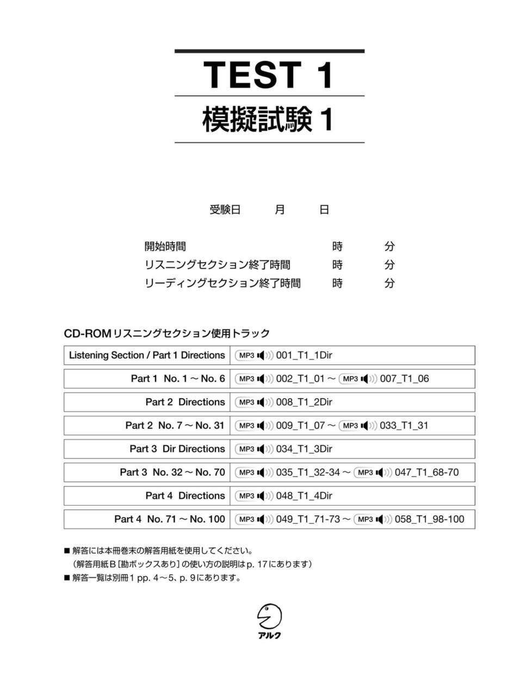


```text
TEST 1
1
模擬試験
受験日 月 日
開始時間 時 分
時 分
リスニングセクション終了時間
時 分
リーディングセクション終了時間
CD-ROMリスニングセクション使用トラック
Listening Section /P art 1D irections I ~P3 心） 001_T1_1Dir
Part 1 No. 1- No. 61@ P3心 002_T1 _01 -@P3•4>)) 007_ T 1 _06
I
Part 2 Directions (?P3心 008_T1 _2Dir
I
Part 2 No. 7- No. 31 @P3心 009_T1_07-@P3噌）））033_T1_31
I
Part 3 Dir Directions @P3心 034_T1_3Dir
I
Part 3 No. 32 -No. 70 @P3 心 035_T1_32-34 - ~P3 心 047_T1_68-70
I
Part 4 Directions @P3心 048_T1 _4 Dir
I
Part4 No. 71-No.100 @P3•4>)) 049_T1_71-73 - @P3•4>)) 058_T1_98-100
●解答には本冊巻末の解答用紙を使用してください。
（解答用祇B[勘ポックスあり］の使い方の説明はp.17にあります）
● 解答一覧は別冊1pp. 4-5、p.9にあります。
の西
```

## PDF 第 21 页


```text
LISTENING TEST
In this section, your ability to understand spoken English will be shown.T he Listening test consists of
four parts and will take approximately 45 minutes.D irections willb e given for each part. Byf ollowing
the directions you hear,s elect the best possible answer and marky our answers on youra nswer sheet.
Please refrain from writing anything in your test book.
PART 1
Directions: In this part,y ou will see ap icture in your test book and hear four statements.Af ter hearing
each statement,se lect the one statement you think is the best description fort he picture. Then,m ark the
answer on your answer sheet. You will only hear the statements one time,a nd they will not be printed in
your test book.
Sample Answer
R●c◎
Example
Statement (B), "They're sitting side by side,"b est describes the picture.Th erefore,y ou should choose
answer (B) and markit o n your answer sheet.
・ . .2 2
```

## PDF 第 22 页

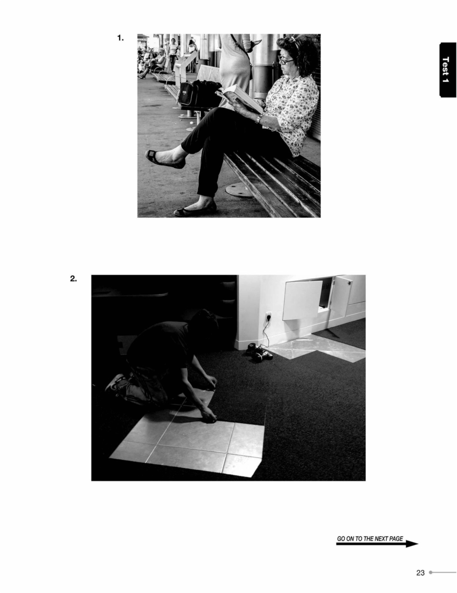


```text
1. ＇
2.
一
23... ・
```

## PDF 第 23 页

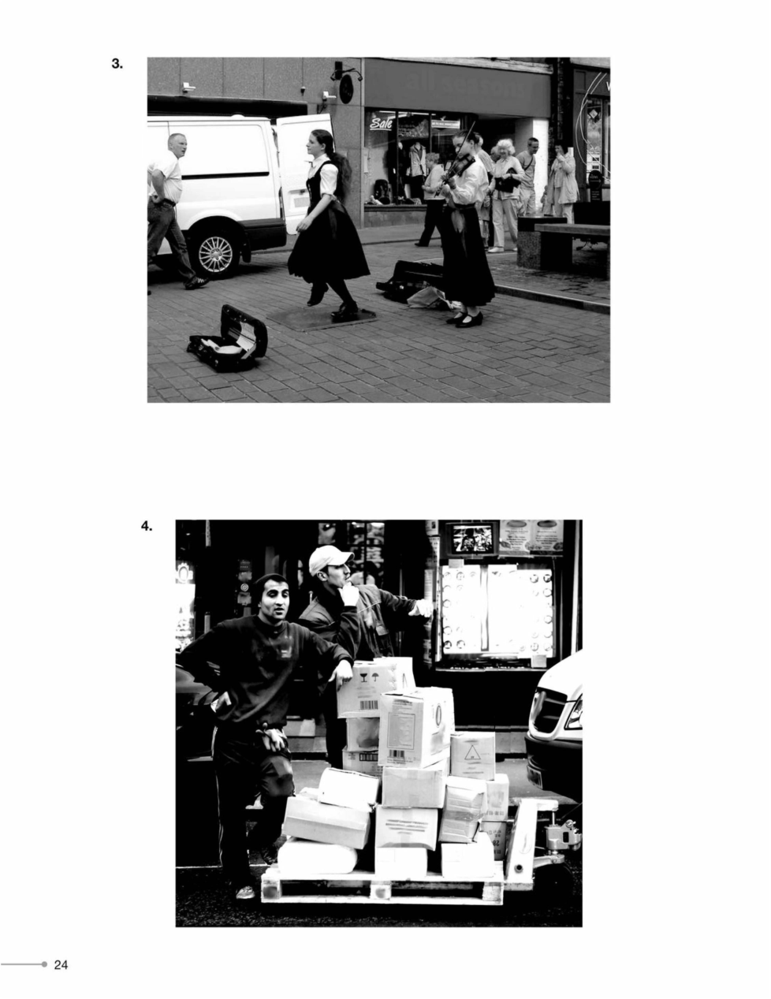


```text
- ... 24
```

## PDF 第 24 页

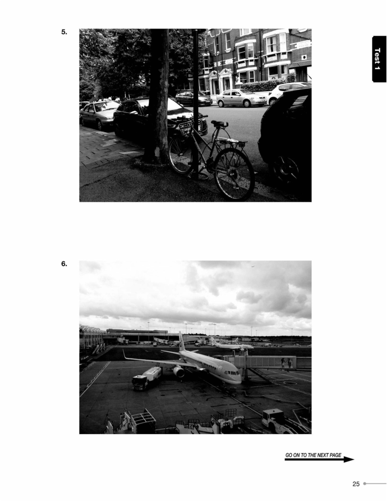


```text
＇
e
25... ・
```

## PDF 第 25 页


```text
PART2
Directions:In t his part, you willhe ar aq uestion or statement. You will then hear three alternative
responses to the question or statement. They will allb e spoken inE nglish. You will only hear them one
time,a nd they will not be printed in your test book.C hoose the best response to eachq uestion and
mark the letter(A ),(B ), or (C) on your answer sheet.
7. Mark your answero n your answer sheet. 20. Mark youra nswer on your answer sheet.
8. Mark your answero n your answer sheet. 21. Mark your answer on your answer sheet.
9. Mark your answer ony our answer sheet. 22. Mark youra nswer on your answer sheet.
10. Mark your answer on your answer sheet. 23. Marky oura nswer on your answer sheet.
11. Mark youra nswero ny our answer sheet. 24. Mark youra nswer on your answer sheet.
12. Mark youra nswer ony our answer sheet. 25. Mark youra nswer on your answer sheet.
13. Mark youra nswer ony oura nswer sheet. 26. Marky oura nswer on youra nswer sheet.
14. Mark your answer ony our answer sheet. 27. Marky oura nswer on your answer sheet.
15. Mark your answero ny our answer sheet. 28. Mark your answer on your answer sheet.
16. Mark your answer ony our answer sheet. 29. Mark youra nswer on your answer sheet.
17. Mark your answer on your answer sheet. 30. Marky our answer on your answer sheet.
18. Mark your answer on your answer sheet. 31. Marky oura nswer on your answer sheet.
19. Mark your answero n your answer sheet.
・ . .2 6
```

## PDF 第 26 页

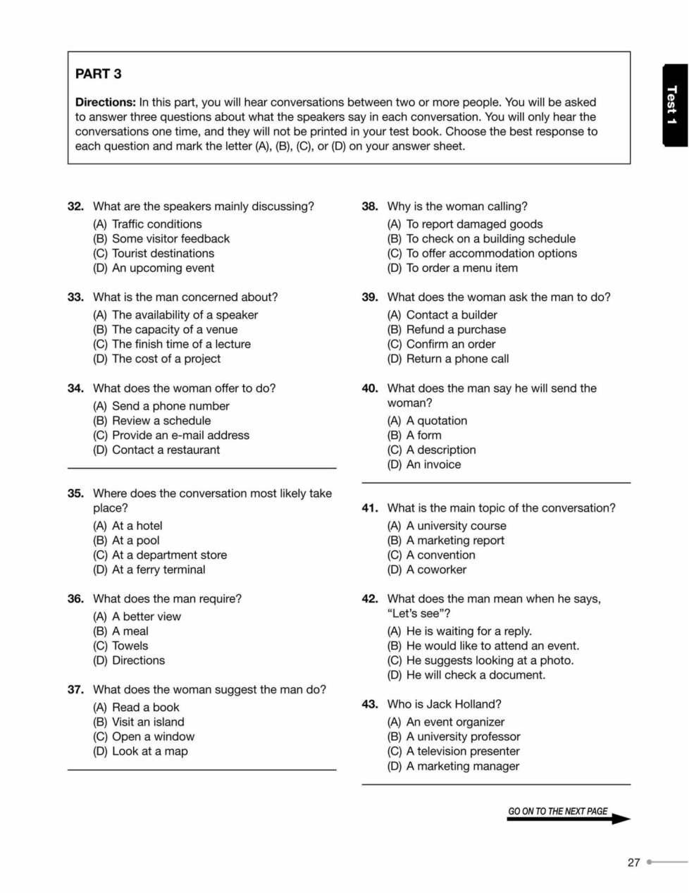


```text
＇
PART3
Directions: In thisp art,y ou will hear conversations between two or more people.Y ou wi llbe asked
to answer three questions about what thes peakers say in each conversation. You will only hear the
conversations one time, and they will not be printed in your testb ook. Choose the best response to
each question and mark the letter (A), (B), (C),o r (D) on your answer sheet.
32. What are the speakersm ainly discussing? 38. Whyi s the woman calling?
(A) Traffic conditions (A) To report damaged goods
(B) Somev isitor feedback (B) To check on ab uilding schedule
(C) Tourist destinations (C) To offer accommodation options
(D) An upcoming event (D) To order am enu item
33. What is the man concerned about? 39. What does the woman ask them ant o do?
(A) The availability of as peaker (A) Contact ab uilder
(B) The capacity of av enue (B) Refund ap urchase
(C) The finish time of al ecture (C) Confirm an order
(D) The cost of ap roject (D) Return ap hone call
34. What does the woman offer to do? 40. What does the man say he will send the
(A) Send ap hone number woman?
(B) Review as chedule (A) A quotation
(C) Provide an e-mail address (B) A form
(D) Contact ar estaurant (C) A description
(D) An 1. nv o1ce
35. Where does the conversation most likely take
place? 41. What is the main topic of the conversation?
(A) At ah otel (A) A university course
(B) Ata pool (B) A marketing report
(C) At ad epartment store (C) A convention
(D) At af erry terminal (D) A coworker
36. What doest he man require? 42. What does the man mean when he says,
(A) A better view "Let'ss ee"?
(B) A meal (A) Hei s waiting for ar eply.
(C) Towels (B) Hew ould like to attend an event.
(D) Directions (C) Hes uggests looking at ap hoto.
(D) Hew ill check ad ocument.
37. What does the woman suggest the man do?
(A) Read ab ook 43. Whoi s Jack Holland?
(B) Visit an island (A) Ane vent organizer
(C) Open aw indow (B) A universityp rofessor
(D) Look at am ap (C) A television presenter
(D) A marketing manager
一
27... ・
```

## PDF 第 27 页

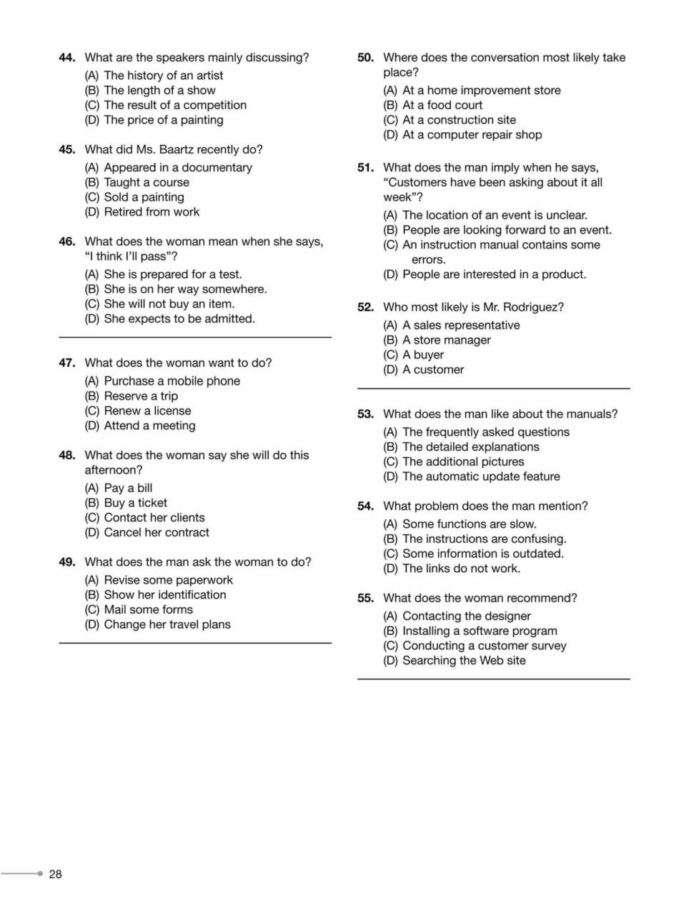


```text
44. What are the speakers mainly discussing? 50. Where does the conversation most likely take
(A) The history of an artist place?
(B) The length of as how (A) At ah ome improvements tore
(C) The result of ac ompetition (B) At af ood court
(D) The price of ap ainting (C) At ac onstructions ite
(D) At ac omputer repair shop
45. What did Ms. Baartz recently do?
(A) Appeared in ad ocumentary 51. What does the man imply when he says,
(B) Taught ac ourse "Customers have been asking about it all
(C) Sold ap ainting week"?
(D) Retired from work (A) The location of an event is unclear.
(B) People are looking forward to an event.
46. What does the woman mean when she says, (C) An .1 ns truct1on manual contains some
"Ith ink I' llpass"? errors.
(A) She is prepared for at est. (D) People arei nterested ina p roduct.
(B) She is on her way somewhere.
(C) She will not buy an item. 52. Who most likely is Mr.R odriguez?
(D) She expects to be admitted.
(A) A sales representative
(B) As tore manager
(C) A buyer
47. What does the woman want to do?
(D) A customer
(A) Purchase am obile phone
(B) Reserve at rip
(C) Renewa l icense 53. What does the man ilke aboutt he manuals?
(D) Attend am eeting
(A) The frequently asked questions
(B) The detailed explanations
48. What does the woman say she will do this
(C) The additional pictures
afternoon?
(D) The automatic update feature
(A) Pay ab ill
(B) Buy at icket 54. What problem does the man mention?
(C) Contact her clients
(A) Some functions are slow.
(D) Cancel her contract
(B) The instructions are confusing.
(C) Some information is outdated.
49. What does the man ask the woman to do?
(D) The links do not work.
(A) Revise some paperwork
(B) Show her identification 55. What does the woman recommend?
(C) Mail some forms
(A) Contacting the designer
(D) Change her travel plans
(B) Installing as oftware program
(C) Conducting ac ustomer survey
(D) Searching the Webs ite
・ . .2 8
```

## PDF 第 28 页

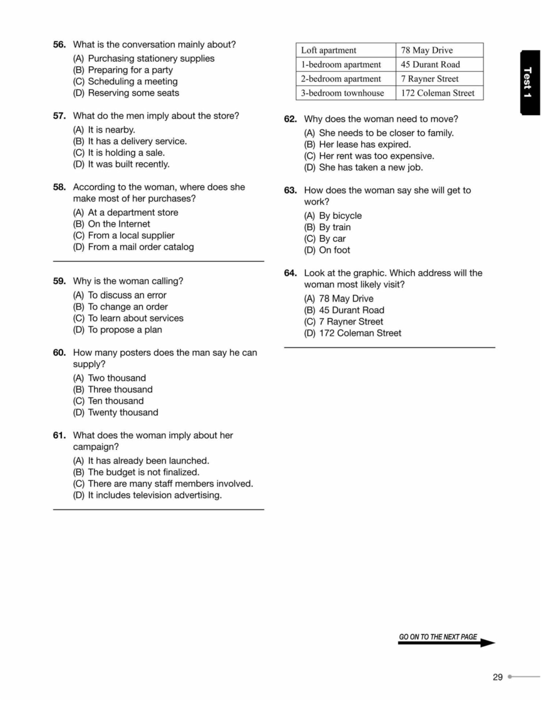


```text
56. What is the conversation mainly about? Loft apartment 78 May Drive ＇
(A) Purchasing stationery supplies
I-bedroom apartment 45D urant Road
(B) Preparing for ap arty
(C) Scheduling am eeting 2-bedroom apartment 7R ayner Street
(D) Reserving some seats 3-bedroom townhouse 172 Coleman Street
57. What do the men imply about the store? 62. Whyd oes the woman need to move?
(A) It is nearby. (A) She needs to be closer to family.
(B) It has ad elivery service. (B) Her lease has expired.
(C) It is holding as ale. (C) Her rent was too expensive.
(D) It was built recently. (D) She has taken an ew job.
58. According to the woman, where does she 63. How does the woman say she will get to
make most of her purchases? work?
(A) At ad epartment store (A) By bicycle
(B) Ont he Internet (B) By train
(C) From al ocal supplier (C) By car
(D) From am ail order catalog (D) Onf oot
64. Look at the graphic.W hich address will the
59. Why is the woman calling?
woman most likely visit?
(A) To discuss an error (A)7 8 May Drive
(B) To change an order
(B) 45 Durant Road
(C) To learn about services (C) 7R ayner Street
(D) To propose ap lan (D) 172 Coleman Street
60. How many posters does the man say he can
supply?
(A) Two thousand
(B) Three thousand
(C) Tent housand
(D) Twenty thousand
61. What does the woman imply about her
campaign?
(A) It has already been launched.
(B) The budget is not finalized.
(C) There are many staff members involved.
(D) It includes television advertising.
一
29... ・
```

## PDF 第 29 页

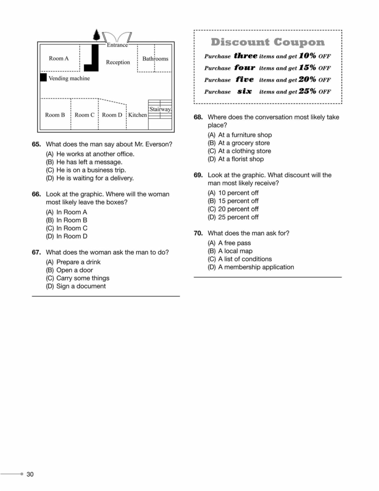


```text
Discount Coupon
Room A
ヽ
:
＇＇＇＇＇
B ath r
＇＇
＇＇ooms Purchase three items and get J. 0% OFF
Recept10n ，
~ :-- _-- し ’ ＇＇ -----"- ’ ＇ ＇ -- ---- Purchase rour items andg et J.5% OFF
一 >end.I1ーgmachーーーe Purchase t'i口e items and get 20%O FF
＇
Purchase six itemsa ndg et 25%O FF ＇ ＇＇
＇
----------------------------------------------- -------:
68. Where does the conversation most likely take
place?
(A) At af urniture shop
65. What does the man say about Mr. Everson? (B) At ag rocery store
(C) At ac lothing store
(A) He works at another office.
(D) At af lorist shop
(B) He has left am essage.
(C) He iso n ab usiness trip.
69. Look at the graphic. What discount will the
(D) He is waiting for ad elivery.
man most likely receive?
66. Look at the graphic. Where will the woman (A) 1O p ercent off
most likely leave the boxes? (B) 15 percent off
(C) 20 percent off
(A) In Room A
(D) 25 percent off
(B) In Room B
(C) In Room C
70. What does the man ask for?
(D) In Room D
(A) Af ree pass
67. What does the woman ask the man to do? (B) A local map
(C) A list of conditions
(A) Prepare ad rink
(D) A membership application
(B) Open ad oor
(C) Carry some things
(D) Sign ad ocument
・ . .3 0
```

## PDF 第 30 页

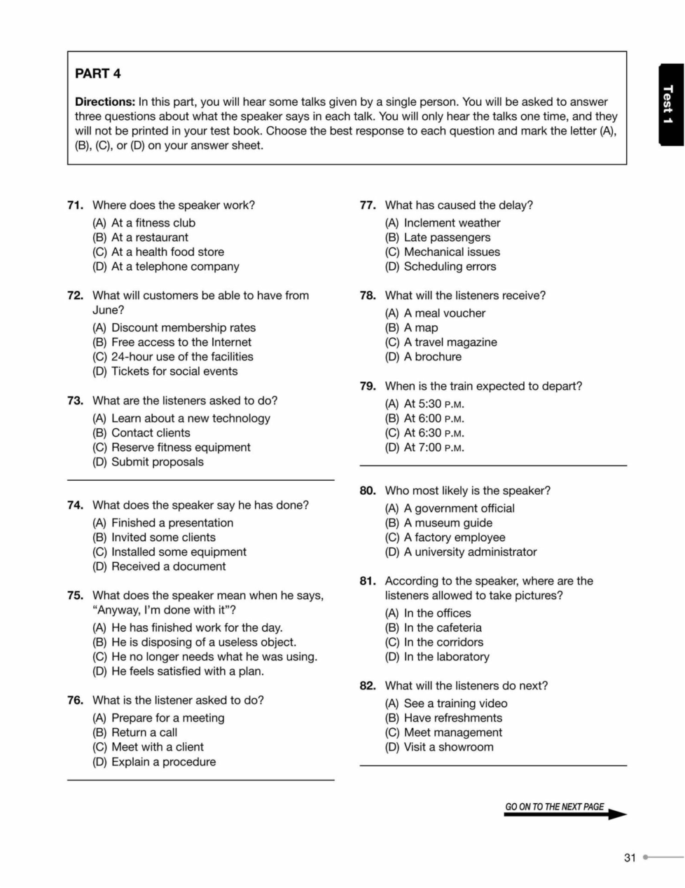


```text
＇
PART4
Directions: In this part, you will hear some talks given by as ingle person. You willb e asked to answer
three questions about what the speaker says in each talk. You wi llonly hear the talks one time, and they
will not be printed in your test book. Choose the best response to each question and mark the letter (A),
(8), (C), or (D) on your answer sheet.
71. Where does the speaker work? 77. What has caused the delay?
(A) At af itness club (A) Inclement weather
(B) At ar estaurant (B) Late passengers
(C) At ah ealth food store (C) Mechanical issues
(D) At at elephone company (D) Scheduling errors
72. What will customers be able to have from 78. What will the listeners receive?
June? (A) A mealv oucher
(A) Discount membership rates (B) A map
(B) Free access to the Internet (C) At ravelm agazine
(C) 24-hour use of the facilities (D) A brochure
(D) Tickets for social events
79. When is the train expected to depart?
73. What are the listeners asked to do? (A) At 5:30 P.M.
(A) Learn about an ewt echnology (B) At6 :00 P.M.
(B) Contact clients (C) At6 :30 P.M.
(C) Reserve fitness equipment (D) At 7:00 P.M.
(D) Submit proposals
80. Whom ost likely is the speaker?
74. What does the speaker say he has done? (A) Ag overnment official
(A) Finished ap resentation (B) A museum guide
(B) Invited some clients (C) Af actory employee
(C) Installed some equipment (D) A university administrator
(D) Received ad ocument
81. According to the speaker, where are the
75. What does the speaker mean when he says, listeners allowed to take pictures?
"Anyway,I' m done with it"? (A) In the offices
(A) He has finished work for the day. (B) In the cafeteria
(B) He is disposing of au seless object. (C) In the corridors
(C) He no longer needs what he was using. (D) In the laboratory
(D) Hef eels satisfied with ap lan.
82. What will the listeners do next?
76. What is the listener asked to do? (A) See at raining video
(A) Prepare for am eeting (B) Have refreshments
(B) Return ac all (C) Meet management
(C) Meet with ac lient (D) Visit as howroom
(D) Explain ap rocedure
一
31 ... ・
```

## PDF 第 31 页

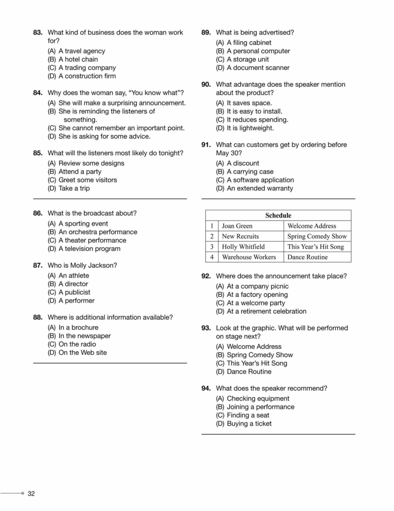


```text
83. What kind of business does the woman work 89. Whatis being advertised?
for? (A) Af iling cabinet
(A) At ravel agency (B) A personal computer
(B) Ah otel chain (C) As torage unit
(C) At rading company (D) Ad ocument scanner
(D) Ac onstruction firm
90. What advantage does the speaker mention
84. Whyd oes the woman say, "You know what"? about the product?
(A) She will make as urprising announcement. (A) It saves space.
(B) She is reminding the listeners of (B) It is easy to instal .l
something. (C) It reduces spending.
(C) She cannot remember an important point. (D) It isil ghtweight.
(D) She is asking for some advice.
91. What can customers get by ordering before
85. What will the listeners most likelyd o tonight? May 30?
(A) Review some designs (A) A discount
(B) Attend ap arty (B) A carryingc ase
(C) Greets ome visitors (C) As oftware application
(D) Take at rip (D) An extended warranty
86. What is the broadcast about? Schedule
(A) As porting event I Joan Green WelcomeA ddress
(B) An orchestra performance
2 New Recruits SpringC omedy Show
(C) At heater performance
(D) At elevision program 3 HollyW hitfield ThisY ear's Hit Song
4 WarehouseW orkers DanceR outme
87. Who is Molly Jackson?
(A) An athlete 92. Where does the announcement take place?
(B) Ad irector (A) At ac ompany picnic
(C) Ap ublicist (B) At af actory opening
(D) Ap erformer (C) At aw elcome party
(D) At ar etirementc elebration
88. Where is additionalin formation available?
(A) In ab rochure 93. Look at the graphic.W hat will be performed
(B)I n the newspaper on stage next?
(C) Ont he radio (A) Welcome Address
(D)O nt he Webs ite (B) Spring Comedy Show
(C) This Year's Hit Song
(D) Dance Routine
94. What does the speaker recommend?
(A) Checking equipment
(B) Joining ap erformance
(C) Finding as eat
(D) Buying at icket
・ . .3 2
```

## PDF 第 32 页

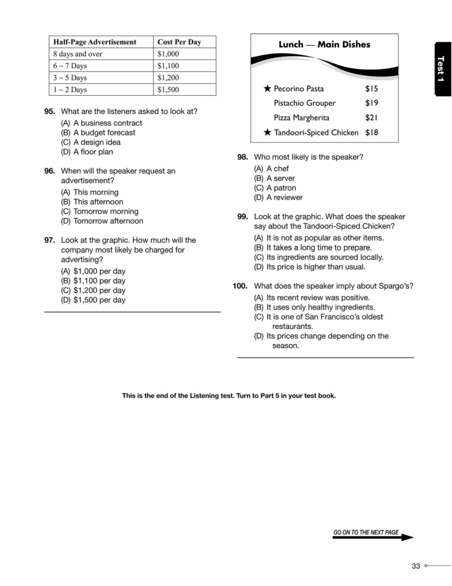


```text
Half-Page Advertisement Cost Per Day ＇
Lunch - Main Dishes
8d ays ando ver $1,000
6-7D ays $1,100
3- 5D ays $1,200 *
I- 2D ays $1,500 Pecorino Pasta $1 S
Pistachio Grouper $19
95. What are the listeners asked tol ooka t?
*Pizz a Margherita $21
(A) A business contract
(B) A budget forecast Tandoori-SpicedC hicken $18
(C) Ad esign idea
(D) Af loor plan
98. Whom ost likely is the speaker?
96. When will the speaker request an (A)A c hef
advertisement? (B) As erver
(C) A patron
(A) This morning
(D) A reviewer
(8) This afternoon
(C) Tomorrow morning
99. Looka t the graphic.W hat does the speaker
(D) Tomorrow afternoon
say about the Tandoori-Spiced Chicken?
97. Look at the graphic. How much willth e (A) Itis not as popular as other items.
company most likely be charged for (B) Itt akes al ong time to prepare.
advertising? (C) Itsi ngredients are sourced locally.
(D) Its price is higher than usual.
(A) $"1,000 per day
(B) $ 1" ,"1 00 per day
100. What does the speaker imply about Spargo's?
(C) $"1,200p er day
(D) $"1,500 per day (A)I tsr ecent review was positive.
(B) It uses only healthy ingredients.
(C) Itis one of San Francisco's oldest
restaurants.
(D) Its prices change depending on the
season.
This is the end of the Listening test. Turn to Part 5in your test book.
一
33... ・
```

## PDF 第 33 页

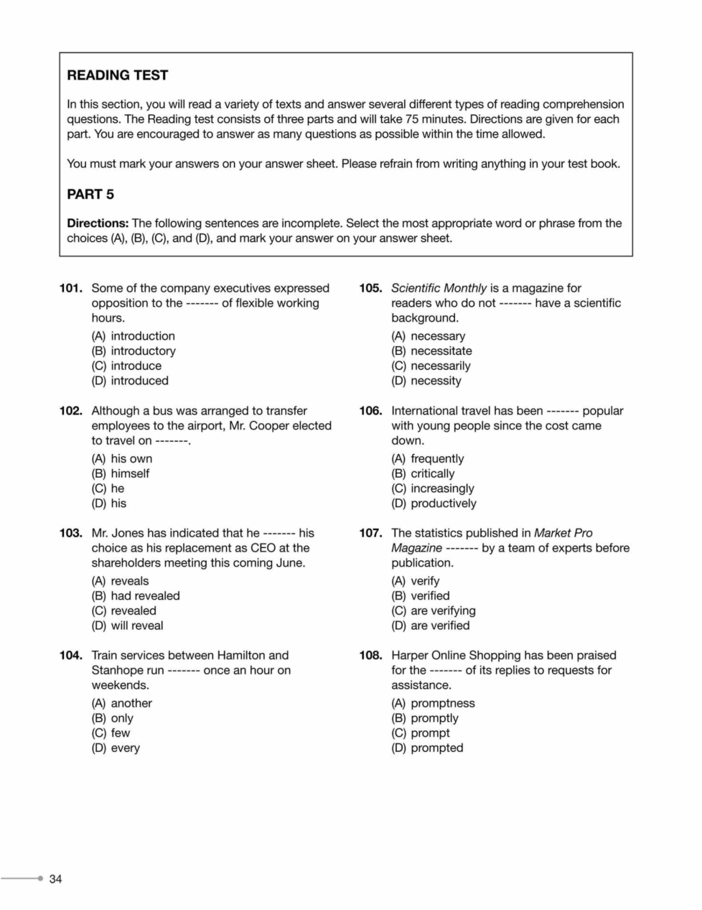


```text
READING TEST
In this section, you will read av ariety of texts and answer several different types of reading comprehension
questions. The Reading test consistso f three parts and will take 75 minutes.Di rections are given for each
part.Y ou are encouraged to answer as many questions as possible within the time allowed.
You must mark your answers on youra nswer sheet. Please refrain from writing anything iny our test book.
PARTS
Directions: The following sentences are incomplete.Se lect the mosta ppropriate word or phrase from the
choices (A), (B), (C), and (D), and mark your answer on your answersh eet.
101. Someo f the company executives expressed 105. Scientific Monthly is am agazine for
opposition to the -------of flexible working readers who do not -------have as cientific
hours. background.
(A) introduction (A) necessary
(B) introductory (B) necessitate
(C) introduce (C) necessarily
(D) introduced (D) necessity
102. Although ab us was arranged to transfer 106. International travel has been -------popular
employees to the airport, Mr. Cooper elected with young people since the cost came
to travel on -------. down.
(A) his own (A) frequently
(B)h imself (B) critically
(C) he (C) increasingly
(D) his (D) productively
103. Mr.J ones has indicated that he-------his 107. The statistics publishedi n Market Pro
choice as his replacement as CEOa t the Magazine -------by at eam of experts before
shareholders meeting this coming June. publication.
(A) reveals (A) verify
(B) had revealed (B) verified
(C) revealed (C) are verifying
(D) will reveal (D) are verified
104. Train services between Hamilton and 108. Harper Online Shopping has been praised
Stanhope run -------once an hour on for the -------of its replies to requests for
weekends. assistance.
(A) another (A) promptness
(B) only (B) promptly
(C) few (C) prompt
(0) every (D) prompted
・ . .3 4
```

## PDF 第 34 页

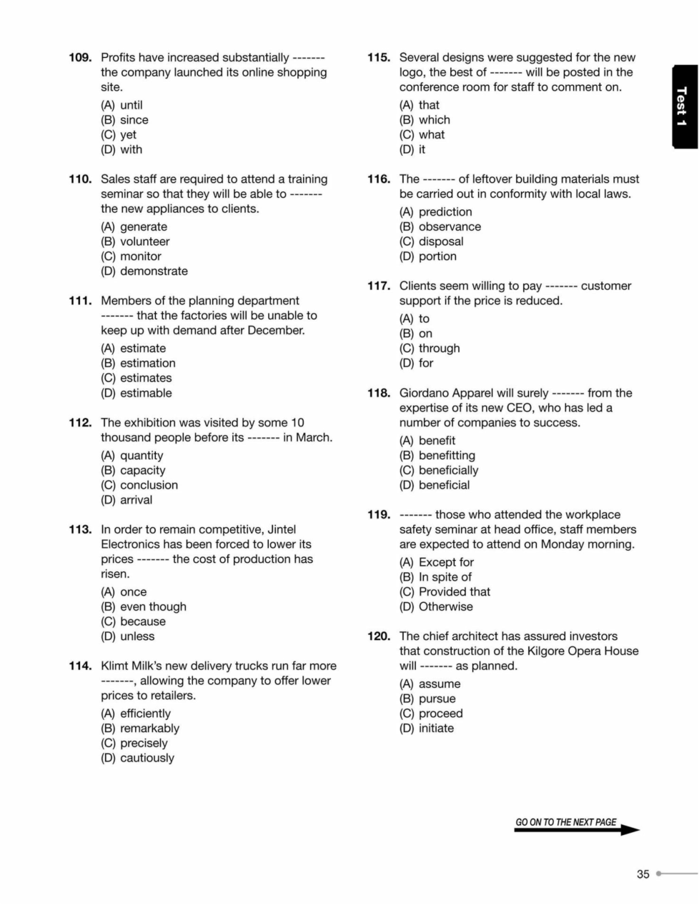


```text
109. Profits have increased substantially------- 115. Several designs were suggested for the new＇
the company launched itso nline shopping logo,th e best of -------wi llbe posted in the
site. conference room forst aff to comment on.
(A) until (A) that
(B) since (B) which
(C) yet (C) what
(D) with (D) it
110. Sales staff are required to attend at raining 116. The -------of leftover building materials must
seminar so that they will be able to ------- be carried out in conformity with local laws.
the newa ppliances to clients. (A) prediction
(A) generate (B) observance
(B) volunteer (C) disposal
(C) monitor (D) portion
(D) demonstrate
117. Clients seem willing to pay-------customer
111. Members of the planning department support if thep rice is reduced.
-------that the factories will be unable to (A) to
keep up with demand after December. (B) on
(A) estimate (C) through
(B) estimation (D) for
(C) estimates
(D) estimable 118. Giordano Apparel will surely -------from the
expertise of its new CEO, who has leda
112. The exhibition was visited by some1 0 number of companies to success.
thousand people before its -------in March. (A) benefit
(A) quantity (B) benefitting
(B) capacity (C) beneficially
(C) conclusion (D) beneficial
(D) arrival
119. -------those who attended the workplace
113. In order to remainc ompetitive, Jintel safety seminar at head office, staff members
Electronics has been forcedt o lowerit s are expected to attend on Monday morning.
prices -------the cost of production has (A) Except for
nsen. (B) In spite of
(A) once (C) Provided that
(B) even though (D) Otherwise
(C) because
(D) unless 120. The chief architect has assured investors
that construction of theK ilgore Opera House
114. Klimt Milk's new delivery trucks run far more wi ll-------as planned.
----—, allowingt he company to offer lower (A) assume
prices to retailers. (B) pursue
(A) efficiently (C) proceed
(B) remarkably (D)in itiate
(C) precisely
(D) cautiously
一
35... ・
```

## PDF 第 35 页

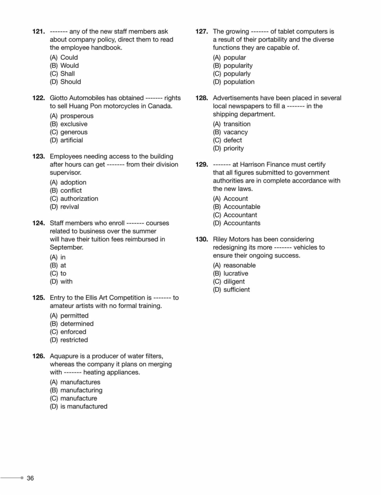


```text
121. -------any of the new staff members ask 127. The growing-------of tablet computers is
about company policy, direct them to read ar esult of their portability and the diverse
the employee handbook. functions they are capable of.
(A) Could (A) popular
(B) Would (B) popularity
(C) Shall (C) popularly
(D) Should (D) population
122. Giotto Automobiles has obtained -------rights 128. Advertisements have been placed in several
to sell Huang Pon motorcycles in Canada. local newspapers to fill a- ------in the
(A) prosperous shipping department.
(B) exclusive (A) transition
(C) generous (B) vacancy
(D) artificial (C) defect
(D) priority
123. Employees needing access to the building
after hours can get -------from their division 129. -------at Harrison Finance must certify
supervisor. that all figures submitted to government
(A) adoption authoritiesa re in complete accordance with
(B) conflict the new laws.
(C) authorization (A) Account
(D) revival (B) Accountable
(C) Accountant
124. Staff members who enroll -------courses (D) Accountants
related to business over thes ummer
will have their tuition fees reimbursed in 130. Riley Motors has been considering
September. redesigning its more -------vehicles to
(A) in ensure their ongoing success.
(B) at (A) reasonable
(C) to (B) lucrative
(D) with (C) diligent
(D) sufficient
125. Entry to the Ellis Art Competition is -------to
amateur artists with no formal training.
(A) permitted
(B) determined
(C) enforced
(D) restricted
126. Aquapure isa p roducer of water filters,
whereas the company it plans on merging
with -------heating appliances.
(A) manufactures
(B) manufacturing
(C) manufacture
(D) is manufactured
・ . .3 6
```

## PDF 第 36 页

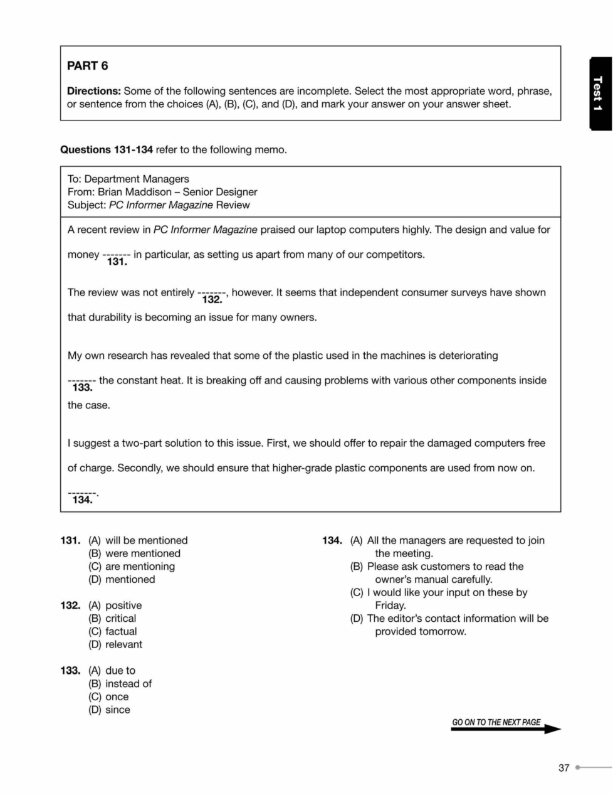


```text
＇
PART6
Directions: Some of the following sentences are incomplete. Select the most appropriate word, phrase,
or sentence from the choices (A), (B), (C), and (D), and mark your answer on your answer sheet.
Questions 131-134 refer to the following memo.
To: Department Managers
From: Brian Maddison -Senior Designer
Subject: PCI nformer Magazine Review
A recent review in PCI nformer Magazine praised our laptop computers highly.T he design and value for
money -------1n particular, as setting us apart from many of our competitors.
131.
The review was note ntirely -------however. It seems that independent consumer surveys have shown
132.'
that durability is becoming an issue for many owners.
Myo wn research has revealed that some of thep lastic used int he machines isd eteriorating
-------the constant heat. It is breaking off and causing problems with various other components inside
133.
the case.
Is uggesta t wo-part solution to this issue.Fi rst, wes hould offer to repair the damaged computers free
of charge. Secondly,w es hould ensure that higher-grade plastic components are used from now on.
-1―函．—．
131. (A) will be mentioned 134. (A) All the managers are requested to join
(B) were mentioned the meeting.
(C) arem entioning (B) Please ask customers to read the
(D) mentioned owner's manual carefully.
(C) Iw ould like your input on these by
132. (A) positive Friday.
(B) critical (D) The editor's contact information will be
(C) factual provided tomorrow.
(D) relevant
133. (A) due to
(B) instead of
(C) once 一
(D) since
37... ・
```

## PDF 第 37 页

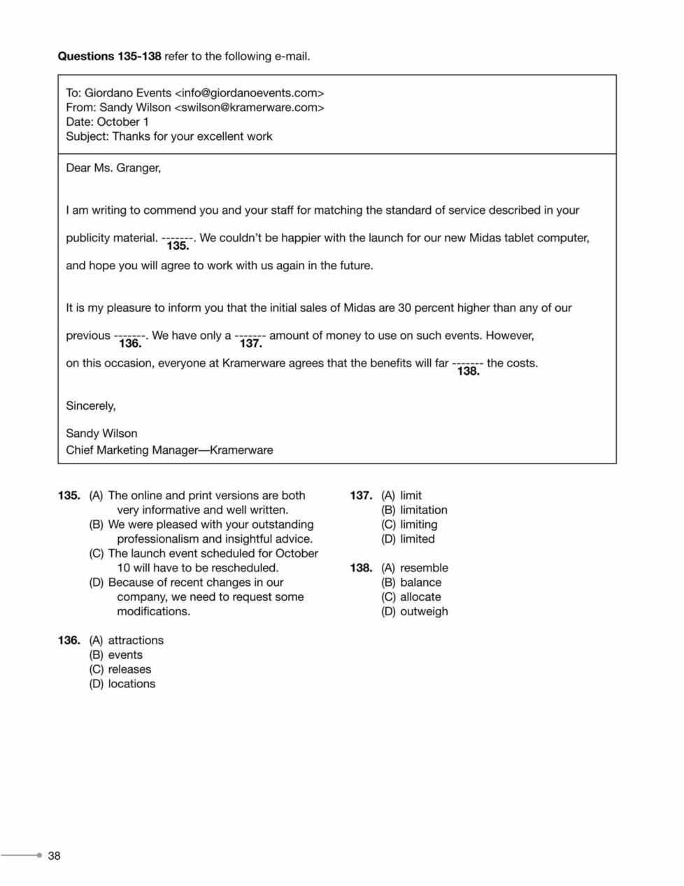


```text
Questions 135-138 refer to the following e-mail.
To:G iordano Events <info@giordanoevents.com>
From: Sandy Wilson <swilson@kramerware.com>
Date:O ctober 1
Subject: Thanks for your excellent work
Dear Ms.Gr anger,
Ia mw riting to commend you and your staff for matching the standard of service described in your
publicity material. -------.W ec ouldn't be happier with the launch for our new Midas tablet computer,
135.
and hope you will agree to work with us again in the future.
It is myp leasure to inform you that the initial sales of Midas are 30 percent higher than any of our
previous -------Weh ave only a- ------amount of money to use on such events. However,
136.. 137.
on this occasion, everyone at Kramerware agrees that the benefits will far -------the costs.
138.
Sincerely,
Sandy Wilson
Chief Marketing Manager—Kramerware
135. (A) The online and print versions are both 137. (A) ilmit
very informative and well written. (B) ilmitation
(B) Wew ere pleased with your outstanding (C) ilmiting
professionalism and insightful advice. (D) limited
(C) The launch event scheduled for October
10 wi llhave to be rescheduled. 138. (A) resemble
(D) Because of recent changes in our (B) balance
company,w en eed to request some (C) allocate
modifications. (D) outweigh
136. (A) attractions
(B) events
(C) releases
(D) locations
・ . .3 8
```

## PDF 第 38 页

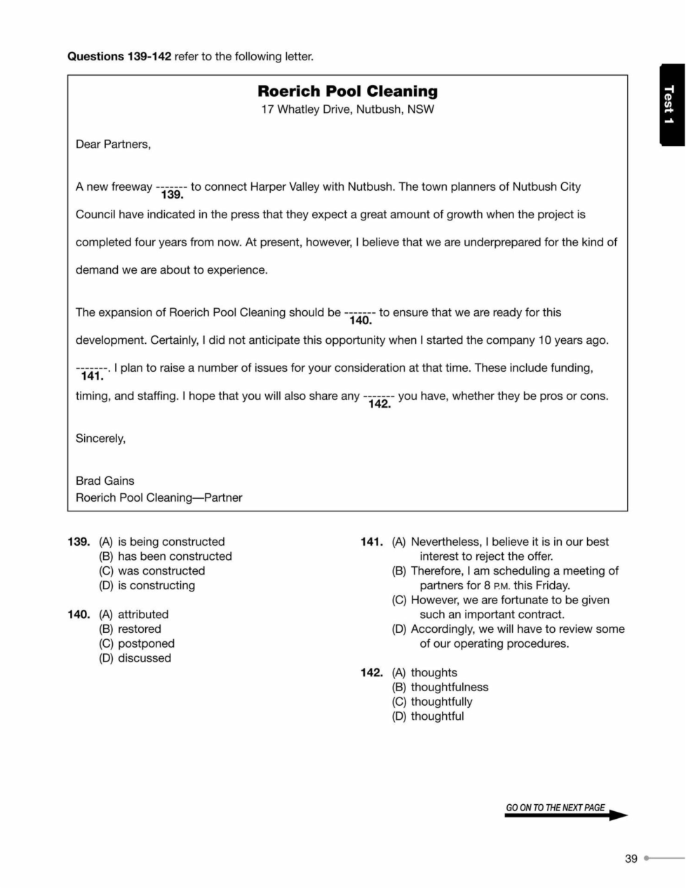


```text
Questions 139-142 refer to the following letter. ＇
Roerich Pool Cleaning
17 Whatley Drive, Nutbush, NSW
Dear Partners,
A new freeway-------to connect Harper Valley with Nutbush. The town planners of Nutbush City
139.
Council have indicated in the press that they expect ag reat amount of growth when the project is
completed four years from now.A t present,h owever, Ibe lieve that wea re underprepared for the kind of
demand wea re about to experience.
The expansion of Roerich Pool Cleaning should be -------to ensure that wea re ready for this
140.
development. Certainly,I di d not anticipate this opportunity when Ist arted the company 1O y ears ago.
-------.I p lan to raise an umber of issues for your consideration at that time. These include funding,
141.
timing,a nd staffing.I h ope that you will also share any -------you have,w hether they be pros or cons.
142.
Sincerely,
Brad Gains
Roerich Pool Cleaningー Partner
139. (A) is being constructed 141. (A) Nevertheless,I be lieve it is in our best
(B) has been constructed interest to reject the offer.
(C) was constructed (B) Therefore, Ia ms cheduling am eeting of
(D) is constructing partners for 8P .M.t his Friday.
(C) However,w ea re fortunate to be given
140. (A) attributed such an important contract.
(B) restored (D) Accordingly,w ew i llhave to review some
(C) postponed of our operating procedures.
(D) discussed
142. (A) thoughts
(B) thoughtfulness
(C) thoughtfully
(D)t houghtful
一
39... ・
```

## PDF 第 39 页

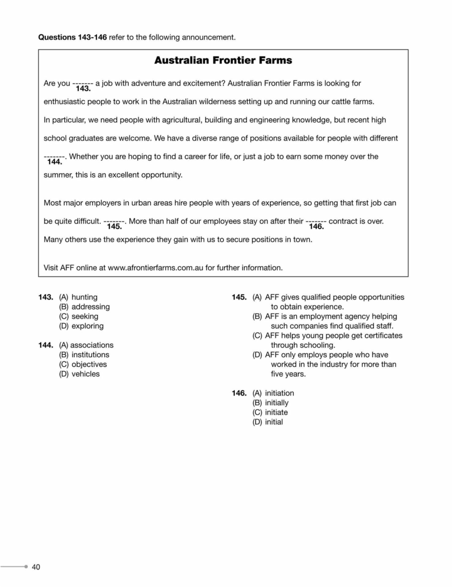


```text
Questions 143-146 refer to the following announcement.
Australian Frontier Farms
Are you -------aj ob with adventure and excitement? Australian Frontier Farms is looking for
143.
enthusiastic people to work in the Australian wilderness setting up and running our cattle farms.
In particular,w en eed people with agricultural,bu ilding and engineering knowledge,b ut recent high
school graduates are welcome. Weh ave ad iverse range of positions available for people with different
.W hether you are hoping to find ac areer for life,o r just aj ob to earn some money over the
144.
summer, this is an excellent opportunity.
Most major employers in urban areas hire people with years of experience,s o getting that first job can
be quite difficult. -------.M ore than half of our employees stay on after their-------contract is over.
145. 146.
Many others use the experience they gain with ust o secure positions in town.
Visit AFF online at www.afrontierfarms.com.au for further information.
143. (A) hunting 145. (A) AFF gives qualified people opportunities
(B) addressing to obtain experience.
(C) seeking (B) AFF is an employment agency helping
(D) exploring such companies find qualified staff.
(C) AFF helps young people get certificates
144. (A) assoc1at1ons through schooling.
(B) institutions (D) AFF only employs people who have
(C) objectives worked in the industry for more than
(D) vehicles five years.
146. (A) initiation
(B) initially
(C) initiate
(D) initial
・ . .4 0
```

## PDF 第 40 页

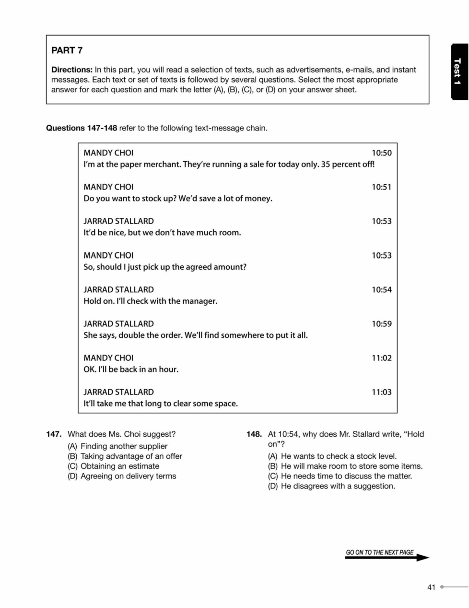


```text
＇
PART7
Directions: In this part, you will read as election of texts, such as advertisements,e- mails, and instant
messages.E ach texto r set of texts is followed by several questions. Select the most appropriate
answer for each question and mark the letter (A), (B), (C), or (D) on your answer sheet.
Questions 147-148 refer to the following text-message chain.
MANDYC HOI 10:50
I'm at the paper merchant. They're running as ale for today only. 35 percent off!
MANDYC HOI 10:51
Doy ou want to stock up? We'd save al ot of money.
JARRAD STALLARD 10:53
It'd be nice, but wed on't have much room.
MANDYC HOI 10:53
So, should Iju st pick upt he agreed amount?
JARRAD STALLARD 10:54
Hold on. I' llcheck with the manager.
JARRAD STALLARD 10:59
She says,d ouble the order. We'll find somewhere to put it all.
MANDYC HOI 11:02
OK. I'll be back in an hour.
JARRAD STALLARD 11:03
It'll take met hat long to clear some space.
147. What does Ms. Choi suggest? 148. At 10:54,w hy does Mr. Stallard write, "Hold
(A) Finding another supplier on"?
(B) Taking advantage of an offer (A) He wants to check as tock level.
(C) Obtaining an estimate (B) He will make room to store some items.
(D) Agreeing on delivery terms (C) He needs time to discuss the matter.
(D) He disagrees with as uggestion.
一
41 ... ・
```

## PDF 第 41 页

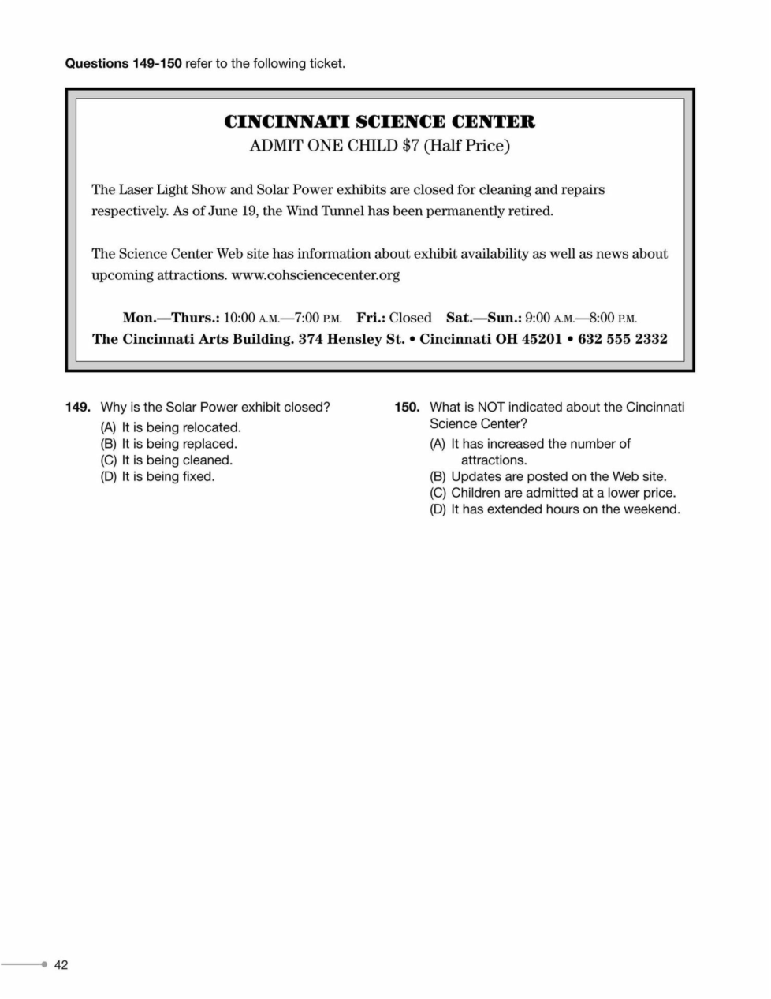


```text
Questions 149-150 refer to the following ticket.
CINCINNATI SCIENCE CENTER
ADMIT ONEC HILD $7 (Half Price)
TheL aser Light Showa nd Solar Power exhibits are closed for cleaning and repairs
respectively. Aso f June1 9, theW ind Tunnel has been permanently retired.
TheS cience Center Web site has information about exhibit availability as well as news about
upcoming attractions.w ww.cohsciencecenter.org
Mon.-Thurs.: 10:00 A.M. — 7:00 P.M. Fri.: Closed Sat. —Sun.: 9:00 A.M. — 8:00 P.M.
The Cincinnati Arts Building. 374 Hensley St.• Cincinnati O H4 5201• 632 555 2332
149. Why is theS olar Power exhibit closed? 150. What isN OT indicated about the Cincinnati
(A) It is being relocated. Science Center?
(B) It is being replaced. (A) Ith as increased the number of
(C) It is being cleaned. attractions.
(D) It is being fixed. (B) Updates are posted on the Web site.
(C) Childrena re admitted at al ower price.
(D) It has extended hours ont he weekend.
・ . .4 2
```

## PDF 第 42 页

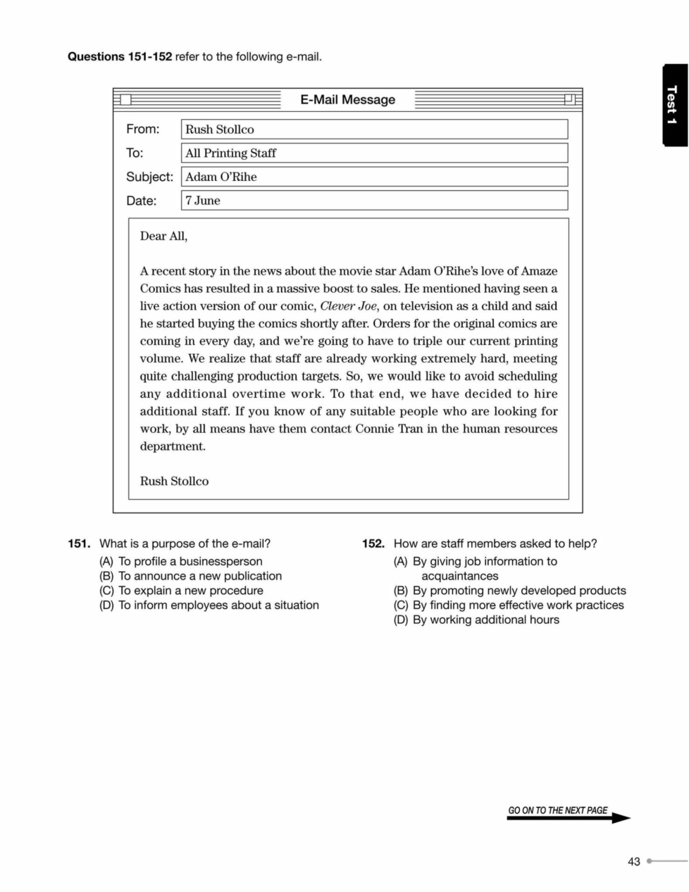


```text
Questions 151-152 refer to the following e-mail.
＇
E-Mail Message
From: [Ru sh Stollco
I
To: All PrintingS taff
I
Subject: Adam O'Rihe
17
Date: June
Dear All,
Ar ecent story in then ews about the movies tar Adam O'Rihe's love of Amaze
Comics has resulted in am assive boost to sales. He mentioned having seena
live action version of our comic,Cl ever Joe, on television as ac hild and said
he started buyingt he comics shortly after.Or ders for the original comics are
comingi n every day,a nd we're going to have to triple our current printing
volume.W e realizet hat staff are alreadyw orking extremely hard,m eeting
quitec hallengingp roduction targets. So, wew ould like to avoid scheduling
anya dditionalo vertime work. To that end,w e have decided to hire
additionalst aff. If you knowo fa nys uitablep eoplew hoa re looking for
work, by all means have them contact Connie Tran in the human resources
department.
Rush Stollco
151. What is ap urpose of the e-mail? 152.H ow are staff members asked to help?
(A) To profilea b usinessperson (A) By giving job informationt o
(B) Toa nnounce an ew publication acquaintances
(C) To explain an ewp rocedure (B) By promoting newly developed products
(D) To inform employees about as ituation (C) By finding more effective work practices
(D) By working additionalho urs
一
43... ・
```

## PDF 第 43 页

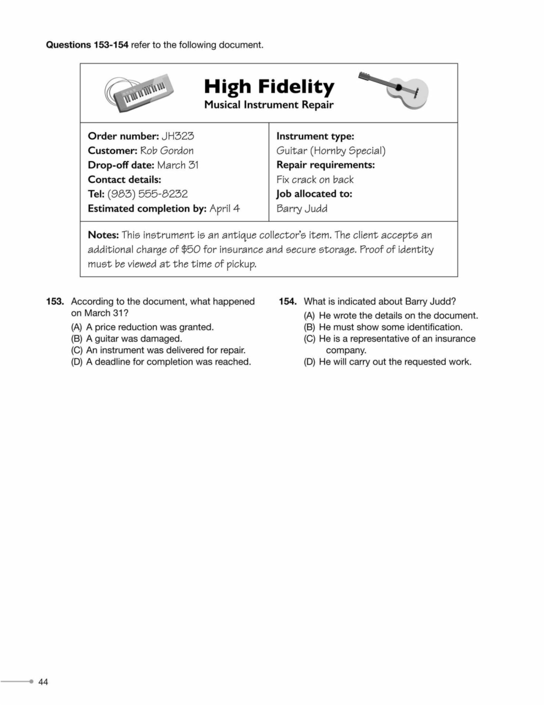


```text
Questions 153-154 refer to the following document.
High Fidelity
Musical Instrument Repair
Order number: JH323 Instrument type:
Customer: Rob Gordon Guitar (HornbyS pecial)
Drop-off date: March 31 Repair requirements:
Contact details: Fix crack on back
Tel: (983)5 55-8232 Job allocated to:
Estimated completion by: Apr li4 Barry Judd
Notes: Thiら inらtrumentisa n antique collector'ら item.The cilent acceptらan
additionalc harge of $50f or inらuranceandらecureらtorage.Proof of identity
must be viewed at thet ime of pickup.
153. According to the document, what happened 154. What is indicated about Barry Judd?
on March 31? (A) Hew rote thed etails on the document.
(A) Ap rice reduction was granted. (8) Hem ust show some identification.
(B) Ag uitar was damaged. (C) Hei s ar epresentative of an insurance
(C) An instrument was delivered for repair. company.
(D) Ad eadline for completion was reached. (D) Hew i llcarry out the requested work.
・ . .4 4
```

## PDF 第 44 页

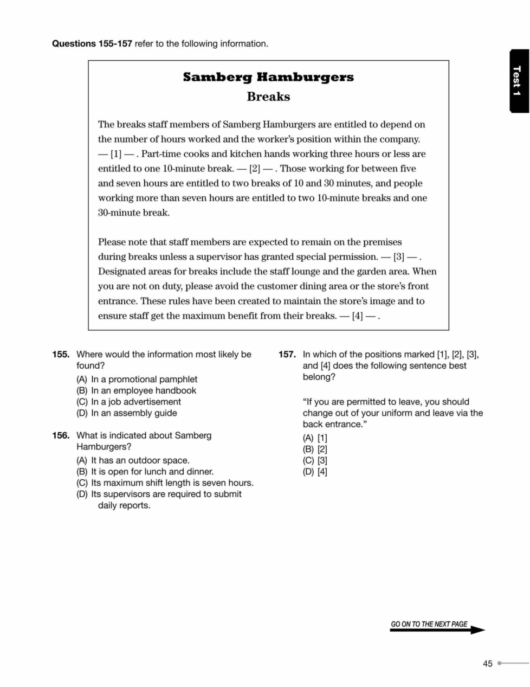


```text
Questions 155-157 refer to the followingi nformation. ＇
Samberg Hamburgers
Breaks
The breaks staff members of Samberg Hamburgers are entitled to depend on
the number of hours worked and the worker's position within the company.
ー [l) —. Part-time cooks and kitchen hands working tlrree hours or less are
entitled to one 10-minute break. - [2] —. Those working for between five
and seven hours are entitled to two breaks of 10 and 30 minutes, and people
working more than seven hours are entitled to two 10-minute breaks and one
30-minute break.
Please note that staff members紅 eexpected to remain on the premises
during breaks unless as upervisor has granted special permission. - [3) —.
Designated紅 easfor breaks include the staff loungea nd the g紅 denarea. When
you are not on duty, please avoid the customer dining紅 eaor the store's front
entrance. These rules have been created to maintain the store's image and to
ensure staff get the maximum benefit from their breaks. — [4) 一 ·
155. Where would the information most likely be 157. In which of the positions marked[ 1], [2],[3 ],
found? and [4] does the following sentence best
(A) In ap romotional pamphlet belong?
(B) In ane mployeeh andbook
(C) In aj ob advertisement "If you are permitted to leave, you should
(D) In an assemblyg uide change outo f your uniform and leave via the
back entrance."
156. What is indicated aboutS amberg (A) (1]
Hamburgers? (B) (2]
(A) It has an outdoor space. (C) (3]
(B) It iso pen for lunch and dinner. (D) (4]
(C) Its maximum shift length is seven hours.
(D) Itss upervisors are required to submit
daily reports.
一
45... ・
```

## PDF 第 45 页

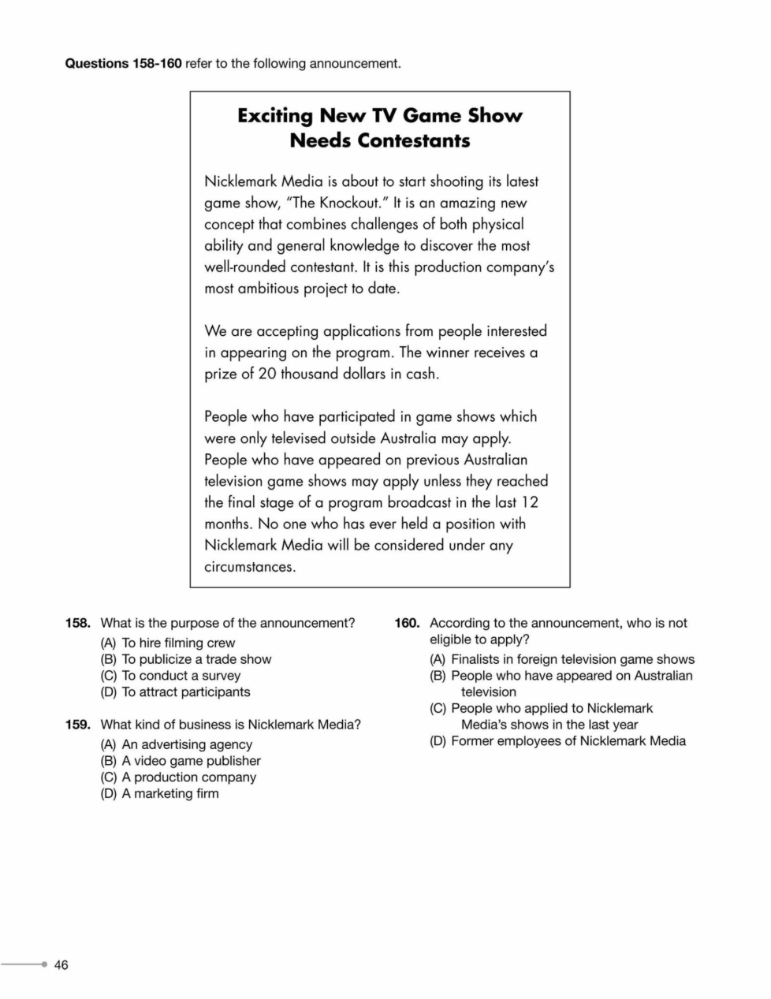


```text
Questions 158-160 refer to the following announcement.
Exciting NewT VG ameS how
Needs Contestants
Nicklemark Media is about to start shooting its latest
game show," The Knockout." It is an amazing new
concept that combines challenges of both physical
ability and general knowledge to discover the most
well-rounded contestant.It is this production company's
most ambitious project to date.
W ea re accepting applicationsf rom people interested
in appearing on the program.T he winner receives a
prize of 20t housand dollars in cash.
People who have participated in game shows which
were only televised outside Australia may apply.
People who have appeared on previous Australian
television game shows may apply unless they reached
the final stage of a p「ogrambroadcast in the last 12
months. Noo ne who hase ver held a position with
Nicklemark Mediaw ill be considered under any
circumstances.
158. Whatis the purpose of the announcement? 160. According to the announcement, who is not
(A) To hire filming crew eligible to apply?
(B) To publicize at rade show (A)F inalists in foreign television game shows
(C) To conduct as urvey (B) People who have appeared on Australian
(D) To attractp articipants television
(C) People who applied to Nicklemark
159. Whatk ind ofb usiness is Nicklemark Media? Media's shows in the last year
(A) An advertising agency (D) Former employees of Nicklemark Media
(B)A v ideo game publisher
(C) Ap roduction company
(D) Am arketing firm
・ . .4 6
```

## PDF 第 46 页

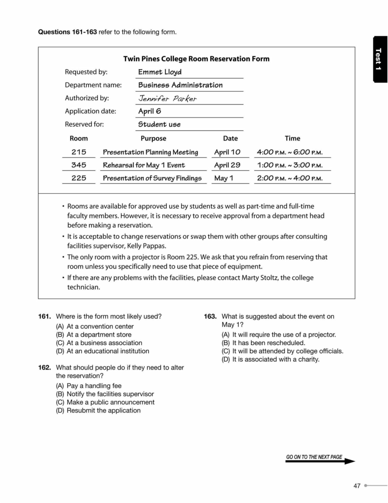


```text
Questions 161-163 refer to the following form. ＇
Twin Pines College RoomR eservation Form
Requested by: Emmet Lloyd
Department name: Business Administration
Authorized by: Jenn:l'er Parf:er
Application date: April6
Reserved for: Student u5e
Room Purpose Date Time
215 Presentation Planning Meeting April1 0 4:00P .M. N 6:00 P.M.
345 Rehearsal for May1 E vent April 29 1:0 0P .M.- 3:00P .M.
225 Presentation of Survey Findings May1 2:00 P.M. -4:00 P.M.
・Rooms are available for approved use by students as well as part-time and full-time
faculty members.H owever, it is necessary to receive approval from ad epartment head
before making ar eservation.
・It is acceptable to change reservations or swap them with other groups after consulting
facilities supervisor, Kelly Pappas.
・The only room with ap rojector is Room 225. Wea sk that you refrain from reserving that
room unless you specifically need to use that piece of equipment.
・If there are any problems with the facilities,pl ease contact Marty Stoltz, the college
technician.
161. Where is the form most likely used? 163. What is suggested about the event on
(A) At ac onvention center May 1?
(B) At ad epartment store (A) It will require the use of ap rojector.
(C) At ab usiness association (B) It has been rescheduled.
(D) At an educational institution (C) It will be attended by college officials.
(D) It is associated witha c harity.
162. What should people do if they needt o alter
the reservation?
(A) Pay ah andling fee
(B) Notify the facilities supervisor
(C) Make ap ublic announcement
(D) Resubmit the application
一
47 ...
```

## PDF 第 47 页

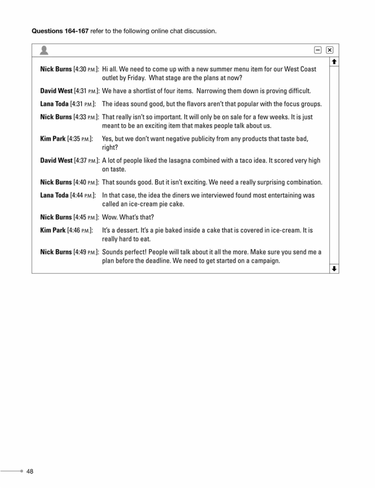


```text
Questions 164-167 refer to the following online chat discussion.
息 曰R
會
Nick Burns [4:30 PM.): Hi all. Wen eed to come up with an ew summer menu item for our West Coast
outlet by Friday.W hats tage are the plans at now?
David West [4:31 P.M.):W eh ave as hortlist of four items.N arrowing them down is proving difficult.
Lana Toda [4:31 P.M): The ideas sound good,bu t the flavors aren't that popular with the focus groups.
Nick Burns [4:33 PM): That really isn't so important. It wi llonly be on sale for af ew weeks. It is just
meant to be an exciting item that makes people talk about us.
Kim Pa 『 k[4:35 P.M :] Yes, but we don't want negative publicity from any products that taste bad,
right?
David West [4:37 PM):A l otof people liked thel asagna combined with at aco idea. It scored very high
on taste.
Nick Burns [4:40 PM.): That sounds good.B ut it isn't exciting.W en eed ar eally surprisingc ombination.
Lana Toda [4:44 P.M :] In that case, the idea the diners we interviewed found most entertaining was
called an ice-cream pie cake.
Nick Burns [4:45 PM.): Wow.W hat's that?
Kim Pa 『 k[4:46 P.M ]: It's ad essert.It' s ap ie baked inside ac ake that is covered in ice-c「earn.It is
really hard to eat.
Nick Burns [4:49 P.M.): Sounds perfect! People will talk about it all the more.M ake sure you send me a
plan before the deadline. Wen eed to get started on ac ampaign. ...
・ . .4 8
```

## PDF 第 48 页

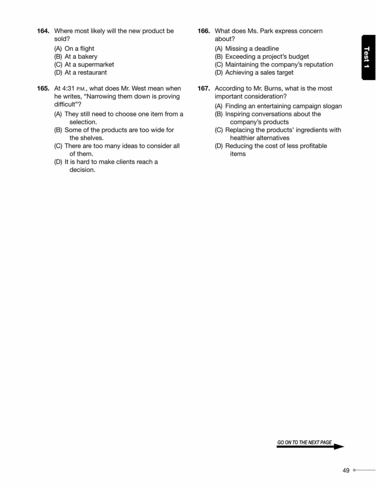


```text
164. Where most likelyw ill the new productb e 166. What does Ms. Park express concern ＇
sold? about?
(A) Ona f light (A) Missing ad eadline
(B) At ab akery (B) Exceeding ap roject's budget
(C) At as upermarket (C) Maintaining the company's reputation
(D) At ar estaurant (D)A chieving as ales target
165. At 4:31 P.M.,w hat does Mr. West mean when 167. According to Mr. Burns, what is the most
he writes, "Narrowing them down is proving important consideration?
difficult"? (A) Finding an entertaining campaign slogan
(A) They stilln eed to choose one item from a (B) Inspiring conversations about the
selection. company's products
(B) Some of the products are too wide for (C) Replacing the products'ingredients with
the shelves. healthier alternatives
(C) There are too many ideas to consider all (D)R educing the cost of less profitable
of them. items
(D) It is hard to make clients reach a
decision.
一
49... ・
```

## PDF 第 49 页

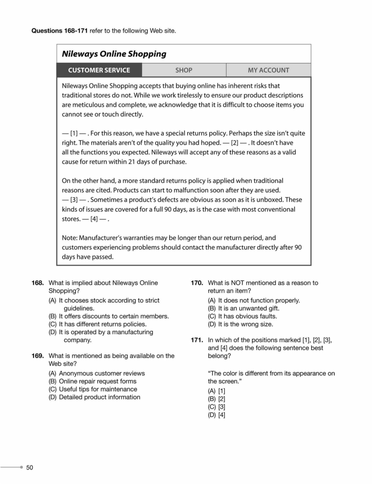


```text
Questions 168-171 refer to the following Webs ite.
SHOP MYA CCOUNT
Nileways Online Shopping accepts that buying online has inherent risks that
traditional stores do not. While wew ork tirelessly to ensure our product descriptions
are meticulous and complete、weacknowledge that it is difficult to choose items you
cannot see or touch directly.
ー [1]―.For this reason, weh ave as pecial returns policy.P erhaps the size isn't quite
right. The materials aren't of the quality you had hoped. —[2] —. It doesn'th ave
all the functions you expected. Nileways will accept any of these reasons as av alid
cause for return within 21 days of purchase.
Ont he other hand, am ore standard returns policy is applied when traditional
reasons are cited. Products can start to malfunction soon after they are used.
ー [3]―.Sometimes ap roduct's defects are obvious as soon as it is unboxed. These
kinds of issues are covered for af ull 90 days、asist he case with most conventional
stores. —[4] —.
Note: Manufacturer'sw arranties mayb e longer than our return period, and
customers experiencing problems should contact the manufacturer directly after 90
days have passed.
168. What is implied about Nileways Online 170. What is NOTm entioned as ar eason to
Shopping? return an item?
(A) It chooses stock according to strict (A) It does not function properly.
guidelines. (B) It is an unwanted gift.
(8)It offers discounts to certain members. (C) It has obvious faults.
(C) It has different returns policies. (D) It ist he wrong size.
(D) It is operated by am anufacturing
company. 171. In which of the positions marked (1],[2 ], [3],
and [4]d oes the following sentence best
169. What is mentioned as being available ont he belong?
Webs ite?
(A) Anonymous customer reviews "The color is different from its appearance on
(8)O nline repairr equest forms the screen."
(C) Useful tips form aintenance (A) [1]
(D) Detailed product information (B) [2]
(C) [3]
(D) [4]
- ... 50
```

## PDF 第 50 页

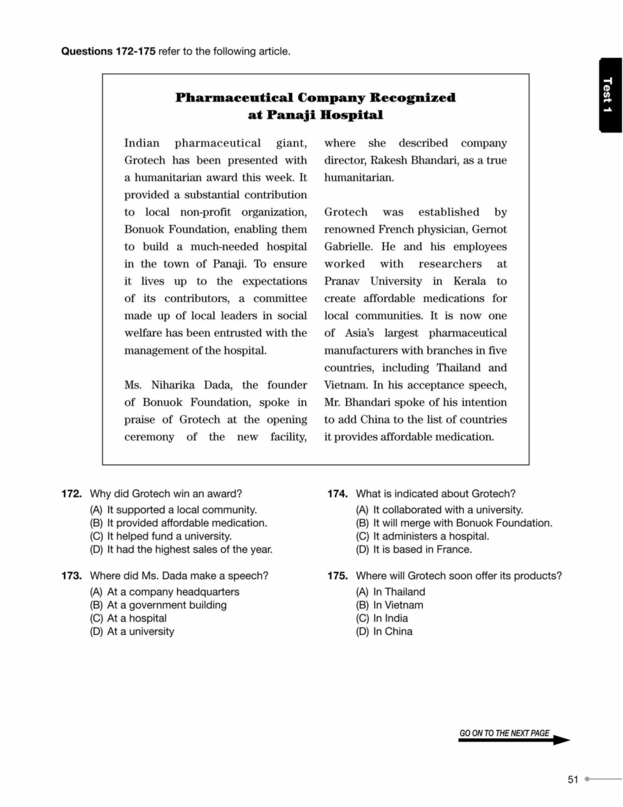


```text
Questions 172-175 refer to thef ollowing article. ＇
Pharmaeeutieal Company瓦eeognized
at Panaji Hospital
Indian pharmaceutical giant, where she described company
Grotech has been presented with director, Rakesh Bhandari, as at rue
ah umanitarian award this week. It humanitarian.
provided a substantial contribution
to local non-profit organization, Grotech was established by
Bonuok Foundation, enabling them renowned French physician,G ernot
to build a much-needed hospital Gabrielle.H e and his employees
in the town of Panaji. To ensure worked with researchers at
it lives up to the expectations Pranav University in Kerala to
of its contributors, a committee create affordable medications for
made up of local leaders in social local communities. It is now one
welfare has been entrusted with the of 経 ia's largest pharmaceutical
management of the hospital. manufacturers with branches in five
countries,i ncluding Thailand and
Ms. Niharika Dada, the founder Vietnam. In his acceptance speech,
of Bonuok Foundation,s poke in Mr. Bhandari spoke of hisi ntention
praise of Grotech at the opening to add Chinat o the list of countries
ceremony of the new facility, it provides affordable medication.
172. Why did Grotech win an award? 174. What is indicated aboutG rotech?
(A) It supported al ocal community. (A)It collaborated with au niversity.
(B) It provided affordable medication. (B) It will merge with Bonuok Foundation.
(C) It helped fund au niversity. (C) It administers ah ospital.
(D) It had the highest saleso f the year. (D) It isb ased in France.
173.W here did Ms.D ada make as peech? 175. Where wi llGrotech soon offer its products?
(A) At ac ompany headquarters (A)I n Thailand
(B) At ag overnment building (B) In Vietnam
(C) At ah ospital (C) In India
(D) At au niversity (D) In China
一
51. .. ・
```

## PDF 第 51 页

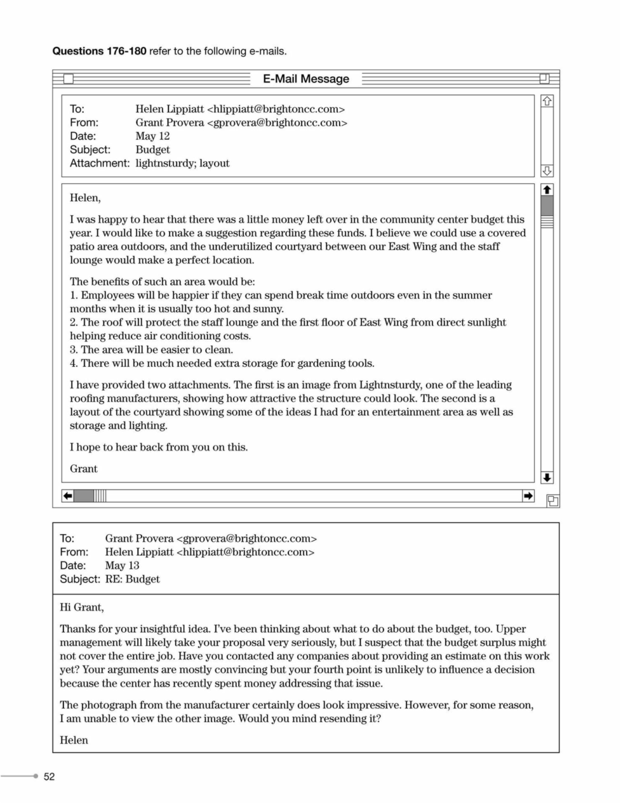


```text
Questions 176-180 refer to the following e-mails.
E-Mail Message
To: Helen Lippiatt <hlippiatt@brightoncc.com>
From: Grant Provera <gprovera@brightoncc.com>
Date: May 12
Subject: Budget
Attachment: lightnsturdy; layout
會
Helen, I
Iw as happy to hear that there was ali ttle money left over in the community center budget this '..... ....
year. Iw ould liket o make as uggestion regarding these funds. Ibe lieve wec ould use ac overed
patio area outdoors,a nd theu nderutilized courtyardb etweeno ur East Wing and the staff
lounge would make ap erfect location.
Theb enefits of such an area would be:
1. Employees will be happier if they can spend break t血 eoutdoors eveni n the summer
months whenit is usually too hot and sunny.
2. Ther oof will protect the staff lounge and the first floor of East Wing from direct sunlight
helping reduce air conditioning costs.
3.T hea rea will be easier to clean.
4. There willb e muchn eeded extras torage for gardening tools.
Ih avep rovided two attachments. Thef irst is an image from Lightnsturdy, one of thele ading
roofing manufacturers,sh owing how attractive the structure could look The second is a
layout of the courtyard showing some of the ideas Ih ad for an enterta.irunent area as well as
storage and lighting.
Ih opet o hear back from you on this.
..Grant
oo
ゴ
茫
To: Grant Provera <gprovera@brightoncc.com>
From: Helen Lippiatt <hlippiatt@brightoncc.com>
Date: May 13
Subject: RE: Budget
Hi Grant,
Thanks for your insightful idea. I've beent hinking about what to do about the budget, too. Upper
management will likelyt ake your proposal very seriously, butI s uspect that the budget surplus might
not cover the entire job. Have you contacted any companies about providing an estimate on this work
yet?Y our arguments are mostly convincingb ut your fourth point is unlikelyt o influence ad ecision
because the center has recently spent money addressing that issue.
Thep hotograph from the manufacturer certainlyd oes look impressive. However, for some reason,
Ia mu nablet o view the other image. Would you mind resending it?
Helen
・ . .5 2
```

## PDF 第 52 页

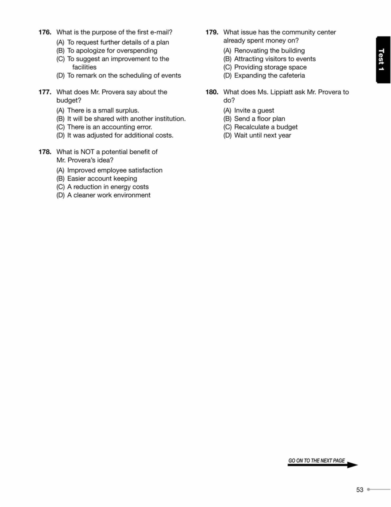


```text
176. What is the purpose of the first e-mail? 179. What issue has the community center ＇
(A) To request further details of ap lan already spent money on?
(B) To apologize for overspending (A) Renovating the building
(C) To suggest an improvement to the (B) Attracting visitors to events
facilities (C) Providing storage space
(D) To remark on the scheduling of events (D)E xpanding the cafeteria
177. What does Mr.P rovera say about the 180. What does Ms. Lippiatt ask Mr. Provera to
budget? do?
(A) There is as mall surplus. (A) Invite ag uest
(B) It will be shared with another institution. (B) Send af loor plan
(C) There isa n accounting error. (C) Recalculate ab udget
(D) It was adjusted for additional costs. (D) Wait until next year
178. What is NOTa p otential benefito f
Mr.P rovera's idea?
(A) Improved employee satisfaction
(B) Easier account keeping
(C) A reduction in energy costs
(D) Ac leaner work environment
一
53... ・
```

## PDF 第 53 页

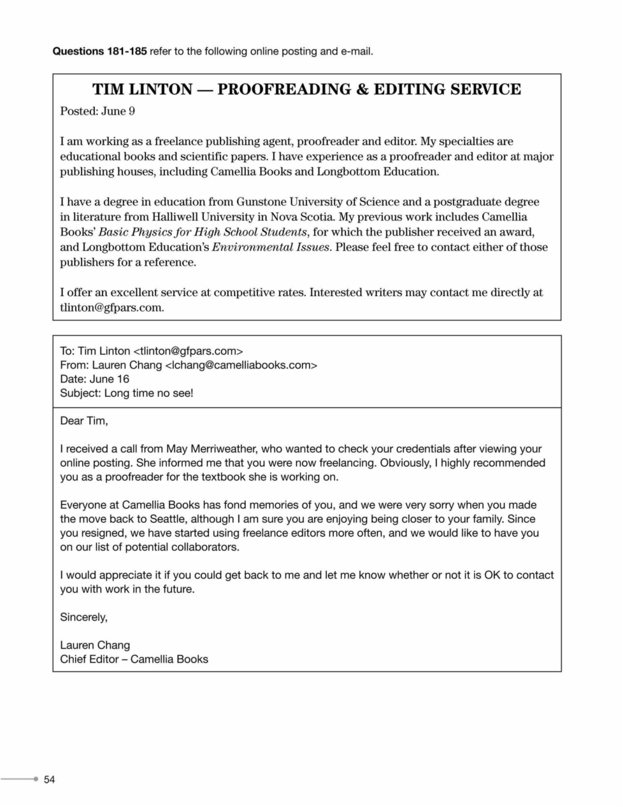


```text
Questions 181-185 refer to the following online posting and e-mail.
TIML INTON - PROOFREADING & EDITING SERVICE
Posted:J une 9
Ia mw orking as af reelance publishing agent, proofreader and editor.M ys pecialties are
educational books and scientific papers.I h avee xperience as ap roofreader and editor at major
publishing houses,i ncluding Camellia Books and Longbottom Education.
Ih ave ad egree in education from Gunstone University of Science and ap ostgraduate degree
in literaturef rom Halliwell University in Nova Scotia. Myp revious work includes Camellia
Books'Basic Physics for High School Students, for which the publisher received an award,
and Longbottom Education's Environmental Issues. Please feelf ree to contact eithero f those
publishers for ar eference.
Io ffer an excellent service at competitive rates.I nterested writers mayc ontact med irectly at
tlinton@gfpars.com.
To:T im Linton <tlinton@gfpars.com>
From: Lauren Chang <lchang@camelliabooks.com>
Date: June1 6
Subject: Long time no see!
Dear Tim,
Ire ceived ac a llfrom May Merriweather, who wanted to check your credentials after viewing your
online posting.S he informed met hat you were now freelancing.Ob viously, Ihi ghly recommended
you as ap roofreader for the textbook she is working on.
Everyone at Camellia Books has fond memories of you, and wew ere very sorry when you made
the move back to Seattle,a lthough Ia ms ure you are enjoying being closer to your family. Since
you resigned, weh aves tarted using freelance editors more often,a nd wew ould like to have you
on our list of potential collaborators.
Iw ould appreciate itif you could get back to mea nd let mek now whether or not it is OKt o contact
you with work in the future.
Sincerely,
Lauren Chang
Chief Editor -CamelliaB ooks
・ . .5 4
```

## PDF 第 54 页

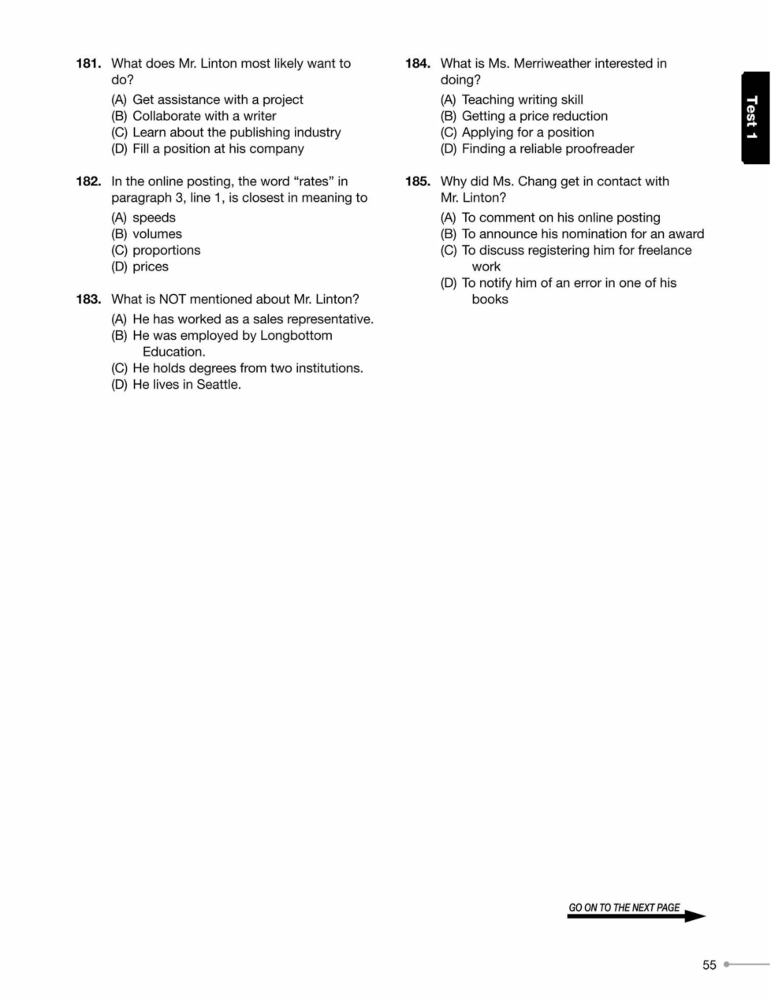


```text
181. What does Mr. Linton most likely wantto 184. What is Ms. Merriweather interested in ＇
do? doing?
(A) Get assistance with ap roject (A) Teaching writing skill
(B) Collaborate with aw riter (B) Getting ap rice reduction
(C) Learn about the publishing industry (C) Applying for ap osition
(D) Fill ap osition at his company (D)F inding ar eliable proofreader
182. In the online posting, the word "rates" in 185. Whyd id Ms.C hang get in contact with
paragraph 3, line 1, is closest in meaning to Mr. Linton?
(A) speeds (A) To comment on his online posting
(B) volumes (B) To announce his nomination for an award
(C) proportions (C) To discuss registeringh im for freelance
(D) prices work
(D)T o notify him of an error in one of his
183. What is NOTm entioned about Mr.L inton? books
(A) He has worked as as ales representative.
(B) He was employed by Longbottom
Education.
(C) He holds degrees from two institutions.
(D) He lives in Seattle.
一
55... ・
```

## PDF 第 55 页

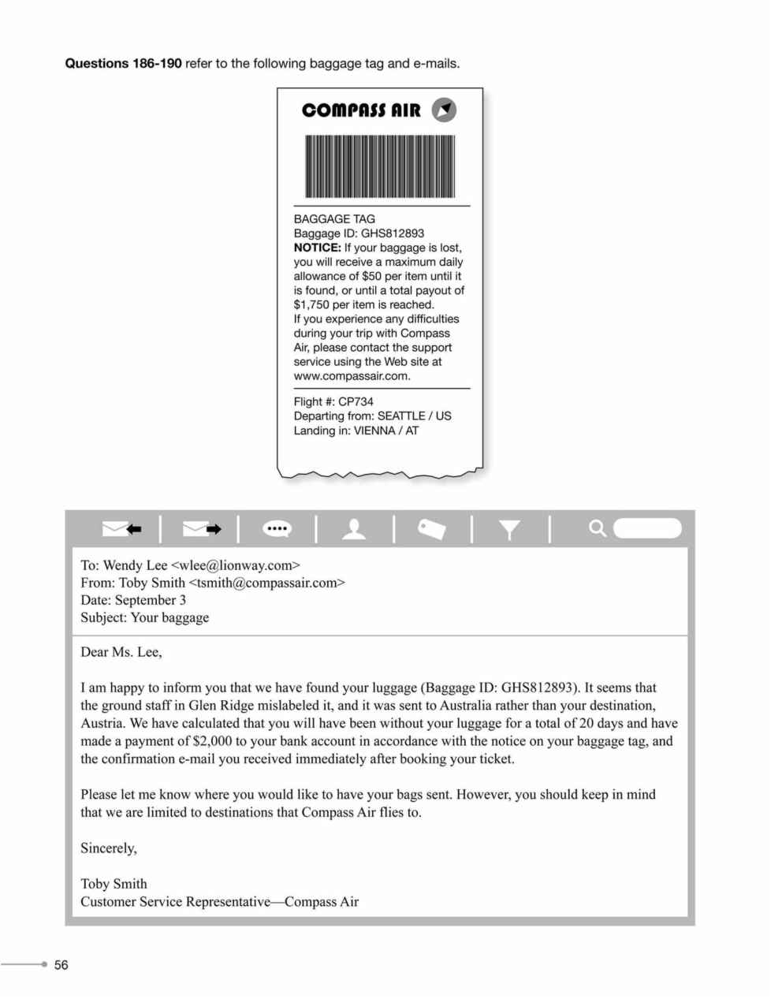


```text
Questions 186-190 refer to the following baggage tag and e-mails.
COfflPAII AIR
□□□
BAGGAGE TAG
Baggage ID:G HS812893
NOTICE: fIyourba ggage is lost,
you will receive am aximum daily
allowance of$5 0 per item until ti
is found,or until ato tal payout of
$1,750p er item is reached.
Ifyo u experience any difficulties
during your tripw ithC ompass
Air,pl ease contact the support
service using the Web site at
www.compassair.com.
Flight #: CP734
Departing from: SEATTLE/ US
Landing in: VIENNA/ AT
To: WendyL ee <wlee@lionway.com>
From: Toby Smith <tsmith@compassair.com>
Date: September 3
Subject: Your baggage
Dear Ms. Lee,
Ia m happy to inform you that we have found your luggage (Baggage ID: GHS8I 28 93).It seems that
the ground staff in Glen Ridge mislabeled it,an d it was sent to Australia rather than your destination,
Austria. Weh ave calculated that you will have beenw ithout your luggage for at otal of20 days and have
made ap aymento f$2,000 to your bank account in accordance with the notice on your baggage tag, and
the confirmation e-maily ou received immediatelya fter booking your ticket.
Please let mek now where you would liket o have your bags sent.Ho wever, you should keep in mind
that we are limited to destinations that Compass Air flies to.
Sincerely,
Toby Smith
—
Customer Service Representative Compass Air
・ . .5 6
```

## PDF 第 56 页

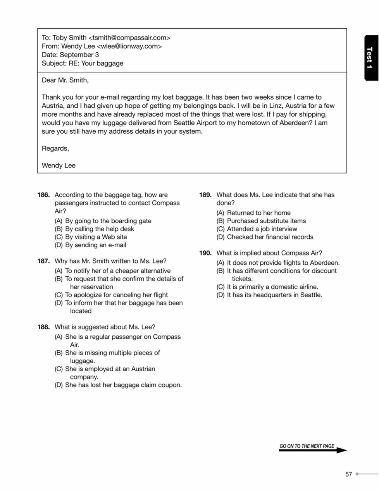


```text
＇
To: Toby Smith <tsmith@compassair.com>
From:W endy Lee <wlee@lionway.com>
Date:S eptember 3
Subject: RE:Y our baggage
Dear Mr.S mith,
Thank you for your e-mail regarding myl ost baggage. Ith as been two weeks since Ic ame to
Austria, and Ih ad given up hope of getting myb elongings back. Iwi ll be in Linz, Austria for af ew
more months and have already replaced most of the things that were lost. If Ip ay for shipping,
would you have myl uggage delivered from Seattle Airport to myh ometown of Aberdeen? Ia m
sure you still have mya ddress details in your system.
Regards,
Wendy Lee
186. According to the baggage tag, how are 189. What does Ms. Lee indicate that she has
passengers instructed to contact Compass done?
Air? (A) Returned to her home
(A) By going to the boarding gate (B) Purchased substitute items
(B) By calling the help desk (C) Attended aj ob interview
(C) By visiting aW ebs ite (D) Checked her financial records
(D) Bys ending an e-mail
190. What is implied about Compass Air?
187. Why has Mr. Smith written to Ms.L ee? (A) It does not provide flights to Aberdeen.
(A) To notify her of ac heaper alternative (B) It has different conditions for discount
(B) To request that she confirm the details of tickets.
her reservation (C) It is primarily ad omestic airline.
(C) Toa pologize forc anceling her flight (D) It has its headquarters in Seattle.
(D) To inform her that her baggage has been
located
188. What is suggested about Ms. Lee?
(A) She is ar egular passenger on Compass
Air.
(B) She is missing multiple pieces of
luggage.
(C) She is employed at an Austrian
company.
(D) She has losth er baggage claim coupon.
一
57... ・
```

## PDF 第 57 页

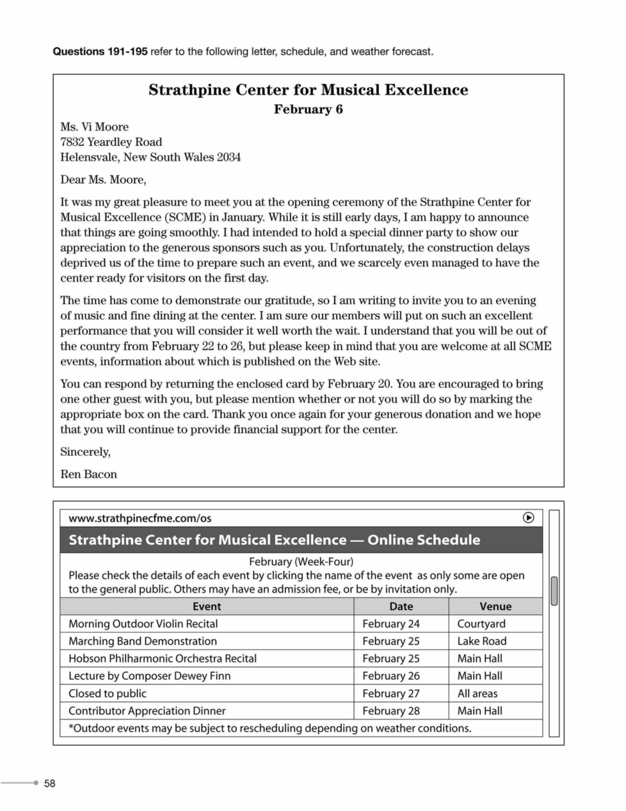


```text
Questions 191-195 refer to the following letter, schedule,an d weather forecast.
Strathpine Center for Musical Excellence
February 6
Ms. Vi Moore
7832 Yeardley Road
Helensvale, NewS outh Wales 2034
Dear Ms. Moore,
It was myg reat pleasure to meet you at the opening ceremony of the Strathpine Center for
Musical Excellence( SCME) in January.Wh ileit is still early days, Ia mh appy to announce
that things are going smoothly. Ih ad intended to hold as pecial dinner party to show our
appreciation to theg enerous sponsors such as you. Unfortunately, the construction delays
deprived us of the time to prepare such an event, and wes carcely evenm anaged to havet he
center ready for visitors on the first day.
The time has come tod emonstrate our gratitude, so Ia mw riting to invite you to an evening
of music and fme dining at the center. Ia ms ure our members will put on such an excellent
perfonnance that you will consider it well worth the wait. Iu nderstand that you will be out of
the country from February 22 to 26, but please keep in mind that you are welcome at all SCME
events, information about which is published on the Web site.
You can respond by returning thee nclosed card by February 20. You are encouraged to bring
one other guest with you, but please mention whether or not you will do so by marking the
appropriate box on the card. Thank you once again for your generous donation and weh ope
that you will continue to provide fmancial support for the center.
Sincerely,
RenB acon
February (Week-Four)
I~
:~et:: ; ;~~~a~hpeu悶？瓢:;:悶a界ごeb~nc~~~~;s悶盆ご~.ret~;:;芯ご富~~tme are open
Event Date Venue
Morning Outdoor Violin Recital February 24 Courtyard
Marching Band Demonstration February 25 Lake Road
Hobson Philharmonic Orchestra Recital February 25 Main Ha ll
Lecture by Composer Dewey Finn February 26 Main Ha ll
Closed to public February 27 All areas
I I
Contributor Appreciation Dinner February 28 Main Hall
*Outdoor events may be subject to rescheduling depending on weather conditions.
・ . .5 8
```

## PDF 第 58 页

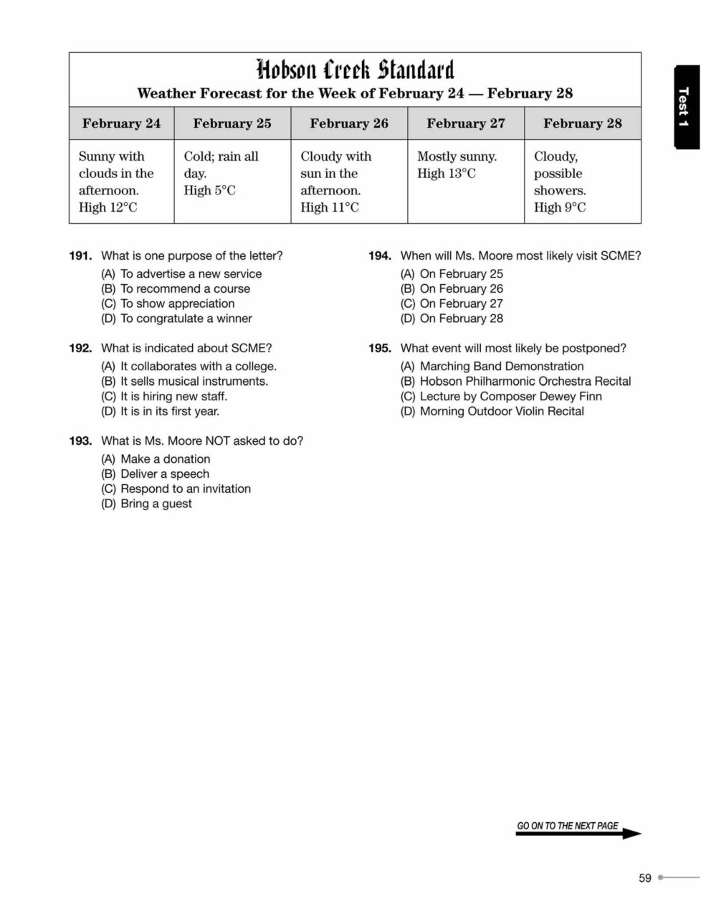


```text
liobson lt'eek Jtandat'd ＇
Weather Forecast for the Weeko fF ebruary 24- February 28
February24 February 25 February 26 February 27 February 28
Sunny with Cold;ra in all Cloudy with Mostly sunny. Cloudy,
clouds in the day. suni n the High 13°C possible
afternoon. High 5°c afternoon. showers.
High 12°c High l1°C High 9°c
191. What is one purpose of the letter? 194. When will Ms.M oore most likely visit SCME?
(A) To advertise an ew service (A) On February 25
(B) To recommend ac ourse (B) On February 26
(C) To show appreciation (C) On February 27
(D) To congratulate aw inner (D) On February 28
192. What is indicated about SCME? 195. What event will most likely be postponed?
(A) It collaborates with ac ollege. (A) Marching Band Demonstration
(B) It sells musical instruments. (B) Hobson PhilharmonicO rchestra Recital
(C) It is hiring new staff. (C) Lecture byC omposer Dewey Finn
(D) It is ini ts first year. (D)M orning Outdoor ViolinR ecital
193. What is Ms.M oore NOTa sked to do?
(A) Make ad onation
(B) Deliver as peech
(C) Respond to an invitation
(D) Bring ag uest
一
59... ・
```

## PDF 第 59 页

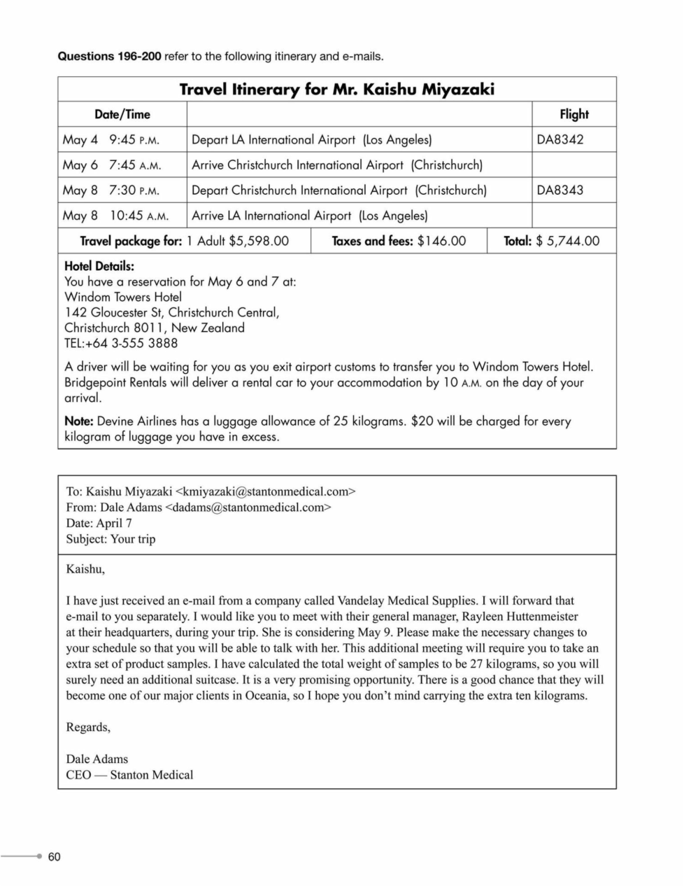


```text
Questions 196-200 refer to the following itinerary and e-mails.
Travel Itinerary for Mr. Kaishu Miyazaki
Date/Time Flight
May4 9:45 P.M. Depart LA International Airport (Los Angeles) DA8342
May 6 7:45 A.M. Arrive Christchurch International Airport (Christchurch)
May 8 7:30 P.M. Depart Christchurch International Airport (Christchurch) DA8343
May 8 10:45 A.M. Arrive LA InternationalAi rport (Los Angeles)
I
Travel package for: lA dult $5,598.00 Taxes and fees:$ 146.00 Total: $5 ,744.00
Hotel Details:
You have ar eservation for May 6a nd 7a t:
Windom Towers Hotel
142 Gloucester St,C hristchurch Central,
Christchurch8 0l l ,N ewZ ealand
TEL:+64 3-555 3888
A driver will be waiitng for you as you exit airport customs to transfer you toW indom Towers Hotel.
Bridgepoint Rentalsw i lldeliver ar ental car to youra ccommodaiton by 10 A.M.o n the day of your
arrival.
Note: Devine Airlines has al uggage allowance of 25 kilograms.$ 20 will be charged for every
kilogram of luggage you have in excess.
To: Kaishu Miyazaki< kmiyazaki@stantonmedical.com>
From: Dale Adams <dadams@stantonmedical.com>
Date: April7
Subject: Your trip
Kaishu,
Ih ave just received an e-mail from ac ompany called Vandelay Medical Supplies. Iwi ll forward that
e-mail to you separately. 1w ouldli ke you to meet with their general manager,R ayleen Huttenmeister
at their headquarters,du ring your trip. She is consideringM ay9 .P lease make the necessary changes to
your schedule sot hat you will be ablet o talkw ith he .rThis additional meeting will require yout o take an
extra set of product samples. Ih ave calculatedt he total weight of samples to be 27 kilograms, so youw ill
surely need an additional suitcase.It is av ery promising opp01tunity. There is ag ood chancet hat they will
become one of our major clients in Oceania,so Ih ope you don't mind carrying the extra ten kilograms.
Regards,
DaleA dams
CEO ~ Stanton Medical
・ . .6 0
```

## PDF 第 60 页

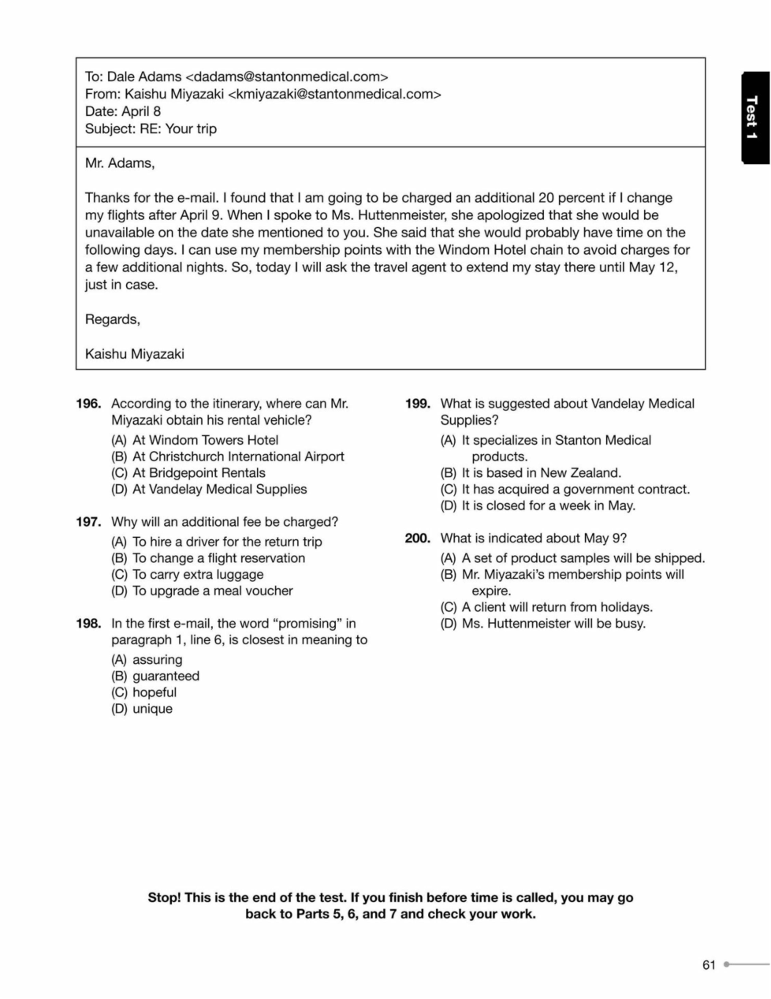


```text
＇
To:D aleA dams <dadams@stantonmedical.com>
From:K aishu Miyazaki <kmiyazaki@stantonmedical.com>
Date:A pril8
Subject: RE: Your tnp
Mr. Adams,
Thanks for the e-mail. If ound that Ia mg oing to be charged ana dditional 20 percent if Ic hange
myfl ights after April 9.W hen Is poke to Ms.H uttenmeister,s he apologized that she would be
unavailable on the date she mentioned to you. She said that she would probably have time on the
following days. Ic an use mym embershipp oints with the Windom Hotelc hain to avoid charges for
af ew additional nights. So,t oday Iwi ll ask the travel agent to extend mys tay thereu ntil May 12,
just inc ase.
Regards,
Kaishu Miyazaki
196. According to the itinerary,w here can Mr. 199. What is suggested about Vandelay Medical
Miyazaki obtain hisr ental vehicle? Supplies?
(A) At Windom Towers Hotel (A) Its pecializesi n Stanton Medical
(B) At Christchurch International Airport products.
(C) At Bridgepoint Rentals (B) Itis b ased in New Zealand.
(D) At Vandelay Medical Supplies (C) Ith as acquired ag overnmentc ontract.
(D)It is closed for aw eekin May.
197. Why will an additional fee be charged?
(A) To hire ad river for the return trip 200. What is indicated about May 9?
(B) To change af light reservation (A) As et of product samples will be shipped.
(C) To carry extral uggage (B) Mr.M iyazaki'sm embership points will
(D) To upgradea m ealv oucher expire.
(C) Ac lient wi llreturn from holidays.
198. In the first e-mail,th e word "promising"in (D)M s. Huttenmeister will be busy.
paragraph 1, line 6,is closest in meaning to
(A) assuring
(B) guaranteed
(C) hopeful
(D) unique
Stop! This is the end of the test. If you finish before time is called, you may go
back to Parts 5, 6,a nd 7a nd check your work.
61 ... ・
```

## PDF 第 61 页

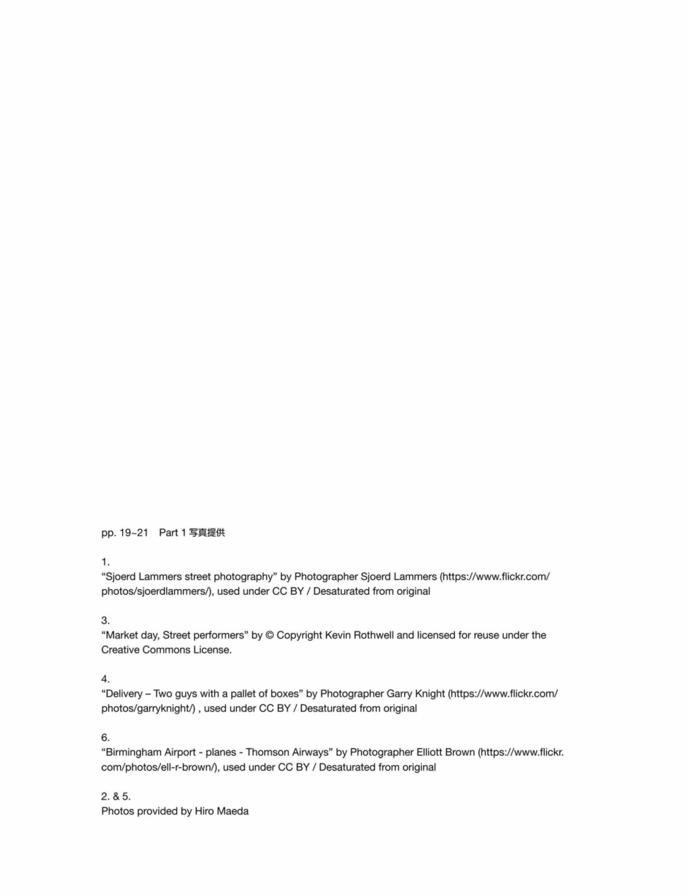


```text
pp.1 9-21 Part 1写口提供
1.
"Sjoerd Lammers street photography"b y Photographer Sjoerd Lammers (https://www.flickr.com/
photos/sjoerdlammers/), used under CCB Y/D esaturated from original
3.
"Market day,St reet performers"b ycCopyright Kevin Rothwell and licensed for reuse under the
Creative Commons License.
4.
"Delivery Twoguys with ap allet of boxes" by PhotographerG arry Knight (https://www.flickr.com/
ー
photos/garryknight/} ,u sed underC CB Y/D esaturated from original
6.
"Birmingham Airport -planes- Thomson Airways"b y Photographer Elliott Brown (https://www.flickr.
com/photos/ell-r-brown/), used under CCB Y/D esaturated from original
2.&5.
Photos provided by Hiro Maeda
```

## PDF 第 62 页


```text
TEST 2
2
模擬試験
受験日 月 日
開始時間 時 分
時 分
リスニングセクション終了時間
時 分
リーディングセクション終了時間
CD-ROMリスニングセクション使用トラック
Listening Section /P art 1D irections I ~P3 心） 059_T 2_1 Di r
Part 1 No. 1- No. 61@ P3心 060_T2_01 -@P3•4>)) 065_T 2_06
I
Part 2 Directions (?P3心 066_T2_2Dir
I
Part 2 No. 7- No. 31 @P3心 067_T 2_07 -@P3噌）））091_T2_31
I
Part 3 Dir Directions @P3心 092_T2_3Dir
I
Part 3 No. 32 -No. 70 @P3心 093_T2_32-34 - ~ P3•4>)) 105_T 2_68-70
I
Part 4 Directions @P3•4>)) 106_T 2_4 Dir
I
Part 4 No. 71 -No.1 00 @P3•4>)) 107_ T 2_71-73 -@P3•4>)) 116_T 2_98-100
●解答には本冊巻末の解答用紙を使用してください。
（解答用祇B[勘ポックスあり］の使い方の説明はp.17にあります）
● 解答一覧は別冊2pp. 4-5、p.9にあります。
の西
```

## PDF 第 63 页

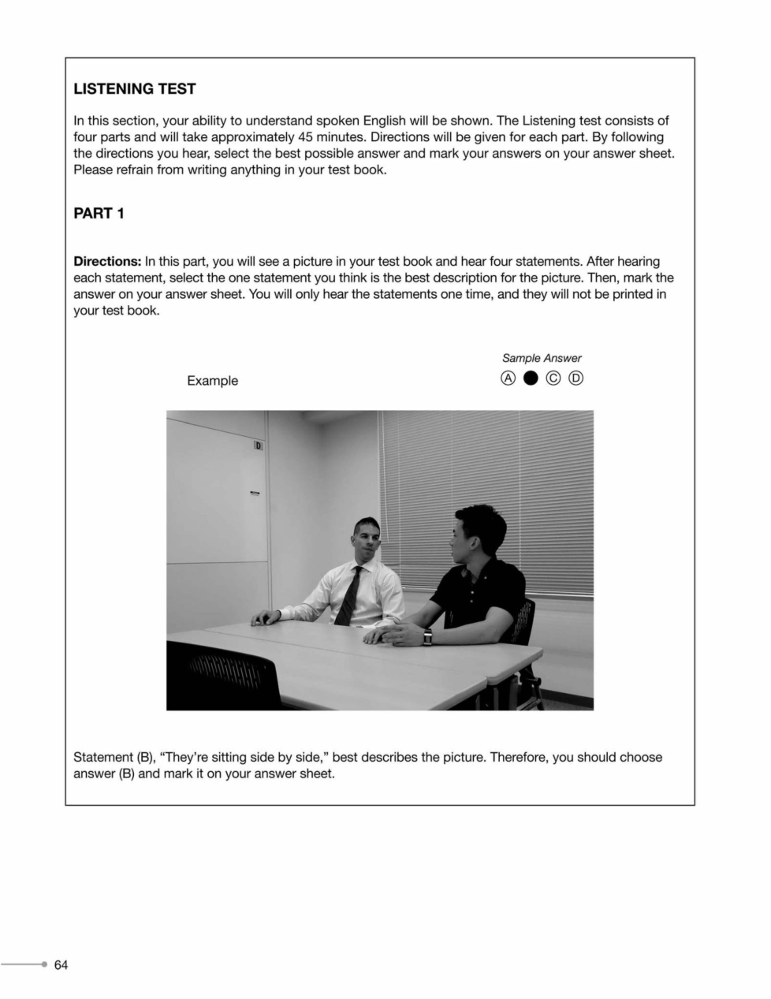


```text
LISTENING TEST
In this section, your ability to understand spoken English will be shown.T he Listening test consists of
four parts and will take approximately 45 minutes.D irections willb e given for each part. Byf ollowing
the directions you hear,s elect the best possible answer and marky our answers on youra nswer sheet.
Please refrain from writing anything in your test book.
PART 1
Directions: In this part,y ou will see ap icture in your test book and hear four statements.Af ter hearing
each statement,se lect the one statement you think is the best description fort he picture. Then,m ark the
answer on your answer sheet. You will only hear the statements one time,a nd they will not be printed in
your test book.
Sample Answer
R●c◎
Example
Statement (B), "They're sitting side by side,"b est describes the picture.Th erefore,y ou should choose
answer (B) and markit o n your answer sheet.
・ . .6 4
```

## PDF 第 64 页

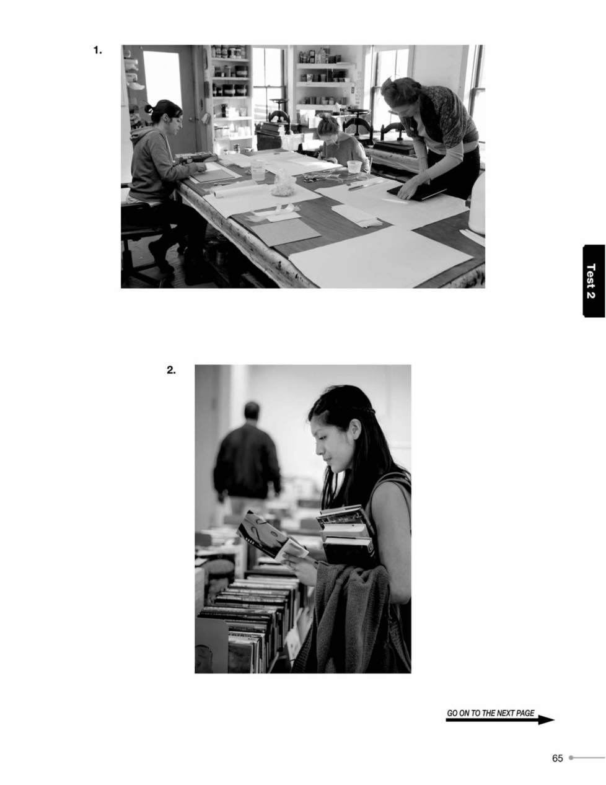


```text
1.
＇
2.
一
65... ・
```

## PDF 第 65 页

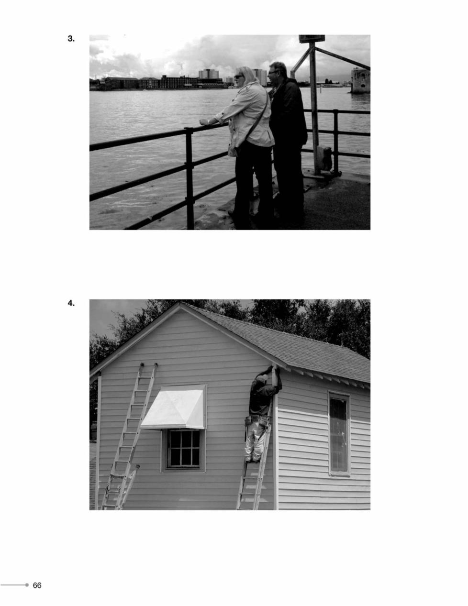


```text
3.
4.
・ . .6 6
```

## PDF 第 66 页

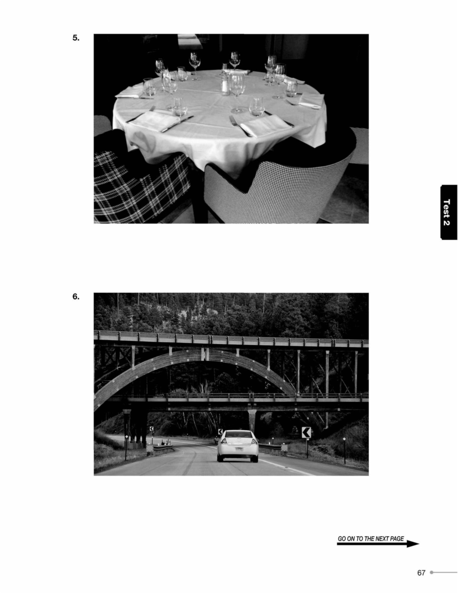


```text
5
＇
6
一
67... ・
```

## PDF 第 67 页

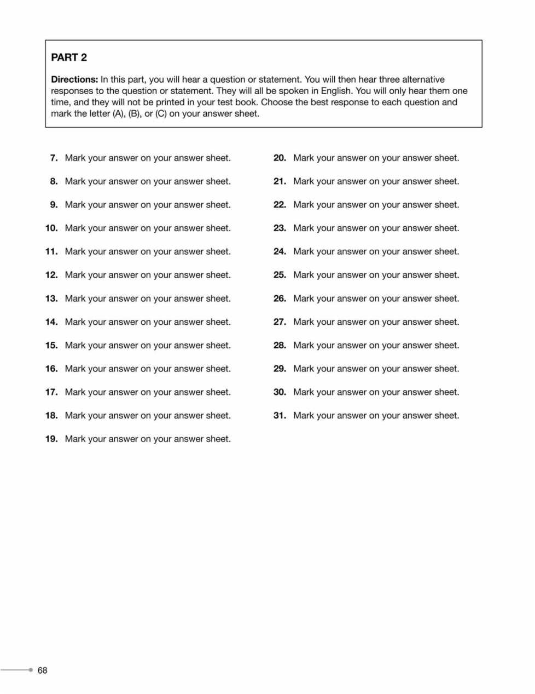


```text
PART2
Directions:In t his part, you willhe ar aq uestion or statement. You will then hear three alternative
responses to the question or statement. They will allb e spoken inE nglish. You will onlyh ear them one
time,a nd they will not be printed in your test book.C hoose the best response to eachq uestion and
mark the letter(A ),(B ), or (C) on your answer sheet.
7. Mark your answero ny our answer sheet. 20. Mark your answer on your answer sheet.
8. Mark your answer ony our answer sheet. 21. Mark youra nswer on your answer sheet.
9. Mark your answero ny our answer sheet. 22. Mark your answer on your answer sheet.
10. Mark your answero ny our answer sheet. 23. Marky oura nswer on your answers heet.
11. Mark your answer ony our answer sheet. 24. Marky oura nswer on your answer sheet.
12. Mark your answer on your answer sheet. 25. Marky oura nswer on your answer sheet.
13. Mark your answero ny our answer sheet. 26. Mark youra nswer ony our answer sheet.
14. Mark your answer on your answer sheet. 27. Marky our answer on your answer sheet.
15. Mark your answer on youra nswer sheet. 28. Marky oura nswer ony our answer sheet.
16. Mark your answero n youra nswer sheet. 29. Marky our answer on your answer sheet.
17. Mark youra nswer on your answer sheet. 30. Marky oura nswer on your answer sheet.
18. Mark your answero n your answer sheet. 31. Marky our answer on your answer sheet.
19. Mark your answero n your answer sheet.
・ . .6 8
```

## PDF 第 68 页

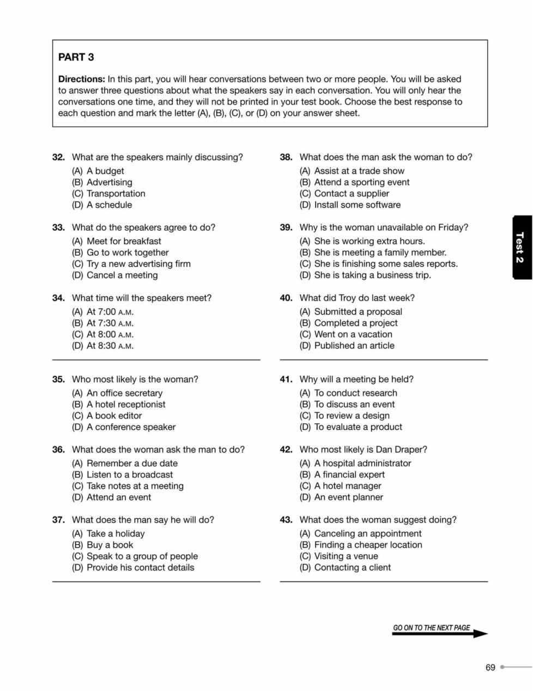


```text
PART3
Directions: In thisp art,y ou will hear conversations between two or more people.Y ou wi llbe asked
to answer three questions about what the speakers say in each conversation.Y ou will only hear the
conversations one time, and they will notb e printed in your testb ook.C hoose the best response to
each question and mark the letter (A), (B), (C),o r (D) on your answer sheet.
32. What are the speakers mainly discussing? 38. What does the man ask the woman to do?
(A) A budget (A) Assist at at rade show
(B) Advertising (B) Attend as porting event
(C) Transportation (C) Contact as upplier
(D) As chedule (D) Install some software
＇
33. What do the speakers agree to do? 39. Whyi s the woman unavailable on Friday?
(A) Meet for breakfast (A) She is working extra hours.
(B) Got o work together (B) She is meeting af amily member.
(C) Try an ew advertising firm (C) She is finishing some sales reports.
(D) Cancel am eeting (D) She is taking ab usiness trip.
34. What time willth e speakers meet? 40. What did Troy do last week?
(A) At 7:00 A.M. (A) Submitted ap roposal
(B) At 7:30 A.M. (B) Completed ap roject
(C) At 8:00 A.M. (C) Went on av acation
(D) At 8:30 A.M. (D) Published an article
35. Who most likely is the woman? 41. Whyw illa m eeting be held?
(A) An office secretary (A) To conduct research
(B) A hotel receptionist (B) To discussa n event
(C) A book editor (C) To review ad esign
(D) Ac onference speaker (D) To evaluate ap roduct
36. What does the woman ask the man to do? 42. Who most likely is Dan Draper?
(A) Remember ad ue date (A) A hospital administrator
(B) Listen to ab roadcast (B) Af inancial expert
(C) Take notes at am eeting (C) A hotel manager
(D) Attend an event (D) An event planner
37. What does the man say he will do? 43. What does the woman suggest doing?
(A) Take ah oliday (A) Canceling an appointment
(B) Buy ab ook (B) Finding ac heaper location
(C) Speak to ag roup of people (C) Visiting av enue
(D) Provide his contact details (D) Contacting ac lient
一
69... ・
```

## PDF 第 69 页

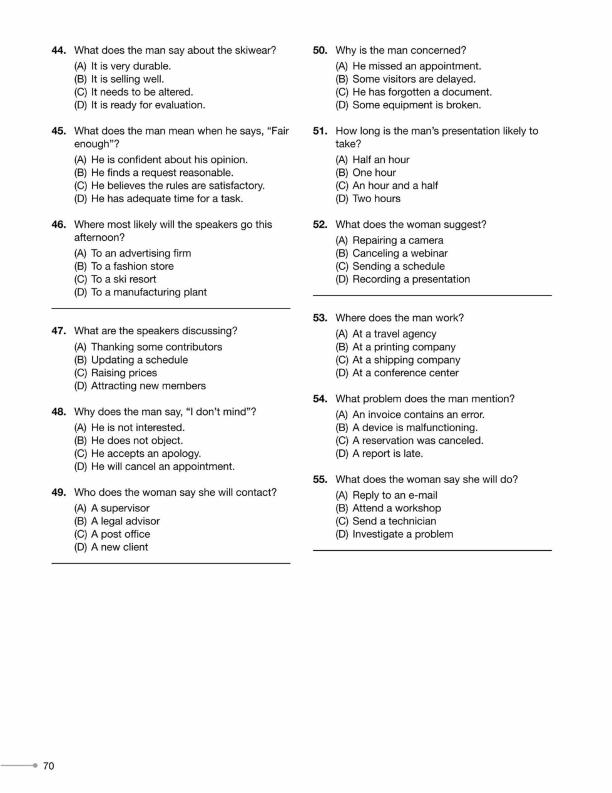


```text
44. What does the man say about the skiwear? 50. Whyi s the man concerned?
(A) It is very durable. (A) Hem issed an appointment.
(B) It is selling well. (B) Some visitors are delayed.
(C) It needs to be altered. (C) Heh as forgotten ad ocument.
(D) It isr eady for evaluation. (D) Some equipment is broken.
45. What does the man mean when he says, "Fair 51. Howl ong is the man's presentation likely to
enough"? take?
(A) He is confident about his opinion. (A) Halfa n hour
(B) Hef inds ar equest reasonable. (B) One hour
(C) He believes the rules are satisfactory. (C) An hour and ah alf
(D) He has adequate time for at ask. (D) Two hours
46. Where most likely will the speakers go this 52. What does the woman suggest?
afternoon? (A) Repairinga c amera
(A) To an advertising firm (B) Canceling aw ebinar
(B) To af ashion store (C) Sending as chedule
(C) To as ki resort (D) Recording ap resentation
(D) To am anufacturing plant
53. Where does the man work?
47. What are the speakers discussing? (A) At at ravela gency
(A) Thanking some contributors (B) At ap rinting company
(B) Updating as chedule (C) At as hipping company
(C) Raising prices (D) At ac onference center
(D) Attracting new members
54. What problem does the man mention?
48. Whyd oes them an say,"I don'tm ind"? (A) An .1 nv o1ce contains an error.
(A) He isn ot interested. (B) Ad evice is malfunctioning.
(B) Hed oes not object. (C) Ar eservation was canceled.
(C) Hea ccepts an apology. (D) Ar eport is late.
(D) Hew ill cancel an appointment.
55. What does the woman say shew ill do?
49. Whod oes the woman say she will contact? (A) Reply to an e-mail
(A) As upervisor (B) Attend aw orkshop
(B) Al egal advisor (C) Send at echnician
(C) Ap ost office (D) Investigatea p roblem
(D) An ew client
・ . .7 0
```

## PDF 第 70 页

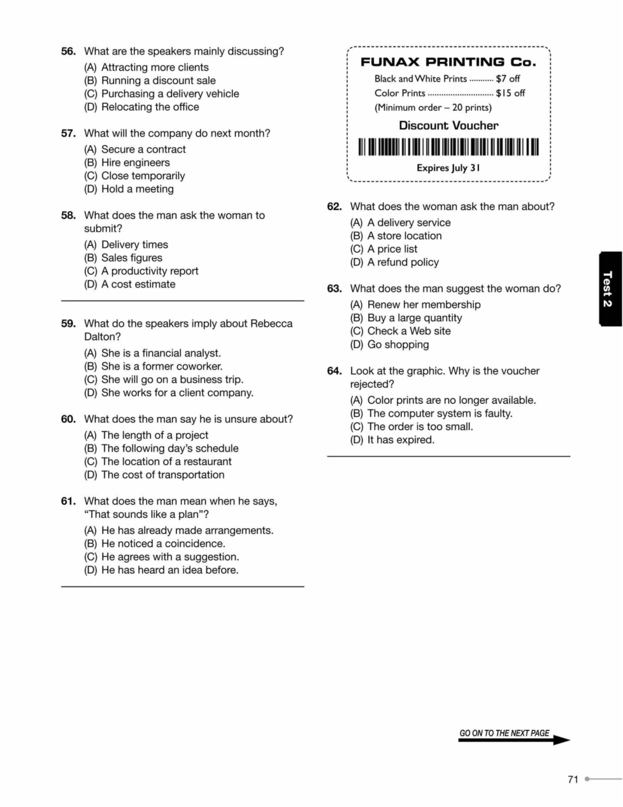


```text
56. What are the speakers mainly discussing?
F U N A XP RINTING Ca. :
(A) Attracting more clients
(B) Running ad iscount sale Black and White Prints ...........$ 7 off
(C) Purchasing ad elivery vehicle Color Prints .............................$1 5 off
(D) Relocating the office (Minimum order -20 prints)
Discount Voucher
57. What will the company do next month?
(A) Secure ac ontract 1111111111111111 IIII~Ill 111111111111111111111111111111 j
(B) Hire engineers
Expires July 31
(C) Close temporarily
,_
--------------------------------------------
(D)H old am eeting
62. What does the woman ask the man about?
58. What does the man ask the woman to
(A)A delivery service
submit?
(B)A store location
(A) Delivery times (C) A price ilst ＇
(B) Sales figures
(D) A refund policy
(C) A productivity report
(D) A cost estimate
63. What does the man suggest the woman do?
(A) Renew her membership
(B) Buy al arge quantity
59. What do the speakers implya bout Rebecca
(C) Check aW ebs ite
Dalton?
(D) Gos hopping
(A) She is af inancial analyst.
(B) She is af ormer coworker.
64. Look at the graphic.W hyi s the voucher
(C) She will go on ab usiness trip.
rejected?
(D) She works for ac lient company.
(A) Color prints are no longer available.
(B) The computer system is faulty.
60. What does the man say he is unsure about?
(C) The order is too small.
(A) Thel ength of ap roject
(D) Ith as expired.
(B) The following day's schedule
(C) The location of ar estaurant
(D) The costo f transportation
61. What does the man mean when he says,
"Thats ounds like ap lan"?
(A) He has already made arrangements.
(B) He noticed ac oincidence.
(C) He agrees with as uggestion.
(D) He has heard an idea before.
一
71 ... ・
```

## PDF 第 71 页

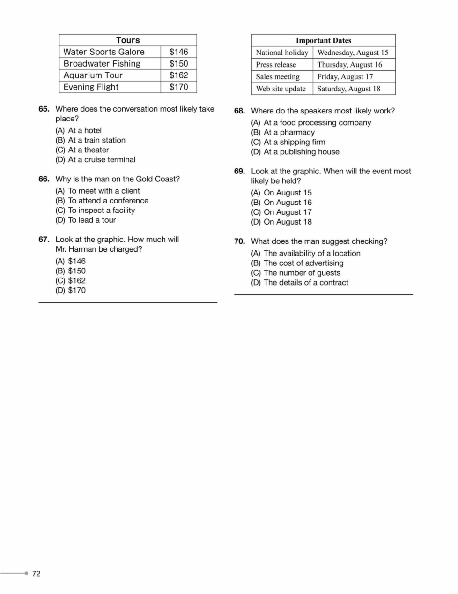


```text
Tours Important Dates
Water Sports Galore $146 National holiday Wednesday, August IS
Broadwater Fishing $150 Press release Thursday, August 16
Aquarium Tour $162 Sales meeting Friday, August1 7
Evening Flight $170 Web site update Saturday, August 18
65. Where does the conversation most likely take 68. Where do the speakers most likely work?
place?
(A) At af ood processing company
(A) At ah otel (B) At ap harmacy
(B) At at rain station (C) At as hipping firm
(C) At at heater (D) At ap ublishing house
(D) At ac ruise terminal
69. Look at the graphic.W hen willth e event most
66. Why is the man on the Gold Coast? likely be held?
(A) To meet with ac lient (A) OnA ugust 15
(B) To attend ac onference (B) OnA ugust 16
(C) To inspect af acility (C) OnA ugust 17
(D) To lead at our (D) OnA ugust 18
67. Look at the graphic. Howm uch will 70.W hat does the man suggest checking?
Mr. Harman be charged?
(A) The availability of al ocation
(A) $146 (B) The cost of advertising
(B) $150 (C) The number of guests
(C) $162 (D) The details of ac ontract
(D) $170
・ . .7 2
```

## PDF 第 72 页

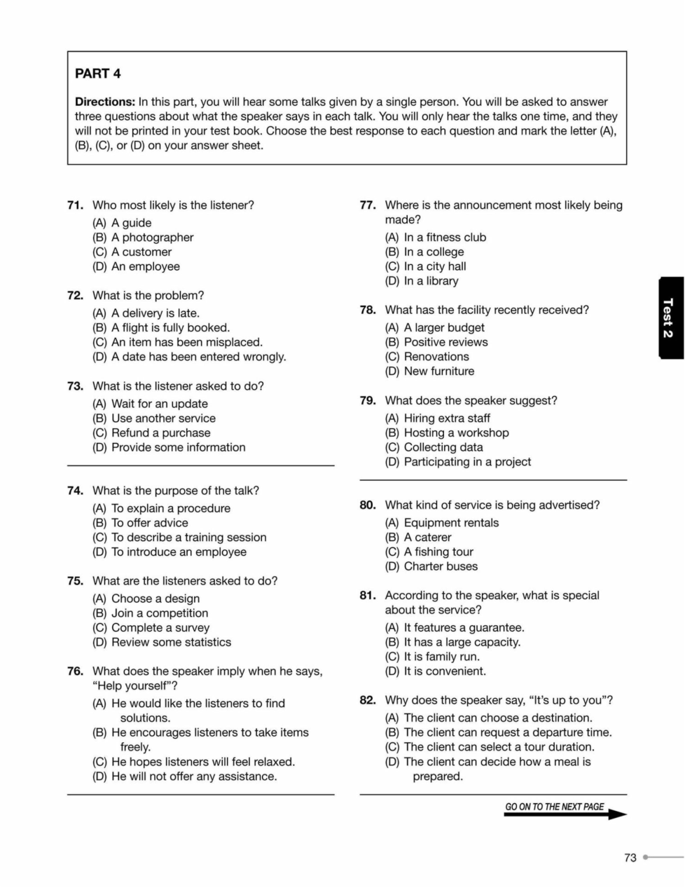


```text
PART4
Directions: In this part, you will hear some talks given by as ingle person. You willb e asked to answer
three questions about what the speaker says in each talk. You wi llonly hear the talks one time, and they
will not be printed iny our test book. Choose the best response to each question and mark the letter (A),
(8), (C), or (D) on your answer sheet.
71. Whom ost likely is the listener? 77. Where is the announcement most likely being
(A) Ag uide made?
(B) A photographer (A) In af itness club
(C) Ac ustomer (B) In ac ollege
(D) An employee (C) In ac ity hall
＇
(D) In al ibrary
72. What is the problem?
(A) Ad elivery is late. 78. What has the facility recently received?
(B) Af light is fully booked. (A) A larger budget
(C) An item has been misplaced. (B) Positive reviews
(D) Ad ate has been entered wrongly. (C) Renovations
(D) Newf urniture
73. What is the listener asked to do?
(A) Wait for an update 79. What does the speaker suggest?
(B) Use another service (A) Hiring extra staff
(C) Refund ap urchase (B) Hosting aw orkshop
(D) Provide some information (C) Collecting data
(D) Participating in ap roject
74. What is the purpose of the talk?
(A) To explain ap rocedure 80. What kind of service is being advertised?
(B) To offer advice (A) Equipment rentals
(C) To describe at raining session (B) Ac aterer
(D) To introduce an employee (C) Af ishing tour
(D) Charter buses
75. What are the ilsteners asked to do?
(A) Choose ad esign 81. According to the speaker, what is special
(B) Join ac ompetition about the service?
(C) Complete as urvey (A) It features ag uarantee.
(D) Review some statistics (B) It has al argec apacity.
(C) Itis family run.
76. What does the speaker imply when he says, (D) It is convenient.
"Help yourself"?
(A) He would like the ilsteners to find 82. Why does the speaker say,"I t's up to you"?
solutions. (A) The client can choose ad estination.
(B) He encourages ilsteners to take items (B) The client can requesta d eparture time.
freely. (C) The clientc an select at our duration.
(C) Heh opes listeners will feel relaxed. (D) The clientc an decide how am eal is
(D) Hew ill noto ffer any assistance. prepared. 一
73... ・
```

## PDF 第 73 页

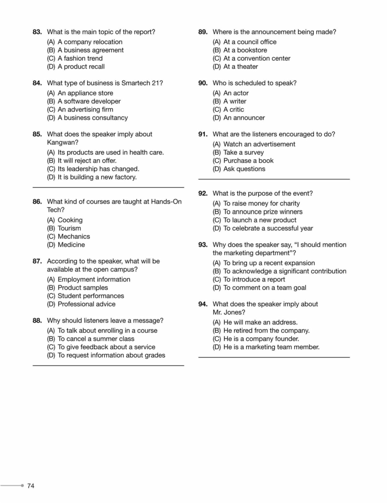


```text
83. What is the main topic of the report? 89. Where is the announcement being made?
(A) Ac ompany relocation (A) At ac ouncil office
(B) Ab usiness agreement (B) At ab ookstore
(C) Af ashion trend (C) At ac onvention center
(D) Ap roduct recall (D) At at heater
84. What type of business is Smartech 21? 90. Who is scheduled to speak?
(A) An appliance store (A) An actor
(B) As oftware developer (B) A writer
(C) An advertising firm (C) Ac ritic
(D) Ab usiness consultancy (D) An announcer
85. What does the speaker implya bout 91. What are the listeners encouraged to do?
Kangwan? (A) Watch an advertisement
(A) Its productsa re used in health care. (B) Take as urvey
(B) It will reject an offer. (C) Purchase ab ook
(C) Its leadership has changed. (D) Ask questions
(D) It is building an ew factory.
92. What is the purpose of the event?
86. What kind of courses are taught at Hands-On (A) To raise money for charity
Tech? (B) To announce prize winners
(A) Cooking (C) To launcha n ew product
(B) Tourism (D) To celebrate as uccessful year
(C) Mechanics
(D) Medicine 93. Whyd oes the speaker say, "Is hould mention
the marketing department"?
87. According to the speaker,w hat wi llbe (A) To bring up ar ecent expansion
available at the open campus? (B)T o acknowledge as ignificant contribution
(A) Employment information (C) To introduce ar eport
(B) Product samples (D) To comment on at eam goal
(C) Student performances
(D) Professional advice 94. What does the speaker implya bout
Mr. Jones?
88. Whys hould listeners leave am essage? (A) Hew i llmake an address.
(A) To talk about enrolling in ac ourse (B) He retired from the company.
(B) To cancel as ummerc lass (C) He is ac ompany founder.
(C) To give feedback about as ervice (D) He is am arketing team member.
(D) To requesti nformation about grades
・ . .7 4
```

## PDF 第 74 页

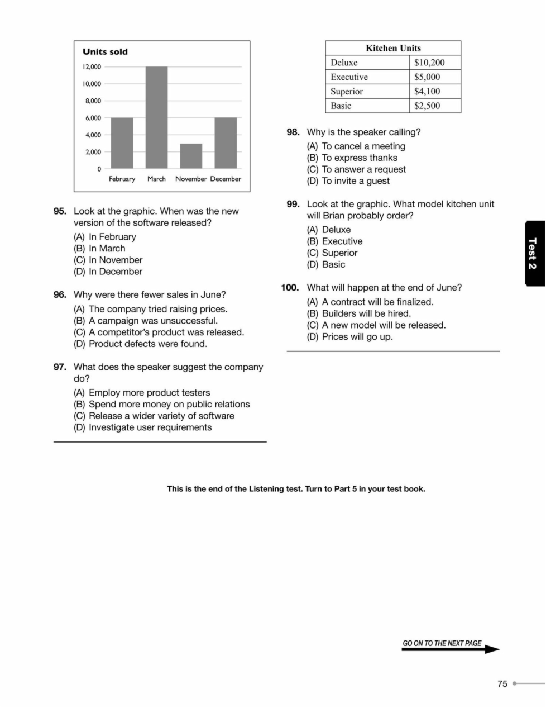


```text
Units sold Kitchen Units
Deluxe $10,200
12,000
Executive $5,000
10.000
Superior $4,100
::8,:000 11-1
Basic $2,500
98. Whyi s the speaker calling?
(A)T o cancel am eeting
(B) To express thanks
(C) To answer ar equest
February March November December (D) To invite ag uest
99. Look at the graphic.W hat model kitchen unit
95. Look at the graphic. When was the new
will Brian probably order? ＇
version of the software released?
(A)D eluxe
(A) In February
(B) Executive
(B) In March
(C) Superior
(C) In November
(D) Basic
(D) In December
100. Whatwi ll happen at the end of June?
96. Whyw ere there fewer sales in June?
(A)A c ontract will be finalized.
(A) The company tried raising prices.
(B) Builders will be hired.
(B) Ac ampaign was unsuccessful.
(C) A newm odel wi llbe released.
(C) Ac ompetitor'sp roduct was released.
(D) Prices will go up.
(D) Product defects were found.
97. What does the speaker suggest the company
do?
(A) Employ more product testers
(B) Spend more money on public relations
(C) Release aw ider variety of software
(D) Investigate user requirements
This ist he end of the Listening test. Turn to Part 5i n your test book.
一
75... ・
```

## PDF 第 75 页

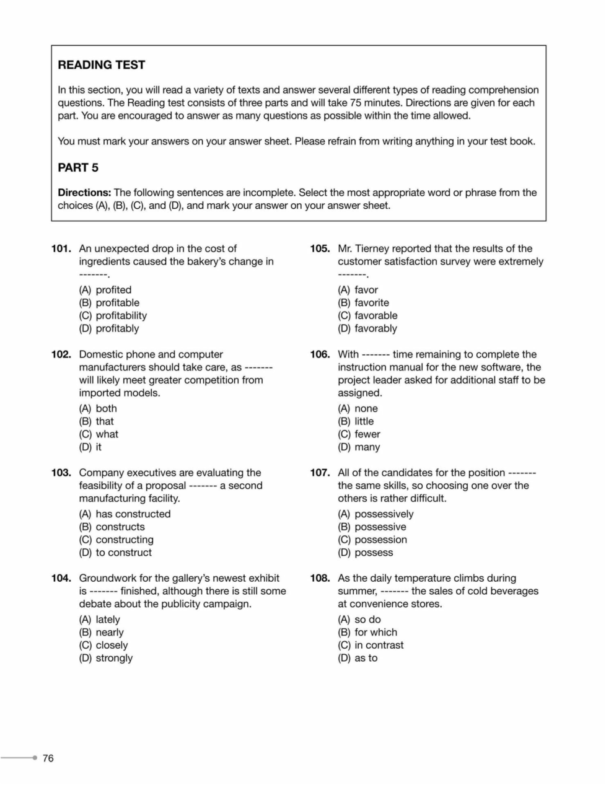


```text
READING TEST
In this section, you will read av ariety of texts and answer several different types of reading comprehension
questions. The Reading test consistso f three parts and will take 75 minutes.D irections are given for each
part.Y ou are encouraged to answer as many questions as possible within the time allowed.
You must mark your answers on youra nswer sheet. Please refrain from writing anything iny our test book.
PARTS
Directions: The following sentences are incomplete.Se lect the mosta ppropriate word or phrase from the
choices (A), (B), (C), and (D), and mark your answer on your answers heet.
101. An unexpected drop in the cost of 105. Mr. Tierneyr eported that the results of the
ingredients caused the bakery's change 1n customer satisfaction survey were extremely
(A) profited (A) favor
(B) profitable (B) favorite
(C) profitability (C) favorable
(D) profitably (D) favorably
102. Domestic phone and computer 106. With-------time remaining to complete the
manufacturers should take care, as ------- instruction manual for the new software, the
will likely meet greater competition from project leader asked for additional staff to be
imported models. assigned.
(A) both (A)n one
(B) that (8) little
(C) what (C) fewer
(D)it (D) many
103. Company executives are evaluating the 107. All of the candidates for the position-------
feasibility of ap roposal -------as econd the same skills, so choosing one over the
manufacturing facility. others is rather difficult.
(A) has constructed (A) possessively
(B) constructs (8)p ossessive
(C) constructing (C) possession
(D) to construct (D) possess
104. Groundwork for the gallery's newest exhibit 108. Ast he daily temperature climbs during
is -------finished, although there is still some summer,-- -----the sales of cold beverages
debate about the publicity campaign. at convenience stores.
(A) lately (A)s o do
(B) nearly (8) for which
(C) closely (C) in contrast
(D) strongly (D) as to
・ . .7 6
```

## PDF 第 76 页

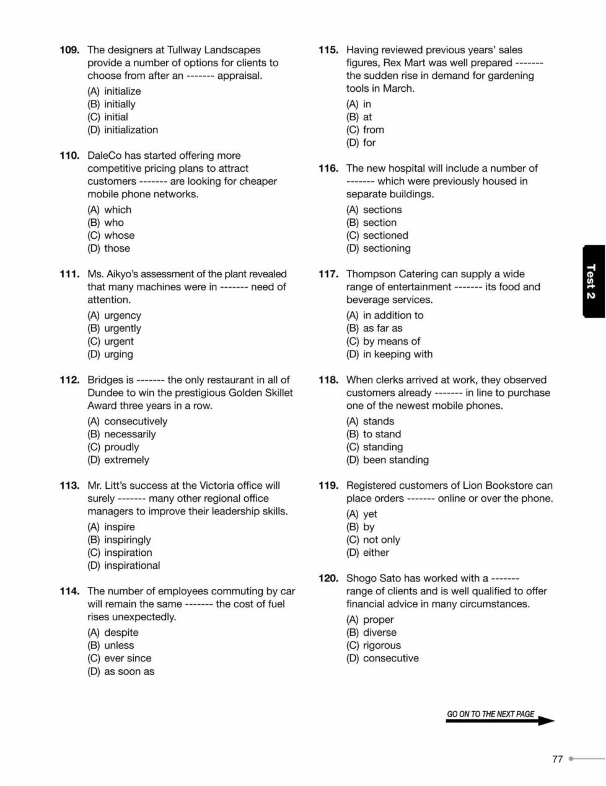


```text
109. The designers at Tullway Landscapes 115. Having reviewed previous years'sales
provide an umber of optionsf or clients to figures,R ex Mart was well prepared -------
choose from after an -------appraisa .l the sudden rise in demand for gardening
(A) initialize tools in March.
(B) initially (A) in
(C) initial (B) at
(D) initialization (C) from
(D)f or
110. DaleCo has started offering more
competitive pricing plans to attract 116. The new hospital willin clude an umber of
customers -------are looking forc heaper -------which were previously housed in
mobile phone networks. separate buildings.
(A) which (A) sections
(B) who (B)s ection
(C) whose (C) sectioned
＇
(D) those (D)s ectioning
111. Ms.Ai kyo's assessment of the plant revealed 117. Thompson Catering can supply aw ide
that many machines were in -------need of range of entertainment- ------its food and
attention. beverage services.
(A) urgency (A) ina ddition to
(B) urgently (B) as far as
(C) urgent (C) by means of
(D) urging (D)in k eeping with
112. Bridges is -------the only restaurant in all of 118. When clerks arrived at work, they observed
Dundee to win the prestigious Golden Skillet customers already -------in line to purchase
Award three years in ar ow. one of the newest mobile phones.
(A) consecutively (A) stands
(B) necessarily (B)t o stand
(C) proudly (C) standing
(D) extremely (D) been standing
113. Mr.Li tt's success at the Victoria office will 119. Registered customers ofL ion Bookstore can
surely -------many other regional office place orders-------online or over the phone.
managers to improve their leaderships kills. (A) yet
(A) inspire (B)b y
(B) inspiringly (C)n ot only
(C) inspiration (D)e ither
(D) insp1.rat 1onal
120. Shogo Sato hasw orkedw ith a-------
114. The number of employees commuting by car range of clients and is well qualified to offer
will remain the same -------the cost offu el financial advice in many circumstances.
rises unexpectedly. (A) proper
(A) despite (B) diverse
(B) unless (C) rigorous
(C) ever since (D)c onsecutive
(D) ass oon as
一
77...'
```

## PDF 第 77 页

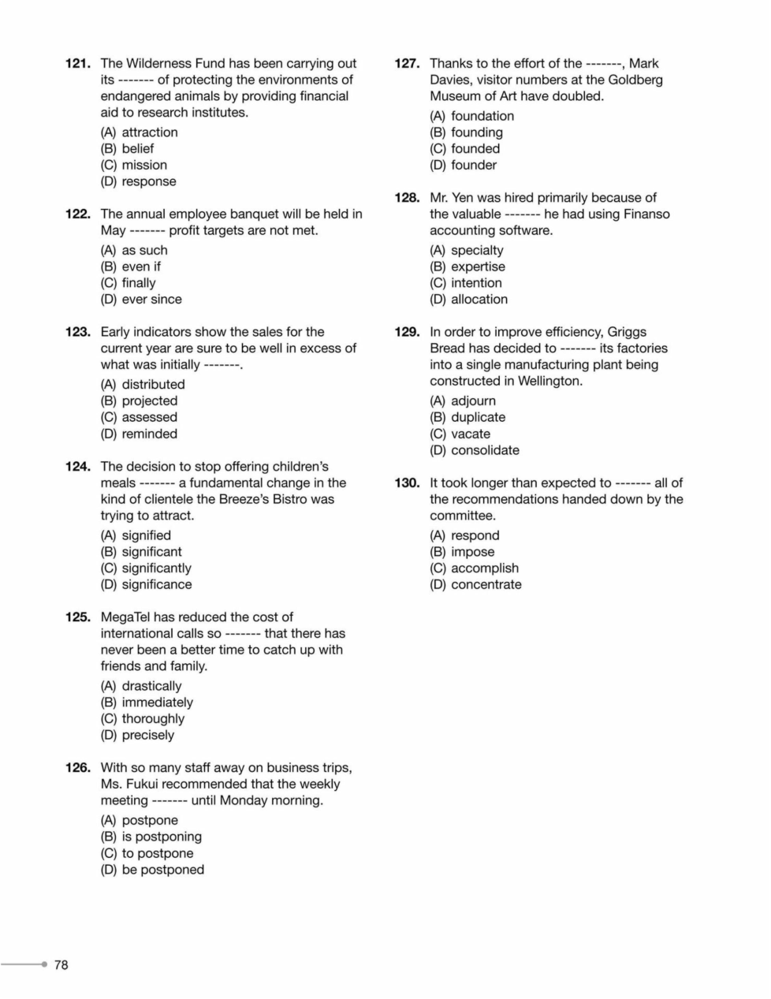


```text
121. The Wilderness Fund has been carrying out 127. Thanks to the effort of the-------,M ark
its -------of protecting the environments of Davies,vi sitor numbers at the Goldberg
endangered animals by providing financial Museum of Art have doubled.
aid to research institutes. (A) foundation
(A) attraction (B) founding
(B) belief (C) founded
(C) mission (D) founder
(D) response
128. Mr. Yen was hired primarily because of
122. The annual employee banquet will be held in the valuable -------he had using Finanso
May -------profit targets are not met. accounting software.
(A) as such (A)s pecialty
(B) even if (B) expertise
(C) finally (C) intention
(D) ever since (D) allocation
123. Early indicators show the sales for the 129. In order to improve efficiency, Griggs
current year are sure to be well in excess of Bread has decided to -------its factories
what was initially -------. into as ingle manufacturing plant being
(A) distributed constructed in Wellington.
(B) projected (A) adjourn
(C) assessed (B) duplicate
(D) reminded (C) vacate
(D) consolidate
124. The decision to stop offering children's
meals -------af undamental change in the 130. It tookl onger than expected to -------all of
kind of clientele the Breeze's Bistro was the recommendations handed down byt he
trying to attract. committee.
(A) signified (A) respond
(B) significant (B) impose
(C) significantly (C) accomplish
(D) significance (D) concentrate
125. MegaTel has reduced the cost of
international calls so -------that there has
never been ab etter time to catch up with
friends and family.
(A) drastically
(B) im mediately
(C) thoroughly
(D) precisely
126. With so many staff away on business trips,
Ms. Fukui recommended that the weekly
meeting -------until Monday morning.
(A) postpone
(B) is postponing
(C) to postpone
(D) be postponed
・ . .7 8
```

## PDF 第 78 页

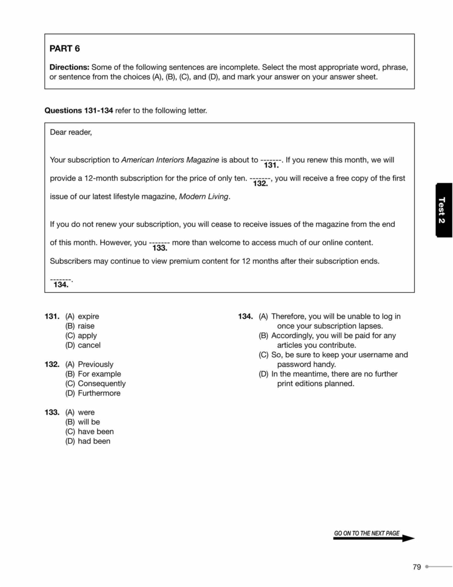


```text
PART6
Directions: Some of the following sentences are incomplete. Select the most appropriate word, phrase,
or sentence from the choices (A), (B), (C), and (D), and mark your answer on your answer sheet.
Questions 131-134 refer to the following letter.
Dear reader,
Your subscription to American Interiors Magazine is about to -------.If you renew this month,w ew i ll
131.
provide a1 2-month subscription for the price of only ten. -- 1 - 3 - 2 -- . - ' you will receive af ree copy of the first ＇
issue of our latest lifestylem agazine, Modern Living.
If you do not renew your subscription,y ou will cease to receive issues of the magazine from the end
of this month. However, you -------more than welcome to access much of our online content.
133.
Subscribers mayc ontinue to viewp remium content for 12 months after their subscription ends.
134 ..
131. (A) expire 134. (A) Therefore, you wi llbe unable to log in
(B) raise once your subscription lapses.
(C) apply (B) Accordingly,y ou will be paid for any
(D) cancel articles you contribute.
(C) So, be sure to keep your username and
132. (A) Previously password handy.
(B) For example (D) In the meantime, there are no further
(C) Consequently print editions planned.
(D) Furthermore
133. (A) were
(B) will be
(C) have been
(D) had been
一
79... ・
```

## PDF 第 79 页

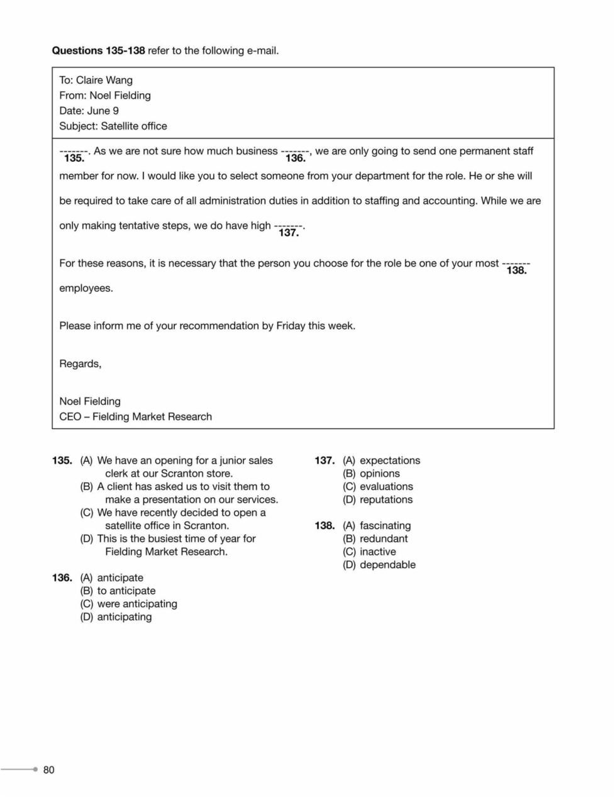


```text
Questions 135-138 refer to the following e-mail.
To: Claire Wang
From:N oel Fielding
Date:J une 9
Subject: Satellite office
-------As wea re not sure how much business -------wea reo nly going to send one permanent staff
135• . 136.'
member for now. Iw ould like you to select someone from your department for the role. He or she will
be required to take care of all administration duties in addition to staffing and accounting. While wea re
only making tentative steps, wed o have high -------
137. .
For these reasons, it is necessary that the person you choose for the role be one of your most -------
138.
employees.
Please inform meo f your recommendation by Friday this week.
Regards,
Noel Fielding
CEO- Fielding Market Research
135. (A) Weh ave an opening for aj unior sales 137. (A) expectations
clerk at our Scranton store. (B) opinions
(B) Ac lient has asked us to visit them to (C) evaluations
make ap resentation on our services. (D) reputations
(C) Weh ave recently decided to open a
satellite office in Scranton. 138. (A) fascinating
(D) This is the busiest time of year for (B) redundant
Fielding Market Research. (C) inactive
(D) dependable
136. (A) anticipate
(B) to anticipate
(C) were anticipating
(D) anticipating
・ . .8 0
```

## PDF 第 80 页

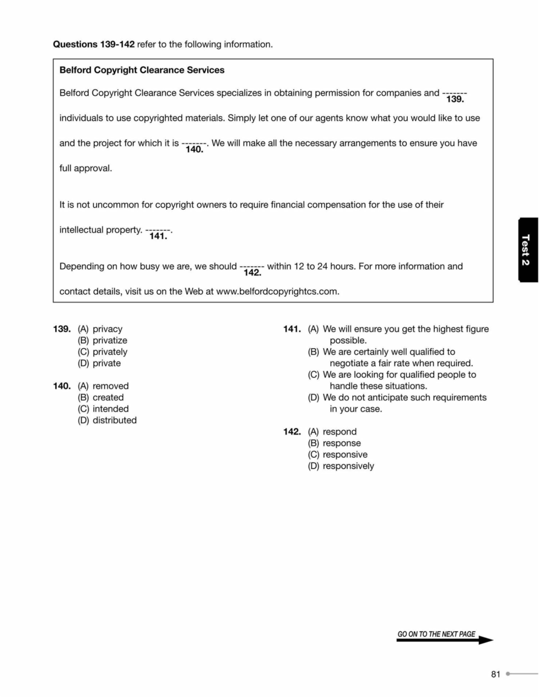


```text
Questions 139-142 refer to the following information.
Belford Copyright Clearance Services
Belford Copyright Clearance Services specializes in obtaining permission for companies and -------
139.
individuals to use copyrighted materials.S imply let one of our agents know what you would like to use
and the project for which it is -------Wew ill make all the necessary arrangements to ensure you have
140. .
full approval.
It is not uncommon for copyright owners to require financial compensation for the use of their
＇
intellectual property. -------
141 ..
Depending on how busy wea re,w es hould -------within 12 to 24 hours.F or more information and
142.
contact details,vi sit us on the Weba t www.belfordcopyrightcs.com.
139. (A) privacy 141. (A) Wew ill ensure you get the highest figure
(B) privatize possible.
(C) privately (B) Wea re certainly well qualified to
(D) private negotiate af air rate when required.
(C) Wea rel ooking forq ualified peoplet o
140. (A) removed handle these situations.
(B) created (D)W ed o not anticipate such requirements
(C) intended in your case.
(D) distributed
142. (A) respond
(B) response
(C) responsive
(D)r esponsively
一
81 ... ・
```

## PDF 第 81 页

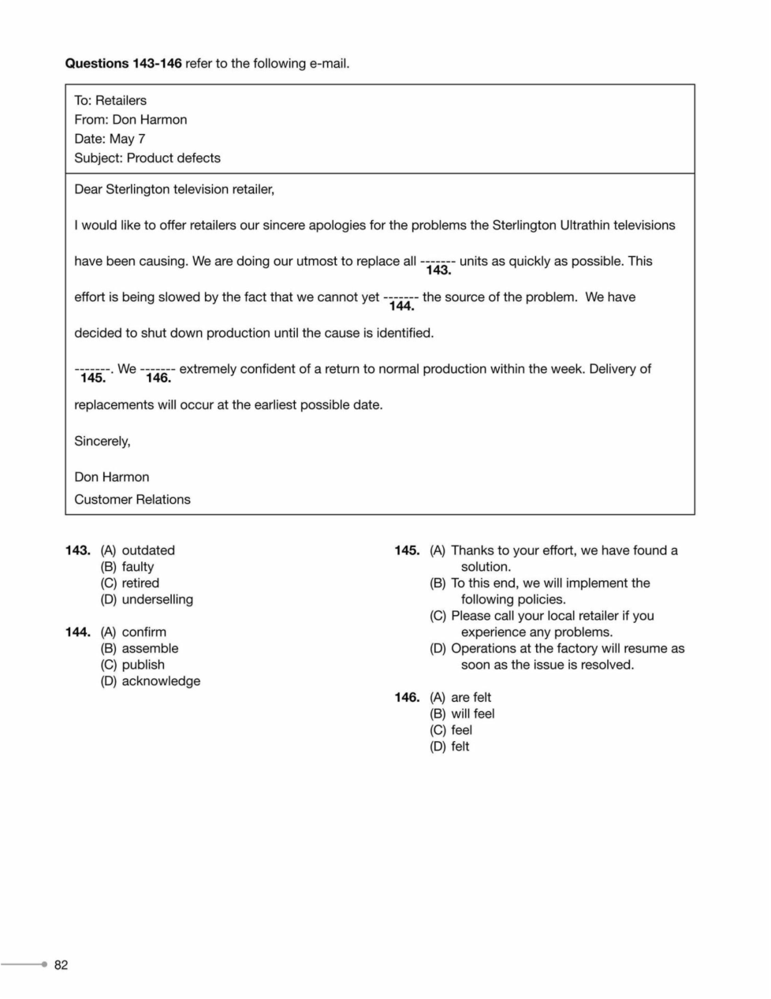


```text
Questions 143-146 refer to the following e-mail.
To:Re tailers
From:D on Harmon
Date:M ay 7
Subject: Product defects
Dear Sterlington television retailer,
Iw ould like to offer retailers our sincere apologies for the problems the Sterlington Ultrathint elevisions
have been causing. Wea re doing our utmost to replace all -------units as quickly as possible.Th is
143.
effort is being slowed by the fact that wec annot yet -------the source of the problem. Weh ave
144.
decided to shut down production until the cause is identified.
-------.W e- ------extremely confident of ar eturn to normal production withint he week.De livery of
145. 146.
replacements will occur at the earliest possible date.
Sincerely,
Don Harmon
Customer Relations
143. (A) outdated 145. (A)T hanks to your effort,w eh ave found a
(B) faulty solution.
(C) retired (B) To this end,w ew ill implement the
(D) underselling following policies.
(C) Please ca llyour local retailer if you
144. (A) confirm experience any problems.
(B) assemble (D) Operations at the factory will resume as
(C) publish soon as the issue is resolved.
(D) acknowledge
146. (A) are felt
(B) will feel
(C) feel
(D) felt
・ . .8 2
```

## PDF 第 82 页

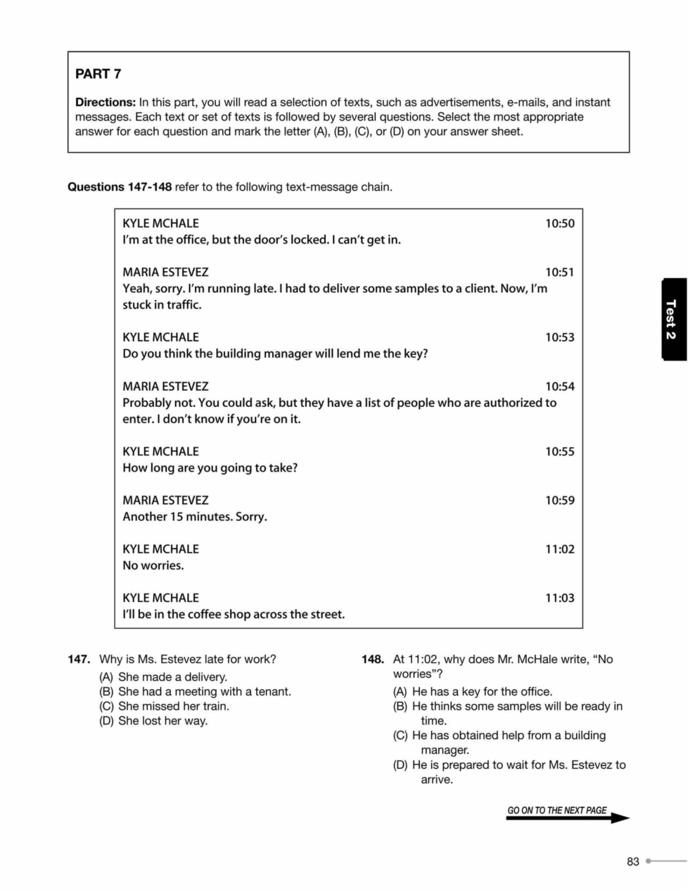


```text
PART7
Directions: In this part, you will read as election of texts, such as advertisements,e- mails, and instant
messages.E ach texto r set of texts is followed by several questions. Select the most appropriate
answer for each question and mark the letter (A), (B), (C), or (D) on your answer sheet.
Questions 147-148 refer to the following text-message chain.
KYLE MCHALE 10:50
I'm at the office, but the door's locked. Ica n't get in.
MARIA ESTEVEZ 10:51 ＇
Yeah, sorry. I'm running late. Ih ad to deliver some samples to ac lient. Now, I'm
stuck in traffic.
KYLE MCHALE 10:53
Doy ou think the building manager will lend met he key?
MARIA ESTEVEZ 10:54
Probably not.Y ou could ask, but they have al ist of people whoa re authorized to
enter. Id on't know if you're on it.
KYLE MCHALE 10:55
Howl ong are you going to take?
MARIA ESTEVEZ 10:59
Another 1S m inutes. Sorry.
KYLE MCHALE 11:02
Now orries.
KYLE MCHALE 11:03
I'll be in the coffee shop across the street.
147. Why is Ms. Estevez late for work? 148. At 11:0 2, why does Mr. McHale write, "No
(A) She made ad elivery. worries"?
(B) She had am eeting with at enant. (A) He has ak ey for the office.
(C) She missed her train. (B) He thinks some samples will be ready in
(D) She losth er way. time.
(C) He has obtained help from ab uilding
manager.
(D) He is preparedt o wait for Ms. Estevez to
arnve. 一
83... ・
```

## PDF 第 83 页

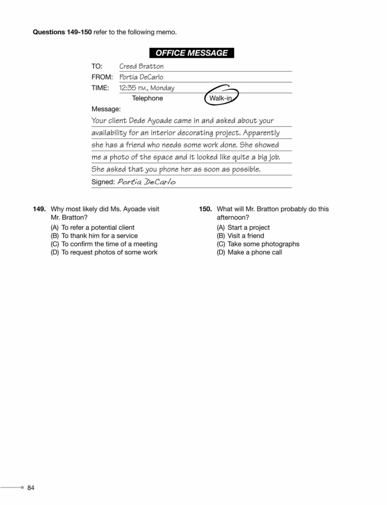


```text
Questions 149-150 refer to the followi一ng memo.
TO: Creed Bratton
FROM: Portia DeCarlo
TIME: 12:35 P.M.,M onday ;/:、
Telephone
Message:
Yourc lient Dede Ayoade came ina nd asked about your
availability fora n interior decoratingp roject. Apparently
she has af riend whon eeds some work done.S he showed
mea photoo f the space and it looked like quite a big job.
She asked that you phone her as soon as possible.
Signed: Porがa])eCarlo
149. Whym ost likelyd id Ms.A yoade visit 150. What wi llMr.Br atton probably do this
Mr.Br atton? afternoon?
(A) Tor efera p otential client (A) Start ap roject
(B) To thank him for as ervice (B) Visita f riend
(C) To confirm the time of am eeting (C) Take some photographs
(D)T o request photos of some work (D)M ake ap hone call
・ . .8 4
```

## PDF 第 84 页

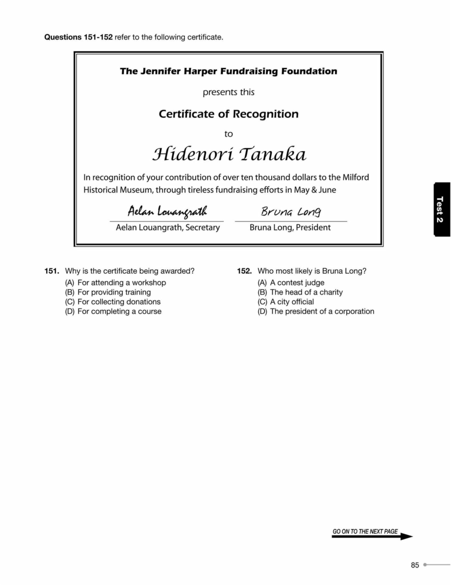


```text
Questions 151-152 refer to the following certificate.
TheJ ennifer Harper Fundraising Foundation
presents this
Certificate of Recognition
to
J-fidenori Tanaka
In recognition of your contribution of over ten thousand dollars to the Milford ＇
Historical Museum、throughtireless fundraising efforts in May& J une
A心1"~ Bf'Vr/
ヽlo;19
Aelan Louangrath, Secretary Bruna Long, President
151. Why is thec ertificate being awarded? 152. Whom ost likely is Bruna Long?
(A) For attending aw orkshop (A) Ac ontest judge
(B) For providing training (B) The head of ac harity
(C) For collecting donations (C) Ac ity official
(D) For completing ac ourse (D) The president of ac orporation
一
85... ・
```

## PDF 第 85 页

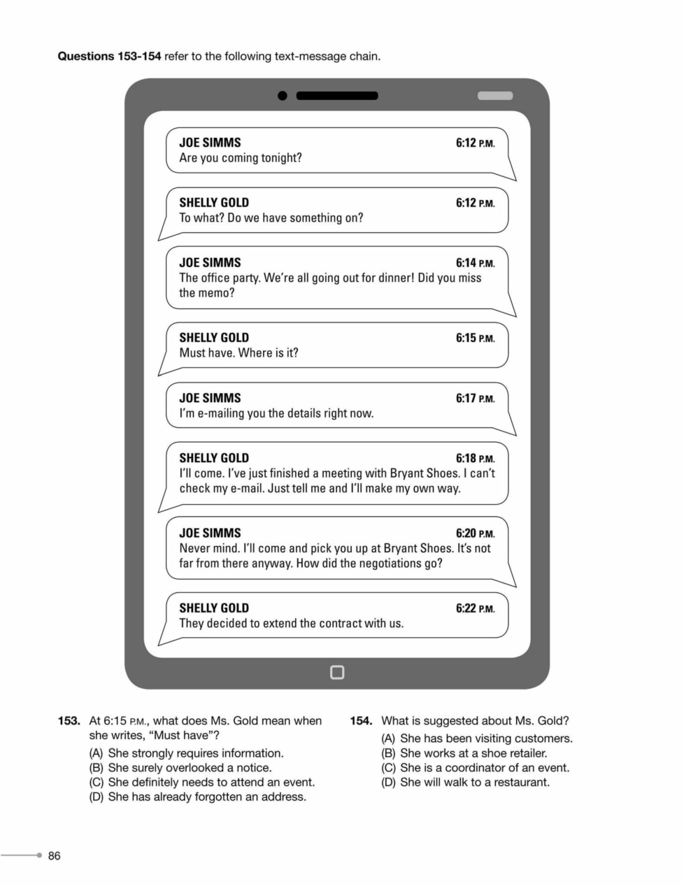


```text
Questions 153-154 refer to the following text-message chain.
[ 1
JOE SIMMS 6:12 P.M.
Are you coming tonight?
J
［
SHELLY GOLD 6:12 P.M.
To what? Do weh ave something on?
\
[
JOE SIMMS 6:14 P＼.M.
The office party.W e're all going out for dinner!D id you miss
the memo?
J
［SHELLY GOLD 6:15 P.M.
Must have. Where is it?
1
JOE SIMMS 6:17 P.M.
［
I ＇me -ma巾ngyou the details right now.
SHELLY GOLD 6:18 ] P.M
I'll come.I' ve just finished am eeting with Bryant Shoes.I ca n't
[
check mye -mail. Justte ll me and I'll makem yo wn way.
JOE SIMMS 6:20l P.M.
［Never mind. I'll come and pick you up at Bryant Shoes.It 's not
far from there anyway.H owd id the negotiations go?
SHELLY GOLD 6:22J P.M
/
They decided to extend the contract with us.
D
153. At 6:15 P.M.,w hat does Ms. Gold mean when 154. What is suggested about Ms. Gold?
she writes," Must have"? (A) She has been visitingc ustomers.
(A) She strongly requiresi nformation. (8) She worksa t as hoe retailer.
(8) Shes urelyo verlooked an otice. (C) She isa c oordinator of an event.
(C) She definitely needs to attend an event. (D) She will walk to ar estaurant.
(D) She has already forgotten an address
・ . .8 6
```

## PDF 第 86 页

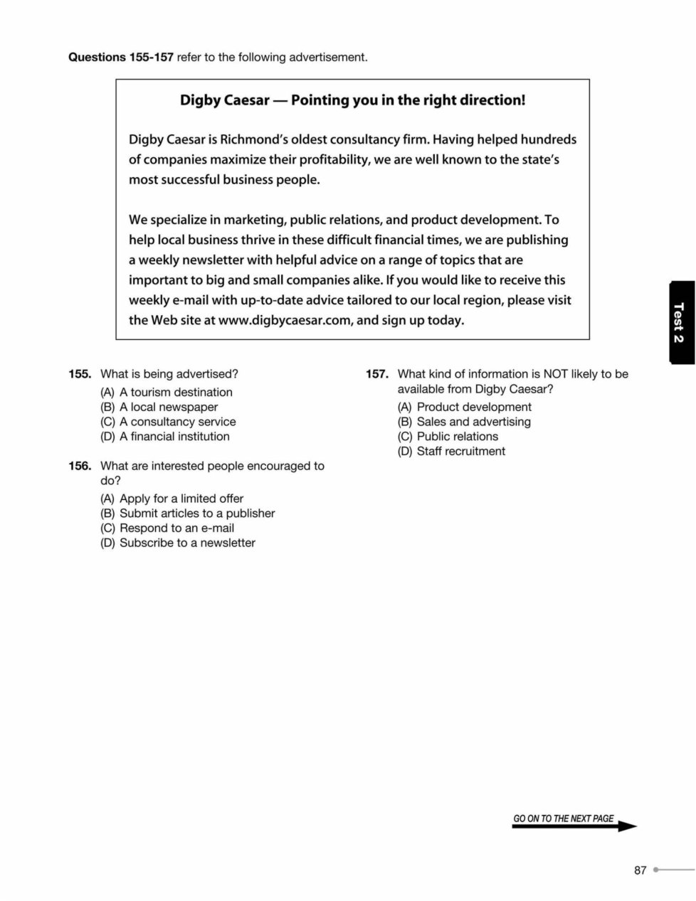


```text
Questions 155-157 refer to the following advertisement.
—
Digby Caesar Pointing youi n the right direction!
Digby Caesar is Richmond'so ldest consultancy firm. Having helped hundreds
of companies maximize their profitability, wea re well known to the state's
most successful business people.
Wes pecialize in marketing,p ublic relations, and product development. To
help local business thrive in these difficult financial times, wea re publishing
aw eekly newsletter with helpful advice ona r ange of topics that are
important to big and small companies alike. If you would like to receive this ＇
weekly e-mail with up-to-date advice tailored to our local region, please visit
the Webs ite at www.digbycaesar.com, and sign upt oday.
155. What is being advertised? 157. What kind of information is NOT likely to be
(A) At ourism destination available from DigbyC aesar?
(B) Al ocal newspaper (A) Product development
(C) Ac onsultancy service (B) Sales and advertising
(D) Af inancial institution (C) Public relations
(D) Staff recruitment
156. What are interested people encouraged to
do?
(A) Apply for al imited offer
(B) Submit articles to ap ublisher
(C) Respond to an e-mail
(D) Subscribe to an ewsletter
一
87... ・
```

## PDF 第 87 页

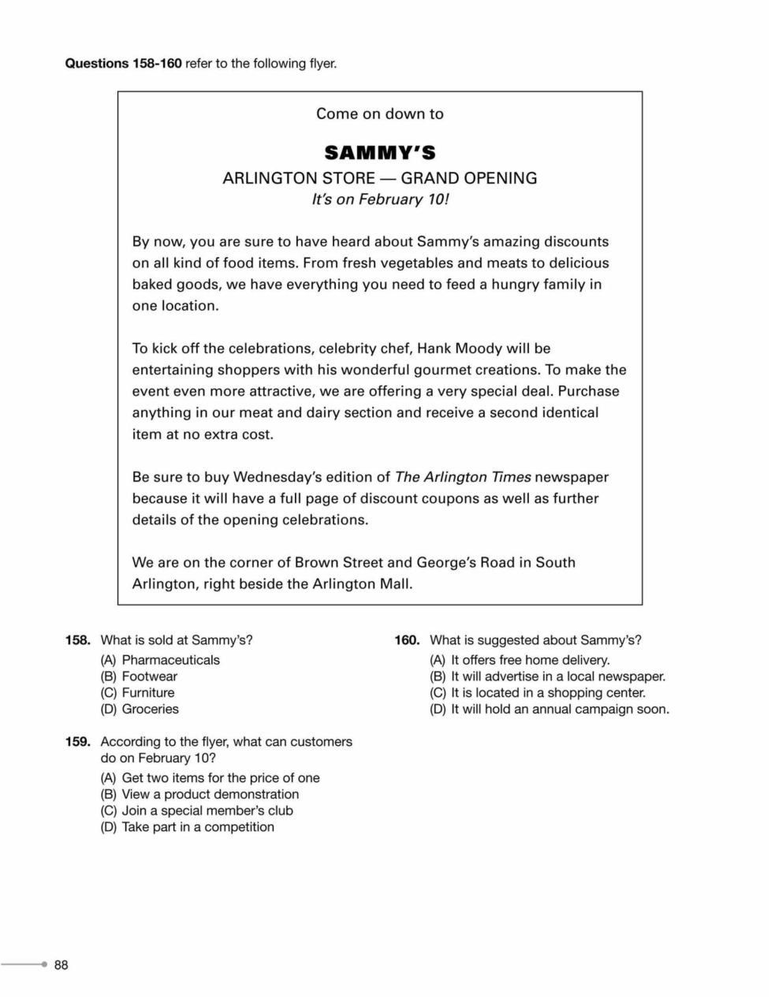


```text
Questions 158-160 refer to the following flyer.
Come on down to
SAMMY'S
ARLINGTON STORE - GRAND OPENING
It's on February 70!
By now, you are sure to have heard about Sammy's amazing discounts
on all kind of food items. From fresh vegetables and meats to delicious
baked goods, weh ave everything you need to feed ah ungry family in
one location.
To kick off the celebrations, celebrity chef, Hank Moodyw ill be
entertaining shoppers with his wonderful gourmet creations.T o make the
event even more attractive, wea re offering av ery special deal. Purchase
anything in our meat and dairy section and receive as econd identical
item at no extra cost.
Be sure to buy Wednesday's edition of The Arlington Ttmes newspaper
because itw ill have af ull page of discount coupons as well as further
details of the opening celebrations.
Wea re on the corner of Brown Street and George's Road in South
Arlington, right beside the Arlington Mall.
158. What is sold at Sammy's? 160. What is suggested about Sammy's?
(A) Pharmaceuticals (A) Ito ffers free home deilvery.
(B) Footwear (B) Itwi ll advertise in al ocaln ewspaper.
(C) Furniture (C) It is located in as hopping center.
(D) Groceries (D) It will hold an annual campaign soon.
159. According to the flyer, what can customers
do on February 1O ?
(A) Get two items for the price of one
(B) View ap roduct demonstration
(C) Join as pecialm ember's club
(D} Take part ina c ompetition
・ . .8 8
```

## PDF 第 88 页

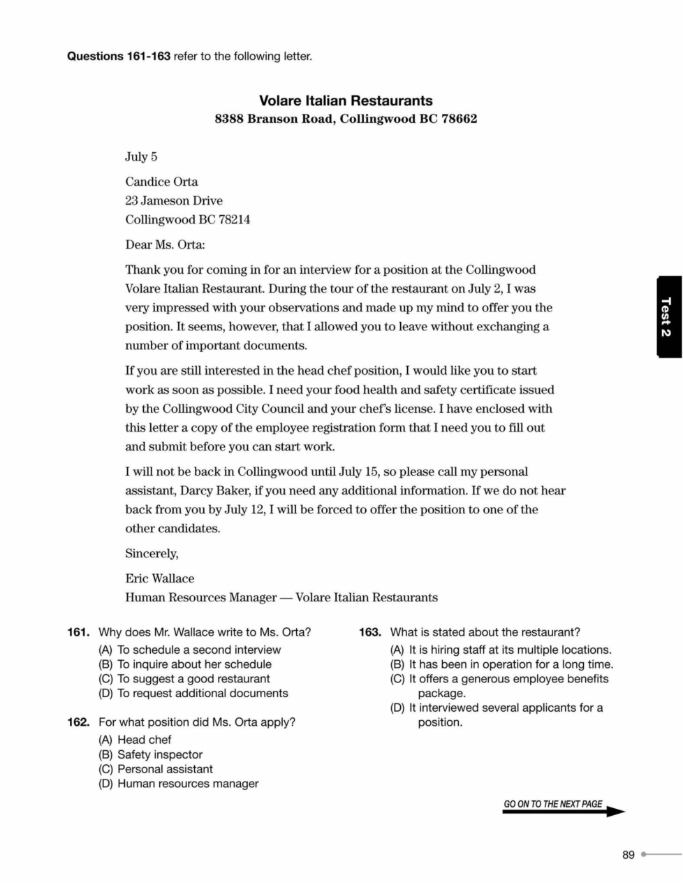


```text
Questions 161-163 refer to the following lette .r
Volare Italian Restaurants
8388 Branson Road, Collingwood BC7 8662
July5
Candice Orta
23 Jameson Drive
Collingwood BC7 8214
Dear Ms.Or ta:
Thank you for coming in for an interview for ap osition at the Collingwood ＇
Volare Italian Restaurant. During thet our of the restaurant on July 2, Iw as
very impressedw ith your observations and madeu p mym ind to offer you the
position.It seems,h owever,th atI a llowed you to leave without exchanging a
n皿 berof important doc皿 ents.
If you are still interested in theh ead chef position, Iw ould likey ou to start
work as soona s possible. In eedy our food health and safety certificate issued
by the Collingwood City Council and your chef's license. Ih avee nclosed with
this letter ac opy of the employee registration form that In eedy ou to fill out
and submit before you cans tart work.
Iwi ll not be back in Collingwood until July1 5, so please call myp ersonal
assistant, Darcy Baker, if you need any additional information. If wed on ot hear
back from you by July 12, Iwi ll be forced to offer the position to one of the
other candidates.
Sincerely,
EricW allace
Hun1an Resources Manager —Volare Italian Restaurants
161. Why does Mr. Wallace write to Ms. Orta? 163. What is stateda bout the restaurant?
(A) To schedule as econd interview (A) Itis hiring staff at tism ultiplelo cations.
(B) To inquire about her schedule (B) Ith as been in operation for al ong time.
(C) To suggest ag ood restaurant (C) Itof fers ag enerous employee benefits
(D) To request additional documents package.
(D)It in terviewed several applicants for a
162. For what position did Ms. Orta apply? position.
(A) Headc hef
(B) Safety inspector
(C) Personal assistant 一
(D) Human resources manager
89... ・
```

## PDF 第 89 页

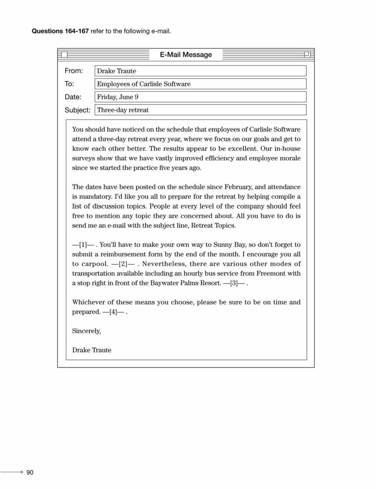


```text
Questions 164-167 refer to the following e-mai .l
E-Mail Message
I
From: DrakeT raute
I
To: Employees of Carlisle Software
I
Date: Friday, June 9
I
Subject: Three-day retreat
You should have noticed on the schedule that employees of Carlisle Software
attend at hree-day retreat every year, where wef ocus on our goals and get to
know eacho ther better.T he results appear to be excellent.O ur in-house
surveys showt hat weh ave vastlyi n1proved efficiency and employee morale
since wes tarted the practice five years ago.
The dates have been posted on the schedules ince February,a nd attendance
is mandatory. I'd like you all to prepare for the retreat by helping compile a
list of discussion topics. Peoplea t every levelo f the company should feel
free to mentiona ny topic they are concerned about.Al l you have to do is
send mea n e-mail with thes ubject line, Retreat Topics.
You'll have to make your own way to Sunny Bay, so don't forget to
一[l]— .
submit ar e血 bursementform by the end of the month. Ie ncourage you all
to carpool. —[2]— . Nevertheless, there are various other modes of
transportation available including an hourly bus service from Freemont with
as top right in front of the Baywater Palms Resort.— [3]—.
Whichever of these means you choose,p lease be sure to be on time and
prepared.— [4]—.
Sincerely,
DrakeT raute
。
. .. 9
```

## PDF 第 90 页

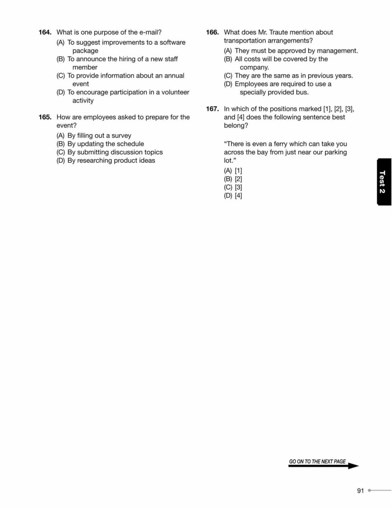


```text
164. What is one purpose of the e-mail? 166. What does Mr. Traute mention about
(A) To suggest improvements to as oftware transportation arrangements?
package (A) Theym ust be approved by management.
(B) To announce the hiring of an ew staff (B) All costs will be coveredb y the
member company.
(C) To provide information about an annual (C) They are the same as inp revious years.
event (D) Employees are required to use a
(D) To encourage participation ina v olunteer specially provided bus.
activity
167. In which of the positions marked [1), [2], [3],
165. Howa re employees asked to prepare for the and [4] does the followings entence best
event? belong?
(A) Byf illing out as urvey
(B) By updating the schedule "There is even af erry which can take you
(C) By submitting discussion topics across the bay from just near our parking
＇
(D) By researching product ideas lot."
(A) [1]
(B) [2]
(C) [3]
(D)[ 4]
一
91 ... ・
```

## PDF 第 91 页

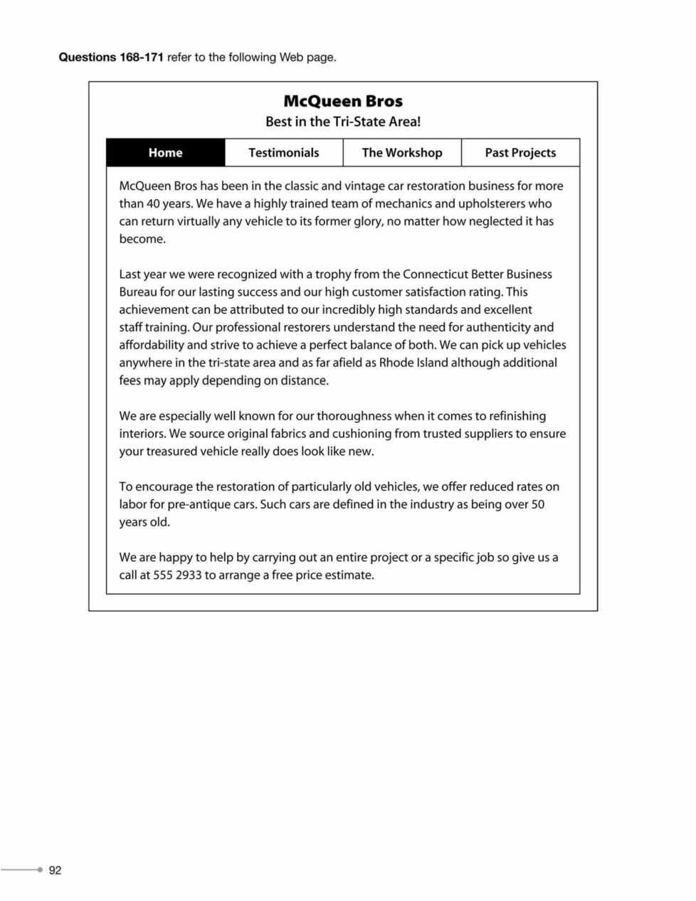


```text
Questions 168-171 refer to the following Webp age.
McQueen Bros
一 Best in the Tri-State Area!
Testimonials The Workshop Past Projects
McQueen Bros has been in the classic and vintage car restoration business for more
than 40 years. Weh ave ah ighly trained team of mechanics and upholsterers who
can return virtually any vehicle to its former glory, no matter how neglected it has
become.
Last year wew ere recognized with at rophy from the Connecticut Better Business
Bureau for our lasting success and our high customer satisfaction rating.Th is
achievement can be attributed to our incredibly high standards and excellent
staff training.O ur professional restorers understand the need for authenticity and
affordability and strive to achieve ap erfect balance of both. Wec an pick upv ehicles
anywhere in the tri-state area and as far afield as Rhode Island although additional
fees maya pply depending on distance.
Wea re especially well known for our thoroughness when it comes to refinishing
interiors.W es ource original fabrics and cushioning from trusted suppliers to ensure
your treasured vehicle really does look like new.
To encourage the restoration of particularly old vehicles,w eo ffer reduced rates on
labor for pre-antique cars.S uch cars are defined in the industry as being over 50
years old.
Wea re happy to help by carrying out an entire project or as pecific job so give us a
call at 555 2933 to arrange af ree price estimate.
・ . .9 2
```

## PDF 第 92 页

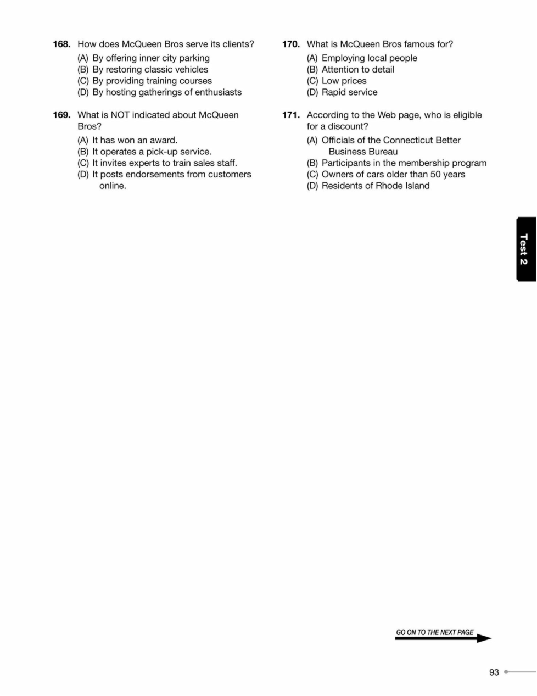


```text
168. Howd oes McQueen Bros serve its clients? 170. What is McQueen Bros famous for?
(A) By offering inner city parking (A) Employing localp eople
(B) By restoring classic vehicles (8) Attention to detail
(C) By providing training courses (C) Low prices
(D) By hosting gatherings of enthusiasts (D)R apid service
169. What is NOTi ndicated about McQueen 171. According to the Webp age, who is eligible
Bros? for ad iscount?
(A) It has won an award. (A) Officials of the Connecticut Better
(B) It operates ap ick-up service. Business Bureau
(C) It invites experts to train sales staff. (B) Participants in the membershipp rogram
(D) It posts endorsements from customers (C) Owners of cars older than 50 years
online. (D)R esidents of Rhode Island
＇
一
93... ・
```

## PDF 第 93 页

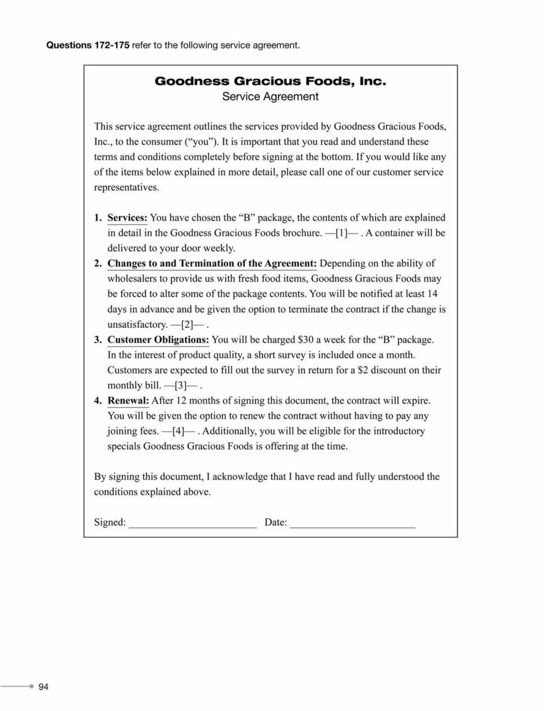


```text
Questions 172-175 refer to the following service agreement.
Goodness Gracious Foods, Inc.
Service Agreement
This service agreement outlines the services provided by Goodness Gracious Foods,
lnc., to the consumer ("you"). It is important that you read and understand these
terms and conditions completely before signing at the bottom. If you would like any
of the items below explained in more detail,pl ease call one of our customer service
representatives.
1. Services: You have chosen the "B" package,th ec ontents of which are explained
in detail in the Goodness Gracious Foods brochure.— [I]—. Ac ontainer will be
delivered to your door weekly.
2. Changes to and Termination of the Agreement: Depending on the ability of
wholesalers to provide usw ith fresh food items, Goodness Gracious Foodsm ay
be forced to alter some of the package contents.Y ou will be notified atle ast 14
days in advance and be given the option to terminate the contractif the change is
unsatisfactory.一 [2]— .
3. Customer Obligations: You will be charged $30 aw eek for the "B"p ackage.
In the interest of product quality,a s hort survey is included once am onth.
Customers are expected to fill out the survey in return for a$ 2 discount on their
monthly bill. —[3]—.
4. Renewal: After 12m onthso f signing this document, the contract will expire.
You will be given the option to renew the contract without havingt o pay any
joining fees.— [4]—. Additionally,y ou will be eligible for the introductory
specials Goodness Gracious Foods is offering at the time.
Bys igning this document,I a cknowledge that Ih ave read and fully understood the
conditions explained above.
Signed: Date:
・ . .9 4
```

## PDF 第 94 页

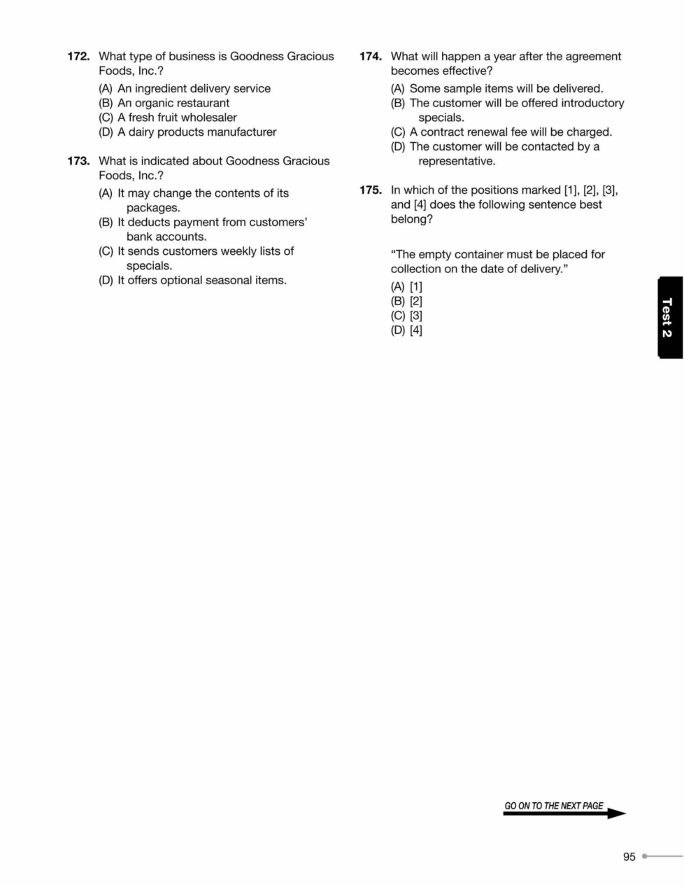


```text
172. What type of business is Goodness Gracious 174. What will happen ay ear after the agreement
Foods, Inc.? becomes effective?
(A) An ingredient delivery service (A) Some sample items will be delivered.
(B) Ano rganic restaurant (B) The customer will be offered introductory
(C) A fresh fruit wholesaler specials.
(D) A dairy products manufacturer (C) Ac ontract renewal fee will be charged.
(D) The customer will be contacted by a
173. What is indicated about Goodness Gracious representative.
Foods, Inc.?
(A) It may change the contents of its 175. In which of the positions marked [1), [2], [3],
packages. and [4] does the followings entence best
(B) It deducts payment from customers' belong?
bank accounts.
(C) It sends customers weekly lists of "The empty container must be placed for
specials. collection on the date of delivery." ＇
(D) It offers optional seasonal items.
(A) [1]
(B) (2]
(C) (3]
(D)( 4]
一
95... ・
```

## PDF 第 95 页

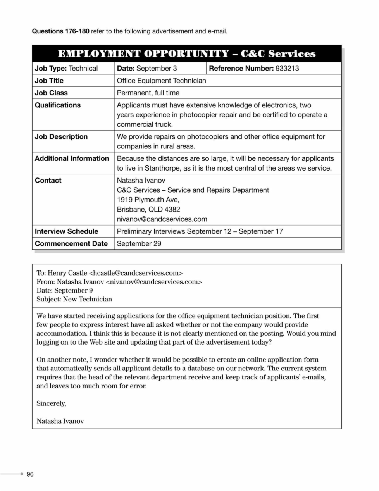


```text
Questions 176-180 refer to the following advertisement and e-mail.
Office Equipment Technician
Job Class Permanent,fu lltime
Qualifications Applicants must have extensive knowledge of electronics, two
years experience in photocopier repair and be certified to operate a
commercial truck.
Job Description Wep rovide repairs on photocopiers and other officee quipment for
companies in rural areas.
I
Additional Information Because the distances are so large, it will be necessary for applicants
to live in Stanthorpe,a s it is the most central of the areas wes ervice.
Contact Natasha Ivanov
C&CS ervices -Service and Repairs Department
1919 Plymouth Ave,
Brisbane, QLD4 382
nivanov@candcservices.com
I
Interview Schedule Preliminary Interviews September 12 -September 17
Commencement Date September 29
To: Henry Castle <hcastle@candcservices.com>
From:N atasha Ivanov <nivanov@candcservices.com>
Date:S eptember 9
Subject: NewT echnician
Weh ave started receiving applications for the office equipment technician position.T he frrst
few people to express interest have all asked whether or not the company would provide
accommodation. It hink this is because it is not clearly mentioned on the posting.W ould you mind
logging on to the Webs ite and updating that part of the advertisement today?
Ona nother note,I w onder whether it would bep ossible to create an online application form
that automatically sends alla pplicant detailst o ad atabase on our network Thec urrent system
requires that the head of the relevant department receive and keep track of applicants'e-mails,
and leaves too much room for error.
Sincerely,
Natasha Ivanov
- ... 96
```

## PDF 第 96 页

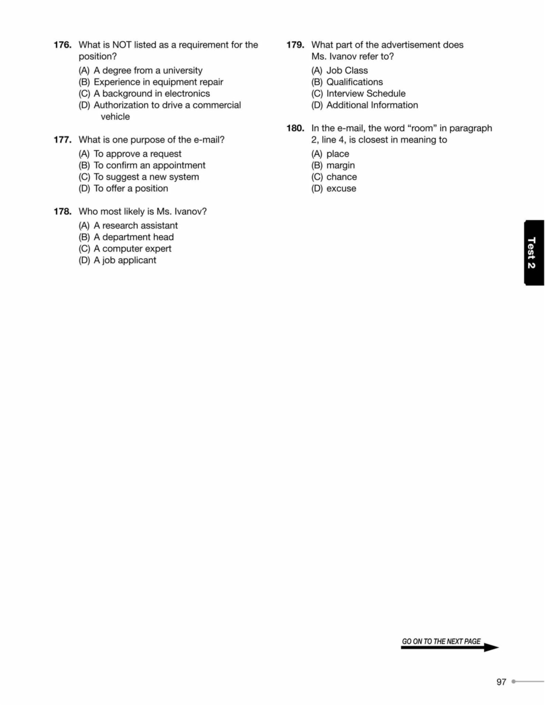


```text
176. What is NOTl isted as ar equirement for the 179. What part of the advertisement does
position? Ms. Ivanovr efer to?
(A) Ad egree from au niversity (A) Job Class
(B) Experience in equipment repair (B) Qualifications
(C) A background in electronics (C) Interview Schedule
(D) Authorization to drive ac ommercial (D)A dditional Information
vehicle
180. In the e-mail,th e word "room" in paragraph
177. What is one purpose of the e-mail? 2, line 4, is closest in meaning to
(A) To approve ar equest (A) place
(B) To confirm an appointment (B) margin
(C) To suggest an ew system (C) chance
(D) To offer ap osition (D) excuse
178. Whom ost likely is Ms.Iv anov?
＇
(A) A research assistant
(B) Ad epartment head
(C) Ac omputer expert
(D) Aj ob applicant
一
97... ・
```

## PDF 第 97 页

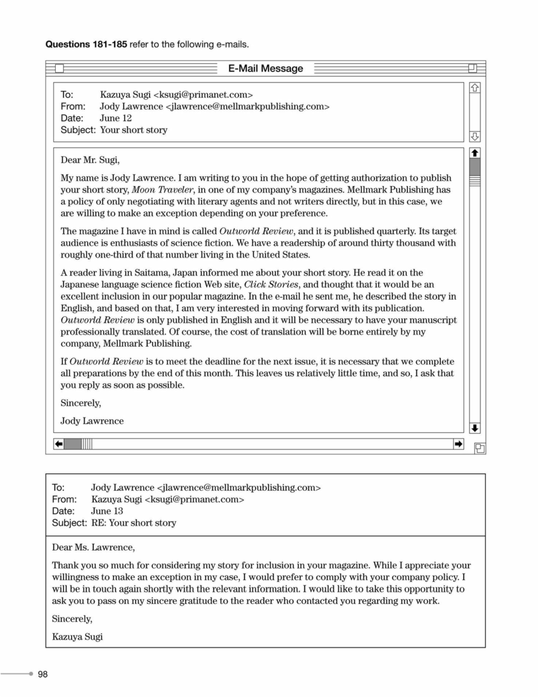


```text
Questions 181-185 referto t hef ollowing e-mails.
E-Ma liMessage
豆
To: Kazuya Sugi <ksugi@primanet.com>
一
From: JodyL awrence <jlawrence@mellmarkpublishing.com>
Date: June 12 立
Subject: Your short story
一會
Dear Mr. Sugi,
Myn an1e is JodyL awrence. Ia mw riting to you in theh opeo f getting authorization to publish
your short story,M oon Traveler, in one of myc ompany's magazines.Me llmark Publishing has
ap olicy of only negotiating with literary agents and not writers directly,bu t in this case, we
are willing to makea n exception depending on your preference.
The magazineI h ave in mind is calledO utworld Review,a nd itis publishedq uarterly.It s target
audience is enthusiasts of science fiction. Weh avea r eadership of around thirty thousand with
roughly one-third of that number living in the United States.
Ar eaderli vingi n Saitarna, Japan informedm ea bout your short story. Her eadi to n the
Japanese language science fiction Webs ite, Click Stories, and thought that it would be an
excellent inclusion in our popular magazine.In the e-mail hes ent me, hed escribedt he story in
English, and based on that,I a mv ery interested in movingf orward with its publication.
Outwo濯 Reviewis only published in English and it will ben ecessary to have your manuscript
professionally translated. Of course, the cost of translation will be bornee ntirely by my
company, Mellmark Publishing.
If Outworld Review is to meet the deadline for then ext issue, it is necessary that wec omplete
all preparations by the end of this month.Th is leaves us relatively littlet ime, and so, Ia sk that
you replya s soon as possible.
Sincerely,
Jody Lawrence
oo
コ
-
1. ., 11111 防
To: Jody Lawrence <jlawrence@mellmarkpublishing.com>
From: Kazuya Sugi< ksugi@prin1anet.com>
Date: June1 3
Subject: RE:Yo ur short story
Dear Ms. Lawrence,
Thank you so muchf or consideringm ys tory for inclusioni n your magazine. W皿eIa ppreciate your
willingness to makea n exception inm yc ase, Iw ould prefer to comply with your company policy. I
will bei n touch again shortly with ther elevant information.I w ouldli ket o take thiso pportunity to
ask you to pass on mys incere gratitudet ot he reader who contactedy ou regarding myw ork.
Sincerely,
KazuyaSugi
・ . .9 8
```

## PDF 第 98 页

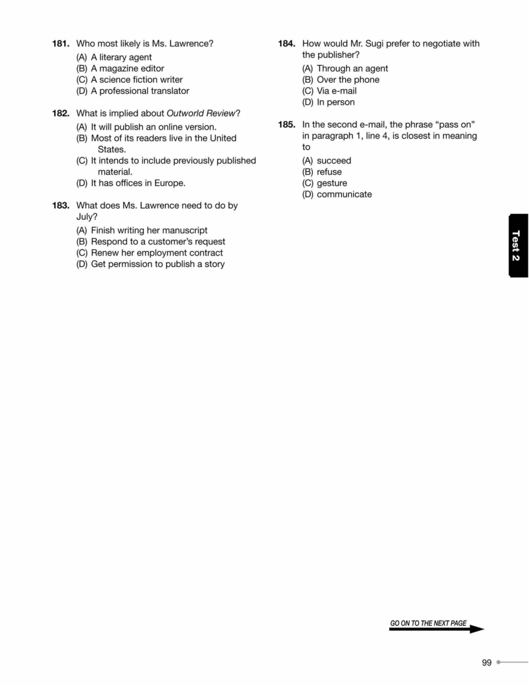


```text
181. Whom ost likely is Ms. Lawrence? 184. Howw ould Mr. Sugi prefer to negotiate with
(A) A literary agent the publisher?
(B) Am agazine editor (A) Through an agent
(C) A science fiction writer (B) Over the phone
(D) A professional translator (C) Via e-mail
(D)I n person
182. What is implied about Outworld Review?
(A) It will publish an online version. 185. In the second e-mail, the phrase "pass on"
(B) Most of its readers live in the United in paragraph 1, line4 , is closest in meaning
States. to
(C) It intends to include previously published (A) succeed
materia .l (B) refuse
(D) It has offices in Europe. (C) gesture
(D)c ommunicate
183. What does Ms. Lawrence need to do by
＇
July?
(A) Finish writing her manuscript
(B) Respond to ac ustomer'sr equest
(C) Renew her employment contract
(D) Get permission to publish as tory
一
99... ・
```

## PDF 第 99 页

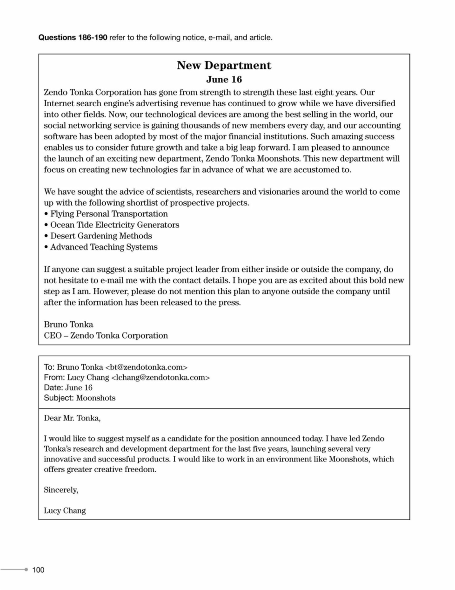


```text
Questions 186-190 referto t hef ollowing notice, e-mail, and article.
New Department
June 16
Zendo Tonka Corporation has gone from strength to strength these last eight years.O ur
Internet search engine's advertising revenue has continued to grow while weh ave diversified
into other fields.N ow, our technological devices are an1ong the best selling in the world, our
social networking service is gaining thousands of new members every day, and our accounting
software has been adopted by most of the major fmancial institutions. Such amazing success
enables us to consider future growth and take ab ig leap forward.I a mp leased to announce
the launch of an exciting new department, Zendo Tonka Moonshots. This new department will
focus on creating new technologies far in advance of what wea re accustomed to.
Weh ave sought the advice of scientists, researchers and visionaries around the world to come
up with thef ollowing shortlist of prospective projects.
• Flying Personal Transportation
• Ocean Tide Electricity Generators
• Desert Gardening Methods
• Advanced Teaching Systems
If anyone can suggest as uitable project leader from either inside or outside the company, do
not hesitate to e-mail mew ith the contact details. Ih ope you are as excited about this bold new
step as Ia m. However, please do not mention this plan to anyone outside the company until
after the information has been released to the press.
Bruno Tonka
CEO- Zendo Tonka Corporation
To: Bruno Tonka <bt@zendotonka.com>
From: Lucy Chang <lchang@zendotonka.com>
Date: June 16
Subjec :tMoonshots
Dear Mr. Tonka,
Iw ould like to suggest myself as ac andidate for the position announced today.Ih ave led Zendo
Tonka's research and development department for the last five years, launching several very
innovative and successful products. Iw ould like to work in an environment like Moonshoぉ， which
offers greater creative freedom.
Sincerely,
Lucy Chang
・ . .1 00
```

## PDF 第 100 页

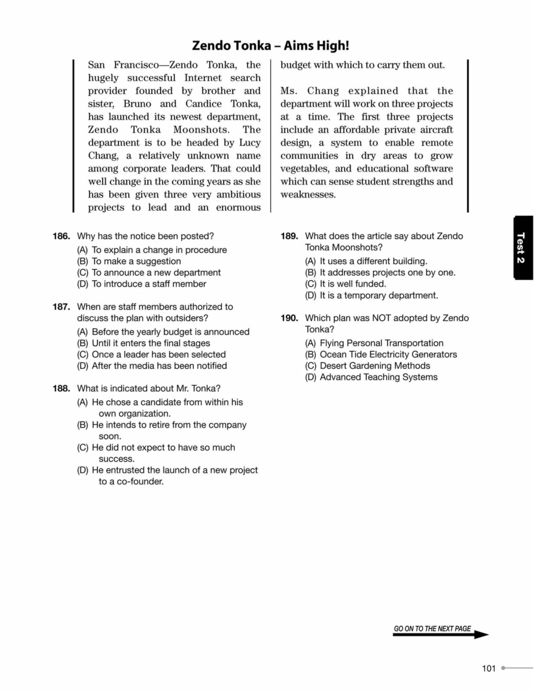


```text
Zendo Tonka -Aims High!
San Francisco—Zendo Tonka, the budget with which to carry them out.
hugely successful Internet search
provider founded by brother and Ms. Chang explained that the
sister, Bruno and Candice Tonka, department will work on three projects
has launched its newest department, at a time. The frrst three projects
Zendo Tonka Moonshots. The include an affordable private aircraft
dep紅 tmentis to be headed by Lucy design, a system to enable remote
Chang, a relatively unknown name conununities in dry areas to grow
among corporate leaders.T hatc ould vegetables, and educational software
well change in the coming ye紅 sas she which can sense student strengths and
has been given three very an1bitious weaknesses.
projects to lead and an enormous
＇
186. Why has the notice been posted? 189. What does the articles ay about Zendo
(A) To explain ac hange in procedure Tonka Moonshots?
(B) To make as uggestion (A) It uses ad ifferent building.
(C) To announce an ew department (B) Ita ddresses projects one by one.
(D) To introduce as taff member (C) Itis well funded.
(D) Itis at emporary department.
187. When are staff members authorized to
discuss the plan with outsiders? 190.W hich plan was NOTa dopted by Zendo
(A) Before the yearly budget is announced Tonka?
(B) Until it enters the final stages (A) Flying Personal Transportation
(C) Once al eader has been selected (B) Ocean Tide Electricity Generators
(D) After the media has been notified (C) Desert Gardening Methods
(D) Advanced Teaching Systems
188. What is indicated about Mr. Tonka?
(A) He chose ac andidate from within his
own organization.
(B) He intends to retire from the company
soon.
(C) He did not expect to have so much
success.
(D) He entrusted the launch of an ew project
to ac o-founder.
一
101 ... ・
```

## PDF 第 101 页

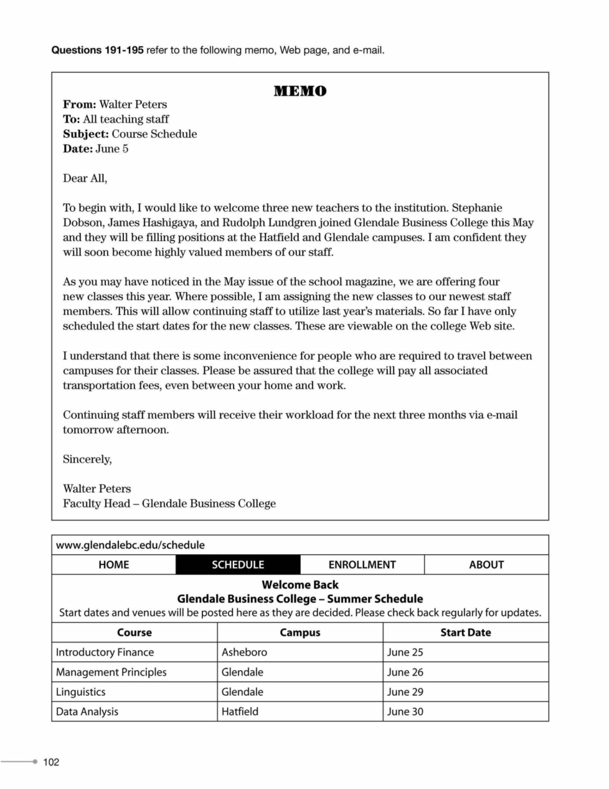


```text
Questions 191-195 refer to the following memo, Web page, and e-mail.
MEMO
From: Walter Peters
To: All teaching staff
Subject: Course Schedule
Date:June5
Dear All,
To begin with, Iw ould liket o welcome three new teachers tot he institution. Stephanie
Dobson, James Hashigaya,a nd Rudolph Lundgren joined Glendale Business College this May
and they will be filling positions at the Hatfield and Glendale campuses. Ia mc onfident they
will soon become highly valued members of our staff.
Asy ou may have noticed in the Mayi ssue of the schoolma gazine, wea re offering four
new classes this year. Where possible, Ia ma ssigning the new classes to our newest staff
members.Th is will allow continuing staff to utilize lasty ear's materials. So far Ih ave only
scheduled thes tart dates for then ew classes. These are viewable on the college Web site.
Iu nderstand that there is some inconvenience for people who are required to travelb etween
campuses for their classes. Please be assured that the college will pay all associated
transportation fees, even between your home and work
Continuings taff members will receive their workload for the next three months via e-mail
tomorrow afternoon.
Sincerely,
Walter Peters
Faculty Head -Glendale Business College
一
www.glendalebc.edu/schedule
HOME ENROLLMENT ABOUT
Welcome Back
Glendale Business College -SummerS chedule
Start dates and venueswi ll be posted here as they are decided. Please check back regularly for updates.
Course Campus Start Date
Introductory Finance Asheboro June 25
Management Principles Glendale 」une26
Linguistics Glendale June 29
Data Analysis Hatfield June3 0
・ . .1 02
```

## PDF 第 102 页

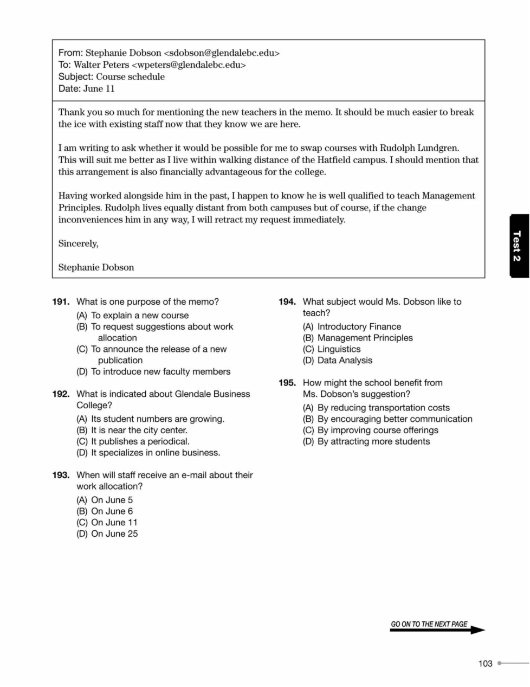


```text
From:S tephanie Dobson <sdobson@glendalebc.edu>
To:W alter Peters <wpeters@glendalebc.edu>
Subject: Courses chedule
Date:J une1 1
Thank yous o much for mentioning the new teachers in them emo. It should be much easier to break
thei ce with existings taff nowt hat they knoww ea re here.
Ia mw riting to askw hether it would bep ossiblef or met o swap courses with Rudolph Lundgren.
Thisw ill suit meb etter as Ili vew ithin walking distance of the Hatfield campus. Is hould mention that
this arrangement is also financially advantageous for thec ollege.
Having worked alongside比min the past,I h appent o know hei s well qualified to teach Management
Principles. Rudolph lives equally distant from both campuses but of course, if thec hange
＇
inconveniences him in any way, Iw ill retract myr equest immediately.
Sincerely,
Stephanie Dobson
191. What is one purpose of the memo? 194. What subject would Ms.D obson like to
(A) To explain an ew course teach?
(B) To request suggestions about work (A) Introductory Finance
allocation (B) Management Principles
(C) To announce the release of an ew (C) Linguistics
publication (D)D ata Analysis
(D) To introduce newf aculty members
195. Howm ight the school benefit from
192. What is indicated about Glendale Business Ms.D obson'ss uggestion?
College? (A) By reducingt ransportation costs
(A) Its student numbers are growing. (B) By encouraging betterc ommunication
(B) It isn ear the city center. (C) By improving course offerings
(C) It publishes ap eriodical. (D) By attracting more students
(D) It speciailzes ino nline business.
193. When will staff receive an e-mail about their
work allocation?
(A) OnJ une 5
(B) OnJ une 6
(C) OnJ une 11
(D) OnJ une 25
一
103... ・
```

## PDF 第 103 页

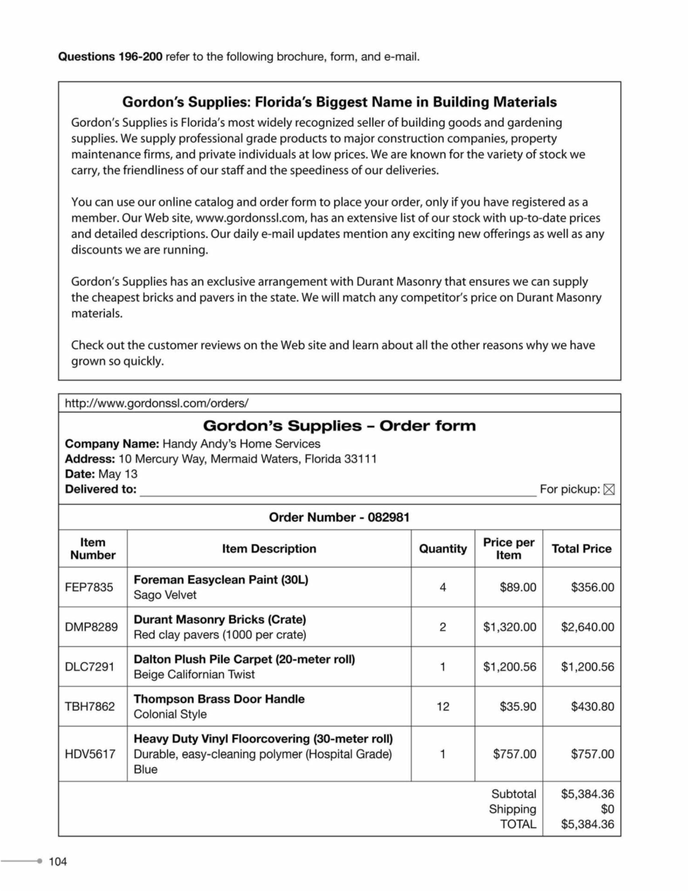


```text
Questions 196-200 refert o the following brochure, form,a nd e-mail.
Gordon'sS upplies: Florida's Biggest Namei n Building Materials
Gordon'sS upplies is Florida's most widelyr ecognized seller of building goods and gardening
supplies. Wes upply professionalgr adep roducts to major construction companies,pr operty
maintenance firms,a nd private individualsa t low prices.W ea rek nown for the variety ofs tock we
carry、thefriendliness ofo ur staff and the speediness of our deliveries.
You canu se our onl inec atalog and order form to place your order、onlyif youh ave registered as a
member. OurW ebs ite,w ww.gordonss.lcom, has an extensive ilsto f our stock with up-to-datep rices
andd etailed descriptions.O ur dailye -mail updates mention any exciting newo fferings as we llas any
discounts wea re running.
Gordon'sS upplies has an exclusive arrangementw ith Durant Masonry that ensures wec an supply
the cheapest bricks and pavers in thes tate.W ew ill match any competitor'sp riceo n DurantM asonry
materials.
Check outt he customer reviews on the Webs ite and learn abouta lltheo ther reasons why weh ave
grown so quickly.
http://w ww.gordonssl.com/orders/
Gordon's Supplies -Orderf orm
Company Name: HandyA ndy's Home Services
Address:1 0 Mercury Way, Mermaid Waters,Fl orida 33111
Date: May 13
Deliveredt o: For pickup:図
OrderN umber- 082981
Item Price per
Item Description Quantity Total Price
Number Item
Foreman Easyclean Paint (30L)
FEP7835 4 $89.00 $356.00
SagoV elvet
Durant Masonry Bricks( Crate)
DMP8289 2 $1,320.00 $2,640.00
Red clay paver s (1000 perc rate)
Dalton PlushP ileC arpet(2 0-meterr oll)
DLC7291 1 $1,200.56 $1,200.56
Beige Californian Twist
Thompson Brass Door Handle
TBH7862 12 $35.90 $430.80
Colonial Style
Heavy Duty Vinyl Floorcovering (30-meterro ll}
HDV5617 Durable,e asy-cleaning polymer (Hospital Grade) 1 $757.00 $757.00
Blue
Subtotal $5,384.36
Shipping $0
TOTAL $5,384.36
・ . .1 04
```

## PDF 第 104 页

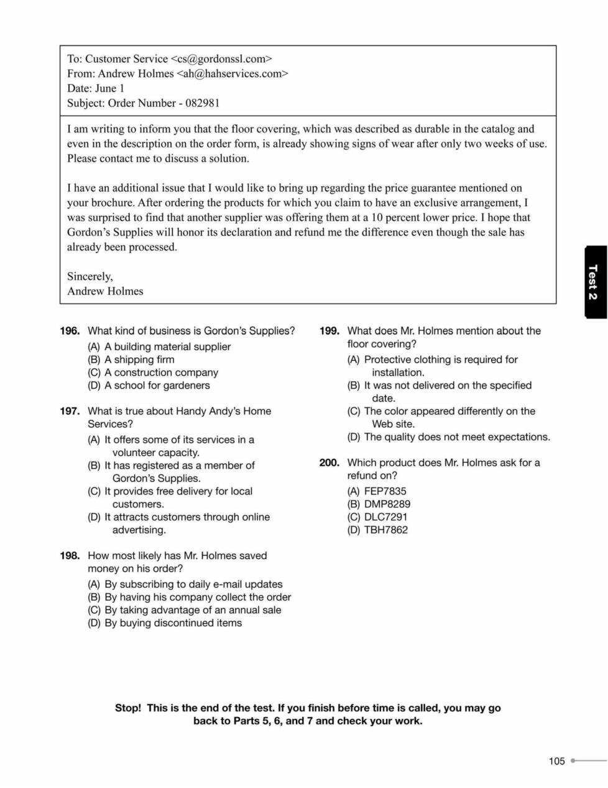


```text
To: Customer Service <cs@gordonssl.com>
From: Andrew Holmes <ah@hahservices.com>
Date:J une I
Subject: Order Number -082981
Ia mw ritingt o inform you that the floor covering, which was described as durable int hec atalog and
even in the description on the order form,is already showing signs ofw ear after onlyt wo weeks of use.
Please contact met o discuss as olution.
Ih ave an additionali ssue that Iw ould like to bring up regarding the price guarantee mentioned on
your brochure.Af ter orderingt he products for which you claim to have an exclusive arrangement, I
was surprised to find that another supplier was offering them at a1 0p ercent lower price. Ih ope that
Gordon's Supplies will honor its declaration and refund met he difference even though the sale has
＇
already been processed.
Sincerely,
Andrew Holmes
196. What kind of business is Gordon's Supplies? 199. What does Mr. Holmes mention about the
(A) A building material supplier floor covering?
(B) As hipping firm (A) Protective clothingi s required for
(C) Ac onstruction company installation.
(D) As chool for gardeners (B) It was not delivered on the specified
date.
197. What is true about Handy Andy's Home (C) The color appeared differently on the
Services? Web site.
(A) It offers some of its services in a (D) The quality does not meet expectations.
volunteer capacity.
(B) It has registered as am ember of 200. Whichp roduct does Mr.H olmes ask for a
Gordon's Supplies. refund on?
(C) It provides free delivery for local (A) FEP7835
customers. (B) DMP8289
(D) It attracts customers through online (C) DLC7291
advertising. (D)T BH7862
198. How most likely hasM r.H olmes saved
money on his order?
(A) By subscribing to daily e-mail updates
(B) By having hisc ompanyc ollect the order
(C) By taking advantage of an annual sale
(D) By buying discontinued items
Stop! This is the end of the test. If you finish before time is called, you mayg o
back to Parts 5, 6, and 7a nd check your work.
105... ・
```

## PDF 第 105 页

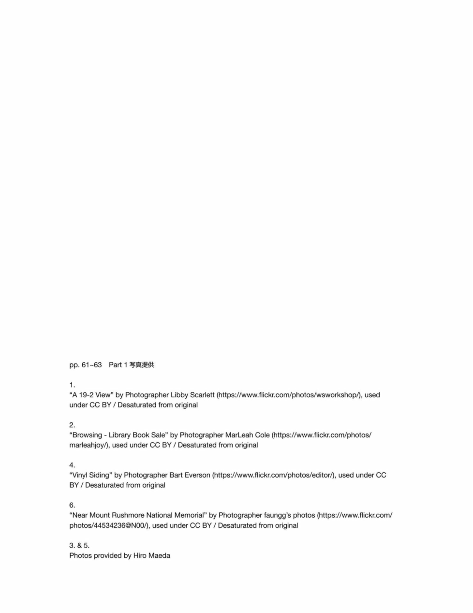


```text
pp.61 -63 Part 1写口提供
1.
"A 19-2 View" by Photographer Libby Scarlett (https://www.flickr.com/photos/wsworkshop/),u sed
under CCB Y/D esaturated from original
2.
"Browsing -Library Book Sale" by PhotographerM arleah Cole (https://www.flickr.com/photos/
marleahjoy/), used under CCB Y/D esaturated from original
4.
"Vinyl Siding" by Photographer Bart Everson (https://www.flickr.com/photos/editor/), used under CC
BY/ D esaturated from original
6.
"Near Mount Rushmore NationalM emorial"b y Photographer faungg's photos (https://www.flickr.com/
photos/44534236@NOO/),u sed under CCB Y/D esaturated from original
3.&5.
Photos provided by Hiro Maeda
```

## PDF 第 106 页

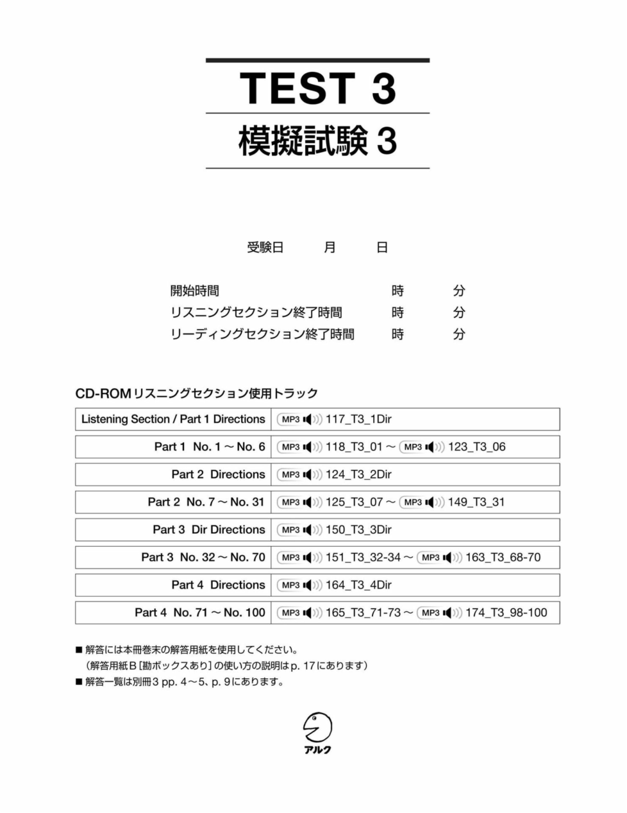


```text
TEST 3
3
模擬試験
受験日 月 日
開始時間 時 分
時 分
リスニングセクション終了時間
時 分
リーディングセクション終了時間
CD-ROMリスニングセクション使用トラック
Listening Section/ Part 1D irections I ~ P3•4>)) 117_ T 3_1 Di r
Part 1 No. 1- No. 61@ P3•4>)) 118_T 3_01 -@ P3•4>)) 123_T 3_06
I
Part 2 Directions (?P3•4>)) 124_T3_2Dir
I
Part 2 No. 7- No. 31 @P3•4>)) 125_T 3_07 -@ P3•4>)) 149_T 3_31
I
Part 3 Dir Directions @P3•4>)) 150_T 3_3Dir
I
Part 3 No. 32 -No. 70 @P3•4>)) 151_T3_32-34 - ~ P3•4>)) 163_T3_68-70
I
Part 4 Directions @P3•4>)) 164_T 3_4 Dir
I
Part 4 No. 71 -No.100 @P3•4>)) 165_T3_71-73 - @ P3•4>)) 174_T3_98-100
●解答には本冊巻末の解答用紙を使用してください。
（解答用祇B[勘ポックスあり］の使い方の説明はp.17にあります）
● 解答一覧は別冊3pp. 4-5、p.9にあります。
の西
```

## PDF 第 107 页

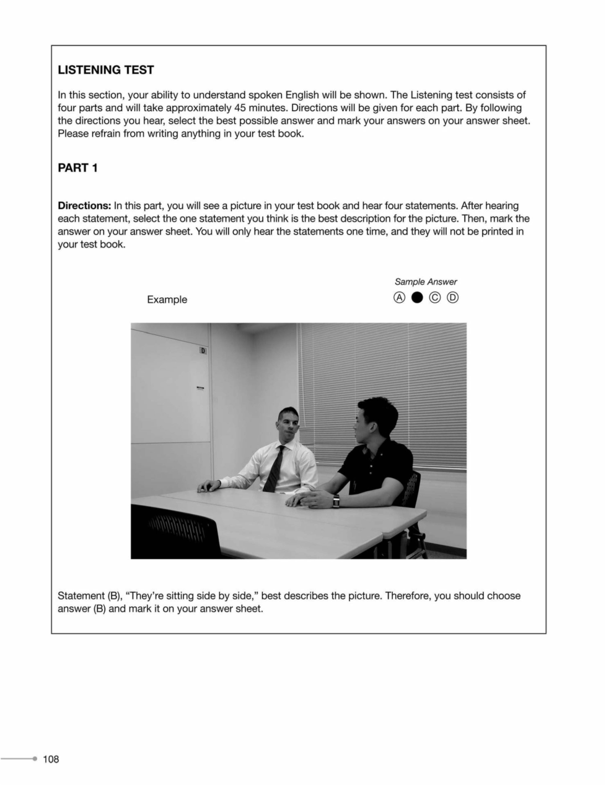


```text
LISTENING TEST
In this section, your ability to understand spoken English will be shown.T he Listening test consists of
four parts and will take approximately 45 minutes.D irections willb e given for each part. Byf ollowing
the directions you hear,s elect the best possible answer and marky our answers on youra nswer sheet.
Please refrain from writing anything in your test book.
PART 1
Directions: In this part,y ou will see ap icture in your test book and hear four statements.Af ter hearing
each statement,se lect the one statement you think is the best description fort he picture. Then,m ark the
answer on your answer sheet. You will only hear the statements one time,a nd they will not be printed in
your test book.
Sample Answer
R●c◎
Example
Statement (B), "They're sitting side by side,"b est describes the picture.Th erefore,y ou should choose
answer (B) and markit o n your answer sheet.
・ . .1 08
```

## PDF 第 108 页

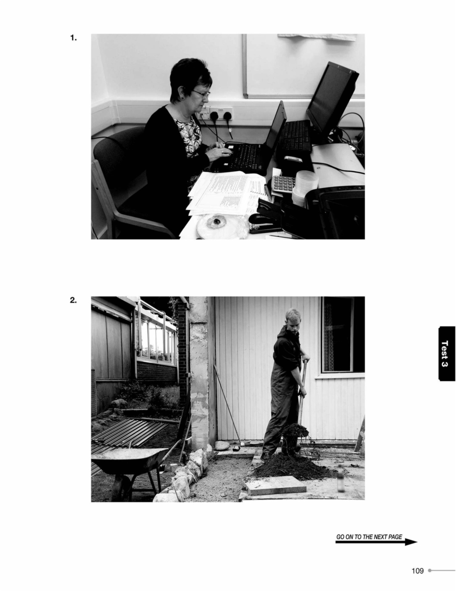


```text
1.
2.
＇
109... ・
```

## PDF 第 109 页

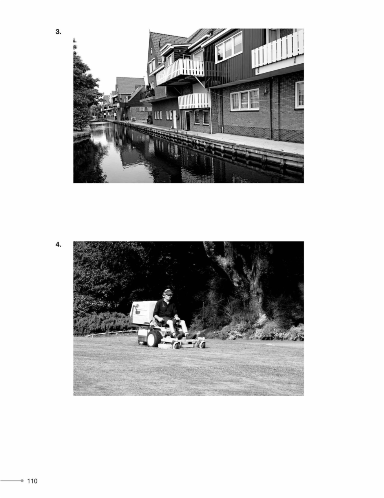


```text
3.
・ . .1 10
```

## PDF 第 110 页

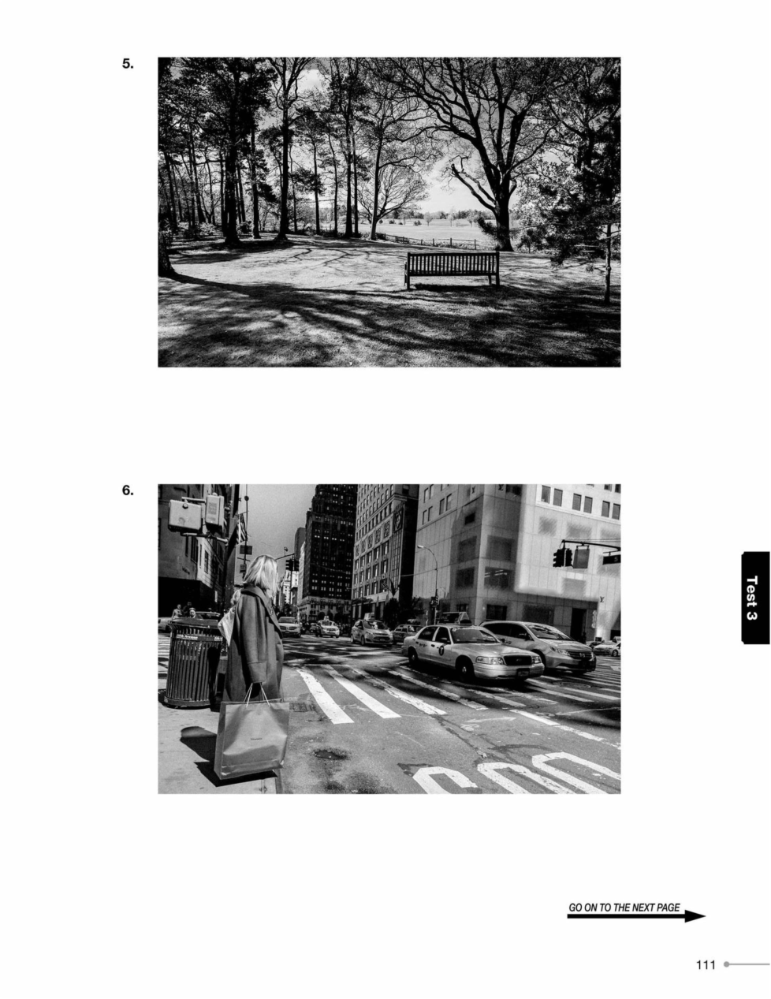


```text
5
6
＇
一
111 ...
```

## PDF 第 111 页


```text
PART2
Directions:In t his part, you willhe ar aq uestion or statement. You will then hear three alternative
responses to the question or statement. They will allb e spoken inE nglish. You will onlyh ear them one
time,a nd they will not be printed in your test book.C hoose the best response to eachq uestion and
mark the letter(A ),(B ), or (C) on your answer sheet.
7. Mark your answero n your answer sheet. 20. Mark youra nswer on your answer sheet.
8. Mark your answero n your answer sheet. 21. Marky our answer on your answer sheet.
9. Mark your answer ony our answer sheet. 22. Marky oura nswer on your answer sheet.
10. Mark your answero n your answer sheet. 23. Marky oura nswer on your answer sheet.
11. Mark youra nswero ny our answer sheet. 24. Mark youra nswer on your answer sheet.
12. Mark youra nswero ny our answer sheet. 25. Mark youra nswer on your answer sheet.
13. Mark youra nswer ony oura nswer sheet. 26. Marky oura nswer on youra nswer sheet.
14. Mark your answero ny our answer sheet. 27. Marky oura nswer on your answer sheet.
15. Mark your answero ny our answer sheet. 28. Marky our answer on your answer sheet.
16. Mark your answero ny our answer sheet. 29. Marky oura nswer on your answer sheet.
17. Mark your answer on your answer sheet. 30. Marky our answero n your answer sheet.
18. Mark your answer on your answer sheet. 31. Marky oura nswer on your answer sheet.
19. Mark your answero n your answer sheet.
・ . .1 12
```

## PDF 第 112 页

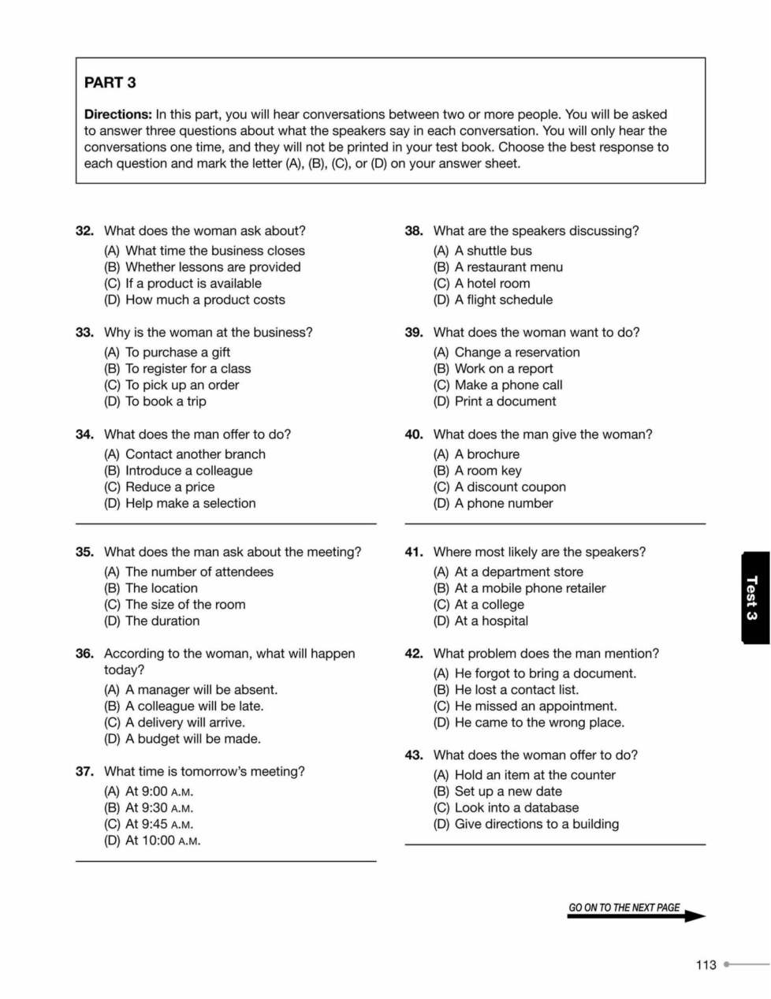


```text
PART3
Directions: In thisp art,y ou will hear conversations between two or more people.Y ou wi llbe asked
to answer three questions about what the speakers say in eachc onversation.Y ou will only hear the
conversations one time, and they will notb e printed in your testb ook.C hoose the best response to
each question and mark the letter (A),(B ), (C),o r (D)o n youra nswer sheet.
32. What does the woman ask about? 38. What are the speakers discussing?
(A) What time the business closes (A)A s huttle bus
(B) Whether lessons are provided (B) A restaurant menu
(C) If ap roduct is available (C) A hotel room
(D) How much ap roduct costs (D) Af light schedule
33. Why is the woman at the business? 39. What does the woman want to do?
(A) To purchase ag ift (A) Change ar eservation
(B) To register for ac lass (B) Work on ar eport
(C) To pick up an order (C) Make ap hone call
(D) To book at rip (D) Print ad ocument
34. What does the man offer to do? 40. What does the man give the woman?
(A) Contact another branch (A)A brochure
(B) Introducea c olleague (B) A room key
(C) Reduce ap rice (C) Ad iscount coupon
(D) Help make as election (D) A phone number
35. What does the man ask about the meeting? 41. Where most likely are the speakers? ＇
(A) The number of attendees (A) Ata d epartment store
(B) The location (B) At am obile phone retailer
(C) The size of the room (C) At ac ollege
(D) The duration (D) Ata h ospital
36. According to the woman,w hat wi llhappen 42. Whatp roblem does the man mention?
today? (A)H ef orgot to bring ad ocument.
(A) A managerwi ll be absent. (B) Hel ost ac ontact list.
(B) Ac olleague will be late. (C) Hem isseda n appointment.
(C) Ad elivery wi llarrive. (D) Hec amet o the wrong place.
(D) A budget will be made.
43. What does the woman offer to do?
37. What time is tomorrow'sm eeting? (A)H old an item at the counter
(A) At 9:00 A.M. (B) Set up an ew date
(8) At 9:30 A.M. (C) Look into ad atabase
(C) At 9:45 A.M. (D) Give directions to ab uilding
(D) At 10:00 A.M.
一
113 ... ・
```

## PDF 第 113 页

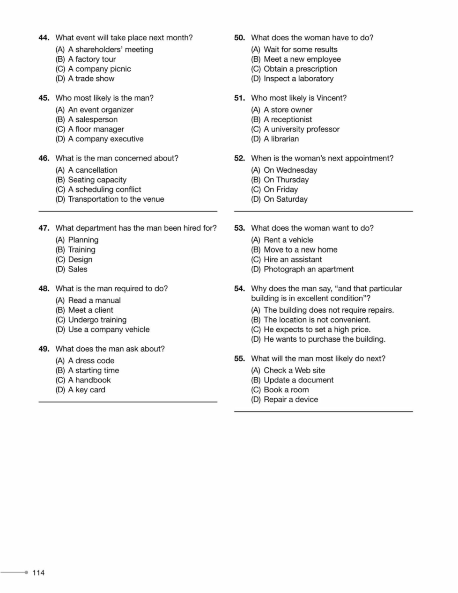


```text
44. What event will take place next month? 50. What does the woman have to do?
(A) As hareholders'meeting (A) Wait for some results
(B) Af actory tour (B) Meet an ew employee
(C) Ac ompany picnic (C) Obtain ap rescription
(D) At rade show (D) Inspect al aboratory
45. Who most likely is the man? 51. Whom ost likely is Vincent?
(A) An event organizer (A) As tore owner
(B) As alesperson (B) A receptionist
(C) Af loor manager (C) Au niversity professor
(D) Ac ompany executive (D) Al ibrarian
46. What is the man concerned about? 52. When ist he woman's next appointment?
(A) Ac ancellation (A) OnW ednesday
(B) Seating capacity (B) OnT hursday
(C) As cheduling conflict (C) On Friday
(D) Transportation to the venue (D) OnS aturday
47. What department has the man been hired for? 53. What does the woman want to do?
(A) Planning (A) Rent av ehicle
(B) Training (B) Move to an ew home
(C) Design (C) Hire an assistant
(D) Sales (D) Photograph an apartment
48. What is the man required to do? 54. Whyd oes the man say,"a nd that particular
(A) Read am anual building is in excellent condition"?
(B) Meet ac lient (A) The building does not require repairs.
(C) Undergo training (B) The location is not convenient.
(D) Use ac ompany vehicle (C) Hee xpects to set ah igh price.
(D) Hew ants to purchase the building.
49. What does the man ask about?
(A) Ad ress code 55. What will the man most ilkely do next?
(B)A s tarting time (A) Check aW ebs ite
(C) Ah andbook (B) Updatea d ocument
(D) Ak ey card (C) Book ar oom
(D) Repair ad evice
・ . .1 14
```

## PDF 第 114 页

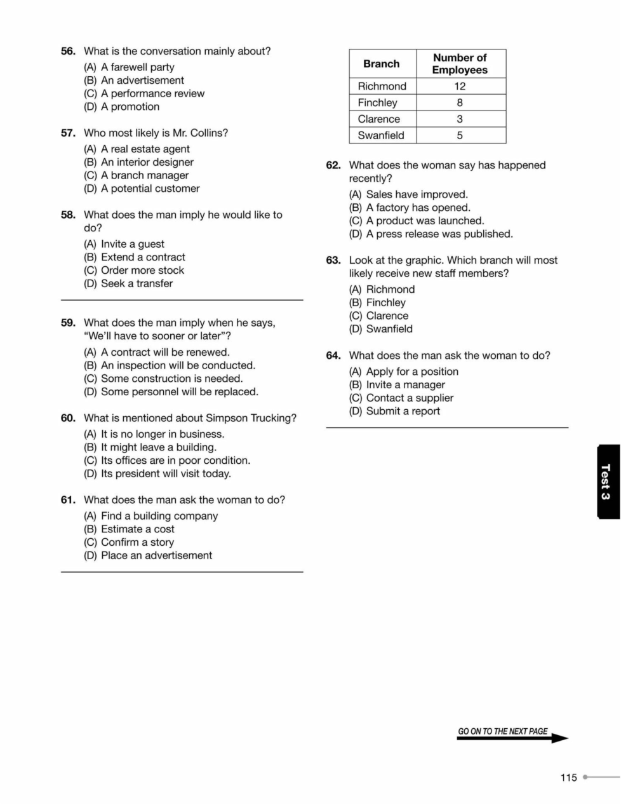


```text
56. What is the conversation mainly about?
Numbero f
(A) A farewellpa rty Branch Employees
(B) An advertisement
Richmond 12
(C) A perfo rmance review
(D) A promotion Finchley 8
Clarence 3
57. Whom ost likely is Mr. Collins? Swanfield 5
(A) A real estate agent
(B) An interior designer 62. Whatd oes the woman say has happened
(C) A branch manager recently?
(D) A potential customer
(A) Sales have improved.
(B) Af actory has opened.
58. What does the man imply he would like to
(C) A product was launched.
do?
(D) A press release was published.
(A) Invite ag uest
(B) Extend ac ontract 63. Look at the graphic. Which branch will most
(C) Order more stock ilkelyr eceive new staff members?
(D) Seek at ransfer
(A) Richmond
(B) Finchley
(C) Clarence
59. What does the man imply when he says,
(D) Swanfield
"We'llh ave to sooner or later"?
(A) A contract wi llbe renewed. 64. What does the man ask the woman to do?
(B) An inspection will be conducted.
(A) Apply for ap osition
(C) Somec onstruction is needed.
(B) Invite am anager
(D) Some personnel will be replaced.
(C) Contact as upplier
(D) Submit ar eport
60. What is mentioned about Simpson Trucking?
(A) It is no longer in business.
＇
(B) It might leave ab uilding.
(C) Its offices are in poor condition.
(D) Itsp resident will visit today.
61. What does the man ask the woman to do?
(A) Find ab uilding company
(B) Estimate ac ost
(C) Confirm as tory
(D)P lace an advertisement
一
115 ... ・
```

## PDF 第 115 页

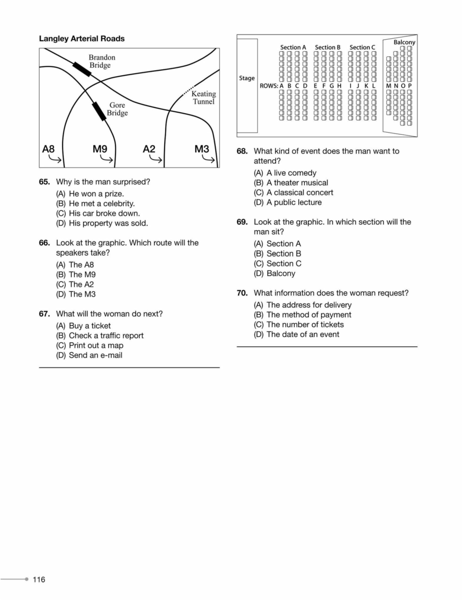


```text
Langley Arterial Roads で
ny
ロ
ロ
5e
e
e
c t .I on
a
aa
A
口 ロロ
s e
e
e
ct． on
e
3
8
e
e
e
e
se
e
0
ct.I
e
e
onc
e
3 []
口
[]
I
[
[
[
]
]
] [
[
[
]
]
]
stage e ロ ロ ロ e ロ ロ ロ e e ロロ e ロ ロ ロ e e 口 口 e e e 口 e e e e e e 3 ee e e 口 e e e e e e e e e e e e [ [ [ [ ] ] ] ] 口 口 口 [] I I I [ [ [ [ ] ] ] ] [ [ 口 [] ] ] l
゜RwsABcD EFGH_JKL MNOP
ロ
ロ
ロ
ロ
a
ee
⑪
e
口e
e
o
e
a
e
n
e
n
e
e
e
a
e [
[
]
]
口
[]
I
[
[
]
] [
[
]
]
ロロe口 口eeeaeee []口I[]口l
ロ ロ ロ ロ ロ ロ e ロロ e コロ e e e e e e e e e e e e e e e e [ [ ] ] [ [ ] ] [ [ ] ] 口 [] l
oee e ee e e 三[ [] ] [] ][ []
68. What kind of event does the man want to
attend?
(A) Al ive comedy
65. Why is the man surprised? (B) At heater musical
(A) He won ap rize. (C) Ac lassical concert
(B) He met ac elebrity. (D) A public lecture
(C) His car broke down.
(D) His property was sold. 69. Look at the graphic.In which section will the
man sit?
66. Look at the graphic. Which route will the (A) Section A
speakers take? (B) Section B
(A) TheA8 (C) Section C
(B) The M9 (D) Balcony
(C) The A2
(D) The M3 70. What information does the woman request?
(A) The address for delivery
67. What will the woman do next? (B) The method of payment
(A) Buy at icket (C) The number of tickets
(B) Check at raffic report (D) The date of an event
(C) Print out am ap
(D) Send an e-mail
・ . .1 16
```

## PDF 第 116 页

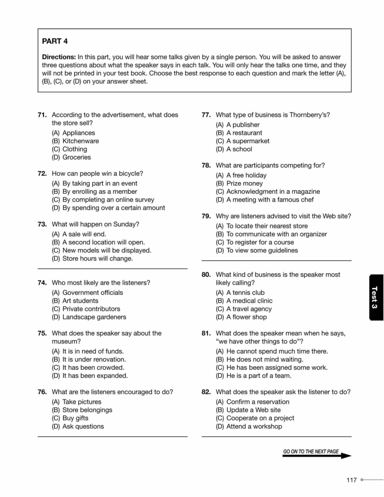


```text
PART4
Directions: In this part, you will hear some talks given by as ingle person. You willb e asked to answer
three questions about what the speaker says in each talk. You wi llonly hear the talks one time, and they
will not be printed in your test book. Choose the best response to each question and mark the letter (A),
(8), (C), or (D) on your answer sheet.
71. According to the advertisement,w hat does 77. What type of business is Thornberry's?
the store sell? (A) A publisher
(A) Appliances (B) A restaurant
(B) Kitchenware (C) As upermarket
(C) Clothing (D) As chool
(D) Groceries
78. What are participants competing for?
72. How can people wina b icycle? (A) Af ree holiday
(A) By taking part in an event (B) Prize money
(B) By enrolling as am ember (C) Acknowledgment in am agazine
(C) By completing an online survey (D) A meeting with af amous chef
(D) By spending over ac ertain amount
79. Whya re listeners advised to visit the Web site?
73. What will happen on Sunday? (A)T o locate their nearest store
(A) As ale wille nd. (B) To communicate with an organizer
(B) As econd location will open. (C) To register for ac ourse
(C) New models willb e displayed. (D) To views ome guidelines
(D) Store hours will change.
80. What kind of business is the speaker most ＇
74. Who most likely are the listeners? ilkely calling?
(A) Government officials (A) At ennis club
(B) Art students (B) A medical cilnic
(C) Private contributors (C) At ravel agency
(D) Landscape gardeners (D) Af lower shop
75. What does the speaker say about the 81. Whatd oes the speaker mean when he says,
museum? "we have other things to do"?
(A) It is in need of funds. (A) Hec annot spend much time there.
(B)It is under renovation. (B) Hed oes not mind waiting.
(C) It has been crowded. (C) He has been assigned some work.
(D) It has been expanded. (D) He is ap art of at eam.
76. What are the listeners encouraged to do? 82. What does the speaker ask the listener to do?
(A) Take pictures (A)C onfirm ar eservation
(B) Store belongings (B) Update aW ebs ite
(C) Buy gifts (C) Cooperate on ap roject
(D) Ask questions (D) Attend aw orkshop
一
117 ... ・
```

## PDF 第 117 页

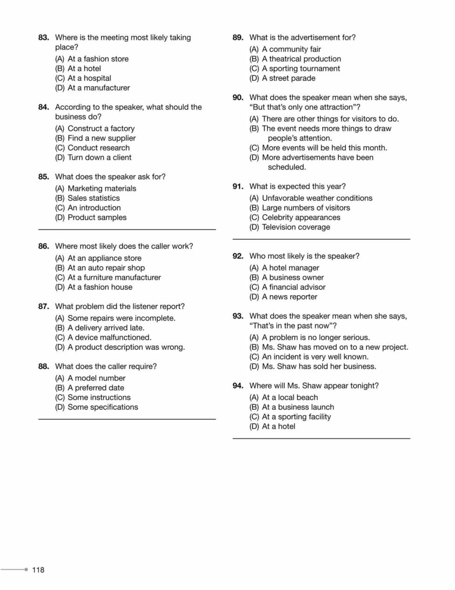


```text
83. Where is the meeting most likely taking 89. What is the advertisement for?
place? (A) Ac ommunity fair
(A) At af ashion store (B) At heatrical production
(B) At ah otel (C) As porting tournament
(C) At ah ospital (D) As treet parade
(D) At am anufacturer
90. What does the speaker mean when she says,
84. According to the speaker,w hat should the "But that's only one attraction"?
business do? (A) There are other things for visitors to do.
(A) Construct af actory (B) The event needs more things to draw
(B) Find an ew supplier people'sa ttention.
(C) Conduct research (C) More events will be held this month.
(D) Turn down ac lient (D) More advertisements have been
scheduled.
85. What does the speaker ask for?
(A) Marketing materials 91. What is expectedt his year?
(B) Sales statistics (A) Unfavorable weather conditions
(C) An introduction (B) Large numbers of visitors
(D) Product samples (C) Celebrity appearances
(D) Television coverage
86. Where most likely does the caller work?
(A) At an appliance store 92. Who most likely is thes peaker?
(B) At an auto repairs hop (A) Ah otel manager
(C) At af urniturem anufacturer (B)A business owner
(D) At af ashion house (C) Af inancial advisor
(D) A news reporter
87. What problem did the listener report?
(A) Some repairs were incomplete. 93. What does the speaker mean when she says,
(B) Ad elivery arrived late. "That's in the past now"?
(C) Ad evice malfunctioned. (A) A problem is no longers erious.
(D) Ap roduct description was wrong. (B) Ms.S haw hasm oved on to an ew project.
(C) An incident is very well known.
88. What does the caller require? (D) Ms.S haw has sold her business.
(A) Am odel number
(B) Ap referred date 94. Where will Ms. Shaw appear tonight?
(C) Some instructions (A) At al ocal beach
(D) Some specifications (B) At ab usiness launch
(C) At as porting facility
(D) At ah otel
・ . .1 18
```

## PDF 第 118 页

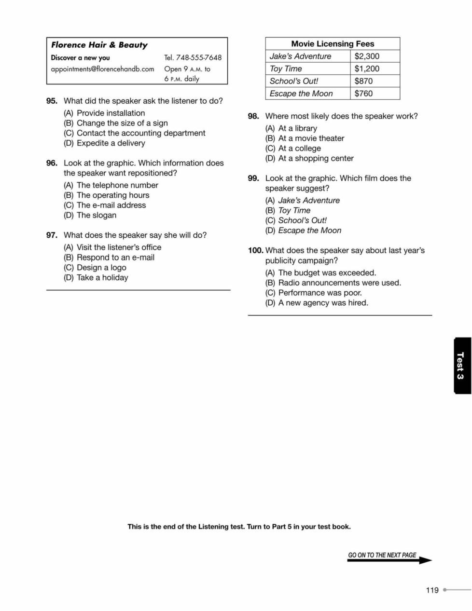


```text
Florence Hair & Beauty Movie Licensing Fees
Discover an ew you Tel. 748-555-7648 Jake's Adventure $2,300
appointments@florencehandb.com Open 9A .M.t o Toy Time $1,200
6P .M.d oily School'sO ut! $870
Escape theM oon $760
95. What did the speaker ask the listener to do?
(A) Provide installation 98. Where most likelyd oes the speaker work?
(B) Change the size of as ign
(A) At al ibrary
(C) Contact the accounting department
(B) At am ovie theater
(D) Expedite ad elivery
(C) At ac ollege
(D) Ata s hopping center
96. Look at the graphic. Which information does
the speaker want repositioned?
99. Look at the graphic. Which film does the
(A) The telephone number
speaker suggest?
(B) The operating hours
(A) Jake's Adventure
(C) The e-mail address
(B) Toy Time
(D) The slogan
(C) School's Out!
(D) Escape the Moon
97. What does the speaker say shew ill do?
(A) Visit the listener's office 100. Whatd oes the speaker say about last year's
(B) Respond to an e-mail
publicity campaign?
(C) Design al ogo
(A) Theb udget was exceeded.
(D) Take ah oliday
(B) Radio announcements were used.
(C) Performance was poor.
(D) A new agency was hired.
＇
This is the endo f the Listening test.Tu rn to Part 5in your test book.
一
119 ... ・
```

## PDF 第 119 页

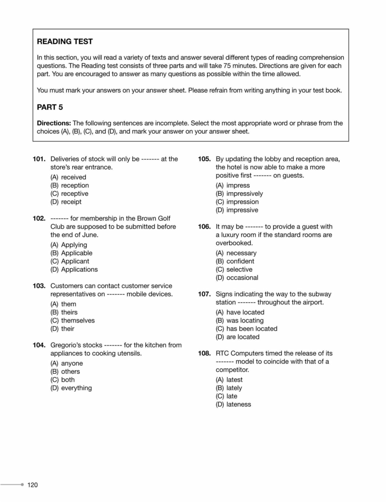


```text
READING TEST
In this section, you will read av ariety of texts and answer several different types of reading comprehension
questions. The Reading test consistso f three parts and will take 75 minutes.Di rections are given for each
part.Y ou are encouraged to answer as many questions as possible within the time allowed.
You must mark your answers on youra nswer sheet. Please refrain from writing anything iny our test book.
PARTS
Directions: The following sentences are incomplete.Se lect the mosta ppropriate word or phrase from the
choices (A), (B), (C), and (D), and mark your answer on your answersh eet.
101. Deliveries of stock will only be-------at the 105. By updating the lobbya nd reception area,
store'sr ear entrance. the hotel is now able to make am ore
(A) received positive first -------on guests.
(B) reception (A) impress
(C) receptive (B) impressively
(D) receipt (C) impression
(D) impressive
102. -------for membership in the Brown Golf
Club are supposed to be submitted before 106. It may be-------to provide ag uest with
thee nd of June. al uxury room if the standardr ooms are
(A) Applying overbooked.
(B) Applicable (A) necessary
(C) Applicant (B) confident
(D) Applications (C) selective
(D) occasional
103. Customers can contact customer service
representatives on -------mobile devices. 107. Signs indicating the way to the subway
(A) them station -------throughout thea irport.
(B) theirs (A) have located
(C) themselves (B) was locating
(D) their (C) has been located
(D) are located
104. Gregorio'ss tocks -------for the kitchen from
appliances to cooking utensils. 108. RTC Computers timed the release of its
(A) anyone -------model to coincide with that of a
(B) others competitor.
(C) both (A) latest
(D) everything (B) lately
(C) late
(D) lateness
・ . .1 20
```

## PDF 第 120 页

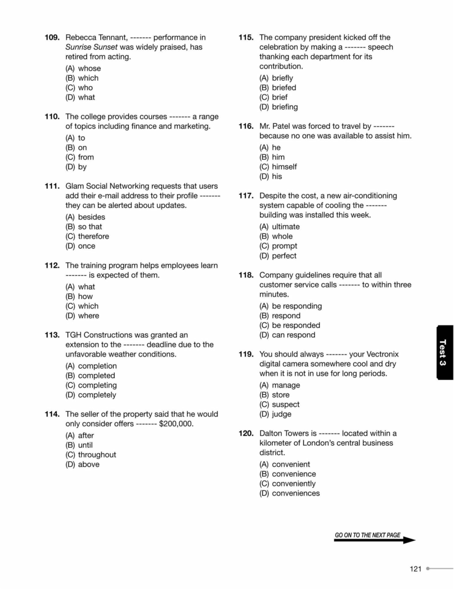


```text
109. Rebecca Tennant, -------performance in 115. The company president kicked off the
Sunrise Sunset was widely praised,h as celebration by making a- ------speech
retired from acting. thanking each department for its
(A) whose contribution.
(B) which (A) briefly
(C) who (B) briefed
(D) what (C) brief
(D)b riefing
110. The college provides courses-------ar ange
of topics including finance and marketing. 116. Mr.Pa tel was forced to travel by -------
(A) to because no one was available to assist him.
(B) on (A) he
(C) from (B) him
(D) by (C) himself
(D) his
111. Glam Social Networkingr equests that users
add their e-mailad dress to their profile ------- 117. Despitet he cost,a n ew air-conditioning
they can be alerted about updates. system capable of cooling the -------
(A) besides building was installed this week.
(B) so that (A) ultimate
(C) therefore (B)w hole
(D) once (C) prompt
(D)p erfect
112. Thet raining program helps employees learn
-------is expected of them. 118. Company guidelines requiret hat a ll
(A) what customers ervice calls -------to within three
(B) how minutes.
(C) which (A) be responding
(D) where (B) respond
(C) be responded ＇
113. TGH Constructions was granted an (D) can respond
extension to the -------deadline due to the
unfavorable weather conditions. 119. You should always -------your Vectronix
(A) completion digital camera somewhere cool and dry
(B) completed when it is not in use for long periods.
(C) completing (A) manage
(D) completely (B)s tore
(C) suspect
114. The seller of thep roperty said that he would (D) judge
only considero ffers -------$200,000.
(A) after 120. Dalton Towers is-------located within a
(B) until kilometer of London'sc entral business
(C) throughout district.
(D) above (A) convenient
(B) convenience
(C) conveniently
(0)c onveniences
一
121 ... ・
```

## PDF 第 121 页

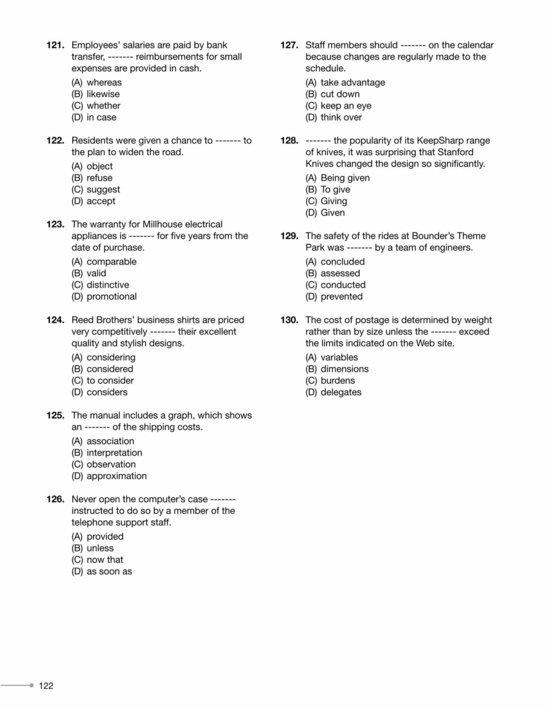


```text
121. Employees'salaries are paid by bank 127. Staff members should-------on the calendar
transfer, -------reimbursements for small because changes are regularly made to the
expenses are provided in cash. schedule.
(A) whereas (A) take advantage
(B) likewise (B) cut down
(C) whether (C) keep an eye
(D) in case (D) think over
122. Residents were given ac hance to -------to 128. -------the popularity of its KeepSharp range
the plan to widen the road. of knives, it was surprising that Stanford
(A) object Knives changed thed esign so significantly.
(B) refuse (A) Being given
(C) suggest (B) To give
(D) accept (C) Giving
(D) Given
123. The warranty for Millhouse electrical
appliances is -------for five years from the 129. The safety of the rides at Bounder's Theme
date of purchase. Park was -------by at eam of engineers.
(A) comparable (A) concluded
(B) valid (B) assessed
(C) distinctive (C) conducted
(D) promotional (D) prevented
124. Reed Brothers'business shirts are priced 130. The cost of postage is determined by weight
very competitively -------their excellent rather than by size unless the -------exceed
quality and stylish designs. the limits indicated on the Web site.
(A) considering (A) variables
(B) considered (B) dimensions
(C) to consider (C) burdens
(D) considers (D) delegates
125. The manual includes ag raph, which shows
an -------of the shipping costs.
(A) association
(B) interpretation
(C) observation
(D) approximation
126. Never open the computer's case -------
instructed to do so by am ember of the
telephone support staff.
(A) provided
(B) unless
(C) now that
(D) as soon as
- ... 122
```

## PDF 第 122 页

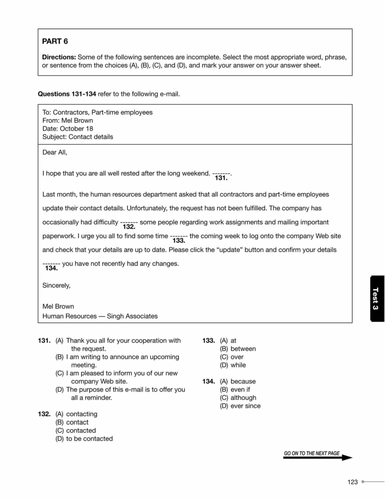


```text
PART6
Directions: Some of the following sentences are incomplete. Select the most appropriate word, phrase,
or sentence from the choices (A), (B), (C), and (D), and mark your answer on your answer sheet.
Questions 131-134 refer to the following e-mail.
To: Contractors,P art-time employees
From:M el Brown
Date:O ctober 18
Subject: Contact details
Dear All,
Ih ope that you are all well rested after the long weekend. -------
131 ..
Last month, the human resources department asked that all contractors and part-time employees
update their contact details.U nfortunately,th e requesth as not been fulfilled.T he company has
occasionally had difficulty -------some people regarding work assignments and mailing important
132.
paperwork. Iu rge youa ll to find some time -------the coming week to log onto the company Webs ite
133.
and check that your details are up to date. Please click the "update"b utton and confirm your details
-------you have not recently had any changes.
134.
＇
Sincerely,
Mel Brown
Human Resources - Singh Associates
131. (A) Thank you all for your cooperation with 133. (A) at
the request. (B) between
(B) Ia mw riting to announce an upcoming (C) over
meeting. (D) while
(C) Ia mp leased to inform you of our new
company Webs ite. 134. (A) because
(D) The purpose of this e-mail is to offer you (B) evenif
all ar eminder. (C) although
(D) ever since
132. (A) contacting
(B) contact
(C) contacted
一
(D) to be contacted
123... ・
```

## PDF 第 123 页

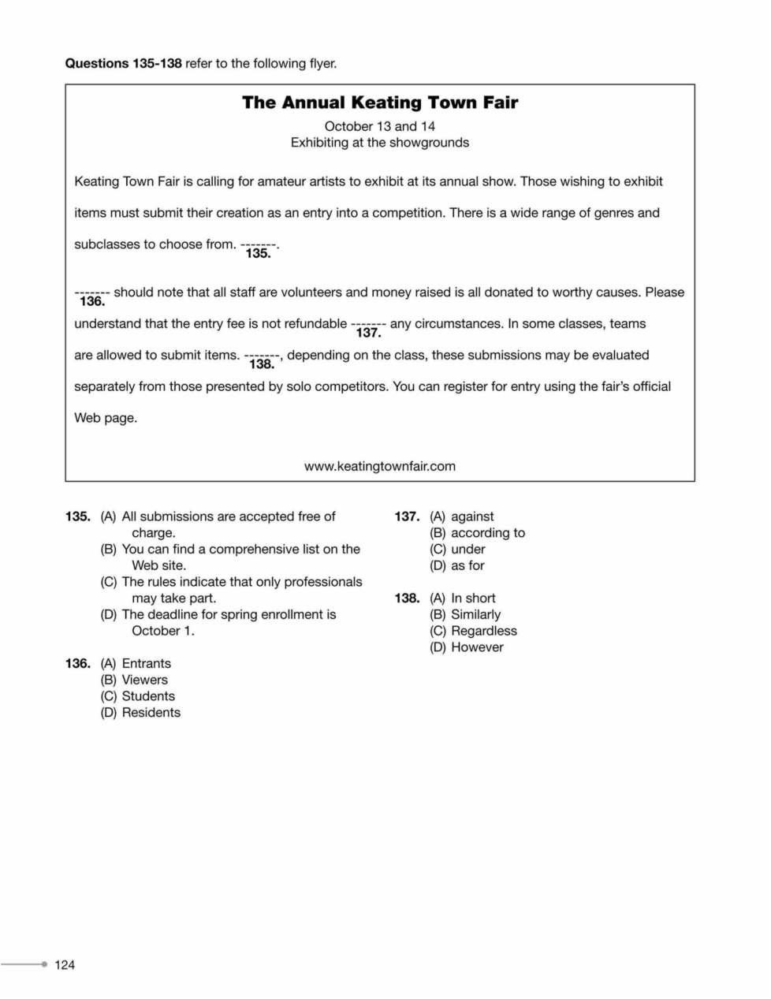


```text
Questions 135-138 refer to the following flyer.
The Annual Keating Town Fair
October 13 and 14
Exhibiting at the showgrounds
Keating Town Fair is calling for amateur artists to exhibit at its annual show. Those wishing to exhibit
items must submit their creation as an entry into ac ompetition.T here is aw ide range of genres and
subclasses to choose from. -------
135. .
-------should note that all staff are volunteers and money raised is all donated to worthy causes.P lease
136.
understand that the entry fee isn ot refundable -------any circumstances. In some classes, teams
137.
are allowed to submit items. -------depending on the class, these submissions may be evaluated
138.'
separately from those presented by solo competitors. You can register for entry using the fair's official
Webp age.
www.keatingtownfair.com
135. (A) All submissionsa re accepted free of 137. (A) against
charge. (B) according to
(B) You can find ac omprehensive list on the (C) under
Webs ite. (D) as for
(C) The rules indicate that only professionals
mayt ake part. 138. (A) In short
(D) The deadline for spring enrollment is (B) Similarly
October 1. (C) Regardless
(D) However
136. (A) Entrants
(B) Viewers
(C) Students
(D) Residents
・ . .1 24
```

## PDF 第 124 页

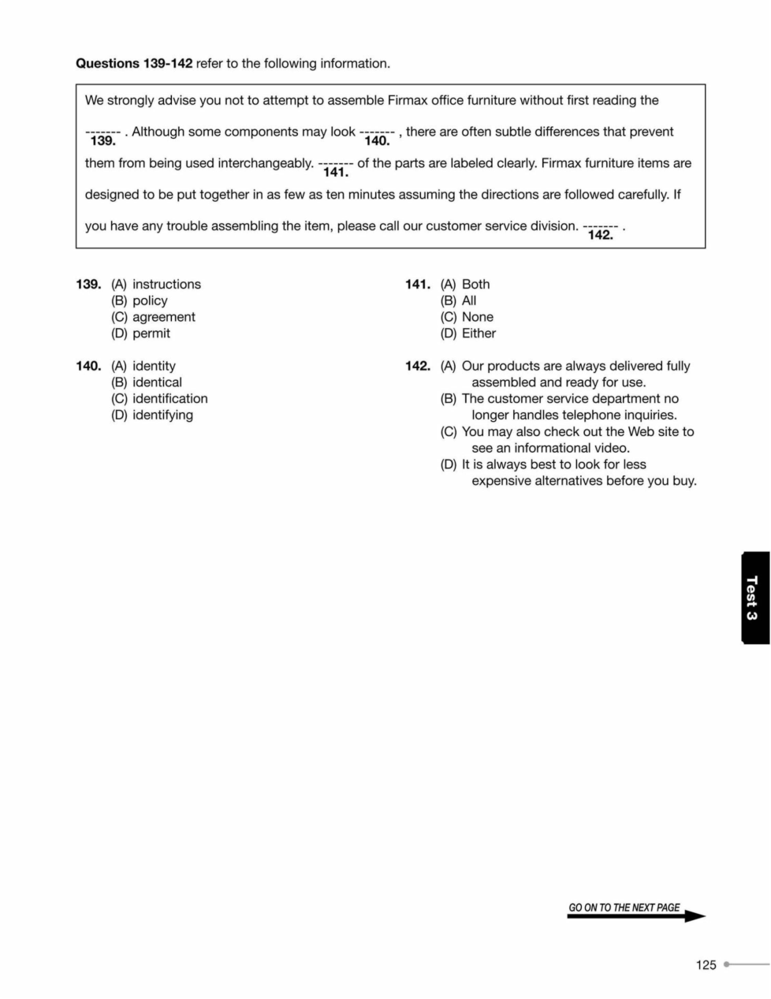


```text
Questions 139-142 refer to the following information.
Wes trongly advise you not to attempt to assemble Firmax office furniture without first reading the
．． .A lthough some components may look -------there are often subtle differences that prevent
139. 140. '
them from being used interchangeably.-- -----of the parts are labeled clearly.F irmax furniture items are
141.
designed to be put together in as few as ten minutes assuming the directions are followed carefully.If
you have any trouble assembling the item,p lease call our customer serviced ivision.-- -----.
142.
139. (A) instructions 141. (A) Both
(B) policy (B) All
(C) agreement (C) None
(D) permit (D)E ither
140. (A) identity 142. (A) Our products are always delivered fully
(B) identical assembled and ready for use.
(C) identification (B) The customer service department no
(D) identifying longer handles telephone inquiries.
(C) You may also check out the Web site to
see ani nformational video.
(D) It is always best to look for less
expensive alternatives before you buy.
＇
一
125... ・
```

## PDF 第 125 页

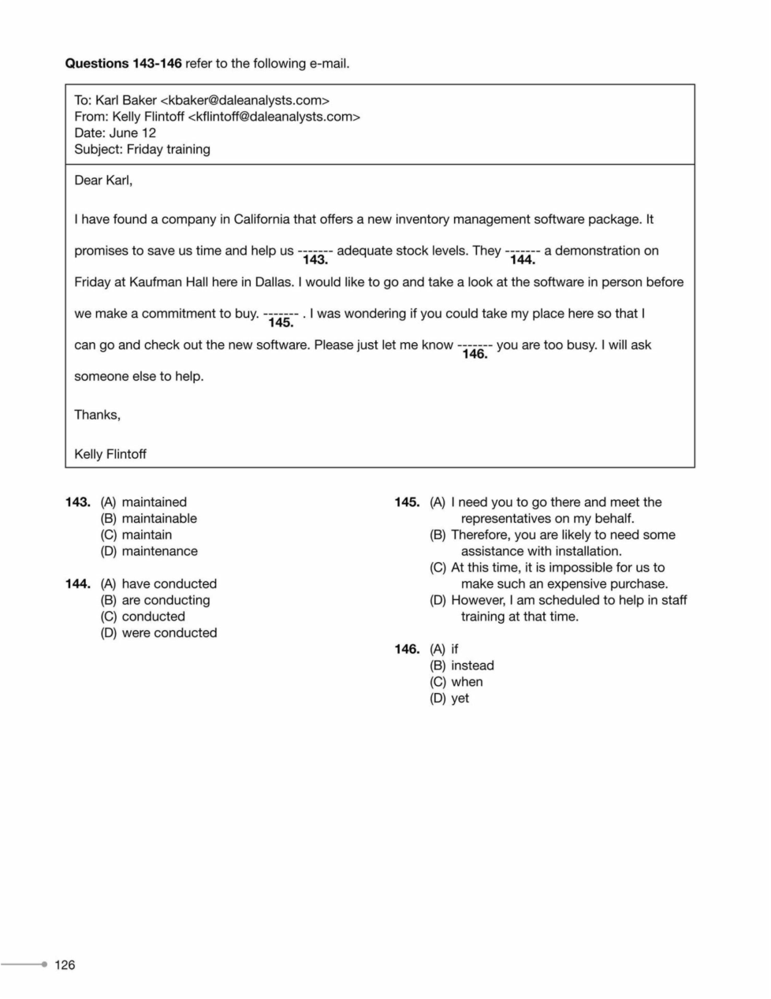


```text
Questions 143-146 refer to the following e-mail.
To:Ka rl Baker <kbaker@daleanalysts.com>
From: Kelly Flintoff <kflintoff@daleanalysts.com>
Date:J une 12
Subject: Friday training
Dear Karl,
Ih ave found ac ompany in California that offers an ew inventory management software package. It
promises to save us time and help us -------adequate stock levels.T hey -------ad emonstration on
143. 144.
Friday at Kaufman Hall here in Dallas. Iw ould like to go and take al ook at the software in person before
wem ake ac ommitment to buy. -------.I w as wondering if you could take myp lace here so that I
145.
can go and check out the new software.P lease just let mek now -------you are too busy.I wi ll ask
146.
someone else to help.
Thanks,
Kelly Flintoff
143. (A) mai.nt ained 145. (A) In eed you to go there and meet the
(B) maintainable representatives on myb ehalf.
(C) main.ta in (B) Therefore, you are likely to need some
(D) maintenance assistance with installation.
(C) At this time, it is impossible for us to
144. (A) have conducted make such an expensive purchase.
(B) arec onducting (D) However,I a ms cheduled to help in staff
(C) conducted training at that time.
(D) were conducted
146. (A) if
(B) instead
(C) when
(D) yet
・ . .1 26
```

## PDF 第 126 页

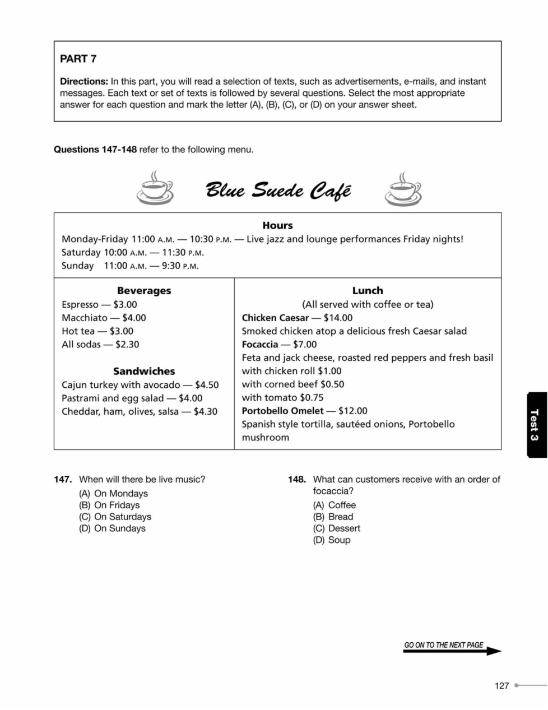


```text
PART7
Directions: In this part, you will read as election of texts, such as advertisements,e- mails, and instant
messages. Each texto r set of texts is followed by several questions. Select the most appropriate
answer for each question and mark the letter (A),(B ), (C), or (D) on your answer sheet.
Questions 147-148 refer to thef ollowing menu.
6
乞 伍 S仰 吟 ~
Hours
Monday-Friday 11 :0 ― 0 A.M. ー 10:30P.M. —Live jazz and lounge performances Friday nights!
Saturday 10:00 A.M. 11:30P .M.
Sunday 11 :00 A.M. —9:30 P.M.
Beverages Lunch
Espresso —$3.00 (All served with coffee or tea)
Macchiato —$4.00 Chicken Caesar —$14.00
Hot tea — $3.00 Smoked chicken atop ad elicious fresh Caesar salad
All sodas —$2.30 Focaccia —$7.00
Feta and jack cheese, roasted red peppers and fresh basil
Sandwiches with chicken ro ll$1.00
Cajun turkey with avocado —$4.50 with corned beef $0.50 ＇
—
Pastramia nd egg salad $4.00 with tomato $0.75
Cheddar, ham、olives,salsa —$4.30 Portobello Omelet —$12.00
Spanish style tortilla, sauteed onions, Portobello
mushroom
147. When will there be live music? 148. What can customers receive with an order of
(A) On Mondays focaccia?
(B) On Fridays (A) Coffee
(C) OnS aturdays (B) Bread
(D) OnS undays (C) Dessert
(D) Soup
一
127... ・
```

## PDF 第 127 页

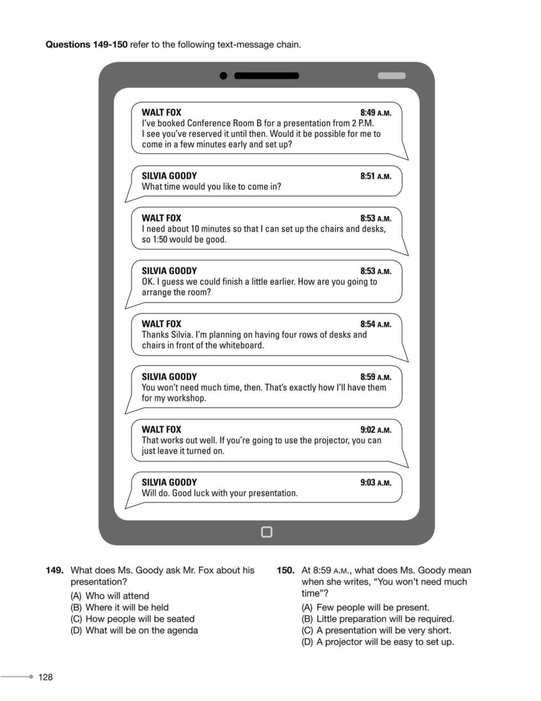


```text
Questions 149-150 refer to the following text-message chain.
[ l
WALT FOX 8:49A .M.
Ive booked Conference Room Bf or ap resentation from 2P .M.
Ise e you've reserved it until then.Wo uld it bep ossiblef or metJ o
come in af ew minutes early and set up?
［
\
SILVIA GOODY 8:51 A.M.
What time would you like to come in?
_
[
WALT FOX 8:53 A.M.
In eed about 10 minutes sot hat Ica n set up the chairs and des\ks、
so 1:50 would be good.
［
7
SILVIA GOODY 8:53 A.M.
OK. Igu ess wec ould finish ali ttle earlier.H ow are you going to
arrange the room? J
［
WALT FOX 8:54} A.M.
Thanks Silvia.I' m planning onh aving fou「「owsofde sks and
chairs in front of the whiteboard.
[ J
SILVIA GOODY 8:59 A.M.
You won't need much time, then.Th at's exactly how I'll have them
\
for myw orkshop.
[
_
WALT FOX 9:02 A.M.
That works out well. If you're going to use the projector, you can
just leave it turned on. ＼
［ 7
J
SILVIA GOODY 9:03 A.M.
Will do.G ood luck with your presentation.
D
149. Whatd oes Ms. Goody ask Mr. Foxa bouth is 150. At 8:59 A.M., what does Ms. Goody mean
presentation? when shew rites,"Y ou won'tn eed much
(A) Whow ill attend time"?
(B) Where it will be held (A) Few peoplew ill be present.
(C) How people willb e seated (B) Little preparation will be required.
(D)W hat will be on the agenda (C) Ap resentation willb e very short.
(D) Ap rojector will be easy to set up.
- ... 128
```

## PDF 第 128 页

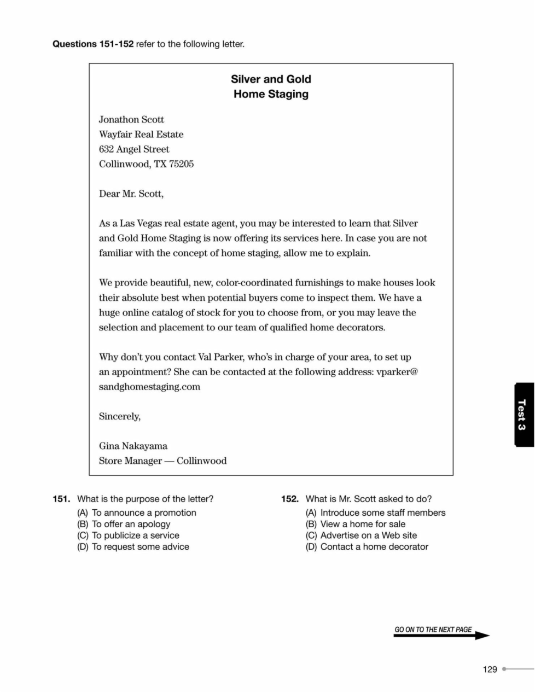


```text
Questions 151-152 refer to the following letter.
Silver and Gold
HomeS taging
Jonathon Scott
Wayfair Real Estate
632 AngelSt reet
Collinwood,T X7 5205
Dear Mr. Scott,
Asa L as Vegas real estate agent, youm ayb e interested to learn that Silver
and Gold HomeS taging is nowo ffering its services here. In case youa re not
familiar with the concept of homes taging, allow met o explain.
Wep rovide beautiful, new,c olor-coordinated furnishings to makeh ouses look
their absolute best when potential buyers comet o inspect them. Weh ave a
huge online catalogo f stockf or you to choose from, or you may leave the
selection and placement to our team of qualifiedh ome decorators.
Why don't you contact Val Parker, who's in charge of your area, to set up
an appointment? She can be contacteda t the following address: vparker@
＇
sandghornestaging.com
Sincerely,
Gina Nakayama
Store Manager - Collinwood
151. What is the purpose of the letter? 152.W hat is Mr. Scott asked to do?
(A) To announce ap romotion (A) Introduce some staff members
(B) To offer an apology (B) View ah ome for sale
(C) To publicize as ervice (C)Ad vertise on aW ebs ite
(D) To request some advice (D)C ontact ah ome decorator
一
129... ・
```

## PDF 第 129 页

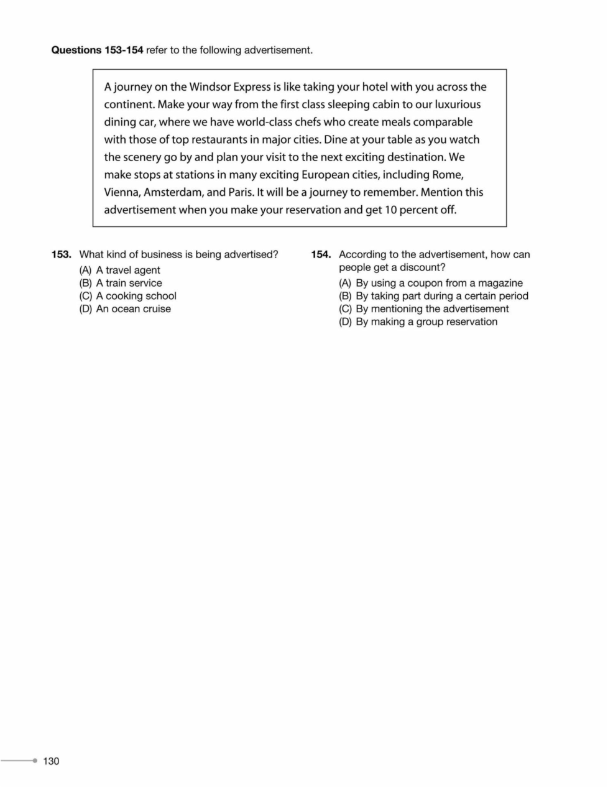


```text
Questions 153-154 refer to the following advertisement.
Aj ourney ont he Windsor Express is like taking your hotel with you across the
continent. Makey our wayf rom the first class sleeping cabin to our luxurious
dining car, where weh ave world-class chefs whoc reate meals comparable
with those of top restaurants in major cities. Dine at your table as you watch
the scenery go by and plan your visit to the next exciting destination.W e
make stops at stations in many exciting European cities, including Rome,
Vienna,A msterdam, and Paris. It will be aj ourney to remember. Mention this
advertisement when you make your reservation and get 10 percent off.
153. What kind of business is being advertised? 154. According to the advertisement, how can
(A) At ravel agent people get ad iscount?
(B) At rain service (A) By using ac oupon from am agazine
(C) Ac ooking school (B) By taking part during ac ertain period
(D) An o cean cruise (C) Bym entioning the advertisement
(D) Bym aking ag roup reservation
・ . .1 30
```

## PDF 第 130 页

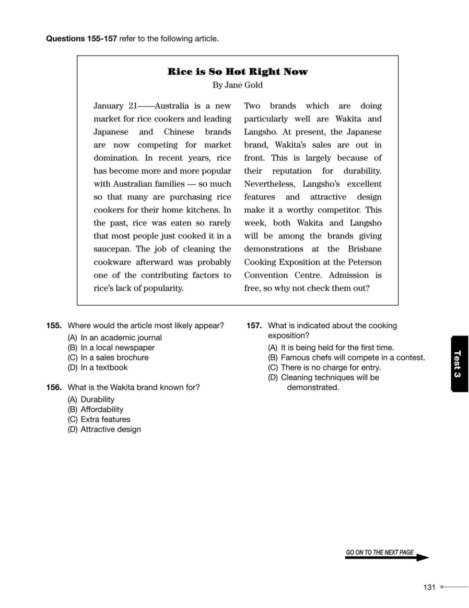


```text
Questions 155-157 refer to the followinga rticle.
Rice is SoH otR i喜 tNow
ByJ ane Gold
―
January 21 Australia is a new Two brands which are doing
market for rice cookers and leading particularly well are Wakita and
Japanese and Chinese brands Langsho. At present, the Japanese
are now competing for market brand, Wakita's sales are out in
domination.I n recent years, rice front. This is largely because of
has become more and more popular their reputation for durability.
with Australian families - so much Nevertheless, Langsho's excellent
so that many are purchasing rice features and attractive design
cookers for their home kitchens. In make it aw orthy competitor.T his
the past, rice was eaten so rarely week, both Wakita and Langsho
that most people just cooked it in a will be among the brands giving
saucepan.T he job of cleaning the demonstrations at the Brisbane
cookware afterward was probably Cooking Exposition at the Peterson
one of the contributing factors to Convention Centre.A dmission is
rice's lack of popularity. free, so why not check them out?
155. Where would the article most likely appear? 157.W hat is indicated about the cooking
(A) In an academic journal exposition? ＇
(B) In alo calne wspaper (A) It is being held for the first time.
(C) In as ales brochure (B) Famous chefs willco mpete in ac ontest.
(D)In at extbook (C) There is no charge for entry.
(D) Cleaning techniques will be
156. What is the Wakita brand known for? demonstrated.
(A) Durability
(B)Af fordability
(C) Extra features
(D) Attractive design
一
131 ... ・
```

## PDF 第 131 页

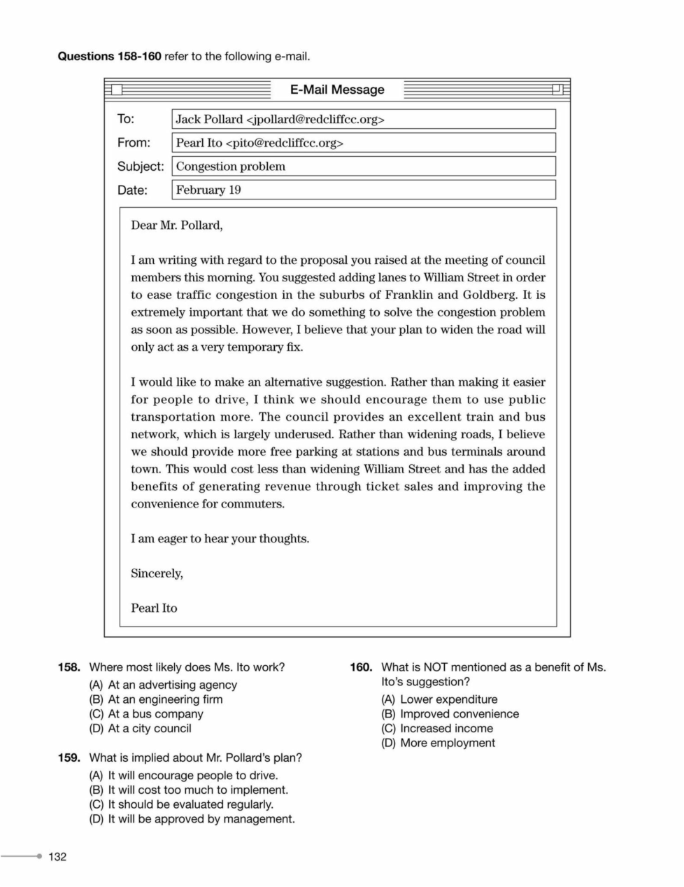


```text
Questions 158-160 refer tot he following e-mail.
E-Mail Message
I
To: Jack Pollard <jpollard@redcliffcc.org>
I
From: PearlIt o <pito@redcliffcc.org>
I
Subject: Congestion problem
I
Date: Febmary 19
Dear Mr. Pollard,
Ia n1 writing with regard to the proposal you raised at the meeting of council
members this morning. You suggested adding lanes to Willian1 Street in order
to ease traffic congestion in the suburbs of Franklin and Goldberg.It is
extremely important that we do something to solve the congestion problem
as soon as possible. However, Ib elieve that your plan to widen the road will
only act as av ery temporary fix.
Iw ould liket o make an alternative suggestion.Ra ther than making it easier
for people to drive, It hink we should encourage them to use public
transportation more. Thec ouncil provides an excellent train and bus
network,w hichi s largely underused. Rather than widening roads,I b elieve
we should provide more free parking at stations and bus terminals around
town.Th is would cost less than widening Willi皿 Streetand has the added
benefits of generating revenuet hrough ticket sales and improvingt he
convenience for commuters.
Ia me agert o hear your though区
Sincerely,
Pearl Ito
158. Where most likely does Ms.It o work? 160. What is NOT mentioned as ab enefit of Ms.
(A) At an advertising agency Ito'ss uggestion?
(B) At an engineering firm (A) Lower expenditure
(C) At ab us company (B) Improved convenience
(D) At ac ity council (C) Increased income
(D) More employment
159. What is implied about Mr. Pollard's plan?
(A) tIwill encourage people to drive.
(B) It will cost too much to implement.
(C) tIshould be evaluated regularly.
(D)It will be approved by management.
・ . .1 32
```

## PDF 第 132 页

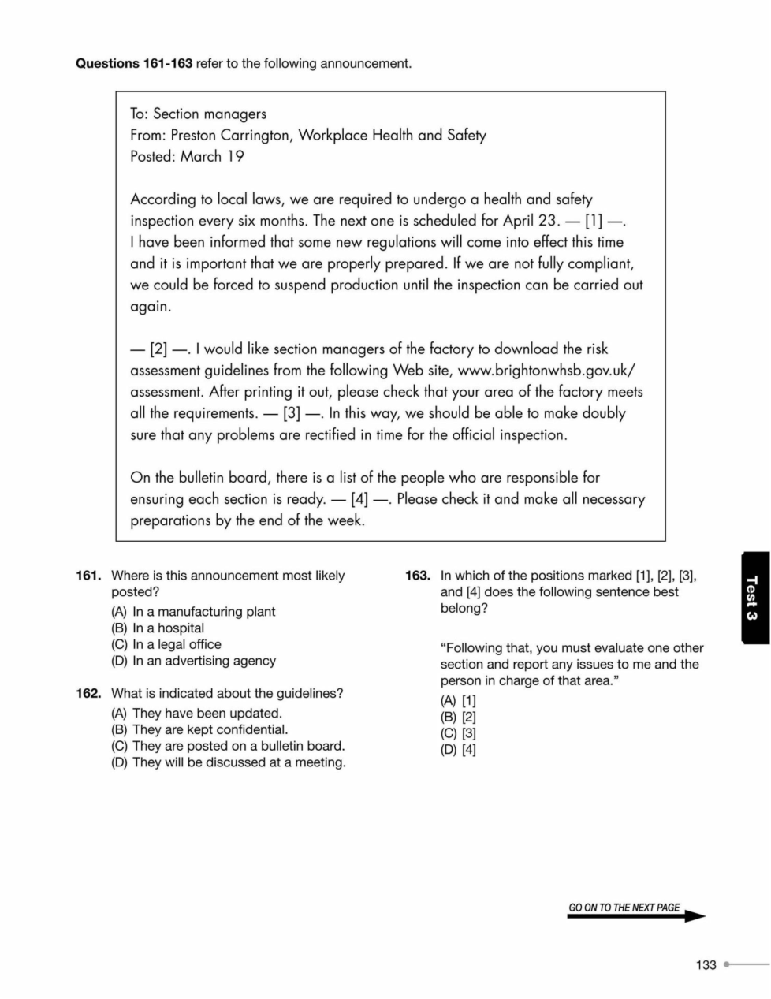


```text
Questions 161-163 refer to the following announcement.
To:Se ction managers
From:P reston Carrington, Workplace Health and Safety
Posted: March 19
According to local laws, wea re required to undergo a health and safety
inspection every six months.T hen ext one is scheduled for April 23.— [l] —.
Ih ave been informed that some new regulations wi llcome into effect this time
and it is important that wea re properly prepared. If wea re not fully compliant,
wec ould be forced tos uspend production untilt he inspection can be carriedo ut
again.
ー [2] —. Iw ould like section managers of the factory to download the risk
assessment guidelines from the following Webs ite,w ww.brightonwhsb.gov.uk/
assessment.A fter printing it out、pleasecheck thaty our area of the factory meets
— —.
all the requirements. (3] Int his way,w es hould bea blet o make doubly
sure that any problems are rectifiedi n time for theo fficial inspection.
Ont he bulletin board、thereis a list of the people who are responsible for
ensuring each section is ready. — [4] —. Please check it and make all necessary
preparations by the end of the week.
＇
161. Where is this announcement most likely 163. In which of the positions marked [1], [2], [3],
posted? and [4] does the following sentence best
(A) In am anufacturing plant belong?
(B) In ah ospital
(C) In al egal office "Following that,y ou must evaluate one other
(D) In an advertising agency section and report any issues to mea nd the
person in charge of thata rea."
162. What is indicated about the guidelines?
(A) [1]
(A) They have been updated. (B) [2]
(B) They are kept confidentia .l (C) [3)
(C) They are posted on ab ulletinb oard. (D)[ 4]
(D) They wi llbe discussed at am eeting.
一
133... ・
```

## PDF 第 133 页

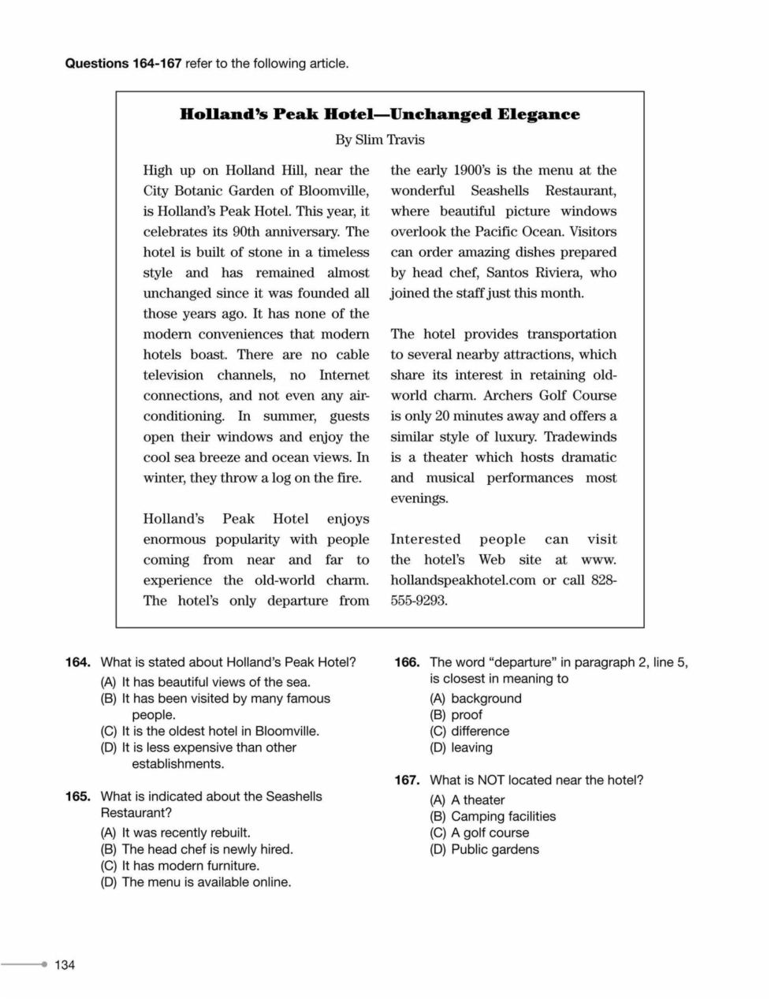


```text
Questions 164-167 refer tot he following article.
Holland's PeakH otelーUnchangedEle喜ance
ByS lim Travis
High up on Holland Hill, near the the early1 900's is the menu at the
City Botanic Garden of Bloomville, wonderful Seashells Restaurant,
is Holland's PeakH otel. Thls year, it where beautiful picture windows
celebrates its 90th anniversary. The overlook the Pacific Ocean.Vi sitors
hotel is built of stone in at imeless can order amazing dishes prepared
style and has remained almost by head chef, Santos Riviera,w ho
unchanged since it was founded all joined thes taff just this month.
those years ago. It has none of the
modern conveniences that modern The hotel provides transportation
hotels boast. There are no cable to several nearby attractions, whlch
television channels, no Internet share its interest in retaining old-
connections, and not even any air- world charm. Archers Golf Course
conditioning. In summer, guests is only 20 minutes away and offers a
open their windows and eajoy the similar style of luxury.T radewinds
cool sea breeze and ocean views.In is at heater which hosts dramatic
winter, they throw al og on the fire. and musical performances most
evenings.
Holland's Peak Hotel enjoys
enormous popularity with people Interested people can visit
coming from near and far to the hotel's Web site at www.
experience the old-world charm. hollandspeakhote.lcom or call 828-
The hotel's only departure from 555-9293.
164. Whatis s tated about Holland's Peak Hotel? 166. The word "departure" in paragraph 2, line 5,
(A) tIhas beautiful views of the sea. is closest in meaning to
(B) tIhas been visited by many famous (A) background
people. (B) proof
(C) It is the oldest hotel in Bloomville. (C) difference
(D) It is less expensive than other (D) leaving
establishments.
167. What is NOT located near the hotel?
165. Whatis indicated about theS eashells (A) At heater
Restaurant? (B) Camping facilities
(A) It was recently rebuilt. (C) Ag olfco urse
(B) The head chef is newly hired. (D) Public gardens
(C) Ith as modern furniture.
(D) The menu is available online.
・ . .1 34
```

## PDF 第 134 页

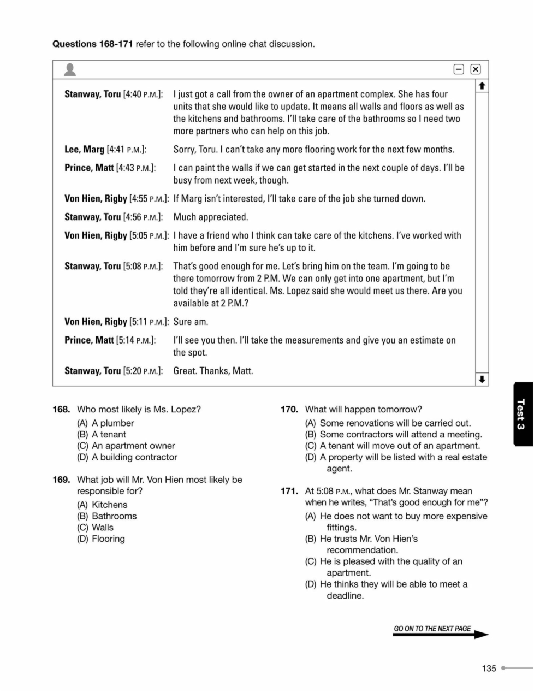


```text
Questions 168-171 refer to the following online chat discussion.
皇 曰区］
會
Stanway, Toru [4:40 P.M.]: Iju st got ac all from the owner of an apartment complex.S heh as four
units that she would like to update. It means all walls and floors as well as
the kitchens and bathrooms. I' lltakec are of the bathroomss o In eed two
more partners who can help on thisj ob.
Lee, Marg [4:41 P.M.]: Sorry, Toru.I ca n't take any more flooring work for the next few months.
Prince, Matt [4:43 P.M.): Ic an paint the wallsif wec an get started in the next couple of days.I' llbe
busy from next week, though.
Von Hien, Rigby [4:55 P.M.): If Marg isn't interested, I' lltake care oft he job she turned down.
Stanway, Toru [4:56 P.M.]: Much appreciated.
Von Hien, Rigby [5:05 P.M.):I h ave af riend who Ith ink can take care of the kitchens.I' ve worked with
him before and I'm sure he's up to 1t.
Stanway, Toru [5:08 P.M.]: That's good enough for me. Let's bring him on the team. I'm going to be
there tomorrow from 2P .M.W ec an only get into one apartment,b ut I'm
told they're all identical. Ms.L opez saids he would meet us there.A re you
availablea t 2P .M.?
Von Hien, Rigby [5:11 P.M.):S ure am.
Prince,M att [5:14 P.M.): I'll see you then.I'll take the measurements and give you an estimate on
the spot.
Stanway, Toru [5:20 P.M.]: Great. Thanks,M att.
,I-＇
168. Whom ost likely is Ms.L opez? 170. What will happen tomorrow?
(A) A plumber (A) Some renovations willb e carried out.
(B) At enant (B) Some contractors will attend am eeting.
(C) Ana partment owner (C) At enant will move out of an apartment.
(D) A building contractor (D)A p roperty willb e listed with ar eal estate
agent.
169. What job will Mr. Von Hien most likely be
responsiblef or? 171. At 5:08 P.M.,w hat does M .rStanway mean
(A) Kitchens when he writes,"T hat's good enough for me"?
(B) Bathrooms (A) He does not want to buy more expensive
(C) Walls fittings.
(D) Flooring (B) He trusts Mr.V on Hien's
recommendation.
(C) He is pleased with the quality of an
apartment.
(D) He thinks they will be able to meeta
deadline.
一
135... ・
```

## PDF 第 135 页

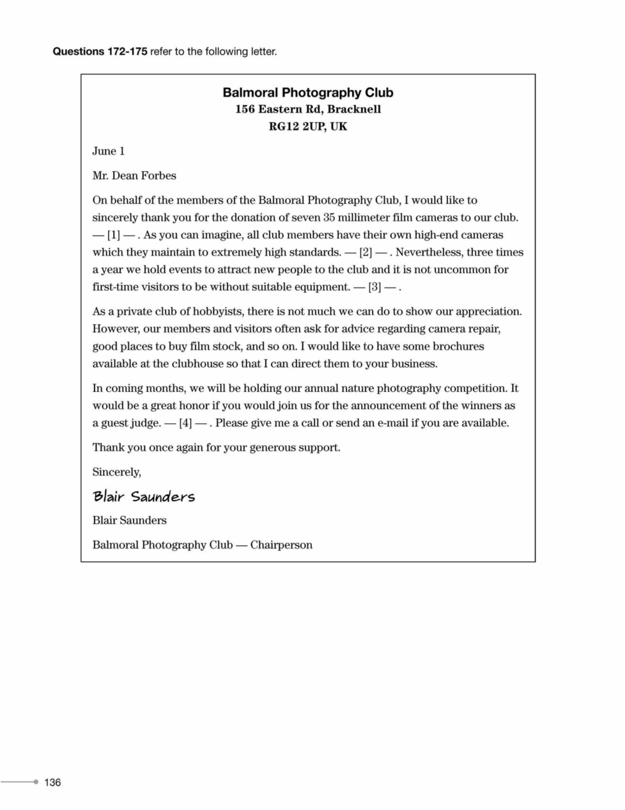


```text
Questions 172-175 refer tot hef ollowing letter.
Balmoral Photography Club
156 Eastern Rd, Bracknell
RG12 2UP, UK
June 1
Mr.D ean Forbes
Onb ehalf of the members of the Baln1oral Photography Club,I w ould like to
sincerely thank you for the donation of seven 35 m出irneterfi山ncameras to our club.
-[l]- .給 youcan imagine, all club members have their own high-end cameras
which they maintain to extremelyh igh stand
紅
ds.—[2] —. Nevertheless, three times
aye wehold events to attract new peoplet o the club and it is not uncommon for
江
―
first-time visitors to be without suitablee quipment. [3]一 ・
経 aprivate club of hobbyists, there is not much wec an do to show our appreciation.
However,o ur members and visitors often ask for advice reg dingcamera repair,
紅
good places to buy film stock, and so on.I w ould like to have some brochures
available at the clubhouse so that Ic an directt hem to your business.
In coming months, wew ill be holdingo ur annual nature photography competition. It
would be ag reat honor if youw ould join usf or the announcement of the winners as
ag uest judge. —[4] —. Please give mea c all or send an e-mail if you
紅
eavailable.
Thank you once again for your generous support.
Sincerely,
ちle1ir-Se1under-s
Blair Saunders
Balmoral Photography Club - Chairperson
・ . .1 36
```

## PDF 第 136 页

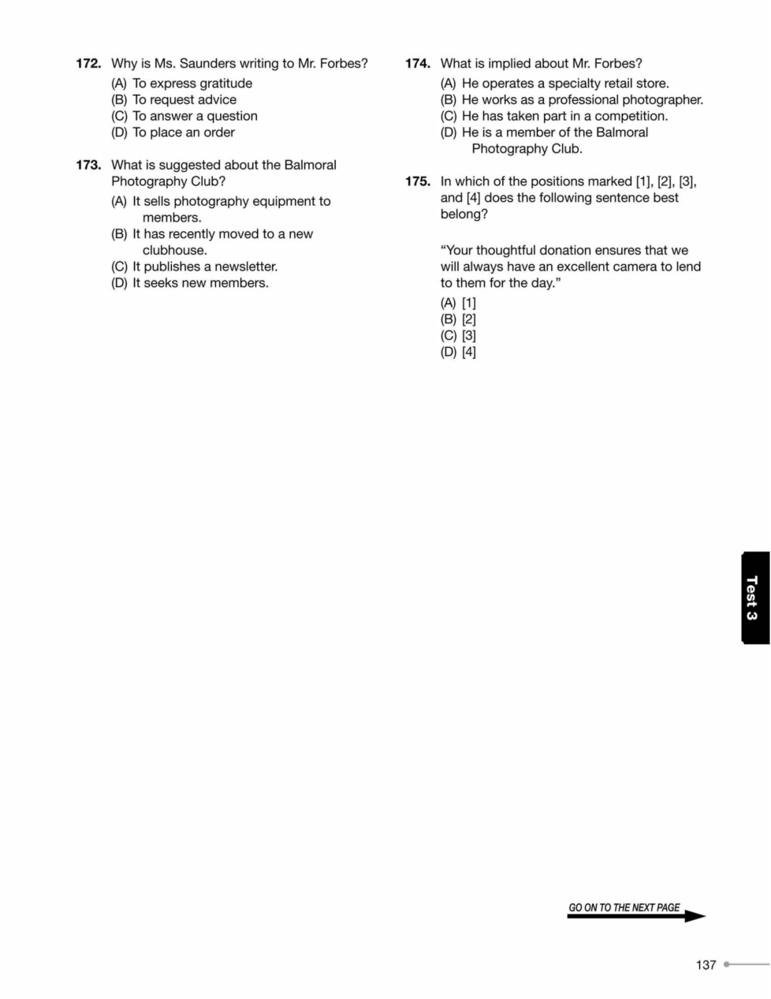


```text
172. Why is Ms. Saunders writing to Mr.F orbes? 174. What is implied about Mr.F orbes?
(A) To express gratitude (A) He operates as pecialty retail store.
(B) To request advice (B) Hew orks as ap rofessional photographer.
(C) To answer aq uestion (C) He has taken part ina c ompetition.
(D) To place an order (D)H e is am ember of the Balmoral
Photography Club.
173. What is suggested about the Balmoral
Photography Club? 175. In which of the positions marked (1], (2], [3],
(A) It sells photography equipment to and [4] does the following sentence best
members. belong?
(B) It hasr ecently moved to an ew
clubhouse. "Your thoughtful donation ensures that we
(C) It publishes an ewsletter. willa lways have an excellent camera to lend
(D) It seeks new members. to themf or the day."
(A) [1]
(B) [2]
(C) [3]
(D)[ 4]
＇
一
137... ・
```

## PDF 第 137 页

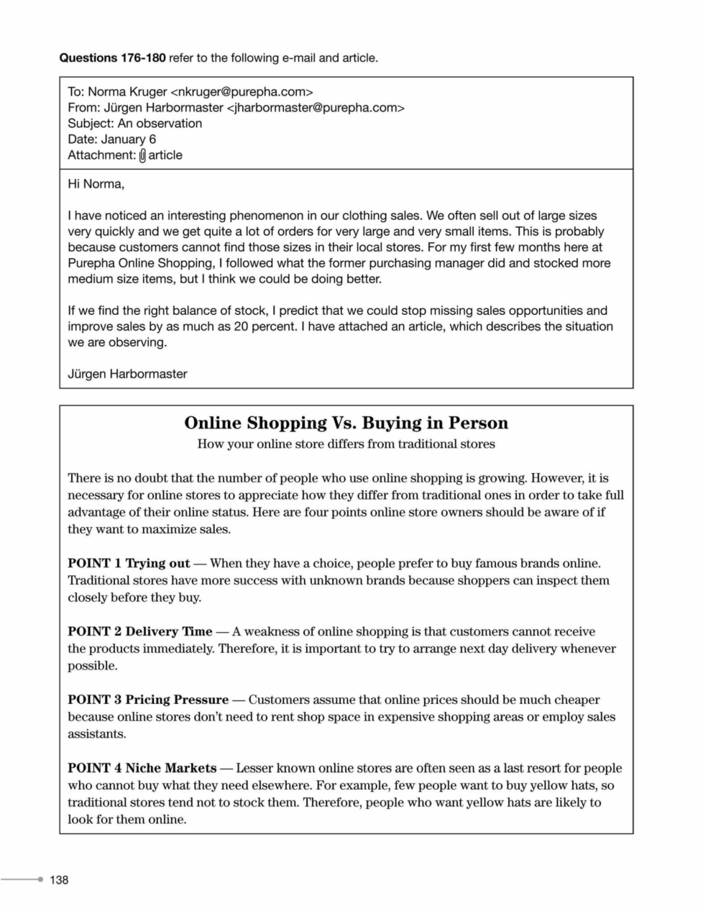


```text
Questions 176-180 refer to the following e-mail and article.
To: Norma Kruger <nkruger@purepha.com>
From: Jurgen Harbormaster <jharbormaster@purepha.com>
Subject: An observation
Date: January 6
Attachment: @a rticle
Hi Norma,
Ih ave noticed an interesting phenomenon in our clothing sales.W eo ften sell out of large sizes
very quickly and weg et quite al ot of orders for very large and very small items. This is probably
because customers cannot find those sizesi n their local stores. For myf irst few months here at
Purepha Online Shopping,I fo llowed what the former purchasing manager did and stocked more
medium size items, but Ith ink wec ould be doing better.
If wef ind the right balance of stock,I p redict that wec ould stop missing sales opportunities and
improve sales by as much as 20 percent. Ih ave attached an article,w hich describes the situation
wea re observing.
Jurgen Harbormaster
Online Shopping Vs. Buying in Person
Howy our online store differs from traditional stores
There is no doubt that the number of people whou se online shopping is growing. However, it is
necessary for online stores to appreciate howt hey differ from traditional ones in order to take full
advantage of their online status. Here are four points online store owners should be aware of if
they want to maximize sales.
POINT 1T rying out - Whent hey havea c hoice,p eople prefer to buy famous brands online.
Traditional stores havem ore success with unknown brands becauses hoppers can inspect them
closely before they buy.
POINT 2D elivery Tune - Aw ea畑 essof online shoppingi s that customers cannot receive
the products immediately. Therefore, it is important to try to arrange next day delivery whenever
possible.
POINT 3P ricing Pressure - Customers assume that online prices should be much cheaper
because online stores don't needt o rent shop space in expensive shopping areas or employ sales
assistants.
POINT 4N iche Markets — Lesser !mown online stores are often seen as al ast resort for people
who cannot buy what they need elsewhere.F or example, fewp eople want to buy yellow hats,s o
traditional stores tend not to stock them.T herefore, people whow ant yellow haぉarelikely to
look for them online.
・ . .1 38
```

## PDF 第 138 页

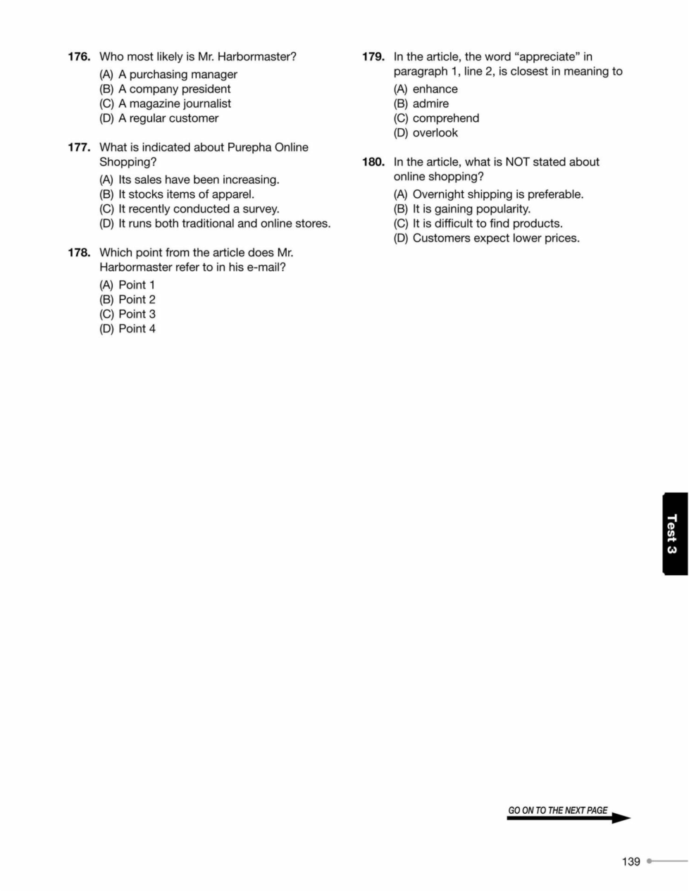


```text
176. Whom ost likely is Mr. Harbormaster? 179. In the article, the word "appreciate"in
(A) A purchasing manager paragraph 1,li ne 2, is closest in meaning to
(B) Ac ompany president (A) enhance
(C) A magazine journalist (B) admire
(D) A regular customer (C) comprehend
(D)o verlook
177. What is indicated about Purepha Online
Shopping? 180. In the article,w hat is NOTs tated about
(A) Its sales have been increasing. online shopping?
(B) It stocks itemso f apparel. (A) Overnight shipping is preferable.
(C) It recently conducted as urvey. (B) Itis gaining popularity.
(D) It runs both traditional and online stores. (C) Itis difficult to find products.
(D)C ustomers expect lowerp rices.
178. Which point from the article does Mr.
Harbormasterr efer to in his e-mail?
(A) Point 1
(B) Point 2
(C) Point3
(D) Point 4
＇
一
139... ・
```

## PDF 第 139 页

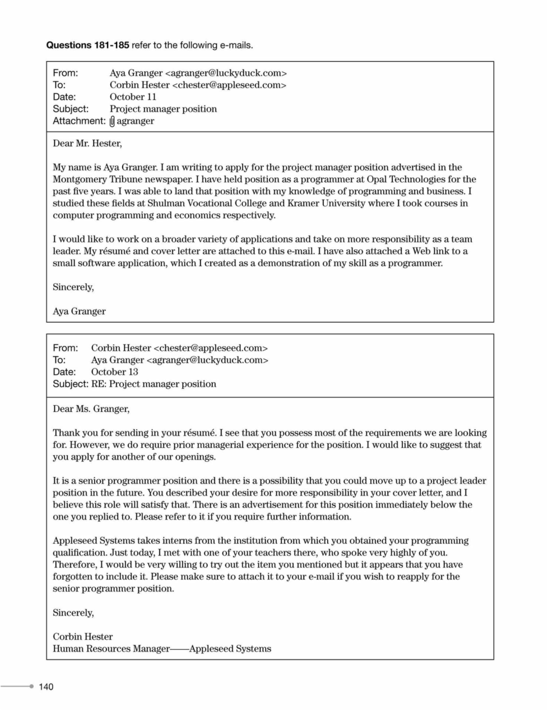


```text
Questions 181-185 refer to the following e-mails.
From: Aya Granger <agranger@luckyduck.com>
To: Corbin Hester <chester@appleseed.com>
Date: October 11
Subject: Project manager position
Attachment: @a granger
Dear Mr. Hester,
Myn ame is Aya Granger.I a mw riting to apply for the project manager position advertisedi n the
Montgomery Tribune newspaper. Ih ave held position as ap rogrammer at Opal Technologies for the
past five years.I w as able to land that position with myk nowledge of programnting and business. I
studied these fieldsa t Shulman Vocational College and Kramer University whereI t ook courses in
computer progranm血 gand economics respectively.
Iw ould liket o work on ab roader variety of applications and take on morer esponsibility as at eam
leader. Myr esume and cover letter are attached to this e-mail. Ih ave also attached aW ebl ink to a
small software application, which Ic reated as ad emonstration of mys kill as ap rogrammer.
Sincerely,
AyaGranger
From: Corbin Hester <chester@appleseed.com>
To: Aya Granger <agranger@luckyduck.com>
Date: October 13
Subject: RE:Pr oject manager position
Dear Ms.Gr anger,
Thank you for sending in your resume. Is ee that you possess most of the requirements wea re looking
for.Ho wever, wed o requirep rior managerial experience for the position. Iw ould like to suggest that
you apply for another of our openings.
It is as enior progranuner position and there isa p ossibility that you could move upt o ap roject leader
position in the future. You describedy our desiref or morer esponsibility in your cover letter,a nd I
believe this role will satisfy that. There is an advertisement for this position immediately below the
one you replied to. Please refer to it if you require further information.
Appleseed Systems takes interns from the institution from which you obtained your programn1ing
qualification. Just today, Im et with one of your teachers there, who spoke very highly of you.
Therefore, Iw ould be very willing to try out the item youm entioned but it appears thaty ou have
forgotten to includeit . Please make sure to attach it to your e-mail if you wish to reapply for the
senior programmerp osition.
Sincerely,
Corbin Hester
Human Resources Manager-Appleseed Systems
・ . .1 40
```

## PDF 第 140 页

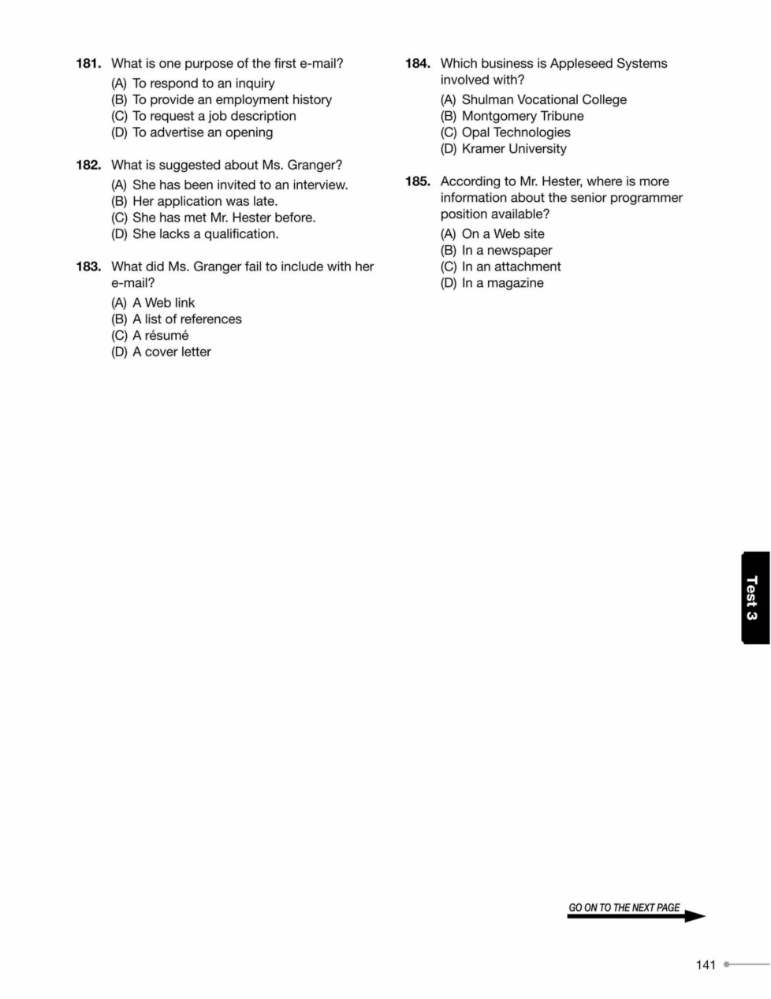


```text
181. What is one purpose of the first e-mail? 184. Which business is Appleseed Systems
(A) To respond to an inquiry involved with?
(B) To provide an employment history (A) Shulman Vocational College
(C) To request aj ob description (B) Montgomery Tribune
(D) To advertise an opening (C) OpalT echnologies
(D)K ramer University
182. What is suggested about Ms. Granger?
(A) She has been invited to an interview. 185. According to Mr. Hester,w here 1s more
(B) Her application was late. information about the senior programmer
(C) She has met Mr.H ester before. position available?
(D) She lacks aq ualification. (A) Ona W ebs ite
(B) In an ewspaper
183. What did Ms. Granger fail to include with her (C) In an attachment
e-mail? (D)I n am agazine
(A) A Web link
(B) A list of references
(C) A r,es ume
(D) A coverl etter
＇
一
141 ... ・
```

## PDF 第 141 页

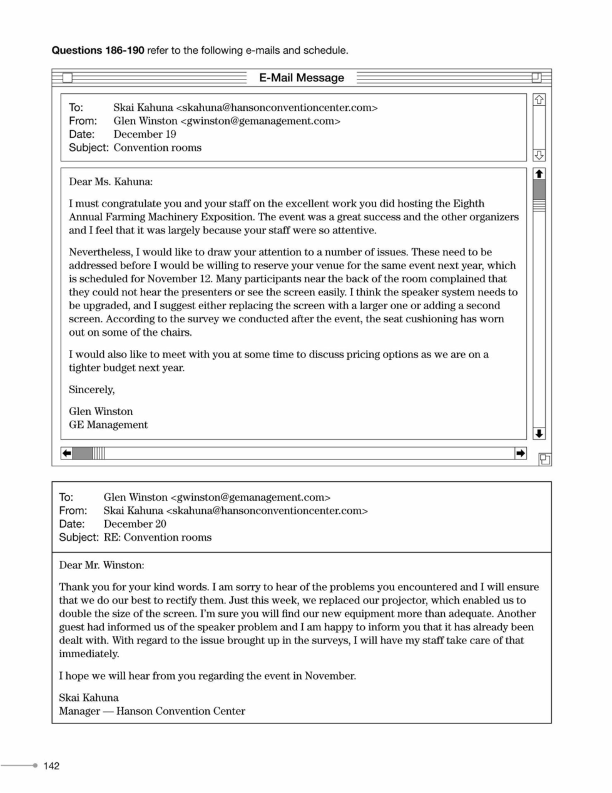


```text
Questions 186-190 refer to the following e-mails and schedule.
E-Mail Message
豆
To: Skai Kahuna <skahuna@hansonconventioncenter.com>
From: GlenW inston <gwinston@gemanagement.com> 一
Date: December 19
Subject: Convention rooms
立
一會
Dear Ms. Kahuna:
Im ust congratulate you and your staff on the excellent work you did hosting the Eighth
Annual Farming Machinery Exposition. The event was ag reat success and the other organizers
and Ife el that it was largely because your staff were so attentive.
Nevertheless, Iw ould liket o draw your attention to an umber of issues. These need to be
addressed before Iw ould be willing to reserve your venue for the same event next year, which
is scheduled for November 12. Many participants near the back of the room complained that
they could noth ear the presenters or see the screen easily. Ith ink the speaker system needs to
be upgraded,an d Isu ggest either replacing the screen with al arger one or adding as econd
screen. According to the survey wec onducted after the event, the seat cushioning has worn
out on some of the chairs.
Iw ould also like to meet with you at some tin1e to discuss pricing options as wea re on a
tighter budget next year.
Sincerely,
Glen Winston
GEM anagement
t!l
-茫
I•
ト=~11111
To: Glen Winston <gwinston@gernanagernent.com>
From: Skai Kahuna <skahuna@hansonconventioncenter.com>
Date: December 20
Subject: RE: Convention rooms
Dear Mr.Wi nston:
Thank you for your kind words.I a n1 sorry to hear of the problems you encountered and Iw ill ensure
that we do our best to rectify them. Just this week, wer eplaced our projector, which enabled us to
double the size of the screen. I'm sure you will find our new equipment more than adequate.An other
guest had informed us of the speaker problema nd I皿 happyto infonn you that it has already been
dealt with.Wi th regard to thei ssue brought up in the surveys, Iwi ll have mys taff take care of that
imn1ediately.
Ih ope we will hear from you regarding the event in November.
Skai Kahuna
Manager - Hanson Convention Center
・ . .1 42
```

## PDF 第 142 页

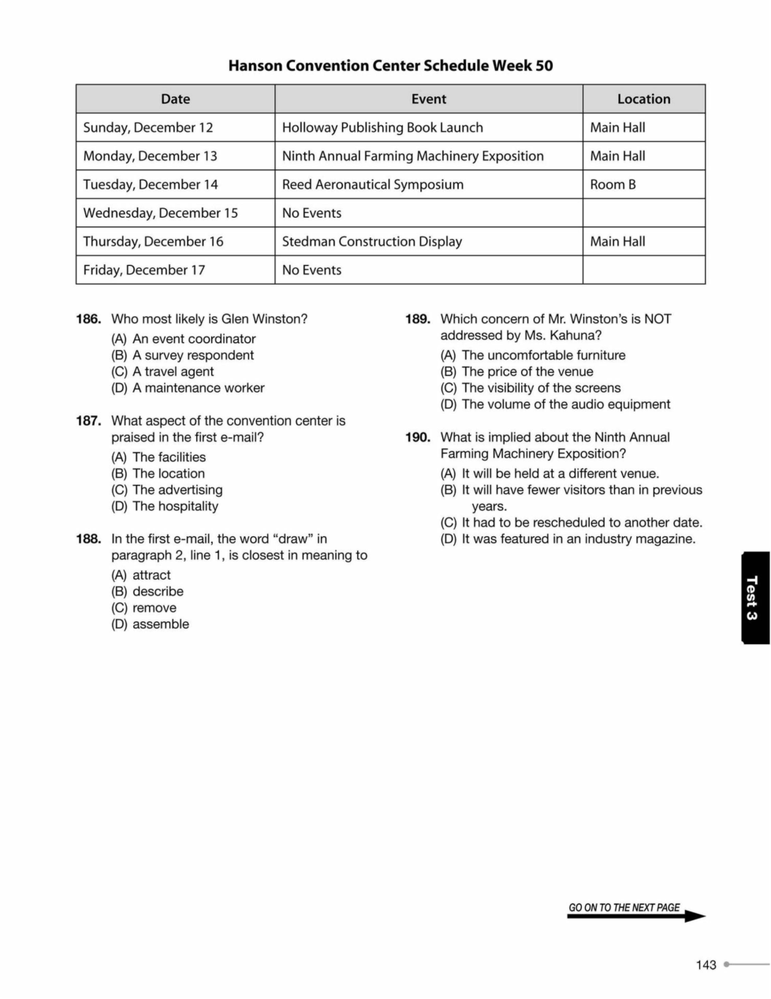


```text
Hanson Convention Center Schedule Week5 0
Date Event Location
Sunday, December 12 Holloway Publishing Book Launch Main Hall
Monday、December13 Ninth Annual Farming Machinery Exposition Main Hall
Tuesday, December 14 Reed Aeronautical Symposium Room B
Wednesday,D ecember 15 NoE vents
Thursday, December 16 Stedman Construction Display Main Hall
Friday, December 17 NoE vents
186. Whom ost likely is Glen Winston? 189. Which concern of Mr.Wi nston's is NOT
(A) An event coordinator addressed by Ms.K ahuna?
(B) As urvey respondent (A) The uncomfortable furniture
(C) At ravel agent (B) The price of the venue
(D) A maintenance worker (C) The visibility of the screens
(D)T he volume of the audio equipment
187. What aspect of the convention center is
praised int he first e-mail? 190. What is implied about the Ninth Annual
(A) The facilities Farming Machinery Exposition?
(B) The location (A) Itwi ll be held at ad ifferent venue.
(C) The advertising (B) Itwi ll have fewer visitors than inp revious
(D) The hospitality years.
(C) It had to be rescheduled to another date.
188. In the first e-mail,t he word "draw" in (D)It w as featured in an industry magazine.
＇
paragraph 2,li ne 1,is c losest in meaning to
(A) attract
(B) describe
(C) remove
(D) assemble
一
143... ・
```

## PDF 第 143 页

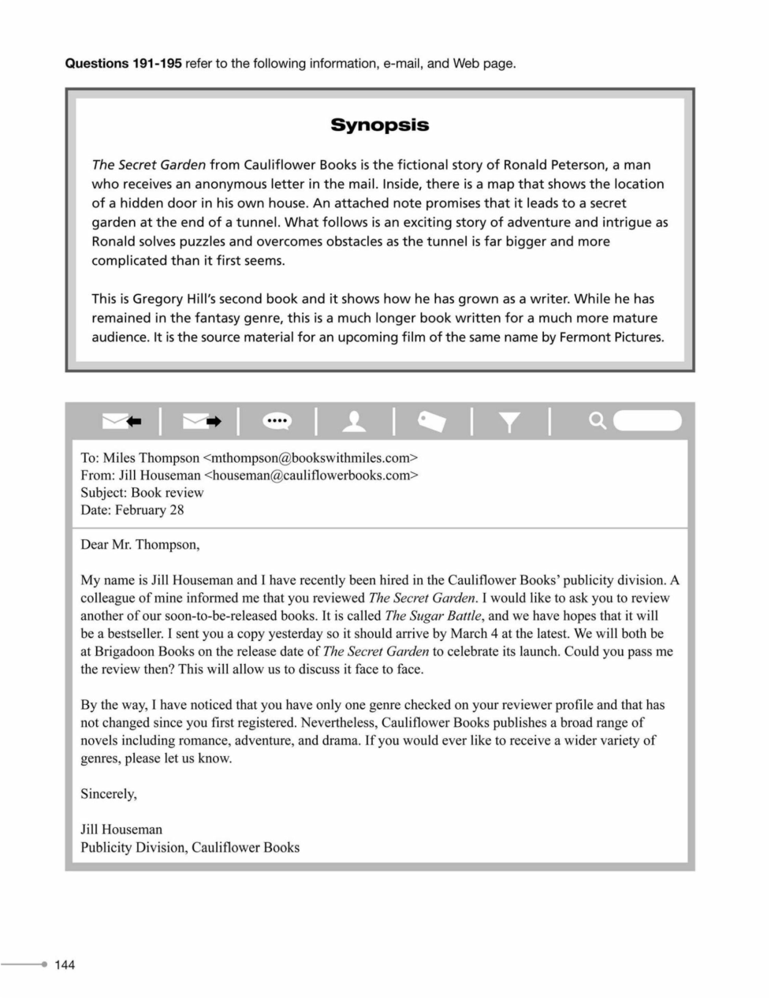


```text
Questions 191-195 refer to the following information, e-mail, and Web page.
Synopsis
The Secret Garden from Cauliflower Books is the fictional story of Ronald Peterson,a m an
who receives an anonymous letter in the mail. Inside, there isa m apt hat shows the location
of ah idden door in his own house.A n attached note promises that it leads to as ecret
garden at the end of at unnel. What follows is an exciting story of adventure and intrigue as
Ronald solves puzzles and overcomes obstacles as the tunnel is far bigger and more
complicated than it first seems.
This is Gregory Hill's second book and its hows how he has grown as aw riter. Whileh e has
remained in the fantasy genre, this is am uch longer book written for am uch more mature
audience. It is the source material for an upcoming film of the same name by Fermont Pictures.
~1111111
To: Miles Thompson <mthompson@bookswithmiles.com>
From: Jill Houseman <houseman@cauliflowerbooks.com>
Subject: Book review
Date:Fe bruary 28
Dear Mr. Thompson,
Myn ame is Jill Houseman and Ih ave recentlyb eenh ired in the Cauliflower Books'publicity division.A
colleague of mine informed met hat your eviewed TheS ecretG arden. Iw ould liket o ask you tor eview
another of our soon-to-be-released books.It is called The Sugar Battle, and we have hopes that it will
be ab estseller. Is ent you ac opy yesterday so it should arrive by March 4a t the latest. Wew ill both be
at Brigadoon Books on the release date of TheS ecret Gardent o celebrate its launch. Could you passm e
the review then? This will allow us to discussit face to face.
By the way, Ih ave noticedt hat youh aveo nly one genre checked on your reviewer profile and that has
not changeds ince you first registered. Nevertheless,Ca uliflower Books publishes ab road range of
novels including romance,ad venture, and drama. If you would ever like to receive aw ider variety of
genres, please let us know.
Sincerely,
JillH ouseman
Publicity Division, Cauliflower Books
・ . .1 44
```

## PDF 第 144 页

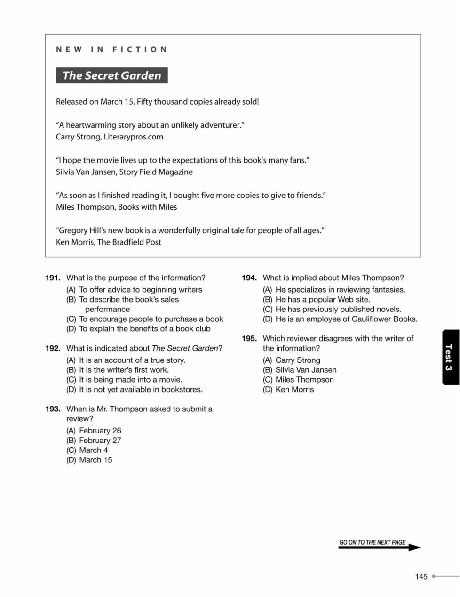


```text
N E W IN FICTION
一
Released on March 15.Fi fty thousand copies already sold!
"A heartwarming story about an unlikely adventurer."
Carry Strong, Literarypros.com
"I hope the movie lives up to the expectations of this book's manyf ans."
Silvia Van Jansen, Story Field Magazine
"As soon as Ifi nished reading it, Ib ought five more copies to give to friends."
Miles Thompson,B ooks with Miles
"Gregory Hill's new book is aw onderfully original tale for people of all ages."
Ken Morris、TheBradfield Post
191. What is the purpose of the information? 194. What is implied about Mlies Thompson?
(A) To offer advice to beginning writers (A) He specializes in reviewing fantasies.
(B) To describe the book's sales (B) He has ap opular Webs ite.
performance (C) He has previously published novels.
(C) To encourage people to purchase ab ook (D)H e is an employee of Cauliflower Books.
(D) To explain the benefits of ab ook club ＇
195. Which reviewer disagrees with the writero f
192. What is indicated about The Secret Garden? the information?
(A) It is an account of at rue story. (A) Carry Strong
(B) It is the writer'sf irst work. (B) Silvia Van Jansen
(C) It is being made into am ovie. (C) Miles Thompson
(D) It is not yet available in bookstores. (D)K en Morris
193. When isM r.T hompson asked to submit a
review?
(A) February 26
(B) February 27
(C) March 4
(D) March 15
一
145... ・
```

## PDF 第 145 页

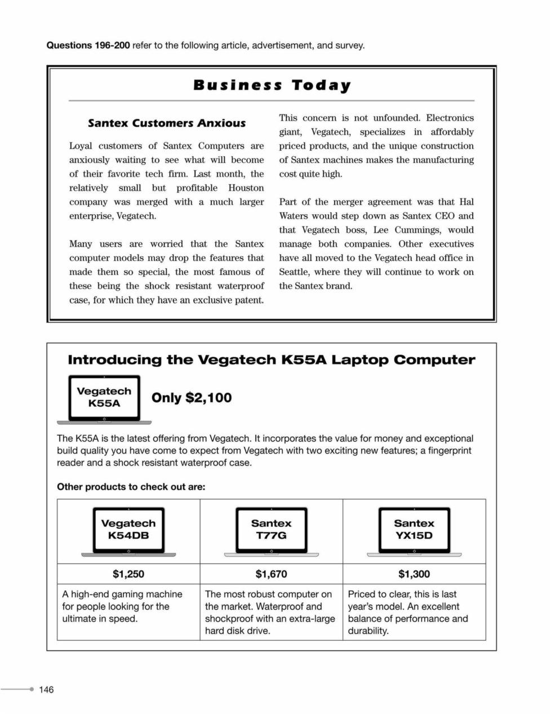


```text
Questions 196-200 refer to the following article, advertisement, and survey.
Business Today
This concern is not unfounded. Electronics
Santex Customers Anxious
giant, Vegatech, specializes in affordably
Loyal customers of Santex Computers are priced products,a nd the uniquec onstruction
anxiously waiting to see what will become of Santex machines makes the manufacturing
of their favorite tech firm. Last month, the cost quite high
relatively small but profitable Houston
company was merged with a much larger Part of the merger agreement was that Hal
enterprise, Vegatech. Waters would step down as Santex CEO and
that Vegatech boss,L ee Cummings, would
Many users are worried that the Santex manage both companies. Other executives
computer models may drop the features that havea ll movedt o the Vegatech head office in
made them so special,t he most famous of Seattle,w here they will continuet ow ork on
these being the shock resistant waterproof the Santex brand.
case, for which they have an exclusive patent.
Introducing the Vegatech KSSAL aptop Computer
Vegatech
Only $2,100
KSSA
The K55A is the latest offering from Vegatech. It incorporates the value for money and exceptional
build quality you have come to expect from Vegatech with two exciting new features; af ingerprint
reader and as hock resistant waterproof case.
Other products to check out are:
Vegatech Santex Santex
K54DB T77G YX15D
$1,250 $1,670 $1,300
A high-end gaming machine The mostr obust computer on Priced to clear, this is last
for people looking for the the market. Waterproof and year'sm odel. Ane xcellent
ultimate in speed. shockproof with an extra-large balance of performance and
hard disk drive. durability.
・ . .1 46
```

## PDF 第 146 页

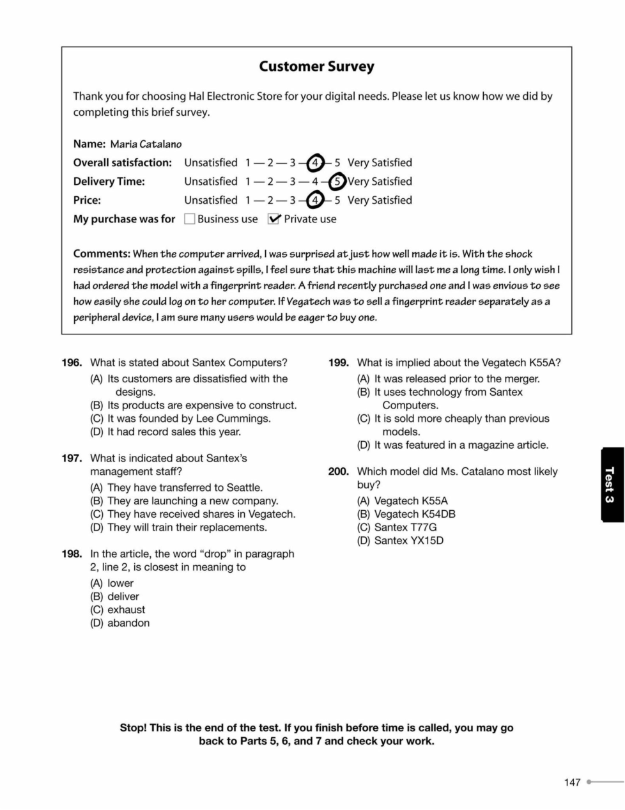


```text
CustomeSurvey
『
Thank you for choosing Hal Electronic Store for your digital needs. Please let us know howw ed id by
completing this brief survey.
Name: Maria Catalano
-6)--
Overall satisfaction: Unsatisfied 1- 2 3 5 Very Satisfied
ー
Delivery Time: Unsatisfied 1- 2- 3- 4- (Dvery Satisfied
-6)--
Price: Unsatisfied 1- 2- 3 5 Very Satisfied
Myp urchase was for □B usiness use ~ Private use
Comments: When the computer arrived, Iw as surprised atj ust how well made it is.Wi th the shock
resistance and protection against spills,If e el sure that this machine will last mea l ong time.Io n ly wish I
had ordered the model with af ingerprint reader.A f riend recently purchased one and Iw as envious to see
how easily she could log on to her computer. If Vegatech was to sell af ingerprint reader separately asa
peripheral device, Ia ms ure many users would be eager to buy one.
196. What is stated about Santex Computers? 199. What is implied about the Vegatech KSSA?
(A) Its customers are dissatisfied with the (A) Itw as released prior tot he merger.
designs. (B) Itu ses technology from Santex
(B) Its products are expensive to construct. Computers.
(C) It was founded by Lee Cummings. (C) Itis sold more cheaplyt han previous
(D) It had record sales this year. models.
(D)It w as featured in am agazine article. ＇
197. What is indicated about Santex's
management staff? 200. Which model didM s.C atalano most likely
(A) They have transferred to Seattle. buy?
(B) They are launching an ew company. (A) Vegatech KSSA
(C) They have received shares in Vegatech. (B) Vegatech K54DB
(D) They wi lltrain their replacements. (C) Santex T77G
(D)S antex YX1 SD
198. In the article,th e word "drop"in paragraph
2,li ne 2,is closestin m eaning to
(A) lower
(B) deliver
(C) exhaust
(D) abandon
Stop! This is the end of the test. If you finish before time is called, you mayg o
back to Parts 5, 6, and 7a nd check your work.
147... ・
```

## PDF 第 147 页

```text
pp.1 09-111 Part 1写口提供
1. &4 .
Photos provided by Hiro Maeda
2.
"Work" by Photographer dedljiv (https://www.flickr.com/photos/36213581@N07/) , used underC CB Y/
Desaturated from original
3.
"Netherlands-4375-Canal and Houses" by Photographer Dennis Jarvis( https://www.flickr.com/photos/
archer10/),u sed under CCB Y/D esaturated from original
5.
"The English Countryside"b y Photographer Bob Jenkin (https://www.flickr.com/photos/143247890@
N03/),u sed under CCB Y/D esaturated from original
6.
"Waiting" by Photographer Adrian Schneider (https://www.flickr.com/photos/129944265@N07/),u sed
under CCB Y/D esaturated from original
```

## PDF 第 148 页

```text
-------------::<------------------------------------------------------------------------::<------------------------------------------------------------------------::<-------------
TOEIC L&Rテスト至高の模試600問 TEST 1 解答用紙A
受験日 ： 年 月 日 Part 1 Part 2 I Part 3 I Part 4 IL istening計 I Part 5 j Part 6 j Part 7 I R eading計
/6 125 /3 9 I3 0 /1 00 I3 0 /16 I5 4 /1 00
Part 1 Part 2 Part3 Part4
ANSWER ANSWER ANSWER ANSWER ANSWER ANSWER ANSWER ANSWER ANSWER ANSWER
No No No No No No No. No No No
ABCD A B C ABC ABCD ABCD ABCD ABCD ABCD ABCD ABCD
i1 R Rc@ 11 RRc 21 R@c 31 R@c 41 RRc@ 51 R@c@ 61 RRc@ 71 RRc@ 81 R@c@ 91 R@c@
2 RRc@ 12 R@c 22 RRc 32 RRcc 42 RRc@ 52 R@c@ 62 RRcc 72 R@c@ 82 R@c@ 92 R@c@
3 RRc@ 13 RRc 23 RRc 33 RRc@ 43 RRc@ 53 RRc@ 63 RRc@ 73 RRc@ 83 RRc@ 93 RRc@
4 RRc@ 14 R@c 24 RRc 34 RRc@ 44 R@c@ 54 RRc@ 64 RRcc 74 RRc@ 84 RRc@ 94 RRc@
I~ 5 R Rc@ 15 RRc 25 RRc 35 RRc@ 45 R@c@ 55 R@c@ 65 RRc@ 75 R@c@ 85 R@c@ 95 RRc@
6 RRc@ 16 R@c 26 RRc 36 RRc@ 46 R@c@ 56 RRc@ 66 RRc@ 76 R@c@ 86 RRc@ 96 R@c@
7 R@c 17 R@c 27 R@c 37 RRc@ 47 RRc@ 57 R@c@ 67 RRc@ 77 RRc@ 87 R@c@ 97 R@c@
， 8 R @c 18 R@c 28 R@c 38 @@c@ 48 RRc@ 58 RRc@ 68 RRc@ 78 R@c@ 88 RRc@ 98 RRc@
RRc 19 RRc 29 RRc 39 RRc@ 49 RRc@ 59 R@c@ 69 R@c@ 79 RRc@ 89 RRc@ 99 R@c@
10 R@c 20 RRc 30 R@c 40 RRc@ 50 RRc@ 60 RRc@ 70 R@c@ 80 RRc@ 90 RRc@ 100 RRc@
Part 5 Part 6 Part 7
ANSWER ANSWER ANSWER ANSWER ANSWER ANSWER ANSWER ANSWER ANSWER ANSWER
No No No No. No No No. No No No.
ABCD ABCD ABCD ABCD ABCD ABCD ABCD ABCD ABCD ABCD
i 101 R Rc@ 111 RRc@ 121 RRc@ 131 RRc@ 141 RRc@ 151 R@c@ 161 RRc@ 171 RRc@ 181 R@c@ 191 R@c@
102 RRc@ 112 R@c@ 122 R@c@ 132 R@c@ 142 RRc@ 152 RRc@ 162 RRc@ 172 RRc@ 182 RRc@ 192 RRc@
103 RRc@ 113 RRc@ 123 RRc@ 133 RRc@ 143 RRc@ 153 R@c@ 163 R@c@ 173 R@c@ 183 RRc@ 193 R@c@
104 RRc@ 114 RRc@ 124 RRc@ 134 @Rc@ 144 R@c@ 154 R@c@ 164 RRcc 174 RRcc 184 RRc@ 194 R@c@
畠~ 105 RRc@ 115 RRc@ 125 RRc@ 135 RRcc 145 RRc@ 155 RRc@ 165 RRc@ 175 R@c@ 185 RRc@ 195 R@c@
106 RRc@ 116 RRc@ 126 R@c@ 136 @Rcc 146 RRc@ 156 RRc@ 166 RRcc 176 RRc@ 186 RRc@ 196 RRc@
107 RRc@ 117 RRc@ 127 RRc@ 137 RRc@ 147 RRc@ 157 RRc@ 167 RRc@ 177 RRc@ 187 RRc@ 197 RRc@
108 RRc@ 118 RRc@ 128 RRc@ 138 @Rc@ 148 RRc@ 158 RRc@ 168 RRc@ 178 RRc@ 188 RRc@ 198 RRc@
109 RRc@ 119 RRc@ 129 RRc@ 139 RRc@ 149 R@c@ 159 R@c@ 169 R@c@ 179 R@c@ 189 R@c@ 199 R@c@
110 RRc@ 120 RRc@ 130 R@c@ 140 RRc@ 150 RRc@ 160 RRc@ 170 R@c@ 180 RRc@ 190 RRc@ 200 RRc@
※解答一覧→別冊1pp.4-5、p.9参照
```

## PDF 第 149 页

```text
-------------><――----------------------------------------------------------------------><------------------------------------------------------------------------><-------------
TOEIC L&Rテスト至高の模試600問 TEST 1 解答用紙B <勘ボックスあり）
受験日： 年 月 日 Part 1 Part 2 I Part 3 I Part 4 IL istening計 I Part 5 I Part 6 I Part 7 I R eading計
/6 /2 5 I3 9 /3 0 /100 I3 0 /16 I5 4 /1 00
Part 1 Part2 Part3 Part 4
ANSWER ANSWER ANSWER ANSWER ANSWER ANSWER ANSWER ANSWER ANSWER ANSWER
No No No No No No No No. No No
ABCD勘 ABC 勘 ABC 勘 ABCD勘 ABCD勘 ABCD勘 ABCD勘 ABCD勘 ABCD勘 ABCD勘
!1 R @c@o 11 R@c ロ 21 R@c D 31 R@c D 41 RRccロ 51 R@c@ロ61 RRc@ロ71 RRc@o 81 RRc@o 91 RRc@ロ
2 R@c@こl12 R@c □ 22 @@c D 32 RRc@ロ42 R@c@o 52 RRc@o 62 RRc@o 72 RRc@ロ82 R@c@ロ 92 RRc@o
3 R@c@□ 13 @Rc 〇 23 RRc 0 33 RRc@ロ43 R@ccロ 53 RRc@ロ63 RRc@ロ73 RRc@ロ83 R@c@ロ93 RRc@ロ
(fJ 4 RRc@o 14 @@c D 24 RRc ロ 34 RRc@o 44 RRc@o 54 RRc@ロ 64 RRc@o 74 RRc@o 84 RRc@o 94 RRc@o
旦
i5 R Rc@o 15 R@c D 25 R@c D 35 RRc@o 45 R@c@〇 55 RRc@ロ 65 RRc@o 75 R@c@o 85 R@c@〇 95 RRc@ロ
6 R@c@o 16 R@c ロ 26 @@c D 36 R@c@ロ46 R@cco 56 RRc@ロ66 RRc@o 76 R@c@o 86 R@c@o 96 RRc@o
7 R@c D 17 R@c D 27 RRc ロ 37 RRc@o 47 RRccロ 57 RRc@ロ67 RRc@o 77 RRc@ロ87 R@c@o 97 RRc@ロ
， 8 R@ c D 18 RRc 0 28 R@c D 38 RRc@o 48 RRc@o 58 R@c@D 68 RRc@o 78 RRc@o 88 R@c@ロ 98 R@c@D
R@c ロ 19 R@c ロ 29 RRc ロ 39 RRc@ロ49 RRccロ 59 RRc@ロ69 RRc@ロ79 RRc@ロ89 RRc@ロ99 RRc@ロ
10 R@c こl20 RRc ロ 30 RRc ロ 40 RRc@o 50 RRc@ロ60 RRc@ロ70 RRc@o 80 RRc@ロ90 RRc@ロ100 RRc@o
Part 5 Part 6 Part 7
ANSWER ANSWER ANSWER ANSWER ANSWER ANSWER ANSWER ANSWER ANSWER ANSWER
No. No No No No No No No. No. No
ABCD勘 ABCD勘 ABCD勘 ABCD勘 ABCD勘 ABCD勘 ABCD勘 ABCD勘 ABCD勘 ABCD勘
i101 R@ c@ロ111 R@c@o 121 RRc@ロ131 RRc@ロ141 R@ccロ 151 RRc@o 161 RRc@ロ171 R@c@ロ181 RRc@ロ191 RRc@o
102 R@c@D 112 R@c@o 122 RRc@o 132 RRc@o 142 R@c@D 152 RRc@ロ 162 RRc@o 172 RRc@o 182 RRc@ロ192 RRc@o
103 R@c@ロ 113 R@c@o 123 RRc@ロ133 RRc@ロ143 R@c@ロ 153 RRc@ロ163 RRc@ロ173 RRc@ロ183 RRc@o 193 RRc@□
104 @Rc@こ l114 @Rccロ 124 RRc@o 134 RRc@o 144 RRc@o 154 RRc@ロ164 RRc@o 174 RRc@ロ184 R@c@ロ194 RRc@o
~ 105 R@c@o 115 RRc@o 125 RRccロ 135 RRc@ロ145 RRc@o 155 RRccロ 165 RRc@o 175 RRc@o 185 R@c@o 195 RRc@o
凰 106 RRc@o 116 RRc@ロ126 RRc@o 136 RRc@o 146 RRc@o 156 RRc@ロ166 RRc@o 176 RRc@o 186 RRc@ロ196 RRc@o
107 R@c@ロ117 RRccロ 127 RRc@ロ137 RRc@o 147 @Rc@o 157 RRccロ 167 RRc@ロ177 R@c@o 187 R@c@ロ197 RRc@o
108 RRc@o 118 RRc@ロ128 RRc@o 138 RRc@o 148 RRc@o 158 RRc@ロ168 RRc@o 178 RRc@ロ 188 R@c@ロ198 RRc@o
109 R@c@o 119 R@c@D 129 RRc@o 139 RRc@o 149 RRc@ロ159 RRc@ロ169 RRc@o 179 RRc@o 189 R@c@o 199 RRc@o
110 R@c@こ l120 R@c@ロ130 RRc@o 140 RRc@o 150 R@c@o 160 RRc@ロ170 RRc@o 180 R@c@o 190 RRc@o 200 RRc@o
※解答一覧→別冊1pp.4-5、p.9参照
```

## PDF 第 150 页

```text
-------------::<------------------------------------------------------------------------::<------------------------------------------------------------------------::<-------------
TOEIC L&Rテスト至高の模試600問 TEST2解答用紙A
受験日 ： 年 月 日 Part 1 Part 2 I Part 3 I Part 4 ILi stening計 I Part 5 j Part 6 j Part 7 I R eading計
/6 125 /3 9 I3 0 /1 00 I3 0 /16 I5 4 /1 00
Part 1 Part 2 Part3 Part4
ANSWER ANSWER ANSWER ANSWER ANSWER ANSWER ANSWER ANSWER ANSWER ANSWER
No No No No No No No. No No No
ABCD A B C ABC ABCD ABCD ABCD ABCD ABCD ABCD ABCD
i1 R Rc@ 11 RRc 21 R@c 31 R@c 41 RRc@ 51 R@c@ 61 RRc@ 71 RRc@ 81 R@c@ 91 RRc@
2 RRc@ 12 R@c 22 RRc 32 RRcc 42 RRc@ 52 R@c@ 62 RRc@ 72 R@c@ 82 RRc@ 92 R@c@
3 RRc@ 13 RRc 23 RRc 33 RRc@ 43 RRc@ 53 RRc@ 63 RRc@ 73 RRc@ 83 RRc@ 93 RRc@
4 RRc@ 14 R@c 24 R@c 34 RRc@ 44 RRc@ 54 RRc@ 64 RRcc 74 RRc@ 84 RRc@ 94 RRc@
I~ 5 R Rc@ 15 RRc 25 RRc 35 RRcc 45 R@c@ 55 R@c@ 65 RRc@ 75 R@c@ 85 R@c@ 95 RRc@
6 RRc@ 16 R@c 26 RRc 36 RRc@ 46 R@c@ 56 RRc@ 66 RRc@ 76 R@c@ 86 RRc@ 96 R@c@
7 R@c 17 R@c 27 R@c 37 R@c@ 47 RRc@ 57 R@c@ 67 RRc@ 77 RRc@ 87 R@c@ 97 R@c@
， 8 R @c 18 RRc 28 R@c 38 @@c@ 48 RRc@ 58 R@c@ 68 RRc@ 78 R@c@ 88 RRc@ 98 RRc@
RRc 19 RRc 29 RRc 39 R@c@ 49 RRc@ 59 R@c@ 69 R@c@ 79 RRc@ 89 RRc@ 99 R@c@
10 R@c 20 RRc 30 R@c 40 RRc@ 50 RRc@ 60 RRc@ 70 R@c@ 80 RRc@ 90 RRc@ 100 RRc@
Part 5 Part 6 Part 7
ANSWER ANSWER ANSWER ANSWER ANSWER ANSWER ANSWER ANSWER ANSWER ANSWER
No No No No. No No No. No No No.
ABCD ABCD ABCD ABCD ABCD ABCD ABCD ABCD ABCD ABCD
i 101 R Rc@ 111 RRc@ 121 RRc@ 131 RRc@ 141 RRc@ 151 R@c@ 161 RRc@ 171 RRc@ 181 R@c@ 191 R@c@
102 RRc@ 112 R@c@ 122 R@c@ 132 R@c@ 142 RRc@ 152 RRc@ 162 RRc@ 172 RRc@ 182 RRc@ 192 RRc@
103 RRc@ 113 RRc@ 123 RRc@ 133 RRc@ 143 RRc@ 153 R@c@ 163 R@c@ 173 R@c@ 183 RRc@ 193 R@c@
104 RRc@ 114 RRc@ 124 RRc@ 134 @Rc@ 144 R@c@ 154 R@c@ 164 RRc@ 174 RRcc 184 RRc@ 194 R@c@
畠~ 105 RRc@ 115 RRc@ 125 RRc@ 135 RRcc 145 RRc@ 155 RRc@ 165 RRc@ 175 R@c@ 185 RRc@ 195 R@c@
106 RRc@ 116 RRc@ 126 R@c@ 136 @Rcc 146 RRc@ 156 RRc@ 166 RRcc 176 RRc@ 186 RRcc 196 RRc@
107 RRc@ 117 RRc@ 127 RRc@ 137 RRc@ 147 RRc@ 157 RRc@ 167 RRc@ 177 RRc@ 187 RRc@ 197 RRc@
108 RRc@ 118 RRc@ 128 RRc@ 138 @Rc@ 148 RRc@ 158 RRc@ 168 RRc@ 178 RRc@ 188 RRc@ 198 RRc@
109 RRc@ 119 RRc@ 129 RRc@ 139 RRc@ 149 R@c@ 159 R@c@ 169 R@c@ 179 R@c@ 189 R@c@ 199 R@c@
110 RRc@ 120 RRc@ 130 R@c@ 140 RRc@ 150 RRc@ 160 RRc@ 170 R@c@ 180 RRc@ 190 RRc@ 200 RRc@
※解答一覧→別冊2pp.4-5、p.9参照
```

## PDF 第 151 页

```text
-------------><――----------------------------------------------------------------------><------------------------------------------------------------------------><-------------
TOEIC L&Rテスト至高の模試600問 TEST2解答用紙B <勘ボックスあり）
受験日： 年 月 日 Part 1 Part 2 I Part 3 I Part 4 IL istening計 I Part 5 I Part 6 I Part 7 I R eading計
/6 /2 5 I3 9 /3 0 /100 I3 0 /16 I5 4 /1 00
Part 1 Part2 Part3 Part 4
ANSWER ANSWER ANSWER ANSWER ANSWER ANSWER ANSWER ANSWER ANSWER ANSWER
No No No No No No No No. No No
ABCD勘 ABC 勘 ABC 勘 ABCD勘 ABCD勘 ABCD勘 ABCD勘 ABCD勘 ABCD勘 ABCD勘
!1 R @c@o 11 RRc ロ 21 R@c D 31 R@c D 41 RRccロ 51 R@c@ロ61 RRc@ロ71 RRc@o 81 RRc@o 91 RRc@ロ
2 R@c@こl12 R@c □ 22 @@c D 32 RRc@ロ42 R@c@o 52 RRc@o 62 RRc@o 72 RRc@ロ82 R@c@ロ 92 RRc@o
3 R@c@□ 13 @Rc 〇 23 RRc 0 33 RRc@ロ43 R@ccロ 53 RRc@ロ63 RRc@ロ73 RRc@ロ83 R@c@ロ93 RRc@ロ
(fJ 4 RRc@o 14 @@c D 24 RRc ロ 34 RRc@o 44 RRc@o 54 RRc@ロ 64 RRc@o 74 RRc@o 84 RRc@o 94 RRc@o
旦
i5 R @c@o 15 R@c D 25 R@c D 35 RRc@o 45 R@c@〇 55 RRc@ロ 65 RRc@o 75 R@c@o 85 R@c@〇 95 RRc@ロ
6 R@c@o 16 R@c ロ 26 R@c D 36 R@c@ロ46 R@cco 56 RRc@o 66 RRc@o 76 R@c@o 86 RRc@o 96 RRc@o
7 R@c D 17 R@c D 27 RRc ロ 37 RRc@o 47 R@ccロ 57 RRc@ロ67 RRc@o 77 RRc@ロ87 R@c@o 97 RRc@ロ
， 8 @@ c D 18 RRc 0 28 R@c D 38 RRc@o 48 RRc@o 58 R@c@D 68 RRc@o 78 R@c@o 88 R@c@ロ 98 R@c@D
R@c ロ 19 R@c ロ 29 RRc ロ 39 RRc@ロ49 RRccロ 59 RRc@ロ69 RRc@ロ79 RRc@ロ89 RRc@ロ99 RRc@□
10 R@c こl20 RRc ロ 30 RRc ロ 40 RRc@o 50 RRc@ロ60 RRc@ロ70 RRc@o 80 RRc@ロ90 RRc@ロ100 RRc@o
Part 5 Part 6 Part 7
ANSWER ANSWER ANSWER ANSWER ANSWER ANSWER ANSWER ANSWER ANSWER ANSWER
No. No No No No No No No. No. No
ABCD勘 ABCD勘 ABCD勘 ABCD勘 ABCD勘 ABCD勘 ABCD勘 ABCD勘 ABCD勘 ABCD勘
i101 R@ c@ロ111 R@c@o 121 RRc@ロ131 RRc@ロ141 R@ccロ 151 RRc@o 161 RRc@ロ171 R@c@ロ181 RRc@ロ191 RRc@o
102 R@c@D 112 R@c@o 122 RRc@o 132 RRc@o 142 R@c@D 152 RRc@ロ 162 RRc@o 172 RRc@o 182 RRc@ロ192 RRc@o
103 R@c@ロ 113 R@c@o 123 RRc@ロ133 RRc@ロ143 R@c@ロ 153 RRc@ロ163 RRc@ロ173 RRc@ロ183 RRc@o 193 RRc@□
104 @Rc@こ l114 @Rccロ 124 RRc@o 134 RRc@o 144 RRc@o 154 RRc@ロ164 RRc@o 174 RRc@ロ184 R@c@ロ194 RRc@o
~ 105 R@c@o 115 RRc@o 125 RRccロ 135 RRc@ロ145 RRc@o 155 RRccロ 165 RRc@o 175 RRc@o 185 R@c@o 195 RRc@o
凰 106 RRc@o 116 RRc@ロ126 RRc@o 136 RRc@o 146 RRc@o 156 RRc@ロ166 RRc@o 176 RRc@o 186 RRc@ロ196 RRc@o
107 R@c@ロ117 RRccロ 127 RRc@ロ137 RRc@o 147 @Rc@o 157 RRccロ 167 RRc@ロ177 R@c@o 187 R@c@ロ197 RRc@o
108 RRc@o 118 RRc@ロ128 RRc@o 138 RRc@o 148 RRc@o 158 RRc@ロ168 RRc@o 178 RRc@ロ 188 R@c@ロ198 RRc@o
109 R@c@o 119 R@c@D 129 RRc@o 139 RRc@o 149 RRc@ロ159 RRc@ロ169 RRc@o 179 RRc@o 189 R@c@o 199 RRc@o
110 R@c@こ l120 R@c@ロ130 RRc@o 140 RRc@o 150 R@c@o 160 RRc@ロ170 RRc@o 180 R@c@o 190 RRc@o 200 RRc@o
※解答一覧→別冊2pp.4-5、p.9参照
```

## PDF 第 152 页

```text
-------------::<------------------------------------------------------------------------::<------------------------------------------------------------------------::<-------------
TOEIC L&Rテスト至高の模試600問 TEST3解答用紙A
受験日 ： 年 月 日 Part 1 Part 2 I Part 3 I Part 4 ILi stening計 I Part 5 j Part 6 j Part 7 I R eading計
/6 125 /3 9 I3 0 /1 00 I3 0 /16 I5 4 /1 00
Part 1 Part 2 Part3 Part4
ANSWER ANSWER ANSWER ANSWER ANSWER ANSWER ANSWER ANSWER ANSWER ANSWER
No No No No No No No. No No No
ABCD A B C ABC ABCD ABCD ABCD ABCD ABCD ABCD ABCD
i1 R Rc@ 11 RRc 21 R@c 31 R@c 41 RRc@ 51 R@c@ 61 RRc@ 71 RRc@ 81 R@c@ 91 RRc@
2 RRc@ 12 R@c 22 RRc 32 RRcc 42 RRc@ 52 R@c@ 62 @Rc@ 72 R@c@ 82 R@c@ 92 R@c@
3 RRc@ 13 RRc 23 RRc 33 RRc@ 43 RRc@ 53 RRc@ 63 RRc@ 73 RRc@ 83 RRc@ 93 RRc@
4 RRc@ 14 R@c 24 RRc 34 RRc@ 44 R@c@ 54 RRc@ 64 RRc@ 74 RRc@ 84 RRc@ 94 RRc@
I~ 5 R Rc@ 15 RRc 25 RRc 35 RRc@ 45 R@c@ 55 R@c@ 65 RRc@ 75 R@c@ 85 R@c@ 95 RRc@
6 RRc@ 16 R@c 26 RRc 36 RRc@ 46 R@c@ 56 RRc@ 66 RRc@ 76 RRc@ 86 RRc@ 96 R@c@
7 R@c 17 R@c 27 R@c 37 RRc@ 47 RRc@ 57 R@c@ 67 RRc@ 77 RRc@ 87 R@c@ 97 R@c@
， 8 R @c 18 R@c 28 R@c 38 @@c@ 48 RRc@ 58 RRc@ 68 RRc@ 78 R@c@ 88 RRc@ 98 RRc@
RRc 19 RRc 29 RRc 39 RRc@ 49 RRc@ 59 R@c@ 69 R@c@ 79 RRc@ 89 RRc@ 99 R@c@
10 R@c 20 RRc 30 R@c 40 RRc@ 50 RRc@ 60 RRc@ 70 RRc@ 80 RRc@ 90 RRc@ 100 RRc@
Part 5 Part 6 Part 7
ANSWER ANSWER ANSWER ANSWER ANSWER ANSWER ANSWER ANSWER ANSWER ANSWER
No No No No. No No No. No No No.
ABCD ABCD ABCD ABCD ABCD ABCD ABCD ABCD ABCD ABCD
i 101 R Rc@ 111 RRc@ 121 RRc@ 131 RRc@ 141 RRc@ 151 R@c@ 161 RRc@ 171 RRc@ 181 R@c@ 191 R@c@
102 RRc@ 112 R@c@ 122 R@c@ 132 R@c@ 142 RRc@ 152 RRc@ 162 RRc@ 172 RRc@ 182 RRc@ 192 RRc@
103 RRc@ 113 RRc@ 123 RRc@ 133 RRc@ 143 RRc@ 153 R@c@ 163 R@c@ 173 R@c@ 183 RRc@ 193 R@c@
104 RRc@ 114 RRc@ 124 RRc@ 134 @Rc@ 144 R@c@ 154 R@c@ 164 RRc@ 174 RRcc 184 RRc@ 194 R@c@
畠~ 105 RRc@ 115 RRc@ 125 RRc@ 135 RRcc 145 RRc@ 155 RRc@ 165 RRc@ 175 R@c@ 185 RRc@ 195 R@c@
106 RRc@ 116 RRc@ 126 R@c@ 136 @Rcc 146 RRc@ 156 RRc@ 166 RRcc 176 RRc@ 186 RRcc 196 RRc@
107 RRc@ 117 RRc@ 127 RRc@ 137 RRc@ 147 RRc@ 157 RRc@ 167 RRc@ 177 RRc@ 187 RRc@ 197 RRc@
108 RRc@ 118 RRc@ 128 RRc@ 138 @Rc@ 148 RRc@ 158 RRc@ 168 RRc@ 178 RRc@ 188 RRc@ 198 RRc@
109 RRc@ 119 RRc@ 129 RRc@ 139 RRc@ 149 R@c@ 159 R@c@ 169 R@c@ 179 R@c@ 189 R@c@ 199 R@c@
110 RRc@ 120 RRc@ 130 R@c@ 140 RRc@ 150 RRc@ 160 RRc@ 170 R@c@ 180 RRc@ 190 RRc@ 200 RRc@
※解答一覧→別冊3pp.4-5、p.9参照
```

## PDF 第 153 页

```text
-------------><――----------------------------------------------------------------------><------------------------------------------------------------------------><-------------
TOEIC L&Rテスト至高の模試600問 TEST3解答用紙B <勘ボックスあり）
受験日： 年 月 日 Part 1 Part 2 I Part 3 I Part 4 IL istening計 I Part 5 I Part 6 I Part 7 I R eading計
/6 /2 5 I3 9 /3 0 /100 I3 0 /16 I5 4 /1 00
Part 1 Part2 Part3 Part 4
ANSWER ANSWER ANSWER ANSWER ANSWER ANSWER ANSWER ANSWER ANSWER ANSWER
No No No No No No No No. No No
ABCD勘 ABC 勘 ABC 勘 ABCD勘 ABCD勘 ABCD勘 ABCD勘 ABCD勘 ABCD勘 ABCD勘
!1 R @c@o 11 RRc ロ 21 R@c D 31 R@c D 41 RRccロ 51 R@ccロ 61 RRc@ロ71 RRc@o 81 RRc@o 91 RRc@ロ
2 R@c@こl12 R@c □ 22 @@c D 32 RRc@ロ42 R@c@o 52 RRc@o 62 RRc@o 72 RRc@ロ82 R@c@ロ 92 RRc@o
3 R@c@ロ 13 @Rc 〇 23 RRc 0 33 RRc@ロ43 RRccロ 53 RRc@ロ63 RRc@ロ73 RRc@ロ 83 R@c@ロ93 RRc@ロ
(fJ 4 RRc@o 14 @@c D 24 RRc ロ 34 RRc@o 44 RRc@o 54 RRc@ロ 64 RRc@o 74 RRc@o 84 RRc@o 94 RRc@o
旦
i5 R Rc@o 15 R@c D 25 R@c D 35 RRc@o 45 RRc@〇 55 RRc@ロ 65 RRc@o 75 R@c@o 85 R@c@〇 95 RRc@ロ
6 R@c@o 16 R@c ロ 26 R@c D 36 R@c@ロ46 R@cc〇 56 RRc@o 66 RRc@o 76 R@c@o 86 RRc@o 96 RRc@o
7 R@c D 17 R@c D 27 RRc ロ 37 RRc@o 47 RRccロ 57 R@c@ロ67 RRc@o 77 RRc@ロ87 R@c@o 97 RRc@ロ
， 8 R@ c D 18 RRc 0 28 R@c D 38 RRc@o 48 RRc@o 58 R@c@D 68 RRc@o 78 RRc@o 88 R@c@ロ 98 R@c@D
R@c ロ 19 R@c ロ 29 RRc ロ 39 RRc@ロ49 RRccロ 59 RRc@ロ69 RRc@ロ79 RRc@ロ89 RRc@ロ99 RRc@ロ
10 RRc こl20 RRc ロ 30 RRc ロ 40 RRc@o 50 RRc@ロ60 RRc@ロ70 RRc@o 80 RRc@ロ90 RRc@ロ100 RRc@o
Part 5 Part 6 Part 7
ANSWER ANSWER ANSWER ANSWER ANSWER ANSWER ANSWER ANSWER ANSWER ANSWER
No. No No No No No No No. No. No
ABCD勘 ABCD勘 ABCD勘 ABCD勘 ABCD勘 ABCD勘 ABCD勘 ABCD勘 ABCD勘 ABCD勘
i101 R@ c@ロ111 R@cco 121 RRc@ロ131 RRc@ロ141 R@ccロ 151 RRc@o 161 RRc@ロ171 R@c@ロ 181 RRc@ロ 191 RRc@o
102 R@c@D 112 RRc@o 122 RRc@o 132 RRc@o 142 R@c@D 152 RRc@ロ 162 RRc@o 172 RRc@o 182 RRc@ロ192 RRc@o
103 R@c@ロ 113 R@c@o 123 RRc@ロ133 RRc@ロ143 R@c@ロ 153 RRc@ロ163 RRc@ロ173 RRc@ロ183 RRc@o 193 RRc@□
104 @Rc@こ l114 RRccロ 124 RRc@o 134 RRc@o 144 RRc@o 154 RRc@ロ164 RRc@o 174 RRc@ロ184 R@c@ロ194 RRc@o
~ 105 R@c@o 115 RRc@ロ125 RRccロ 135 RRc@ロ 145 RRc@o 155 RRc@〇 165 RRc@o 175 RRc@o 185 RRc@o 195 RRc@o
凰 106 RRc@o 116 RRc@o 126 RRc@o 136 RRc@o 146 RRccロ 156 RRc@ロ166 RRc@o 176 RRc@o 186 RRc@ロ196 RRc@o
107 R@c@ロ117 RRccロ 127 RRc@ロ137 RRc@o 147 @Rc@o 157 RRccロ 167 RRc@ロ177 R@c@o 187 R@c@ロ197 RRc@o
108 RRc@o 118 RRc@ロ 128 RRc@o 138 RRc@o 148 RRc@o 158 RRc@ロ168 RRc@o 178 RRc@ロ 188 R@c@ロ198 RRc@o
109 RRc@o 119 R@c@D 129 RRc@ロ139 RRc@o 149 RRc@ロ159 RRc@ロ169 RRc@o 179 RRc@o 189 R@c@o 199 RRc@o
110 R@c@こ l120 R@c@o 130 RRc@o 140 R@c@o 150 R@c@o 160 RRc@ロ170 RRc@o 180 R@c@o 190 RRc@ロ200 RRc@o
※解答一覧→別冊3pp.4-5、p.9参照
```

## PDF 第 154 页

```text
-------------::<------------------------------------------------------------------------::<------------------------------------------------------------------------::<-------------
TOEIC L&Rテスト至高の模試600問 解答用紙A
受験日 ： 年 月 日 Part 1 Part 2 I Part 3 I Part 4 ILi stening計 I Part 5 j Part 6 j Part 7 I R eading計
/6 125 /3 9 I3 0 /1 00 I3 0 /16 I5 4 /1 00
Part 1 Part 2 Part3 Part4
ANSWER ANSWER ANSWER ANSWER ANSWER ANSWER ANSWER ANSWER ANSWER ANSWER
No No No No No No No. No No No
ABCD A B C ABC ABCD ABCD ABCD ABCD ABCD ABCD ABCD
i1 R Rc@ 11 RRc 21 R@c 31 R@c 41 RRc@ 51 R@c@ 61 RRc@ 71 RRc@ 81 R@c@ 91 RRc@
2 RRc@ 12 R@c 22 RRc 32 RRcc 42 RRc@ 52 R@c@ 62 RRc@ 72 R@c@ 82 RRc@ 92 R@c@
3 RRc@ 13 RRc 23 RRc 33 RRc@ 43 RRc@ 53 RRc@ 63 RRc@ 73 RRc@ 83 RRc@ 93 RRc@
4 RRc@ 14 R@c 24 R@c 34 RRc@ 44 RRc@ 54 RRc@ 64 RRcc 74 RRc@ 84 RRc@ 94 RRc@
I~ 5 R Rc@ 15 RRc 25 RRc 35 RRcc 45 R@c@ 55 R@c@ 65 RRc@ 75 R@c@ 85 R@c@ 95 RRc@
6 RRc@ 16 R@c 26 RRc 36 RRc@ 46 R@c@ 56 RRc@ 66 RRc@ 76 R@c@ 86 RRc@ 96 R@c@
7 R@c 17 R@c 27 R@c 37 R@c@ 47 RRc@ 57 R@c@ 67 RRc@ 77 RRc@ 87 R@c@ 97 R@c@
， 8 R @c 18 RRc 28 R@c 38 @@c@ 48 RRc@ 58 R@c@ 68 RRc@ 78 R@c@ 88 RRc@ 98 RRc@
RRc 19 RRc 29 RRc 39 R@c@ 49 RRc@ 59 R@c@ 69 R@c@ 79 RRc@ 89 RRc@ 99 R@c@
10 R@c 20 RRc 30 R@c 40 RRc@ 50 RRc@ 60 RRc@ 70 R@c@ 80 RRc@ 90 RRc@ 100 RRc@
Part 5 Part 6 Part 7
ANSWER ANSWER ANSWER ANSWER ANSWER ANSWER ANSWER ANSWER ANSWER ANSWER
No No No No. No No No. No No No.
ABCD ABCD ABCD ABCD ABCD ABCD ABCD ABCD ABCD ABCD
i 101 R Rc@ 111 RRc@ 121 RRc@ 131 RRc@ 141 RRc@ 151 R@c@ 161 RRc@ 171 RRc@ 181 R@c@ 191 R@c@
102 RRc@ 112 R@c@ 122 R@c@ 132 R@c@ 142 RRc@ 152 RRc@ 162 RRc@ 172 RRc@ 182 RRc@ 192 RRc@
103 RRc@ 113 RRc@ 123 RRc@ 133 RRc@ 143 RRc@ 153 R@c@ 163 R@c@ 173 R@c@ 183 RRc@ 193 R@c@
104 RRc@ 114 RRc@ 124 RRc@ 134 @Rc@ 144 R@c@ 154 R@c@ 164 RRc@ 174 RRcc 184 RRc@ 194 RRc@
畠~ 105 RRc@ 115 RRc@ 125 RRc@ 135 RRcc 145 RRc@ 155 RRc@ 165 RRc@ 175 R@c@ 185 RRc@ 195 R@c@
106 RRc@ 116 R@c@ 126 R@c@ 136 RRcc 146 RRc@ 156 RRc@ 166 RRcc 176 RRc@ 186 RRcc 196 RRc@
107 RRc@ 117 RRc@ 127 RRc@ 137 RRc@ 147 RRc@ 157 RRc@ 167 RRc@ 177 RRc@ 187 RRc@ 197 RRc@
108 RRc@ 118 RRc@ 128 RRc@ 138 @Rc@ 148 RRc@ 158 RRc@ 168 RRcc 178 RRcc 188 RRc@ 198 RRc@
109 RRc@ 119 RRc@ 129 RRc@ 139 RRc@ 149 R@c@ 159 R@c@ 169 R@c@ 179 R@c@ 189 R@c@ 199 R@c@
110 RRc@ 120 RRc@ 130 R@c@ 140 RRc@ 150 RRc@ 160 RRc@ 170 RRc@ 180 RRc@ 190 RRc@ 200 RRc@
```

## PDF 第 155 页

```text
-------------><――----------------------------------------------------------------------><------------------------------------------------------------------------><-------------
TOEIC L&Rテスト至高の模試600問 解答用紙B<勘ボックスあり）
受験日： 年 月 日 Part 1 Part 2 I Part 3 I Part 4 IL istening計 I Part 5 I Part 6 I Part 7 I R eading計
/6 /2 5 I3 9 /3 0 /100 I3 0 /16 I5 4 /1 00
Part 1 Part2 Part3 Part 4
ANSWER ANSWER ANSWER ANSWER ANSWER ANSWER ANSWER ANSWER ANSWER ANSWER
No No No No No No No No. No No
ABCD勘 ABC 勘 ABC 勘 ABCD勘 ABCD勘 ABCD勘 ABCD勘 ABCD勘 ABCD勘 ABCD勘
!1 R @c@o 11 RRc ロ 21 R@c D 31 R@c D 41 RRccロ 51 R@ccロ 61 RRc@ロ71 RRc@o 81 RRc@o 91 RRc@ロ
2 R@c@こl12 R@c □ 22 @@c D 32 RRc@ロ42 R@c@o 52 RRc@o 62 RRc@o 72 RRc@ロ82 R@c@ロ 92 RRc@o
3 R@c@ロ 13 @Rc 〇 23 RRc 0 33 RRc@ロ43 RRccロ 53 RRc@ロ63 RRc@ロ73 RRc@ロ83 R@c@ロ93 RRc@ロ
(fJ 4 RRc@o 14 @@c D 24 RRc ロ 34 RRc@o 44 RRc@o 54 RRc@ロ 64 RRc@o 74 RRc@o 84 RRc@o 94 RRc@o
旦
i5 R Rc@o 15 R@c D 25 R@c D 35 RRc@o 45 RRc@〇 55 RRc@ロ 65 RRc@o 75 R@c@o 85 R@c@〇 95 RRc@ロ
6 R@c@o 16 R@c ロ 26 R@c D 36 R@c@ロ46 R@cc〇 56 RRc@o 66 RRc@o 76 R@c@o 86 RRc@o 96 RRc@o
7 R@c D 17 R@c D 27 RRc ロ 37 RRc@o 47 RRccロ 57 R@c@ロ67 RRc@o 77 RRc@ロ87 R@c@o 97 RRc@ロ
， 8 R@ c D 18 RRc 0 28 R@c D 38 RRc@o 48 RRc@o 58 R@c@D 68 RRc@o 78 RRc@o 88 R@c@ロ 98 R@c@D
R@c ロ 19 R@c ロ 29 RRc ロ 39 RRc@ロ49 RRccロ 59 RRc@ロ69 RRc@ロ79 RRc@ロ89 RRc@ロ99 RRc@ロ
10 RRc こl20 RRc ロ 30 RRc ロ 40 RRc@o 50 RRc@ロ60 RRc@ロ70 RRc@o 80 RRc@ロ90 RRc@ロ100 RRc@o
Part 5 Part 6 Part 7
ANSWER ANSWER ANSWER ANSWER ANSWER ANSWER ANSWER ANSWER ANSWER ANSWER
No. No No No No No No No. No. No
ABCD勘 ABCD勘 ABCD勘 ABCD勘 ABCD勘 ABCD勘 ABCD勘 ABCD勘 ABCD勘 ABCD勘
i101 R@ c@ロ111 R@cco 121 RRc@ロ131 RRc@ロ141 R@ccロ 151 RRc@o 161 RRc@ロ171 R@c@ロ181 RRc@ロ191 RRc@o
102 R@c@D 112 RRc@o 122 RRc@o 132 RRc@o 142 R@c@D 152 RRc@ロ 162 RRc@o 172 RRc@o 182 RRc@ロ192 RRc@o
103 R@c@ロ 113 R@c@o 123 RRc@ロ133 RRc@ロ143 R@c@ロ 153 RRc@ロ163 RRc@ロ173 RRc@ロ183 RRc@o 193 RRc@□
104 @Rc@こ l114 RRccロ 124 RRc@o 134 RRc@o 144 RRc@o 154 RRc@ロ164 RRc@o 174 RRc@ロ184 R@c@ロ194 RRc@o
~ 105 R@c@o 115 RRc@ロ125 RRccロ 135 RRc@ロ145 RRc@o 155 RRc@〇 165 RRc@o 175 RRc@o 185 RRc@o 195 RRc@o
凰 106 RRc@o 116 RRc@o 126 RRc@o 136 RRc@o 146 RRccロ 156 RRc@ロ166 RRc@o 176 RRc@o 186 RRc@ロ196 RRc@o
107 R@c@ロ117 RRccロ 127 RRc@ロ137 RRc@o 147 @Rc@o 157 RRccロ 167 RRc@ロ177 R@c@o 187 R@c@ロ197 RRc@o
108 RRc@o 118 RRc@ロ 128 RRc@o 138 RRc@o 148 RRc@o 158 RRc@ロ168 RRc@o 178 RRc@ロ 188 R@c@ロ198 RRc@o
109 RRc@o 119 R@c@D 129 RRc@ロ139 RRc@o 149 RRc@ロ159 RRc@ロ169 RRc@o 179 RRc@o 189 R@c@o 199 RRc@o
110 R@c@こ l120 R@c@o 130 RRc@o 140 R@c@o 150 R@c@o 160 RRc@ロ170 RRc@o 180 R@c@o 190 RRc@ロ200 RRc@o
```

## PDF 第 156 页

```text
TOEIC・L&Rテスト
至高の模試600問
別冊 1 TEST 1 模擬試験 1
解答・解説編
． ．
目 次
CONTENTS
解答一覧の見方使い方••……· 2
Listening解答一覧.........4 Reading解答一覧.........5
スコア換算表 ・・・…...6 成長記録シート•••…... 7 マークシート状解答一覧 ・・・・・・・..9
I
い ListeningSection い
Part 1解 説・・・・・・・・・・・・ 10 Part 2解 説 ・・・・・・・・・・・・12 Part 3解 説 ・・・・・・・・・・・・ 18
Part 4解 説 ・・・・・・・・・・・・42
I ""'
Reading Section ,.t霊
Part 5解 説 ・・・ ・・・・・・・..58 Part 6解 説 …・・・・・・...64 Part 7解 説 …...…… 72
コ ラ ム 必 勝 Tips
Part 2難化の原因は「状況依存型」の応答 ・・・ 17 「言いよどみ」は歓迎しよう ・……......….. , …45
● •••
旧形式のテクニックは新形式でも通用する ・ 21 数字を含む選択肢の並び方 ，•• … ...... …….. 55
「意図問題」先読みで会話の展開を予想 ・ ・ 23 「文選択問題」で確認すべき3つのポイント ・・67
「3人会話」の間き分け方は？ •• ……..… …... 31 レイアウト変更で目線の動かし方が変わる … ・71
シャーロックホームズに学ぶ「状況証拠」解答法 テキストメッセージのやり取りは“流れ＂を
・・・・・............ ・・33 意識して読む .. •... ................... ・・73
新形式問題坦入後、 TOEIC世界の人々は 正解の「裏取り」、新形式では慎重に …………… 79
どう変わった? ........................ ........... 35
「位置選択問題」はいつ解くべきか ・・••…•• •…·81
「グラフィック問題」 2列の表の攻略法 ・…... 37
トリプル）いッセージ導入の狙い ・，••…•….. ・ ・99
「グラフィック問題」地図タイプの図の攻略法 ..39
速く解く決め手は「要約力」 …........….... ・103
Part 3が与える Part4への影響 …••••…·.. 43
```

## PDF 第 157 页

```text
． ．
解答一覧の見方・使い方
模試を解いた後の振り返りは模試を解くことと同じくらい重要です。 Listening/ Reading解答一覧では、ミスした問
顆が、 AbilitiesMeasured (項目別正答率）のどの項目に属すものかがわかるようになっています。弱点の発見と復習に活
用してください。また、模試の正答数をもとに、実際のTOEICL&Rテス トでの予想スコアも算出できます。
（←一 三
答え合わせの手順
1. 正解を確認し、表に正誤を記入する
pp.4 -5の「Listening解答一覧」「Reading解答一覧」と、自分の解答済みマークシー トを突き合わせ、解答一覧内の正誤
ox
欄に を記入しましょう。勘ボックス（本冊p.17参照）を利用した場合、勘ボックスのチェック (y')も転記します。
※解答一覧は、何度も利用することを考え未記入の状態でコピーを取っておくか、鉛華等、あとで消せる籠記用具を使っ
て記入することをお勧めします。
2. 間違えた問題の問題タイプ欄にチェックを入れる
間違えた問題、もしくは、正答はしたが勘ボックスにVがある閤題の問題タイプ空欄（白いセル）にVを記入します。
3. 正答数、問題タイプこと誤答数を数え、 p.7の「成長記録シート」に書き入れる。
正誤爛の0の数（正答数）と、問題タイプことの Vの数 （誤答の数） を数え、最下行の小計欄に記入。その数をp,7の「成長
記録シート」に転記しましょう。
1
TEST
Listening解答一覧
ミスした問題タイブ合計 L1_ l2_ L3_ L4_ L5_
間違ったら空襴にチェック
Part No. 特記 正解 正誤 （勘） 問題タイプ
L1 L2 L3 L4 LS
Part 1 ..... 1 ....... .................. ........... ( . B ... ) ... 0 ... ( ..... ) ...... ......... L . 3 .. ................ ・・・・・・・・・・・・・・............................ ・・・・・・・・・・・・・・
..... .2................................ (~). ....... .X. ..... <..J ... ....... ~.1.. ......... Y ... .....................、.....................................
. .3............................. J9. ... .O .... <..vL..... .... ~.3-.... .................................. ...x'. ............................
.1..... ..................... .....(0.) ........ .O ...... <..J .... ........ ~.3-............................................................................ .
..5............................. ...(9 ........ .O ...... <... .l .. .......... ~.3-....................... ・・・・・・・・・・・・・・.........................................
6 (D) () L3 v'
Part 2 I ..... 7 ...... ............................. ( .. B . ) .. ........... 0 ...... .... ( .... J ... ............. L .. 3 . ...............................................................................
..... .8..... ........................ ...(9 .O ..... Y! .... ...L . .3 ........ 一.......-......... ............................. .........Y.... .. ...................... ............ . ..・・・・・・・・・・・・・・
・・ ......
..... ~................................( ~) ........ .Q ...... <..J .... ......... L.3-.. ....... ぶ•一
.
....
. ..1
1
1 .
.9
...●. ●.● . ●. .●. ●. ●.. .............................................(.B (.~..).).. ........... ...
.
½
O
.
.
.
...
.
..
. . .(
<.
.
.
.)
J
.. ..
..
.
.
.
. .
.
.
.
..
.
.
. .
.L
...
1
.L
..
3
:
.
.
..
~
..
.5
.
-
.
.
.
....
.
...
..
.
.
..
..
.
.
..
..
.
.
.
.
.
.
.
.
.
.
.
.
.
.
.
.
.
.
.
.
.
..
.
.
.
.
..
.
.
.
..
.
..
...
...
.
.
....
.'v...
.
..
....
...
.
.
.
..
..
.
.
.
.
.
..
.
.
.
.
.
.
...
.
.
.
.
.
.
...
.
.
.
.
.
..
..
.
.
.
.
.
..
...
、 ...
.
.... 1.~.. ...........................
(8.L ...... X.. .... <....!. ...........
L.3-.........................................
Y. .................................
13 IA O L3
47
;4 5
45
:3 I5
， ● 2
```

## PDF 第 158 页

```text
4. スコア換算表で予想スコアを算出する
p. 6「スコア換算表」を参照し、実際のTOEICL&Rテストでの予想スコアを算出し、 p.7の成長記録シートに書き込みま
しょう。また、 pp.4-5の「ミスした問題タイプ合計」の数（誤答数）を転記し、正答率を算出して、弱点問題タイプ／パー
トを把握しましょう。
模試は一度解いて終わりにするのではなく、時間を空けて数度は解きましょう。 p.8に 2度目 3度目の正答数•誤答数記
入欄があります。
※正誤だけを素早くチェックしたい場合は、 p.9「マークシート状解答一覧」をこ利用ください。
→三）
~ Abilities Measured (項目別正答率）の項目（問題タイプ）について
リスニングで5つ、リーディングで5つの項目があります。（ ）内は、その項目に該当する閤題が含まれていると著者が推
測するパートです（著者の推測によるもので、 ETSが公式発表しているものではありません）。
Listening Section
短い会話、アナウンス、ナレーションなどの中で明確に述べられている情報をもとに要点、目的、基本的な文
L1
脈を推測できる (Part1、2)
長めの会話、アナウンス、ナレーションなどの中で明確に述べられている情報をもとに要点、目的、基本的な
L2
文脈を推測できる (Part3、4)
L3 短い会話、アナウンス、ナレーションなどにおいて詳細が理解できる (Part1、2)
L4 長めの会話、アナウンス、ナレーションなどにおいて詳細が理解できる (Part3、4)
LS フレーズや文から話し手の目的や暗示されている意味が理解できる (Part1、2、3、4)
Reading Section
R1 文書の中の情報をもとに推測できる (Part6、7)
R2 文書の中の具体的な情報を見つけて理解できる (Part7)
R3 ひとつの文書の中でまたは複数の文書間でちりばめられた情報を関連付けることができる (Part6、7)
R4 語彙が理解できる (Part5、6、7)
RS 文法が理解できる (Part5、6)
（←-
表内「特記」欄について ~
2016年5月から導入された新形式問題の会話／トーク／文書タイプや問題タイプ、また Part5, 6の問題タイプが記載
されています。弱点の洗い出しに活用してください。
（新形式問題については本冊p.13を参照）
一
3 •
```

## PDF 第 159 页

```text
l
TEST 1
や Listening解答一覧 ミスした問顆タイプ合計 L1_ L2 — L3 — L4 — LS— Part No. 特記 正解 正誤 （勘） 問題タイプ L1 間 L 違 2 っ た I ら空 L 3 襴 に I チェ L ッ 4 ク l L S
Part P a 1 rt I I N 2 o , . 特記 正 但 (--A 解 )- ）． -. 正誤 （ （ （ 勘） ） ） 問題 L L タ 1 3 イ ブ ..,ふ. L ... 1 .. ..1. .. 間 L 違 2 っ た ... ら .... 空 . L ... 3 襴 ... に . チ . ェ . L ッ 4 ク L5 5 5 5 5 1 2 3 0 . 図 . 意 . ( - ． ( { (- ． C A D C - ． ) ) - ． ) ．) ． . ．． ( （ （ （ ） ） ） .) L1 L L L 、 4 2 4 L 5 r ●9t ● ""~ ,, -· ●● _ 贔 , " , '. - . ・ . -●●●如 :1. I ： I I -1- -
4 3 • . _ ( ( . [ C. ) .) ) ..、 _ .'( （） i" ' L L 3 3 十．． ●ヽ................ ．．．．．． '"'● ●●●● 5 5 4 5 .．( ( ．D B ．． ) )． ． ・．．．・． ( （ ．．． ） ) L L 4 4 ●''●''... . ●"● 9●: ••••••••
L.3 . .
5 6 .( ( .C D ..) ) . •• （ （ ） ） L3 3 人｛ 5 57 6 .. ． ( ( . ． A A .. ． ． .). ) ． ．． ... ● （ （ ） ） l L 2 2 I・ 小--1・ ・1-........ ~.,.
Part 2 I7 (El)_ （） L3 58 (B) （） L4
，
8 (C..)... （） L3 59 .(.C..). .• （） L2
(A) ．． （） L3 60 (c:J ．（ ） L4
10 (~). （） L1、LS ..... ........ ．．．．．．． 61 (B) （） L4
11 (B) （） L3 ・＊直~····· 62 .. . .. .(.D.).• . （） L4
1 1 2 3 .. . ( ( ． . ．． A B . ． ). )． . ． • （ （ ） ） L L3 3 ........... .. ●- ．． ... -........、 ｛図 6 64 3 .グ ラフィ.ッ.ク \ ( A 8 ) ) "' （ （ ） ） ．． L L 4 2 j... • • • 1..... ....... .-...,.. • • I•·ベ ー--··•··.. ''
14 ．(．．．B．)． ．． （） L1、LS .'.... ...H .•.• ., .. ... ..... ．． 65 •・ ・(C··)· ·• （） ．． L4
15 (C) （） L1、L5 ．． 図｛66 グラフィッ． ．．ク．・・ (Cl) （） L4
16 (/\)_ （） L3 67 (D) （） L4 t ...
1 1 19 7 8 " "" ( ( ( ( ● ; C C' )_ ) ) " ' . . . ． . ．． ．． " （ ( （ ） ） ．) " '. ..L L L 3 3 3 ..... ．．．．．．．．．．．．． ....... " ... ........... ．．．．．．．．． 叶6 6 7 8 9 0 グ.• ラフィ..ッ..ヽ.’ク• ..． ( ( ( . ． C D A ． . ． ) ). ) . 、 . .. . . .. . .... (（ （、 ） • ) ） ' ' . L . L L 4 4 2 . .. .. " '... ・・ . ・・ . ・1 . ・・ . . . . .. ・ . ・ . ・ . ・ ・・・ " ・ . t . ... . .. .. t..— 一 丑:I. " .. ..
2 2 2 1 2 0 ( . ( ( - C A. " . ) ) _ . . ) .. . • ・ .・.... （ （ （ .. ） ） ） L1 L L . 1 3 L S . . .. .. . . . . . . . . . . ● . ● ... . . .. ふ . . . . . ' . . . . . . . .o-, . . . . ―,.- .. . ... - .. .. . ' . . . . .. . . ..". . . , . 、 . ~· . ~ . ゞ· . ~ . ~- . ｀' . ふ• Part4 7 7 7 1 2 3 . ... ... ( ( ( D B. A ..) ) ) .• . ... . （ ( （ ） ） ) ． L L L 4 4 2 ． ． ．．． t・ ． . ． . ． ．．．． ・1 ． ・・ ． ・・ ． ・ ． ・・ ． ・・ ． -・ ． ・ ． 1・ ． ・・ ． 、．． ・ ．． ・・t 1
2
24
3
.(
(
C:
E
:
l )
．． )．
（
（
）
）
L
L3
1 ・-,・・・・・・・--......'.
．． ... ..
7
7
4
5 ...
図意 (
(
A
C
．．．
)
)．．
. ．． （
（
）
）
.
.
L. 1
L
、
4
L5
,--ふ I, .. I ., . . 1_ .. _, →- -1
25 (A) （） L3 . 、..,',,<,C;,S • 76 (B) （） L4
26 (Bl. （） L1 77 (C) （） L4
27 (A) （） L1、L5 78 (A) （） L4
28 (9 （） L1、LS ．． 79 (D) （） L4 + _.. _.. ,_,
29 (B)_ （） L1 疇 LS 80 (C) （） じ2 ・I --1~,,~-,.
30 (B)_ （） L1、LS 81 _(B) （） L4
31 (B) （） L3 82 (D) （） L4
Part3 I3 3 2 3 ・・・( (.B . . . . D ) ). .. . . .（ （ ） ） l L 2 4 8 84 3 意図 • ( ・(・ ・ D A・・) ) （ （ ） ） L•1• L 、 2LS し"•-•」•"••.-.....M..".."..●.●,● . .ヤ ー..,._,・ャ
34 (A) （） L4 85 (B) （） L4
3 3 5 6 ( .(. C .A ) ) •. （ （ ） ） L L4 2 ... ... .............. ．，．．．． ’’ふ'「....... ....... 8 87 6 ( !D B .. ) ) .• （ （ ） ） ．．L L4 2
37 (D) （） L4 88 (D) （） L4
38 -__(・A・ ・)・・・・ .,. " （ ） . ... ... L2 .. .... ... ·······•······· . ,. . .. 89 .... • .(. D..),. ""● （） ... l2
39 (..B)、. （） ．． L4 90 ("l （） L4
40 (D) （） L4 91 (B) （） L4
4 4 4 1 2 3 意図 ． ( ( (．C B . ． D.. ．) ) ．． ) ． • • ．． （ （ （ ） ） ） L1, L L 2 4 L S .. ・ ... ・・・- ...... . ・・・- ... . ..... . . .. . . . . ヽ. < ''・ ・"''"''●● ．．．．．．．．．．．．． ｛図 9 9 9 2 4 3 グラフィ.ック.. ..( ! ( A 9 C ... ) ) . • ・、・ （ （ （ ） ） ） ・ i L L A 4 2
4 4 4 4 5 6 意図 ．．．． . • ( ． ( ( A． C . ． D. ) ．)． ) . （ （ （ ） ） ） LL L L． 42 L 5 ． ......尋 ＾．．． ....' . .. . .. . . , . 匹 .. . , .. , ... ,. . , . _" . ' . ' . ' . ● ' 図｛ 9 9 97 5 6 グラフィック ( . ( (.D C C ... ) ) ) . （ （ （ ） ） ） L L L 4 4 4
4 4 7 8 _ ( (．A C ． ) ) '< （ ' ） ) L L4 2 ｛図 9 9 8 9 .グ.ラ .フィック.. ( ( 1 C 3) ) （ （ ） ） '.. L L4 2 ., .. ...... ,.• , し... ,._., ..
49 (B) （） L4 100 (A) （） L4
小計 小計
```

## PDF 第 160 页

```text
TEST 1
Reading解答一覧 ミスした問題タイプ合計 R1_ R2_ R3_ R4_ R5 —
I
par t No 特記 正解 正誤 （勘） 問題タイプ R1 間R違2った ら空RJ 11に チェRッ4 ク RS Part No. 特記 正解 正誤（勘） 問題タイ プ I I R 1 I間R違 2 ったIら空R J襴 にチIェRッ 4 ク1R S
Part5 I．10 1 品飼 ．(．A．) () R5 ．． 151 ．． (D) _ ( ) R1
102 代名詞 (A) () R5 152 (A) () R2
103 ．動詞．．．． ．．(．．D． )．． (．)． RS ．．．．．．、．．．．．．．．．．．．．．．．．．．．． 153 ．． ．． ．．． 、.(C... J . ( ).. ...R.1 .. 1..... ゞ·-…-~·....~.. ,..
104 .. .話.彙. .(..B..). () R5 154 (D) () R2
に二し二
110056 品話詞彙 (\((;;)) ((.)) RRS4 .. 一•=== 115556 .. . ((fB))• ((.)) .RR21 L:.:i.:...,.
107 動詞 .(.D...)• (.) R5. . _ __,,_ 157 位置選択 (C) ( ) R1 、 R3
108 品詞 . .(.A..)• ( ) RS ..• 158 . ..( .D..)• (.) R1
109 接読詞 .( B) () R4 .... .. .. . ●●●●● ・ -・・・・・・・・・・・・・ 159 .(C ) () R1 ~-一·----r. ,..ふ. .-.,.
110 話.彙 (..D..). () R4. ........................... .. 160 (D) () R3
1 1 1 1 1 13 2 1 接 品 語 詞 彙 読詞 • . ． ( ( ( . C A , 8 .. . J .. ． ) ) ． • ( ( ( ) ) ) R R R 5 4 4 .... .... 一 ．．．．．．．．．．．．．． ｛ 1 1 1 6 6 6 1 3 2 …. .. . .. ( .( ( . A . D B. . ) J ).• . ( ( (. ) ) ) R R R 1 3 2 ・・・ 1 t ... ・・・ . ・・・・・・・・ ..... / 1 " . "' ....」.●. .,,-,. ー ... . I ,. ・ - ・.. .•.•., ..... .
1 1 111 1 6 54 . . 代 話 ' • 語 彙 名彙詞' . . ( , ( ( . . . C A 8 . . . ) .. . . ) ) • ( ( ( ) )) RR R 4 4 5 '' . " ' "' .' ." ... - ..... - .... - .. . . - ... . . . . . .. ... "" ・・ チャット 1 1 166 66 45 ..意 図 . . ・ . ( ( ( . , C A. D . . . ) , .) ) . • • ((.))• R1 . R R .、 2 1 R3 • I (.. . ● ●●●●●● + ● . ,._ ● 匹 ● . ● ● . ● . ● ● ● + 1 . - .一 = . ・・ . 芯• .. I..' .' . . .
117 前.置.詞......(DJ (.) R4 ... .....................................- - 167 （B ● ) ( ( ) ) R2
1 1 1 1 8 9 前 品 置詞 詞 會●((.A A ). . .) ( (. ) ) R R 5 4 ........ ヽ.........................ふm~u,, .. ... 1 1 6 6 8 9 ,, .. ( .( D C ) .) . ((、)) R R 1 2 \..... ... ..,,. 切磁ふ.,.會● ......., . .會 ......., ヽ .....
1 1 2 21 0 .. ． . 助 語 動 彙 詞 ．．． ．( (D C )． ) ． ．． ．． ( (． ) ) R R4 4 ．．．． ．．．．．．．． ．．．． ．．．．．． ． ．．．．．．． ．．． ． ．．．．．． ．． 1 1 7 71 0 ．．． 位置選 ．． 択 ． ．( ( ．．B B ．) ) ．．．． ( ( ． ) ) R1 R 、 3 R3Iに 中心心ヽ 1..... ...... ,...
122 話彙 (B.) () R4 172 (.A.).. ( ) R2 .. : t..w ・ . 疇一-・・ 叫．
123 話彙... .(C..).. ( ) R4 173 . . .(C..).. ( ) R3 ..、 ・1二
124 前置詞 ・.(A..) (.) R4 174 (~)・・・・・ () R2 ・ ・・・ロコ•一
1 1 2 25 6 動 話 詞 彙 . ( ( D .A ) ) ( ( ) ) R AS 4 ,..... .. ...... 一 ... . 會..."へ'" • ' • " ••• -"- • ' •• 肴 •• 1 1 7 7 5 6 ( ( . C.. D ) ） ( ( ) ) R A1 3
127 品.詞 (B.)• () R5 .... ・:.: ._ 177 (.A.). () R2. 1・・・・・-・・・"1如・-・・
128 話.彙 (.B ..) ( ) R4. . .•.... .......... ,, ........ .,.. 2 文書 178. (B.). (.) R.3 I• • •• !········-·• ・
129 品詞 (D) () R5 ＇胃~'"'""' "、" ""'- 179 2文書参照 (C) () R2、R3
Part6 I 1 1 1 1 3 3 3 3 1 0 2 3 前 琵 動 話 彙 詞 置 彙 固 . _ ．． ( ( ( ( . ．． A B A B . ． ) ) ) ) . ． ( ( ( ( . ) ) ) ) . R R 3 3 . R R 、 4 4 R R．S 4 . ..' ' . "し"" ··· · ., - . ． . ~ .. ・ ． . 公 ・ . , ・- ... -- ... ・・ '...... ...... 2 文讐 1 1 1 1 8 8 8 80 2 3 1 . 2 2 文 文 ● ● 参 参 照 . 照 . . ( . ( ( ( . . D B B A . ... ) ) ) ) . . . ( ( ( ( ) ) ) ) R R1 2 _ R R 、 、 4 .1 R R 3 3 :t ピ ニ . こ . こ . こ , r J ::: ふ : ． ::: ·． :: ． :: 一．．． I ． : ． : .1 : — ニニ .. I,• ： .． '-・ …・ .・. , 一 a . ..ヽ...,,
134 文選択 (C) () R3 184 ..(.D...)• (.) R2
135 文選択. . .(.B.)• ( ) R3 ... ..'.....'"""""サ • .. 185 (C) ( ) R1
136 話彙 (C..).. ( ) R3. R4 ..'... ... 』',,......... -.. ● . 186 .(. C)• (...) R2
137 品詞 .(.D...)• ( ) R5 ...... ..、".・・・・・・・・ 187 D R1
1 1 3 3 8 9 動 語彙 屈 .( ( I D \ ) ) ••\ ( . ) )• R3. R 、 4 RS —.... ............ ●●●● 3 文書 1 1 8 8 8 9 2文●参●●照 ● ．．． .. ( ( ●(● B ~ ● ．． ) ))．● . ( (( ) ) ) R1 _R 、 2 R.3 ~ .. - .一...............(.... —盲••ヽ•ヽJ．．．.．．.... . ぷ . . ぶ ... .I . ... .
140 話彙 .(D..)• ••( )• R3R4 190 2文●参照 (A) ( ) R1. R3
141 文選択 ・(・・B・・)• • ( .)• R3 .. .... ........ ... .... .... ...... 191 .. . . . .( C..). • •. . • .( .). R1
1 1 4 4 2 3 話 品詞 彙 .( ( .C A . ) ) ( ( ) ) R R S 4 3 文書 1 19 9 3 2. .. ・・ ( ( ・・・ B D - ・ -) ) - ・ ( ( ) ) R R . 3 2 1........ 書....j•. _ ...•... j... ... 益 .-1
144 話彙 .(C..).. ( ) R3..R. 4 ... ... ..-...... 194 2文●参照 .UD (.) R2. .R.3
1 1 4 46 5 文選 品詞 択 ．( ( ．A D ．) ) ． ( ( .. ) ) R R 3 S •··•··w.· • 心 . ・・ ........- ・・・・ 1 1 9 96 5 2 . 文 . ●参 照 ... （ (. A A ... ） ). •• ( (. ) ) R2. R 2 R3 .r::::: ,l.. I ロ：：［ここ .,.
l Part チ 7 ャ ット{ 114487 .意.図 _ ..((B.C.) . ).• (('))' R1R. 1R3 '●. ........- .......... 3 文● 119978 2.文書 .参照..(UCC) • .• ••• (( )) R.1Fi、, Ri3
Ul 1 15 4 0 9 .... .. . ( (D A .. ) ). . .. • • ( ( . ) ) • R R 2 3 ...... 畑_....................... 2 1 0 99 0 2 2文 文 ● 書 参 参 照 照 ,( (D B ) ) .. .... ( ( ) ) R R 1 1 . 、 R R 3 3
小計 小計
```

## PDF 第 161 页

```text
． ．
TEST1スコア換算表
監修 ：根岸雅史 （束京外国語大学大学院教授）
Listening Section r Reading Section
予想スコア 予想スコア 予想スコア -. 予想ス：
-4 5 51 290 -6 5 49 270
5 10 52 290 7 50 270
，
6 30 53 295 8 30 51 280
7 40 54 295 50 52 280
，
8 55 55 295 10 60 53 290
65 56 305 11 70 54 290
10 75 57 305 12 80 55 290
95 58 310 13 90 56 300
57 300
58 310
120 61 320 16 110 59 310
15 130 62 325 17 120 60 320
16 130 63 325 18 130 61 320
17 140 64 33゜0 19 130 62 320
65 20 135 63 330
330
66 34 21 145 64 330
20 155 67 340 22 145 65 340
21 165 68 345 23 155 66 340
22 175 69 345 24 155 67 350
23 175 70 350 25 165 68 350
24 180 71 350 26 165 69 360
27 175 70 360
28 175 71 370
27 200 74 365 29 185 72 370
28 200 75 370 30 ＇ 185 73 375
29 205 76 370 31 195 74 375
30 205 77 375 32 195 75 385
31 215 78 375 33 76 385
220055
34 77 395
35 215 78 405
34 230 81 390 36 215 79 405
35 230 82 395 37 225 80 415
36 240 83 400 38 225 81 415
37 240 84 405 39 235 82 425
38 245 85 405 40 235 83 435
39 245 86 415 41 245 84 445
40 255 87 420 42 245 85 445
41 255 88 425 43 245 86 455
42 255 89 430 44 255 87 465
43 260 90 435 45 255 88
44 260 91 440 46 260
卜＿
45 270 92 450 47 260
46 270 93 455
47 275 94 465
48 275 95 475
49 285 96 485
50 285 97- 495
' .6
```

## PDF 第 162 页

```text
．
• 成長記録シート
模試は一度解いて終わりにするのではなく、 時間を空けて繰り返し解きましょ う。
その都度、 正答数を記録しておき、成長を振り返るようにしましょう。
1回目 正答数と予想スコア
Listening計 Part 1 Part 2 Part 3 Part4
I1 00 I /6 /25 /3 9 I3 0
R,ad;oglt Part 5 Part 6 Part 7
/100 /30
/'6!I
/5 4
Listening予想スコア Reading予想スコア 合計予想スコア
1回目 問題タイプ別誤答数／正答率
L1 /17 正答率 ：(17- )-;-17X1QQ= ％
L2 /19 正答率： (19- )-;-19X1QQ= ％
L3 /19 正答率： (19- )-;-19X100= ％
L4 /45 正答率.(45- )-;-45X1QQ= ％
L5 /13 正答率 ・(13- )-c-13X100= ％
R1 /24 正答率 ：(24- )-c-24X1QQ= ％
R2 /20 正答率： (20- )--:-2QX1QQ= ％
R3 /32 正答率 ：(32- )-;-32X100= ％
R4 /26 正答率： (26- )-;-26X100= ％
RS /18 正答率 ・(18- )-18X1QQ= ％
7 •
```

## PDF 第 163 页

```text
2回目 正答数と予想スコア
Listening計 Part 1 Part 2 Part 3 Part 4
/1 00 /6 I2 5 /39 /3 0
Read;匹 計 Part 5 Part 6 Part 7
/1 00 /30 116 /54
Listening予想スコア Reading予想スコア 合計予想スコア
2回目 問題タイプ別誤答数／正答率
L1 /17 正答率 ：(17- ）ヨ 7X100= ％
L2 /19 正答率： (19- )-19X100= ％
L3 /19 正答率 (19- )-'-19X10Q= ％
L4 /45 正答率： (45- )+45X100= ％
L5 /13 正答率： (13- )+13X100= ％
R1 /24 正答率 ：(24- )+24X1QQ= ％
R2 /20 正答率・ (20- ).;-2ox100= ％
R3 /32 正答率 ・(32- )732X1QQ= ％
R4 /26 正答率： (26- )726X1QQ= ％
R5 /18 正答率.(18- )718X1QQ= ％
3回目 正答数と予想スコア
Listening計 Part 1 Part 2 Part 3 Part 4
/1 00 /6 /2 5 /39 /3 0
Readiog計 Part 5 Part 6 Part 7
/1 00 /30 /16 15'
Listening予想スコア Reading予想スコア 合計予想スコア
3回目 問題タイプ別誤答数／正答率
L1 /17 正答率： (17- )+17X100= ％
L2 /19 正答率'(19- )+19X100= ％
L3 /19 正答率 (19- )-'-19X1QQ= ％
L4 /45 正答率 .(45- )..;.45x100= ％
L5 /13 正答率：(13- )-c-13X1QQ= ％
R1 /24 正答率 (24- )-;.24x100= ％
R2 /20 正答率： (20- )"""20X100= ％
R3 /32 正答率： (32- )"""32X100= ％
R4 /26 正答率 .(26- )"7"26X100= ％
R5 /18 正答率 (18- )718X1QQ= ％
， ● 8
```

## PDF 第 164 页

```text
TEST 1 マークシート状解答一覧
Part 1 Part 2 Part 3 Part 4
ANSWER ANSWER ANSWER ANSWER ANSWER ANSWER ANSWER ANSWER ANSWER ANSWER
No. No. No. No. No. No. No. No. No. No.
A B C D A B C A B C A B C D A B C D A B CD A B C D A B C D A B CD A B C D
1 R●c @ 11 R●c 21 ●@ c 31 R●c 41 RR● c 51 RRc● 61 R●c @ 71 ●R c@ 81 R●c @ 91 R●c @
［
2 ●R c@ 12 R●c 22 R@● 32 RRc● 42 RRc● 52 RR● c 62 R@c● 72 R●c @ 82 RRc● 92 ●R c@
3 RR● c 13 ●R c 23 R●c 33 R●c @ 43 R●c @ 53 RR● c 63 ●R cc 73 R@c● 83 RRc● 93 RR● c
4 RRc● 14 R●c 24 R@● 34 ●@ c@ 44 RRc● 54 RRc● 64 R●c c 74 ●@ c@ 84 ●R c@ 94 RR● c
~ 5 RR● c 15 @@● 25 ●@ c 35 ●R c@ 45 ●R c@ 55 R●c @ 65 R@●c 75 RR● c 85 R●c @ 95 RR● c
危 6 RRc● 16 ●R c 26 R●c 36 R@●c 46 RR● c 56 ●R c@ 66 R@c● 76 R●c @ 86 RRc● 96 RRc●
.".'."J 7 R●c 17 RR● 27 ●@ c 37 RRc● 47 ●R c@ 57 ●@ c@ 67 RRc● 77 RR● c 87 R●c @ 97 RR● c
， 8 R R● 18 R@● 28 RR● 38 ●@ c@ 48 RR● c 58 R●c @ 68 RR● c 78 ●R c@ 88 R@c● 98 R●c @
●R c 19 R@● 29 R●c 39 R●c @ 49 R●c @ 59 RR● c 69 RRc● 79 RRc● 89 R@c● 99 RR● c
10 ●R c 20 ●R c 30 R●c 40 RRc● 50 ●R c@ 60 R@●c 70 ●R cc 80 RR● c 90 ●R c@ 100 ●R c@
Part5 Part 6 Part 7
ANSWER ANSWER ANSWER ANSWER ANSWER ANSWER ANSWER ANSWER ANSWER ANSWER
No. No. No. No. No No No. No No. No
A B C D A B C D A B C D A B C D A B C D A B CD A B C D A B C D A B CD A B C D
101 ●R c@ 111 ●R c@ 121 R@c● 131 R●c @ 141 R●c @ 151 RRc● 161 RRc● 171 R●c @ 181 R●c @ 191 RR● c
)/!( 102 ● R c@ 112 RR● c 122 R●c @ 132 ●R c@ 142 ●R c@ 152 ●R c@ 162 R●c @ 172 ●@ c@ 182 RRc● 192 RRc●
103 R@c● 113 R●c @ 123 R@●c 133 ●R c@ 143 RR● c 153 R@●c 163 ●R c@ 173 RR● c 183 ●R c@ 193 R●c @
104 R●c @ 114 ●R c@ 124 ●@ c@ 134 RR● c 144 RR● c 154 R@c● 164 RRc● 174 ●@ c@ 184 RRc● 194 RRc●
竺 105 RR● c 115 R●c @ 125 RRc● 135 R●c @ 145 ●R c@ 155 R●c @ 165 ●@ c@ 175 RRc● 185 RR● c 195 ●R c@
魯 106 R@●c 116 RR● c 126 ●@ c@ 136 @R● c 146 RRc● 156 ●R c@ 166 @R● c 176 R@●c 186 RR● c 196 ●R c@
107 R@c● 117 RRc● 127 R●c @ 137 RRc● 147 R●c @ 157 R@●c 167 R●c @ 177 ●@ c@ 187 RRc● 197 @R● c
108 ●@ c@ 118 ●R c@ 128 R●c @ 138 RRc● 148 RR● c 158 RRc● 168 RR● c 178 R●c @ 188 R●c @ 198 RR● c
109 R●c @ 119 ●R c@ 129 RRc● 139 ●R c@ 149 RRc● 159 RR● c 169 @Rc● 179 RR● c 189 R●c @ 199 R●c @
110 R@c● 120 RR● c 130 R●c @ 140 @Rc● 150 ●R c@ 160 R@c● 170 R●c @ 180 R●c @ 190 ●R c@ 200 RRc●
。
.
|
```

## PDF 第 165 页

```text
TEST 1 Listening Section
・Part 1
写真描写問題
-
トランスクリブトと訳
1.~ P314 002_T1_01 駆 正解 ：(B)
(A) She'sp utting ong lasses. 写真の女性の動作や様子に注目しよう。本に
(B) She's looking at ab ook. 目を落としている様子から、 (8)が正解。(A)
(C) She'sf olding ac hair. be puttingo n -は身につけようとしている
最中であることを表すため、不正解。すでに
(D) She's reaching into ab ag.
身につけている状態はbewearing -と表現
(A)彼女は眼鐙を掛けようとしている。 する。(D)のbagは写真には写っているが、動
(B)彼女は本を見ている。 □p uton- -を身につける
作の描写が不適切である。
(C)彼女はいすをたたんでいる。 □f old 圏 〜をたたむ
(0)彼女はかばんの中に手を伸ばしている。 □r each into - -の中に手を伸
ばす
2.~ P3 •• 003_T1_02~ 正解： (A)
(A) He's installing carpet tiles. 写真に写っている男性に注目しよう。床にカー
(B) He'sl eaning over at able. ベッ トタイルを敷いている様子を描写した(A)
(C) He'sa djustinga n appliance. が正解。(B)はatableの部分が合わないので
(D) He'sc arrying at ray.
不正解だが、もしleaningover the floor(床
にかがみこんでいる）であれば正解になり得る。
(A)彼はカーベッ トタイルを敷いている。 (C)のappliance(電気器具）は写真には写って
(8)彼はテーブルに身を乗り出している。
□i nstall 圏 〜を設置する いるが、男性の動作には関係がない。
(C)彼は電気器具を調節している。
□ leano ver - -しこ身を乗り出す、
(0)彼はトレーを迎んでいる。
〜にかがみこむ
□a djust 圏 〜を調節する
□a ppliance 固 電気器具、電
化製品
3. ~ P314 004_T1_03 ~ 正解 ：(C)
(A) A man is repairing av ehicle. 写真には複数の人物が写っているので、それぞ
(B) A man is sweeping as treet. れの様子に注目する必要がある。1人の女性が
(C) A woman is holding am usical パイオリンらしき楽器を持っているので、 (C)
instrument. が正解。男性の動作を描写した(A)と(B)は、 そ
(D) A woman is seated on ab ench.
れぞれ、repairing(修理している）、sweeping
（掃いている）という動詞が不適切。座っている
(A)男性が車を修理している。
(B)男性が通りを掃いている。 □r epair 圏 〜を修理する 女性は写っていないので、(D)も写真と一致し
(C)女性が楽器を持っている。 □v ehicle 固 車両 ない。
□s weep 圏（ほうきなどで）〜を
(D)女性がベンチに座っている。
掃＜
□m usical instrument 楽器
□b es eated 座る
10
```

## PDF 第 166 页

```text
Part1
写真描写問題 •
＇
-
トランスクリプトと訳
4.~ P3•4 005_T1_04 匹 正解 ：(D)
(A) They're removing boxes from ac art. 選択肢の文は、写真中央の2人の男性をまとめ
(B) They're greeting each other. てTheyで指している。 (A)のremoving(取り
(C) They're sorting goods into piles.
除いている）や(8)のgreeting(あいさつして
いる）、 (C)のsorting(分類している）は男性た
(D) They're looking ind ifferent
directions.
ちの動作と一致せす不正解。2人が別々の方向
を見ている様子を描写した(D)が正解である。
(A)彼らはカートから箱を取り除いている。 □ remove 圏〜を取り除く
(B)彼らは互いにあいさつをしている。 □g reet 圏〜にあいさつする
(C)彼らは品物を分類して積み重ねている。 □s ort 圏 〜を分類する
(D)彼らは別々の方向を見ている。 □ pile 固（積み重ねられた）山
□d irection 固 方向
5. ~ P3•4 006_T1_05 ~ 正解 ：(C)
A'
(A)A tree is being trimmed outside. {A)と(B)は物を主語にした受動態かつ現在進
(B) A sidewalk is being paved. 行形の文で「〜されているところだ」という
(C) A bicycleh as been secured toa 意味になるが、これらの動作をしている人（動
pole. 作主）が写っていない、すなわち進行中の出来
(D)A na rched window overlooks the 事ではないので、不正解である。正解は、「自
plaza. 転車が柱に固定されている」という状態を現在
□t rim 圏〜を刈り込む 完了形で表している(C)だ。(D)は、 arched
(A)屋外で木が刈り込まれているところである。
□s idewalk 困 歩道 window(アーチ形の窓）やplaza(広場）という
(B)歩道が舗装されているところである。 □ pave 圏〜を舗装する 語が不正解の決め手になる。
(C)自転車が柱に固定されている。 □s ecure ~ -を固定する
(D)アーチ形の窓が広場を見下ろしている。 □ pole 固柱
□a rched 圏アーチ形の
□o verlook 圏〜を見下ろす
□ plaza 固 広場
6. ~ P3•4 007_T1_06 m::E) 正解： (D)
(A} The airport is surrounded by tall 写真中央に写っている飛行機の主翼の下に、
buildings. 戸 トラックが1台駐車されている。この様子を表
(8) Some cratesa re being placed on した(D)が正解である。 (A)のtallbuildings(高
the ground. い建物）、 (B)のcrates(木箱）、 (C)のshrubs(低
(C) Shrubs separate the lawn from the 木）は写真に写っていないため、いすれも不正解。
runway. ◎ Part 1は語彙力が決め手です。vehicle(車両）
(D)A truck has been parked alongside □ be surrounded by - -に囲ま やgreet(-にあいさつする）のような頻出語に加
an aircraft. れている え、 5番のarched(アーチ型の）やplaza(広場）、
( ( A B ) ) 空 木箱 港 が が 地 高 面 い に 建 置 物 か に れ 1!11 て ま い れ る て と いる こ 。 ろである。 □ □ □ c s s r e h a p r t u a e r b at 固 e 固 A 木 低 f 箱 r 木 om B AをBと隔 6 も 番 マ の スタ cr ー at し e( て 木 お 箱 け ） ば 、 、 sh パ ru ー b ト (低 終 木 盤 ） の の 難 よ 問 う に な も 単 対 語
(C)低木が乏生と滑走路を隔てている。 応できるようになります。
てる
(D)トラックが飛行機に沿って駐車されている。 □ lawn 匿l芝生
□ runway 固滑走路
□a longside 固 〜に沿って
□ aircraft 固飛行機
11 ←
```

## PDF 第 167 页

```text
TEST 1 Listening Section
・Part2
応答問題
一
トランスクリプトと訳
7. (FP31~009_T1_07 ~ ~ 正解 ：(B)
Where can Ifi nd some copy paper? コピー用紙はどこにありますか。 Whereで「場所」が問われているので、「通路の突き当たり」
(A) If ound it useful. (A)役に立つと思いました。 と答えている(B)が正解。 aisle(通路）という単語と、場
(B) At the end of this aisle.
(B)この通路の突き当たりです。 所を表す前匹詞Atが解答のヒントになる。 (A)は、質問
(C)5枚だけです。 文にあるfindの過去形foundを引つ掛けに使った、不正
(C) Just five sheets.
解の選択肢。 Part2ではこのように、似ている単語を用
□ useful 囲 役に立つ □ aisle 恒］通路 いたワナが多用されるので注意しよう。
8.~ p314 010_T1_08~ ~ 正解： (C)
Who gave you ar ide to the concert 誰があなたを車でコンサート 質問文はWhoで「人」を問うているので、「私の兄」と答
hall? ホールまで送ったのですか。 えている(C)が正解。 (A)は「時間」について、 {B)は「どん
(A) At 5:30. (A)5時半です。 なイペントか」についての応答なので、いすれも不可。
(8)A c harity event (B)チャリティーイベントです。 WhoやWhereを用いた疑問文は、文頭の疑問詞を聞き
(C)私の兄です。 取るだけで正解を導ける場合もある。最初の1語の間き
(C) Myb rother.
取りが重要だ。
□ give -ari de -を車に乗せる
9.@ P314 011_T1_09 駆lli)~ 正解 ：(A)
Aren'ty ou leaving for Seattle today? 今日Seattleに向かうのではな 「今日Seattleに出発するのではないのか」と問われ、「今
(A) No,I' m flying on Friday. いのですか。 日ではなく金曜日に行く」と答えている{A)が正解。
(B) Iil ved there last year. (A)いいえ、金曜日に飛行機で Aren'ty ou -?の ような否定疑問文に対する応答は、
行きます。 Arey ou-? と間かれた場合と変わらない。〜の部分の
(C) That's myt icket. (B)昨年そこに住んでいました。
内容を否定したいときはNo、肯定したいときはYesだ。
□ leave for - -へ向けて出発する (C)それは私のチケットです。 ここでは「今日出発する」のではないと否定する必要があ
□ fly 圏飛行機で行、く 旅立つ るので、Noと答えている。
10. ~ P31~012_T1_10 E戸 駆 正解： (A)
When did they start interviewing 彼らはいつ応窮者を面接し始 Whenでii'ii接が始まった「時」が問われているが、直接的
candidates? めたのですか。 に日時などを答える選択肢はない。「まだです」と答えて
(A) They haven'ty et. (A)まだです。 いる(A)が正解。 Whenなどの疑閻詞で始まる質問に
(B) Yes,in the newsletter.
(B)ええ、ニュースレターの祇 Yes/Noで答えることはできないので、 (B)は不可。
面上です。
(C) The night view is impressive. (C)その夜景は素晴らしいです。
□ interview ~-を面接する □ candidate
固応募者 □ view 匿 景色 □ impressive
固 素晴らしい、感動的な
11. (!:1P314 013_T1_11 a::E) ~ 正解 ：(B)
Isn'tt his your jacket? これはあなたのジャケットで 「これはあなたのジャケットではないのか」という否定疑
(A) No,it 'sc old outside. はありませんか。 問文に、 「はい、私のものです」と答えている(B)が正解。
(Bl Yes, that'sm ine. (A)いいえ、外は寒いです。 (A)や(C)のようにNoゃOfcourseで応答することもで
(B)ええ、私のものです。 きるが、その後の内容が質問に合わないので、いすれも
(C) Of course he can.
(C)もちろん彼はできます。 不正解。
12
```

## PDF 第 168 页

```text
Part2 応答問題 •
一
トランスクリプトと訳
12. ~ P3 14 014_T1_12 駆I§) ~ 正解： (B)
Can you tell mew here the どこで会議が行われているか whereで会議の「場所」が問われているので、「5階で」と
conference is being held? 教えてもらえますか。 答えている(B)が正解。(A)のitwentwe ll(うまくいった）
(A) Ih eard it went well. (A)うまくいったと聞きました。 は、会議の様子に関する情報なので質問とかみ合わない。
(B) Ont he fifth floor. (8)5階です。 (C)は「致」に関する情報なので不適。な お (C)の文は＇
(C) 100くらいでしょう。 主語のtIが省略され、助動詞から始まっている。
(C) Must bea round ah undred.
□ conference 固会請 □hold 園〜を開
催する □g ow e ll うまくいく
◎ (C)のような主語の省略は口語ではよく起きます。従来のTOEICでは避けられてきましたが、 2016年5月以降の新形式テストでは登場頻度が増え
ました。Shouldbe OK.(きっと大丈夫だろう、それでいいはず）やCouldbe.(そうかもしれない）などの表現を押さえておきましょう。
13. ◎ P 3•4 015_T 1 _1 3 El§)m :fil 正解： (A)
You've never met the company 社長に会ったことはないです neverという否定語を含む文（あなたは社長に会ったこ
president,h ave you? よね？ とがない）の文末にhaveyou? が付いた付加疑問文。否
(A) Yes,s he was very friendly. (A)ありますよ、とても友好的 定疑問文と同じく、会ったことがあればYes、なければ
(B) Ip resented it last time.
な人でした。 Noと答える。ここではYesで「会ったことがある」と答え、
(B)それは前回見せました。
その時の印象を付け加えている(A)が正解。
(C) No,I m eant to buy some (C)いいえ、いくつか買うつも
□ present 圏〜を見せる りでした。
14. GiP3I ~016_T1_14 霰™ ~ 正解： {B)
Could you help mew ith the customer 顧客調査を明a手伝ってもら 依頼の定型表現であるCouldyou-? に対し、 「その時
surveys tomorrow? えますか。 自分はここにいない（ので応じられない）」と言っている (B)
(A) That would be helpful. (A)それは助かります。 が正解。依頼を断る場合は、直接Noとは言わす「できな
(8) I'm afraid Iw on'tb e here. (B)申し訳ないのですが、ここ い理由」を述べるのが英語の典型的な応答バターンだ。「申
にはいない予定です。
し訳ないのですが」を意味するI'mafraidやI'msorryが
(C) Sure,I h ave here -mail (C)もちろん、彼女のメールを
添えられることも多い。
□c ustomer survey 顧客調査 知っています。
15. ~ P3•4 017_T1_15~駆 正解： (C)
Whyd on't you order another slice of ピザをもう1枚注文してはどう Why don't you-?(-したらとうですか）という申し出
pizza? ですか。 に対し、「そうしてもいいんですか？」と確認を取る(C)
(A) That'sa g ood cafe. (A)それはいいカフェです。 が正解。申し出を受ける場合はThanks,'I lldo that.(あ
(B) Yes,I r eceived an order.
(B)ええ、注文を受けました。 りがとう、そうします）、甜艮する場合はThanks,but I'm
(C)いいんですか？ already full. (ありがとう、でももうおなかがいっぱいで
(C) Can I?
す）のような応答が適切だ。
13←
```

## PDF 第 169 页

```text
TEST 1 解答と解説
一
トランスクリブトと訳
16. ~ P314 018_T1_016 に 広 正解 ：(A)
Who'sp lanning the awards 誰が授賞式を計画しているの Whoで「人」が問われているので、 「マーケティング部長
ceremony? ですか。 です」と答えている(A)が正解。(8)は「誰が」という質問
(A) The head of marketing. (A)マーケティング部長です。 に答えておらす、 (C)は「出席」について述べているので、
(8) That was the plan. (B)そのつもりでした。 いすれも不適切である。
(C)あなたが出席すべきでした。
(C) You should have attended it.
□a wards ceremony 授賞式
□a ttend 圏〜に出席する
◎ should have(-するべきだったのに）やcouldhave(-だったかもしれない）は、 「シュダヴ」「クダヴ」のような省略形で発音されます。これらは新
形式導入前からそのように発音されていました。
17. ~ P3•4 019_T1_17 ~ m::E) 正解 ：(C)
Didn'ty ou go camping on Saturday? 土曜日はキャンプに行かなかっ 「キャンプに行かなかったのか」という問いに対し、 Yes(行
(A) Thew eatheris n ice today. たのですか。 きました）と答え、「楽しかった」と感想を付け加えてい
(B) Ass oon as wej oin it. (A)今日はいい天気です。 る(C)が正解。 Didn'tyou- ?と いう否定疑問文であろ
(B)私たちが加わったらすぐに う と 通 常 のDidyou-? という疑問文であろうと応
(C) Yes,I h ad ag ood time. です。
答のYes/Noに影醤はない。
□j oin 圏〜に加わる (C)ええ、行きましたよ、楽し
みました。
18. @P3•4 020_T1_18 駈~ ~ 正解： (C)
Would you liket o choose ac abinet オフィスのキャピネッ トを自 「あなたがしますか、それとも私がやりましょうか」とい
for your office yourself,o r shall I? 分で選びたいですか、それと う問いに対し、「私がやる」と答えている(C)が正解。(A)は、
(A) No, she' llbe busy. も私がやりましょうか。 sheというこの応答からは不明な第三者が主語なので、
(B) It's an ice selection. (A)い しょ い う え 。 、彼女は忙しいで 不適切。 (B)は問いとは無関係な答えだ。
(C) I'll doi t today. (B)いい選択ですね。
□ choose 圏〜を選ぶ (C)私が今日やります。
□s election 固 選択
19. ~ P3•4 021_T1_19~ ~ 正解： (C)
What made you comet o Atlanta? なぜAtlantaに来たのですか。 What madey ou come- ?は 、直訳すると「何があな
(A) Hec ouldn'tm ake it. (A)彼は間に合いませんでした。 たを来させたのか」だが、 Whydid youc ome-?(なぜ
(B) It ook at raint his time. (B)今回は電車に乗りました。 来たのか）と同じ意味だ。 「フェステイパルのため」と理由
(C)フェステイパルのために来 を述ぺている(C)が正解。(B)はHowdidy ou come -?
(C) I'm here for the festival.
ています。 （どうやって来たのか）に対する応答なので不可。
□f estival 怪］祭り、フェスティパル
20. ~ P3 I~022_T1_20 El:§) ~ 正解 ：(A)
Where have you been all morning? 今朝はすっとどこにいたので Whereで「場所」が問われているが、それに直接的に答
(A} Iw as with the developers. すか。 える選択肢はない。自分の今朝の居場所について「開
(B) Not every morning.
(A)開発業者と一緒にいました。 発業者と一緒にいた」と間接的に答えている(A)が正解。
(B)毎朝ではありません。 Where-? に対しては、「会議に出席していた」や「歯医
(C) I've been there ac ouple of times.
(C)数回そこに行ったことがあ
者に行っていた」など「していたこと」で間接的に答える
□d eveloper 固 開発業者 ります。 パターンもよくある。
□a c ouple of times 数回
14
```

## PDF 第 170 页

```text
Part2 応答問題 •
一
トランスクリプトと訳
21. ~ P3 14 023_T1_21 EIID駆 正解： (A)
Haven'ty ou inspected the factory? 工場の点検をやっていないの Haven't you inspected -?(点検Iさしていないのか？）
(A) Not yet ですか。 に対し、「まだです」と答えている(A)が正解。 Haveyou
(8) From as hipping center. (A)まだです。 〜？やHaven'tyou -?な どの質問文に対しては、 I'lldo
(B)配送センターからです。 itn ext week. (来週やります）など「する時期」を答える選＇
(C) Yes,m ore than expected.
(C)はい、期待以上です。 択肢もよく正解になる。
□ inspect圏 〜を点検する 口 shipping
固 配送 □ expect圏 期待する
22. ~ P3 14 024_T1 _22 霰I§) ~ 正解： (C)
When willt he new models be on 新型モデルはいつ売り出され Whenで「時」が問われている。新型モデルの発売時期は
sale? ますか。 「まだ語論中」すなわち「未定だ」ということを、 間接的に
(A) Some excellent cars. (A)素晴らしい車です。 伝えている(C)が正解。「未決」を表す表現と して は It
(8) In the store. (B)店内です。 hasn't been decidedy et.(それはまだ決まっていない）
(C)まだ議論中です。 なども定番だ。
(C) That's still being discussed.
□ beo ns ale 売りに出されている
□ discuss 圏 〜を譲論する
23. ~ P314 025_T1_23~ 魃 正解 ：(B)
Are there enough parking spaces for お客様用の十分な駐車スベー 「十分な駐車スペースはあるか」という問いに対し、 「よ
the guests? スはありますか。 くわからない」と応答している(B)が正解。 I'mnot sure.
(A) They're not in the park. (A)彼らは公園にいません。 という応答は、 WhereやWhenなどを使ったWH疑問
(B) I'm not sure about that.
(BJそれについてはよくわかり
文にも使えるので、正解になる可能性が高いと言える。
ません。
(C) Ig uess I' llgo by car. (C)車で行こうかと思ってい
□g uess 圏 思う ます。
24. Qip314 026_T1_24 ~ &ID 正解： (C)
Whya ren'tw eu sing the usual なぜいつもの会議室を使わな Whyで会議室を使えない理由を問うているのに対し、「誰
meeting room? いのですか。 かが予約しているから」と説明している (C)が正解。文頭
(A) Byt omorrow. (A)明日までにです。 にBecauseはないが、 理由を表す内容が述ぺられてい
(B) All the time.
(B)常にです。 れば、Why-?に対する応答として成立する。
(C)誰かが予約しているのです。
(C) Someone'sr eserved it.
□ usual 固 いつもの
□ reserve 圏〜を予約する
25. ~ P3•4 027_T1_25 駆~ ~ 正解 ：(A)
Did your assistant mailth e details, or あなたのアシスタン トは詳細 「郵送したの力＼それとも電話で伝えたのか」という問い
did she ca llthe client with the を郵送したのですか、それとも、 に対し、「両方やった」と応答している(A)が正解。Aor
information? その情報のことで顧客に電話 B?と いう選択疑問文に対しては、どちらかを選ぶだけ
したのですか。
(A) Ith ink she did both. でなく、「両方」「どちらも否」 「(AでもBでもない）C」と
(A)彼女は両方やったと思い
(8) Can you give mey our address? ます。 いう応答パターンも正解になる。
(C) Yes, that'sf ine. (B)住所を教えてくれますか。
(C)ええ、それで構いません。
□ mail 圏〜を郵送する □ detail匡 l詳細
15←
```

## PDF 第 171 页

```text
TEST 1 解答と解説
一
トランスクリブトと訳
26. ~ P314 028_T1_26~ ~ 正解： (8)
Ip ut the brochures from last week's 先週の見木市でもらったパン 「パンフレットを机の上に置いた」という報告に対し、「あ
trade show on your desk. フレットを、あなたの机の上 りがとう。後で見る」と応答している(B)が正解。平叙文
に置いておきました。
(A) Idi dn't bring myc amera に対する応答のパターンは数多くあるので、難易度は高
(A)私はカメラを持って行きま
(8) Thanks,I' lltake al ook later. せんでした。 くなりがちだ。応答が行われている状況や、話者の意図
を把握できるかどうかが正答への決め手になる。
(C) That's where Ile ft it. (B)ありがとう、後で見ます。
□ brochure 固パンフレット □ trade show (C)私が四いたのはそこです。
見本市
27. ~ P314 029_T1_27 ~ ECE) 正解： (A)
Shall Ia rrange for at our of the 施設見学を手配しましょうか、 「施設見学をするか、それとも忙しくてできないか」とい
facility,o r are you too busy? それともお忙しいですか。 う問いに対し、「どのくらいかかるか」と所要時間を間き
(A) Howl ong will it take? (A)どれくらいかかりますか。 返している(A)が正解。このように、臼問に対して質問
(B)ええ、 2つで十分です。 で応答するバターンもあるので、話し手の気持ちを想像
(B)Y es,t wo is enough.
(C)昨年、終わりました。 して柔軟に考える必要がある。
(C) It was completed last year.
□ arrange for - -を手配する □ facility
固施設 □ complete 圏〜を終える
28. ~ P314 030_T1_28 ~ ~ 正解 ：(C)
Please use one of thec ompany 商品を配達するのには、社用 「社用車を使ってください」という指示に対し、「鍵はど
vehicles to deliver the goods. 車を使ってください。 こにあるのか」と質問で応答している(C)が正解。 Part2
(A) Are you on yourw ay now? (A)今．来る途中ですか。 も後半に差しかかると応答のパリエーションが多彩になり、
(8) It was at ar epair shop. (B)修理店にありました。 より深い内容理解が問われるようになる。
(C)鍵はどこにありますか。
(C) Where can Ifi nd the keys?
□ vehicle 恒］乗り物 □ on one'sw ay 途中
で □ repair 固修理 □ key 固鍵
29. ~ P3•4 031_T1_29 El]!] El§} 正解： (8)
When will wek now if our submission 私たちの提出物が受理された Whenで「時」を問うている質問に対 し、 I'llcalla nd
has been accepted? かどうかいつわかりますか。 ask.(電話して問い合わせてみる）と答えた(B)が正解。
(A) It was av ery successfulm ission. (A)大きな成功を収めた任務で 質問に対してすぐに答えられない場合、「他の人に間い
した。
(B) I'll ca lland ask. てみる」というのは、よくある応答バターンである。
(B)私が電話して問い合わせて
(C) Hea ccepted the job in Canada みます。
□ submission 固 提出物 □ accept圏〜 (C)彼はCanadaでの仕串を
引き受けました。
を受け入れる 口 mission 固任務
30. ~ P314 032_T1_30~ ~ 正解： (B)
The meeting wi llbe recorded so that Wu氏が後で聞けるように、 「Wu氏が後で聞けるように会議は録音される」という報
Mr.W uc an listen later. 会議は録音されます。 告に対し、「彼はなぜ出席していないのか」と質問を返し
(A) Hisp resentation was excellent. (A)彼のブレゼンテーションは ている(B}が正解。質問文の「Wu氏は後で録音を聞く」
素隣らしかったです。
(B) Whyc an't he be here today? という情報から、「Wu氏は欠席している」という状況を
(B)彼はなぜ今日ここにいない
理解することが要求される問題である。
(C) Sales are at record levels. のですか。
□ record 圏 〜を銭音する 口 sothat - - (C)売り上げは過去霞高レベル
です。
するために □ later 匿］後で □ record level
記録的レペル、過去最高レペル
16
```

## PDF 第 172 页

```text
Part2 応答問題 •
一
トランスクリプトと訳
31. Gi°P3 14 033_T1_31~ 駆 正解： (B)
Could you tell meh owo ften Ih ave to プロジェクトの最新情報はど Could you tell meの後が実質的な質問文。 howoften
submit projectu pdates? のくらいの頻度で提出しなけ 〜？で「頻度」を問うているので 「少なくとも週1回」と答
(A} They're due tomorrow. ればならないか、教えてくれ えている(B)が正解。締め切り日を答えている(A)は、
ますか。
(B} Atl east once aw eek. (A)明日が締め切りです。 When-?に 対する応答なので不適切。 ＇
(C} Juste -ma lithem to Mr.H anson. (B)少なくとも週1回です。
□ subm ti 直〜を提出する □ update (C) Hanson氏にそれらをメー
固 最新情報 □ due 国 支払期限の ルしてください。
Part 2難化の原因は 「状況依存型」の応答
TOEIC対策の歴史を振り返ると、 Part2は「対策が簡単Jと位置付けられてきました。笠問と応答の
パターンが限定的だからです。ところが、 2016年5月の新形式問題導入以降は、様子が変わりました。
「今8はPart2が大変だった」とか、 「どの応答も不正解だと感じた」という声が多く聞かれるようになっ
たのです。テスト対策に慣れている上級者ほど｀そう感じるようです。実際に「Part2は難化した」と言っ
て差し支えないでしょう。そして、その原因は「間接的な応答（正解）Jにあります。
例えば「今、何時？」という買問に対し、 「4時」と答えるのが直接的な応答ですが、 「ごめん、時計
を忘れてきた」と答えるのが間接的な応答です。もっとも、こうした間接的な応答は20年以上も前か
ら出題されており、特別に難しいわけではありません。
実は、 2016年5月以降に頻出しているのは「特定の状況を背景とした」間接的な応答なのです。
「今、 何時？」
「大丈夫｀間に合うよJ
この応答だけ抜き出すと唐突に感じられるでしょう。しかし、コンサート会場に向かって急いでいる人
が「今、何時？」と隣にいる友達に尋ねている状況を想像すれば｀ 「大丈夫、間に合うよ」は自然な
応答になるとわかるはずです。このような「状況依存型」の応答が、 Part2の4割程度を占めているよ
うなのです。
現実世界の人間同士のコミュニケーションは、状況に依存するのが普通です。ですから、人と人の
コミュニケーションに普段から幅広く触れることが、強力なPart2対策になります。模試などを使って
リハーサルをすることも大切ですが、 Part2対策に10時間かけるとすれば、リハーサルはそのうちの1
時間で十分です。残りの時間は、状況を意猿しながら海外ドラマや映画の中の会話を観察するなど、
コミュニケーションを学ぷことに取り組むことをお勧めします． （前83)
17←
```

## PDF 第 173 页

```text
TEST 1 Listening Section
・Part3
会話問題
@—
P31~035_T1_32-34
問題文のトランスクリプトと訳
Questions 32t hrough 34 refer to thef ollowing conversation. 問題32-34は次の会話に関するものです。
~ I reserved as eminarr oom for① your lecture next 女性 来月の謁演のためのセミナー室を予約しました。 Beacon
month.It 'so n Beacon Avenue,ri ght across from the
Avenueの、国立博物館の只向かいにあります。
National Museum. 男性 ありがとう。講演後にバーティーを開くレストランを探
しているんです。どこかその近くで良い店を知りませんか。
~Thanks. I'm looking for ar estaurant to hold② ap arty 参加者は30人です力＼その規模の団体が利用できる店は
in after the lecture. Doy ou know of any good places ないかもしれませんよね。
near there? I' llhave 30 participants,b ut③ I'm afraid 女性 すぐ隣のメキシコ料理レストランはいかがですか。先週
、there might not bea nythinga vailablef or ag roup that 行きましたが、かなり広かったですよ。メールでそこの
size. 電話番号をお送りしましょう。
Howabout the Mexican restaurant right next door?
Iw ent there last week, and it was pretty spacious.
④ Let meg ive you their phone number by e-mail.
□ knowof- -について知っている 口participant固 出席者、参加者 □ spacious 匝 広々とした、ゆったりした
一
設問•選択肢と訳
32. What are the speakers mainly 話し手たちは主に何について話 正解： (D)
discussing? していますか。
会話の概要を問う問題。女性は最初の発言で男
(A) Trafficc onditions
(A)交通事情
性に、「来月のあなたの講演」（①)のためにセミ
(B)来館者の意見
(B) Some visitorfe edback ナー室を予約したと報告している。男性はそれ
(C)観光スポット
(C) Tourist destinations に感謝し、「講演後に行うパーティーの会場」（②)
(D)もうすぐ行われるイベント
(D) An upcoming event について女性に相談している。以上から、この
会話は「近々開催されるイベン ト」についてのも
□ feedback 固意見、反応 □ destination 固 行
のと判断できるので、 (D)が正解。
き先 □ upcoming 匝 もうすぐある、来る
33. What is the man concerned about? 男性は何を心配していますか。 正解： (B)
(A) The availabilityo fa s peaker (A)謁演者の出席可能性 男性の心配事を問う問題。男性はパーティーを
(B)会場の収容人数
(B) The capacityo f av enue 行うために30人を収容できるレストランを探し
(C)講演の終了時間
(C) The finish time of al ecture ているが、③で「その規模の団体が利用できる店
(D)ブロジェクトの費用
(D) Thec osto f ap roject はないかもしれない」と懸念を述べている。よって｀
(B)「会場の収容人数」が正解。 (A)のavailabliity
□ availability 匿］利用できる可能性空き
はレス トランの「空き」の意味にもなるが、ここ
□ capactiy固 収容人数、定員 □ cost 固 費用
ではspeaker(講演者）の「出席可能性」の意。講
演者は男性自身なので、 (A)は不正解。
34. What does the woman offer to do? 女性は何をすると申し出ていま 正解 ：(A)
すか。
(A) Send ap hone number 女性は2回目の発言で、会場の候補として自分が
(A)電話番号を送る
(B) Review as chedule 先週行ったメキシコ料理レストランを挙げ、 ④で
(B)スケジュールを見直す
(C) Provide an e-mailad dress (C)メールアドレスを教える 男性に「メールでそこの電話番号を送りましょう」
(D) Contact ar estaurant (D)レストランに連絡する と述ぺている。つまり女性が申し出ていることは、
(A)「電話番号を送る」である。女性は、自分がレ
□ provide 圏〜を提供する
ストランに連絡を取るとは言っていないので、 (D)
は不正解。
18
```

## PDF 第 174 页

```text
Part3 会話問題 •
~ P3 I~036_T1_35-37
問題文のトランスクリプトと訳
Questions 35 through 37 refer to the following conversation. 問題35-37は次の会話に関するものです。
a
互 Hello,it's Tony Hartley① in Room 793.I ② checked in 男性もしもし， 793号室のTonyHartleyです。1時間ほど前
about an hour ago. Anyway, ③ Iju stn oticed that にチェックインした者です。それはともかく、バスルー
ムにタオルが1枚もないのですが。
there are no towels in the bathroom.
女性まあ、それは大変申し訳ありません。すぐに一式をお部
~ Oh, I'm very sorry about that. ④ I'll have someone 屋まで届けさせます。他には何かこざいましたか。
deliver as ett o your room right away. Wast here 男性いいえ、それだけです。部屋には満足しています。眺め
anythinge lse? が素暗らしいですね。
、配置亘〕No,th at's al .lI'm very happy with the room. The 女性ええ、そうなんです。晴れた日には、 DowntonIsland
views are excellent. まで見えますよ。お部屋のテレピの横に湾の英しいカラー
地図がこでいます。こ興味があればこ覧になってください。
Yes,they are. Ona c lear day, you can see all the way
＇
to Downton Island. RThere is ab eautifulco lor map
of the bay next to the television set in your room.
⑥ Please take al ook if you're interested.
□c heckin チェックインする □t ake al ook 見てみる、 一覧する
一
設問•選択肢と訳
35. Where does the conversation most この会話はどこで行われている 正解 ：(A)
likely take place? と考えられますか。
会話が行われている場所を問う問題。男性は①
(A) At ah otel (A)ホテル で部屋番号を、 ②で「チェックインした」という
(B)プール
(B) At ap ool ことを述べている。女性の④「すぐに一式をお部
(C)百貨店
(C) At ad epartment store 屋まで届lプさせます」という返答からも、この会
(D)フェリーターミナル
(D) At af erry terminal 話はホテルの宿泊客と従業員の間で行われてい
るものであるとわかる。よって、正解は(A)「ホテ
ル」。
36. What does the man require? 男性は何を必要としていますか。 正解： (C)
(A) Ab etter view (A)もっと良い眺め ③で男性は「パスルームにタオルが1枚もない」と
(B) Am eal (B)食 問題を報告している。よって、男性が必要とし
(C)タオル
(C) Towels ているものは、 (C)「タオル」。部屋からの眺めが
(D)道順
(D) Directions 良いことは、男性も女性も認めているところな
ので、 (A)「もっと良い眺め」は不適切である。
37. What does thew oman suggest the 女性は男性に何をすることを提 正解： (D)
man do? 案していますか。
女性は⑤で、「湾の美しいカラー地図がこざいます」
(A) Read ab ook
(A)本を読む
と述べ ⑥でそれを「こ筏になってください」と
(B)烏へ訪れる
(B) Visit an island 男性に勧めている。よって正解は(D)「地図を
(C)窓を開ける
(C) Open aw indow 見る」である。⑤と⑥の2カ所に正解のカギが分
(D)地図を見る
(D) Look at am ap 散しているので、 Pleasetakea l ookという表
現をとらえただけでは正解できない。女性は2回
目の発言で「蹟れた日にはDowntonIslandま
で見えますよ」と島に言及してはいるが、そこへ
行くことまでは勧めていないので、 (B)は不適切。
19←
```

## PDF 第 175 页

```text
TEST 1 解答と解説
G P3•4 037_ T1_38-40
問題文のトランスクリプトと訳
Questions 38t hrough 40 refer to the following conversation. 問題38-40は次の会話に関するものです。
m
互 I'mcalling about as hipment of floor tiles that arrived 女性 今日届いた床タイルの荷物の件でお雹話しています。届
、today・① Some of them were broken when they got いた時に何枚か破損していたんです。その分については
返金していただきたいのですが。
し竺色②I'dl ike to get ar efund for that portion.
男性 弊社では通常、破損が発生した場合は交換品をお送りす
Generally,weo nly send replacements when
るだけなんです。破損していたのは何枚ですか。
breakages occur. Howm any tiles were broken? 女性 多めに注文したので、交換品は必要ないんです。
~ We ordered extra,s o wed on't require ar eplacement. 男性 なるほど。今回のこ注文については、まだこ講求をして
匹 Isee. Ih aven'tc harged you for this order yet. If you いません。何箱破損していたのかお知らせいただければ、
can let mek now how many boxes were damaged, 請求書をお送りする前に合計額を計口し直します。
③ I' llrecalculatet he total before Is end yout he bill.
□ refund 固 返金 □ portion 固 部分、一部 □ replacement 匿］交換品、代替品 □ breakage 匿l破損 □ occur圏 発生する、起きる
□ recalculate 圏 〜を計算し直す
一
設問•選択肢と訳
38.W hy is the woman calling? 女性はなぜ電話をしていますか。 正解 ：(A)
(A) To report damaged goods (A)商品の破損を知らせるため 話の目的を問う問題。女性は会話の冒頭で「床
(B)建設のスケジュールを確認す
(B) To check on ab uilding schedule タイルの件で電話している」と切り出し、①で「何
るため
(C) To offer accommodation options 枚か破損して届いた」と報告している。よって、
(C)宿泊の選択肢を提示するため
(D) To order am enu item (D)メニューの品を注文するため 正解は(A)「商品の破損を知らせるため」。floor
tilesがgoods、brokenがdamagedと抽象的
□ accommodation 固 宿泊（殷備、施餃）
に言し＼換えられているのは、Part3と4の作問で
□ option 固 選択肢、オプション
よく用いられる手法である。
39.W hat does the womana sk them an to 女性は男性に何をするよう頼ん 正解 ：(B)
do? でいますか。
女性は②で「その分については返金していただき
(A)建設業者に連絡を取る
(A) Contact ab uilder たい」と、男性に依頼している。thatportion (そ
(B)購入品の返金をする
(B) Refund ap urchase の分）というのは、前述の「破損した床タイル」を
(C)注文を確認する
(C) Confirm an order 指し、これは女性が購入した商品である。 よって、
(D)折り返し電話をする
(D) Return ap hone call 女性が依頼していることは、 「購入品の返金をする」
ことであり、正解は(B)。なお、 refund(-を返
□ bulider固建設業者 □ purchase 匿l購入（品）
金する、返金）とpurchase(-を購入する、購入
品）は、ともに動詞と名詞の両方の用法がある。
40. What does the man say he will send 男性は女性に何を送ると言って 正解 ：(D)
thew oman? いますか。 男性は2回目の発言の③で、「請求田を送る前に
(A)見積
(A) Aq uotation 合計額を計口し直します」と申し出ている。よって、
(B)記入用紙
(B) Af orm 男性が送ると言っているものは、 (D)のAn
(C)説明
(C) Ad escription invoice(請求酋）だ。 billとinvoiceは厳密には同
(D)請求
(D) An invoice じ書類とは言えない場合もあるが、 TOEICにお
いては同義語と捉えてよい。
□ quotaiton 固 見積もり、見積書 □ description
固 明細 □ invoice 匿I(納品書を兼ねた）請求書、 送
り状
20
```

## PDF 第 176 页

```text
Part3 会話問題 •
＇
旧形式のテクニックは新形式でも通用する
新形式問題が導入される前、 「特に Part3でテクニックが通用しなくなる」といううわさがありましたが、
それは全〈の杞区でした。Part3攻略のテクニックとは、例えば次のようなものです。
● 会話を聞く前に設問に目を通し、重要な情報を待ち伏せるように聞く。
●設闊にthemanかthewomanがあれば、その人がヒントを言う。
●設問の順番とヒントが聞こえる順番はほぼ一致する。
●会話の場所など｀概要を問う設問は「会話を聞けば聞くほどJ解きやすくなる。
● 一方、提案や次の行動など、詳細を問う設問のヒントは1回しか間こえないので優先する。
● 会話の前半で起きたトラプルは後半で解決される。泥沼化する問題はない。
これらは、 Part3の「お決まりテクニックJと「お決まり現象」ですが、新形式でも完全に有効です。な
ぜなら、従来型の会話が消えたわけではないからです。Part3で出題される13の会話のうち、新形
式は約l/3です。それ以外、つまり、 13のうち7か8の会話は従来のままですから、当然、従来のテ
クニックが通用します。それに、 「3人の会話」や「やり取りが多い会話J「グラフィック付きの会話」を
完全に「理解Jすることは大変かもしれませんが、これらに付く3つの設問を「解く」際には、上に挙げ
たテクニックは間違いなく使えます．出題形式が「よりauthentic(実際的）Jになってもあなたにとっ
て重要なのは、設問を解いて正答を得ることですよね。安心してください。これまであなたが磨いて
きたテクニックは、新形式でも活用できます。 （前田）
21←
```

## PDF 第 177 页

```text
TEST 1 解答と解説
G P3•4 038_T1_41-43
問題文のトランスクリプトと訳
Questions 41 through 43 refer to the followingc onversation. 問題41-43は次の会話に関するものです。
駆 副 ’ve receiveds ome 1nformat1on about ac onvention 男性 来月にLondonで行われる会闊の資料をもらったんだ。
in London nextm onth.I c an'tg o,b ut maybe you're 僕は行けないけど、君は関心があるかもしれない。
interested. 女性 何についてなの？ マーケティングに関するものなら行
きたいわ。
、~ What's it about?② I'dl ike to go if the event 1so n
男性 ああこめん。それを言うべきだった。そうさ営業とマー
marketing. ケティングのイペン トだよ。
Oh,sorry. Is hould have mentioned that. Yes,it 's a 女性 誰が発表をするって？
sales and marketing event. 男性 どれどれ。招待状があるよ.....ええっと…••基調講演者
~ Does it say who' llbe presenting? は…・・JackHollandだって。聞いたことがないな。
~Let'ssee. ③ Ih ave the invitation here .... Um. .. 女性 彼はGreggoryUniversityの教授よ。伺年か前に彼の
コースの1つを受講したの。とても興味深い人だから私、
④ Keynote speaker ... Jack Holland.I' ve never heard 行こうかな。
of him.
霰 RHe'sap rofessor at Greggory University. Ito ok one
of his courses years ago. He'sv ery interesting so I
think Im ight go.
□ keynote speaker 基調請演者
一
設問•選択肢と訳
41. What is the maint opico f thec onversation? 正解： (C)
(A) Au niversity course 新形式のやり取りの多い会話だが、 1問目は会話の トピッ
(B) A marketing report クを問う典型的な問題だ。 ①で男性が「Londonで行われ
(C) Ac onvention る会諾」について話を切り出している。女性は「何について」
(D) Ac oworker の会語なのかと尋ね、さらに②で「そのイベントがマーケティ
ングに関するものなら行きたい」と返事をしている。つまり、
この会話の主な話題は何ですか。
この会話の主なトピックは(C)の「会議」。 この会議は「営
(A)大学のコース
業とマーケティング」に関するものだが、 (B)の「マーケティ
(8)マーケティングの報告
ングの報告雷」は無関係。
(C)会議
(0)同僚
22
```

## PDF 第 178 页

```text
Part3 会話問題 •
一
設問•選択肢と訳
42. What does the man mean when he says," Let's see"? 正解： (D)
(A) Hei s waiting for ar eply. ある文 ・語句が、会話の中でどのような意図で用いられて
(B) Hew ould like to attend an event. いるかを問う、新形式の「意固問題」。ここで問われている
(C) Hes uggestsl ookinga t ap hoto. のは"Let'ssee"という発言の意味で、 Whatdoes the
(D) Hew ill check ad ocument. man mean when he says ... という設問文からこれを
言うのは男性だとわかる。男性は、女性の「発表者は誰？」
男性はどういうつもりで'Let'ssee"と言っていますか。
という質問を受けて、 "Let'ssee"と言い、招待状にある
(A)彼は答えを待っている。
keynote speakerの名前(JackHolland)を読み上げてい
(B)彼はイペントに出席したいと思っている。
る（④）。 つまり、男性は自分が「招待状を確認する」ことを
(C)彼は写真を見ることを提案している。
予告する意昧でLet'sseeと言っているので、正解は(D)。
(D)彼は書類を確認する。
invitation (招待状）がdocument(雹類）と言い換えられて
いることにも注意しよう。
＇
⑦ 「意図問題」は、該当の文 ・語句だけでは意味が絞り込め
ないようになっているはずです。該当箇所の前後の間き取り
と、会話の流れの理解が正解のカギになります。
43. Whoi sJ ack Holland? 正解 ：(8)
(A) An event organizer 男性が④で、 Keynotespeaker ... Jack Holland (基調演
(B) A university professor 説の講演者は・・・・・JackHolland)と述べているが、 A
(C) At elevision presenter keynote speaker(基調謡演者）という選択肢はない。女
(D) A marketing manager 性が⑤で、 JackHollandについて「彼はGreggory
Universityの教授」と説明していることから、正解は(B)「大
Jack Hollandとは誰ですか。
学教授」である。
(A)イベントの主催者
(B)大学教授 ◎ 短いやり取りを含むテンポの速い会話になると、 heやthat
(C)テレピ司会者 のような代名詞が何を指しているのかを把握することが難し
(D)マーケティング部長 くなります。あいづちや周辺的な発言が間に挟まれても話
の筋をきちんと追えるかどうかが問われます。
「意図問題」先読みで会話の展開を予想
「意固問題」で問われる文・語句は、問題冊子に印刷されています。音声が流れる前にこの設問の先
読みができれば、会話の一部を文字で確認できるので、聞き取りが有利になる可能性があります。例
えば、 Let'sput it this way. (つまりですね）という表現が設問で問われていれば、 「何かを詳しく説明
する会話やトーク」だと予想することができます。また、先読みした表現の意味がわからなくても、表現
の前後の流れを聞き取れれば、正解するチャンスは十分にあります。意図問題は「文脈が理解できて
いるか」を試すものだからです。詳しくは別冊2のp.23、「必勝Tips」を参照してください。 （寺倉）
23←
```

## PDF 第 179 页

```text
TEST 1 解答と解説
G P3•4 039_T1_44-46
問題文のトランスクリプトと訳
Questions 44t hrough 46 refer to the following conversation. 問題44-46は次の会話に関するものです。
~ Hi. I'm interested in one of the① paintings in the 女性 すみません。ギャラリーにある絵の1枚に興味があるので
、gallery.② Can you tell meh ow much it is? すが。いくらするのか教えていただけますか。
匹 Certainly.Which one? 男性 もちろんです。どれでしょうか。
女性 隅にあるあれです。作者名はArnaBaartzです。
、Thatone in the corner. The artist'sn ame is Arna
男性 ああ、はい。あれについては、大勢の方からお問い合わ
Baartz. せをいただいています。彼女は最近、あるドキュメンタリー
Oh,yes. A lot of peopleh ave been asking aboutth at. に取り上げられて、かなり有名になりました。値段はか
③ She was featured in ad ocumentary recently and なり高くなっておりまして。1万3000ドルです。
has become rather famous. The④ price is quite high, 女性 ああ•••••やめておきます。 残念ですが、私の予算をオーパー
I'm afraid. It's⑥ 13,000 dollars. しています。
、c 戸 Uh… Ithink I'll pass・⑥ Unfortunately,it 's out of my 男性 十
る
分
か
理
B
解
aa
で
rt
き
z
ま
さ
す
ん
。
に
値
間
段
いて
に
み
つ
ま
い
し
て
ょ
話
う
し
か
合
。
いに応じてくれ
pnce range.
女性 私が払いたい額まで下げてくれるとは思えないわ。他の
Quiteunderstandable. Sha llIa sk Ms.B aartz if she 絵を見てみます。
could negotiateo n the price?
霰 Idon't think she' llreduce it to the price Iw ant to pay.
I'll have al ook at some of the others.
□ price range 価格帯 □ understandable 匪］ 当然の、理解できる 口wantto ※wannaと発音されている。くだけた言い方。
一
設問•選択肢と訳
44. What are the speakers mainly discussing? 正解 ：(D)
(A) The history of ana rtist 会話の概要を問う問題。女性は①「絵」について、 ②「いく
(B) The length of as how らするのか教えていただけますか」と質問しており、それ
(C) The result of ac ompetition に対して店員らしき男性は、 ④「値段はかなり高くなって」
(D) The price of ap ainting いて、 ⑤「1万3000ドルです」と回答している。よって、
会話の主なトピyクは、 (D)「絵画の値段」。会話の中に
話し手たちは主に何について話をしていますか。
ArnaB aartzという芸術家は登場するが彼女の「経歴」
(A)芸術家の経歴
は話題の中心ではないので、 (A)は不適切である。
(B)展示会の期間
(C)コンテストの結果
(D)絵画の値段
45. What didM s. Baartz recently do? 正解： (A)
(A) Appeared in ad ocumentary Baartzさんに関する詳細を問う問題。男性が③でBaartz
(B) Taught ac ourse さんについて、「彼女は最近、あるドキュメンタリーに取
(C) Sold ap ainting り上げられ」て有名になった、と述べている。よって、 (A)
(D) Retired from work 「ドキュメンタリーに登場した」が正解。動詞のfeatureは、
記事やニュースが人を「取り上げる」という意味の他に、俳
Baartzさんは最近何をしましたか。
優などを「主演させる」という意味でも用いられる。
(A)ドキュメンタリーに登湯した
(8)講座を行った
(C)絵画を売った
(0)退職した
24
```

## PDF 第 180 页

```text
Part3 会話問題 •
一
設問•選択肢と訳
46. What does the woman mean when she says, "Ith ink I' ll 正解： (C)
pass"?
新形式の「意図問題」。男性に絵の値段を提示された女性は、
(A) She is prepared for at est. Ith inkI ' llpass. と言い、その後、 ⑥「残念ですが、私の予
(B) She is on her way somewhere m をオーパーしています」と付け加えている。よって、こ
(C) She will not buy an item. のpassは「辞退する、断る」の意であると判断できる。正
(D) She expects to be admitted. 解は、 (C)「彼女は品物を買わない」だ。passには「〜（試験
など）に合格する」や「〜を通り過ぎる」という意味もあるの
女性はどういうつもりで"Ithink I 'llpass"と言っていますか。
で、文脈を無視すれば(A)(B)(D)のように解釈することも
(A)彼女は試験の準傭ができている。
可能である。会話の流れを聞き取ることによってのみ正
(B)彼女はどこかへ行く途中である。
解を(C)に絞り込むことができる。
(C)彼女は品物を買わない。
(D)彼女は入学を許可されると思っている。
□b e admitted 入学を許可される ＇
25←
```

## PDF 第 181 页

```text
TEST 1 解答と解説
G P3•4 040_T1_47-49
問題文のトランスクリプトと訳
“①
Questions 47 through 49 refer to the following conversation. 問題47-49は次の会話に関するものです。
I'dl ike to set upa m obile phone account with your 女性 こちらで携帯雹話のアカウントを作りたいのですが。
company. 男性 もちろん。弊社ではお選びいただけるたくさんの素晴ら
匹 Great.Weh ave al ot of excellentp lans toc hoose しいブランをこ用意しております。電話機も弊社から購
入されますか。
from. ② Will you also buy ap hone from us? 女性 はい、でも、今Bの午後までにその霞話を使用できるよ
C
③ Yes,b ut will Ib e able to use it by thisa fternoon? うになりますか。旅行の手配について顧客と連絡を取る
④ In eed tog et int ouch withs ome clients about my 必要があるんです。
travel arrangements. 男性 もちるんです。今、機種をお選びください。書類手続き
~Certainly. You can selecta m odel now.O nce we've が完了すればすぐにお使いいただけるようになります。
completed the paperwork,yo u'll be ablet o use it.
写真付きの身分証明四を何かお持ちですか—―~転免許
証などは？
⑤ Doy ou have any photo identification with you?
- ad river's license or something?
□ setup- -を作る、開設する Omodel 固 機種 □ paperwork 固事務処理、書類 □ photo identification 写真付き身分証明書
一
設問•選択肢と訳
47. What does the woman want to do? 女性は何をしたいのですか。 正解 ：(A)
(A) Purchase am obilep hone (A)携帯電話を購入する 女性はます①で「携帯霜話のアカウントを作りた
(B)旅行を予約する
(B) Reserve at rip い」と切り出し、 ②「電話機も購入されますか」と
(C)免許を更新する
(C) Renew al icense 問う男性に対し、 ③で「はい」と応じている。よっ
(D)会議に出席する
(D) Attend am eeting て、女性がしたいことは、 (A)「携帯電話を購入す
る」である。「運転免許証」については会話の終盤
で触れられているが、女性はそれを「更新」した
いわけではないので、 (C)は不適切。
48. What does the woman say she will do 女性は今日の午後に何をすると 正解 ：(C)
this afternoon? 言っていま9か。 女性は2回目の発言で、購入する携帯電話は今日
(A)支払いをする
(A) Pay ab i ll の午後には使えるようになるか、と質問している。
(B)チケットを購入する
(B) Buy at icket その質問の背景として、④で「顧客とgetin
(C)顧客に連絡を取る
(C) Contact her clients touchする必要がある」と述べている。これらの
(D)契約を解除する
(D) Cancel her contract 情報から、女性は今日の午後 (C)「顧客に連絡を
取る」ということがわかる。
◎
この問題は、「携帯雹話を買う」という会話の本筋には関係のない、いわば副次的な情報を問うものです。英語力があって大まかな聞き取りは十
分にできるという受験者でも、気を抜いていると、こういう問題は取りこぼしてしまう可能性があるので、注意が必要です。
49. What does the man ask the woman to 男性は女性に何をするよう求め 正解 ：(B)
do? ていますか。
店員である男性は、 ⑤で女性に「写口付きの身分
(A)重類を修正する
(A) Revise some paperwork 証明囚を何かお持ちですか」と尋ねている。よって、
(B)身分証明四を提示する
(B) Show her identification
(C)用紙を郵送する
正解は(B)「身分証明霞を提示する」である。
(C) Ma lisome forms identification( 身分証明習）はidentification
(D)旅行の予定を変更する
(D) Change her travel plans cardやidentificationbadgeの形で「社員証」と
してもTOEICによく登場する語だ。
26
```

## PDF 第 182 页

```text
Part3 会話問題 •
＇
27←
```

## PDF 第 183 页

```text
TEST 1 解答と解説
G P3•4 041_T1_50-52
問題文のトランスクリプトと訳
Questions 50t hrough 52 refer to the following conversation. 問題50-52は次の会話に関するものです。
駆 戸 Ms.Philips, can Ih ave aw ord with you? Apparently, 男性 Philipsさん、少し話せますか。テレピで新しい壁紙が宣
① there'ss ome new wallpaper being advertised on 伝されているらしいんです。 Anti-Stainというんですけど。
今週はすっと、お客様からそれについて聞かれています。
television. ② It's called Anti-Stain. ③ Customers have
もしうちにそれの在庫があれば、お客様は多分、接沼剤
been asking about it all week. If weh ad it in stock,
やはけやその他の商品も一緒に購入するでしょう。われ
maybe釘 hey'dbuy glue, brushes and all theo ther われは多くのもうけを逃しているかもしれませんよ。
items at the same time.W em ight be losing al ot of 女性 その製品を作っている会社を調べてくれる？ いくらか
business. 注文するようRodnguezさんに掛け合ってみるわ。
~ Can you find outw hat company makes the product? 男性 Rodriguezさん？ 本社に勤務している方ですか。
⑥ 「IItalk to Mr. Rodriguez about ordering some. 女性 そうよ、彼がチェーン店の全在店を仕入れているの。
“戸
Mr.Rodriguez? Does he work at headquarters?
~ Yes, ⑥ heb uys a llthe stock for the stores in our
chain.
□ have aw ord with - -と話をする □ apparently 圃どうやら〜らしい、 一見して〜のようだ 仁)wallpaper 匡l壁紙 亡)have -in stock
〜の在庫がある、〜の在庫を持つ 口glue 匡 接着剤、のり □ brush 固はけ、ブラシ □ headquarters 匿］本社
一
設問・選択肢と訳
50. Where does the conversation most likely take place? 正解 ：(A)
(A) At ah ome improvement store 会話が行われている場所を問う問題。男性は①で、テレピ
(B) At af ood court で宣伝されている「新しい壁紙」について女性に相談を持ち
(C) At ac onstruction site かけている。 ③や④で「お客様」の存在が示されていること
(D) At ac omputer repair shop や、 @O)「接沼剤やはけ」といった取扱商品から判断すると、
会話が行われている場所と しては、 (A)「ホームセンター」
この会話はどこで行われていると考えられますか。
が最も適切だ。
(A)ホームセンター
(B)フードコート
(C)工事現場
(D)バソコン修理店
□ home improvement store ホームセンター、日曜大工店
□ construction site 工事現場
51. What does the man imply when hes ays, ℃ ustomers 正解 ：(D)
have been asking about it all week"? 男性のCustomershave been askinga boutit all
(A) The location ofa n event isu nclear. week.(今週はすっと，それについてお客様から聞かれて
(B) People are looking forward to an event. います）という発言の意図を閤う問題。この文中のitが指
(C) An instruction manual contains some errors. しているのは、直前の②②から「Anti-Stainという新しい
(D) People are interested in ap roduct. 壁紙」だとわかる。新商品について問い合わせが多数ある
ということは、それに対する関心が高いということなので、
男性はどういうつもりでCustomershave been asking aboutit all week"と
正解は(D)。男性が直後にIfwe had it ins tock, (もしう
言っていますか。
ちに在庫があれば）と言っていることから、この店ではこ
(A)イベントが開催される場所が不確かだ。
(B)人々はイベントを楽しみにしている。 の商品を販売したことはないとわかる。商品のメーカーで
(C)取扱説明醤に間違いがある。 も販売店でもない店に，取扱説明田に関する問い合わせが
(D)人々は商品に関心がある。 来ることは考えにくいので、 (C)は正解にはならない。
□ unclear 回 不確かな
28
```

## PDF 第 184 页

```text
Part3 会話問題 •
一
設問•選択肢と訳
52. Whom ost ilkely isM r. Rodriguez? 正解： (C)
(A) A sales representative 女性は⑤で人気の壁紙製品を「いくらか注文するよう
(B) A store manager Rodriguezさんに掛け合ってみる」と述ぺ、彼のことを知
(C) A buyer らない男性に対しで ⑥で「彼がチェーンの店舗の全在匝
(D) A customer を仕入れている」と説明している。これらの発言内容から｀
Rodriguezさんは「仕入れ担当者」と判断できるので、正
Rodriguezさんとは誰であると考えられますか。
解は(C)。(B)の「店長」も仕入れに関与する可能性はあるが、
(A)営業担当者
⑧の「チェーン店の全在庫を仕入れている」という情報によ
(B)店長
り消去することができる。
(C)仕入れ担当者
(D)客
□ sales representative 営業担当者 □ store manager 店長
□ buyer 固 仕入れ担当者、パイヤー ＇
29←
```

## PDF 第 185 页

```text
TEST 1 解答と解説
G P3•4 042_T1_53-55
問題文のトランスクリプトと訳
Questions 53 through 55 refer to the following conversation. 問題53-55は次の会話に関するものです。
m
互 I'mreally happy about the new Webs ite. Making our 女性 新しいウェブサイトにはすこ・く満足しているわ。取扱説
instruction manuals available online is going to save 明琶をオンラインで入手できるのは、ユーザーにとって
だいぷ面倒が省けるだろうし。
al ot of troublef or users.
“ 立 Andus, too.M ost people don't like reading the 男性 の わ が れ 好 わ き れ じ に ゃ と な っ い て か も ら だ 、 よ 追 。 加 た で い 図 て を い 添 の え 人 た は の 説 は 明 い 因 い を ア 読 イ む
instructions, ① so Ith ink adding extra graphics was a デアだったと思うな。検索機能は実に速いけれと僕の
good idea. Thes earch functioni s really fast,b ut the 環境ではドキュメント中のリンクがちゃんと機能しない
② links int he documents are not working for me. ょうだ。
魃 TheWebd esigners mentioned that issuei nt he 女性 ウェブデザイナーたちが会議でその問題について触れて
いたわ。どうやら一部のソフトウエアと一緒にはうまく
meeting. Apparently they don'tw ork with some
動作しないらしいの。もっと新しいプラウザーをあなた
software. ③ If you install am ore modern browser on のコンピューターにインストールすればその問題は解
your computer,th at problem should be resolved. 決するIさすよ。
□ instructionm anual 取扱説明書、解説書 □ savet rouble 面倒を省く、手問を省＜ 仁]graphic 固図、絵 □ work 圏 正常に機能する
□ designer固設計者、デザイナー
一
設問•選択肢と訳
53. What does the man like about the 男性は説明置の何が気に入って 正解 ：(C)
manuals? いますか。
オンライン上で入手できるようになった取扱説
(A)よく聞かれる阿問集
(A) The frequentlya sked questions 明書について、男性は①で「追加で図を添えたの
(B)詳細な説明
(B) The detailed explanations はいいアイデアだった」と好評価している。よって、
(C)追加の図
(C) The additional pictures 男性が気に入っているのは「追加の図」で、 (C)が
(D)自動更新機能
(D) The automatic update feature 正解である。男性が「実に速い」と述べている検
索機能も好評価の対象だが、こちらは選択肢の
□ frequentlya sked questions よく聞かれる質問
中に含まれていない。
□ detailed 圏詳細なきめ細かい
54. What problem does the man mention? 男性はどんな問題に言及してい 正解 ：(D)
ますか。
(A) Some functions are slow. 男性は取扱説明祖の優れた点について述べた後、
(A)いくつかの機能が遅い。
(B) The instructions are confusing. ②で「ドキュメント中のリンクがちゃんと機能し
(B)説明がわかりにくい。
(C) Some informationi so utdated. ない」という閑題に言及している。よって、正解
(C)一部の情報が古い。
(D) The links do not work. (D)リンクが機能しない。 は(D)。機能についてはむしろ速いと評されており、
説明は図の追加でわかりやすくなっていると述
□ outdated 回 古い時代遅れの
べられているので、 (A)「いくつかの機能が遅い」
や(B)「説明がわかりにくい」は会話の内容と一致
せす、不適切である。
55.W hat does the woman recommend? 女性は何を勧めていますか。 正解： (8)
(A) Contacting the designer (A)設計者に連絡すること リンクがうまく機能しないという問題を抱える
(B)ソフトウエアプログラムをイ
(B) Installinga s oftware program 男性に対し、女性は一部のソフ トウエアで問題
ンストールすること
(C) Conducting ac ustomers urvey が発生していることを認め、 ③で「もっと新しい
(C)類客調査を実施すること
(D) Searching the Webs ite (D}ウェブサイトを検索すること プラウザーをあなたのコンピューターにインス トー
ルすればその問題は解決する」と提案している。
□ conduct 圏〜を実施する、行う
よって、正解は(B)。
30
```

## PDF 第 186 页

```text
Part3 会話問題 •
＇
「3人の会話」の聞き分け方は？
次ページの56-58番は、新形式の「3人による会話」ですが、この模試のモニタリングテストを行った際、
受験者の感想の中には、 「3人の会話だと気付かなかった」「どの発言が誰のものかわからなかった」
という声が少なからずありました。ここで'3人の会話の聞き方のコツをお伝えしておきましょう。
● まず、問題番号の読み上げに注意。3人の会話である場合は、 Questionsxx through xx refer
to the following conversation witht hree speakers. と予告されます。
● 設問文に複数形のmenやwomenが含まれていれば、それも3人の会話であることの目印です。
● 同性の登場人物の区別は、ファーストネームでの呼び掛けが1つのカギになります。
● アクセントの違いも同性2人の区別のポイント。1人はイギリスまたはオーストラリア、もう1人はアメ
リカまたはカナダのアクセントのナレーターが配役されます。
こうしたヒントを活用し-3人がそれぞれどういう役割や意図を持って会話をしているのかを頭の中に
描きながら会話を聞くことができれば、あらゆる設問に対応できるでしょう。 （寺倉）
31←
```

## PDF 第 187 页

```text
TEST 1 解答と解説
G P3•4 043_T1_56-58
問題文のトランスクリプトと訳
Questions5 6 through 58 refer to the following conversation 問題56-58は次の3人による会話に関するものです。
with three speakers. 男性1文房具を買いに行ってくるよ。何か必要なものはある？
“戸 I'mgoing① shoppingf or some stationery.D o you 女性 あの事務用品店へ行くの？
need anything? 男性1うん。数分で戻るよ。
男性2 ああ、通りのすぐ先の店のことか。それなら、僕も一緒
~ Are you heading to thato ffice supply store?
に行くよ。カレンダーとベンが伺本か必要なんだけど、
m巫~Yeah. ② I'll be back in af ew minutes 自分で選びたいから。
G江 Oh,you mean③ the store just downt he street. I' ll 女性 そこへ行くついでに、ホチキスの針とクリッブを貸って
come with you,t hen.④ In eed ac alendar and some きてもらえない？
pens,b utI w ant to choose them myself. 男性2必要なのはそれだけ？
霰 砂ouldyou getm es ome staples and paper cilps 女性 そんなところよ。私、たいていのものはオンラインで買
うから。
while you'ret here?
C匡 ⑥Is that a llyou need? 男性2 わかった。すぐに戻ってくるよ。
霰 That'saboutit. ⑦ Ib uym ost things online.
G江 OK.We' llbe back soon
□s tationery 固 文房具 □h ead to - -に向かう、〜へ行く □o ffice supply 務用品 □s taple 固 ホチキスのit □p apercl ip
固 クリップ
一
設問 •選択肢と訳
56. What ist he conversation mainlya bout? 正解 ：(A)
(A) Purchasings tationery supplies 男性1の①「文房具を買いに」、男性2の④「カレンダーとペ
(B) Preparing fora p arty ンが何本か必要」、さらに女性の⑤「ホチキスの針とクリッ
(C) Schedulinga m eeting プを買ってきて」などの発言から、会話の トピックは「享務
(D) Reserving some seats 用品の購入」であるとわかる。よって、 (A)が正解。なお、
stationeryは「文房具」を意味するが、officesuppliesは
主に同についての会話ですか。
コピー用紙やプリンターなどの小型のオフィス用機器など
(A)事務用品の賭入
も含む、より広い概念である。
(B)バーティーの準偏
(C)会議の設定
(D)席の予約
57.W hat do the men imply about the store? 正解 ：(A)
(A) Itis n earby. 従来のPart3&4では見られなかった「暗示問題」。話者の
(B) It hasa d elivery service. 発言から、示唆している内容を推測することが求められる。
(C) Itis holding as ale 文房具を買いに行くと言う男性1が、 ②で「数分で戻る」と
(D) Itw as builtr ecently. 予告していることや、男性2がその事務用品店のことを③
で「通りのすぐ先の店」と述べていることから、その店は「近
男性たちはその店について何を示唆していますか。
くにある」ということがほのめかされている。よって、正
(A)近くにある。
解は(A)。
(B)配送サーピスがある。
(C)セールを開催している。
(D)愚近建てられた。
32
```

## PDF 第 188 页

```text
Part3 会話問題 •
一
設問•選択肢と訳
58. According to the woman,w here does she make most of 正解： (8)
her purchases? 設問にAccordingto the woman, とあるので、女性の発
(A) At ad epartment store 言の中にヒントがある。女性は買い物に出掛ける男性たち
(B) Ont he Internet に「ホチキスの針とクリップを買ってきて」と言い男性2
(C) From al ocalsu pplier に「必要なのはそれだけか」と確認されている。女性はそれ
(D) Froma m ailo rder catalog にThat'sabout it.(そんなところよ）と答え、「たいてい
のものはonlineで買うから」と述べている。 onlineとは「イ
女性は、どこでほとんとの買い物を行うと言っていますか。
ンターネット上で」という意味なので (B)が正解だ。
(A)デバート
(B)インターネット
(C)地元の卸売業者
(D)通信販売カタDグ
＇
シャー0ック・ホームズに学ぶ 「状況証拠」解答法
2016年5月の出題形式変更以降、 TOEICでは「ストーリーの理解」を求める傾向が強まりました。さ
らに、明示された情報だけでなく、 「ほのめかされた情報」の理解を試す設問が増えています。57番
で使われているimply、Part7に頻出するsuggestやmostlikelyといった表現が、その傾向を反映
しています。
「ほのめかされた情報」が問われたら、 「状況証拠」を集めて解答するのが鉄則です。濡れた道路を
見て、私たちは「雨が降った」と推測しますが、道路が濡れる理由は雨だけではありません。近所の
おじさんが水をまいた可能性も残ります。しかしながら、「アスファルトの匂い」や「傘を手にした子ども」
といった 「状況証拠Jを集めれば、明示的な証拠がなくても 「雨が降ったJという推測が正しい確率
は高くなります。
まるで、シャー0ック ・ホームズのようです。ホームズが「現行犯」で犯人を見つけることはありません。
必ず「状況証拠Jを積み上げて推理します。「ほのめかされた情報」が問われたときに必要なのは、ホー
ムズのような思考プロセスなのです。難しい？ いえ｀安心してください。TOEICには「選択肢」が
あるので、不正解の選択肢を見て「これは違う」と判断できれば、犯人（正解）が浮かび上がってきます。
（前田）
33←
```

## PDF 第 189 页

```text
TEST 1 解答と解説
G P3•4 044_T1_59-61
問題文のトランスクリプトと訳
Questions 59 through 61 refer to the following conversation. 問題59-61は次の会話に関するものです。
~ Hi. It's Madeline Day from Starfield Promotions.① 凹 女性 もしもし。 StarfieldPromotionsのMadelineDayと申
planning ap ublicity campaign for the Gladstone Art
します。私はGladstone芸術祭の広報キャンペーンの計
画を立てているのですが、非常に大量のポスターを供給
Festival, and I'm looking for ap rinter who can supply
できる印刷業者を探しています。ポスターは今週必要です。
av ery large quantity of posters. Wen eed themt his
御社では、このような仕事に対応されていますか。
week. ② Doy ou handle that kind of work? 男性 弊社はほぽどんな規模の仕事でもお受けします。金昭ま
El§) Wet ake jobs of almost any size. ③ Wec an do as でなら1万枚は大丈夫ですよ。
many as 10,000 by Friday. 女性 そうですか。おそらくそこまでは必要ないでしょう。多分、
n
魃 Isee. Wep robably won'tn eed that many. Maybe just 2000枚か3000枚です。与えられる正確な予 額がわか
るまでは断定できませんが。
two or three thousand. ④ Ica n't be sureu ntil Ik now
男性 わかりました。ええ、この仕事に弊社をこ検肘いただき
the exact budgetw ew ill be given.
ありがとうこざいます。ウェブサイトで弊社の料金表を
El§) OK.We ll,t hanks for considering us for the job.Y ou こ覧いただけます。大口の発注には大幡な値引きがあり
can checko ut our pricel isto n the Webs ite. Weo ffer ますよ。
big discounts for bulko rders.
□p ublicity campaign 宣伝活動、広報キャンペーン □p rinter 匿l印刷業者 □q uantity 匿l量 □b ulk order 大口発注、大量注文
一
設問•選択肢と訳
59. Why is the woman calling? 女性はなぜ電話をしていますか。 正解： (C)
(A) To discuss an error (A)誤りについて話し合うため 電話の目的を問う問題。女性は①で「印刷業者を
(B)注文を変更するため
(B) To change an order 探しています」と電話の目的を告げ、 ②で「この
(C)サーピスについて知るため
(C) To learn about services ょうな仕事に対応されていますか」と、男性に仕
(D)計画を提案するため
(D) To propose ap lan 事を引き受けてもらえるかどうかを尋ねている。
つまり、女性は(C)「サーピスについて知るため」
に電話をかけている、と言い表すことができる。
60. Howm any posters does the man say 男性はポスターを何枚供給でき 正解 ：(C)
he can supply? ると言っていますか。
男性が供給できるポスターの枚数という詳細情
(A) Two thousand
(A)20 00枚
報を問う問題。女性からの大
n
のポスター印刷
(B)3000枚
(B) Three thousand (C) 1万枚 の打診に対し｀男性は「ほぽどんな規模の仕事で
(C) Ten thousand (D)2万枚 もお受けします」と引き受ける意向を示し、 ③で「1
(D) Twenty thousand 万枚は大丈夫」と納品可能な枚数を提示している。
正解は(C)である。
61. What does the woman implya bout her 女性はキャンベーンについて何 正解： (B)
campaign? を示唆していますか。
女性の発言に関する「暗示問題」。女性は①で｀
(A)すでに始まっている。
(A) It has already been launched. ポスターを印刷する目的を「Gladstone芸術祭の
(B)予党は確定していない。
(B) The budget is not finalized. 広報キャンペーン」のためであると説明している。
(C)多くのスタッフが携わって
(C) Therea re many staff members いる。 そして、ポスターの必要枚数については明言せ芍
involved. (D)テレピ広告もある。 ④で「正確な予箆額がわかるまでは断定できない」
(D) It includes television advertising. と判断を保留している。これらの情報を統合す
ると、女性はキャンペーンについて「予算は確定
していない」と示唆しているとわかるので、正解
は(B)。
34
```

## PDF 第 190 页

```text
Part3 会話問題 •
＇
新形式問題導入後、 TOEIC世界の人々はどう変わった？
TOEICの問題が描く世界は甚本的に平和で、悪く言えば単調です。 リスニングセクションの登場人
物もほとんどの場合｀事務手続きなどについて淡々と話し合っているだけです。 しかし、新形式問
題尋入後のテストでは、彼らの表現が少し豊かになりました。
まず、 Part2では、 18形式時代よりも少し演技力がアップしたナレーションを耳にすることができます。
これは、 Part2で「暗示されている意味」を問う問題が増えたためです。例えば次のような応答が正
解になるとしましょう。
女性：新しい会計ソフトウエアの使い心地はどう？
男性：インストールするのを待てばよかったよ。
つまり男性は 「（インストールしたことを後悔するほど）使い心地が悪い」と言っているわけです。受験
者がその暗示に気付くことができるよう、ナレーションは、不満げなトーンになるはずです。
また、 Part3、4には、従来は用いられなかった少し大げさな表現が登場するようになりました。これ
は話し手の意図を問う問題（意図問題）のためです。
例えば、新製品発表会で司会進行役が「皆さん｀どんな製品が出てくるか、わくわくしていますか？」
と客を煽るような発言をしたとします。設問ではこの発言の目的が問われ、正解の選択肢は「聞き手
の意欲を高めるためJのようなものになるはずです。ナレーションも実際に聞いていて 「わくわ（する」トー
ンになるでしょう。
感情が込められた発言舌やちょっと大げさな表現から、話し手の気持ちや目的を理解すること。これは｀
新形式TOEICを攻略するために必要なスキルの1つなのです。 （寺倉）
35←
```

## PDF 第 191 页

```text
TEST 1 解答と解説
G P3•4 045_T1_62-64
問題文のトランスクリプト、表と訳
Questions6 2t hrough 64 refer to the following conversation 問題62-64は次の会話とリストに関するものです。
and list. 女性 こんにちは。Greenhavenでどこか住むところを探して
~ Hi. I'm looking for somewhere to live in Greenhaven. いるのですが。その地域の企業に採用されたところで、
7月1日から働き始めます。
① Iju st got hired at al ocal company, and Ist art work
男性 Greenhavenでとなると、今は空いている物件があま
from July1 .
りありませんねえ。
“立 Wedon'th ave many properties availabler ight 1n 女性 目転車で通勤するので、 Greenhavenが唯一の選択肢な
Greenhaven at the moment. んです。
魃 ② Iri de ab icyclet o work,s o Greenhaven is the only 男性 なるほど。広さは？
option. 女性 寝室は1つで十分です。私だけですから。可能なら、今日
El=@ Ise e. Howb ig? 見に行きたいのですが。
c ③ Io nly need one bedroom. It's just form e. I'dl ike to 男性 これがリス トです……う～ん•••••ああ、このロフトアパー
トはいいですよ。
check it outt oday,if possible.
女性 いえ、そこには住みたくないですね。ロフトは冬になる
El=@ Here's the list…um ... Well,th is loft apartment is と寒いし、 MayDnveは新しい職場から少し遠いので。
nice. 男性 ええと、だとすると、実はこ要望に合うものがもう1カ所
~ No, I'dr ather not・④ Lofts are too coldi nt he winter, ありますね。鍵もありますから、すぐに行けますよ。
and May Drive is ab it far from myn ew workplace.
m::
配 Well,then,⑤ there is another one that suits your
request. Weh ave the keys,s o wec an go therer ight
now.
口gethired 雇われる、採用される 口property 固 物件 □l oft 匿l屋根裏、 ロフト □ I'dr ather not. できれば避けたい。できれば遠慮したい。
Loft apartment 78 May Dnve 0フトアバート MayD rive 78番地
寝室1部屋のアバート Durant Road 45番地
⑥ I-bedroom apartment 45 Durant Road
寝室2部屋のアバート Rayner Street 7番地
2-bedroom apartment 7R ayner Street 寝室3部屋のタウンハウス Coleman Street1 72番地
3-bedroom townhouse 172 ColemanS treet -
設問 •選択肢と訳
62. Whyd oes the womann eed to move? 正解 ：(D)
(A) She needs to be closert o famliy. 女性はGreenhavenという町に引っ越す理由として①
(B) Herle ase has expired. で「その地域の企業に採用されたところで 7月1日から働
(C) Her rent was too expensive. き始めます」と述べている。よって、正解は(D)「新しい職
(D) She has taken an ewj ob. に就いたから」。女性は最後の発言でも「新しい職場」につ
いて言及しているので、それも解答の手掛かりになる。
女性はなぜ引っ越しをする必要があるのですか。
(A)家族の近くに住む必要があるから。
(B)賃白契約が満了となったから。
(C)家賃が高過ぎたから。
(D)新しい聴に就いたから。
36
```

## PDF 第 192 页

```text
Part3 会話問題 •
一
設問 •選択肢と訳
63. Howd oes the woman say she wi llget tow ork? 正解： (A)
(A) Byb icycle Greenh avenにはあまり空き物件がないと言う男性に対し、
(B) By train 女性は②で「自転車で通勤する」のでその町に住むしか選択
(C) By car 肢がない、と述べている。よって、正解は(A)である。ち
(D)O nf oot なみに、 bybicycle(自転車で）のように交通手段を表す表
現はおおむね前図詞byを取るが 「徒歩で」という場合は
女性はどうやって通勤すると言っていますか。
on footとなる。
(A)自転車で
(B)電車で
(C)自動車で
(D)徒歩で
64.Lo oka t the graphic.W hich address wi llthe woman most 正解： (8) ＇
likely visit? 新形式の「グラフィ ック問題」。会話の中の情報と、図から
(A) 78 May Drive 読み取れる情報を組み合わせて解答する。女性は③で「寝
(B) 45 DurantR oad 室は1つ」ということを物件の要件の1つとして挙げている。
(C) 7R ayner Street それなら、と、ロフトの物件を勧める男性に対し、女性は
(D) 172 Coleman Street ④で「ロフトは冬になると寒いし、 MayDriveは少し遠い」
と難色を示している。それを受け、男性は⑤で「こ要望に
グラフィックを見てください。女性はとの住所を訪れると考えられますか。
合うものがもう1カ所ありますね。鍵もありますから、す
(A) May Drive 78番地
ぐに行けますよ」と述べている。図を見ると 寝室が1部
(B) Durant Road 45番地
屋の物件は⑥しかないことから、女性はそこを見学に訪れ
(C) Rayner Street 7番地
るであろうと推測できる。よって、その物件の住所を指す
(D) Coleman Street 172番地
(B)が正解である。
J2
「グ ラフィック問題 列 の表 の 攻 略 法
「グラフィック問題Jは聞き取りと（簡単な）読解を 「統合Jすることを求める問題なので｀どちらか一方
からの情報だけでは解けないようなものがほとんどです。出題されるグラフィックは、簡単なリストから
地図やグラフまで多岐にわたりますが、列が2つある表が出題された場合には、 lつの攻略法があります。
それは、グラフィック問題(lookat theg raphic.と いう設問文が目印）の選択肢と異なる情翰が並ん
でいる方の列を見ながら音声を聞くという方法です。解答に情報の統合が必要だということは｀会話
やトークの中で言及されない情報が選択肢になっているべきなので｀この攻略法は多くの場合に有効
でしょう。 （寺倉）
↓選択肢と同じ ↓こ の列を見ながら聞く
xxxx xxxxx
いろは ABC
にほへ DEF
とちり GHI
ぬるを JKL
100.L ooka t the graphic ....
(A)いろは
(B)にほへ
(C)とちり
(D)ぬるを
37←
```

## PDF 第 193 页

```text
TEST 1 解答と解説
G P3•4
046_T1_65-67
問題文のトランスクリプト、図と訳
Questions 65t hrough 67 refer to the following conversation 問題65-67は次の会話と間取り図に関するものです。
and map. 女性 どうも。Eversonさんにお届け物があるんですが。
~ Hi. I've got ad elivery here for Mr.E verson. 男性 はい彼のオフィスは玄関ホールの奥の右側です—自
匹 Sure,his office is down the hall on ther ight — next 動販売機の横です。ああ—でも考えてみたら―彼
は出張中だから、オフィスには鍵がかかつているでしょう。
to the vending machine. ① Oh- but comet o think 箱はいくつですか。
of it — he's away on business,s o his office wi llbe 女性 この3箱だけです。
locked. Howm any boxes do you have? 男性 わかりました、では、保管雇に堕きましょう。あなたの
“夏函〕Just these three. 真正面です――いま見えている給湯室の横です。
“ 戸 OK,then. ② Let's put them in the storeroom. It'sr ight 女性 了解しました。先にサインをいただいていいですか。
1n front of youー nextto the kitchen youc an see. 男性 もちろんです。
~ Got it. ③ Would you mind signing this for mef irst?
c 匡
Surething.
□d elivery 匿］配達物 □h all 固 玄関ホール、廊下 □v ending machine 自動販売機 □s toreroom 匿］保管庫、物置 □S ure thing.
もちろん。いいとも。
:，，， '
，
，
ヽ
Room A : Bathrooms
Reception ,
部屋A ， お手洗い
受付エリア ，'-- ----" ， --- ----
Vendingm ach111e
自動販売機
1：――- -―------,
：
--- - ----
渇）
Room B iR oomC :R oom D :Ki tchen
部屋B : 部屋C : 部屋D :給 湯室
一
設問・選択肢と訳
65. What does the man say about Mr. Everson? 正解 ：(C)
(A) Hew orks at another office. Everson氏に荷物を届けに来た女性に対し，男性は彼の
(B) Heh asl eft am essage. オフィスの場所花教えた後、 ①で「ああ、考えてみれば..」
(C) Hei s on ab usiness trip. と彼が出張で不在であることを思い出して、オフィスに入
(D) Hei s waiting fora d elivery. れないことを女性に伝えている。よって、 (C)が正解。
男性はEverson氏について何と言っていますか。
(A)別のオフィスで働いている。
(B)伝言を残している。
(C)出張中である。
(0)配達を待っている。
38
```

## PDF 第 194 页

```text
Part3 会話問題 •
一
設問 •選択肢と訳
66. Look at the graphic.W here will the woman most likely 正解： (D)
leave the boxes? 聞き取った情報と、固から読み取れる情報を組み合わせて
(A) In RoomA 答える「グラフィ ック問題」。設問は、「女性が箱を置くで
(B) In Room B あろう場所」を問うている。箱は「Eversonさんへの届け物」
(C) In Room C だというので、男性はます女性にEversonさんのオフィ
(D) In Room D スの場所を教えたが、彼が不在であることを思い出し、代
わりに②で「storeroom(保管庫）に四きましょう」と提案し、
グラフィックを見てください。女性はどこに箱を醤く可能性が高いと思われますか。
It's right inf ront ofy ou,n extt o the kitchen you can
(A)部屋A
see. とその部屋の場所を案内している。給湯室（④）の
(B)部屋B
横にある部屋はRoomDのみなので、 (D)が正解となる。
(C)部屋C
(D)部屋D
＇
67. Whatd oes the woman ask the man to do? 正解： (D)
(A) Prepare ad rink 男性に荷物を図く場所を指示された女性は、「了解しました」
(B) Open ad oor と答えてから、 ③で、 「先にサインをいただいてもいいで
(C) Carry some things すか」と男性に頼んでいる。よって、 (D)が正解。男性が女
(D) Sign ad ocument 性から荷物を受け取って運ぷことも成り行き上は十分考え
られるが女性は男性にそのように頼んではいないので (C)
女性は男性に同をするよう頼んでいますか。
は不正解。
(A)飲み物を準備する
(B)ドアを開く
(C)物を運ぷ
(D)臼類にサインをする
「グラフィック問題」 地 図 タ イプ の 図 の攻 略 法
Part3 、4の「グラフィック問題」で用いられる図表には、リストやチャートに加え、地図も含まれます。
地図を見て、これからどこに行くのか、どこに何があるのかを見つけるのって、ワクワクしませんか？
それとも、聞き取りだけでも大変なのに｀地図まであったらさらに迷子になりそうですか？ 大丈夫、
攻略法を押さえておけば、心配はありません。
地図は）レートを表すタイプのものと、フ0アマップのようにレイアウトを表すものの2種類に大別できます。
レ）ートタイプのものであれば、まず注意すべきなのは、現在地やスタート地点です。音声の冒頭でそ
れが説明されるはずなので、 しっかりと聞き取りましょう。レイアウトタイプのものであれば、選択肢に
並んでいない物や設備、建物を必ずチェックしましょう。それらが、設問が問う場所を探し当てる起
点になります。
位晋を表す表現が、瞬時に理解できるようにしておくことも重要です。godown -(-をずっと進む）
やturnright/leftat -(-で右／左に曲がる）. next to -(-の隣に、） infronto f -(-の前に、）
across from -(-の向かいに）などは、 8本語を介さずに理解し、反応できなければなりません。自
分の家やオフィスの間取りを説明する練習をすると、慣れることができますよ． （寺倉）
39←
```

## PDF 第 195 页

```text
TEST 1 解答と解説
G P3•4
047_ T1_68-70
問題文のトランスクリプト、図と訳
Questions 68t hrough 70r efer to the following conversation 問題68-70は次の会話とクーポンに関するものです。
and coupon.
女性 こんにちは。かこに本当にたくさんの品物が入っていま
~ Good afternoon. You certainly have al ot of items in すね。
your basket. 男性 ええ。セールをしっかり利用させてもらっていますよ。
“ 立 Yes.I'm taking advantage of thes ale. The weather1s 寒くなってきていますから、セーターや暖かいシャツが
必要でね。
getting colder,a nd① In eed some sweaters and 女性 本当に寒くなっていますね。すこくすてきなジャケッ ト
warmer shirts. やコートの在屈もこざいますよ。どのようにお支払いさ
魃 Itcertainlyi s.R Weh ave some reallyn ice jackets and れますか。
coats in stock now, too. Howw ill you be paying? 男性 現金で。この割弓Iクーポンはまだ有効ですか。
mID W ith cash.Is this discount coupon still valid? 女性 はい。 商品が何点あるか確認いたします•••••はい.6点で
c 戸 すね。合計額に割引を適用いたします。
Yes,itis .③ Let mes ee how many items you have
男性 ありがとう。駐車場の無料チケットももらえますか。
here ...O K, that's six.I' l lapply the discount to the
女性 承知しました。レシートと一緒にお渡しします。
total.
“置回 Thanks.④ Can Ig et af ree ticketf or the parking
garage as well?
、 四 Sure,I' llgive itt o you withy our receipt.
□b asket 固 かご ※ここでは店にある買い物客用のかごを指す。 □t akea dvantageo f- -をうまく利用する 仁Idiscount coupon 割引クーボン
□v alid 匝］有効な、 期限切れでない □a pply-to ... -を•••に適用する 口parkinggarage 駐車場
:---------- -------------------- ----;
：
Discount Coupon 割引クーポン
: 3点のお買い上げで10バーセント引き
：＇
Purchase three items andg et 10%O FF ' : 4点のお買い上げで15バーセント引き ：'
：
P
Pu
u
r
r
c
ch
h
a
a
s
se
e -
-
t
t
'
'i
o
v
u
e
r i
i
t
t
e
e
m
m
s
s
a
a
n
n
d
d
g
g
e
e
t
t 2
1
0
5
%
%O
O
F
F
F
F -・ :
:
- 6
5
- 点
点
-- の
の
-- お
お
- 買 -
買
- い
い
-- 上
上
-- げ
げ
-- で
で
-- 2
2
- 5
0
-
バ
パ --
ー
ー --
セ
セ -
ン
ン -- ト
ト
-- 引
引
-- き
き
--- .
：＇
＇ ＇
研 urchase six items andg et 25%O FF
一
設問•選択肢と訳
68.W here does the conversation most likely take place? 正解 ：(C)
(A) At af urniture shop 会話が行われている場所を問う問題。男性は買い物に来た
(B) At ag rocery store 理由を①で「セーターや暖かいシャツが必要」と述ぺており、
(C) At ac lothing store 女性は②で「ジャケットやコート」もあると紹介しているので、
(D) At af lorist shop 会話の場面としては、(C)の「衣料品店」が正解である。(B)
のgrocerystore(食料品店）は、 TOEICではsupermarket
この会話はどこで行われていると考えられますか。
（スーバーマーケット）と同義で、よく言い換えられる語で
(A)家具店
ある。
(B)食料品店
(C)衣料品店
(D)花屋
40
```

## PDF 第 196 页

```text
Part3 会話問題 •
一
設問•選択肢と訳
69. Looka t the graphic.W hat discount will the man most 正解： (D)
ilkely receive? 新形式の「グラフィック問題」。男性は2回目の発言で、割
(A) 10 p ercent off 引クーポンが利用できるかとうかを店員である女性に尋ね
(B) 15 percent off ている。女性は③で購入点数を確認した後に「6点ですね。
(C) 20 percent off 合計額に割引を適用いたします」と回答している。図の⑤
(D) 25 percent off によると 6点購入する場合に得られる割引率は25バーセ
ントである。よって、正解は(D)「25パーセント引き」。
グラフィックを見てください。男性はどの割引を受けると考えられますか。
(A) 10バーセント引き
(B) 15バーセント引き
(C)20バーセント引き
(0)25パーセント引き
＇
70. What does them an ask for? 正解： (A)
(A) Af ree pass 男性が必要としているものを問う問題。レジで代金を支払
(B) A localm ap おうとする男性は、 ④で「駐車場の無料チケットももらえ
(C) Ai lst of conditions ますか」と質問している。よって、正解は(A)「無料の券」。 (C)
(D) A membership application A list of conditions(条件のリスト）が、購入品の返品や
返金に関する規定書を指す可能性もあるが、会話の中では
男性は何を求めていますか。
触れられていない。
(A)無料の券
(B)地元の地図 c 3問目はCanIg et af ree ticketというフレーズを聞き取る
(C)条件のリスト だけで解答できる問題で｀これ自体は難しくはありません。
(D)会員申込巴 しかし、直前のグラフィック問題を解答することに気を取られ
□ condition 固 条件 □ application 固 申込書 ると、このキーフレーズを聞き逃してしまう可能性があります。
41←
```

## PDF 第 197 页

```text
TEST 1 Listening Section
・Part4
説明文問題
~ P3•4 049_T1J1-73
問題文のトランスクリプトと訳
“①
Questions 71 through 73r efer to the following talk. 問題71-73は次のトークに関するものです。
Thank you forjo ining the staff meeting today.② 皿 女性 本日のスタッフ会議にお集まりいただきありがとうこ
glad to report that the number of customersj oining ざいます。うれしい報告として、 AlpineFitnessC enter
への入会者が、開業以来、順調に増加しています。この
Alpine Fitness Center has been increasing steadily
傾向を維持すぺく、 6月1日よりネットヘの無料接続サー
since itso pening. Wew ant to keep this trend, so
ピスの提供を始めたいと思っております。会員の方はど
③ we'll start providing free Internet access from June んな携帯機器も持ち込むことができ当センターの無線ネッ
回.They canb ring any portable device and connect トワークに接続することができるのです。お客様にこの
it to our wireless network. In order to make 変更点に気付いていただけるよう、入り口と、エクササ
customers awareo f thisc hange, we' llput ups tickers イズ）レームの壁にステッカーを掲示することにします。
皆さんの方でも、この新しい特色をアピールするための
at the entrance as well as on the wallsi n the exercise
アイデアが他に何かありましたら、木曜の夜までに私宛
room. ④ Ify ouh ave anyo ther ideas to promote this て1こメールでお知らせください。
new feature,p lease e-mailt hem tom eb y Thursday
night.
□s teadily 圏 着実に、堅実に □w antto ※wannaと発音されている。くだけた言い方。 □t rend 匡］傾向 仁Iprovide 圏〜を提供する
□ Internet access インターネット接続 □p ortable device 携帯機器 □c onnect 圏 〜を接続する Owireless network 無線ネットワーク
□b e aware of - -に気付く □ putup- -を掲げる、提示する □s ticker 固ステッカー、 広告ヒラ □e ntrance 固 入り口、玄関
□p romote 圏〜を宣伝する、〜を奨励する □f eature 匿l特色、呼び物
一
設問• 選択肢と訳
71. Where does the speaker work? 正解： (A)
(A) At af itness club 話し手の職業という概要を問う問題。 ①から、話し手はス
(B) At ar estaurant タッフ会讃で話していることがわかる。 ②では、「Alpine
(C) At ah ealthf oods tore Fitness Centerへの入会者が、開業以来、順調に増加し
(D) At at elephone company ている」と、業務に関する報告をしている。よって、話し
手は「フィットネスクラブ」に勤務していると判断でき、正
話し手はどこで働いていますか。
解は(A)となる。
(A)フィットネスクラブで
(B)レストランで
(C)健康食品店で
(D)霜話会社で
72. Whatw i llcustomers be able toh ave from June? 正解： (B)
(A) Discount membership rates 6月に開始されるサービスは何かという、詳細を問う問題。
(B) Free access to the Internet 好調な会員数増加の傾向を維持するために話し手は③で、
(C) 24-hour use of the facilities 「6月1日よりインターネットヘの無料接続サーピスの提供
(D) Tickets for sociale vents を始めたい」と発表している。よって、 6月から顧客が得
られるものは (B)「インターネッ トヘの無料接続」が正解。
顧客は6月から、同を得られるようになりますか。
その他の選択肢に関する情報は述べられていない。
(A)割引された会費
(B)インターネットヘの無料接続
(C)施設の24時間利用
(0)社交行事のチケット
□m embershipr ate 会費 □facliity 固 施設、設備
□s ocialev ent 社交行
42
```

## PDF 第 198 页

```text
Part4 説明文問題 •
一
設問•選択肢と訳
73. What are the listeners asked to do? 正解： (D)
(A) Learn about an ew technology 聞き手への依頼事項を問う問題。話し手は④で、良いアイ
(B) Contact cilents デアがあれば「私宛てにメールでお知らせください」と依頼
(C) Reserve fitness equipment している。よって、聞き手は「提案を提出する」ことを求め
(D) Submitp roposals られていると言い表すことができるので、正解は(D)である。
閻き手がフィットネスクラブの従業員であるということを
聞き手は何をするように求められていますか。
推測できていれば (C)「フィットネス器具を予約する」は
(A)新しい技術について学ぶ
不自然なので、排除できる。
(B)顧客に連絡を取る
(C)フィットネス器具を予約する
(D)提案を提出する
□e quipment固 器具、備品 □ submit ~-を提出する
□ proposal固提案
＇
Part 3が与える Part4への影響
2016年5月の新形式問題導入により、最も大きな変化があったのはPart3です。Part4は、 「グラフィッ
ク問題」がいくつか出題されることと、設問に 「意図問題」が加わるだけで、あまり変わりません。しか
し、ちゃんと準備しなければ、 Part4で失敗するリスクは高まるかもしれません。理由は「疲労」です。
2016年2月、 TESTl、TEST2のモニタリングテ
ストを行った際に、複数の受験者から感想を間き
ました。「Part3のバリエーションが多くて戸惑ったJ
という声が出たのは予想通り。そして、「Part3の
数が増えたので、疲れた」という声も少なからずあ
りました。 「3人の会話」 「グラフィック問題」 「意図
問題」など不慣れな形式が、次々に （しかもランダ
ムに）登場するだけでも大変なのに、それが13セッ
トも続いたことで｀精神的ダメージを受けた人が
多かったようです。
当然、その影響がPart4にも出たそうです。あるモニターの言葉が印象的でした。
「Part4の後半は塗り絵でした」
対策はただ一つ、模試を使って予習をすることです。リスニングセクションの100問に連続で取り組
む体験を積み、新形式の負荷に慣れてお〈ことが大切です。新形式対応の公式問題集や本書で、
ぜひ 「本番仕様」のカラダ作りにチャレンジしてください。 （前田）
43←
```

## PDF 第 199 页

```text
TEST 1 解答と解説
G P3•4
050_T1_74-76
問題文のトランスクリプトと訳
Questions7 4t hrough 76r efer to the following telephone 問題74-76は次の電話のメッセージに関するものです。
message. 男性 やあ、 Tony。Gregだ。その、プレゼンテーションのた
m
互 Hi,Tony. It'sG reg. Hey,① thanksf or lending mey our めに君のブロジェクターを貸してくれてありがとう。と
てもうまくいったので、何件か売れそうな気がする。あ
projector for the presentation.It went reallyw ell,a nd
のブロジェクターはすこく小さくて軽いから、ブリーフケー
Ith ink wem ight even get af ews ales. Thep rojector スに入れて持ち運べたよ。まあ、とにかく、これを使う
is so small and light that Iw as ablet o carry it in my
用事は済んだんだよね。それでこれをどこに••••その
briefcase.A nyway, I'm donew ithi t. @ So,I w as どうすればいいかと思って。今夜は会社に戻るつも
wonderini;l where…uh…what to dow ith it. Iw asn't りはなかったんだけどもしこのブロジェクターが必要
planning on returning to the officet his evening,b utif なら、戻るよ。もしそうでなければ明日の朝まで待っ
てくれないか。折り返し電話して。ほんとにありがとう。
you need the projector,I w ill. Otherwise,p lease wait
untilt omorrow morning.③ Call meb ack.T hanks
again.
□l end AB AにBを貸す □g o well うまくいく □s ale 固 販売、売却 □p rojector 固プロジェクター、映写機 仁)briefcase 恒］ブリーフ
ケース、書類かばん □b ed onew ith - -を済ませた、 （〜の）用を終えた □w hatto d ow ith- -をどのように扱うか □o therwise 圏さもなけ
れば
一
設問 •選択肢と訳
74,W hatd oes the speakers ay he has done? 正解： (A)
(A) Finished ap resentation Tonyへの電話メッセージの中で話し手(Greg)は①で、「ブ
(B) Invited some cilents レゼンテーションのために君のブロジェクターを貸してく
(C) Installed some equipment れて、ありがとう。とてもうまくいった」と報告している。
(D) Received ad ocument よって、話し手は「プレゼンテーションを終えた」と解する
ことができ、正解は{A)となる。 (B)「何人かの顧客を招いた」
話し手は何をしたと言っていますか。
や(C)「いくつかの機器を設四した」はプレゼンテーション
(A)プレゼンテーションを終えた
に関連する事柄ではあるが、話し手はこれらに言及してい
(B)何人かの顛客を招いた
ない。
(C)機器を設四した
(0)因類を受け取った
□i nstall圏 〜を設置する｀導入する 口equipment 匿l機器｀備品、装備
75. What does thes peaker meanw hen hes ays, "Anyway,I' m 正解 ：(C)
done with it"?
新形式の「意図問題」。話し手は、プレゼンテーションがう
(A) Heh as finished work fort hed ay. まくいったことや、そのために借りていたプロジェクター
(B) Hei sd isposing of au seless object. が持ち運びに便利だったことを話した後、 Anyway,I'm
(C) He no longer needs what he was using. done with it. と言い、②「これをどこに……どうすればい
(D) Hef eels satisfied with ap lan. いか」と続けている。つまり、直前のフレーズは、ブロジェ
クターは用が済んだので、「これ以上必要ない」という意味
話し手はどういうつもりで、Anyway,I'm done with it"と言っていますか。
だと解することができる。よって、 (C)が正解。
(A)その日の仕事を終えた。
(8)不要なものを処分しているところだ。
(C)使っていたものはこれ以上必要ない。
(D)計画に満足している。
□f orth ed ay その日の □d ispose of- -(不用品など）を処分する
□u seless 回 無用な
44
```

## PDF 第 200 页

```text
Part4 説明文問題 •
一
設問•選択肢と訳
76. What is the ilstener asked to do? 正解： (B)
(A) Prepare for am eeting 聞き手への依頼事項を問う問題。話し手は、聞き手が急い
(B) Return ac all でプロジェクターを返してほしいなら、自分は今晩オフィ
(C) Meet with ac lient スに戻るけれど、もしそうでなければ明日の朝まで待って
(D) Explain ap rocedure ほしいと提案し、 ③で「折り返し電話して」と依頼している。
よって、 正解は(8)。
聞き手は何をするように求められていますか。
(A)打ち合わせの準備をする
(B)折り返し電話をする
(C)顧客と会う
(D)手続きを説明する
□p rocedure 固手続き
＇
「言いよどみ」は歓迎しよう
この電話メッセージの中盤で、話し手(Greg)は自らの発言を訂正しています。②の、 So,Iw as
wondering where ...u h ... what tod o withit . という部分ですね。...uh. ..は ［言いよどみ」で、そ
の後、whereをwhatに「言い直し」ています。会話やトークに 「言いよどみ」や「言い直し」があると、
果たして受験者にはどのような影響があるでしょうか。
以前、ある英語教材編集者から、「英語の生のインタピューや会話では、話者が言いよどんだり言い
r
直したりすることは当たり前にあるが、それを教材として提供すると「聞きづらい」とか 理解できない」と
いった声を意外に多くいただく」という話を聞きました。
ところが、本書のモニタリソグテスト受験者の1人は、全然違うことを言いました。「言いよどみのおか
げで、一瞬ですが、余裕が生まれます。1秒か2秒だけですが、それまでに聞いていた情報を頭の中
で整理できる気がします」と。確かに｀受験者の目的は「設問を解くこと」であり｀「すべてを理解するこ
と」ではありません。ですから、言いよどみや言い直しにより生まれる空白の時間は好都合かもしれま
せん。ぜひ活用しましょう。 （前田）
45←
```

## PDF 第 201 页

```text
TEST 1 解答と解説
G P3 •4 051_T1_77-79
問題文のトランスクリプトと訳
Questions7 7 through 79r efer to the following 問題77-79は次のお知らせに関するものです。
announcement. 男性 TransAmericaExpressより、残念ながらお客様にお知
“匡 TheTransAmerica Express regrets to inform らせがこざいます。当列車は定刻通りに出発することが
できません。エンジンに問題がある模様で、修理が終わ
passengers that wea re unable to leave thes tation
るのは5時半もしくは6時になる見込みと予測しておりま
ons chedule. ① There appearst o be ap roblemw ith す。空調が動いていないため、食堂車で夕食をお出しす
the engine,a ndw ea nticipate that it mayt ake until ることができません。駅のどのレストランでもこ利用い
5:30 or 6o 'clockt o carry out repairs.T hea ir ただける引換券を職員が配布いたしますので、お待ちの
conditioning isn'tr unning,a nd we'll beu nablet o 間に何かお召し上がりください。新たな出発予定時刻は
serve dinnerin t he dining car.② Staff will be handing 今晩7時です。こ迷惑をおかけして甲し訳こざいません。
out vouchersy ou can use at anyo ft he station
restaurants, so please haves omething to eat while
you wait. ③ Our new estimatedt ime of departure is7
o'clock thise vening. Wea pologize for the
inconvenience.
□ regret toin form -that... 残念ながら〜に…を知らせる 口 onschedule 時間通りに □ anitcipate that ... 圏•を見込む □ carry out -
〜を成し遂げる □ repair固 修理 □ air condtiioning 匡］空調（設備） 口 run 厘](機械などが）動く、作動する 仁Iserve 圏（飲食を）出す
口 如 ngcar 食堂車 Ovoucher国（現金の代用になる）引換券、割引券 O estimated 匝l 推定の 口 apologizefor - -をわびる
□ inconvenience 固迷惑、 不都合
一
設問• 選択肢と訳
77. What has caused thed elay? 遅れの原因は何ですか。 正解： (C)
(A) Inclementw eather (A)悪天候 冒頭のTransAmericaExpress regrets to
(B)遅れた乗客
(B) Latep assengers inform ... から、話し手は鉄道会社の職員で、列
(C)機械の問題
(C) Mechanical issues 車が定刻通りに出発できないことを伝えている
(D)予定表作成の誤り
(D) Scheduling errors とわかる。話し手は続けて①で、「エンジンに問
題がある」ことがその原因だと述ぺている。これ
□ delay 固 遅れ □ inclement 匪（天候が）荒れ
を「機械の問題」と言い換えた(C)が正解である。(A)
模様の 口 schedule 圏 予定を立てる、 （時刻）表に
Inclement weather(悪天候）も、交通機関の遅
戟せる
れの原因として出題されることがある。
78.W hat wi llthel isteners receive? 蘭き手は何を受け取りますか。 正解： (A)
(A) A meal voucher (A)食事の無料券 列車の乗客である聞き手に対し、話し手は②で 「駅
(B) A map
(B)地図
のどのレストランでもこ利用いただける引換券を
(C)旅行雑誌
(C) At ravel magazine 職員が配布する」と伝えている。よって、聞き手
(D)バンフレット
(D) A brochure が受け取るものは(A)「食事の無料券J。voucher
はcouponと同じく「引換券、割引券」の意。
79. When ist he train expected to depart? 列車はいつ出発する見通しですか。 正解： (D)
(A) At 5:30 P.M. (A}午後5時半に 話し手は③で「新たな出発予定時刻は今晩7時」
(B}午後6時に
(B) At 6:00 P.M と連絡しているので、 (D)が正解。 (A)「午後5時半」
(C}午後6時半に
(C) At 6:30 P.M や(B)「午後6時」は、修理が完了する見込みの時
(D}午後7時に
(D) At 7:00 P.M 刻として述ぺられている。
◎ half past sixは「6時を30分過ぎたJということで、 「6時半」という意味です。aquarterp astse venなら「7時を15分過ぎたJなので「7時15分」を指
します。
46
```

## PDF 第 202 页

```text
Part4 説明文問題 •
~ P3 I~052_T1_80-82
問題文のトランスクリプトと訳
“①
Questions 80 through 82 refert o the following talk 問題80-82は次のトークに関するものです。
Welcome to DGI nstruments'familyd ay.I' m Jake, 男性 DGInstrumentsの家族デーにようこそ。私 Jakeがエ
and② 'I llbe guiding you aroundt he factory. Shortly, 場の案内をさせていただきます。程なくショールームの
見学からツアーを始めますがその前にいくつかの規則
③ we'll start the tourb y visiting the showroom, but let を説明させてください。ます、工場内ではヘルメットを
mee xplaina c ouple of rules before that. First of all, こ沼用ください。また、床に印されている黄色の線の間
please wear ah elmet while you're inside the factory. から出てはいけません。晟後に写只撮影はカフエテリ
Youm ust also keep between the yellow lines marked アと入りDでのみ許可されています。何かこ質問はあり
ont he floor. Finally, ④ photos are onlya llowed in the ますか。…•はい。では、 DG Instrumentsの最新製品
cafeteria and att he entrance.A ny questions? ...O K. の展示を見ていきましょう。
⑤ Let's take al ook at ad isplay of DGI nstruments'
latest products.
□ tamりyday 家族と一緒に過ごす日 □ guide -around . .. -(人）に （場所など）を案内する □ first of all まず最初に □ helmet 固 ヘルメット
□ marked 印の付いた □ allowed 圏認められた、許可された □ entrance 恒入り口 □ take al ook at - -を見る □ display 匿l展示
□ latest product 最新製品
一
設問• 選択肢と訳 ＇
80.W hom ost likely ist he speaker? 話し手は誰であると考えられま 正解： (C)
すか。
(A) Ag overnment official 話し手は誰かという概要を問う問題。話し手は
(A)政府の役人
(B) A museum guide ①で「DGInstrumentsの家族デーにようこそ」
(B)博物館のガイド
(C) Af actory employee (C)工場の従業員 と聞き手を歓迎し、自分が「工場の案内」の担当
(D) A university administrator (0)大学の管理者 者だと名乗っている。従業員の家族のためのエ
場見学ツアーの説明をしているこの人物の職業
□ government official 政府の役人、官僚
としては、「工場の従業員」が適切なので、 (C)が
□ administrator 固 管理者
正解である。
81.Ac cording to the speaker,w here are 話し手によると、聞き手はどこ 正解： (B)
the listeners allowed to take pictures? で写真撮影することが許されて
話し手は④で、「写真撮影はカフエテリアと入り
いますか。
(A) In theo ffices 口でのみ許可されています」と述べている。よって、
(A)オフィスで
(B) In thec afeteria (B)カフエテリアで 正解は(B)「カフエテリアで」。このように、 トー
(C) In thec orridors (C)廊下で クの中で「カフエテリアと入り口」のように2つの
(D) In the laboratory (D)実験室で 可能性が示され、そのうちの1つのみが選択肢の
中に含まれているという出題方法は、 TOEICで
□ corridor固廊下 □ laboratory 固実験室
よく用いられる。
82.W hatw ill thel istenersd o next? 間き手は次に何をしますか。 正解： (D)
(A) See at raining video (A)トレーニングピデオを見る 話し手は、工場見学のルールについて説明を終
(B)飲食物を取る
(B) Have refreshments えた後、 ⑤で、「では、 DGInstrumentsの最新
(C)経営陣に会う
(C) Meetm anagement 製品の展示を見ていきましょう」と聞き手を誘泊
(D)ショールームを訪れる
(D) Visita s howroom している。 ③で「程なくショールームの見学から
ツアーを始めます」と述べていることを合わせて
□ refreshments 固（軽い）飲食物
考えると、聞き手はこの後、最新製品の展示を
見るためにショールームを訪れると考えられる。
よって、正解は(D)。
47←
```

## PDF 第 203 页

```text
TEST 1 解答と解説
G P3 •4 053_T1_83-85
問題文のトランスクリプトと訳
Questions8 3t hrough 85r efer to the following excerpt from 問題83-85は次の会議の一部に関するものです。
am eeting. 女性本日は、退社前にお知らせしたいことがあります。2週間前、
駆夏極〕I'd like to announce somethingb efore wel eave for Bill Goodmanが、 GladysPoint臨海地区に建つ豪華ホ
テルについて、わが社の設計計画のブレゼンテーション
the day.T wo weeks ago, Bi llGoodman presented
を行いました。これは、わが社がこれまで獲得しようと
① our designs for al uxury hotel on the waterfronta t してきた建設契約の中で最大のものです。このホテル
Gladys Point. ② It's the biggest construction contract には巨額の予ばがあり、建築には12カ月以上を要するで
this company has ever tried to win.T he hotelh as a しょう。こ想像通り、競争は激しいものでした。ですが
huge budget and will take more than1 2m onths to なんとですね••••わが社が契約を勝ち取ったのです。
build. Asy ou can imagine, there was al ot of
今朝、先方から発注を受けました。Billと彼のチームの素
隣らしい働きに感謝したいと思いますので、今晩はお祝
competition.W e ll... You knoww hat? … ③ Weg ot
いをしましょう。カフエテリアにちょっとしたこちそう
the contract. They awarded it to us this morning.
を用意しています。
Iw ant tot hank Bill and his team fort heire xcellent
work,s o④ let'sc elebrate tonight. I've prepared a
little treat for usi n the cafeteria.
□ leave for the day 1日の仕事を終えて退社する Opresent 圏〜を発表する □ lu~此 閉固豪華な □ waterfront 固臨海地区、（都市の）
水辺地区 □ constructionc ontract 建築契約 □ win 圏獲得する □ huge 固莫大な、 巨大な □ competition 匿］競争 □ You know
what? なんとあのね ※情報を伝える前に、聞き手の注意を軽く喚起する呼び掛け表現。 0a ward -ac ontract -に契約を発注する、〜を請け
負わせる □ want to ※wannaと発音されている。 口celebrate 圏祝う □ treat 恒］ごちそう、もてなし
一
設問• 選択肢と訳
83.W hat kind of business does the woman work for? 正解： (D)
(A) At ravel agency 話し手は、 ①で「豪華ホテルに対するわが社の設計計画」に
(B) A hotel chain 触れ、 ②でそれが「これまで獲得しようとしてきた建築契
(C) At rading company 約の中で、 愚大のもの」であると、その重要性を強調して
(D) A construction firm いる。よって、彼女の勤務先は、 (D)「建築会社」が正解で
ある。(B)「ホテルチェーン」は、話し手に建設を依頼する
女性はどんな会社で働いていますか。
顧客の側に当たるので不適切。
(A)旅行代理店
(B)ホテルチェーン
(C)貿易会社
(D)建築会社
□ trading company 貿易会社、商社
84.W hyd oes the woman say, "You know what"? 正解： (A)
(A)S he will make as urprising announcement. 新形式の「意図問題J。話し手は、この建設案件の契約を巡
(B) She is reminding the ilsteners of something. る他社との競争は激しかったと説明した後、 Youknow
(C) She cannot remember an important point. what?と 言い ③で「わが社が契約を勝ち取ったのです」
(D) She is asking for some advice. と喜びの報告をしている。この流れから、このYouknow
what?!さ 、聞き手に「今から皆さんが驚くようなことを言
女性はなぜ、 "Youknow what"と言っていますか。
いますよ」と前四きするために用いられていると判断できる。
(A)彼女は驚くようなお知らせをする。
よっで正解は(A)である。
(B)彼女は聞き手に何かを思い出させている。
(C)彼女は大甲なことを思い出せない。
(D)彼女は助言を求めている。
48
```

## PDF 第 204 页

```text
Part4 説明文問題 •
一
設問 •選択肢と訳
85. Whatw ill thel istenersm ost likely dot onight? 正解： (B)
(A) Reviews ome designs 聞き手の今夜の行動を問う問題。契約を勝ち取るために貢
(B) Attend ap arty 献したB川と彼のチームに対する感謝の意を表すために、
(C) Greet some visitors 話し手は④で、「今晩はお祝いをしましょう。カフエテリ
(D)T ake at rip アにちょっとしたこちそうを用意しています」と述べ、聞
き手を勧誘している。よって、 (B)「パーティーに出席する」
聞き手は今夜おそらくfii]をすると考えられますか。
が正解である。
(A)デザインを吟味する
◎
(B)パーティーに出席する 「いきなり「今夜はバーティーだ！」と言われても、都合がつか
(C)訪問客にあいさつする ない社員もいるだろうし、 (B)を正解としていいのだろうか」
(D)旅行をする …•••と 不安になった人もいるかもしれません。しかし、
□r eview 厘］〜を吟味する 口greet 圏〜にあいさつする TOEICの世界では、そうした現実的な心配は不要です。
そのために設問にmostlikely(おそらく）という便利なフレー
ズが使われているのです。
＇
49←
```

## PDF 第 205 页

```text
TEST 1 解答と解説
G P3•4
054_T1_86-88
問題文のトランスクリプトと訳
Questions8 6t hrough 88r efer to the following broadcast. 問題86-88は次の放送に関するものです。
駆戸 Thisweek① an eww eekly television show wi llhave 男 性 今週 Channel7では毎週放送の新しいテレビ番組の初
itsp remiere on Channel 7.It 'sa d ocumentary 回放送があります。それはドキュメンタリ一番組で、ブ
ロのチームに選ばれるぺ＜努力をしている5人の若いスポー
focusing on the lives of five younga thletes trying to
ツ選手の生活に焦点を当てたものです。題してRoadto
be selected for professional teams. It's called Road the Stadium。数分後には、ディレクターのMolly
to the Stadium,a nd ina f ew moments, I'll be Jacksonをインタピューします。Channel7はRoadto
interviewing② thed irector, MollyJ ackson. Channel7 the Stadiumを大いに宣伝中で、番組の詳しいことはウェ
isp romoting Road to the Stadium heavily,a nd③区也 ブサイトでこ確認いただけます。ですがますは、生放
can learn more about the program ont heW ebs ite. 送のテレピインタピューには初登場という、若くて才能
豊かなディレクターを紹介させてください。 Molly、番組
Butn ow,le t mei ntroducecthis exciting young
に来てくれてどうもありがとう。
director,w ho's here for her first ever interviewo n live
television. Molly,th ank you very much forv isiting the
show
□w eekly 固週に一度の □t elevision show テレピ番組 □ premiere 固（映画 ・演劇などの）初日 □d ocumentary 匿lドキュメンタリー
□f ocus on - -に焦点を当てる｀〜に注目する □a thlete 固スポーツ選手 □m oment 匡I(短い）わずかの時 □i nterview 圏〜をインタピュー
する □d irector 匿lディレクター、 監督 □p romote 圏 〜を宣伝する □h eavliy 圏 非常に □l ive television 生放送のテレビ
-
設問• 選択肢と訳
86. What ist he broadcast about? これは何についての放送ですか。 正解 ：(D)
(A) A sporting event (A}スポーツイペント トークの概要を問う問題。話し手は冒頭①で「毎
(B}オーケストラの演奏
(B) An orchestra performance 週放送の新しいテレピ番組の初回放送があります」
(C}劇場での芝居
(C) At heater performance と述べ、それ以降はその番組の説明をしている。
(D}テレピ番組
(D) At elevision program これは「テレピ番組」についての放送なので正
□p erformance 固 演 奏 芝 居 解は(D)である。な お 終 盤 のherefor her first
everi nterview onl ive television (生放送のテレ
ピインタピューには初登場）という発言から、こ
のトーク自体もテレピ番組であることがわかる。
87. Whoi sM olly Jackson? Molly Jacksonとは誰ですか。 正解： (B)
(A) An athlete (A)スポーツ選手 トークの中に登場するMollyJacksonという人
(B)ディレクター
(B) A director 物の職業について問う問題。②で話し手がこれ
(C)宣伝係
(C) A publicist からインタピューする人物を「ディレクターの
(D)役者
(D) A performer Molly Jackson」と紹介しているので、正解は(B)。
なお、 Mollyのインタピューに入る段階の④で、「若
□p ublicist固宣伝係、広報係
□p erformer 固 役者、演奏者 くて才能豊かなディレクター」と、再度紹介して
いる部分も解答のカギになる。
88. Where is additional information 追加の情報はとこで得られますか。 正解 ：(D)
available? (A)パンフレットで
番組に関する追加情報がどこで入手できるかと
(A) In ab rochure (B)新聞で いう、 詳細を問う問題。③で「番組の詳しいこと
(C)ラジオで
(B) In then ewspaper はウェプサイトでこ確認いただけます」と述べら
(D)ウェブサイトで
(C) Ont he radio れているので、正解は(D)である。他の選択肢に
(D) Ont heW ebs ite ある媒体は、いすれもトークの中で触れられて
いない。
50
```

## PDF 第 206 页

```text
Part4 説明文問題 •
~ P3 I~055_T1_89-91
問題文のトランスクリプトと訳
Questions 89 through 91 refer to the following 問題89-91は次の宣伝に関するものです。
“①
advertisement. 男性 Homerscanは買ったその日からお使いいただける、持
ち運び可能なスキャナーです。こ自宅やオフィスのスペー
The Homerscan is ap ortable scanner that you can
スが四類で占められ、大甲な記録や印刷した情報を見つ
use out of the box. ② If space in your home or office
けるのは時間がかかりそう、という人には、まさにうっ
is being taken up by documents, and you seem to てつけの製品です。給紙装四に祖類を入れるだけで、そ
take al ong time to find important records and printed れらがあなたのハードドライブに電子送信されるのです。
information,it 's just what you need. Simply put your 5月30日よりも前にこづ主文いただいたお客様には、便利
documents in thep aper feedera ndh ave them な携帯用ケースを無料で差し上げます。 Homerscanを
transferred electronically to your hardd rive. 自宅と職場の往復で持ち歩くのに最適です。
③ Customersw hoo rder before May3 0 get ah andy
carry case for no extrac harge.It 's perfectf or
carrying your Homerscan between home and work.
□ scanner 固 スキャナー □ out ofth eb ox 買ったその日から使える、難しい設定などは不要で □ take up (ものが空間を）占める □ record
固 記録 資 料 □ printedin formation 印刷された情報 □ simply 匿l単に、ただ □ paper feeder 給紙装置 □ transfer electronically
電子送信する □ handy 匪l便利な □ carry case 携帯用ケース □ for noe xtra charge 追加料金なしで 仁]between home and work
自宅と職場の往復
一
＇
設問•選択肢と訳
89. What is being advertised? 何が宣伝されていますか。 正解： (D)
(A) Af iling cabinet (A)密類整理棚 宣伝の対象という概要を問う問題。 Homerscan
(B) A personalc omputer
(B)パソコン
という名前の製品は、冒頭①で「持ち運び可能な
(C)記箆装
(C) As torage unit スキャナー」と紹介されているので、正解は(D)「
(D)園類スキャナー
(D)A d ocument scanner 類スキャナー」である。書類を電子化することに
よって整理できることが製品の利点として挙げ
□ filingc abinet 書類整理棚 □ storage unit 記
られているが、この製品は「書類整理棚」ではない。
憶装醤
90. What advantage does thes peaker 話し手はこの製品についてどの 正解： (A)
mention aboutt he product? ょうな利点を述べていますか。 この製品を使うことの利点は②で2つ述ぺられて
(A)場所を節約する。
(A) It saves space. いる。1つ目は自宅やオフィスの省スペース。2
(B)設置が楽である。
(B) It is easy to instal .l つ目は大事な記録や印刷した情報の検索がしや
(C)出費を減らす。
(C) It reduces spending. すくなることである。そのうちの1つである(A)「場
(D)軽い。
(D) It isil ghtweight. 所を節約する」が正解。
□ ilghtweight 匪l軽い、軽量の
91. Whatc an customers getb y ordering 穎客は5月30日より前に注文す 正解： (B)
before May3 0? ることで何を得られますか。 期間限定サーピスで提供されているものについ
(A) Ad iscount
(A)割引
て問う問題。 5月30日より前に注文した人は、 「便
(8)携帯用ケース
(B) Ac arrying case 利な携帯用ケース」がもらえると③で説明されて
(C)ソフトウエアアプリケー
(C) As oftware application ション いる。よって、正解は(B)。持ち運びができる製
r
(D) An extended warranty (D)延長保証 品だけに、不意の落下などを考えると 延長保証」
も魅力的だが、宣伝の中では述べられていない。
□ warranty 固 保証（書）
51←
```

## PDF 第 207 页

```text
TEST 1 解答と解説
G P3 •4 056_T1_92-94
問題文のトランスクリプト、表と訳
Questions9 2t hrough 94r efer to the following 問顆92-94は次のお知らせと予定表に関するものです。
announcementa nd schedule. 女性 皆さん｀おはようこさいます。皆さん McFlyToolsの
~ Good morning, everyone.① Ih ope you'rea llenjoying 春のピクニックを楽しんでいらっしゃることと思います。
こんなに多くのわが社の従業日が、こ家族と一緒にこの
the McFlyT ools Spring Picnic.It 's reallyl ovelyt o see
楽しい時を過こ•しているのを見るのは、本当にうれしい
so many of our employees spending thish appy time
ことです。毎年、場をなこませるために、新入社員に出
with their famliies.E very year② wea skt he new し物をしてもらっています。スケジュールをこ覧いただ
recruits to put on ap erformance as aw ay of breaking きますと、彼らが次に登場することになっています。し
the ice.If you look att hes chedule, you' llsee that かしながら｀どうやら彼らの機材に何か問題があったよ
③ they are supposed to appear next. However,it うです。そこで、 HollyWhitfieldに先に演奏をしてもら
えるようお願いしました。彼女のために舞台を整えてい
seemst hat they're having some troublew ith their
るところで、問もなく彼女が始めることでしょう。前列
equipment. So,④ 'Ive asked HollyW hitfieldt o give
の席はすぐにいっぱいになるので、どうぞお急ぎください。
her performance first. We'res ettingu p the stage for
her,a nds he' llstart shortly.@ The seats at the front
wi llfi llup quickly,s o you'db etter hurry.
□ lovely 匪lうれしい、 素晴らしい □ new recru ti 新人、新入社員 □ put on ap erformance 出し物をする 口asawayof- -の一手段と
して □ break the ice 座を打ち解けさせる 口besupposedt o - -することになっている 口giveap erformance 演奏する Oshortly 圏 間
もなく に]ifllup (場所などが）いっぱいになる
ニノヨー
Schedule 予定表
I JoanG reen WelcomeA ddress
2 NewR ecruits SpringC omedyS how
3 ⑥ HollyW hitfield ThisY ear'sH itS ong
4 Warehouse Worke1s Dance Rout111e
□w arehouse 匡倉庫
一 □r ouitne 固振り付け、所作
設問 • 選択肢と訳
92. Where does the announcement take place? 正解 ：(A)
(A)A t ac ompanyp icnic トークが行われている場所という概要を問う問題。 ①から、
(B) At af actory opening 話し手はMcFlyTools Spring Picnicというイベントで、
(C) At aw elcome party 従業員に向かって話しているということがわかる。よって、
(D) At ar etirementc elebration このトークは{A)「会社のピクニックで」行われていると考
えられる。②や表から newrecruits(新入社員）もこの
このお知らせはどこで行われていますか。
イベン トに参加していることがわかるが彼らの「歓迎会」
(A)会社のピク＝ックで
であるとは述べられていないので、 {C)は不可。
(B)工場の開所式で
(C)歓迎会で
(0)退職祝いのバーティーで
□o pening 固 開会式、開店祝い □c elebration 固祝うこと、祝典
52
```

## PDF 第 208 页

```text
Part4 説明文問題 •
一
設問•選択肢と訳
93. Looka t the graphic.W hat will be performed on stage 正解： (C)
next? 新形式の「グラフィック問題」。②で新入社員による出し物
(A) Welcome Address が毎年の恒例で、 ③で彼らは「次に登場する」予定であった
(B) Spring Comedy Show ことが説明されている。しかし機材のトラブルにより｀
(C) This Year'sH itS ong Holly Whitfieldが先に演奏することになったと④で告げ
(D) Dance Routine られる。図のスケジュールを見ると ⑥にHollyWhitfield
の名があり、その右欄から彼女の演目がThisYear's Hit
グラフィックを見てください。次に舞台で行われるものは何ですか。
Songであることがわかる。よって、正解は(C)。
(A)歓迎のあいさつ
(B)春のコメディーショー
(C)今年のヒット曲
(D)ダンス
94. What does the speaker recommend? 正解： (C)
(A) Checking equipment 「話し手が勧めていること」という詳細を聞き取る問題。話
(B) Joining ap erformance し手は⑤で、「前列の席はすぐにいっぱいになるので、ど
(C) Finding as eat うぞお急ぎください」と、聞き手に早く「席を見つける」よ
(D) Buying at icket う勧めている。よって、正解は(C)である。「機材に問題」
は発生しているが、話し手は間き手にそれを「確認するよう」
話し手は何を勧めていますか。
促してはいないので、 (A)は不可。 ＇
(A)機材を確認する
(B)出し物に加わる
(C)席を見つける
(D)チケットを買う
53←
```

## PDF 第 209 页

```text
TEST 1 解答と解説
G P3•4 057_ T1_95-97
問題文のトランスクリプト、表と訳
Questions9 5t hrough 97 refer to the following excerpt from 問顆95-97は次の会議の一部とリストに関するものです。
am eeting andl ist. 男性 今朝の会議を終える前に、今週TheBeaumontT imes
駆夏極〕Before wec onclude this morning'sm eeting,I' dl ike 紙に掲載する広告について話させてください。皆さんの
前にある白料を少し見てもらえれば、私が検討している
to talka bout the advertisement we' llbe running in
9 広告のデザインがわかってもらえるでしょう。もし何か
The Beaumont Timesn ewspaper thisw eek.① [匹 変更の提案があれば、私に今日メールしてください。明
take am oment to look at the handoutin f ront of you, 日の午後には広告を発注しますので、急ぎでお願いします。
you' llsee the design of thea dvertisementI' m ところで……当然、掲載期間は長ければ長いほど良いの
considering.If y ou want to suggest any changes, ですがそれは安くはありません。この半ベージ広告の
send mea n e-mail today. @ I' llbe placing the 価格リストを見た結果、水曜日から土曜日の4日間、広告
を掲戟することにしました。
advertisementt omorrow afternoon,s o please be
quick.N ow ... n aturally,t he longerw ec an runt he
advertisementt heb etter,b ut it won't bec heap.Af ter
lookinga tt hisp rice ilst for ah alf-page advertisement,
③ I've decided to run the advertisementf orf our days,
from Wednesdayt hrough Saturday.
□ conclude 圏 〜を終了する □ run 圏〜（広告など）を掲載する 仁]take am omentto - 時間を取って〜する □ handout固 資料、印刷物
□ place 圏（新聞 ・雑誌などに）〜（広告）を出す □ quick匪l素早い、 迅速な □ naturally圏 当然 □ the longer... theb etter 長く•••••す
るほど良い
Half-Page Advertisement Cost PerD ay 半ベージの広告 1日当たりの費用
8日間以上 1000ドル
8d ays and over $1,000
6-7日問 1100ドレ）
6-7D ays $1,100 3-5日間 1200ド）レ
④ 3- 5D ays $1,200 1-2日問 1500ドレ）
I- 2D ays $1,500 □ per day 1日当たり
一
設問 •選択肢と訳
95. What are the listeners asked to look at? 正解： (C)
(A) A business contract 聞き手が見るように言われているものは何かを問う問題。
(B) A budgetf orecast 話し手は、会語を終える前に新聞に掲載する広告について
(C) Ad esigni dea 話したいとし、 ①で聞き手に対し、手元にある資料で「広
(D) Af loor plan 告のデザイン」を確かめるよう促している。よって、正解
は(C)「デザイン案」である。
聞き手は何を見るように求められていますか。
(A)ピジネスの契約
(8)予算の見通し
(C)デザイン案
(0)間取り図
□ contract固 契 約 書 □forecast固予想、予測
54
```

## PDF 第 210 页

```text
Part4 説明文問題 •
一
設問 •選択肢と訳
96. When wi llthe speaker requesta n advertisement? 正解： (D)
(A) This morning 広告の発注時期を問う問題。②の「明日の午後には広告を
(B) Thisa fternoon 発注します」が直接的なカギとなり、正解は(D)。会議に出
(C) Tomorrow morning 席している聞き手は、広告デザインに関する提案があれば
(D)T omorrow afternoon 話し手にメールで連絡するように依頼されておりそちら
は今日中と指定されている。
話し手はいつ広告を依頼しますか。
(A)今日の朝
(B)今日の午後
(C)明日の朝
(D)明日の午後
97.L ook at the graphic. Howm uchw ill the company most 正解 ：(C)
likely be charged for advertising? グラフィック問題。話し手は広告掲載期間に関して、広告
(A) $1,000 per day 効果と価格を検討した結果、「4日間、広告を掲載すること」
(B) $1,100 per day に決めたと③で述べている。図を参照し'4日間掲載した
(C) $1,200 per day 場合の費用を確認すると、 ④から「1日1200ドル」とわかる。
(D) $1,500 per day よって、正解は(C)である。
グラフィックを見てください。この会社にはどのくらい広告四がかかると考えら ＇
れますか。
(A)1日1000ドル
(B) 1日1100ドル
(C) 1日1200ドル
(D)1日1500ドル
数字を含む選択肢の並び方
It hasa lways been aT OEIC tradition that when choices are numbers, they appear ,n
ascending order. This means, then umbers geth igher from( A) to (D). Even things that would
have ar andom order in the real world are listed in ascending order int he TOEIC.S o、prices
ona r eceipt, room sizes,a nd even telephone extensions will mostl ikely get larger as you
look down the list. Thankfully、inthe new graphic items、thechoices, (A) through (D) have
mostly been in the sameo rder as they appear in theg raphic, but you shouldn ot assume this
will always be the case.
選択肢が数字である場合は｀昇順に並ぷのがTOEICの伝統です。つまり (A)から(0)の順で数字が
大きくなるのです。現実世界ではランダムに並んでいそうなものも、 TOEICでは昇順になります。です
から領収苔に記載された金額や、部屋のサイズ、電話の内線番号までもが、 （グラフィックの中では）
小さい数字から大きい数字の順に並ぶ可能性が高いでしょう。また、ありがたいことに、これまでに見
たほとんどのグラフィック問題では、 (A)から(0)の選択肢の順番は、グラフィック内に登場する順番と
一致していました。ただ、常にそうであるとは限らないので、気を付けてくださいね。 (Tulloch)
55←
```

## PDF 第 211 页

```text
TEST 1 解答と解説
G P3•4
058_T1_98-100
問題文のトランスクリプト、図と訳
Questions9 8t hrough 100 refer to the following talk and 問顆98-100は次の話とメニューに関するものです。
menu. 女性 Spargo'sへようこそ。私の名前はKathyです。本 日
~ Welcome toS pargo's. Myn ame isK athy,a nd① 'Ill お客様のテーブルを担当いたします。当店のランチメニュー
は、ピザ、パスタ、シーフード、チキンからお選びいた
be serving you this afternoon. Our lunch menu has a
だけます。本日はシーフード料理が大変お得になってお
selection of pizza, pasta, seafood,a nd chicken. The
ります。地元食材の供給業者を支援したいということで
seafood dish is on special today.② If you'd like to したら、横に星印の付いたメニュー項目をお選びいただ
support suppliers ofl ocally grown ingredients, くことをお勧めします。大変誇らしいことに、 Spargo's
Ir ecommend that you choose am enu item with a は 最 近 GlamorDining Magazineが選んだSan
star next to it. We're really proudt hat③ Spargo's was
Franciscoの上位レストラン5店の中に入りました。これ
をお祝いして、アジアのガーリックヌードルを含め｀何
recently included in Glamor Dining Magazine's list of
点かのおいしいメインディッシュを追加しております。
the top five San Francisco restaurants. To celebrate,
こ注文は今なさいますか、それとも、数分後に戻ってき
we've added some delicious new entrees,i ncluding た方がよろしいでしょうか。
Asiang arlic noodles.W ouldy ou like to ordern ow, or
should Ic ome back in af ew minutes?
□ serve - 圏〜（人）の用件を承る 口 selection 怪l選択の対象、選択 □ seafood 怪lシーフード（料理） 口 onspecial 特価で
□ supplier固供給業者、卸売業者 □ locally 匿］地元で □ ingredient 固原材料 □ item 固品、項目 □ next to - -の隣に
口 proud 回 誇りに思う にJentree 匡l主菜、メインディッシュ
Lunch - Main Dishes ランチ — メインディッシュ
＊ペコリーノチーズのパスタ 15ドル
ハタのピスタチオがけ 19ドル
ピザ・マルゲリータ 21ドル
*
＊ タンドリー•スバイスチキン 18ドル
Pecorino Pasta $15
□ pecorino 固ペコリーノチーズ
Pistachio Grouper $19 □ pistachio 固ビスタチオ
*Pizz a Margherita $21 □ grouper 固ハタ（ハタ科の食用魚）
④ Tandoori-SpicedC hicken $18
一
設問 •選択肢と訳
98. Whom ost likely ist he speaker? 正解： (B)
(A)A chef 話し手の職業という概要を問う問題。話し手は聞き手を歓
(B) A server 迎した後に自己紹介をしている。①の「本日お客様のテー
(C) A patron プルを担当いたします」という表現はレストランのウエー
(D) A reviewer ターが用いる定型表現である。よって、話し手は(B)「給仕
係」である。
話し手は誰であると考えられますか。
(A)料理人 ◎ TOEICでは「給仕人Jを表す際にはserverが用いられます。
(8)給仕係 この語は男女に関係なく使うことができます。TOEICの英
(C)常連客 語はジェンダー（性）にも配虔して書かれているので．いい
(D)評論家 お手本になりますね．
□ server固給仕する人 口 patron 困常連客 □ reviewer固評論家
56
```

## PDF 第 212 页

```text
Part4 説明文問題 •
一
設問 •選択肢と訳
99. Look at the graphic. Whatd oes the speaker say about the 正解： (C)
Tandoori-Spiced Chicken?
新形式の「グラフィック問題」。話し手は②で、 「地元食材
(A) It is nota s popular as other items. の供給業者を支援」したければ、 「横に星印の付いたメニュー
(B) It takes al ong time to prepare. 項目」を選ぷよう勧めている。図のメニューの④でタン ド
(C) Its ingredients are sourced locally. リー・スパイス・チキンを見ると、星印が付いている。つ
(D) Its price is higher than usual. まり、この料理は「材料を地元で調達している」ということ
がわかるので、正解は(C)である。
グラフィ ックを見てください。 タンドリー• スパイス・チキンについて、話し手
は何を言っていますか。
(A)他のメニュー品ほど人気がない。
(B)準備に時間がかかる。
(C)材料を地元で調達している。
(D)値段がいつもより高い。
□ source 圏 調達する
100.W hat does the speaker implya bout Spargo's? 正解 ：(A)
(A) Itsr ecent review was positive. 「暗示問題」。話し手は③で、「Spargo'sは最近 Glamor
(B) It uses only healthyi ngredients. Dining MagazineによるSanFranciscoの上位レス トラ
(C) Itis one of San Francisco's oldestr estaurants. ン5店の中に入りました」と述ぺ`それを記念して作られ
＇
(D) Its prices change depending on the season. た新メニューを紹介している。つまり、このレストランの
「愚近の評価が好意的だった」と述べていると解釈すること
Spargo'sについて、話し手はどのようなことを示唆していますか。
ができるので、正解は(A)である。
(A)最近の評価が好意的だった。
(B)健康な食材のみ使用している。
(C) San Franciscoで最古のレストランの1つである。
(D)季節によって値段が変わる。
□ review 固評価 □ posiitve 匝］好意的な、肯定的な
□ dependingo n- -によって、〜次第で
57←
```

## PDF 第 213 页

```text
TEST 1 Reading Section
• Part5
短文穴埋め問題
一
問題文• 選択肢と訳
101.S omeo f the company executives expressed 正解 ：(A)
opposition to the- ------offl exible working hours. 空所の前と後ろにはそれぞれ冠詞theと前図詞ofがあること
(A) introduction 固導入、紹介 から、空所には名詞が入る。 よって、 —tionという名詞の接
(B)in troductory 圏入門の、導入の 尾辞を伴う{A}introductionが正解。(B}はintroductory
(C) introduce 圏〜を打入する、紹介する book(入門因）やintroductoryoffer(お試し特別価格）のよう
(D)in troduced 圏導入した紹介した なフレーズで用いられる形容詞。
会社の田役の何人かは、フレックスタイム制の導入に対して反対の意を表明した。 ◎ Part5 は1問20秒ペース、30問合計で10分以内に解くのが
□e xecutive 固 重役、役員 □e xpress 圏〜を表す、〜を表現する 理想。品詞や動詞の形といった出題ボイントを見極めて、手
□o pposition 固 反対 □f lexiblew orkingh ours フレックスタイム制 際よくスピーディーに解答していきましょう。
102. Although ab us was arranged to transfer employees to 正解： (A)
the airport,M r.C oopere lected to travelo n- ------. 代名詞の格を選ぶ問題。「1人で」という意味のonone's
(A) his own (B) himself (C) he (D)hi s ownという成句を作る(A)hiso wnが正解。同じく「1人で」
（選択肢の訳は省略） という意味のbyoneselfというフレーズの知識を問う問題も
空港まで従業口を送るパスが手配されていたが、 Cooper氏は自分で行くこと よく出題される。
にした。
□t ransfer圏 〜を移送する 口elect圏〜に決める、〜を決定する
103. Mr.J onesh as indicated that he -------his choice as 正解： (D)
hisr eplacement as CEOa t thes hareholdersm eeting 動詞の時制の問題。thiscoming June(来る6月）という未来
thisc oming June を表す句があることから、正解は未来時制の(D)will reveal。
(A)r eveals -を明らかにする indicate(ほのめかす）という行為は現在完了形で表されてい
(B)h ad revealed -を明らかにした （過去完了形） るが、ほのめかされた内容は未来の行為なので未来時制で
(C) revealed -を明らかにした（過去形） 表すことが可能。
(D) will reveal -を明らかにするだろう
Jones氏は、 CEOである自身の後継者を来る6月の株主総会で明らかにする
つもり だということ をほのめかした。
□i ndicate 圏 〜を暗に示す、〜と述べる □ replacement 固 後継者
104.Tr ain services between Hamiltona nd Stanhope run 正解 ：(8)
-------once anh ouro n weekends. 空所直後のonceanh our(1時間に1本）という副詞句を修飾
(A)a nother固もう1つの (B)o nly 圏〜しか できる語を選ぷ問題。正解Iさ「〜しか」という意味の副詞の(B)
(C) few 固ほとんどない (D) every 固〜おきに only。(A)anotherや(C)fewは副詞句のonceanh ourを修
HamlitonとStanhopeの区間の列車は、週末は1時間に1本しか迎行しない。 飾できないので、いすれも不可。(D)はeveryhour(毎時）の
ょうに用いられる。
105.S cientificM onthlyi sa m agazinef or readersw hod o 正解 ：(C)
not -------have as cientificb ackground. 空所は、直後の動詞haveとそれを否定する助動詞donotの
(A) necessary 固必要な 間にあるので、副詞を補うのが適切である。正解は副詞の接
(B) necessitate 圏 〜を必要とする 尾辞-lyを伴った(C)necessarily。notnecessarilyは、 「必
(C)n ecessarily 圃必すしも すしも〜でない」という意味でよく用いられる。
(D)n ecessity 固必要性
Scientific Monthlyは、科学的な予備知袋を必すしも持っていない読者のため
の雑誌だ。
58
```

## PDF 第 214 页

```text
Parts 短文穴埋め問題 •
一
問題文 •選択肢と訳
106. International travel has been -------popular with 正解 ：(C)
young people since the cost came down. 選択肢はすべて副詞なので、空所に適切な意味を選ぶ。空所
(A) frequently 圏頻繁に には、直後の形容詞popular(人気の）を修飾する副詞が入る。
(B) critically 圏決定的に、非常に 「ますます」という意味が適切なので正解は(C)increasingly
(C) increasingly 圏ますます である。 (B)はcriticallyimportant(非常に重要な）のように用
(D) productively 圏生産的に いられ、 物事の成否を分けるような重大な様子を表すことが
多い。
コストが下がつて以来、海外旅行は若い人たちにますます人気となってきている。
107.T he statistics published in Market Pro Magazine 正解 ：(D)
-------by at eam of experts before publication. 動詞verify(-を検証する）の形を問う問題。空所直後にby(-
(A) verify -を検証する によって）があることと、主語staitstics(統計数値）は「検証
(B) verified 検証した される」側であることから、受動態の(D)arev erfiiedが正解。
(C) are verifying -を検証している
◎ 選択肢に動詞が並んでいる場合注目すべきポイントは、 態（能
(D)a re verified 検証されている 動態か受動態か）、主語と動詞の一致（単数 • 複数扱い）｀
MarketP ro Magazineの中で発表される統計数値は、発行前に専門家チーム 時制の3つです。適切な態を問う問題なのに、時制の問題だ
によって検証されている。 と勘違いしたりすると、時間を0スしてしまいます。ポイントの見
□ statistics 固 統計（の数字） 口publication 匿 出版、発行 極めが重要です。
108. Harper Online Shopping has been praised for the 正解： (A)
-------of its repiles to requests for assistance. 空所直前に冠詞the、直後に前置詞ofがあるので、空所には
(A) promptness 国迅速さ 名詞が入る。正解は、-nessという名詞の接尾辞を伴った(A)
(B) promptly 圃迅速に promptness。(B)promptlyは-lyを伴う副詞、(C)prompt
(C) prompt 回迅速な圏〜を促す は形容詞または動詞である。
(D) prompted 圏〜を促した
＇
Harper Onilne Shoppingは、サポート依頼への応答の迅速さで定評がある。
□ praise 圏〜を称賛する、ほめる □ reply 固返事、応答
109. Profitsh ave increased substantially- ------the 正解： (B)
company launched its onilne shopping site. 空所にはその前後の2つの節をつなぐ接続詞が入る。会社が
(A) until 圃するまで圃〜まで ショッピングサイ トを開設したことは、利益増加の起点と解
(B) since 画...以来圃〜から することができるので、正解は「...以来」の意の(B)since。(A)
(C) yet 圏まだ、もう 圃〜にもかかわらす untilは逆に「..するまで」と終点を表すので、文意に不適切で
(D) with 固〜と、〜で ある。
会社がオンラインショッピングサイトを始めて以来、利益はかなり増加している。
□ profit固 利益 □ substantially 圏 相当に、かなり
11 O.S ales staff are required toa ttend at rainings eminars o 正解： (D)
that they wi llbe ablet o -------the new appliances to 空所直後のthenew appliances(新しい機器）を目的語に取
clients. り、適切な文意を作ることができる動詞を選ぶ語彙問題。主
(A) generate 園〜を生み出す 語Salesstaff(販売員）が顧客に対し何をするための研修を受
(B) volunteer 圏〜を進んで提供する けるかと考えると、「実演販売する」が適切とわかるので、正
(C) monitor 圏〜を監視する 解は(D)demonstrate。(C)monitorは「新しい機器を監視す
(D) demonstrate 圏〜を実演販売する る」という意味が不自然であることに加え、後ろはforcilents
（顧客のために）とすべきなので不可。
販売員は、顧客に新しい家電を実演販売できるようになるために、研修会に参
加するよう求められている。
59←
```

## PDF 第 215 页

```text
TEST 1 解答と解説
一
問題文• 選択肢と訳
111. Memberso f the planning department -------that the 正解 ：(A)
factories wi llbe unablet o keep up with demand after 空所には、 Membersof the planning department(企画部
December. のメンバー）という主語に対応し、 that節を目的語に取る動
(A) estimate 圏〜を推定する 詞が入る。動詞でかつ、 Membersという複数主語に対応し
(B) estimation 固推定、概紅 た(A)estimateが正解。(C)estimates Iさ三人称単数現在形
(C} estimates 圏〜を推定する（三人称単数現在形） のsが付いているので不可。
(D) estimable 固称賛に値する
企画部のメンパーは、工場が12月以降需要に対応することができないだろう
と推定している。
112.T hee xhibition was visited by some 10 thousand 正解 ：(C)
people before its -------inM arch. 選択肢に名詞が並んでいる語桑問題。 before以下は約1万人
(A) quantity 固 の人々が来場した時期を表しており、 3月に何があったのか
(B)c apacity 固収容力、定貝 という文意を考える。正解は「終了」の意の(C)conclusion。(D)
(C) conclusion 固終了、結び arrivalは「到溶、出現」の意だが、「展示会の出現前」に多くの
(D)a rrival 匡l到沼出現 来場者が訪れたという文意は不適切なので排除できる。
その展示会は、 3月の終了までにおよそ1万人が訪れた。
113. Ino rder to remainc ompetitive,J intel Electronics has 正解： {B)
—----
been forced to lower its prices the cost of 選択肢には接続詞が並んでいる。空所の前の節は「価格を下
production has risen.
げる」で、後ろの節は「製造コストが上がっている」と対照的
(A) once 圃いったん…すると、・・・するとすぐに 圏一度 な内容になっている。よって、正解は「..ではあるが」という
(B)e ven though 固..ではあるが、…にもかかわらす 逆接の意味を持つ(B)even thoughである。
(C) because 圃 な の で
(D)u nless 固・でない限り
競争力を維持するために、 JintelElectronicsは、製造コストが上がっている
にもかかわらす、価格を下げることを強いられている。
□r emain 圏〜のままである □c ompetitive 匝l競争力のある
114.K limtM ilk's new delivery trucks run far more------- 正解： (A)
allowing the company to offer lower prices tor etailers. 空所に入る副詞は動詞runにかかり、配達用 トラックがどの
(A) efficiently 圏効率的に ように走るかを表す。カンマ以降に「より低い価格を提供す
(B) remarkably 圃目立って ることができている」とあることからコストを下げる効果
(C) precisely 圏正確に のある「効率的に」の意の(A)efficientlyが正解である。
(D) cautiously 圏用心深く
Klimt Mlikの新しい配達用トラックははるかに燃四効率よく走行するので、小
売店により低い価格を提供することができている。
□ far 圏 はるかに、ずっと □ retailer匡l小売業者、小売店
115.S everal designs were suggestedf or the newl ogo, the 正解： (8)
best of -------will be posted in the conference room カンマ前後の2つの節をつなぐためには、空所に関係代名詞
for staff to comment on. が必要。 (A)thatは関係代名詞だが、その前に前芯詞やカン
(A) that (B)w hich (C) what (D) it (選択肢の訳は省略） マを伴わす不適。 (C)whatも関係代名詞だが、名詞節しか作
新しいロゴのためにいくつかのデザインが提案され、それらの中で最も良いも れす、カンマ以前とつながりがなくなるため不可。正解は(B)
のは従業員が意見を述べるために会猿室に張り出される。 which。「〜の中で最も良いもの」という文意から、この
whichの先行詞は複数名詞のSeveraldesignsだとわかる。
60
```

## PDF 第 216 页

```text
Parts 短文穴埋め問題 •
一
問題文 •選択肢と訳
116. The- ------of leftover building materials must be 正解 ：(C)
carried out in conformity with local laws. 空所に入る主語は、後ろのofleftoverb uildingm aterials(使
(A) prediction 固予測 (8) observance 固観察 い残した建設費材の）で修飾でき、動詞のbecarriedo ut (行
(C) disposal 固処分 (D) portion 固部分 われる）に対応する語でなければならない。よって、「処分」
使い残した建設責材の処分は、現地法に従って行われなければならない。
の意の(C)disposalが正解。(B)はinobservance of(-を
守って）というフレーズがTOEICでは重要。
□ leftover 匝］残り物の □ in conformityw ith - -に従って
117.C lientss eem willing to pay -------customer support if 正解 ：(D)
the price isr educed. 空所には、その直前の動詞payとともに用いることができ
(A) to (B) on (C) through (D) for (選択肢の訳は省路） customer supportを直後に取れる前四詞が入る。正解は、「〜
随客は、その価格が引き下げられるのであれば、カスタマーサポートにお金を に対して」という意味の(D)for。payは目的語に支払金額や
出す意思があるようだ。 支払先となる人などを取ることができるが、支払いの目的や
交換対象には前置詞forが必要である。
118.G iordano Apparel wi llsurely -------from the expertise 正解： (A)
of its new CEO, who has led an umber of companies 空所には助動詞willがかかる動詞の原形が入る。よって、正
to success. 解は(A)beneift。beneiftには「利益、恩恵」という意味の名
(A) benefit 圏利益を得る、固利益 詞用法と、「利益を得る、〜に利益を与える」という動詞用法
(B) benefitting 画利益を得ている がある。「有益な、役に立つ」という意味の形容詞beneficial
(C) beneficially 画有益に も重要。
(D) beneficial 固有益な
Giordano Apparelは、多くの企業を成功に導いてきた新CEOの専門知識から、
きっと恩患を受けるだろう。
□ apparel 固衣服、 衣料品 □ expertise 匿｝専門知識
＇
119.-- -----those who attended the workplace safety 正解： (A)
seminar at head office,st aff members are expected to 空所の後ろは「人々」を表すthoseで、それ以降カンマまでは
attend on Monday morning. whoが辺く関係代名詞節である。よって、空所には代名詞
(A) Exceptf or -を除いて thoseに対応する前置詞（句）が入る。すでに研修に出席した
(B) In spiteo f -にもかかわらす 人「を除いて」という意味が文意に合うので、正解は(A)
(C) Provided that …である場合に限って Except for。
(D) Otherwise 圏さもないと ◎ forやofなどの前匿詞が句末に付くexceptforやinspite of
本社での労働安全研修に参加した人を除き、従業貝は月曜日の朝に出席するこ などは、たいてい句全体でも前置詞として機能します。
とを求められている。
120. Thec hief architect has assured investorst hat 正解： (C)
construction oft he Kilgore Opera House wi ll-------as 選択肢に動詞が並ぶ語微問題。that節内の主語はconstruciton
planned. (建設）で、空所には、これに意味的に対応する動詞が入る。
(A) assume 圏 〜を仮定する、〜を引き受ける 正解は、「進む」という意味の(C)proceed。asplanned(計
(B) pursue 圏〜を追求する 画された通りに）という副詞句もproceedと相性が良いので、
(C) proceed 圏進む、続行する 正解を得るためのヒントになる。
(D) initiate 圏 〜を開始する
建築主任は、 KilgoreOperaH ouseの建設は計画通りに進むと投貸家に言っ
て安心させた。
□ architect 固建築家 □ assure 圏〜を安心させる
61←
```

## PDF 第 217 页

```text
TEST 1 解答と解説
一
問題文•選択肢と訳
121. -------any of the new staff members ask about 正解 ：(D)
company policy,d irect them to readt he employee 文尾にクエスチョンマークがないので、問題文は疑問文では
handbook. ない（また、 Part5に疑問文が出題されたことはない）。よって、
(A) Could (B) Would (C) Shall (D) Should 倒置法で仮定を表すことができる(D)Shouldが正解。通常
（選択肢の訳は省略） の語順ではfIany of the new staff members should ask
新入社員が社の方針について質問してきた場合は、従業員の手弓I困を読むよう ．．．だが、 助動詞を文頭に四き、 fiを省略することができる。
に指示すること。
□c ompany policy 社の方針 □e mployee handbook 従業員の手引書
122. Giotto Automobiles has obtained -------rights to sell 正解： (B)
Huang Ponm otorcycles in Canada. 空所に入る形容詞は、空所直後のrights(権利）を修飾する。
(A) prosperous 固繁栄している バイクの「独占的J販売権を得たという意味が適切なので、正
(B) exclusive 匝l独占的な 解は(B)exclusive。他の選択肢はいすれも「権利」とは意味的
(C) generous 回気前のよい に相性が悪い。
(D) artificial 固人工的な ◎ 代理店にとってe~clusive rights(独占権）が得られるということ
Giotto AutomobilesはCanadaでHuangPon社のパイクを販売する独占権 は、とてもオイシイことなんです。私も海外営業をしていたころ、
を獲得した。 代理店とexclusivedistribution agreement(独占販売契約）
□o btain 固〜を入手する、〜を獲得する についてよく話しました。
123. Employees needing access to the building afterh ours 正解： (C)
cang et -------fromt heir division supervisor. 選択肢に名詞が並ぷ語繁問題。主語Employeesにかかる
(A) adoption 固採用、採択 needing access (入る権利が必要な）や、文尾のfromtheir
(B) conflict 固対立 division supervisor(部門長から）という表現がカギになり、
(C) authorization 固許可 「許可」を得ることができるという文意が適切とわかる。よって、
(D) revival 固復活 正解は(C)authorization。
終業後に建物に入る権利を必要とする従業員は、部門長から許可を得ることが
できる。
124. Staff members who enro ll-------courses related to 正解： (A)
business over the summer will have their tuition fees courses(講座）が目的語なので、「〜に登録する」という意味
reimbursed inS eptember. の句動詞enrollinを作る(A)inが正解。なお、 whoがむく関
(A)in (B) at (C) to (D)w ith (選択肢の訳は省略） 係代名詞節は文頭のStaffmembersにかかり「夏期にピジ
夏期にピジネス関連の講座に登録する社員は、授業料を9月に払い戻しされる。 ネス関連の謡座に登録する社員」という主語節を作る。
□e nroll 圏蛍録する、入学する、入会する Dt uition fee 授業料
□r eimburse -を払い戻す
125. Entry to the Ellis Art Competition is- ------to amateur 正解： (D)
artists with no formal training. 空所には主語Entry(参加）に対応する受動態の動詞の一部が
(A) permitted 圏許可された 入る。「正式な訓練を受けていないアマチュア」というのはロ
(B) determined 圏決定された 格要件の「制限」に当たるので、正解は(D)restricted。be
(C) enforced 圏強制された permitted to(-することを許可されている）の後ろは不定詞
(D)r estricted 圏制限された のみで、許可を受ける人などの名詞は取らないため、 (A)は
不可。
Ellis Art Competitionへの参加は、正式な訓練を受けていないアマチュアのアー
ティストに制限されている。
□e ntry 固 参加、出品 □c ompetition 固 コンクール｀コンテスト
62
```

## PDF 第 218 页

```text
Parts 短文穴埋め問題 •
一
問題文•選択肢と訳
126. Aquapure is ap roducer of water filters,w hereas the 正解 ：(A)
company it plans on merging with -------heating manufacture(-を製造する）という動詞の形を問う問題。接
appliances. 続詞whereas(一方で）に続く節の主語はthecompanyとい
(A) manufactures 圏製造する（三人称単数現在形） う単数名詞で、 itplans on mergingw ith( それ[Aquapurel
(B) manufacturing 圏製造している、製造すること が合併を検討している）の部分は修飾句である。よって、空
(C) manufacture ~ 製造する（複数扱いの現在形） 所には三人称単数現在形の(A)manufacturesが適切である。
(D) is manufactured 製造された
Aquapureは浄水器の製造業者だが、合併する予定の会社は暖房器具を製造する。
□ whereas 固ー方で、〜だけれども □ merge 圏合併する
127. Theg rowing-------of tabletc omputers is ar esult of 正解： (8)
their portability and the diverse functionst hey are 空所には冠詞theと形容詞growingを伴って主語となる名詞
capable of. が入る。選択肢の中では(B)と(D)が名詞だが、タブレットコ
(A) popular 回人気のある (B) popularity 固人気 ンピューターの「人気」という意味が文意に適切なので、正解
(C) popularly 圏一般に (D) population 匿］人口 は(B)popularity。(D)は「人口」という意味なので文意に合わ
タブレットコンビューターの高まる人気は、持ち運びが便利なこととそれら
ない。適切な品詞の選択肢が2つ以上ある品詞問題は、この
が持てる多様な機能によるものだ。 ょうに意味も考慮して解く必要がある。
128. Advertisements have been placed in several local 正解： (8)
newspapers to fill a- ------in the shippingd epartment. 空所には動詞fill(-を埋める）の目的語が入る。広告を出した
(A) transition 固移行 (B)v acancy 固欠員 のは、配送部の「欠員」を埋めるため、という文意が適切なので、
(C) defect 固欠陥 (D) priority 匡l優先事項 正解は(B)vacancyである。 (A)は makethe transition
配送部の欠員を埋めるため、いくつかの地元紙に広告が掲戟された。 from At o B(AからBに移行する）、 (D)はsetpriorityo n -
（〜を保先する）のように使われる。
□ shipping department 配送部
＇
129. -------at HarrisonF inance must certify that all figures 正解： (D)
submitted to government authorities are in complete 空所には文の主語が入り、それは「〜を証明する」という意味
accordance with the new laws. の動詞certifyに対応している。よって、空所には動作の主体
(A) Account 固口座、取引先 となれる「会計士」という人を表す語が適切だとわかる。空所
(B)A ccountable 回説明責任がある 前には冠詞がないため、可算名詞の単数形である(C)
(C) Accountant 固会計士（単数形） Accountantは不可。よって、複数形の(D)Accountantsが
(D) Accountants 固会計士（複数形） 正解である。
Harrison Financeの会計士は政府機関に提出する数字のすぺてが新しい法
律に完全にのっとっていることを、証明しなければならない。
□ authority 固当局、公共機関 □ in accordance with - -に従って
130. Riley Motors has been considering redesigning its 正解： (B)
more -------vehicles to ensure theiro ngoing success, 選択肢に形容詞が並ぷ語彙問題。空所にはmoreを伴い、
(A) reasonable 固合理的な、（価格が）手頃な vehicles(車）を修飾するのに適切な形容詞が入る。正解は「利
(B) lucrative 固利益が出る 益が出る」の意の(B)lucrative。(A)reasonableは、 priceや
(C) diligent 固勤勉な costを修飾するか、文脈から明確である場合でないと「手頃な」
(D) sufficient 回十分な
という意味にならない。またもう1つの意味の「合理的なJ
はvehiclesを修飾するには不適切である。
Riley Motorsは持続的な成功を確実にするために、より利益が出る車種を
再設計することを検討している。
63←
```

## PDF 第 219 页

```text
TEST 1 Reading Section
• Part6
長文穴埋め問題
問題文と訳
Questions 131-134 refer to the following memo.
To:D epartment Managers
From: Brian Maddison -Senior Designer
Subject: PCI nformer Magazine Review
A recent review inP C Informer Magazine① praised our laptop computers highly. @ The design
and value for money -------in particular, as setting us apart from many of our competitors.
131.
The review was not entirely -- 1 - 3 - 2 -- . - 9③ however. It seems that independent consumer surveys
have shown that④ durability is becoming an issue for many owners.
Myo wn researchh as revealed that some ofRthe plastic used in the machines is
deteriorating- - 1 - 3 - 3 -- . - ⑥ th ec onstant heat. Itis breaking off and causing problemsw ith various
other componentsi nside the case.
⑦ Is uggest at wo-part solution to thisi ssue.F irst,w es hould offer to repair the damaged
computers free of charge. Secondly, wes hould ensure that higher-grade plastic components
are used from nowo n. -------
134. .
問題131-134は次のメモに関するものです。
宛先：部門マネジャー
差出人： BrianM addison シニア ・デザイナー
件名： PC Informer Magazineのレピュー
PCI nformer Magazineに最近掲載されたレビューが当社のノートバソコンを称賛しました。特にデザインとコストバフオー
マンスが、当社を同業他社の多くから際立たせているものとして挙げられました。
しかし、このレビューは完全に肯定的というわけではありませんでした。第三者による調査では、多くの製品オーナーにとっ
て耐久性が問題になり始めているようです。
私自身の調亘によると、同機で使用しているブラスチックの一部が絶え間ない高温のために劣化しているようです。その
部品がはがれ落ち、ケース内の他のさまざまな部品に問題を引き起こしています。
この問題に対して、 2段階の解決方法を提案します。ます、故即したコンピューターの無償修理を提供すぺきです。 2番目に、
今後はより高品質のプラスチック部品を使用するべきです。これらに関しで金曜日までに意見を出してください。
□ laptop computer ノートバソコン □ value for money コスト／ウォーマンス □ set -apart -を際立たせる
□ durability 固耐久性 □ deteriorate 圏 劣化する □ component 固 部品
64
```

## PDF 第 220 页

```text
Part6 長文穴埋め問題 •
一
選択肢と訳
131. (A) wi llbe mentioned 正解： (B)
(B)w ere mentioned 動詞mention(-に言及する）の形を問う問題。主語の②「デ
(C) are mentioning ザインとコストバフォーマンス」は「言及される」側のもの
(D) mentioned なので、受動態の(A)will be mentionedか(B)were
（選択肢の訳は省略）
mentionedのいすれかに絞れる。①は「レピューが称臼し
た(praised)」と過去形になっており、空所を含む文もその
過去のレピューについての記述なので、過去形の(B)が正解。
132. (A) positive 固肯定的な 正解： (A)
(8) critical 画批判的な 適切な形容詞を選ぶ語覺問題。第1段落は、 ノートバソコ
(C) factual 圏甲実に基づく ンが専門誌のレピューで高い胴面を受けたことを述べている。
(D) relevant 匝］関係がある 一方、第2段落は、③ howeverを含む文で始まり、 ④「ユー
ザーの間で耐久性が問題になり始めている」とマイナス評
価もあることを述べている。よって、「レピューは完全に
肯定的ではなかった」という文意になるべきなので、(A)
positive(肯定的な）が正解となる。
◎ 製品レビューが「notfactual (事実に基づいていない）だった」
なら｀ この文の後ろに「引用された数字がデタラメだった」といっ
た説明が続くべきです。「notrelevant(無関係だ」）なら、 「製
品そのものとは無関係の事柄も多く書かれていた」のような説
明が続くべきです。
133. (A) due to -のために 正解 ：(A)
(B)i nstead of -の代わりに 選択肢には、前後の内容を関連付ける前置詞や接続詞が並
(C) once いったん〜すると んでいる。空所前には⑤「プラスチックが劣化している」と
(D) since 〜なので あり、空所後には⑥「絶え間ない高温」という劣化の理由を
表す名詞句がある。理由を表すのは(A)duet oと(D)since
の2つだが、名詞句の前で使えるのは前醤詞の(A)duet oで、
これが正解。 sinceは理由を表す場合は接続詞としてしか
使えない。
134. (A) All the managers are requested to join them eeting. 正解 ：(C)
＇
(8) Please ask customers to read the owner's manual 新形式の「文選択問題」。最終段落⑦は解決策を提案しており、
carefully. 空所はその最後にある。提案内容について部門マネジャ―
(C) Iw ould ilke your input on these by Friday. からの意見を求める(C)を入れるのが適切。 theseは前述
(D) Thee ditor's contact information wi llbe provided の2つの解決策を指す。(B)は発生している問題に対する有
tomorrow. 効な解決策ではないので、適当ではない。 (A)の「会議」や(D)
の「編集者の連絡先」は文脈に合わす｀不適切だ。
(A)すべてのマネジャーはこの会語に出席することを求められています。
(B)お客様に取扱説明雹を注意深く読むようお願いしてください。
(C)これらに関して金曜日までに意見を出してください。
(D)編集者の連絡先は明日提供されます。
65←
```

## PDF 第 221 页

```text
TEST 1 解答と解説
問題文と訳
Questions 135-138 refer to the following e-mail.
To: Giordano Events <info@giordanoevents.com>
From: Sandy Wilson <swilson@kramerware.com>
Date: October 1
Subject: Thanks fory our excellentw ork
Dear Ms.G ranger,
① Ia mw riting to commend you and yours taff for matchingt he standardo f service described
iny ourp ubilcity material. -------. Wec ouldn't be happier with thel aunch for ourn ew Midas
135.
tabletc omputer,a ndh ope you will agree tow ork withu s againi n the future.
It is myp leasure toi nform you that② thei nitial sales of Midas are 30 percenth igher than any
of our previous -------Weh ave only③き――-amount of money to use on such events.
136.. 137.
However, on this occasion,e veryone at Kramerware agrees that④ theb enefits wi llfar -------
138.
the costs.
Sincerely,
Sandy Wilson
Chief Marketing Manager - Kramerware
問題135-138は次のメールに関するものです。
宛先： Giordano Events< info@giordanoevents.com>
発信者： Sandy Wilson <swilson@kramerware.com>
日付： 10月1日
件名：素晴らしい仕甲をありがとうこ•さいます
Granger様
本日は、御社の宣伝資料で述べられている基準にたがわぬお仕甲ぷりをたたえるために、こ連絡を差し上げました。弊社は、
御社の傑出したプロ意識と洞察力に冨んだアドバイスに満足しました。私どもは、新しいMidasタブレットコンピューター
の新製品発表会にこれ以上ないほど満足しており、今後も御社が弊社の仕事を詞けてくださることを希望しております。
Midasの初期売上は、以前のどの新製品よりも30バーセント高かったとお知らせできることをうれしく思います。このよ
うなイベントに使える金額は、限られています。しかしながら、今回は、 Kramerware社の全員が、メリットが孜用をはる
かに上回るだろうとの意見で一致しています。
敬具
Sandy Wilson
マーケティング部長— Kramerware
□ commend 圏〜を称賛する 口match 圏〜に合致する □ descirbe 圏〜を説明する、描写する 口publicity
material 宣伝資料 □ launch 匡発売、新製品発表会 □ previous 匝］以前の 口occasion 固場合、機会
66
```

## PDF 第 222 页

```text
Part6 長文穴埋め問題 •
一
選択肢と訳
135. (A) The online and print versionsa re both very 正解： (B)
informative and we llwritten. 文選択問題。空所は、 ①の「お仕事ぷりをたたえるため」と
(B)W ew ere pleased with youro utstanding いうメールの趣旨を述べる冒頭部分に続く文だ。よって、「傑
professionalism and insightful advice. 出したブロ意識と洞察力に富んだアドパイス」と、満足した
(C) The launch events cheduled for October 10 will have 点を具体的に挙げる(B)が適切。 (A)は空所直前のpublicity
tob e rescheduled. material(宣伝材料）を褒めたたえているので、 適当ではない。
(D)B ecause of recentc hanges ino ur company,w e (C)と(D)は「感謝する」というメールの趣旨に合わない。
need to requests ome modifications.
(A)オンライン版も印刷版もともに情報に富み、うまく書かれています。
(B)弊社は、御社の傑出したブロ意識と洞察力に冨んだアドパイスに満足しました。
(C) 10月10日に予定されていた新製品発表会は、 13程を変更しなければならない
でしょう。
(D)弊社での最近の変更のため．いくつか修正をお願いしなければなりません
136. (A) attractions 固魅力 正解： (C)
(8) events 怪］イベント ②は、今回発売したタブレットコンピューターの初期売上
(C) releases 固新製品 が30パーセント高かったと述べている。空所にはその比較
(D) locations 固場所 対象が入り、 それは以前に発売した製品が適切なので、「発
売されたもの、新製品」を表す(C)releasesが正解。 (B)
eventsは新製品ではないので、比較対象として不適切だ。
137. (A) limit 圏〜を制限する固限度 正解 ：(D)
(B) limitation 固制限 空所にはamountを修飾する形容詞が必要だ。選択肢の中
(C) limiting 固制限的な で形容詞として使えるのは現在分詞の(C)limitingと過去
(D)l imited 固限られた 分詞の(D)limited。alimited amount of money(限られ
た金額）とすると意味的に合うため、 (D)が正解だ。なお、 (A)
はamountlimitの語順では「限度額」の意。
138. (A) resemble 圏 〜に似ている 正解： (D)
(8) balance 圏〜と釣り合う ④の主語benefits(メ リット）とcosts(~用）の関係を表す
(C) allocate 圏〜を割り当てる のに適切な動詞を選ぶ。素睛らしいサーピスだと述べる文
(D) outweigh 圏〜を上回る 全体の趣旨から、メリ ットが費用「を上回る」とすべきな
ので、 (D)outweighが正解だ。なお、空所直前のfar(はる＇
かに）が程度を強調できるのも(D)のみである。
「文選択問題」で確認すべき 3つのポイント
Part 6は、 「文選択問題」が新たに加わったことにより、求められる読解の 「深さ」が増しました。正
解するために確認すべき3つのポイントを解説します。
●事実関係 ほとんどの場合は、正解となる文を積極的に選ぷことはできず｀誤った内容の選択肢
を排除していく消去法で解くことになるでしょう。例えば、文苔がフィッ トネスクラプの“新規“入会者
への案内であれば、 「会員証を”更新“してください」という選択肢は排除できます。
●前後関係 前後いずれかの1文が大きな手掛かりになります。選択肢の文と空所前後の文に、以
下のようなつながりがあるかどうかを確認しましょう。
①原因と結果 ②主張と理由 ③説明と例示 ④概略と詳細 ⑤本題と補足
●位置関係 位謹閲係を理由に不正解選択肢を排除できることがあります。例えば、メールの結び部
分の空所には｀ 「ロッカーは4桁の暗証番号式です」のような個別具体的な情報を含む文は入りません。
（寺倉）
67←
```

## PDF 第 223 页

```text
TEST 1 解答と解説
問題文と訳
Questions1 39-142 refer to thef ollowing letter.
Roerich Pool Cleaning
17 Whatley Drive,N utbush,N SW
Dear Partners,
① A newf reeway -------to connect Harper Valley with Nutbush. The townp lanners of
139.
Nutbush CityC ouncil have indicated in the press that they expect ag reat amounto f growth
② when the projectis completed four years from now. At present, however, @ Ib elieve that
wea re underp_r~pared for the kln_c:I Qf_c:lemar1_d wea re about to experience.
④ The expansiono f RoerichP oolC leaning should be -------to ensuret hat wea re ready for
140.
thisd evelopment. Certainly,I d id not anticipate this opportunity when Is tarted the company
1O y ears ago. -------・⑥ Ip lant o raise an umber of issues for our consideration at that time.
141.
—----
These include funding,t iming,a nd staffing.I h ope that⑥ you wi llalso share any you
142.
have, whethert hey be pros or cons.
Sincerely,
Brad Gains
Roerich Pool Cleaning - Partner
閥題139-142は次のレターに関するものです。
Roerich Pool Cleaning
17 Whatley Drive,Nu tbush, NSW
共同経営者の皆様
HarperVa lleyとNutbushを結ぷ新しい高速道路が建設されています。報道では、 Nutbush市議会の都市計画立案者は、こ
のプロジェクトが完成する4年後には大幅な成長が見込まれるとしています。しかし、現在のところ、これから経験すること
になる規揆の需要にわれわれは準備不足であると私は思います。
この発展にわれわれが確実に対応できるようにするために， RoerichPool Cleaningの拡大を語論すべきです。確かに、 10
年前に私が会社を始めた時には、このチャンスは予期していませんでした。そのため｀今週金曜日の午後8時に共同経営者が
巣まる会紐を計画しています。その際、検討していただきたい問題をいくつか取り上げる予定です。それらは資金調達、タ
イミング、人材配置を含みます。皆さんの考えもそれが賛成誼であれ反対論であれ，お聞かせいただけることを期待して
います。
敬具
Brad Gains
RoerichP ool Cleaning —共同経営者
□ council 固 地方履会 □ indicate 圏 〜を述ぺる □ underprepared 匝l準備不足の 口 expansion 固 拡大
□ ensure 圏〜を保証する 口 anticipate 圏〜を予期する □ raise 圏〜を取り上げる Dc onsideration 匡］検討
□ pro 固 賛成論 □ con 固 反対論
68
```

## PDF 第 224 页

```text
Part6 長文穴埋め問題 •
一
選択肢と訳
139. (A) is beingc onstructed 建設されている 正解： (A)
(B)h as been constructed 建設された（現在完了形） 動詞の形を問う問題。動詞constructは「〜を建設する」
(C) was constructed 建設された（過去形） という意味で、主語は①An ewf reeway(新しい高速道路）
(D) is constructing 建設している なので受動態が適切だ。また ②でその高速道路は「4年後」
に完成すると述ぺられているため、現在は建設中とすぺ
きだ。よって受動態かつ現在進行形の(A)isb eing
constructedが正解。(B)has been constructedや(C)
was constructedは、すでに完成したことを意味するの
で不可。
140. (A) attributed 圏〜のせいであると考えられる 正解 ：(D)
(8) restored 圏回復される 空所に入る動詞は、④が述べる会社の拡大が「どうされる
(C) postponed 圏延期される べきか」を表す。③でRoerichPoolCl eaningという会社は、
(D)d iscussed 圏語論される 高まる需要に対して準備不足だと指摘されているので、そ
の準備のために拡大は「議論される」ぺきだとするのが適切。
よって、正解は(D)discussed。(A)の動詞attributeは、
be attributed to -の形で「〜のせいである」という意味に
なるので｀〜の位置にensureのような動詞が来ることは
ない。
141. (A) Nevertheless,I b eileve it is in ourb est interest to 正解 ：(B)
rejectth e offer.
文選択問題。 ⑤「その際、検討していただきたい問題をい
(B) Therefore,I a ms cheduling am eeting of partners for くつか取り上げる予定」という文のatthat timeは、「会議」
8P .M.t his Friday. を指すと解釈することができるので、その開催を予告する(B)
(C) However, wea re fortunatet o be given such an が正解。この会諾の議題は第2段落冒頭から「議論すべき」
important contract. と述べられている会社の拡大である。
(D) Accordingly, wew ill have to review someo f our
operating procedures.
(A)それにもかかわらす、私はその申し出を断ることが、われわれの利益になる
と信じています。
(B)そのため、今週金曜日の午後8時から、共同経営者が集まる会議を計画してい
ます。
(C)しかしながら、私たちは幸迎にも、そのような重要な契約を与えられました。
＇
(D)そのため、私たちは作業手順の一部を見直さなくてはならなくなるでしょう。
142.(A ) thoughts 固考え 正解： (A)
(B) thoughtfulness 固 思慮深さ 空所には⑥の動詞share(-を話す、〜を共有する）の目的語、
(C) thoughtfully 圏思虚深く つまり名詞が入る。 正解は「考え」という意味の(A)
(D)t houghtful 固思慮深い thoughts。(B)thoughtfulnessも名詞だが、「思慮深さ」
という意味が合わない。また、空所に入る名詞は、後ろの
whether節内においてtheyで受けられていることから、
複数形でなければならないので、この点からも(B)は排除
できる。
69←
```

## PDF 第 225 页

```text
TEST 1 解答と解説
問題文と訳
Questions1 43-146 refer to thef ollowing announcement.
Australian Frontier Farms
Are you -- 1 - 4 -- 3 - . - ① ＿ a ＿ j o ＿ b with adventure and excitement? @ Australian Frontier Farms is looking
for enthusiastic people tow ork in the Australian wilderness setting up and running our cattle
farms. Inp articular,w en eed people with agricultural, building and engineering knowledge,
but recenth igh school graduates are welcome. @ Weh ave ad iverse range of positions
available forp eoplew ith different-- 1 - 4 - 4 - . -- . ④ Whether you are hoping to finda c areer for life,o r
just aj ob toe arn some money over thes ummer,th is is an excellent opportunity.
Mostm ajor employers inu rban areas hire people withy ears of experience, so⑤ getting that
firstj ob can be quite difficult. -------.M ore than halfo f our employees stay on after
145.
⑥ their -------contract 1s over. Many others use the experience they gain with us to secure
146.
positions in town.
Visit AFF online atw ww.afrontierfarms.com.au forf urther information.
閤題143-146は次の告知に関するものです。
AustralianF rontierF arms
冒険と刺激のある仕事をお探しですか。AustralianFrontier Farmsでは.Australiaの荒野にて弊社の畜産膜場を建設し．
運営する熱心な方を探しています。特に農業、建築工学の知識をお持ちの方が必要ですが、喬校新卒者も歓迎します。さ
まざまな目的を持った方に合った多様な仕事があります。あなたが探しているのが一生の仕事でも、単にこの夏少しお金を
稼ぐための仕事であってもこれは素睛らしいチャンスです。
都市部のほとんどの大きな雇用主は同年もの経験を持った人を雇うため、その最初の仕事を見つけるのがとても難しいこと
があります。AFFは適任な方に経験を得るための機会を提供します。弊社社員の半数以上が、履初の契約が満了した後も勤
務を続けています。それ以外の多くは弊社で得た経験を生かし、 町で仕甲を得ています。
より詳しい情報はAFFのホームベージwww.afrontierfarms.com.auをこ・覧ください。
□ enthusiastic 固 熱心な □ wilderness 匡 荒野 □ cattle farm 畜産農場 □ agricultural 匝 農業の
□ engineeirng 困 工学 □ graduate 固 卒業生 □ diverse 固 多様な □ range 匡l範囲、領域
□ opportunity 困 機会 □ secure 圏 〜を確保する
70
```

## PDF 第 226 页

```text
Part6 長文穴埋め問題 •
一
選択肢と訳
143. (A) hunting 圏探し求めている 正解： (C)
(B)a ddressing 圏 〜に対処している ① aj ob(仕事）を目的語に取り、文脈にも合う動詞を選ぶ。
(C) seeking 国 〜を探している ②でAustrailanFrontier Farms (AFF)が人材を探してい
(D) exploring 圏（〜を）探検している ると述べられているので、この文因は求人に関するものだ。
この文脈から、 seekingaj obで「仕事を探している」とい
う意味になる(C)が正解だ。(A)のhuntという動詞は、
huntfo r aj obの形で用いる。
144. (A) associations 固 協会 正解： (C)
(8) institutions 固機関 ③はAFFに「多様な仕事があります」と述べており、それら
(C) objectives 匿l目的 がさまざまな「目的」を持った人に合うという文意が適切。
(D) vehicles 国乗り物 ④で「一生できる仕事を探したい」「この夏少しお金を稼ぎ
たい」と、さまざまな「目的」の例が挙げられていることも
ヒントになる。よって、正解は(C)objectives。
145. (A) AFF gives qualified people opportunities to obtain 正解： (A)
experience. 空所前の⑤は、職歴のない人が最初の仕事を見つけること
(8) AFF isa n employmenta gency helping such の難しさを説明しており、 AFFはそういった人材に「経験
companies find qualified staff. を得るための機会を提供します」とする(A)が正解。AFFは
(C) AFF helps young people get certificates through 人材紹介会社ではないので、 (8)は不適切。AFFが教育の
schooling. 機会を提供しているとも、免許取得を促しているとも述べ
(D)A FF onlye mploys people whoh ave worked int he られていないので、 (C)も不正解。(D)は④からの流れや、
industry for more than five years. 第1段落の「高校新卒者も歓迎」という内容と矛盾する。
(A)AFFは適任な方に経験を得るための機会を提供します。
(B)AFFはそのような企業が適任なスダ；；フを見つけるお手伝いをする人材紹介
会社です。
(C)AFFは若い人が教育を通じて免許を取得するお手伝いをしています。
(D)AFFは業界で5年以上勤務経験のある人だけを雇用しています。
146. (A) initiation 匡］開始 正解： (D)
(B) initially 圏当初は 空所の前後には代名詞の所有格theirと名詞contractがあ
(C) initiate 圏 〜を開始する るので（⑥)、空所にはcontractを修飾する語が入る。名
(D) initial 回 最初の 詞を修飾することができる形容詞で、意味的にも適切な(D＇)
initial(最初の）が正解。文法的には、空所に名詞が入って
contractと複合名詞を作る可能性もあるが、 initiatio n
contract(開始契約）では意味を成さないので不適切。
レイアウト変更で目線の動かし方が変わる
2016年5月の公開テストから、 Part6のレイアウトが変わりました。以前は空所のすぐ下に習かれて
いた選択肢が、文書下の枠外に移動したのです。これにより、空所と選択肢の間の距離が従来より
もかなり広がりました。それまで、空所に選択肢を1つずつ当てはめ、空所周辺の文と一緒に読んで
感党的に解いていた人は、 「目線を行ったり来たりさせないといけないので大変」だと感じるでしょう。
そういう方は、これを機に解き方を変えてみてはいかがでしょうか。なぜなら｀その解き方では、今ま
でも時間がかかり過ぎていたはずだからです。目線を動かす回数を減らし、短時間で解答するために｀
空所周辺と選択肢群のそれぞれを分析しましょう。空所周辺からは、例えば「空所後のこの語を修飾
するのに適切な形容詞」というような”正解の要件“を読み取ります。そして、選択肢群を見るときは、 「(A)
は名詞の前には用いない形容詞」のように、選択肢の違いに着目します。このアプDーチであれば、
ムダな目線の動きを減らし、最短で解くことができます。 （寺倉）
71←
```

## PDF 第 227 页

```text
TEST 1 Reading Section
• Part 7
読解問題
問題文と訳
Questions 147-148 refer to the following text-message chain.
MANDYC HOI 10:50
I'm att he paper merchant.① They're running as ale for today only.3 5 percent off!
MANDYC HOI 10:51
② Doy ou want to stock up?W e'ds ave al ot of money.
JARRAD STALLARD 10:53
It'd be nice,b ut wed on'th ave much room.
MANDYC HOI 10:53
So, ③ should Iju stp ick upt he agreed amount?
」ARRADSTALLARD 10:54
Hold on. 剥'IIcheck with the manager.
JARRAD STALLARD 10:59
⑤ She says, double the order.W e' llfind somewhere to put it all.
MANDYC HOI 11:02
OK.I' l lbe back in an hour.
JARRAD STALLARD 11:03
It' lltake met hat long to clears omes pace.
問題147-1481さ次のテキストメッセージのやり取りに関するものです。
MANDYC HOI 10:50
用紙の小売店にいます。本日限りのセールをやっているの。35バーセント引きですって l
MANDYC HOI 10:51
買いだめする？ かなりの節約になるわ。
JARRAD STALLARD 10:53
いいね、でも箇き場所があまりないよ。
MANDYC HOI 10:53
じやあ．決めた分だけ買った方がいい？
JARRAD STALLARD 10:54
待って。マネジャーに確認する。
JARRAD STALLARD 10:59
2倍注文しろと言っている。全部口ける場所を見つけるよ。
MANDYC HOI 11:02
わかったわ。1時間後に戻ります。
JARRAD STALLARD 11:03
場所を片づけるのに、それくらいの時間はかかるな。
□ merchant固 小売商 □s tock up 買いだめする、仕入れる こ]room 固場所、スベース
□ pick up - -を買う、手に入れる □ double 圏〜を2倍にする
72
```

## PDF 第 228 页

```text
Part7 読解問題 •
一
設問•選択肢と訳
147.W hat does Ms. Choi suggest? 正解： (B)
(A) Finding another supplier 新形式のテキストメッセージのやり取り（チャット）。 Choi
(8) Taking advantage of an offer 氏は①で、用紙の小売店が35パーセントオフの「本El限り
(C) Obtaining an estimate のセール」を実施しているとStallard氏にテキストメッセー
(D) Agreeing ond elivery terms ジを送り、 ②でコストを節約するために「買いだめする」ベ
きかどうかについて指示を求めている。よって、 Choi氏
Choi氏は何を提案していますか。
が提案しているのは(B)「割引を利用すること」と言い表す
(A)別の供給業者を見つけること
ことができる。
(B)割引を利用すること
(C)見積もりを入手すること
(D)配送の条件に合意すること
□s upplier 固 供給業者 □t ake advantage of - -を利用する
□o btain 圏〜を得る □e stimate 匿］見積もり □t erms 固 条件
148. At 10:54, whyd oes Mr. Stallard write, "Hold on"? 正解 ：(C)
(A) Hew ants to check as tock level. 新形式の意図問題。10時53分に、買いだめしても「四き場
(8) Hew ill make room to store some items. 所があまりない」と述べたStallard氏に対し、 Choi氏は③で、
(C) Hen eeds time to discuss them atter. 「決めた分だけを買った方がいいのか」と確認している。
(D) Hed isagrees with as uggestion. Stallard氏はHoldonと四き、 ④で「マネジャーに確認する」
と回答をいったん保留している。よってその意図は、 (C)
10時54分になぜStallard氏は"Holdon"と書いていますか。
「その件を話し合う時間が必要だ」と解釈できる。続く⑤で
(A)在庫水準を確認したい。
Stallard氏がマネジャーの指示を伝えていることも、彼が
(B)物を保管する場所を作るつもりだ。
宣言通りマネジャーと話し合ったことの衷付けになる。
(C)その件を話し合う時間が必要だ。
(D)その提案に不同意である。 ◎ Part 7の意図問題は、Part3や4と同様表現の意味を知っ
□s tore 回 〜を貯蔵する ているだけでは正解できないようになっています。この問題
でも、 Holdon. が「待ってくれJだと知っていても、どの選択
肢も排除できません。例えば(DJの「提案に不同意である」
という解釈も 書き手が「ちょっと待ってくれ。それはおかしい
んじゃないか」と異猿を唱えている状況なら成り立ちます。
＇
テキストメッセージのやり取りは“流れ”を意識して読む
新形式で出題されるテキストメッセージのやり取り（チャット）は、複数の人物による短い文のやり取り
です。設問では、それぞれの文の理解だけではなく、全体の流れを把握できているかどうかが問わ
れます。この問題であれば、 「店がセールをやっている」→「割引価格で買いだめして節約しようか」
→「買っても置き場所がない」という流れを理解していれば、たいていの設問に対応できるでしょう。
書き手それぞれの意図や、抱えている問題、提案内容などに注目し、雹き手の関係（上司と部下、
店員と顕客など）を整理しながら読みましょう。 （寺倉）
73←
```

## PDF 第 229 页

```text
TEST 1 解答と解説
問題文と訳
Questions 149-150 refer to the followingt icket.
CINCINN江 ISCIENCE CENTER
① ADMITO NEC HILD $7 (Half Price)
② The Laser Light Showa nd SolarP ower exl1ibits ai・e closed for cleaning and rep紐 s
respectively.A s of Jrn1e 19, theW ind Tunnelh as been pem1anently retired.
③ TheS cience Center Web site has infom1ationa boute xhibita vailability as well as news
about upcoming attr・actions. www.cohsciencecenter.org
④ Mon.-Thurs.:1 0:00 AM. — 7:00 P.M. Fri.: Closed Sat.— Sun.: 9:00 A.M. — 8:00 P.M.
The Cincinnati Arts Building. 374 HensleyS t. • Cincinnati OH4 5201• 632 555 2332
閻題149-150は次のチケットに関するものです。
CINCINNATI SCIENCE CENTER
子供1人入場可 7ドル（半額）
Laser Light ShowとSolarPower展は、それぞれ清掃と修復のため休業中です。6月19日をもってWindTunnel I謀営業を
終了いたしました。
Science Centerのウェブサイトで、展示の開催状況および今後のアトラクションに関するお知らせをこ案内しています。
www.cohsciencecenter.org
月曜—木昭： 午前10:00—午後7:00 金曜 閉館土曜—日曜 ：午前9:00—午後8:00
The Cincinnati Arts Building. 374 H ensley St. • Cincinnati OH 45201 • 632 555 2332
□a dmit 圏〜を入れることを許す □e xhibit 固展示 □r espectively 匝それぞれ □p ermanently 匝l 永続的に
74
```

## PDF 第 230 页

```text
Part7 読解問題 •
一
設問•選択肢と訳
149. Whyi s the Solar Powere xhibit closed? 正解： (D)
(A) It is being relocated. ②に「LaserUghtS howとSolarPower展は、それぞれ清
(8) It is being replaced. 掃と修復のため休業中」とある。 respectivelyは「列挙され
(C) It is being cleaned. たものが述べられた順序でそれぞれ」ということを指すので、
(D) It isb eing fixed. 2番目に挙げられたSolarPower展が閉鎖されている理由は、
2番目に述ぺられた「修復」だ。よって、 (D)が正解。
Solar Power展はなぜ閉まっているのですか。
(A)移転中である。
(B)交換中である。
(C)清掃中である。
(D)修復中である。
□r elocate 圏 〜を移転する
150. What isN OTi ndicated about the Cincinnati Science 正解： (A)
Center? この科学館について述べられていないことを選ぶNOT問題。
(A) It has increased the number of attractions. アトラクションについては、公開中止にしたものがあるこ
(B) Updates are posted on the Webs ite. とは言及されているが、「数を増やした」という記述はない
(C) Children are admitted at al owerp rice. ので、 (A)が正解。 (B)は③かうェブサイト上の案内に合致。 (C)
(D) It has extended hours on the weekend. は①の「子供1人入場可 7ドル（半額）」から類推できる。(D)
は④の営業時間に関する記述と合致する。
CincinnatiSc ience Centerについて述べられていないことは何ですか。
(A)アトラクションの数を増やした。
(B)最新情報はウェブサイトに掲載されている。
(C)子供はより安い価格で入場できる。
(D)週末は通常より営業時間が長い。
□e xtend hours 営業時間を延長する
＇
75←
```

## PDF 第 231 页

```text
TEST 1 解答と解説
問題文と訳
Questions 151-152 refer to the following e-mail.
E-Mail Message
From: IRu sh Stollco
①互： IAll PrintingS taff
Subject: IAd an1 O'Rihe
Date: 7J une
Dear All,
A recent story int hen ews about them ovies tar Adam O'Rihe's loveo f
AJ.uaze ConlicsRhas resulted in am assive boost to sales. Hem entioned having
seen ali ve action version of our comic, Cleve1・ Joe, on television as ac hild
and said hes tarted buyingt hec omics shortly after・③Orders for the original
comics are comingi n every day, and we're goingt o have to tripleo mc urrent
printing volume. Wer ealizet hat staff are already working extremelyh d,
紅
meeting quite challengingp roduction targets. So,w e would liket o avoid
scheduling any additional overtime work. To that end,w e have decidedt o
hi.t・e additional staff.④ If youk now ofa ny suitablep eoi:,lew hoa relo oking for
work,b ya ll means havet hem contact ConnieT ran int heh uman resources
depaitinent.
Rush Stollco
問題151-152は次のメールに関するものです。
発信者： Rush Stollco
宛先：印刷スタッフ各位
件名:Adam O'Rihe
日付： 6月7日
皆様
映画スターのAdamO'RiheのAmazeComics好きが、最近のニュースで取り上げられ、それにより売り上
げが大幅にアップしました。彼は、私たちの漫画CleverJoeの実写版を子供のころにテレビで見てい て そ
の後、漫画を買い始めたと言っていました。オリジナルの漫画の注文は毎日入ってきており、現在の印刷置を
3倍にしなければいけません。かなり厳しい生産目標に応えるためにスタッフがすでにきわめて忙しく働い
ていることは認袋しています。ですから、さらなる残業の予定を組むことは避けたいと思っております。これ
を受けて、追加のスタッフを採用することにしました。仕事を探している人で、この仕事に適切な方を知って
いる場合はぜひ人串部のConnieTranに連絡するように伝えてください。
Rush Stollco
□r esu tlin- -につながる 口 massive匪l大規模な、大量の □b oost恒l増大 ※口語。
□ volume固量額 □extremely匝きわめて 口 challenging匝l努力を必要とする 口 overtime
work 残業 □ to that end これを受けて、そのために □ suitable 匪lふさわしい □ by a llmeans ぜひ
とも
76
```

## PDF 第 232 页

```text
Part7 読解問題 •
一
設問•選択肢と訳
151. What is ap urpose of the e-mail? 正解： (D)
(A) To profile ab usinessperson ①に「印刷スタッフ各位」とあるので、このメールは従業員
(8) To announce an ew publication に宛てられたメールである。 ②で、映画スターO'Riheが漫
(C) To explain an ew procedure 画CleverJoeのファンであるとメディアで伝えられたこと
(D) To inform employees about as ituation で、「売り上げが大幅アップ」したと述べられている。 ③で
はその結果、「注文は毎日入ってきており、現在の印刷望を
このメールの1つの目的は何ですか。
3倍に」しなければならないという状況が説明されている。
(A)ピジネスパーソンを紹介するため
つまり、このメールは「従業員に仕事の現状を伝えるため」
(B)新しい出版物を発表するため
のものと判断できるので、 (D)が正解。
(C)新しい手順を説明するため
(D)従業員に状況を伝えるため
□p rofile 圏〜を紹介する、〜の側面を描く □p ublication 匿l出版物
□p rocedure 固 手続き
152. How are staff members asked to help? 正解 ：(A)
(A) Byg iving job information to acquaintances ④に「この仕事に適切な方を知っている場合は、 ぜひ人事
(B) By promoting newly developed products 部に連絡するように伝えてください」とある。つまり、会
(C) By finding more effective work practices 社の人手不定の問題を解決するために、スタッフは「知り
(D) Byw orking additional hours 合いに求人情報を伝えることによって」手助けをすること
が求められているので、(A)が正解。追加のスタッフの採
スタッフはどのような方法で手助けするように頼まれていますか。
用を決めた理由として、「さらなる時間外労働の予定を組
(A)知り合いに求人情報を伝えることによって
むことは避けたい」と述ぺられているので、(D)は不適切。 (B)
(B)新しく開発された製品を宣伝することによって
や(C)に関する記述はない。
(C)より効果的な仕甲のやり方を見つけことによって
(D)今よりも長時間働くことによって
□a cquaintance 固 知人 口 workpractice 仕事のやり方、労慟慣行
＇
77←
```

## PDF 第 233 页

```text
TEST 1 解答と解説
問題文と訳
Questions 153-154 refer to thef ollowing document.
High Fidelity
Musical Instrument Repair
Order number: JH 323 Instrument type:
Customer: Rob Gordon Guitar (Hornby Special)
① Drop-off date: March 31 Repair requirements:
Contact details: Fix crack on back
Tel:( 983) 555-8232 ② Job allocated to:
Estimated completion by: April 4 Barry Judd
Notes: This instrument is an antique collector'si tem.T he client accepts an
additional charge of $50f or insurance and secure storage. Proof of identity
must be viewed at the time of pickup.
問題153-154は次の固類に関するものです。
High Fidelity
楽器修理
注文番号 ・JH323 楽器タイブギター (Hornbyスベシャル）
お客様 Rob Gordon 修理要望背面の割れを修復
持ち込み日 3月31日 作業担当 Barry Judd
連絡先
電話 (983) 555-8232
作業完了予定日 4月4日
備考 この楽器は年代物です。お客様は、保険と安全な保管のために追加で50ドル支払うことに同意しています。引き取り
の際には身分証明を確認してください。
□ musical instrument 楽器 □ drop-off 持ち込み □ estimated固 推定の 口 completion固完了、完成
□ requirement 固 要求、必要条件 □ allocate 圏〜を割り当てる □ vintage 匝］年代物の、ピンテージものの
Ocharge固料金 □ insurance匿l保険 □ secure匪l安全な □ storage固保管、保存 □ proof of identity
身分を証明するもの □ view 圏〜を見る
78
```

## PDF 第 234 页

```text
Part7 読解問題 •
一
設問•選択肢と訳
153. According to the document,w hat happened on March 正解： (C)
31? この書類の発行主は、 HighFidelityという楽器修理業者だ。
(A) A price reduction was granted. 「作業担当」や、修理や引き渡しに関する注意事項を含む「備
(B) A guitarw as damaged. 考」欄などから、これは店内で申し送りのために使われて
(C) An instrument was delivered for repair. いる邁類だとわかる。設問は3月31日という日付に関する
(D) A deadline forc ompletion was reached. 情報を問うものだ。その日付は①に記載があり、その日は「持
ち込み日」となっている。よって、その日に「楽器が修理の
類によると、 3月31日には何がありましたか。
ために届けられた」とする(C)が正解。
(A)値引きが与えられた。
(B)ギターが損傷した。
(C)楽器が修理のために届けられた。
(D)作業完了の締め切りが来た。
□ reduction 固割引｀；戌少 □g rant 圏〜を与える
154. What isi ndicated about Barry Judd? 正解： (D)
(A) Hew rote the details on the document. 設問が問うBarryJuddという人名を探すと、 ②に「作業担
(B) Hem ust show some identification. 当者」と記されている。田類はギターの修理依頼に関する
(C) Hei s ar epresentative of an insurance company. ものなので、彼が「依頼された作業を実行する」とする(D)
(D) Hew ill carry out the requested work. が正解。「この雹類に詳細を団いた」のが誰かについては記
載がないので (A)は不適切。「身分証明を提示しなければ
Barry Juddについて何が述ぺられていますか。
ならない」のは、修理後に引き取りに来る依頼主のRob
(A)この四類に詳細を襲いた。
Gordon氏なので、 (B)も当てはまらない。 Judd氏は「保
(B)身分証明を提示しなければならない。
険会社」の社員ではないので、 (C)も不可。
(C)保険会社の担当者である。
(D)依頼された作業を実行する。
□ identification 困身分証明（書） □ representative 固担当者、代理人
□c arry out- -を行う、実施する
正解の 「裏取り」、新形式では慎重に
＇
皆さんは154番のような「〜について何が述べられていますか」「〜について何が言えますか」系の問
題（「選択肢参照型問題」と呼びます）で解答を選んだ後、 「襄取り」をしますか。この場合の裏取りと
いうのは、正解と判断した選択肢以外の情報が文書内に磐かれていないことを- 1つずつ照合し確
認することです。この作業には時間がかかります。リーディングセクションを時間内に解き切る自信が
あり、解答の精度をより高めたいという人は、やるべきでしょう。一方、 いつも時間が足りなくて最後
まで解けないという人は、裏取りをせず次の問題に移った方がスコアアップにつながります。特に新
形式問題の導入以降、 リーディングセクションの時間配分はさらにツピアになっています。正確を期
すことは大事ですが｀時間をかけ過ぎないように注意しましょう。 （寺倉）
79←
```

## PDF 第 235 页

```text
TEST 1 解答と解説
問題文と訳
Questions 155-157 referto the following information.
SambegHambuge
詈 宣 宣S
Breaks
① Theb reaks staff members of S 狙 nberH皿 burers ai・e entitledt o de end
on ilien umbero f hours workeda nd iliew orker's osition wit!血 iliecom an.
-[l] — . Pati;-timec ooks and kitchenh ands working血 eehours or less are
entitledt o one1 0-minuteb reak. ー [2] —. Thosew orkingf or betweenfi ve
and sevenh ours紅 eentitledt o two breakso f 10 and 30m inutes,an d people
working moret han sevenh ours aree ntitledt ot wo 10-minuteb reaks and one
30-n血 utebreak.
Pleasen otet hat② staff members are expectedt o remain on thep remises
durin breaks unless as u ervisor has ranteds ecial permission. - [3]— .
③ Desi nated ai・eas for breaks include the staff l0tm ea nd the ardena rea.
Wheny ou enoto n duty, pleasea void thec ustomerd ining areao r thes tore's
紅
front entrance.T hese rulesh ave beenc reatedt o maintain thes tore'si mage and
—
to ensures taff getth em aximum benefit from their breaks. [4) — .
問題155-157は次の案内に関するものです。
SambergH amburgers
休憩
SambergH amburgersの従業員が取ることができる休憩時間は、勤務時間数および社内での職位によって
決まります。勤務時間3時間以内のバー トタイムの料理人と厨 ”” 房係は10分の休憩を1回取ることができます。
5時間から7時間勤務している従業員は10分と30分の2回の休憩を取ることができ、 7時間以上勤務している
従業員は10分の休憩を2回と30分の休憩を1回取ることができます。
上司が特別な許可を与えない限り、従業員は休憩中に敷地内にいる必要があるので注意してください。外出
を許可された場合は、制服から沼替えて衷口から出なければなりません。休憩場所にはスタッフ休憩室と庭
が含まれます。勤務中以外は、客席や店の正面入り口に立ち入らないでください。店のイメージを維持し、
従業具が休憩時間を叢大限に活用できるように、これらの規則は作られています。
コ［
□ break 固 休憩 □ bee ntiltedto - -を持つ資格がある □ remain 圏 とどまる premises
固 敷地 □ supervisor固 上司、監督者 □ grant圏〜を与える 口 permission 匡l許可
□ designated 固 指定の 口 maintain圏 〜を維持する □ benefit固 成果｀利益
80
```

## PDF 第 236 页

```text
Part7 読解問題 •
一
設問 •選択肢と訳
155. Where would the information most likely be found? 正解： (B)
(A) In ap romotionalp amphlet 文書の概要を問う問題。 冒頭の① から「Samberg
(8) In an employee handbook Hamburgersの従業員が取ることができる休憩時間」の説
(C) In aj ob advertisement 明が始まりその後も休憩の取り方についての詳細が続く。
(D) Ina n assembly guide これは従業員に対する就業規則の説明の一部と判断できる。
こう した説明が掲載されているのものとしては、 (B)の「従
案内はどこで見られると考えられますか。
業員ハンドブック」が妥当。「求人広告」では就業規則が詳
(A)宣伝用バンフレットで
細に記載されることはないので、 (C)は不適切。
(B)従業員ハンドブックで
(C)求人広告で
(D)組み立て手引書で
156.W hat isi ndicated about Samberg Hamburgers? 正解： (A)
(A) It has an outdoor space. Samberg Hamburgersというハンパーガー店に関する正
(B) It is open forlu ncha nd dinner. しい記述を選ぷ問題。③に「休憩場所にはスタッフ休憩室
(C) Its maximum shift length iss even hours. と庭が含まれます」とある。「庭」は「屋外のスペース」と言
(D) Itss upervisors are required to submitd aily reports. い換えることができるので、正解は(A)だ。第1段落に「7時
間以上勤務している従業員は」という記述があるので、「最
Samberg Hamburgersについて何が述べられていますか。
長の交代勤務時間は7時間」とする(C)は正しくない。(B)や
(A)屋外のスペースがある。
(D)に関する情報は述べられていない。
(B)昼食と夕食の営業をしている。
(C)畏長の交代勤務時間は7時間だ。
(D)..t司は日報を提出する必要がある。
157.In which of thep ositions marked [1],[2 ]. [3],a nd [4] 正解 ：(C)
does thef ollowing sentence best belong? 新たな一文を挿入するのに最も適切な位団を選屈新形式
の位置選択問題。②で「上司が特別な許可を与えない限り、
"Ify ou are permitted tol eave,y ou should change out of your
従業貝は休憩中に敷地内にいる必要がある」と述べられて
uniform and leave viat he back entrance."
いるので、その後に「外出を許可された場合」の注意車項が
(A) [1] 続くのが限も自然な流れだ。よって、正解は(C)の[3]。[1]
(B) [2] や[2]を含む第1段落は、休憩の長さや回数について述べて
(C) [3] いる部分なので、「外出時の注意事項」を挿入することはで
きない。また、休憩に関する規定の意義について確認し、
(D) [4]
一連の説明をまとめた後の[4]も部分的な詳細説明を挿
次の文は [1]{2]{3]{4]のどの位四に最もよく当てはまりますか。 入する場所としては不適切だ。
「外出を許可された場合は、制服から沼替えて襄口から出なければなりません」。
「位置選択問題Jはいつ解くべきか
＇
Part7 の「位百選択問題」は、そのセットの最後の設問として出題されます。例えば'4問付きの文
e
を例にとると、「位置選択問題」は必ず4問 です。ところが、空所は文苔のあちこちに登場するので｀
1問目を解〈ために第1段落を読んでいるのに、空所の (1)が目に飛び込んで〈る、といったことがあ
るはずです。その瞬間、4問目が気になり、挿入文を読みたくなるかもしれませんが、 ぐっと我慢して
読み進めてください。そこで挿入文を読んでしまうと、 l問目を解く作業がおろそかになってしまうから
です。また、せっかく頭の中に構築されつつあるストーリーや話の流れの理解が崩れる危険があります。
挿入文を読んで、その位謹を検討するのは、他の設問をすぺて解いた後にすることをお勧めします。
（前田）
81←
```

## PDF 第 237 页

```text
TEST 1 解答と解説
問題文と訳
Questions 158-160 referto the following announcement.
Exciting NewT VG ameS how
①
Needs Contestants
② Nicklemark Media isa bout tos ta「tshootin itsl atest
r:1ame show、"TheKnockout." It is an amazing new
concept that combines challenges of both physical ability
and generalk nowledge to discover the most
well-rounded contestant. tIis③ this production company's
most ambitious p呵ecttod ate.
④ Wea re acce tin a lications from eo le interested
in appearinR on the prowam. The winner receives a
prize of 20 thousandd ollars in cash.
People who have participated in game shows w枷 h
were only televised outside Australia may apply.P eople
who have appeared on previous Australian television
game shows may apply unless they reached the final
stage of a program broadcast in the last1 2 months.
⑥ Noo ne who has eve「helda osition with Nicklemark
Media willb e considered undera nyc ircumstances.
問題 158-160は次の告知に関するものです。
テレビの刺激的な新ゲーム番組が出場者を募集
Nicklemark Mediaは晟新のゲーム番組 TheKnockoutの撮影を開始します。最
も万能な出場者は誰かを決めるために、身体的能力と一般知識の両方を試す挑戦を
組み合わせた画期的な番組企画です。この番組は、わが制作会社が今まで手掛けた
中で、扇も大胆なブロジェク トです。
この番組に出場することに興味がある方々の応謬を受け付けています。俣勝者は賞
金2万ドルがもらえます。
Austraila固外でのみ放送されたゲーム番組に出たことがある人は応募可能です。
過去にAustraliaのゲーム番組に出たことがある人も、過去12カ月の間に放送され
た番組で最終ステージまで到達した人以外は応窮していただけます。Nickle
Mediaに就聴したことがある方は、いかなる場合も選考対象にはなりません。
□ contestant 固 出場者、競争者 □ combine 圏〜を組み合わせる
□ physical 固 身体の 口 well-rounded 匝l多オな □ ambitious匪l野心
的な □ tod ate これまで、現在に至るまで 口 appear 圏 出演する、歪場する
□ participatein - -に参加する □ televise 圏 〜をテレビ放送する □ hold a
position 職に就く、地位を占める □ under any circumstances いかなる事情が
あろうとも、どんな場合も
82
```

## PDF 第 238 页

```text
Part7 読解問題 •
一
設問•選択肢と訳
158. What is thep urpose of thea nnouncement? 正解： (D)
(A) To hire filming crew 文書の目的を問う問題。 ①の「テレピの刺激的な新ゲーム
(8) To publicize at rade show 番組の出場者笞集」というタイトルと、 ④の「この番組に出
(C) To conduct as urvey 場することに興味がある方々の応募を受け付けています」
(D) To attract participants という記述から、この告知は「番組への参加者を呼び込む
ため」のものと判断できる。よって、正解は(D)。第1段落
この告知の目的は何ですか。
冒頭に「撮影を開始する」とは書かれているが、 「撮影隊を
(A)撮影隊を雇うため
雇う」のはこの文巴の目的ではないので、 (A)は不可。
(B)展示会を宣伝するため
(C)調査を行うため
(D)参加者を呼び込むため
□ publicize 圏〜を宣伝する、〜を公表する □t rade show 展示会、見本市
□c onduct 圏 〜を行う □a ttract 圏 〜を引き付ける、〜を呼び寄せる
159. What kind of business is Nicklemark Media? 正解 ：(C)
(A) An advertising agency 冒頭②にNicklemarkMediaは「最新のゲーム番組の撮影
(8) A video game publisher を開始」すると述ぺられていることと、 ③で自社を指して「こ
(C) A production company の制作会社」としていることから、 NicklemarkMediaは
(D) A marketing firm テレピ番組の「制作会社」とわかる。よって、 (C)が正解。
制作しているのはゲーム 番 組 で ゲーム自体を作っている
Nicklemark Mediaはどんな会社ですか。
わけではないので (8)は不可。
(A)広告代理店
(B)テレピゲームメーカー
(C)制作会社
(D)マーケティング会社
□a dvertising agency 広告代理店 仁]publisher 固出版社、ソフトメーカー
160. According to the announcement,w ho is not eligible to 正解： (D)
apply? 応窮貸格を失う条件は何かを問う問題。 ⑤は文頭にNo
(A) Finalists in foreign television game shows one (誰も〜ない）という否定語を伴い、応募できない人を
(8) Peoplew hoh ave appeared on Australian telev1s1on 言い表している。「わが社で働いたことがある方は、いかな
(C) People who applied to NicklemarkM edia's shows in る場合も応募できません」とあるので、「Nicklemark
the last year Mediaの元従業員」は応苔できない。よって、 (D)が正解。
(D)F ormere mployees of Nicklemark Media 第3段落によると、 Australiaのゲーム番組や海外の番組の
出演経験があるだけでは直ちに応募資格を失うわけではな
告知によると、応募する頁格がないのは誰ですか。
いので、 (A)や(B)は不適切だ。
(A)海外テレピのゲーム番組の決勝戦出場者
(B)Au straliaのテレピに出たことがある人
(C)昨年NicklemarkMediaの番組に応募した人
(D) Nicklemark Mediaの元従業員
□f inalist 固 決勝出場者 □f ormer 匪l元の、 前の
＇
83←
```

## PDF 第 239 页

```text
TEST 1 解答と解説
問題文と訳
Questions 161-163 refer tot he followingf orm.
Twin Pines① College RoomR eservation Fo『m
Requested by: EmmetL loyd
② Departmentn ame: Business Administration
Authorized by: Jenn,-l'er PaJ-/:er
Applicationd ate: April6
Reserved for: ③ Student use
Room Purpose Date Time
215 PresentationP lanning Meeting April 10 4.00 P.M. -6.00 P.M.
345 知 hearsalfor May 1E vent April29 1・00 P.M -3・00 P.M
④ 225 Presentation of Survey_ Findings May_1 2.00P. M. -4.00 P.M.
• Rooms are availablef or approved use bys tudents as well asp art-time and full-time
faculty members. However,it is necessary to receivea pproval from ad epartment head
before making ar eservation
’⑤ It is acce table to chan er eservationso r swap themw ith other rou sa fter
consulting facilities supervisor, Kelly Pappas
・⑥Theo nl room with a ro・ector is Room 225. Wea sk that ou refrainfr omr eserving
that room unless yous pecifically needt ou se that piece of equipment
・Ift herea re any problems with the facilities, please contact Marty Stoltz,th e college
technician
問躁161-163は次の用紙に関するものです。
Twin Pines大学教室予約用紙
申隣者 Emmet Lloyd
学部名・ 経営
承認者 JenniferP arker
申講日 4月6日
使用目的： 学生使用
教室 目的 日付 時間
215 プレゼンテーションの計画会議 4月10日 午後400 -6・00
345 5月1日のイベントのリハーサル 4月29日 午後1:00-3:00
225 調査結果の発表 5月1日 午後200 -4:00
• 生徒もパートタイムとフルタイムの教職員同様、使用許可があれば教室を使用できます。しかし、
予約をする前に学部長から許可をもらう必要があります。
・施設監督者であるKellyPappasに相談した上であれば、予約の変更や他のグループとの交換は
可能です。
• プロジェクターがある教室は225号室だけです。特にその機器を使用する必要がなければ、その
教室を予約することは控えてください。
・施設に関して何か問穎がある場合は、大学の技術貝MartyStoltzにこ連絡ください。
□ form 固 用紙 □ finding 固 調査結果、知見 □ faculty 固 教授陣、教職員 O approval
固 承認 □ swap 圏 〜を交換する 口acceptable 匪 受け入れられる、容認できる コ［facility
固 設 偏 施設 □ supervisor 匿］監督者、管理者 □ refrain from- -することを慎む
□ specifically ~ 特に 仁]technician 固 技術者、技師
84
```

## PDF 第 240 页

```text
Part7 読解問題 •
一
設問•選択肢と訳
161. Where is the form most likelyu sed? 正解： (D)
(A) At ac onvention center この用紙の使用場所という概要を問う問題。 ①の「大学」や
(8) At ad epartment store ②の「学部名」、③の「学生使用」といったキーワードから、
(C) At ab usiness association この用紙は大学で使用されているものだとわかる。大学を「教
(D) At ane ducationalin stitution 育機関」と抽象化して言い換えた(D)At an educational
instituitonが正解。
この用紙はどこで使用されていると思われますか。
(A)会詔場
(B)百貨店
(C)商業組合
(D)教育機関
□ convention 固 会議 協請会 □ association 固 組合、協会
□ institution 固 機関、施設
162. What should people do if they need to alter the 正解： (B)
reservation?
予約の変更に関する条件という詳細を問う問題。⑤に「施
(A) Pay ah andling fee 設監督者であるKellyPappasに相談した上であれば」とあ
(8) Notify the facilities supervisor るので、 (B)が正解。なお、設問文のalter(-を変える）と
(C) Make ap ublic announcement いう動詞は、文四中のchangeの同義語である。
(D) Resubmit the application
◎ 同義語 ・類義語の知諒が増えれば、言い換えへの対応力
予約を変更したい場合人々は何をするべきですか。 が高まります。すると、設問を解くカギを早く発見できるように
(A)手敬料を支払う なり、解答時間を短縮することができます。
(B)施設監督者に知らせる
(C)公表する
(D)申講聾を再提出する
□ alter 圏〜を変える □ handling fee 手数料 □ notify 圏〜に知らせる
□ resubm ti 圏〜を再提出する
163. What is suggested about the event on May 1? 正解 ：(A)
(A) It will require the use of ap rojector. ちりばめられた情報を関連付けて解く問題。ます、設問が
(B) It has been rescheduled. 問う「5月1日」は④にあり、この日は225号室が予約されて
(C) It wi llbe attended by college officials. いることがわかる。さらに⑥で、「プロジェクターがある教
(D) It is associated with ac harity. 室は225号室だけ」なので、「特にその機器（プロジェクター）
を使用する必要がなければ、その教室を予約することは控
5月1日のイベン トについて何が示唆されていますか。
えてください」という注意事項が述べられている。よって、
(A)プロジェクターの使用が必要である。
225号の予約を申諸した5月1日のイベントは「プロジェク
(B)日程が変更された。
ターの使用が必要」と推測でき、(A)が正解だ。
(C)大学の職員が参加する。
(D)チャI.Jティーと関連がある。
□ reschedule 圏 〜を延期する、〜（の予定）を変更する 口official 固 瑞員、
公務員 □ be associated with- -と関連がある ＇
85←
```

## PDF 第 241 页

```text
TEST 1 解答と解説
問題文と訳
Questions 164-167 refer to the following online chat discussion .
.1 曰 図
會
Nick Burns [4:30 P.M :)Hiall . Wen eed to come up with① an ew summer menu item for our West Coast
outlet by Friday.W hat stage are the plans at now?
David West 1431 eM]② Weh ave as hortlist of four,t erns Narrowing them downi s proving difficult
Lana Toda 14 31 P.M) ③ The ideas sound good,bu t the flavors aren't that popular with the focus groups
Nick Burns [4 33 P.M I④ That really isn't so important It wi llonly be on sale for af eww eeks.@!!_竺
just meant to be ane xciting item that makes people talka bout us.
Kim Park [4·35 ~M ]. ⑥ Yes, but we don'tw ant negative publicity from any products that taste bad、
虫
David West [43 7~M] Al ot of people liked⑦ the lasagna combined with at aco idea It scored very
high on taste
Nick Burns [4:40~M :]That sounds good. But it isn't exciting. Wen eed ar eally surprising combination.
Lana Toda 14.44~M). In that case,th e idea the diners wei nterviewed foundm ost enterta昨ngwas
called an ice-cream pie cake
Nick Burns [4・45 PMI W owW hat's that?
Kim Pa『k[4:46 P.M): It'sa d essert.It' s ap ieb aked inside ac ake that is covered in ice-cream.It is
reallyh ard to eat
Nick Burns [4.49 P.MI ③ Sounds perfect!Pe ople will talk about it all the more.M ake sure you send
me ap lan before the deadline.W en eed to get started on ac ampaign. •
問題164-167は次のオンラインチャットに関するものです。
Nick Burns [4:30P .M.l :や あ、みんな。金曜日までに西海岸の店舗向けに新しい夏メニュー商品を考える必要
があるよね。今はどの段階まで進んでいるんだい？
David West [4:31P .M.J .4つの最終候補は挙がつています。そこから絞り込むところで難航しています。
Lana Toda [4:31 P.M.J :ど れもアイデアはいいんですが、味がフォーカスグル＿プにそれほど人気がありません。
Nick Burns [4:33 P.M.] :そ れはあまり重要ではないよ。数週間しか販売しないんだから。うちの会社が話題に
なるようなわくわくする商品にさえできればいいんだよ。
Kim Park [4:35 P.M.J: ええ、でもますい商品を出して悪い評判を受けたくはありませんよね？
David West [4:37 P.M.J :多 くの人がタコスを混ぜたラザニアは気に入っていました。味についてはそこそこの
点を得ています。
Nick Burns [4:40 P.M.J :そ れ、いいね。でも、あまりわくわく感がないな。本当に驚くような組み合わせが欲
しいんだよ。
Lana Toda [4:44 P.M.J :そ れなら、聞き取り調査した食事客が一番面白いと思ったアイデアは、アイスクリー
ムパイケーキでした。
Nick Burns [4:45 P.M.J :わ あ、何それ？
Kim Park [4 :46 P.M.J : デザートです。ケーキの中に焼かれたパイが入っていて、それにアイスクリームをか
ぷせるのです。とっても食べにくいんですよ。
Nick Burns [4:49 P.M.] :完 望だ ！ それも話題になるよ。締め切りまでには必す企画書を出すように。キャンペー
ンを始めないといけないから。
O outlet 固 小売店、販路 □ shortlist固最終候補作リスト □n arrowd own -を絞り込む □p rove to be -
〜であるとわかる 口publicity 怪l評判 □c ombine with - -と組み合わせる □d ecent 回まずまずの、満足できる
□d iner 固食事客
86
```

## PDF 第 242 页

```text
Part7 読解問題 •
一
設問•選択肢と訳
164. Where most likely will the new product be sold? 正解： (D)
(A) Ona f light 複散の人物によるオンラインチャットという新しい文書タ
(8) At ab akery イプだ。テキストメッセージよりも登場人物が多いのが特
(C) At as upermarket 徴で、この問題でも4人がやり取りに参加している。 ①の「西
(D) At ar estaurant 海岸の店舗向けに新しい夏メニュー商品」を開発する必要が
あるという Burns氏のメッセージをきっかけにディスカッ
新製品はとこで販売されると考えられますか。
ションが始まっている。この新製品が販売される場所とし
(A)航空機
ては、「店舗」と「メニュー」というキーワー ドに合致する(D)
(B) パン• ケーキ店
「レス トラン」が正解。 (B)「バン・ケーキ店」では⑦の「タコ
(C)スーパーマーケット
スを混ぜたラザニア」は出さないだろう。
(D)レストラン
165. At 4:31 P.M.,w hat does Mr.W est mean when hew rites, 正解 ：(A)
"Narrowing them down is proving difficult"? West氏の発言についての意図問題。チャッ トの冒頭で、
(A) They still need to choose one itemf rom as election. Burns氏に新メニュー企画の筵誰状況を尋ねられたWest
(B) Some of the products are too wide for the shelves. 氏は、 ②で、「4つの最終候補は挙がっています。 Narrowing
(C) There are too many ideas to consider all of them. them downi sp roving difficult. (そこから絞り込むところ
(D) It ish ard to make clients reacha d ecision. で難航しています）」と返している。その後にToda氏奴③で、
「どれもアイデアはいいんですが、味がフォーカスグルーブ
午後4時31分に、 West氏はどういうつもりで"Narrowingthem down is
にそれほど人気がありませんでした」と述べているがこれ
proving difficult"と巴っていますか。
は最終候補から1つの商品企画を選ぷことができていない
(A)選ばれた物の中から1つの商品をこれから選ばなくてはならない。
ことの理由だ。この前後関係から、正解は(A)となる。
(B)いくつかの製品は、棚に並べるには幅が広過ぎる。
(C)アイデアが多過ぎてすぺてを検討できない。
(D)顧客に決定させるのが難しい。
166. What does Ms.P ark express concern about? 正解 ：(C)
(A) Missing ad eadline Burns氏の主張に対し Parkさんは⑥で、「ええ、でもま
(8) Exceeding ap roject's budget すい商品を出して、悪い評判を受けたくはありませんよね？」
(C) Maintaining the company's reputation と懸念を表している。よって、 (C)「会社の評判を維持する
(D) Achieving as ales target こと」が正解だ。 (A)の「締め切りに問に合わないこと」につ
いて懸念しているのは Burns氏だ。 (B)や(D)に関連する
Park氏は伺について懸念を示していますか。
記述はない。
(A)締め切りに間に合わないこと
(B)プロジェクトの予口を超えること ◎ butやhoweverなどの逆接を意味する語句の後ろには、重要
(C)会社の評判を維持すること な情報が来やすいという法則があります。
(D)売上目標を達成すること
□r eputation 固評判、 名声
167. According to Mr.B urns, whati s the most important 正解： (B)
consideration? Toda氏から最終候補の4つの商品はとれも味についての
(A) Finding ane ntertaining campaign slogan 評価が高くないという報告を受けて、 Burns氏は④で、「そ＇
(B) Inspiring conversations about the company's れはあまり重要ではない、散週間しか販売しないんだから」
products と、ますその考え方を否定している。そして⑤で、「会社
(C) Replacing thep roducts'ingredientsw ith healthier が話題になるようなわくわくする商品にさえできればいい」
alternatives と、 今回の企画で重要なポイントを説明している。また、
(D) Reducing the costo f less profitable items アイスクリームパイケーキという商品のアイデアを聞いた
Burns氏は⑨でも、「それも話題になるよ」と、やはり話題
Burns氏によると、考慮すぺき最も重要な点は何ですか。
性を重視する姿酵を見せている。よって、正解は(B)だ。
(A)面白いキャンベーンス0ーガンを見つけること
(B)会社の製品について話したくなるように仕向けること
(C)製品の素材をより健康的な代替物で巴き換えること
(D)売上不振の商品のコストを抑えること
87←
```

## PDF 第 243 页

```text
TEST 1 解答と解説
問題文と訳
Questions 168-171 refer to the following Webs ite.
SHOP MYA CCOUNT
Nileways Online Shopping accepts that buying onl ine has inherent risks that
traditional stores don ot. While① wew ork tirelessly to ensure our product
descriptions are meticulous and complete, wea cknowledge that it is difficult to
choose items you cannot see or touch directly.
ー [1] —. For this reason,② weh ave as pecialr eturns poilcy.③ Perhaps the size isn't
quite right. ④ The materialsa ren't of the quality you had hoped. —[2] —. It doesn't
have all the functions you expected. ⑥ Nlieways will accept any of these reasons as a
valid cause for return within 21 days of purchase.
Ont he other hand,⑥ am ore standard returns policy isa pplied when traditional
reasons are cited.⑦ Products cans tart tom alfunction soon after they are used
ー [3]- .@Sometimesa p roduct's defectsa re obvious as soon asit isu nboxed.
These kinds of issues are covered for af ull 90 days,as ist he case with most
conventionalst ores.— [4] —.
Note: Manufacturer'sw arranties may be longer than our return period, and
customerse xperiencing problems should contact the manufacturer directly after 90
days have passed.
問題168-171は次のウェブサイトに関するものです。
店舗 マイアカウント
オンラインでの購入には、従来型の店舗販売にはない特有のリスクがあることをNilewaysOnline
Shoppingは承知しています。商品説明が細部にわたって正確であるように、たゆまぬ努力を重ねて
いますが、直接見たり触れたりすることができない商品を選ぷのは難しいことだと認識しています。
このため、当社には特別な返吊規定があります。サイズが合わない。材質が期待していたほど良くない。
色が画面上で見えたものとは違っている。期待していた機能すべてを備えているわけではない。
Nilewaysは、これらの理由をこ隅入21日以内であれば正当な返品理由としてお受けします。
また、一般的な理由が挙げられた場合には、より標準的な返品規定が適用されます。使用後すぐに製
品が正常に動かなくなる。箱から取り出した時から商品に欠陥があることが明らかだということもあ
るでしょう。このような問題は、多くの従来型店舗と同様丸90日間補償の対象になります。
注意：製造元の保証は弊社の返品期間よりも長い場合があります。 90日間が過ぎた後に問題でお困り
のお客様は、直接製造元にこ連絡ください。
□ inherent画固有の、内在する □ tirelessly 圏たゆまず □ description 恒l説明、記述
□ meticulous 固細心の注意を払って、念入りな □ acknowledge 圏〜を認める、〜を認識する
□ returns policy 返品規定 □ valid 固有効な □ cite 圏〜を挙げる、〜を引用する
□ malfunction 固誤作動する 口 defect 固欠陥 □ unbox 圏〜を箱から出す □ conventional
固従来の 口 warranty 固保証
88
```

## PDF 第 244 页

```text
Part7 読解問題 •
一
設問•選択肢と訳
168. What is implied about Nileways Online Shopping? 正解： (C)
(A) It chooses stock according to strict guidelines. オンラインショップのNilewaysOnlineS hoppingがウェ
(8) It offers discounts to certain members. ブサイト上で返品規定に関して説明している。 ②によると
(C) It has different returns policies 同社は、従来型の店舗販売よりも幅広い返品理由を認める
(D) It is operated by am anufacturing company. という「特別な返品規定」を設けている。一 方 ⑥では「よ
り標準的な返品規定が適用」される場合もあるとしている。
Nlieways OnilneS hoppingについて何が示唆されていますか。
これらの記述から「返品に関する異なる規定がある」とする
(A)厳格な指針に沿って商品を選んでいる。
(C)が正解。
(B)一部の会員に割引を提供している。
(C)異なる返品規定がある。
(D)製造会社によって窪営されている。
169. What is mentioned as being available on the Web site? 正解 ：(D)
(A) Anonymous customer reviews NilewaysO nlineS hoppingがウェブサイト上で提供して
(B) Online repair request forms いる情報やサービスについて問う問題。①に「商品説明が
(C) Usefulti ps for maintenance 細部にわたって正確であるように、たゆまぬ努力を重ねて
(D) Detailed product information います」と述べられていることから、正解は(D)「詳細な製
品情報」。他の選択肢に関する情報は述べられていない。
ウェブサイトでは何が利用できると述べられていますか。
(A)匿名の顧客評価 ◎ TOEICで出題される語彙も、時代の流れに沿って｀ある程
(B)オンラインの修理依頼 度変遷します。個人情報保護が取り沙汰される昨今、
(C)便利なメンテナンスのヒント anonymous(匿名の）やprivate(非公開の）、confidential
(D)詳細な製品情報 （機密の）などの単語は、TOEICでも出題頻度が増えてい
□ anonymous 回 匿名の 口 tip 固 ヒント、助言 □ detailed 回 詳細な くかもしれません。
170. What is NOTm entioned as ar eason to return an item? 正解： (B)
(A) It does not function properly. 返品理由の例は第2、第3段落に挙げられている。 (A)は⑦「製
(B) It is an unwanted gift. 品が正常に動かなくなる」、 (C)は⑧「商品の欠陥が明らかだ」、
(C) It has obvious faults. (D)は③「サイズが合わない」にそれぞれ該当する。よって、
(D) It is the wrong size. 述べられていないのは(B)「欲しくない贈り物である」で、
これが正解。
商品を返品する理由として述ぺられていないことは何ですか。
(A)正常に動作しない。
(B)欲しくない贈り物である。
(C)明らかな欠陥がある。
(D)間違ったサイズである。
171. In which of the positions marked [1], [2], [3], and [4] 正解 ：(8)
does the following sentence best belong? 新形式の位置選択問題。挿入する文は返品理由の1つの例
だがこれは製品の不具合ではなく｀オンライン購入特有
"The color is different from its appearance on the screen."
の返品理由に属するものである。第2段落には、これと同
(A) [1] じく、 ③「サイズが合わなかった」、④「材質が期待してい＇
(B) [2] たほど良くない」といった返品理由が列挙されている。そ
(C) [3] こでこの段落内の[2]の位箆に問題の文を入れると、 情
(D) [4] 報を並列させることができる。
次の文は、 [1][2][3][4]のどの位醤に最もよく当てはまりますか。 ◎ 位置選択問題では、挿入する文に役割が似た「仲間や相方J
「色が画面上で見えたものとは違っている。」 の文を探すことがコッです。この文書ではたくさんの返品理
由が書かれていますが、第2段落と第3段落で、 「オンライ
ン購入特有のもの」と「製品の不臭合によるもの」に分かれて
います。挿入する文が前者に属することがわかれば、正解
できます。
89←
```

## PDF 第 245 页

```text
TEST 1 解答と解説
問題文と訳
Questions 172-175 refer to the following article.
①
Pharmaceutical CompanyR eco髯nized
at Panaji Hospital
② Indian pharmaceutical giant, where she described ⑤ comp皿 y
Grotech has been presented with director,R akesh Bhand紅 i,as at rue
ah un1anitarian award thls week. It humanitarian.
provided as ubstantial contribution
to local non-profit organization, ⑥ Grotech was established by
Bonuok Foundation,③ enabling them renowned French physician,G emot
to build a much-needed hospital Gabrielle. He and his employees
m the town of Panaji. To ensm・e worked with researchers at
it lives up to the expectations Pranav University in Kerala to
of its contributorn,a conunittee create affordable medications for
madeu p of local leaders in social local c01nmunities. It is now one
welf紅 ehas been entrusted with the of Asia's largest pharmaceutical
management of the hospital. manufacture1-s with branches mfi ve
cow1tries, iI1cluding Thailand and
④ Ms. Ni11aiika Dada, the founder Vietnam. ⑦ In his acceptance sμeech,
of Bonuok Foundation,s poke in Mr.B handari spoke of his intention
praise ofG rotech at the opening to add China to the list of countries
ceremony of the new facility, itμrovidesa ffordablem edication.
問題172-175は次の記事に関するものです。
製薬会社、 Panajiの病院で表彰
Indiaの大手製薬会社であるGrotechに今週、人道賞が贈られた。同社は、地元の非営利団体であるBonuok基
金に多額の寄付をし.Panajiの町に切望されていた病院を建設することを可能にした。寄付者たちの期待に確
実に応えられるよう、病院の経営管理は地元の社会福祉分野のリーダーたちによって作られた委員会に委託さ
れた。
Bonuok基金の設立者であるNiharikaDada氏は、新しい施設の開院式のスピーチでGrotechをたたえ、会社の
取締役であるRakeshBhandari氏を、頁の人道主義者であると述ぺた。
Grotechは、有名なフランス人医師、 GernotGabrielle氏によって設立された。彼と従業員は、地域社会のため
に安価な薬を開発するため、 KeralaにあるPranav大学の研究者と共に研究を行った。 Grotechは今やAsiaで最
も大きな製薬会社の1つで、 ThailandとVietnamを含む5カ国に支社がある。受賞スピーチでBhandari氏は、安
価な薬を提供する対象国に中国を加える意向を述べた。
□ pharmaceutical固製薬の 口 present 圏〜を授与する □ humanitarian 匝人道主葬的な
□ substantial圏 相当な、かなりの 口 contribution 固寄付、貢献 □ non-profit organization 非営利
団体 □ live upto - -に添う □ social welfare 社会福祉 □ entrust 圏〜を委託する Dinp raise
of- -をたたえて □ establish 圏 〜を設立する □ renowned 匪］著名な □ physician 怪］医者
□ medication 固薬、 薬物治療 □ acceptance speech 受賞演説
90
```

## PDF 第 246 页

```text
Part7 読解問題 •
一
トランスクリプトと訳
172. Whyd idG rotech win an award? 正解： (A)
(A) It supported al ocal community. ②によると、製薬会社のGrotechには「人道賞」が贈られて
(8) It provided affordable medication. おり、その受賞理由については③で、「彼ら（地元の非営利
(C) It helped funda u niversity. 団体）がPanajiの町に切望されていた病院を建設すること
(D) It had the highest sales of the year. を可能にした」と説明されている。すなわち.Grotechは「地
域社会を支援した」と言えるので、正解は(A)だ。
Grotechはなぜ賞を獲得したのですか。
(A)地域社会を支援した。
(B)安価な薬を提供した。
(C)大学への出資に協力した。
(D)昨年、最高の売り上げがあった。
□f und 圏 〜に資金を出す
173. Where did Ms.D ada make as peech? 正解： (C)
(A) At ac ompany headquarters Dada氏の名前は④で言及されており、スピーチを行った
(8) At ag overnment building のは「新しい施設」とされている。この新しい施設とは、③
(C) At ah ospital などにある「病院」を指すので、正解は(C}「病院で」だ。 ①
(D) At au niversity の「Panaijの病院で表彰」という記事のタイトルも、参考情
報とすることができる。
Dada氏はどこでスピーチを行いましたか。
(A)会社の本社で
(B)政府の建物で
(C)病院で
(D)大学で
□h eadquarters 固 本社
174. What isi ndicated about Grotech? 正解 ：(A)
(A) It collaborated with au niversity. 製薬会社Grotechについて述べられている情報を問う問題。
(8) It wi llmerge with Bonuok Foundation. この会社の創設者や創設の目的を述べた⑥によると、「彼（創
(C) It administers ah ospital. 設者）と彼の従業員は、 Pranav大学の研究者と共に研究を
(D)It is basedi n France, 行った」とある。よって (A)「大学と連携した」が正解。「合
併」に関する記述はなく、(B)は不可。第1段落霰後に「委員
Grotechについて何が述べられていますか。
会に病院の経営管理を受託した」とあるので、(C)も不適切。
(A)大学と運携した。
創設者はフランス人だが、 (D)のように「Franceに拠点が
(B)B onuok基金と合併する。
ある」とは述ぺられていない。
(C)病院を管理している。
(D)Fr anceに拠点がある。
□c ollaborate 圏 共同で行う □m ergew ith - -と合併する
□a dminister 圏〜を運営する
175. Where wi llGrotechs oon offer its products? 正解 ：(D)
＇
(A) In Thailand ⑦によると、 Bhandari氏は受賞スピーチの中で、安価な
(B) In Vietnam 薬を提供する対象国に中国を加える意向を述べている。なお、
(C) InI ndia Bhandari氏は⑤でGrotechの「取締役」とされている。よっ
(D) InC hina て、この製薬会社はChinaで販売活動を開始する予定だと
わかるので、 (D)が正解。 (A)Thailandと(B)Vietnam
Grotechは近いうちにどこで商品を提供しますか。
はGrotechの支社がある国だ。 (C)IndiaはGrotechの本
(A) Thailand
拠地なので、これから販売を始めようという国ではない。
(B)Vietnam
(C)lndia
(D)China
91←
```

## PDF 第 247 页

```text
TEST 1 解答と解説
問題文と訳
Questions 176-180 refer to the following e-mails.
＝ E-MailM essage ,c::
［
To Helen Lippiatt <hlippiatt@brightonccc om>
① From: Grant Provera <gJlrovei-a@brightoncc.com>
Date May1 2
Subject Budget
Attachment lighll1sturdy,la yout
會
Helen,
② Iw as happy to he紅山attl1erew as al ittlem oney left overi n thec ommunityc enterb udget
tclotlvseyrce虹d.pIaw t ioo uld like to makea s uggestion reg紅dingthese ftmds. ③ Ib elieve wec ouldu se a
area outdoors,a nd theu nderutilized comty釘 dbet\veen our East Winga nd山e
stafflo ungew ould makea p erfectlo cation
Theb enefits ofs ucha nr u・ea wouldb e:
l④ Employees will beh appier if U1ey cru1 spend break timeo utdoo1-s eveni n thes ummer
montl1sw heni t isu suallyt oo hot皿 dsunny.
2 Ther oof will protect the staff lounge andt he frrst floor of East Wing[ rom direct stmlight
⑤ helping reduce air conditio, 血 gcosts
3⑥ Thea reaヽvillbee asier to clean
4⑦ Therew ill bem uchn eedede xtl-a storage rmg ardeningt ools
Ih avep rovided two attachments. Thef irst is an image from Lightnslw-dy, oneo f thel eading
roofmgm run,facture,-s, showingh owa ttractive山eSlll1clurec ould look⑧ Thes econd is a
layout or t11ec o,utyru・ds howings omeo r thei deas Ih ad for an ente1t.'linrnent釘 eaas well as
stomge and lighting.
Ih ope to hearb ackf rom youo n this.
Gi-ant ...
1• 1 1111 11 1.. 1 茫i
問題 176-180は次のメールに関するものです。
宛先： Helen Lippiatt <hlippiatt@brightoncc.com>
発信者： Grant Provera <gprovera@brightoncc.com>
日付： 5月12日
件名：予算
添付： llghtnsturdy、レイアウト
Helenさん
今年はコミュニティーセンターに少し使い残した予口があると間き、大変うれしく思います。それらの白金
に関して提案があります。屋外に屋根付きのテラスを作れないかと思っていて、それには東棟とスタッフラ
ウンジの間にある現在使用されていない中庭がうってつけの場所です。
そのような場所ができることによる利点は、以下の通りです。
1 例年暑くて日差しが強過ぎる夏でも休憩時間を外で過こ•すことができたら、従業員は喜ぷでしょう。
2. 屋根がスタッフラウンジと東棟の1階を直射日光から守ってくれれば、冷房費の削減につながります。
3. その区画の掃除がしやすくなります。
4. 要望の高い園芸用具の収納スペースができます。
頁料を2つ添付しています。1つ目は屋根ふきの大手メーカーの1つであるLightnsturdyからの画像で、これ
を見たら完成形がどれほど素晴らしいものになるかがわかります。 2つ目は中庭のレイアウトで、娯楽エリア
や保管場所、照明についての私のアイデアを見ていただけます。
この件に関するお返事をお待ちしています。
Grant
□ patio 固（家屋に隣接した）中庭 □ underutilized 匝 十分活用されていない □c ourtyard 匡)(大きな
建物に囲まれた）中庭 □ east wing 東棟 □ storage 匡l保管場所、保管 □ structure 匿］建造物
□ lighting 固 照明
92
```

## PDF 第 248 页

```text
Part7 読解問題 •
To: Grant Provera <gprovera@brightoncc.com>
⑨ From: Helen Lippiatt <hlippiatt@b1;ghtoncc.com>
Date: May 13
Subject: RE: Budget
Hi Grant,
Thanks for yow・insightful idea.I' ve been tltinking about what to do about the budget,to o. Upper
management will likely take your proposal very seriously,bu t Is uspect that the budget swplus might
not cover the entire job. Have you contacted any companies about providing an estimateo n tltis work
yet? Your arguments are mostly convincing but⑩ your fourth point is unlikelyt o influence ad ecision
because thec enter has recent! se nt money addressin that issue
⑪ The photo<>ra hf rom the manufacturer cer認 inlydoes look im ressive.Ho wever, for some reason,
Ia mu nable to view theo tl1er image. Would you 1nind resending it?
Helen
宛先 Grant Provera <gprovera@brightoncc.com>
発信者： Helen Lippiatt <hlippiatt@brightoncc.com>
日付 :5月13日
件名： RE: 予鍔
Grantさん
洞察に匡んだアイデアを送っていただき、ありがとうこ•さいます。私もこの予算を何に使うか考えていました。経営幹部はおそらく、
あなたの提案を真剣に考慮するでしょう。しかし、余った予口額だけでは、すべてのエ車をまかなうことができないかもしれません。
この工事の見積もりを出してもらうよう、どこかの会社に連絡は取っていますか。あなたの意見の大半は説得力がありますが.4つ
目のポイントについては、センターが最近その問題に対処するために予算を使ったところなので決定に影響を与えないでしょう。
メーカーからの写頁は、確かに素明らしいです。しかし、何らかの理由でもう1つの画倣を見ることができません。再送していただ
けませんか。
Helen
□i nsightful 固洞察に富んt:.Du pper management 経営幹部、上層部 □p roposal 恒l提案 □s urplus 匿l余剰金、余剰
□a rgument 固 主張、論点 □c onvincing 匝l説得力のある 口address 圏 〜に対処する、取り組む □i mpressive 匝］素晴
らしい、感動的な
＇
93←
```

## PDF 第 249 页

```text
TEST 1 解答と解説
一
設問 •選択肢と訳
176.W hat is thep urpose of the first e-mail? 正解： (C)
(A) To request further details of ap lan 1つ目のメールの第1段落③では、「屋根付きのテラス」の設
(8) To apologize for overspending 習を希望していることが述べられ、第2段落で、そのメリッ
(C) To suggesta ni mprovementt o the facilities トが説明されている。つまり、このメールの目的は、 (C)「施
(D)T o remark on the schedulingo f events 設の改善について提案するため」と解することができる。
このメールは計画の詳細を「要求」していないので、 (A)は
1つ目のメールの目的は何ですか。
不適切。第 1段落第 1文のleftover(使い残された〕さ、 (B)
(A)計画の詳細を要求するため
のoverspending(使い過ぎたこと）と意味的に相反するの
(B)過剰に支出したことを謝罪するため
で、この選択肢も不可。 (D)の「イペン トの日時設定」に関
(C)施設の改善について提案するため
する記述はない。
(D)イベントの日時設定について意見を述べるため
□ overspend 圏 金を使い過ぎる □ remarkon- -の感想を述ぺる
177.W hat does Mr.P rovera say aboutt he budget? 正解： (A)
(A) There is as ma llsurplus. ①から、 Provera氏は1つ目のメールの発信者とわかる。
(B) Itwi ll be shared with anotheri nstitution. 彼は②で、「少し余った予算がある」と述ぺていて、これを「多
(C) There is an accounting error. 少の余剰金がある」と言い換えた(A)が正解。 surplus(余剰
(D) Itw as adjusted for additional costs. 金）という単語はやや難しいが、 plus(プラス）と関連付け
Provera氏は予mについて伺を言っていますか。 るとイメージしやすい。
(A)多少の剰余金がある。 ◎ 語源が載っている辞典を読むと、語彙増強に効く豆知識が
(B)他の施設と共有される。 得られます。例えば、選択肢(CJにあるaccounting(会計）
(C)会計ミスがある。 はお金をcountする（数える）こと (D)にあるadjust(-を
(D)追加四用のために調整された。 調整する）はjust(ちょうどびったり）にすることから来た語です。
□ institution 固 施設、機関 □ accounting 匿 会計、経理
□ adjust 圏〜を綱整する
178. What isN OTa p otential benefit of M .rProvera's idea? 正解 ：(B)
(A) Improved employee satisfaction Provera氏が提案する屋根付きテラスのメリットは 1つ
(8) Easier account keeping 目のメールの第2段落にまとめられている。 (A)は④「従業
(C) Ar eduction in energy costs 員は喜ぶでしょう」、 (C)は⑤「冷房費の削減」、 (D)は⑥「そ
(D) Ac leaner work environment の区画の掃除がしやすくなります」にそれぞれ対応している。
よって、記述のない(B)が正解。
Provera氏のアイデアの潜在的な利点でないものは何ですか。
(A)従業員の満足度の上昇
(B)帳簿付けがしやすくなる
(C)エネルギー費の削減
(0)よりきれいな労働環境
□ satisfaction 固 満足 □ reduction 固 削減、減少 □ work
environment 労慟環境、 職場環境
94
```

## PDF 第 250 页

```text
Part7 読解問題 •
一
設問•選択肢と訳
179. What issue has the community center already spent 正解： (C)
money on? 両文書参照型問頼。 2つ目のメールの⑩に、「4つ目のポイ
(A) Renovating theb uilding ントについては、センターが最近その問題に対処するため
(B) Attracting visitors to events に予算を使った」という記述がある。その4つ目のポイント
(C) Providing storage space というのは、 1つ目のメールの⑦を指し｀そこでは「要望の
(D) Expanding the cafeteria 高い園芸用具の収納スペースができます」と述べられている。
これら2つの情報を統合すると、「収納スベースを提供する
コミュニティーセンターはどの問題について、すでにお金を使いましたか。
こと」に関してはすでにお金が使われたということになり、
(A)建物を修繕すること
(C)が正解。
(B)イベントに客を呼び寄せること
(C)収納スベースを提供すること
(D)カフエテリアを拡張すること
□r enovate 圏〜を改修する □a ttract 圏〜を集める｀〜を引き寄せる
□e xpand 直I-を拡張する
180.W hat does Ms.L ippiatt ask Mr. Provera to do? 正解 ：(B)
(A) Invite ag uest 両文書参照型問題。⑨から、 Lippiatt氏は2つ目のメール
(8) Send af loor plan の発信者である。設問が問う依頼事項に関する表現を2つ
(C) Recalculate ab udget 目のメールの中に探すと、 ⑪の最後にWouldyou mind
(D) Wait until next year resending it? とある。手前を詳しく見るとこのitは
photographではない方の画像(theother image)を指し
Lippiatt氏はProvera氏に何をするように頼んでいますか。
ているとわかる。そこで1つ自のメールに戻って確認すると、
(A)客を招待する
写真の他には⑧のlayoutoft he courtyard(中庭のレイア
(B)見取り図を送る
(C)予印を再佑mする ウト）が添付で送信されている。よって依頼事項としては
このlayoutをfloorplanと言い換えて「見取り図を送る」こ
(D)次の年まで待つ
とと表している(B)が正解だ。
□f loor plan 見取り図、問取り図 □r ecalculate 圏 〜を再計豆する
＇
95←
```

## PDF 第 251 页

```text
TEST 1 解答と解説
問題文と訳
Questions 181-185 refert o the following online posting and e-mail.
TIML INTON - PROOFREADING & EDITING SERVICE
①
Posted: June9
② Ia mw orkin as af reelance ublishin ae nt roofreadera nd editor. Mys pecialtiesa re
educational books and scientific papers.@ I h ave experience as ap roofreadera nd editor at
maior publishing houses,in cluding Camellia Books and LongbottomE ducation.
④ Ih ave ad e ree in education from Gunstone Universi of Science and a ost raduated e ree
in literaturef rom Halliwell Universityi n Nova Scotia.M yp revious work includesC ainellia
Books'Basic Physics forH igh SchoolS 似denlS,for whichi liep ublisherr eceived皿 award,
and Longbottom Education'sE nviron切 切 talIssues.P leasef eelfr eet o contacte i山erof those
publishers for ar eference.
⑤ Io ffera n excellentse rvice atc ompetitiver ates.⑥ Interestedw riters mayc ontactm ed irectly
at tlinton@gfpars.com.
問題181-185は次のオンライン投稿とメールに関するものです。
TIM LINTONー校正と編集サーピス
掲載円： 6月98
私はフリーランスの出版代理人、校正者｀編集者として働いています。私の専門は教育関連醤籍と学術論文です。Camellia
BooksとLongbottomEducationを含む大手出版社で、校正者、 編葉者として勤めた経験があります。
私はGunstoneUniversity of Scienceの教育学士と、NovaScotiaにあるHalliwellUniversityの文学修士を持っています。
私の過去の実績の中には、 CamelliaBooksが賞を取ったBasicPhysics for HighS chool Studentsや、 Longbottom
EducationのEnvironmentalIssuesがあります。 推臆取り付けが必要な場合は、いすれかの出版社にこ•連絡ください。
素晴らしいサーピスを、他より安い料金で提供しています。興味があるライターは、直接ltinton@gfpars.comまでこ連絡く
ださい。
□ freelance 固 フリーの、自由契約の 口 proofreader固 校正者 □ specialty匡l専門、本職 □ scienitfic paper
学術論文 □ publishing house 固 出版社 □ degree固学位 □ postgraduate匝l大学院の □ literature匡］文学
□ physics 固物理学 □ environmental 回環境の 口 reference 固 推薦、信用照会 □ competiitve固 他より安い｀
競争力のある
96
```

## PDF 第 252 页

```text
Part7 読解問題 •
To: Tim Linton <tlinton@gfpars.com>
From:L auren Chang <lchang@camelliabooks.com>
Date:J une 16
Subject: Long timen o see'
Dear Tim,
⑦ Ir eceived ac a llfromM a Merriweather,w ho wanted to check our credentialsa fter viewin our
online posting.S hei nformed met hat you were now freelancing. Obviously,⑧ Ihi ghlyr ecommended
youa s ap roofreader fort het extbook shei s working on.
Everyonea tC amellia Books has fond memories of you, and⑨ wew ere very sorry when you made
the move back to Seattle,al thou hI a ms ure ou are en・o in bein closer to our famil. S ince
your esigned,⑩ weh ave started usin freelancee ditors more often,a nd wew ould ilket o have ou
on our list of potential collaborators.
Iw oulda ppreciate it if you could get back to mea nd⑪ letm ek now whether or not itis OKt o contact
you withw ork int he future.
Sincerely,
Lauren Chang
Chief Editor- CamelliaB ooks
宛先； T,m Linton <tlinton@gfpars.com>
発信者： Lauren Chang <lchang@camelliabooks.com>
日付 '6月168
件名：お久しぶりです I
Timへ
あなたのオンライン投稿を見であなたの仕事の実績を確認したし）というMayMerriweatherさんから電話がありました。あなたが
現在はフリーランスで仕甲をしているということを、彼女が教えてくれました。もちろん、彼女が今取り組んでいる教科書の校正者
として、あなたを強く推面しておきました。
Camellia Booksのみんなは、今でもあなたと働いていた時のこと楽しく思い出しますしあなたがSeattleに戻った時はとても残
念でしたが、あなたはきっと家族の近くにいられることを楽しんでいることでしょう。あなたが退職してから、私たちはフリーラン
スの編集者と以前より頻繁に仕事をするようになり、あなたを稼拗可能な協力者リストに載せたいと思っています。
今後、仕事のことであなたに連絡をしてもいいかどうか、教えていただけたら助かります。
敬具
Lauren Chang
編集長ー CamelliaBooks
＇
□ credential 固実績 □ posting 固投稿 □ obviously 圏当然ながら □ highly 圏 大いに、非常に □ fondm emories
楽しい思い出 □ resign 圏 辞聴する 口 collaborator固 協力者、共著者
97←
```

## PDF 第 253 页

```text
TEST 1 解答と解説
一
設問 •選択肢と訳
181. What does Mr. Linton mostl ikely want to do? 正解 ：(B)
(A) Get assistance with ap roject ①と②から、この投稿は、 Linton氏自身が、自分の提供す
(8) Collaborate with aw riter る「校正と編集サーピス」を宣伝するために行ったものだと
m
(C)L earn aboutt he publishing industry わかる。文 の最後の⑧で、「興味があるライターは直接
(D)F i llap osition at his company こ連絡ください」と述べているので Linton氏がしたいこ
とは(8)「ライターと共同で働く」ことだと均くことができる。
Linton氏は何をしたいと考えられますか。
②で自分を「フリーランス」と紹介しているので、 (D)の「彼
(A)プロジェクトの支援を受ける
の会社で人を雇う」は不適切。
(B)ライターと共同で働く
(C)出版業界について学ぶ
(D)彼の会社で人を雇う
□ assistance 固 支援 □ collaborate 圏 共同で行う
182. Int he online posting,t he word "rates"i n paragraph 3, 正解 ：(D)
line 1, is closestin m eaningt o 同義語問題。 ⑤の文は、ます、「素晴らしいサーピスを提
(A) speeds 供しています」と述べており、それをatcompetitive
(B)v olumes ratesという副詞句が修飾している。competitiveは「競争
(C) proportions カのある」という意味なので、句全体では「他より安い価格で」
(D) prices の意。このratesIさpricesで醤き換え可能なので、 (D)が
正解。 rateという単語単体には「速度」や「割合」という意味
オンライン投稿の第3段落の1行目にある"rates"という語に意味が晟も近いのは
もあるので、文意から語義を判断することが必要だ。
(A)速度
(8)雷
(C)割合
(0)価格
183. What isN OTm entioned about Mr.L inton? 正解： (A)
(A) Heh asw orked as as ales representative. 両文田参照型問題。オンライン投稿③の「Longbottom
(8)H ew as employedb y Longbottom Education. Educationを含む大手出版社」で勤務していたという情報
(C) Heh olds degreesf romt wo institutions. は、(B)に合致する。④にある2つの異なる大学から学士号
(D)H el ives inS eattle. と修士号を取得したという情報は、 (C)に相当する。メー
ルの⑨には 「あなたがSeattleに戻った時はとても残念で
Linton氏について述べられていないことは何ですか。
したが、あなたは家族の近くにいられることを楽しんでい
(A)営業担当者として働いたことがある。
ることでしょう」とあるので、 (D)も述べられている。「営
(B) Longbottom Educaitonに屈われていた。
業担当者」としての勤務経験については言及がないので、 (A)
(C)2つの教育機関からの学位を持っている。
が正解だ。
(0)彼はSeattleに住んでいる。
□ sales representative 営業担当者 □ insttiution 匿l教育椴閲
98
```

## PDF 第 254 页

```text
Part7 読解問題 •
一
設問•選択肢と訳
184. What is Ms. Merriweatheri nterested in doing? 正解： (D)
(A) Teaching writings kills Merriweather氏はメー）図ゆに登場する。その文によると、
(8) Getting ap rice reduction 彼女はLinton氏の実績を確認するためにChang氏に電話
(C) Applying for ap osition している。質問を受けたChang氏は、⑧で、 Linton氏を
(D)Fi ndinga r eliablep roofreader 教科否の校正者として推瞑したと説明している。このこと
から.Merriweather氏は「信頼できる校正者」を探してい
Merriweather氏は何をすることに興味がありますか。
るとわかり、 (D)が正解。
(A)ライティングの技術を教えること
(B)価格割弓lを得ること
(C)職に応募すること
(D)信頼できる校正者を見つけること
□ reduction 固 割引、減少 □ reliable 匝l信頼できる、穎りになる
185. Whyd id Ms.C hang get in contact withM r.Li nton? 正解： (C)
(A) To commento n hiso nline posting Chang氏はメールの⑩で、今はフリーランスの編集者を
(8)T o announce his nomination fora n award 積極活用していると述べ、Linton氏を「稼働可能な協力者
(C) Tod iscuss registering him forfr eelance work リス トに戟せたい」と告げている。また、 ⑪でも「今後、仕
(D)T on otify him ofa n errorin o neo f hisb ooks 事のことであなたに連絡をしてもいいか」と尋ねている。
これらの記述から、 Chang氏はLinton氏を「フリーランス
なぜChang氏はLinton氏に連絡したのですか。
の仕事に登録することを話し合うため」に連絡したと判断
(A)彼のオンライン投稿にコメン トするため
できるので、 (C)が正解。
(B)彼が賞の候補になったことを発表する
(C)彼をフリーランスの仕事に登録することを相談するため ◎ Lintonさんは前職の同僚と良い閲係を保てていたことが、今
(D)彼の本の中に間違いがあることを知らせるため 回の仕事の引き合いにつながったようです。TOEICにも頻繁
□ nomination 固 推面、 指名 □r egister圏 〜を登録する に出てきますが、 欧米の企業は再就職の際によくreference
□ notify 圏〜に知らせる （推洞、信用照会）を求めます。「立つ烏跡を濁さず」が退職
時の重要なストラテジーというわけです。
＇
トリプルパッセージ導入の狙い
複数文書参照問題では、「予定」と「予定の変更依頼」｀ 「規定」と 「その規定が該当する事案」のように｀
関連する情報を探し出して｀正しく組み合わせる能力が問われます。この能力はピジネスでも重要。
メールを読み、ウェプサイトや我料を見ながら返事を苔くといった場面はいくらでもあります。トリプ）レ
パッセージの導入は、こうした能力をさらに正確に測るための試みではないでしょうか。 （寺倉）
99←
```

## PDF 第 255 页

```text
TEST 1 解答と解説
問題文と訳
Questions 186-190 refer to the following baggage tag and e-mails.
問題186-190は次の手荷物用タグと2つのメールに関するものです。
COfflPASS AIR
COMPASS AIR
手荷物用タグ
手荷物ID GHS812893
注 手荷物紛失の場合は、発見まで手荷物
1困につき日額最高50ドル、あるいは総額
BAGGAGET AG 1750ドルまでが支払われます。
Baggage ID: GHS812893 Compass Airでのこ旅行中にお困りのこと
NOTICE:① If your baggage is があればウェブサイトwwwcompassair
lost,y ou will receive am aximum comのサポー トサービスにこ連絡ください。
dailya llowance of $50 per item
until it is found,or untila t otal 便名 CP734
payout of $1,750 per item is 出発： SEATTLE/US
reached. 到 着・VIENNA/AT
Ify ou experience any difficulties
during your tripw ithC ompass □ baggage tag 手荷物用タグ □d aily allowance 日当
A s i e r r , v ② ic p e l u e s a i s n e g c t o h n e t a W c e t b th s e it s e u a p t p ort □p er 國〜につき
www.comQassair.com.
Flight #: CP734
Departing from: SEATTLE/U S
Landing in: VIENNA/A T
t-•
鴫.. I
To: Wendy Lee <wlee@lionway.com>
From: Toby Smith <tsmith@compassair.com>
Date: September 3
Subject: Yourb aggage
Dear Ms. Lee,
③ lam happy to inform you that weh avef ound your luggage (BaggageI D:G HS812893).It seems that
theg round staff in Glen Ridgem islabeledi t,a nd it wass ent to Australia rathert han your destination,
Austria. ④ Weh ave calculated that ou will have been without our lu a ef or at otalo f20d a sand
have made a a ment of $2,000 to our bank account in accordance with the notice on our ba a et a ,
and the confirmation e-mail you received immediatelya fter bookingy our ticket
⑤ Pleasel et mek now where ou wouldl ike to have our ba ss ent. However, ou should kee in mind
that wea rel imited to destinationst hat Com ass Airfl iest o.
Sincerely,
TobyS mith
CustomerS ervice Representative—Compass Air
100
```

## PDF 第 256 页

```text
Part7 読解問題 •
宛先： Wendy Lee <Wlee@lionway.com>
発信者： Toby Smith <tsmith@compassair.com>
El付： 9月3EI
件名：お客様のお荷物
Lee様
お客様のお荷物が見つかりましたことをこ連絡いたします（荷物ID:GHS812893)。GlenRidgeの地上職目がラベルを貼り間違
えたため、お荷物はお客様の行き先であるAustriaではなく、 Australiaに送られてしまったようです。 当方の計葬によりますと、お
客様はお荷物なしで計20日間過こされました。手荷物用タグと、チケットこ予約直後にお受け取りになった確認メールにあるお知
らせの通り、お客様の銀行口座に2000ドルを送金しております。
お荷物のを送付先をお知らせいただけますでしょうか。ただし、 CompassAirの就航先に限定されることにC注意ください。
敬具
Toby Smith
お客様サーピス係—Compass Air
口groundstaff 地上職員 Omislabel 圏 〜に違ったラペルを貼る □i n accordancew ith - -に従って □c onfirmation
e-mail 確認メール □ keepin m ind 留意する、覚えておく
To: TobyS mith <tsmith@compassair.com>
From: Wendy Lee <wlee@lionway.com>
Date:S eptember 3
Subject: RE: Your baggage
Dear Mr. Smith,
Thank you for your e-mail regarding myl ost baggage. It has been two weeks since Ic ame to
Austria,a nd Ih ad given up hope of getting myb elongings back.I wi ll be in Linz,A ustria for af ew
more months and⑥ have already replaced most of the things that were lost. ⑦ If Ip ay for shipping,
would you have myl uggage delivered from Seattle Airport tom yh ometown of Aberdeen? Ia m
sure yous till have mya ddress details in your system.
Regards,
Wendy Lee
宛先 ：Toby Smith <tsmith@compassair.com>
発信者 ：Wendy Lee <wlee@lionway.com>
日付： 9月3日
件名 ：RE:お 客様のお荷物
Smith様
紛失手荷物に関するメールをいただき、ありがとうこざいます。 Austriaに来て2週間がたち、荷物が戻る望みはないとあきらめてい ＇
ました。あと数力月AustriaのLinzに滞在します。紛失した物はほとんど代わりの物に替えてしまいました。送料をお支払いすれば
Seattle Airportから自宅のある Aberdeenまで荷物を送っていただけるでしょうか。白社のシステムに私の住所の詳細がまだ残っ
ているはすだと思います。
敬具
Wendy Lee
□ belongings 固 持ち物、 所有物 □ replace 圏〜を取り換える、〜を交換する 仁Ishipping 匡］配送
101←
```

## PDF 第 257 页

```text
TEST 1 解答と解説
一
設問•選択肢と訳
186. According to the baggage tag,h owa re passengers 正解 ：(C)
instructed to contact Compass Air? 手荷物タグの記載事項の詳細を問う問題。②に「Compass
(A) Byg oing to the boarding gate Airでのこ旅行中にお困りのことがあれば、ウェブサイト
(B) Byc allingt he helpd esk のサポー トサーピスにこ連絡ください」とあるので、正解
(C) Byv isiting aW ebs ite は(C)「ウェブサイトを見ることによって」だ。他の選択肢
(D) Bys endinga n e-mail も躙名方法としてはありそうなものばかりだが設問文に「手
荷物用タグによると」という限定句があるので、タグに
手荷物用タグによると、乗客はどのようにしてCompassAirに連絡するよう指
かれていなければ正解にならない。
示されていますか。
(A)搭乗口に行くことによって
(B)ヘルブデスクに電話することによって
(C)ウェブサイトを見ることによって
(0)メールを送ることによって
□b oarding gate 搭乗口
187. Whyh as Mr. Smith written to Ms.L ee? 正解： (D)
(A) To notify her of ac heaper alternative Smith氏が昏いたメール、つまり1つ目のメールの目的を
(8) To request thats he confirm the details of her 問う問題。署名によると、 Smith氏はCompassAirのお
reservation 客様サーピス係だ。彼は③で、「お客様のお荷物が見つか
(C) To apologize for canceling her flight りましたことを、こ連絡いたします」と霞いているので、
(D) To inform her that her baggage has been located 正解は(D)の「手荷物が見つかったことを知らせるため」。
Smith氏はなぜ Lee氏に（メールを）得いたのですか。
(A)より安い代替案を知らせるため
(B)予約の詳細を確認するよう依頼するため
(C)航空便のキャンセルを謝罪するため
(D)手荷物が見つかったことを知らせるため
□n oitfy Ao f B AにBを知らせる □a lternative 匿l代替案、代替手段
□ locate 圏〜の場所を見つける
188. What is suggested about Ms. Lee? 正解 ：(B)
(A) She is ar egular passenger on Compass Air. 2文琶参照型問題。 Lee氏に関して推測できることを問う
(8) She is missing multiple pieces of luggage. 問題。 ③から、 Lee氏はCompassAirの利用客で、手荷
(C) Shei s employed at an Austrian company. 物を紛失していたとわかる。④によると、荷物を紛失して
(D) She has lost her baggage claim coupon いた期間は「計20日間」で、手荷物用タグの規定に従って
「2000ドル」がLee氏に支払われるという。①で規定を確
Lee氏について何が示唆されていますか。
認すると、「発見まで手荷物1個につき日額50ドル、あ
(A)C ompass Airの常運乗客だ。
るいは総額1750ドルまで支払われます」とある。 2000ド
(8)複数の手荷物を失っている。
ルは、手荷物1個当たりの補償金額の上限を超えているこ
(C)Austriaの会社に罷用されている。
とから、 Lee氏は「複数個の手荷物を失っている」と導くこ
(D)手荷物引換証を紛矢した。
とができ、 (B)が正解だ。
□ baggage claim coupon 手荷物引換証
102
```

## PDF 第 258 页

```text
Part7 読解問題 •
一
設問•選択肢と訳
189. What does Ms. Lee indicate that she has done? 正解： (B)
(A) Returned to her home 「Lee氏がしたと述べている」ことを問う問題なので、 Lee
(8) Purchased substitute items 氏が書いた3文困目のメールに解答のカギがあるはすだ。
(C) Attended aj ob interview ⑧で「紛失した物はほとんど代わりの物に替えてしまいま
(D) Checked her financial records した」と述べられているので、正解は、 (B)「代わりの物を購
入した」。
Lee氏は何をしたと述べていますか。
(A)自宅に戻った
(B)代わりの物を購入した
(C)仕事の面接に出席した
(D)取引状況を確認した
□s ubstitute 固 代わりの □if nancialre cord 取引状況
190. What isi mplied about Compass Air? 正解： (A)
(A) It does not provide flights to Aberdeen. 2文雷参照型問題。⑦でLee氏は、紛失していた手荷物は自
(8) It has different conditions for discountt ickets. 宅に送ってほしいとし、「送料をお支払いすれば、 Seattle
(C) It is primarily ad omestic airline. Airportから自宅のあるAberdeenまで荷物を送っていただ
(D) It has its headquarters in Seattle. けるでしょうか」と質問している。この質問の理由は、 1つ目
のメー）凶遠）で、手荷物の送り先は「CompassAirの就航先
Compass Airについて何が示唆されていますか。
に限定される」とSmith氏が説明しているからだ。これらの
(A) Aberdeen行きのフライトを提供していない。
ことから、 CompassAirは「Aberdeen行きのフライトを提
(B)割引チケットには異なる条件がある。
供していない」と推測でき (A)が正解だ。
(C)国内航空を主としている。
(D)本社はSeattleにある。
□p rimarily 圃 主に、主として □h eadquarters 固本社、本部
＇
速く解く決め手は 「要約力」
188番は、3つの文書のどこを見ればいいのかわからず、かなり時間を取られた人もいるのではない
でしょうか。この問題の場合｀手荷物用タグと2文書目のLee氏宛てのメールに目を通し｀「1750ドル
まで」という情報と 「2000ドル」の支払いという情報を頭に入れた状態で(B)を見れば、その仕掛けに
気付き、スムーズに解答できたはずです。文雹の内容を要約しながら読む力が必要です。 （寺倉）
103←
```

## PDF 第 259 页

```text
TEST 1 解答と解説
問題文と訳
Questions 191-195 refer to the following letter,s chedule, and weather forecast.
Strathpine Center for Musical Excellence
① February 6
Ms.V iM oore
7832Y eardley Road
Helensvale, New Soutl1W ales2 034
Dear Ms. Moore,
Jtw as myg reatp leasw・et om eet youa t② theo pe血 gceremony of tl1eS tratl,pineC enter
for Musical Excellence (SCME)in Janumy.Wh ilei tis still earlyd ays,I a m happyt o rumow1ce
that things areg oing smootlヽly.③ Ih ad intendedt o hold as pecial dilmerp ruty to showo ur
appreciationt ot heg enerouss ponsot-s sucha s you. Unfo1tunately, thec onstruction delays
deprivedu so f theti met o prepare sucha ne vent, and wes carcely evenm anagedL o havet he
center ready forvi sitorso nt he fi1-std ay.
④ Theti meh as comet od emonstt・ateo ur gra血ude,so Iru nヽ・ivitingto⑤ u1vitey out o an
eveningo f musica ndf ined ininga tth ec enter.I ru n sw・e our membet-s will puto ns ucha n
excellent perforn皿 cetliat youw ill considerit w ell wo1thtl 1ew ait. Iu nderstand tl1at⑥
you, viii beo ut ofth ec ounttyf rom Febru紅 y22 to 26,b utpl ease keep inm ind thaty our u・e
welcomea tal lS CMEe vents,in formation aboutw hichi sp ublishedo nt heW ebs ite
⑦ You can respondb y rettm1ingtl 1e enclosed cru・db y Februruy 20. ⑥ Your u・e encomaged to
bring oneo therg uest withy ou,b utp lease mentionw hethero rn ot youw ill dos o bym arking
thea ppropriateb ox ont hec 紅 d.Thank youo nce agail1fo ry ow・generousd onation and⑨竺色
hopet haty ouw ill continuet op rovidef inancialsu pport forth e center.
Sincerely,
RenB acon
問題191-195は次の手紙、スケジュール、天気予報に関するものです。
StrathpineC enterfo rM usical Excellence
2月6日
ViM oore様
7832 Yeardley Road
Helensvale,N ewS outh Wales 2034
Moore様
1月にStrathpineCenterfo r Musical Excellence(SCME)のオーブニングセレモニーでお会いできたことを、
とてもうれしく思いました。まだ立ち上がったばかりですがすべて順調に進んでいることを謹んでこ連絡いた
します。Moore様のような心温かい出資者の皆様に感謝の意を表す、特別ディナーパーティーを開催するつもり
でした。あいにく建築が遅れたため、そのようなイベントを準備する時間がなく、初日にセンターヘの来館者を
迎える準備も辛うじてできたくらいです。
感謝の気持ちをお伝えできる時がやってきましたので、センターでの音楽とお食事のタベにお招きいたします。
メンバーたちは素晴らしい演奏をするはすですから、 待つ価値が本当にあったと思っていただけることでしょう。
2月22日から26口まで海外にいらっしゃると存じておりますが、 SCMEの催し物すべてにお越しいただけるこ
とをご確認ください。催し物のインフォメーションはウェプサイトに戟っております。
2月20日までに同封のカードでこ返信ください。こ同伴の方をお1人お連れいただくことをお勧めしますが、こ・
同伴者をお連れになるかどうかは、カードの該当襴に印をつけてこ連絡ください。心優しいこ寄付にあらためて
お礼を申し上げます。今後ともセンターヘの財政支援をいただけますようお願いいたします。
敬具
Ren Bacon
□a ppreciation 国 感謝 □d epirve Ao f B AからBを奪う □s carcely 圃 辛うじて □ manage to-
どうにか〜する 口gratitude 匡l感謝の気持ち □d ining 固 食事 □ put on- -を催す □w ortht he
wait 待つ価値がある □a ppropriate 匝l該当する、適切な
104
```

## PDF 第 260 页

```text
Part7 読解問題 •
February (Week-Four)
Please check thed etails of each event by clicking then ame of the event as onlys ome are open
-(
to the general public.Ot hers may have an admission fee, or be by invitation only.
―
□ ~yt: Venue
I
Morning Outdoor Violin R::i Febru~ 4 'C ourtyard
Marching Band Demonstration February 25 Lake Road
HobsonP hilharmonic Orchestra Recital February 25 Main Hall
Lecture by Composer Dewey Finn February 26 Main Ha ll
Closed to public February 27 Allar eas
⑩ Contributor Appreciation Dinner February 28 Main Hall
⑪ *Outdoor events mayb e subject to rescheduling depending on weather conditions.
2月（第4週）
IID
一部の催しご塁悶:;~公開なので、詳細は各イベント名をクリソクしてこ確認ください。入場料力：あるものや、こ招待の
みの場合も
催し物 日付 会場
朝の屋外パイオリンリサイタル 2月24日 中庭
マーチングパンドの演奏 2月25日 Lake Road
HobsonP hilharmonic Orchestraリサイタル 2月25日 メインホール
作曲家DeweyFinnによる講演会 2月26日 メインホール
閉館 2月27日 全エリア
こ＊献金者感謝ディナー 2月28日 メインホール
＊天候状況により、屋外の催し物はスケジュールが変更されることがあります。
□c ontributor 固 寄付者、貢献者 □b es ubject to - -次第である、〜しがちである
Mobson ll'rrk≫tandard
Weather Forecast for the Weeko fF ebruary 24- February 28
February 24 ⑫ February 25 February 26 February 27 February 28
Sunny with Cold; rain all Cloudy with Mostly sunny. Cloudy,
clouds in the 墜・ sun in the High 13°c possible
afternoon. High 5°C afternoon. showers.
High 12°c High 11°c H1gh9°C
＇
Hobson Creek Standard
2月24日から2月28日までの天気予報
2月24日 2月25日 2月26日 2月27日 2月28日
晴れ、午後曇り 低温、 1日中雨 曇り、午後日差し 快晴 曇り、にわか雨の可
最高気温12度 最高気温5度 最高気温11度 最高気温13度 能性
最高気温9度
□s hower固にわか雨
105←
```

## PDF 第 261 页

```text
TEST 1 解答と解説
一
設問 •選択肢と訳
191. What iso ne purpose oft he letter? 正解 ：(C)
(A) To advertise an ew service 手紙が書かれた目的を問う問題。 Moore氏宛ての手紙の③
(8) To recommend ac ourse で、「出資者の皆様に感謝の意を表す特別ディナーパーティー
(C) To showa ppreciation を開催する」予定だったが、実現できなかったことが説明
(D)T o congratulate aw inner され、 ④で「感謝の気持ちをお伝えできる時がやってきま
した」とあらためてディナーパーティーに招待する旨が述
手紙の目的の1つは何ですか。
べられている。 よって、正解は(C)の「感謝の意を表すこと」。
(A)新しいサーピスを宜伝すること
(B)コースを推繭すること
(C)感謝の意を表すこと
(D)受賞者を祝うこと
□a dvertise 直〜を宣伝する □ recommend 厘I-を推薦する
□c ongratulate 圏〜を祝う
192. What isi ndicated aboutS CME? 正解 ：(D)
(A) Itc ollaborates with ac ollege. 手紙の②によると、 SCMEという施設は「1月にオープニ
(B) Its ells musical instruments. ングセレモニー」を行ったばかりで、「まだ立ち上がったば
(C) Itis hiring new staff. かり」だということがわかる。このことと、①の「2月6日」
(D) Itis ini ts first year. という手紙の日付から SCMEは「初年度である」と辺くこ
とができるので、正解は(D)。他の選択肢に関する記述は
SCMEについてどんなことが述べられていますか。
ない。
(A)大学と協力している。
(B)楽器を販売している。
(C)新しい職員を罷っている。
(D)初年度である。
□c ollaboratew ith- -と協力する
193.W hat isM s. Moore NOTa sked to do? 正解： (B)
(A) Makea d onation Moore氏に求められていない行動を問う問題。(A)は⑨「今
(8)D eliver as peech 後ともセンターヘの財政支援をいただけますようお願いい
(C) Respond toa n invitation たします」に、(C)は⑦「同封のカー ドでこ返信ください」に、
(D) Bring ag uest (D)は⑧に同伴の方をお 1人お連れいただくことをお勧め
します」にそれぞれ記述がある。残る (B)「スピーチをする」
Moore氏が求められていない行動は何ですか。
がMoore氏に求められていないことだ。
(A)寄付をする
(B)スピーチをする
(C)招待に返事をする
(0)ゲストを連れて行く
□m ake ad onation 寄付をする
106
```

## PDF 第 262 页

```text
Part7 読解問題 •
一
設問•選択肢と訳
194. When will Ms.M oore most likely visit SCME? 正解： (D)
(A) OnF ebruary 25 手紙とスケジュールの2つの文書を参照して解答する問題。
(8) OnF ebruary 26 手紙の⑤「センターでの音楽とお食事のタベにお招きいた
(C) OnF ebruary 27 します」から、 Moore氏はディナーに招待されているとわ
(D) OnF ebruary 28 かる。次にスケジュールの⑩を見ると、「こ＂献金者感謝デイ
ナー」というイベントは「2月28日」に予定されている。よっ
Moore氏はいつSCMEに行くと思われますか。
て、正解は(D)。また、手紙の⑥でMoore氏は「2月22日
(A)2月25日に
から26日まで海外」に行っていると述ぺられていることから、
(8)2月26日に
スケジュールに記載された2月24日から26日のイベン トに
(C)2月27日に
参加する可能性は排除できる。
(0)2月28Bに
195. What eventw ill most likely bep ostponed? 正解 ：(A)
(A) Marching Band Demonstration スケジュールと天気予報の2つの文四を参照して解答する問
(B) Hobson Philharmonic Orchestra Recital 題。スケジュールの⑪「天候状況により、屋外の催し物はス
(C) Lecture by Composer Dewey Finn ケジュールが変更されることがあります」という注意書きに
(D)M orning Outdoor Violin Recital ます注目しよう。次に、スケジュールのVenue(会場）欄を
見ると、 2月24日のMorningOutdoor Violin Recitalが「中
との催し物が延期されると考えられますか。
庭」で、 2月25日のMarchingBand Demonstrationが
(A)マーチングパンドの演奏
「LakeRoad」でと、それぞれ屋外の会場で開催予定だとわ
(B)H obson Philharmonic Orchestraのリサイタル
かる。天気予報を見ると、 ⑫に「2月25日 1日中雨」と予報
(C)作曲家DeweyFinnによる講演会
されている(24日は晴れ）。よって、 2月25日に予定されて
(D)朝の屋外パイオリンリサイタル
いる(A)MarchingB andD emonstrationが正解。
⑦
3つの文書を読むというと大変そうですが、すぺてが長文のメー
ルや記事になる可能性は低いんですよね。
R 誌面の制約があるからね。表やリストなど｀読むのがあまり
負担にならない文害も混じるはずだよ。
＠ そういう文書は最初から一字一句真剣に読む必要はないで
すね。概要を把握する程度にとどめ、 設問に応じて情報検
索しに戻るという読み方をするといいですよ。
＇
107←
```

## PDF 第 263 页

```text
TEST 1 解答と解説
問題文と訳
Questions 196-200 refer to the following itinerary and e-mails.
Travel Itinerary for Mr. Kaishu Miyazaki
Date/Time Flight
May 4 9:45 P.M. Depart LA International Airpo「t(Los Angeles) DA8342
May6 7:45 A.M. Arrive ChristchurchI nternational Airport (Christchurch)
May 8 7:30P .M. DeportC hristchurch International Ai「port(Christchurch) DA8343
May8 l0 :45A .M. Arrive LA International Airport (Los Angeles)
I
Travel package for:l A dult $5、s9a.oo1 Taxes and fees: $l 4 60 0 Total:$5 、744.00
Hotel Details:
① You have a reservation for May6 and 7 at:
Windom Towers Hotel
142 Gloucester St, Christchurch Central、
Christchurch 8011,N ewZ ealand
TEL+ 64 3-555 3888
② A driver will be waiting for you as you exita irport customst at ransfer you to WindamT owersH otel.
Bridgepoint Rentalsw ill deliver a rentalc ar to your accommodationb y lO A M.o n thed ay of you「
arrival.
Note:@ Devine Airlines has a luggage allowance of 25 kilograms $20 will be charged for every
kilogram of luggage tou have ine xcess.
問題196-200は次の旅程と2つのメールに関するものです。
Kaishu Miyazaki様のこ＊旅程
日付／時刻 便名
5月4日午後 945 LA International Airport (Los Angeles)出発 DA8342
5月6日午前7・45 Christchurch International Airport (Christchurch)到沼
5月8日午後7:30 Christchurch International Airport (Christchurch)出発 DA8343
5月8日午前10・45 LA International Airport (Los Angeles)到沼
I I
旅行パック 大人1人 5598,00ドル 税と手殺料 14600ドル 合計 5744.00ドル
ホテル詳細
5月6巳、 7日のこ’予約があります
Windom TowersH otel
142 Gloucester St,C hristchurch Central
Christchurch 8011, N ewZ ealand
電話 +64 3-555 3888
空港税関を出られたところで迎転手がお待ちし、 WindomTowers Hotelにお連れいたします。こ到沿日の午前10時までに
Bridgepoint Rentalsがこ宿泊先にレンタカーをお届けいたします。
注 Devine Airlinesは25キロの手荷物制限を設けています。 制限を超過するお荷物1キロことに20ドルが話求されます。
□ 血 erary 固 旅程 □ transfer 圏 〜を移す、移動させる □ accommodation 匡 宿泊施設 □ luggage allowance 手荷
物制限 □ charge 圏 〜を請求する □ ine xcess 超過して
108
```

## PDF 第 264 页

```text
Part7 読解問題 •
To: Kaishu Miyazaki <kmiyazaki@stantonmedical.com>
From:D aleA dams <dadams@stantonmedical.com>
Date: April 7
Subject: Your trip
Kaishu,
④ Ih ave justre ceiveda n e-mail from ac om anyc alled Vandelay Medical Su lies. Iwi ll fonvard that
e-maillo y ou separately. ⑤ Iw ould like ou to meetw itht heir eneral manager,R ayleen Hultenmeister
at their headquarters,d uring yourtr ip. ⑥ Shei sc onsideringM ay9 . Please make then ecessary changes to
your schedules o that youw ill be ablet ot alk withh er.Th is additional meeting will require you to takea n
extra set of product samples. ⑦ Ih ave calculated thet otal weight of sam lest o be 27 kilograms,s o you will
surelyn eed ana dditional suitcase. It isa v eryp romisingo pportunity. ⑧ Therei sa g oodc hance thatt hey
will become one of ourm ajorcl ientsi n Oceania,s o Ih ope youd on'tm ind carryingt he extra tenk ilograms.
Regards,
Dale Adams
CEOー StantonMedical
宛先： Kaishu Miyazaki< kmiyazaki@stantonmedica.lcom>
発信者： Dale Adams< dadams@stantonmedical.com>
日付 ：4月7日
件名：出張
Kaishuヘ
VandelayM edical Suppliesという会社からメールを受け取りました。そのメールを別途転送します。出張中に部長の
Rayleen Huttenmeister氏に先方の本社で会ってください。彼女は5月9日を検討中です。彼女と面談できるようにスケジュー
ルを適宜変更してください。この面談が追加されるので、製品見本を1セット余分に持って行かなければならないでしょう。
見本の総重量を計算したところ、27キロになります。間違いなく、もう1つスーツケースが必要になるでしょう。非常に期待
できるチャンスです。Oceaniaでのl1i要な顧客の1つになる可能性が十分あるのでもう10キロ余分に持って行ってもらえる
と助かります。
敬具
DaleA dams
CEO- StantonM edical
□ general manager 部長 □ headquarters 固 本社 □ promising 固 見込みのある □ there is ag ood chance
that- -という可能性が高い
To: Dale Adams <dadams@stantonmedical.com>
From:K aishu Miyazaki <kmiyazaki@stantonmedical.com>
Date:Ap ril 8
Subject:R E:Y our trip
Mr. Adams,
＇
Thanks for the e-mai .lIf oundt hat Ia mg oing tob e charged ana dditional 20 percent if Ic hange
myf lightsa fter April 9. ⑨ When Is poke to Ms.H uttenmeiste ,rshe apologized that she would be
unavailable ont he dates he mentioned to you.S hes aid thats he would probablyh ave time on the
following days.I c an usem ym embership pointsw itht heW indom Hotelc hain to avoid charges for
af ew additional nights. So, todayI wi ll ask the travela gent to extend mys tay there until May 12,
just inc ase.
Regards,
Kaishu Miyazaki
109←
```

## PDF 第 265 页

```text
TEST 1 解答と解説
宛先： Dale Adams <dadams@stantonmedica.lcom>
発信者： KaishuM iyazaki <kmiyazaki@stantonmedical.com>
E3付： 4月8E3
件名： RE:出 張
Adams様
メールをありがとうこざいます。 4月9日を過ぎてフライトを変更すると、 20パーセント追加料金を請求されることがわかり
ました。Huttenmeisterさんと話をしたとこうあなたに伝えた日は都合がつかなくなったとのことで、謝っていました。
その日の翌日以降には時間がありそうだということです。追加する数泊分の料金を支払わなくてもいいように、 Windom
Hotelチェーンの会員ポイントを使うことができます。旅行代理店に今日頼んで、念のために5月12日まで滞在を延畏しても
らいます。
敬具
Kaishu Miyazaki
一
設問•選択肢と訳
196. According to thei tinerary,w herec an Mr. Miyazaki 正解： (A)
obtainh is rental vehicle? Miyazaki氏の旅程の詳細を問う問題。レンタカーについ
(A) At Windom Towers Hotel ては②に、 「こ宿泊先にレンタカーをお届l:tする」という記
(8) At Christchurch International Airport 載がある。 Miyazaki氏の宿泊先は同文内、および①にあ
(C) At BridgepointR entals るWindomTowers Hotelだ。よって、レンタカーが手
(D) At Vandelay Medical Supplies に入れられるのは、 (A)のrwindomTowers Hotel。」
旅程によると、 Miyazaki氏はどこでレンタカーを手に入れることができますか。
(A) Windom Towers Hotel
(B) Christchurch InternationalAi rport
(C) BridgepointR entals
(D) Vandelay MedicalSu pplies
197. Whyw i llan additional fee bec harged? 正解： (C)
(A) To hire ad river for the return trip 追加料金については、旅程の③に「25キロの手荷物制限」が
(B) To change afl ight reservation あり、「制限を超過する荷物1キロことに20ドルが請求さ
(C) To carry extra luggage れる」と説明されている。 Adams社長が四いた2文醤目の
(D) To upgrade am eal voucher メールの⑦によると Miyazaki氏が持参すべき追加の製
品見本は「27キO」。その荷物だけでも制限を超過している
追加料金はなぜ請求されますか。
ので、これが追加料金の原因となるとわかる。正解は(C)。
(A)帰路の運転手を雇うため
(8)フライトの予約を変更するため
(C)追加の荷物を持つて行くため
(D)食甲券をグレードアッブするため
Dr eturn trip 帰路 □ upgrade 圏〜をグレードアップする
□ meal voucher 食事券
110
```

## PDF 第 266 页

```text
Part7 読解問題 •
一
設問•選択肢と訳
198. In the first e-mail,t he word "promising"i n paragraph 1, 正解： (C)
line 6,is closest inm eaning to 同義語問題。 promisingを含む文は、後ろの⑧「里要な顧客
(A) assuring の1つになる見込みがかなりある」が説明を加える働きをし
(B) guaranteed ている。よって、 promisingは「見込みのある」という意味
(C) hopeful の(C)hopefulと四き換え可能とわかる。 (B)guaranteed(保
(D) unique 証された）は「100バーセント確実な」という意味合いが不適
切であり、 veryで修飾することもできない。
1つ目のメールの第1段落6行目にあるpromisingという語に意味が最も近いのは
(A)安心させる
(B)保証された
(C)見込みのある
(D)独特の
199. What is suggested about Vandelay Medical Supplies? 正解： (B)
(A) It specializes inS tanton Medical products. Vandelay Medical Suppliesについては、 2文囚目の
(B) It is based in NewZ ealand. Miyazaki氏宛てのメールO)@で言及がある。 Adams氏は
(C) It has acquired ag overnment contract. そこで同社からメールで連絡を受けたことを伝え、 ⑤で
(D) It is closed for aw eek in May. Miyazaki氏に「出張中に、部長のRayleenHuttenmeister
氏に本社で会ってください」と指示している。 Miyazaki氏
Vandelay Medical Suppliesについて何が示唆されていますか。
の出張先は、旅程の①などによるとNewZealandである。
(A) Stanton Medicalの製品を専門に扱っている。
よって、 VandelayMedical Suppliesは「NewZealand
(B) New Zealandを本拠地としている。
を本拠地としている」と導くことができ、 (B)が正解となる。
(C)政府との契約を獲得した。
(0)5月に1週問休業する。
□s pecialize in - -を専門に扱う □b ased in- -を本拠地としている
□ secure 圏 〜を獲得する、確保する 口 governmentcontract 政府との
契約
200.W hat is indicated about May 9? 正解： (D)
(A) A seto f product samples will be shipped. 5月9日という日付を文書中に探すと、 ⑥ に「彼女
(8) Mr.M iyazaki's membership points will expire (Huttenmeister氏）は5月9日で（面談を）検討中」とある。
(C) A clientw ill return from holidays. と こ ろ が Miyazaki氏は3文書目のメールの⑨で、
(D) Ms. Huttenmeister will be busy. Huttenmeister氏から「あなた(Adams氏）に伝えた日は都
合がつかなくなった」と聞いたと説明している。これらの
5月9日について．何が述べられていますか。
情報を統合すると、 5月9日は「Huttenmeister氏は予定が
(A)製品見本の1セットが発送される。
入っている」とする(D)が正解。busyには「忙しい」だけで
(B) Miyazaki氏の会貝ポイントの有効期限が切れる。
なく「予定が入った」という意味もある。
(C)顧客が休暇から戻る。
(D) Huttenmeister氏は予定が入っている。
Osh,p 圏〜を発送する 口 expire 圏 有効期限が切れる
＇
111 ←
```

## PDF 第 267 页

> 本页文本抽取为空，通常是封面、照片、图表或扫描图片页。请对照原 PDF 查看版面。

## PDF 第 268 页

```text
TOEIC・L&Rテスト
至高の模試600問
別冊 2 TEST 2 模擬試験 2
解答・解説編
． ．
目 次
CONTENTS
解答一覧の見方使い方••……· 2
Listening解答一覧.........4 Reading解答一覧.........5
スコア換算表 ・・・…...6 成長記録シー ト•••…... 7 マークシー ト状解答一覧 ・・・・・・・..9
I
い ListeningSection い
Part 1解 説・・・・・・・・・・・・ 10 Part 2解 説 ・・・・・・・・・・・・12 Part 3解 説 ・・・・・・・・・・・・18
Part 4解 説 ・・・・・・・・・・・・36
I ""'
Reading Section ,.t霊
Part 5解 説 ・・・・ ・・・・・・..50 Part 6解 説 …・・・・・・...56 Part 7解 説 …...…… 64
コ ラ ム 必 勝 Tips
「意図問題」は“流れ"がわかれば正解できる … 23 会話•トークを聞かすに消去できる選択肢 ·... 49
とりとめのない雑談会話の聞き方 ….......…・ 29 なぜ、 Part5の問題文は短くなったのか ......61
TOEICに「出る口語表現」と「出ないD語表現」 チャットには何人が登場するのか ・・....... ..65
.......... .. ...... 31
TOEIC には絶対に出ない省略語 ・・••……….... 71
グラフィックの傾向 33
トリプルパッセージ対策は「水を飲むように
新形式「ターンの多い会話」の聞き方 ........・・・35 英文を読む」こと ...... ．． ．．．．． ・・・ ・9 1
「割り込む人」 はいない？ …………•…….....…… 39 「速読」よりも「即読」せよ ・…••……·…•••….... …・95
「グラフィック問題」を書き換えた理由 ・.......47
```

## PDF 第 269 页

```text
． ．
解答一覧の見方・使い方
模試を解いた後の振り返りは模試を解くことと同じくらい重要です。 Listening/ Reading解答一覧では、ミスした問
顆が、 AbilitiesMeasured (項目別正答率）のどの項目に属すものかがわかるようになっています。弱点の発見と復習に活
用してください。また、模試の正答数をもとに、実際のTOEICL&Rテス トでの予想スコアも算出できます。
（←一 三
答え合わせの手順
1. 正解を確認し、表に正誤を記入する
pp.4 -5の「Listening解答一覧」「Reading解答一覧」と、自分の解答済みマークシー トを突き合わせ、解答一覧内の正誤
ox
欄に を記入しましょう。勘ボックス（本冊p.17参照）を利用した場合、勘ボックスのチェック (y')も転記します。
※解答一覧は、何度も利用することを考え未記入の状態でコピーを取っておくか、鉛華等、あとで消せる籠記用具を使っ
て記入することをお勧めします。
2. 間違えた問題の問題タイプ欄にチェックを入れる
間違えた問題、もしくは、正答はしたが勘ボックスにVがある閤題の問題タイプ空欄（白いセル）にVを記入します。
3. 正答数、問題タイプこと誤答数を数え、 p.7の「成長記録シート」に書き入れる。
正誤爛の0の数（正答数）と、問題タイプことの Vの数 （誤答の数） を数え、最下行の小計欄に記入。その数をp,7の「成長
記録シート」に転記しましょう。
1
TEST
Listening解答一覧
ミスした問題タイブ合計 L1_ l2_ L3_ L4_ L5_
間違ったら空襴にチェック
Part No. 特記 正解 正誤 （勘） 問題タイプ
L1 L2 L3 L4 LS
Part 1 ..... 1 ....... .................. ........... ( . B ... ) ... 0 ... ( ..... ) ...... ......... L . 3 .. ................ ・・・・・・・・・・・・・・............................ ・・・・・・・・・・・・・・
..... .2................................ (~). ....... .X. ..... <..J ... ....... ~.1.. ......... Y ... .....................、.....................................
. .3............................. J9. ... .O .... <..vL..... .... ~.3-.... .................................. ...x'. ............................
.1..... ..................... .....(0.) ........ .O ...... <..J .... ........ ~.3-............................................................................ .
..5............................. ...(9 ........ .O ...... <... .l .. .......... ~.3-....................... ・・・・・・・・・・・・・・.........................................
6 (D) () L3 v'
Part 2 I ..... 7 ...... ............................. ( .. B . ) .. ........... 0 ...... .... ( .... J ... ............. L .. 3 . ...............................................................................
..... .8..... ........................ ...(9 .O ..... Y! .... ...L . .3 ........ 一.......-......... ............................. .........Y.... .. ...................... ............ . ..・・・・・・・・・・・・・・
・・ ......
..... ~................................( ~) ........ .Q ...... <..J .... ......... L.3-.. ....... ぶ•一
.
....
...1
1
1
.
.
9
...●. ●.● .● .●. ●. ●.. ............................................(.B (.~..))... .......... ..X.
. O ..
.
..
.
..
.. (.
<.
.
.
.)
J
.. ..
..
.
.
.
. .
.
.
.
..
.
.
. .
.L
...
1
.L
..
3
:
.
.
..
~
..
.5
.
-
.
.
.
....
.
...
...
...
..
.
.
..
...
..
.
.
.
.
.
.
.
.
.
.
.
.
.
.
.
.
.
.
..
.
.
.
.
.
.
..
.
.
.
...
...
...
.
.
....
.'v...
.
..
....
...
.
.
.
..
..
.
.
.
..
.
.
.
.
.
..
....
.
.
.
.
.
.
...
.
.
.
..
.
.
..
.
.
.
.
.
.
.
.
..
、 ...
.
.... 1.~.. ...........................
(8.L ..... X .... <..J .. .........
L.3-.........................................
Y. .................................
13 IA O L3
47
;4 5
45
:3 I5
， ● 2
```

## PDF 第 270 页

```text
4. スコア換算表で予想スコアを算出する
p. 6「スコア換算表」を参照し、実際のTOEICL&Rテストでの予想スコアを算出し、 p.7の成長記録シートに書き込みま
しょう。また、 pp.4-5の「ミスした問題タイプ合計」の数（誤答数）を転記し、正答率を算出して、弱点問題タイプ／パー
トを把握しましょう。
模試は一度解いて終わりにするのではなく、時間を空けて数度は解きましょう。 p.8に 2度目 3度目の正答数•誤答数記
入欄があります。
※正誤だけを素早くチェックしたい場合は、 p.9「マークシート状解答一覧」をこ利用ください。
→三）
~ Abilities Measured (項目別正答率）の項目（問題タイプ）について
リスニングで5つ、リーディングで5つの項目があります。（ ）内は、その項目に該当する閤題が含まれていると著者が推
測するパートです（著者の推測によるもので、 ETSが公式発表しているものではありません）。
Listening Section
短い会話、アナウンス、ナレーションなどの中で明確に述べられている情報をもとに要点、目的、基本的な文
L1
脈を推測できる (Part1、2)
長めの会話、アナウンス、ナレーションなどの中で明確に述べられている情報をもとに要点、目的、基本的な
L2
文脈を推測できる (Part3、4)
L3 短い会話、アナウンス、ナレーションなどにおいて詳細が理解できる (Part1、2)
L4 長めの会話、アナウンス、ナレーションなどにおいて詳細が理解できる (Part3、4)
LS フレーズや文から話し手の目的や暗示されている意味が理解できる (Part1、2、3、4)
Reading Section
R1 文書の中の情報をもとに推測できる (Part6、7)
R2 文書の中の具体的な情報を見つけて理解できる (Part7)
R3 ひとつの文書の中でまたは複数の文書間でちりばめられた情報を関連付けることができる (Part6、7)
R4 語彙が理解できる (Part5、6、7)
RS 文法が理解できる (Part5、6)
（←-
表内「特記」欄について ~
2016年5月から導入された新形式問題の会話／トーク／文書タイプや問題タイプ、また Part5, 6の問題タイプが記載
されています。弱点の洗い出しに活用してください。
（新形式問題については本冊p.13を参照）
一
3 •
```

## PDF 第 271 页

```text
|
．
TEST2
ゃ Listening解答一覧 ミスした問顆タイプ合計 L1_ L2 — L3 — L4 — LS — Part No. I 特記 正解 I正誤 （勘） 題問タプイ， L1 戸
P P a a r r t t P a 1 2 rt No. 特 9 0 2 0 2 2 2 2 3 2 4 2 5 2 6 2 2 8 2 8 Q 2 3 4 5 6 8 9 0 B 2 3 4 5 6 - 記 正 内 肉 解 l正誤 （ ( ( ( ( ( ( ( ( ( ( ( i ・ ・ ぃ " " " " 勘 r r - 2 f ~ 5 . . . ） ` ` )‘ ） ~ ' ~ ,’ ` , ‘ ‘ ｀ 、 ‘ ＇ノ ‘,' ' ‘ ' ‘ ／ ‘ ` ‘,' ' i r ’ " , ” , ＂ , i ぃ , i , 3 , ~ ` ロ ( ( ( （ （ （ （ （ （ （ （ （ （ （ （ （ ] 問題； . ~L 1 且 3 g 一 翌 口 は 翌 翌 翌 ｀ 3 L イ 5 . ブ i i i i i ト． 一 ． ｛ 巳 ~ ~ ~ ~ f ． ． • 卜 i~ 『 _ ・ 告 +"' ] 1 '""● 戸 9●9● " ” ” " l ニ ニ 亨 T l ’ 」 , L5 ｀、- 図 図 図 図 図 Part4 l ＿ ． ＿ ．． ＿ー、 ー ＿。 ｀― .I 函 ％ ご 5 5 5 5 6 5 6 8 69 0 6 1 6 2 6 4 6 5 66 祈 5 5 5 5 5 5 7 7 7 7 7 7 7 7 7 . " ． 9 . 1 1 意 意 意 2 4 2 4 7 7 8 0 3 5 3 5 8 9 6 6 , i " i 図 図 図 イ i i み ぷ ケグ グ ラ ラ ~ る ＂ ~ 窟 』 図 ＂ ・ イ イ イ ~ ＂ ~ ＂ ク ~ ＂ ． ． ． " 向 c ⑰ 肉 向 c c 肉 ⑰ 向 g g c ◎ 向 c 回 ◎ 肉 c 向 肉 肉 c 向 ⑰ 肉 肉 ⑰ 肉 ． ． (（（ （（（ ((( ((（ (（ (( （ ( ( （ （ ‘\（ ((‘、`(‘‘、 ＼ ヽ＼ ヽ＼ ‘、\ ' ・ ・ ヽ • • ・ ・ . • ・ • ． ． • . J j j j j '‘ _,‘, ヽj . ‘_‘‘_ ヽ ‘ 、 , ’ 、J ヽ', ‘ ` ‘ ‘_ ‘_ ‘ ， , ー _ _ 、 ， ‘ ‘ ,’ " " ~ ＂ ~ . . • ・ ぃ 竺 只 3 3 3 3 3 3 3 3 3 3 3 3 い 3 3 “ 3 3 3 3 3 3 3 3 3 3. ~ ` " ~ i i i ， □ ． 一 ニ ニ ＇ 「 . l ... . 4 . ・ ,,.. [[一 - ~囀 ,.,........... . ... · . · I · ・・ 1 , , ド . - ・ . . ・ - - - . 一 . .. " { ・ - " ' ● ~ " , ー - - m " - , ' - · 匹 ● · 』 · · - . , ., 1 , , • . . . · 占 . · . . ~ . ・・ .. - .. - .. 、 出
9 3 0 （ （ .,.. ,. ・，疇"・ 8 81 0 c 向 3 ・1.,.,, .... -,. -1= 心--・・・
Part3 3 - 3 2
3 3 3 4
-3 （
] ... ,●●・ ・・ ・・・・・・-・・
.. .,,,.,,,,,,, 8
8
8
8
84
2
5
6
3
．⑰
g
⑰ 向
向 \ (‘‘、
‘、 ‘‘、 ‘
、
•
.
3
3 3 3
. 、
i
5 3
6 3 -3 （
（
（ ＿
8
8 8
7
8 9
g
肉 向
‘、`（（ . 3
3 3
.
4 8 3 9 4 0 - （ （ （＿ 9 9 9 1 2 0• " . ,.. . 向 ◎ ◎ ‘\ ‘‘‘· ． い 3 3 .
4 2 43
-4 4 4 5 4 6 -4 7 4 8 4 9 -
（ （
＿（ （ ] （ （ （ 一 Jlt t t - 〜 t g .,........ ...... 1,・・・・・- _＿— `‘ . . 蒻
9 9
4 9 5 9 7 9 8 9 9 .
3
] ・ ガ ・ グ グラ ラ i 云 ~ ~ i フ
i
"
．
．
向 c
向 g ⑰ c ◎ 肉 L
ょ
．
3
3 3 3 ぃ ぃ . 計 [
"
" t
...... 1~,.,., も呼,............ ..
```

## PDF 第 272 页

```text
TEST2
Reading解答一覧 ミスした問涯タイプ合計 R1 _ R2_ R3_ R4_ RS —
Part No. 特記 正解 正誤 （勘） 問題タイブ I I R1 I 間 R 違 2 っ た I ら空 R 襴 3 に チ I ェ R ッ 4 ク IR 5 Part □ No 特記 正解 I正誤 （勘） 問題タイブ R1 間 R 違 2 っ たら空 R 襴 3 にチェ R ッ 4 ク R5
Part 5 .I 101 品詞 ((;) （） R5 I I ( ・... ) ... ........... R . 2 .. .. .._.,,.,......... .... -,., .... .
102 代名罰 • (A． )．． （） RS (l R3
1
1
0
0
3
4 .．..
動
語．..
詞
彙..
.
(
(．
E
．．D
l )
．) ． （
（
）
）
...
R
R
Rs
5
4・ t・・・・・1 .... T・・・:t::=・・「・::
,... .....(
(
. ..
)
) •・. ...R...1.
R●
、
● 3ヽ .
R
. ..
3
.....
"""'''.............、.............................
●● .. ●" '● 9●● ● . .
105 ．．品詞 ●● . (C) ●● ' .. （） .'. ..... ..... ... ...... ... . .. (..l.... .. R1
106 語彙 .(B) ...... （） R5 () R3
1 1 0 0 7 8 '"..." 品 僭 l .詞" 置 .. . _ - ( (A-- D． -)- )． （ （ ） ） ... 4● ヽ . ..RR5S .. ··•· .............. ... ,.. ........・・ ( ( ) ) ........ R R 2 3 ..........................................................● . ..........
109 品詞 • JC.). .. <（')） R5 ((j)' ""'"FRii'3 .............................. -~·~--- ................. ..
1 1 1 1 1 1 1 2 0 . .代 話 品 名 詞 彙 詞 . .. ( ( (. ( C .B. ; l ) ) . . ．． （ （ ） ） R R R4 5 S 1.---~-I.: J ---・:I ロ=:::: こ ( (．．) )．． ．． ． ． ．． ． ． ． ，． ． ． R R ． ．2 1 ． ．．． ．，．直.......『......ぷ--
113 品詞 (11). （） R5 () R3 ,
1 1 1 1 1 1 1 1 5 4 7 6 接 前 前 品 絞 置 置 詞 詞 詞 詞 . ( ( ( ( ． [ / ．B ~ ) \ ． ) ． ) )． ) . _ （ （ （ （ ） ） ） ） R R R R 4 4 5 4 I・・・・・I ・・ I・・・ ・ ·I·~-*心..1盲",.... ~. ( ( ( ( , . ) l . ..) .l . .. , . . .. R ' 1 R R .R 、 2 2 1 R . .. 3 ..., ...... ..,,...... .. ...... , ........ ..... ,.... .
118 動詞 (C) （） " R5 () R1 一
119 接読飼 (IJ)_ () R5 t I I . .,... . .......... ,"'・'心皿 ［｝：口.：＇悶 ・「： 一 ロ ::i............ .,
120 ..語 彙 (El)_ ... （） .. R4
121 話彙 .' (..C.). （） R4 (....)... ....... R,. .2... ........ ....● . .......,.
1
1
2
22
3
接
語
読
彙
飼
.
(
(..
B
B ..
)
)
_
. .
囀''' （
（
）
）
R
R
4
4
.((.,.).l.. . ... ....RR.2 .1. ..... ,ベ..か =・'・・
ヽ••一..
1 1 2 2 4 5 ..．. 話 品 彙 詞 .' . ( .( A ..A ) ).. . ..... • . . ． ... ( (... ) ) RR54・ r .... . ..... ..... .. . ... ...... . .... . l . ==、f~i~ ( ( .... ) . ) ... . .. . . . . . .. R. . . . .1 . . R . . . .. . 3 . . R. . . . . .3 . . ● . ... ●, 』".,m,....................................... ●9
126 . '動田 . ..(.D...)• ..'( ) ..RS . . .. . ... :・:::: e(r) ::·::~R,3 : :::: ・:::::~:~ :::: : ::: ::
1 1 2 2 7 8 話 品 彙 詞. . . .... .. ( ( . . B D.. ) ). . • , ...... ( (...... ) ).. ' R R 5 4 " '""會"'"''""''ヽ'""ヽ● () R1、R3 」_ ● ： ：：二：：：．：：．．
1 1 2 3 9 0 語 語 彙 彙 ( (C D ) .) • • ●● ' .. （ （ ） ） R R 4 4 .....・・・ ( （ ・ 一i.{ ぷ [i
Part6 I13 1 語彙 (A) （） R4 ＿ （ r
1
1
3
3
2
3 .
語
動
彙
詞. ......
(
( ..
C
B
J
..
)
) ...
( （） '> R
R
3
3
.
、
R
R5
4 （
（
―ヤ i―,
．．
1
1 1 1 1 1
1 1
1 ．
4
3
3
3 3 4
4
3 3
1
4
5 9 0
2
7 8 6 ...
文
文
文
語 動 語 語 品
品
選
選
還
彙 詞 彙 彙 詞
詞
．
択
択
択
． 、 . ・
•
.
(
( ( (
(
( ( (
(
( . ． C B ; D A
A
C
.
B
. ． D . ) )
) ．
．)
)
) _ ) )
)
. _ _
．
. ．．
.
．
.
（
（ （ （ （ （ （
（ （
）
） ） ） ） ）
）
．
.
）
）
.. R R R . 3 3 3
R
R R R
R R
. 、 、
3
3 5 5
3 5
R R R 4 4 4 . . . .. t I ... ・ . 1 I . ... t . . . I . ・ T .
—
" . "" . " .~~、, " · . 占 . j . • . l . • .. m . . n .. ふ .. . . -:t . . . . . ,. : ●● : ● : 心 : ●● ● 3 文書 _ _ ｀ .
‘
’ — ．． 1 1 ;＇ 1 ; _
1 1
．
.
[
[
孟 二
91 92
86 8 7 8 8 8 9 g ＿（ （ （ （ （ [
（ （
（
（
:3
仁 こ ― L 1
し .
」 」 」
~ ．{
- 9 ニ一 ―
・・・・・・・・ご
]
・
.
・・-・
＇
・'ふ
W心""ら9←
Par チ t ャ 7 ッ ト {
1
1 1 1 1 1
4
4 4 4 4 4
3
4 5 8 7 6 文 g 動 意
語
選
彙
詞 図 彙 択 . ． .ヽ . __ .
(
( ( ( ( (
!
f C D . ．
3
A D. \ .
)
) ) ) ) )
_
. ． . ． ・ ． . ・ . c
（
（ （ （ （
）
） ） ） ） '>
R
R R R
3
3 1 3R R
.
. 、 、 3 2
R
R R R
4
4 S 3 . ! . . .
・・ r
.
. ., :
.
....
.
r
.
......... ..
.
.
.. 1: ::: ．
3
3
文
文
書｀ー＿
ー 、 •••
.1
1 1 1 1 1.
硲
9 9 9 [ 蔀 . 94 . . 7 6 8
（
（ [ （ （ （ （ f | ―＇ 」 [ ― ” { 一 t
149 (!\)_ （） R1 1.996 ー
゜ l I I 150 (D) （） 小 R 計 3 •. ぢ J 0 0 Jlt
```

## PDF 第 273 页

```text
． ．
TEST2スコア換算表
監修 ：根岸雅史 （束京外国語大学大学院教授）
Listening Section r Reading Section
予想スコア 予想スコア 予想スコア
，
-8 5 54 305 5
10 55 305 -109 ドー 20
10 25 56 315 11 30 53 265
11 35 57 315 12 40 54 275
12 50 58 325 13 40 55 275
13 65 59 325 14 55 56 285
14 75 60 330 15 65 57 285
90 61 330 16 75 58 285
16 100 62 330 17 85 59 295
17 100 63 340 18 85 60 295
18 115 64 340 19 95 61 305
19 125 65 350 20 105 62 305
20 140 66 350 21 105 63 315
21 140 67 355 22 115 64 315
68 355 23 115 65 325
69 365 24 125 66 325
24 165 70 365 25 135 67 325
25 175 71 370 26 135 68 340
26 175 72 370 27 150 69 340
27 185 73 380 28 150 70 350
28 185 74 380 29 160 71 350
30 160
76 385 31 170 73
31 210 77 395 ＇ 32 170 74 370
32 ＇ 210 ＇ 78 395 33 ＇ 180 75 370
33 220 79 400 34 180 76 380
34 22゜0 80 400 35 190 77 390
35 81 405 36 78 390
230 119900
36 23 82 410 37 79 400
37 240 83 410 38 200 80 400
38 240 84 420 39 200 81 410
39
一l
250 85 425 40 210 82 420
40 250 86 430 41 210 83 420
41 250 87 430 42 220 84 430
42 260 88 435 43 220 85 445
43 260 89 440 44 230 86 455
44 270 90 445 45 230 87 455
45 270 91 450 46 230 88 465
46 280 92 460 47 245 89 475
47 280 93 465 48 245 90 485
48 280 94 470 49 255 91- 495
49 290 95 475 50 255
50 290 96 485
51 300 97 490
52 300 98- 495
53 305
' .6
```

## PDF 第 274 页

```text
．
• 成長記録シート
模試は一度解いて終わりにするのではなく、 時間を空けて繰り返し解きましょ う。
その都度、 正答数を記録しておき、成長を振り返るようにしましょう。
1回目 正答数と予想スコア
Listening計 Part 1 Part 2 Part 3 Part4
I1 00 I /6 /25 /3 9 I3 0
R,ad;oglt Part 5 Part 6 Part 7
/100 /30
/'6!I
/5 4
Listening予想スコア Reading予想スコア 合計予想スコア
1回目 問題タイプ別誤答数／正答率
L1 /24 正答率 ：(24- )-;-24X1QQ= ％
L2 /17 正答率： (17- )-;-17X100= ％
L3 /13 正答率： (13- )-;-13X100= ％
L4 /46 正答率.(46- )-;-46X100= ％
L5 /20 正答率 '(20- )-c-2QX1QQ= ％
R1 /25 正答率 ：(25- )-c-25X1QQ= ％
R2 /15 正答率： (15- h 15X1QQ= ％
R3 /38 正答率 ：(38- )-;-38X100= ％
R4 /22 正答率： (22- )-;-22X100= ％
RS /22 正答率 '(22- )-22X1QQ= ％
7 •
```

## PDF 第 275 页

```text
2回目 正答数と予想スコア
Listening計 Part 1 Part 2 Part 3 Part 4
/1 00 /6 I2 5 /39 /3 0
Read;匹 計 Part 5 Part 6 Part 7
/1 00 /30 116 /54
Listening予想スコア Reading予想スコア 合計予想スコア
2回目 問題タイプ別誤答数／正答率
L1 /24 正答率： (24- )-'-24X100= ％
L2 /17 正答率 ：(17- )-17X100= ％
L3 /13 正答率 (13- )-'-13X1QQ= ％
L4 /46 正答率： (46- )+46X100= ％
L5 /20 正答率： (20- )+2QX1QQ= ％
R1 /25 正答率 ：(25- )+25X1QQ= ％
R2 /15 正答率・ (15- )-;-15x1QQ= ％
R3 /38 正答率 ・(38- )738X1QQ= ％
R4 /22 正答率： (22- )722X1QQ= ％
R5 /22 正答率.(22- )722X1QQ= ％
3回目 正答数と予想スコア
Listening計 Part 1 Part 2 Part 3 Part 4
/1 00 /6 /2 5 /39 /3 0
Readiog計 Part 5 Part 6 Part 7
/1 00 /30 /16 15'
Listening予想スコア Reading予想スコア 合計予想スコア
3回目 問題タイプ別誤答数／正答率
L1 /24 正答率： (24- )+24X100= ％
L2 /17 正答率 '(17- )+17X100= ％
L3 /13 正答率 (13- )-'-13X1QQ= ％
L4 /46 正答率 .(46- )..;.45x100= ％
L5 /20 正答率： (20- )-c-2QX1QQ= ％
R1 /25 正答率 (25- )-;.25x100= ％
R2 /15 正答率： (15- )"""15X100= ％
R3 /38 正答率： (38- )"""38X100= ％
R4 /22 正答率.(22- )"7"22X100= ％
R5 /22 正答率 '(22- )"""22X1QQ= ％
， ● 8
```

## PDF 第 276 页

```text
TEST2 マークシート状解答一覧
Part 1 Part 2 Part 3 Part 4
ANSWER ANSWER ANSWER ANSWER ANSWER ANSWER ANSWER ANSWER ANSWER ANSWER
No. No. No. No. No. No. No. No. No. No.
A B C D A B C A B C A B C D A B C D A B CD A B C D A B C D A B CD A B C D
1 RR● c 11 R●c 21 ●@ c 31 ●R c 41 R●c @ 51 RR● c 61 RR● c 71 RR● c 81 R●c @ 91 RRc●
［
2 R●c @ 12 R@● 22 R@● 32 RRc● 42 RRc● 52 RRc● 62 R@●c 72 R●c @ 82 RRc● 92 R@c●
3 ●R c@ 13 RR● 23 R●c 33 ●R c@ 43 RR● c 53 ●R c@ 63 RRc● 73 ●@ c@ 83 R●c @ 93 R●c @
4 RRc● 14 R●c 24 R@● 34 R●c @ 44 RRc● 54 R●c @ 64 R@c● 74 ●@ c@ 84 R●c @ 94 RR● c
~ 5 R●c @ 15 R●c 25 ●@ c 35 RR● c 45 R●c @ 55 R@●c 65 ●@ c@ 75 RR● c 85 RRc● 95 R●c @
危 6 R@●c 16 RR● 26 RR● 36 ●@ c@ 46 RRc● 56 RR● c 66 R●c @ 76 R●c @ 86 RR● c 96 RR● c
.".'."J 7 ●@ c 17 ●R c 27 ●@ c 37 RRc● 47 ●R c@ 57 ●@ c@ 67 RR● c 77 RRc● 87 RR● c 97 RRc●
， 8 R ●c 18 R●c 28 ●R c 38 ●@ c@ 48 R●c @ 58 RRc● 68 RRc● 78 ●R c@ 88 ●@ c@ 98 RR● c
RR● 19 ●@ c 29 R@● 39 R●c @ 49 RR● c 59 R●c @ 69 RRc● 79 ●R c@ 89 R@c● 99 RRc●
10 R●c 20 RR● 30 R●c 40 RR● c 50 R●c @ 60 R@●c 70 ●R c@ 80 RR● c 90 R●c @ 100 ●R c@
Part5 Part 6 Part 7
ANSWER ANSWER ANSWER ANSWER ANSWER ANSWER ANSWER ANSWER ANSWER ANSWER
No. No. No. No. No No No. No No. No
A B C D A B C D A B C D A B C D A B C D A B CD A B C D A B C D A B CD A B C D
101 RR● c 111 RR● @ 121 RR● @ 131 ●R c@ 141 R●c @ 151 RR● c 161 R@c● 171 RR● c 181 R●c @ 191 RRc●
)/!( 102 ● R c@ 112 RR● c 122 R●c @ 132 RRc● 142 ●R c@ 152 R●c @ 162 ●R c@ 172 ●@ c@ 182 RR● c 192 RR● c
103 R@c● 113 ●R c@ 123 R●c @ 133 R●c @ 143 R●c @ 153 R●c @ 163 RRc● 173 ●R c@ 183 RRc● 193 R●c @
104 R●c @ 114 R●c @ 124 ●@ c@ 134 RR● c 144 ●R c@ 154 ●@ c@ 164 RR● c 174 R●c @ 184 ●R c@ 194 RRc●
竺 105 RR● c 115 RRc● 125 ●@ c@ 135 RR● c 145 RRc● 155 RR● c 165 R@●c 175 RR● c 185 RRc● 195 ●R c@
魯 106 R●c @ 116 ●R c@ 126 R@c● 136 R●c @ 146 RR● c 156 RRc● 166 R●c @ 176 ●@ c@ 186 RR● c 196 ●R c@
107 R@c● 117 ●R c@ 127 R@c● 137 ●R c@ 147 ●R c@ 157 @Rc● 167 R@●c 177 R@●c 187 RRc● 197 R●c @
108 ●@ c@ 118 RR● c 128 R●c @ 138 RRc● 148 RRc● 158 RRc● 168 R●c @ 178 R●c @ 188 ●R c@ 198 R●c @
109 RR● c 119 RRc● 129 RRc● 139 RRc● 149 ●R c@ 159 ●R c@ 169 @R● c 179 RRc● 189 RR● c 199 RRc●
110 R●c @ 120 R●c @ 130 R@●c 140 @R● c 150 RRc● 160 R●c @ 170 R●c @ 180 RR● c 190 R●c @ 200 R●c @
。
.
|
```

## PDF 第 277 页

```text
TEST 2 Listening Section
・Part 1
写真描写問題
-
トランスクリブトと訳
1.~ P3•4 060_T 2_01~ 正解： (C)
(A) They're examining av ase. 複数の人がテーブルで作業をしているため、
(B) They're assembling furniture. それをストレートに描写している(C)が正解。
(C) They're working at at able. 後方の棚に花瓶らしきものが並んでいるように
見えるが、調べている人はいないので(A)は不
(D) They're clearing shelves.
適切。 (B)のfurniture(家具）と(D)のshelves
(A)彼らは花瓶を調ぺている。
（棚）は明らかに写っているが、それらを組み立
(B)彼らは家具を組み立てている。 □e xamine 圏 〜を（念入りに）鯛
てたり片づけたりしている人はいないので、ど
(C)彼らはテーブルで仕事をしている。 ぺる
(0)彼らは棚を片づけている。 □v ase 国］花瓶 ちらも不正解だ。
□a ssemble 圏 〜を組み立てる ◎ ボクはvase(花瓶）の発音はヴェイス〔veis)だと
□c lear 圏 〜を片づける 中学校で習った記憶がありますが、 TOEICでは
ヴァーズ(va:z)と発音されることが多いです。
2. ~ P3 •4 061_T2_02 魃E 正解： (B)
(A) She'sh anging up herc oat. 写真の中で1人だけが目立つ場合は、その人が
(8) She's selecting items from ad isplay. 「どこで何をしているか」が描写されることが
(C) She's spreading outs ome books. 非常に多い。女性がいる場所が霰店か図匹館
かは判断しにくいが、本を何冊か持っている
(D) She'st alking with ac ashier.
ことから、「選んでいる」とは判断できるので、
(A)彼女はコートを掛けている。 (B)が正解だ。なお、 item(品目品物）は売り
(B)彼女は陳列台から品物を選んでいる。
物だけを指すとは限らない。(D)のcashier(レ
(C)彼女は本を何冊か広げている。
ジ係）のように「写っていない名詞」が聞こえた
(0)彼女はレジ係と話している。
□h angu p -を掛ける ら、ほぽ間遵いなく不正解。
□d isplay固陳列台
□s pread out -を広げる
□c ashier 固 レジ係
3. (},P3•4 062_T 2_03~ 正解： (A)
(A) They're standing next to eacho ther. (A)のnextto -は「〜の隣に」という意味を持
(8) They're pouring some water. ち.Part 1に頻出する表現。この写真では、
(C) They're stepping over ar aiilng. 男女2人が並んで立っているので、 nextto
(D) They're rowing ab oat together.
each otherは適切な描写だ。(B)のpouring
（注いでいる）.( C)のsteppingover(またい
(A)彼らは隣同士に立つている。
で越える）、 (D)のrowing(こいでいる）といっ
(B)彼らは水を注いでいる。 □n ext to each other 隣同士に
た動詞は、彼らの動作に合致しないが、どれ
(C)彼らは手すりをまたいでいる。 □ pour 圏 〜を注ぐ
(0)彼らは一緒にポートをこいでいる。 □ step over - -をまたいで越える も重要語句。党えておけば本番で役に立つ。
□r ow 圏〜をこぐ ⑨ They're standing sideb y side. と表現すること
もできます。
◎ 「隣り合わせ」という意味だね。(0)のrowは名
詞としても大切。例えば、 Peoplearew aiting
in ar ow.は 「人々が列になって待っている」とい
う意味です。
10
```

## PDF 第 278 页

```text
Part1
写真描写問題 •
＇
-
トランスクリプトと訳
4.~ P3•4 063_T 2_04 ~ 正解：(D)
(A) Ther oofo f ab uildingi s beingp ainted. 左側の窓の一部が日よけに覆われているので＿
(B)A workeris p uttinga wayh ist ools.
(D)が正解。(A)から(C)が不適切だと判断でき
(C) A signh as been attached to the front れ ば 消 去 法 で(D)を選んでもよい。 (A)のis
door. 竺 謳 paintedに注意。今まさに屋根がペン
(D) Oneo f thew indows isp artiallyc overed キで塗られている最中であることを表してい
bya n awning. □p ut away- -を片づける るので不適切だ。 (B)のisputting away his
□ attach 圏〜を取り付ける tools(道具を片づけようとしている）は男性の
(A)建物の屋根がベンキで塗られているところである。 □p artially 圏 部分的に 動作に合致しない。(C)はsign(看板）もdoor
(B)作業員が道具を片づけようとしている。 □a wning 匡l日よけ （ドア）も写っておらす、不正解。
(C)看板が前のドアに取り付けられている。
(D)窓の1つが部分的に日よけで覆われている。 ◎ ポクは自分のセミナーで、Partlによく出題される「8
よけ3兄弟」を紹介しています。ここに出てきた
awningが長男。次男はcanopy、そして3男は
shelterです。インターネットの画像検索を使って、
それぞれのイメージを把握しておいてくださいね。
-1
5. ~ P3 064_T 2_05~ 正解： (B)
(A) Somec urtains have been rolled up. 中央のテーブルと、その周辺にあるものの状
(B) Silverwareh as been set on at ablecloth. 態や位四に注目。テーブルクロスの上に食器
(C) Glasses areb einga rranged on a が置かれた様子を、現在完了形で表した(8)が
countertop. 正解。 silverware(食器）はcutleryとも言う。
(D)C hairs have been pushed against a
(A)は、巻き上げられたカーテンが写っていな
wall. □r oll up- -を巻き上げる いので不適切。グラスを並べている人も写っ
□s ilverware 固食器 ていないため、 (C)も不適切。 (D)のchairs(い
(A)カーテンが巻き上げられた状態だ。 □c ountertop 固カウンター
す）は、壁際ではなくテーブルの周りにある。
(B)食器がテーブルクロスの上に整えられている。
(C)グラスがカウンターの上に並ぺられているところだ。
(D)いすが壁際に押し付けられている。
二
6. ~ P3 •4 065_T え06 m::E) 正解： (C)
(A)A car is crossinga b ridge. Part1 の後半は、語棗レベルがやや高い。
(8) A driveway isb eing constructed. overpass(陸橋）の下を道路が通っているため、
(C) Ther oad passes undera no verpass. (C)が正解。車と橋は写っているが、 (A)の
(D) Traffici s merging into as ingle lane.
crossing(渡っている）は車の動きに合致しな
い。 (B)のdrivewayは一般家庭の敷地内にある、
(A)車が橋を渡っている。 □d riveway 匡l私道
道路と車雇を結ぷ道のことだ。(D)のmerging
(B)私道は建設中である。 □ overpass I§]陸橋
(C)道路が陸橋の下を通っている。 □ merge 合流する intoa s ingle laneは、複数の車線が合流して
(D)車は一車線に合流している。 □l ane 固車線 1つになるという描写なので不適切。
◎ このような風景写哀では、 何が描写されるか予
測しにくいですね。
⑨ Plantsa re growing outdoors.(屋外に植物が
生えている）のような正解もあり得ます。
＠ この写真を見てそんな描写をする人は、現実世
界にはいないね。
←
11
```

## PDF 第 279 页

```text
TEST 2 Listening Section
・Part2
応答問題
一
トランスクリプトと訳
7. (FP3 I~067_ T 2_07 ~ ~ 正解： (A)
What time are you going for lunch? 何時に昼食を食べに行きます Whatt ime-?と 時刻が問われているので、「1時ころ」
(A) At around 1o 'clock. か。 と答えている(A)が正解。昼食後に昼食を食べに行くと
(A)1時ころです。 答えている(B)は明らかに不自然だ。(B)に、質問文に登
(B) After lunch.
(B)昼食後です。 場するlunchが含まれるが、それは問題作成者が仕掛け
(C) It's alreadyf ull.
(C)もうすでにいっぱいです。 たワナだ。 (C)はItが何を指すのか不明なため不正解。
□g o for lunch 昼食を食べに行く
□f ull 匝lいっばいの
@ <clが 血 alreadyfullなら（「もう食べ終わって）おなかがいっばい（だから行かない）」という間接的応答として成立します。
8. ~ P3•• 068_T 2_08 GnD駆 正解 ：(B)
What size car should weh iref or the 旅行のために、どんな大きさ Whats ize car ...?と 車のサイズを問うているので「最
trip? の車を借りるべきでしょうか。 も小さいもの」と答えている(8)が正解。(A)はWhen-?
(A) We'll come back int he afternoon. (A)私たちは午後に戻ります。 に対する応答、 (C)はHowhigh-? に対する応答なので
(B) Thes mallest one. (B)霞も小さいものです。 不可。この質問文からわかるように、 hireには「雇う」以
(C)できるだけ高くです。
外に「借りる」という意味もある。兌えておこう。
(C) Ash igh as possible.
□h ire 圏〜を（料金を払って）借りる
9. ~ P31~069_T2_09 ~ ~ 正解： (C)
When does Mr.C lemson'sfl ight Clemson氏の飛行機の便はい 質問文はWhenで始まるWH疑問文。Clemson氏が乗っ
arrive? つ到沼しますか。 た飛行機がいつ到洒するかを問うている。「今晩遅く」と
(A) It'sa n international flight. (A)国際便です。 答えている(C)が正解。 Notuntil- は「〜までしない」つ
(8) He's leaving tomorrow. (B)彼は明日出発します。 まり「〜になってからする」という意味だ。(A)は「時」を
(C)今晩遅くなってからです。 問う臼問に対する応答として不適切。 (B)は出発日を答
(C) Not untilla te this evening
えているので不適切。
10. G P3•4 070_T2_10 El:§) ~ 正解： (B)
Who's going to speak at the product 明日の新商品発表会では誰が 質問文はWhoで始まるWH疑問文。誰が話すのかを問
launch tomorrow? 話すのですか。 うている。「Joanがすると申し出た」と答えている(B)が
(A) The reactions were positive. (A)反応は肯定的でした。 正解。(A)は、新商品への客の反応が問われている場合
(8) Joan offered to do it. (B) Joanがそれをすると申し には正解となり得る。(C)の内容は質問に関係ない。
出ました。
threeから「3時」を連想し、それが質問のtomorrowと
(C) A reservation for three. (C)3人の予約です。
関係があると思わせるワナだ。
□p roduct launch 新商品の発売
□r eaction 困 反応
□p ositive匝］肯定的な
＠ 質問文のWho's 医虹~ speak …？はWho is 距凹~ speak ...?と 発音されています。これは短縮形で、口語表現ですが、ビジネスシーンでも
よく使われます。
12
```

## PDF 第 280 页

```text
Part2 応答問題 •
一
トランスクリプトと訳
11. ~ p3 14 071_T2_11~~ 正解： (B)
Howo ften do youp lay tennis? どのくらいの頻度でテニスを Howo ften-?と 「頻度」を問うているので、 Oncea
(A)I to ok at rain. するのですか。 month.(月1回）と答えている(B)が正解。 (A)はHow
(B) Once am onth.
(A)電車で来ました。 didy oug et here?(どのように来たのですか）への応答
(B)月1回です。 としてならあり得る。Howが聞こえたら、直後に続く＇
(C) Ina p ark.
(C)公園でです。 語もセッ トで理解する必要がある。 Howoftenなら「頻
度」、 Howmanyなら「敬」、 Howlongなら「距離」また
は「時間」が問われている。
12. G,"P31 4 072_T 2_1 2 駆 C 正解： (C)
Wherea re then ew employees going 新入社員はどこで働くのですか。 質問文はWhereで始まるWH疑問文。新入社員が働く
to work? (A)彼らは新しいスタッフです。 場所が問われている。(C)のInaccounting. (経理部で）
(A) They'ren ews taff members. (B)ええ、オリエンテーション が彼らの所厩を表すので正解。場所を表す前置詞inやat
(B)Y es,af ter theo rientation
の後にです。 で始まる選択肢はWhere-?という質問に対して正解に
(C)経理部です。 なる可能性が高い。 (A)は場所を答えていないので不適切。
(C) In accounting.
W H疑問文にYes/Noでは答えられないので (B)は
□a ccounting 固 経理、会計 Yesが聞こえた瞬間に不正解と判断できる。
13. ~ P3 1~073_T2_13 El]!) ~ 正解： (C)
Whyd id you leave the lightso ni n the なぜ会訊室の電気をつけたま 質問文はWhy-?で始まるWH疑問文。なぜ会議室の霞
conference room? まにしておいたのですか。 気をつけたままにしたのかを問うている。「別の会議が
(A) In fronto f ab uilding. (A)建物の前です。 間もなく始まるから」と甲情を説明している(C)が正解。
(B)N o,w ed idi ty esterday. (B)いいえそれは私たちが昨 文頭のBecauseが省略されている。 Why-?に対して
日やりました。 このようにBecauseなしで事情を説明したり、打o+動
(C) Another meetingi ss tartings oon. (C)別の会議が問もなく始まる
詞」で目的や理由を述べたりするのは、会話では自然だ。(A)
□ leave -on -(電気など）をつけたままにしておく のです。 はWhere-?への応答なので不可。(B)はNoで始まるた
□c onference room 会請室 め不適切な応答だ。
R whyに対して、 Becauseで始まる応答はワナだと言っている人もいるようだね。
◎
ぇぇ。でも実際にはたいてい正解ですね。
14. ~ P3 •4 074_T2_14駆E 駆 正解： (B)
Would youl iket ow alkt ot he station, 駅まで歩きたいですか、それ 選択疑問文で「歩くか、タクシーで行くか」を問うている。
ors ha llweg o by taxi? ともタクシーで行きましょうか。 (B)のWhicheveryou'd like. (あなたの好きな方でいい）
(A) Yes,ti ckets for two. (A)ええ、 2人5J(1)チケットです。 が正解。この質問にYes/Noで答えることはできないので、
(B) Whichever you'dl ike.
(B)どちらでもあなたの好きな (A)はYesが聞こえた時点で不正解だと判断して構わない。
方でいいですよ。 (C)は質問に答えていないので不適切。
(C) Near thea irport. (C)空港の近くです。
□w hichever 囮どちらでも
13←
```

## PDF 第 281 页

```text
TEST2解答と解説
一
トランスクリプトと訳
15. ~ P3 14 075_T2_15 ~ m::E) 正解 ：(B)
Iw as really surprised byJ eff's Jeffの昇進には本当に競きま 平叙文で「Jeffの昇進には驚いた」と述べ、相手の応答を
promotion. した。 期待している。 (B)のMe,too.(私もです）が自然な応答だ。
(A) In the supplyc abinet (A)備品用キャピネットの中 (A)はWhere-?に対する応答なので不可。 (C)は昇進に
です。
(B) Me, too. 無関係であるため不適切。
(B)私もです。
(C) That'sa n ice poster. (C)素晴らしいポスターですね。
□s upply cabinet 備品用キャピネット
@ (C)のposter(ポスター）は、 promotionに「販促活動Jという意味があることを利用したワナだね。
16. ⑮ P 314 076_T2_16~~ 正解 ：(C)
Ist his the bus for Lancaster このパスはLancaster美術館 質問文は、YesかNoで応答可能なrYes/No疑問文」だ。
Museum? 行きですか。 美術館行きのパスかと尋ねる質問に、ストレートにIt
(A)E very Monday (A)毎週月曜日です。 certainlyis . (確かにそうです）と肯定している(C)が正解。
(B)4 :30,a ctually. (B)実は4時半です。 Yes,it c ertainly is. のYesが省略されている。(A)は頻
(C)確かにそうですよ。 度 を (B)は時刻を答えているので会話が成立しない。
(C) Itc ertainlyi s.
17. (}Ap314 077_T2_17~駆 [亙） 正解： (A)
Where can Ib orrow ap rojector for 発表のためのブロジェクター 質問文はWhereで始まるWH疑問文。どこでプロジェ
myp resentation? はどこで借りられますか。 クターを借りられるかを問うている。 Ihave one.(私が
(A) Ih ave one. (A)私が持っていますよ。 持っている）と言うことで間接的に「私が貸します」と答
(8) During then ext project.
(B)次のブロジェクトの間にで えている(A)が正解。 oneは前出の名詞projectorを指し
す。
ている。 (B)は「いつ」を述べており.(C)は質問とかみ合
(C) It'sb een great,th anks. (C)素購らしいですよ、ありが
わないので不適切。
□b orrow 圏 〜を1昔りる とう。
R s本人は「トイレを借りる」と言うけど、英語ではCanIb orrow your toilet? とは言いません。もし、そう言ったら、「トイレを持って帰りたい」という意
味になってしまいます。CanI竺竺yourtoilet? が普通の言い方です。
18. ~ P314 078_T2_18魃 に 駆 正解 ：(B)
―
Who'si nc harge of thea dvertising 広告キャンペーンの担当者は 質問は広告キャンペーンの担当者が誰かを尋ねている。「ま
campaign? 誰ですか。 だ発表されていない」と答えた(B)が正解。 (B)はNoから
(A) I've been charged twice. (A)私は2回講求されました。 始まるが、これはNoannouncementという主語の一
(8) Noa nnouncement has been (B)まだ発表されていません。 部なので．「WH疑問文には Yes/Noで答えられない」と
madey et. (C)彼らがやったと思う。 いう鉄則の適用外だ。 (A)は、 I'minc harge. ならば「私
が担当です」の意味になるが、 I'vebeen chargedは「請
(C) Ith ink they did.
求された」ことを意味する。 (C)はtheyが誰なのか不明
□ in charge of- -担当の である上、 didに対応する動詞が質問文中に存在しない
□c harge 圏〜（料金）を請求する
ため、不可。
19.~ P3 14 079_T2_19 ~ ~ 正解： (A)
Howc an Ire ach Mr.S ingh? どうすればSingh氏に連絡を 質問文はHow-?で始まるWH疑問文。「reach十人」で
(A) Try his mobile phone. 取れますか。 「〜（人）に連絡する」という意味。 Singh氏への連絡手段
(B) Sure,if you'd like to.
(A)彼の携帯に霞話してみてく が質問のポイントだ。彼の携帯電話に電話するよう促す(A)
ださい。 が正解。 (B)のSureはYesと同じ意味なので、How-?
(C) You bothc an. (B)ええ、そうしたいのなら。
に対する応答として不適切。 (C)は「手段」について答え
□r each 圏 〜に連絡する (C)2人ともできます。 ておらす、 bothが誰を指すのかも不明なので不適切。
14
```

## PDF 第 282 页

```text
Part2 応答問題 •
一
トランスクリプトと訳
20. ~ P3 14 080_T 2_20~ 霰 正解 ：(C)
Haven'ty oua lready been to this この映画はもう見に行ったの 否定疑問文で、「この映画に行ったことがなかったの？」
movie? ではありませんでしたか。 と驚きの気持ちで尋ねている。Yesで「行ったことがある」
(A) This is myn ew address. (A)こちらが私の新しい住所で と答えた上で「もう1回来る価値がある」と再来場の理
す。
(8) Id on't think weh ave al arge 由を述べている (C)が正解。住所を教える(A)や 大 型＇
(B)私たちは大型スクリーンを
screen. 持っていないと思います。 スクリーンの有無について伝える(B)では、会話が成り
立たない。
(C) Yes,b ut it's worthc oming again. (C)ええ、でも、もう1回来る
□w orth 固 価値がある 価値がありますよ。
21. ~ P3•• 081 _T 2_21 霰~ ~ 正解 ：(A)
Ih eard you're going to London in あなたが5月にLondonへ行く 平叙文の発言を受けて、ます、 YesでLondonに行くこ
May. と間きました。 とを肯定し、「1週間だけ」と具体的な期間を付け加えた(A)
(A) Yes,ju st for aw eek. (A)ええ、 1週閾だけ。 が正解。forの後に日数を表す語句を続けて「〜日間」と
(B) That may be mine.
(B)私のものかもしれません。 いう期間を表す。(B)にはmineという代名詞があるが、
(C)普通はホテルでです。
それが何なのかが不明。「これは誰の財布なの？」といっ
(C) Usually at ah otel.
た質問には応答として成立する。(C)はWhere-?への
応答なので不可。
22. ~ P3 I~082_T 2_22 m::E)霰 正解 ：(C)
Whoa ttended the management 誰が管理セミナーに出席した 質問文はWhoで始まるWH疑問文。管理セミナーに誰
seminar? のですか。 が出席したのかを問うている。臼問文に登場した
(A) Itf inished ont ime. (A)時間通りに終わりました。 seminarを代名詞oneに言い換えて「それがあったこと
(8)If y ou can manage.
(B)あなたがどうにかやれるな を知らなかった」と答えている(C)が正解。セミナーの終
ら。
了時刻は問われていないので、 (A)は不適切。 (B)の内容
(C) Id idn'tk now therew as one. (C)それがあったとは知りませ
も質問への応答になっていない。
□m anage ~-をどうにか成し遂げる んでした。
23. ~ P3 •4 083_T2_23 ~ ~ 正解： (B)
Whyd on'tw eg et some new 新しいコンピューターを買い Why don't we-?は 「〜するのはどうですか」と自分た
computers? ましょうよ。 ちの行動を提案する表現。新しいコンピューターを買っ
(A) They're working hard. (A)彼らは一生黙命働いていま てはどうかという提案に対し、 「そうする余裕があると
す。
(B) Doy ou think wec an afford them? 思うか」と質問を返すことで、 遠回しに反対している(B)
(B)私たちに買う余裕があると
が正解。自分たちの行動を提案する表現として、他に
(C) The manualis here. 思いますか。
Let's -IW es hould- ./ H ow about -ing? なども覚
□a fford 圏〜を買う余裕がある (C)マニュアルはここです。 えておこう。
15←
```

## PDF 第 283 页

```text
TEST2解答と解説
一
トランスクリプトと訳
24. ~ p3 14 084_T2_24 ~ ~ 正解 ：(C)
The clients were very interested in 顛客たちは私たちの新しいサー 付加疑問文で「顧客は私たちの新しいサーピスに興味を持っ
ourn ews ervices,w eren't they? ピスにとても興味を持ちまし たよね？」と同意を求めている。Yesとは言わす「（興味
たよね。
(A) Yes,w ed id. を持ったから）注文をした」と顧客の行動を伝えることで
(A)ええ、私たちがやりました。
(B) Actually, Iw ant to attend it. 同意を示した(C)が正解。(A)はYesの後にwedidが続
(B)実は、出席したいんです。
いているので不可。 Yesの後がtheywereだったら正解
(C) They placed an orderb efore they (C)彼らは出発する前に注文を
になる。 (B)は内容がかみ合わないので不適切。
left. しました。
25. ~ P3 I~085_T2_25 ~ ~ 正解 ：(A)
Don'ty ou have to get qualifications このフォークリフトを操作す 「資格を取る必要はないのか」という質問に対して、 (A)
to operate thisf orklift? るのに、資格を取る必要はな の「上司に確認してみる」が自然な応答。 Letmec heck
(A) Let mec heckw itht he supervisor. いのですか。 〜はIwlilc heck- と同じように今後の自分の行動を申
(A)上司に確認してみます。
(B) They come withi t. し出る表現。質問に自分が答えられない場合「他の人
(B)セットになっています。 に確認する」と述ぺるのは．よくある応答パターンだ。(B)
(C) What are the operatingh ours? (C)営業時間はどのくらいです
は、 Theyとitが指す内容が不明。 (C)は営業時間につい
□ qualification 固 資格 □ supervisor か。 て問い返しており、会話が成立しない。
固 上司、監督者 □ comewith- -が付いて
くる
26. lMP3•4 086_T2_26 ~ 魃 正解 ：(C)
You'vew orked herel ongert han あなたはJohnより長くここで 付加疑問文で、 Johnより長く勤務しているかどうかを
John,h aven'ty ou? 働いていますよね？ 確認している。これに対し「彼は私の1年後に入社した（だ
(A) Whileh e was here. (A)彼がここにいた閻に。 から、私の方が長く勤務している）」と具体的な柄報を述
(B) Yes,it wasa l ong trip.
(B)ええ、長い旅でした。 べて質問を肯定している(C)が正解。(A)は間かれた内容
(C)彼は私の1年後に入社しま とかみ合わない。 (8)は、 Yesで答えている点は問題な
(C)H ej oined ay ear afterm e. した。
いが｀その後で「旅」の長さを述べている点が不適切。
27. ~ P3 I~087_ T 2_27駆 魃 正解 ：(A)
Doy out hinkw es hould provide スタッフのために経理の研修 質問は、研修を開くべきだと思うかどうかを問うている。
accounting workshopsf or the staff? を開くべきだと思いますか。 「取締役に尋ねるべき」と提案している(A)が正解。 Yes/
(A)Y ou should ask the director. (A)取締役に尋ねるべきです。 No疑問文への正解の応答がYes/Noで始まるとは限ら
(B) No,I d idn'tp articipatei n that (B)いいえ、私はその講義に出 ない。 (8)はNoに続く内容が応答として適切ではない。 (C)
席しませんでした。
lecture. (C)その職はもう埋まりました。 も研修の開催に関係ない。
(C) We've filled that position.
□ fill 圏〜を満たす、〜を埋める
16
```

## PDF 第 284 页

```text
Part2 応答問題 •
一
トランスクリプトと訳
28. Gi°P3 14 088_T 2_28 駆I§) ~ 正解： (A)
Should Iin vitee veryone to the その点検に皆を招くべきです 質問のポイントは、招くぺき人物が「全邑か、主要な人
inspection or onlya f ew key people? か、それとも数人の主要な人 竺か」である。「各部門から1人で十分」と答えている(A)
たちだけを招きますか。
(A) One from each section would be が正解。選択疑問文は長くなりがちなので、提示されて
(A)各部門から1人で十分で
enough. いる2つのオプションを正確に聞き取って強く意識する＇
しょう。
(8) Weh ave plenty of them at the (B)今のところ十分にあります。 ことが最重要である。 (B)と(C)は いすれも提示された
moment. (C)それを開けるためです。 2つのオプションに無関係な応答だ。
(C) Ino rder to open it.
29. ~ P3 I~089_ T2_29 霰™ ~ 正解： (C)
Ifo und the training program al ittle あの研修プログラムは少し長 「研修プログラムが少し長過ぎたと思う」という意見を伝
too long. 過ぎると思いました。 え、相手の反応を期待している。「私もそう間いた」と述
(A) Along the coast. (A)海岸沿いです。 べて同意を示している(C)が正解。研修プログラムの長
(B)I h ad am apw ith me. (B)私は地図を持つていました。 さが話題なので、(A)と(B)では話がまったくかみ合わない。
(C)私もそう間きました。
(C) That's what Ih eard.
□c oast固 海岸
30. ~ P3 •4 090_T 2_30口 回O 回 正解： (B)
Howa bout conducting as urvey デザインを完成させる前に、 Howa bout-? は頻出する提案表現。「調査を実施して
before wef inalize the designs? 調査を実施してはいかがですか。 はどうか」という提案に対し、「費用を調べてもらえるか」
(A) When did she finish her report? (A)いつ彼女は報告因を仕上げ と依頼をしている(B)が自然な応答。 (A)は、代名詞she
(B) Can you check how much that'll
たのですか。 が誰を指すか不明な上に内容も提案に関係ない。How
(B)いくらかかるか調ぺてもら
cost? えますか。
about- で始まる提案を断る場合、応答をNoで始める
ことは可能だが、 (C)はその後の内容が不適切だ。
(C) No, Idi dn'ts ign the contract. (C)いいえ、私は契約町こ啓名
□c onduct 圏〜を実施する Ofinalize しませんでした。
圏〜を完成させる 口 contract 固契約書
◎ Part 2の後半は、難易度が高くなる傾向があります。質問と選択肢が長いことが特徴です。
31. ~ P314 091_T2_31~ ~ 正解： (A)
The software updates are being 今夜、ソフ トウエアの更新ブ 平叙文で「ソフトウエアの更新プログラムがインストー
installed this evening. ログラムがインストールされ ルされる」という予定が述ぺられている。これに対し、「改
ます。
(A) There shouldb e some 良される点があるのだろう」とその理由を推測して述べ
improvements. (A)何か改良される点があるの た(A)が正解。shouldは「きっと〜だろう」「〜のはすで
でしょう。
(B) Ido n't remember. (B)寛えていません。 ある」といった、可能性や期待を表す助動詞。 (B)は応答
としてかみ合わないので不適切。(C)は、「ソフトウエア
(C) That'sw hy they're free. (C)だからそれらは無料なの
□u pdates 固 更新プログラム です。 の 適 イ 切 ン 。 ストール」と「無料」の因果関係が不明なため、不
□i mprovement固改良、 改善
17←
```

## PDF 第 285 页

```text
TEST 2 Listening Section
・Part3
会話問題
@—
P31~093_T2_32-34
問題文のトランスクリプトと訳
Questions 32t hrough 34r efer to thef ollowing conversation. 問姪32-341さ次の会話に関するものです。
~Hi Kate. ① Don't forget, wen eed to get to work by 8A .M. 男性やあ Kate。忘れないで明日の朝は午前8時
に職場に来なきゃいけないよ。朝に打ち合わせ
tomorrow morning.W eh ave the morning meeting,
があって、その後には工場視察の準備があるから。
② followed by preparations for the factory inspection.
、四 女性 ええ、忘れてないわ。いつも出社の途中に食べ
Yeah,Ih aven't forgotten. Ia lways get something to eat on るものを買うんだけれど、いつもの店はそんな
the way,b ut the usual place won't be open that early. に早く開いていないのよね。朝食を取るために、
③ Howa bout 1Jettin1;1 together forb reakfast in thec afe next 隣のカフェで会うのはどう？
竺 男性 いいよ。7時はどう？ ああそれと、いいスー
□ ④ Sure.H ow's 7:00f or you?O h, andr emember to wear a ツを沼てきなよ。訪閤客を出迎えなきゃいけな
いんだから。
nice suit. You'll be greeting the visitors.
女性 わかった。でもその時問だと早過ぎるわ。7時半
~ OK, but that's wayt oo early・⑤ I'll see you there at 7:30. にお店で会いましょう。
□ getto- -に着く □ preparation 固 準備 □ factory inspection 工場の視察 -
□ on the way 来る途中で □ get together 集まる、会う □ greet 圏〜を出迎える
設問•選択肢と訳
32. What are the speakers mainly 話し手たちは主に何について話 正解 ：(D)
discussing? していますか。 会話の話題を問う Part3の典型的な設問。男性
(A}予算
(A) A budget は①で翌朝の会議のことを女性に伝え、さらに、
(8)広告
(B) Advertising ②で工場点検のための準備が続くと述べている。
(C}交通
(C) Transportation (D}スケジュール その後も、 2人は翌日の行動予定を中心に話して
(D) A schedule いるので、 (D)が正解だ。このように、話題を問
う設閤は3問のうち1問目に出顆されるがヒン
□t ransportation 固交通
ト情報は2人の発言に分散されるのが通常なので、
会話を聞けば間くほど解きやすくなる。
33. What dot he speakers agree to do? 話し手たちは何をすることに合 正解 ：(A)
意していますか。
(A) Meet for breakfast 設問にagreeという動詞があるので、この会話
(A)朝食のために会う
(B) Got o work together の中で2人が合意する点が答えになる。女性は③
(B)一緒に出勤する
(C) Try an ewa dvertising firm (C)新しい広告会社を使ってみる で朝食を一緒に取ることを提案し、 男性は直後
(D) Cancel am eeting (D)打ち合わせをキャンセルする の④でSureと「合意」している。よって、 (A)が
正解だ。朝食後に一緒に出勤することは考えら
れるが、 2人はそう合意してはいないので(B)は
不正解。 (C)は会話に無関係。また、 ①から打ち
合わせが予定されていることがわかるので、(D)
も間違っている。
34. Whatt ime will the speakers meet? 話し手たちは何時に会いますか。 正解 ：(8)
(A) At 7:00 A.M (A)午前7時 男性は2回目の発言で7時にカフェで会うことを
(B) At 7:30A .M
(B)午前7時30分
提案するが、女性はthat'sway too early(早過
(C)午前8時
(C) At 8:00 A.M (D)午前8時30分 ぎる）と反対している。そして、会話の最後（⑤）
(D) At 8:30 A.M でI'llsee you there at 7:30. と提案しているの
で、 (8)が正解。
18
```

## PDF 第 286 页

```text
Part3 会話問題 •
~ P3 I~094_T 2_35-37
問題文のトランスクリプトと訳
Questions 35 through 37r efert o the followingc onversation. 問踵35-37は次の会話に関するものです。
El互 ① Ir eceived yourm anuscript for ChapterO ne. Thanks for 女性 1章の原稿を受け取りました。締め切りよりすい
sendingit well ahead ofth ed eadline.H ow'sC hapter Two ぷん前に送ってくださって、ありがとうこ•さい
ます。 2豆の方の進み具合はどうですか。
coming along?
男性 もう半分はできています。そちらも必す締め切
~It's already half-done. I'm sure I'll get itd one by thed eadilne, り前に終わらせますよ。
too. 女性 それは良かったです。党えておいていただきた
魃夏巫〕That'sg ood to hear.② Justk eep in mind that the いのですが 1章の校正がもうすぐ終わります。
proofreading ofC hapter Onew i llbe finished soon.③ 竺也凹 6月12日までに少し修正していただく必要が出
need to make some revisions toit by June 12. てくるかもしれません。
男性 なるほど。その週は本の残りを執蓬するのに集
~That's ag ood point. I'll be staying at ah otel that week so
中できるよう、ホテルに滞在しているんです＇。
that Ic anf ocus on writing the rest oft he book.④ Let me 住所を教えておきましょう。
give you thea ddress.
□ manuscript 固 原稿 □w ell aheado f- -よりかなり早くに □d eadline 固 締
め切り □c ome along 進む □ hafl-done 匪l半分できた □ keep in mindt hat ...
…を心にとどめる覚えておく □ revision 匡］修正、改訂 仁)focuson- -に集中する 一
設問• 選択肢と訳
35. Whom ost ilkelyi st he woman? 女性は誰であると考えられますか。 正解： (C)
(A)A n office secretary (A)秘 女性の職業が問われている。 ①から、女性は男
(Blホテルの受付係
(B) Ah otel receptionist 性から原稿(manuscript)を受け取る立場にいる
(C)四籍の編集者
(C) Ab ook editor とわかる。続いて、男性が締め切り(deadline)を
(D)会繕の開演者
(D) Ac onference speaker 守ったことに感謝し、2章について質問している。
これらから、女性は(C)「書籍の編集者」だと推測
□ receptionist 固 受付係
できる。 ②で、校正(proofreading)の完了日が
言及されている点もヒントだ。出版に関する会
話や文書はTOEICに頻出する。
36. Whatd oest he woman askt he man to 女性は男性に何をするよう頼ん 正解 ：(A)
do? でいますか。
女性が男性に依頼している内容が問われている。
(A)締め切りを覚えておく
(A) Remember ad ue date 女性は③で、男性が6月12日までに修正をする必
(B)放送を間＜
(B)L isten to ab roadcast 要があると述べている。つ ま り 男 性に依頼し
(C)会餞でメモを取る
(C) Taken otesa ta m eeting ているのは「修正をする」ことだが、そのような
(D)イベントに出席する
(D) Attend an event 選択肢はない。この中では、修正の「締め切りを
党えておく」という意味の(A)が適切。 duedate
□d ued ate 締め切り日 □t aken otes メモを取る
□a ttend 圏 出席する とdeadlineは同義語としてセッ トで党えておこう。
37. What does the mans ay he wi lldo? 男性はfiiJをするつもりだと言っ 正解： (D)
(A) Take ah oliday ていますか。 男性は2回目の発言で、 1きの改稿締め切りの
(A)休暇を取る
(B) Buya b ook 6月12日の前後にはホテルに滞在していることを
(B)臼籍を只う
(C) Speak to ag roupo fp eople (C)ある人々の集まりで話す 伝え、最後に住所を教えると申し出ている（④。）
(D) Provide hisc ontactd etalis (0)連絡先の詳細を提供する よって、(D)「連絡先の詳細を提供する」が正解だ。
(C)のSpeakto ag roup of peopleは、会話の
最後にあるaddressを「住所」ではなく「話し掛け
る」という動詞として解釈した受験者のために仕
掛けられたワナだ。
19←
```

## PDF 第 287 页

```text
TEST2解答と解説
G P3•4 095_T2_38-40
問題文のトランスクリプトと訳
Questions 38 through 40 refer to the following conversation. 問願38-401さ次の会話に関するものです。
駆 戸 Hi,Mary.① Would you be able toh elp mes et up the display 男性 やあ、 Mary。Cincinnatiの見本市で展示品を陳
at the trade show in Cincinnati? It's on Friday. 列するのを手伝ってくれないか。金躍日にある
んだ。
El§) Iw ish Ic ould, butRI'm going to take the day off on Friday.
女性 手伝えたらいいんだけど、金曜日は休暇を取る
③ Myc ousin's visiting all the wayf rom England,s o I のよ。いとこがわざわざEnglandから来るので、
promised to take him to ab aseball game. Sorry,I ca n't help. 野球の試合に連れて行く約束をしたの。こめん
, Iu nderstand.'I llh ave to ask someone else,th en. Hm.. . なさい。お手伝いできないわ。
④ Doy ou know if Troyi s back from his vacation yet? 男性わかったよ。じやあ、誰か他の人に頼まなくちゃ
駆 Yes,that was last week. He'sb een back for af ew days now.
ならないな。う一ん…..-Troyがもう休暇から帰っ
てきてるかどうか、知ってるかい。
Id on't thinkh e has any urgentp rojects at the moment, so
女性 ええ、先週よ。戻ってきて、もう2、3日になるわ。
he shouldb e able to help you.
今のところ急ぎのプロジェクトはないと思うから．
□t rades how 見本市、展示会 □g oing to ※gonnaと発音されている。 □t aket he 彼なら手伝えるはすよ。
dayof f 休暇を取る 口allthew ay はるばる、わざわざ □u rgent 匪］竪急の、急ぎの
一
設問•選択肢と訳
38. What does the man ask the womant o 男性は女性に何をするように求 正解 ：(A)
do? めていますか。
男性が女性に依頼している内容を問う設問なので、
(A}見本市で手伝う
(A) Assist at at rade show ヒントを言うのは闇違いなく男性だ。 ①がWould
(B}スボーツイペントに参加する
(B) Attend as porting event youb e able to ... ?と いう典型的な依頼表現。
(C}供給業者に連絡する
(C) Contact as upplier その内容はhelpme以下にある。 Cincinnatiで
(D}ソフトウエアをインストール
(D) Insta llsome software する 開かれる見本市で展示品の陳列を手伝ってく
れるよう女性に依頼しているのでそれを簡潔
に表した(A)が正解。
39. Why is the woman unavailable on 女性はなぜ金昭日に都合がつか 正解： (8)
Friday? ないのですか。
設問の主語は女性。金曜日が空いていない理由
(A)残業をしているから。
(A) She is working extra hours. が問われている。ます、男性の依頼内容から｀
(B)家族と会っているから。
(B) She is meeting af amily member. 金曜日は見本市の開催日であることがわかる。
(C)売上報告四を仕上げている
(C) She is finishing some sales reports. から。 次に、女性は②籾部分で金曜日に休暇を取る(take
(D) She is taking ab usiness trip. (D)出張中だから。 the day off)と伝え、③で「いとこがEnglandか
ら来る」と理由を述べている。よって cousinを
family memberに言い換えている(B)が正解だ。
40. What did Troy do lastw eek? Troyは先週何をしましたか。 正解： (C)
(A) Submitted ap roposal (A)提案を提出した 話者である男女は前の設問にthemanとthe
(B)ブロジェクトをやり終えた
(B) Completed ap roject womanとして登場しているので、この設問内の
(C)休暇を取った
(C) Wento n av acation Troyは第3者だと判断する。つまり会話の中で
(D)記事を出した
(D) Published an article Troyという名が必す聞こえるはすだ。男性は④
□s ubmit圏〜を提出する 口complete 圏 〜を完 でTroyが休暇から戻ってきたかを女性に尋ね、
成させる □a rticle 恒］記事、論文 女性は「それは先週だった」と答えている。これら
の恨報をつなぎ合わせると、 Troyは先週困瑕を取っ
ていたことがわかり (C)が正解に決まる。
20
```

## PDF 第 288 页

```text
Part3 会話問題 •
~ P3 I~096_T2_41-43
問題文のトランスクリプトと訳
Questions 41 through 43 refer to the following conversation. 問願41-43は次の会話に関するものです。
El互 Ken,① wen eed to schedule ac ommittee meeting to 女性 Ken、BridgepointHotelでの貸金集めイペン
トの計画を話し合うために、委員会を設定する
discuss the plans for the fundraising event at the
Bridgepoint Hotel. I'd like to have Dan Draper attend. ②旦芭 必要があるんだけど、 DanDraperにも出席し
てもらいたいの。昨年、似たようなイベントを
、company helped us plan as imilar event last year, and it was 企画するのを彼の会社が手伝ってくれて、大成
ag reat success. 功だったから。
That'sag ood idea. Letm ej ust ...D raper…OK, I'vej ust 男性 それはいい考えだね。ちょっと待って
put him on the ilst. Ih ope he's available.D o you have a Draper、と••••••よし｀リストに加えておいたよ。
preference concerning the venue? 彼の都合がつくといいんだけと。会場について
C 優先したいことはある？
③ I'dl ike toh ave the meeting at the hotels o that wec an
女性 会場に慣れておけるように、そのホテルで会頷＇
familiarize ourselves with the venue. ④ Can you give them a をしたいの。電話をして、いつ宴会場を見られ
ca lland see when wec an take al ook at the banqueth all? るか聞いてみてくれる？
配 戸 Sure,I' lldo itr ight away. 男性 もちろん、すぐにするよ。
□ fund raising 固 資金集めの 口 preference 匡l好み、優先 □ concerning -
圃 〜に関して □ venue 固 現場、会場 □ familiarize oneself with - -に精通する
□ banquet hall 宴会場 一
設問•選択肢と訳
41. Whyw ill am eeting be held? 委員会が開催される理由は何で 正解： (B)
すか。
(A) To conduct research 設問の主語はmeetingなので、meetingや、そ
(A)調査を行うため
(B) To discuss an event れに類似した言葉が聞こえるのを待つ。 ①で女
(B)イベントについて話し合う
(C) To review ad esign ため 性がcommitteemeetingに言及している。その
(D) Toe valuate ap roduct (C)デザインを見直すため 目的はtodiscuss以下で述ぺられている「頁金集
(D)製品を評価するため めイベントの計画を話し合う」ことだ。これを簡
潔に述べている(B)が正解だ。
42. Whom ost likely isD an Draper? DanD raperは誰であると考え 正解： (D)
られますか。
(A) Ah ospitalad ministrator DanD raper氏の職業を問う設問。女性は最初の
(A)病院の管理者
(B) Af inancial expert 発言でDraper氏に言及し、②で「彼の会社は昨
(B)金融の専門家
(C) Ah otel manager 年同様のイベントをするのを手伝ってくれた」と
(C)ホテルの支配人
(D) An eventp lanner (D)イペントのブランナー 述べている。この人物の業務内容は不明だが、
イベント会社に勤務していることは推測できる。
よって、正解としては(D)が妥当だ。
@ Who most likely is ...? という設問については、その人の職業が明示されていなくても、 「可能性が高い」と思った選択肢を選んでください。
43. What does the woman suggest doing? 女性は何をすることを提案して 正解： (C)
いますか。
(A) Canceling an appointment 主語がthewomanで、 3問目であるため、後半
(A)約束をキャンセルすること
(B) Finding ac heaperl ocation の女性の発言にヒントがある可能性が高い。女
(B)より安い場所を探すこと
(C) Visiting av enue 性は③で「会場に慣れておけるように、同じホテ
(C)会場を訪れること
(D) Contacting ac lient (D)顧客に連絡すること ルで会議をしたい」と希望を言い、④で男性に「ホ
テルに電話して、いつなら会場を見学できるか聞
いて」とその手配を依頼している。よって、女性
が提案している行動は(C)「会場を訪れること」だ。
21←
```

## PDF 第 289 页

```text
TEST2解答と解説
G P3•4 097- T2_4 4-46
問題文のトランスクリプトと訳
Questions4 4t hrough 46 refer to the following conversation. 問題44-46は次の会話に関するものです。
駆 ①We've completed the designs for the new skiwear, 男性 新しいスキーウエアのデザインが完成し、あなたの承認
andt hey're readyf or your approval. I've set themu p を待っている状態です。会猿室にウエアを用意してあり
ます。
int he conference room.
女性 良かった。小売店がこの新商品について問い合わせをし
~ Great. Retaliers have been asking about this new てきているから、できるだけ早く生産に入れるようにし
、line, so wes hould try to get them into production as なくてはならないの。
soon as possible. 男性 わかりました。ところで、他のデザイナーは忙しいので、
“② OK.By thew ay, the other designers are busy,s o I 声を掛けなかったんですが。
didn't invite them. 女性 Peter、悪いけれと彼らを呼んでくれない？ 情報を伝
Sorry, Peter, but cany ou call them in? Iw ant えるのに、全~Iここの場にいてほしいの。
男性なるほど、わかりました。何時にここに来るように言え
everyone tob e heret o give input.
m:: ばいいですか。
配 Fairenough. ③ What times hallIt e ll themt ob e here? 女性 早ければ早いほどいいわ。私は1時には工場にいなければ
~ The sooner the better. Ih ave to be at the factory by ならないから。
1o 'clock. 男 性 一緒に行っても構いませんか。新しいデザインの生産を
El亙〕 ④Doy ou mind if Ic ome with you? Ih ave ac ouple of 始める前に、そこでいくつか確認したいことがあるんです。
things Iw ant to check there before wes tart 女性 もちろんよ。私は3時にはここに戻ってくるつもりでいる
けれどね。
production on the new designs.
匹 Sure.I'm planning on being back here by 3:00,
though.
□ retailer 固小売店、小売業者 □ line 匿l商品の型（種類） 口Fairenough. なるほど。それで結構です。 ※相手の発言への同意を表す表現。
□T he sooner the better. 早ければ早いほど良い。 □ doy oum ind 11 ... ? .. ・し ても構いませんか □ though 圏（文中・文末で用いて）けれども
一
設問•選択肢と訳
44. What does the man say about the skiwear? 正解： (D)
(A) It is very durable. 男性はスキーウエアに関し、冒頭①で、「デザインが完成し、
(B)It is selling well. あなたのapproval(承認）を得る準備ができている」と言っ
(C) It needs to be altered. ている。承認を得るにはますデザインが良いかどうかを判
(D) It is ready for evaluation. 断 ・評価してもらう必要があるので、 (D)が正解だ。
男性はスキーウエアについてfiiJと言っていますか。
(A)非常に長持ちする。
(B)よく売れている。
(C)仕立て直す必要がある。
(D)評価される準備ができている。
□d urable 圏長持ちする、丈夫な □a lter 圏〜を変更する
□ evaluation 恒］評価、査定、（価値の）判断
22
```

## PDF 第 290 页

```text
Part3 会話問題 •
一
設問•選択肢と訳
45. What does the man mean when he says," Fair enough"? 正解： (B)
(A) Hei s confident about his opinion. 男性のFairenough. という発言の意圏が問われている。
(B) Hef inds ar equest reasonable. 文字通り解釈すると「十分に公平」となるが、会話では「な
(C) Heb elieves the rules are satisfactory. るほど、納得です、わかりました」という同意を表すフレー
(D) Heh as adequatet imef or at ask. ズとしても使われる。この文脈では女性が②で他のデザ
イナーたちを同席させるよう男性に求め、その理由を話し、
男性はどういうつもりで'Fairenough"と言っていますか。
男性がそれを了承している。この流れが理解できなくても、
(A)自分の意見に自信を持っている。
男性はこの発言の直後でデザイナーたちが何時に来るべ
(B)要請を妥当だと考えている。
きかを尋ねているので、女性の要請に応じてデザイナーを
(C)規則が十分なものであると思っている。
呼ぷつもりであると判断できる。よって、 (B)が正解だ。
(D)仕事に十分な時間がある。
他の選択肢も文脈によっては正解となり得る。必す音声を
□ reasonable 圏 妥当な □ satisfactory 固 十分な、満足のいく
間いて会話の流れを押さえてから解答を選ぶ必要がある。
□ adequate 固 適当な、十分な ＇
＠ 口語表現をたくさん学ぷと、このような問題は楽勝に感じる
ようになりますよ。
46. Where most likely will the speakers go thisa fternoon? 正解： (D)
(A) To an advertising firm 設問にthisafternoonという具体的な語句があるので、午
(B) To af ashion store 後に起きることがヒントになる。会話の終盤で、女性が「1
(C) Toa s ki resort 時までに工場に行く必要がある」と言うのを聞き、男性は
(D) To am anufacturing plant Do youm ind if Ic ome with you?(一緒に行ってもいい
ですか）と尋ねている（④)。 女性がSure.と快諾している
話し手たちは今日の午後どこに行くと考えられますか。
ことから、彼らは午後に一緒に工場に行くことがわかるの
(A)広告会社
で、(D)が正解だ。 factoryがmanufacturingplantに言
(B)ファッション店
い換えられていることにも注意しよう。どちらもTOEIC
(C)スキーリゾート
に頻出する重要語句だ。
(D)製造工場
□m anufacturing 固製造
「意図問題」は”流れ”がわかれば正解できる
「意図問題」を解くカギは「表現そのものを知っているかどうか」ではありません。試しに、 こんな会話
をイメージしてください。
女性「次の会議は水曜9時だよ」 男性「XXXXXXXX.そのBは家族と釣りに行くから」
男性はどういうつもりで「XXXXXXXX.」と言っていますか。
(A)商品を作る力がない。 (B)スケジュールが合わない。
簡単ですね。(B)が正解です。引用された表現を知らなくても会話の 「流れ」を理解できれば正解
できます。では、次のケースではどうでしょうか。
女性「・．．．．．．．．．．．．．．．．．．．」 男性「Ican't makeit . ......................」
これは解けません。Ican'tm akei tには「スケジュールが合わない」という意味がありますが、文字
通り「それを作れない」という意味もあるからです。前後の内容によって意味が確定するのです。うっ
かり 「前の情報」を間き逃しても 「後の情報Jをキャッチすれば挽回のチャンスはあります。あきらめ
ないでください。 （前田）
23←
```

## PDF 第 291 页

```text
TEST2解答と解説
G P3•4 098_T2_47-49
問題文のトランスクリプトと訳
Questions4 7 through 49 refer to the following conversation. 問願47-491さ次の会話に関するものです。
駆 It'sgetting close to the endo f the year.① Wes houldd o 男性 年末が近づいてるね。今年献金してくれたすぺ
something to show our appreciation toe veryone who ての人に感謝を表し、何かをしないといけない。
女性昨年は、 50ドルより多く献金してくれた人たち
donated money thisy ear.
c置五9
② Last year,w es ent calendars toa nyone who donated more
皆
を
に
すれ
、
ば
カ
い
レ
い
ン
ん
ダ
じ
ー
ゃ
を
な
送
い
っ
か
た
し
わ
ら
。
。
今回も同じこと
than 50 dollars. Whyd on't wej ust do thes ame thing again? 男性それでも構わないよ。ただ、受け取った人から
, Id on'tm ind. But did you get any feedback from the people 何か反応はあったかい？
who receivedt hem? 女性 ええ、とても喜んでいただけたみたいだけど、
駆夏極〕Yes, they seemed quite happy witht hem, but the shipping カレンダーのサイズのせいで送料が高くつい
たの。郵便局に電話して発送費がどれくらい
fees were high due to the size of the calendar.③ I'll ca llthe
かかるか調べてみるわ。今年、料金が恒上がり
postal service to check how much delivery is going to cost
したって間いたから。
us. Ih eard the rates went upt hisy ear.
□a ppreciation 固 感謝 □d onate 圏〜を寄付する □d ueto - -のせいで
一
設問• 選択肢と訳
47. What are the speakersd iscussing? 話し手たちは何について話して 正解 ：(A)
(A) Thanking some contributors いますか。 会話の話題を問う設問。男性は①で、献金して
(A)寄付者に感謝すること
(B) Updating as chedule くれた人たちに同かすることを提案している。
(B)スケジュールを更新すること
(C) Raisingp rices それに対して女性が②で昨年やったことを述べ
(C)価格を上げること
(D) Attracting new members (D)新しいメンパーを集めること ている。後半では、送料が話題になるが、それ
も献金者への贈り物に関する話なので、会話全
□c ontributor 固 寄付者
体が「寄付者に感謝すること」に関係している。
これを表しているのが(A)だ。
48.W hyd oes the man say,"I don't 男性はなぜ、 "Idon't mind"と 正解： (8)
mind"? 言っていますか。 Id on't mindには「迷惑ではない、気にしない」
(A)関心がないから。
(A) Hei s not interested. という意味もあるが、提案に対しては「私は橘い
(B)異存がないから。
(B) Hed oes not object. (C)謝罪を受け入れているから。 ません．それでいいですよ」 と許可 • 同意を与え
(C) He accepts an apology. る表現になる。ここではWhydon'tw e -で始
(D)予定をキャンセルするから。
(D) Hew i llcancel an appointment. まる「今年も去年同様、50ドルを超える献金をし
□o bject 圏〜に反対する た人にカレンダーを送ってはどうか」という女性
の提案に対して使われているので、意図として
は (B)「異存がない」が適切だ。
49.W hod oes the woman say she wi ll 女性は誰に連絡をすると言って 正解 ：(C)
contact? いますか。 設問にthewoman sayとあるので、ヒントを言
(A) As upervisor
(A)管理者
うのは確実に女性だ。女性は2回目の発言で、（昨
(B)法律穎問
(B) A legalad visor 年の）送料が高かったことに言及し、 ③でI'llcall
(C)郵便局
(C) A post office thep ostalse rvice(郵便局に電話する）と述べて
(D)新しい罷客
(D) An ew client いる。よって、連絡をする先は郵便局なので、
正解は(C)だ。
24
```

## PDF 第 292 页

```text
Part3 会話問題 •
~ P3 I~099_T 2_50-52
問題文のトランスクリプトと訳
Questions 50 through 52 refer to the following conversation. 問踵50-52は次の会話に関するものです。
El]D I'm scheduled to start the presentation in about 30 minutes. 男性 あと30分ほどしたら発表を始める予定です。何
① Some of the visitors have just called to say that they 人かの来会者から今ちょうど咽話があって、少
なくとも1時間は遅れるということなんですよ。
won't be here fora t least an hour. ② Ire ally want them to
彼らにもぜひ発表を見てもらいたいのですが、
see the presentation, but Ic an'tk eep everyone else waiting.
皆さんを待たせるわけにはいきませんよね。
C 国 ht.Let's keep to the schedule.@ Now,h ow long is your 女性 ええ。予定通り進めましょう。それで、発表は
presentation? どのくらいかかるのですか。
配夏亘〕④It's about one and ah alf hours. Should Ia sk the 男 性 約1時間半です。遅れて来た人には終わるまで待っ
latecomers to wait until it's over and start again at 11 てもらって、 11時から再度始めましょうか。
o'clock? 女性 いいえ。今日のセッション全体を録画しでう
ちのウェブサイトに載せたらどうでしょう。そ＇
~ I'd rather not. ⑤ Whyd on't wer ecord the wholes ession on うすれば、その人たちは時間のあるときにいつ
video today and put it on our Web site? That way,t hey can でも動画を視聴できますから。
watch the movie whenever they have time.
□l atecomer固遅れて来た人
一
設問•選択肢と訳
50.W hyi s the man concerned? 男性はなぜ心配していますか。 正解 ：(B)
(A) He missed an appointment. (A)人に会う約束を守らなかった 登場人物の心配事を問う設問。男性は①で来会
から。
(B) Somev isitors are delayed. 者の一部から「1時間は遅れる」と電話があったこ
(B)数人の訪問者が遅れているか
(C) He has forgotten ad ocument. ら。 とを述べ ②で「彼らにもぜひ発表を見てもらい
(D) Some equipment isb roken. (C)習類を忘れたから。 たいが、他の人を待たせるわけにはいかない」と
□e quipment 固備品、設備 (0)備品が壊れているから。 懸念を述べている。つまり、男性の心配の理由
は(B)「敬人の訪問者が遅れている」ことだ。
51.H ow long ist he man'sp resentation 男性の発表はとのくらいかかり 正解： (C)
likely to take? そうですか。
女性が③で男性に発表の所要時間を尋ね、男性
(A) Half an hour
(A)30分
が④で「約1時間半」と答えている。よって、 (C)
(8)1時間
(B) One hour が正解。この設問のように選択肢に時刻や昭日
(C) 1時間半
(C) An hour and ah alf (0)2時間 などが並んでいる場合は、その中の1つ、あるい
(D) Two hours は複数が会話の中で必す言及される。意識して
聞いていなければ、解答につながる情報がどれ
なのかを忘れてしまう危険があるので、集中し
て聞き取ろう。
52. What does the woman suggest? 女性はどのようなことを提案し 正解 ：(D)
(A) Repairing ac amera ていますか。 女性の提案内容を問う設問。⑤に典型的な提案
(A)カメラを修理すること
(B) Canceling aw ebinar 表現であるWhydon't we…？がある。女性は、
(B)ウェブセミナーをキャンセル
(C) Sending as chedule すること 到活の遅れで男性の発表を見られない人のために、
(D) Recording ap resentation (C)スケジュールを送ること 発表を録画し、ウェブサイ トで視聴可能にする
□w ebinar 匿lウェブサイトで開催されるセミナー (D)発表を記録すること ことを提案している。よって、(D)「発表を記録す
ること」が正解。
(\?(B)のwebinarは、webとseminarが合体した
単語です。現実世界でもTOEIC世界でも使わ
れることがありますよ。
25←
```

## PDF 第 293 页

```text
TEST2解答と解説
G P3•4 100_T2_53-55
問題文のトランスクリプトと訳
Questions5 3 through 55 refer to the following conversation. 問願53-551さ次の会話に関するものです。
駆戸 Hello.① It'sT revorW ang from Durant Travel. ② We'reh aving 男性 こんにちは。 DurantTravelのTrevorWangで
ap roblemw itho neo f the printers.S ome of thes taff are す。 1台のプリンターのことで困っています。コ
ンピューターとの接続がうまくいかないスタッ
experiencingd ifficulties connectingt heirc omputers. They
フが数名いるんです。毎日、大量の予約を処理
process al ot of bookings every day, so it needs to be fixed
していますので、できるだけ早く直していただ
as soon as possible. く必要があります。
霰夏極〕Ise e.@ I'll have one of our service technicians pay youa 女性 わかりました。今朝、保守技術者をお客様のと
visit this morning.W es hould only require af ew minutes to こるに伺わせます。対処に数分しかかからない
take care of it. はすです。
e 戸 Thankyou so much.A ctually,t hough,w e' lla llbe in a 男性 ありがとうこざいます。実は、正午まで全貝が
会猿中なのですが、技術者の方に代わりに午後
“⑤ meeting until noon.cWould itb ep ossiblef or thet echnician に来てもらうことは可能でしょうか。
to come in the afternoon instead?
女性 はい、構いません。技術者からお客様に直接
Yeah, that shouldn'tb e ap roblem. 'I llhave her cally ou 話をさせて、正確な時間をお伝えします。
directly with the precise time.
□b ooking 固 予約 □p ay -av isit -を訪問する 一
設問• 選択肢と訳
53. Where does the manw ork? 男性はどこで働いていますか。 正解 ：(A)
(A) At at ravela gency (A)旅行代理店 男性は①で「DurantTravelのTrevorWangです」
(B)印刷会社
(B)A t ap rinting company と伝えている。 これが唯一のヒントになり、 (A)
(C)配送会社
(C) At as hipping company が正解に決まる。人物の職業を問う設問は、会
(D)会語場
(D) At ac onference center 話の概要をつかめれば解答できることが多いが、
この設問のように1人の職業や肩憎などが問われ
た場合、ヒン トが1回しか登場しないことがある。
54.W hatp roblem doest hem an mention? 男性はどんな問題に言及してい 正解 ：(8)
(A) Ani nvoice contains an error. ますか。 問題を示唆9る、悪いイメージを持つ語句がヒン
(A)送り状に誤りが含まれている。
(Bl Ad evice is malfunctioning. トになる。男性が②でWe'rehaving ap roblem
(B)機器がうまく動いていない。
(C) A reservation wasc anceled. witho ne of the printers.(1台のプリンターの
(C)予約が取り消された。
(D) Ar eport is late (D)報告が遅れている。 ことで困っています）と述べているため、「問顆」
□m alfunciton 圏うまく作動しない
はプリンターだ。さらにdifficultiesconnecting
theirc omputers(コンピューターとの接続がう
まくいかない）と説明を加えていることから、 (B)
「機器がうまく動いていない」が正解。
@ wrong(間違った、） error(誤り）、delay(遅れ）、tooexpensive(高過ぎる）などに加えて、'Imworried(心配です、） I'mafraid(残念ながら）、
unfortunately(運悪く）なども「問題」を表すヒントになることがあります。
55.W hat does the woman say shew ill do? 女性は何をすると言っていますか。 正解 ：(C)
(A) Reply to ane -mail (A)メールに返車をする 設問にthewomans ayがあるので、女性がヒン
(8)セミナーに出席する
(B) Attend aw orkshop トを言う。女性が③で「技術者をお客様のところ
(C)技術者を送る
(C) Senda t echnician ヘ伺わせる」と言っていることから.(C)が正解。
(D)問題を調百する
(D) Investigate ap roblem ヒントが早い段階で登塀しているが、男性の時
間変更の要請（④） にも女性は応じており（⑤、）
この後にこれを否定する情報は出て来ない。また、
女性は最後に「技術者に電話をさせる」 と言って
いるが、これに該当する選択肢はない。
26
```

## PDF 第 294 页

```text
Part3 会話問題 •
~ P3 I~101 _T 2_56-58
問題文のトランスクリプトと訳
Questions 56 through 58 refer to the following conversation. 問踵56-58は次の会話に関するものです。
~ ① In the long run, wem ight be better off making our own 女性 長い目で見ると、請負会社に頼るより自社で配
deliveries,r ather than relying on contractors. 送した方がいいかもしれないですね。
男性 それは良い指摘ですね。わが社はこの2年で大き
配置回 That'sag ood point. We've grown al ot in these last two
く成長しましたし、来月には新しい顧客と契約
、③years, and② weh ave an ew client signing up next month. します。配送コストはおそらく2倍近くになるで
Our delivery costs will probably almost double. しょう。
Of course,it 'll mean buying ad elivery van,b ut Id on't 女性 もちろん配送トラックを買うことになりますが、
think it'll ben ecessary to employ af ull-time driver.I 'm sure 必すしも常勤の運転手を屈う必要はないと思い
someone will be able to spare the time to drive the van now ます。誰かが時間を割いて、時々そのトラック
を迎転できるでしょうし。
and then.
男性その考えにはまった＜賛成なのですが、総コス＇
E C @I' m definitely for the idea,④ but can you calculate the total トを計口して，できるだけ早く私に提出しても
cost and submit it to mea s soon as possible? Try to include らえますか。見積もりには駐車料金，燃料代，
everything iny our estimate,in cluding parking,fu el,a nd 保険料まですぺてを含めるようにしてください。
even insurance.
□ int he long run 長い目で見れば、結局は □ betteroff- -する方が良い
□c ontractor 固請負人、契約者 □ spare 圏〜を割く、分けてやる □ now and
then 時々 □ befor- -に賛成している □ estimate 固見積もり、概算
一
設問•選択肢と訳
56. What are the speakers mainly 話し手たちは主に何について話 正解： (C)
discussing? していますか。 会話のトピックを問う設問。女性は①で、自社
(A)より多くの顧客を引き付ける
(A) Attracting more cilents で配送することを提案し、さらに③で、そのた
こと
(B) Running ad iscount sale (Bl割引販売を行うこと めに自社でトラックを持つことになると述べて
(C) Purchasing ad elivery vehicle (C)配送のための乗り物を構入す いる。男性はそれを受け、 ④でコストの計口を
(D) Relocating the office ること 依頼している。会話全体で車の購入が話題となっ
(D)甲務所を移転すること ているため、正解は(C)である。
57. What will the company do next month? この会社は来月何をするでしょ 正解： (A)
うか。
(A) Secure ac ontract 設問の主語がthecompanyなので、ヒントが登
(A)契約を確保する
(8) Hire engineers 場する場所を予測することはできない。具体的
(B)エンジニアを雇う
(C) Close temporarily (C)一時的に休業する な語句nextmonth(来月）の周辺に注意を払うし
(D) Hold am eeting (D)会議を開く かない。男性は②で、 wehavea n ew client
□ secure 圏〜を手に入れる、確保する
signing up nextm onth(来月には新しい顧客と
契約する）と述べている。よって、(A)「契約を確
保する」が正解だ。
58. What does the man ask the woman to 男性は女性に何を提出するよう 正解： (D)
submit? 求めていますか。 男性が女性に依頼する内容が問われている。④
(A)配達時間
(A) Delivery times に依頼表現のcanyou ... ?が ある。内容は2つあ
(B)売り上げの数字
(B) Sales figures る。calculatethe total cost(総コストを計口す
(C)生産性についての報告
(C) A productivity report る）とsubmitit to mea s soon as possible(で
(D)費用の見積もり
(D) A cost estimate きるだけ早く提出する）だ。submititのitは
total costを指している。よって、女性に提出す
るよう頼んでいるものは、「総コスト」なので、
それを「災用の見租もり」と表している(D)が正解。
27←
```

## PDF 第 295 页

```text
TEST2解答と解説
G P3•4 102_T2_59-61
問題文のトランスクリプトと訳
Questions 59 through 61 refer to the following conversation 問題59-61は次の3人による会話に関するものです。
with three speakers. 女性1ねえ、さっき外の通りでRebeccaDaltonに会ったのよ。
~ You know what? Is aw Rebecca Dalton on the street 元気そうだったわ。
outside earlier. She looked well. 男性 えっ、本当に？ 彼女にはもう何力月も会ってないよ。
彼女と働いていたころが懐かしいなあ。彼女はいつもと
匹 Oh,really? Ih aven't seen her in months. ① Im iss ても隔気で、進んで助けてくれたよね。
working with her. She was always so cheerfula nd 女性2 彼女が退職を決めたのは残念だったわね。別の会社がもっ
ready to help. といい給料を提示したんでしょうけど。
四 廻 ② It's ap itys he decidedt o leave. Ig uess another 女性1実は、明日のお昼にChristine'sDinerに彼女を招待し
company offered her more money. たの。一緒に来ない？
C四 Well,Iin vited her for lunch tomorrow at Christine's 男性 ぜひ行きたいよ。でも、どこにあるかよくわからないな。
Diner.W hyd on't you both come along?
女性2Second Streetにオープンしたばかりの新しいレスト
ランよ。地図を送りましょうか。
~I'd love to, but③ I'm not sure where that 1s. 女性1心配いらないわ。皆でタクシーで行けばいいのよ。 12
~ It's an ew diner that just opened on Second Street. 時ちょうどに正面玄関で会いましょう。
Shall Is end you am ap? 男性 いい考えだ! Dピーの ドアのそばで待ってるね。
~ Never mind. Wec an all share at axi. Just meet mea t
the front door at 12:00 sharp.
匹 Thatsounds like ap lan! ④ I'll be waiting by the door
in the lobby.
□p ity 固残念なこと、惜しいこと □c omea long 一緒に行く □s harp 圏ちょうど ※時刻を表す話の後に醤く。
一
設問・選択肢と訳
59. What do the speakers imply about Rebecca Dalton? 正解 ：(8)
(A) She is af inancialan alyst. 設問中にあるRebeccaDaltonという名は、女性1の冒頭
(B) She is af ormer coworker. の発言に登場する。 Youknow what? は相手の注意を引
(C) She will go on ab usiness trip. くための表現だ。つまり、 Rebeccaに会ったことは彼女
(D) She works for ac lient company. にとって特別だったことを示唆している。それに続く男性
と女性2の発言にも、 Rebeccaに関する情報がある。男
話し手たちはRebeccaDaltonについて何を示唆していますか。
性の①I彼女と働いていたころが懐かしい」と女性2(!Xi)f彼
(A)金融アナリストである。
女が退聴を決めたのは残念だった」という発言から (B)が
(8)前の同僚である。
正解。 Rebeccaの職種や、彼女が現在勤めている会社に
(C)出張するだろう。
ついては述べられていないので、 (A)や(D)は不正解。
(D)顧客の会社で働いている。
◎ 「3人による会話」ですがこの設問は従来の「設問の先読み」
テクニックで十分対応可能です。主語がspeakersなので、
複数の人物がヒントを口にする可能性が高いことを事前に
予測しておくと 解答しやすいでしょう。
28
```

## PDF 第 296 页

```text
Part3 会話問題 •
一
設問•選択肢と訳
60. What does the man say he is unsure about? 正解： (C)
(A) The length of ap roject 設問がWhatdoes them an say ... ?な ので、男性の発言
(B) The following day'ss chedule に注意。男性は、女性1によるランチヘの誘いに対し、「ぜ
(C) The location of ar estaurant ひ行きたい」と答えた後、 ③で,I'm nots ure where that
(D) The cost of transportation is(それがどこにあるのかよくわからない）と述べている。
このthatはChirstine'sDinerを指すため,(C)「レストラン
男性は何がよくわからないと言っていますか。
の場所」が正解。発言中のnotsureが、設問ではunsure
(A)ブロジェクトの長さ
と言い換えられている。
(B)翌日の予定
(C)レストランの場所
(D)交通交
61. What does the man mean when he says," That sounds 正解： (C) ＇
like ap lan"? 男性の発言 Thatsounds like ap lanの、この会話にお
(A) Heh as already made arrangements. ける意味が問われている。男性は④で「ロピーのドアのそ
(B) Hen oticed ac oincidence. ばで待っている」と付け加えており、この発言によって
(C) Hea grees with as uggestion. 女性の「正面玄関で会いましょう」という提案に賛成してい
(D) Heh as heard an idea before. ることがわかる。よって (C)が正解。単純に文字だけを
見て「それは1つの案だ」と解釈すると、「偶然他の案に
男性はどういうつもりで"Thatsounds like ap lan"と言っていますか。
似ている」や「以前に聞いたことがある案だ」といった意味
(A)すでに手配を済ませた。
で(B)や(D)も成り立ちそうだが、この会話のストーリー
(B)偶然の一致に気が付いた。
には合わないので、正解にならない。
(C)提案に同意している。
(D)アイデアを以前耳にした。
□c oincidence 固偶然の一致
とりとめのない雑談会話の聞き方
18形式のPart3の会話は、明確な目的を持った2人が単刀直入に話しているものがほとんどでした。
しかし、新形式の3人の会話では、 「これは何の話だろう？」と受験者が不思議に思うような始まり方
をするものも出題されています。特に問題を抱えている様子もなく、何かを依頼したいわけでもなさそ
うな話し手たちによる何気ない会話。しかし、それは次第に何らかの展開を見せるはずです。会社に
関するニュースや、近隣で開かれるイベントが話題に上ったり、誰かが職場改善のアイデアを0にし
たり•…••こうしたトピックの展開についていけるかどうかが、正解のカギです。
会話の中で迷子にならないための目印にできることがあります。それは｀イントネーションと「間Jです。
話題を変えたいときに、話し手は聞き手の注意を喚起する必要があるので、ピッチ（声の高さ）を上
げたり、少し間を取ったりします。自分も間き手としてその場にいるような気持ちで｀こうしたサインをしっ
かりとキャッチしましょう。 （寺倉）
29←
```

## PDF 第 297 页

```text
TEST2解答と解説
G P3•4 103_T2_62-64
問題文のトランスクリプト、図と訳
Questions 62t hrough 64 refer to the following conversation 問題62-64は次の会話と割引券に関するものです。
and voucher. 女性 どうも。ええと―ラミネート加工した張り紙を20枚作
~ Hi. Um- I'd like to get 20 laminated signs made りたいんです。カラーでね。料金表はありますか。モノ
クロ印刷の料金しか見つけられなくて。
In eed them in color. ① Doy ou have ap rice ilst? Ic an
only see the prices for black and white. 男性 ああ、そうだ—すみません。 こちらです。 8月1 日に料
金を改定したんですが、新しい料金表を壁に張る時間が
“ 戸 Oh,yeah - sorry about that. Here you are.R 芭 なかったんです。実は今少々立て込んでおりまして．張
changed the prices on August 1a nd weh aven'th ad り紙20枚の出来上がりには1時間ほどかかると思います。
time to put the new price ilst on the wall yet. Actually, お待ちの間、お買い物でもなさっているといいかもしれ
we're ab it busy at the moment and③ it'll take about ません。
、an hour to finish 20 signs. ④ You might want to do 女性 わかりました。ああ―このクーポンは使えますか。確か、
これ
some shopping whiley ou wait.
男性 拝見します---—ー。ああ．すみません．これはお使いいた
OK.Oh- can Iu se this coupon? Ith ink this was
だけませんね—ほら、ここをこ覧いただけますか。
“ 匡 Let,letm es ee .... Ah, ⑥ sorry, you won'tb e able to
use this - see here?
□l aminated 固 ラミネート加工された □b lacka nd white 白黒の、 モノクロの □y ou might want to - -するといいでしょう、〜してはいかがで
すか ※婉曲な提案の表現。
-------------------------------------------―`
.、----------------------------―`
FUNAXP RINTING Co. FUN奴 PRINTINGCo
モノクD印刷…・・7ドル引き
Black and White Prints.. .........$ 7 off
， カラー印刷••・・・・・・15ドル弓Iき
Color Prints .・・・… ........…........... $1 5 o ff 』：
（最低発注枚数一 20枚）
(Minimum order -20 prints)
，＇ 割引券
Discount Voucher ＇
＇
1111111111111111111111111111111111111111111111111111 111
＇ ＇ヽ --------- 有 -- 効 -- 期 -- 限 - 7 -- 月 -- 3 -- 1日 ---------'
⑥ Expires July3 1
一
設問•選択肢と訳
62. What does the womana sk the man about? 正解 ：(C)
(A) A delivery service 設問は女性が男性に何について尋ねているかを問うてい
(B) A store location る。女性は最初の発言で、「ラミネート加工された張り紙
(C) A price ilst 20枚をカラー印刷で頼みたい」と告げた後、①でDoyou
(D) A refund policy have ap rice list?( 料金表はありますか）と尋ねている。
会話の中の表現がそのまま使われている、 (C)Ap rice list
女性は男性に何を尋ねていますか。
が正解。
(A)配送サーピス
(B)店舗の場所
(C)料金表
(0)返金方針
30
```

## PDF 第 298 页

```text
Part3 会話問題 •
一
設問 •選択肢と訳
63. Whatd oes the mans uggest the woman do? 正解・ (D)
(A) Renew her membership 「男性は女性に何を提案しているか」という設問なので、ヒ
(B) Buy al arge quantity ントは男性の発言にある。男性は、 ③で20部の張り紙を
(C) Check aW ebs ite 印刷するのに1時間ほとかかることを伝えた後で、 ④で「買
(D)G os hopping い物でもしていてはどうでしょう」と提案している。この
部分が(D)に合致する。 Youmightw antt o -は、「〜す
男性は女性に同を提案していますか。
るのもいいでしょう、〜してはどうでしょうか」と、相手
(A)会員権を更新する
の自主性を尊重しつつ、行動を提案する表現だ。
(B)大塑に購入する
(C)ウェブサイトをチIックする
(D)買い物に行く
64.L ook at the graphic.W hyi s thev oucher rejected? 正解： (D) ＇
(A) Color prints are no longer available. 新形式の「グラフィック問題」。設問から、クーポンが受け
(B) The computer systemi s faulty. 付けられないことがわかる。クーポンを受け付けないのは
(C) The order is too smal .l 客ではなく店員なので、男性が店員だと理解できていれば、
(D) It has expired. 彼がヒントを言うと予測できる。男性は、女性のcanI
use this coupon?(このクーポンを使えますか）という質
グラフィックを見てください。クーポンはなぜ受け付けられないのですか。
問に対し、 ⑤で「使えません」と言い、seehere? と クー
(A)カラー印刷はもう利用できないから
ポンを見るよう促している。クーポン内の使用条件に関す
(B)コンピューターシステムに欠陥があるから
る記述は、 Minimumorder -20 prints(最低発注枚数20
(C)注文li!が少ないから
枚）と、 ⑥のExpiresJuly 31 (有効期限7月31日）だけだ。
(D)期限切れだから
最初の女性の発言から、発注枚数は20枚なので、枚数に
関する条件は満たしている。しかし、男性が②で「8月1日
に料金改定をしてから…」と話していることから、会話が
行われているのは8月1日より後であることがわかるので、
使用期限は切れていると判断できる。よって、正解は(D)。
TOEICに 「出るO語表現」と「出ない0語表現」
Part3 、4の会話やトーク、 Part7のテキストメッセージやオンラインチャットには、 0語的な表現が
含まれます。18形式のTOEICでは、くだけた表現の使用にはかなり厳しい制約があったようですが｀
時代に合わせて少しは党容になってきたということでしょうか。とはいえ、スラングの類や、 It'sin
the ballpark. (それは想定内です、） I'min the seventhh eaven.( 最高の気分だ）のように、特定の
文化／スポーツや宗教に由来する表現は出題されません。以下に現在のTOEICの出題範囲内であ
ろうと思われる口語表現の例を挙げておきます。 （寺倉）
That'ss omething. それはすごい。
Not thatI k now of. 私が知る限り違います。
We'llg etto t hat later. それについては後で話します。
Ido n't get it. わかりません。
Somethingh as come up. 用事ができました。
'Illm ake it up to you. 埋め合わせはしますから。
Let's ca llit ad ay. 今8は終わりにしましょう。
We'rem uch better offn ow. 今はかなり業績が良くなりました。
Can you makeit to the meeting? 会議に参加できる？
Wi lldo. 了解です。
31←
```

## PDF 第 299 页

```text
TEST2解答と解説
G P3•4 104_T2_65-67
問題文のトランスクリプト、表と訳
Questions 65 through 67 refer to the following conversation 問題65-67は次の会話とパンフレットに関するものです。
and brochure. 男性 どうも、 205号室のJohnHarmanです。教育会語のた
m
亙り①Hi,it 's John Harman in Room 205・② I'm on the めにGoldCoastに来たのですが。明日は何もすること
がないので、この地域のツアーに参加したいと思いまして。
Gold Coast for the education conference. Id on't
女性 こちらで手配させていただきますよ。
have anything to do tomorrow, so I'dl ike to go on a
男性 良かった。今パンフレッ トを見ているんです。部屋の
localto ur.
机の引き出しにあったものです。
“夏極〕Ic an look after that for you. 女 性 わかりました。どのツアーにこ興味がありますか。
“夏互 Great.I'm looking at ab rochure. ③ If ound it in the 男性 私は科学の教師なので、町にいる間に水族館を見に行き
drawer in myr oom たいと思っているんです。
、~ OK, which tour are you interested in? 女性それでチケットは同枚こ入り用ですか。
m::
配 I'mas cience teacher,④ so I'm interested 1n seeing 男性 1枚だけで結構です。
女性わかりました。料金はお部屋づけにしておきましょうか。
the aquarium while I'm in town.
m
互 Andhow manyt ickets will you need?
B ] DJ ust one'II be fine.
魃 Sure.⑤ Would you like to charge it to yourr oom?
□l ook after - -の世話をする □b rochure 匿lバンフレット □d rawer 匿l引き出し □a quarium 匿l水族館 □c harge At oB A(費用、
勘定）をBに課す、 AをBのつけにする
Tours ツアー
Water Sports Galore $146 ~
Broadwater Fishing $150
⑥ Aguarium Tour $162
Evening Flight $170
一
設問•選択肢と訳
65. Where does the conversation most ilkely take place? 正解： (A)
(A) At ah otel 会話が行われている場所が問われている。冒頭の①から、
(B) At at rain station 男性は205号室にいることがわかる。そして、ツアーパン
(C) At at heater フレットを引き出しの中で見つけた（③）と述べている。女
(D) At ac ruiset erminal 性は、男性の興味やチケット枚穀を尋ね、 ⑤で「料金を部
屋づけにするか」と質問している。よって、女性はホテル
この会話はどこで行われていると考えられますか。
のスタッフで、客の男性とホテル内で話していると判断で
(A)ホテル
きるので、 (A)が正解。
(B)霜車の駅
(C)劇場 ＠ 会話の場所が問われたら、話題が問われている場合と同
(0)クルーズの発沼所 じように、 ヒントが筏数あるので｀解答を後回しにする作戟
が通用します。会話を聞けば間くほど解きやすくなるからです。
32
```

## PDF 第 300 页

```text
Part3 会話問題 •
一
設問•選択肢と訳
66. Whyi s the man on the Gold Coast? 正解： (B)
(A) To meet with ac lient 男性がGoldCoastに滞在している理由を問う設問。主語
(B) To attend ac onference がthemanなので男性の発言に注意する。冒頭②でI'm
(C) To inspect af acility on theG oldC oast for the educationc onference.(教
(D) To lead at our 育会諮のためにGoldCoastに来ている）と述べている。
このconferenceという語がそのまま使われている(B)が
男性はなぜGoldCoastにいますか。
正解。設問にある固有名詞、 GoldCoastを待ち伏せるよ
(A)顧客と会うため
うに会話を聞くことができれば決定的なヒントである
(B)会議に出席するため
conferenceという語に気付けるが 65番で問われている、
(C)施設を視察するため
会話が行われている場所を気にしながら聞いてしまうと｀
(D)ツアーを率いるため
これを聞き逃す恐れがある。だからこそ、 65番のような
問題は後回しにすることが重要だ。
＇
67. Look at the graphic. Howm uch wi llMr. Harman be 正解 ：(C)
charged? 会話で聞いたことと、問題用紙に印刷された囮表から読み
(A) $146 取れる情報を関連付けて答える新形式の設問。男性は、
(B) $150 興味のあるツアーを尋ねられて、 ④で「aquarium(水族館）
(C) $162 を見たいと思っている」と答えている。表の3行目に
(0)$170 Aquarium Tourとあり（⑥）｀右の欄に162ドルという金
額が霰かれている。つまり Harman氏は水族館ツアー
グラフィ ックを見てください。Harman氏はいくら支払うことになりますか。
の料金として162ドルを払うことになる可能性が高いので、
(A) 146ドル
(C)が正解。
(B) 150ドル
(C) 162ドル ◎ 「グラフィック問題」は難しく感じるかもしれませんが、話を聞
(D) 170ド）L きながら書類に書かれていることを目で確認するという状況は、
普通の荘らしの中でもよくあります。図表だけに気を取られ
ないようにしましょう。
グラフィックの傾向
Part4 に登場するグラフィック（図や表）には多くの種類があります。圧倒的に多いのは、「リスト形式J
です。タイムテープルや料金表のように、 2種類の情報が整然と並んでいるグラフィックが毎回のよう
に出題されます。
それ以外に頻繁に見掛けるのは 「地図」です。街の地図やJレートマップ、オフィス内のフ0アマップな
ども含みます。また、 TOEICによく登場するクーボン券もグラフィックとして出題されるようです。
変わったタイプとして｀名剌や看板のような連絡先が印刷されているグラフィックや、家具の組み立
てに必要な 「取扱説明害」を見たこともあります。 （前田）
33←
```

## PDF 第 301 页

```text
TEST2解答と解説
G P3 •4 105_T2_68-70
問題文のトランスクリプト、図と訳
Questions6 8t hrough 70r efer to the following conversation 問題68-70は次の会話とリストに関するものです。
and list. 男性 本の発売イベントについて話し合うべきだと思います。
“匡 ①It hink wes hould discuss the bookl aunch. This 1s これはRoosterPublishing社が発売してきた中で、 最も
要な本の1冊になるでしょう。できるだけ多くの人を集
ilkelyt o be one of the biggest books Rooster
めたいと思っています。
Publishing has ever released.@ Wew antt o attracta s
女性 会場は決めたのですか。
manyp eople as possible. 男性 Brian'sBookstoreが開催場所となることに同意してく
“置図 Havewec hosen av enue? れました。いつ開くべきかについてこ意見はありますか。
~Brian's Bookstoreh as agreed to host. Doy ou have 女性 8月15日はどうでしょう？ 休日ですから。
an idea as to when to hold it? 男性 良い考えですね。ですが、実は執印者のGregOgilvieは
“ 戸 Howabout August 15? It's ah oliday. その時期不在になる予定なんです。彼が戻った後の土
昭日はどうですか。
~ Nice idea. The thing is,t he writer, Greg Ogilvie,1s
女性 私は構いませんよ。ウェブサイトの更新を除いで何も
going to be outo f townt hen.③ Howd oes the 予定はありませんから。
Saturday after he gets back sound? 男 性 それは良かったです。 Brian'sBookstoreに連絡して、
駆夏歴〕Finew ith me.④ There'sn othing ont he schedule 当日そこが利用可能か確認した方がいいですね。
aside from the Webs ite updates
匹 Great.⑤ We'd better contact theb ookstore tom ake
sure it'sa vailable on that date.
□l aunch 固発売 □a ttract 圏〜を引き付ける 0a sidefr om - -を除いて
旦
ImportantD ates 重要な日付
Nationalh oliday Wednesday, August1 5
Press release Thursday,A ugust 16
Sales meeting Friday,A ugust 17
Webs iteu pdate ⑥ Saturday,A ugust 18
一
設問 •選択肢と訳
68.W here dot he speakersm ostli kely work? 正解： (D)
(A) At af ood processing company 冒頭①で、男性は本の発売イベントについて話し合うこと
(B) At ap harmacy を提案している。 RoosterPublishingは出版社の名前だ。
(C) At as hipping firm さらに、②で「できるだけ多くの人を引き付けたい」と述べ
(D) At ap ublishing house ているので、彼は本の販促活動をする立場にある。 よって、
正解は(0)だ。なお、イベント会場と開催日について話す
話し手たちはどこで働いていると考えられますか。
際に、 2人ともweを使っている (Have 竺~chosen a
(A)食品加工会社
venue?/~'d betterc ontact the bookstore…)こと
(8)薬局
か ら 2人は同僚だと判断できる。
(C)運送会社
(0)出版社
34
```

## PDF 第 302 页

```text
Part3 会話問題 •
一
設問•選択肢と訳
69. Look at the graphic.W hen will the eventm ost ilkely be 正解： (D)
held? 新形式の「グラフィック問題」。会話を聞くだけでは正解を
(A) OnA ugust 15 選ぺないことを意識し、選択肢とリストをチェックする必
(B) OnA ugust 16 要がある。選択肢は日付だ。よって、リストの中の日付以
(C) OnA ugust 17 外の情報が会話に登場すると考える。イベント開催日につ
(D) OnA ugust 18 いて、男性は③でSaturday(土躍日）を提案し、 女性がそ
れに合意している。リスト（⑥）によれば、土曜日は8月18
グラフィックを見てください。このイベントはいつ開かれると考えられますか。
□なので(D)が正解。なお、 Saturdayを聞き逃した場合
(A)8月15日
でも、 ④がヒントになる。 Website updates(ウェブサ
(B)8月16日
イトの更新）が予定されているのは、 8月18日だ。
(C)8月17日
(0)8月18日
＇
70. What does them an suggest checking? 正解： (A)
(A) The availability of al ocation 男性は⑤で、醤店に連絡することを提案している。その目
(B) The cost of advertising 的は、 makesure it's available on that date(当日そこ
(C) The number of guests が利用可能かを確認する）ことだ。よって、 (A)が正解。 a
(D) The details of ac ontract locationは抽象的な表現だが、 ここではイベント開催場
所の候補であるBrian'sBookstoreを指している。
男性は何の確認を提案していますか。
(A)場所の利用の可能性
(B)宣伝四用
(C)客数
(D)契約の詳細
新 形 式 「タ ー ン の 多 い 会 話」の 間 き 方
18形式のPart3では、発言回数（ターン）は3-4回に限定されていましたが、新形式ではその数は
最大8-9回にもなります。18形式の典型的な会話の展開は、次のようなものでした。
女性 ：こんにちは。固際花子という作者の最新作を探しているのですが。
男性 ：「新リスクマネジメント論」ですね。それなら来週の入荷予定です。
女性 ：今週で会社を辞める同僚にその本をプレゼントしようと思っていたのですが。
男性 ：では、同じ作者の前作はいかがですか。ベストセラーですよ。
同じツーンの会話を、新形式のターンの多い会話にしてみましょう。
男性：いらっしゃいませ。何かお探しですか。
女性：はい。ある本を探しているんです。国際花子という作家の最新作なのですが。
男性 ：国際花子ですか。調べてみましょう…… 「新リスクマネジメント論」ですか。
女性 ：はい、それです！ それを探していたんです。
男性 ：あいにく、その本は来週の入荷予定ですね。
女性 ：あら。今週で会社を辞める同僚にプレゼントしようと思っていたのですが。他に何かいい本は
男性 ：同じ作者の前作はいかがですか。ベストセラーですし、そちらなら在庫がありますけど。
女性 ：う一ん。それもいい本ですね。じゃあ、そうします。
会話に含まれている情報塁に変化はほとんどありませんが｀登場人物は細かく確認を取ったり｀応答
やあいづちを多く挟んだりしています。これらの要素を含むテンポの速い会話においても、多くの設
問に正解するために重要なのは、 「依頼」や 「問題J「提案」などに関するキーフレーズをキャッチでき
るかどうかです． （寺倉）
35←
```

## PDF 第 303 页

```text
TEST 2 Listening Section
・Part4
説明文問題
~ P3•4 107_T2J1-73
問題文のトランスクリプトと訳
Questions 71 through 73r efer to the following telephone message. 問題71-731さ次の電話メッセージに関するものです。
四匹〕。 Hi,it's Rhonda from CoxT ravel.I 'm calling about your 女性 もしもし CoxTravel社のRhondaです。お客
flightr eservations. I've secured as eat on theM arch 20th 様の飛行機の便の予約の件でお宛話しています。
3月20日のCalgary行きの便のお座席を確保し
flightt o Calgary,② but unfortunately,th ere are no seats
ましたが、残念なことに、 30日4時の帰りの便
available on the return flighta t4 o 'clock on the 30th. So, はお座席がこ＊ざいません。ですので、お客様をキャ
I've put you on the waiting list for ac ancellation.③ Please ンセル待ちのリス トに入れさせていただきました。
waitu ntilth ree weeks before the departure. Ifn o seats are 出発3週間前までお待ちください。もしその時ま
available by then,yo u'll have tot ake a7 o 'clock filght, でにお座席が空かなかった場合、私がお客様の
which I've temporarilyr eserved fory ou・④ I' llkeep you ために仮押さえした7時の便にこ搭乗いただかな
ければなりません。この件でfiiJかありましたら
updated on this. Thanks,b ye.
随時お知らせします。ありがとうこさいます、
□ secure 圏 〜を確保する □ return 匪］帰りの、帰路の □ departure 匿 出発 ではまた。
□t emporarily 圏 一時的に □k eep Au pdated on B AにBの昂新情報を与え続ける -
設問• 選択肢と訳
71. Whom ost ilkely is the listener? 聞き手は誰だと考えられますか。 正解 ：(C)
(A) A guide (A)ガイド 電話メッセージの聞き手が誰かが問われている。
(B) A photographer
(B)写真家
冒頭①から、話者は旅行会社のスタッフだとわ
(C)願客
(C) A customer かる。そして、匹!:!!:flight reservationsという
(D)従業員
(D) An employee 表現から、聞いているのは顧客だ。聞き手を指
す代名詞のyouを含む文を聞き取れれば解答
しやすい。後半にも数力所出てくる。
72. What is the problem? 問題は何ですか。 正解 ：(B)
(A) A delivery is late. (A)配達が遅れている。 何が問題かを問う設問。「悪いこと」を示唆する語
(8)飛行機の便が予約で一杯で
(B) Af lightis fully booked. 句がヒントになる。話者は、 3月20日の席を確保
ある。
(C) An item has been misplaced. したという良い知らせを伝えた後 ②でbut
(C)品物を置き忘れた。
(D) A date has been entered wrongly. (D)日付の入力を誤った。 unfortunatelyと続けている。これは悪い知らせ
を導入する表現だ。thereare no seatsa vailable
．．．も否翁勺な麟。席源れないことが問題なので、
それを「飛行機の便が予約で一杯である」と言い表
した(B)が正解。
73. What is the listener asked to do? 聞き手は何をするよう言われて 正解 ：(A)
いますか。
(A) Wait for an update 間き手が依頼されていることが問われている。
(A)最新情報を待つ
(B) Use another service ③にPleaseで始まる依頼表現があり、「出発3週
(B)別のサーピスを使う
(C) Refunda p urchase 間前まで待つ」よう言われているが、これを表す
(C)購入したものを返品する
(D) Provide some information (D)いくつかの情報を提供する 選択肢はない。話者は続いて聞き手の希望とは
違う便を仮押さえしたことを伝え、④でI'llkeep
you updatedo n this. (この件については随時知
らせます）と言っている。これはつまり連絡を待
つようにということなので、(A)が正解となる。
36
```

## PDF 第 304 页

```text
Part4 説明文問題 •
~ P3 I~108_T2_74-76
問題文のトランスクリプトと訳
Questions 74 through 76 refert o the following talk 問題74-76は次のトークに関するものです。
“置互 Goodmorning. ① I'd ilke to thank you allfo r taking part in 男性 おはようこざいます。このフォーカスグルーブ
this focus group. Weh ave an ew line of breakfast cereal にこ参加くださいました皆様にお礼を申し上
げたいと思います。生産に入る前にテストした
that wew ant to test before it goes into production. We've
いと思っている、朝食用シリアルの新製品がこ
prepared four varieties for you tot ry, and② we'd like you to ざいます。皆様にお試しいただくために4種類を
fill outa b rief survey aftert rying each flavor. To show our こ令用意しましたのでそれぞれの昧をお試しの後
appreciation, weh ave some product samples that you can 簡単なアンケートにこ記入くださいますでしょ
take homea nd sharew ith yourfa milies when youfi nish. うか。感謝の気持ちとして｀終了後には、家に
Help yourself. ③ You can take as many as you like. 持ち帰ってこ家族で分けられる、製品のサンプ
ルをこ用意しています。こ自由にどうぞ。好き
□ take part in - -に参加する □f ocus group フォーカスグループ ※市場調査を目 なだけお取りいただけます。
的とするグループインタビューのために集められる、一定の条件を満たした集団。 O new line
新製品 □g o into production 生産に入る □ brief survey 簡単なアンケート
□ appreciation 固 感謝 □ Help yourself. ご自由にどうぞ。
一
設問• 選択肢と訳
74. What is the purpose of thet alk? このトークの目的は何ですか。 正解： (A) ＇
(A) To explain ap rocedure (A)手順を説明すること 話者は冒頭①でグループインタピュー参加者に
(B)T o offer advice
(B)アドパイスをすること
あいさつした後、調蒼対象商品を紹介し、試食
(C)研修について説明すること
(C) To describe at rainings ession 後にアンケートに記入してほしいこと、謝礼と
(0)従業員を紹介すること
(D) Toi ntroduce ane mployee してサンブルを進呈することなど、これから起
きることの概略を説明している。これを「手順を
説明すること」と表した(A)が正解。
◎ トークの目的に関する情報は複数の場所に分散していることが多いので、トークを111Jけば111Jくほど解答しやすくなります。詳細情報を問う2問目や
3問目を先に解くつもりで聞くと、トークの目的もつかみやすくなりますよ。
75. What are the listeners asked to do? 聞き手は何をするように求めら 正解： (C)
(A) Choose ad esign れていますか。 聞き手が依頼されていることを示すヒン ト情報は、
(A)デザインを選ぶ
(B)J oin ac ompetition 依頼表現と一緒に聞こえてくる。 ②のwe'dlike
(B)コンテストに参加する
(C) Complete as urvey you to…が、相手に何かを依頼する典型的な表
(C)アンケートに記入する
(D) Re v.1e ws ome stat1st1cs (D)統計を見直す 現だ。 ifllout ab rief surveyは「箇単なアンケー
トに記入する」という意味なので、 (C)が正解。
他の選択肢の内容について、話者は触れていない。
76.W hatd oes the speaker imply when he 話し手はどういうつもりで"Help 正解： (B)
says, "Help yourself"? yourself"と言っていますか。
Help yourself.と いう発言の、 トークの中での
(A) Hew ould like the listeners to find
(A)間き手に解決策を見つけてほ
意図が問われている。話者は、参加者への謝礼
しい。
solutions. (B)聞き手に自由に品物を取って として製品サンブルを準備したことを伝えた直
(8) Hee ncourages listeners to take ほしい。 後に、 Helpyourself. と言っている。これは「こ
items freely. (C)聞き手にくつろいでほしい。 自由に」を意味する表現だ。よって、(B)が正解。
(C) Heh opes listeners will feelre laxed. (D)手伝いは何もしない。 ③で話者が「好きなだけお取りいただけます」と
(D) Hew ill not offer any assistance. 言っているのもヒン トだ。
37←
```

## PDF 第 305 页

```text
TEST2解答と解説
G P3•4
109_T2_77-79
問題文のトランスクリプトと訳
Questions 77 through 79 refer to the following excerpt from a 問頸77-791さ次の会語の一部に関するものです。
meeting. 男性 会訊を終える前に、お願いがあります。 Byron
~Before wec onclude the meeting, Ih ave ar equest. ①]竺 Bay公共図書館は、 この州で最も人気のある図
館の1つです。それで、結果的に、私たちは今
Byron Ba Public Library is one of the state'sm ost popular 年はるかに多くの予mを与えられています。ど
libraries.② And, as ar esult, we've been given am uch larger うすればこれを霞大限に活用できるかについて
budget this year. I'd ilke to decide howw ec an best utilize 判断したいと思っています。図書館の利用者か
it・③ Library users often request that wes tay open later. らはもっと遅くまで開館していてほしいとい
Mosto fy ou have agreed that this will bet hem ost important うリクエス トをよくいただきます。皆さんの大
change wec an make for users. ④ So,I s uggest weu se the 半が賛同していることですが、これは私たちが
利用者のために実現できる最も国要な変更とな
money to employ part-time staff to worki nt he evenings.
るでしょう。そこで私は、夜に勤務する非常勤
□c onclude 圏〜を終わらせる 口state 国］州 □b udget 匿］ 予算、経費 のスタッフを屈うために、このお金を使うこと
□u tilize 圏〜を利用する 口stayopen 開いたままでいる を提案します。
一
設問•選択肢と訳
77. Where ist he announcement most この告知はどこでなされている 正解 ：(D)
likely being made? と考えられますか。 トークが行われている場所を問う設問。①にThe
(A)フィットネスクラブ
(A) In af itness club ByronB ayP ublicL ibraryという図書館の名前
(B)大学
(B) In ac ollege が登場する。さらに、 話者は③で、図暑館の利
(C)市役所
(C) In ac ityh all 用者から届いている要望を紹介している。よって、
(D)図書館
(D) In ail brary (D)が正解だ。 (B)のcollege(大学）にも図匹館は
あるだろうが、 ①でPubilcLibrary (公共図書館）
と述べられているので、正解にならない。
78.W hat has the facility recently received? この施設は最近何を受け取りま 正解 ：(A)
(A) A larger budget したか。 この施設、つまり、図書館が受け取ったものは
(A)より多くの予裕
(B) Positive reviews ②で述べられている。 we'vebeen given a
(B)肯定的な評価
(C) Renovations muchla rgerb udgetth is year(私たちは今年は
(C)修繕
(D) Newf urniture (D)新たな備品 るかに多くの予鍔を与えられています）から、受
け取ったものは予算だ。これをそのまま言い表
した(A)が正解。
79. What does the speaker suggest? 話し手は何を提案していますか。 正解 ：(A)
(A) Hiring extra staff (A)追加のスタッフを問うこと 話者の提案内容を問う設問。④のI些五邑翌がス
(B)講習会を主催すること
(B) Hosting aw orkshop トレートな提案表現。話者はweuse them oney
(C)データを集めること
(C) Collecting data toe mploy part-times taff…（非常勤のスタッフ
(D)プロジェクトに参加すること
(D) Participating in ap roject を雇うためにこのお金を使う）と提案している。こ
れをHriingextras taffと表現している(A)が正解。
＠ 典型的な提案表現には他に、 Ithinkw e should 、- Whydon'tw e-?、Howabout -ing?な どがあります。
38
```

## PDF 第 306 页

```text
Part4 説明文問題 •
＇
「割り込む人」はいない？
ETS(TOEICの問題作成機関）が作った公式教材のPart3には、たまに相手の発言中に割り込んで
話す人が登場します。割り込みは現実世界の会話では自然に起きる現象ですが、実は、公開テスト
ではほとんど起きていません。
2016年5月以降、 「割り込む人」の出現回数が減った理由は知る由もありませんが、それに比べて 「言
いよどむ人」はコンスタントに登場しています。TOEICは、人の話をさえぎる無礼な人より控えめな人
を好むのでしょうか。いずれにしろ、特別な対策は必要ありませんから、安心してください。 （前田）
39←
```

## PDF 第 307 页

```text
TEST2解答と解説
G P3•4
110_T2_80-82
問題文のトランスクリプトと訳
Questions 80t hrough 82r efer to the following 問題80-82は次の宣伝に関するものです。
“①
advertisement. 女性 Floridaで最もエキサイティングなガイド付き魚釣りツアー
のために、 FairfieldFishing Toursにぜひお越しください。
Join Fairfield Fishing Tours for Florida's most
豪華な海洋遊覧船がGalwayMarinaを午前8時に出発し、
exciting guided fishing tour. Our luxury ocean cruiser
Miamiの海岸沿いで終日魚釣りをお楽しみいただけます。
departs from the Galway Marina at 8A .M.fo r af ull 当社が挙行しておりますのは、 20名もの大人数のグルー
day of fishing along the Miami shore.② We're the プを案内する許可を受けた Miamiで唯一の魚釣りツアー
only fishing tour in Miami ilcensed to take groups as です。次の社員旅行は私どもにこ•相談いただけませんか。
large as 20 people,s o why not talk to us about your 船上シェフが、あなたの釣った魚をフレンチ｀イタリ
next employee outing? ③ Our onboard chef will アン、日本風に至るまで、お好みの方法で調理します。
お客様次第です。ただ、予約時にお客様の好みを忘れす
prepare your catch in anys tyle you like,i ncluding
にお伝えください。
French,I talian,o re ven Japanese. It's up to you. But
be sure to indicate your preference wheny ou make
your reservation.
口guidedtour ガイド付きの旅行 にIluxury 匝lぜいたくな、高級な □d epart from - -を出発する 口outing 固 遠足｀遠出
□o nboard 固 船上の 口catch 匡l捕らえたもの □ be sure to- 必ず〜する □i ndicate 圏〜を簡単に述ぺる、〜を示す
□p reference 固 好み 好 物 -
設問•選択肢と訳
80. What kind of service is being advertised? 正解： (C)
(A) Equipment rentals 冒頭の①がJoin ..で始まっている。 一般的な広告でよく
(B) A caterer 使われる命令形の表現だ。言いたいことは、「ぜひ•••して
(C) A fishing tour ください」なので、当然、宣伝されている商品やサーピス
(D) Charter buses のヒントになる。ここでは「Floridaで最もエキサイティン
グなガイド付き魚釣りツアー」が宣伝されているので、 (C)
どんな種類のサーピスが宣伝されていますか。
が正解。その後にも、 oceancruiser(海洋遊覧船）や
(A)備品レンタル
fishinga longt he Miamis hore (Miamiの海岸沿いでの
(B)仕出し業者
魚釣り）などのヒントがある。
(C)魚釣りツアー
(D)貸し切りパス
81. According to the speaker,w hat is speciala boutt he 正解 ：(B)
service? 設問にspecialという形容詞があるので魚釣りツアーの
(A) Itf eatures ag uarantee. 特徴的なことが問われている。 ②のWe'rethe only
(B) It has al arge capacity. fishing tour…以下が特徴の紹介だ。「20名もの大人数グ
(C) It is family run. ）レープを案内する許可を受けている」という点が、他のツアー
(D) It is convenient. にはない特別な点で、これがヒントとなる。 aslarge as
20 peopleは数の多さを強調する表現なので、 (8)が正
話し手によると、このサーピスのどういうところが特別ですか。
解となる。
(A)保証を売りにしている。
(B)定貝が大きい。
(C)家族経営である。
(D)便利である。
40
```

## PDF 第 308 页

```text
Part4 説明文問題 •
一
設問 •選択肢と訳
82. Whyd oes the speaker say,"I t's up to you"? 正解： (D)
(A) The client can choose ad estination. 話者がIt'sup to you. と発言している意図を問う「意図問
(B) The client canr equest ad eparture time. 題Jだ。③で、「船上シェフがあなたの釣った魚を、お好み
(C) The client can select at our duration. の方法で調理します」と述べ、例としてフレンチとイタリ
(D)T he clientc an decide how am ealis p repared. アン、そして日本風が挙げられている。その直後にIt'sup
to you. が続いているので「（選択は）あなた次第」と解釈す
話し手はなぜ"tI'sup to you"と言っていますか。
るのが自然。最後にbesure toi ndicatey our preference
(A)客は目的地を選ぶことができるから。
（好みを忘れすにお伝えください）とあるのもヒント。顧客
(B)客は出発時間を希望することができるから。
が調理方法を選べるということなので、 (D)が正解。不正
(C)客はツアーの長さを選ぷことができるから。
解の選択肢に入っている「目的地」「出発時間」「ツアーの長
(D)客は食事をどう調理するかについて決めることができるから。
さ」を除外するには、 It'supt o you. の前後を理解してい
る必要がある。
◎ 「意図問題」を解くために必要なのは「文脈の理解」です。こ
こでは、 It'sup to you自体を知らなくても、その前後を理
解できていれば、正解を選べる可能性が高いですね。
＇
41←
```

## PDF 第 309 页

```text
TEST2解答と解説
G P3•4 111_T2_83-85
問題文のトランスクリプトと訳
Questions8 3t hrough 85 refer to the following news report. 問顆83-851さ次のニュース報道に関するものです。
駆 Inbusiness news,① its eems that Smartech2 1,th et ech 男性 ピジネスのニュースです。 Smartech21社は｀
firm responsiblef or ar ange of very popular business 多くの非常に人気のあるピジネスソフトウエアに
関係しているテクノロジー企業ですが、ハードウ
software, ② has decided to join forces with ah ardware エアのメーカーと提携することを決定しました。
manufacturer.T hem anufacturer isl ittle-known Taiwanese
そのメーカーは、あまり名を知られていない
company Kangwan.T he smaller company willge t am assive Kangwan社という台湾の企業です。Smartech
boost to sales when Smartech 21's loyal customers start 21社に比べると小さい会社ですが、 Smartech
buying Kangwan's new tablet computers.S martech 21 has 21社の得意客がKangwan社の新しいタブレッ
requested 20,000 units by May 8.③ Withi ts second factory
ト型PCを購入し始めれば、 Kangwan社にとっ
ては売り上げの強力な後押しとなるでしょう。
in Taipei nearlyc ompleted, Kangwan shouldb e ablet o fill
Smartech 21社は5月8日までに2万ユニットを
that order comfortably. 要閑しています。Taipeiで2つ目の工場がほぽ完
□ tech firm テクノロジー企業 □ ar ange of - 幅広い〜 口joinforces with - - 成していることもあり、 Kangwan社はその注文
と提携する □ little-known 匪lあまり知られていない 仁Imassive boost 強力な後押し に容易に応じることができるはすです。
□ loyal固忠実な □ comfortably 圏楽々と、気楽に
一
設問• 選択肢と訳
83. What is the maint opic oft he report? この報道の主なテーマは何ですか。 正解 ：(8)
(A) A company relocation (A)会社の移転 報道全体のテーマが問われている。 ① で
(B)ビジネスの合意
(B)A business agreement Smartech 21社が紹介され、 ②で同社が「ハー
(C)ファッションのトレンド
(C) Af ashion trend ドウエアのメーカーと提携することを決定した」
(D)製品のリコール
(D) A productr ecall ことが報じられている。後半では、提携による
両社のピジネスの見通しなどが述べられている。
つまり、 2社によるピジネス上の合意が主要テー
マなので (B)が正解だ。
84, What type of business isS martech 21? Smartech 21はとのような業種 正解 ：(8)
(A) An appilance store ですか。 ①から、 Smartech21はtechfirm(テクノロジ一
(A)家電製品店
(B) A softwared eveloper 企業）であることがわかるが、選択肢にはその表
(B)ソフトウエア開発会社
(C) An advertising firm 現がない。続いて、 responsiblefora r ange of
(C)宣伝会社
(D) A business consultancy (D)ピジネスコンサルタント業 very popular business softwareと説明されて
いる。responsiblefor -は基本的に「〜に費任
がある」を意味し、同社はピジネスソフトウエア
を提供（開発販売） している会社だと判断できる。
よって、正解は(B)だ。
85. Whatd oes the speaker imply about 話し手はKangwan社について 正解 ：(D)
Kangwan? 何を示唆していますか。
トークの中でほのめかされている情報を閤う「暗
(A)同社の製品は医掠分野で利用
(A) Its products are used in health されている。 示問題」だ。 Kangwangに関する情報は、 トー
care. (B)申し出を拒否する。 クの後半にいくつか登場する。 ③のWithits
(B) It will reject an offer. (C)指導者が変わった。 second factory in Taipei nearlyc ompleted
(C) Its leadership has changed. (D)新しい工場を建設中である。 (Taipeiで2つ目の工場がほぽ完成していること
(D) It is building an ew factory. もあり）がヒン ト。nearlycompletedは、現在、
建設中の工場があることを示唆している。よって、
(D)が正しい。
42
```

## PDF 第 310 页

```text
Part4 説明文問題 •
~ P3 I~112_T 2_86-88
問題文のトランスクリプトと訳
Questions 86 through 88 refer to the followingr ecorded message 問頸86-88は次の録音メッセージに関するものです。
~Hello. ① You've reached Hands-OnT ech — the home of 男性 こんにちは。 Hands-OnTechです—50年を
Kentucky'sb est engineers and mechanics for over 50 ears. 超える実績を持つ、 Kentuckyにおける腕利き
の技術者や機械工の養成所です。営業時間は月
Our office hours are9 A .M.t o 5P .M.,M onday throughF riday. 濯から金昭まで、午前9時から午後5時までです。
Weh ave as pecial section on theW ebs ite for people 当校のウェブサイトには5月10日のオーブンキャ
wishing tot ake part in our② open campus on May 10.S o, ンバスヘの参加を希望されている方向けの特設
you can register for the open day on the Webs ite at www. ベージがあります。 ウェブサイト、 WWW.
handsontech.com.③ It should be ag reat dayw ith lots of handsontech.com上でキャンパス公開日への
performances and demonstrations from current students. 参加予約ができます。在校生の実技実演をた＜
さんこ覧いただける素晴らしい日になるでしょう。
Ont he other hand,④ if you'd ilke to talka boute nrolling in
一方で、コース受講について相談をこ”希望の場
any of our courses,p lease leave am essage after theb eep.
合は、発信音の後にメッセージを残してください。
A representative wi llcall you back during office hours. 担当者が営業時問内に折り返しお電話をします。
□ reach 圏 〜と連絡を取る 口 line 固 電話回線 □ take part in - -に参加する
□ register ~ -に登録する □on the otherha nd 一方で 口 enroll圏 〜に入学
する 口 beep 困ビーッという音 □ representative 固 担当者
一
＇
設問•選択肢と訳
86.W hat kind ofc ourses are taught at Hands-on Techではどんな講 正解 ：(C)
Hands-On Tech? 座が教えられていますか。
選択肢には異なる業種が並んでいる。 ①に
(A) Cooking
(A)料理
Hands-On Techという名前が登場し「Kentucky
(B)旅行業
(B) Tourism における腕利きの技術者や機械工の毀成所」と説
(C)機械学
(C) Mechanics 明されている。 Hands-OnTechは技術系の人
(D)医学
(D) Medicine 材を輩出しているようだ。よって、提供されて
いる講座は(C)だと判断できる。他の選択肢が正
しいと判断できる根拠はない。
87. According to the speaker,w hat wi llbe 話し手によると、オープンキャ 正解 ：(C)
available at theo pen campus? ンパスでは何が提供されますか。 設問にあるopencampusという具体的な言葉は｀
(A) Employment information
(A)採用悼報
中盤に登場している。 ②から、オープンキャン
(B)製品サンプル
(B) Products amples パスが5月10日に開かれることがわかる。さらに
(C)学生のパフオーマンス
(C) Studentp erformances (D) w 門的なアドパイス ③でこの日が「在校生の実技実演がある素晴ら
(D) Professionala dvice しい日」になると説明されている。よって(C)が
正解。
88. Whys hould ilsteners leave a 聞き手はなぜメッセージを残す 正解： (A)
message? べきなのですか。
録音メッセージのお決まりの締めくくりパター
(A)講座の申し込みについて話す
(A) Tot alk aboute nrolling ina c ourse ンの1つ が 「もし〜をこ希望ならば、〜してく
ため
(B) Toc ancela s ummer class (B)豆期講座をキャンセルするた ださい」という相手への依頼だ。④がそれに相当し｀
(C) To give feedbacka bout as ervice め 正解は(A)に決まる。
(D) To requesti nformation about (C)サーピスヘの感想を伝えるた ＠ 設問にあるleaveam essageが聞こえるのは解
grades め
答のヒントが出てきた後ですが、このような現象
(D)成績に関する情報を詰求する
は実際のテストでもよく起きます。
ため
43←
```

## PDF 第 311 页

```text
TEST2解答と解説
G P3•4 113_T2_89-91
問題文のトランスクリプトと訳
Questions 89t hrough 91 refer to the following announcement. 問頸89-911さ次のアナウンスに関するものです。
駆 ①Welcome to the Cleminson Theater.I' d like to thank a ll 女性 CleminsonTheaterにようこそ。お時間を割い
the very important people who've taken the time to watch
てこの大いに期待されたBirdplaneの初公演を
こ覧いただいたすべての大切なお客様に、 感謝
② this highly anticipated premiere performance of の意を表したいと思います。今晩の観客の中には、
Birdplane. In the audience this evening, weh ave local
地元の政治家、ジャーナリスト、さらには名士
politicians, journalists, and even some celebrities.③ 竺竺巳 の方々も数名おられます。間もなく、 Paul
I'll be inviting Mr.P aul Ballentine on stage to talk about his Ballentine氏をステージにお招きして、氏の索
amazing book and the process of converting it into as tage 睛らしい本についてそしてそれを舞台作品へ
production.④ He'sa greed to answer some questions from と変換した過程についてお話しいただく予定です。
氏には、 締めくくりに観客からの質問に答える
the audience when he finishes,⑤ so feel free to ask him any
ことをこ承諾いただいていますので、興味深い
interesting questions you mayh ave.
賃問があれば何でも、 気軽にお尋ねください。
□h ighlya nticipated 圏大いに期待されている 口premiere 匪］初日の、最初の
□a udience 固 観客、聴衆 □c onvert Ai nto B AをBに変換する □f eel free to -
遠慮なく〜する
一
設問•選択肢と訳
89. Where is the announcementb eing このアナウンスはどこでなされ 正解： (D)
made? ていますか。 アナウンスが流れている場所を問う設問。 冒頭
(A)諾員事務所
(A) At ac ouncilof fice ①のWelcometo theC leminson Theaterが
(B)霧店
(B) At ab ookstore ヒントだ。話者は「CleminsonTheaterによう
(C)コンペンションセンター
(C)At ac onvention center こそ」と聴衆に呼び掛けているので、このアナウ
(D)映画館
(D) At at heater ンスは劇場で流れている。 ②のthishighly
anitcipated premiere performance(この大い
に期待された初公演）もヒントだ。
90. Who is scheduled to speak? 誰が話す予定ですか。 正解 ：(8)
(A) An actor (A)俳憫 be scheduled to -は「〜する予定である」とい
(B)作家
(B) A writer う意味。話す予定になっている人物が問われて
(C)批評家
(C) A critic いる。中盤の③で、 PaulBallentine氏がステー
(D)アナウンサー
(D) An announcer ジに上がると述べられている。彼は舞台作品の
原作となっている自分の本について話す予定な
ので、正解は(B)「作家」だ。
91. What are the listeners encouraged to 聞き手は何をするように促され 正解： (D)
do? ていますか。 ④で、話者はBallentine氏が臼問に答えてくれ
(A)宣伝を見る
(A} Watch an advertisement ると述ぺている。続く⑤のfeelfree to ask him
(B)調査をする
(B) Take as urvey any interesting questionsが観客に促している
(C)本を購入する
(C) Purchase ab ook 行動だ。この部分を簡潔に「質問する」と表現し
(D)質問する
(D) Ask questions ている(D)が正解である。
44
```

## PDF 第 312 页

```text
Part4 説明文問題 •
~ P3 I~114_T 2_92-94
問題文のトランスクリプトと訳
Questions 92 through 94 refer to the followinge xcerpt from a 問題92-94は次のスピーチからの抜粋に関するものです。
speech. 女性 年末恒例の祝賀夕食会にようこそお越しくださ
駆 Welcometo the annual year-end celebratory dinner.① 芭 いました。 こうして毎年巧れに私たちの成功を
振り返り、そして……ええ……私たちの中で特
like to gather like this att he end of eve eart o look back
別な貢献をした人たちをたたえるために集うこ
ono ur successes and ...u h ... recognize those of us とができるのはうれしいことです。ここでマー
who've made as pecial contribution.A t this point, Is hould ケティング部に言及すべきでしょう。彼らの独
mention the marketing department. ② Their ingenious 創的なインターネットの広告キャンペーンによっ
Internet advertising campaign has more than tripled our て、 7月からの5カ月間で｀オンラインでの売り
online sales int he five months since July・③ Myc o-
上げは3倍超になりました。共同社長のBernie
Jones氏は、彼が当社を設立して以来、このイ
president,M r.B ernie Jones,h as given as peech at this
ベントでスピーチをしてきました。彼が出席で
event sinceh e started the company.T his is the first time きないのは、今回が初めてです。
he'sb een unable to attend.
□ celebratory 回 祝賀の 口 gather圏 集まる □ lookb acko n- -を回想する
□ ingenious 固 独創的な、工夫に宮んだ □ tirple 圏 〜を3倍にする
一
設問•選択肢と訳
＇
92. What is the purpose of the event? このイベントの目的は何ですか。 正解 ：(D)
(A) To raise money for charity (A)慈善事業のためにお金を集め 設問は、このスピーチの目的ではなく、イベン
ること
(B) Toa nnounce prize winners トの目的を問うているので、誤解しないよう注
(B)受賞者を発表すること
(C) Tol aunch an ew product 意が必要だ。イベントとは、冒頭で言及されて
(C)新製品を発売すること
(D) To celebrate as uccessful year (D)満足のいった年を祝うこと いるannualyear-end celebratory dinner(年未
恒例の祝賀夕食会）のこと。 ①で、「こうして毎
年苔れに私たちの成功を振り返る」とイペン トの
目的を述べているので (D)が正解。
93. Whyd oest hes peaker say, "Is hould 話し手はなぜ"Ishould mention 正解 ：(B)
mention them arketing department"? the marketing department"と
発言の意圏を問う問題。話者はこのイベン トが「成
言っていますか。
(A) To bring up ar ecent expansion (A)最近の拡大について話すため 功を振り返り、特別な貢献をした人をたたえる
(B) To acknowledge as ignificant (B)重要な口献に感謝するため ため」だと説明した後、「マーケティング部に言
contribution (C)報告祖を紹介するため 及すべきでしょ う」という設問中の発言をし、続
(C) To introduce ar eport (0)チームの目標についてコメン けて「彼らの広告キャンベーンによりオンライン
(D) Toc ommento n at eam goal トするため 売り上げが3倍超になった」という、彼らの功績
を紹介している。よって (B)が正解。
□ bringu p- -(話題）を持ち出す □ acknowledge
圏 〜に感謝する 口 significant匝l重要な
94. What does the speaker imply about 話し手はJones氏について何を 正解： (C)
Mr.J ones? 示唆していますか。 話者は③で、 Jones氏について多くのことを述
(A)演説するだろう。
(A) Hew illm ake an address. べている。共同社長であること、このイベン ト
(B)会社を定年退職した。
(B) Her etired from the company. でスピーチをしてきたこと、会社を設立したこと｀
(C)会社の創業者である。
(C) Hei s ac ompany founder. そして、今回は欠席していることなどである。
(D)マーケティングチームの一員
(D) Hei s am arketing team member. である。 これらのうち、会社を設立したという情報が、
選択肢の(C)と合致する。 Jones氏は欠席してい
るため(A)は不可。また彼は現役の社長なので(B)
も誤り。社長がマーケティング部に所属する可
能性はゼDではないが、それを示す情報はない
ため、(D)も不可。
45←
```

## PDF 第 313 页

```text
TEST2解答と解説
G P3•4
115_T2_95-97
問題文のトランスクリプト、グラフと訳
Questions 95t hrough 97 refer to the following talka nd 問顆95-97は次のトークとグラフに関するものです。
graph. 男性 このデータからおわかりの通り新パージョンの写只編
m
互 Asyou can see fromt hisd ata, ① in the month of the ソフトが発売された月に、売り上げは1万2000ユニッ
トに到達しました。しかしながら競合のDarkSoft社が
release of the new versiono f our photo editing
類似製品を発売した6月に、それは急激に落ちました。
software, sales rose to 12,000 units. However, ②也翌 11月の販売不振はプログラミングエラーが原因でユー
dropped sharply in June, when our rival,D arkSoft, ザー側に問題が起きた際にわが社が受けた悪評による
released as imilar product. Our poor sales in ものでした。更新版が発表され、年末までに売り上げは
November were caused by some negative publicity 正常に戻りました。顧客は競合企業の製品を試すことを
wer eceived when ap rogramming error caused いとわないようですので、われわれはユーザーがどのよ
うな追加機能を求めているのかについて調査をする必要
trouble for some users. Updates were pubilshed,a nd
があります。
sales returned ton ormal by the end of the yea .r
Customers appear willing to try rival products,③ 竺
wen eed to conduct research intow hat additional
functions users are looking for.
□ release 固 発売、公開 ※5行目のreleaseは動詞。 口publicity 固周知、世間の注目 □ update 固 最新情報、更新 □ return to
normal 正常に戻る 口appear圏〜のように見える 口willingto - -することをいとわない □ conduct research into - -の詞査を行う
口additional 回追加の
Units sold販売数
゜
February March November December
2月 3月 11月 12月
一
設問•選択肢と訳
95.L ook at the graphic. When was the new version of the 正解： (8)
softwarer eleased?
最初に「グラフィック問題」があるので、早めに選択肢とグ
(A) In February ラフを見比べることが重要だ。ポイントは「共通情報」を見
(B) In March つけること。選択肢は「月」だ。それらがグラフの下部に並
(C) In November んでいるため音声として聞こえるヒント情報は左側の
(D) In December 数字だと予測する。 ①に、新パージョンのソフトウエアが
発売された月に、売り上げが1万2000ユニットに到達し
グラフィックを見てください。新パージョンのソフトウエアはいつ発売されまし
たとある。 ④か ら そ れ は3月だとわかるため、 (B)が正
たか。
解だ。
(A)2 月
(8)3月
(C) 11月
(0)12月
46
```

## PDF 第 314 页

```text
Part4 説明文問題 •
一
設問 •選択肢と訳
96. Whyw ere there fewers ales in June? 正解： (C)
(A) The company tried raising prices 6月に売上高が低かったという情報は②に登場している。
(B) Ac ampaign was unsuccessful. 話者はその背景として、 whenour rival, DarkSoft,
(C) Ac ompetitor's product was released. released as imilar product(競合のDarkSoft社が類似
(D)P roduct defects were found. 製品を発売した）と述べているので、 (C)が正解だ。
competitorとrivalが同義語であることに注意しよう。ど
6月に売上高が低かったのはなぜですか。
ちらも重要な単語だ。
(A)会社が価格を試験的に上げた。
(B)キャンベーンがうまくいかなかった。
(C)競合企業の製品が発売された。
(D)製品の欠陥が見つかった。
97.W hatd oes the speaker suggest the company do? 正解 ：(D)
(A) Employ more productt esters トークの最終部分③で、話者は調査の必要性に言及してい
(B) Spend more money on public relations る。調査の対象はwhatadditional functionsu sers are
(C) Release aw ider variety of software looking for(ユーザーがどのような追加機能を求めている
(D) Investigate user requirements のか）だ。つまり、ユーザーの＝ーズを調ぺることを提案
しているので、正解は(D)だ。調査の結果によっては、 (B)
話し手は会社に何をするよう提案していますか。
や(C)が必要となる可能性はあるが． トークの中で話者は
(A)製品の検音只をもっと雇う
それらに触れていないので正解にはなり得ない。 ＇
(B)広報により多くのお金を使う
(C)より多くの種類のソフトウエアを販売する
(D)ユーザーの求めるものを調ぺる
「グラフィック問題」 を書き換えた理由
95番はモニタリングテストでの「誤答率」が最も高く、なんと88%でした。正答したのは、リスニング
セクション満点取得者だけ。ほとんどのモニターは(BlIn Marchを選んでいました。 「ん、 March
は正解でしょ?Jと思いますよね。はい、今はそれが正解です。実は、モニタリング実施時点では｀
正解は(A)InF ebruaryだったのです。その時点のトークの冒頭部分は、次のようなものでした。左ペー
ジの現在のスクリプトと比ぺてみてください。
As you cans ee from thisd ata, in the monthf ollowing the release of the new versiono f our
photo editings oftware、salesrose to1 2,000 units.
下線部がfollowingだったので、(A)のFebruaryが正解でしたが、あまりにも多くのモニターが(Bl
のMarchを選んだため、 Marchが正解となるよう音声を修正し、レベル調整をしました。もちろん、
Part 4には難しめの問題も出ますが｀モニタリングテストの結果がこれほど極端なものになるというこ
とは本番の公開テストでも｀新形式のグラフィック問題が「超難問Jになることはないだろうと判断し
たのです。実際、 これまでにボクがインタピューしてきた受験者の多くは、「グラフィック問題は解き
やすい」と答えています。 （前田）
47←
```

## PDF 第 315 页

```text
TEST2解答と解説
G P3•4
116_T2_98-100
問題文のトランスクリプト、表と訳
Questions9 8t hrough 100 refert o the following telephone 問顆98-100は次の電話メッセージとリストに関するものです。
message and list. 女性もしもし、 Brian、設備課のMandyRogersです。そち
~ Hi, Brian.It 'sM andy Rogers from Facilities.① 墜 らの課の新しいシステムキッチンの件なんですが。あな
regarding yours ection'sn ew kitchen unit. ② It ook a た 部署 が の 出 規 し 模 た を 要 検 件 制 •• し •• た • 結 とい 果 う 、 か• 残 • 念 •• だ • け 申 ど 講 、 讐 出 類 せ と る 、 の そ は ち 3 ら 00 の 0
look at your requirements ...u m ...a pplication and ドルまでのようです。経理部の部長と話をしたんだけれど，
the sizeo f your department,a nd③ I'm afraid that 今は経費節減中で、交渉の余地はないそうよ。新しいオフィ
$3,000 is the most wec ana fford.I s pokew ith the ス用プリンターの申請も出しているわね。これについて
head ofa ccounting,a nd he said that we're cost は6月末まで待ってもらいたいの。契約の件で，まだメー
cutting att he moment so there'sn o room for カーと交渉中だから。
negotiation. You also have ar equest here for an ew
officep rinter.④ I'd like you to wait unt lithe end of
June on this,b ecausew e're still negotiating with the
manufacturer over ac ontract.
□ facility 固 設備、施設 ※ここでは大文字始まりの複数形Faciiltiesで「施設課、設備課」という部署名。 仁Ikitchen unit 台所設備、システムキッ
チン □ requirement 固必須条件要求すること □ application 匡l応募｀申請書類 □ afford 匝 金銭的に〜をまかなえる 口room 匡l余
地 仁]manufacturer固製造者、 メーカー
Kitchen Units システムキッチン
Deluxe $10,200 超高級 1$10200
高級 $5000
Executive $5,000
上臼 $4100
Superior $4,100 標準 $2500
Basic $2,500
一
設問 •選択肢と訳
98.W hyi s the speakerc alling? 正解： (C)
(A) To cancel am eeting 電話メ ッセージの目的を問う設問。 ①と②から、聞き手が
(B) To express thanks システムキッチンに関する申請をしていたことと、話者は
(C) To answera r equest その件について回答しようとしていることがわかる。これ
(D) To invite ag uest をToanswer ar equestと表現している(C)が正解だ。
なお、 ②の中で話者はyourrequirementsと言ってから、
話し手はなぜ咽話していますか。
Um…と言いよどみ、 applicationと言い直している。こ
(A)会議を中止するため
のような現象は現実世界では頻繁に起きることだ。ドラマ
(B)感謝の意を表すため
やインタピコーなどの素材を活用すれば慣れることができる。
(C)要求に応えるため
(D)客を招待するため
48
```

## PDF 第 316 页

```text
Part4 説明文問題 •
一
設問•選択肢と訳
99. Looka t the graphic.W hat model kitchen unit will Bnan 正解： (D)
probably order? 園を見て解答する「グラフィック問題」だ。ここでは、シス
(A) Deluxe テムキッチンの種類と価格が掲戟された「リスト」が出題さ
(B) Executive れている。③で話者は「残念だけど出せるのは3000ドル
(C) Superior まで」と聞き手であるBrianに伝えている。さらに後半
(D) Basic では「交渉の余地はない」とも述べているので、 Brianが注
文できるのは3000ドル以下のキッチンに限られる。リス
グラフィックを見てください。Brianはどの型のシステムキッチンを注文するでしょ
トによればそれはBasicしかないので、 (D)が正解。
うか。
(A)超高級 ◎ この問題も95番と同様図の中にある、選択肢に並ぷ情
(B)高級 報以外の情報（金額）を聞くことで解答可能です。
(C)上質
(D)標準
100. What will happen at the end of June? 正解： {A)
(A) A contract will be finalized. ブリンターの購入申請もしたBrianに対して、話者は④で
(B)B uilders will be hired. 6月末まで待つように依頼している。その理由は、 we're
(C) A new modelwi ll be released. still negotiating with the manufacturer over a
(D) Prices will go up. contract(契約の件でまだメーカーと交渉中）ということだ。
つまり、 6月末には交渉が終わり、契約が締結されるので、＇
6月末に何が起こりますか。
(A)が正解。 finalizeは何かを終わらせることだが、ここで
(A)契約が最終承認される。
は主語が「契約」なので、契約が「まとまる」という意味（契
(B)建設業者が雇われる。
約が「切れる」という意味ではない。）
(C)新しい型が発売される。
(D)価格が上がる。
会話・トークを聞かずに消去できる選択肢
［会話・トークを聞くだけ」でも「グラフィックを見るだけ」でも解けない。それが「グラフィック問題」の
特徴です。例えば、ツアーのスケジュールが出題されたとします。
Today's Tour
11 :00 Victoria Park
12:00 Kent's Grill
13:30 Kini\ Tower
14:30 Citv Museum
100. Look atth e graphic. Whatw ill the listenersv isitla st?
(A) Victoria Park
(B) Kent's Gr ill
(C) King Tower
(D)Ci ty Museum
設問は聞き手がツアーで「最後に訪れる場所」を問うています。会話を聞かずに解こうとする人は、ど
れを選ぷでしょうか。きっと (0)City Museumでしょう。リストの最後にあるからです。でも、試験問
題は、会話を聞いて理解した人だけが正答できるように作られるはずです。ですから-(0)は正解であっ
てはいけません。「文字だけ見て最も魅力的な選択肢は選ぷな」••••••これは、グラフィック問題におけ
る1つの有効な解答テクニックです。 （前田）
49←
```

## PDF 第 317 页

```text
TEST 2 Reading Section
・Part5
短文穴埋め問題
一
問題 • 選択肢と訳
101.A n unexpected drop in thec ost of ingredients caused 正解： (C)
the bakery's change in-------.
適切な品詞を選ぶ問題。「〜における変化」を意昧する
(A) profited 圏利益を得た (B) profitable 回有益な change in- の後ろには、名詞が入る。よって、名詞の接尾
(C) profitability 固収益性 (D) profitably 圏］有益に 辞 ityを伴う (C)が正解。 profitには動詞だけでなく名詞（収益）
r
原材料が想定外の値下がりをしたので、ベーカリーの収益性に変化をもたらした。 としての用法もあり、 changein profitで 収益の変化」を意
味する。
□ drop 固 値下がり、急落 □ ingredient 固原材料
◎ Part 5の序盤と中盤には、このような［瞬殺系の文法問題」が
たくさん出題されます。単に正解を選ぷのではなく「速く正解を
選ぷJことが大事です。Part6と7に備えて、時間を稼ぎましょう。
102. Domestic phonea nd computer manufacturers should 正解： (A)
take care, as -------will likely meet greater 関係代名詞である(C)以外の選択肢は代名詞として機能する
competition from imported models. 語だ。空所前に接続詞のasがあるので、関係代名詞は不可。
(A) both (B) that (C) what (D)it (選択肢の訳は省略） 空所後がwilllikely meet .い なので、空所には主語として機
国内の電話機メーカーとコンピューターメーカーは、用心するぺきだ。どちら 能する代名詞が入る。 Domesticphonea nd computer
も輸入モデルとのさらに厳しい競争に応じることになりそうだからだ。 manufactures( 電話機メーカーとコンピューターメーカー）
□ domestic 圏 国内の 口 competition 固 競争、競合 は複数なので、 (A)が正解。代わりにtheyを使うことも可能。
(8)と(D)は複敬の名詞を言い換えられない。
103.C ompany executives are evaluatingt he feasibilityo f a 正解： (D)
proposal-- -----as econd manufacturing facility. 動詞の形を問う問題。 construct(-を建設する）が空所前の名
(A) has constructed (B) constructs 詞proposal(提案）とどのようにつながるかを考える。
(C) constructing (D) to construct (選択肢の訳は省略） proposalはto不定詞を伴うと提案の内容を表す。a
会社の重役は、 2つ目の製造施設を建設する提案の実現可能性を審査している。 proposalto construct -で、「〜を建設する（という）提案」
を意味し、それを重役が検討するのは自然だ。よって、 (D)が
□ evaluate 圏〜を審査する、評価する □ feasib巾ty 匡l実現可能性
正解。問題文が、...the feasibility of -------as econd…と
（選択肢）□ construct 圏建設する いう形であれば、 (C)のconstructingが入る。
104.Gr oundwork for the gallery's newest exhibit 1s- ------ 正解 ：(B)
finished, although therei ss tills ome debate about the 文脈に合う副詞を選ぷ語彙問題。 although以降の節から、
publicity campaign.
宣伝活動は議論中であり、その準備が終わっていないとわかる。
(A) lately 圏最近 (B) nearly 圏あと少しで nearlyは、終了地点に近いが、まだ到達していない状況を表
(C) closely 圏念入りに (D) strongly 匝強く す。よって、(B)が正解。(A)はすでに終了した状況を表す。 (C)
宣伝活動についてはまだ議論がなされているが、画廊の最新展示会の下準備は は時間的な近さを表さ9'.closely related (密接に関係がある）
あと少しで終わるとこるだ。 のように使われる。(D)は文意に合わない。
□ exhibit恒］展示
105,M r.T ierney reported that the results of the customer 正解： {C)
satisfaction survey were extremely-------. 空所の直前にwereextremelyがあることから、 be動詞に続
(A) favor 圏 〜をひいきにする き、かつ副詞によって修飾される形容詞が空所に入る。ただし、
(B) favorite 匝大好きな匿lお気に入りのもの (B) favoriteと(C)favorableが形容詞なので意味を考える必
(C) favorable 匝好評な 要がある。 wereの主語は「調査の結果」なので、「好評な」を
(D) favorably 圏好意的に 意味する(C)が正解。 (B)は「大好きな」を意味する。 my
favorite movie(私の大好きな映画）のように、名詞の前に匹
Tierney氏は、顎客満足度調査の結果がとても好評だと報告した。
いて使う。
50
```

## PDF 第 318 页

```text
Parts 短文穴埋め問題 •
一
問題•選択肢と訳
106. With -------timer emaining to complete the instruction 正解 ：(8)
manualfo r the new software,t he project leader asked 空所直後の不可算名詞timeを修飾する語を選ぶ。 (8)のlittle
for additionalst aff to be assigned. だけ、不可算名詞timeの前に置くことができ、「〜の時間が
(A) none 固どれも〜ない (8)li ttle 回ほとんどない あまりない」を意味する。 (A)のnoneは基本的に名詞として使
(C) fewer 固ほとんとない (D) many 回多くの われるので timeの前に四くことはできない。 (C)fewerと(D)
新しいソフトウエアの取扱説明習を完成させる時間があまりないので、ブロジェ
のmanyの後には可算名詞の複数形が必要。
クトリーダーはスタッフを増やして配関してくれるよう依頼した。
107,Al l of the candidates for the position-------thes ame 正解 ：(D)
skills,s o choosing one over the othersi s rather soは節と節をつなぐ接続詞なので、 soより前に主語と動詞
difficult. 目的語がそろっていると考えられる。文頭のAllに対応する
(A) possessively 圏所有するように 動詞が存在しないため、空所には動詞のpossessが入る。よっ
(B) possessive 匝l所有の て、 (D)が正解。
(C) possession 固所有
(D) possess 圏〜を所有する
その職の候補者は全員同じ技術を持っているので他の候補者より優れている
1人を選ぶのはかなり難しい。
108. Ast he daily temperature climbs during summer,-- ----— 正解 ：(A)
the sales of cold beverages at convenience stores. カンマの前後がつながる適切な表現を選ぷ問題。前半は節、
(A) so do -もまた〜する (B)fo r which -するためのもの 後半は名詞句のみとなっている。 (A)so doを選べば、「売り
(C) in contrast 対照的に (D) as to -に関して 上げもまた上昇する」の意味となる。よって、正解は(A)だ。カ
夏の間、毎日の気温が上昇するにつれて、コンピニ丁ンスストアでは冷たい飲 ンマ以降は、 thesales of cold beverages at convenience
み物の売り上げも上昇する。 stores do soのdosoが倒譴により前に移動した形だ。空所
以降が節ではないので、関係代名詞(B)は不適切。 (C)と(D)は
□ temperature 固気温 □ beverage 固飲料 ＇
文脈に合わない。
109. Thed esigners atT ullway Landscapes provide a 正解 ：(C)
numbero f optionsf or clients to choose from after an 適切な品詞を選ぷ問題。空所前後に冠詞anと名詞appraisal
—----
appraisal. があることから空所には名詞を修飾する形容詞が入る。よっ
(A) initialize 圏初期化する (B)in itially 圏最初に て、形容詞の(C)が正解。 2つの名詞が並んで複合名詞が作ら
(C) initial 回最初の (D)in itialization 固初期化 れる場合もあるが、 (D)を空所に入れると「初期化査定」とな
Tul lway Landscapes社のデザイナーは最初の査定をした後に、顕客が選べ り意味が通らない。
るよう選択肢をいくつも用意している。
□ landscape 固 造園、整地 □ appraisal 固鑑定評価、査定
110. DaleCo has started offering more competitive pricing 正解 ：(8)
plans to attractc ustomers -------are looking for (A)から(C)は関係代名詞。 (D)だけ代名詞または形容詞だ。
cheaperm obile phone networks. 空所前に先行詞customersがある。人であるcustomersを
(A) which (B) who 受けつつ、直後に続くarelooking ... の主語として機能する
(C) whose (D)th ose (選択肢の訳は省略） のは(B)のwhoしかない。 (A)は先行詞が（人ではなく）物の
より安価な携帯電話回線を探している消費者を引き付けるため、 DaleCo社は 場合に使う。空所直後にwhoseとつながる名詞がないこと
より競争力のある価格プランを提供し始めた。 から、 (C)も不可。 (D)thoseは、接続詞なしで空所前後の節
をつなぐことはできない。
51←
```

## PDF 第 319 页

```text
TEST2解答と解説
一
問題 •選択肢と訳
111. Ms. Aikyo's assessment oft hep lantr evealed that 正解： (C)
many machines were in -------need of attention. 空所の前後beinn eed of -は「〜を必要とする」の意味を表
(A) urgency 固緊急 (8)u rgently 圏緊急に す熟語。このneedは名詞なので、空所には名詞を修飾する
(C) urgent 固緊急な (D) urging 圏促している 形容詞が入る。よって、 (C)が正解だ。現在分詞の(D)を空所
Aikyo氏による工場査定により、多くの機械が繋急の対応を必要としているこ に補うと、 「促している必要性」となり、文意が成立しない。
とが明らかになった。
□ assessment 固 査定、評価 □ reveal匿 〜を明らかにする
112.Br idges is -------theo nlyr estaurantin a ll of Dundee 正解 ：{C)
to win the prestigious Golden Skillet Awardt hree
文脈に合う副詞を選ぷ問題。文意を考えながら、空所に選択
yearsi na r ow. 肢を1つすつ当てはめてみよう。Bridgesが「栄誉ある賞に3
(A) consecutively 圏連続して 年連続で輝いた唯一のレストラン」であるという内容に合う
(B) necessarily 圃必す のは「誇らしく」のみ。よって、 (C)proudlyが正解。
(C) proudly 圃誇らしく
(D)e xtremely 圏とても
誇らしいことにBridgesは栄誉あるGoldenSkillet賞に3年連続で輝いた、
Dundee全域で唯一のレストランだ。
□p restigious IN)名声のある、一流の 口 inaro w 連続で
113. Mr.Li tt's success att heV ictoria office wi llsurely 正解： (A)
-------manyo therr egional office managers to 空所前にwillsurelyがあるので動詞の原形が続くべきだが、
improve their leadership skills. 空所後に動詞はない。よって、正解は(A)inspireだ。
(A) inspire 圏〜に刺激を与える
＠ このような問題が出たら、問題文の内容を味わうことな、く すぐ
(B)i nspiringly 圏激励するように
に解答して次の問題に進んでください• 「本当にこんなに簡単
(C) inspiration 固激励
に解けてよいものか」などと疑う必要はありません。
(D)in spirational 固激励するような
Victoria支社でのLitt氏の成功に刺激されできっと他の支社マネージャーた
ちの多くがリーダーシッブ技術を磨く気になるだろう。
114. Then umber of employees commutingb y car will 正解： (B)
remain the same- ------the cost of fuel rises
前口詞と接続詞が混在する問題は頻出する。空所後が節（主
unexpectedly. 語＋動詞）であることから、前置詞の(A)は不可。空所前後を
(A) despite 圃〜にもかかわらす 比較して論理が成立するものを考える。ガソリンが高騰すると、
(B) unless 圃 〜しない限り 車通勤の従業員数は減ると考えられる。つまり、空所前の情
(C) evers ince -以来すっと 報の例外を示す条件が空所後に続いている。よって、例外を
(D)a s soona s -するやいなや 専く接続詞である(B)のunlessが正解。
ガソリン代が想定外に値上がりしない限り、車で通勤する従業員数は変わらな
いだろう。
115. Having reviewed previous years'salesf igures, Rex 正解： {D)
Mart wasw e llprepared- ------thes uddenr isei n 動詞prepareとセットになる前置詞を問う問題。prepareは、
demand forg ardening toolsi nM arch. be preparedf or -で「〜のための準備ができている」を意味
(A) in (B) at (C) from (D)fo r (選択肢の訳は省略） する。このコロケーションは r お決まり」なので、(D)forが正
前年の売上高を見直していたので、 RexMart社は3月のガーデニング用品の 解だ。
需要急増にうまく対応する準備ができていた。
52
```

## PDF 第 320 页

```text
Parts 短文穴埋め問題 •
一
問題•選択肢と訳
----—
116. The new hospital will include an umber of 正解 ：(A)
which were previously housed in separate buildings. 空所前にanumbero f- (多くの〜）があるため、空所には名
(A) sections 固部門（複数） 詞の複数形が入る。よって、 (A)が正解。空所にwhich竺竺g
(B) section 固部門（単数） が続いている点もヒントになる。
(C) sectioned 圏分けられた
(D) sectioning 圏〜を分けている
新しい病院に、以前は別々の建物に配醤されていた多くの部門が入ることになる。
□h ouse 圏〜を収容する
117. Thompson Catering can supply aw ide rangeo f 正解 (A)
—----
entertainment its food and beverage services. 接続詞の(B)以外は前匹詞句だ。空所前後の意味を把握して
(A) in addition to -に加えて から適切な接続表現を選ぷ。このケータリング会社は、大き
(B) as far as -する限りでは く分けてentertainment(余興）とfoodand beverage
(C) by means of -によって services(飲食サーピス）の2種類を提供すると解釈できる。 (A)
(D) in keeping with -と一致して のinaddition toを選べば「飲食サービスに加えて余興も提供
できる」となり文意が成立する。
Thompson Catering社は飲食サーピスに加えて、幅広い余興も提供できる。
118. When clerks arrived at work,t hey observed customers 正解： (C)
already -------in line top urchase one of the newest observeには、「〜（規則）を守る」以外に、「〜を見る」や「〜
mobile phones. に気付く」という意味もある。ここでは、「店員が客を見た」
(A) stands (B)t o stand と解釈できる。空所以下は、その容の様子を描写している。 (C)
(C) standing (D)b eens tanding (選択肢の訳は省略） のstandingを選べば「客が列になって並んでいるのを見た」
店員が職場に着いた時最新の携帯電話のうちの1つを購入するために顧客が
となり、文意が成立する。現在分詞のstandingは形容詞と
すでに列をなして立つているのを見た。 して名詞のcustomersを後方から説明している。
＇
□c lerk 固 店員 □o bserve 圏〜を見る
119. Registeredc ustomers of Lion Bookstore canp lace 正解 ：(D)
orders -------online or over thep hone. 空所直後のonlineは副詞として機能する。よっで空所に何
(A) yet 圃まだ も入れなくても、...canp lace orders onlineo r over the
(8) by 固〜で phone.(オンラインまたは電話で注文することができる）と
(C) not only -だけでなく 文が成立する。空所後のorを相棒として従える(D)のeither
(D) either 固 (eitherAo r Bの形で） AまたはB が正解。 eitherA or Bのeitherがなくても、この問題文の
意味は変わらない。後ろにあるoverthe phoneが「前匹詞＋
Lionll:I店の登録顧客は、オンラインまたは電話で注文することができる。
名詞」なので、それに合わせて「前閥詞十online」となるべき
□ registered 囲登録済みの だと考えると、手段を表す(B)のbyが魅力的に見える。しかし、
この文ではonlineは副詞なので、 byonlineとすることはで
きない。
120. Shogo Sato has worked with a- ------range of cilents 正解 ：(8)
and isw ellqu alified to offerf inancial advice in many 空所直後の名詞rangeを修飾する形容詞を選ぷ問題。 a
circumstances. diverse range of -で「さまざまな〜」を意味する。さまざま
(A) proper 固適切な (B) diverse 固多様な な顧客と仕事をしてきたことは、後半の「あらゆる状況で金
(C) rigorous 固厳格な (D) consecutive 匝l連続した 融面でのアドパイスができる」という内容の理由として自然だ。
Shogo Sato氏は多様な顧客と仕事をしてきたので、あらゆる状況で金融面で よって、 (B)が在解。
のアドパイスをするに定る十分な貸格がある。
53←
```

## PDF 第 321 页

```text
TEST2解答と解説
一
問題 •選択肢と訳
121. TheW ilderness Fund has been carrying out its ------- 正解 ：(C)
of protecting the environments of endangered animals 文脈に合う名詞を選ぶ問題。 carryoutは「〜を果たす（実行
by providing financial aid to researchi nstitutes.
する）」という意味。空所前後の文脈は、「絶滅の危機にある
(A) attraction 固魅力 (B)b elief 固信念 動物の環境を保誕する〜を果たす」となる。空所に選択肢の
(C) mission 固使命 (D)r esponse 固反応 語を1つすつ当てはめて意味を確認すると、文脈に合うの
Wilderness基金は、研究機関に財政援助をすることによって絶滅の危機にあ は「使命」。よって、 (C)が正解。
る動物の環境を保護する使命を果たしてきた。
□ carry out -を遂行する、行う □ endangered 匝絶激の危機にある
122.T hea nnual employee banquet will be heldi nM ay 正解： (B)
-------profit targets aren ot met. 空所前後の節を適切につなぐ表現を選ぶ問題。(A)と(C)は｀
(A) as such -のような 節をつなぐ機能がないので不可。また、 (D)ever sinceは「〜
(B) even if たとえ〜でも 以来すっと」なので、後ろに過去の出来事が続くはす。(B)の
(C) finally 圏最後に even fiは「たとえ〜でも」を意味するので「利益目標に到達
(D)e ver since -以来すっと しない」と「夕食会は開かれる」を適切につなぐ。
毎年恒例の従業員夕食会は｀利益目標に到達しない場合でも.5月に開催される。 ⑨ 従業員思いの良い会社ですね。
123, Early indicators show thes ales for the current year are 正解： (B)
sure to be we llin excess of what was initially-------.
文脈に合う動詞を選ぶ語景問題。売り上げが、最初にどうさ
(A) distributed 圏配布された れたものを上回るか考えながら選択肢を検討する。(8)を選
(B)p rojected 圏計画された ペば「嘉初に計画されたものを上回る」となり．文意が自然
(C) assessed 圏評価された になる。よって、正解は(8)だ。名詞としてよく知られる
(D)r eminded 圏思い出させられた projectには、このように動詞の用法もあり、実際のTOEIC
にも登場している。
初期の指標によれば、今年度の売り上げは最初に計画されたものを確実に大き
く上回る。
□ indicator固指標 □ be well ine xcess of - -を十分に上回る
124. Thed ecision tos top offeringc hildren's meals-------a 正解： {A)
fundamental change in thek indo f clientelet he 文の主語Thedecisionに対応する動詞がない。よって、動
Breeze'sB istro was tryingt o attract.
詞の接尾辞-fyの過去形である—iedを伴う (A)が正解となる。
(A) signified 圏 〜を表した the Breeze's Bistro was trying toa ttractは後ろから
(B)s ignificant 回田要な clienteleを説明しているのであり、 wastryingはThe
(C) significantly ~ m要なことには decisionに対する動詞ではない。
(D) significance 困重要性 意義
子供用の食車提供をやめる決断は、 Breeze'sBistroが引き付けようとしてい
る顧客屈が抜本的に変わったことを表していた。
□ meal 固食事 □ clientele 固顛客層
125.M egaTel has reduced the cost of international calls so 正解： (A)
-------that there has never been ab etter time to catch 文脈に合う副詞を選ぷ問題。 so-that…は「非常に〜なの
up with friends andf amily. で…だ」を表す。 that以下で「友人や家族と話すにはかつてな
(A) drastically 圏大幅に (B) immediately 圏すぐに いほどの絶好の機会だ」と述べられている。その内容を導く
(C) thoroughly 圏完全に (D) precisely 圏l正確に 副詞は、値下げの程度が大きいことを表す(A)drasticallyが
MegaTel社が国際霞話料金を大幅に安くしたので、友人や家族と話すにはか 適切。 (C)のthoroughlyは（調査などを）「徹底的に（注意深
つてないほどの絶好の機会だ。 く）」行う、といった場合に使われる。
54
```

## PDF 第 322 页

```text
Parts 短文穴埋め問題 •
一
問題•選択肢と訳
126. With so many staff away on business trips,M s.F ukui 正解 ：(D)
recommended that the weekly meeting -------until 他動詞postpone(-を延期する）の形を選ぶ問題。空所のあ
Monday morning. るthat節はrecommended(勧めた）に続いている。提案や
(A) postpone (B) is postponing アドパイスを表す動詞に続くthat節の中では、動詞は原形に
(C) to postpone (D) be postponed (選択肢の訳は省略） なる。能動態の(A)か、受動態の(D)のいすれかが正解。会議
多くのスタッフが出張中なので、 Fukui氏は毎週の会訊を月曜の朝まで延期す は「延期される」ものなので、受動態の(D)be postponedが
るよう勧めた。 適切だ。
□ postpone 圏 〜を延期する
127. Thanks to the effort of the-------,M ark Davies,vi sitor 正解 ：(D)
numbers at the Goldberg Museum of Art have 空所後には、 2つのカンマに挟まれた人名がある。これは
doubled. 直前の語を補足する情報だ。 よって、 直前の空所には人を表
(A) foundation 固創設 す名詞が入るので、人を表す名詞の接尾辞-erを伴う(D)
(B) founding 圏創設する founderが正解となる。空所前の冠詞theだけを見て名詞の(A)
(C) founded 圏創設された foundationを選ばないよう注意が必要。
(D)f ounder 固創始者 ◎ 選択肢に名詞が2つ入っている品詞問題は実際のテストにも
創始者である MarkDaviesの努力により Goldberg美術館の来館者数は2 出題されます。秒殺できそうでも、一応、全選択肢に目を通す
倍になった。 ；；とをお勧めします。
□ thanks to - -のおかげで □ double 圏 2倍になる
128. Mr.Y en was hired primarily because oft he valuable 正解 ：(8)
-------he had using Finanso accounting software. 文脈に合う名詞を選ぷ問題。空所前の内容から空所はYen
(A) specialty 固専攻 (B) expertise 固専門知識 氏が雇用された主な理由を表し、 形容詞valuable(貴重な）と
(C) intention 固意図 (D) allocation 匡l割り当て 結び付く名詞だと判断できる。また、空所後の内容から、会
Yen氏が雇われた主な理由は、彼がFinanso会計ソフトを使う貨重な専門知識 計ソフ トの利用に役立つ（必要な）ものだと判断できる。これ＇
を持つていたことだ。 らの条件に合うのは「専門知識」を意味する、 (B)expertiseだ。
□ primarily 00]主に □ valuable 圏 貴重な
(A)のspecialtyは「専攻」や「名物」といった意味なので適切で
はない。
129.In order to improve efficiency, Griggs Bread has 正解： (D)
decided to -------its factories into as ingle
文脈に合う動詞を選ぷ問題。文意を要約すると「工場（複数）
manufacturing plant being constructed in Wellington. を1つの工場に〜する」だ。空所に適切に入るのは「集約する」
(A) adjourn 画中断する (B) duplicate 圏複写を取る や「統ーする」という意味を持つ(D)だけ。前四詞intoが問わ
(C) vacate 圏明け渡す (D) consoildate 圏集約する れても答えられるよう、 consolidateA into Bの形で党えて
効率を上げるため、 GriggsBreadは（保有する複数の）工場を Wellingtonに おこう。
建設中の工場1つに集約することにした。
□ efficiency 固 効率
130. It tookl onger thane xpected to -------a llof the 正解： (C)
recommendations handed down byt he committee. 文脈に合う動詞を選ぶ問題。空所後のallof the recommen-
(A) respond 圏 返答する dations (すべての勧告）を目的語に取り、文意が成立する動
(B) impose 圏〜を課す 詞を選ぷ。 (C)accompilshを選べば、「勧告内容をすべて遂
(C) accomplish [!ii -を完成させる 行する」という意味が成立する。(A)respondを使うにはto
(D) concentrate [!ii -を集中させる が必要。(B)imposeと(D)concentrateは、 文法的には空所
に入れることが可能だが、意味が通じない。
委員会によって渡された勧告内容をすべて遂行するのに、予想以上に時間が
かかった。 ◎ 30問を10分で解答できれば悪くないペースです。模試を解く
□ hand down -を渡す 際には、ぜひ、時間を計ってくださいね。
55←
```

## PDF 第 323 页

```text
TEST 2 Reading Section
・Part6
長文穴埋め問題
問題文と訳
Questions 131-134 refer to the following letter.
Dear reader,
① Your subscription to American Interiors Magazine is about to -- 1 - 3 -- 1 - • - . If you renew this
month, ② wew ill provide a1 2-month subscription for the price of only ten.-- -----, ③ you wi ll
132.
receive af ree copyo f thef irsti ssue of our latest lifestyle magazine, Modern Living.
④ Ify ou do not renew yours ubscription,y ou will cease to receive issues of the magazine
from the end of this month. However,y ou -------more than welcomet oa ccess much of our
133.
onilne content. RSubscribers may continue to view premium content for 12 months after
their subscription ends.-- -----
134. .
問題131-134は次の手紙に関するものです。
読者の皆様
お客様のAmericanInteriorsM agazineの定期賜読が間もなく満了します。今月、更新すれば、 12カ月の定期購読を10
カ月分のみのお値段でこ提供します。さらに、弊社の最新のライフスタイル誌ModernLivingの創刊号を無料で1部受け取
ることができます。
定期購読を継続しない場合、今月末で雑誌の受け取りは終了します。しかし、弊誌オンラインコンテンツの大部分のこ・利
用は大歓迎です。定期購読者は期問渦了から12カ月間、プレミアムコンテンツを引き続きこ覧いただくことができます。そ
のため、ユーザーネームとパスワードはお手元に残すようにしてください。
□ subscription 固定期購読 □ renew 圏〜を更新する □ cease 圏〜を終える 口 issue 固 号 □ subscriber
固 定期購読者
56
```

## PDF 第 324 页

```text
Part6 長文穴埋め問題 •
一
選択肢と訳
131. (A) expire 圏期限が切れる 正解： (A)
(B)r aise 圏〜を上げる 空所は文末にあり、目的語を取らない自動詞として使われ
(C) apply 圏〜を適用する ている。主語の①Yours ubscription(あなたの定期購読）
(D) cancel 圏〜を中止する を受けた動詞として意味を成すのは (A)expire(期限が切
れる）だ。 applyは自動詞としての用法もあるがその場合
は法律や規則を主語にして「適用になる」という意味になる
ので、文脈に合わない。
132. (A) Previously 圏以前は 正解 ：(D)
(8) For example 例えば 前後の文の関係を表す言葉を選ぶ問題。直前の②は、今月
(C) Consequently 00]結果として 更新した場合のメリットについて述ぺている。後に統く③は｀
(D) Furthermore 圏さらに 別のメリットを述べているので同種の情報を芍く (D)の
Furthermore(さらに）が文脈に合う。後続の文は、先行す
る文の例でも結果でもないため,(B)F ore xampleも(C)
Consequentlyも不適切だ。
133. (A) were 正解 ：(B)
(8) willb e 動詞の時制が問われているが、空所のある文の中には時制
(C) have been を示すヒントになる梢報がない。直前⑥の文は、更新しなかっ
(D) had been た場合には、今月末から雑誌が届かなくなると述べている。
（選択肢の訳は省略） 未来のことについて述べた文の内容を受けているため、空
所にも未来を表す(B)will beが適切だ。また、 ⑤は、空所
を含む文にあるonilnecontentを具体的に説明したもので
あり、 Subscribersmay continue to viewは未来を表し
ている。この点もヒン トになっている。
134.(A ) Therefore,y ou will be unable to log in once your 正解 ：(C)
subscription lapses. 直前の文（⑤）は、定期購読の期間が切れた後も、オンライ
(B) Accordingly,y ou wi llbe paid for any articles you ンコンテンツを12カ月間見ることができるという内容だ。
contribute. よって、オンラインコンテンツの閲詫に関係なく、急に「支
(C) So,b es ure to keep your username and password 払い」の話をしている(B)は不適切。 (A)は、 Therefore(従っ
handy. て）という言葉で始まっているにもかかわらす「ログイン
(D)In them eantime,th ere are no furtherp rint editions
できなくなる」と直前とは頁逆の内容を述べているため不可。＇
planned. (D)は今後の印刷版の予定がないとしているが、これは第1
(A)従って、 一度定期購読が切れるとログインできなくなります。
段落が定期購読を継続した場合について述ぺていることに
(B)その結果、あなたは寄稿した記事に対して支払いを受けます。 矛盾する。オンラインコンテンツを見るために必要なユー
(C)そのため、コーザーネームとバスワードはお手元に残すようにしてください。 ザーネームとバスワードに言及している(C)が正解となる。
(D)ところで、今後の印刷版の予定はありません。
□
lapse ~-が切れる、失効する 口 contribute ~-を寄稿する
57←
```

## PDF 第 325 页

```text
TEST2解答と解説
問題文と訳
Questions 135-138 refer to the following e-mail.
To: Claire Wang
From: Noel Fielding
Date: June 9
Subject: Satellite office
-- 1 - 3 -- 5 - . - . A s wea re not sure① how much business-- 1 - 3 -- 6 - . - ' ② wea re only going to send one
permanent staff member for now. ③ Iw ould like you to select someone from your department
for the role. ④ Heo r she will be re uired to take care of all administration duties in addition to
staffing and accounting. While wea re only making tentative steps, wed o have high -------
137. .
⑥ For these reasons, it is necessary that the person you choose for the role be one of your
most -------employees.
138.
Please inform meo f your recommendation by Friday this week.
Regards,
Noel Fielding
CEO- Fielding Market Research
閑題135-138は次のメールに関するものです。
宛先： ClaireW ang
差出人： NoelFi elding
日付： 6月9日
件名 ：出張所
最近、私たちはScrantonに出張所を開設することを決定しました。どの程度の仕珀を見込めるか不確かなため、現在のとこ
ろ、1人の常駐スタッフだけを送る予定です。あなたの部密から、その役割に誰かを選んでもらいたいのです。その人が、人
材配四と経理に加えて，すべての管理業務を担当することになります。暫定的な措匹ではありますが 大いに期待しています。
これらの理由により、あなたがこの役割のために選ぷ人はあなたの最も信頼できる社員である必要があります。
今週金曜日までにあなたの推既内容を知らせてください。
よろしくお願いします。
Noel Fielding
Fielding Market Research最高経営責任者
□ permanent 固常勤の 口 administration 固管理 □ tentative 匪l仮の、暫定的な □ recommendation 匡l推鷹
58
```

## PDF 第 326 页

```text
Part6 長文穴埋め問題 •
一
選択肢と訳
135. (A) Weh ave an opening for aj unior sales clerk at our 正解： (C)
Scranton store. 件名にSatelliteoffice(出張所）とあるため、オフィスに関
(B)A clienth as asked us tov isitt hem to make a するメールだとわかる。空所後②の文で、 1名の常駐スタッ
presentationo no urs ervices. フを送ること ③の文で、そのスタッフをメールの読み手
(C) Weh ave recently decided too pen as atellite office の部署から選んでほしいことが述ぺられている。この文脈
in Scranton. から、祖き手の所囮する会社が新オフィスを開設しようと
(D)T his is the busiest time of year for Fielding Market していることがわかるため、 (C)が適切。選出されるスタッ
Research. フの担当業務は、販売ではなくすべての管理業務なので、 (A)
は不可。メールのどこにも顧客は登場しないため、 (B)は
(A) Scranton店で一般販売員の空きがあります。
文脈に合わない。 (D)は仮に事実だとしても、第1段落は「暫
(B)お客様から、サーピスについてプレゼンをしに来てほしいと依頼がありました。
(C)当社ではScrantonに出張所を開設することを決定しました。 定的に常駐スタッフを1人だけ派遣する」という話が中心な
(D) Fielding Market Researchにとって今が1年で一番忙しい時期です。 ので、その冒頭に入れる文としては不適切。
□o pening 固空き、 欠員
136. (A) anticipate 正解 ：(B)
(B) to anticipate 空所直前にhowmuch business(どれだけの仕事）という
(C) were anticipating フレーズがあり、空所直後にカンマがある。動詞
(D) anticipating anticipateは「〜を見込む」という意味の他動詞で、目的語
（選択肢の訳は省略）
が必要だ。この状況で適切なのは.how much business
□a nticipate 圏〜を見込む
を意味上の目的語に取り、かつhowmuch businessを修
飾する形容詞的用法の(B)to anticipateだ。
137. (A)e xpectations 固期待 正解： (A)
(8) opinions 固意見 空所前の②から④で、 1人で誉理業務をすべて担当する常
(C) evaluations 固評価 駐スタッフを選ぷようにとの指示があるため、空所を含む
(D)r eputations 固評判 文は、その人に対する「期待」の高さに触れているのが自然
な流れだ。 (B)opinions(意見）、 (C)evaluations (評価）、 (D)
reputations (評判）はすでに存在しているものに対して生
じるものなので、文脈に合わない。
138. (A) fascinating 固魅力的な 正解： (D)
(8) redundant 固余分の 冒頭にForthese reasonsとあるため（⑤)、空所を含む文
＇
(C) inactive 匝活動していない は、第1段落で述べた1人ですべての管理業務を担当する状
(D) dependable 固信頼できる 況のことを受けている。その人物を表す形容詞を選ぷこと
になるため、 dependable(信頼できる）が適切だ。 (A)は「他
人を魅了する」という意昧でポジティブな言葉だが、職務
能力には関係なく、文脈に合わない。 (B)と(C)はネガティ
ブな意味なので、不適切。
＠ 語彙問題はPart5にも出題されるけど、 Part6で出る語彙
問題は、空所を含む文だけを読んでも正解を選びにくいよね。
R
そう、文脈の理解を求める良い出題形式だよ。
59←
```

## PDF 第 327 页

```text
TEST2解答と解説
問題文と訳
Questions1 39-142 refer to thef ollowing information.
Belford Copyright Clearance Services
Belford CopyrightC learance Services specializes in obtaining permission for companies and
-------individualst o use copyrighted materials. Simply let one ofo ura gents know① what
139.
youw ould like to use and the project forw hich② it is -------.W ew i llmake all the necessary
- 140.
arrangements to ensure you have full approval.
It is not uncommon forc opyright owners to require financialc ompensation for the use of their
intellectualp roperty.-- -----.
141.
Depending on howb usy wea re,w es hould -------within 12t o 24 hours.F or more
142.
information and contact details, visit us on theW eba tw ww.belfordcopyrightcs.com.
閤題139-142は次の情報に関するものです。
Belford著作権処理サーピス
Belford著作権処理サーピスは、企業や個人のために壱作物の使用許可を取得することに特化しています。弊社代理人に、お
使いになりたいもの、それをお使いになるつもりのプロジェクトをお知らせいただくだけで結構です。弊社が、全面的な許
可を得るために必要な手はすをすべて整えます。
知的財産の利用について、その著作権者が金銭的な補償を求めることは、まれではありません。弊社は、必要な場合に適正
価格を交渉するために間違いなく適任です。
業務の込み具合によって、12-24時間以内にお返申を差し上げます。より詳しい情報と連絡先については、弊社ホームペー
ジwww.belfordcopyrightcs.comをこ覧ください。
□ speciailze 圏 特化する、専門に扱う 仁]copyright圏〜を著作権で保護する 口 agent匿l代理人 Oensure 圏 〜
を確実にする 口 approval固承認 □ uncommon 匪］珍しい □ ifnancial匪 l金銭的な □ compensation 匿］補償
□ intellectualpr operty 知的財産 □ depending on - -によって □ deta li固詳細
60
```

## PDF 第 328 页

```text
Part6 長文穴埋め問題 •
一
選択肢と訳
139. (A) privacy 固プライパシー 正解： (D)
(B)p rivatize 圏 〜を民営化する 適切な品詞を選ぷ問題。空所前のandはcompaniesと
(C) privately 匿l伺人で individualsを並列させている。individualsは名詞なので、
(D) private 匪l個人の 空所には名詞を修飾する形容詞の(D)が適切。
＠ このように、短時間で解答できる問題も出題されます。5秒
で解ける場合は5秒で解き、文脈を必要とする問題に時間
を回しましょう。Part6では、メリハリをつけた解答が重要です。
140.(A ) removed 圏 取り除かれた 正解： (C)
(B) created 画 作られた 空所には、 itが先行詞projectとどういう関係なのかを説
(C) intended 圏意図された 明する言葉が必要。②のitは①のwhatyou would liket o
(D) distributed 圏 分配された use(お使いになりたいもの）を指しており、それをプロジェ
クトに使うことを「意図している」ことを表すintendedが
適切。
141.(A ) Wew ill ensure you get the highestfi gure possible. 正解： (B)
(B) Wea re certainly we llqualified ton egotiate af air rate 第1段溶で、この会社は著作物を使用する側の代理になる
when required ことがわかるため、使用料を安くするよう交渉すると述ペ
(C) Wea re looking forq ualified peoplet o handle these ている(B)が適切。(A)も金銭の交渉に関するが、 高い価格
situations. を求めて交渉するという内容になっており、立場が逆だ。(C)
(D)W ed o not anticipates uch requirements in your は、交渉できる人を探していることを表し、潜在顧客に向
case. けたこの文雹には合わない。第2段落で、「著作権者が金銭
的補償を求めることは珍しくない」と述べられているので、
(A)あなたが可能な限り最高額を手にすることを保証します。
(D)はそれと矛盾する。また、仮にyourcase(あなたの場合）
(B)弊社は必要な場合に適正価格を交渉するのに間違いなく適任です。
(C)弊社はこれらの状況に対処する適性のある人を探しています。 が例外ならば、その説明が必要だ。
(D)あなたの場合、そのような必要条件は見込んでおりません。
142. (A) respond 圏 反応する 正解： (A)
(B) response 固反応 適切な品詞を選ぶ問題。空所の直前に助動詞shouldがあり、
(C) responsive 匝l応答的な 直後にはwithin12 to 24 hoursと時を表す情報が続いて
(D) responsively 厘l応答可能なように いる。この文には動詞がないため、空所には動詞が入る。
動詞は(A)respondなのでこれが正解だ。 ＇
なぜ、 Part5の 問 題 文 は 短 く な っ た の か
長年、出題形式がアップデートされていないPart5にも、実は小さい変化が見られます。それは、
問題文が短くなったことです。2016年5月の新形式問題導入以降、 40問が30問に減っただけでなく、
1問あたりの平均語数が少なくなっています。以前は問題文が3行にまたがる問題が結構ありましたが｀
最近はかなり多くの問題が2行に収まっています。語数は12語から16語前後であることが多く、以前
よりも数語、短くなっています。きっと Part7の文書蜃が増加した分、 Part5の語数を減らして、全体
の語数を調整しているのでしょう。
なお、出題される問題タイプの傾向については、特筆すべき変化は見られません。相変わらず語彙
や品詞の区別、動詞の形や代名詞などが問われています。 （前田）
61←
```

## PDF 第 329 页

```text
TEST2解答と解説
問題文と訳
Questions1 43-146 refer to thef ollowing e-mail.
To: Retailers
From:D on Harmon
Date:M ay 7
Subject: Product defects
Dear Sterlingtont elevision retailer,
Iw ouldl ike to offerr etailers our sincerea pologies fort he① problemst he Sterlington Ultrathin
televisions have been causing.W ea re doing ouru tmost to replace all -------units as quickly
143.
as possible. This effort isb eing slowed by the fact that wec annot yet -------thes ource of the
144.
problem. ② Weh aved ecided tos hut downp roduction untilth ec ause is identified.
-------. ③竺色 -------extremelyc onfidento f ar eturn to normal production withint he week.
145. 146.
Delivery of replacements wi lloccur att hee arliest possibled ate.
Sincerely,
Don Harmon
Customer Relations
問題143-146は次のメールに関するものです。
宛先：小売店
差出人： Don Harmon
日付： 5月7日
件名：製品の欠陥
Sterlingtonテレピ小売店の皆様
小売店の皆様に SterlingtonUltrathinテレピが引き起こしている問題について心よりおわび申し上げます。現在｀欠陥
のある商品すぺてをできるだけ早く取り換えるために、叢善を尽くしております。この取り組みは、問題の原因がいまだ確
認できないために遅れております。原因が特定されるまで、生産を中止することを決定いたしました。
問囮が解決し次第工場での操業を再開いたします。今週中には通常の生産に戻れると確信しております。交換品の配送は
可能な限り早く行います。
敬具
Don Harmon
顧客窓口
□r etalier 固小売店、 小売業者 □s incere 匝l心からの □u tmost 固晟大限 □r eplace 圏〜を取り換える
□s ource 固 源 □i dentify 圏 〜を特定する □e xtremely 圏 大いに □c onfident 匝l自信がある
□ replacement 固 取り換え、交換品
62
```

## PDF 第 330 页

```text
Part6 長文穴埋め問題 •
一
選択肢と訳
143. (A)o utdated 固時代遅れの 正解： (B)
(B)f aulty 固欠陥のある 空所の前後は裔品をできるだけ早く取り換えるという内容
(C) retired 回引退した であり、との選択肢もこの1文の内容には合っている。直
(D) underselling 固売上高が目標に達していない 前の①でSterlingtonUltrathinテレピが闘題を起こしてい
ることが述べられているため、その部分に合うのは「欠陥
のある」という意味の(B)faultyだ。また、第1段落最後の
②「原因が特定されるまで生産を中止する」の部分も、欠陥
の存在を示唆する内容となっている。
144. (A) confirm 圏〜を確認する 正解： (A)
(8)a ssemble 圏〜を組み立てる 空所前後は「まだ問題の原因を〜できない」という意味で、 (B)
(C) publish 圏 〜を公表する assemble(-を組み立てる）以外は入りそうだ。文脈を確認
(D) acknowledge 圏 〜を認める すると、 ②に「原因が特定されるまで」とあるため、 identify
（〜を特定する）の類義語である (A)confirm (-を確認する）
が適切。原因が特定されていない段階なので、 (C)publish
（〜を発表する）も (D)acknowledge(-を認める）も不可。
acknowledgeを入れると「われわれが、問題の原因が存在
することを認めない」というニュアンスになってしまう。
145. (A) Thanks to your effort, weh ave found as olution. 正解： (D)
(8) To this end, wew illi mplement the following policies. 前の段落の②で、原因が特定されるまで生産が中止される
(C) Please call your local retailer if you experience any と述べられている。一 方 続 く③は、「今週中に通常の生
problems. 産に戻る」と述べており、さらに「交換品の配送は可能な限
(D)O perations at the factory will resume as soon as the り早く行う」と続いているため、この段落の役割は、生産
issue is resolved. 再開に関する話を伝えることだ。よって生産再開の条件
を述べた、 (D)が適切。解決方法はまだ見つかっていない
(A)あなたのこ尽力のおかげで解決方法を見つけました。
ため(A)は不可。(B)はfollowingpolicies(以下の方針）が
(B)この目的のため、以下の方針を実施します。
(C)何か問題がありましたらお近くの小売店にお電話ください。 まったく言及されていないため不可。小売店向けのメール
(D)尚題が解決し次第、工場での操業を再開いたします。 の中で小売店へ電話するよう呼び掛けている(C)も不適切。
146. (A) aref elt 正解： (C)
(8) wi llfeel 空所の後ろにextremelyconfident(確信している）という
(C) feel 補語が続いており、動詞feelは自動詞として使われている ＇
(D) felt ため、受動態の(A)are feltは不可。 前の段落から、現在は
（選択肢の訳は省略） 生産がストップしていることがわかる。よって、通常生産
に戻るタイミングについて確信しているのは、過去や未来
ではなく現在のはす。現在形の(C)feelが正解。
＠ 長期的に考えると、 Part6に強くなる方法は「読書」です。当
たり前ですが、文書を最初から最後まで読み、ストーリーを
正確に理解する訓練を積むことが、スコアアップヘの近道に
なります。
63←
```

## PDF 第 331 页

```text
TEST 2 Reading Section
・Part 7
読解問題
問題文と訳
Questions 147-148 refer to the following text-message chain.
KYLE MCHALE 10:50
I'm at the office, but the door'slo cked. Ica n't get in.
MARIAE STEVEZ 10:51
Yeah,so rry.I'm running late. ① Ih ad to deliver some samples to ac lient. Now, I'm
stuck in traffic.
KYLE MCHALE 10:53
Doy ou think the building manager will lend met he key?
MARIAE STEVEZ 10:54
Probably not. You could ask,b ut they havea l ist of people whoa re authorized to
enter. Id on'tk now if you're on it.
KYLE MCHALE 10:55
② Howl ong are you going to take?
MARIA ESTEVEZ 10:59
Another 15 minutes.So rry.
KYLE MCHALE 11:02
Now orries.
KYLE MCHALE 11:03
③ I' llbe in the coffee shop acrosst he street.
問題147-148は次のテキストメッセージのやり取りに関するものです。
KYLE MCHALE 10:50
オフィスに来たんだけど、 ドアに鍵がかかってる。入れないよ。
MARIAE STEVEZ 10:51
そうよね、こめん。遅れてて。お客さんに商品見本を届けなくちゃならなかったの。今は、
渋滞につかまっちゃってる。
KYLE MCHALE 10:53
管理人が鍵を貸してくれると思う ？
MARIAE STEVEZ 10:54
ダメだと思う。閻いてみてもいいけと入館を許可されてる人のリス トがあるのよ。あなた
が載つてるかどうかわからない。
KYLE MCHALE 105 5
あとどれくらいかかる？
MARIAE STEVEZ 10:59
あと15分。こめんなさい。
KYLE MCHALE 11 02
問題ないよ。
KYLE MCHALE 11・03
向かいの喫茶店にいるね。
口(be)running late 予定より遅れている 口(be)stuck int raffic 交通渋滞につかまっている
□ authorize 圏〜に許可を与える、〜に権限を与える □ Now orries. 問題ない。大丈夫。
64
```

## PDF 第 332 页

```text
Part7 読解問題 •
一
設問•選択肢と訳
147. Whyi s Ms.E stevez late for work? 正解： (A)
(A) She made ad elivery. Estevez氏はI'mrunning late.(遅れている）と言った後に、
(8) She had am eeting with at enant. ①で「顧客に商品見本を届けなければいけなかった」と、そ
(C) She missed her train. の理由を付け加えている。これをShemade ad elivery. (配
(D) She lost her way. 達をした）と言い換えた(A)が正解。配達の際にclientには
会ったかもしれないが、 clientはtenant(テナント、賃借人）
Estevez氏はなぜ仕事に遅れていますか。
ではないので、 (B)は誤り。電車や、道に迷った話は登場
(A)配達をした。
しないので、 (C)と(D)も不適切。
(B)賃借人と面談した。
(C)電車に乗り遅れた。
(D)道に迷った。
148. At 11 :02, why does Mr.M cHale write, "No worries"? 正解 ：(D)
(A) Heh as ak ey for the office. McHale氏はEstevez氏に、 ②で「（オフィスに到荒するま
(B) Het hinks some samples will be ready in time. でに）あと何分かかるか」と聞き、 15分ほど待つことを知っ
(C) Heh as obtained help from ab uilding manager. た後で、 Noworries. と言っている。そして、最後に③で「喫
(D) Hei s preparedt o wait for Ms.E stevez to arrive. 茶店にいる」と伝えている。これらの発言から、 Estevez
氏が到酒するまでの時間を喫茶店で待つと判断できる。よっ
11時2分に、なぜMcHale氏は"NoWorries"と田いているのですか。
て 正 解 は(D)だ。McHale氏が鍵を持っていない状況に
(A)オフィスの鍵を持っている。
は変わりがないので、 (A)は誤り。(B)のsamples(見本）に
(B)見本が時間に問に合うと思っている。
関して、彼は何も言っていない。管理人から助けられた話
(C)管理人に助けてもらった。
もないため、 (C)も不適切。
(D) Estevez氏が到着するのを待つつもりだ。
⑨ チャットには「話し言葉」が登場します。1人当たりの発言が短
く、語彙レベルも低めなので、恐れる必要はありません。た
だし、途中から読むと話の流れをつかみにくいので、最初
から読むことをお勧めします。
チ ャ ッ ト に は 何 人 が 登 場 す る の か
チャットでは、現実世界でもそうであるように｀同じ人が連続で発言している可能性があります （左ペー
ジの例では最後の2つのメッセージ）。ですから、必ず氏名欄にも注意を向けて〈ださい。また、発
＇
言者の名前を正確に覚える必要はありませんが、 「合計で何人が発言しているか」も確認すると状況
をイメージしやすくなるでしょう。LINEやFacebookのMessengerなど、現実世界のチャットには5人
でも10人でも参加することがありますが,TOEICでは3人から5人によるチャットが多くを占めています。
なお、 「人名が党えられない」と嘆く人が多いようですが、党える必要はありません。チャットに登場
するのは、あなたにとって知らない人たちです。仮に8本人だけが登場していても、名前と発言内容
を覚えるのは至難の業です。ましてや｀知らない人なら当然です。チャットの問題を解く際は、まず
はストーリーの内容をしっかり理解することを優先してください。そして｀設問の中に人名を見つけたら、
その時点でその人物の発言内容をチェックすれば十分です。 （前田）
65←
```

## PDF 第 333 页

```text
TEST2解答と解説
問題文と訳
一
Questions 149-150 refert o the following memo.
① IQ: Creed Bratton
FROM: Portia DeCarlo
② ~: 12:35 P.M.,M onday 亨
Telephone
Message.
③ Your client Dede Ayoade came in and aらkedabout your
availability for an interiord ecorating project.④ Apparently
らhehaらafriend who needららomework done.S heらhowed
mea p hoto of theらpaceand it looked like quitea b ig job.
⑤ She asked that you phone her asらoonaらpoらSible.
Signed:P ortia J>eCarlo
一
問題149-150は次のメモに関するものです。
宛先： Creed Bratton
差出人＇ Portia Decarlo
時刻： 午後12:35,月曜 さつ
霞話
湮絡
あなたの顧客のDedeA oade様が訪問されある室内装飾計画にあなたが携わるこ
とができるか尋ねられました。作業を必要としているこ友人がいらっしゃるようです。
空間の写口を見せてくださり、見たところ、かなり大きい仕甲になりそうですよ。で
きるだけ早く電話してほしいとのことでした。
署名： PortiaD ecarlo
□a pparently 圏 どうやら見たところ
66
```

## PDF 第 334 页

```text
Part7 読解問題 •
一
設問•選択肢と訳
149. Whym ost likely did Ms.A yoade visitM r.B ratton? 正解： (A)
(A) To refer ap otential client ますは、 Ayoade氏とBratton氏の関係を確認する。メモ
(B) To thank him for as ervice の宛先である①に Bratton氏の名前があるので、本文の「あ
(C) To confirm the time of am eeting なた」はBratton氏を指す。Ayoade氏は、 ③に「あなたの
(D) To request photos of somew ork 顕客」とあるので Bratton氏の穎客だとわかる。④に「作
業を必要としている友人がいる」とあるため、彼女は
Ayoade氏はなぜBratton氏を訪問したと思われますか。
Bratton氏に顧客となり得る人を紹介しようとしているこ
(A)顧客になり得る人を紹介するため
とがわかる。よって、 (A)が正解。 refer-(人）はPart7に
(B)サーピスに対するお礼を言うため
頻出する重要語だ。
(C)打ち合わせの時間を確認するため
(D)作品の写頁を要求するため
150. What will Mr.B ratton probably dot his afternoon? 正解： (D)
(A) Start ap roject ②から、メモが四かれたのは午後12時35分だ。⑤に「でき
(B) Visit af riend るだけ早く電話してほしい」という.Ayoade氏からの伝
(C) Take some photographs 言が替かれている。つまり、Bratton氏は今日の午後に彼
(D) Make ap hone call 女に電話をかけると推測できる。よって、 (D)が正解。彼
が室内装飾の仕事に参加する可能性はあるが、実際にそう
Bratton氏は今日の午後に何をすると思われますか。
なるかどうか不明な上、開始が今日の午後になるとは田か
(A)ブロジェクトに沼手する
れていないの で (A)は適切ではない。
(B)友人に会いに行く
(C)写真を数枚撮る
(D)雹話をかける
＇
67←
```

## PDF 第 335 页

```text
TEST2解答と解説
問題文と訳
Questions 151-152 refer to the following ce巾ficate.
① TheJ ennifer Harper Fundraisin~Foundation
presentst his
Certificate of Recognition
to
J{idenori Tanaka
② Inr ecognitiono f ourc ontribution of over ten thousand dollarst o the Milford
Historical Museum,th rough tireless fundraising efforts in Ma &」une
A心~~
Brur1ヽlM9
Aelan Louangrath,Se cretary ③ Bruna Lon$!、President
閤題151-152は次の証困に関するものです。
Jennifer Harper苔金財団 進 呈
認定証明
Hidenori Tanaka殿
貴殿より、 5月から6月にかけての精力的な基金集め活動を通じ、Milford歴史美術館に対して1万ド
ルを超える寄付を賜りました。よって、ここにそのこ四意に対して深く感謝の意を表します。
Aelan Louangrath Bruna Long
Aelan Louangrath,甲 務局長 Bruna Long, 理甲長
□ fundraising 固 募金集め □ certificate of recognition 認定証 □ tireless 匪l精力的な、絶え
間ない
68
```

## PDF 第 336 页

```text
Part7 読解問題 •
一
設問•選択肢と訳
151. Whyi s the certificate being awarded? 正解： (C)
(A) For attending aw orkshop この証書が贈られた理由はRに書かれている。 Tanaka氏
(8) For providing training は寄付金集めの活動を通じて、博物館に1万ドル以上の寄
(C) For collecting donations 付を行ったことがわかる。よって、 (C)が正解。
(D) For completing ac ourse
なぜ証碧が与えられているのですか。
(A)セミナーに参加したため
(B)研修を行ったため
(C)寄付金を集めたため
(D)コースを修了したため
152. Whom ost likelyi s Bruna Long? 正解： (B)
(A) A contest judge 設問にあるBrunaLongという名前を探すと、③の部分に
(B) The head of ac harity Presidentという肩因と共に書かれている。 Presidentは
(C) A city official 会社の社長や団体の代表という意味で、 (B)も(0)もそれに
(D) The president of ac orporation 該当するが、上部①に「JenniferHarper募金財団」とある
ことからBrunaLong氏は寡金財団の代表とわかる。よっ
Bruna Long氏は誰だと思われますか。
て、 (B)が正解。 charityは慈善事業だけでなく、それを行
(A)コンテストの審酉只
う団体を意味する言葉でもある。
(B)慈善団体の代表
(C)市の戟貝
(D)会社の社長
＇
69←
```

## PDF 第 337 页

```text
TEST2解答と解説
問題文と訳
．＿
Questions 153-154 refer to the following text-message chain.
JOE SIMMS
Arey ou coming tonight?
SHELLYG OLD 6:12 P.M
To what? Do weh ave something on?
JOE SIMMS 6:14 P.M
① The officep arty.W e're all qoinq out fordi nner!@ Did you miss
the memo?
SHELLY GOLD 6:15 P.M.
Must have. Wherei si t?
JOE SIMMS 6:17 P.M
I'm e-mailing you the details right now.
SHELLYG OLD 6:18P .M
I'll come.③ I've just finished am eeting withB ryant Shoes. Ic an't
check mye -mail. Just te llmea nd I'll make myo wnw ay.
JOE SIMMS 6:20 P.M.
Never mind.I'll come and pick you up at BryantS hoes.It' s not
far from there anyway.④ Howd idt he ne9otiations 90?
SHELLY GOLD 6:22 P.M
R 狂!E:f.decided to extend the contract with us.
問題153-154は次のテキストメッセージのやり取りに関するものです。
JOES IMMS 6:12 PM SHELLY GOLD 6:18PM
今晩、行く？ 行くわ。BryantShoesとのミーティングが
終わったところ。メールをチェックできないの。
SHELLY GOLD 612P M
教えてくれれば自分で行けると思う。
何に？ 何かあるの？
JOES IMMS 62 0 PM
JOES IMMS 614P M
大丈夫。 BryantShoesに車で迎えに行くよ。
オフィスのパーティー。みんなでディナーに
どのみちそこから遠くない。交渉はどうだった？
行くんだよ！ 連絡票を見逃した？
SHELLY GOLD 62 2 PM
SHELLYG OLD 6'15PM
契約を延長してくれたわ。
きっとそうだわ。会場はどこ？
JOES IMMS 6・17 PM
詳しいことを今すぐメールするよ。
□h ave something on 何かすることがある 口 goout for- -に出掛ける 口 makeone's own way 自分で行く
□p ick -up (車で）〜を迎えに行く
70
```

## PDF 第 338 页

```text
Part7 読解問題 •
一
設問•選択肢と訳
153. At 6:15 P.M.,w hat does Ms.G old mean when she writes, 正解： (B)
"Must have"? Gold氏のMusthave. という発言は、直前のRにある「連
(A) She strongly requires information. 絡票を見逃した？」という質問への返答だ。 ①から、その
(B) She surely overlooked an otice. 連絡票にはパーティーの関連情報が掲載されていることが
(C) She definitely needs to attend an event. わかる。Musthave. と言った後彼女はWhereis ti?(会
(D) She has already forgotten an address. 場はどこ？）と質問しているので、連絡票を見逃していた
とわかる。その「見逃した」をoverlookedで表している
午後6時15分に、 Gold氏はどういうつもりで"Musthave"と書いていますか。
(B)が正解。 Musthave.は、 Imust have missed the
(A)情報を強く求めている。
memo.(連絡票を見逃していたに違いない）を短縮したも
(B)問違いなくお知らせを見逃した。
のだ。
(C)絶対にイベントに出席する必要がある。
(D)住所をすでに忘れた。
154. What is suggested about Ms.G old? 正解： (A)
(A) She has been visiting customers. 後半の③か ら Gold氏はBryantShoesでのミーティン
(B) She works at as hoe retailer. グ直後にこのテキス トメッセージを送っていることがわかる。
(C) She is ac oordinator of an event. それを受けたSimms氏は、 ④で「交渉はどうだった？」と尋
(D) She will walkt o ar estaurant. ねているので、 BryantShoesは彼らの取引先。次の⑤が
決定的なヒン ト。Gold氏は「契約を延長してくれた」と述
Gold氏について何が示唆されていますか。
べているため、 BryantShoesは顧客、つまり customers
(A)顧客を訪問している。
だ。よって、 (A)が正解に決まり、 (B)はその事実に反する。
(B)靴の小売店で働いている。
(C)は、彼女がパーティーの詳細を知らないことからも不
(C)イベントのコーディネーターである。
適切。(D)は、後半でSimms氏が「車で迎えに行く」と巴い
(D)レストランまで歩く。
ているため不可。
◎ Must have. は短縮表現だけど、 BTW(Bythe way)や
IMO(ln my opinion)のような「略語Jも出題されるかな？
⑨ ぃゃ、 TOEICを作っているETSによれば、そういう表現は
出題しないらしいよ。
＇
TOEICには絶対に出ない省略語
新形式問題導入が発表された際、韓国のTOEIC公式サイトには 「テキストメッセージのやり取りに省
略語(abbreviations)は出題されない」と書かれていました。また、 SOHO(SmallOffice Home
Office)のように、頭文字を並べると 1つの単語のように発音できる表現はacronymsと呼ばれますが、
これもTOEICには出題されないそうです。言うまでもなく、 orzやWWWといった、 8本特有の表現も
絶対に出題されません。 （前田）
71←
```

## PDF 第 339 页

```text
TEST2解答と解説
問題文と訳
Questions 155-157 refer to the following advertisement.
Digby Caesar - Pointing you in the right direction!
① Digby Caesar is Richmond'so ldest consultancy firm. Having helped
hundreds of companies maximize their profitability, wea re well known to
the state's most successful business people.
② Wes pecialize in marketing, public relations,a nd product development. To
help local business thrive in these difficult financial times、weare publishing
③ aw eekly newsletter with helpful advice ona r ange of topics that are
important to big and small companies alike.④ If you would like to receive
this weekly e-mail with up-to-date advice tailored to our local region,p lease
visit the Webs ite at www.digb caesar.com, and si nu p toda .
問題155-157は次の広告に関するものです。
Digby Caesarーあなたを正しい方向へと導きます l
Digby CaesarはRichmondの最も古いコンサルティング会社です。今までに何百もの企業の利益性
を最大限に引き出してきたので、この州で最も成功しているピジネスマンたちによく知られています。
私たちはマーケティング、広報活動、そして商品開発を専門としております。財政的に厳しいこの時
代において、地元企業の成長を助けるために、大企業と中小企業、どちらにとっても大事なトピック
に関する役立つアドパイスを載せた週刊ニュースレターを発行しています。あなたの地域に合った最
新のアドバイスが載ったこの週刊メールを受け取りたい場合は、ウェブサイ トにアクセスして｀今す
ぐ会員登録を行ってください。
□ consultancy 固コンサルタント業務 □ maximize 圏〜を最大化する 口 specializein - -に
特化する 口 publicrelations 広報 □ product development 商品開発 □ thrive 圏 繁栄する、
成長する □ ar ange of - さまざまな〜 □ tailored to - -に適合した、〜に合った
72
```

## PDF 第 340 页

```text
Part7 読解問題 •
一
設問•選択肢と訳
155. What is being advertised? 正解： (C)
(A) At ourism destination 広告の冒頭①に「DigbyCaesarはRichmondの最も古い
(8) A local newspaper コンサルティング会社」と書かれているので、この広告で
(C) Ac onsultancy service はコンサルティング会社が宣伝されていることがわかる。
(D) Af inancialin stitution よって、 (C)が正解。
何が宣伝されていますか。
(A)観光地
(B)地元の新聞
(C)コンサルタントサーピス
(D)金融機関
156. What are interested people encouraged to do? 正解 ：(D)
(A) Apply for al imited offer 設問にencourage(-するよう促す）とあるので、 読み手
(B) Submit articles to ap ublisher に何かをお勧めしたり、お願いしたりする表現が本文中に
(C) Respond to ane -mail あると考えられる。最終文④に「この週刊メールを受け取
(D) Subscribe to an ewsletter りたい方は、ウェブサイトにアクセスして会員登録してく
ださい」とある。「この週刊メール」とは③のaweekly
興味がある人々は何をするように促されていますか。
newsletter(週刊ニュースレター）のことだ。つまりニュー
(A)期間限定サーピスに申し込む
スレターを購読するよう促しているので、(D)が正解。
(B)出版社に記事を投稿する
(C)メールに返信する
(D)ニュースレターを購読する
157. What kind ofin formation is NOTl ikely to be available 正解 ：(D)
from Digby Caesar? ②にDigbyCaesarの専門分野が椙かれている。{A)の「商
(A) Product development 品開発」と(C)の「広報」は、そのまま記載されているので正
(8) Sales and advertising 解にならない。 marketing(マーケティング）は、市場調査
(C)P ublic relations をしで商品の販売と宣伝をする活動全体のことだ。すな
(D) Staff recruitment わち、 (B)の「販売と宣伝」に関する情報は入手可能だと判
断できる。よって、まったく関連情報が記載されていない(D)
Digby Caesarから手に入れることができないであろう情報は、どんなものですか。
が正解。
(A)商品開発
(B)販売と宣伝
(C)広報
(D)人材募
＇
73←
```

## PDF 第 341 页

```text
TEST2解答と解説
問題文と訳
Questions 158-160 refer to the following flyer.
Come on down to
SAMMY'S
① ARLINGTON STORE - GRANDO PENING
It'so n February 70!
By now, you are sure to have heard about Sammy's amazing discounts
on allk ind of food items.② From fresh vegetables and meats to delicious
baked goods,w eh ave everything you need to feed ah ungry family in
one location.
To kick off the celebrations,c elebrity chef, Hank Moody will be
entertaining shoppers with his wonderful gourmet creations.T o make the
evente ven more attractive, wea re offering av ery special deal. ③ Purchase
anything ino ur meat and dairy section and receive as econd identical
item at no extrac ost.
④ Be sure to buy Wednesday's edition of The Arlington万mesnewspaper
because it willh ave af ull page of discount couponsa s well as further
details of the opening celebrations.
Wea re on the corner of Brown Street and George'sR oad in South
Arlington、rightbeside the Arlington Mall.
問題158-160は次のチラシに関するものです。
SAMMY'Sへお越しください
ARILNGTON店—グランドオーブン
オープン日は2月10日です I
今までにSammy'sでのあらゆる食料品の破格の割引について間いたことがあるはすです。新鮮な野菜とお
肉からおいしいクッキーやパンまでおなかをすかせた家族への食事に必要なものが1カ所ですぺてそろい
ます。
オーブン記念の先陣を切って、大変有名なシェフのHankMoody氏が、素晴らしい創作料理でお客様をお
もてなしします。イベントに花を添えるために、特別割引を提供します。お肉と生鮮食品の中から商品を
購入すると、同じ商品の2つ目を無料で受け取ることができます。
一面にわたり、割引クーポンおよびオーブン記念イペントの詳細が掲載されるので、水曜版Arlington
Times新聞を忘れすにこ購入ください。
お店はSouthArlingtonのBrownStreetとGeorge'sRoadの角、 ArlingtonMallの印横にあります。
□f lyer 固 チラシ □b aked goods バン、焼き菓子 □f eed 圏〜に食事を与える □k ick off - -
を始める、〜の幕を開ける □e ntertain 圏〜を楽しませる、 もてなす 仁)dairy 区］乳製品 仁)identical
回 同一の 口besure to- 必ず〜してください
74
```

## PDF 第 342 页

```text
Part7 読解問題 •
一
設問•選択肢と訳
158. What is solda t Sammy's? 正解： (D)
(A) Pharmaceuticals 第1段落の②に、「野菜とお肉からクッキーやパンまでそろ
(8) Footwear う」と琶かれているので、 Sammy'sでは食料品が販売され
(C) Furniture ていることがわかる。 よって、 (D)が正解。
(D) Groceries @ (AlのPharmaceuticalsは難しそうな単語だけれど、
Sammy'sでは何が販売されていますか。 TOEICに出まくる重要語です。「製薬会社」を意味する
(A)薬 pharmaceutical companyを覚えておいてください。
(B)靴
(C)家具
(D)食料品
159. According to the flyer, what can customers do on 正解： (A)
February 1O ? 設問にあるFebruary1O は、チラシの上部① から、
(A) Get two items for thep rice of one Sammy'sのArlington店が開店する日だ。それを記念して｀
(B) View ap roduct demonstration この日に行われるイベントの詳細が第2段落に困かれている。
(C) Joina s pecial member's club ③に「同じ商品の2つ目を無料で受け取ることができます」
(D) Take part ina c ompetition とある。 よって、その内容を別の言葉で表現している(A)
が正解。
チラシによると、韻客は2月10日に何ができますか。
(A)2つの商品を1つの商品の値段で手に入れる ⑨ 海外のスーパーなどで、よく、BuyOneG et One Freeと
(B)商品のデモンストレーションを見る いう表現が使われています。「1つ買えばlつ無料」なので、
(C)特別な会員クラブに加入する 実質的には「半額セール」です。
(D)コンペに参加する
160. What iss uggested about Sammy's? 正解 ：(B)
(A) It offers free home delivery. 第3段落の④で、「割引クーポンおよびオープン記念イペン
(8) It will advertise ina l ocal newspaper. トの詳細」がTheArlington Times紙に掲載されると述べ
(C) It is located ina s hopping center. られている。①から、 Arlingtonは Sammy'sの新店舗がオー
(D) It will hold an annual campaign soon. プンする場所だ。つまり Sammy'sは店がある地区の新
間に広告を載せるということなので、(B)が正解。広告の
Sammy'sについて何が示唆されていますか。
最後に、店は「ArlingtonMallの真横」とあるので、(C)は誤
(A)自宅までの無料宅配サーピスを行っている。
り。(A)の宅配サーピスと(D)の毎年恒例のキャンペーンの
(B)地元の新聞に広告を霰せる。
記述もないので、とちらも不可。
(C)ショッピングセンターの中にある。
(D)毎年恒例のキャンベーンを閤もなく行う。
＇
75←
```

## PDF 第 343 页

```text
TEST2解答と解説
問題文と訳
Questions 161-163 refer to the following letter.
Volare Italian Restaurants
8388 Branson Road,C ollingwood BC7 8662
July5
Candice Orta
23J runeson Drive
Collingwood BC7 8214
① Dear Ms. Orta:
② Thank you for coming in fora n inte,viewf or ap osition at the Collmgwood
VolareI talian Restaurant. During thet our of ther estaur皿 ton July2, Iw as
ve,-y unpressedw ith your observations and made up mym indt o offer you the
position. Its eems, however,th at Ia llowed you to leave withoute xchanginga
number of importantd ocuments.
③ lf you are still interested in the head chef position,I w ouldl ikey ou to start
work as soona s possible.I n eedy our foodh ealth and safety certificate issued
byt heC ollingwood CityC ouncil and your chefs ilcense.④ Ih avee nclosed with
this lettera c opy of thee mployee registration fom1 that In eedy ou to fill out
and submit beforey ou can s血 twork.
I\\ -ill notb eb ack in Collingwood until July 15, so please call myp ersonal
assistant,Da rcy Baker, if you needa ny additional infonnation. If wed on oth ear
back from youb y July1 2, ⑥ Iwi ll be forced to offer thep osition to one of the
otherc andidates.
Sincerely,
Eric Wallace
Human ResourcesM anager - Volare ItalianR estaurants
問題161-163は次の手紙に関するものです。
VolaretI ailan Restaurants
8388B ransonR oad,Co llingwoodB C 78662
7月5日
Candice Orta様
23J ameson Drive
Collingwood BC 78214
Orta様
Collingwood Volare Italian Restaurantの求人面接にお越しいただき、ありがとうこざいました。7月2日にレストラン内をこ案内した際に、あなた
が述べられた見解に大変感銘を受けたので、採用させていただくことに決めました。しかしながら、いくつかの重要日類の受け渡しをしないまま．ぁ
なたをお帰ししてしまったようです。
もしあなたにまだ料理長職を引き受けてくださるお気持ちがあるなら、できるだけ早く働き始めていただきたいと思っています。Collingwood市から
発行された食品衛生賀任者負格と、調理師免許が必要です。仕平を始める前までに記入して提出していただく必要がある従業員登録因を、 一部同封し
ております。
私は7月15日まではCollingwoodに戻らないので、他に必要な情報がありましたら、私の固人秘四のDarcyBakerにお霞話ください。7月12日まで
にこ連絡がない場合は、他の応募者を採用せざるを得なくなります。
敬具
Eric Wallace
人串部長ーVolareItalianR estaurants
□o bservation 固 所見、見解 □a llowAto- Aに〜させる □e xchange 圏〜を交換する □b e forced to - -することを余儀なくされる
76
```

## PDF 第 344 页

```text
Part7 読解問題 •
一
設問 •選択肢と訳
161.W hyd oes Mr.W allace write to Ms. Orta? 正解： (D)
(A) To schedulea s econd interview 手紙を書いたWallace氏は、第2段落の④で「働き始める前
(8) To inquire about hers chedule に同封の書類を書いて提出していただく必要がある」と述ペ
(C) To suggest ag ood restaurant ている。よって、送付した琶類の提出をOrta氏に求めるた
(D) To request additional documents めにこのメールは国かれたと考えられる。それを「追加
類を要求するため」と言い換えた(D)が正解。第1段落3行目
なぜWallace氏はOrta氏に手紙を霧いているのか。
に「あなたを採用することに決めた」という記述があるため、
(A)二次面接の日を決めるため
(A)は不可。彼女のスケジュールを辱ねたり、レストランを
(B)彼女のスケジュールについて尋ねるため
提案したりもしていないので (B)も(C)も不適切。
(C)いいレストランを提案するため
(D)追加魯類を要求するため
162.F orw hat position didM s.O rta apply? 正解： (A)
(A) Head chef 「Orta様」と①にあるので、本文のyouはOrta氏を指す。
(B) Safety inspector 第2段落の③に「もしあなたに料理長職を引き受けてくださ
(C) Personal assistant るお気持ちがあるなら」という記述がある。よって、 Orta
(D)H uman resources manager 氏が応袋したのは料理長職なので、(A)が正解。 (C)の「個
人秘田」は、 DarcyBaker氏のことで、 (D)の「人事部長」は
Orta氏はどの職に応募しましたか。
手紙を送ったEricWallace氏だ。(8)の「安全検査官」は建
(A)料理長
物や工場の安全点検のシーンによく登場する職業。
(B)安全検査官
(C)伺人秘
(D)人事部長
163. What iss tated aboutt he restaurant? 正解： (D)
(A) Itis hiring staff ati ts multiplel ocations. ②に「iiii接にお越しいただきありがとうこ＂ざいました」と
(B) Ith as been in operation for al ong time. かれている。そして、最後の⑤に「他の応募者を採用する
(C) It offers ag enerouse mployee benefits package ことになる」とある。これらから、このレス トランは複敗
(D) Itin terviewed severala pplicants fora p osition. の候補者と面接をして、その中から展初にOrta氏に採用
を伝える手紙を出したことが推測可能。よって、 (D)が正解。
レストランについて何が述べられていますか。
(A)複数の場所でスタッフを雇っている。 ＠ このように、ヒントが複数の場所に分散している設問は、［項
(B)長期間にわたって営業されている。 目別正答率」の上から3つ目（リーディングセクション）に計上
(C)充実した従業員福利厚生を提供している。 されます。
(D)人を採用するために複数の応募者と面接をした。
※項目別正答率については、 p.3参照
＇
77←
```

## PDF 第 345 页

```text
TEST2解答と解説
問題文と訳
Questions 164-167 refer to the following e-mail.
E-Mail Message
From: [D rake Ti・aute
To: IEm ployees of CarlisleS oftware
Date: IFI・i day,Ju ne 9
Subject: ITlu -ee-day retreat
① You should have noticed ont hes chedulet hat employees ofC arlisle
Softwarea ttend at hree-day rett・eat eve1y ye紅， wherewe focus on our goals
ruid get to know each otherb etter. The resttlts appeart o be excellent. Our in-
house surveys showt hat we have vastly improvede fficiency皿 demployee
morale since wes ta1tecl the practice five ye紅 sago.
Thee lates have been posted on tl1es chedule siJ1ce Febmruy, ②皿clattendruice
ism andatory. ③ 代Ilike youa llto preparef or tl1er etreat by helping compile
ali st of discussion topics. Peoplea t eve1y levelo f tl1ec ompru1ys hould feel
free to mention anyt opict hey arec oncerneda bout. All you have to do is
send mer ui e-mail witl1 tl1es ubject line, RetreatT opics.
ー Ill― ・④ You'll have to makey our own way to Sunny Bay, so don'tf orget
to submita r eiJnbtu-sement fonnb y thee ncl of the month. ⑥ Ie ncourage you
all to carpool.
—121—.
Nevertheless, therea .-e variouso therm odes of
transpottation available including an hourlyb us setvice from Ft・eemontw ith
as topr ight in fronto f theB aywaterP alms Reso1t. - 131—.
Whichevero f tl1ese means you choose,pl ease be sure to beo nt imea nd
prepru・ed. —141一 ·
Sincerely,
Drake'Jraute
問題164-167は次のメールに関するものです。
発儒者： Drake Traute
宛先： Carlisle Software職員
日付 ：6月9日、金曜日
件名： 3日間の社員研修旅行
スケジュールでお気付きのように、CarlisleSoftwareの職員は3日間の社員研修に毎年出席し、目標に焦点を定めたり親交を深めたりします。そ
の成果は上々のようです。社内調査によると、 5年前に研修を始めて以来、作業効率と社員の勤労意欲が著しく向上しています。
2月から｀ スケジュールに日付が載っており、出席が義務付けられています。請論のトピックのリス ト作成に協力して、全員が社員研修の準備を
してください。社内のどの階級の職員も、関心を持っているトピックを自由に提出してくださって構いません。件名を「社員研修トピック」としたメー
ルを私宛てにお送りくださるだけで結構です。
nm
Sunny Bayまで自分で行っていただくので、月末までに精 を提出するのを忘れないようにしてください。自動車の相乗りで行くことを皆さん
にお勧めします。もっとも、その他にいろいろな交通手段が利用でき、 Freemontから発車してBaywaterPalms Resortの真正面に止まる1時間
に1本運行しているパスもあります。
これらのうち｀どの手段を選んでも構いませんが、時間厳守と準備をお願いします。
敬具
Drake Tr aute
□r etreat 固隠遁の期間、隔絶された場所での研修 □i n-house 匝l社内で □v astly 匝l非常に □m andatory 匝］必須の O compile
圏 〜を集める、編集する □ reimbursement form 経費精算申告書 □c arpool 圏自動車の相乗りをする □m odes of - さまざまな形態の〜
78
```

## PDF 第 346 页

```text
Part7 読解問題 •
一
設問•選択肢と訳
164. What is one purpose of the e-mail? 正解： (C)
(A) To suggest improvements to as oftware package 件名と冒頭①から、このメールは毎年恒例の社員研修旅行
(8) To announce the hiring of an ew staff member に関するものだとわかる。第1段活は研修自体の目的や実
(C) To provide information about ana nnual event 績に触れているが、このメールの目的は特定できない。第
(D) To encourage participation in av olunteer activity 2段落ではこの社員研修への出席が必須であること（②）や、
研修 トピックの募集（③）について書かれている。第3段落
メールの目的の1つは何ですか。
以降は交通に関する情報だ。つまり、全面的に研修旅行に
(A)ソフトウエアパッケージの改良を提案すること
関する情報が盛り込まれておりそれを「毎年恒例の行事
(B)新しい職員の雇用を知らせること
について情報を提供する」と表現している(C)が正解。この
(C)毎年恒例の行事についての情報を提供すること
研修会は「ボランティア活動」ではないので、(D)は不適切。
(D)ポランティア活動への参加を求めること
165. Howa re employees asked to prepare for the event? 正解： (C)
(A) By filling out as urvey 読み手に対する依頼や指示を示す表現にヒントがある。第
(B) By updating the schedule 2段落にある③のI'dlike youa ll to. .. が典型的な依頼表現
(C) By submitting discussion topics の1つだ。ここでは「議論のトピソクのリスト作成1こ協力」す
(D) By researching product ideas ることで、職員に準備をするよう求めている。段落の後半で、
作成したトピックをメールで送るよう指示も出している。よっ
職員は、どのようにしてこの行事の準備をするよう頼まれていますか。
て、 (C)が正解に決まる。
(A)アンケート調査に記入することによって
(B)スケジュールを更新することによって
(C)議論のトビックを提出することによって
(D)製品のアイデアを調査することによって
166. What does Mr. Traute mention about transportation 正解 ：(8)
arrangements? 交通に関する情報は第3段落から固かれている。④で、職
(A) They mustb ea pproved by management. 員は自分で交通手配をすること、そして、交通費の精算
(8) All costs wi llbe coveredb y the company. を提出することが求められている。このうち、後者が(B)
(C)T heya ret he samea s in previous years. に合致する。 (A)を示唆する情報はない。この研修旅行は
(D) Employeesa rer equired to usea s peciallyp rovided 毎年実施されているが、交通の手配に関する昨年の情報は
bus. 記戟されていないので、 (C)の根拠はない。また、バスを
含めて複数の交通手段が紹介されているため、 (D)は間違っ
交通手段の手配についてTraute氏は何を述べていますか。
ている。
(A)それらは管理者から承認されなければならない。
(B)'l'i用の全額は会社によって支払われる。
(C)それらは昨年と同様である。
(D)朦員は特別に適行されるパスを利用する必要がある。
167. In whicho f the positions marked[ 1], [2], [3]. and [4] 正解 ：(C)
does the following sentence best belong?
問われている文は「フェリー」に関するものなので、交通に
ついて注意を払う。 ⑤以降で、「自動車の相乗り」と「パス」
"There is even af erry which can take you across the bay
という交通手段が提示されている。さらに、第4段落にヒ＇
from just near our parking lot."
ントがある。 Whicheverof these meansy ou choose,
(A) [1) のthesemeansは「これらの手段」という意味なので、こ
(B) [2) の部分より前に「フェリー」も登場するべきだ。よって、[2]
(C) [3) か[3]に限定される。問われている文に、 Thereise vena
ferry…とある。このevenは「〜さえある」というニュアン
(D) [4)
スを追加する語だ。よって、「車の相乗りを推奨。でも、
次の文は [11[2][3][4]のどの位置に最もよく当てはまりますか。 パスもある。フェリーさえある」のように、フェリーを最
「社の駐車場のすぐ近くから湾の向こう側まで迎行しているフェリーさえあります。」 後にするとevenが活きる。よって、 [3]が最も適切な位四だ。
79 ←
```

## PDF 第 347 页

```text
TEST2解答と解説
問題文と訳
Questions 168-171 refer to the following Webp age.
一 McQueenB ros
Best in the Tri-State Area!
I
① Testimonials The Workshop Past Projects
② McQueen Bros has been in the classic and vintage car restoration business for
more than 40 years. Weh ave ah ighlyt rained team of mechanics and upholsterers
who can return virtuallya ny vehicle to its former glory,n o matter how neglected it
has become.
③ Last year wew ere recognizedw ith at rophy from the Connecticut Better Business
Bureau for our lasting success and our high customer satisfactionr ating.Th is
achievement can be attributed to our incredibly high standardsa nd excellent
staff training. Our professionalre storers understand the need for authenticity and
affordability and strive to achieve ap erfect balance of both. ④ Wec an pick up
vehicles an where in the tri-state area and as far afield as Rhode Island although
additional fees maya pply depending on distance
RWeare especially wellk nown for our thorou hnessw hen it comes to refinishin
interiors.W es ource original fabrics and cushioningf rom trusted suppliers to ensure
your treasured vehicle really does look ilke new.
To encourage ther estoration of particularlyo ld vehicles, ⑥ weo ffer reducedr ates
on labor for re-anti ue cars. Suchc ars are defined in the industry as bein over SO
years old.
Wea re happy to help by carrying out an entire project or as pecific job so give us a
callat 555 2933 to arrange af ree price estimate.
問題168-1711さ次のウェブページに関するものです。
McOueen Bros
隣接する3州の地域で一番！
I I
お客様の直の言葉 セミナ 過去の粗業
McQueenB rosは、クラシックカーとピンテージカーの修復甲業に40年以上携わっています。
どんなに手入れがされていない車でも以前とほとんと同じような素晴らしい姿に戻すこと
ができる熟練の修理工と車内装飾職人チームがいます。
私たちは昨年、 これまでの実紙と高い顧客満足度を評価され ConnecticutBetter Business
Bureauより、 トロフィーを贈られました。この賞をもらうことができたのは、ひとえに私た
ちの大変高い基準と素晴らしいスタッフ研修によるものだと思っております。私たちのプロの
修復朦人は木物らしさと値ごろ感が求められていることを理解しており、その2つを見攀に
両立させるよう懸命に努力しています。距離により追加料金が発生するかもしれませんが、隣
接3州地域のどこへでも、そして遠くはRhodeIslandまで、お車を引き取りに伺います。
自動車の内装に関しては、細部まで注意の行き届いた徹底した仕事ぷりで特に知られています。
お客様の大車なお車が新車のように見えるように独自の布地やクッションは信頼した供給
業者から仕入れています。
特に古い車の復元を後押しするために、準年代物の車にかかる作業代を割引しております。
業界では、製造から50年以上たったものをそのような車と定義しております。
車両全体、または特定の修理も行いますので、無料見積もりの手配を行うためにますは555
2933までお宛話ください。
□ restoration 固 復元、修復 □ upholsterer 固 内装職人 0b e attributed to- -に起因する
□ affordability 固 値ごろ感 □ tn-state 圏 隣接3州の 口refinish 厘I-の再仕上げをしている
□ source 圏〜を調達する 口pre-antique 匝l準年代物の
80
```

## PDF 第 348 页

```text
Part7 読解問題 •
一
設問•選択肢と訳
168. Howd oes McQueen Bros serve its clients? 正解： (B)
(A) By offering inner city parking 冒頭②に「McQueenBrosはクラシックカーとピンテージ
(B) By restoringc lassic vehicles カーの修復事業に40年以上携わっている」とあるので、こ
(C) By providing training courses の会社は年代物の車の修復を行っていることがわかる。 よっ
(D) By hosting gatherings of enthusiasts て、 (B)が正解。スタッフが研修を受けているという記載
はあるが、顧客にトレーニングコースを提供しているわけ
McOueen Brosはどのようにして顧客にサーピスを提供していますか。
ではないため、 (C)は不可。駐車場とファンの集まりに関
(A)町中に駐車場を提供することによって
する記述もないので、 (A)も(D)も不可。
(B)クラシック車両を修復することによって
(C)トレーニングコースを提供することによって
(D)熱狂的なファンの集まりを開催することによって
169. What isN OTi ndicated about McQueen Bros? 正解： (C)
(A) It has won an award. 第2段落の③に「トロフィーを贈られた」とある。 トロフィー
(B) It operates ap ick-up service. は通常、賞と共に贈られるので、 (A)に関する記述はある
(C) It invites experts to train sales staff. と判断できる。(8)は、 ④の「車を引き取る」に該当する。
(D)It posts endorsements from customers onllne. 上部①のTestimonialsは「証言」という意味だが、これは宣
伝物では「お客様の声」のこと。この文書はオンライン上に
McQueen Brosについて述べられていないものは何ですか。
あるので、 (D)の内容に合致する。よって (C)が正解。スタッ
(A)賞をもらったことがある。
フ研修の記述はあるが、「営業スタッフ」や「専門家を招い
(B)引き取りサービスを行っている。
ている」とは笞かれていない。
(C)営業スタッフのトレーニングのために専門家を招いている。
(D)顧客からの推囮の言葉をオンライン上に戟せている。
170. What is McQueen Bros famous for? 正解： (8)
(A) Employingl ocal people 設問にあるfamousの同義表現が第3段落⑥にあるwell
(B) Attention to detail knownだ。「自動車内装の、細部まで注意の行き届いた
(C) Low prices 徹底した仕事ぶりで、特に知られている」と書かれている。
(D) Rapid service この内容に合致するのは、「細部までの気配り」を意味する
(B)だ。
McOueen Brosは何で有名ですか。
(A)地元の人を雇うこと
(B)細部までの気配り
(C)低価格
(D)迅速なサーピス
171. According to the Webp age,w ho is eligiblef or a 正解： (C)
discount? 第4段落⑥で、準年代物の車にかかる作業代が割引される
(A) Officials of theC onnecticut BetterB usiness Bureau ことが述ぺられている。その後に、「準年代物の車」の定義
(B) Participants int he membership program は「50年以上たった車」と記載されているため、 50年以上たっ
(C) Owners of cars older than5 0 years た車を持つている人の作業代には、割引が適用されること
(D)R esidents of Rhode Island がわかる。よって (C)が正解。 ＇
ウェブサイ トによると、 割弓Iを受ける貸格があるのは誰ですか。
(A) Connecticut Better Business Bureauの役人
(B)メンバーシッププログラムの会員
(C)(製造から）50年以上たった車の持ち主
(D) Rhode Islandの住人
81←
```

## PDF 第 349 页

```text
TEST2解答と解説
問題文と訳
Questions 172-175 refer to the following service agreement.
Goodness Gracious Foods, Inc.
Service Agreement
Thiss ervicea greement outlines the services provided by Goodness GraciousF oods,
Inc.,to thec onsumer ("you"). It isi mportantth at your eada nd understand these
termsa nd conditionsc ompletely befores igning atth e bottom. If you would likea ny
of thei tems below explained in more detail,pl ease call oneo f our customer service
represen<atives
I. Services: You have chosent he" B"p ackage,th e contents of which are explained
in detail in theG oodness GraciousF oods brochure. —[I]一· ① Ac ontainer will
bed elivered to yourd oor weekly.
2. Changes to and Termination of the Agreement:D ependingo nt he ability of
wholesalers top rovideu s with freshf ood items, ② Goodness GraciousF oods
mayb ef orced toa lter some of thep ackage contents.Y ouw ill be notified at
least14 days in advance andb e given the option tot em1inate the contract if the
change isu nsatisfactory. —[2]—.
3. Customer Obligations: Youw i llbe charged$ 30 aw eek for the "B"p ackage
In thei nteresto f product quality, as hort survey is included once am onth
Customers are expectedt of ill out the survey in return fora $ 2 discounto nt heir
monthly bill.ー [3]—
4. Renewal: Af\er 12m onthso f signingt hisd ocument,th e con<ract will expire
You will be givent he optiont or enew thec ontractw ithout having to pay any
joiningf ees. 一[4]一・③ Additionally, youw ,11 be eligible for thei ntroductory
specials Goodness GraciousF oodsis o fTering_ atth e time
Bys igningt hisd ocument, Ia cknowledget hat Ih ave read and fully understood the
conditionse xplaineda bove
Signed: Date.
問題172-175は次のサービス契約書に関するものです。
Goodness Gracious Foods
サーピス契約
本サーピス契約霰は GoodnessGracious Foodsが購入者（「お客様」）に提供するサーピスの概要を説明します。下記に署名する前に、本契約
の条件をすべてよくお読みになり｀こ理解くださるようお願いいたします。次の各号についてより詳細な説明が必要な場合は、顧客サーピス担当
者にお電話ください。
1.サ ーピス ：お客様は商品パッケージBを選択されました。商品の内容はGoodnessGracious Foodsのパンフレットに詳しく記賊されています。
商品容器はお客様のお宅まで毎週配達されます。
2 契約変更と終了：生鮮食品を納入する卸売業者の都合により、 GoodnessGracious Foodsはやむを得す商品の内容を変更することがあります。
最低14日前にお客様にお知らせし、変更にこ不満の場合は契約を終了することもできます。
3. 購入者の義務：商品バッケージBには 1週間につき30ドルがお客様に請求されます。商品の品臼向上のために短いアンケー目が月に一度、
実施されます。賊入者はアンケートに回答するよう依頼され、その謝礼として毎月の請求琶から2ドル割り引かれます。
4. 塁堕：本B類に署名して12カ月後に、契約は終了します。入会金のお支払いなしで契約を更新することもできます。さらに、Goodness
Gracious Foodsがその時に提供している特別価格の適用を受ける資格を得られます。
本契約書に署名することにより、上記に記載された条件を読み、完全に理解したことを確認いたします。
署名＇ 日付 ’
□ agreement 固 同意書 契 約 書 □outline 圏〜の概要を説明する □ terms and conditions 諸条件 □ item §I条項 □ in deta li
詳細に 口 wholesaler固 卸売業者 □ alter 匝I-を変える □ terminate 圏〜を終了する □ unsatisfactory 匝l不満足な、十分でない
□ int he interest of - -の利益のために □ in return for- -の見返りとして □ renewal 匿 更新 □ eligible for- -を受ける資格がある
□ introductory 発売特価の 口 acknowledge 圏〜に同意する
82
```

## PDF 第 350 页

```text
Part7 読解問題 •
一
設問•選択肢と訳
172. What type of business isG oodness Gracious Foods, 正解： (A)
Inc.? 社名から、GoodnessGracious Foodsは食品関係の企業
(A) An ingredient delivery service であることは明らかだが、冒頭の数行を読んでも正解を選
(B) An organicr estaurant ぶことができない。Servicesの襴の①から、穎客の家に商
(C) A fresh fruit wholesaler 品が毎週配達されることがわかる。よって、(A)が正解。(C)
(D) A dairy products manufacturer のwholesalerは文書に登場する が GoodnessGracious
Foodsの仕入れ先として記載されているだけなので、不適切。
GoodnessG raciousF oodsはどんな業種ですか。
(A)食材配送サーピス (B)自然食レストラン
(C)新鮮果物卸売業者 (D)乳製品製造業者
173. What is indicated about Goodness Gracious Foods, 正解： (A)
Inc.? 2つ目の項目 Changesto and Terminationo ft he
(A) It mayc hange the contents of its packages. Agreement闊にある②が(A)に合致する。納入業者の都合
(8) It deducts payment from customers'bank accounts. で、「GoodnessGracious Foodsはやむを得す商品の内
(C) It sends customers weeklyl istso f specials. 容を変更することがあります」と書かれているため、 (A)が
(D) It offers optional seasonal items. 正解だ。支払方法や特別な商品のリス ト、 季節のオプショ
ン品についての記述はないので、他の選択肢は不適切。
Goodness GraciousF oodsについて何が述べられていますか。
(A)商品パッケージの内容を変更するかもしれない。
(B)顧客の銀行口座から支払金額を引き落とす。
(C)毎週の特別商品リス トを顧客に送る。
(D)季節のオプション品を提供する。
174. What will happena y ear after the agreement becomes 正解： (B)
effective? 設問に「1年後に」とあるので、 その類似表現を探すと、 4つ
(A) Some sampleit emsw ill be delivered. 目のRenewalという欄に After12 m onths of signing
(8) The customer will be offered introductory specials. thisd ocument,t he contractw illex pire. (本琶類に署名
(C) A contract renewal fee will be charged. して12カ月後に、契約は終了します）とあるが、選択肢に「契
(D) The customer will be contacted by ar epresentative. 約が切れる」はない。 読み進めると ③で「Goodness
Gracious Foodsがその時に提供している特別価格の適用
契約が効力を発してから1年後に何が起こりますか。
を受ける貝格を得られます」と述ぺられている。これが、 (B)
(A)見本品がいくつか配達される。
に合致する。
(B)顧客は特別価格を提供される。
(C)契約更新料金が諸求される。
(D)顧客は担当者から連絡を受ける。
175. In whicho f the positions marked [1], [2], [3],a nd [4] 正解： (C)
doest he following sentence best belong? 与えられた文は、「容器」の扱い方に関して顧客が守るべきルー
ルである。契約書内で、 顧客が守るべきルールが定められ
"The empty container must be placed for collection on the
ている場所は、 CustomerObilgations(購入者の義務）の
date ofd elivery."
項だ。よって この文は[3]に入るのが最も適切である。[1＇]
(A) [1] の直後に容器の話があるが、この前には容器に関する記述
(8) [2] はなく、空になった容器の返却について[1]で急に述べるの
(C) [3] は不自然。また、 Services欄は会社が提供するサーピスを
(D) [4] 説明する項目なので、この文を入れるべきではない。
次の文は [1][2][3][4]のどの位置に最もよく当てはまりますか。 ＠ この「位置選択問題」は、助動詞mustがヒントになっていま
「空の商品容器は配達日に回収されるように醤かれていなければなりません。」 す。挿入する文にmustがあることで、この文が購入者の「義
務」を述べているとわかり、その役割と文書の各段落の役割
をマッチングすることで、楽に解けるのです。もちろん、文書
のどこにどんな情報があるかを把握できていることが前提です。
83←
```

## PDF 第 351 页

```text
TEST2解答と解説
問題文と訳
Questions 176-180 refer to the following advertisement and e-mail.
Job Title Office Equipment Technician
Job Class Permanent, full time
① Qualifications ② Applicantsm ust have extensive knowledge of electronics,③ 墜竺
years ex12_erience in photocopier repaira nd④ be certified to or:ierate a
commercial truck.
Job Description Wep rovide repairs on photocopiers ando ther office equipment for
companies inr ural areas.
⑤ Additional Information IBe cause the distances are so large,it will be necessary for applicants
to live in Stanthorpe,a s it is the most centralof the areas wes ervice.
⑥ Contact Natasha Ivanov
C&CS ervices -Service and Repairs Department
1919 Plymouth Ave,
Brisbane,O LD4 382
nivanov@candcservices.com
Interview Schedule IPr eliminary Interviews September1 2 -September 17
Commencement Date September 29
問題176-180は次の広告とメールに関するものです。
職名 甲務用品技術者
職階 正社員、常勤
応寡資格 躍子機器について幅広い知識を持っていること 2年のコピー機修理経験があること、そして商
業用トラックの運転免許を所持していることが必須である。
職務内容 都市部から離れた地域において、企業のコピー機とその他の寧務用品の修理を行う。
追加情報 広域で業務を行っているため応砕者はサーピス提供地域の最も中心にあるStanthorpeに住
む必要がある。
連絡先 Natasha Ivanov
C&C Services社ーサーピス修理部門
1919 PlymouthA ve,
Brisbane,Q LD 4382
nivanov@candcservices.com
面接スケジュール 1次面接 9月128-9月17日
勤務開始日 9月29日
□ permanent 囮 永続する、常勤の □e xtensive 固 幅広い、豊宮な □c ertify圏 〜する資格を与える □c ommercial
圏 商業用の 口 preliminary 固 予偏の、予選の
84
```

## PDF 第 352 页

```text
Part7 読解問題 •
To:H enry Castle <hcastle@candcservJces.com>
⑦ From: Natasha Ivanov <nivanov@candcservices.com>
Date:Se ptember9
Subject: New Teclmic1an
Weh ave started receivinga pplications for theo ffice equipment technician position. ⑥ The first
fewp eople to express interesth ave allas ked whether or nott he companyw ouldp rovide
accommodation. It hink this is because it is not clearly mentioned on the osting. ⑨ Would you
mind logging on to theW eb sitea nd updatingt hat part of thea dvertisement today?
⑩ Ona notl1er note,I w onder whetl1er itw ould be possiblet o create an onlinea pplication form
thata utomaticallys ends allap plicantde tails to ad atabase on our network. ⑪ Thec urrent system
requires that the heado f the relevant department receivea ndk eep b・ack of applicants'e-mails,
and leaves too muchr oom for error.
Sincerely,
Natasha Ivanov
宛先： Henry Castle <hcastle@candcservices.com>
発信者： NatashaI vanov< nivanov@candcservices.com>
日付： 9月98
件名 ：新しい技術者
事務用品技術者職への応寡が届き始めています。この職に興味を示した叢初の数人全員が｀会社に住居を提供してもらえるかどう
かを知りたがっています。このような問い合わせが来るのは、求人広告にこのことが明記されていないからだと思います。ウェプ
サイトにログインして求人広告のこの箇所を今日更新してくれますか。
また、話は変わりますが、私たちのネットワークにあるデータベースに応募者の詳細を自動送信してくれるオンライン応硲フォー
ムを作ることは可能でしょうか。現在のシステムだと、関連部門の部長が応苔者のメールを受け取り、経過を追い続けないといけ
ないため、間違いが起きる可能性が大き過ぎます。
敬具
Natasha Ivanov
□a ccommodation 固 宿泊施設 □ posting 固 投稿メッセージ □o n another note 話は変わりますが、別件ですが
□r elevant 匪l関連のある □k eep track of - -の経過を追う □l eave room for - -の余地を残す、与える
＇
85←
```

## PDF 第 353 页

```text
TEST2解答と解説
一
設問•選択肢と訳
176. What is NOTl isted as ar equirement for the position? 正解： (A)
(A) Ad egree from au niversity 広告に書かれている資格を消去して解答する。この職の応
(8) Experience in equipment repair 募臼格は①のQualifications(応募貸格）の欄で述べられて
(C) A background in electronics いる。(B)は③研 2年のコピー機修理経験」に、 (C)は②の「電
(D)A uthorization to drive ac ommercial vehicle 子機器についての幅広い知識」に該当する。 (D)は④の「商
業用トラックの運転免許」と合致する。「大学の学位」はど
この職の応募資格として記載されていないものは何ですか。
こにも書かれていないため、 (A)が正解。
(A)大学の学位
(B)備品修理の経験
(C)電子機器分野における経歴
(D)商業用車両を運転する免許
177. What is one purpose of the e-mail? 正解： (C)
(A) To approve ar equest メールの第1段落で広告の更新を依頼しているため、それ
(8) To confirm an appointment がメールの目的だがどの選択肢も合致しない。第2段落
(C) To suggest an ew system の冒頭⑲に.Ona nother note, (話は変わりますが）とあり、
(D) To offer ap osition この文で、 「オンライン応募フォームを作ることは可能か」
という提案が行われている。つまり、メールの目的は広告
メールの目的の1つは何ですか。
の更新を依頼することと新しいシステムを提案すること
(A)リクエストに応えるため
の2つであり、後者に合致する(C)が正解となる。書き手は
(8)任命した役職を確認するため
リクエストをしている側なので、 (A)は不可。
(C)新しいシステムを提案するため
(D)仕事を提供するため @ oス｀ どうしてWhatis吐 purposeof the e-mail? と書
かなかったの？
c些
purposeと書くと、メールの目的が1つしかないことを意
味するからだよ。
◎ ということは、設問にonepurposeがあったら、文書の前
半で「目的」を見つけても、それが正解とは限らない？
⑨ まさにこの問題がそうだね。意地悪かな？
＠ 意地悪だよ。でも、実際のテストでも、こういう問題が出るこ
とはあるよ。
178. Whom ost likely is Ms. Ivanov? 正解： (B)
(A) Ar esearch assistant 広告の連絡先⑥とメールの差出人⑦から、 Ivanov氏は応募
(8) Ad epartment head 者がメールを送る相手であり、かつ、 Castle氏にメールを
(C) Ac omputere xpert いた人物だとわかる。メールの第2段落⑪に「現在のシス
(D) Aj ob appilcant テムだと、関連部門の部長が応寡者からのメールを受け取る」
とある。よって、応砕者からのメールを受け取っている
Ivanov氏は誰だと思われますか。
Ivanov氏は部長であり、正解は(B)だ。
(A)研究助手
(B)部長
(C)コンピューターの専門家
(D)求職者
86
```

## PDF 第 354 页

```text
Part7 読解問題 •
一
設問•選択肢と訳
179. What part of the advertisement does Ms. Ivanov refer 正解： (D)
to? Ivanov氏は、メールの第1段落⑧で、応碧者が住居につい
(A) Job Class て問い合わせをしている事実と、その理由が「求人広告に
(B) Quailfications このことが明記されていない」ことだと述べている。そして、
(C) Interview Schedule ⑨で「求人広告のこの箇所を更新してくれますか」と依頼し
(D) Additional Information ている。これらから、広告に住居に関する記述があるとわ
かる。広告の⑤、AddiitonalInformation(追加情報）梱に、
Ivanov氏は広告のとの部分に言及していますか。
応募者は「Stanthorpeに住む必要がある」と記載されてい
(A)職階
るので応募者はこの襴を見て問い合わせをしたと考えら
(B)応琴資格
れる。よって、 Ivanov氏が言及しているのは(D)だ。
(C)面接スケジュール
(D)追加情報
180. In the e-mail,t he word "room"i n paragraph 2,li ne 4,is 正解 ：(C)
closest in meaning to roomは「間違いが起きる〜が大き過ぎる」の〜に該当し｀
(A) place この文脈では「余地」や「可能性」を意味する。よって、 (C}
(8) margin のchanceが最も近い意味を持つ。 roomが「部屋」を意味
(C) chance する文脈では、 (A)のplaceが最も意味が似ており、「空間
(D) excuse 的な余裕」を意味する文脈では(B}が同義となる。
メールの第2段落の4行目にある"room"という単語に意味が愚も近いのは
(A)場所
(B)余白
(C)可能性
(D)言い訳
＇
87←
```

## PDF 第 355 页

```text
TEST2解答と解説
問題文と訳
Questions 181-185 refer to the following e-mails.
目
I E-Mail Message
To: Kazuya Sugi <ksugi@prin1anet.com>
① From: Jody Lawrence <jlawrence@mellm紅 kpublishing.com>
② Date:Ju ne1 2
Subject: Your shmts to1-y
Deat・Mr.S ugi,
Myn ainei s JodyL awrence. ③ Ia tn w1iting to youi n ilie hopeo f getti11g auiliorizationt o
publishy our short story,M oon加 vel釘， inone of myc ompany'sm agazines・④ Mellin狙・k
Publishil1g has ap olicy of onlyn egotiatingw itl1 liter紅 yagents andn otw ritern clil・ectly,bu t i,1
tll.isc ase, wea re willin to make an exception dependin on your preference.
@ Them agazineI h ave in血 ndis called Outworld Revi仰， anditis publishedq uatterly. Its
target audience ise nthusiasts of science fiction. Weh ave ar eader油 ipofa round iliilty
tl10usai1d witl1 roughly one-tl由 dof山atnun1berli vingi n the United States.
Ar eaderli vingm Saitatna, Japat1 informed mea bouty our short story. ⑥ Her eadi to n出e
Japanese languages cience fiction Web site, Click Sto1ies,a nd thought that it would be an
excellentm clusioni n om・popul紅 magazine.lt1 thee -mail hes ent me, hed escribed ilie sto1y in
English, andb 邸 edon that, I皿 ve1yinterestedi n movingf o,w紅 dwi山 i1Spubljcation.
Outworld Revieiv iso nlyp ublished in Englisha nd it will be necessary to havey orn・manuscript
professionallyt r皿 slated.Ofco u1訳e,thec ost of tr皿 slationwill beb ornee nt江elybymy
company,Me llm紅 kPublisl血 g
(J) IfOutwo湿 Revi細 isto meet thed eadline for the next issue,it is necessary iliat we
complete all preparations by tl1e end of tll.ism ontl1. This leaves us relativelyl ittlet ime,a nd so,
Ia skt hat your eplya s soona s possible.
Sincerely,
Jody Lawrence til
l+-1 ゴ 11111 巳 巧
問題181-185は次のメールに関するものです。
宛先： Kazuya Sugi <ksugi@primanet.com>
発信者： Jody Lawrence <jlawrence@mellmarkpublishing.com>
日付： 6月12日
件名：貢殿の短編小説
Sugi様
私は JodyLawrenceと申します。貢殿の短編小説、 MoonTravelerを弊社の雑誌の1つで出版する権利を得たいと思い、こ連絡を差し上げてお
ります。 MellmarkPublishingは執箪者と直接ではなく｀著作権代理人とのみ交渉をするという方針がありますが、今回の場合、 貝殿のこ•希望
次第では特例を設けようと思っております。
掲戟を考えている雑誌は、 Ou/worldReviewという雑誌で、年に4回出版されています。対象読者は、 SFの熱狂的なファンの方々です。読者は
約3万人いて、その約3分の1はアメリカ在住です。
日本の埼玉に住んでいる読者が、投殿の短編小説について知らせてくださいました。彼は日本語で臼かれているSFウェブサイ ト、ClickStories
で貢殿の小説を読み、私どもの人気雑誌にぜひ掲載してほしいと思われたようです。送ってくださったメールの中で彼は英話でストーリーを説
明してくれ、それに基づき、貸殿の小説の出版を前向きに検討しております。 Ou/worldReviewは英語でのみ出叛されているので、貸殿の原稿を
プロの翻訳家に翻訳してもらう必要があります。もちろん、翻訳費用は弊社、 MellmarkPubilshingがすべて負担いたします。
Ou/world Reviewの次号掲戟の締め切りに間に合わせるには今月末までにあらゆる準傭を完了させる必要があります。そのための時間はわすか
なので、なるべく早くこ返信くださいますようお願いいたします。
敬具
Jody Lawrence
88
```

## PDF 第 356 页

```text
Part7 読解問題 •
To: JodyL awrence< jlawrence@melln皿 kpublishing.com>
From: Kazuya Sugi <ksugi@primanet.com>
Date: June1 3
Subject: RE: Your short st01-y
Dear Ms. Lawrence,
Thank you so much for considering mys tory for inclusion in your magazine. While Ia ppreciate your
willingness to make an exception in myc ase, ⑥ Iw ould prefer to comply with your companyp olicy. I
will be in touch again sho1tlyw itl1 the relevant infomiation. Iw ould liket o take tltis opporturuty to
ask yout o pass onm ys incere gratitude to ther eader who contacted you regardingm yw ork
Sincerely,
KazuyaSugi
宛先： Jody Lawrence <ljawrence@mellmarkpublishing.com>
発信者： Kazuya Sugi <ksugi@primanet.com>
日付： 6月13日
件名： RE: l!t殿の短編小説
Lawrence様
御社の雑誌に私の小説を掲載することを検討いただきまして、誠にありがとうこざいます。特例を設けることを検討していただいている
ことには感謝いたしますが、御社の方針に従って対応したいと思います。関連情報をすぐにこ連絡いたします。私の作品に関する連絡を
くださった読者に、心よりの感謝の意をお伝えいただければと思います。
敬具
Kazuya Sugi
[1つ目のメール］
□ int he hope of - -を願って、期待して 仁]literary agent 著作権代理人 仁]make an exception 例外にする Dpreference
固好み □ quarterly匝］四半期ごとの、年4回の □ target audience 想定読者層 □ enthusiast 匿l熱狂的なファン
□ readership 固 読者層 □ roughly 匿だいたい □ inclusion 固含めること、内包物 □ borne ※動詞bear(負担する）の過去
分詞形。 □ relatively little 比較的少ない、わずかな
[2つ目のメール］
□ willingness to - 快く〜すること □ comply with - -に従う □ sincere 圏 心からの
＇
89←
```

## PDF 第 357 页

```text
TEST2解答と解説
一
設問•選択肢と訳
181. Whom ost likely is Ms. Lawrence? 正解 ：(B)
(A) A literary agent 設問の固有名詞は必す本文中にもある。 Lawrence氏の名
(8) A magazine editor 前は、 1つ目のメー）l,O)発信者①にあるので、彼女はこのメー
(C) A science fiction writer ルを書いた人物だとわかる。メールの第1段落③に、 Sugi
(D)A professional translator 氏の短編小説を「弊社の雑誌の1つで出版する許可を得たい」
とある。すなわち、彼女は雑誌を出版する会社に勤めていて、
Lawrence氏は誰だと思われますか。
掲戟作品を選ぷ仕事をしていると考えられる。よって、 (B)
(A)著作権代理人
が正解。
(B)雑誌の編集者
(C)SF作家 ◎ Part3 とPart4にもWhomost ilkely is XXX?と いう設問
(D)ブロの翻訳家 は出ますが、Part7では、本当にmostlikelyな（最もあり得
そうな）選択肢が正解になりがちです。つまり、正解を示す
根拠が乏しくても｀「他の選択肢が絶対に間違っている」と
いう理由で、1つの選択肢を選ぷしかないことがあります。
182. What is implieda bout Outworld Review? 正解 ：(C)
(A) Itw ill publisha n online version. 1つ目のメールの③からMoonTravelerという Sugi氏の
(8) Most of its readers live in the United States. 短編小説を、 Lawrence氏が自社の雑誌に掲眈しようとし
(C) Itin tends to include previously published material. ていることがわかる。第2段落⑤から、その雑誌は、設問
(D) It has offices inE urope. にあるOutworldReviewだとわかる。そして、第3段落
⑥によると、日本の小説サイトClickStoriesにSugi氏の
OutworldR eviewについて何が示唆されていますか。
作品が載っていた。つまり、 Lawrence氏は発表済みの小
(A)オンライン版を発行する。
説をOutworldReviewに載せようとしているので、 (C)が
(B)読者のほとんどがアメリカに住んでいる。
正解。 publishには「出版する」以外に、「発表する、公開す
(C)以前に発表されたことがある作品を含むつもりである。
る」という意味もある。第2段落によればアメリカ在住の読
(D)ヨーDッパに事務所がある。
者は全体の約3分の1なので、 (B)は間違っている。
183. What does Ms.L awrence need to do by July? 正解 ：(D)
(A) Finishw riting her manuscript ます、 1つ目のメールの日付欄②から、 Lawrence氏がメー
(B) Respond to ac ustomer's request ルを書いたのは6月だ。次に、第4段落⑦に「次号掲載の締
(C) Renew her employment contract め切りに問に合わせるには、今月末までにあらゆる準備を
(D) Get permission to publisha s tory 完了させる必要がある」とある。つまり、 Lawrence氏は6
月末までに出版に向けての準備を完了させる必要がある。
Lawrence氏は7月までに何をする必要がありますか。
その準備には、当然、 Sugi氏から出版許可を喝ることも含
(A)彼女の原稿を琶き終える
まれるので、 (D)が正解となる。 (D)にあるpermissionは、
(B)顧客のリクエストに応える
③のauthorizationの同義語だ。
(C)彼女の従業員契約椙を更新する
(D)小説を出版する許可をもらう
90
```

## PDF 第 358 页

```text
Part7 読解問題 •
一
設問•選択肢と訳
184. Howw ouldM r. Sugi prefer ton egotiate witht he 正解： (A)
publisher? Sugi氏が碧いたメールを読むと、 ⑧に「御社の方針に従っ
(A)T hrougha n agent て対応したい」とある。出版社の方針とは、 1つ目のメール
(B) Over thep hone ⑳にある「著作権代理人とのみ交歩をする」ことだ。よって、
(C) Via e-mail (A)が正解。④には特例を設けることができるとも書かれ
(D)In person ているが、 Sugi氏はこれを希望していないため、他の選択
肢は誤り。
Sugi氏は出版社ととのように交渉することを希望していますか。
(A)代理人を通して
(B)電話を通して
(C)メールを通して
(D)直接会って
185. In the seconde -mail,th ep hrase "passo n"in p aragraph 正解： (D)
1,iln e 4,is c losestin m eaning to pass onの目的語はmysincere gratitudeなので、 「私の
(A)s ucceed 感謝の気持ちを伝える」という意味が成豆している。この「伝
(8)r efuse える」に意味が最も近いのは(D)のcommunicateだ。(D)
(C) gesture の意味を知らなくても、他の単語をpassonの位置に入れ
(D) communicate て意味が通じないことを確認できれば消去法で解ける。た
だし、 passonには「やめておく （断る）」という意味もある
2つ目のメールの第1段落の4行目にある"passon"というフレーズに意味が最も
ため、文脈によっては(B)のrefuseも意味が近い。
近いのは
(A)-を引き継ぐ ＠ パート7の同義語問題は、 1文だけ読めば解答できるので、
(B)-を拒否する 長時間を要することはありません。ですから 残り時間が少
(C)-を身ぷりで表す なくなって「塗り絵」の危険を感じても、同義語問題は捨てな
(D)-を伝える いようにしてください。
トリプルパッセージ対策は 「水を飲むように英文を読む」こと
先日あるセミナーでトリプルパッセージ(TP)の概要を説明したところ、参加者の1人が「ダプルでも
大変なのにトリプルなんて無理。時間が足りない」と言いました。確かに、制限時間内にTPを解
き切るのは簡単ではありません。ただ、ダプルパッセージ(DP)でもすごく長い文告が登場することが
あり｀文苔数が2つでも文苔数が3つのTPより語数が多い場合もあります。ですから、単純に「TP
は長くて大変」とは言えません。
ただし、「設問を解くヒントの場所」に注目すると、 TPはOPより複雑です。OPでは 「文書l」「文害2J
「両文唇Jの3パターンだけ。ところが、 TPでは 「文書l」［文雹2」「文書3」「文唇lと文唇2」［文書
＇
2と文誉3」「文書1と文警3Jと、最低6パターンあります。
と言っても、「複数文苔＋設問5つ」という点は同じですから、例えば「設問を1つ笈え、正解がわか
るまで文雹を読み、わかったら解答し、次の設問を確認するJといった作業を繰り返せば大丈夫です。
全文苔を先に読んでから解答する方が合っているなら、その方法でも構いません。どのような戦術を
取るかは小さい話です。大切なのは、約1時間、英語を読んで解答することが楽に感じるよう｀普段
から英語を読むことです。B々、水を飲むように、当たり前のように英語を読む。それを習慣化するこ
とが最大の対策となるでしょう。 （前田）
91←
```

## PDF 第 359 页

```text
TEST2解答と解説
問題文と訳
Questions 186-190 refer to the following notice,e -mail,a nd article.
NewD eoartment
①
June 16
Zendo Tonka Corporation has gone from strength to strength these last eight years. O m
Internet search engine's advertisingr evenue has continued to grow while weh aved iversified
into other fields. Now, our technological devices are皿 ongtheb est selling in the world,o ur
socialn etworking service is gaining thousands of newm embers every day, and our accounting
softwai・e has been adopted bym osto f them ajor fmancialin stitutions. Such a111azing success
enables ust o consider future growth and take ab ig leap f01-ward. ② IaJ 11 pleased to announce
the launch of an exciting newd epartment,Z endo Tonka Moonshots. This newd epaitrnent will
focus on creatingn ew technologies far in advance of what wea re accustomed to.
Weh aves ought t11e advice of scientists,re searchers and visionaries紅 oundthew orld to come
up with the following sho1tlist of prospective projects.
• Flying Personal Transpmiation
• ③ Ocean TideE lectricity Generators
• Desert GardeningM etl10ds
• Advanced TeachingS ystems
④ lf anyone can su est as uitablep roject leader from eit11er inside or outsidet hec ompany,
do not hesitate to e-mailm ew ith thec ontact details. Ih ope you ai・ea s excited about thisb old
news tep as Ia. in. ⑤ However,pl ease do not mention tills pl氾1to anyone outsidet hec ompany
until after the informationh as been released to thep ress.
Bruno Tonka
CEO- Zendo Tonka Cot-poration
問題186-190は次の告知、メール，記甲に関するものです。
新しい部啓
6月16日
Zenda Tonka Corporationはこの8年で強みをますます伸ばしてきました。インターネッ トサーチTンジンの広告収入が
成長を続ける一方で，他の分野にも進出をしました。今では、わが社の技術装四は世界でも有数の売り上げを誇り、ソーシャ
ルネットワーキングサーピスは毎日何千人もの新規利用者を呼び込んでおり、会計ソフ トは大手金融機関のほとんとに採用
されています。このような目覚ましい成功によりわが社は未来の成長を視野に入れて大きな一歩を踏み出すことになりま
した。刺激に満ちた新しい部署、 ZendoTonkaM oonshotsの創設を発表でき、うれしく思います。この新部署はこれまで
慣れ親しんだものよりはるかに進んだ新テクノロジーの開発に主詫を置きます。
私たちは世界中の科学者、研究者、先見性のある人たちに助言を求め、ブロジェクト候補を次のリストに絞り込みました。
•個人用の移動飛行機
海の波を利用した発雹装
• 砂浜で園芸をする方法
• 進化した教授システム
社内・社外を問わす、ブロジェク トリーダーとして週任な人物を推揺できる人は連絡先の詳細を私にメールで送ってくだ
さい。皆さんも私と同様に、この大胆な新しい一歩に胸を躍らせてくださることと思います。ただしマスコミ発表までは、
この計画について 社外の誰にも漏らさないようにしてください。
BrunoT onka
Zendo TonkaC orporation CEO
□d iversify into - -への活動分野を広げる □l eap 固 飛躍 □a ccustomed 匝］慣れた □s ought ※seek(求める）
の過去・ 過去分詞形。 □v isionary 匿l先見の明のある人 口comeup with - -を考え出す □s hortlist固 選抜候補
リスト □ prospective 匝］有望な □t ide固 潮流 □g enerator固 発電機 □d o nothe sitate to - 遠慮なく〜して
ください
92
```

## PDF 第 360 页

```text
Part7 読解問題 •
To: Bruno Tonka <bt@zendotonka.com>
From: Lucy Chang< lchang@zendotonka.com>
Date: June 16
Subject: Moonshots
De Mr.Tonka,
紅
⑥ Iw ould like tos uggest myself as ac anclidate for the position狙mouncedtoday.Ih ave led Zendo
Tonka's rese chand development department for the lastfi ve years, launching several very
紅
innovative and successful products.I w ould liket o work in an environmentli ke Moonshots, which
offers greater creative freedom
Sincerely,
Lucy Chang
宛先： Bruno Tonka< bt@zendotonka.com>
発信者： Lucy Chang <lchang@zendotonka.com>
日付：6月16日
件名：Moonshots
Tonka様
今日発表された殿位に私自身を推四させていただきたいと思います。私はZendoTonkaの研究開発部を過去5年にわたり率い非
常に独創的で、成功をもたらした商品をいくつか開発しました。Moonshotsのようにさらに大きな創造の自由を与えてくれる環
境で働きたいと思っています。
敬具
Lucy Chang
Zendo Tonka -Aims High!
San Francisco—Zenda Tonka, the enormous budoet with which to carry
hugely successful Internet search themo ut.
provider founded by brother and
sister, Brnno and Candice Tonka, Ms. Chang explained that the
has launched iお newestdepartment, department will work on three projects
Zenda Tonka Moonshoお． ⑦ 吐9 at a tilne. The first three projects
departinent is to be headed by Lucy include⑨ an affordable private aircraft
~ . a relatively unknown name design, ⑩ as ystem to enabler emote
among c01-porate leaders.T hat could communities in dry areas to grow
well change in the coming years vegetables, and @e ducational softw e
紅
as⑥ she has been given three very which can senses t1.1dent strengths and
ambitious projects to lead and an weaknesses.
Zendo Tonkaー目標は高く！
San Francisco-BrunoとCandiceTonka兄妹が 彼女は3つの野心的なブロジェク トと、それらを遂行 ＇
創業し、大成功を収めているインターネット検索プ するための巨額の予口を与えられているからだ。
Dパイダー、ZendoTonkaが、新しい部署Zendo Chang氏の説明によると、この部署は3つのプロジェ
TonkaM oonshotsを立ち上げた。この部唇はLucy クトを同時に進めるという。叢初の3つのプロジェク
Changという人物によって率いられる。企業トップ トは手頃な価格の個人向け飛行機のデザイン、乾燥し
の間では比較的知られていない名前だが、それはこれ た地域の人里離れた共同体で野菜を育てる仕組み、学
から数年の間に大きく変わる可能性がある。なぜなら、 生の強みと弱みを検知できる教育ソフ トウエアである。
□c arry out - -を実行する、遂行する 口 affordable匝l手頃な価格の 口 remote匝 人里離れた □s ense圏〜を感知する
93←
```

## PDF 第 361 页

```text
TEST2解答と解説
一
設問•選択肢と訳
186. Whyh as the notice been posted? 正解 ：(C)
(A) To explain ac hange in procedure 最上部①に、 NewDepartmentというタイトルがあるので、
(8) To make as uggestion この告知は新しい部署に関するものだとわかる。ただし、そ
(C) To announce an ewd epartment れだけで消去できる選択肢はないので本文でヒントを探す。
(D)T o introduce as taff member 第1段落の後半にある②がヒントだ。「剌激に満ちた新しい
部署の創設を発表でき、うれしく思います」とある。これに
この告知はなぜ掲示されたのですか。
合致する(C)が、告知の掲示理由として適切だ。 ④でリーダー
(A)手順の変更を説明するため
を雰集しているが、誰かを紹介しているわけではないため、 (D)
(B)提案をするため
は不可。
(C)部署の新設を発表するため
(D)新しいスタッフを紹介するため
□p rocedure 固 手続き、手順
187. When are staff members authorized to discuss the plan 正解： (D)
with outsiders? 設問にoutsiders(外部の人）という具体的な言葉があり、
(A) Before the yearly budget is announced その類似表現が⑤に登場している。anyoneoutside the
(B)U ntil it enters the final stages companyが「社外の人」だ。 untliafter the information
(C) Once al eader has beens elected has been released to thep ressとあるため、マスコミ
(D) After the media has been notified への発表が終わるまで情報を漏らさないよう伝えている。
この部分が(D)に合致する。(D)のmediaと⑤のpressは、
スタッフが計画について外部の人間と話すことを許されるのはいつですか。
(A)年間予mが発表される前 マスコミや報道関係者を表す言葉だ。
(8)最終段階に入るまで
(C)リーダーが選出されたとき
(0)メディアが知らせを受けた後
□a uthorize 圏 〜を許可する □n otify 直 〜に告知する
188.W hatis indicated about Mr. Tonka? 正解 ：(A)
(A) Hec hose ac andidate from within h1s own Chang氏がTonka氏に出したメールの冒頭⑥で、 Chang
organization. 氏はtheposition announced today(今日発表された職
(8) Hei ntends to retiref rom the company soon. 位）に立候補している。todayはJune16であり、それは
(C) Hed id not expect to have so much success. 告知の掲示日と同じ。つまり、告知の後半④にある、リーダー
(D) Hee ntrusted the launch of an ew project toa c o- 募集の呼び掛けに応じて、Chang氏は新部署のリーダー
founder. になろうとしたことがわかる。そして、記事の⑦によれば、
Chang氏は希望通り新部署を率いることになっている。よっ
Tonka氏についてfii]が述べられていますか。
て、 Tonka氏は、 Chang氏をリーダーに任命したと言える。
(A)候補者を自分の組織の中から選んだ。
メールのヘッダ一部分から、Chang氏はZendoTonkaで
(B)もうじき会社を退聰するつもりである。
勤務していることもわかるため、(A)が正しい。
(C)これほと成功するとは思っていなかった。
(D)共同創立者に新しいブロジェクトの立ち上げを委ねた。 ◎ メールと記事があれば正解は(A)に決まるから｀これは「2
□e ntrust 圏〜を委ねる、任せる 文書参照型」ですね。
R
ぅん。ETSのディレクターが説明会で言っていたように、 「3
文書参照型」の問題を作るのは難しいんだよ。
◎
ただ、それは解いた後にわかることであって、解いている最
中は、どの文書を読めば解答に必要十分なヒントが得られ
るかはわからないよね。結局すべての文書を読まなければ
いけないから、「3文書参照型Jに近い。
94
```

## PDF 第 362 页

```text
Part7 読解問題 •
一
設問•選択肢と訳
189. What does the articles ay about Zenda Tonka 正解： (C)
Moonshots? What does the article say…?(記事は何を〜）という設
(A) It uses ad ifferent building. 問なので、ヒントは記車にある。第1段落で、 Chang氏が
(B) It addresses projects one by one. Zendo Tonka Moonshotsという新部署を率いることが
(C) It is well funded. 述べられた後、 ⑧に 彼 女 が3つのプロジェクトを担当す
(D) It is at emporary department. ることと、「それらを遂行するための巨額の予算を与えら
れている」ことが害かれている。これを「資金が十分にある」
記事はZendoTonka Moonshotsについて何を述べていますか。
と表している(C)が正解。 (B)は、第2段落の最初にある
(A)違う建物を利用する。
the department wi llwork on three projectsa t at ime
(B)ブロジェクトに1つ1つ取り組む。
（この部署は3つのプロジェクトを同時に進める）に矛盾する。
(C)責金が十分にある。
(D)仮の部笞である。
□a ddress 圏〜に取り組む
190. Which plan was NOTa dopted by Zendo Tonka? 正解 ：(B)
(A) Flying Personal Transportation 記事の第2段溢で、今後推進される3つのプロジェクトが紹
(B) Ocean Tide Electricity Generators 介されている。⑨は(A)に、⑩は(C)に、⑪は(D)に該当す
(C) Desert Gardening Methods るが、 (B)の発電装四は言及されていない。この時点で(B)
(D) Advanced Teaching Systems を選ぶことも可能だが、 念のため、(B)がZendoTonka
の「計画」には含まれていたことを確認する。告知の中盤、
Zendo Tonkaが採用しなかった酎画はどれですか。
③の部分に確かに(B)がある。
(A)個人用の移動飛行機
(B)海の波を利用した発電装置
(C)砂漠で回芸をする方法
(D)進化した教授システム
「速読」よりも 「即読」せよ
多くのTOEIC受験者が「速読できるようになりたい」と言います。受験するたびに時間切れとなり、適
当に BBBB……とマークすることになれば、「もっと速く読めるようになりたい」と思うのは自然でしょう。
＇
でも、その割には、次の試験を受けるまでの間にトレーニングに笠やす時間はゼ0という人がほとん
どです。英語を読むスピードは、実際に英語を読む練習をどれだけしたかにかかっています。より正
確に言えば、 ①8本語に変換することな<.②後戻りせずに、③意味を把握しながら英語を読む練
習を積めば、スピードアップを期待でき、 リーディングセクションで「塗り絵Jをしなくてすむようになり
ます。この練習には、 リスニングセクションの音声とスクリプトを使うと効果的です。音を流しながら
スクリプトを目で追いかければ、自然と、後戻りせずに英文を読むことになるからです。
もちろん、別の方法でも構いません。重要なのは｀まとまった英文を読む癖をつけることです。英語を
見つけたら逃げずに、即、読むこと。「速読」よりもまず「即読」を習慣づけることをお勧めします。（前田）
95←
```

## PDF 第 363 页

```text
TEST2解答と解説
問題文と訳
Questions 191-195 refer to the following memo,W eb page, and e-mail.
MEMO
From: WalterP eters
To: All teachings taff
Subject: CouIBe Schedule
① Date: June5
Dear All,
② To begin with, Iw ould liket o welcome three new teacl1ers to thein stitution.St ephanie
Dobson, J皿 esHashigaya,皿 dRudolph LundgrenjomedG lendale Busmess College thisM ay
皿 dthey will be filling positions at the Hatfield叩 dGlendalec ampuses. Ia mc onfident they
will soonb ecome highlyv aluedm embe1-s of our staff.
③ Asy ou may have noticed il1 theM ay issueo f the schoolrn agazme,w e紅 eofferingf our
new classes thisy ear. Wherep ossible,I aJ ll assigningt he newc lasses to our newest staff
members. This will allow continuings taff to utilizel astye ar's materials. So far Ih ave only
scheduled the start dates for the new classes. These eviewable on the college Web site.
紅
Iun de1-stand that there iss ome inconvenience for people who are req血 edto tt・avel between
caJnpuses for their classes. ④ Please be assured that the college will pay allas sociated
transportation fees,ev enb etween yorn・home and work.
⑤ Continttings taff members叫 Ireceive tl1eir workload for tl1e next tllree mon山svia e-mail
tomorrow afternoon.
Sincerely,
Walter Peters
Faculty Head -GlendaleB usiness College
問題191-195は次のメモ、ウェブページ、メールに関するものです。
メモ
発信者： Walter Peters
宛先：全教員
件名：コーススケジュール
日付： 6月58
各位
初めに、本校にいらした3名の新しい先生方を歓迎いたします。StephanieDobson先生.James Hashigaya先生、
RudolphL undgren先生は、今年の5月に GlendaleBusiness Collegeにいらっしゃり、 HatfieldとGlendaleのキャンパ
スで教えてくださることになっています。すぐに、わが校のなくてはならない先生方になられることと確信しています。
5月号の校内誌でこ存じかもしれませんが、今年は新設クラスを4つ湖請します。可能ならば、新設クラスを新しい先生方に
お願いするつもりです。こうすることで、引き続き教えてくださる先生方に、昨年度の教材を使っていただけます。これま
でのところ、新設クラスの開講日を設定しただけです。これらの日付は大学のウェブサイ トでこ覧いただけます。
授業のためにキャンパス間を移動しなければならない先生方には、こ不便をお掛けしていると思います。関連する交通匹は、
こ•自宅と職場間も含めて、すぺて大学がお支払いするのでこ•安心ください。
引き続き教えてくださる先生方には、向こう3カ月の授業数の連絡を明日の午後にメールでお送りいたします。
敬具
WalterPe ters
学部長-GlendaleB usiness College
□ institution 固 教育機関 □ highly valued とても大切な □ where possible 可能であれば □ assign 圏 〜を割り
当てる □ utilize 匝I-を利用する □ viewable 匝］見える □ please be assured ... …なのでご安心ください
□ workload固 仕事量 □ facultyh ead 学部長
96
```

## PDF 第 364 页

```text
Part7 読解問題 •
一
www.glendalebc.edu/schedule
HOME ENROLLMENT ABOUT
I: Welcome Back I
I~
Glendale Business College -SummerS chedule
Start dates andv enues wi llbep ostedh ere as they ared ecided.Pl ease check backre gularlyfo r updates.
三三 c ：,:,, ：三 iii>
1
Campo, S,artDa<,
www.glendalebc.edu/schedule
I
ホーム ~ 入学 大学について
ようこそ
Glendale Business Collegeー夏のスケジュール
開縞日と場所は決定次第このサイトに掲戟されます。定期的に更新をこ確認ください。
コース 1 キャンパス 1 開講日
財政学入門 Asheboro 6月25日
経営原則 Glendale 6月26日
言語学 Glendale 6月29日
データ解析 Hatfield 6月30日
□ enrollment固 入学 □ venue固 開催地 □ post 圏〜を掲載する、投稿する 口 regularly圃 定期的に
□ introductory固 入門の 口 principle 匿l原則 □ linguistics 固 言語学 □ data analysis テータ解析
From: Stephanie Dobson <sdobson@glendalebc.edu>
To: Walter Peters <wpeters@glendalebc.edu>
Subject: Courses chedule
Date: June1 1
Thank you so muchf or mentioning then ew teacheIB in them emo. It shouldb em uche asier to
break thei ce with existmg staff nowt hat tl1ey畑 owwe紅 ehere.
⑦ l血 writin to ask whether itw ould be possible for met o swap comses with Rudolph
Lundgren.⑧ This will suit meb ettera s Ili vew itl1in walking distance of theH atfieldc 皿 pus.
⑨ Is hould mention that this arrangement is also financially advantageous for thec ollege.
Havingw orked alongside him in thep ast,⑩ Ih appen to know he is well qualified to teach
M皿 agementPrinciples.訊 udolphlivese quallyd istant from both cainpuses but of cotlfSe,if the
change mconve11iences I血 1ill any way,I w ill retractm yr equest itnmediately.
Sincerely,
StephanieD obson
＇
97←
```

## PDF 第 365 页

```text
TEST2解答と解説
発信者： Stephanie Dobson< sdobson@glendalebc.edu>
宛先 ：Walter Peters< wpeters@glendalebc.edu>
件名：謡座スクジュール
日付： 6月11日
新しい教師のことをメモにお雹きいただき本当にありがとうこ•ざいます。 前からいらっしゃる先生方が、私たちがここに
いることを知ってくださることで、先生方と親しくなるのがすっと簡単になったと思います。
私とRudolphLundgren先生が訊座を交換できるかどうかをお伺いした＜、こ連絡しています。私はHatfieldキャンパスの
徒歩圏内に住んでいるのでこれができれば私にとって都合がいいのです。この措置は大学にとっても金銭的に好都合なこ
とだと思います。
以前に彼と一緒に勤務し｀彼が経営原則を教えるのに適任であるとわかりました。Rudolph先生Iなどちらのキャンパスから
も同じ距離の所に住んでいますが、交代することで何らかの迷惑を彼に掛けるのであれば、もちろん直ちに依頼を撤回いた
します。
敬具
Stephanie Dobson
□ breakt he ice 親しくなる □ swap 圏 〜を交換する 口 withinwalking distance of- -の徒歩圏内に □ financially
圃 財政的に 口 advantageous 匪l好都合な □ be well qualified to - -するのに適任である 口 inconvenience 圏 〜
に迷惑を掛ける □ retract 圏〜を撤回する
一
設問• 選択肢と訳
191. What is one purpose oft he memo? 正解： (D)
(A) To explain an ew course ます、ヘッダ一部分から、このメモは教員が読んでいるこ
(8)T o request suggestions about work allocation とがわかる。次に、第1段落の②以降で、3人の新しい教員
(C) To announce the release ofa n ew publication の名前や、彼らが勤務するキャンパス名が述べられている。
(D) To introduce newf aculty members 第2段落以降には異なるトビックも登場するが少なくと
も(D)はこのメモの目的の1つだと言える。 facultyという
メモの目的の1つは同ですか。
単語を知らなければ解答しにくい。その場合には、この問
(A)新しい謡座を説明すること
題をいったん保留し、後回しにするとよい。 2問目以降の
(B)仕軍の配分についての提案を求めること
設問に先に取り組めば (A)から(C)までがメモの目的では
(C)新しい出版物の発売を発表すること
ないことを確認しやすくなるからだ。
(D)新しい教職員を紹介すること
□ allocation 固 配分 □ faculty member 教瞼員
192.W hat is indicated aboutG lendale Business College? 正解 ：(C)
(A) Its student numbersa re growing. メモの第2段落③にあるtheMay issueo ft hes chool
(B) Itis near the city center. magazine(5月号の校内誌）から、この学校が定期刊行物
(C) Itp ublishes ap eriodical を発行していることがわかる。よって、 (C)が正解。この
(D) Its pecializes ino nline business. メモには、 GlendaleBusiness Collegeに関する情報が
全面的に記載されているたぬ不正解の選択肢が「述べら
GlendaleB usiness Collegeについて何が述べられていますか。
れていない」ことをわざわざ確認する必要はない。
(A)学生数が増えている。
(8)街の中心に近い。 ＠ このように、「何が述ぺられているか」が問われ、仮に(A)
(C)定期刊行物を出版している。 が正解だと確信したら、 (B)以降を検証する必要はありません。
(D)オンラインピジネスを専門にしている。 (A)をマークし、次に進んでください。時間を節約するコッ
□ student number 学生数 □ periodical 固 定期刊行物 □ specialize です。
in- -を専門にする
98
```

## PDF 第 366 页

```text
Part7 読解問題 •
一
設問•選択肢と訳
193. When will staff receive an e-maila bout their work 正解： (B)
allocation? 設問で使われているe-mailが、メモの第4段落で見つかる。
(A) OnJ une 5 ⑤に「向こう3カ月の授業数の連絡をメールで明日の午後に
(B) OnJ une 6 いたします」という内容があるが tomorrowafternoon
(C) OnJ une 11 という選択肢はない。ヘッダ一部分①から、明日は6月6日
(D) OnJ une 25 だとわかる。
職員は仕事の配分についてのメールをいつ受け取りますか。
(A)6月5日に
(B)6月6日に
(C)6月11日に
(0)6月25日に
194. What subject would Ms.D obson like to teach? 正解 ：(D)
(A) Introductory Finance 設問がDobson氏の希望を問うているため、彼女が曽いた
(B) Management Principles メールにヒントがある。 Dobson氏は．メールの第2段落
(C) Linguistics ⑦で、Lundgren氏の担当講座と自分の担当講座を交換で
(D) Data Analysis きるかどうか尋ねている。 そして、その理由を⑧で「私は
Hatfieldキャンパスの徒歩圏内に住んでいる」と説明して
Dobson氏はどの科目を教えたいですか。
いる。つまり、彼女が教えたいのはHatfieldキャンパスだが、
(A)財政学入門
講座名はメールに記載されていない。スケジュールの⑥を
(B)経営原則
見ると、ここで開謡される科目は(D)Data Analysisだと
(C)言語学
わかる。
(D)データ解析
195. How might the school benefit from Ms. Dobson's 正解 ：(A)
suggestion? 設問にある「Dobson氏の提案」は、メールの⑦「担当講座
(A) By reducing transportation costs の交換」だけ。キャンパスまでの距離が近くなることが彼女
(B) By encouraging better communication にとってのメリッ トだが、 ⑨で「大学にとっても金銭的に好
(C) By improving course offerings 都合」と彼女は述べている。⑩と⑪によると、Lundgren氏
(D) By attracting more students の勤務地がGlendaleキャンパス（スケジュールによれば、
Management PrinciplesはGlendaleで開謡）に変わって
Dobson氏の提案から、学校はどのようにして利益を得るかもしれませんか。
も、彼の通勤距離は同じなので 2人が担当講座を交換す
(A)交通費を減らすことによって
ると、合計の通勤距離は短くなる。メモの④によれば、大
(B)より艮いコミュニケーションを促すことによって
学が教員の交通四を負担することになっている。 Dobson
(C)関鵜コースをより良くすることによって
氏が言う「金銭的に好都合」とは、交通費の削減だ。
(D)より多くの学生を集めることによって
□ benefit 圏 利益を得る 口 encourage 圏〜を促す □o ffering 匿l提 ＠ メモの第3段落が解答に無関係だと思って読み飛ばしてい
供されるもの たら ④がこの設問のヒントになっていることに気付きにくい
でしょう。ダプルパッセージであれ、 トリプルパッセージであれ、
「ノータッチ」のエリアを作らないことが重要です。特に、ハイ
スコアを狙うならば、 「とにかく全部読む」ことを基本方針に
＇
据えてくださいね。
99←
```

## PDF 第 367 页

```text
TEST2解答と解説
問題文と訳
Questions 196-200 refer to the following brochure,f orm,a nd e-mail.
Gordon's Supplies: Florida's Biggest Namei n Building Materials
① Gordon's Suppiles isF lorida's most widely reco nizeds ellero f buildin oods and ardenin
supplies. Wes upply professional gradep roducts to major constructionc ompanies, property
maintenance firms,a nd private individuals at lowp rices. Wea rek nownf or thev ariety of stockw e
carry,t he friendilness of our staff and thes peediness ofo ur deliveries.
② Youc an use our onl ine catalog and orderf orm to place your order,on ly if you have registereda s a
member.O ur Webs ite, www.gordonssl.com、hasan extensive ilst of ours tock withu p-to-date prices
and detailed descriptions. Our daily e-ma liupdates mention any exciting newo fferings as we llas any
discountsw ea re running.
③ Gordon's Supplies has ane xclusive arrangement withD urant Masonry thate nsures wec an supply
the cheapest bricks and pavers in the state.W ew ill match any competitor'sp rice on Durant Masonry
materials.
Check out the customer reviews on the Webs ite and learn about all the other reasons whyw eh ave
grown so quickly.
問題196-200は次のパンフレット、フォーム、メールに関するものです。
Gordon'sS upplies 建築資材でFlorida最大手
Gordon's Suppliesは、 Floridaで最も広く知られている建築材と園芸用品の販売業者です。大手建設会社や不動産醤財会社
や固人向けに、ブ0級の製品を低価格でこ・提供いたします。種類豊冨な在膠品と親切な従業員そして迅速な配達で知られて
います。
会口様であれば オンライン上のカタ0グと注文因を使ってこ注文いただけます。ウェブサイl-www.gordonssl.comには、
霞新価格と詳細な説明付きの投冨な在屈リストがあります。毎日配信しているメールの最新情報で、こ提供中の割引やエキサ
イティングな新製品情報をお届けします。
Gordon'sS uppliesはDurantMasonryと独占契約を結んでいるため、州内で最安値のれんがや敷石をこ提供できます。
Durant Masonryの頁材であれば｀とんな競合他社の価格にも対抗します。
ウェブサイトでお客様のレピューをこ覧になり、当店が急成長を遂げたあらゆる理由をこ確認ください。
□ biggestn ame 最大手 □ building material 建築資材 □ gardening supply 園芸用品 □ property 固 不動産
□ extensive list 広範なリスト □ offering 固 売り出されるもの □ exclusive arrangement 独占契約 □ competitor
匿 競合他社
100
```

## PDF 第 368 页

```text
Part7 読解問題 •
http://www.gordonssl.com/orders/
Gordon's Supplies -cOrder form
Company Name:H andy Andy'sH omeS ervices
Address:1 0 Mercury Way,M ermaid Waters,F lorida3 3111
Date: May 13
⑤ Delivered to: For pickup:図
Order Number -082981
Item Price per
Item Description Quantity Total Price
Number Item
Foreman Easyclean Paint (30L)
FEP7835 4 $89.00 $356.00
Sago Velvet
DMP8289 ⑥ Durant Masonry Bricks (Crate) 2 $1,320.00 $2,640.00
Redc lay pavers (1 000 per crate)
Dalton Plush Pile Carpet (20-meter roll)
DLC7291 1 $1,200.56 $1,200.56
Beige Californian Twist
Thompson Brass Door Handle
TBH7862 12 $35.90 $430.80
Colonial Style
Heavy Duty Vinyl Floorcovering (30-meter roll)
HDV5617 Durable, easy-cleaning polymer (Hospital Grade) 1 $757.00 $757.00
Blue
Subtotal $5,3843 6
Shipping $0
TOTAL $5,3843 6
http・//www gordonssl com/orders/
Gordon's Suppliesー注文田
御社名.Handy Andy's Home Services
こ住所 10 Mercury Way, Mermaid Waters,F lorida 33111
日付 5月13日
配送先 お引き取り図
注文番号-082981
品番 商品明細 数霞 単価 合計
Foreman Easycleanのペンキ(30リットル）
FEP7835 4 89.00ドル 356.00ド）レ
SaqoVelvet
DurantM asonryのれんが（クレ ト）
DMP8289 2 1,320.00ドル 2,640.00ド）レ
赤クレイの敷石(1クレ ト1000個）
Dalton Plush Pile Carpet (20メ トル巻き）
DLC7291 1 1,200.56ド）レ 1,2005 6ド）レ
ペ ジ ュ のCalifornianTwist
Thompsoni::l; ちゅう製ドアノブ
TBH7862 12 35.90ド）レ 4308 0ドル
コロアルスタイル
耐久性のあるピール製床仕上げ材(30メ トル巻き）
HDV5617 1 7570 0ドル 757 00ド｝レ
耐久性のある、お手入れしやすいポリマ （病院使用適合レペル）胃
小計 5,3843 6ド）レ
送料 0ドル
総計 5,3843 6ド）レ
□f or pickup 受け取り □p aver 恒l敷石 □d urable 匪 耐久性のある
＇
101←
```

## PDF 第 369 页

```text
TEST2解答と解説
To:C ustomerS ervice <cs@gordonssl.com>
From: Andrew Holmes <ah@hahservices.com>
Date:J une I
Subject: OrderN umber- 082981
⑦ 1a mw ritingt o inform you thatt he floorc overing, which wasd escribed asd urable in thec atalog and
even in thed escriptiono nt heo rderf orm,is a lreadys howings ignso f weara fter onlyh vo weekso f use.
⑧ Pleasec ontactm et od iscuss as olution.
Ih ave ana dditional issue that Iw ould liket o bringu p regardingt he priceg uaranteem entioned on
your brochure.⑨ Aftero rdering the roductsf or which ou claim to havea n exclusivea rrangement,I
was surprisedt ofi nd thata nother supplier waso fferingt hem ata I O percent lowerp rice. ⑩ Ih ope that
Gordon'sS u lies will honor itsd eclaration and refund met hed ifferencee vent hou ht hes aleh as alread
been processed.
Sincerely,
Andrew Holmes
宛先：カスタマーサーピス<cs@gordonssl.com>
発1言者： AndrewH olmes< ah@hahservices.com>
日付： 6月1日
件名：注文番号-082981
カタログにも注文書の説明にも耐久性があると記戟されていた床仕上げ材が、わすか2週間使用しただけで、すでに傷んできて
いることをお知らせいたします。問題の解決についてお話ししたいのでこ連絡ください。
別件ですが、パンフレッ トに記載されている価格保証に関してこ相談したいと思います。独占契約を結んでいるとおっしゃって
いる製品を注文してから、他の業者が10パーセント安い僅段でその製品を販売していることを知って驚きました。売買はすでに
処理されていても、 Gordon'sSuppliesは公表していることを実行し、 差額を払い戻してくださるようお願いいたします。
敬具
Andrew Holmes
□s how signso f wear (カーペ’ノトなどが）i嘉んできている 口honor圏〜一（合意や約束）を履行する 口declaraiton 医］公表
設問・選択肢と訳
196. What kind of business is Gordon's Supplies? 正解 ：(A)
(A) A building material supplier Gordon's Suppliesという会社の業種が問われている。
(8) A shipping firm パンフレットの最上部に「建築資材でFlorida最大手」とある。
(C)A construction company また、①の「Gordon'sSuppliesは、Floridaで最も広く
(D) A school for gardeners 知られている建築材と回芸用品の販売業者」も決定的なヒ
ントだ。 (8)は運送の専門会社を指す。 (C)はこの会社の顧
Gordon'sS uppliesはどんな業種ですか。
客なので誤り。学校ではないので、 (D)も不適切。
(A)建築資材業者 (B)運送会社 (C)建設会社 (D)庭師のための学校
197.W hat ist rue about HandyA ndy'sH omeS ervices? 正解 ：(B)
(A) It offers some of its services in av olunteer capacity. HandyA ndy'sH ome Servicesはフオームに記載されて
(8) Ith as registered as am ember of Gordon's Supplies. いる注文者の名前だ。最上部のURLと、④のOrderform
(C) Itp rovides free delivery for local customers. という記述から、このフォームはウェブ上の注文書だと言
(D) Ita ttracts customers through online advertising. える。バンフレットの②によれば、 Gordon'sSuppliesの
会員だけがオンラインの注文書を使えるので、(B)が正しい。
HandyA ndy's HomeS ervicesについて正しいことは何ですか。
「2文置参照型」の設問だ。 (A)と(D)が正しいと判断できる根
(A)ポランティアの立場でいくつかの業務を提供している。
拠はない。HandyAndy'sH ome Servicesの配送サーピ
(B) Gordon's Suppliesの会員として登録している。
スについても情報がまったくないので、(C)も不可。
(C)地元の顧客に無料配達を提供している。
(D)オンラインの宣伝で顧客を引き付けている。
102
```

## PDF 第 370 页

```text
Part7 読解問題 •
一
設問•選択肢と訳
198. Howm ost likely hasM r. Holmes saved money on his 正解 ：(B)
order? これも「2文書参照型」である。設問にあるHolmes氏はメー
(A) Bys ubscribing to daily e-mail updates ルに登場する。Subject(件名）にあるOrderNumber(注
(B) By having his company collectt he order 文番号）が、フォームにある注文番号と一致するので、
(C) By taking advantage of an annuals ale Holmes氏はフオームを使った人物だとわかる。フオーム
(D) By buying discontinued items の⑤で、配送先が未記入であり、「お引き取り」にチェック
が入っているので、 Holmes氏は配送を依頼せす、自社で
Holmes氏は注文に関してどのようにしてお金を節約したと思われますか。
商品を引き取りに行ったと判断可能。下部のShipping(配
(A)毎日のメール最新情報を定期購読することによって
送料）が$0なのでもし配送を依頼したら料金が発生して
(B)会社が注文品を受け取りに行くことによって
いたと思われる。これらから、 (B)が正解。 (A)はパンフレッ
(C)毎年恒例のセールをうまく利用することによって
トの第2段落に関連情報があるが、 Holmes氏が購入した
(D)製造中止の商品を購入することによって
商品が割引対象だった証拠がない。
□ subscribe to - -を定期購読する 口 discontinued 匝製造中止の
199. What does Mr.H olmes mention about the floor 正解 ：(D)
covering? Holmes氏はメールの冒頭⑦でfloorcoveringに言及して
(A) Protective clothing isr equired for installation. いる。その段落で「2週問使用しただけで、すでに傷んでき
(8)It was not delivered on the specified date. ている」と述べ、 ⑧では「問題の解決について話したい」と
(C) The color appeared differently on the Webs ite. まで言っている。購入した床仕上げ材が、期待を襄切るも
(D) The quality does not meet expectations. のだったことが明らかなので、 (D)が正解だ。他の選択肢
の内容には、 Holmes氏は言及していない。
Holmes氏は床仕上げ材について何を述ぺていますか。
(A)取り付けには防護服が必要だ。
(B)指定期日に配達されなかった。
(C)ウェブサイトでは遵った色に見えた。
(D)品臼が期待に見合わなかった。
□ protective clothing 防護服 □ installation 固取り付け □ specified
date 指定期日
200. Which product does M .rHolmes ask for ar efundo n? 正解 ：(B)
(A) FEP7835 返金の話はメールの後半⑩にある。ある製品について、
(B) DMP8289 Gordon's Suppliesに返金を求めている理由は、他店でもっ
(C) DLC7291 と安く売られているのを知ったからだ。それは⑨にあるよ
(D) TBH7862 うに「独占契約を結んでいるとおっしゃっている製品」であ
る。パンフレットの③にも独占契約に関する情報がある。
Holmes氏はどの製品に返金を求めていますか。
「Gordon'sSuppliesはDurantMasonryと独占契約を
(A) FEP7835
結んでいる」ことで、独占的に同社の製品（れんがや敷石）
(B)DMP8289
を最安値で販売できる、と述べられている。選択肢には製
(C) DLC7291
品番号が並んでいるため、フオームで確認する必要がある。
(D)TBH7862
フオームの⑥にDurantMasonryの名前がある。製品番号
は隣に記載されている、 (B)のDMP8289だ。
＇
◎ ぁれ？これは「3文書参照型」では？
◎ 本当だ。0ス、さっき188番で「3文書参照型」を作るのは難
しいって言っていたよね？
⑨ 確かに「難しい」とは言ったよ。でも「無理だ」とか「出題しない」
とは言わなかったよ。
◎ ◎ ズ ）レイなぁ。
R
これでTEST2は終了です。お疲れさまでした。
103←
```

## PDF 第 371 页

```text
TOEIC・L&Rテスト
至高の模試600問
別冊 3 TEST 3 模擬試験 3
解答・解説編
． ．
目 次
CONTENTS
解答一覧の見方使い方••……· 2
Listening解答一覧.........4 Reading解答一覧.........5
スコア換算表 ・・・…...6 成長記録シート•••…... 7 マークシート状解答一覧 ・・・・・・・..9
I
い ListeningSection い
Part 1解 説・・・・・・・・・・・・ 10 Part 2解 説 ・・・・・・・・・・・・12 Part 3解 説 ・・・・・・・・・・・・ 18
Part 4解 説 ・・・・・・・・・・・・36
I ""'
Reading Section ,.t霊
Part 5解 説 ・・・ ・・・・・・・..50 Part 6解 説 …・・・・・・...56 Part 7解 説 …...…… 64
コ ラ ム 必 勝 Tips
「3人の会話」は無理に聞き分けなくてもいい 時間を節約する Part6解答法 •• …• …… • …59
25
「強敵」はどこに？ ，．．．．．．．．．，・・・・・•….......... ….... 65
「意図問題」の文はリスニングとチャットで違う
.............. .• 27 段落を意識するリーディング ・・............... 71
「条件」は満たされる ・・・•…............................ 91
音声なしでできる「設問すり替え練習」 ..…・ ・・35
ゆっくりなら解ける?・...................... 103
意図問題は聞く前から正解を予想できる？ …..41
選択肢とグラフィックに共通する情報がない場合
，．．．．．．．．．．．、 .... 47
一
1 •
```

## PDF 第 372 页

```text
． ．
解答一覧の見方・使い方
模試を解いた後の振り返りは模試を解くことと同じくらい重要です。 Listening/ Reading解答一覧では、ミスした問
顆が、 AbilitiesMeasured (項目別正答率）のどの項目に属すものかがわかるようになっています。弱点の発見と復習に活
用してください。また、模試の正答数をもとに、実際のTOEICL&Rテス トでの予想スコアも算出できます。
（←一 三
答え合わせの手順
1. 正解を確認し、表に正誤を記入する
pp.4 -5の「Listening解答一覧」「Reading解答一覧」と、自分の解答済みマークシー トを突き合わせ、解答一覧内の正誤
ox
欄に を記入しましょう。勘ボックス（本冊p.17参照）を利用した場合、勘ボックスのチェック (y')も転記します。
※解答一覧は、何度も利用することを考え未記入の状態でコピーを取っておくか、鉛華等、あとで消せる籠記用具を使っ
て記入することをお勧めします。
2. 間違えた問題の問題タイプ欄にチェックを入れる
間違えた問題、もしくは、正答はしたが勘ボックスにVがある閤題の問題タイプ空欄（白いセル）にVを記入します。
3. 正答数、問題タイプこと誤答数を数え、 p.7の「成長記録シート」に書き入れる。
正誤爛の0の数（正答数）と、問題タイプことの Vの数 （誤答の数） を数え、最下行の小計欄に記入。その数をp,7の「成長
記録シート」に転記しましょう。
1
TEST
Listening解答一覧
ミスした問題タイブ合計 L1_ l2_ L3_ L4_ L5_
間違ったら空襴にチェック
Part No. 特記 正解 正誤 （勘） 問題タイプ
L1 L2 L3 L4 LS
Part 1 ..... 1 ....... .................. ．．．．．．．．．．． ( ．． B ．．． ) ．． 0 ・・・・・ ・・・・・・・・ ( ・ ) ・・・・・.. ......... L . 3 .. ................ ・・・・・・・・・・・・・・............................ ・・・・・・・・・・・・・・
..... .2................................ (~) ....... .X. ..... <..J ... ....... ~.1.. ......... Y ... .....................、.....................................
..3............................. J9.. ...... .O ...... <.Y.? ............ ~.3-...................................... ...X'. ................... ・・・・・・・・・
.~............................. JO.) ........ .O ...... <..J ... ......... ~.3-............................................................................ .
..5............................. ...(9 ........ .9. ...... <... .l .. .......... ~.3-....................... ・・・・・・・・・・・・・・.........................................
6 (D) () L3 v'
Part 2 I ..... 7 ...... ............................. ( .. B . ) .. ........... 0 ...... .... ( .... J ... ............. L .. 3 . ...............................................................................
..... .8................................ (9 ・...... .0 .... <Y.?. .... L ..3........一.......-........ ..・.・..・.・..・.・..・.・..・.・・・・.・...........Y... ... ................................... . ..・・・・・・・・・・・・・・
..... ~................................( ~) ........ .9. ...... <..J .... ......... L-.3......... ぶ•一
.... 1.9 .9. ...... <..J .... ..... .L1 ..:.~.5 . .......................................................................、...
11 ● ●● ● ..........................(B (~)). ..... ...X (J L3 'v
......................................................................................................................................................................
.... 1.~.. ........................... (8.L ..... .X. ..... <....?. ........... L ..3........................................Y. .. ...............................
13 IA L3
47
;4 5
45
:3 I5
， ● 2
```

## PDF 第 373 页

```text
4. スコア換算表で予想スコアを算出する
p. 6「スコア換算表」を参照し、実際のTOEICL&Rテストでの予想スコアを算出し、 p.7の成長記録シートに書き込みま
しょう。また、 pp.4-5の「ミスした問題タイプ合計」の数（誤答数）を転記し、正答率を算出して、弱点問題タイプ／パー
トを把握しましょう。
模試は一度解いて終わりにするのではなく、時間を空けて数度は解きましょう。 p.8に 2度目 3度目の正答数•誤答数記
入欄があります。
※正誤だけを素早くチェックしたい場合は、 p.9「マークシート状解答一覧」をこ利用ください。
→三）
~ Abilities Measured (項目別正答率）の項目（問題タイプ）について
リスニングで5つ、リーディングで5つの項目があります。（ ）内は、その項目に該当する閤題が含まれていると著者が推
測するパートです（著者の推測によるもので、 ETSが公式発表しているものではありません）。
Listening Section
短い会話、アナウンス、ナレーションなどの中で明確に述べられている情報をもとに要点、目的、基本的な文
L1
脈を推測できる (Part1、2)
長めの会話、アナウンス、ナレーションなどの中で明確に述べられている情報をもとに要点、目的、基本的な
L2
文脈を推測できる (Part3、4)
L3 短い会話、アナウンス、ナレーションなどにおいて詳細が理解できる (Part1、2)
L4 長めの会話、アナウンス、ナレーションなどにおいて詳細が理解できる (Part3、4)
LS フレーズや文から話し手の目的や暗示されている意味が理解できる (Part1、2、3、4)
Reading Section
R1 文書の中の情報をもとに推測できる (Part6、7)
R2 文書の中の具体的な情報を見つけて理解できる (Part7)
R3 ひとつの文書の中でまたは複数の文書間でちりばめられた情報を関連付けることができる (Part6、7)
R4 語彙が理解できる (Part5、6、7)
RS 文法が理解できる (Part5、6)
（←-
表内「特記」欄について ~
2016年5月から導入された新形式問題の会話／トーク／文書タイプや問題タイプ、また Part5, 6の問題タイプが記載
されています。弱点の洗い出しに活用してください。
（新形式問題については本冊p.13を参照）
一
3 •
```

## PDF 第 374 页

```text
|
．
TEST3
ゃ Listening解答一覧 ミスした問顆タイプ合計 L1_ L2 — L3 — L4 — LS — Part No. 特記 正解 I正誤 （勘） I問題タイプ ， L1 間 L 違 2 っ た I ら空 L 3 襴に I チェ L ッ 4 ク IL S
P
P
P
a
a
a
r
r
r
t
t
t
P a
3
1
2
rt N
お
1 1 1
1 1 1 1
2 6 2 7
，
4
2 2 2 3 2 4 3 1 3 2
1
9 2 0 2 9 3 0
8
2 3 5 6
7
2 1
o
~
1 7 1 8
1
2 8"
~
" ~
2
4
0
3 5 6
1
.
.
I
● 口 ： 二
特
l
記
i
．
正 向
c ⑲ 向 的 c
向 肉 c
向 肉 肉
c 向 向 c 向 c 向
向 c 向 肉 c 肉 肉 肉 c 肉 肉 c c 肉 ．
解 l正誤
((（（ (（（（
（（ （（ (（
(（ ( 、し((
('＼（
(
(
(
',ヽ(
'‘、’‘‘(
（
’‘、
'‘、
•
. ． .
• • •
•
.
•
• ・ •
•
•
勘）
‘,')）
~
'‘
‘,')
‘~
ヽ~
,'‘,, ‘,'‘,'
‘,’‘,'
‘,'‘,’
． ‘
,，
/ ‘ ／
‘
‘
‘
‘ ,
`’,
‘,,
‘,、 ‘,，
‘,,
‘,'
‘,'
ノ
、
‘,/ ｀
‘
‘,,
‘,'
"
＂
．
" " ＂ "
ぃ
" ＂
" " ＂ "
＂ " , ＂ , ＂ ,
．
~
,
, , • •
.
~ ・
問
凸 い
~
. "
- •
• .
-
”
題
L i
L
i
. ．
.
L L
‘ 、 、
.
3
3
g 3
⑬ 口
3
屯
口 3
Li . L i 、 ・ ロ L i L i
Li
g
3 ‘
3 ロ
L i 、 3 日
タ
i
.
.
L S L S L S
屯
匡 翌
L S L S
イ
i
L S
L S L S "
i
" "
i
L
~
t
ブ
． ト ― -i_
i
i
-
L
~
一 コ コ
i
• ―
L
．．
iL
[ - t
i
ぃ iff
-
- i - ― 1 —
..
口
戸
..
-
.... ’ . .. . , , '・ ・ .. - ナ , ・ . 心 , ' .~ ・ - お ・ ・ - ふ Part
3
4
人 ば . - _ .
5 53 7
:
ロ
[
〗
5
9
6 0
C
5
8
C
2 3 4 5 B 8 - 8
-
- -
A l
（（（
(((
((
(（ (( \（
((（（‘、亀
（
（
(
( （
（
ヽ＼（
＼
＼
＼
‘、`(‘‘、
ヽ＼
、\
・
‘
‘ ヽ
ヽ
・
・
・ •
.
• • ・ ・
• ． ． • ヽ
．
•
•
．冒
J
,‘
’`j
‘‘
ヽjヽー，
ヽj
‘j
.‘j
‘‘_,
‘
‘
’ 、J
‘_,
ヽ', ‘_' ‘ ， _ _
_
_
、
‘
~
"
" ~ ＂
＂
~ ,
,
‘
.
•
・
i
i ~ ~ i ~ ~ ~
" , L
L "
控
. ＂
.
．
4
4
5 5 . .
.
g
3 3 3 3 3 ‘
3 3 3
3
ぼ
伍
.
3 3 3
3
3 3
3 3
3 3
3
3
3 3
"
3
3
3
3
3 . い
.
.
、
‘
~ "
i
i
~
i
.
5
i{
" " i i ロ ニ
""
,
I
·
. ・
•
I
ii
・
·
ー
-
·
-
·
・ ~ 5
-
・
・
一
i
-
-
・
i - [ [
・
-
わ
-
・
-
・ ~ ・
~
-
" - '
·
'
··
ロ ニ
··
....... … · • 1 · I · • - ・ , 1 ・ 1
1
小 ・ - -
-
・ 皿 ~ -
二
-
-
・ ~
-
- ・ -
~
…
]
，
t
- , - ・
w
邸 m -
-
・
l
, - 叩 匹 - - ,
-
- ・ . -
・
~ ~ w
. ・
,
, ·
1
, ・ , , ..
.
. . · ..
[ [ i i
..
,
"
.
.
'
.
-
~
.
.
.
-
..
. .
.i
·
.
=
.
~
.
- ・
f fl
.
3 3 3 4 3 4 ⑰ 向 ⑰ 肉 c （( (',‘'‘、 ・ . ‘,'） ,'‘~ ‘ ,9 ‘ ・ " " 3 3 3 日 凶 8 8 6 8 - - `（（ (‘‘、 、‘ ・ . 3 3 3 3 3 . •
4 2 3 5 3 6 3 74 [ . ．c 向 c 肉 向 ( (（（（（（（'‘‘.,‘、 • • ） ） ) ）、’/ " i " " 3 3 3 3 日 〗 6 9 9 9 0 4- 9 ＼ 、、 ヽ ‘· • L" . . 4 4 ・ ＂ ” : ｀ 3 3 3＂ •L L [ ＂ [ ~ 5 i
3 8 3
9
3 4 4
4
⑰ 向
⑰
．
)
‘ 、’ノ ,9 "
5
3 3
3
9
3
匝 3
蒻 g 3 9 4 0 4 1 5 4 5 4 6 4 c c 肉 ヽ ‘ ‘,' 、 、’ " , " 3 4 4 llt 8 2 4 8 8 3 .“→ " 3 3 3 `‘計 'I"~心 三軒.,..... •••••ド,_.ク叶
6 9
4
7
5
8
8
0
8
-
9
8
3
```

## PDF 第 375 页

```text
TEST3
Reading解答一覧 ミスした問涯タイプ合計 R1 _ R2_ R3_ R4_ RS —
Part No. 特記 正解 正誤 （勘） 問題タイブ 間違ったら空襴にチェック Part No 特記 正解 正誤 （勘） 問題タイブ I 間違ったら空襴にチェック
R1 R2 R3 R4 R5 R1 R2 R3 R4 J R5
Part 5 1..10 1 品固 (A)_ （） R5 151 (C)_ .. (（） ) . R1 _ ~ ,.
1 1 1 1 1 1 0 0 0 0 0 0 4 2 3 5 7 6 .... 代 動 語 語 品 品 名 . 詞 詞 詞 彙 彙 詞 . ' . ' . ' .( . ( ( ( ( (. A D D D C D . ． ) ) . )' ) )~ ) . . . " ． ● ●' . " . ． ● （ （ （ （ （ （ ） ） ） ） ） ） 4 ● R R R R R R5 S 5 4 5 4 . . , . . . . . . . . . . . . ● ● . 囀 ．． ． ． ． ． ． ． . ． ．． ． . ． ． . ． ． ． . ． ． . ． ． . ． .' . . ． . . ． . . . ． . " . . ， ' ' ● ． ●●一 . .、 - -- ’ ●● _ 憎贔 , 』 -- . ・ ・ -・ _ ・ _ ・ , . .. .”.. ,, . , 誓. , ...’. .. 饂 ● ..-. " . " " ．． 1 1 1 1 1 1 5 5 5 5 5 5 2 5 4 7 3 6 . .. " ... . ( ( ( ( ( ( D ~ C C A B ) ) ) ) ) .) . . ." c ． （ （ ( （ ． ） ） ） . ) J . . ... . . . R R R RR R 2 . 1 3 2 2 1 . . . . .. ..t t 』 - . ~ .., — .... . . . .. ._ , . . 1 .. . / • ...... • • , • . .... • ,. • . .. I I ..., " • . ... " .. • , I . " . . • . . • .. " .. , I .. " .. • . " .. • ● ●
108 品詞 (A) --- （） R5 158 (D) （） -R1 r: ゴ
1 1 0 1 9 0 代 前 名 置詞 詞 ..( ( . I B. \ . ) ). （ （） ） R R 5 4 ，．，ヽ● .. .. .. . ● .. . . . . .', .. . ,,,,.● ,, 1 1 5 6 9 0 .... ヽ●．．．．． ( ( 1 D 1) ) . ．．．． ( （ ． ） )． R R 3 3 . ' ' ' ' ..,>J .. •'" I-• • " I••
1 11 11 2 代 接 名 読 詞 詞 ( ! E I l ll ) （ （ ） ） R R 4 5 ．．．．． ． ． ’ ・ ‘ -・- - ..貞.... ., 曾~，． 1 1 6 6 1 2 ( (．A A ． ) ．) ． （ （ ） ） RR12 ・ . ビ ゴ―― • 一 • か.. . :i.... ...→
113 品詞 (II)_ （） R5 ............. 163 位置選択 (C) （） R1、R3
114 前置詞 (D)_ （） R4 ..-・・・-..... ・・・-,『 164 例 （） R2
115 品詞 (C) （） R5 """""'' 165 (B) （） R2
116 代名詞 • (C..). （） R5 ........... ........... .. 166 (C) （） R4
1 1 1 1 1 1 1 2 7 9 8 0 動 語 話 品 詞 詞 彙 彙 ( ( ( ( ( 1 ; B 3 ) 9 ) ) _ _ _ ( （ （ （ ） ） ) ） " R R R R 4 5 4 5 .... .. ．．．． . ．． . . ． . . - ・ . . . . w . . .. . . . . . . . · . . . , . . . . ~ . . . . .. . " . . ~ . . ' . " .. . . . " . . . .. . " . . . . " . . . " . . . . , ' - . . . " . . . . 會 . . . ● . . . .~ . . チャット{ 1 1 1 1 6 6 6 7 7 8 9 0 : ._ (_ ( ( (． ． D C B ．B ) ) ) ．) ． ．． ． ． ． （ （ （ （ ） ） ） ） ． R R R R 1 3 3 3 t·••'い一•,,~,, -
121 接親詞 (/\) （） R4 ....... ●●●． ．，．．．．． 171 意図 (8) （） R1、R3
1 1 1 1 2 2 2 2 3 2 4 5 動 話 語 話 詞 彙 彙 彙 ._ ( ( ( ( 8 I D A . \ ) ． ) ) )． . ． . <' （ （ （ ） ） ）) R R R R4 5 4 4 "'"'● ●,.... ......... . " .. .'. ... ............... "' . •" .. " . " .. " . " .. ' . 『 " 1 1 1 1 7 7 7 7 2 4 3 5 位置 .. 選 ..' 択 ● . ● 9 . . . . ( ( ( ( .D A C . A .. . ) ) ). ) .. . .......... （ （ （ （ ） ） ） ） ．． R1 R R R . 1 2 3 R 3 - ... ・- , w .~ ・・, . w ... ● ". ' .'. . ". . .". . .'. . '. . .". . ." . ' . " . ' . . . . .. . , .. . . ... ...... T
126 接紐身詞. . ..(.B..). （） R4 ．．． . ... .. ．． .17 6 . . . .(...A)•• （ ） R1 .............. ....... ●●●● ::I:
127 語彙 .... (9. .•....•< .. .! ... R4 ....... ........... ．．，．．．●．ヽ．●... .......... ......... ..... ... . ..1 77 .. '. . ..●●● (B). .. ． .. ． .. (). R2 ...... ........ヽ .-.・●●● ヽ .
1 1 2 29 8 動 語 詞 彙 . ( ( 8 ..D . . ) ) . . . • （ （ ） ） R R4 S .... ... . ... .... .......•曾ぶ ムふヽ泣・.. ... ....".' 2文書 1 1 7 7 8 9 ' 2 . 文 .. 書 .. 参 .. 照 '囀 . . . . ( (. D C. . ). ) .• .•.. ,... ( （ . ） ) . R . 1 RR 、 34 R . . 3 ... .. " . " . " .. ' . ........ ．-．．≫．.鴫●曇-曇 ●.．．．. ..., ・'"""" や "一・ _ ・ . - ...... ..
130 語彙 (B} （） R4 180 (C) （）
Part6 I13 1 文選択 (Cl) （ ） R3 ．．．．．．幽．．．．．． 181 (8．． )．． ...（） R1
1 13 3 3 2 ．． 前 勁 置 詞 詞 . .. . .. ..( ( 1 C < .) ) .. ~. ( （） '> ヽヽ R R 5 4 ... ........ .. . .. . .... .. . . ._,,. . ., . ,. . ~ . . · .. · . ·- . · " . ·· . · ● • . • · ~ •.- · 2文書 1 1 8 8 2 3 2文'書' 参照鼻.. \ ( I D ') ) ,、 ..．... （ （. ） ． ） R2 R 、 1 R 3 -1,_..... ,-., ヽ心ヨ,,,rn •'
134 接読詞 (B) （） R3. R4 184 2文書参照 (/\) ．．．（ ） R2、R3
135 文選択 . (．．B．．)． （ ） R3 185 2文書参照 (B) （） R2、R3
.. 1 1 1 . 3 3 3 7 6 8 . 前 語 語 四 彙 彙 詞 ( ( ( C D ~ ) ) ) _ < （ （ '> ） ） R R 3 3 R . . 4 R R 4 4 9 ●.. .. .. 9 ● . ●● . ●● ● み す .,. 祗 . ゞ． . ． . ．． ．． 3文書 1 1 1 8 8 8 7 6 8 ，．．．．，． .. .. ( ( (● D A A) ) ● ..) . ..."' （ （ （ ） ） ） R R R 1 2 4 一
1 1 3 4 9 0 話 品阿 彙 ( .( E .A l . ) ) _ . （ （ ） ） R3 R 、 S R 4 . ... . ・ . ・・ .. - . ・ .. ... ... ・・ _ 曇 ... ．． ． . ． ふ ． .. 嶋 . . . . . . . .. ．．．． " ．． " ．．． "" " ．．． " 1 1 8 9 9 0 2 2 文 文 書 ● 参 参照 照 ( ( B C) ) ( （） i R1R 、 3R.3 L 一 ::::I. I・ 1-・・-・・'"
1 1 4 4 1 2 文 語 選 彙 択 . ( (．．．B C ． ) ) ． （ （ ） ） R3 R . 3 R 4 ●●●●_,. .... ....... 1 1 9 9 1 2 ( ( ( C :) ) （ （ ） ） ．． • R R • 1 2 • • •• ~-····........, -_. ....... ,1,--•••
143 品詞 (C)_ （） RS 3文● 193 2文書参照 (D) （） R2.R3 ,-ふ...
144 動詞... __ (..B).. (（）'> R3、R5 .......... '....... .... .. ．．．．．．．．．．．．．． 194 2文●参照 (A) . '< （） 'i R1、.R3.f ...... .... 量... ,1・・ ・・
145 文選択 ._( ..D).. R3 . . .. 心・・-・-;．．． 195 2文●参照 (D) R2、R3
146 接読詞 (A) （ ） R3, R4 196 _(B) （） R2 ・・ I +----●●● ●鼻--1-~-M ..,
Part? 147 (B). （） R2 ........ 鳥..... 197 (A) （） R3
148 (A) （ ） R3 ’’’’尋"→• • 3文● 198 ．(．D．) （） R4
149 ((;)_ （） R1 199 2文●参照 (B) （ ） R1、R3
゜ チャット{ 150 意図 (B) （ ） R1、R3 ........ -1.. .. 200 2文書参照 (C) （） R2、R3
l
小計 小計
```

## PDF 第 376 页

```text
． ．
TEST3スコア換算表
監修：根岸雅史 （束京外国語大学大学院教授）
Listening Section r Reading Section
予想スコア 予想ス゜コア 予想スコア .:.
5 5 56
,_ 5567 _ -161 5
3311 0 10 57 295
21 45 58 320 17 25 58 305
22 45 59 320 18 40 59 305
23 65 60 320 19 40 60 315
24 65 61 335 20 55 61 315
25 80 62 335 21 70 62 325
26 100 63 3455 22 70
'7 100 64 34 23 85 666453
'8 115 65 355 24 85
29 115 66 355 25 100 66 345
30 135 67 365 26 115 67 345
31 135 68 365 27 115 68 345
32 150 69 38゜0- 28 130 69 355
29 130 70 365
'380
39 30 145 71 365
35 165 72 390 31 145 72 370
36 185 73 395 32 160 73 370
37 185 74 395 33 160 74 380
38 200 75 405 34 170 75 380
39 200 76 415 35 170 76 390
77 415 36 185 77 390
41 215 78 425 37 185 78 400
42 215 ＇ 79 425 ＇ 38 200 79 405
43 ＇ 230 ＇ 80 430 39 ＇ 200 80 405
44 230 81 440 40 210 81 415
45 245 82 440 41 210 82 420
46 245 83 42 83 420
444555
47 255 84 43 222223555 84 430
48 255 85 460 44 85 435
49 270 86 465 45 235 86 440
50 270 87 465 46 235 87 440
51 270 88 475 47 250 88 450
52 285 89 480 48 250 89 455
53 285 90 485 49 260 90 460
54 295 91- 495 50 260 91 465
55 295 51 270 92 475
52 270 93 480
53 280 94 490
54 280 95- 495
55 280
' .6
```

## PDF 第 377 页

```text
．
• 成長記録シート
模試は一度解いて終わりにするのではなく、 時間を空けて繰り返し解きましょ う。
その都度、 正答数を記録しておき、成長を振り返るようにしましょう。
1回目 正答数と予想スコア
Listening計 Part 1 Part 2 Part 3 Part4
I1 00 I /6 /25 /3 9 I3 0
R,ad;oglt Part 5 Part 6 Part 7
/100 /30
/'6!I
/5 4
Listening予想スコア Reading予想スコア 合計予想スコア
1回目 問題タイプ別誤答数／正答率
L1 /18 正答率 ：(18- )-;-18X1QQ= ％
L2 /22 正答率： (22- )-;-22X100= ％
L3 /13 正答率： (13- )-;-13X100= ％
L4 /47 正答率.(47- )-;-47X1QQ= ％
L5 /15 正答率 ・(15- )-c-15X1QQ= ％
R1 /21 正答率 ：(21- )-c-21X1QQ= ％
R2 /18 正答率 ：(18- h 18X1QQ= ％
R3 /36 正答率 ：(36- )-;-36X100= ％
R4 /27 正答率： (27- )-;-27X100= ％
RS /19 正答率 ・(19- )-19X1QQ= ％
7 •
```

## PDF 第 378 页

```text
2回目 正答数と予想スコア
Listening計 Part 1 Part 2 Part 3 Part 4
/1 00 /6 I2 5 /39 /3 0
屯'"
Part 5 Part 6 Part 7
Read;
/1 00 /30 116 /54
Listening予想スコア Reading予想スコア 合計予想スコア
2回目 問題タイプ別誤答数／正答率
L1 /18 正答率： (18- )-'-18X1QQ= ％
L2 /22 正答率 ・(22- )-22X100= ％
L3 /13 正答率 (13- )-'-13X1QQ= ％
L4 /47 正答率： (47- )-'-47X100= ％
L5 /15 正答率： (15- )+15X100= ％
R1 /21 正答率 ：(21- )+21X1QQ= ％
R2 /18 正答率： (18- )-;-1Sx10Q= ％
R3 /36 正答率 ・(36- )736X1QQ= ％
R4 /27 正答率： (27- )727X1QQ= ％
R5 /19 正答率： (19- h19X1QQ= ％
3回目 正答数と予想スコア
Listening計 Part 1 Part 2 Part 3 Part 4
/1 00 /6 125 /39 /3 0
Readiog計 Part 5 Part 6 Part 7
/1 00 /30 /16 15'
Listening予想スコア Reading予想スコア 合計予想スコア
3回目 問題タイプ別誤答数／正答率
L1 /18 正答率： (18- )+18X100= ％
L2 /22 正答率 '(22- )-'-22X1QQ= ％
L3 /13 正答率 '(13- )-'-13X1QQ= ％
L4 /47 正答率 .(47- )-c-47X1QQ= ％
L5 /15 正答率： (15- )-c-15X1QQ= ％
R1 /21 正答率・ (21- )+21X100= ％
R2 /18 正答率： (18- )"""18X1QQ= ％
R3 /36 正答率 ：(36- )"""36X100= ％
R4 /27 正答率 .(27- )7 27X100= ％
R5 /19 正答率.(19- )719X1QQ= ％
' .8
```

## PDF 第 379 页

```text
TEST3 マークシート状解答一覧
Part 1 Part 2 Part 3 Part 4
ANSWER ANSWER ANSWER ANSWER ANSWER ANSWER ANSWER ANSWER ANSWER ANSWER
No. No. No. No. No. No. No. No. No. No.
A B C D A B C A B C A B C D A B C D A B CD A B C D A B C D A B CD A BC D
1 RRc● 11 ●@ c 21 R@● 31 RR● 41 ●R c@ 51 R●c @ 61 RR● c 71 R@●c 81 R●c @ 91 R●c @
［ 2 RR● c 12 ●@ c 22 R●c 32 RR● c 42 R●c @ 52 RRc● 62 ●R c@ 72 RRc● 82 ●@ c@ 92 RRc●
3 R●c @ 13 RR● 23 ●@ c 33 ●R c@ 43 RR● c 53 RRc● 63 R@●c 73 ●R c@ 83 RRc● 93 R●c @
4 R●c @ 14 R●c 24 R@● 34 RRc● 44 RRc● 54 RR● c 64 R●c @ 74 R●c @ 84 R●c @ 94 RRc●
~ 5 ●R c@ 15 R●c 25 ●@ c 35 R●c @ 45 R●c @ 55 ●@ c@ 65 ●@ c@ 75 RR● c 85 RRc● 95 R●c @
危 6 RR● c 16 RR● 26 ●R c 36 R@c● 46 RRc● 56 RRc● 66 R●c @ 76 R@c● 86 ●R c@ 96 RR● c
."..'J" 7 R●c 17 R●c 27 ●@ c 37 ●R c@ 47 RR● c 57 R@●c 67 @Rc● 77 R●c @ 87 @R● c 97 ●R c@
， 8 ● R c 18 R@● 28 RR● 38 R@●c 48 RR● c 58 R@c● 68 ●R c@ 78 RR● c 88 R@●c 98 ●R c@
@R● 19 R●c 29 ●@ c 39 R●c @ 49 ●R c@ 59 RR● c 69 R●c @ 79 RRc● 89 ●@ c@ 99 RR● c
10 R●c 20 R●c 30 ●R c 40 RR● c 50 ●R c@ 60 R●c @ 70 R●c @ 80 ●@ c@ 90 ●R c@ 100 R●c @
Part5 Part 6 Part 7
ANSWER ANSWER ANSWER ANSWER ANSWER ANSWER ANSWER ANSWER ANSWER ANSWER
No. No. No. No. No No No. No No. No
A B C D A B C D A B C D A B C D A BC D A B CD A B C D A BC D A BC D A B C D
101 ●R c@ 111 R●c @ 121 ●R c@ 131 RRc● 141 R●c @ 151 RR● c 161 ●@ c@ 171 R●c @ 181 R●c @ 191 RR● c
)/!( 102 R Rc● 112 ●R c@ 122 ●@ c@ 132 ●R c@ 142 RR● c 152 RRc● 162 ●@ c@ 172 ●@ c@ 182 RRc● 192 RR● c
103 RRc● 113 ●@ c@ 123 R●c @ 133 RR● c 143 RR● c 153 R●c @ 163 RR● c 173 RRc● 183 ●R c@ 193 R@c●
104 RRc● 114 RRc● 124 ●@ c@ 134 R●c @ 144 R●c @ 154 R@●c 164 ●@ c@ 174 ●@ c@ 184 ●R c@ 194 ●R c@
竺
105 RR● c 115 RR● @ 125 R@c● 135 R●c @ 145 RRc● 155 R●c @ 165 R●c @ 175 RR● c 185 R●c @ 195 RRc●
魯 106 ●@ c@ 116 RR● c 126 R●c @ 136 ●R c@ 146 ●R c@ 156 ●R c@ 166 @R● c 176 ●@ c@ 186 ●@ c@ 196 R●c @
107 RRc● 117 R●c @ 127 @@●c 137 RR● c 147 R●c @ 157 R@●c 167 R●c @ 177 R●c @ 187 RRc● 197 ●R c@
108 ●@ c@ 118 RR● c 128 R@c● 138 RRc● 148 ●R c@ 158 RRc● 168 RR● c 178 RRc● 188 ●R c@ 198 RRc●
109 ●R c@ 119 R●c @ 129 R●c @ 139 ●R c@ 149 RR● c 159 ●R c@ 169 RRc● 179 R@●c 189 R●c @ 199 R●c @
110 R●c @ 120 RR● c 130 R●c @ 140 R●c @ 150 R●c @ 160 R@c● 170 R●c @ 180 RR● c 190 RR● c 200 RR● c
。
.
|
```

## PDF 第 380 页

```text
TEST 3 Listening Section
・Part 1
写真描写問題
-
トランスクリプトと訳
1.~ P314 118_T3_01~ 正解： (D)
(A) She'sp ointing at ad ocument. 写真の女性の動作に注目しよう。女性はパソ
(B) She's writing on aw hiteboard. コンの画面を見ているので、 (D)が正解。 (A)は
(C) She'sp lugging in ac able.
pointing at -(-を指さしている）が女性の動
作と合致しない。 (B)のwhiteboard(ホワイト
(D) She's facing as creen.
ボード）や (C)のcable(ケーブル）は写真の中
(A)彼女は書類を指さしている。
に写ってはいるが女性の動作には関係のな
(B)彼女はホワイトポードに書いている。 □ pointat - -を指さす い物だ。主語の動作に無関係な物が目的語になっ
(C)彼女はケーブルのプラグを差し込んでいる。 □p lug in - -のプラグを差し込む ている選択肢は、いすれも不正解である。
(0)彼女は画面の方を向いている。 □f ace - 国〜の方を向く
◎ 正解だけでなく不正解の選択肢でも、写真に写っ
ている物が言及されます。人物の動作を描写す
る選択肢は、動詞が適切かどうかが特に重要
な正誤判定ボイントです。
2.(B °P3 •4 119_T 3_02 魃 正解： (C)
(A) A man is opening aw indow. シャベルで土をすくっている男性の様子を描
(8) A man is leaning against aw al .l 写した(C)が正解。「土」がearthという意外な
(C) A man is shoveling some earth. 単語で表現されているためわかりづらいが、
(D) A man is walking between buildings. 他の選択肢が不正解だと判断できれば正解で
きる。なお、「土」はsoilと表現されることも
(A)男性が窓を開けている。
ある。 (A)のopening、(B)のleaningagainst
(8)男性が壁に寄り掛かっている。 □ lean against - -に寄り掛かる （寄り掛かる）、(D)のwalkingは、いすれも男
(C)男性が土をシャベルですくっている。 □s hovel 厘］〜をシャペルですくう 性の動作と合致しないため不適切である。
(D)男性が建物の間を歩いている。 □e arth 固土
3. ~ P3•4 120_T 3_03~ 正解：(B)
(A) Someb oats are docked at the 正解選択肢(8)のhangoverは「〜の上に張り
shore. 出す、突き出る」という意味。「バルコニーが
(8) Someb alconies hang over the 水域の上に張り出している」という描写を聞い
water. ても「これが正解だ」とすぐには判断できない
(C) Houses are lined up on both sides かもしれない。他の選択肢を排除することで
of the canal. □d ock 圏〜を（埠ふ頭となう どに）つな 正解を絞り込もう。(A)はSomeboatsが写っ
(D) Ther oofs of the buildingsa re ぐ ていないので不適切。家は一方の岸に並んで
coveredw ith sheets. □s hore 固岸、海岸 いるが、対岸には見当たらないので、 (C)も不
□ balcony固パルコニー、ペラ 正解。(D)はcoveredwith sheets(シートで
(A)ボートが岸につながれている。
ンダ 覆われて）が写真と合わない。
(8)パルコニーが水域の上に張り出している。 □b el ined up 並んでいる
(C)家が用水路の両岸に並んでいる。 □c anal 固 用水路、運河
(D)建物の屋根はシートで覆われている。 □ roof固屋根
10
```

## PDF 第 381 页

```text
Part1
写真描写問題 •
＇
-
トランスクリプトと訳
4.~ P3•4 121_T3_04 E匡 正解：(B)
一
(A) A man is riding am otorcycle. 男性が大型の芝刈り機(lawnmower)を操作
(B) A man ism owing al awn.
し芝生を刈っているところを描写した(B)が
(C) Some bushes are being planted. 正解。低木らしきものは写っているが、 are
being planted(植えられている最中）ではな
(D) Leaves have been rakedi nto ap ile.
いため(C)は不正解。 (D)のrakeは「（熊手など
(A)男性がオートパイに乗っている。
で）〜をかき集める」という意味の動詞。この
(B)男性が芝生を刈っている。 □ mow 圏 〜を刈る ょうに園芸に関する語句やトビックはPart1
(C)低木が植えられているところだ。 □ lawn 匡 芝生 だけでなく、 Part7などにもよく出るので
(D)葉が山栢みにかき集められている。 □ bush 固低木
チェックしておきたい。
□ plant 圏〜を植える
□ rake 圏〜をかき集める ◎ この男性が乗っているのが芝刈り機なのかどうか、
□ into api le 山憤みに そして彼が芝を刈っている最中なのかどうかは、
写真からは断定できません。しかし、 Part1では「そ
うとも言えるJ選択肢は正解と判断します。
5. GiP3•4 122_T 3_05 匹 正解： (A)
(A) The ground is shaded by some 地面が木の陰になっているところを描写した(A)
trees. が正解。なお、 shadow(影）を使ってTrees
(B) A bench hasb een placed along a are casting shadows on the ground.( 木が
trai .l 地面に影を落としている）のように描写するの
(C) Bricks line the edge of ap atio. も、 Part1の頻出パターンである。 (B)はtrail(小
(D) Some buildings are visible in the □ be shaded 陰になる 道）、 (C)はbricks(れんが）、 (D)はbuildings
distance. □t rail 固小迫 が写っていないため、いすれも不適切。
(A)地面はいくつかの木の陰になっている。 □ brick 固 れんが
(B)ベンチが小道に沿って醤かれている。 □i lne 圏〜の縁に笠ぷ
(C)れんがが中庭の縁に並んでいる。 □p atio 固 中庭
(D)いくつかの建物が遠くに見える。 □v isible 匝l見える、 目に入る
□ in the distance 遠くに
6. ~ P3•4 123_T 3_06~ 正解：(C)
(A) Motor vehicles areb eing directed ag ap in the trafficは「車の流れが途切れる合
by an officer. 間」のこと。写真手前の女性は道路を渡るため
(8) Roadwork is being carried out by a に、その合間を待っていると解釈できるので、
crew. (C)が正解。車を誘迎する人や、道路工事をし
(C) A pedestrian isw aiting for ag ap 1n ている人は写つていないため、 (A)と(B)は不
the traffic. □d irect 圏〜を誘滋する、〜に 適切。 (D)のtrashreceptacle( こみ入れ）は
(D) A cleaner is emptying at rash 指示する 写っているが、それを空にしている渭掃員は
receptacle □r oadwork 固道路工事 写っていない。
(A)自動車が交通誓備員によって誘導されているとこ □c arry out - -を行う
ろである。 □p edestrian 固歩行者
(B)道路工事が作業員によって行われているところで □g ap 固合閏
ある。 □e mpty 圏〜を空にする
(C)歩行者が車の往来の合間を待っている。 □t rash receptacle ごみ入れ
(D)沿掃員がこみ入れを空にしている。
11 ←
```

## PDF 第 382 页

```text
TEST 3 Listening Section
・Part2
応答問題
一
トランスクリプトと訳
7.( FP3 I~1 25_T 3_07 &§) ~ 正解： (B)
Where can Ig et some folders? フォルダーはどこにあります Whereで始まるWH疑問文は「場所」を問うているので、
(A) Yes,t hey're labeled. か。 In the supply cabinet. (備品用キャピネットの中です）
(B) Int he supply cabinet.
(A)はい、ラペルがつけてあり と答えている(B)が正解。 WH疑問文にYes/Noで答え
ます。
ることはできないので、 (A)はYesと聞こえた瞬間に不
(C) I' llhold it for you. (B)偏品用キャピネッ トの中で
正解だと判断しよう。なお、 (C)は質問文にあるfolders
□f older 固 フォルダー、書類挟み す。 に似た音のholdを使った引っ掛けだ。
□ label 圏 〜にラペルをつける (C)私が持ってあげましょう。
□s upply cabinet 備品用キャピネット
8.G P3 •4 126_T 3_08 ~ El]0 正解 ：(A)
Which restaurant shouldw eb ook for パーティーのために、どのレ Which restaurant -?で どのレストランを予約すべきか
the party? ストランを予約するべきでしょ を問うている。 Benson'sという具体的な店名で答えて
(A) Benson's would be nice. うか。 いる(A)が正解。 (B)は「何を祝うパーティーなのか」のよ
(A) Benson'sがいいでしょう。
(B) It's Gerry's birthday. うな質問への答えなので不適切。 (C)のOKは、依頼や
(8) Gerryの誕生日です。
提案などへの承諾と して使われる表現であるため、それ
(C) OK, I' llsee you there. (C)わかりました、そこで会い
が聞こえた時点でWH疑問文への応答としては不正解だ
□b ook 圏 〜を予約する ましょう。 と判断できる。
9. ~ P3 •4 127_ T 3_09 魃~ ~ 正解 ：(C)
Arey ou coming in early tomorrow? 明日は早く来るのですか。 「明日は早く来るのか」とYes/No疑問文で問うているの
(A) No, Iw as busy then. (A)いいえ、その時は忙しかっ に対して、 Yesと答え、「7時より前に」と追加情報を述
(B)I 'm glad to hearit.
たのです。 ぺた(C)が正解。 (A)はNoの後ろの部分が過去について
(B)それを聞いてうれしいです。 の説明なので、質問とかみ合わない。 (B)のI'mglad to
(C) Yes,p robablyb efore seven. (C)はい、多分7時より前に。 hear it.は 、うれしい知らせなどを聞いた際の返答であり、
会話が成立しない。
10. ~ P3 1~128_T3_10 ~ ~ 正解 (B)
Howo ften do wec lean the air どのくらいの頻度でエアコン Howo ftenで「頻度」を問うているので、「夏の間は毎月」
conditioner filters? のフィルターを掃除するので と答えている(B)が正解。 (A)は過去のある時点を問う
(A) Just last Monday. すか。 Whenに対する応答であるため不適切。 (C)はItが何を
(A)ちょうど先週の月暗日です。
(8) Every month during summer. 指すのか不明で、頻度にも関係がないので不適切。
(B)夏の間は毎月です。
When(時期）、 Howoften(頻度）、 Howlong(期間）の
(C) It's one of the conditions. (C)それは条件のひとつです。
混乱を狙った引っ掛け選択肢はPart2で多用されるので
□c ondition 固 条件 注意しよう。
11. ~ P31~129_T3_11 ~ 駈 正解 ：(A)
There's ac all for you on linet hree. 回線3番にあなた宛ての電話で 「あなた宛てに電話がきている」と伝えられたのに対し｀
(A) Thanks.I' lltake it. す。 礼を述ぺて「取ります」と答えている(A)が正解。 I'lltake
(8) It shouldb e ready by then.
(A)ありがとう。取ります。 it. のitはacallを指し、 takeac allで「電話に出る」とい
(B)その時までには準備ができ う意味だ。 (B)や(C)は、入電を伝えられたことに対する
(C) Ib ought it from the store. ているでしょう。
応答としてかみ合わない。
(C)そのお店から買いました。
12
```

## PDF 第 383 页

```text
Part2 応答問題 •
一
トランスクリプトと訳
12. ~ P3 14 130_T3_12駆E 駆 正解： (A)
Whose keys are these on the カウンターの上にあるのは誰 問題文はWhoseで「誰の」鍵かを問うている。「Benがさっ
counter? の鍵ですか。 きそこにいた」と言うことで、間接的に「Benのものだと
(A) Ben was there justn ow. (A) Benがさっきそこにいま 思う」と伝えている(A)が正解。 (B)は鍵と関係がありそ
(B) I'm sure it's open.
した。 うなopen(開いている）という表現を含むが、質問の答＇
(B)間違いなく開いているで えにはなっていない。 (C)はHowmany-?に 対する応
(C) There are five. しょう。
答なので不適切。
(C)5つあります。
13. 01P3 •• 131_T3_13~ -極〕 正解： (C)
What'sK ellyC hang doing here Kelly Changは今日ここで Kelly Changが何をしているのかという問いに対して、 「研
today? 何をしているのですか。 修を実施している」と答えた(C)が正解。(A)のNotuntil
(A) Not until tomorrow. (A)明日になってからです。 〜は、「〜までない、 〜になってから」という意味の表現。
(B) You're welcome.
(B)どういたしまして。 When-?で 時期を問う質問に対する応答としてPart2
(C)彼女は研修を実施していま
で頻出だ。
(C) She's providing training. す。
□ provide 圏〜を提供する
14. ~ P3 I~132_T3_14 E(]D霰 正解： (B)
Where ist he nearest station from ここから最も近い駅はどこで Whereで最も近い駅の「場所」を問うている。「通りの向
here? すか。 こうに地下鉄の駅がある」と答えている(B)が正解。 WH
(A) No, they'ref rom Washington. (A)いいえ、彼らは 疑問文に対してNoと答えることはできないため、 (A)は
(B) There'sa s ubway station across
Washington出身です。
不正解。駅の場所を問われているのに対し、 Padmaと
(B)通りの向こうに地下鉄の駅
the street. があります。
いう人物の住んでいる場所を答えている(C)は応答とし
て成立しない。
(C) Padma lives nearby. (C)Padmaは近くに住んでい
□n earby 圏 近くに ます。 ＠ 質問文にあるstationが(B)で繰り返されていますが、 (B)
が正解であることに注意してください。7番の(C)のように、
似た音（同じ音）を利用した「引っ掛け」はPart2にたくさ
ん登場しますが、そのような音を含む応答すべてが不正
解ではありません。大事なのは「自然な会話が成立するか
どうか」です。
15. GiP3•4 133_T3_15~~ 正解： (B)
Whyd on't weh ave some more もう少しパンフレットを印刷 Whyd on't we-?は 「〜しませんか」と提案をする表現。
brochures printed? してもらいませんか。 「バンフレットをもう少し印刷してもらいませんか」とい
(A} Sixp ublishers. (A)6つの出版社です。 う提案を聞いて、パンフレットの数が少なくなっている
(B} Howm anya re left? (B)いくつ残っていますか。 ことを察し、「いくつ残っていますか」と質問で返してい
(C)もちろん、私がベンキを塗 る(B)が正解。Whydon'tw e巧に対してSureと答え
(C} Sure, 'I llpaint it. りますよ。
ることは可能だが、「ペンキを塗る」という部分が質問と
□b rochure 固バンフレット かみ合わないため、 (C)は不可。
□p ublisher固 出版社
13←
```

## PDF 第 384 页

```text
TEST3解答と解説
一
トランスクリプトと訳
16. ~ p314 134_T3_16 El§)m::E) 正解 ：(C)
Ist he coffee int he pot sti llfresh? ポッ トのコーヒーはまだ新し 「ポットのコーヒーはまだ新しいか」という問いに対し、
(A)T hanks,b ut I'm notth irsty. いですか。 「ちょうど最後の1杯を飲んだ」と答えることで、間接的
(8) Use the copier downstairs.
(A)ありがとう、でも喉は渇い に「コーヒーは残っていない」と伝えている(C)が正解。(A)
ていません。 は Wouldyou like some coffee?(コーヒーはいかが
(C) Iju sth adt he last cup. (B)下の階のコピー機を使って
ですか）のような問いに対してなら、正解になる応答だ。
□t hirsty 回喉が渇いた ください。
□d ownstairs 圏 階下で (C)ちょうど最後の1杯を飲み
ました。
◎
新形式問題の導入以降、出題が増えている「間接的な応答」の例です。「ポットのコーヒーは新しいか」と尋ねる人の意図を想像しましょう。おそらく「コー
ヒーが新しいなら飲みたい」と考えているはずです。正解の応答は、その意図を捉えたものです。
17.~ P31~135_T3_17~~ 正解 ：(B)
Where's the bestp lace to buy この辺りで洗面道具を買うの Whereで洗面道具を買える最適な場所（店）を問うてい
toiletries around here? に最適な場所はどこですか。 るのに対し、「Clarkson'sです」と店の名前で答えてい
(A) There's ad iscount available. (A)利用できる割引があります。 る(B)が正解。 (A)は割引について述べているだけで、場
(B)D efinitelyC larkson's,o n Smith (B)間 す、 違 S い m な it く hS C t l r a e r et ks の o 。 n'sで 所を答えていないため不適切。 (C)はTheyの指すものが
Street. (C)今、それらは渭掃されてい 不明であり、質問にも無関係な内容なので不正解だ。
(C) They're being cleanedn ow. るところです。
□t oiletry 固 洗面道具
□a vailable 匝］利用できる
□d efinitely 圏 問違いなく
18. ~ P31~136_T3_18 IDID ~ 正解： (C)
Has Ms. Ramos reviewed the Ramos氏は新しいスタジアム 「Ramosさんは設計図を見直したか」という問いに対し、
blueprintf or the new stadium? の設計図を見直しましたか。 「彼女は1日中顧客を訪問している」と答えることで、間
(A) Thep lay got great reviews. (A)その劇は高い評価を受けま 接的に「彼女は忙しいのでまだ見直していない」と伝えた
(8) They're we llorganized. した。 (C)が正解。 (A)は質問文にあるreviewedの形を変えた
(B)それらはよくまとめられて
reviewsという単語を用いた引っ掛け。 (B)はTheyの指
(C) She's visitingc lientsa ll day. います。
す複数形の名詞が臼問文にないので不正解。
□r eview 圏〜を見直す 固 評価 (C)彼女は1日中顧客を訪問し
□b lueprint 固 設計図 ています。
□p lay 固劇
□o rganize 圏〜をまとめる
19. 0 P314 137_T3_19 ~ ~ 正解： (B)
Isn'tit time toh ire some staff for the 新しいレストランの従業員を Isn'tで始まる否定疑問文で、「従業員を雇う時期ではな
new restaurant? 屈う時期なのではないですか。 いのか」と問うている。 Yesで「雇う時期だJと肯定した
(A) No, muchh igher than that. (A}いいえ、それよりもすっと 上で、 「彼らの トレーニングもしなくては」と情報を追加
(B) Yes, we' llhave to traint hem, too. 高いです。 した(B}が正解。 (A}はNoの後の内容が質問とかみ合わ
(B)はい、彼らのトレーニング
ない。 (C)は食事の感想を尋ねており、会話が成立しない。
(C) Howd oy ou like thef oods o far? もしなくてはいけません。
□t rain 圏〜を訓練する (C)これまでのところお食
□ S Df ar 今までのところ はお気に召しましたか。
14
```

## PDF 第 385 页

```text
Part2 応答問題 •
一
トランスクリプトと訳
20. ~ P3 14 138_T 3_20~ 霰 正解： (B)
Sunil Kumar wi llbe giving at alki n 今晩、 SunilKumarがホール 「今晩、 SunilKumarがホールで講演をする」という発言
the auditorium this evening. で講演をすることになってい に対し、「それを見逃すわけにはいかない」と答えて講演
(A) Howd id it go? ます。 を聞きに行く意志を示している(B)が正解。 (A)は過去の
(B) Ic an'tm iss that.
(A)それはうまくいきましたか。
出来事について尋ねており．会話が成立しない。 (C)は＇
(B)それを見逃すわけにはいき
Where-? に対する応答なので不適切。
(C) The other side of the hall. ません。
□g ive ata lk 講演する (C)ホールの反対側です。
□a uditorium 固ホール｀請堂
□ miss 園〜を見逃す
21. ~ P3 14 139_T 3_21 駆~ ~ 正解： {C)
Why'st he front door locked? なぜ正面玄関が施錠されてい Why's(=Why is)-?で 正面玄関が施錠されている理由
(A) Entry isf ree for members. るのですか。 を問うている。理由を答える代わりに「もう誓備課に電
(B) Please sign at the bottom. (A)会員は入場無料です。 話した」と言い、「その問題には対処済みだ」と伝えてい
(B)下部に署名してください。 る(C)が自然な応答。正面玄関が開いていないことが「問
(C) I've already called Security about (C)それについてはもう警備課
題」であると認識することが要求される。
that. に電話しました。
□e ntry 困入場 ＠ これは「状況依存型Jの会話です（別冊l、p.17参照）。
□a tth e bottom 下部に 正面玄間が施錠されているのは必ずしも悪いことではなく、
状況によっては良いことである場合もあるでしょう。(Clが
応答として成立するかどうかは「状況による」のです。さま
ざまな状況を想像できるよう、幅広く「人と人との会話パター
ン」を学ぷことをお勧めします。
22. ~ P3•4 140_T3_22 m:§Je n D 正解 ：(B)
Would you mind repairing af ewo f カフエテリアのいすをいくつ Wouldy ou mind -?は 「〜してもらっても構いませんか」
the chairs in the cafeteria? か修理してもらえませんか。 という意味の定型の依頼表現。いすの修理を依頼され
(A) Yes,h ere youa re. (A)はい、どうぞ。 たことに対し、 「取り換えてはどうか」と別の方法を提案
(B) Howa bout replacing them? (B)それらを取り換えるという している(B)が正解。なお、 Wouldyou mind -?に 対し、
のはどうでしょう。 承諾する場合はNotat all(全く構いません）、 断る場合
(C) No,si x pairs. (C)いいえ、 6組です。
はできない理由を述べて答えることが多い。
□ replace 圏 〜を取り換える、〜を交換する
23. ~ P31~141_T3_23~ ~ 正解： {A)
There was al ot of traffic on ther oads 今朝の道路の交通＂は多かっ 男性は「今朝の道路の交通塁は多かったですよね」と述べ
this morning,w asn't there? たですよね。 同意を求めている。これに対し、「MapleStreetがエ
(A) Maple Street isc losed for (A) Maple Streetが工事で閉 で閉鎖されているから」と混雑の理由を述べることで間
construction. 鎖されているのです。 接的に同意している(A)が正解。(B)のI'llget toitは 仕
(B)今日の午後，それに取り掛
(B) I' llget to it this afternoon. かります。 事などの依頼に対する応答であり、ここでは不適切。
(C) Il oaded it onto the truck. (C)トラックにそれを載せまし
□t raffic 固 交通量 た。
□c onstruct,on 固工事、建設
□g etto- -に取り掛かる
□l oad 直 〜を積み込む
15←
```

## PDF 第 386 页

```text
TEST3解答と解説
一
トランスクリプトと訳
24. ~ P314 142_T3_24 ~ m::E) 正解： (C)
Are you coming to the conference in 今年6月のSeattleでの大会に 6月の大会に来るかどうかが問われている。「もしチケッ
Seattle this June? は来ますか。 トを手に入れられたら」と条件付きで行く意志があるこ
(A) The keynote speaker. (A)基調構演者です。 とを伝えている(C)が正解。 Yes,if Ic an get at icket.
(B) I'll e-ma liyou myr eferences (B)推匹状をメールでお送りし のYesが省略された形だ。なお 質問文のconferenceは
ます。
日本語の「会語」よりも広い意味を持つ単語で、大人敬が
(C) If Ic an get at icket. (C)もしチケットを手に入れら
集まる「催し」、「大会」なども指す。
□c onference 固 大会 会 議 れたら。
□k eynotes peaker 基調講演者
□r eference 固推蘭状
25. ~ P314 143_T3_25駆 翻 正解： (A)
Who's been usingt he meeting room 会議室を午後すっと使ってい Whoで「誰」が問われているが、それに直接答えている
all afternoon? るのは誰ですか。 選択肢はない。「（誰が使っているかはわからないが、少
(A) It's nott he sales department. (A)営業部ではありません。 なくとも）営業部ではない」ということを短く伝えている
(B) Wed on'th ave enough time.
(B)十分な時間がありません。 (A)が正解。(B)は時間の有無について、 (C)は場所につ
(C)この建物だけです。 いての応答なので、いすれも不適切。
(C) Just this building.
◎
新形式問題導入以降、WH疑問文に対し、明確な答えを言わない応答パターンも増えています。例えば「会議は水曜8と木曜8のどちらが都合
がいいですか」という質問に対し、 「水曜8は研修なんですJという応答が正解になり得ます。
26. ~ P314 144_T3_26~ ~ 正解： (A)
Shall Ia sk ab ulider to come in and 工務店に壁を修理しに来るよ Shall I-? は「〜しましょうか」という申し出の表現。「修
fix the wall? う依頼しましょうか。 理を依頼しましょうか」という申し出に対し、「先に費用
(A) Findo ut how much it'll cost first (A)先にいくら費用がかかるか がいくらかかるか調べてください」と指示を出している(A)
(B) I'll put it by thed oor. 調べてください。 が正解。なお、申し出のパターンとしては他に、 Do
(B)ドアのそばに囮きます。
(C) Wed on'th ave af ax machine (C)もうファクス送受信機はあ
you want met o -?や Wouldyou like met o-?(いす
れも「私に〜してほしいですか」）も重要だ。
anymore. りません。
□ builder固 工務店、建設業者
□fi x 圏〜を修理する
□f ind out - -を調べる
□a nymore 圏 もはや
27. @ P31~ 1 145_T3_27 駆IIDE戸 正解： (A)
You should check outt hat exhibition Metropolitan Art Museum You should -. は、相手に強く提案する表現。展覧会を
at the Metropolitan Art Museum. のあの展覧会を見に行くべ 見に行くぺきだという提案に対し、「（その展覧会につい
(A) I've heard aboutt hat. きですよ。 ては）間いたことがあります」と答えている(A)が正解。(B)
(A)聞いたことがあります。
(B)W hen is it due? は提出物などの締め切りについて尋ねる質問で、提案の
(B)締め切りはいつですか。
内容とかみ合わない。
(C) A renowned artist. (C)著名な芸術家です。
□e xhibition 固 展覧会、展示会
□d ue 固 締め切りの
□r enowned 匝 著名な、名高い
16
```

## PDF 第 387 页

```text
Part2 応答問題 •
一
トランスクリプトと訳
28. ~ P3 14 146_T3_28 駆1§) ~ 正解 ：(C)
Whyh asn'tt he advertisement なぜ広告キャンベーンはまだ キャンベーンが承認されていない理由が問われているの
campaign been approved yet? 承認されていないのですか。 に対し、自分もわからないので「会議で質問してみましょ
(A) Ih ighlyr ecommend the firm (A)その会社を強くお勧めしま う」と答えた(C)が正解。質問に対する答えを知らない場
す。
(8) For television commercials. 合に「他の人に尋ねてみましょう（尋ねてみてください）」＇
(B)テレピコマーシャル用です。 と答えるのは、Part2の頻出パターンだ。なお、 Whyに
(C) Wec an ask at the project (C)プロジェクト会議で質問し
対してForで理由を答えることはできるが、「テレピコマー
meeting. ましょう。
シャル用」では質問とかみ合わないので、 (B)は不可。
□a pprove 匪〜を承認する
29. ◎ P 31~147_T3_29 霰 C 正解： (A)
Howl ong did Tina spend creating そのスライドを作るのにTina Howl ongの疑問文は、文字通りスライドの作成時間を
those slides? はどれだけの時間を四やした 尋ねている場合と、「これだけのものを仕上げるためにいっ
のでしょう？
(A) They look perfect, don'tt hey? たい何時間かけたのだろう」という驚きを表している場
(8) About 20 pages long. ( ( A B ) ) 完 お 璧 よ に そ 見 2 え 0ベ ます ー よ ジ ね の 。 長さで 合の、 2つの可能性が考えられる。 この問題では、後者
の方の意図をくみ取り「完璧に見えますよね」と同調して
(C) She asked for something す。
いる(A)が正解だ。
different. (C)彼女は別のものを要求しま
□a sk for- -を要求する、〜を求める した。
◎ 驚きや戸惑いなど、発言の裏にある話者の感情を察知できるかどうかが解答のカギになる設問では｀その感情はナレーションの調子にも反映され
ています。イントネーションから話者の気持ちや状況を想像することが大事です。
30. ~ P3 I~148_T3_30~霰 正解 ：(A)
Iju st remembered that you'll be in 来週あなたがFranceにいると 「来週、あなたがFranceにいる予定だということを思い
France next week. いうことを思い出しました。 出した」と伝えているのに対し、「不在の間、あなたを頼
(A) I'm counting on you whileI 'm (A)私がいない間あなたを頼 りにしている」と出張中のサボー トを期待する気持ちを
away. りにしていますよ。 述べた(A)が自然な応答だ。 (8)は過去のことについて述
(B)楽しかったです、ありがと
(B) Ih ad al ovelyt ime,t hanks. つ。 べており、会話が成立しない。 (C)は、 Noの後の内容が
不適切である。
(C) No,I d on'ts ubscribe to it. (C)いいえそれを定期購読Iさ
□c ounto n- -を頼りにする していません。
□ lovely 匪］楽しい、 すてきな
□s ubscribeto - -を定期賭読する
31. (MP3• • 149_T 3_31 E置亘Jm ]西 正解： (C)
Can Ih elp you carry thoseb ags,o r それらのかばんを迎ぷのを手 質問文は「かばんを迎ぷのを手伝いましょうか、それと
wi llyou manageo n your own? 伝いましょうかそれともこ も自分で迎びますか」と問うている。相手も同じ場所に
(A} Yes,t hey're a llmine. 自分で迎びますか。 向かっているのかを聞き返した(C)が正解。「同じ場所に
(A)はい、それらはすべて私の
(B} I'm runningm yo wn business. ものです。 向かっているのであ r れば手伝ってほしい」というのが応
答の意図である。 かばんはすべてあなたのものですか」
(C} Are you heading tot hem ain hall, (B)私は自分の事業を運営して
と尋ねられているわけではないため、 (A)は不適切。
too? います。
□m anage 何とかする、成し遂げる (C)あなたもメインホールに向
□o no ne'so wn 1人で、 自分で かっているのですか。
□h ead 圏行く、 向かう
◎ この応答には相手への気造いが表れています。こういった繊細なやり取りもPart2に出題されるようになっているので、会話の状況と話者の気持ち
を最大限イメージしながら聞きましょう。
17←
```

## PDF 第 388 页

```text
TEST 3 Listening Section
・Part3
会話問題
@―
P3 I~151_T3_32-34
問題文のトランスクリプトと訳
Questions 32t hrough 34 refer to thef ollowing conversation. 問姪32-341さ次の会話に関するものです。
~ Hi. I'm looking for aC Db y Manuel Chavez. ① Doy ouh ave 女性 こんにちは。ManuelChavezのCDを探してい
any ofh is in stock?
るのですが。彼のCDは在印にありますか。
~ 匡tmes ee…I'm sorry.W eh ave an extensive world music 男性 え ええ が と 豊 … 富 •• な • ワ 甲 ー し ル 訳 ド あ ミ り コ ませ ー ん ジ 。 ック 当 コ 店に ー は ナ 品 ー ぞ が ろ あ
section, but it doesn't look like weh ave anything by him. るのですが、どうやら彼のものは置いていない
He'sa f lamenco musician, isn't he? ょうです。彼はフラメンコの演奏家でしたよね。
魃 That'sright.RI'm buying ap resent for af riend.S he'sr eally 女性 その通りです。友人へのプレゼントを買おうと
into flamenco dancing recently. しています。彼女は最近、フラメンコ舞踊に夢
中なんです。
~We have quite af ew other CDs in the same genre. Why
男性 同じジャン｝区OCDは他にもたくさんありますよ。
don't weg o over there now? And③ I' llhelp you choose
そちらに行きませんか。何かびったりなものを
something suitable.
選ぷお手伝いをいたしますよ。
□ ins tock 在庫に □ extensive 匪l広い、 広範囲の □ flamenco 固 フラメンコ □ bein to - -に夢中である、〜にのめりこんでいる
□ quite af ew かなり多くの 口genre 固ジャンル □ suitable 匝l適切な
一
設問•選択肢と訳
32. What does the woman ask about? 女性は何を尋ねていますか。 正解 ：(C)
(A) What time the business closes (A)店が何時に閉店するか 「女性は同を尋ねたか」という設問なので、 ヒン
(B)レッスンが提供されているか
(B) Whether lessons are provided トは女性の発言にある。女性は会話の冒頭で
どうか
(C) If ap roduct isa vailable 「ManuelChavezのCDを探している」と告げた
(C)製品が入手できるかどうか
(D) Howm ucha p roduct costs (D)製品がいくらかかるか 後、①でDoyouh avea ny of hisi n stock?(彼
のCDは在匝にありますか）と質問している。
□ whether 固〜かどうか □ provide 圏〜を提供
CDをproduct(製品） に、 「在匝にある」ことを
する □ avaliable 匝］ 入手できる、入手可能な
avaliable(入手できる）と言い換え、「製品が入手
できるかどうか」と言い表した(C)が正解。
33. Whyi st he woman at the business? 女性はなぜこの店にいるのですか。 正解： (A)
(A) To purchase ag ift (A)プレゼントを翡入するため 女性は最初の発言でManuelChavezのCDを
(B) To register for ac lass (B)クラスに登録するため 探していると告げている。そして、その音楽家の
(C)注文品を引き取るため
(C) To picku p an order CDが在庫にないと聞いた後、 ②でI'mbuying a
(D)旅行の予約をするため
(D) To book at rip presentfo ra f riend.( 友人へのプレゼントを買
おうとしています）と発言している。つ ま り 女
□ purchase 圏 〜を購入する □ registerfo r - -
に登録する にIpicku p- -を引き取る □ book 性は友人へのプレゼン トとしてCDを買うために
この店に来たので、正解は(A)だ。
圏〜の予約をする
34. What does the man offer to do? 男性は何をすると申し出ていま 正解 ：(D)
すか。
(A) Contact another branch 女性の買いたいものがフラメンコ好きの友人のた
(A)別の支店に連絡する
(B) Introduce ac olleague めのプレゼントだと知り男性は「同じジャンル
(B)同僚を紹介する
(C) Reduce ap rice (C)価格を下げる のCDは他にもたくさんあります」と述べている。
(D) Help make as election (D)選択するのを手伝う その後男性は③で「何かびったりなものを選ぶ
お手伝いをいたしますよ」と申し出ている。よって、
□ branch固 支店、支社 □ colleague 恒l同僚
男性が申し出ている行動は(D)Help make a
□ make as election 選択する
selection(選択するのを手伝う）だ。
18
```

## PDF 第 389 页

```text
Part3 会話問題 •
~ P3 I~152_T 3_35-37
問題文のトランスクリプトと訳
Questions 35 through 37 refer to the following conversation. 問踵35-37は次の会話に関するものです。
“置互 Hi,Natasha. It's Peter.① Doy ou know where theb ranch 男性 もしもし、 Natasha。Peterだけど。支店長会
managers'meeting is being held? It was supposed to start 猿がどこで開かれているか知っているかい。 9時
30分に始まることになっていたんだ。10分以上
at 9:30. I've been waiting for more than 10 minutes and no
待っているんだけど、誰も来ていないんだよ。
one's shown up.
女性明日に延期されたの。支店長たちは、経営陣が
El§) That's been postponed until tomorrow・② They wanted to 広告予岱をまとめるまで待ちたかったみたい。
wait until after management finalized the advertising budget. それは今日予定されているわ。
That's scheduled for today. 男性ああ、僕がメールを見逃したに違いない。明日
、“夏酉〕Oh,I m ust have missedt he e-mail・③ Will the meeting be の会議は9時30分かな。
9:30 tomorrow? 女性 実は午前9時に始まるのよ。でも、場所は同じよ。
＇
Actually,It'll begin④ at 9i n the morning,b ut the location
wi llstay the same.
□ branch manager 支店長 □ be supposed to - -するはずだ〜することになっている 仁)show up 姿を見せる、現れる
□ postpone 圏〜を延期する 口 management 恒l経営陣 □ finalize 厘I-をまとめる □ budget 匿l予算 □ schedule 圏〜を予定する
□ miss 圏 〜を見逃す
一
設問•選択肢と訳
35. What does the man ask about the 男性は会詔について同を尋ねて 正解 ：(B)
meeting? いますか。 「男性は会諸について何を尋ねているか」という
(A)出席者の数
(A) The number of attendees 設問なので男性の会議に関する質問を待ち伏
(B)場所
(B) The location せよう。男性は①でDoyou know where…？と、
(C)部屋のサイズ
(C) The size of the room 支店長会議の「場所」を間いているので、正解は(B)。
(0)継続時間
(D) The duration 男性は会話の後半で会議の開始時刻については
尋ねているが、何時間予定されているかといっ
□ attendee 固 出席者、参加者 □ duration
た質問はしていないため、 (D)「継続時間」は不適切。
固継続時間、期間
36. According to the woman, what will 女性によると、今日何が起こり 正解： (D)
happen today? ますか。 設問にAccordingto the womanとあるので
(A)店長が欠席する。
(A) A manager wi llbe absent 女性の発言に注意して聞く。女性は会議が延期
(B)同似が遅刻する。
(B) Ac olleague will be late. された理由について、 ②で「支店長たちは経営陣
(C)配達物が到沼する。
(C) Ad elivery wi llarrive. (0)予mが立てられる。 が広告予口をまとめるまで待ちたかった」と説明
(D) A budget will be made. し、 That'sscheduled for today.(それは今日
予定されている）と述べている。このThatは前
□ absent 匪欠席した、不在の 口 makeab udget
述の「予算をまとめること」を指している。よって、
予算を立てる
今日起こることは(D)「予克が立てられる」だ。
37.W hat time ist omorrow's meeting? 明日の会議は何時ですか。 正解： (A)
(A) At 9:00 A.M. (A)午前9時 今日の会議が明日に延期されたことを受け、男
(B) At 9:30 A.M.
(B)午前9時30分
性は③で明日の会議の時間について尋ねている。
(C)午前9時45分
{C) At 9:45 A.M. (0)午前10時 この質問に対し、女性は「午前9時」（④）と答えて
{D) At 10:00 A.M. いる。よって正解は(A)。
◎ 36番は、解答の手掛かりが2文に分散しており、
上級者向けの問題です。この問題でつまずいて、
平易な37番のヒントを111lき逃してはいけません。
集中し直すことが大事です。
19←
```

## PDF 第 390 页

```text
TEST3解答と解説
G P3•4 153_T3_38-40
問題文のトランスクリプトと訳
Questions 38 through 40 refer to the following conversation. 問願38-401さ次の会話に関するものです。
m
互 Hi,Ir ealize that it's ab it earlyb ut① doy ou think Ic ould 女性 こんにちは、少し早いことはわかっているので
check in now? すが、今チェックインできそうですか。
m 互 I'dlike to helpy ou,b ut unfortunately,② housekeeping 男性 お役に立てればと思うのですが、残念ながら、
客室係がまだお部屋の掃除を終えていなし\(J)です。
hasn't cleaned the rooms yet. If you need somewhere to もし，お手荷物を預ける場所が必要ということ
m leave your bags,I c an storet hemh ere at reception. でしたら、この受付で保管いたしますよ。
互 知tually,③ Ih ave ar eport to work on, so I'dl ike to make 女性 実は、 四かなければならない報告田がありまして、
use of the desk in the room. 部屋の机を利用したいのです。
a::@ Ise e. ④ I' llcall housekeeping and get them to te llmea s 男性 わかりました。客室係に霜話して、お部屋が利
用可能になり次第、私に伝えさせます。
soon as ar oom is available.
女性 ありがとうこざいます。助かります。
、~ Thanks. I'da ppreciate it.
男性 こちらは、後ろにあるレストランの割引クーポ
~ ⑥ Here's ad iscount coupon for the restaurant behind you. ンです。お待ちの間にコーヒーなどを召し上がっ
Whyd on'ty ou have ac up of coffee while you wait? It てはいかがでしょう。そんなに長くかからない
shouldn't take too long. はすです。
□r ealize 圏 〜を理解する、〜に気付く □h ousekeeping 国］客室係 □r eception 固 受付 □w ork on - -に取り組む
□m ake useo f - -を利用する □a vailable 匝 利用可能な □a ppreciate 圏〜をありがたく思う □d iscount coupon 割引クーポン
一
設問•選択肢と訳
38. What are the speakers discussing? 話し手たちは何について話して 正解 ：(C)
(A) A shuttle bus いますか。 会話の話題を問う設問。女性が①で r チェックイ
(A}送迎パス
(B) A restaurant menu ンできますか」と聞いたのに対し、男性は②で「客
(B}レストランのメニュー
(C) A hotel room 室の清掃がまだ終わっていない」と伝えている。
(C}ホテルの部屋
(D) Af light schedule (D}航空便のスケジュール また、女性が③で部屋を使いたいと述ぺたのに
対し、男性は④で「部屋の準備ができ次第、客室
係に伝えてもらう」と言っている。このように、
2人は主に「ホテルの部屋」が利用可能かどうかに
ついて話しているため、正解は(C)。
39. What does the woman wantt o do? 女性は何をしたいのですか。 正解 ：(B)
(A) Change ar eservation (A)予約を変更する 女性は③で「書かなければならない報告祖がある」
(B)報告書を田く
(B) Work on ar eport と述べているので、正解は(B)だ。 (A)のホテル
(C)電話をかける
(C) Make ap hone call の「予約を変更する」は宿泊日の変更を意味する
(D)書類を印刷する
(D) Print ad ocument ので、早めにチェックインしたいという女性の
意図には当てはまらない。報告雹を作成すると
は言っているがそれを印刷するという発言は
ないので、 (D)も不適切。
40. What does the man give the woman? 男性は女性に何を渡していますか。 正解： (C)
(A) A brochure (A)バンフレット 男性が女性に渡しているものは何かが問われて
(B)部屋の鍵
(B) A room key いる。男性は⑤で「こちらは後ろにあるレストラ
(C)割弓Iクーポン
(C) A discount coupon ンの割弓lクーポンです」と述べ部屋の準備がで
(D)電話番詈
(D) A phone number きるまではレストランでコーヒーでも飲むよう
□ brochure 固バンフレット に勧めている。男性は割引クーポンを渡してい
るため、正解は(C)。
20
```

## PDF 第 391 页

```text
Part3 会話問題 •
~ P3 I~154_T3_41-43
問題文のトランスクリプトと訳
Questions 41 through 43 refer to the following conversation. 問願41-43は次の会話に関するものです。
~Excuse me. ① I'm looking for af riend who works in this 男性 すみません。この店のこの売り場で働いている
department of the store. His name is Richard Choi. Ish e
友人を探しています。彼はRichardChoiとい
う名前なのですが。今日、こちらにいるでしょ
here today?
うか。
~ Well, ② Ic ame to the menswear department af ew months 女性ええと、私は数力月前にこの紳士服売り場に来
ago, but I've never heard that name. たのですが、その名前は聞いたことがありません。
~ I see. @ Ilo st myp hone lastw eek and all of myc ontacts 男性そうなんですね。先週、電話をなくしてしまい
、were in it, so Iw as hoping to find him and get his phone まして、連絡先はすぺてそこに入っていたのです。
number directly. だから、彼を見付けて直接霞話番号を聞けたら
と思っていたのですが。
Hmm,he might have been transferred to another
女性 う一ん、彼は別の売り場に異動になったのかも＇
department. ④ If you like,I c an try looking him up int he しれませんね。こ希望なら従業員名簿で調ペ
employee directory. てみますよ。
□d epartment 固（テバートの）売り場 □ menswear 匿l紳士服 □ contact固連絡先 □ directly 圃直接
□ be transferred to - -に異動になる □ look -up -を調べる □ directory 匡l人名道
一
設問•選択肢と訳
41. Wherem ost likely are the speakers? 話し手たちはどこにいると考え 正解 ：(A)
られますか。
(A) At ad epartment store 話し手たちがどこにいるかが問われている。男
(A)百貨店
(B) At am obile phone retailer 性が①で述べる「お店のこの売り場」が1つ目のヒ
(B)携帯電話小売店
(C) At ac ollege ントだ。さらに、女性は②で「紳士服売り場」と
(C)大学
(D) At ah ospital (D)病院 いう2つ目のヒントを含む発言をしている。つまり、
紳士服売り場を含むさまざまな売り場がある店
□ retailer 固 小売店
が話し手たちのいる場所と考えられるので正
解は(A)「百貨店」だ。
42. What problem does the man mention? 男性はどんな問題に言及してい 正解： (B)
(A) Hef orgot to bring ad ocument. ますか。 男性は③で「先週、電話をなくしてしまった」と
(A)臼類を持ってくるのを忘れた。
(B) He lost ac ontact list. 述ぺ、その電話の中に「連絡先」がすべて入って
(B)連絡先リストをなくした。
(C) He missed an appointment. いたと述べている。つまり、男性は「連絡先リ
(C)予約をすっぼかした。
(D) Hec ame tot he wrong place. (D)問違った場所に来た。 ストをなくした」ということなので、正解は(B)。
□ miss 圏〜に出席しない □w rong 匝 間違った ◎ 「問題」についての設問は、lost(-をなくした）
やmissing(見当たらない）、toosmall(小さ過ぎ
る入 wrong(間違っている）などのネガティプな語
句がヒントになります。しっかりキャッチしましょう。
43. What does the woman offer to do? 女性は何をすると申し出ていま 正解： (C)
(A) Hold ani tema t the counter すか。 友人に会いたいという男性に対し、女性は「彼（そ
(A)カウンターで品を預かる
(B) Set up an ew date の友人）は異動になったかもしれない」と言って
(8)新しい日取りを決める
(C) Look into ad atabase いる。その後、④で「もしよければ、 従業員名簿
(C)データベースを調べる
(D) Give directions to ab uilding (D)建物への道順を教える で調べてみます」と申し出ている。 employee
□d irections to - -への道順、〜への行き方
directory(従業員名簿）をdatabaseと言い換え
た(C)が正解。 ④のIfyou like(もしよければ）は、
申し出をする発言のサインになる表現なので、
押さえておこう。
21←
```

## PDF 第 392 页

```text
TEST3解答と解説
G P3•4 155_T3_44-46
問題文のトランスクリプトと訳
Questions4 4t hrough 46 refer to the following conversation. 問願44-461さ次の会話に関するものです。
c 戸 Terry,① the annuale lectronics show in Anaheim wi llbe held 女性 Terry、毎年恒例のAnaheimでの電子機器展が
nextm onth,a nd I'dl ike you to come withu s. ② Most ofth e 来月行われるので、あなたに私たちと一緒に来
てほしいんです。あなたが取引する顧客のほと
accounts you dealw ith are attending thee vent,s o it'd be a
んどがそのイペントに参加するから、彼らと会
good opportunity for yout o meet them.
ういい機会になるでしょう。
“戸 Thanks.③ Im ostly take ordersf rom customers by telephone 男性 ありがとうこざいます。顆客からはほとんど電
and e-mail,s o meetingt hem in personw ouldh elp me 話かメールで注文を取っているので、彼らと直
communicate with them bette .r④ Howa re weg oing to the 接会えばコミュニケーションがしやすくなります。
show? Should Ia rrange train ticketst oA naheim?
展示会にはとうやって行くんですか。Anaheim
C までの電車のチケットを手配すべきでしょうか。
⑤ Youw on'th ave to worry about that. Thec ompany is
女性 それに関しては心配しなくてもいいですよ。会
providing ab us to take us a llto thev enue.
社がパスを出してくれて、私たち全員を会場ま
で連れて行ってくれるので。
□ annual 画 毎年恒例の、年1回の 口 electronicsshow 電子機器展 □ account 固 顧客、得意先 □ dealw ith- -と取引する、〜に
対応する 口 opportunity固 機会 □ inp erson 直接に 口 communicatewith- -とコミュニケーションする □ arrange 圏 〜を手配する
□ venue 固 会場
一
設問• 選択肢と訳
44.W hate vent wi lltake place next どんなイベン トが来月行われる 正解： (D)
month? でしょうか。
来月行われるイベントは何かが問われている。
(A)株主総会
(A) A shareholders'meeting 女性は会話の冒頭①でtheannual electronics
(B)工場見学
(B) Af actory tour show(毎年恒例の電子機器展）が来月行われると
(C)会社のビクニック
(C) A company picnic 述べている。これをtradeshow(展示会）と言い
(D)展示会
(D) At rade show 換えた(D)が正解。また、男性の④の発言How
arew eg oing to the show?(展示会にはどう
□ shareholder 固 株主 □ trade show 展示会、
やって行くのか）も手掛かりになる。
見本市
◎ 会話やトークの概要を問う設問は、多くの場合、
複数のヒントが用意されています。最初の手掛か
りを間き逃したとしても、あきらめず聞き続けましょう。
45. Whom ostli kelyi st hem an? 男性は誰だと考えられますか。 正解： (B)
(A) An event organizer (A)イベントの主催者 女性が②で「あなたが取引する顧客のほとんど」
(B)販売員
(B) A salesperson と述べていることや男性の「願客からはほとん
(C)フロアマネジャー
(C) A floor manager ど電話かメールで注文を取っている」（③)という
(D)会社の祖役
(D) A company executive 発言から、この男性は顧客と取引をし、注文を
□ organizer固 主催者 □ executive 匿l重役 取る職に就いていることがわかる。よって、男
性の職業は(B)の「販売員」と考えるのが妥当だ。
46. What is the man concerned about? 男性は何を心配していますか。 正解： (D)
(A) A cancellation (A)中止 男性が心配していることは、男性が④で展示会
(B)座席の定員
(B) Seating capacity への行き方と、 電車のチケットを自分で手配す
(C)予定の餌複
(C) A scheduling conflict ペきかを尋ねているところに表れている。この
(D)会場への交通手段
(D) Transportationt o the venue 男性の質問に対して女性が⑤で「それに関しては
心配しなくていい」と述ぺていることからも、男
□ capacity 固 定 員 収容能力 □ conflict
性の心配事は(D)「会場への交通手段」であること
固菫複、衝突 □ transportation 固交通手段
がわかる。
22
```

## PDF 第 393 页

```text
Part3 会話問題 •
~ P3 I~156_T3_47-49
問題文のトランスクリプトと訳
Questions 47t hrough 49 refer to the following conversation. 問願47-49は次の会話に関するものです。
~ I'm pleased to say that we've chosen to① hire you as a 女性ここGranvilleToys and Gamesで、あなたを
、product designer here at Granville Toys and Games. ブ0ダクトデザイナーとして採用することに決
定したことをお知らせします。
配置回 That'sgreat news! Ic an't wait to get started.
男性 それは良かった！ 始めるのが待ち遠しいです。
Good.Ik now② you have experience in product design, but 女性 良かったです。あなたにブロダクトデザインの
③ you'll sti llhave to take somet raining first. Jude Phillips 経験があることはわかっていますが、それでも
wi llbe in charge of that. So,g oa nd see him on your first 最初に研修は受けてもらわなければなりません。
day. 研修はJudePhillipsが担当します。初日に彼に
□置亘りIsee.W here wi llIfi nd him? 会いに行ってください。
男性 わかりました。彼にはどこで会えますか。
、~ He's on the fifth floor, but I' lltake you up there and 女性 彼は5階にいますが、またその時に運れて行って＇
introduce you then.D oy ou have any otherq uestions? 紹介します。他に臼問はありますか。
e
Um...O h,④ do Ih ave to wear as uit?
男性 ええっと•••••ああ、スーツは沼なければいけま
⑤ No,p eople in the design department generallya ren't せんか。
re_guired to wear suits. 女性 いいえ。通常、デザイン部の人たちにスーツの
沼用義務はありません。
□c an'twa it to - -が待ち遠しい □g et started 始める 亡]in charge of - -を担当して
□ ber equired to - -することが義務付けられている
一
設問•選択肢と訳
47. What department has the man been 男性はどの部署のために雇われ 正解 ：(C)
hiredf or? ましたか。 女性が男性について、 ①で「プロダクトデザイナー
(A) Planning
(A)企画部
として採用する」、 ②で「プロダクトデザインの
(B)研修部
(B) Training 経験がある」と述べていることがヒントになる。
(C)デザイン部
(C) Design また、「自分はスーツを着る必要があるか」とい
(0)営業部
(D) Sales う男性の質問（④）に対し、女性が「いいえ。デザ
イン部の人たちにはスーツの着用義務はありま
せん」と答えている⑤からも、正解は(C)だと判
断できる。
48. What is the man required to do? 男性は何をすることを求められ 正解 ：(C)
ていますか。
(A) Read am anual 新入社員となる男性がすべきことについての設
(A)説明固を読む
(B) Meet ac lient 問だ。女性はhaveto -(-しなければならない）
(B)顧客に会う
(C) Undergo training という義務を表す表現を用いて、③でyou'llstill
(C)研修を受ける
(D) Usea c ompanyv ehicle (0)社用草を使う have to take somet raining first(それでも最初
□ undergo 圏〜を受ける、〜を経験する
に研修Iさ受けてもらわなければなりません）と述
べている。これを言い換えた(C)Undergo
training(研修を受ける）が正解だ。
49. What does the mana sk about? 男性は何について尋ねていますか。 正解： (A)
(A) A dressc ode (A)服装規定 男性は④で、これから勤務するにあたって「スー
(B)開始時刻
(B) A starting time ツは着なければいけませんか」と尋ねている。こ
(C)手引
(C) A handbook れは職場での「服装規定」についての質問なので、
(D)カードキー
(D) A key card 正解は(A)だ。この設問では男性が発した疑問文
がヒントになっているが、 l'dilketo-(-したい）
□d ressc ode 服装規定
やIwonderif -(-かどうかと思う）などの平叙
文も、質問内容を問う問題の手掛かりになる。
23←
```

## PDF 第 394 页

```text
TEST3解答と解説
G P3•4 157_T3_50-52
問題文のトランスクリプトと訳
Questions 50t hrough 52 refer to the following conversation with 問願50-521さ次の3人による会話に関するものです。
three speakers. 男性1では、年1回の健康診断は以上です、 Wangさん。
“ 戸 So,that's it for your annual checkup, Ms. Wang. ①竺立 検査の結果を取りにもう一度お越しいただく必
要があります。
need you to come ina gain to get the testr esults.
`El:§) 「
OK. When should Ic ome back?
女性 わかりました。いつ来ればいいでしょうか。
男性1ええと、この診療所に結果が返送される前に．
m巫~Well, ② the laboratory takes about aw eek to process the 研究所で検査の処理をするのにおよそ1週間か
tests before they send them back to thec linic.@ ~ かります。受付係と相談して、来週のいつ空き
check with myr eceptionist ands ee what times weh ave があるかを見てみましょう。
available next week. 女性 木躍日までこの町を離れているのです。金躍日
ではどうでしょうか。
IIbe out of town unt liThursday. Would Friday be OK?
C匡
Yes,there's no rush. ④ Vincent,d o weh ave any openings
男性1
金
は
耀
い
に
、
空
急
き
ぐ
は
必
あ
要
り
は
ま
あ
す
り
か
ま
。
せんしね。 Vincent、
on Friday? 男性2空きは夜に1つあるだけですね。6時にいらっしゃ
GI江 I'mafraid the only opening is in the evening. Couldy ou ることはできますか、Wangさん。
comei n at six o'clock, Ms. Wang? 女性 う一ん、土曜日は開いていますか。
魃 Hmm,are you open on Saturdays? 男性2はい。 Fields先生は土曜の午前10時であれば
、C匡 ⑤Yes.D r.Fi eldsc oulds ee you at 10A .M.o n Saturday. 会うことができます。それでいかがですか。
女性 その方がすっと良いです。そこにします。
How'st hat?
That'smuch better for me. I' lltake it.
□c heckup 固 健康診断 □ laboratory 匡］研究所 □p rocess 圏〜を処理する □c linic 匡l診療所 □r eceptionist固受付係
□T hereis no rush. 急ぐ必要はありません。
一
設問•選択肢と訳
50.W hat does the womanh ave to do? 女性は何をしなければなりませ 正解 ：(A)
(A) Wait for some results んか。 女性がしなければいけないことが問われている。
(A)結果を待つ
(B) Meet an ew employee 医師である男性1が①で．「検査の結果を取りに
(B)新しい従業員に会う
(C) Obtain ap rescription もう一度お越しいただく必要があります」と述べ
(C)処方せんをもらう
(D) Inspect al aboratory (D)研究所を点検する ているが、これに該当する選択肢Iさない。男性1
の発言②から、その検査結果が出るまでに「およ
□o btain 園 〜を入手する 口 prescription 固 処
方せん □ inspect 圏〜を点検する、〜を調査する
そ1週間」かかることがわかる。つまり、女性は
検査結果を待つ必要があるので、正解は(A)。
⑦ この設問では不正解でしたが、 (C)のprescription
（処方せん）はクリニック関係の会話やトークでよく
出る単語です。押さえておきましょう。
24
```

## PDF 第 395 页

```text
Part3 会話問題 •
一
設問•選択肢と訳
51. Whom ost likely is Vincent? Vincentは誰であると考えられま 正解： (B)
すか。
(A) As tore owner 医師である男性1は、女性が検否結果を受け取り
(A)店のオーナー
(B) A receptionist に再来院する日を調整するため、「受付係と相談
(8)受付係
(C) A university professor しましょう」と提案している（③)。その後④で
(C)大学教授
(D) A librarian (D)図国館貝 Vincentと呼び掛け｀「金昭に空きはあるか」と予
□l ibrarian 固図書館員、司書 約の相談しているため、 Vincentがその「受付係」
であると考えられる。
52. When is the woman's next 女性の次の予約1さいつですか。 正解： (D)
appointment? (A)水曜日 受付係の男性2が⑤で「土曜日の午前10時」の枠を
(A) OnW ednesday (B)木曜日 提案したのに対し、女性はI'lltake it.Cそこにし
(B) OnT hursday (C)金曜日 ます）と了承している。よって、女性の次の予約＇
(D)土躍日
(C) OnF riday は(D)「土昭日」だ。(C)の金暗日は遅い時間しか
(D) OnS aturday 空きがなかったので、女性が断っている。
「3人の会話」は無理に聞き分けなくてもいい
「3人による会話」の人物の間き分け方については、別冊l、p.31のコラムで触れましたが｀ここでは
あえて 「そもそも無理に聞き分けようとする必要はない」と申し上げたいと思います。なぜなら、 3人の
会話は、誰がどの発言をしたかがすぐわかるように作られているからです。
まず-3人目の「登場のタイミング」が工夫されています。それにより、同性の2人を区別しやすくなっ
ています。例えば、会話の前半で女性と男性が話し合っているとします。あたかも2人しか登場しな
いかのように思えますが、会話の中盤か終盤近〈になって、もう1人の女性が登場します。
また 「名前」の呼び掛けも効果的に使われています。2人の女性と1人の男性が登場する会話であれば、
1人自の女性または男性が、”且邑~- didy ou attend thew orkshop・ ・・? "のように2人目の女性の名前
を呼びます。そのため、 「どの発言がKateに関係するか、わからない」という心配がありません。
実際に受験者の声を聞くと、「3人の会話が難しい」と感じている人はほとんどいません。大切なのは、
当然ですが、英語を間いて正確に理解する力です。そもそも3人が登場する会話は1回のテストにた
いてい1つ、多い時で2つしか出題されません。恐れるに足りないと言えるでしょう。 （前田）
25←
```

## PDF 第 396 页

```text
TEST3解答と解説
G P3•4 158_T3_53-55
問題文のトランスクリプトと訳
Questions5 3 through 55 refer to the following conversation. 問願53-551さ次の会話に関するものです。
m
五りLorenzo,do you remember that apartment on Redfield 女性 Lorenzo、先週私たちが見たRedfieldStreetの
Street thatw et ook al ook at last week? アバートを党えているかしら。
男性 うん。所有者は売るかどうかの決断をしたのかな。
~ Yeah. Has theo wner made ad ecision onw hether or not to
女性 彼は話を進めると決めたわ。だから今日の午後
・②se llit?
にあそこに行って、写真を撮りたいの。
~ He's decided to go ahead, so① 「dlike to geto ver there this 男性 売囮については話し合ったかい。あの地域の不
afternoon andt ake some photos. 動産価格はかなり高くなってきているし、特に
Havey ou discussed the selling price? Property pricesi n あの建物は状態がすこ•く艮いよね。
that area haveb een gettingq uiteh igh,a ndt hat particular 女性 そうなの。インターネットを使って、ここ薮力
buildingi s ine xcellentc ondition. 月にあの辺りで売却された、似たようなアパー
トを見つけてくれない？
~ I know.③ Can you get on the Internet and find some similar
男性 もちろん。あのアパートに寝室は3つあったよね？
apartments that have sold there int he last few months?
, Sure.It has three bedrooms,d oesn'tit ?
□ whetheror notto - -するかどうか □ goa head 先へ進む □ selling pirce 売値 □ propertypr ice 不動産価格
□ condition固 状態 □ similar匝l類似の、似た
一
設問• 選択肢と訳
53.W hatd oes thew omanw ant to do? 女性は何をしたいのですか。 正解： (D)
(A) Rent av ehicle (A)車をレンタルする 女性がしたいことが問われているので、ヒントは
(B)新しい家に引っ越す
(B) Move to an ew home 女性が言う可能性が高い。女性は、先週見たアパー
(C)アシスタントを雇う
(C) Hi're an assistant トについて①でI'dlike to get over there this
(D)アパートの写真を撮る
(D) Photograph ana partment afternoon and take some photos.(今 日の午
後、そこに行って写口を撮りたい）と述べている。
□ photograph 圏〜の写真を撮る
there(そこ）とはアパートのことなので、女性が
したいことは(D)「アパートの写真を撮る」だ。
54.W hyd oes the man say, "and that 男性はなぜ、 "andthat 正解： (C)
particularb uilding is ine xcellent
e
p
x
ar
c
t
el
ic
l
u
e
l
n
a
t
r
c
b
o
u
nd
il
i
d
t
i
i
n
o
g
n "
is
と
in
言ってい
男性の発言の意図を問う設問。ます、話し手2人
condition"?
ますか。 が不動産代理店の従業員であるという状況を理
(A) The building does not require (A)その建物は修理の必要がない。 解しておきたい。男性は②で、売値について所
repairs. (B)その立地は便利ではない。 有者と相談したかと質問し、続けて「あの地域の
(B) The l ocationi s not convenient. (C)高い値を設定するつもりであ 不動産価格はかなり高くなってきている」と述ペ
(C) He expects to seta h igh price. る。 ている。andthat particular building is in
(D) Hew ants to purchase theb uilding. (D)その建物を購入したい。 excellent condition(特にあの建物は状態がすこ
く良い）という発言は、相場に加え、そのアパー
□ expectto - -するつもりだ
ト自体の高い物件価値も考窟すべきだというこ
とを示唆している。男性はアバー トに「高い値を
設定したい」という意図があると考えられるので、
正解は(C)だ。
26
```

## PDF 第 397 页

```text
Part3 会話問題 •
一
設問 •選択肢と訳
55. Whatw i llthe man most likelyd o next? 男性は次に何をすると考えられ 正解 ：(A)
(A) Check aW ebs ite ますか。 男性の次の行動を問う設問。女性が③で「似たよ
(A)ウェブサイトをチェックする
(B) Update ad ocument うなアパート」をインターネット上で調べてほし
(8)困類を更新する
(C) Book ar oom (C)部屋を予約する いと依頼し｀男性はそれを承諾している。男性
(D) Repair ad evice (D)機器を修理する はこの後、ウェブサイトをチェックすると考え
られるので、正解は(A)。
◎ 意図問題の解答に手間取り、次の問題の手掛か
りを聞き逃すということが頻繁に起こるようであれば｀
「意固問題は、会話やトークを聞きながら解くので
はなく、聞き終えてから解く」方法に変えてみましょう。
＇
「意図問題」 はリスニングとチャットで違う
指定された発言（ターゲット文）の意回を問う意図問題はPart3とPart4. そして Part7のチャット形
式の文書について出題されます。意図問題のクーゲット文には以下の3種類があります。
I. 複数の「意味」を持つ表現
例えば I'mon it. は「今、やっている」ことを伝える表現ですが、状況によっては「まさにやろうと
している」ことを意味します。また、担当者が決まっていない仕事がある場合に 「私がそれをやりま
すよ」という意味で'Imon it. と言うこともできます。さらに、物理的な意味で「その上に乗っている」
ことを意味する場合もあるでしょう。この種のターゲット文はPart7で出題されがちです。
2.イ ントネーションがヒントになる文
「複数の 「意味Jを持つ」という点で1と同じですが、それに加えてイントネーションが重要なヒソト
になる文が出題されます。例えば、 Ican't wait. (待てない）は、 Ican't wait. (↑）と上がり調子
で発音すれば「楽しみ！」を意味しますが、 Ican't wait. (↓）と下がり調子で発音すれば［そんなに
待てない」を意味します。文脈だけでなくイントネーションが、暗示された意味を知るヒントになる
パターンです。
3.何 の変哲もない普通の文
上の2バターンは 「短い表現Jですが、もっと長（て普通の文が最も頻繁に出題されます。例えば｀
The training wi llbegin at 3:30. という文には意味は1つしかありません。「3時半に研修が始まるJ
です。ただし、その発言の意図は会話・トーク ・文害の文脈によって変わるので、選択肢には 「急
ぐ必要がある」「まだ十分時間がある」「電話を切らなくてはいけない」などさまざまな文が並びます。
この 「普通の文」が意図問題全体の半分以上を占めます。 （前Ell)
27←
```

## PDF 第 398 页

```text
TEST3解答と解説
G P3•4 159_T3_56-58
問題文のトランスクリプトと訳
Questions5 6t hrough 58 refer to the following conversation. 問願56-581さ次の会話に関するものです。
駆立 Hi,Kate. ① Ih eard you're taking over as manager of the 男性 やあ、 Kate。Runcorn支店長を引き継ぐって間
Runcorn branch. いたよ。
女性 そうなの。ここはうわさがすぐに広まるわね。
、“ 芦 That'sright.N ews travels fast around here,d oesn't it?
男性そうだね。ともかく、昇進おめでとう。
“夏記 Itsured oes. Anyway, ② congratulations on the promotion! 女性ありがとう。引き継いだ後に売り上げが落ちな
Thanks.Iju st hope the sales figures don'td rop after It ake いことを祈るのみだわ。彼らはCollinsさんの指
over.③ They've beend oing reallyw ell under Mr. Collins' 揮の下でとてもうまくやっているみたい。
leadership. 男性確かに。でもRuncornはすっと利益の上がりや
&:El That's true. But Runcorn has always been av ery profitable すい地域だったんだよ。君も大丈夫。
area. You' lldo fine. 女性 そう言ってくれてありがとう。
男性 本気で邑っているんだよ。実際に、もしも
El:§) Thanks fors aying that.
“立 Runcorn支店で在庫管理者が必要になったら、
Imean it. In fact,④ ify oue vern eed an inventory supervisor 僕を思い出してよ。変化も悪くないと思ってい
at theR uncorn office,th ink of me. Iw ouldn't mind ac hange. るんだ。
霰 I'llremember that. But are you sure yourf amily wouldn't 女性 党えておくわ。でもあそこに弓lっ越すことはこ・
mind moving over there? 家族も構わないの？
□ branch 固支店 □ News travelsfa st. うわさはすぐに広まる。 口congratulationson - -についておめでとう □ promotion 匿l昇進
□ sales figures 売上高 □ take over 引き継ぐ □ under A's leadership Aの指揮の下で 口profitable 匝もうかる、利益になる
□ Ime an i .t 本気で言っているんです。 □ inventory 匡l在庫、全商品
-
設問• 選択肢と訳
56. Whatis the conversation mainly 主に何についての会話ですか。 正解： (D)
about? (A)送別会
男性が①で「支店長を引き継ぐと聞いたよ」と女
(A) Af arewell party (B)広告 性に話し掛けていることと、 ②で「昇進おめでとう」
(B) An advertisement
(C)業績の評価
と祝つていることから、女性は近い将来昇進す
(D)昇進
(C) A perf ormance review ることがわかる。その後も女性が昇進した後の
(D) A promotion 職場についての会話が続くことから、会話全体
のトピックは(D)だ。
57. Whom ost likely is Mr. Collins? Collins氏は誰だと思われますか。 正解： (C)
(A) A real estate agent (A)不動産業者 ①から女性は支店長に昇進することがわかる。
(B)インテリアデザイナー
(B) An interior designer また、女性は③で「彼らはCollinsさんの指揮の
(C)支店長
(C) A branch manager 下でとてもうまくやっている」と述べている。こ
(D)見込み客
(D) A potentialc ustomer れらの情報を掛け合わせると、女性はCollinsさ
んから職を引き継ぐと考えられる。よって、正
□ potential 固 潜在的な、見込みのある
解は(C)「支店長」だ。
58.W hatd oes them an implyh e would 男性は何をしたいと示唆してい 正解： (D)
like to do? ますか。 男性は④で「もしもRuncorn支店で在庫管理者
(A)客を招待する
(A) Invite ag uest が必要になっ た ら 僕を思い出してよ。変化も
(B)契約を延長する
(B) Extend ac ontract 悪くないと思っているんだ」と述べており、女性
(C)在庫をもっと注文する
(C) Order more stock が支店長になるRuncornで働くことに興味があ
(D)転勤を願い出る
(D) Seek at ransfer るということを暗に伝えている。よって、正解
は(D)だ。
□ extend 圏 〜を延長する □ transfer 固転勤
28
```

## PDF 第 399 页

```text
Part3 会話問題 •
~ P3 I~160_T 3_59-61
問題文のトランスクリプトと訳
Questions 59 through 61 refer to the following conversation. 問踵59-61は次の会話に関するものです。
~ Andy, ① is the company planning to build an ew distribution 女性 Andy、会社は新しい流通センターを建てる予定
center? なのかしら。
男性 遅かれ早かれ、そうしなくてはね。今の建物は、
配置回 We'llhave to sooner or later.O ur current building is getting
僕たちにとっては、あまりにも小さくなりつつ
too small for us. Ih ope the construction of an ew center wi ll あるよ。新しいセンターの建設がすぐに承認さ
be approved soon. れるといいなあ。
C ② Ih eard Simpson Trucking is moving its headquarters to 女性 SimpsonTruckingがGreenvilleに本社を移す
Greenville. Wem ight be able to buyt heiro ld building. That と聞いたわ。彼らが出た後の建物を買うことが
way wec oulds ave quite al ot of money. できるかもしれない。そうすれば、かなりの金
額を節約できるわ。
“’匝）③Can you make sure that they'rer eally leaving the
男性彼らが本当にあの建物から出ていくのか、確認＇
building?T he directors should be made aware of
してもらえるかな。役員たちはそういう可能性
possibilities ilke that. を知っておくぺきだから。
□ distribution 固 流通 □ sooner or later 遅かれ早かれ、いつかは □ current匪］現在の 口 constコruction 恒］建設
□ approve 圏〜を承認する □ headquarters 匡l本社、本部 □ that way そうすれば、そのように l director 固取締役
□ be made aware of - -を知る □ possibilrty 固 可能性
一
設問・選択肢と訳
59. What does the man implyw hen he 男性はどういうつもりで'We'll 正解 ：(C)
says, "We' llhave to sooner or later"? have to sooner or later"と言っ
女性の「会社は新しい流通センターを建てる予定
ていますか。
(A) Ac ontract will be renewed. (A)契約が更新される。 なのか」という質問（①） に対し、男性はWe'll
(B) An inspection will be conducted.
(B)点検が実施される。
have to sooner or later.(遅かれ早かれそうしな
(C) Somec onstruction is needed. (C)建設が必要である。 くては）と答えている。これはWe'llhave to (build
(D) Some personnel will be replaced. (0)従業員が入れ替えられる。 an ew distribution center)s ooner or later.が
省略されたものである。よって、正解は(C}。男
□ renew 圏〜を更新する □ inspeciton 固点検
性が「新しいセンターの建設がすぐに承認される
□ conduct 圏〜を実施する □ personnel 匿l従
といいなあJと述ぺていることもヒントとなる。
業員
60. What is mentioned about Simpson Simpson Truckingについて何 正解 ：(B)
Trucking? が述べられていますか。 設問にSimpsonTruckingという固有名詞があ
(A)すでに営業をしていない。
(A) It is no longer in business. る。設問にある固有名詞は必す音声にも登場す
(B)建物から退去するかもしれな
(B) It might leave ab uilding. い。 るので、聞き逃さないように意識して解こう。
(C) Its offices are in poor condition. (C)オフィスの状態が惑い。 女性は②でSimpsonTruckingが「Greenvilleに
(D) Its president will visitt oday. (D)社長が今日訪れる。 本社を移すと聞いた」と述べている。つまり、こ
の会社は「建物から退去する」と推測できるので、
□ inb usiness 営業中で 口 president 届社長
正解は(B)。
61. What does the man ask the woman to 男性は女性に何をするよう頼ん 正解 ：(C)
do? でいますか。
男性の発言に出てくる依頼に関する表現に注目
(A)建設会社を見つける
(A) Finda b uilding company しよう。男性は③でCanyou make sure that
(8)費用を見積もる
(B) Estimatea c ost they're really leaving the building?(彼らが本
(C)話の確認を取る
(C) Confirm as tory (DJ広告を出す 当にあの建物から出ていくのかを確認してもら
(D) Pl ace an advertisement えるかな）と依頼している。つまり、男性は話の
真偽を確かめるよう女性に頼んでいるので、正
□ estimate 圏〜を見積もる 口 confirm -の確認
解は(C)。
を取る、〜を確認する
29←
```

## PDF 第 400 页

```text
TEST3解答と解説
G P3•4 161_T3_62-64
問題文のトランスクリプトと訳
Questions6 2 through 64 refer to the following conversation 問題62-64は次の会話とリストに関するものです。
and ilst. 女性 四半期報告によると、良い知らせと悪い知らせがあります。
a § )A ccordingt o the quarterlyr eport,w eh ave some 売り上げは伸びていますが、それが原因で、 支店の中に
は従業呂が働き過ぎているところがあります。新しく人
good news ands ome badn ews. ① Sales are up,b ut を恵う必要があると思います。
because ofth at,e mployees at some branches are
男性 それは納得できるね。どの支店が最も手助けを必要とし
overworked.I th ink wen eed to hire some new ているのかな。
people. 女性 Finchley支店だろうと思っていました。彼らははるかに
~ That's reasonable.② Which branch needs the most 目標以上を達成しましたから。ですが、 3人しかいないこ
help? の支店が、完全に人員不足だと報告してきています。
a § )I e xpected itt o be Finchley as they achieved well 男性 わかった。次回の会様の議題にその件を入れておいて。
あと、 Finchleyの店長が必す出席するようにしてくれな
beyond their target. ③ Butt his one here witho nly
いか。どのようにそこまで成功したのかを彼女に説明し
three members reported they were totally
てほしいんだ。
understaffed.
“戸
OK,④ please put thatd iscussion on the agenda for
the next meeting. And⑤ make sure that the manager
at Finchley attends.I w ant her to explain how she
was so successful.
口 quarterly 回 四半期の 口 overworked 回 働き過ぎの｀過重労1動の □ reasonable 画 理にかなった □ achieve 匝］〜を達成する
□ we llbeyond- -をはるかに超えて □ target 圏 目標 □ understaffed 固 人員不足の 口 agenda 固 譲題
Numbero f 支店 従業員数
Branch
Employees Richmond 12
Richmond 12 Finchley 8
Clarence 3
Finchley 8
Swanfield 5
⑥ Clarence 3
Swanfield 5
一
設問• 選択肢と訳
62.W hat does the womans ay has happened recently? 正解： (A)
(A) Sales have improved. 女性の発言に注目しよう。女性は四半期報告四からの情報
(B) Af actory has opened. として「売り上げは伸びている」（①） と述べているので、
(C) A productw as launched. 正解は(A)だ。
(D) A press release was published. ◎
このように、解答の手掛かりとなるフレーズが短く、一度し
女性は最近何が起こったと言っていますか。 か出てこない問題は、難度が高いです。Salesare upの
(A)売上が改善した。 部分の発音が聞き取れず正解できなかった人は、音声を
(B)工場が開設した。 何度か聞いて音のつながり具合を確認してください。
(C)新製品が発売された。
(D)報道発表が出された。
□ launch 直〜を発売する 口 publish 匝〜を公表する □ press release
報道発表
30
```

## PDF 第 401 页

```text
Part3 会話問題 •
一
設問•選択肢と訳
63. Look at the graphic. Which branch wi llmost likely receive 正解： (C)
new staff members? 従業員を新しく雇うという女性の提案を受け、男性は②で
(A) Richmond 「どの支店が最も手助けを必要としているのか」と質問して
(B) Finchley いる。これに対し女性は、成紹の良かったFinchleyだと思っ
(C) Clarence たが、と前醤きした上で「3人しかいないこの支店が．完
(D) Swanfield 全に人員不足だと報告している」（③）と述べている。リス
ト⑥より、従業員が3人なのはClarenceなので、正解は(C)。
グラフィックを見てください。どの支店が新しいスタッフを受け入れると考えら
れますか。
(A) Richmond
(B) Finchley
(C) Clarence
(D)S wanfield ＇
64. What does the man ask the woman to do? 正解： (8)
(A) Apply for ap osition 男性は最後の発言で2つのことを女性に依頼している。従
(B) Invitea m anager 業員を増やすという件を会議の議題に入れること（④）と、
(C) Contact as uppiler Finchleyの支店長が確実に会語に出席するようにはから
(D) Submita r eport うこと（⑤）だ。後者を言い換えた(B)Invite am anager
が正解。
男性は女性に同をするよう頼んでいますか。
(A)職に応寡する ◎ 設問で問われていることに合致する情報は2つ述べられるが、
(B)店長を招待する そのうち1つのみが選択肢の中に含まれるというタイプの設
(C)供給業者に連絡する 問です。1つ目の情報に惑わされて、その後を聞き逃すとい
(D)報告因を提出する うことがないように注意しましょう。
□s upplier 固 供給業者
31←
```

## PDF 第 402 页

```text
TEST3解答と解説
G P3•4 162_T3_65-67
問題文のトランスクリプトと訳
Questions 65 through 67 refer to the following conversation 問題65-67は次の会話と地図に関するものです。
and map. 男性 わあ、 HughDonaldのコンサートが今夜あるんだけど、
&:El Wow, Hugh Donald's concert ist onight,a nd① ~ さっき主催者から、コンサートの無料ペアチケットに当
選したって連絡があったんだ! 7時に始まるんだけど、
got ar eply from the promoter saying Iw on ac ouple
一緒に行かない？
of free tickets to the show! It starts at seven o'clock.
女性 HughDonaldは大好きなの！ うんもちろんこ•一緒
Doy ou want to come with me? するわ。あと2、3時間しかないけど。 M3とM9、どっち
~ I like Hugh Donald! Yeah,Il' lde finitely join you.W e've の道で行くぺきかしら。
only got ac ouple of hours,t hough. @ Which highway 男性 いつも渋滞している了リアだからBrandonBridgeは避
should wet ake, the M3o r the M9? けたいな。
e
③ Iw ant to avoid the Brandon Bridge because there 女性 わかったわ。このメールにちょっと返信させてちょうだい。
Dピーで会いましょう。
are always traffic jams around there.
~ All right then. ④ Let meq uickly reply to this e-ma li
and I' llmeet you in the lobby.
□ reply 固 返事 □ promoter 固 主催者興行主 □ ac ouple of - 2、3の〜 □ highway 固 幹線道路 □ avoid 圏 〜を避ける
□ trafficj am 交通渋滞 □ arterial road 幹線道路
Langley Arterial Roads (Langley幹線ill路）
-
設問 •選択肢と訳
65. Whyi s them an surprised? 正解： (A)
(A) Hew on ap rize. 男性が驚いている理由を問う設問。男性は会話の冒頭で
(B) Hem et ac elebrity. Wowと驚きを表しているが ①の「コンサー トの無料ペ
(C) His car broke down. アチケットに当選した」ことがこの驚きの理由である。a
(D) His propertyw as sold. couple of free tickets(無料ベアチケッ ト）をprize(賞品）
と言い換えた(A)が正解。
男性はなぜ驚いていますか。
(A)賞品を手に入れたから。
(B)有名人に会ったから。
(C)車が故図したから。
(D)物件が売れたから。
□ celebrity 固 有名人、著名人 口 property 固 不動産物件
32
```

## PDF 第 403 页

```text
Part3 会話問題 •
一
設問•選択肢と訳
66. Look at the graphic.W hich routew illt he speakerst ake? 正解： (B)
(A)T heA8 女性の「M3とM9どちらの経路を取るべきか」という質問
(B) The M9 Rに対し、男性は③で「いつも渋滞しているエリアだから、
(C) The A2 Brandon Bridgeは避けたい」と答えている。このやり取
(D) TheM 3 りから、2人はM3とM9のうち、 BrandonBridgeを通
らない経路を取ると推測できる。地図を見るとBrandon
グラフィックを見てください。話し手たちはとの経路を取るでしょうか。
Bridgeを通っているのはM3なので、 (B)のM9が正解と
(A)A8
なる。
(B)M9
(C)A2 ⑦ グラフィックが地図の場合も、 リストと同じく、 「選択肢と共通
(D)M3 でない情報に着目するJという戟略は有効です。
□r oute 固 経路
＇
67.W hatwi ll the womand o next? 正解 ：(D)
(A) Buy ati cket 女性の次の行動を問う設問。女性は④で、ますメールに返
(B) Checka t rafficr eport 信してから男性とロピーで落ち合うと述べている。よって、
(C) Print out am ap 女性が次にすることは(D)「メールを送る」だ。話者の次の
(D) Send an e-mail 行動を問う設問は3問目に出題されることが多い。会話の
終盤に出てくるLetme- (-させて）やI'll-(-します）
女性は次に何をするでしょうか。
のような表現を伴うヒントを待ち受けよう。
(A)チケットを買う
(B)交通情報をチェックする
(C)地図を印刷する
(D)メールを送る
□t rafficre port 交通情報
33←
```

## PDF 第 404 页

```text
TEST3解答と解説
GP314
163_T3_68-70
問題文のトランスクリプトと訳
Questions6 8t hrough 70r efer to the following conversation 問題68-70は次の会話と座席表に関するものです。
and seating chart. 男性 すみません.4月4日にあるKumar位 izのお笑いショー
“立 Hi・① Are there still tickets left for Kumar Aziz's stand- のチケットはまだ残っていますか。
女性 はい、今日発売されたばかりですからかなり余裕があ
up comedys how on April4 ?
ります。どちらの席をこ希望ですか。
& § )Y es, they only went ons alet oday,s o there's plentyo f
男性 3人分のチケッ トを買いたいのです。できるだけステージ
room. Where would you like to be seated? に近い場所に座りたいのですが。
“戸 I'mbuying for ag roup of three. We'd like to sit as 女性 最前列の席がいくつか空いているのですが、右端になっ
near the stage as possible. てしまいます。こちらが座席表です。もしこのセクショ
m:§JT here are somef ront row seats available,b ut they're ンに座れば、すっと快適ですよ。まっすぐ前を見ること
ができますから。ここからでもステージはよく見えますし。
on the farr ight. Here'st he seating chart.If you sit in
男性 わかりました。ええと、じやあ、 F列の3席をお願いでき
this section here,it ' llbe much more comfortable
ますか。
because you canl ook straight ahead. And you sti ll
女性 はい。では、現金とクレジットカードのどちらでお支払
get ag ood view oft he stage. いされますか。
~ I see.Well,② can you give met hree seats inR ow F
then?
& § )S ure. And③ how would you like top ay,c ash or credit
card?
□ stand-up comedy お笑い、漫談 □g o on sale 発売される、売りに出される 口plentyof - たくさんの〜 こ!room 固 スペース、空間的
な余裕 □ be seated 座る □f ront rows eat 最前列の席 □o n the far right 右端に □ straight ahead まっすぐ前を
□ geta g ood view of - -がよく見える
5 t a g e
゜R w s A
e
e e
e e e a e e
5
口 6 ⑪
e ct e
a a a e a
e e 3 3 3 e
Bc
ロ
ロ ロ ロ ロ ロ
ロ ロ ロ ロ ロ ロ
on ロ
ロ ロ ロ ロ ロ
ロ ロ ロ ロ ロ ロ
A
D
e
e a a
e e e
s
ロロ
E
口 口
□
e c ロ
ロ ロ ロ ロ ロ
ロ ロ ロ ロ ロ ロ
F
t ． ロ
ロ ロ ロ
ロ ロ ロ ロ ロ
O O
G
o
on ロ
ロ ロ ロ ロ ロ
ロ ロ ロ ロ ロ ロ
B
H 1
3 3 3 3 3
3 3 3 3
コ
ココ
5e ct
ロ ロ ロ ロ ロ ロ
ロ
ロ ロ ロ ロ
J
0o
k
ロ
ロ ロ ロ ロ
ロ ロ ロ ロ ロ ロ
onc ロ
ロ ロ ロ ロ ロ
ロ ロ ロ ロ ロ ロ
L
戸
( 口
( ( 口
( ( (
□
M
( ]
] ] ]
] ]
] 川
H I
口 口
口
ロ
(
(
(
(
コ
N
(
ロ コ
］ ]
]
]
]
ロ ]
I I
ロ
口 口
口 ロ ロ
ロ
(
(
(
( (
O
c
]
]
(
]
ロ ロ ] ]
I I I
I
I o
(
( (
( (
(
( (
(
(] n
P
] ]
]
] ] ]
] ] ]
]
l l
y
I
ス テージ 列
セ CDCDCDCDOCD
A CDCDCDCDCDCD
ク a e
O C D O O CDoeClClo B
ショ OCDCDCJCDCD
C CDCDCDCDCDCD
ン CDCDCDCDCDCD
CD8CDCDCD D
A セ
E
CJOOCJaCJ
ClooClCle-
ク ロ 8CDCDCDCD
F CD8CDCDCD
ショ
G
CDCDCDCDCDCD
CDCDCDCDCDCD
ン
H
CJeoeCJCJ
CJCDCJCJClCD
E セ
I
CDCJCDaOCD
CD8CDCDCD
ク｀`
J
0CJaCJCJa
CJaCJCJCJCJ
-
ロ
m CDCDCDCDCDCD
CDCDCDo
CD
K
ン
L
CDCDCDCDCDCD
CD8CDCDCD
c 蒻 盆
叩
蒻
CloCDOCD MN oCD
C D -
コ
3
9
C l 3
3 C
l 3 3 0
二 ClClClClCDCDCl
Cl8ClClCDCl P
-
三~(]
I
一
設問 •選択肢と訳
68. Whatki ndo f event does the manw ant to attend? 正解： (A)
(A) A live comedy 男性が出席したいイベントの種類が問われている。男性は
(B) At heater musical 会話の冒頭①で「お笑いショーのチケッ トはまだ残ってい
(C) A classical concert ますか」と質問している。ここから、男性が見たいのは(A)
(D) A pubilcl ecture 「生のお笑い公演」とわかる。
男性はどんな種類のイベントに出席したいのですか。
(A)生のお笑い公演
(B)劇場ミュージカル
(C)クラシックコンサート
(D)公開議座
34
```

## PDF 第 405 页

```text
Part3 会話問題 •
一
設問•選択肢と訳
69. Look at the graphic.In which section wi llthe man sit? 正解： (B)
(A) Section A 設問の選択肢にはSectionA、B、CとBalconyが並んで
(B) Section B いる。座席表には選択肢それぞれに対応するA列からP列
(C) Section C という情報が載っているため、音声として流れるヒントは
(D) Balcony 列の情報である可能性が高いと予想できる。男性は②で「F
列の席を下さい」と述べている。座席表を見ると、このF
グラフィックを見てください。男性はどのセクションに座るでしょうか。
列はSectionBの中にある。正解は(8)。
(A)セクションA
(B)セクションB
(C)セクションC
(D)パルコニー席
70. What information does the woman request? 正解： (8) ＇
(A) The address for delivery 女性の求めている情報が問われている。女性は③で「現金
(B) The method of payment とクレジットカードのどちらでお支払いされますか」と尋
(C) The number of tickets ねている。これは「支払い方法」なので、 (B)が正解。 (C)
(D) The date of an event チケットの枚数や(D)イベントの日付についてはすでに男
性が述べており、女性の求めている情報ではない。
女性はどんな惰報を求めていますか。
(A)配送先の住所
(B)支払い方法
(C)チケットの枚数
(D)イペントの日付
音声なしでできる 「設問すり替え練習」
グラフィック問題を解く際には 「設問を頭の中ですり替える」と効果的です。次の例を見てください。
XX. Look att he graphic. Whatwi ll be discussed tomorrow?
(A) Marketing plan
(B)C ompany logo
(C) New product
(0)A wards ceremony
TakeshiHi rata
Greg Dalton
Amy」ones
Linda Hamilton Awards ceremon
この設問であなたが聞き取らなければいけないのは 「明8の議題は何か」ではありません。 「明8、誰
が話すか」です。音声では「明日はNewproduct (新製品）について検討します」のような、明8の
議題に関する直接的なヒントは決して出ません。グラフィック（表）を見なくても、音声のヒントだけで
正解が(CJに決まってしまうからです。代わりに 「Amy」onesは、明8話します」のような情報が聞
こえるはずです。よって｀ 意誨するポイントを 「議題は何?Jから「誰が話す？」に切り替えておけば解
答しやす〈なります。この「設問すり替え」は音声がなくても、グラフィックと設問さえあればできるので｀
ぜひ練習しておいてください。 （前田）
35←
```

## PDF 第 406 页

```text
TEST 3 Listening Section
・Part4
説明文問題
〇―
P3I~ 165_T3_71-73
問題文のトランスクリ プトと訳
Questions7 1 through 73 refer to thef ollowing advertisement. 問姪71-73は次の宣伝に関するものです。
~Come to StyleS quare for our annualc learance sale!W e're 男性 StyleSquareの毎年恒例クリアランスセールに
making room for① spring fashions by selling ourc urrent お越しください！ 現在ある商品を破格で販売し、
春物衣服用のスペースを作っています。冬物のコー
merchandise at great prices. ② Winterc oats, jackets, gloves トやジャケット手袋、マフラーIさすべて30バー
and scarves are a llat discounts of 30 percenta nd more. セント以上の割引です。隅入金額が100ドルを
③ People who spend over $100 have ac hance to win an 超える方には、電動自転車が当たるチャンスが
electric bicycle. ④ The salee nds onS unday and our supply あります。セールは日曜日までで、商品もすぐ
is expected tos ell out fast. So, hurry to Style Squarea nd に売り切れることが見込まれます。Style
don't miss this opportunity!
Squareに急いでください。この機会をお見逃
しなく l
□ annual 国 毎年恒例の 口 makeroom for - -のスペースを作る 口 merchandise 匡l商品 □ electric bicycle 電動自転車
□ be expected to - -すると見込まれる □ se llout 売り切れる □ opportunity 固機会
一
設問• 選択肢と訳
71. According to the advertisement,w hat 広告によると、この店は何を売っ 正解： (C)
does thes tores ell? ていますか。 ①のspringfashions(春物衣服）や②のWinter
(A)電化製品
(A) Appliances coats, jackets,g loves and scarves(冬物の
(B)台所用品
(B) Kitchenware コートやジャケット、手袋、マフラー）が解答の
(C)衣料品
(C) Clothing ヒントだ。これらのものをClothing(衣料品）と
(D)食料品
(D) Groceries 言い表した(C)が正解。
□ appliance ~ 電化製品 □ grocery 匿］食料品 ◎ Part 4に頻出する宣伝の典型的なパターンです。
このトークを何度か聞いたり音読したりして、しっ
かり型を党えておきましょう。
72. Howc an peoplew in ab icycle? 人々はどのようにして自転車を 正解 ：(D)
獲得するチャンスを得られますか。
(A) Byt aking part in an event どうすれば自転車を獲得するチャンスを得られ
(A)イベントに参加することに
(8) Bye nrolling as am ember るかという詳細を問う設問。話し手は③で「購入
よって
(C) By completing an online survey (B)会貴として登録することに 金額が100ドルを超える方には、冗動自転車が当
(D) Bys pending over ac ertain amount よって たるチャンスがある」と述べている。 over$100
(C)オンラインアンケートを入力 (100ドルを超える）をoverac ertain amount
□ enroll 圏翌録する、入会する
することによって （一定額を超える）と言い換えている(D)が正解。
(D)一定を超える金額を使うこと
によって
73. What will happen on Sunday? 日曜日に何が起こりますか。 正解 ：(A)
(A) A sale will end. (A)セールが終わる。 設問にあるSundayという具体的な躍日を待ち
(B)別の店舗が開店する。
(B) A second location willo pen. 伏せて聞くようにしよう。話し手がRで「セール
(C)新型商品が陳列される。
(C) Newm odels will be displayed. は日曜日に終わる」と述べているため、正解は(A)。
(D)営業時間が変わる。
(D) Store hours will change. ◎ 設問中のキーワ＿ドのSundayが聞こえるのは、
The salee ndsという解答の手掛かりが流れた
後です。シャドーイングをすると、数秒程度の情
報を頭の中に保持する力を鍛えることができます。
36
```

## PDF 第 407 页

```text
Part4 説明文問題 •
~ P3 I~166_T3_74-76
問題文のトランスクリプトと訳
Questions 74 through 76 refer to the following talk 問題74-76は次のトークに関するものです。
~Welcome to the Heathcote Museum of Modern Art.M y 男性 Heathcote現代美術館へようこそ。私はHarold
name is Harold Lang,a nd① I'll be your guide today・②~主
O
L
r
a
l
n
e
g
y
と
C
申
oll
し
eg
ま
e
し
の
て
芸
、
術
本
専
日
攻
の
の
ガ
学
イ
生
ド
を
を
案
務
内
め
す
ま
る
す
の
。
is myf ifth time to give at ourto a rt studentsf rom Orley
はこれで5度目で、いつも、とても楽しいものに
College, and it'sa lways been greatf un. As you may know,
なっています。こ存じの通り現在開催中の風
the current exhibition of landscape paintings is very popular 景画の展示は大変人気があり当美術館はしば
and③ the museum has often been overcrowded.T hat's why しば超満員となります。ですから皆さんの学
④ your school and Iar ranged for this trip to take place 校と私は今回美術館の開館前にこのツアーを
before the museum opens. This morning we' llhave the 行えるよう手配しました。今朝は、美術館全体
が私たちの貸し切り状態ですから、たくさん臼
wholem useum to ourselves, so⑤ Ih ope you' llask many
問をしていただいて、自由に芙術について話し
questions and wec an discuss the art freely.
合えたらと思っています。
□e xhibition 匿］展示 □ landscape painting 風景画 □o vercrowded 匝］超満員の □t o oneself 独占して
一
設問•選択肢と訳
74. Who most likely are the listeners? 閾き手は誰だと考えられますか。 正解： (B) ＇
(A) Government officials (A)政府の役人 話し手は①で自分がガイドであると述べている
(B)芸術尋攻の学生
(B) Art students ため、間き手はツアーに参加していることがわ
(C)個人の寄付者
(C) Private contributors かる。続けて②では「芸術専攻の学生を案内する
(0)造園師
(D) Landscape gardeners のはこれで5度目」と述べているため、今回ツアー
□p rivate 匝 個人の
に参加している間き手は(B)「芸術専攻の学生」で
ある。 トーク後半で話し手がyourschoolと述
べているところ（④）もヒン トになる。
75.W hat does the speaker say about the 話し手は美術館について何と言っ 正解： (C)
museum? ていますか。
話し手が美術館について言ったことは何かを問
(A)資金を必要としている。
(A) It isi nn eed of funds. う設問。話し手は、風景画の展示がとても人気
(8)改装中である。
(B) It is underr enovation. であることを述べた後、 ③で「当美術館はしばし
(C)混雑している。
(C) It has been crowded. ば超満員となる」と言っている。よって、正解は(C)
(D)拡張されている。
(D) It has been expanded. 「混雑している」。
□r enovation 固改装、 改修
76. What aret he ilsteners encouraged to 聞き手は何をするように促され 正解 ：(D)
do? ていますか。
「聞き手の行動」が問われているので、依頼や提案
(A)写只撮影する
(A) Take pictures youを主語にした表現が手掛かりになるはすだ。
(B)持ち物を保管する
(B) Store belongings 話し手は⑤でIhope you'llas k many quesitons
(C)土産物を口う
(C) Buy gifts （たくさん質問をしていただきたい）と述べている。
(D)質問する
(D)A sk questions 聞き手に質問を促しているので、正解は(D)。
37←
```

## PDF 第 408 页

```text
TEST3解答と解説
G P3 •4 167_ T3_77-79
問題文のトランスクリプトと訳
Questions7 7 through 79r efer to the following broadcast 問頸77-791さ次の放送による告知に関するものです。
announcement. 女性 Bristolの人気レストラン.Thornberry'sが毎年
霰夏極〕① Bristol's favorite restaurant,T hornberry's,is h olding its 恒例のアマチュア料理コンテストを6月に開催し
ます。毎年、国中からの参加者が自分のレシピ
annuala mateur cooking contest in June. Every year
を専門家の審査員に提出し、評価されます。但
participants from around the country submitth eir recipes to 勝者にはThornberry'sでの2人分のフルコース
our expert judges for evaluation. ② The winner receives a 料理が贈られます。さらに優勝者のレシピは
full course mealfo r two at Thornberry's. What's more, Splendid Dining Magazineで特集されます。
③ their recipe willb e featured in Splendid Dining Magazine. コンテストの要項については、レストランのウェ
④ For contest guidelines, visit ther estaurant's Webs ite at ブサイト、 www.thornberrys.comをこ覧くだ
さい。皆さんのユニークなレシピを味わうのを
www.thornberrys.com. We're looking forward to tasting
楽しみにしています。
your unique recipes.
□a mateur 固 アマチュアの 口participant 固 参加者 □j udge 匡l審査貝 □e valuation 固 評価 □w hat'sm ore さらに、その上
□f eature 圏〜を特集する、〜を取り上げる □s plendid 匝l優れた □g uideline 固 要項、ガイドライン
一
設問• 選択肢と訳
77.W hat type of business is Thornberry's? Thornberry'sはどんな業種です 正解 ：(8)
か。
(A) A publisher Thornberry'sという事業の業種が問われている。
(A)出版社
(B) A restaurant 話し手は冒頭の①で「Bristolの人気レストラン、
(B)レストラン
(C) A supermarket Thornberry's」と述べているたぬ正解は(8)「レ
(C)スーパーマーケット
(D) A school (D)学校 ストラン」。 ②のafu llcourse meal for two at
□p ublisher固 出版社
Thornberry's(Thornberry'sでの2人分のフル
コース料理）や、 ④のvisitthe restaurant's
Webs ite(レストランのウェブサイトをこ覧くだ
さい）もヒントとなる。
78. Whata re participants competing for? 参加者たちは何を得るために競 正解： (C)
(A) Af ree holiday いますか。 冒頭で料理コンテストの開催が告知されている
(A)無料の休暇旅行
(B) Prize money ので、設問のparticipantsとはこのコンテスト
(B)賞金
(C) Acknowledgmentin am agazine の「参加者」のことである。コンテス トの賞品に
(C)雑誌での認知
(D) A meeting with af amousc hef (D)有名な料理人との面会 ついては、 ②で「2人分のフルコース料理が胞ら
□c ompetefo r - -を獲得するために競う れる」とあるが、これに該当する選択肢はない。
□a cknowledgment 固 認知 ③の「優 勝者のレシピはSplendidDining
Magazineで特集される」という特典を「雑誌での
認知」と言い換えた(C)が正解。
79. Whya re listeners advised to visitt he 聞き手はなぜウェブサイトを見 正解 ：(D)
Webs ite? るように勧められていますか。
話し手は④で、「コンテストの要項については、
(A)最も近い店舗を見つけるため
(A) To locate their nearest store レストランのウェブサイトをこ’覧ください」と述
(B)主催者と連絡を取り合うため
(B) To communicate with an organizer ペている。つまり聞き手は「要項を見るため」にウェ
(C)講座に登録するため
(C) To register for ac ourse ブサイトを見るよう促されているので、正解は(D)。
(D)要項を見るため
(D) To view some guidelines ◎
この設問の選択肢に使われている動詞は．それ
□l ocate 圏〜を見つける □ register for - -に ぞれ同義語とペアで押さえておきましょう(locate=
登録する □v iew 圏 〜を見る find.c ommunicate with=c ontact、register
=a pply/enroll、view=see/look at)。「言い
換えJを見抜くのに役立ちます。
38
```

## PDF 第 409 页

```text
Part4 説明文問題 •
＇
39←
```

## PDF 第 410 页

```text
TEST3解答と解説
G P3•4 168_T3_80-82
問題文のトランスクリプトと訳
Questions 80 through 82 refer to the following telephone message 問函80-821さ次の電話メッセージに関するものです。
駆 戸 Hello,myn ame is George Frost. ① I'd like to reserve one of 男性もしもし GeorgeFrostと申します。明日の
the tennis courts for tomorrow afternoon. I'll be having a 午後、テニスコートを1面予約したいのですが。
私の他に3人と試合をするつもりです。午後2時
game with three other guests. ② We'd like to start at around
ころに開始したいと思っていますが、他にもや
2P .M.b ut weh ave other things to do, ③ so after that would ることはありますのでそれより後でも大丈夫
be fine, too. ④ We're hoping to play for two hoursif です。可能であれば、 2時間ブレイしたいと思っ
possible. ⑥ Itr ied reserving thec ourt online, but uh,t he ています。コートの予約をオンラインでしてみ
Webs ite seems to be having some problems.I th ought I'd たのですが、あの｀ウェブサイトに何かしら問
try calling you instead. I'll be in am eeting all morning so ⑥! 題があるようでして。代わりに砲話をしようと思っ
たのです。午前中はすっと会證をしているので、
you could send mea t ext message at 555-8432,th at would
555-8432にテキストメ ッセージを送っていた
be great.
だけるとありがたいです。
□r eserve 圏〜を予約する 口seemto - -のように思われる 口instead 匿代わりに
一
設問•選択肢と訳
80.W hat kind of business is the speaker 話し手はどんな会社に電話をし 正解 ：(A)
most likely calling? ていると考えられますか。
話し手が①で「テニスコー トを予約したい」と述
(A}テニスクラブ
(A) At ennis club べている部分が決定的なヒント。また、④で「2
(B}診扱所
(B) A medical clinic 時問ブレイしたい」、 ⑤で「コートの予約をオン
(C}旅行代理店
(C) A travel agency (D}生花店 ラインでしてみた」と述ぺられていることからも、
(D) A flower shop 話し手はテニスのできる施設に電話していると
考えられる。よって、正解は(A)。
81.W hat does thes peaker mean when he 話し手はどういうつもりで"we 正解 ：(8)
says, "we have other things to do"? have other things to do"と言っ
話し手は②でテニスを「午後2時ごろに開始したい」
ていますか。
(A) Hec annot spend much timet here. と述べた後に、逆接のbutを用いてwehave
(A)彼はそこであまり時問を過こ・
(B) Hed oes not mind waiting. すことができない。 other thingst o do(他にもすることがある）と
(C) He has beena ssigned some work. (B)彼は待つことが嫌ではない。 言っている。その直後の③では、結論を導入す
(D) Hei s ap art of at eam. (C)彼は仕事を割り当てられてい るsoを用いて、「それより後でも大丈夫です」と
□a ssign AB AにBを割り当てる る。 述べている。つまり話し手は、コー トの予約時
(D)彼はチームの一員である。 間が少し遅くても構わないと思っていることが
わかる。これを「待つことが嫌ではない」と言い
換えた(B)が正解。
40
```

## PDF 第 411 页

```text
Part4 説明文問題 •
一
設問•選択肢と訳
82. What does the speaker ask the listener 話し手は聞き手に何をするよう 正解： (A)
todo? 求めていますか。
話し手は⑥でテキストメ ッセージを送るよう依
(A)予約を確認する
(A) Confirm ar eservation 頼しているが、これに直接該当する選択肢はない。
(8)ウェブサイトを更新する
(B) Updatea W ebs ite このメ ッセージ送信を何ために要求しているか
(C)プロジェクトに協力する
(C) Cooperate on ap roject を考えると、これまでの会話の 流 れ か ら テ ニ
(D)訊習会に出席する
(D) Attend aw orkshop スコートの「予約を確認する」ためであると判断
□c onfirm 圏 〜を確認する 口update 圏 〜を更 できる。よって、 正解は(A)。
新する
口cooperateon-
-について協力する
＇
「意図問題」は聞く前から正解を予想できる？
Part 3とPart4の「意図問題」では、設問中のターゲット文の先読みをお勧めします。ターゲット文が「こ
の原稿はまだ下書きですか」であれば、会話／トークに原稿に関する話が出てくる、ということが、音
声を聞（前に予測できるからです。
時間があれば｀ターゲット文だけでな（選択肢にも目を通すといいでしょう。実は、音声を聞く前に｀
ある程度正解を予測できることもあります。例えば、ターゲット文が「この原稿はまだ下害きですか」で
あれば、 「進捗について確認している」のような内容の選択肢が最も自然で、正解になる可能性が高
いでしょう。
ただ、実際のテストでは、そういう予想をうま（裏切ってくることがあります。 「この原稿はまだ下書き
ですか」は原稿の完成度が高くて下害きにはとても見えないという 「驚きを表している」可能性もあり
ますし、逆に、完成度が低すぎて下書きにしか見えないという 「問題を指摘している」可能性もあります。
このセッ トの81番でも、wehave other things to do (他にすることがある）というターゲット文を見た
時点では、 (Alの「（他にすることがあるから）そこであまり時間を過ごすことができない」が有力候補
に思われたのではないでしょうか。しかし、実際の展開はほぼ逆で「（他にすることがあるから）多少待っ
ても構わない」というものでした。
すべては文脈次第ですから先読みで得た 「先入観」にとらわれすぎず｀フラットな状態で音声を聞
くようにしましょう。たまにターゲット文の解釈になり得る選択肢が1つしかないという、いわば「出来の
悪い」意図問題が出ることもありますが、その数は多くはありません。 （寺念）
41←
```

## PDF 第 412 页

```text
TEST3解答と解説
G P3•4 169_T3_83-85
問題文のトランスクリプトと訳
Questions8 3t hrough 85 refer to the following excerpt from a 問顆83-851さ次の会語の一部に関するものです。
meeting. 男性 会頃を終える前に、もうひとつだけ話したい訊
m:]D There's justo ne more topic to discuss before wef inish the 題があります。当病院の制服を供給している会
社と連絡を取りました。どうやら同社は値上げ
meeting・① I've been in contact witht he companyt hat
をしようとしているようなので、私たちの注文
supplies the hospital'su niforms. It seems like they're going に応じることのできる別の工場を見つけること
to raise theirp rices,s o② Ith ink wes houldc onsiderfi nding を検討すべきだと思っています。今日の午後
another factory that can fill our orders. I'm going to meet いくつかの新しい業者候補の担当者と会うこと
with ther epresentatives of ac oupleo f potential new になっています。彼らが同様のものを作れるか
suppilerst his afternoon.@ I'm goingt os howt hem samples 確認できるように、当病院の制服のサンプルを
彼らに見せるつもりです。 Jenny、会諾の後に
ofo ur uniforms so thatt hey can confirm that they are able
各制服を1xiすつ、私のところに持ってきてもら
to make somethings imilar enough・④ Jenny,c ouldy ou
えますか。
bring meo ne sete ach of the uniforms after the meeting?
□ bein contact with- -と連絡を取る □ uniform 固 制服 □ raise 圏〜を上げる □ fill ano rder 注文に応じる □ representative
固 担当者、代表者 □ potential回 候補の、見込みのある □ supplier 固 供給業者 □ so that.. . …するために □ confirm 圏〜を確認
する □ similar匪 同様の、類似の
一
設問• 選択肢と訳
83.W here is them eetingm ostl ikely この会議はどこで行われている 正解： (C)
taking place? と考えられますか。
話し手は冒頭で「会議でもうひとつだけ話したい
(A)ファッション店
(A) At af ashion store 議題がある」と切り出し、 ①でそれが「当病院の
(B)ホテル
(B) At ah otel 制服」についてであると述べている。よって、こ
(C)病院
(C) Ata h ospital (D)製造業者 の会議が行われていると考えられる場所は(C)「病
(D) At am anufacturer 院」が最も適切だ。また、話し手が③でour
uniforms(私たちの制服）と述べていることから
□ manufacturer固製造業者、メーカー
も、会議の出席者がその病院に勤務しているこ
とがわかる。
84. Accordingt o the speaker,w hat should 話し手によると、この企業は何 正解： (B)
the businessd o? をするぺきですか。
話し手は、「制服の供給業者が価格を上げようと
(A)工場を建設する
(A) Construct af actory している」と述べた後、 ②で「注文に応じること
(B)新しい供給業者を見つける
(B) Find an ew supplier のできる別の工場を見つけることを検討すべきだ」
(C)調査を行う
(C) Conduct research と述ぺている。つまり、この病院がすぺきことは
(D)客を断る
(D) Turn down ac lient (B)「新しい供給業者を見つける」ことだ。続いて「新
しい業者候補の担当者と会う」と述べられている
□ construct ~ -を建設する □ turn down - -
ことも判断材料になる。
を断る
85. What doest hes peaker askf or? 話し手は何を求めていますか。 正解： (D)
(A) Marketing materials (A)販促資料 制服の供給業者候補と会うことになっている話
(B)販売統計
(B) Sales statistics し手は、 ③で「当病院の制服のサンプルを彼らに
(C)紹介
(C) An introduction 見せるつもり」だと述ぺている。その後 ④で
(D)製品サンプル
(D) Product samples Jennyに対し「各制服を1霜すつ」持つてくるよう
に依頼している。よって、話し手が求めている
□ statistics 固 統計（資料）
ものは、 (D)「製品サンプル」だ。
42
```

## PDF 第 413 页

```text
Part4 説明文問題 •
~ P3 I~170_T 3_86-88
問題文のトランスクリプトと訳
Questions 86 through 88 refert o the following telephone message. 問頸86-88は次の電話メッセージに関するものです。
~ Mr. Diaz知 This is Clair Robins from Littman Appilances. I'm 女性 Diazさんでしょうか。 LittmanAppliancesの
returning your call about the oven that you purchased from
Clair Robinsと申します。当店で購入されたオー
ブンについて折り返しお電話しております。正
虫 ②I'm sorry to hear that it's not working properly. We'd
常に動作していないと伺いまして、申し訳こさ
normally provide ar eplacement since it's sti llwithin two いません。お買い上げからまだ2週間以内ですの
weeks of purchase. But unfortunately,y ours was thel ast で、通常でしたら代わりの品を提供するところ
one in stock and it'sn o longer in production.③ Wec an give です。しかし、あいにく、お買い上げの品が在
you ad ifferentm odel,a h igher grade actually, from the same 庫の最後のものでして｀製造も中止されています。
manufacturer ify ou like. You won't have top ay any extraf or もしよろしければ、同じ製造元の上位機種に当
たる別のモデルをご提供することができます。
it. ④ Otherwise, we'll have to repair the one you own.
それについて追加料金をお支払いいただく必要
⑤ Please let mek now what you'dl ike to do. Thank you. はありません。そうでなければ、お持ちのもの
を修理する必要があります。どうなさりたいか
お知らせください。よろしくお願いいたします。
□ properly 圏 適切に □ replacement 固 交換品、代替品 □ in stock 在庫の 口 nolonger もはや〜でない □ in production 製造さ
れて 口 manufacturer 固製造業者 □ otherwise 圏そうでなければ、さもなければ D own 圏〜を所有する
一
＇
設問• 選択肢と訳
86.W here most likelyd oes the caller 硲話をかけた人はどこで働いて 正解： (A)
work? いると考えられますか。 話し手は、 ①でLittmanAppliancesのClair
(A)家電製品店
(A) At an appilance store Robinsだと名乗り、「当店で購入されたオーブ
(B)自動車修理店
(B) At an auto repair shop ンについて折り返し電話している」と述べている。
(C)家具製造業者
(C) At af urniture manufacturer applianceは「家霜製品」という意味だ。よって、
(0)高級服メーカー
(D) At af ashion house 話し手が働いているのは(A)の「家電製品店」だと
考えられる。
□ appliance 固家庭用電化製品 □ fashion
house 高級服メーカー ◎ 電話メッセージでは、冒頭で話し手の職業や所
属先、 電話の目的などが述ぺられることが多く、
設問に関する重要なヒントが含まれています。
87. Whatp roblem did the listener report? 聞き手はどんな問題を報告しま 正解 ：(C)
したか。
(A) Some repairs were incomplete. 設問文がWhatproblemd id -?と 過去形になっ
(A)修理が不完全だった。
(B) Ad elivery arrived late. ているので、 トークが行われる前に起きたこと
(B)配達物が遅れて到沼した。
(C) Ad evice malfunctioned. が問われている。 ②で話し手がオーブンについ
(C)機器が正常に動作しなかった。
(D) A product description was wrong. (0)製品の説明が間違っていた。 て「正常に動作していないと伺いまして、申し訳
こざいません」と述べていることから、聞き手が
□ incomplete 回 不完全な □ malfunction 圏 正
報告した問題は、 (C)「機器が正常に動作しなかっ
常に動作しない、誤動作する
た」ことだ。
88. Whatd oes the caller require? 電話をかけた人は何を必要とし 正解 ：(C)
ていますか。
(A) A model number 話し手は故障したオーブンについて、「別のモデ
(A)型式番号
(B) A preferred date ルを提供する」（③）、「修理する」（④)という2つ
(B)希望8
(C) Some instructions の対応方法を提示している。その後、 ⑤で「どう
(C)指示
(D)S omes pecifications (D)仕様 なさりたいかお知らせください」と聞き手に指示
を仰いでいるので、必要としているものは(C)「指
□s pecifications 固 仕様
示」である。
43←
```

## PDF 第 414 页

```text
TEST3解答と解説
G P3•4 171_T3_89-91
問題文のトランスクリプトと訳
Questions 89t hrough 91 refer to the following advertisement. 問頸89-911さ次の宣伝に関するものです。
m
互 Ifyou're looking for something to do with the family this 女性 今週末に家族と一緒にすることをお探しなら、
weekend, ① come tot he Watson Town Fair. The fair has
Watson TownF airにお越しください。このフェ
アは年を追うことに大きくなってきており、今
grown over the years, and this year it's been moved from
年はHillStreetからさらに大きな会場、
Hill Street to al arger venue, Fernando Park. ② The main Fernando Parkに移りました。いつも通り｀メ
event as always is the ever popular folk dancing インとなる催し物は常に人気のフォークダンス
demonstration. But that's only one attraction.③ There are a の演技です。しかし、それは1つの呼び物にすぎ
variet of shows,c ompetitions,a nd performances as well ません。さまざまなショー｀コンテスド演技
as wonderfulf ood to enjoy.G ates open at 9A .M.W ith the に加えて、素晴らしい食べ物も楽しんでいただ
けます。門は午前9時に開きます。より広い会場
larger venue and warm fine weather, ④ we're expecting
で暖かい好天に恵まれ｀来場者は記録的な数と
record crowds. More information is availableo n the Watson なる見込みです。さらに詳しい情報は、 Watson
City Webs ite. Cityのウェブサイトでこ覧いただけます。
□v enue 固会場 □ attraction ~ 呼び物、アトラクション □a v ariety of - さまざまな〜 口expect 圏〜を見込む、〜を期待する
□ record 圏記録的な □ available匪 入手できる、利用できる -
設問•選択肢と訳
89. What is the advertisement for? 宣伝は何についてですか。 正解 ：(A)
(A) A communityf air (A)地域のフェア 宣伝対象が問われている。話し手は①で!Watson
(B) At heatrical production
(B)舞台作品
TownF airにお越しください」と述べているので
(C)スポーツの大会
(C) A sporting tournament このWatsonTownF airをAcommunity fair
(D)/Cレード
(D) A street parade （地域のフェア）と言い換えた(A)が正解。
90. What does the speaker mean when 話し手はどういうつもりで"But 正解 ：(A)
she says," But that's only one that'so nlyo ne attraction"と 話し手は②でWatsonTown Fairのメインとな
言っていますか。
attraction"? (A)来場者には他にもすることが る催し物について述べた後、 Butthat'so nly
(A) There are other things for visitors ある。 one attraction( しかし、それは1つの呼び物に
to do. (B)この行串には人々の注目を引 すぎません）と述べ、 ③でメインではない催しや
(B) The event needs more things to くための物がもっと必要であ 食べ物も楽しめると紹介している。つまり、話
draw people's attention. る。 し手は「WatsonTown Fairには、メインの催し
(C) More events wi llbe held this (C)さらに多くの行事が今月行わ 物以外にもすることがある」と宣伝しているので
month. れる。 ある。よって、設問の発言の意図は(A}「来場者に
(D)さらに多くの宣伝が予定され
(D) More advertisementsh ave been は他にもすることがある」が正解。このフェアは
ている。
scheduled. 今週末に開催されるので、 (C)は「今月」という部
□ draw one's attention 興味を引く 分が不適切。
91. What is expected this year? 今年は何が見込まれていますか。 正解 ：(B)
(A) Unfavorable weather conditions (A)好ましくない天候 話し手は今年のWatsonTown Fairに開して、
(B)多くの来場者
(B) Large numbers of visitors ④でwe'reexpectingr ecordc rowds(来場者
(C)有名人の出演
(C) Celebrity appearances は記録的な数となる見込みです）と述べている。
(D)テレピでの放映
(D) Television coverage このrecordcrowdsをLargenumbers of
visitors(多くの来場者）と言い表した(B)が正解。
□ unfavorable 匪l好ましくない □ celebrity I§]有
名人、著名人 □ appearance 匿l出現、蛍場
④の直前に暖かい好天(warmfinew eather)
□ coverage 固放送 であることが述べられているので、 (A)の「好まし
くない天候」は不適切。
44
```

## PDF 第 415 页

```text
Part4 説明文問題 •
~ P3 I~172_T 3_92-94
問題文のトランスクリプトと訳
Questions 92 through 94 refer to the followingt alk 問願92-94は次のトークに関するものです。
C ① Someone who'sb een in the news al ot this month is 女性 今月のニュースを賑に9 わせている人が、 Roberta
Roberta Shaw.O f course,② she's ar espected local athlete.
Shawです。こ存じのように、彼女は尊敬され
ている地元のスポーツ選手です。彼女はその競
In her competitive career, she won an umber of international
技生活の中で、数多くの国際水泳選手権におい
swimming championships. That's in the past now. て優勝しました。今となっては、それはもう過
③ Recently, it's her work for the environment that's been 去のことです。最近では、彼女の環境への取り
getting al ot of attention.S ince Mayt his year,s he's been 組みこそが多くの注目を浴びているのです。今
the spokesperson for the Shoreline Protection Association 年の5月以来、彼女は海岸線保護協会の広報担当
In her brief time there,t hey've doubled the monthly amount 者をしています。彼女のいる短い期間に、同団
体は毎月受け取る寄付額を倍に増やし、 Brady
of donations they receive and completed the cleanup of
海岸の清掃も完了させました。今夜 West
Brady's Beach. ④ Tonight,a c harity dinner will be held inh er Pines Hotelにて彼女の栄誉をたたえて慈善夕
honor at West Pines Hotel, where she wi llbe given the 食会が開かれます。そこで彼女は、社会奉仕市
Mayor'sA ward for Community Service. 長賞を授与される予定です。
□ respected 固 尊敬されている 口athlete 恒］スポーツ選手 □ competiitve career 競技生活 □ championship 固 選手権
□ attention 固 注目 □ spokesperson 固 広報担当者 □ shoreline 匡l海岸線 □ association 固 協会、団体 □ brief 匝］短い
□ double 圏 〜を倍に増やす □ donation 匿］寄付 □ cleanup 匿］清掃 □ charity 固 慈善 □ in one'sh onor 栄誉をたたえて
□ mayor 固 市長 □ award 固賞 □ community service 社会奉仕
＇
一
設問•選択肢と訳
92. Whom ost likely is the speaker? 話し手は誰だと考えられますか。 正解： (D)
(A) A hotel manager (A)ホテル支配人 話し手は①で「今月のニュースを賑わせている人
(B)事業主
(B} A business owner が RobertaShawです」と紹介し｀その後も
(C)投頁顧尚
(C) Af inancial advisor Shawさんの最近の活動について報じている。
(0)ニュースリポーター
(D) A news reporter このことから、このトークはニュース報道だと
考えられるので、正解は(D)「ニュースリポーター」。
93. What does the speaker mean when 話し手はどういうつもりで 正解： (B)
she says,"T hat's in the past now"? "That'sin t hep ast now"と言っ 話し手は②でRobertaShawの水泳選手と して
ていますか。
(A) A problem isn o longer serious. (A)問題はもう深刻ではない。 の業績に言及し,That'sin t hep ast now. (それ
(B) Ms.S haw hasm oved on to an ew (B)Shawさんは新しいプロジェ はもう過去のことです）と発言している。続く③
project. クトに移った。 で は 「最近では、彼女の環境への取り組みこそ
(C) An incident is very well known. (C)出来串はよく知られている。 が多くの注目を浴びている」としている。つまり｀
(D) Ms. Shaw has soldh er business. (D)Shawさんは事業を売却した。 設問の発言には、 Shawさんがスポーツ競技から
環境への取り組みという「新しいプロジェクトに
□ no longer もはや〜ない □ incident 固 出来事
移った」ことを伝える意図があるので、正解は(B)。
94. Where wi llMs.S haw appear tonight? Shawさんは今夜どこに現れる 正解 ：(D)
でしょうか。
(A) At al ocalb each 話し手は④で、 「今夜、 WestPines Hotelで
(A)地元のピーチ
(B) At ab usiness launch Shawさんの栄誉をたたえて慈善夕食会が開か
(B)新会社設立式典
(C) At as porting facility れる」と告げている。 whereshew illb eg iven
(C)運動施設
(D) At ah otel (0)ホテル theM ayor'sA ward(そこで彼女は市長賞を授与
される予定です）とあることからも、Shawさん
□ launch 固 立ち上げ、開始記念式典 □ facility
は今夜ホテルでの夕食会に出席するとわかる。よっ
固 施設
て、正解は(D)。
45←
```

## PDF 第 416 页

```text
TEST3解答と解説
G P3•4 173_T3_95-97
問題文のトランスクリプトと訳
、Questions9 5t hrough 97 refer to the following telephone 問顆95-97は次の電話メッセージと看板に関するものです。
message and sign. 女 性 もしもし、 FlorenceHair andB eautyのCindyです。
Hi,it's Cindy from Florence Hair and Beauty. こんなに迅速に当店の看板のサイズを変更していただき
ありがとうこざいます。もうひとつお願いしたい変更が
① Thanks for changing the size of ours ign so quickly.
あります。看板の左側には連絡先情報が一点あり、残り
There's one more change I'd like to request. ②竺色 の部分は石側にあります。それらを同じ側にするべきだ
have one piece of contact information on the left side と思います。さらに、もしロゴとキャッチフレーズの下
ofth es ign and the other part on the right. Ith ink we から情報を動かせば、それらを大きくすることができます。
shouldk eep them together ont he same side.W hat's これは豆要なことでそれらはもっと目立つぺきだから
more,③ if wem ove the informationf rom undert he です。デザイン案を見に、今日の午後5時くらいにそちら
のオフィスに立ち寄ります。
logo andt he slogan,w ec an make those bigger,
which is important because they should stand out
more. ④ I'll drop by your office at around five this
afternoon to take al ook at thed esigns
□s ign 固看板 □w hat'sm ore さらに □s logan 匿］キャッチフレース □s tand out 目立っ □d rop by- -に立ち寄る □d aily 圏
毎日
Florence Hair & Beauty Florence Hair& Beauty
Discovero n ew you Te .l74 8-555-76 48 新しい自分を見つけよう 電話 748-555-7648
oppointments@lforencehondb.com Open 9A .M. to appointments@florencehandb.com 毎日午前9時から午後
6P .M. doily
6時営業
一
設問• 選択肢と訳
95. What did the speaker ask the listener to do? 正解： (B)
(A) Provide installation 設問が過去形である点に注意しよう。このトーク以前の段
(B) Change the size of as ign 階で、話し手が聞き手に依頼したことは何かが問われてい
(C) Contact the accounting department る。話し手は①で「看板のサイズを変更してくれてありが
(D) Expedite ad elivery とう」と礼を述べている。この発言から、話し手が聞き手
に依頼したのは(B)「看板のサイズを変える」ことだとわかる。
話し手は聞き手に何をするように頼みましたか。
(A)設置を行う
(B)看板のサイズを変える
(C)経理部に逗絡する
(D)配達を早める
□i nstallation 固設置、取り付け 仁]expedite 厘］〜を早める
46
```

## PDF 第 417 页

```text
Part4 説明文問題 •
一
設問•選択肢と訳
96. Look at the graphic.W hich informationd oes the speaker 正解： (C)
want repositioned? 話し手はRで「看板の左側には連絡先情報が一点あり、
(A) The telephonen umber 残りの部分は右側にある」と述べ、それらを同じ側にまと
(B) The operating hours めるべきだと主張している。続けて③で、「もしロゴとキャッ
(C) Thee -maila ddress チフレーズの下から情報を動かせば、それらを大きくする
(D) The slogan ことができます」と言っている。看板上で該当する位四に
ある連絡先情報はメールアドレスである。よって、 正解は
グラフィックを見てください。話し手はどの情報を配溢し直したいのですか。
(C)。
(A)電話番号
(B)営業時間
(C)メールアドレス
(D)キャッチフレーズ
□r eposition 圏〜を配置し直す □o perating hours 営業時間
97. What does the speaker says he will do? 正解： (A)
{A)V isit the ilstener'so ffice 話し手は④で、「今日の午後5時くらいにそちらのオフィス
{B) Respond to an e-mail に立ち寄ります」と述ぺている。 よって、正解は(A)「聞き
{C) Design al ogo 手のオフィスを訪れる」である。 ④で使われているdrop
{D) Takea h oliday by -ば 「〜に立ち寄る」という意味の句動詞。同じ意味
＇
のstopby -とともにvisitの言い換え表現として押さえて
話し手は同をすると言っていますか。
おこう。
(A)聞き手のオフィスを訪れる
(B)メールに返信する
(C)Oゴをデザインする
(D)休暇を取る
□r espondt o- -に返信する
選択肢とグラフィックに共通する情報がない場合
グラフィック問題の中にはー 選択肢とグラフィック内の文字情報が一致しないものがあります。例えば、
グラフィックがクーポンで、設問がWhyis the coupon rejected? (なぜクーポンは拒否されるのか）だっ
た場合、選択肢には(A)It isf or ad ifferent item.(商 品が違う）や(B)Theo rder ist oo smal .l(注
文が少な過ぎる）といった文が並びます。クーポンにはもちろんーこれらの文は印刷されていません。
こういうタイプの問題を解く コツは、選択肢とグラフィックの間の 「連勤ポイント」を見つけることです。
グラフィック問題の前提は、 「正解の選択肢は音声とグラフィックの両方に閲係している」 こと。つまり、
ある選択肢が正解ならば、その選択肢はグラフィックのどこかに関係があります。先のクーポンを例に
取ると仮に (A)「商品が違う」が正解ならばークーポソには商品名が記載されているはずです。よっ
て、クーポン内の商品名の位爵を確認しておく と有利です。同様にー(B)「注文が少な過ぎる」が正
解ならば、 「5つ以上買うと1つ無科」など注文数に関する情報があるはずです。 もしその情報がなけ
れば、 (B)は不正解である可能性が高いと言えます。試験中は時間的な余裕がありませんから、 「連
勤ポイント」を見つける練習は模試などを使って普段からやっておいてください。 （前EB)
47←
```

## PDF 第 418 页

```text
TEST3解答と解説
G P3•4 174_T3_98-100
問題文のトランスクリプトと訳
Questions9 8t hrough 100 refer to the following talk and list 問顆98-100は次のトークとリストに関するものです。
駆立 Thefirst item on them eeting's agenda is movien ight 男性 会頌の議題の屈初の項目は、夜の映画上映会についてです。
① Every summer, thel ibrary provides am ovie night 毎年夏に、当図書館は特別な呼び物として、夜の映画上
映会を開催しています。学校が休暇中の週末に、利用者
as as pecialat traction. Onw eekends during the
は裏の庭で映画を見ることができます。今年は4本の映画
school holidays,g uests can watch am ovie in the を候補に挙げました。 もちろん-~用は判断材料のひと
garden at the rear.W e've shortilsted four movies this つです。Jake'sAdventureの人気は高いでしょうが、
year. Of course, cost is af actor.J ake'sA dventure 上映料金が少し高額です。私はこの映画をこ提案します。
wouldb e ap opular choice but the screening fee is a これは人気の本が原作になっているものです。一番安い
ilttle expensive. ② I'm suggesting thisf ilm,w hich is というわけではありませんが、 1000ドル未満であり、か
なりお手頃だと思います。いすれにせよ、いったん選ん
based on ap opular book・③ It's not thec heapest,b ut
だら広報に取り組み始めましょう。昨年はラジオの公
being under $1,000, Ith ink it is quite reasonable.
共広告を利用して大きな成功を収めましたから、それを
Anyway, once we've made our choice, let's start 続けるべきだと思っています。
working on publicity. ④ Last year wer elied on public
service announcements ont he radio and it was ab ig
success,s o Ith ink wes houlds tick with that.
□ agenda 固 猿題 □ attraction ~ 呼び物 □ atth er ear 裏の 口 shortlist 圏〜を最終候補リストに戟せる 口 screening 圏 上映
□ fee 固 料金 □ suggest 圏 〜を提案する、〜を勧める 口 bebased on - -に基づいている 口 workon- -に取り組む □ publicity
固 広報、宣伝 □ relyo n- -に頼る 口 publicservice announcement 公共広告 □ stick with - -を続ける □ licensing 固 使用許可、
使用許諾
三
Movie Licensing Fees
Jake's Adventure $2,300
Toy Time $1,200
⑤ School's Out! $870
Escape the Moon $760
一
設問• 選択肢と訳
98.W here most likelyd oes thes peaker work? 正解 ：(A)
(A) At al ibrary 話し手は①で「毎年夏に、当図書館は特別な呼び物として、
(B) At am ovie theater 夜の映画上映会を開催しています」と述べている。その後
(C) At ac ollege の トークの内容からも、話し手はこの上映会を主催する立
(D) At as hopping center 場であることがわかるため、話し手が働いているのは(A)「図
館」であると考えられる。
話し手はどこで働いていると考えられますか。
(A)図琶館 ◎ movien ight(夜の映画上映会）は、いつもは映画を上映し
(B)映画館 ていない場所で行うからこそ、そう呼べるイベントです。
(C)大学 movieが聞こえた瞬間に(B)「映画館Jをマークしたという方
(D)ショッピングセンター は、解答を急ぎ過ぎています。より多くの情報をキャッチし、
総合的に判断しましょう。
48
```

## PDF 第 419 页

```text
Part4 説明文問題 •
一
設問 •選択肢と訳
99. Look at the graphic.W hich film does the speaker 正解： (C)
suggest? 話し手は②で、 I'msuggestingt hisf ilm(私はこの映画を
(A) Jake'sA dventure 提案します）と言い、その映画について③で「一番安いとい
(B) Toy Time うわけではありませんが、 1000ドル未満でありかなり
(C) School'sO ut! お手頃」と述べている。リストを見るとこの条件に当て
(D) Escape theM oon はまるのは、 2番目に安い870ドルの⑤School'sO ut!で
ある。正解は(C)。
グラフィ ックを見てください。話し手はどの映画を捉案していますか。
(A) Jake's Adventure
(B)Toy万me
(C) School's Out!
(D) Escape the Moon
100. What does the speaker say about last year'sp ublicity 正解 ：(B)
campaign? 話し手が昨年の広告キャンペーンについて言及している内
(A) The budget was exceeded. 容を問う問題。今年との対比になっているlastyear(昨年）
(B) Radioa nnouncements were used. が解答のヒントをキャッチするためのキーワードだ。話し
(C) Performance was poor. 手は④ でLastyearw er elied on public service
(D) A new agency was hired. announcements on the radio(昨年はラジオの公共広告
を利用した）と述べている。よって、 (B)「ラジオによる告＇
話し手は昨年の広告キャンペーンについて何と言っていますか。
知が使われた」が正解である。
(A)予豆を超過した。
(B)ラジオによる告知が使われた。
(C)成果がいまひとつだった。
(D)新しい代理店が採用された。
□ budget 固 予立 □ exceed 圏〜を超える
□p erformance 固成果、業績
49←
```

## PDF 第 420 页

```text
TEST 3 Reading Section
・Part5
短文穴埋め問題
一
問題•選択肢と訳
101. Deliveries of stock will onlyb e -------at the store's 正解： (A)
rear entrance. Deliveries(配達荷渡し）が主語なので、動詞は「受け取られ
(A) received 圏受け取られる (B) reception 固受付 る」という受け身を表す形が適切だ。従って、 be動詞を伴っ
(C) receptive 匪受容力がある (D) receipt 固受領 て受動態を作ることができる過去分詞の(A)receivedが正解
在庫品の配達は、店の裏口でのみ受け取られる。
となる。主語+be動詞の後ろの空所には、形だけを考えれば、
□r earen trance 裏口
名詞の(B)や(D)、または形容詞の(C)も入り得るが、それら
は文意から排除できる。
102. -------for membership in the Brown Golf Club are 正解 ：(D)
supposed to be submittedb efore the end of June. 動詞がareなので、主語に当たる空所には複数形の名詞が入る。
(A) Applying 圏申し込むこと、申し込んでいる 正解は(D)Applications(申込困）。 (C)のApplicantは単数で
(B)A pplicable 固適用できる、当てはまる あることに加え、「申込者」という意味もbesubmitted (提出
(C) Applicant 固申込者 (D)Applications 固申込 される）という動詞に合わない。 (A)のApplyingを動名詞と
捉えることはできるが、その場合は単数扱いとなるため、動
Brown GolfCl ubの会員申込因は、 6月末より前に提出されなければならない。
詞areで受けることはできない。
□ be supposed to - -しなければならない □s ubmit 圏〜を提出する
103.C ustomers can contactc ustomer service 正解 ：{D)
representatives on -------mobile devices. 空所に続くのはmobiledevicesという名詞句。このmobile
(A) them (B) theirs devicesにかかる所有格の(D)their(彼らの）が正解。(B)
(C) themselves (D) their （選択肢の訳は省略） theirs(彼らのもの）は後ろに名詞を伴わす、それ単体で用い
顧客は、顧客サーピス担当者の携帯機器に連絡することができる。 られる。
□ representative 固 担当者 ◎ 格が違う代名詞が選択肢に並んでいたら、 まず空所の直後
に箸目しましょう。そこに名詞があれば｀所有格が正解の最有
力候補です。
104. Gregorio'ss tocks -------for the kitchen from 正解： (D)
appliances to cooking utensils 空所には動詞stocksの目的語となる語が入る。「Gregorio's
(A) anyone 囮誰でも (B) others 囮他のもの はあらゆるものを取りそろえている」とすると文意が通るため、
(C) both 囮どちらも (D) everything 囮すべてのもの (D)が正解。 everythingfrom At oB は「AからBまでのあら
Gregorio'sは電化製品から調理器具まで台所回りのあらゆるものを取りそろ ゆるもの」という意味だ。 (B)othersは、何に対しての「他の
えている。 もの」なのかが述べられていないため不適切。 (C)bothは2つ
□ stock 圏（店などに）〜を置く、〜を仕入れる □a ppliance 恒］電化製品 のもの両方を指す代名詞だが、それらが文中にないため不可。
□ utensil 固器具
105. By updating the lobby and reception area, the hotel is 正解 ：(C)
nowa ble to make am ore positive first -------on 適切な品詞を選ぷ問題。空所には、冠詞aと、 more
guests. positive、ifrstという2つの形容詞を伴って、 makeの目的語
(A) impress 圏 〜に良い印象を与える になる名詞が必要。正解は(C)impression。-sionは名詞に
(B) impressively 圏見事に、印象深く 多い接尾辞だ。amore positive first impressionで「より良
(C) impression 固 印象 い第一印象」という意味になる。
(D)i mpressive 回見沼な印象的な
Dピーと受付の装いを一新することで、ホテルは宿泊客により良い第一印象を
与えることができている。
□ update 圏〜を新装する
50
```

## PDF 第 421 页

```text
Parts 短文穴埋め問題 •
一
問題 •選択肢と訳
106. It may be -------to provide ag uestw ith al uxury room 正解 ：(A)
ift he standard roomsa re overbooked. 文頭のItはto以下を指すので、「宿泊客に高級グレー ドの部
(A) necessary 回必要な 屋を提供すること」がどういう状態なのかを説明できる形容
(B) confident 回自信あふれる 詞を選ぶ。選択肢の中で唯一適切な意味を持つのは、 (A)
(C) selective 匝l精選した necessary(必要な）だ。 (D)o ccasional(時折の）は意味が
(D) occasional 固時折の 合わないことに加え、通常は名詞の前に用いられるという用
法の面からも不適切だ。
標準タイブの客室が予約超過となった場合、宿泊客に高級グレードの部屋を提
供することが必要になるかもしれない。
□ luxury 匝lぜいたくな、高級な □ overbook 圏〜の定員以上の予約を
受け付ける
107. Signsi ndicating the way to thes ubway station------- 正解： (D)
throughout thea irport. ます、文の主語がSignsと複数形であることに着目しよう。
(A)h avel ocated -を見つけた 複数主語を取れる形の選択肢は(A)と(D)。「標識が〜に位四
(B)w as locating -を見つけていた している、設置されている」という受け身の形になるのが適
(C) hasb een located 位醤している（現在完了形） 切なので、正解は受動態の(D)are located。
(D) are located 位mしている（現在形） ◎ 動詞の形を問う問題で「能勤態 or受動態」の判断が必要な
地下鉄の駅への道を示す標羹が空港中にある。 場合は、空所の後ろに目的語となる名詞があるかどうかをチェッ
□ sign 固標諒、看板 □ bel ocated ある、位置する クしましょう。もし名詞があれば能動態、なければ受動態が正
解となる可能性が高くなります。
108.R TC Computersti med ther elease of its -------model 正解： (A)
toc oincide witht hato f ac ompetitor. 空所の前と後ろには代名詞の所有格itsと名詞のmodelがあ
(A) latest 圏最新の (B) lately 圏最近 るため、空所には名詞を修飾する形容詞が入る。選択肢の中
(C) late 固遅い (D) lateness 匿］遅れること では(A)と(C)が形容詞だ。 「最新の機種」という意味が適切な＇
ATC Computersは最新機種の発売を、競合他社のそれとmなるように時期 ため、 (A)latestが正解。 (C)lateを補うと「時間的に遅い」 「予
を決めた。 定より遅れた」という意味になり不適切。
□ time国〜の時期を決める 口coincidewith- -と同時に起こる
□ competitor 固 競合相手
109.R ebecca Tennant, -------performance in Sunrise 正解 ：(A)
Sunset was widelyp raised,h as retired froma cting. 選択肢には関係代名詞が並んでいる。空所の直後には
(A) whose (8) which performanceという名詞があるので、空所には所有格の関
(C) who (D) what 係代名詞が必要だ。正解は(A)whose。なお、 2つのカンマ
（選択肢の訳は省略） に挟まれた節は、主語のRebeccaTennantという人物を補
足説明している（同格関係）。
Sunrise Sunsetでの演技が広く称賛されたRebeccaTennantは、俳擾業を
引退した。 ◎ whoseはwhoだけでなくwhichの所有格でもあるので、直前
□ acting 固 俳優業 の名詞（先行詞）が物や事を表す場合でも使うことができます。
110. Thec ollege providesc ourses -------ar angeo f topics 正解： (8)
including finance and marketing. 空所には、その前後の名詞courses(講座）とarange of
(A) to (B) on topics(幅広いテーマ）をつなぐための前醤詞が入る。正解は、
(C) from (D)b y 「〜について」という意味を持つ(B)onだ。 provideはtoを取
（選択肢の訳は省略） ることもできるが、その場合はprovidecourses to
students(講座を生徒に提供する）のように、 toの後ろに「提
大学は金融やマーケティングを含む幅広いテーマについての謁座を捉供している。
供する相手」を取る。
□ ar ange of- 幅広い〜 □ finance 固 金融
51←
```

## PDF 第 422 页

```text
TEST3解答と解説
一
問題 •選択肢と訳
111.G lamS ocialN etworking requestst hat users add their 正解 ：(B)
e-ma liaddress to their profile -------they can be
選択肢には接続詞や前置詞｀副詞が並んでいるので、ますは
alerted about updates.
文の構造を把握しよう。空所の後ろには主語と動詞を伴う節
(A) besides 囲〜に加えて圏その上 があるので、空所には接続詞が必要だ。 (B)と(D)が接続詞な
(B) so that ・・であるように のでここからは文意で判断する。「通知を受け取れるように」
(C) therefore 圏それゆえ (D)o nce 圃いったん・すると という「目的」を表す(B)so thatが適切なので、こちらが正解。
Glam Social Networkingはユーザーが更新についての通知を受け取れるよう ◎ 「いったん•••すると、…するとすぐにJという意味の接続詞once
に．ブDフィール情報にメールアドレスを追加するよう求めている。 は、 TOEIC最重要ヮードの1つです。
□a lert 圏〜に通知する、〜に警告する □u pdate 匿l更新
112.T het raining programh elps employees learn -------1s 正解： (A)
expected of them.
選択肢には関係詞が並んでいる。空所の直前には名詞（先行詞）
(A)w hat (B) how がないので、 (C)のwhichは不可。 (8)howと(D)whereは
(C) which (D) where 関係副詞という副詞の働きを持つ語なので、 isexpectedの
（選択肢の訳は省略） 主語になれない。正解Iさ、先行詞を取らない関係代名詞の(A)
whatだ。whatis expected oft hemで「彼らに期待されて
その研修プログラムは、従業員が自分たちに期待されていることを学ぷのに役
立つ。 いること」という意味になる。
□b ee xpected of - -に期待される、〜に求められる ◎ whatは直前に先行詞となる名詞を取りません。
113. TGHC onstructions was granted an extensiont o the 正解： (A)
-------deadline duet ot he unfavorablew eather 空所の前後に冠詞のtheと名詞のdeadlineがある。形容詞の
conditions. 働きをする分詞の(B)completedや(C)completingは形式
(A) completion 困 完 成 完 了 的には空所に合うがそれぞれ「完成された期限」や「完成さ
(B)c ompleted 圏完成された（過去分詞） せている期限」という意味を考えると不適切だ。正解は「完成
(C) completing 圏完成させている（現在分詞） 納期」という複合名詞を作る(A)completion。
(D)c ompletely 圏完全に ◎ Part 5の中盤以降は、品詞問題でもこのように意味を検討しな
好ましくない天候のため、 TGHConstructionsは完成納期の延長が認められた。 いと正解が選べないタイプの問題が出ることがあります。まず「形J
□g rant 圏 〜を認める、〜を許可する □e xtension 固 延長 で選択肢を絞り込んでから、「意味」で正解を確定させましょう。
114.T hes eller of the property said that he wouldo nly 正解： (D)
consider offers -------$200,000.
選択肢には前四詞の働きを持つ語が並んでいる。空所直後に
(A) after 圃〜の後で圃...した後で は$200,000という金額があるので、 「〜より上の」という意
(B) until 固〜まですっと固・するまで 味の(D)aboveが正解。なお｀空所前のoffersは名詞で、
(C) throughout 固〜の至るところで offers above $200,000は「20万ドルより高額な申し入れ」
(D)a bove 圃〜より上の の意。 (8)のuntil(-まですっと）は「期間」を表し｀金額など
の「上限」を表す意味はない。
その物件の売り主は 20万ドル超の提示価格の申し入れのみを検討すると言った。
115.T hec ompany presidentk icked off thec elebration by 正解 ：(C)
making a- ------speecht hanking each departmentf or 空所の直前に冠詞a、直後に名詞speechがあるため、空所
its contribution.
には形容詞が入る。「短いスピーチ」という意味が適切なので、
(A) briefly 圏短く (C) briefが正解。 (B)briefedでは「説明されたスピーチ（説明
(B) briefed 圏短く説明された（過去分詞） を受けたスピーチ）」、(D)briefingでは「状況説明をするスピー
(C) brief 固短い チ」となり、いすれも意味が不適切だ。
(D)b riefing 固状況説明
社長は．各部啓の貢献への感謝を短いスピーチで述べ、祝賀会を開始した。
□k ickof f - -を始める □c ontribution 恒］貢献、寄与
52
```

## PDF 第 423 页

```text
Parts 短文穴埋め問題 •
一
問題 •選択肢と訳
116. Mr. Patel was forced tot ravel by -------because no 正解 ：(C)
one was availablet o assist him. by himself(1人で）という成句を作る(C)himselfが正解。意
(A) he (B)h im 味的にも「自分1人で移動せざるを得なかった」ことの理由が「手
(C) himself (D) his （選択肢の訳は省路） 伝うのに都合のつく人がいなかった」からであることは、理
Patel氏を補佐するのに都合のつく人がいなかったため、彼は1人で移動せざ 屈にかなう。 byoneselfと同じく「自分1人で」という意味の
るを得なかった。 on one's ownも押さえておこう。
□ be forced to - -せざるを得ない
117. Despite the cost,a n ew air-conditioning system 正解： (8)
capable of cooling the -------building was installed 空所にはbuildingを修飾する形容詞が入る。 (A)ultimateや(D)
this week. perfectは 空調システムの能力を説明するこの文の趣旨に
(A) ultimate 固究極の最終的な (B) whole 固〜全体 合わない。 (C)promptは「迅速な」の意なので buildingを
(C) prompt 回迅速な (D) perfect 固完璧な 修飾できない。「建物全体」という文意が適切なので、 (B)
その費用にもかかわらす｀建物全体を冷却できる新しい空調システムが今週設
whole(-全体）が正解。
置された。
□c ool 圏 〜を冷却する
118.C ompany guidelines require that all customer service 正解： (C)
calls- ------to withint hree minutes. 動詞respondの形が問われている。 that節内の主語はall
(A) be responding (B) respond customer service calls(すべての顧客サーピス部への電話）
(C) be responded (D) can respond だ。これは「対応される」ものなので、受動態が適切。また｀
（選択肢の訳は省略） requireに続くthat節内の動詞は原形になるので (C)be
respondedが正解。
会社の指針では、すぺての願客サービス部への咆話に3分以内に対応すること
が求められている。 ◎ 提案や主張、命令の内容を表すthat節の中は動詞が原形に
□r espond to - -に対応する、〜に返事をする なります。「〜してください」という命令文と同じ感党だから原形 ＇
になる、と党えましょう。
119.Y ou should always -------your Vectronix digital 正解： (8)
camera somewhere cool and dry when it is not inu se 空所には、 yourVectronix digital cameraを目的語に取る
for long periods.
ことができる動詞が入る。目的語の後ろに場所を表す副詞句
(A) manage 圏〜を運営する somewhere cool and dry(乾燥した涼しい場所に）が続い
(B) store 圏〜を保管する ていることから、 (B)store(-を保管する）を入れると文意が
(C) suspect 圏〜を疑わしく思う 通る。
(D) judge 圏 〜を判断する
E期間使用しない場合 Vectronixデジタルカメラは乾燥した涼しい場所に常
に保管してください。
□i nu se 使用中で 口 period 固 期間
120. Dalton Towers is-------located within ak ilometer of 正解： (C)
London'sc entralb usinessd istrict. 空所はbe動詞isと過去分詞locatedという受動態の動詞の
(A) convenient 固便利な 間にある。 これは副詞の定位置なので、 正解は(C)
(B) convenience 匡利便性（単数形） conveniently。
(C) conveniently 圏便利なことに
◎ 副詞は「副」という字の通り、文の「主」要素にはなれません。
(D) conveniences 匿利便性（複数形） 例えばreporttoのような句動詞の間にも主要素が割って入
Dalton TowersはLondonの中心商業地区から1キロメートル以内という便利 る余地はないので、そこに空所があればdirectlyのような副詞
な場所に位図している。 が正解です。
□b e located 位讃している □d istrict 固地区、地域
53←
```

## PDF 第 424 页

```text
TEST3解答と解説
一
問題 •選択肢と訳
121. Employees'salaries are paidb y bank transfer,-- ----- 正解 ：(A)
reimbursements fors mall expenses arep rovided in 空所には、カンマを挟んだ2つの節をつなぐ接続詞が必要だ。
cash. (B}li kewise(同様に）は副詞なので不可。残りの選択肢はす
(A) whereas 圃…の一方で (8) likewise 圃同様に ペて接続詞なので前後のつながりで判断する必要がある。「給
(C) whether 圃…かとうか 料は銀行振り込み」と「少額経岱の払い戻しは現金」という「対
(D)in case 圃…した場合に備えて 比」を表すことができるのは、 (A}whereas (・・・の 一方で）であ
る。
従業員の給料は銀行振り込みによって支払われるが、少額経費の払い戻しは現
金で行われる。
□ bank transfer 銀行振り込み □ reimbursement固 払い戻し、返済
122.R esidents were given ac hance to -------to the plan 正解 ：(A)
to widen the road. 選択肢には動詞が並んでおり、その用法の違いが解答のカギ
(A)o bject 圏反対する、異議を唱える になっている。 tothep lanを直後に取ることができる自動
(B)r efuse 圏〜を拒否する 詞は(A)objectのみなので、これが正解。objecttot he
(C) suggest 圏〜を提案する planで「その計画に反対する」の意。その他の選択肢はすべて
(D)a ccept 圏〜を受け入れる toなどの前置詞を伴わす、直後に目的語を取る他動詞だ。 (B)
はrefuseto do(-するのを拒否する）とto不定詞を取ること
住民たちは道路拡張の計画に対して異論を唱える機会を与えられた。
はできる。
□r esident 固 住人 口widen 圏〜を拡張する、〜を広げる
123. Thew arranty for Millhouse electrical appliances is 正解： (B)
-------for five years from the date ofp urchase. 選択肢に形容詞が並ぶ語彙閤顆。主語warranty(保証）を説
(A) comparable 固同等な (8)v alid 圏有効な 明するのに適切な意味を持つ語を選ぽう。正解は「有効な」と
(C) distinctive 匝l独特な いう意味の(B)valid。「購入日から5年問」という空所後ろの
(D)p romotional 固販売促進の，昇進の 部分も、製品保証期間の説明という文意をイメージするのに
役立つ。
Millhouseの電化製品の保証は購入日から5年間有効である。
□w arranty国保証
124.R eed Brothers'business shirtsa re priced very 正解： (A)
competitively -------their excellent qualitya nd stylish
名詞句の前に置くことができ、「〜を考慮すれば」という意味
designs. を持つ(A)consideringが正解。 to不定詞の(C}to consider
(A} considering 囲 〜を考慮すれば を入れると、 「質とデザインを考慮するために安く価格設定
(B) considered 圏 〜を考慮した された」という意味になり、不適切。 文の主語の核は
(C} to consider -を考慮するために business shirts、動詞はarepricedなので、 三単現のSが
(D}c onsiders 圏〜を考閤する 付いた動詞(D}considersも不可。 (8)consideredは過去
分詞と捉えるとしても、前の動詞や後ろの名詞句とつながり
ReedB rothersのピジネスシャツは、その素晴らしい質とスタイリッシュな
がない。
デザインを考慮すると、他よりもとても安く価格設定されている。
□ price 圏〜の値段をつける
125.T he manual includes ag raph,w hich shows an ------— 正解： (D)
of the shipping costs. 選択肢に名詞が並ぷ語彙問穎。 showsの主語である関係代
(A) association 固団体 名詞whichは、その直前のgraphを指している。グラフが表
(B) interpretation 固解釈 すものとして適切なのは、「配送費用の概ね」なので、正解は(D)
(C) observation 固観察 approximationだ。
(D)a pproximation 固概” ◎ 「approximation=概算」と党えるよりも、形容詞approximate
マニュアルにはグラフが記眈されており、配送岱用の概mを表している。 （おおよその）や副詞approximately(おおよも ほぼ）と意味を
関連付けて連想できるようにする方が、効率の良い党え方です。
54
```

## PDF 第 425 页

```text
Parts 短文穴埋め問題 •
一
問題 •選択肢と訳
126. Never open the computer's case -------instructed to 正解 ：(8)
dos o by am ember of the telephone support staff. 文前半は「コンピューターの本体を開けてはいけない」という
(A) provided 固…という条件で 禁止事項を記している。これに対し、空所の後ろには「電話
(B) unless 固…でない限り サポートスタッフに指示される」という例外的条件がある。よっ
(C) nowt hat 今や••だから て「…でない限り」という意味の接続詞(B)unlessが正解。
(D) as soon as ... するとすぐに なお、 unlessの後ろにはyouareが省略されている。
！話サポートスタッフに指示されない限り、コンピューターの本体を開けては ◎ unlesso therwise instructed(他に指示されない限り）という
いけない。 定型句も覚えておきましょう。
127.St aff members should-------on the calendar because 正解 ：(C)
changes are regularly madet o the schedule. 空所直後にある前四詞onとの相性と、主語のstaffmembers
(A) take advantage 利用する がthecalendarをどうするべきかという意味の両面で考える。
(B) cutd own 削減する keepa n eye on- で「〜から目を離さすにおく、〜に目配り
(C) keep an eye 目配りする する」という意味の(C)が正解。 (B)のcutdown(削減する）
(D) thinko ver -を熟考する も後ろにonを伴うが、「〜を削減する」という意味なので不
適切だ。
スケジュールには定期的に変更が加えられるため、スタッフは予定表に目配り
しておかなくてはならない。
128. -------the popularity of its KeepSharp range of knives, 正解： (D)
it was surprising that StanfordK nives changed the 選択肢にはgiveの活用形が並んでいるが giveを動詞と捉
design so significantly. えるとthepopularityとの相性が良くない。正解は「〜を考
(A) Being given (B) To give 慮すると」という意味の前図詞としての用法がある(D)
(C) Giving (D) Given （選択肢の訳は省略） Given。「人気を考慮すると、デザインを変更したのは驚きだっ
同社のKeepSharpナイフシリーズの人気を考えると、 StanfordKnives社が た」というのが文の趣旨だ。なお、 given(that) -と後ろに
デザインをこれほど否しく変更したのは驚きだった。 that節を伴う形もある。 ＇
□g iven 国］〜を考慮すると □p opularity 固 人気
129. The safetyo f the rides atB ounder'sT heme Park was 正解： (8)
------。
byat eam of engineers. 空所はwasとともに受動態の動詞を作る。主語のThe
(A) concluded 圏完成させられて、締めくくられて safety(安全性）がエンジニアによってどうされたのかという
(B) assessed 圏評価されて 意味を考えると、「評価された」が適切なので、正解は(B)
(C) conducted 圏実施されて assessed。主語がsafetyinspection(安全検査）などであれ
(D) prevented 圏防がれて、予防されて ば(C)conducted(実施されて）が適切だが、ここではsafety
という抽象名詞なので不可。
Bounder's Theme Parkの乗り物の安全性は、エンジニアのチームによって
評価された。
□r ide 固 乗り物
130.T hec ost of postage is determinedb yw eight rather 正解： (8)
than by size unless the -------exceed the limits
文前半の主節は「大きさでなく重さで料金が決定される」とい
indicated on the Webs ite. う原則を述ぺている。それに対し後半の節はunlessが芍い
(A) variables 固変数 ていることから、例外的条件を述べているとわかる。すなわち、
(B) dimensions 固寸法 大きさが規定を超えた場合は「例外的に」そちらが優先される
(C) burdens 固荷物 という文脈になるべきなので空所には「寸法」という意味の(B)
(D) delegates 固代理人 dimensionsが適切だ。
寸法がウエプサイ トで示されている規定を超えない限り、郵便料金は大きさで ◎ 新形式になってPart5の問題数は減りましたが、難度の高い
はなくmさによって決定される。
語彙問題は変わらず数問出題されます。消去法や｀ 読み取
□c ostof postage 郵便料金 □e xceed 圏〜を超える れる部分からの推測などを駿使してペストな判断をしましょう。
55←
```

## PDF 第 426 页

```text
TEST 3 Reading Section
・Part6
長文穴埋め問題
問題文と訳
Questions 131-134 refer to the following e-mail.
To: Contractors, Part-time employees
From: Mel Brown
Date: October 18
Subject: Contact details
Dear All,
Ih ope that you are a llwell rested after the long weekend.-- -----
131.
① Last month,t he humanr esources department asked that all contractors and part-time
employees update their contact details.U nfortunately, ② the request has not been fulfilled.
The companyh as occasionallyh ad difficulty -------some people regarding work assignments
132.
and mailing important paperwork.I u rge you all to find some time- ------@ the coming week
133.
to log onto the company Web sitea nd check thaty our details are up to date.④ Please cilck
the "update"b utton andc onfirm your details -------you have not recently had any changes.
134.
Sincerely,
Mel Brown
Human Resources - SinghA ssociates
問題131-134は次のメールに関するものです。
宛先：契約社旦、非常勤従業員
差出人： Mel Brown
日付： 10月18日
件名：連絡先詳細
皆さん
長めの週末の後、皆さん、十分に休養が取れたことと思います。本メールの目的は、皆さんへの再確認をすることです。
先月、人出部はすべての契約社員と非常勤従業員の皆さんに、連絡先詳細を更新するよう求めました。残念なことにこの
依頼に応じていない方がいらっしゃいます。仕事の割り当てに関する連絡や、田要書類の郵送をするときに、会社がどうし
ていいか困ることが時々あります。ぜひ来週のどこかで会社ウェブサイトにログインする時間を見つけて、こ自身の詳細憐
報が最新のものであることを確認していただきたいと思います。最近、何も変更がないという方も"アッブデート"ポタン
をクリックし、こ自身の詳細情報が正しいことを確認してください。
敬具
Mel Brown
人事部ーSinghAssociates
□c ontractor固 契約社員請負業者 □ rested 匝l静養した、気力の増した □f ulfill 圏〜（要求など）を満たす、〜（義
務など）を果たす □o ccasionally 固］時々 □ have difficulty 困難である □r egarding 匝I-に関して □a ssignment
固 割り当て 口mali圏 〜を郵送する □ urge 圏〜を強く要請する □ upto d ate 最新である
56
```

## PDF 第 427 页

```text
Part6 長文穴埋め問題 •
一
選択肢と訳
131. (A) Thank you all for your cooperation with the request. 正解： (D)
(B)I a mw riting to announce anu pcoming meeting. 選択肢にはメールの目的を説明する文が並んでいる。 (A)は、
(C) Ia mp leased to inform you of our new company ②の「この依頼に応じていない方がいる」という記述と矛盾
Webs ite. するため不可。「会議」や「新しいウェブサイト」についての
(D) The purpose of this e-mailis to offer you a lla 言及はないため、(B)や(C)も不適切だ。このメールは、「連
reminder. 絡先詳細を更新する」（①）よう催促し、その方法を説明す
るために匹かれたものなので、正解は(D)。
(A)依頼についての皆さんのこ協力に感謝いたします。
(B)次回の会議をお知らせするためにこ連絡差し上げています。
(C)当社の新しいウェブサイトについてお知らせできることをうれしく思います。
(D)本メールの目的は、皆さんへの再確認をすることです。
□ upcoming 固 次回の、来る □ reminder 固催促、注意
132.(A ) contacting 正解： (A)
(B)c ontact
動詞の形を問う問題。 difficultyの後ろに続く動詞は—ing
(C) contacted の形を取るので、 (A)contactingが適切。 havedifficulty
(D) to be contacted -ingで「〜することに苦労する」という意味だ。空所の後ろ
（選択肢の訳は省略）
にsomepeopleという目的語があるので、受動態の(D)
to be contactedは不適切だと判断できる。
133. (A) at 囲 〜で 正解： (C)
(B)b etween 圃〜と〜の問に 選択肢には前四詞と接続詞が並んでいる。空所前のsome
(C) over 圃〜の間に time(いつか）と③ the coming week(来週）という名詞句
(D) while 圃---する問に 同士をつなぐためには、前四詞が必要だ。正解は、 (C)
over(-の間に）。 sometime over thec oming weekは
「来週中のいつか」の意。 (B)betweenで期間を表す場合は、
betweenM onday and Friday(月曜から金曜の間に）のよ
うに開始と終了の時点を指定する必要がある。
◎ overの「〜を超えてJという意味はよく知られていますが、「〜
の間に」という意味を知っている人は比較的少ないので、よ
く出題されます。
＇
134.(A )b ecause 固 …ので 正解 ：(B)
(8) even if たとえ…だとしても ④は「アップデートポタンをクリックして詳細情報が正し
(C) although 固…だけれども いことを確認してください」という指示を伝える文だ。「た
(D) ever since …して以来 とえ最近、何も変更がない場合でも、アップデー トを完了
してほしい」という意味になる (B)evenfi (たとえ〜だとし
ても）が正解。 (A)becauseでは「変更がないので、アッブ
デートしてください」のように論理が矛盾する。 (C)
althoughを入れると「変更はないが、アップデートしてく
ださい」と「変更がない」ことが仮定ではなく事実になって
しまうため、不適切。
57←
```

## PDF 第 428 页

```text
TEST3解答と解説
問題文と訳
Questions 135-138 refer to the following flyer.
The Annual Keating Town Fair
① October 13 and 14
Exhibiting at the showgrounds
② Keating Town Fair is callingf or amateur artists to exhibita t itsa nnuals how.T hose wishing
to exhibiti tems must submitt heirc reation as an entry into ac ompetition.@ There is aw ide
range of genres ands ubclasses to choose from.-- -----
135. .
shouldn otet hat all staff are volunteers andm oney raised isa lld onated to worthy
136.
causes. ④ Please understand that the entry fee is not refundable -------any circumstances.
137.
⑤ ns ome classes,t eams are allowed to submit items.-- 1 - 3 -- 8 - . - 9 ⑥ depending on the class,
these submissions may be evaluated separately from those presented by solo competitors.
You can register for entry usingt he lair's official Webp age.
www.keatingtownfair.com
問題135-138は次のチラシに関するものです。
毎年恒例Keatingタウンフェア
10月13日、 14日
催し物会場での展示
Keatingタウンフェアでは、毎年恒例の展示会で作品を展示する、アマチュア芸術家を苔集しています。展示を希望する方は、
コンテストヘの出品としで作品を提出しなければなりません。選べる幅広いジャンルと、 サブジャンルがあります。総合
リストはウェブサイトでこ覧いただけます。
参加者は、スタッフが全員ポランティアであることと、集められた臼金がすぺて価値のある活動に寄付されるということに
こ留意ください。いかなる場合でも、参加料金の払い戻しはできかねることをこ・了承願います。いくつかのジャンルでは、チー
ムでの作品提出が認められるものもあります。しかし、ジャンルによっては、それらの提出物は個人参加者によって提出さ
れた提出物とは区別されて審査される場合があります。フェアの公式サイトを使って出品のための登録をすることができ
ます。
www.keatingtownfair.com
□ showground 匿 催し物会場 □ call for - -を求める 仁Iamateur 匝lアマチュアの Oexh心t圏〜を展示する
□ creation 固 創作物、作品 亡Igenre 匿ジャンル □ subclass 固 サブジャンル □ note 圏 〜に留意する □ raise
圏〜（資金）を集める □ donate 圏〜を寄付する 口 worthy 匪l価値のある 口 cause 匿 活動、運動 □ refundable
固 払い戻し可能な □ circumstance 匿｝状況 □ evaluate 圏〜を審査する、〜を評価する O present 1'1il-を提出する、
〜を提示する
58
```

## PDF 第 429 页

```text
Part6 長文穴埋め問題 •
一
選択肢と訳
135. (A) All submissions are accepted free of charge. 正解： (B)
(B)Y ou canf ind ac omprehensive list on the Webs ite. 空所直前の文③で、コンテストには幅広い出品ジャンルが
(C) The rules indicate that onlyp rofessionals mayt ake あるということが述べられている。「それらのジャンルに
part. ついてはウェブサイ トで確認できる」と情報を補足する(B)
(D) The deadline for spring enrollment is October 1. の文が空所に最も適切だ。(A)は「参加料金がある」と述
べる④と,(C)はアマチュアの参加を呼び掛ける②と矛盾
(A)提出物はすべて無料で受け付けられます。
するため、不適切。 (D)はspringenrollment(春入学）とい
(B)総合リストはウェブサイトでご覧いただけます。
(C)規則はプロのみが参加できることを示しています。 う表現が、コンテストの告知という文意や開催口として
(D)春の入学の締め切りは10月1日です。 10月の日付を示している①と合わない。
□ free of charge 無料で □ comprehensive 匪l総合的な、包括的な
□ take part 参加する 口 enrollment 固入学、登録
136. (A)E ntrants 固参加者 正解 ：(A)
(8) Viewers 固観覧者 第1段落はコンテストヘの出品の呼び掛けで、第2段落の④
(C) Students 固学生 もentryfee(参加料金）についての説明なので、「参加者」
(D)R esidents 固住民 向けの情報が続いているとわかる。正解は(A)Entrants。「観
質者」が何かしらの料金を払うという記述はないため、 (8)
は不適切である。
137. (A) against 匝〜に反して 正解： (C)
(8) according to -によれば 後ろに名詞circumstances(状況）を伴うことができる前
(C) under 固〜の下で 四詞はどれかが問われている。 underany circumstances
(D) as for -については で「いかなる場合でも」という意味になり、「参加費の払い
戻しは不可」という文脈にも合うので (C)が正解。 under
no circumstances(どのような状況でも〜ない）という表
現も重要だ。
138. (A) In short 要約すると 正解： (D)
(B) Similarly 圏同様に コンテストについて、 ⑤では「チームでの作品提出が認め
(C) Regardless 圃とにかく、何が何でも られる」と述べられている。一方、空所を含む⑧刀文には、「個
(D)H owever 001しかしながら 人の作品とは区別されて審査される場合もある」とある。
この「対比」 を表す(D)Howeverが正解だ。なお、 (C)は ＇
regardless of -(-にもかかわらす）の用法が霞要だ。
時間を節約する Part6解答法
文選択問題では、選択肢は言うまでもな〈 「文」です。1回のテストに4問出題されるため、選択肢の
数は合計16になり｀その語数は100語を超えます。全選択肢を丁寧に読むとかなり時間がかかります。
そこで、リーディソグセクション全体で時間切れになる不安が大きい方には、 「正解だと思う選択肢
を見つけたら、それ以外は読まない」ことをお勧めします。というのも、ポクがこれまで調べたところ、
殴取りが必要なほど「微妙な不正解」は存在しないからです。不正解選択肢はその文苔のどこにも入
れようがないくらいおかしな内容になっており、 「文書に矛盾するJか「文警に関係ない」文ばかりです。
ですから「これが正解じゃないかな」と思ったものは、たいてい正解です。もちろん｀その判断が誤っ
ている場合はその限りではありません。普段から英文を正確に理解する練習をすることが重要である
ことを忘れないでください。 （前田）
59←
```

## PDF 第 430 页

```text
TEST3解答と解説
問題文と訳
Questions 139-142 refer to thef ollowingi nformation.
① Wes trongly advise youn ott oa ttemptt o assemble Firmaxo ffice furniture without first
readingt he -------.Al though some componentsm ay look ------- there are often subtle
139. 140.'
differences that prevent themf rom being used interchangeably.-- -----of thep artsa re
141.
labeledc learly.② Firmax furniture itemsa red esignedt o be putto gether ina s few ast en
minutes assumingt he directions aref ollowed carefully.@ If youh ave anyt rouble assembling
thei tem,p leasec a llourc ustomer service division.-- -----
142• .
尚題139-142は次の案内に関するものです。
説明四きを先に読むことなくFirmaxオフィス家具を組み立てようとしないよう強くお願いいたします。部品同土がそっく
りに見えることがあるかもしれませんが入れ替えて使うことを妨げるようなわすかな違いがしばしば存在します。部品は
すべて明確にラペルが付けられています。 Firmaxの家具は、注意深く説明四きに従えば、 10分足らすで組み立てられるよう
に設計されています。組み立てにお困りの際は弊社の顧客サーピス部へお電話ください。ウェブサイトにアクセスし、情
報動画をこ覧になることもできます。
□ advise A notto - Aに〜しないように言う □ attemptto - -しようと試みる □ assemble 圏 〜を組み立てる
□ component 固 部品 □ subtle 回 わずかな、微妙な □ interchangeably 画 入れ替えて □ propelry圃 適切に
□ label 圏 〜にラベルを付ける 口puttogether- -を組み立てる □ as fewa s - わずか〜 口assuming 圃...と仮
定すれば □ directions 恒](複数形で）説明書き
60
```

## PDF 第 431 页

```text
Part6 長文穴埋め問題 •
一
選択肢と訳
139. (A) instructions 固説明書き 正解： (A)
(B)p olicy 固方針 ①から、空所には、家具を組み立てる前に読むべきものを表
(C) agreement 固合意 す語を入れるのが適切だとわかる。正解は(A)instructions
(D) permit 固許可 （説明巴き）。なお、「注意深く説明四きに従った場合、 10
分足らすで組み立て られる」という②の文中にある
directionsは、 instructionsの言い換えだ。
140. (A) identity 固身元 正解： (8)
(B) identical 固そっくりの.Fol—の 空所を含む節の主語はsomecomponents(いくつかの部
(C) identification 固身分証明 品）、動詞はlookである。lookは「〜のように見える」とい
(D) identifying 圏特定している（現在分詞） う意味で、後ろに形容詞を取る。正解は(B)identical。
look identicalで「そっくりに見える」の意。
◎ TOEIC公開テストを受験するためには、 photoidentification
（写真付き身分証明書）が必要です。
141. (A) Both 囮どちらも 正解： (B)
(B) All 囮すべて 選択肢には代名詞が並んでいる。ます、指し示すことがで
(C) None 囮何も〜ない きる2つのものがないので (A)Bothと(D)Eitherは不可。
(D) Either 囮どちらか Eitherは単数扱いなのでareとも呼応しない。(C)Noneは
否定を表すので「ラベルが付けられた部品は1つもない」と
いう意味になり不適切。「すべての部品にラベルが付けら
れている」とする(B)AIIが正解だ。
142. (A) Our products are always deilvered fully assembled 正解 ：(C)
and ready for use. 空所前の文とのつながりで解こう。 ③では「組み立てに困っ
(8) The customer service department no longer handles たら顧客サーピス部へ連絡できる」と述べられている。こ
telephone inquiries. れに加えて「情報動画」も利用できるという (C)が続くのが
(C) You maya lso check out the Webs ite to see an 自然な流れだ。「製品は常に組み立てられた状態で配達さ
informational video. れる」という(A)は、組み立てに関する注意を述べる文祖全
(D) It is always best to look for less expensive 体の内容と矛盾する。 (B)は③の記述と矛盾する。この案
alternativesb efore youb uy. 内はすでに商品を買った人向けに書かれているため、 (D)
(A)当社の製品は常に、完全に組み立てられた使用可能な状態で配達されます。 も不自然である。 ＇
(B)顧客サーピス部はもう電話での問い合わせの対応をしておりません。
(C)ウェブサイトにアクセスし、情報動画をこ覧になることもできます。
(D)購入前に、より安価な代替品を探すのに越したことはありません。
□n o longer もはや〜ない □i nquiry 固 問い合わせ □i nformational
固 情報提供の 口 atlernative 匡］代替品
61←
```

## PDF 第 432 页

```text
TEST3解答と解説
問題文と訳
Questions 143-146 refer to the following e-mail.
To:K arl Baker <kbaker@daleanalysts.com>
From: Kelly Flintoff <kflintoff@daleanalysts.com>
Date:J une 12
Subject: Friday training
Dear Karl,
Ih ave found ac ompany in California that offers an ew inventory management software
package.It p romises to save us time and help us - 1 -- 4 - 3 - . -- adequate stock levels. They -1--4-4-.- — ①
ad emonstration on Friday at Kaufman Hall here in Dallas.② Iw ould like to goa nd take al ook
at the software 1n person before wem ake ac ommitment to buy. -------・③Iw as wondering if
145.
you could take myp lace here so that Ic an go and check out the new software. Please just let
mek now -------yo u are too busy.c Iwi ll ask someonee lse to help.
146.
Thanks,
Kelly Flintoff
閻題143-146は次のメールに関するものです。
宛先： Karl Baker <kbaker@daleanalysts.com>
差出人 ：Kelly Flintoff <kflintoff@daleanalysts.com>
円付： 6月12日
件名：金曜日の研修
Karlへ
新しい在庄管理ソフトー式を販売しているCaliforniaの会社を見つけました。このソフトは、時間の節約ともに．十分な在
庫霞の維持管理にも役立ちそうです。その会社は、ここDallasのKaufmanHallにて、 金曜日に実演を行う予定です。購入
の確約をする前に、そこに足を迎んでこのソフトを直接見てみたいと思っています。しかし、私はその時、従業員研修の手
伝いをする予定になっています。私がその新しいソフ トを確認しに行けるよう．あなたにここで私の代わりを務めてもらえ
ないかと思っています。もし多忙なのであれば言ってください。誰か他の人に手伝ってもらうようお願いしますので。
よろしくお願いします。
Kelly Flintoff
口inventory 匿］在庫 □ promise to - -しそうだ、〜する見込みがある 口adequate 匪l十分な、適切な □t ake a
look at - -を見る 口inperson 四接、じかに 仁Imake ac ommitment to - -すると確約する □t ake A's place A
の代わりを務める
62
```

## PDF 第 433 页

```text
Part6 長文穴埋め問題 •
一
選択肢と訳
143. (A) maintained 画〜を維持した 正解： (C)
(B)m aintainable 圏維持できる help+目的語の後ろに置くことができるのは、原形動詞、
(C) maintain 圏維持する もしくはto不定詞である。正解は(C)maintain。helpus
(D) maintenance 固維持すること maintain -で「私たちが〜を維持営理する手助けとなる」
という意味になる。
144.(A ) have conducted -を実施した（現在完了形） 正解： (B)
(8)a re conducting -を実施する（現在進行形） ②で「購入の確約をする前に、そこに足を運んでこのソフ
(C) conducted -を実施した（過去形） トを直接見てみたい」と述ぺられていることから、 ①のa
(D) were conducted 実施された（受動態の過去形） demonstration on Friday(金曜に行われる実演販売）は｀
まだ行われていないと判断できる。 よっ て 空 所には近い
未来を表す現在進行形の(B)が適切だ。
◎ Part6 で動詞の時制が問われる場合は、空所を含む文以
外に正解の根拠があります。1文だけで判断しようとせず、
前後の文に着目しましょう。
145. (A) In eed you to got here andm eett he representatives 正解： (D)
on myb ehalf. き手は空所前の②では「ソフ トを直接見てみたい」と述べ
(B) Therefore,y ou arel ikely to need some assistance 後ろの③では「私がその新しいソフトを確認しに行けるよ
with installation. うに」と読み手に仕事を肩代わりしてほしいと依頼している。
(C) At this time,it isi mpossible for us to make such an つまり、空所の部分では、代理でやってほしい仕事の予定
expensive purchase. が述べられるべきだとわかる。正解は「従業員研修」につい
(D) However,I a ms cheduled to help ins taff training at て述べた(D)だ。 (D)のatthat time(その時）が指し示すこ
thatt ime. とができるFridayが空所の前にあることも解答の手掛かり
になる。
(A)私に代わって、あなたにそこへ行って担当者たちに会ってもらう必要があり
ます。
(B)それゆえあなたは設置に際し｀手助けが必要になりそうです。
(C)現時点では、私たちがこんなに高頷な買い物をすることは不可能です。
(D)しかし｀私はその時従業員研修の手伝いをする予定になっています。
□ representative 固 担当者 □ on A's behalf Aに代わって
□i nstallation 固設醤、取り付け
＇
146. (A) if 固もし…であれば 正解： (A)
(B) instead 圏代わりに 前後にそれぞれ主語と動詞を含む節があるので、空所には
(C) when 固…するとき 接続詞が入る。(B)insteadは副詞なので不可。讐き手は
(D) yet 圏まだ圃けれども ③で読み手に代理を頼みたいと書いているが、④では「誰
か他の人に手伝ってもらうようお願いする」と述べている
ので、 ④の前には、他の人に頼まなければならない場合を
仮定する文が必要だ。 正解は「もし忙しいのであれば教え
てください」となる (A)if。(C)whenでは「いつ忙しいか教
えてください」という意昧になるが、手伝いを頼みたい日
は金曜日と決まっているので、文意に合わない。
63←
```

## PDF 第 434 页

```text
TEST3 Reading Section
・Part 7
読解問題
問題文と訳
Questions 147-148 refer to the following menu.
こ年 臼 こ
S≪≪ie
Hours
Monday-Friday 11 :00 A.M.- 10:30 P.M. 一 ①Live jazz and lounge performances Friday nights!
―
Saturday 10:00 A.M. 11:30 P.M.
Sunday 11 :00 A.M. —9:30 P.M.
Beverages Lunch
Espresso —$3.00 （②A ll served with coffee or tea)
Macchiato —$4.00 Chicken Caesar —$14.00
Hot tea —$3.00 Smoked chicken atop ad elicious fresh Caesar salad
All sodas —$2.30 ③ Focaccia - $7 .00
Feta and jack cheese,r oasted red peppers and fresh basil
Sandwiches with chicken roll $1.00
Cajun turkey with avocado —$4.50 with corned beef $0.50
Pastrami and egg salad —$4.00 with tomato $0.75
―
Cheddar, ham, olives, salsa $4.30 Portobello Omelet —$12.00
Spanish style tortilla,s auteed onions、Portobello
mushroom
問親147-148は次のメニューに関するものです。
Blue SuedeC afe
営業時間
月曜日—金曜日午前11時—午後10時30分一生のジャズやラウンジミュージックの演奏が毎週金曜の夜に！
土曜日午前10時—午後1 1時30分
日曜日午前1 1時—午後9時30分
お飲み物 ランチ
エスプレッソー300ドル （すべて、コーヒーか紅茶がセットになっています）
マキアートー 4.00ドル チキンシーザーー 14.00ドル
ホットティ― -3.00ドル スモークチキンを添えたおいしく新鮮なシーザーサラダ
炭酸飲料全品 ー 230ドル フォカッチャ ー 700ドル
フェタチーズとジャックチーズ、赤ピーマンのローストと新鮮なバジル
サンドイッチ チキンDール追加 10 0ドル
ケイジャンターキーとアポカドー450ドル コンピーフ追加 050ドル
パストラミと卵サラダー4.00ドル トマト追加 075ドル
チェダーチ＿ズ、ハム、オリーブサルサー4.30 ポートベロオムレッ ー 12.00ドル
ドル スベイン風トルティーヤ、タマネギのソテー、ポートペロマッシュルーム
□b everage 固 飲料 □s erved with - -と一緒に出される □a top 匝］〜の上に
64
```

## PDF 第 435 页

```text
Part7 読解問題 •
一
設問•選択肢と訳
147.W henw ill there bel ive music? 正解： (B)
(A) OnM ondays 音楽の演奏が「いつ」あるかが問われている。メニューの中
(B) OnF ridays で時に関する記述は上段のHours(営業時間）の欄にある。
(C) On Saturdays ①で、生の音楽演奏はFridaynights(毎週金曜日の夜）に
(D)O nS undays あると述ぺられている。よって、正解は(B)。
生演奏があるのはいつですか。
(A)毎週月曜日
(B)毎週金昭日
(C)毎週土曜日
(D)毎週日昭日
148. What canc ustomersr eceive witha no rdero f focaccia? 正解 ：(A)
(A)C offee フオカッチャ(focaccia)についての記述は③にある。この
(B)B read フォカッチャを含むランチの料理は「すべてコーヒーか紅
(C) Dessert 茶がセットになっています」と②で述べられているため、
(D)S oup 正解は(A)Coffee。
顧客はフォカッチャの注文と一緒に何を受け取れますか。
(A)コーヒー
(B)バン
(C)デザート
(D)スープ
強敵はどこに？
2016年4月までは、シングルパッセージの前半に短くて読みやすい文苔が集中し、後半に難易度が
高い文害が連続して登場する傾向がありました。この傾向は.2016年5月のアップデート後は不安定
＇
になっており、従来通りの傾向が当てはまるテストもあれば、そうでないテストもあります。例えば、ポ
クが受験したある回のテストでは、 2つ目のセットが4問付きの長い文書でした。しかも、そのうちl問
は同義語問題だったのです。このような現象はアップデート前には起きていませんでした。「前半に
難問が出現した」とか「後半に超簡単な問題があったJといった声は、あちこちから聞こえています。
もはや、出題順と難易度には強い相閲関係はなさそうですので、単純に前から順に取り組むことをお
勧めします。その上で、途中で強敵に遭遇してしまったら、なるべく時間を浪費しないよう注意して、
時には戦いから逃げる（勘でマークして次に進む）決断をするのも、大切な受験スキ）レの1つです。
（前田）
65←
```

## PDF 第 436 页

```text
TEST3解答と解説
問題文と訳
・-
Questions 149-150 refert o thef ollowingt ext-message chain.
WALTFOX 8:49 A.M.
I've booked Conference Room Bf or ap resentation from 2P .M.
Ise e you've reserved it untilth en.Wo uld it be possible for me to
come in af ew minutes early and set up?
SILVIA GOODY 8:51 A.M.
What time would you like toc ome in?
WALTFOX 8:53 A.M.
① Ine ed about 10 minutes so that Ica n set u thec hairs and
~ -so 1:50 wouldb e good
SILVIA GDDDY 8:53A .M.
OK.Ig u ess we couldf inish ali ttle earlier.② Howa re you qoinq to
arranqe the room?
WALTFOX 8:54 A.M.
Thanks Silvia.③ I'm planninq on havinq four rows of desks and
chairs inf ront of the whiteboard.
SILVIA GDDDY 8:59 A.M.
You won't need much time. then,@That's exactly how I'll have
them for myw orkshop.
WALT FOX 9:02 A.M.
That works out well.If you're going to use the projector, you can
just leave it turned on.
SILVIA GOODY 9:03A.M.
Will do.Go od luck withy our presentation
問題149-150は次のテキストメッセージのやり取りに関するものです。
WALTF OX 午前8時49分： WALTF OX 午前8時54分
午後2時からのブレゼンテーションのために会議室s :ありがとう、 Silvia。ホワイトポードの前に、机とい
を予約したんだ。それまでは君が予約しているよう ：すを4列に亜べる予定だよ。
だね。少し早く入って、設営をしてもいいかな？ ：
,S ILVIA GOODY 午前8時59分
SILVIA GOODY 午前8時51分：じゃあそんなに時閻は必要ないわね。私の研修でも
何時に来たいのっ ：ちょうどそのように並べる予定だから。
WALTF OX 午前8時53分： WALTF OX 午前9時2分
いすと机を並ぺられるように10分ほど欲しいから、 ：それはちょうどいいね。もしプロジェクターを使う
1:50がいいかな。 ：つもりなら、電源を入れたままにしていいよ。
SILVIA GOODY 午前8時53分 ，SILVIAGOODY 午前9時3分
わかったわ。少し早めに終えられると思う。部屋は ：そうするわ。ブレゼンテーション．頑張ってね。
どのように準備するつもりなの？
□s o that ... ・・・するために 口guess 厘I-と思う □r ow 匿l列 □e xactly 圏 ちょうど、まさに
□w ork out うまくい＜ 口 Willdo. 了解です。やります。 ※口語。Iwi lldo it. が省略されたもの。
66
```

## PDF 第 437 页

```text
Part7 読解問題 •
一
設問•選択肢と訳
149. What does Ms. Goody ask Mr. Fox about his 正解： (C)
presentation? Fox氏は、 ①でプレゼンテーションのために「いすと机」を
(A) Whow ill attend 並べる必要があると述べている。それに対し、 Goody氏
(B) Where it will be held は②で「部屋はどのように準備するつもりか」と臼問してい
(C) How people will be seated る。つまり、 Goody氏は「プレゼンテーションの参加者が
(D) What will be on the agenda どのように座るか」を尋ねていると言い換えることができ
るので、正解は(C)。
Goody氏はFox氏に、彼のプレゼンテーションについて何を尋ねていますか。
(A)誰が出席するか
(B)どこで開催されるか
(C)人々がどのように座るか
(D)何が議題に予定されているか
□a genda 固講題
150. At 8:59 A.M., what does Ms.G oody mean when she 正解 ：(B)
writes," You won't need much time"? Fox氏は③で「机といすを4列に並べる予定だ」と述べている。
(A) Few peoplew i llbe present. これに対しGoody氏は、 Youwon'tn eed much time(そ
(B) Little preparation will ber equired. んなに時間は必要ないわね）と醤き、続く④で「私の研修でも、
(C) A presentation wi llbe very short. ちょうどそのように並べる予定だから」とその理由を説明
(D) A projector will be easy to set up. している。つまりGoody氏は、机といすの並ぺ替えとい
う「準備がほとんど必要でない」と伝えているので、(B)が
午前8時59分に、 Goody氏はどういうつもりで"Youwon'tn eed much
time"と覆いていますか。 正解。
(A)出席する人がほとんどいない。 ◎ 冠詞のないlittleやfewは「ほとんどない」という意味です。
(B)準備がほとんど必要ではない。 al ittleやafewだと「少しの」と肯定的なニュアンスに変わり
(C)プレゼンテーションがとても短い。 ます。
(D)プロジェクターの設置が容易である。
□p resent 固 出席している
＇
67←
```

## PDF 第 438 页

```text
TEST3解答と解説
問題文と訳
Questions 151-152 refer to the following letter.
Silver andG old
HomeS taging
Jonathon Scott
Wayfair Real Estate
632 Angel Street
Collinwood, TX7 5205
Dear Mr.S cott,
給 aLas Vegas reales tate agent, you may be interested to learn that①邑~
and Gold HomeS tagingi s nowo fferingi ts se,-vices here. In case you aren ot
fanliliar with thec oncept of homes taging,a llow met o explain
Wep rovideb eautiful, new,c olor-coordinatedf urnishings to make houses look
their absolute bestw henp otential buyer-s comet o inspect them. Weh ave a
huge onlinec atalog of stock for yout o choose from,o r you mayl eave the
selection andp lacementt o② our team orq ualified home decorato1-s
③ \\~1y don't you contact Val P紅 ker,who's in charge of youra rea, to set up
an appointlnent? Shec an be contacted at thef ollowing address: vp紅 ker@
sandghomestaging.com
Sincerely,
GinaN akayan1a
—
Store Manager Collinwood
問顆151-152は次の手紙に関するものです。
Silver and Gold
Home Staging
Jonathon Scott様
Wayfa,r不動産
632 Angel Street
Collinwood,T X 75205
Scott様
貸殿はLasVegasの不動産業者として、 Silverand Gold Home Stagingがこの辺りでサービスの提供を始めていることに興味を
お持ちではないでしょうか。ホームステージングというコンセプトにあまりなじみがないかもしれませんから、説明をさせてください。
当社は、見込み客の見学時に家の見栄えが最高になるよう美しくて新しく、カラーコーディネートもされた家具類を提供してい
ます。当社では皆様に選んでいただける大量のオンライン在歴カタログをこ用意しており、また、その選択や配置を、当社の有能なホー
ムデコレーターのチームに任せていただくことも可能です。
御社地域担当のValParkerにぜひ連絡をいただき面談の予約をしてください。ValParkerには次のアドレスからこ連絡いただ
けます： vparker@sandghomestaging.com
敬貝
Gina Nakayama
ストアマネジャ―-Coll1nwood
□ real estate 不動産 □ in case… ・・・であるといけないから □ furnishing 匿］家具 □ absolute 恒l完璧な 仁Ipotential
回潜在的な、見込みがある 口placement 固配置 □ qualified 匝有能な、資格のある
68
```

## PDF 第 439 页

```text
Part7 読解問題 •
一
設問•選択肢と訳
151. What is thep urpose of thel etter? 正解： (C)
(A) To announce ap romotion 手紙の差出人は、 ①で自社サーピスの提供開始を告知して
(B) To offer an apology いる。第2段落もそのサーピスの具体的な説明であること
(C) To publicize as ervice から、手紙の目的は(C)「サービスを宣伝すること」だと考
(D) To request some advice えられる。
この手紙の目的は何ですか。 ◎ 「〜を宣伝する、〜を公表するJという文雹の目的は、
(A)昇進を知らせること pubilcize以外にもadvertiseやpromote、announceなど
(B)謝罪すること さまざまな動詞で表現されますが、一目で同じような意味だと
(C)サービスを宣伝すること 認諏できることが重要です。
(D)助言を求めること
□ promotion 固 昇進 □ apology 固 謝罪 □ publicize ~-を宣伝す
る、〜を公表する
152. What is Mr.S cott asked to do? 正解： (D)
(A) Introduce some staff members 手紙の受取人であるScott氏に対し、書き手は③で「御社
(B) View ah omef or sale 地域担当のValParker」を紹介し、彼女に連絡を取ること
(C) Advertise on aW ebs ite を提案している。 これに先行する②を見ると、 ValParker
(D) Contact ah ome decorator は「ホームデコレーター」である、と考えることができる。よっ
て、正解は(D)。(A)の「スタッフを紹介する」ことは、田き
Scott氏は何をするように求められていますか。
手がしたいことなので不適切だ。
(A)スタッフを紹介する
(B)売りに出されている家を見る
(C)ウエプサイトで宣伝する
(D)ホームデコレーターに連絡する
□ view 画 〜を見る、〜を視察する
＇
69←
```

## PDF 第 440 页

```text
TEST3解答と解説
問題文と訳
Questions 153-154 refer to the following advertisement.
Aj ourney on① the Windsor Express is like taking yourh otel with you across
the continent. ② Make your way from the first class sleeping cabint o our
luxurious dining car、whereweh ave world-class chefs whoc reate meals
comparable with those of top restaurants in major cities. Dine at your table
as you watch the scenery go by and plan your visit to the next exciting
destination.@W em ake sto sats tations in man excitin Euro ean cities,
including Rome, Vienna, Amsterdam, and Paris.It will be aj ourney to remember.
④ Mention this advertisement when ou make our reservationa nd et 10
percent off.
問姪153-154は次の広告に関するものです。
Windsor Expressでの旅は、まるでホテルを連れて大陸横断をしているかのようです。ファーストクラス寝
台キャピンから豪華食堂車に進めば、大都市の一流レストランに匹敵する料理を創り出す、世界レベルの料
理人があなたをお待ちしています。景色が流れていくのを横目にテーブルで食事を召し上がりながら、心躍
る次の行き先での計画を立ててください。列車はRomeやVienna、Amsterdam.Parisを含む多くの刺
激的なヨーロッバの各都市の駅に停車いたします。記悦に残る旅となることでしょう。予約時にこの広告を
見たと言えば、 10バーセントの割引が受けられます。
□ journey 固 旅 □ continent 固大陸 □ make one's way 進む、前進する □ luxurious 匝｝豪華な
□ comparable with - -と同等な Dd estination 固行き先、 目的地
70
```

## PDF 第 441 页

```text
Part7 読解問題 •
一
設問•選択肢と訳
153. What kind of business is being advertised? 正解： (B)
(A) A travela gent 宣伝されているのは①のWindsorExpressである。 ②で
(B) A train service sleeping cabin(寝台キャピン）やdiningcar(食堂車）につ
(C) A cooking school いて言及されていることや、 ③で「ヨーロッパの各都市の
(D)An o cean cruise 駅に停車する」と述べられていることなどから、Windsor
Expressは「鉄道」であると考えられる。よって正解は(B)。
どんな業種が宣伝されていますか。
②のourluxuirous diningc arという記述から、この会社
(A)旅行代理店
は列車を所有していると考えられるので、 (A)「旅行代理店」
(B)鉄道
は不適切。
(C)料理学校
(D)オーシャンクルーズ
154. According to the advertisement, how can people get a 正解： (C)
discount? 割引に関連する表現に注意して読み進めると ④に「予約
(A) By using ac oupon from am agazine 時にこの広告を見たと言えば、 10バーセントの割引が受け
(B) Byt aking part during ac ertain period られます」という記述がある。よって、正解は(C)「広告に
(C) By mentioning the advertisement 言及することによって。」
(D) By making ag roup reservation ◎加lの利用方法や期間 対象商品などの手続きに関する
広告によると、人々はとのようにすれば割引を受けられますか。 情報は広告の末尾で述ぺられるバターンが一般的です。
(A)雑誌のクーポンを使うことによって
(B)特定の期間中に参加することによって
(C)広告に言及することによって
(D)団体予約をすることによって
段落を意識するリーディング
多〈の場合、位箇選択問題の4つの空所は、文壱中の異なる段落に分散しています。また、 TOEIC
＇
に出題される英文は理解しやすく書かれているので、段落ごとにトピックが存在します。そこで、文誉
を読みながら、段落ごとに内容を簡潔に要約する練習をすることをお勧めします。つまり 「第1段落は
穀客の不満内容を確認している。第2段落は問題の原因を説明し第3段落で解決策を提案している」
のように、頭の中で整理するのです。それにより、ターゲット文（与えられている挿入文）がどこに入る
べきか判断しやすくなります。
日本の英語教育では「段落を意識する練習」が足りていません。TOEICをきっかけに｀そのような練
習を増やせば、英文読解力が必ず高まります。さらに、相手（読み手）に優しい文嘗を苔〈力も伸び
るはずです。仕事で英語の文書を書く人や、留学を目指す人には絶対に役立つ力です。 （前田）
71←
```

## PDF 第 442 页

```text
TEST3解答と解説
問題文と訳
Questions 155-157 referto the following article.
Rice is SoH otR ight Now
ByJ ayneG old
―
Januai--y 21 Australia is a new Thro br皿 ds which are doing
marketf or rice cookers皿 dleading particularly well are Wakita皿 d
Jap皿 ese 皿 d Chinese br皿 ds L皿 gsho.① Atp resent,th eJ ap皿 ese
are now competing for rn紅 ket br皿 d,Wakita's sales are out in
domination. In recent years,r ice front. ② This isl argely becauseo f
has become more皿 dmore popular their reputation for durability.
with Australian families —so much Nevertheless, Langsho's excellent
so that m皿 yare purchasing rice featiires 皿 d attractive design
cookers for their homek itchens. In make ita w orthy competitor・③吐竺
thep ast, rice was eaten so rarely week, both Wakita皿 d Langsho
that most peoplej ust cookedi ti n a will be among tl1e br皿 dsgiving
saucepan. Thej ob of cleaning the demons訂ations at the Brisb皿 e
cookware afterward was probably Cooking Exposition at theP eterson
one of the contributing factors to Convention Centre.④ Ad1nission is
rice's lacko f popularity. free,so why not checkt hemo ut?
問題155-157は次の記田に関するものです。
今、コメが熱い
Jayne Gold
1月21日 ―AustraliaIさ炊飯器の新たな市場であり、日本と中国の有名ブランドが今、市場の覇権争いをし
ている。近年、 Australiaの家庭でますますコメの人気が高まっている。その人気の高まりのために 大 勢
が自宅キッチン用に炊飯器を購入しているのだ。過去には、コメはめったに食されなかったため、ほとんど
の人がただ片手鍋で炊いていた。その後の台所用品の洗浄という大仕車が、コメの不人気の要因のひとつだっ
たのであろう。
特に好調な2社が、 WakitaとLangshoである。現在、日本のブランドであるWakitaの売り上げが擾勢だ。
これは同社製品の耐久性の評判によるところが大きい。それでもなおその優れた機能と魅力的なデザイン
がLangshoをライパルたらしめている。今週 WakitaとLangshoの両社が PetersonConvention
Centreで行われるBrisbaneCooking Expostiionで実演をするプランドに名を迎ねている。入場は無料な
ので、見に行ってはいかがだろうか。
□ ircec ooker 炊飯器 □ compete for - -獲得のために争う □ domination固支配、優勢 □ so
much soth at... (前の内容が）非常にそうなので… 口saucepan固片手鍋 □ afterward 圏その後
□ contribuitng factor 要因 □ outin fr ont 先頭を切って、他よりも優勢で 口reputation固評判
□ durability 固耐久性 □ worthy competitor ライバル、尊敬に値する競争相手 □ Why not-? -した
らどうか。
72
```

## PDF 第 443 页

```text
Part7 読解問題 •
一
設問•選択肢と訳
155. Where would the article most likely appear? 正解： (B)
(A) In an academic journal 第1段落のトピックはAustraliaにおける炊飯器の人気の高
(B) In al ocaln ewspaper まり、第2段洛のトピックはWakitaとLangshoという2
(C) In as ales brochure つの炊飯器ブランドと、この2社が出展するイベントの紹
(D) In at extbook 介（③）である。これらは時享性と地域性のある内容なので
この文書は(B)「地元の新聞」の記事だとわかる。 (A)
この記事はどこで見られると考えられますか。
academicj ournal (学術誌）は、学者による専門的な論文
(A)学術誌
が掲載される雑誌なので、イベントの紹介はそぐわない。
(B)地元の新聞
(C)販売用パンフレット
(D)教科
156. What is theW akita brand known for? 正解 ：(A)
(A) Durability 設問のWakitaブランドについては、第2段落に言及がある。
(B) Affordability ①でWakitaの売り上げが好調であると述べられ、続く②
(C) Extra features でその理由は「耐久性の評判による」と述ぺられている。よっ
(D) Attractive design て、 (A)が正解。 (B)の「値ころ感」に関する記述はない。 (C)
「機能」や(D)「デザイン」は、 Wakitaのライバルブランドの
Wakitaブランドは何で知られていますか。
特長として述べられていることだ。
(A)耐久性
(B)i直ころ感
(C)追加機能
(D)魅力的なデザイン
157. What is indicated about the cooking exposition? 正解： (C)
(A) It is being held for the first time. 設問のcookingexposition(料理博覧会）という表現を意
(B) Famous chefs will compete in ac ontest. 識しながら文替を読むと、終盤の③にBrisbaneCooking
(C) There is no charge for entry. Expositionというイベントが登場する。直後の④で
(D) Cleaning techniques will be demonstrated. Admission is free(入場は無料）と述べられているため｀
正解は(C)。
料理博覧会について何が述べられていますか。
(A)初めて開催されている。
(B)有名料理人たちがコンテストで競う。
(C)入場が無料である。
(D)渭掃のコツが実演される。
＇
73←
```

## PDF 第 444 页

```text
TEST3解答と解説
問題文と訳
Questions 158-160 refer to the following e-mail.
E-Mail Message
I
To: JackP ollm<l<j pollard@reclcliffcc.org>
I
From: Pearl Ito< pito@redclillcc.org>
I
Subject: Congestionp roblem
I
Date: Febru紅 y19
Dear Mr. Poll紅 d,
① Ia m writingw ith regardt o thep roposaly ou raiseda tt hem eetingo f
council members thism orning.R Yous uggesteda dding lanes to William
Streeti n ordert o ease trafficc ongestion in thes uburbso f~'ranklin and
Goldberg. @ Iti se xtremely important t11at wed o somethingt os olveU 1e
congestionp roblem as soon as possible.H owever,I be lievet1 1aty our pla,1 to
widenU 1er oad will onlya ct as av e1-y temporru-y fix.
Iw ould likeL o makea n alternative suggestion・④Rathert hanm akingi L
easierf or peoplet o drive, It hmk wes hould encourage them tou se public
transportation more.T hec ouncil provides an excellentL rain and bus
network,w hichi sl argelyu ndemsed.R ather than, videning roads, Ib elieve
wes hould providem oref ree parkinga ls tationsa nd bust e1111inalsa round
town.R Thisw ould costl esst hanw ideningW illiam Sa・eet and has⑥ ~
addedb ei1efitso f generatingr evenuet tu・oughti cket sales and unprovingt l1e
convenience for commutc1-s.
Iru ne agert oh eary our thoughぉ．
Sincerely,
Peru・!ll o
問迎158-160は次のメールに関するものです。
宛先： Jack Pollard< jpollard@redcliffcc.org>
差出人： Pearl Ito< pito@redcliffcc.org>
件名：渋滞の問題
日付： 2月198
Pollard様
今朝の證員会合であなたが提起した案についてお便りしています。あなたは、 FranklinとGoldbergの郊外における交通渋滞
緩和のために、 WilliamStreetに車線を追加することを提案されました。できる限り速やかにこの渋滞問題を解決する手だて
を打つことは、非常に重要なことです。しかしながら、道路の拡張というあなたの計画は、ほんの一時しのぎにしかならない
のではないかと考えます。
代替案を出したいと思います。人々がより車に乗りやすくするのではなく、彼らがもっと公共交通機関を使うことを奨励す
べきだと思うのです。市は素晴らしい電車とバスの路線網を提供していますが、ほとんど利用されていません。道路の拡張で
はなくもっと多くの無料駐車場を街中の駅やバスターミナルに設置すぺきだと考えています。これにかかる費用はWilliam
Streetの拡張よりも少なく、切符の売り上げによる収益の創出や、通勤者たちの利便向上といった副次的な効果もあります。
あなたのお考えを伺いたいと思っております。
敬異
Pearl Ito
□ congestion 固 混雑 □ with regardt o - -に関して □ counc li 匡!(地方）議会 □ ease 厘I-を和らげる、〜を軽減
口
する suburb 固 郊外 □ widen 匝,_を広げる □ temporary fix 一時しのぎ □ alternative 匝 代わりの、 代替の
□ rather than - -ではなく｀〜よりむしろ □ underused 固十分に使われていない 仁]added benefit 追加的な効果、付加
価値 □ revenue 固 収益 □ commuter 匿］通勤する人 □ be eagert o - -したがる □ thought 匿］考え
74
```

## PDF 第 445 页

```text
Part7 読解問題 •
一
設問 •選択肢と訳
158. Where most likelyd oes Ms. Ito work? 正解： (D)
(A) At ana dvertising agency Ito氏はPollard氏に宛てたメールの中で、「今朝の議員会
(B) At ane ngineering firm 合であなたが提起した案に関して」メールしていると述ペ
(C) At ab us company ている（①）。Ito氏は、議員会合で提案された内容を知っ
(D) At ac ity council ていることに加え、 Pollard氏とメールアドレスのドメイ
ン名が同じであることからも、 Pollard氏と同じ市諮会語
Ito氏はどこで慟いていると考えられますか。
員だと推測できる。正解は(D)「市議会」。
(A)広告代理店
(B)エンジニアリング会社
(C)パス会社
(D)市讃会
159. What is implied about Mr.P ollard's plan? 正解 ：(A)
(A) It will encourage people to drive. Pollard氏は「車線を追加すること」を提案している（②）。
(B) It wi llcost too mucht oi mplement. また、 Ito氏は第2段落冒頭で「代替案を出したい」と述ぺた後
(C) Its hould be evaluated regularly. ④で「人々がより車に乗りやすくするのではなく、もっと
(D) It wi llbe approved by management. 公共交通機関を使用するよう奨励すべきだ」と記している。
これらから、 Pollard氏の計画は(A)「人々が車に乗ること
Pollard氏の計画について何が示唆されていますか。
を促す」ものだとわかる。Ito氏は⑤で 自 分 の 案 は
(A)人々が車に乗ることを促す。
Pollard氏の案より費用が少なく済むと述べているが、「費
(B)費用がかかり過ぎて実行できない。
用がかかり過ぎて実行できない」とは主張していないため｀
(C)定期的に査定されるぺきである。
(B)は不適切。
(D)経宮陣に承認される。
□i mplement 圏〜を実行する、〜を実施する □e valuate 圏〜を査定する、
〜を評価する
160. What is NOTm entioned as ab enefit of Ms. Ito's 正解 ：(D)
suggestion? Ito氏の提案の利点は、 ⑤と⑥で述べられている。Pollard
(A) Lower expenditure 氏の提案よりも費用が少なく済み（⑤）、「切符の売り上げ
(B) Improved convenience による収益の創出」や「通勤者たちの利便向上」などの効果
(C) Increasedi ncome もあると雷かれている（⑧）◇これらが(A)の「より安い費用」｀
(D) More employment (B)の「利便性の向上」、 (C)の「収入の増加」に当たる。よって、
述べられていないものは(D)「雇用の拡大Jである。
Ito氏の提案の利点として述べられていないものは何ですか。
◎
(A)より安い費用 「この辺りには提案内容が書かれている」というように、文書
(B)利便性の向上 の構成をつかみながら読むと、読解スピードが上がります。
(C)収入の増加
(D)雇用の拡大
□e xpenditure 匡］費用 口income 固 収入
＇
75←
```

## PDF 第 446 页

```text
TEST3解答と解説
問題文と訳
Questions 161-163 refer to the following announcement.
To: Section managers
From: Preston Carrington,W orkplace Health and Safety
Posted:M arch 19
According to locall aws, ① wea re required to underflO a health and safety
― ―.
inspection every six months. The nexto ne is scheduled for April 23. (l]
Ih ave been informed that② some new reflulations willc omei nto effect thist ime
and itis important that wea re properly prepared・③ If wea re not fully compliant、
wec ould be forced tos uspend production unt lithe inspection canb e carried out
again.
ー [2]-.④ Iw ould like section mono ers oft he factor to download the risk
assessment guidelines from the following Webs ite、www.brightonwhsb.gov.uk/
assessment. After printing it out、@please check that your area of the factory
meets allth e requirements. —[3] -. ⑥ In thisw ay、weshould be ablet o make
doubl sure that an roblems are rectified in time for the official ins ection.
Ont heb ulletin board,t here is a list of the people who are responsiblef or
ensuringe ach section isr eady. —[4] —. Please check it and make all necessary
preparations by the end of the week
問題161-163は次の告知に関するものです。
宛先：部門長
差出人’職場安全衛生局 Preston Carrington
掲載日： 3月19日
地元の条例により、私たちは6カ月ことに安全衛生検査を受けることが義務付けられています。次回の検査は4月
23日に予定されています。今回は新しい規制が施行されると通知されており、適切に備えておくことが重要です。
もし規制を遵守していない部分があれば、再び検査が実施されるまでの間、生産を一時停止せざるを得なくなる可
能性があります。
工場の部門長は、次のウェブサイトからリスク評価ガイドラインをダウンロードしてください(www.
brightonwhsb.gov.uk/assessment)。ガイドラインを印刷したら、工場の自分のエリアがすべての必要項目を
満たしていることを確認してください。その後皆さんはもうひとつ別の部門の評価をし、問題があればすぺて私
とそのエリアの担当者に報告する必要があります。このようにすれば、公式検査までにあらゆる問題が是正される
ょう．二霞に確認できるはすです。
掲示板に、各部門の準備を確認する費任者のリストを張り出しました。こ確認いただき、今週末までに必要な全準
備を完了するようお願いいたします。
□ regulation 固規制、法規 □c omein to effect 効力を生じる、発効する □ compliant 匝 遵守した、適合
した □s uspend 圏〜を一時停止する 口 carryout -を実施する 口 assessment 匡l評価、査定
□ doubly 圃 二重に □ rectify 圏〜を正す、〜を是正する 口bulletinboard 掲示板 □ ensure 匿I-を確
かにする
76
```

## PDF 第 447 页

```text
Part7 読解問題 •
一
設問•選択肢と訳
161. Where is this announcement most likely posted? 正解 ：(A)
(A) In am anufacturing plant ま 訳 臨 り、この告知の読み手は安全衛生検否を定期的に
(B) In ah ospital 受ける必要があることがわかる。また、その検査に合格し
(C) In al egal office なかった場合、「生産を一時停止」しなければならない（③)
(D) In an advertising agency ことや、 ④と⑤に工場の部門長に対する指示が霧かれてい
ることから、この告知は(A)「製造工場」に掲示されている
この告知はどこに掲示されていると考えられますか。
と判断できる。
(A)製造工場
(B)病院
(C)法律事務所
(D)広告代理店
162. What is indicated about the guidelines? 正解 ：(A)
(A) They have been updated. ④に、工場の部門長は「リスク評価ガイドライン」をダウン
(B) They are kept confidential. ロードするようにという指示がある。その背景として、 ②
(C) They are posted on ab ulletin board. で「新しい規制が施行される」ので準備する必要があること
(D) They will be discussed at am eeting. が説明されている。つまり、このガイドラインは新しい規
制を反映して更新されているはすだ。よって、正解は(A)。
ガイドラインについて何が述ぺられていますか。
他の選択肢に関する言及はない。
(A)更新された。
(B)機密扱いである。
(C)掲示板に張り出されている。
(D)会議で話し合われる。
□c onfidential 回機密の
163.In which of the positions marked [1],[2 ], [3], and [4] 正解： (C)
does the following sentence best belong?
挿入文に「もうひとつ別の部門の評価」という記述があるの
で、この文が入る位四の前にも、ある部門の評価・検査に
"Following that,y ou must evaluate one other section and
関する情報があるIなすだ。⑤に、工場長に向けて「自分の
report any issues to mea ndt he person in charge of that
エリアがすぺての必要項目を満たしていることを確認せよ」
area."
という指示があるため、直後の(C)[3]が正解。
(A) [1] ◎ safety inspection(安全検査）のような硬いトビックがなかな
(B) [2] か頭に入ってこないという方は好きなものや見たことがある
(C) [3] ものと絡めてイメージしてみてはどうでしょうか。甘いものが
(D) [4] 好きなら、チョコレート工場を想像したり、ビール工場を見学
次の文は、 [1][2][3][4]のどの位醤に最もよく当てはまりますか。 したことがあるなら、その施設の様子を思い出したりすると、
「その後、皆さんはもうひとつ別の部門の評価をし、問題があればすべて私とそ 脳が情報に反応しやすくなります。
のエリアの担当者に報告する必要があります」。
□f ollowing 画〜の後、〜に続いて
＇
77←
```

## PDF 第 448 页

```text
TEST3解答と解説
問題文と訳
Questions 164-167 refer to the following article.
Holland's Peak HotelーUnchangedElegance
By Slin1 Tt・avis
High up on Holland Hill,① near tile the early 1900's is the menu at the
City Botanic Garden of Bloomville, wonderful Seashells Rest:amant,
is Holland'sP eak Hotel. This year, it where beautiful picture windows
celebrates its 90出 anniversary.The overlook the Pacific Ocean. Visitors
hotel isb uilt of stone in at imeless can order紅 nazingdishes prepared
style and has remained almost by④ head chef, Santos Riviera, who
unchangeds ince it was founded all joined t11e staff just出ismontll.
those years ago.It has none of the
modern conveniences tllat modern ⑥ The hotel provides transportation
hotels boast. There ai・e no cable to several nearby attractions,
television channels, no Internet which sharei ts interest in retaining
connections,a nd not even any aiじ old-world charm.⑥ Arche1-s Golf
conditioning.② In stumner,g uests Course is only 20 minutes away
open tl1eir windows and enjoy比e and offers as imilar style of luxury.
cools ea breeze and ocean views. In ⑦ Tt・adewinds is a tlleater which
winter,t1 1ey throw al og on tile fire. hosts dramatic and musical
performances most evenings.
Holland's Peak Hotel enjoys
enormous popularity with people Interested people can visit
coming from near and f紅 to the hotel's Web site at www.
experience the old-world ch紅 m. hollandspeakhotel.com or call 828-
③ The hotel's only departure from 555-9293.
問題164-167は次の記印に関するものです。
Holland'sP eak
Hotel—変わらぬ気品
SlimT ravis
BloomvilleのCityBotanicG ardensに近いHollandHillにそびえ立つのは、 Holland'sPeak Hotelだ。今年、ホテルは90周
年を迎える。このホテルは時代を超越したスタイルの石造りの建物であり、何十年も前に設立されて以来、ほぽ変わらすそのま
まの状態で残っている。最近のホテルにあるような現代的な利便性は何もない。ヶーブルテレビチャンネルも、インターネット
接続も、空調設備さえもない。豆には、宿泊客は窓を開lブ、海からの涼しい風と海の眺めを楽しむ。冬にはまきを火にくべる。
Holland's PeakH otelは、古き時代の魅力を体験しようと至る所から訪れる人々に多大な人気がある。 1900年代初期からの
ホテルの唯一の変化は美しい見晴らし窓から太平洋が見渡せるすてきなSeashellsRestaurantのメニューである。訪問者は、
ちょうど今月スタッフに加わった料理長 SantosRivieraが調理する素晴らしい料理を注文できる。
ホテルは、近隣の観光名所までの交通手段を提供している。それらの名所は、ホテルと同様、古き時代の魅力を維持すること
に関心を持つている。ArchersGolf Courseはわすか20分のところにあり、同じ様式のぜいたくを提供している。劇場の
Tradewindsは、演劇や音楽演奏をほぽ毎晩主催している。
こ興味のある方はホテルのウェブサイトwww.hollandspeakhotel.comを見るか、 828-555-9293にお電話を。
□ unchanged 固 変わりがない □ timeless 匪l時代を超越した □ boast 圏 〜を誇る、 （場所に）〜がある □ breeze 固
そよ風 □ log 匡］まき、丸太 □ enormous
匝l"
莫
'だい
大な、巨大な □ from near and far 広域から、近隣や遠方から
□ old-world固 古い時代の 口 charm 固 魅力 □ departure固 逸脱、展開 □ overlook圏 〜を見渡せる □ retain
圏 〜を持ち続ける
78
```

## PDF 第 449 页

```text
Part7 読解問題 •
一
設問•選択肢と訳
164. What is stated about Holland'sP eak Hotel? 正解： (A)
(A) It has beautiful views of the sea. Holland's Peak Hotelに関する正しい記述を選ぶ問題。
(B) It has been visited by many famous people. ②に「宿泊客は海の眺めを楽しむ」とあるため、 (A)が正解。
(C) It is the oldest hotel in Bloomville. このホテルは広域からの宿泊客に人気があるとは述べられ
(D) It is less expensive than other establishments. ているが、「多くの有名人が訪れている」という記述はない
ため(B)は不可。また、ホテルは創立90周年を迎えているが、
Holland's Peak Hotelについて何が述べられていますか。
「Bloomvilleで最古」とは述ぺられていないため、 (C)も不
(A)海の眺めが美しい。
適切。 (D)が示すようなホテルの料金についての記述はない。
(B)多くの有名人が訪れている。
(C) Bloomvilleで最も古いホテルである。
(D)他の施設よりも安価である。
□e stablishment 固施設
165. What is indicated about the Seashells Restaurant? 正解： (B)
(A) It was recentlyr ebuilt 設問が問う SeashellsRestaurantは③に登場する。続く
(B) The head chef is newly hired. ④で「ちょうど今月スタッフに加わった料理長、 Santos
(C) It has modern furniture. RivieraJが紹介されているので、正解は(B)だ。第1段落に、
(D) The menu is availableo nline. ホテルは創立以来変わらぬまま存在しており、テレピや空
調設備などの近代的設備もないと書かれているため、 (A)
Seashells Restaurantについて何が述べられていますか。
や(C)は不可。ウェブサイトに関する記述は最終行にあるが、
(A)最近建て直された。
メニューが闊覧できるとは述べられておらす、 (D)も不正解。
(B)料理長は還近採用された。
(C)モダンな家具がある。
(D)メニューがオンラインで入手可能である。
□r ebuild 圏〜を建て直す
166. The word "departure" in paragraph 2, line 5, is closest 正解 ：(C)
in meaning to 第1段落から③までは、創業時からホテルがほとんど変わ
(A) background らない状態で維持されており、それが魅力となっているこ
(B) proof とが説明されている。③には「1900年代初期からのホテル
(C) difference の唯一の」というonlyを伴った形容句があるので、
(D) leaving Seashells Restaurantのメニューは例外的に「変化」して
いると解釈できる。よって、 departureに最も近い語は、 (C)
第2段落5行目にある"departure"という語に意味が最も近いのは
difference(変化）だ。 departureには「出発」のほかに「発展、
(A)背景
新展開」という意味がある。
(B)証拠
(C)変化
(D)出発
167. What is NOTl ocated near theh otel? 正解： (8)
(A) A theater ホテルの近くにあるものを本文から見つけ、それらを排除
＇
(B) Camping facilities していこう。ます①から、ホテルの近くに市の植物園があ
(C) A golf course るとわかるため、 (D)は不適切。 ⑤に「ホテルは近隣の名所
(D) Public gardens までの交通を提供している」と述べられており、その例と
してコルフコース（⑥）と劇場（⑦）が挙げられているため、 (A)
ホテルの近くにないものは何ですか。
と(C)も不可。残った (B)「キャンプ施設」が正解だ。
(A)劇場
(B)キャンブ旋設
(C)コルフコース
(D)公宮の図
79←
```

## PDF 第 450 页

```text
TEST3解答と解説
問題文と訳
Questions 168-171 refer to the following online chat discussion .
.l 曰＠
會
Stanway, Toru [4.40 P.M.]・ ①Iju st got ac allfr om the owner ofa n apartment complex.S he has four I
units thats he would like to update. It means all walls and floors asw ell as
the kitchensa ndb athrooms I'll take care of the bathrooms so Ine ed two
more partners who can help on this job
Lee, Marg [4:41 P.M.]: Sorry、Toru.② Ica n'tta ke any more flooring work for the next few months.
Prince, Matt [4:43 P.M.]: Ic an paintth e walls 1f we can gets tarted in the nextc ouple ofd ays.I'll be
busy from next week,th ough.
Von Hien, Rigby [4 55 P.M] :@ If Marg isn't interested, I' lltake care ofth ej ob she turned down
Stanway,Tu ru [4・56 PM.]・Much appreciated
Von Hien、Rigby[50 5 P.M].:I ha ve af riend who Ith ink can takec are of the kitchens・④I've worked
with him beforea nd I'm sure he's up to it.
Stanway, Toru [5:08 P.M.]: That's good enough for me,@Let's bring himo n the team・⑥I'm going to be
there tomorrow from 2P .M.W ec an only get into one apartment, but I'm
told they're all 1dent1cal. 0Ms.Lo pez saids he would meetu s there.R竺 色
you available at 2P .M?
Von Hien. Rigby [5.11 P.M.]:S ure am.
Prince、Matt[5:14 P.M.]: I' llsee you then.Il' lta ke the measurements and give you ane stimate on
the spot.
Stanway, Toru [5:20 P.M.]: Great. Thanks,M att. ...
問題168-171は次のオンラインチャットに関するものです。
Stanway, Toru[午後4時40分］： あるアパートのオーナーから、たった今、電話をもらったんだ。改装したい部屋が4つあるら
しい。キッチンや浴室に加えて壁も床もすぺてってこと。浴室は僕がやるから、この仕事に
協力してくれる仲間があと2人必要なんだ。
Lee, Marg[午後4時41分J: Toru、こめんなさい。これから数力月は床張りの作業をこれ以上引き受けられないわ。
Prince,M att [午後4時43分］： もしこの数日のうちに始められるのなら壁の塗装はできるよ。来週からは忙しくなるけど。
Von Hien,R igby[午後4時55分l:Margが引き受けられないなら、彼女の断った仕寧を請け負うよ。
Stanway,To ru[午後4時56分］： とても助かるよ。
Von Hien, Rigby[午後5時5分］： キッチンの作業ができそうな友達がいるよ。以前一緒に働いたことがあって．彼ならきっとそ
の仕事ができると思う。
Stanway,To ru[午後5時8分］： それだけ聞けば十分。チームに彼を加えよう。僕は明日午後2時からそこに行くことになって
いるんだ。アバー トの1室にしか入れないんだけど、部屋は全部同じだって聞いていて。
Lopezさんはそこで僕たちに会うと言っていたんだけど。午後2時は都合がつくかい？
VonH ien,Ri gby[午後5時11分］．もちろん。
Prince, Matt[午後5時14分］： じやあ、その時に。寸法を採って、その場で見積もりを出すよ。
Stanway,To ru[午後5時20分］： いいね。ありがとう Matt。
□t urn down - -を断る 口upto- -(仕事など）をする能力がある 口identical匝l同一の、そっくりな □ Sure am. もちろん。
※口語。Isure am.の 省略形。 口measurement 固 寸法、大きさ □e stimate 恒l見積もり □ on the spot その場で、現場で
80
```

## PDF 第 451 页

```text
Part7 読解問題 •
一
設問•選択肢と訳
168. Whom ost likely is Ms. Lopez? 正解： (C)
(A) A plumber 改装業者であるStanway氏は①で「アパー トのオーナーか
(B) A tenant ら電話をもらった」と切り出し、そのアバー トの改装作業
(C) Ana partment owner に協力できる仲間を募集している。現場の下見に行く段取
(D) A building contractor りをする中で、「Lopezさんはそこ（アパー ト）で僕たちに
会うと言っていた」（⑦）と記している。つまり、 Lopezさ
Lopezさんは誰であると考えられますか。
んは仕事の依頼者である「アパートのオーナー」だと考えら
(A)配管工
れるので、正解は(C)だ。
(B)賃借人
(C)アパートのオーナー ◎ 正解の根拠に自信が持てず、積極的に答えを選びにくい
(D)建築開負業者 場合は、他の選択肢が間違いであることを確認しましょう。
□c ontractor固請負人、請負業者 TOEICには消去法による解答を必要とする問題も出題され
ています。
169. What jobw ill Mr.V on Hien most likely be responsible 正解 ：(D)
for? VonH ien氏は③で「Margが断った仕軍を請け負う」と発
(A) Kitchens (B)B athrooms 言している。 Margさんが断ったのは②から「床張りの作業」
(C) Walls (D)F looring だとわかるので正解は(D)「床」。VonHien氏の5:05P.Mの
Von Hien氏はどの仕事の担当になると考えられますか。 メッセージにkitchenが出てくるが、これはkitchenを担
(A)キッチン (B)浴室 当できる知り合いの職人を推瞑しているのであり、彼自身
(C)壁 (D)床 が担当するわけではないので、 (A)は不正解。
170. What will happen tomorrow? 正解： (B)
(A) Somer enovations will be carried out. Stanway氏は⑥で明日の2時に改装作業の現場であるアパー
(B) Somec ontractors will attend am eeting. トに行くと述べ、⑧で他の2人に一緒に行くよう都合がつ
(C) A tenant wi llmove out of an apartment. けられるかと尋ねている。他の2人がこれを快諾している
(D) A property will bel isted with ar eale state agent. ことから、明日は「請負人たちが打ち合わせに参加する」と
わかり、 (8)が正解となる。
明日何が起こりますか。
(A)改装が行われる。
(B)請負人たちが打ち合わせに参加する。
(C)賃借人がアパートから退去する。
(D)物件が不動産業者に登録される。
Dp roperty 固 物件
171. At 5:08 P.M.,w hatd oes Mr.S tanwaym ean when he 正解： (B)
writes, "That's good enough for me"? Von Hien氏はキッチンの作業を担当してくれそうな友人
(A) Hed oesn ot wantt o buy more expensivef ittings. について、④で、 I'msureh e's upt o it.(彼ならきっとそ
(B)H et rusts Mr.V on Hien'sr ecommendation. の仕甲ができると思う）と推薦している。 Stanway氏は
(C) Hei s pleased with theq uality of an apartment. That'sg ood enoughf orm e.(それで十分です）と応答し｀
(D) Het hinks they wi llbe ablet o meet ad eadline.
続けて⑤で「チームに彼を加えよう」と決断していることか＇
ら、彼は「VonHien氏の推囮を信頼している」とわかる。よっ
午後5時8分に、 Stanway氏はどういうつもりで"That'sgoode nough for
me"と琶いていますか。 で 正 解 は(B)だ。
(A)これ以上に高額な取付具を買いたくない。
(B)Von Hien氏の推覇を信頼している。
(C)アパートの門に満足している。
(D)期日に間に合わせられると思っている。
□f itting 固 取付具、 接続金具
81←
```

## PDF 第 452 页

```text
TEST3解答と解説
問題文と訳
Questions 172-175 refer to the following letter.
Balmoral Photography Club
156 Eastern Rd,B racknell
RG12 2UP, UK
June1
Mr. Dean Forbes
Onb ehalf of them embers of tl1e BalmoralPh otography Club, ① Iw ould like to
sincerely th皿 kyou for thed onation of seven 35m illimeter lilm cameras to our
翌・ 一[l]ー・ 鯰 youcan imagine,all club members havet heir ownh igh-end
cameras which they maintain to extremelyh ighs tandards. 一 [2] —. Neve1theless,
② threeti mesa y e紅 wehold events to attractn ewp eoplet o thec lub and③ itis not
uncommon for first-tinie visitm'S lo bew i山outsuitablee quipment. — [3] ー
心 aprivate club of hobbyists,th erei sn ot mucl1 wec an do tos how ow・appreciation
④ However,ou r members ru1dv isitors often ask fora dvice reg紅 dingc皿 1erarepair,
good placest o buyf ilm stock,皿 dso on. 炉 wouldlike to have someb rochurns
available at thec lubhouse so山atIcr u1 direct them to your business
In coming months,w ew ill be holdingo ur annualna turep hotographyc ompetition.It
would bea g reat honor if you wouldjo il1 us for thea nnouncement of thew inne1-s as
ag uest judge. —141 -.Pl ease give mea c allor send an e-mail tf youa re avrulable.
⑥ Thank you once again for your generous support.
Sincerely,
ち/ail'Saunder's
Blair Saunders
BalmoralPh otography Clubー Chaiq)erson
問題172-175は次の手紙に関するものです。
BalmoralPh otographyC lub
156E astern Rd,Br ackne ll
RG122 UP,U K
6月1日
Dean Forbes様
BalmoralP hotography Clubのメンパーを代表し、当クラブに35ミリフィルムカメラ7台を寄付していただいたことに、心よりお
礼申し上げます。こ想像の通り、クラブの会員は皆、極めて高い水準に手入れをした高性能カメラを自分で所有しています。しかし、
年に3回、当クラブに新しい会員を呼び込むためにイベン トを開催しており、 初めていらっしゃる方が適切な機器を持っていないこと
は珍しくありません。あなたの親切な寄付のおかげで彼らに当日貸すことができる素囮らしいカメラが常に用意できるようになります。
愛好家の集まりである私設クラブなので、感謝を表すために私たちができることは多くありません。しかし会員やゲス ト参加者が、
カメラ修理やフィルム購入などに良いお店についてア ドバイスを求めてくることがしばしばあります。クラブハウスにパンフレットを
置き、あなたのお店へ彼らを誘森できるようにしたいと思います。
数力月後、私たちは毎年恒例の自然写真コンテストを行います。ゲスト審査員として、入賞者の発表の際にお越しいただけましたら
光栄です。もしこ都合がつくようでしたら、お電話かメールをください。
あらためまして、寛大なこ寄付にお礼を申し上げます。
敬具
Blair Saunders
Balmoral PhotographyC lubー会長
□ on behalf of - -を代表して 口sincerely 匿l心から □h igh-end 固 高性能の、最高級の □ hobbyist 固 趣味に熱中する人、
愛好家 □a ppreciation 匿］感甜 □d irect At o B AをBに向かわせる 口generous 匝］寛大な、気前のいい
82
```

## PDF 第 453 页

```text
Part7 読解問題 •
一
設問•選択肢と訳
172. Whyi s Ms.S aunders writing to Mr.F orbes? 正解： (A)
(A) To express gratitude 手紙の目的を問う問題。 ①で、カメラの脊付に対する感謝
(B) To request advice が述べられており、 手紙の締めくくりとして⑥でもあらた
(C) To answer aq uestion めて礼が述べられている。よって、 (A)「感謝の意を表すため」
(D) To place an order が正解。
Saunders氏はなぜForbes氏に手紙を因いていますか。 ◎ 「〜 を表す」にはshow、express、「感謝」にはthanks、
(A)感謝の意を表すため appreciation、gratitudeという表現のバリエーションがあり
(B)アドパイスを求めるため ます．
(C)貧問に答えるため
(D)注文するため
□g ratitude 固 感謝
173. What iss uggested about the Balmoral Photography 正解： (D)
Club? 設問のBalmoralPhotography Clubは、手紙の差出人で
(A) It sells photography equipment to members. あるSaunders氏の所隅する団体である。 Rで「年に3回、
(B) It has recently moved to an ew clubhouse. 当クラブに新しい会員を呼び込むためにイベントを開催し
(C) It publishes an ewsletter. ている」と述ぺられているので、この団体について示唆さ
(D) It seeks new members. れていることは (D)「新規会員を求めている」だ。
Balmoral PhotographyC lubについて何が示唆されていますか。
(A)会日にカメラ用品を販売している。
(B)最 近 新しいクラブハウスに移転した。
(C)会報を発行している。
(D)新規会員を求めている。
174. What is implied about Mr.F orbes? 正解 ：(A)
(A) Heo perates as pecialty retail store. 手紙の田き手は④で「カメラ修理やフィルム購入などに良
(B) Hew orks as ap rofessional photographer. いお店」についてよくア ドパイスを求められると述ぺ、続
(C) Heh as taken part ina c ompetition. く⑤で「クラブハウスにパンフレッ トを置き、あなたのお
(D) Hei s am ember of the Balmoral Photography Club. 店へ（会員などを）誘導したい」と申し出ている。 このこと
から、手紙の受取人であるForbes氏はカメラ店を経営し
Forbes氏について何が示唆されていますか。
ていると考えられる。これを「専門小売店を経営している」
(A)専門小売店を経営している。
と言い換えた(A)が正解。
(B)プロの写兵家として働いている。
(C)コンテストに参加したことがある。
(D)B almoralP hotographyC lubの会呂である。
□o perate 圏〜を経営する
175. In which of the positions marked [1 ],[2 ], [3], and [4] 正解： (C)
does the following sentence best belong? ③に「初めていらっしゃる方が適切な機器を持っていない
＇
ことは珍しくありません」とある。この後に挿入文を入れ
"Yourt houghtful donation ensures that wew ill always have
ると、挿入文中のthemが③のfirst-timevisitorsを指すこ
an excellent camera to lend to themf or the day."
とになり、「（初めていらっ しゃる方に）当日貸すことがで
(A) [1] きる素睛らしいカメラが用意できる」というつながりがで
(B) [2] きるので、正解は(C)[3)。[2)に入れると、 themがall
(C) [3] club members(すべてのクラブ会員）を指すことになるが、
「会員は皆、高性能カメラを所有している」とあるので「カ
(D) [4]
メラを貸すことができる」という挿入文の内容に合わない。
次の文は、 [1][2][3][4]のどの位醤に最もよく当てはまりますか。
「あなたの親切な寄付のおかげで、彼らに当日貸すことのできる素睛らしいカメ ◎ 挿入文の中に代名詞がある時は 4つの空所の前にその代
ラが常に用意できるようになります。」 名詞が指し示すことができる名飼があるかを探しましょう。
83←
```

## PDF 第 454 页

```text
TEST3解答と解説
問題文と訳
Questions 176-180 refer to the following e-maila nd article.
To: Norma Kruger <nkruger@purepha.com>
From:J urgen Harbormaster <jharbormaster@purepha.com>
Subject: An observation
Date: January 6
Attachment: ⑲a rticle
HiN orma,
Ih ave noticed an interesting phenomenon in① our clothing sales.② Weo ften sell out of large sizes
very quickly and weg et quite al ot of orders for very large and very small items. @T his isp robably
because customersc annotf indt hose sizes in their local stores. ④ For myfi rst few months here at
Purepha Online Shopping,I fo llowed what the former purchasing manager did and stocked more
medium size items, but Ith ink wec ould be doing better.
Ifw efi ndt her ightb alance of stock, Ip redict that wec ould stop missings ales opportunities and
improve sales by as much as 20 percent. Ih ave attached an article,w hich describes the situation
wea re observing.
Jurgen Harbormaster
問題176-180は次のメールと記事に関するものです。
宛先： NormaK ruger <nkruger@purepha.com>
差出人:Jurgen Harbormaster <iharbormaster@purepha.com>
件名：見解
日付： 0 1月6曰
添付： 記
Normaさん
衣料品の売り上げにおける興味深い現象に気付きました。しばしば、大きいサイズのものがあっという間に売り切れ、とても大き
いサイズと、とても小さいサイズの品の注文が多くあります。これはおそらく、お客様がこれらのサイズを地元のお店で見つけら
れないからでしょう。ここPurephaOnline Shoppingで働き始めて数力月、 私は前任の購買部長のやり方に従い Mサイズの品
を多めに仕入れてきましたが、もっとうまくやれるのではないかと思っています。
在庫の適正なパランスを見極めることができれば、販売機会の喪失を防ぎ、売り上げを20バーセン ト程度、改善できると予想して
います。記事を添付しておりますが、私たちの目にしているこの状況が説明されています。
Jurgen Harbormaster
□ observation 固 見解、所見 □ phenomenon 固 現象 □ former 匝l前の、元の 口 observe 圏〜を見る、〜を観察する
84
```

## PDF 第 455 页

```text
Part7 読解問題 •
Online Shopping Vs. Buying in Person
Howy our online store differs from肛aditionalstores
⑤ There is nod oubt that the nwnber ofp eoplew hou seo nline shopping is grow叫.However, ⑥庄
is necessruy for online stores to appreciate how they differ from traditional ones in order to take
fttllad vantageo f their online status. Herea re four points online storeo wners should bea wareo f
if they want to maxinlize sales.
POINT 1T rying out - When they have ac hoice, peoplep refer to buy famous brands online.
Traditional stores have mores uccess with unknown brands because shoppers can inspectth em
closely before they buy.
POINT 2D elivery Time - Aw eakness of online shopping is that customers c皿 notreceive the
products inunediately. Therefore, ⑦ it is important to try to arrru1ge next day delive1--y whenever
possible.
POINT 3P ricing Pressure —®Customers assU1ne that online pricess hould bem uch cheaper
because online stores don'tn eedt o rent shop space in expensive shopping areas or employ sales
assistants.
POINT 4N iche Markets —⑨ Lesserk nown online stores ru・e often seena s al ast reso沈 for
people who cannotb uyw hatt hey need elsewhere.Fo r example, few people want to buy yellow
hats, so traditional stores tend not to stockt hem. Therefore, peoplew ho want yellow hats are
likelyt o look for them online.
オンラインショッピング対直接隕入
オンラインストアは従来型店舗とどのように違うのか
オンラインショッピング利用者の数が増加していることに疑いはない。しかし、オンラインであることの利点を最大限生かすため
には、オンラインストアが従来型店舗とどのように違うのかを理解することが必要である。以下は、オンラインストアのオーナー
が売り上げを晟大化したいのであれば知っておくぺき4つのボイントだ。
ポイン ト1 手に取れる—選択の余地があるとき人々はオンラインでは有名ブランド品を購入することを好む。従来型店舗の方
が無名プラン ドの販売では成功しやすい。買い物客が購入前にじつくりと見ることができるからだ。
ポイント2 配達の速さ―オンラインショッピングの欠点は、顧客が商品をすぐに受け取れないことである。それゆえ、可能なと
きは常に、翌日配達を手配するよう努めることが田要である。
ポイント3 価格設定の圧力~ オンラインの価格の方が断然安くあるべきだと考えている。オンラインス トアは割高なショッ
ビングエリアに店舗スペースを借りたり店員を雇ったりする必要がないからだ。
ポイン ト4 スキマ市場~ 買いたいものを他で買うことができない人にとっての
最後の手段と見なされる。例えば、黄色い帽子は買いたい人がほとんどいないので、従来型店舗には四かれない傾向がある。だから、
黄色い帽子が欲しい人は、 オンラインで探す可能性が高いのだ。 ＇
□i n person 直接 □d iffer 直 異なる □t here isn o doubt 疑う余地がない 間違いない □a ppreciate 圏 〜を正しく認識
する、〜を理解する □s tatus國 立場 □m aximize 圏 〜を穀大化する □h ave ach oice 選択の余地がある
口immediately圏 すぐに、即座に 口assume圏 〜と思う、〜と見なす □ niche market スキマ市場 □l esserkn own あ
まり知られていない □ lastre sort 最後の手段 □e lsewhere 圏他の場所で
85←
```

## PDF 第 456 页

```text
TEST3解答と解説
一
設問 •選択肢と訳
176.W hom ost likely isM r.H arbormaster? 正解： (A)
(A) A purchasing manager Harbormaster氏はメールの差出人だ。 ④で同氏が「ここ
(B) Ac ompany president Purepha Online Shoppingで働き始めて数力月、私は前
(C) Am agazinej ournalist 任の購買部長のやり方に従ってきた」と述べていることから｀
(D)A r egular customer 彼は(A)「購買部長」であると判断できる。メールのトピッ
クが適正な在庫霞についてであることからも正解を推測
Harbormaster氏は誰であると考えられますか。
することは可能だ。
(A)購買部長
(B)会社社長
(C)雑誌記者
(D)常湮客
177. What is indicated aboutP urepha Onilne Shopping? 正解： (B)
(A) Its sales have been increasing. ④やメールアドレスから、 PurephaOnline Shoppingは
(B)It s tocks items of appare .l メール差出人のHarbormaster氏が所屁する会社である。
(C) Itr ecentlyc onducted as urvey. 彼が①でourclothing sales(私たちの衣料吊の売り上げ）
(D)It r uns both traditional and online stores. と述べているので、この会社は「衣料品を在庫に囮いている」
とわかり、 (B)が正解となる。②で売れ筋サイズに関する
Purepha Online Shoppingについて同が述べられていますか。
言及はあるが．「売り上げが伸びている」という情報は見当
(A)売り上げが伸びている。
たらないため.(A)は不正解。
(8)衣料品を在店に四いている。
(C)最近アンケート調査を実施した。
(D)従来型店舗とオンラインストア両方を経営している。
□a pparel 固 衣料品
178.W hich point from the article does Mr.H arbormaster 正解 ：(D)
refer to inh ise -mail? Harbormaster氏はメールの②で、 「とても大きいサイズ
(A)P oint 1 やとても小さいサイズの商品がよく売れる」と述べ、続く
(B)P oint 2 ③ではその理由を「お客さまがこれらのサイズを地元のお
(C) Point 3 店で見つけられないからだ」と説明している。この主張に
(D)P oint 4 合う内容を記車の中に探すと、「あまり有名でないオンラ
インストアは、買いたいものを他で買うことができない人
Harbormaster氏はメールの中で、記事のどのポイントについて言及していますか。
にとっての最後の手段」（⑨）という項目が合致する。よって、
(A)ポイント1
正解は(D)。
(B)ポイント2
(C)ポイント3
(0)ポイント4
86
```

## PDF 第 457 页

```text
Part7 読解問題 •
一
設問•選択肢と訳
179. In the article, the word "appreciate" in paragraph 1,li ne 正解： (C)
2, is closest in meaning to
⑥の文は、「オンラインであることの利点を生かすために」
(A) enhance オンラインストアがすべきことを説明している。
(B) admire appreciateはhowtheyd iffer from traditional ones(従
(C) comprehend 来型店舗とどのように違うのか）を目的語としていること
(D) overlook から、「〜を理解する」という意味だと推測できる。この意
味を持つのは(C)comprehendである。
記事の第1段落2行目にある"appreciate"という語に意味が叢も近いのは
◎
(A)-を強化する 2016年5月以降このような同義語問題の数が増えました。
(B)-を称賛する 少ない場合は2問ですが-5問も出たことがあります。トリプ
(C)-を理解する ルパッセージに出題されがちですが、シングルパッセージと
(D)-を見落とす ダプルバッセージに登場することもあります。
180. In the article, what is NOTs tated about onllne 正解： (C)
shopping?
それぞれの選択肢の内容に該当する情報が記事にあるかを
(A) Overnight shipping is preferable. 検証して解こう。 (A)は⑦「翌日配達を手配するよう努める
(B) It isg aining popularity. ことが重要」という記述と合致する。 (8)は⑤「オンライン
(C) It is difficult to find products. ショッピング利用者の数が増加していることに疑いはない」
(D) Customers expect lower prices. と同じ趣旨だ。 (D)は⑧「顧客はオンラインの価格の方が断
然安くあるべきだと考えている」と一致。よって、述べら
記写の中で、オンラインショッピングについて述べられていないことは伺ですか。
れていないこととしては、 (C)が正解だ。
(A)翌日配送が望ましい。
(B)人気が上がっている。
(C)製品を見つけるのが難しい。
(D)顧客は安い価格を期待している。
□o vernight shipping 翌日配送 □p referable 匝l望ましい、好ましい
＇
87←
```

## PDF 第 458 页

```text
TEST3解答と解説
問題文と訳
Questions 181-185 refer to thef ollowing e-mails.
E-Mail Message
From: Aya Granger< agranger@luckyduck.com>
To: Corbin Hester <chester@appleseed.com>
Date: October 11
Subject: Project manager position
Attachment: ~agranger
Deai・Mr. Hester,
Myn ame is Aya Granger.① Ia mw riting to applyf or the project mana er position advertised in ,>= -<
theM ontgome1-y Tt・ibune newspaper. Ih ave held position as ap rograinmer at
Opal Technologies for thep ast fivey eru-s. Iw as ablet o land that position with myk nowledge
of prograrmning and business. @Is tudied these fields at Shulman Vocational College and
Kramer Univer-sity where It ook cow-ses in computel'_p_r'()graffilning and econornics respectively.
Iw ould like to work on ab roaderva .i'iety of applications and takeo n more responsibility as a
tean1 leader. Myr eswnea nd cover letter are attached to this e-mai .l@Ih ave also attacheda
Web link to as mall softwa.i・e application, whichI c reated as ad emonstration of mys kill as a
programmer.
Sincerely,
AyaGranger
0
0
l• lt 111111 三
問題181-1851さ次の2つのメールに関するものです。
差出人:Aya Granger< agranger@luckyduck.com>
宛先： Corbin Hester <chester@appleseed.com>
日付： 10月11日
件名：プロジェクトマネジャー職
添付：⑲agranger
Hester様
AyaG rangerと申します。 MontgomeryTribune紙で広告されているブロジェクトマネジャー職に応ぢするためにこ連絡を差し上
げました。私は過去5年間、 OpalTechnologies社にてプログラマー職に就いております。プログラミングとピジネスの知識があっ
たたのその蒻に就くことができました。コンピュータープログラミングと経済の訊座をそれぞれShulmanVocationalCo llege
とKramerUniversityで受講し、それらの分野を学びました。
私はより幅広いアプリケーションソフトに取り組みチームリーダーとしてより多くの責任を担いたいと考えております。履歴書と
カパーレターをこのメールに添付しております。ちょっとしたアプリケーションソフトのウェブリンクも添付いたしました。これは
私のブログラマーとしての技術の証明として作ったものです。
敬具
Aya Granger
□l and 圏〜（職）に就く、〜を獲得する □r espectively 圃 それぞれ □t akeo n - -を引き受ける
88
```

## PDF 第 459 页

```text
Part7 読解問題 •
From: Corbin Hester <chester@appleseed.com>
To: Aya Granger< agranger@luckyduck.com>
Date: October 13
Subject: RE: Project manager position
Dear Ms. Granger,
④T h皿 kyou for sending in your resume.⑥ Is ee that you possess most of the requirements wer u・e
loo血 gfor.⑥ However,w ed o requirep rior m皿 agerialexperience for the position. Iw ould like to
suggest that you apply for a11other of our openjngs.
It is as enior programmer position a11d there is ap ossibility that youc ould move up to ap roject leader
position in thef uture. ⑦ You described your desire for morer esponsibility in your cover letter, 狙1dI
believe this rolew ill satisfy that. RThere is a11 adveri:isement for thjs position i1nmeruately belowt he
one you replied to. Please refer to it if you require further information.
⑨ Appleseed Systems takes interns from the institution from which you obtained your pro rru1m1in
qualification. JttSt today,I m et with one of your teache1-s there, who spoke very ltighly of you.
Therefore,⑩ Iw ould be very willing to try out the item you mentioned but it ap ears that you have
forgotten to include it. Please makes ure to attach it to your e-mail if you wish to reapply for the
senior progranm1er position.
Sincerely,
Corbin Hester
Human ResourcesM anager— Appleseed Systems
差出人： Corbin Hester <Chester@appleseed.com>
宛先： Aya Granger <agranger@luckyduck.com>
日付： 10月13B
件名： RE: ブロジェクトマネジャー職
Granger様
履歴因をお送りいただき、ありがとうこざいます。あなたが当社の求める応募資格のほとんどをお持ちであることがわかりました。
しかしながら当社では、こ応募の職には管理職の経験を必須としています。当社の別の求人に応笞されることをお勧めしたいと思っ
ております。
それはシニアプログラマー職で、将来的にはブロジェクトリーダーにまで昇進できる可能性もあります。カパーレターで、より
任のある職へのこ希望を因いていらっしゃいますが、この聴はそれを満たすでしょう。あなたが応募した職のすぐ下の襴に、この
職の広告があります。より詳しい情報を必要とされるのであれば、そちらをこ覧ください。
Appleseed Systemsは、あなたがプDグラミングの頁格を取得された機関から、インターンを受け入れています。ちょうど今日、
そこであなたの先生の一人とお会いしました。あなたのことを絶賛していましたよ。それもあって、あなたが言及したものをぜひ
試してみたいのですが添付するのを忘れていらっしゃるようです。シニアプログラマー謡での再応窮を希望されるのであれば
それを必すメールに添付するようお願いいたします。
＇
敬具
Corbin Hester
人祖部艮- AppleseedSystems
□ possess圏 〜を所有する □ requirement固 必要条件 □ prior匝 前の、先の 口 managerial 匝l経営の、管理の
□ satisfy 圏 〜を満たす、〜を満足させる 口 immediatelybelow - -のすぐ下に □ referto- -を参照する 口 institution
固 機 関 団 体 □ qualification 固 資格、必要条件 □ speak highly of - -を称賛する □ reapply 圏 再応募する
89←
```

## PDF 第 460 页

```text
TEST3解答と解説
一
設問 •選択肢と訳
181. What is one purpose oft he first e-mali? 正解 ：(B)
(A) To respond to ani nquiry ①より'1つ目のメールは、求人広告が出されているプロジェ
(B) To provide an employment history クトマネジャー職に応ぢするために雹かれたものだとわかる。
(C) To request aj ob description しかし「職に応募すること」という選択肢はないので応募
(D)T o advertise an opening に関連する目的を選ぶ必要がある。①に続く第1段落で｀
釦き手は自らの「職歴」について説明しているので、正解は(B)
最初のメールの目的の1つは何ですか。
である。
(A)問い合わせに答えること
(B)職歴を提供すること
(C)職務説明1!1を要求すること
(D)求人広告を出すこと
□ employment history 職歴 □j ob description 職務説明書
182. What is suggested about Ms.G ranger? 正解： (D)
(A) Sheh as been invited to an interview. 応募者であるGranger氏に対し、 Hester氏は2つ目のメー
(B) Her appilcation was late. ル⑤で「あなたは応募黄格のほとんどをお持ちである」と述
(C) Sheh as met Mr.H ester before. べている。しかし逆接のHowever(しかしながら）に続
(D)S he lacks aq ualification. く⑥では「管理職の経験は必須」と指摘している。つまり、
Granger氏はこの会社が求める「必要条件を欠いている」と
Granger氏について何が示唆されていますか。
解することができるので、 (D)が正解。 Hester氏は
(A)面接に招かれた。
Granger氏に別の職への応笞は促しているが、まだ面接に
(B)応苔が遅れた。
招いたわけではないので、 (A)は不適切だ。
(C) Hester氏に以前会ったことがある。
(D)必要条件を欠いている。
□q ualification 固必要条件、資格
183.W hat did Ms.G ranger fail to include withh er e-mail? 正解 ：(A)
(A) AW ebl ink 2つの文書を参照して答える問題。Granger氏は③で「ア
(B)A list of references プリケーションソフトヘのウェブリンクを添付している」
(C) Ar esume と説明している。しかしHester氏は⑩で「あなたが（メー
(D)A c over letter ルで）言及したものをぜひ試してみたいのですが、添付す
るのを忘れていらっしゃるようです」と指摘している。つ
Granger氏はメールに何を含みそこないましたか。
まり、 Granger氏がメールに添付しそこなったのは、 (A)「ウェ
(A)ウェブリンク
プリンク」である。 ④と⑦から、履歴雹とカバーレターはメー
(8)推隅者のリスト
ルに含まれているとわかる。(B)「推腐者のリスト」について
(C)履歴
は記述がない。
(0)カパーレター
90
```

## PDF 第 461 页

```text
Part7 読解問題 •
一
設問•選択肢と訳
184. Which business is Appleseed Systems involved with? 正解： (A)
(A) Shulman Vocational College ⑨より、 AppleseedSystemsはGranger氏がプログラ
(B) Montgomery Tribune ミング白格を取得した機関と関わりを持っていることがわ
(C) OpalT echnologies かる。 ②に「コンピュータープログラミングと経済の講座
(D) Kramer University をそれぞれShulmanVocationalC ollegeとKramer
Universityで受講」とあるので、 Granger氏がプログラミ
Appleseed Systemsはどの法人と関わりがありますか。
ングを学んだのはShulmanVocationalC ollegeである。
(A) Shulman Vocat,onal College
よって、正解は(A)。
(B) Montgomery Tribune
(C) Opal Technologies ⑦ respectivelyは「述ぺられた順番でそれぞれ」という意味です。
(D) Kramer University ですから、 ここで先に述べられている「コンピュータープ0グ
ラミング」を学んだのは、同じく先に言及されている
Shulman Vocational Collegeであることがわかります。
185. According to Mr. Hester, where ism ore information 正解： (B)
about the senior programmer position available? 2つ目のメール第2段落で、Hester氏はGranger氏にシニ
(A) Ona W ebs ite アブログラマー職に応募するよう提案している。そして⑧で、
(B) In an ewspaper 「あなたが応募した職のすぐ下の欄に、この職（シニアブロ
(C) In an attachment グラマー職）の広告があります」と述べ詳しい情報につい
(D) In am agazine てはその広告を見るようにと促している。 Granger氏が応
募した職は、 ①から、新間に掲戟されていたとわかる。よっ
Hester氏によると、シニアプログラマー職についてのより詳しい情報はどこで
て、シニアプログラマー職の広告も(B)「新聞」に掲戟され
入手できますか。
ていると導くことができる。
(A)ウェブサイト
(B)新聞 ◎ 文書の冒頭部分にある情報は、なぜか見落としやすいよう
(C)添付ファイル です。「灯台下暗し」にならないよう、気を付けましょう。
(D)雑誌
「条件」は満たされる
ダプルパッセージとトリプルパッセージに必ず出題される「2文笞参照型」の設問には｀実は 「お決まり
パターン」があります。このパターンを知っておくと予想以上に簡単に正解が見つかることがあります。
そのパターンとは、前半で提示された 「条件」は後半で満たされる、というものです。例を紹介します。
文苔1(広告） 当社のオフィス清掃サービスを7月中に申し込むと1割引き l
文岩2(注文馨） イナパ氏が清掃サービスを注文している
これだけの情報から 「イナバ氏は割引を受けるJと予測してほぼ間違いありません。文書lにある情報は、
「A→B(Aならば8である）Jという形の条件です。このような条件が提示された場合、高確率で次の
文啓に登場する人物がAを満たします。結果として、その人物にはBが適用されます。この例で言え
＇
ぱ 文 磐2に「注文8=7月228Jと記載されているはずです。さらに、 「イナバ氏について何が示さ
れているか」という設問があり、 「彼の注文には割引が適用される」という選択肢が正解となるでしょう。
前半で条件が提示された時、 「この条件は後半で満たされるぞ」と意識しておけば、頭の中に「情報
の受け皿」ができ他の文書中で関連情報を目にした際に、文書1との連勤性に気付きやす〈なります。
ただし、求人広告が応募条件を複数（通常は3-4つ）提示している場合は、次の文書で応募者が「満
たさ竺ど条件」に気付く必要があります。いずれの場合も、前半で条件が提示されたら、それに注意
を払うことで解答しやすくなります。 （前田）
91←
```

## PDF 第 462 页

```text
TEST3解答と解説
問題文と訳
Questions 186-190 refer to the following e-mails and schedule.
E-Mail Message
豆
To: Skai Kahuna< skahuna@hru1sonconventioncenter.com>
From: GlenW inston< gwinston@gemanagement.com> 一
Date: December1 9
Subject: Conventionr ooms
8
-
F
Deru・Ms.K almna:
① Im ustc ongratulate you andy our staffo n t11ee xcellent worky ou did hostingt heE ighth
Annual FarmingM achinery Exposition.T1 1ee vent was ag reat success and② Lheo ther
organize1-s and Ire elth at it was largelyb ecause③ your staff weres o attentive
Neve池 eless,Iw ould liket o draw youra ttentionL o an umbe』・orissues. These needL o be
addressed④ beforeI w ould bew illing to rese,vey omv enuef or the srunee ventn ext ye紅，
⑥ which is scheduledf or November1 2. RManyp ruticipants ne紅 thebacko f the room
complaiI1edt iヽatthey couldn ot he紅 thepresente1-s ors ee t11e screene asily. Ith ink thes peaker
system needs to beu pgraded,a nd Is uggest eitl1err eplacingt hes creenw itl1 aI 紅 geroneo r
addinga s econd screen.<v Accordingt o thes mvey wec onducted皿erthee vent,th es eat
cushioning has womo ut on some oft he chairn.
Iw ould also like Lo meeL with youa t some Limet o discuss pricingo ptionsa s⑧ wea i・e ona
tighterb udget next year.
SiI1cerely,
GlenW inston
GEM anagement
問題186-190は次の2つのメールと予定表に関するものです。
宛先： Skai Kahuna< Skahuna@hansonconvent1oncenter.com>
差出人： Glen Winston <gwinston@gemanagement.com>
日付： 12月198
件名：会紐室
Kahuna様
第8回年次膜業機械エキスポ開催時のあなたとスタッフの皆様の素晴らしい仕甲ぶりに、敬意を表さなければなりません。
イベン トは大成功で、私とその他の主催者一同は、 成功した大きな理由はスタッフの皆様の気配りが行き届いていたか
らだと考えております。
ですが、注目いただきたい、いくつかの問題点がこざいます。来年の同じイペントのためにそちらの会場を予約する前
に、これらに対処していただく必要があります。イベントは11月12日に予定されています。室内の後ろ付近にいた参
加者の多くが、発表者の声が聞こえす、スクリーンが見づらかったと不満を漏らしていました。スピーカーシステムは
もっとグレードの高いものにすべきだと思います。スクリーンも大きなものに取り換えるか、もうひとつスクリーンを
追加してはいかがでしょうか。イペントの後に実施したアンケート調査によると、クッション材が擦り切れていた座席
もいくつかあるようです。
来年の予四が厳しめではあるのですが、価格について話し合うため、近いうちにお会いしたいとも考えています。
敬具
GlenW inston
GEM anagement
□ congratulate Ao n B BについてAを褒める 口 organizer 固 主催者、事務局 □ attentive 匪l気を配る、思い
やりのある 口 address 圏〜（問顆など）に対処する □ venue 固開催j也 会 場 □ complain 圏〜であると苦情を
言う、〜であると不満を漏らす □ wearo ut 擦り切れる
92
```

## PDF 第 463 页

```text
Part7 読解問題 •
To: Glen Winston< gwinston@gemanagement.com>
From: Skai Kalmna< skalmna@h皿 sonconventioncenter.com>
Date: December2 0
Subject: RE:C onvention rooms
Dear Mr.W inston.
Thru1k youf ory ourk ind words.I a m son;1 to hear oft hep roblemsy ou encountereda nd Iw ill ensure
that wed oo urb est tor ectifyt hem.⑨ Just thisw eek,w er eplaced ourp rojector,w hiche nabledu st o
doublet l1es izeo fU 1es creen.I' m surey ouw ill fmdo 山・newequipmentm oret h皿 adequate.
⑩紐 otherguesth ad informedu s oftl 1es peakerp roblem and Iru n happyt o informy ou tlrntit h as
alreadyb eend ealt with.@ Witl1r egardl o tl1ei ssue brought upi n thes urveys, Iw ill have mys taff take
cru・eo fth at immediately.
Ih opew ew ill heru・fromy ou regardii1gt he event in November.
Skai Kal1una
Manager-Hanson ConventionC enter
宛先： Glen Winston< gwinston@gemanagement.com>
差出人:SkaiK ahuna< Skahuna@hansonconventioncenter.com>
日付 ・12月20日
件名： RE:会 議室
Winston様
温かいお言葉をありがとうこざいます。いくつか問題があったと伺い、残念に思います。問題の是正には最善を尽く
します。ちょうど今週フロジェクターを取り換えたところでスクリーンのサイズを倍にすることが可能となりま
した。新しい設備が十分以上のものであると思っていただけることでしょう。スピーカーの問題については私たち
に伝えてくださったお客様がもう一人おられ、この件はすでに対処されていることをお伝えいたします。アンケート
調査で提起された問題につきましては、すぐにスタッフに対応させます。
11月のイベントについてこ速絡をお待ちしております。
Ska,K ahuna
マネジャ—- HansonC onvention Center
□ encounter 圏〜に遭遇する □ rectify 圏〜を正す、〜を是正する □ double 圏〜を倍にする 仁]adequate
圏 十分な、適当な □w ith regardt o- -に関して □ bring up- -を提起する、〜（話題）を持ち出す
Hanson Convention Center Schedule Week5 0
Date Event Location
Sunday、December12 Holloway Pubilshing Book Launch MainH all
⑫ Monday,D ecember1 3 NinthA nnual FarmingM achinery Exposition MainH all
Tuesday,D ecember1 4 Reed AeronauticalS ymposium RoomB
Wednesday, December1 5 NoE vents
Thursday、December16 Stedman ConstructionD isplay Main Hall
Friday,D ecember1 7 NoE vents
＇
HansonC onventionC enter予定表 第50週
日付 イペン ト 場所
12月12日日曜日 Holloway Pubilshing讐籍発売イペント メインホール
12月13日月曜日 第9回年次農業機械エキスポ メインホール
12月14日火曜日 Reed Aeronauticalシンポジウム ルームB
12月15日水曜日 イベントなし
12月16日木曜日 Stedman Construction展示 メインホール
12月17日金曜日 イベントなし
□ bookla unch 書籍発売イペント □a eronautical 匝 航空の 口symposium 固シンポジウム、討論会 93←
```

## PDF 第 464 页

```text
TEST3解答と解説
一
設問•選択肢と訳
186. Whom ost likely is Glen Winston? 正解 ：(A)
(A) An event coordinator 設問のGlenWinstonは1つ目のメールの差出人である。
(B) A survey respondent 彼はメールの①で「第8回年次農業機械エキスポ」というイ
(C) At ravel agent ベン トに言及し、続く②でtheothero rganizers and I(私
(D) A maintenance worker とその他の主催者一同）と述べているので、彼が(A)「イベ
ントの取りまとめ役」だとわかる。第2段落④「来年の同じ
Glen Winstonとは誰であると考えられますか。
イベントのためにそちらの会場を予約する前に」もヒント
(A)イベントの取りまとめ役
になる。
(B)アンケートの回答者
(C)旅行代理店の社員
(D)整備員
□r espondent 固 回答者、応答者
187. What aspect of the convention center is praised in the 正解： (D)
first e-mail? 設問にinthe first e-mailとあるため、正解の根拠は1つ目
(A) The facilities のメールにある。メールの差出人であるGlenWinston氏
(B) The location は③で、「スタッフの皆様の気配りが行き届いていた」とコ
(C) The advertising ンペンションセンターについて褒めている。beattentive(気
(D) The hospitality を配る）をhospitality(もてなし、歓待）と表現した(D)が正解。
1つ目のメールで、コンベンションセンターの同が称賛されていますか。
(A)施設
(8)立地
(C)広告
(0)もてなし
188. In the first e-mail,t he word "draw"i n paragraph 2, line 1, 正解 ：(A)
is closest in meaning to drawはyourattention (あなたの注意）を目的語に取って
(A) attract おり、その後ろにはtoan umber ofis sues(いくつかの
(B) describe 問題点に）が続いている。このdrawは「〜を引き付ける」と
(C) remove いう 意味だと判断できるので、 正解は(A)attractだ。
(D) assemble draw A'sa ttention to -は「〜に関してAに注意喚起する、
〜にAの注意を引き付ける」の意。
1つ目のメールの第2段落1行目にある"draw"という語に意昧が最も近いのは
(A)-を引き付ける
(B)-を描く
(C)-を取り除く
(D)-を組み立てる
94
```

## PDF 第 465 页

```text
Part7 読解問題 •
一
設問•選択肢と訳
189. Which concern of Mr. Winston'si s NOTa ddressed by 正解： (B)
Ms.K ahuna? Winston氏の懇念は、 1つ目のメールに4点述べられている。
(A) The uncomfortable furniture 発表者の声が聞こえす｀スクリーンが見づらいという2点
(B) The price of the venue （⑧)、座席のクッション材が擦り切れているという点（⑦）`
m
(C) The visibility of thes creens 来年の予 が厳しいという点（⑧）の4点である。Kahuna
(D) The volumeo f the audio equipment 氏が雹いた2つ目のメールの⑨と⑩を見ると、スクリーン
の見づらさと発表者の声の間き取りにくさについては解決
Kahuna氏によって対処されていないWinston氏の懸念はどれですか。
済みだ。また、 ⑪に「アンケート調査で提起された問題」も
(A)心地良くない家具
スタッフに対処させるとあり、これは⑦から「擦り切れたクッ
(B)会場の価格
ション材」の問題を指しているとわかる。Kahuna氏は予
(C)スクリーンの見え方
算については言及していないので、正解は(B)「会場の価格」。
(D)音響設備の音屋
◎
2つのメーJレのそれぞれに情報がちりばめられているので｀
解答に時間がかかる問題です。1つ目のメールから懸案事
項を読み取り、頭の中に要約した状態で2つ目のメールを
読むのが、最短の解答法です。
190. What is implied about the Ninth Annual Farming 正解 ：(C)
Machinery Exposition? 2つの文祖を参照して答える問題。1つ自のメールの①で言
(A) It will be held at ad ifferentv enue. 及されている「第8回年次嬰業機械エキスポ」の1年後に開催
(B) It will have fewerv isitors than in previous years. されるイベントが、設問の第9回年次躾業機械エキスポで
(C) It had to be rescheduled toa nother date ある。1つ目のメールの⑤の時点では「イベント（第9回年次
(D) It was featured ina n industry magazine. 農業機械工キスポ）は11月12日に予定されています」と国
かれているが、予定表の⑫ではその開催日が12月13日になっ
第9回年次膜業機械エキスポについて何が示唆されていますか。
ている。つまり、このイベントの日程は変更されたと考え
(A)異なる会場で行われる。
るのが妥当であるため、正解は(C)だ。
(B)これまでの年よりも来場者が少なくなる。
(C)他の日程に変更されなければならなかった。
(D)業界誌で取り上げられた。
＇
95←
```

## PDF 第 466 页

```text
TEST3解答と解説
問題文と訳
Questions 191-195 refert o the following information,e -mali,a nd W eb page.
Synopsis
① The Secret Garden from Cauliflower Booksis thef ictional story of Ronald Peterson,a m an
whor eceives an anonymous letterin t hem ai .lInside, there is am ap that showst he location
of ah iddend oorin h iso wn house.A na ttached note promises that itl eads to as ecret
garden at the endo f at unnel. Whatf ollows isa n exciting story of adventure and intrigue as
Ronald solves puzzles and overcomes obstacles as the tunnel is farb igger and more
complicated thani t firsts eems
② This isG regory Hill's second book and its hows howh eh as growna s aw riter. While③ heh as
remained int he fantasyg enre、④ thisis a m uch longer bookw ritten for am uchm ore mature
audience.⑤ Itis the source materialfo r an upcomingf ilm oft he same name by Fermont Pictures
問題191-195は次の案内、メー似ウェブページに関するものです。
概略
Cauliflower BooksのTheSecret GardenはRonaldPetersonという人物の架空の物語だ。彼は郵便で匿名の手
紙を受け取る。中には、彼の家の隠し扉の場所を示す地図が入っていた。添付されたメモによれば、 ドアはトンネル
の先にある秘密の庭へと続いているという。その後に続くのは、 Ronaldが難覇を解決し降害を克服する、 言険と謎
に満ちたエキサイティングな物語である。トンネルは最初に思われたよりもすっと長く｀すっと複雑である。
これはGregoryHillの2作目の本であり、彼が作家としてどのように成長したかを見せてくれる。彼はファンタジ一
小説のジャンルにとどまっているが、この本はより長編となっており、より成熟した読者庖向けに召かれている。
Fermont Picturesによる近日公開の同名映画の原作でもある。
□ synopsis 困概略、あらすじ □ fictional 画架空の 口 anonymous 匪l匿名の 口 leadto- -につながる
□ follow 圏続いて起こる □ intrigue 匡I<話の）複雑な筋 □ puヰ e 匡l難問、難題 □ overcome 圏〜を
克服する 口.o.bstacle 匿l障害 □ genre 固ジャンル □ mature 圏 成熟した □ audience 匿 読者
" ←、 ..
To:M iles Thompson< mthompson@bookswithmiles.com>
From: Jill Houseman <houscman@cauliflowerbooks.com>
Subject: Book review
Date: February 28
Dear Mr. Thompson,
Myn amei sJi llH ousemana ndI h aver ecentlyb een hiredi nt heC aulinowerB ooks'publicityd 1v1s1011
A colleagueo fmmei nformedm et hat⑥ your eviewedT he SecretG arden. Iw ouldl ike to ask you to
reviewa nother ofo ur soon-to-be-releasedb ooks. Itis called TheS ugar Baille,a ndw eh ave hopes that
itwi ll be ab estseller.I se nt you ac opyy esterday so its hould arrive by March4 a t the latest. ⑦ Wew ill
both bea t BrigadoonB ookso nt her elease date of TheS ecretG a,-den toc elebrateit sla unch.@ Could
youp ass met her eview then?T hisw ill allow us tod iscuss it face Lo face.
By the way, Ih ave noticedt hat⑨ youh ave onlyo ne genrec hecked ony our reviewer profile and that
hasn otc hangeds incey ou firstre gistered. Nevertheless, CauliflowerB ooksp ublishesa b road range of
novelsi ncluding romance,a dventure, and drama. Ify ouw ould everli ke tor eceivea w iderv arietyo f
genres, please let usk now.
Sincerely,
JillH ouseman
PublicityD ivision, CaulinowerB ooks
96
```

## PDF 第 467 页

```text
Part7 読解問題 •
宛先： Miles Thompson <mthompson@bookswithmiles.com>
差出人： Ji llHouseman <houseman@cauliflowerbooks.com>
件名：書評
日付 :2月28日
Thompson様
私はJillHousemanと申しまして、最近CauliflowerBooksの広報部に採用された者です。あなたがTheSecret
a m
Gardenの四評を かれたと同僚が教えてくれました。もう1冊、当社から間もなく発売される本の 評をこ依頼したいと
考えております。タイトルはTheSugar Battleで、ペストセラーになることを期待しています。昨日1部お送りしました
ので、遅くとも3月4日には届くはすです。 TheSecret Gardenの発売日には、私たちは2人 と も 発売を祝うために
BrigadoonB ooksに行く予定です。その時に覆評をお渡しいただけますか。直接お会いしてお話しできればと思います。
ところであなたの書評家プロフィール襴には1つのジャンルしかチェックされておらす最初に登録していただいて以来
変更していらっしゃらないことに気付きました。それでも、 CauliflowerBooksは恋愛小説、 冒険小説、戯曲を含む幅広
いジャンルを出版しています。もしより広いジャンルのものを受け取りたいと思われましたら｀お知らせください。
敬具
Jill Houseman
広報部,Cauliflower Books
D
□ publicity 固 広報、宣伝 □ review 圏 〜を論評する soon-to-be-released 国 間もなく発売される、近日発売の
一
N E W IN FICTION
⑩ Releasedo n March 15. @ Fihyt housand copies already sold!
"Ah eartwarming storya bout an unlikely adventurer."
Carry Strong, Literarypros.com
"I hope the movie lives upt o the expectations of th,s book'sm any fans"
Silvia Van Jansen,S tory Field Magazine
"As soon as Ifi nished reading it, Ib oughtfi ve more copies to givet o friends."
Miles Thompson,B ooks with Mlies
⑫ "Gregory Hill's newb ook is aw onderfully originalta le forp eople of a llages."
KenM orris, TheB radfield Post
フィクション新作
TheS ecret Garden
3月15日発売。すでに5万部の売り上げ l
「思いもよらぬ冒険に出掛けた男の、 感動の物語だ」
Carry Strong、Literarypros.com
＇
「この本の多くのファンの期待に、映画が応えられることを期待します」
Silvia Van Jansen、StoryField Magazine
「読み終えてすぐ友人に贈るために追加で5冊買いました」
MilesT hompson、Bookswith Miles
「GregoryHillの新刊本は、あらゆる年齢の人のための、驚くほど独創的な物語」
Ken Morris、TheBradfield Post
□ heartwarming 回感動の、心温まる □ unilkely 匝l思いもよらない、ありそうにない □ live up to - -
（期待など）に沿ぅ □ expectation 固 期待 □ tale 固物語
97←
```

## PDF 第 468 页

```text
TEST3解答と解説
一
設問•選択肢と訳
191. What is the purpose of the information? 正解 ：(C)
(A) To offer advice to beginning writers 第1段落の趣旨lよ ①にあるTheSecret Gardenという
(B) To describe the book's sales performance 本の粗筋だ。第2段落はこの本の著者や対象読者などにつ
(C) To encourage people to purchase ab ook いて述べている。これらから、この文唇は「人々に本の購
(D) To explaint he benefits of ab ook club 入を促す」ために祖かれたと考えられるので (C)が正解。
なお、案内のタイトルのsynopsisは「概略」という意味だ。
案内の目的は何ですか。
(A)駆け出しの作家にアドバイスを提供すること ◎ (B)のsalesperformanceや(D)のabook clubは、文書
(B)木の売上実績を説明すること とまったく関係ありません。こういう間違いワードを含む選択
(C)人々に本の購入を促すこと 肢を排除して、効率よく正解候補を絞り込みましょう。
(D)読讐クラブの利点を説明すること
192. What is indicated aboutT he Secret Garden? 正解： (C)
(A) It is an account of at rue story. 案内の⑤にTheSecret Gardenは「FermontPicturesに
(B) It is the writer's first work. よる近日公開の同名映画の原作」と因かれている。正解は(C)
(C) Itis being made into am ovie. 「映画化されている」だ。①に、この作品はifctionalstory(架
(D) It is not yet available in bookstores. 空の物語）と書かれているので、 (A)は不可。 ②に、 Hill氏
の第2作とあるので、 (B)も不適切。⑪に「すでに5万部の売
The Secret Gardenについて何が述べられていますか。
り上げ」とあるため、 (D)も不正解である。
(A)実話の記述である。
(8)作家の最初の作品である。
(C)映画化されている。
(D)まだ書店で手に入らない。
□a ccount 固記述、説明
193.W hen is Mr. Thompson asked to submit ar eview? 正解 ：(D)
(A) February 26 2つの文臼を参照して答える問題。Thompson氏に宛てた
(B) February 27 メールの⑧でHouseman氏は． 「その時に四評をお渡しい
(C) March 4 ただけますか」と依頼している。「その時」 (then)とは、 ⑦
(D) March 15 にあるTheSecretG ardenの発売日に行われるイベント
のことだ。しかし、その発売日の日付はここまでに記載が
Thompson氏はいつm評を提出するよう求められていますか。
ないので、さらに読み進めよう。ウェブページの⑲によると、
(A)2月268
発売日は3月15日なので．正解は(D)。
(8)2月27日
(C)3月4日
(0)3月15日
98
```

## PDF 第 469 页

```text
Part7 読解問題 •
一
設問•選択肢と訳
194. What is implied about MilesT hompson? 正解： (A)
(A) Hes pecializes in reviewing fantasies. Thompson氏について類推できることを問う問題。彼に
(B) Heh as ap opularW eb site. 宛てられたメールの⑨か ら 彼 が書評家として1つのジャ
(C) Heh as previouslyp ublishedn ovels. ンルに特化していることがわかる。⑥によると、同氏は
(D)H ei s ane mployee ofC auilflower Books. The Secret Gardenの祖評を鬱いている。TheSecret
Gardenのジャンルについては、 ③に「(Hlils氏）はファン
Miles Thompsonについて何が示唆されていますか。
タジー小説のジャンルにとどまっている」と書かれている。
(A)ファンタジー小説の書評を専門にしている。
よっで正解は(A)「ファンタジー小説の日評を専門にして
(B)人気のウェブサイトを持つている。
いる」となる。
(C)以前に小説を出版したことがある。
(D) Cauliflower Booksの従業員である。
□s pecialize in- -を専門にしている □ previously 圏 以前に
195. Which reviewerd isagrees witht he writer oft he 正解： (D)
information? ウェブページの⑫でKenMorrisという魯評家が、 The
(A) Carry Strong Secret Gardenは「あらゆる年齢の人」向けだと評している。
(B)Si lvia Van Jansen しかし案内はこの小説について、 ④で「より成熟した読者
(C) Miles Thompson 居向け」と記している。よって、案内の巴き手と異なる意
(D)K en Morris 見を持っているのは、 (D)Ken Morrisだ。
どの困評家が案内の醤き手と異なる意見を持っていますか。
(A) Carry Strong
(B) Silvia Van Jansen
(C) Miles Thompson
(D) Ken Morris
＇
99←
```

## PDF 第 470 页

```text
TEST3解答と解説
問題文と訳
Questions 196-200 refert o the following article, advertisement,a nd survey.
Business Today
Tltis concern is not unfounded.E lectronics
Santex Customers Anxious
g皿1t,Vegatecl1,s pecializesi n arrordablyp nced
Loyal custome,-s of Sru1tex Compute,-s are products,r u1d ② the unique constt"ction or
anxiously waiting to see what will become Santex machines makes tJ1e manufacturing
of their favorite tech finn. Last month,t he cost quite high.
relatively small but profitable Houston
company was merged with a much lru・ger Prut of the merger ag,-eement was thatH al
enterprise,V egatech Wate1-s wollld step down as Santex CEOa nd
that③ Vegatechb oss, LeeC ununings, would
Many usern 釘 e worried that tl1e S皿 Lex manage bothc ompru1ies・④ Othere xecutives
computerm oclels may drop tl1e featurest hat have all movedt oしheVegatechh eado ffice in
madet l1em so special, ① them ostf a,nouso f Seattle, whereU 1ey will continuet o work on
tl1ese being the shock resistantw atet-proof theS anlex brand
case,f orw hicht l1ey have皿 exclusivepatent
問題196-200は次の記l'j]、広告｀アンケートに関するものです。
Business Today -~.
Santexの顧客に暗雲
Santex Computersを熱烈に支持する顧客は、ひいきのテクノロジー企業がどうなるか固唾を飲んで見守っている。先月、比較的小規模にもかか
わらす利益を上げているHoustonのこの会社は、はるかに規模の大きい企業、 Vegatechに吸収合併された。
Santexのコンビューター機種が、それらを特別な存在にしていた機能を捨て去ってしまうかもしれないと、多くのユーザーは懸念している。特に
有名な機能は耐衝撃防水の本体で、同社はその独占的特許を取得している。この懸念は根拠のないものではない。常機会社大手であるVegatech
は手ころな価格設定の製品に特化しており.Santex製品の独自の構造は製造コストをかなり高くするのである。
Hal WatersがSantexの最高経営賓任者を辞任し、 VegatechのトッブであるLeeCummingsが両社を経営することは、合併合意の一部だった。
他の重役たちは皆、 SeattleにあるVegatech本社へと異動している。そこで彼らはSantexブラン ドに取り組み続けることになる。
□r esistant 回 抵抗力のある、耐久力のある □c ase 固 ヶース ※コンビューターの本体部分のこと。 □e xclusive 匝 独占的な、排他的な
□p atent 固 特許 □ unfounded 匝l事実に基づいていない、根拠のない □s tep downa s - -の地位を退く、〜を辞任する
Introducing the Vegatech K55AL aptop Computer
TheK SSA is the latest offeringf rom Vegatech. It incorporates the value for money and exceptional
build quality you have come toe xpectf rom Vegatech with two exciting new features; ⑤ af ingerprint
reader and⑥ as hock resistant waterproof case.
Other productst o checko ut are:
$1,250 $1,670 $1,300
Ah igh-end gaming machine The most robust computer on Priced toc lear, this is last
forp eople looking for the the market⑦ Waterproofa nd year's model. An excellent
ultimate ins peed. shockproof with an extra-large balance of performance and
hard disk drive. durability.
100
```

## PDF 第 471 页

```text
Part7 読解問題 •
Vegatech K55Aノートバソコンの紹介
わすか2100ドル
K55AはVegatechの最新モデルです。指紋認証リーダーと酎衝撃防水の本体という2つの楽しみな新機能を備え、
Vegatechに皆様が期待するコストパフォーマンスと極めて高吊質な製造品質を1つにしました。
他の要チェック製品'
Vegatech K54DB Santex T77G Santex YX15D
1,250ド）レ 1,670ド）レ 1,300ドJlノ
最高のスピードを求める人にうってつ 今、手に入る最も頑丈なコンピュー 在匝一掃のための価格設定された昨年
けの高性能ゲームマシン。 ター。大容量ハードディスクドライブ のモデル。性能と耐久性の優れたパラ
内蔵で防水｀耐衝撃。 ンス。
口 incorporate 圏 〜を組み込む □ value for money 金額に見合った価値、コストバフォーマンス □ exceptional 画並
外れた、非常に優れた □ fingerprint 匡l指紋 O high-end 匝］高性能な、最高級の □ robust 固 頑丈な
□ shockproof 圏 耐衝撃の □ durability 固 耐久性
CustomerS urvey
Thank you for choosing Hal Electronic Store for your digitalne eds. Please let usk now how wed id by
completing this brief survey.
Name: Maria Catalano
Overall satisfaction: Unsatisfied 1- 2- 3---c--5 Very Satisfied
Delivery Time: Unsatisfied 1- 2- 3- 4- (Dvery Satisfied
--@-
Price: Unsatisfied 1ー 2- 3 5 Very Satisfied
Myp urchase was for O Business use 1M Private use
Comments:W hen thec omputer arrived,Iw as surprised atj ust howw ell made it is.cWith the shock
resis均 nceand rotection against s ills, Ife el suret hat thism achine will last mea l ong time.⑨ ~
wish Iha d ordered the model witha f ingerprint reader.A f riend recently purchased one and Iw as
envious to see howe asily shec ouldl og on to her compu柘 r.If Vegatech wast o sell af ingerprint reader
separatelya s ap eripheral device,Ia m s urem any users wouldb e eager to buy one.
顧客アンケート調査
デジタル製品の購入にHalElectronic Storeを選んでいただきありがとうこざいます。 この短いアンケートに
お答えいただき、当店のサーピスについてお知らせください。
名前： Maria Catalano
全体の満足度： 不満 1-2-3--c-5大変満足
配達の速さ ： 不満 1 - 2 -3- 4 ~変満足
価格： 不満 1 - 2 -3 ~〉-5大変満足 ＇
購入品のこ利用用途 □ピジネス 15? ブライペート
コメント： バソコンが届いたときに、いかによくできていることかと驚きました。耐衝撃性と水こぽれからの
保譲があるため、この機械が長期間私の役に立つてくれることを確信しています。指紋認証リーダーの付いた
機種を注文すればよかったというのが、唯一の心残りです。友人が最近それを購入し、彼女がいかに簡単にバ
ソコンにログインできるかを見て、うらやましく思いました。もしVegatechが指紋認証リーダーを周辺機器
として別売りすることがあれば、間違いなく多くのユーザーが買いたいと思うことでしょう。
口
□ envious 匝うらやましいと思う peripheral 匝］ 周辺の
101←
```

## PDF 第 472 页

```text
TEST3解答と解説
一
設問 •選択肢と訳
196.W hat iss tated about Santex Computers? 正解： (B)
(A) Its customers are dissatisfied with the designs. 記事の②で「Santex製品の独自の構造は製造コストをかな
(B) Its productsa re expensive to construct. り高くする」と述べられている。よって、正解は(B)。記事
(C) Itw asf ounded by Lee Cummings. 内の③で、 LeeCummingsは両社(VegatechとSantex)
(D)It h ad record salest his year. の経営をしていくと述べられているが Santexの設立に
関わったという記述はないため、 (C)は不正解。
Santex Computersについて何が述べられていますか。
(A)類客はデザインに満足していない。
(B)製品の製造コストが高い。
(C) Lee Cummingsが設立した。
(D)今年記録的な売り上げをおさめた。
□ dissatisfied 固 満足していない、不満な 仁]construct 圏 〜を組み立てる
□ found 圏〜を設立する
197. What isi ndicated aboutS antex's management staff? 正解： (A)
(A) They have transferred toS eattle. Santexの経営陣についての記述があるのは記事の第3段落。
(B)T hey are launching an ew company. 1文目でHalWatersがSantexのCEOを辞任すると述べ
(C) Theyh ave received shares in Vegatech. られ、続く ④で「他の重役たちは皆、 Seattleにある
(D) They will train theirr eplacements. Vegatech本社へと異動」したと述ぺられている。 よって、
正解は(A)。
Santexの経営陣について何が述べられていますか。
(A) Seattleに転勤した。
(B)新しい会社を立ち上げる。
(C) Vegatechの株を受け取った。
(D)後任者たちを訓練する。
□ transfer 圏 転勤する □ launch 匿I-を立ち上げる、〜を開始する
□ share 固 株 □ replacement固 後任者
198. In the article,t he word "drop"in p aragraph 2,li ne 2,is 正解 ：(D)
closestin m eaning to 設問が問うdropは動詞で目的語にはthefeatures (機能）
(A) lower を伴っている。「機能を捨て去る」という意味なので、(D)
(B)d eliver abandon(-を放棄する）が正解だ。
(C) exhaust
(D)a bandon
記享の第2段落2行目にある"drop"という語に屈も意味が近いのは
(A)-を下げる
(B)-を配達する
(C)-を使い果たす
(0)-を放棄する
102
```

## PDF 第 473 页

```text
Part7 読解問題 •
一
設問•選択肢と訳
199. What is implied about theV egatech K55A? 正解： (B)
(A) Itw as released prior tot he merger. VegatechK 55Aの情報は広告の上部に示されている。そ
(B) Itu ses technology fromS antexC omputers. の⑥に、 shockresistantw aterproof case(耐衝撃防水
(C) It iss old morec heaply thanp revious models. の本体）という特長が挙げられている。記事の①によると｀
(D)It was featured ina m agazine article. この技術はSantexComputersが「独占的特許を取得」し
ていたものだ。つまり、 VegatechK55Aには合併した
Vegatech K55Aについて何が示唆されていますか。
Santex Computersから受け継がれた技術が使われてい
(A)合併の前に発売された。
ると坦くことができる。よって、正解は(B)。
(B) Santex Computersの技術を使っている。
(C)従来の機種よりも安く売られている。
(D)雑誌の記事に取り上げられた。
□p irorto - -より前に
200. Which modeldi dM s.C atalano mostil kely buy? 正解： (C)
(A) Vegatech K55A 2つの文魯を参照して答える問題。Catalano氏はアンケー
(B) Vegatech K54DB トの記入者だ。Catalano氏が購入した機種は「耐衝撃性と
(C) Santex T77G 水こぽれからの保護がある」（⑧）が、指紋認証リーダーは
(D)S antex YX15D 付いていない（⑨)。 この仕様に合致する機種を広告から探
そう。 VegatechK55Aは「防水、耐衝撃」（⑥）だが、指紋
Catalano氏はどの機種を購入したと考えられますか。
認証リーダー（⑤）が特長として挙げられているので、不適切。
(A) Vegatech K55A
SantexT77Gは「防水、耐衝撃」対応（⑦）かつ、指紋認証リー
(B) Vegatech K540B
ダーなしなので、 (C)が正解。
(C) Santex T77G
(D) Santex YX150 ◎ 複数文書が絡む問題が解けた時には、 爽快感がありませ
んか。TOEICのパズノレ的要素を楽しむのも、テストとうまく
付き合うための1つの方法です。
ゆっくりなら解ける？
「英語を速く読む方法を知りたい」と願う人は多いでしょう。でも、それを知ろうとする前に1つ答えて
いただきたい質問があります。それは 「あなたは英語を正確に読めているのか」です。
＇
Part 7に強くなるために大事なのは「ゆっくり解けば間違えない力」です。残り時間が5分になれば誰
でも焦るので｀ 正答率は下がるものです。重要なのは、時間に余裕がある状態で取り組んだ場合の
正答率です。ゆっくり取り組んでもミスするならば、速〈読んでもミスしますよ。ですから、普段の勉
強の中で「時間無制限でPart7を解く」練習をしてください。そして、納得するまで英文を丁寧に読み、
正確に正解を選ぶ練習をしてください。ゆっくり読めば解けるなら、それは解答のOジックをマスター
していることを意味します。その後で、練習量を増やしていけば、スビードは上がっていくものです。
（前田）
103←
```
