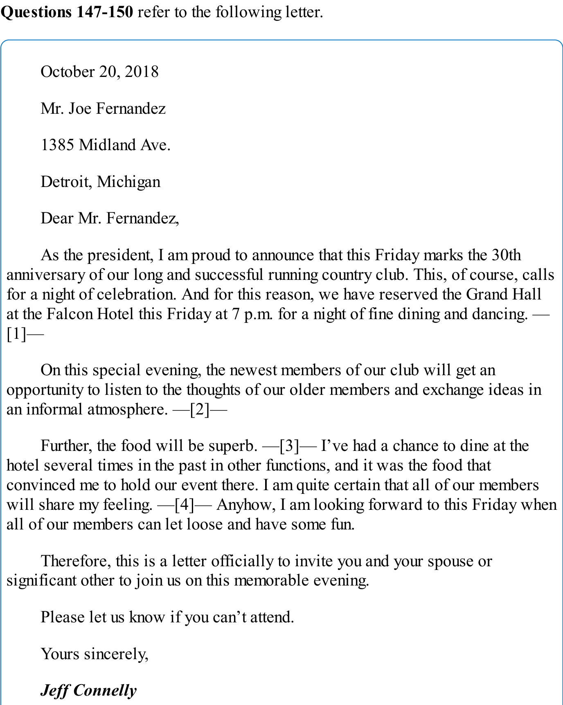
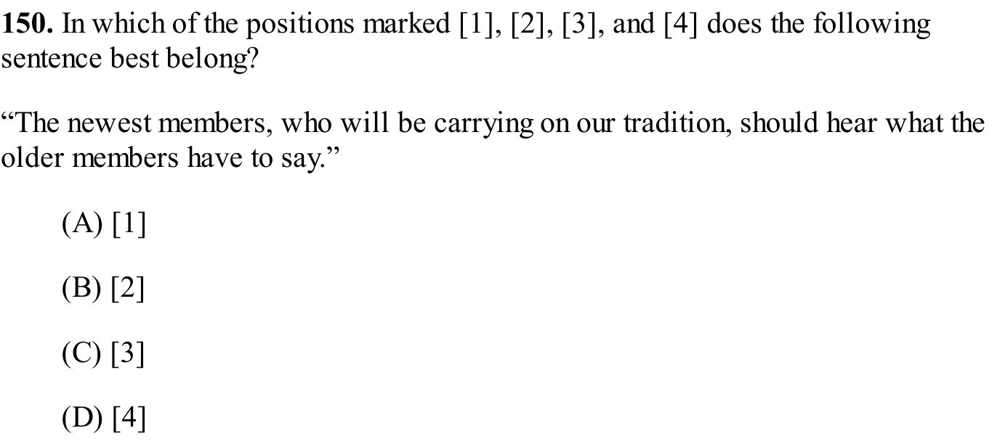
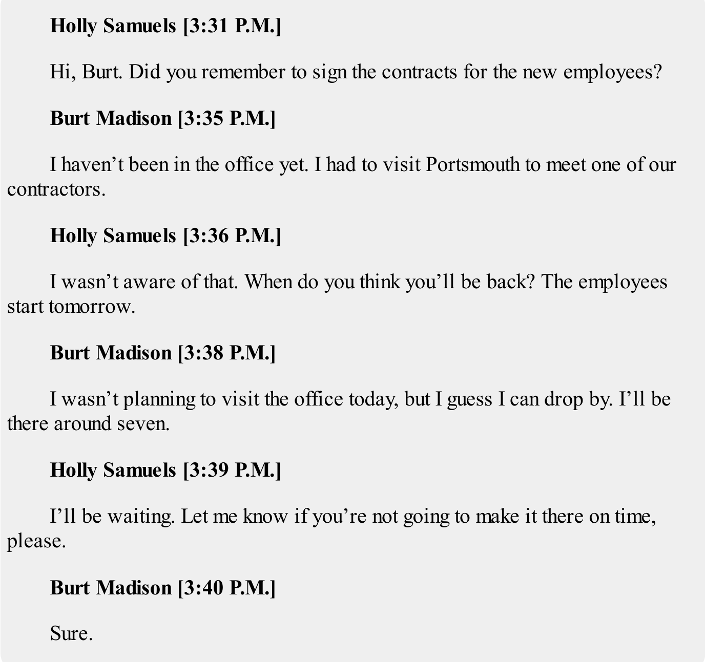
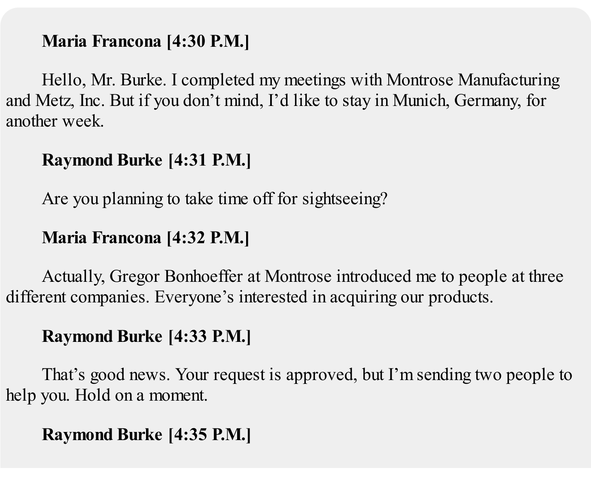
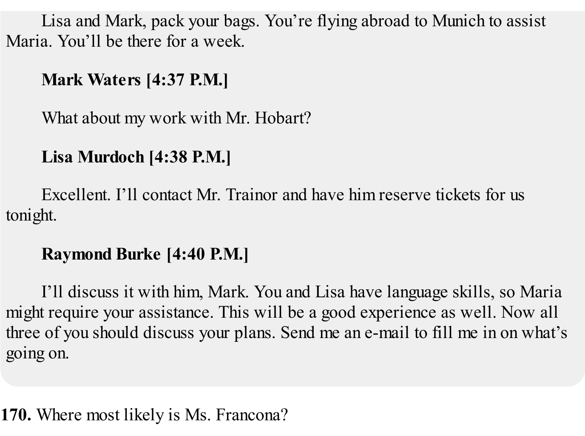
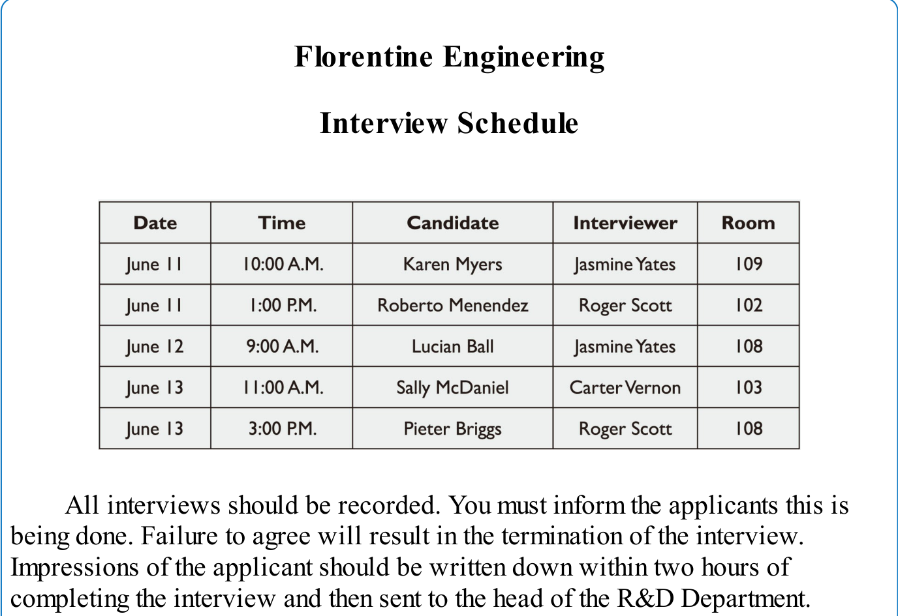
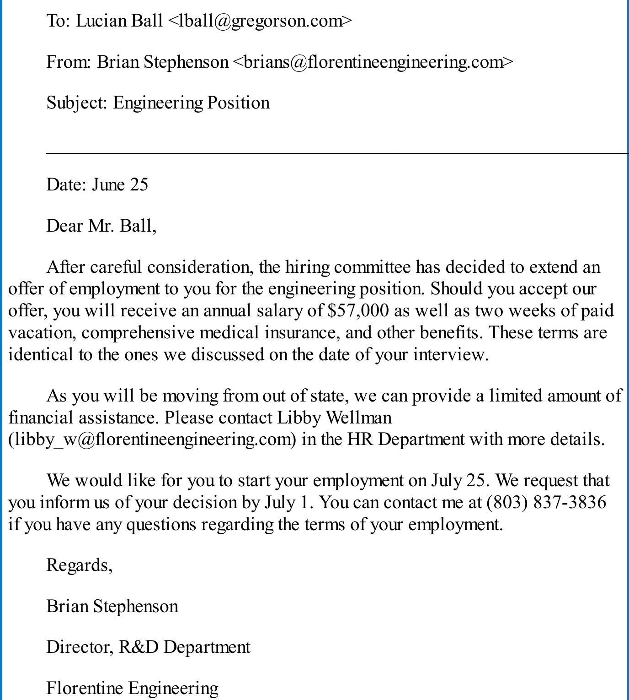
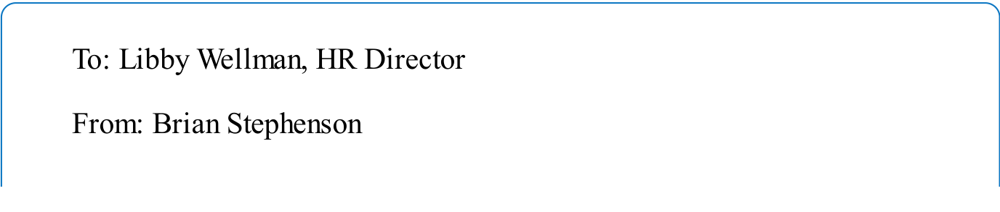
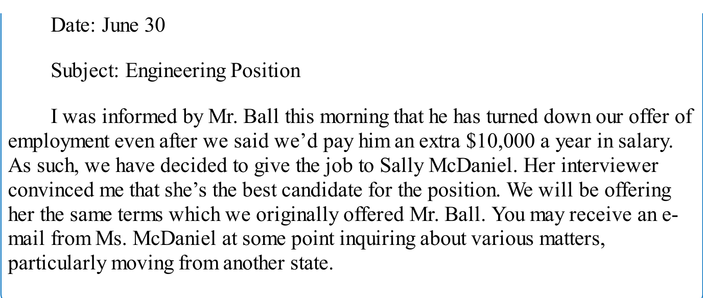

# TOEIC 阅读真题场景与核心题型专题总结

> [!NOTE]
> 本文档基于《【2019版新东方】阅读全真模拟1000题》的真题语料，对托业阅读第五部分（Part 5）、第六部分（Part 6）和第七部分（Part 7）的高频考点及核心题型进行深度剖析，结合原版试题配图，提炼实用的备考动作与解题逻辑。

---

## 目录
- [专题 1：Part 5 & 6 —— 词形家族与句子结构判断 (Word Families & Sentence Structures)](#专题-1part-5--6--词形家族与句子结构判断-word-families--sentence-structures)
- [专题 2：Part 6 —— 语境插入与逻辑词衔接 (Text Completion & Logical Transitions)](#专题-2part-6--语境插入与逻辑词衔接-text-completion--logical-transitions)
- [专题 3：Part 7 —— 单篇文档与句子插入题 (Single Passage & Sentence Insertion)](#专题-3part-7--单篇文档与句子插入题-single-passage--sentence-insertion)
- [专题 4：Part 7 —— 在线聊天与多人讨论 (Online Chat & Text Message Chain)](#专题-4part-7--在线聊天与多人讨论-online-chat--text-message-chain)
- [专题 5：Part 7 —— 多文档交叉推理 (Double & Triple Passages)](#专题-5part-7--多文档交叉推理-double--triple-passages)

---

## 专题 1：Part 5 & 6 —— 词形家族与句子结构判断 (Word Families & Sentence Structures)

### 核心考点与答题动作
托业阅读 Part 5（30 题）和 Part 6 中的词形题（同根词的不同词性变化）占比极高。这类题**不需要花时间翻译整句**，核心解题动作是**判断空格在句子中的语法位置**，即空格前后的词性关系。
*   **动作一：锁定空格前后锚点**
    *   `冠词/形容词 + ______ + 名词` -> 空格必填**名词**。
    *   `情态动词/助动词 + ______ + 实义动词` -> 空格必填**副词**。
    *   `主语 + 动词 + 宾语 + ______` -> 修饰整个动作或句子的多为**副词**。
    *   `be 动词 + ______` -> 填**形容词**（表状态）、**现在分词**（表主动/进行）、**过去分词**（表被动/完成）。
*   **动作二：区分从句连接词与介词**
    *   若空格后是**完整句子 (有主谓动词)** -> 填**连词** (如 `If`, `Although`, `Because`)。
    *   若空格后是**名词/名词短语/代词** -> 填**介词** (如 `Despite`, `For`, `In spite of`)。

### 典型真题案例

#### 案例 1-1：Test 1 Q101 —— 状语从句引导词式提问
*   **原题重现**：
    `_______ you want to receive additional information regarding the services we offer, please log onto our website today.`
    (A) If &nbsp;&nbsp;&nbsp;&nbsp; (B) For &nbsp;&nbsp;&nbsp;&nbsp; (C) Despite &nbsp;&nbsp;&nbsp;&nbsp; (D) Whether
*   **解析与逻辑链**：
    > [!IMPORTANT]
    > 1. **结构分析**：空格后 `you want to receive...` 是一个拥有完整主谓宾的从句，主句是祈使句 `please log onto...`。因此空格处必须填入**从属连词**来引导条件状语从句。
    > 2. **词性排除**：(B) `For`（做连词时表示“因为”，极少用于句首引导状语从句；多作介词）和 (C) `Despite`（介词，后面只能接名词短语）直接排除。
    > 3. **语义选择**：(D) `Whether` 引导让步状语从句时常与 `or not` 连用，表示“无论是否…”，与主句的祈使句指令逻辑不通顺。(A) `If` 引导条件状语从句，“如果您想获取更多服务信息，请登录网站”，语意逻辑完全顺畅。
    > 4. **正确答案**：**(A)**

#### 案例 1-2：Test 1 Q106 —— 词形家族词性判断
*   **原题重现**：
    `A recent survey conducted by the research department will _______ the viability of releasing the new product.`
    (A) determine &nbsp;&nbsp;&nbsp;&nbsp; (B) determines &nbsp;&nbsp;&nbsp;&nbsp; (C) determining &nbsp;&nbsp;&nbsp;&nbsp; (D) determination
*   **解析与逻辑链**：
    > [!IMPORTANT]
    > 1. **结构分析**：空格前是情态动词 `will`，空格后是名词短语宾语 `the viability...`。
    > 2. **词性判断**：情态动词 `will` 后面必须接**动词原形**。
    > 3. **选项辨析**：
    >    * (A) `determine`（动词原形）
    >    * (B) `determines`（动词单三形式）
    >    * (C) `determining`（动词现在分词/动名词）
    >    * (D) `determination`（名词，决定/测定）
    > 4. **正确答案**：**(A)**

#### 案例 1-3：Test 1 Q110 —— 名词复数语境与词性选择
*   **原题重现**：
    `The contract _______ that took place last week between the executives was highly successful.`
    (A) negotiate &nbsp;&nbsp;&nbsp;&nbsp; (B) negotiations &nbsp;&nbsp;&nbsp;&nbsp; (C) negotiable &nbsp;&nbsp;&nbsp;&nbsp; (D) negotiator
*   **解析与逻辑链**：
    > [!IMPORTANT]
    > 1. **结构分析**：句子主干为 `The contract _______ was highly successful.`。其中 `that took place last week between the executives` 是限定性定语从句，修饰空格处的名词。空格处于主语位置，前面有定冠词 `The` 和修饰语 `contract`，空格处必须填入名词，与 `contract` 构成复合名词。
    > 2. **选项排除**：(A) `negotiate` 是动词，(C) `negotiable` 是形容词，直接排除。
    > 3. **名词辨析**：(B) `negotiations`（名词复数，谈判）与 (D) `negotiator`（名词单数，谈判人员/协调人）。从后方的定语从句 `between the executives`（高管之间的…）以及复合名词搭配来看，主语是指“合同谈判”这一事件，而非具体的人，且谓语动词对应的从句是 `took place`（发生，通常主语是事件而非人）。因此选择事件名词复数。
    > 4. **正确答案**：**(B)**

---

## 专题 2：Part 6 —— 语境插入与逻辑词衔接 (Text Completion & Logical Transitions)

### 核心考点与答题动作
托业阅读 Part 6（16 题）融合了 Part 5 的词汇语法和 Part 7 的上下文理解。它包含两种极具区分度的题型：**逻辑连接词选择**和**整句插入题**。
*   **动作一：关注前后两句的逻辑关系**
    *   **因果关系**：`Therefore` (因此), `Consequently` (结果是), `As a result`
    *   **转折/让步关系**：`However` (然而), `Nevertheless` (尽管如此), `On the other hand`
    *   **递进/补充关系**：`Furthermore` (此外), `In addition`, `Moreover`, `Further`
*   **动作二：句子插入寻找“代词与同义词”线索**
    *   插入的句子如果含有 `This`, `They`, `These` 等指示代词，前句必须有对应的名词指代。
    *   插入的句子如果谈论某个新话题（如“价格”或“时间”），通常会跟前后句的关键词（如“rate”, “schedule”, “delay”）形成语义上的呼应。

### 典型真题案例：Test 1 Q135-138 —— 段落衔接与句子插入
*   **文章片段展示**：
    `Dear Tenant, ... Please note that the parking lot will undergo resurfacing starting next Monday. -------, no vehicles will be allowed to park in the designated zones for three days. ...`
    (Q135 选项：(A) However / (B) Therefore / (C) Otherwise / (D) Meanwhile)
    `... —[3]— ... We apologize for the inconvenience this may cause. -------.`
    (Q138 选项：(A) Thank you for your cooperation. / (B) The rent must be paid on time. / (C) The spaces are limited. / (D) Please contact the landlord immediately.)
*   **解析与逻辑链**：
    > [!IMPORTANT]
    > 1. **Q135 逻辑衔接**：前句提到“停车场将于下周一开始重新铺设路面”，后句提到“连续三天内任何车辆均不得在指定区域停放”。后句是前句施工所导致的必然**结果**。因此空格处需填入表示因果关系的副词，(B) `Therefore` 最符合语境。
    > 2. **Q138 句子插入**：段落末尾前句为“对于可能造成的不便，我们深表歉意”。作为通告性质的信件，在表达歉意后，最自然、礼貌的收尾句子是感谢对方的配合。
    >    * (A) `Thank you for your cooperation.`（感谢配合）在语意和职场沟通语境上完美契合。
    >    * (B) `The rent...`（租金必须按时交）和 (C) `The spaces...`（车位有限）在此处完全属于无关干扰信息。
    > 3. **正确答案**：Q135 选 **(B)**，Q138 选 **(A)**。

---

## 专题 3：Part 7 —— 单篇文档与句子插入题 (Single Passage & Sentence Insertion)

### 核心考点与答题动作
单篇文档中，**句子插入题**（In which of the positions marked [1], [2], [3], and [4] does the following sentence best belong?）是公认的难点。
*   **动作一：剖析待插入句子的内部线索**
    *   寻找**代词与定冠词**：如 `this tradition`（定有前文提到传统）、`the older members`（前文应提及新老成员）。
    *   寻找**逻辑过渡词**：如 `However`, `Instead`, `Also`。
*   **动作二：回填排除法**
    *   将待插入句分别填入四个空档，重点读**前一句 + 待插入句 + 后一句**，检查是否有指代中断或逻辑跳跃。

### 经典案例：Test 1 Q147-150 —— 周年庆邀请函与插句
#### 1. 题干与原版文档
*   **Q150 (句子插入)**: In which of the positions marked [1], [2], [3], and [4] does the following sentence best belong?
    `“The newest members, who will be carrying on our tradition, should hear what the older members have to say.”`

#### 2. 双语段落对照与插句分析
| 位置上下文 | 英文段落原文 | 中文翻译 | 逻辑链剖析 |
| :--- | :--- | :--- | :--- |
| **前文背景** | As the president, I am proud to announce that this Friday marks the 30th anniversary of our long and successful running country club... | 作为会长，我很自豪地宣布，本周五将是我们乡村俱乐部长期成功运营的30周年纪念日... | 交代俱乐部30周年庆典背景 |
| **位置 [2] 前句** | On this special evening, the **newest members** of our club will get an opportunity to listen to the **thoughts of our older members** and exchange ideas in an informal atmosphere. —[2]— | 在这个特殊的夜晚，我们俱乐部的**最新成员**将有机会聆听**老成员的想法**并在轻松的气氛中交流意见。 | 明确提出了“最新成员 (newest members)”与“老成员的想法 (thoughts of our older members)”这两个核心概念。 |
| **待插入句** | **“The newest members, who will be carrying on our tradition, should hear what the older members have to say.”** | **“承载我们传统的新成员，应该听听老成员的心声。”** | 句子完全是对前句中“新老成员交流”这一逻辑的进一步**细化与递进说明**（解释为什么要让新成员听老成员说）。 |
| **位置 [2] 后句** | Further, the food will be superb. —[3]— | 此外，食物也将是非常棒的。 | 转换话题到“食物”。如果把待插入句放到 [3]，就会强行切断食物话题，逻辑断层。 |

#### 3. 图表解题路径剖析 (Q150)
> [!IMPORTANT]
> **句子插入逻辑链：**
> 1. 仔细观察待插入句：`“The newest members, who will be carrying on our tradition, should hear what the older members have to say.”`
> 2. 这里的核心信息是：**最新成员**、**承接传统**、**听老成员的心声**。
> 3. 扫描文章中 [1], [2], [3], [4] 周边的句子：
>    * [1] 之前只提及了 30 周年庆典和邀请；
>    * [2] 之前提到：`the newest members of our club will get an opportunity to listen to the thoughts of our older members...`。这与待插入句中的 `newest members` 和 `hear what the older members have to say` 构成语义上的**同义重复与补充说明**；
>    * [3] 和 [4] 后面已经开始讨论 `the food` (食物) 和 `invite you and your spouse` (邀请配偶)，话题已发生偏移。
> 4. 因此，该句最佳的插入位置是 **[2]**，选择 **(B)**。

---

## 专题 4：Part 7 —— 在线聊天与多人讨论 (Online Chat & Text Message Chain)

### 核心考点与答题动作
多人聊天记录题是托业新题型。其特点是**语言高度口语化**，并且带有**精确到分钟的时间戳**。
*   **动作一：关注“话锋转折”与“代词指代”**
    *   口语化表达如 `drop by` (顺道拜访), `make it` (赶上/办成), `go ahead` (做吧/进行) 的隐含意思。
    *   意图推断题（What does ... mean when writing "..."）必须往**前**看 1-2 轮对话，找出说话者回复的到底是什么具体问题或情境。
*   **动作二：列出时间人物逻辑线**
    *   理清谁在什么时间发了什么信息，谁做出了承诺，谁需要协助。

### 经典案例 4-1：Test 1 Q151-152 —— Burt 与 Holly 的短消息指代
#### 1. 题干与原版文档
*   **Q151**: At 3:35 P.M., what does Mr. Madison imply when he writes, “I haven’t been in the office yet”?
*   **Q152**: What will Mr. Madison do in the evening?

#### 2. 双语录音原文对照
| 时间 & 发件人 | 英文原文 | 中文翻译 | 考点锚点 & 解析 |
| :--- | :--- | :--- | :--- |
| **3:31 P.M. Holly** | Hi, Burt. Did you remember to **sign the contracts for the new employees**? | 嗨，伯特。你还记得给新员工**签合同**吗？ | 引入核心任务：签新员工合同。 |
| **3:35 P.M. Burt** | **I haven’t been in the office yet.** I had to visit Portsmouth to meet one of our contractors. | **我还没去办公室呢。**我得去朴茨茅斯见一位我们的承包商。 | **Q151 答案锚点**：Holly 问合同签了没有，Burt 回复“我还没进办公室”。合同在办公室，暗示他**还没签合同**。 |
| **3:36 P.M. Holly** | I wasn’t aware of that. When do you think you’ll be back? **The employees start tomorrow.** | 我不了解这件事。你觉得你什么时候能回来？**新员工明天就入职了。** | 强调任务紧急性：必须今天签完。 |
| **3:38 P.M. Burt** | I wasn’t planning to visit the office today, but I guess I can drop by. **I’ll be there around seven.** | 我今天本来没打算去办公室的，不过我想我可以顺便过去一趟。**我大概七点到那里。** | **Q152 答案锚点**：男士表示晚上 7 点左右会去办公室办这件事。 |
| **3:39 P.M. Holly** | I’ll be waiting. Let me know if you’re not going to make it there on time, please. | 我会等着你。如果不能按时到，请告诉我。 | 确认配合 |
| **3:40 P.M. Burt** | Sure. | 好的。 | 确认 |

#### 3. 意图题深度剖析 (Q151)
> [!IMPORTANT]
> **隐含意图解析：**
> 1. 意图题公式：**读前句，找关联。**
> 2. Holly 在 3:31 P.M. 问：“你签新员工的合同了吗？”
> 3. Burt 在 3:35 P.M. 回复：“我还没去办公室。”
> 4. 在办公场景的常识中，正式的纸质合同存放在公司办公室，不在办公室意味着无法签署。
> 5. 因此，Burt 的话隐含意思是他“尚未签署任何合同 (He has not signed any contracts)”。答案选 **(D)**。

---

### 经典案例 4-2：Test 1 Q170-173 —— 多人慕尼黑出差协调会话
#### 1. 题干与原版文档
*   **Q171**: At 4:32 P.M., why does Ms. Francona write, “Everyone’s interested in acquiring our products”?

#### 2. 双语录音原文对照
| 时间 & 发件人 | 英文原文 | 中文翻译 | 考点锚点 & 解析 |
| :--- | :--- | :--- | :--- |
| **4:30 P.M. Maria** | Hello, Mr. Burke. I completed my meetings with Montrose Manufacturing and Metz, Inc. But if you don't mind, **I'd like to stay in Munich, Germany, for another week.** | 你好，布克先生。我已经完成了与蒙特罗斯制造公司和梅斯公司的会议。但如果您不介意的话，**我想在德国慕尼黑再多待一个星期。** | Maria 提出延长出差时间的要求。 |
| **4:31 P.M. Raymond** | Are you planning to take time off for sightseeing? | 你打算抽空去观光吗？ | Raymond 对延长时间的合理性提出疑问。 |
| **4:32 P.M. Maria** | Actually, Gregor Bonhoeffer at Montrose introduced me to people at three different companies. **Everyone’s interested in acquiring our products.** | 实际上，蒙特罗斯的格雷戈尔·博恩霍夫向我介绍了三家不同公司的人。**大家都对采购我们的产品很感兴趣。** | **Q171 答案锚点 (C)**：解释为什么要留在慕尼黑（因为有潜在的新客户，而不是去观光）。 |
| **4:33 P.M. Raymond** | That's good news. **Your request is approved**, but I'm sending two people to help you. Hold on a moment. | 这是个好消息。**你的请求被批准了**，但我会派两个人去帮你。请稍等。 | 批准申请并决定派助手。 |
| **4:35 P.M. Raymond** | Lisa and Mark, pack your bags. You’re flying abroad to Munich to assist Maria. You’ll be there for a week. | 莉萨、马克，收拾行囊。你们飞往慕尼黑协助玛丽亚。你们要在那里待一个星期。 | Raymond 艾特另外两个员工。 |
| **4:37 P.M. Mark** | What about my work with Mr. Hobart? | 那我手头和霍巴特先生的工作怎么办？ | Mark 的顾虑 |
| **4:38 P.M. Lisa** | Excellent. I’ll contact Mr. Trainor and have him reserve tickets for us tonight. | 太好了。我今晚联系特雷纳先生让他帮我们预订机票。 | Lisa 确认行动 |
| **4:40 P.M. Raymond** | I’ll discuss it with him, Mark. **You and Lisa have language skills**, so Maria might require your assistance... Now all three of you should discuss your plans. **Send me an e-mail to fill me in...** | 马克，我会和霍巴特谈的。**你和莉萨有语言优势**，玛丽亚可能需要你们的协助... 现在你们三个人商量一下计划。**给我发封邮件汇报下最新进展...** | **Q172 答案锚点 (A)**：暗示 Mark 和 Lisa 会说德语 (`able to speak German`)。 **Q173 答案锚点 (B)**：Raymond 要求他们汇报出差计划进展 (`An update on some plans`)。 |

---

## 专题 5：Part 7 —— 多文档交叉推理 (Double & Triple Passages)

### 核心考点与答题动作
双篇和三篇文档（共 5 组，25 题）是托业阅读的终极高地。**几乎所有高分段题目都要求“跨文档交叉寻找线索”**。
*   **黄金法则：绝对没有一道题是只看一个文档就能得出交叉结论的。**
*   **解题三步法**：
    1.  **分清文档关系**：通常三篇文档是 `表格 (Schedule/List) + 封信/邮件 (Request/Offer) + 备忘录/回复 (Result/Feedback)`。
    2.  **锁定文档一的锚点**：如在“邮件”中找到人名、时间或型号；
    3.  **横向拉网对接**：带着这个人名或时间去“表格”或“备忘录”中寻找与之交织的重叠信息，通过桥梁逻辑得出答案。

### 经典案例：Test 1 Q186-190 —— 面试表、录用信与HR备忘录三篇关联
#### 1. 题干与原版文档
*   **Q186**: What is indicated about Mr. Menendez?
*   **Q187**: What is NOT true about the offer of employment extended to Mr. Ball?
*   **Q188**: What is suggested about Mr. Stephenson?
*   **Q189**: Who most likely recommended that Ms. McDaniel be offered a job?
*   **Q190**: In the memo, the word “terms” in line 4 is closest in meaning to...

#### 2. 多文档深度交叉推理路径剖析

> [!IMPORTANT]
> **Q186 交叉定位分析：梅内德斯先生的面试时间**
> *   **线索来源**：文档一（面试安排表）
> *   **逻辑推断**：我们观察文档一，可以找到 `Mr. Menendez`。他的面试时间明确标注为 `June 11, 1:00 P.M.`。
> *   **选项对应**：1:00 P.M. 属于下午。因此，(D) `He interviewed in the afternoon`（他在下午接受了面试）是正确选项。

> [!IMPORTANT]
> **Q187 细节排除分析：Ball 的录用条件核对**
> *   **线索来源**：文档二（Stephenson 发给 Ball 的录用邮件）
> *   **逻辑推断**：
>     * 邮件提到 `Should you accept... you will receive an annual salary of $57,000 as well as two weeks of paid vacation [对应D项], comprehensive medical insurance, and other benefits [对应B项].`
>     * 邮件提到 `We would like for you to start your employment on July 25. [对应C项]`
>     * 邮件提到 `As you will be moving from out of state, we can provide a limited amount of financial assistance. [对应A项]` —— 这里写的是“有限的经济协助 (limited amount)”，而非“完全支付他的搬家费用 (completely paid)”。
> *   **选项对应**：(A) 是错误的陈述，因此选 **(A)**。

> [!IMPORTANT]
> **Q188 跨文档烧脑推理：Stephenson 接收的面试评估时间**
> *   **线索来源**：文档一（面试表备注） + 文档二/三（Stephenson 的职位）
> *   **逻辑推断**：
>     * 根据文档二/三，Brian Stephenson 是研发部总监 (Director, R&D Department)。
>     * 根据文档一底部的备注：`Impressions of the applicant should be written down within two hours of completing the interview and then sent to the head of the R&D Department [即 Stephenson 先生].`（面试评估必须在面试结束后两小时内写好并发送给研发部总监）。
>     * 观察文档一的日程：`Karen Myers` 的面试时间是 `June 11` 上午。
>     * 结合上述两条信息：Karen Myers 在 6 月 11 日面试完，面试官必须在当天（面试完 2 小时内）将对她的书面印象（即 `notes/impressions`）发送给研发部总监（Stephenson）。
>     * 因此，Stephenson 必然是在 `June 11` 收到关于 Karen Myers 的评估信息的。
> *   **选项对应**：**(B)** `He received notes about Karen Myers on June 11.`

> [!IMPORTANT]
> **Q189 跨文档人员匹配：谁推荐了 McDaniel**
> *   **线索来源**：文档一（面试表） + 文档三（给 HR Libby 的备忘录）
> *   **逻辑推断**：
>     * 文档三中 Stephenson 写道：`As such, we have decided to give the job to Sally McDaniel. Her interviewer convinced me that she's the best candidate for the position.`（我们决定把职位给 Sally McDaniel。她的面试官说服了我，她是最佳候选人）。
>     * 我们需要找出“谁是她的面试官 (Her interviewer)”。
>     * 回到文档一（面试表），找到 `Sally McDaniel` 对应的面试官一列。日程表上清晰地记录着 Sally McDaniel 的面试官是 **Carter Vernon**。
>     * 由此完成推理链：Carter Vernon 面试了 Sally -> Carter Vernon 向研发部总监 Stephenson 强烈推荐了她 -> 最终公司录用了她。
> *   **选项对应**：**(C)** `Carter Vernon`

---

## 总结：托业阅读高效答题 Checklist

1.  **Part 5/6 不必通篇翻译**：先看选项。如果是词形题，直接判断空格左右的语法位置决定词性，3-5秒内解决一题。
2.  **Part 7 句子插入先看线索**：注意待插入句中的 `this/that/these`、`however/therefore` 以及定冠词，定位前句必须包含所指代的主体。
3.  **多人聊天注意“气泡呼应”**：意图推断题的答案永远在所问话语的“前 1 到 2 句气泡”中。
4.  **多文档联动坚决不“单看一篇”**：多篇阅读的后两题几乎 100% 需要你将文档 A 中的某项数据（如时间、人名、项目）横向比对文档 B 中的表格或规定，完成交叉定位再作答。
