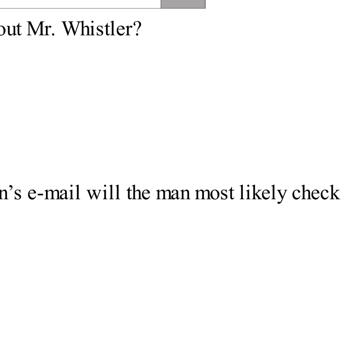
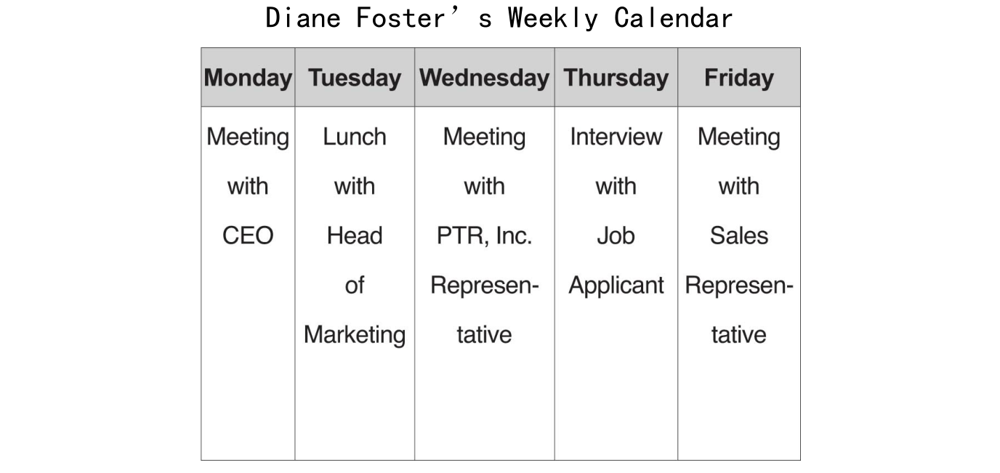
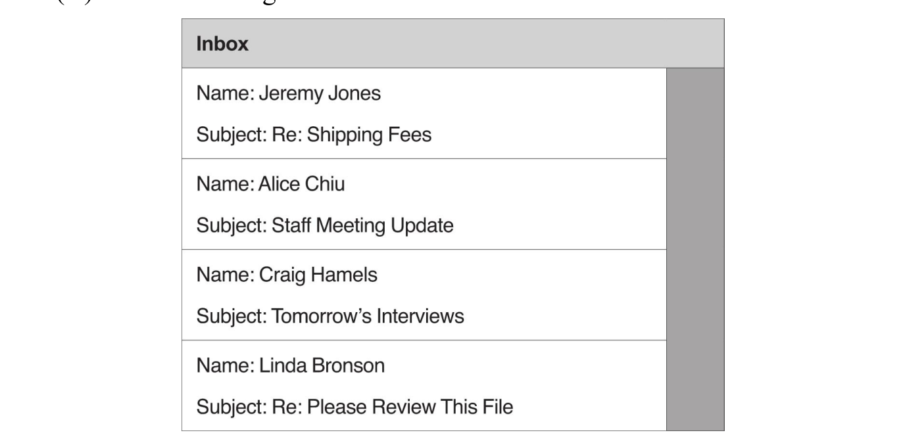
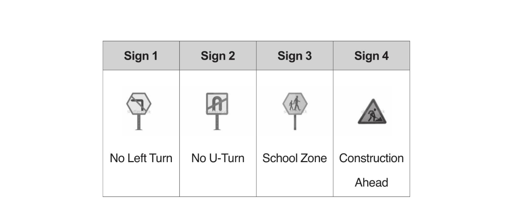
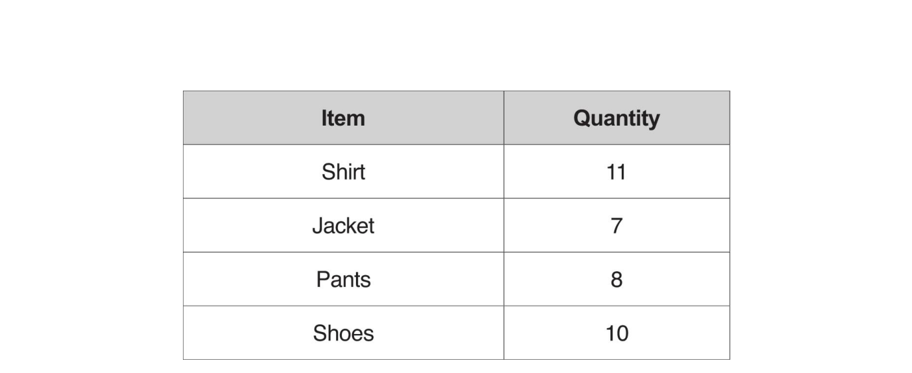
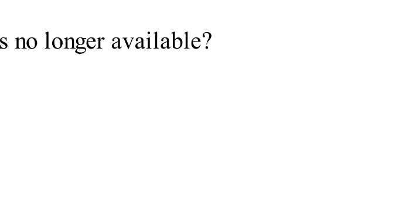
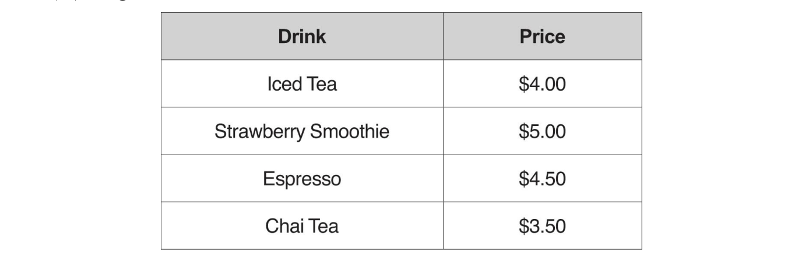
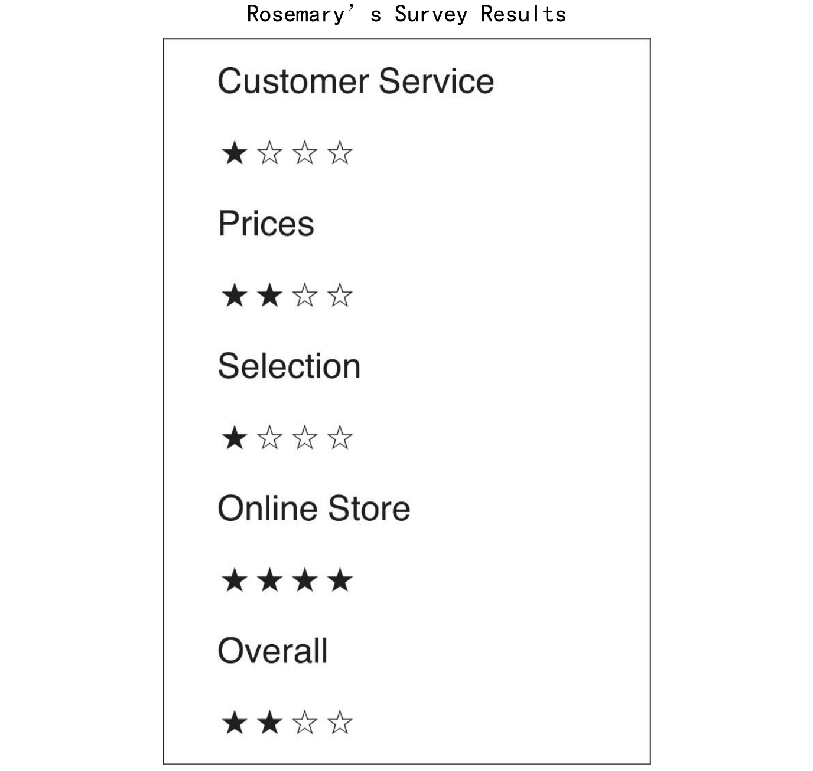
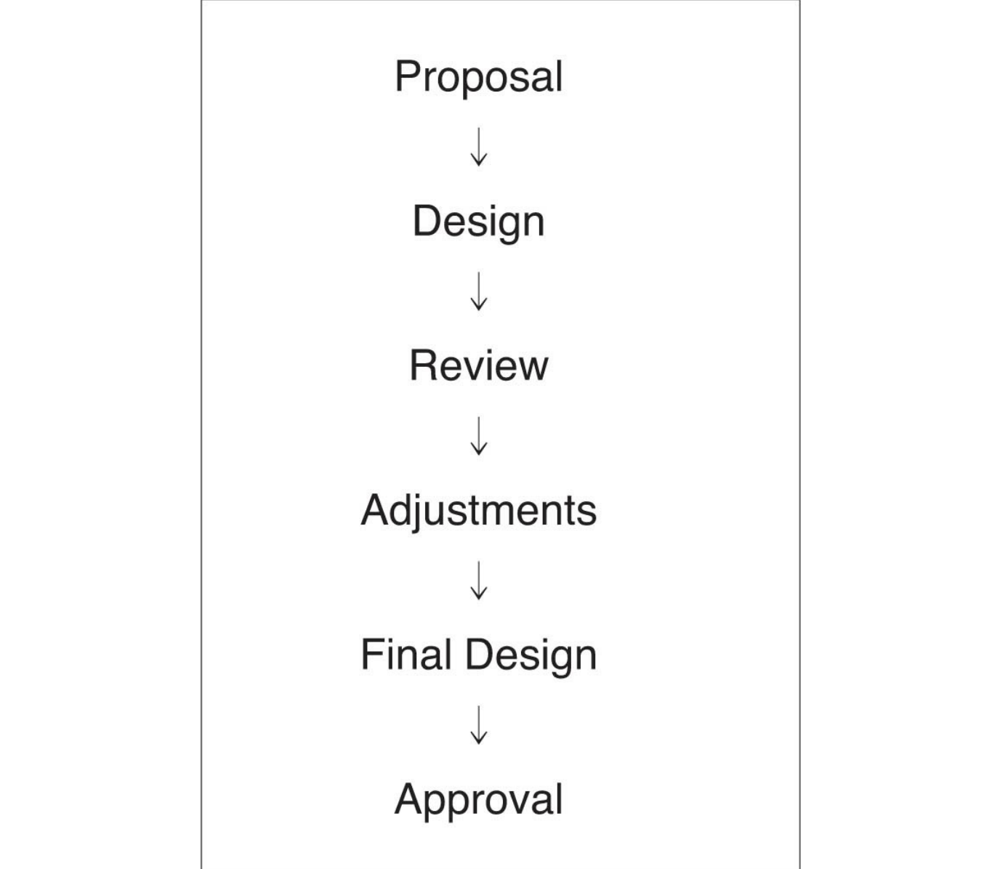
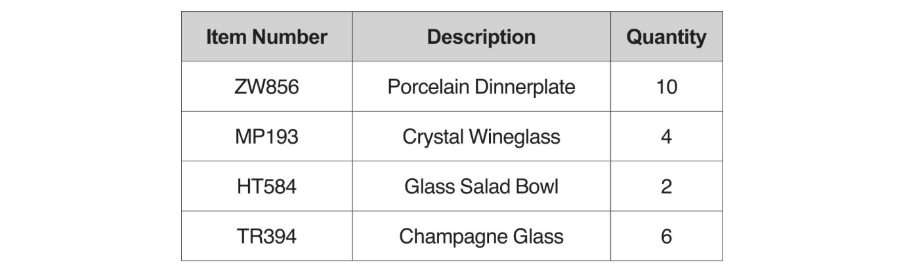

# TOEIC 听力与阅读真题总结（重写版，基于目录四本书）

## 0. 说明：这版和上一版的区别

这份是按你要求“基于真题本体”重写，不再做泛泛方法论。

我实际做了三步：

1. 把目录内 3 份可提取 PDF（`听力全真模拟1000题`、`阅读全真模拟1000题`、`托业新题型试题集（可复制版本）`）全文抽取。
2. 只保留正式套题区，剔除目录页、示例页、答案干扰行。
3. 对题干做结构统计，并保留题号级样例（可回查）。

> 注：个别 OCR 行有截断（例如少量题干末尾缺词），但不影响整体分布结论。

---

## 1. 样本与统计口径

## 1.1 听力样本

来源：`听力全真模拟1000题.pdf`

- 抽取正式 `10` 套中的 `Part 3 + Part 4` 题干
- 有效题干：`690` 条（每套 69 题，10 套）

## 1.2 阅读样本

来源：`【2019版新东方】阅读全真模拟1000题.pdf`

- Part 5：`300` 题（10 套 × 30）
- Part 7 文档组：`190` 组（每套 19 组）
- Part 7 题干：`539` 条（理论 540，OCR 缺 1 条）

## 1.3 新题型交叉样本

来源：`托业新题型试题集（可复制版本）.pdf`

- 听力 `Part 3+4`：3 套，共 `207` 题干
- 用于验证图表题、意图题、新文档类型趋势

---

## 2. 听力真题总结（重点：Part 3/4）

> 说明：Part 1/2 的正式题干在试题册中不完整印刷（这是 TOEIC 本身题型特征），因此可量化统计主要落在 Part 3/4。  

> 但从书中策略页与样例题可确认：Part 2 仍然以 WH 问句、Yes/No 问句、陈述句式提问为核心；Part 1 仍以动作/位置/状态干扰为主。

## 2.1 题干问法分布（690 题）

- `What...`：`345`
- `Why...`：`72`
- `Who...`：`64`
- `When...`：`40`
- `How...`：`38`
- `Where...`：`35`
- `Look at the graphic...`：`50`
- `According to...`：`28`
- `Which...`：`12`

结论：

1. `What` 类是绝对主轴（约 50%），但其中大量不是纯细节，而是“动作/下一步/意图”。
2. 图表题在 10 套里共 `50` 题，约每套 `5` 题，不能靠临场蒙。

## 2.2 Part 3 与 Part 4 的差异

### Part 3（390题）

- What 209 / Why 52 / Where 24 / Who 18 / When 19 / How 19 / Graphic 30

### Part 4（300题）

- What 136 / Why 20 / Where 11 / Who 46 / When 21 / How 19 / Graphic 20

结论：

- Part 3 更偏“对话推进与原因判断”（Why 更高）。
- Part 4 更偏“说话者身份/受众对象”（Who 更高）。

## 2.3 推断型题干关键词（高频）

- `most likely`：`78`
- `ask`：`25`
- `suggest`：`24`
- `imply`：`21`
- `next`：`20`
- `request`：`14`
- `purpose`：`14`
- `mean when`：`14`
- `offer`：`8`

这说明：真题不是只考“听到了什么”，而是大量考“这句话在干什么”。

## 2.4 代表性真题题干（可回查）

### `imply` 类

- Test1 Q37: `What does the man imply when he says, “You can try, but I wouldn’t if I...”`
- Test4 Q37: `What does the man imply when he says, “You’ve got to be kidding me”?`
- Test6 Q52: `What does the woman imply when she says, “These laptops cost an arm...”`

### `mean when` 类

- Test2 Q40: `What does the man mean when he says, “That shouldn’t be a big...”`
- Test5 Q55: `What does the man mean when he says, “because it’s not as bad as you...”`
- Test8 Q36: `What does the woman mean when she says, “That didn’t work”?`

### 图表类 `Look at the graphic`

- Test1 Q63: `Look at the graphic. Which vehicle will the man most likely reserve?`
- Test1 Q96: `Look at the graphic. What is the price of the newest item on the menu?`
- Test2 Q62: `Look at the graphic. Which step in the schedule was just completed?`

### 下一步动作类

- Test1 Q70: `What will the man most likely do next?`
- 多套题反复出现 `what ... most likely do next`

## 2.5 听力实战结论（从题干反推做题动作）

1. 听到转折后（but/however/actually）立刻标记，因为它常决定 `imply/suggest`。
2. 图表题先找“字段锚点”（时间、价格、编号、人名），再听动作词。
3. 遇到 `most likely`，先排掉“字面重复但逻辑越界”的选项。
4. `What` 类先判是：事实回忆 / 说话意图 / 下一步动作，再选。

## 2.6 听力常规会话场景与图表专题精讲 (Look at the graphic)

## 专题介绍：图表题的核心解题法（看图与盲听的双向联动）

在托业听力中，图表题（每套题 5 题，Part 3 占 3 题，Part 4 占 2 题）绝非单纯考查“听到了哪个词就选哪个”。恰恰相反，**图表题设计了“信息不一致（非直接对应）”的陷阱**。
*   **黄金法则：** 听到什么，千万不要直接选图表中对应的那个词。正确选项通常需要你将听到的**关键条件/数值/变化**与图表中的**另一列/另一行**进行交叉匹配。
*   **解题三步法：**
    1.  **抢先读图（锚点锁定）**：在听力播放前，利用 10-15 秒时间快速看图，锁定**横纵表头、项目分类、数值单位**。
    2.  **听取“交叉信息”**：当听到音频提及图表中的某一项时（例如提到“7个人”或“TR394”），立刻在图中找到该项，并顺着行/列找到它所对应的**关联项**（例如对应的“Minivan”或“Champagne glass”）。
    3.  **同义改写确认**：听力中往往伴随同义词替换（如 `postponed` 对应日程调整，`renovated` 对应菜单更新），结合逻辑链得出答案。

---

## 场景 1：办公日常与行政沟通 (Office Routine & Communication)

### 场景特征与常见考点
*   **会话背景**：办公室内部同事或秘书与上级之间的沟通。
*   **核心矛盾**：会议临时改期（postponed / rescheduled）、航班延误影响行程、日程冲突、接待来访人员等。
*   **高频词汇**：`postpone`（推迟）, `reschedule`（改期）, `calendar`（日程表）, `appointment`（预约）, `confirm`（确认）, `evaluation`（绩效评估）, `refreshments`（茶点/饮料）.

### 经典案例 1-1：Test 1 Q65-67 —— 会议推迟与邮箱查看
#### 1. 题干与原版图表
*   **Q65**: What does the woman suggest about Mr. Whistler?
*   **Q66 (图表题)**: Look at the graphic. Which person's e-mail will the man most likely check next?
*   **Q67**: What does the man suggest doing?

#### 2. 双语录音原文对照
| 说话者 | 英文原文 | 中文翻译 | 考点锚点 & 解析 |
| :--- | :--- | :--- | :--- |
| **Man** | Laurie, don't we have a meeting to attend at 3:30 p.m.? | 劳丽，下午 3:30 我们是不是要开会？ | 引入会议时间背景 |
| **Woman** | You didn't read your e-mail yet, Steve? We were all notified that it has been **postponed** until tomorrow because Mr. Whistler's **flight was canceled** this morning. | 你还没看邮件吗，史蒂夫？我们都收到通知，会议已经推迟到明天了，因为惠斯勒先生的航班今天早上被取消了。 | **Q65 答案锚点 (B)**：航班被取消暗示他是“从外地赶来 (coming from out of town)”。 |
| **Man** | Oh, I haven't checked my inbox all day long. | 噢，我整天都没看收件箱。 | 交代男士未看邮箱的事实 |
| **Woman** | You'd better take a look at it then. **That e-mail contains some important information relevant to the meeting.** | 那你最好看一眼。那封邮件包含一些与会议相关的重要信息。 | **Q66 图表匹配锚点**：男士需要查看关于会议变动/通知的邮件。 |
| **Man** | Thanks for letting me know about that. You know, since we have some free time now, we ought to **finish doing the employee evaluations**. | 谢谢你告诉我。既然我们现在有空，我们应该把员工绩效评估做完。 | **Q67 答案锚点 (C)**：男士提议评估员工 (`Evaluating some workers`)。 |
| **Woman** | I agree. I'll collect the files from my office and be back soon. | 我同意。我去办公室拿一下文件，马上回来。 | 达成一致 |

#### 3. 图表解题路径剖析 (Q66)
> [!IMPORTANT]
> **图表逻辑链：**
> 1. 听力中女士提到“会议因 Whistler 先生航班取消而推迟”，并要求男士去查看“这封包含会议重要信息的邮件”。
> 2. 我们观察图表（收件箱列表）：
>    * Jeremy Jones - Invoice (发票)
>    * **Alice Chiu - Meeting Postponement** (会议推迟)
>    * Craig Hamels - Contract (合同)
>    * Linda Bronson - Job Applications (求职申请)
> 3. 发送“会议推迟 (Meeting Postponement)”主题邮件的人是 **Alice Chiu**。
> 4. 因此，男士接下来最有可能查看 **Alice Chiu** 的邮件，选择 **(B)**。

---

### 经典案例 1-2：Test 2 Q65-67 —— 日程调整与接待茶点
#### 1. 题干与原版图表
*   **Q65**: What most likely is the man's job?
*   **Q66 (图表题)**: Look at the graphic. Who is Justin Weathers?
*   **Q67**: What will the man most likely do next?

#### 2. 双语录音原文对照
| 说话者 | 英文原文 | 中文翻译 | 考点锚点 & 解析 |
| :--- | :--- | :--- | :--- |
| **Woman** | Max, I received a telephone call from Justin Weathers this morning. He wants to see me **next Tuesday instead of next Wednesday**. | 马克斯，我今天早上接到贾斯汀·韦瑟斯的电话。他想下周二见我，而不是下周三。 | 交代日程变动需求 |
| **Man** | I'm pretty sure you have some open space in your schedule then. Why don't you request that he **visit at 3 p.m.**? | 我很确定您的日程表那时候有空档。您为什么不建议他下午 3 点过来呢？ | **Q65 答案锚点 (A)**：男士帮女士管理日程并提供日常协助，说明他是秘书 (`Secretary`)。 |
| **Woman** | Okay, I'll send an e-mail to inform him of that. **Would you make the adjustment to my calendar, please?** | 好的，我发封邮件通知他。请帮我调整一下我的日程表好吗？ | 秘书的职责体现 |
| **Man** | Of course. Is there anything else you'd like me to do? | 没问题。还有其他需要我做的事情吗？ | 主动协助 |
| **Woman** | Three people from Accounting are visiting my office in ten minutes. **How about preparing some drinks and snacks for us?** | 10分钟后，会计部的三个人要来我办公室。给我们准备点饮料和点心怎么样？ | **Q67 答案锚点 (C)**：女士要求准备茶点，对应选项中的 `Get some refreshments`（拿些点心/饮料）。 |
| **Man** | **I'll get right on it.** | 我马上去办。 | 男士接下来的动作 |

#### 3. 图表解题路径剖析 (Q66)
> [!IMPORTANT]
> **图表逻辑链：**
> 1. 听力提到，Justin Weathers 想要将会面时间从**下周三 (next Wednesday)** 改到**下周二 (next Tuesday)**。
> 2. 观察图表（Diane Foster 的周日程表）：
>    * 在下周三 (Wednesday) 的下午 3:00，原定的行程是与 **"PTR, Inc."** 的人会面。
>    * 这意味着 Justin Weathers 原本代表的就是 **PTR, Inc.** 这家公司。
> 3. 由此推断，Justin Weathers 是 **PTR, Inc. 的代表 (A representative of PTR, Inc.)**。
> 4. 正确答案选 **(C)**。

---

## 场景 2：差旅与交通出行 (Business Travel & Transit)

### 场景特征与常见考点
*   **会话背景**：商旅预订（酒店/租车/机票）、路途延误沟通、十字路口交通规则变更等。
*   **核心矛盾**：因特殊需求（如人数较多、预算限制）必须更换预订车型；因新增交通指示牌（如禁止掉头）导致绕路迟到。
*   **高频词汇**：`reservation`（预订）, `sedan`（轿车）, `minivan`（面包车/小客车）, `budget`（预算）, `intersection`（十字路口）, `U-turn`（掉头）, `prohibit/permit`（禁止/允许）.

### 经典案例 2-1：Test 1 Q62-64 —— 租车更改与预算匹配
#### 1. 题干与原版图表
*   **Q62**: Why did the man call the woman?
*   **Q63 (图表题)**: Look at the graphic. Which vehicle will the man most likely reserve?
*   **Q64**: What does the woman ask the man about?

#### 2. 双语录音原文对照
| 说话者 | 英文原文 | 中文翻译 | 考点锚点 & 解析 |
| :--- | :--- | :--- | :--- |
| **Woman** | Thank you for calling Wendigo Rental Cars. How may I be of assistance? | 感谢致电温迪戈租车公司。请问有什么我可以帮您？ | 客服标准问候 |
| **Man** | Hello. My name is Maurice Dumond. I made a reservation with the booking code 8570-49AA, **but I'd like to change it**. | 你好。我叫莫里斯·杜蒙德。我用预订码 8570-49AA 做了预约，但我想要更改它。 | **Q62 答案锚点 (A)**：更改预约 (`To change a booking`)。 |
| **Woman** | Of course, Mr. Dumond. You're listed as having reserved a sedan from July 10 to 15. What would you like to alter? | 没问题，杜蒙德先生。记录显示您在 7 月 10 日至 15 日预订了一辆轿车。您想修改什么？ | 确认原预订信息 |
| **Man** | **I need a larger vehicle that can fit seven people, but I'm not permitted to spend more than $65 a day.** | 我需要一辆大一点的车辆，能容纳 7 个人，但我每天的预算不能超过 65 美元。 | **Q63 图表匹配锚点**： 条件一：容纳 7 人 (`fit seven people`)； 条件二：日租金 ≤ $65 (`not more than $65`). |
| **Woman** | Good news. We have one type of vehicle that fits your request. **Will you be picking it up at the airport?** | 好消息。我们正好有一款车符合您的要求。您要在机场取车吗？ | **Q64 答案锚点 (D)**：女士询问男士取车地点 (`Where he will get the vehicle`)。 |
| **Man** | That's correct. My flight's arriving at 10 a.m., so I'll probably get the car around noon. | 没错。我的航班上午 10 点到达，所以我大概中午取车。 | 男士确认取车细节 |

#### 3. 图表解题路径剖析 (Q63)
> [!IMPORTANT]
> **图表数据交叉匹配：**
> 1. 根据男士提出的两个硬性约束条件：
>    * **容纳人数 (Capacity) ≥ 7**
>    * **日租金 (Daily Rate) ≤ $65**
> 2. 查阅租车表：
>    * Sedan (轿车)：载客 5 人，日租金 $45 —— **载客量不足**
>    * SUV (运动型车)：载客 5 人，日租金 $55 —— **载客量不足**
>    * **Minivan (小客车)：载客 7 人，日租金 $65** —— **完全符合条件**
>    * Van (大型面包车)：载客 12 人，日租金 $85 —— **价格超预算**
> 3. 只有 **Minivan** 完美契合，正确答案选 **(C)**。

---

### 经典案例 2-2：Test 2 Q68-70 —— 新路标与绕路迟到
#### 1. 题干与原版图表
*   **Q68**: Who most likely is the man?
*   **Q69 (图表题)**: Look at the graphic. Which sign did the woman see?
*   **Q70**: What does the man tell the woman to do?

#### 2. 双语录音原文对照
| 说话者 | 英文原文 | 中文翻译 | 考点锚点 & 解析 |
| :--- | :--- | :--- | :--- |
| **Man** | Samantha, **you're running a bit late this morning.** | 萨曼莎，你今天早上来得有点晚。 | 指出迟到事实 |
| **Woman** | I had trouble driving here. I normally do a **U-turn** at the intersection of Maple Street and Forest Avenue, **but there was a sign indicating it's not permitted anymore.** | 我开车过来遇到点麻烦。我平时在枫树街和森林大道的交叉口掉头，但今天有个牌子指示这里不准掉头了。 | **Q69 图表匹配锚点**：禁止掉头 (`U-turn not permitted`). |
| **Man** | Oh, yeah, the city put it up because several accidents have happened at that intersection in the past few months. | 噢，是的，因为过去几个月那个路口发生了几起车祸，所以市里设置了这个路标。 | 解释路标设置原因 |
| **Woman** | I wasn't aware of that, so I had to drive straight until I could find a place to turn around, and that was when traffic got bad. | 我没注意到，所以我只能一直往前开，直到找到可以掉头的地方，那时候就开始堵车了。 | 解释迟到过程 |
| **Man** | Well, it's okay to be late today since you didn't know about the sign, **but make sure that it doesn't happen again.** | 嗯，今天迟到没关系，因为你不知道这个路标，但以后要确保不能再发生这种事。 | **Q68 答案锚点 (C)** & **Q70 答案锚点 (A)**： 男士原谅迟到并要求其今后准时，表明身份是上司 (`boss`)，要求是准时上班 (`Arrive on time`). |
| **Woman** | Thanks for understanding. | 谢谢您的理解。 | 沟通结束 |

#### 3. 图表解题路径剖析 (Q69)
> [!IMPORTANT]
> **图表符号匹配：**
> 1. 女士提到不能做 "U-turn" (掉头)，因为路口设置了 "not permitted anymore" (不再允许) 的标志。
> 2. 观察图表中的 4 个交通标志：
>    * Sign 1：禁止左转
>    * **Sign 2：禁止掉头（U形箭头加红色斜杠）**
>    * Sign 3：禁止右转
>    * Sign 4：禁止停车或限速
> 3. 女士看到的显然是 **Sign 2**。
> 4. 正确答案选 **(B)**。

---

## 场景 3：采购、库存与订单管理 (Orders, Purchasing & Inventory)

### 场景特征与常见考点
*   **会话背景**：公司内部采购制服/办公用品，或供货商与零售客户沟通订单短缺。
*   **核心矛盾**：新员工入职需要采购制服，但库存数量不足；订单中的某些产品停产或无存货，需要换货或退款。
*   **高频词汇**：`inventory`（库存）, `out of stock`（无现货）, `uniform`（制服）, `order form`（订单）, `catalog`（目录）, `replacement`（替代品）, `refund`（退款）.

### 经典案例 3-1：Test 1 Q98-100 —— 新员工制服与库存清点
#### 1. 题干与原版图表
*   **Q98**: What did the speaker's company recently do?
*   **Q99 (图表题)**: Look at the graphic. Which item should Blaine order more of?
*   **Q100**: What does the speaker request Blaine to do by Monday?

#### 2. 双语录音原文对照
| 说话者 | 英文原文 | 中文翻译 | 考点锚点 & 解析 |
| :--- | :--- | :--- | :--- |
| **Woman** | Hi, Blaine. This is Samantha. **I just received word that we've hired some new employees**, so we need to prepare uniforms for each of them. | 嗨，布莱恩。我是萨曼莎。我刚刚得到消息，我们招聘了一些新员工，所以我们需要为每个人准备制服。 | **Q98 答案锚点 (C)**：招聘了新员工 (`hired some new workers`)。 |
| **Woman** | As you know, the uniform consists of a shirt, a jacket, a pair of pants, and a pair of shoes. **We've got eight employees who will be starting next week.** | 如你所知，一套制服包含一件衬衫、一件夹克、一条裤子和一双鞋。我们有 8 名员工下周入职。 | **Q99 图表匹配锚点**：总需求量为 8 套（即每样东西都需要 8 件）。 |
| **Woman** | Please check to make sure that we have enough of each item. **If we don't, go ahead and order whatever we need from our regular supplier.** | 请检查并确保我们每种物品都有足够的数量。如果没有，就直接向我们的固定供应商订购所需物资。 | 交代盘点与补货任务 |
| **Woman** | **Then, have the items delivered to me no later than Monday morning.** If you've got any questions, please let me know. | 然后，最迟在周一早上把这些东西交给我。如果有任何问题，请告诉我。 | **Q100 答案锚点 (B)**：周一前交接衣物 (`Deliver some clothing`)。 |

#### 3. 图表解题路径剖析 (Q99)
> [!IMPORTANT]
> **库存缺口计算：**
> 1. 根据录音，下周有 **8 名新员工**入职，每套制服各包含一件。因此**衬衫、夹克、裤子、鞋子**的目标库存必须**全部达到或超过 8 件**。
> 2. 观察图表（当前库存 Uniform Inventory）：
>    * Shirts (衬衫)：10 件 (≥ 8，足够)
>    * **Jackets (夹克)：5 件 (< 8，短缺 3 件)**
>    * Pants (裤子)：9 件 (≥ 8，足够)
>    * Shoes (鞋子)：8 件 (≥ 8，足够)
> 3. 只有 **Jacket** 数量不足（仅有 5 件，缺口 3 件），因此需要加急订购夹克。
> 4. 正确答案选 **(B)**。

---

### 经典案例 3-2：Test 2 Q98-100 —— 邮寄订单与商品缺货
#### 1. 题干与原版图表
*   **Q98**: How did Mr. Stewart place his order?
*   **Q99 (图表题)**: Look at the graphic. Which item is no longer available?
*   **Q100**: What does the speaker suggest Mr. Stewart do?

#### 2. 双语录音原文对照
| 说话者 | 英文原文 | 中文翻译 | 考点锚点 & 解析 |
| :--- | :--- | :--- | :--- |
| **Man** | Good morning, Mr. Stewart. This is Chuck Pierson from Holloway Housewares calling. **We received the order form which you mailed to us** and are currently working on filling it. | 早上好，斯图尔特先生。我是霍洛威家居用品公司的查克·皮尔森。我们收到了您邮寄给我们的订单，目前正在为您配货。 | **Q98 答案锚点 (C)**：通过邮寄方式下单 (`By mail`)。 |
| **Man** | **Unfortunately, we no longer stock item number TR394.** | 不幸的是，我们目前没有货号为 TR394 的库存了。 | **Q99 图表匹配锚点**：货号为 TR394 的商品无货。 |
| **Man** | If you want, we can give you your money back, or we can replace it with a similar item. **If you look at page 38 of your catalog**, you can see several items which are nearly identical to it. They are roughly the same price, too. | 如果您需要，我们可以为您退款，或者为您更换为类似的商品。如果您看一下商品目录的第 38 页，就能看到几种几乎完全相同的商品，价格也大致相同。 | **Q100 答案锚点 (B)**：建议客户查看商品目录 (`Look at a catalog`)。 |
| **Man** | Why don't you call me back at 493-9373 to let me know what you decide to do? Thanks. Goodbye. | 您可以给我回电话 493-9373，告诉我您的决定。非常感谢，再见。 | 预留回电方式 |

#### 3. 图表解题路径剖析 (Q99)
> [!IMPORTANT]
> **货号与商品名称交叉匹配：**
> 1. 听力中明确指出无货的货号是 **TR394**。
> 2. 观察图表（订单可用性及货号表）：
>    * DP201 - Porcelain dinnerplate (瓷盘)
>    * WG115 - Crystal wineglass (水晶红酒杯)
>    * SB802 - Glass salad bowl (玻璃沙拉碗)
>    * **TR394 - Champagne glass (香槟杯)**
> 3. 对照可知，货号 TR394 对应的产品是 **Champagne glass**。
> 4. 因此，香槟杯无货，正确答案选 **(D)**。

---

## 场景 4：餐厅与餐饮服务 (Dining & Catering)

### 场景特征与常见考点
*   **会话背景**：餐厅重新开业广告、餐饮推广活动、菜单更新。
*   **核心矛盾**：店铺翻新后推出促销（买饮料送点心）；夏季临近，菜单中新增某种特定饮品（如冰沙），需要判定其价格。
*   **高频词汇**：`renovation`（翻新）, `reopen`（重新开业）, `beverage`（饮料）, `smoothie`（冰沙）, `patio`（露天平台）, `outdoor seating`（户外座位）.

### 经典案例 4-1：Test 1 Q95-97 —— 咖啡店翻新与新品定价
#### 1. 题干与原版图表
*   **Q95**: Why was the Brandywine Café closed?
*   **Q96 (图表题)**: Look at the graphic. What is the price of the newest item on the menu?
*   **Q97**: What feature on the second floor is mentioned?

#### 2. 双语独白原文对照（独白广播）
| 说话者 | 英文原文 | 中文翻译 | 考点锚点 & 解析 |
| :--- | :--- | :--- | :--- |
| **Speaker** | The Brandywine Café is pleased to announce that **the renovations on the building are complete**, so we'll be reopening for business this Saturday. | 白兰地咖啡馆高兴地宣布，大楼的翻新工程已经完成，我们将在本周六重新开门营业。 | **Q95 答案锚点 (C)**：咖啡馆停业是因为在进行翻新 (`It was being renovated`)。 |
| **Speaker** | All weekend long, if you buy any type of beverage, you'll get a free snack of your choice. So come to the corner of Madison Road and Lancaster Street and check out the new and improved Brandywine Café. | 整个周末，只要您购买任何类型的饮料，就可以免费获得一份自选小吃。所以快来麦迪逊路和兰卡斯特街的拐角处，看看全新升级的白兰地咖啡馆吧。 | 促销活动细节说明 |
| **Speaker** | **We've even added fruit drinks to our menu since summer is rapidly approaching. Cool off by ordering a strawberry smoothie or other similar drink.** | 随着夏天临近，我们甚至在菜单中加入了水果饮料。点一杯草莓冰沙或其他类似饮品来消消暑吧。 | **Q96 图表匹配锚点**：最新加入菜单的饮品是草莓冰沙 (`strawberry smoothie`)。 |
| **Speaker** | You can enjoy your drink at a table on the **outdoor patio we added on the second floor**. Our hours are from 8 a.m. to 10 p.m. every day. | 您可以在我们二楼新增的露天平台上边坐边喝。我们的营业时间是每天早上 8 点到晚上 10 点。 | **Q97 答案锚点 (B)**：二楼有新增的露天平台，对应 `Outdoor seating`（露天座位）。 |

#### 3. 图表解题路径剖析 (Q96)
> [!IMPORTANT]
> **新老单品比对：**
> 1. 听力广播中强调，由于夏季临近，菜单中“最新增加的”是水果饮料：**草莓冰沙 (strawberry smoothie)**。
> 2. 观察菜单图表（Brandywine Café Menu）：
>    * Coffee: $3.00
>    * Hot Tea: $3.50
>    * Iced Tea: $4.00
>    * Lemonade: $4.50
>    * **Strawberry Smoothie: $5.00**
> 3. 从菜单上找到 Strawberry Smoothie 对应的价格，为 **$5.00**。
> 4. 正确答案选 **(D)**。

---

## 场景 5：客户反馈与数据调查 (Customer Feedback & Surveys)

### 场景特征与常见考点
*   **会话背景**：公司内部对市场调研、客户满意度问卷结果进行评估分析。
*   **核心矛盾**：整体调查结果惨淡（less than stellar / low marks），讨论从得分最高/最低的项目入手进行整改。
*   **高频词汇**：`satisfaction survey`（满意度调查）, `feedback`（反馈）, `less than stellar`（不尽人意）, `top-rated`（评分最高的）, `lowest-rated`（评分最低的）, `conference room`（会议室）.

### 经典案例 5-1：Test 1 Q68-70 —— 问卷结果分析与首要议题
#### 1. 题干与原版图表
*   **Q68**: Why is the man unhappy?
*   **Q69 (图表题)**: Look at the graphic. What will the speakers talk about first?
*   **Q70**: What will the man most likely do next?

#### 2. 双语录音原文对照
| 说话者 | 英文原文 | 中文翻译 | 考点锚点 & 解析 |
| :--- | :--- | :--- | :--- |
| **Woman** | You look somewhat disappointed. Is there something wrong? | 你看起来有点失望。有什么不对劲吗？ | 询问对方情绪不佳的原因 |
| **Man** | Baker Research sent us the results of the customer satisfaction survey we conducted last month. As you can see, **the numbers are less than stellar**. | 贝克研究公司把我们上个月做的客户满意度调查结果发过来了。如你所见，数据相当不理想。 | **Q68 答案锚点 (C)**：数据惨淡，意味着一些结果是不好的 (`Some results were negative`)。 |
| **Woman** | Wow, **we got low marks on nearly everything**. I think we'd better review the information together. | 哇，我们几乎每一项的得分都很低。我想我们最好一起仔细看看这些信息。 | 确认调查结果普遍偏低 |
| **Man** | I agree. **But let's examine the top-rated one first** to try to figure out what we're doing correctly. | 我同意。不过，我们先来研究一下评分最高的那一项，看看我们有哪些方面是做对了的。 | **Q69 图表匹配锚点**：首要讨论的议题是“评分最高项 (top-rated one)”。 |
| **Woman** | That makes sense. Nobody's using the conference room, so we can discuss the matter in there. | 有道理。现在会议室没人用，我们可以在里面讨论这件事。 | 讨论地点的变更 |
| **Man** | Okay. **Let me grab a cup of coffee first.** This is probably going to be a lengthy meeting. | 好的。我先去冲杯咖啡。这可能会是个漫长的会议。 | **Q70 答案锚点 (B)**：男士去倒咖啡，对应 `Get something to drink`。 |

#### 3. 图表解题路径剖析 (Q69)
> [!IMPORTANT]
> **柱状图极值寻找：**
> 1. 听力中男士提议“先看评分最高的那一项 (`examine the top-rated one first`)”。
> 2. 观察柱状图（Rosemary's Survey Results）：
>    * 横轴为调查项：Prices (价格), Selection (商品选择), Online Store (网店), Overall (综合评估).
>    * 纵轴为满意度评分。
>    * **Online Store** 对应的柱子最高（约占 4.5 分，其余均在 3.5 分或以下）。
> 3. 由此锁定评分最高项是 **Online store**。
> 4. 正确答案选 **(C)**。

---

## 场景 6：项目管理与日常行政 (Project Management & Timelines)

### 场景特征与常见考点
*   **会话背景**：工程或设计项目的进度汇报，或高管对公司日常行政事务（如广告商更换）的指令。
*   **核心矛盾**：项目进度落后，需向客户申请延期；由于广告效果极差，决定解雇当前合作媒体并启用新公司。
*   **高频词汇**：`blueprint`（蓝图）, `behind schedule`（落后于计划）, `extension`（延期）, `due`（截止/到期）, `advertising campaign`（广告宣传活动）, `decline`（下降）, `directory`（通讯录）.

### 经典案例 6-1：Test 2 Q62-64 —— 项目进度与阶段核对
#### 1. 题干与原版图表
*   **Q62 (图表题)**: Look at the graphic. Which step in the schedule was just completed?
*   **Q63**: What does the woman say about the man?
*   **Q64**: What is the woman doing tomorrow?

#### 2. 双语录音原文对照
| 说话者 | 英文原文 | 中文翻译 | 考点锚点 & 解析 |
| :--- | :--- | :--- | :--- |
| **Man** | Ms. Hutchinson, **here are the blueprints for the Desmond Building.** Catie and I finished them a moment ago. We hope you like them. | 哈钦森女士，这是德斯蒙德大厦的蓝图。凯蒂和我刚刚画完。希望您会喜欢。 | 男士递交工作成果 |
| **Woman** | I'm glad you finished, **but you're running way behind schedule, Hans.** | 我很高兴你们画完了，但是汉斯，你们的进度落后太多了。 | **Q63 答案锚点 (B)**：指出男士任务拖延 (`He is late with his assignment`)。 |
| **Woman** | The final design is due a week from today, and **we've only completed the second stage.** | 最终设计在一周后就要交了，而我们才刚刚完成了第二阶段。 | **Q62 图表匹配锚点**：刚刚完成的是进度表中的“第二阶段 (second stage)”。 |
| **Man** | I'm terribly sorry. I'm sure that if we work hard, we can finish on schedule though. | 非常抱歉。不过我相信如果我们努力工作，我们还是能按时完成的。 | 男士致歉并承诺 |
| **Woman** | Well, it's my job to examine the plans, **but I'm flying to Toronto on business tomorrow.** I have no choice but to call the client to request an extension. | 检查方案是我的工作，但我明天要飞往多伦多出差。我别无选择，只能打电话给客户要求延期了。 | **Q64 答案锚点 (C)**：女士明天出差 (`Taking a business trip`)。 |
| **Man** | When are you returning? | 您什么时候回来？ | 询问回程时间 |
| **Woman** | Three days from now. So we can't initiate the next step until then. | 三天后回来。所以在那之前我们无法开始下一步。 | 安排后续工作 |

#### 3. 图表解题路径剖析 (Q62)
> [!IMPORTANT]
> **进度表阶段匹配：**
> 1. 女士在录音中指出“我们才刚刚完成了第二阶段 (`we've only completed the second stage`)”。
> 2. 观察进度表（Project Design Schedule）：
>    * Stage 1: Site Survey (场地测绘)
>    * **Stage 2: Design (设计/蓝图绘制)**
>    * Stage 3: Review (审核)
>    * Stage 4: Final Design (最终方案)
> 3. 表中的第二阶段 (Stage 2) 对应的步骤是 **Design**。
> 4. 正确答案选 **(A)**。

---

### 经典案例 6-2：Test 2 Q95-97 —— 广告表现不佳与服务商更换
#### 1. 题干与原版图表
*   **Q95**: What is the problem?
*   **Q96**: What does the woman say about Walters Media?
*   **Q97 (图表题)**: Look at the graphic. What number will Janet most likely call?

#### 2. 双语独白原文对照（会议截录）
| 说话者 | 英文原文 | 中文翻译 | 考点锚点 & 解析 |
| :--- | :--- | :--- | :--- |
| **Speaker** | It's come to my attention that our latest advertising campaign isn't doing well. In fact, **sales of several of our items declined** right after our newest TV commercials started airing. | 我注意到我们最新的广告宣传活动效果不好。事实上，在我们的新电视广告播出后，我们几种商品的销量都下降了。 | **Q95 答案锚点 (A)**：面临的问题是销量下降 (`Sales have decreased`)。 |
| **Speaker** | According to customer feedback, the ads are extremely unappealing and make people not want to purchase our products. **As such, I'm canceling the ad campaign and firing Walters Media.** | 根据客户反馈，这些广告极其没有吸引力，让人不想购买我们的产品。因此，我准备取消这个广告活动，并解雇沃尔特斯媒体公司。 | **Q96 答案锚点 (C)**：不再使用其服务 (`She will no longer use its services`)。 |
| **Speaker** | We need to start a new media campaign to make up for the damage that has been done at once. **I've decided to use Pembroke Advertising.** | 我们需要立即开始一轮新的媒体宣传，以弥补已经造成的损失。我决定起用彭布罗克广告公司。 | **Q97 图表匹配锚点**：接下来需要联系的公司是 Pembroke Advertising。 |
| **Speaker** | **Janet, I want you to contact the company at once and request that a representative be sent here.** Ideally, someone should arrive tomorrow morning. | 珍妮特，我要你立即联系这家公司，要求他们派一名代表过来。理想情况下，明早必须有人到这里。 | 对助理下达拨打电话的指令 |

#### 3. 图表解题路径剖析 (Q97)
> [!IMPORTANT]
> **公司名称与电话号码匹配：**
> 1. 听力中主讲人说“我决定起用 Pembroke Advertising”，并指示 Janet“立即联系这家公司 (`contact the company at once`)”。
> 2. 观察图表（电话簿 Telephone Directory）：
>    * **Pembroke Advertising: 290-4837**
>    * Walters Media: 381-0274
>    * 其他公司的名称与电话
> 3. Janet 需要拨打的是 Pembroke Advertising 对应的电话号码 **290-4837**。
> 4. 正确答案选 **(A)**。

---

## 总结：托业听力图表题临考提分 checklist

1.  **抢读表头**：看图先看表头和图例（Legend），这往往是建立分类逻辑的关键。
2.  **排除干扰**：如果选项中包含了图表里的所有专有名词，听到哪个绝对不选哪个，一定要听“第三条件”。
3.  **注意时间与数字的同义替换**：
    *   “A week from today” (一周后) VS “Three days from now” (三天后)
    *   “Summer is approaching” (夏天临近) 对应 “Strawberry Smoothie” (消暑冰沙)
    *   “Fit seven people” (载客 7 人) 对应 “Capacity: 7”

---

## 3. 阅读真题总结：Part 5

## 3.1 300题结构特征

- 句首空格题（`-------` 开头）：`29`
- 明显词形家族题（如 secure/secured/securely）：`74`
- 选项短词密集（函数词主导）的题：`83`
- 纯介词组对比题（in/on/at/of...）：`16`

结论：

- Part 5 不是“纯词汇记忆题”，而是“词性 + 句法位置 + 固定搭配”的组合。
- 词形题占比高（74/300），必须优先建立“空格词性判断”动作。

## 3.2 代表性真题样例

### 句首逻辑连接

- Test1 Q101: `------- you want to receive additional information...`（If / For / Despite / Whether）

### 词形家族

- Test1 Q106: `... will ------- the ...`（determine / determines / determining / determination）
- Test1 Q112: `... will commence ------- at seven`（precise / precision / precisely / preciseness）
- Test1 Q110: `... contract ------- that took place ...`（negotiate / negotiations / negotiable / negotiator）

### 介词搭配

- Test2 Q101: `... take place ------- Room 15 ...`（in / on / of / as）
- Test4 Q129: `demonstrated his faith ------- the conscientiousness ...`（on / by / in / with）
- Test6 Q118: `look forward -------`（at / to / by / on）

### 词义辨析

- Test1 Q123: `got here on -------`（authority / condition / schedule / appointment）
- Test2 Q102: `extend my sincere -------`（appreciation / description / condolences / charges）

## 3.3 Part 5 真题导向解题顺序

1. 先看空格在句子中的语法位（主语/谓语/宾语/状语/补语）。
2. 再看选项是“同根词形”还是“异义词汇”。
3. 同根词形题先定词性，再看数（单复数）与时态。
4. 介词题最后一步必须看搭配，而不是只看中文意思。

## 3.4 补充：Part 6 真题结构（160题）

来源：同一批 10 套阅读试题中的 Q131-Q146（每套16题，共160题）。

- 词/短语填空型：`122`
- 句子填空型（长选项，插入句逻辑）：`38`（理论应约40，OCR缺失少量）

代表样例：

- 词/短语型：Test1 Q131 `decide / deciding / was decided / have decided`
- 词/短语型：Test1 Q133 `turn down / shorten / reduce / narrow`
- 句子型：Test1 Q138（4个完整句子中选最连贯句）
- 句子型：Test2 Q137（招聘启事语境下选最契合句）

真题结论：

1. Part 6 不是“Part 5 的延长版”，因为句子填空要求你看段落逻辑，不是只看空格句。
2. 词/短语题仍是主体（122/160），但真正拉开差距的是句子填空题的上下文衔接判断。
3. 解题顺序应是：先做词法稳拿题，再回头做句子衔接题。

## 3.5 专题 1：词形家族与句子结构判断 (Word Families & Sentence Structures)

### 核心考点与答题动作
托业阅读 Part 5（30 题）和 Part 6 中的词形题（同根词的不同词性变化）占比极高。这类题**不需要花时间翻译整句**，核心解题动作是**判断空格在句子中的语法位置**，即空格前后的词性关系。
*   **动作一：锁定空格前后锚点**
    *   `冠词/形容词 + ______ + 名词` -> 空格必填**名词**。
    *   `情态动词/助动词 + ______ + 实义动词` -> 空格必填**副词**。
    *   `主语 + 动词 + 宾语 + ______` -> 修饰整个动作或句子的多为**副词**。
    *   `be 动词 + ______` -> 填**形容词**（表状态）、**现在分词**（表主动/进行）、**过去分词**（表被动/完成）。
*   **动作二：区分从句连接词与介词**
    *   若空格后是**完整句子 (有主谓动词)** -> 填**连词** (如 `If`, `Although`, `Because`)。
    *   若空格后是**名词/名词短语/代词** -> 填**介词** (如 `Despite`, `For`, `In spite of`)。

### 典型真题案例

#### 案例 1-1：Test 1 Q101 —— 状语从句引导词式提问
*   **原题重现**：
    `_______ you want to receive additional information regarding the services we offer, please log onto our website today.`
    (A) If &nbsp;&nbsp;&nbsp;&nbsp; (B) For &nbsp;&nbsp;&nbsp;&nbsp; (C) Despite &nbsp;&nbsp;&nbsp;&nbsp; (D) Whether
*   **解析与逻辑链**：
    > [!IMPORTANT]
    > 1. **结构分析**：空格后 `you want to receive...` 是一个拥有完整主谓宾的从句，主句是祈使句 `please log onto...`。因此空格处必须填入**从属连词**来引导条件状语从句。
    > 2. **词性排除**：(B) `For`（做连词时表示“因为”，极少用于句首引导状语从句；多作介词）和 (C) `Despite`（介词，后面只能接名词短语）直接排除。
    > 3. **语义选择**：(D) `Whether` 引导让步状语从句时常与 `or not` 连用，表示“无论是否…”，与主句的祈使句指令逻辑不通顺。(A) `If` 引导条件状语从句，“如果您想获取更多服务信息，请登录网站”，语意逻辑完全顺畅。
    > 4. **正确答案**：**(A)**

#### 案例 1-2：Test 1 Q106 —— 词形家族词性判断
*   **原题重现**：
    `A recent survey conducted by the research department will _______ the viability of releasing the new product.`
    (A) determine &nbsp;&nbsp;&nbsp;&nbsp; (B) determines &nbsp;&nbsp;&nbsp;&nbsp; (C) determining &nbsp;&nbsp;&nbsp;&nbsp; (D) determination
*   **解析与逻辑链**：
    > [!IMPORTANT]
    > 1. **结构分析**：空格前是情态动词 `will`，空格后是名词短语宾语 `the viability...`。
    > 2. **词性判断**：情态动词 `will` 后面必须接**动词原形**。
    > 3. **选项辨析**：
    >    * (A) `determine`（动词原形）
    >    * (B) `determines`（动词单三形式）
    >    * (C) `determining`（动词现在分词/动名词）
    >    * (D) `determination`（名词，决定/测定）
    > 4. **正确答案**：**(A)**

#### 案例 1-3：Test 1 Q110 —— 名词复数语境与词性选择
*   **原题重现**：
    `The contract _______ that took place last week between the executives was highly successful.`
    (A) negotiate &nbsp;&nbsp;&nbsp;&nbsp; (B) negotiations &nbsp;&nbsp;&nbsp;&nbsp; (C) negotiable &nbsp;&nbsp;&nbsp;&nbsp; (D) negotiator
*   **解析与逻辑链**：
    > [!IMPORTANT]
    > 1. **结构分析**：句子主干为 `The contract _______ was highly successful.`。其中 `that took place last week between the executives` 是限定性定语从句，修饰空格处的名词。空格处于主语位置，前面有定冠词 `The` 和修饰语 `contract`，空格处必须填入名词，与 `contract` 构成复合名词。
    > 2. **选项排除**：(A) `negotiate` 是动词，(C) `negotiable` 是形容词，直接排除。
    > 3. **名词辨析**：(B) `negotiations`（名词复数，谈判）与 (D) `negotiator`（名词单数，谈判人员/协调人）。从后方的定语从句 `between the executives`（高管之间的…）以及复合名词搭配来看，主语是指“合同谈判”这一事件，而非具体的人，且谓语动词对应的从句是 `took place`（发生，通常主语是事件而非人）。因此选择事件名词复数。
    > 4. **正确答案**：**(B)**

---

## 3.6 专题 2：语境插入与逻辑词衔接 (Text Completion & Logical Transitions)

### 核心考点与答题动作
托业阅读 Part 6（16 题）融合了 Part 5 的词汇语法和 Part 7 的上下文理解。它包含两种极具区分度的题型：**逻辑连接词选择**和**整句插入题**。
*   **动作一：关注前后两句的逻辑关系**
    *   **因果关系**：`Therefore` (因此), `Consequently` (结果是), `As a result`
    *   **转折/让步关系**：`However` (然而), `Nevertheless` (尽管如此), `On the other hand`
    *   **递进/补充关系**：`Furthermore` (此外), `In addition`, `Moreover`, `Further`
*   **动作二：句子插入寻找“代词与同义词”线索**
    *   插入的句子如果含有 `This`, `They`, `These` 等指示代词，前句必须有对应的名词指代。
    *   插入的句子如果谈论某个新话题（如“价格”或“时间”），通常会跟前后句的关键词（如“rate”, “schedule”, “delay”）形成语义上的呼应。

### 典型真题案例：Test 1 Q135-138 —— 段落衔接与句子插入
*   **文章片段展示**：
    `Dear Tenant, ... Please note that the parking lot will undergo resurfacing starting next Monday. -------, no vehicles will be allowed to park in the designated zones for three days. ...`
    (Q135 选项：(A) However / (B) Therefore / (C) Otherwise / (D) Meanwhile)
    `... —[3]— ... We apologize for the inconvenience this may cause. -------.`
    (Q138 选项：(A) Thank you for your cooperation. / (B) The rent must be paid on time. / (C) The spaces are limited. / (D) Please contact the landlord immediately.)
*   **解析与逻辑链**：
    > [!IMPORTANT]
    > 1. **Q135 逻辑衔接**：前句提到“停车场将于下周一开始重新铺设路面”，后句提到“连续三天内任何车辆均不得在指定区域停放”。后句是前句施工所导致的必然**结果**。因此空格处需填入表示因果关系的副词，(B) `Therefore` 最符合语境。
    > 2. **Q138 句子插入**：段落末尾前句为“对于可能造成的不便，我们深表歉意”。作为通告性质的信件，在表达歉意后，最自然、礼貌的收尾句子是感谢对方的配合。
    >    * (A) `Thank you for your cooperation.`（感谢配合）在语意和职场沟通语境上完美契合。
    >    * (B) `The rent...`（租金必须按时交）和 (C) `The spaces...`（车位有限）在此处完全属于无关干扰信息。
    > 3. **正确答案**：Q135 选 **(B)**，Q138 选 **(A)**。

---

---

## 4. 阅读真题总结：Part 7

## 4.1 文档组合分布（190组）

- 单文档：`142`
- 双文档：`26`
- 三文档（或以上）：`22`

每套（19组）平均结构：

- 单文档约 14~15 组
- 双文档约 2~3 组
- 三文档约 1~3 组

## 4.2 高频文档类型（前20）

- advertisement：16
- notice：15
- letter：15
- text message chain：10
- information：10
- online chat discussion：10
- article：7
- e-mail：7
- e-mail message：6
- memorandum：5
- announcement：5

关键点：

- 10 套中 `text message chain` 与 `online chat discussion` 都是 `10` 次，基本每套各 1 组。
- 新题型并不是“偶发题”，而是常规配置。

## 4.3 Part 7 题干问法（539题）

### 首词分布

- What 245
- Which 60
- In 43（大量是插句题）
- Why 43
- According 37
- How 26
- Who 25
- At 20
- Where 13
- When 13

### 按题型关键词归类

- 推断类（most likely / imply / suggest）：`98`
- 目的/原因类（why / purpose / primarily）：`80`
- 细节定位类（according to / indicated / stated）：`74`
- 句子插入题（position [1][2][3][4]）：`20`
- 否定/排除类（NOT / EXCEPT）：`23`
- 下一步动作类（next / what will ...）：`29`

结论：

- 真题里“推断 + 目的”合计很高，不是只靠定位原句就能拿分。
- 插句题是稳定出现的结构化难点。

## 4.4 代表性真题题干

### 插句题

- Test1 Q150: `In which of the positions marked [1], [2], [3], and [4] does the following ...`
- Test2 Q171、Test3 Q167、Test4 Q148 等同型反复出现

### 推断题

- Test1 Q151: `... what does Mr. Madison imply when he writes ...`
- Test1 Q181: `For whom is this advertisement most likely intended?`
- Test1 Q200: `What does Ms. Paul suggest in the second e-mail?`

### 否定题

- Test1 Q153: `Which of the following is NOT mentioned ...`
- Test1 Q187: `What is NOT true ...`
- Test4 Q171: `What is NOT true about this position?`

## 4.5 文档组合代表样例（题组级）

### 双文档

- Test1 Q176-180: `letter and e-mail message`
- Test2 Q176-180: `letter and its response`

### 三文档

- Test1 Q186-190: `schedule, e-mail, and memo`
- Test2 Q191-195: `e-mail, text message, and article`
- Test3 Q191-195: `advertisement, invoice, and memo`

## 4.6 专题 3：单篇文档与句子插入题 (Single Passage & Sentence Insertion)

### 核心考点与答题动作
单篇文档中，**句子插入题**（In which of the positions marked [1], [2], [3], and [4] does the following sentence best belong?）是公认的难点。
*   **动作一：剖析待插入句子的内部线索**
    *   寻找**代词与定冠词**：如 `this tradition`（定有前文提到传统）、`the older members`（前文应提及新老成员）。
    *   寻找**逻辑过渡词**：如 `However`, `Instead`, `Also`。
*   **动作二：回填排除法**
    *   将待插入句分别填入四个空档，重点读**前一句 + 待插入句 + 后一句**，检查是否有指代中断或逻辑跳跃。

### 经典案例：Test 1 Q147-150 —— 周年庆邀请函与插句
#### 1. 题干与原版文档
*   **Q150 (句子插入)**: In which of the positions marked [1], [2], [3], and [4] does the following sentence best belong?
    `“The newest members, who will be carrying on our tradition, should hear what the older members have to say.”`

#### 2. 双语段落对照与插句分析
| 位置上下文 | 英文段落原文 | 中文翻译 | 逻辑链剖析 |
| :--- | :--- | :--- | :--- |
| **前文背景** | As the president, I am proud to announce that this Friday marks the 30th anniversary of our long and successful running country club... | 作为会长，我很自豪地宣布，本周五将是我们乡村俱乐部长期成功运营的30周年纪念日... | 交代俱乐部30周年庆典背景 |
| **位置 [2] 前句** | On this special evening, the **newest members** of our club will get an opportunity to listen to the **thoughts of our older members** and exchange ideas in an informal atmosphere. —[2]— | 在这个特殊的夜晚，我们俱乐部的**最新成员**将有机会聆听**老成员的想法**并在轻松的气氛中交流意见。 | 明确提出了“最新成员 (newest members)”与“老成员的想法 (thoughts of our older members)”这两个核心概念。 |
| **待插入句** | **“The newest members, who will be carrying on our tradition, should hear what the older members have to say.”** | **“承载我们传统的新成员，应该听听老成员的心声。”** | 句子完全是对前句中“新老成员交流”这一逻辑的进一步**细化与递进说明**（解释为什么要让新成员听老成员说）。 |
| **位置 [2] 后句** | Further, the food will be superb. —[3]— | 此外，食物也将是非常棒的。 | 转换话题到“食物”。如果把待插入句放到 [3]，就会强行切断食物话题，逻辑断层。 |

#### 3. 图表解题路径剖析 (Q150)
> [!IMPORTANT]
> **句子插入逻辑链：**
> 1. 仔细观察待插入句：`“The newest members, who will be carrying on our tradition, should hear what the older members have to say.”`
> 2. 这里的核心信息是：**最新成员**、**承接传统**、**听老成员的心声**。
> 3. 扫描文章中 [1], [2], [3], [4] 周边的句子：
>    * [1] 之前只提及了 30 周年庆典和邀请；
>    * [2] 之前提到：`the newest members of our club will get an opportunity to listen to the thoughts of our older members...`。这与待插入句中的 `newest members` 和 `hear what the older members have to say` 构成语义上的**同义重复与补充说明**；
>    * [3] 和 [4] 后面已经开始讨论 `the food` (食物) 和 `invite you and your spouse` (邀请配偶)，话题已发生偏移。
> 4. 因此，该句最佳的插入位置是 **[2]**，选择 **(B)**。

---

## 4.7 专题 4：在线聊天与多人讨论 (Online Chat & Text Message Chain)

### 核心考点与答题动作
多人聊天记录题是托业新题型。其特点是**语言高度口语化**，并且带有**精确到分钟的时间戳**。
*   **动作一：关注“话锋转折”与“代词指代”**
    *   口语化表达如 `drop by` (顺道拜访), `make it` (赶上/办成), `go ahead` (做吧/进行) 的隐含意思。
    *   意图推断题（What does ... mean when writing "..."）必须往**前**看 1-2 轮对话，找出说话者回复的到底是什么具体问题或情境。
*   **动作二：列出时间人物逻辑线**
    *   理清谁在什么时间发了什么信息，谁做出了承诺，谁需要协助。

### 经典案例 4-1：Test 1 Q151-152 —— Burt 与 Holly 的短消息指代
#### 1. 题干与原版文档
*   **Q151**: At 3:35 P.M., what does Mr. Madison imply when he writes, “I haven’t been in the office yet”?
*   **Q152**: What will Mr. Madison do in the evening?

#### 2. 双语录音原文对照
| 时间 & 发件人 | 英文原文 | 中文翻译 | 考点锚点 & 解析 |
| :--- | :--- | :--- | :--- |
| **3:31 P.M. Holly** | Hi, Burt. Did you remember to **sign the contracts for the new employees**? | 嗨，伯特。你还记得给新员工**签合同**吗？ | 引入核心任务：签新员工合同。 |
| **3:35 P.M. Burt** | **I haven’t been in the office yet.** I had to visit Portsmouth to meet one of our contractors. | **我还没去办公室呢。**我得去朴茨茅斯见一位我们的承包商。 | **Q151 答案锚点**：Holly 问合同签了没有，Burt 回复“我还没进办公室”。合同在办公室，暗示他**还没签合同**。 |
| **3:36 P.M. Holly** | I wasn’t aware of that. When do you think you’ll be back? **The employees start tomorrow.** | 我不了解这件事。你觉得你什么时候能回来？**新员工明天就入职了。** | 强调任务紧急性：必须今天签完。 |
| **3:38 P.M. Burt** | I wasn’t planning to visit the office today, but I guess I can drop by. **I’ll be there around seven.** | 我今天本来没打算去办公室的，不过我想我可以顺便过去一趟。**我大概七点到那里。** | **Q152 答案锚点**：男士表示晚上 7 点左右会去办公室办这件事。 |
| **3:39 P.M. Holly** | I’ll be waiting. Let me know if you’re not going to make it there on time, please. | 我会等着你。如果不能按时到，请告诉我。 | 确认配合 |
| **3:40 P.M. Burt** | Sure. | 好的。 | 确认 |

#### 3. 意图题深度剖析 (Q151)
> [!IMPORTANT]
> **隐含意图解析：**
> 1. 意图题公式：**读前句，找关联。**
> 2. Holly 在 3:31 P.M. 问：“你签新员工的合同了吗？”
> 3. Burt 在 3:35 P.M. 回复：“我还没去办公室。”
> 4. 在办公场景的常识中，正式的纸质合同存放在公司办公室，不在办公室意味着无法签署。
> 5. 因此，Burt 的话隐含意思是他“尚未签署任何合同 (He has not signed any contracts)”。答案选 **(D)**。

---

### 经典案例 4-2：Test 1 Q170-173 —— 多人慕尼黑出差协调会话
#### 1. 题干与原版文档
*   **Q171**: At 4:32 P.M., why does Ms. Francona write, “Everyone’s interested in acquiring our products”?

#### 2. 双语录音原文对照
| 时间 & 发件人 | 英文原文 | 中文翻译 | 考点锚点 & 解析 |
| :--- | :--- | :--- | :--- |
| **4:30 P.M. Maria** | Hello, Mr. Burke. I completed my meetings with Montrose Manufacturing and Metz, Inc. But if you don't mind, **I'd like to stay in Munich, Germany, for another week.** | 你好，布克先生。我已经完成了与蒙特罗斯制造公司和梅斯公司的会议。但如果您不介意的话，**我想在德国慕尼黑再多待一个星期。** | Maria 提出延长出差时间的要求。 |
| **4:31 P.M. Raymond** | Are you planning to take time off for sightseeing? | 你打算抽空去观光吗？ | Raymond 对延长时间的合理性提出疑问。 |
| **4:32 P.M. Maria** | Actually, Gregor Bonhoeffer at Montrose introduced me to people at three different companies. **Everyone’s interested in acquiring our products.** | 实际上，蒙特罗斯的格雷戈尔·博恩霍夫向我介绍了三家不同公司的人。**大家都对采购我们的产品很感兴趣。** | **Q171 答案锚点 (C)**：解释为什么要留在慕尼黑（因为有潜在的新客户，而不是去观光）。 |
| **4:33 P.M. Raymond** | That's good news. **Your request is approved**, but I'm sending two people to help you. Hold on a moment. | 这是个好消息。**你的请求被批准了**，但我会派两个人去帮你。请稍等。 | 批准申请并决定派助手。 |
| **4:35 P.M. Raymond** | Lisa and Mark, pack your bags. You’re flying abroad to Munich to assist Maria. You’ll be there for a week. | 莉萨、马克，收拾行囊。你们飞往慕尼黑协助玛丽亚。你们要在那里待一个星期。 | Raymond 艾特另外两个员工。 |
| **4:37 P.M. Mark** | What about my work with Mr. Hobart? | 那我手头和霍巴特先生的工作怎么办？ | Mark 的顾虑 |
| **4:38 P.M. Lisa** | Excellent. I’ll contact Mr. Trainor and have him reserve tickets for us tonight. | 太好了。我今晚联系特雷纳先生让他帮我们预订机票。 | Lisa 确认行动 |
| **4:40 P.M. Raymond** | I’ll discuss it with him, Mark. **You and Lisa have language skills**, so Maria might require your assistance... Now all three of you should discuss your plans. **Send me an e-mail to fill me in...** | 马克，我会和霍巴特谈的。**你和莉萨有语言优势**，玛丽亚可能需要你们的协助... 现在你们三个人商量一下计划。**给我发封邮件汇报下最新进展...** | **Q172 答案锚点 (A)**：暗示 Mark 和 Lisa 会说德语 (`able to speak German`)。 **Q173 答案锚点 (B)**：Raymond 要求他们汇报出差计划进展 (`An update on some plans`)。 |

---

## 4.8 专题 5：多文档交叉推理 (Double & Triple Passages)

### 核心考点与答题动作
双篇和三篇文档（共 5 组，25 题）是托业阅读的终极高地。**几乎所有高分段题目都要求“跨文档交叉寻找线索”**。
*   **黄金法则：绝对没有一道题是只看一个文档就能得出交叉结论的。**
*   **解题三步法**：
    1.  **分清文档关系**：通常三篇文档是 `表格 (Schedule/List) + 封信/邮件 (Request/Offer) + 备忘录/回复 (Result/Feedback)`。
    2.  **锁定文档一的锚点**：如在“邮件”中找到人名、时间或型号；
    3.  **横向拉网对接**：带着这个人名或时间去“表格”或“备忘录”中寻找与之交织的重叠信息，通过桥梁逻辑得出答案。

### 经典案例：Test 1 Q186-190 —— 面试表、录用信与HR备忘录三篇关联
#### 1. 题干与原版文档
*   **Q186**: What is indicated about Mr. Menendez?
*   **Q187**: What is NOT true about the offer of employment extended to Mr. Ball?
*   **Q188**: What is suggested about Mr. Stephenson?
*   **Q189**: Who most likely recommended that Ms. McDaniel be offered a job?
*   **Q190**: In the memo, the word “terms” in line 4 is closest in meaning to...

#### 2. 多文档深度交叉推理路径剖析

> [!IMPORTANT]
> **Q186 交叉定位分析：梅内德斯先生的面试时间**
> *   **线索来源**：文档一（面试安排表）
> *   **逻辑推断**：我们观察文档一，可以找到 `Mr. Menendez`。他的面试时间明确标注为 `June 11, 1:00 P.M.`。
> *   **选项对应**：1:00 P.M. 属于下午。因此，(D) `He interviewed in the afternoon`（他在下午接受了面试）是正确选项。

> [!IMPORTANT]
> **Q187 细节排除分析：Ball 的录用条件核对**
> *   **线索来源**：文档二（Stephenson 发给 Ball 的录用邮件）
> *   **逻辑推断**：
>     * 邮件提到 `Should you accept... you will receive an annual salary of $57,000 as well as two weeks of paid vacation [对应D项], comprehensive medical insurance, and other benefits [对应B项].`
>     * 邮件提到 `We would like for you to start your employment on July 25. [对应C项]`
>     * 邮件提到 `As you will be moving from out of state, we can provide a limited amount of financial assistance. [对应A项]` —— 这里写的是“有限的经济协助 (limited amount)”，而非“完全支付他的搬家费用 (completely paid)”。
> *   **选项对应**：(A) 是错误的陈述，因此选 **(A)**。

> [!IMPORTANT]
> **Q188 跨文档烧脑推理：Stephenson 接收的面试评估时间**
> *   **线索来源**：文档一（面试表备注） + 文档二/三（Stephenson 的职位）
> *   **逻辑推断**：
>     * 根据文档二/三，Brian Stephenson 是研发部总监 (Director, R&D Department)。
>     * 根据文档一底部的备注：`Impressions of the applicant should be written down within two hours of completing the interview and then sent to the head of the R&D Department [即 Stephenson 先生].`（面试评估必须在面试结束后两小时内写好并发送给研发部总监）。
>     * 观察文档一的日程：`Karen Myers` 的面试时间是 `June 11` 上午。
>     * 结合上述两条信息：Karen Myers 在 6 月 11 日面试完，面试官必须在当天（面试完 2 小时内）将对她的书面印象（即 `notes/impressions`）发送给研发部总监（Stephenson）。
>     * 因此，Stephenson 必然是在 `June 11` 收到关于 Karen Myers 的评估信息的。
> *   **选项对应**：**(B)** `He received notes about Karen Myers on June 11.`

> [!IMPORTANT]
> **Q189 跨文档人员匹配：谁推荐了 McDaniel**
> *   **线索来源**：文档一（面试表） + 文档三（给 HR Libby 的备忘录）
> *   **逻辑推断**：
>     * 文档三中 Stephenson 写道：`As such, we have decided to give the job to Sally McDaniel. Her interviewer convinced me that she's the best candidate for the position.`（我们决定把职位给 Sally McDaniel。她的面试官说服了我，她是最佳候选人）。
>     * 我们需要找出“谁是她的面试官 (Her interviewer)”。
>     * 回到文档一（面试表），找到 `Sally McDaniel` 对应的面试官一列。日程表上清晰地记录着 Sally McDaniel 的面试官是 **Carter Vernon**。
>     * 由此完成推理链：Carter Vernon 面试了 Sally -> Carter Vernon 向研发部总监 Stephenson 强烈推荐了她 -> 最终公司录用了她。
> *   **选项对应**：**(C)** `Carter Vernon`

---

## 4.9 总结：托业阅读高效答题 Checklist

## 总结：托业阅读高效答题 Checklist

1.  **Part 5/6 不必通篇翻译**：先看选项。如果是词形题，直接判断空格左右的语法位置决定词性，3-5秒内解决一题。
2.  **Part 7 句子插入先看线索**：注意待插入句中的 `this/that/these`、`however/therefore` 以及定冠词，定位前句必须包含所指代的主体。
3.  **多人聊天注意“气泡呼应”**：意图推断题的答案永远在所问话语的“前 1 到 2 句气泡”中。
4.  **多文档联动坚决不“单看一篇”**：多篇阅读的后两题几乎 100% 需要你将文档 A 中的某项数据（如时间、人名、项目）横向比对文档 B 中的表格或规定，完成交叉定位再作答。

---

## 5. 《托业新题型试题集（可复制版）》交叉验证

在可稳定提取的 3 套里（Part3+4 共 207 题干）：

- `Look at the graphic`：`16` 题（约 7.7%）
- `most likely`：`22`
- `imply`：`8`
- `mean when`：`7`

这与 1000 题的趋势一致：

1. 图表题稳定出现。
2. 推断型问法是主旋律。

并且该书目录与专栏明确强调：

- 3 人会话
- 意图题
- 图表题
- Chat / Text message / Triple passage

这些并非补充内容，而是核心得分区。

---

## 6. 从真题反推：你该怎么练（可执行版）

## 6.1 听力（按真实题干训练）

1. 每天做 2 组 `imply/mean/suggest` 题干改写：
   - 把题干改成中文任务句（例如“他这句话真实意图是什么”）。
2. 每天做 1 组图表题：
   - 先读图（10秒）-> 标出字段 -> 再听。
3. 每周做一次“下一步动作题”专题：
   - 只练 `most likely do next` / `what will ...`。

## 6.2 阅读 Part 5（按300题分布练）

1. 词形题（74题规模）：每天 20 题。
2. 介词搭配题（16题规模）：每天 10 题，专门记搭配而非词义。
3. 句首连接题（29题规模）：每天 10 题，练逻辑关系（条件/让步/因果）。

## 6.3 阅读 Part 7（按题组结构练）

1. 每周固定 2 次聊天体（text message + online chat）。
2. 每周固定 2 次双文档 + 2 次三文档整合。
3. 插句题（position题）单独拉出来做：每次 10 题。
4. 否定题（NOT/EXCEPT）强制二次核对，避免“似是而非”。

---

## 7. 你最该优先修复的失分点（按真题频率排序）

1. 听力推断题（imply/mean/suggest/most likely）。
2. 听力图表题（Look at the graphic）。
3. 阅读 Part 5 词形判定。
4. 阅读 Part 7 多文档整合。
5. 阅读 Part 7 插句题与否定题。

---

## 8. 结论（基于真题，而非经验口号）

从四本书（尤其 1000 题听力与阅读）可以得出非常明确的结论：

- 听力高频不是“听关键词”，而是“听任务关系与说话意图”。
- 阅读高频不是“逐词翻译”，而是“文档结构 + 题干类型驱动定位”。
- 新题型（chat、text message、graphic、triple）在套题中是常规项，不是偶发项。

如果你愿意，我下一步可以把这份总结继续细化成：

1. 按 `Test 01~Test 10` 逐套出“错因地图”（每套给出最易错题型）。
2. 再做一份“700分/850分两档训练方案”，每天具体做哪几类题。
